# Parent Section Magnitude-Probability Distributions

Only fault sections with at least one triggered aftershock are plotted. Sections are sorted by total supraseismogenic trigger rate (decreasing)

## Table Of Contents

* [Garlock (Central)](#garlock-central)
* [Tank Canyon](#tank-canyon)
* [Little Lake](#little-lake)
* [Owl Lake](#owl-lake)
* [Panamint Valley](#panamint-valley)
* [Garlock (East)](#garlock-east)
* [Airport Lake](#airport-lake)
* [Hunter Mountain-Saline Valley](#hunter-mountain-saline-valley)
* [Blackwater](#blackwater)
* [Ash Hill](#ash-hill)
* [Garlock (West)](#garlock-west)
* [McLean Lake](#mclean-lake)
* [So Sierra Nevada](#so-sierra-nevada)
* [Goldstone Lake](#goldstone-lake)
* [Gravel Hills-Harper Lk](#gravel-hills-harper-lk)
* [San Andreas (Mojave S)](#san-andreas-mojave-s)
* [San Andreas (Mojave N)](#san-andreas-mojave-n)
* [Death Valley (So)](#death-valley-so)
* [Coyote Canyon](#coyote-canyon)
* [Nelson Lake](#nelson-lake)
* [Towne Pass](#towne-pass)
* [Lenwood-Lockhart-Old Woman Springs](#lenwood-lockhart-old-woman-springs)
* [Bicycle Lake](#bicycle-lake)
* [San Andreas (San Bernardino N)](#san-andreas-san-bernardino-n)
* [Paradise](#paradise)
* [Garlic Springs](#garlic-springs)
* [San Andreas (San Bernardino S)](#san-andreas-san-bernardino-s)
* [Death Valley (Black Mtns Frontal)](#death-valley-black-mtns-frontal)
* [Helendale-So Lockhart](#helendale-so-lockhart)
* [Sierra Nevada  (No Extension)](#sierra-nevada--no-extension)
* [Coyote Lake](#coyote-lake)
* [San Andreas (Big Bend)](#san-andreas-big-bend)
* [San Andreas (San Gorgonio Pass-Garnet HIll)](#san-andreas-san-gorgonio-pass-garnet-hill)
* [Death Valley (No)](#death-valley-no)
* [Red Pass](#red-pass)
* [San Andreas (Coachella) rev](#san-andreas-coachella-rev)
* [Death Valley (Fish Lake Valley)](#death-valley-fish-lake-valley)
* [San Andreas (Parkfield)](#san-andreas-parkfield)
* [Elsinore (Glen Ivy) rev](#elsinore-glen-ivy-rev)
* [San Andreas (Cholame) rev](#san-andreas-cholame-rev)
* [Lake Isabella (Seismicity)](#lake-isabella-seismicity)
* [San Andreas (Carrizo) rev](#san-andreas-carrizo-rev)
* [Calico-Hidalgo](#calico-hidalgo)
* [Owens Valley](#owens-valley)
* [San Jacinto (San Bernardino)](#san-jacinto-san-bernardino)
* [Independence rev 2011](#independence-rev-2011)
* [White Wolf (Extension)](#white-wolf-extension)
* [Cady](#cady)
* [Manix-Afton Hills](#manix-afton-hills)
* [Baker](#baker)
* [Ludlow](#ludlow)
* [San Andreas (North Branch Mill Creek)](#san-andreas-north-branch-mill-creek)
* [Santa Ynez (East)](#santa-ynez-east)
* [San Andreas (Creeping Section) 2011 CFM](#san-andreas-creeping-section-2011-cfm)
* [San Jacinto (San Jacinto Valley) rev](#san-jacinto-san-jacinto-valley-rev)
* [Santa Ynez (West)](#santa-ynez-west)
* [Mission Ridge-Arroyo Parida-Santa Ana](#mission-ridge-arroyo-parida-santa-ana)
* [Scodie Lineament](#scodie-lineament)
* [San Jacinto (Stepovers Combined)](#san-jacinto-stepovers-combined)
* [Imperial](#imperial)
* [Brawley (Seismic Zone) alt 1](#brawley-seismic-zone-alt-1)
* [San Jacinto (Anza) rev](#san-jacinto-anza-rev)
* [Lost Hills](#lost-hills)
* [White Mountains](#white-mountains)
* [Mission Creek](#mission-creek)
* [Big Pine (East)](#big-pine-east)
* [Big Pine (Central)](#big-pine-central)
* [Rose Canyon](#rose-canyon)
* [Deep Springs](#deep-springs)
* [Ventura-Pitas Point](#ventura-pitas-point)
* [Red Mountain](#red-mountain)
* [Kern Canyon (South Kern) 2011](#kern-canyon-south-kern-2011)
* [Cleghorn Lake](#cleghorn-lake)
* [Pleito](#pleito)
* [Pinto Mtn](#pinto-mtn)
* [Cleghorn Pass](#cleghorn-pass)
* [Elysian Park (Upper)](#elysian-park-upper)
* [Santa Rosa Island](#santa-rosa-island)
* [Ortigalita (North)](#ortigalita-north)
* [Coronado Bank alt1](#coronado-bank-alt1)
* [Dry Mountain](#dry-mountain)
* [San Cayetano](#san-cayetano)
* [Kern Canyon (North Kern) 2011](#kern-canyon-north-kern-2011)
* [Chino alt 1](#chino-alt-1)
* [Pisgah-Bullion Mtn-Mesquite Lk](#pisgah-bullion-mtn-mesquite-lk)
* [San Clemente](#san-clemente)
* [Great Valley 09 (Laguna Seca)](#great-valley-09-laguna-seca)
* [Camp Rock 2011](#camp-rock-2011)
* [Tin Mountain](#tin-mountain)
* [San Jacinto (Coyote Creek)](#san-jacinto-coyote-creek)
* [Whittier alt 1](#whittier-alt-1)
* [San Jacinto (Lytle Creek connector)](#san-jacinto-lytle-creek-connector)
* [Santa Ynez River](#santa-ynez-river)
* [San Pedro Basin](#san-pedro-basin)
* [Pitas Point (Lower West)](#pitas-point-lower-west)
* [San Jacinto (Borrego)](#san-jacinto-borrego)
* [Bullion Mountains](#bullion-mountains)
* [Palos Verdes](#palos-verdes)
* [San Diego Trough north alt1](#san-diego-trough-north-alt1)
* [Santa Susana alt 1](#santa-susana-alt-1)
* [San Jacinto (Clark) rev](#san-jacinto-clark-rev)
* [Oak Ridge (Onshore)](#oak-ridge-onshore)
* [Santa Cruz Catalina Ridge alt1](#santa-cruz-catalina-ridge-alt1)
* [Blue Cut](#blue-cut)
* [Kern Canyon (Lake Isabella) 2011](#kern-canyon-lake-isabella-2011)
* [Oceanic - West Huasna](#oceanic---west-huasna)
* [Cleghorn](#cleghorn)
* [Pine Mtn](#pine-mtn)
* [San Jacinto (Superstition Mtn)](#san-jacinto-superstition-mtn)
* [Davis Creek](#davis-creek)
* [Calaveras (So) - Paicines extension 2011 CFM](#calaveras-so---paicines-extension-2011-cfm)
* [Calaveras (So) 2011 CFM](#calaveras-so-2011-cfm)
* [Newport-Inglewood (Offshore)](#newport-inglewood-offshore)
* [San Diego Trough south](#san-diego-trough-south)
* [Hayward (So) extension 2011 CFM](#hayward-so-extension-2011-cfm)
* [Newport-Inglewood alt 1](#newport-inglewood-alt-1)
* [Puente Hills](#puente-hills)
* [Owens Valley Keough Hot Springs](#owens-valley-keough-hot-springs)
* [Raymond](#raymond)
* [Calaveras (Central) 2011 CFM](#calaveras-central-2011-cfm)
* [Channel Islands Thrust](#channel-islands-thrust)
* [Robinson Creek](#robinson-creek)
* [San Gabriel (Extension)](#san-gabriel-extension)
* [Great Valley 03a Dunnigan Hills](#great-valley-03a-dunnigan-hills)
* [Los Alamos extension](#los-alamos-extension)
* [Monterey Bay-Tularcitos](#monterey-bay-tularcitos)
* [Del Valle](#del-valle)
* [Los Alamos 2011 CFM](#los-alamos-2011-cfm)
* [Hayward (So) 2011 CFM](#hayward-so-2011-cfm)
* [Ortigalita (South)](#ortigalita-south)
* [Santa Cruz Island](#santa-cruz-island)
* [Shoreline](#shoreline)
* [Mission Hills 2011](#mission-hills-2011)
* [Malibu Coast alt 1](#malibu-coast-alt-1)
* [Cedar Mtn-Mahogany Mtn](#cedar-mtn-mahogany-mtn)
* [Reliz 2011 CFM](#reliz-2011-cfm)
* [Elsinore (Stepovers Combined)](#elsinore-stepovers-combined)
* [Sheephole](#sheephole)
* [Channel Islands Western Deep Ramp](#channel-islands-western-deep-ramp)
* [Mission (connected) 2011 CFM](#mission-connected-2011-cfm)
* [Fontana (Seismicity)](#fontana-seismicity)
* [White Wolf](#white-wolf)
* [Elsinore (Coyote Mountains)](#elsinore-coyote-mountains)
* [San Juan](#san-juan)
* [Santa Susana East (connector)](#santa-susana-east-connector)
* [Simi-Santa Rosa](#simi-santa-rosa)
* [Great Valley 11](#great-valley-11)
* [Antelope Valley 2011](#antelope-valley-2011)
* [La Panza 2011](#la-panza-2011)
* [Emerson-Copper Mtn 2011](#emerson-copper-mtn-2011)
* [Cucamonga](#cucamonga)
* [Likely 2011 CFM](#likely-2011-cfm)
* [Goose Lake 2011 CFM](#goose-lake-2011-cfm)
* [Johnson Valley (No) 2011 rev](#johnson-valley-no-2011-rev)
* [San Luis Range 2011 CFM](#san-luis-range-2011-cfm)
* [San Andreas (Offshore) 2011 CFM](#san-andreas-offshore-2011-cfm)
* [Garberville - Briceland 2011 CFM](#garberville---briceland-2011-cfm)
* [Great Valley 03 Mysterious Ridge](#great-valley-03-mysterious-ridge)
* [Great Valley 10 (Panoche)](#great-valley-10-panoche)
* [Big Lagoon - Bald Mtn 2011 CFM](#big-lagoon---bald-mtn-2011-cfm)
* [Elsinore (Temecula) rev](#elsinore-temecula-rev)
* [Hunting Creek - Berryessa 2011 CFM](#hunting-creek---berryessa-2011-cfm)
* [Earthquake Valley (So Extension)](#earthquake-valley-so-extension)
* [South Klamath Lake East](#south-klamath-lake-east)
* [Big Pine (West)](#big-pine-west)
* [Great Valley 05 Pittsburg - Kirby Hills alt1](#great-valley-05-pittsburg---kirby-hills-alt1)
* [South Cuyama](#south-cuyama)
* [Pitas Point (Lower)-Montalvo](#pitas-point-lower-montalvo)
* [Northridge](#northridge)
* [Sierra Madre](#sierra-madre)
* [Great Valley 07 (Orestimba)](#great-valley-07-orestimba)
* [Verdugo](#verdugo)
* [Oceanside alt1](#oceanside-alt1)
* [San Andreas (Santa Cruz Mts) 2011 CFM](#san-andreas-santa-cruz-mts-2011-cfm)
* [Earthquake Valley](#earthquake-valley)
* [Ozena](#ozena)
* [Elsinore (Julian)](#elsinore-julian)
* [Burnt Mtn](#burnt-mtn)
* [Great Valley 12](#great-valley-12)
* [Gillem - Big Crack 2011 CFM](#gillem---big-crack-2011-cfm)
* [South Klamath Lake West](#south-klamath-lake-west)
* [San Gorgonio Pass](#san-gorgonio-pass)
* [Fitzhugh Creek](#fitzhugh-creek)
* [Greenville (No) 2011 CFM](#greenville-no-2011-cfm)
* [Great Valley 04a Trout Creek](#great-valley-04a-trout-creek)
* [Breckenridge 2011](#breckenridge-2011)
* [Holser alt 1](#holser-alt-1)
* [San Joaquin Hills](#san-joaquin-hills)
* [Walker Spring 2011 CFM](#walker-spring-2011-cfm)
* [Malibu Coast (Extension) alt 1](#malibu-coast-extension-alt-1)
* [Rinconada 2011 CFM](#rinconada-2011-cfm)
* [Hayward (No) 2011 CFM](#hayward-no-2011-cfm)
* [Clayton](#clayton)
* [Almanor 2011 CFM](#almanor-2011-cfm)
* [Hosgri](#hosgri)
* [Casmalia 2011 CFM](#casmalia-2011-cfm)
* [Greenville (So) 2011 CFM](#greenville-so-2011-cfm)
* [North Frontal  (East)](#north-frontal--east)
* [Hartley Springs 2011 CFM](#hartley-springs-2011-cfm)
* [Carlsbad](#carlsbad)
* [Surprise Valley 2011 CFM](#surprise-valley-2011-cfm)
* [Superstition Hills](#superstition-hills)
* [Hunting Creek - Bartlett Springs connector 2011](#hunting-creek---bartlett-springs-connector-2011)
* [Elmore Ranch](#elmore-ranch)
* [Keddie Ridge 2011 CFM](#keddie-ridge-2011-cfm)
* [San Gregorio (North) 2011 CFM](#san-gregorio-north-2011-cfm)
* [San Luis Range - Oceano 2011 CFM](#san-luis-range---oceano-2011-cfm)
* [San Gregorio (South) 2011 CFM](#san-gregorio-south-2011-cfm)
* [Honey Lake 2011 CFM](#honey-lake-2011-cfm)
* [Great Valley 06 (Midland) 2011 CFM alt1](#great-valley-06-midland-2011-cfm-alt1)
* [Swain Ravine - Spenceville](#swain-ravine---spenceville)
* [Maacama 2011 CFM](#maacama-2011-cfm)
* [Earthquake Valley (No  Extension)](#earthquake-valley-no--extension)
* [Compton](#compton)
* [Sierra Madre (San Fernando)](#sierra-madre-san-fernando)
* [Sargent 2011 CFM](#sargent-2011-cfm)
* [Great Valley 04b Gordon Valley](#great-valley-04b-gordon-valley)
* [San Jose](#san-jose)
* [San Gabriel](#san-gabriel)
* [Green Valley 2011 CFM](#green-valley-2011-cfm)
* [Eureka Peak](#eureka-peak)
* [Great Valley 08 (Quinto)](#great-valley-08-quinto)
* [Point Reyes 2011 CFM](#point-reyes-2011-cfm)
* [Cerro Prieto](#cerro-prieto)
* [West Napa 2011 CFM](#west-napa-2011-cfm)
* [Pittville 2011 CFM](#pittville-2011-cfm)
* [Laguna Salada](#laguna-salada)
* [Northridge Hills](#northridge-hills)
* [Round Valley](#round-valley)
* [North Frontal  (West)](#north-frontal--west)
* [Sisar](#sisar)

## Garlock (Central)
*[(top)](#table-of-contents)*

| 1 Week | 1 Month | 1 Year | 10 Year |
|-----|-----|-----|-----|
|  |  |  |  |

| Magnitude | 1 wk TI Prob | 1 wk TD Prob | 1 wk ETAS Prob | 1 wk ETAS/TD Gain | 1 wk ETAS Triggered Only | 1 mo TI Prob | 1 mo TD Prob | 1 mo ETAS Prob | 1 mo ETAS/TD Gain | 1 mo ETAS Triggered Only | 1 yr TI Prob | 1 yr TD Prob | 1 yr ETAS Prob | 1 yr ETAS/TD Gain | 1 yr ETAS Triggered Only | 10 yr TI Prob | 10 yr TD Prob | 10 yr ETAS Prob | 10 yr ETAS/TD Gain | 10 yr ETAS Triggered Only |
|-----|-----|-----|-----|-----|-----|-----|-----|-----|-----|-----|-----|-----|-----|-----|-----|-----|-----|-----|-----|-----|
| 6.0 | 5.5131142E-5 | 7.02476E-5 | 0.11025251 | 1569.4844 | 0.11019 | 2.3625491E-4 | 3.0102677E-4 | 0.13386081 | 444.68076 | 0.1336 | 0.0028726095 | 0.003658906 | 0.17631486 | 48.187862 | 0.17329 | 0.028357591 | 0.036136657 | 0.23714072 | 6.5623317 | 0.20854 |
| 6.1 | 5.5131142E-5 | 7.02476E-5 | 0.11025251 | 1569.4844 | 0.11019 | 2.3625491E-4 | 3.0102677E-4 | 0.13386081 | 444.68076 | 0.1336 | 0.0028726095 | 0.003658906 | 0.17631486 | 48.187862 | 0.17329 | 0.028357591 | 0.036136657 | 0.23714072 | 6.5623317 | 0.20854 |
| 6.2 | 4.216245E-5 | 5.1661802E-5 | 0.066768214 | 1292.4098 | 0.06672 | 1.806837E-4 | 2.213891E-4 | 0.081673354 | 368.91315 | 0.08147 | 0.0021976046 | 0.002692112 | 0.108636126 | 40.353497 | 0.10623 | 0.021759989 | 0.026701318 | 0.15191619 | 5.689464 | 0.12865 |
| 6.3 | 4.216245E-5 | 5.1661802E-5 | 0.066768214 | 1292.4098 | 0.06672 | 1.806837E-4 | 2.213891E-4 | 0.081673354 | 368.91315 | 0.08147 | 0.0021976046 | 0.002692112 | 0.108636126 | 40.353497 | 0.10623 | 0.021759989 | 0.026701318 | 0.15191619 | 5.689464 | 0.12865 |
| 6.4 | 3.6858168E-5 | 4.411026E-5 | 0.052081816 | 1180.7189 | 0.05204 | 1.5795401E-4 | 1.8903041E-4 | 0.06349706 | 335.9092 | 0.06332 | 0.0019213937 | 0.0022990413 | 0.08459939 | 36.797684 | 0.08249 | 0.019048655 | 0.022866098 | 0.12073583 | 5.2801237 | 0.10016 |
| 6.5 | 3.39199E-5 | 4.0018425E-5 | 0.04670815 | 1167.1661 | 0.04667 | 1.453629E-4 | 1.7149639E-4 | 0.057131726 | 333.13663 | 0.05697 | 0.0017683565 | 0.0020859907 | 0.076310836 | 36.58254 | 0.07438 | 0.017543508 | 0.020758783 | 0.109184265 | 5.259666 | 0.0903 |
| 6.6 | 3.3571985E-5 | 3.947258E-5 | 0.046647634 | 1181.7731 | 0.04661 | 1.4387199E-4 | 1.6915736E-4 | 0.057049535 | 337.2572 | 0.05689 | 0.0017502342 | 0.0020575672 | 0.07617475 | 37.02176 | 0.07427 | 0.017365133 | 0.020480042 | 0.108793564 | 5.312175 | 0.09016 |
| 6.7 | 3.2580007E-5 | 3.808902E-5 | 0.044836383 | 1177.1472 | 0.0448 | 1.3962112E-4 | 1.6322857E-4 | 0.0548543 | 336.05823 | 0.0547 | 0.0016985617 | 0.0019855178 | 0.07334355 | 36.93926 | 0.0715 | 0.016856372 | 0.019770874 | 0.10479595 | 5.300522 | 0.08674 |
| 6.8 | 3.2185937E-5 | 3.7516216E-5 | 0.043775875 | 1166.8522 | 0.04374 | 1.3793244E-4 | 1.60774E-4 | 0.053592183 | 333.33862 | 0.05344 | 0.0016780337 | 0.0019556875 | 0.07167906 | 36.651596 | 0.06986 | 0.016654192 | 0.019477878 | 0.10268498 | 5.2718773 | 0.08486 |
| 6.9 | 3.165394E-5 | 3.672075E-5 | 0.042715155 | 1163.2429 | 0.04268 | 1.3565269E-4 | 1.5736527E-4 | 0.05228916 | 332.2789 | 0.05214 | 0.0016503202 | 0.00191426 | 0.06982401 | 36.475723 | 0.06804 | 0.01638118 | 0.019071518 | 0.10012564 | 5.2500086 | 0.08263 |
| 7.0 | 3.0903822E-5 | 3.562591E-5 | 0.04144415 | 1163.3148 | 0.04141 | 1.3243823E-4 | 1.5267366E-4 | 0.05079494 | 332.70273 | 0.05065 | 0.0016112428 | 0.0018572382 | 0.06784446 | 36.529755 | 0.06611 | 0.015996104 | 0.018513493 | 0.09739556 | 5.2607884 | 0.08037 |
| 7.1 | 3.0069863E-5 | 3.4392175E-5 | 0.039823025 | 1157.9094 | 0.03979 | 1.2886449E-4 | 1.4738683E-4 | 0.048800215 | 331.10297 | 0.04866 | 0.0015677959 | 0.0017929787 | 0.065089285 | 36.30232 | 0.06341 | 0.01556781 | 0.01788099 | 0.09356308 | 5.232545 | 0.07706 |
| 7.2 | 2.7957109E-5 | 3.128141E-5 | 0.03293025 | 1052.7098 | 0.0329 | 1.1981068E-4 | 1.3405642E-4 | 0.040498644 | 302.1015 | 0.04037 | 0.0014577188 | 0.0016309345 | 0.05410521 | 33.174362 | 0.05256 | 0.014481937 | 0.016284352 | 0.07908476 | 4.8564878 | 0.06384 |
| 7.3 | 2.4519275E-5 | 2.6714602E-5 | 0.022976102 | 860.0578 | 0.02295 | 1.0507837E-4 | 1.1448621E-4 | 0.028441243 | 248.42505 | 0.02833 | 0.0012785783 | 0.001392993 | 0.038581118 | 27.696562 | 0.03724 | 0.012712469 | 0.01392861 | 0.05869625 | 4.214078 | 0.0454 |
| 7.4 | 2.3225532E-5 | 2.5199166E-5 | 0.020744678 | 823.2287 | 0.02072 | 9.95342E-5 | 1.0799204E-4 | 0.025695229 | 237.93633 | 0.02559 | 0.0012111551 | 0.0013140244 | 0.034899835 | 26.5595 | 0.03363 | 0.012045753 | 0.013146196 | 0.053518385 | 4.071017 | 0.04091 |
| 7.5 | 2.097765E-5 | 2.2483406E-5 | 0.016282117 | 724.1838 | 0.01626 | 8.9901114E-5 | 9.6353964E-5 | 0.020084428 | 208.44423 | 0.01999 | 0.0010939965 | 0.00117249 | 0.027381724 | 23.353481 | 0.02624 | 0.010886264 | 0.0117406575 | 0.043325424 | 3.6902044 | 0.03196 |
| 7.6 | 1.511254E-5 | 1.5990969E-5 | 0.009145845 | 571.9382 | 0.00913 | 6.476642E-5 | 6.8530964E-5 | 0.01117777 | 163.10538 | 0.01111 | 7.882459E-4 | 8.34053E-4 | 0.015391901 | 18.454344 | 0.01457 | 0.007854558 | 0.008383867 | 0.026034635 | 3.1053252 | 0.0178 |
| 7.7 | 9.934069E-6 | 1.0678523E-5 | 0.0027306494 | 255.71416 | 0.00272 | 4.2573887E-5 | 4.5764296E-5 | 0.0032956155 | 72.01281 | 0.00325 | 5.182138E-4 | 5.570383E-4 | 0.004904615 | 8.804809 | 0.00435 | 0.00517007 | 0.005627419 | 0.010997031 | 1.9541873 | 0.0054 |
| 7.8 | 6.7562896E-6 | 8.42837E-6 | 0.0016784143 | 199.13866 | 0.00167 | 2.8955206E-5 | 3.6121084E-5 | 0.0020260492 | 56.090485 | 0.00199 | 3.5247262E-4 | 4.3968562E-4 | 0.0031085117 | 7.0698504 | 0.00267 | 0.0035191406 | 0.004446416 | 0.007731743 | 1.7388707 | 0.0033 |
| 7.9 | 3.975453E-6 | 5.3710532E-6 | 8.753664E-4 | 162.97855 | 8.7E-4 | 1.7037546E-5 | 2.3018596E-5 | 0.0010529949 | 45.7454 | 0.00103 | 2.0741238E-4 | 2.8021546E-4 | 0.0017198119 | 6.1374626 | 0.00144 | 0.002072189 | 0.0028335669 | 0.004698268 | 1.6580756 | 0.00187 |
| 8.0 | 1.6729537E-6 | 2.0775192E-6 | 2.920769E-4 | 140.58928 | 2.9E-4 | 7.169782E-6 | 8.903624E-6 | 3.5890052E-4 | 40.309486 | 3.5E-4 | 8.7288594E-5 | 1.0839626E-4 | 5.8834424E-4 | 5.427717 | 4.8E-4 | 8.7254314E-4 | 0.001096854 | 0.0017561301 | 1.6010609 | 6.6E-4 |
| 8.1 | 3.6733252E-7 | 3.1489736E-7 | 2.031489E-5 | 64.51273 | 2.0E-5 | 1.5742813E-6 | 1.3495595E-6 | 4.1349507E-5 | 30.63926 | 4.0E-5 | 1.9166706E-5 | 1.643078E-5 | 5.6430123E-5 | 3.4344153 | 4.0E-5 | 1.9165053E-4 | 1.662928E-4 | 2.1628448E-4 | 1.3006245 | 5.0E-5 |

## Tank Canyon
*[(top)](#table-of-contents)*

| 1 Week | 1 Month | 1 Year | 10 Year |
|-----|-----|-----|-----|
| 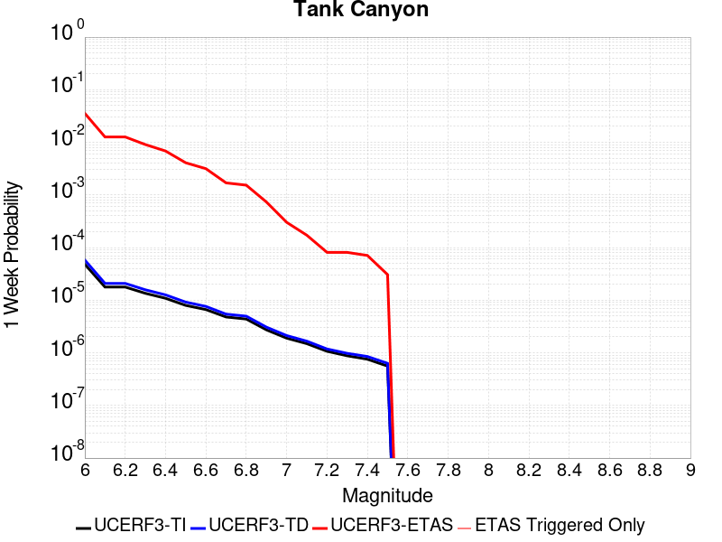 | 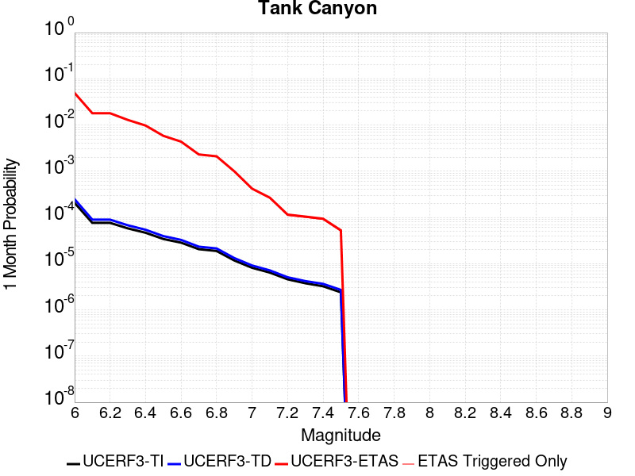 | 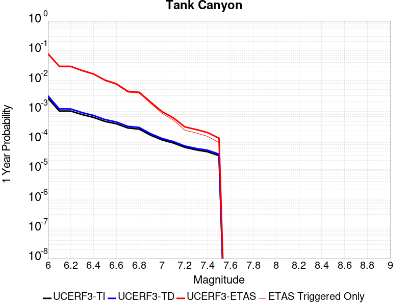 | 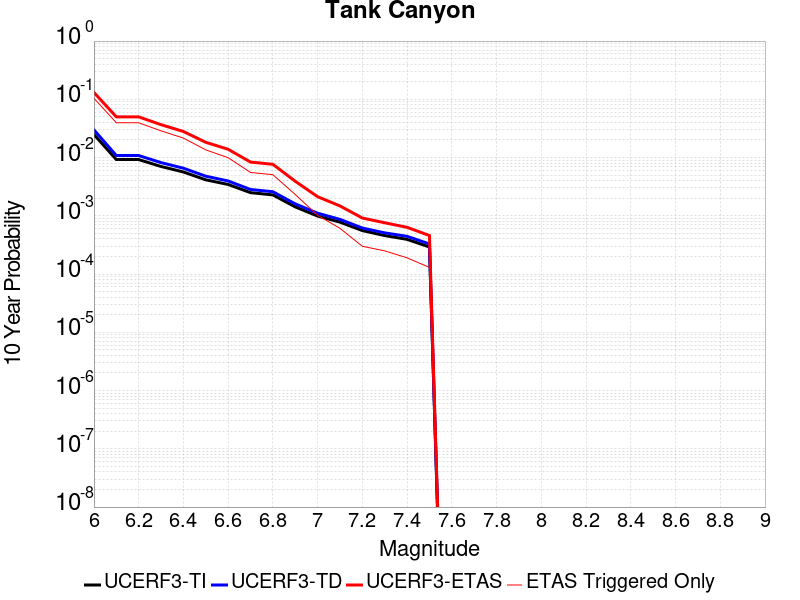 |

| Magnitude | 1 wk TI Prob | 1 wk TD Prob | 1 wk ETAS Prob | 1 wk ETAS/TD Gain | 1 wk ETAS Triggered Only | 1 mo TI Prob | 1 mo TD Prob | 1 mo ETAS Prob | 1 mo ETAS/TD Gain | 1 mo ETAS Triggered Only | 1 yr TI Prob | 1 yr TD Prob | 1 yr ETAS Prob | 1 yr ETAS/TD Gain | 1 yr ETAS Triggered Only | 10 yr TI Prob | 10 yr TD Prob | 10 yr ETAS Prob | 10 yr ETAS/TD Gain | 10 yr ETAS Triggered Only |
|-----|-----|-----|-----|-----|-----|-----|-----|-----|-----|-----|-----|-----|-----|-----|-----|-----|-----|-----|-----|-----|
| 6.0 | 4.8284557E-5 | 5.796445E-5 | 0.035615902 | 614.4439 | 0.03556 | 2.0691741E-4 | 2.4839927E-4 | 0.049386192 | 198.81778 | 0.04915 | 0.0025163088 | 0.0030207336 | 0.07889085 | 26.116455 | 0.0761 | 0.02488006 | 0.029863616 | 0.13115555 | 4.3918176 | 0.10441 |
| 6.1 | 1.7796336E-5 | 2.0873378E-5 | 0.012670609 | 607.02246 | 0.01265 | 7.626778E-5 | 8.945448E-5 | 0.017967856 | 200.86032 | 0.01788 | 9.281647E-4 | 0.0010886024 | 0.029587545 | 27.179388 | 0.02853 | 0.009242975 | 0.010836642 | 0.049967945 | 4.611017 | 0.03956 |
| 6.2 | 1.7796336E-5 | 2.0873378E-5 | 0.012670609 | 607.02246 | 0.01265 | 7.626778E-5 | 8.945448E-5 | 0.017967856 | 200.86032 | 0.01788 | 9.281647E-4 | 0.0010886024 | 0.029587545 | 27.179388 | 0.02853 | 0.009242975 | 0.010836642 | 0.049967945 | 4.611017 | 0.03956 |
| 6.3 | 1.3515912E-5 | 1.5759651E-5 | 0.0090756165 | 575.8767 | 0.00906 | 5.792405E-5 | 6.7539746E-5 | 0.0128766745 | 190.65327 | 0.01281 | 7.049971E-4 | 8.2200987E-4 | 0.02142506 | 26.064238 | 0.02062 | 0.007027647 | 0.008192157 | 0.036696713 | 4.4794936 | 0.02874 |
| 6.4 | 1.0870146E-5 | 1.2618114E-5 | 0.0068425317 | 542.2785 | 0.00683 | 4.658551E-5 | 5.4076605E-5 | 0.009733553 | 179.99564 | 0.00968 | 5.67031E-4 | 6.582015E-4 | 0.016427815 | 24.958641 | 0.01578 | 0.005655863 | 0.006564382 | 0.028032526 | 4.270398 | 0.02161 |
| 6.5 | 7.964826E-6 | 9.196184E-6 | 0.0040891585 | 444.65823 | 0.00408 | 3.4134522E-5 | 3.941168E-5 | 0.0058291834 | 147.90497 | 0.00579 | 4.1550855E-4 | 4.797421E-4 | 0.010205074 | 21.272 | 0.00973 | 0.0041473247 | 0.004788209 | 0.01827333 | 3.816318 | 0.01355 |
| 6.6 | 6.6317E-6 | 7.612378E-6 | 0.0031575884 | 414.79657 | 0.00315 | 2.8421264E-5 | 3.262412E-5 | 0.004362483 | 133.71956 | 0.00433 | 3.4597394E-4 | 3.9713533E-4 | 0.007654252 | 19.27366 | 0.00726 | 0.0034543579 | 0.0039652516 | 0.013875797 | 3.4993486 | 0.00995 |
| 6.7 | 4.793663E-6 | 5.4308593E-6 | 0.0016954216 | 312.18295 | 0.00169 | 2.0544108E-5 | 2.3274928E-5 | 0.002303222 | 98.95721 | 0.00228 | 2.500958E-4 | 2.833398E-4 | 0.0042822063 | 15.113326 | 0.004 | 0.0024981452 | 0.0028303189 | 0.00836461 | 2.9553597 | 0.00555 |
| 6.8 | 4.382823E-6 | 4.969325E-6 | 0.0015349617 | 308.88736 | 0.00153 | 1.8783392E-5 | 2.1296957E-5 | 0.0021012526 | 98.66445 | 0.00208 | 2.286638E-4 | 2.5926388E-4 | 0.003968302 | 15.306035 | 0.00371 | 0.0022842865 | 0.0025901233 | 0.0076569654 | 2.9562166 | 0.00508 |
| 6.9 | 2.729601E-6 | 3.0735862E-6 | 7.3307136E-4 | 238.50685 | 7.3E-4 | 1.1698237E-5 | 1.3172453E-5 | 9.931596E-4 | 75.396706 | 9.8E-4 | 1.4241673E-4 | 1.6036403E-4 | 0.0018600915 | 11.599181 | 0.0017 | 0.001423255 | 0.0016024808 | 0.0039187633 | 2.4454353 | 0.00232 |
| 7.0 | 1.8987357E-6 | 2.126971E-6 | 3.0212634E-4 | 142.04535 | 3.0E-4 | 8.137413E-6 | 9.115562E-6 | 4.1911184E-4 | 45.97762 | 4.1E-4 | 9.90685E-5 | 1.1097702E-4 | 8.908904E-4 | 8.027702 | 7.8E-4 | 9.902435E-4 | 0.0011092846 | 0.002128153 | 1.9184916 | 0.00102 |
| 7.1 | 1.4928986E-6 | 1.6641525E-6 | 1.7166387E-4 | 103.15393 | 1.7E-4 | 6.398121E-6 | 7.132066E-6 | 2.671302E-4 | 37.454815 | 2.6E-4 | 7.789434E-5 | 8.6830034E-5 | 5.467901E-4 | 6.297246 | 4.6E-4 | 7.786704E-4 | 8.6801895E-4 | 0.0014774895 | 1.7021396 | 6.1E-4 |
| 7.2 | 1.069082E-6 | 1.1828765E-6 | 8.1182785E-5 | 68.63166 | 8.0E-5 | 4.581772E-6 | 5.0694644E-6 | 1.15068906E-4 | 22.698435 | 1.1E-4 | 5.5781646E-5 | 6.171951E-5 | 2.7170655E-4 | 4.40228 | 2.1E-4 | 5.576765E-4 | 6.1707594E-4 | 9.1689086E-4 | 1.4858638 | 3.0E-4 |
| 7.3 | 8.776551E-7 | 9.770151E-7 | 8.097693E-5 | 82.881966 | 8.0E-5 | 3.7613736E-6 | 4.187204E-6 | 1.0418679E-4 | 24.882185 | 1.0E-4 | 4.579376E-5 | 5.0978535E-5 | 2.2096987E-4 | 4.334567 | 1.7E-4 | 4.5784327E-4 | 5.097194E-4 | 7.59592E-4 | 1.4902159 | 2.5E-4 |
| 7.4 | 7.55721E-7 | 8.5103835E-7 | 7.0850976E-5 | 83.25239 | 7.0E-5 | 3.2388E-6 | 3.6473052E-6 | 9.364698E-5 | 25.675663 | 9.0E-5 | 3.9431678E-5 | 4.4405555E-5 | 1.7439979E-4 | 3.9274318 | 1.3E-4 | 3.942468E-4 | 4.4401767E-4 | 6.339333E-4 | 1.4277209 | 1.9E-4 |
| 7.5 | 5.587665E-7 | 6.305732E-7 | 3.0630556E-5 | 48.575733 | 3.0E-5 | 2.3947114E-6 | 2.7024564E-6 | 5.2702322E-5 | 19.501635 | 5.0E-5 | 2.915522E-5 | 3.2902408E-5 | 1.12899776E-4 | 3.431353 | 8.0E-5 | 2.9151395E-4 | 3.2902407E-4 | 4.5898132E-4 | 1.3949778 | 1.3E-4 |

## Little Lake
*[(top)](#table-of-contents)*

| 1 Week | 1 Month | 1 Year | 10 Year |
|-----|-----|-----|-----|
|  |  |  |  |

| Magnitude | 1 wk TI Prob | 1 wk TD Prob | 1 wk ETAS Prob | 1 wk ETAS/TD Gain | 1 wk ETAS Triggered Only | 1 mo TI Prob | 1 mo TD Prob | 1 mo ETAS Prob | 1 mo ETAS/TD Gain | 1 mo ETAS Triggered Only | 1 yr TI Prob | 1 yr TD Prob | 1 yr ETAS Prob | 1 yr ETAS/TD Gain | 1 yr ETAS Triggered Only | 10 yr TI Prob | 10 yr TD Prob | 10 yr ETAS Prob | 10 yr ETAS/TD Gain | 10 yr ETAS Triggered Only |
|-----|-----|-----|-----|-----|-----|-----|-----|-----|-----|-----|-----|-----|-----|-----|-----|-----|-----|-----|-----|-----|
| 6.0 | 2.8424427E-5 | 3.1205716E-5 | 0.05075962 | 1626.613 | 0.05073 | 1.2181328E-4 | 1.3373268E-4 | 0.061645504 | 460.9607 | 0.06152 | 0.0014820677 | 0.0016271125 | 0.081437044 | 50.050037 | 0.07994 | 0.014722223 | 0.016165398 | 0.11120382 | 6.8791265 | 0.0966 |
| 6.1 | 2.8424427E-5 | 3.1205716E-5 | 0.05075962 | 1626.613 | 0.05073 | 1.2181328E-4 | 1.3373268E-4 | 0.061645504 | 460.9607 | 0.06152 | 0.0014820677 | 0.0016271125 | 0.081437044 | 50.050037 | 0.07994 | 0.014722223 | 0.016165398 | 0.11120382 | 6.8791265 | 0.0966 |
| 6.2 | 2.8424427E-5 | 3.1205716E-5 | 0.05075962 | 1626.613 | 0.05073 | 1.2181328E-4 | 1.3373268E-4 | 0.061645504 | 460.9607 | 0.06152 | 0.0014820677 | 0.0016271125 | 0.081437044 | 50.050037 | 0.07994 | 0.014722223 | 0.016165398 | 0.11120382 | 6.8791265 | 0.0966 |
| 6.3 | 1.48860645E-5 | 1.6081383E-5 | 0.029845601 | 1855.91 | 0.02983 | 6.379586E-5 | 6.8918554E-5 | 0.036396414 | 528.1076 | 0.03633 | 7.7643775E-4 | 8.387886E-4 | 0.047749408 | 56.92663 | 0.04695 | 0.007737305 | 0.008359045 | 0.06472392 | 7.7429795 | 0.05684 |
| 6.4 | 1.48860645E-5 | 1.6081383E-5 | 0.029845601 | 1855.91 | 0.02983 | 6.379586E-5 | 6.8918554E-5 | 0.036396414 | 528.1076 | 0.03633 | 7.7643775E-4 | 8.387886E-4 | 0.047749408 | 56.92663 | 0.04695 | 0.007737305 | 0.008359045 | 0.06472392 | 7.7429795 | 0.05684 |
| 6.5 | 1.2797581E-5 | 1.376556E-5 | 0.025503414 | 1852.6973 | 0.02549 | 5.4845623E-5 | 5.8994065E-5 | 0.031047165 | 526.27606 | 0.03099 | 6.675408E-4 | 7.1804173E-4 | 0.040629365 | 56.583565 | 0.03994 | 0.006655392 | 0.007159767 | 0.055342305 | 7.7296233 | 0.04853 |
| 6.6 | 9.661896E-6 | 1.0289033E-5 | 0.018860094 | 1833.029 | 0.01885 | 4.1407468E-5 | 4.40952E-5 | 0.022953086 | 520.5348 | 0.02291 | 5.040193E-4 | 5.36743E-4 | 0.0300409 | 55.968864 | 0.02952 | 0.005028777 | 0.0053560715 | 0.041232876 | 7.6983433 | 0.03607 |
| 6.7 | 7.767871E-6 | 8.199681E-6 | 0.015548072 | 1896.18 | 0.01554 | 3.329045E-5 | 3.5141096E-5 | 0.018864479 | 536.82104 | 0.01883 | 4.0523586E-4 | 4.2777258E-4 | 0.02480734 | 57.99189 | 0.02439 | 0.004044977 | 0.004270843 | 0.033794213 | 7.912773 | 0.02965 |
| 6.8 | 6.4235196E-6 | 6.735739E-6 | 0.012416652 | 1843.3986 | 0.01241 | 2.752908E-5 | 2.8867207E-5 | 0.01517843 | 525.8018 | 0.01515 | 3.35115E-4 | 3.5141438E-4 | 0.020024499 | 56.982582 | 0.01968 | 0.003346101 | 0.0035098472 | 0.027395716 | 7.805387 | 0.02397 |
| 6.9 | 3.1283696E-6 | 3.1121751E-6 | 0.005883094 | 1890.348 | 0.00588 | 1.3407229E-5 | 1.33378335E-5 | 0.0074532386 | 558.8043 | 0.00744 | 1.6322079E-4 | 1.6237753E-4 | 0.009900796 | 60.97393 | 0.00974 | 0.0016310095 | 0.0016227372 | 0.013573313 | 8.364455 | 0.01197 |
| 7.0 | 2.290603E-6 | 2.2286763E-6 | 0.0037122204 | 1665.6616 | 0.00371 | 9.816834E-6 | 9.551441E-6 | 0.0046495073 | 486.78598 | 0.00464 | 1.19513395E-4 | 1.1628362E-4 | 0.0061355834 | 52.763954 | 0.00602 | 0.0011944914 | 0.0011623299 | 0.008603671 | 7.40209 | 0.00745 |
| 7.1 | 1.293693E-6 | 1.1776774E-6 | 0.0017911756 | 1520.9391 | 0.00179 | 5.5443866E-6 | 5.047183E-6 | 0.0022850356 | 452.73486 | 0.00228 | 6.750081E-5 | 6.1448416E-5 | 0.002981269 | 48.51661 | 0.00292 | 6.7480316E-4 | 6.1438273E-4 | 0.0042021773 | 6.839673 | 0.00359 |
| 7.2 | 4.715842E-7 | 3.091732E-7 | 3.0030907E-4 | 971.3296 | 3.0E-4 | 2.0210737E-6 | 1.3250274E-6 | 3.5132456E-4 | 265.14514 | 3.5E-4 | 2.4606294E-5 | 1.6132095E-5 | 4.56125E-4 | 28.274382 | 4.4E-4 | 2.460357E-4 | 1.6130977E-4 | 7.4121624E-4 | 4.5949864 | 5.8E-4 |
| 7.3 | 3.9430947E-7 | 2.3096938E-7 | 2.1023092E-4 | 910.2112 | 2.1E-4 | 1.6898966E-6 | 9.898685E-7 | 2.5098963E-4 | 253.55856 | 2.5E-4 | 2.0574296E-5 | 1.2051582E-5 | 3.420476E-4 | 28.381968 | 3.3E-4 | 2.0572392E-4 | 1.2050936E-4 | 5.7045516E-4 | 4.7337 | 4.5E-4 |
| 7.4 | 3.547123E-7 | 1.9678579E-7 | 1.8019674E-4 | 915.7 | 1.8E-4 | 1.5201948E-6 | 8.433674E-7 | 2.2084318E-4 | 261.8588 | 2.2E-4 | 1.8508214E-5 | 1.02679505E-5 | 3.1026488E-4 | 30.216825 | 3.0E-4 | 1.8506673E-4 | 1.0267482E-4 | 5.0263375E-4 | 4.8953943 | 4.0E-4 |
| 7.5 | 2.6354266E-7 | 1.4422719E-7 | 1.00144214E-4 | 694.35046 | 1.0E-4 | 1.129468E-6 | 6.1811636E-7 | 1.4061802E-4 | 227.49443 | 1.4E-4 | 1.3751187E-5 | 7.525541E-6 | 1.8752419E-4 | 24.918365 | 1.8E-4 | 1.3750336E-4 | 7.5252916E-5 | 3.452326E-4 | 4.5876307 | 2.7E-4 |
| 7.6 | 1.269913E-7 | 7.572344E-8 | 3.0075722E-5 | 397.17847 | 3.0E-5 | 5.4424834E-7 | 3.24529E-7 | 6.032451E-5 | 185.88327 | 6.0E-5 | 6.6262032E-6 | 3.9511337E-6 | 7.3950854E-5 | 18.716364 | 7.0E-5 | 6.626006E-5 | 3.9510673E-5 | 1.5950593E-4 | 4.037034 | 1.2E-4 |

## Owl Lake
*[(top)](#table-of-contents)*

| 1 Week | 1 Month | 1 Year | 10 Year |
|-----|-----|-----|-----|
| 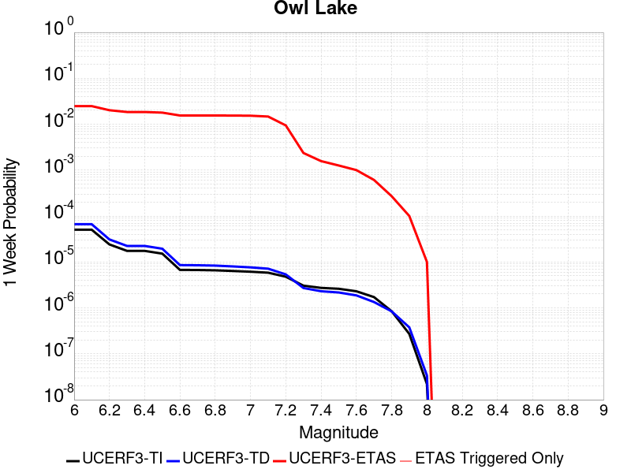 |  |  | 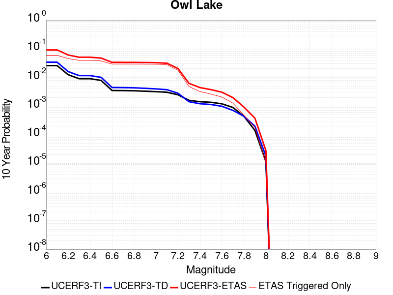 |

| Magnitude | 1 wk TI Prob | 1 wk TD Prob | 1 wk ETAS Prob | 1 wk ETAS/TD Gain | 1 wk ETAS Triggered Only | 1 mo TI Prob | 1 mo TD Prob | 1 mo ETAS Prob | 1 mo ETAS/TD Gain | 1 mo ETAS Triggered Only | 1 yr TI Prob | 1 yr TD Prob | 1 yr ETAS Prob | 1 yr ETAS/TD Gain | 1 yr ETAS Triggered Only | 10 yr TI Prob | 10 yr TD Prob | 10 yr ETAS Prob | 10 yr ETAS/TD Gain | 10 yr ETAS Triggered Only |
|-----|-----|-----|-----|-----|-----|-----|-----|-----|-----|-----|-----|-----|-----|-----|-----|-----|-----|-----|-----|-----|
| 6.0 | 5.0320643E-5 | 6.6358676E-5 | 0.024774719 | 373.34558 | 0.02471 | 2.1564208E-4 | 2.843643E-4 | 0.0324952 | 114.27314 | 0.03222 | 0.0026222812 | 0.003457547 | 0.049069297 | 14.191938 | 0.04577 | 0.02591553 | 0.034141295 | 0.09142637 | 2.6778824 | 0.05931 |
| 6.1 | 5.0320643E-5 | 6.6358676E-5 | 0.024774719 | 373.34558 | 0.02471 | 2.1564208E-4 | 2.843643E-4 | 0.0324952 | 114.27314 | 0.03222 | 0.0026222812 | 0.003457547 | 0.049069297 | 14.191938 | 0.04577 | 0.02591553 | 0.034141295 | 0.09142637 | 2.6778824 | 0.05931 |
| 6.2 | 2.4125871E-5 | 3.0980515E-5 | 0.020170357 | 651.06586 | 0.02014 | 1.0339249E-4 | 1.3276804E-4 | 0.025909346 | 195.14746 | 0.02578 | 0.0012580766 | 0.0016154252 | 0.037407514 | 23.156448 | 0.03585 | 0.012509781 | 0.016070755 | 0.06106584 | 3.7998114 | 0.04573 |
| 6.3 | 1.7433485E-5 | 2.2355545E-5 | 0.018441943 | 824.93823 | 0.01842 | 7.471279E-5 | 9.580685E-5 | 0.023363577 | 243.86125 | 0.02327 | 9.0924866E-4 | 0.001165962 | 0.032819014 | 28.147585 | 0.03169 | 0.009055373 | 0.0116291465 | 0.05087735 | 4.374986 | 0.03971 |
| 6.4 | 1.7433485E-5 | 2.2355545E-5 | 0.018441943 | 824.93823 | 0.01842 | 7.471279E-5 | 9.580685E-5 | 0.023363577 | 243.86125 | 0.02327 | 9.0924866E-4 | 0.001165962 | 0.032819014 | 28.147585 | 0.03169 | 0.009055373 | 0.0116291465 | 0.05087735 | 4.374986 | 0.03971 |
| 6.5 | 1.5182742E-5 | 1.9429277E-5 | 0.017879082 | 920.2135 | 0.01786 | 6.506727E-5 | 8.3266525E-5 | 0.022471402 | 269.8732 | 0.02239 | 7.919061E-4 | 0.0010134344 | 0.031372637 | 30.956753 | 0.03039 | 0.0078909 | 0.010118678 | 0.047546092 | 4.6988444 | 0.03781 |
| 6.6 | 6.7271576E-6 | 8.547518E-6 | 0.015478415 | 1810.8667 | 0.01547 | 2.8830356E-5 | 3.6631736E-5 | 0.01888594 | 515.56226 | 0.01885 | 3.5095305E-4 | 4.4590578E-4 | 0.024954973 | 55.964676 | 0.02452 | 0.0035039932 | 0.0044680187 | 0.033766527 | 7.557382 | 0.02943 |
| 6.7 | 6.682835E-6 | 8.479961E-6 | 0.015478348 | 1825.2854 | 0.01547 | 2.8640408E-5 | 3.6342215E-5 | 0.018885657 | 519.6617 | 0.01885 | 3.4864116E-4 | 4.423823E-4 | 0.02494154 | 56.38006 | 0.02451 | 0.003480947 | 0.0044329325 | 0.03371256 | 7.6050243 | 0.02941 |
| 6.8 | 6.5774975E-6 | 8.326427E-6 | 0.0154781975 | 1858.9243 | 0.01547 | 2.8188972E-5 | 3.5684232E-5 | 0.01888501 | 529.2257 | 0.01885 | 3.4314668E-4 | 4.3437455E-4 | 0.024913738 | 57.355427 | 0.02449 | 0.0034261728 | 0.0043531056 | 0.03357534 | 7.712963 | 0.02935 |
| 6.9 | 6.363419E-6 | 7.999591E-6 | 0.015427876 | 1928.5833 | 0.01542 | 2.727151E-5 | 3.428354E-5 | 0.018823639 | 549.0576 | 0.01879 | 3.3198006E-4 | 4.1732774E-4 | 0.024797149 | 59.418884 | 0.02439 | 0.0033148455 | 0.0041830647 | 0.033280835 | 7.956089 | 0.02922 |
| 7.0 | 6.1342453E-6 | 7.631779E-6 | 0.015317515 | 2007.07 | 0.01531 | 2.6289357E-5 | 3.2707245E-5 | 0.018702097 | 571.80286 | 0.01867 | 3.2002592E-4 | 3.9814346E-4 | 0.024568517 | 61.707695 | 0.02418 | 0.0031956544 | 0.003991739 | 0.032846097 | 8.2285185 | 0.02897 |
| 7.1 | 5.842926E-6 | 7.142312E-6 | 0.014687037 | 2056.342 | 0.01468 | 2.504087E-5 | 3.060958E-5 | 0.01797006 | 587.07306 | 0.01794 | 3.0482994E-4 | 3.7261334E-4 | 0.023553973 | 63.21291 | 0.02319 | 0.0030441214 | 0.0037371595 | 0.031413343 | 8.405673 | 0.02778 |
| 7.2 | 4.77173E-6 | 5.358478E-6 | 0.009415308 | 1757.0862 | 0.00941 | 2.045011E-5 | 2.2964727E-5 | 0.011592699 | 504.80457 | 0.01157 | 2.4895166E-4 | 2.7956374E-4 | 0.01520539 | 54.389706 | 0.01493 | 0.0024867293 | 0.0028086212 | 0.020558627 | 7.319829 | 0.0178 |
| 7.3 | 3.0494948E-6 | 2.710356E-6 | 0.002362704 | 871.73193 | 0.00236 | 1.3069198E-5 | 1.1615762E-5 | 0.0030315807 | 260.98856 | 0.00302 | 1.5910587E-4 | 1.4141288E-4 | 0.0041308487 | 29.211262 | 0.00399 | 0.0015899199 | 0.0014231089 | 0.006226264 | 4.375114 | 0.00481 |
| 7.4 | 2.7263884E-6 | 2.3055634E-6 | 0.001572302 | 681.96 | 0.00157 | 1.1684469E-5 | 9.880949E-6 | 0.0020098612 | 203.40771 | 0.002 | 1.4224913E-4 | 1.2029401E-4 | 0.0027899728 | 23.19295 | 0.00267 | 0.0014215811 | 0.0012110578 | 0.0044271583 | 3.6556127 | 0.00322 |
| 7.5 | 2.6090431E-6 | 2.1655019E-6 | 0.0012621628 | 582.85004 | 0.00126 | 1.1181565E-5 | 9.2806895E-6 | 0.0016292656 | 175.55438 | 0.00162 | 1.3612706E-4 | 1.1298663E-4 | 0.0023027393 | 20.380634 | 0.00219 | 0.001360437 | 0.0011378126 | 0.0037648203 | 3.3088226 | 0.00263 |
| 7.6 | 2.3008756E-6 | 1.8726826E-6 | 0.0010018708 | 534.9923 | 0.001 | 9.860858E-6 | 8.025758E-6 | 0.0012880155 | 160.48521 | 0.00128 | 1.20049335E-4 | 9.770931E-5 | 0.0017875442 | 18.294514 | 0.00169 | 0.001199845 | 9.848307E-4 | 0.003052792 | 3.0998142 | 0.00207 |
| 7.7 | 1.7184348E-6 | 1.341808E-6 | 6.11341E-4 | 455.6099 | 6.1E-4 | 7.3646997E-6 | 5.750593E-6 | 7.757462E-4 | 134.89845 | 7.7E-4 | 8.966153E-5 | 7.0011265E-5 | 0.001059942 | 15.139591 | 9.9E-4 | 8.962536E-4 | 7.0769014E-4 | 0.0019767913 | 2.7933006 | 0.00127 |
| 7.8 | 8.4612907E-7 | 8.4054994E-7 | 2.7084033E-4 | 322.218 | 2.7E-4 | 3.6262625E-6 | 3.602352E-6 | 3.6360105E-4 | 100.93435 | 3.6E-4 | 4.4148852E-5 | 4.3857777E-5 | 4.4384022E-4 | 10.119989 | 4.0E-4 | 4.414008E-4 | 4.4386165E-4 | 9.236486E-4 | 2.080938 | 4.8E-4 |
| 7.9 | 2.716738E-7 | 3.7681625E-7 | 1.00376776E-4 | 266.38123 | 1.0E-4 | 1.1643157E-6 | 1.6149258E-6 | 1.5161469E-4 | 93.88337 | 1.5E-4 | 1.4175452E-5 | 1.9661555E-5 | 1.7965841E-4 | 9.137548 | 1.6E-4 | 1.4174548E-4 | 1.9829652E-4 | 3.7826083E-4 | 1.9075515 | 1.8E-4 |
| 8.0 | 2.1995428E-8 | 3.3853325E-8 | 1.0033853E-5 | 296.39194 | 1.0E-5 | 9.426611E-8 | 1.4508568E-7 | 1.0145084E-5 | 69.92478 | 1.0E-5 | 1.1476893E-6 | 1.7664173E-6 | 1.1766399E-5 | 6.661166 | 1.0E-5 | 1.14768345E-5 | 1.7869768E-5 | 2.786959E-5 | 1.5595943 | 1.0E-5 |

## Panamint Valley
*[(top)](#table-of-contents)*

| 1 Week | 1 Month | 1 Year | 10 Year |
|-----|-----|-----|-----|
|  |  |  |  |

| Magnitude | 1 wk TI Prob | 1 wk TD Prob | 1 wk ETAS Prob | 1 wk ETAS/TD Gain | 1 wk ETAS Triggered Only | 1 mo TI Prob | 1 mo TD Prob | 1 mo ETAS Prob | 1 mo ETAS/TD Gain | 1 mo ETAS Triggered Only | 1 yr TI Prob | 1 yr TD Prob | 1 yr ETAS Prob | 1 yr ETAS/TD Gain | 1 yr ETAS Triggered Only | 10 yr TI Prob | 10 yr TD Prob | 10 yr ETAS Prob | 10 yr ETAS/TD Gain | 10 yr ETAS Triggered Only |
|-----|-----|-----|-----|-----|-----|-----|-----|-----|-----|-----|-----|-----|-----|-----|-----|-----|-----|-----|-----|-----|
| 6.0 | 3.0211835E-5 | 3.3984263E-5 | 0.018503357 | 544.4684 | 0.01847 | 1.2947287E-4 | 1.4563887E-4 | 0.023712207 | 162.8151 | 0.02357 | 0.0015751923 | 0.0017717406 | 0.035611678 | 20.099827 | 0.0339 | 0.015640736 | 0.017583003 | 0.060603045 | 3.4466834 | 0.04379 |
| 6.1 | 3.0211835E-5 | 3.3984263E-5 | 0.018503357 | 544.4684 | 0.01847 | 1.2947287E-4 | 1.4563887E-4 | 0.023712207 | 162.8151 | 0.02357 | 0.0015751923 | 0.0017717406 | 0.035611678 | 20.099827 | 0.0339 | 0.015640736 | 0.017583003 | 0.060603045 | 3.4466834 | 0.04379 |
| 6.2 | 3.0211835E-5 | 3.3984263E-5 | 0.018503357 | 544.4684 | 0.01847 | 1.2947287E-4 | 1.4563887E-4 | 0.023712207 | 162.8151 | 0.02357 | 0.0015751923 | 0.0017717406 | 0.035611678 | 20.099827 | 0.0339 | 0.015640736 | 0.017583003 | 0.060603045 | 3.4466834 | 0.04379 |
| 6.3 | 2.8573924E-5 | 3.2102445E-5 | 0.01788153 | 557.0146 | 0.01785 | 1.2245393E-4 | 1.375748E-4 | 0.022824453 | 165.90576 | 0.02269 | 0.001489857 | 0.0016737141 | 0.033999518 | 20.313814 | 0.03238 | 0.01479908 | 0.016618038 | 0.057477556 | 3.4587452 | 0.04155 |
| 6.4 | 2.8573924E-5 | 3.2102445E-5 | 0.01788153 | 557.0146 | 0.01785 | 1.2245393E-4 | 1.375748E-4 | 0.022824453 | 165.90576 | 0.02269 | 0.001489857 | 0.0016737141 | 0.033999518 | 20.313814 | 0.03238 | 0.01479908 | 0.016618038 | 0.057477556 | 3.4587452 | 0.04155 |
| 6.5 | 2.7468774E-5 | 3.0828138E-5 | 0.01754029 | 568.97003 | 0.01751 | 1.1771801E-4 | 1.3211406E-4 | 0.022349179 | 169.16579 | 0.02222 | 0.0014322745 | 0.0016073292 | 0.0331166 | 20.603497 | 0.03156 | 0.014230782 | 0.015963882 | 0.055659898 | 3.4866142 | 0.04034 |
| 6.6 | 2.6135967E-5 | 2.9252153E-5 | 0.017148752 | 586.23895 | 0.01712 | 1.1200648E-4 | 1.2536049E-4 | 0.021802643 | 173.91957 | 0.02168 | 0.0013628257 | 0.0015252219 | 0.03209852 | 21.045147 | 0.03062 | 0.013544982 | 0.015154343 | 0.053602718 | 3.5371192 | 0.03904 |
| 6.7 | 2.4498746E-5 | 2.7341044E-5 | 0.016696885 | 610.6894 | 0.01667 | 1.04990395E-4 | 1.17170785E-4 | 0.021064715 | 179.7779 | 0.02095 | 0.0012775084 | 0.0014256459 | 0.030703846 | 21.536798 | 0.02932 | 0.012701893 | 0.014171593 | 0.05096271 | 3.5961173 | 0.03732 |
| 6.8 | 2.2244329E-5 | 2.4935374E-5 | 0.015824541 | 634.6222 | 0.0158 | 9.532935E-5 | 1.0686163E-4 | 0.019894747 | 186.17296 | 0.01979 | 0.0011600169 | 0.0013002857 | 0.02882445 | 22.167782 | 0.02756 | 0.011539802 | 0.012932955 | 0.047194052 | 3.6491313 | 0.03471 |
| 6.9 | 1.9902658E-5 | 2.2290182E-5 | 0.014941958 | 670.3381 | 0.01492 | 8.529431E-5 | 9.552596E-5 | 0.018613758 | 194.85548 | 0.01852 | 0.0010379635 | 0.0011624265 | 0.02642303 | 22.730925 | 0.02529 | 0.010331288 | 0.011569021 | 0.042813323 | 3.7006867 | 0.03161 |
| 7.0 | 1.8353881E-5 | 2.056605E-5 | 0.014340271 | 697.2788 | 0.01432 | 7.865712E-5 | 8.813734E-5 | 0.017826574 | 202.25903 | 0.01774 | 9.5722964E-4 | 0.0010725616 | 0.024996873 | 23.30577 | 0.02395 | 0.009531168 | 0.01067939 | 0.04011168 | 3.7559898 | 0.02975 |
| 7.1 | 1.7667631E-5 | 1.9772435E-5 | 0.014029495 | 709.5482 | 0.01401 | 7.571623E-5 | 8.4736355E-5 | 0.017453264 | 205.97139 | 0.01737 | 9.2145515E-4 | 0.0010311945 | 0.024297178 | 23.56217 | 0.02329 | 0.009176437 | 0.0102695925 | 0.038902495 | 3.7881243 | 0.02893 |
| 7.2 | 1.6381597E-5 | 1.8158042E-5 | 0.012507931 | 688.837 | 0.01249 | 7.020495E-5 | 7.781795E-5 | 0.015576612 | 200.16731 | 0.0155 | 8.544101E-4 | 9.470391E-4 | 0.021637427 | 22.847446 | 0.02071 | 0.008511325 | 0.009435269 | 0.03487297 | 3.696023 | 0.02568 |
| 7.3 | 1.4520491E-5 | 1.596657E-5 | 0.010315802 | 646.0875 | 0.0103 | 6.222919E-5 | 6.842646E-5 | 0.012847552 | 187.75708 | 0.01278 | 7.57377E-4 | 8.327899E-4 | 0.017958516 | 21.564281 | 0.01714 | 0.0075480095 | 0.008300399 | 0.029284764 | 3.5281148 | 0.02116 |
| 7.4 | 1.2852287E-5 | 1.41454875E-5 | 0.010094003 | 713.58466 | 0.01008 | 5.5080065E-5 | 6.06222E-5 | 0.012549865 | 207.01765 | 0.01249 | 6.7039346E-4 | 7.378411E-4 | 0.017345577 | 23.508554 | 0.01662 | 0.0066837464 | 0.007357429 | 0.027686749 | 3.763101 | 0.02048 |
| 7.5 | 1.1637851E-5 | 1.2836868E-5 | 0.009972709 | 776.88025 | 0.00996 | 4.987555E-5 | 5.5014076E-5 | 0.012404335 | 225.47565 | 0.01235 | 6.070656E-4 | 6.696062E-4 | 0.017098598 | 25.535303 | 0.01644 | 0.006054099 | 0.0066793845 | 0.026794126 | 4.0114665 | 0.02025 |
| 7.6 | 3.0068115E-6 | 3.3330623E-6 | 0.0046533174 | 1396.1088 | 0.00465 | 1.2886271E-5 | 1.4284516E-5 | 0.0057442025 | 402.12793 | 0.00573 | 1.5687906E-4 | 1.7390738E-4 | 0.0076526063 | 44.00392 | 0.00748 | 0.0015676835 | 0.0017397973 | 0.010794017 | 6.2041807 | 0.00907 |

## Garlock (East)
*[(top)](#table-of-contents)*

| 1 Week | 1 Month | 1 Year | 10 Year |
|-----|-----|-----|-----|
|  | 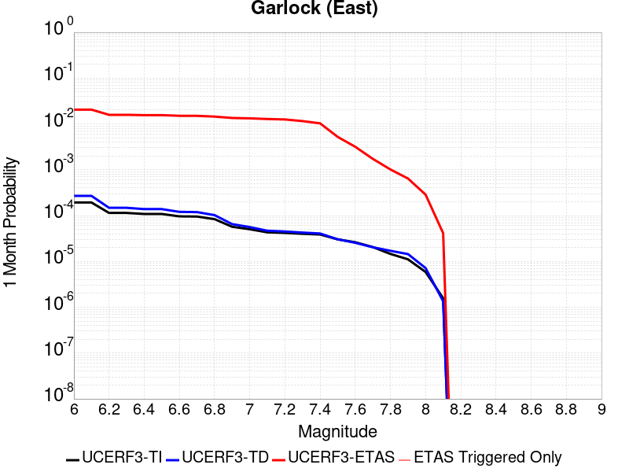 |  | 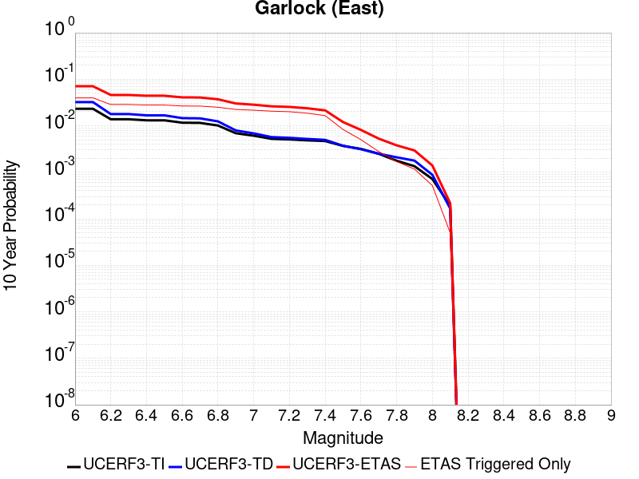 |

| Magnitude | 1 wk TI Prob | 1 wk TD Prob | 1 wk ETAS Prob | 1 wk ETAS/TD Gain | 1 wk ETAS Triggered Only | 1 mo TI Prob | 1 mo TD Prob | 1 mo ETAS Prob | 1 mo ETAS/TD Gain | 1 mo ETAS Triggered Only | 1 yr TI Prob | 1 yr TD Prob | 1 yr ETAS Prob | 1 yr ETAS/TD Gain | 1 yr ETAS Triggered Only | 10 yr TI Prob | 10 yr TD Prob | 10 yr ETAS Prob | 10 yr ETAS/TD Gain | 10 yr ETAS Triggered Only |
|-----|-----|-----|-----|-----|-----|-----|-----|-----|-----|-----|-----|-----|-----|-----|-----|-----|-----|-----|-----|-----|
| 6.0 | 4.5092507E-5 | 6.2904815E-5 | 0.015581928 | 247.70644 | 0.01552 | 1.9323928E-4 | 2.6956675E-4 | 0.020554097 | 76.24864 | 0.02029 | 0.0023501497 | 0.003277482 | 0.03298978 | 10.065587 | 0.02981 | 0.023254504 | 0.03235377 | 0.0709048 | 2.1915467 | 0.03984 |
| 6.1 | 4.5092507E-5 | 6.2904815E-5 | 0.015581928 | 247.70644 | 0.01552 | 1.9323928E-4 | 2.6956675E-4 | 0.020554097 | 76.24864 | 0.02029 | 0.0023501497 | 0.003277482 | 0.03298978 | 10.065587 | 0.02981 | 0.023254504 | 0.03235377 | 0.0709048 | 2.1915467 | 0.03984 |
| 6.2 | 2.6674514E-5 | 3.4511588E-5 | 0.012384085 | 358.83847 | 0.01235 | 1.1431433E-4 | 1.4789861E-4 | 0.015825579 | 107.0029 | 0.01568 | 0.0013908884 | 0.0017992114 | 0.023749646 | 13.200031 | 0.02199 | 0.01382215 | 0.017872788 | 0.046020553 | 2.5748951 | 0.02866 |
| 6.3 | 2.6674514E-5 | 3.4511588E-5 | 0.012384085 | 358.83847 | 0.01235 | 1.1431433E-4 | 1.4789861E-4 | 0.015825579 | 107.0029 | 0.01568 | 0.0013908884 | 0.0017992114 | 0.023749646 | 13.200031 | 0.02199 | 0.01382215 | 0.017872788 | 0.046020553 | 2.5748951 | 0.02866 |
| 6.4 | 2.5312667E-5 | 3.2340467E-5 | 0.012201947 | 377.29654 | 0.01217 | 1.0847834E-4 | 1.3859481E-4 | 0.015556457 | 112.244156 | 0.01542 | 0.0013199237 | 0.0016861152 | 0.023179812 | 13.747467 | 0.02153 | 0.013121112 | 0.016772287 | 0.044253502 | 2.6384895 | 0.02795 |
| 6.5 | 2.5312667E-5 | 3.2340467E-5 | 0.012201947 | 377.29654 | 0.01217 | 1.0847834E-4 | 1.3859481E-4 | 0.015556457 | 112.244156 | 0.01542 | 0.0013199237 | 0.0016861152 | 0.023179812 | 13.747467 | 0.02153 | 0.013121112 | 0.016772287 | 0.044253502 | 2.6384895 | 0.02795 |
| 6.6 | 2.246556E-5 | 2.8134691E-5 | 0.011867802 | 421.82092 | 0.01184 | 9.627742E-5 | 1.2057181E-4 | 0.015068769 | 124.97755 | 0.01495 | 0.0011715472 | 0.0014669969 | 0.022106674 | 15.06934 | 0.02067 | 0.011653901 | 0.014613169 | 0.040854022 | 2.795699 | 0.02663 |
| 6.7 | 2.2241198E-5 | 2.7804432E-5 | 0.011827476 | 425.38098 | 0.0118 | 9.531594E-5 | 1.1915654E-4 | 0.01502738 | 126.11461 | 0.01491 | 0.0011598538 | 0.0014497889 | 0.022029908 | 15.195252 | 0.02061 | 0.011538187 | 0.014442829 | 0.04060937 | 2.8117325 | 0.02655 |
| 6.8 | 1.9528685E-5 | 2.3898969E-5 | 0.011493625 | 480.92557 | 0.01147 | 8.369167E-5 | 1.0242024E-4 | 0.014470949 | 141.28993 | 0.01437 | 0.0010184698 | 0.0012462728 | 0.02080187 | 16.691267 | 0.01958 | 0.010138147 | 0.012436723 | 0.037145555 | 2.986764 | 0.02502 |
| 6.9 | 1.3318621E-5 | 1.5198818E-5 | 0.010865034 | 714.8604 | 0.01085 | 5.7078556E-5 | 6.51362E-5 | 0.013504261 | 207.32344 | 0.01344 | 6.9470983E-4 | 7.927504E-4 | 0.018718528 | 23.612135 | 0.01794 | 0.0069254204 | 0.007940721 | 0.03018269 | 3.8010013 | 0.02242 |
| 7.0 | 1.1760853E-5 | 1.3107653E-5 | 0.010712967 | 817.30634 | 0.0107 | 5.0402683E-5 | 5.6174475E-5 | 0.013245434 | 235.79097 | 0.01319 | 6.134799E-4 | 6.8371464E-4 | 0.018161757 | 26.563358 | 0.01749 | 0.0061178906 | 0.006857401 | 0.028358938 | 4.135523 | 0.02165 |
| 7.1 | 1.0064758E-5 | 1.0902761E-5 | 0.01043079 | 956.7108 | 0.01042 | 4.3133965E-5 | 4.67253E-5 | 0.012816128 | 274.2867 | 0.01277 | 5.2502943E-4 | 5.6873553E-4 | 0.017399158 | 30.592705 | 0.01684 | 0.005237907 | 0.0057133473 | 0.026235424 | 4.5919533 | 0.02064 |
| 7.2 | 9.768808E-6 | 1.0498628E-5 | 0.010190392 | 970.64026 | 0.01018 | 4.186565E-5 | 4.499337E-5 | 0.012534431 | 278.58398 | 0.01249 | 5.095951E-4 | 5.4766005E-4 | 0.016968662 | 30.983932 | 0.01643 | 0.0050842804 | 0.005503584 | 0.025463127 | 4.6266446 | 0.02007 |
| 7.3 | 9.344516E-6 | 9.9442705E-6 | 0.009379851 | 943.24176 | 0.00937 | 4.004731E-5 | 4.2617627E-5 | 0.0115421275 | 270.8299 | 0.0115 | 4.8746695E-4 | 5.187495E-4 | 0.01572086 | 30.305298 | 0.01521 | 0.0048639905 | 0.005215269 | 0.0237879 | 4.561203 | 0.01867 |
| 7.4 | 9.023491E-6 | 9.490441E-6 | 0.008329411 | 877.66327 | 0.00832 | 3.867153E-5 | 4.0672705E-5 | 0.010310255 | 253.49323 | 0.01027 | 4.7072413E-4 | 4.95081E-4 | 0.014018383 | 28.31533 | 0.01353 | 0.004697283 | 0.0049787266 | 0.021456279 | 4.309592 | 0.01656 |
| 7.5 | 7.081253E-6 | 7.0873994E-6 | 0.004287057 | 604.8844 | 0.00428 | 3.0347876E-5 | 3.0374218E-5 | 0.0052302163 | 172.19261 | 0.0052 | 3.6942272E-4 | 3.697441E-4 | 0.0071272445 | 19.276155 | 0.00676 | 0.003688092 | 0.0037244745 | 0.012033412 | 3.230902 | 0.00834 |
| 7.6 | 6.116396E-6 | 5.9589424E-6 | 0.0026459433 | 444.029 | 0.00264 | 2.6212863E-5 | 2.5538076E-5 | 0.0031754577 | 124.34209 | 0.00315 | 3.1909486E-4 | 3.1088197E-4 | 0.0043396293 | 13.959089 | 0.00403 | 0.0031863707 | 0.0031359126 | 0.008160108 | 2.6021476 | 0.00504 |
| 7.7 | 4.797145E-6 | 4.7571157E-6 | 0.0014347503 | 301.6009 | 0.00143 | 2.055903E-5 | 2.0387479E-5 | 0.0017303526 | 84.8733 | 0.00171 | 2.5027743E-4 | 2.481894E-4 | 0.0024776359 | 9.982842 | 0.00223 | 0.0024999576 | 0.0025094065 | 0.0052924054 | 2.1090267 | 0.00279 |
| 7.8 | 3.4028885E-6 | 3.978375E-6 | 8.4397505E-4 | 212.14066 | 8.4E-4 | 1.4583726E-5 | 1.7050066E-5 | 0.001017033 | 59.6498 | 0.001 | 1.775424E-4 | 2.0756487E-4 | 0.0015272909 | 7.358138 | 0.00132 | 0.0017740062 | 0.0021012141 | 0.003797642 | 1.8073561 | 0.0017 |
| 7.9 | 2.5928412E-6 | 3.372436E-6 | 5.433706E-4 | 161.12111 | 5.4E-4 | 1.1112129E-5 | 1.4453217E-5 | 6.4444414E-4 | 44.588284 | 6.3E-4 | 1.3528178E-4 | 1.7595377E-4 | 0.0010358024 | 5.8867874 | 8.6E-4 | 0.0013519945 | 0.0017812426 | 0.0029491587 | 1.6556748 | 0.00117 |
| 8.0 | 1.3743648E-6 | 1.6734741E-6 | 2.3167308E-4 | 138.43842 | 2.3E-4 | 5.8901214E-6 | 7.1720124E-6 | 2.8717E-4 | 40.040367 | 2.8E-4 | 7.1709874E-5 | 8.731578E-5 | 4.672826E-4 | 5.3516397 | 3.8E-4 | 7.1686733E-4 | 8.837377E-4 | 0.0014032782 | 1.5878899 | 5.2E-4 |
| 8.1 | 3.6733252E-7 | 3.1489736E-7 | 2.031489E-5 | 64.51273 | 2.0E-5 | 1.5742813E-6 | 1.3495595E-6 | 4.1349507E-5 | 30.63926 | 4.0E-5 | 1.9166706E-5 | 1.643078E-5 | 5.6430123E-5 | 3.4344153 | 4.0E-5 | 1.9165053E-4 | 1.662928E-4 | 2.1628448E-4 | 1.3006245 | 5.0E-5 |

## Airport Lake
*[(top)](#table-of-contents)*

| 1 Week | 1 Month | 1 Year | 10 Year |
|-----|-----|-----|-----|
|  | 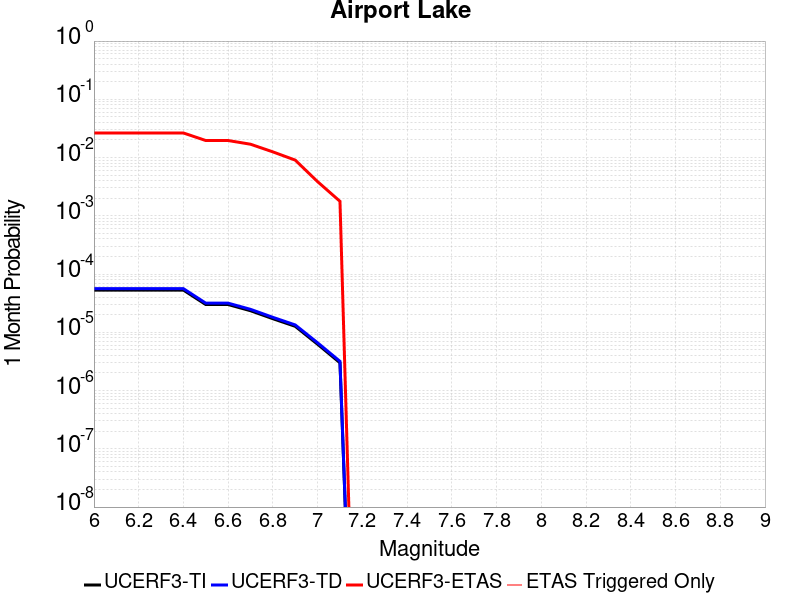 |  |  |

| Magnitude | 1 wk TI Prob | 1 wk TD Prob | 1 wk ETAS Prob | 1 wk ETAS/TD Gain | 1 wk ETAS Triggered Only | 1 mo TI Prob | 1 mo TD Prob | 1 mo ETAS Prob | 1 mo ETAS/TD Gain | 1 mo ETAS Triggered Only | 1 yr TI Prob | 1 yr TD Prob | 1 yr ETAS Prob | 1 yr ETAS/TD Gain | 1 yr ETAS Triggered Only | 10 yr TI Prob | 10 yr TD Prob | 10 yr ETAS Prob | 10 yr ETAS/TD Gain | 10 yr ETAS Triggered Only |
|-----|-----|-----|-----|-----|-----|-----|-----|-----|-----|-----|-----|-----|-----|-----|-----|-----|-----|-----|-----|-----|
| 6.0 | 1.2387061E-5 | 1.3103157E-5 | 0.02162282 | 1650.1993 | 0.02161 | 5.3086325E-5 | 5.615534E-5 | 0.026434675 | 470.74197 | 0.02638 | 6.461343E-4 | 6.8350515E-4 | 0.03467026 | 50.72421 | 0.03401 | 0.0064425888 | 0.0068168393 | 0.047686327 | 6.995372 | 0.04115 |
| 6.1 | 1.2387061E-5 | 1.3103157E-5 | 0.02162282 | 1650.1993 | 0.02161 | 5.3086325E-5 | 5.615534E-5 | 0.026434675 | 470.74197 | 0.02638 | 6.461343E-4 | 6.8350515E-4 | 0.03467026 | 50.72421 | 0.03401 | 0.0064425888 | 0.0068168393 | 0.047686327 | 6.995372 | 0.04115 |
| 6.2 | 1.2387061E-5 | 1.3103157E-5 | 0.02162282 | 1650.1993 | 0.02161 | 5.3086325E-5 | 5.615534E-5 | 0.026434675 | 470.74197 | 0.02638 | 6.461343E-4 | 6.8350515E-4 | 0.03467026 | 50.72421 | 0.03401 | 0.0064425888 | 0.0068168393 | 0.047686327 | 6.995372 | 0.04115 |
| 6.3 | 1.2387061E-5 | 1.3103157E-5 | 0.02162282 | 1650.1993 | 0.02161 | 5.3086325E-5 | 5.615534E-5 | 0.026434675 | 470.74197 | 0.02638 | 6.461343E-4 | 6.8350515E-4 | 0.03467026 | 50.72421 | 0.03401 | 0.0064425888 | 0.0068168393 | 0.047686327 | 6.995372 | 0.04115 |
| 6.4 | 1.2387061E-5 | 1.3103157E-5 | 0.02162282 | 1650.1993 | 0.02161 | 5.3086325E-5 | 5.615534E-5 | 0.026434675 | 470.74197 | 0.02638 | 6.461343E-4 | 6.8350515E-4 | 0.03467026 | 50.72421 | 0.03401 | 0.0064425888 | 0.0068168393 | 0.047686327 | 6.995372 | 0.04115 |
| 6.5 | 6.9922594E-6 | 7.384925E-6 | 0.016047267 | 2172.976 | 0.01604 | 2.996648E-5 | 3.1649324E-5 | 0.019611029 | 619.635 | 0.01958 | 3.6478083E-4 | 3.8526783E-4 | 0.025535574 | 66.28006 | 0.02516 | 0.003641826 | 0.0038465366 | 0.034288988 | 8.914249 | 0.03056 |
| 6.6 | 6.9922594E-6 | 7.384925E-6 | 0.016047267 | 2172.976 | 0.01604 | 2.996648E-5 | 3.1649324E-5 | 0.019611029 | 619.635 | 0.01958 | 3.6478083E-4 | 3.8526783E-4 | 0.025535574 | 66.28006 | 0.02516 | 0.003641826 | 0.0038465366 | 0.034288988 | 8.914249 | 0.03056 |
| 6.7 | 5.477277E-6 | 5.7860684E-6 | 0.013805706 | 2386.0254 | 0.0138 | 2.3473833E-5 | 2.4797222E-5 | 0.016944377 | 683.31757 | 0.01692 | 2.8575645E-4 | 3.0186825E-4 | 0.021975324 | 72.79773 | 0.02168 | 0.0028538927 | 0.003014966 | 0.029235672 | 9.69685 | 0.0263 |
| 6.8 | 3.9950432E-6 | 4.2190873E-6 | 0.010064176 | 2385.392 | 0.01006 | 1.7121502E-5 | 1.8081691E-5 | 0.0125178555 | 692.2945 | 0.0125 | 2.0843433E-4 | 2.2012512E-4 | 0.016426558 | 74.623726 | 0.01621 | 0.0020823893 | 0.0021993418 | 0.021885948 | 9.951136 | 0.01973 |
| 6.9 | 2.95695E-6 | 3.1230243E-6 | 0.0072631002 | 2325.6624 | 0.00726 | 1.2672582E-5 | 1.3384334E-5 | 0.009043263 | 675.66034 | 0.00903 | 1.5427776E-4 | 1.6294434E-4 | 0.011951023 | 73.3442 | 0.01179 | 0.001541707 | 0.0016284712 | 0.015925152 | 9.779204 | 0.01432 |
| 7.0 | 1.456072E-6 | 1.540812E-6 | 0.003071536 | 1993.4529 | 0.00307 | 6.2402937E-6 | 6.603469E-6 | 0.0038565781 | 584.0231 | 0.00385 | 7.597293E-5 | 8.039528E-5 | 0.0051299892 | 63.809586 | 0.00505 | 7.594696E-4 | 8.0376083E-4 | 0.0070287534 | 8.744832 | 0.00623 |
| 7.1 | 6.995192E-7 | 7.4089746E-7 | 0.0013607399 | 1836.6104 | 0.00136 | 2.997936E-6 | 3.1752747E-6 | 0.0017731696 | 558.4303 | 0.00177 | 3.649926E-5 | 3.865897E-5 | 0.00233857 | 60.492302 | 0.0023 | 3.6493264E-4 | 3.865897E-4 | 0.0031855071 | 8.240021 | 0.0028 |

## Hunter Mountain-Saline Valley
*[(top)](#table-of-contents)*

| 1 Week | 1 Month | 1 Year | 10 Year |
|-----|-----|-----|-----|
|  | 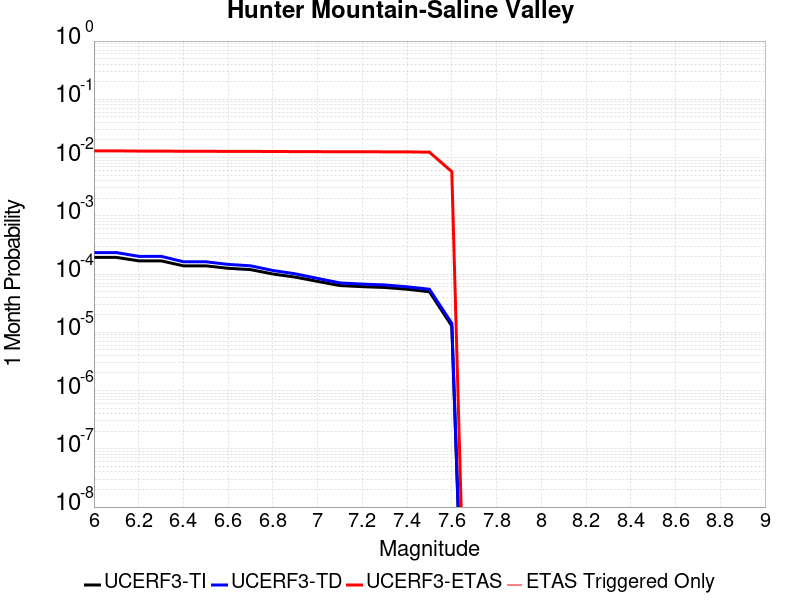 |  |  |

| Magnitude | 1 wk TI Prob | 1 wk TD Prob | 1 wk ETAS Prob | 1 wk ETAS/TD Gain | 1 wk ETAS Triggered Only | 1 mo TI Prob | 1 mo TD Prob | 1 mo ETAS Prob | 1 mo ETAS/TD Gain | 1 mo ETAS Triggered Only | 1 yr TI Prob | 1 yr TD Prob | 1 yr ETAS Prob | 1 yr ETAS/TD Gain | 1 yr ETAS Triggered Only | 10 yr TI Prob | 10 yr TD Prob | 10 yr ETAS Prob | 10 yr ETAS/TD Gain | 10 yr ETAS Triggered Only |
|-----|-----|-----|-----|-----|-----|-----|-----|-----|-----|-----|-----|-----|-----|-----|-----|-----|-----|-----|-----|-----|
| 6.0 | 4.5103672E-5 | 5.456906E-5 | 0.010364006 | 189.92459 | 0.01031 | 1.9328714E-4 | 2.3384714E-4 | 0.013030854 | 55.723812 | 0.0128 | 0.002350731 | 0.0028435462 | 0.019974694 | 7.024572 | 0.01718 | 0.023260195 | 0.028092625 | 0.04878453 | 1.7365602 | 0.02129 |
| 6.1 | 4.5103672E-5 | 5.456906E-5 | 0.010364006 | 189.92459 | 0.01031 | 1.9328714E-4 | 2.3384714E-4 | 0.013030854 | 55.723812 | 0.0128 | 0.002350731 | 0.0028435462 | 0.019974694 | 7.024572 | 0.01718 | 0.023260195 | 0.028092625 | 0.04878453 | 1.7365602 | 0.02129 |
| 6.2 | 3.9363465E-5 | 4.706271E-5 | 0.01029658 | 218.78427 | 0.01025 | 1.6868966E-4 | 2.016826E-4 | 0.012919117 | 64.05668 | 0.01272 | 0.002051862 | 0.0024528534 | 0.019471008 | 7.938105 | 0.01706 | 0.020330196 | 0.024274187 | 0.044901032 | 1.849744 | 0.02114 |
| 6.3 | 3.9363465E-5 | 4.706271E-5 | 0.01029658 | 218.78427 | 0.01025 | 1.6868966E-4 | 2.016826E-4 | 0.012919117 | 64.05668 | 0.01272 | 0.002051862 | 0.0024528534 | 0.019471008 | 7.938105 | 0.01706 | 0.020330196 | 0.024274187 | 0.044901032 | 1.849744 | 0.02114 |
| 6.4 | 3.2311684E-5 | 3.795112E-5 | 0.010247564 | 270.02008 | 0.01021 | 1.384713E-4 | 1.6263791E-4 | 0.012820579 | 78.828964 | 0.01266 | 0.0016845843 | 0.001978387 | 0.018904833 | 9.55568 | 0.01696 | 0.016718714 | 0.019617118 | 0.04020516 | 2.0494936 | 0.021 |
| 6.5 | 3.2311684E-5 | 3.795112E-5 | 0.010247564 | 270.02008 | 0.01021 | 1.384713E-4 | 1.6263791E-4 | 0.012820579 | 78.828964 | 0.01266 | 0.0016845843 | 0.001978387 | 0.018904833 | 9.55568 | 0.01696 | 0.016718714 | 0.019617118 | 0.04020516 | 2.0494936 | 0.021 |
| 6.6 | 2.9305844E-5 | 3.418196E-5 | 0.010223834 | 299.10025 | 0.01019 | 1.2559042E-4 | 1.4648624E-4 | 0.012784635 | 87.27532 | 0.01264 | 0.0015279909 | 0.0017820727 | 0.018651955 | 10.466439 | 0.0169 | 0.015175272 | 0.017686324 | 0.03825597 | 2.1630256 | 0.02094 |
| 6.7 | 2.7826512E-5 | 3.2344353E-5 | 0.010212015 | 315.7279 | 0.01018 | 1.19251024E-4 | 1.3861163E-4 | 0.012766861 | 92.10526 | 0.01263 | 0.0014509142 | 0.0016863506 | 0.018547868 | 10.998821 | 0.01689 | 0.014414776 | 0.016743818 | 0.03732337 | 2.2290835 | 0.02093 |
| 6.8 | 2.3389874E-5 | 2.6866792E-5 | 0.010176594 | 378.77966 | 0.01015 | 1.0023846E-4 | 1.1513857E-4 | 0.0127136875 | 110.420746 | 0.0126 | 0.00121972 | 0.001400958 | 0.01820738 | 12.996378 | 0.01683 | 0.01213047 | 0.013928067 | 0.034477808 | 2.4754193 | 0.02084 |
| 6.9 | 2.069209E-5 | 2.357011E-5 | 0.010153332 | 430.77148 | 0.01013 | 8.867737E-5 | 1.0101105E-4 | 0.0126597425 | 125.33028 | 0.01256 | 0.0010791123 | 0.0012291519 | 0.017998515 | 14.643036 | 0.01679 | 0.010738871 | 0.012229158 | 0.032715525 | 2.675207 | 0.02074 |
| 7.0 | 1.7462342E-5 | 1.9633622E-5 | 0.010139435 | 516.4322 | 0.01012 | 7.483646E-5 | 8.414151E-5 | 0.012623087 | 150.0221 | 0.01254 | 9.1075303E-4 | 0.0010239641 | 0.017766802 | 17.351002 | 0.01676 | 0.009070295 | 0.010196688 | 0.030636126 | 3.0045176 | 0.02065 |
| 7.1 | 1.4807709E-5 | 1.6441827E-5 | 0.010116275 | 615.2769 | 0.0101 | 6.3460066E-5 | 7.046316E-5 | 0.012579582 | 178.52707 | 0.01251 | 7.723524E-4 | 8.575678E-4 | 0.017543247 | 20.456978 | 0.0167 | 0.007696735 | 0.008546168 | 0.028940372 | 3.3863568 | 0.02057 |
| 7.2 | 1.4180048E-5 | 1.5698413E-5 | 0.01011554 | 644.367 | 0.0101 | 6.077022E-5 | 6.727727E-5 | 0.012576436 | 186.93439 | 0.01251 | 7.396263E-4 | 8.1880915E-4 | 0.017505135 | 21.378773 | 0.0167 | 0.0073716943 | 0.008161469 | 0.028563589 | 3.4998095 | 0.02057 |
| 7.3 | 1.3730402E-5 | 1.5172151E-5 | 0.010105019 | 666.0242 | 0.01009 | 5.8843252E-5 | 6.502197E-5 | 0.01254421 | 192.92264 | 0.01248 | 7.161811E-4 | 7.9137104E-4 | 0.01744818 | 22.048037 | 0.01667 | 0.007138774 | 0.007889058 | 0.028257096 | 3.5818086 | 0.02053 |
| 7.4 | 1.2810095E-5 | 1.4109353E-5 | 0.010083967 | 714.70087 | 0.01007 | 5.489925E-5 | 6.0467344E-5 | 0.0125197135 | 207.04918 | 0.01246 | 6.681934E-4 | 7.3595706E-4 | 0.017303756 | 23.511908 | 0.01658 | 0.006661878 | 0.0073386896 | 0.027608834 | 3.762093 | 0.02042 |
| 7.5 | 1.1595659E-5 | 1.2800734E-5 | 0.009962673 | 778.28925 | 0.00995 | 4.9694736E-5 | 5.485922E-5 | 0.012374183 | 225.5625 | 0.01232 | 6.0486543E-4 | 6.67722E-4 | 0.01705677 | 25.54472 | 0.0164 | 0.006032217 | 0.006660632 | 0.026716154 | 4.011054 | 0.02019 |
| 7.6 | 2.997694E-6 | 3.3251877E-6 | 0.00465331 | 1399.4127 | 0.00465 | 1.28471975E-5 | 1.4250767E-5 | 0.0057341694 | 402.3762 | 0.00572 | 1.564034E-4 | 1.7349655E-4 | 0.0076422007 | 44.04814 | 0.00747 | 0.0015629337 | 0.0017356955 | 0.0107699875 | 6.204998 | 0.00905 |

## Blackwater
*[(top)](#table-of-contents)*

| 1 Week | 1 Month | 1 Year | 10 Year |
|-----|-----|-----|-----|
|  |  |  |  |

| Magnitude | 1 wk TI Prob | 1 wk TD Prob | 1 wk ETAS Prob | 1 wk ETAS/TD Gain | 1 wk ETAS Triggered Only | 1 mo TI Prob | 1 mo TD Prob | 1 mo ETAS Prob | 1 mo ETAS/TD Gain | 1 mo ETAS Triggered Only | 1 yr TI Prob | 1 yr TD Prob | 1 yr ETAS Prob | 1 yr ETAS/TD Gain | 1 yr ETAS Triggered Only | 10 yr TI Prob | 10 yr TD Prob | 10 yr ETAS Prob | 10 yr ETAS/TD Gain | 10 yr ETAS Triggered Only |
|-----|-----|-----|-----|-----|-----|-----|-----|-----|-----|-----|-----|-----|-----|-----|-----|-----|-----|-----|-----|-----|
| 6.0 | 3.0708583E-5 | 3.3095846E-5 | 0.005112928 | 154.4885 | 0.00508 | 1.3160157E-4 | 1.4183241E-4 | 0.00735081 | 51.827435 | 0.00721 | 0.0016010714 | 0.0017255784 | 0.0131757865 | 7.6355762 | 0.01147 | 0.015895851 | 0.017135633 | 0.033431523 | 1.9509944 | 0.01658 |
| 6.1 | 3.0708583E-5 | 3.3095846E-5 | 0.005112928 | 154.4885 | 0.00508 | 1.3160157E-4 | 1.4183241E-4 | 0.00735081 | 51.827435 | 0.00721 | 0.0016010714 | 0.0017255784 | 0.0131757865 | 7.6355762 | 0.01147 | 0.015895851 | 0.017135633 | 0.033431523 | 1.9509944 | 0.01658 |
| 6.2 | 1.1707779E-5 | 1.2545122E-5 | 0.0019625206 | 156.43695 | 0.00195 | 5.017523E-5 | 5.3763757E-5 | 0.0027536186 | 51.217007 | 0.0027 | 6.107122E-4 | 6.5438676E-4 | 0.004801671 | 7.3376656 | 0.00415 | 0.006090366 | 0.0065255696 | 0.012526155 | 1.9195497 | 0.00604 |
| 6.3 | 1.1707779E-5 | 1.2545122E-5 | 0.0019625206 | 156.43695 | 0.00195 | 5.017523E-5 | 5.3763757E-5 | 0.0027536186 | 51.217007 | 0.0027 | 6.107122E-4 | 6.5438676E-4 | 0.004801671 | 7.3376656 | 0.00415 | 0.006090366 | 0.0065255696 | 0.012526155 | 1.9195497 | 0.00604 |
| 6.4 | 7.929244E-6 | 8.480098E-6 | 0.0012584695 | 148.40271 | 0.00125 | 3.3982033E-5 | 3.6342793E-5 | 0.0017162818 | 47.224815 | 0.00168 | 4.136527E-4 | 4.423877E-4 | 0.0030612287 | 6.919787 | 0.00262 | 0.0041288356 | 0.0044154758 | 0.008268388 | 1.8725927 | 0.00387 |
| 6.5 | 5.8832115E-6 | 6.285991E-6 | 9.862798E-4 | 156.90125 | 9.8E-4 | 2.521352E-5 | 2.6939697E-5 | 0.0013169049 | 48.883434 | 0.00129 | 3.0693135E-4 | 3.27944E-4 | 0.0022673078 | 6.9137044 | 0.00194 | 0.0030650778 | 0.0032748538 | 0.006085619 | 1.8582871 | 0.00282 |
| 6.6 | 5.8832115E-6 | 6.285991E-6 | 9.862798E-4 | 156.90125 | 9.8E-4 | 2.521352E-5 | 2.6939697E-5 | 0.0013169049 | 48.883434 | 0.00129 | 3.0693135E-4 | 3.27944E-4 | 0.0022673078 | 6.9137044 | 0.00194 | 0.0030650778 | 0.0032748538 | 0.006085619 | 1.8582871 | 0.00282 |
| 6.7 | 3.0715053E-6 | 3.2814662E-6 | 5.0327985E-4 | 153.3704 | 5.0E-4 | 1.3163528E-5 | 1.4063357E-5 | 6.440545E-4 | 45.79664 | 6.3E-4 | 1.6025416E-4 | 1.7120909E-4 | 0.0011310447 | 6.6062193 | 9.6E-4 | 0.0016013865 | 0.0017108864 | 0.003028628 | 1.7702099 | 0.00132 |
| 6.8 | 2.2722281E-6 | 2.4287538E-6 | 3.5242792E-4 | 145.10649 | 3.5E-4 | 9.738084E-6 | 1.0408908E-5 | 4.704041E-4 | 45.192455 | 4.6E-4 | 1.1855473E-4 | 1.26722E-4 | 8.466308E-4 | 6.6810083 | 7.2E-4 | 0.001184915 | 0.0012665876 | 0.0022553336 | 1.7806377 | 9.9E-4 |
| 6.9 | 9.952399E-7 | 1.0653489E-6 | 1.3106522E-4 | 123.02563 | 1.3E-4 | 4.265307E-6 | 4.5657757E-6 | 1.9456491E-4 | 42.61377 | 1.9E-4 | 5.1928873E-5 | 5.5587418E-5 | 3.5557075E-4 | 6.3966045 | 3.0E-4 | 5.191674E-4 | 5.557858E-4 | 9.45569E-4 | 1.7013192 | 3.9E-4 |
| 7.0 | 4.7385504E-7 | 5.0755597E-7 | 7.050752E-5 | 138.91576 | 7.0E-5 | 2.0308057E-6 | 2.1752398E-6 | 9.217505E-5 | 42.37466 | 9.0E-5 | 2.4724779E-5 | 2.6483543E-5 | 2.0647878E-4 | 7.7964935 | 1.8E-4 | 2.4722028E-4 | 2.6483546E-4 | 4.6478247E-4 | 1.7549859 | 2.0E-4 |

## Ash Hill
*[(top)](#table-of-contents)*

| 1 Week | 1 Month | 1 Year | 10 Year |
|-----|-----|-----|-----|
|  |  |  |  |

| Magnitude | 1 wk TI Prob | 1 wk TD Prob | 1 wk ETAS Prob | 1 wk ETAS/TD Gain | 1 wk ETAS Triggered Only | 1 mo TI Prob | 1 mo TD Prob | 1 mo ETAS Prob | 1 mo ETAS/TD Gain | 1 mo ETAS Triggered Only | 1 yr TI Prob | 1 yr TD Prob | 1 yr ETAS Prob | 1 yr ETAS/TD Gain | 1 yr ETAS Triggered Only | 10 yr TI Prob | 10 yr TD Prob | 10 yr ETAS Prob | 10 yr ETAS/TD Gain | 10 yr ETAS Triggered Only |
|-----|-----|-----|-----|-----|-----|-----|-----|-----|-----|-----|-----|-----|-----|-----|-----|-----|-----|-----|-----|-----|
| 6.0 | 2.1545662E-5 | 2.3194447E-5 | 0.0040331013 | 173.8822 | 0.00401 | 9.2335285E-5 | 9.940143E-5 | 0.00584883 | 58.840496 | 0.00575 | 0.0011236023 | 0.0012096206 | 0.0106781535 | 8.827688 | 0.00948 | 0.011179381 | 0.012038348 | 0.025899451 | 2.1514122 | 0.01403 |
| 6.1 | 2.1545662E-5 | 2.3194447E-5 | 0.0040331013 | 173.8822 | 0.00401 | 9.2335285E-5 | 9.940143E-5 | 0.00584883 | 58.840496 | 0.00575 | 0.0011236023 | 0.0012096206 | 0.0106781535 | 8.827688 | 0.00948 | 0.011179381 | 0.012038348 | 0.025899451 | 2.1514122 | 0.01403 |
| 6.2 | 2.1545662E-5 | 2.3194447E-5 | 0.0040331013 | 173.8822 | 0.00401 | 9.2335285E-5 | 9.940143E-5 | 0.00584883 | 58.840496 | 0.00575 | 0.0011236023 | 0.0012096206 | 0.0106781535 | 8.827688 | 0.00948 | 0.011179381 | 0.012038348 | 0.025899451 | 2.1514122 | 0.01403 |
| 6.3 | 1.0025529E-5 | 1.0746934E-5 | 0.0016907288 | 157.32198 | 0.00168 | 4.2965847E-5 | 4.605755E-5 | 0.0023259525 | 50.501003 | 0.00228 | 5.229836E-4 | 5.6061964E-4 | 0.0045883604 | 8.184444 | 0.00403 | 0.005217545 | 0.0055933665 | 0.011589638 | 2.0720327 | 0.00603 |
| 6.4 | 1.0025529E-5 | 1.0746934E-5 | 0.0016907288 | 157.32198 | 0.00168 | 4.2965847E-5 | 4.605755E-5 | 0.0023259525 | 50.501003 | 0.00228 | 5.229836E-4 | 5.6061964E-4 | 0.0045883604 | 8.184444 | 0.00403 | 0.005217545 | 0.0055933665 | 0.011589638 | 2.0720327 | 0.00603 |
| 6.5 | 6.9617327E-6 | 7.456634E-6 | 0.0011074485 | 148.51854 | 0.0011 | 2.9835655E-5 | 3.195666E-5 | 0.0015319088 | 47.937073 | 0.0015 | 3.6318856E-4 | 3.8901155E-4 | 0.002978004 | 7.65531 | 0.00259 | 0.0036259557 | 0.0038841602 | 0.007858663 | 2.0232592 | 0.00399 |
| 6.6 | 4.9919777E-6 | 5.3466883E-6 | 8.953419E-4 | 167.45729 | 8.9E-4 | 2.1394015E-5 | 2.2914215E-5 | 0.0011528883 | 50.313236 | 0.00113 | 2.60441E-4 | 2.7895154E-4 | 0.0021484299 | 7.701803 | 0.00187 | 0.0026013597 | 0.0027866727 | 0.0057483963 | 2.062817 | 0.00297 |
| 6.7 | 3.6630722E-6 | 3.924624E-6 | 6.6392205E-4 | 169.16833 | 6.6E-4 | 1.5698786E-5 | 1.681974E-5 | 8.568056E-4 | 50.94048 | 8.4E-4 | 1.9111596E-4 | 2.0476682E-4 | 0.0015045006 | 7.3473845 | 0.0013 | 0.0019095168 | 0.0020463446 | 0.0040921494 | 1.9997363 | 0.00205 |
| 6.8 | 2.5599613E-6 | 2.744925E-6 | 5.1274354E-4 | 186.7969 | 5.1E-4 | 1.0971216E-5 | 1.1763939E-5 | 6.517564E-4 | 55.402905 | 6.4E-4 | 1.3356637E-4 | 1.4322149E-4 | 0.0010830868 | 7.5623207 | 9.4E-4 | 0.0013348613 | 0.0014317769 | 0.0029595862 | 2.0670722 | 0.00153 |
| 6.9 | 1.7684905E-6 | 1.8968707E-6 | 3.9189614E-4 | 206.6014 | 3.9E-4 | 7.579223E-6 | 8.129446E-6 | 5.081254E-4 | 62.504307 | 5.0E-4 | 9.2273134E-5 | 9.8976E-5 | 7.989067E-4 | 8.071721 | 7.0E-4 | 9.223483E-4 | 9.8976E-4 | 0.0020986614 | 2.120374 | 0.00111 |

## Garlock (West)
*[(top)](#table-of-contents)*

| 1 Week | 1 Month | 1 Year | 10 Year |
|-----|-----|-----|-----|
| 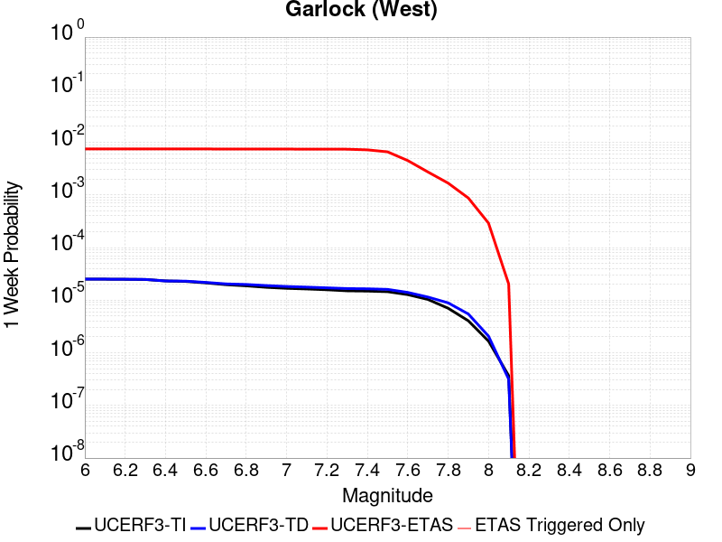 |  |  | 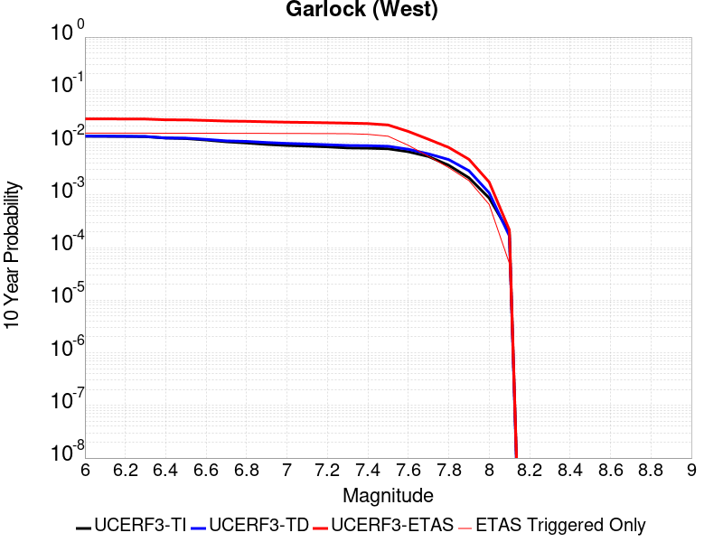 |

| Magnitude | 1 wk TI Prob | 1 wk TD Prob | 1 wk ETAS Prob | 1 wk ETAS/TD Gain | 1 wk ETAS Triggered Only | 1 mo TI Prob | 1 mo TD Prob | 1 mo ETAS Prob | 1 mo ETAS/TD Gain | 1 mo ETAS Triggered Only | 1 yr TI Prob | 1 yr TD Prob | 1 yr ETAS Prob | 1 yr ETAS/TD Gain | 1 yr ETAS Triggered Only | 10 yr TI Prob | 10 yr TD Prob | 10 yr ETAS Prob | 10 yr ETAS/TD Gain | 10 yr ETAS Triggered Only |
|-----|-----|-----|-----|-----|-----|-----|-----|-----|-----|-----|-----|-----|-----|-----|-----|-----|-----|-----|-----|-----|
| 6.0 | 2.5181727E-5 | 2.5197181E-5 | 0.0074750097 | 296.66055 | 0.00745 | 1.0791722E-4 | 1.0798347E-4 | 0.009256995 | 85.72604 | 0.00915 | 0.0013131002 | 0.0013139093 | 0.0134579325 | 10.242664 | 0.01216 | 0.013053683 | 0.013141794 | 0.027905194 | 2.1233928 | 0.01496 |
| 6.1 | 2.5077732E-5 | 2.5098223E-5 | 0.0074749114 | 297.8263 | 0.00745 | 1.0747157E-4 | 1.075594E-4 | 0.009256575 | 86.06012 | 0.00915 | 0.001307681 | 0.0013087525 | 0.013442851 | 10.271501 | 0.01215 | 0.013000126 | 0.013090835 | 0.027845128 | 2.1270704 | 0.01495 |
| 6.2 | 2.494612E-5 | 2.4979914E-5 | 0.0074747936 | 299.23215 | 0.00745 | 1.0690756E-4 | 1.070524E-4 | 0.009256073 | 86.463005 | 0.00915 | 0.0013008224 | 0.0013025872 | 0.013436761 | 10.315441 | 0.01215 | 0.012932341 | 0.013029906 | 0.02778511 | 2.1324105 | 0.01495 |
| 6.3 | 2.4733758E-5 | 2.4799276E-5 | 0.0074746143 | 301.40454 | 0.00745 | 1.0599751E-4 | 1.06278305E-4 | 0.009255306 | 87.08556 | 0.00915 | 0.0012897556 | 0.0012931736 | 0.0134274615 | 10.38334 | 0.01215 | 0.012822957 | 0.0129368715 | 0.027693465 | 2.1406617 | 0.01495 |
| 6.4 | 2.3237335E-5 | 2.3178607E-5 | 0.007473006 | 322.4096 | 0.00745 | 9.958477E-5 | 9.933313E-5 | 0.009238426 | 93.00448 | 0.00914 | 0.0012117702 | 0.0012087126 | 0.013284099 | 10.990288 | 0.01209 | 0.012051838 | 0.012101731 | 0.0267819 | 2.2130635 | 0.01486 |
| 6.5 | 2.2732203E-5 | 2.2992977E-5 | 0.0074728215 | 325.00455 | 0.00745 | 9.742009E-5 | 9.8537625E-5 | 0.009237637 | 93.74731 | 0.00914 | 0.0011854442 | 0.0011990381 | 0.013274542 | 11.070992 | 0.01209 | 0.011791403 | 0.012006035 | 0.026687626 | 2.2228508 | 0.01486 |
| 6.6 | 2.1319436E-5 | 2.1773201E-5 | 0.007471611 | 343.15628 | 0.00745 | 9.136581E-5 | 9.3310395E-5 | 0.009232458 | 98.943504 | 0.00914 | 0.001111811 | 0.0011354643 | 0.013211736 | 11.635536 | 0.01209 | 0.011062649 | 0.011376952 | 0.02606789 | 2.2912896 | 0.01486 |
| 6.7 | 1.970802E-5 | 2.0393094E-5 | 0.0074702413 | 366.3123 | 0.00745 | 8.446021E-5 | 8.739606E-5 | 0.009226597 | 105.572235 | 0.00914 | 0.001027818 | 0.0010635294 | 0.013140671 | 12.3557205 | 0.01209 | 0.010230771 | 0.0106646875 | 0.025356317 | 2.377596 | 0.01485 |
| 6.8 | 1.8744462E-5 | 1.9900775E-5 | 0.0074597527 | 374.84735 | 0.00744 | 8.033094E-5 | 8.528626E-5 | 0.009204509 | 107.92487 | 0.00912 | 9.775903E-4 | 0.0010378672 | 0.013075361 | 12.598298 | 0.01205 | 0.009733009 | 0.010410495 | 0.025066316 | 2.4077928 | 0.01481 |
| 6.9 | 1.7559682E-5 | 1.8953151E-5 | 0.007458812 | 393.53943 | 0.00744 | 7.5253614E-5 | 8.122527E-5 | 0.0092004845 | 113.27121 | 0.00912 | 9.158276E-4 | 9.884704E-4 | 0.013016569 | 13.168395 | 0.01204 | 0.0091206245 | 0.009921073 | 0.024554439 | 2.4749782 | 0.01478 |
| 7.0 | 1.6794445E-5 | 1.8215967E-5 | 0.007438081 | 408.3275 | 0.00742 | 7.197421E-5 | 7.806611E-5 | 0.009177356 | 117.55878 | 0.0091 | 8.759337E-4 | 9.5004175E-4 | 0.012948631 | 13.6295395 | 0.01201 | 0.008724891 | 0.009539958 | 0.02413934 | 2.5303402 | 0.01474 |
| 7.1 | 1.6337795E-5 | 1.771677E-5 | 0.0074275853 | 419.24042 | 0.00741 | 7.0017246E-5 | 7.592681E-5 | 0.009165237 | 120.71147 | 0.00909 | 8.521265E-4 | 9.2401815E-4 | 0.012902939 | 13.963945 | 0.01199 | 0.008488664 | 0.009281721 | 0.023855187 | 2.5701253 | 0.01471 |
| 7.2 | 1.5780008E-5 | 1.71654E-5 | 0.007427038 | 432.67496 | 0.00741 | 6.762685E-5 | 7.3563926E-5 | 0.009162895 | 124.55691 | 0.00909 | 8.2304585E-4 | 8.952741E-4 | 0.012864549 | 14.369397 | 0.01198 | 0.008200042 | 0.008996559 | 0.02352467 | 2.614852 | 0.01466 |
| 7.3 | 1.5058865E-5 | 1.6618484E-5 | 0.007396496 | 445.07648 | 0.00738 | 6.45364E-5 | 7.122013E-5 | 0.009130575 | 128.20216 | 0.00906 | 7.854473E-4 | 8.667614E-4 | 0.012806403 | 14.775005 | 0.01195 | 0.00782677 | 0.008713263 | 0.023176137 | 2.6598687 | 0.01459 |
| 7.4 | 1.4887923E-5 | 1.6454453E-5 | 0.0071963365 | 437.34888 | 0.00718 | 6.380382E-5 | 7.0517184E-5 | 0.008889895 | 126.06708 | 0.00882 | 7.7653467E-4 | 8.5820974E-4 | 0.012498211 | 14.563121 | 0.01165 | 0.0077382675 | 0.008628101 | 0.022705583 | 2.631585 | 0.0142 |
| 7.5 | 1.4509299E-5 | 1.6046468E-5 | 0.006595941 | 411.0525 | 0.00658 | 6.218123E-5 | 6.876877E-5 | 0.008128215 | 118.1963 | 0.00806 | 7.567935E-4 | 8.369394E-4 | 0.011517992 | 13.762039 | 0.01069 | 0.0075422134 | 0.008416411 | 0.021376409 | 2.5398486 | 0.01307 |
| 7.6 | 1.2756717E-5 | 1.4050529E-5 | 0.0045039873 | 320.55643 | 0.00449 | 5.4670498E-5 | 6.0215163E-5 | 0.0054598902 | 90.673004 | 0.0054 | 6.6541E-4 | 7.328737E-4 | 0.007837663 | 10.694426 | 0.00711 | 0.006634211 | 0.007381374 | 0.016096566 | 2.1807005 | 0.00878 |
| 7.7 | 1.0328985E-5 | 1.146033E-5 | 0.0027314292 | 238.33774 | 0.00272 | 4.4266326E-5 | 4.9114777E-5 | 0.0032989553 | 67.16828 | 0.00325 | 5.388092E-4 | 5.9780874E-4 | 0.0049452083 | 8.272224 | 0.00435 | 0.0053750467 | 0.006038286 | 0.0114156185 | 1.8905396 | 0.00541 |
| 7.8 | 7.0306583E-6 | 8.899537E-6 | 0.0016788847 | 188.64854 | 0.00167 | 3.0131043E-5 | 3.8140315E-5 | 0.0020280643 | 53.173775 | 0.00199 | 3.667837E-4 | 4.6425956E-4 | 0.00313302 | 6.7484236 | 0.00267 | 0.003661789 | 0.0046950667 | 0.007989526 | 1.7016853 | 0.00331 |
| 7.9 | 4.060633E-6 | 5.465412E-6 | 8.754607E-4 | 160.182 | 8.7E-4 | 1.7402595E-5 | 2.3422985E-5 | 0.0010533988 | 44.97287 | 0.00103 | 2.11856E-4 | 2.8513762E-4 | 0.001724727 | 6.048753 | 0.00144 | 0.0021165414 | 0.002884143 | 0.0047487495 | 1.6465029 | 0.00187 |
| 8.0 | 1.6729537E-6 | 2.0775192E-6 | 2.920769E-4 | 140.58928 | 2.9E-4 | 7.169782E-6 | 8.903624E-6 | 3.5890052E-4 | 40.309486 | 3.5E-4 | 8.7288594E-5 | 1.0839626E-4 | 5.8834424E-4 | 5.427717 | 4.8E-4 | 8.7254314E-4 | 0.001096854 | 0.0017561301 | 1.6010609 | 6.6E-4 |
| 8.1 | 3.6733252E-7 | 3.1489736E-7 | 2.031489E-5 | 64.51273 | 2.0E-5 | 1.5742813E-6 | 1.3495595E-6 | 4.1349507E-5 | 30.63926 | 4.0E-5 | 1.9166706E-5 | 1.643078E-5 | 5.6430123E-5 | 3.4344153 | 4.0E-5 | 1.9165053E-4 | 1.662928E-4 | 2.1628448E-4 | 1.3006245 | 5.0E-5 |

## McLean Lake
*[(top)](#table-of-contents)*

| 1 Week | 1 Month | 1 Year | 10 Year |
|-----|-----|-----|-----|
|  |  |  |  |

| Magnitude | 1 wk TI Prob | 1 wk TD Prob | 1 wk ETAS Prob | 1 wk ETAS/TD Gain | 1 wk ETAS Triggered Only | 1 mo TI Prob | 1 mo TD Prob | 1 mo ETAS Prob | 1 mo ETAS/TD Gain | 1 mo ETAS Triggered Only | 1 yr TI Prob | 1 yr TD Prob | 1 yr ETAS Prob | 1 yr ETAS/TD Gain | 1 yr ETAS Triggered Only | 10 yr TI Prob | 10 yr TD Prob | 10 yr ETAS Prob | 10 yr ETAS/TD Gain | 10 yr ETAS Triggered Only |
|-----|-----|-----|-----|-----|-----|-----|-----|-----|-----|-----|-----|-----|-----|-----|-----|-----|-----|-----|-----|-----|
| 6.0 | 1.7360222E-5 | 1.8501627E-5 | 0.0024584564 | 132.87785 | 0.00244 | 7.439883E-5 | 7.9290556E-5 | 0.0037390003 | 47.155685 | 0.00366 | 9.0542925E-4 | 9.6498354E-4 | 0.0076185567 | 7.895012 | 0.00666 | 0.009017491 | 0.0096127745 | 0.019932609 | 2.0735543 | 0.01042 |
| 6.1 | 9.062689E-6 | 9.592193E-6 | 0.0012995799 | 135.48306 | 0.00129 | 3.8839516E-5 | 4.1108804E-5 | 0.0019510303 | 47.46016 | 0.00191 | 4.727685E-4 | 5.003936E-4 | 0.0039686575 | 7.931071 | 0.00347 | 0.0047176396 | 0.004993552 | 0.010585488 | 2.1198316 | 0.00562 |
| 6.2 | 9.062689E-6 | 9.592193E-6 | 0.0012995799 | 135.48306 | 0.00129 | 3.8839516E-5 | 4.1108804E-5 | 0.0019510303 | 47.46016 | 0.00191 | 4.727685E-4 | 5.003936E-4 | 0.0039686575 | 7.931071 | 0.00347 | 0.0047176396 | 0.004993552 | 0.010585488 | 2.1198316 | 0.00562 |
| 6.3 | 7.2575485E-6 | 7.66771E-6 | 0.0010676596 | 139.24101 | 0.00106 | 3.110341E-5 | 3.2861237E-5 | 0.0015928099 | 48.470783 | 0.00156 | 3.786182E-4 | 4.0001926E-4 | 0.0031889032 | 7.971874 | 0.00279 | 0.0037797375 | 0.0039936965 | 0.008475726 | 2.1222756 | 0.0045 |
| 6.4 | 7.2575485E-6 | 7.66771E-6 | 0.0010676596 | 139.24101 | 0.00106 | 3.110341E-5 | 3.2861237E-5 | 0.0015928099 | 48.470783 | 0.00156 | 3.786182E-4 | 4.0001926E-4 | 0.0031889032 | 7.971874 | 0.00279 | 0.0037797375 | 0.0039936965 | 0.008475726 | 2.1222756 | 0.0045 |
| 6.5 | 6.06582E-6 | 6.4038773E-6 | 9.3639793E-4 | 146.22359 | 9.3E-4 | 2.5996113E-5 | 2.7444936E-5 | 0.0013674082 | 49.823696 | 0.00134 | 3.164567E-4 | 3.3409733E-4 | 0.0026733156 | 8.001607 | 0.00234 | 0.0031600643 | 0.0033365893 | 0.0070840437 | 2.1231394 | 0.00376 |
| 6.6 | 5.598744E-6 | 5.910262E-6 | 8.459053E-4 | 143.12483 | 8.4E-4 | 2.3994397E-5 | 2.5329486E-5 | 0.0012652981 | 49.953564 | 0.00124 | 2.9209262E-4 | 3.0834923E-4 | 0.0025176678 | 8.164988 | 0.00221 | 0.0029170897 | 0.003079843 | 0.0065989713 | 2.1426322 | 0.00353 |
| 6.7 | 5.246996E-6 | 5.539162E-6 | 8.155347E-4 | 147.2307 | 8.1E-4 | 2.2486933E-5 | 2.3739085E-5 | 0.0012237106 | 51.548347 | 0.0012 | 2.73744E-4 | 2.8899137E-4 | 0.0023783874 | 8.2299595 | 0.00209 | 0.0027340704 | 0.0028867796 | 0.006157311 | 2.132934 | 0.00328 |
| 6.8 | 4.02324E-6 | 4.2469046E-6 | 6.94244E-4 | 163.4706 | 6.9E-4 | 1.7242342E-5 | 1.8200926E-5 | 0.0010181827 | 55.94126 | 0.001 | 2.099053E-4 | 2.2157968E-4 | 0.0017712362 | 7.9936757 | 0.00155 | 0.0020970714 | 0.002214172 | 0.0046387915 | 2.0950458 | 0.00243 |
| 6.9 | 6.835972E-7 | 7.1399285E-7 | 7.071394E-5 | 99.04013 | 7.0E-5 | 2.9296991E-6 | 3.0599674E-6 | 9.3059694E-5 | 30.411987 | 9.0E-5 | 3.56685E-5 | 3.7254784E-5 | 2.2724771E-4 | 6.099826 | 1.9E-4 | 3.5662777E-4 | 3.7251666E-4 | 7.1239E-4 | 1.9123709 | 3.4E-4 |

## So Sierra Nevada
*[(top)](#table-of-contents)*

| 1 Week | 1 Month | 1 Year | 10 Year |
|-----|-----|-----|-----|
| 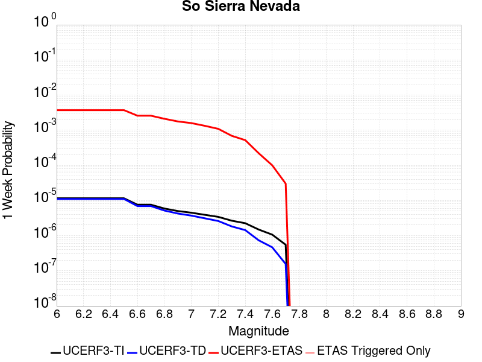 | 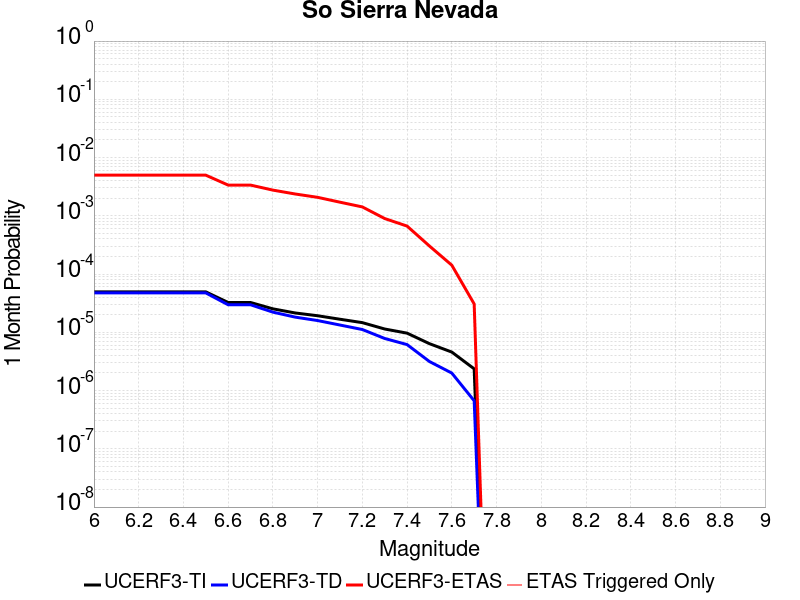 | 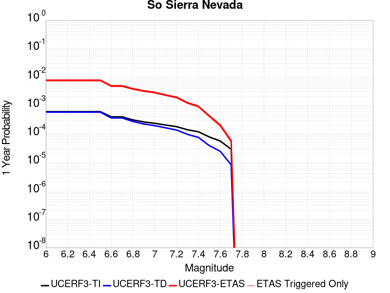 | 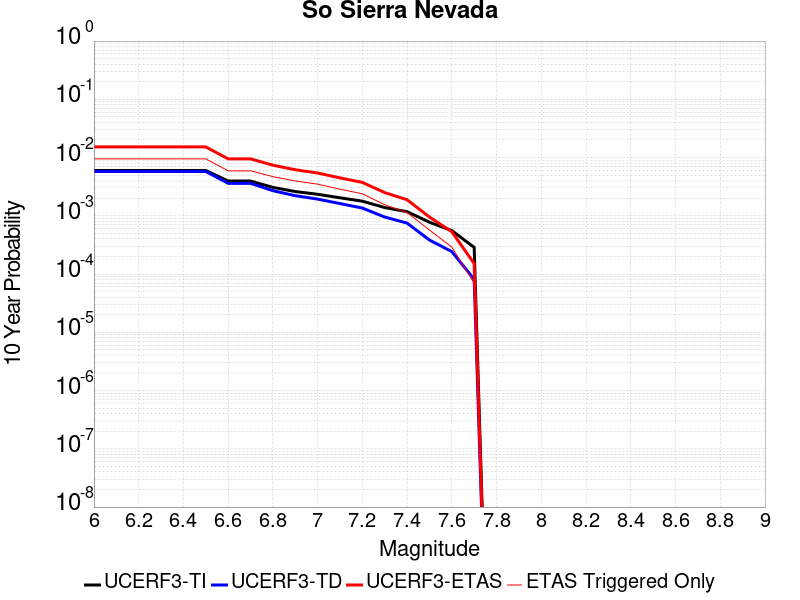 |

| Magnitude | 1 wk TI Prob | 1 wk TD Prob | 1 wk ETAS Prob | 1 wk ETAS/TD Gain | 1 wk ETAS Triggered Only | 1 mo TI Prob | 1 mo TD Prob | 1 mo ETAS Prob | 1 mo ETAS/TD Gain | 1 mo ETAS Triggered Only | 1 yr TI Prob | 1 yr TD Prob | 1 yr ETAS Prob | 1 yr ETAS/TD Gain | 1 yr ETAS Triggered Only | 10 yr TI Prob | 10 yr TD Prob | 10 yr ETAS Prob | 10 yr ETAS/TD Gain | 10 yr ETAS Triggered Only |
|-----|-----|-----|-----|-----|-----|-----|-----|-----|-----|-----|-----|-----|-----|-----|-----|-----|-----|-----|-----|-----|
| 6.0 | 1.15488665E-5 | 1.1079612E-5 | 0.0037210386 | 335.84558 | 0.00371 | 4.9494203E-5 | 4.7483256E-5 | 0.0049872487 | 105.03173 | 0.00494 | 6.024253E-4 | 5.779681E-4 | 0.0077038473 | 13.329192 | 0.00713 | 0.006007948 | 0.005765918 | 0.0152210845 | 2.639837 | 0.00951 |
| 6.1 | 1.15488665E-5 | 1.1079612E-5 | 0.0037210386 | 335.84558 | 0.00371 | 4.9494203E-5 | 4.7483256E-5 | 0.0049872487 | 105.03173 | 0.00494 | 6.024253E-4 | 5.779681E-4 | 0.0077038473 | 13.329192 | 0.00713 | 0.006007948 | 0.005765918 | 0.0152210845 | 2.639837 | 0.00951 |
| 6.2 | 1.15488665E-5 | 1.1079612E-5 | 0.0037210386 | 335.84558 | 0.00371 | 4.9494203E-5 | 4.7483256E-5 | 0.0049872487 | 105.03173 | 0.00494 | 6.024253E-4 | 5.779681E-4 | 0.0077038473 | 13.329192 | 0.00713 | 0.006007948 | 0.005765918 | 0.0152210845 | 2.639837 | 0.00951 |
| 6.3 | 1.15488665E-5 | 1.1079612E-5 | 0.0037210386 | 335.84558 | 0.00371 | 4.9494203E-5 | 4.7483256E-5 | 0.0049872487 | 105.03173 | 0.00494 | 6.024253E-4 | 5.779681E-4 | 0.0077038473 | 13.329192 | 0.00713 | 0.006007948 | 0.005765918 | 0.0152210845 | 2.639837 | 0.00951 |
| 6.4 | 1.15488665E-5 | 1.1079612E-5 | 0.0037210386 | 335.84558 | 0.00371 | 4.9494203E-5 | 4.7483256E-5 | 0.0049872487 | 105.03173 | 0.00494 | 6.024253E-4 | 5.779681E-4 | 0.0077038473 | 13.329192 | 0.00713 | 0.006007948 | 0.005765918 | 0.0152210845 | 2.639837 | 0.00951 |
| 6.5 | 1.15488665E-5 | 1.1079612E-5 | 0.0037210386 | 335.84558 | 0.00371 | 4.9494203E-5 | 4.7483256E-5 | 0.0049872487 | 105.03173 | 0.00494 | 6.024253E-4 | 5.779681E-4 | 0.0077038473 | 13.329192 | 0.00713 | 0.006007948 | 0.005765918 | 0.0152210845 | 2.639837 | 0.00951 |
| 6.6 | 7.587044E-6 | 6.9356042E-6 | 0.0025869177 | 372.99097 | 0.00258 | 3.2515498E-5 | 2.9723697E-5 | 0.0033696245 | 113.36492 | 0.00334 | 3.9580427E-4 | 3.6182883E-4 | 0.00489019 | 13.515202 | 0.00453 | 0.003951 | 0.0036126887 | 0.009511301 | 2.6327486 | 0.00592 |
| 6.7 | 7.587044E-6 | 6.9356042E-6 | 0.0025869177 | 372.99097 | 0.00258 | 3.2515498E-5 | 2.9723697E-5 | 0.0033696245 | 113.36492 | 0.00334 | 3.9580427E-4 | 3.6182883E-4 | 0.00489019 | 13.515202 | 0.00453 | 0.003951 | 0.0036126887 | 0.009511301 | 2.6327486 | 0.00592 |
| 6.8 | 5.9026956E-6 | 5.179362E-6 | 0.0021151684 | 408.38397 | 0.00211 | 2.5297022E-5 | 2.2197082E-5 | 0.0027621363 | 124.436905 | 0.00274 | 3.0794772E-4 | 2.7021713E-4 | 0.0038492498 | 14.245025 | 0.00358 | 0.0030752132 | 0.002699002 | 0.0073962896 | 2.7403796 | 0.00471 |
| 6.9 | 5.0118915E-6 | 4.2523943E-6 | 0.0017742448 | 417.2343 | 0.00177 | 2.1479358E-5 | 1.8224424E-5 | 0.0023681817 | 129.94548 | 0.00235 | 2.614798E-4 | 2.2186051E-4 | 0.0032511882 | 14.654201 | 0.00303 | 0.0026117235 | 0.0022164627 | 0.0061776633 | 2.7871723 | 0.00397 |
| 7.0 | 4.4924795E-6 | 3.7138868E-6 | 0.001593708 | 429.1213 | 0.00159 | 1.925334E-5 | 1.5916565E-5 | 0.0020758838 | 130.42285 | 0.00206 | 2.3438422E-4 | 1.9376757E-4 | 0.0028632502 | 14.776726 | 0.00267 | 0.0023413717 | 0.0019360491 | 0.005429273 | 2.8043053 | 0.0035 |
| 7.1 | 3.9118436E-6 | 3.1119469E-6 | 0.0013331078 | 428.38385 | 0.00133 | 1.6764936E-5 | 1.333685E-5 | 0.0017133142 | 128.46468 | 0.0017 | 2.0409399E-4 | 1.6236462E-4 | 0.0023320124 | 14.36281 | 0.00217 | 0.0020390663 | 0.0016225161 | 0.004477876 | 2.7598345 | 0.00286 |
| 7.2 | 3.4200818E-6 | 2.6054236E-6 | 0.0010926026 | 419.35696 | 0.00109 | 1.4657411E-5 | 1.11660565E-5 | 0.0014211503 | 127.27415 | 0.00141 | 1.7843937E-4 | 1.3593875E-4 | 0.001935694 | 14.239456 | 0.0018 | 0.0017829615 | 0.0013586058 | 0.0037453587 | 2.7567663 | 0.00239 |
| 7.3 | 2.6593618E-6 | 1.8283897E-6 | 6.9182715E-4 | 378.38055 | 6.9E-4 | 1.13972155E-5 | 7.8359335E-6 | 8.9782896E-4 | 114.57842 | 8.9E-4 | 1.3875226E-4 | 9.539862E-5 | 0.0012452889 | 13.053533 | 0.00115 | 0.0013866565 | 9.536055E-4 | 0.0025021276 | 2.6238601 | 0.00155 |
| 7.4 | 2.2577992E-6 | 1.4364078E-6 | 5.2143564E-4 | 363.01367 | 5.2E-4 | 9.676246E-6 | 6.1560204E-6 | 6.6615193E-4 | 108.211464 | 6.6E-4 | 1.1780193E-4 | 7.4947224E-5 | 9.348828E-4 | 12.473881 | 8.6E-4 | 0.001177395 | 7.4924453E-4 | 0.0018883904 | 2.5203927 | 0.00114 |
| 7.5 | 1.489319E-6 | 7.353661E-7 | 2.2073521E-4 | 300.1705 | 2.2E-4 | 6.3827797E-6 | 3.1515651E-6 | 3.0315062E-4 | 96.1905 | 3.0E-4 | 7.770758E-5 | 3.8369635E-5 | 4.2835466E-4 | 11.1638975 | 3.9E-4 | 7.7680405E-4 | 3.8363054E-4 | 9.5341186E-4 | 2.4852345 | 5.7E-4 |
| 7.6 | 1.0680322E-6 | 4.65941E-7 | 1.0046589E-4 | 215.61934 | 1.0E-4 | 4.577273E-6 | 1.9968884E-6 | 1.4199661E-4 | 71.10893 | 1.4E-4 | 5.5726876E-5 | 2.4311848E-5 | 2.0430748E-4 | 8.403617 | 1.8E-4 | 5.5712904E-4 | 2.4309216E-4 | 5.3302164E-4 | 2.1926732 | 2.9E-4 |
| 7.7 | 5.509146E-7 | 1.5578539E-7 | 3.0155781E-5 | 193.57259 | 3.0E-5 | 2.3610605E-6 | 6.676515E-7 | 3.066763E-5 | 45.93359 | 3.0E-5 | 2.8745531E-5 | 8.128628E-6 | 5.8128222E-5 | 7.1510496 | 5.0E-5 | 2.8741814E-4 | 8.128342E-5 | 1.5127774E-4 | 1.8611143 | 7.0E-5 |

## Goldstone Lake
*[(top)](#table-of-contents)*

| 1 Week | 1 Month | 1 Year | 10 Year |
|-----|-----|-----|-----|
| 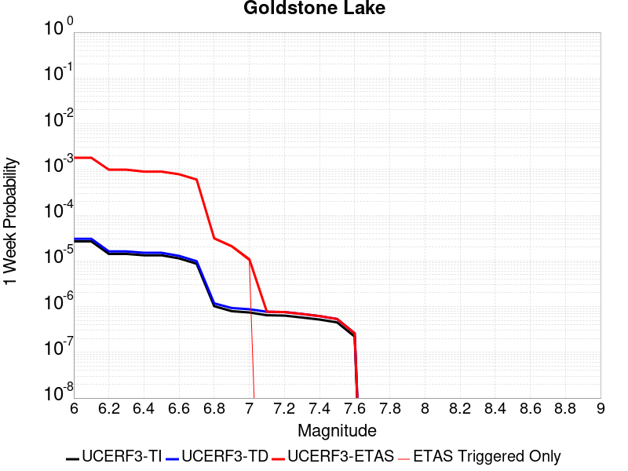 |  | 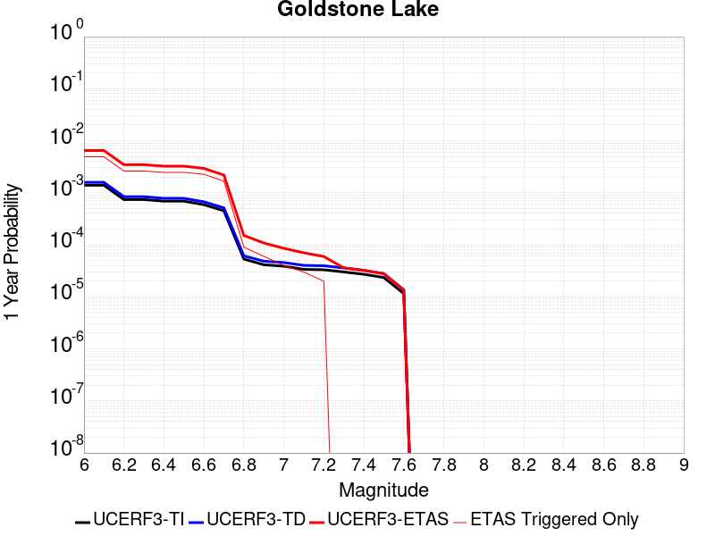 |  |

| Magnitude | 1 wk TI Prob | 1 wk TD Prob | 1 wk ETAS Prob | 1 wk ETAS/TD Gain | 1 wk ETAS Triggered Only | 1 mo TI Prob | 1 mo TD Prob | 1 mo ETAS Prob | 1 mo ETAS/TD Gain | 1 mo ETAS Triggered Only | 1 yr TI Prob | 1 yr TD Prob | 1 yr ETAS Prob | 1 yr ETAS/TD Gain | 1 yr ETAS Triggered Only | 10 yr TI Prob | 10 yr TD Prob | 10 yr ETAS Prob | 10 yr ETAS/TD Gain | 10 yr ETAS Triggered Only |
|-----|-----|-----|-----|-----|-----|-----|-----|-----|-----|-----|-----|-----|-----|-----|-----|-----|-----|-----|-----|-----|
| 6.0 | 2.671352E-5 | 3.0376103E-5 | 0.0018003223 | 59.26772 | 0.00177 | 1.1448149E-4 | 1.3017791E-4 | 0.0026998434 | 20.739643 | 0.00257 | 0.001392921 | 0.0015839601 | 0.006496167 | 4.1012187 | 0.00492 | 0.013842222 | 0.015746202 | 0.02353165 | 1.4944334 | 0.00791 |
| 6.1 | 2.671352E-5 | 3.0376103E-5 | 0.0018003223 | 59.26772 | 0.00177 | 1.1448149E-4 | 1.3017791E-4 | 0.0026998434 | 20.739643 | 0.00257 | 0.001392921 | 0.0015839601 | 0.006496167 | 4.1012187 | 0.00492 | 0.013842222 | 0.015746202 | 0.02353165 | 1.4944334 | 0.00791 |
| 6.2 | 1.4197047E-5 | 1.6096254E-5 | 9.860806E-4 | 61.261497 | 9.7E-4 | 6.0843064E-5 | 6.898268E-5 | 0.0014488875 | 21.003641 | 0.00138 | 7.4051257E-4 | 8.3963916E-4 | 0.0034574394 | 4.1177683 | 0.00262 | 0.007380498 | 0.008374364 | 0.012469778 | 1.4890418 | 0.00413 |
| 6.3 | 1.4197047E-5 | 1.6096254E-5 | 9.860806E-4 | 61.261497 | 9.7E-4 | 6.0843064E-5 | 6.898268E-5 | 0.0014488875 | 21.003641 | 0.00138 | 7.4051257E-4 | 8.3963916E-4 | 0.0034574394 | 4.1177683 | 0.00262 | 0.007380498 | 0.008374364 | 0.012469778 | 1.4890418 | 0.00413 |
| 6.4 | 1.3238931E-5 | 1.500847E-5 | 8.949953E-4 | 59.63268 | 8.8E-4 | 5.6737044E-5 | 6.432098E-5 | 0.0013242399 | 20.587994 | 0.00126 | 6.9055456E-4 | 7.8292453E-4 | 0.0032509908 | 4.152368 | 0.00247 | 0.006884126 | 0.007811289 | 0.011680825 | 1.4953774 | 0.0039 |
| 6.5 | 1.3238931E-5 | 1.500847E-5 | 8.949953E-4 | 59.63268 | 8.8E-4 | 5.6737044E-5 | 6.432098E-5 | 0.0013242399 | 20.587994 | 0.00126 | 6.9055456E-4 | 7.8292453E-4 | 0.0032509908 | 4.152368 | 0.00247 | 0.006884126 | 0.007811289 | 0.011680825 | 1.4953774 | 0.0039 |
| 6.6 | 1.1328278E-5 | 1.2855176E-5 | 7.8284525E-4 | 60.897285 | 7.7E-4 | 4.8548856E-5 | 5.5092984E-5 | 0.0011950302 | 21.691149 | 0.00114 | 5.90922E-4 | 6.706464E-4 | 0.002939124 | 4.3825245 | 0.00227 | 0.0058935313 | 0.0066956137 | 0.010231777 | 1.5281314 | 0.00356 |
| 6.7 | 8.651175E-6 | 9.824575E-6 | 5.9981877E-4 | 61.052902 | 5.9E-4 | 3.707594E-5 | 4.2105148E-5 | 8.9206937E-4 | 21.186705 | 8.5E-4 | 4.5130608E-4 | 5.126002E-4 | 0.002191739 | 4.275728 | 0.00168 | 0.0045039062 | 0.0051230565 | 0.0077495314 | 1.5126774 | 0.00264 |
| 6.8 | 1.0215377E-6 | 1.1754802E-6 | 3.1175445E-5 | 26.521456 | 3.0E-5 | 4.378012E-6 | 5.037763E-6 | 3.503761E-5 | 6.954994 | 3.0E-5 | 5.3300988E-5 | 6.133315E-5 | 1.5132764E-4 | 2.4673057 | 9.0E-5 | 5.3288206E-4 | 6.131735E-4 | 7.3309994E-4 | 1.1955832 | 1.2E-4 |
| 6.9 | 7.9360774E-7 | 9.283496E-7 | 2.0928332E-5 | 22.543589 | 2.0E-5 | 3.4011714E-6 | 3.9786355E-6 | 2.3978555E-5 | 6.0268292 | 2.0E-5 | 4.1408475E-5 | 4.843888E-5 | 1.08435976E-4 | 2.2386143 | 6.0E-5 | 4.140076E-4 | 4.842902E-4 | 5.542563E-4 | 1.1444714 | 7.0E-5 |
| 7.0 | 7.4382757E-7 | 8.747428E-7 | 1.08747345E-5 | 12.431922 | 1.0E-5 | 3.1878285E-6 | 3.7488926E-6 | 1.3748855E-5 | 3.6674442 | 1.0E-5 | 3.8811122E-5 | 4.564188E-5 | 8.564005E-5 | 1.8763481 | 4.0E-5 | 3.8804344E-4 | 4.563317E-4 | 5.0630886E-4 | 1.1095194 | 5.0E-5 |
| 7.1 | 6.4709513E-7 | 7.711399E-7 | 7.711399E-7 | 1.0 | 0.0 | 2.773262E-6 | 3.3048816E-6 | 3.3048816E-6 | 1.0 | 0.0 | 3.376394E-5 | 4.023625E-5 | 7.0235044E-5 | 1.7455664 | 3.0E-5 | 3.375881E-4 | 4.022956E-4 | 4.4227953E-4 | 1.0993893 | 4.0E-5 |
| 7.2 | 6.356704E-7 | 7.588459E-7 | 7.588459E-7 | 1.0 | 0.0 | 2.7242988E-6 | 3.252193E-6 | 3.252193E-6 | 1.0 | 0.0 | 3.3167835E-5 | 3.959479E-5 | 5.9594E-5 | 1.5050969 | 2.0E-5 | 3.3162883E-4 | 3.9588328E-4 | 4.258714E-4 | 1.0757499 | 3.0E-5 |
| 7.3 | 5.7695723E-7 | 6.896648E-7 | 6.896648E-7 | 1.0 | 0.0 | 2.4726714E-6 | 2.9557032E-6 | 2.9557032E-6 | 1.0 | 0.0 | 3.0104358E-5 | 3.598515E-5 | 3.598515E-5 | 1.0 | 0.0 | 3.0100282E-4 | 3.5979896E-4 | 3.6979537E-4 | 1.0277833 | 1.0E-5 |
| 7.4 | 5.209647E-7 | 6.193583E-7 | 6.193583E-7 | 1.0 | 0.0 | 2.232704E-6 | 2.6543903E-6 | 2.6543903E-6 | 1.0 | 0.0 | 2.718283E-5 | 3.2316777E-5 | 3.2316777E-5 | 1.0 | 0.0 | 2.7179506E-4 | 3.2312635E-4 | 3.331231E-4 | 1.0309377 | 1.0E-5 |
| 7.5 | 4.512955E-7 | 5.3489487E-7 | 5.3489487E-7 | 1.0 | 0.0 | 1.934122E-6 | 2.2924048E-6 | 2.2924048E-6 | 1.0 | 0.0 | 2.3547682E-5 | 2.7909726E-5 | 2.7909726E-5 | 1.0 | 0.0 | 2.3545188E-4 | 2.7906752E-4 | 2.8906474E-4 | 1.0358236 | 1.0E-5 |
| 7.6 | 2.21172E-7 | 2.6040198E-7 | 2.6040198E-7 | 1.0 | 0.0 | 9.478797E-7 | 1.1160082E-6 | 1.1160082E-6 | 1.0 | 0.0 | 1.1540374E-5 | 1.3587343E-5 | 1.3587343E-5 | 1.0 | 0.0 | 1.1539775E-4 | 1.3586794E-4 | 1.4586658E-4 | 1.0735909 | 1.0E-5 |

## Gravel Hills-Harper Lk
*[(top)](#table-of-contents)*

| 1 Week | 1 Month | 1 Year | 10 Year |
|-----|-----|-----|-----|
| 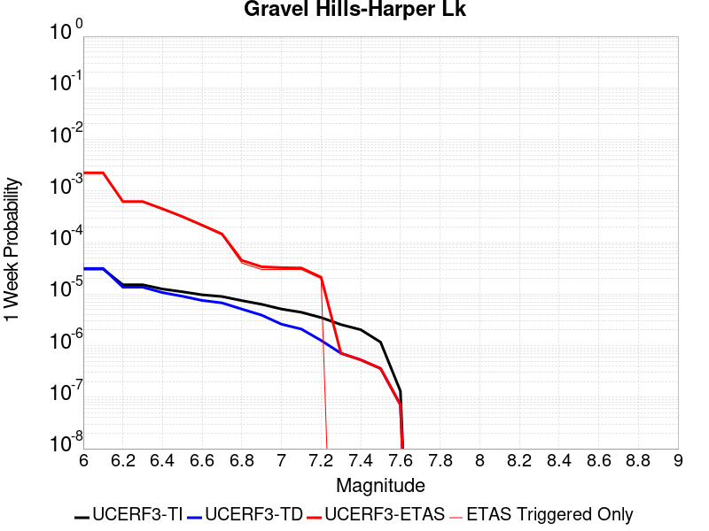 | 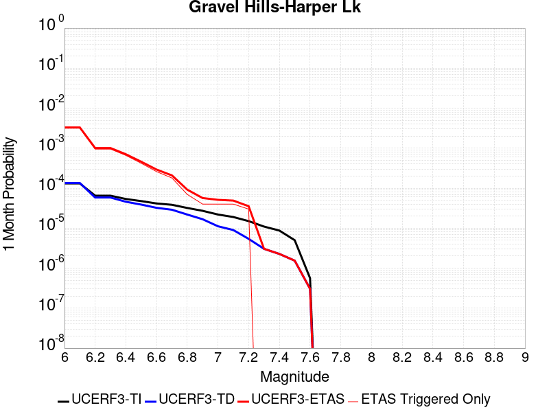 | 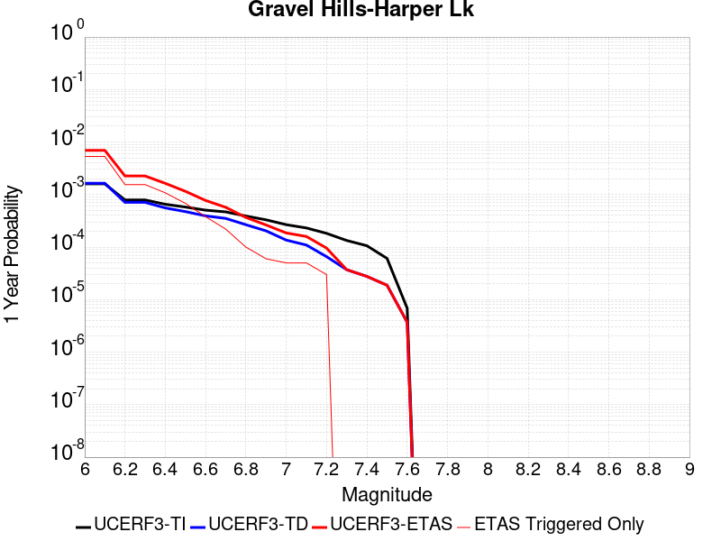 | 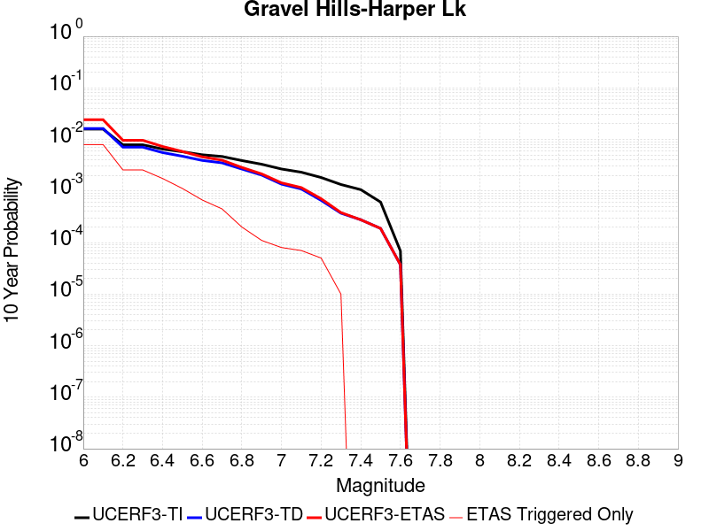 |

| Magnitude | 1 wk TI Prob | 1 wk TD Prob | 1 wk ETAS Prob | 1 wk ETAS/TD Gain | 1 wk ETAS Triggered Only | 1 mo TI Prob | 1 mo TD Prob | 1 mo ETAS Prob | 1 mo ETAS/TD Gain | 1 mo ETAS Triggered Only | 1 yr TI Prob | 1 yr TD Prob | 1 yr ETAS Prob | 1 yr ETAS/TD Gain | 1 yr ETAS Triggered Only | 10 yr TI Prob | 10 yr TD Prob | 10 yr ETAS Prob | 10 yr ETAS/TD Gain | 10 yr ETAS Triggered Only |
|-----|-----|-----|-----|-----|-----|-----|-----|-----|-----|-----|-----|-----|-----|-----|-----|-----|-----|-----|-----|-----|
| 6.0 | 3.0679566E-5 | 3.1464628E-5 | 0.0022513948 | 71.5532 | 0.00222 | 1.3147724E-4 | 1.3484266E-4 | 0.0033044151 | 24.505713 | 0.00317 | 0.0015995599 | 0.00164069 | 0.006961945 | 4.2433033 | 0.00533 | 0.015880952 | 0.016307337 | 0.02413753 | 1.4801638 | 0.00796 |
| 6.1 | 3.0679566E-5 | 3.1464628E-5 | 0.0022513948 | 71.5532 | 0.00222 | 1.3147724E-4 | 1.3484266E-4 | 0.0033044151 | 24.505713 | 0.00317 | 0.0015995599 | 0.00164069 | 0.006961945 | 4.2433033 | 0.00533 | 0.015880952 | 0.016307337 | 0.02413753 | 1.4801638 | 0.00796 |
| 6.2 | 1.514536E-5 | 1.36352E-5 | 6.2362687E-4 | 45.73654 | 6.1E-4 | 6.490707E-5 | 5.843533E-5 | 0.0010083799 | 17.256338 | 9.5E-4 | 7.8995706E-4 | 7.112298E-4 | 0.0022601273 | 3.1777737 | 0.00155 | 0.007871548 | 0.007090737 | 0.009632585 | 1.3584744 | 0.00256 |
| 6.3 | 1.514536E-5 | 1.36352E-5 | 6.2362687E-4 | 45.73654 | 6.1E-4 | 6.490707E-5 | 5.843533E-5 | 0.0010083799 | 17.256338 | 9.5E-4 | 7.8995706E-4 | 7.112298E-4 | 0.0022601273 | 3.1777737 | 0.00155 | 0.007871548 | 0.007090737 | 0.009632585 | 1.3584744 | 0.00256 |
| 6.4 | 1.2532521E-5 | 1.0689684E-5 | 4.5068498E-4 | 42.16074 | 4.4E-4 | 5.37097E-5 | 4.581216E-5 | 7.057819E-4 | 15.405995 | 6.6E-4 | 6.537194E-4 | 5.5762613E-4 | 0.0016370239 | 2.9357016 | 0.00108 | 0.0065179965 | 0.005562859 | 0.0073031243 | 1.3128364 | 0.00175 |
| 6.5 | 1.1094058E-5 | 9.083657E-6 | 3.1908083E-4 | 35.126915 | 3.1E-4 | 4.7545094E-5 | 3.89294E-5 | 4.5891304E-4 | 11.7883415 | 4.2E-4 | 5.787078E-4 | 4.7386638E-4 | 0.0011535442 | 2.4343235 | 6.8E-4 | 0.0057720304 | 0.004728967 | 0.0058436706 | 1.2357183 | 0.00112 |
| 6.6 | 9.688328E-6 | 7.531688E-6 | 2.175301E-4 | 28.881985 | 2.1E-4 | 4.1520743E-5 | 3.227828E-5 | 2.922699E-4 | 9.054692 | 2.6E-4 | 5.053978E-4 | 3.9291973E-4 | 7.7277044E-4 | 1.9667387 | 3.8E-4 | 0.0050424994 | 0.0039225067 | 0.004589879 | 1.1701391 | 6.7E-4 |
| 6.7 | 8.974824E-6 | 6.749406E-6 | 1.4674845E-4 | 21.742426 | 1.4E-4 | 3.8462964E-5 | 2.8925719E-5 | 2.0892051E-4 | 7.2226562 | 1.8E-4 | 4.6818596E-4 | 3.5211592E-4 | 5.7203847E-4 | 1.6245743 | 2.2E-4 | 0.004672008 | 0.003515801 | 0.003964219 | 1.1275436 | 4.5E-4 |
| 6.8 | 7.4780046E-6 | 5.1161865E-6 | 4.5115983E-5 | 8.818283 | 4.0E-5 | 3.20482E-5 | 2.1926337E-5 | 9.1924805E-5 | 4.1924376 | 7.0E-5 | 3.9011694E-4 | 2.6692182E-4 | 3.6689514E-4 | 1.3745415 | 1.0E-4 | 0.0038943281 | 0.0026661505 | 0.0028656174 | 1.0748146 | 2.0E-4 |
| 6.9 | 6.3409307E-6 | 3.907489E-6 | 3.390737E-5 | 8.677535 | 3.0E-5 | 2.7175134E-5 | 1.674628E-5 | 5.6745608E-5 | 3.3885503 | 4.0E-5 | 3.3080703E-4 | 2.0386786E-4 | 2.6385565E-4 | 1.2942482 | 6.0E-5 | 0.0033031502 | 0.0020369065 | 0.0021466825 | 1.0538934 | 1.1E-4 |
| 7.0 | 5.1239335E-6 | 2.6058492E-6 | 3.260577E-5 | 12.512531 | 3.0E-5 | 2.195953E-5 | 1.1167879E-5 | 5.1167433E-5 | 4.5816607 | 4.0E-5 | 2.6732447E-4 | 1.359607E-4 | 1.859539E-4 | 1.3677033 | 5.0E-5 | 0.0026700313 | 0.0013588005 | 0.0014386917 | 1.0587955 | 8.0E-5 |
| 7.1 | 4.438899E-6 | 2.0984692E-6 | 3.2098407E-5 | 15.296105 | 3.0E-5 | 1.9023713E-5 | 8.99341E-6 | 4.899305E-5 | 5.447661 | 4.0E-5 | 2.315891E-4 | 1.0948948E-4 | 1.5948401E-4 | 1.4566149 | 5.0E-5 | 0.002313479 | 0.0010943774 | 0.0011643007 | 1.0638933 | 7.0E-5 |
| 7.2 | 3.50367E-6 | 1.2615715E-6 | 2.1261547E-5 | 16.853224 | 2.0E-5 | 1.5015643E-5 | 5.406724E-6 | 3.5406563E-5 | 6.5486164 | 3.0E-5 | 1.8280011E-4 | 6.5824956E-5 | 9.582299E-5 | 1.4557241 | 3.0E-5 | 0.0018264982 | 6.580628E-4 | 7.0802995E-4 | 1.0759306 | 5.0E-5 |
| 7.3 | 2.561638E-6 | 7.118686E-7 | 7.118686E-7 | 1.0 | 0.0 | 1.0978401E-5 | 3.050862E-6 | 3.050862E-6 | 1.0 | 0.0 | 1.3365384E-4 | 3.7143633E-5 | 3.7143633E-5 | 1.0 | 0.0 | 0.0013357349 | 3.7137623E-4 | 3.8137252E-4 | 1.0269169 | 1.0E-5 |
| 7.4 | 2.0368864E-6 | 5.304471E-7 | 5.304471E-7 | 1.0 | 0.0 | 8.729483E-6 | 2.2733427E-6 | 2.2733427E-6 | 1.0 | 0.0 | 1.06276275E-4 | 2.76776E-5 | 2.76776E-5 | 1.0 | 0.0 | 0.0010622547 | 2.767421E-4 | 2.767421E-4 | 1.0 | 0.0 |
| 7.5 | 1.1681728E-6 | 3.6028484E-7 | 3.6028484E-7 | 1.0 | 0.0 | 5.0064455E-6 | 1.544077E-6 | 1.544077E-6 | 1.0 | 0.0 | 6.0951766E-5 | 1.879898E-5 | 1.879898E-5 | 1.0 | 0.0 | 6.093505E-4 | 1.8797436E-4 | 1.8797436E-4 | 1.0 | 0.0 |
| 7.6 | 1.3154387E-7 | 7.1196716E-8 | 7.1196716E-8 | 1.0 | 0.0 | 5.6375933E-7 | 3.0512876E-7 | 3.0512876E-7 | 1.0 | 0.0 | 6.863748E-6 | 3.714938E-6 | 3.714938E-6 | 1.0 | 0.0 | 6.863536E-5 | 3.7148915E-5 | 3.7148915E-5 | 1.0 | 0.0 |

## San Andreas (Mojave S)
*[(top)](#table-of-contents)*

| 1 Week | 1 Month | 1 Year | 10 Year |
|-----|-----|-----|-----|
|  |  | 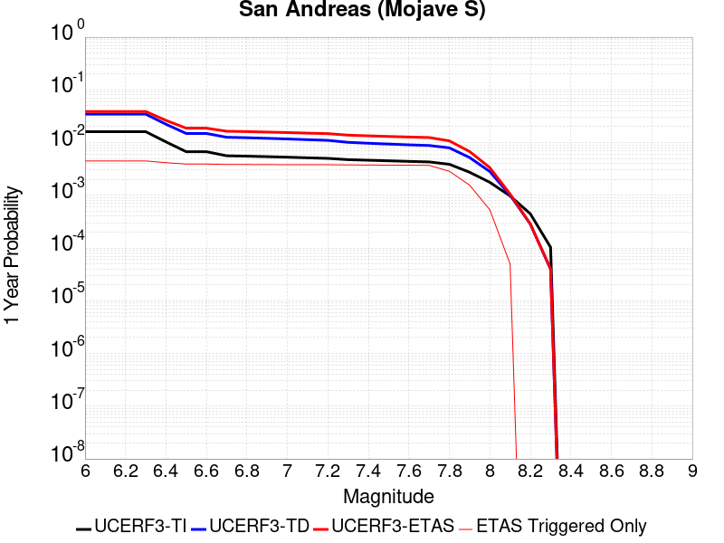 | 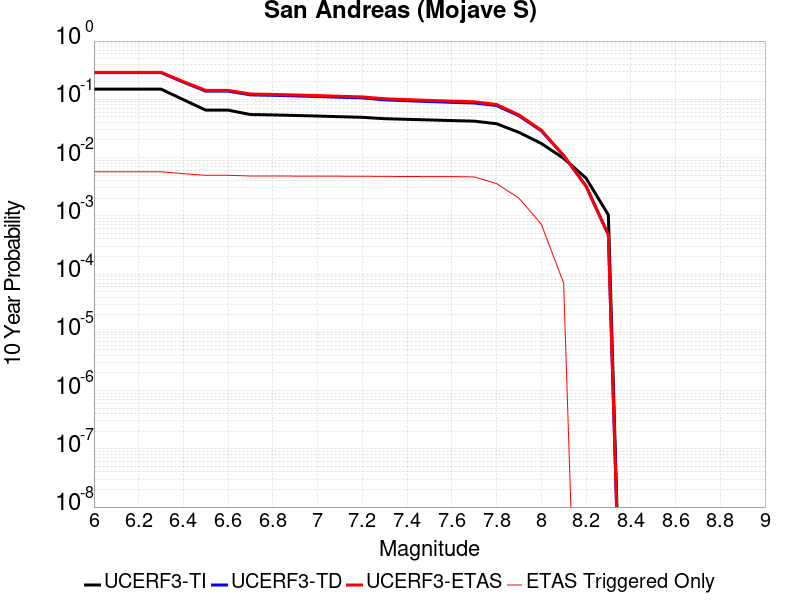 |

| Magnitude | 1 wk TI Prob | 1 wk TD Prob | 1 wk ETAS Prob | 1 wk ETAS/TD Gain | 1 wk ETAS Triggered Only | 1 mo TI Prob | 1 mo TD Prob | 1 mo ETAS Prob | 1 mo ETAS/TD Gain | 1 mo ETAS Triggered Only | 1 yr TI Prob | 1 yr TD Prob | 1 yr ETAS Prob | 1 yr ETAS/TD Gain | 1 yr ETAS Triggered Only | 10 yr TI Prob | 10 yr TD Prob | 10 yr ETAS Prob | 10 yr ETAS/TD Gain | 10 yr ETAS Triggered Only |
|-----|-----|-----|-----|-----|-----|-----|-----|-----|-----|-----|-----|-----|-----|-----|-----|-----|-----|-----|-----|-----|
| 6.0 | 3.1064058E-4 | 6.7462435E-4 | 0.0032129108 | 4.7625184 | 0.00254 | 0.0013306376 | 0.002888172 | 0.006088901 | 2.1082196 | 0.00321 | 0.016080605 | 0.034565594 | 0.038900398 | 1.1254079 | 0.00449 | 0.1496549 | 0.28654557 | 0.2906194 | 1.014217 | 0.00571 |
| 6.1 | 3.1064058E-4 | 6.7462435E-4 | 0.0032129108 | 4.7625184 | 0.00254 | 0.0013306376 | 0.002888172 | 0.006088901 | 2.1082196 | 0.00321 | 0.016080605 | 0.034565594 | 0.038900398 | 1.1254079 | 0.00449 | 0.1496549 | 0.28654557 | 0.2906194 | 1.014217 | 0.00571 |
| 6.2 | 3.1064058E-4 | 6.7462435E-4 | 0.0032129108 | 4.7625184 | 0.00254 | 0.0013306376 | 0.002888172 | 0.006088901 | 2.1082196 | 0.00321 | 0.016080605 | 0.034565594 | 0.038900398 | 1.1254079 | 0.00449 | 0.1496549 | 0.28654557 | 0.2906194 | 1.014217 | 0.00571 |
| 6.3 | 3.1064058E-4 | 6.7462435E-4 | 0.0032129108 | 4.7625184 | 0.00254 | 0.0013306376 | 0.002888172 | 0.006088901 | 2.1082196 | 0.00321 | 0.016080605 | 0.034565594 | 0.038900398 | 1.1254079 | 0.00449 | 0.1496549 | 0.28654557 | 0.2906194 | 1.014217 | 0.00571 |
| 6.4 | 1.9872203E-4 | 4.3181062E-4 | 0.0028507656 | 6.6018887 | 0.00242 | 8.5138786E-4 | 0.0018493326 | 0.004863748 | 2.6300015 | 0.00302 | 0.010316478 | 0.02228931 | 0.026356587 | 1.1824765 | 0.00416 | 0.098504856 | 0.19686839 | 0.20111696 | 1.0215807 | 0.00529 |
| 6.5 | 1.291105E-4 | 2.8754136E-4 | 0.0026068743 | 9.066084 | 0.00232 | 5.5321335E-4 | 0.0012317409 | 0.004098206 | 3.3271654 | 0.00287 | 0.006714592 | 0.014894155 | 0.01875577 | 1.2592705 | 0.00392 | 0.065152965 | 0.13800792 | 0.14228341 | 1.03098 | 0.00496 |
| 6.6 | 1.291105E-4 | 2.8754136E-4 | 0.0026068743 | 9.066084 | 0.00232 | 5.5321335E-4 | 0.0012317409 | 0.004098206 | 3.3271654 | 0.00287 | 0.006714592 | 0.014894155 | 0.01875577 | 1.2592705 | 0.00392 | 0.065152965 | 0.13800792 | 0.14228341 | 1.03098 | 0.00496 |
| 6.7 | 1.08001186E-4 | 2.4335351E-4 | 0.0025227987 | 10.366806 | 0.00228 | 4.6278012E-4 | 0.0010425274 | 0.0038495979 | 3.692563 | 0.00281 | 0.0056198016 | 0.0126192 | 0.016410742 | 1.3004582 | 0.00384 | 0.054797906 | 0.11918431 | 0.12343865 | 1.0356954 | 0.00483 |
| 6.8 | 1.0624356E-4 | 2.3853009E-4 | 0.0025179863 | 10.556263 | 0.00228 | 4.5525006E-4 | 0.0010218718 | 0.0038290003 | 3.7470458 | 0.00281 | 0.0055285925 | 0.012370593 | 0.01616309 | 1.3065736 | 0.00384 | 0.053930566 | 0.11713308 | 0.121397324 | 1.0364052 | 0.00483 |
| 6.9 | 1.0393785E-4 | 2.3223337E-4 | 0.0025117039 | 10.815431 | 0.00228 | 4.4537184E-4 | 9.949068E-4 | 0.003792121 | 3.8115342 | 0.0028 | 0.0054089287 | 0.012045963 | 0.015819948 | 1.3132987 | 0.00382 | 0.05279156 | 0.114433445 | 0.118693024 | 1.0372232 | 0.00481 |
| 7.0 | 1.0155622E-4 | 2.2592908E-4 | 0.002505414 | 11.089383 | 0.00228 | 4.3516833E-4 | 9.6790853E-4 | 0.003755208 | 3.8797138 | 0.00279 | 0.005285311 | 0.011720838 | 0.015486182 | 1.3212521 | 0.00381 | 0.05161361 | 0.11169745 | 0.115961306 | 1.0381732 | 0.0048 |
| 7.1 | 9.885595E-5 | 2.188132E-4 | 0.0024883165 | 11.371876 | 0.00227 | 4.2359953E-4 | 9.374342E-4 | 0.003714828 | 3.9627614 | 0.00278 | 0.0051451353 | 0.011353733 | 0.015110589 | 1.3308917 | 0.0038 | 0.05027629 | 0.10857607 | 0.11284599 | 1.0393265 | 0.00479 |
| 7.2 | 9.6411415E-5 | 2.1244297E-4 | 0.0024819607 | 11.682951 | 0.00227 | 4.1312634E-4 | 9.101525E-4 | 0.0036876223 | 4.0516534 | 0.00278 | 0.005018219 | 0.011024987 | 0.014783092 | 1.3408716 | 0.0038 | 0.049064007 | 0.1057697 | 0.11004412 | 1.0404125 | 0.00478 |
| 7.3 | 9.1180635E-5 | 1.9472656E-4 | 0.0024542864 | 12.603758 | 0.00226 | 3.907156E-4 | 8.342756E-4 | 0.0036019646 | 4.317476 | 0.00277 | 0.004746591 | 0.010110112 | 0.013841997 | 1.3691239 | 0.00377 | 0.046464786 | 0.09796176 | 0.10224644 | 1.0437384 | 0.00475 |
| 7.4 | 8.887388E-5 | 1.872126E-4 | 0.0024267933 | 12.962766 | 0.00224 | 3.8083247E-4 | 8.020931E-4 | 0.0035498873 | 4.42578 | 0.00275 | 0.0046267817 | 0.009721855 | 0.013435398 | 1.3819789 | 0.00375 | 0.045316286 | 0.094593845 | 0.09887642 | 1.0452733 | 0.00473 |
| 7.5 | 8.6750515E-5 | 1.80528E-4 | 0.0024101255 | 13.350425 | 0.00223 | 3.7173493E-4 | 7.734621E-4 | 0.003511343 | 4.5397735 | 0.00274 | 0.004516484 | 0.009376327 | 0.013071353 | 1.3940804 | 0.00373 | 0.04425787 | 0.09155606 | 0.09583483 | 1.0467339 | 0.00471 |
| 7.6 | 8.453092E-5 | 1.7440386E-4 | 0.002404015 | 13.784184 | 0.00223 | 3.6222505E-4 | 7.4723107E-4 | 0.0034851837 | 4.664131 | 0.00274 | 0.0044011753 | 0.009059664 | 0.012755872 | 1.4079851 | 0.00373 | 0.04315024 | 0.08871447 | 0.09300663 | 1.0483817 | 0.00471 |
| 7.7 | 8.259102E-5 | 1.6962511E-4 | 0.0023892485 | 14.085465 | 0.00222 | 3.539135E-4 | 7.267622E-4 | 0.003454778 | 4.7536564 | 0.00273 | 0.004300386 | 0.0088125 | 0.012479894 | 1.4161581 | 0.0037 | 0.042181134 | 0.086465426 | 0.0907225 | 1.0492344 | 0.00466 |
| 7.8 | 7.444844E-5 | 1.528469E-4 | 0.0019025794 | 12.447615 | 0.00175 | 3.1902574E-4 | 6.5489375E-4 | 0.0027635118 | 4.2197866 | 0.00211 | 0.0038772223 | 0.007944231 | 0.010781511 | 1.3571497 | 0.00286 | 0.03810269 | 0.078293875 | 0.08159358 | 1.0421451 | 0.00358 |
| 7.9 | 5.2586525E-5 | 1.0007023E-4 | 0.0010299772 | 10.292542 | 9.3E-4 | 2.2535135E-4 | 4.2880196E-4 | 0.0015283303 | 3.5641868 | 0.0011 | 0.0027402006 | 0.005208178 | 0.006760053 | 1.297969 | 0.00156 | 0.027066574 | 0.052201588 | 0.054106664 | 1.0364946 | 0.00201 |
| 8.0 | 3.379877E-5 | 5.4075565E-5 | 3.640588E-4 | 6.732409 | 3.1E-4 | 1.4484383E-4 | 2.3173184E-4 | 6.116438E-4 | 2.6394465 | 3.8E-4 | 0.0017620471 | 0.0028176866 | 0.0033461933 | 1.1875676 | 5.3E-4 | 0.017481409 | 0.028835917 | 0.029535154 | 1.0242488 | 7.2E-4 |
| 8.1 | 1.8668277E-5 | 1.9308145E-5 | 4.9307564E-5 | 2.5537186 | 3.0E-5 | 8.000444E-5 | 8.274657E-5 | 1.3274243E-4 | 1.6042047 | 5.0E-5 | 9.736188E-4 | 0.0010069745 | 0.0010569241 | 1.0496037 | 5.0E-5 | 0.009693642 | 0.010798624 | 0.010867868 | 1.0064123 | 7.0E-5 |
| 8.2 | 8.541571E-6 | 5.4596358E-6 | 5.4596358E-6 | 1.0 | 0.0 | 3.660622E-5 | 2.339823E-5 | 2.339823E-5 | 1.0 | 0.0 | 4.455896E-4 | 2.848363E-4 | 2.848363E-4 | 1.0 | 0.0 | 0.0044469717 | 0.003240283 | 0.003240283 | 1.0 | 0.0 |
| 8.3 | 1.983087E-6 | 7.6564595E-7 | 7.6564595E-7 | 1.0 | 0.0 | 8.498917E-6 | 3.281336E-6 | 3.281336E-6 | 1.0 | 0.0 | 1.034694E-4 | 3.9949547E-5 | 3.9949547E-5 | 1.0 | 0.0 | 0.0010342124 | 4.717979E-4 | 4.717979E-4 | 1.0 | 0.0 |

## San Andreas (Mojave N)
*[(top)](#table-of-contents)*

| 1 Week | 1 Month | 1 Year | 10 Year |
|-----|-----|-----|-----|
|  |  |  |  |

| Magnitude | 1 wk TI Prob | 1 wk TD Prob | 1 wk ETAS Prob | 1 wk ETAS/TD Gain | 1 wk ETAS Triggered Only | 1 mo TI Prob | 1 mo TD Prob | 1 mo ETAS Prob | 1 mo ETAS/TD Gain | 1 mo ETAS Triggered Only | 1 yr TI Prob | 1 yr TD Prob | 1 yr ETAS Prob | 1 yr ETAS/TD Gain | 1 yr ETAS Triggered Only | 10 yr TI Prob | 10 yr TD Prob | 10 yr ETAS Prob | 10 yr ETAS/TD Gain | 10 yr ETAS Triggered Only |
|-----|-----|-----|-----|-----|-----|-----|-----|-----|-----|-----|-----|-----|-----|-----|-----|-----|-----|-----|-----|-----|
| 6.0 | 9.877682E-5 | 1.9402112E-4 | 0.0032534273 | 16.76842 | 0.00306 | 4.2326056E-4 | 8.312543E-4 | 0.004528179 | 5.447405 | 0.0037 | 0.0051410277 | 0.010073684 | 0.015023316 | 1.4913428 | 0.005 | 0.05023708 | 0.09832245 | 0.103939906 | 1.057133 | 0.00623 |
| 6.1 | 9.877682E-5 | 1.9402112E-4 | 0.0032534273 | 16.76842 | 0.00306 | 4.2326056E-4 | 8.312543E-4 | 0.004528179 | 5.447405 | 0.0037 | 0.0051410277 | 0.010073684 | 0.015023316 | 1.4913428 | 0.005 | 0.05023708 | 0.09832245 | 0.103939906 | 1.057133 | 0.00623 |
| 6.2 | 9.877682E-5 | 1.9402112E-4 | 0.0032534273 | 16.76842 | 0.00306 | 4.2326056E-4 | 8.312543E-4 | 0.004528179 | 5.447405 | 0.0037 | 0.0051410277 | 0.010073684 | 0.015023316 | 1.4913428 | 0.005 | 0.05023708 | 0.09832245 | 0.103939906 | 1.057133 | 0.00623 |
| 6.3 | 9.877682E-5 | 1.9402112E-4 | 0.0032534273 | 16.76842 | 0.00306 | 4.2326056E-4 | 8.312543E-4 | 0.004528179 | 5.447405 | 0.0037 | 0.0051410277 | 0.010073684 | 0.015023316 | 1.4913428 | 0.005 | 0.05023708 | 0.09832245 | 0.103939906 | 1.057133 | 0.00623 |
| 6.4 | 9.877682E-5 | 1.9402112E-4 | 0.0032534273 | 16.76842 | 0.00306 | 4.2326056E-4 | 8.312543E-4 | 0.004528179 | 5.447405 | 0.0037 | 0.0051410277 | 0.010073684 | 0.015023316 | 1.4913428 | 0.005 | 0.05023708 | 0.09832245 | 0.103939906 | 1.057133 | 0.00623 |
| 6.5 | 9.861474E-5 | 1.937588E-4 | 0.003243168 | 16.73817 | 0.00305 | 4.2256617E-4 | 8.3013077E-4 | 0.0045170677 | 5.441393 | 0.00369 | 0.0051326132 | 0.0100601325 | 0.014999933 | 1.4910274 | 0.00499 | 0.050156746 | 0.09820035 | 0.10380954 | 1.0571198 | 0.00622 |
| 6.6 | 9.861474E-5 | 1.937588E-4 | 0.003243168 | 16.73817 | 0.00305 | 4.2256617E-4 | 8.3013077E-4 | 0.0045170677 | 5.441393 | 0.00369 | 0.0051326132 | 0.0100601325 | 0.014999933 | 1.4910274 | 0.00499 | 0.050156746 | 0.09820035 | 0.10380954 | 1.0571198 | 0.00622 |
| 6.7 | 9.8552715E-5 | 1.9365833E-4 | 0.0032430678 | 16.746338 | 0.00305 | 4.223004E-4 | 8.2970044E-4 | 0.004516639 | 5.4436984 | 0.00369 | 0.0051293927 | 0.010054941 | 0.0149947675 | 1.4912834 | 0.00499 | 0.050125998 | 0.09815356 | 0.103763044 | 1.0571501 | 0.00622 |
| 6.8 | 9.8464974E-5 | 1.9350994E-4 | 0.0032429197 | 16.758413 | 0.00305 | 4.219245E-4 | 8.290649E-4 | 0.0045160055 | 5.4471073 | 0.00369 | 0.0051248376 | 0.010047276 | 0.014987139 | 1.491662 | 0.00499 | 0.05008251 | 0.09808378 | 0.1036937 | 1.0571952 | 0.00622 |
| 6.9 | 9.825824E-5 | 1.9319002E-4 | 0.0032426007 | 16.784515 | 0.00305 | 4.2103877E-4 | 8.276947E-4 | 0.0045146407 | 5.4544754 | 0.00369 | 0.0051141046 | 0.010030746 | 0.014970693 | 1.4924804 | 0.00499 | 0.049980022 | 0.097932965 | 0.10354382 | 1.0572928 | 0.00622 |
| 7.0 | 9.781462E-5 | 1.9250368E-4 | 0.0032419167 | 16.840803 | 0.00305 | 4.1913814E-4 | 8.247551E-4 | 0.0045117117 | 5.4703655 | 0.00369 | 0.005091073 | 0.009995285 | 0.014925509 | 1.4932549 | 0.00498 | 0.04976007 | 0.09760912 | 0.10321297 | 1.0574111 | 0.00621 |
| 7.1 | 9.7121134E-5 | 1.9152075E-4 | 0.0032409367 | 16.922117 | 0.00305 | 4.1616702E-4 | 8.205452E-4 | 0.0045075174 | 5.49332 | 0.00369 | 0.005055068 | 0.0099444995 | 0.014874976 | 1.4957993 | 0.00498 | 0.04941613 | 0.09714571 | 0.10275243 | 1.0577146 | 0.00621 |
| 7.2 | 9.663819E-5 | 1.9082859E-4 | 0.0032402466 | 16.97988 | 0.00305 | 4.1409794E-4 | 8.175807E-4 | 0.0045045638 | 5.509626 | 0.00369 | 0.0050299936 | 0.009908735 | 0.014839389 | 1.4976069 | 0.00498 | 0.049176537 | 0.09681883 | 0.10242758 | 1.0579305 | 0.00621 |
| 7.3 | 9.6277574E-5 | 1.9035369E-4 | 0.0032397732 | 17.019754 | 0.00305 | 4.125529E-4 | 8.1554666E-4 | 0.004502537 | 5.5208826 | 0.00369 | 0.0050112694 | 0.009884195 | 0.014814973 | 1.4988546 | 0.00498 | 0.04899759 | 0.09659228 | 0.10220244 | 1.0580809 | 0.00621 |
| 7.4 | 9.593308E-5 | 1.8975153E-4 | 0.0032391727 | 17.0706 | 0.00305 | 4.1107697E-4 | 8.129676E-4 | 0.0044999677 | 5.5352364 | 0.00369 | 0.0049933824 | 0.009853081 | 0.014784012 | 1.5004457 | 0.00498 | 0.04882661 | 0.09630986 | 0.101921774 | 1.0582694 | 0.00621 |
| 7.5 | 9.561707E-5 | 1.8921228E-4 | 0.0032386351 | 17.116411 | 0.00305 | 4.0972308E-4 | 8.106579E-4 | 0.0044976664 | 5.548168 | 0.00369 | 0.0049769743 | 0.009825215 | 0.014756285 | 1.5018792 | 0.00498 | 0.048669744 | 0.096056245 | 0.101669736 | 1.0584396 | 0.00621 |
| 7.6 | 9.418194E-5 | 1.8573487E-4 | 0.0032351683 | 17.418207 | 0.00305 | 4.0357444E-4 | 7.95764E-4 | 0.0044828276 | 5.6333632 | 0.00369 | 0.004902454 | 0.009645499 | 0.014577464 | 1.511323 | 0.00498 | 0.047957025 | 0.094437465 | 0.10006101 | 1.0595478 | 0.00621 |
| 7.7 | 8.202141E-5 | 1.6022482E-4 | 0.0029697747 | 18.535048 | 0.00281 | 3.51473E-4 | 6.8649714E-4 | 0.00407417 | 5.9347224 | 0.00339 | 0.00427079 | 0.008326128 | 0.012848161 | 1.5431135 | 0.00456 | 0.04189639 | 0.082237914 | 0.08746916 | 1.0636111 | 0.0057 |
| 7.8 | 7.2859846E-5 | 1.4517571E-4 | 0.0018949216 | 13.0526085 | 0.00175 | 3.1221908E-4 | 6.2203326E-4 | 0.0027207271 | 4.373925 | 0.0021 | 0.003794643 | 0.0075469986 | 0.0103754895 | 1.3747835 | 0.00285 | 0.037304975 | 0.07472766 | 0.078030884 | 1.0442035 | 0.00357 |
| 7.9 | 5.3874453E-5 | 1.00462625E-4 | 0.0010303692 | 10.256244 | 9.3E-4 | 2.3087008E-4 | 4.3048308E-4 | 0.0015300096 | 3.5541687 | 0.0011 | 0.0028072202 | 0.0052285474 | 0.006780391 | 1.296802 | 0.00156 | 0.02772022 | 0.052425884 | 0.05433051 | 1.0363299 | 0.00201 |
| 8.0 | 3.468538E-5 | 5.4261534E-5 | 3.642447E-4 | 6.712761 | 3.1E-4 | 1.4864317E-4 | 2.3252872E-4 | 6.1244034E-4 | 2.6338267 | 3.8E-4 | 0.0018082283 | 0.0028273636 | 0.0033558651 | 1.1869237 | 5.3E-4 | 0.017935853 | 0.028948462 | 0.029647619 | 1.0241518 | 7.2E-4 |
| 8.1 | 1.9152367E-5 | 1.9401303E-5 | 4.940072E-5 | 2.546258 | 3.0E-5 | 8.207899E-5 | 8.3145795E-5 | 1.3314163E-4 | 1.6013033 | 5.0E-5 | 9.988535E-4 | 0.0010118305 | 0.0010617799 | 1.0493654 | 5.0E-5 | 0.009943757 | 0.01085595 | 0.0109251905 | 1.006378 | 7.0E-5 |
| 8.2 | 8.643924E-6 | 5.473668E-6 | 5.473668E-6 | 1.0 | 0.0 | 3.704486E-5 | 2.3458366E-5 | 2.3458366E-5 | 1.0 | 0.0 | 4.5092785E-4 | 2.8556827E-4 | 2.8556827E-4 | 1.0 | 0.0 | 0.0045001395 | 0.0032481793 | 0.0032481793 | 1.0 | 0.0 |
| 8.3 | 1.983087E-6 | 7.6564595E-7 | 7.6564595E-7 | 1.0 | 0.0 | 8.498917E-6 | 3.281336E-6 | 3.281336E-6 | 1.0 | 0.0 | 1.034694E-4 | 3.9949547E-5 | 3.9949547E-5 | 1.0 | 0.0 | 0.0010342124 | 4.717979E-4 | 4.717979E-4 | 1.0 | 0.0 |

## Death Valley (So)
*[(top)](#table-of-contents)*

| 1 Week | 1 Month | 1 Year | 10 Year |
|-----|-----|-----|-----|
|  |  | 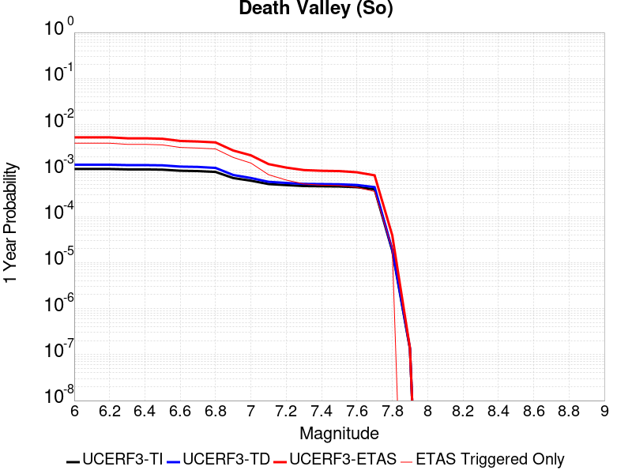 | 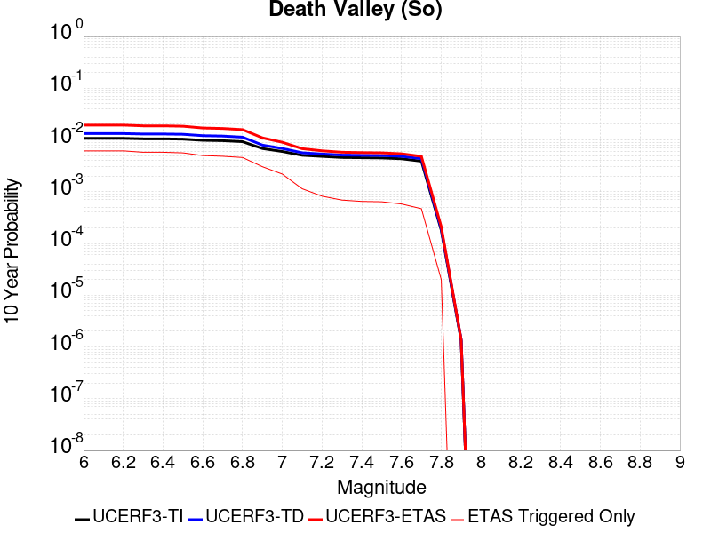 |

| Magnitude | 1 wk TI Prob | 1 wk TD Prob | 1 wk ETAS Prob | 1 wk ETAS/TD Gain | 1 wk ETAS Triggered Only | 1 mo TI Prob | 1 mo TD Prob | 1 mo ETAS Prob | 1 mo ETAS/TD Gain | 1 mo ETAS Triggered Only | 1 yr TI Prob | 1 yr TD Prob | 1 yr ETAS Prob | 1 yr ETAS/TD Gain | 1 yr ETAS Triggered Only | 10 yr TI Prob | 10 yr TD Prob | 10 yr ETAS Prob | 10 yr ETAS/TD Gain | 10 yr ETAS Triggered Only |
|-----|-----|-----|-----|-----|-----|-----|-----|-----|-----|-----|-----|-----|-----|-----|-----|-----|-----|-----|-----|-----|
| 6.0 | 2.0684236E-5 | 2.5618314E-5 | 0.0016355771 | 63.844055 | 0.00161 | 8.864371E-5 | 1.0978825E-4 | 0.0024295335 | 22.129267 | 0.00232 | 0.0010787029 | 0.0013358692 | 0.0052506328 | 3.930499 | 0.00392 | 0.010734817 | 0.013279985 | 0.01935818 | 1.457696 | 0.00616 |
| 6.1 | 2.0684236E-5 | 2.5618314E-5 | 0.0016355771 | 63.844055 | 0.00161 | 8.864371E-5 | 1.0978825E-4 | 0.0024295335 | 22.129267 | 0.00232 | 0.0010787029 | 0.0013358692 | 0.0052506328 | 3.930499 | 0.00392 | 0.010734817 | 0.013279985 | 0.01935818 | 1.457696 | 0.00616 |
| 6.2 | 2.0684236E-5 | 2.5618314E-5 | 0.0016355771 | 63.844055 | 0.00161 | 8.864371E-5 | 1.0978825E-4 | 0.0024295335 | 22.129267 | 0.00232 | 0.0010787029 | 0.0013358692 | 0.0052506328 | 3.930499 | 0.00392 | 0.010734817 | 0.013279985 | 0.01935818 | 1.457696 | 0.00616 |
| 6.3 | 2.0240292E-5 | 2.51184E-5 | 0.0015050812 | 59.919476 | 0.00148 | 8.6741224E-5 | 1.0764593E-4 | 0.0022774125 | 21.156511 | 0.00217 | 0.0010555626 | 0.001309818 | 0.0050049718 | 3.8211198 | 0.0037 | 0.010505628 | 0.013022543 | 0.018727273 | 1.4380658 | 0.00578 |
| 6.4 | 2.0240292E-5 | 2.51184E-5 | 0.0015050812 | 59.919476 | 0.00148 | 8.6741224E-5 | 1.0764593E-4 | 0.0022774125 | 21.156511 | 0.00217 | 0.0010555626 | 0.001309818 | 0.0050049718 | 3.8211198 | 0.0037 | 0.010505628 | 0.013022543 | 0.018727273 | 1.4380658 | 0.00578 |
| 6.5 | 1.9962767E-5 | 2.4807652E-5 | 0.0014647719 | 59.045166 | 0.00144 | 8.55519E-5 | 1.0631427E-4 | 0.002226089 | 20.938759 | 0.00212 | 0.0010410968 | 0.0012936244 | 0.004888967 | 3.779279 | 0.0036 | 0.010362327 | 0.01286249 | 0.018420074 | 1.4320768 | 0.00563 |
| 6.6 | 1.8937297E-5 | 2.3311462E-5 | 0.0013132814 | 56.336292 | 0.00129 | 8.115732E-5 | 9.990252E-5 | 0.0019997128 | 20.016638 | 0.0019 | 9.876423E-4 | 0.0012156491 | 0.0043817954 | 3.6044905 | 0.00317 | 0.009832645 | 0.0120915035 | 0.017031046 | 1.4085135 | 0.005 |
| 6.7 | 1.8621096E-5 | 2.2912098E-5 | 0.0012728835 | 55.555084 | 0.00125 | 7.980225E-5 | 9.8191085E-5 | 0.0019380104 | 19.737131 | 0.00184 | 9.711593E-4 | 0.0011948354 | 0.0042611673 | 3.5663216 | 0.00307 | 0.009669261 | 0.011885625 | 0.016668098 | 1.4023746 | 0.00484 |
| 6.8 | 1.7830353E-5 | 2.1806083E-5 | 0.0012017804 | 55.11216 | 0.00118 | 7.641356E-5 | 9.3451374E-5 | 0.0018432878 | 19.724566 | 0.00175 | 9.29938E-4 | 0.0011371907 | 0.0040738476 | 3.5823784 | 0.00294 | 0.009260561 | 0.01131609 | 0.015844261 | 1.4001534 | 0.00458 |
| 6.9 | 1.3135183E-5 | 1.5304031E-5 | 8.152918E-4 | 53.273014 | 8.0E-4 | 5.6292425E-5 | 6.558709E-5 | 0.0012455097 | 18.990166 | 0.00118 | 6.8514474E-4 | 7.982367E-4 | 0.002716704 | 3.4033816 | 0.00192 | 0.006830362 | 0.007955158 | 0.010970974 | 1.379102 | 0.00304 |
| 7.0 | 1.1507512E-5 | 1.3154237E-5 | 6.331461E-4 | 48.13248 | 6.2E-4 | 4.9316975E-5 | 5.637412E-5 | 9.6632284E-4 | 17.141249 | 9.1E-4 | 6.002687E-4 | 6.861445E-4 | 0.0021351497 | 3.1118073 | 0.00145 | 0.0059864987 | 0.0068414924 | 0.009016509 | 1.3179156 | 0.00219 |
| 7.1 | 9.715903E-6 | 1.0865287E-5 | 3.308618E-4 | 30.451273 | 3.2E-4 | 4.1638916E-5 | 4.6564706E-5 | 5.465414E-4 | 11.7372465 | 5.0E-4 | 5.068359E-4 | 5.667821E-4 | 0.001376323 | 2.4283106 | 8.1E-4 | 0.0050568148 | 0.005653834 | 0.0067873886 | 1.2004931 | 0.00114 |
| 7.2 | 9.233269E-6 | 1.0286314E-5 | 2.6028373E-4 | 25.303888 | 2.5E-4 | 3.9570554E-5 | 4.408348E-5 | 4.4406584E-4 | 10.073294 | 4.0E-4 | 4.81665E-4 | 5.365884E-4 | 0.0011562557 | 2.1548278 | 6.2E-4 | 0.0048062233 | 0.0053533595 | 0.00616897 | 1.1523548 | 8.2E-4 |
| 7.3 | 8.8041315E-6 | 9.808164E-6 | 2.098062E-4 | 21.390976 | 2.0E-4 | 3.7731446E-5 | 4.2034335E-5 | 3.8202005E-4 | 9.088285 | 3.4E-4 | 4.592835E-4 | 5.1165203E-4 | 0.0010213911 | 1.9962611 | 5.1E-4 | 0.0045833546 | 0.005105167 | 0.0057916446 | 1.1344671 | 6.9E-4 |
| 7.4 | 8.708749E-6 | 9.707175E-6 | 1.9970533E-4 | 20.57296 | 1.9E-4 | 3.7322676E-5 | 4.160154E-5 | 3.6158823E-4 | 8.691703 | 3.2E-4 | 4.5430884E-4 | 5.0638523E-4 | 9.861422E-4 | 1.947415 | 4.8E-4 | 0.004533812 | 0.0050527398 | 0.0056994553 | 1.1279931 | 6.5E-4 |
| 7.5 | 8.612678E-6 | 9.604817E-6 | 1.9960299E-4 | 20.78155 | 1.9E-4 | 3.6910955E-5 | 4.1162875E-5 | 3.611497E-4 | 8.773675 | 3.2E-4 | 4.492982E-4 | 5.01047E-4 | 9.7081147E-4 | 1.9375658 | 4.7E-4 | 0.004483909 | 0.0049995985 | 0.005636399 | 1.1273702 | 6.4E-4 |
| 7.6 | 8.319024E-6 | 9.283916E-6 | 1.8928225E-4 | 20.38819 | 1.8E-4 | 3.5652476E-5 | 3.978763E-5 | 3.397757E-4 | 8.539732 | 3.0E-4 | 4.3398244E-4 | 4.8431093E-4 | 9.1410265E-4 | 1.8874294 | 4.3E-4 | 0.0043313587 | 0.0048329784 | 0.0054101753 | 1.1194289 | 5.8E-4 |
| 7.7 | 7.4718328E-6 | 8.34517E-6 | 1.48344E-4 | 17.776031 | 1.4E-4 | 3.2021748E-5 | 3.5764548E-5 | 2.857556E-4 | 7.989913 | 2.5E-4 | 3.8979502E-4 | 4.353504E-4 | 7.85198E-4 | 1.8036001 | 3.5E-4 | 0.00389112 | 0.0043453807 | 0.004813338 | 1.1076908 | 4.7E-4 |
| 7.8 | 3.4586725E-7 | 3.6482615E-7 | 1.0364823E-5 | 28.410307 | 1.0E-5 | 1.4822873E-6 | 1.5635396E-6 | 2.1563508E-5 | 13.791469 | 2.0E-5 | 1.80467E-5 | 1.9035933E-5 | 3.9035553E-5 | 2.0506246 | 2.0E-5 | 1.8045233E-4 | 1.9034347E-4 | 2.1033967E-4 | 1.1050532 | 2.0E-5 |
| 7.9 | 2.5591178E-9 | 2.6696718E-9 | 2.6696718E-9 | 1.0 | 0.0 | 1.0967647E-8 | 1.14414505E-8 | 1.14414505E-8 | 1.0 | 0.0 | 1.335311E-7 | 1.3929966E-7 | 1.3929966E-7 | 1.0 | 0.0 | 1.3353102E-6 | 1.3929966E-6 | 1.3929966E-6 | 1.0 | 0.0 |

## Coyote Canyon
*[(top)](#table-of-contents)*

| 1 Week | 1 Month | 1 Year | 10 Year |
|-----|-----|-----|-----|
|  |  |  |  |

| Magnitude | 1 wk TI Prob | 1 wk TD Prob | 1 wk ETAS Prob | 1 wk ETAS/TD Gain | 1 wk ETAS Triggered Only | 1 mo TI Prob | 1 mo TD Prob | 1 mo ETAS Prob | 1 mo ETAS/TD Gain | 1 mo ETAS Triggered Only | 1 yr TI Prob | 1 yr TD Prob | 1 yr ETAS Prob | 1 yr ETAS/TD Gain | 1 yr ETAS Triggered Only | 10 yr TI Prob | 10 yr TD Prob | 10 yr ETAS Prob | 10 yr ETAS/TD Gain | 10 yr ETAS Triggered Only |
|-----|-----|-----|-----|-----|-----|-----|-----|-----|-----|-----|-----|-----|-----|-----|-----|-----|-----|-----|-----|-----|
| 6.0 | 3.5090034E-5 | 4.0364317E-5 | 0.0011503195 | 28.498426 | 0.00111 | 1.503772E-4 | 1.7297991E-4 | 0.0019826668 | 11.461833 | 0.00181 | 0.0018293047 | 0.0021042533 | 0.0053973095 | 2.5649521 | 0.0033 | 0.018143194 | 0.020869205 | 0.026029224 | 1.2472552 | 0.00527 |
| 6.1 | 3.5090034E-5 | 4.0364317E-5 | 0.0011503195 | 28.498426 | 0.00111 | 1.503772E-4 | 1.7297991E-4 | 0.0019826668 | 11.461833 | 0.00181 | 0.0018293047 | 0.0021042533 | 0.0053973095 | 2.5649521 | 0.0033 | 0.018143194 | 0.020869205 | 0.026029224 | 1.2472552 | 0.00527 |
| 6.2 | 1.841879E-5 | 2.1059794E-5 | 5.81048E-4 | 27.590395 | 5.6E-4 | 7.8935285E-5 | 9.025371E-5 | 9.601752E-4 | 10.638623 | 8.7E-4 | 9.606133E-4 | 0.0010983871 | 0.0027465746 | 2.5005527 | 0.00165 | 0.0095647145 | 0.010939668 | 0.013659583 | 1.2486287 | 0.00275 |
| 6.3 | 1.841879E-5 | 2.1059794E-5 | 5.81048E-4 | 27.590395 | 5.6E-4 | 7.8935285E-5 | 9.025371E-5 | 9.601752E-4 | 10.638623 | 8.7E-4 | 9.606133E-4 | 0.0010983871 | 0.0027465746 | 2.5005527 | 0.00165 | 0.0095647145 | 0.010939668 | 0.013659583 | 1.2486287 | 0.00275 |
| 6.4 | 1.712201E-5 | 1.9565212E-5 | 5.6955445E-4 | 29.110569 | 5.5E-4 | 7.337798E-5 | 8.3848776E-5 | 9.437767E-4 | 11.255699 | 8.6E-4 | 8.930107E-4 | 0.0010204813 | 0.002588879 | 2.5369196 | 0.00157 | 0.008894307 | 0.010167871 | 0.012711739 | 1.2501869 | 0.00257 |
| 6.5 | 1.4744935E-5 | 1.6836972E-5 | 5.1682856E-4 | 30.69605 | 5.0E-4 | 6.3191044E-5 | 7.215698E-5 | 8.621E-4 | 11.947561 | 7.9E-4 | 7.6907943E-4 | 8.782507E-4 | 0.0023269772 | 2.6495593 | 0.00145 | 0.007664232 | 0.008756994 | 0.011106241 | 1.2682709 | 0.00237 |
| 6.6 | 1.2017839E-5 | 1.3724089E-5 | 4.5371806E-4 | 33.059975 | 4.4E-4 | 5.150401E-5 | 5.88167E-5 | 7.587755E-4 | 12.900682 | 7.0E-4 | 6.268809E-4 | 7.159466E-4 | 0.0019150875 | 2.6749027 | 0.0012 | 0.0062511545 | 0.0071450938 | 0.009120875 | 1.2765228 | 0.00199 |
| 6.7 | 1.00956095E-5 | 1.1533517E-5 | 3.6152947E-4 | 31.34599 | 3.5E-4 | 4.326618E-5 | 4.942891E-5 | 6.1940076E-4 | 12.531143 | 5.7E-4 | 5.266384E-4 | 6.017178E-4 | 0.00161111 | 2.6775177 | 0.00101 | 0.005253921 | 0.0060094125 | 0.0076991967 | 1.2811896 | 0.0017 |

## Nelson Lake
*[(top)](#table-of-contents)*

| 1 Week | 1 Month | 1 Year | 10 Year |
|-----|-----|-----|-----|
|  |  |  | 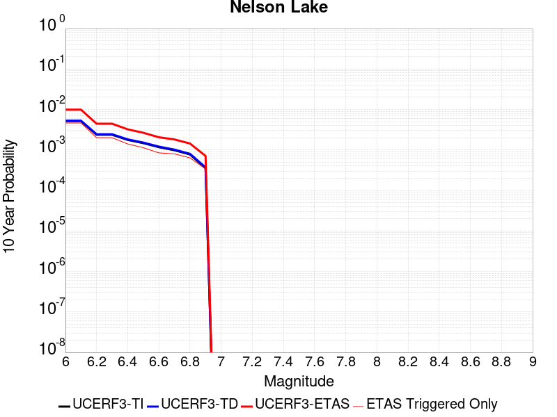 |

| Magnitude | 1 wk TI Prob | 1 wk TD Prob | 1 wk ETAS Prob | 1 wk ETAS/TD Gain | 1 wk ETAS Triggered Only | 1 mo TI Prob | 1 mo TD Prob | 1 mo ETAS Prob | 1 mo ETAS/TD Gain | 1 mo ETAS Triggered Only | 1 yr TI Prob | 1 yr TD Prob | 1 yr ETAS Prob | 1 yr ETAS/TD Gain | 1 yr ETAS Triggered Only | 10 yr TI Prob | 10 yr TD Prob | 10 yr ETAS Prob | 10 yr ETAS/TD Gain | 10 yr ETAS Triggered Only |
|-----|-----|-----|-----|-----|-----|-----|-----|-----|-----|-----|-----|-----|-----|-----|-----|-----|-----|-----|-----|-----|
| 6.0 | 9.913453E-6 | 1.0192255E-5 | 8.8018336E-4 | 86.358055 | 8.7E-4 | 4.2485535E-5 | 4.3680422E-5 | 0.0013536232 | 30.989243 | 0.00131 | 5.1713863E-4 | 5.316897E-4 | 0.0033501904 | 6.3010254 | 0.00282 | 0.0051593683 | 0.005305204 | 0.009920588 | 1.869973 | 0.00464 |
| 6.1 | 9.913453E-6 | 1.0192255E-5 | 8.8018336E-4 | 86.358055 | 8.7E-4 | 4.2485535E-5 | 4.3680422E-5 | 0.0013536232 | 30.989243 | 0.00131 | 5.1713863E-4 | 5.316897E-4 | 0.0033501904 | 6.3010254 | 0.00282 | 0.0051593683 | 0.005305204 | 0.009920588 | 1.869973 | 0.00464 |
| 6.2 | 4.5596407E-6 | 4.696313E-6 | 4.0469444E-4 | 86.1728 | 4.0E-4 | 1.954117E-5 | 2.0126909E-5 | 6.10115E-4 | 30.3134 | 5.9E-4 | 2.3788778E-4 | 2.4501883E-4 | 0.001484715 | 6.0595956 | 0.00124 | 0.0023763329 | 0.0024476128 | 0.0044526933 | 1.8191984 | 0.00201 |
| 6.3 | 4.5596407E-6 | 4.696313E-6 | 4.0469444E-4 | 86.1728 | 4.0E-4 | 1.954117E-5 | 2.0126909E-5 | 6.10115E-4 | 30.3134 | 5.9E-4 | 2.3788778E-4 | 2.4501883E-4 | 0.001484715 | 6.0595956 | 0.00124 | 0.0023763329 | 0.0024476128 | 0.0044526933 | 1.8191984 | 0.00201 |
| 6.4 | 3.4025713E-6 | 3.5098972E-6 | 3.1350882E-4 | 89.321365 | 3.1E-4 | 1.4582367E-5 | 1.5042335E-5 | 4.550357E-4 | 30.250338 | 4.4E-4 | 1.7752586E-4 | 1.8312587E-4 | 0.0010829611 | 5.913752 | 9.0E-4 | 0.001773841 | 0.0018298327 | 0.0032372526 | 1.7691523 | 0.00141 |
| 6.5 | 2.8352947E-6 | 2.927856E-6 | 2.1292725E-4 | 72.724625 | 2.1E-4 | 1.2151207E-5 | 1.2547898E-5 | 3.4254376E-4 | 27.298895 | 3.3E-4 | 1.479309E-4 | 1.5276071E-4 | 8.5265376E-4 | 5.58163 | 7.0E-4 | 0.0014783246 | 0.0015266308 | 0.0026648904 | 1.7456024 | 0.00114 |
| 6.6 | 2.251518E-6 | 2.3290677E-6 | 1.623287E-4 | 69.69686 | 1.6E-4 | 9.649328E-6 | 9.981683E-6 | 2.599792E-4 | 26.045626 | 2.5E-4 | 1.1747423E-4 | 1.2152085E-4 | 6.314589E-4 | 5.196301 | 5.1E-4 | 0.0011741214 | 0.0012146058 | 0.0020635733 | 1.6989655 | 8.5E-4 |
| 6.7 | 1.8911853E-6 | 1.9591396E-6 | 1.5195884E-4 | 77.56407 | 1.5E-4 | 8.105055E-6 | 8.39629E-6 | 2.4839427E-4 | 29.583817 | 2.4E-4 | 9.867457E-5 | 1.0222061E-4 | 5.8217155E-4 | 5.695246 | 4.8E-4 | 9.863076E-4 | 0.0010217935 | 0.001820976 | 1.7821372 | 8.0E-4 |
| 6.8 | 1.4874814E-6 | 1.5438305E-6 | 1.4154361E-4 | 91.68339 | 1.4E-4 | 6.374905E-6 | 6.6164025E-6 | 2.1661501E-4 | 32.739094 | 2.1E-4 | 7.76117E-5 | 8.055224E-5 | 4.6052164E-4 | 5.7170553 | 3.8E-4 | 7.75846E-4 | 8.0528157E-4 | 0.0014447662 | 1.794113 | 6.4E-4 |
| 6.9 | 6.835972E-7 | 7.1399285E-7 | 7.071394E-5 | 99.04013 | 7.0E-5 | 2.9296991E-6 | 3.0599674E-6 | 9.3059694E-5 | 30.411987 | 9.0E-5 | 3.56685E-5 | 3.7254784E-5 | 2.2724771E-4 | 6.099826 | 1.9E-4 | 3.5662777E-4 | 3.7251666E-4 | 7.1239E-4 | 1.9123709 | 3.4E-4 |

## Towne Pass
*[(top)](#table-of-contents)*

| 1 Week | 1 Month | 1 Year | 10 Year |
|-----|-----|-----|-----|
|  |  |  |  |

| Magnitude | 1 wk TI Prob | 1 wk TD Prob | 1 wk ETAS Prob | 1 wk ETAS/TD Gain | 1 wk ETAS Triggered Only | 1 mo TI Prob | 1 mo TD Prob | 1 mo ETAS Prob | 1 mo ETAS/TD Gain | 1 mo ETAS Triggered Only | 1 yr TI Prob | 1 yr TD Prob | 1 yr ETAS Prob | 1 yr ETAS/TD Gain | 1 yr ETAS Triggered Only | 10 yr TI Prob | 10 yr TD Prob | 10 yr ETAS Prob | 10 yr ETAS/TD Gain | 10 yr ETAS Triggered Only |
|-----|-----|-----|-----|-----|-----|-----|-----|-----|-----|-----|-----|-----|-----|-----|-----|-----|-----|-----|-----|-----|
| 6.0 | 3.849728E-6 | 3.894542E-6 | 0.0012238898 | 314.2577 | 0.00122 | 1.649873E-5 | 1.6690812E-5 | 0.0018166607 | 108.841965 | 0.0018 | 2.0085352E-4 | 2.0319606E-4 | 0.0034425377 | 16.941952 | 0.00324 | 0.0020067208 | 0.0020305319 | 0.0065513332 | 3.2264128 | 0.00453 |
| 6.1 | 3.849728E-6 | 3.894542E-6 | 0.0012238898 | 314.2577 | 0.00122 | 1.649873E-5 | 1.6690812E-5 | 0.0018166607 | 108.841965 | 0.0018 | 2.0085352E-4 | 2.0319606E-4 | 0.0034425377 | 16.941952 | 0.00324 | 0.0020067208 | 0.0020305319 | 0.0065513332 | 3.2264128 | 0.00453 |
| 6.2 | 3.849728E-6 | 3.894542E-6 | 0.0012238898 | 314.2577 | 0.00122 | 1.649873E-5 | 1.6690812E-5 | 0.0018166607 | 108.841965 | 0.0018 | 2.0085352E-4 | 2.0319606E-4 | 0.0034425377 | 16.941952 | 0.00324 | 0.0020067208 | 0.0020305319 | 0.0065513332 | 3.2264128 | 0.00453 |
| 6.3 | 3.849728E-6 | 3.894542E-6 | 0.0012238898 | 314.2577 | 0.00122 | 1.649873E-5 | 1.6690812E-5 | 0.0018166607 | 108.841965 | 0.0018 | 2.0085352E-4 | 2.0319606E-4 | 0.0034425377 | 16.941952 | 0.00324 | 0.0020067208 | 0.0020305319 | 0.0065513332 | 3.2264128 | 0.00453 |
| 6.4 | 3.849728E-6 | 3.894542E-6 | 0.0012238898 | 314.2577 | 0.00122 | 1.649873E-5 | 1.6690812E-5 | 0.0018166607 | 108.841965 | 0.0018 | 2.0085352E-4 | 2.0319606E-4 | 0.0034425377 | 16.941952 | 0.00324 | 0.0020067208 | 0.0020305319 | 0.0065513332 | 3.2264128 | 0.00453 |
| 6.5 | 1.1953545E-6 | 1.2030526E-6 | 1.2120291E-4 | 100.74614 | 1.2E-4 | 5.1229376E-6 | 5.15593E-6 | 2.3515474E-4 | 45.608597 | 2.3E-4 | 6.236998E-5 | 6.277176E-5 | 4.927448E-4 | 7.849784 | 4.3E-4 | 6.235248E-4 | 6.2755204E-4 | 0.0012171818 | 1.9395711 | 5.9E-4 |
| 6.6 | 1.1953545E-6 | 1.2030526E-6 | 1.2120291E-4 | 100.74614 | 1.2E-4 | 5.1229376E-6 | 5.15593E-6 | 2.3515474E-4 | 45.608597 | 2.3E-4 | 6.236998E-5 | 6.277176E-5 | 4.927448E-4 | 7.849784 | 4.3E-4 | 6.235248E-4 | 6.2755204E-4 | 0.0012171818 | 1.9395711 | 5.9E-4 |
| 6.7 | 8.375951E-7 | 8.410676E-7 | 8.0841E-5 | 96.11713 | 8.0E-5 | 3.5896885E-6 | 3.6045708E-6 | 1.4360406E-4 | 39.839436 | 1.4E-4 | 4.370358E-5 | 4.3884826E-5 | 2.4387604E-4 | 5.557184 | 2.0E-4 | 4.3694986E-4 | 4.3876728E-4 | 7.586269E-4 | 1.728996 | 3.2E-4 |
| 6.8 | 6.38041E-7 | 6.3921624E-7 | 4.0639192E-5 | 63.576595 | 4.0E-5 | 2.7344586E-6 | 2.7394954E-6 | 7.2739305E-5 | 26.55208 | 7.0E-5 | 3.3291526E-5 | 3.3352884E-5 | 1.2334988E-4 | 3.6983273 | 9.0E-5 | 3.3286537E-4 | 3.334826E-4 | 5.2341924E-4 | 1.5695548 | 1.9E-4 |
| 6.9 | 5.3460053E-7 | 5.345339E-7 | 2.0534524E-5 | 38.415756 | 2.0E-5 | 2.2911431E-6 | 2.2908578E-6 | 5.2290743E-5 | 22.825836 | 5.0E-5 | 2.789431E-5 | 2.7890868E-5 | 9.7888915E-5 | 3.509712 | 7.0E-5 | 2.789081E-4 | 2.78877E-4 | 4.2883516E-4 | 1.5377215 | 1.5E-4 |
| 7.0 | 3.557783E-7 | 3.5324283E-7 | 1.0353239E-5 | 29.309128 | 1.0E-5 | 1.5247632E-6 | 1.513897E-6 | 2.1513866E-5 | 14.210917 | 2.0E-5 | 1.8563835E-5 | 1.8431549E-5 | 4.8430997E-5 | 2.627614 | 3.0E-5 | 1.8562283E-4 | 1.8430105E-4 | 2.642863E-4 | 1.4339924 | 8.0E-5 |
| 7.1 | 3.037942E-7 | 3.0002275E-7 | 1.0300019E-5 | 34.330795 | 1.0E-5 | 1.3019744E-6 | 1.2858112E-6 | 1.1285799E-5 | 8.777182 | 1.0E-5 | 1.5851423E-5 | 1.5654647E-5 | 3.5654335E-5 | 2.277556 | 2.0E-5 | 1.5850292E-4 | 1.5653619E-4 | 2.2652523E-4 | 1.4471109 | 7.0E-5 |
| 7.2 | 2.0808248E-7 | 2.0217735E-7 | 1.0202175E-5 | 50.461517 | 1.0E-5 | 8.917818E-7 | 8.6647407E-7 | 1.0866465E-5 | 12.541017 | 1.0E-5 | 1.0857389E-5 | 1.0549275E-5 | 3.0549065E-5 | 2.895845 | 2.0E-5 | 1.0856859E-4 | 1.0548821E-4 | 1.7548082E-4 | 1.6635113 | 7.0E-5 |
| 7.3 | 1.1162073E-7 | 1.0636902E-7 | 1.0636902E-7 | 1.0 | 0.0 | 4.7837443E-7 | 4.5586717E-7 | 4.5586717E-7 | 1.0 | 0.0 | 5.8241935E-6 | 5.5501705E-6 | 1.5550115E-5 | 2.8017364 | 1.0E-5 | 5.8240406E-5 | 5.550052E-5 | 9.5498304E-5 | 1.7206739 | 4.0E-5 |

## Lenwood-Lockhart-Old Woman Springs
*[(top)](#table-of-contents)*

| 1 Week | 1 Month | 1 Year | 10 Year |
|-----|-----|-----|-----|
|  |  |  |  |

| Magnitude | 1 wk TI Prob | 1 wk TD Prob | 1 wk ETAS Prob | 1 wk ETAS/TD Gain | 1 wk ETAS Triggered Only | 1 mo TI Prob | 1 mo TD Prob | 1 mo ETAS Prob | 1 mo ETAS/TD Gain | 1 mo ETAS Triggered Only | 1 yr TI Prob | 1 yr TD Prob | 1 yr ETAS Prob | 1 yr ETAS/TD Gain | 1 yr ETAS Triggered Only | 10 yr TI Prob | 10 yr TD Prob | 10 yr ETAS Prob | 10 yr ETAS/TD Gain | 10 yr ETAS Triggered Only |
|-----|-----|-----|-----|-----|-----|-----|-----|-----|-----|-----|-----|-----|-----|-----|-----|-----|-----|-----|-----|-----|
| 6.0 | 3.744542E-5 | 4.396349E-5 | 0.0011839133 | 26.929468 | 0.00114 | 1.604705E-4 | 1.8840231E-4 | 0.0017781027 | 9.437797 | 0.00159 | 0.0019519776 | 0.0022915571 | 0.0049255076 | 2.149415 | 0.00264 | 0.019349206 | 0.022697281 | 0.026332848 | 1.1601763 | 0.00372 |
| 6.1 | 3.744542E-5 | 4.396349E-5 | 0.0011839133 | 26.929468 | 0.00114 | 1.604705E-4 | 1.8840231E-4 | 0.0017781027 | 9.437797 | 0.00159 | 0.0019519776 | 0.0022915571 | 0.0049255076 | 2.149415 | 0.00264 | 0.019349206 | 0.022697281 | 0.026332848 | 1.1601763 | 0.00372 |
| 6.2 | 3.744542E-5 | 4.396349E-5 | 0.0011839133 | 26.929468 | 0.00114 | 1.604705E-4 | 1.8840231E-4 | 0.0017781027 | 9.437797 | 0.00159 | 0.0019519776 | 0.0022915571 | 0.0049255076 | 2.149415 | 0.00264 | 0.019349206 | 0.022697281 | 0.026332848 | 1.1601763 | 0.00372 |
| 6.3 | 2.1079984E-5 | 2.5354384E-5 | 4.4534373E-4 | 17.564762 | 4.2E-4 | 9.0339665E-5 | 1.0865723E-4 | 7.385888E-4 | 6.7974195 | 6.3E-4 | 0.0010993304 | 0.0013221189 | 0.0023907044 | 1.8082368 | 0.00107 | 0.010939079 | 0.013144747 | 0.014733585 | 1.1208724 | 0.00161 |
| 6.4 | 2.1079984E-5 | 2.5354384E-5 | 4.4534373E-4 | 17.564762 | 4.2E-4 | 9.0339665E-5 | 1.0865723E-4 | 7.385888E-4 | 6.7974195 | 6.3E-4 | 0.0010993304 | 0.0013221189 | 0.0023907044 | 1.8082368 | 0.00107 | 0.010939079 | 0.013144747 | 0.014733585 | 1.1208724 | 0.00161 |
| 6.5 | 1.7397282E-5 | 2.0663285E-5 | 2.5065854E-4 | 12.130624 | 2.3E-4 | 7.455765E-5 | 8.8554E-5 | 4.985177E-4 | 5.6295333 | 4.1E-4 | 9.073613E-4 | 0.0010776235 | 0.0017968476 | 1.6674169 | 7.2E-4 | 0.009036654 | 0.010725273 | 0.011862939 | 1.1060734 | 0.00115 |
| 6.6 | 1.52050325E-5 | 1.7680086E-5 | 2.0767673E-4 | 11.746365 | 1.9E-4 | 6.51628E-5 | 7.576964E-5 | 4.1574388E-4 | 5.4869456 | 3.4E-4 | 7.9306826E-4 | 9.221128E-4 | 0.0015115688 | 1.6392449 | 5.9E-4 | 0.007902439 | 0.009183729 | 0.010125004 | 1.1024938 | 9.5E-4 |
| 6.7 | 1.332523E-5 | 1.5264379E-5 | 1.9526163E-4 | 12.79198 | 1.8E-4 | 5.7106878E-5 | 6.541716E-5 | 3.8539624E-4 | 5.8913627 | 3.2E-4 | 6.950544E-4 | 7.9616875E-4 | 0.0013157547 | 1.6526079 | 5.2E-4 | 0.006928845 | 0.0079337945 | 0.008757209 | 1.1037858 | 8.3E-4 |
| 6.8 | 1.1525329E-5 | 1.3031365E-5 | 1.2302994E-4 | 9.441063 | 1.1E-4 | 4.9393333E-5 | 5.5847537E-5 | 2.7583525E-4 | 4.9390764 | 2.2E-4 | 6.011979E-4 | 6.7973585E-4 | 0.0010494844 | 1.5439591 | 3.7E-4 | 0.00599574 | 0.0067770192 | 0.007392817 | 1.0908656 | 6.2E-4 |
| 6.9 | 1.0253909E-5 | 1.1514835E-5 | 9.151391E-5 | 7.9474797 | 8.0E-5 | 4.3944583E-5 | 4.934838E-5 | 2.293395E-4 | 4.6473565 | 1.8E-4 | 5.3489394E-4 | 6.006545E-4 | 9.004743E-4 | 1.4991552 | 3.0E-4 | 0.0053360825 | 0.0059906896 | 0.0065175146 | 1.0879406 | 5.3E-4 |
| 7.0 | 8.104563E-6 | 8.99143E-6 | 5.899098E-5 | 6.5608006 | 5.0E-5 | 3.4733377E-5 | 3.853415E-5 | 1.5852952E-4 | 4.1140013 | 1.2E-4 | 4.2279682E-4 | 4.6905465E-4 | 6.5896555E-4 | 1.40488 | 1.9E-4 | 0.0042199334 | 0.0046808943 | 0.0050690686 | 1.0829275 | 3.9E-4 |
| 7.1 | 6.7986157E-6 | 7.5159796E-6 | 4.7515678E-5 | 6.3219543 | 4.0E-5 | 2.91366E-5 | 3.2210955E-5 | 1.4220741E-4 | 4.414877 | 1.1E-4 | 3.5468035E-4 | 3.9209996E-4 | 5.720294E-4 | 1.4588866 | 1.8E-4 | 0.003541148 | 0.003914298 | 0.0042230845 | 1.0788869 | 3.1E-4 |
| 7.2 | 5.6893327E-6 | 6.280132E-6 | 3.6279944E-5 | 5.77694 | 3.0E-5 | 2.4382627E-5 | 2.6914584E-5 | 1.1691216E-4 | 4.343822 | 9.0E-5 | 2.9681803E-4 | 3.276378E-4 | 4.6759192E-4 | 1.4271611 | 1.4E-4 | 0.002964219 | 0.003271746 | 0.0035308953 | 1.0792083 | 2.6E-4 |
| 7.3 | 4.253348E-6 | 4.707075E-6 | 1.4707028E-5 | 3.1244516 | 1.0E-5 | 1.8228506E-5 | 2.017303E-5 | 7.017202E-5 | 3.4785066 | 5.0E-5 | 2.2190946E-4 | 2.455808E-4 | 3.4555624E-4 | 1.4070979 | 1.0E-4 | 0.00221688 | 0.0024532753 | 0.0026328336 | 1.0731913 | 1.8E-4 |
| 7.4 | 2.5448119E-6 | 2.8520594E-6 | 1.28520305E-5 | 4.5062284 | 1.0E-5 | 1.0906291E-5 | 1.2223064E-5 | 3.222282E-5 | 2.636231 | 2.0E-5 | 1.3277601E-4 | 1.4880729E-4 | 1.9879985E-4 | 1.335955 | 5.0E-5 | 0.001326967 | 0.0014872387 | 0.0015671197 | 1.0537109 | 8.0E-5 |
| 7.5 | 4.3706837E-8 | 4.562909E-8 | 4.562909E-8 | 1.0 | 0.0 | 1.8731501E-7 | 1.9555324E-7 | 1.9555324E-7 | 1.0 | 0.0 | 2.2805577E-6 | 2.3808586E-6 | 2.3808586E-6 | 1.0 | 0.0 | 2.2805343E-5 | 2.3808387E-5 | 2.3808387E-5 | 1.0 | 0.0 |

## Bicycle Lake
*[(top)](#table-of-contents)*

| 1 Week | 1 Month | 1 Year | 10 Year |
|-----|-----|-----|-----|
|  |  |  |  |

| Magnitude | 1 wk TI Prob | 1 wk TD Prob | 1 wk ETAS Prob | 1 wk ETAS/TD Gain | 1 wk ETAS Triggered Only | 1 mo TI Prob | 1 mo TD Prob | 1 mo ETAS Prob | 1 mo ETAS/TD Gain | 1 mo ETAS Triggered Only | 1 yr TI Prob | 1 yr TD Prob | 1 yr ETAS Prob | 1 yr ETAS/TD Gain | 1 yr ETAS Triggered Only | 10 yr TI Prob | 10 yr TD Prob | 10 yr ETAS Prob | 10 yr ETAS/TD Gain | 10 yr ETAS Triggered Only |
|-----|-----|-----|-----|-----|-----|-----|-----|-----|-----|-----|-----|-----|-----|-----|-----|-----|-----|-----|-----|-----|
| 6.0 | 1.9621975E-5 | 2.2097078E-5 | 6.0208427E-4 | 27.247234 | 5.8E-4 | 8.4091465E-5 | 9.4699084E-5 | 0.0010446091 | 11.030826 | 9.5E-4 | 0.0010233327 | 0.0011524865 | 0.0028705043 | 2.4907053 | 0.00172 | 0.01018633 | 0.011478408 | 0.014206728 | 1.2376914 | 0.00276 |
| 6.1 | 1.9621975E-5 | 2.2097078E-5 | 6.0208427E-4 | 27.247234 | 5.8E-4 | 8.4091465E-5 | 9.4699084E-5 | 0.0010446091 | 11.030826 | 9.5E-4 | 0.0010233327 | 0.0011524865 | 0.0028705043 | 2.4907053 | 0.00172 | 0.01018633 | 0.011478408 | 0.014206728 | 1.2376914 | 0.00276 |
| 6.2 | 9.9971285E-6 | 1.125564E-5 | 3.2125216E-4 | 28.54144 | 3.1E-4 | 4.2844134E-5 | 4.8237856E-5 | 5.782123E-4 | 11.986691 | 5.3E-4 | 5.2150246E-4 | 5.871897E-4 | 0.0016065907 | 2.7360678 | 0.00102 | 0.0052028033 | 0.005861487 | 0.007501815 | 1.2798486 | 0.00165 |
| 6.3 | 9.589428E-6 | 1.0798346E-5 | 3.1079512E-4 | 28.781733 | 3.0E-4 | 4.10969E-5 | 4.62781E-5 | 5.66254E-4 | 12.235897 | 5.2E-4 | 5.002399E-4 | 5.6334207E-4 | 0.0015627787 | 2.7741206 | 0.001 | 0.0049911533 | 0.0056242296 | 0.007235118 | 1.2864194 | 0.00162 |
| 6.4 | 9.589428E-6 | 1.0798346E-5 | 3.1079512E-4 | 28.781733 | 3.0E-4 | 4.10969E-5 | 4.62781E-5 | 5.66254E-4 | 12.235897 | 5.2E-4 | 5.002399E-4 | 5.6334207E-4 | 0.0015627787 | 2.7741206 | 0.001 | 0.0049911533 | 0.0056242296 | 0.007235118 | 1.2864194 | 0.00162 |
| 6.5 | 5.557707E-6 | 6.2856016E-6 | 2.1628429E-4 | 34.40948 | 2.1E-4 | 2.3818526E-5 | 2.6938165E-5 | 3.7692874E-4 | 13.992369 | 3.5E-4 | 2.8995197E-4 | 3.279497E-4 | 9.677398E-4 | 2.9508789 | 6.4E-4 | 0.0028957394 | 0.0032772934 | 0.0043238522 | 1.3193363 | 0.00105 |
| 6.6 | 4.8742945E-6 | 5.5132896E-6 | 1.855123E-4 | 33.648205 | 1.8E-4 | 2.0889667E-5 | 2.3628318E-5 | 3.4362075E-4 | 14.542751 | 3.2E-4 | 2.54302E-4 | 2.87663E-4 | 8.57499E-4 | 2.9809153 | 5.7E-4 | 0.002540112 | 0.0028754752 | 0.0038127722 | 1.3259625 | 9.4E-4 |
| 6.7 | 3.991108E-6 | 4.5159104E-6 | 1.4451527E-4 | 32.00136 | 1.4E-4 | 1.7104636E-5 | 1.9353902E-5 | 2.8934868E-4 | 14.950406 | 2.7E-4 | 2.0822904E-4 | 2.3563375E-4 | 7.1552064E-4 | 3.0365796 | 4.8E-4 | 0.0020803404 | 0.0023563374 | 0.003144476 | 1.3344761 | 7.9E-4 |

## San Andreas (San Bernardino N)
*[(top)](#table-of-contents)*

| 1 Week | 1 Month | 1 Year | 10 Year |
|-----|-----|-----|-----|
|  | 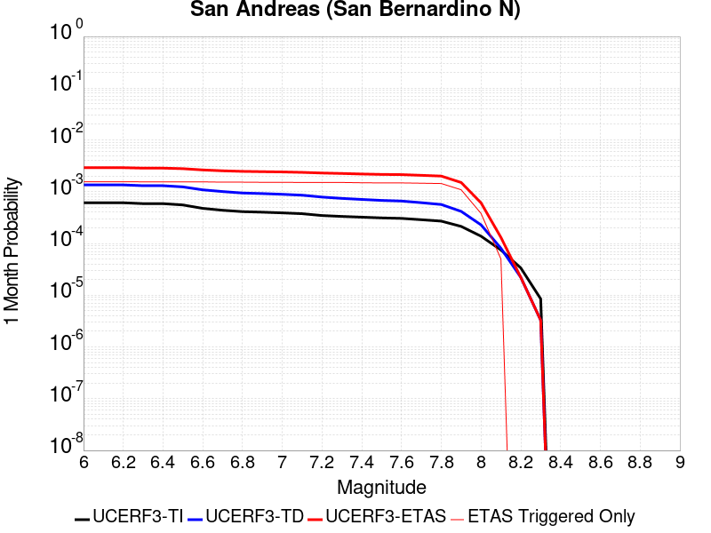 |  |  |

| Magnitude | 1 wk TI Prob | 1 wk TD Prob | 1 wk ETAS Prob | 1 wk ETAS/TD Gain | 1 wk ETAS Triggered Only | 1 mo TI Prob | 1 mo TD Prob | 1 mo ETAS Prob | 1 mo ETAS/TD Gain | 1 mo ETAS Triggered Only | 1 yr TI Prob | 1 yr TD Prob | 1 yr ETAS Prob | 1 yr ETAS/TD Gain | 1 yr ETAS Triggered Only | 10 yr TI Prob | 10 yr TD Prob | 10 yr ETAS Prob | 10 yr ETAS/TD Gain | 10 yr ETAS Triggered Only |
|-----|-----|-----|-----|-----|-----|-----|-----|-----|-----|-----|-----|-----|-----|-----|-----|-----|-----|-----|-----|-----|
| 6.0 | 1.4273766E-4 | 3.160784E-4 | 0.0016256643 | 5.1432314 | 0.00131 | 6.115894E-4 | 0.0013539245 | 0.0029118124 | 2.150646 | 0.00156 | 0.0074207084 | 0.016360939 | 0.018534781 | 1.1328678 | 0.00221 | 0.07177748 | 0.15021163 | 0.15256554 | 1.0156707 | 0.00277 |
| 6.1 | 1.4273766E-4 | 3.160784E-4 | 0.0016256643 | 5.1432314 | 0.00131 | 6.115894E-4 | 0.0013539245 | 0.0029118124 | 2.150646 | 0.00156 | 0.0074207084 | 0.016360939 | 0.018534781 | 1.1328678 | 0.00221 | 0.07177748 | 0.15021163 | 0.15256554 | 1.0156707 | 0.00277 |
| 6.2 | 1.4273766E-4 | 3.160784E-4 | 0.0016256643 | 5.1432314 | 0.00131 | 6.115894E-4 | 0.0013539245 | 0.0029118124 | 2.150646 | 0.00156 | 0.0074207084 | 0.016360939 | 0.018534781 | 1.1328678 | 0.00221 | 0.07177748 | 0.15021163 | 0.15256554 | 1.0156707 | 0.00277 |
| 6.3 | 1.3730655E-4 | 3.0512668E-4 | 0.00160473 | 5.2592254 | 0.0013 | 5.883239E-4 | 0.001307036 | 0.00285501 | 2.1843393 | 0.00155 | 0.0071393442 | 0.015798455 | 0.017963698 | 1.1370541 | 0.0022 | 0.06914291 | 0.1455135 | 0.1478719 | 1.0162073 | 0.00276 |
| 6.4 | 1.3730655E-4 | 3.0512668E-4 | 0.00160473 | 5.2592254 | 0.0013 | 5.883239E-4 | 0.001307036 | 0.00285501 | 2.1843393 | 0.00155 | 0.0071393442 | 0.015798455 | 0.017963698 | 1.1370541 | 0.0022 | 0.06914291 | 0.1455135 | 0.1478719 | 1.0162073 | 0.00276 |
| 6.5 | 1.2942807E-4 | 2.8927144E-4 | 0.0015888953 | 5.4927487 | 0.0013 | 5.545738E-4 | 0.0012391509 | 0.0027872303 | 2.2493064 | 0.00155 | 0.0067310524 | 0.014983548 | 0.017150583 | 1.1446277 | 0.0022 | 0.06530788 | 0.13865088 | 0.14101958 | 1.017084 | 0.00275 |
| 6.6 | 1.1125901E-4 | 2.5365927E-4 | 0.0015533295 | 6.1236854 | 0.0013 | 4.767372E-4 | 0.0010866605 | 0.002634976 | 2.4248385 | 0.00155 | 0.005788839 | 0.0131504685 | 0.015291932 | 1.1628431 | 0.00217 | 0.056403454 | 0.12300496 | 0.12538162 | 1.0193217 | 0.00271 |
| 6.7 | 1.02209575E-4 | 2.3500937E-4 | 0.0015147085 | 6.445311 | 0.00128 | 4.3796748E-4 | 0.0010067957 | 0.0025352554 | 2.5181427 | 0.00153 | 0.0053192247 | 0.012189267 | 0.014303182 | 1.1734242 | 0.00214 | 0.051936906 | 0.114792764 | 0.117165126 | 1.0206664 | 0.00268 |
| 6.8 | 9.610582E-5 | 2.2026796E-4 | 0.001499986 | 6.809824 | 0.00128 | 4.1181705E-4 | 9.436647E-4 | 0.002472221 | 2.6198087 | 0.00153 | 0.0050023515 | 0.011428859 | 0.013544401 | 1.1851053 | 0.00214 | 0.048912346 | 0.10820469 | 0.11057687 | 1.0219231 | 0.00266 |
| 6.9 | 9.3877505E-5 | 2.1482339E-4 | 0.0014945484 | 6.957103 | 0.00128 | 4.0227012E-4 | 9.203475E-4 | 0.0024389485 | 2.6500301 | 0.00152 | 0.0048866454 | 0.011147907 | 0.013244273 | 1.1880503 | 0.00212 | 0.04780577 | 0.105798274 | 0.10815896 | 1.0223131 | 0.00264 |
| 7.0 | 9.1019785E-5 | 2.0809306E-4 | 0.0014878267 | 7.149814 | 0.00128 | 3.900265E-4 | 8.915232E-4 | 0.002410168 | 2.7034273 | 0.00152 | 0.0047382377 | 0.0108004995 | 0.012897602 | 1.1941673 | 0.00212 | 0.046384744 | 0.10276815 | 0.10513685 | 1.0230489 | 0.00264 |
| 7.1 | 8.771155E-5 | 1.9983841E-4 | 0.0014695846 | 7.3538647 | 0.00127 | 3.758525E-4 | 8.5616973E-4 | 0.002364877 | 2.7621589 | 0.00151 | 0.0045664064 | 0.010374243 | 0.012462353 | 1.2012783 | 0.00211 | 0.044737056 | 0.09907644 | 0.10144587 | 1.0239152 | 0.00263 |
| 7.2 | 8.0830236E-5 | 1.8389444E-4 | 0.0014536609 | 7.904866 | 0.00127 | 3.4636928E-4 | 7.8788114E-4 | 0.0022966915 | 2.9150229 | 0.00151 | 0.0042088944 | 0.009550368 | 0.011640217 | 1.2188239 | 0.00211 | 0.041300658 | 0.09180518 | 0.094193734 | 1.0260177 | 0.00263 |
| 7.3 | 7.7668235E-5 | 1.7333007E-4 | 0.0014431099 | 8.32579 | 0.00127 | 3.328214E-4 | 7.426318E-4 | 0.0022515105 | 3.031799 | 0.00151 | 0.0040445733 | 0.009004138 | 0.01108523 | 1.2311261 | 0.0021 | 0.03971748 | 0.08706761 | 0.0894595 | 1.0274715 | 0.00262 |
| 7.4 | 7.520177E-5 | 1.655312E-4 | 0.0014153243 | 8.550197 | 0.00125 | 3.2225347E-4 | 7.092266E-4 | 0.0021981697 | 3.09939 | 0.00149 | 0.0039163795 | 0.008600714 | 0.010662824 | 1.2397604 | 0.00208 | 0.038480744 | 0.08352157 | 0.08590441 | 1.0285296 | 0.0026 |
| 7.5 | 7.274697E-5 | 1.584075E-4 | 0.0013982111 | 8.826672 | 0.00124 | 3.1173544E-4 | 6.7871273E-4 | 0.0021577082 | 3.1791186 | 0.00148 | 0.003788775 | 0.008232076 | 0.010275118 | 1.2481806 | 0.00206 | 0.03724827 | 0.08023654 | 0.08260953 | 1.0295749 | 0.00258 |
| 7.6 | 7.1185845E-5 | 1.5410586E-4 | 0.0013939148 | 9.045177 | 0.00124 | 3.0504653E-4 | 6.602866E-4 | 0.0021393094 | 3.2399712 | 0.00148 | 0.0037076178 | 0.0080094095 | 0.01005291 | 1.2551374 | 0.00206 | 0.036463667 | 0.07822661 | 0.08060479 | 1.0304011 | 0.00258 |
| 7.7 | 6.709961E-5 | 1.4319421E-4 | 0.0013630195 | 9.518678 | 0.00122 | 2.8753807E-4 | 6.135452E-4 | 0.0020726493 | 3.3781528 | 0.00146 | 0.003495157 | 0.0074443663 | 0.009459254 | 1.2706594 | 0.00203 | 0.034406938 | 0.07305558 | 0.07541929 | 1.032355 | 0.00255 |
| 7.8 | 6.300812E-5 | 1.320343E-4 | 0.0013418746 | 10.163075 | 0.00121 | 2.7000686E-4 | 5.657386E-4 | 0.002004924 | 3.543905 | 0.00144 | 0.0032823787 | 0.006866143 | 0.008862343 | 1.2907307 | 0.00201 | 0.032343175 | 0.06771385 | 0.07007253 | 1.0348331 | 0.00253 |
| 7.9 | 4.983037E-5 | 9.7241085E-5 | 0.0010171516 | 10.460102 | 9.2E-4 | 2.1354125E-4 | 4.1668097E-4 | 0.0015062267 | 3.6148202 | 0.00109 | 0.0025967648 | 0.0050613005 | 0.006603455 | 1.3046954 | 0.00155 | 0.025666296 | 0.050650507 | 0.05253022 | 1.0371114 | 0.00198 |
| 8.0 | 3.2211527E-5 | 5.3306234E-5 | 3.632897E-4 | 6.815145 | 3.1E-4 | 1.380421E-4 | 2.2843528E-4 | 6.0834846E-4 | 2.6631107 | 3.8E-4 | 0.0016793669 | 0.0027776542 | 0.003306182 | 1.1902785 | 5.3E-4 | 0.016667323 | 0.028362568 | 0.029062148 | 1.0246656 | 7.2E-4 |
| 8.1 | 1.743376E-5 | 1.8823403E-5 | 4.8822836E-5 | 2.5937307 | 3.0E-5 | 7.471398E-5 | 8.066923E-5 | 1.306652E-4 | 1.619765 | 5.0E-5 | 9.0926304E-4 | 9.81706E-4 | 0.0010316569 | 1.0508817 | 5.0E-5 | 0.009055517 | 0.010483979 | 0.010553245 | 1.0066068 | 7.0E-5 |
| 8.2 | 7.831616E-6 | 5.1540533E-6 | 5.1540533E-6 | 1.0 | 0.0 | 3.3563636E-5 | 2.2088612E-5 | 2.2088612E-5 | 1.0 | 0.0 | 4.0856065E-4 | 2.6889573E-4 | 2.6889573E-4 | 1.0 | 0.0 | 0.004078103 | 0.0030413668 | 0.0030413668 | 1.0 | 0.0 |
| 8.3 | 1.983087E-6 | 7.6564595E-7 | 7.6564595E-7 | 1.0 | 0.0 | 8.498917E-6 | 3.281336E-6 | 3.281336E-6 | 1.0 | 0.0 | 1.034694E-4 | 3.9949547E-5 | 3.9949547E-5 | 1.0 | 0.0 | 0.0010342124 | 4.717979E-4 | 4.717979E-4 | 1.0 | 0.0 |

## Paradise
*[(top)](#table-of-contents)*

| 1 Week | 1 Month | 1 Year | 10 Year |
|-----|-----|-----|-----|
| 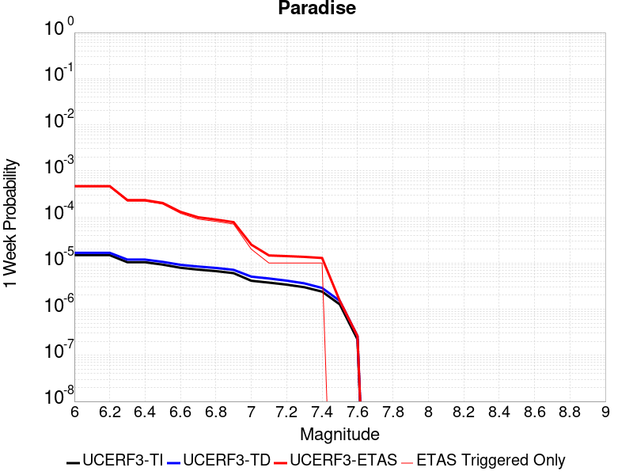 | 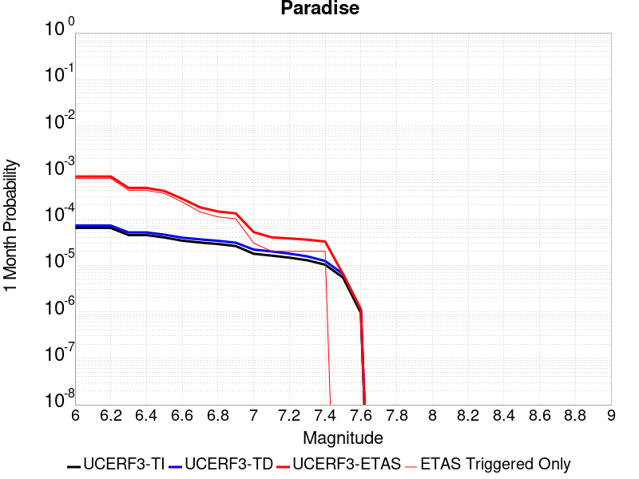 |  |  |

| Magnitude | 1 wk TI Prob | 1 wk TD Prob | 1 wk ETAS Prob | 1 wk ETAS/TD Gain | 1 wk ETAS Triggered Only | 1 mo TI Prob | 1 mo TD Prob | 1 mo ETAS Prob | 1 mo ETAS/TD Gain | 1 mo ETAS Triggered Only | 1 yr TI Prob | 1 yr TD Prob | 1 yr ETAS Prob | 1 yr ETAS/TD Gain | 1 yr ETAS Triggered Only | 10 yr TI Prob | 10 yr TD Prob | 10 yr ETAS Prob | 10 yr ETAS/TD Gain | 10 yr ETAS Triggered Only |
|-----|-----|-----|-----|-----|-----|-----|-----|-----|-----|-----|-----|-----|-----|-----|-----|-----|-----|-----|-----|-----|
| 6.0 | 1.4851273E-5 | 1.6694768E-5 | 4.6668726E-4 | 27.954102 | 4.5E-4 | 6.364676E-5 | 7.154718E-5 | 8.1149425E-4 | 11.342086 | 7.4E-4 | 7.7462377E-4 | 8.707624E-4 | 0.0023095086 | 2.6522832 | 0.00144 | 0.0077192914 | 0.008675884 | 0.011114541 | 1.2810845 | 0.00246 |
| 6.1 | 1.4851273E-5 | 1.6694768E-5 | 4.6668726E-4 | 27.954102 | 4.5E-4 | 6.364676E-5 | 7.154718E-5 | 8.1149425E-4 | 11.342086 | 7.4E-4 | 7.7462377E-4 | 8.707624E-4 | 0.0023095086 | 2.6522832 | 0.00144 | 0.0077192914 | 0.008675884 | 0.011114541 | 1.2810845 | 0.00246 |
| 6.2 | 1.4851273E-5 | 1.6694768E-5 | 4.6668726E-4 | 27.954102 | 4.5E-4 | 6.364676E-5 | 7.154718E-5 | 8.1149425E-4 | 11.342086 | 7.4E-4 | 7.7462377E-4 | 8.707624E-4 | 0.0023095086 | 2.6522832 | 0.00144 | 0.0077192914 | 0.008675884 | 0.011114541 | 1.2810845 | 0.00246 |
| 6.3 | 1.0426831E-5 | 1.1888697E-5 | 2.3188608E-4 | 19.504751 | 2.2E-4 | 4.4685654E-5 | 5.09506E-5 | 4.609297E-4 | 9.0466 | 4.1E-4 | 5.43912E-4 | 6.201529E-4 | 0.0013497003 | 2.176399 | 7.3E-4 | 0.0054258266 | 0.0061848317 | 0.0073376573 | 1.1863956 | 0.00116 |
| 6.4 | 1.0426831E-5 | 1.1888697E-5 | 2.3188608E-4 | 19.504751 | 2.2E-4 | 4.4685654E-5 | 5.09506E-5 | 4.609297E-4 | 9.0466 | 4.1E-4 | 5.43912E-4 | 6.201529E-4 | 0.0013497003 | 2.176399 | 7.3E-4 | 0.0054258266 | 0.0061848317 | 0.0073376573 | 1.1863956 | 0.00116 |
| 6.5 | 9.25027E-6 | 1.0620037E-5 | 2.0061801E-4 | 18.89052 | 1.9E-4 | 3.964341E-5 | 4.551368E-5 | 3.9549774E-4 | 8.689646 | 3.5E-4 | 4.8255164E-4 | 5.5399304E-4 | 0.0011236772 | 2.0283237 | 5.7E-4 | 0.0048150513 | 0.0055266195 | 0.0064216456 | 1.1619482 | 9.0E-4 |
| 6.6 | 7.904275E-6 | 9.159602E-6 | 1.291585E-4 | 14.100885 | 1.2E-4 | 3.3875025E-5 | 3.925487E-5 | 2.6924585E-4 | 6.8589153 | 2.3E-4 | 4.1235037E-4 | 4.7782718E-4 | 8.476504E-4 | 1.7739686 | 3.7E-4 | 0.0041158604 | 0.004768395 | 0.0053257244 | 1.1168799 | 5.6E-4 |
| 6.7 | 7.2061953E-6 | 8.407326E-6 | 9.840657E-5 | 11.70486 | 9.0E-5 | 3.088333E-5 | 3.603092E-5 | 1.7602587E-4 | 4.8854117 | 1.4E-4 | 3.7593965E-4 | 4.3859181E-4 | 6.984778E-4 | 1.5925463 | 2.6E-4 | 0.003753043 | 0.004377631 | 0.0047758804 | 1.0909736 | 4.0E-4 |
| 6.8 | 6.6948724E-6 | 7.842242E-6 | 8.784162E-5 | 11.201084 | 8.0E-5 | 2.8691995E-5 | 3.3609194E-5 | 1.436055E-4 | 4.272804 | 1.1E-4 | 3.4926904E-4 | 4.091187E-4 | 6.090369E-4 | 1.4886557 | 2.0E-4 | 0.003487206 | 0.0040840125 | 0.004372828 | 1.0707186 | 2.9E-4 |
| 6.9 | 6.0421025E-6 | 7.1306963E-6 | 7.71302E-5 | 10.816644 | 7.0E-5 | 2.5894467E-5 | 3.0559786E-5 | 1.3055673E-4 | 4.272174 | 1.0E-4 | 3.1521954E-4 | 3.7200528E-4 | 5.319458E-4 | 1.4299414 | 1.6E-4 | 0.0031477278 | 0.0037141638 | 0.003923384 | 1.0563303 | 2.1E-4 |
| 7.0 | 4.134091E-6 | 5.0803824E-6 | 2.508028E-5 | 4.9366913 | 2.0E-5 | 1.7717413E-5 | 2.1772896E-5 | 5.177224E-5 | 2.37783 | 3.0E-5 | 2.1568815E-4 | 2.650543E-4 | 3.450331E-4 | 1.3017449 | 8.0E-5 | 0.0021547892 | 0.0026475347 | 0.00274727 | 1.037671 | 1.0E-4 |
| 7.1 | 3.7674888E-6 | 4.631936E-6 | 1.463189E-5 | 3.1589146 | 1.0E-5 | 1.6146281E-5 | 1.9851012E-5 | 3.9850616E-5 | 2.0074854 | 2.0E-5 | 1.9656324E-4 | 2.4166079E-4 | 3.1164387E-4 | 1.2895923 | 7.0E-5 | 0.0019638946 | 0.0024141306 | 0.0025039134 | 1.0371906 | 9.0E-5 |
| 7.2 | 3.4065345E-6 | 4.156782E-6 | 1.4156741E-5 | 3.405697 | 1.0E-5 | 1.4599351E-5 | 1.7814667E-5 | 3.7814312E-5 | 2.1226504 | 2.0E-5 | 1.777326E-4 | 2.168735E-4 | 2.7686046E-4 | 1.276599 | 6.0E-5 | 0.0017759053 | 0.0021667667 | 0.0022465934 | 1.0368414 | 8.0E-5 |
| 7.3 | 2.9934936E-6 | 3.6293673E-6 | 1.3629331E-5 | 3.7552912 | 1.0E-5 | 1.2829195E-5 | 1.5554348E-5 | 3.5554036E-5 | 2.2857943 | 2.0E-5 | 1.5618425E-4 | 1.8935918E-4 | 2.2935162E-4 | 1.2111988 | 4.0E-5 | 0.0015607453 | 0.0018921237 | 0.0019520102 | 1.0316504 | 6.0E-5 |
| 7.4 | 2.4049796E-6 | 2.8890186E-6 | 1.288899E-5 | 4.4613733 | 1.0E-5 | 1.0307015E-5 | 1.2381457E-5 | 3.238121E-5 | 2.6152987 | 2.0E-5 | 1.2548068E-4 | 1.5073526E-4 | 1.9072923E-4 | 1.2653259 | 4.0E-5 | 0.0012540985 | 0.0015064715 | 0.0015563963 | 1.0331402 | 5.0E-5 |
| 7.5 | 1.2710091E-6 | 1.5134859E-6 | 1.5134859E-6 | 1.0 | 0.0 | 5.44717E-6 | 6.4863593E-6 | 6.4863593E-6 | 1.0 | 0.0 | 6.631728E-5 | 7.896981E-5 | 7.896981E-5 | 1.0 | 0.0 | 6.6297496E-4 | 7.895401E-4 | 7.995322E-4 | 1.0126556 | 1.0E-5 |
| 7.6 | 2.21172E-7 | 2.6040198E-7 | 2.6040198E-7 | 1.0 | 0.0 | 9.478797E-7 | 1.1160082E-6 | 1.1160082E-6 | 1.0 | 0.0 | 1.1540374E-5 | 1.3587343E-5 | 1.3587343E-5 | 1.0 | 0.0 | 1.1539775E-4 | 1.3586794E-4 | 1.4586658E-4 | 1.0735909 | 1.0E-5 |

## Garlic Springs
*[(top)](#table-of-contents)*

| 1 Week | 1 Month | 1 Year | 10 Year |
|-----|-----|-----|-----|
|  |  |  | 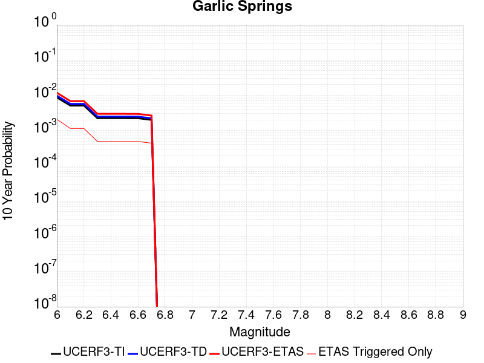 |

| Magnitude | 1 wk TI Prob | 1 wk TD Prob | 1 wk ETAS Prob | 1 wk ETAS/TD Gain | 1 wk ETAS Triggered Only | 1 mo TI Prob | 1 mo TD Prob | 1 mo ETAS Prob | 1 mo ETAS/TD Gain | 1 mo ETAS Triggered Only | 1 yr TI Prob | 1 yr TD Prob | 1 yr ETAS Prob | 1 yr ETAS/TD Gain | 1 yr ETAS Triggered Only | 10 yr TI Prob | 10 yr TD Prob | 10 yr ETAS Prob | 10 yr ETAS/TD Gain | 10 yr ETAS Triggered Only |
|-----|-----|-----|-----|-----|-----|-----|-----|-----|-----|-----|-----|-----|-----|-----|-----|-----|-----|-----|-----|-----|
| 6.0 | 1.6760017E-5 | 1.8776833E-5 | 3.3877083E-4 | 18.041958 | 3.2E-4 | 7.182667E-5 | 8.0470316E-5 | 6.5042445E-4 | 8.0827875 | 5.7E-4 | 8.7413884E-4 | 9.794032E-4 | 0.0021682377 | 2.2138357 | 0.00119 | 0.008707083 | 0.009762413 | 0.01183201 | 1.2119964 | 0.00209 |
| 6.1 | 9.852767E-6 | 1.0973587E-5 | 1.6097195E-4 | 14.669036 | 1.5E-4 | 4.222546E-5 | 4.702921E-5 | 2.9701745E-4 | 6.315595 | 2.5E-4 | 5.139737E-4 | 5.7250116E-4 | 0.001182152 | 2.06489 | 6.1E-4 | 0.005127866 | 0.005717221 | 0.0068606464 | 1.1999967 | 0.00115 |
| 6.2 | 9.852767E-6 | 1.0973587E-5 | 1.6097195E-4 | 14.669036 | 1.5E-4 | 4.222546E-5 | 4.702921E-5 | 2.9701745E-4 | 6.315595 | 2.5E-4 | 5.139737E-4 | 5.7250116E-4 | 0.001182152 | 2.06489 | 6.1E-4 | 0.005127866 | 0.005717221 | 0.0068606464 | 1.1999967 | 0.00115 |
| 6.3 | 4.3167724E-6 | 4.7780286E-6 | 6.477774E-5 | 13.557421 | 6.0E-5 | 1.8500323E-5 | 2.0477235E-5 | 1.4047477E-4 | 6.8600464 | 1.2E-4 | 2.2521814E-4 | 2.4930484E-4 | 5.792226E-4 | 2.3233507 | 3.3E-4 | 0.0022499003 | 0.00249251 | 0.0029812886 | 1.196099 | 4.9E-4 |
| 6.4 | 4.3167724E-6 | 4.7780286E-6 | 6.477774E-5 | 13.557421 | 6.0E-5 | 1.8500323E-5 | 2.0477235E-5 | 1.4047477E-4 | 6.8600464 | 1.2E-4 | 2.2521814E-4 | 2.4930484E-4 | 5.792226E-4 | 2.3233507 | 3.3E-4 | 0.0022499003 | 0.00249251 | 0.0029812886 | 1.196099 | 4.9E-4 |
| 6.5 | 4.3167724E-6 | 4.7780286E-6 | 6.477774E-5 | 13.557421 | 6.0E-5 | 1.8500323E-5 | 2.0477235E-5 | 1.4047477E-4 | 6.8600464 | 1.2E-4 | 2.2521814E-4 | 2.4930484E-4 | 5.792226E-4 | 2.3233507 | 3.3E-4 | 0.0022499003 | 0.00249251 | 0.0029812886 | 1.196099 | 4.9E-4 |
| 6.6 | 4.301311E-6 | 4.760897E-6 | 6.4760614E-5 | 13.602607 | 6.0E-5 | 1.8434059E-5 | 2.0403815E-5 | 1.4040136E-4 | 6.881133 | 1.2E-4 | 2.2441156E-4 | 2.4841115E-4 | 5.783292E-4 | 2.3281128 | 3.3E-4 | 0.0022418506 | 0.002483593 | 0.002972376 | 1.1968048 | 4.9E-4 |
| 6.7 | 3.8599724E-6 | 4.27106E-6 | 5.4270848E-5 | 12.706646 | 5.0E-5 | 1.6542634E-5 | 1.8304541E-5 | 1.2830253E-4 | 7.0093274 | 1.1E-4 | 2.0138794E-4 | 2.228578E-4 | 5.2279094E-4 | 2.3458498 | 3.0E-4 | 0.0020120554 | 0.002228578 | 0.0026675975 | 1.1969953 | 4.4E-4 |

## San Andreas (San Bernardino S)
*[(top)](#table-of-contents)*

| 1 Week | 1 Month | 1 Year | 10 Year |
|-----|-----|-----|-----|
|  | 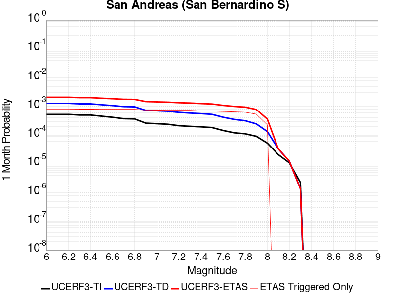 | 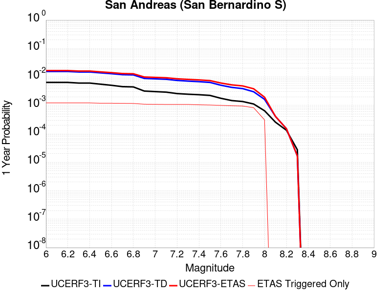 |  |

| Magnitude | 1 wk TI Prob | 1 wk TD Prob | 1 wk ETAS Prob | 1 wk ETAS/TD Gain | 1 wk ETAS Triggered Only | 1 mo TI Prob | 1 mo TD Prob | 1 mo ETAS Prob | 1 mo ETAS/TD Gain | 1 mo ETAS Triggered Only | 1 yr TI Prob | 1 yr TD Prob | 1 yr ETAS Prob | 1 yr ETAS/TD Gain | 1 yr ETAS Triggered Only | 10 yr TI Prob | 10 yr TD Prob | 10 yr ETAS Prob | 10 yr ETAS/TD Gain | 10 yr ETAS Triggered Only |
|-----|-----|-----|-----|-----|-----|-----|-----|-----|-----|-----|-----|-----|-----|-----|-----|-----|-----|-----|-----|-----|
| 6.0 | 1.2336002E-4 | 3.0005194E-4 | 9.698509E-4 | 3.232277 | 6.7E-4 | 5.2857865E-4 | 0.0012853292 | 0.0020942881 | 1.6293788 | 8.1E-4 | 0.006416472 | 0.015541554 | 0.016742595 | 1.0772792 | 0.00122 | 0.06234337 | 0.14294699 | 0.14429256 | 1.0094131 | 0.00157 |
| 6.1 | 1.2336002E-4 | 3.0005194E-4 | 9.698509E-4 | 3.232277 | 6.7E-4 | 5.2857865E-4 | 0.0012853292 | 0.0020942881 | 1.6293788 | 8.1E-4 | 0.006416472 | 0.015541554 | 0.016742595 | 1.0772792 | 0.00122 | 0.06234337 | 0.14294699 | 0.14429256 | 1.0094131 | 0.00157 |
| 6.2 | 1.2336002E-4 | 3.0005194E-4 | 9.698509E-4 | 3.232277 | 6.7E-4 | 5.2857865E-4 | 0.0012853292 | 0.0020942881 | 1.6293788 | 8.1E-4 | 0.006416472 | 0.015541554 | 0.016742595 | 1.0772792 | 0.00122 | 0.06234337 | 0.14294699 | 0.14429256 | 1.0094131 | 0.00157 |
| 6.3 | 1.1712257E-4 | 2.8793467E-4 | 9.5774175E-4 | 3.3262467 | 6.7E-4 | 5.018573E-4 | 0.0012334478 | 0.002032461 | 1.6477885 | 8.0E-4 | 0.006093008 | 0.014918666 | 0.016120465 | 1.0805568 | 0.00122 | 0.059286322 | 0.13765779 | 0.13901167 | 1.0098351 | 0.00157 |
| 6.4 | 1.1712257E-4 | 2.8793467E-4 | 9.5774175E-4 | 3.3262467 | 6.7E-4 | 5.018573E-4 | 0.0012334478 | 0.002032461 | 1.6477885 | 8.0E-4 | 0.006093008 | 0.014918666 | 0.016120465 | 1.0805568 | 0.00122 | 0.059286322 | 0.13765779 | 0.13901167 | 1.0098351 | 0.00157 |
| 6.5 | 1.0689076E-4 | 2.6806415E-4 | 9.3788456E-4 | 3.4987316 | 6.7E-4 | 4.5802278E-4 | 0.0011483653 | 0.0019374582 | 1.6871444 | 7.9E-4 | 0.0055621783 | 0.013896335 | 0.015069799 | 1.084444 | 0.00119 | 0.05425003 | 0.1288989 | 0.13021426 | 1.0102046 | 0.00151 |
| 6.6 | 9.7648895E-5 | 2.505129E-4 | 9.203451E-4 | 3.673843 | 6.7E-4 | 4.1842813E-4 | 0.0010732086 | 0.0018623609 | 1.7353203 | 7.9E-4 | 0.005082469 | 0.012992399 | 0.014166938 | 1.090402 | 0.00119 | 0.049677886 | 0.121077746 | 0.12239613 | 1.0108887 | 0.0015 |
| 6.7 | 8.757013E-5 | 2.3122175E-4 | 9.010668E-4 | 3.8969812 | 6.7E-4 | 3.7524657E-4 | 9.905964E-4 | 0.0017798138 | 1.7967094 | 7.9E-4 | 0.00455906 | 0.011997902 | 0.0131637445 | 1.0971705 | 0.00118 | 0.04466656 | 0.112373024 | 0.11368671 | 1.0116904 | 0.00148 |
| 6.8 | 8.562978E-5 | 2.2682057E-4 | 8.966686E-4 | 3.9532068 | 6.7E-4 | 3.6693315E-4 | 9.7174826E-4 | 0.0017609806 | 1.8121778 | 7.9E-4 | 0.004458263 | 0.011770921 | 0.012927149 | 1.0982275 | 0.00117 | 0.043698758 | 0.11037863 | 0.11168637 | 1.0118479 | 0.00147 |
| 6.9 | 6.124075E-5 | 1.7066885E-4 | 8.2055794E-4 | 4.807895 | 6.5E-4 | 2.6243398E-4 | 7.312337E-4 | 0.0014806853 | 2.0249138 | 7.5E-4 | 0.0031904527 | 0.008866636 | 0.009956883 | 1.1229606 | 0.0011 | 0.031450346 | 0.08420262 | 0.0854481 | 1.0147915 | 0.00136 |
| 7.0 | 5.8598747E-5 | 1.6495936E-4 | 8.1485213E-4 | 4.9397144 | 6.5E-4 | 2.5111332E-4 | 7.067779E-4 | 0.0014462549 | 2.046265 | 7.4E-4 | 0.0030530186 | 0.008571265 | 0.009651923 | 1.1260791 | 0.00109 | 0.03011414 | 0.08151562 | 0.08274639 | 1.0150986 | 0.00134 |
| 7.1 | 5.613814E-5 | 1.5914452E-4 | 7.9904264E-4 | 5.020862 | 6.4E-4 | 2.4056983E-4 | 6.818704E-4 | 0.0014113727 | 2.0698547 | 7.3E-4 | 0.0029250039 | 0.008270353 | 0.009341421 | 1.129507 | 0.00108 | 0.028868021 | 0.07881268 | 0.08003786 | 1.0155455 | 0.00133 |
| 7.2 | 4.991222E-5 | 1.4520933E-4 | 7.851164E-4 | 5.4067903 | 6.4E-4 | 2.1389198E-4 | 6.221777E-4 | 0.0013517234 | 2.1725683 | 7.3E-4 | 0.002601025 | 0.0075488063 | 0.008620653 | 1.141989 | 0.00108 | 0.025707912 | 0.07226191 | 0.0734958 | 1.0170753 | 0.00133 |
| 7.3 | 4.7410045E-5 | 1.371513E-4 | 7.7706354E-4 | 5.665739 | 6.4E-4 | 2.0317009E-4 | 5.8765925E-4 | 0.0013172303 | 2.2414865 | 7.3E-4 | 0.0024707897 | 0.0071313656 | 0.008203664 | 1.1503637 | 0.00108 | 0.024434982 | 0.068541944 | 0.06978078 | 1.0180742 | 0.00133 |
| 7.4 | 4.5556746E-5 | 1.3123035E-4 | 7.411503E-4 | 5.647705 | 6.1E-4 | 1.952286E-4 | 5.6229485E-4 | 0.0012619012 | 2.2441986 | 7.0E-4 | 0.002374317 | 0.0068245293 | 0.007867363 | 1.1528068 | 0.00105 | 0.023491086 | 0.06579143 | 0.0670059 | 1.0184594 | 0.0013 |
| 7.5 | 4.3084514E-5 | 1.2358342E-4 | 7.235093E-4 | 5.85442 | 6.0E-4 | 1.8463485E-4 | 5.2953605E-4 | 0.0012191706 | 2.3023374 | 6.9E-4 | 0.0022456115 | 0.0064281146 | 0.0074514938 | 1.1592036 | 0.00103 | 0.022230545 | 0.062190283 | 0.06339068 | 1.019302 | 0.00128 |
| 7.6 | 3.408608E-5 | 9.836477E-5 | 6.783077E-4 | 6.89584 | 5.8E-4 | 1.4607502E-4 | 4.214953E-4 | 0.0010912128 | 2.588909 | 6.7E-4 | 0.0017770125 | 0.005119656 | 0.0061145364 | 1.1943256 | 0.001 | 0.017628696 | 0.05002244 | 0.05120041 | 1.0235488 | 0.00124 |
| 7.7 | 2.8315713E-5 | 8.2495724E-5 | 6.4244954E-4 | 7.7876706 | 5.6E-4 | 1.2134742E-4 | 3.5350522E-4 | 0.0010032755 | 2.838078 | 6.5E-4 | 0.0014764034 | 0.004295442 | 0.005261275 | 1.2248508 | 9.7E-4 | 0.01466633 | 0.042272415 | 0.04342169 | 1.0271873 | 0.0012 |
| 7.8 | 2.6222975E-5 | 7.463898E-5 | 6.2459795E-4 | 8.368254 | 5.5E-4 | 1.1237934E-4 | 3.1984213E-4 | 9.4964064E-4 | 2.9690917 | 6.3E-4 | 0.0013673597 | 0.003887131 | 0.0048334384 | 1.2434462 | 9.5E-4 | 0.013589768 | 0.038437475 | 0.03957212 | 1.0295192 | 0.00118 |
| 7.9 | 2.1469694E-5 | 5.7884805E-5 | 5.2785757E-4 | 9.119104 | 4.7E-4 | 9.200973E-5 | 2.4805416E-4 | 7.879202E-4 | 3.176404 | 5.4E-4 | 0.0011196428 | 0.00301588 | 0.0038433769 | 1.2743798 | 8.3E-4 | 0.011140184 | 0.030153265 | 0.03113281 | 1.0324855 | 0.00101 |
| 8.0 | 1.2420249E-5 | 3.1321662E-5 | 2.2131571E-4 | 7.065899 | 1.9E-4 | 5.322855E-5 | 1.342288E-4 | 3.641979E-4 | 2.713262 | 2.3E-4 | 6.478649E-4 | 0.0016330116 | 0.0019425054 | 1.1895233 | 3.1E-4 | 0.0064597935 | 0.01652369 | 0.016917082 | 1.0238076 | 4.0E-4 |
| 8.1 | 4.9197724E-6 | 7.822525E-6 | 7.822525E-6 | 1.0 | 0.0 | 2.1084568E-5 | 3.3524673E-5 | 3.3524673E-5 | 1.0 | 0.0 | 2.566744E-4 | 4.080866E-4 | 4.080866E-4 | 1.0 | 0.0 | 0.002563781 | 0.004384557 | 0.004394513 | 1.0022707 | 1.0E-5 |
| 8.2 | 2.5634774E-6 | 2.9065757E-6 | 2.9065757E-6 | 1.0 | 0.0 | 1.0986286E-5 | 1.2456694E-5 | 1.2456694E-5 | 1.0 | 0.0 | 1.3374983E-4 | 1.5164974E-4 | 1.5164974E-4 | 1.0 | 0.0 | 0.0013366934 | 0.001704941 | 0.001704941 | 1.0 | 0.0 |
| 8.3 | 5.2850464E-7 | 3.2080476E-7 | 3.2080476E-7 | 1.0 | 0.0 | 2.2650179E-6 | 1.3748769E-6 | 1.3748769E-6 | 1.0 | 0.0 | 2.7576245E-5 | 1.673901E-5 | 1.673901E-5 | 1.0 | 0.0 | 2.7572823E-4 | 1.986671E-4 | 1.986671E-4 | 1.0 | 0.0 |

## Death Valley (Black Mtns Frontal)
*[(top)](#table-of-contents)*

| 1 Week | 1 Month | 1 Year | 10 Year |
|-----|-----|-----|-----|
|  |  |  |  |

| Magnitude | 1 wk TI Prob | 1 wk TD Prob | 1 wk ETAS Prob | 1 wk ETAS/TD Gain | 1 wk ETAS Triggered Only | 1 mo TI Prob | 1 mo TD Prob | 1 mo ETAS Prob | 1 mo ETAS/TD Gain | 1 mo ETAS Triggered Only | 1 yr TI Prob | 1 yr TD Prob | 1 yr ETAS Prob | 1 yr ETAS/TD Gain | 1 yr ETAS Triggered Only | 10 yr TI Prob | 10 yr TD Prob | 10 yr ETAS Prob | 10 yr ETAS/TD Gain | 10 yr ETAS Triggered Only |
|-----|-----|-----|-----|-----|-----|-----|-----|-----|-----|-----|-----|-----|-----|-----|-----|-----|-----|-----|-----|-----|
| 6.0 | 1.6707214E-5 | 1.867027E-5 | 4.0866298E-4 | 21.888437 | 3.9E-4 | 7.160038E-5 | 8.001303E-5 | 6.699658E-4 | 8.373209 | 5.9E-4 | 8.71386E-4 | 9.737309E-4 | 0.0019427863 | 1.9951985 | 9.7E-4 | 0.00867977 | 0.009695496 | 0.011180953 | 1.153211 | 0.0015 |
| 6.1 | 1.6707214E-5 | 1.867027E-5 | 4.0866298E-4 | 21.888437 | 3.9E-4 | 7.160038E-5 | 8.001303E-5 | 6.699658E-4 | 8.373209 | 5.9E-4 | 8.71386E-4 | 9.737309E-4 | 0.0019427863 | 1.9951985 | 9.7E-4 | 0.00867977 | 0.009695496 | 0.011180953 | 1.153211 | 0.0015 |
| 6.2 | 1.6707214E-5 | 1.867027E-5 | 4.0866298E-4 | 21.888437 | 3.9E-4 | 7.160038E-5 | 8.001303E-5 | 6.699658E-4 | 8.373209 | 5.9E-4 | 8.71386E-4 | 9.737309E-4 | 0.0019427863 | 1.9951985 | 9.7E-4 | 0.00867977 | 0.009695496 | 0.011180953 | 1.153211 | 0.0015 |
| 6.3 | 1.6707214E-5 | 1.867027E-5 | 4.0866298E-4 | 21.888437 | 3.9E-4 | 7.160038E-5 | 8.001303E-5 | 6.699658E-4 | 8.373209 | 5.9E-4 | 8.71386E-4 | 9.737309E-4 | 0.0019427863 | 1.9951985 | 9.7E-4 | 0.00867977 | 0.009695496 | 0.011180953 | 1.153211 | 0.0015 |
| 6.4 | 1.5515609E-5 | 1.7338214E-5 | 3.7733198E-4 | 21.763025 | 3.6E-4 | 6.649377E-5 | 7.4304546E-5 | 6.2426366E-4 | 8.40142 | 5.5E-4 | 8.0926094E-4 | 9.042885E-4 | 0.0018034746 | 1.9943576 | 9.0E-4 | 0.008063202 | 0.009006773 | 0.010324794 | 1.1463367 | 0.00133 |
| 6.5 | 1.5515609E-5 | 1.7338214E-5 | 3.7733198E-4 | 21.763025 | 3.6E-4 | 6.649377E-5 | 7.4304546E-5 | 6.2426366E-4 | 8.40142 | 5.5E-4 | 8.0926094E-4 | 9.042885E-4 | 0.0018034746 | 1.9943576 | 9.0E-4 | 0.008063202 | 0.009006773 | 0.010324794 | 1.1463367 | 0.00133 |
| 6.6 | 1.5041828E-5 | 1.6809145E-5 | 3.6680326E-4 | 21.82165 | 3.5E-4 | 6.4463384E-5 | 7.203723E-5 | 6.119983E-4 | 8.495584 | 5.4E-4 | 7.8455906E-4 | 8.767063E-4 | 0.0017359523 | 1.9800842 | 8.6E-4 | 0.00781795 | 0.008733132 | 0.010001954 | 1.1452882 | 0.00128 |
| 6.7 | 1.4634985E-5 | 1.6356016E-5 | 3.4635063E-4 | 21.175732 | 3.3E-4 | 6.271985E-5 | 7.009536E-5 | 5.800596E-4 | 8.275292 | 5.1E-4 | 7.6334673E-4 | 8.5308263E-4 | 0.0016424087 | 1.9252633 | 7.9E-4 | 0.007607299 | 0.008498715 | 0.009648857 | 1.1353312 | 0.00116 |
| 6.8 | 1.4209158E-5 | 1.5882048E-5 | 3.3587698E-4 | 21.148216 | 3.2E-4 | 6.089497E-5 | 6.8064175E-5 | 5.6803017E-4 | 8.345509 | 5.0E-4 | 7.4114406E-4 | 8.2837185E-4 | 0.001597734 | 1.9287642 | 7.7E-4 | 0.007386771 | 0.008253456 | 0.009354295 | 1.1333791 | 0.00111 |
| 6.9 | 1.3780098E-5 | 1.5404594E-5 | 2.9540027E-4 | 19.176117 | 2.8E-4 | 5.9056227E-5 | 6.6018045E-5 | 5.05989E-4 | 7.6644044 | 4.4E-4 | 7.1877235E-4 | 8.0347876E-4 | 0.0014929243 | 1.8580757 | 6.9E-4 | 0.0071645193 | 0.008006332 | 0.008998326 | 1.1239011 | 0.001 |
| 7.0 | 1.3585064E-5 | 1.5188155E-5 | 2.751842E-4 | 18.118343 | 2.6E-4 | 5.8220405E-5 | 6.50905E-5 | 4.8506315E-4 | 7.4521346 | 4.2E-4 | 7.086029E-4 | 7.9219416E-4 | 0.0014416792 | 1.8198559 | 6.5E-4 | 0.007063476 | 0.007894293 | 0.008826873 | 1.1181333 | 9.4E-4 |
| 7.1 | 1.3398601E-5 | 1.49813395E-5 | 2.7497744E-4 | 18.354664 | 2.6E-4 | 5.742131E-5 | 6.420419E-5 | 4.8417723E-4 | 7.541209 | 4.2E-4 | 6.9888023E-4 | 7.8141113E-4 | 0.0014309032 | 1.8311784 | 6.5E-4 | 0.0069668638 | 0.007787224 | 0.008670294 | 1.1133997 | 8.9E-4 |
| 7.2 | 1.3126312E-5 | 1.4679561E-5 | 2.446762E-4 | 16.667814 | 2.3E-4 | 5.6254412E-5 | 6.291092E-5 | 4.3288764E-4 | 6.8809624 | 3.7E-4 | 6.846822E-4 | 7.6567667E-4 | 0.0013352402 | 1.7438695 | 5.7E-4 | 0.006825765 | 0.00763097 | 0.008405018 | 1.1014351 | 7.8E-4 |
| 7.3 | 1.2922429E-5 | 1.4453788E-5 | 2.2445075E-4 | 15.528853 | 2.1E-4 | 5.5380664E-5 | 6.194336E-5 | 4.019223E-4 | 6.488545 | 3.4E-4 | 6.74051E-4 | 7.53905E-4 | 0.001273513 | 1.6892221 | 5.2E-4 | 0.006720101 | 0.007514055 | 0.008228645 | 1.0951004 | 7.2E-4 |
| 7.4 | 1.2768878E-5 | 1.4283772E-5 | 2.1428091E-4 | 15.001704 | 2.0E-4 | 5.4722615E-5 | 6.1214756E-5 | 3.9119457E-4 | 6.390527 | 3.3E-4 | 6.660441E-4 | 7.4504025E-4 | 0.0012446677 | 1.6706047 | 5.0E-4 | 0.0066405144 | 0.0074260035 | 0.008100954 | 1.0908902 | 6.8E-4 |
| 7.5 | 1.2521929E-5 | 1.40120155E-5 | 2.1400921E-4 | 15.273265 | 2.0E-4 | 5.366431E-5 | 6.005014E-5 | 3.9003033E-4 | 6.4950776 | 3.3E-4 | 6.531671E-4 | 7.3087064E-4 | 0.0012205126 | 1.6699432 | 4.9E-4 | 0.006512506 | 0.0072852457 | 0.007950365 | 1.0912967 | 6.7E-4 |
| 7.6 | 1.1301089E-5 | 1.2648149E-5 | 1.9264588E-4 | 15.231152 | 1.8E-4 | 4.8432343E-5 | 5.4205255E-5 | 3.54189E-4 | 6.534219 | 3.0E-4 | 5.895042E-4 | 6.5975444E-4 | 0.0010994641 | 1.6664748 | 4.4E-4 | 0.0058794282 | 0.00657851 | 0.007174563 | 1.0906061 | 6.0E-4 |
| 7.7 | 9.189108E-6 | 1.0283358E-5 | 1.5028192E-4 | 14.614089 | 1.4E-4 | 3.93813E-5 | 4.407082E-5 | 2.940598E-4 | 6.6724377 | 2.5E-4 | 4.7936183E-4 | 5.3643517E-4 | 8.8624744E-4 | 1.6521053 | 3.5E-4 | 0.004783291 | 0.005351914 | 0.0058193984 | 1.087349 | 4.7E-4 |
| 7.8 | 3.4586725E-7 | 3.6482615E-7 | 1.0364823E-5 | 28.410307 | 1.0E-5 | 1.4822873E-6 | 1.5635396E-6 | 2.1563508E-5 | 13.791469 | 2.0E-5 | 1.80467E-5 | 1.9035933E-5 | 3.9035553E-5 | 2.0506246 | 2.0E-5 | 1.8045233E-4 | 1.9034347E-4 | 2.1033967E-4 | 1.1050532 | 2.0E-5 |
| 7.9 | 2.5591178E-9 | 2.6696718E-9 | 2.6696718E-9 | 1.0 | 0.0 | 1.0967647E-8 | 1.14414505E-8 | 1.14414505E-8 | 1.0 | 0.0 | 1.335311E-7 | 1.3929966E-7 | 1.3929966E-7 | 1.0 | 0.0 | 1.3353102E-6 | 1.3929966E-6 | 1.3929966E-6 | 1.0 | 0.0 |

## Helendale-So Lockhart
*[(top)](#table-of-contents)*

| 1 Week | 1 Month | 1 Year | 10 Year |
|-----|-----|-----|-----|
|  | 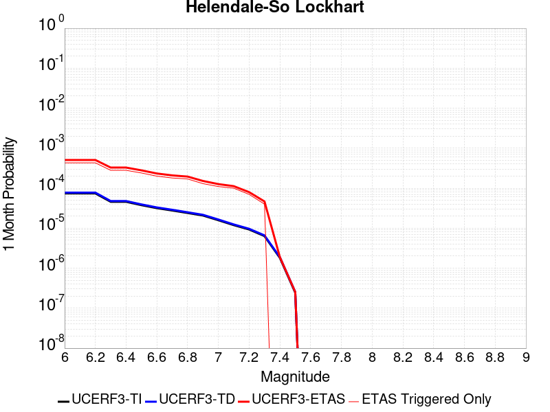 |  |  |

| Magnitude | 1 wk TI Prob | 1 wk TD Prob | 1 wk ETAS Prob | 1 wk ETAS/TD Gain | 1 wk ETAS Triggered Only | 1 mo TI Prob | 1 mo TD Prob | 1 mo ETAS Prob | 1 mo ETAS/TD Gain | 1 mo ETAS Triggered Only | 1 yr TI Prob | 1 yr TD Prob | 1 yr ETAS Prob | 1 yr ETAS/TD Gain | 1 yr ETAS Triggered Only | 10 yr TI Prob | 10 yr TD Prob | 10 yr ETAS Prob | 10 yr ETAS/TD Gain | 10 yr ETAS Triggered Only |
|-----|-----|-----|-----|-----|-----|-----|-----|-----|-----|-----|-----|-----|-----|-----|-----|-----|-----|-----|-----|-----|
| 6.0 | 1.7296055E-5 | 1.8103729E-5 | 2.8809885E-4 | 15.913784 | 2.7E-4 | 7.412385E-5 | 7.7585224E-5 | 5.075519E-4 | 6.5418625 | 4.3E-4 | 9.0208417E-4 | 9.4421144E-4 | 0.0016735222 | 1.7724019 | 7.3E-4 | 0.008984311 | 0.009404116 | 0.010493772 | 1.11587 | 0.0011 |
| 6.1 | 1.7296055E-5 | 1.8103729E-5 | 2.8809885E-4 | 15.913784 | 2.7E-4 | 7.412385E-5 | 7.7585224E-5 | 5.075519E-4 | 6.5418625 | 4.3E-4 | 9.0208417E-4 | 9.4421144E-4 | 0.0016735222 | 1.7724019 | 7.3E-4 | 0.008984311 | 0.009404116 | 0.010493772 | 1.11587 | 0.0011 |
| 6.2 | 1.7296055E-5 | 1.8103729E-5 | 2.8809885E-4 | 15.913784 | 2.7E-4 | 7.412385E-5 | 7.7585224E-5 | 5.075519E-4 | 6.5418625 | 4.3E-4 | 9.0208417E-4 | 9.4421144E-4 | 0.0016735222 | 1.7724019 | 7.3E-4 | 0.008984311 | 0.009404116 | 0.010493772 | 1.11587 | 0.0011 |
| 6.3 | 1.0669118E-5 | 1.1135425E-5 | 1.8113352E-4 | 16.266424 | 1.7E-4 | 4.5723988E-5 | 4.772239E-5 | 3.27709E-4 | 6.8669868 | 2.8E-4 | 5.5654737E-4 | 5.80868E-4 | 0.0010306066 | 1.7742527 | 4.5E-4 | 0.0055515557 | 0.0057937936 | 0.0064698537 | 1.1166869 | 6.8E-4 |
| 6.4 | 1.0669118E-5 | 1.1135425E-5 | 1.8113352E-4 | 16.266424 | 1.7E-4 | 4.5723988E-5 | 4.772239E-5 | 3.27709E-4 | 6.8669868 | 2.8E-4 | 5.5654737E-4 | 5.80868E-4 | 0.0010306066 | 1.7742527 | 4.5E-4 | 0.0055515557 | 0.0057937936 | 0.0064698537 | 1.1166869 | 6.8E-4 |
| 6.5 | 8.790038E-6 | 9.170197E-6 | 1.5916882E-4 | 17.357187 | 1.5E-4 | 3.767105E-5 | 3.930026E-5 | 2.7929083E-4 | 7.10659 | 2.4E-4 | 4.585485E-4 | 4.7837716E-4 | 8.5819536E-4 | 1.7939723 | 3.8E-4 | 0.0045760344 | 0.004773638 | 0.0053608217 | 1.1230055 | 5.9E-4 |
| 6.6 | 7.396949E-6 | 7.715537E-6 | 1.1771469E-4 | 15.256837 | 1.1E-4 | 3.1700827E-5 | 3.3066175E-5 | 2.3305956E-4 | 7.0482774 | 2.0E-4 | 3.858892E-4 | 4.025073E-4 | 7.223785E-4 | 1.7946966 | 3.2E-4 | 0.003852198 | 0.00401789 | 0.004505921 | 1.1214646 | 4.9E-4 |
| 6.7 | 6.4600285E-6 | 6.738031E-6 | 1.0673736E-4 | 15.841031 | 1.0E-4 | 2.7685543E-5 | 2.887696E-5 | 2.0887176E-4 | 7.233163 | 1.8E-4 | 3.3701936E-4 | 3.5152107E-4 | 6.314226E-4 | 1.7962583 | 2.8E-4 | 0.0033650869 | 0.003509732 | 0.003938223 | 1.1220865 | 4.3E-4 |
| 6.8 | 5.600104E-6 | 5.836009E-6 | 9.583549E-5 | 16.421406 | 9.0E-5 | 2.4000226E-5 | 2.5011232E-5 | 1.9500699E-4 | 7.7967763 | 1.7E-4 | 2.9216358E-4 | 3.044698E-4 | 5.4439675E-4 | 1.7880155 | 2.4E-4 | 0.0029177975 | 0.003040588 | 0.0034194326 | 1.1245959 | 3.8E-4 |
| 6.9 | 4.839122E-6 | 5.0395092E-6 | 5.5039258E-5 | 10.921551 | 5.0E-5 | 2.0738931E-5 | 2.159772E-5 | 1.5159491E-4 | 7.019024 | 1.3E-4 | 2.5246723E-4 | 2.6292098E-4 | 4.5287103E-4 | 1.7224606 | 1.9E-4 | 0.002521806 | 0.002626147 | 0.0029353327 | 1.1177337 | 3.1E-4 |
| 7.0 | 3.6937633E-6 | 3.845208E-6 | 4.3845055E-5 | 11.402518 | 4.0E-5 | 1.5830317E-5 | 1.647936E-5 | 1.2647755E-4 | 7.6749063 | 1.1E-4 | 1.9271708E-4 | 2.0061806E-4 | 3.4058996E-4 | 1.6977035 | 1.4E-4 | 0.0019255003 | 0.002004401 | 0.00224392 | 1.1194965 | 2.4E-4 |
| 7.1 | 2.7858857E-6 | 2.8978538E-6 | 4.2897736E-5 | 14.803279 | 4.0E-5 | 1.1939455E-5 | 1.2419316E-5 | 1.1241807E-4 | 9.051873 | 1.0E-4 | 1.4535317E-4 | 1.511949E-4 | 2.8117522E-4 | 1.8596874 | 1.3E-4 | 0.0014525814 | 0.0015109418 | 0.0017006546 | 1.1255593 | 1.9E-4 |
| 7.2 | 2.1672065E-6 | 2.2540128E-6 | 2.2253967E-5 | 9.873044 | 2.0E-5 | 9.2879945E-6 | 9.66002E-6 | 7.9659345E-5 | 8.246292 | 7.0E-5 | 1.1307546E-4 | 1.1760458E-4 | 2.1759282E-4 | 1.850207 | 1.0E-4 | 0.0011301794 | 0.0011754417 | 0.0013352536 | 1.135959 | 1.6E-4 |
| 7.3 | 1.4823496E-6 | 1.5422102E-6 | 1.1542194E-5 | 7.4841905 | 1.0E-5 | 6.3529114E-6 | 6.6094562E-6 | 4.660919E-5 | 7.0518947 | 4.0E-5 | 7.734395E-5 | 8.046731E-5 | 1.5046168E-4 | 1.8698485 | 7.0E-5 | 7.731704E-4 | 8.0439687E-4 | 9.2430034E-4 | 1.1490601 | 1.2E-4 |
| 7.4 | 4.2321457E-7 | 4.4108765E-7 | 4.4108765E-7 | 1.0 | 0.0 | 1.8137755E-6 | 1.8903745E-6 | 1.8903745E-6 | 1.0 | 0.0 | 2.2082493E-5 | 2.3015113E-5 | 3.3014883E-5 | 1.4344871 | 1.0E-5 | 2.2080299E-4 | 2.3013182E-4 | 2.5012722E-4 | 1.0868868 | 2.0E-5 |
| 7.5 | 5.6942316E-8 | 5.9415648E-8 | 5.9415648E-8 | 1.0 | 0.0 | 2.440385E-7 | 2.5463845E-7 | 2.5463845E-7 | 1.0 | 0.0 | 2.9711643E-6 | 3.1002196E-6 | 3.1002196E-6 | 1.0 | 0.0 | 2.9711247E-5 | 3.1001844E-5 | 3.1001844E-5 | 1.0 | 0.0 |

## Sierra Nevada  (No Extension)
*[(top)](#table-of-contents)*

| 1 Week | 1 Month | 1 Year | 10 Year |
|-----|-----|-----|-----|
| 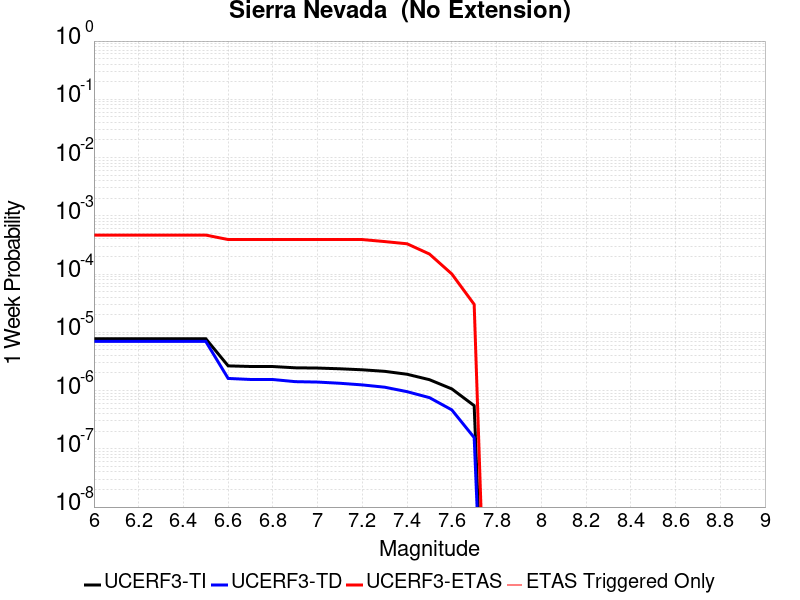 | 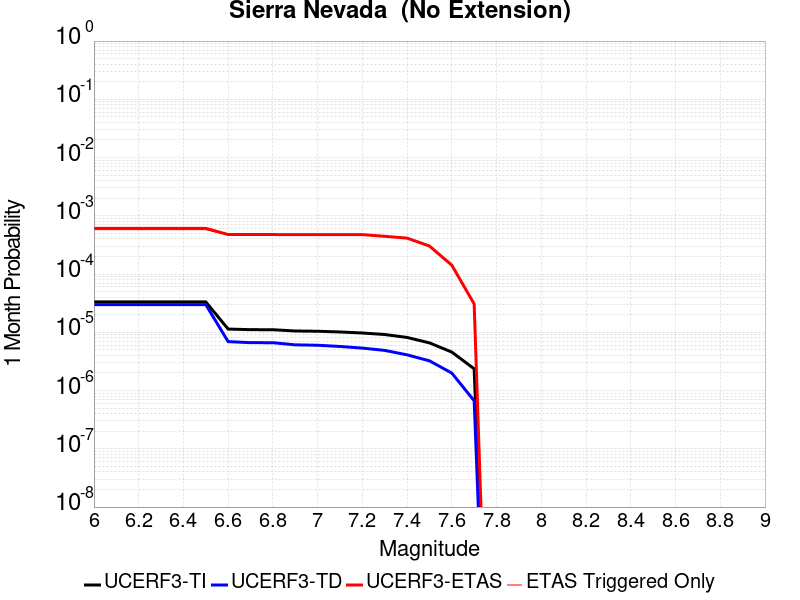 | 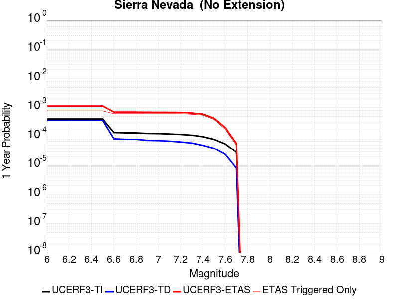 |  |

| Magnitude | 1 wk TI Prob | 1 wk TD Prob | 1 wk ETAS Prob | 1 wk ETAS/TD Gain | 1 wk ETAS Triggered Only | 1 mo TI Prob | 1 mo TD Prob | 1 mo ETAS Prob | 1 mo ETAS/TD Gain | 1 mo ETAS Triggered Only | 1 yr TI Prob | 1 yr TD Prob | 1 yr ETAS Prob | 1 yr ETAS/TD Gain | 1 yr ETAS Triggered Only | 10 yr TI Prob | 10 yr TD Prob | 10 yr ETAS Prob | 10 yr ETAS/TD Gain | 10 yr ETAS Triggered Only |
|-----|-----|-----|-----|-----|-----|-----|-----|-----|-----|-----|-----|-----|-----|-----|-----|-----|-----|-----|-----|-----|
| 6.0 | 7.7690465E-6 | 6.9762887E-6 | 4.6697308E-4 | 66.93718 | 4.6E-4 | 3.329549E-5 | 2.989824E-5 | 6.098809E-4 | 20.398556 | 5.8E-4 | 4.0529718E-4 | 3.6398612E-4 | 0.0011337058 | 3.1146953 | 7.7E-4 | 0.004045588 | 0.0036374154 | 0.0046736323 | 1.2848773 | 0.00104 |
| 6.1 | 7.7690465E-6 | 6.9762887E-6 | 4.6697308E-4 | 66.93718 | 4.6E-4 | 3.329549E-5 | 2.989824E-5 | 6.098809E-4 | 20.398556 | 5.8E-4 | 4.0529718E-4 | 3.6398612E-4 | 0.0011337058 | 3.1146953 | 7.7E-4 | 0.004045588 | 0.0036374154 | 0.0046736323 | 1.2848773 | 0.00104 |
| 6.2 | 7.7690465E-6 | 6.9762887E-6 | 4.6697308E-4 | 66.93718 | 4.6E-4 | 3.329549E-5 | 2.989824E-5 | 6.098809E-4 | 20.398556 | 5.8E-4 | 4.0529718E-4 | 3.6398612E-4 | 0.0011337058 | 3.1146953 | 7.7E-4 | 0.004045588 | 0.0036374154 | 0.0046736323 | 1.2848773 | 0.00104 |
| 6.3 | 7.7690465E-6 | 6.9762887E-6 | 4.6697308E-4 | 66.93718 | 4.6E-4 | 3.329549E-5 | 2.989824E-5 | 6.098809E-4 | 20.398556 | 5.8E-4 | 4.0529718E-4 | 3.6398612E-4 | 0.0011337058 | 3.1146953 | 7.7E-4 | 0.004045588 | 0.0036374154 | 0.0046736323 | 1.2848773 | 0.00104 |
| 6.4 | 7.7690465E-6 | 6.9762887E-6 | 4.6697308E-4 | 66.93718 | 4.6E-4 | 3.329549E-5 | 2.989824E-5 | 6.098809E-4 | 20.398556 | 5.8E-4 | 4.0529718E-4 | 3.6398612E-4 | 0.0011337058 | 3.1146953 | 7.7E-4 | 0.004045588 | 0.0036374154 | 0.0046736323 | 1.2848773 | 0.00104 |
| 6.5 | 7.7690465E-6 | 6.9762887E-6 | 4.6697308E-4 | 66.93718 | 4.6E-4 | 3.329549E-5 | 2.989824E-5 | 6.098809E-4 | 20.398556 | 5.8E-4 | 4.0529718E-4 | 3.6398612E-4 | 0.0011337058 | 3.1146953 | 7.7E-4 | 0.004045588 | 0.0036374154 | 0.0046736323 | 1.2848773 | 0.00104 |
| 6.6 | 2.653E-6 | 1.6148208E-6 | 3.916142E-4 | 242.51247 | 3.9E-4 | 1.136995E-5 | 6.9206426E-6 | 4.769174E-4 | 68.9123 | 4.7E-4 | 1.3842035E-4 | 8.42556E-5 | 7.042034E-4 | 8.357942 | 6.2E-4 | 0.0013833415 | 8.4224E-4 | 0.001691524 | 2.0083635 | 8.5E-4 |
| 6.7 | 2.5902466E-6 | 1.5501544E-6 | 3.9154955E-4 | 252.58745 | 3.9E-4 | 1.11010095E-5 | 6.643502E-6 | 4.766404E-4 | 71.74535 | 4.7E-4 | 1.351464E-4 | 8.088166E-5 | 7.0083153E-4 | 8.6649 | 6.2E-4 | 0.0013506424 | 8.0852525E-4 | 0.001657838 | 2.0504467 | 8.5E-4 |
| 6.8 | 2.5853892E-6 | 1.5469546E-6 | 3.9154635E-4 | 253.10785 | 3.9E-4 | 1.1080193E-5 | 6.629789E-6 | 4.7662668E-4 | 71.89168 | 4.7E-4 | 1.34893E-4 | 8.071472E-5 | 7.0066465E-4 | 8.680755 | 6.2E-4 | 0.0013481114 | 8.06857E-4 | 0.0016561712 | 2.0526204 | 8.5E-4 |
| 6.9 | 2.458257E-6 | 1.422029E-6 | 3.9142146E-4 | 275.25565 | 3.9E-4 | 1.0535345E-5 | 6.0943958E-6 | 4.7609152E-4 | 78.11957 | 4.7E-4 | 1.2826028E-4 | 7.419676E-5 | 6.9415075E-4 | 9.35554 | 6.2E-4 | 0.0012818627 | 7.4172183E-4 | 0.0015910914 | 2.1451323 | 8.5E-4 |
| 7.0 | 2.4341468E-6 | 1.3989927E-6 | 3.9139844E-4 | 279.7716 | 3.9E-4 | 1.0432016E-5 | 5.9956697E-6 | 4.7599286E-4 | 79.38944 | 4.7E-4 | 1.270024E-4 | 7.299485E-5 | 6.929496E-4 | 9.49313 | 6.2E-4 | 0.0012692984 | 7.297107E-4 | 0.0015790904 | 2.1639953 | 8.5E-4 |
| 7.1 | 2.3652476E-6 | 1.3339427E-6 | 3.9133342E-4 | 293.366 | 3.9E-4 | 1.0136736E-5 | 5.716885E-6 | 4.757142E-4 | 83.212135 | 4.7E-4 | 1.2340778E-4 | 6.9600865E-5 | 6.895577E-4 | 9.907315 | 6.2E-4 | 0.0012333926 | 6.957924E-4 | 0.0015452009 | 2.2207787 | 8.5E-4 |
| 7.2 | 2.272158E-6 | 1.2502497E-6 | 3.9124975E-4 | 312.9373 | 3.9E-4 | 9.737784E-6 | 5.358202E-6 | 4.753557E-4 | 88.71552 | 4.7E-4 | 1.1855107E-4 | 6.523417E-5 | 6.8519375E-4 | 10.503601 | 6.2E-4 | 0.0011848784 | 6.5215176E-4 | 0.0015015975 | 2.3025277 | 8.5E-4 |
| 7.3 | 2.1382127E-6 | 1.1419382E-6 | 3.6114152E-4 | 316.2531 | 3.6E-4 | 9.163737E-6 | 4.894012E-6 | 4.4489186E-4 | 90.90535 | 4.4E-4 | 1.1156279E-4 | 5.9582977E-5 | 6.4954784E-4 | 10.901567 | 5.9E-4 | 0.001115068 | 5.956712E-4 | 0.0014151827 | 2.3757784 | 8.2E-4 |
| 7.4 | 1.9048055E-6 | 9.574928E-7 | 3.3095718E-4 | 345.64978 | 3.3E-4 | 8.163426E-6 | 4.103534E-6 | 4.1410184E-4 | 100.91346 | 4.1E-4 | 9.9385186E-5 | 4.995939E-5 | 5.999319E-4 | 12.008391 | 5.5E-4 | 9.934074E-4 | 4.9948227E-4 | 0.0012491076 | 2.5008047 | 7.5E-4 |
| 7.5 | 1.5373403E-6 | 7.559763E-7 | 2.2075581E-4 | 292.0142 | 2.2E-4 | 6.5885843E-6 | 3.2398946E-6 | 3.0323892E-4 | 93.59531 | 3.0E-4 | 8.021306E-5 | 3.9445007E-5 | 4.294296E-4 | 10.886793 | 3.9E-4 | 8.0184115E-4 | 3.9438053E-4 | 9.641557E-4 | 2.4447346 | 5.7E-4 |
| 7.6 | 1.0680322E-6 | 4.65941E-7 | 1.0046589E-4 | 215.61934 | 1.0E-4 | 4.577273E-6 | 1.9968884E-6 | 1.4199661E-4 | 71.10893 | 1.4E-4 | 5.5726876E-5 | 2.4311848E-5 | 2.0430748E-4 | 8.403617 | 1.8E-4 | 5.5712904E-4 | 2.4309216E-4 | 5.3302164E-4 | 2.1926732 | 2.9E-4 |
| 7.7 | 5.509146E-7 | 1.5578539E-7 | 3.0155781E-5 | 193.57259 | 3.0E-5 | 2.3610605E-6 | 6.676515E-7 | 3.066763E-5 | 45.93359 | 3.0E-5 | 2.8745531E-5 | 8.128628E-6 | 5.8128222E-5 | 7.1510496 | 5.0E-5 | 2.8741814E-4 | 8.128342E-5 | 1.5127774E-4 | 1.8611143 | 7.0E-5 |

## Coyote Lake
*[(top)](#table-of-contents)*

| 1 Week | 1 Month | 1 Year | 10 Year |
|-----|-----|-----|-----|
|  |  |  |  |

| Magnitude | 1 wk TI Prob | 1 wk TD Prob | 1 wk ETAS Prob | 1 wk ETAS/TD Gain | 1 wk ETAS Triggered Only | 1 mo TI Prob | 1 mo TD Prob | 1 mo ETAS Prob | 1 mo ETAS/TD Gain | 1 mo ETAS Triggered Only | 1 yr TI Prob | 1 yr TD Prob | 1 yr ETAS Prob | 1 yr ETAS/TD Gain | 1 yr ETAS Triggered Only | 10 yr TI Prob | 10 yr TD Prob | 10 yr ETAS Prob | 10 yr ETAS/TD Gain | 10 yr ETAS Triggered Only |
|-----|-----|-----|-----|-----|-----|-----|-----|-----|-----|-----|-----|-----|-----|-----|-----|-----|-----|-----|-----|-----|
| 6.0 | 1.980352E-5 | 2.1706745E-5 | 2.1170262E-4 | 9.75285 | 1.9E-4 | 8.486947E-5 | 9.302599E-5 | 4.0299716E-4 | 4.332092 | 3.1E-4 | 0.0010327959 | 0.0011320751 | 0.0017913278 | 1.5823402 | 6.6E-4 | 0.010280091 | 0.011270258 | 0.012298537 | 1.0912383 | 0.00104 |
| 6.1 | 1.980352E-5 | 2.1706745E-5 | 2.1170262E-4 | 9.75285 | 1.9E-4 | 8.486947E-5 | 9.302599E-5 | 4.0299716E-4 | 4.332092 | 3.1E-4 | 0.0010327959 | 0.0011320751 | 0.0017913278 | 1.5823402 | 6.6E-4 | 0.010280091 | 0.011270258 | 0.012298537 | 1.0912383 | 0.00104 |
| 6.2 | 1.980352E-5 | 2.1706745E-5 | 2.1170262E-4 | 9.75285 | 1.9E-4 | 8.486947E-5 | 9.302599E-5 | 4.0299716E-4 | 4.332092 | 3.1E-4 | 0.0010327959 | 0.0011320751 | 0.0017913278 | 1.5823402 | 6.6E-4 | 0.010280091 | 0.011270258 | 0.012298537 | 1.0912383 | 0.00104 |
| 6.3 | 1.5344787E-5 | 1.682067E-5 | 1.568183E-4 | 9.322953 | 1.4E-4 | 6.576172E-5 | 7.2086936E-5 | 3.320682E-4 | 4.6064963 | 2.6E-4 | 8.003548E-4 | 8.773662E-4 | 0.0014468662 | 1.6491016 | 5.7E-4 | 0.007974784 | 0.00874507 | 0.009637198 | 1.1020151 | 9.0E-4 |
| 6.4 | 1.5344787E-5 | 1.682067E-5 | 1.568183E-4 | 9.322953 | 1.4E-4 | 6.576172E-5 | 7.2086936E-5 | 3.320682E-4 | 4.6064963 | 2.6E-4 | 8.003548E-4 | 8.773662E-4 | 0.0014468662 | 1.6491016 | 5.7E-4 | 0.007974784 | 0.00874507 | 0.009637198 | 1.1020151 | 9.0E-4 |
| 6.5 | 1.4189697E-5 | 1.5557987E-5 | 1.5555581E-4 | 9.998453 | 1.4E-4 | 6.081157E-5 | 6.6675726E-5 | 3.266584E-4 | 4.8992105 | 2.6E-4 | 7.401293E-4 | 8.115349E-4 | 0.0013610885 | 1.6771781 | 5.5E-4 | 0.0073766913 | 0.008091656 | 0.008964536 | 1.107874 | 8.8E-4 |
| 6.6 | 1.3469301E-5 | 1.4771577E-5 | 1.5476951E-4 | 10.477521 | 1.4E-4 | 5.7724297E-5 | 6.330556E-5 | 3.1328973E-4 | 4.94885 | 2.5E-4 | 7.025667E-4 | 7.7053264E-4 | 0.0013101166 | 1.7002739 | 5.4E-4 | 0.0070034964 | 0.0076845144 | 0.0085081365 | 1.1071794 | 8.3E-4 |
| 6.7 | 1.3027966E-5 | 1.4281745E-5 | 1.4427988E-4 | 10.102399 | 1.3E-4 | 5.5832945E-5 | 6.120638E-5 | 3.011917E-4 | 4.92092 | 2.4E-4 | 6.7955407E-4 | 7.4499263E-4 | 0.0012546127 | 1.6840606 | 5.1E-4 | 0.006774798 | 0.0074308286 | 0.008205033 | 1.1041881 | 7.8E-4 |
| 6.8 | 5.695434E-6 | 6.2244176E-6 | 5.6224108E-5 | 9.03283 | 5.0E-5 | 2.4408775E-5 | 2.6675973E-5 | 1.0667384E-4 | 3.9988735 | 8.0E-5 | 2.971363E-4 | 3.2476155E-4 | 4.6471608E-4 | 1.4309455 | 1.4E-4 | 0.0029673933 | 0.0032458105 | 0.0034650962 | 1.0675597 | 2.2E-4 |
| 6.9 | 4.385688E-6 | 4.7930553E-6 | 4.4792865E-5 | 9.345367 | 4.0E-5 | 1.879567E-5 | 2.0541665E-5 | 9.054023E-5 | 4.407638 | 7.0E-5 | 2.2881327E-4 | 2.5009477E-4 | 3.8006227E-4 | 1.5196729 | 1.3E-4 | 0.002285778 | 0.0025009478 | 0.0026804977 | 1.0717927 | 1.8E-4 |

## San Andreas (Big Bend)
*[(top)](#table-of-contents)*

| 1 Week | 1 Month | 1 Year | 10 Year |
|-----|-----|-----|-----|
| 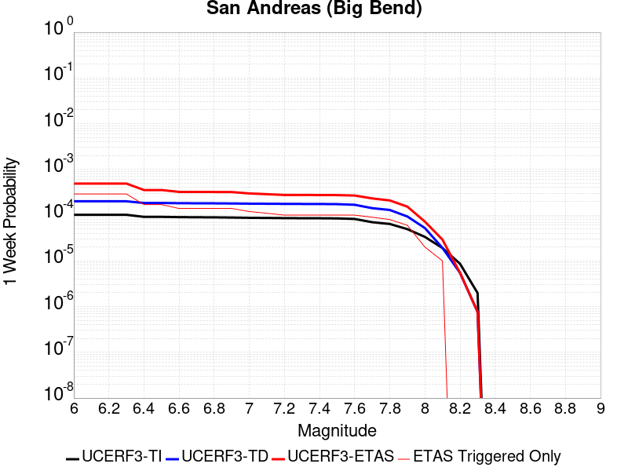 |  |  | 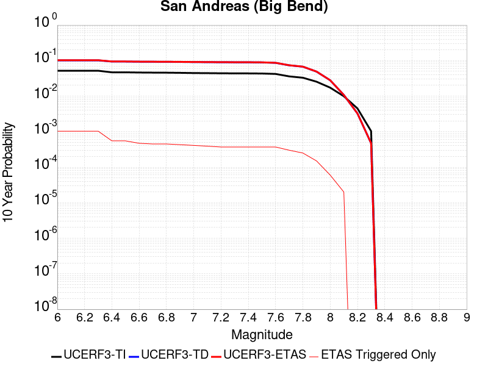 |

| Magnitude | 1 wk TI Prob | 1 wk TD Prob | 1 wk ETAS Prob | 1 wk ETAS/TD Gain | 1 wk ETAS Triggered Only | 1 mo TI Prob | 1 mo TD Prob | 1 mo ETAS Prob | 1 mo ETAS/TD Gain | 1 mo ETAS Triggered Only | 1 yr TI Prob | 1 yr TD Prob | 1 yr ETAS Prob | 1 yr ETAS/TD Gain | 1 yr ETAS Triggered Only | 10 yr TI Prob | 10 yr TD Prob | 10 yr ETAS Prob | 10 yr ETAS/TD Gain | 10 yr ETAS Triggered Only |
|-----|-----|-----|-----|-----|-----|-----|-----|-----|-----|-----|-----|-----|-----|-----|-----|-----|-----|-----|-----|-----|
| 6.0 | 1.0179969E-4 | 2.0073925E-4 | 4.9068104E-4 | 2.4443703 | 2.9E-4 | 4.362114E-4 | 8.6002843E-4 | 0.0012996501 | 1.511171 | 4.4E-4 | 0.0052979486 | 0.010420859 | 0.011123461 | 1.0674226 | 7.1E-4 | 0.051734097 | 0.101455905 | 0.10238141 | 1.0091223 | 0.00103 |
| 6.1 | 1.0179969E-4 | 2.0073925E-4 | 4.9068104E-4 | 2.4443703 | 2.9E-4 | 4.362114E-4 | 8.6002843E-4 | 0.0012996501 | 1.511171 | 4.4E-4 | 0.0052979486 | 0.010420859 | 0.011123461 | 1.0674226 | 7.1E-4 | 0.051734097 | 0.101455905 | 0.10238141 | 1.0091223 | 0.00103 |
| 6.2 | 1.0179969E-4 | 2.0073925E-4 | 4.9068104E-4 | 2.4443703 | 2.9E-4 | 4.362114E-4 | 8.6002843E-4 | 0.0012996501 | 1.511171 | 4.4E-4 | 0.0052979486 | 0.010420859 | 0.011123461 | 1.0674226 | 7.1E-4 | 0.051734097 | 0.101455905 | 0.10238141 | 1.0091223 | 0.00103 |
| 6.3 | 1.0179969E-4 | 2.0073925E-4 | 4.9068104E-4 | 2.4443703 | 2.9E-4 | 4.362114E-4 | 8.6002843E-4 | 0.0012996501 | 1.511171 | 4.4E-4 | 0.0052979486 | 0.010420859 | 0.011123461 | 1.0674226 | 7.1E-4 | 0.051734097 | 0.101455905 | 0.10238141 | 1.0091223 | 0.00103 |
| 6.4 | 9.1639464E-5 | 1.8430917E-4 | 3.5427784E-4 | 1.9221932 | 1.7E-4 | 3.9268145E-4 | 7.896575E-4 | 0.0010594444 | 1.3416504 | 2.7E-4 | 0.0047704205 | 0.009571818 | 0.009938276 | 1.0382851 | 3.7E-4 | 0.046693064 | 0.09378695 | 0.09428537 | 1.0053144 | 5.5E-4 |
| 6.5 | 9.1639464E-5 | 1.8430917E-4 | 3.5427784E-4 | 1.9221932 | 1.7E-4 | 3.9268145E-4 | 7.896575E-4 | 0.0010594444 | 1.3416504 | 2.7E-4 | 0.0047704205 | 0.009571818 | 0.009938276 | 1.0382851 | 3.7E-4 | 0.046693064 | 0.09378695 | 0.09428537 | 1.0053144 | 5.5E-4 |
| 6.6 | 9.042622E-5 | 1.8238011E-4 | 3.2235458E-4 | 1.7674875 | 1.4E-4 | 3.8748336E-4 | 7.813951E-4 | 0.0010212077 | 1.3069029 | 2.4E-4 | 0.0047074095 | 0.0094721 | 0.009789069 | 1.0334635 | 3.2E-4 | 0.046089325 | 0.09287721 | 0.09330356 | 1.0045904 | 4.7E-4 |
| 6.7 | 8.9836685E-5 | 1.8152347E-4 | 3.2149805E-4 | 1.7711102 | 1.4E-4 | 3.8495753E-4 | 7.7772595E-4 | 0.0010175393 | 1.308352 | 2.4E-4 | 0.00467679 | 0.009427815 | 0.009744798 | 1.0336221 | 3.2E-4 | 0.045795817 | 0.09247148 | 0.09287987 | 1.0044163 | 4.5E-4 |
| 6.8 | 8.9471854E-5 | 1.8099119E-4 | 3.2096586E-4 | 1.7733783 | 1.4E-4 | 3.8339442E-4 | 7.754462E-4 | 0.0010152601 | 1.3092593 | 2.4E-4 | 0.004657841 | 0.009400298 | 0.009717289 | 1.0337214 | 3.2E-4 | 0.04561414 | 0.0922192 | 0.09262771 | 1.0044297 | 4.5E-4 |
| 6.9 | 8.858234E-5 | 1.7981093E-4 | 3.1978576E-4 | 1.7784556 | 1.4E-4 | 3.7958333E-4 | 7.7039085E-4 | 0.0010002137 | 1.2983197 | 2.3E-4 | 0.004611638 | 0.009339278 | 0.009646383 | 1.0328832 | 3.1E-4 | 0.04517103 | 0.09165911 | 0.09204969 | 1.0042613 | 4.3E-4 |
| 7.0 | 8.7433385E-5 | 1.7819891E-4 | 2.9817753E-4 | 1.6732848 | 1.2E-4 | 3.746607E-4 | 7.6348626E-4 | 9.733259E-4 | 1.274844 | 2.1E-4 | 0.004551957 | 0.009255932 | 0.0095432475 | 1.0310413 | 2.9E-4 | 0.044598386 | 0.09089323 | 0.09126596 | 1.0041008 | 4.1E-4 |
| 7.1 | 8.684964E-5 | 1.7731842E-4 | 2.872989E-4 | 1.620243 | 1.1E-4 | 3.7215967E-4 | 7.597149E-4 | 9.59563E-4 | 1.2630566 | 2.0E-4 | 0.0045216335 | 0.009210405 | 0.009487826 | 1.0301204 | 2.8E-4 | 0.04430731 | 0.09047475 | 0.09082946 | 1.0039206 | 3.9E-4 |
| 7.2 | 8.606521E-5 | 1.7622454E-4 | 2.762069E-4 | 1.5673579 | 1.0E-4 | 3.6879873E-4 | 7.550296E-4 | 9.348937E-4 | 1.2382213 | 1.8E-4 | 0.0044808835 | 0.009153842 | 0.009411462 | 1.0281434 | 2.6E-4 | 0.043916024 | 0.08995518 | 0.090291895 | 1.0037432 | 3.7E-4 |
| 7.3 | 8.568266E-5 | 1.7564454E-4 | 2.7562698E-4 | 1.5692316 | 1.0E-4 | 3.6715972E-4 | 7.5254537E-4 | 9.324099E-4 | 1.2390082 | 1.8E-4 | 0.0044610105 | 0.00912385 | 0.009381478 | 1.0282367 | 2.6E-4 | 0.043725148 | 0.08967623 | 0.09001306 | 1.0037559 | 3.7E-4 |
| 7.4 | 8.5432206E-5 | 1.752704E-4 | 2.7525285E-4 | 1.570447 | 1.0E-4 | 3.6608664E-4 | 7.509428E-4 | 9.308076E-4 | 1.2395186 | 1.8E-4 | 0.004447999 | 0.009104501 | 0.009362135 | 1.0282973 | 2.6E-4 | 0.043600157 | 0.08949642 | 0.089833304 | 1.0037643 | 3.7E-4 |
| 7.5 | 8.4791965E-5 | 1.7396381E-4 | 2.739464E-4 | 1.5747322 | 1.0E-4 | 3.633435E-4 | 7.4534636E-4 | 9.2521217E-4 | 1.2413185 | 1.8E-4 | 0.0044147377 | 0.009036932 | 0.0092945825 | 1.0285108 | 2.6E-4 | 0.043280575 | 0.08887209 | 0.08920921 | 1.0037932 | 3.7E-4 |
| 7.6 | 8.241105E-5 | 1.6841735E-4 | 2.684005E-4 | 1.5936631 | 1.0E-4 | 3.531424E-4 | 7.2158914E-4 | 9.0145925E-4 | 1.2492695 | 1.8E-4 | 0.0042910352 | 0.008750047 | 0.0090077715 | 1.0294541 | 2.6E-4 | 0.042091176 | 0.08625032 | 0.08658841 | 1.0039198 | 3.7E-4 |
| 7.7 | 7.00432E-5 | 1.4205615E-4 | 2.3204336E-4 | 1.6334623 | 9.0E-5 | 3.001506E-4 | 6.0867006E-4 | 7.4858486E-4 | 1.2298697 | 1.4E-4 | 0.0036482112 | 0.0073854174 | 0.0075938664 | 1.0282245 | 2.1E-4 | 0.035888977 | 0.07352299 | 0.07380094 | 1.0037804 | 3.0E-4 |
| 7.8 | 6.415362E-5 | 1.2969968E-4 | 2.096893E-4 | 1.6167295 | 8.0E-5 | 2.749151E-4 | 5.557374E-4 | 6.6567626E-4 | 1.1978252 | 1.1E-4 | 0.0033419547 | 0.0067451415 | 0.006913995 | 1.0250334 | 1.7E-4 | 0.03292141 | 0.06725514 | 0.06748833 | 1.0034672 | 2.5E-4 |
| 7.9 | 4.939911E-5 | 9.341721E-5 | 1.5341162E-4 | 1.6422199 | 6.0E-5 | 2.116933E-4 | 4.0029807E-4 | 4.7027005E-4 | 1.1747997 | 7.0E-5 | 0.0025743195 | 0.004862747 | 0.0049821637 | 1.0245574 | 1.2E-4 | 0.025447013 | 0.048915803 | 0.049058463 | 1.0029165 | 1.5E-4 |
| 8.0 | 3.344983E-5 | 5.2228E-5 | 7.2226954E-5 | 1.3829163 | 2.0E-5 | 1.4334853E-4 | 2.2381509E-4 | 2.5380836E-4 | 1.1340092 | 3.0E-5 | 0.0017438711 | 0.0027215453 | 0.0027714092 | 1.0183219 | 5.0E-5 | 0.017302496 | 0.027923161 | 0.027981486 | 1.0020888 | 6.0E-5 |
| 8.1 | 1.9104898E-5 | 1.9171663E-5 | 2.917147E-5 | 1.5215932 | 1.0E-5 | 8.1875565E-5 | 8.2161685E-5 | 9.216086E-5 | 1.1217012 | 1.0E-5 | 9.963791E-4 | 9.9986E-4 | 0.0010098501 | 1.0099914 | 1.0E-5 | 0.009919235 | 0.010749552 | 0.010769337 | 1.0018406 | 2.0E-5 |
| 8.2 | 8.643924E-6 | 5.473668E-6 | 5.473668E-6 | 1.0 | 0.0 | 3.704486E-5 | 2.3458366E-5 | 2.3458366E-5 | 1.0 | 0.0 | 4.5092785E-4 | 2.8556827E-4 | 2.8556827E-4 | 1.0 | 0.0 | 0.0045001395 | 0.0032481793 | 0.0032481793 | 1.0 | 0.0 |
| 8.3 | 1.983087E-6 | 7.6564595E-7 | 7.6564595E-7 | 1.0 | 0.0 | 8.498917E-6 | 3.281336E-6 | 3.281336E-6 | 1.0 | 0.0 | 1.034694E-4 | 3.9949547E-5 | 3.9949547E-5 | 1.0 | 0.0 | 0.0010342124 | 4.717979E-4 | 4.717979E-4 | 1.0 | 0.0 |

## San Andreas (San Gorgonio Pass-Garnet HIll)
*[(top)](#table-of-contents)*

| 1 Week | 1 Month | 1 Year | 10 Year |
|-----|-----|-----|-----|
|  | 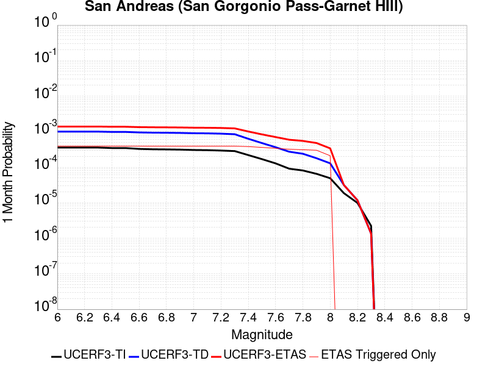 | 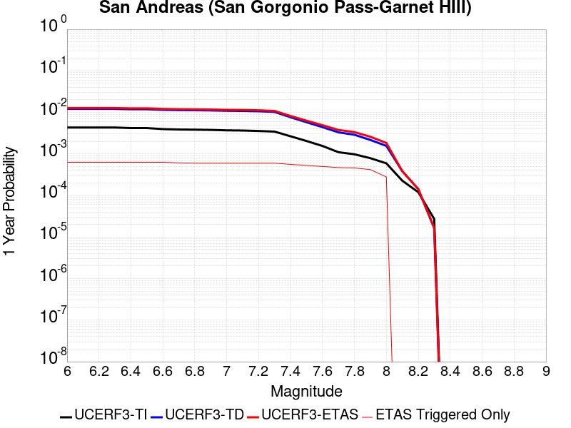 |  |

| Magnitude | 1 wk TI Prob | 1 wk TD Prob | 1 wk ETAS Prob | 1 wk ETAS/TD Gain | 1 wk ETAS Triggered Only | 1 mo TI Prob | 1 mo TD Prob | 1 mo ETAS Prob | 1 mo ETAS/TD Gain | 1 mo ETAS Triggered Only | 1 yr TI Prob | 1 yr TD Prob | 1 yr ETAS Prob | 1 yr ETAS/TD Gain | 1 yr ETAS Triggered Only | 10 yr TI Prob | 10 yr TD Prob | 10 yr ETAS Prob | 10 yr ETAS/TD Gain | 10 yr ETAS Triggered Only |
|-----|-----|-----|-----|-----|-----|-----|-----|-----|-----|-----|-----|-----|-----|-----|-----|-----|-----|-----|-----|-----|
| 6.0 | 8.31567E-5 | 2.3384395E-4 | 5.637668E-4 | 2.4108675 | 3.3E-4 | 3.5633717E-4 | 0.0010018025 | 0.0013914119 | 1.3889083 | 3.9E-4 | 0.004329778 | 0.012128622 | 0.012750981 | 1.0513133 | 6.3E-4 | 0.042463828 | 0.11258187 | 0.11329181 | 1.0063059 | 8.0E-4 |
| 6.1 | 8.31567E-5 | 2.3384395E-4 | 5.637668E-4 | 2.4108675 | 3.3E-4 | 3.5633717E-4 | 0.0010018025 | 0.0013914119 | 1.3889083 | 3.9E-4 | 0.004329778 | 0.012128622 | 0.012750981 | 1.0513133 | 6.3E-4 | 0.042463828 | 0.11258187 | 0.11329181 | 1.0063059 | 8.0E-4 |
| 6.2 | 8.31567E-5 | 2.3384395E-4 | 5.637668E-4 | 2.4108675 | 3.3E-4 | 3.5633717E-4 | 0.0010018025 | 0.0013914119 | 1.3889083 | 3.9E-4 | 0.004329778 | 0.012128622 | 0.012750981 | 1.0513133 | 6.3E-4 | 0.042463828 | 0.11258187 | 0.11329181 | 1.0063059 | 8.0E-4 |
| 6.3 | 8.31567E-5 | 2.3384395E-4 | 5.637668E-4 | 2.4108675 | 3.3E-4 | 3.5633717E-4 | 0.0010018025 | 0.0013914119 | 1.3889083 | 3.9E-4 | 0.004329778 | 0.012128622 | 0.012750981 | 1.0513133 | 6.3E-4 | 0.042463828 | 0.11258187 | 0.11329181 | 1.0063059 | 8.0E-4 |
| 6.4 | 8.059055E-5 | 2.2941893E-4 | 5.593432E-4 | 2.4380865 | 3.3E-4 | 3.4534236E-4 | 9.828559E-4 | 0.0013724726 | 1.3964128 | 3.9E-4 | 0.0041964394 | 0.011900819 | 0.012523321 | 1.0523075 | 6.3E-4 | 0.041180745 | 0.110562965 | 0.11127451 | 1.0064358 | 8.0E-4 |
| 6.5 | 8.059055E-5 | 2.2941893E-4 | 5.593432E-4 | 2.4380865 | 3.3E-4 | 3.4534236E-4 | 9.828559E-4 | 0.0013724726 | 1.3964128 | 3.9E-4 | 0.0041964394 | 0.011900819 | 0.012523321 | 1.0523075 | 6.3E-4 | 0.041180745 | 0.110562965 | 0.11127451 | 1.0064358 | 8.0E-4 |
| 6.6 | 7.619237E-5 | 2.2186468E-4 | 5.5179145E-4 | 2.4870632 | 3.3E-4 | 3.2649786E-4 | 9.5050444E-4 | 0.0013401337 | 1.4099184 | 3.9E-4 | 0.0039678677 | 0.0115115335 | 0.012134282 | 1.0540978 | 6.3E-4 | 0.03897764 | 0.10709954 | 0.10780493 | 1.0065863 | 7.9E-4 |
| 6.7 | 7.440636E-5 | 2.1862281E-4 | 5.485507E-4 | 2.509119 | 3.3E-4 | 3.188454E-4 | 9.3662075E-4 | 0.0013262555 | 1.4160005 | 3.9E-4 | 0.0038750346 | 0.011344268 | 0.011947348 | 1.0531616 | 6.1E-4 | 0.038081564 | 0.1056081 | 0.106296785 | 1.0065211 | 7.7E-4 |
| 6.8 | 7.3735864E-5 | 2.1709445E-4 | 5.470228E-4 | 2.5197456 | 3.3E-4 | 3.1597257E-4 | 9.300753E-4 | 0.0013197126 | 1.4189309 | 3.9E-4 | 0.0038401815 | 0.011265406 | 0.011858648 | 1.0526603 | 6.0E-4 | 0.03774495 | 0.104909696 | 0.10558996 | 1.0064843 | 7.6E-4 |
| 6.9 | 7.27575E-5 | 2.1478413E-4 | 5.447133E-4 | 2.5360963 | 3.3E-4 | 3.117806E-4 | 9.20181E-4 | 0.0013098221 | 1.4234396 | 3.9E-4 | 0.003789323 | 0.011146182 | 0.011739494 | 1.05323 | 6.0E-4 | 0.037253562 | 0.10385753 | 0.1045386 | 1.0065577 | 7.6E-4 |
| 7.0 | 7.102591E-5 | 2.1062451E-4 | 5.40555E-4 | 2.5664392 | 3.3E-4 | 3.0436125E-4 | 9.023664E-4 | 0.0012920145 | 1.4318069 | 3.9E-4 | 0.003699303 | 0.010931484 | 0.011524925 | 1.0542873 | 6.0E-4 | 0.03638325 | 0.101959534 | 0.10263307 | 1.0066059 | 7.5E-4 |
| 7.1 | 7.028513E-5 | 2.0898094E-4 | 5.3891196E-4 | 2.5787613 | 3.3E-4 | 3.0118722E-4 | 8.953274E-4 | 0.0012849782 | 1.4352049 | 3.9E-4 | 0.0036607897 | 0.010846641 | 0.011440133 | 1.0547167 | 6.0E-4 | 0.036010686 | 0.10120243 | 0.10187653 | 1.0066609 | 7.5E-4 |
| 7.2 | 6.8498244E-5 | 2.050596E-4 | 5.349919E-4 | 2.6089582 | 3.3E-4 | 2.9353087E-4 | 8.7853306E-4 | 0.0012681904 | 1.4435319 | 3.9E-4 | 0.003567883 | 0.0106441835 | 0.011237796 | 1.0557688 | 6.0E-4 | 0.035111405 | 0.09939449 | 0.10006995 | 1.0067956 | 7.5E-4 |
| 7.3 | 6.622592E-5 | 1.9733235E-4 | 5.272672E-4 | 2.6719756 | 3.3E-4 | 2.8379448E-4 | 8.4543816E-4 | 0.0012351085 | 1.4609092 | 3.9E-4 | 0.0034497243 | 0.010245111 | 0.010838963 | 1.0579646 | 6.0E-4 | 0.033966612 | 0.095891245 | 0.09656933 | 1.0070714 | 7.5E-4 |
| 7.4 | 5.1050705E-5 | 1.4690042E-4 | 4.668534E-4 | 3.1780264 | 3.2E-4 | 2.1877038E-4 | 6.294222E-4 | 0.001009183 | 1.6033483 | 3.8E-4 | 0.002660276 | 0.007636482 | 0.008192206 | 1.0727721 | 5.6E-4 | 0.02628654 | 0.07286554 | 0.073523805 | 1.0090339 | 7.1E-4 |
| 7.5 | 3.9302922E-5 | 1.11307076E-4 | 4.1127368E-4 | 3.6949465 | 3.0E-4 | 1.6843023E-4 | 4.7694342E-4 | 8.3677174E-4 | 1.7544465 | 3.6E-4 | 0.0020487092 | 0.0057913954 | 0.0063183256 | 1.0909851 | 5.3E-4 | 0.020299247 | 0.05601151 | 0.05665342 | 1.0114603 | 6.8E-4 |
| 7.6 | 2.9851626E-5 | 8.4956984E-5 | 3.649332E-4 | 4.2955055 | 2.8E-4 | 1.2792926E-4 | 3.6405068E-4 | 7.039269E-4 | 1.9335959 | 3.4E-4 | 0.0015564259 | 0.0044233347 | 0.004921123 | 1.1125369 | 5.0E-4 | 0.0154556995 | 0.043196145 | 0.0438085 | 1.0141761 | 6.4E-4 |
| 7.7 | 2.1135214E-5 | 6.353527E-5 | 3.2351876E-4 | 5.091955 | 2.6E-4 | 9.0576345E-5 | 2.722656E-4 | 5.921785E-4 | 2.1750028 | 3.2E-4 | 0.0011022091 | 0.0033098008 | 0.003778245 | 1.1415325 | 4.7E-4 | 0.010967582 | 0.03258456 | 0.03316501 | 1.0178137 | 6.0E-4 |
| 7.8 | 1.883379E-5 | 5.564576E-5 | 3.0563184E-4 | 5.492455 | 2.5E-4 | 8.0713755E-5 | 2.3846005E-4 | 5.4838613E-4 | 2.299698 | 3.1E-4 | 9.822468E-4 | 0.002899389 | 0.0033580554 | 1.1581941 | 4.6E-4 | 0.0097791655 | 0.028696978 | 0.029270047 | 1.0199697 | 5.9E-4 |
| 7.9 | 1.5156185E-5 | 4.1662403E-5 | 2.91652E-4 | 7.000364 | 2.5E-4 | 6.495346E-5 | 1.7854095E-4 | 4.7848737E-4 | 2.6799867 | 3.0E-4 | 7.9052144E-4 | 0.0021715704 | 0.0025906584 | 1.1929884 | 4.2E-4 | 0.007877152 | 0.021760946 | 0.022279412 | 1.0238255 | 5.3E-4 |
| 8.0 | 1.1405907E-5 | 2.9976925E-5 | 1.9997184E-4 | 6.6708584 | 1.7E-4 | 4.8881542E-5 | 1.2846621E-4 | 3.3843925E-4 | 2.634461 | 2.1E-4 | 5.9497025E-4 | 0.0015629551 | 0.0018425174 | 1.1788678 | 2.8E-4 | 0.005933798 | 0.015774013 | 0.016138177 | 1.0230863 | 3.7E-4 |
| 8.1 | 4.3511436E-6 | 7.369465E-6 | 7.369465E-6 | 1.0 | 0.0 | 1.8647626E-5 | 3.158304E-5 | 3.158304E-5 | 1.0 | 0.0 | 2.2701119E-4 | 3.844558E-4 | 3.844558E-4 | 1.0 | 0.0 | 0.0022677942 | 0.0041165445 | 0.004126503 | 1.0024192 | 1.0E-5 |
| 8.2 | 2.3042528E-6 | 2.7328301E-6 | 2.7328301E-6 | 1.0 | 0.0 | 9.875332E-6 | 1.1712076E-5 | 1.1712076E-5 | 1.0 | 0.0 | 1.2022553E-4 | 1.4258524E-4 | 1.4258524E-4 | 1.0 | 0.0 | 0.0012016051 | 0.0015979637 | 0.0015979637 | 1.0 | 0.0 |
| 8.3 | 5.202968E-7 | 3.1590292E-7 | 3.1590292E-7 | 1.0 | 0.0 | 2.2298414E-6 | 1.353869E-6 | 1.353869E-6 | 1.0 | 0.0 | 2.714798E-5 | 1.6483244E-5 | 1.6483244E-5 | 1.0 | 0.0 | 2.7144665E-4 | 1.955901E-4 | 1.955901E-4 | 1.0 | 0.0 |

## Death Valley (No)
*[(top)](#table-of-contents)*

| 1 Week | 1 Month | 1 Year | 10 Year |
|-----|-----|-----|-----|
|  |  |  |  |

| Magnitude | 1 wk TI Prob | 1 wk TD Prob | 1 wk ETAS Prob | 1 wk ETAS/TD Gain | 1 wk ETAS Triggered Only | 1 mo TI Prob | 1 mo TD Prob | 1 mo ETAS Prob | 1 mo ETAS/TD Gain | 1 mo ETAS Triggered Only | 1 yr TI Prob | 1 yr TD Prob | 1 yr ETAS Prob | 1 yr ETAS/TD Gain | 1 yr ETAS Triggered Only | 10 yr TI Prob | 10 yr TD Prob | 10 yr ETAS Prob | 10 yr ETAS/TD Gain | 10 yr ETAS Triggered Only |
|-----|-----|-----|-----|-----|-----|-----|-----|-----|-----|-----|-----|-----|-----|-----|-----|-----|-----|-----|-----|-----|
| 6.0 | 2.0074807E-5 | 2.2500084E-5 | 2.624947E-4 | 11.666387 | 2.4E-4 | 8.603206E-5 | 9.642541E-5 | 4.563907E-4 | 4.7330956 | 3.6E-4 | 0.001046937 | 0.0011733545 | 0.0016927443 | 1.4426538 | 5.2E-4 | 0.010420183 | 0.011672506 | 0.012413752 | 1.0635035 | 7.5E-4 |
| 6.1 | 2.0074807E-5 | 2.2500084E-5 | 2.624947E-4 | 11.666387 | 2.4E-4 | 8.603206E-5 | 9.642541E-5 | 4.563907E-4 | 4.7330956 | 3.6E-4 | 0.001046937 | 0.0011733545 | 0.0016927443 | 1.4426538 | 5.2E-4 | 0.010420183 | 0.011672506 | 0.012413752 | 1.0635035 | 7.5E-4 |
| 6.2 | 2.0074807E-5 | 2.2500084E-5 | 2.624947E-4 | 11.666387 | 2.4E-4 | 8.603206E-5 | 9.642541E-5 | 4.563907E-4 | 4.7330956 | 3.6E-4 | 0.001046937 | 0.0011733545 | 0.0016927443 | 1.4426538 | 5.2E-4 | 0.010420183 | 0.011672506 | 0.012413752 | 1.0635035 | 7.5E-4 |
| 6.3 | 1.9050609E-5 | 2.1336948E-5 | 2.6133182E-4 | 12.247854 | 2.4E-4 | 8.164292E-5 | 9.1440896E-5 | 4.5140798E-4 | 4.9366093 | 3.6E-4 | 9.935491E-4 | 0.001112731 | 0.0016321525 | 1.4667987 | 5.2E-4 | 0.009891188 | 0.011072419 | 0.011804225 | 1.0660927 | 7.4E-4 |
| 6.4 | 1.9050609E-5 | 2.1336948E-5 | 2.6133182E-4 | 12.247854 | 2.4E-4 | 8.164292E-5 | 9.1440896E-5 | 4.5140798E-4 | 4.9366093 | 3.6E-4 | 9.935491E-4 | 0.001112731 | 0.0016321525 | 1.4667987 | 5.2E-4 | 0.009891188 | 0.011072419 | 0.011804225 | 1.0660927 | 7.4E-4 |
| 6.5 | 1.8367004E-5 | 2.0561009E-5 | 2.605561E-4 | 12.672339 | 2.4E-4 | 7.8713354E-5 | 8.811567E-5 | 4.4808394E-4 | 5.085179 | 3.6E-4 | 9.5791375E-4 | 0.0010722869 | 0.0015917292 | 1.4844248 | 5.2E-4 | 0.009537951 | 0.0106719155 | 0.011404018 | 1.0686009 | 7.4E-4 |
| 6.6 | 1.779439E-5 | 1.9910927E-5 | 2.5990614E-4 | 13.053442 | 2.4E-4 | 7.625944E-5 | 8.53298E-5 | 4.4529908E-4 | 5.218565 | 3.6E-4 | 9.280632E-4 | 0.0010384015 | 0.001547872 | 1.4906296 | 5.1E-4 | 0.009241969 | 0.010336253 | 0.011048811 | 1.0689378 | 7.2E-4 |
| 6.7 | 1.7025437E-5 | 1.9043426E-5 | 2.3903923E-4 | 12.552323 | 2.2E-4 | 7.296412E-5 | 8.161216E-5 | 4.215844E-4 | 5.1657057 | 3.4E-4 | 8.87976E-4 | 9.931813E-4 | 0.0014826946 | 1.4928741 | 4.9E-4 | 0.008844362 | 0.009888145 | 0.010581223 | 1.0700918 | 7.0E-4 |
| 6.8 | 1.6545107E-5 | 1.8512545E-5 | 2.3850847E-4 | 12.883613 | 2.2E-4 | 7.090568E-5 | 7.93371E-5 | 4.1931012E-4 | 5.2851706 | 3.4E-4 | 8.629347E-4 | 9.655073E-4 | 0.0014550341 | 1.5070152 | 4.9E-4 | 0.008595915 | 0.009613829 | 0.010307099 | 1.0721117 | 7.0E-4 |
| 6.9 | 1.615478E-5 | 1.8087594E-5 | 2.3808361E-4 | 13.162813 | 2.2E-4 | 6.9232934E-5 | 7.751599E-5 | 4.1748965E-4 | 5.385852 | 3.4E-4 | 8.4258494E-4 | 9.433546E-4 | 0.0014328924 | 1.5189329 | 4.9E-4 | 0.008393973 | 0.009394196 | 0.010077714 | 1.0727596 | 6.9E-4 |
| 7.0 | 1.5894311E-5 | 1.780555E-5 | 2.3780164E-4 | 13.355478 | 2.2E-4 | 6.81167E-5 | 7.6307304E-5 | 4.1628137E-4 | 5.455328 | 3.4E-4 | 8.2900526E-4 | 9.286515E-4 | 0.0014181965 | 1.5271568 | 4.9E-4 | 0.008259195 | 0.009248397 | 0.009922109 | 1.0728463 | 6.8E-4 |
| 7.1 | 1.5602263E-5 | 1.7483504E-5 | 2.3747966E-4 | 13.583071 | 2.2E-4 | 6.6865134E-5 | 7.492718E-5 | 4.149017E-4 | 5.5373993 | 3.4E-4 | 8.137789E-4 | 9.118627E-4 | 0.001391425 | 1.525915 | 4.8E-4 | 0.008108052 | 0.009081894 | 0.009745809 | 1.0731032 | 6.7E-4 |
| 7.2 | 1.5323829E-5 | 1.717063E-5 | 2.2716702E-4 | 13.229976 | 2.1E-4 | 6.56719E-5 | 7.358637E-5 | 4.035621E-4 | 5.4841957 | 3.3E-4 | 7.99262E-4 | 8.9555193E-4 | 0.001365131 | 1.524346 | 4.7E-4 | 0.007963934 | 0.008920107 | 0.00957422 | 1.0733302 | 6.6E-4 |
| 7.3 | 1.4556212E-5 | 1.6302456E-5 | 2.2629903E-4 | 13.881286 | 2.1E-4 | 6.238227E-5 | 6.9865826E-5 | 3.9984277E-4 | 5.723009 | 3.3E-4 | 7.592395E-4 | 8.5029035E-4 | 0.0013198907 | 1.5522823 | 4.7E-4 | 0.0075665074 | 0.008471014 | 0.009125424 | 1.0772527 | 6.6E-4 |
| 7.4 | 1.411725E-5 | 1.580796E-5 | 2.2580464E-4 | 14.284237 | 2.1E-4 | 6.0501097E-5 | 6.7746674E-5 | 3.977243E-4 | 5.870758 | 3.3E-4 | 7.363519E-4 | 8.245094E-4 | 0.001294122 | 1.5695659 | 4.7E-4 | 0.0073391674 | 0.008215138 | 0.008859798 | 1.0784723 | 6.5E-4 |
| 7.5 | 1.3503312E-5 | 1.5126289E-5 | 2.251231E-4 | 14.882904 | 2.1E-4 | 5.7870053E-5 | 6.482538E-5 | 3.94804E-4 | 6.090269 | 3.3E-4 | 7.043401E-4 | 7.8896893E-4 | 0.0012585982 | 1.5952442 | 4.7E-4 | 0.007021119 | 0.007862304 | 0.008507194 | 1.0820229 | 6.5E-4 |
| 7.6 | 1.1279839E-5 | 1.2626327E-5 | 1.9262405E-4 | 15.255748 | 1.8E-4 | 4.834127E-5 | 5.4111737E-5 | 3.540955E-4 | 6.5437837 | 3.0E-4 | 5.88396E-4 | 6.5861654E-4 | 0.0010883333 | 1.6524537 | 4.3E-4 | 0.005868405 | 0.006567199 | 0.007153324 | 1.0892504 | 5.9E-4 |
| 7.7 | 9.189108E-6 | 1.0283358E-5 | 1.5028192E-4 | 14.614089 | 1.4E-4 | 3.93813E-5 | 4.407082E-5 | 2.940598E-4 | 6.6724377 | 2.5E-4 | 4.7936183E-4 | 5.3643517E-4 | 8.8624744E-4 | 1.6521053 | 3.5E-4 | 0.004783291 | 0.005351914 | 0.0058193984 | 1.087349 | 4.7E-4 |
| 7.8 | 3.4586725E-7 | 3.6482615E-7 | 1.0364823E-5 | 28.410307 | 1.0E-5 | 1.4822873E-6 | 1.5635396E-6 | 2.1563508E-5 | 13.791469 | 2.0E-5 | 1.80467E-5 | 1.9035933E-5 | 3.9035553E-5 | 2.0506246 | 2.0E-5 | 1.8045233E-4 | 1.9034347E-4 | 2.1033967E-4 | 1.1050532 | 2.0E-5 |
| 7.9 | 2.5591178E-9 | 2.6696718E-9 | 2.6696718E-9 | 1.0 | 0.0 | 1.0967647E-8 | 1.14414505E-8 | 1.14414505E-8 | 1.0 | 0.0 | 1.335311E-7 | 1.3929966E-7 | 1.3929966E-7 | 1.0 | 0.0 | 1.3353102E-6 | 1.3929966E-6 | 1.3929966E-6 | 1.0 | 0.0 |

## Red Pass
*[(top)](#table-of-contents)*

| 1 Week | 1 Month | 1 Year | 10 Year |
|-----|-----|-----|-----|
| 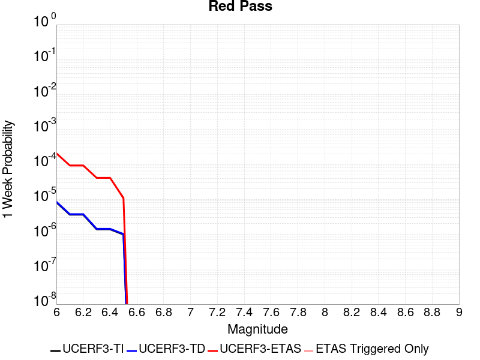 |  |  |  |

| Magnitude | 1 wk TI Prob | 1 wk TD Prob | 1 wk ETAS Prob | 1 wk ETAS/TD Gain | 1 wk ETAS Triggered Only | 1 mo TI Prob | 1 mo TD Prob | 1 mo ETAS Prob | 1 mo ETAS/TD Gain | 1 mo ETAS Triggered Only | 1 yr TI Prob | 1 yr TD Prob | 1 yr ETAS Prob | 1 yr ETAS/TD Gain | 1 yr ETAS Triggered Only | 10 yr TI Prob | 10 yr TD Prob | 10 yr ETAS Prob | 10 yr ETAS/TD Gain | 10 yr ETAS Triggered Only |
|-----|-----|-----|-----|-----|-----|-----|-----|-----|-----|-----|-----|-----|-----|-----|-----|-----|-----|-----|-----|-----|
| 6.0 | 8.258278E-6 | 8.551265E-6 | 2.0854955E-4 | 24.388153 | 2.0E-4 | 3.539214E-5 | 3.6647863E-5 | 2.9663835E-4 | 8.094287 | 2.6E-4 | 4.308141E-4 | 4.4611428E-4 | 8.659269E-4 | 1.9410428 | 4.2E-4 | 0.0042997985 | 0.004453945 | 0.005001495 | 1.122936 | 5.5E-4 |
| 6.1 | 3.649988E-6 | 3.7753161E-6 | 9.377498E-5 | 24.838974 | 9.0E-5 | 1.5642712E-5 | 1.6179853E-5 | 1.2617807E-4 | 7.7984686 | 1.1E-4 | 1.9043336E-4 | 1.9697666E-4 | 4.1693333E-4 | 2.1166637 | 2.2E-4 | 0.0019027026 | 0.001968488 | 0.0022678974 | 1.1521013 | 3.0E-4 |
| 6.2 | 3.649988E-6 | 3.7753161E-6 | 9.377498E-5 | 24.838974 | 9.0E-5 | 1.5642712E-5 | 1.6179853E-5 | 1.2617807E-4 | 7.7984686 | 1.1E-4 | 1.9043336E-4 | 1.9697666E-4 | 4.1693333E-4 | 2.1166637 | 2.2E-4 | 0.0019027026 | 0.001968488 | 0.0022678974 | 1.1521013 | 3.0E-4 |
| 6.3 | 1.3924937E-6 | 1.4411166E-6 | 4.144106E-5 | 28.756214 | 4.0E-5 | 5.9678164E-6 | 6.1762075E-6 | 4.617596E-5 | 7.476426 | 4.0E-5 | 7.265574E-5 | 7.519415E-5 | 1.6518738E-4 | 2.1968117 | 9.0E-5 | 7.263199E-4 | 7.518258E-4 | 8.7173557E-4 | 1.1594914 | 1.2E-4 |
| 6.4 | 1.3924937E-6 | 1.4411166E-6 | 4.144106E-5 | 28.756214 | 4.0E-5 | 5.9678164E-6 | 6.1762075E-6 | 4.617596E-5 | 7.476426 | 4.0E-5 | 7.265574E-5 | 7.519415E-5 | 1.6518738E-4 | 2.1968117 | 9.0E-5 | 7.263199E-4 | 7.518258E-4 | 8.7173557E-4 | 1.1594914 | 1.2E-4 |
| 6.5 | 9.876812E-7 | 1.0221912E-6 | 1.1022181E-5 | 10.782895 | 1.0E-5 | 4.2329125E-6 | 4.3808195E-6 | 1.4380776E-5 | 3.2826679 | 1.0E-5 | 5.153449E-5 | 5.3336476E-5 | 9.333435E-5 | 1.7499158 | 4.0E-5 | 5.1522546E-4 | 5.333648E-4 | 5.9333275E-4 | 1.1124333 | 6.0E-5 |

## San Andreas (Coachella) rev
*[(top)](#table-of-contents)*

| 1 Week | 1 Month | 1 Year | 10 Year |
|-----|-----|-----|-----|
| 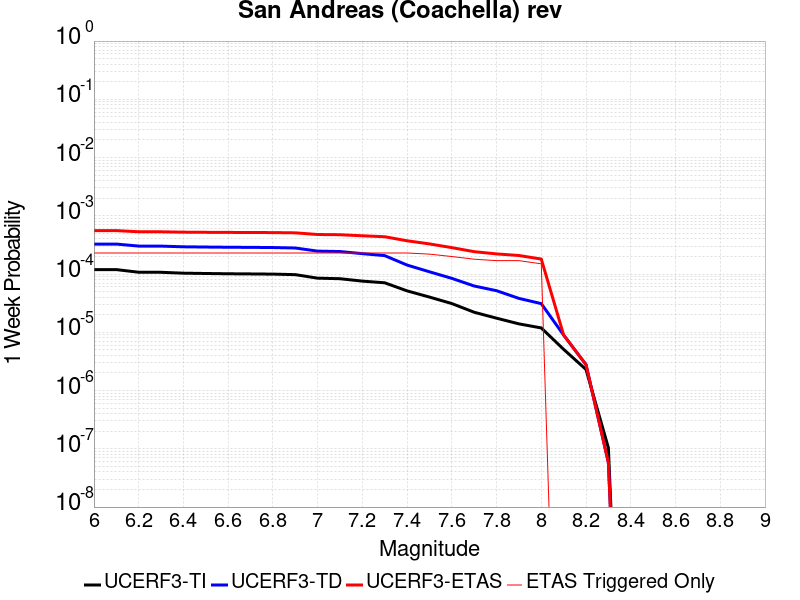 |  |  |  |

| Magnitude | 1 wk TI Prob | 1 wk TD Prob | 1 wk ETAS Prob | 1 wk ETAS/TD Gain | 1 wk ETAS Triggered Only | 1 mo TI Prob | 1 mo TD Prob | 1 mo ETAS Prob | 1 mo ETAS/TD Gain | 1 mo ETAS Triggered Only | 1 yr TI Prob | 1 yr TD Prob | 1 yr ETAS Prob | 1 yr ETAS/TD Gain | 1 yr ETAS Triggered Only | 10 yr TI Prob | 10 yr TD Prob | 10 yr ETAS Prob | 10 yr ETAS/TD Gain | 10 yr ETAS Triggered Only |
|-----|-----|-----|-----|-----|-----|-----|-----|-----|-----|-----|-----|-----|-----|-----|-----|-----|-----|-----|-----|-----|
| 6.0 | 1.1925945E-4 | 3.273077E-4 | 5.572324E-4 | 1.7024727 | 2.3E-4 | 5.110118E-4 | 0.001401998 | 0.0016816054 | 1.199435 | 2.8E-4 | 0.0062038354 | 0.016937068 | 0.017359784 | 1.0249581 | 4.3E-4 | 0.060334753 | 0.15267672 | 0.15315121 | 1.0031079 | 5.6E-4 |
| 6.1 | 1.1925945E-4 | 3.273077E-4 | 5.572324E-4 | 1.7024727 | 2.3E-4 | 5.110118E-4 | 0.001401998 | 0.0016816054 | 1.199435 | 2.8E-4 | 0.0062038354 | 0.016937068 | 0.017359784 | 1.0249581 | 4.3E-4 | 0.060334753 | 0.15267672 | 0.15315121 | 1.0031079 | 5.6E-4 |
| 6.2 | 1.07432395E-4 | 3.0231563E-4 | 5.322461E-4 | 1.7605643 | 2.3E-4 | 4.603433E-4 | 0.001294999 | 0.0015746364 | 1.2159364 | 2.8E-4 | 0.005590286 | 0.015653731 | 0.016067157 | 1.0264107 | 4.2E-4 | 0.05451731 | 0.14182784 | 0.14229983 | 1.003328 | 5.5E-4 |
| 6.3 | 1.0718766E-4 | 3.0176868E-4 | 5.316993E-4 | 1.7619432 | 2.3E-4 | 4.592948E-4 | 0.0012926573 | 0.0015722953 | 1.216328 | 2.8E-4 | 0.005577586 | 0.01562563 | 0.016039068 | 1.0264589 | 4.2E-4 | 0.054396555 | 0.14159605 | 0.14206818 | 1.0033343 | 5.5E-4 |
| 6.4 | 1.0355944E-4 | 2.9384956E-4 | 5.23782E-4 | 1.7824835 | 2.3E-4 | 4.4375064E-4 | 0.0012587514 | 0.0015383989 | 1.2221626 | 2.8E-4 | 0.0053892885 | 0.015218662 | 0.015622423 | 1.0265306 | 4.1E-4 | 0.052604496 | 0.13815795 | 0.13862334 | 1.0033686 | 5.4E-4 |
| 6.5 | 1.0227914E-4 | 2.9104383E-4 | 5.209769E-4 | 1.7900289 | 2.3E-4 | 4.382655E-4 | 0.0012467385 | 0.0015263894 | 1.224306 | 2.8E-4 | 0.0053228354 | 0.015074439 | 0.015478258 | 1.0267884 | 4.1E-4 | 0.051971316 | 0.13694239 | 0.13740844 | 1.0034033 | 5.4E-4 |
| 6.6 | 1.0116757E-4 | 2.8870135E-4 | 5.18635E-4 | 1.7964411 | 2.3E-4 | 4.3350324E-4 | 0.0012367087 | 0.0015163624 | 1.2261274 | 2.8E-4 | 0.0052651367 | 0.014954008 | 0.015357877 | 1.0270073 | 4.1E-4 | 0.051421247 | 0.13591973 | 0.13638635 | 1.003433 | 5.4E-4 |
| 6.7 | 1.0050676E-4 | 2.8728697E-4 | 5.172209E-4 | 1.8003632 | 2.3E-4 | 4.3067214E-4 | 0.0012306528 | 0.0015103082 | 1.2272415 | 2.8E-4 | 0.005230834 | 0.014881288 | 0.0152851865 | 1.0271413 | 4.1E-4 | 0.051094085 | 0.13530464 | 0.13577159 | 1.003451 | 5.4E-4 |
| 6.8 | 9.976819E-5 | 2.8532353E-4 | 5.152579E-4 | 1.8058724 | 2.3E-4 | 4.2750788E-4 | 0.001222246 | 0.0015019038 | 1.2288065 | 2.8E-4 | 0.0051924936 | 0.014780328 | 0.015174416 | 1.026663 | 4.0E-4 | 0.050728295 | 0.13445628 | 0.13491501 | 1.0034118 | 5.3E-4 |
| 6.9 | 9.77719E-5 | 2.802926E-4 | 5.102281E-4 | 1.8203411 | 2.3E-4 | 4.1895514E-4 | 0.0012007048 | 0.0014803687 | 1.2329164 | 2.8E-4 | 0.0050888555 | 0.0145215895 | 0.014915781 | 1.0271451 | 4.0E-4 | 0.049738888 | 0.13228476 | 0.13274466 | 1.0034765 | 5.3E-4 |
| 7.0 | 8.500761E-5 | 2.4763815E-4 | 4.775812E-4 | 1.9285445 | 2.3E-4 | 3.6426744E-4 | 0.0010608779 | 0.0013405809 | 1.2636523 | 2.8E-4 | 0.0044259406 | 0.01284047 | 0.013225462 | 1.0299827 | 3.9E-4 | 0.04338823 | 0.11813616 | 0.11859473 | 1.0038817 | 5.2E-4 |
| 7.1 | 8.319876E-5 | 2.4366553E-4 | 4.7360949E-4 | 1.9436868 | 2.3E-4 | 3.5651738E-4 | 0.0010438662 | 0.0013235739 | 1.2679536 | 2.8E-4 | 0.004331963 | 0.012635773 | 0.013020845 | 1.0304748 | 3.9E-4 | 0.042484846 | 0.11635632 | 0.11681581 | 1.003949 | 5.2E-4 |
| 7.2 | 7.563917E-5 | 2.2414974E-4 | 4.540982E-4 | 2.0258698 | 2.3E-4 | 3.2412758E-4 | 9.602912E-4 | 0.0012400222 | 1.2912983 | 2.8E-4 | 0.0039391145 | 0.011629559 | 0.012015024 | 1.0331452 | 3.9E-4 | 0.03870018 | 0.10776202 | 0.10822598 | 1.0043055 | 5.2E-4 |
| 7.3 | 7.082985E-5 | 2.07311E-4 | 4.372633E-4 | 2.1092143 | 2.3E-4 | 3.0352117E-4 | 8.881761E-4 | 0.0011679274 | 1.3149728 | 2.8E-4 | 0.0036891096 | 0.010760553 | 0.011146357 | 1.0358535 | 3.9E-4 | 0.03628465 | 0.10028403 | 0.100751884 | 1.0046653 | 5.2E-4 |
| 7.4 | 5.146215E-5 | 1.4274761E-4 | 3.7271477E-4 | 2.6110053 | 2.3E-4 | 2.2053342E-4 | 6.1163295E-4 | 8.914617E-4 | 1.457511 | 2.8E-4 | 0.0026816884 | 0.0074213943 | 0.0077787223 | 1.0481484 | 3.6E-4 | 0.02649557 | 0.07085049 | 0.071305774 | 1.006426 | 4.9E-4 |
| 7.5 | 4.0285166E-5 | 1.0942422E-4 | 3.2940015E-4 | 3.010304 | 2.2E-4 | 1.7263928E-4 | 4.6887697E-4 | 7.387504E-4 | 1.575574 | 2.7E-4 | 0.002099857 | 0.0056937044 | 0.0060417117 | 1.0611213 | 3.5E-4 | 0.020801254 | 0.055013083 | 0.055466674 | 1.0082452 | 4.8E-4 |
| 7.6 | 3.1168736E-5 | 8.439599E-5 | 2.8437912E-4 | 3.3695807 | 2.0E-4 | 1.3357346E-4 | 3.616471E-4 | 6.115567E-4 | 1.6910316 | 2.5E-4 | 0.0016250437 | 0.004394191 | 0.0047127847 | 1.0725034 | 3.2E-4 | 0.016132116 | 0.042812478 | 0.04323364 | 1.0098374 | 4.4E-4 |
| 7.7 | 2.2100989E-5 | 6.239345E-5 | 2.4238222E-4 | 3.8847382 | 1.8E-4 | 9.4715084E-5 | 2.6737314E-4 | 4.9731164E-4 | 1.8599911 | 2.3E-4 | 0.001152546 | 0.0032504152 | 0.00354944 | 1.091996 | 3.0E-4 | 0.011465867 | 0.031902168 | 0.03229909 | 1.0124418 | 4.1E-4 |
| 7.8 | 1.7484861E-5 | 5.180078E-5 | 2.2179198E-4 | 4.281634 | 1.7E-4 | 7.493296E-5 | 2.2198448E-4 | 4.4193564E-4 | 1.9908403 | 2.2E-4 | 9.1192697E-4 | 0.0026993142 | 0.0029885315 | 1.1071447 | 2.9E-4 | 0.009081938 | 0.026641788 | 0.027031131 | 1.014614 | 4.0E-4 |
| 7.9 | 1.3967285E-5 | 3.8226146E-5 | 2.0821964E-4 | 5.4470477 | 1.7E-4 | 5.985842E-5 | 1.6381606E-4 | 3.7378166E-4 | 2.2817156 | 2.1E-4 | 7.2853256E-4 | 0.0019926373 | 0.0022521194 | 1.1302203 | 2.6E-4 | 0.0072614877 | 0.019911002 | 0.020263836 | 1.0177205 | 3.6E-4 |
| 8.0 | 1.1887396E-5 | 3.106798E-5 | 1.8106333E-4 | 5.827972 | 1.5E-4 | 5.094499E-5 | 1.331417E-4 | 3.231164E-4 | 2.426861 | 1.9E-4 | 6.200787E-4 | 0.0016197958 | 0.001859407 | 1.1479268 | 2.4E-4 | 0.006183513 | 0.016280567 | 0.016615031 | 1.0205438 | 3.4E-4 |
| 8.1 | 5.100864E-6 | 8.973766E-6 | 8.973766E-6 | 1.0 | 0.0 | 2.1860664E-5 | 3.845843E-5 | 3.845843E-5 | 1.0 | 0.0 | 2.6612106E-4 | 4.6813092E-4 | 4.6813092E-4 | 1.0 | 0.0 | 0.002658026 | 0.004918092 | 0.0049280426 | 1.0020233 | 1.0E-5 |
| 8.2 | 2.3004484E-6 | 2.7863473E-6 | 2.7863473E-6 | 1.0 | 0.0 | 9.859027E-6 | 1.19414335E-5 | 1.19414335E-5 | 1.0 | 0.0 | 1.2002704E-4 | 1.4537729E-4 | 1.4537729E-4 | 1.0 | 0.0 | 0.0011996223 | 0.0015973782 | 0.0015973782 | 1.0 | 0.0 |
| 8.3 | 1.0424446E-7 | 5.814421E-8 | 5.814421E-8 | 1.0 | 0.0 | 4.4676187E-7 | 2.4918944E-7 | 2.4918944E-7 | 1.0 | 0.0 | 5.439312E-6 | 3.0338776E-6 | 3.0338776E-6 | 1.0 | 0.0 | 5.4391792E-5 | 3.189592E-5 | 3.189592E-5 | 1.0 | 0.0 |

## Death Valley (Fish Lake Valley)
*[(top)](#table-of-contents)*

| 1 Week | 1 Month | 1 Year | 10 Year |
|-----|-----|-----|-----|
|  | 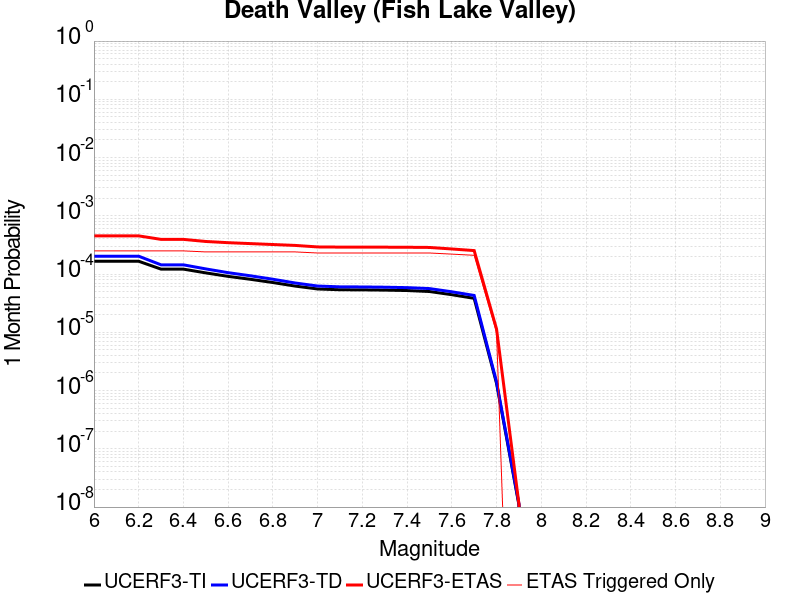 | 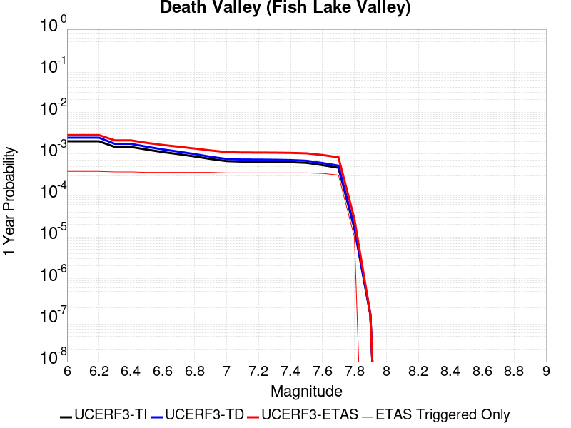 | 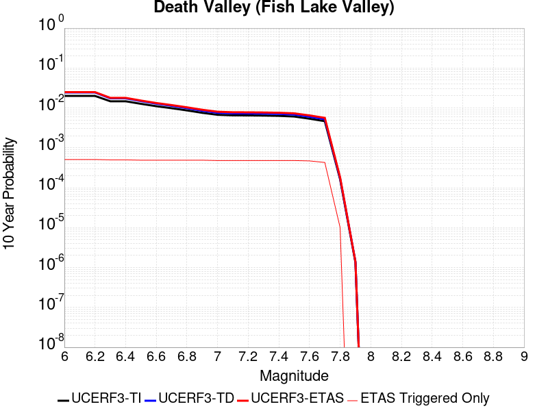 |

| Magnitude | 1 wk TI Prob | 1 wk TD Prob | 1 wk ETAS Prob | 1 wk ETAS/TD Gain | 1 wk ETAS Triggered Only | 1 mo TI Prob | 1 mo TD Prob | 1 mo ETAS Prob | 1 mo ETAS/TD Gain | 1 mo ETAS Triggered Only | 1 yr TI Prob | 1 yr TD Prob | 1 yr ETAS Prob | 1 yr ETAS/TD Gain | 1 yr ETAS Triggered Only | 10 yr TI Prob | 10 yr TD Prob | 10 yr ETAS Prob | 10 yr ETAS/TD Gain | 10 yr ETAS Triggered Only |
|-----|-----|-----|-----|-----|-----|-----|-----|-----|-----|-----|-----|-----|-----|-----|-----|-----|-----|-----|-----|-----|
| 6.0 | 3.872328E-5 | 4.7265705E-5 | 1.9725862E-4 | 4.1733985 | 1.5E-4 | 1.6594635E-4 | 2.0255324E-4 | 4.525026E-4 | 2.2339933 | 2.5E-4 | 0.0020185246 | 0.0024635606 | 0.0028426244 | 1.1538683 | 3.8E-4 | 0.02000288 | 0.024388338 | 0.024885898 | 1.0204016 | 5.1E-4 |
| 6.1 | 3.872328E-5 | 4.7265705E-5 | 1.9725862E-4 | 4.1733985 | 1.5E-4 | 1.6594635E-4 | 2.0255324E-4 | 4.525026E-4 | 2.2339933 | 2.5E-4 | 0.0020185246 | 0.0024635606 | 0.0028426244 | 1.1538683 | 3.8E-4 | 0.02000288 | 0.024388338 | 0.024885898 | 1.0204016 | 5.1E-4 |
| 6.2 | 3.872328E-5 | 4.7265705E-5 | 1.9725862E-4 | 4.1733985 | 1.5E-4 | 1.6594635E-4 | 2.0255324E-4 | 4.525026E-4 | 2.2339933 | 2.5E-4 | 0.0020185246 | 0.0024635606 | 0.0028426244 | 1.1538683 | 3.8E-4 | 0.02000288 | 0.024388338 | 0.024885898 | 1.0204016 | 5.1E-4 |
| 6.3 | 2.8356371E-5 | 3.360979E-5 | 1.8360474E-4 | 5.4628353 | 1.5E-4 | 1.2152165E-4 | 1.4403443E-4 | 3.9399843E-4 | 2.735446 | 2.5E-4 | 0.0014785219 | 0.0017522788 | 0.0021216304 | 1.2107836 | 3.7E-4 | 0.014687235 | 0.017391816 | 0.01788312 | 1.0282491 | 5.0E-4 |
| 6.4 | 2.8356371E-5 | 3.360979E-5 | 1.8360474E-4 | 5.4628353 | 1.5E-4 | 1.2152165E-4 | 1.4403443E-4 | 3.9399843E-4 | 2.735446 | 2.5E-4 | 0.0014785219 | 0.0017522788 | 0.0021216304 | 1.2107836 | 3.7E-4 | 0.014687235 | 0.017391816 | 0.01788312 | 1.0282491 | 5.0E-4 |
| 6.5 | 2.4448687E-5 | 2.8607585E-5 | 1.786033E-4 | 6.2432146 | 1.5E-4 | 1.0477588E-4 | 1.2259845E-4 | 3.6256903E-4 | 2.9573705 | 2.4E-4 | 0.0012748998 | 0.0014916616 | 0.0018511247 | 1.2409816 | 3.6E-4 | 0.012676105 | 0.014821392 | 0.015304129 | 1.0325704 | 4.9E-4 |
| 6.6 | 2.1298161E-5 | 2.4660083E-5 | 1.7465638E-4 | 7.0825543 | 1.5E-4 | 9.127464E-5 | 1.0568197E-4 | 3.456566E-4 | 3.2707245 | 2.4E-4 | 0.0011107022 | 0.0012859512 | 0.0016454883 | 1.2795885 | 3.6E-4 | 0.011051672 | 0.01278853 | 0.013272264 | 1.0378256 | 4.9E-4 |
| 6.7 | 1.8959729E-5 | 2.1781027E-5 | 1.7177776E-4 | 7.886578 | 1.5E-4 | 8.125345E-5 | 9.334406E-5 | 3.3332166E-4 | 3.570893 | 2.4E-4 | 9.888117E-4 | 0.001135897 | 0.0014954881 | 1.3165702 | 3.6E-4 | 0.009844234 | 0.01130357 | 0.011788031 | 1.0428591 | 4.9E-4 |
| 6.8 | 1.6691629E-5 | 1.9018351E-5 | 1.690155E-4 | 8.886969 | 1.5E-4 | 7.153359E-5 | 8.150477E-5 | 3.2148522E-4 | 3.944373 | 2.4E-4 | 8.7057345E-4 | 9.918857E-4 | 0.0013515286 | 1.3625851 | 3.6E-4 | 0.008671708 | 0.009876343 | 0.010361504 | 1.0491235 | 4.9E-4 |
| 6.9 | 1.450505E-5 | 1.638954E-5 | 1.6638708E-4 | 10.152029 | 1.5E-4 | 6.216302E-5 | 7.0239046E-5 | 3.1022218E-4 | 4.416663 | 2.4E-4 | 7.5657194E-4 | 8.5483363E-4 | 0.0012145259 | 1.4207746 | 3.6E-4 | 0.007540013 | 0.008516386 | 0.009002212 | 1.0570462 | 4.9E-4 |
| 7.0 | 1.2940855E-5 | 1.4537972E-5 | 1.5453594E-4 | 10.629814 | 1.4E-4 | 5.545963E-5 | 6.230414E-5 | 2.922898E-4 | 4.6913385 | 2.3E-4 | 6.750118E-4 | 7.5829466E-4 | 0.0011080293 | 1.461212 | 3.5E-4 | 0.006729651 | 0.0075576897 | 0.008034063 | 1.0630314 | 4.8E-4 |
| 7.1 | 1.2544658E-5 | 1.4078208E-5 | 1.5407623E-4 | 10.944307 | 1.4E-4 | 5.3761712E-5 | 6.0333812E-5 | 2.9031993E-4 | 4.8118944 | 2.3E-4 | 6.5435225E-4 | 7.343222E-4 | 0.0010840652 | 1.47628 | 3.5E-4 | 0.006524288 | 0.007319551 | 0.0077960375 | 1.0650978 | 4.8E-4 |
| 7.2 | 1.2489416E-5 | 1.4015674E-5 | 1.5401372E-4 | 10.988677 | 1.4E-4 | 5.3524967E-5 | 6.0065824E-5 | 2.90052E-4 | 4.8289027 | 2.3E-4 | 6.514716E-4 | 7.310616E-4 | 0.0010808058 | 1.4784058 | 3.5E-4 | 0.006495651 | 0.0072871596 | 0.007763662 | 1.0653893 | 4.8E-4 |
| 7.3 | 1.2368307E-5 | 1.3879812E-5 | 1.5387787E-4 | 11.086452 | 1.4E-4 | 5.3005948E-5 | 5.9483587E-5 | 2.894699E-4 | 4.866383 | 2.3E-4 | 6.451563E-4 | 7.2397763E-4 | 0.0010737242 | 1.4830904 | 3.5E-4 | 0.0064328653 | 0.007216782 | 0.0076933177 | 1.0660317 | 4.8E-4 |
| 7.4 | 1.2161707E-5 | 1.36478675E-5 | 1.5364596E-4 | 11.257873 | 1.4E-4 | 5.212056E-5 | 5.8489582E-5 | 2.8847612E-4 | 4.932094 | 2.3E-4 | 6.3438306E-4 | 7.118836E-4 | 0.0010616344 | 1.4913034 | 3.5E-4 | 0.006325751 | 0.0070966207 | 0.0075732144 | 1.0671579 | 4.8E-4 |
| 7.5 | 1.1707948E-5 | 1.3145515E-5 | 1.5314367E-4 | 11.64988 | 1.4E-4 | 5.0175953E-5 | 5.6336736E-5 | 2.8632378E-4 | 5.0823636 | 2.3E-4 | 6.10721E-4 | 6.856895E-4 | 0.0010354496 | 1.5100851 | 3.5E-4 | 0.0060904534 | 0.006836321 | 0.0073130396 | 1.0697331 | 4.8E-4 |
| 7.6 | 1.0319538E-5 | 1.1579622E-5 | 1.4157812E-4 | 12.226488 | 1.3E-4 | 4.4225842E-5 | 4.9626036E-5 | 2.6961512E-4 | 5.4329367 | 2.2E-4 | 5.383166E-4 | 6.040347E-4 | 9.438293E-4 | 1.5625416 | 3.4E-4 | 0.0053701443 | 0.0060244603 | 0.006491629 | 1.0775453 | 4.7E-4 |
| 7.7 | 8.937764E-6 | 1.0022779E-5 | 1.3002158E-4 | 12.972608 | 1.2E-4 | 3.830414E-5 | 4.295409E-5 | 2.5294506E-4 | 5.888731 | 2.1E-4 | 4.6625308E-4 | 5.228456E-4 | 8.326835E-4 | 1.5925993 | 3.1E-4 | 0.0046527605 | 0.005216664 | 0.005644421 | 1.0819981 | 4.3E-4 |
| 7.8 | 3.108007E-7 | 3.284654E-7 | 1.0328462E-5 | 31.444597 | 1.0E-5 | 1.3320023E-6 | 1.407708E-6 | 1.1407694E-5 | 8.103736 | 1.0E-5 | 1.6217007E-5 | 1.7138715E-5 | 2.7138543E-5 | 1.5834643 | 1.0E-5 | 1.6215823E-4 | 1.7137431E-4 | 1.813726E-4 | 1.0583419 | 1.0E-5 |
| 7.9 | 2.5591178E-9 | 2.6696718E-9 | 2.6696718E-9 | 1.0 | 0.0 | 1.0967647E-8 | 1.14414505E-8 | 1.14414505E-8 | 1.0 | 0.0 | 1.335311E-7 | 1.3929966E-7 | 1.3929966E-7 | 1.0 | 0.0 | 1.3353102E-6 | 1.3929966E-6 | 1.3929966E-6 | 1.0 | 0.0 |

## San Andreas (Parkfield)
*[(top)](#table-of-contents)*

| 1 Week | 1 Month | 1 Year | 10 Year |
|-----|-----|-----|-----|
|  | 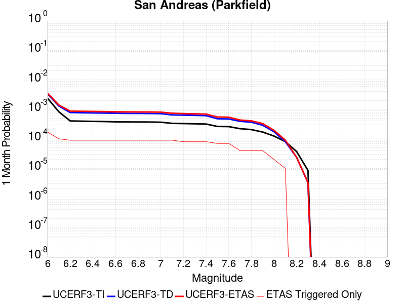 | 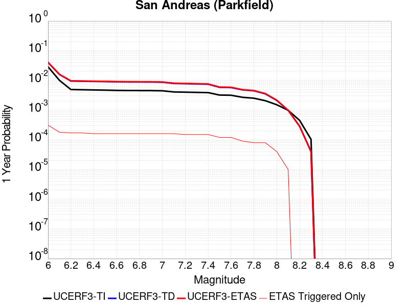 | 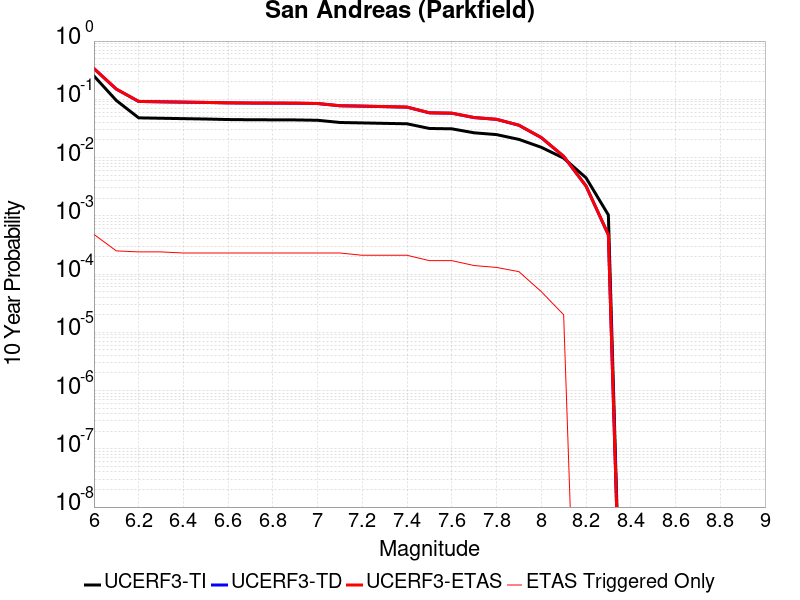 |

| Magnitude | 1 wk TI Prob | 1 wk TD Prob | 1 wk ETAS Prob | 1 wk ETAS/TD Gain | 1 wk ETAS Triggered Only | 1 mo TI Prob | 1 mo TD Prob | 1 mo ETAS Prob | 1 mo ETAS/TD Gain | 1 mo ETAS Triggered Only | 1 yr TI Prob | 1 yr TD Prob | 1 yr ETAS Prob | 1 yr ETAS/TD Gain | 1 yr ETAS Triggered Only | 10 yr TI Prob | 10 yr TD Prob | 10 yr ETAS Prob | 10 yr ETAS/TD Gain | 10 yr ETAS Triggered Only |
|-----|-----|-----|-----|-----|-----|-----|-----|-----|-----|-----|-----|-----|-----|-----|-----|-----|-----|-----|-----|-----|
| 6.0 | 5.556969E-4 | 7.778562E-4 | 8.977629E-4 | 1.1541501 | 1.2E-4 | 0.0023793848 | 0.0033299583 | 0.0034993922 | 1.0508817 | 1.7E-4 | 0.028586963 | 0.040235043 | 0.04053257 | 1.0073947 | 3.1E-4 | 0.25176284 | 0.3371973 | 0.33751544 | 1.0009435 | 4.8E-4 |
| 6.1 | 1.925858E-4 | 3.0278185E-4 | 3.527667E-4 | 1.1650854 | 5.0E-5 | 8.2510663E-4 | 0.001297085 | 0.0013969552 | 1.076996 | 1.0E-4 | 0.0099994885 | 0.01577393 | 0.01595109 | 1.0112312 | 1.8E-4 | 0.095613256 | 0.14975825 | 0.1499708 | 1.0014193 | 2.5E-4 |
| 6.2 | 9.4306815E-5 | 1.8243887E-4 | 2.3242975E-4 | 1.2740144 | 5.0E-5 | 4.0410945E-4 | 7.8164786E-4 | 8.715775E-4 | 1.1150514 | 9.0E-5 | 0.0049089384 | 0.009475246 | 0.009643636 | 1.0177715 | 1.7E-4 | 0.048019063 | 0.0918565 | 0.09207446 | 1.0023727 | 2.4E-4 |
| 6.3 | 9.283051E-5 | 1.794041E-4 | 2.2939514E-4 | 1.2786504 | 5.0E-5 | 3.9778434E-4 | 7.686494E-4 | 8.5858017E-4 | 1.1169986 | 9.0E-5 | 0.0048322747 | 0.009318355 | 0.00948677 | 1.0180736 | 1.7E-4 | 0.047285385 | 0.090509474 | 0.09072775 | 1.0024116 | 2.4E-4 |
| 6.4 | 9.138826E-5 | 1.7702584E-4 | 2.2701698E-4 | 1.2823946 | 5.0E-5 | 3.916052E-4 | 7.5846276E-4 | 8.4839447E-4 | 1.118571 | 9.0E-5 | 0.0047573745 | 0.009195387 | 0.009353916 | 1.01724 | 1.6E-4 | 0.046568092 | 0.0894136 | 0.089623034 | 1.0023423 | 2.3E-4 |
| 6.5 | 9.000255E-5 | 1.746064E-4 | 2.2459766E-4 | 1.2863084 | 5.0E-5 | 3.8566816E-4 | 7.4809964E-4 | 8.3803234E-4 | 1.1202148 | 9.0E-5 | 0.0046854047 | 0.009070284 | 0.009228833 | 1.01748 | 1.6E-4 | 0.045878403 | 0.08829608 | 0.08850577 | 1.0023749 | 2.3E-4 |
| 6.6 | 8.8109264E-5 | 1.7141816E-4 | 2.2140959E-4 | 1.2916344 | 5.0E-5 | 3.7755648E-4 | 7.3444354E-4 | 8.2437746E-4 | 1.1224518 | 9.0E-5 | 0.0045870654 | 0.008905404 | 0.00906398 | 1.0178066 | 1.6E-4 | 0.04493529 | 0.08682707 | 0.0870371 | 1.002419 | 2.3E-4 |
| 6.7 | 8.738073E-5 | 1.7008898E-4 | 2.2008049E-4 | 1.2939137 | 5.0E-5 | 3.7443507E-4 | 7.287503E-4 | 8.1868476E-4 | 1.123409 | 9.0E-5 | 0.0045492216 | 0.008836695 | 0.008995281 | 1.0179464 | 1.6E-4 | 0.04457213 | 0.0862268 | 0.086436965 | 1.0024374 | 2.3E-4 |
| 6.8 | 8.710195E-5 | 1.6954402E-4 | 2.1953553E-4 | 1.2948587 | 5.0E-5 | 3.7324068E-4 | 7.26416E-4 | 8.163506E-4 | 1.123806 | 9.0E-5 | 0.0045347405 | 0.008808513 | 0.008967103 | 1.0180043 | 1.6E-4 | 0.04443313 | 0.08597436 | 0.08618458 | 1.0024452 | 2.3E-4 |
| 6.9 | 8.6801556E-5 | 1.6895356E-4 | 2.189451E-4 | 1.2958893 | 5.0E-5 | 3.7195362E-4 | 7.238869E-4 | 8.1382174E-4 | 1.1242388 | 9.0E-5 | 0.0045191357 | 0.0087779695 | 0.008936565 | 1.0180675 | 1.6E-4 | 0.044283327 | 0.08570042 | 0.08591071 | 1.0024538 | 2.3E-4 |
| 7.0 | 8.5571606E-5 | 1.664819E-4 | 2.1647358E-4 | 1.300283 | 5.0E-5 | 3.6668387E-4 | 7.132999E-4 | 8.032357E-4 | 1.1260841 | 9.0E-5 | 0.004455241 | 0.008650103 | 0.008808719 | 1.0183369 | 1.6E-4 | 0.043669727 | 0.08454836 | 0.084758915 | 1.0024903 | 2.3E-4 |
| 7.1 | 7.82589E-5 | 1.5128969E-4 | 2.0128212E-4 | 1.3304418 | 5.0E-5 | 3.3535215E-4 | 6.4822397E-4 | 7.3816563E-4 | 1.1387509 | 9.0E-5 | 0.0040752706 | 0.007863738 | 0.00802248 | 1.0201865 | 1.6E-4 | 0.040013418 | 0.077460445 | 0.07767263 | 1.0027393 | 2.3E-4 |
| 7.2 | 7.690929E-5 | 1.4866212E-4 | 1.8865617E-4 | 1.2690265 | 4.0E-5 | 3.2956956E-4 | 6.369685E-4 | 7.1691757E-4 | 1.1255149 | 8.0E-5 | 0.004005129 | 0.0077276826 | 0.007876524 | 1.0192608 | 1.5E-4 | 0.0393371 | 0.07623341 | 0.0764274 | 1.0025446 | 2.1E-4 |
| 7.3 | 7.5543794E-5 | 1.4562748E-4 | 1.8562165E-4 | 1.2746334 | 4.0E-5 | 3.2371894E-4 | 6.239692E-4 | 7.039193E-4 | 1.1281315 | 8.0E-5 | 0.003934157 | 0.0075705256 | 0.00771939 | 1.0196637 | 1.5E-4 | 0.038652334 | 0.07479777 | 0.07499206 | 1.0025976 | 2.1E-4 |
| 7.4 | 7.4214564E-5 | 1.4263717E-4 | 1.8263147E-4 | 1.2803918 | 4.0E-5 | 3.1802364E-4 | 6.1115966E-4 | 6.911108E-4 | 1.1308187 | 8.0E-5 | 0.003865065 | 0.0074156416 | 0.007564529 | 1.0200775 | 1.5E-4 | 0.03798529 | 0.07337152 | 0.07356612 | 1.0026522 | 2.1E-4 |
| 7.5 | 6.149578E-5 | 1.1191443E-4 | 1.5190995E-4 | 1.357376 | 4.0E-5 | 2.6352672E-4 | 4.795452E-4 | 5.4951163E-4 | 1.1459017 | 7.0E-5 | 0.0032037178 | 0.005822865 | 0.0059421663 | 1.0204884 | 1.2E-4 | 0.03157923 | 0.058559462 | 0.05871951 | 1.002733 | 1.7E-4 |
| 7.6 | 6.0643448E-5 | 1.102009E-4 | 1.5019649E-4 | 1.3629334 | 4.0E-5 | 2.598746E-4 | 4.7220418E-4 | 5.421711E-4 | 1.148171 | 7.0E-5 | 0.0031593828 | 0.005733962 | 0.005853274 | 1.020808 | 1.2E-4 | 0.031148417 | 0.05772042 | 0.057880607 | 1.0027752 | 1.7E-4 |
| 7.7 | 5.1652263E-5 | 9.175265E-5 | 1.21749894E-4 | 1.326936 | 3.0E-5 | 2.2134806E-4 | 3.9316638E-4 | 4.3315065E-4 | 1.101698 | 4.0E-5 | 0.002691582 | 0.0047763046 | 0.0048658745 | 1.018753 | 9.0E-5 | 0.026592141 | 0.04853641 | 0.048669614 | 1.0027444 | 1.4E-4 |
| 7.8 | 4.8090482E-5 | 8.560165E-5 | 1.1559908E-4 | 1.3504305 | 3.0E-5 | 2.060858E-4 | 3.6681266E-4 | 4.0679798E-4 | 1.1090075 | 4.0E-5 | 0.0025062072 | 0.004456807 | 0.0045364504 | 1.0178701 | 8.0E-5 | 0.024781305 | 0.045302264 | 0.045426376 | 1.0027397 | 1.3E-4 |
| 7.9 | 3.970278E-5 | 6.7507375E-5 | 9.750535E-5 | 1.4443659 | 3.0E-5 | 1.7014367E-4 | 2.8928524E-4 | 3.2927367E-4 | 1.1382319 | 4.0E-5 | 0.002069531 | 0.0035163634 | 0.0035960823 | 1.0226707 | 8.0E-5 | 0.020503636 | 0.03588176 | 0.035987813 | 1.0029557 | 1.1E-4 |
| 8.0 | 2.8982335E-5 | 4.0698153E-5 | 5.069775E-5 | 1.2457014 | 1.0E-5 | 1.2420409E-4 | 1.7440901E-4 | 1.9440551E-4 | 1.114653 | 2.0E-5 | 0.0015111357 | 0.0021213628 | 0.002161278 | 1.0188158 | 4.0E-5 | 0.015009012 | 0.02201118 | 0.02206008 | 1.0022216 | 5.0E-5 |
| 8.1 | 1.8836186E-5 | 1.867974E-5 | 2.8679553E-5 | 1.5353293 | 1.0E-5 | 8.0724014E-5 | 8.005358E-5 | 9.0052774E-5 | 1.1249063 | 1.0E-5 | 9.823717E-4 | 9.742171E-4 | 9.842074E-4 | 1.0102546 | 1.0E-5 | 0.009780403 | 0.010487711 | 0.010507501 | 1.001887 | 2.0E-5 |
| 8.2 | 8.643924E-6 | 5.473668E-6 | 5.473668E-6 | 1.0 | 0.0 | 3.704486E-5 | 2.3458366E-5 | 2.3458366E-5 | 1.0 | 0.0 | 4.5092785E-4 | 2.8556827E-4 | 2.8556827E-4 | 1.0 | 0.0 | 0.0045001395 | 0.0032481793 | 0.0032481793 | 1.0 | 0.0 |
| 8.3 | 1.983087E-6 | 7.6564595E-7 | 7.6564595E-7 | 1.0 | 0.0 | 8.498917E-6 | 3.281336E-6 | 3.281336E-6 | 1.0 | 0.0 | 1.034694E-4 | 3.9949547E-5 | 3.9949547E-5 | 1.0 | 0.0 | 0.0010342124 | 4.717979E-4 | 4.717979E-4 | 1.0 | 0.0 |

## Elsinore (Glen Ivy) rev
*[(top)](#table-of-contents)*

| 1 Week | 1 Month | 1 Year | 10 Year |
|-----|-----|-----|-----|
| 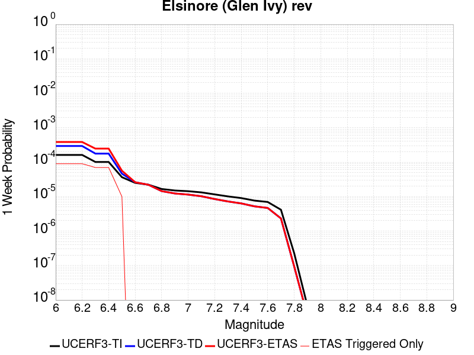 | 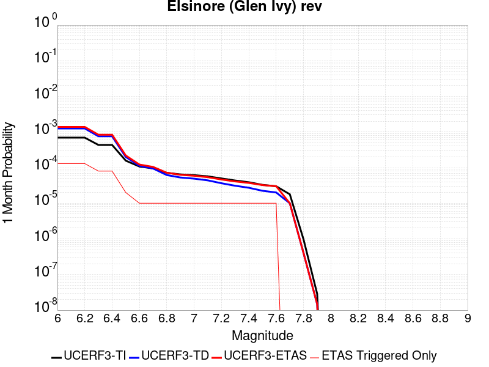 | 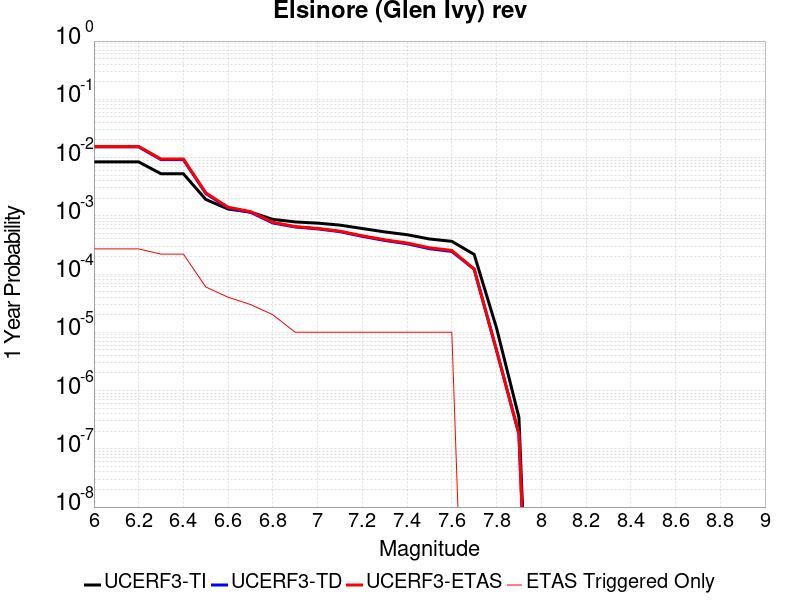 | 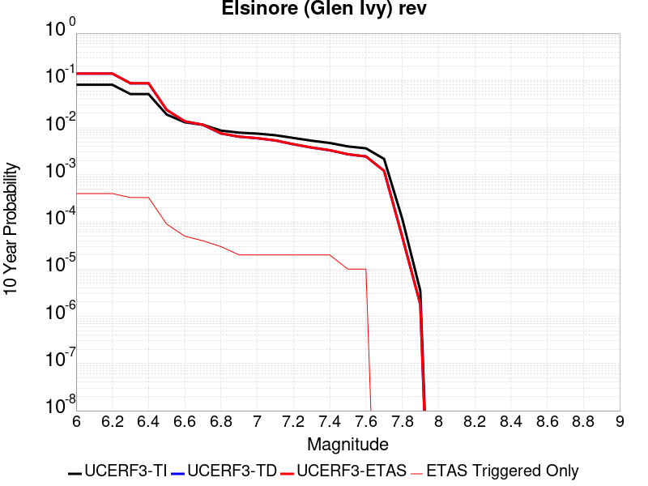 |

| Magnitude | 1 wk TI Prob | 1 wk TD Prob | 1 wk ETAS Prob | 1 wk ETAS/TD Gain | 1 wk ETAS Triggered Only | 1 mo TI Prob | 1 mo TD Prob | 1 mo ETAS Prob | 1 mo ETAS/TD Gain | 1 mo ETAS Triggered Only | 1 yr TI Prob | 1 yr TD Prob | 1 yr ETAS Prob | 1 yr ETAS/TD Gain | 1 yr ETAS Triggered Only | 10 yr TI Prob | 10 yr TD Prob | 10 yr ETAS Prob | 10 yr ETAS/TD Gain | 10 yr ETAS Triggered Only |
|-----|-----|-----|-----|-----|-----|-----|-----|-----|-----|-----|-----|-----|-----|-----|-----|-----|-----|-----|-----|-----|
| 6.0 | 1.6204086E-4 | 2.937271E-4 | 3.8370065E-4 | 1.3063169 | 9.0E-5 | 6.94276E-4 | 0.0012583778 | 0.0013882143 | 1.1031775 | 1.3E-4 | 0.008420097 | 0.0152346175 | 0.0155005045 | 1.0174528 | 2.7E-4 | 0.081081145 | 0.13962454 | 0.1399687 | 1.0024648 | 4.0E-4 |
| 6.1 | 1.6204086E-4 | 2.937271E-4 | 3.8370065E-4 | 1.3063169 | 9.0E-5 | 6.94276E-4 | 0.0012583778 | 0.0013882143 | 1.1031775 | 1.3E-4 | 0.008420097 | 0.0152346175 | 0.0155005045 | 1.0174528 | 2.7E-4 | 0.081081145 | 0.13962454 | 0.1399687 | 1.0024648 | 4.0E-4 |
| 6.2 | 1.6204086E-4 | 2.937271E-4 | 3.8370065E-4 | 1.3063169 | 9.0E-5 | 6.94276E-4 | 0.0012583778 | 0.0013882143 | 1.1031775 | 1.3E-4 | 0.008420097 | 0.0152346175 | 0.0155005045 | 1.0174528 | 2.7E-4 | 0.081081145 | 0.13962454 | 0.1399687 | 1.0024648 | 4.0E-4 |
| 6.3 | 1.0111737E-4 | 1.7703463E-4 | 2.4702222E-4 | 1.3953329 | 7.0E-5 | 4.332882E-4 | 7.5861585E-4 | 8.3855516E-4 | 1.1053752 | 8.0E-5 | 0.005262531 | 0.0092177205 | 0.009435693 | 1.0236471 | 2.2E-4 | 0.0513964 | 0.08707393 | 0.0873752 | 1.0034599 | 3.3E-4 |
| 6.4 | 1.0111737E-4 | 1.7703463E-4 | 2.4702222E-4 | 1.3953329 | 7.0E-5 | 4.332882E-4 | 7.5861585E-4 | 8.3855516E-4 | 1.1053752 | 8.0E-5 | 0.005262531 | 0.0092177205 | 0.009435693 | 1.0236471 | 2.2E-4 | 0.0513964 | 0.08707393 | 0.0873752 | 1.0034599 | 3.3E-4 |
| 6.5 | 3.6624708E-5 | 4.6391986E-5 | 5.639152E-5 | 1.2155445 | 1.0E-5 | 1.569536E-4 | 1.9880968E-4 | 2.188057E-4 | 1.1005788 | 2.0E-5 | 0.001909235 | 0.0024181814 | 0.0024780363 | 1.024752 | 6.0E-5 | 0.01892915 | 0.023697061 | 0.023784928 | 1.0037079 | 9.0E-5 |
| 6.6 | 2.5051324E-5 | 2.6147465E-5 | 2.6147465E-5 | 1.0 | 0.0 | 1.073584E-4 | 1.12056E-4 | 1.2205488E-4 | 1.0892311 | 1.0E-5 | 0.0013063047 | 0.0013634725 | 0.0014034179 | 1.0292969 | 4.0E-5 | 0.012986525 | 0.013565759 | 0.013615081 | 1.0036358 | 5.0E-5 |
| 6.7 | 2.2189772E-5 | 2.2072489E-5 | 2.2072489E-5 | 1.0 | 0.0 | 9.509556E-5 | 9.459316E-5 | 1.0459221E-4 | 1.1057059 | 1.0E-5 | 0.0011571734 | 0.0011510996 | 0.0011810651 | 1.0260321 | 3.0E-5 | 0.011511663 | 0.0114663225 | 0.011505865 | 1.0034485 | 4.0E-5 |
| 6.8 | 1.6654378E-5 | 1.44376E-5 | 1.44376E-5 | 1.0 | 0.0 | 7.137396E-5 | 6.187399E-5 | 7.187337E-5 | 1.1616088 | 1.0E-5 | 8.686314E-4 | 7.5306057E-4 | 7.730455E-4 | 1.0265383 | 2.0E-5 | 0.008652439 | 0.0075100763 | 0.007539851 | 1.0039647 | 3.0E-5 |
| 6.9 | 1.5042909E-5 | 1.2331886E-5 | 1.2331886E-5 | 1.0 | 0.0 | 6.446802E-5 | 5.2849886E-5 | 6.284936E-5 | 1.1892052 | 1.0E-5 | 7.8461546E-4 | 6.4326054E-4 | 6.532541E-4 | 1.0155358 | 1.0E-5 | 0.007818509 | 0.006417925 | 0.0064377966 | 1.0030962 | 2.0E-5 |
| 7.0 | 1.4361385E-5 | 1.1451172E-5 | 1.1451172E-5 | 1.0 | 0.0 | 6.154734E-5 | 4.9075545E-5 | 5.9075053E-5 | 1.2037575 | 1.0E-5 | 7.490812E-4 | 5.973339E-4 | 6.073279E-4 | 1.016731 | 1.0E-5 | 0.007465612 | 0.005960982 | 0.005980863 | 1.0033351 | 2.0E-5 |
| 7.1 | 1.3265571E-5 | 1.0244736E-5 | 1.0244736E-5 | 1.0 | 0.0 | 5.6851208E-5 | 4.3905282E-5 | 5.3904845E-5 | 1.227753 | 1.0E-5 | 6.919436E-4 | 5.344183E-4 | 5.4441293E-4 | 1.0187019 | 1.0E-5 | 0.006897931 | 0.0053346003 | 0.005354494 | 1.0037291 | 2.0E-5 |
| 7.2 | 1.1596403E-5 | 8.504847E-6 | 8.504847E-6 | 1.0 | 0.0 | 4.9697923E-5 | 3.6448844E-5 | 4.644848E-5 | 1.2743471 | 1.0E-5 | 6.049042E-4 | 4.4367602E-4 | 4.536716E-4 | 1.022529 | 1.0E-5 | 0.006032603 | 0.004429357 | 0.0044492683 | 1.0044954 | 2.0E-5 |
| 7.3 | 1.0150827E-5 | 7.238537E-6 | 7.238537E-6 | 1.0 | 0.0 | 4.3502816E-5 | 3.102194E-5 | 4.102163E-5 | 1.3223425 | 1.0E-5 | 5.2951806E-4 | 3.776281E-4 | 3.8762434E-4 | 1.0264711 | 1.0E-5 | 0.005282581 | 0.003770271 | 0.0037901958 | 1.0052847 | 2.0E-5 |
| 7.4 | 9.080705E-6 | 6.352307E-6 | 6.352307E-6 | 1.0 | 0.0 | 3.8916725E-5 | 2.7223898E-5 | 3.7223625E-5 | 1.3673143 | 1.0E-5 | 4.7370812E-4 | 3.314019E-4 | 3.4139858E-4 | 1.0301648 | 1.0E-5 | 0.004726996 | 0.0033092257 | 0.0033291595 | 1.0060238 | 2.0E-5 |
| 7.5 | 7.671649E-6 | 5.225419E-6 | 5.225419E-6 | 1.0 | 0.0 | 3.287808E-5 | 2.2394468E-5 | 3.2394244E-5 | 1.4465289 | 1.0E-5 | 4.0021708E-4 | 2.7261977E-4 | 2.8261705E-4 | 1.0366712 | 1.0E-5 | 0.0039949706 | 0.0027229784 | 0.0027329512 | 1.0036625 | 1.0E-5 |
| 7.6 | 6.990086E-6 | 4.687336E-6 | 4.687336E-6 | 1.0 | 0.0 | 2.9957167E-5 | 2.0088435E-5 | 3.0088233E-5 | 1.4977889 | 1.0E-5 | 3.6466747E-4 | 2.445504E-4 | 2.5454795E-4 | 1.0408814 | 1.0E-5 | 0.0036406964 | 0.0024429292 | 0.0024529048 | 1.0040834 | 1.0E-5 |
| 7.7 | 4.163505E-6 | 2.329331E-6 | 2.329331E-6 | 1.0 | 0.0 | 1.7843471E-5 | 9.982813E-6 | 9.982813E-6 | 1.0 | 0.0 | 2.172226E-4 | 1.2153471E-4 | 1.2153471E-4 | 1.0 | 0.0 | 0.0021701038 | 0.0012147555 | 0.0012147555 | 1.0 | 0.0 |
| 7.8 | 2.2692414E-7 | 9.384417E-8 | 9.384417E-8 | 1.0 | 0.0 | 9.725317E-7 | 4.0218927E-7 | 4.0218927E-7 | 1.0 | 0.0 | 1.1840509E-5 | 4.8966467E-6 | 4.8966467E-6 | 1.0 | 0.0 | 1.1839878E-4 | 4.8965718E-5 | 4.8965718E-5 | 1.0 | 0.0 |
| 7.9 | 6.676829E-9 | 3.4397174E-9 | 3.4397174E-9 | 1.0 | 0.0 | 2.861498E-8 | 1.4741646E-8 | 1.4741646E-8 | 1.0 | 0.0 | 3.4838732E-7 | 1.7947953E-7 | 1.7947953E-7 | 1.0 | 0.0 | 3.4838679E-6 | 1.794794E-6 | 1.794794E-6 | 1.0 | 0.0 |

## San Andreas (Cholame) rev
*[(top)](#table-of-contents)*

| 1 Week | 1 Month | 1 Year | 10 Year |
|-----|-----|-----|-----|
| 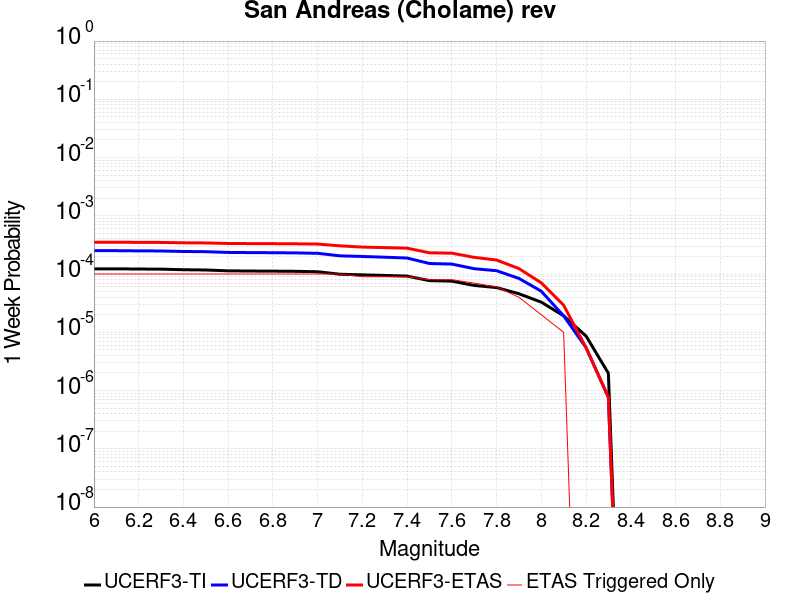 | 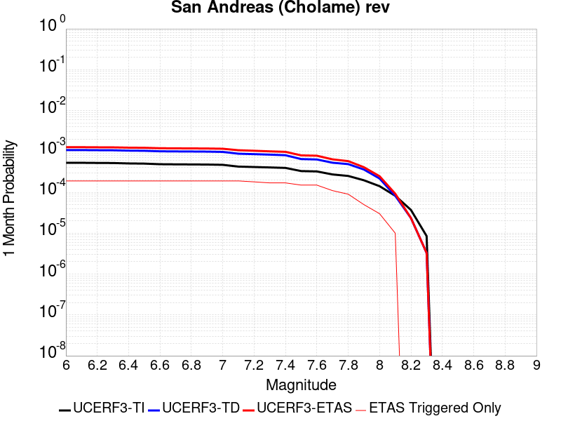 |  | 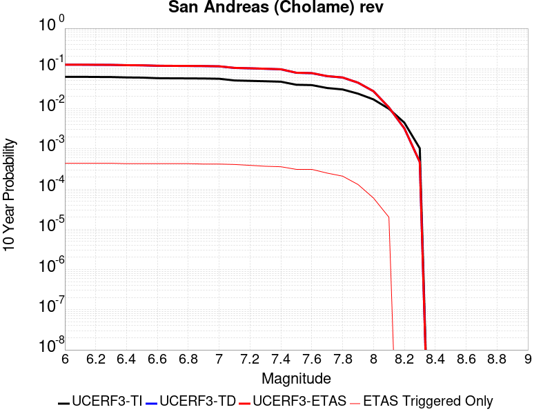 |

| Magnitude | 1 wk TI Prob | 1 wk TD Prob | 1 wk ETAS Prob | 1 wk ETAS/TD Gain | 1 wk ETAS Triggered Only | 1 mo TI Prob | 1 mo TD Prob | 1 mo ETAS Prob | 1 mo ETAS/TD Gain | 1 mo ETAS Triggered Only | 1 yr TI Prob | 1 yr TD Prob | 1 yr ETAS Prob | 1 yr ETAS/TD Gain | 1 yr ETAS Triggered Only | 10 yr TI Prob | 10 yr TD Prob | 10 yr ETAS Prob | 10 yr ETAS/TD Gain | 10 yr ETAS Triggered Only |
|-----|-----|-----|-----|-----|-----|-----|-----|-----|-----|-----|-----|-----|-----|-----|-----|-----|-----|-----|-----|-----|
| 6.0 | 1.2302514E-4 | 2.5205986E-4 | 3.5203467E-4 | 1.3966311 | 1.0E-4 | 5.27144E-4 | 0.0010798109 | 0.0012696058 | 1.1757667 | 1.9E-4 | 0.0063991086 | 0.013067958 | 0.013383776 | 1.0241674 | 3.2E-4 | 0.06217949 | 0.12438412 | 0.12476939 | 1.0030974 | 4.4E-4 |
| 6.1 | 1.2302514E-4 | 2.5205986E-4 | 3.5203467E-4 | 1.3966311 | 1.0E-4 | 5.27144E-4 | 0.0010798109 | 0.0012696058 | 1.1757667 | 1.9E-4 | 0.0063991086 | 0.013067958 | 0.013383776 | 1.0241674 | 3.2E-4 | 0.06217949 | 0.12438412 | 0.12476939 | 1.0030974 | 4.4E-4 |
| 6.2 | 1.2203569E-4 | 2.502277E-4 | 3.5020267E-4 | 1.399536 | 1.0E-4 | 5.2290526E-4 | 0.0010719653 | 0.0012617616 | 1.1770545 | 1.9E-4 | 0.006347804 | 0.012973578 | 0.013289426 | 1.0243455 | 3.2E-4 | 0.061695136 | 0.123571314 | 0.12395694 | 1.0031207 | 4.4E-4 |
| 6.3 | 1.2142645E-4 | 2.4908737E-4 | 3.4906247E-4 | 1.4013655 | 1.0E-4 | 5.202953E-4 | 0.0010670823 | 0.0012568795 | 1.1778656 | 1.9E-4 | 0.006316212 | 0.012914834 | 0.013230701 | 1.0244577 | 3.2E-4 | 0.06139677 | 0.12306532 | 0.12345117 | 1.0031353 | 4.4E-4 |
| 6.4 | 1.1865206E-4 | 2.4414246E-4 | 3.4411805E-4 | 1.4094969 | 1.0E-4 | 5.0840975E-4 | 0.0010459068 | 0.0012357081 | 1.1814705 | 1.9E-4 | 0.006172335 | 0.012660044 | 0.01296612 | 1.0241765 | 3.1E-4 | 0.060036868 | 0.12085904 | 0.12123707 | 1.0031278 | 4.3E-4 |
| 6.5 | 1.17443946E-4 | 2.4207575E-4 | 3.4205156E-4 | 1.4129938 | 1.0E-4 | 5.032341E-4 | 0.0010370566 | 0.0012268595 | 1.1830208 | 1.9E-4 | 0.006109677 | 0.012553536 | 0.012859644 | 1.0243843 | 3.1E-4 | 0.059444077 | 0.11993008 | 0.12030851 | 1.0031555 | 4.3E-4 |
| 6.6 | 1.13579066E-4 | 2.3516564E-4 | 3.3514213E-4 | 1.4251322 | 1.0E-4 | 4.866766E-4 | 0.001007465 | 0.0011972735 | 1.1884022 | 1.9E-4 | 0.0059092017 | 0.012197345 | 0.012503563 | 1.0251054 | 3.1E-4 | 0.057545185 | 0.1168492 | 0.117228955 | 1.00325 | 4.3E-4 |
| 6.7 | 1.1271412E-4 | 2.336088E-4 | 3.3358543E-4 | 1.4279661 | 1.0E-4 | 4.829711E-4 | 0.001000798 | 0.0011906078 | 1.1896585 | 1.9E-4 | 0.005864331 | 0.012117079 | 0.0124233235 | 1.0252737 | 3.1E-4 | 0.057119697 | 0.11615275 | 0.11653281 | 1.003272 | 4.3E-4 |
| 6.8 | 1.1217975E-4 | 2.3249313E-4 | 3.3246988E-4 | 1.4300202 | 1.0E-4 | 4.8068175E-4 | 9.960202E-4 | 0.0011858309 | 1.1905692 | 1.9E-4 | 0.005836608 | 0.012059555 | 0.012365817 | 1.0253958 | 3.1E-4 | 0.056856725 | 0.11565061 | 0.11603088 | 1.0032881 | 4.3E-4 |
| 6.9 | 1.1146753E-4 | 2.3098059E-4 | 3.309575E-4 | 1.4328368 | 1.0E-4 | 4.7763053E-4 | 9.895428E-4 | 0.0011793547 | 1.1918179 | 1.9E-4 | 0.0057996577 | 0.011981564 | 0.012277969 | 1.0247384 | 3.0E-4 | 0.056506127 | 0.11497027 | 0.11534198 | 1.0032331 | 4.2E-4 |
| 7.0 | 1.0965793E-4 | 2.2721413E-4 | 3.271914E-4 | 1.4400135 | 1.0E-4 | 4.698779E-4 | 9.734129E-4 | 0.001163228 | 1.1949996 | 1.9E-4 | 0.005705768 | 0.011787324 | 0.0120837875 | 1.025151 | 3.0E-4 | 0.055614736 | 0.11327011 | 0.11364254 | 1.0032879 | 4.2E-4 |
| 7.1 | 9.927982E-5 | 2.0540332E-4 | 3.0538277E-4 | 1.486747 | 1.0E-4 | 4.2541555E-4 | 8.8000396E-4 | 0.0010698368 | 1.2157182 | 1.9E-4 | 0.0051671406 | 0.010661708 | 0.010948617 | 1.0269102 | 2.9E-4 | 0.05048634 | 0.10336573 | 0.103733346 | 1.0035565 | 4.1E-4 |
| 7.2 | 9.696786E-5 | 2.0044584E-4 | 2.904278E-4 | 1.448909 | 9.0E-5 | 4.1551032E-4 | 8.587718E-4 | 0.0010386172 | 1.2094216 | 1.8E-4 | 0.00504711 | 0.010405703 | 0.01068279 | 1.0266284 | 2.8E-4 | 0.04934009 | 0.10110233 | 0.1014529 | 1.0034674 | 3.9E-4 |
| 7.3 | 9.4727984E-5 | 1.9473763E-4 | 2.847201E-4 | 1.4620703 | 9.0E-5 | 4.0591392E-4 | 8.343239E-4 | 0.001004182 | 1.2035878 | 1.7E-4 | 0.0049308087 | 0.010110851 | 0.010368222 | 1.025455 | 2.6E-4 | 0.048228268 | 0.09847412 | 0.098807685 | 1.0033873 | 3.7E-4 |
| 7.4 | 9.220358E-5 | 1.8844259E-4 | 2.7842564E-4 | 1.477509 | 9.0E-5 | 3.9509835E-4 | 8.07362E-4 | 9.772248E-4 | 1.2103922 | 1.7E-4 | 0.004799717 | 0.009785578 | 0.010043033 | 1.0263097 | 2.6E-4 | 0.046973653 | 0.09555831 | 0.095883906 | 1.0034074 | 3.6E-4 |
| 7.5 | 7.71631E-5 | 1.5179155E-4 | 2.3177941E-4 | 1.5269586 | 8.0E-5 | 3.306571E-4 | 6.5037323E-4 | 8.0027565E-4 | 1.2304868 | 1.5E-4 | 0.0040183207 | 0.007889617 | 0.008107881 | 1.0276648 | 2.2E-4 | 0.03946433 | 0.078289196 | 0.078574926 | 1.0036497 | 3.1E-4 |
| 7.6 | 7.5634416E-5 | 1.4838556E-4 | 2.2837368E-4 | 1.5390561 | 8.0E-5 | 3.241072E-4 | 6.357833E-4 | 7.8568794E-4 | 1.2357794 | 1.5E-4 | 0.0039388672 | 0.007713256 | 0.007931558 | 1.0283023 | 2.2E-4 | 0.038697794 | 0.076654874 | 0.07694112 | 1.0037341 | 3.1E-4 |
| 7.7 | 6.3783E-5 | 1.2359623E-4 | 1.9358758E-4 | 1.5662903 | 7.0E-5 | 2.7332708E-4 | 5.2959064E-4 | 6.395324E-4 | 1.2075976 | 1.1E-4 | 0.0033226798 | 0.0064287307 | 0.0065976377 | 1.0262738 | 1.7E-4 | 0.032734364 | 0.06454488 | 0.06477874 | 1.0036232 | 2.5E-4 |
| 7.8 | 5.863422E-5 | 1.14169685E-4 | 1.7416284E-4 | 1.5254736 | 6.0E-5 | 2.512653E-4 | 4.892069E-4 | 5.791629E-4 | 1.1838813 | 9.0E-5 | 0.003054864 | 0.0059398497 | 0.006079018 | 1.0234296 | 1.4E-4 | 0.030132094 | 0.05966162 | 0.05985909 | 1.0033098 | 2.1E-4 |
| 7.9 | 4.595283E-5 | 8.426815E-5 | 1.2426478E-4 | 1.4746352 | 4.0E-5 | 1.9692584E-4 | 3.6109926E-4 | 4.110812E-4 | 1.138416 | 5.0E-5 | 0.0023949358 | 0.0043875277 | 0.004487089 | 1.0226918 | 1.0E-4 | 0.023692891 | 0.044363137 | 0.044487372 | 1.0028003 | 1.3E-4 |
| 8.0 | 3.2950178E-5 | 5.077396E-5 | 7.077295E-5 | 1.3938826 | 2.0E-5 | 1.412074E-4 | 2.1758456E-4 | 2.4757802E-4 | 1.1378474 | 3.0E-5 | 0.0017178444 | 0.0026458753 | 0.002695743 | 1.0188473 | 5.0E-5 | 0.017046256 | 0.027181072 | 0.027239442 | 1.0021474 | 6.0E-5 |
| 8.1 | 1.9177472E-5 | 1.9183733E-5 | 2.9183542E-5 | 1.5212649 | 1.0E-5 | 8.218658E-5 | 8.221342E-5 | 9.221259E-5 | 1.1216247 | 1.0E-5 | 0.0010001622 | 0.0010004893 | 0.0010104793 | 1.0099851 | 1.0E-5 | 0.009956728 | 0.010757887 | 0.010777672 | 1.001839 | 2.0E-5 |
| 8.2 | 8.643924E-6 | 5.473668E-6 | 5.473668E-6 | 1.0 | 0.0 | 3.704486E-5 | 2.3458366E-5 | 2.3458366E-5 | 1.0 | 0.0 | 4.5092785E-4 | 2.8556827E-4 | 2.8556827E-4 | 1.0 | 0.0 | 0.0045001395 | 0.0032481793 | 0.0032481793 | 1.0 | 0.0 |
| 8.3 | 1.983087E-6 | 7.6564595E-7 | 7.6564595E-7 | 1.0 | 0.0 | 8.498917E-6 | 3.281336E-6 | 3.281336E-6 | 1.0 | 0.0 | 1.034694E-4 | 3.9949547E-5 | 3.9949547E-5 | 1.0 | 0.0 | 0.0010342124 | 4.717979E-4 | 4.717979E-4 | 1.0 | 0.0 |

## Lake Isabella (Seismicity)
*[(top)](#table-of-contents)*

| 1 Week | 1 Month | 1 Year | 10 Year |
|-----|-----|-----|-----|
|  |  |  |  |

| Magnitude | 1 wk TI Prob | 1 wk TD Prob | 1 wk ETAS Prob | 1 wk ETAS/TD Gain | 1 wk ETAS Triggered Only | 1 mo TI Prob | 1 mo TD Prob | 1 mo ETAS Prob | 1 mo ETAS/TD Gain | 1 mo ETAS Triggered Only | 1 yr TI Prob | 1 yr TD Prob | 1 yr ETAS Prob | 1 yr ETAS/TD Gain | 1 yr ETAS Triggered Only | 10 yr TI Prob | 10 yr TD Prob | 10 yr ETAS Prob | 10 yr ETAS/TD Gain | 10 yr ETAS Triggered Only |
|-----|-----|-----|-----|-----|-----|-----|-----|-----|-----|-----|-----|-----|-----|-----|-----|-----|-----|-----|-----|-----|
| 6.0 | 9.431637E-6 | 9.741651E-6 | 6.9741065E-5 | 7.15906 | 6.0E-5 | 4.0420677E-5 | 4.1749343E-5 | 1.5174475E-4 | 3.6346622 | 1.1E-4 | 4.920106E-4 | 5.0819275E-4 | 7.780555E-4 | 1.5310245 | 2.7E-4 | 0.004909227 | 0.005071599 | 0.005499418 | 1.0843558 | 4.3E-4 |
| 6.1 | 9.431637E-6 | 9.741651E-6 | 6.9741065E-5 | 7.15906 | 6.0E-5 | 4.0420677E-5 | 4.1749343E-5 | 1.5174475E-4 | 3.6346622 | 1.1E-4 | 4.920106E-4 | 5.0819275E-4 | 7.780555E-4 | 1.5310245 | 2.7E-4 | 0.004909227 | 0.005071599 | 0.005499418 | 1.0843558 | 4.3E-4 |
| 6.2 | 9.431637E-6 | 9.741651E-6 | 6.9741065E-5 | 7.15906 | 6.0E-5 | 4.0420677E-5 | 4.1749343E-5 | 1.5174475E-4 | 3.6346622 | 1.1E-4 | 4.920106E-4 | 5.0819275E-4 | 7.780555E-4 | 1.5310245 | 2.7E-4 | 0.004909227 | 0.005071599 | 0.005499418 | 1.0843558 | 4.3E-4 |
| 6.3 | 9.431637E-6 | 9.741651E-6 | 6.9741065E-5 | 7.15906 | 6.0E-5 | 4.0420677E-5 | 4.1749343E-5 | 1.5174475E-4 | 3.6346622 | 1.1E-4 | 4.920106E-4 | 5.0819275E-4 | 7.780555E-4 | 1.5310245 | 2.7E-4 | 0.004909227 | 0.005071599 | 0.005499418 | 1.0843558 | 4.3E-4 |
| 6.4 | 5.144063E-6 | 5.3000763E-6 | 4.5299865E-5 | 8.547022 | 4.0E-5 | 2.2045799E-5 | 2.2714434E-5 | 1.1271239E-4 | 4.962148 | 9.0E-5 | 2.6837454E-4 | 2.765166E-4 | 4.8645854E-4 | 1.7592381 | 2.1E-4 | 0.0026805066 | 0.0027620657 | 0.0030412923 | 1.1010934 | 2.8E-4 |
| 6.5 | 5.144063E-6 | 5.3000763E-6 | 4.5299865E-5 | 8.547022 | 4.0E-5 | 2.2045799E-5 | 2.2714434E-5 | 1.1271239E-4 | 4.962148 | 9.0E-5 | 2.6837454E-4 | 2.765166E-4 | 4.8645854E-4 | 1.7592381 | 2.1E-4 | 0.0026805066 | 0.0027620657 | 0.0030412923 | 1.1010934 | 2.8E-4 |
| 6.6 | 3.4009804E-6 | 3.498786E-6 | 2.3498716E-5 | 6.716248 | 2.0E-5 | 1.4575549E-5 | 1.4994721E-5 | 8.499367E-5 | 5.6682396 | 7.0E-5 | 1.7744285E-4 | 1.8254704E-4 | 3.225215E-4 | 1.7667856 | 1.4E-4 | 0.0017730123 | 0.0018241286 | 0.0020038001 | 1.0984973 | 1.8E-4 |
| 6.7 | 3.3880428E-6 | 3.4856528E-6 | 2.3485583E-5 | 6.7377863 | 2.0E-5 | 1.4520103E-5 | 1.4938435E-5 | 8.493739E-5 | 5.685829 | 7.0E-5 | 1.767679E-4 | 1.8186188E-4 | 3.218364E-4 | 1.769675 | 1.4E-4 | 0.0017662736 | 0.0018172882 | 0.0019969612 | 1.0988687 | 1.8E-4 |
| 6.8 | 2.6582E-6 | 2.7337003E-6 | 1.27336725E-5 | 4.6580358 | 1.0E-5 | 1.1392236E-5 | 1.1715813E-5 | 6.1715225E-5 | 5.2676864 | 5.0E-5 | 1.3869164E-4 | 1.4263204E-4 | 2.3261919E-4 | 1.6309043 | 9.0E-5 | 0.0013860512 | 0.0014255369 | 0.0015553517 | 1.0910637 | 1.3E-4 |
| 6.9 | 2.406011E-6 | 2.4743288E-6 | 1.2474304E-5 | 5.04149 | 1.0E-5 | 1.0311434E-5 | 1.0604231E-5 | 5.0603805E-5 | 4.7720394 | 4.0E-5 | 1.2553448E-4 | 1.2910018E-4 | 2.0908985E-4 | 1.6195939 | 8.0E-5 | 0.0012546359 | 0.0012903814 | 0.0014102266 | 1.0928757 | 1.2E-4 |
| 7.0 | 1.6953097E-6 | 1.7429371E-6 | 1.7429371E-6 | 1.0 | 0.0 | 7.265593E-6 | 7.469715E-6 | 2.7469567E-5 | 3.6774583 | 2.0E-5 | 8.8455E-5 | 9.094104E-5 | 1.5093558E-4 | 1.6597081 | 6.0E-5 | 8.84198E-4 | 9.09141E-4 | 9.990592E-4 | 1.0989046 | 9.0E-5 |
| 7.1 | 3.5013824E-7 | 3.5714822E-7 | 3.5714822E-7 | 1.0 | 0.0 | 1.5005916E-6 | 1.5306344E-6 | 1.5306344E-6 | 1.0 | 0.0 | 1.826955E-5 | 1.8635317E-5 | 2.8635131E-5 | 1.5366055 | 1.0E-5 | 1.8268047E-4 | 1.863378E-4 | 1.9633592E-4 | 1.053656 | 1.0E-5 |
| 7.2 | 2.2321095E-7 | 2.2750574E-7 | 2.2750574E-7 | 1.0 | 0.0 | 9.56618E-7 | 9.750242E-7 | 9.750242E-7 | 1.0 | 0.0 | 1.1646762E-5 | 1.1870856E-5 | 1.1870856E-5 | 1.0 | 0.0 | 1.1646151E-4 | 1.1870232E-4 | 1.1870232E-4 | 1.0 | 0.0 |
| 7.3 | 1.5760406E-7 | 1.6060922E-7 | 1.6060922E-7 | 1.0 | 0.0 | 6.7544585E-7 | 6.8832503E-7 | 6.8832503E-7 | 1.0 | 0.0 | 8.223522E-6 | 8.380326E-6 | 8.380326E-6 | 1.0 | 0.0 | 8.2232174E-5 | 8.3800165E-5 | 8.3800165E-5 | 1.0 | 0.0 |
| 7.4 | 1.1216497E-7 | 1.1431706E-7 | 1.1431706E-7 | 1.0 | 0.0 | 4.8070694E-7 | 4.899302E-7 | 4.899302E-7 | 1.0 | 0.0 | 5.852591E-6 | 5.964884E-6 | 5.964884E-6 | 1.0 | 0.0 | 5.8524372E-5 | 5.9647282E-5 | 5.9647282E-5 | 1.0 | 0.0 |
| 7.5 | 4.885185E-8 | 4.9787737E-8 | 4.9787737E-8 | 1.0 | 0.0 | 2.0936506E-7 | 2.13376E-7 | 2.13376E-7 | 1.0 | 0.0 | 2.5490165E-6 | 2.59785E-6 | 2.59785E-6 | 1.0 | 0.0 | 2.5489873E-5 | 2.5978214E-5 | 2.5978214E-5 | 1.0 | 0.0 |
| 7.6 | 1.504641E-9 | 1.5317903E-9 | 1.5317903E-9 | 1.0 | 0.0 | 6.4484613E-9 | 6.5648154E-9 | 6.5648154E-9 | 1.0 | 0.0 | 7.851001E-8 | 7.992663E-8 | 7.992663E-8 | 1.0 | 0.0 | 7.8509987E-7 | 7.992663E-7 | 7.992663E-7 | 1.0 | 0.0 |

## San Andreas (Carrizo) rev
*[(top)](#table-of-contents)*

| 1 Week | 1 Month | 1 Year | 10 Year |
|-----|-----|-----|-----|
| 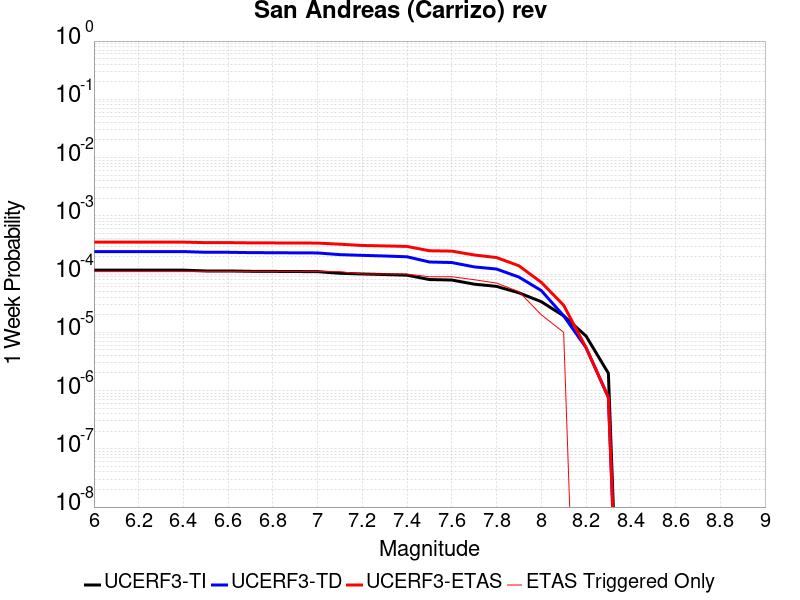 |  |  | 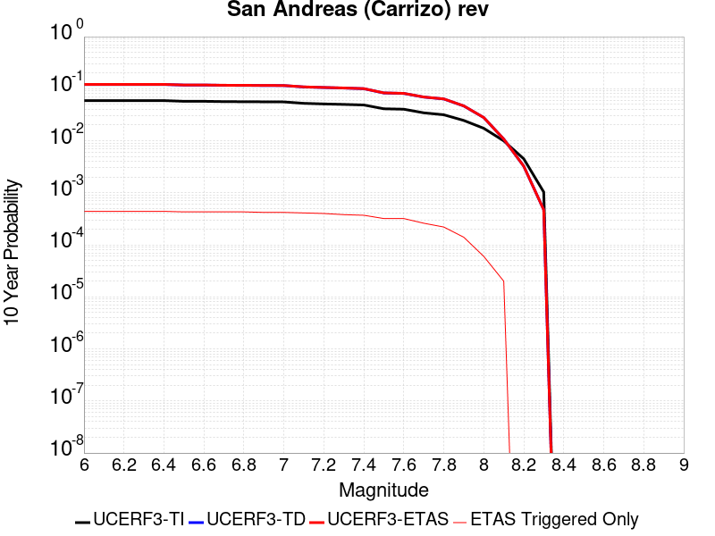 |

| Magnitude | 1 wk TI Prob | 1 wk TD Prob | 1 wk ETAS Prob | 1 wk ETAS/TD Gain | 1 wk ETAS Triggered Only | 1 mo TI Prob | 1 mo TD Prob | 1 mo ETAS Prob | 1 mo ETAS/TD Gain | 1 mo ETAS Triggered Only | 1 yr TI Prob | 1 yr TD Prob | 1 yr ETAS Prob | 1 yr ETAS/TD Gain | 1 yr ETAS Triggered Only | 10 yr TI Prob | 10 yr TD Prob | 10 yr ETAS Prob | 10 yr ETAS/TD Gain | 10 yr ETAS Triggered Only |
|-----|-----|-----|-----|-----|-----|-----|-----|-----|-----|-----|-----|-----|-----|-----|-----|-----|-----|-----|-----|-----|
| 6.0 | 1.1674632E-4 | 2.4324407E-4 | 3.532173E-4 | 1.4521106 | 1.1E-4 | 5.002454E-4 | 0.0010420597 | 0.0012418512 | 1.1917276 | 2.0E-4 | 0.006073493 | 0.012613757 | 0.01292972 | 1.0250491 | 3.2E-4 | 0.0591016 | 0.120640226 | 0.12102714 | 1.0032072 | 4.4E-4 |
| 6.1 | 1.1674632E-4 | 2.4324407E-4 | 3.532173E-4 | 1.4521106 | 1.1E-4 | 5.002454E-4 | 0.0010420597 | 0.0012418512 | 1.1917276 | 2.0E-4 | 0.006073493 | 0.012613757 | 0.01292972 | 1.0250491 | 3.2E-4 | 0.0591016 | 0.120640226 | 0.12102714 | 1.0032072 | 4.4E-4 |
| 6.2 | 1.1674632E-4 | 2.4324407E-4 | 3.532173E-4 | 1.4521106 | 1.1E-4 | 5.002454E-4 | 0.0010420597 | 0.0012418512 | 1.1917276 | 2.0E-4 | 0.006073493 | 0.012613757 | 0.01292972 | 1.0250491 | 3.2E-4 | 0.0591016 | 0.120640226 | 0.12102714 | 1.0032072 | 4.4E-4 |
| 6.3 | 1.1674632E-4 | 2.4324407E-4 | 3.532173E-4 | 1.4521106 | 1.1E-4 | 5.002454E-4 | 0.0010420597 | 0.0012418512 | 1.1917276 | 2.0E-4 | 0.006073493 | 0.012613757 | 0.01292972 | 1.0250491 | 3.2E-4 | 0.0591016 | 0.120640226 | 0.12102714 | 1.0032072 | 4.4E-4 |
| 6.4 | 1.1674632E-4 | 2.4324407E-4 | 3.532173E-4 | 1.4521106 | 1.1E-4 | 5.002454E-4 | 0.0010420597 | 0.0012418512 | 1.1917276 | 2.0E-4 | 0.006073493 | 0.012613757 | 0.01292972 | 1.0250491 | 3.2E-4 | 0.0591016 | 0.120640226 | 0.12102714 | 1.0032072 | 4.4E-4 |
| 6.5 | 1.13136164E-4 | 2.3644442E-4 | 3.464184E-4 | 1.4651157 | 1.1E-4 | 4.847792E-4 | 0.0010129412 | 0.0012127387 | 1.1972449 | 2.0E-4 | 0.0058862255 | 0.012263271 | 0.012579347 | 1.0257741 | 3.2E-4 | 0.057327334 | 0.11761008 | 0.11798951 | 1.0032262 | 4.3E-4 |
| 6.6 | 1.13136164E-4 | 2.3644442E-4 | 3.464184E-4 | 1.4651157 | 1.1E-4 | 4.847792E-4 | 0.0010129412 | 0.0012127387 | 1.1972449 | 2.0E-4 | 0.0058862255 | 0.012263271 | 0.012579347 | 1.0257741 | 3.2E-4 | 0.057327334 | 0.11761008 | 0.11798951 | 1.0032262 | 4.3E-4 |
| 6.7 | 1.1149675E-4 | 2.3335687E-4 | 3.433312E-4 | 1.471271 | 1.1E-4 | 4.777557E-4 | 9.997191E-4 | 0.0011995191 | 1.1998562 | 2.0E-4 | 0.0058011734 | 0.012104088 | 0.012420215 | 1.0261173 | 3.2E-4 | 0.05652051 | 0.1162291 | 0.11660913 | 1.0032696 | 4.3E-4 |
| 6.8 | 1.1103589E-4 | 2.3237852E-4 | 3.4235296E-4 | 1.4732556 | 1.1E-4 | 4.7578133E-4 | 9.955293E-4 | 0.0011953302 | 1.2006981 | 2.0E-4 | 0.005777263 | 0.012053643 | 0.012369786 | 1.026228 | 3.2E-4 | 0.056293584 | 0.11578894 | 0.11616915 | 1.0032836 | 4.3E-4 |
| 6.9 | 1.1053259E-4 | 2.3130233E-4 | 3.412769E-4 | 1.475458 | 1.1E-4 | 4.7362508E-4 | 9.909206E-4 | 0.0011907225 | 1.2016325 | 2.0E-4 | 0.0057511497 | 0.011998152 | 0.012304433 | 1.0255274 | 3.1E-4 | 0.05604569 | 0.11530445 | 0.115676016 | 1.0032226 | 4.2E-4 |
| 7.0 | 1.1005377E-4 | 2.3031076E-4 | 3.4028542E-4 | 1.4775056 | 1.1E-4 | 4.7157376E-4 | 9.866742E-4 | 0.0011864769 | 1.2025012 | 2.0E-4 | 0.0057263062 | 0.011947021 | 0.012253317 | 1.0256379 | 3.1E-4 | 0.055809796 | 0.11485658 | 0.11522834 | 1.0032368 | 4.2E-4 |
| 7.1 | 1.0308142E-4 | 2.1540876E-4 | 3.2538507E-4 | 1.510547 | 1.1E-4 | 4.417027E-4 | 9.228548E-4 | 0.0011226702 | 1.2165188 | 2.0E-4 | 0.0053644776 | 0.011178188 | 0.011474835 | 1.026538 | 3.0E-4 | 0.052368138 | 0.10809042 | 0.108456105 | 1.0033832 | 4.1E-4 |
| 7.2 | 1.0027479E-4 | 2.094876E-4 | 3.0946665E-4 | 1.4772552 | 1.0E-4 | 4.296783E-4 | 8.9749607E-4 | 0.0010873255 | 1.2115101 | 1.9E-4 | 0.0052187922 | 0.010872566 | 0.0111594135 | 1.0263827 | 2.9E-4 | 0.050979212 | 0.10539086 | 0.105748706 | 1.0033954 | 4.0E-4 |
| 7.3 | 9.816942E-5 | 2.0423878E-4 | 3.0421835E-4 | 1.4895229 | 1.0E-4 | 4.2065824E-4 | 8.7501644E-4 | 0.0010548589 | 1.2055304 | 1.8E-4 | 0.005109493 | 0.010601572 | 0.01086871 | 1.0251979 | 2.7E-4 | 0.049935985 | 0.10297546 | 0.10331632 | 1.0033102 | 3.8E-4 |
| 7.4 | 9.5634205E-5 | 1.9793298E-4 | 2.9791318E-4 | 1.5051215 | 1.0E-4 | 4.0979648E-4 | 8.4800937E-4 | 0.0010278567 | 1.2120818 | 1.8E-4 | 0.0049778637 | 0.010275901 | 0.010543127 | 1.026005 | 2.7E-4 | 0.048678253 | 0.100067884 | 0.10040086 | 1.0033275 | 3.7E-4 |
| 7.5 | 8.052417E-5 | 1.6113915E-4 | 2.5112464E-4 | 1.5584334 | 9.0E-5 | 3.4505792E-4 | 6.9041376E-4 | 8.5030333E-4 | 1.2315851 | 1.6E-4 | 0.0041929903 | 0.008373471 | 0.008601545 | 1.0272377 | 2.3E-4 | 0.04114753 | 0.082815245 | 0.083108746 | 1.003544 | 3.2E-4 |
| 7.6 | 7.897024E-5 | 1.5767086E-4 | 2.4765666E-4 | 1.5707194 | 9.0E-5 | 3.384E-4 | 6.755574E-4 | 8.354493E-4 | 1.2366815 | 1.6E-4 | 0.0041122385 | 0.00819397 | 0.008422085 | 1.0278394 | 2.3E-4 | 0.040369697 | 0.08115866 | 0.08145269 | 1.0036229 | 3.2E-4 |
| 7.7 | 6.707427E-5 | 1.3277122E-4 | 2.127606E-4 | 1.6024601 | 8.0E-5 | 2.8742946E-4 | 5.688955E-4 | 6.8882725E-4 | 1.2108151 | 1.2E-4 | 0.003493839 | 0.0069043385 | 0.0070830956 | 1.0258906 | 1.8E-4 | 0.034394164 | 0.06905339 | 0.069295436 | 1.0035052 | 2.6E-4 |
| 7.8 | 6.147705E-5 | 1.2198445E-4 | 1.9197591E-4 | 1.5737736 | 7.0E-5 | 2.6344648E-4 | 5.226858E-4 | 6.2263355E-4 | 1.1912196 | 1.0E-4 | 0.0032027436 | 0.006345156 | 0.0064942045 | 1.0234901 | 1.5E-4 | 0.031569764 | 0.0635172 | 0.06372322 | 1.0032437 | 2.2E-4 |
| 7.9 | 4.7636717E-5 | 8.8802946E-5 | 1.3879851E-4 | 1.5629944 | 5.0E-5 | 2.0414138E-4 | 3.8052857E-4 | 4.4050574E-4 | 1.1576154 | 6.0E-5 | 0.0024825884 | 0.004623101 | 0.004732593 | 1.0236835 | 1.1E-4 | 0.024550365 | 0.046629366 | 0.046762835 | 1.0028625 | 1.4E-4 |
| 8.0 | 3.3554235E-5 | 5.2138024E-5 | 7.213698E-5 | 1.3835772 | 2.0E-5 | 1.4379594E-4 | 2.2342955E-4 | 2.5342286E-4 | 1.1342405 | 3.0E-5 | 0.0017493097 | 0.002716863 | 0.0027667272 | 1.0183536 | 5.0E-5 | 0.017356034 | 0.027881905 | 0.027940232 | 1.0020919 | 6.0E-5 |
| 8.1 | 1.9175432E-5 | 1.9183564E-5 | 2.9183373E-5 | 1.5212696 | 1.0E-5 | 8.217783E-5 | 8.221269E-5 | 9.221186E-5 | 1.1216258 | 1.0E-5 | 0.0010000558 | 0.0010004805 | 0.0010104704 | 1.0099852 | 1.0E-5 | 0.009955673 | 0.010757771 | 0.010777556 | 1.0018392 | 2.0E-5 |
| 8.2 | 8.643924E-6 | 5.473668E-6 | 5.473668E-6 | 1.0 | 0.0 | 3.704486E-5 | 2.3458366E-5 | 2.3458366E-5 | 1.0 | 0.0 | 4.5092785E-4 | 2.8556827E-4 | 2.8556827E-4 | 1.0 | 0.0 | 0.0045001395 | 0.0032481793 | 0.0032481793 | 1.0 | 0.0 |
| 8.3 | 1.983087E-6 | 7.6564595E-7 | 7.6564595E-7 | 1.0 | 0.0 | 8.498917E-6 | 3.281336E-6 | 3.281336E-6 | 1.0 | 0.0 | 1.034694E-4 | 3.9949547E-5 | 3.9949547E-5 | 1.0 | 0.0 | 0.0010342124 | 4.717979E-4 | 4.717979E-4 | 1.0 | 0.0 |

## Calico-Hidalgo
*[(top)](#table-of-contents)*

| 1 Week | 1 Month | 1 Year | 10 Year |
|-----|-----|-----|-----|
| 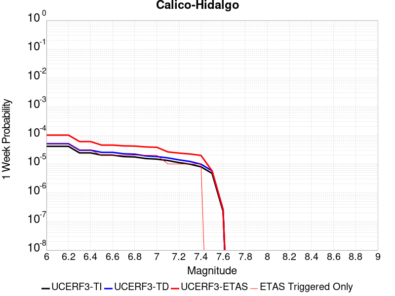 |  | 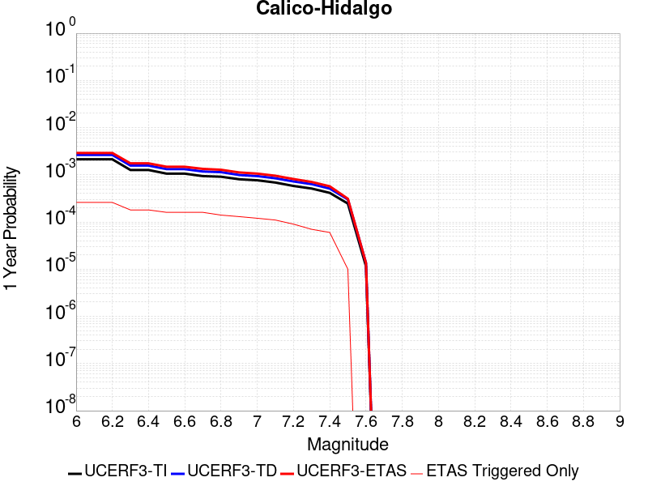 |  |

| Magnitude | 1 wk TI Prob | 1 wk TD Prob | 1 wk ETAS Prob | 1 wk ETAS/TD Gain | 1 wk ETAS Triggered Only | 1 mo TI Prob | 1 mo TD Prob | 1 mo ETAS Prob | 1 mo ETAS/TD Gain | 1 mo ETAS Triggered Only | 1 yr TI Prob | 1 yr TD Prob | 1 yr ETAS Prob | 1 yr ETAS/TD Gain | 1 yr ETAS Triggered Only | 10 yr TI Prob | 10 yr TD Prob | 10 yr ETAS Prob | 10 yr ETAS/TD Gain | 10 yr ETAS Triggered Only |
|-----|-----|-----|-----|-----|-----|-----|-----|-----|-----|-----|-----|-----|-----|-----|-----|-----|-----|-----|-----|-----|
| 6.0 | 4.0906612E-5 | 5.0704355E-5 | 1.0070182E-4 | 1.9860586 | 5.0E-5 | 1.7530227E-4 | 2.1728857E-4 | 3.4726033E-4 | 1.5981528 | 1.3E-4 | 0.0021322158 | 0.002642678 | 0.0029019911 | 1.0981251 | 2.6E-4 | 0.02111873 | 0.026152814 | 0.026552092 | 1.0152671 | 4.1E-4 |
| 6.1 | 4.0906612E-5 | 5.0704355E-5 | 1.0070182E-4 | 1.9860586 | 5.0E-5 | 1.7530227E-4 | 2.1728857E-4 | 3.4726033E-4 | 1.5981528 | 1.3E-4 | 0.0021322158 | 0.002642678 | 0.0029019911 | 1.0981251 | 2.6E-4 | 0.02111873 | 0.026152814 | 0.026552092 | 1.0152671 | 4.1E-4 |
| 6.2 | 4.0906612E-5 | 5.0704355E-5 | 1.0070182E-4 | 1.9860586 | 5.0E-5 | 1.7530227E-4 | 2.1728857E-4 | 3.4726033E-4 | 1.5981528 | 1.3E-4 | 0.0021322158 | 0.002642678 | 0.0029019911 | 1.0981251 | 2.6E-4 | 0.02111873 | 0.026152814 | 0.026552092 | 1.0152671 | 4.1E-4 |
| 6.3 | 2.4242801E-5 | 3.0090967E-5 | 6.0090064E-5 | 1.9969469 | 3.0E-5 | 1.0389358E-4 | 1.289551E-4 | 2.189435E-4 | 1.6978273 | 9.0E-5 | 0.0012641704 | 0.0015689312 | 0.0017486488 | 1.1145477 | 1.8E-4 | 0.01257003 | 0.015582229 | 0.01581849 | 1.0151621 | 2.4E-4 |
| 6.4 | 2.4242801E-5 | 3.0090967E-5 | 6.0090064E-5 | 1.9969469 | 3.0E-5 | 1.0389358E-4 | 1.289551E-4 | 2.189435E-4 | 1.6978273 | 9.0E-5 | 0.0012641704 | 0.0015689312 | 0.0017486488 | 1.1145477 | 1.8E-4 | 0.01257003 | 0.015582229 | 0.01581849 | 1.0151621 | 2.4E-4 |
| 6.5 | 2.0286952E-5 | 2.5316054E-5 | 4.5315548E-5 | 1.7899925 | 2.0E-5 | 8.694118E-5 | 1.0849296E-4 | 1.7848537E-4 | 1.6451331 | 7.0E-5 | 0.0010579949 | 0.0013201186 | 0.0014799073 | 1.1210413 | 1.6E-4 | 0.010529719 | 0.013124701 | 0.013341813 | 1.0165423 | 2.2E-4 |
| 6.6 | 2.0269223E-5 | 2.5297004E-5 | 4.52965E-5 | 1.7905874 | 2.0E-5 | 8.6865206E-5 | 1.08411325E-4 | 1.7840373E-4 | 1.645619 | 7.0E-5 | 0.0010570707 | 0.0013191258 | 0.0014789148 | 1.1211325 | 1.6E-4 | 0.010520565 | 0.01311489 | 0.013332005 | 1.0165548 | 2.2E-4 |
| 6.7 | 1.799852E-5 | 2.2540933E-5 | 4.2540483E-5 | 1.8872547 | 2.0E-5 | 7.713423E-5 | 9.660051E-5 | 1.6659375E-4 | 1.7245638 | 7.0E-5 | 9.3870464E-4 | 0.0011754911 | 0.0013353031 | 1.1359533 | 1.6E-4 | 0.009347493 | 0.011694346 | 0.01190189 | 1.0177474 | 2.1E-4 |
| 6.8 | 1.7458793E-5 | 2.184258E-5 | 4.1842144E-5 | 1.9156227 | 2.0E-5 | 7.4821255E-5 | 9.360778E-5 | 1.5360216E-4 | 1.6409124 | 6.0E-5 | 9.10568E-4 | 0.0011390933 | 0.0012789338 | 1.1227648 | 1.4E-4 | 0.009068459 | 0.011334131 | 0.011521977 | 1.0165735 | 1.9E-4 |
| 6.9 | 1.542884E-5 | 1.9026285E-5 | 3.9025905E-5 | 2.0511572 | 2.0E-5 | 6.612192E-5 | 8.153875E-5 | 1.4153385E-4 | 1.7357864 | 6.0E-5 | 8.04737E-4 | 9.922953E-4 | 0.0011221663 | 1.1308794 | 1.3E-4 | 0.008018291 | 0.009880043 | 0.010058264 | 1.0180385 | 1.8E-4 |
| 7.0 | 1.468253E-5 | 1.803109E-5 | 3.8030732E-5 | 2.1091752 | 2.0E-5 | 6.292361E-5 | 7.727389E-5 | 1.2727003E-4 | 1.6469991 | 5.0E-5 | 7.658257E-4 | 9.4041653E-4 | 0.0010603038 | 1.127483 | 1.2E-4 | 0.0076319184 | 0.009365736 | 0.009534144 | 1.0179813 | 1.7E-4 |
| 7.1 | 1.3139281E-5 | 1.620139E-5 | 2.6201227E-5 | 1.617221 | 1.0E-5 | 5.6309986E-5 | 6.943275E-5 | 1.0942997E-4 | 1.5760571 | 4.0E-5 | 6.853584E-4 | 8.4502844E-4 | 9.549355E-4 | 1.1300632 | 1.1E-4 | 0.0068324856 | 0.008419449 | 0.008578102 | 1.0188437 | 1.6E-4 |
| 7.2 | 1.1127404E-5 | 1.3867038E-5 | 2.38669E-5 | 1.7211245 | 1.0E-5 | 4.7688E-5 | 5.9428872E-5 | 9.94265E-5 | 1.6730335 | 4.0E-5 | 5.8044674E-4 | 7.233172E-4 | 8.132521E-4 | 1.1243367 | 9.0E-5 | 0.0057893298 | 0.007210737 | 0.007329872 | 1.0165218 | 1.2E-4 |
| 7.3 | 9.808154E-6 | 1.2176586E-5 | 2.2176464E-5 | 1.8212383 | 1.0E-5 | 4.2034266E-5 | 5.2184383E-5 | 9.2182294E-5 | 1.7664728 | 4.0E-5 | 5.11647E-4 | 6.351704E-4 | 7.051259E-4 | 1.1101366 | 7.0E-5 | 0.0051047057 | 0.006334625 | 0.0064339917 | 1.0156863 | 1.0E-4 |
| 7.4 | 7.942452E-6 | 9.792348E-6 | 1.979225E-5 | 2.0211957 | 1.0E-5 | 3.4038632E-5 | 4.1966585E-5 | 7.1965325E-5 | 1.7148244 | 3.0E-5 | 4.1434157E-4 | 5.108328E-4 | 5.708022E-4 | 1.1173953 | 6.0E-5 | 0.0041356985 | 0.005097527 | 0.0051771193 | 1.0156139 | 8.0E-5 |
| 7.5 | 4.7121216E-6 | 5.7729717E-6 | 5.7729717E-6 | 1.0 | 0.0 | 2.019465E-5 | 2.4741115E-5 | 3.4740868E-5 | 1.4041755 | 1.0E-5 | 2.4584212E-4 | 3.011891E-4 | 3.111861E-4 | 1.0331917 | 1.0E-5 | 0.0024557032 | 0.0030085614 | 0.0030384713 | 1.0099416 | 3.0E-5 |
| 7.6 | 2.21172E-7 | 2.6040198E-7 | 2.6040198E-7 | 1.0 | 0.0 | 9.478797E-7 | 1.1160082E-6 | 1.1160082E-6 | 1.0 | 0.0 | 1.1540374E-5 | 1.3587343E-5 | 1.3587343E-5 | 1.0 | 0.0 | 1.1539775E-4 | 1.3586794E-4 | 1.4586658E-4 | 1.0735909 | 1.0E-5 |

## Owens Valley
*[(top)](#table-of-contents)*

| 1 Week | 1 Month | 1 Year | 10 Year |
|-----|-----|-----|-----|
| 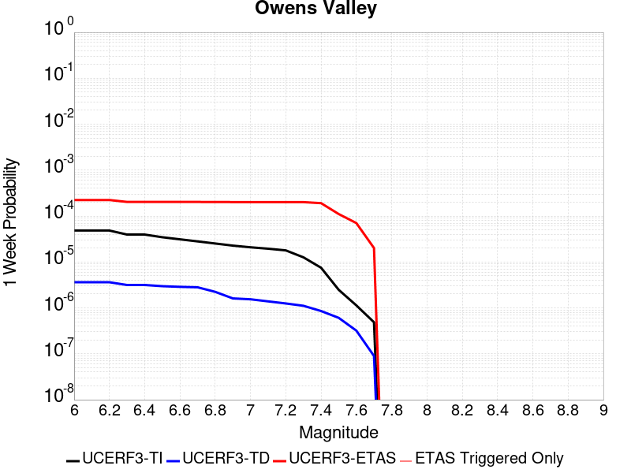 | 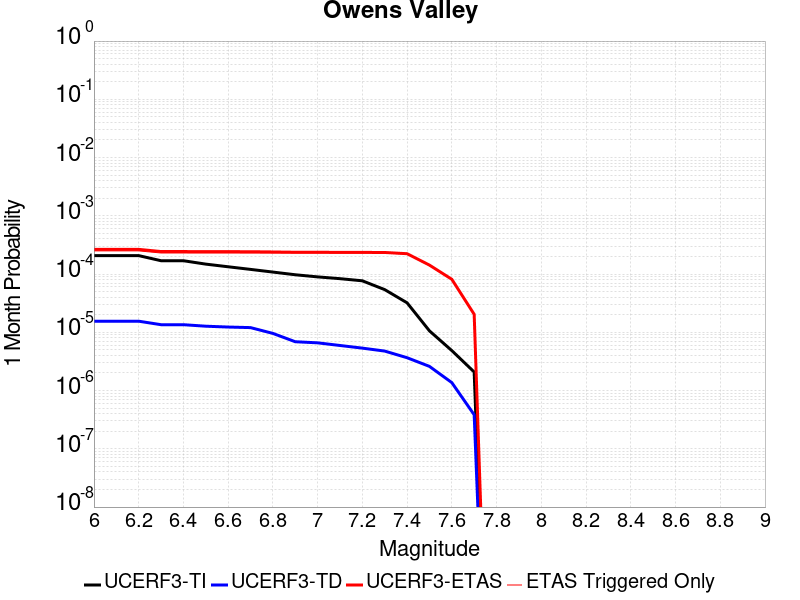 | 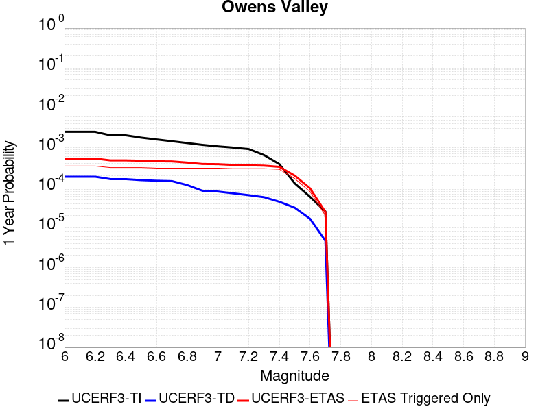 | 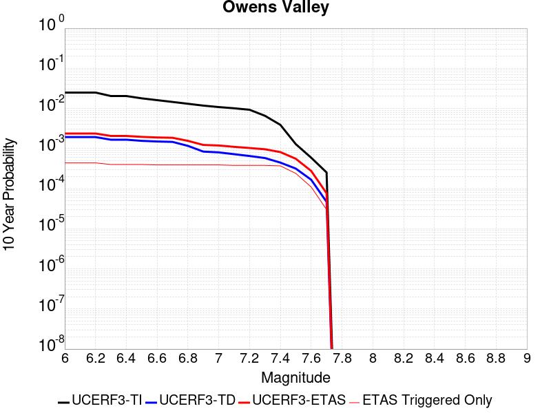 |

| Magnitude | 1 wk TI Prob | 1 wk TD Prob | 1 wk ETAS Prob | 1 wk ETAS/TD Gain | 1 wk ETAS Triggered Only | 1 mo TI Prob | 1 mo TD Prob | 1 mo ETAS Prob | 1 mo ETAS/TD Gain | 1 mo ETAS Triggered Only | 1 yr TI Prob | 1 yr TD Prob | 1 yr ETAS Prob | 1 yr ETAS/TD Gain | 1 yr ETAS Triggered Only | 10 yr TI Prob | 10 yr TD Prob | 10 yr ETAS Prob | 10 yr ETAS/TD Gain | 10 yr ETAS Triggered Only |
|-----|-----|-----|-----|-----|-----|-----|-----|-----|-----|-----|-----|-----|-----|-----|-----|-----|-----|-----|-----|-----|
| 6.0 | 4.83821E-5 | 3.6210524E-6 | 2.2362026E-4 | 61.755596 | 2.2E-4 | 2.0733538E-4 | 1.551871E-5 | 2.6551483E-4 | 17.109337 | 2.5E-4 | 0.002521386 | 1.889249E-4 | 5.3885876E-4 | 2.852238 | 3.5E-4 | 0.024929691 | 0.0019297141 | 0.002368865 | 1.227573 | 4.4E-4 |
| 6.1 | 4.83821E-5 | 3.6210524E-6 | 2.2362026E-4 | 61.755596 | 2.2E-4 | 2.0733538E-4 | 1.551871E-5 | 2.6551483E-4 | 17.109337 | 2.5E-4 | 0.002521386 | 1.889249E-4 | 5.3885876E-4 | 2.852238 | 3.5E-4 | 0.024929691 | 0.0019297141 | 0.002368865 | 1.227573 | 4.4E-4 |
| 6.2 | 4.83821E-5 | 3.6210524E-6 | 2.2362026E-4 | 61.755596 | 2.2E-4 | 2.0733538E-4 | 1.551871E-5 | 2.6551483E-4 | 17.109337 | 2.5E-4 | 0.002521386 | 1.889249E-4 | 5.3885876E-4 | 2.852238 | 3.5E-4 | 0.024929691 | 0.0019297141 | 0.002368865 | 1.227573 | 4.4E-4 |
| 6.3 | 3.953008E-5 | 3.1530958E-6 | 2.0315246E-4 | 64.42952 | 2.0E-4 | 1.6940363E-4 | 1.3513202E-5 | 2.4351009E-4 | 18.020163 | 2.3E-4 | 0.002060538 | 1.6451156E-4 | 4.844589E-4 | 2.944832 | 3.2E-4 | 0.020415364 | 0.0016621627 | 0.002061498 | 1.2402503 | 4.0E-4 |
| 6.4 | 3.953008E-5 | 3.1530958E-6 | 2.0315246E-4 | 64.42952 | 2.0E-4 | 1.6940363E-4 | 1.3513202E-5 | 2.4351009E-4 | 18.020163 | 2.3E-4 | 0.002060538 | 1.6451156E-4 | 4.844589E-4 | 2.944832 | 3.2E-4 | 0.020415364 | 0.0016621627 | 0.002061498 | 1.2402503 | 4.0E-4 |
| 6.5 | 3.457342E-5 | 2.9707387E-6 | 2.0297014E-4 | 68.32312 | 2.0E-4 | 1.4816338E-4 | 1.273168E-5 | 2.4272875E-4 | 19.064943 | 2.3E-4 | 0.0018023965 | 1.5499788E-4 | 4.7494826E-4 | 3.0642245 | 3.2E-4 | 0.017878477 | 0.0015563119 | 0.0019556892 | 1.2566179 | 4.0E-4 |
| 6.6 | 3.1127765E-5 | 2.8737306E-6 | 2.0287315E-4 | 70.59574 | 2.0E-4 | 1.3339789E-4 | 1.2315934E-5 | 2.4231311E-4 | 19.674765 | 2.3E-4 | 0.0016229092 | 1.4993687E-4 | 4.5989038E-4 | 3.067227 | 3.1E-4 | 0.016111081 | 0.0015013438 | 0.0018907583 | 1.2593772 | 3.9E-4 |
| 6.7 | 2.806885E-5 | 2.8101606E-6 | 2.0280959E-4 | 72.17011 | 2.0E-4 | 1.2028952E-4 | 1.2043493E-5 | 2.4204073E-4 | 20.09722 | 2.3E-4 | 0.001463541 | 1.4662035E-4 | 4.565749E-4 | 3.1139941 | 3.1E-4 | 0.014539397 | 0.0014656087 | 0.0018550372 | 1.2657111 | 3.9E-4 |
| 6.8 | 2.524524E-5 | 2.2351392E-6 | 2.0223469E-4 | 90.47969 | 2.0E-4 | 1.0818939E-4 | 9.579134E-6 | 2.3957693E-4 | 25.01029 | 2.3E-4 | 0.0013164099 | 1.16620016E-4 | 4.2658387E-4 | 3.6578958 | 3.1E-4 | 0.01308639 | 0.001165827 | 0.0015553724 | 1.3341365 | 3.9E-4 |
| 6.9 | 2.2704568E-5 | 1.6079711E-6 | 2.0160765E-4 | 125.38015 | 2.0E-4 | 9.730166E-5 | 6.8912864E-6 | 2.368897E-4 | 34.37525 | 2.3E-4 | 0.0011840039 | 8.38982E-5 | 3.9387218E-4 | 4.694644 | 3.1E-4 | 0.011777153 | 8.38853E-4 | 0.0012285259 | 1.4645306 | 3.9E-4 |
| 7.0 | 2.0871712E-5 | 1.5393621E-6 | 2.0153905E-4 | 130.92375 | 2.0E-4 | 8.944713E-5 | 6.5972495E-6 | 2.3659573E-4 | 35.862785 | 2.3E-4 | 0.0010884746 | 8.031857E-5 | 3.9029366E-4 | 4.8593206 | 3.1E-4 | 0.010831586 | 8.030395E-4 | 0.0011927263 | 1.4852648 | 3.9E-4 |
| 7.1 | 1.944928E-5 | 1.3862556E-6 | 2.0138598E-4 | 145.27335 | 2.0E-4 | 8.335139E-5 | 5.941082E-6 | 2.3593972E-4 | 39.713257 | 2.3E-4 | 0.0010143308 | 7.233028E-5 | 3.7230857E-4 | 5.147341 | 3.0E-4 | 0.010097133 | 7.2319806E-4 | 0.0011029232 | 1.5250639 | 3.8E-4 |
| 7.2 | 1.7876306E-5 | 1.2487686E-6 | 2.0124852E-4 | 161.15758 | 2.0E-4 | 7.6610486E-5 | 5.3518543E-6 | 2.3535063E-4 | 43.97553 | 2.3E-4 | 9.3233347E-4 | 6.515689E-5 | 3.6513736E-4 | 5.6039715 | 3.0E-4 | 0.009284316 | 6.5148395E-4 | 0.0010312364 | 1.5829037 | 3.8E-4 |
| 7.3 | 1.2618672E-5 | 1.1113839E-6 | 2.0111116E-4 | 180.95561 | 2.0E-4 | 5.40789E-5 | 4.763065E-6 | 2.3476197E-4 | 49.288002 | 2.3E-4 | 6.582117E-4 | 5.7988782E-5 | 3.5797138E-4 | 6.1731143 | 3.0E-4 | 0.0065626553 | 5.7983754E-4 | 9.596172E-4 | 1.654976 | 3.8E-4 |
| 7.4 | 7.4874442E-6 | 8.547518E-7 | 1.908546E-4 | 223.28656 | 1.9E-4 | 3.208865E-5 | 3.6632168E-6 | 2.2366241E-4 | 61.056286 | 2.2E-4 | 3.906093E-4 | 4.4598757E-5 | 3.345858E-4 | 7.5021334 | 2.9E-4 | 0.003899234 | 4.459579E-4 | 8.157929E-4 | 1.8293047 | 3.7E-4 |
| 7.5 | 2.4734156E-6 | 6.0679935E-7 | 1.10606736E-4 | 182.27892 | 1.1E-4 | 1.060031E-5 | 2.6005662E-6 | 1.426002E-4 | 54.83429 | 1.4E-4 | 1.2905113E-4 | 3.1661435E-5 | 2.0165605E-4 | 6.369138 | 1.7E-4 | 0.0012897621 | 3.1656958E-4 | 5.564936E-4 | 1.7578871 | 2.4E-4 |
| 7.6 | 1.1328841E-6 | 3.1961991E-7 | 7.03196E-5 | 220.01006 | 7.0E-5 | 4.8552088E-6 | 1.369799E-6 | 8.136969E-5 | 59.40265 | 8.0E-5 | 5.9110564E-5 | 1.6677177E-5 | 9.6675845E-5 | 5.796895 | 8.0E-5 | 5.9094845E-4 | 1.6675945E-4 | 2.767411E-4 | 1.6595228 | 1.1E-4 |
| 7.7 | 4.8613185E-7 | 8.962742E-8 | 2.0089625E-5 | 224.14598 | 2.0E-5 | 2.0834207E-6 | 3.8411747E-7 | 2.038411E-5 | 53.067387 | 2.0E-5 | 2.536535E-5 | 4.676621E-6 | 2.4676527E-5 | 5.276572 | 2.0E-5 | 2.5362454E-4 | 4.676529E-5 | 7.6763885E-5 | 1.6414714 | 3.0E-5 |

## San Jacinto (San Bernardino)
*[(top)](#table-of-contents)*

| 1 Week | 1 Month | 1 Year | 10 Year |
|-----|-----|-----|-----|
| 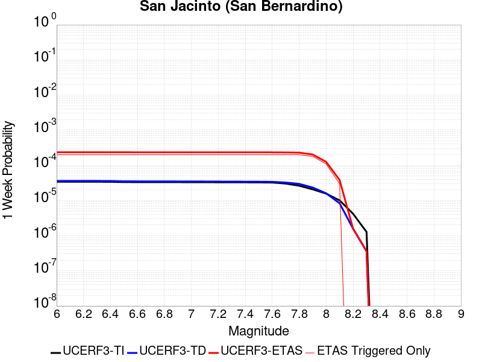 | 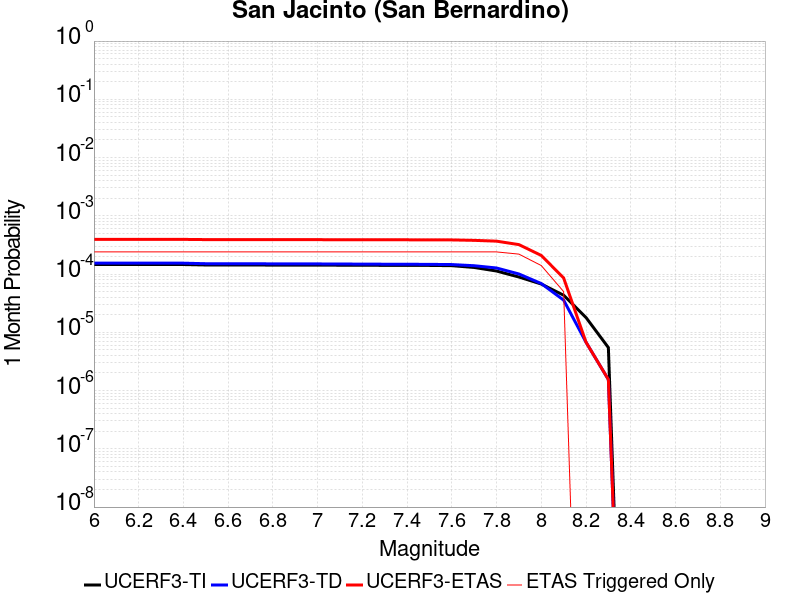 | 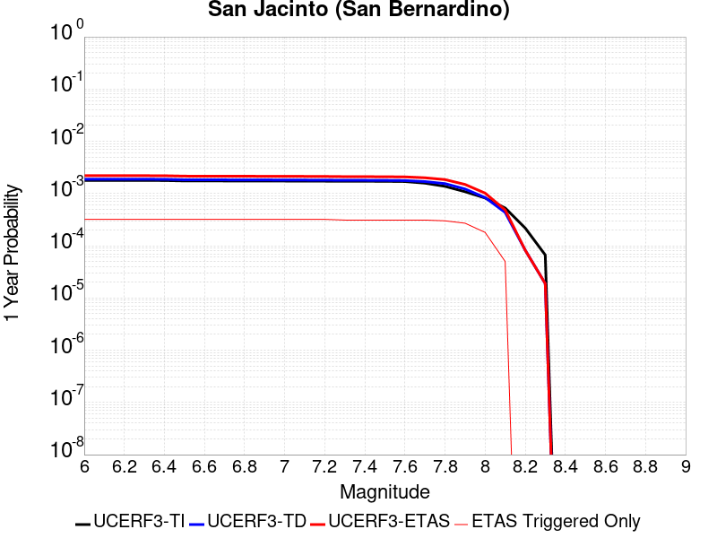 | 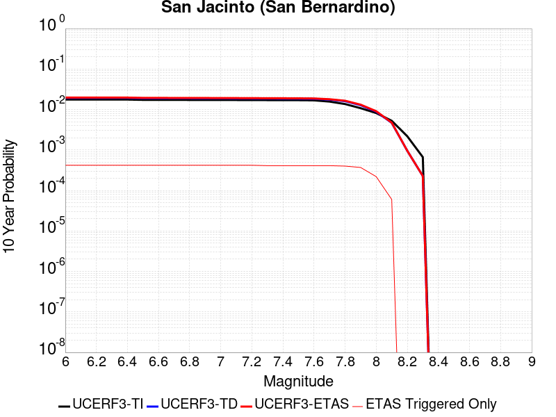 |

| Magnitude | 1 wk TI Prob | 1 wk TD Prob | 1 wk ETAS Prob | 1 wk ETAS/TD Gain | 1 wk ETAS Triggered Only | 1 mo TI Prob | 1 mo TD Prob | 1 mo ETAS Prob | 1 mo ETAS/TD Gain | 1 mo ETAS Triggered Only | 1 yr TI Prob | 1 yr TD Prob | 1 yr ETAS Prob | 1 yr ETAS/TD Gain | 1 yr ETAS Triggered Only | 10 yr TI Prob | 10 yr TD Prob | 10 yr ETAS Prob | 10 yr ETAS/TD Gain | 10 yr ETAS Triggered Only |
|-----|-----|-----|-----|-----|-----|-----|-----|-----|-----|-----|-----|-----|-----|-----|-----|-----|-----|-----|-----|-----|
| 6.0 | 3.409352E-5 | 3.598562E-5 | 2.3597843E-4 | 6.5575757 | 2.0E-4 | 1.461069E-4 | 1.5421498E-4 | 3.9417797E-4 | 2.556029 | 2.4E-4 | 0.0017774 | 0.0018759521 | 0.0021953518 | 1.1702601 | 3.2E-4 | 0.01763251 | 0.019349992 | 0.019761866 | 1.0212854 | 4.2E-4 |
| 6.1 | 3.409352E-5 | 3.598562E-5 | 2.3597843E-4 | 6.5575757 | 2.0E-4 | 1.461069E-4 | 1.5421498E-4 | 3.9417797E-4 | 2.556029 | 2.4E-4 | 0.0017774 | 0.0018759521 | 0.0021953518 | 1.1702601 | 3.2E-4 | 0.01763251 | 0.019349992 | 0.019761866 | 1.0212854 | 4.2E-4 |
| 6.2 | 3.409352E-5 | 3.598562E-5 | 2.3597843E-4 | 6.5575757 | 2.0E-4 | 1.461069E-4 | 1.5421498E-4 | 3.9417797E-4 | 2.556029 | 2.4E-4 | 0.0017774 | 0.0018759521 | 0.0021953518 | 1.1702601 | 3.2E-4 | 0.01763251 | 0.019349992 | 0.019761866 | 1.0212854 | 4.2E-4 |
| 6.3 | 3.409352E-5 | 3.598562E-5 | 2.3597843E-4 | 6.5575757 | 2.0E-4 | 1.461069E-4 | 1.5421498E-4 | 3.9417797E-4 | 2.556029 | 2.4E-4 | 0.0017774 | 0.0018759521 | 0.0021953518 | 1.1702601 | 3.2E-4 | 0.01763251 | 0.019349992 | 0.019761866 | 1.0212854 | 4.2E-4 |
| 6.4 | 3.400795E-5 | 3.5878285E-5 | 2.358711E-4 | 6.5742025 | 2.0E-4 | 1.4574021E-4 | 1.5375503E-4 | 3.9371813E-4 | 2.5606847 | 2.4E-4 | 0.0017729428 | 0.0018703619 | 0.0021897634 | 1.1707699 | 3.2E-4 | 0.017588645 | 0.019295074 | 0.01970697 | 1.0213472 | 4.2E-4 |
| 6.5 | 3.341482E-5 | 3.5138914E-5 | 2.3513188E-4 | 6.6914954 | 2.0E-4 | 1.4319851E-4 | 1.5058667E-4 | 3.9055053E-4 | 2.5935266 | 2.4E-4 | 0.0017420477 | 0.0018318522 | 0.002151266 | 1.1743666 | 3.2E-4 | 0.017284546 | 0.018916616 | 0.01932867 | 1.0217828 | 4.2E-4 |
| 6.6 | 3.3364955E-5 | 3.5076133E-5 | 2.3506912E-4 | 6.701683 | 2.0E-4 | 1.4298483E-4 | 1.5031763E-4 | 3.9028155E-4 | 2.596379 | 2.4E-4 | 0.0017394501 | 0.0018285823 | 0.0021479973 | 1.1746789 | 3.2E-4 | 0.017258976 | 0.01888448 | 0.01929655 | 1.0218204 | 4.2E-4 |
| 6.7 | 3.335922E-5 | 3.5065907E-5 | 2.3505889E-4 | 6.703346 | 2.0E-4 | 1.4296026E-4 | 1.5027382E-4 | 3.9023775E-4 | 2.5968447 | 2.4E-4 | 0.0017391514 | 0.0018280497 | 0.0021474648 | 1.17473 | 3.2E-4 | 0.017256035 | 0.018879272 | 0.019291343 | 1.0218266 | 4.2E-4 |
| 6.8 | 3.327683E-5 | 3.4959972E-5 | 2.3495298E-4 | 6.7206283 | 2.0E-4 | 1.4260718E-4 | 1.4981985E-4 | 3.897839E-4 | 2.6016839 | 2.4E-4 | 0.0017348597 | 0.001822532 | 0.0021419488 | 1.17526 | 3.2E-4 | 0.017213784 | 0.018825045 | 0.019237138 | 1.0218908 | 4.2E-4 |
| 6.9 | 3.3235785E-5 | 3.4900928E-5 | 2.3489395E-4 | 6.730307 | 2.0E-4 | 1.4243131E-4 | 1.4956683E-4 | 3.8953093E-4 | 2.604394 | 2.4E-4 | 0.0017327217 | 0.0018194567 | 0.0021388745 | 1.1755567 | 3.2E-4 | 0.017192734 | 0.018794911 | 0.019207017 | 1.0219265 | 4.2E-4 |
| 7.0 | 3.3197095E-5 | 3.4840854E-5 | 2.3483389E-4 | 6.740187 | 2.0E-4 | 1.422655E-4 | 1.4930942E-4 | 3.8927357E-4 | 2.6071603 | 2.4E-4 | 0.0017307063 | 0.0018163278 | 0.0021357466 | 1.1758597 | 3.2E-4 | 0.017172894 | 0.01876429 | 0.019176409 | 1.021963 | 4.2E-4 |
| 7.1 | 3.3129716E-5 | 3.4721066E-5 | 2.3471413E-4 | 6.759992 | 2.0E-4 | 1.4197677E-4 | 1.4879608E-4 | 3.8876038E-4 | 2.6127057 | 2.4E-4 | 0.0017271966 | 0.0018100884 | 0.002129509 | 1.176467 | 3.2E-4 | 0.017138338 | 0.018703366 | 0.01911551 | 1.0220358 | 4.2E-4 |
| 7.2 | 3.3034008E-5 | 3.4588513E-5 | 2.3458159E-4 | 6.782067 | 2.0E-4 | 1.4156665E-4 | 1.4822806E-4 | 3.8819248E-4 | 2.6188867 | 2.4E-4 | 0.0017222111 | 0.0018031843 | 0.0021226073 | 1.1771438 | 3.2E-4 | 0.017089253 | 0.01863575 | 0.019047923 | 1.0221174 | 4.2E-4 |
| 7.3 | 3.2956614E-5 | 3.4456265E-5 | 2.3444937E-4 | 6.8042593 | 2.0E-4 | 1.4123498E-4 | 1.4766137E-4 | 3.876259E-4 | 2.6251006 | 2.4E-4 | 0.0017181796 | 0.0017962961 | 0.0021057392 | 1.1722673 | 3.1E-4 | 0.017049557 | 0.018568495 | 0.018970883 | 1.0216705 | 4.1E-4 |
| 7.4 | 3.2915937E-5 | 3.4377957E-5 | 2.3437108E-4 | 6.817481 | 2.0E-4 | 1.4106068E-4 | 1.473258E-4 | 3.8729043E-4 | 2.6288025 | 2.4E-4 | 0.0017160608 | 0.0017922173 | 0.0021016616 | 1.1726601 | 3.1E-4 | 0.017028693 | 0.018528769 | 0.018931173 | 1.0217178 | 4.1E-4 |
| 7.5 | 3.281791E-5 | 3.424287E-5 | 2.3423602E-4 | 6.840432 | 2.0E-4 | 1.406406E-4 | 1.4674691E-4 | 3.867117E-4 | 2.6352289 | 2.4E-4 | 0.0017109542 | 0.0017851809 | 0.0020946276 | 1.1733419 | 3.1E-4 | 0.016978411 | 0.018459652 | 0.018862084 | 1.0218006 | 4.1E-4 |
| 7.6 | 3.2521442E-5 | 3.396782E-5 | 2.3396102E-4 | 6.887726 | 2.0E-4 | 1.3937015E-4 | 1.4556825E-4 | 3.8553332E-4 | 2.648471 | 2.4E-4 | 0.0016955109 | 0.0017708542 | 0.0020803052 | 1.1747468 | 3.1E-4 | 0.016826328 | 0.018317295 | 0.018719785 | 1.0219733 | 4.1E-4 |
| 7.7 | 3.0287873E-5 | 3.245191E-5 | 2.3244543E-4 | 7.162765 | 2.0E-4 | 1.297987E-4 | 1.3907222E-4 | 3.7903883E-4 | 2.7254822 | 2.4E-4 | 0.0015791537 | 0.0016918903 | 0.0020013659 | 1.182917 | 3.1E-4 | 0.01567979 | 0.017528199 | 0.017931012 | 1.0229809 | 4.1E-4 |
| 7.8 | 2.6316151E-5 | 2.9662837E-5 | 2.296569E-4 | 7.742244 | 2.0E-4 | 1.1277862E-4 | 1.2712025E-4 | 3.6708976E-4 | 2.887736 | 2.4E-4 | 0.0013722149 | 0.0015465913 | 0.0018461273 | 1.1936749 | 3.0E-4 | 0.013637724 | 0.016069878 | 0.01646345 | 1.0244913 | 4.0E-4 |
| 7.9 | 2.0761147E-5 | 2.3417291E-5 | 2.0341307E-4 | 8.686448 | 1.8E-4 | 8.897331E-5 | 1.0035596E-4 | 3.2033387E-4 | 3.1919765 | 2.2E-4 | 0.0010827117 | 0.0012211498 | 0.0014908201 | 1.2208331 | 2.7E-4 | 0.010774517 | 0.012793272 | 0.013158538 | 1.0285515 | 3.7E-4 |
| 8.0 | 1.5738568E-5 | 1.6032505E-5 | 1.2603075E-4 | 7.860951 | 1.1E-4 | 6.744926E-5 | 6.8708934E-5 | 2.0869932E-4 | 3.0374408 | 1.4E-4 | 8.2088535E-4 | 8.3621085E-4 | 0.0010160604 | 1.2150767 | 1.8E-4 | 0.008178596 | 0.008865741 | 0.009083791 | 1.0245947 | 2.2E-4 |
| 8.1 | 1.0105832E-5 | 8.329479E-6 | 3.8329228E-5 | 4.601636 | 3.0E-5 | 4.3309992E-5 | 3.569728E-5 | 8.5695494E-5 | 2.400617 | 5.0E-5 | 5.2717153E-4 | 4.3452822E-4 | 4.8450648E-4 | 1.1150173 | 5.0E-5 | 0.005259227 | 0.0046768794 | 0.0047365986 | 1.0127691 | 6.0E-5 |
| 8.2 | 4.189207E-6 | 1.577699E-6 | 1.577699E-6 | 1.0 | 0.0 | 1.7953622E-5 | 6.7615497E-6 | 6.7615497E-6 | 1.0 | 0.0 | 2.1856341E-4 | 8.231879E-5 | 8.231879E-5 | 1.0 | 0.0 | 0.0021834858 | 9.562628E-4 | 9.562628E-4 | 1.0 | 0.0 |
| 8.3 | 1.2758221E-6 | 3.612677E-7 | 3.612677E-7 | 1.0 | 0.0 | 5.4677976E-6 | 1.5482892E-6 | 1.5482892E-6 | 1.0 | 0.0 | 6.65684E-5 | 1.8850264E-5 | 1.8850264E-5 | 1.0 | 0.0 | 6.6548464E-4 | 2.2739546E-4 | 2.2739546E-4 | 1.0 | 0.0 |

## Independence rev 2011
*[(top)](#table-of-contents)*

| 1 Week | 1 Month | 1 Year | 10 Year |
|-----|-----|-----|-----|
|  | 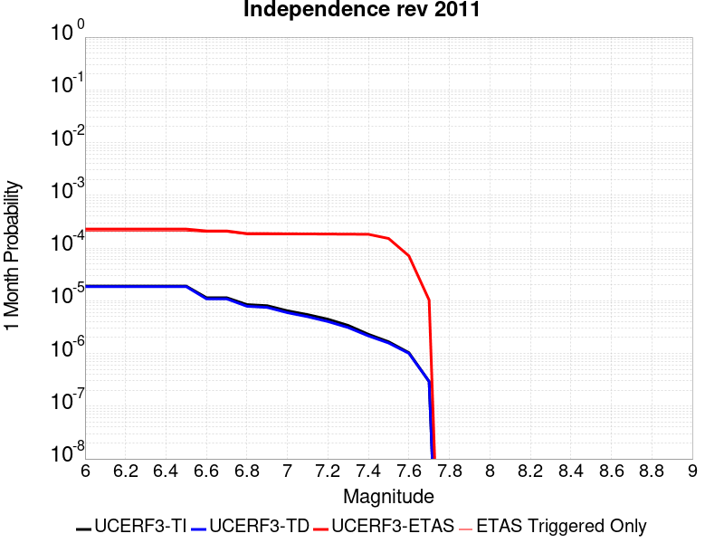 | 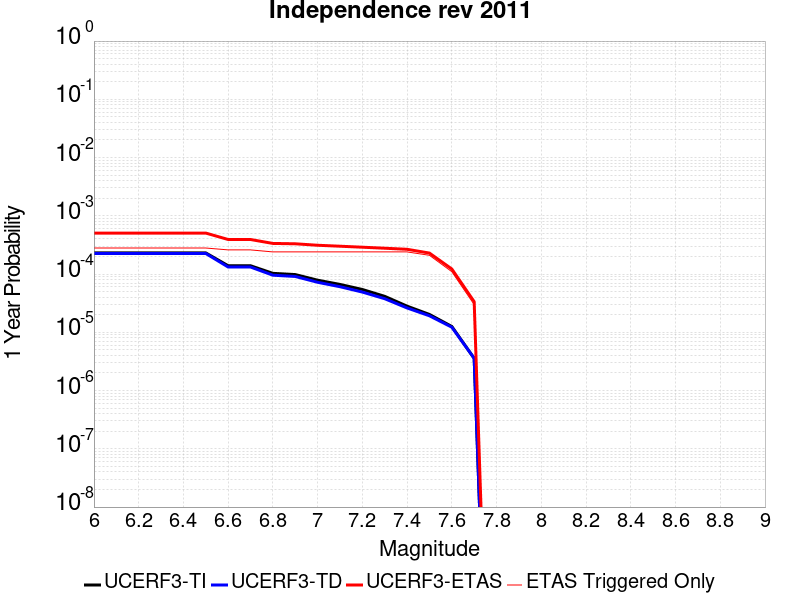 | 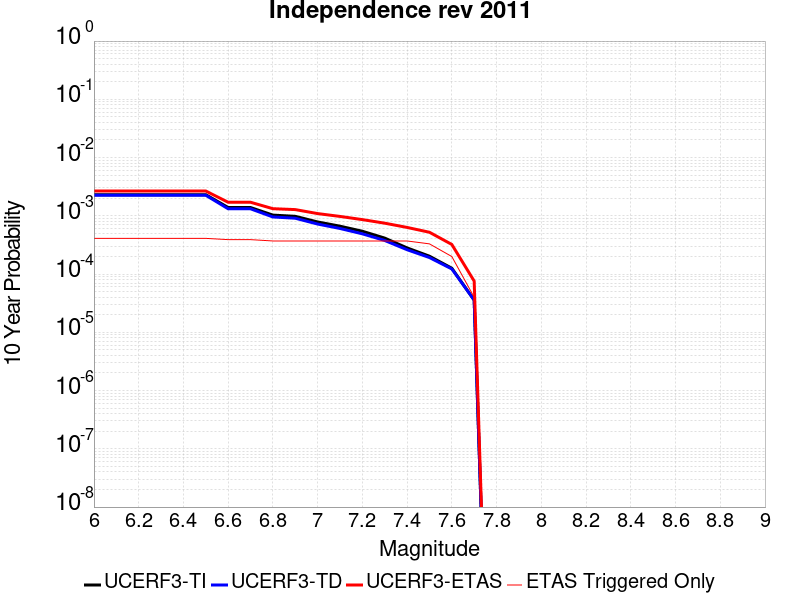 |

| Magnitude | 1 wk TI Prob | 1 wk TD Prob | 1 wk ETAS Prob | 1 wk ETAS/TD Gain | 1 wk ETAS Triggered Only | 1 mo TI Prob | 1 mo TD Prob | 1 mo ETAS Prob | 1 mo ETAS/TD Gain | 1 mo ETAS Triggered Only | 1 yr TI Prob | 1 yr TD Prob | 1 yr ETAS Prob | 1 yr ETAS/TD Gain | 1 yr ETAS Triggered Only | 10 yr TI Prob | 10 yr TD Prob | 10 yr ETAS Prob | 10 yr ETAS/TD Gain | 10 yr ETAS Triggered Only |
|-----|-----|-----|-----|-----|-----|-----|-----|-----|-----|-----|-----|-----|-----|-----|-----|-----|-----|-----|-----|-----|
| 6.0 | 4.422171E-6 | 4.3262253E-6 | 1.5432558E-4 | 35.672108 | 1.5E-4 | 1.8952025E-5 | 1.8540852E-5 | 2.2853696E-4 | 12.326131 | 2.1E-4 | 2.3071647E-4 | 2.2571447E-4 | 5.056513E-4 | 2.2402253 | 2.8E-4 | 0.0023047708 | 0.0022551457 | 0.002664221 | 1.1813965 | 4.1E-4 |
| 6.1 | 4.422171E-6 | 4.3262253E-6 | 1.5432558E-4 | 35.672108 | 1.5E-4 | 1.8952025E-5 | 1.8540852E-5 | 2.2853696E-4 | 12.326131 | 2.1E-4 | 2.3071647E-4 | 2.2571447E-4 | 5.056513E-4 | 2.2402253 | 2.8E-4 | 0.0023047708 | 0.0022551457 | 0.002664221 | 1.1813965 | 4.1E-4 |
| 6.2 | 4.422171E-6 | 4.3262253E-6 | 1.5432558E-4 | 35.672108 | 1.5E-4 | 1.8952025E-5 | 1.8540852E-5 | 2.2853696E-4 | 12.326131 | 2.1E-4 | 2.3071647E-4 | 2.2571447E-4 | 5.056513E-4 | 2.2402253 | 2.8E-4 | 0.0023047708 | 0.0022551457 | 0.002664221 | 1.1813965 | 4.1E-4 |
| 6.3 | 4.422171E-6 | 4.3262253E-6 | 1.5432558E-4 | 35.672108 | 1.5E-4 | 1.8952025E-5 | 1.8540852E-5 | 2.2853696E-4 | 12.326131 | 2.1E-4 | 2.3071647E-4 | 2.2571447E-4 | 5.056513E-4 | 2.2402253 | 2.8E-4 | 0.0023047708 | 0.0022551457 | 0.002664221 | 1.1813965 | 4.1E-4 |
| 6.4 | 4.422171E-6 | 4.3262253E-6 | 1.5432558E-4 | 35.672108 | 1.5E-4 | 1.8952025E-5 | 1.8540852E-5 | 2.2853696E-4 | 12.326131 | 2.1E-4 | 2.3071647E-4 | 2.2571447E-4 | 5.056513E-4 | 2.2402253 | 2.8E-4 | 0.0023047708 | 0.0022551457 | 0.002664221 | 1.1813965 | 4.1E-4 |
| 6.5 | 4.422171E-6 | 4.3262253E-6 | 1.5432558E-4 | 35.672108 | 1.5E-4 | 1.8952025E-5 | 1.8540852E-5 | 2.2853696E-4 | 12.326131 | 2.1E-4 | 2.3071647E-4 | 2.2571447E-4 | 5.056513E-4 | 2.2402253 | 2.8E-4 | 0.0023047708 | 0.0022551457 | 0.002664221 | 1.1813965 | 4.1E-4 |
| 6.6 | 2.663744E-6 | 2.5319846E-6 | 1.4253163E-4 | 56.292458 | 1.4E-4 | 1.1415996E-5 | 1.08513195E-5 | 2.1084915E-4 | 19.430738 | 2.0E-4 | 1.3898089E-4 | 1.321073E-4 | 3.9207295E-4 | 2.967837 | 2.6E-4 | 0.0013889399 | 0.0013203359 | 0.0017098209 | 1.2949893 | 3.9E-4 |
| 6.7 | 2.663744E-6 | 2.5319846E-6 | 1.4253163E-4 | 56.292458 | 1.4E-4 | 1.1415996E-5 | 1.08513195E-5 | 2.1084915E-4 | 19.430738 | 2.0E-4 | 1.3898089E-4 | 1.321073E-4 | 3.9207295E-4 | 2.967837 | 2.6E-4 | 0.0013889399 | 0.0013203359 | 0.0017098209 | 1.2949893 | 3.9E-4 |
| 6.8 | 1.9716529E-6 | 1.8322567E-6 | 1.3183201E-4 | 71.95063 | 1.3E-4 | 8.449913E-6 | 7.852505E-6 | 1.878511E-4 | 23.92244 | 1.8E-4 | 1.0287284E-4 | 9.560019E-5 | 3.3557724E-4 | 3.5102153 | 2.4E-4 | 0.0010282523 | 9.5560355E-4 | 0.0013252499 | 1.3868198 | 3.7E-4 |
| 6.9 | 1.8788617E-6 | 1.7429976E-6 | 1.3174277E-4 | 75.58402 | 1.3E-4 | 8.0522395E-6 | 7.4699688E-6 | 1.8746863E-4 | 25.096306 | 1.8E-4 | 9.80316E-5 | 9.09432E-5 | 3.3092138E-4 | 3.6387699 | 2.4E-4 | 9.798837E-4 | 9.090718E-4 | 0.0012787355 | 1.4066385 | 3.7E-4 |
| 7.0 | 1.5045488E-6 | 1.3849498E-6 | 1.3138478E-4 | 94.8661 | 1.3E-4 | 6.44805E-6 | 5.9354857E-6 | 1.8593442E-4 | 31.325897 | 1.8E-4 | 7.8502184E-5 | 7.226219E-5 | 3.1224484E-4 | 4.3209987 | 2.4E-4 | 7.8474457E-4 | 7.223921E-4 | 0.0010921248 | 1.5118172 | 3.7E-4 |
| 7.1 | 1.272341E-6 | 1.1625089E-6 | 1.3116236E-4 | 112.82697 | 1.3E-4 | 5.4528787E-6 | 4.9821715E-6 | 1.8498127E-4 | 37.128643 | 1.8E-4 | 6.6386776E-5 | 6.0656283E-5 | 3.0064172E-4 | 4.9564815 | 2.4E-4 | 6.636695E-4 | 6.064005E-4 | 9.761761E-4 | 1.6097878 | 3.7E-4 |
| 7.2 | 1.0416892E-6 | 9.409871E-7 | 1.3094087E-4 | 139.15266 | 1.3E-4 | 4.464375E-6 | 4.032796E-6 | 1.8403208E-4 | 45.63387 | 1.8E-4 | 5.4352407E-5 | 4.9098202E-5 | 2.8908643E-4 | 5.887923 | 2.4E-4 | 5.4339116E-4 | 4.908754E-4 | 8.6069375E-4 | 1.7533854 | 3.7E-4 |
| 7.3 | 7.9450155E-7 | 7.2350036E-7 | 1.307234E-4 | 180.68188 | 1.3E-4 | 3.4050022E-6 | 3.1007123E-6 | 1.8310016E-4 | 59.051 | 1.8E-4 | 4.1455114E-5 | 3.7750528E-5 | 2.7774146E-4 | 7.357287 | 2.4E-4 | 4.144738E-4 | 3.7744228E-4 | 7.473026E-4 | 1.9799124 | 3.7E-4 |
| 7.4 | 5.3893444E-7 | 5.0195166E-7 | 1.3050188E-4 | 259.98895 | 1.3E-4 | 2.309717E-6 | 2.1512196E-6 | 1.8215083E-4 | 84.67329 | 1.8E-4 | 2.8120441E-5 | 2.6190788E-5 | 2.661845E-4 | 10.163287 | 2.4E-4 | 2.8116882E-4 | 2.6187746E-4 | 6.317806E-4 | 2.4125044 | 3.7E-4 |
| 7.5 | 3.8852085E-7 | 3.6825622E-7 | 1.0036822E-4 | 272.54996 | 1.0E-4 | 1.6650882E-6 | 1.57824E-6 | 1.51578E-4 | 96.04243 | 1.5E-4 | 2.027226E-5 | 1.9214905E-5 | 2.2921087E-4 | 11.928805 | 2.1E-4 | 2.0270412E-4 | 1.9213265E-4 | 5.220692E-4 | 2.7172334 | 3.3E-4 |
| 7.6 | 2.414929E-7 | 2.3457605E-7 | 3.0234569E-5 | 128.89026 | 3.0E-5 | 1.0349692E-6 | 1.0053255E-6 | 7.1005255E-5 | 70.62912 | 7.0E-5 | 1.2600677E-5 | 1.2239771E-5 | 1.2223843E-4 | 9.986986 | 1.1E-4 | 1.2599962E-4 | 1.223911E-4 | 3.2236663E-4 | 2.633906 | 2.0E-4 |
| 7.7 | 6.8298014E-8 | 6.8589785E-8 | 1.0068589E-5 | 146.7943 | 1.0E-5 | 2.9270575E-7 | 2.939562E-7 | 1.0293953E-5 | 35.018665 | 1.0E-5 | 3.5636867E-6 | 3.5789112E-6 | 3.3578803E-5 | 9.382407 | 3.0E-5 | 3.5636294E-5 | 3.5788584E-5 | 7.578715E-5 | 2.1176348 | 4.0E-5 |

## White Wolf (Extension)
*[(top)](#table-of-contents)*

| 1 Week | 1 Month | 1 Year | 10 Year |
|-----|-----|-----|-----|
|  |  |  |  |

| Magnitude | 1 wk TI Prob | 1 wk TD Prob | 1 wk ETAS Prob | 1 wk ETAS/TD Gain | 1 wk ETAS Triggered Only | 1 mo TI Prob | 1 mo TD Prob | 1 mo ETAS Prob | 1 mo ETAS/TD Gain | 1 mo ETAS Triggered Only | 1 yr TI Prob | 1 yr TD Prob | 1 yr ETAS Prob | 1 yr ETAS/TD Gain | 1 yr ETAS Triggered Only | 10 yr TI Prob | 10 yr TD Prob | 10 yr ETAS Prob | 10 yr ETAS/TD Gain | 10 yr ETAS Triggered Only |
|-----|-----|-----|-----|-----|-----|-----|-----|-----|-----|-----|-----|-----|-----|-----|-----|-----|-----|-----|-----|-----|
| 6.0 | 8.222555E-6 | 6.066615E-6 | 1.5606571E-4 | 25.725336 | 1.5E-4 | 3.5239045E-5 | 2.5999556E-5 | 2.359941E-4 | 9.076851 | 2.1E-4 | 4.289509E-4 | 3.1650523E-4 | 6.264071E-4 | 1.9791367 | 3.1E-4 | 0.0042812387 | 0.0031611966 | 0.0035699005 | 1.1292877 | 4.1E-4 |
| 6.1 | 8.222555E-6 | 6.066615E-6 | 1.5606571E-4 | 25.725336 | 1.5E-4 | 3.5239045E-5 | 2.5999556E-5 | 2.359941E-4 | 9.076851 | 2.1E-4 | 4.289509E-4 | 3.1650523E-4 | 6.264071E-4 | 1.9791367 | 3.1E-4 | 0.0042812387 | 0.0031611966 | 0.0035699005 | 1.1292877 | 4.1E-4 |
| 6.2 | 8.222555E-6 | 6.066615E-6 | 1.5606571E-4 | 25.725336 | 1.5E-4 | 3.5239045E-5 | 2.5999556E-5 | 2.359941E-4 | 9.076851 | 2.1E-4 | 4.289509E-4 | 3.1650523E-4 | 6.264071E-4 | 1.9791367 | 3.1E-4 | 0.0042812387 | 0.0031611966 | 0.0035699005 | 1.1292877 | 4.1E-4 |
| 6.3 | 8.222555E-6 | 6.066615E-6 | 1.5606571E-4 | 25.725336 | 1.5E-4 | 3.5239045E-5 | 2.5999556E-5 | 2.359941E-4 | 9.076851 | 2.1E-4 | 4.289509E-4 | 3.1650523E-4 | 6.264071E-4 | 1.9791367 | 3.1E-4 | 0.0042812387 | 0.0031611966 | 0.0035699005 | 1.1292877 | 4.1E-4 |
| 6.4 | 5.821773E-6 | 3.5571256E-6 | 1.0355677E-4 | 29.112486 | 1.0E-4 | 2.4950215E-5 | 1.5244741E-5 | 1.5524261E-4 | 10.183354 | 1.4E-4 | 3.0372653E-4 | 1.8559002E-4 | 3.7555475E-4 | 2.023572 | 1.9E-4 | 0.0030331176 | 0.0018544586 | 0.002123958 | 1.1453251 | 2.7E-4 |
| 6.5 | 5.766023E-6 | 3.4990599E-6 | 1.0349871E-4 | 29.579006 | 1.0E-4 | 2.4711293E-5 | 1.49958905E-5 | 1.5499379E-4 | 10.335752 | 1.4E-4 | 3.0081844E-4 | 1.8256076E-4 | 3.725261E-4 | 2.0405593 | 1.9E-4 | 0.0030041158 | 0.0018242161 | 0.0020937235 | 1.1477388 | 2.7E-4 |
| 6.6 | 4.643576E-6 | 2.3325733E-6 | 4.233248E-5 | 18.148403 | 4.0E-5 | 1.9900888E-5 | 9.9967065E-6 | 7.9996E-5 | 8.002236 | 7.0E-5 | 2.4226638E-4 | 1.2170354E-4 | 2.016938E-4 | 1.657255 | 8.0E-5 | 0.0024200242 | 0.0012164112 | 0.0013662288 | 1.1231636 | 1.5E-4 |
| 6.7 | 3.9529173E-6 | 1.6482975E-6 | 3.1648247E-5 | 19.200567 | 3.0E-5 | 1.6940963E-5 | 7.064114E-6 | 5.706376E-5 | 8.077978 | 5.0E-5 | 2.0623671E-4 | 8.600239E-5 | 1.4599723E-4 | 1.6975951 | 6.0E-5 | 0.002060454 | 8.597095E-4 | 9.796063E-4 | 1.139462 | 1.2E-4 |
| 6.8 | 3.4377522E-6 | 1.2244764E-6 | 2.1224452E-5 | 17.333492 | 2.0E-5 | 1.473314E-5 | 5.247746E-6 | 4.5247536E-5 | 8.62228 | 4.0E-5 | 1.7936122E-4 | 6.388952E-5 | 1.1388633E-4 | 1.7825509 | 5.0E-5 | 0.0017921652 | 6.3872064E-4 | 7.1866956E-4 | 1.1251704 | 8.0E-5 |
| 6.9 | 3.1367306E-6 | 1.0033316E-6 | 2.1003312E-5 | 20.93357 | 2.0E-5 | 1.3443062E-5 | 4.299986E-6 | 3.4299857E-5 | 7.9767375 | 3.0E-5 | 1.63657E-4 | 5.2351144E-5 | 9.234905E-5 | 1.7640312 | 4.0E-5 | 0.0016353652 | 5.233958E-4 | 5.833644E-4 | 1.114576 | 6.0E-5 |
| 7.0 | 2.8298145E-6 | 7.4282326E-7 | 1.0742816E-5 | 14.462142 | 1.0E-5 | 1.2127721E-5 | 3.1835248E-6 | 1.3183493E-5 | 4.1411624 | 1.0E-5 | 1.47645E-4 | 3.8758775E-5 | 5.8758E-5 | 1.5159922 | 2.0E-5 | 0.0014754693 | 3.8752513E-4 | 4.175135E-4 | 1.0773844 | 3.0E-5 |
| 7.1 | 2.4091064E-6 | 5.4223835E-7 | 1.0542233E-5 | 19.442064 | 1.0E-5 | 1.03247E-5 | 2.3238767E-6 | 1.2323853E-5 | 5.303144 | 1.0E-5 | 1.2569598E-4 | 2.8292874E-5 | 3.829259E-5 | 1.3534359 | 1.0E-5 | 0.001256249 | 2.8289677E-4 | 3.028911E-4 | 1.0706772 | 2.0E-5 |
| 7.2 | 1.3875518E-6 | 1.0740268E-7 | 1.0740268E-7 | 1.0 | 0.0 | 5.9466374E-6 | 4.6029712E-7 | 4.6029712E-7 | 1.0 | 0.0 | 7.23979E-5 | 5.604104E-6 | 5.604104E-6 | 1.0 | 0.0 | 7.2374323E-4 | 5.6039742E-5 | 5.6039742E-5 | 1.0 | 0.0 |
| 7.3 | 7.056077E-7 | 5.0002956E-8 | 5.0002956E-8 | 1.0 | 0.0 | 3.0240296E-6 | 2.1429837E-7 | 2.1429837E-7 | 1.0 | 0.0 | 3.681694E-5 | 2.60908E-6 | 2.60908E-6 | 1.0 | 0.0 | 3.681084E-4 | 2.609054E-5 | 2.609054E-5 | 1.0 | 0.0 |
| 7.4 | 5.9334678E-8 | 4.8638475E-9 | 4.8638475E-9 | 1.0 | 0.0 | 2.5429145E-7 | 2.084506E-8 | 2.084506E-8 | 1.0 | 0.0 | 3.095994E-6 | 2.5378858E-7 | 2.5378858E-7 | 1.0 | 0.0 | 3.095951E-5 | 2.5378843E-6 | 2.5378843E-6 | 1.0 | 0.0 |

## Cady
*[(top)](#table-of-contents)*

| 1 Week | 1 Month | 1 Year | 10 Year |
|-----|-----|-----|-----|
|  | 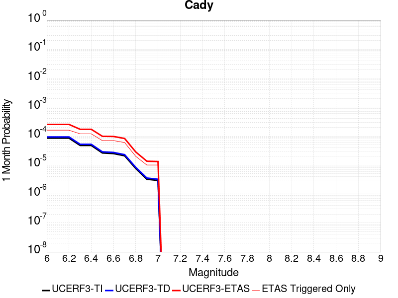 | 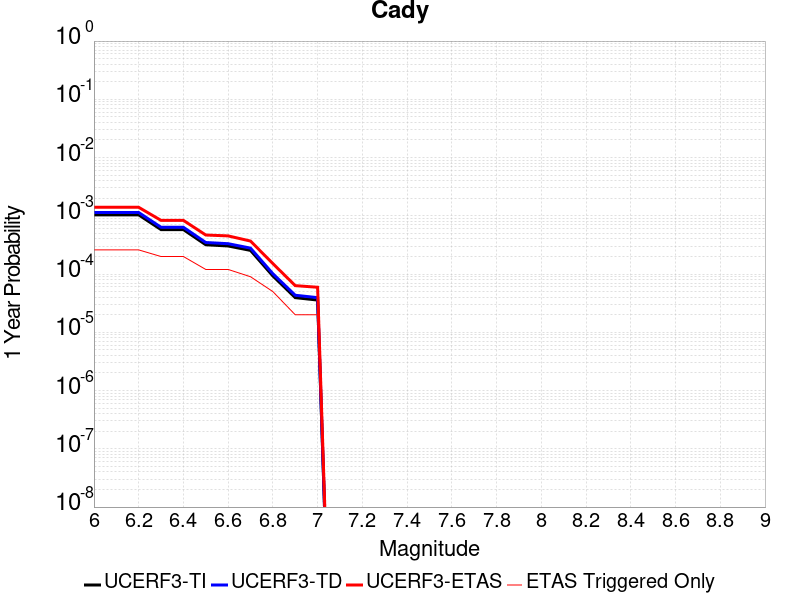 |  |

| Magnitude | 1 wk TI Prob | 1 wk TD Prob | 1 wk ETAS Prob | 1 wk ETAS/TD Gain | 1 wk ETAS Triggered Only | 1 mo TI Prob | 1 mo TD Prob | 1 mo ETAS Prob | 1 mo ETAS/TD Gain | 1 mo ETAS Triggered Only | 1 yr TI Prob | 1 yr TD Prob | 1 yr ETAS Prob | 1 yr ETAS/TD Gain | 1 yr ETAS Triggered Only | 10 yr TI Prob | 10 yr TD Prob | 10 yr ETAS Prob | 10 yr ETAS/TD Gain | 10 yr ETAS Triggered Only |
|-----|-----|-----|-----|-----|-----|-----|-----|-----|-----|-----|-----|-----|-----|-----|-----|-----|-----|-----|-----|-----|
| 6.0 | 1.9892565E-5 | 2.1858728E-5 | 1.418561E-4 | 6.4896774 | 1.2E-4 | 8.525106E-5 | 9.3677416E-5 | 2.5366244E-4 | 2.707829 | 1.6E-4 | 0.0010374374 | 0.0011400167 | 0.0013997203 | 1.2278068 | 2.6E-4 | 0.010326075 | 0.011350701 | 0.011726387 | 1.0330981 | 3.8E-4 |
| 6.1 | 1.9892565E-5 | 2.1858728E-5 | 1.418561E-4 | 6.4896774 | 1.2E-4 | 8.525106E-5 | 9.3677416E-5 | 2.5366244E-4 | 2.707829 | 1.6E-4 | 0.0010374374 | 0.0011400167 | 0.0013997203 | 1.2278068 | 2.6E-4 | 0.010326075 | 0.011350701 | 0.011726387 | 1.0330981 | 3.8E-4 |
| 6.2 | 1.9892565E-5 | 2.1858728E-5 | 1.418561E-4 | 6.4896774 | 1.2E-4 | 8.525106E-5 | 9.3677416E-5 | 2.5366244E-4 | 2.707829 | 1.6E-4 | 0.0010374374 | 0.0011400167 | 0.0013997203 | 1.2278068 | 2.6E-4 | 0.010326075 | 0.011350701 | 0.011726387 | 1.0330981 | 3.8E-4 |
| 6.3 | 1.1117327E-5 | 1.2176583E-5 | 1.1217537E-4 | 9.212384 | 1.0E-4 | 4.764482E-5 | 5.2184492E-5 | 1.7217823E-4 | 3.2994137 | 1.2E-4 | 5.7992124E-4 | 6.351925E-4 | 8.3506544E-4 | 1.3146652 | 2.0E-4 | 0.0057841022 | 0.0063368753 | 0.006615101 | 1.0439059 | 2.8E-4 |
| 6.4 | 1.1117327E-5 | 1.2176583E-5 | 1.1217537E-4 | 9.212384 | 1.0E-4 | 4.764482E-5 | 5.2184492E-5 | 1.7217823E-4 | 3.2994137 | 1.2E-4 | 5.7992124E-4 | 6.351925E-4 | 8.3506544E-4 | 1.3146652 | 2.0E-4 | 0.0057841022 | 0.0063368753 | 0.006615101 | 1.0439059 | 2.8E-4 |
| 6.5 | 6.103093E-6 | 6.672021E-6 | 7.667155E-5 | 11.491505 | 7.0E-5 | 2.615585E-5 | 2.8594131E-5 | 9.859213E-5 | 3.4479847 | 7.0E-5 | 3.1840094E-4 | 3.480905E-4 | 4.6804873E-4 | 1.344618 | 1.2E-4 | 0.0031794512 | 0.0034766865 | 0.003666026 | 1.0544597 | 1.9E-4 |
| 6.6 | 5.817237E-6 | 6.3656585E-6 | 7.636521E-5 | 11.996435 | 7.0E-5 | 2.4930776E-5 | 2.728118E-5 | 9.727927E-5 | 3.5658016 | 7.0E-5 | 3.034899E-4 | 3.3211018E-4 | 4.5207032E-4 | 1.3612059 | 1.2E-4 | 0.0030307577 | 0.0033173605 | 0.0035067303 | 1.0570844 | 1.9E-4 |
| 6.7 | 4.8846314E-6 | 5.3405684E-6 | 6.5340246E-5 | 12.234699 | 6.0E-5 | 2.0933967E-5 | 2.2888014E-5 | 8.288664E-5 | 3.6213994 | 6.0E-5 | 2.5484123E-4 | 2.7863772E-4 | 3.6861264E-4 | 1.3229101 | 9.0E-5 | 0.0025454918 | 0.0027840391 | 0.0029336214 | 1.0537286 | 1.5E-4 |
| 6.8 | 1.7788773E-6 | 1.9399079E-6 | 2.193987E-5 | 11.309748 | 2.0E-5 | 7.6237375E-6 | 8.313874E-6 | 2.8313707E-5 | 3.4055974 | 2.0E-5 | 9.281505E-5 | 1.01218284E-4 | 1.5121323E-4 | 1.4939319 | 5.0E-5 | 9.2776294E-4 | 0.0010118765 | 0.0010618259 | 1.0493631 | 5.0E-5 |
| 6.9 | 7.5455404E-7 | 8.297092E-7 | 1.0829701E-5 | 13.052405 | 1.0E-5 | 3.233799E-6 | 3.5558937E-6 | 1.35558585E-5 | 3.8122225 | 1.0E-5 | 3.937079E-5 | 4.3292483E-5 | 6.329161E-5 | 1.461954 | 2.0E-5 | 3.9363815E-4 | 4.3287344E-4 | 4.5286477E-4 | 1.0461829 | 2.0E-5 |
| 7.0 | 6.8578805E-7 | 7.541816E-7 | 1.0754174E-5 | 14.259396 | 1.0E-5 | 2.9390883E-6 | 3.2322048E-6 | 1.3232172E-5 | 4.0938535 | 1.0E-5 | 3.578281E-5 | 3.9351715E-5 | 5.9350925E-5 | 1.5082171 | 2.0E-5 | 3.577705E-4 | 3.9347992E-4 | 4.1347204E-4 | 1.0508085 | 2.0E-5 |

## Manix-Afton Hills
*[(top)](#table-of-contents)*

| 1 Week | 1 Month | 1 Year | 10 Year |
|-----|-----|-----|-----|
|  |  |  |  |

| Magnitude | 1 wk TI Prob | 1 wk TD Prob | 1 wk ETAS Prob | 1 wk ETAS/TD Gain | 1 wk ETAS Triggered Only | 1 mo TI Prob | 1 mo TD Prob | 1 mo ETAS Prob | 1 mo ETAS/TD Gain | 1 mo ETAS Triggered Only | 1 yr TI Prob | 1 yr TD Prob | 1 yr ETAS Prob | 1 yr ETAS/TD Gain | 1 yr ETAS Triggered Only | 10 yr TI Prob | 10 yr TD Prob | 10 yr ETAS Prob | 10 yr ETAS/TD Gain | 10 yr ETAS Triggered Only |
|-----|-----|-----|-----|-----|-----|-----|-----|-----|-----|-----|-----|-----|-----|-----|-----|-----|-----|-----|-----|-----|
| 6.0 | 1.3783202E-5 | 1.47110895E-5 | 1.1470962E-4 | 7.797493 | 1.0E-4 | 5.906953E-5 | 6.30461E-5 | 2.0303727E-4 | 3.2204573 | 1.4E-4 | 7.189342E-4 | 7.6733343E-4 | 0.0010371263 | 1.3515979 | 2.7E-4 | 0.0071661277 | 0.007648596 | 0.008025689 | 1.0493023 | 3.8E-4 |
| 6.1 | 1.3783202E-5 | 1.47110895E-5 | 1.1470962E-4 | 7.797493 | 1.0E-4 | 5.906953E-5 | 6.30461E-5 | 2.0303727E-4 | 3.2204573 | 1.4E-4 | 7.189342E-4 | 7.6733343E-4 | 0.0010371263 | 1.3515979 | 2.7E-4 | 0.0071661277 | 0.007648596 | 0.008025689 | 1.0493023 | 3.8E-4 |
| 6.2 | 1.3783202E-5 | 1.47110895E-5 | 1.1470962E-4 | 7.797493 | 1.0E-4 | 5.906953E-5 | 6.30461E-5 | 2.0303727E-4 | 3.2204573 | 1.4E-4 | 7.189342E-4 | 7.6733343E-4 | 0.0010371263 | 1.3515979 | 2.7E-4 | 0.0071661277 | 0.007648596 | 0.008025689 | 1.0493023 | 3.8E-4 |
| 6.3 | 1.10494875E-5 | 1.1793136E-5 | 9.179219E-5 | 7.7835274 | 8.0E-5 | 4.7354086E-5 | 5.054109E-5 | 1.5053604E-4 | 2.9784882 | 1.0E-4 | 5.763835E-4 | 6.151744E-4 | 8.250452E-4 | 1.3411566 | 2.1E-4 | 0.005748908 | 0.0061357557 | 0.006404099 | 1.0437343 | 2.7E-4 |
| 6.4 | 1.10494875E-5 | 1.1793136E-5 | 9.179219E-5 | 7.7835274 | 8.0E-5 | 4.7354086E-5 | 5.054109E-5 | 1.5053604E-4 | 2.9784882 | 1.0E-4 | 5.763835E-4 | 6.151744E-4 | 8.250452E-4 | 1.3411566 | 2.1E-4 | 0.005748908 | 0.0061357557 | 0.006404099 | 1.0437343 | 2.7E-4 |
| 6.5 | 9.788949E-6 | 1.045432E-5 | 8.045359E-5 | 7.695727 | 7.0E-5 | 4.1951964E-5 | 4.480351E-5 | 1.3479948E-4 | 3.0086813 | 9.0E-5 | 5.1064545E-4 | 5.453555E-4 | 7.252573E-4 | 1.3298799 | 1.8E-4 | 0.0050947363 | 0.0054410985 | 0.0056797927 | 1.0438688 | 2.4E-4 |
| 6.6 | 8.810006E-6 | 9.4136285E-6 | 6.9413065E-5 | 7.373678 | 6.0E-5 | 3.775662E-5 | 4.0343548E-5 | 1.2034032E-4 | 2.982889 | 8.0E-5 | 4.5958988E-4 | 4.9108086E-4 | 6.609974E-4 | 1.3460052 | 1.7E-4 | 0.0045864056 | 0.004900839 | 0.005119761 | 1.0446702 | 2.2E-4 |
| 6.7 | 8.80128E-6 | 9.404108E-6 | 6.940354E-5 | 7.3801303 | 6.0E-5 | 3.7719226E-5 | 4.0302748E-5 | 1.20299526E-4 | 2.9848964 | 8.0E-5 | 4.591348E-4 | 4.9058435E-4 | 6.6050095E-4 | 1.3463556 | 1.7E-4 | 0.004581874 | 0.0048958957 | 0.005114819 | 1.0447156 | 2.2E-4 |
| 6.8 | 6.8994877E-6 | 7.380076E-6 | 4.737978E-5 | 6.4199586 | 4.0E-5 | 2.9568899E-5 | 3.162856E-5 | 9.1626665E-5 | 2.8969598 | 6.0E-5 | 3.5994186E-4 | 3.8501783E-4 | 5.2496395E-4 | 1.3634795 | 1.4E-4 | 0.003593594 | 0.0038443129 | 0.004023621 | 1.0466424 | 1.8E-4 |
| 6.9 | 4.9328037E-6 | 5.2709615E-6 | 2.5270856E-5 | 4.794354 | 2.0E-5 | 2.1140417E-5 | 2.2589675E-5 | 4.258922E-5 | 1.8853403 | 2.0E-5 | 2.5735417E-4 | 2.7500073E-4 | 3.5497872E-4 | 1.2908283 | 8.0E-5 | 0.0025705635 | 0.0027472095 | 0.0028569072 | 1.0399306 | 1.1E-4 |
| 7.0 | 3.347973E-6 | 3.59003E-6 | 1.35899945E-5 | 3.7854822 | 1.0E-5 | 1.4348378E-5 | 1.5385775E-5 | 2.5385621E-5 | 1.649941 | 1.0E-5 | 1.746775E-4 | 1.8730981E-4 | 2.4729857E-4 | 1.3202649 | 6.0E-5 | 0.0017454025 | 0.0018719219 | 0.0019517723 | 1.0426568 | 8.0E-5 |
| 7.1 | 1.2073567E-6 | 1.293482E-6 | 1.293482E-6 | 1.0 | 0.0 | 5.1743755E-6 | 5.543492E-6 | 5.543492E-6 | 1.0 | 0.0 | 6.29962E-5 | 6.749156E-5 | 7.7490884E-5 | 1.1481566 | 1.0E-5 | 6.297835E-4 | 6.7487074E-4 | 7.048505E-4 | 1.044423 | 3.0E-5 |

## Baker
*[(top)](#table-of-contents)*

| 1 Week | 1 Month | 1 Year | 10 Year |
|-----|-----|-----|-----|
|  |  |  |  |

| Magnitude | 1 wk TI Prob | 1 wk TD Prob | 1 wk ETAS Prob | 1 wk ETAS/TD Gain | 1 wk ETAS Triggered Only | 1 mo TI Prob | 1 mo TD Prob | 1 mo ETAS Prob | 1 mo ETAS/TD Gain | 1 mo ETAS Triggered Only | 1 yr TI Prob | 1 yr TD Prob | 1 yr ETAS Prob | 1 yr ETAS/TD Gain | 1 yr ETAS Triggered Only | 10 yr TI Prob | 10 yr TD Prob | 10 yr ETAS Prob | 10 yr ETAS/TD Gain | 10 yr ETAS Triggered Only |
|-----|-----|-----|-----|-----|-----|-----|-----|-----|-----|-----|-----|-----|-----|-----|-----|-----|-----|-----|-----|-----|
| 6.0 | 5.695525E-6 | 5.8348373E-6 | 9.5834315E-5 | 16.424505 | 9.0E-5 | 2.4409164E-5 | 2.5006228E-5 | 1.5500297E-4 | 6.198575 | 1.3E-4 | 2.9714106E-4 | 3.044123E-4 | 5.343423E-4 | 1.7553242 | 2.3E-4 | 0.0029674405 | 0.0030403486 | 0.0033892845 | 1.1147684 | 3.5E-4 |
| 6.1 | 5.695525E-6 | 5.8348373E-6 | 9.5834315E-5 | 16.424505 | 9.0E-5 | 2.4409164E-5 | 2.5006228E-5 | 1.5500297E-4 | 6.198575 | 1.3E-4 | 2.9714106E-4 | 3.044123E-4 | 5.343423E-4 | 1.7553242 | 2.3E-4 | 0.0029674405 | 0.0030403486 | 0.0033892845 | 1.1147684 | 3.5E-4 |
| 6.2 | 5.695525E-6 | 5.8348373E-6 | 9.5834315E-5 | 16.424505 | 9.0E-5 | 2.4409164E-5 | 2.5006228E-5 | 1.5500297E-4 | 6.198575 | 1.3E-4 | 2.9714106E-4 | 3.044123E-4 | 5.343423E-4 | 1.7553242 | 2.3E-4 | 0.0029674405 | 0.0030403486 | 0.0033892845 | 1.1147684 | 3.5E-4 |
| 6.3 | 3.2995713E-6 | 3.383667E-6 | 6.3383464E-5 | 18.732182 | 6.0E-5 | 1.4140943E-5 | 1.4501353E-5 | 1.14499904E-4 | 7.8958087 | 1.0E-4 | 1.7215237E-4 | 1.7654014E-4 | 3.665066E-4 | 2.0760524 | 1.9E-4 | 0.0017201907 | 0.001764046 | 0.0020235875 | 1.1471285 | 2.6E-4 |
| 6.4 | 3.2995713E-6 | 3.383667E-6 | 6.3383464E-5 | 18.732182 | 6.0E-5 | 1.4140943E-5 | 1.4501353E-5 | 1.14499904E-4 | 7.8958087 | 1.0E-4 | 1.7215237E-4 | 1.7654014E-4 | 3.665066E-4 | 2.0760524 | 1.9E-4 | 0.0017201907 | 0.001764046 | 0.0020235875 | 1.1471285 | 2.6E-4 |
| 6.5 | 2.782202E-6 | 2.8558404E-6 | 6.2855666E-5 | 22.009518 | 6.0E-5 | 1.1923668E-5 | 1.223926E-5 | 1.12238034E-4 | 9.170328 | 1.0E-4 | 1.4516099E-4 | 1.4900314E-4 | 3.289763E-4 | 2.2078483 | 1.8E-4 | 0.001450662 | 0.0014890651 | 0.0017287077 | 1.1609349 | 2.4E-4 |
| 6.6 | 2.3163404E-6 | 2.38092E-6 | 6.238078E-5 | 26.200283 | 6.0E-5 | 9.927136E-6 | 1.0203904E-5 | 1.10202884E-4 | 10.800071 | 1.0E-4 | 1.20856166E-4 | 1.2422565E-4 | 2.9420454E-4 | 2.3683074 | 1.7E-4 | 0.0012079047 | 0.0012415823 | 0.0014513216 | 1.168929 | 2.1E-4 |
| 6.7 | 2.037056E-6 | 2.0965003E-6 | 6.209638E-5 | 29.61906 | 6.0E-5 | 8.7302105E-6 | 8.984972E-6 | 1.0898407E-4 | 12.129596 | 1.0E-4 | 1.0628513E-4 | 1.093867E-4 | 2.693692E-4 | 2.4625406 | 1.6E-4 | 0.0010623431 | 0.0010933448 | 0.001293126 | 1.182725 | 2.0E-4 |
| 6.8 | 1.8356744E-6 | 1.8915287E-6 | 6.189141E-5 | 32.720314 | 6.0E-5 | 7.867153E-6 | 8.106527E-6 | 1.0810572E-4 | 13.335639 | 1.0E-4 | 9.577837E-5 | 9.869264E-5 | 2.5867685E-4 | 2.6210349 | 1.6E-4 | 9.57371E-4 | 9.86502E-4 | 0.0011563343 | 1.1721561 | 1.7E-4 |
| 6.9 | 1.6310546E-6 | 1.6832072E-6 | 5.1683124E-5 | 30.705147 | 5.0E-5 | 6.9902153E-6 | 7.213726E-6 | 9.721308E-5 | 13.476126 | 9.0E-5 | 8.510255E-5 | 8.782368E-5 | 2.3781051E-4 | 2.7078176 | 1.5E-4 | 8.5069967E-4 | 8.7790104E-4 | 0.0010377606 | 1.1820929 | 1.6E-4 |
| 7.0 | 1.2058036E-6 | 1.2508665E-6 | 5.1250805E-5 | 40.97224 | 5.0E-5 | 5.1677193E-6 | 5.3608455E-6 | 9.536037E-5 | 17.788305 | 9.0E-5 | 6.291517E-5 | 6.5266366E-5 | 1.9525788E-4 | 2.9917076 | 1.3E-4 | 6.289736E-4 | 6.524743E-4 | 7.923829E-4 | 1.2144278 | 1.4E-4 |
| 7.1 | 1.052382E-6 | 1.0951609E-6 | 4.1095118E-5 | 37.524277 | 4.0E-5 | 4.5102006E-6 | 4.693538E-6 | 8.4693165E-5 | 18.04463 | 8.0E-5 | 5.491031E-5 | 5.7142337E-5 | 1.7713547E-4 | 3.099899 | 1.2E-4 | 5.4896745E-4 | 5.7127734E-4 | 7.0120307E-4 | 1.2274302 | 1.3E-4 |
| 7.2 | 1.0067454E-6 | 1.0487711E-6 | 4.104873E-5 | 39.13984 | 4.0E-5 | 4.3146156E-6 | 4.4947255E-6 | 8.4494364E-5 | 18.79856 | 8.0E-5 | 5.252918E-5 | 5.4721917E-5 | 1.647159E-4 | 3.0100536 | 1.1E-4 | 5.251676E-4 | 5.470853E-4 | 6.6701963E-4 | 1.2192242 | 1.2E-4 |
| 7.3 | 9.3596316E-7 | 9.767723E-7 | 4.0976734E-5 | 41.95116 | 4.0E-5 | 4.0112645E-6 | 4.1861604E-6 | 8.418583E-5 | 20.11051 | 8.0E-5 | 4.8836053E-5 | 5.096532E-5 | 1.6095971E-4 | 3.1582205 | 1.1E-4 | 4.8825322E-4 | 5.095371E-4 | 6.19481E-4 | 1.2157723 | 1.1E-4 |
| 7.4 | 8.8117395E-7 | 9.2076635E-7 | 4.0920728E-5 | 44.442036 | 4.0E-5 | 3.7764542E-6 | 3.9461356E-6 | 7.394586E-5 | 18.738804 | 7.0E-5 | 4.5977362E-5 | 4.8043148E-5 | 1.4803835E-4 | 3.0813622 | 1.0E-4 | 4.596785E-4 | 4.8032837E-4 | 5.802803E-4 | 1.2080909 | 1.0E-4 |
| 7.5 | 8.292386E-7 | 8.6745956E-7 | 4.0867424E-5 | 47.111618 | 4.0E-5 | 3.5538749E-6 | 3.7176785E-6 | 7.371742E-5 | 19.828884 | 7.0E-5 | 4.326757E-5 | 4.5261804E-5 | 1.3525772E-4 | 2.9883416 | 9.0E-5 | 4.3259145E-4 | 4.5252658E-4 | 5.4248585E-4 | 1.1987933 | 9.0E-5 |
| 7.6 | 7.553842E-7 | 7.9144706E-7 | 3.0791423E-5 | 38.905224 | 3.0E-5 | 3.2373566E-6 | 3.3919116E-6 | 5.339174E-5 | 15.7409 | 5.0E-5 | 3.9414106E-5 | 4.129575E-5 | 1.0129327E-4 | 2.4528742 | 6.0E-5 | 3.9407116E-4 | 4.1288146E-4 | 4.728567E-4 | 1.1452602 | 6.0E-5 |
| 7.7 | 6.5285366E-7 | 6.852797E-7 | 3.068526E-5 | 44.777718 | 3.0E-5 | 2.797941E-6 | 2.9369096E-6 | 5.2936764E-5 | 18.024649 | 5.0E-5 | 3.40644E-5 | 3.5756293E-5 | 8.575451E-5 | 2.3983052 | 5.0E-5 | 3.405918E-4 | 3.5750607E-4 | 4.074882E-4 | 1.1398078 | 5.0E-5 |
| 7.8 | 3.4586725E-7 | 3.6482615E-7 | 1.0364823E-5 | 28.410307 | 1.0E-5 | 1.4822873E-6 | 1.5635396E-6 | 2.1563508E-5 | 13.791469 | 2.0E-5 | 1.80467E-5 | 1.9035933E-5 | 3.9035553E-5 | 2.0506246 | 2.0E-5 | 1.8045233E-4 | 1.9034347E-4 | 2.1033967E-4 | 1.1050532 | 2.0E-5 |
| 7.9 | 2.5591178E-9 | 2.6696718E-9 | 2.6696718E-9 | 1.0 | 0.0 | 1.0967647E-8 | 1.14414505E-8 | 1.14414505E-8 | 1.0 | 0.0 | 1.335311E-7 | 1.3929966E-7 | 1.3929966E-7 | 1.0 | 0.0 | 1.3353102E-6 | 1.3929966E-6 | 1.3929966E-6 | 1.0 | 0.0 |

## Ludlow
*[(top)](#table-of-contents)*

| 1 Week | 1 Month | 1 Year | 10 Year |
|-----|-----|-----|-----|
|  |  |  |  |

| Magnitude | 1 wk TI Prob | 1 wk TD Prob | 1 wk ETAS Prob | 1 wk ETAS/TD Gain | 1 wk ETAS Triggered Only | 1 mo TI Prob | 1 mo TD Prob | 1 mo ETAS Prob | 1 mo ETAS/TD Gain | 1 mo ETAS Triggered Only | 1 yr TI Prob | 1 yr TD Prob | 1 yr ETAS Prob | 1 yr ETAS/TD Gain | 1 yr ETAS Triggered Only | 10 yr TI Prob | 10 yr TD Prob | 10 yr ETAS Prob | 10 yr ETAS/TD Gain | 10 yr ETAS Triggered Only |
|-----|-----|-----|-----|-----|-----|-----|-----|-----|-----|-----|-----|-----|-----|-----|-----|-----|-----|-----|-----|-----|
| 6.0 | 2.2407607E-5 | 2.3657254E-5 | 1.3365466E-4 | 5.6496267 | 1.1E-4 | 9.602906E-5 | 1.0138454E-4 | 2.6136832E-4 | 2.5779898 | 1.6E-4 | 0.0011685267 | 0.001233702 | 0.0014134799 | 1.1457224 | 1.8E-4 | 0.011624013 | 0.012273042 | 0.012598992 | 1.0265582 | 3.3E-4 |
| 6.1 | 2.2407607E-5 | 2.3657254E-5 | 1.3365466E-4 | 5.6496267 | 1.1E-4 | 9.602906E-5 | 1.0138454E-4 | 2.6136832E-4 | 2.5779898 | 1.6E-4 | 0.0011685267 | 0.001233702 | 0.0014134799 | 1.1457224 | 1.8E-4 | 0.011624013 | 0.012273042 | 0.012598992 | 1.0265582 | 3.3E-4 |
| 6.2 | 1.0781252E-5 | 1.1365663E-5 | 5.136521E-5 | 4.519332 | 4.0E-5 | 4.620455E-5 | 4.8709102E-5 | 9.870667E-5 | 2.0264523 | 5.0E-5 | 5.623952E-4 | 5.9287593E-4 | 6.5284036E-4 | 1.1011416 | 6.0E-5 | 0.00560974 | 0.0059133614 | 0.006052533 | 1.0235353 | 1.4E-4 |
| 6.3 | 1.0781252E-5 | 1.1365663E-5 | 5.136521E-5 | 4.519332 | 4.0E-5 | 4.620455E-5 | 4.8709102E-5 | 9.870667E-5 | 2.0264523 | 5.0E-5 | 5.623952E-4 | 5.9287593E-4 | 6.5284036E-4 | 1.1011416 | 6.0E-5 | 0.00560974 | 0.0059133614 | 0.006052533 | 1.0235353 | 1.4E-4 |
| 6.4 | 7.814439E-6 | 8.237729E-6 | 2.8237564E-5 | 3.4278336 | 2.0E-5 | 3.3490025E-5 | 3.530408E-5 | 6.530302E-5 | 1.8497301 | 3.0E-5 | 4.0766477E-4 | 4.2974384E-4 | 4.5973095E-4 | 1.069779 | 3.0E-5 | 0.0040691774 | 0.0042892746 | 0.0043689315 | 1.0185711 | 8.0E-5 |
| 6.5 | 6.4986366E-6 | 6.85092E-6 | 2.6850783E-5 | 3.919296 | 2.0E-5 | 2.7851002E-5 | 2.9360759E-5 | 4.9360173E-5 | 1.6811613 | 2.0E-5 | 3.390332E-4 | 3.5740953E-4 | 3.7740238E-4 | 1.0559382 | 2.0E-5 | 0.003385164 | 0.0035684432 | 0.0036182648 | 1.0139617 | 5.0E-5 |
| 6.6 | 5.582177E-6 | 5.8860055E-6 | 2.5885887E-5 | 4.39787 | 2.0E-5 | 2.3923398E-5 | 2.5225498E-5 | 4.5224995E-5 | 1.7928286 | 2.0E-5 | 2.9122844E-4 | 3.0707786E-4 | 3.2707173E-4 | 1.0651101 | 2.0E-5 | 0.0029084706 | 0.003066609 | 0.0031164556 | 1.0162547 | 5.0E-5 |
| 6.7 | 4.6858763E-6 | 4.940427E-6 | 2.494033E-5 | 5.048213 | 2.0E-5 | 2.0082172E-5 | 2.1173091E-5 | 4.117267E-5 | 1.9445752 | 2.0E-5 | 2.4447302E-4 | 2.5775246E-4 | 2.7774728E-4 | 1.0775738 | 2.0E-5 | 0.0024420423 | 0.0025745912 | 0.0026244626 | 1.0193706 | 5.0E-5 |
| 6.8 | 3.5584908E-6 | 3.7520183E-6 | 1.3751981E-5 | 3.6652222 | 1.0E-5 | 1.5250586E-5 | 1.6079981E-5 | 2.607982E-5 | 1.6218812 | 1.0E-5 | 1.8566006E-4 | 1.957566E-4 | 2.0575464E-4 | 1.0510738 | 1.0E-5 | 0.0018550502 | 0.0019558826 | 0.001985824 | 1.0153084 | 3.0E-5 |
| 6.9 | 2.532834E-6 | 2.6710034E-6 | 2.6710034E-6 | 1.0 | 0.0 | 1.0854958E-5 | 1.1447109E-5 | 1.1447109E-5 | 1.0 | 0.0 | 1.3215111E-4 | 1.3935992E-4 | 1.3935992E-4 | 1.0 | 0.0 | 0.0013207254 | 0.0013927529 | 0.001412725 | 1.01434 | 2.0E-5 |
| 7.0 | 1.7083285E-6 | 1.8019439E-6 | 1.8019439E-6 | 1.0 | 0.0 | 7.3213873E-6 | 7.722595E-6 | 7.722595E-6 | 1.0 | 0.0 | 8.913424E-5 | 9.40187E-5 | 9.40187E-5 | 1.0 | 0.0 | 8.9098496E-4 | 9.3980576E-4 | 9.4979635E-4 | 1.0106305 | 1.0E-5 |
| 7.1 | 1.0905424E-6 | 1.1497619E-6 | 1.1497619E-6 | 1.0 | 0.0 | 4.6737446E-6 | 4.9275427E-6 | 4.9275427E-6 | 1.0 | 0.0 | 5.6901354E-5 | 5.999128E-5 | 5.999128E-5 | 1.0 | 0.0 | 5.6886784E-4 | 5.997606E-4 | 5.997606E-4 | 1.0 | 0.0 |
| 7.2 | 6.06668E-7 | 6.387277E-7 | 6.387277E-7 | 1.0 | 0.0 | 2.600003E-6 | 2.7374022E-6 | 2.7374022E-6 | 1.0 | 0.0 | 3.1654577E-5 | 3.3327433E-5 | 3.3327433E-5 | 1.0 | 0.0 | 3.1650066E-4 | 3.3323118E-4 | 3.3323118E-4 | 1.0 | 0.0 |

## San Andreas (North Branch Mill Creek)
*[(top)](#table-of-contents)*

| 1 Week | 1 Month | 1 Year | 10 Year |
|-----|-----|-----|-----|
| 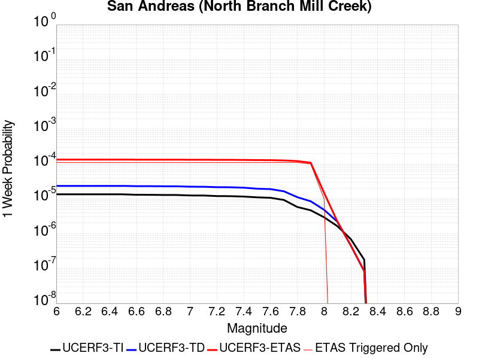 | 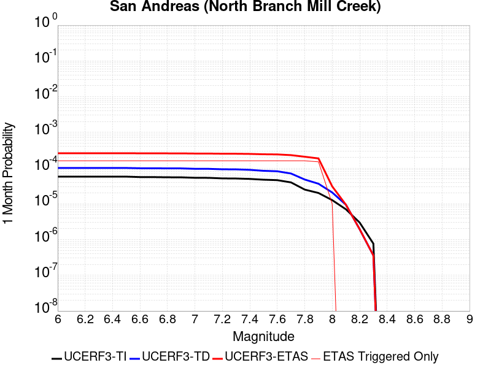 |  | 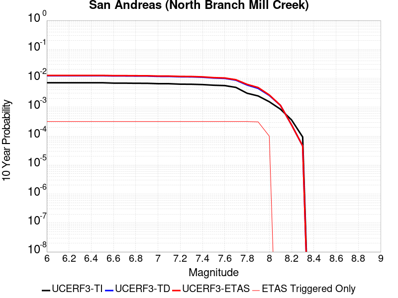 |

| Magnitude | 1 wk TI Prob | 1 wk TD Prob | 1 wk ETAS Prob | 1 wk ETAS/TD Gain | 1 wk ETAS Triggered Only | 1 mo TI Prob | 1 mo TD Prob | 1 mo ETAS Prob | 1 mo ETAS/TD Gain | 1 mo ETAS Triggered Only | 1 yr TI Prob | 1 yr TD Prob | 1 yr ETAS Prob | 1 yr ETAS/TD Gain | 1 yr ETAS Triggered Only | 10 yr TI Prob | 10 yr TD Prob | 10 yr ETAS Prob | 10 yr ETAS/TD Gain | 10 yr ETAS Triggered Only |
|-----|-----|-----|-----|-----|-----|-----|-----|-----|-----|-----|-----|-----|-----|-----|-----|-----|-----|-----|-----|-----|
| 6.0 | 1.3461156E-5 | 2.3500992E-5 | 1.3349841E-4 | 5.6805434 | 1.1E-4 | 5.7689394E-5 | 1.00714664E-4 | 2.6069855E-4 | 2.5884864 | 1.6E-4 | 7.02142E-4 | 0.0012255146 | 0.0014252695 | 1.1629968 | 2.0E-4 | 0.0069992766 | 0.012228744 | 0.012544831 | 1.0258479 | 3.2E-4 |
| 6.1 | 1.3461156E-5 | 2.3500992E-5 | 1.3349841E-4 | 5.6805434 | 1.1E-4 | 5.7689394E-5 | 1.00714664E-4 | 2.6069855E-4 | 2.5884864 | 1.6E-4 | 7.02142E-4 | 0.0012255146 | 0.0014252695 | 1.1629968 | 2.0E-4 | 0.0069992766 | 0.012228744 | 0.012544831 | 1.0258479 | 3.2E-4 |
| 6.2 | 1.3461156E-5 | 2.3500992E-5 | 1.3349841E-4 | 5.6805434 | 1.1E-4 | 5.7689394E-5 | 1.00714664E-4 | 2.6069855E-4 | 2.5884864 | 1.6E-4 | 7.02142E-4 | 0.0012255146 | 0.0014252695 | 1.1629968 | 2.0E-4 | 0.0069992766 | 0.012228744 | 0.012544831 | 1.0258479 | 3.2E-4 |
| 6.3 | 1.3461156E-5 | 2.3500992E-5 | 1.3349841E-4 | 5.6805434 | 1.1E-4 | 5.7689394E-5 | 1.00714664E-4 | 2.6069855E-4 | 2.5884864 | 1.6E-4 | 7.02142E-4 | 0.0012255146 | 0.0014252695 | 1.1629968 | 2.0E-4 | 0.0069992766 | 0.012228744 | 0.012544831 | 1.0258479 | 3.2E-4 |
| 6.4 | 1.3461156E-5 | 2.3500992E-5 | 1.3349841E-4 | 5.6805434 | 1.1E-4 | 5.7689394E-5 | 1.00714664E-4 | 2.6069855E-4 | 2.5884864 | 1.6E-4 | 7.02142E-4 | 0.0012255146 | 0.0014252695 | 1.1629968 | 2.0E-4 | 0.0069992766 | 0.012228744 | 0.012544831 | 1.0258479 | 3.2E-4 |
| 6.5 | 1.3450706E-5 | 2.348995E-5 | 1.3348737E-4 | 5.6827435 | 1.1E-4 | 5.764461E-5 | 1.00667356E-4 | 2.6065126E-4 | 2.5892332 | 1.6E-4 | 7.0159714E-4 | 0.0012249392 | 0.0014246943 | 1.1630734 | 2.0E-4 | 0.006993862 | 0.012223054 | 0.012539143 | 1.0258601 | 3.2E-4 |
| 6.6 | 1.3074523E-5 | 2.3104236E-5 | 1.331017E-4 | 5.760922 | 1.1E-4 | 5.6032466E-5 | 9.901441E-5 | 2.5899857E-4 | 2.6157663 | 1.6E-4 | 6.8198174E-4 | 0.001204837 | 0.001404596 | 1.1657976 | 2.0E-4 | 0.006798926 | 0.012024219 | 0.0123403715 | 1.0262929 | 3.2E-4 |
| 6.7 | 1.3050216E-5 | 2.3079532E-5 | 1.3307699E-4 | 5.766018 | 1.1E-4 | 5.59283E-5 | 9.890855E-5 | 2.5889272E-4 | 2.617496 | 1.6E-4 | 6.8071426E-4 | 0.0012035496 | 0.0014033089 | 1.1659751 | 2.0E-4 | 0.0067863287 | 0.012011484 | 0.01232764 | 1.0263212 | 3.2E-4 |
| 6.8 | 1.29049395E-5 | 2.2927941E-5 | 1.3292542E-4 | 5.7975297 | 1.1E-4 | 5.530571E-5 | 9.825892E-5 | 2.582432E-4 | 2.628191 | 1.6E-4 | 6.73139E-4 | 0.001195649 | 0.0013954099 | 1.1670731 | 2.0E-4 | 0.0067110364 | 0.011933329 | 0.01224951 | 1.0264957 | 3.2E-4 |
| 6.9 | 1.2867369E-5 | 2.2887343E-5 | 1.3288483E-4 | 5.80604 | 1.1E-4 | 5.51447E-5 | 9.808494E-5 | 2.5806925E-4 | 2.6310792 | 1.6E-4 | 6.711799E-4 | 0.0011935332 | 0.0013932945 | 1.1673697 | 2.0E-4 | 0.006691564 | 0.011912397 | 0.012228586 | 1.0265428 | 3.2E-4 |
| 7.0 | 1.2495996E-5 | 2.2287419E-5 | 1.3228497E-4 | 5.93541 | 1.1E-4 | 5.3553173E-5 | 9.551403E-5 | 2.5549874E-4 | 2.6749866 | 1.6E-4 | 6.518148E-4 | 0.0011622658 | 0.0013620333 | 1.1718776 | 2.0E-4 | 0.0064990623 | 0.011603 | 0.011919287 | 1.0272591 | 3.2E-4 |
| 7.1 | 1.2452067E-5 | 2.2232492E-5 | 1.3223005E-4 | 5.9476037 | 1.1E-4 | 5.3364907E-5 | 9.527864E-5 | 2.552634E-4 | 2.679125 | 1.6E-4 | 6.4952404E-4 | 0.001159403 | 0.0013591711 | 1.1723026 | 2.0E-4 | 0.0064762887 | 0.011574671 | 0.011890967 | 1.0273266 | 3.2E-4 |
| 7.2 | 1.2002777E-5 | 2.1611015E-5 | 1.3160864E-4 | 6.089887 | 1.1E-4 | 5.143946E-5 | 9.261536E-5 | 2.5260056E-4 | 2.7274153 | 1.6E-4 | 6.2609545E-4 | 0.0011270114 | 0.001326786 | 1.1772605 | 2.0E-4 | 0.006243344 | 0.011254058 | 0.011570456 | 1.0281142 | 3.2E-4 |
| 7.3 | 1.1923425E-5 | 2.1480853E-5 | 1.3147849E-4 | 6.120729 | 1.1E-4 | 5.109939E-5 | 9.205757E-5 | 2.5204284E-4 | 2.7378829 | 1.6E-4 | 6.219575E-4 | 0.0011202273 | 0.0013200032 | 1.1783352 | 2.0E-4 | 0.0062021962 | 0.011186945 | 0.011503365 | 1.0282848 | 3.2E-4 |
| 7.4 | 1.16105175E-5 | 2.0854808E-5 | 1.3085251E-4 | 6.274453 | 1.1E-4 | 4.975841E-5 | 8.93747E-5 | 2.493604E-4 | 2.7900558 | 1.6E-4 | 6.0564023E-4 | 0.0010875963 | 0.0012873788 | 1.1836917 | 2.0E-4 | 0.006039923 | 0.010864409 | 0.011180933 | 1.0291339 | 3.2E-4 |
| 7.5 | 1.1037265E-5 | 1.9554842E-5 | 1.2955269E-4 | 6.6250954 | 1.1E-4 | 4.7301706E-5 | 8.380379E-5 | 2.4379037E-4 | 2.9090617 | 1.6E-4 | 5.757461E-4 | 0.0010198357 | 0.0012196318 | 1.19591 | 2.0E-4 | 0.005742567 | 0.010195527 | 0.010512265 | 1.0310663 | 3.2E-4 |
| 7.6 | 1.0720915E-5 | 1.8996727E-5 | 1.2899464E-4 | 6.790361 | 1.1E-4 | 4.5945973E-5 | 8.141202E-5 | 2.4139899E-4 | 2.9651518 | 1.6E-4 | 5.592486E-4 | 9.907428E-4 | 0.0011905447 | 1.2016687 | 2.0E-4 | 0.005578433 | 0.009907238 | 0.010224069 | 1.0319796 | 3.2E-4 |
| 7.7 | 9.276279E-6 | 1.6442464E-5 | 1.2644066E-4 | 7.689885 | 1.1E-4 | 3.9754876E-5 | 7.046581E-5 | 2.3045453E-4 | 3.2704449 | 1.6E-4 | 4.839081E-4 | 8.5758517E-4 | 0.0010574136 | 1.233013 | 2.0E-4 | 0.0048285574 | 0.008586576 | 0.008903828 | 1.0369475 | 3.2E-4 |
| 7.8 | 5.8346777E-6 | 1.11555855E-5 | 1.2115436E-4 | 10.860421 | 1.1E-4 | 2.5005522E-5 | 4.7808775E-5 | 2.0780113E-4 | 4.346506 | 1.6E-4 | 3.043997E-4 | 5.819165E-4 | 7.8180013E-4 | 1.3434919 | 2.0E-4 | 0.0030398308 | 0.0058473335 | 0.006165462 | 1.0544058 | 3.2E-4 |
| 7.9 | 4.690204E-6 | 8.509473E-6 | 1.08508626E-4 | 12.751508 | 1.0E-4 | 2.0100719E-5 | 3.6468664E-5 | 1.8646319E-4 | 5.1129704 | 1.5E-4 | 2.4469878E-4 | 4.439156E-4 | 6.3383125E-4 | 1.4278193 | 1.9E-4 | 0.002444295 | 0.004471165 | 0.004779779 | 1.0690231 | 3.1E-4 |
| 8.0 | 2.9570454E-6 | 4.8470656E-6 | 1.4847017E-5 | 3.063094 | 1.0E-5 | 1.267299E-5 | 2.0772974E-5 | 3.0772764E-5 | 1.4813848 | 1.0E-5 | 1.5428272E-4 | 2.5288164E-4 | 2.9287153E-4 | 1.1581367 | 4.0E-5 | 0.0015417566 | 0.002549932 | 0.0026496772 | 1.0391167 | 1.0E-4 |
| 8.1 | 1.6376824E-6 | 2.1968672E-6 | 2.1968672E-6 | 1.0 | 0.0 | 7.01862E-6 | 9.415111E-6 | 9.415111E-6 | 1.0 | 0.0 | 8.544835E-5 | 1.1462297E-4 | 1.1462297E-4 | 1.0 | 0.0 | 8.54155E-4 | 0.0011607445 | 0.0011607445 | 1.0 | 0.0 |
| 8.2 | 6.9631557E-7 | 4.535001E-7 | 4.535001E-7 | 1.0 | 0.0 | 2.984206E-6 | 1.9435704E-6 | 1.9435704E-6 | 1.0 | 0.0 | 3.63321E-5 | 2.3662713E-5 | 2.3662713E-5 | 1.0 | 0.0 | 3.6326164E-4 | 2.4510184E-4 | 2.4510184E-4 | 1.0 | 0.0 |
| 8.3 | 1.7876137E-7 | 8.357368E-8 | 8.357368E-8 | 1.0 | 0.0 | 7.661199E-7 | 3.5817288E-7 | 3.5817288E-7 | 1.0 | 0.0 | 9.32747E-6 | 4.3607465E-6 | 4.3607465E-6 | 1.0 | 0.0 | 9.3270784E-5 | 4.5800018E-5 | 4.5800018E-5 | 1.0 | 0.0 |

## Santa Ynez (East)
*[(top)](#table-of-contents)*

| 1 Week | 1 Month | 1 Year | 10 Year |
|-----|-----|-----|-----|
| 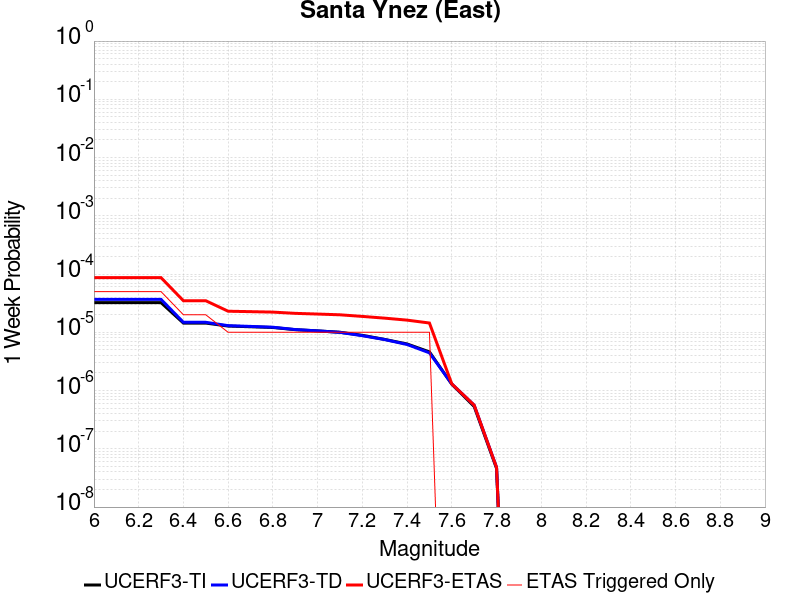 |  |  |  |

| Magnitude | 1 wk TI Prob | 1 wk TD Prob | 1 wk ETAS Prob | 1 wk ETAS/TD Gain | 1 wk ETAS Triggered Only | 1 mo TI Prob | 1 mo TD Prob | 1 mo ETAS Prob | 1 mo ETAS/TD Gain | 1 mo ETAS Triggered Only | 1 yr TI Prob | 1 yr TD Prob | 1 yr ETAS Prob | 1 yr ETAS/TD Gain | 1 yr ETAS Triggered Only | 10 yr TI Prob | 10 yr TD Prob | 10 yr ETAS Prob | 10 yr ETAS/TD Gain | 10 yr ETAS Triggered Only |
|-----|-----|-----|-----|-----|-----|-----|-----|-----|-----|-----|-----|-----|-----|-----|-----|-----|-----|-----|-----|-----|
| 6.0 | 3.2269712E-5 | 3.6750775E-5 | 8.6748936E-5 | 2.3604655 | 5.0E-5 | 1.3829143E-4 | 1.5749714E-4 | 2.4748297E-4 | 1.571349 | 9.0E-5 | 0.0016823979 | 0.0019164253 | 0.0020860995 | 1.0885369 | 1.7E-4 | 0.016697178 | 0.019056438 | 0.019321293 | 1.0138985 | 2.7E-4 |
| 6.1 | 3.2269712E-5 | 3.6750775E-5 | 8.6748936E-5 | 2.3604655 | 5.0E-5 | 1.3829143E-4 | 1.5749714E-4 | 2.4748297E-4 | 1.571349 | 9.0E-5 | 0.0016823979 | 0.0019164253 | 0.0020860995 | 1.0885369 | 1.7E-4 | 0.016697178 | 0.019056438 | 0.019321293 | 1.0138985 | 2.7E-4 |
| 6.2 | 3.2269712E-5 | 3.6750775E-5 | 8.6748936E-5 | 2.3604655 | 5.0E-5 | 1.3829143E-4 | 1.5749714E-4 | 2.4748297E-4 | 1.571349 | 9.0E-5 | 0.0016823979 | 0.0019164253 | 0.0020860995 | 1.0885369 | 1.7E-4 | 0.016697178 | 0.019056438 | 0.019321293 | 1.0138985 | 2.7E-4 |
| 6.3 | 3.2269712E-5 | 3.6750775E-5 | 8.6748936E-5 | 2.3604655 | 5.0E-5 | 1.3829143E-4 | 1.5749714E-4 | 2.4748297E-4 | 1.571349 | 9.0E-5 | 0.0016823979 | 0.0019164253 | 0.0020860995 | 1.0885369 | 1.7E-4 | 0.016697178 | 0.019056438 | 0.019321293 | 1.0138985 | 2.7E-4 |
| 6.4 | 1.4404779E-5 | 1.48492945E-5 | 3.4848996E-5 | 2.3468454 | 2.0E-5 | 6.1733306E-5 | 6.363831E-5 | 1.03635764E-4 | 1.6285123 | 4.0E-5 | 7.513438E-4 | 7.7452604E-4 | 8.544641E-4 | 1.103209 | 8.0E-5 | 0.0074880854 | 0.007718817 | 0.0078081223 | 1.0115699 | 9.0E-5 |
| 6.5 | 1.4404779E-5 | 1.48492945E-5 | 3.4848996E-5 | 2.3468454 | 2.0E-5 | 6.1733306E-5 | 6.363831E-5 | 1.03635764E-4 | 1.6285123 | 4.0E-5 | 7.513438E-4 | 7.7452604E-4 | 8.544641E-4 | 1.103209 | 8.0E-5 | 0.0074880854 | 0.007718817 | 0.0078081223 | 1.0115699 | 9.0E-5 |
| 6.6 | 1.280208E-5 | 1.301186E-5 | 2.301173E-5 | 1.7685196 | 1.0E-5 | 5.4864904E-5 | 5.5763932E-5 | 8.576226E-5 | 1.5379522 | 3.0E-5 | 6.6777546E-4 | 6.7871617E-4 | 7.286822E-4 | 1.0736185 | 5.0E-5 | 0.006657724 | 0.0067666434 | 0.0068262373 | 1.0088071 | 6.0E-5 |
| 6.7 | 1.2457027E-5 | 1.262838E-5 | 2.2628254E-5 | 1.7918572 | 1.0E-5 | 5.3386164E-5 | 5.4120515E-5 | 8.4118896E-5 | 1.5542884 | 3.0E-5 | 6.497827E-4 | 6.5871974E-4 | 7.086868E-4 | 1.0758548 | 5.0E-5 | 0.00647886 | 0.00656787 | 0.0066274754 | 1.0090754 | 6.0E-5 |
| 6.8 | 1.2095134E-5 | 1.2230827E-5 | 2.2230704E-5 | 1.8175962 | 1.0E-5 | 5.1835254E-5 | 5.2416784E-5 | 7.2415736E-5 | 1.3815372 | 2.0E-5 | 6.309115E-4 | 6.3798914E-4 | 6.779636E-4 | 1.062657 | 4.0E-5 | 0.0062912325 | 0.006361764 | 0.006411446 | 1.0078094 | 5.0E-5 |
| 6.9 | 1.1104036E-5 | 1.115726E-5 | 2.1157148E-5 | 1.8962674 | 1.0E-5 | 4.758786E-5 | 4.781596E-5 | 6.7815E-5 | 1.4182504 | 2.0E-5 | 5.7922816E-4 | 5.82005E-4 | 6.2198174E-4 | 1.0686879 | 4.0E-5 | 0.005777207 | 0.0058049536 | 0.0058546634 | 1.0085633 | 5.0E-5 |
| 7.0 | 1.0577444E-5 | 1.05815925E-5 | 2.0581487E-5 | 1.9450274 | 1.0E-5 | 4.5331115E-5 | 4.53489E-5 | 6.5347995E-5 | 1.441005 | 2.0E-5 | 5.5176654E-4 | 5.5198424E-4 | 5.9196213E-4 | 1.0724258 | 4.0E-5 | 0.0055039856 | 0.00550627 | 0.005555995 | 1.0090306 | 5.0E-5 |
| 7.1 | 1.0021775E-5 | 9.9809E-6 | 1.99808E-5 | 2.0019035 | 1.0E-5 | 4.294976E-5 | 4.277459E-5 | 6.277374E-5 | 1.4675473 | 2.0E-5 | 5.2278786E-4 | 5.206574E-4 | 5.606366E-4 | 1.0767859 | 4.0E-5 | 0.0052155964 | 0.005194508 | 0.0052442485 | 1.0095756 | 5.0E-5 |
| 7.2 | 8.874109E-6 | 8.748706E-6 | 1.8748618E-5 | 2.143016 | 1.0E-5 | 3.8031343E-5 | 3.7493923E-5 | 5.7493173E-5 | 1.5333998 | 2.0E-5 | 4.629332E-4 | 4.56394E-4 | 4.963757E-4 | 1.0876036 | 4.0E-5 | 0.0046197 | 0.0045546847 | 0.0046044574 | 1.0109277 | 5.0E-5 |
| 7.3 | 7.5504267E-6 | 7.5050243E-6 | 1.750495E-5 | 2.3324308 | 1.0E-5 | 3.235857E-5 | 3.2164E-5 | 5.2163356E-5 | 1.6217933 | 2.0E-5 | 3.9389438E-4 | 3.9152734E-4 | 4.3151167E-4 | 1.102124 | 4.0E-5 | 0.0039319694 | 0.0039084824 | 0.003958287 | 1.0127426 | 5.0E-5 |
| 7.4 | 6.309394E-6 | 6.183062E-6 | 1.6183E-5 | 2.6173117 | 1.0E-5 | 2.703998E-5 | 2.6498574E-5 | 4.6498044E-5 | 1.7547376 | 2.0E-5 | 3.2916202E-4 | 3.2257332E-4 | 3.6256041E-4 | 1.1239628 | 4.0E-5 | 0.003286749 | 0.0032211484 | 0.0032709872 | 1.0154724 | 5.0E-5 |
| 7.5 | 4.6103073E-6 | 4.4408016E-6 | 1.4440757E-5 | 3.2518356 | 1.0E-5 | 1.975831E-5 | 1.9031871E-5 | 3.9031493E-5 | 2.0508487 | 2.0E-5 | 2.4053088E-4 | 2.316891E-4 | 2.6168214E-4 | 1.1294539 | 3.0E-5 | 0.002402707 | 0.002314545 | 0.0023444756 | 1.0129315 | 3.0E-5 |
| 7.6 | 1.2858658E-6 | 1.3008196E-6 | 1.3008196E-6 | 1.0 | 0.0 | 5.5108417E-6 | 5.574929E-6 | 5.574929E-6 | 1.0 | 0.0 | 6.7092435E-5 | 6.787272E-5 | 6.787272E-5 | 1.0 | 0.0 | 6.707218E-4 | 6.7852676E-4 | 6.7852676E-4 | 1.0 | 0.0 |
| 7.7 | 5.3302307E-7 | 5.612138E-7 | 5.612138E-7 | 1.0 | 0.0 | 2.2843826E-6 | 2.4052001E-6 | 2.4052001E-6 | 1.0 | 0.0 | 2.7812002E-5 | 2.9282955E-5 | 2.9282955E-5 | 1.0 | 0.0 | 2.7808524E-4 | 2.9279455E-4 | 2.9279455E-4 | 1.0 | 0.0 |
| 7.8 | 4.613933E-8 | 4.80301E-8 | 4.80301E-8 | 1.0 | 0.0 | 1.9773998E-7 | 2.0584326E-7 | 2.0584326E-7 | 1.0 | 0.0 | 2.4074816E-6 | 2.5061388E-6 | 2.5061388E-6 | 1.0 | 0.0 | 2.4074554E-5 | 2.5061116E-5 | 2.5061116E-5 | 1.0 | 0.0 |

## San Andreas (Creeping Section) 2011 CFM
*[(top)](#table-of-contents)*

| 1 Week | 1 Month | 1 Year | 10 Year |
|-----|-----|-----|-----|
| 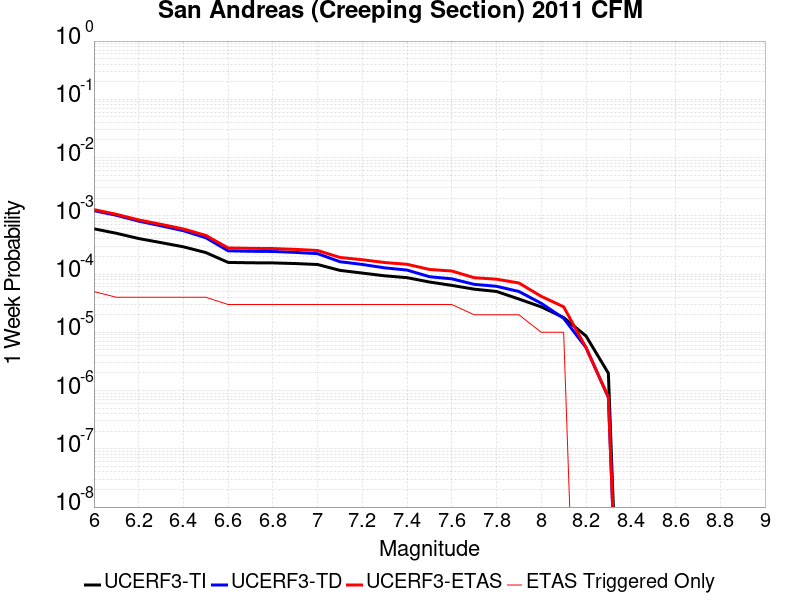 |  |  |  |

| Magnitude | 1 wk TI Prob | 1 wk TD Prob | 1 wk ETAS Prob | 1 wk ETAS/TD Gain | 1 wk ETAS Triggered Only | 1 mo TI Prob | 1 mo TD Prob | 1 mo ETAS Prob | 1 mo ETAS/TD Gain | 1 mo ETAS Triggered Only | 1 yr TI Prob | 1 yr TD Prob | 1 yr ETAS Prob | 1 yr ETAS/TD Gain | 1 yr ETAS Triggered Only | 10 yr TI Prob | 10 yr TD Prob | 10 yr ETAS Prob | 10 yr ETAS/TD Gain | 10 yr ETAS Triggered Only |
|-----|-----|-----|-----|-----|-----|-----|-----|-----|-----|-----|-----|-----|-----|-----|-----|-----|-----|-----|-----|-----|
| 6.0 | 5.986481E-4 | 0.0012275929 | 0.0012775315 | 1.0406802 | 5.0E-5 | 0.0025631124 | 0.005245547 | 0.0053549698 | 1.0208602 | 1.1E-4 | 0.030762846 | 0.06120491 | 0.061364505 | 1.0026076 | 1.7E-4 | 0.26835477 | 0.42593494 | 0.42607844 | 1.0003369 | 2.5E-4 |
| 6.1 | 5.015945E-4 | 0.0010217986 | 0.0010617577 | 1.0391066 | 4.0E-5 | 0.00214792 | 0.0043678596 | 0.0044674226 | 1.0227945 | 1.0E-4 | 0.025839351 | 0.05124837 | 0.05140017 | 1.002962 | 1.6E-4 | 0.23032776 | 0.37285668 | 0.37299466 | 1.00037 | 2.2E-4 |
| 6.2 | 4.073338E-4 | 8.1073755E-4 | 8.507051E-4 | 1.0492978 | 4.0E-5 | 0.0017445484 | 0.0034671477 | 0.0035668008 | 1.0287422 | 1.0E-4 | 0.021034058 | 0.04093317 | 0.041086618 | 1.0037488 | 1.6E-4 | 0.19150782 | 0.31303346 | 0.3131846 | 1.0004828 | 2.2E-4 |
| 6.3 | 3.464099E-4 | 6.7391695E-4 | 7.1389E-4 | 1.0593145 | 4.0E-5 | 0.0014837692 | 0.0028829593 | 0.0029826711 | 1.0345865 | 1.0E-4 | 0.017915873 | 0.034189582 | 0.03434411 | 1.0045198 | 1.6E-4 | 0.16538359 | 0.2713166 | 0.2714696 | 1.000564 | 2.1E-4 |
| 6.4 | 2.935057E-4 | 5.5442745E-4 | 5.944053E-4 | 1.0721065 | 4.0E-5 | 0.0012572751 | 0.0023725363 | 0.0024722992 | 1.0420489 | 1.0E-4 | 0.015200248 | 0.02826451 | 0.028419988 | 1.0055008 | 1.6E-4 | 0.14201577 | 0.23298529 | 0.23314635 | 1.0006913 | 2.1E-4 |
| 6.5 | 2.3409708E-4 | 4.2093755E-4 | 4.609207E-4 | 1.094986 | 4.0E-5 | 0.0010028875 | 0.0018019684 | 0.0019017883 | 1.0553949 | 1.0E-4 | 0.012141965 | 0.021587461 | 0.021744007 | 1.0072517 | 1.6E-4 | 0.11499573 | 0.18682368 | 0.18699445 | 1.0009141 | 2.1E-4 |
| 6.6 | 1.5842178E-4 | 2.506933E-4 | 2.8068578E-4 | 1.1196381 | 3.0E-5 | 6.7877385E-4 | 0.0010739497 | 0.0011438746 | 1.06511 | 7.0E-5 | 0.0082328 | 0.012995575 | 0.013123885 | 1.0098734 | 1.3E-4 | 0.07934396 | 0.12314638 | 0.12329544 | 1.0012105 | 1.7E-4 |
| 6.7 | 1.5616413E-4 | 2.4605883E-4 | 2.7605143E-4 | 1.1218921 | 3.0E-5 | 6.691031E-4 | 0.0010541069 | 0.001124033 | 1.066337 | 7.0E-5 | 0.0081159435 | 0.01275744 | 0.012885782 | 1.0100602 | 1.3E-4 | 0.0782586 | 0.12117351 | 0.121322915 | 1.001233 | 1.7E-4 |
| 6.8 | 1.5538467E-4 | 2.4429744E-4 | 2.7429013E-4 | 1.1227711 | 3.0E-5 | 6.6576427E-4 | 0.0010465645 | 0.0011164913 | 1.0668155 | 7.0E-5 | 0.008075596 | 0.012666838 | 0.012795192 | 1.010133 | 1.3E-4 | 0.07788358 | 0.120404355 | 0.12055389 | 1.0012419 | 1.7E-4 |
| 6.9 | 1.5153569E-4 | 2.3539034E-4 | 2.6538328E-4 | 1.1274179 | 3.0E-5 | 6.49277E-4 | 0.0010084276 | 0.0010683672 | 1.0594386 | 6.0E-5 | 0.007876333 | 0.01220901 | 0.012317668 | 1.0088997 | 1.1E-4 | 0.07602952 | 0.11647445 | 0.11661581 | 1.0012137 | 1.6E-4 |
| 7.0 | 1.4588932E-4 | 2.2396253E-4 | 2.539558E-4 | 1.133921 | 3.0E-5 | 6.250901E-4 | 9.5948833E-4 | 0.0010194308 | 1.0624733 | 6.0E-5 | 0.0075839474 | 0.011619697 | 0.011728419 | 1.0093567 | 1.1E-4 | 0.073302895 | 0.11132046 | 0.111462645 | 1.0012773 | 1.6E-4 |
| 7.1 | 1.1565079E-4 | 1.6281738E-4 | 1.928125E-4 | 1.1842256 | 3.0E-5 | 4.955521E-4 | 6.9760304E-4 | 7.575612E-4 | 1.0859488 | 6.0E-5 | 0.006016669 | 0.0084604435 | 0.0085695125 | 1.0128917 | 1.1E-4 | 0.058563538 | 0.08367046 | 0.08381707 | 1.0017523 | 1.6E-4 |
| 7.2 | 1.0393792E-4 | 1.4615769E-4 | 1.761533E-4 | 1.2052277 | 3.0E-5 | 4.4537216E-4 | 6.2624045E-4 | 6.862029E-4 | 1.0957499 | 6.0E-5 | 0.005408933 | 0.0075979927 | 0.0077071567 | 1.0143675 | 1.1E-4 | 0.052791595 | 0.07561969 | 0.07574911 | 1.0017114 | 1.4E-4 |
| 7.3 | 9.332884E-5 | 1.2780898E-4 | 1.5780515E-4 | 1.2346953 | 3.0E-5 | 3.999194E-4 | 5.4763845E-4 | 6.0760556E-4 | 1.1095014 | 6.0E-5 | 0.0048581534 | 0.006647249 | 0.006756518 | 1.0164382 | 1.1E-4 | 0.047533102 | 0.06648326 | 0.06661395 | 1.0019658 | 1.4E-4 |
| 7.4 | 8.670252E-5 | 1.17032345E-4 | 1.4702883E-4 | 1.2563094 | 3.0E-5 | 3.715293E-4 | 5.0147134E-4 | 5.614413E-4 | 1.1195879 | 6.0E-5 | 0.004513991 | 0.006088443 | 0.0061977734 | 1.017957 | 1.1E-4 | 0.044233937 | 0.061151642 | 0.06128308 | 1.0021493 | 1.4E-4 |
| 7.5 | 7.3036405E-5 | 9.005856E-5 | 1.2005586E-4 | 1.3330866 | 3.0E-5 | 3.129756E-4 | 3.8590826E-4 | 4.3588897E-4 | 1.1295145 | 5.0E-5 | 0.0038038217 | 0.0046883323 | 0.0047779107 | 1.0191066 | 9.0E-5 | 0.03739367 | 0.047877792 | 0.047992047 | 1.0023863 | 1.2E-4 |
| 7.6 | 6.3935775E-5 | 8.280385E-5 | 1.1280136E-4 | 1.362272 | 3.0E-5 | 2.7398168E-4 | 3.5482543E-4 | 4.0480768E-4 | 1.1408644 | 5.0E-5 | 0.0033306254 | 0.004311461 | 0.0044010733 | 1.0207846 | 9.0E-5 | 0.032811474 | 0.04399201 | 0.04410673 | 1.0026078 | 1.2E-4 |
| 7.7 | 5.5050095E-5 | 6.6618326E-5 | 8.6616994E-5 | 1.3001977 | 2.0E-5 | 2.3590765E-4 | 2.854759E-4 | 3.054702E-4 | 1.0700384 | 2.0E-5 | 0.0028683927 | 0.003470134 | 0.0035299256 | 1.0172304 | 6.0E-5 | 0.0283165 | 0.035796214 | 0.03588299 | 1.0024242 | 9.0E-5 |
| 7.8 | 5.027131E-5 | 6.162871E-5 | 8.162747E-5 | 1.3245041 | 2.0E-5 | 2.1543067E-4 | 2.640963E-4 | 2.8409102E-4 | 1.0757099 | 2.0E-5 | 0.0026197135 | 0.003210635 | 0.0032604744 | 1.0155232 | 5.0E-5 | 0.025890453 | 0.03312666 | 0.033204008 | 1.002335 | 8.0E-5 |
| 7.9 | 3.7271806E-5 | 5.022507E-5 | 7.0224065E-5 | 1.3981875 | 2.0E-5 | 1.5972654E-4 | 2.1523255E-4 | 2.3522823E-4 | 1.0929028 | 2.0E-5 | 0.0019429359 | 0.002617309 | 0.0026671784 | 1.0190536 | 5.0E-5 | 0.019260362 | 0.027067466 | 0.02713557 | 1.0025162 | 7.0E-5 |
| 8.0 | 2.7310243E-5 | 3.1427757E-5 | 4.1427444E-5 | 1.3181801 | 1.0E-5 | 1.17038646E-4 | 1.3468343E-4 | 1.446821E-4 | 1.0742382 | 1.0E-5 | 0.0014240141 | 0.0016385383 | 0.0016585055 | 1.012186 | 2.0E-5 | 0.014149235 | 0.01721386 | 0.017243344 | 1.0017128 | 3.0E-5 |
| 8.1 | 1.7940547E-5 | 1.7399378E-5 | 2.7399203E-5 | 1.5747232 | 1.0E-5 | 7.688579E-5 | 7.456663E-5 | 8.456589E-5 | 1.1340983 | 1.0E-5 | 9.3568244E-4 | 9.074711E-4 | 9.1746205E-4 | 1.0110097 | 1.0E-5 | 0.009317525 | 0.009798636 | 0.009818439 | 1.0020211 | 2.0E-5 |
| 8.2 | 8.643924E-6 | 5.473668E-6 | 5.473668E-6 | 1.0 | 0.0 | 3.704486E-5 | 2.3458366E-5 | 2.3458366E-5 | 1.0 | 0.0 | 4.5092785E-4 | 2.8556827E-4 | 2.8556827E-4 | 1.0 | 0.0 | 0.0045001395 | 0.0032481793 | 0.0032481793 | 1.0 | 0.0 |
| 8.3 | 1.983087E-6 | 7.6564595E-7 | 7.6564595E-7 | 1.0 | 0.0 | 8.498917E-6 | 3.281336E-6 | 3.281336E-6 | 1.0 | 0.0 | 1.034694E-4 | 3.9949547E-5 | 3.9949547E-5 | 1.0 | 0.0 | 0.0010342124 | 4.717979E-4 | 4.717979E-4 | 1.0 | 0.0 |

## San Jacinto (San Jacinto Valley) rev
*[(top)](#table-of-contents)*

| 1 Week | 1 Month | 1 Year | 10 Year |
|-----|-----|-----|-----|
|  |  | 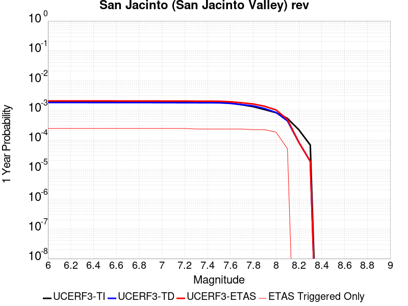 |  |

| Magnitude | 1 wk TI Prob | 1 wk TD Prob | 1 wk ETAS Prob | 1 wk ETAS/TD Gain | 1 wk ETAS Triggered Only | 1 mo TI Prob | 1 mo TD Prob | 1 mo ETAS Prob | 1 mo ETAS/TD Gain | 1 mo ETAS Triggered Only | 1 yr TI Prob | 1 yr TD Prob | 1 yr ETAS Prob | 1 yr ETAS/TD Gain | 1 yr ETAS Triggered Only | 10 yr TI Prob | 10 yr TD Prob | 10 yr ETAS Prob | 10 yr ETAS/TD Gain | 10 yr ETAS Triggered Only |
|-----|-----|-----|-----|-----|-----|-----|-----|-----|-----|-----|-----|-----|-----|-----|-----|-----|-----|-----|-----|-----|
| 6.0 | 3.652694E-5 | 3.4401106E-5 | 1.8439595E-4 | 5.360175 | 1.5E-4 | 1.5653463E-4 | 1.4742499E-4 | 3.2739845E-4 | 2.22078 | 1.8E-4 | 0.0019041431 | 0.0017934233 | 0.002032993 | 1.1335822 | 2.4E-4 | 0.018879099 | 0.018526303 | 0.018820744 | 1.0158932 | 3.0E-4 |
| 6.1 | 3.652694E-5 | 3.4401106E-5 | 1.8439595E-4 | 5.360175 | 1.5E-4 | 1.5653463E-4 | 1.4742499E-4 | 3.2739845E-4 | 2.22078 | 1.8E-4 | 0.0019041431 | 0.0017934233 | 0.002032993 | 1.1335822 | 2.4E-4 | 0.018879099 | 0.018526303 | 0.018820744 | 1.0158932 | 3.0E-4 |
| 6.2 | 3.652694E-5 | 3.4401106E-5 | 1.8439595E-4 | 5.360175 | 1.5E-4 | 1.5653463E-4 | 1.4742499E-4 | 3.2739845E-4 | 2.22078 | 1.8E-4 | 0.0019041431 | 0.0017934233 | 0.002032993 | 1.1335822 | 2.4E-4 | 0.018879099 | 0.018526303 | 0.018820744 | 1.0158932 | 3.0E-4 |
| 6.3 | 3.652694E-5 | 3.4401106E-5 | 1.8439595E-4 | 5.360175 | 1.5E-4 | 1.5653463E-4 | 1.4742499E-4 | 3.2739845E-4 | 2.22078 | 1.8E-4 | 0.0019041431 | 0.0017934233 | 0.002032993 | 1.1335822 | 2.4E-4 | 0.018879099 | 0.018526303 | 0.018820744 | 1.0158932 | 3.0E-4 |
| 6.4 | 3.646941E-5 | 3.432268E-5 | 1.8431753E-4 | 5.370138 | 1.5E-4 | 1.5628811E-4 | 1.4708891E-4 | 3.2706244E-4 | 2.2235696 | 1.8E-4 | 0.0019011468 | 0.0017893389 | 0.0020289093 | 1.1338878 | 2.4E-4 | 0.018849645 | 0.018486181 | 0.018780636 | 1.0159284 | 3.0E-4 |
| 6.5 | 3.646941E-5 | 3.432268E-5 | 1.8431753E-4 | 5.370138 | 1.5E-4 | 1.5628811E-4 | 1.4708891E-4 | 3.2706244E-4 | 2.2235696 | 1.8E-4 | 0.0019011468 | 0.0017893389 | 0.0020289093 | 1.1338878 | 2.4E-4 | 0.018849645 | 0.018486181 | 0.018780636 | 1.0159284 | 3.0E-4 |
| 6.6 | 3.6442503E-5 | 3.4286066E-5 | 1.8428093E-4 | 5.374805 | 1.5E-4 | 1.561728E-4 | 1.4693203E-4 | 3.2690557E-4 | 2.2248764 | 1.8E-4 | 0.0018997455 | 0.001787432 | 0.0020270029 | 1.1340308 | 2.4E-4 | 0.018835869 | 0.01846745 | 0.01876191 | 1.0159448 | 3.0E-4 |
| 6.7 | 3.6432113E-5 | 3.427164E-5 | 1.8426651E-4 | 5.3766465 | 1.5E-4 | 1.5612828E-4 | 1.4687021E-4 | 3.268438E-4 | 2.2253919 | 1.8E-4 | 0.0018992044 | 0.0017866807 | 0.002026252 | 1.1340873 | 2.4E-4 | 0.018830549 | 0.018460074 | 0.018754536 | 1.0159513 | 3.0E-4 |
| 6.8 | 3.6409598E-5 | 3.4240697E-5 | 1.8423556E-4 | 5.380602 | 1.5E-4 | 1.560318E-4 | 1.4673761E-4 | 3.267112E-4 | 2.2264993 | 1.8E-4 | 0.0018980318 | 0.0017850689 | 0.0020246406 | 1.1342086 | 2.4E-4 | 0.018819023 | 0.018444229 | 0.018738696 | 1.0159652 | 3.0E-4 |
| 6.9 | 3.638078E-5 | 3.4201123E-5 | 1.8419599E-4 | 5.385671 | 1.5E-4 | 1.5590832E-4 | 1.4656801E-4 | 3.2654163E-4 | 2.2279189 | 1.8E-4 | 0.0018965311 | 0.0017830075 | 0.0020225795 | 1.134364 | 2.4E-4 | 0.018804269 | 0.018423963 | 0.018718436 | 1.0159831 | 3.0E-4 |
| 7.0 | 3.6294874E-5 | 3.408314E-5 | 1.8407803E-4 | 5.400853 | 1.5E-4 | 1.5554018E-4 | 1.4606243E-4 | 3.2603616E-4 | 2.2321696 | 1.8E-4 | 0.0018920569 | 0.0017768623 | 0.0020164358 | 1.1348295 | 2.4E-4 | 0.018760284 | 0.018363545 | 0.018658036 | 1.0160367 | 3.0E-4 |
| 7.1 | 3.6260717E-5 | 3.403942E-5 | 1.8403432E-4 | 5.406505 | 1.5E-4 | 1.5539382E-4 | 1.4587509E-4 | 3.2584884E-4 | 2.2337523 | 1.8E-4 | 0.001890278 | 0.0017745851 | 0.0020141592 | 1.1350029 | 2.4E-4 | 0.018742796 | 0.018341139 | 0.018635636 | 1.0160567 | 3.0E-4 |
| 7.2 | 3.6210204E-5 | 3.397364E-5 | 1.8396854E-4 | 5.4150376 | 1.5E-4 | 1.5517735E-4 | 1.455932E-4 | 3.25567E-4 | 2.2361414 | 1.8E-4 | 0.001887647 | 0.0017711588 | 0.0020107336 | 1.1352645 | 2.4E-4 | 0.01871693 | 0.018307408 | 0.018601917 | 1.0160868 | 3.0E-4 |
| 7.3 | 3.6119454E-5 | 3.386193E-5 | 1.8385684E-4 | 5.4296036 | 1.5E-4 | 1.5478847E-4 | 1.4511449E-4 | 3.2508836E-4 | 2.2402198 | 1.8E-4 | 0.0018829206 | 0.0017653398 | 0.0019949337 | 1.1300565 | 2.3E-4 | 0.018670462 | 0.01824996 | 0.018534668 | 1.0156004 | 2.9E-4 |
| 7.4 | 3.607848E-5 | 3.380943E-5 | 1.8380435E-4 | 5.4364824 | 1.5E-4 | 1.5461289E-4 | 1.4488952E-4 | 3.2486345E-4 | 2.242146 | 1.8E-4 | 0.0018807866 | 0.0017626052 | 0.0019921998 | 1.1302587 | 2.3E-4 | 0.018649481 | 0.018222956 | 0.01850767 | 1.015624 | 2.9E-4 |
| 7.5 | 3.5856774E-5 | 3.3619202E-5 | 1.8361416E-4 | 5.4615855 | 1.5E-4 | 1.5366284E-4 | 1.4407437E-4 | 3.2404842E-4 | 2.2491748 | 1.8E-4 | 0.0018692396 | 0.0017526967 | 0.0019822936 | 1.1309963 | 2.3E-4 | 0.018535944 | 0.018124057 | 0.018408801 | 1.0157108 | 2.9E-4 |
| 7.6 | 3.286655E-5 | 3.2142278E-5 | 1.8213746E-4 | 5.6666007 | 1.5E-4 | 1.4084904E-4 | 1.3774536E-4 | 3.1772055E-4 | 2.306579 | 1.8E-4 | 0.001713488 | 0.0016757617 | 0.0019053762 | 1.1370211 | 2.3E-4 | 0.017003361 | 0.017343804 | 0.017628774 | 1.0164306 | 2.9E-4 |
| 7.7 | 2.8882527E-5 | 2.9235205E-5 | 1.7923082E-4 | 6.1306505 | 1.5E-4 | 1.237764E-4 | 1.2528773E-4 | 3.0526516E-4 | 2.436513 | 1.8E-4 | 0.0015059357 | 0.0015243118 | 0.0017539612 | 1.1506578 | 2.3E-4 | 0.014957713 | 0.015830338 | 0.016115747 | 1.0180292 | 2.9E-4 |
| 7.8 | 2.4950225E-5 | 2.6526219E-5 | 1.7652224E-4 | 6.6546326 | 1.5E-4 | 1.0692515E-4 | 1.1367885E-4 | 2.9365838E-4 | 2.583228 | 1.8E-4 | 0.0013010362 | 0.0013831621 | 0.0016028578 | 1.1588358 | 2.2E-4 | 0.012934455 | 0.01441176 | 0.014687724 | 1.0191486 | 2.8E-4 |
| 7.9 | 1.9881603E-5 | 2.150649E-5 | 1.7150327E-4 | 7.9744887 | 1.5E-4 | 8.520408E-5 | 9.216742E-5 | 2.7215082E-4 | 2.9527876 | 1.8E-4 | 0.001036866 | 0.0011215615 | 0.0013413148 | 1.1959351 | 2.2E-4 | 0.010320415 | 0.011776998 | 0.0120537 | 1.0234952 | 2.8E-4 |
| 8.0 | 1.563292E-5 | 1.5936288E-5 | 1.2593453E-4 | 7.9023757 | 1.1E-4 | 6.6996516E-5 | 6.829659E-5 | 2.0828703E-4 | 3.0497427 | 1.4E-4 | 8.153773E-4 | 8.3119445E-4 | 0.0010110448 | 1.2163758 | 1.8E-4 | 0.00812392 | 0.008810331 | 0.009028393 | 1.0247507 | 2.2E-4 |
| 8.1 | 1.0045313E-5 | 8.300794E-6 | 3.8300546E-5 | 4.614082 | 3.0E-5 | 4.305063E-5 | 3.557435E-5 | 8.5572574E-5 | 2.405457 | 5.0E-5 | 5.2401534E-4 | 4.3303217E-4 | 4.8301052E-4 | 1.1154149 | 5.0E-5 | 0.0052278144 | 0.0046587666 | 0.004718487 | 1.0128189 | 6.0E-5 |
| 8.2 | 4.1554413E-6 | 1.5648296E-6 | 1.5648296E-6 | 1.0 | 0.0 | 1.7808914E-5 | 6.7063957E-6 | 6.7063957E-6 | 1.0 | 0.0 | 2.1680194E-4 | 8.164734E-5 | 8.164734E-5 | 1.0 | 0.0 | 0.0021659054 | 9.479703E-4 | 9.479703E-4 | 1.0 | 0.0 |
| 8.3 | 1.2758221E-6 | 3.612677E-7 | 3.612677E-7 | 1.0 | 0.0 | 5.4677976E-6 | 1.5482892E-6 | 1.5482892E-6 | 1.0 | 0.0 | 6.65684E-5 | 1.8850264E-5 | 1.8850264E-5 | 1.0 | 0.0 | 6.6548464E-4 | 2.2739546E-4 | 2.2739546E-4 | 1.0 | 0.0 |

## Santa Ynez (West)
*[(top)](#table-of-contents)*

| 1 Week | 1 Month | 1 Year | 10 Year |
|-----|-----|-----|-----|
|  | 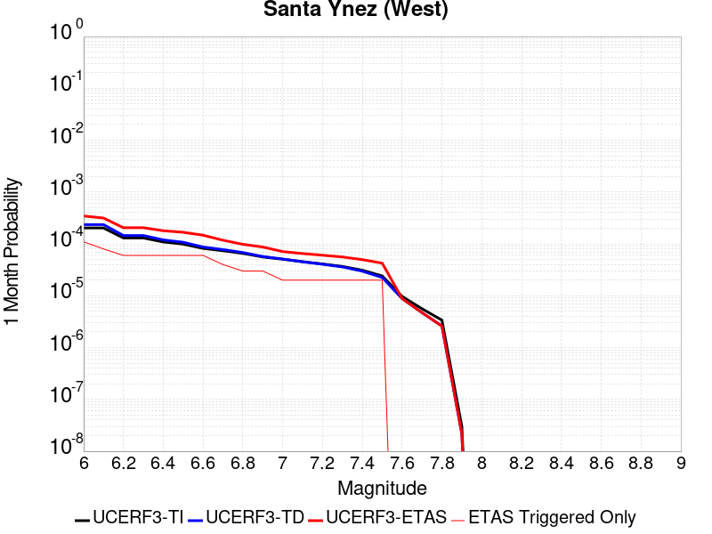 | 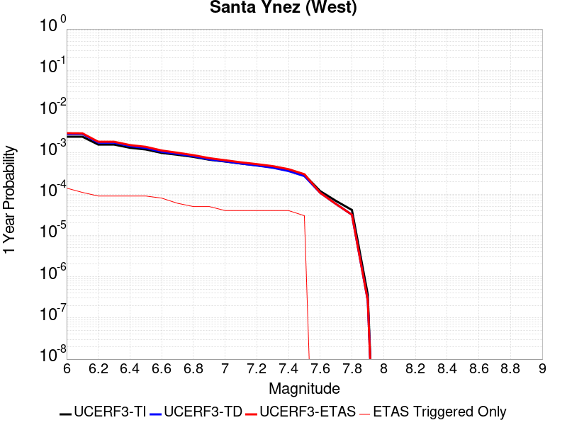 | 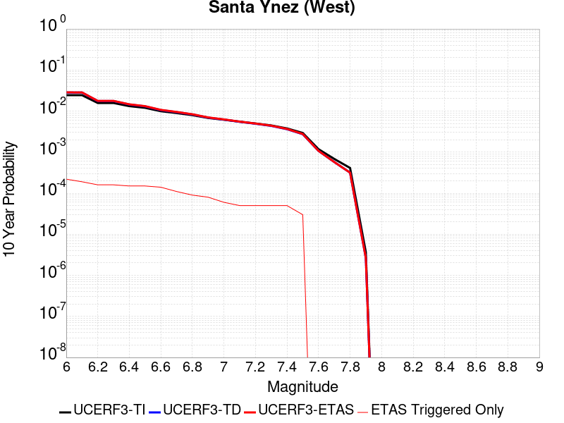 |

| Magnitude | 1 wk TI Prob | 1 wk TD Prob | 1 wk ETAS Prob | 1 wk ETAS/TD Gain | 1 wk ETAS Triggered Only | 1 mo TI Prob | 1 mo TD Prob | 1 mo ETAS Prob | 1 mo ETAS/TD Gain | 1 mo ETAS Triggered Only | 1 yr TI Prob | 1 yr TD Prob | 1 yr ETAS Prob | 1 yr ETAS/TD Gain | 1 yr ETAS Triggered Only | 10 yr TI Prob | 10 yr TD Prob | 10 yr ETAS Prob | 10 yr ETAS/TD Gain | 10 yr ETAS Triggered Only |
|-----|-----|-----|-----|-----|-----|-----|-----|-----|-----|-----|-----|-----|-----|-----|-----|-----|-----|-----|-----|-----|
| 6.0 | 4.7352758E-5 | 5.497084E-5 | 1.14967545E-4 | 2.0914278 | 6.0E-5 | 2.0292461E-4 | 2.3556968E-4 | 3.4554375E-4 | 1.4668431 | 1.1E-4 | 0.0024678076 | 0.002864558 | 0.003004157 | 1.0487331 | 1.4E-4 | 0.024405818 | 0.028304456 | 0.028518228 | 1.0075526 | 2.2E-4 |
| 6.1 | 4.7352758E-5 | 5.497084E-5 | 9.4968644E-5 | 1.7276186 | 4.0E-5 | 2.0292461E-4 | 2.3556968E-4 | 3.1555083E-4 | 1.3395222 | 8.0E-5 | 0.0024678076 | 0.002864558 | 0.002974243 | 1.0382904 | 1.1E-4 | 0.024405818 | 0.028304456 | 0.028489077 | 1.0065228 | 1.9E-4 |
| 6.2 | 3.0415853E-5 | 3.3925004E-5 | 7.392364E-5 | 2.1790314 | 4.0E-5 | 1.3034715E-4 | 1.4538495E-4 | 2.0537623E-4 | 1.4126375 | 6.0E-5 | 0.0015858212 | 0.0017686592 | 0.0018585 | 1.050796 | 9.0E-5 | 0.015745522 | 0.01754978 | 0.017706972 | 1.0089569 | 1.6E-4 |
| 6.3 | 3.0415853E-5 | 3.3925004E-5 | 7.392364E-5 | 2.1790314 | 4.0E-5 | 1.3034715E-4 | 1.4538495E-4 | 2.0537623E-4 | 1.4126375 | 6.0E-5 | 0.0015858212 | 0.0017686592 | 0.0018585 | 1.050796 | 9.0E-5 | 0.015745522 | 0.01754978 | 0.017706972 | 1.0089569 | 1.6E-4 |
| 6.4 | 2.5452082E-5 | 2.7912318E-5 | 6.7911205E-5 | 2.433019 | 4.0E-5 | 1.09075794E-4 | 1.1961885E-4 | 1.7961167E-4 | 1.5015332 | 6.0E-5 | 0.0013271887 | 0.0014554056 | 0.0015452746 | 1.0617484 | 9.0E-5 | 0.013192902 | 0.01446091 | 0.014608741 | 1.0102228 | 1.5E-4 |
| 6.5 | 2.3143784E-5 | 2.5128133E-5 | 6.5127126E-5 | 2.5918014 | 4.0E-5 | 9.9183875E-5 | 1.07687636E-4 | 1.6768118E-4 | 1.557107 | 6.0E-5 | 0.0012068948 | 0.001310323 | 0.0014002051 | 1.0685954 | 9.0E-5 | 0.012003611 | 0.013027638 | 0.013175684 | 1.011364 | 1.5E-4 |
| 6.6 | 1.9118515E-5 | 2.0354244E-5 | 6.035343E-5 | 2.965152 | 4.0E-5 | 8.193392E-5 | 8.722961E-5 | 1.4722437E-4 | 1.6877799 | 6.0E-5 | 9.97089E-4 | 0.001061511 | 0.001141426 | 1.0752842 | 8.0E-5 | 0.00992627 | 0.010565317 | 0.0107038375 | 1.0131109 | 1.4E-4 |
| 6.7 | 1.722807E-5 | 1.8146253E-5 | 3.814589E-5 | 2.102136 | 2.0E-5 | 7.3832496E-5 | 7.776737E-5 | 1.17764255E-4 | 1.5143145 | 4.0E-5 | 8.985399E-4 | 9.4641204E-4 | 0.0010063553 | 1.0633373 | 6.0E-5 | 0.008949154 | 0.009424461 | 0.009533425 | 1.0115618 | 1.1E-4 |
| 6.8 | 1.5317364E-5 | 1.5926391E-5 | 3.5926074E-5 | 2.2557573 | 2.0E-5 | 6.56442E-5 | 6.82542E-5 | 9.825215E-5 | 1.4395034 | 3.0E-5 | 7.98925E-4 | 8.3068234E-4 | 8.806408E-4 | 1.0601414 | 5.0E-5 | 0.007960589 | 0.008276261 | 0.008365517 | 1.0107845 | 9.0E-5 |
| 6.9 | 1.3071226E-5 | 1.332953E-5 | 3.3329263E-5 | 2.500408 | 2.0E-5 | 5.6018336E-5 | 5.712532E-5 | 8.7123604E-5 | 1.5251312 | 3.0E-5 | 6.8180985E-4 | 6.952811E-4 | 7.452463E-4 | 1.0718634 | 5.0E-5 | 0.0067972173 | 0.0069313184 | 0.007010764 | 1.0114619 | 8.0E-5 |
| 7.0 | 1.1836986E-5 | 1.1932688E-5 | 2.1932568E-5 | 1.8380241 | 1.0E-5 | 5.0728955E-5 | 5.1139097E-5 | 7.113807E-5 | 1.3910702 | 2.0E-5 | 6.1745E-4 | 6.2244234E-4 | 6.6241744E-4 | 1.0642229 | 4.0E-5 | 0.006157372 | 0.0062071825 | 0.00626681 | 1.0096062 | 6.0E-5 |
| 7.1 | 1.0597169E-5 | 1.0542107E-5 | 2.0542002E-5 | 1.9485669 | 1.0E-5 | 4.541565E-5 | 4.5179684E-5 | 6.517878E-5 | 1.4426569 | 2.0E-5 | 5.5279525E-4 | 5.4992497E-4 | 5.899029E-4 | 1.0726972 | 4.0E-5 | 0.0055142213 | 0.005485772 | 0.005535498 | 1.0090644 | 5.0E-5 |
| 7.2 | 9.59113E-6 | 9.45905E-6 | 1.9458956E-5 | 2.0571787 | 1.0E-5 | 4.11042E-5 | 4.053816E-5 | 6.053735E-5 | 1.4933423 | 2.0E-5 | 5.0032866E-4 | 4.934414E-4 | 5.334217E-4 | 1.0810233 | 4.0E-5 | 0.004992037 | 0.0049235765 | 0.00497333 | 1.0101053 | 5.0E-5 |
| 7.3 | 8.586084E-6 | 8.379489E-6 | 1.8379405E-5 | 2.19338 | 1.0E-5 | 3.679698E-5 | 3.591161E-5 | 5.591089E-5 | 1.556903 | 2.0E-5 | 4.4791115E-4 | 4.3713715E-4 | 4.7711967E-4 | 1.0914645 | 4.0E-5 | 0.004470094 | 0.004362884 | 0.004412666 | 1.0114104 | 5.0E-5 |
| 7.4 | 7.2622997E-6 | 6.9514485E-6 | 1.6951379E-5 | 2.438539 | 1.0E-5 | 3.112377E-5 | 2.9791589E-5 | 4.9790993E-5 | 1.6713104 | 2.0E-5 | 3.78866E-4 | 3.6265317E-4 | 4.026387E-4 | 1.1102582 | 4.0E-5 | 0.0037822074 | 0.003620714 | 0.003670533 | 1.0137594 | 5.0E-5 |
| 7.5 | 5.627296E-6 | 5.2514984E-6 | 1.5251446E-5 | 2.9042084 | 1.0E-5 | 2.411676E-5 | 2.2506232E-5 | 4.250578E-5 | 1.8886228 | 2.0E-5 | 2.9358198E-4 | 2.7397962E-4 | 3.039714E-4 | 1.1094671 | 3.0E-5 | 0.0029319443 | 0.0027364905 | 0.0027664085 | 1.0109329 | 3.0E-5 |
| 7.6 | 2.265244E-6 | 2.0608632E-6 | 2.0608632E-6 | 1.0 | 0.0 | 9.708152E-6 | 8.832241E-6 | 8.832241E-6 | 1.0 | 0.0 | 1.18190335E-4 | 1.0752732E-4 | 1.0752732E-4 | 1.0 | 0.0 | 0.001181275 | 0.0010747615 | 0.0010747615 | 1.0 | 0.0 |
| 7.7 | 1.3099874E-6 | 1.1016228E-6 | 1.1016228E-6 | 1.0 | 0.0 | 5.61422E-6 | 4.7212325E-6 | 4.7212325E-6 | 1.0 | 0.0 | 6.8350986E-5 | 5.7479516E-5 | 5.7479516E-5 | 1.0 | 0.0 | 6.832996E-4 | 5.7464885E-4 | 5.7464885E-4 | 1.0 | 0.0 |
| 7.8 | 7.903951E-7 | 6.0710704E-7 | 6.0710704E-7 | 1.0 | 0.0 | 3.3874032E-6 | 2.601885E-6 | 2.601885E-6 | 1.0 | 0.0 | 4.1240855E-5 | 3.16775E-5 | 3.16775E-5 | 1.0 | 0.0 | 4.12332E-4 | 3.167312E-4 | 3.167312E-4 | 1.0 | 0.0 |
| 7.9 | 7.0753297E-9 | 5.090092E-9 | 5.090092E-9 | 1.0 | 0.0 | 3.032284E-8 | 2.181468E-8 | 2.181468E-8 | 1.0 | 0.0 | 3.6918053E-7 | 2.655937E-7 | 2.655937E-7 | 1.0 | 0.0 | 3.691799E-6 | 2.6559348E-6 | 2.6559348E-6 | 1.0 | 0.0 |

## Mission Ridge-Arroyo Parida-Santa Ana
*[(top)](#table-of-contents)*

| 1 Week | 1 Month | 1 Year | 10 Year |
|-----|-----|-----|-----|
| 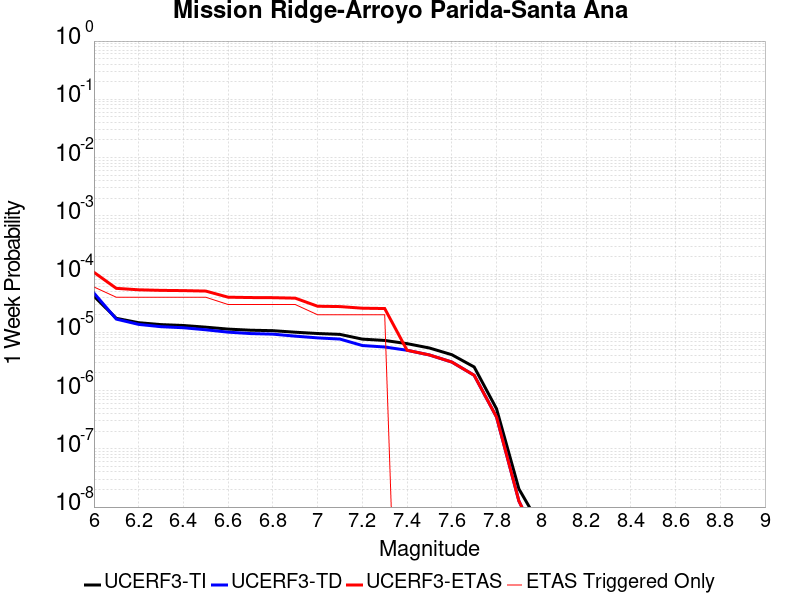 |  |  | 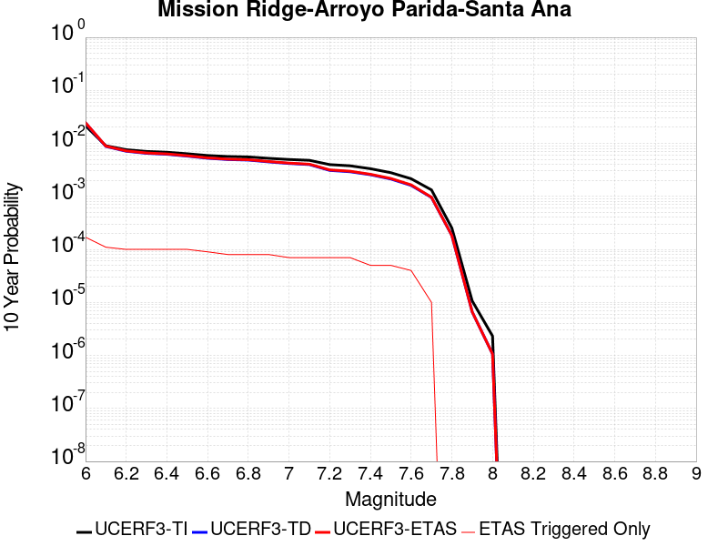 |

| Magnitude | 1 wk TI Prob | 1 wk TD Prob | 1 wk ETAS Prob | 1 wk ETAS/TD Gain | 1 wk ETAS Triggered Only | 1 mo TI Prob | 1 mo TD Prob | 1 mo ETAS Prob | 1 mo ETAS/TD Gain | 1 mo ETAS Triggered Only | 1 yr TI Prob | 1 yr TD Prob | 1 yr ETAS Prob | 1 yr ETAS/TD Gain | 1 yr ETAS Triggered Only | 10 yr TI Prob | 10 yr TD Prob | 10 yr ETAS Prob | 10 yr ETAS/TD Gain | 10 yr ETAS Triggered Only |
|-----|-----|-----|-----|-----|-----|-----|-----|-----|-----|-----|-----|-----|-----|-----|-----|-----|-----|-----|-----|-----|
| 6.0 | 4.169034E-5 | 4.7137048E-5 | 1.0713422E-4 | 2.272824 | 6.0E-5 | 1.7866064E-4 | 2.0200513E-4 | 2.8198896E-4 | 1.3959496 | 8.0E-5 | 0.0021730233 | 0.0024574657 | 0.00255722 | 1.0405923 | 1.0E-4 | 0.021518968 | 0.02438483 | 0.024550684 | 1.0068016 | 1.7E-4 |
| 6.1 | 1.73813E-5 | 1.6854203E-5 | 5.685353E-5 | 3.3732553 | 4.0E-5 | 7.4489166E-5 | 7.223036E-5 | 1.2222675E-4 | 1.6921797 | 5.0E-5 | 9.065282E-4 | 8.790605E-4 | 9.3900773E-4 | 1.0681947 | 6.0E-5 | 0.009028391 | 0.008757128 | 0.008866166 | 1.0124512 | 1.1E-4 |
| 6.2 | 1.4622182E-5 | 1.3673262E-5 | 5.3672717E-5 | 3.9253774 | 4.0E-5 | 6.2664985E-5 | 5.85984E-5 | 1.0859547E-4 | 1.8532156 | 5.0E-5 | 7.6267915E-4 | 7.132059E-4 | 7.731631E-4 | 1.0840672 | 6.0E-5 | 0.007600669 | 0.007109767 | 0.007209056 | 1.0139651 | 1.0E-4 |
| 6.3 | 1.3552434E-5 | 1.2482174E-5 | 5.2481675E-5 | 4.2045302 | 4.0E-5 | 5.8080568E-5 | 5.349395E-5 | 1.0349128E-4 | 1.9346352 | 5.0E-5 | 7.069015E-4 | 6.510974E-4 | 7.110583E-4 | 1.0920922 | 6.0E-5 | 0.00704657 | 0.006492415 | 0.0065917657 | 1.0153025 | 1.0E-4 |
| 6.4 | 1.30977305E-5 | 1.1979128E-5 | 5.1978648E-5 | 4.339101 | 4.0E-5 | 5.613192E-5 | 5.133813E-5 | 1.01335565E-4 | 1.9738849 | 5.0E-5 | 6.831918E-4 | 6.2486547E-4 | 6.84828E-4 | 1.0959606 | 6.0E-5 | 0.006810953 | 0.006231584 | 0.006330961 | 1.0159473 | 1.0E-4 |
| 6.5 | 1.225205E-5 | 1.1048776E-5 | 5.1048333E-5 | 4.6202707 | 4.0E-5 | 5.2507727E-5 | 4.735105E-5 | 9.734868E-5 | 2.0558927 | 5.0E-5 | 6.3909404E-4 | 5.7634927E-4 | 6.363147E-4 | 1.1040435 | 6.0E-5 | 0.006372592 | 0.005749009 | 0.0058484343 | 1.0172943 | 1.0E-4 |
| 6.6 | 1.1352241E-5 | 1.0063508E-5 | 4.0063205E-5 | 3.9810379 | 3.0E-5 | 4.8651553E-5 | 4.3128617E-5 | 8.312689E-5 | 1.9274185 | 4.0E-5 | 5.921717E-4 | 5.249665E-4 | 5.749403E-4 | 1.0951942 | 5.0E-5 | 0.0059059616 | 0.0052376646 | 0.005327193 | 1.0170932 | 9.0E-5 |
| 6.7 | 1.0864116E-5 | 9.517E-6 | 3.9516715E-5 | 4.1522236 | 3.0E-5 | 4.6559664E-5 | 4.0786515E-5 | 8.0784885E-5 | 1.9806763 | 4.0E-5 | 5.667165E-4 | 4.964647E-4 | 5.464399E-4 | 1.1006621 | 5.0E-5 | 0.005652734 | 0.0049539437 | 0.0050335475 | 1.0160687 | 8.0E-5 |
| 6.8 | 1.0666365E-5 | 9.299752E-6 | 3.9299473E-5 | 4.2258625 | 3.0E-5 | 4.571219E-5 | 3.985548E-5 | 7.985389E-5 | 2.003586 | 4.0E-5 | 5.564038E-4 | 4.8513446E-4 | 5.351102E-4 | 1.1030142 | 5.0E-5 | 0.005550127 | 0.00484114 | 0.0049207527 | 1.016445 | 8.0E-5 |
| 6.9 | 1.0038665E-5 | 8.592018E-6 | 3.859176E-5 | 4.4915824 | 3.0E-5 | 4.302214E-5 | 3.682243E-5 | 7.682096E-5 | 2.0862546 | 4.0E-5 | 5.236687E-4 | 4.4822265E-4 | 4.9820024E-4 | 1.1115017 | 5.0E-5 | 0.005224364 | 0.0044735507 | 0.004553193 | 1.0178028 | 8.0E-5 |
| 7.0 | 9.5379955E-6 | 8.025047E-6 | 2.8024886E-5 | 3.4921775 | 2.0E-5 | 4.0876483E-5 | 3.439261E-5 | 6.439158E-5 | 1.8722503 | 3.0E-5 | 4.975576E-4 | 4.1865133E-4 | 4.5863457E-4 | 1.0955049 | 4.0E-5 | 0.00496445 | 0.00417898 | 0.0042486875 | 1.0166805 | 7.0E-5 |
| 7.1 | 9.207389E-6 | 7.652347E-6 | 2.7652195E-5 | 3.6135569 | 2.0E-5 | 3.945964E-5 | 3.2795375E-5 | 6.279439E-5 | 1.9147332 | 3.0E-5 | 4.803152E-4 | 3.992122E-4 | 4.3919624E-4 | 1.1001574 | 4.0E-5 | 0.004792784 | 0.003985301 | 0.0040550223 | 1.0174946 | 7.0E-5 |
| 7.2 | 7.638091E-6 | 5.9310923E-6 | 2.5930975E-5 | 4.3720403 | 2.0E-5 | 3.2734264E-5 | 2.5418722E-5 | 5.541796E-5 | 2.1802025 | 3.0E-5 | 3.984668E-4 | 3.094293E-4 | 3.4941692E-4 | 1.1292303 | 4.0E-5 | 0.0039775306 | 0.0030901956 | 0.0031599794 | 1.0225823 | 7.0E-5 |
| 7.3 | 7.2500147E-6 | 5.596131E-6 | 2.5596019E-5 | 4.573878 | 2.0E-5 | 3.1071122E-5 | 2.3983199E-5 | 5.398248E-5 | 2.2508457 | 3.0E-5 | 3.7822526E-4 | 2.9195662E-4 | 3.3194493E-4 | 1.1369667 | 4.0E-5 | 0.0037758215 | 0.0029159402 | 0.0029857361 | 1.023936 | 7.0E-5 |
| 7.4 | 6.3899715E-6 | 4.9184864E-6 | 4.9184864E-6 | 1.0 | 0.0 | 2.7385306E-5 | 2.1079059E-5 | 3.107885E-5 | 1.4743944 | 1.0E-5 | 3.3336508E-4 | 2.566075E-4 | 2.7660237E-4 | 1.0779201 | 2.0E-5 | 0.0033286542 | 0.002563311 | 0.0026131826 | 1.019456 | 5.0E-5 |
| 7.5 | 5.379025E-6 | 4.0838477E-6 | 4.0838477E-6 | 1.0 | 0.0 | 2.305276E-5 | 1.7502087E-5 | 2.7501912E-5 | 1.5713505 | 1.0E-5 | 2.806312E-4 | 2.1306718E-4 | 2.330629E-4 | 1.0938472 | 2.0E-5 | 0.0028027708 | 0.0021286402 | 0.0021785337 | 1.0234392 | 5.0E-5 |
| 7.6 | 4.1270696E-6 | 3.0883373E-6 | 3.0883373E-6 | 1.0 | 0.0 | 1.768732E-5 | 1.32356645E-5 | 2.3235532E-5 | 1.7555244 | 1.0E-5 | 2.1532185E-4 | 1.6113237E-4 | 1.8112914E-4 | 1.1241015 | 2.0E-5 | 0.0021511333 | 0.0016101635 | 0.0016500991 | 1.0248022 | 4.0E-5 |
| 7.7 | 2.5406805E-6 | 1.8282044E-6 | 1.8282044E-6 | 1.0 | 0.0 | 1.0888585E-5 | 7.835139E-6 | 7.835139E-6 | 1.0 | 0.0 | 1.3256045E-4 | 9.53887E-5 | 9.53887E-5 | 1.0 | 0.0 | 0.0013248142 | 9.534837E-4 | 9.6347416E-4 | 1.0104779 | 1.0E-5 |
| 7.8 | 4.8608285E-7 | 3.509864E-7 | 3.509864E-7 | 1.0 | 0.0 | 2.0832106E-6 | 1.5042266E-6 | 1.5042266E-6 | 1.0 | 0.0 | 2.5362791E-5 | 1.8313805E-5 | 1.8313805E-5 | 1.0 | 0.0 | 2.5359896E-4 | 1.8312308E-4 | 1.8312308E-4 | 1.0 | 0.0 |
| 7.9 | 2.0472514E-8 | 1.2688718E-8 | 1.2688718E-8 | 1.0 | 0.0 | 8.7739345E-8 | 5.438022E-8 | 5.438022E-8 | 1.0 | 0.0 | 1.068226E-6 | 6.6207895E-7 | 6.6207895E-7 | 1.0 | 0.0 | 1.0682209E-5 | 6.620771E-6 | 6.620771E-6 | 1.0 | 0.0 |
| 8.0 | 4.443582E-9 | 2.032067E-9 | 2.032067E-9 | 1.0 | 0.0 | 1.9043922E-8 | 8.7088585E-9 | 8.7088585E-9 | 1.0 | 0.0 | 2.3185973E-7 | 1.0603035E-7 | 1.0603035E-7 | 1.0 | 0.0 | 2.3185949E-6 | 1.0603031E-6 | 1.0603031E-6 | 1.0 | 0.0 |

## Scodie Lineament
*[(top)](#table-of-contents)*

| 1 Week | 1 Month | 1 Year | 10 Year |
|-----|-----|-----|-----|
|  |  | 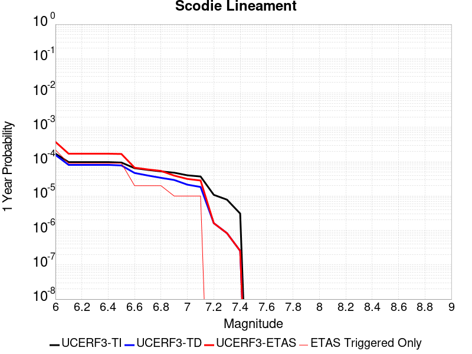 |  |

| Magnitude | 1 wk TI Prob | 1 wk TD Prob | 1 wk ETAS Prob | 1 wk ETAS/TD Gain | 1 wk ETAS Triggered Only | 1 mo TI Prob | 1 mo TD Prob | 1 mo ETAS Prob | 1 mo ETAS/TD Gain | 1 mo ETAS Triggered Only | 1 yr TI Prob | 1 yr TD Prob | 1 yr ETAS Prob | 1 yr ETAS/TD Gain | 1 yr ETAS Triggered Only | 10 yr TI Prob | 10 yr TD Prob | 10 yr ETAS Prob | 10 yr ETAS/TD Gain | 10 yr ETAS Triggered Only |
|-----|-----|-----|-----|-----|-----|-----|-----|-----|-----|-----|-----|-----|-----|-----|-----|-----|-----|-----|-----|-----|
| 6.0 | 3.2919327E-6 | 3.0133303E-6 | 1.430129E-4 | 47.460083 | 1.4E-4 | 1.4108206E-5 | 1.2914227E-5 | 1.6291229E-4 | 12.614946 | 1.5E-4 | 1.7175387E-4 | 1.5722254E-4 | 3.7718797E-4 | 2.3990703 | 2.2E-4 | 0.0017162118 | 0.0015714248 | 0.0018310162 | 1.165195 | 2.6E-4 |
| 6.1 | 1.8663811E-6 | 1.5490382E-6 | 5.154896E-5 | 33.278046 | 5.0E-5 | 7.998751E-6 | 6.6387206E-6 | 6.663832E-5 | 10.037826 | 6.0E-5 | 9.738045E-5 | 8.082393E-5 | 1.7081665E-4 | 2.1134417 | 9.0E-5 | 9.7337784E-4 | 8.079941E-4 | 9.1790524E-4 | 1.1360296 | 1.1E-4 |
| 6.2 | 1.8663811E-6 | 1.5490382E-6 | 5.154896E-5 | 33.278046 | 5.0E-5 | 7.998751E-6 | 6.6387206E-6 | 6.663832E-5 | 10.037826 | 6.0E-5 | 9.738045E-5 | 8.082393E-5 | 1.7081665E-4 | 2.1134417 | 9.0E-5 | 9.7337784E-4 | 8.079941E-4 | 9.1790524E-4 | 1.1360296 | 1.1E-4 |
| 6.3 | 1.8663811E-6 | 1.5490382E-6 | 5.154896E-5 | 33.278046 | 5.0E-5 | 7.998751E-6 | 6.6387206E-6 | 6.663832E-5 | 10.037826 | 6.0E-5 | 9.738045E-5 | 8.082393E-5 | 1.7081665E-4 | 2.1134417 | 9.0E-5 | 9.7337784E-4 | 8.079941E-4 | 9.1790524E-4 | 1.1360296 | 1.1E-4 |
| 6.4 | 1.8663811E-6 | 1.5490382E-6 | 5.154896E-5 | 33.278046 | 5.0E-5 | 7.998751E-6 | 6.6387206E-6 | 6.663832E-5 | 10.037826 | 6.0E-5 | 9.738045E-5 | 8.082393E-5 | 1.7081665E-4 | 2.1134417 | 9.0E-5 | 9.7337784E-4 | 8.079941E-4 | 9.1790524E-4 | 1.1360296 | 1.1E-4 |
| 6.5 | 1.8106311E-6 | 1.4909722E-6 | 5.1490897E-5 | 34.53512 | 5.0E-5 | 7.759824E-6 | 6.389868E-6 | 6.638948E-5 | 10.389806 | 6.0E-5 | 9.447177E-5 | 7.779436E-5 | 1.6778735E-4 | 2.1568062 | 9.0E-5 | 9.4431615E-4 | 7.7771995E-4 | 8.8763435E-4 | 1.141329 | 1.1E-4 |
| 6.6 | 1.2414679E-6 | 8.9974395E-7 | 1.0899735E-5 | 12.114263 | 1.0E-5 | 5.320566E-6 | 3.85604E-6 | 2.3855962E-5 | 6.186648 | 2.0E-5 | 6.477596E-5 | 4.6946367E-5 | 6.694543E-5 | 1.4259981 | 2.0E-5 | 6.475708E-4 | 4.6937316E-4 | 5.093544E-4 | 1.08518 | 4.0E-5 |
| 6.7 | 1.1062215E-6 | 7.594193E-7 | 1.0759411E-5 | 14.167946 | 1.0E-5 | 4.7409408E-6 | 3.2546504E-6 | 2.3254586E-5 | 7.145033 | 2.0E-5 | 5.7719422E-5 | 3.962472E-5 | 5.962393E-5 | 1.5047154 | 2.0E-5 | 5.770443E-4 | 3.9618355E-4 | 4.361677E-4 | 1.1009233 | 4.0E-5 |
| 6.8 | 1.0006736E-6 | 6.5002786E-7 | 1.0650021E-5 | 16.383945 | 1.0E-5 | 4.288594E-6 | 2.7858312E-6 | 2.2785776E-5 | 8.179166 | 2.0E-5 | 5.221238E-5 | 3.391703E-5 | 5.391635E-5 | 1.5896543 | 2.0E-5 | 5.220012E-4 | 3.3912458E-4 | 3.6911442E-4 | 1.088433 | 3.0E-5 |
| 6.9 | 9.167364E-7 | 5.6315065E-7 | 1.0563145E-5 | 18.757227 | 1.0E-5 | 3.9288643E-6 | 2.413501E-6 | 1.2413477E-5 | 5.1433487 | 1.0E-5 | 4.7832873E-5 | 2.9384037E-5 | 3.9383744E-5 | 1.3403108 | 1.0E-5 | 4.782258E-4 | 2.9380718E-4 | 3.138013E-4 | 1.0680518 | 2.0E-5 |
| 7.0 | 7.6987664E-7 | 4.113265E-7 | 1.0411322E-5 | 25.311577 | 1.0E-5 | 3.2994672E-6 | 1.7628269E-6 | 1.176281E-5 | 6.6726966 | 1.0E-5 | 4.0170275E-5 | 2.1462245E-5 | 3.146203E-5 | 1.4659245 | 1.0E-5 | 4.0163012E-4 | 2.1460558E-4 | 2.2460344E-4 | 1.0465871 | 1.0E-5 |
| 7.1 | 7.1038727E-7 | 3.5210306E-7 | 1.03521E-5 | 29.400766 | 1.0E-5 | 3.0445133E-6 | 1.5090123E-6 | 1.1508997E-5 | 7.626841 | 1.0E-5 | 3.706632E-5 | 1.8372106E-5 | 2.8371922E-5 | 1.5442934 | 1.0E-5 | 3.7060137E-4 | 1.8370937E-4 | 1.9370753E-4 | 1.0544238 | 1.0E-5 |
| 7.2 | 2.0799602E-7 | 3.1178534E-8 | 3.1178534E-8 | 1.0 | 0.0 | 8.914113E-7 | 1.3362228E-7 | 1.3362228E-7 | 1.0 | 0.0 | 1.0852878E-5 | 1.6268501E-6 | 1.6268501E-6 | 1.0 | 0.0 | 1.08523476E-4 | 1.626839E-5 | 1.626839E-5 | 1.0 | 0.0 |
| 7.3 | 1.5048182E-7 | 1.5939106E-8 | 1.5939106E-8 | 1.0 | 0.0 | 6.449219E-7 | 6.8310456E-8 | 6.8310456E-8 | 1.0 | 0.0 | 7.851896E-6 | 8.316795E-7 | 8.316795E-7 | 1.0 | 0.0 | 7.851618E-5 | 8.316767E-6 | 8.316767E-6 | 1.0 | 0.0 |
| 7.4 | 5.9334678E-8 | 4.8638475E-9 | 4.8638475E-9 | 1.0 | 0.0 | 2.5429145E-7 | 2.084506E-8 | 2.084506E-8 | 1.0 | 0.0 | 3.095994E-6 | 2.5378858E-7 | 2.5378858E-7 | 1.0 | 0.0 | 3.095951E-5 | 2.5378843E-6 | 2.5378843E-6 | 1.0 | 0.0 |

## San Jacinto (Stepovers Combined)
*[(top)](#table-of-contents)*

| 1 Week | 1 Month | 1 Year | 10 Year |
|-----|-----|-----|-----|
|  |  |  | 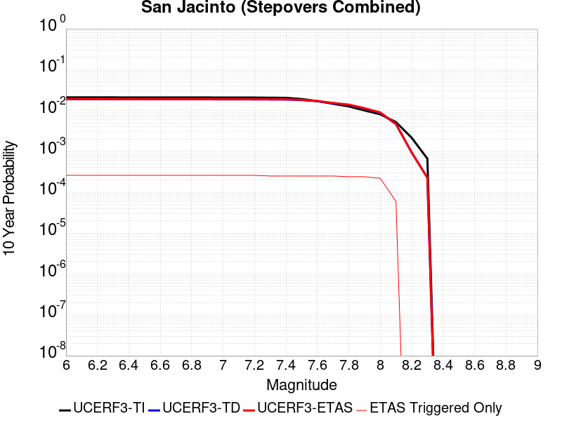 |

| Magnitude | 1 wk TI Prob | 1 wk TD Prob | 1 wk ETAS Prob | 1 wk ETAS/TD Gain | 1 wk ETAS Triggered Only | 1 mo TI Prob | 1 mo TD Prob | 1 mo ETAS Prob | 1 mo ETAS/TD Gain | 1 mo ETAS Triggered Only | 1 yr TI Prob | 1 yr TD Prob | 1 yr ETAS Prob | 1 yr ETAS/TD Gain | 1 yr ETAS Triggered Only | 10 yr TI Prob | 10 yr TD Prob | 10 yr ETAS Prob | 10 yr ETAS/TD Gain | 10 yr ETAS Triggered Only |
|-----|-----|-----|-----|-----|-----|-----|-----|-----|-----|-----|-----|-----|-----|-----|-----|-----|-----|-----|-----|-----|
| 6.0 | 4.0667746E-5 | 3.5271103E-5 | 1.5526687E-4 | 4.4020987 | 1.2E-4 | 1.742787E-4 | 1.5115313E-4 | 3.0113047E-4 | 1.9922211 | 1.5E-4 | 0.0021197782 | 0.0018387372 | 0.002048351 | 1.1139988 | 2.1E-4 | 0.020996714 | 0.018986495 | 0.019241558 | 1.0134339 | 2.6E-4 |
| 6.1 | 4.0667746E-5 | 3.5271103E-5 | 1.5526687E-4 | 4.4020987 | 1.2E-4 | 1.742787E-4 | 1.5115313E-4 | 3.0113047E-4 | 1.9922211 | 1.5E-4 | 0.0021197782 | 0.0018387372 | 0.002048351 | 1.1139988 | 2.1E-4 | 0.020996714 | 0.018986495 | 0.019241558 | 1.0134339 | 2.6E-4 |
| 6.2 | 4.0667746E-5 | 3.5271103E-5 | 1.5526687E-4 | 4.4020987 | 1.2E-4 | 1.742787E-4 | 1.5115313E-4 | 3.0113047E-4 | 1.9922211 | 1.5E-4 | 0.0021197782 | 0.0018387372 | 0.002048351 | 1.1139988 | 2.1E-4 | 0.020996714 | 0.018986495 | 0.019241558 | 1.0134339 | 2.6E-4 |
| 6.3 | 4.0667746E-5 | 3.5271103E-5 | 1.5526687E-4 | 4.4020987 | 1.2E-4 | 1.742787E-4 | 1.5115313E-4 | 3.0113047E-4 | 1.9922211 | 1.5E-4 | 0.0021197782 | 0.0018387372 | 0.002048351 | 1.1139988 | 2.1E-4 | 0.020996714 | 0.018986495 | 0.019241558 | 1.0134339 | 2.6E-4 |
| 6.4 | 4.0577226E-5 | 3.5143014E-5 | 1.551388E-4 | 4.414499 | 1.2E-4 | 1.738908E-4 | 1.5060425E-4 | 3.0058165E-4 | 1.9958379 | 1.5E-4 | 0.0021150648 | 0.0018320669 | 0.0020416821 | 1.1144146 | 2.1E-4 | 0.020950472 | 0.018921062 | 0.019176142 | 1.0134813 | 2.6E-4 |
| 6.5 | 4.0577226E-5 | 3.5143014E-5 | 1.551388E-4 | 4.414499 | 1.2E-4 | 1.738908E-4 | 1.5060425E-4 | 3.0058165E-4 | 1.9958379 | 1.5E-4 | 0.0021150648 | 0.0018320669 | 0.0020416821 | 1.1144146 | 2.1E-4 | 0.020950472 | 0.018921062 | 0.019176142 | 1.0134813 | 2.6E-4 |
| 6.6 | 4.053861E-5 | 3.5088357E-5 | 1.5508414E-4 | 4.419818 | 1.2E-4 | 1.7372532E-4 | 1.5037002E-4 | 3.0034746E-4 | 1.9973892 | 1.5E-4 | 0.0021130538 | 0.0018292206 | 0.0020388365 | 1.114593 | 2.1E-4 | 0.020930743 | 0.01889314 | 0.019148229 | 1.0135016 | 2.6E-4 |
| 6.7 | 4.0516545E-5 | 3.505743E-5 | 1.5505322E-4 | 4.422835 | 1.2E-4 | 1.7363077E-4 | 1.502375E-4 | 3.0021498E-4 | 1.9982692 | 1.5E-4 | 0.002111905 | 0.0018276101 | 0.0020372262 | 1.1146941 | 2.1E-4 | 0.020919468 | 0.018877337 | 0.019132428 | 1.0135131 | 2.6E-4 |
| 6.8 | 4.049434E-5 | 3.5028992E-5 | 1.5502478E-4 | 4.4256134 | 1.2E-4 | 1.7353562E-4 | 1.5011564E-4 | 3.0009312E-4 | 1.9990797 | 1.5E-4 | 0.0021107488 | 0.0018261289 | 0.0020357454 | 1.1147873 | 2.1E-4 | 0.020908125 | 0.018862749 | 0.019117845 | 1.0135238 | 2.6E-4 |
| 6.9 | 4.046386E-5 | 3.4991554E-5 | 1.5498736E-4 | 4.429279 | 1.2E-4 | 1.73405E-4 | 1.499552E-4 | 2.999327E-4 | 2.0001488 | 1.5E-4 | 0.0021091616 | 0.0018241788 | 0.0020337957 | 1.1149102 | 2.1E-4 | 0.020892553 | 0.018843522 | 0.019098623 | 1.0135379 | 2.6E-4 |
| 7.0 | 4.036382E-5 | 3.4872126E-5 | 1.5486794E-4 | 4.441024 | 1.2E-4 | 1.7297632E-4 | 1.4944343E-4 | 2.99421E-4 | 2.0035744 | 1.5E-4 | 0.0021039525 | 0.0018179584 | 0.0020275768 | 1.1153042 | 2.1E-4 | 0.02084144 | 0.018782137 | 0.019037252 | 1.013583 | 2.6E-4 |
| 7.1 | 4.0343282E-5 | 3.485059E-5 | 1.548464E-4 | 4.4431505 | 1.2E-4 | 1.7288832E-4 | 1.4935112E-4 | 2.9932873E-4 | 2.0041945 | 1.5E-4 | 0.002102883 | 0.0018168368 | 0.0020264552 | 1.1153755 | 2.1E-4 | 0.020830948 | 0.018771008 | 0.019026127 | 1.0135912 | 2.6E-4 |
| 7.2 | 4.0257353E-5 | 3.475509E-5 | 1.5475092E-4 | 4.452612 | 1.2E-4 | 1.725201E-4 | 1.489419E-4 | 2.9891953E-4 | 2.0069542 | 1.5E-4 | 0.0020984085 | 0.0018118626 | 0.002021482 | 1.1156929 | 2.1E-4 | 0.020787042 | 0.018721746 | 0.018976878 | 1.0136276 | 2.6E-4 |
| 7.3 | 3.9940667E-5 | 3.458276E-5 | 1.545786E-4 | 4.469817 | 1.2E-4 | 1.7116306E-4 | 1.4820343E-4 | 2.981812E-4 | 2.0119724 | 1.5E-4 | 0.0020819185 | 0.0018028866 | 0.002002526 | 1.1107332 | 2.0E-4 | 0.020625217 | 0.018630387 | 0.01887573 | 1.0131689 | 2.5E-4 |
| 7.4 | 3.9721202E-5 | 3.4468165E-5 | 1.5446403E-4 | 4.4813533 | 1.2E-4 | 1.7022261E-4 | 1.4771236E-4 | 2.9769022E-4 | 2.015337 | 1.5E-4 | 0.0020704903 | 0.0017969179 | 0.0019965584 | 1.1111017 | 2.0E-4 | 0.020513052 | 0.018569522 | 0.018814879 | 1.0132129 | 2.5E-4 |
| 7.5 | 3.7036873E-5 | 3.3535776E-5 | 1.5353176E-4 | 4.5781484 | 1.2E-4 | 1.5871979E-4 | 1.4371685E-4 | 2.9369528E-4 | 2.0435688 | 1.5E-4 | 0.0019307006 | 0.0017483513 | 0.0019480017 | 1.1141934 | 2.0E-4 | 0.019140124 | 0.018071128 | 0.01831661 | 1.0135843 | 2.5E-4 |
| 7.6 | 3.2940967E-5 | 3.13167E-5 | 1.5131294E-4 | 4.8317013 | 1.2E-4 | 1.4116794E-4 | 1.3420754E-4 | 2.841874E-4 | 2.117522 | 1.5E-4 | 0.0017173645 | 0.0016327545 | 0.0018324279 | 1.1222924 | 2.0E-4 | 0.01704153 | 0.016904091 | 0.017149866 | 1.0145394 | 2.5E-4 |
| 7.7 | 2.8236149E-5 | 2.7882697E-5 | 1.4787936E-4 | 5.303624 | 1.2E-4 | 1.2100645E-4 | 1.1949181E-4 | 2.6947388E-4 | 2.2551663 | 1.5E-4 | 0.0014722579 | 0.0014538429 | 0.0016535522 | 1.1373664 | 2.0E-4 | 0.014625421 | 0.015114912 | 0.015361133 | 1.01629 | 2.5E-4 |
| 7.8 | 2.4329287E-5 | 2.5206451E-5 | 1.4520342E-4 | 5.760566 | 1.2E-4 | 1.042642E-4 | 1.08023174E-4 | 2.5800697E-4 | 2.3884408 | 1.5E-4 | 0.0012686774 | 0.0013143895 | 0.0015041399 | 1.1443638 | 1.9E-4 | 0.012614589 | 0.013712341 | 0.01394905 | 1.0172625 | 2.4E-4 |
| 7.9 | 1.9370926E-5 | 2.0420413E-5 | 1.4041796E-4 | 6.876353 | 1.2E-4 | 8.301561E-5 | 8.751312E-5 | 2.375E-4 | 2.7138786 | 1.5E-4 | 0.0010102465 | 0.0010649522 | 0.00125475 | 1.1782217 | 1.9E-4 | 0.0100566605 | 0.011199402 | 0.011436714 | 1.0211897 | 2.4E-4 |
| 8.0 | 1.5583017E-5 | 1.5885415E-5 | 1.2588367E-4 | 7.924481 | 1.1E-4 | 6.6782646E-5 | 6.807858E-5 | 2.0806905E-4 | 3.056307 | 1.4E-4 | 8.127754E-4 | 8.2854216E-4 | 0.001008393 | 1.217069 | 1.8E-4 | 0.008098091 | 0.008781636 | 0.008999704 | 1.0248322 | 2.2E-4 |
| 8.1 | 1.0024873E-5 | 8.291399E-6 | 3.829115E-5 | 4.618177 | 3.0E-5 | 4.2963035E-5 | 3.553409E-5 | 8.553231E-5 | 2.4070497 | 5.0E-5 | 5.229494E-4 | 4.3254215E-4 | 4.8252053E-4 | 1.1155456 | 5.0E-5 | 0.0052172043 | 0.0046530655 | 0.0047127865 | 1.0128347 | 6.0E-5 |
| 8.2 | 4.142796E-6 | 1.5602761E-6 | 1.5602761E-6 | 1.0 | 0.0 | 1.775472E-5 | 6.6868806E-6 | 6.6868806E-6 | 1.0 | 0.0 | 2.1614227E-4 | 8.140976E-5 | 8.140976E-5 | 1.0 | 0.0 | 0.0021593217 | 9.4514614E-4 | 9.4514614E-4 | 1.0 | 0.0 |
| 8.3 | 1.2750878E-6 | 3.609817E-7 | 3.609817E-7 | 1.0 | 0.0 | 5.4646503E-6 | 1.5470634E-6 | 1.5470634E-6 | 1.0 | 0.0 | 6.653009E-5 | 1.8835339E-5 | 1.8835339E-5 | 1.0 | 0.0 | 6.6510175E-4 | 2.272251E-4 | 2.272251E-4 | 1.0 | 0.0 |

## Imperial
*[(top)](#table-of-contents)*

| 1 Week | 1 Month | 1 Year | 10 Year |
|-----|-----|-----|-----|
|  | 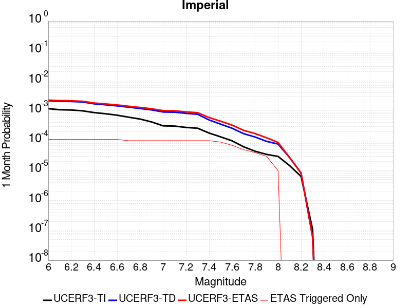 | 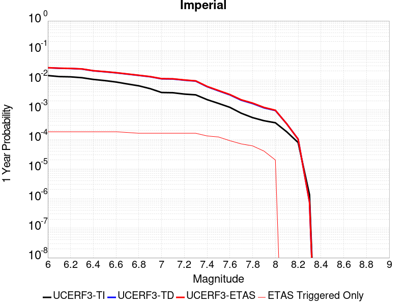 |  |

| Magnitude | 1 wk TI Prob | 1 wk TD Prob | 1 wk ETAS Prob | 1 wk ETAS/TD Gain | 1 wk ETAS Triggered Only | 1 mo TI Prob | 1 mo TD Prob | 1 mo ETAS Prob | 1 mo ETAS/TD Gain | 1 mo ETAS Triggered Only | 1 yr TI Prob | 1 yr TD Prob | 1 yr ETAS Prob | 1 yr ETAS/TD Gain | 1 yr ETAS Triggered Only | 10 yr TI Prob | 10 yr TD Prob | 10 yr ETAS Prob | 10 yr ETAS/TD Gain | 10 yr ETAS Triggered Only |
|-----|-----|-----|-----|-----|-----|-----|-----|-----|-----|-----|-----|-----|-----|-----|-----|-----|-----|-----|-----|-----|
| 6.0 | 2.7496446E-4 | 5.055345E-4 | 6.05484E-4 | 1.1977104 | 1.0E-4 | 0.0011778869 | 0.002164817 | 0.002274579 | 1.0507026 | 1.1E-4 | 0.0142467655 | 0.026048409 | 0.026223721 | 1.0067302 | 1.8E-4 | 0.13367249 | 0.22807029 | 0.22825556 | 1.0008123 | 2.4E-4 |
| 6.1 | 2.5356023E-4 | 4.8657708E-4 | 5.865284E-4 | 1.2054173 | 1.0E-4 | 0.001086234 | 0.002083702 | 0.0021934728 | 1.0526806 | 1.1E-4 | 0.013144928 | 0.02507094 | 0.025246426 | 1.0069996 | 1.8E-4 | 0.123940155 | 0.21949561 | 0.21968293 | 1.0008534 | 2.4E-4 |
| 6.2 | 2.4820742E-4 | 4.775311E-4 | 5.774834E-4 | 1.2093104 | 1.0E-4 | 0.0010633124 | 0.0020449946 | 0.0021547696 | 1.0536798 | 1.1E-4 | 0.01286919 | 0.024610676 | 0.024786245 | 1.0071338 | 1.8E-4 | 0.12148927 | 0.21600136 | 0.21618953 | 1.0008711 | 2.4E-4 |
| 6.3 | 2.3205351E-4 | 4.5892023E-4 | 5.5887434E-4 | 1.2178028 | 1.0E-4 | 9.94136E-4 | 0.0019653554 | 0.0020751392 | 1.0558596 | 1.1E-4 | 0.012036599 | 0.023661187 | 0.023836927 | 1.0074275 | 1.8E-4 | 0.11405133 | 0.20793827 | 0.20812836 | 1.0009142 | 2.4E-4 |
| 6.4 | 2.0304754E-4 | 3.9878016E-4 | 4.987403E-4 | 1.2506647 | 1.0E-4 | 8.6991355E-4 | 0.0017079529 | 0.0018177651 | 1.0642946 | 1.1E-4 | 0.010539869 | 0.020595418 | 0.02077171 | 1.0085598 | 1.8E-4 | 0.100537635 | 0.18507113 | 0.18525855 | 1.0010128 | 2.3E-4 |
| 6.5 | 1.854992E-4 | 3.6990462E-4 | 4.6986763E-4 | 1.27024 | 1.0E-4 | 7.9475436E-4 | 0.0015843548 | 0.0016941804 | 1.0693189 | 1.1E-4 | 0.009633281 | 0.01911443 | 0.019290987 | 1.0092369 | 1.8E-4 | 0.0922623 | 0.1733039 | 0.17348577 | 1.0010494 | 2.2E-4 |
| 6.6 | 1.6586106E-4 | 3.4036173E-4 | 4.403277E-4 | 1.2937051 | 1.0E-4 | 7.106394E-4 | 0.0014578878 | 0.0015677275 | 1.0753416 | 1.1E-4 | 0.008617763 | 0.017607626 | 0.017784456 | 1.0100428 | 1.8E-4 | 0.08291132 | 0.16078055 | 0.16096517 | 1.0011483 | 2.2E-4 |
| 6.7 | 1.4224656E-4 | 3.076812E-4 | 3.9765352E-4 | 1.2924205 | 9.0E-5 | 6.094856E-4 | 0.0013179756 | 0.0014178437 | 1.075774 | 1.0E-4 | 0.0073952693 | 0.015928522 | 0.016095813 | 1.0105027 | 1.7E-4 | 0.07153955 | 0.14648798 | 0.14666721 | 1.0012236 | 2.1E-4 |
| 6.8 | 1.2317259E-4 | 2.779231E-4 | 3.678981E-4 | 1.3237406 | 9.0E-5 | 5.2777573E-4 | 0.0011905615 | 0.0012904424 | 1.083894 | 1.0E-4 | 0.0064067547 | 0.014400131 | 0.014557827 | 1.010951 | 1.6E-4 | 0.06225166 | 0.13294089 | 0.13310562 | 1.0012392 | 1.9E-4 |
| 6.9 | 9.859898E-5 | 2.5015484E-4 | 3.401323E-4 | 1.3596872 | 9.0E-5 | 4.2249862E-4 | 0.0010716559 | 0.0011715487 | 1.0932136 | 1.0E-4 | 0.0051317946 | 0.012970319 | 0.013128243 | 1.0121758 | 1.6E-4 | 0.05014893 | 0.119408876 | 0.119576186 | 1.0014012 | 1.9E-4 |
| 7.0 | 7.3191884E-5 | 2.1267848E-4 | 3.0265935E-4 | 1.423084 | 9.0E-5 | 3.136418E-4 | 9.11164E-4 | 0.0010110729 | 1.1096498 | 1.0E-4 | 0.003811904 | 0.011037681 | 0.011195915 | 1.0143358 | 1.6E-4 | 0.037471764 | 0.10206756 | 0.10223817 | 1.0016716 | 1.9E-4 |
| 7.1 | 7.1760296E-5 | 2.0969207E-4 | 2.996732E-4 | 1.4291108 | 9.0E-5 | 3.0750787E-4 | 8.9837395E-4 | 9.982841E-4 | 1.1112123 | 1.0E-4 | 0.003737482 | 0.010883528 | 0.0110417865 | 1.0145411 | 1.6E-4 | 0.03675245 | 0.10070406 | 0.10087493 | 1.0016967 | 1.9E-4 |
| 7.2 | 6.46614E-5 | 1.9137723E-4 | 2.8136E-4 | 1.4701854 | 9.0E-5 | 2.7709085E-4 | 8.199333E-4 | 9.1985136E-4 | 1.1218611 | 1.0E-4 | 0.0033683628 | 0.009937617 | 0.0100960275 | 1.0159404 | 1.6E-4 | 0.033177625 | 0.092511006 | 0.09268343 | 1.0018638 | 1.9E-4 |
| 7.3 | 6.088115E-5 | 1.780939E-4 | 2.6807789E-4 | 1.5052614 | 9.0E-5 | 2.6089314E-4 | 7.6303916E-4 | 8.6296286E-4 | 1.1309549 | 1.0E-4 | 0.0031717476 | 0.009251006 | 0.009409525 | 1.0171354 | 1.6E-4 | 0.031268585 | 0.08656135 | 0.086734906 | 1.002005 | 1.9E-4 |
| 7.4 | 4.199346E-5 | 1.1511097E-4 | 2.051006E-4 | 1.7817643 | 9.0E-5 | 1.7995955E-4 | 4.932403E-4 | 5.93191E-4 | 1.2026409 | 1.0E-4 | 0.0021888057 | 0.005988835 | 0.0061180564 | 1.021577 | 1.3E-4 | 0.02167372 | 0.05744024 | 0.05759105 | 1.0026255 | 1.6E-4 |
| 7.5 | 3.130448E-5 | 8.333871E-5 | 1.6333205E-4 | 1.9598581 | 8.0E-5 | 1.3415517E-4 | 3.5711733E-4 | 4.4708519E-4 | 1.251928 | 9.0E-5 | 0.0016321153 | 0.0043392954 | 0.0044587743 | 1.0275342 | 1.2E-4 | 0.016201803 | 0.042133506 | 0.042277187 | 1.0034101 | 1.5E-4 |
| 7.6 | 2.3074248E-5 | 6.0849357E-5 | 1.208457E-4 | 1.9859817 | 6.0E-5 | 9.888588E-5 | 2.6075702E-4 | 3.3073875E-4 | 1.2683791 | 7.0E-5 | 0.0012032706 | 0.0031701182 | 0.003259833 | 1.0283002 | 9.0E-5 | 0.011967761 | 0.03102816 | 0.031134749 | 1.0034351 | 1.1E-4 |
| 7.7 | 1.45864815E-5 | 4.0128452E-5 | 8.012685E-5 | 1.9967589 | 4.0E-5 | 6.2511994E-5 | 1.7196777E-4 | 2.2195917E-4 | 1.2907021 | 5.0E-5 | 7.608177E-4 | 0.0020917025 | 0.0021615562 | 1.0333955 | 7.0E-5 | 0.007582182 | 0.02062909 | 0.02070744 | 1.003798 | 8.0E-5 |
| 7.8 | 1.0352979E-5 | 3.096395E-5 | 6.0963022E-5 | 1.9688387 | 3.0E-5 | 4.4369157E-5 | 1.326959E-4 | 1.7269059E-4 | 1.3014011 | 4.0E-5 | 5.400606E-4 | 0.0016143778 | 0.001674281 | 1.037106 | 6.0E-5 | 0.0053875 | 0.016017893 | 0.016086772 | 1.0043001 | 7.0E-5 |
| 7.9 | 8.137906E-6 | 2.2151205E-5 | 5.2150543E-5 | 2.354298 | 3.0E-5 | 3.4876273E-5 | 9.493029E-5 | 1.2492744E-4 | 1.3159914 | 3.0E-5 | 4.2453592E-4 | 0.0011551644 | 0.0011951182 | 1.0345871 | 4.0E-5 | 0.004237258 | 0.011618842 | 0.011668261 | 1.0042534 | 5.0E-5 |
| 8.0 | 6.93792E-6 | 1.8010365E-5 | 2.8010185E-5 | 1.5552258 | 1.0E-5 | 2.9733603E-5 | 7.7185E-5 | 8.718423E-5 | 1.1295488 | 1.0E-5 | 3.6194647E-4 | 9.3932304E-4 | 9.593042E-4 | 1.021272 | 2.0E-5 | 0.0036135751 | 0.009502415 | 0.009532129 | 1.0031271 | 3.0E-5 |
| 8.1 | 3.4286315E-6 | 6.380179E-6 | 6.380179E-6 | 1.0 | 0.0 | 1.4694053E-5 | 2.734334E-5 | 2.734334E-5 | 1.0 | 0.0 | 1.7888541E-4 | 3.3285443E-4 | 3.3285443E-4 | 1.0 | 0.0 | 0.0017874148 | 0.0034863674 | 0.0034963326 | 1.0028583 | 1.0E-5 |
| 8.2 | 1.4906886E-6 | 1.936633E-6 | 1.936633E-6 | 1.0 | 0.0 | 6.3886496E-6 | 8.2998295E-6 | 8.2998295E-6 | 1.0 | 0.0 | 7.7779034E-5 | 1.0104576E-4 | 1.0104576E-4 | 1.0 | 0.0 | 7.775182E-4 | 0.0011075423 | 0.0011075423 | 1.0 | 0.0 |
| 8.3 | 2.5758007E-8 | 1.4495866E-8 | 1.4495866E-8 | 1.0 | 0.0 | 1.10391454E-7 | 6.212514E-8 | 6.212514E-8 | 1.0 | 0.0 | 1.3440151E-6 | 7.563736E-7 | 7.563736E-7 | 1.0 | 0.0 | 1.344007E-5 | 7.884359E-6 | 7.884359E-6 | 1.0 | 0.0 |

## Brawley (Seismic Zone) alt 1
*[(top)](#table-of-contents)*

| 1 Week | 1 Month | 1 Year | 10 Year |
|-----|-----|-----|-----|
|  |  | 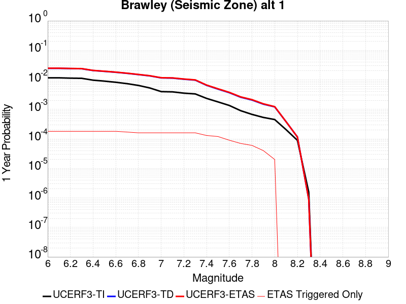 |  |

| Magnitude | 1 wk TI Prob | 1 wk TD Prob | 1 wk ETAS Prob | 1 wk ETAS/TD Gain | 1 wk ETAS Triggered Only | 1 mo TI Prob | 1 mo TD Prob | 1 mo ETAS Prob | 1 mo ETAS/TD Gain | 1 mo ETAS Triggered Only | 1 yr TI Prob | 1 yr TD Prob | 1 yr ETAS Prob | 1 yr ETAS/TD Gain | 1 yr ETAS Triggered Only | 10 yr TI Prob | 10 yr TD Prob | 10 yr ETAS Prob | 10 yr ETAS/TD Gain | 10 yr ETAS Triggered Only |
|-----|-----|-----|-----|-----|-----|-----|-----|-----|-----|-----|-----|-----|-----|-----|-----|-----|-----|-----|-----|-----|
| 6.0 | 2.2521618E-4 | 4.763429E-4 | 5.7629525E-4 | 1.2098328 | 1.0E-4 | 9.6485513E-4 | 0.0020399094 | 0.002149685 | 1.0538139 | 1.1E-4 | 0.011683988 | 0.024544531 | 0.024720114 | 1.0071536 | 1.8E-4 | 0.11088423 | 0.21349923 | 0.21368799 | 1.0008842 | 2.4E-4 |
| 6.1 | 2.2521618E-4 | 4.763429E-4 | 5.7629525E-4 | 1.2098328 | 1.0E-4 | 9.6485513E-4 | 0.0020399094 | 0.002149685 | 1.0538139 | 1.1E-4 | 0.011683988 | 0.024544531 | 0.024720114 | 1.0071536 | 1.8E-4 | 0.11088423 | 0.21349923 | 0.21368799 | 1.0008842 | 2.4E-4 |
| 6.2 | 2.198148E-4 | 4.6718874E-4 | 5.6714204E-4 | 1.2139462 | 1.0E-4 | 9.417233E-4 | 0.0020007377 | 0.0021105176 | 1.0548698 | 1.1E-4 | 0.011405343 | 0.024078513 | 0.024254179 | 1.0072955 | 1.8E-4 | 0.10837428 | 0.20993572 | 0.21012534 | 1.0009032 | 2.4E-4 |
| 6.3 | 2.1704129E-4 | 4.615455E-4 | 5.614993E-4 | 1.2165633 | 1.0E-4 | 9.298453E-4 | 0.0019765892 | 0.0020863719 | 1.0555414 | 1.1E-4 | 0.011262234 | 0.023792034 | 0.02396775 | 1.0073856 | 1.8E-4 | 0.107082725 | 0.20782684 | 0.20801696 | 1.0009148 | 2.4E-4 |
| 6.4 | 1.876142E-4 | 4.004663E-4 | 5.004262E-4 | 1.2496089 | 1.0E-4 | 8.038131E-4 | 0.0017151695 | 0.0018249808 | 1.0640236 | 1.1E-4 | 0.00974259 | 0.020678662 | 0.020854939 | 1.0085247 | 1.8E-4 | 0.093263686 | 0.18457787 | 0.18476541 | 1.0010161 | 2.3E-4 |
| 6.5 | 1.7390939E-4 | 3.7478763E-4 | 4.7475015E-4 | 1.2667178 | 1.0E-4 | 7.45113E-4 | 0.0016052561 | 0.0017150795 | 1.0684149 | 1.1E-4 | 0.009034078 | 0.019367293 | 0.019543806 | 1.009114 | 1.8E-4 | 0.086755216 | 0.17440015 | 0.17458178 | 1.0010414 | 2.2E-4 |
| 6.6 | 1.591791E-4 | 3.4893592E-4 | 4.48901E-4 | 1.2864856 | 1.0E-4 | 6.8201777E-4 | 0.0014945926 | 0.0016044282 | 1.0734886 | 1.1E-4 | 0.008271996 | 0.018045008 | 0.01822176 | 1.0097951 | 1.8E-4 | 0.07970774 | 0.16380787 | 0.16399182 | 1.0011231 | 2.2E-4 |
| 6.7 | 1.4268003E-4 | 3.2059717E-4 | 4.1056835E-4 | 1.2806361 | 9.0E-5 | 6.1134255E-4 | 0.0013732726 | 0.0014731353 | 1.0727187 | 1.0E-4 | 0.007417723 | 0.01659171 | 0.016758889 | 1.010076 | 1.7E-4 | 0.07174956 | 0.15193594 | 0.15211402 | 1.0011722 | 2.1E-4 |
| 6.8 | 1.239713E-4 | 2.9055026E-4 | 3.805241E-4 | 1.3096671 | 9.0E-5 | 5.3119735E-4 | 0.0012446274 | 0.0013445029 | 1.0802454 | 1.0E-4 | 0.0064481674 | 0.015049482 | 0.015207075 | 1.0104716 | 1.6E-4 | 0.06264243 | 0.13838051 | 0.13854422 | 1.001183 | 1.9E-4 |
| 6.9 | 1.0180238E-4 | 2.6255674E-4 | 3.5253313E-4 | 1.3426931 | 9.0E-5 | 4.3622297E-4 | 0.0011247622 | 0.0012246497 | 1.0888077 | 1.0E-4 | 0.005298089 | 0.013608998 | 0.01376682 | 1.0115969 | 1.6E-4 | 0.05173543 | 0.12496473 | 0.12513098 | 1.0013304 | 1.9E-4 |
| 7.0 | 7.6619996E-5 | 2.2400476E-4 | 3.139846E-4 | 1.4016871 | 9.0E-5 | 3.283301E-4 | 9.596704E-4 | 0.0010595744 | 1.1041025 | 1.0E-4 | 0.0039900932 | 0.011622103 | 0.011780243 | 1.0136069 | 1.6E-4 | 0.039192066 | 0.10726982 | 0.10743944 | 1.0015812 | 1.9E-4 |
| 7.1 | 7.5127435E-5 | 2.2083633E-4 | 3.1081645E-4 | 1.4074516 | 9.0E-5 | 3.2193496E-4 | 9.461013E-4 | 0.0010460067 | 1.1055969 | 1.0E-4 | 0.0039125155 | 0.011458648 | 0.011616815 | 1.0138032 | 1.6E-4 | 0.038443442 | 0.10583378 | 0.10600367 | 1.0016053 | 1.9E-4 |
| 7.2 | 6.788582E-5 | 2.0211334E-4 | 2.9209515E-4 | 1.4452047 | 9.0E-5 | 2.9090676E-4 | 8.6591556E-4 | 9.6582895E-4 | 1.1153847 | 1.0E-4 | 0.0035360386 | 0.0104922 | 0.010650521 | 1.0150894 | 1.6E-4 | 0.034803 | 0.097503684 | 0.09767516 | 1.0017587 | 1.9E-4 |
| 7.3 | 6.399602E-5 | 1.8842232E-4 | 2.7840535E-4 | 1.4775604 | 9.0E-5 | 2.7423984E-4 | 8.0727716E-4 | 9.0719643E-4 | 1.1237732 | 1.0E-4 | 0.0033337586 | 0.009784897 | 0.009943331 | 1.0161917 | 1.6E-4 | 0.03284188 | 0.091397986 | 0.09157062 | 1.0018889 | 1.9E-4 |
| 7.4 | 4.506759E-5 | 1.2530042E-4 | 2.1528914E-4 | 1.7181838 | 9.0E-5 | 1.9313251E-4 | 5.3689216E-4 | 6.3683843E-4 | 1.1861571 | 1.0E-4 | 0.0023488526 | 0.006517245 | 0.006646398 | 1.0198171 | 1.3E-4 | 0.023241805 | 0.062364522 | 0.06251454 | 1.0024055 | 1.6E-4 |
| 7.5 | 3.43289E-5 | 9.336103E-5 | 1.7335356E-4 | 1.8568085 | 8.0E-5 | 1.4711556E-4 | 4.0005764E-4 | 4.9002166E-4 | 1.2248776 | 9.0E-5 | 0.0017896603 | 0.004859886 | 0.004979303 | 1.0245719 | 1.2E-4 | 0.01775316 | 0.047057066 | 0.04720001 | 1.0030376 | 1.5E-4 |
| 7.6 | 2.5980507E-5 | 7.053672E-5 | 1.3053248E-4 | 1.8505608 | 6.0E-5 | 1.1134028E-4 | 3.0226534E-4 | 3.722442E-4 | 1.2315146 | 7.0E-5 | 0.001354725 | 0.0036738948 | 0.0037635642 | 1.0244071 | 9.0E-5 | 0.013464959 | 0.03584298 | 0.035949036 | 1.0029589 | 1.1E-4 |
| 7.7 | 1.7292105E-5 | 4.9412036E-5 | 8.941006E-5 | 1.8094794 | 4.0E-5 | 7.4106916E-5 | 2.1174872E-4 | 2.6173814E-4 | 1.236079 | 5.0E-5 | 9.018782E-4 | 0.0025749984 | 0.002644818 | 1.0271145 | 7.0E-5 | 0.008982267 | 0.025292097 | 0.025370073 | 1.003083 | 8.0E-5 |
| 7.8 | 1.2927471E-5 | 3.9697254E-5 | 6.969606E-5 | 1.7556897 | 3.0E-5 | 5.5402274E-5 | 1.7012001E-4 | 2.1011321E-4 | 1.2350881 | 4.0E-5 | 6.743139E-4 | 0.0020692463 | 0.0021291221 | 1.028936 | 6.0E-5 | 0.0067227143 | 0.020433145 | 0.020501714 | 1.0033559 | 7.0E-5 |
| 7.9 | 1.0200774E-5 | 2.8748475E-5 | 5.8747613E-5 | 2.0435035 | 3.0E-5 | 4.371687E-5 | 1.2320194E-4 | 1.5319824E-4 | 1.2434727 | 3.0E-5 | 5.321229E-4 | 0.0014989526 | 0.0015388926 | 1.0266453 | 4.0E-5 | 0.005308505 | 0.014992895 | 0.015042145 | 1.0032849 | 5.0E-5 |
| 8.0 | 8.650396E-6 | 2.3279512E-5 | 3.3279277E-5 | 1.4295523 | 1.0E-5 | 3.70726E-5 | 9.976552E-5 | 1.0976452E-4 | 1.100225 | 1.0E-5 | 4.5126543E-4 | 0.0012139693 | 0.001233945 | 1.0164549 | 2.0E-5 | 0.0045035016 | 0.012212164 | 0.0122417975 | 1.0024266 | 3.0E-5 |
| 8.1 | 3.9368224E-6 | 7.3283345E-6 | 7.3283345E-6 | 1.0 | 0.0 | 1.6871985E-5 | 3.1406773E-5 | 3.1406773E-5 | 1.0 | 0.0 | 2.0539707E-4 | 3.8231048E-4 | 3.8231048E-4 | 1.0 | 0.0 | 0.0020520731 | 0.0040015313 | 0.0040114913 | 1.0024891 | 1.0E-5 |
| 8.2 | 1.7101195E-6 | 2.2178374E-6 | 2.2178374E-6 | 1.0 | 0.0 | 7.329063E-6 | 9.504983E-6 | 9.504983E-6 | 1.0 | 0.0 | 8.922769E-5 | 1.15717055E-4 | 1.15717055E-4 | 1.0 | 0.0 | 8.9191867E-4 | 0.00126669 | 0.00126669 | 1.0 | 0.0 |
| 8.3 | 3.0346666E-8 | 1.721086E-8 | 1.721086E-8 | 1.0 | 0.0 | 1.3005713E-7 | 7.376083E-8 | 7.376083E-8 | 1.0 | 0.0 | 1.5834444E-6 | 8.98038E-7 | 8.98038E-7 | 1.0 | 0.0 | 1.5834332E-5 | 9.36379E-6 | 9.36379E-6 | 1.0 | 0.0 |

## San Jacinto (Anza) rev
*[(top)](#table-of-contents)*

| 1 Week | 1 Month | 1 Year | 10 Year |
|-----|-----|-----|-----|
|  |  |  | 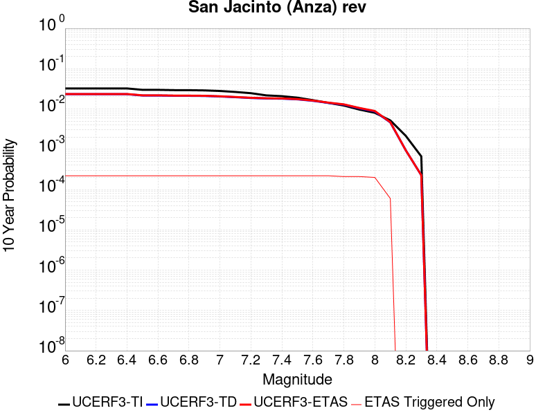 |

| Magnitude | 1 wk TI Prob | 1 wk TD Prob | 1 wk ETAS Prob | 1 wk ETAS/TD Gain | 1 wk ETAS Triggered Only | 1 mo TI Prob | 1 mo TD Prob | 1 mo ETAS Prob | 1 mo ETAS/TD Gain | 1 mo ETAS Triggered Only | 1 yr TI Prob | 1 yr TD Prob | 1 yr ETAS Prob | 1 yr ETAS/TD Gain | 1 yr ETAS Triggered Only | 10 yr TI Prob | 10 yr TD Prob | 10 yr ETAS Prob | 10 yr ETAS/TD Gain | 10 yr ETAS Triggered Only |
|-----|-----|-----|-----|-----|-----|-----|-----|-----|-----|-----|-----|-----|-----|-----|-----|-----|-----|-----|-----|-----|
| 6.0 | 6.3015636E-5 | 4.3298347E-5 | 1.5329359E-4 | 3.5404027 | 1.1E-4 | 2.7003905E-4 | 1.8555121E-4 | 3.2552524E-4 | 1.7543687 | 1.4E-4 | 0.0032827691 | 0.0022567573 | 0.0024463285 | 1.0840015 | 1.9E-4 | 0.032346968 | 0.02329361 | 0.023508487 | 1.0092247 | 2.2E-4 |
| 6.1 | 6.3015636E-5 | 4.3298347E-5 | 1.5329359E-4 | 3.5404027 | 1.1E-4 | 2.7003905E-4 | 1.8555121E-4 | 3.2552524E-4 | 1.7543687 | 1.4E-4 | 0.0032827691 | 0.0022567573 | 0.0024463285 | 1.0840015 | 1.9E-4 | 0.032346968 | 0.02329361 | 0.023508487 | 1.0092247 | 2.2E-4 |
| 6.2 | 6.3015636E-5 | 4.3298347E-5 | 1.5329359E-4 | 3.5404027 | 1.1E-4 | 2.7003905E-4 | 1.8555121E-4 | 3.2552524E-4 | 1.7543687 | 1.4E-4 | 0.0032827691 | 0.0022567573 | 0.0024463285 | 1.0840015 | 1.9E-4 | 0.032346968 | 0.02329361 | 0.023508487 | 1.0092247 | 2.2E-4 |
| 6.3 | 6.3015636E-5 | 4.3298347E-5 | 1.5329359E-4 | 3.5404027 | 1.1E-4 | 2.7003905E-4 | 1.8555121E-4 | 3.2552524E-4 | 1.7543687 | 1.4E-4 | 0.0032827691 | 0.0022567573 | 0.0024463285 | 1.0840015 | 1.9E-4 | 0.032346968 | 0.02329361 | 0.023508487 | 1.0092247 | 2.2E-4 |
| 6.4 | 6.3015636E-5 | 4.3298347E-5 | 1.5329359E-4 | 3.5404027 | 1.1E-4 | 2.7003905E-4 | 1.8555121E-4 | 3.2552524E-4 | 1.7543687 | 1.4E-4 | 0.0032827691 | 0.0022567573 | 0.0024463285 | 1.0840015 | 1.9E-4 | 0.032346968 | 0.02329361 | 0.023508487 | 1.0092247 | 2.2E-4 |
| 6.5 | 5.811017E-5 | 4.0080286E-5 | 1.5007588E-4 | 3.7443814 | 1.1E-4 | 2.4901982E-4 | 1.7176138E-4 | 3.1173733E-4 | 1.8149443 | 1.4E-4 | 0.0030276014 | 0.0020891947 | 0.0022787978 | 1.0907542 | 1.9E-4 | 0.02986684 | 0.021590833 | 0.021806084 | 1.0099695 | 2.2E-4 |
| 6.6 | 5.811017E-5 | 4.0080286E-5 | 1.5007588E-4 | 3.7443814 | 1.1E-4 | 2.4901982E-4 | 1.7176138E-4 | 3.1173733E-4 | 1.8149443 | 1.4E-4 | 0.0030276014 | 0.0020891947 | 0.0022787978 | 1.0907542 | 1.9E-4 | 0.02986684 | 0.021590833 | 0.021806084 | 1.0099695 | 2.2E-4 |
| 6.7 | 5.712442E-5 | 3.950301E-5 | 1.4949866E-4 | 3.7844877 | 1.1E-4 | 2.4479596E-4 | 1.6928767E-4 | 3.0926397E-4 | 1.8268547 | 1.4E-4 | 0.0029763177 | 0.0020591344 | 0.0022487433 | 1.0920818 | 1.9E-4 | 0.029367693 | 0.021282919 | 0.021498235 | 1.0101169 | 2.2E-4 |
| 6.8 | 5.6967532E-5 | 3.93593E-5 | 1.4935496E-4 | 3.7946553 | 1.1E-4 | 2.4412372E-4 | 1.6867183E-4 | 3.0864822E-4 | 1.829874 | 1.4E-4 | 0.0029681553 | 0.0020516508 | 0.002241261 | 1.0924183 | 1.9E-4 | 0.029288229 | 0.02120852 | 0.021423854 | 1.0101532 | 2.2E-4 |
| 6.9 | 5.6211324E-5 | 3.9064216E-5 | 1.4905992E-4 | 3.8157663 | 1.1E-4 | 2.4088343E-4 | 1.6740736E-4 | 3.0738392E-4 | 1.8361435 | 1.4E-4 | 0.0029288116 | 0.0020362847 | 0.0022258977 | 1.0931172 | 1.9E-4 | 0.028905109 | 0.021047527 | 0.021262897 | 1.0102326 | 2.2E-4 |
| 7.0 | 5.4383527E-5 | 3.7925012E-5 | 1.4792084E-4 | 3.9003506 | 1.1E-4 | 2.3305144E-4 | 1.6252567E-4 | 3.0250291E-4 | 1.8612624 | 1.4E-4 | 0.0028337094 | 0.001976959 | 0.0021665834 | 1.0959172 | 1.9E-4 | 0.027978465 | 0.02044095 | 0.020656453 | 1.0105428 | 2.2E-4 |
| 7.1 | 5.1393665E-5 | 3.638787E-5 | 1.4638387E-4 | 4.0228753 | 1.1E-4 | 2.2023996E-4 | 1.5593872E-4 | 2.959169E-4 | 1.8976486 | 1.4E-4 | 0.0026781242 | 0.0018969048 | 0.0020865444 | 1.0999732 | 1.9E-4 | 0.026460782 | 0.019616077 | 0.019831762 | 1.0109953 | 2.2E-4 |
| 7.2 | 4.785222E-5 | 3.4738845E-5 | 1.4473502E-4 | 4.166374 | 1.1E-4 | 2.0506482E-4 | 1.4887229E-4 | 2.8885144E-4 | 1.9402634 | 1.4E-4 | 0.0024938055 | 0.0018110167 | 0.0020006727 | 1.1047235 | 1.9E-4 | 0.024660049 | 0.018728783 | 0.018944662 | 1.0115266 | 2.2E-4 |
| 7.3 | 4.2143256E-5 | 3.3834414E-5 | 1.438307E-4 | 4.2510176 | 1.1E-4 | 1.8060145E-4 | 1.449966E-4 | 2.849763E-4 | 1.9654 | 1.4E-4 | 0.002196605 | 0.0017639075 | 0.0019535723 | 1.1075253 | 1.9E-4 | 0.02175019 | 0.018236695 | 0.018452683 | 1.0118436 | 2.2E-4 |
| 7.4 | 4.0264713E-5 | 3.3472694E-5 | 1.43469E-4 | 4.286151 | 1.1E-4 | 1.7255165E-4 | 1.4344654E-4 | 2.8342646E-4 | 1.9758334 | 1.4E-4 | 0.002098792 | 0.0017450659 | 0.0019347344 | 1.1086884 | 1.9E-4 | 0.020790804 | 0.018041389 | 0.01825742 | 1.0119742 | 2.2E-4 |
| 7.5 | 3.694492E-5 | 3.2186905E-5 | 1.4218336E-4 | 4.417429 | 1.1E-4 | 1.5832575E-4 | 1.379366E-4 | 2.7791728E-4 | 2.014819 | 1.4E-4 | 0.0019259118 | 0.0016780876 | 0.0018677688 | 1.1130341 | 1.9E-4 | 0.01909306 | 0.017357888 | 0.01757407 | 1.0124544 | 2.2E-4 |
| 7.6 | 3.200565E-5 | 2.9502702E-5 | 1.3949946E-4 | 4.728362 | 1.1E-4 | 1.3715986E-4 | 1.2643404E-4 | 2.6641635E-4 | 2.1071568 | 1.4E-4 | 0.001668642 | 0.0015382497 | 0.0017279575 | 1.123327 | 1.9E-4 | 0.01656168 | 0.015946016 | 0.01616251 | 1.0135765 | 2.2E-4 |
| 7.7 | 2.731642E-5 | 2.6091477E-5 | 1.3608861E-4 | 5.2158265 | 1.1E-4 | 1.1706512E-4 | 1.11815825E-4 | 2.5180017E-4 | 2.251919 | 1.4E-4 | 0.001424336 | 0.0013605085 | 0.00155025 | 1.1394637 | 1.9E-4 | 0.014152412 | 0.0141668 | 0.014383683 | 1.0153092 | 2.2E-4 |
| 7.8 | 2.3466424E-5 | 2.3503619E-5 | 1.3350103E-4 | 5.6800203 | 1.1E-4 | 1.0056651E-4 | 1.0072591E-4 | 2.4071182E-4 | 2.3897705 | 1.4E-4 | 0.0012237094 | 0.0012256489 | 0.0014054283 | 1.146681 | 1.8E-4 | 0.012169928 | 0.012808796 | 0.013016107 | 1.0161849 | 2.1E-4 |
| 7.9 | 1.8611925E-5 | 1.890698E-5 | 1.289049E-4 | 6.8178473 | 1.1E-4 | 7.9762955E-5 | 8.10274E-5 | 2.2101606E-4 | 2.7276707 | 1.4E-4 | 9.7068126E-4 | 9.860628E-4 | 0.0011658854 | 1.1823641 | 1.8E-4 | 0.0096645225 | 0.010393705 | 0.010601522 | 1.0199945 | 2.1E-4 |
| 8.0 | 1.5460775E-5 | 1.5739915E-5 | 1.15738345E-4 | 7.353174 | 1.0E-4 | 6.6258784E-5 | 6.745504E-5 | 1.9744626E-4 | 2.9270797 | 1.3E-4 | 8.0640207E-4 | 8.2095637E-4 | 9.908167E-4 | 1.2069056 | 1.7E-4 | 0.008034821 | 0.008702706 | 0.008900965 | 1.0227814 | 2.0E-4 |
| 8.1 | 9.983884E-6 | 8.268954E-6 | 3.8268707E-5 | 4.6279984 | 3.0E-5 | 4.2787375E-5 | 3.5437897E-5 | 8.543613E-5 | 2.410869 | 5.0E-5 | 5.2081177E-4 | 4.313715E-4 | 4.813499E-4 | 1.1158594 | 5.0E-5 | 0.0051959283 | 0.00463968 | 0.004699402 | 1.012872 | 6.0E-5 |
| 8.2 | 4.1226E-6 | 1.5522551E-6 | 1.5522551E-6 | 1.0 | 0.0 | 1.7668166E-5 | 6.6525045E-6 | 6.6525045E-6 | 1.0 | 0.0 | 2.1508869E-4 | 8.099126E-5 | 8.099126E-5 | 1.0 | 0.0 | 0.0021488064 | 9.401847E-4 | 9.401847E-4 | 1.0 | 0.0 |
| 8.3 | 1.2750878E-6 | 3.609817E-7 | 3.609817E-7 | 1.0 | 0.0 | 5.4646503E-6 | 1.5470634E-6 | 1.5470634E-6 | 1.0 | 0.0 | 6.653009E-5 | 1.8835339E-5 | 1.8835339E-5 | 1.0 | 0.0 | 6.6510175E-4 | 2.272251E-4 | 2.272251E-4 | 1.0 | 0.0 |

## Lost Hills
*[(top)](#table-of-contents)*

| 1 Week | 1 Month | 1 Year | 10 Year |
|-----|-----|-----|-----|
|  |  |  |  |

| Magnitude | 1 wk TI Prob | 1 wk TD Prob | 1 wk ETAS Prob | 1 wk ETAS/TD Gain | 1 wk ETAS Triggered Only | 1 mo TI Prob | 1 mo TD Prob | 1 mo ETAS Prob | 1 mo ETAS/TD Gain | 1 mo ETAS Triggered Only | 1 yr TI Prob | 1 yr TD Prob | 1 yr ETAS Prob | 1 yr ETAS/TD Gain | 1 yr ETAS Triggered Only | 10 yr TI Prob | 10 yr TD Prob | 10 yr ETAS Prob | 10 yr ETAS/TD Gain | 10 yr ETAS Triggered Only |
|-----|-----|-----|-----|-----|-----|-----|-----|-----|-----|-----|-----|-----|-----|-----|-----|-----|-----|-----|-----|-----|
| 6.0 | 2.233523E-5 | 2.5106583E-5 | 1.0510458E-4 | 4.1863356 | 8.0E-5 | 9.571891E-5 | 1.0759615E-4 | 1.8758755E-4 | 1.743441 | 8.0E-5 | 0.0011647546 | 0.001309364 | 0.0014591676 | 1.1144094 | 1.5E-4 | 0.011586686 | 0.013033091 | 0.013240354 | 1.0159029 | 2.1E-4 |
| 6.1 | 2.233523E-5 | 2.5106583E-5 | 1.0510458E-4 | 4.1863356 | 8.0E-5 | 9.571891E-5 | 1.0759615E-4 | 1.8758755E-4 | 1.743441 | 8.0E-5 | 0.0011647546 | 0.001309364 | 0.0014591676 | 1.1144094 | 1.5E-4 | 0.011586686 | 0.013033091 | 0.013240354 | 1.0159029 | 2.1E-4 |
| 6.2 | 2.233523E-5 | 2.5106583E-5 | 1.0510458E-4 | 4.1863356 | 8.0E-5 | 9.571891E-5 | 1.0759615E-4 | 1.8758755E-4 | 1.743441 | 8.0E-5 | 0.0011647546 | 0.001309364 | 0.0014591676 | 1.1144094 | 1.5E-4 | 0.011586686 | 0.013033091 | 0.013240354 | 1.0159029 | 2.1E-4 |
| 6.3 | 2.233523E-5 | 2.5106583E-5 | 1.0510458E-4 | 4.1863356 | 8.0E-5 | 9.571891E-5 | 1.0759615E-4 | 1.8758755E-4 | 1.743441 | 8.0E-5 | 0.0011647546 | 0.001309364 | 0.0014591676 | 1.1144094 | 1.5E-4 | 0.011586686 | 0.013033091 | 0.013240354 | 1.0159029 | 2.1E-4 |
| 6.4 | 1.2288092E-5 | 1.3781108E-5 | 7.3780284E-5 | 5.3537264 | 6.0E-5 | 5.2662188E-5 | 5.906108E-5 | 1.19057535E-4 | 2.0158374 | 6.0E-5 | 6.409735E-4 | 7.189252E-4 | 8.388389E-4 | 1.1667958 | 1.2E-4 | 0.006391279 | 0.0071752006 | 0.0073340526 | 1.0221391 | 1.6E-4 |
| 6.5 | 1.2288092E-5 | 1.3781108E-5 | 7.3780284E-5 | 5.3537264 | 6.0E-5 | 5.2662188E-5 | 5.906108E-5 | 1.19057535E-4 | 2.0158374 | 6.0E-5 | 6.409735E-4 | 7.189252E-4 | 8.388389E-4 | 1.1667958 | 1.2E-4 | 0.006391279 | 0.0071752006 | 0.0073340526 | 1.0221391 | 1.6E-4 |
| 6.6 | 8.58281E-6 | 9.63377E-6 | 4.9633385E-5 | 5.152021 | 4.0E-5 | 3.6782953E-5 | 4.12874E-5 | 8.128575E-5 | 1.9687785 | 4.0E-5 | 4.4774043E-4 | 5.026414E-4 | 5.726062E-4 | 1.1391943 | 7.0E-5 | 0.0044683935 | 0.005023205 | 0.005122703 | 1.0198076 | 1.0E-4 |
| 6.7 | 7.205685E-6 | 8.088302E-6 | 4.808798E-5 | 5.945374 | 4.0E-5 | 3.088114E-5 | 3.466415E-5 | 7.466276E-5 | 2.15389 | 4.0E-5 | 3.7591302E-4 | 4.2203604E-4 | 4.920065E-4 | 1.1657926 | 7.0E-5 | 0.0037527776 | 0.0042203604 | 0.0043000225 | 1.0188757 | 8.0E-5 |

## White Mountains
*[(top)](#table-of-contents)*

| 1 Week | 1 Month | 1 Year | 10 Year |
|-----|-----|-----|-----|
|  |  | 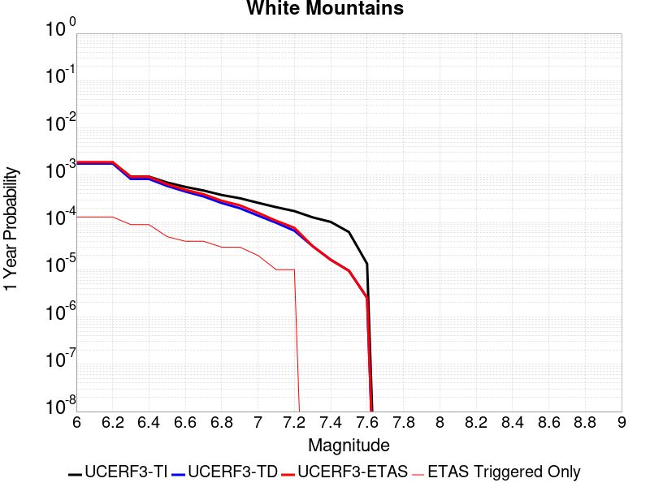 | 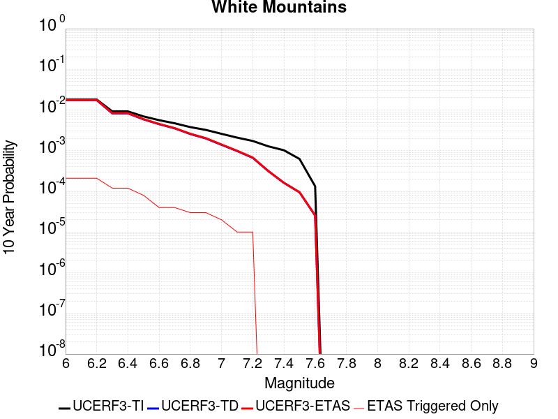 |

| Magnitude | 1 wk TI Prob | 1 wk TD Prob | 1 wk ETAS Prob | 1 wk ETAS/TD Gain | 1 wk ETAS Triggered Only | 1 mo TI Prob | 1 mo TD Prob | 1 mo ETAS Prob | 1 mo ETAS/TD Gain | 1 mo ETAS Triggered Only | 1 yr TI Prob | 1 yr TD Prob | 1 yr ETAS Prob | 1 yr ETAS/TD Gain | 1 yr ETAS Triggered Only | 10 yr TI Prob | 10 yr TD Prob | 10 yr ETAS Prob | 10 yr ETAS/TD Gain | 10 yr ETAS Triggered Only |
|-----|-----|-----|-----|-----|-----|-----|-----|-----|-----|-----|-----|-----|-----|-----|-----|-----|-----|-----|-----|-----|
| 6.0 | 3.503579E-5 | 3.3784127E-5 | 6.378311E-5 | 1.887961 | 3.0E-5 | 1.5014476E-4 | 1.4478175E-4 | 2.1477161E-4 | 1.4834163 | 7.0E-5 | 0.0018264796 | 0.0017614134 | 0.0018911845 | 1.0736743 | 1.3E-4 | 0.018115403 | 0.017486857 | 0.017693184 | 1.011799 | 2.1E-4 |
| 6.1 | 3.503579E-5 | 3.3784127E-5 | 6.378311E-5 | 1.887961 | 3.0E-5 | 1.5014476E-4 | 1.4478175E-4 | 2.1477161E-4 | 1.4834163 | 7.0E-5 | 0.0018264796 | 0.0017614134 | 0.0018911845 | 1.0736743 | 1.3E-4 | 0.018115403 | 0.017486857 | 0.017693184 | 1.011799 | 2.1E-4 |
| 6.2 | 3.503579E-5 | 3.3784127E-5 | 6.378311E-5 | 1.887961 | 3.0E-5 | 1.5014476E-4 | 1.4478175E-4 | 2.1477161E-4 | 1.4834163 | 7.0E-5 | 0.0018264796 | 0.0017614134 | 0.0018911845 | 1.0736743 | 1.3E-4 | 0.018115403 | 0.017486857 | 0.017693184 | 1.011799 | 2.1E-4 |
| 6.3 | 1.7818425E-5 | 1.591616E-5 | 4.591568E-5 | 2.884847 | 3.0E-5 | 7.636245E-5 | 6.821041E-5 | 1.0820768E-4 | 1.5863807 | 4.0E-5 | 9.293162E-4 | 8.301596E-4 | 9.200848E-4 | 1.1083229 | 9.0E-5 | 0.009254395 | 0.0082720425 | 0.00839105 | 1.0143867 | 1.2E-4 |
| 6.4 | 1.7818425E-5 | 1.591616E-5 | 4.591568E-5 | 2.884847 | 3.0E-5 | 7.636245E-5 | 6.821041E-5 | 1.0820768E-4 | 1.5863807 | 4.0E-5 | 9.293162E-4 | 8.301596E-4 | 9.200848E-4 | 1.1083229 | 9.0E-5 | 0.009254395 | 0.0082720425 | 0.00839105 | 1.0143867 | 1.2E-4 |
| 6.5 | 1.3397557E-5 | 1.1336374E-5 | 2.133626E-5 | 1.8821063 | 1.0E-5 | 5.741684E-5 | 4.8583595E-5 | 6.858262E-5 | 1.4116416 | 2.0E-5 | 6.988258E-4 | 5.913517E-4 | 6.413221E-4 | 1.0845021 | 5.0E-5 | 0.006966323 | 0.005898487 | 0.005978015 | 1.0134828 | 8.0E-5 |
| 6.6 | 1.0818695E-5 | 8.625434E-6 | 1.8625347E-5 | 2.1593518 | 1.0E-5 | 4.6365014E-5 | 3.6965648E-5 | 4.6965277E-5 | 1.2705114 | 1.0E-5 | 5.6434784E-4 | 4.4996818E-4 | 4.899502E-4 | 1.0888551 | 4.0E-5 | 0.005629168 | 0.0044910074 | 0.004530828 | 1.0088667 | 4.0E-5 |
| 6.7 | 9.067908E-6 | 6.802476E-6 | 1.6802407E-5 | 2.470043 | 1.0E-5 | 3.8861883E-5 | 2.915316E-5 | 3.915287E-5 | 1.343006 | 1.0E-5 | 4.7304068E-4 | 3.548851E-4 | 3.948709E-4 | 1.1126726 | 4.0E-5 | 0.00472035 | 0.003543501 | 0.0035833593 | 1.0112482 | 4.0E-5 |
| 6.8 | 7.295947E-6 | 4.9364285E-6 | 1.4936379E-5 | 3.025746 | 1.0E-5 | 3.126797E-5 | 2.1155956E-5 | 3.1155745E-5 | 1.4726701 | 1.0E-5 | 3.8062103E-4 | 2.5754445E-4 | 2.8753674E-4 | 1.1164547 | 3.0E-5 | 0.0037996976 | 0.0025725728 | 0.0026024955 | 1.0116315 | 3.0E-5 |
| 6.9 | 6.2243444E-6 | 3.8322546E-6 | 1.3832216E-5 | 3.60942 | 1.0E-5 | 2.6675489E-5 | 1.6423846E-5 | 2.6423682E-5 | 1.6088607 | 1.0E-5 | 3.2472567E-4 | 1.9994251E-4 | 2.2993652E-4 | 1.1500131 | 3.0E-5 | 0.0032425157 | 0.001997679 | 0.0020276192 | 1.0149875 | 3.0E-5 |
| 7.0 | 4.9878413E-6 | 2.679564E-6 | 1.2679538E-5 | 4.7319403 | 1.0E-5 | 2.1376287E-5 | 1.1483797E-5 | 2.1483682E-5 | 1.8707821 | 1.0E-5 | 2.602252E-4 | 1.3980652E-4 | 1.5980372E-4 | 1.1430348 | 2.0E-5 | 0.002599207 | 0.0013972119 | 0.0014171839 | 1.0142943 | 2.0E-5 |
| 7.1 | 4.0252844E-6 | 1.885702E-6 | 1.885702E-6 | 1.0 | 0.0 | 1.7251105E-5 | 8.081555E-6 | 8.081555E-6 | 1.0 | 0.0 | 2.1001195E-4 | 9.838863E-5 | 1.0838764E-4 | 1.1016277 | 1.0E-5 | 0.0020981359 | 9.834635E-4 | 9.934537E-4 | 1.0101582 | 1.0E-5 |
| 7.2 | 3.3284066E-6 | 1.2818929E-6 | 1.2818929E-6 | 1.0 | 0.0 | 1.4264522E-5 | 5.4938155E-6 | 5.4938155E-6 | 1.0 | 0.0 | 1.736567E-4 | 6.688525E-5 | 7.6884586E-5 | 1.1494998 | 1.0E-5 | 0.0017352107 | 6.6866126E-4 | 6.786546E-4 | 1.0149453 | 1.0E-5 |
| 7.3 | 2.458226E-6 | 6.056684E-7 | 6.056684E-7 | 1.0 | 0.0 | 1.0535211E-5 | 2.5957193E-6 | 2.5957193E-6 | 1.0 | 0.0 | 1.2825865E-4 | 3.160246E-5 | 3.160246E-5 | 1.0 | 0.0 | 0.0012818464 | 3.1598343E-4 | 3.1598343E-4 | 1.0 | 0.0 |
| 7.4 | 1.965953E-6 | 3.1084684E-7 | 3.1084684E-7 | 1.0 | 0.0 | 8.425486E-6 | 1.3322001E-6 | 1.3322001E-6 | 1.0 | 0.0 | 1.0257547E-4 | 1.6219417E-5 | 1.6219417E-5 | 1.0 | 0.0 | 0.0010252813 | 1.6218246E-4 | 1.6218246E-4 | 1.0 | 0.0 |
| 7.5 | 1.2014192E-6 | 1.8241002E-7 | 1.8241002E-7 | 1.0 | 0.0 | 5.148929E-6 | 7.8175697E-7 | 7.8175697E-7 | 1.0 | 0.0 | 6.2686406E-5 | 9.51785E-6 | 9.51785E-6 | 1.0 | 0.0 | 6.266873E-4 | 9.517451E-5 | 9.517451E-5 | 1.0 | 0.0 |
| 7.6 | 2.5612175E-7 | 4.893784E-8 | 4.893784E-8 | 1.0 | 0.0 | 1.0976642E-6 | 2.0973359E-7 | 2.0973359E-7 | 1.0 | 0.0 | 1.3363979E-5 | 2.5535037E-6 | 2.5535037E-6 | 1.0 | 0.0 | 1.3363175E-4 | 2.553478E-5 | 2.553478E-5 | 1.0 | 0.0 |

## Mission Creek
*[(top)](#table-of-contents)*

| 1 Week | 1 Month | 1 Year | 10 Year |
|-----|-----|-----|-----|
| 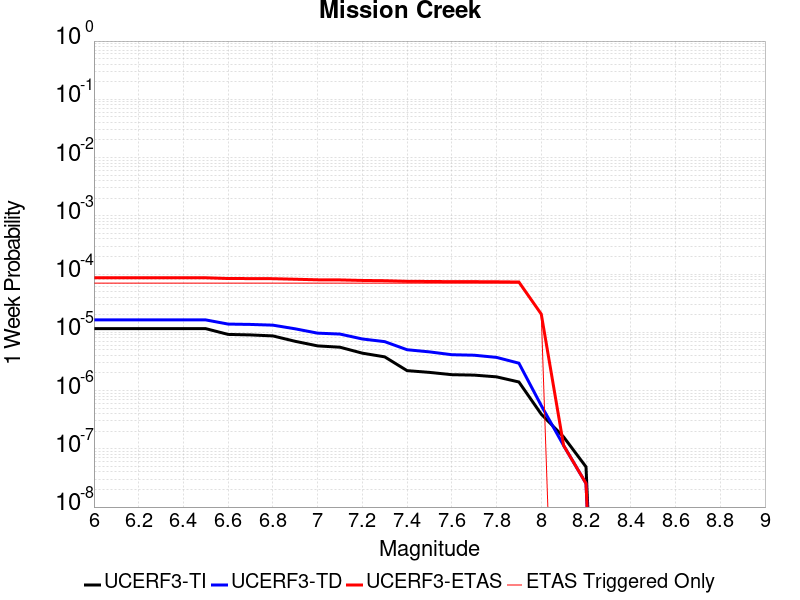 |  |  |  |

| Magnitude | 1 wk TI Prob | 1 wk TD Prob | 1 wk ETAS Prob | 1 wk ETAS/TD Gain | 1 wk ETAS Triggered Only | 1 mo TI Prob | 1 mo TD Prob | 1 mo ETAS Prob | 1 mo ETAS/TD Gain | 1 mo ETAS Triggered Only | 1 yr TI Prob | 1 yr TD Prob | 1 yr ETAS Prob | 1 yr ETAS/TD Gain | 1 yr ETAS Triggered Only | 10 yr TI Prob | 10 yr TD Prob | 10 yr ETAS Prob | 10 yr ETAS/TD Gain | 10 yr ETAS Triggered Only |
|-----|-----|-----|-----|-----|-----|-----|-----|-----|-----|-----|-----|-----|-----|-----|-----|-----|-----|-----|-----|-----|
| 6.0 | 1.1549387E-5 | 1.6322783E-5 | 8.632164E-5 | 5.2884145 | 7.0E-5 | 4.9496433E-5 | 6.995299E-5 | 1.399481E-4 | 2.000602 | 7.0E-5 | 6.0245243E-4 | 8.5135986E-4 | 9.812493E-4 | 1.1525669 | 1.3E-4 | 0.006008218 | 0.008510157 | 0.00869854 | 1.0221362 | 1.9E-4 |
| 6.1 | 1.1549387E-5 | 1.6322783E-5 | 8.632164E-5 | 5.2884145 | 7.0E-5 | 4.9496433E-5 | 6.995299E-5 | 1.399481E-4 | 2.000602 | 7.0E-5 | 6.0245243E-4 | 8.5135986E-4 | 9.812493E-4 | 1.1525669 | 1.3E-4 | 0.006008218 | 0.008510157 | 0.00869854 | 1.0221362 | 1.9E-4 |
| 6.2 | 1.1549387E-5 | 1.6322783E-5 | 8.632164E-5 | 5.2884145 | 7.0E-5 | 4.9496433E-5 | 6.995299E-5 | 1.399481E-4 | 2.000602 | 7.0E-5 | 6.0245243E-4 | 8.5135986E-4 | 9.812493E-4 | 1.1525669 | 1.3E-4 | 0.006008218 | 0.008510157 | 0.00869854 | 1.0221362 | 1.9E-4 |
| 6.3 | 1.1549387E-5 | 1.6322783E-5 | 8.632164E-5 | 5.2884145 | 7.0E-5 | 4.9496433E-5 | 6.995299E-5 | 1.399481E-4 | 2.000602 | 7.0E-5 | 6.0245243E-4 | 8.5135986E-4 | 9.812493E-4 | 1.1525669 | 1.3E-4 | 0.006008218 | 0.008510157 | 0.00869854 | 1.0221362 | 1.9E-4 |
| 6.4 | 1.1549387E-5 | 1.6322783E-5 | 8.632164E-5 | 5.2884145 | 7.0E-5 | 4.9496433E-5 | 6.995299E-5 | 1.399481E-4 | 2.000602 | 7.0E-5 | 6.0245243E-4 | 8.5135986E-4 | 9.812493E-4 | 1.1525669 | 1.3E-4 | 0.006008218 | 0.008510157 | 0.00869854 | 1.0221362 | 1.9E-4 |
| 6.5 | 1.1549387E-5 | 1.6322783E-5 | 8.632164E-5 | 5.2884145 | 7.0E-5 | 4.9496433E-5 | 6.995299E-5 | 1.399481E-4 | 2.000602 | 7.0E-5 | 6.0245243E-4 | 8.5135986E-4 | 9.812493E-4 | 1.1525669 | 1.3E-4 | 0.006008218 | 0.008510157 | 0.00869854 | 1.0221362 | 1.9E-4 |
| 6.6 | 9.202681E-6 | 1.3846059E-5 | 8.384509E-5 | 6.05552 | 7.0E-5 | 3.9439463E-5 | 5.9338956E-5 | 1.293348E-4 | 2.1795936 | 7.0E-5 | 4.800697E-4 | 7.2222133E-4 | 8.5212744E-4 | 1.1798702 | 1.3E-4 | 0.004790339 | 0.0072273402 | 0.007406039 | 1.0247254 | 1.8E-4 |
| 6.7 | 9.019164E-6 | 1.3651728E-5 | 8.3650775E-5 | 6.1274858 | 7.0E-5 | 3.8652986E-5 | 5.8506146E-5 | 1.2850206E-4 | 2.1963854 | 7.0E-5 | 4.7049852E-4 | 7.1208854E-4 | 8.41996E-4 | 1.1824316 | 1.3E-4 | 0.004695036 | 0.0071266647 | 0.007305382 | 1.0250772 | 1.8E-4 |
| 6.8 | 8.673558E-6 | 1.3273839E-5 | 8.327291E-5 | 6.273461 | 7.0E-5 | 3.717186E-5 | 5.688669E-5 | 1.268827E-4 | 2.2304463 | 7.0E-5 | 4.524734E-4 | 6.923842E-4 | 8.222942E-4 | 1.1876271 | 1.3E-4 | 0.0045155324 | 0.0069308523 | 0.007109605 | 1.0257908 | 1.8E-4 |
| 6.9 | 7.002255E-6 | 1.1478069E-5 | 8.1477265E-5 | 7.0985174 | 7.0E-5 | 3.000932E-5 | 4.9190832E-5 | 1.1918739E-4 | 2.4229593 | 7.0E-5 | 3.653022E-4 | 5.9874065E-4 | 7.286628E-4 | 1.2169924 | 1.3E-4 | 0.0036470229 | 0.005999676 | 0.0061587156 | 1.0265081 | 1.6E-4 |
| 7.0 | 5.84644E-6 | 9.675359E-6 | 7.967468E-5 | 8.234803 | 7.0E-5 | 2.5055931E-5 | 4.146519E-5 | 1.1146229E-4 | 2.688093 | 7.0E-5 | 3.0501327E-4 | 5.047263E-4 | 6.346607E-4 | 1.2574353 | 1.3E-4 | 0.0030459496 | 0.005063994 | 0.005223184 | 1.0314356 | 1.6E-4 |
| 7.1 | 5.54703E-6 | 9.329834E-6 | 7.9329184E-5 | 8.502743 | 7.0E-5 | 2.377277E-5 | 3.9984414E-5 | 1.09981615E-4 | 2.750612 | 7.0E-5 | 2.8939504E-4 | 4.8670598E-4 | 6.166427E-4 | 1.2669717 | 1.3E-4 | 0.0028901845 | 0.0048845876 | 0.005043806 | 1.0325961 | 1.6E-4 |
| 7.2 | 4.384709E-6 | 7.681918E-6 | 7.768138E-5 | 10.112238 | 7.0E-5 | 1.8791474E-5 | 3.292211E-5 | 1.029198E-4 | 3.1261606 | 7.0E-5 | 2.2876218E-4 | 4.0075663E-4 | 5.307045E-4 | 1.3242564 | 1.3E-4 | 0.0022852682 | 0.004028542 | 0.0041878973 | 1.0395566 | 1.6E-4 |
| 7.3 | 3.7888456E-6 | 6.915788E-6 | 7.6915305E-5 | 11.121697 | 7.0E-5 | 1.623781E-5 | 2.9638775E-5 | 9.96367E-5 | 3.361701 | 7.0E-5 | 1.9767738E-4 | 3.6079568E-4 | 4.907488E-4 | 1.3601848 | 1.3E-4 | 0.0019750162 | 0.00363027 | 0.0037896892 | 1.0439138 | 1.6E-4 |
| 7.4 | 2.1982462E-6 | 5.0241033E-6 | 7.502375E-5 | 14.932765 | 7.0E-5 | 9.421021E-6 | 2.1531694E-5 | 9.1530186E-5 | 4.2509513 | 7.0E-5 | 1.1469489E-4 | 2.6211704E-4 | 3.9208296E-4 | 1.4958317 | 1.3E-4 | 0.0011463572 | 0.0026460327 | 0.0028056093 | 1.0603079 | 1.6E-4 |
| 7.5 | 2.051923E-6 | 4.6153277E-6 | 7.4615E-5 | 16.166784 | 7.0E-5 | 8.793926E-6 | 1.9779825E-5 | 8.977844E-5 | 4.5388894 | 7.0E-5 | 1.0706078E-4 | 2.4079291E-4 | 3.707616E-4 | 1.539753 | 1.3E-4 | 0.0010700922 | 0.0024335932 | 0.0025932037 | 1.0655864 | 1.6E-4 |
| 7.6 | 1.8733427E-6 | 4.1236603E-6 | 7.4123374E-5 | 17.97514 | 7.0E-5 | 8.028587E-6 | 1.7672712E-5 | 8.767148E-5 | 4.960839 | 7.0E-5 | 9.774366E-5 | 2.151441E-4 | 3.4511613E-4 | 1.6041162 | 1.3E-4 | 9.770069E-4 | 0.0021782513 | 0.0023379028 | 1.0732934 | 1.6E-4 |
| 7.7 | 1.8411953E-6 | 4.0433315E-6 | 7.404305E-5 | 18.312386 | 7.0E-5 | 7.890813E-6 | 1.732845E-5 | 8.732724E-5 | 5.03953 | 7.0E-5 | 9.606641E-5 | 2.1095353E-4 | 3.409261E-4 | 1.6161195 | 1.3E-4 | 9.6024893E-4 | 0.0021365292 | 0.0022961872 | 1.0747278 | 1.6E-4 |
| 7.8 | 1.7194251E-6 | 3.71068E-6 | 7.371042E-5 | 19.864397 | 7.0E-5 | 7.368944E-6 | 1.5902819E-5 | 8.59017E-5 | 5.4016657 | 7.0E-5 | 8.97132E-5 | 1.9359968E-4 | 3.2357452E-4 | 1.6713587 | 1.3E-4 | 8.967699E-4 | 0.0019624757 | 0.0021221617 | 1.0813696 | 1.6E-4 |
| 7.9 | 1.4035052E-6 | 2.9502596E-6 | 7.295005E-5 | 24.726654 | 7.0E-5 | 6.0150082E-6 | 1.2643909E-5 | 8.2643026E-5 | 6.5361924 | 7.0E-5 | 7.3230265E-5 | 1.5392878E-4 | 2.8390877E-4 | 1.8444164 | 1.3E-4 | 7.3206134E-4 | 0.0015631174 | 0.0017128829 | 1.0958121 | 1.5E-4 |
| 8.0 | 3.9318823E-7 | 5.528477E-7 | 2.0552836E-5 | 37.176304 | 2.0E-5 | 1.6850913E-6 | 2.3693453E-6 | 2.2369299E-5 | 9.44113 | 2.0E-5 | 2.0515794E-5 | 2.8846403E-5 | 5.8845537E-5 | 2.039961 | 3.0E-5 | 2.0513899E-4 | 2.990952E-4 | 3.2908624E-4 | 1.1002725 | 3.0E-5 |
| 8.1 | 1.596793E-7 | 1.13775044E-7 | 1.13775044E-7 | 1.0 | 0.0 | 6.8433974E-7 | 4.876072E-7 | 4.876072E-7 | 1.0 | 0.0 | 8.331805E-6 | 5.936602E-6 | 5.936602E-6 | 1.0 | 0.0 | 8.331492E-5 | 6.5494125E-5 | 6.5494125E-5 | 1.0 | 0.0 |
| 8.2 | 4.9003038E-8 | 2.5435753E-8 | 2.5435753E-8 | 1.0 | 0.0 | 2.10013E-7 | 1.09010365E-7 | 1.09010365E-7 | 1.0 | 0.0 | 2.5569052E-6 | 1.3272004E-6 | 1.3272004E-6 | 1.0 | 0.0 | 2.556876E-5 | 1.4952613E-5 | 1.4952613E-5 | 1.0 | 0.0 |

## Big Pine (East)
*[(top)](#table-of-contents)*

| 1 Week | 1 Month | 1 Year | 10 Year |
|-----|-----|-----|-----|
| 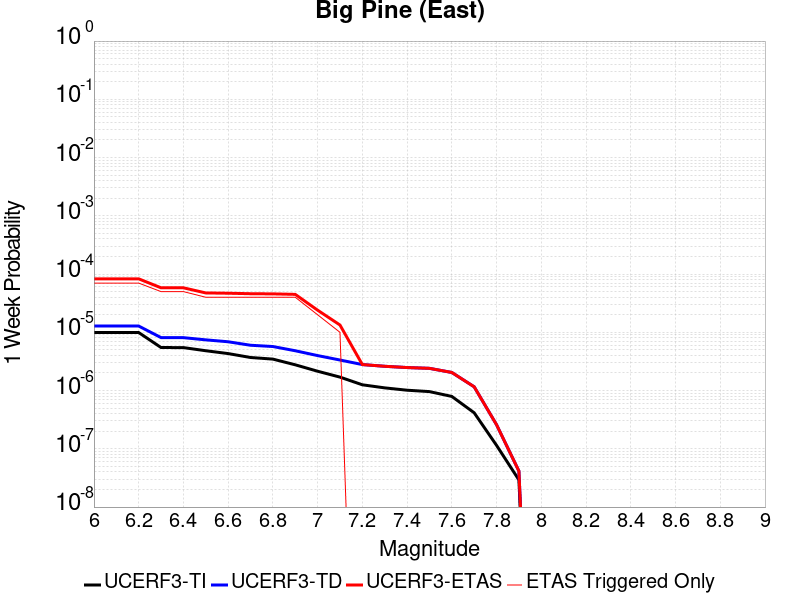 | 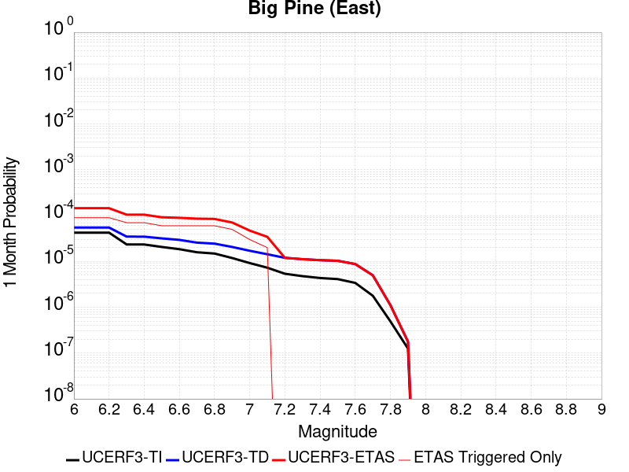 |  |  |

| Magnitude | 1 wk TI Prob | 1 wk TD Prob | 1 wk ETAS Prob | 1 wk ETAS/TD Gain | 1 wk ETAS Triggered Only | 1 mo TI Prob | 1 mo TD Prob | 1 mo ETAS Prob | 1 mo ETAS/TD Gain | 1 mo ETAS Triggered Only | 1 yr TI Prob | 1 yr TD Prob | 1 yr ETAS Prob | 1 yr ETAS/TD Gain | 1 yr ETAS Triggered Only | 10 yr TI Prob | 10 yr TD Prob | 10 yr ETAS Prob | 10 yr ETAS/TD Gain | 10 yr ETAS Triggered Only |
|-----|-----|-----|-----|-----|-----|-----|-----|-----|-----|-----|-----|-----|-----|-----|-----|-----|-----|-----|-----|-----|
| 6.0 | 9.916913E-6 | 1.28172705E-5 | 8.2816376E-5 | 6.461311 | 7.0E-5 | 4.250036E-5 | 5.493013E-5 | 1.4492519E-4 | 2.638355 | 9.0E-5 | 5.173191E-4 | 6.685912E-4 | 7.785177E-4 | 1.164415 | 1.1E-4 | 0.0051611643 | 0.006670449 | 0.0068591814 | 1.0282938 | 1.9E-4 |
| 6.1 | 9.916913E-6 | 1.28172705E-5 | 8.2816376E-5 | 6.461311 | 7.0E-5 | 4.250036E-5 | 5.493013E-5 | 1.4492519E-4 | 2.638355 | 9.0E-5 | 5.173191E-4 | 6.685912E-4 | 7.785177E-4 | 1.164415 | 1.1E-4 | 0.0051611643 | 0.006670449 | 0.0068591814 | 1.0282938 | 1.9E-4 |
| 6.2 | 9.916913E-6 | 1.28172705E-5 | 8.2816376E-5 | 6.461311 | 7.0E-5 | 4.250036E-5 | 5.493013E-5 | 1.4492519E-4 | 2.638355 | 9.0E-5 | 5.173191E-4 | 6.685912E-4 | 7.785177E-4 | 1.164415 | 1.1E-4 | 0.0051611643 | 0.006670449 | 0.0068591814 | 1.0282938 | 1.9E-4 |
| 6.3 | 5.479711E-6 | 8.1132375E-6 | 5.8112833E-5 | 7.162718 | 5.0E-5 | 2.3484265E-5 | 3.4770575E-5 | 1.04768136E-4 | 3.0131266 | 7.0E-5 | 2.858834E-4 | 4.232527E-4 | 5.132146E-4 | 1.212549 | 9.0E-5 | 0.0028551589 | 0.0042272513 | 0.0043666596 | 1.0329784 | 1.4E-4 |
| 6.4 | 5.465009E-6 | 8.0975315E-6 | 5.8097125E-5 | 7.1746716 | 5.0E-5 | 2.3421257E-5 | 3.4703262E-5 | 1.0470083E-4 | 3.0170314 | 7.0E-5 | 2.851165E-4 | 4.2243348E-4 | 5.1239546E-4 | 1.2129613 | 9.0E-5 | 0.0028475097 | 0.00421909 | 0.0043585 | 1.0330426 | 1.4E-4 |
| 6.5 | 4.826767E-6 | 7.4225877E-6 | 4.742229E-5 | 6.3889165 | 4.0E-5 | 2.068598E-5 | 3.1810716E-5 | 9.180881E-5 | 2.8860967 | 6.0E-5 | 2.518227E-4 | 3.8722943E-4 | 4.6719846E-4 | 1.2065159 | 8.0E-5 | 0.0025153751 | 0.0038682907 | 0.003997788 | 1.0334766 | 1.3E-4 |
| 6.6 | 4.3146847E-6 | 6.8825234E-6 | 4.6882247E-5 | 6.811782 | 4.0E-5 | 1.8491375E-5 | 2.949621E-5 | 8.949444E-5 | 3.0340996 | 6.0E-5 | 2.2510924E-4 | 3.5905963E-4 | 4.390309E-4 | 1.2227242 | 8.0E-5 | 0.0022488134 | 0.0035875062 | 0.0037170397 | 1.0361068 | 1.3E-4 |
| 6.7 | 3.6968106E-6 | 5.9957474E-6 | 4.5995508E-5 | 7.671355 | 4.0E-5 | 1.5843378E-5 | 2.5695816E-5 | 8.569427E-5 | 3.3349504 | 6.0E-5 | 1.9287605E-4 | 3.128032E-4 | 3.9277817E-4 | 1.2556719 | 8.0E-5 | 0.0019270873 | 0.0031262499 | 0.0032359061 | 1.0350759 | 1.1E-4 |
| 6.8 | 3.4671132E-6 | 5.7024477E-6 | 4.5702218E-5 | 8.014492 | 4.0E-5 | 1.4858972E-5 | 2.4438841E-5 | 8.443737E-5 | 3.4550483 | 6.0E-5 | 1.8089297E-4 | 2.9750372E-4 | 3.774799E-4 | 1.2688242 | 8.0E-5 | 0.0018074579 | 0.0029736666 | 0.0030833397 | 1.0368813 | 1.1E-4 |
| 6.9 | 2.7686972E-6 | 4.8254797E-6 | 4.4825287E-5 | 9.289291 | 4.0E-5 | 1.1865792E-5 | 2.0680467E-5 | 7.067943E-5 | 3.4176903 | 5.0E-5 | 1.4445644E-4 | 2.5175634E-4 | 3.2173874E-4 | 1.2779766 | 7.0E-5 | 0.0014436257 | 0.002517256 | 0.0026070294 | 1.0356632 | 9.0E-5 |
| 7.0 | 2.1472624E-6 | 3.985277E-6 | 2.3985198E-5 | 6.0184517 | 2.0E-5 | 9.20252E-6 | 1.707965E-5 | 4.707914E-5 | 2.7564464 | 3.0E-5 | 1.12034926E-4 | 2.0792543E-4 | 2.5791503E-4 | 1.2404208 | 5.0E-5 | 0.0011197845 | 0.0020798238 | 0.0021396992 | 1.0287886 | 6.0E-5 |
| 7.1 | 1.7018335E-6 | 3.3450835E-6 | 1.334505E-5 | 3.989452 | 1.0E-5 | 7.293552E-6 | 1.4335996E-5 | 3.433571E-5 | 2.3950696 | 2.0E-5 | 8.879537E-5 | 1.7452713E-4 | 2.1452014E-4 | 1.2291508 | 4.0E-5 | 8.87599E-4 | 0.0017463792 | 0.0017863093 | 1.0228646 | 4.0E-5 |
| 7.2 | 1.25603E-6 | 2.794679E-6 | 2.794679E-6 | 1.0 | 0.0 | 5.3829745E-6 | 1.1977142E-5 | 1.1977142E-5 | 1.0 | 0.0 | 6.553574E-5 | 1.4581217E-4 | 1.5581072E-4 | 1.0685713 | 1.0E-5 | 6.551642E-4 | 0.0014596173 | 0.0014696027 | 1.0068411 | 1.0E-5 |
| 7.3 | 1.112297E-6 | 2.610519E-6 | 2.610519E-6 | 1.0 | 0.0 | 4.7669787E-6 | 1.1187892E-5 | 1.1187892E-5 | 1.0 | 0.0 | 5.803642E-5 | 1.3620428E-4 | 1.4620292E-4 | 1.0734091 | 1.0E-5 | 5.802127E-4 | 0.001363502 | 0.0013734883 | 1.0073241 | 1.0E-5 |
| 7.4 | 1.0137181E-6 | 2.4836752E-6 | 2.4836752E-6 | 1.0 | 0.0 | 4.3444993E-6 | 1.064428E-5 | 1.064428E-5 | 1.0 | 0.0 | 5.2892992E-5 | 1.2958662E-4 | 1.3958532E-4 | 1.0771585 | 1.0E-5 | 5.288041E-4 | 0.0012971918 | 0.0013071789 | 1.007699 | 1.0E-5 |
| 7.5 | 9.598608E-7 | 2.407328E-6 | 2.407328E-6 | 1.0 | 0.0 | 4.1136827E-6 | 1.03170805E-5 | 1.03170805E-5 | 1.0 | 0.0 | 5.0082934E-5 | 1.2560343E-4 | 1.3560218E-4 | 1.0796057 | 1.0E-5 | 5.007165E-4 | 0.0012572132 | 0.0012672007 | 1.0079441 | 1.0E-5 |
| 7.6 | 7.929459E-7 | 2.0450152E-6 | 2.0450152E-6 | 1.0 | 0.0 | 3.3983351E-6 | 8.764322E-6 | 8.764322E-6 | 1.0 | 0.0 | 4.1373947E-5 | 1.0670057E-4 | 1.16699506E-4 | 1.0937102 | 1.0E-5 | 4.1366243E-4 | 0.0010685825 | 0.0010785719 | 1.0093482 | 1.0E-5 |
| 7.7 | 4.155788E-7 | 1.1606729E-6 | 1.1606729E-6 | 1.0 | 0.0 | 1.7810507E-6 | 4.974303E-6 | 4.974303E-6 | 1.0 | 0.0 | 2.1684076E-5 | 6.05605E-5 | 7.0559894E-5 | 1.1651142 | 1.0E-5 | 2.1681961E-4 | 6.085995E-4 | 6.185935E-4 | 1.0164212 | 1.0E-5 |
| 7.8 | 1.14666925E-7 | 2.592197E-7 | 2.592197E-7 | 1.0 | 0.0 | 4.914296E-7 | 1.1109411E-6 | 1.1109411E-6 | 1.0 | 0.0 | 5.9831386E-6 | 1.3525627E-5 | 2.3525492E-5 | 1.7393272 | 1.0E-5 | 5.9829777E-5 | 1.3636416E-4 | 1.463628E-4 | 1.073323 | 1.0E-5 |
| 7.9 | 2.9231824E-8 | 4.1462318E-8 | 4.1462318E-8 | 1.0 | 0.0 | 1.2527924E-7 | 1.7769564E-7 | 1.7769564E-7 | 1.0 | 0.0 | 1.5252737E-6 | 2.1634426E-6 | 2.1634426E-6 | 1.0 | 0.0 | 1.5252632E-5 | 2.197062E-5 | 2.197062E-5 | 1.0 | 0.0 |

## Big Pine (Central)
*[(top)](#table-of-contents)*

| 1 Week | 1 Month | 1 Year | 10 Year |
|-----|-----|-----|-----|
|  | 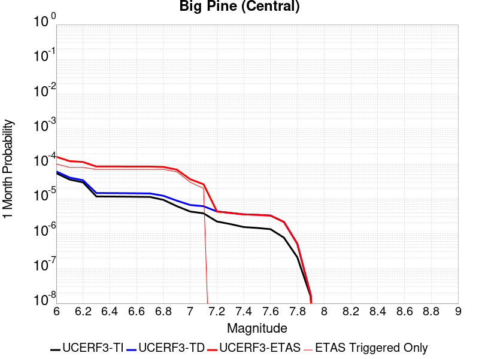 | 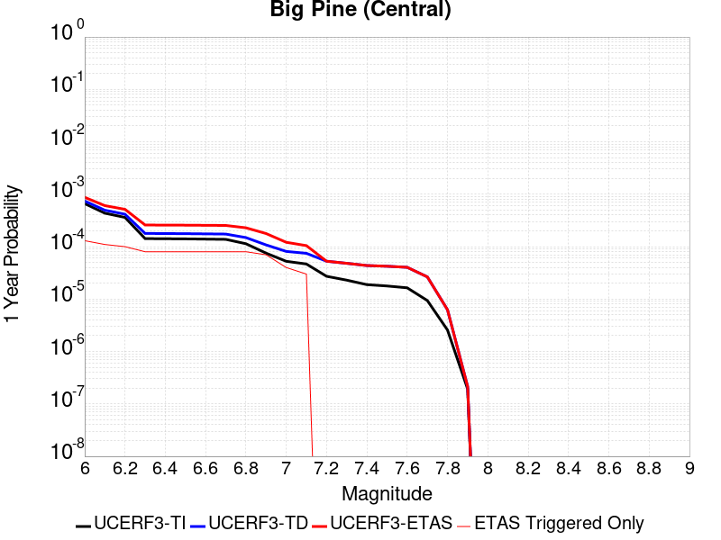 |  |

| Magnitude | 1 wk TI Prob | 1 wk TD Prob | 1 wk ETAS Prob | 1 wk ETAS/TD Gain | 1 wk ETAS Triggered Only | 1 mo TI Prob | 1 mo TD Prob | 1 mo ETAS Prob | 1 mo ETAS/TD Gain | 1 mo ETAS Triggered Only | 1 yr TI Prob | 1 yr TD Prob | 1 yr ETAS Prob | 1 yr ETAS/TD Gain | 1 yr ETAS Triggered Only | 10 yr TI Prob | 10 yr TD Prob | 10 yr ETAS Prob | 10 yr ETAS/TD Gain | 10 yr ETAS Triggered Only |
|-----|-----|-----|-----|-----|-----|-----|-----|-----|-----|-----|-----|-----|-----|-----|-----|-----|-----|-----|-----|-----|
| 6.0 | 1.2706755E-5 | 1.4250602E-5 | 7.424975E-5 | 5.2102885 | 6.0E-5 | 5.4456385E-5 | 6.107279E-5 | 1.6106668E-4 | 2.6372905 | 1.0E-4 | 6.628048E-4 | 7.433441E-4 | 8.7324745E-4 | 1.1747553 | 1.3E-4 | 0.006608314 | 0.007413639 | 0.0076022306 | 1.0254384 | 1.9E-4 |
| 6.1 | 8.342579E-6 | 9.510835E-6 | 5.951036E-5 | 6.2571115 | 5.0E-5 | 3.5753423E-5 | 4.076021E-5 | 1.2075695E-4 | 2.9626184 | 8.0E-5 | 4.3521097E-4 | 4.9616426E-4 | 6.061097E-4 | 1.2215908 | 1.1E-4 | 0.0043435963 | 0.004954155 | 0.005103412 | 1.0301276 | 1.5E-4 |
| 6.2 | 6.923899E-6 | 7.967221E-6 | 5.7966823E-5 | 7.275664 | 5.0E-5 | 2.9673516E-5 | 3.4144894E-5 | 1.1414217E-4 | 3.3428764 | 8.0E-5 | 3.6121515E-4 | 4.1565404E-4 | 5.156125E-4 | 1.2404847 | 1.0E-4 | 0.003606286 | 0.0041521094 | 0.0042616525 | 1.0263826 | 1.1E-4 |
| 6.3 | 2.728396E-6 | 3.4243646E-6 | 5.342419E-5 | 15.601198 | 5.0E-5 | 1.1693074E-5 | 1.4675771E-5 | 8.467474E-5 | 5.769696 | 7.0E-5 | 1.4235388E-4 | 1.7866373E-4 | 2.5864944E-4 | 1.4476886 | 8.0E-5 | 0.0014226272 | 0.0017867433 | 0.0018765825 | 1.0502809 | 9.0E-5 |
| 6.4 | 2.7136944E-6 | 3.4086581E-6 | 5.3408487E-5 | 15.668479 | 5.0E-5 | 1.1630066E-5 | 1.4608458E-5 | 8.460743E-5 | 5.7916746 | 7.0E-5 | 1.4158686E-4 | 1.7784433E-4 | 2.578301E-4 | 1.4497516 | 8.0E-5 | 0.0014149669 | 0.0017785623 | 0.0018684022 | 1.0505127 | 9.0E-5 |
| 6.5 | 2.6971882E-6 | 3.3910032E-6 | 5.3390835E-5 | 15.744849 | 5.0E-5 | 1.1559327E-5 | 1.4532795E-5 | 8.453178E-5 | 5.8166223 | 7.0E-5 | 1.4072572E-4 | 1.7692328E-4 | 2.5690912E-4 | 1.4520934 | 8.0E-5 | 0.0014063664 | 0.0017693666 | 0.0018592073 | 1.0507756 | 9.0E-5 |
| 6.6 | 2.669092E-6 | 3.3610236E-6 | 5.3360855E-5 | 15.87637 | 5.0E-5 | 1.1438916E-5 | 1.4404312E-5 | 8.4403306E-5 | 5.859586 | 7.0E-5 | 1.3925991E-4 | 1.7535927E-4 | 2.5534522E-4 | 1.4561263 | 8.0E-5 | 0.0013917267 | 0.0017537511 | 0.0018435933 | 1.0512285 | 9.0E-5 |
| 6.7 | 2.6408059E-6 | 3.3310494E-6 | 5.333088E-5 | 16.010235 | 5.0E-5 | 1.1317691E-5 | 1.4275853E-5 | 8.4274856E-5 | 5.903315 | 7.0E-5 | 1.3778417E-4 | 1.737955E-4 | 2.5378162E-4 | 1.4602311 | 8.0E-5 | 0.0013769877 | 0.0017381381 | 0.0018279817 | 1.0516895 | 9.0E-5 |
| 6.8 | 2.1786943E-6 | 2.8545066E-6 | 5.2854364E-5 | 18.516111 | 5.0E-5 | 9.337228E-6 | 1.2233547E-5 | 8.223269E-5 | 6.721901 | 7.0E-5 | 1.1367482E-4 | 1.4893398E-4 | 2.2892206E-4 | 1.5370708 | 8.0E-5 | 0.0011361669 | 0.0014898704 | 0.0015797364 | 1.060318 | 9.0E-5 |
| 6.9 | 1.4411696E-6 | 2.0685677E-6 | 5.2068463E-5 | 25.171265 | 5.0E-5 | 6.1764263E-6 | 8.865261E-6 | 6.886473E-5 | 7.7679296 | 6.0E-5 | 7.51954E-5 | 1.0792949E-4 | 1.7792193E-4 | 1.6485016 | 7.0E-5 | 7.5169955E-4 | 0.0010802548 | 0.0011601684 | 1.0739766 | 8.0E-5 |
| 7.0 | 1.0073411E-6 | 1.5543274E-6 | 2.1554297E-5 | 13.867282 | 2.0E-5 | 4.317169E-6 | 6.661387E-6 | 3.6661186E-5 | 5.5035367 | 3.0E-5 | 5.2560266E-5 | 8.109952E-5 | 1.2109628E-4 | 1.4931811 | 4.0E-5 | 5.2547833E-4 | 8.1217213E-4 | 8.5213967E-4 | 1.0492107 | 4.0E-5 |
| 7.1 | 8.947104E-7 | 1.430316E-6 | 1.1430302E-5 | 7.9914517 | 1.0E-5 | 3.834468E-6 | 6.1299124E-6 | 2.612979E-5 | 4.2626696 | 2.0E-5 | 4.6683643E-5 | 7.462928E-5 | 1.0462703E-4 | 1.401957 | 3.0E-5 | 4.6673836E-4 | 7.4751483E-4 | 7.774924E-4 | 1.040103 | 3.0E-5 |
| 7.2 | 5.215166E-7 | 1.0112277E-6 | 1.0112277E-6 | 1.0 | 0.0 | 2.2350691E-6 | 4.333826E-6 | 4.333826E-6 | 1.0 | 0.0 | 2.7211627E-5 | 5.27631E-5 | 5.27631E-5 | 1.0 | 0.0 | 2.7208295E-4 | 5.289683E-4 | 5.289683E-4 | 1.0 | 0.0 |
| 7.3 | 4.4024807E-7 | 9.220183E-7 | 9.220183E-7 | 1.0 | 0.0 | 1.8867761E-6 | 3.951501E-6 | 3.951501E-6 | 1.0 | 0.0 | 2.2971257E-5 | 4.8108504E-5 | 4.8108504E-5 | 1.0 | 0.0 | 2.2968883E-4 | 4.824433E-4 | 4.824433E-4 | 1.0 | 0.0 |
| 7.4 | 3.6130905E-7 | 8.359109E-7 | 8.359109E-7 | 1.0 | 0.0 | 1.5484665E-6 | 3.5824705E-6 | 3.5824705E-6 | 1.0 | 0.0 | 1.8852415E-5 | 4.3615746E-5 | 4.3615746E-5 | 1.0 | 0.0 | 1.8850817E-4 | 4.3752496E-4 | 4.3752496E-4 | 1.0 | 0.0 |
| 7.5 | 3.408184E-7 | 8.1087245E-7 | 8.1087245E-7 | 1.0 | 0.0 | 1.4606494E-6 | 3.475163E-6 | 3.475163E-6 | 1.0 | 0.0 | 1.7783263E-5 | 4.230933E-5 | 4.230933E-5 | 1.0 | 0.0 | 1.778184E-4 | 4.2444657E-4 | 4.2444657E-4 | 1.0 | 0.0 |
| 7.6 | 3.1428627E-7 | 7.732167E-7 | 7.732167E-7 | 1.0 | 0.0 | 1.3469405E-6 | 3.313782E-6 | 3.313782E-6 | 1.0 | 0.0 | 1.6398877E-5 | 4.0344585E-5 | 4.0344585E-5 | 1.0 | 0.0 | 1.6397667E-4 | 4.0477706E-4 | 4.0477706E-4 | 1.0 | 0.0 |
| 7.7 | 1.7972785E-7 | 5.0782415E-7 | 5.0782415E-7 | 1.0 | 0.0 | 7.70262E-7 | 2.1763874E-6 | 2.1763874E-6 | 1.0 | 0.0 | 9.377899E-6 | 2.6497206E-5 | 2.6497206E-5 | 1.0 | 0.0 | 9.377503E-5 | 2.6633305E-4 | 2.6633305E-4 | 1.0 | 0.0 |
| 7.8 | 4.9230927E-8 | 1.1981747E-7 | 1.1981747E-7 | 1.0 | 0.0 | 2.1098968E-7 | 5.135033E-7 | 5.135033E-7 | 1.0 | 0.0 | 2.5687964E-6 | 6.2518866E-6 | 6.2518866E-6 | 1.0 | 0.0 | 2.5687666E-5 | 6.2971965E-5 | 6.2971965E-5 | 1.0 | 0.0 |
| 7.9 | 3.6805972E-9 | 4.1051638E-9 | 4.1051638E-9 | 1.0 | 0.0 | 1.5773987E-8 | 1.7593557E-8 | 1.7593557E-8 | 1.0 | 0.0 | 1.9204828E-7 | 2.1420155E-7 | 2.1420155E-7 | 1.0 | 0.0 | 1.920481E-6 | 2.1898923E-6 | 2.1898923E-6 | 1.0 | 0.0 |

## Rose Canyon
*[(top)](#table-of-contents)*

| 1 Week | 1 Month | 1 Year | 10 Year |
|-----|-----|-----|-----|
|  | 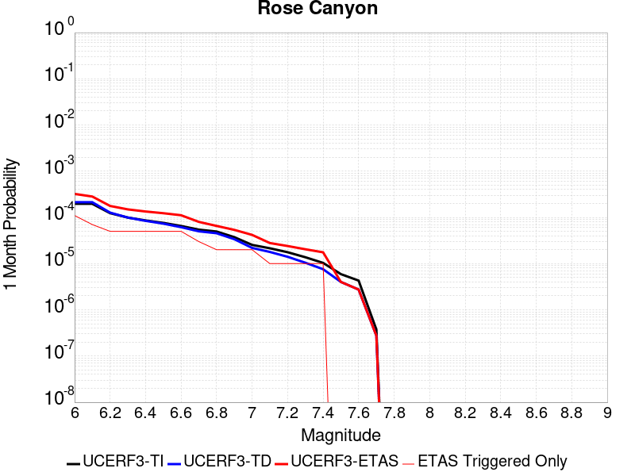 |  | 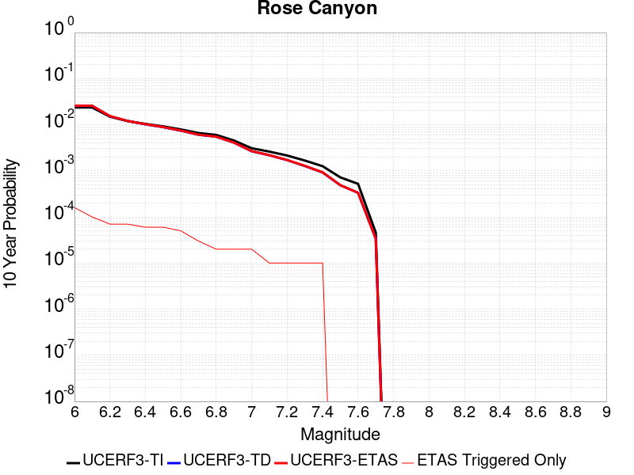 |

| Magnitude | 1 wk TI Prob | 1 wk TD Prob | 1 wk ETAS Prob | 1 wk ETAS/TD Gain | 1 wk ETAS Triggered Only | 1 mo TI Prob | 1 mo TD Prob | 1 mo ETAS Prob | 1 mo ETAS/TD Gain | 1 mo ETAS Triggered Only | 1 yr TI Prob | 1 yr TD Prob | 1 yr ETAS Prob | 1 yr ETAS/TD Gain | 1 yr ETAS Triggered Only | 10 yr TI Prob | 10 yr TD Prob | 10 yr ETAS Prob | 10 yr ETAS/TD Gain | 10 yr ETAS Triggered Only |
|-----|-----|-----|-----|-----|-----|-----|-----|-----|-----|-----|-----|-----|-----|-----|-----|-----|-----|-----|-----|-----|
| 6.0 | 4.5923203E-5 | 4.9714607E-5 | 1.1971113E-4 | 2.4079669 | 7.0E-5 | 1.9679888E-4 | 2.1304654E-4 | 3.2302312E-4 | 1.5162091 | 1.1E-4 | 0.0023933933 | 0.0025909478 | 0.002720611 | 1.0500447 | 1.3E-4 | 0.023677798 | 0.025618518 | 0.02577442 | 1.0060855 | 1.6E-4 |
| 6.1 | 4.5923203E-5 | 4.9714607E-5 | 9.9712124E-5 | 2.0056906 | 5.0E-5 | 1.9679888E-4 | 2.1304654E-4 | 2.8303164E-4 | 1.3284967 | 7.0E-5 | 0.0023933933 | 0.0025909478 | 0.0026707405 | 1.0307968 | 8.0E-5 | 0.023677798 | 0.025618518 | 0.025715956 | 1.0038034 | 1.0E-4 |
| 6.2 | 2.8844734E-5 | 2.9669678E-5 | 6.9668495E-5 | 2.3481379 | 4.0E-5 | 1.2361443E-4 | 1.2714976E-4 | 1.771434E-4 | 1.393187 | 5.0E-5 | 0.0015039665 | 0.001546976 | 0.0015968988 | 1.0322711 | 5.0E-5 | 0.0149382865 | 0.015364873 | 0.015433798 | 1.0044858 | 7.0E-5 |
| 6.3 | 2.3171577E-5 | 2.3162425E-5 | 6.31615E-5 | 2.7268949 | 4.0E-5 | 9.9302975E-5 | 9.926383E-5 | 1.4925886E-4 | 1.5036582 | 5.0E-5 | 0.0012083431 | 0.0012078804 | 0.00125782 | 1.0413449 | 5.0E-5 | 0.012017938 | 0.012012152 | 0.012081311 | 1.0057575 | 7.0E-5 |
| 6.4 | 2.0066604E-5 | 1.9668067E-5 | 5.966728E-5 | 3.0337136 | 4.0E-5 | 8.599689E-5 | 8.428905E-5 | 1.3428484E-4 | 1.5931469 | 5.0E-5 | 0.0010465092 | 0.001025746 | 0.0010756948 | 1.048695 | 5.0E-5 | 0.010415946 | 0.010211479 | 0.010270866 | 1.0058157 | 6.0E-5 |
| 6.5 | 1.776989E-5 | 1.7115402E-5 | 5.7114717E-5 | 3.3370364 | 4.0E-5 | 7.615444E-5 | 7.33497E-5 | 1.2334604E-4 | 1.6816161 | 5.0E-5 | 9.267859E-4 | 8.926737E-4 | 9.42629E-4 | 1.0559615 | 5.0E-5 | 0.009229303 | 0.008874663 | 0.008934131 | 1.0067009 | 6.0E-5 |
| 6.6 | 1.5227364E-5 | 1.4340872E-5 | 5.43403E-5 | 3.7891905 | 4.0E-5 | 6.52585E-5 | 6.145947E-5 | 1.1145639E-4 | 1.8134943 | 5.0E-5 | 7.942326E-4 | 7.480173E-4 | 7.979799E-4 | 1.0667933 | 5.0E-5 | 0.007914 | 0.0074410336 | 0.0074906615 | 1.0066695 | 5.0E-5 |
| 6.7 | 1.2703898E-5 | 1.1674277E-5 | 4.1673928E-5 | 3.5697222 | 3.0E-5 | 5.4444143E-5 | 5.0031682E-5 | 8.003018E-5 | 1.5995901 | 3.0E-5 | 6.626558E-4 | 6.089697E-4 | 6.3895143E-4 | 1.0492336 | 3.0E-5 | 0.006606833 | 0.0060623093 | 0.0060921274 | 1.0049186 | 3.0E-5 |
| 6.8 | 1.1554917E-5 | 1.0610384E-5 | 3.0610172E-5 | 2.8849258 | 2.0E-5 | 4.9520135E-5 | 4.547231E-5 | 6.5471395E-5 | 1.4398081 | 2.0E-5 | 6.0274085E-4 | 5.5348873E-4 | 5.734777E-4 | 1.0361145 | 2.0E-5 | 0.0060110865 | 0.005504414 | 0.0055243038 | 1.0036135 | 2.0E-5 |
| 6.9 | 8.732078E-6 | 7.882285E-6 | 2.7882128E-5 | 3.5373151 | 2.0E-5 | 3.7422655E-5 | 3.37808E-5 | 5.3780128E-5 | 1.5920322 | 2.0E-5 | 4.5552556E-4 | 4.112066E-4 | 4.3119836E-4 | 1.0486174 | 2.0E-5 | 0.0045459294 | 0.004089515 | 0.0041094334 | 1.0048705 | 2.0E-5 |
| 7.0 | 5.9337494E-6 | 5.107436E-6 | 2.5107334E-5 | 4.915839 | 2.0E-5 | 2.5430107E-5 | 2.1888829E-5 | 4.188839E-5 | 1.9136881 | 2.0E-5 | 3.0956755E-4 | 2.6646405E-4 | 2.8645873E-4 | 1.075037 | 2.0E-5 | 0.0030913667 | 0.002661461 | 0.0026814078 | 1.0074947 | 2.0E-5 |
| 7.1 | 5.013409E-6 | 4.17734E-6 | 1.4177298E-5 | 3.393858 | 1.0E-5 | 2.1485863E-5 | 1.7902763E-5 | 2.7902584E-5 | 1.558563 | 1.0E-5 | 2.6155898E-4 | 2.1794444E-4 | 2.2794226E-4 | 1.0458733 | 1.0E-5 | 0.0026125133 | 0.0021773188 | 0.002187297 | 1.0045828 | 1.0E-5 |
| 7.2 | 4.120763E-6 | 3.2820917E-6 | 1.3282059E-5 | 4.0468273 | 1.0E-5 | 1.7660293E-5 | 1.4066032E-5 | 2.4065892E-5 | 1.7109226 | 1.0E-5 | 2.1499286E-4 | 1.7124058E-4 | 1.8123887E-4 | 1.0583874 | 1.0E-5 | 0.0021478499 | 0.0017110958 | 0.0017210786 | 1.0058342 | 1.0E-5 |
| 7.3 | 3.2081239E-6 | 2.4404965E-6 | 1.2440472E-5 | 5.097517 | 1.0E-5 | 1.374903E-5 | 1.0459229E-5 | 2.0459123E-5 | 1.9560834 | 1.0E-5 | 1.6738157E-4 | 1.2733374E-4 | 1.3733246E-4 | 1.0785238 | 1.0E-5 | 0.0016725556 | 0.0012726148 | 0.0012826021 | 1.0078478 | 1.0E-5 |
| 7.4 | 2.4194755E-6 | 1.7680321E-6 | 1.1768015E-5 | 6.655996 | 1.0E-5 | 1.0369139E-5 | 7.5772587E-6 | 1.7577182E-5 | 2.3197286 | 1.0E-5 | 1.2623696E-4 | 9.224927E-5 | 1.0224835E-4 | 1.1083919 | 1.0E-5 | 0.0012616527 | 9.221151E-4 | 9.3210593E-4 | 1.0108346 | 1.0E-5 |
| 7.5 | 1.3842889E-6 | 9.3782967E-7 | 9.3782967E-7 | 1.0 | 0.0 | 5.9326535E-6 | 4.019264E-6 | 4.019264E-6 | 1.0 | 0.0 | 7.222766E-5 | 4.8933474E-5 | 4.8933474E-5 | 1.0 | 0.0 | 7.220419E-4 | 4.8923056E-4 | 4.8923056E-4 | 1.0 | 0.0 |
| 7.6 | 1.0021575E-6 | 6.4113493E-7 | 6.4113493E-7 | 1.0 | 0.0 | 4.2949537E-6 | 2.7477186E-6 | 2.7477186E-6 | 1.0 | 0.0 | 5.2289808E-5 | 3.345298E-5 | 3.345298E-5 | 1.0 | 0.0 | 5.2277505E-4 | 3.344816E-4 | 3.344816E-4 | 1.0 | 0.0 |
| 7.7 | 8.7620116E-8 | 6.449304E-8 | 6.449304E-8 | 1.0 | 0.0 | 3.7551473E-7 | 2.763987E-7 | 2.763987E-7 | 1.0 | 0.0 | 4.5718825E-6 | 3.3651493E-6 | 3.3651493E-6 | 1.0 | 0.0 | 4.5717883E-5 | 3.3651013E-5 | 3.3651013E-5 | 1.0 | 0.0 |

## Deep Springs
*[(top)](#table-of-contents)*

| 1 Week | 1 Month | 1 Year | 10 Year |
|-----|-----|-----|-----|
|  |  |  |  |

| Magnitude | 1 wk TI Prob | 1 wk TD Prob | 1 wk ETAS Prob | 1 wk ETAS/TD Gain | 1 wk ETAS Triggered Only | 1 mo TI Prob | 1 mo TD Prob | 1 mo ETAS Prob | 1 mo ETAS/TD Gain | 1 mo ETAS Triggered Only | 1 yr TI Prob | 1 yr TD Prob | 1 yr ETAS Prob | 1 yr ETAS/TD Gain | 1 yr ETAS Triggered Only | 10 yr TI Prob | 10 yr TD Prob | 10 yr ETAS Prob | 10 yr ETAS/TD Gain | 10 yr ETAS Triggered Only |
|-----|-----|-----|-----|-----|-----|-----|-----|-----|-----|-----|-----|-----|-----|-----|-----|-----|-----|-----|-----|-----|
| 6.0 | 1.9810619E-5 | 2.311252E-5 | 6.31116E-5 | 2.7306237 | 4.0E-5 | 8.489989E-5 | 9.9052755E-5 | 1.6904583E-4 | 1.7066242 | 7.0E-5 | 0.001033166 | 0.0012058078 | 0.0012956993 | 1.0745487 | 9.0E-5 | 0.010283757 | 0.01204243 | 0.012210383 | 1.0139468 | 1.7E-4 |
| 6.1 | 1.9810619E-5 | 2.311252E-5 | 6.31116E-5 | 2.7306237 | 4.0E-5 | 8.489989E-5 | 9.9052755E-5 | 1.6904583E-4 | 1.7066242 | 7.0E-5 | 0.001033166 | 0.0012058078 | 0.0012956993 | 1.0745487 | 9.0E-5 | 0.010283757 | 0.01204243 | 0.012210383 | 1.0139468 | 1.7E-4 |
| 6.2 | 1.9810619E-5 | 2.311252E-5 | 6.31116E-5 | 2.7306237 | 4.0E-5 | 8.489989E-5 | 9.9052755E-5 | 1.6904583E-4 | 1.7066242 | 7.0E-5 | 0.001033166 | 0.0012058078 | 0.0012956993 | 1.0745487 | 9.0E-5 | 0.010283757 | 0.01204243 | 0.012210383 | 1.0139468 | 1.7E-4 |
| 6.3 | 1.9810619E-5 | 2.311252E-5 | 6.31116E-5 | 2.7306237 | 4.0E-5 | 8.489989E-5 | 9.9052755E-5 | 1.6904583E-4 | 1.7066242 | 7.0E-5 | 0.001033166 | 0.0012058078 | 0.0012956993 | 1.0745487 | 9.0E-5 | 0.010283757 | 0.01204243 | 0.012210383 | 1.0139468 | 1.7E-4 |
| 6.4 | 1.9810619E-5 | 2.311252E-5 | 6.31116E-5 | 2.7306237 | 4.0E-5 | 8.489989E-5 | 9.9052755E-5 | 1.6904583E-4 | 1.7066242 | 7.0E-5 | 0.001033166 | 0.0012058078 | 0.0012956993 | 1.0745487 | 9.0E-5 | 0.010283757 | 0.01204243 | 0.012210383 | 1.0139468 | 1.7E-4 |
| 6.5 | 1.7190405E-5 | 2.0050558E-5 | 5.0049955E-5 | 2.4961877 | 3.0E-5 | 7.367108E-5 | 8.593096E-5 | 1.459258E-4 | 1.698175 | 6.0E-5 | 8.9657627E-4 | 0.0010462092 | 0.0011261256 | 1.0763866 | 8.0E-5 | 0.008929676 | 0.010462061 | 0.0105907 | 1.0122958 | 1.3E-4 |
| 6.6 | 1.7190405E-5 | 2.0050558E-5 | 5.0049955E-5 | 2.4961877 | 3.0E-5 | 7.367108E-5 | 8.593096E-5 | 1.459258E-4 | 1.698175 | 6.0E-5 | 8.9657627E-4 | 0.0010462092 | 0.0011261256 | 1.0763866 | 8.0E-5 | 0.008929676 | 0.010462061 | 0.0105907 | 1.0122958 | 1.3E-4 |

## Ventura-Pitas Point
*[(top)](#table-of-contents)*

| 1 Week | 1 Month | 1 Year | 10 Year |
|-----|-----|-----|-----|
|  |  | 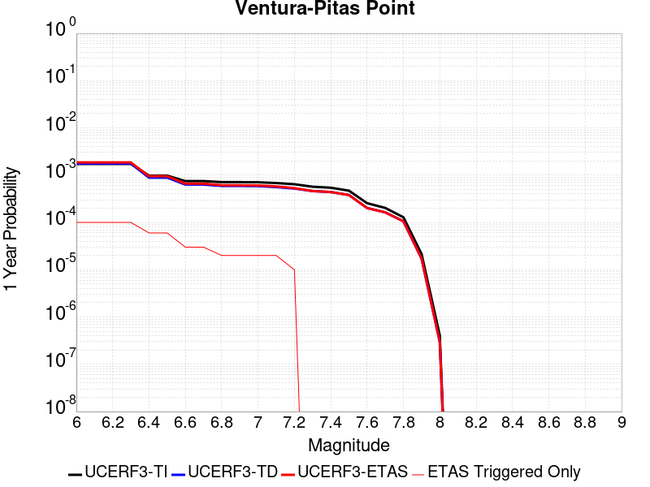 | 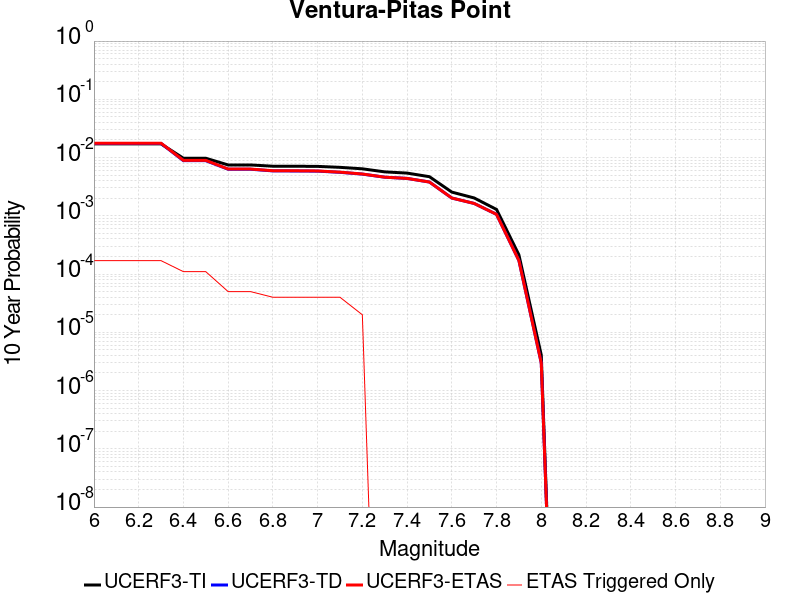 |

| Magnitude | 1 wk TI Prob | 1 wk TD Prob | 1 wk ETAS Prob | 1 wk ETAS/TD Gain | 1 wk ETAS Triggered Only | 1 mo TI Prob | 1 mo TD Prob | 1 mo ETAS Prob | 1 mo ETAS/TD Gain | 1 mo ETAS Triggered Only | 1 yr TI Prob | 1 yr TD Prob | 1 yr ETAS Prob | 1 yr ETAS/TD Gain | 1 yr ETAS Triggered Only | 10 yr TI Prob | 10 yr TD Prob | 10 yr ETAS Prob | 10 yr ETAS/TD Gain | 10 yr ETAS Triggered Only |
|-----|-----|-----|-----|-----|-----|-----|-----|-----|-----|-----|-----|-----|-----|-----|-----|-----|-----|-----|-----|-----|
| 6.0 | 3.3179622E-5 | 3.373519E-5 | 8.37335E-5 | 2.482082 | 5.0E-5 | 1.4219063E-4 | 1.4457281E-4 | 2.0456414E-4 | 1.4149557 | 6.0E-5 | 0.0017297962 | 0.0017590097 | 0.0018588338 | 1.0567502 | 1.0E-4 | 0.017163932 | 0.017476497 | 0.017643526 | 1.0095574 | 1.7E-4 |
| 6.1 | 3.3179622E-5 | 3.373519E-5 | 8.37335E-5 | 2.482082 | 5.0E-5 | 1.4219063E-4 | 1.4457281E-4 | 2.0456414E-4 | 1.4149557 | 6.0E-5 | 0.0017297962 | 0.0017590097 | 0.0018588338 | 1.0567502 | 1.0E-4 | 0.017163932 | 0.017476497 | 0.017643526 | 1.0095574 | 1.7E-4 |
| 6.2 | 3.3179622E-5 | 3.373519E-5 | 8.37335E-5 | 2.482082 | 5.0E-5 | 1.4219063E-4 | 1.4457281E-4 | 2.0456414E-4 | 1.4149557 | 6.0E-5 | 0.0017297962 | 0.0017590097 | 0.0018588338 | 1.0567502 | 1.0E-4 | 0.017163932 | 0.017476497 | 0.017643526 | 1.0095574 | 1.7E-4 |
| 6.3 | 3.3179622E-5 | 3.373519E-5 | 8.37335E-5 | 2.482082 | 5.0E-5 | 1.4219063E-4 | 1.4457281E-4 | 2.0456414E-4 | 1.4149557 | 6.0E-5 | 0.0017297962 | 0.0017590097 | 0.0018588338 | 1.0567502 | 1.0E-4 | 0.017163932 | 0.017476497 | 0.017643526 | 1.0095574 | 1.7E-4 |
| 6.4 | 1.8754668E-5 | 1.7019594E-5 | 3.7019254E-5 | 2.1750963 | 2.0E-5 | 8.037467E-5 | 7.2939205E-5 | 1.0293702E-4 | 1.4112715 | 3.0E-5 | 9.781223E-4 | 8.8769617E-4 | 9.476429E-4 | 1.0675308 | 6.0E-5 | 0.009738282 | 0.008843943 | 0.00895297 | 1.0123279 | 1.1E-4 |
| 6.5 | 1.8754668E-5 | 1.7019594E-5 | 3.7019254E-5 | 2.1750963 | 2.0E-5 | 8.037467E-5 | 7.2939205E-5 | 1.0293702E-4 | 1.4112715 | 3.0E-5 | 9.781223E-4 | 8.8769617E-4 | 9.476429E-4 | 1.0675308 | 6.0E-5 | 0.009738282 | 0.008843943 | 0.00895297 | 1.0123279 | 1.1E-4 |
| 6.6 | 1.4361558E-5 | 1.2122258E-5 | 2.2122136E-5 | 1.8249189 | 1.0E-5 | 6.154808E-5 | 5.1951512E-5 | 7.1950475E-5 | 1.3849543 | 2.0E-5 | 7.490902E-4 | 6.323284E-4 | 6.623094E-4 | 1.0474137 | 3.0E-5 | 0.0074657016 | 0.006305652 | 0.006355337 | 1.0078794 | 5.0E-5 |
| 6.7 | 1.4361558E-5 | 1.2122258E-5 | 2.2122136E-5 | 1.8249189 | 1.0E-5 | 6.154808E-5 | 5.1951512E-5 | 7.1950475E-5 | 1.3849543 | 2.0E-5 | 7.490902E-4 | 6.323284E-4 | 6.623094E-4 | 1.0474137 | 3.0E-5 | 0.0074657016 | 0.006305652 | 0.006355337 | 1.0078794 | 5.0E-5 |
| 6.8 | 1.3663846E-5 | 1.1344401E-5 | 1.1344401E-5 | 1.0 | 0.0 | 5.8558027E-5 | 4.8617967E-5 | 5.861748E-5 | 1.2056752 | 1.0E-5 | 7.127108E-4 | 5.917649E-4 | 6.117531E-4 | 1.0337772 | 2.0E-5 | 0.007104293 | 0.0059022107 | 0.005941975 | 1.0067371 | 4.0E-5 |
| 6.9 | 1.3644157E-5 | 1.1322501E-5 | 1.1322501E-5 | 1.0 | 0.0 | 5.8473648E-5 | 4.8524114E-5 | 5.852363E-5 | 1.206073 | 1.0E-5 | 7.116841E-4 | 5.906229E-4 | 6.106111E-4 | 1.0338426 | 2.0E-5 | 0.007094092 | 0.0058908514 | 0.0059306156 | 1.0067502 | 4.0E-5 |
| 7.0 | 1.3568845E-5 | 1.12420685E-5 | 1.12420685E-5 | 1.0 | 0.0 | 5.8150898E-5 | 4.8179416E-5 | 5.817893E-5 | 1.2075475 | 1.0E-5 | 7.077572E-4 | 5.8642845E-4 | 6.064167E-4 | 1.0340848 | 2.0E-5 | 0.007055073 | 0.005849128 | 0.005888894 | 1.0067986 | 4.0E-5 |
| 7.1 | 1.306572E-5 | 1.0720521E-5 | 1.0720521E-5 | 1.0 | 0.0 | 5.599474E-5 | 4.594429E-5 | 5.594383E-5 | 1.2176449 | 1.0E-5 | 6.815227E-4 | 5.5923004E-4 | 5.7921885E-4 | 1.0357435 | 2.0E-5 | 0.0067943637 | 0.005578536 | 0.005618313 | 1.0071304 | 4.0E-5 |
| 7.2 | 1.232604E-5 | 9.995121E-6 | 9.995121E-6 | 1.0 | 0.0 | 5.2824813E-5 | 4.283554E-5 | 4.283554E-5 | 1.0 | 0.0 | 6.429523E-4 | 5.2139966E-4 | 5.3139444E-4 | 1.0191691 | 1.0E-5 | 0.0064109527 | 0.005202059 | 0.005221955 | 1.0038246 | 2.0E-5 |
| 7.3 | 1.0917261E-5 | 8.843812E-6 | 8.843812E-6 | 1.0 | 0.0 | 4.678742E-5 | 3.7901507E-5 | 3.7901507E-5 | 1.0 | 0.0 | 5.69488E-4 | 4.6135474E-4 | 4.6135474E-4 | 1.0 | 0.0 | 0.0056803077 | 0.004604239 | 0.004604239 | 1.0 | 0.0 |
| 7.4 | 1.039959E-5 | 8.42354E-6 | 8.42354E-6 | 1.0 | 0.0 | 4.456891E-5 | 3.6100395E-5 | 3.6100395E-5 | 1.0 | 0.0 | 5.424914E-4 | 4.394352E-4 | 4.394352E-4 | 1.0 | 0.0 | 0.0054116896 | 0.0043859277 | 0.0043859277 | 1.0 | 0.0 |
| 7.5 | 9.015877E-6 | 7.29752E-6 | 7.29752E-6 | 1.0 | 0.0 | 3.86389E-5 | 3.1274718E-5 | 3.1274718E-5 | 1.0 | 0.0 | 4.7032707E-4 | 3.8070456E-4 | 3.8070456E-4 | 1.0 | 0.0 | 0.004693329 | 0.003800772 | 0.003800772 | 1.0 | 0.0 |
| 7.6 | 4.900162E-6 | 3.874119E-6 | 3.874119E-6 | 1.0 | 0.0 | 2.1000526E-5 | 1.6603262E-5 | 1.6603262E-5 | 1.0 | 0.0 | 2.556514E-4 | 2.0212609E-4 | 2.0212609E-4 | 1.0 | 0.0 | 0.0025535747 | 0.002019436 | 0.002019436 | 1.0 | 0.0 |
| 7.7 | 3.8850626E-6 | 3.12676E-6 | 3.12676E-6 | 1.0 | 0.0 | 1.6650163E-5 | 1.3400332E-5 | 1.3400332E-5 | 1.0 | 0.0 | 2.0269687E-4 | 1.6313691E-4 | 1.6313691E-4 | 1.0 | 0.0 | 0.002025121 | 0.0016301809 | 0.0016301809 | 1.0 | 0.0 |
| 7.8 | 2.4654719E-6 | 2.029902E-6 | 2.029902E-6 | 1.0 | 0.0 | 1.0566265E-5 | 8.699551E-6 | 8.699551E-6 | 1.0 | 0.0 | 1.2863669E-4 | 1.0591193E-4 | 1.0591193E-4 | 1.0 | 0.0 | 0.0012856225 | 0.0010586192 | 0.0010586192 | 1.0 | 0.0 |
| 7.9 | 4.095894E-7 | 3.2765078E-7 | 3.2765078E-7 | 1.0 | 0.0 | 1.7553821E-6 | 1.4042168E-6 | 1.4042168E-6 | 1.0 | 0.0 | 2.1371567E-5 | 1.709621E-5 | 1.709621E-5 | 1.0 | 0.0 | 2.1369511E-4 | 1.7094925E-4 | 1.7094925E-4 | 1.0 | 0.0 |
| 8.0 | 7.791402E-9 | 5.6836056E-9 | 5.6836056E-9 | 1.0 | 0.0 | 3.3391725E-8 | 2.4358311E-8 | 2.4358311E-8 | 1.0 | 0.0 | 4.0654416E-7 | 2.965624E-7 | 2.965624E-7 | 1.0 | 0.0 | 4.065434E-6 | 2.9656223E-6 | 2.9656223E-6 | 1.0 | 0.0 |

## Red Mountain
*[(top)](#table-of-contents)*

| 1 Week | 1 Month | 1 Year | 10 Year |
|-----|-----|-----|-----|
|  |  |  | 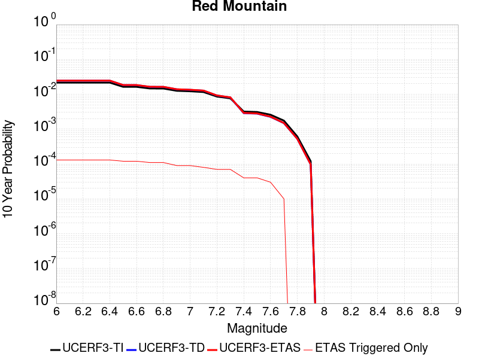 |

| Magnitude | 1 wk TI Prob | 1 wk TD Prob | 1 wk ETAS Prob | 1 wk ETAS/TD Gain | 1 wk ETAS Triggered Only | 1 mo TI Prob | 1 mo TD Prob | 1 mo ETAS Prob | 1 mo ETAS/TD Gain | 1 mo ETAS Triggered Only | 1 yr TI Prob | 1 yr TD Prob | 1 yr ETAS Prob | 1 yr ETAS/TD Gain | 1 yr ETAS Triggered Only | 10 yr TI Prob | 10 yr TD Prob | 10 yr ETAS Prob | 10 yr ETAS/TD Gain | 10 yr ETAS Triggered Only |
|-----|-----|-----|-----|-----|-----|-----|-----|-----|-----|-----|-----|-----|-----|-----|-----|-----|-----|-----|-----|-----|
| 6.0 | 4.1810763E-5 | 4.7590016E-5 | 1.0758716E-4 | 2.2607086 | 6.0E-5 | 1.7917668E-4 | 2.039422E-4 | 2.8392588E-4 | 1.392188 | 8.0E-5 | 0.0021792934 | 0.0024803334 | 0.0025701101 | 1.0361954 | 9.0E-5 | 0.021580452 | 0.02454411 | 0.02467092 | 1.0051665 | 1.3E-4 |
| 6.1 | 4.1810763E-5 | 4.7590016E-5 | 1.0758716E-4 | 2.2607086 | 6.0E-5 | 1.7917668E-4 | 2.039422E-4 | 2.8392588E-4 | 1.392188 | 8.0E-5 | 0.0021792934 | 0.0024803334 | 0.0025701101 | 1.0361954 | 9.0E-5 | 0.021580452 | 0.02454411 | 0.02467092 | 1.0051665 | 1.3E-4 |
| 6.2 | 4.1810763E-5 | 4.7590016E-5 | 1.0758716E-4 | 2.2607086 | 6.0E-5 | 1.7917668E-4 | 2.039422E-4 | 2.8392588E-4 | 1.392188 | 8.0E-5 | 0.0021792934 | 0.0024803334 | 0.0025701101 | 1.0361954 | 9.0E-5 | 0.021580452 | 0.02454411 | 0.02467092 | 1.0051665 | 1.3E-4 |
| 6.3 | 4.1810763E-5 | 4.7590016E-5 | 1.0758716E-4 | 2.2607086 | 6.0E-5 | 1.7917668E-4 | 2.039422E-4 | 2.8392588E-4 | 1.392188 | 8.0E-5 | 0.0021792934 | 0.0024803334 | 0.0025701101 | 1.0361954 | 9.0E-5 | 0.021580452 | 0.02454411 | 0.02467092 | 1.0051665 | 1.3E-4 |
| 6.4 | 4.1810763E-5 | 4.7590016E-5 | 1.0758716E-4 | 2.2607086 | 6.0E-5 | 1.7917668E-4 | 2.039422E-4 | 2.8392588E-4 | 1.392188 | 8.0E-5 | 0.0021792934 | 0.0024803334 | 0.0025701101 | 1.0361954 | 9.0E-5 | 0.021580452 | 0.02454411 | 0.02467092 | 1.0051665 | 1.3E-4 |
| 6.5 | 3.154503E-5 | 3.5359757E-5 | 9.535764E-5 | 2.6967843 | 6.0E-5 | 1.3518598E-4 | 1.5153353E-4 | 2.3152141E-4 | 1.527856 | 8.0E-5 | 0.0016446467 | 0.0018434518 | 0.0019332859 | 1.0487314 | 9.0E-5 | 0.01632528 | 0.018291244 | 0.01840905 | 1.0064405 | 1.2E-4 |
| 6.6 | 3.1535834E-5 | 3.5349138E-5 | 9.5347015E-5 | 2.697294 | 6.0E-5 | 1.3514658E-4 | 1.5148803E-4 | 2.3147592E-4 | 1.5280145 | 8.0E-5 | 0.0016441676 | 0.0018428987 | 0.0019327329 | 1.0487461 | 9.0E-5 | 0.01632056 | 0.018285805 | 0.01840361 | 1.0064424 | 1.2E-4 |
| 6.7 | 2.8267326E-5 | 3.1469353E-5 | 8.1467784E-5 | 2.5887973 | 5.0E-5 | 1.2114006E-4 | 1.3486217E-4 | 2.0485274E-4 | 1.5189785 | 7.0E-5 | 0.0014738824 | 0.0016407954 | 0.0017206641 | 1.0486768 | 8.0E-5 | 0.014641452 | 0.01629557 | 0.01640378 | 1.0066403 | 1.1E-4 |
| 6.8 | 2.8212884E-5 | 3.1407242E-5 | 8.140567E-5 | 2.5919397 | 5.0E-5 | 1.20906756E-4 | 1.3459599E-4 | 2.0458657E-4 | 1.5200049 | 7.0E-5 | 0.0014710457 | 0.0016375595 | 0.0017174286 | 1.0487732 | 8.0E-5 | 0.014613459 | 0.016263688 | 0.016371898 | 1.0066535 | 1.1E-4 |
| 6.9 | 2.4227871E-5 | 2.6706994E-5 | 6.670593E-5 | 2.497695 | 4.0E-5 | 1.03829596E-4 | 1.1445395E-4 | 1.7444708E-4 | 1.5241683 | 6.0E-5 | 0.0012633923 | 0.0013926621 | 0.0014625646 | 1.0501934 | 7.0E-5 | 0.012562336 | 0.0138470335 | 0.013935788 | 1.0064096 | 9.0E-5 |
| 7.0 | 2.348524E-5 | 2.5835778E-5 | 6.583474E-5 | 2.5482006 | 4.0E-5 | 1.0064714E-4 | 1.10720495E-4 | 1.7071384E-4 | 1.5418451 | 6.0E-5 | 0.0012246901 | 0.001347264 | 0.0014171697 | 1.0518872 | 7.0E-5 | 0.012179627 | 0.013398598 | 0.013487392 | 1.0066271 | 9.0E-5 |
| 7.1 | 2.2311642E-5 | 2.4462845E-5 | 5.446211E-5 | 2.2263196 | 3.0E-5 | 9.561782E-5 | 1.04836974E-4 | 1.5483172E-4 | 1.476881 | 5.0E-5 | 0.0011635252 | 0.0012757176 | 0.001335641 | 1.0469724 | 6.0E-5 | 0.01157452 | 0.01269146 | 0.012770444 | 1.0062234 | 8.0E-5 |
| 7.2 | 1.6533986E-5 | 1.7670362E-5 | 4.7669833E-5 | 2.6977282 | 3.0E-5 | 7.085802E-5 | 7.572828E-5 | 1.257245E-4 | 1.6602052 | 5.0E-5 | 8.623549E-4 | 9.2166534E-4 | 9.8161E-4 | 1.0650395 | 6.0E-5 | 0.008590161 | 0.009184707 | 0.0092540635 | 1.0075513 | 7.0E-5 |
| 7.3 | 1.4703092E-5 | 1.5559537E-5 | 4.555907E-5 | 2.928048 | 3.0E-5 | 6.301173E-5 | 6.668237E-5 | 1.1667904E-4 | 1.7497734 | 5.0E-5 | 7.668978E-4 | 8.1161706E-4 | 8.715684E-4 | 1.0738665 | 6.0E-5 | 0.0076425658 | 0.008092604 | 0.0081620375 | 1.0085799 | 7.0E-5 |
| 7.4 | 6.1331984E-6 | 5.5288874E-6 | 1.5528833E-5 | 2.8086722 | 1.0E-5 | 2.6284872E-5 | 2.3695018E-5 | 5.3694308E-5 | 2.266059 | 3.0E-5 | 3.199713E-4 | 2.884492E-4 | 3.2843766E-4 | 1.1386327 | 4.0E-5 | 0.0031951098 | 0.0028808024 | 0.0029206872 | 1.013845 | 4.0E-5 |
| 7.5 | 5.954766E-6 | 5.338517E-6 | 1.5338464E-5 | 2.8731694 | 1.0E-5 | 2.5520176E-5 | 2.2879161E-5 | 5.2878473E-5 | 2.3112068 | 3.0E-5 | 3.1066386E-4 | 2.785187E-4 | 3.1850755E-4 | 1.143577 | 4.0E-5 | 0.003102299 | 0.0027817504 | 0.002821639 | 1.0143394 | 4.0E-5 |
| 7.6 | 4.9726646E-6 | 4.315309E-6 | 4.315309E-6 | 1.0 | 0.0 | 2.1311245E-5 | 1.8494053E-5 | 3.8493683E-5 | 2.0814087 | 2.0E-5 | 2.5943352E-4 | 2.2514217E-4 | 2.551354E-4 | 1.1332191 | 3.0E-5 | 0.0025913084 | 0.0022491754 | 0.002279108 | 1.0133082 | 3.0E-5 |
| 7.7 | 3.3613894E-6 | 2.8526886E-6 | 2.8526886E-6 | 1.0 | 0.0 | 1.4405875E-5 | 1.22257525E-5 | 2.2225631E-5 | 1.8179356 | 1.0E-5 | 1.7537741E-4 | 1.4883863E-4 | 1.5883715E-4 | 1.0671768 | 1.0E-5 | 0.0017523908 | 0.0014874157 | 0.0014974009 | 1.006713 | 1.0E-5 |
| 7.8 | 1.1828961E-6 | 1.0122935E-6 | 1.0122935E-6 | 1.0 | 0.0 | 5.069545E-6 | 4.338394E-6 | 4.338394E-6 | 1.0 | 0.0 | 6.171996E-5 | 5.281869E-5 | 5.281869E-5 | 1.0 | 0.0 | 6.170282E-4 | 5.280643E-4 | 5.280643E-4 | 1.0 | 0.0 |
| 7.9 | 2.2967266E-7 | 1.861919E-7 | 1.861919E-7 | 1.0 | 0.0 | 9.843111E-7 | 7.97965E-7 | 7.97965E-7 | 1.0 | 0.0 | 1.19839215E-5 | 9.715184E-6 | 9.715184E-6 | 1.0 | 0.0 | 1.1983275E-4 | 9.714788E-5 | 9.714788E-5 | 1.0 | 0.0 |

## Kern Canyon (South Kern) 2011
*[(top)](#table-of-contents)*

| 1 Week | 1 Month | 1 Year | 10 Year |
|-----|-----|-----|-----|
|  |  |  |  |

| Magnitude | 1 wk TI Prob | 1 wk TD Prob | 1 wk ETAS Prob | 1 wk ETAS/TD Gain | 1 wk ETAS Triggered Only | 1 mo TI Prob | 1 mo TD Prob | 1 mo ETAS Prob | 1 mo ETAS/TD Gain | 1 mo ETAS Triggered Only | 1 yr TI Prob | 1 yr TD Prob | 1 yr ETAS Prob | 1 yr ETAS/TD Gain | 1 yr ETAS Triggered Only | 10 yr TI Prob | 10 yr TD Prob | 10 yr ETAS Prob | 10 yr ETAS/TD Gain | 10 yr ETAS Triggered Only |
|-----|-----|-----|-----|-----|-----|-----|-----|-----|-----|-----|-----|-----|-----|-----|-----|-----|-----|-----|-----|-----|
| 6.0 | 4.105075E-6 | 4.113726E-6 | 6.4113476E-5 | 15.5852585 | 6.0E-5 | 1.7593058E-5 | 1.7630138E-5 | 1.1762838E-4 | 6.672005 | 1.0E-4 | 2.1417443E-4 | 2.1462643E-4 | 3.5459638E-4 | 1.6521562 | 1.4E-4 | 0.0021396813 | 0.0021442554 | 0.0023039123 | 1.074458 | 1.6E-4 |
| 6.1 | 4.105075E-6 | 4.113726E-6 | 6.4113476E-5 | 15.5852585 | 6.0E-5 | 1.7593058E-5 | 1.7630138E-5 | 1.1762838E-4 | 6.672005 | 1.0E-4 | 2.1417443E-4 | 2.1462643E-4 | 3.5459638E-4 | 1.6521562 | 1.4E-4 | 0.0021396813 | 0.0021442554 | 0.0023039123 | 1.074458 | 1.6E-4 |
| 6.2 | 4.105075E-6 | 4.113726E-6 | 6.4113476E-5 | 15.5852585 | 6.0E-5 | 1.7593058E-5 | 1.7630138E-5 | 1.1762838E-4 | 6.672005 | 1.0E-4 | 2.1417443E-4 | 2.1462643E-4 | 3.5459638E-4 | 1.6521562 | 1.4E-4 | 0.0021396813 | 0.0021442554 | 0.0023039123 | 1.074458 | 1.6E-4 |
| 6.3 | 4.105075E-6 | 4.113726E-6 | 6.4113476E-5 | 15.5852585 | 6.0E-5 | 1.7593058E-5 | 1.7630138E-5 | 1.1762838E-4 | 6.672005 | 1.0E-4 | 2.1417443E-4 | 2.1462643E-4 | 3.5459638E-4 | 1.6521562 | 1.4E-4 | 0.0021396813 | 0.0021442554 | 0.0023039123 | 1.074458 | 1.6E-4 |
| 6.4 | 4.105075E-6 | 4.113726E-6 | 6.4113476E-5 | 15.5852585 | 6.0E-5 | 1.7593058E-5 | 1.7630138E-5 | 1.1762838E-4 | 6.672005 | 1.0E-4 | 2.1417443E-4 | 2.1462643E-4 | 3.5459638E-4 | 1.6521562 | 1.4E-4 | 0.0021396813 | 0.0021442554 | 0.0023039123 | 1.074458 | 1.6E-4 |
| 6.5 | 2.9849807E-6 | 2.973154E-6 | 3.2973065E-5 | 11.090264 | 3.0E-5 | 1.2792712E-5 | 1.2742028E-5 | 4.2741645E-5 | 3.3543832 | 3.0E-5 | 1.5574014E-4 | 1.551233E-4 | 2.1511399E-4 | 1.3867291 | 6.0E-5 | 0.0015563103 | 0.0015501654 | 0.0016300413 | 1.0515274 | 8.0E-5 |
| 6.6 | 2.9849807E-6 | 2.973154E-6 | 3.2973065E-5 | 11.090264 | 3.0E-5 | 1.2792712E-5 | 1.2742028E-5 | 4.2741645E-5 | 3.3543832 | 3.0E-5 | 1.5574014E-4 | 1.551233E-4 | 2.1511399E-4 | 1.3867291 | 6.0E-5 | 0.0015563103 | 0.0015501654 | 0.0016300413 | 1.0515274 | 8.0E-5 |
| 6.7 | 2.6756725E-6 | 2.6582202E-6 | 2.2658167E-5 | 8.523811 | 2.0E-5 | 1.1467117E-5 | 1.1392323E-5 | 3.1392094E-5 | 2.7555482 | 2.0E-5 | 1.396032E-4 | 1.386928E-4 | 1.7868726E-4 | 1.2883672 | 4.0E-5 | 0.0013951553 | 0.0013860734 | 0.0014459903 | 1.0432278 | 6.0E-5 |
| 6.8 | 2.3283721E-6 | 2.3047783E-6 | 2.2304732E-5 | 9.677605 | 2.0E-5 | 9.9787E-6 | 9.877584E-6 | 2.9877387E-5 | 3.0247667 | 2.0E-5 | 1.214839E-4 | 1.2025302E-4 | 1.6024821E-4 | 1.332592 | 4.0E-5 | 0.001214175 | 0.001201887 | 0.0012618148 | 1.0498616 | 6.0E-5 |
| 6.9 | 2.0972677E-6 | 2.0696405E-6 | 2.2069598E-5 | 10.663494 | 2.0E-5 | 8.988259E-6 | 8.869858E-6 | 2.8869681E-5 | 3.2548075 | 2.0E-5 | 1.0942656E-4 | 1.0798523E-4 | 1.4798091E-4 | 1.370381 | 4.0E-5 | 0.0010937268 | 0.0010793334 | 0.0011392686 | 1.0555298 | 6.0E-5 |
| 7.0 | 1.7132242E-6 | 1.6787029E-6 | 1.1678686E-5 | 6.95697 | 1.0E-5 | 7.3423685E-6 | 7.1944214E-6 | 1.719435E-5 | 2.3899558 | 1.0E-5 | 8.938967E-5 | 8.75886E-5 | 1.0758685E-4 | 1.2283202 | 2.0E-5 | 8.935372E-4 | 8.755446E-4 | 9.0551836E-4 | 1.0342344 | 3.0E-5 |
| 7.1 | 1.4215541E-6 | 1.3815746E-6 | 1.138156E-5 | 8.238108 | 1.0E-5 | 6.0923603E-6 | 5.9210206E-6 | 1.5920961E-5 | 2.688888 | 1.0E-5 | 7.417196E-5 | 7.208607E-5 | 9.208463E-5 | 1.2774261 | 2.0E-5 | 7.414721E-4 | 7.206296E-4 | 7.406151E-4 | 1.0277336 | 2.0E-5 |
| 7.2 | 9.097853E-7 | 8.60377E-7 | 8.60377E-7 | 1.0 | 0.0 | 3.899074E-6 | 3.6873246E-6 | 3.6873246E-6 | 1.0 | 0.0 | 4.7470192E-5 | 4.4892266E-5 | 4.4892266E-5 | 1.0 | 0.0 | 4.7460053E-4 | 4.4883305E-4 | 4.4883305E-4 | 1.0 | 0.0 |
| 7.3 | 6.144169E-7 | 5.628199E-7 | 5.628199E-7 | 1.0 | 0.0 | 2.6332125E-6 | 2.4120832E-6 | 2.4120832E-6 | 1.0 | 0.0 | 3.205889E-5 | 2.9366722E-5 | 2.9366722E-5 | 1.0 | 0.0 | 3.2054266E-4 | 2.9362892E-4 | 2.9362892E-4 | 1.0 | 0.0 |
| 7.4 | 4.049844E-7 | 3.5728252E-7 | 3.5728252E-7 | 1.0 | 0.0 | 1.7356463E-6 | 1.5312098E-6 | 1.5312098E-6 | 1.0 | 0.0 | 2.1131287E-5 | 1.8642324E-5 | 1.8642324E-5 | 1.0 | 0.0 | 2.1129279E-4 | 1.8640784E-4 | 1.8640784E-4 | 1.0 | 0.0 |
| 7.5 | 1.9871162E-7 | 1.5830383E-7 | 1.5830383E-7 | 1.0 | 0.0 | 8.5162094E-7 | 6.784448E-7 | 6.784448E-7 | 1.0 | 0.0 | 1.0368436E-5 | 8.260035E-6 | 8.260035E-6 | 1.0 | 0.0 | 1.0367952E-4 | 8.259736E-5 | 8.259736E-5 | 1.0 | 0.0 |
| 7.6 | 2.572245E-8 | 1.735264E-8 | 1.735264E-8 | 1.0 | 0.0 | 1.10239064E-7 | 7.436845E-8 | 7.436845E-8 | 1.0 | 0.0 | 1.3421597E-6 | 9.0543557E-7 | 9.0543557E-7 | 1.0 | 0.0 | 1.3421517E-5 | 9.054324E-6 | 9.054324E-6 | 1.0 | 0.0 |

## Cleghorn Lake
*[(top)](#table-of-contents)*

| 1 Week | 1 Month | 1 Year | 10 Year |
|-----|-----|-----|-----|
|  |  |  |  |

| Magnitude | 1 wk TI Prob | 1 wk TD Prob | 1 wk ETAS Prob | 1 wk ETAS/TD Gain | 1 wk ETAS Triggered Only | 1 mo TI Prob | 1 mo TD Prob | 1 mo ETAS Prob | 1 mo ETAS/TD Gain | 1 mo ETAS Triggered Only | 1 yr TI Prob | 1 yr TD Prob | 1 yr ETAS Prob | 1 yr ETAS/TD Gain | 1 yr ETAS Triggered Only | 10 yr TI Prob | 10 yr TD Prob | 10 yr ETAS Prob | 10 yr ETAS/TD Gain | 10 yr ETAS Triggered Only |
|-----|-----|-----|-----|-----|-----|-----|-----|-----|-----|-----|-----|-----|-----|-----|-----|-----|-----|-----|-----|-----|
| 6.0 | 1.5467183E-5 | 1.6794203E-5 | 5.679353E-5 | 3.3817341 | 4.0E-5 | 6.6286244E-5 | 7.197348E-5 | 1.4196844E-4 | 1.9725105 | 7.0E-5 | 8.067362E-4 | 8.759797E-4 | 9.858834E-4 | 1.1254637 | 1.1E-4 | 0.008038137 | 0.008730696 | 0.008879386 | 1.0170307 | 1.5E-4 |
| 6.1 | 1.5467183E-5 | 1.6794203E-5 | 5.679353E-5 | 3.3817341 | 4.0E-5 | 6.6286244E-5 | 7.197348E-5 | 1.4196844E-4 | 1.9725105 | 7.0E-5 | 8.067362E-4 | 8.759797E-4 | 9.858834E-4 | 1.1254637 | 1.1E-4 | 0.008038137 | 0.008730696 | 0.008879386 | 1.0170307 | 1.5E-4 |
| 6.2 | 1.2624631E-5 | 1.3681544E-5 | 5.3680997E-5 | 3.9236064 | 4.0E-5 | 5.410444E-5 | 5.863415E-5 | 1.2863004E-4 | 2.1937735 | 7.0E-5 | 6.585225E-4 | 7.1368564E-4 | 8.136142E-4 | 1.1400177 | 1.0E-4 | 0.0065657445 | 0.0071187317 | 0.0072676637 | 1.0209211 | 1.5E-4 |
| 6.3 | 1.2624631E-5 | 1.3681544E-5 | 5.3680997E-5 | 3.9236064 | 4.0E-5 | 5.410444E-5 | 5.863415E-5 | 1.2863004E-4 | 2.1937735 | 7.0E-5 | 6.585225E-4 | 7.1368564E-4 | 8.136142E-4 | 1.1400177 | 1.0E-4 | 0.0065657445 | 0.0071187317 | 0.0072676637 | 1.0209211 | 1.5E-4 |
| 6.4 | 9.417684E-6 | 1.0170118E-5 | 3.0169915E-5 | 2.9665256 | 2.0E-5 | 4.036088E-5 | 4.3585722E-5 | 7.3584415E-5 | 1.6882688 | 3.0E-5 | 4.912829E-4 | 5.3056807E-4 | 5.805415E-4 | 1.0941886 | 5.0E-5 | 0.004901982 | 0.005297049 | 0.0053865723 | 1.0169005 | 9.0E-5 |
| 6.5 | 9.368219E-6 | 1.0117545E-5 | 3.0117342E-5 | 2.9767442 | 2.0E-5 | 4.014889E-5 | 4.3360415E-5 | 7.3359115E-5 | 1.6918453 | 3.0E-5 | 4.8870314E-4 | 5.2782625E-4 | 5.7779986E-4 | 1.0946782 | 5.0E-5 | 0.004876298 | 0.0052697617 | 0.0053592874 | 1.0169885 | 9.0E-5 |
| 6.6 | 7.803798E-6 | 8.441831E-6 | 2.8441662E-5 | 3.3691342 | 2.0E-5 | 3.3444423E-5 | 3.6179E-5 | 6.617791E-5 | 1.8291804 | 3.0E-5 | 4.0710976E-4 | 4.4043022E-4 | 4.904082E-4 | 1.1134753 | 5.0E-5 | 0.0040636472 | 0.0043994905 | 0.0044691823 | 1.0158409 | 7.0E-5 |
| 6.7 | 2.3108669E-6 | 2.4438336E-6 | 2.4438336E-6 | 1.0 | 0.0 | 9.903678E-6 | 1.0473532E-5 | 1.0473532E-5 | 1.0 | 0.0 | 1.205706E-4 | 1.2750797E-4 | 1.2750797E-4 | 1.0 | 0.0 | 0.001205052 | 0.0012743667 | 0.001284354 | 1.007837 | 1.0E-5 |
| 6.8 | 2.0882828E-6 | 2.2062823E-6 | 2.2062823E-6 | 1.0 | 0.0 | 8.949753E-6 | 9.455462E-6 | 9.455462E-6 | 1.0 | 0.0 | 1.08957785E-4 | 1.1511434E-4 | 1.1511434E-4 | 1.0 | 0.0 | 0.0010890438 | 0.0011505639 | 0.0011605524 | 1.0086814 | 1.0E-5 |
| 6.9 | 1.876935E-6 | 1.981051E-6 | 1.981051E-6 | 1.0 | 0.0 | 8.043982E-6 | 8.490192E-6 | 8.490192E-6 | 1.0 | 0.0 | 9.7931086E-5 | 1.03363345E-4 | 1.03363345E-4 | 1.0 | 0.0 | 9.788794E-4 | 0.0010331686 | 0.0010431584 | 1.009669 | 1.0E-5 |
| 7.0 | 1.5357559E-6 | 1.6202807E-6 | 1.6202807E-6 | 1.0 | 0.0 | 6.5817944E-6 | 6.9440425E-6 | 6.9440425E-6 | 1.0 | 0.0 | 8.01304E-5 | 8.454057E-5 | 8.454057E-5 | 1.0 | 0.0 | 8.010151E-4 | 8.450965E-4 | 8.55088E-4 | 1.0118229 | 1.0E-5 |
| 7.1 | 1.0905424E-6 | 1.1497619E-6 | 1.1497619E-6 | 1.0 | 0.0 | 4.6737446E-6 | 4.9275427E-6 | 4.9275427E-6 | 1.0 | 0.0 | 5.6901354E-5 | 5.999128E-5 | 5.999128E-5 | 1.0 | 0.0 | 5.6886784E-4 | 5.997606E-4 | 5.997606E-4 | 1.0 | 0.0 |
| 7.2 | 6.06668E-7 | 6.387277E-7 | 6.387277E-7 | 1.0 | 0.0 | 2.600003E-6 | 2.7374022E-6 | 2.7374022E-6 | 1.0 | 0.0 | 3.1654577E-5 | 3.3327433E-5 | 3.3327433E-5 | 1.0 | 0.0 | 3.1650066E-4 | 3.3323118E-4 | 3.3323118E-4 | 1.0 | 0.0 |

## Pleito
*[(top)](#table-of-contents)*

| 1 Week | 1 Month | 1 Year | 10 Year |
|-----|-----|-----|-----|
| 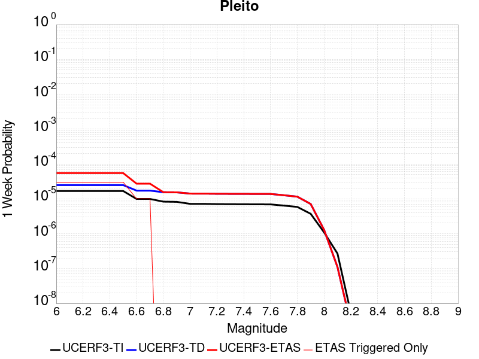 |  | 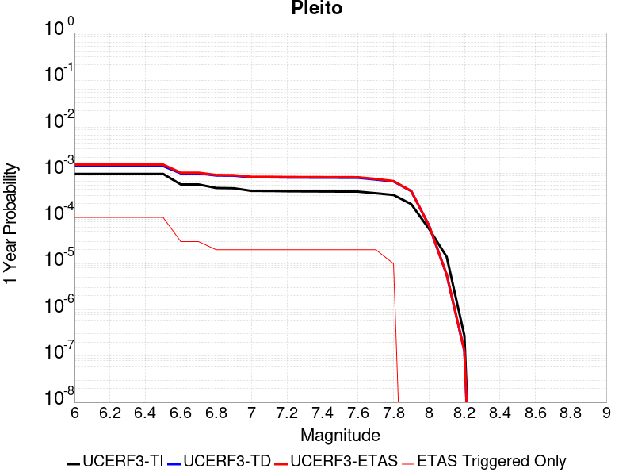 | 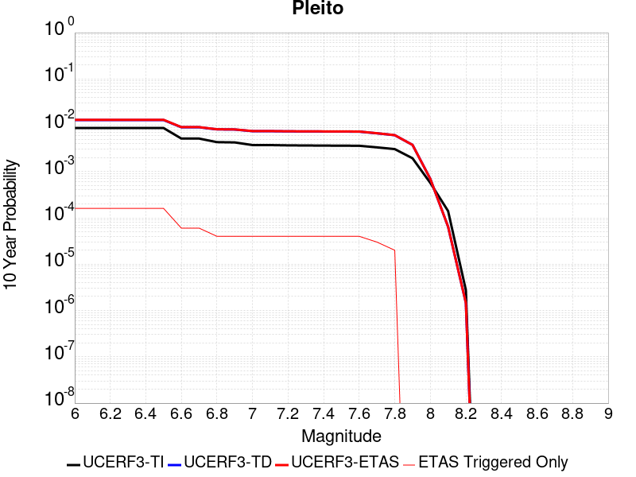 |

| Magnitude | 1 wk TI Prob | 1 wk TD Prob | 1 wk ETAS Prob | 1 wk ETAS/TD Gain | 1 wk ETAS Triggered Only | 1 mo TI Prob | 1 mo TD Prob | 1 mo ETAS Prob | 1 mo ETAS/TD Gain | 1 mo ETAS Triggered Only | 1 yr TI Prob | 1 yr TD Prob | 1 yr ETAS Prob | 1 yr ETAS/TD Gain | 1 yr ETAS Triggered Only | 10 yr TI Prob | 10 yr TD Prob | 10 yr ETAS Prob | 10 yr ETAS/TD Gain | 10 yr ETAS Triggered Only |
|-----|-----|-----|-----|-----|-----|-----|-----|-----|-----|-----|-----|-----|-----|-----|-----|-----|-----|-----|-----|-----|
| 6.0 | 1.6763008E-5 | 2.4764735E-5 | 5.4763994E-5 | 2.21137 | 3.0E-5 | 7.183948E-5 | 1.0613067E-4 | 1.5612536E-4 | 1.4710673 | 5.0E-5 | 8.742947E-4 | 0.001291447 | 0.0013913179 | 1.0773325 | 1.0E-4 | 0.00870863 | 0.012954412 | 0.013112339 | 1.012191 | 1.6E-4 |
| 6.1 | 1.6763008E-5 | 2.4764735E-5 | 5.4763994E-5 | 2.21137 | 3.0E-5 | 7.183948E-5 | 1.0613067E-4 | 1.5612536E-4 | 1.4710673 | 5.0E-5 | 8.742947E-4 | 0.001291447 | 0.0013913179 | 1.0773325 | 1.0E-4 | 0.00870863 | 0.012954412 | 0.013112339 | 1.012191 | 1.6E-4 |
| 6.2 | 1.6763008E-5 | 2.4764735E-5 | 5.4763994E-5 | 2.21137 | 3.0E-5 | 7.183948E-5 | 1.0613067E-4 | 1.5612536E-4 | 1.4710673 | 5.0E-5 | 8.742947E-4 | 0.001291447 | 0.0013913179 | 1.0773325 | 1.0E-4 | 0.00870863 | 0.012954412 | 0.013112339 | 1.012191 | 1.6E-4 |
| 6.3 | 1.6763008E-5 | 2.4764735E-5 | 5.4763994E-5 | 2.21137 | 3.0E-5 | 7.183948E-5 | 1.0613067E-4 | 1.5612536E-4 | 1.4710673 | 5.0E-5 | 8.742947E-4 | 0.001291447 | 0.0013913179 | 1.0773325 | 1.0E-4 | 0.00870863 | 0.012954412 | 0.013112339 | 1.012191 | 1.6E-4 |
| 6.4 | 1.6763008E-5 | 2.4764735E-5 | 5.4763994E-5 | 2.21137 | 3.0E-5 | 7.183948E-5 | 1.0613067E-4 | 1.5612536E-4 | 1.4710673 | 5.0E-5 | 8.742947E-4 | 0.001291447 | 0.0013913179 | 1.0773325 | 1.0E-4 | 0.00870863 | 0.012954412 | 0.013112339 | 1.012191 | 1.6E-4 |
| 6.5 | 1.6763008E-5 | 2.4764735E-5 | 5.4763994E-5 | 2.21137 | 3.0E-5 | 7.183948E-5 | 1.0613067E-4 | 1.5612536E-4 | 1.4710673 | 5.0E-5 | 8.742947E-4 | 0.001291447 | 0.0013913179 | 1.0773325 | 1.0E-4 | 0.00870863 | 0.012954412 | 0.013112339 | 1.012191 | 1.6E-4 |
| 6.6 | 9.910213E-6 | 1.721552E-5 | 2.7215348E-5 | 1.5808612 | 1.0E-5 | 4.247165E-5 | 7.3778734E-5 | 1.03776525E-4 | 1.4065912 | 3.0E-5 | 5.169696E-4 | 8.9788967E-4 | 9.278627E-4 | 1.0333817 | 3.0E-5 | 0.0051576863 | 0.009051226 | 0.009110683 | 1.0065689 | 6.0E-5 |
| 6.7 | 9.910213E-6 | 1.721552E-5 | 2.7215348E-5 | 1.5808612 | 1.0E-5 | 4.247165E-5 | 7.3778734E-5 | 1.03776525E-4 | 1.4065912 | 3.0E-5 | 5.169696E-4 | 8.9788967E-4 | 9.278627E-4 | 1.0333817 | 3.0E-5 | 0.0051576863 | 0.009051226 | 0.009110683 | 1.0065689 | 6.0E-5 |
| 6.8 | 8.300162E-6 | 1.5475129E-5 | 1.5475129E-5 | 1.0 | 0.0 | 3.557164E-5 | 6.63203E-5 | 8.631898E-5 | 1.3015468 | 2.0E-5 | 4.3299864E-4 | 8.07152E-4 | 8.2713587E-4 | 1.0247585 | 2.0E-5 | 0.004321559 | 0.008150663 | 0.008190337 | 1.0048676 | 4.0E-5 |
| 6.9 | 8.183114E-6 | 1.5346344E-5 | 1.5346344E-5 | 1.0 | 0.0 | 3.5070017E-5 | 6.57684E-5 | 8.576708E-5 | 1.3040774 | 2.0E-5 | 4.2689382E-4 | 8.0043747E-4 | 8.204215E-4 | 1.0249664 | 2.0E-5 | 0.0042607468 | 0.008084008 | 0.008123685 | 1.0049081 | 4.0E-5 |
| 7.0 | 7.1748823E-6 | 1.4133306E-5 | 1.4133306E-5 | 1.0 | 0.0 | 3.0749135E-5 | 6.0569906E-5 | 8.0568694E-5 | 1.330177 | 2.0E-5 | 3.743064E-4 | 7.3718966E-4 | 7.571749E-4 | 1.0271101 | 2.0E-5 | 0.0037367654 | 0.0074553755 | 0.0074950773 | 1.0053252 | 4.0E-5 |
| 7.1 | 7.1671807E-6 | 1.4123676E-5 | 1.4123676E-5 | 1.0 | 0.0 | 3.0716128E-5 | 6.0528637E-5 | 8.0527425E-5 | 1.3304021 | 2.0E-5 | 3.7390468E-4 | 7.366875E-4 | 7.5667276E-4 | 1.0271286 | 2.0E-5 | 0.0037327618 | 0.0074503883 | 0.00749009 | 1.0053289 | 4.0E-5 |
| 7.2 | 7.0649667E-6 | 1.3970962E-5 | 1.3970962E-5 | 1.0 | 0.0 | 3.0278077E-5 | 5.987418E-5 | 7.987298E-5 | 1.3340138 | 2.0E-5 | 3.6857324E-4 | 7.287248E-4 | 7.4871024E-4 | 1.0274252 | 2.0E-5 | 0.0036796255 | 0.0073711374 | 0.007410843 | 1.0053866 | 4.0E-5 |
| 7.3 | 7.02082E-6 | 1.3914415E-5 | 1.3914415E-5 | 1.0 | 0.0 | 3.008888E-5 | 5.9631846E-5 | 7.9630656E-5 | 1.3353713 | 2.0E-5 | 3.6627054E-4 | 7.257764E-4 | 7.457619E-4 | 1.0275367 | 2.0E-5 | 0.0036566744 | 0.0073416373 | 0.0073813437 | 1.0054084 | 4.0E-5 |
| 7.4 | 6.987146E-6 | 1.3873975E-5 | 1.3873975E-5 | 1.0 | 0.0 | 2.9944567E-5 | 5.9458544E-5 | 7.945735E-5 | 1.3363488 | 2.0E-5 | 3.6451413E-4 | 7.2366785E-4 | 7.4365333E-4 | 1.027617 | 2.0E-5 | 0.0036391679 | 0.007320571 | 0.0073602786 | 1.005424 | 4.0E-5 |
| 7.5 | 6.9494554E-6 | 1.383088E-5 | 1.383088E-5 | 1.0 | 0.0 | 2.9783041E-5 | 5.9273858E-5 | 7.927267E-5 | 1.3373969 | 2.0E-5 | 3.625482E-4 | 7.2142074E-4 | 7.4140634E-4 | 1.027703 | 2.0E-5 | 0.0036195726 | 0.007298199 | 0.007337907 | 1.0054408 | 4.0E-5 |
| 7.6 | 6.92694E-6 | 1.3789992E-5 | 1.3789992E-5 | 1.0 | 0.0 | 2.9686547E-5 | 5.909863E-5 | 7.9097445E-5 | 1.3383973 | 2.0E-5 | 3.6137376E-4 | 7.192888E-4 | 7.3927443E-4 | 1.0277853 | 2.0E-5 | 0.0036078666 | 0.007276951 | 0.0073166597 | 1.0054568 | 4.0E-5 |
| 7.7 | 6.395867E-6 | 1.26690065E-5 | 1.26690065E-5 | 1.0 | 0.0 | 2.741057E-5 | 5.4294615E-5 | 7.429353E-5 | 1.3683406 | 2.0E-5 | 3.336726E-4 | 6.6083675E-4 | 6.808235E-4 | 1.0302447 | 2.0E-5 | 0.0033317201 | 0.0066955453 | 0.0067253443 | 1.0044506 | 3.0E-5 |
| 7.8 | 5.8664327E-6 | 1.1536581E-5 | 1.1536581E-5 | 1.0 | 0.0 | 2.5141611E-5 | 4.9441554E-5 | 5.944106E-5 | 1.202249 | 1.0E-5 | 3.060561E-4 | 6.0178485E-4 | 6.117789E-4 | 1.0166073 | 1.0E-5 | 0.0030563495 | 0.0061010164 | 0.0061208946 | 1.0032581 | 2.0E-5 |
| 7.9 | 3.7167474E-6 | 7.1145205E-6 | 7.1145205E-6 | 1.0 | 0.0 | 1.592882E-5 | 3.0490448E-5 | 3.0490448E-5 | 1.0 | 0.0 | 1.9391612E-4 | 3.7115812E-4 | 3.7115812E-4 | 1.0 | 0.0 | 0.0019374699 | 0.0037676243 | 0.0037676243 | 1.0 | 0.0 |
| 8.0 | 1.0903841E-6 | 1.2879104E-6 | 1.2879104E-6 | 1.0 | 0.0 | 4.6730665E-6 | 5.5196047E-6 | 5.5196047E-6 | 1.0 | 0.0 | 5.68931E-5 | 6.719913E-5 | 6.719913E-5 | 1.0 | 0.0 | 5.6878536E-4 | 6.942094E-4 | 6.942094E-4 | 1.0 | 0.0 |
| 8.1 | 2.6894583E-7 | 1.1056095E-7 | 1.1056095E-7 | 1.0 | 0.0 | 1.1526245E-6 | 4.7383253E-7 | 4.7383253E-7 | 1.0 | 0.0 | 1.4033113E-5 | 5.768896E-6 | 5.768896E-6 | 1.0 | 0.0 | 1.4032227E-4 | 6.454915E-5 | 6.454915E-5 | 1.0 | 0.0 |
| 8.2 | 5.2967013E-9 | 2.4567874E-9 | 2.4567874E-9 | 1.0 | 0.0 | 2.2700148E-8 | 1.0529089E-8 | 1.0529089E-8 | 1.0 | 0.0 | 2.7637427E-7 | 1.2819166E-7 | 1.2819166E-7 | 1.0 | 0.0 | 2.7637393E-6 | 1.4588004E-6 | 1.4588004E-6 | 1.0 | 0.0 |

## Pinto Mtn
*[(top)](#table-of-contents)*

| 1 Week | 1 Month | 1 Year | 10 Year |
|-----|-----|-----|-----|
|  |  | 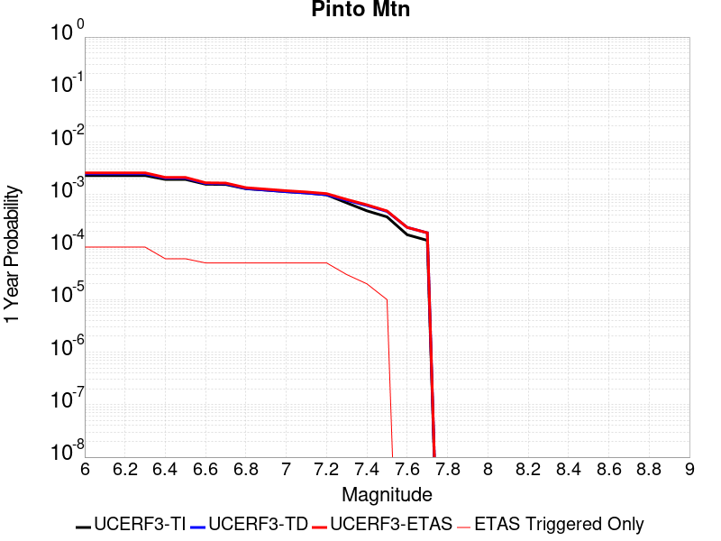 |  |

| Magnitude | 1 wk TI Prob | 1 wk TD Prob | 1 wk ETAS Prob | 1 wk ETAS/TD Gain | 1 wk ETAS Triggered Only | 1 mo TI Prob | 1 mo TD Prob | 1 mo ETAS Prob | 1 mo ETAS/TD Gain | 1 mo ETAS Triggered Only | 1 yr TI Prob | 1 yr TD Prob | 1 yr ETAS Prob | 1 yr ETAS/TD Gain | 1 yr ETAS Triggered Only | 10 yr TI Prob | 10 yr TD Prob | 10 yr ETAS Prob | 10 yr ETAS/TD Gain | 10 yr ETAS Triggered Only |
|-----|-----|-----|-----|-----|-----|-----|-----|-----|-----|-----|-----|-----|-----|-----|-----|-----|-----|-----|-----|-----|
| 6.0 | 4.4194956E-5 | 4.7853926E-5 | 6.785297E-5 | 1.4179186 | 2.0E-5 | 1.893932E-4 | 2.0507304E-4 | 2.8505662E-4 | 1.3900249 | 8.0E-5 | 0.0023034236 | 0.0024940688 | 0.0025938193 | 1.0399951 | 1.0E-4 | 0.022796938 | 0.024678305 | 0.024824603 | 1.0059282 | 1.5E-4 |
| 6.1 | 4.4194956E-5 | 4.7853926E-5 | 6.785297E-5 | 1.4179186 | 2.0E-5 | 1.893932E-4 | 2.0507304E-4 | 2.8505662E-4 | 1.3900249 | 8.0E-5 | 0.0023034236 | 0.0024940688 | 0.0025938193 | 1.0399951 | 1.0E-4 | 0.022796938 | 0.024678305 | 0.024824603 | 1.0059282 | 1.5E-4 |
| 6.2 | 4.4194956E-5 | 4.7853926E-5 | 6.785297E-5 | 1.4179186 | 2.0E-5 | 1.893932E-4 | 2.0507304E-4 | 2.8505662E-4 | 1.3900249 | 8.0E-5 | 0.0023034236 | 0.0024940688 | 0.0025938193 | 1.0399951 | 1.0E-4 | 0.022796938 | 0.024678305 | 0.024824603 | 1.0059282 | 1.5E-4 |
| 6.3 | 4.4194956E-5 | 4.7853926E-5 | 6.785297E-5 | 1.4179186 | 2.0E-5 | 1.893932E-4 | 2.0507304E-4 | 2.8505662E-4 | 1.3900249 | 8.0E-5 | 0.0023034236 | 0.0024940688 | 0.0025938193 | 1.0399951 | 1.0E-4 | 0.022796938 | 0.024678305 | 0.024824603 | 1.0059282 | 1.5E-4 |
| 6.4 | 3.729929E-5 | 3.960349E-5 | 3.960349E-5 | 1.0 | 0.0 | 1.5984432E-4 | 1.6971873E-4 | 2.0971194E-4 | 1.2356441 | 4.0E-5 | 0.0019443673 | 0.0020644604 | 0.0021243365 | 1.0290033 | 6.0E-5 | 0.019274427 | 0.020462848 | 0.020570597 | 1.0052656 | 1.1E-4 |
| 6.5 | 3.729929E-5 | 3.960349E-5 | 3.960349E-5 | 1.0 | 0.0 | 1.5984432E-4 | 1.6971873E-4 | 2.0971194E-4 | 1.2356441 | 4.0E-5 | 0.0019443673 | 0.0020644604 | 0.0021243365 | 1.0290033 | 6.0E-5 | 0.019274427 | 0.020462848 | 0.020570597 | 1.0052656 | 1.1E-4 |
| 6.6 | 3.0204548E-5 | 3.12056E-5 | 3.12056E-5 | 1.0 | 0.0 | 1.2944164E-4 | 1.3373162E-4 | 1.6372761E-4 | 1.2242999 | 3.0E-5 | 0.0015748127 | 0.0016270012 | 0.0016769199 | 1.0306814 | 5.0E-5 | 0.015636992 | 0.016154764 | 0.01625315 | 1.0060902 | 1.0E-4 |
| 6.7 | 2.9857754E-5 | 3.0814987E-5 | 3.0814987E-5 | 1.0 | 0.0 | 1.2795553E-4 | 1.3205773E-4 | 1.6205377E-4 | 1.2271434 | 3.0E-5 | 0.0015567453 | 0.0016066517 | 0.0016565714 | 1.0310706 | 5.0E-5 | 0.015458848 | 0.015954204 | 0.01605261 | 1.0061679 | 1.0E-4 |
| 6.8 | 2.4819734E-5 | 2.5009665E-5 | 2.5009665E-5 | 1.0 | 0.0 | 1.0636595E-4 | 1.0718E-4 | 1.3717679E-4 | 1.279873 | 3.0E-5 | 0.0012942362 | 0.001304157 | 0.0013540918 | 1.038289 | 5.0E-5 | 0.012867244 | 0.012967403 | 0.013056236 | 1.0068505 | 9.0E-5 |
| 6.9 | 2.331124E-5 | 2.3337945E-5 | 2.3337945E-5 | 1.0 | 0.0 | 9.990149E-5 | 1.0001605E-4 | 1.3001304E-4 | 1.2999219 | 3.0E-5 | 0.001215622 | 0.0012170355 | 0.0012669746 | 1.0410334 | 5.0E-5 | 0.012089936 | 0.012105897 | 0.012184929 | 1.0065284 | 8.0E-5 |
| 7.0 | 2.1818534E-5 | 2.1761074E-5 | 2.1761074E-5 | 1.0 | 0.0 | 9.3504656E-5 | 9.3258524E-5 | 1.2325573E-4 | 1.3216565 | 3.0E-5 | 0.0011378246 | 0.0011348509 | 0.0011847942 | 1.0440086 | 5.0E-5 | 0.011320163 | 0.01129266 | 0.011361869 | 1.0061287 | 7.0E-5 |
| 7.1 | 2.066081E-5 | 2.0540718E-5 | 2.0540718E-5 | 1.0 | 0.0 | 8.854332E-5 | 8.8028784E-5 | 1.18026146E-4 | 1.3407676 | 3.0E-5 | 0.0010774818 | 0.0010712431 | 0.0011211896 | 1.0466248 | 5.0E-5 | 0.010722724 | 0.0106628435 | 0.010732097 | 1.0064949 | 7.0E-5 |
| 7.2 | 1.8990233E-5 | 1.9054001E-5 | 1.9054001E-5 | 1.0 | 0.0 | 8.138417E-5 | 8.165756E-5 | 1.11655114E-4 | 1.3673579 | 3.0E-5 | 9.904018E-4 | 9.937467E-4 | 0.001043697 | 1.0502646 | 5.0E-5 | 0.009859995 | 0.009895029 | 0.009964337 | 1.0070043 | 7.0E-5 |
| 7.3 | 1.3335872E-5 | 1.4906713E-5 | 1.4906713E-5 | 1.0 | 0.0 | 5.7152483E-5 | 6.388442E-5 | 8.388314E-5 | 1.3130454 | 2.0E-5 | 6.956093E-4 | 7.77528E-4 | 8.0750464E-4 | 1.0385538 | 3.0E-5 | 0.006934359 | 0.007749376 | 0.0077989884 | 1.0064021 | 5.0E-5 |
| 7.4 | 9.414066E-6 | 1.186096E-5 | 1.186096E-5 | 1.0 | 0.0 | 4.0345374E-5 | 5.083175E-5 | 6.083124E-5 | 1.1967175 | 1.0E-5 | 4.910942E-4 | 6.1871024E-4 | 6.386979E-4 | 1.0323054 | 2.0E-5 | 0.0049001034 | 0.0061708256 | 0.0062105786 | 1.0064421 | 4.0E-5 |
| 7.5 | 7.2101157E-6 | 9.158192E-6 | 9.158192E-6 | 1.0 | 0.0 | 3.090013E-5 | 3.9248847E-5 | 4.9248454E-5 | 1.2547746 | 1.0E-5 | 3.7614413E-4 | 4.7775774E-4 | 4.87753E-4 | 1.0209211 | 1.0E-5 | 0.0037550807 | 0.004768082 | 0.0047979387 | 1.0062618 | 3.0E-5 |
| 7.6 | 3.296375E-6 | 4.5455017E-6 | 4.5455017E-6 | 1.0 | 0.0 | 1.4127245E-5 | 1.9480583E-5 | 1.9480583E-5 | 1.0 | 0.0 | 1.7198564E-4 | 2.3715167E-4 | 2.3715167E-4 | 1.0 | 0.0 | 0.0017185259 | 0.0023691233 | 0.0023790996 | 1.004211 | 1.0E-5 |
| 7.7 | 2.5741092E-6 | 3.5844084E-6 | 3.5844084E-6 | 1.0 | 0.0 | 1.103185E-5 | 1.5361667E-5 | 1.5361667E-5 | 1.0 | 0.0 | 1.3430449E-4 | 1.8701357E-4 | 1.8701357E-4 | 1.0 | 0.0 | 0.0013422335 | 0.0018686918 | 0.0018686918 | 1.0 | 0.0 |

## Cleghorn Pass
*[(top)](#table-of-contents)*

| 1 Week | 1 Month | 1 Year | 10 Year |
|-----|-----|-----|-----|
|  |  |  |  |

| Magnitude | 1 wk TI Prob | 1 wk TD Prob | 1 wk ETAS Prob | 1 wk ETAS/TD Gain | 1 wk ETAS Triggered Only | 1 mo TI Prob | 1 mo TD Prob | 1 mo ETAS Prob | 1 mo ETAS/TD Gain | 1 mo ETAS Triggered Only | 1 yr TI Prob | 1 yr TD Prob | 1 yr ETAS Prob | 1 yr ETAS/TD Gain | 1 yr ETAS Triggered Only | 10 yr TI Prob | 10 yr TD Prob | 10 yr ETAS Prob | 10 yr ETAS/TD Gain | 10 yr ETAS Triggered Only |
|-----|-----|-----|-----|-----|-----|-----|-----|-----|-----|-----|-----|-----|-----|-----|-----|-----|-----|-----|-----|-----|
| 6.0 | 1.0522846E-5 | 1.1040642E-5 | 3.104042E-5 | 2.8114688 | 2.0E-5 | 4.509713E-5 | 4.7316473E-5 | 7.731505E-5 | 1.6339986 | 3.0E-5 | 5.4891926E-4 | 5.759784E-4 | 6.359439E-4 | 1.1041106 | 6.0E-5 | 0.0054756533 | 0.005750022 | 0.005879274 | 1.0224786 | 1.3E-4 |
| 6.1 | 1.0522846E-5 | 1.1040642E-5 | 3.104042E-5 | 2.8114688 | 2.0E-5 | 4.509713E-5 | 4.7316473E-5 | 7.731505E-5 | 1.6339986 | 3.0E-5 | 5.4891926E-4 | 5.759784E-4 | 6.359439E-4 | 1.1041106 | 6.0E-5 | 0.0054756533 | 0.005750022 | 0.005879274 | 1.0224786 | 1.3E-4 |
| 6.2 | 2.1045846E-6 | 2.2082024E-6 | 2.2082024E-6 | 1.0 | 0.0 | 9.019617E-6 | 9.463714E-6 | 1.946362E-5 | 2.0566576 | 1.0E-5 | 1.098083E-4 | 1.1521882E-4 | 1.2521767E-4 | 1.0867814 | 1.0E-5 | 0.0010975406 | 0.0011520023 | 0.0011819677 | 1.0260116 | 3.0E-5 |
| 6.3 | 2.1045846E-6 | 2.2082024E-6 | 2.2082024E-6 | 1.0 | 0.0 | 9.019617E-6 | 9.463714E-6 | 1.946362E-5 | 2.0566576 | 1.0E-5 | 1.098083E-4 | 1.1521882E-4 | 1.2521767E-4 | 1.0867814 | 1.0E-5 | 0.0010975406 | 0.0011520023 | 0.0011819677 | 1.0260116 | 3.0E-5 |
| 6.4 | 1.7259927E-6 | 1.810877E-6 | 1.810877E-6 | 1.0 | 0.0 | 7.3970905E-6 | 7.760902E-6 | 1.7760824E-5 | 2.2885 | 1.0E-5 | 9.005586E-5 | 9.4488976E-5 | 1.04488034E-4 | 1.1058224 | 1.0E-5 | 9.001937E-4 | 9.448898E-4 | 9.548803E-4 | 1.0105733 | 1.0E-5 |

## Elysian Park (Upper)
*[(top)](#table-of-contents)*

| 1 Week | 1 Month | 1 Year | 10 Year |
|-----|-----|-----|-----|
|  |  |  |  |

| Magnitude | 1 wk TI Prob | 1 wk TD Prob | 1 wk ETAS Prob | 1 wk ETAS/TD Gain | 1 wk ETAS Triggered Only | 1 mo TI Prob | 1 mo TD Prob | 1 mo ETAS Prob | 1 mo ETAS/TD Gain | 1 mo ETAS Triggered Only | 1 yr TI Prob | 1 yr TD Prob | 1 yr ETAS Prob | 1 yr ETAS/TD Gain | 1 yr ETAS Triggered Only | 10 yr TI Prob | 10 yr TD Prob | 10 yr ETAS Prob | 10 yr ETAS/TD Gain | 10 yr ETAS Triggered Only |
|-----|-----|-----|-----|-----|-----|-----|-----|-----|-----|-----|-----|-----|-----|-----|-----|-----|-----|-----|-----|-----|
| 6.0 | 3.1876025E-5 | 3.7035275E-5 | 7.7033794E-5 | 2.0800114 | 4.0E-5 | 1.3660437E-4 | 1.5871569E-4 | 2.1870616E-4 | 1.3779745 | 6.0E-5 | 0.0016618895 | 0.001931122 | 0.0020409096 | 1.0568517 | 1.1E-4 | 0.016495159 | 0.019189863 | 0.019327175 | 1.0071555 | 1.4E-4 |
| 6.1 | 3.1876025E-5 | 3.7035275E-5 | 7.7033794E-5 | 2.0800114 | 4.0E-5 | 1.3660437E-4 | 1.5871569E-4 | 2.1870616E-4 | 1.3779745 | 6.0E-5 | 0.0016618895 | 0.001931122 | 0.0020409096 | 1.0568517 | 1.1E-4 | 0.016495159 | 0.019189863 | 0.019327175 | 1.0071555 | 1.4E-4 |
| 6.2 | 3.1876025E-5 | 3.7035275E-5 | 7.7033794E-5 | 2.0800114 | 4.0E-5 | 1.3660437E-4 | 1.5871569E-4 | 2.1870616E-4 | 1.3779745 | 6.0E-5 | 0.0016618895 | 0.001931122 | 0.0020409096 | 1.0568517 | 1.1E-4 | 0.016495159 | 0.019189863 | 0.019327175 | 1.0071555 | 1.4E-4 |
| 6.3 | 3.1876025E-5 | 3.7035275E-5 | 7.7033794E-5 | 2.0800114 | 4.0E-5 | 1.3660437E-4 | 1.5871569E-4 | 2.1870616E-4 | 1.3779745 | 6.0E-5 | 0.0016618895 | 0.001931122 | 0.0020409096 | 1.0568517 | 1.1E-4 | 0.016495159 | 0.019189863 | 0.019327175 | 1.0071555 | 1.4E-4 |
| 6.4 | 1.9273462E-5 | 2.120244E-5 | 3.1202228E-5 | 1.4716338 | 1.0E-5 | 8.259794E-5 | 9.086542E-5 | 1.108636E-4 | 1.2200857 | 2.0E-5 | 0.001005166 | 0.0011058967 | 0.0011458525 | 1.0361297 | 4.0E-5 | 0.010006315 | 0.011020744 | 0.0110800825 | 1.0053843 | 6.0E-5 |
| 6.5 | 1.9273462E-5 | 2.120244E-5 | 3.1202228E-5 | 1.4716338 | 1.0E-5 | 8.259794E-5 | 9.086542E-5 | 1.108636E-4 | 1.2200857 | 2.0E-5 | 0.001005166 | 0.0011058967 | 0.0011458525 | 1.0361297 | 4.0E-5 | 0.010006315 | 0.011020744 | 0.0110800825 | 1.0053843 | 6.0E-5 |
| 6.6 | 9.813258E-6 | 9.665589E-6 | 1.9665491E-5 | 2.034588 | 1.0E-5 | 4.205614E-5 | 4.1423333E-5 | 5.1422918E-5 | 1.2413999 | 1.0E-5 | 5.119132E-4 | 5.042196E-4 | 5.242095E-4 | 1.0396453 | 2.0E-5 | 0.005107356 | 0.0050314795 | 0.005071278 | 1.0079099 | 4.0E-5 |
| 6.7 | 9.801478E-6 | 9.653158E-6 | 1.9653062E-5 | 2.0359204 | 1.0E-5 | 4.2005657E-5 | 4.137006E-5 | 5.1369647E-5 | 1.2417107 | 1.0E-5 | 5.112989E-4 | 5.0357135E-4 | 5.2356126E-4 | 1.0396963 | 2.0E-5 | 0.0051012407 | 0.005025026 | 0.005064825 | 1.0079201 | 4.0E-5 |
| 6.8 | 8.102489E-6 | 7.772994E-6 | 7.772994E-6 | 1.0 | 0.0 | 3.4724493E-5 | 3.3312434E-5 | 3.3312434E-5 | 1.0 | 0.0 | 4.2268867E-4 | 4.0550836E-4 | 4.0550836E-4 | 1.0 | 0.0 | 0.004218856 | 0.0040481784 | 0.0040581375 | 1.0024602 | 1.0E-5 |
| 6.9 | 6.08275E-6 | 5.481441E-6 | 5.481441E-6 | 1.0 | 0.0 | 2.6068668E-5 | 2.3491682E-5 | 2.3491682E-5 | 1.0 | 0.0 | 3.173398E-4 | 2.8597447E-4 | 2.8597447E-4 | 1.0 | 0.0 | 0.0031688702 | 0.0028561424 | 0.0028661138 | 1.0034913 | 1.0E-5 |
| 7.0 | 5.5995934E-6 | 4.9827686E-6 | 4.9827686E-6 | 1.0 | 0.0 | 2.3998036E-5 | 2.1354552E-5 | 2.1354552E-5 | 1.0 | 0.0 | 2.9213692E-4 | 2.5996132E-4 | 2.5996132E-4 | 1.0 | 0.0 | 0.0029175316 | 0.0025966396 | 0.0026066136 | 1.0038412 | 1.0E-5 |
| 7.1 | 4.709881E-6 | 4.0873906E-6 | 4.0873906E-6 | 1.0 | 0.0 | 2.0185047E-5 | 1.7517272E-5 | 1.7517272E-5 | 1.0 | 0.0 | 2.4572524E-4 | 2.1325232E-4 | 2.1325232E-4 | 1.0 | 0.0 | 0.002454537 | 0.0021305184 | 0.002140497 | 1.0046837 | 1.0E-5 |
| 7.2 | 3.6063436E-6 | 2.9779412E-6 | 2.9779412E-6 | 1.0 | 0.0 | 1.5455667E-5 | 1.27625435E-5 | 1.27625435E-5 | 1.0 | 0.0 | 1.881565E-4 | 1.55373E-4 | 1.55373E-4 | 1.0 | 0.0 | 0.0018799726 | 0.0015526549 | 0.0015626394 | 1.0064306 | 1.0E-5 |
| 7.3 | 2.471135E-6 | 2.0954562E-6 | 2.0954562E-6 | 1.0 | 0.0 | 1.0590536E-5 | 8.980496E-6 | 8.980496E-6 | 1.0 | 0.0 | 1.2893214E-4 | 1.0933213E-4 | 1.0933213E-4 | 1.0 | 0.0 | 0.0012885736 | 0.0010927906 | 0.0011027798 | 1.0091408 | 1.0E-5 |
| 7.4 | 1.163943E-6 | 1.0275061E-6 | 1.0275061E-6 | 1.0 | 0.0 | 4.988318E-6 | 4.40359E-6 | 4.40359E-6 | 1.0 | 0.0 | 6.0731076E-5 | 5.361242E-5 | 5.361242E-5 | 1.0 | 0.0 | 6.071448E-4 | 5.3599785E-4 | 5.459925E-4 | 1.0186468 | 1.0E-5 |
| 7.5 | 4.99459E-7 | 4.917601E-7 | 4.917601E-7 | 1.0 | 0.0 | 2.140537E-6 | 2.1075416E-6 | 2.1075416E-6 | 1.0 | 0.0 | 2.6060725E-5 | 2.5659032E-5 | 2.5659032E-5 | 1.0 | 0.0 | 2.605767E-4 | 2.5656226E-4 | 2.5656226E-4 | 1.0 | 0.0 |
| 7.6 | 2.4667852E-7 | 2.4778313E-7 | 2.4778313E-7 | 1.0 | 0.0 | 1.0571932E-6 | 1.0619274E-6 | 1.0619274E-6 | 1.0 | 0.0 | 1.2871251E-5 | 1.2928893E-5 | 1.2928893E-5 | 1.0 | 0.0 | 1.2870505E-4 | 1.2928178E-4 | 1.2928178E-4 | 1.0 | 0.0 |
| 7.7 | 8.2312795E-8 | 7.3864214E-8 | 7.3864214E-8 | 1.0 | 0.0 | 3.527691E-7 | 3.165609E-7 | 3.165609E-7 | 1.0 | 0.0 | 4.294955E-6 | 3.854123E-6 | 3.854123E-6 | 1.0 | 0.0 | 4.2948723E-5 | 3.854068E-5 | 3.854068E-5 | 1.0 | 0.0 |
| 7.8 | 2.7819295E-8 | 1.7565618E-8 | 1.7565618E-8 | 1.0 | 0.0 | 1.1922555E-7 | 7.528122E-8 | 7.528122E-8 | 1.0 | 0.0 | 1.45157E-6 | 9.1654863E-7 | 9.1654863E-7 | 1.0 | 0.0 | 1.45156055E-5 | 9.165463E-6 | 9.165463E-6 | 1.0 | 0.0 |

## Santa Rosa Island
*[(top)](#table-of-contents)*

| 1 Week | 1 Month | 1 Year | 10 Year |
|-----|-----|-----|-----|
|  |  |  |  |

| Magnitude | 1 wk TI Prob | 1 wk TD Prob | 1 wk ETAS Prob | 1 wk ETAS/TD Gain | 1 wk ETAS Triggered Only | 1 mo TI Prob | 1 mo TD Prob | 1 mo ETAS Prob | 1 mo ETAS/TD Gain | 1 mo ETAS Triggered Only | 1 yr TI Prob | 1 yr TD Prob | 1 yr ETAS Prob | 1 yr ETAS/TD Gain | 1 yr ETAS Triggered Only | 10 yr TI Prob | 10 yr TD Prob | 10 yr ETAS Prob | 10 yr ETAS/TD Gain | 10 yr ETAS Triggered Only |
|-----|-----|-----|-----|-----|-----|-----|-----|-----|-----|-----|-----|-----|-----|-----|-----|-----|-----|-----|-----|-----|
| 6.0 | 4.1143165E-5 | 4.709113E-5 | 8.708925E-5 | 1.8493769 | 4.0E-5 | 1.7631594E-4 | 2.0180462E-4 | 2.5179452E-4 | 1.2477144 | 5.0E-5 | 0.002144533 | 0.0024543991 | 0.0025541536 | 1.0406432 | 1.0E-4 | 0.021239553 | 0.024293557 | 0.024430156 | 1.0056229 | 1.4E-4 |
| 6.1 | 2.1061249E-5 | 2.3864959E-5 | 2.3864959E-5 | 1.0 | 0.0 | 9.0259375E-5 | 1.0227455E-4 | 1.1227353E-4 | 1.097766 | 1.0E-5 | 0.0010983539 | 0.0012445103 | 0.0012844605 | 1.0321012 | 4.0E-5 | 0.01092941 | 0.01237845 | 0.012427831 | 1.0039892 | 5.0E-5 |
| 6.2 | 2.1061249E-5 | 2.3864959E-5 | 2.3864959E-5 | 1.0 | 0.0 | 9.0259375E-5 | 1.0227455E-4 | 1.1227353E-4 | 1.097766 | 1.0E-5 | 0.0010983539 | 0.0012445103 | 0.0012844605 | 1.0321012 | 4.0E-5 | 0.01092941 | 0.01237845 | 0.012427831 | 1.0039892 | 5.0E-5 |
| 6.3 | 1.5158236E-5 | 1.7074419E-5 | 1.7074419E-5 | 1.0 | 0.0 | 6.496225E-5 | 7.3174095E-5 | 8.317336E-5 | 1.1366504 | 1.0E-5 | 7.906284E-4 | 8.9054246E-4 | 9.3050685E-4 | 1.0448765 | 4.0E-5 | 0.007878214 | 0.00887099 | 0.0089106355 | 1.004469 | 4.0E-5 |
| 6.4 | 1.2341918E-5 | 1.3852917E-5 | 1.3852917E-5 | 1.0 | 0.0 | 5.2892858E-5 | 5.9368336E-5 | 6.936774E-5 | 1.16843 | 1.0E-5 | 6.437803E-4 | 7.225779E-4 | 7.5255625E-4 | 1.041488 | 3.0E-5 | 0.006419184 | 0.0072031217 | 0.0072329054 | 1.0041349 | 3.0E-5 |
| 6.5 | 9.061158E-6 | 1.0117032E-5 | 1.0117032E-5 | 1.0 | 0.0 | 3.883296E-5 | 4.3358017E-5 | 5.335758E-5 | 1.2306279 | 1.0E-5 | 4.726887E-4 | 5.277613E-4 | 5.5774546E-4 | 1.0568138 | 3.0E-5 | 0.004716845 | 0.0052656177 | 0.0052954596 | 1.0056673 | 3.0E-5 |
| 6.6 | 7.5461685E-6 | 8.400734E-6 | 8.400734E-6 | 1.0 | 0.0 | 3.2340322E-5 | 3.600267E-5 | 3.600267E-5 | 1.0 | 0.0 | 3.936723E-4 | 4.3824868E-4 | 4.582399E-4 | 1.0456161 | 2.0E-5 | 0.003929756 | 0.0043742736 | 0.004394186 | 1.0045522 | 2.0E-5 |
| 6.7 | 5.5023775E-6 | 6.087381E-6 | 6.087381E-6 | 1.0 | 0.0 | 2.3581404E-5 | 2.6088532E-5 | 2.6088532E-5 | 1.0 | 0.0 | 2.8706578E-4 | 3.1758484E-4 | 3.1758484E-4 | 1.0 | 0.0 | 0.0028669522 | 0.0031716316 | 0.0031716316 | 1.0 | 0.0 |
| 6.8 | 3.7351679E-6 | 4.0831405E-6 | 4.0831405E-6 | 1.0 | 0.0 | 1.6007763E-5 | 1.7499071E-5 | 1.7499071E-5 | 1.0 | 0.0 | 1.948771E-4 | 2.1303285E-4 | 2.1303285E-4 | 1.0 | 0.0 | 0.0019470629 | 0.0021285315 | 0.0021285315 | 1.0 | 0.0 |
| 6.9 | 2.456366E-6 | 2.6292707E-6 | 2.6292707E-6 | 1.0 | 0.0 | 1.0527241E-5 | 1.1268255E-5 | 1.1268255E-5 | 1.0 | 0.0 | 1.2816161E-4 | 1.3718239E-4 | 1.3718239E-4 | 1.0 | 0.0 | 0.0012808773 | 0.0013709799 | 0.0013709799 | 1.0 | 0.0 |
| 7.0 | 2.3245157E-6 | 2.4827784E-6 | 2.4827784E-6 | 1.0 | 0.0 | 9.962172E-6 | 1.0640436E-5 | 1.0640436E-5 | 1.0 | 0.0 | 1.2128269E-4 | 1.2953962E-4 | 1.2953962E-4 | 1.0 | 0.0 | 0.0012121652 | 0.0012946434 | 0.0012946434 | 1.0 | 0.0 |
| 7.1 | 2.2248344E-6 | 2.37325E-6 | 2.37325E-6 | 1.0 | 0.0 | 9.53497E-6 | 1.0171032E-5 | 1.0171032E-5 | 1.0 | 0.0 | 1.1608207E-4 | 1.238253E-4 | 1.238253E-4 | 1.0 | 0.0 | 0.0011602144 | 0.0012375651 | 0.0012375651 | 1.0 | 0.0 |
| 7.2 | 2.1350402E-6 | 2.2761542E-6 | 2.2761542E-6 | 1.0 | 0.0 | 9.150141E-6 | 9.75491E-6 | 9.75491E-6 | 1.0 | 0.0 | 1.1139726E-4 | 1.1875957E-4 | 1.1875957E-4 | 1.0 | 0.0 | 0.0011134144 | 0.0011869629 | 0.0011869629 | 1.0 | 0.0 |
| 7.3 | 1.9793572E-6 | 2.1087192E-6 | 2.1087192E-6 | 1.0 | 0.0 | 8.482932E-6 | 9.037337E-6 | 9.037337E-6 | 1.0 | 0.0 | 1.032748E-4 | 1.1002403E-4 | 1.1002403E-4 | 1.0 | 0.0 | 0.0010322682 | 0.0010996974 | 0.0010996974 | 1.0 | 0.0 |
| 7.4 | 1.6951194E-6 | 1.8045735E-6 | 1.8045735E-6 | 1.0 | 0.0 | 7.264777E-6 | 7.733864E-6 | 7.733864E-6 | 1.0 | 0.0 | 8.844508E-5 | 9.415574E-5 | 9.415574E-5 | 1.0 | 0.0 | 8.840988E-4 | 9.411601E-4 | 9.411601E-4 | 1.0 | 0.0 |
| 7.5 | 8.987207E-7 | 9.512216E-7 | 9.512216E-7 | 1.0 | 0.0 | 3.8516546E-6 | 4.0766577E-6 | 4.0766577E-6 | 1.0 | 0.0 | 4.6892885E-5 | 4.9632188E-5 | 4.9632188E-5 | 1.0 | 0.0 | 4.688299E-4 | 4.962122E-4 | 4.962122E-4 | 1.0 | 0.0 |
| 7.6 | 3.8783037E-7 | 4.0529335E-7 | 4.0529335E-7 | 1.0 | 0.0 | 1.6621291E-6 | 1.7369704E-6 | 1.7369704E-6 | 1.0 | 0.0 | 2.0236233E-5 | 2.1147416E-5 | 2.1147416E-5 | 1.0 | 0.0 | 2.023439E-4 | 2.114547E-4 | 2.114547E-4 | 1.0 | 0.0 |
| 7.7 | 6.181804E-8 | 6.339047E-8 | 6.339047E-8 | 1.0 | 0.0 | 2.6493444E-7 | 2.7167343E-7 | 2.7167343E-7 | 1.0 | 0.0 | 3.225572E-6 | 3.307619E-6 | 3.307619E-6 | 1.0 | 0.0 | 3.225525E-5 | 3.3075703E-5 | 3.3075703E-5 | 1.0 | 0.0 |
| 7.8 | 1.3704449E-9 | 1.3964153E-9 | 1.3964153E-9 | 1.0 | 0.0 | 5.873335E-9 | 5.984637E-9 | 5.984637E-9 | 1.0 | 0.0 | 7.1507856E-8 | 7.286295E-8 | 7.286295E-8 | 1.0 | 0.0 | 7.1507833E-7 | 7.286294E-7 | 7.286294E-7 | 1.0 | 0.0 |

## Ortigalita (North)
*[(top)](#table-of-contents)*

| 1 Week | 1 Month | 1 Year | 10 Year |
|-----|-----|-----|-----|
|  |  | 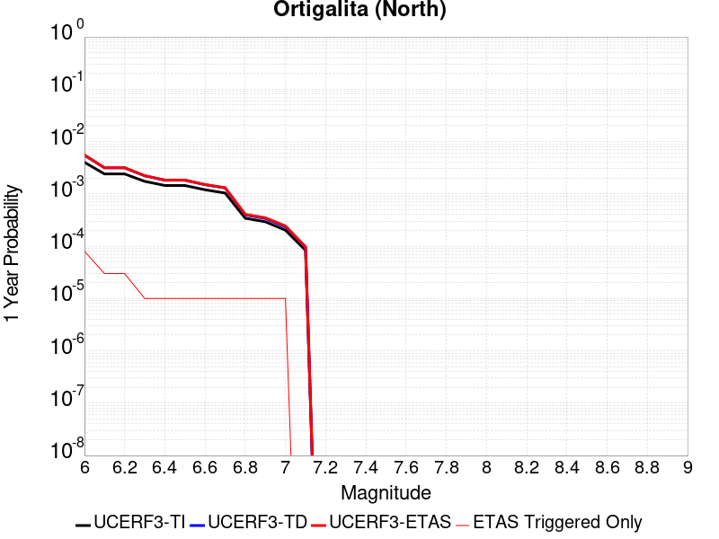 | 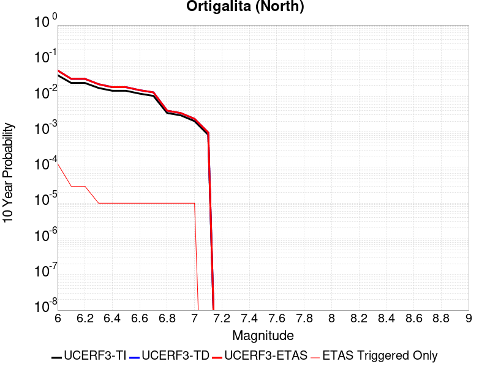 |

| Magnitude | 1 wk TI Prob | 1 wk TD Prob | 1 wk ETAS Prob | 1 wk ETAS/TD Gain | 1 wk ETAS Triggered Only | 1 mo TI Prob | 1 mo TD Prob | 1 mo ETAS Prob | 1 mo ETAS/TD Gain | 1 mo ETAS Triggered Only | 1 yr TI Prob | 1 yr TD Prob | 1 yr ETAS Prob | 1 yr ETAS/TD Gain | 1 yr ETAS Triggered Only | 10 yr TI Prob | 10 yr TD Prob | 10 yr ETAS Prob | 10 yr ETAS/TD Gain | 10 yr ETAS Triggered Only |
|-----|-----|-----|-----|-----|-----|-----|-----|-----|-----|-----|-----|-----|-----|-----|-----|-----|-----|-----|-----|-----|
| 6.0 | 7.711876E-5 | 1.0505308E-4 | 1.2505098E-4 | 1.19036 | 2.0E-5 | 3.3046713E-4 | 4.501601E-4 | 5.101331E-4 | 1.1332259 | 6.0E-5 | 0.004016016 | 0.0054680547 | 0.005547617 | 1.0145504 | 8.0E-5 | 0.039442103 | 0.053455614 | 0.053578664 | 1.0023019 | 1.3E-4 |
| 6.1 | 4.607858E-5 | 6.0239887E-5 | 6.0239887E-5 | 1.0 | 0.0 | 1.9746469E-4 | 2.5814763E-4 | 2.8813988E-4 | 1.1161826 | 3.0E-5 | 0.0024014818 | 0.0031387366 | 0.0031686425 | 1.009528 | 3.0E-5 | 0.023756953 | 0.030975312 | 0.031004382 | 1.0009385 | 3.0E-5 |
| 6.2 | 4.607858E-5 | 6.0239887E-5 | 6.0239887E-5 | 1.0 | 0.0 | 1.9746469E-4 | 2.5814763E-4 | 2.8813988E-4 | 1.1161826 | 3.0E-5 | 0.0024014818 | 0.0031387366 | 0.0031686425 | 1.009528 | 3.0E-5 | 0.023756953 | 0.030975312 | 0.031004382 | 1.0009385 | 3.0E-5 |
| 6.3 | 3.327423E-5 | 4.2476124E-5 | 4.2476124E-5 | 1.0 | 0.0 | 1.4259605E-4 | 1.8202956E-4 | 1.9202773E-4 | 1.0549262 | 1.0E-5 | 0.0017347244 | 0.002214206 | 0.0022241839 | 1.0045063 | 1.0E-5 | 0.017212452 | 0.02194574 | 0.02195552 | 1.0004457 | 1.0E-5 |
| 6.4 | 2.7732503E-5 | 3.4999008E-5 | 3.4999008E-5 | 1.0 | 0.0 | 1.1884817E-4 | 1.499886E-4 | 1.599871E-4 | 1.0666617 | 1.0E-5 | 0.001446016 | 0.0018248158 | 0.0018347976 | 1.00547 | 1.0E-5 | 0.014366428 | 0.018121297 | 0.018131116 | 1.0005418 | 1.0E-5 |
| 6.5 | 2.7689714E-5 | 3.4948822E-5 | 3.4948822E-5 | 1.0 | 0.0 | 1.186648E-4 | 1.4977354E-4 | 1.5977204E-4 | 1.0667574 | 1.0E-5 | 0.0014437864 | 0.0018222018 | 0.0018321836 | 1.0054779 | 1.0E-5 | 0.014344421 | 0.018095585 | 0.018105403 | 1.0005426 | 1.0E-5 |
| 6.6 | 2.2976905E-5 | 2.871829E-5 | 2.871829E-5 | 1.0 | 0.0 | 9.846873E-5 | 1.23074E-4 | 1.3307277E-4 | 1.081242 | 1.0E-5 | 0.0011981975 | 0.0014976348 | 0.0015076199 | 1.0066671 | 1.0E-5 | 0.011917574 | 0.014898733 | 0.014908585 | 1.0006613 | 1.0E-5 |
| 6.7 | 1.9871539E-5 | 2.4904637E-5 | 2.4904637E-5 | 1.0 | 0.0 | 8.516096E-5 | 1.067312E-4 | 1.1673012E-4 | 1.0936834 | 1.0E-5 | 0.0010363415 | 0.0012989199 | 0.0013089069 | 1.0076888 | 1.0E-5 | 0.010315218 | 0.012936938 | 0.012946809 | 1.0007629 | 1.0E-5 |
| 6.8 | 6.5640475E-6 | 7.6054926E-6 | 7.6054926E-6 | 1.0 | 0.0 | 2.813133E-5 | 3.2594577E-5 | 4.259425E-5 | 1.3067895 | 1.0E-5 | 3.424451E-4 | 3.9676955E-4 | 4.0676558E-4 | 1.0251936 | 1.0E-5 | 0.0034191788 | 0.003960899 | 0.003970859 | 1.0025147 | 1.0E-5 |
| 6.9 | 5.6219683E-6 | 6.5018376E-6 | 6.5018376E-6 | 1.0 | 0.0 | 2.4093928E-5 | 2.7864735E-5 | 3.7864458E-5 | 1.3588666 | 1.0E-5 | 2.933041E-4 | 3.3920293E-4 | 3.4919954E-4 | 1.0294709 | 1.0E-5 | 0.0029291727 | 0.003387109 | 0.003397075 | 1.0029423 | 1.0E-5 |
| 7.0 | 3.875591E-6 | 4.4847548E-6 | 4.4847548E-6 | 1.0 | 0.0 | 1.6609569E-5 | 1.9220248E-5 | 2.9220057E-5 | 1.5202746 | 1.0E-5 | 2.0220275E-4 | 2.339835E-4 | 2.4398117E-4 | 1.0427281 | 1.0E-5 | 0.0020201886 | 0.0023375798 | 0.0023475564 | 1.0042679 | 1.0E-5 |
| 7.1 | 1.6017933E-6 | 1.8570418E-6 | 1.8570418E-6 | 1.0 | 0.0 | 6.8648105E-6 | 7.958732E-6 | 7.958732E-6 | 1.0 | 0.0 | 8.357586E-5 | 9.689432E-5 | 9.689432E-5 | 1.0 | 0.0 | 8.3544437E-4 | 9.686254E-4 | 9.686254E-4 | 1.0 | 0.0 |

## Coronado Bank alt1
*[(top)](#table-of-contents)*

| 1 Week | 1 Month | 1 Year | 10 Year |
|-----|-----|-----|-----|
| 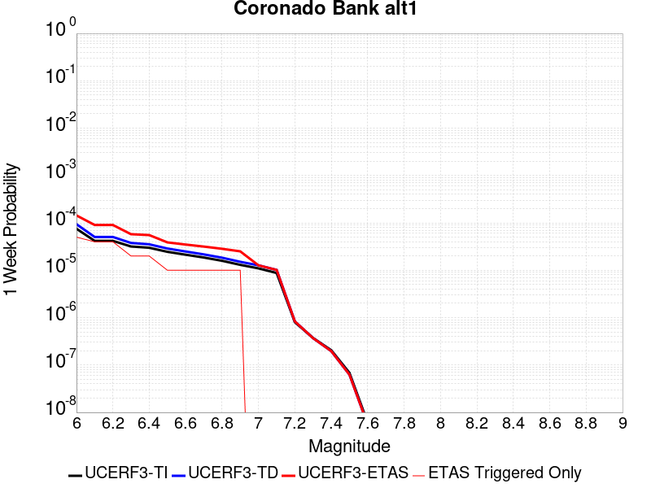 | 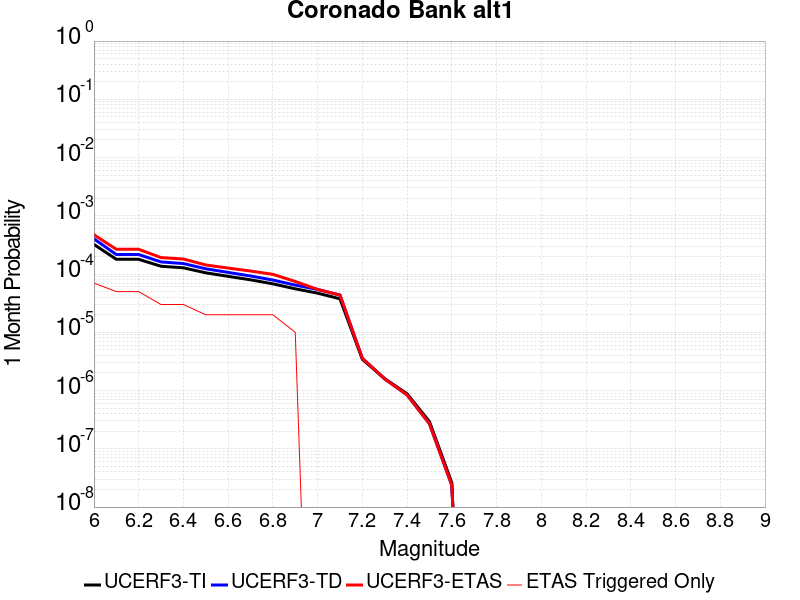 | 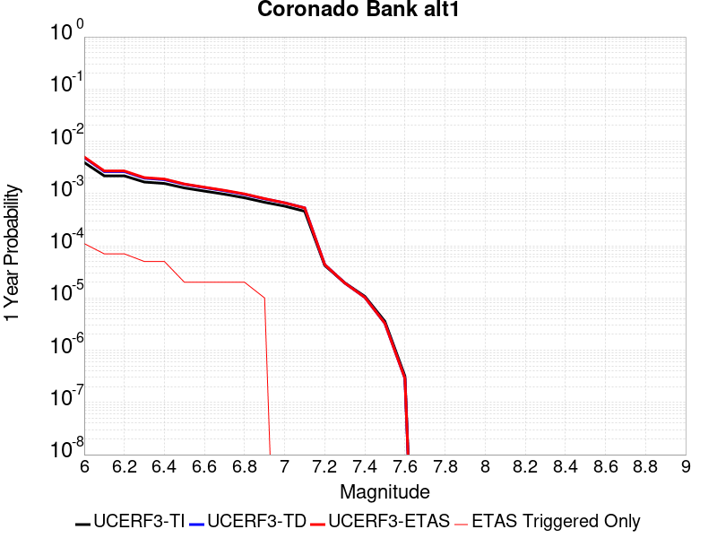 | 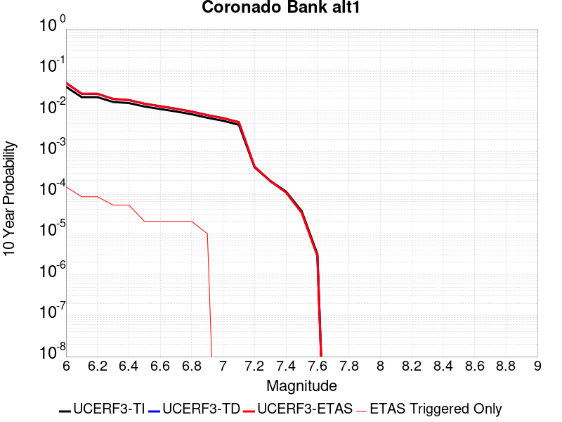 |

| Magnitude | 1 wk TI Prob | 1 wk TD Prob | 1 wk ETAS Prob | 1 wk ETAS/TD Gain | 1 wk ETAS Triggered Only | 1 mo TI Prob | 1 mo TD Prob | 1 mo ETAS Prob | 1 mo ETAS/TD Gain | 1 mo ETAS Triggered Only | 1 yr TI Prob | 1 yr TD Prob | 1 yr ETAS Prob | 1 yr ETAS/TD Gain | 1 yr ETAS Triggered Only | 10 yr TI Prob | 10 yr TD Prob | 10 yr ETAS Prob | 10 yr ETAS/TD Gain | 10 yr ETAS Triggered Only |
|-----|-----|-----|-----|-----|-----|-----|-----|-----|-----|-----|-----|-----|-----|-----|-----|-----|-----|-----|-----|-----|
| 6.0 | 7.533492E-5 | 9.3951705E-5 | 1.43947E-4 | 1.5321383 | 5.0E-5 | 3.22824E-4 | 4.025903E-4 | 4.7256213E-4 | 1.173804 | 7.0E-5 | 0.0039233007 | 0.004891121 | 0.005000583 | 1.0223798 | 1.1E-4 | 0.03854755 | 0.047904 | 0.048037294 | 1.0027825 | 1.4E-4 |
| 6.1 | 4.1807285E-5 | 5.0493105E-5 | 9.0491085E-5 | 1.7921474 | 4.0E-5 | 1.7916178E-4 | 2.1638138E-4 | 2.6637057E-4 | 1.2310234 | 5.0E-5 | 0.0021791123 | 0.0026313365 | 0.0027011523 | 1.0265324 | 7.0E-5 | 0.021578677 | 0.026011124 | 0.026089042 | 1.0029956 | 8.0E-5 |
| 6.2 | 4.1807285E-5 | 5.0493105E-5 | 9.0491085E-5 | 1.7921474 | 4.0E-5 | 1.7916178E-4 | 2.1638138E-4 | 2.6637057E-4 | 1.2310234 | 5.0E-5 | 0.0021791123 | 0.0026313365 | 0.0027011523 | 1.0265324 | 7.0E-5 | 0.021578677 | 0.026011124 | 0.026089042 | 1.0029956 | 8.0E-5 |
| 6.3 | 3.1793104E-5 | 3.7711125E-5 | 5.771037E-5 | 1.5303274 | 2.0E-5 | 1.3624904E-4 | 1.6160926E-4 | 1.9160441E-4 | 1.1856029 | 3.0E-5 | 0.0016575698 | 0.001965849 | 0.0020157506 | 1.0253843 | 5.0E-5 | 0.016452603 | 0.019488495 | 0.01953752 | 1.0025157 | 5.0E-5 |
| 6.4 | 2.9878007E-5 | 3.5335797E-5 | 5.533509E-5 | 1.5659783 | 2.0E-5 | 1.2804232E-4 | 1.5143053E-4 | 1.8142599E-4 | 1.1980807 | 3.0E-5 | 0.0015578003 | 0.0018421395 | 0.0018920474 | 1.0270923 | 5.0E-5 | 0.015469253 | 0.018272463 | 0.01832155 | 1.0026864 | 5.0E-5 |
| 6.5 | 2.4512565E-5 | 2.8764101E-5 | 3.8763814E-5 | 1.3476455 | 1.0E-5 | 1.0504962E-4 | 1.2326906E-4 | 1.4326659E-4 | 1.1622267 | 2.0E-5 | 0.0012782287 | 0.0014997943 | 0.0015197643 | 1.0133152 | 2.0E-5 | 0.012709012 | 0.0148996925 | 0.014919395 | 1.0013223 | 2.0E-5 |
| 6.6 | 2.1317413E-5 | 2.490667E-5 | 3.490642E-5 | 1.4014889 | 1.0E-5 | 9.135714E-5 | 1.0673863E-4 | 1.267365E-4 | 1.1873536 | 2.0E-5 | 0.0011117056 | 0.0012987903 | 0.0013187644 | 1.015379 | 2.0E-5 | 0.011061605 | 0.012914407 | 0.012934149 | 1.0015286 | 2.0E-5 |
| 6.7 | 1.8585655E-5 | 2.1634882E-5 | 3.1634663E-5 | 1.4622066 | 1.0E-5 | 7.9650374E-5 | 9.271774E-5 | 1.1271588E-4 | 1.2156885 | 2.0E-5 | 9.6931186E-4 | 0.0011282744 | 0.0011482518 | 1.0177062 | 2.0E-5 | 0.0096509475 | 0.011227623 | 0.011247398 | 1.0017613 | 2.0E-5 |
| 6.8 | 1.5862879E-5 | 1.8419476E-5 | 2.8419292E-5 | 1.5428936 | 1.0E-5 | 6.798199E-5 | 7.8938334E-5 | 9.8936755E-5 | 1.2533424 | 2.0E-5 | 8.273665E-4 | 9.606697E-4 | 9.806505E-4 | 1.0207988 | 2.0E-5 | 0.008242928 | 0.009567151 | 0.009586959 | 1.0020705 | 2.0E-5 |
| 6.9 | 1.3021509E-5 | 1.5095266E-5 | 2.5095114E-5 | 1.6624494 | 1.0E-5 | 5.5805274E-5 | 6.46925E-5 | 7.4691845E-5 | 1.1545675 | 1.0E-5 | 6.792174E-4 | 7.873646E-4 | 7.973567E-4 | 1.0126905 | 1.0E-5 | 0.006771452 | 0.007847573 | 0.007857494 | 1.0012643 | 1.0E-5 |
| 7.0 | 1.0974371E-5 | 1.2720105E-5 | 1.2720105E-5 | 1.0 | 0.0 | 4.7032172E-5 | 5.4513697E-5 | 5.4513697E-5 | 1.0 | 0.0 | 5.7246623E-4 | 6.635197E-4 | 6.635197E-4 | 1.0 | 0.0 | 0.0057099373 | 0.0066171354 | 0.0066171354 | 1.0 | 0.0 |
| 7.1 | 8.766221E-6 | 1.0163833E-5 | 1.0163833E-5 | 1.0 | 0.0 | 3.7568978E-5 | 4.3558655E-5 | 4.3558655E-5 | 1.0 | 0.0 | 4.573063E-4 | 5.302148E-4 | 5.302148E-4 | 1.0 | 0.0 | 0.0045636636 | 0.005291197 | 0.005291197 | 1.0 | 0.0 |
| 7.2 | 8.026024E-7 | 8.331776E-7 | 8.331776E-7 | 1.0 | 0.0 | 3.43972E-6 | 3.5707562E-6 | 3.5707562E-6 | 1.0 | 0.0 | 4.1877785E-5 | 4.34731E-5 | 4.34731E-5 | 1.0 | 0.0 | 4.1869894E-4 | 4.3464705E-4 | 4.3464705E-4 | 1.0 | 0.0 |
| 7.3 | 3.7293114E-7 | 3.700106E-7 | 3.700106E-7 | 1.0 | 0.0 | 1.5982754E-6 | 1.5857588E-6 | 1.5857588E-6 | 1.0 | 0.0 | 1.9458828E-5 | 1.9306442E-5 | 1.9306442E-5 | 1.0 | 0.0 | 1.9457124E-4 | 1.9304773E-4 | 1.9304773E-4 | 1.0 | 0.0 |
| 7.4 | 2.0557036E-7 | 1.9674441E-7 | 1.9674441E-7 | 1.0 | 0.0 | 8.810155E-7 | 8.4319004E-7 | 8.4319004E-7 | 1.0 | 0.0 | 1.0726311E-5 | 1.02657905E-5 | 1.02657905E-5 | 1.0 | 0.0 | 1.0725793E-4 | 1.026532E-4 | 1.026532E-4 | 1.0 | 0.0 |
| 7.5 | 6.845446E-8 | 6.2794086E-8 | 6.2794086E-8 | 1.0 | 0.0 | 2.9337625E-7 | 2.6911746E-7 | 2.6911746E-7 | 1.0 | 0.0 | 3.5718497E-6 | 3.2765004E-6 | 3.2765004E-6 | 1.0 | 0.0 | 3.5717923E-5 | 3.276453E-5 | 3.276453E-5 | 1.0 | 0.0 |
| 7.6 | 6.0975145E-9 | 5.531901E-9 | 5.531901E-9 | 1.0 | 0.0 | 2.6132206E-8 | 2.3708148E-8 | 2.3708148E-8 | 1.0 | 0.0 | 3.1815955E-7 | 2.8864667E-7 | 2.8864667E-7 | 1.0 | 0.0 | 3.181591E-6 | 2.886464E-6 | 2.886464E-6 | 1.0 | 0.0 |

## Dry Mountain
*[(top)](#table-of-contents)*

| 1 Week | 1 Month | 1 Year | 10 Year |
|-----|-----|-----|-----|
|  |  |  |  |

| Magnitude | 1 wk TI Prob | 1 wk TD Prob | 1 wk ETAS Prob | 1 wk ETAS/TD Gain | 1 wk ETAS Triggered Only | 1 mo TI Prob | 1 mo TD Prob | 1 mo ETAS Prob | 1 mo ETAS/TD Gain | 1 mo ETAS Triggered Only | 1 yr TI Prob | 1 yr TD Prob | 1 yr ETAS Prob | 1 yr ETAS/TD Gain | 1 yr ETAS Triggered Only | 10 yr TI Prob | 10 yr TD Prob | 10 yr ETAS Prob | 10 yr ETAS/TD Gain | 10 yr ETAS Triggered Only |
|-----|-----|-----|-----|-----|-----|-----|-----|-----|-----|-----|-----|-----|-----|-----|-----|-----|-----|-----|-----|-----|
| 6.0 | 6.222801E-6 | 6.439381E-6 | 4.6439123E-5 | 7.211737 | 4.0E-5 | 2.6668875E-5 | 2.7597147E-5 | 7.759577E-5 | 2.8117316 | 5.0E-5 | 3.2464517E-4 | 3.3595937E-4 | 4.5591904E-4 | 1.357066 | 1.2E-4 | 0.0032417132 | 0.0033560768 | 0.0034856405 | 1.0386057 | 1.3E-4 |
| 6.1 | 6.222801E-6 | 6.439381E-6 | 4.6439123E-5 | 7.211737 | 4.0E-5 | 2.6668875E-5 | 2.7597147E-5 | 7.759577E-5 | 2.8117316 | 5.0E-5 | 3.2464517E-4 | 3.3595937E-4 | 4.5591904E-4 | 1.357066 | 1.2E-4 | 0.0032417132 | 0.0033560768 | 0.0034856405 | 1.0386057 | 1.3E-4 |
| 6.2 | 6.222801E-6 | 6.439381E-6 | 4.6439123E-5 | 7.211737 | 4.0E-5 | 2.6668875E-5 | 2.7597147E-5 | 7.759577E-5 | 2.8117316 | 5.0E-5 | 3.2464517E-4 | 3.3595937E-4 | 4.5591904E-4 | 1.357066 | 1.2E-4 | 0.0032417132 | 0.0033560768 | 0.0034856405 | 1.0386057 | 1.3E-4 |
| 6.3 | 6.222801E-6 | 6.439381E-6 | 4.6439123E-5 | 7.211737 | 4.0E-5 | 2.6668875E-5 | 2.7597147E-5 | 7.759577E-5 | 2.8117316 | 5.0E-5 | 3.2464517E-4 | 3.3595937E-4 | 4.5591904E-4 | 1.357066 | 1.2E-4 | 0.0032417132 | 0.0033560768 | 0.0034856405 | 1.0386057 | 1.3E-4 |
| 6.4 | 6.222801E-6 | 6.439381E-6 | 4.6439123E-5 | 7.211737 | 4.0E-5 | 2.6668875E-5 | 2.7597147E-5 | 7.759577E-5 | 2.8117316 | 5.0E-5 | 3.2464517E-4 | 3.3595937E-4 | 4.5591904E-4 | 1.357066 | 1.2E-4 | 0.0032417132 | 0.0033560768 | 0.0034856405 | 1.0386057 | 1.3E-4 |
| 6.5 | 2.8528623E-6 | 2.9521684E-6 | 1.2952139E-5 | 4.3873305 | 1.0E-5 | 1.22264955E-5 | 1.2652138E-5 | 3.2651886E-5 | 2.5807405 | 2.0E-5 | 1.4884741E-4 | 1.540376E-4 | 2.1402835E-4 | 1.3894553 | 6.0E-5 | 0.0014874774 | 0.0015401616 | 0.0016000692 | 1.0388969 | 6.0E-5 |
| 6.6 | 2.8528623E-6 | 2.9521684E-6 | 1.2952139E-5 | 4.3873305 | 1.0E-5 | 1.22264955E-5 | 1.2652138E-5 | 3.2651886E-5 | 2.5807405 | 2.0E-5 | 1.4884741E-4 | 1.540376E-4 | 2.1402835E-4 | 1.3894553 | 6.0E-5 | 0.0014874774 | 0.0015401616 | 0.0016000692 | 1.0388969 | 6.0E-5 |
| 6.7 | 2.541E-6 | 2.6293578E-6 | 1.2629332E-5 | 4.8032 | 1.0E-5 | 1.0889954E-5 | 1.1268677E-5 | 3.126845E-5 | 2.7748113 | 2.0E-5 | 1.3257713E-4 | 1.3719614E-4 | 1.7719065E-4 | 1.2915134 | 4.0E-5 | 0.0013249806 | 0.0013719613 | 0.0014119064 | 1.0291153 | 4.0E-5 |

## San Cayetano
*[(top)](#table-of-contents)*

| 1 Week | 1 Month | 1 Year | 10 Year |
|-----|-----|-----|-----|
|  | 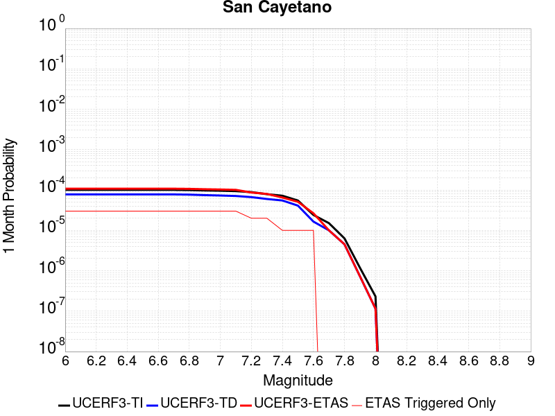 | 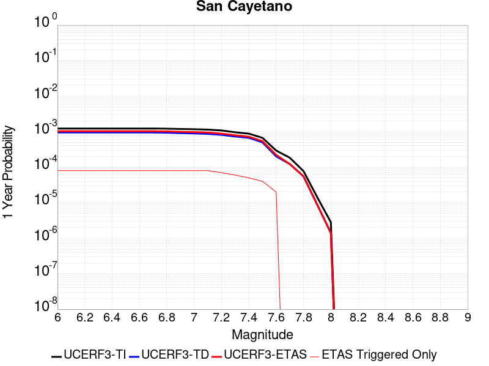 | 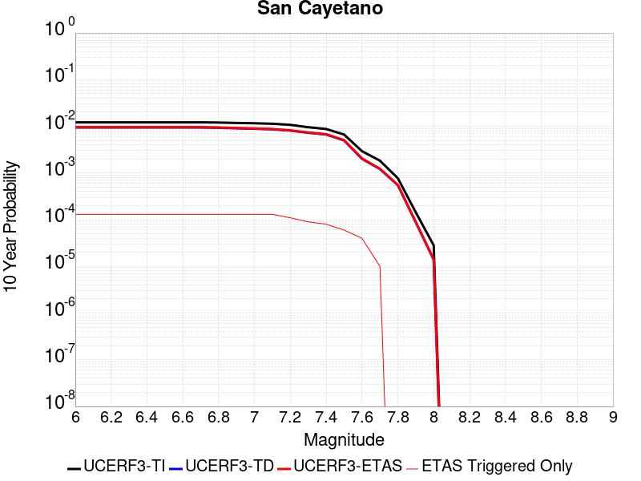 |

| Magnitude | 1 wk TI Prob | 1 wk TD Prob | 1 wk ETAS Prob | 1 wk ETAS/TD Gain | 1 wk ETAS Triggered Only | 1 mo TI Prob | 1 mo TD Prob | 1 mo ETAS Prob | 1 mo ETAS/TD Gain | 1 mo ETAS Triggered Only | 1 yr TI Prob | 1 yr TD Prob | 1 yr ETAS Prob | 1 yr ETAS/TD Gain | 1 yr ETAS Triggered Only | 10 yr TI Prob | 10 yr TD Prob | 10 yr ETAS Prob | 10 yr ETAS/TD Gain | 10 yr ETAS Triggered Only |
|-----|-----|-----|-----|-----|-----|-----|-----|-----|-----|-----|-----|-----|-----|-----|-----|-----|-----|-----|-----|-----|
| 6.0 | 2.3476267E-5 | 1.8169216E-5 | 2.8169034E-5 | 1.5503715 | 1.0E-5 | 1.0060869E-4 | 7.786576E-5 | 1.0786343E-4 | 1.3852484 | 3.0E-5 | 0.0012242225 | 9.4760704E-4 | 0.0010275312 | 1.0843432 | 8.0E-5 | 0.012175002 | 0.00943675 | 0.009565523 | 1.0136459 | 1.3E-4 |
| 6.1 | 2.3476267E-5 | 1.8169216E-5 | 2.8169034E-5 | 1.5503715 | 1.0E-5 | 1.0060869E-4 | 7.786576E-5 | 1.0786343E-4 | 1.3852484 | 3.0E-5 | 0.0012242225 | 9.4760704E-4 | 0.0010275312 | 1.0843432 | 8.0E-5 | 0.012175002 | 0.00943675 | 0.009565523 | 1.0136459 | 1.3E-4 |
| 6.2 | 2.3476267E-5 | 1.8169216E-5 | 2.8169034E-5 | 1.5503715 | 1.0E-5 | 1.0060869E-4 | 7.786576E-5 | 1.0786343E-4 | 1.3852484 | 3.0E-5 | 0.0012242225 | 9.4760704E-4 | 0.0010275312 | 1.0843432 | 8.0E-5 | 0.012175002 | 0.00943675 | 0.009565523 | 1.0136459 | 1.3E-4 |
| 6.3 | 2.3476267E-5 | 1.8169216E-5 | 2.8169034E-5 | 1.5503715 | 1.0E-5 | 1.0060869E-4 | 7.786576E-5 | 1.0786343E-4 | 1.3852484 | 3.0E-5 | 0.0012242225 | 9.4760704E-4 | 0.0010275312 | 1.0843432 | 8.0E-5 | 0.012175002 | 0.00943675 | 0.009565523 | 1.0136459 | 1.3E-4 |
| 6.4 | 2.3476267E-5 | 1.8169216E-5 | 2.8169034E-5 | 1.5503715 | 1.0E-5 | 1.0060869E-4 | 7.786576E-5 | 1.0786343E-4 | 1.3852484 | 3.0E-5 | 0.0012242225 | 9.4760704E-4 | 0.0010275312 | 1.0843432 | 8.0E-5 | 0.012175002 | 0.00943675 | 0.009565523 | 1.0136459 | 1.3E-4 |
| 6.5 | 2.3476267E-5 | 1.8169216E-5 | 2.8169034E-5 | 1.5503715 | 1.0E-5 | 1.0060869E-4 | 7.786576E-5 | 1.0786343E-4 | 1.3852484 | 3.0E-5 | 0.0012242225 | 9.4760704E-4 | 0.0010275312 | 1.0843432 | 8.0E-5 | 0.012175002 | 0.00943675 | 0.009565523 | 1.0136459 | 1.3E-4 |
| 6.6 | 2.3476267E-5 | 1.8169216E-5 | 2.8169034E-5 | 1.5503715 | 1.0E-5 | 1.0060869E-4 | 7.786576E-5 | 1.0786343E-4 | 1.3852484 | 3.0E-5 | 0.0012242225 | 9.4760704E-4 | 0.0010275312 | 1.0843432 | 8.0E-5 | 0.012175002 | 0.00943675 | 0.009565523 | 1.0136459 | 1.3E-4 |
| 6.7 | 2.3476267E-5 | 1.8169216E-5 | 2.8169034E-5 | 1.5503715 | 1.0E-5 | 1.0060869E-4 | 7.786576E-5 | 1.0786343E-4 | 1.3852484 | 3.0E-5 | 0.0012242225 | 9.4760704E-4 | 0.0010275312 | 1.0843432 | 8.0E-5 | 0.012175002 | 0.00943675 | 0.009565523 | 1.0136459 | 1.3E-4 |
| 6.8 | 2.3241924E-5 | 1.7936945E-5 | 2.7936767E-5 | 1.5574985 | 1.0E-5 | 9.960445E-5 | 7.687038E-5 | 1.0686807E-4 | 1.3902373 | 3.0E-5 | 0.0012120095 | 9.354987E-4 | 0.0010154238 | 1.0854359 | 8.0E-5 | 0.012054204 | 0.0093166195 | 0.009445408 | 1.0138235 | 1.3E-4 |
| 6.9 | 2.2761007E-5 | 1.7432383E-5 | 2.743221E-5 | 1.573635 | 1.0E-5 | 9.7543525E-5 | 7.47081E-5 | 1.04705854E-4 | 1.4015329 | 3.0E-5 | 0.0011869454 | 9.09195E-4 | 9.891222E-4 | 1.0879099 | 8.0E-5 | 0.011806256 | 0.009055741 | 0.0091845635 | 1.0142255 | 1.3E-4 |
| 7.0 | 2.240283E-5 | 1.7066137E-5 | 2.7065966E-5 | 1.5859457 | 1.0E-5 | 9.600859E-5 | 7.313856E-5 | 1.03136364E-4 | 1.4101504 | 3.0E-5 | 0.0011682777 | 8.9010154E-4 | 9.700304E-4 | 1.0897974 | 8.0E-5 | 0.011621549 | 0.008866336 | 0.008995184 | 1.0145322 | 1.3E-4 |
| 7.1 | 2.1871154E-5 | 1.658602E-5 | 2.6585854E-5 | 1.6029074 | 1.0E-5 | 9.373015E-5 | 7.108103E-5 | 1.0107889E-4 | 1.4220235 | 3.0E-5 | 0.0011405671 | 8.6507126E-4 | 9.45002E-4 | 1.0923979 | 8.0E-5 | 0.011347309 | 0.008617996 | 0.008746876 | 1.0149547 | 1.3E-4 |
| 7.2 | 2.0714133E-5 | 1.5564563E-5 | 2.5564406E-5 | 1.6424751 | 1.0E-5 | 8.8771834E-5 | 6.670358E-5 | 8.6702246E-5 | 1.299814 | 2.0E-5 | 0.0010802611 | 8.118168E-4 | 8.817599E-4 | 1.0861564 | 7.0E-5 | 0.010750249 | 0.008089443 | 0.008198553 | 1.0134879 | 1.1E-4 |
| 7.3 | 1.8408395E-5 | 1.3996829E-5 | 2.3996688E-5 | 1.7144376 | 1.0E-5 | 7.8890735E-5 | 5.9985046E-5 | 7.9983845E-5 | 1.3333964 | 2.0E-5 | 9.600714E-4 | 7.300762E-4 | 7.900324E-4 | 1.0821232 | 6.0E-5 | 0.009559342 | 0.0072776447 | 0.0073669897 | 1.0122766 | 9.0E-5 |
| 7.4 | 1.6856795E-5 | 1.285006E-5 | 1.285006E-5 | 1.0 | 0.0 | 7.2241404E-5 | 5.5070537E-5 | 6.506999E-5 | 1.1815753 | 1.0E-5 | 8.7918417E-4 | 6.7028037E-4 | 7.2024687E-4 | 1.0745456 | 5.0E-5 | 0.00875714 | 0.0066834087 | 0.006762874 | 1.0118899 | 8.0E-5 |
| 7.5 | 1.2822778E-5 | 9.577415E-6 | 9.577415E-6 | 1.0 | 0.0 | 5.495361E-5 | 4.1045427E-5 | 5.1045015E-5 | 1.2436225 | 1.0E-5 | 6.688548E-4 | 4.9961504E-4 | 5.395951E-4 | 1.0800216 | 4.0E-5 | 0.006668452 | 0.0049851923 | 0.005044893 | 1.0119756 | 6.0E-5 |
| 7.6 | 5.6272684E-6 | 3.854899E-6 | 3.854899E-6 | 1.0 | 0.0 | 2.4116642E-5 | 1.6520893E-5 | 2.6520727E-5 | 1.6052841 | 1.0E-5 | 2.9358055E-4 | 2.0112342E-4 | 2.211194E-4 | 1.0994214 | 2.0E-5 | 0.0029319301 | 0.0020094248 | 0.0020493444 | 1.0198662 | 4.0E-5 |
| 7.7 | 3.5261346E-6 | 2.3407094E-6 | 2.3407094E-6 | 1.0 | 0.0 | 1.5111918E-5 | 1.0031574E-5 | 1.0031574E-5 | 1.0 | 0.0 | 1.8397206E-4 | 1.2212765E-4 | 1.2212765E-4 | 1.0 | 0.0 | 0.0018381984 | 0.0012206127 | 0.0012306004 | 1.0081826 | 1.0E-5 |
| 7.8 | 1.4826929E-6 | 1.0564395E-6 | 1.0564395E-6 | 1.0 | 0.0 | 6.354383E-6 | 4.52759E-6 | 4.52759E-6 | 1.0 | 0.0 | 7.736187E-5 | 5.5122033E-5 | 5.5122033E-5 | 1.0 | 0.0 | 7.733494E-4 | 5.510856E-4 | 5.510856E-4 | 1.0 | 0.0 |
| 7.9 | 2.7568166E-7 | 1.6977887E-7 | 1.6977887E-7 | 1.0 | 0.0 | 1.1814923E-6 | 7.276235E-7 | 7.276235E-7 | 1.0 | 0.0 | 1.4384574E-5 | 8.85878E-6 | 8.85878E-6 | 1.0 | 0.0 | 1.4383643E-4 | 8.858431E-5 | 8.858431E-5 | 1.0 | 0.0 |
| 8.0 | 5.407832E-8 | 2.688677E-8 | 2.688677E-8 | 1.0 | 0.0 | 2.3176422E-7 | 1.15229014E-7 | 1.15229014E-7 | 1.0 | 0.0 | 2.8217257E-6 | 1.4029123E-6 | 1.4029123E-6 | 1.0 | 0.0 | 2.8216898E-5 | 1.40290385E-5 | 1.40290385E-5 | 1.0 | 0.0 |

## Kern Canyon (North Kern) 2011
*[(top)](#table-of-contents)*

| 1 Week | 1 Month | 1 Year | 10 Year |
|-----|-----|-----|-----|
| 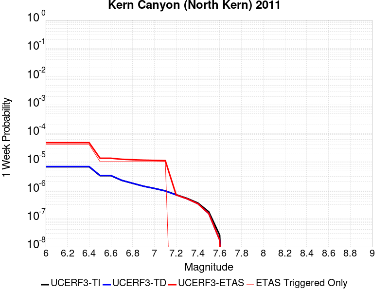 |  |  |  |

| Magnitude | 1 wk TI Prob | 1 wk TD Prob | 1 wk ETAS Prob | 1 wk ETAS/TD Gain | 1 wk ETAS Triggered Only | 1 mo TI Prob | 1 mo TD Prob | 1 mo ETAS Prob | 1 mo ETAS/TD Gain | 1 mo ETAS Triggered Only | 1 yr TI Prob | 1 yr TD Prob | 1 yr ETAS Prob | 1 yr ETAS/TD Gain | 1 yr ETAS Triggered Only | 10 yr TI Prob | 10 yr TD Prob | 10 yr ETAS Prob | 10 yr ETAS/TD Gain | 10 yr ETAS Triggered Only |
|-----|-----|-----|-----|-----|-----|-----|-----|-----|-----|-----|-----|-----|-----|-----|-----|-----|-----|-----|-----|-----|
| 6.0 | 6.6264497E-6 | 6.75733E-6 | 4.675706E-5 | 6.9194574 | 4.0E-5 | 2.8398761E-5 | 2.895971E-5 | 7.895826E-5 | 2.7264867 | 5.0E-5 | 3.4570007E-4 | 3.5253543E-4 | 4.3250722E-4 | 1.2268475 | 8.0E-5 | 0.0034516277 | 0.0035205502 | 0.0036500925 | 1.0367961 | 1.3E-4 |
| 6.1 | 6.6264497E-6 | 6.75733E-6 | 4.675706E-5 | 6.9194574 | 4.0E-5 | 2.8398761E-5 | 2.895971E-5 | 7.895826E-5 | 2.7264867 | 5.0E-5 | 3.4570007E-4 | 3.5253543E-4 | 4.3250722E-4 | 1.2268475 | 8.0E-5 | 0.0034516277 | 0.0035205502 | 0.0036500925 | 1.0367961 | 1.3E-4 |
| 6.2 | 6.6264497E-6 | 6.75733E-6 | 4.675706E-5 | 6.9194574 | 4.0E-5 | 2.8398761E-5 | 2.895971E-5 | 7.895826E-5 | 2.7264867 | 5.0E-5 | 3.4570007E-4 | 3.5253543E-4 | 4.3250722E-4 | 1.2268475 | 8.0E-5 | 0.0034516277 | 0.0035205502 | 0.0036500925 | 1.0367961 | 1.3E-4 |
| 6.3 | 6.6264497E-6 | 6.75733E-6 | 4.675706E-5 | 6.9194574 | 4.0E-5 | 2.8398761E-5 | 2.895971E-5 | 7.895826E-5 | 2.7264867 | 5.0E-5 | 3.4570007E-4 | 3.5253543E-4 | 4.3250722E-4 | 1.2268475 | 8.0E-5 | 0.0034516277 | 0.0035205502 | 0.0036500925 | 1.0367961 | 1.3E-4 |
| 6.4 | 6.6264497E-6 | 6.75733E-6 | 4.675706E-5 | 6.9194574 | 4.0E-5 | 2.8398761E-5 | 2.895971E-5 | 7.895826E-5 | 2.7264867 | 5.0E-5 | 3.4570007E-4 | 3.5253543E-4 | 4.3250722E-4 | 1.2268475 | 8.0E-5 | 0.0034516277 | 0.0035205502 | 0.0036500925 | 1.0367961 | 1.3E-4 |
| 6.5 | 3.2162225E-6 | 3.2570915E-6 | 1.32570585E-5 | 4.070214 | 1.0E-5 | 1.3783738E-5 | 1.3958894E-5 | 2.3958753E-5 | 1.7163792 | 1.0E-5 | 1.6780409E-4 | 1.6993708E-4 | 1.8993368E-4 | 1.1176707 | 2.0E-5 | 0.0016767744 | 0.001698151 | 0.0017480662 | 1.0293938 | 5.0E-5 |
| 6.6 | 3.2162225E-6 | 3.2570915E-6 | 1.32570585E-5 | 4.070214 | 1.0E-5 | 1.3783738E-5 | 1.3958894E-5 | 2.3958753E-5 | 1.7163792 | 1.0E-5 | 1.6780409E-4 | 1.6993708E-4 | 1.8993368E-4 | 1.1176707 | 2.0E-5 | 0.0016767744 | 0.001698151 | 0.0017480662 | 1.0293938 | 5.0E-5 |
| 6.7 | 2.1908265E-6 | 2.2071222E-6 | 1.2207101E-5 | 5.5307765 | 1.0E-5 | 9.389223E-6 | 9.459062E-6 | 1.9458968E-5 | 2.0571773 | 1.0E-5 | 1.1430779E-4 | 1.1515819E-4 | 1.2515704E-4 | 1.086827 | 1.0E-5 | 0.0011424901 | 0.0011510046 | 0.0011709816 | 1.0173562 | 2.0E-5 |
| 6.8 | 1.7303895E-6 | 1.736553E-6 | 1.1736535E-5 | 6.7585244 | 1.0E-5 | 7.415934E-6 | 7.442349E-6 | 1.7442275E-5 | 2.3436518 | 1.0E-5 | 9.028525E-5 | 9.060693E-5 | 1.0060603E-4 | 1.1103568 | 1.0E-5 | 9.024858E-4 | 9.0570963E-4 | 9.256915E-4 | 1.0220622 | 2.0E-5 |
| 6.9 | 1.3700314E-6 | 1.3688623E-6 | 1.1368848E-5 | 8.305326 | 1.0E-5 | 5.87155E-6 | 5.86654E-6 | 1.586648E-5 | 2.7045722 | 1.0E-5 | 7.148377E-5 | 7.142283E-5 | 8.142211E-5 | 1.1400013 | 1.0E-5 | 7.146078E-4 | 7.140033E-4 | 7.2399614E-4 | 1.0139955 | 1.0E-5 |
| 7.0 | 1.1467797E-6 | 1.1413805E-6 | 1.1141369E-5 | 9.76131 | 1.0E-5 | 4.9147607E-6 | 4.8916218E-6 | 1.4891573E-5 | 3.0443017 | 1.0E-5 | 5.983557E-5 | 5.95539E-5 | 6.95533E-5 | 1.1679051 | 1.0E-5 | 5.981946E-4 | 5.9538253E-4 | 6.053766E-4 | 1.016786 | 1.0E-5 |
| 7.1 | 9.3952065E-7 | 9.3026915E-7 | 1.093026E-5 | 11.749567 | 1.0E-5 | 4.026511E-6 | 3.986862E-6 | 1.3986822E-5 | 3.5082285 | 1.0E-5 | 4.9021666E-5 | 4.853898E-5 | 5.853849E-5 | 1.20601 | 1.0E-5 | 4.901085E-4 | 4.8528553E-4 | 4.9528066E-4 | 1.0205964 | 1.0E-5 |
| 7.2 | 6.858055E-7 | 6.7193014E-7 | 6.7193014E-7 | 1.0 | 0.0 | 2.939163E-6 | 2.8796974E-6 | 2.8796974E-6 | 1.0 | 0.0 | 3.5783723E-5 | 3.5059762E-5 | 3.5059762E-5 | 1.0 | 0.0 | 3.5777962E-4 | 3.5054318E-4 | 3.5054318E-4 | 1.0 | 0.0 |
| 7.3 | 5.1101983E-7 | 4.939301E-7 | 4.939301E-7 | 1.0 | 0.0 | 2.1900833E-6 | 2.1168414E-6 | 2.1168414E-6 | 1.0 | 0.0 | 2.6663936E-5 | 2.5772246E-5 | 2.5772246E-5 | 1.0 | 0.0 | 2.6660739E-4 | 2.5769303E-4 | 2.5769303E-4 | 1.0 | 0.0 |
| 7.4 | 3.4999414E-7 | 3.2995916E-7 | 3.2995916E-7 | 1.0 | 0.0 | 1.499974E-6 | 1.4141099E-6 | 1.4141099E-6 | 1.0 | 0.0 | 1.8262032E-5 | 1.7216655E-5 | 1.7216655E-5 | 1.0 | 0.0 | 1.826053E-4 | 1.7215345E-4 | 1.7215345E-4 | 1.0 | 0.0 |
| 7.5 | 1.7021522E-7 | 1.4750053E-7 | 1.4750053E-7 | 1.0 | 0.0 | 7.2949354E-7 | 6.32145E-7 | 6.32145E-7 | 1.0 | 0.0 | 8.881548E-6 | 7.696339E-6 | 7.696339E-6 | 1.0 | 0.0 | 8.8811925E-5 | 7.696081E-5 | 7.696081E-5 | 1.0 | 0.0 |
| 7.6 | 2.572245E-8 | 1.735264E-8 | 1.735264E-8 | 1.0 | 0.0 | 1.10239064E-7 | 7.436845E-8 | 7.436845E-8 | 1.0 | 0.0 | 1.3421597E-6 | 9.0543557E-7 | 9.0543557E-7 | 1.0 | 0.0 | 1.3421517E-5 | 9.054324E-6 | 9.054324E-6 | 1.0 | 0.0 |

## Chino alt 1
*[(top)](#table-of-contents)*

| 1 Week | 1 Month | 1 Year | 10 Year |
|-----|-----|-----|-----|
|  |  | 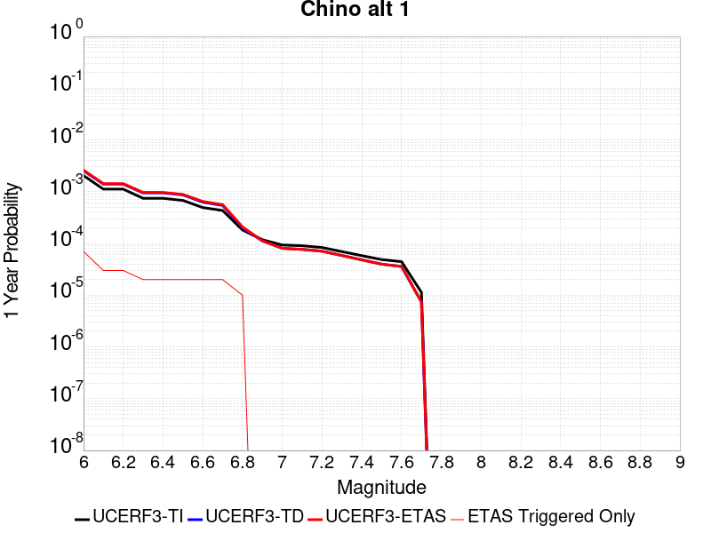 | 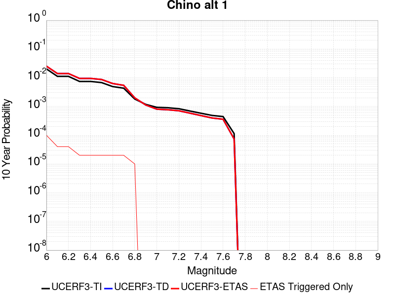 |

| Magnitude | 1 wk TI Prob | 1 wk TD Prob | 1 wk ETAS Prob | 1 wk ETAS/TD Gain | 1 wk ETAS Triggered Only | 1 mo TI Prob | 1 mo TD Prob | 1 mo ETAS Prob | 1 mo ETAS/TD Gain | 1 mo ETAS Triggered Only | 1 yr TI Prob | 1 yr TD Prob | 1 yr ETAS Prob | 1 yr ETAS/TD Gain | 1 yr ETAS Triggered Only | 10 yr TI Prob | 10 yr TD Prob | 10 yr ETAS Prob | 10 yr ETAS/TD Gain | 10 yr ETAS Triggered Only |
|-----|-----|-----|-----|-----|-----|-----|-----|-----|-----|-----|-----|-----|-----|-----|-----|-----|-----|-----|-----|-----|
| 6.0 | 3.939946E-5 | 4.894798E-5 | 6.8947E-5 | 1.4085771 | 2.0E-5 | 1.6884391E-4 | 2.0976314E-4 | 2.3975683E-4 | 1.1429884 | 3.0E-5 | 0.0020537362 | 0.002551385 | 0.0026212065 | 1.027366 | 7.0E-5 | 0.020348595 | 0.025280168 | 0.02537764 | 1.0038557 | 1.0E-4 |
| 6.1 | 2.1505624E-5 | 2.6878823E-5 | 3.6878555E-5 | 1.3720301 | 1.0E-5 | 9.2163704E-5 | 1.15190494E-4 | 1.2518934E-4 | 1.0868027 | 1.0E-5 | 0.0011215154 | 0.0014016517 | 0.0014316096 | 1.0213733 | 3.0E-5 | 0.011158722 | 0.013947425 | 0.013986867 | 1.0028279 | 4.0E-5 |
| 6.2 | 2.1505624E-5 | 2.6878823E-5 | 3.6878555E-5 | 1.3720301 | 1.0E-5 | 9.2163704E-5 | 1.15190494E-4 | 1.2518934E-4 | 1.0868027 | 1.0E-5 | 0.0011215154 | 0.0014016517 | 0.0014316096 | 1.0213733 | 3.0E-5 | 0.011158722 | 0.013947425 | 0.013986867 | 1.0028279 | 4.0E-5 |
| 6.3 | 1.4290785E-5 | 1.8164832E-5 | 1.8164832E-5 | 1.0 | 0.0 | 6.1244784E-5 | 7.784722E-5 | 7.784722E-5 | 1.0 | 0.0 | 7.454001E-4 | 9.4742293E-4 | 9.67404E-4 | 1.0210899 | 2.0E-5 | 0.007429048 | 0.00944674 | 0.009466551 | 1.0020971 | 2.0E-5 |
| 6.4 | 1.4290785E-5 | 1.8164832E-5 | 1.8164832E-5 | 1.0 | 0.0 | 6.1244784E-5 | 7.784722E-5 | 7.784722E-5 | 1.0 | 0.0 | 7.454001E-4 | 9.4742293E-4 | 9.67404E-4 | 1.0210899 | 2.0E-5 | 0.007429048 | 0.00944674 | 0.009466551 | 1.0020971 | 2.0E-5 |
| 6.5 | 1.3017944E-5 | 1.6651793E-5 | 1.6651793E-5 | 1.0 | 0.0 | 5.5789995E-5 | 7.1363116E-5 | 7.1363116E-5 | 1.0 | 0.0 | 6.790315E-4 | 8.6854334E-4 | 8.88526E-4 | 1.023007 | 2.0E-5 | 0.0067696036 | 0.008664233 | 0.00868406 | 1.0022883 | 2.0E-5 |
| 6.6 | 9.470016E-6 | 1.2039209E-5 | 1.2039209E-5 | 1.0 | 0.0 | 4.058515E-5 | 5.159578E-5 | 5.159578E-5 | 1.0 | 0.0 | 4.940122E-4 | 6.280315E-4 | 6.4801896E-4 | 1.0318255 | 2.0E-5 | 0.004929154 | 0.006273248 | 0.006293122 | 1.0031681 | 2.0E-5 |
| 6.7 | 8.314155E-6 | 1.040749E-5 | 1.040749E-5 | 1.0 | 0.0 | 3.5631605E-5 | 4.4602948E-5 | 4.4602948E-5 | 1.0 | 0.0 | 4.3372845E-4 | 5.4293784E-4 | 5.62927E-4 | 1.0368166 | 2.0E-5 | 0.004328829 | 0.0054270807 | 0.0054469723 | 1.0036652 | 2.0E-5 |
| 6.8 | 3.4856364E-6 | 3.8134033E-6 | 3.8134033E-6 | 1.0 | 0.0 | 1.4938357E-5 | 1.6343065E-5 | 1.6343065E-5 | 1.0 | 0.0 | 1.8185932E-4 | 1.9896074E-4 | 2.0895875E-4 | 1.0502511 | 1.0E-5 | 0.0018171056 | 0.0019894529 | 0.001999433 | 1.0050166 | 1.0E-5 |
| 6.9 | 2.2645952E-6 | 2.152909E-6 | 2.152909E-6 | 1.0 | 0.0 | 9.705372E-6 | 9.226722E-6 | 9.226722E-6 | 1.0 | 0.0 | 1.18156495E-4 | 1.12329755E-4 | 1.12329755E-4 | 1.0 | 0.0 | 0.0011809369 | 0.0011233138 | 0.0011233138 | 1.0 | 0.0 |
| 7.0 | 1.7864003E-6 | 1.5430741E-6 | 1.5430741E-6 | 1.0 | 0.0 | 7.655979E-6 | 6.613158E-6 | 6.613158E-6 | 1.0 | 0.0 | 9.3207556E-5 | 8.051228E-5 | 8.051228E-5 | 1.0 | 0.0 | 9.316847E-4 | 8.052856E-4 | 8.052856E-4 | 1.0 | 0.0 |
| 7.1 | 1.7315456E-6 | 1.4733466E-6 | 1.4733466E-6 | 1.0 | 0.0 | 7.420889E-6 | 6.314328E-6 | 6.314328E-6 | 1.0 | 0.0 | 9.034557E-5 | 7.687428E-5 | 7.687428E-5 | 1.0 | 0.0 | 9.0308854E-4 | 7.68921E-4 | 7.68921E-4 | 1.0 | 0.0 |
| 7.2 | 1.6008337E-6 | 1.3574178E-6 | 1.3574178E-6 | 1.0 | 0.0 | 6.860698E-6 | 5.817492E-6 | 5.817492E-6 | 1.0 | 0.0 | 8.352579E-5 | 7.082572E-5 | 7.082572E-5 | 1.0 | 0.0 | 8.34944E-4 | 7.0846075E-4 | 7.0846075E-4 | 1.0 | 0.0 |
| 7.3 | 1.3320939E-6 | 1.1217794E-6 | 1.1217794E-6 | 1.0 | 0.0 | 5.7089615E-6 | 4.8076176E-6 | 4.8076176E-6 | 1.0 | 0.0 | 6.9504385E-5 | 5.853122E-5 | 5.853122E-5 | 1.0 | 0.0 | 6.9482654E-4 | 5.8530655E-4 | 5.8530655E-4 | 1.0 | 0.0 |
| 7.4 | 1.114294E-6 | 9.237087E-7 | 9.237087E-7 | 1.0 | 0.0 | 4.775537E-6 | 3.9587458E-6 | 3.9587458E-6 | 1.0 | 0.0 | 5.8140613E-5 | 4.81967E-5 | 4.81967E-5 | 1.0 | 0.0 | 5.81254E-4 | 4.8187698E-4 | 4.8187698E-4 | 1.0 | 0.0 |
| 7.5 | 9.354081E-7 | 7.6233886E-7 | 7.6233886E-7 | 1.0 | 0.0 | 4.0088858E-6 | 3.2671626E-6 | 3.2671626E-6 | 1.0 | 0.0 | 4.8807087E-5 | 3.9777013E-5 | 3.9777013E-5 | 1.0 | 0.0 | 4.879637E-4 | 3.9770233E-4 | 3.9770233E-4 | 1.0 | 0.0 |
| 7.6 | 8.521771E-7 | 6.880688E-7 | 6.880688E-7 | 1.0 | 0.0 | 3.6521824E-6 | 2.948863E-6 | 2.948863E-6 | 1.0 | 0.0 | 4.4464414E-5 | 3.590185E-5 | 3.590185E-5 | 1.0 | 0.0 | 4.4455516E-4 | 3.5896365E-4 | 3.5896365E-4 | 1.0 | 0.0 |
| 7.7 | 2.1803626E-7 | 1.4186368E-7 | 1.4186368E-7 | 1.0 | 0.0 | 9.344408E-7 | 6.0798715E-7 | 6.0798715E-7 | 1.0 | 0.0 | 1.1376757E-5 | 7.4022278E-6 | 7.4022278E-6 | 1.0 | 0.0 | 1.13761744E-4 | 7.402077E-5 | 7.402077E-5 | 1.0 | 0.0 |

## Pisgah-Bullion Mtn-Mesquite Lk
*[(top)](#table-of-contents)*

| 1 Week | 1 Month | 1 Year | 10 Year |
|-----|-----|-----|-----|
| 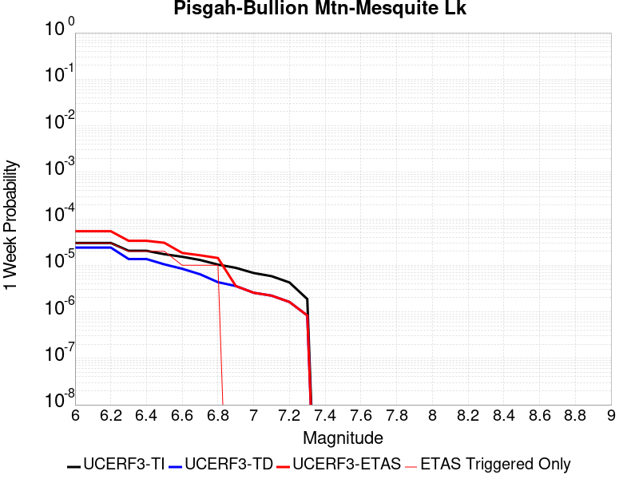 |  | 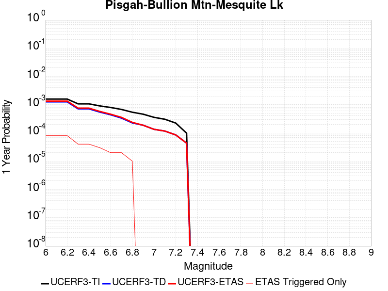 | 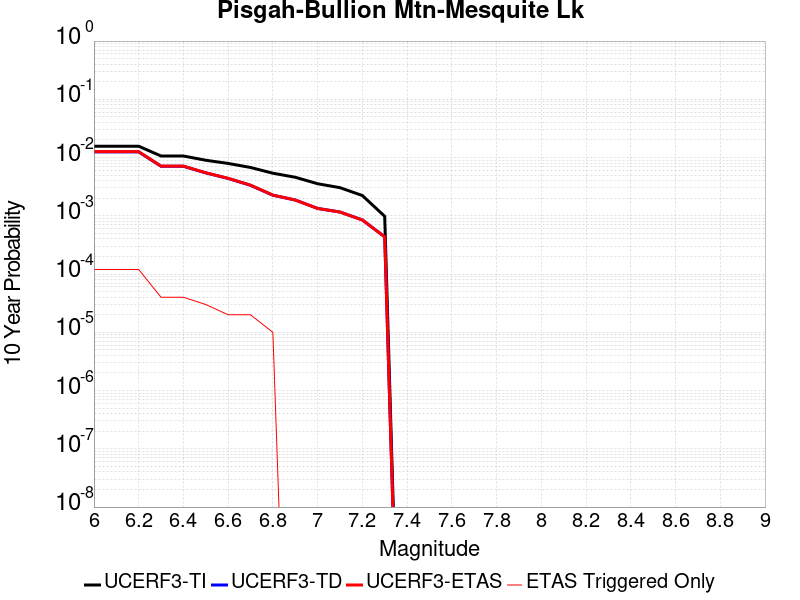 |

| Magnitude | 1 wk TI Prob | 1 wk TD Prob | 1 wk ETAS Prob | 1 wk ETAS/TD Gain | 1 wk ETAS Triggered Only | 1 mo TI Prob | 1 mo TD Prob | 1 mo ETAS Prob | 1 mo ETAS/TD Gain | 1 mo ETAS Triggered Only | 1 yr TI Prob | 1 yr TD Prob | 1 yr ETAS Prob | 1 yr ETAS/TD Gain | 1 yr ETAS Triggered Only | 10 yr TI Prob | 10 yr TD Prob | 10 yr ETAS Prob | 10 yr ETAS/TD Gain | 10 yr ETAS Triggered Only |
|-----|-----|-----|-----|-----|-----|-----|-----|-----|-----|-----|-----|-----|-----|-----|-----|-----|-----|-----|-----|-----|
| 6.0 | 3.0240792E-5 | 2.40909E-5 | 5.409018E-5 | 2.2452536 | 3.0E-5 | 1.2959696E-4 | 1.032432E-4 | 1.4323907E-4 | 1.3873948 | 4.0E-5 | 0.0015767008 | 0.0012563618 | 0.0013362613 | 1.0635959 | 8.0E-5 | 0.015655609 | 0.012502613 | 0.012621112 | 1.009478 | 1.2E-4 |
| 6.1 | 3.0240792E-5 | 2.40909E-5 | 5.409018E-5 | 2.2452536 | 3.0E-5 | 1.2959696E-4 | 1.032432E-4 | 1.4323907E-4 | 1.3873948 | 4.0E-5 | 0.0015767008 | 0.0012563618 | 0.0013362613 | 1.0635959 | 8.0E-5 | 0.015655609 | 0.012502613 | 0.012621112 | 1.009478 | 1.2E-4 |
| 6.2 | 3.0240792E-5 | 2.40909E-5 | 5.409018E-5 | 2.2452536 | 3.0E-5 | 1.2959696E-4 | 1.032432E-4 | 1.4323907E-4 | 1.3873948 | 4.0E-5 | 0.0015767008 | 0.0012563618 | 0.0013362613 | 1.0635959 | 8.0E-5 | 0.015655609 | 0.012502613 | 0.012621112 | 1.009478 | 1.2E-4 |
| 6.3 | 2.0498217E-5 | 1.3638054E-5 | 3.363778E-5 | 2.4664648 | 2.0E-5 | 8.784654E-5 | 5.8447586E-5 | 7.8446414E-5 | 1.3421669 | 2.0E-5 | 0.0010690069 | 7.1138324E-4 | 7.513548E-4 | 1.0561885 | 4.0E-5 | 0.01063879 | 0.0070926864 | 0.007132403 | 1.0055996 | 4.0E-5 |
| 6.4 | 2.0498217E-5 | 1.3638054E-5 | 3.363778E-5 | 2.4664648 | 2.0E-5 | 8.784654E-5 | 5.8447586E-5 | 7.8446414E-5 | 1.3421669 | 2.0E-5 | 0.0010690069 | 7.1138324E-4 | 7.513548E-4 | 1.0561885 | 4.0E-5 | 0.01063879 | 0.0070926864 | 0.007132403 | 1.0055996 | 4.0E-5 |
| 6.5 | 1.7316182E-5 | 1.04769715E-5 | 3.0476762E-5 | 2.9089286 | 2.0E-5 | 7.42101E-5 | 4.490059E-5 | 6.4899694E-5 | 1.4454085 | 2.0E-5 | 9.0313336E-4 | 5.465376E-4 | 5.7652115E-4 | 1.0548611 | 3.0E-5 | 0.008994718 | 0.00545293 | 0.0054827663 | 1.0054716 | 3.0E-5 |
| 6.6 | 1.5251077E-5 | 8.414133E-6 | 1.8414048E-5 | 2.1884665 | 1.0E-5 | 6.536012E-5 | 3.606011E-5 | 4.605975E-5 | 1.2773048 | 1.0E-5 | 7.9546886E-4 | 4.3895066E-4 | 4.5894188E-4 | 1.0455432 | 2.0E-5 | 0.007926274 | 0.0043815537 | 0.004401466 | 1.0045446 | 2.0E-5 |
| 6.7 | 1.2997425E-5 | 6.4112146E-6 | 1.641115E-5 | 2.5597568 | 1.0E-5 | 5.570206E-5 | 2.7476372E-5 | 3.7476097E-5 | 1.363939 | 1.0E-5 | 6.7796157E-4 | 3.3447813E-4 | 3.5447144E-4 | 1.0597746 | 2.0E-5 | 0.0067589693 | 0.003340207 | 0.0033601404 | 1.0059676 | 2.0E-5 |
| 6.8 | 1.035386E-5 | 4.333145E-6 | 1.4333102E-5 | 3.3077824 | 1.0E-5 | 4.437293E-5 | 1.8570496E-5 | 2.857031E-5 | 1.5384786 | 1.0E-5 | 5.401065E-4 | 2.260732E-4 | 2.3607093E-4 | 1.0442234 | 1.0E-5 | 0.0053879567 | 0.002258519 | 0.0022684964 | 1.0044177 | 1.0E-5 |
| 6.9 | 8.816252E-6 | 3.5805879E-6 | 3.5805879E-6 | 1.0 | 0.0 | 3.778339E-5 | 1.534529E-5 | 1.534529E-5 | 1.0 | 0.0 | 4.5991567E-4 | 1.8681347E-4 | 1.8681347E-4 | 1.0 | 0.0 | 0.00458965 | 0.0018666228 | 0.0018666228 | 1.0 | 0.0 |
| 7.0 | 6.8232207E-6 | 2.5674399E-6 | 2.5674399E-6 | 1.0 | 0.0 | 2.9242048E-5 | 1.100327E-5 | 1.100327E-5 | 1.0 | 0.0 | 3.5596377E-4 | 1.3395688E-4 | 1.3395688E-4 | 1.0 | 0.0 | 0.0035539411 | 0.0013387925 | 0.0013387925 | 1.0 | 0.0 |
| 7.1 | 5.837013E-6 | 2.2273143E-6 | 2.2273143E-6 | 1.0 | 0.0 | 2.501553E-5 | 9.5456E-6 | 9.5456E-6 | 1.0 | 0.0 | 3.045215E-4 | 1.1621177E-4 | 1.1621177E-4 | 1.0 | 0.0 | 0.0030410455 | 0.001161539 | 0.001161539 | 1.0 | 0.0 |
| 7.2 | 4.278052E-6 | 1.6275065E-6 | 1.6275065E-6 | 1.0 | 0.0 | 1.833438E-5 | 6.975011E-6 | 6.975011E-6 | 1.0 | 0.0 | 2.231982E-4 | 8.491768E-5 | 8.491768E-5 | 1.0 | 0.0 | 0.0022297418 | 8.4887556E-4 | 8.4887556E-4 | 1.0 | 0.0 |
| 7.3 | 1.8803692E-6 | 8.344788E-7 | 8.344788E-7 | 1.0 | 0.0 | 8.0587E-6 | 3.5763337E-6 | 3.5763337E-6 | 1.0 | 0.0 | 9.811026E-5 | 4.354114E-5 | 4.354114E-5 | 1.0 | 0.0 | 9.806695E-4 | 4.3534054E-4 | 4.3534054E-4 | 1.0 | 0.0 |

## San Clemente
*[(top)](#table-of-contents)*

| 1 Week | 1 Month | 1 Year | 10 Year |
|-----|-----|-----|-----|
| 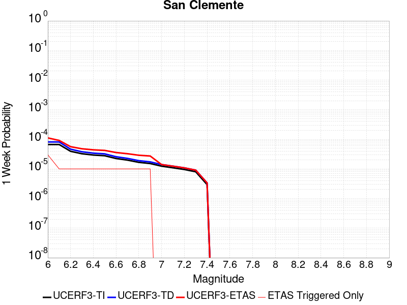 |  | 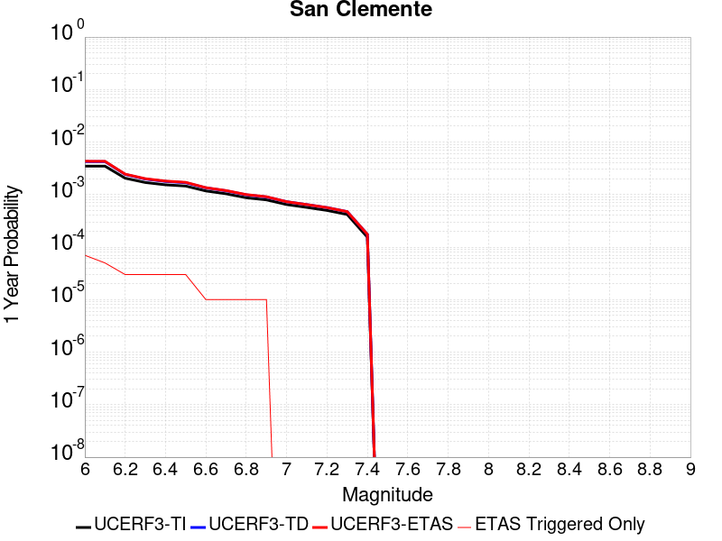 | 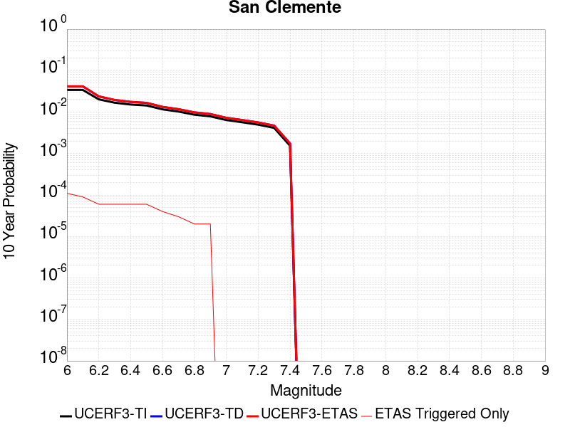 |

| Magnitude | 1 wk TI Prob | 1 wk TD Prob | 1 wk ETAS Prob | 1 wk ETAS/TD Gain | 1 wk ETAS Triggered Only | 1 mo TI Prob | 1 mo TD Prob | 1 mo ETAS Prob | 1 mo ETAS/TD Gain | 1 mo ETAS Triggered Only | 1 yr TI Prob | 1 yr TD Prob | 1 yr ETAS Prob | 1 yr ETAS/TD Gain | 1 yr ETAS Triggered Only | 10 yr TI Prob | 10 yr TD Prob | 10 yr ETAS Prob | 10 yr ETAS/TD Gain | 10 yr ETAS Triggered Only |
|-----|-----|-----|-----|-----|-----|-----|-----|-----|-----|-----|-----|-----|-----|-----|-----|-----|-----|-----|-----|-----|
| 6.0 | 6.681379E-5 | 8.163834E-5 | 1.1163589E-4 | 1.3674444 | 3.0E-5 | 2.8631336E-4 | 3.4983488E-4 | 3.898209E-4 | 1.1142997 | 4.0E-5 | 0.003480294 | 0.00425141 | 0.0043211123 | 1.0163951 | 7.0E-5 | 0.03426291 | 0.04175603 | 0.041861437 | 1.0025244 | 1.1E-4 |
| 6.1 | 6.681379E-5 | 8.163834E-5 | 9.163752E-5 | 1.1224815 | 1.0E-5 | 2.8631336E-4 | 3.4983488E-4 | 3.698279E-4 | 1.0571498 | 2.0E-5 | 0.003480294 | 0.00425141 | 0.0043011974 | 1.0117108 | 5.0E-5 | 0.03426291 | 0.04175603 | 0.04184227 | 1.0020654 | 9.0E-5 |
| 6.2 | 3.9400576E-5 | 4.6452373E-5 | 5.6451907E-5 | 1.2152642 | 1.0E-5 | 1.6884868E-4 | 1.9906677E-4 | 2.1906279E-4 | 1.1004488 | 2.0E-5 | 0.0020537945 | 0.0024209984 | 0.002450926 | 1.0123615 | 3.0E-5 | 0.020349167 | 0.023952903 | 0.024011467 | 1.0024449 | 6.0E-5 |
| 6.3 | 3.2590255E-5 | 3.792912E-5 | 4.7928737E-5 | 1.2636397 | 1.0E-5 | 1.3966505E-4 | 1.6254342E-4 | 1.8254017E-4 | 1.1230241 | 2.0E-5 | 0.0016990956 | 0.0019772002 | 0.0020071408 | 1.0151429 | 3.0E-5 | 0.01686163 | 0.019599883 | 0.019658705 | 1.0030012 | 6.0E-5 |
| 6.4 | 2.9454652E-5 | 3.4097764E-5 | 4.409742E-5 | 1.2932644 | 1.0E-5 | 1.2622811E-4 | 1.4612524E-4 | 1.661223E-4 | 1.1368489 | 2.0E-5 | 0.0015357438 | 0.0017776493 | 0.001807596 | 1.0168462 | 3.0E-5 | 0.015251739 | 0.01763747 | 0.017696412 | 1.0033418 | 6.0E-5 |
| 6.5 | 2.790836E-5 | 3.2247463E-5 | 4.224714E-5 | 1.310092 | 1.0E-5 | 1.1960178E-4 | 1.3819624E-4 | 1.5819346E-4 | 1.1447017 | 2.0E-5 | 0.001455179 | 0.0016812662 | 0.0017112158 | 1.0178137 | 3.0E-5 | 0.014456868 | 0.016688485 | 0.016747484 | 1.0035353 | 6.0E-5 |
| 6.6 | 2.2492153E-5 | 2.5762702E-5 | 3.5762445E-5 | 1.3881481 | 1.0E-5 | 9.639138E-5 | 1.1040699E-4 | 1.20405886E-4 | 1.090564 | 1.0E-5 | 0.0011729331 | 0.0013433909 | 0.0013533775 | 1.0074339 | 1.0E-5 | 0.011667615 | 0.013354417 | 0.013393883 | 1.0029553 | 4.0E-5 |
| 6.7 | 1.9862755E-5 | 2.2666423E-5 | 3.2666198E-5 | 1.4411712 | 1.0E-5 | 8.512331E-5 | 9.713826E-5 | 1.0713729E-4 | 1.102936 | 1.0E-5 | 0.0010358836 | 0.0011820279 | 0.0011920161 | 1.00845 | 1.0E-5 | 0.010310682 | 0.011758701 | 0.011788348 | 1.0025213 | 3.0E-5 |
| 6.8 | 1.6697575E-5 | 1.897771E-5 | 2.897752E-5 | 1.526924 | 1.0E-5 | 7.155907E-5 | 8.133056E-5 | 9.132974E-5 | 1.1229451 | 1.0E-5 | 8.7088346E-4 | 9.897591E-4 | 9.997492E-4 | 1.0100935 | 1.0E-5 | 0.008674784 | 0.0098545365 | 0.00987434 | 1.0020095 | 2.0E-5 |
| 6.9 | 1.5218415E-5 | 1.72694E-5 | 2.7269229E-5 | 1.5790489 | 1.0E-5 | 6.522015E-5 | 7.4009666E-5 | 8.400893E-5 | 1.1351075 | 1.0E-5 | 7.93766E-4 | 9.00704E-4 | 9.10695E-4 | 1.0110924 | 1.0E-5 | 0.007909367 | 0.008971481 | 0.008991301 | 1.0022093 | 2.0E-5 |
| 7.0 | 1.2392958E-5 | 1.4033016E-5 | 1.4033016E-5 | 1.0 | 0.0 | 5.3111595E-5 | 6.014015E-5 | 6.014015E-5 | 1.0 | 0.0 | 6.4644177E-4 | 7.319679E-4 | 7.319679E-4 | 1.0 | 0.0 | 0.0064456454 | 0.0072963564 | 0.0072963564 | 1.0 | 0.0 |
| 7.1 | 1.0934128E-5 | 1.2375138E-5 | 1.2375138E-5 | 1.0 | 0.0 | 4.6859706E-5 | 5.303527E-5 | 5.303527E-5 | 1.0 | 0.0 | 5.7036756E-4 | 6.455204E-4 | 6.455204E-4 | 1.0 | 0.0 | 0.0056890585 | 0.0064371997 | 0.0064371997 | 1.0 | 0.0 |
| 7.2 | 9.5798805E-6 | 1.0844935E-5 | 1.0844935E-5 | 1.0 | 0.0 | 4.1055984E-5 | 4.6477508E-5 | 4.6477508E-5 | 1.0 | 0.0 | 4.9974193E-4 | 5.657239E-4 | 5.657239E-4 | 1.0 | 0.0 | 0.0049861963 | 0.0056435615 | 0.0056435615 | 1.0 | 0.0 |
| 7.3 | 8.0167365E-6 | 9.083918E-6 | 9.083918E-6 | 1.0 | 0.0 | 3.4356988E-5 | 3.8930535E-5 | 3.8930535E-5 | 1.0 | 0.0 | 4.1821605E-4 | 4.7388324E-4 | 4.7388324E-4 | 1.0 | 0.0 | 0.0041742986 | 0.0047294297 | 0.0047294297 | 1.0 | 0.0 |
| 7.4 | 2.9581017E-6 | 3.3623792E-6 | 3.3623792E-6 | 1.0 | 0.0 | 1.2677518E-5 | 1.4410146E-5 | 1.4410146E-5 | 1.0 | 0.0 | 1.5433785E-4 | 1.7543444E-4 | 1.7543444E-4 | 1.0 | 0.0 | 0.001542307 | 0.0017534546 | 0.0017534546 | 1.0 | 0.0 |

## Great Valley 09 (Laguna Seca)
*[(top)](#table-of-contents)*

| 1 Week | 1 Month | 1 Year | 10 Year |
|-----|-----|-----|-----|
| 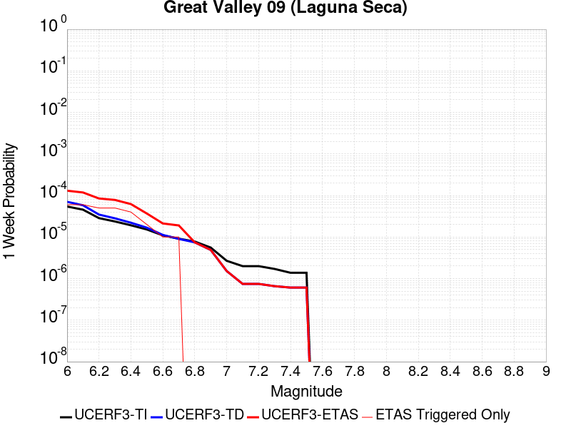 |  | 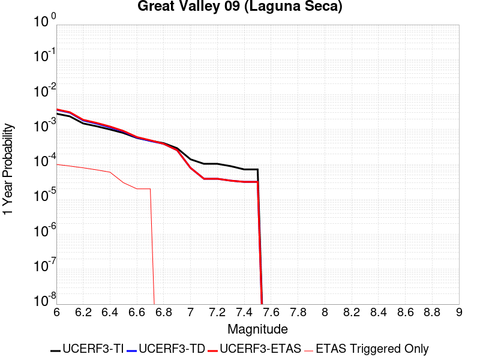 |  |

| Magnitude | 1 wk TI Prob | 1 wk TD Prob | 1 wk ETAS Prob | 1 wk ETAS/TD Gain | 1 wk ETAS Triggered Only | 1 mo TI Prob | 1 mo TD Prob | 1 mo ETAS Prob | 1 mo ETAS/TD Gain | 1 mo ETAS Triggered Only | 1 yr TI Prob | 1 yr TD Prob | 1 yr ETAS Prob | 1 yr ETAS/TD Gain | 1 yr ETAS Triggered Only | 10 yr TI Prob | 10 yr TD Prob | 10 yr ETAS Prob | 10 yr ETAS/TD Gain | 10 yr ETAS Triggered Only |
|-----|-----|-----|-----|-----|-----|-----|-----|-----|-----|-----|-----|-----|-----|-----|-----|-----|-----|-----|-----|-----|
| 6.0 | 5.4353277E-5 | 7.050019E-5 | 1.3049596E-4 | 1.8510016 | 6.0E-5 | 2.3292181E-4 | 3.0211007E-4 | 3.9208287E-4 | 1.2978146 | 9.0E-5 | 0.0028321352 | 0.0036720056 | 0.0037716385 | 1.0271331 | 1.0E-4 | 0.02796312 | 0.036115844 | 0.03623151 | 1.0032027 | 1.2E-4 |
| 6.1 | 4.5578287E-5 | 5.822054E-5 | 1.18217045E-4 | 2.0305042 | 6.0E-5 | 1.953209E-4 | 2.4949352E-4 | 3.2947355E-4 | 1.3205696 | 8.0E-5 | 0.0023754383 | 0.0030333549 | 0.003123082 | 1.0295801 | 9.0E-5 | 0.023502063 | 0.029919893 | 0.0300266 | 1.0035665 | 1.1E-4 |
| 6.2 | 2.8536782E-5 | 3.4736422E-5 | 8.473468E-5 | 2.4393613 | 5.0E-5 | 1.2229476E-4 | 1.4886161E-4 | 2.1885119E-4 | 1.4701654 | 7.0E-5 | 0.0014879217 | 0.0018108576 | 0.0018907128 | 1.044098 | 8.0E-5 | 0.014779986 | 0.017958276 | 0.01804666 | 1.0049217 | 9.0E-5 |
| 6.3 | 2.3698774E-5 | 2.8213344E-5 | 7.821193E-5 | 2.772161 | 5.0E-5 | 1.01562226E-4 | 1.2090833E-4 | 1.8090107E-4 | 1.4961838 | 6.0E-5 | 0.0012358186 | 0.001471051 | 0.001540948 | 1.047515 | 7.0E-5 | 0.012289686 | 0.014611455 | 0.014690286 | 1.0053952 | 8.0E-5 |
| 6.4 | 1.9191197E-5 | 2.212289E-5 | 6.2122E-5 | 2.808042 | 4.0E-5 | 8.2245395E-5 | 9.4808805E-5 | 1.4480407E-4 | 1.5273272 | 5.0E-5 | 0.0010008777 | 0.0011536906 | 0.0012136213 | 1.051947 | 6.0E-5 | 0.009963818 | 0.011477022 | 0.011546219 | 1.0060291 | 7.0E-5 |
| 6.5 | 1.5203241E-5 | 1.6801298E-5 | 3.6800964E-5 | 2.1903641 | 2.0E-5 | 6.5155116E-5 | 7.200338E-5 | 9.200194E-5 | 1.2777448 | 2.0E-5 | 7.9297484E-4 | 8.76301E-4 | 9.062747E-4 | 1.0342048 | 3.0E-5 | 0.007901512 | 0.008729581 | 0.008759319 | 1.0034066 | 3.0E-5 |
| 6.6 | 1.0984925E-5 | 1.12425605E-5 | 2.1242447E-5 | 1.8894671 | 1.0E-5 | 4.70774E-5 | 4.8181533E-5 | 5.8181053E-5 | 1.2075384 | 1.0E-5 | 5.730166E-4 | 5.8645604E-4 | 6.064443E-4 | 1.0340831 | 2.0E-5 | 0.005715413 | 0.0058494755 | 0.0058693583 | 1.0033991 | 2.0E-5 |
| 6.7 | 9.134616E-6 | 9.019868E-6 | 1.9019779E-5 | 2.1086535 | 1.0E-5 | 3.9147766E-5 | 3.865602E-5 | 4.8655635E-5 | 1.2586819 | 1.0E-5 | 4.7651984E-4 | 4.7053778E-4 | 4.9052836E-4 | 1.0424845 | 2.0E-5 | 0.004754993 | 0.00469566 | 0.004715566 | 1.0042392 | 2.0E-5 |
| 6.8 | 7.785589E-6 | 7.4519185E-6 | 7.4519185E-6 | 1.0 | 0.0 | 3.3366385E-5 | 3.1936415E-5 | 3.1936415E-5 | 1.0 | 0.0 | 4.0616E-4 | 3.887585E-4 | 3.887585E-4 | 1.0 | 0.0 | 0.0040541845 | 0.003880988 | 0.003880988 | 1.0 | 0.0 |
| 6.9 | 5.579095E-6 | 4.8984666E-6 | 4.8984666E-6 | 1.0 | 0.0 | 2.3910188E-5 | 2.0993268E-5 | 2.0993268E-5 | 1.0 | 0.0 | 2.9106764E-4 | 2.5556443E-4 | 2.5556443E-4 | 1.0 | 0.0 | 0.002906867 | 0.0025528427 | 0.0025528427 | 1.0 | 0.0 |
| 7.0 | 2.6816688E-6 | 1.521587E-6 | 1.521587E-6 | 1.0 | 0.0 | 1.1492816E-5 | 6.521071E-6 | 6.521071E-6 | 1.0 | 0.0 | 1.3991605E-4 | 7.939124E-5 | 7.939124E-5 | 1.0 | 0.0 | 0.0013982799 | 7.936375E-4 | 7.936375E-4 | 1.0 | 0.0 |
| 7.1 | 1.9951021E-6 | 7.45357E-7 | 7.45357E-7 | 1.0 | 0.0 | 8.55041E-6 | 3.1943835E-6 | 3.1943835E-6 | 1.0 | 0.0 | 1.0409627E-4 | 3.889097E-5 | 3.889097E-5 | 1.0 | 0.0 | 0.0010404752 | 3.8884574E-4 | 3.8884574E-4 | 1.0 | 0.0 |
| 7.2 | 1.9951021E-6 | 7.45357E-7 | 7.45357E-7 | 1.0 | 0.0 | 8.55041E-6 | 3.1943835E-6 | 3.1943835E-6 | 1.0 | 0.0 | 1.0409627E-4 | 3.889097E-5 | 3.889097E-5 | 1.0 | 0.0 | 0.0010404752 | 3.8884574E-4 | 3.8884574E-4 | 1.0 | 0.0 |
| 7.3 | 1.7087556E-6 | 6.578663E-7 | 6.578663E-7 | 1.0 | 0.0 | 7.3232177E-6 | 2.819424E-6 | 2.819424E-6 | 1.0 | 0.0 | 8.915652E-5 | 3.432599E-5 | 3.432599E-5 | 1.0 | 0.0 | 8.9120766E-4 | 3.432109E-4 | 3.432109E-4 | 1.0 | 0.0 |
| 7.4 | 1.3804846E-6 | 6.0737113E-7 | 6.0737113E-7 | 1.0 | 0.0 | 5.916349E-6 | 2.6030168E-6 | 2.6030168E-6 | 1.0 | 0.0 | 7.2029165E-5 | 3.169131E-5 | 3.169131E-5 | 1.0 | 0.0 | 7.200583E-4 | 3.168719E-4 | 3.168719E-4 | 1.0 | 0.0 |
| 7.5 | 1.3804846E-6 | 6.0737113E-7 | 6.0737113E-7 | 1.0 | 0.0 | 5.916349E-6 | 2.6030168E-6 | 2.6030168E-6 | 1.0 | 0.0 | 7.2029165E-5 | 3.169131E-5 | 3.169131E-5 | 1.0 | 0.0 | 7.200583E-4 | 3.168719E-4 | 3.168719E-4 | 1.0 | 0.0 |

## Camp Rock 2011
*[(top)](#table-of-contents)*

| 1 Week | 1 Month | 1 Year | 10 Year |
|-----|-----|-----|-----|
|  |  | 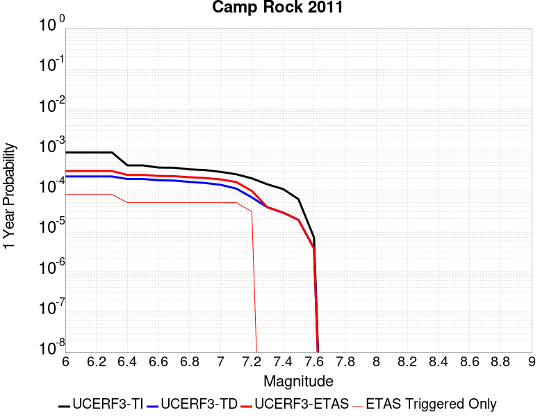 | 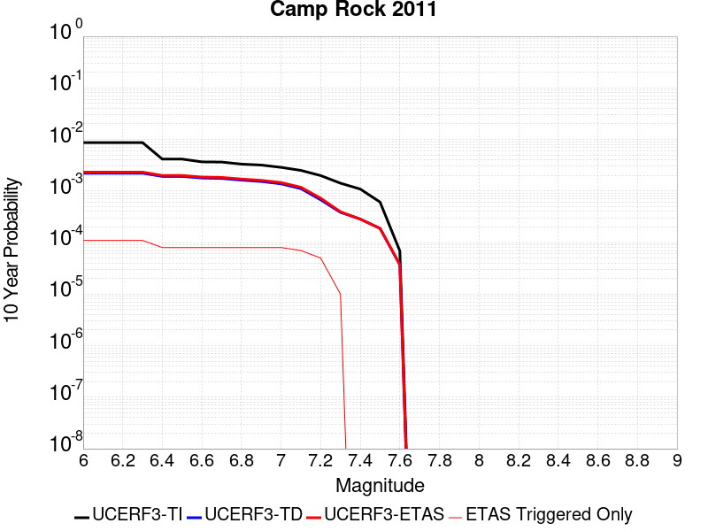 |

| Magnitude | 1 wk TI Prob | 1 wk TD Prob | 1 wk ETAS Prob | 1 wk ETAS/TD Gain | 1 wk ETAS Triggered Only | 1 mo TI Prob | 1 mo TD Prob | 1 mo ETAS Prob | 1 mo ETAS/TD Gain | 1 mo ETAS Triggered Only | 1 yr TI Prob | 1 yr TD Prob | 1 yr ETAS Prob | 1 yr ETAS/TD Gain | 1 yr ETAS Triggered Only | 10 yr TI Prob | 10 yr TD Prob | 10 yr ETAS Prob | 10 yr ETAS/TD Gain | 10 yr ETAS Triggered Only |
|-----|-----|-----|-----|-----|-----|-----|-----|-----|-----|-----|-----|-----|-----|-----|-----|-----|-----|-----|-----|-----|
| 6.0 | 1.6710783E-5 | 4.249999E-6 | 5.4249787E-5 | 12.764658 | 5.0E-5 | 7.161568E-5 | 1.8214158E-5 | 7.821307E-5 | 4.2940807 | 6.0E-5 | 8.7157206E-4 | 2.2173533E-4 | 3.017176E-4 | 1.3607105 | 8.0E-5 | 0.008681616 | 0.0022151938 | 0.0023249502 | 1.0495471 | 1.1E-4 |
| 6.1 | 1.6710783E-5 | 4.249999E-6 | 5.4249787E-5 | 12.764658 | 5.0E-5 | 7.161568E-5 | 1.8214158E-5 | 7.821307E-5 | 4.2940807 | 6.0E-5 | 8.7157206E-4 | 2.2173533E-4 | 3.017176E-4 | 1.3607105 | 8.0E-5 | 0.008681616 | 0.0022151938 | 0.0023249502 | 1.0495471 | 1.1E-4 |
| 6.2 | 1.6710783E-5 | 4.249999E-6 | 5.4249787E-5 | 12.764658 | 5.0E-5 | 7.161568E-5 | 1.8214158E-5 | 7.821307E-5 | 4.2940807 | 6.0E-5 | 8.7157206E-4 | 2.2173533E-4 | 3.017176E-4 | 1.3607105 | 8.0E-5 | 0.008681616 | 0.0022151938 | 0.0023249502 | 1.0495471 | 1.1E-4 |
| 6.3 | 1.6710783E-5 | 4.249999E-6 | 5.4249787E-5 | 12.764658 | 5.0E-5 | 7.161568E-5 | 1.8214158E-5 | 7.821307E-5 | 4.2940807 | 6.0E-5 | 8.7157206E-4 | 2.2173533E-4 | 3.017176E-4 | 1.3607105 | 8.0E-5 | 0.008681616 | 0.0022151938 | 0.0023249502 | 1.0495471 | 1.1E-4 |
| 6.4 | 7.982846E-6 | 3.6820359E-6 | 3.3681925E-5 | 9.147636 | 3.0E-5 | 3.421175E-5 | 1.578006E-5 | 5.577943E-5 | 3.5348046 | 4.0E-5 | 4.1644843E-4 | 1.9210564E-4 | 2.4209604E-4 | 1.2602235 | 5.0E-5 | 0.0041566887 | 0.0019194306 | 0.0019992772 | 1.041599 | 8.0E-5 |
| 6.5 | 7.982846E-6 | 3.6820359E-6 | 3.3681925E-5 | 9.147636 | 3.0E-5 | 3.421175E-5 | 1.578006E-5 | 5.577943E-5 | 3.5348046 | 4.0E-5 | 4.1644843E-4 | 1.9210564E-4 | 2.4209604E-4 | 1.2602235 | 5.0E-5 | 0.0041566887 | 0.0019194306 | 0.0019992772 | 1.041599 | 8.0E-5 |
| 6.6 | 7.048869E-6 | 3.4242998E-6 | 3.3424196E-5 | 9.760885 | 3.0E-5 | 3.0209088E-5 | 1.467549E-5 | 5.4674903E-5 | 3.725593 | 4.0E-5 | 3.677336E-4 | 1.7865976E-4 | 2.2865082E-4 | 1.2798116 | 5.0E-5 | 0.0036712566 | 0.0017851929 | 0.00186505 | 1.044733 | 8.0E-5 |
| 6.7 | 6.987307E-6 | 3.3622775E-6 | 3.3362176E-5 | 9.922494 | 3.0E-5 | 2.9945259E-5 | 1.4409683E-5 | 5.4409105E-5 | 3.7758713 | 4.0E-5 | 3.6452254E-4 | 1.7542407E-4 | 2.2541531E-4 | 1.2849736 | 5.0E-5 | 0.0036392517 | 0.0017528872 | 0.0018327469 | 1.045559 | 8.0E-5 |
| 6.8 | 6.3737602E-6 | 3.1178672E-6 | 3.3117773E-5 | 10.621932 | 3.0E-5 | 2.731583E-5 | 1.3362222E-5 | 5.3361688E-5 | 3.9934742 | 4.0E-5 | 3.3251947E-4 | 1.6267318E-4 | 2.1266505E-4 | 1.3073148 | 5.0E-5 | 0.0033202237 | 0.0016255698 | 0.0017054396 | 1.0491335 | 8.0E-5 |
| 6.9 | 6.112211E-6 | 2.933078E-6 | 3.293299E-5 | 11.228133 | 3.0E-5 | 2.6194928E-5 | 1.2570275E-5 | 5.2569772E-5 | 4.1820703 | 4.0E-5 | 3.1887658E-4 | 1.5303263E-4 | 2.0302497E-4 | 1.3266777 | 5.0E-5 | 0.003184194 | 0.0015293002 | 0.0016091779 | 1.0522316 | 8.0E-5 |
| 7.0 | 5.5140117E-6 | 2.64191E-6 | 3.264183E-5 | 12.3553915 | 3.0E-5 | 2.3631264E-5 | 1.1322423E-5 | 5.132197E-5 | 4.5327725 | 4.0E-5 | 2.8767265E-4 | 1.3784204E-4 | 1.8783515E-4 | 1.362684 | 5.0E-5 | 0.0028730053 | 0.0013775907 | 0.0014574805 | 1.0579925 | 8.0E-5 |
| 7.1 | 4.8151105E-6 | 2.1342612E-6 | 3.2134198E-5 | 15.056357 | 3.0E-5 | 2.0636026E-5 | 9.146803E-6 | 4.9146438E-5 | 5.373073 | 4.0E-5 | 2.5121463E-4 | 1.1135685E-4 | 1.6135129E-4 | 1.448957 | 5.0E-5 | 0.0025093083 | 0.0011130325 | 0.0011829545 | 1.0628213 | 7.0E-5 |
| 7.2 | 3.818335E-6 | 1.2937372E-6 | 2.1293712E-5 | 16.45907 | 2.0E-5 | 1.6364189E-5 | 5.5445767E-6 | 3.554441E-5 | 6.4106627 | 3.0E-5 | 1.9921579E-4 | 6.750321E-5 | 9.750119E-5 | 1.4443933 | 3.0E-5 | 0.0019903728 | 6.7483535E-4 | 7.248016E-4 | 1.0740422 | 5.0E-5 |
| 7.3 | 2.7166698E-6 | 7.383078E-7 | 7.383078E-7 | 1.0 | 0.0 | 1.1642818E-5 | 3.1641725E-6 | 3.1641725E-6 | 1.0 | 0.0 | 1.4174209E-4 | 3.852314E-5 | 3.852314E-5 | 1.0 | 0.0 | 0.0014165172 | 3.8516664E-4 | 3.951628E-4 | 1.0259528 | 1.0E-5 |
| 7.4 | 2.0893426E-6 | 5.4614605E-7 | 5.4614605E-7 | 1.0 | 0.0 | 8.954295E-6 | 2.340624E-6 | 2.340624E-6 | 1.0 | 0.0 | 1.0901308E-4 | 2.8496728E-5 | 2.8496728E-5 | 1.0 | 0.0 | 0.0010895962 | 2.849313E-4 | 2.849313E-4 | 1.0 | 0.0 |
| 7.5 | 1.1681728E-6 | 3.6028484E-7 | 3.6028484E-7 | 1.0 | 0.0 | 5.0064455E-6 | 1.544077E-6 | 1.544077E-6 | 1.0 | 0.0 | 6.0951766E-5 | 1.879898E-5 | 1.879898E-5 | 1.0 | 0.0 | 6.093505E-4 | 1.8797436E-4 | 1.8797436E-4 | 1.0 | 0.0 |
| 7.6 | 1.3154387E-7 | 7.1196716E-8 | 7.1196716E-8 | 1.0 | 0.0 | 5.6375933E-7 | 3.0512876E-7 | 3.0512876E-7 | 1.0 | 0.0 | 6.863748E-6 | 3.714938E-6 | 3.714938E-6 | 1.0 | 0.0 | 6.863536E-5 | 3.7148915E-5 | 3.7148915E-5 | 1.0 | 0.0 |

## Tin Mountain
*[(top)](#table-of-contents)*

| 1 Week | 1 Month | 1 Year | 10 Year |
|-----|-----|-----|-----|
| 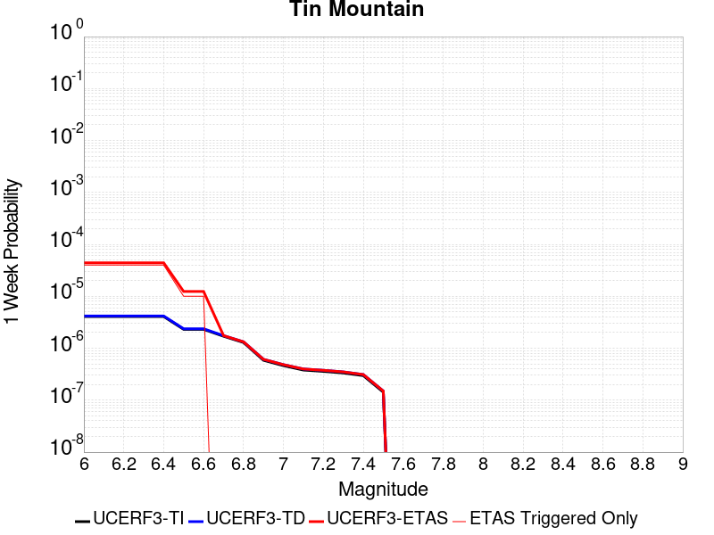 |  |  |  |

| Magnitude | 1 wk TI Prob | 1 wk TD Prob | 1 wk ETAS Prob | 1 wk ETAS/TD Gain | 1 wk ETAS Triggered Only | 1 mo TI Prob | 1 mo TD Prob | 1 mo ETAS Prob | 1 mo ETAS/TD Gain | 1 mo ETAS Triggered Only | 1 yr TI Prob | 1 yr TD Prob | 1 yr ETAS Prob | 1 yr ETAS/TD Gain | 1 yr ETAS Triggered Only | 10 yr TI Prob | 10 yr TD Prob | 10 yr ETAS Prob | 10 yr ETAS/TD Gain | 10 yr ETAS Triggered Only |
|-----|-----|-----|-----|-----|-----|-----|-----|-----|-----|-----|-----|-----|-----|-----|-----|-----|-----|-----|-----|-----|
| 6.0 | 4.083776E-6 | 4.1815365E-6 | 4.4181368E-5 | 10.565822 | 4.0E-5 | 1.750178E-5 | 1.792077E-5 | 7.791969E-5 | 4.3480105 | 6.0E-5 | 2.1306332E-4 | 2.1816725E-4 | 2.8815196E-4 | 1.3207848 | 7.0E-5 | 0.0021285915 | 0.0021798965 | 0.0022896565 | 1.0503511 | 1.1E-4 |
| 6.1 | 4.083776E-6 | 4.1815365E-6 | 4.4181368E-5 | 10.565822 | 4.0E-5 | 1.750178E-5 | 1.792077E-5 | 7.791969E-5 | 4.3480105 | 6.0E-5 | 2.1306332E-4 | 2.1816725E-4 | 2.8815196E-4 | 1.3207848 | 7.0E-5 | 0.0021285915 | 0.0021798965 | 0.0022896565 | 1.0503511 | 1.1E-4 |
| 6.2 | 4.083776E-6 | 4.1815365E-6 | 4.4181368E-5 | 10.565822 | 4.0E-5 | 1.750178E-5 | 1.792077E-5 | 7.791969E-5 | 4.3480105 | 6.0E-5 | 2.1306332E-4 | 2.1816725E-4 | 2.8815196E-4 | 1.3207848 | 7.0E-5 | 0.0021285915 | 0.0021798965 | 0.0022896565 | 1.0503511 | 1.1E-4 |
| 6.3 | 4.083776E-6 | 4.1815365E-6 | 4.4181368E-5 | 10.565822 | 4.0E-5 | 1.750178E-5 | 1.792077E-5 | 7.791969E-5 | 4.3480105 | 6.0E-5 | 2.1306332E-4 | 2.1816725E-4 | 2.8815196E-4 | 1.3207848 | 7.0E-5 | 0.0021285915 | 0.0021798965 | 0.0022896565 | 1.0503511 | 1.1E-4 |
| 6.4 | 4.083776E-6 | 4.1815365E-6 | 4.4181368E-5 | 10.565822 | 4.0E-5 | 1.750178E-5 | 1.792077E-5 | 7.791969E-5 | 4.3480105 | 6.0E-5 | 2.1306332E-4 | 2.1816725E-4 | 2.8815196E-4 | 1.3207848 | 7.0E-5 | 0.0021285915 | 0.0021798965 | 0.0022896565 | 1.0503511 | 1.1E-4 |
| 6.5 | 2.3143427E-6 | 2.3731573E-6 | 1.2373133E-5 | 5.213786 | 1.0E-5 | 9.9185745E-6 | 1.0170638E-5 | 3.0170435E-5 | 2.966425 | 2.0E-5 | 1.2075195E-4 | 1.2382126E-4 | 1.5381754E-4 | 1.2422547 | 3.0E-5 | 0.0012068636 | 0.0012375986 | 0.0012875367 | 1.0403508 | 5.0E-5 |
| 6.6 | 2.3143427E-6 | 2.3731573E-6 | 1.2373133E-5 | 5.213786 | 1.0E-5 | 9.9185745E-6 | 1.0170638E-5 | 3.0170435E-5 | 2.966425 | 2.0E-5 | 1.2075195E-4 | 1.2382126E-4 | 1.5381754E-4 | 1.2422547 | 3.0E-5 | 0.0012068636 | 0.0012375986 | 0.0012875367 | 1.0403508 | 5.0E-5 |
| 6.7 | 1.7029532E-6 | 1.7497915E-6 | 1.7497915E-6 | 1.0 | 0.0 | 7.2983503E-6 | 7.499088E-6 | 7.499088E-6 | 1.0 | 0.0 | 8.885379E-5 | 9.1298105E-5 | 1.0129719E-4 | 1.1095213 | 1.0E-5 | 8.881827E-4 | 9.1265864E-4 | 9.3264034E-4 | 1.021894 | 2.0E-5 |
| 6.8 | 1.2914646E-6 | 1.3299378E-6 | 1.3299378E-6 | 1.0 | 0.0 | 5.534837E-6 | 5.6997237E-6 | 5.6997237E-6 | 1.0 | 0.0 | 6.738455E-5 | 6.939237E-5 | 7.939168E-5 | 1.144098 | 1.0E-5 | 6.736412E-4 | 6.9375033E-4 | 7.037434E-4 | 1.0144044 | 1.0E-5 |
| 6.9 | 5.8708974E-7 | 6.1169936E-7 | 6.1169936E-7 | 1.0 | 0.0 | 2.5160964E-6 | 2.6215664E-6 | 2.6215664E-6 | 1.0 | 0.0 | 3.0633044E-5 | 3.1917145E-5 | 3.1917145E-5 | 1.0 | 0.0 | 3.0628822E-4 | 3.191297E-4 | 3.191297E-4 | 1.0 | 0.0 |
| 7.0 | 4.6248786E-7 | 4.832015E-7 | 4.832015E-7 | 1.0 | 0.0 | 1.9820893E-6 | 2.0708624E-6 | 2.0708624E-6 | 1.0 | 0.0 | 2.413167E-5 | 2.5212494E-5 | 2.5212494E-5 | 1.0 | 0.0 | 2.412905E-4 | 2.5210003E-4 | 2.5210003E-4 | 1.0 | 0.0 |
| 7.1 | 3.804606E-7 | 3.987147E-7 | 3.987147E-7 | 1.0 | 0.0 | 1.6305444E-6 | 1.7087764E-6 | 1.7087764E-6 | 1.0 | 0.0 | 1.9851697E-5 | 2.0804187E-5 | 2.0804187E-5 | 1.0 | 0.0 | 1.9849923E-4 | 2.0802575E-4 | 2.0802575E-4 | 1.0 | 0.0 |
| 7.2 | 3.5864858E-7 | 3.7616863E-7 | 3.7616863E-7 | 1.0 | 0.0 | 1.5370645E-6 | 1.6121504E-6 | 1.6121504E-6 | 1.0 | 0.0 | 1.87136E-5 | 1.9627789E-5 | 1.9627789E-5 | 1.0 | 0.0 | 1.8712023E-4 | 1.9626386E-4 | 1.9626386E-4 | 1.0 | 0.0 |
| 7.3 | 3.342063E-7 | 3.506347E-7 | 3.506347E-7 | 1.0 | 0.0 | 1.4323119E-6 | 1.5027196E-6 | 1.5027196E-6 | 1.0 | 0.0 | 1.7438259E-5 | 1.829549E-5 | 1.829549E-5 | 1.0 | 0.0 | 1.743689E-4 | 1.8294314E-4 | 1.8294314E-4 | 1.0 | 0.0 |
| 7.4 | 2.971242E-7 | 3.1165817E-7 | 3.1165817E-7 | 1.0 | 0.0 | 1.2733886E-6 | 1.3356774E-6 | 1.3356774E-6 | 1.0 | 0.0 | 1.5503398E-5 | 1.6261785E-5 | 1.6261785E-5 | 1.0 | 0.0 | 1.5502315E-4 | 1.6260923E-4 | 1.6260923E-4 | 1.0 | 0.0 |
| 7.5 | 1.4326713E-7 | 1.5012525E-7 | 1.5012525E-7 | 1.0 | 0.0 | 6.140018E-7 | 6.433939E-7 | 6.433939E-7 | 1.0 | 0.0 | 7.4754466E-6 | 7.8333205E-6 | 7.8333205E-6 | 1.0 | 0.0 | 7.475195E-5 | 7.833321E-5 | 7.833321E-5 | 1.0 | 0.0 |

## San Jacinto (Coyote Creek)
*[(top)](#table-of-contents)*

| 1 Week | 1 Month | 1 Year | 10 Year |
|-----|-----|-----|-----|
|  |  |  |  |

| Magnitude | 1 wk TI Prob | 1 wk TD Prob | 1 wk ETAS Prob | 1 wk ETAS/TD Gain | 1 wk ETAS Triggered Only | 1 mo TI Prob | 1 mo TD Prob | 1 mo ETAS Prob | 1 mo ETAS/TD Gain | 1 mo ETAS Triggered Only | 1 yr TI Prob | 1 yr TD Prob | 1 yr ETAS Prob | 1 yr ETAS/TD Gain | 1 yr ETAS Triggered Only | 10 yr TI Prob | 10 yr TD Prob | 10 yr ETAS Prob | 10 yr ETAS/TD Gain | 10 yr ETAS Triggered Only |
|-----|-----|-----|-----|-----|-----|-----|-----|-----|-----|-----|-----|-----|-----|-----|-----|-----|-----|-----|-----|-----|
| 6.0 | 2.7374346E-5 | 2.41444E-5 | 7.4143194E-5 | 3.0708237 | 5.0E-5 | 1.1731335E-4 | 1.034719E-4 | 1.7346466E-4 | 1.6764421 | 7.0E-5 | 0.0014273542 | 0.001259045 | 0.0013489317 | 1.0713928 | 9.0E-5 | 0.01418221 | 0.012928195 | 0.013036773 | 1.0083985 | 1.1E-4 |
| 6.1 | 2.7374346E-5 | 2.41444E-5 | 7.4143194E-5 | 3.0708237 | 5.0E-5 | 1.1731335E-4 | 1.034719E-4 | 1.7346466E-4 | 1.6764421 | 7.0E-5 | 0.0014273542 | 0.001259045 | 0.0013489317 | 1.0713928 | 9.0E-5 | 0.01418221 | 0.012928195 | 0.013036773 | 1.0083985 | 1.1E-4 |
| 6.2 | 2.7374346E-5 | 2.41444E-5 | 7.4143194E-5 | 3.0708237 | 5.0E-5 | 1.1731335E-4 | 1.034719E-4 | 1.7346466E-4 | 1.6764421 | 7.0E-5 | 0.0014273542 | 0.001259045 | 0.0013489317 | 1.0713928 | 9.0E-5 | 0.01418221 | 0.012928195 | 0.013036773 | 1.0083985 | 1.1E-4 |
| 6.3 | 2.7374346E-5 | 2.41444E-5 | 7.4143194E-5 | 3.0708237 | 5.0E-5 | 1.1731335E-4 | 1.034719E-4 | 1.7346466E-4 | 1.6764421 | 7.0E-5 | 0.0014273542 | 0.001259045 | 0.0013489317 | 1.0713928 | 9.0E-5 | 0.01418221 | 0.012928195 | 0.013036773 | 1.0083985 | 1.1E-4 |
| 6.4 | 2.7374346E-5 | 2.41444E-5 | 7.4143194E-5 | 3.0708237 | 5.0E-5 | 1.1731335E-4 | 1.034719E-4 | 1.7346466E-4 | 1.6764421 | 7.0E-5 | 0.0014273542 | 0.001259045 | 0.0013489317 | 1.0713928 | 9.0E-5 | 0.01418221 | 0.012928195 | 0.013036773 | 1.0083985 | 1.1E-4 |
| 6.5 | 2.7282445E-5 | 2.4030476E-5 | 7.4029274E-5 | 3.0806413 | 5.0E-5 | 1.16919524E-4 | 1.0298371E-4 | 1.7297649E-4 | 1.6796492 | 7.0E-5 | 0.0014225657 | 0.001253108 | 0.0013429953 | 1.0717314 | 9.0E-5 | 0.014134934 | 0.012869522 | 0.012978107 | 1.0084373 | 1.1E-4 |
| 6.6 | 2.7282445E-5 | 2.4030476E-5 | 7.4029274E-5 | 3.0806413 | 5.0E-5 | 1.16919524E-4 | 1.0298371E-4 | 1.7297649E-4 | 1.6796492 | 7.0E-5 | 0.0014225657 | 0.001253108 | 0.0013429953 | 1.0717314 | 9.0E-5 | 0.014134934 | 0.012869522 | 0.012978107 | 1.0084373 | 1.1E-4 |
| 6.7 | 2.7216198E-5 | 2.3955597E-5 | 7.39544E-5 | 3.0871449 | 5.0E-5 | 1.1663563E-4 | 1.02662816E-4 | 1.7265564E-4 | 1.6817738 | 7.0E-5 | 0.0014191137 | 0.0012492058 | 0.0013390933 | 1.0719558 | 9.0E-5 | 0.014100855 | 0.012830934 | 0.012939523 | 1.008463 | 1.1E-4 |
| 6.8 | 2.7078617E-5 | 2.3872815E-5 | 7.387162E-5 | 3.0943825 | 5.0E-5 | 1.1604605E-4 | 1.0230807E-4 | 1.723009E-4 | 1.6841381 | 7.0E-5 | 0.001411945 | 0.0012448917 | 0.0013347797 | 1.0722054 | 9.0E-5 | 0.014030075 | 0.0127880825 | 0.012896676 | 1.0084918 | 1.1E-4 |
| 6.9 | 2.6982952E-5 | 2.3792329E-5 | 7.379114E-5 | 3.1014676 | 5.0E-5 | 1.15636096E-4 | 1.0196315E-4 | 1.7195602E-4 | 1.6864525 | 7.0E-5 | 0.0014069602 | 0.0012406971 | 0.0013305855 | 1.0724499 | 9.0E-5 | 0.013980856 | 0.012746378 | 0.012854976 | 1.0085199 | 1.1E-4 |
| 7.0 | 2.6449972E-5 | 2.3369357E-5 | 7.336819E-5 | 3.139504 | 5.0E-5 | 1.1335209E-4 | 1.0015055E-4 | 1.7014354E-4 | 1.6988777 | 7.0E-5 | 0.001379188 | 0.0012186535 | 0.0013085438 | 1.0737619 | 9.0E-5 | 0.0137065975 | 0.012527733 | 0.012636355 | 1.0086706 | 1.1E-4 |
| 7.1 | 2.6257849E-5 | 2.3195396E-5 | 7.3194235E-5 | 3.1555502 | 5.0E-5 | 1.1252879E-4 | 9.940507E-5 | 1.693981E-4 | 1.7041194 | 7.0E-5 | 0.0013691769 | 0.0012095873 | 0.0012994785 | 1.0743155 | 9.0E-5 | 0.013607717 | 0.012437661 | 0.0125462925 | 1.0087341 | 1.1E-4 |
| 7.2 | 2.5270041E-5 | 2.2390155E-5 | 7.238903E-5 | 3.2330742 | 5.0E-5 | 1.0829568E-4 | 9.5954296E-5 | 1.6594758E-4 | 1.729444 | 7.0E-5 | 0.0013177024 | 0.0011676198 | 0.0012575147 | 1.0769899 | 9.0E-5 | 0.013099162 | 0.0120187905 | 0.012127468 | 1.0090424 | 1.1E-4 |
| 7.3 | 2.339701E-5 | 2.1122027E-5 | 7.112097E-5 | 3.367147 | 5.0E-5 | 1.0026905E-4 | 9.051985E-5 | 1.605135E-4 | 1.7732412 | 7.0E-5 | 0.001220092 | 0.001101524 | 0.0011914249 | 1.081615 | 9.0E-5 | 0.012134149 | 0.011357642 | 0.011466392 | 1.0095751 | 1.1E-4 |
| 7.4 | 2.296333E-5 | 2.0852396E-5 | 7.0851354E-5 | 3.397756 | 5.0E-5 | 9.841056E-5 | 8.936436E-5 | 1.593581E-4 | 1.7832401 | 7.0E-5 | 0.0011974899 | 0.0010874701 | 0.0011773722 | 1.0826709 | 9.0E-5 | 0.011910575 | 0.011216754 | 0.0113255195 | 1.0096967 | 1.1E-4 |
| 7.5 | 2.2188895E-5 | 2.037534E-5 | 7.037432E-5 | 3.4538965 | 5.0E-5 | 9.50918E-5 | 8.731998E-5 | 1.5731387E-4 | 1.8015792 | 7.0E-5 | 0.0011571277 | 0.0010626042 | 0.0011525087 | 1.0846076 | 9.0E-5 | 0.011511209 | 0.010966369 | 0.011075163 | 1.0099207 | 1.1E-4 |
| 7.6 | 2.0013189E-5 | 1.8961666E-5 | 6.896072E-5 | 3.6368492 | 5.0E-5 | 8.5767984E-5 | 8.126176E-5 | 1.5125607E-4 | 1.8613437 | 7.0E-5 | 0.001043725 | 9.889146E-4 | 0.0010788256 | 1.0909189 | 9.0E-5 | 0.010388365 | 0.010224371 | 0.010333247 | 1.0106486 | 1.1E-4 |
| 7.7 | 1.7230794E-5 | 1.6743043E-5 | 6.674221E-5 | 3.986265 | 5.0E-5 | 7.384417E-5 | 7.175393E-5 | 1.4174891E-4 | 1.9754864 | 7.0E-5 | 8.986819E-4 | 8.732547E-4 | 9.631762E-4 | 1.1029727 | 9.0E-5 | 0.008950562 | 0.00906292 | 0.009171924 | 1.0120274 | 1.1E-4 |
| 7.8 | 1.4478809E-5 | 1.499039E-5 | 6.498964E-5 | 4.33542 | 5.0E-5 | 6.205057E-5 | 6.424295E-5 | 1.3423845E-4 | 2.0895438 | 7.0E-5 | 7.552038E-4 | 7.8187784E-4 | 8.618153E-4 | 1.1022378 | 8.0E-5 | 0.0075264242 | 0.008141388 | 0.008240574 | 1.012183 | 1.0E-4 |
| 7.9 | 1.1114467E-5 | 1.1644517E-5 | 6.1643936E-5 | 5.2938166 | 5.0E-5 | 4.7632562E-5 | 4.990412E-5 | 1.1990063E-4 | 2.4026198 | 7.0E-5 | 5.797721E-4 | 6.074139E-4 | 6.8736525E-4 | 1.1316259 | 8.0E-5 | 0.0057826187 | 0.0063803545 | 0.006479717 | 1.0155731 | 1.0E-4 |
| 8.0 | 9.327402E-6 | 9.8986575E-6 | 5.9898164E-5 | 6.05114 | 5.0E-5 | 3.9973966E-5 | 4.2422133E-5 | 1.1241916E-4 | 2.650012 | 7.0E-5 | 4.8657437E-4 | 5.163676E-4 | 5.963263E-4 | 1.1548483 | 8.0E-5 | 0.0048551033 | 0.00544994 | 0.005549395 | 1.0182488 | 1.0E-4 |
| 8.1 | 7.0235833E-6 | 6.826985E-6 | 3.682678E-5 | 5.394296 | 3.0E-5 | 3.0100724E-5 | 2.9258183E-5 | 7.925672E-5 | 2.7088737 | 5.0E-5 | 3.664147E-4 | 3.5616063E-4 | 4.0614285E-4 | 1.140336 | 5.0E-5 | 0.003658111 | 0.0037874572 | 0.00384723 | 1.0157818 | 6.0E-5 |
| 8.2 | 2.0358202E-6 | 8.9912584E-7 | 8.9912584E-7 | 1.0 | 0.0 | 8.724915E-6 | 3.853391E-6 | 3.853391E-6 | 1.0 | 0.0 | 1.06220665E-4 | 4.6914047E-5 | 4.6914047E-5 | 1.0 | 0.0 | 0.001061699 | 5.3239096E-4 | 5.3239096E-4 | 1.0 | 0.0 |
| 8.3 | 2.0051264E-7 | 6.61379E-8 | 6.61379E-8 | 1.0 | 0.0 | 8.5933965E-7 | 2.8344812E-7 | 2.8344812E-7 | 1.0 | 0.0 | 1.046241E-5 | 3.450976E-6 | 3.450976E-6 | 1.0 | 0.0 | 1.0461917E-4 | 4.0120205E-5 | 4.0120205E-5 | 1.0 | 0.0 |

## Whittier alt 1
*[(top)](#table-of-contents)*

| 1 Week | 1 Month | 1 Year | 10 Year |
|-----|-----|-----|-----|
|  |  | 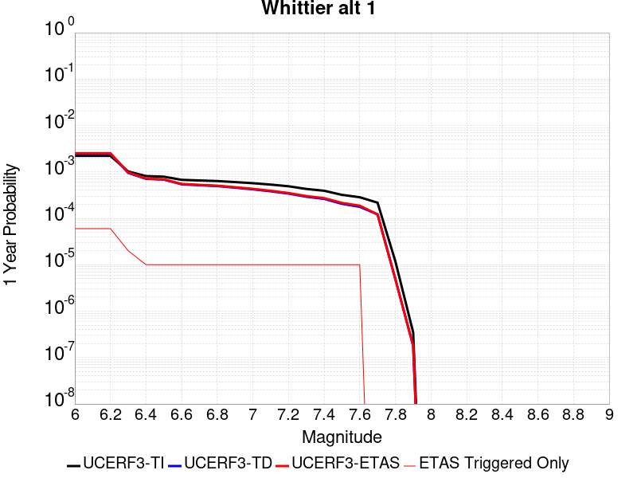 | 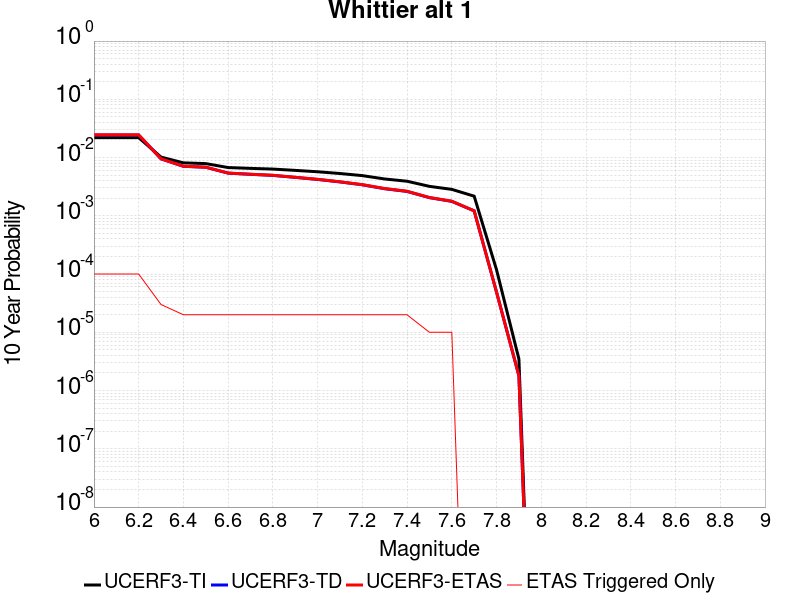 |

| Magnitude | 1 wk TI Prob | 1 wk TD Prob | 1 wk ETAS Prob | 1 wk ETAS/TD Gain | 1 wk ETAS Triggered Only | 1 mo TI Prob | 1 mo TD Prob | 1 mo ETAS Prob | 1 mo ETAS/TD Gain | 1 mo ETAS Triggered Only | 1 yr TI Prob | 1 yr TD Prob | 1 yr ETAS Prob | 1 yr ETAS/TD Gain | 1 yr ETAS Triggered Only | 10 yr TI Prob | 10 yr TD Prob | 10 yr ETAS Prob | 10 yr ETAS/TD Gain | 10 yr ETAS Triggered Only |
|-----|-----|-----|-----|-----|-----|-----|-----|-----|-----|-----|-----|-----|-----|-----|-----|-----|-----|-----|-----|-----|
| 6.0 | 4.2554693E-5 | 4.7252182E-5 | 7.725076E-5 | 1.6348614 | 3.0E-5 | 1.8236451E-4 | 2.0249544E-4 | 2.5248533E-4 | 1.2468691 | 5.0E-5 | 0.002218027 | 0.0024629163 | 0.0025227687 | 1.0243014 | 6.0E-5 | 0.02196019 | 0.024390263 | 0.024487825 | 1.004 | 1.0E-4 |
| 6.1 | 4.2554693E-5 | 4.7252182E-5 | 7.725076E-5 | 1.6348614 | 3.0E-5 | 1.8236451E-4 | 2.0249544E-4 | 2.5248533E-4 | 1.2468691 | 5.0E-5 | 0.002218027 | 0.0024629163 | 0.0025227687 | 1.0243014 | 6.0E-5 | 0.02196019 | 0.024390263 | 0.024487825 | 1.004 | 1.0E-4 |
| 6.2 | 4.2554693E-5 | 4.7252182E-5 | 7.725076E-5 | 1.6348614 | 3.0E-5 | 1.8236451E-4 | 2.0249544E-4 | 2.5248533E-4 | 1.2468691 | 5.0E-5 | 0.002218027 | 0.0024629163 | 0.0025227687 | 1.0243014 | 6.0E-5 | 0.02196019 | 0.024390263 | 0.024487825 | 1.004 | 1.0E-4 |
| 6.3 | 1.9617712E-5 | 1.826841E-5 | 1.826841E-5 | 1.0 | 0.0 | 8.40732E-5 | 7.829095E-5 | 9.8289376E-5 | 1.2554374 | 2.0E-5 | 0.0010231105 | 9.527944E-4 | 9.7277533E-4 | 1.020971 | 2.0E-5 | 0.01018413 | 0.0094904 | 0.009520114 | 1.003131 | 3.0E-5 |
| 6.4 | 1.5611336E-5 | 1.3604089E-5 | 1.3604089E-5 | 1.0 | 0.0 | 6.690401E-5 | 5.8301972E-5 | 6.8301386E-5 | 1.1715108 | 1.0E-5 | 8.142519E-4 | 7.096013E-4 | 7.195942E-4 | 1.0140824 | 1.0E-5 | 0.008112748 | 0.0070753377 | 0.0070951963 | 1.0028067 | 2.0E-5 |
| 6.5 | 1.5150166E-5 | 1.3100744E-5 | 1.3100744E-5 | 1.0 | 0.0 | 6.492767E-5 | 5.614487E-5 | 6.6144305E-5 | 1.1781007 | 1.0E-5 | 7.9020765E-4 | 6.8335526E-4 | 6.9334847E-4 | 1.0146236 | 1.0E-5 | 0.007874036 | 0.006814508 | 0.0068343715 | 1.0029149 | 2.0E-5 |
| 6.6 | 1.295588E-5 | 1.0380544E-5 | 1.0380544E-5 | 1.0 | 0.0 | 5.552402E-5 | 4.44873E-5 | 5.4486853E-5 | 1.2247733 | 1.0E-5 | 6.7579525E-4 | 5.415002E-4 | 5.5149477E-4 | 1.0184572 | 1.0E-5 | 0.006737438 | 0.005403343 | 0.0054232352 | 1.0036814 | 2.0E-5 |
| 6.7 | 1.2542085E-5 | 9.899189E-6 | 9.899189E-6 | 1.0 | 0.0 | 5.3750682E-5 | 4.2424414E-5 | 5.242399E-5 | 1.2357033 | 1.0E-5 | 6.542181E-4 | 5.163967E-4 | 5.2639155E-4 | 1.0193549 | 1.0E-5 | 0.006522954 | 0.005153464 | 0.0051733614 | 1.0038608 | 2.0E-5 |
| 6.8 | 1.2195878E-5 | 9.49523E-6 | 9.49523E-6 | 1.0 | 0.0 | 5.2267E-5 | 4.069322E-5 | 5.069281E-5 | 1.2457312 | 1.0E-5 | 6.36165E-4 | 4.9532915E-4 | 5.053242E-4 | 1.0201786 | 1.0E-5 | 0.0063434686 | 0.0049436963 | 0.0049635977 | 1.0040256 | 2.0E-5 |
| 6.9 | 1.1580298E-5 | 8.772739E-6 | 8.772739E-6 | 1.0 | 0.0 | 4.9628903E-5 | 3.759692E-5 | 4.7596546E-5 | 1.2659692 | 1.0E-5 | 6.040644E-4 | 4.5764804E-4 | 4.6764346E-4 | 1.0218408 | 1.0E-5 | 0.00602425 | 0.0045684646 | 0.004588373 | 1.0043578 | 2.0E-5 |
| 7.0 | 1.0964795E-5 | 8.083794E-6 | 8.083794E-6 | 1.0 | 0.0 | 4.6991136E-5 | 3.4644378E-5 | 4.464403E-5 | 1.2886372 | 1.0E-5 | 5.7196687E-4 | 4.217152E-4 | 4.3171097E-4 | 1.0237027 | 1.0E-5 | 0.0057049696 | 0.004210459 | 0.0042303745 | 1.0047301 | 2.0E-5 |
| 7.1 | 1.0230601E-5 | 7.32646E-6 | 7.32646E-6 | 1.0 | 0.0 | 4.3844695E-5 | 3.1398744E-5 | 4.139843E-5 | 1.318474 | 1.0E-5 | 5.336784E-4 | 3.8221394E-4 | 3.9221012E-4 | 1.0261533 | 1.0E-5 | 0.005323986 | 0.0038167592 | 0.0038366828 | 1.00522 | 2.0E-5 |
| 7.2 | 9.40865E-6 | 6.5430822E-6 | 6.5430822E-6 | 1.0 | 0.0 | 4.032216E-5 | 2.8041486E-5 | 3.8041206E-5 | 1.3566045 | 1.0E-5 | 4.908117E-4 | 3.4135283E-4 | 3.5134942E-4 | 1.0292852 | 1.0E-5 | 0.0048972913 | 0.0034094024 | 0.0034293341 | 1.0058461 | 2.0E-5 |
| 7.3 | 8.237384E-6 | 5.5975433E-6 | 5.5975433E-6 | 1.0 | 0.0 | 3.5302593E-5 | 2.3989258E-5 | 3.3989018E-5 | 1.4168433 | 1.0E-5 | 4.2972428E-4 | 2.920311E-4 | 3.020282E-4 | 1.034233 | 1.0E-5 | 0.0042889426 | 0.0029167992 | 0.0029367409 | 1.0068368 | 2.0E-5 |
| 7.4 | 7.5316966E-6 | 5.0276153E-6 | 5.0276153E-6 | 1.0 | 0.0 | 3.2278298E-5 | 2.154675E-5 | 3.1546533E-5 | 1.4640971 | 1.0E-5 | 3.9291743E-4 | 2.623011E-4 | 2.722985E-4 | 1.0381141 | 1.0E-5 | 0.0039222343 | 0.0026200267 | 0.0026399742 | 1.0076135 | 2.0E-5 |
| 7.5 | 6.149649E-6 | 3.9336355E-6 | 3.9336355E-6 | 1.0 | 0.0 | 2.6355372E-5 | 1.6858336E-5 | 2.6858166E-5 | 1.5931684 | 1.0E-5 | 3.208294E-4 | 2.052318E-4 | 2.1522974E-4 | 1.0487154 | 1.0E-5 | 0.003203666 | 0.0020505118 | 0.0020604914 | 1.0048668 | 1.0E-5 |
| 7.6 | 5.457711E-6 | 3.3951796E-6 | 3.3951796E-6 | 1.0 | 0.0 | 2.338998E-5 | 1.4550694E-5 | 2.4550549E-5 | 1.6872425 | 1.0E-5 | 2.8473578E-4 | 1.771411E-4 | 1.8713933E-4 | 1.0564421 | 1.0E-5 | 0.0028437122 | 0.0017700798 | 0.0017800621 | 1.0056394 | 1.0E-5 |
| 7.7 | 4.1676276E-6 | 2.3329922E-6 | 2.3329922E-6 | 1.0 | 0.0 | 1.7861139E-5 | 9.998504E-6 | 9.998504E-6 | 1.0 | 0.0 | 2.1743766E-4 | 1.2172572E-4 | 1.2172572E-4 | 1.0 | 0.0 | 0.0021722503 | 0.0012166635 | 0.0012166635 | 1.0 | 0.0 |
| 7.8 | 2.2692414E-7 | 9.384417E-8 | 9.384417E-8 | 1.0 | 0.0 | 9.725317E-7 | 4.0218927E-7 | 4.0218927E-7 | 1.0 | 0.0 | 1.1840509E-5 | 4.8966467E-6 | 4.8966467E-6 | 1.0 | 0.0 | 1.1839878E-4 | 4.8965718E-5 | 4.8965718E-5 | 1.0 | 0.0 |
| 7.9 | 6.676829E-9 | 3.4397174E-9 | 3.4397174E-9 | 1.0 | 0.0 | 2.861498E-8 | 1.4741646E-8 | 1.4741646E-8 | 1.0 | 0.0 | 3.4838732E-7 | 1.7947953E-7 | 1.7947953E-7 | 1.0 | 0.0 | 3.4838679E-6 | 1.794794E-6 | 1.794794E-6 | 1.0 | 0.0 |

## San Jacinto (Lytle Creek connector)
*[(top)](#table-of-contents)*

| 1 Week | 1 Month | 1 Year | 10 Year |
|-----|-----|-----|-----|
| 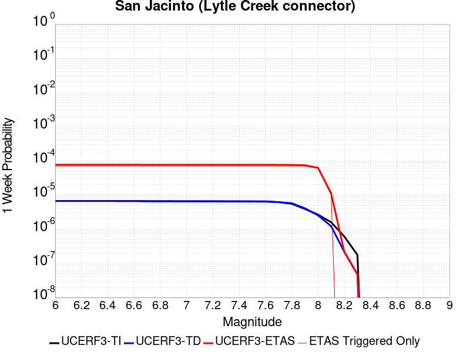 | 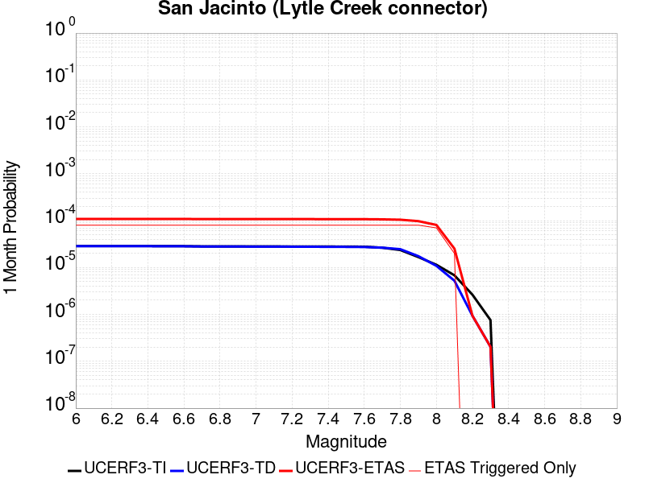 | 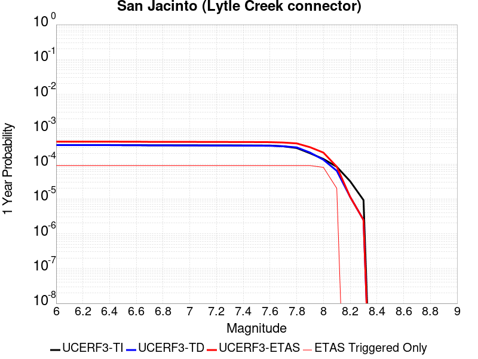 | 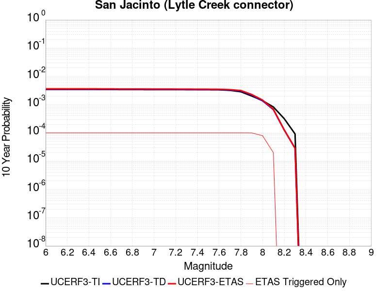 |

| Magnitude | 1 wk TI Prob | 1 wk TD Prob | 1 wk ETAS Prob | 1 wk ETAS/TD Gain | 1 wk ETAS Triggered Only | 1 mo TI Prob | 1 mo TD Prob | 1 mo ETAS Prob | 1 mo ETAS/TD Gain | 1 mo ETAS Triggered Only | 1 yr TI Prob | 1 yr TD Prob | 1 yr ETAS Prob | 1 yr ETAS/TD Gain | 1 yr ETAS Triggered Only | 10 yr TI Prob | 10 yr TD Prob | 10 yr ETAS Prob | 10 yr ETAS/TD Gain | 10 yr ETAS Triggered Only |
|-----|-----|-----|-----|-----|-----|-----|-----|-----|-----|-----|-----|-----|-----|-----|-----|-----|-----|-----|-----|-----|
| 6.0 | 6.693995E-6 | 6.660123E-6 | 7.665966E-5 | 11.510246 | 7.0E-5 | 2.8688235E-5 | 2.8543072E-5 | 1.08540786E-4 | 3.8027017 | 8.0E-5 | 3.492233E-4 | 3.4745657E-4 | 4.374253E-4 | 1.2589352 | 9.0E-5 | 0.00348675 | 0.0035491167 | 0.003648762 | 1.028076 | 1.0E-4 |
| 6.1 | 6.693995E-6 | 6.660123E-6 | 7.665966E-5 | 11.510246 | 7.0E-5 | 2.8688235E-5 | 2.8543072E-5 | 1.08540786E-4 | 3.8027017 | 8.0E-5 | 3.492233E-4 | 3.4745657E-4 | 4.374253E-4 | 1.2589352 | 9.0E-5 | 0.00348675 | 0.0035491167 | 0.003648762 | 1.028076 | 1.0E-4 |
| 6.2 | 6.693995E-6 | 6.660123E-6 | 7.665966E-5 | 11.510246 | 7.0E-5 | 2.8688235E-5 | 2.8543072E-5 | 1.08540786E-4 | 3.8027017 | 8.0E-5 | 3.492233E-4 | 3.4745657E-4 | 4.374253E-4 | 1.2589352 | 9.0E-5 | 0.00348675 | 0.0035491167 | 0.003648762 | 1.028076 | 1.0E-4 |
| 6.3 | 6.693995E-6 | 6.660123E-6 | 7.665966E-5 | 11.510246 | 7.0E-5 | 2.8688235E-5 | 2.8543072E-5 | 1.08540786E-4 | 3.8027017 | 8.0E-5 | 3.492233E-4 | 3.4745657E-4 | 4.374253E-4 | 1.2589352 | 9.0E-5 | 0.00348675 | 0.0035491167 | 0.003648762 | 1.028076 | 1.0E-4 |
| 6.4 | 6.693995E-6 | 6.660123E-6 | 7.665966E-5 | 11.510246 | 7.0E-5 | 2.8688235E-5 | 2.8543072E-5 | 1.08540786E-4 | 3.8027017 | 8.0E-5 | 3.492233E-4 | 3.4745657E-4 | 4.374253E-4 | 1.2589352 | 9.0E-5 | 0.00348675 | 0.0035491167 | 0.003648762 | 1.028076 | 1.0E-4 |
| 6.5 | 6.6561875E-6 | 6.620341E-6 | 7.661988E-5 | 11.573403 | 7.0E-5 | 2.8526205E-5 | 2.8372582E-5 | 1.0837031E-4 | 3.8195436 | 8.0E-5 | 3.472512E-4 | 3.453815E-4 | 4.3535043E-4 | 1.2604914 | 9.0E-5 | 0.0034670907 | 0.0035284322 | 0.0036280793 | 1.0282412 | 1.0E-4 |
| 6.6 | 6.6561875E-6 | 6.620341E-6 | 7.661988E-5 | 11.573403 | 7.0E-5 | 2.8526205E-5 | 2.8372582E-5 | 1.0837031E-4 | 3.8195436 | 8.0E-5 | 3.472512E-4 | 3.453815E-4 | 4.3535043E-4 | 1.2604914 | 9.0E-5 | 0.0034670907 | 0.0035284322 | 0.0036280793 | 1.0282412 | 1.0E-4 |
| 6.7 | 6.5802237E-6 | 6.539518E-6 | 7.653906E-5 | 11.704083 | 7.0E-5 | 2.8200653E-5 | 2.8026205E-5 | 1.0802396E-4 | 3.8543916 | 8.0E-5 | 3.4328885E-4 | 3.4116567E-4 | 4.3113498E-4 | 1.2637115 | 9.0E-5 | 0.0034275902 | 0.0034864065 | 0.003586058 | 1.0285828 | 1.0E-4 |
| 6.8 | 6.575632E-6 | 6.5340073E-6 | 7.653355E-5 | 11.71311 | 7.0E-5 | 2.8180975E-5 | 2.8002589E-5 | 1.0800035E-4 | 3.8567986 | 8.0E-5 | 3.4304935E-4 | 3.4087826E-4 | 4.3084758E-4 | 1.2639339 | 9.0E-5 | 0.0034252026 | 0.0034835413 | 0.003583193 | 1.0286064 | 1.0E-4 |
| 6.9 | 6.570433E-6 | 6.525401E-6 | 7.652494E-5 | 11.72724 | 7.0E-5 | 2.8158694E-5 | 2.7965707E-5 | 1.0796347E-4 | 3.8605664 | 8.0E-5 | 3.4277816E-4 | 3.4042934E-4 | 4.303987E-4 | 1.264282 | 9.0E-5 | 0.0034224992 | 0.0034790665 | 0.0035787185 | 1.0286434 | 1.0E-4 |
| 7.0 | 6.5643826E-6 | 6.5155223E-6 | 7.651507E-5 | 11.743505 | 7.0E-5 | 2.8132765E-5 | 2.7923368E-5 | 1.07921136E-4 | 3.864904 | 8.0E-5 | 3.424626E-4 | 3.3991406E-4 | 4.2988345E-4 | 1.2646828 | 9.0E-5 | 0.0034193532 | 0.0034739296 | 0.0035735823 | 1.0286858 | 1.0E-4 |
| 7.1 | 6.557402E-6 | 6.504234E-6 | 7.650378E-5 | 11.762151 | 7.0E-5 | 2.8102848E-5 | 2.7874992E-5 | 1.0787276E-4 | 3.8698761 | 8.0E-5 | 3.4209844E-4 | 3.3932526E-4 | 4.292947E-4 | 1.2651422 | 9.0E-5 | 0.0034157229 | 0.0034680606 | 0.0035677138 | 1.0287346 | 1.0E-4 |
| 7.2 | 6.546394E-6 | 6.4862006E-6 | 7.648575E-5 | 11.792072 | 7.0E-5 | 2.8055672E-5 | 2.7797707E-5 | 1.0779548E-4 | 3.8778553 | 8.0E-5 | 3.4152428E-4 | 3.383846E-4 | 4.2835413E-4 | 1.2658795 | 9.0E-5 | 0.0034099987 | 0.0034586883 | 0.0035583423 | 1.0288126 | 1.0E-4 |
| 7.3 | 6.5364216E-6 | 6.4669857E-6 | 7.646653E-5 | 11.824139 | 7.0E-5 | 2.8012933E-5 | 2.771536E-5 | 1.0771314E-4 | 3.8864062 | 8.0E-5 | 3.4100408E-4 | 3.373823E-4 | 4.2735194E-4 | 1.2666696 | 9.0E-5 | 0.003404813 | 0.0034487103 | 0.0035483656 | 1.0288963 | 1.0E-4 |
| 7.4 | 6.5269523E-6 | 6.4480723E-6 | 7.644762E-5 | 11.855887 | 7.0E-5 | 2.7972354E-5 | 2.7634303E-5 | 1.0763209E-4 | 3.8948727 | 8.0E-5 | 3.4051016E-4 | 3.3639578E-4 | 4.263655E-4 | 1.267452 | 9.0E-5 | 0.0033998888 | 0.0034388923 | 0.0035385482 | 1.0289792 | 1.0E-4 |
| 7.5 | 6.5111835E-6 | 6.424346E-6 | 7.6423894E-5 | 11.895981 | 7.0E-5 | 2.7904773E-5 | 2.753262E-5 | 1.0753042E-4 | 3.9055643 | 8.0E-5 | 3.3968766E-4 | 3.3515817E-4 | 4.25128E-4 | 1.2684399 | 9.0E-5 | 0.0033916887 | 0.0034265644 | 0.0035262217 | 1.0290837 | 1.0E-4 |
| 7.6 | 6.4768806E-6 | 6.383454E-6 | 7.638301E-5 | 11.965779 | 7.0E-5 | 2.7757764E-5 | 2.7357375E-5 | 1.0735518E-4 | 3.9241772 | 8.0E-5 | 3.3789838E-4 | 3.330252E-4 | 4.2299522E-4 | 1.2701598 | 9.0E-5 | 0.0033738504 | 0.0034052972 | 0.0035049566 | 1.029266 | 1.0E-4 |
| 7.7 | 6.1655364E-6 | 6.1759456E-6 | 7.6175515E-5 | 12.334227 | 7.0E-5 | 2.642346E-5 | 2.646807E-5 | 1.0646595E-4 | 4.02243 | 8.0E-5 | 3.2165812E-4 | 3.2220117E-4 | 4.1217217E-4 | 1.2792386 | 9.0E-5 | 0.0032119295 | 0.0032969362 | 0.0033966065 | 1.0302312 | 1.0E-4 |
| 7.8 | 5.5043524E-6 | 5.7370175E-6 | 7.5736614E-5 | 13.201391 | 7.0E-5 | 2.3589868E-5 | 2.4586987E-5 | 1.0458502E-4 | 4.2536736 | 8.0E-5 | 2.871688E-4 | 2.993055E-4 | 3.8927858E-4 | 1.3006061 | 9.0E-5 | 0.0028679797 | 0.0030670585 | 0.003166752 | 1.0325046 | 1.0E-4 |
| 7.9 | 3.889249E-6 | 4.0766436E-6 | 7.407636E-5 | 18.170918 | 7.0E-5 | 1.6668104E-5 | 1.7471213E-5 | 9.746981E-5 | 5.578881 | 8.0E-5 | 2.0291525E-4 | 2.126913E-4 | 3.0267215E-4 | 1.4230585 | 9.0E-5 | 0.0020273007 | 0.0021941073 | 0.002293888 | 1.0454767 | 1.0E-4 |
| 8.0 | 2.668535E-6 | 2.5313454E-6 | 6.2531195E-5 | 24.702751 | 6.0E-5 | 1.1436528E-5 | 1.0848577E-5 | 8.084782E-5 | 7.452389 | 7.0E-5 | 1.3923083E-4 | 1.3207346E-4 | 2.1206289E-4 | 1.6056435 | 8.0E-5 | 0.0013914363 | 0.0013755665 | 0.0014554565 | 1.0580778 | 8.0E-5 |
| 8.1 | 1.5911459E-6 | 1.2185134E-6 | 1.1218501E-5 | 9.206712 | 1.0E-5 | 6.8191785E-6 | 5.2221894E-6 | 2.5222085E-5 | 4.829791 | 2.0E-5 | 8.3020335E-5 | 6.357832E-5 | 8.3577055E-5 | 1.3145527 | 2.0E-5 | 8.298933E-4 | 6.6911156E-4 | 6.8909815E-4 | 1.0298704 | 2.0E-5 |
| 8.2 | 6.1294963E-7 | 2.1802066E-7 | 2.1802066E-7 | 1.0 | 0.0 | 2.6269242E-6 | 9.3437393E-7 | 9.3437393E-7 | 1.0 | 0.0 | 3.1982334E-5 | 1.1375943E-5 | 1.1375943E-5 | 1.0 | 0.0 | 3.1977732E-4 | 1.2778955E-4 | 1.2778955E-4 | 1.0 | 0.0 |
| 8.3 | 1.762871E-7 | 4.7516316E-8 | 4.7516316E-8 | 1.0 | 0.0 | 7.5551594E-7 | 2.0364133E-7 | 2.0364133E-7 | 1.0 | 0.0 | 9.1983675E-6 | 2.4793305E-6 | 2.4793305E-6 | 1.0 | 0.0 | 9.197987E-5 | 2.8671833E-5 | 2.8671833E-5 | 1.0 | 0.0 |

## Santa Ynez River
*[(top)](#table-of-contents)*

| 1 Week | 1 Month | 1 Year | 10 Year |
|-----|-----|-----|-----|
|  |  |  |  |

| Magnitude | 1 wk TI Prob | 1 wk TD Prob | 1 wk ETAS Prob | 1 wk ETAS/TD Gain | 1 wk ETAS Triggered Only | 1 mo TI Prob | 1 mo TD Prob | 1 mo ETAS Prob | 1 mo ETAS/TD Gain | 1 mo ETAS Triggered Only | 1 yr TI Prob | 1 yr TD Prob | 1 yr ETAS Prob | 1 yr ETAS/TD Gain | 1 yr ETAS Triggered Only | 10 yr TI Prob | 10 yr TD Prob | 10 yr ETAS Prob | 10 yr ETAS/TD Gain | 10 yr ETAS Triggered Only |
|-----|-----|-----|-----|-----|-----|-----|-----|-----|-----|-----|-----|-----|-----|-----|-----|-----|-----|-----|-----|-----|
| 6.0 | 1.6396456E-5 | 1.7209444E-5 | 2.7209273E-5 | 1.5810663 | 1.0E-5 | 7.026863E-5 | 7.3752875E-5 | 8.375214E-5 | 1.1355779 | 1.0E-5 | 8.551848E-4 | 8.976069E-4 | 9.0759795E-4 | 1.0111307 | 1.0E-5 | 0.0085190125 | 0.008943363 | 0.0090226475 | 1.0088652 | 8.0E-5 |
| 6.1 | 1.6396456E-5 | 1.7209444E-5 | 2.7209273E-5 | 1.5810663 | 1.0E-5 | 7.026863E-5 | 7.3752875E-5 | 8.375214E-5 | 1.1355779 | 1.0E-5 | 8.551848E-4 | 8.976069E-4 | 9.0759795E-4 | 1.0111307 | 1.0E-5 | 0.0085190125 | 0.008943363 | 0.0090226475 | 1.0088652 | 8.0E-5 |
| 6.2 | 1.6396456E-5 | 1.7209444E-5 | 2.7209273E-5 | 1.5810663 | 1.0E-5 | 7.026863E-5 | 7.3752875E-5 | 8.375214E-5 | 1.1355779 | 1.0E-5 | 8.551848E-4 | 8.976069E-4 | 9.0759795E-4 | 1.0111307 | 1.0E-5 | 0.0085190125 | 0.008943363 | 0.0090226475 | 1.0088652 | 8.0E-5 |
| 6.3 | 9.736976E-6 | 1.01223395E-5 | 1.01223395E-5 | 1.0 | 0.0 | 4.172923E-5 | 4.338076E-5 | 4.338076E-5 | 1.0 | 0.0 | 5.0793495E-4 | 5.280378E-4 | 5.280378E-4 | 1.0 | 0.0 | 0.005067755 | 0.0052683367 | 0.0052981786 | 1.0056643 | 3.0E-5 |
| 6.4 | 9.736976E-6 | 1.01223395E-5 | 1.01223395E-5 | 1.0 | 0.0 | 4.172923E-5 | 4.338076E-5 | 4.338076E-5 | 1.0 | 0.0 | 5.0793495E-4 | 5.280378E-4 | 5.280378E-4 | 1.0 | 0.0 | 0.005067755 | 0.0052683367 | 0.0052981786 | 1.0056643 | 3.0E-5 |
| 6.5 | 7.081964E-6 | 7.329905E-6 | 7.329905E-6 | 1.0 | 0.0 | 3.035092E-5 | 3.141351E-5 | 3.141351E-5 | 1.0 | 0.0 | 3.694598E-4 | 3.8239395E-4 | 3.8239395E-4 | 1.0 | 0.0 | 0.0036884616 | 0.0038175215 | 0.003847407 | 1.0078285 | 3.0E-5 |
| 6.6 | 5.873247E-6 | 6.0597517E-6 | 6.0597517E-6 | 1.0 | 0.0 | 2.5170815E-5 | 2.5970112E-5 | 2.5970112E-5 | 1.0 | 0.0 | 3.064116E-4 | 3.161411E-4 | 3.161411E-4 | 1.0 | 0.0 | 0.0030598943 | 0.003157001 | 0.0031869062 | 1.0094727 | 3.0E-5 |
| 6.7 | 4.973277E-6 | 5.11591E-6 | 5.11591E-6 | 1.0 | 0.0 | 2.1313872E-5 | 2.1925147E-5 | 2.1925147E-5 | 1.0 | 0.0 | 2.5946548E-4 | 2.6690646E-4 | 2.6690646E-4 | 1.0 | 0.0 | 0.0025916274 | 0.0026659078 | 0.0026958277 | 1.0112232 | 3.0E-5 |
| 6.8 | 4.396492E-6 | 4.510987E-6 | 4.510987E-6 | 1.0 | 0.0 | 1.884197E-5 | 1.933266E-5 | 1.933266E-5 | 1.0 | 0.0 | 2.2937685E-4 | 2.3535005E-4 | 2.3535005E-4 | 1.0 | 0.0 | 0.0022914023 | 0.0023510433 | 0.0023809727 | 1.0127302 | 3.0E-5 |
| 6.9 | 3.5255632E-6 | 3.6013423E-6 | 3.6013423E-6 | 1.0 | 0.0 | 1.5109469E-5 | 1.5434234E-5 | 1.5434234E-5 | 1.0 | 0.0 | 1.8394225E-4 | 1.8789574E-4 | 1.8789574E-4 | 1.0 | 0.0 | 0.0018379007 | 0.001877385 | 0.0019073286 | 1.0159497 | 3.0E-5 |
| 7.0 | 3.211603E-6 | 3.273663E-6 | 3.273663E-6 | 1.0 | 0.0 | 1.376394E-5 | 1.402991E-5 | 1.402991E-5 | 1.0 | 0.0 | 1.6756308E-4 | 1.708009E-4 | 1.708009E-4 | 1.0 | 0.0 | 0.0016743679 | 0.0017067104 | 0.0017266762 | 1.0116985 | 2.0E-5 |
| 7.1 | 2.5094619E-6 | 2.5409295E-6 | 2.5409295E-6 | 1.0 | 0.0 | 1.0754793E-5 | 1.0889652E-5 | 1.0889652E-5 | 1.0 | 0.0 | 1.3093173E-4 | 1.325735E-4 | 1.325735E-4 | 1.0 | 0.0 | 0.0013085462 | 0.0013249503 | 0.0013449237 | 1.0150748 | 2.0E-5 |
| 7.2 | 2.0515774E-6 | 2.0619466E-6 | 2.0619466E-6 | 1.0 | 0.0 | 8.792445E-6 | 8.836884E-6 | 8.836884E-6 | 1.0 | 0.0 | 1.0704277E-4 | 1.0758379E-4 | 1.0758379E-4 | 1.0 | 0.0 | 0.0010699122 | 0.0010753215 | 0.0010952998 | 1.0185791 | 2.0E-5 |
| 7.3 | 1.6845745E-6 | 1.6773996E-6 | 1.6773996E-6 | 1.0 | 0.0 | 7.219585E-6 | 7.1888358E-6 | 7.1888358E-6 | 1.0 | 0.0 | 8.78949E-5 | 8.752059E-5 | 8.752059E-5 | 1.0 | 0.0 | 8.7860145E-4 | 8.7486405E-4 | 8.9484657E-4 | 1.0228407 | 2.0E-5 |
| 7.4 | 1.3600285E-6 | 1.3333447E-6 | 1.3333447E-6 | 1.0 | 0.0 | 5.82868E-6 | 5.714322E-6 | 5.714322E-6 | 1.0 | 0.0 | 7.096187E-5 | 6.956967E-5 | 6.956967E-5 | 1.0 | 0.0 | 7.0939213E-4 | 6.9548114E-4 | 7.1546726E-4 | 1.0287371 | 2.0E-5 |
| 7.5 | 9.735342E-7 | 9.2901894E-7 | 9.2901894E-7 | 1.0 | 0.0 | 4.172283E-6 | 3.9815036E-6 | 3.9815036E-6 | 1.0 | 0.0 | 5.079636E-5 | 4.8473747E-5 | 4.8473747E-5 | 1.0 | 0.0 | 5.0784746E-4 | 4.8463346E-4 | 4.946286E-4 | 1.0206242 | 1.0E-5 |
| 7.6 | 5.067187E-7 | 4.778609E-7 | 4.778609E-7 | 1.0 | 0.0 | 2.1716498E-6 | 2.0479738E-6 | 2.0479738E-6 | 1.0 | 0.0 | 2.6439517E-5 | 2.4933803E-5 | 2.4933803E-5 | 1.0 | 0.0 | 2.643637E-4 | 2.493108E-4 | 2.5930832E-4 | 1.0401006 | 1.0E-5 |
| 7.7 | 2.769089E-7 | 2.5759346E-7 | 2.5759346E-7 | 1.0 | 0.0 | 1.1867519E-6 | 1.1039714E-6 | 1.1039714E-6 | 1.0 | 0.0 | 1.4448608E-5 | 1.344077E-5 | 1.344077E-5 | 1.0 | 0.0 | 1.444767E-4 | 1.343996E-4 | 1.343996E-4 | 1.0 | 0.0 |
| 7.8 | 1.7044663E-7 | 1.5449208E-7 | 1.5449208E-7 | 1.0 | 0.0 | 7.3048534E-7 | 6.6210873E-7 | 6.6210873E-7 | 1.0 | 0.0 | 8.893623E-6 | 8.061144E-6 | 8.061144E-6 | 1.0 | 0.0 | 8.893267E-5 | 8.060854E-5 | 8.060854E-5 | 1.0 | 0.0 |
| 7.9 | 4.8344287E-8 | 4.0911143E-8 | 4.0911143E-8 | 1.0 | 0.0 | 2.0718979E-7 | 1.7533345E-7 | 1.7533345E-7 | 1.0 | 0.0 | 2.5225327E-6 | 2.1346827E-6 | 2.1346827E-6 | 1.0 | 0.0 | 2.5225041E-5 | 2.1346626E-5 | 2.1346626E-5 | 1.0 | 0.0 |

## San Pedro Basin
*[(top)](#table-of-contents)*

| 1 Week | 1 Month | 1 Year | 10 Year |
|-----|-----|-----|-----|
| 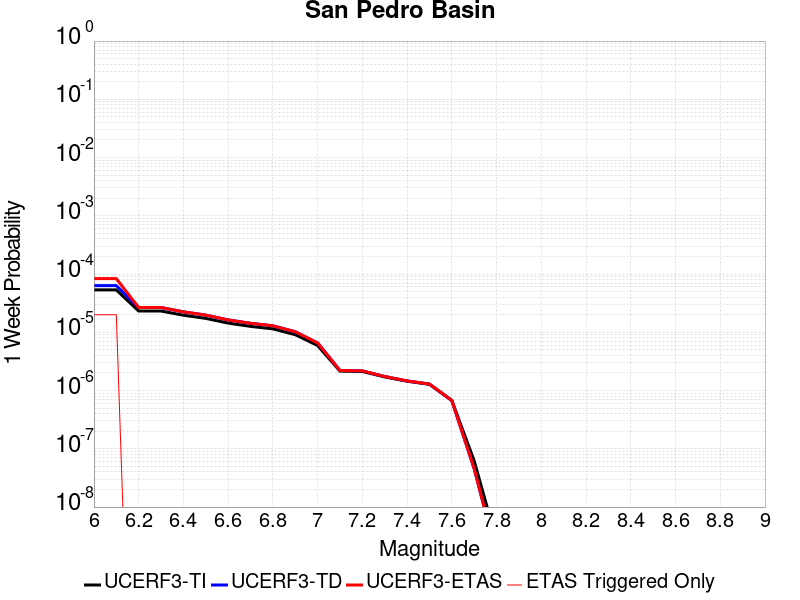 |  | 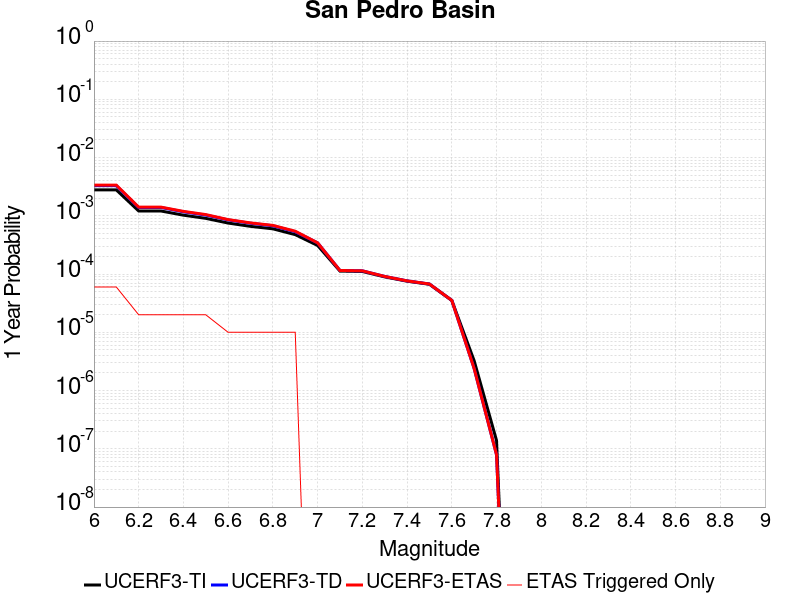 |  |

| Magnitude | 1 wk TI Prob | 1 wk TD Prob | 1 wk ETAS Prob | 1 wk ETAS/TD Gain | 1 wk ETAS Triggered Only | 1 mo TI Prob | 1 mo TD Prob | 1 mo ETAS Prob | 1 mo ETAS/TD Gain | 1 mo ETAS Triggered Only | 1 yr TI Prob | 1 yr TD Prob | 1 yr ETAS Prob | 1 yr ETAS/TD Gain | 1 yr ETAS Triggered Only | 10 yr TI Prob | 10 yr TD Prob | 10 yr ETAS Prob | 10 yr ETAS/TD Gain | 10 yr ETAS Triggered Only |
|-----|-----|-----|-----|-----|-----|-----|-----|-----|-----|-----|-----|-----|-----|-----|-----|-----|-----|-----|-----|-----|
| 6.0 | 5.3449043E-5 | 6.337018E-5 | 8.336891E-5 | 1.3155859 | 2.0E-5 | 2.2904722E-4 | 2.7156167E-4 | 2.9155624E-4 | 1.0736281 | 2.0E-5 | 0.0027850836 | 0.0033018515 | 0.0033616533 | 1.0181116 | 6.0E-5 | 0.027504366 | 0.03258948 | 0.032676548 | 1.0026716 | 9.0E-5 |
| 6.1 | 5.3449043E-5 | 6.337018E-5 | 8.336891E-5 | 1.3155859 | 2.0E-5 | 2.2904722E-4 | 2.7156167E-4 | 2.9155624E-4 | 1.0736281 | 2.0E-5 | 0.0027850836 | 0.0033018515 | 0.0033616533 | 1.0181116 | 6.0E-5 | 0.027504366 | 0.03258948 | 0.032676548 | 1.0026716 | 9.0E-5 |
| 6.2 | 2.3189454E-5 | 2.6642829E-5 | 2.6642829E-5 | 1.0 | 0.0 | 9.9379584E-5 | 1.1417881E-4 | 1.1417881E-4 | 1.0 | 0.0 | 0.0012092749 | 0.0013892875 | 0.0014092597 | 1.0143759 | 2.0E-5 | 0.012027155 | 0.01381089 | 0.013840476 | 1.0021422 | 3.0E-5 |
| 6.3 | 2.3189454E-5 | 2.6642829E-5 | 2.6642829E-5 | 1.0 | 0.0 | 9.9379584E-5 | 1.1417881E-4 | 1.1417881E-4 | 1.0 | 0.0 | 0.0012092749 | 0.0013892875 | 0.0014092597 | 1.0143759 | 2.0E-5 | 0.012027155 | 0.01381089 | 0.013840476 | 1.0021422 | 3.0E-5 |
| 6.4 | 1.966056E-5 | 2.246342E-5 | 2.246342E-5 | 1.0 | 0.0 | 8.425682E-5 | 9.626848E-5 | 9.626848E-5 | 1.0 | 0.0 | 0.001025344 | 0.0011714787 | 0.0011914552 | 1.0170524 | 2.0E-5 | 0.010206259 | 0.011657119 | 0.011686769 | 1.0025436 | 3.0E-5 |
| 6.5 | 1.7342953E-5 | 1.9745152E-5 | 1.9745152E-5 | 1.0 | 0.0 | 7.4324824E-5 | 8.461954E-5 | 8.461954E-5 | 1.0 | 0.0 | 9.04529E-4 | 0.0010297929 | 0.0010497724 | 1.0194014 | 2.0E-5 | 0.009008561 | 0.010253932 | 0.010283625 | 1.0028957 | 3.0E-5 |
| 6.6 | 1.439804E-5 | 1.6322716E-5 | 1.6322716E-5 | 1.0 | 0.0 | 6.170443E-5 | 6.99528E-5 | 6.99528E-5 | 1.0 | 0.0 | 7.509924E-4 | 8.513747E-4 | 8.613662E-4 | 1.0117357 | 1.0E-5 | 0.0074845953 | 0.008484333 | 0.008494249 | 1.0011686 | 1.0E-5 |
| 6.7 | 1.2634884E-5 | 1.4285298E-5 | 1.4285298E-5 | 1.0 | 0.0 | 5.414838E-5 | 6.122144E-5 | 6.122144E-5 | 1.0 | 0.0 | 6.590571E-4 | 7.451466E-4 | 7.5513916E-4 | 1.0134102 | 1.0E-5 | 0.006571059 | 0.007429502 | 0.0074394275 | 1.001336 | 1.0E-5 |
| 6.8 | 1.146091E-5 | 1.2933193E-5 | 1.2933193E-5 | 1.0 | 0.0 | 4.911726E-5 | 5.542696E-5 | 5.542696E-5 | 1.0 | 0.0 | 5.9783855E-4 | 6.74644E-4 | 6.846373E-4 | 1.0148126 | 1.0E-5 | 0.0059623276 | 0.0067288997 | 0.006738832 | 1.0014762 | 1.0E-5 |
| 6.9 | 9.109035E-6 | 1.0235013E-5 | 1.0235013E-5 | 1.0 | 0.0 | 3.9038136E-5 | 4.386376E-5 | 4.386376E-5 | 1.0 | 0.0 | 4.7518566E-4 | 5.339384E-4 | 5.4393307E-4 | 1.0187187 | 1.0E-5 | 0.0047417083 | 0.0053293095 | 0.005339256 | 1.0018665 | 1.0E-5 |
| 7.0 | 5.9351028E-6 | 6.583965E-6 | 6.583965E-6 | 1.0 | 0.0 | 2.5435906E-5 | 2.821682E-5 | 2.821682E-5 | 1.0 | 0.0 | 3.0963816E-4 | 3.4350925E-4 | 3.4350925E-4 | 1.0 | 0.0 | 0.0030920706 | 0.0034320997 | 0.0034320997 | 1.0 | 0.0 |
| 7.1 | 2.1557585E-6 | 2.2096492E-6 | 2.2096492E-6 | 1.0 | 0.0 | 9.238933E-6 | 9.469892E-6 | 9.469892E-6 | 1.0 | 0.0 | 1.1247819E-4 | 1.15289986E-4 | 1.15289986E-4 | 1.0 | 0.0 | 0.0011242128 | 0.0011523172 | 0.0011523172 | 1.0 | 0.0 |
| 7.2 | 2.1251979E-6 | 2.1779954E-6 | 2.1779954E-6 | 1.0 | 0.0 | 9.107958E-6 | 9.334234E-6 | 9.334234E-6 | 1.0 | 0.0 | 1.1088375E-4 | 1.13638525E-4 | 1.13638525E-4 | 1.0 | 0.0 | 0.0011082845 | 0.0011358195 | 0.0011358195 | 1.0 | 0.0 |
| 7.3 | 1.7145798E-6 | 1.7442885E-6 | 1.7442885E-6 | 1.0 | 0.0 | 7.3481783E-6 | 7.475501E-6 | 7.475501E-6 | 1.0 | 0.0 | 8.94604E-5 | 9.1010515E-5 | 9.1010515E-5 | 1.0 | 0.0 | 8.9424395E-4 | 9.0974156E-4 | 9.0974156E-4 | 1.0 | 0.0 |
| 7.4 | 1.4467993E-6 | 1.4641878E-6 | 1.4641878E-6 | 1.0 | 0.0 | 6.200554E-6 | 6.275076E-6 | 6.275076E-6 | 1.0 | 0.0 | 7.548913E-5 | 7.639644E-5 | 7.639644E-5 | 1.0 | 0.0 | 7.546349E-4 | 7.6370913E-4 | 7.6370913E-4 | 1.0 | 0.0 |
| 7.5 | 1.2803735E-6 | 1.2931506E-6 | 1.2931506E-6 | 1.0 | 0.0 | 5.487303E-6 | 5.5420624E-6 | 5.5420624E-6 | 1.0 | 0.0 | 6.680587E-5 | 6.747259E-5 | 6.747259E-5 | 1.0 | 0.0 | 6.678579E-4 | 6.745281E-4 | 6.745281E-4 | 1.0 | 0.0 |
| 7.6 | 6.755009E-7 | 6.76947E-7 | 6.76947E-7 | 1.0 | 0.0 | 2.8950008E-6 | 2.9011985E-6 | 2.9011985E-6 | 1.0 | 0.0 | 3.5246063E-5 | 3.532158E-5 | 3.532158E-5 | 1.0 | 0.0 | 3.5240475E-4 | 3.5316538E-4 | 3.5316538E-4 | 1.0 | 0.0 |
| 7.7 | 6.211885E-8 | 4.5699714E-8 | 4.5699714E-8 | 1.0 | 0.0 | 2.6622362E-7 | 1.9585592E-7 | 1.9585592E-7 | 1.0 | 0.0 | 3.2412677E-6 | 2.3845432E-6 | 2.3845432E-6 | 1.0 | 0.0 | 3.2412205E-5 | 2.3845198E-5 | 2.3845198E-5 | 1.0 | 0.0 |
| 7.8 | 2.6580573E-9 | 1.5138054E-9 | 1.5138054E-9 | 1.0 | 0.0 | 1.1391674E-8 | 6.4877375E-9 | 6.4877375E-9 | 1.0 | 0.0 | 1.3869362E-7 | 7.89882E-8 | 7.89882E-8 | 1.0 | 0.0 | 1.3869354E-6 | 7.89882E-7 | 7.89882E-7 | 1.0 | 0.0 |

## Pitas Point (Lower West)
*[(top)](#table-of-contents)*

| 1 Week | 1 Month | 1 Year | 10 Year |
|-----|-----|-----|-----|
| 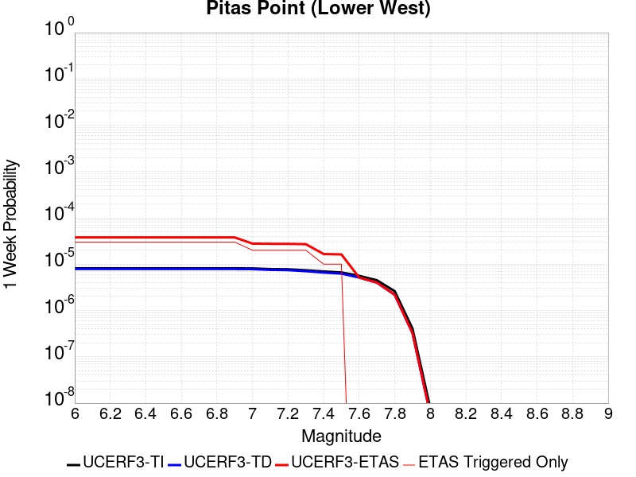 | 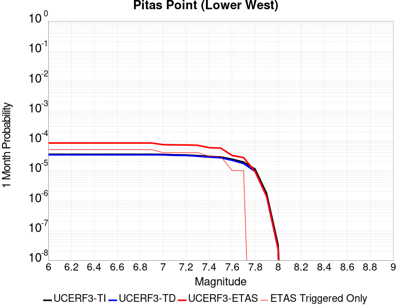 | 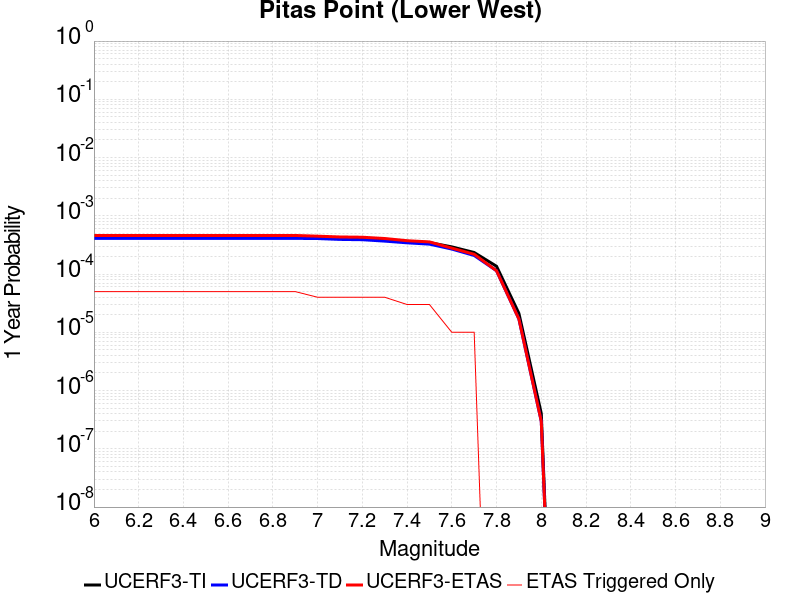 | 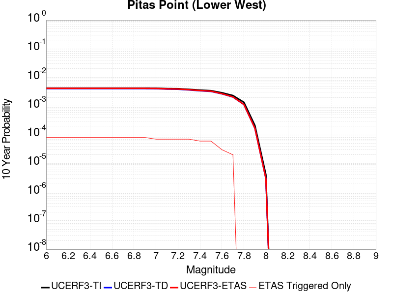 |

| Magnitude | 1 wk TI Prob | 1 wk TD Prob | 1 wk ETAS Prob | 1 wk ETAS/TD Gain | 1 wk ETAS Triggered Only | 1 mo TI Prob | 1 mo TD Prob | 1 mo ETAS Prob | 1 mo ETAS/TD Gain | 1 mo ETAS Triggered Only | 1 yr TI Prob | 1 yr TD Prob | 1 yr ETAS Prob | 1 yr ETAS/TD Gain | 1 yr ETAS Triggered Only | 10 yr TI Prob | 10 yr TD Prob | 10 yr ETAS Prob | 10 yr ETAS/TD Gain | 10 yr ETAS Triggered Only |
|-----|-----|-----|-----|-----|-----|-----|-----|-----|-----|-----|-----|-----|-----|-----|-----|-----|-----|-----|-----|-----|
| 6.0 | 8.151497E-6 | 7.855796E-6 | 3.785556E-5 | 4.818806 | 3.0E-5 | 3.493452E-5 | 3.3667267E-5 | 8.366558E-5 | 2.485072 | 5.0E-5 | 4.252448E-4 | 4.0982262E-4 | 4.5980213E-4 | 1.121954 | 5.0E-5 | 0.0042443196 | 0.004090749 | 0.004170422 | 1.0194763 | 8.0E-5 |
| 6.1 | 8.151497E-6 | 7.855796E-6 | 3.785556E-5 | 4.818806 | 3.0E-5 | 3.493452E-5 | 3.3667267E-5 | 8.366558E-5 | 2.485072 | 5.0E-5 | 4.252448E-4 | 4.0982262E-4 | 4.5980213E-4 | 1.121954 | 5.0E-5 | 0.0042443196 | 0.004090749 | 0.004170422 | 1.0194763 | 8.0E-5 |
| 6.2 | 8.151497E-6 | 7.855796E-6 | 3.785556E-5 | 4.818806 | 3.0E-5 | 3.493452E-5 | 3.3667267E-5 | 8.366558E-5 | 2.485072 | 5.0E-5 | 4.252448E-4 | 4.0982262E-4 | 4.5980213E-4 | 1.121954 | 5.0E-5 | 0.0042443196 | 0.004090749 | 0.004170422 | 1.0194763 | 8.0E-5 |
| 6.3 | 8.151497E-6 | 7.855796E-6 | 3.785556E-5 | 4.818806 | 3.0E-5 | 3.493452E-5 | 3.3667267E-5 | 8.366558E-5 | 2.485072 | 5.0E-5 | 4.252448E-4 | 4.0982262E-4 | 4.5980213E-4 | 1.121954 | 5.0E-5 | 0.0042443196 | 0.004090749 | 0.004170422 | 1.0194763 | 8.0E-5 |
| 6.4 | 8.151497E-6 | 7.855796E-6 | 3.785556E-5 | 4.818806 | 3.0E-5 | 3.493452E-5 | 3.3667267E-5 | 8.366558E-5 | 2.485072 | 5.0E-5 | 4.252448E-4 | 4.0982262E-4 | 4.5980213E-4 | 1.121954 | 5.0E-5 | 0.0042443196 | 0.004090749 | 0.004170422 | 1.0194763 | 8.0E-5 |
| 6.5 | 8.151497E-6 | 7.855796E-6 | 3.785556E-5 | 4.818806 | 3.0E-5 | 3.493452E-5 | 3.3667267E-5 | 8.366558E-5 | 2.485072 | 5.0E-5 | 4.252448E-4 | 4.0982262E-4 | 4.5980213E-4 | 1.121954 | 5.0E-5 | 0.0042443196 | 0.004090749 | 0.004170422 | 1.0194763 | 8.0E-5 |
| 6.6 | 8.151497E-6 | 7.855796E-6 | 3.785556E-5 | 4.818806 | 3.0E-5 | 3.493452E-5 | 3.3667267E-5 | 8.366558E-5 | 2.485072 | 5.0E-5 | 4.252448E-4 | 4.0982262E-4 | 4.5980213E-4 | 1.121954 | 5.0E-5 | 0.0042443196 | 0.004090749 | 0.004170422 | 1.0194763 | 8.0E-5 |
| 6.7 | 8.151497E-6 | 7.855796E-6 | 3.785556E-5 | 4.818806 | 3.0E-5 | 3.493452E-5 | 3.3667267E-5 | 8.366558E-5 | 2.485072 | 5.0E-5 | 4.252448E-4 | 4.0982262E-4 | 4.5980213E-4 | 1.121954 | 5.0E-5 | 0.0042443196 | 0.004090749 | 0.004170422 | 1.0194763 | 8.0E-5 |
| 6.8 | 8.151497E-6 | 7.855796E-6 | 3.785556E-5 | 4.818806 | 3.0E-5 | 3.493452E-5 | 3.3667267E-5 | 8.366558E-5 | 2.485072 | 5.0E-5 | 4.252448E-4 | 4.0982262E-4 | 4.5980213E-4 | 1.121954 | 5.0E-5 | 0.0042443196 | 0.004090749 | 0.004170422 | 1.0194763 | 8.0E-5 |
| 6.9 | 8.151497E-6 | 7.855796E-6 | 3.785556E-5 | 4.818806 | 3.0E-5 | 3.493452E-5 | 3.3667267E-5 | 8.366558E-5 | 2.485072 | 5.0E-5 | 4.252448E-4 | 4.0982262E-4 | 4.5980213E-4 | 1.121954 | 5.0E-5 | 0.0042443196 | 0.004090749 | 0.004170422 | 1.0194763 | 8.0E-5 |
| 7.0 | 8.103535E-6 | 7.805226E-6 | 2.780507E-5 | 3.5623658 | 2.0E-5 | 3.4728975E-5 | 3.3450542E-5 | 7.3449206E-5 | 2.1957552 | 4.0E-5 | 4.2274324E-4 | 4.07185E-4 | 4.471687E-4 | 1.0981954 | 4.0E-5 | 0.0042193993 | 0.0040644696 | 0.004134185 | 1.0171524 | 7.0E-5 |
| 7.1 | 7.853298E-6 | 7.540917E-6 | 2.7540766E-5 | 3.6521773 | 2.0E-5 | 3.3656554E-5 | 3.2317817E-5 | 7.231653E-5 | 2.2376673 | 4.0E-5 | 4.096915E-4 | 3.9339912E-4 | 4.3338336E-4 | 1.101638 | 4.0E-5 | 0.00408937 | 0.0039271032 | 0.003996828 | 1.0177548 | 7.0E-5 |
| 7.2 | 7.771102E-6 | 7.453199E-6 | 2.745305E-5 | 3.6833916 | 2.0E-5 | 3.33043E-5 | 3.1941894E-5 | 7.1940616E-5 | 2.252234 | 4.0E-5 | 4.0540437E-4 | 3.8882386E-4 | 4.288083E-4 | 1.1028343 | 4.0E-5 | 0.0040466557 | 0.003881511 | 0.0039512394 | 1.0179642 | 7.0E-5 |
| 7.3 | 7.3945344E-6 | 7.0493033E-6 | 2.7049162E-5 | 3.8371398 | 2.0E-5 | 3.1690477E-5 | 3.0210955E-5 | 7.0209746E-5 | 2.323983 | 4.0E-5 | 3.8576324E-4 | 3.677569E-4 | 4.077422E-4 | 1.1087275 | 4.0E-5 | 0.0038509427 | 0.003671551 | 0.003741294 | 1.0189955 | 7.0E-5 |
| 7.4 | 6.964645E-6 | 6.5901527E-6 | 1.6590087E-5 | 2.5174055 | 1.0E-5 | 2.9848137E-5 | 2.8243208E-5 | 5.824236E-5 | 2.0621724 | 3.0E-5 | 3.6334046E-4 | 3.438073E-4 | 3.7379697E-4 | 1.0872282 | 3.0E-5 | 0.0036274698 | 0.0034328073 | 0.0034926012 | 1.0174184 | 6.0E-5 |
| 7.5 | 6.6525035E-6 | 6.259191E-6 | 1.6259128E-5 | 2.5976405 | 1.0E-5 | 2.851042E-5 | 2.6824831E-5 | 5.6824025E-5 | 2.1183367 | 3.0E-5 | 3.4705905E-4 | 3.2654387E-4 | 3.5653406E-4 | 1.0918412 | 3.0E-5 | 0.0034651754 | 0.0032606919 | 0.0033204963 | 1.018341 | 6.0E-5 |
| 7.6 | 5.613338E-6 | 5.15142E-6 | 5.15142E-6 | 1.0 | 0.0 | 2.405694E-5 | 2.2077327E-5 | 3.2077107E-5 | 1.4529433 | 1.0E-5 | 2.928539E-4 | 2.6875862E-4 | 2.7875594E-4 | 1.0371981 | 1.0E-5 | 0.0029246826 | 0.0026843674 | 0.002714287 | 1.0111458 | 3.0E-5 |
| 7.7 | 4.494704E-6 | 3.996945E-6 | 3.996945E-6 | 1.0 | 0.0 | 1.9262876E-5 | 1.7129652E-5 | 2.7129481E-5 | 1.583773 | 1.0E-5 | 2.3450027E-4 | 2.0853379E-4 | 2.185317E-4 | 1.0479438 | 1.0E-5 | 0.0023425296 | 0.0020834052 | 0.0021033634 | 1.0095797 | 2.0E-5 |
| 7.8 | 2.6075882E-6 | 2.1836663E-6 | 2.1836663E-6 | 1.0 | 0.0 | 1.117533E-5 | 9.358537E-6 | 9.358537E-6 | 1.0 | 0.0 | 1.3605114E-4 | 1.1393427E-4 | 1.1393427E-4 | 1.0 | 0.0 | 0.0013596788 | 0.0011387634 | 0.0011387634 | 1.0 | 0.0 |
| 7.9 | 4.045984E-7 | 3.2424057E-7 | 3.2424057E-7 | 1.0 | 0.0 | 1.733992E-6 | 1.3896017E-6 | 1.3896017E-6 | 1.0 | 0.0 | 2.1111147E-5 | 1.6918271E-5 | 1.6918271E-5 | 1.0 | 0.0 | 2.1109142E-4 | 1.6917015E-4 | 1.6917015E-4 | 1.0 | 0.0 |
| 8.0 | 7.791402E-9 | 5.6836056E-9 | 5.6836056E-9 | 1.0 | 0.0 | 3.3391725E-8 | 2.4358311E-8 | 2.4358311E-8 | 1.0 | 0.0 | 4.0654416E-7 | 2.965624E-7 | 2.965624E-7 | 1.0 | 0.0 | 4.065434E-6 | 2.9656223E-6 | 2.9656223E-6 | 1.0 | 0.0 |

## San Jacinto (Borrego)
*[(top)](#table-of-contents)*

| 1 Week | 1 Month | 1 Year | 10 Year |
|-----|-----|-----|-----|
|  |  | 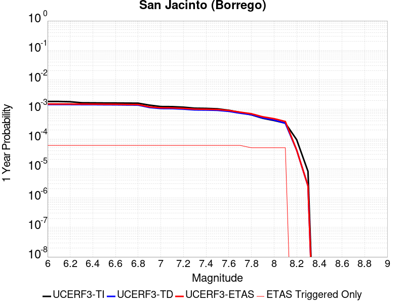 | 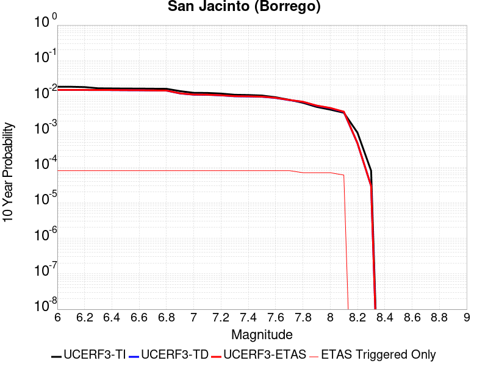 |

| Magnitude | 1 wk TI Prob | 1 wk TD Prob | 1 wk ETAS Prob | 1 wk ETAS/TD Gain | 1 wk ETAS Triggered Only | 1 mo TI Prob | 1 mo TD Prob | 1 mo ETAS Prob | 1 mo ETAS/TD Gain | 1 mo ETAS Triggered Only | 1 yr TI Prob | 1 yr TD Prob | 1 yr ETAS Prob | 1 yr ETAS/TD Gain | 1 yr ETAS Triggered Only | 10 yr TI Prob | 10 yr TD Prob | 10 yr ETAS Prob | 10 yr ETAS/TD Gain | 10 yr ETAS Triggered Only |
|-----|-----|-----|-----|-----|-----|-----|-----|-----|-----|-----|-----|-----|-----|-----|-----|-----|-----|-----|-----|-----|
| 6.0 | 3.543992E-5 | 2.7925962E-5 | 5.7925125E-5 | 2.0742393 | 3.0E-5 | 1.5187653E-4 | 1.1967727E-4 | 1.6967129E-4 | 1.4177402 | 5.0E-5 | 0.0018475284 | 0.0014561092 | 0.0015160218 | 1.0411457 | 6.0E-5 | 0.018322436 | 0.01486815 | 0.014946962 | 1.0053006 | 8.0E-5 |
| 6.1 | 3.542281E-5 | 2.7925962E-5 | 5.7925125E-5 | 2.0742393 | 3.0E-5 | 1.5180321E-4 | 1.1967727E-4 | 1.6967129E-4 | 1.4177402 | 5.0E-5 | 0.0018466372 | 0.0014561092 | 0.0015160218 | 1.0411457 | 6.0E-5 | 0.018313672 | 0.01486815 | 0.014946962 | 1.0053006 | 8.0E-5 |
| 6.2 | 3.4688688E-5 | 2.7925962E-5 | 5.7925125E-5 | 2.0742393 | 3.0E-5 | 1.4865733E-4 | 1.1967727E-4 | 1.6967129E-4 | 1.4177402 | 5.0E-5 | 0.0018084005 | 0.0014561091 | 0.0015160218 | 1.0411457 | 6.0E-5 | 0.017937548 | 0.01486815 | 0.014946961 | 1.0053006 | 8.0E-5 |
| 6.3 | 3.2087122E-5 | 2.7771312E-5 | 5.7770478E-5 | 2.0802214 | 3.0E-5 | 1.3750899E-4 | 1.1901455E-4 | 1.6900859E-4 | 1.4200667 | 5.0E-5 | 0.0016728862 | 0.0014480512 | 0.0015079643 | 1.041375 | 6.0E-5 | 0.016603488 | 0.014789308 | 0.014868125 | 1.0053294 | 8.0E-5 |
| 6.4 | 3.1828724E-5 | 2.773829E-5 | 5.7737456E-5 | 2.0815074 | 3.0E-5 | 1.364017E-4 | 1.1887303E-4 | 1.6886709E-4 | 1.4205668 | 5.0E-5 | 0.0016594254 | 0.0014463306 | 0.0015062437 | 1.0414243 | 6.0E-5 | 0.016470885 | 0.014772502 | 0.01485132 | 1.0053355 | 8.0E-5 |
| 6.5 | 3.1563577E-5 | 2.7477974E-5 | 5.747715E-5 | 2.0917535 | 3.0E-5 | 1.3526545E-4 | 1.17757496E-4 | 1.6775161E-4 | 1.4245514 | 5.0E-5 | 0.0016456128 | 0.0014327668 | 0.0014926809 | 1.0418171 | 6.0E-5 | 0.0163348 | 0.01463991 | 0.014718738 | 1.0053846 | 8.0E-5 |
| 6.6 | 3.1467625E-5 | 2.7322194E-5 | 5.7321373E-5 | 2.0979784 | 3.0E-5 | 1.3485427E-4 | 1.17089934E-4 | 1.6708407E-4 | 1.4269722 | 5.0E-5 | 0.0016406142 | 0.0014246498 | 0.0014845644 | 1.0420556 | 6.0E-5 | 0.016285548 | 0.014560228 | 0.014639063 | 1.0054144 | 8.0E-5 |
| 6.7 | 3.1223695E-5 | 2.6940217E-5 | 5.693941E-5 | 2.1135468 | 3.0E-5 | 1.3380898E-4 | 1.1545303E-4 | 1.6544726E-4 | 1.4330266 | 5.0E-5 | 0.0016279068 | 0.0014047464 | 0.0014646621 | 1.0426524 | 6.0E-5 | 0.01616033 | 0.01436451 | 0.01444336 | 1.0054892 | 8.0E-5 |
| 6.8 | 3.1015585E-5 | 2.6761221E-5 | 5.676042E-5 | 2.120995 | 3.0E-5 | 1.3291716E-4 | 1.1468597E-4 | 1.6468024E-4 | 1.4359231 | 5.0E-5 | 0.001617065 | 0.0013954195 | 0.0014553358 | 1.0429379 | 6.0E-5 | 0.016053487 | 0.014271772 | 0.01435063 | 1.0055255 | 8.0E-5 |
| 6.9 | 2.6641965E-5 | 2.2183434E-5 | 5.2182768E-5 | 2.3523304 | 3.0E-5 | 1.1417485E-4 | 9.506842E-5 | 1.4506366E-4 | 1.525887 | 5.0E-5 | 0.0013891924 | 0.0011568473 | 0.001216778 | 1.0518051 | 6.0E-5 | 0.0138054015 | 0.011882191 | 0.01196124 | 1.0066527 | 8.0E-5 |
| 7.0 | 2.3854353E-5 | 2.047825E-5 | 5.0477636E-5 | 2.4649389 | 3.0E-5 | 1.02228936E-4 | 8.776099E-5 | 1.3775661E-4 | 1.5696791 | 5.0E-5 | 0.0012439266 | 0.0010679689 | 0.0011279049 | 1.0561215 | 6.0E-5 | 0.012369866 | 0.0109826205 | 0.011061742 | 1.0072043 | 8.0E-5 |
| 7.1 | 2.3672901E-5 | 2.0314741E-5 | 5.031413E-5 | 2.47673 | 3.0E-5 | 1.0145135E-4 | 8.706028E-5 | 1.3705593E-4 | 1.5742646 | 5.0E-5 | 0.0012344702 | 0.0010594461 | 0.0011193826 | 1.0565734 | 6.0E-5 | 0.0122763505 | 0.010897858 | 0.010976987 | 1.0072609 | 8.0E-5 |
| 7.2 | 2.2717244E-5 | 1.9542116E-5 | 4.954153E-5 | 2.535116 | 3.0E-5 | 9.735599E-5 | 8.3749255E-5 | 1.3374507E-4 | 1.5969702 | 5.0E-5 | 0.0011846646 | 0.0010191725 | 0.0010791114 | 1.0588113 | 6.0E-5 | 0.01178369 | 0.010495322 | 0.010574482 | 1.0075425 | 8.0E-5 |
| 7.3 | 2.1016205E-5 | 1.8383771E-5 | 4.838322E-5 | 2.631844 | 3.0E-5 | 9.006634E-5 | 7.878522E-5 | 1.2878128E-4 | 1.6345868 | 5.0E-5 | 0.001096006 | 9.5879E-4 | 0.0010187326 | 1.0625188 | 6.0E-5 | 0.010906163 | 0.009890901 | 0.00997011 | 1.0080082 | 8.0E-5 |
| 7.4 | 2.0683625E-5 | 1.8186302E-5 | 4.8185757E-5 | 2.6495633 | 3.0E-5 | 8.86411E-5 | 7.7938974E-5 | 1.2793508E-4 | 1.6414776 | 5.0E-5 | 0.001078671 | 9.48496E-4 | 0.0010084391 | 1.0631981 | 6.0E-5 | 0.010734501 | 0.0097876275 | 0.009866845 | 1.0080936 | 8.0E-5 |
| 7.5 | 1.9993966E-5 | 1.7781347E-5 | 4.7780813E-5 | 2.6871312 | 3.0E-5 | 8.568561E-5 | 7.6203556E-5 | 1.2619975E-4 | 1.6560873 | 5.0E-5 | 0.001042723 | 9.2738547E-4 | 9.873298E-4 | 1.064638 | 6.0E-5 | 0.010378438 | 0.009574548 | 0.0096537825 | 1.0082755 | 8.0E-5 |
| 7.6 | 1.788966E-5 | 1.6434618E-5 | 4.6434125E-5 | 2.825385 | 3.0E-5 | 7.666772E-5 | 7.043219E-5 | 1.2042866E-4 | 1.7098527 | 5.0E-5 | 9.3302975E-4 | 8.5717626E-4 | 9.171248E-4 | 1.0699372 | 6.0E-5 | 0.00929122 | 0.008866415 | 0.008945706 | 1.0089428 | 8.0E-5 |
| 7.7 | 1.5125781E-5 | 1.4236738E-5 | 4.4236313E-5 | 3.1071942 | 3.0E-5 | 6.4823165E-5 | 6.101317E-5 | 1.11010115E-4 | 1.8194453 | 5.0E-5 | 7.889362E-4 | 7.4258295E-4 | 8.025384E-4 | 1.080739 | 6.0E-5 | 0.007861412 | 0.007714161 | 0.007793544 | 1.0102905 | 8.0E-5 |
| 7.8 | 1.250089E-5 | 1.262994E-5 | 4.2629563E-5 | 3.3752782 | 3.0E-5 | 5.3574146E-5 | 5.4127195E-5 | 1.0412449E-4 | 1.9237001 | 5.0E-5 | 6.5207E-4 | 6.588E-4 | 7.0876704E-4 | 1.0758456 | 5.0E-5 | 0.006501599 | 0.006867759 | 0.0069372784 | 1.0101225 | 7.0E-5 |
| 7.9 | 9.561E-6 | 9.754065E-6 | 3.9753773E-5 | 4.0756106 | 3.0E-5 | 4.0975072E-5 | 4.180247E-5 | 9.180038E-5 | 2.1960516 | 5.0E-5 | 4.987573E-4 | 5.0882675E-4 | 5.5880134E-4 | 1.0982152 | 5.0E-5 | 0.0049763937 | 0.0053523607 | 0.005421986 | 1.0130084 | 7.0E-5 |
| 8.0 | 8.01699E-6 | 8.292994E-6 | 3.8292746E-5 | 4.6174817 | 3.0E-5 | 3.4358076E-5 | 3.554092E-5 | 8.553914E-5 | 2.406779 | 5.0E-5 | 4.1822926E-4 | 4.3262533E-4 | 4.8260367E-4 | 1.1155235 | 5.0E-5 | 0.0041744304 | 0.0045733186 | 0.004642999 | 1.0152361 | 7.0E-5 |
| 8.1 | 6.541947E-6 | 6.461784E-6 | 3.646159E-5 | 5.6426506 | 3.0E-5 | 2.8036617E-5 | 2.7693068E-5 | 7.7691686E-5 | 2.805456 | 5.0E-5 | 3.4129233E-4 | 3.3711144E-4 | 3.870946E-4 | 1.1482689 | 5.0E-5 | 0.0034076865 | 0.0035805756 | 0.0036403607 | 1.016697 | 6.0E-5 |
| 8.2 | 1.7968189E-6 | 7.9684827E-7 | 7.9684827E-7 | 1.0 | 0.0 | 7.70063E-6 | 3.4150596E-6 | 3.4150596E-6 | 1.0 | 0.0 | 9.3751136E-5 | 4.157758E-5 | 4.157758E-5 | 1.0 | 0.0 | 9.371159E-4 | 4.7107413E-4 | 4.7107413E-4 | 1.0 | 0.0 |
| 8.3 | 1.5167889E-7 | 4.8951257E-8 | 4.8951257E-8 | 1.0 | 0.0 | 6.500522E-7 | 2.0979108E-7 | 2.0979108E-7 | 1.0 | 0.0 | 7.9143565E-6 | 2.5542038E-6 | 2.5542038E-6 | 1.0 | 0.0 | 7.914075E-5 | 2.9679897E-5 | 2.9679897E-5 | 1.0 | 0.0 |

## Bullion Mountains
*[(top)](#table-of-contents)*

| 1 Week | 1 Month | 1 Year | 10 Year |
|-----|-----|-----|-----|
| 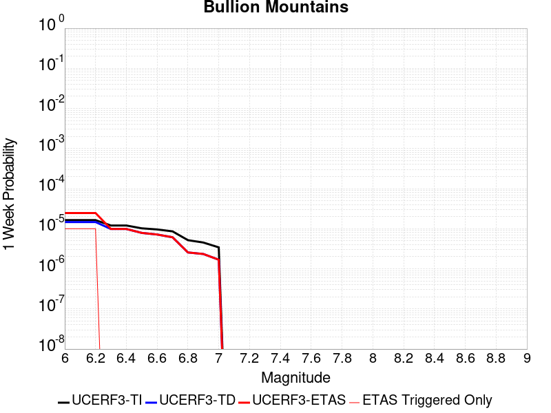 |  | 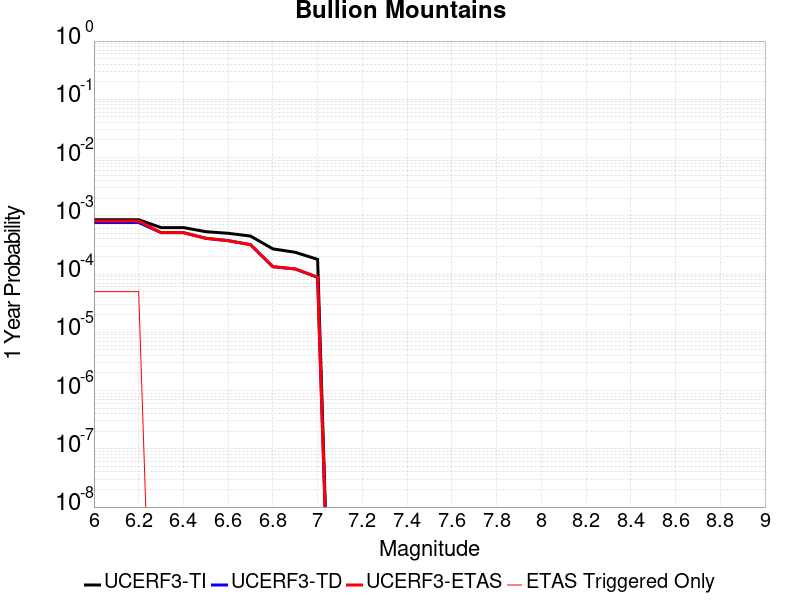 |  |

| Magnitude | 1 wk TI Prob | 1 wk TD Prob | 1 wk ETAS Prob | 1 wk ETAS/TD Gain | 1 wk ETAS Triggered Only | 1 mo TI Prob | 1 mo TD Prob | 1 mo ETAS Prob | 1 mo ETAS/TD Gain | 1 mo ETAS Triggered Only | 1 yr TI Prob | 1 yr TD Prob | 1 yr ETAS Prob | 1 yr ETAS/TD Gain | 1 yr ETAS Triggered Only | 10 yr TI Prob | 10 yr TD Prob | 10 yr ETAS Prob | 10 yr ETAS/TD Gain | 10 yr ETAS Triggered Only |
|-----|-----|-----|-----|-----|-----|-----|-----|-----|-----|-----|-----|-----|-----|-----|-----|-----|-----|-----|-----|-----|
| 6.0 | 1.6420427E-5 | 1.4692009E-5 | 2.4691863E-5 | 1.6806321 | 1.0E-5 | 7.037136E-5 | 6.296445E-5 | 7.296382E-5 | 1.1588098 | 1.0E-5 | 8.5643446E-4 | 7.6636096E-4 | 8.1632263E-4 | 1.0651934 | 5.0E-5 | 0.008531413 | 0.0076409746 | 0.0077203633 | 1.0103899 | 8.0E-5 |
| 6.1 | 1.6420427E-5 | 1.4692009E-5 | 2.4691863E-5 | 1.6806321 | 1.0E-5 | 7.037136E-5 | 6.296445E-5 | 7.296382E-5 | 1.1588098 | 1.0E-5 | 8.5643446E-4 | 7.6636096E-4 | 8.1632263E-4 | 1.0651934 | 5.0E-5 | 0.008531413 | 0.0076409746 | 0.0077203633 | 1.0103899 | 8.0E-5 |
| 6.2 | 1.6420427E-5 | 1.4692009E-5 | 2.4691863E-5 | 1.6806321 | 1.0E-5 | 7.037136E-5 | 6.296445E-5 | 7.296382E-5 | 1.1588098 | 1.0E-5 | 8.5643446E-4 | 7.6636096E-4 | 8.1632263E-4 | 1.0651934 | 5.0E-5 | 0.008531413 | 0.0076409746 | 0.0077203633 | 1.0103899 | 8.0E-5 |
| 6.3 | 1.2046778E-5 | 9.862255E-6 | 9.862255E-6 | 1.0 | 0.0 | 5.1628023E-5 | 4.2266256E-5 | 4.2266256E-5 | 1.0 | 0.0 | 6.283899E-4 | 5.144933E-4 | 5.144933E-4 | 1.0 | 0.0 | 0.0062661595 | 0.0051353034 | 0.0051552006 | 1.0038747 | 2.0E-5 |
| 6.4 | 1.2046778E-5 | 9.862255E-6 | 9.862255E-6 | 1.0 | 0.0 | 5.1628023E-5 | 4.2266256E-5 | 4.2266256E-5 | 1.0 | 0.0 | 6.283899E-4 | 5.144933E-4 | 5.144933E-4 | 1.0 | 0.0 | 0.0062661595 | 0.0051353034 | 0.0051552006 | 1.0038747 | 2.0E-5 |
| 6.5 | 1.0244343E-5 | 7.879378E-6 | 7.879378E-6 | 1.0 | 0.0 | 4.390359E-5 | 3.3768443E-5 | 3.3768443E-5 | 1.0 | 0.0 | 5.343951E-4 | 4.1107394E-4 | 4.1107394E-4 | 1.0 | 0.0 | 0.005331118 | 0.0041051665 | 0.0041250843 | 1.0048519 | 2.0E-5 |
| 6.6 | 9.605408E-6 | 7.1774166E-6 | 7.1774166E-6 | 1.0 | 0.0 | 4.1165385E-5 | 3.0760108E-5 | 3.0760108E-5 | 1.0 | 0.0 | 5.010733E-4 | 3.7446033E-4 | 3.7446033E-4 | 1.0 | 0.0 | 0.00499945 | 0.0037402906 | 0.0037502532 | 1.0026636 | 1.0E-5 |
| 6.7 | 8.60418E-6 | 6.123926E-6 | 6.123926E-6 | 1.0 | 0.0 | 3.687454E-5 | 2.6245243E-5 | 2.6245243E-5 | 1.0 | 0.0 | 4.48855E-4 | 3.195085E-4 | 3.195085E-4 | 1.0 | 0.0 | 0.004479495 | 0.0031924031 | 0.003202371 | 1.0031224 | 1.0E-5 |
| 6.8 | 5.187994E-6 | 2.563117E-6 | 2.563117E-6 | 1.0 | 0.0 | 2.223407E-5 | 1.0984763E-5 | 1.0984763E-5 | 1.0 | 0.0 | 2.7066618E-4 | 1.3373529E-4 | 1.3373529E-4 | 1.0 | 0.0 | 0.0027033675 | 0.0013369396 | 0.0013369396 | 1.0 | 0.0 |
| 6.9 | 4.5302368E-6 | 2.3442778E-6 | 2.3442778E-6 | 1.0 | 0.0 | 1.9415156E-5 | 1.0046889E-5 | 1.0046889E-5 | 1.0 | 0.0 | 2.3635388E-4 | 1.2231797E-4 | 1.2231797E-4 | 1.0 | 0.0 | 0.0023610266 | 0.0012228956 | 0.0012228956 | 1.0 | 0.0 |
| 7.0 | 3.431668E-6 | 1.6882177E-6 | 1.6882177E-6 | 1.0 | 0.0 | 1.4707065E-5 | 7.2352186E-6 | 7.2352186E-6 | 1.0 | 0.0 | 1.7904381E-4 | 8.808879E-5 | 8.808879E-5 | 1.0 | 0.0 | 0.0017889962 | 8.8088785E-4 | 8.8088785E-4 | 1.0 | 0.0 |

## Palos Verdes
*[(top)](#table-of-contents)*

| 1 Week | 1 Month | 1 Year | 10 Year |
|-----|-----|-----|-----|
| 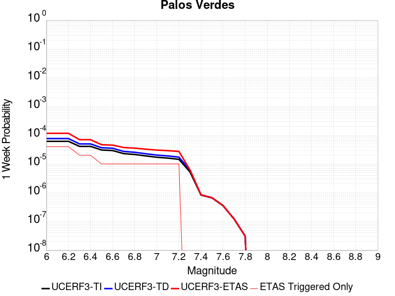 |  | 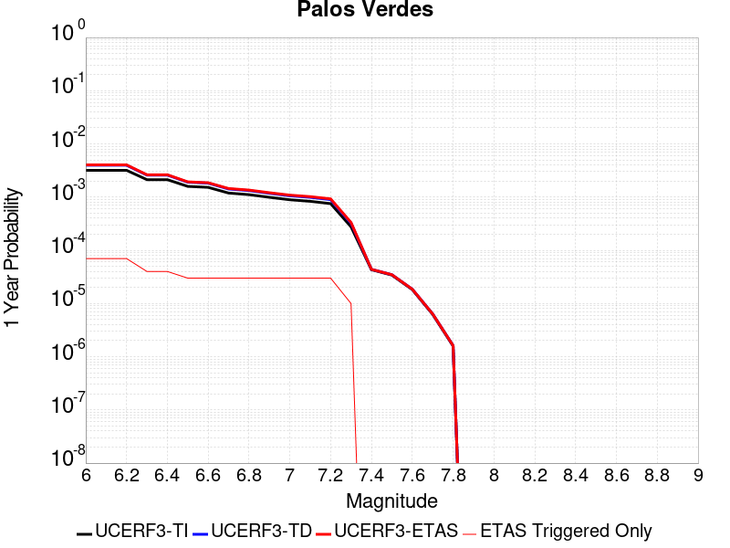 | 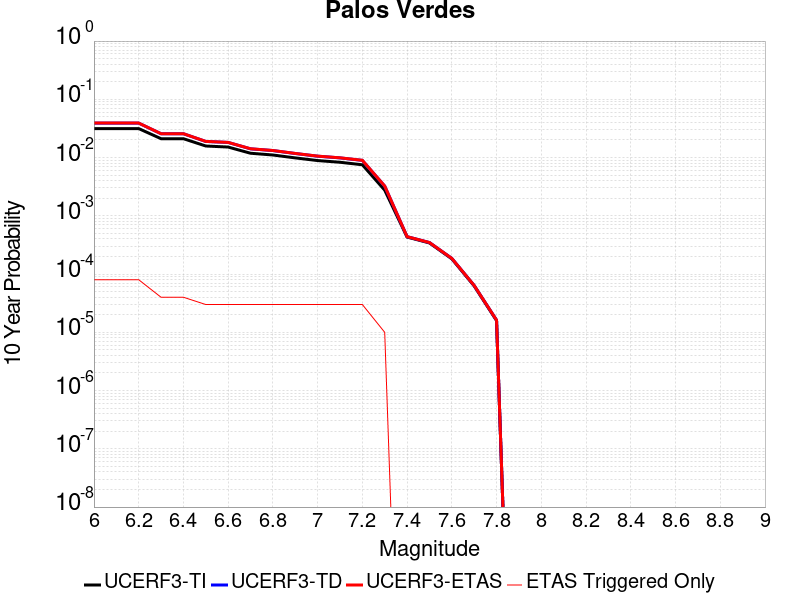 |

| Magnitude | 1 wk TI Prob | 1 wk TD Prob | 1 wk ETAS Prob | 1 wk ETAS/TD Gain | 1 wk ETAS Triggered Only | 1 mo TI Prob | 1 mo TD Prob | 1 mo ETAS Prob | 1 mo ETAS/TD Gain | 1 mo ETAS Triggered Only | 1 yr TI Prob | 1 yr TD Prob | 1 yr ETAS Prob | 1 yr ETAS/TD Gain | 1 yr ETAS Triggered Only | 10 yr TI Prob | 10 yr TD Prob | 10 yr ETAS Prob | 10 yr ETAS/TD Gain | 10 yr ETAS Triggered Only |
|-----|-----|-----|-----|-----|-----|-----|-----|-----|-----|-----|-----|-----|-----|-----|-----|-----|-----|-----|-----|-----|
| 6.0 | 6.126063E-5 | 7.622572E-5 | 1.16222676E-4 | 1.5247172 | 4.0E-5 | 2.6251914E-4 | 3.266441E-4 | 3.7662778E-4 | 1.1530218 | 5.0E-5 | 0.0031914865 | 0.0039701737 | 0.0040398957 | 1.0175614 | 7.0E-5 | 0.031460393 | 0.03904909 | 0.039125964 | 1.0019687 | 8.0E-5 |
| 6.1 | 6.126063E-5 | 7.622572E-5 | 1.16222676E-4 | 1.5247172 | 4.0E-5 | 2.6251914E-4 | 3.266441E-4 | 3.7662778E-4 | 1.1530218 | 5.0E-5 | 0.0031914865 | 0.0039701737 | 0.0040398957 | 1.0175614 | 7.0E-5 | 0.031460393 | 0.03904909 | 0.039125964 | 1.0019687 | 8.0E-5 |
| 6.2 | 6.126063E-5 | 7.622572E-5 | 1.16222676E-4 | 1.5247172 | 4.0E-5 | 2.6251914E-4 | 3.266441E-4 | 3.7662778E-4 | 1.1530218 | 5.0E-5 | 0.0031914865 | 0.0039701737 | 0.0040398957 | 1.0175614 | 7.0E-5 | 0.031460393 | 0.03904909 | 0.039125964 | 1.0019687 | 8.0E-5 |
| 6.3 | 4.0838047E-5 | 4.9749007E-5 | 6.974801E-5 | 1.401998 | 2.0E-5 | 1.7500846E-4 | 2.1319388E-4 | 2.3318961E-4 | 1.0937914 | 2.0E-5 | 0.0021286458 | 0.002592754 | 0.0026326505 | 1.0153877 | 4.0E-5 | 0.021083709 | 0.025646746 | 0.02568572 | 1.0015197 | 4.0E-5 |
| 6.4 | 4.0838047E-5 | 4.9749007E-5 | 6.974801E-5 | 1.401998 | 2.0E-5 | 1.7500846E-4 | 2.1319388E-4 | 2.3318961E-4 | 1.0937914 | 2.0E-5 | 0.0021286458 | 0.002592754 | 0.0026326505 | 1.0153877 | 4.0E-5 | 0.021083709 | 0.025646746 | 0.02568572 | 1.0015197 | 4.0E-5 |
| 6.5 | 3.0512005E-5 | 3.6561592E-5 | 4.656123E-5 | 1.273501 | 1.0E-5 | 1.3075917E-4 | 1.566838E-4 | 1.6668225E-4 | 1.0638129 | 1.0E-5 | 0.0015908304 | 0.001906072 | 0.0019360149 | 1.0157092 | 3.0E-5 | 0.015794903 | 0.018909173 | 0.018938605 | 1.0015565 | 3.0E-5 |
| 6.6 | 2.9255087E-5 | 3.5154393E-5 | 4.515404E-5 | 1.2844495 | 1.0E-5 | 1.2537291E-4 | 1.5065364E-4 | 1.6065213E-4 | 1.0663674 | 1.0E-5 | 0.0015253464 | 0.0018327782 | 0.0018627233 | 1.0163386 | 3.0E-5 | 0.015149189 | 0.018188244 | 0.018217698 | 1.0016195 | 3.0E-5 |
| 6.7 | 2.287198E-5 | 2.724828E-5 | 3.7248006E-5 | 1.3669857 | 1.0E-5 | 9.801909E-5 | 1.16773626E-4 | 1.2677246E-4 | 1.0856258 | 1.0E-5 | 0.001192729 | 0.0014208833 | 0.0014508407 | 1.0210836 | 3.0E-5 | 0.011863477 | 0.014127217 | 0.014156793 | 1.0020936 | 3.0E-5 |
| 6.8 | 2.1325764E-5 | 2.5431878E-5 | 3.5431625E-5 | 1.3931973 | 1.0E-5 | 9.139293E-5 | 1.0898972E-4 | 1.18988624E-4 | 1.0917418 | 1.0E-5 | 0.001112141 | 0.0013262323 | 0.0013561925 | 1.0225905 | 3.0E-5 | 0.011065915 | 0.013192211 | 0.013221815 | 1.0022441 | 3.0E-5 |
| 6.9 | 1.9009392E-5 | 2.2613547E-5 | 3.2613323E-5 | 1.4422028 | 1.0E-5 | 8.1466285E-5 | 9.6912096E-5 | 1.0691113E-4 | 1.1031762 | 1.0E-5 | 9.914007E-4 | 0.0011793535 | 0.001209318 | 1.0254077 | 3.0E-5 | 0.009869894 | 0.011739633 | 0.011769281 | 1.0025254 | 3.0E-5 |
| 7.0 | 1.7098473E-5 | 2.0319356E-5 | 3.0319152E-5 | 1.4921316 | 1.0E-5 | 7.3277115E-5 | 8.708052E-5 | 9.7079654E-5 | 1.1148262 | 1.0E-5 | 8.917837E-4 | 0.001059775 | 0.0010897432 | 1.0282779 | 3.0E-5 | 0.008882134 | 0.010555646 | 0.0105853295 | 1.002812 | 3.0E-5 |
| 7.1 | 1.5982785E-5 | 1.899476E-5 | 2.8994571E-5 | 1.526451 | 1.0E-5 | 6.849585E-5 | 8.1404054E-5 | 9.1403235E-5 | 1.122834 | 1.0E-5 | 8.336179E-4 | 9.907284E-4 | 0.0010206987 | 1.0302508 | 3.0E-5 | 0.008304977 | 0.009871479 | 0.009901184 | 1.0030091 | 3.0E-5 |
| 7.2 | 1.4468002E-5 | 1.7197237E-5 | 2.7197064E-5 | 1.5814788 | 1.0E-5 | 6.200425E-5 | 7.370083E-5 | 8.370009E-5 | 1.1356736 | 1.0E-5 | 7.546402E-4 | 8.970222E-4 | 9.269953E-4 | 1.033414 | 3.0E-5 | 0.007520827 | 0.008942284 | 0.008972015 | 1.0033249 | 3.0E-5 |
| 7.3 | 5.288233E-6 | 6.2036747E-6 | 6.2036747E-6 | 1.0 | 0.0 | 2.2663658E-5 | 2.6587102E-5 | 2.6587102E-5 | 1.0 | 0.0 | 2.7589512E-4 | 3.236848E-4 | 3.3368156E-4 | 1.0308843 | 1.0E-5 | 0.0027555283 | 0.0032355562 | 0.003245524 | 1.0030806 | 1.0E-5 |
| 7.4 | 8.279556E-7 | 8.408347E-7 | 8.408347E-7 | 1.0 | 0.0 | 3.5483763E-6 | 3.6035726E-6 | 3.6035726E-6 | 1.0 | 0.0 | 4.3200624E-5 | 4.3872686E-5 | 4.3872686E-5 | 1.0 | 0.0 | 4.3192226E-4 | 4.3864746E-4 | 4.3864746E-4 | 1.0 | 0.0 |
| 7.5 | 6.559831E-7 | 6.667229E-7 | 6.667229E-7 | 1.0 | 0.0 | 2.8113532E-6 | 2.857381E-6 | 2.857381E-6 | 1.0 | 0.0 | 3.4227687E-5 | 3.4788125E-5 | 3.4788125E-5 | 1.0 | 0.0 | 3.4222414E-4 | 3.4783344E-4 | 3.4783344E-4 | 1.0 | 0.0 |
| 7.6 | 3.5018968E-7 | 3.5620027E-7 | 3.5620027E-7 | 1.0 | 0.0 | 1.500812E-6 | 1.526572E-6 | 1.526572E-6 | 1.0 | 0.0 | 1.8272232E-5 | 1.8585903E-5 | 1.8585903E-5 | 1.0 | 0.0 | 1.8270731E-4 | 1.8584808E-4 | 1.8584808E-4 | 1.0 | 0.0 |
| 7.7 | 1.1986104E-7 | 1.2198376E-7 | 1.2198376E-7 | 1.0 | 0.0 | 5.1369005E-7 | 5.2278745E-7 | 5.2278745E-7 | 1.0 | 0.0 | 6.2541585E-6 | 6.364919E-6 | 6.364919E-6 | 1.0 | 0.0 | 6.2539824E-5 | 6.364741E-5 | 6.364741E-5 | 1.0 | 0.0 |
| 7.8 | 3.0445005E-8 | 3.1027582E-8 | 3.1027582E-8 | 1.0 | 0.0 | 1.3047858E-7 | 1.3297536E-7 | 1.3297536E-7 | 1.0 | 0.0 | 1.5885756E-6 | 1.6189739E-6 | 1.6189739E-6 | 1.0 | 0.0 | 1.5885644E-5 | 1.6189642E-5 | 1.6189642E-5 | 1.0 | 0.0 |

## San Diego Trough north alt1
*[(top)](#table-of-contents)*

| 1 Week | 1 Month | 1 Year | 10 Year |
|-----|-----|-----|-----|
| 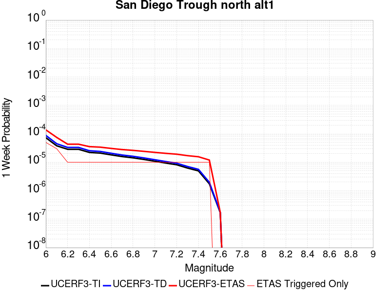 |  |  | 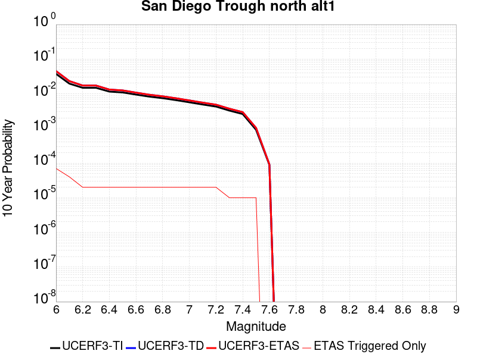 |

| Magnitude | 1 wk TI Prob | 1 wk TD Prob | 1 wk ETAS Prob | 1 wk ETAS/TD Gain | 1 wk ETAS Triggered Only | 1 mo TI Prob | 1 mo TD Prob | 1 mo ETAS Prob | 1 mo ETAS/TD Gain | 1 mo ETAS Triggered Only | 1 yr TI Prob | 1 yr TD Prob | 1 yr ETAS Prob | 1 yr ETAS/TD Gain | 1 yr ETAS Triggered Only | 10 yr TI Prob | 10 yr TD Prob | 10 yr ETAS Prob | 10 yr ETAS/TD Gain | 10 yr ETAS Triggered Only |
|-----|-----|-----|-----|-----|-----|-----|-----|-----|-----|-----|-----|-----|-----|-----|-----|-----|-----|-----|-----|-----|
| 6.0 | 7.329252E-5 | 8.821269E-5 | 1.3820828E-4 | 1.5667619 | 5.0E-5 | 3.14073E-4 | 3.7800326E-4 | 4.479768E-4 | 1.1851135 | 7.0E-5 | 0.0038171355 | 0.0045930487 | 0.004662727 | 1.0151705 | 7.0E-5 | 0.03752231 | 0.045045137 | 0.045111984 | 1.001484 | 7.0E-5 |
| 6.1 | 3.7940346E-5 | 4.4884906E-5 | 7.488356E-5 | 1.6683462 | 3.0E-5 | 1.6259136E-4 | 1.9235026E-4 | 2.3234256E-4 | 1.207914 | 4.0E-5 | 0.0019777524 | 0.002339431 | 0.0023793373 | 1.0170581 | 4.0E-5 | 0.019602431 | 0.023156732 | 0.023195807 | 1.0016874 | 4.0E-5 |
| 6.2 | 2.8645263E-5 | 3.329672E-5 | 4.329639E-5 | 1.3003199 | 1.0E-5 | 1.2275964E-4 | 1.4269259E-4 | 1.6268973E-4 | 1.1401415 | 2.0E-5 | 0.0014935739 | 0.0017359206 | 0.0017558859 | 1.0115013 | 2.0E-5 | 0.0148357535 | 0.017226268 | 0.017245922 | 1.0011411 | 2.0E-5 |
| 6.3 | 2.8645263E-5 | 3.329672E-5 | 4.329639E-5 | 1.3003199 | 1.0E-5 | 1.2275964E-4 | 1.4269259E-4 | 1.6268973E-4 | 1.1401415 | 2.0E-5 | 0.0014935739 | 0.0017359206 | 0.0017558859 | 1.0115013 | 2.0E-5 | 0.0148357535 | 0.017226268 | 0.017245922 | 1.0011411 | 2.0E-5 |
| 6.4 | 2.2204576E-5 | 2.544832E-5 | 3.5448065E-5 | 1.3929433 | 1.0E-5 | 9.5159E-5 | 1.0905972E-4 | 1.2905755E-4 | 1.1833657 | 2.0E-5 | 0.001157945 | 0.0013270028 | 0.0013469763 | 1.0150516 | 2.0E-5 | 0.011519298 | 0.013191959 | 0.013211695 | 1.0014961 | 2.0E-5 |
| 6.5 | 2.1004838E-5 | 2.4024695E-5 | 3.4024455E-5 | 1.4162284 | 1.0E-5 | 9.0017624E-5 | 1.0295897E-4 | 1.2295692E-4 | 1.1942321 | 2.0E-5 | 0.0010954136 | 0.0012528135 | 0.0012727884 | 1.0159441 | 2.0E-5 | 0.010900296 | 0.012458592 | 0.012478342 | 1.0015854 | 2.0E-5 |
| 6.6 | 1.820557E-5 | 2.070479E-5 | 3.070458E-5 | 1.48297 | 1.0E-5 | 7.802154E-5 | 8.8731824E-5 | 1.08730055E-4 | 1.2253783 | 2.0E-5 | 9.4949827E-4 | 0.0010797799 | 0.0010997584 | 1.0185022 | 2.0E-5 | 0.009454516 | 0.010746005 | 0.010765791 | 1.0018412 | 2.0E-5 |
| 6.7 | 1.5884485E-5 | 1.7983646E-5 | 2.7983466E-5 | 1.5560508 | 1.0E-5 | 6.807459E-5 | 7.707051E-5 | 9.7068965E-5 | 1.2594826 | 2.0E-5 | 8.284929E-4 | 9.3793223E-4 | 9.5791346E-4 | 1.0213035 | 2.0E-5 | 0.008254109 | 0.009340104 | 0.009359917 | 1.0021213 | 2.0E-5 |
| 6.8 | 1.4331171E-5 | 1.6201066E-5 | 2.6200903E-5 | 1.6172334 | 1.0E-5 | 6.141786E-5 | 6.94313E-5 | 8.942991E-5 | 1.2880346 | 2.0E-5 | 7.4750587E-4 | 8.450002E-4 | 8.649833E-4 | 1.0236486 | 2.0E-5 | 0.0074499645 | 0.008418139 | 0.008437971 | 1.0023558 | 2.0E-5 |
| 6.9 | 1.2574203E-5 | 1.4205835E-5 | 2.4205692E-5 | 1.7039261 | 1.0E-5 | 5.3888325E-5 | 6.0880735E-5 | 8.0879516E-5 | 1.3284911 | 2.0E-5 | 6.558929E-4 | 7.409723E-4 | 7.609575E-4 | 1.0269716 | 2.0E-5 | 0.0065396037 | 0.007385203 | 0.0074050557 | 1.0026882 | 2.0E-5 |
| 7.0 | 1.0883844E-5 | 1.2289262E-5 | 2.2289138E-5 | 1.8137085 | 1.0E-5 | 4.664421E-5 | 5.2667205E-5 | 7.266615E-5 | 1.379723 | 2.0E-5 | 5.677453E-4 | 6.4103556E-4 | 6.610227E-4 | 1.0311795 | 2.0E-5 | 0.00566297 | 0.006391993 | 0.006411865 | 1.0031089 | 2.0E-5 |
| 7.1 | 9.393088E-6 | 1.060702E-5 | 2.0606914E-5 | 1.9427619 | 1.0E-5 | 4.025547E-5 | 4.545787E-5 | 6.545696E-5 | 1.4399478 | 2.0E-5 | 4.900001E-4 | 5.533098E-4 | 5.732987E-4 | 1.0361261 | 2.0E-5 | 0.0048892107 | 0.005519418 | 0.0055393074 | 1.0036036 | 2.0E-5 |
| 7.2 | 8.190791E-6 | 9.258625E-6 | 1.9258532E-5 | 2.0800638 | 1.0E-5 | 3.510292E-5 | 3.9679224E-5 | 5.967843E-5 | 1.5040221 | 2.0E-5 | 4.2729423E-4 | 4.8298817E-4 | 5.029785E-4 | 1.0413889 | 2.0E-5 | 0.0042647356 | 0.004819465 | 0.004839368 | 1.0041299 | 2.0E-5 |
| 7.3 | 6.268162E-6 | 7.089716E-6 | 1.7089646E-5 | 2.4104838 | 1.0E-5 | 2.6863276E-5 | 3.0384144E-5 | 4.038384E-5 | 1.3291091 | 1.0E-5 | 3.2701128E-4 | 3.6986457E-4 | 3.7986087E-4 | 1.0270269 | 1.0E-5 | 0.003265305 | 0.003692536 | 0.003702499 | 1.0026982 | 1.0E-5 |
| 7.4 | 4.985186E-6 | 5.6426816E-6 | 1.5642625E-5 | 2.772197 | 1.0E-5 | 2.1364907E-5 | 2.4182698E-5 | 3.4182456E-5 | 1.4135088 | 1.0E-5 | 2.600867E-4 | 2.9438498E-4 | 3.0438203E-4 | 1.0339592 | 1.0E-5 | 0.002597825 | 0.0029399914 | 0.002949962 | 1.0033914 | 1.0E-5 |
| 7.5 | 1.7489613E-6 | 1.969678E-6 | 1.1969658E-5 | 6.076962 | 1.0E-5 | 7.495527E-6 | 8.4414505E-6 | 1.8441366E-5 | 2.1846206 | 1.0E-5 | 9.125422E-5 | 1.02770035E-4 | 1.1276901E-4 | 1.0972946 | 1.0E-5 | 9.1216754E-4 | 0.0010272472 | 0.0010372369 | 1.0097247 | 1.0E-5 |
| 7.6 | 1.6988751E-7 | 1.7533823E-7 | 1.7533823E-7 | 1.0 | 0.0 | 7.2808916E-7 | 7.5144936E-7 | 7.5144936E-7 | 1.0 | 0.0 | 8.864449E-6 | 9.14886E-6 | 9.14886E-6 | 1.0 | 0.0 | 8.8640954E-5 | 9.1485024E-5 | 9.1485024E-5 | 1.0 | 0.0 |

## Santa Susana alt 1
*[(top)](#table-of-contents)*

| 1 Week | 1 Month | 1 Year | 10 Year |
|-----|-----|-----|-----|
|  | 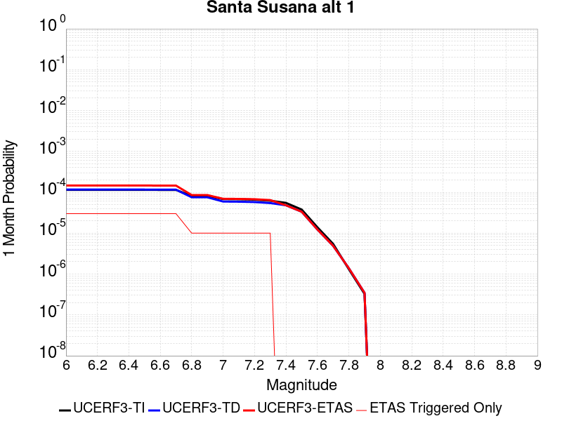 |  |  |

| Magnitude | 1 wk TI Prob | 1 wk TD Prob | 1 wk ETAS Prob | 1 wk ETAS/TD Gain | 1 wk ETAS Triggered Only | 1 mo TI Prob | 1 mo TD Prob | 1 mo ETAS Prob | 1 mo ETAS/TD Gain | 1 mo ETAS Triggered Only | 1 yr TI Prob | 1 yr TD Prob | 1 yr ETAS Prob | 1 yr ETAS/TD Gain | 1 yr ETAS Triggered Only | 10 yr TI Prob | 10 yr TD Prob | 10 yr ETAS Prob | 10 yr ETAS/TD Gain | 10 yr ETAS Triggered Only |
|-----|-----|-----|-----|-----|-----|-----|-----|-----|-----|-----|-----|-----|-----|-----|-----|-----|-----|-----|-----|-----|
| 6.0 | 2.674877E-5 | 2.7198214E-5 | 4.719767E-5 | 1.7353225 | 2.0E-5 | 1.1463255E-4 | 1.16559204E-4 | 1.4655571E-4 | 1.25735 | 3.0E-5 | 0.0013947578 | 0.0014182981 | 0.001478213 | 1.0422442 | 6.0E-5 | 0.013860362 | 0.014104388 | 0.014173401 | 1.004893 | 7.0E-5 |
| 6.1 | 2.674877E-5 | 2.7198214E-5 | 4.719767E-5 | 1.7353225 | 2.0E-5 | 1.1463255E-4 | 1.16559204E-4 | 1.4655571E-4 | 1.25735 | 3.0E-5 | 0.0013947578 | 0.0014182981 | 0.001478213 | 1.0422442 | 6.0E-5 | 0.013860362 | 0.014104388 | 0.014173401 | 1.004893 | 7.0E-5 |
| 6.2 | 2.674877E-5 | 2.7198214E-5 | 4.719767E-5 | 1.7353225 | 2.0E-5 | 1.1463255E-4 | 1.16559204E-4 | 1.4655571E-4 | 1.25735 | 3.0E-5 | 0.0013947578 | 0.0014182981 | 0.001478213 | 1.0422442 | 6.0E-5 | 0.013860362 | 0.014104388 | 0.014173401 | 1.004893 | 7.0E-5 |
| 6.3 | 2.674877E-5 | 2.7198214E-5 | 4.719767E-5 | 1.7353225 | 2.0E-5 | 1.1463255E-4 | 1.16559204E-4 | 1.4655571E-4 | 1.25735 | 3.0E-5 | 0.0013947578 | 0.0014182981 | 0.001478213 | 1.0422442 | 6.0E-5 | 0.013860362 | 0.014104388 | 0.014173401 | 1.004893 | 7.0E-5 |
| 6.4 | 2.674877E-5 | 2.7198214E-5 | 4.719767E-5 | 1.7353225 | 2.0E-5 | 1.1463255E-4 | 1.16559204E-4 | 1.4655571E-4 | 1.25735 | 3.0E-5 | 0.0013947578 | 0.0014182981 | 0.001478213 | 1.0422442 | 6.0E-5 | 0.013860362 | 0.014104388 | 0.014173401 | 1.004893 | 7.0E-5 |
| 6.5 | 2.674877E-5 | 2.7198214E-5 | 4.719767E-5 | 1.7353225 | 2.0E-5 | 1.1463255E-4 | 1.16559204E-4 | 1.4655571E-4 | 1.25735 | 3.0E-5 | 0.0013947578 | 0.0014182981 | 0.001478213 | 1.0422442 | 6.0E-5 | 0.013860362 | 0.014104388 | 0.014173401 | 1.004893 | 7.0E-5 |
| 6.6 | 2.6647976E-5 | 2.7074553E-5 | 4.7074012E-5 | 1.7386811 | 2.0E-5 | 1.14200615E-4 | 1.16029274E-4 | 1.4602579E-4 | 1.2585255 | 3.0E-5 | 0.0013895056 | 0.0014118546 | 0.00147177 | 1.0424373 | 6.0E-5 | 0.013808494 | 0.014040773 | 0.01410979 | 1.0049155 | 7.0E-5 |
| 6.7 | 2.6647976E-5 | 2.7074553E-5 | 4.7074012E-5 | 1.7386811 | 2.0E-5 | 1.14200615E-4 | 1.16029274E-4 | 1.4602579E-4 | 1.2585255 | 3.0E-5 | 0.0013895056 | 0.0014118546 | 0.00147177 | 1.0424373 | 6.0E-5 | 0.013808494 | 0.014040773 | 0.01410979 | 1.0049155 | 7.0E-5 |
| 6.8 | 1.9073179E-5 | 1.7637467E-5 | 2.763729E-5 | 1.5669649 | 1.0E-5 | 8.1739636E-5 | 7.558706E-5 | 8.5586296E-5 | 1.1322877 | 1.0E-5 | 9.947256E-4 | 9.19902E-4 | 9.498744E-4 | 1.0325822 | 3.0E-5 | 0.009902848 | 0.009163361 | 0.009202994 | 1.0043252 | 4.0E-5 |
| 6.9 | 1.9041876E-5 | 1.7619597E-5 | 2.7619422E-5 | 1.5675398 | 1.0E-5 | 8.160549E-5 | 7.551048E-5 | 8.5509724E-5 | 1.132422 | 1.0E-5 | 9.930939E-4 | 9.189705E-4 | 9.489429E-4 | 1.0326152 | 3.0E-5 | 0.0098866755 | 0.009154123 | 0.009193757 | 1.0043296 | 4.0E-5 |
| 7.0 | 1.5917482E-5 | 1.3864049E-5 | 2.386391E-5 | 1.72128 | 1.0E-5 | 6.8215995E-5 | 5.9416023E-5 | 6.941543E-5 | 1.1682948 | 1.0E-5 | 8.302132E-4 | 7.2315463E-4 | 7.53133E-4 | 1.0414549 | 3.0E-5 | 0.008271185 | 0.0072090672 | 0.007248779 | 1.0055085 | 4.0E-5 |
| 7.1 | 1.577788E-5 | 1.3744056E-5 | 2.3743918E-5 | 1.7275773 | 1.0E-5 | 6.761774E-5 | 5.890179E-5 | 6.89012E-5 | 1.1697642 | 1.0E-5 | 8.2293496E-4 | 7.16898E-4 | 7.468765E-4 | 1.041817 | 3.0E-5 | 0.008198941 | 0.0071469042 | 0.0071866186 | 1.0055568 | 4.0E-5 |
| 7.2 | 1.5416446E-5 | 1.34701295E-5 | 2.3469995E-5 | 1.7423733 | 1.0E-5 | 6.606882E-5 | 5.7727877E-5 | 6.77273E-5 | 1.1732166 | 1.0E-5 | 8.0409093E-4 | 7.026149E-4 | 7.325938E-4 | 1.0426676 | 3.0E-5 | 0.008011877 | 0.0070049763 | 0.0070446962 | 1.0056702 | 4.0E-5 |
| 7.3 | 1.4534083E-5 | 1.2718032E-5 | 2.2717904E-5 | 1.7862751 | 1.0E-5 | 6.228744E-5 | 5.4504737E-5 | 6.450419E-5 | 1.1834604 | 1.0E-5 | 7.580857E-4 | 6.633976E-4 | 6.933777E-4 | 1.0451918 | 3.0E-5 | 0.007555048 | 0.0066151717 | 0.006654907 | 1.0060067 | 4.0E-5 |
| 7.4 | 1.2858995E-5 | 1.1229814E-5 | 1.1229814E-5 | 1.0 | 0.0 | 5.5108816E-5 | 4.812691E-5 | 4.812691E-5 | 1.0 | 0.0 | 6.7074323E-4 | 5.8579154E-4 | 6.057798E-4 | 1.0341219 | 2.0E-5 | 0.0066872234 | 0.0058433902 | 0.005873215 | 1.0051041 | 3.0E-5 |
| 7.5 | 8.827668E-6 | 7.805494E-6 | 7.805494E-6 | 1.0 | 0.0 | 3.7832317E-5 | 3.3451703E-5 | 3.3451703E-5 | 1.0 | 0.0 | 4.605111E-4 | 4.072008E-4 | 4.2719266E-4 | 1.0490959 | 2.0E-5 | 0.0045955796 | 0.0040648985 | 0.004084817 | 1.0049002 | 2.0E-5 |
| 7.6 | 3.2533426E-6 | 2.8720106E-6 | 2.8720106E-6 | 1.0 | 0.0 | 1.3942822E-5 | 1.230856E-5 | 1.230856E-5 | 1.0 | 0.0 | 1.6974064E-4 | 1.4984679E-4 | 1.598453E-4 | 1.0667248 | 1.0E-5 | 0.0016961104 | 0.0014974943 | 0.0015074793 | 1.0066679 | 1.0E-5 |
| 7.7 | 1.2751709E-6 | 1.1491339E-6 | 1.1491339E-6 | 1.0 | 0.0 | 5.4650063E-6 | 4.9248506E-6 | 4.9248506E-6 | 1.0 | 0.0 | 6.653442E-5 | 5.99585E-5 | 5.99585E-5 | 1.0 | 0.0 | 6.6514505E-4 | 5.9943215E-4 | 5.9943215E-4 | 1.0 | 0.0 |
| 7.8 | 3.067544E-7 | 3.240052E-7 | 3.240052E-7 | 1.0 | 0.0 | 1.3146611E-6 | 1.3885931E-6 | 1.3885931E-6 | 1.0 | 0.0 | 1.600588E-5 | 1.6906E-5 | 1.6906E-5 | 1.0 | 0.0 | 1.6004729E-4 | 1.6904817E-4 | 1.6904817E-4 | 1.0 | 0.0 |
| 7.9 | 7.622999E-8 | 8.0879715E-8 | 8.0879715E-8 | 1.0 | 0.0 | 3.2669993E-7 | 3.4662733E-7 | 3.4662733E-7 | 1.0 | 0.0 | 3.977564E-6 | 4.220182E-6 | 4.220182E-6 | 1.0 | 0.0 | 3.977493E-5 | 4.2201224E-5 | 4.2201224E-5 | 1.0 | 0.0 |

## San Jacinto (Clark) rev
*[(top)](#table-of-contents)*

| 1 Week | 1 Month | 1 Year | 10 Year |
|-----|-----|-----|-----|
| 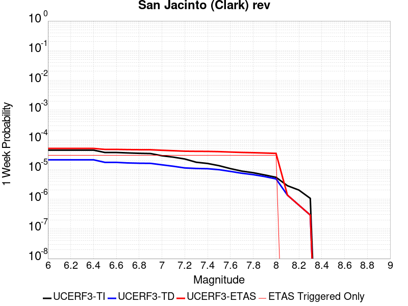 |  | 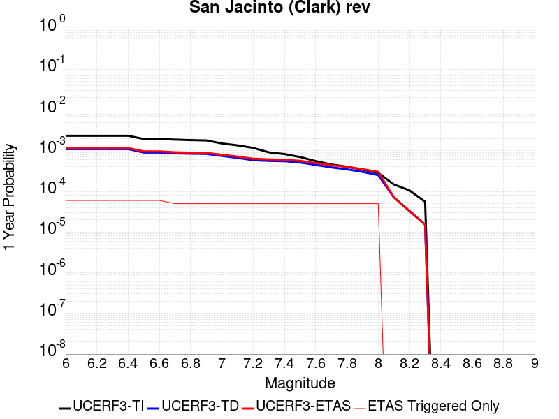 | 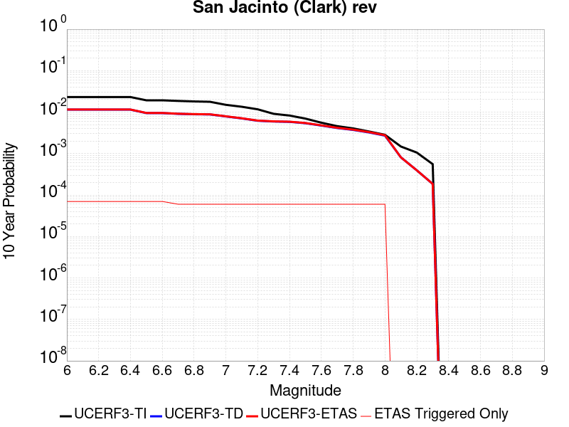 |

| Magnitude | 1 wk TI Prob | 1 wk TD Prob | 1 wk ETAS Prob | 1 wk ETAS/TD Gain | 1 wk ETAS Triggered Only | 1 mo TI Prob | 1 mo TD Prob | 1 mo ETAS Prob | 1 mo ETAS/TD Gain | 1 mo ETAS Triggered Only | 1 yr TI Prob | 1 yr TD Prob | 1 yr ETAS Prob | 1 yr ETAS/TD Gain | 1 yr ETAS Triggered Only | 10 yr TI Prob | 10 yr TD Prob | 10 yr ETAS Prob | 10 yr ETAS/TD Gain | 10 yr ETAS Triggered Only |
|-----|-----|-----|-----|-----|-----|-----|-----|-----|-----|-----|-----|-----|-----|-----|-----|-----|-----|-----|-----|-----|
| 6.0 | 4.482615E-5 | 2.1153059E-5 | 5.1152423E-5 | 2.4182045 | 3.0E-5 | 1.9209793E-4 | 9.065287E-5 | 1.3064925E-4 | 1.4412036 | 4.0E-5 | 0.0023362834 | 0.0011031491 | 0.0011630829 | 1.0543298 | 6.0E-5 | 0.02311874 | 0.011485709 | 0.011554905 | 1.0060245 | 7.0E-5 |
| 6.1 | 4.482615E-5 | 2.1153059E-5 | 5.1152423E-5 | 2.4182045 | 3.0E-5 | 1.9209793E-4 | 9.065287E-5 | 1.3064925E-4 | 1.4412036 | 4.0E-5 | 0.0023362834 | 0.0011031491 | 0.0011630829 | 1.0543298 | 6.0E-5 | 0.02311874 | 0.011485709 | 0.011554905 | 1.0060245 | 7.0E-5 |
| 6.2 | 4.482615E-5 | 2.1153059E-5 | 5.1152423E-5 | 2.4182045 | 3.0E-5 | 1.9209793E-4 | 9.065287E-5 | 1.3064925E-4 | 1.4412036 | 4.0E-5 | 0.0023362834 | 0.0011031491 | 0.0011630829 | 1.0543298 | 6.0E-5 | 0.02311874 | 0.011485709 | 0.011554905 | 1.0060245 | 7.0E-5 |
| 6.3 | 4.482615E-5 | 2.1153059E-5 | 5.1152423E-5 | 2.4182045 | 3.0E-5 | 1.9209793E-4 | 9.065287E-5 | 1.3064925E-4 | 1.4412036 | 4.0E-5 | 0.0023362834 | 0.0011031491 | 0.0011630829 | 1.0543298 | 6.0E-5 | 0.02311874 | 0.011485709 | 0.011554905 | 1.0060245 | 7.0E-5 |
| 6.4 | 4.482615E-5 | 2.1153059E-5 | 5.1152423E-5 | 2.4182045 | 3.0E-5 | 1.9209793E-4 | 9.065287E-5 | 1.3064925E-4 | 1.4412036 | 4.0E-5 | 0.0023362834 | 0.0011031491 | 0.0011630829 | 1.0543298 | 6.0E-5 | 0.02311874 | 0.011485709 | 0.011554905 | 1.0060245 | 7.0E-5 |
| 6.5 | 3.7294863E-5 | 1.7354667E-5 | 4.7354144E-5 | 2.7286117 | 3.0E-5 | 1.5982533E-4 | 7.437504E-5 | 1.1437207E-4 | 1.5377748 | 4.0E-5 | 0.0019441366 | 9.051445E-4 | 9.650902E-4 | 1.0662278 | 6.0E-5 | 0.01927216 | 0.009485902 | 0.009555238 | 1.0073093 | 7.0E-5 |
| 6.6 | 3.7294863E-5 | 1.7354667E-5 | 4.7354144E-5 | 2.7286117 | 3.0E-5 | 1.5982533E-4 | 7.437504E-5 | 1.1437207E-4 | 1.5377748 | 4.0E-5 | 0.0019441366 | 9.051445E-4 | 9.650902E-4 | 1.0662278 | 6.0E-5 | 0.01927216 | 0.009485902 | 0.009555238 | 1.0073093 | 7.0E-5 |
| 6.7 | 3.6039248E-5 | 1.6602684E-5 | 4.6602185E-5 | 2.8069067 | 3.0E-5 | 1.5444479E-4 | 7.115244E-5 | 1.11149595E-4 | 1.5621333 | 4.0E-5 | 0.0018787434 | 8.659408E-4 | 9.158975E-4 | 1.0576906 | 5.0E-5 | 0.01862939 | 0.009088189 | 0.009147644 | 1.006542 | 6.0E-5 |
| 6.8 | 3.5031844E-5 | 1.6231123E-5 | 4.6230634E-5 | 2.848271 | 3.0E-5 | 1.5012783E-4 | 6.956012E-5 | 1.0955734E-4 | 1.5750021 | 4.0E-5 | 0.0018262739 | 8.4656954E-4 | 8.965272E-4 | 1.0590119 | 5.0E-5 | 0.01811338 | 0.008888788 | 0.008948254 | 1.00669 | 6.0E-5 |
| 6.9 | 3.435112E-5 | 1.6061658E-5 | 4.6061177E-5 | 2.867772 | 3.0E-5 | 1.4721078E-4 | 6.8833884E-5 | 1.0883113E-4 | 1.5810691 | 4.0E-5 | 0.0017908178 | 8.377344E-4 | 8.876925E-4 | 1.0596348 | 5.0E-5 | 0.017764548 | 0.008796512 | 0.008855984 | 1.0067608 | 6.0E-5 |
| 7.0 | 2.8959772E-5 | 1.43355255E-5 | 4.4335095E-5 | 3.0926733 | 3.0E-5 | 1.241074E-4 | 6.1436534E-5 | 1.01434074E-4 | 1.6510384 | 4.0E-5 | 0.0015099603 | 7.477359E-4 | 7.976985E-4 | 1.0668185 | 5.0E-5 | 0.014997416 | 0.007868331 | 0.007927859 | 1.0075655 | 6.0E-5 |
| 7.1 | 2.6002877E-5 | 1.2827699E-5 | 4.2827312E-5 | 3.338659 | 3.0E-5 | 1.11436144E-4 | 5.4974706E-5 | 9.497251E-5 | 1.7275673 | 4.0E-5 | 0.0013558907 | 6.6911365E-4 | 7.1908016E-4 | 1.0746757 | 5.0E-5 | 0.013476475 | 0.0070483433 | 0.0071079205 | 1.0084527 | 6.0E-5 |
| 7.2 | 2.2544838E-5 | 1.1260331E-5 | 4.1259995E-5 | 3.66419 | 3.0E-5 | 9.661716E-5 | 4.825768E-5 | 8.825575E-5 | 1.8288436 | 4.0E-5 | 0.001175679 | 5.873803E-4 | 6.373509E-4 | 1.0850737 | 5.0E-5 | 0.011694785 | 0.00619256 | 0.0062521882 | 1.009629 | 6.0E-5 |
| 7.3 | 1.75334E-5 | 1.0810585E-5 | 4.081026E-5 | 3.775028 | 3.0E-5 | 7.514098E-5 | 4.6330264E-5 | 8.632841E-5 | 1.8633265 | 4.0E-5 | 9.144575E-4 | 5.6392635E-4 | 6.1389816E-4 | 1.0886141 | 5.0E-5 | 0.009107036 | 0.0059332196 | 0.0059928633 | 1.0100526 | 6.0E-5 |
| 7.4 | 1.5924552E-5 | 1.0610475E-5 | 4.0610157E-5 | 3.8273647 | 3.0E-5 | 6.82463E-5 | 4.547268E-5 | 8.547086E-5 | 1.8796091 | 4.0E-5 | 8.305819E-4 | 5.534906E-4 | 6.034629E-4 | 1.0902858 | 5.0E-5 | 0.008274844 | 0.0058205863 | 0.005880237 | 1.0102482 | 6.0E-5 |
| 7.5 | 1.3428931E-5 | 9.851045E-6 | 3.985075E-5 | 4.045332 | 3.0E-5 | 5.7551293E-5 | 4.221809E-5 | 8.22164E-5 | 1.9474212 | 4.0E-5 | 7.004617E-4 | 5.1388505E-4 | 5.638594E-4 | 1.0972481 | 5.0E-5 | 0.006982579 | 0.005406209 | 0.005465884 | 1.0110383 | 6.0E-5 |
| 7.6 | 1.0688787E-5 | 8.614091E-6 | 3.861383E-5 | 4.482636 | 3.0E-5 | 4.5808283E-5 | 3.6917012E-5 | 7.691553E-5 | 2.0834713 | 4.0E-5 | 5.5757316E-4 | 4.4937237E-4 | 4.993499E-4 | 1.1112163 | 5.0E-5 | 0.005561762 | 0.0047413614 | 0.004801077 | 1.0125946 | 6.0E-5 |
| 7.7 | 8.81236E-6 | 7.4673385E-6 | 3.7467114E-5 | 5.0174656 | 3.0E-5 | 3.776671E-5 | 3.200249E-5 | 7.200121E-5 | 2.249863 | 4.0E-5 | 4.597127E-4 | 3.8956082E-4 | 4.3954136E-4 | 1.1282997 | 5.0E-5 | 0.0045876284 | 0.0041344194 | 0.004194171 | 1.0144523 | 6.0E-5 |
| 7.8 | 7.780431E-6 | 6.695928E-6 | 3.669573E-5 | 5.480305 | 3.0E-5 | 3.3344273E-5 | 2.8696519E-5 | 6.869537E-5 | 2.3938572 | 4.0E-5 | 4.0589093E-4 | 3.4932428E-4 | 3.9930682E-4 | 1.1430835 | 5.0E-5 | 0.0040515037 | 0.0037226272 | 0.003782404 | 1.0160576 | 6.0E-5 |
| 7.9 | 6.5437994E-6 | 5.7797783E-6 | 3.5779605E-5 | 6.1904807 | 3.0E-5 | 2.8044553E-5 | 2.4770245E-5 | 6.476925E-5 | 2.6148007 | 4.0E-5 | 3.4138895E-4 | 3.0153614E-4 | 3.5152107E-4 | 1.1657676 | 5.0E-5 | 0.0034086495 | 0.0032343294 | 0.0032941352 | 1.018491 | 6.0E-5 |
| 8.0 | 5.4488164E-6 | 4.812793E-6 | 3.481265E-5 | 7.2333565 | 3.0E-5 | 2.3351862E-5 | 2.0626094E-5 | 6.062527E-5 | 2.9392512 | 4.0E-5 | 2.8427184E-4 | 2.510939E-4 | 3.0108134E-4 | 1.1990787 | 5.0E-5 | 0.0028390845 | 0.0027107038 | 0.002770541 | 1.0220745 | 6.0E-5 |
| 8.1 | 2.8397242E-6 | 1.3665673E-6 | 1.3665673E-6 | 1.0 | 0.0 | 1.217019E-5 | 5.856704E-6 | 5.856704E-6 | 1.0 | 0.0 | 1.4816198E-4 | 7.1303046E-5 | 7.1303046E-5 | 1.0 | 0.0 | 0.0014806325 | 8.113543E-4 | 8.113543E-4 | 1.0 | 0.0 |
| 8.2 | 2.030244E-6 | 6.3151083E-7 | 6.3151083E-7 | 1.0 | 0.0 | 8.701017E-6 | 2.7064723E-6 | 2.7064723E-6 | 1.0 | 0.0 | 1.05929736E-4 | 3.2950808E-5 | 3.2950808E-5 | 1.0 | 0.0 | 0.0010587925 | 3.9470522E-4 | 3.9470522E-4 | 1.0 | 0.0 |
| 8.3 | 1.0659804E-6 | 2.9230563E-7 | 2.9230563E-7 | 1.0 | 0.0 | 4.568479E-6 | 1.2527379E-6 | 1.2527379E-6 | 1.0 | 0.0 | 5.5619817E-5 | 1.5251981E-5 | 1.5251981E-5 | 1.0 | 0.0 | 5.5605895E-4 | 1.8556409E-4 | 1.8556409E-4 | 1.0 | 0.0 |

## Oak Ridge (Onshore)
*[(top)](#table-of-contents)*

| 1 Week | 1 Month | 1 Year | 10 Year |
|-----|-----|-----|-----|
| 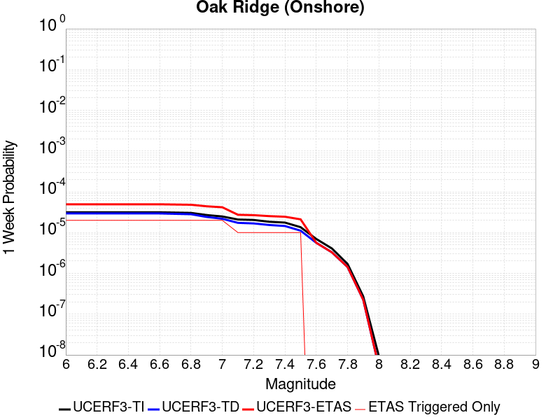 | 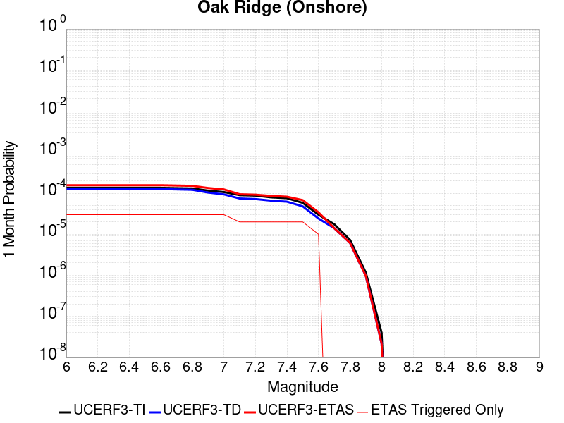 |  |  |

| Magnitude | 1 wk TI Prob | 1 wk TD Prob | 1 wk ETAS Prob | 1 wk ETAS/TD Gain | 1 wk ETAS Triggered Only | 1 mo TI Prob | 1 mo TD Prob | 1 mo ETAS Prob | 1 mo ETAS/TD Gain | 1 mo ETAS Triggered Only | 1 yr TI Prob | 1 yr TD Prob | 1 yr ETAS Prob | 1 yr ETAS/TD Gain | 1 yr ETAS Triggered Only | 10 yr TI Prob | 10 yr TD Prob | 10 yr ETAS Prob | 10 yr ETAS/TD Gain | 10 yr ETAS Triggered Only |
|-----|-----|-----|-----|-----|-----|-----|-----|-----|-----|-----|-----|-----|-----|-----|-----|-----|-----|-----|-----|-----|
| 6.0 | 3.155064E-5 | 2.9526076E-5 | 4.9525486E-5 | 1.6773473 | 2.0E-5 | 1.3521002E-4 | 1.265344E-4 | 1.5653062E-4 | 1.2370597 | 3.0E-5 | 0.001644939 | 0.0015395058 | 0.0015894289 | 1.0324279 | 5.0E-5 | 0.01632816 | 0.015293054 | 0.015352137 | 1.0038633 | 6.0E-5 |
| 6.1 | 3.155064E-5 | 2.9526076E-5 | 4.9525486E-5 | 1.6773473 | 2.0E-5 | 1.3521002E-4 | 1.265344E-4 | 1.5653062E-4 | 1.2370597 | 3.0E-5 | 0.001644939 | 0.0015395058 | 0.0015894289 | 1.0324279 | 5.0E-5 | 0.01632816 | 0.015293054 | 0.015352137 | 1.0038633 | 6.0E-5 |
| 6.2 | 3.155064E-5 | 2.9526076E-5 | 4.9525486E-5 | 1.6773473 | 2.0E-5 | 1.3521002E-4 | 1.265344E-4 | 1.5653062E-4 | 1.2370597 | 3.0E-5 | 0.001644939 | 0.0015395058 | 0.0015894289 | 1.0324279 | 5.0E-5 | 0.01632816 | 0.015293054 | 0.015352137 | 1.0038633 | 6.0E-5 |
| 6.3 | 3.155064E-5 | 2.9526076E-5 | 4.9525486E-5 | 1.6773473 | 2.0E-5 | 1.3521002E-4 | 1.265344E-4 | 1.5653062E-4 | 1.2370597 | 3.0E-5 | 0.001644939 | 0.0015395058 | 0.0015894289 | 1.0324279 | 5.0E-5 | 0.01632816 | 0.015293054 | 0.015352137 | 1.0038633 | 6.0E-5 |
| 6.4 | 3.155064E-5 | 2.9526076E-5 | 4.9525486E-5 | 1.6773473 | 2.0E-5 | 1.3521002E-4 | 1.265344E-4 | 1.5653062E-4 | 1.2370597 | 3.0E-5 | 0.001644939 | 0.0015395058 | 0.0015894289 | 1.0324279 | 5.0E-5 | 0.01632816 | 0.015293054 | 0.015352137 | 1.0038633 | 6.0E-5 |
| 6.5 | 3.155064E-5 | 2.9526076E-5 | 4.9525486E-5 | 1.6773473 | 2.0E-5 | 1.3521002E-4 | 1.265344E-4 | 1.5653062E-4 | 1.2370597 | 3.0E-5 | 0.001644939 | 0.0015395058 | 0.0015894289 | 1.0324279 | 5.0E-5 | 0.01632816 | 0.015293054 | 0.015352137 | 1.0038633 | 6.0E-5 |
| 6.6 | 3.155064E-5 | 2.9526076E-5 | 4.9525486E-5 | 1.6773473 | 2.0E-5 | 1.3521002E-4 | 1.265344E-4 | 1.5653062E-4 | 1.2370597 | 3.0E-5 | 0.001644939 | 0.0015395058 | 0.0015894289 | 1.0324279 | 5.0E-5 | 0.01632816 | 0.015293054 | 0.015352137 | 1.0038633 | 6.0E-5 |
| 6.7 | 3.098897E-5 | 2.8864279E-5 | 4.88637E-5 | 1.692878 | 2.0E-5 | 1.328031E-4 | 1.236984E-4 | 1.5369468E-4 | 1.2424954 | 3.0E-5 | 0.0016156785 | 0.0015050253 | 0.00155495 | 1.033172 | 5.0E-5 | 0.016039822 | 0.014952909 | 0.015012012 | 1.0039526 | 6.0E-5 |
| 6.8 | 3.0449872E-5 | 2.8239476E-5 | 4.823891E-5 | 1.7082084 | 2.0E-5 | 1.3049292E-4 | 1.2102092E-4 | 1.5101729E-4 | 1.247861 | 3.0E-5 | 0.0015875935 | 0.001472471 | 0.0015223974 | 1.0339066 | 5.0E-5 | 0.015762992 | 0.014631658 | 0.01469078 | 1.0040407 | 6.0E-5 |
| 6.9 | 2.697928E-5 | 2.4219877E-5 | 4.4219392E-5 | 1.825748 | 2.0E-5 | 1.15620365E-4 | 1.03795464E-4 | 1.3379235E-4 | 1.2889999 | 3.0E-5 | 0.0014067689 | 0.0012629988 | 0.0013129356 | 1.0395383 | 5.0E-5 | 0.0139789665 | 0.012561066 | 0.012620312 | 1.0047166 | 6.0E-5 |
| 7.0 | 2.4893961E-5 | 2.1862146E-5 | 4.186171E-5 | 1.9148033 | 2.0E-5 | 1.0668404E-4 | 9.369165E-5 | 1.2368883E-4 | 1.3201693 | 3.0E-5 | 0.0012981043 | 0.0011401166 | 0.0011900596 | 1.0438051 | 5.0E-5 | 0.012905477 | 0.011345102 | 0.011404421 | 1.0052286 | 6.0E-5 |
| 7.1 | 2.0945363E-5 | 1.7354592E-5 | 2.735442E-5 | 1.5762063 | 1.0E-5 | 8.976275E-5 | 7.437473E-5 | 9.4373245E-5 | 1.2688885 | 2.0E-5 | 0.0010923136 | 9.0514094E-4 | 9.451047E-4 | 1.044152 | 4.0E-5 | 0.0108696 | 0.009015621 | 0.00906517 | 1.0054959 | 5.0E-5 |
| 7.2 | 2.0439404E-5 | 1.680953E-5 | 2.680936E-5 | 1.5948906 | 1.0E-5 | 8.7594504E-5 | 7.203888E-5 | 9.203744E-5 | 1.2776079 | 2.0E-5 | 0.0010659413 | 8.767251E-4 | 9.1669004E-4 | 1.0455843 | 4.0E-5 | 0.010608427 | 0.008733723 | 0.008783286 | 1.005675 | 5.0E-5 |
| 7.3 | 1.8463334E-5 | 1.5381947E-5 | 2.5381793E-5 | 1.6501027 | 1.0E-5 | 7.912617E-5 | 6.592098E-5 | 8.5919666E-5 | 1.3033736 | 2.0E-5 | 9.6293533E-4 | 8.0229685E-4 | 8.4226474E-4 | 1.0498168 | 4.0E-5 | 0.009587734 | 0.0079950085 | 0.008044609 | 1.0062039 | 5.0E-5 |
| 7.4 | 1.763139E-5 | 1.4516977E-5 | 2.4516832E-5 | 1.6888386 | 1.0E-5 | 7.556091E-5 | 6.221415E-5 | 8.221291E-5 | 1.3214502 | 2.0E-5 | 9.1956573E-4 | 7.57198E-4 | 7.9716777E-4 | 1.0527864 | 4.0E-5 | 0.009157699 | 0.007547126 | 0.0075967484 | 1.006575 | 5.0E-5 |
| 7.5 | 1.3594944E-5 | 1.1163363E-5 | 2.116325E-5 | 1.8957775 | 1.0E-5 | 5.8262744E-5 | 4.7842117E-5 | 6.784116E-5 | 1.4180217 | 2.0E-5 | 7.0911803E-4 | 5.8232463E-4 | 6.2230136E-4 | 1.0686502 | 4.0E-5 | 0.007068595 | 0.005808362 | 0.0058481293 | 1.0068467 | 4.0E-5 |
| 7.6 | 6.9889534E-6 | 5.6367194E-6 | 5.6367194E-6 | 1.0 | 0.0 | 2.9952313E-5 | 2.4157147E-5 | 3.4156907E-5 | 1.4139462 | 1.0E-5 | 3.646084E-4 | 2.94074E-4 | 3.140681E-4 | 1.0679901 | 2.0E-5 | 0.0036401073 | 0.0029368924 | 0.0029568337 | 1.0067899 | 2.0E-5 |
| 7.7 | 4.0824193E-6 | 3.2832731E-6 | 3.2832731E-6 | 1.0 | 0.0 | 1.7495966E-5 | 1.4071096E-5 | 1.4071096E-5 | 1.0 | 0.0 | 2.1299256E-4 | 1.7130225E-4 | 1.7130225E-4 | 1.0 | 0.0 | 0.0021278851 | 0.0017117155 | 0.0017117155 | 1.0 | 0.0 |
| 7.8 | 1.7023609E-6 | 1.43706E-6 | 1.43706E-6 | 1.0 | 0.0 | 7.295812E-6 | 6.158814E-6 | 6.158814E-6 | 1.0 | 0.0 | 8.882289E-5 | 7.4981006E-5 | 7.4981006E-5 | 1.0 | 0.0 | 8.8787393E-4 | 7.4955984E-4 | 7.4955984E-4 | 1.0 | 0.0 |
| 7.9 | 2.721225E-7 | 2.261692E-7 | 2.261692E-7 | 1.0 | 0.0 | 1.1662388E-6 | 9.692963E-7 | 9.692963E-7 | 1.0 | 0.0 | 1.4198865E-5 | 1.1801121E-5 | 1.1801121E-5 | 1.0 | 0.0 | 1.4197957E-4 | 1.1800523E-4 | 1.1800523E-4 | 1.0 | 0.0 |
| 8.0 | 9.364255E-9 | 5.1204916E-9 | 5.1204916E-9 | 1.0 | 0.0 | 4.0132523E-8 | 2.1944963E-8 | 2.1944963E-8 | 1.0 | 0.0 | 4.8861335E-7 | 2.671799E-7 | 2.671799E-7 | 1.0 | 0.0 | 4.8861225E-6 | 2.6717962E-6 | 2.6717962E-6 | 1.0 | 0.0 |

## Santa Cruz Catalina Ridge alt1
*[(top)](#table-of-contents)*

| 1 Week | 1 Month | 1 Year | 10 Year |
|-----|-----|-----|-----|
|  |  |  | 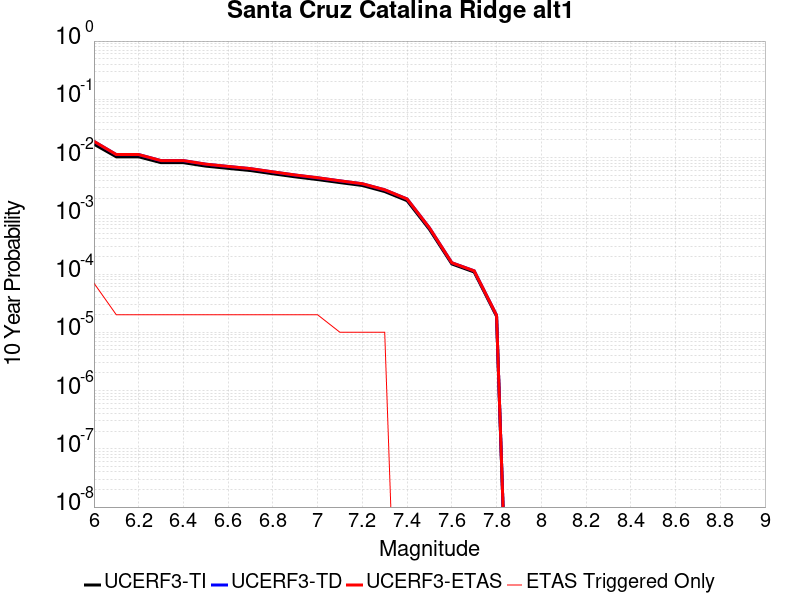 |

| Magnitude | 1 wk TI Prob | 1 wk TD Prob | 1 wk ETAS Prob | 1 wk ETAS/TD Gain | 1 wk ETAS Triggered Only | 1 mo TI Prob | 1 mo TD Prob | 1 mo ETAS Prob | 1 mo ETAS/TD Gain | 1 mo ETAS Triggered Only | 1 yr TI Prob | 1 yr TD Prob | 1 yr ETAS Prob | 1 yr ETAS/TD Gain | 1 yr ETAS Triggered Only | 10 yr TI Prob | 10 yr TD Prob | 10 yr ETAS Prob | 10 yr ETAS/TD Gain | 10 yr ETAS Triggered Only |
|-----|-----|-----|-----|-----|-----|-----|-----|-----|-----|-----|-----|-----|-----|-----|-----|-----|-----|-----|-----|-----|
| 6.0 | 3.2833184E-5 | 3.6558402E-5 | 8.6556574E-5 | 2.3676248 | 5.0E-5 | 1.4070606E-4 | 1.5667039E-4 | 2.0666256E-4 | 1.3190913 | 5.0E-5 | 0.00171175 | 0.0019059594 | 0.001955864 | 1.0261835 | 5.0E-5 | 0.016986247 | 0.018913032 | 0.018981708 | 1.0036311 | 7.0E-5 |
| 6.1 | 1.9835548E-5 | 2.1659505E-5 | 3.165929E-5 | 1.461681 | 1.0E-5 | 8.500672E-5 | 9.282326E-5 | 1.02822334E-4 | 1.1077216 | 1.0E-5 | 0.0010344655 | 0.0011295575 | 0.0011395462 | 1.0088431 | 1.0E-5 | 0.010296632 | 0.011240296 | 0.011260071 | 1.0017593 | 2.0E-5 |
| 6.2 | 1.9835548E-5 | 2.1659505E-5 | 3.165929E-5 | 1.461681 | 1.0E-5 | 8.500672E-5 | 9.282326E-5 | 1.02822334E-4 | 1.1077216 | 1.0E-5 | 0.0010344655 | 0.0011295575 | 0.0011395462 | 1.0088431 | 1.0E-5 | 0.010296632 | 0.011240296 | 0.011260071 | 1.0017593 | 2.0E-5 |
| 6.3 | 1.5728183E-5 | 1.703395E-5 | 2.7033779E-5 | 1.587053 | 1.0E-5 | 6.7404755E-5 | 7.300063E-5 | 8.29999E-5 | 1.1369752 | 1.0E-5 | 8.2034385E-4 | 8.884264E-4 | 8.984175E-4 | 1.0112458 | 1.0E-5 | 0.008173222 | 0.008849427 | 0.00886925 | 1.0022401 | 2.0E-5 |
| 6.4 | 1.5728183E-5 | 1.703395E-5 | 2.7033779E-5 | 1.587053 | 1.0E-5 | 6.7404755E-5 | 7.300063E-5 | 8.29999E-5 | 1.1369752 | 1.0E-5 | 8.2034385E-4 | 8.884264E-4 | 8.984175E-4 | 1.0112458 | 1.0E-5 | 0.008173222 | 0.008849427 | 0.00886925 | 1.0022401 | 2.0E-5 |
| 6.5 | 1.3707734E-5 | 1.4794522E-5 | 2.4794374E-5 | 1.6759158 | 1.0E-5 | 5.8746107E-5 | 6.3403575E-5 | 7.340294E-5 | 1.1577098 | 1.0E-5 | 7.1499916E-4 | 7.716686E-4 | 7.816609E-4 | 1.012949 | 1.0E-5 | 0.0071270303 | 0.0076902895 | 0.007710136 | 1.0025806 | 2.0E-5 |
| 6.6 | 1.2539813E-5 | 1.3510219E-5 | 2.3510085E-5 | 1.7401705 | 1.0E-5 | 5.3740947E-5 | 5.789967E-5 | 6.789909E-5 | 1.1727026 | 1.0E-5 | 6.540996E-4 | 7.0470315E-4 | 7.146961E-4 | 1.0141804 | 1.0E-5 | 0.0065217763 | 0.0070249885 | 0.007044848 | 1.0028269 | 2.0E-5 |
| 6.7 | 1.1504083E-5 | 1.2377375E-5 | 2.2377251E-5 | 1.8079158 | 1.0E-5 | 4.930228E-5 | 5.3044827E-5 | 6.3044296E-5 | 1.1885098 | 1.0E-5 | 6.0008996E-4 | 6.456314E-4 | 6.5562496E-4 | 1.0154787 | 1.0E-5 | 0.005984721 | 0.006437786 | 0.006457657 | 1.0030867 | 2.0E-5 |
| 6.8 | 1.012739E-5 | 1.0877071E-5 | 2.0876963E-5 | 1.9193552 | 1.0E-5 | 4.340238E-5 | 4.6615194E-5 | 5.661473E-5 | 1.2145123 | 1.0E-5 | 5.282958E-4 | 5.673937E-4 | 5.7738804E-4 | 1.0176145 | 1.0E-5 | 0.0052704164 | 0.0056596193 | 0.0056795063 | 1.0035138 | 2.0E-5 |
| 6.9 | 8.9607865E-6 | 9.609117E-6 | 1.960902E-5 | 2.0406682 | 1.0E-5 | 3.8402806E-5 | 4.1181287E-5 | 5.1180876E-5 | 1.2428187 | 1.0E-5 | 4.6745385E-4 | 5.012679E-4 | 5.1126286E-4 | 1.0199394 | 1.0E-5 | 0.0046647177 | 0.005001492 | 0.005021392 | 1.0039788 | 2.0E-5 |
| 7.0 | 8.046829E-6 | 8.619746E-6 | 1.861966E-5 | 2.160117 | 1.0E-5 | 3.4485955E-5 | 3.694125E-5 | 4.694088E-5 | 1.2706901 | 1.0E-5 | 4.1978562E-4 | 4.496677E-4 | 4.5966322E-4 | 1.0222286 | 1.0E-5 | 0.004189935 | 0.0044876686 | 0.004507579 | 1.0044366 | 2.0E-5 |
| 7.1 | 7.136131E-6 | 7.637656E-6 | 7.637656E-6 | 1.0 | 0.0 | 3.0583058E-5 | 3.2732405E-5 | 3.2732405E-5 | 1.0 | 0.0 | 3.7228514E-4 | 3.9844486E-4 | 3.9844486E-4 | 1.0 | 0.0 | 0.0037166206 | 0.003977381 | 0.0039873417 | 1.0025042 | 1.0E-5 |
| 7.2 | 6.362014E-6 | 6.8049585E-6 | 6.8049585E-6 | 1.0 | 0.0 | 2.726549E-5 | 2.9163786E-5 | 2.9163786E-5 | 1.0 | 0.0 | 3.3190678E-4 | 3.550119E-4 | 3.550119E-4 | 1.0 | 0.0 | 0.0033141149 | 0.003544516 | 0.0035544806 | 1.0028113 | 1.0E-5 |
| 7.3 | 5.004101E-6 | 5.351715E-6 | 5.351715E-6 | 1.0 | 0.0 | 2.1445969E-5 | 2.2935723E-5 | 2.2935723E-5 | 1.0 | 0.0 | 2.6107338E-4 | 2.792072E-4 | 2.792072E-4 | 1.0 | 0.0 | 0.002607669 | 0.0027886187 | 0.0027985908 | 1.003576 | 1.0E-5 |
| 7.4 | 3.4901443E-6 | 3.7320526E-6 | 3.7320526E-6 | 1.0 | 0.0 | 1.4957676E-5 | 1.5994416E-5 | 1.5994416E-5 | 1.0 | 0.0 | 1.8209449E-4 | 1.9471499E-4 | 1.9471499E-4 | 1.0 | 0.0 | 0.0018194534 | 0.0019454823 | 0.0019454823 | 1.0 | 0.0 |
| 7.5 | 1.1215045E-6 | 1.189387E-6 | 1.189387E-6 | 1.0 | 0.0 | 4.806439E-6 | 5.097363E-6 | 5.097363E-6 | 1.0 | 0.0 | 5.851682E-5 | 6.205866E-5 | 6.205866E-5 | 1.0 | 0.0 | 5.850142E-4 | 6.2041637E-4 | 6.2041637E-4 | 1.0 | 0.0 |
| 7.6 | 2.8599047E-7 | 2.9951994E-7 | 2.9951994E-7 | 1.0 | 0.0 | 1.2256729E-6 | 1.2836562E-6 | 1.2836562E-6 | 1.0 | 0.0 | 1.4922465E-5 | 1.5628404E-5 | 1.5628404E-5 | 1.0 | 0.0 | 1.4921463E-4 | 1.5627318E-4 | 1.5627318E-4 | 1.0 | 0.0 |
| 7.7 | 2.0781519E-7 | 2.1744323E-7 | 2.1744323E-7 | 1.0 | 0.0 | 8.906362E-7 | 9.3189925E-7 | 9.3189925E-7 | 1.0 | 0.0 | 1.08434415E-5 | 1.13458145E-5 | 1.13458145E-5 | 1.0 | 0.0 | 1.0842913E-4 | 1.1345245E-4 | 1.1345245E-4 | 1.0 | 0.0 |
| 7.8 | 3.614776E-8 | 3.764102E-8 | 3.764102E-8 | 1.0 | 0.0 | 1.5491896E-7 | 1.6131864E-7 | 1.6131864E-7 | 1.0 | 0.0 | 1.8861368E-6 | 1.9640527E-6 | 1.9640527E-6 | 1.0 | 0.0 | 1.8861208E-5 | 1.9640367E-5 | 1.9640367E-5 | 1.0 | 0.0 |

## Blue Cut
*[(top)](#table-of-contents)*

| 1 Week | 1 Month | 1 Year | 10 Year |
|-----|-----|-----|-----|
| 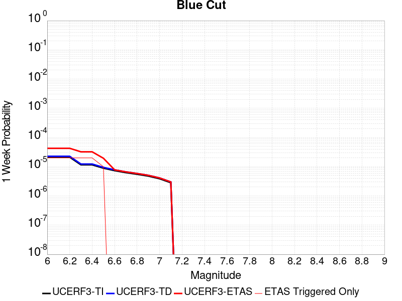 | 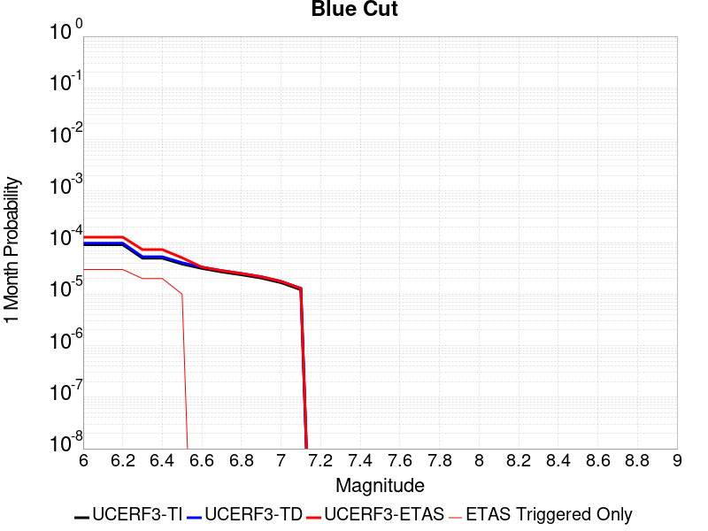 |  |  |

| Magnitude | 1 wk TI Prob | 1 wk TD Prob | 1 wk ETAS Prob | 1 wk ETAS/TD Gain | 1 wk ETAS Triggered Only | 1 mo TI Prob | 1 mo TD Prob | 1 mo ETAS Prob | 1 mo ETAS/TD Gain | 1 mo ETAS Triggered Only | 1 yr TI Prob | 1 yr TD Prob | 1 yr ETAS Prob | 1 yr ETAS/TD Gain | 1 yr ETAS Triggered Only | 10 yr TI Prob | 10 yr TD Prob | 10 yr ETAS Prob | 10 yr ETAS/TD Gain | 10 yr ETAS Triggered Only |
|-----|-----|-----|-----|-----|-----|-----|-----|-----|-----|-----|-----|-----|-----|-----|-----|-----|-----|-----|-----|-----|
| 6.0 | 2.1227985E-5 | 2.2719574E-5 | 4.271912E-5 | 1.8802782 | 2.0E-5 | 9.097391E-5 | 9.73663E-5 | 1.2736338E-4 | 1.3080848 | 3.0E-5 | 0.0011070445 | 0.0011848481 | 0.0012347889 | 1.0421495 | 5.0E-5 | 0.011015458 | 0.011791152 | 0.011860326 | 1.0058666 | 7.0E-5 |
| 6.1 | 2.1227985E-5 | 2.2719574E-5 | 4.271912E-5 | 1.8802782 | 2.0E-5 | 9.097391E-5 | 9.73663E-5 | 1.2736338E-4 | 1.3080848 | 3.0E-5 | 0.0011070445 | 0.0011848481 | 0.0012347889 | 1.0421495 | 5.0E-5 | 0.011015458 | 0.011791152 | 0.011860326 | 1.0058666 | 7.0E-5 |
| 6.2 | 2.1227985E-5 | 2.2719574E-5 | 4.271912E-5 | 1.8802782 | 2.0E-5 | 9.097391E-5 | 9.73663E-5 | 1.2736338E-4 | 1.3080848 | 3.0E-5 | 0.0011070445 | 0.0011848481 | 0.0012347889 | 1.0421495 | 5.0E-5 | 0.011015458 | 0.011791152 | 0.011860326 | 1.0058666 | 7.0E-5 |
| 6.3 | 1.1613981E-5 | 1.2353542E-5 | 3.2353295E-5 | 2.618949 | 2.0E-5 | 4.9773254E-5 | 5.2942745E-5 | 7.2941686E-5 | 1.3777466 | 2.0E-5 | 6.0582085E-4 | 6.443998E-4 | 6.84374E-4 | 1.0620333 | 4.0E-5 | 0.0060417196 | 0.0064265593 | 0.0064861737 | 1.0092763 | 6.0E-5 |
| 6.4 | 1.1613981E-5 | 1.2353542E-5 | 3.2353295E-5 | 2.618949 | 2.0E-5 | 4.9773254E-5 | 5.2942745E-5 | 7.2941686E-5 | 1.3777466 | 2.0E-5 | 6.0582085E-4 | 6.443998E-4 | 6.84374E-4 | 1.0620333 | 4.0E-5 | 0.0060417196 | 0.0064265593 | 0.0064861737 | 1.0092763 | 6.0E-5 |
| 6.5 | 8.931326E-6 | 9.4816E-6 | 1.9481506E-5 | 2.0546644 | 1.0E-5 | 3.8276554E-5 | 4.0634844E-5 | 5.063444E-5 | 1.2460842 | 1.0E-5 | 4.6591737E-4 | 4.946261E-4 | 5.146162E-4 | 1.0404146 | 2.0E-5 | 0.0046494175 | 0.004936161 | 0.004966013 | 1.0060476 | 3.0E-5 |
| 6.6 | 7.345353E-6 | 7.79028E-6 | 7.79028E-6 | 1.0 | 0.0 | 3.1479703E-5 | 3.338653E-5 | 3.338653E-5 | 1.0 | 0.0 | 3.83198E-4 | 4.064132E-4 | 4.064132E-4 | 1.0 | 0.0 | 0.0038253788 | 0.0040574907 | 0.0040574907 | 1.0 | 0.0 |
| 6.7 | 6.2775666E-6 | 6.655149E-6 | 6.655149E-6 | 1.0 | 0.0 | 2.690358E-5 | 2.8521798E-5 | 2.8521798E-5 | 1.0 | 0.0 | 3.2750185E-4 | 3.472051E-4 | 3.472051E-4 | 1.0 | 0.0 | 0.0032701963 | 0.003467367 | 0.003467367 | 1.0 | 0.0 |
| 6.8 | 5.5234095E-6 | 5.8551113E-6 | 5.8551113E-6 | 1.0 | 0.0 | 2.367154E-5 | 2.5093133E-5 | 2.5093133E-5 | 1.0 | 0.0 | 2.8816288E-4 | 3.0547334E-4 | 3.0547334E-4 | 1.0 | 0.0 | 0.002877895 | 0.0030512505 | 0.0030512505 | 1.0 | 0.0 |
| 6.9 | 4.7780054E-6 | 5.0654203E-6 | 5.0654203E-6 | 1.0 | 0.0 | 2.0477004E-5 | 2.1708804E-5 | 2.1708804E-5 | 1.0 | 0.0 | 2.4927902E-4 | 2.642797E-4 | 2.642797E-4 | 1.0 | 0.0 | 0.0024899957 | 0.002640346 | 0.002640346 | 1.0 | 0.0 |
| 7.0 | 3.883171E-6 | 4.118487E-6 | 4.118487E-6 | 1.0 | 0.0 | 1.6642054E-5 | 1.7650578E-5 | 1.7650578E-5 | 1.0 | 0.0 | 2.0259817E-4 | 2.1488148E-4 | 2.1488148E-4 | 1.0 | 0.0 | 0.0020241356 | 0.0021474129 | 0.0021474129 | 1.0 | 0.0 |
| 7.1 | 2.8358215E-6 | 3.0097158E-6 | 3.0097158E-6 | 1.0 | 0.0 | 1.2153464E-5 | 1.2898756E-5 | 1.2898756E-5 | 1.0 | 0.0 | 1.4795837E-4 | 1.5703762E-4 | 1.5703762E-4 | 1.0 | 0.0 | 0.001478599 | 0.0015699116 | 0.0015699116 | 1.0 | 0.0 |

## Kern Canyon (Lake Isabella) 2011
*[(top)](#table-of-contents)*

| 1 Week | 1 Month | 1 Year | 10 Year |
|-----|-----|-----|-----|
| 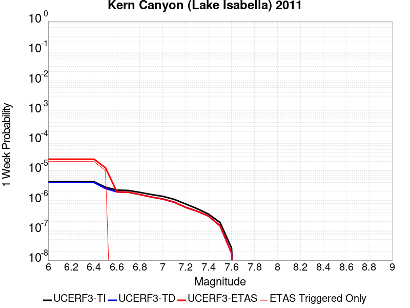 |  |  | 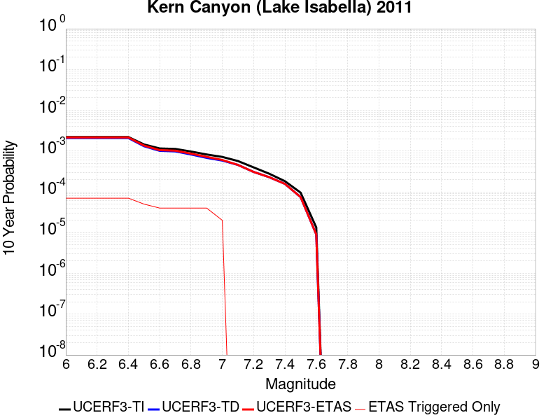 |

| Magnitude | 1 wk TI Prob | 1 wk TD Prob | 1 wk ETAS Prob | 1 wk ETAS/TD Gain | 1 wk ETAS Triggered Only | 1 mo TI Prob | 1 mo TD Prob | 1 mo ETAS Prob | 1 mo ETAS/TD Gain | 1 mo ETAS Triggered Only | 1 yr TI Prob | 1 yr TD Prob | 1 yr ETAS Prob | 1 yr ETAS/TD Gain | 1 yr ETAS Triggered Only | 10 yr TI Prob | 10 yr TD Prob | 10 yr ETAS Prob | 10 yr ETAS/TD Gain | 10 yr ETAS Triggered Only |
|-----|-----|-----|-----|-----|-----|-----|-----|-----|-----|-----|-----|-----|-----|-----|-----|-----|-----|-----|-----|-----|
| 6.0 | 4.2387383E-6 | 4.0016344E-6 | 2.4001554E-5 | 5.997938 | 2.0E-5 | 1.8165894E-5 | 1.7149758E-5 | 3.7149417E-5 | 2.1661773 | 2.0E-5 | 2.2114732E-4 | 2.0878017E-4 | 2.4877183E-4 | 1.1915491 | 4.0E-5 | 0.0022092736 | 0.002086024 | 0.002155878 | 1.0334866 | 7.0E-5 |
| 6.1 | 4.2387383E-6 | 4.0016344E-6 | 2.4001554E-5 | 5.997938 | 2.0E-5 | 1.8165894E-5 | 1.7149758E-5 | 3.7149417E-5 | 2.1661773 | 2.0E-5 | 2.2114732E-4 | 2.0878017E-4 | 2.4877183E-4 | 1.1915491 | 4.0E-5 | 0.0022092736 | 0.002086024 | 0.002155878 | 1.0334866 | 7.0E-5 |
| 6.2 | 4.2387383E-6 | 4.0016344E-6 | 2.4001554E-5 | 5.997938 | 2.0E-5 | 1.8165894E-5 | 1.7149758E-5 | 3.7149417E-5 | 2.1661773 | 2.0E-5 | 2.2114732E-4 | 2.0878017E-4 | 2.4877183E-4 | 1.1915491 | 4.0E-5 | 0.0022092736 | 0.002086024 | 0.002155878 | 1.0334866 | 7.0E-5 |
| 6.3 | 4.2387383E-6 | 4.0016344E-6 | 2.4001554E-5 | 5.997938 | 2.0E-5 | 1.8165894E-5 | 1.7149758E-5 | 3.7149417E-5 | 2.1661773 | 2.0E-5 | 2.2114732E-4 | 2.0878017E-4 | 2.4877183E-4 | 1.1915491 | 4.0E-5 | 0.0022092736 | 0.002086024 | 0.002155878 | 1.0334866 | 7.0E-5 |
| 6.4 | 4.2387383E-6 | 4.0016344E-6 | 2.4001554E-5 | 5.997938 | 2.0E-5 | 1.8165894E-5 | 1.7149758E-5 | 3.7149417E-5 | 2.1661773 | 2.0E-5 | 2.2114732E-4 | 2.0878017E-4 | 2.4877183E-4 | 1.1915491 | 4.0E-5 | 0.0022092736 | 0.002086024 | 0.002155878 | 1.0334866 | 7.0E-5 |
| 6.5 | 2.7857532E-6 | 2.5178624E-6 | 1.2517838E-5 | 4.971613 | 1.0E-5 | 1.1938888E-5 | 1.0790796E-5 | 2.0790689E-5 | 1.9267057 | 1.0E-5 | 1.4534626E-4 | 1.3137035E-4 | 1.613664E-4 | 1.228332 | 3.0E-5 | 0.0014525123 | 0.0013129596 | 0.001362894 | 1.0380319 | 5.0E-5 |
| 6.6 | 2.2233348E-6 | 1.944119E-6 | 1.944119E-6 | 1.0 | 0.0 | 9.528543E-6 | 8.331913E-6 | 8.331913E-6 | 1.0 | 0.0 | 1.1600384E-4 | 1.014364E-4 | 1.2143437E-4 | 1.1971478 | 2.0E-5 | 0.001159433 | 0.0010139096 | 0.001053869 | 1.0394113 | 4.0E-5 |
| 6.7 | 2.1635126E-6 | 1.8834991E-6 | 1.8834991E-6 | 1.0 | 0.0 | 9.272164E-6 | 8.072114E-6 | 8.072114E-6 | 1.0 | 0.0 | 1.1288274E-4 | 9.827364E-5 | 1.1827167E-4 | 1.2034934 | 2.0E-5 | 0.0011282542 | 9.8231E-4 | 0.0010222706 | 1.0406803 | 4.0E-5 |
| 6.8 | 1.8685711E-6 | 1.583138E-6 | 1.583138E-6 | 1.0 | 0.0 | 8.008137E-6 | 6.7848596E-6 | 6.7848596E-6 | 1.0 | 0.0 | 9.74947E-5 | 8.2602586E-5 | 1.02600934E-4 | 1.2421032 | 2.0E-5 | 9.745194E-4 | 8.2572375E-4 | 8.656907E-4 | 1.0484023 | 4.0E-5 |
| 6.9 | 1.5815071E-6 | 1.3064887E-6 | 1.3064887E-6 | 1.0 | 0.0 | 6.77787E-6 | 5.5992255E-6 | 5.5992255E-6 | 1.0 | 0.0 | 8.251744E-5 | 6.816846E-5 | 8.81671E-5 | 1.2933708 | 2.0E-5 | 8.248681E-4 | 6.8147824E-4 | 7.2145095E-4 | 1.058656 | 4.0E-5 |
| 7.0 | 1.3772564E-6 | 1.1210681E-6 | 1.1210681E-6 | 1.0 | 0.0 | 5.9025137E-6 | 4.8045686E-6 | 4.8045686E-6 | 1.0 | 0.0 | 7.186073E-5 | 5.8494075E-5 | 6.849349E-5 | 1.1709474 | 1.0E-5 | 7.18375E-4 | 5.8478885E-4 | 6.0477713E-4 | 1.0341804 | 2.0E-5 |
| 7.1 | 1.0916998E-6 | 8.7637505E-7 | 8.7637505E-7 | 1.0 | 0.0 | 4.678705E-6 | 3.7558877E-6 | 3.7558877E-6 | 1.0 | 0.0 | 5.6961744E-5 | 4.5726985E-5 | 4.5726985E-5 | 1.0 | 0.0 | 5.6947145E-4 | 4.571771E-4 | 4.571771E-4 | 1.0 | 0.0 |
| 7.2 | 7.6277024E-7 | 5.901439E-7 | 5.901439E-7 | 1.0 | 0.0 | 3.2690114E-6 | 2.5291856E-6 | 2.5291856E-6 | 1.0 | 0.0 | 3.9799485E-5 | 3.0792406E-5 | 3.0792406E-5 | 1.0 | 0.0 | 3.9792358E-4 | 3.07882E-4 | 3.07882E-4 | 1.0 | 0.0 |
| 7.3 | 5.3265916E-7 | 4.3824264E-7 | 4.3824264E-7 | 1.0 | 0.0 | 2.282823E-6 | 1.8781814E-6 | 1.8781814E-6 | 1.0 | 0.0 | 2.7793016E-5 | 2.2866623E-5 | 2.2866623E-5 | 1.0 | 0.0 | 2.778954E-4 | 2.2864307E-4 | 2.2864307E-4 | 1.0 | 0.0 |
| 7.4 | 3.4946007E-7 | 3.0065647E-7 | 3.0065647E-7 | 1.0 | 0.0 | 1.497685E-6 | 1.2885271E-6 | 1.2885271E-6 | 1.0 | 0.0 | 1.8234163E-5 | 1.5687707E-5 | 1.5687707E-5 | 1.0 | 0.0 | 1.8232666E-4 | 1.5686621E-4 | 1.5686621E-4 | 1.0 | 0.0 |
| 7.5 | 1.8317026E-7 | 1.4244755E-7 | 1.4244755E-7 | 1.0 | 0.0 | 7.850152E-7 | 6.1048934E-7 | 6.1048934E-7 | 1.0 | 0.0 | 9.557518E-6 | 7.432683E-6 | 7.432683E-6 | 1.0 | 0.0 | 9.5571064E-5 | 7.432442E-5 | 7.432442E-5 | 1.0 | 0.0 |
| 7.6 | 2.572245E-8 | 1.735264E-8 | 1.735264E-8 | 1.0 | 0.0 | 1.10239064E-7 | 7.436845E-8 | 7.436845E-8 | 1.0 | 0.0 | 1.3421597E-6 | 9.0543557E-7 | 9.0543557E-7 | 1.0 | 0.0 | 1.3421517E-5 | 9.054324E-6 | 9.054324E-6 | 1.0 | 0.0 |

## Oceanic - West Huasna
*[(top)](#table-of-contents)*

| 1 Week | 1 Month | 1 Year | 10 Year |
|-----|-----|-----|-----|
|  |  | 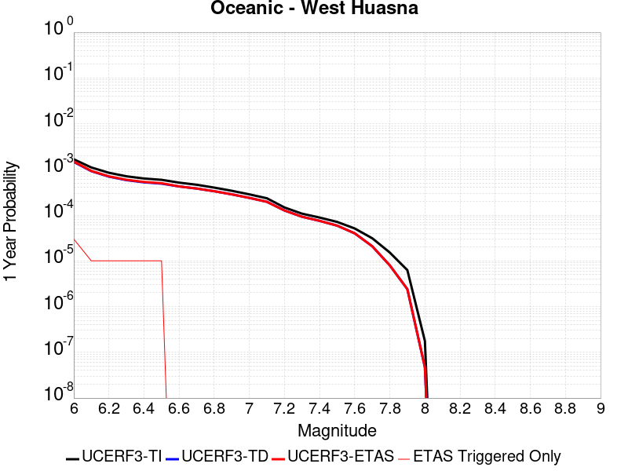 | 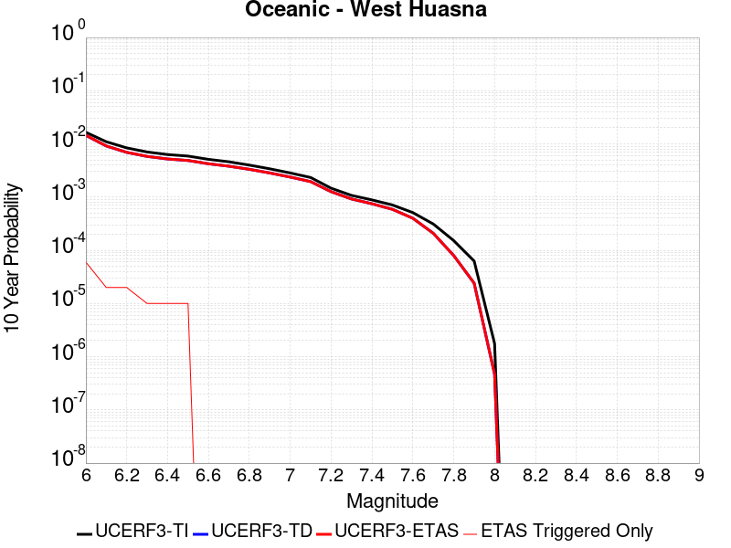 |

| Magnitude | 1 wk TI Prob | 1 wk TD Prob | 1 wk ETAS Prob | 1 wk ETAS/TD Gain | 1 wk ETAS Triggered Only | 1 mo TI Prob | 1 mo TD Prob | 1 mo ETAS Prob | 1 mo ETAS/TD Gain | 1 mo ETAS Triggered Only | 1 yr TI Prob | 1 yr TD Prob | 1 yr ETAS Prob | 1 yr ETAS/TD Gain | 1 yr ETAS Triggered Only | 10 yr TI Prob | 10 yr TD Prob | 10 yr ETAS Prob | 10 yr ETAS/TD Gain | 10 yr ETAS Triggered Only |
|-----|-----|-----|-----|-----|-----|-----|-----|-----|-----|-----|-----|-----|-----|-----|-----|-----|-----|-----|-----|-----|
| 6.0 | 3.195567E-5 | 2.7926368E-5 | 3.792609E-5 | 1.3580745 | 1.0E-5 | 1.3694567E-4 | 1.19679185E-4 | 1.29678E-4 | 1.0835468 | 1.0E-5 | 0.0016660384 | 0.0014561634 | 0.0014861196 | 1.0205721 | 3.0E-5 | 0.016536033 | 0.01447077 | 0.0145299025 | 1.0040863 | 6.0E-5 |
| 6.1 | 2.1156782E-5 | 1.7573117E-5 | 1.7573117E-5 | 1.0 | 0.0 | 9.066878E-5 | 7.531123E-5 | 7.531123E-5 | 1.0 | 0.0 | 0.0011033333 | 9.1653795E-4 | 9.265288E-4 | 1.0109006 | 1.0E-5 | 0.010978713 | 0.009128587 | 0.009148404 | 1.0021709 | 2.0E-5 |
| 6.2 | 1.6195117E-5 | 1.3327227E-5 | 1.3327227E-5 | 1.0 | 0.0 | 6.9405796E-5 | 5.7115452E-5 | 5.7115452E-5 | 1.0 | 0.0 | 8.44688E-4 | 6.9516135E-4 | 7.051544E-4 | 1.0143751 | 1.0E-5 | 0.008414844 | 0.0069301617 | 0.006950023 | 1.0028659 | 2.0E-5 |
| 6.3 | 1.3559345E-5 | 1.1179013E-5 | 1.1179013E-5 | 1.0 | 0.0 | 5.811018E-5 | 4.7909183E-5 | 4.7909183E-5 | 1.0 | 0.0 | 7.072618E-4 | 5.8313913E-4 | 5.931333E-4 | 1.0171386 | 1.0E-5 | 0.0070501505 | 0.005816208 | 0.0058261496 | 1.0017093 | 1.0E-5 |
| 6.4 | 1.2120619E-5 | 1.0000874E-5 | 1.0000874E-5 | 1.0 | 0.0 | 5.1944477E-5 | 4.2860185E-5 | 4.2860185E-5 | 1.0 | 0.0 | 6.322405E-4 | 5.216983E-4 | 5.316931E-4 | 1.0191581 | 1.0E-5 | 0.006304447 | 0.005204804 | 0.0052147517 | 1.0019113 | 1.0E-5 |
| 6.5 | 1.13511915E-5 | 9.367378E-6 | 9.367378E-6 | 1.0 | 0.0 | 4.8647056E-5 | 4.0145293E-5 | 4.0145293E-5 | 1.0 | 0.0 | 5.9211696E-4 | 4.886598E-4 | 4.9865484E-4 | 1.0204542 | 1.0E-5 | 0.0059054173 | 0.0048759114 | 0.0048858626 | 1.0020409 | 1.0E-5 |
| 6.6 | 9.850605E-6 | 8.1353155E-6 | 8.1353155E-6 | 1.0 | 0.0 | 4.2216197E-5 | 3.4865174E-5 | 3.4865174E-5 | 1.0 | 0.0 | 5.1386096E-4 | 4.2440102E-4 | 4.2440102E-4 | 1.0 | 0.0 | 0.0051267436 | 0.0042359377 | 0.0042359377 | 1.0 | 0.0 |
| 6.7 | 8.8558645E-6 | 7.318341E-6 | 7.318341E-6 | 1.0 | 0.0 | 3.7953152E-5 | 3.1363943E-5 | 3.1363943E-5 | 1.0 | 0.0 | 4.6198163E-4 | 3.8178926E-4 | 3.8178926E-4 | 1.0 | 0.0 | 0.004610224 | 0.0038113592 | 0.0038113592 | 1.0 | 0.0 |
| 6.8 | 7.67136E-6 | 6.39169E-6 | 6.39169E-6 | 1.0 | 0.0 | 3.2876844E-5 | 2.739267E-5 | 2.739267E-5 | 1.0 | 0.0 | 4.0020206E-4 | 3.3345487E-4 | 3.3345487E-4 | 1.0 | 0.0 | 0.003994821 | 0.0033295664 | 0.0033295664 | 1.0 | 0.0 |
| 6.9 | 6.534529E-6 | 5.458261E-6 | 5.458261E-6 | 1.0 | 0.0 | 2.8004823E-5 | 2.3392338E-5 | 2.3392338E-5 | 1.0 | 0.0 | 3.4090536E-4 | 2.8476462E-4 | 2.8476462E-4 | 1.0 | 0.0 | 0.0034038287 | 0.002844014 | 0.002844014 | 1.0 | 0.0 |
| 7.0 | 5.460525E-6 | 4.5699203E-6 | 4.5699203E-6 | 1.0 | 0.0 | 2.3402039E-5 | 1.9585226E-5 | 1.9585226E-5 | 1.0 | 0.0 | 2.8488258E-4 | 2.3842414E-4 | 2.3842414E-4 | 1.0 | 0.0 | 0.0028451765 | 0.0023816973 | 0.0023816973 | 1.0 | 0.0 |
| 7.1 | 4.4825083E-6 | 3.7524153E-6 | 3.7524153E-6 | 1.0 | 0.0 | 1.9210609E-5 | 1.6081682E-5 | 1.6081682E-5 | 1.0 | 0.0 | 2.3386406E-4 | 1.9577699E-4 | 1.9577699E-4 | 1.0 | 0.0 | 0.002336181 | 0.001956057 | 0.001956057 | 1.0 | 0.0 |
| 7.2 | 2.821708E-6 | 2.424941E-6 | 2.424941E-6 | 1.0 | 0.0 | 1.2092979E-5 | 1.0392562E-5 | 1.0392562E-5 | 1.0 | 0.0 | 1.4722206E-4 | 1.265221E-4 | 1.265221E-4 | 1.0 | 0.0 | 0.0014712457 | 0.0012645032 | 0.0012645032 | 1.0 | 0.0 |
| 7.3 | 2.0644757E-6 | 1.7687502E-6 | 1.7687502E-6 | 1.0 | 0.0 | 8.847723E-6 | 7.580336E-6 | 7.580336E-6 | 1.0 | 0.0 | 1.0771569E-4 | 9.228668E-5 | 9.228668E-5 | 1.0 | 0.0 | 0.001076635 | 9.224854E-4 | 9.224854E-4 | 1.0 | 0.0 |
| 7.4 | 1.6980367E-6 | 1.4379966E-6 | 1.4379966E-6 | 1.0 | 0.0 | 7.27728E-6 | 6.1628284E-6 | 6.1628284E-6 | 1.0 | 0.0 | 8.8597284E-5 | 7.502986E-5 | 7.502986E-5 | 1.0 | 0.0 | 8.8561967E-4 | 7.5004686E-4 | 7.5004686E-4 | 1.0 | 0.0 |
| 7.5 | 1.3637683E-6 | 1.1302697E-6 | 1.1302697E-6 | 1.0 | 0.0 | 5.844708E-6 | 4.844004E-6 | 4.844004E-6 | 1.0 | 0.0 | 7.1156996E-5 | 5.897415E-5 | 5.897415E-5 | 1.0 | 0.0 | 7.1134215E-4 | 5.8958656E-4 | 5.8958656E-4 | 1.0 | 0.0 |
| 7.6 | 9.802994E-7 | 7.6772847E-7 | 7.6772847E-7 | 1.0 | 0.0 | 4.2012766E-6 | 3.2902608E-6 | 3.2902608E-6 | 1.0 | 0.0 | 5.1149345E-5 | 4.005819E-5 | 4.005819E-5 | 1.0 | 0.0 | 5.113757E-4 | 4.0051117E-4 | 4.0051117E-4 | 1.0 | 0.0 |
| 7.7 | 5.986191E-7 | 4.0050708E-7 | 4.0050708E-7 | 1.0 | 0.0 | 2.5655079E-6 | 1.7164577E-6 | 1.7164577E-6 | 1.0 | 0.0 | 3.1234613E-5 | 2.0897673E-5 | 2.0897673E-5 | 1.0 | 0.0 | 3.123022E-4 | 2.0895849E-4 | 2.0895849E-4 | 1.0 | 0.0 |
| 7.8 | 2.9189815E-7 | 1.5285202E-7 | 1.5285202E-7 | 1.0 | 0.0 | 1.2509914E-6 | 6.5507993E-7 | 6.5507993E-7 | 1.0 | 0.0 | 1.5230714E-5 | 7.975569E-6 | 7.975569E-6 | 1.0 | 0.0 | 1.522967E-4 | 7.97542E-5 | 7.97542E-5 | 1.0 | 0.0 |
| 7.9 | 1.2057845E-7 | 4.6208047E-8 | 4.6208047E-8 | 1.0 | 0.0 | 5.1676466E-7 | 1.9803447E-7 | 1.9803447E-7 | 1.0 | 0.0 | 6.2915915E-6 | 2.411067E-6 | 2.411067E-6 | 1.0 | 0.0 | 6.2914136E-5 | 2.4111772E-5 | 2.4111772E-5 | 1.0 | 0.0 |
| 8.0 | 3.3806387E-9 | 9.0093144E-10 | 9.0093144E-10 | 1.0 | 0.0 | 1.4488451E-8 | 3.8611354E-9 | 3.8611354E-9 | 1.0 | 0.0 | 1.7639688E-7 | 4.7009323E-8 | 4.7009323E-8 | 1.0 | 0.0 | 1.7639674E-6 | 4.712806E-7 | 4.712806E-7 | 1.0 | 0.0 |

## Cleghorn
*[(top)](#table-of-contents)*

| 1 Week | 1 Month | 1 Year | 10 Year |
|-----|-----|-----|-----|
|  |  | 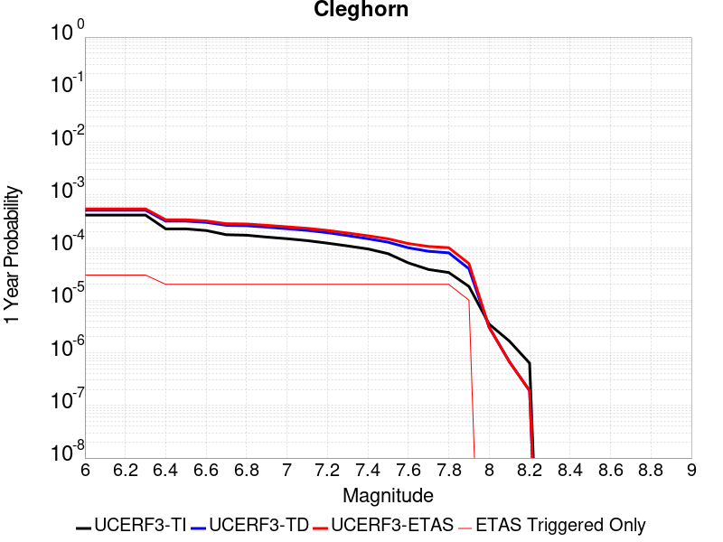 |  |

| Magnitude | 1 wk TI Prob | 1 wk TD Prob | 1 wk ETAS Prob | 1 wk ETAS/TD Gain | 1 wk ETAS Triggered Only | 1 mo TI Prob | 1 mo TD Prob | 1 mo ETAS Prob | 1 mo ETAS/TD Gain | 1 mo ETAS Triggered Only | 1 yr TI Prob | 1 yr TD Prob | 1 yr ETAS Prob | 1 yr ETAS/TD Gain | 1 yr ETAS Triggered Only | 10 yr TI Prob | 10 yr TD Prob | 10 yr ETAS Prob | 10 yr ETAS/TD Gain | 10 yr ETAS Triggered Only |
|-----|-----|-----|-----|-----|-----|-----|-----|-----|-----|-----|-----|-----|-----|-----|-----|-----|-----|-----|-----|-----|
| 6.0 | 7.9267165E-6 | 9.831764E-6 | 9.831764E-6 | 1.0 | 0.0 | 3.39712E-5 | 4.2135514E-5 | 5.2135092E-5 | 1.2373195 | 1.0E-5 | 4.1352084E-4 | 5.1288976E-4 | 5.4287433E-4 | 1.0584621 | 3.0E-5 | 0.004127522 | 0.005132214 | 0.0051919064 | 1.0116309 | 6.0E-5 |
| 6.1 | 7.9267165E-6 | 9.831764E-6 | 9.831764E-6 | 1.0 | 0.0 | 3.39712E-5 | 4.2135514E-5 | 5.2135092E-5 | 1.2373195 | 1.0E-5 | 4.1352084E-4 | 5.1288976E-4 | 5.4287433E-4 | 1.0584621 | 3.0E-5 | 0.004127522 | 0.005132214 | 0.0051919064 | 1.0116309 | 6.0E-5 |
| 6.2 | 7.9267165E-6 | 9.831764E-6 | 9.831764E-6 | 1.0 | 0.0 | 3.39712E-5 | 4.2135514E-5 | 5.2135092E-5 | 1.2373195 | 1.0E-5 | 4.1352084E-4 | 5.1288976E-4 | 5.4287433E-4 | 1.0584621 | 3.0E-5 | 0.004127522 | 0.005132214 | 0.0051919064 | 1.0116309 | 6.0E-5 |
| 6.3 | 7.9267165E-6 | 9.831764E-6 | 9.831764E-6 | 1.0 | 0.0 | 3.39712E-5 | 4.2135514E-5 | 5.2135092E-5 | 1.2373195 | 1.0E-5 | 4.1352084E-4 | 5.1288976E-4 | 5.4287433E-4 | 1.0584621 | 3.0E-5 | 0.004127522 | 0.005132214 | 0.0051919064 | 1.0116309 | 6.0E-5 |
| 6.4 | 4.3445207E-6 | 6.0916254E-6 | 6.0916254E-6 | 1.0 | 0.0 | 1.8619241E-5 | 2.6106709E-5 | 3.610645E-5 | 1.3830333 | 1.0E-5 | 2.2666567E-4 | 3.1780385E-4 | 3.3779748E-4 | 1.0629119 | 2.0E-5 | 0.0022643462 | 0.0031877246 | 0.003227597 | 1.0125082 | 4.0E-5 |
| 6.5 | 4.3445207E-6 | 6.0916254E-6 | 6.0916254E-6 | 1.0 | 0.0 | 1.8619241E-5 | 2.6106709E-5 | 3.610645E-5 | 1.3830333 | 1.0E-5 | 2.2666567E-4 | 3.1780385E-4 | 3.3779748E-4 | 1.0629119 | 2.0E-5 | 0.0022643462 | 0.0031877246 | 0.003227597 | 1.0125082 | 4.0E-5 |
| 6.6 | 4.040109E-6 | 5.774033E-6 | 5.774033E-6 | 1.0 | 0.0 | 1.7314638E-5 | 2.4745626E-5 | 3.474538E-5 | 1.4041018 | 1.0E-5 | 2.1078532E-4 | 3.0123728E-4 | 3.2123126E-4 | 1.0663729 | 2.0E-5 | 0.002105855 | 0.0030225143 | 0.0030623935 | 1.013194 | 4.0E-5 |
| 6.7 | 3.3632055E-6 | 5.06753E-6 | 5.06753E-6 | 1.0 | 0.0 | 1.4413658E-5 | 2.1717806E-5 | 3.1717587E-5 | 1.4604417 | 1.0E-5 | 1.7547216E-4 | 2.643825E-4 | 2.8437722E-4 | 1.0756279 | 2.0E-5 | 0.0017533366 | 0.0026548486 | 0.002684769 | 1.01127 | 3.0E-5 |
| 6.8 | 3.2902772E-6 | 4.9894375E-6 | 4.9894375E-6 | 1.0 | 0.0 | 1.4101111E-5 | 2.138313E-5 | 3.1382915E-5 | 1.4676484 | 1.0E-5 | 1.716675E-4 | 2.6030882E-4 | 2.8030362E-4 | 1.0768118 | 2.0E-5 | 0.0017153495 | 0.0026142076 | 0.002644129 | 1.0114458 | 3.0E-5 |
| 6.9 | 3.031547E-6 | 4.6911987E-6 | 4.6911987E-6 | 1.0 | 0.0 | 1.299228E-5 | 2.0104984E-5 | 3.0104784E-5 | 1.4973791 | 1.0E-5 | 1.5816953E-4 | 2.4475096E-4 | 2.6474605E-4 | 1.0816957 | 2.0E-5 | 0.00158057 | 0.0024589805 | 0.0024889067 | 1.0121702 | 3.0E-5 |
| 7.0 | 2.8259715E-6 | 4.3707637E-6 | 4.3707637E-6 | 1.0 | 0.0 | 1.211125E-5 | 1.8731711E-5 | 2.8731525E-5 | 1.533844 | 1.0E-5 | 1.4744449E-4 | 2.2803496E-4 | 2.480304E-4 | 1.0876858 | 2.0E-5 | 0.001473467 | 0.0022921748 | 0.002322106 | 1.0130581 | 3.0E-5 |
| 7.1 | 2.5962665E-6 | 4.065983E-6 | 4.065983E-6 | 1.0 | 0.0 | 1.1126809E-5 | 1.7425526E-5 | 2.7425353E-5 | 1.5738608 | 1.0E-5 | 1.3546048E-4 | 2.1213535E-4 | 2.321311E-4 | 1.0942594 | 2.0E-5 | 0.0013537793 | 0.0021334959 | 0.0021634318 | 1.0140314 | 3.0E-5 |
| 7.2 | 2.3247253E-6 | 3.6765352E-6 | 3.6765352E-6 | 1.0 | 0.0 | 9.96307E-6 | 1.5756486E-5 | 2.5756328E-5 | 1.6346493 | 1.0E-5 | 1.21293626E-4 | 1.9181852E-4 | 2.1181468E-4 | 1.1042452 | 2.0E-5 | 0.0012122744 | 0.0019307166 | 0.001950678 | 1.0103389 | 2.0E-5 |
| 7.3 | 2.056928E-6 | 3.235253E-6 | 3.235253E-6 | 1.0 | 0.0 | 8.815376E-6 | 1.3865297E-5 | 2.3865157E-5 | 1.7212151 | 1.0E-5 | 1.0732192E-4 | 1.6879707E-4 | 1.887937E-4 | 1.1184654 | 2.0E-5 | 0.001072701 | 0.0017009423 | 0.0017209083 | 1.0117382 | 2.0E-5 |
| 7.4 | 1.8055999E-6 | 2.8256538E-6 | 2.8256538E-6 | 1.0 | 0.0 | 7.738263E-6 | 1.210989E-5 | 2.2109769E-5 | 1.8257613 | 1.0E-5 | 9.4209274E-5 | 1.4742807E-4 | 1.6742513E-4 | 1.1356394 | 2.0E-5 | 9.4169343E-4 | 0.0014876705 | 0.0015076407 | 1.0134238 | 2.0E-5 |
| 7.5 | 1.4683443E-6 | 2.4248943E-6 | 2.4248943E-6 | 1.0 | 0.0 | 6.292889E-6 | 1.0392363E-5 | 2.039226E-5 | 1.962235 | 1.0E-5 | 7.661323E-5 | 1.2651978E-4 | 1.4651724E-4 | 1.158058 | 2.0E-5 | 7.658682E-4 | 0.0012788812 | 0.0012988556 | 1.0156187 | 2.0E-5 |
| 7.6 | 9.804088E-7 | 1.9004091E-6 | 1.9004091E-6 | 1.0 | 0.0 | 4.201745E-6 | 8.144585E-6 | 1.8144503E-5 | 2.2277997 | 1.0E-5 | 5.1155046E-5 | 9.915586E-5 | 1.19153876E-4 | 1.2016827 | 2.0E-5 | 5.114327E-4 | 0.0010055583 | 0.0010255382 | 1.0198694 | 2.0E-5 |
| 7.7 | 7.3434086E-7 | 1.6285549E-6 | 1.6285549E-6 | 1.0 | 0.0 | 3.1471714E-6 | 6.9795024E-6 | 1.6979433E-5 | 2.432757 | 1.0E-5 | 3.831614E-5 | 8.4972155E-5 | 1.0497046E-4 | 1.2353512 | 2.0E-5 | 3.8309532E-4 | 8.6387293E-4 | 8.838557E-4 | 1.0231316 | 2.0E-5 |
| 7.8 | 6.434184E-7 | 1.5221389E-6 | 1.5221389E-6 | 1.0 | 0.0 | 2.7575045E-6 | 6.523436E-6 | 1.652337E-5 | 2.5329244 | 1.0E-5 | 3.35721E-5 | 7.9419966E-5 | 9.941837E-5 | 1.2518059 | 2.0E-5 | 3.3567028E-4 | 8.080443E-4 | 8.2802813E-4 | 1.0247312 | 2.0E-5 |
| 7.9 | 3.4943926E-7 | 7.5750586E-7 | 7.5750586E-7 | 1.0 | 0.0 | 1.497596E-6 | 3.2464498E-6 | 3.2464498E-6 | 1.0 | 0.0 | 1.8233079E-5 | 3.9524817E-5 | 4.9524424E-5 | 1.2529956 | 1.0E-5 | 1.8231584E-4 | 4.0401975E-4 | 4.140157E-4 | 1.0247413 | 1.0E-5 |
| 8.0 | 6.717524E-8 | 5.837515E-8 | 5.837515E-8 | 1.0 | 0.0 | 2.8789387E-7 | 2.501792E-7 | 2.501792E-7 | 1.0 | 0.0 | 3.505102E-6 | 3.0459275E-6 | 3.0459275E-6 | 1.0 | 0.0 | 3.5050467E-5 | 3.2751934E-5 | 3.2751934E-5 | 1.0 | 0.0 |
| 8.1 | 3.1984914E-8 | 1.2949885E-8 | 1.2949885E-8 | 1.0 | 0.0 | 1.370782E-7 | 5.549951E-8 | 5.549951E-8 | 1.0 | 0.0 | 1.6689258E-6 | 6.757063E-7 | 6.757063E-7 | 1.0 | 0.0 | 1.6689133E-5 | 7.741151E-6 | 7.741151E-6 | 1.0 | 0.0 |
| 8.2 | 1.21887656E-8 | 3.6471115E-9 | 3.6471115E-9 | 1.0 | 0.0 | 5.2237567E-8 | 1.563048E-8 | 1.563048E-8 | 1.0 | 0.0 | 6.359922E-7 | 1.9030107E-7 | 1.9030107E-7 | 1.0 | 0.0 | 6.3599036E-6 | 2.245849E-6 | 2.245849E-6 | 1.0 | 0.0 |

## Pine Mtn
*[(top)](#table-of-contents)*

| 1 Week | 1 Month | 1 Year | 10 Year |
|-----|-----|-----|-----|
|  |  |  | 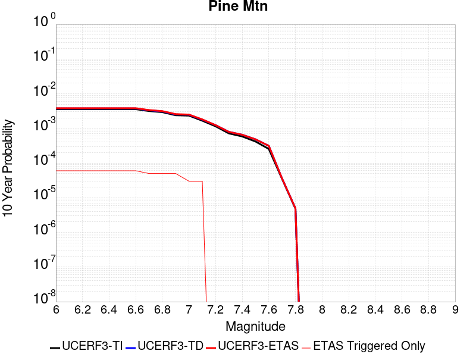 |

| Magnitude | 1 wk TI Prob | 1 wk TD Prob | 1 wk ETAS Prob | 1 wk ETAS/TD Gain | 1 wk ETAS Triggered Only | 1 mo TI Prob | 1 mo TD Prob | 1 mo ETAS Prob | 1 mo ETAS/TD Gain | 1 mo ETAS Triggered Only | 1 yr TI Prob | 1 yr TD Prob | 1 yr ETAS Prob | 1 yr ETAS/TD Gain | 1 yr ETAS Triggered Only | 10 yr TI Prob | 10 yr TD Prob | 10 yr ETAS Prob | 10 yr ETAS/TD Gain | 10 yr ETAS Triggered Only |
|-----|-----|-----|-----|-----|-----|-----|-----|-----|-----|-----|-----|-----|-----|-----|-----|-----|-----|-----|-----|-----|
| 6.0 | 6.894797E-6 | 7.2254716E-6 | 2.7225327E-5 | 3.7679653 | 2.0E-5 | 2.9548795E-5 | 3.0965955E-5 | 6.0965027E-5 | 1.9687759 | 3.0E-5 | 3.596972E-4 | 3.7694827E-4 | 4.169332E-4 | 1.1060754 | 4.0E-5 | 0.0035911554 | 0.0037633865 | 0.0038231607 | 1.0158831 | 6.0E-5 |
| 6.1 | 6.894797E-6 | 7.2254716E-6 | 2.7225327E-5 | 3.7679653 | 2.0E-5 | 2.9548795E-5 | 3.0965955E-5 | 6.0965027E-5 | 1.9687759 | 3.0E-5 | 3.596972E-4 | 3.7694827E-4 | 4.169332E-4 | 1.1060754 | 4.0E-5 | 0.0035911554 | 0.0037633865 | 0.0038231607 | 1.0158831 | 6.0E-5 |
| 6.2 | 6.894797E-6 | 7.2254716E-6 | 2.7225327E-5 | 3.7679653 | 2.0E-5 | 2.9548795E-5 | 3.0965955E-5 | 6.0965027E-5 | 1.9687759 | 3.0E-5 | 3.596972E-4 | 3.7694827E-4 | 4.169332E-4 | 1.1060754 | 4.0E-5 | 0.0035911554 | 0.0037633865 | 0.0038231607 | 1.0158831 | 6.0E-5 |
| 6.3 | 6.894797E-6 | 7.2254716E-6 | 2.7225327E-5 | 3.7679653 | 2.0E-5 | 2.9548795E-5 | 3.0965955E-5 | 6.0965027E-5 | 1.9687759 | 3.0E-5 | 3.596972E-4 | 3.7694827E-4 | 4.169332E-4 | 1.1060754 | 4.0E-5 | 0.0035911554 | 0.0037633865 | 0.0038231607 | 1.0158831 | 6.0E-5 |
| 6.4 | 6.894797E-6 | 7.2254716E-6 | 2.7225327E-5 | 3.7679653 | 2.0E-5 | 2.9548795E-5 | 3.0965955E-5 | 6.0965027E-5 | 1.9687759 | 3.0E-5 | 3.596972E-4 | 3.7694827E-4 | 4.169332E-4 | 1.1060754 | 4.0E-5 | 0.0035911554 | 0.0037633865 | 0.0038231607 | 1.0158831 | 6.0E-5 |
| 6.5 | 6.894797E-6 | 7.2254716E-6 | 2.7225327E-5 | 3.7679653 | 2.0E-5 | 2.9548795E-5 | 3.0965955E-5 | 6.0965027E-5 | 1.9687759 | 3.0E-5 | 3.596972E-4 | 3.7694827E-4 | 4.169332E-4 | 1.1060754 | 4.0E-5 | 0.0035911554 | 0.0037633865 | 0.0038231607 | 1.0158831 | 6.0E-5 |
| 6.6 | 6.894797E-6 | 7.2254716E-6 | 2.7225327E-5 | 3.7679653 | 2.0E-5 | 2.9548795E-5 | 3.0965955E-5 | 6.0965027E-5 | 1.9687759 | 3.0E-5 | 3.596972E-4 | 3.7694827E-4 | 4.169332E-4 | 1.1060754 | 4.0E-5 | 0.0035911554 | 0.0037633865 | 0.0038231607 | 1.0158831 | 6.0E-5 |
| 6.7 | 6.0867933E-6 | 6.397124E-6 | 2.6396996E-5 | 4.126385 | 2.0E-5 | 2.6085996E-5 | 2.7415968E-5 | 5.7415145E-5 | 2.0942228 | 3.0E-5 | 3.1755073E-4 | 3.337405E-4 | 3.7372715E-4 | 1.1198136 | 4.0E-5 | 0.0031709734 | 0.0033326119 | 0.0033824453 | 1.0149533 | 5.0E-5 |
| 6.8 | 5.6530425E-6 | 5.950606E-6 | 2.5950487E-5 | 4.3609824 | 2.0E-5 | 2.42271E-5 | 2.5502359E-5 | 5.5501594E-5 | 2.1763318 | 3.0E-5 | 2.94925E-4 | 3.1044905E-4 | 3.5043663E-4 | 1.1288056 | 4.0E-5 | 0.002945339 | 0.0031003582 | 0.0031502033 | 1.0160772 | 5.0E-5 |
| 6.9 | 4.6015225E-6 | 4.8638444E-6 | 2.4863748E-5 | 5.1119537 | 2.0E-5 | 1.9720663E-5 | 2.084489E-5 | 5.0844264E-5 | 2.4391718 | 3.0E-5 | 2.4007261E-4 | 2.5375842E-4 | 2.9374828E-4 | 1.1575903 | 4.0E-5 | 0.0023981342 | 0.002534831 | 0.0025847042 | 1.0196751 | 5.0E-5 |
| 7.0 | 4.4875965E-6 | 4.7474837E-6 | 1.4747436E-5 | 3.106369 | 1.0E-5 | 1.9232413E-5 | 2.0346208E-5 | 4.03458E-5 | 1.9829642 | 2.0E-5 | 2.3412947E-4 | 2.4768838E-4 | 2.7768093E-4 | 1.1210899 | 3.0E-5 | 0.0023388295 | 0.0024742668 | 0.0025041925 | 1.0120949 | 3.0E-5 |
| 7.1 | 3.203907E-6 | 3.42942E-6 | 1.3429386E-5 | 3.915935 | 1.0E-5 | 1.3730958E-5 | 1.4697435E-5 | 3.4697143E-5 | 2.3607616 | 2.0E-5 | 1.6716159E-4 | 1.7892725E-4 | 2.0892188E-4 | 1.1676359 | 3.0E-5 | 0.0016703589 | 0.001787898 | 0.0018178443 | 1.0167495 | 3.0E-5 |
| 7.2 | 2.2060601E-6 | 2.3784874E-6 | 2.3784874E-6 | 1.0 | 0.0 | 9.4545085E-6 | 1.019348E-5 | 1.019348E-5 | 1.0 | 0.0 | 1.15102564E-4 | 1.2409901E-4 | 1.2409901E-4 | 1.0 | 0.0 | 0.0011504296 | 0.0012403419 | 0.0012403419 | 1.0 | 0.0 |
| 7.3 | 1.3765207E-6 | 1.5216535E-6 | 1.5216535E-6 | 1.0 | 0.0 | 5.899361E-6 | 6.5213567E-6 | 6.5213567E-6 | 1.0 | 0.0 | 7.182235E-5 | 7.939472E-5 | 7.939472E-5 | 1.0 | 0.0 | 7.1799144E-4 | 7.9367263E-4 | 7.9367263E-4 | 1.0 | 0.0 |
| 7.4 | 1.1245983E-6 | 1.2587126E-6 | 1.2587126E-6 | 1.0 | 0.0 | 4.819698E-6 | 5.394472E-6 | 5.394472E-6 | 1.0 | 0.0 | 5.8678244E-5 | 6.56758E-5 | 6.56758E-5 | 1.0 | 0.0 | 5.866275E-4 | 6.565722E-4 | 6.565722E-4 | 1.0 | 0.0 |
| 7.5 | 8.031682E-7 | 9.276999E-7 | 9.276999E-7 | 1.0 | 0.0 | 3.4421448E-6 | 3.975851E-6 | 3.975851E-6 | 1.0 | 0.0 | 4.1907308E-5 | 4.840498E-5 | 4.840498E-5 | 1.0 | 0.0 | 4.1899405E-4 | 4.8395112E-4 | 4.8395112E-4 | 1.0 | 0.0 |
| 7.6 | 4.8953444E-7 | 6.0030544E-7 | 6.0030544E-7 | 1.0 | 0.0 | 2.098003E-6 | 2.5727354E-6 | 2.5727354E-6 | 1.0 | 0.0 | 2.5542888E-5 | 3.1322652E-5 | 3.1322652E-5 | 1.0 | 0.0 | 2.5539953E-4 | 3.1318725E-4 | 3.1318725E-4 | 1.0 | 0.0 |
| 7.7 | 6.634529E-8 | 6.788826E-8 | 6.788826E-8 | 1.0 | 0.0 | 2.843369E-7 | 2.9094966E-7 | 2.9094966E-7 | 1.0 | 0.0 | 3.4617963E-6 | 3.5423066E-6 | 3.5423066E-6 | 1.0 | 0.0 | 3.4617424E-5 | 3.542255E-5 | 3.542255E-5 | 1.0 | 0.0 |
| 7.8 | 9.235578E-9 | 9.488566E-9 | 9.488566E-9 | 1.0 | 0.0 | 3.9581046E-8 | 4.0665284E-8 | 4.0665284E-8 | 1.0 | 0.0 | 4.818991E-7 | 4.950997E-7 | 4.950997E-7 | 1.0 | 0.0 | 4.8189804E-6 | 4.950988E-6 | 4.950988E-6 | 1.0 | 0.0 |

## San Jacinto (Superstition Mtn)
*[(top)](#table-of-contents)*

| 1 Week | 1 Month | 1 Year | 10 Year |
|-----|-----|-----|-----|
| 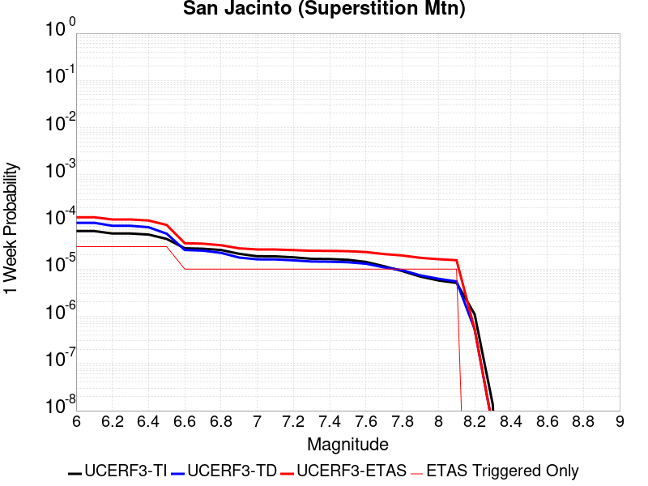 | 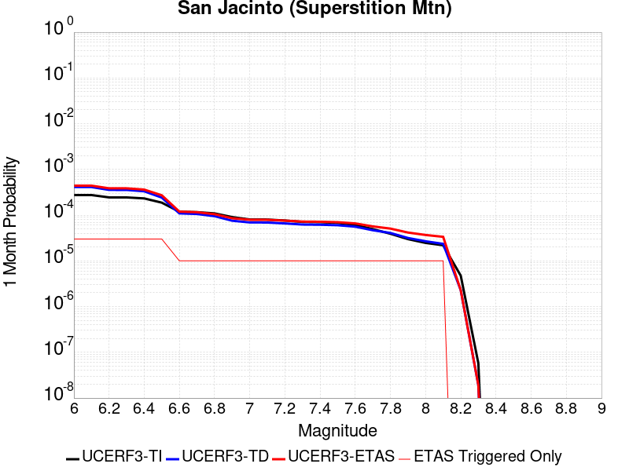 |  | 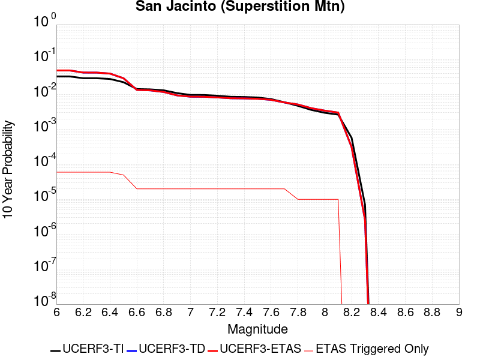 |

| Magnitude | 1 wk TI Prob | 1 wk TD Prob | 1 wk ETAS Prob | 1 wk ETAS/TD Gain | 1 wk ETAS Triggered Only | 1 mo TI Prob | 1 mo TD Prob | 1 mo ETAS Prob | 1 mo ETAS/TD Gain | 1 mo ETAS Triggered Only | 1 yr TI Prob | 1 yr TD Prob | 1 yr ETAS Prob | 1 yr ETAS/TD Gain | 1 yr ETAS Triggered Only | 10 yr TI Prob | 10 yr TD Prob | 10 yr ETAS Prob | 10 yr ETAS/TD Gain | 10 yr ETAS Triggered Only |
|-----|-----|-----|-----|-----|-----|-----|-----|-----|-----|-----|-----|-----|-----|-----|-----|-----|-----|-----|-----|-----|
| 6.0 | 6.4193904E-5 | 9.599558E-5 | 1.2599271E-4 | 1.3124844 | 3.0E-5 | 2.7508775E-4 | 4.1135435E-4 | 4.41342E-4 | 1.0728998 | 3.0E-5 | 0.0033440501 | 0.0049981694 | 0.005047919 | 1.0099536 | 5.0E-5 | 0.03294174 | 0.048820045 | 0.048877116 | 1.001169 | 6.0E-5 |
| 6.1 | 6.4193904E-5 | 9.599558E-5 | 1.2599271E-4 | 1.3124844 | 3.0E-5 | 2.7508775E-4 | 4.1135435E-4 | 4.41342E-4 | 1.0728998 | 3.0E-5 | 0.0033440501 | 0.0049981694 | 0.005047919 | 1.0099536 | 5.0E-5 | 0.03294174 | 0.048820045 | 0.048877116 | 1.001169 | 6.0E-5 |
| 6.2 | 5.7023593E-5 | 8.3144616E-5 | 1.1314212E-4 | 1.3607872 | 3.0E-5 | 2.4436394E-4 | 3.5629462E-4 | 3.8628394E-4 | 1.08417 | 3.0E-5 | 0.002971072 | 0.0043309047 | 0.0043806885 | 1.0114949 | 5.0E-5 | 0.029316625 | 0.042502448 | 0.0425599 | 1.0013517 | 6.0E-5 |
| 6.3 | 5.6940098E-5 | 8.298998E-5 | 1.1298749E-4 | 1.3614595 | 3.0E-5 | 2.4400617E-4 | 3.5563204E-4 | 3.856214E-4 | 1.0843269 | 3.0E-5 | 0.002966728 | 0.00432287 | 0.004372654 | 1.0115163 | 5.0E-5 | 0.029274331 | 0.04242582 | 0.042483274 | 1.0013542 | 6.0E-5 |
| 6.4 | 5.4171585E-5 | 7.748391E-5 | 1.0748159E-4 | 1.3871472 | 3.0E-5 | 2.3214328E-4 | 3.3204095E-4 | 3.62031E-4 | 1.0903203 | 3.0E-5 | 0.0028226813 | 0.0040367534 | 0.0040865513 | 1.0123361 | 5.0E-5 | 0.02787096 | 0.039715026 | 0.039772645 | 1.0014508 | 6.0E-5 |
| 6.5 | 4.375144E-5 | 5.6421442E-5 | 8.641975E-5 | 1.5316827 | 3.0E-5 | 1.874927E-4 | 2.417904E-4 | 2.7178315E-4 | 1.1240444 | 3.0E-5 | 0.0022803338 | 0.002941 | 0.0029908528 | 1.016951 | 5.0E-5 | 0.022570757 | 0.029235592 | 0.02928413 | 1.0016602 | 5.0E-5 |
| 6.6 | 2.772192E-5 | 2.5488029E-5 | 3.5487774E-5 | 1.392331 | 1.0E-5 | 1.1880282E-4 | 1.0922994E-4 | 1.1922885E-4 | 1.09154 | 1.0E-5 | 0.0014454646 | 0.0013290826 | 0.001349056 | 1.015028 | 2.0E-5 | 0.014360986 | 0.013540891 | 0.01356062 | 1.001457 | 2.0E-5 |
| 6.7 | 2.7124124E-5 | 2.4699055E-5 | 3.469881E-5 | 1.4048638 | 1.0E-5 | 1.1624106E-4 | 1.0584891E-4 | 1.1584785E-4 | 1.0944643 | 1.0E-5 | 0.0014143161 | 0.0012879678 | 0.001307942 | 1.0155083 | 2.0E-5 | 0.014053487 | 0.013134248 | 0.013153985 | 1.0015028 | 2.0E-5 |
| 6.8 | 2.5475807E-5 | 2.2164071E-5 | 3.2163847E-5 | 1.4511707 | 1.0E-5 | 1.0917746E-4 | 9.498548E-5 | 1.0498453E-4 | 1.1052692 | 1.0E-5 | 0.001328425 | 0.0011558468 | 0.0011758236 | 1.0172833 | 2.0E-5 | 0.0132051185 | 0.011821818 | 0.011841581 | 1.0016718 | 2.0E-5 |
| 6.9 | 2.1162023E-5 | 1.762564E-5 | 2.7625465E-5 | 1.5673453 | 1.0E-5 | 9.069123E-5 | 7.553629E-5 | 8.553554E-5 | 1.1323767 | 1.0E-5 | 0.0011036064 | 9.1927015E-4 | 9.3925174E-4 | 1.0217364 | 2.0E-5 | 0.010981417 | 0.009446762 | 0.009466573 | 1.0020971 | 2.0E-5 |
| 7.0 | 1.8754288E-5 | 1.616099E-5 | 2.6160827E-5 | 1.6187639 | 1.0E-5 | 8.037304E-5 | 6.9259564E-5 | 7.925887E-5 | 1.1443744 | 1.0E-5 | 9.781026E-4 | 8.429114E-4 | 8.628945E-4 | 1.0237073 | 2.0E-5 | 0.009738087 | 0.008669995 | 0.008689821 | 1.0022868 | 2.0E-5 |
| 7.1 | 1.8678527E-5 | 1.6086136E-5 | 2.6085974E-5 | 1.6216433 | 1.0E-5 | 8.0048376E-5 | 6.8938774E-5 | 7.893809E-5 | 1.1450462 | 1.0E-5 | 9.7415317E-4 | 8.3900883E-4 | 8.5899205E-4 | 1.0238177 | 2.0E-5 | 0.009698939 | 0.008631011 | 0.0086508375 | 1.0022973 | 2.0E-5 |
| 7.2 | 1.7804578E-5 | 1.5380709E-5 | 2.5380556E-5 | 1.6501551 | 1.0E-5 | 7.6303106E-5 | 6.591567E-5 | 7.591501E-5 | 1.151699 | 1.0E-5 | 9.285943E-4 | 8.022301E-4 | 8.2221406E-4 | 1.0249104 | 2.0E-5 | 0.009247236 | 0.008262424 | 0.008282258 | 1.0024006 | 2.0E-5 |
| 7.3 | 1.6583685E-5 | 1.4529837E-5 | 2.4529692E-5 | 1.688229 | 1.0E-5 | 7.1070994E-5 | 6.226926E-5 | 7.226864E-5 | 1.1605829 | 1.0E-5 | 8.649459E-4 | 7.5786654E-4 | 7.778514E-4 | 1.0263699 | 2.0E-5 | 0.00861587 | 0.007817646 | 0.007837489 | 1.0025383 | 2.0E-5 |
| 7.4 | 1.6387552E-5 | 1.4394727E-5 | 2.4394583E-5 | 1.6946888 | 1.0E-5 | 7.023047E-5 | 6.169024E-5 | 7.1689625E-5 | 1.1620902 | 1.0E-5 | 8.5472054E-4 | 7.508219E-4 | 7.7080686E-4 | 1.0266175 | 2.0E-5 | 0.008514405 | 0.0077470187 | 0.007766864 | 1.0025617 | 2.0E-5 |
| 7.5 | 1.5790754E-5 | 1.40354305E-5 | 2.4035291E-5 | 1.7124726 | 1.0E-5 | 6.767291E-5 | 6.015047E-5 | 7.0149865E-5 | 1.1662397 | 1.0E-5 | 8.236062E-4 | 7.320879E-4 | 7.5207325E-4 | 1.0272992 | 2.0E-5 | 0.008205604 | 0.007557581 | 0.00757743 | 1.0026263 | 2.0E-5 |
| 7.6 | 1.4248672E-5 | 1.3054444E-5 | 2.3054314E-5 | 1.7660127 | 1.0E-5 | 6.106431E-5 | 5.5946428E-5 | 6.594587E-5 | 1.1787324 | 1.0E-5 | 7.432043E-4 | 6.809366E-4 | 7.00923E-4 | 1.0293514 | 2.0E-5 | 0.007407237 | 0.007040175 | 0.007060034 | 1.0028208 | 2.0E-5 |
| 7.7 | 1.15449975E-5 | 1.0903222E-5 | 2.0903113E-5 | 1.9171501 | 1.0E-5 | 4.947762E-5 | 4.672726E-5 | 5.6726793E-5 | 1.2139978 | 1.0E-5 | 6.022235E-4 | 5.6875666E-4 | 5.887453E-4 | 1.0351444 | 2.0E-5 | 0.006005941 | 0.0059102564 | 0.0059301383 | 1.003364 | 2.0E-5 |
| 7.8 | 9.1391985E-6 | 9.5139185E-6 | 1.9513824E-5 | 2.0510817 | 1.0E-5 | 3.9167408E-5 | 4.0773306E-5 | 5.07729E-5 | 1.2452486 | 1.0E-5 | 4.767588E-4 | 4.963025E-4 | 5.062975E-4 | 1.020139 | 1.0E-5 | 0.0047573727 | 0.005176809 | 0.0051867575 | 1.0019217 | 1.0E-5 |
| 7.9 | 6.973017E-6 | 7.3817937E-6 | 1.738172E-5 | 2.3546743 | 1.0E-5 | 2.9884017E-5 | 3.163588E-5 | 4.163556E-5 | 1.3160868 | 1.0E-5 | 3.6377716E-4 | 3.8509927E-4 | 3.950954E-4 | 1.0259573 | 1.0E-5 | 0.0036318225 | 0.004051976 | 0.0040619355 | 1.002458 | 1.0E-5 |
| 8.0 | 5.7638235E-6 | 6.259641E-6 | 1.6259579E-5 | 2.5975256 | 1.0E-5 | 2.4701867E-5 | 2.682676E-5 | 3.6826492E-5 | 1.3727521 | 1.0E-5 | 3.0070372E-4 | 3.2656736E-4 | 3.365641E-4 | 1.0306115 | 1.0E-5 | 0.0030029714 | 0.0034535413 | 0.0034635067 | 1.0028856 | 1.0E-5 |
| 8.1 | 5.1124434E-6 | 5.4953657E-6 | 1.549531E-5 | 2.8197052 | 1.0E-5 | 2.1910288E-5 | 2.3551356E-5 | 3.355112E-5 | 1.424594 | 1.0E-5 | 2.6672508E-4 | 2.8670052E-4 | 2.9669766E-4 | 1.0348696 | 1.0E-5 | 0.0026640517 | 0.0030403896 | 0.0030503592 | 1.0032791 | 1.0E-5 |
| 8.2 | 1.1075938E-6 | 5.3348367E-7 | 5.3348367E-7 | 1.0 | 0.0 | 4.7468216E-6 | 2.2863567E-6 | 2.2863567E-6 | 1.0 | 0.0 | 5.779102E-5 | 2.7836059E-5 | 2.7836059E-5 | 1.0 | 0.0 | 5.777599E-4 | 3.133962E-4 | 3.133962E-4 | 1.0 | 0.0 |
| 8.3 | 1.3584393E-8 | 4.4718784E-9 | 4.4718784E-9 | 1.0 | 0.0 | 5.8218827E-8 | 1.9165192E-8 | 1.9165192E-8 | 1.0 | 0.0 | 7.0881396E-7 | 2.3333622E-7 | 2.3333622E-7 | 1.0 | 0.0 | 7.0881174E-6 | 2.6140672E-6 | 2.6140672E-6 | 1.0 | 0.0 |

## Davis Creek
*[(top)](#table-of-contents)*

| 1 Week | 1 Month | 1 Year | 10 Year |
|-----|-----|-----|-----|
|  |  |  |  |

| Magnitude | 1 wk TI Prob | 1 wk TD Prob | 1 wk ETAS Prob | 1 wk ETAS/TD Gain | 1 wk ETAS Triggered Only | 1 mo TI Prob | 1 mo TD Prob | 1 mo ETAS Prob | 1 mo ETAS/TD Gain | 1 mo ETAS Triggered Only | 1 yr TI Prob | 1 yr TD Prob | 1 yr ETAS Prob | 1 yr ETAS/TD Gain | 1 yr ETAS Triggered Only | 10 yr TI Prob | 10 yr TD Prob | 10 yr ETAS Prob | 10 yr ETAS/TD Gain | 10 yr ETAS Triggered Only |
|-----|-----|-----|-----|-----|-----|-----|-----|-----|-----|-----|-----|-----|-----|-----|-----|-----|-----|-----|-----|-----|
| 6.0 | 2.331472E-5 | 2.5417214E-5 | 4.5416706E-5 | 1.7868483 | 2.0E-5 | 9.99164E-5 | 1.0892704E-4 | 1.2892486E-4 | 1.1835891 | 2.0E-5 | 0.0012158032 | 0.0013254983 | 0.0013454718 | 1.0150687 | 2.0E-5 | 0.01209173 | 0.013187704 | 0.013217309 | 1.0022448 | 3.0E-5 |
| 6.1 | 1.0407654E-5 | 1.1316986E-5 | 2.1316873E-5 | 1.8836174 | 1.0E-5 | 4.4603472E-5 | 4.8500624E-5 | 5.8500136E-5 | 1.206173 | 1.0E-5 | 5.4291193E-4 | 5.9036224E-4 | 6.003563E-4 | 1.0169288 | 1.0E-5 | 0.0054158745 | 0.005890611 | 0.0059104934 | 1.0033753 | 2.0E-5 |
| 6.2 | 1.0407654E-5 | 1.1316986E-5 | 2.1316873E-5 | 1.8836174 | 1.0E-5 | 4.4603472E-5 | 4.8500624E-5 | 5.8500136E-5 | 1.206173 | 1.0E-5 | 5.4291193E-4 | 5.9036224E-4 | 6.003563E-4 | 1.0169288 | 1.0E-5 | 0.0054158745 | 0.005890611 | 0.0059104934 | 1.0033753 | 2.0E-5 |
| 6.3 | 5.1323277E-6 | 5.568556E-6 | 1.5568501E-5 | 2.7957878 | 1.0E-5 | 2.1995505E-5 | 2.386507E-5 | 3.386483E-5 | 1.4190124 | 1.0E-5 | 2.6776237E-4 | 2.905271E-4 | 3.005242E-4 | 1.0344102 | 1.0E-5 | 0.0026743996 | 0.0029023192 | 0.0029222611 | 1.006871 | 2.0E-5 |
| 6.4 | 2.4985154E-6 | 2.704538E-6 | 2.704538E-6 | 1.0 | 0.0 | 1.07078795E-5 | 1.1590847E-5 | 1.1590847E-5 | 1.0 | 0.0 | 1.3036063E-4 | 1.4111304E-4 | 1.4111304E-4 | 1.0 | 0.0 | 0.0013028418 | 0.001410589 | 0.001410589 | 1.0 | 0.0 |
| 6.5 | 2.4846438E-6 | 2.6904722E-6 | 2.6904722E-6 | 1.0 | 0.0 | 1.064843E-5 | 1.1530565E-5 | 1.1530565E-5 | 1.0 | 0.0 | 1.2963692E-4 | 1.403792E-4 | 1.403792E-4 | 1.0 | 0.0 | 0.0012956132 | 0.0014032599 | 0.0014032599 | 1.0 | 0.0 |
| 6.6 | 2.072566E-7 | 2.1018087E-7 | 2.1018087E-7 | 1.0 | 0.0 | 8.882423E-7 | 9.0077486E-7 | 9.0077486E-7 | 1.0 | 0.0 | 1.0814296E-5 | 1.0966881E-5 | 1.0966881E-5 | 1.0 | 0.0 | 1.081377E-4 | 1.09663575E-4 | 1.09663575E-4 | 1.0 | 0.0 |
| 6.7 | 1.7544528E-7 | 1.7790826E-7 | 1.7790826E-7 | 1.0 | 0.0 | 7.5190815E-7 | 7.6246374E-7 | 7.6246374E-7 | 1.0 | 0.0 | 9.154443E-6 | 9.282958E-6 | 9.282958E-6 | 1.0 | 0.0 | 9.1540656E-5 | 9.282586E-5 | 9.282586E-5 | 1.0 | 0.0 |
| 6.8 | 1.2320395E-7 | 1.2481138E-7 | 1.2481138E-7 | 1.0 | 0.0 | 5.280168E-7 | 5.349058E-7 | 5.349058E-7 | 1.0 | 0.0 | 6.428586E-6 | 6.5124595E-6 | 6.5124595E-6 | 1.0 | 0.0 | 6.4284E-5 | 6.5122804E-5 | 6.5122804E-5 | 1.0 | 0.0 |
| 6.9 | 6.399997E-8 | 6.486058E-8 | 6.486058E-8 | 1.0 | 0.0 | 2.7428555E-7 | 2.7797387E-7 | 2.7797387E-7 | 1.0 | 0.0 | 3.3394215E-6 | 3.3843273E-6 | 3.3843273E-6 | 1.0 | 0.0 | 3.3393713E-5 | 3.384282E-5 | 3.384282E-5 | 1.0 | 0.0 |
| 7.0 | 6.4455685E-9 | 6.535264E-9 | 6.535264E-9 | 1.0 | 0.0 | 2.7623864E-8 | 2.8008275E-8 | 2.8008275E-8 | 1.0 | 0.0 | 3.3632048E-7 | 3.4100074E-7 | 3.4100074E-7 | 1.0 | 0.0 | 3.3631998E-6 | 3.4100074E-6 | 3.4100074E-6 | 1.0 | 0.0 |

## Calaveras (So) - Paicines extension 2011 CFM
*[(top)](#table-of-contents)*

| 1 Week | 1 Month | 1 Year | 10 Year |
|-----|-----|-----|-----|
|  |  | 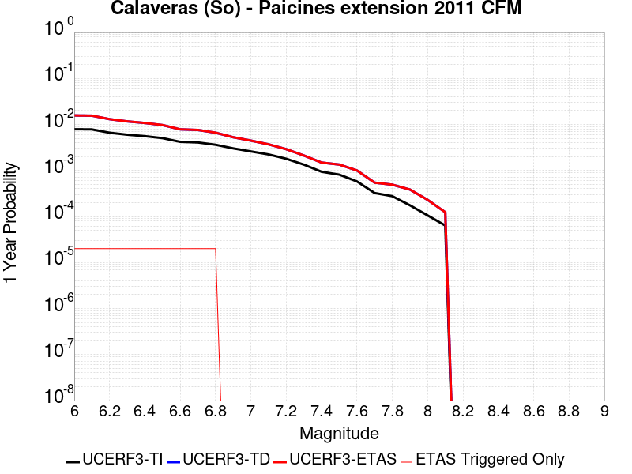 |  |

| Magnitude | 1 wk TI Prob | 1 wk TD Prob | 1 wk ETAS Prob | 1 wk ETAS/TD Gain | 1 wk ETAS Triggered Only | 1 mo TI Prob | 1 mo TD Prob | 1 mo ETAS Prob | 1 mo ETAS/TD Gain | 1 mo ETAS Triggered Only | 1 yr TI Prob | 1 yr TD Prob | 1 yr ETAS Prob | 1 yr ETAS/TD Gain | 1 yr ETAS Triggered Only | 10 yr TI Prob | 10 yr TD Prob | 10 yr ETAS Prob | 10 yr ETAS/TD Gain | 10 yr ETAS Triggered Only |
|-----|-----|-----|-----|-----|-----|-----|-----|-----|-----|-----|-----|-----|-----|-----|-----|-----|-----|-----|-----|-----|
| 6.0 | 1.5183659E-4 | 3.0520977E-4 | 3.0520977E-4 | 1.0 | 0.0 | 6.5056595E-4 | 0.0013068188 | 0.0013168057 | 1.0076421 | 1.0E-5 | 0.007891912 | 0.015696203 | 0.01571589 | 1.0012542 | 2.0E-5 | 0.076174594 | 0.13848905 | 0.13853213 | 1.000311 | 5.0E-5 |
| 6.1 | 1.5024997E-4 | 3.021517E-4 | 3.021517E-4 | 1.0 | 0.0 | 6.437695E-4 | 0.0012937278 | 0.0013037149 | 1.0077196 | 1.0E-5 | 0.0078097614 | 0.015539596 | 0.015559285 | 1.0012671 | 2.0E-5 | 0.075409345 | 0.13715863 | 0.13720177 | 1.0003146 | 5.0E-5 |
| 6.2 | 1.2743923E-4 | 2.5313982E-4 | 2.5313982E-4 | 1.0 | 0.0 | 5.460538E-4 | 0.0010839999 | 0.001093989 | 1.0092151 | 1.0E-5 | 0.0066279583 | 0.013046881 | 0.013066621 | 1.0015129 | 2.0E-5 | 0.064337276 | 0.117256075 | 0.11730021 | 1.0003765 | 5.0E-5 |
| 6.3 | 1.1525114E-4 | 2.2599236E-4 | 2.2599236E-4 | 1.0 | 0.0 | 4.9383997E-4 | 9.678718E-4 | 9.77862E-4 | 1.010322 | 1.0E-5 | 0.0059959386 | 0.011668079 | 0.011687845 | 1.0016941 | 2.0E-5 | 0.058367174 | 0.106372125 | 0.10641681 | 1.0004201 | 5.0E-5 |
| 6.4 | 1.07200925E-4 | 2.0840544E-4 | 2.0840544E-4 | 1.0 | 0.0 | 4.5935164E-4 | 8.926123E-4 | 9.026034E-4 | 1.011193 | 1.0E-5 | 0.0055782744 | 0.010772959 | 0.010792743 | 1.0018365 | 2.0E-5 | 0.0544031 | 0.099194765 | 0.09923981 | 1.0004541 | 5.0E-5 |
| 6.5 | 9.69631E-5 | 1.8734725E-4 | 1.8734725E-4 | 1.0 | 0.0 | 4.1548995E-4 | 8.024631E-4 | 8.124551E-4 | 1.0124516 | 1.0E-5 | 0.0050468626 | 0.009694842 | 0.009714647 | 1.002043 | 2.0E-5 | 0.04933773 | 0.090086564 | 0.090132065 | 1.000505 | 5.0E-5 |
| 6.6 | 8.0552316E-5 | 1.507068E-4 | 1.507068E-4 | 1.0 | 0.0 | 3.4517853E-4 | 6.4569083E-4 | 6.556844E-4 | 1.0154773 | 1.0E-5 | 0.0041944524 | 0.007826508 | 0.007846352 | 1.0025355 | 2.0E-5 | 0.04116161 | 0.0748563 | 0.07490256 | 1.000618 | 5.0E-5 |
| 6.7 | 7.815757E-5 | 1.4611272E-4 | 1.4611272E-4 | 1.0 | 0.0 | 3.34918E-4 | 6.26014E-4 | 6.360078E-4 | 1.015964 | 1.0E-5 | 0.004070005 | 0.007589312 | 0.0076091597 | 1.0026153 | 2.0E-5 | 0.039962657 | 0.07270582 | 0.072752185 | 1.0006377 | 5.0E-5 |
| 6.8 | 6.965264E-5 | 1.2722758E-4 | 1.2722758E-4 | 1.0 | 0.0 | 2.9847719E-4 | 5.4513285E-4 | 5.551274E-4 | 1.0183342 | 1.0E-5 | 0.0036279052 | 0.0066135945 | 0.006633462 | 1.0030041 | 2.0E-5 | 0.03569247 | 0.063801065 | 0.06384788 | 1.0007337 | 5.0E-5 |
| 6.9 | 5.8000453E-5 | 1.01439E-4 | 1.01439E-4 | 1.0 | 0.0 | 2.4854968E-4 | 4.346666E-4 | 4.346666E-4 | 1.0 | 0.0 | 0.0030218933 | 0.005279322 | 0.005279322 | 1.0 | 0.0 | 0.029811295 | 0.051502965 | 0.05153142 | 1.0005525 | 3.0E-5 |
| 7.0 | 4.9865852E-5 | 8.568029E-5 | 8.568029E-5 | 1.0 | 0.0 | 2.1369329E-4 | 3.6715003E-4 | 3.6715003E-4 | 1.0 | 0.0 | 0.0025986114 | 0.004460979 | 0.004460979 | 1.0 | 0.0 | 0.025684336 | 0.043782018 | 0.04380114 | 1.0004368 | 2.0E-5 |
| 7.1 | 4.283875E-5 | 7.1124625E-5 | 7.1124625E-5 | 1.0 | 0.0 | 1.8358172E-4 | 3.0478454E-4 | 3.0478454E-4 | 1.0 | 0.0 | 0.0022328163 | 0.003704494 | 0.003704494 | 1.0 | 0.0 | 0.022105146 | 0.03673582 | 0.03675509 | 1.0005244 | 2.0E-5 |
| 7.2 | 3.450115E-5 | 5.5778568E-5 | 5.5778568E-5 | 1.0 | 0.0 | 1.478537E-4 | 2.3902925E-4 | 2.3902925E-4 | 1.0 | 0.0 | 0.0017986323 | 0.0029063264 | 0.0029063264 | 1.0 | 0.0 | 0.017841442 | 0.029079042 | 0.029088752 | 1.0003339 | 1.0E-5 |
| 7.3 | 2.5709045E-5 | 4.059001E-5 | 4.059001E-5 | 1.0 | 0.0 | 1.1017697E-4 | 1.7394568E-4 | 1.7394568E-4 | 1.0 | 0.0 | 0.0013405791 | 0.0021157486 | 0.0021157486 | 1.0 | 0.0 | 0.013325208 | 0.02129686 | 0.021306649 | 1.0004596 | 1.0E-5 |
| 7.4 | 1.8003093E-5 | 2.8511378E-5 | 2.8511378E-5 | 1.0 | 0.0 | 7.715383E-5 | 1.2218591E-4 | 1.2218591E-4 | 1.0 | 0.0 | 9.3894306E-4 | 0.0014866006 | 0.0014866006 | 1.0 | 0.0 | 0.009349857 | 0.015051589 | 0.015061439 | 1.0006543 | 1.0E-5 |
| 7.5 | 1.5595824E-5 | 2.5823752E-5 | 2.5823752E-5 | 1.0 | 0.0 | 6.683753E-5 | 1.10668545E-4 | 1.10668545E-4 | 1.0 | 0.0 | 8.134431E-4 | 0.0013465589 | 0.0013465589 | 1.0 | 0.0 | 0.008104719 | 0.013651571 | 0.013661435 | 1.0007225 | 1.0E-5 |
| 7.6 | 1.1110309E-5 | 1.9223195E-5 | 1.9223195E-5 | 1.0 | 0.0 | 4.761474E-5 | 8.2382525E-5 | 8.2382525E-5 | 1.0 | 0.0 | 5.795553E-4 | 0.0010025471 | 0.0010025471 | 1.0 | 0.0 | 0.0057804612 | 0.01020344 | 0.010213338 | 1.00097 | 1.0E-5 |
| 7.7 | 6.2140443E-6 | 1.04376995E-5 | 1.04376995E-5 | 1.0 | 0.0 | 2.6631347E-5 | 4.4732235E-5 | 4.4732235E-5 | 1.0 | 0.0 | 3.241884E-4 | 5.4447894E-4 | 5.4447894E-4 | 1.0 | 0.0 | 0.0032371588 | 0.005620102 | 0.005630046 | 1.0017693 | 1.0E-5 |
| 7.8 | 5.305533E-6 | 9.433651E-6 | 9.433651E-6 | 1.0 | 0.0 | 2.27378E-5 | 4.0429306E-5 | 4.0429306E-5 | 1.0 | 0.0 | 2.7679754E-4 | 4.9211574E-4 | 4.9211574E-4 | 1.0 | 0.0 | 0.0027645302 | 0.005074622 | 0.0050845714 | 1.0019606 | 1.0E-5 |
| 7.9 | 3.363505E-6 | 7.3854467E-6 | 7.3854467E-6 | 1.0 | 0.0 | 1.4414942E-5 | 3.1651532E-5 | 3.1651532E-5 | 1.0 | 0.0 | 1.7548777E-4 | 3.8528934E-4 | 3.8528934E-4 | 1.0 | 0.0 | 0.0017534926 | 0.003948784 | 0.0039587445 | 1.0025225 | 1.0E-5 |
| 8.0 | 2.0271132E-6 | 4.4134235E-6 | 4.4134235E-6 | 1.0 | 0.0 | 8.687599E-6 | 1.8914534E-5 | 1.8914534E-5 | 1.0 | 0.0 | 1.05766376E-4 | 2.3026018E-4 | 2.3026018E-4 | 1.0 | 0.0 | 0.0010571606 | 0.002351194 | 0.002351194 | 1.0 | 0.0 |
| 8.1 | 1.2206116E-6 | 2.3752666E-6 | 2.3752666E-6 | 1.0 | 0.0 | 5.2311816E-6 | 1.0179674E-5 | 1.0179674E-5 | 1.0 | 0.0 | 6.3687774E-5 | 1.2393051E-4 | 1.2393051E-4 | 1.0 | 0.0 | 6.366953E-4 | 0.0012705618 | 0.0012705618 | 1.0 | 0.0 |

## Calaveras (So) 2011 CFM
*[(top)](#table-of-contents)*

| 1 Week | 1 Month | 1 Year | 10 Year |
|-----|-----|-----|-----|
|  | 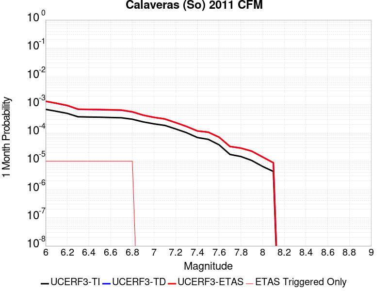 | 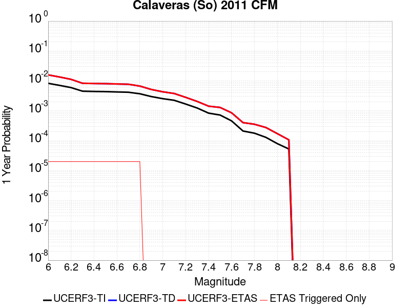 | 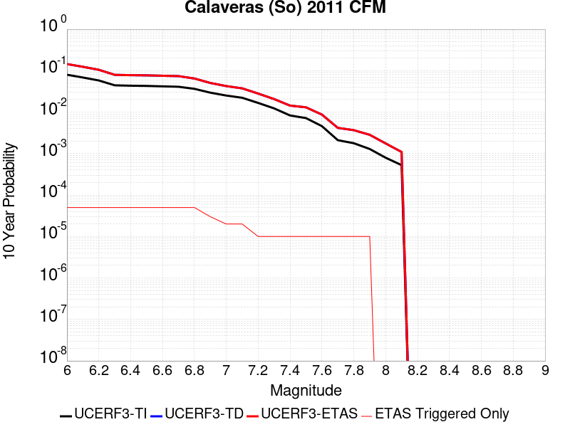 |

| Magnitude | 1 wk TI Prob | 1 wk TD Prob | 1 wk ETAS Prob | 1 wk ETAS/TD Gain | 1 wk ETAS Triggered Only | 1 mo TI Prob | 1 mo TD Prob | 1 mo ETAS Prob | 1 mo ETAS/TD Gain | 1 mo ETAS Triggered Only | 1 yr TI Prob | 1 yr TD Prob | 1 yr ETAS Prob | 1 yr ETAS/TD Gain | 1 yr ETAS Triggered Only | 10 yr TI Prob | 10 yr TD Prob | 10 yr ETAS Prob | 10 yr ETAS/TD Gain | 10 yr ETAS Triggered Only |
|-----|-----|-----|-----|-----|-----|-----|-----|-----|-----|-----|-----|-----|-----|-----|-----|-----|-----|-----|-----|-----|
| 6.0 | 1.5950744E-4 | 3.0713255E-4 | 3.0713255E-4 | 1.0 | 0.0 | 6.834242E-4 | 0.001315409 | 0.0013253958 | 1.0075922 | 1.0E-5 | 0.00828899 | 0.015858326 | 0.015878009 | 1.0012412 | 2.0E-5 | 0.079865426 | 0.14440185 | 0.14444463 | 1.0002962 | 5.0E-5 |
| 6.1 | 1.3584697E-4 | 2.603514E-4 | 2.603514E-4 | 1.0 | 0.0 | 5.8207137E-4 | 0.0011151754 | 0.0011251643 | 1.0089571 | 1.0E-5 | 0.007063716 | 0.013461385 | 0.013481116 | 1.0014657 | 2.0E-5 | 0.06843361 | 0.124029994 | 0.124073796 | 1.0003531 | 5.0E-5 |
| 6.2 | 1.14676266E-4 | 2.1714384E-4 | 2.1714384E-4 | 1.0 | 0.0 | 4.9137714E-4 | 9.30223E-4 | 9.402137E-4 | 1.0107402 | 1.0E-5 | 0.0059661185 | 0.011245058 | 0.011264834 | 1.0017586 | 2.0E-5 | 0.058084648 | 0.10502057 | 0.105065316 | 1.000426 | 5.0E-5 |
| 6.3 | 8.691518E-5 | 1.5987935E-4 | 1.5987935E-4 | 1.0 | 0.0 | 3.7244044E-4 | 6.849807E-4 | 6.9497386E-4 | 1.014589 | 1.0E-5 | 0.004525038 | 0.008301122 | 0.0083209565 | 1.0023893 | 2.0E-5 | 0.044339992 | 0.0793365 | 0.07938253 | 1.0005802 | 5.0E-5 |
| 6.4 | 8.50982E-5 | 1.5694331E-4 | 1.5694331E-4 | 1.0 | 0.0 | 3.646556E-4 | 6.724042E-4 | 6.823975E-4 | 1.0148621 | 1.0E-5 | 0.0044306475 | 0.008149155 | 0.008168993 | 1.0024343 | 2.0E-5 | 0.04343345 | 0.07794268 | 0.07798878 | 1.0005915 | 5.0E-5 |
| 6.5 | 8.4062965E-5 | 1.5518743E-4 | 1.5518743E-4 | 1.0 | 0.0 | 3.602201E-4 | 6.6488347E-4 | 6.748768E-4 | 1.0150303 | 1.0E-5 | 0.004376863 | 0.008058365 | 0.0080782045 | 1.0024619 | 2.0E-5 | 0.042916555 | 0.07711388 | 0.07716003 | 1.0005984 | 5.0E-5 |
| 6.6 | 8.194716E-5 | 1.5154552E-4 | 1.5154552E-4 | 1.0 | 0.0 | 3.5115483E-4 | 6.492843E-4 | 6.592778E-4 | 1.0153916 | 1.0E-5 | 0.0042669317 | 0.007870209 | 0.007890052 | 1.0025213 | 2.0E-5 | 0.04185927 | 0.07539919 | 0.07544542 | 1.0006131 | 5.0E-5 |
| 6.7 | 8.012326E-5 | 1.4822475E-4 | 1.4822475E-4 | 1.0 | 0.0 | 3.433402E-4 | 6.350612E-4 | 6.4505485E-4 | 1.0157365 | 1.0E-5 | 0.004172157 | 0.007698701 | 0.0077185472 | 1.0025778 | 2.0E-5 | 0.040946912 | 0.07384132 | 0.073887624 | 1.0006272 | 5.0E-5 |
| 6.8 | 7.119773E-5 | 1.2881879E-4 | 1.2881879E-4 | 1.0 | 0.0 | 3.0509746E-4 | 5.519494E-4 | 5.619438E-4 | 1.0181077 | 1.0E-5 | 0.0037082357 | 0.006696066 | 0.006715932 | 1.0029669 | 2.0E-5 | 0.036469642 | 0.06468575 | 0.064732514 | 1.000723 | 5.0E-5 |
| 6.9 | 5.7343088E-5 | 9.919277E-5 | 9.919277E-5 | 1.0 | 0.0 | 2.4573295E-4 | 4.25043E-4 | 4.25043E-4 | 1.0 | 0.0 | 0.0029876942 | 0.005162694 | 0.005162694 | 1.0 | 0.0 | 0.02947844 | 0.05051036 | 0.050538845 | 1.000564 | 3.0E-5 |
| 7.0 | 4.8746577E-5 | 8.2850725E-5 | 8.2850725E-5 | 1.0 | 0.0 | 2.0889717E-4 | 3.5502657E-4 | 3.5502657E-4 | 1.0 | 0.0 | 0.0025403565 | 0.004313948 | 0.004313948 | 1.0 | 0.0 | 0.025115121 | 0.042485245 | 0.042504396 | 1.0004507 | 2.0E-5 |
| 7.1 | 4.2998014E-5 | 7.265203E-5 | 7.265203E-5 | 1.0 | 0.0 | 1.8426418E-4 | 3.1132903E-4 | 3.1132903E-4 | 1.0 | 0.0 | 0.002241108 | 0.003783903 | 0.003783903 | 1.0 | 0.0 | 0.022186412 | 0.037423562 | 0.037442815 | 1.0005144 | 2.0E-5 |
| 7.2 | 3.221292E-5 | 5.390791E-5 | 5.390791E-5 | 1.0 | 0.0 | 1.3804805E-4 | 2.3101359E-4 | 2.3101359E-4 | 1.0 | 0.0 | 0.0016794393 | 0.0028089907 | 0.0028089907 | 1.0 | 0.0 | 0.016668037 | 0.02803602 | 0.028045742 | 1.0003467 | 1.0E-5 |
| 7.3 | 2.3756531E-5 | 3.9473416E-5 | 3.9473416E-5 | 1.0 | 0.0 | 1.0180973E-4 | 1.6916092E-4 | 1.6916092E-4 | 1.0 | 0.0 | 0.0012388286 | 0.0020576057 | 0.0020576057 | 1.0 | 0.0 | 0.012319452 | 0.020643145 | 0.020652939 | 1.0004745 | 1.0E-5 |
| 7.4 | 1.5997684E-5 | 2.7342163E-5 | 2.7342163E-5 | 1.0 | 0.0 | 6.8559704E-5 | 1.1717545E-4 | 1.1717545E-4 | 1.0 | 0.0 | 8.343947E-4 | 0.00142568 | 0.00142568 | 1.0 | 0.0 | 0.008312687 | 0.014376011 | 0.014385867 | 1.0006856 | 1.0E-5 |
| 7.5 | 1.3814293E-5 | 2.4783874E-5 | 2.4783874E-5 | 1.0 | 0.0 | 5.9202768E-5 | 1.062123E-4 | 1.062123E-4 | 1.0 | 0.0 | 7.205553E-4 | 0.00129237 | 0.00129237 | 1.0 | 0.0 | 0.007182234 | 0.013055085 | 0.013064954 | 1.000756 | 1.0E-5 |
| 7.6 | 8.817309E-6 | 1.6430757E-5 | 1.6430757E-5 | 1.0 | 0.0 | 3.7787922E-5 | 7.0415634E-5 | 7.0415634E-5 | 1.0 | 0.0 | 4.5997082E-4 | 8.569745E-4 | 8.569745E-4 | 1.0 | 0.0 | 0.004590199 | 0.008719284 | 0.008729197 | 1.0011369 | 1.0E-5 |
| 7.7 | 4.0352206E-6 | 7.707318E-6 | 7.707318E-6 | 1.0 | 0.0 | 1.7293689E-5 | 3.3030945E-5 | 3.3030945E-5 | 1.0 | 0.0 | 2.1053031E-4 | 4.0207763E-4 | 4.0207763E-4 | 1.0 | 0.0 | 0.0021033096 | 0.004165172 | 0.0041751307 | 1.0023909 | 1.0E-5 |
| 7.8 | 3.413169E-6 | 6.787282E-6 | 6.787282E-6 | 1.0 | 0.0 | 1.4627784E-5 | 2.9088029E-5 | 2.9088029E-5 | 1.0 | 0.0 | 1.7807873E-4 | 3.5408925E-4 | 3.5408925E-4 | 1.0 | 0.0 | 0.0017793609 | 0.0036665166 | 0.00367648 | 1.0027174 | 1.0E-5 |
| 7.9 | 2.4740732E-6 | 5.2791843E-6 | 5.2791843E-6 | 1.0 | 0.0 | 1.06031275E-5 | 2.262488E-5 | 2.262488E-5 | 1.0 | 0.0 | 1.2908543E-4 | 2.7542314E-4 | 2.7542314E-4 | 1.0 | 0.0 | 0.0012901047 | 0.0028347955 | 0.0028447672 | 1.0035176 | 1.0E-5 |
| 8.0 | 1.5231818E-6 | 3.2889548E-6 | 3.2889548E-6 | 1.0 | 0.0 | 6.527906E-6 | 1.40954435E-5 | 1.40954435E-5 | 1.0 | 0.0 | 7.9474354E-5 | 1.7159856E-4 | 1.7159856E-4 | 1.0 | 0.0 | 7.944594E-4 | 0.0017564303 | 0.0017564303 | 1.0 | 0.0 |
| 8.1 | 1.0104524E-6 | 2.045782E-6 | 2.045782E-6 | 1.0 | 0.0 | 4.330503E-6 | 8.767608E-6 | 8.767608E-6 | 1.0 | 0.0 | 5.2722597E-5 | 1.0674043E-4 | 1.0674043E-4 | 1.0 | 0.0 | 5.271009E-4 | 0.001092934 | 0.001092934 | 1.0 | 0.0 |

## Newport-Inglewood (Offshore)
*[(top)](#table-of-contents)*

| 1 Week | 1 Month | 1 Year | 10 Year |
|-----|-----|-----|-----|
|  | 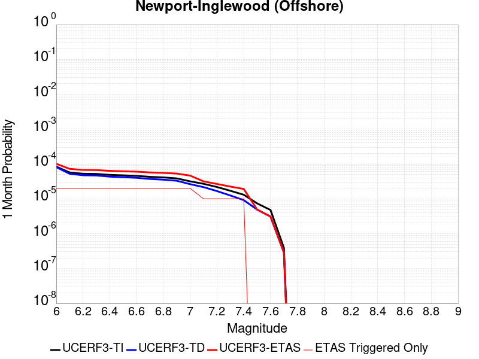 | 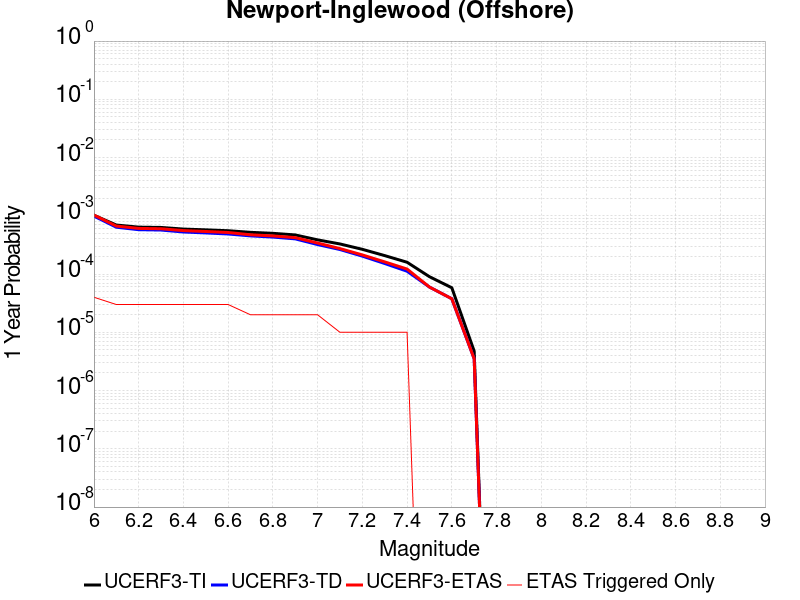 | 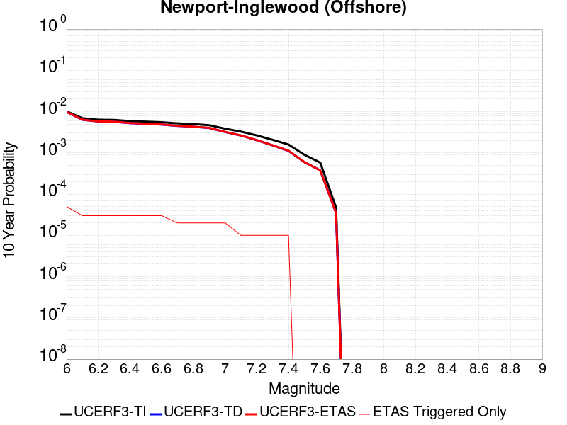 |

| Magnitude | 1 wk TI Prob | 1 wk TD Prob | 1 wk ETAS Prob | 1 wk ETAS/TD Gain | 1 wk ETAS Triggered Only | 1 mo TI Prob | 1 mo TD Prob | 1 mo ETAS Prob | 1 mo ETAS/TD Gain | 1 mo ETAS Triggered Only | 1 yr TI Prob | 1 yr TD Prob | 1 yr ETAS Prob | 1 yr ETAS/TD Gain | 1 yr ETAS Triggered Only | 10 yr TI Prob | 10 yr TD Prob | 10 yr ETAS Prob | 10 yr ETAS/TD Gain | 10 yr ETAS Triggered Only |
|-----|-----|-----|-----|-----|-----|-----|-----|-----|-----|-----|-----|-----|-----|-----|-----|-----|-----|-----|-----|-----|
| 6.0 | 1.9626508E-5 | 1.8965342E-5 | 3.8964965E-5 | 2.0545352 | 2.0E-5 | 8.411089E-5 | 8.1277576E-5 | 1.0127595E-4 | 1.2460504 | 2.0E-5 | 0.001023569 | 9.891179E-4 | 0.0010290783 | 1.0404 | 4.0E-5 | 0.010188672 | 0.009848497 | 0.009898004 | 1.0050269 | 5.0E-5 |
| 6.1 | 1.331886E-5 | 1.2218078E-5 | 3.2217835E-5 | 2.6368985 | 2.0E-5 | 5.707958E-5 | 5.2362153E-5 | 7.23611E-5 | 1.3819352 | 2.0E-5 | 6.947222E-4 | 6.3732424E-4 | 6.673051E-4 | 1.0470418 | 3.0E-5 | 0.006925544 | 0.006355142 | 0.0063849515 | 1.0046905 | 3.0E-5 |
| 6.2 | 1.2250852E-5 | 1.1076016E-5 | 3.1075793E-5 | 2.8056834 | 2.0E-5 | 5.2502597E-5 | 4.746778E-5 | 6.746683E-5 | 1.4213184 | 2.0E-5 | 6.3903164E-4 | 5.7776796E-4 | 6.0775067E-4 | 1.051894 | 3.0E-5 | 0.006371971 | 0.0057627796 | 0.0057926066 | 1.0051758 | 3.0E-5 |
| 6.3 | 1.2106258E-5 | 1.0918878E-5 | 3.0918658E-5 | 2.83167 | 2.0E-5 | 5.1882926E-5 | 4.6794354E-5 | 6.679342E-5 | 1.427382 | 2.0E-5 | 6.3149154E-4 | 5.695733E-4 | 5.9955625E-4 | 1.052641 | 3.0E-5 | 0.0062970007 | 0.005681252 | 0.005711082 | 1.0052506 | 3.0E-5 |
| 6.4 | 1.1348758E-5 | 1.0109348E-5 | 3.0109146E-5 | 2.9783468 | 2.0E-5 | 4.8636626E-5 | 4.3325064E-5 | 6.3324194E-5 | 1.4616065 | 2.0E-5 | 5.919901E-4 | 5.2735576E-4 | 5.5734E-4 | 1.0568576 | 3.0E-5 | 0.005904155 | 0.0052611395 | 0.0052909814 | 1.0056722 | 3.0E-5 |
| 6.5 | 1.100837E-5 | 9.743376E-6 | 2.9743182E-5 | 3.0526567 | 2.0E-5 | 4.7177873E-5 | 4.175666E-5 | 6.1755825E-5 | 1.4789455 | 2.0E-5 | 5.7423924E-4 | 5.082695E-4 | 5.382543E-4 | 1.0589938 | 3.0E-5 | 0.005727576 | 0.005071162 | 0.0051010097 | 1.0058858 | 3.0E-5 |
| 6.6 | 1.0634696E-5 | 9.34553E-6 | 2.9345343E-5 | 3.1400406 | 2.0E-5 | 4.557647E-5 | 4.0051662E-5 | 6.005086E-5 | 1.499335 | 2.0E-5 | 5.5475225E-4 | 4.875206E-4 | 5.17506E-4 | 1.0615059 | 3.0E-5 | 0.0055336943 | 0.0048645977 | 0.0048944517 | 1.006137 | 3.0E-5 |
| 6.7 | 9.9780855E-6 | 8.667898E-6 | 2.8667726E-5 | 3.3073442 | 2.0E-5 | 4.276252E-5 | 3.7147613E-5 | 5.714687E-5 | 1.5383726 | 2.0E-5 | 5.205093E-4 | 4.5217903E-4 | 4.7216998E-4 | 1.0442103 | 2.0E-5 | 0.0051929182 | 0.0045126686 | 0.0045325784 | 1.0044119 | 2.0E-5 |
| 6.8 | 9.59546E-6 | 8.272933E-6 | 2.8272767E-5 | 3.4175024 | 2.0E-5 | 4.1122752E-5 | 3.545495E-5 | 5.545424E-5 | 1.5640762 | 2.0E-5 | 5.0055445E-4 | 4.3157916E-4 | 4.5157052E-4 | 1.0463214 | 2.0E-5 | 0.004994285 | 0.004307486 | 0.0043273997 | 1.004623 | 2.0E-5 |
| 6.9 | 9.000614E-6 | 7.706823E-6 | 2.7706668E-5 | 3.595083 | 2.0E-5 | 3.857349E-5 | 3.3028828E-5 | 5.302817E-5 | 1.6055117 | 2.0E-5 | 4.6953102E-4 | 4.0205245E-4 | 4.220444E-4 | 1.0497247 | 2.0E-5 | 0.004685402 | 0.0040133223 | 0.004033242 | 1.0049634 | 2.0E-5 |
| 7.0 | 7.4070194E-6 | 6.148865E-6 | 2.6148742E-5 | 4.252613 | 2.0E-5 | 3.1743984E-5 | 2.6352012E-5 | 4.6351484E-5 | 1.7589353 | 2.0E-5 | 3.8641447E-4 | 3.2078868E-4 | 3.4078225E-4 | 1.0623263 | 2.0E-5 | 0.0038574322 | 0.0032032758 | 0.0032232117 | 1.0062236 | 2.0E-5 |
| 7.1 | 6.299615E-6 | 5.0565613E-6 | 1.5056511E-5 | 2.9776185 | 1.0E-5 | 2.699807E-5 | 2.1670798E-5 | 3.167058E-5 | 1.4614404 | 1.0E-5 | 3.2865192E-4 | 2.6381016E-4 | 2.7380753E-4 | 1.037896 | 1.0E-5 | 0.003281663 | 0.0026349847 | 0.0026449582 | 1.0037851 | 1.0E-5 |
| 7.2 | 5.096653E-6 | 3.892733E-6 | 1.38926935E-5 | 3.5688794 | 1.0E-5 | 2.1842614E-5 | 1.6683034E-5 | 2.6682868E-5 | 1.5994014 | 1.0E-5 | 2.6590136E-4 | 2.0309711E-4 | 2.1309509E-4 | 1.0492275 | 1.0E-5 | 0.0026558342 | 0.0020291263 | 0.0020391059 | 1.0049182 | 1.0E-5 |
| 7.3 | 3.9753018E-6 | 2.9098787E-6 | 1.290985E-5 | 4.436559 | 1.0E-5 | 1.7036897E-5 | 1.24708495E-5 | 2.2470726E-5 | 1.80186 | 1.0E-5 | 2.0740448E-4 | 1.518221E-4 | 1.6182057E-4 | 1.0658566 | 1.0E-5 | 0.00207211 | 0.0015171919 | 0.0015271767 | 1.0065811 | 1.0E-5 |
| 7.4 | 3.0568392E-6 | 2.1449732E-6 | 1.2144952E-5 | 5.6620526 | 1.0E-5 | 1.3100675E-5 | 9.19271E-6 | 1.919262E-5 | 2.0878084 | 1.0E-5 | 1.5948903E-4 | 1.11915564E-4 | 1.2191445E-4 | 1.0893431 | 1.0E-5 | 0.0015937461 | 0.0011185983 | 0.0011285872 | 1.0089297 | 1.0E-5 |
| 7.5 | 1.7279019E-6 | 1.1469651E-6 | 1.1469651E-6 | 1.0 | 0.0 | 7.405273E-6 | 4.9155556E-6 | 4.9155556E-6 | 1.0 | 0.0 | 9.015547E-5 | 5.9845286E-5 | 5.9845286E-5 | 1.0 | 0.0 | 9.01189E-4 | 5.982956E-4 | 5.982956E-4 | 1.0 | 0.0 |
| 7.6 | 1.1156416E-6 | 7.222962E-7 | 7.222962E-7 | 1.0 | 0.0 | 4.7813123E-6 | 3.0955514E-6 | 3.0955514E-6 | 1.0 | 0.0 | 5.821092E-5 | 3.768771E-5 | 3.768771E-5 | 1.0 | 0.0 | 5.8195676E-4 | 3.7681553E-4 | 3.7681553E-4 | 1.0 | 0.0 |
| 7.7 | 9.117973E-8 | 6.7342256E-8 | 6.7342256E-8 | 1.0 | 0.0 | 3.907702E-7 | 2.8860964E-7 | 2.8860964E-7 | 1.0 | 0.0 | 4.757617E-6 | 3.5138169E-6 | 3.5138169E-6 | 1.0 | 0.0 | 4.7575148E-5 | 3.5137644E-5 | 3.5137644E-5 | 1.0 | 0.0 |

## San Diego Trough south
*[(top)](#table-of-contents)*

| 1 Week | 1 Month | 1 Year | 10 Year |
|-----|-----|-----|-----|
|  | 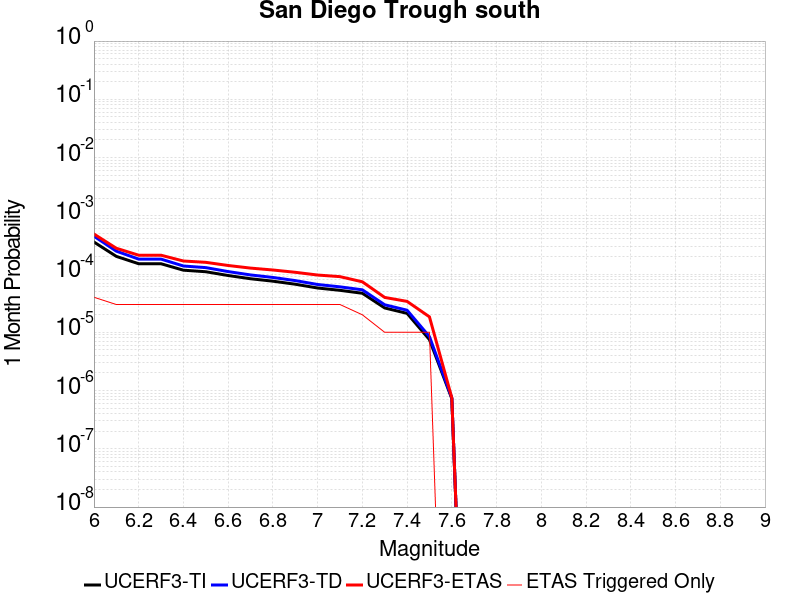 |  |  |

| Magnitude | 1 wk TI Prob | 1 wk TD Prob | 1 wk ETAS Prob | 1 wk ETAS/TD Gain | 1 wk ETAS Triggered Only | 1 mo TI Prob | 1 mo TD Prob | 1 mo ETAS Prob | 1 mo ETAS/TD Gain | 1 mo ETAS Triggered Only | 1 yr TI Prob | 1 yr TD Prob | 1 yr ETAS Prob | 1 yr ETAS/TD Gain | 1 yr ETAS Triggered Only | 10 yr TI Prob | 10 yr TD Prob | 10 yr ETAS Prob | 10 yr ETAS/TD Gain | 10 yr ETAS Triggered Only |
|-----|-----|-----|-----|-----|-----|-----|-----|-----|-----|-----|-----|-----|-----|-----|-----|-----|-----|-----|-----|-----|
| 6.0 | 8.279495E-5 | 1.0425541E-4 | 1.3425227E-4 | 1.2877249 | 3.0E-5 | 3.5478722E-4 | 4.4673498E-4 | 4.867171E-4 | 1.0894985 | 4.0E-5 | 0.004310982 | 0.0054259133 | 0.005475642 | 1.009165 | 5.0E-5 | 0.042283054 | 0.05299303 | 0.05304038 | 1.0008935 | 5.0E-5 |
| 6.1 | 4.6961468E-5 | 5.773024E-5 | 7.7729084E-5 | 1.3464189 | 2.0E-5 | 2.0124791E-4 | 2.473905E-4 | 2.7738308E-4 | 1.1212357 | 3.0E-5 | 0.00244744 | 0.003007886 | 0.0030477657 | 1.0132583 | 4.0E-5 | 0.024206603 | 0.029679636 | 0.029718447 | 1.0013077 | 4.0E-5 |
| 6.2 | 3.5079658E-5 | 4.214258E-5 | 6.2141735E-5 | 1.4745594 | 2.0E-5 | 1.5033272E-4 | 1.8059829E-4 | 2.1059287E-4 | 1.1660845 | 3.0E-5 | 0.0018287642 | 0.002196587 | 0.0022364992 | 1.0181701 | 4.0E-5 | 0.018137876 | 0.021751188 | 0.021790316 | 1.001799 | 4.0E-5 |
| 6.3 | 3.5079658E-5 | 4.214258E-5 | 6.2141735E-5 | 1.4745594 | 2.0E-5 | 1.5033272E-4 | 1.8059829E-4 | 2.1059287E-4 | 1.1660845 | 3.0E-5 | 0.0018287642 | 0.002196587 | 0.0022364992 | 1.0181701 | 4.0E-5 | 0.018137876 | 0.021751188 | 0.021790316 | 1.001799 | 4.0E-5 |
| 6.4 | 2.7196904E-5 | 3.208715E-5 | 5.208651E-5 | 1.6232824 | 2.0E-5 | 1.16552954E-4 | 1.3750911E-4 | 1.6750499E-4 | 1.2181374 | 3.0E-5 | 0.0014181085 | 0.0016728995 | 0.0017028493 | 1.017903 | 3.0E-5 | 0.014090929 | 0.016604666 | 0.016634168 | 1.0017767 | 3.0E-5 |
| 6.5 | 2.5584688E-5 | 3.0101632E-5 | 5.010103E-5 | 1.6643958 | 2.0E-5 | 1.0964406E-4 | 1.2900059E-4 | 1.5899673E-4 | 1.232527 | 3.0E-5 | 0.0013340989 | 0.0015694627 | 0.0015994156 | 1.0190848 | 3.0E-5 | 0.013261181 | 0.015585332 | 0.015614864 | 1.0018948 | 3.0E-5 |
| 6.6 | 2.2034688E-5 | 2.574271E-5 | 4.5742196E-5 | 1.776899 | 2.0E-5 | 9.443096E-5 | 1.1032127E-4 | 1.4031796E-4 | 1.271903 | 3.0E-5 | 0.0011490905 | 0.0013423412 | 0.0013723009 | 1.022319 | 3.0E-5 | 0.011431668 | 0.013343325 | 0.013372924 | 1.0022184 | 3.0E-5 |
| 6.7 | 1.9394853E-5 | 2.254176E-5 | 4.254131E-5 | 1.8872222 | 2.0E-5 | 8.311815E-5 | 9.6604E-5 | 1.266011E-4 | 1.3105161 | 3.0E-5 | 0.0010114936 | 0.0011755243 | 0.001205489 | 1.0254905 | 3.0E-5 | 0.01006902 | 0.011693766 | 0.011723416 | 1.0025355 | 3.0E-5 |
| 6.8 | 1.7615313E-5 | 2.0403182E-5 | 4.0402774E-5 | 1.9802192 | 2.0E-5 | 7.549201E-5 | 8.743931E-5 | 1.17436684E-4 | 1.3430651 | 3.0E-5 | 9.1872766E-4 | 0.0010640579 | 0.001094026 | 1.0281639 | 3.0E-5 | 0.009149387 | 0.010590198 | 0.010619881 | 1.0028028 | 3.0E-5 |
| 6.9 | 1.5621423E-5 | 1.8026114E-5 | 3.8025755E-5 | 2.1094813 | 2.0E-5 | 6.6947236E-5 | 7.725251E-5 | 1.0725019E-4 | 1.3883069 | 3.0E-5 | 8.147778E-4 | 9.40147E-4 | 9.701188E-4 | 1.0318799 | 3.0E-5 | 0.008117969 | 0.009362142 | 0.009391861 | 1.0031744 | 3.0E-5 |
| 7.0 | 1.3444376E-5 | 1.544809E-5 | 3.544778E-5 | 2.2946386 | 2.0E-5 | 5.7617483E-5 | 6.620443E-5 | 9.620244E-5 | 1.4531119 | 3.0E-5 | 7.0126704E-4 | 8.057436E-4 | 8.3571946E-4 | 1.0372027 | 3.0E-5 | 0.006990582 | 0.008028555 | 0.008058314 | 1.0037067 | 3.0E-5 |
| 7.1 | 1.2268361E-5 | 1.407303E-5 | 3.407275E-5 | 2.421138 | 2.0E-5 | 5.2577634E-5 | 6.0311606E-5 | 9.03098E-5 | 1.4973867 | 3.0E-5 | 6.399447E-4 | 7.3404907E-4 | 7.64027E-4 | 1.0408392 | 3.0E-5 | 0.0063810493 | 0.0073165493 | 0.0073463297 | 1.0040703 | 3.0E-5 |
| 7.2 | 1.0922655E-5 | 1.2513563E-5 | 2.2513437E-5 | 1.7991229 | 1.0E-5 | 4.681054E-5 | 5.3628468E-5 | 7.3627394E-5 | 1.3729162 | 2.0E-5 | 5.697693E-4 | 6.5273355E-4 | 6.727205E-4 | 1.0306203 | 2.0E-5 | 0.0056831064 | 0.0065084435 | 0.0065283137 | 1.003053 | 2.0E-5 |
| 7.3 | 6.1106753E-6 | 6.928925E-6 | 1.6928856E-5 | 2.4432154 | 1.0E-5 | 2.6188345E-5 | 2.9695057E-5 | 3.9694758E-5 | 1.3367463 | 1.0E-5 | 3.1879646E-4 | 3.6147775E-4 | 3.7147413E-4 | 1.0276542 | 1.0E-5 | 0.0031833951 | 0.003608943 | 0.003618907 | 1.0027609 | 1.0E-5 |
| 7.4 | 4.933187E-6 | 5.5895525E-6 | 1.5589496E-5 | 2.789042 | 1.0E-5 | 2.114206E-5 | 2.3955008E-5 | 3.395477E-5 | 1.4174392 | 1.0E-5 | 2.5737417E-4 | 2.9161357E-4 | 3.0161065E-4 | 1.034282 | 1.0E-5 | 0.002570763 | 0.0029123505 | 0.0029223212 | 1.0034237 | 1.0E-5 |
| 7.5 | 1.7489613E-6 | 1.969678E-6 | 1.1969658E-5 | 6.076962 | 1.0E-5 | 7.495527E-6 | 8.4414505E-6 | 1.8441366E-5 | 2.1846206 | 1.0E-5 | 9.125422E-5 | 1.02770035E-4 | 1.1276901E-4 | 1.0972946 | 1.0E-5 | 9.1216754E-4 | 0.0010272472 | 0.0010372369 | 1.0097247 | 1.0E-5 |
| 7.6 | 1.6988751E-7 | 1.7533823E-7 | 1.7533823E-7 | 1.0 | 0.0 | 7.2808916E-7 | 7.5144936E-7 | 7.5144936E-7 | 1.0 | 0.0 | 8.864449E-6 | 9.14886E-6 | 9.14886E-6 | 1.0 | 0.0 | 8.8640954E-5 | 9.1485024E-5 | 9.1485024E-5 | 1.0 | 0.0 |

## Hayward (So) extension 2011 CFM
*[(top)](#table-of-contents)*

| 1 Week | 1 Month | 1 Year | 10 Year |
|-----|-----|-----|-----|
|  |  |  |  |

| Magnitude | 1 wk TI Prob | 1 wk TD Prob | 1 wk ETAS Prob | 1 wk ETAS/TD Gain | 1 wk ETAS Triggered Only | 1 mo TI Prob | 1 mo TD Prob | 1 mo ETAS Prob | 1 mo ETAS/TD Gain | 1 mo ETAS Triggered Only | 1 yr TI Prob | 1 yr TD Prob | 1 yr ETAS Prob | 1 yr ETAS/TD Gain | 1 yr ETAS Triggered Only | 10 yr TI Prob | 10 yr TD Prob | 10 yr ETAS Prob | 10 yr ETAS/TD Gain | 10 yr ETAS Triggered Only |
|-----|-----|-----|-----|-----|-----|-----|-----|-----|-----|-----|-----|-----|-----|-----|-----|-----|-----|-----|-----|-----|
| 6.0 | 1.1721256E-4 | 2.3671088E-4 | 2.3671088E-4 | 1.0 | 0.0 | 5.022428E-4 | 0.0010138806 | 0.0010238704 | 1.0098531 | 1.0E-5 | 0.0060976758 | 0.012250609 | 0.012270364 | 1.0016125 | 2.0E-5 | 0.0593305 | 0.11284437 | 0.11288873 | 1.000393 | 5.0E-5 |
| 6.1 | 6.99169E-5 | 1.3808164E-4 | 1.3808164E-4 | 1.0 | 0.0 | 2.9960944E-4 | 5.9155683E-4 | 6.015509E-4 | 1.0168946 | 1.0E-5 | 0.0036416445 | 0.0071723475 | 0.0071922042 | 1.0027685 | 2.0E-5 | 0.035825435 | 0.067804344 | 0.067822985 | 1.000275 | 2.0E-5 |
| 6.2 | 6.99169E-5 | 1.3808164E-4 | 1.3808164E-4 | 1.0 | 0.0 | 2.9960944E-4 | 5.9155683E-4 | 6.015509E-4 | 1.0168946 | 1.0E-5 | 0.0036416445 | 0.0071723475 | 0.0071922042 | 1.0027685 | 2.0E-5 | 0.035825435 | 0.067804344 | 0.067822985 | 1.000275 | 2.0E-5 |
| 6.3 | 6.970908E-5 | 1.3776305E-4 | 1.3776305E-4 | 1.0 | 0.0 | 2.9871898E-4 | 5.9019245E-4 | 6.001865E-4 | 1.0169337 | 1.0E-5 | 0.0036308395 | 0.007155884 | 0.0071757413 | 1.002775 | 2.0E-5 | 0.035720866 | 0.0676533 | 0.06767195 | 1.0002756 | 2.0E-5 |
| 6.4 | 6.9517155E-5 | 1.3743227E-4 | 1.3743227E-4 | 1.0 | 0.0 | 2.9789665E-4 | 5.8877567E-4 | 5.987698E-4 | 1.0169744 | 1.0E-5 | 0.0036208609 | 0.0071387975 | 0.0071586547 | 1.0027816 | 2.0E-5 | 0.03562429 | 0.06749734 | 0.06751599 | 1.0002763 | 2.0E-5 |
| 6.5 | 4.786248E-5 | 9.415232E-5 | 9.415232E-5 | 1.0 | 0.0 | 2.0510878E-4 | 4.0344993E-4 | 4.1344587E-4 | 1.0247762 | 1.0E-5 | 0.0024943394 | 0.0049013784 | 0.0049113296 | 1.0020303 | 1.0E-5 | 0.02466527 | 0.046900697 | 0.046910226 | 1.0002033 | 1.0E-5 |
| 6.6 | 4.4662214E-5 | 8.8819244E-5 | 8.8819244E-5 | 1.0 | 0.0 | 1.9139545E-4 | 3.80601E-4 | 3.9059718E-4 | 1.0262642 | 1.0E-5 | 0.0023277493 | 0.0046244357 | 0.004634389 | 1.0021524 | 1.0E-5 | 0.02303517 | 0.04429206 | 0.044301614 | 1.0002158 | 1.0E-5 |
| 6.7 | 3.884542E-5 | 7.8650686E-5 | 7.8650686E-5 | 1.0 | 0.0 | 1.6646975E-4 | 3.3703333E-4 | 3.4702994E-4 | 1.0296607 | 1.0E-5 | 0.002024885 | 0.0040961048 | 0.004106064 | 1.0024314 | 1.0E-5 | 0.020065336 | 0.039332055 | 0.03934166 | 1.0002443 | 1.0E-5 |
| 6.8 | 3.4221863E-5 | 6.855886E-5 | 6.855886E-5 | 1.0 | 0.0 | 1.4665688E-4 | 2.9379298E-4 | 3.0379003E-4 | 1.0340276 | 1.0E-5 | 0.0017840851 | 0.0035714838 | 0.003581448 | 1.00279 | 1.0E-5 | 0.017698295 | 0.034419462 | 0.034429118 | 1.0002805 | 1.0E-5 |
| 6.9 | 1.6927712E-5 | 3.006262E-5 | 3.006262E-5 | 1.0 | 0.0 | 7.2545314E-5 | 1.2883375E-4 | 1.2883375E-4 | 1.0 | 0.0 | 8.828813E-4 | 0.0015674793 | 0.0015674793 | 1.0 | 0.0 | 0.008793819 | 0.015463544 | 0.015463544 | 1.0 | 0.0 |
| 7.0 | 1.2509653E-5 | 2.246337E-5 | 2.246337E-5 | 1.0 | 0.0 | 5.3611697E-5 | 9.626828E-5 | 9.626828E-5 | 1.0 | 0.0 | 6.525269E-4 | 0.0011714802 | 0.0011714802 | 1.0 | 0.0 | 0.0065061417 | 0.011583166 | 0.011583166 | 1.0 | 0.0 |
| 7.1 | 8.751583E-6 | 1.4926157E-5 | 1.4926157E-5 | 1.0 | 0.0 | 3.750624E-5 | 6.396771E-5 | 6.396771E-5 | 1.0 | 0.0 | 4.5654282E-4 | 7.785344E-4 | 7.785344E-4 | 1.0 | 0.0 | 0.0045560603 | 0.007764457 | 0.007764457 | 1.0 | 0.0 |
| 7.2 | 6.354379E-6 | 1.1499087E-5 | 1.1499087E-5 | 1.0 | 0.0 | 2.7232769E-5 | 4.9280898E-5 | 4.9280898E-5 | 1.0 | 0.0 | 3.3150852E-4 | 5.9983454E-4 | 5.9983454E-4 | 1.0 | 0.0 | 0.0033101442 | 0.006001243 | 0.006001243 | 1.0 | 0.0 |
| 7.3 | 4.645554E-6 | 8.818441E-6 | 8.818441E-6 | 1.0 | 0.0 | 1.9909365E-5 | 3.7792794E-5 | 3.7792794E-5 | 1.0 | 0.0 | 2.4236954E-4 | 4.6003403E-4 | 4.6003403E-4 | 1.0 | 0.0 | 0.0024210536 | 0.004611421 | 0.004611421 | 1.0 | 0.0 |
| 7.4 | 4.23437E-6 | 7.992759E-6 | 7.992759E-6 | 1.0 | 0.0 | 1.8147173E-5 | 3.425425E-5 | 3.425425E-5 | 1.0 | 0.0 | 2.2091944E-4 | 4.1696956E-4 | 4.1696956E-4 | 1.0 | 0.0 | 0.0022069993 | 0.0041826614 | 0.0041826614 | 1.0 | 0.0 |
| 7.5 | 2.2187417E-6 | 3.952336E-6 | 3.952336E-6 | 1.0 | 0.0 | 9.508858E-6 | 1.6938488E-5 | 1.6938488E-5 | 1.0 | 0.0 | 1.157642E-4 | 2.0620918E-4 | 2.0620918E-4 | 1.0 | 0.0 | 0.0011570391 | 0.0020739497 | 0.0020739497 | 1.0 | 0.0 |
| 7.6 | 2.7952495E-8 | 3.8785874E-8 | 3.8785874E-8 | 1.0 | 0.0 | 1.1979641E-7 | 1.6622516E-7 | 1.6622516E-7 | 1.0 | 0.0 | 1.4585203E-6 | 2.0237894E-6 | 2.0237894E-6 | 1.0 | 0.0 | 1.4585107E-5 | 2.0317146E-5 | 2.0317146E-5 | 1.0 | 0.0 |
| 7.7 | 1.7192724E-8 | 2.3436652E-8 | 2.3436652E-8 | 1.0 | 0.0 | 7.36831E-8 | 1.0044278E-7 | 1.0044278E-7 | 1.0 | 0.0 | 8.9709135E-7 | 1.2228902E-6 | 1.2228902E-6 | 1.0 | 0.0 | 8.970877E-6 | 1.2285953E-5 | 1.2285953E-5 | 1.0 | 0.0 |

## Newport-Inglewood alt 1
*[(top)](#table-of-contents)*

| 1 Week | 1 Month | 1 Year | 10 Year |
|-----|-----|-----|-----|
| 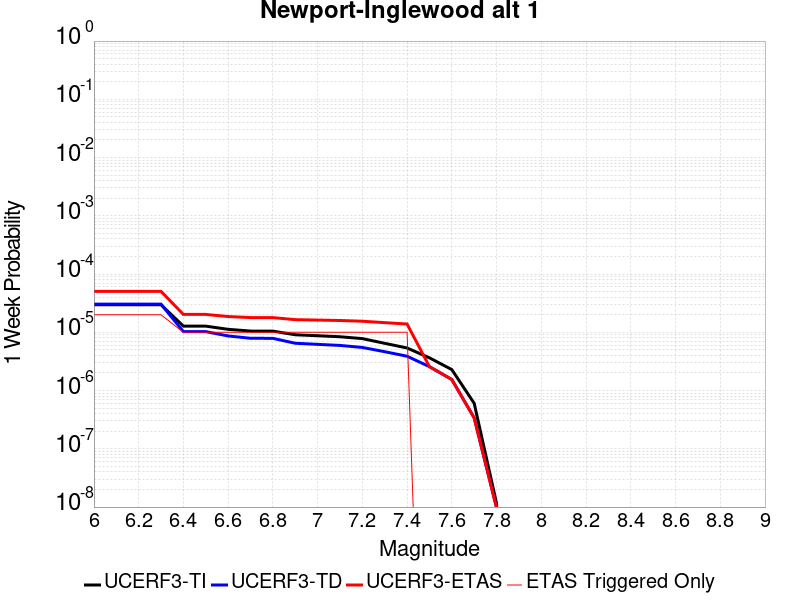 |  |  |  |

| Magnitude | 1 wk TI Prob | 1 wk TD Prob | 1 wk ETAS Prob | 1 wk ETAS/TD Gain | 1 wk ETAS Triggered Only | 1 mo TI Prob | 1 mo TD Prob | 1 mo ETAS Prob | 1 mo ETAS/TD Gain | 1 mo ETAS Triggered Only | 1 yr TI Prob | 1 yr TD Prob | 1 yr ETAS Prob | 1 yr ETAS/TD Gain | 1 yr ETAS Triggered Only | 10 yr TI Prob | 10 yr TD Prob | 10 yr ETAS Prob | 10 yr ETAS/TD Gain | 10 yr ETAS Triggered Only |
|-----|-----|-----|-----|-----|-----|-----|-----|-----|-----|-----|-----|-----|-----|-----|-----|-----|-----|-----|-----|-----|
| 6.0 | 2.9668912E-5 | 3.0404828E-5 | 5.0404222E-5 | 1.6577703 | 2.0E-5 | 1.2714628E-4 | 1.3030265E-4 | 1.7029744E-4 | 1.3069377 | 4.0E-5 | 0.0015469068 | 0.0015857654 | 0.001625702 | 1.0251844 | 4.0E-5 | 0.015361829 | 0.01579211 | 0.015831478 | 1.0024929 | 4.0E-5 |
| 6.1 | 2.9668912E-5 | 3.0404828E-5 | 5.0404222E-5 | 1.6577703 | 2.0E-5 | 1.2714628E-4 | 1.3030265E-4 | 1.7029744E-4 | 1.3069377 | 4.0E-5 | 0.0015469068 | 0.0015857654 | 0.001625702 | 1.0251844 | 4.0E-5 | 0.015361829 | 0.01579211 | 0.015831478 | 1.0024929 | 4.0E-5 |
| 6.2 | 2.9668912E-5 | 3.0404828E-5 | 5.0404222E-5 | 1.6577703 | 2.0E-5 | 1.2714628E-4 | 1.3030265E-4 | 1.7029744E-4 | 1.3069377 | 4.0E-5 | 0.0015469068 | 0.0015857654 | 0.001625702 | 1.0251844 | 4.0E-5 | 0.015361829 | 0.01579211 | 0.015831478 | 1.0024929 | 4.0E-5 |
| 6.3 | 2.9668912E-5 | 3.0404828E-5 | 5.0404222E-5 | 1.6577703 | 2.0E-5 | 1.2714628E-4 | 1.3030265E-4 | 1.7029744E-4 | 1.3069377 | 4.0E-5 | 0.0015469068 | 0.0015857654 | 0.001625702 | 1.0251844 | 4.0E-5 | 0.015361829 | 0.01579211 | 0.015831478 | 1.0024929 | 4.0E-5 |
| 6.4 | 1.275942E-5 | 1.02725335E-5 | 2.0272431E-5 | 1.9734597 | 1.0E-5 | 5.4682085E-5 | 4.4024422E-5 | 7.4023104E-5 | 1.68141 | 3.0E-5 | 6.65551E-4 | 5.358697E-4 | 5.658536E-4 | 1.0559537 | 3.0E-5 | 0.0066356123 | 0.0053462 | 0.0053760395 | 1.0055815 | 3.0E-5 |
| 6.5 | 1.275942E-5 | 1.02725335E-5 | 2.0272431E-5 | 1.9734597 | 1.0E-5 | 5.4682085E-5 | 4.4024422E-5 | 7.4023104E-5 | 1.68141 | 3.0E-5 | 6.65551E-4 | 5.358697E-4 | 5.658536E-4 | 1.0559537 | 3.0E-5 | 0.0066356123 | 0.0053462 | 0.0053760395 | 1.0055815 | 3.0E-5 |
| 6.6 | 1.1255358E-5 | 8.661911E-6 | 1.8661825E-5 | 2.1544695 | 1.0E-5 | 4.8236358E-5 | 3.7121958E-5 | 6.712085E-5 | 1.808117 | 3.0E-5 | 5.871194E-4 | 4.5186782E-4 | 4.8185425E-4 | 1.0663611 | 3.0E-5 | 0.005855706 | 0.0045096674 | 0.004539532 | 1.0066224 | 3.0E-5 |
| 6.7 | 1.0504745E-5 | 7.8998455E-6 | 1.7899767E-5 | 2.2658374 | 1.0E-5 | 4.5019555E-5 | 3.385605E-5 | 6.3855034E-5 | 1.8860745 | 3.0E-5 | 5.4797524E-4 | 4.121207E-4 | 4.421083E-4 | 1.0727642 | 3.0E-5 | 0.0054662596 | 0.004113694 | 0.0041435705 | 1.0072627 | 3.0E-5 |
| 6.8 | 1.0476007E-5 | 7.881227E-6 | 1.7881148E-5 | 2.268828 | 1.0E-5 | 4.4896402E-5 | 3.3776258E-5 | 6.3775246E-5 | 1.8881679 | 3.0E-5 | 5.464766E-4 | 4.1114958E-4 | 4.4113724E-4 | 1.0729362 | 3.0E-5 | 0.005451347 | 0.004104019 | 0.004133896 | 1.0072799 | 3.0E-5 |
| 6.9 | 9.076797E-6 | 6.4896567E-6 | 1.6489592E-5 | 2.5409036 | 1.0E-5 | 3.889998E-5 | 2.7812519E-5 | 5.7811685E-5 | 2.078621 | 3.0E-5 | 4.7350433E-4 | 3.3856515E-4 | 3.68555E-4 | 1.0885793 | 3.0E-5 | 0.004724967 | 0.003380531 | 0.0034104295 | 1.0088444 | 3.0E-5 |
| 7.0 | 8.73795E-6 | 6.2120503E-6 | 1.6211989E-5 | 2.6097646 | 1.0E-5 | 3.7447822E-5 | 2.6622802E-5 | 4.662227E-5 | 1.7512157 | 2.0E-5 | 4.5583185E-4 | 3.2408469E-4 | 3.440782E-4 | 1.0616922 | 2.0E-5 | 0.0045489795 | 0.0032361522 | 0.0032560877 | 1.0061601 | 2.0E-5 |
| 7.1 | 8.391299E-6 | 5.9557533E-6 | 1.5955693E-5 | 2.6790388 | 1.0E-5 | 3.5962214E-5 | 2.5524409E-5 | 4.55239E-5 | 1.7835437 | 2.0E-5 | 4.37752E-4 | 3.1071564E-4 | 3.3070942E-4 | 1.0643475 | 2.0E-5 | 0.004368907 | 0.0031028416 | 0.0031227795 | 1.0064257 | 2.0E-5 |
| 7.2 | 7.796882E-6 | 5.4964826E-6 | 1.5496427E-5 | 2.8193352 | 1.0E-5 | 3.341478E-5 | 2.3556144E-5 | 4.3555672E-5 | 1.8490155 | 2.0E-5 | 4.06749E-4 | 2.867585E-4 | 3.0675277E-4 | 1.069725 | 2.0E-5 | 0.0040600533 | 0.002863909 | 0.0028838515 | 1.0069635 | 2.0E-5 |
| 7.3 | 6.4738833E-6 | 4.6477753E-6 | 1.4647729E-5 | 3.151557 | 1.0E-5 | 2.774492E-5 | 1.9918885E-5 | 3.9918486E-5 | 2.0040522 | 2.0E-5 | 3.3774204E-4 | 2.424856E-4 | 2.6248075E-4 | 1.0824591 | 2.0E-5 | 0.0033722918 | 0.0024222268 | 0.0024421783 | 1.0082369 | 2.0E-5 |
| 7.4 | 5.382145E-6 | 3.8857215E-6 | 1.3885683E-5 | 3.5735145 | 1.0E-5 | 2.3066134E-5 | 1.6652988E-5 | 3.6652655E-5 | 2.2009656 | 2.0E-5 | 2.8079396E-4 | 2.0273139E-4 | 2.2272734E-4 | 1.0986327 | 2.0E-5 | 0.0028043943 | 0.002025479 | 0.0020454386 | 1.0098542 | 2.0E-5 |
| 7.5 | 3.648244E-6 | 2.5737634E-6 | 2.5737634E-6 | 1.0 | 0.0 | 1.5635238E-5 | 1.1030369E-5 | 2.1030259E-5 | 1.906578 | 1.0E-5 | 1.9034238E-4 | 1.3428657E-4 | 1.4428522E-4 | 1.0744576 | 1.0E-5 | 0.0019017943 | 0.0013420646 | 0.0013520513 | 1.0074412 | 1.0E-5 |
| 7.6 | 2.2906888E-6 | 1.547986E-6 | 1.547986E-6 | 1.0 | 0.0 | 9.817201E-6 | 6.634209E-6 | 1.6634143E-5 | 2.5073287 | 1.0E-5 | 1.1951787E-4 | 8.076857E-5 | 9.076776E-5 | 1.1238005 | 1.0E-5 | 0.0011945361 | 8.073989E-4 | 8.173908E-4 | 1.0123755 | 1.0E-5 |
| 7.7 | 6.0479874E-7 | 3.397468E-7 | 3.397468E-7 | 1.0 | 0.0 | 2.5919921E-6 | 1.456057E-6 | 1.1456043E-5 | 7.867853 | 1.0E-5 | 3.1557047E-5 | 1.7727363E-5 | 2.7727187E-5 | 1.5640897 | 1.0E-5 | 3.1552566E-4 | 1.7726087E-4 | 1.872591E-4 | 1.056404 | 1.0E-5 |
| 7.8 | 1.16056995E-8 | 9.782997E-9 | 9.782997E-9 | 1.0 | 0.0 | 4.9738713E-8 | 4.1927127E-8 | 4.1927127E-8 | 1.0 | 0.0 | 6.0556863E-7 | 5.1046277E-7 | 5.1046277E-7 | 1.0 | 0.0 | 6.05567E-6 | 5.1046277E-6 | 5.1046277E-6 | 1.0 | 0.0 |

## Puente Hills
*[(top)](#table-of-contents)*

| 1 Week | 1 Month | 1 Year | 10 Year |
|-----|-----|-----|-----|
|  |  | 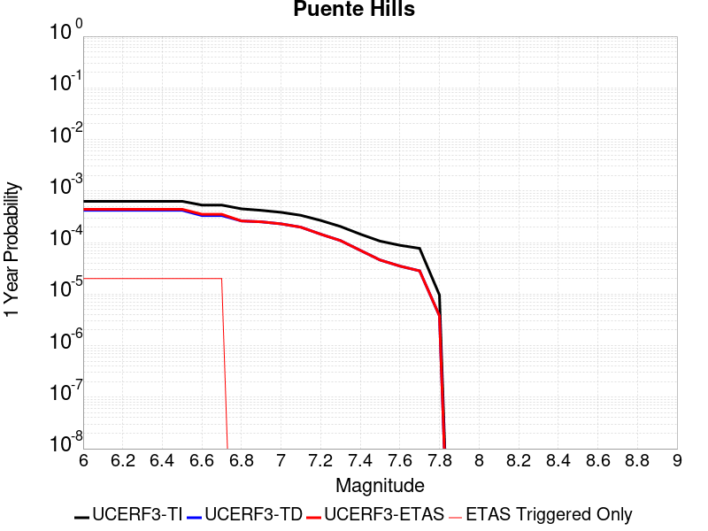 | 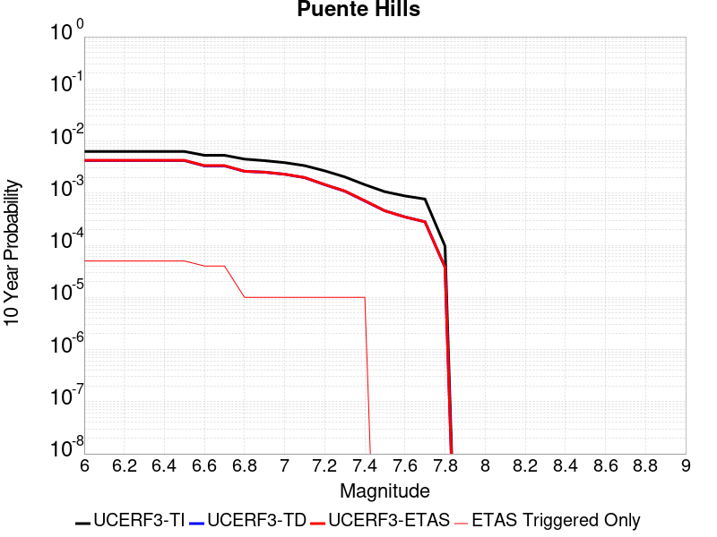 |

| Magnitude | 1 wk TI Prob | 1 wk TD Prob | 1 wk ETAS Prob | 1 wk ETAS/TD Gain | 1 wk ETAS Triggered Only | 1 mo TI Prob | 1 mo TD Prob | 1 mo ETAS Prob | 1 mo ETAS/TD Gain | 1 mo ETAS Triggered Only | 1 yr TI Prob | 1 yr TD Prob | 1 yr ETAS Prob | 1 yr ETAS/TD Gain | 1 yr ETAS Triggered Only | 10 yr TI Prob | 10 yr TD Prob | 10 yr ETAS Prob | 10 yr ETAS/TD Gain | 10 yr ETAS Triggered Only |
|-----|-----|-----|-----|-----|-----|-----|-----|-----|-----|-----|-----|-----|-----|-----|-----|-----|-----|-----|-----|-----|
| 6.0 | 1.2101656E-5 | 8.098448E-6 | 1.8098368E-5 | 2.2347944 | 1.0E-5 | 5.1863204E-5 | 3.4707205E-5 | 4.4706856E-5 | 1.2881147 | 1.0E-5 | 6.312516E-4 | 4.2248392E-4 | 4.424755E-4 | 1.047319 | 2.0E-5 | 0.0062946146 | 0.0042173676 | 0.0042671566 | 1.0118058 | 5.0E-5 |
| 6.1 | 1.2101656E-5 | 8.098448E-6 | 1.8098368E-5 | 2.2347944 | 1.0E-5 | 5.1863204E-5 | 3.4707205E-5 | 4.4706856E-5 | 1.2881147 | 1.0E-5 | 6.312516E-4 | 4.2248392E-4 | 4.424755E-4 | 1.047319 | 2.0E-5 | 0.0062946146 | 0.0042173676 | 0.0042671566 | 1.0118058 | 5.0E-5 |
| 6.2 | 1.2101656E-5 | 8.098448E-6 | 1.8098368E-5 | 2.2347944 | 1.0E-5 | 5.1863204E-5 | 3.4707205E-5 | 4.4706856E-5 | 1.2881147 | 1.0E-5 | 6.312516E-4 | 4.2248392E-4 | 4.424755E-4 | 1.047319 | 2.0E-5 | 0.0062946146 | 0.0042173676 | 0.0042671566 | 1.0118058 | 5.0E-5 |
| 6.3 | 1.2101656E-5 | 8.098448E-6 | 1.8098368E-5 | 2.2347944 | 1.0E-5 | 5.1863204E-5 | 3.4707205E-5 | 4.4706856E-5 | 1.2881147 | 1.0E-5 | 6.312516E-4 | 4.2248392E-4 | 4.424755E-4 | 1.047319 | 2.0E-5 | 0.0062946146 | 0.0042173676 | 0.0042671566 | 1.0118058 | 5.0E-5 |
| 6.4 | 1.2101656E-5 | 8.098448E-6 | 1.8098368E-5 | 2.2347944 | 1.0E-5 | 5.1863204E-5 | 3.4707205E-5 | 4.4706856E-5 | 1.2881147 | 1.0E-5 | 6.312516E-4 | 4.2248392E-4 | 4.424755E-4 | 1.047319 | 2.0E-5 | 0.0062946146 | 0.0042173676 | 0.0042671566 | 1.0118058 | 5.0E-5 |
| 6.5 | 1.2101656E-5 | 8.098448E-6 | 1.8098368E-5 | 2.2347944 | 1.0E-5 | 5.1863204E-5 | 3.4707205E-5 | 4.4706856E-5 | 1.2881147 | 1.0E-5 | 6.312516E-4 | 4.2248392E-4 | 4.424755E-4 | 1.047319 | 2.0E-5 | 0.0062946146 | 0.0042173676 | 0.0042671566 | 1.0118058 | 5.0E-5 |
| 6.6 | 1.0222488E-5 | 6.399079E-6 | 1.6399015E-5 | 2.5627148 | 1.0E-5 | 4.3809923E-5 | 2.742435E-5 | 3.7424077E-5 | 1.3646294 | 1.0E-5 | 5.332553E-4 | 3.3384276E-4 | 3.538361E-4 | 1.0598885 | 2.0E-5 | 0.0053197746 | 0.0033336577 | 0.0033735244 | 1.0119588 | 4.0E-5 |
| 6.7 | 1.0222488E-5 | 6.399079E-6 | 1.6399015E-5 | 2.5627148 | 1.0E-5 | 4.3809923E-5 | 2.742435E-5 | 3.7424077E-5 | 1.3646294 | 1.0E-5 | 5.332553E-4 | 3.3384276E-4 | 3.538361E-4 | 1.0598885 | 2.0E-5 | 0.0053197746 | 0.0033336577 | 0.0033735244 | 1.0119588 | 4.0E-5 |
| 6.8 | 8.6367845E-6 | 5.028129E-6 | 5.028129E-6 | 1.0 | 0.0 | 3.7014266E-5 | 2.1548949E-5 | 2.1548949E-5 | 1.0 | 0.0 | 4.505555E-4 | 2.6232743E-4 | 2.6232743E-4 | 1.0 | 0.0 | 0.004496431 | 0.002620234 | 0.0026302077 | 1.0038065 | 1.0E-5 |
| 6.9 | 8.066481E-6 | 4.8360116E-6 | 4.8360116E-6 | 1.0 | 0.0 | 3.4570177E-5 | 2.0725602E-5 | 2.0725602E-5 | 1.0 | 0.0 | 4.2081063E-4 | 2.523055E-4 | 2.523055E-4 | 1.0 | 0.0 | 0.0042001465 | 0.0025202443 | 0.0025302193 | 1.0039579 | 1.0E-5 |
| 7.0 | 7.393828E-6 | 4.4172275E-6 | 4.4172275E-6 | 1.0 | 0.0 | 3.168745E-5 | 1.8930841E-5 | 1.8930841E-5 | 1.0 | 0.0 | 3.857264E-4 | 2.3045906E-4 | 2.3045906E-4 | 1.0 | 0.0 | 0.0038505755 | 0.0023022462 | 0.0023122232 | 1.0043336 | 1.0E-5 |
| 7.1 | 6.4660953E-6 | 3.8043859E-6 | 3.8043859E-6 | 1.0 | 0.0 | 2.7711543E-5 | 1.630441E-5 | 1.630441E-5 | 1.0 | 0.0 | 3.373358E-4 | 1.9848847E-4 | 1.9848847E-4 | 1.0 | 0.0 | 0.0033682417 | 0.0019831478 | 0.0019931279 | 1.0050325 | 1.0E-5 |
| 7.2 | 5.143232E-6 | 2.7864896E-6 | 2.7864896E-6 | 1.0 | 0.0 | 2.2042237E-5 | 1.1942045E-5 | 1.1942045E-5 | 1.0 | 0.0 | 2.6833118E-4 | 1.453848E-4 | 1.453848E-4 | 1.0 | 0.0 | 0.002680074 | 0.0014529065 | 0.001462892 | 1.0068728 | 1.0E-5 |
| 7.3 | 3.928255E-6 | 2.091338E-6 | 2.091338E-6 | 1.0 | 0.0 | 1.683527E-5 | 8.962847E-6 | 8.962847E-6 | 1.0 | 0.0 | 2.0495013E-4 | 1.0911726E-4 | 1.0911726E-4 | 1.0 | 0.0 | 0.002047612 | 0.0010906435 | 0.0011006326 | 1.0091588 | 1.0E-5 |
| 7.4 | 2.7894434E-6 | 1.3546429E-6 | 1.3546429E-6 | 1.0 | 0.0 | 1.1954703E-5 | 5.8056E-6 | 5.8056E-6 | 1.0 | 0.0 | 1.4553878E-4 | 7.068093E-5 | 7.068093E-5 | 1.0 | 0.0 | 0.001454435 | 7.0658885E-4 | 7.1658177E-4 | 1.0141425 | 1.0E-5 |
| 7.5 | 2.041735E-6 | 8.786996E-7 | 8.786996E-7 | 1.0 | 0.0 | 8.750263E-6 | 3.7658504E-6 | 3.7658504E-6 | 1.0 | 0.0 | 1.06529245E-4 | 4.5848297E-5 | 4.5848297E-5 | 1.0 | 0.0 | 0.0010647819 | 4.5839173E-4 | 4.5839173E-4 | 1.0 | 0.0 |
| 7.6 | 1.6959062E-6 | 6.698339E-7 | 6.698339E-7 | 1.0 | 0.0 | 7.268149E-6 | 2.8707138E-6 | 2.8707138E-6 | 1.0 | 0.0 | 8.848612E-5 | 3.4950408E-5 | 3.4950408E-5 | 1.0 | 0.0 | 8.84509E-4 | 3.4945202E-4 | 3.4945202E-4 | 1.0 | 0.0 |
| 7.7 | 1.4767965E-6 | 5.407146E-7 | 5.407146E-7 | 1.0 | 0.0 | 6.3291122E-6 | 2.3173466E-6 | 2.3173466E-6 | 1.0 | 0.0 | 7.705422E-5 | 2.8213353E-5 | 2.8213353E-5 | 1.0 | 0.0 | 7.702751E-4 | 2.8210029E-4 | 2.8210029E-4 | 1.0 | 0.0 |
| 7.8 | 1.8432911E-7 | 7.2811105E-8 | 7.2811105E-8 | 1.0 | 0.0 | 7.8998164E-7 | 3.1204758E-7 | 3.1204758E-7 | 1.0 | 0.0 | 9.617985E-6 | 3.799176E-6 | 3.799176E-6 | 1.0 | 0.0 | 9.617568E-5 | 3.7991435E-5 | 3.7991435E-5 | 1.0 | 0.0 |

## Owens Valley Keough Hot Springs
*[(top)](#table-of-contents)*

| 1 Week | 1 Month | 1 Year | 10 Year |
|-----|-----|-----|-----|
|  |  | 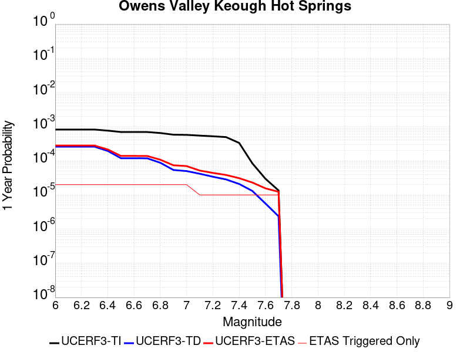 | 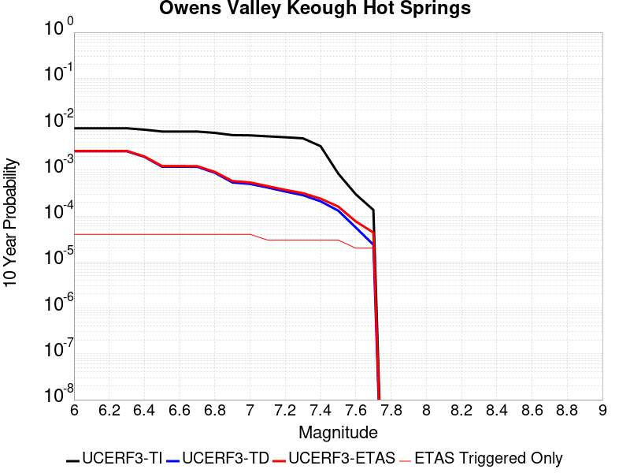 |

| Magnitude | 1 wk TI Prob | 1 wk TD Prob | 1 wk ETAS Prob | 1 wk ETAS/TD Gain | 1 wk ETAS Triggered Only | 1 mo TI Prob | 1 mo TD Prob | 1 mo ETAS Prob | 1 mo ETAS/TD Gain | 1 mo ETAS Triggered Only | 1 yr TI Prob | 1 yr TD Prob | 1 yr ETAS Prob | 1 yr ETAS/TD Gain | 1 yr ETAS Triggered Only | 10 yr TI Prob | 10 yr TD Prob | 10 yr ETAS Prob | 10 yr ETAS/TD Gain | 10 yr ETAS Triggered Only |
|-----|-----|-----|-----|-----|-----|-----|-----|-----|-----|-----|-----|-----|-----|-----|-----|-----|-----|-----|-----|-----|
| 6.0 | 1.5708529E-5 | 4.950463E-6 | 1.4950414E-5 | 3.020003 | 1.0E-5 | 6.7320536E-5 | 2.1216127E-5 | 3.1215914E-5 | 1.4713296 | 1.0E-5 | 8.193192E-4 | 2.5828084E-4 | 2.782757E-4 | 1.0774151 | 2.0E-5 | 0.008163051 | 0.0025804387 | 0.0026203354 | 1.0154612 | 4.0E-5 |
| 6.1 | 1.5708529E-5 | 4.950463E-6 | 1.4950414E-5 | 3.020003 | 1.0E-5 | 6.7320536E-5 | 2.1216127E-5 | 3.1215914E-5 | 1.4713296 | 1.0E-5 | 8.193192E-4 | 2.5828084E-4 | 2.782757E-4 | 1.0774151 | 2.0E-5 | 0.008163051 | 0.0025804387 | 0.0026203354 | 1.0154612 | 4.0E-5 |
| 6.2 | 1.5708529E-5 | 4.950463E-6 | 1.4950414E-5 | 3.020003 | 1.0E-5 | 6.7320536E-5 | 2.1216127E-5 | 3.1215914E-5 | 1.4713296 | 1.0E-5 | 8.193192E-4 | 2.5828084E-4 | 2.782757E-4 | 1.0774151 | 2.0E-5 | 0.008163051 | 0.0025804387 | 0.0026203354 | 1.0154612 | 4.0E-5 |
| 6.3 | 1.5708529E-5 | 4.950463E-6 | 1.4950414E-5 | 3.020003 | 1.0E-5 | 6.7320536E-5 | 2.1216127E-5 | 3.1215914E-5 | 1.4713296 | 1.0E-5 | 8.193192E-4 | 2.5828084E-4 | 2.782757E-4 | 1.0774151 | 2.0E-5 | 0.008163051 | 0.0025804387 | 0.0026203354 | 1.0154612 | 4.0E-5 |
| 6.4 | 1.4622509E-5 | 3.7263276E-6 | 1.37262905E-5 | 3.6835973 | 1.0E-5 | 6.266639E-5 | 1.5969896E-5 | 2.5969737E-5 | 1.6261681 | 1.0E-5 | 7.626962E-4 | 1.9441944E-4 | 2.1441556E-4 | 1.1028503 | 2.0E-5 | 0.007600839 | 0.0019429466 | 0.0019828689 | 1.0205473 | 4.0E-5 |
| 6.5 | 1.3335527E-5 | 2.2775241E-6 | 1.2277502E-5 | 5.3907228 | 1.0E-5 | 5.7151006E-5 | 9.760785E-6 | 1.9760688E-5 | 2.0244977 | 1.0E-5 | 6.955913E-4 | 1.1883176E-4 | 1.3882939E-4 | 1.1682851 | 2.0E-5 | 0.0069341804 | 0.001187878 | 0.0012278305 | 1.0336335 | 4.0E-5 |
| 6.6 | 1.3332855E-5 | 2.2746733E-6 | 1.22746505E-5 | 5.3962255 | 1.0E-5 | 5.7139558E-5 | 9.748568E-6 | 1.974847E-5 | 2.0257816 | 1.0E-5 | 6.9545204E-4 | 1.1868303E-4 | 1.3868065E-4 | 1.1684961 | 2.0E-5 | 0.0069327964 | 0.0011863923 | 0.0012263448 | 1.0336757 | 4.0E-5 |
| 6.7 | 1.3318214E-5 | 2.2639038E-6 | 1.2263881E-5 | 5.4171386 | 1.0E-5 | 5.707681E-5 | 9.702413E-6 | 1.9702316E-5 | 2.0306613 | 1.0E-5 | 6.946886E-4 | 1.18121156E-4 | 1.3811879E-4 | 1.1692977 | 2.0E-5 | 0.0069252094 | 0.0011807795 | 0.0012207322 | 1.0338359 | 4.0E-5 |
| 6.8 | 1.2441338E-5 | 1.677594E-6 | 1.1677577E-5 | 6.960908 | 1.0E-5 | 5.331893E-5 | 7.1896707E-6 | 1.7189599E-5 | 2.3908744 | 1.0E-5 | 6.489646E-4 | 8.753102E-5 | 1.07529275E-4 | 1.2284704 | 2.0E-5 | 0.0064707273 | 8.751236E-4 | 9.150886E-4 | 1.0456679 | 4.0E-5 |
| 6.9 | 1.1130476E-5 | 1.0302234E-6 | 1.10302135E-5 | 10.706622 | 1.0E-5 | 4.7701167E-5 | 4.4152357E-6 | 1.4415192E-5 | 3.2648747 | 1.0E-5 | 5.806069E-4 | 5.3754186E-5 | 7.375311E-5 | 1.3720441 | 2.0E-5 | 0.0057909233 | 5.375404E-4 | 5.775189E-4 | 1.074373 | 4.0E-5 |
| 7.0 | 1.0986073E-5 | 9.577824E-7 | 1.0957773E-5 | 11.440775 | 1.0E-5 | 4.7082318E-5 | 4.1047756E-6 | 1.4104734E-5 | 3.4361768 | 1.0E-5 | 5.730765E-4 | 4.9974507E-5 | 6.997351E-5 | 1.400184 | 2.0E-5 | 0.0057160086 | 4.997603E-4 | 5.397403E-4 | 1.0799984 | 4.0E-5 |
| 7.1 | 1.0451338E-5 | 7.9988575E-7 | 1.0799878E-5 | 13.501776 | 1.0E-5 | 4.4790682E-5 | 3.4280772E-6 | 1.3428043E-5 | 3.917077 | 1.0E-5 | 5.451901E-4 | 4.1736046E-5 | 5.1735627E-5 | 1.239591 | 1.0E-5 | 0.005438545 | 4.1740583E-4 | 4.473933E-4 | 1.0718426 | 3.0E-5 |
| 7.2 | 9.989061E-6 | 6.543693E-7 | 1.0654363E-5 | 16.281881 | 1.0E-5 | 4.280956E-5 | 2.8044367E-6 | 1.28044085E-5 | 4.5657687 | 1.0E-5 | 5.2108173E-4 | 3.4143486E-5 | 4.4143144E-5 | 1.2928716 | 1.0E-5 | 0.0051986156 | 3.41488E-4 | 3.7147774E-4 | 1.0878208 | 3.0E-5 |
| 7.3 | 9.465365E-6 | 5.458855E-7 | 1.054588E-5 | 19.31885 | 1.0E-5 | 4.056522E-5 | 2.3395073E-6 | 1.2339484E-5 | 5.2743945 | 1.0E-5 | 4.937696E-4 | 2.8483131E-5 | 3.8482845E-5 | 1.351075 | 1.0E-5 | 0.0049267393 | 2.8489542E-4 | 3.1488686E-4 | 1.1052718 | 3.0E-5 |
| 7.4 | 6.3824805E-6 | 4.0153776E-7 | 1.04015335E-5 | 25.904247 | 1.0E-5 | 2.73532E-5 | 1.7208749E-6 | 1.1720857E-5 | 6.8109875 | 1.0E-5 | 3.3297433E-4 | 2.0951453E-5 | 3.0951243E-5 | 1.4772838 | 1.0E-5 | 0.0033247585 | 2.0955436E-4 | 2.3954808E-4 | 1.1431309 | 3.0E-5 |
| 7.5 | 1.6192645E-6 | 2.5156373E-7 | 1.0251561E-5 | 40.751347 | 1.0E-5 | 6.9396865E-6 | 1.0781299E-6 | 1.1078119E-5 | 10.2753105 | 1.0E-5 | 8.448741E-5 | 1.3126153E-5 | 2.3126022E-5 | 1.7618278 | 1.0E-5 | 8.4455294E-4 | 1.3125391E-4 | 1.6124998E-4 | 1.2285346 | 3.0E-5 |
| 7.6 | 5.7062545E-7 | 1.0790214E-7 | 1.0107901E-5 | 93.67656 | 1.0E-5 | 2.4455355E-6 | 4.6243767E-7 | 1.0462433E-5 | 22.624525 | 1.0E-5 | 2.9773988E-5 | 5.630165E-6 | 1.5630108E-5 | 2.7761369 | 1.0E-5 | 2.977E-4 | 5.6300305E-5 | 7.629918E-5 | 1.3552178 | 2.0E-5 |
| 7.7 | 2.5988817E-7 | 4.5445965E-8 | 1.0045445E-5 | 221.04152 | 1.0E-5 | 1.113806E-6 | 1.9476842E-7 | 1.0194766E-5 | 52.343018 | 1.0E-5 | 1.3560503E-5 | 2.3713033E-6 | 1.237128E-5 | 5.21708 | 1.0E-5 | 1.3559677E-4 | 2.3712824E-5 | 4.371235E-5 | 1.8434055 | 2.0E-5 |

## Raymond
*[(top)](#table-of-contents)*

| 1 Week | 1 Month | 1 Year | 10 Year |
|-----|-----|-----|-----|
|  |  | 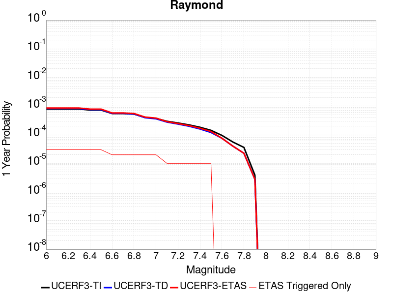 | 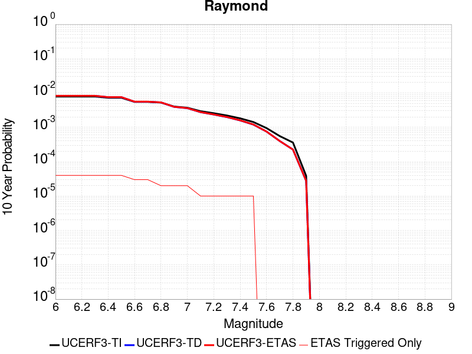 |

| Magnitude | 1 wk TI Prob | 1 wk TD Prob | 1 wk ETAS Prob | 1 wk ETAS/TD Gain | 1 wk ETAS Triggered Only | 1 mo TI Prob | 1 mo TD Prob | 1 mo ETAS Prob | 1 mo ETAS/TD Gain | 1 mo ETAS Triggered Only | 1 yr TI Prob | 1 yr TD Prob | 1 yr ETAS Prob | 1 yr ETAS/TD Gain | 1 yr ETAS Triggered Only | 10 yr TI Prob | 10 yr TD Prob | 10 yr ETAS Prob | 10 yr ETAS/TD Gain | 10 yr ETAS Triggered Only |
|-----|-----|-----|-----|-----|-----|-----|-----|-----|-----|-----|-----|-----|-----|-----|-----|-----|-----|-----|-----|-----|
| 6.0 | 1.5157413E-5 | 1.5810125E-5 | 3.5809808E-5 | 2.264992 | 2.0E-5 | 6.4958724E-5 | 6.775606E-5 | 9.775403E-5 | 1.4427348 | 3.0E-5 | 7.905855E-4 | 8.246429E-4 | 8.5461815E-4 | 1.0363494 | 3.0E-5 | 0.007877788 | 0.008218355 | 0.008258026 | 1.0048271 | 4.0E-5 |
| 6.1 | 1.5157413E-5 | 1.5810125E-5 | 3.5809808E-5 | 2.264992 | 2.0E-5 | 6.4958724E-5 | 6.775606E-5 | 9.775403E-5 | 1.4427348 | 3.0E-5 | 7.905855E-4 | 8.246429E-4 | 8.5461815E-4 | 1.0363494 | 3.0E-5 | 0.007877788 | 0.008218355 | 0.008258026 | 1.0048271 | 4.0E-5 |
| 6.2 | 1.5157413E-5 | 1.5810125E-5 | 3.5809808E-5 | 2.264992 | 2.0E-5 | 6.4958724E-5 | 6.775606E-5 | 9.775403E-5 | 1.4427348 | 3.0E-5 | 7.905855E-4 | 8.246429E-4 | 8.5461815E-4 | 1.0363494 | 3.0E-5 | 0.007877788 | 0.008218355 | 0.008258026 | 1.0048271 | 4.0E-5 |
| 6.3 | 1.5157413E-5 | 1.5810125E-5 | 3.5809808E-5 | 2.264992 | 2.0E-5 | 6.4958724E-5 | 6.775606E-5 | 9.775403E-5 | 1.4427348 | 3.0E-5 | 7.905855E-4 | 8.246429E-4 | 8.5461815E-4 | 1.0363494 | 3.0E-5 | 0.007877788 | 0.008218355 | 0.008258026 | 1.0048271 | 4.0E-5 |
| 6.4 | 1.3941944E-5 | 1.4454688E-5 | 3.44544E-5 | 2.383614 | 2.0E-5 | 5.9749822E-5 | 6.194732E-5 | 9.194547E-5 | 1.4842525 | 3.0E-5 | 7.2721124E-4 | 7.53971E-4 | 7.839484E-4 | 1.0397593 | 3.0E-5 | 0.007248361 | 0.007516471 | 0.00755617 | 1.0052817 | 4.0E-5 |
| 6.5 | 1.3941944E-5 | 1.4454688E-5 | 3.44544E-5 | 2.383614 | 2.0E-5 | 5.9749822E-5 | 6.194732E-5 | 9.194547E-5 | 1.4842525 | 3.0E-5 | 7.2721124E-4 | 7.53971E-4 | 7.839484E-4 | 1.0397593 | 3.0E-5 | 0.007248361 | 0.007516471 | 0.00755617 | 1.0052817 | 4.0E-5 |
| 6.6 | 1.0542609E-5 | 1.067111E-5 | 2.0671003E-5 | 1.9370996 | 1.0E-5 | 4.5181827E-5 | 4.573256E-5 | 6.573164E-5 | 1.4373052 | 2.0E-5 | 5.499499E-4 | 5.566571E-4 | 5.76646E-4 | 1.0359088 | 2.0E-5 | 0.005485909 | 0.0055531966 | 0.0055830297 | 1.0053723 | 3.0E-5 |
| 6.7 | 1.0542609E-5 | 1.067111E-5 | 2.0671003E-5 | 1.9370996 | 1.0E-5 | 4.5181827E-5 | 4.573256E-5 | 6.573164E-5 | 1.4373052 | 2.0E-5 | 5.499499E-4 | 5.566571E-4 | 5.76646E-4 | 1.0359088 | 2.0E-5 | 0.005485909 | 0.0055531966 | 0.0055830297 | 1.0053723 | 3.0E-5 |
| 6.8 | 1.0079132E-5 | 1.0176644E-5 | 2.0176542E-5 | 1.9826323 | 1.0E-5 | 4.3195567E-5 | 4.3613487E-5 | 6.361261E-5 | 1.4585538 | 2.0E-5 | 5.257791E-4 | 5.308702E-4 | 5.508596E-4 | 1.037654 | 2.0E-5 | 0.0052453685 | 0.0052965777 | 0.0053164717 | 1.003756 | 2.0E-5 |
| 6.9 | 7.721598E-6 | 7.548902E-6 | 1.7548826E-5 | 2.324686 | 1.0E-5 | 3.3092143E-5 | 3.2352043E-5 | 5.2351395E-5 | 1.618179 | 2.0E-5 | 4.0282236E-4 | 3.9381615E-4 | 4.1380827E-4 | 1.0507652 | 2.0E-5 | 0.0040209293 | 0.003931324 | 0.0039512455 | 1.0050673 | 2.0E-5 |
| 7.0 | 7.137566E-6 | 6.911303E-6 | 1.6911234E-5 | 2.4468951 | 1.0E-5 | 3.058921E-5 | 2.961954E-5 | 4.9618946E-5 | 1.6752099 | 2.0E-5 | 3.7236E-4 | 3.605593E-4 | 3.8055208E-4 | 1.0554494 | 2.0E-5 | 0.0037173668 | 0.003599869 | 0.003619797 | 1.0055357 | 2.0E-5 |
| 7.1 | 5.654976E-6 | 5.299538E-6 | 1.5299485E-5 | 2.8869472 | 1.0E-5 | 2.4235387E-5 | 2.2712107E-5 | 3.271188E-5 | 1.4402838 | 1.0E-5 | 2.9502588E-4 | 2.7648505E-4 | 2.8648227E-4 | 1.0361583 | 1.0E-5 | 0.0029463451 | 0.0027614492 | 0.0027714216 | 1.0036113 | 1.0E-5 |
| 7.2 | 4.9358455E-6 | 4.526655E-6 | 1.4526609E-5 | 3.2091267 | 1.0E-5 | 2.1153453E-5 | 1.9399806E-5 | 2.9399613E-5 | 1.5154591 | 1.0E-5 | 2.5751285E-4 | 2.3616718E-4 | 2.4616483E-4 | 1.0423329 | 1.0E-5 | 0.0025721465 | 0.002359192 | 0.0023691682 | 1.0042287 | 1.0E-5 |
| 7.3 | 4.2368597E-6 | 3.8056128E-6 | 1.3805575E-5 | 3.6276877 | 1.0E-5 | 1.8157843E-5 | 1.6309668E-5 | 2.6309504E-5 | 1.6131233 | 1.0E-5 | 2.2104931E-4 | 1.9855222E-4 | 2.0855023E-4 | 1.0503546 | 1.0E-5 | 0.0022082955 | 0.0019837746 | 0.0019937549 | 1.0050309 | 1.0E-5 |
| 7.4 | 3.4999923E-6 | 3.0437407E-6 | 1.304371E-5 | 4.285421 | 1.0E-5 | 1.49998805E-5 | 1.3044538E-5 | 2.3044407E-5 | 1.7665944 | 1.0E-5 | 1.8260824E-4 | 1.5880575E-4 | 1.6880417E-4 | 1.06296 | 1.0E-5 | 0.0018245826 | 0.0015869461 | 0.0015969302 | 1.0062914 | 1.0E-5 |
| 7.5 | 2.738017E-6 | 2.3020405E-6 | 1.2302017E-5 | 5.343962 | 1.0E-5 | 1.1734306E-5 | 9.865851E-6 | 1.9865753E-5 | 2.0135872 | 1.0E-5 | 1.428558E-4 | 1.20110184E-4 | 1.3010898E-4 | 1.083247 | 1.0E-5 | 0.0014276401 | 0.0012004747 | 0.0012104627 | 1.0083201 | 1.0E-5 |
| 7.6 | 1.8186392E-6 | 1.442302E-6 | 1.442302E-6 | 1.0 | 0.0 | 7.794145E-6 | 6.1812802E-6 | 6.1812802E-6 | 1.0 | 0.0 | 9.488958E-5 | 7.5254524E-5 | 7.5254524E-5 | 1.0 | 0.0 | 9.4849075E-4 | 7.5230957E-4 | 7.5230957E-4 | 1.0 | 0.0 |
| 7.7 | 1.0660348E-6 | 7.6437E-7 | 7.6437E-7 | 1.0 | 0.0 | 4.5687125E-6 | 3.2758674E-6 | 3.2758674E-6 | 1.0 | 0.0 | 5.5622655E-5 | 3.988297E-5 | 3.988297E-5 | 1.0 | 0.0 | 5.5608735E-4 | 3.9877492E-4 | 3.9877492E-4 | 1.0 | 0.0 |
| 7.8 | 6.913602E-7 | 4.3202903E-7 | 4.3202903E-7 | 1.0 | 0.0 | 2.962969E-6 | 1.8515517E-6 | 1.8515517E-6 | 1.0 | 0.0 | 3.607355E-5 | 2.2542416E-5 | 2.2542416E-5 | 1.0 | 0.0 | 3.6067693E-4 | 2.2541684E-4 | 2.2541684E-4 | 1.0 | 0.0 |
| 7.9 | 7.425201E-8 | 5.322267E-8 | 5.322267E-8 | 1.0 | 0.0 | 3.1822285E-7 | 2.2809714E-7 | 2.2809714E-7 | 1.0 | 0.0 | 3.874356E-6 | 2.7770805E-6 | 2.7770805E-6 | 1.0 | 0.0 | 3.8742884E-5 | 2.7770588E-5 | 2.7770588E-5 | 1.0 | 0.0 |

## Calaveras (Central) 2011 CFM
*[(top)](#table-of-contents)*

| 1 Week | 1 Month | 1 Year | 10 Year |
|-----|-----|-----|-----|
|  |  | 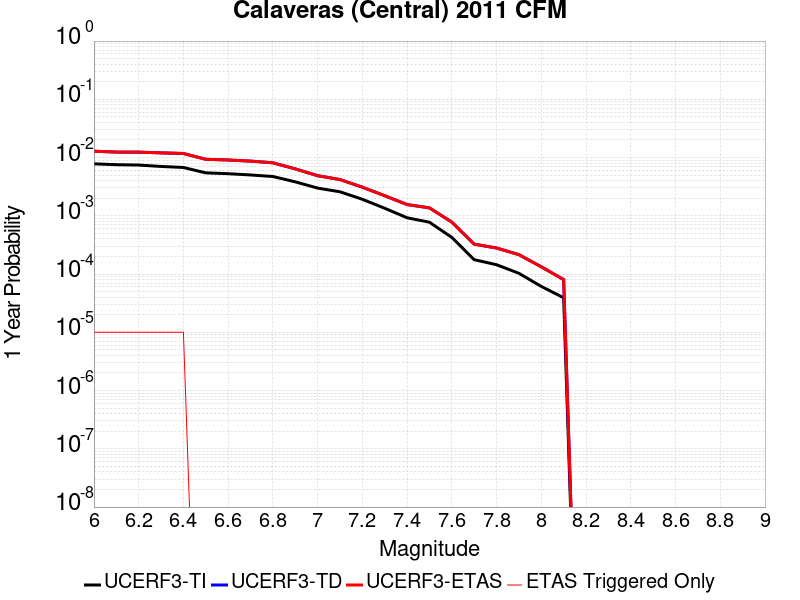 |  |

| Magnitude | 1 wk TI Prob | 1 wk TD Prob | 1 wk ETAS Prob | 1 wk ETAS/TD Gain | 1 wk ETAS Triggered Only | 1 mo TI Prob | 1 mo TD Prob | 1 mo ETAS Prob | 1 mo ETAS/TD Gain | 1 mo ETAS Triggered Only | 1 yr TI Prob | 1 yr TD Prob | 1 yr ETAS Prob | 1 yr ETAS/TD Gain | 1 yr ETAS Triggered Only | 10 yr TI Prob | 10 yr TD Prob | 10 yr ETAS Prob | 10 yr ETAS/TD Gain | 10 yr ETAS Triggered Only |
|-----|-----|-----|-----|-----|-----|-----|-----|-----|-----|-----|-----|-----|-----|-----|-----|-----|-----|-----|-----|-----|
| 6.0 | 1.5010907E-4 | 2.4804124E-4 | 2.4804124E-4 | 1.0 | 0.0 | 6.4316596E-4 | 0.001062498 | 0.001062498 | 1.0 | 0.0 | 0.0078024664 | 0.012850443 | 0.012860315 | 1.0007682 | 1.0E-5 | 0.07534136 | 0.120411225 | 0.12044641 | 1.0002922 | 4.0E-5 |
| 6.1 | 1.4521465E-4 | 2.3965565E-4 | 2.3965565E-4 | 1.0 | 0.0 | 6.222001E-4 | 0.0010265942 | 0.0010265942 | 1.0 | 0.0 | 0.0075490056 | 0.012419763 | 0.012429639 | 1.0007951 | 1.0E-5 | 0.07297657 | 0.11668273 | 0.11671806 | 1.0003028 | 4.0E-5 |
| 6.2 | 1.429998E-4 | 2.3896809E-4 | 2.3896809E-4 | 1.0 | 0.0 | 6.127123E-4 | 0.0010236499 | 0.0010236499 | 1.0 | 0.0 | 0.007434286 | 0.012384372 | 0.012394248 | 1.0007975 | 1.0E-5 | 0.07190444 | 0.11633677 | 0.116372116 | 1.0003039 | 4.0E-5 |
| 6.3 | 1.3536277E-4 | 2.3227946E-4 | 2.3227946E-4 | 1.0 | 0.0 | 5.799972E-4 | 9.950127E-4 | 9.950127E-4 | 1.0 | 0.0 | 0.0070386264 | 0.012040534 | 0.0120504135 | 1.0008205 | 1.0E-5 | 0.0681982 | 0.113249525 | 0.113285 | 1.0003132 | 4.0E-5 |
| 6.4 | 1.2993296E-4 | 2.2651516E-4 | 2.2651516E-4 | 1.0 | 0.0 | 5.5673666E-4 | 9.703276E-4 | 9.703276E-4 | 1.0 | 0.0 | 0.006757223 | 0.011743338 | 0.01175322 | 1.0008415 | 1.0E-5 | 0.06555412 | 0.11052752 | 0.1105631 | 1.0003219 | 4.0E-5 |
| 6.5 | 1.0498927E-4 | 1.7981966E-4 | 1.7981966E-4 | 1.0 | 0.0 | 4.498764E-4 | 7.7042676E-4 | 7.7042676E-4 | 1.0 | 0.0 | 0.005463498 | 0.00933952 | 0.00933952 | 1.0 | 0.0 | 0.053311124 | 0.08920739 | 0.08923471 | 1.0003062 | 3.0E-5 |
| 6.6 | 1.0157505E-4 | 1.7469494E-4 | 1.7469494E-4 | 1.0 | 0.0 | 4.35249E-4 | 7.4847665E-4 | 7.4847665E-4 | 1.0 | 0.0 | 0.0052862884 | 0.009074567 | 0.009074567 | 1.0 | 0.0 | 0.05162293 | 0.08678487 | 0.086812265 | 1.0003157 | 3.0E-5 |
| 6.7 | 9.660386E-5 | 1.6728783E-4 | 1.6728783E-4 | 1.0 | 0.0 | 4.1395082E-4 | 7.167497E-4 | 7.167497E-4 | 1.0 | 0.0 | 0.0050282106 | 0.008691474 | 0.008691474 | 1.0 | 0.0 | 0.049159497 | 0.08327401 | 0.08330151 | 1.0003302 | 3.0E-5 |
| 6.8 | 9.089927E-5 | 1.5643238E-4 | 1.5643238E-4 | 1.0 | 0.0 | 3.8951015E-4 | 6.702511E-4 | 6.702511E-4 | 1.0 | 0.0 | 0.0047319788 | 0.008129742 | 0.008129742 | 1.0 | 0.0 | 0.046324775 | 0.078163 | 0.078190655 | 1.0003538 | 3.0E-5 |
| 6.9 | 7.353187E-5 | 1.2295779E-4 | 1.2295779E-4 | 1.0 | 0.0 | 3.150985E-4 | 5.2685605E-4 | 5.2685605E-4 | 1.0 | 0.0 | 0.0038295772 | 0.006395728 | 0.006395728 | 1.0 | 0.0 | 0.037642512 | 0.06218928 | 0.062217414 | 1.0004524 | 3.0E-5 |
| 7.0 | 5.746064E-5 | 9.3890936E-5 | 9.3890936E-5 | 1.0 | 0.0 | 2.4623662E-4 | 4.0232803E-4 | 4.0232803E-4 | 1.0 | 0.0 | 0.0029938098 | 0.0048874132 | 0.0048874132 | 1.0 | 0.0 | 0.02953797 | 0.04798713 | 0.04800617 | 1.0003967 | 2.0E-5 |
| 7.1 | 4.9557195E-5 | 8.052768E-5 | 8.052768E-5 | 1.0 | 0.0 | 2.123707E-4 | 3.4507332E-4 | 3.4507332E-4 | 1.0 | 0.0 | 0.0025825473 | 0.004193237 | 0.004193237 | 1.0 | 0.0 | 0.0255274 | 0.041373473 | 0.041392643 | 1.0004634 | 2.0E-5 |
| 7.2 | 3.687595E-5 | 5.952694E-5 | 5.952694E-5 | 1.0 | 0.0 | 1.5803022E-4 | 2.5509068E-4 | 2.5509068E-4 | 1.0 | 0.0 | 0.0019223199 | 0.003101335 | 0.003101335 | 1.0 | 0.0 | 0.01905776 | 0.030883823 | 0.030893514 | 1.0003138 | 1.0E-5 |
| 7.3 | 2.5846984E-5 | 4.2473923E-5 | 4.2473923E-5 | 1.0 | 0.0 | 1.1076809E-4 | 1.820185E-4 | 1.820185E-4 | 1.0 | 0.0 | 0.0013477671 | 0.0022138404 | 0.0022138404 | 1.0 | 0.0 | 0.013396223 | 0.022175217 | 0.022184996 | 1.000441 | 1.0E-5 |
| 7.4 | 1.7747854E-5 | 2.993759E-5 | 2.993759E-5 | 1.0 | 0.0 | 7.6060016E-5 | 1.2829766E-4 | 1.2829766E-4 | 1.0 | 0.0 | 9.2563726E-4 | 0.0015609078 | 0.0015609078 | 1.0 | 0.0 | 0.009217911 | 0.015708687 | 0.015718529 | 1.0006266 | 1.0E-5 |
| 7.5 | 1.4883479E-5 | 2.6244672E-5 | 2.6244672E-5 | 1.0 | 0.0 | 6.378478E-5 | 1.12472335E-4 | 1.12472335E-4 | 1.0 | 0.0 | 7.76303E-4 | 0.0013684932 | 0.0013684932 | 1.0 | 0.0 | 0.0077359667 | 0.013801667 | 0.013811529 | 1.0007145 | 1.0E-5 |
| 7.6 | 8.166975E-6 | 1.4964299E-5 | 1.4964299E-5 | 1.0 | 0.0 | 3.5000852E-5 | 6.413114E-5 | 6.413114E-5 | 1.0 | 0.0 | 4.2605202E-4 | 7.805183E-4 | 7.805183E-4 | 1.0 | 0.0 | 0.004252361 | 0.007939203 | 0.007949124 | 1.0012496 | 1.0E-5 |
| 7.7 | 3.3858064E-6 | 6.254251E-6 | 6.254251E-6 | 1.0 | 0.0 | 1.4510518E-5 | 2.6803657E-5 | 2.6803657E-5 | 1.0 | 0.0 | 1.7665124E-4 | 3.2628572E-4 | 3.2628572E-4 | 1.0 | 0.0 | 0.0017651088 | 0.003388363 | 0.003398329 | 1.0029413 | 1.0E-5 |
| 7.8 | 2.7721615E-6 | 5.366695E-6 | 5.366695E-6 | 1.0 | 0.0 | 1.1880637E-5 | 2.2999919E-5 | 2.2999919E-5 | 1.0 | 0.0 | 1.4463716E-4 | 2.7998807E-4 | 2.7998807E-4 | 1.0 | 0.0 | 0.0014454306 | 0.002907615 | 0.0029175857 | 1.0034293 | 1.0E-5 |
| 7.9 | 1.9736292E-6 | 4.128705E-6 | 4.128705E-6 | 1.0 | 0.0 | 8.4583835E-6 | 1.769433E-5 | 1.769433E-5 | 1.0 | 0.0 | 1.0297595E-4 | 2.1540721E-4 | 2.1540721E-4 | 1.0 | 0.0 | 0.0010292825 | 0.0022237299 | 0.0022337078 | 1.0044869 | 1.0E-5 |
| 8.0 | 1.1767289E-6 | 2.5546633E-6 | 2.5546633E-6 | 1.0 | 0.0 | 5.0431145E-6 | 1.0948511E-5 | 1.0948511E-5 | 1.0 | 0.0 | 6.139818E-5 | 1.3329E-4 | 1.3329E-4 | 1.0 | 0.0 | 6.1381224E-4 | 0.001366126 | 0.001366126 | 1.0 | 0.0 |
| 8.1 | 7.5112825E-7 | 1.541076E-6 | 1.541076E-6 | 1.0 | 0.0 | 3.2191172E-6 | 6.604595E-6 | 6.604595E-6 | 1.0 | 0.0 | 3.9192048E-5 | 8.0408E-5 | 8.0408E-5 | 1.0 | 0.0 | 3.9185135E-4 | 8.2356273E-4 | 8.2356273E-4 | 1.0 | 0.0 |

## Channel Islands Thrust
*[(top)](#table-of-contents)*

| 1 Week | 1 Month | 1 Year | 10 Year |
|-----|-----|-----|-----|
|  |  |  | 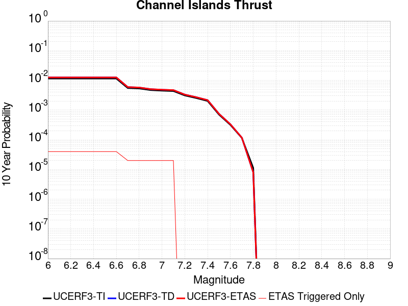 |

| Magnitude | 1 wk TI Prob | 1 wk TD Prob | 1 wk ETAS Prob | 1 wk ETAS/TD Gain | 1 wk ETAS Triggered Only | 1 mo TI Prob | 1 mo TD Prob | 1 mo ETAS Prob | 1 mo ETAS/TD Gain | 1 mo ETAS Triggered Only | 1 yr TI Prob | 1 yr TD Prob | 1 yr ETAS Prob | 1 yr ETAS/TD Gain | 1 yr ETAS Triggered Only | 10 yr TI Prob | 10 yr TD Prob | 10 yr ETAS Prob | 10 yr ETAS/TD Gain | 10 yr ETAS Triggered Only |
|-----|-----|-----|-----|-----|-----|-----|-----|-----|-----|-----|-----|-----|-----|-----|-----|-----|-----|-----|-----|-----|
| 6.0 | 2.2156251E-5 | 2.4092022E-5 | 2.4092022E-5 | 1.0 | 0.0 | 9.495191E-5 | 1.03248036E-4 | 1.13247006E-4 | 1.0968442 | 1.0E-5 | 0.0011554264 | 0.0012564266 | 0.0012764013 | 1.0158981 | 2.0E-5 | 0.011494373 | 0.0125038205 | 0.012543321 | 1.003159 | 4.0E-5 |
| 6.1 | 2.2156251E-5 | 2.4092022E-5 | 2.4092022E-5 | 1.0 | 0.0 | 9.495191E-5 | 1.03248036E-4 | 1.13247006E-4 | 1.0968442 | 1.0E-5 | 0.0011554264 | 0.0012564266 | 0.0012764013 | 1.0158981 | 2.0E-5 | 0.011494373 | 0.0125038205 | 0.012543321 | 1.003159 | 4.0E-5 |
| 6.2 | 2.2156251E-5 | 2.4092022E-5 | 2.4092022E-5 | 1.0 | 0.0 | 9.495191E-5 | 1.03248036E-4 | 1.13247006E-4 | 1.0968442 | 1.0E-5 | 0.0011554264 | 0.0012564266 | 0.0012764013 | 1.0158981 | 2.0E-5 | 0.011494373 | 0.0125038205 | 0.012543321 | 1.003159 | 4.0E-5 |
| 6.3 | 2.2156251E-5 | 2.4092022E-5 | 2.4092022E-5 | 1.0 | 0.0 | 9.495191E-5 | 1.03248036E-4 | 1.13247006E-4 | 1.0968442 | 1.0E-5 | 0.0011554264 | 0.0012564266 | 0.0012764013 | 1.0158981 | 2.0E-5 | 0.011494373 | 0.0125038205 | 0.012543321 | 1.003159 | 4.0E-5 |
| 6.4 | 2.2156251E-5 | 2.4092022E-5 | 2.4092022E-5 | 1.0 | 0.0 | 9.495191E-5 | 1.03248036E-4 | 1.13247006E-4 | 1.0968442 | 1.0E-5 | 0.0011554264 | 0.0012564266 | 0.0012764013 | 1.0158981 | 2.0E-5 | 0.011494373 | 0.0125038205 | 0.012543321 | 1.003159 | 4.0E-5 |
| 6.5 | 2.2156251E-5 | 2.4092022E-5 | 2.4092022E-5 | 1.0 | 0.0 | 9.495191E-5 | 1.03248036E-4 | 1.13247006E-4 | 1.0968442 | 1.0E-5 | 0.0011554264 | 0.0012564266 | 0.0012764013 | 1.0158981 | 2.0E-5 | 0.011494373 | 0.0125038205 | 0.012543321 | 1.003159 | 4.0E-5 |
| 6.6 | 2.2156251E-5 | 2.4092022E-5 | 2.4092022E-5 | 1.0 | 0.0 | 9.495191E-5 | 1.03248036E-4 | 1.13247006E-4 | 1.0968442 | 1.0E-5 | 0.0011554264 | 0.0012564266 | 0.0012764013 | 1.0158981 | 2.0E-5 | 0.011494373 | 0.0125038205 | 0.012543321 | 1.003159 | 4.0E-5 |
| 6.7 | 1.0601296E-5 | 1.1379544E-5 | 1.1379544E-5 | 1.0 | 0.0 | 4.5433335E-5 | 4.876859E-5 | 4.876859E-5 | 1.0 | 0.0 | 5.5301044E-4 | 5.936007E-4 | 6.0359476E-4 | 1.0168363 | 1.0E-5 | 0.005516363 | 0.005920653 | 0.005940535 | 1.003358 | 2.0E-5 |
| 6.8 | 1.0246747E-5 | 1.0996669E-5 | 1.0996669E-5 | 1.0 | 0.0 | 4.391389E-5 | 4.7127756E-5 | 4.7127756E-5 | 1.0 | 0.0 | 5.345204E-4 | 5.7363417E-4 | 5.836284E-4 | 1.0174227 | 1.0E-5 | 0.0053323656 | 0.005722025 | 0.0057419105 | 1.0034753 | 2.0E-5 |
| 6.9 | 9.049551E-6 | 9.699645E-6 | 9.699645E-6 | 1.0 | 0.0 | 3.878322E-5 | 4.1569267E-5 | 4.1569267E-5 | 1.0 | 0.0 | 4.7208337E-4 | 5.059924E-4 | 5.1598734E-4 | 1.0197531 | 1.0E-5 | 0.0047108172 | 0.0050488203 | 0.0050687194 | 1.0039413 | 2.0E-5 |
| 7.0 | 8.6542195E-6 | 9.274603E-6 | 9.274603E-6 | 1.0 | 0.0 | 3.7088983E-5 | 3.9747716E-5 | 3.9747716E-5 | 1.0 | 0.0 | 4.5146482E-4 | 4.8382508E-4 | 4.9382023E-4 | 1.0206586 | 1.0E-5 | 0.004505487 | 0.0048281294 | 0.0048480327 | 1.0041224 | 2.0E-5 |
| 7.1 | 8.391028E-6 | 8.992925E-6 | 8.992925E-6 | 1.0 | 0.0 | 3.5961057E-5 | 3.8540562E-5 | 3.8540562E-5 | 1.0 | 0.0 | 4.3773788E-4 | 4.6913436E-4 | 4.791297E-4 | 1.0213058 | 1.0E-5 | 0.004368766 | 0.0046818503 | 0.004701757 | 1.0042518 | 2.0E-5 |
| 7.2 | 5.965188E-6 | 6.3716957E-6 | 6.3716957E-6 | 1.0 | 0.0 | 2.556484E-5 | 2.7306984E-5 | 2.7306984E-5 | 1.0 | 0.0 | 3.1120746E-4 | 3.3241237E-4 | 3.3241237E-4 | 1.0 | 0.0 | 0.00310772 | 0.0033192094 | 0.0033192094 | 1.0 | 0.0 |
| 7.3 | 4.877518E-6 | 5.206007E-6 | 5.206007E-6 | 1.0 | 0.0 | 2.0903482E-5 | 2.231127E-5 | 2.231127E-5 | 1.0 | 0.0 | 2.5447016E-4 | 2.716063E-4 | 2.716063E-4 | 1.0 | 0.0 | 0.0025417898 | 0.0027127897 | 0.0027127897 | 1.0 | 0.0 |
| 7.4 | 3.8829853E-6 | 4.141863E-6 | 4.141863E-6 | 1.0 | 0.0 | 1.664126E-5 | 1.7750723E-5 | 1.7750723E-5 | 1.0 | 0.0 | 2.0258849E-4 | 2.1609403E-4 | 2.1609403E-4 | 1.0 | 0.0 | 0.002024039 | 0.002158881 | 0.002158881 | 1.0 | 0.0 |
| 7.5 | 1.3489616E-6 | 1.4277905E-6 | 1.4277905E-6 | 1.0 | 0.0 | 5.7812517E-6 | 6.119088E-6 | 6.119088E-6 | 1.0 | 0.0 | 7.038446E-5 | 7.449739E-5 | 7.449739E-5 | 1.0 | 0.0 | 7.036218E-4 | 7.4472814E-4 | 7.4472814E-4 | 1.0 | 0.0 |
| 7.6 | 6.058192E-7 | 6.35378E-7 | 6.35378E-7 | 1.0 | 0.0 | 2.5963652E-6 | 2.7230458E-6 | 2.7230458E-6 | 1.0 | 0.0 | 3.161029E-5 | 3.3152595E-5 | 3.3152595E-5 | 1.0 | 0.0 | 3.1605794E-4 | 3.314781E-4 | 3.314781E-4 | 1.0 | 0.0 |
| 7.7 | 2.2170494E-7 | 2.2607924E-7 | 2.2607924E-7 | 1.0 | 0.0 | 9.5016367E-7 | 9.689107E-7 | 9.689107E-7 | 1.0 | 0.0 | 1.1568181E-5 | 1.17964355E-5 | 1.17964355E-5 | 1.0 | 0.0 | 1.1567579E-4 | 1.179592E-4 | 1.179592E-4 | 1.0 | 0.0 |
| 7.8 | 2.1613102E-8 | 1.5466837E-8 | 1.5466837E-8 | 1.0 | 0.0 | 9.262757E-8 | 6.628645E-8 | 6.628645E-8 | 1.0 | 0.0 | 1.1277401E-6 | 8.070372E-7 | 8.070372E-7 | 1.0 | 0.0 | 1.1277344E-5 | 8.07035E-6 | 8.07035E-6 | 1.0 | 0.0 |

## Robinson Creek
*[(top)](#table-of-contents)*

| 1 Week | 1 Month | 1 Year | 10 Year |
|-----|-----|-----|-----|
|  |  |  |  |

| Magnitude | 1 wk TI Prob | 1 wk TD Prob | 1 wk ETAS Prob | 1 wk ETAS/TD Gain | 1 wk ETAS Triggered Only | 1 mo TI Prob | 1 mo TD Prob | 1 mo ETAS Prob | 1 mo ETAS/TD Gain | 1 mo ETAS Triggered Only | 1 yr TI Prob | 1 yr TD Prob | 1 yr ETAS Prob | 1 yr ETAS/TD Gain | 1 yr ETAS Triggered Only | 10 yr TI Prob | 10 yr TD Prob | 10 yr ETAS Prob | 10 yr ETAS/TD Gain | 10 yr ETAS Triggered Only |
|-----|-----|-----|-----|-----|-----|-----|-----|-----|-----|-----|-----|-----|-----|-----|-----|-----|-----|-----|-----|-----|
| 6.0 | 1.3705327E-5 | 1.5285013E-5 | 2.528486E-5 | 1.6542256 | 1.0E-5 | 5.8735794E-5 | 6.55072E-5 | 7.550655E-5 | 1.152645 | 1.0E-5 | 7.1487366E-4 | 7.9755014E-4 | 8.175342E-4 | 1.0250568 | 2.0E-5 | 0.0071257832 | 0.007975501 | 0.008015183 | 1.0049753 | 4.0E-5 |
| 6.1 | 1.3705327E-5 | 1.5285013E-5 | 2.528486E-5 | 1.6542256 | 1.0E-5 | 5.8735794E-5 | 6.55072E-5 | 7.550655E-5 | 1.152645 | 1.0E-5 | 7.1487366E-4 | 7.9755014E-4 | 8.175342E-4 | 1.0250568 | 2.0E-5 | 0.0071257832 | 0.007975501 | 0.008015183 | 1.0049753 | 4.0E-5 |
| 6.2 | 1.3705327E-5 | 1.5285013E-5 | 2.528486E-5 | 1.6542256 | 1.0E-5 | 5.8735794E-5 | 6.55072E-5 | 7.550655E-5 | 1.152645 | 1.0E-5 | 7.1487366E-4 | 7.9755014E-4 | 8.175342E-4 | 1.0250568 | 2.0E-5 | 0.0071257832 | 0.007975501 | 0.008015183 | 1.0049753 | 4.0E-5 |
| 6.3 | 1.3705327E-5 | 1.5285013E-5 | 2.528486E-5 | 1.6542256 | 1.0E-5 | 5.8735794E-5 | 6.55072E-5 | 7.550655E-5 | 1.152645 | 1.0E-5 | 7.1487366E-4 | 7.9755014E-4 | 8.175342E-4 | 1.0250568 | 2.0E-5 | 0.0071257832 | 0.007975501 | 0.008015183 | 1.0049753 | 4.0E-5 |
| 6.4 | 1.3705327E-5 | 1.5285013E-5 | 2.528486E-5 | 1.6542256 | 1.0E-5 | 5.8735794E-5 | 6.55072E-5 | 7.550655E-5 | 1.152645 | 1.0E-5 | 7.1487366E-4 | 7.9755014E-4 | 8.175342E-4 | 1.0250568 | 2.0E-5 | 0.0071257832 | 0.007975501 | 0.008015183 | 1.0049753 | 4.0E-5 |

## San Gabriel (Extension)
*[(top)](#table-of-contents)*

| 1 Week | 1 Month | 1 Year | 10 Year |
|-----|-----|-----|-----|
|  |  |  |  |

| Magnitude | 1 wk TI Prob | 1 wk TD Prob | 1 wk ETAS Prob | 1 wk ETAS/TD Gain | 1 wk ETAS Triggered Only | 1 mo TI Prob | 1 mo TD Prob | 1 mo ETAS Prob | 1 mo ETAS/TD Gain | 1 mo ETAS Triggered Only | 1 yr TI Prob | 1 yr TD Prob | 1 yr ETAS Prob | 1 yr ETAS/TD Gain | 1 yr ETAS Triggered Only | 10 yr TI Prob | 10 yr TD Prob | 10 yr ETAS Prob | 10 yr ETAS/TD Gain | 10 yr ETAS Triggered Only |
|-----|-----|-----|-----|-----|-----|-----|-----|-----|-----|-----|-----|-----|-----|-----|-----|-----|-----|-----|-----|-----|
| 6.0 | 5.6486106E-6 | 5.7168368E-6 | 1.571678E-5 | 2.7492092 | 1.0E-5 | 2.4208108E-5 | 2.4500505E-5 | 3.450026E-5 | 1.4081448 | 1.0E-5 | 2.9469383E-4 | 2.9825408E-4 | 3.082511E-4 | 1.0335184 | 1.0E-5 | 0.0029430336 | 0.0029786646 | 0.0030185455 | 1.0133889 | 4.0E-5 |
| 6.1 | 5.6486106E-6 | 5.7168368E-6 | 1.571678E-5 | 2.7492092 | 1.0E-5 | 2.4208108E-5 | 2.4500505E-5 | 3.450026E-5 | 1.4081448 | 1.0E-5 | 2.9469383E-4 | 2.9825408E-4 | 3.082511E-4 | 1.0335184 | 1.0E-5 | 0.0029430336 | 0.0029786646 | 0.0030185455 | 1.0133889 | 4.0E-5 |
| 6.2 | 5.6486106E-6 | 5.7168368E-6 | 1.571678E-5 | 2.7492092 | 1.0E-5 | 2.4208108E-5 | 2.4500505E-5 | 3.450026E-5 | 1.4081448 | 1.0E-5 | 2.9469383E-4 | 2.9825408E-4 | 3.082511E-4 | 1.0335184 | 1.0E-5 | 0.0029430336 | 0.0029786646 | 0.0030185455 | 1.0133889 | 4.0E-5 |
| 6.3 | 5.6486106E-6 | 5.7168368E-6 | 1.571678E-5 | 2.7492092 | 1.0E-5 | 2.4208108E-5 | 2.4500505E-5 | 3.450026E-5 | 1.4081448 | 1.0E-5 | 2.9469383E-4 | 2.9825408E-4 | 3.082511E-4 | 1.0335184 | 1.0E-5 | 0.0029430336 | 0.0029786646 | 0.0030185455 | 1.0133889 | 4.0E-5 |
| 6.4 | 5.6486106E-6 | 5.7168368E-6 | 1.571678E-5 | 2.7492092 | 1.0E-5 | 2.4208108E-5 | 2.4500505E-5 | 3.450026E-5 | 1.4081448 | 1.0E-5 | 2.9469383E-4 | 2.9825408E-4 | 3.082511E-4 | 1.0335184 | 1.0E-5 | 0.0029430336 | 0.0029786646 | 0.0030185455 | 1.0133889 | 4.0E-5 |
| 6.5 | 4.7134554E-6 | 4.7542608E-6 | 1.4754213E-5 | 3.1033664 | 1.0E-5 | 2.0200367E-5 | 2.0375248E-5 | 3.0375044E-5 | 1.4907815 | 1.0E-5 | 2.459117E-4 | 2.4804127E-4 | 2.5803878E-4 | 1.0403059 | 1.0E-5 | 0.0024563975 | 0.0024777285 | 0.0025076543 | 1.0120778 | 3.0E-5 |
| 6.6 | 4.7134554E-6 | 4.7542608E-6 | 1.4754213E-5 | 3.1033664 | 1.0E-5 | 2.0200367E-5 | 2.0375248E-5 | 3.0375044E-5 | 1.4907815 | 1.0E-5 | 2.459117E-4 | 2.4804127E-4 | 2.5803878E-4 | 1.0403059 | 1.0E-5 | 0.0024563975 | 0.0024777285 | 0.0025076543 | 1.0120778 | 3.0E-5 |
| 6.7 | 4.2468837E-6 | 4.274078E-6 | 1.42740355E-5 | 3.339676 | 1.0E-5 | 1.8200803E-5 | 1.8317352E-5 | 2.8317168E-5 | 1.5459204 | 1.0E-5 | 2.2157225E-4 | 2.2299167E-4 | 2.3298943E-4 | 1.0448347 | 1.0E-5 | 0.0022135144 | 0.0022277513 | 0.0022576845 | 1.0134364 | 3.0E-5 |
| 6.8 | 4.1180615E-6 | 4.1414673E-6 | 1.4141426E-5 | 3.414593 | 1.0E-5 | 1.7648716E-5 | 1.774903E-5 | 2.7748853E-5 | 1.5634011 | 1.0E-5 | 2.1485193E-4 | 2.1607373E-4 | 2.2607157E-4 | 1.0462705 | 1.0E-5 | 0.0021464431 | 0.0021587077 | 0.002188643 | 1.0138673 | 3.0E-5 |
| 6.9 | 3.863861E-6 | 3.879783E-6 | 1.3879744E-5 | 3.5774539 | 1.0E-5 | 1.65593E-5 | 1.6627539E-5 | 2.6627373E-5 | 1.6014019 | 1.0E-5 | 2.0159081E-4 | 2.0242216E-4 | 2.1242014E-4 | 1.0493917 | 1.0E-5 | 0.0020140803 | 0.0020224454 | 0.002052385 | 1.0148035 | 3.0E-5 |
| 7.0 | 3.6947372E-6 | 3.705682E-6 | 1.3705645E-5 | 3.6985486 | 1.0E-5 | 1.5834492E-5 | 1.5881402E-5 | 2.5881243E-5 | 1.6296574 | 1.0E-5 | 1.9276788E-4 | 1.9333958E-4 | 2.0333765E-4 | 1.0517125 | 1.0E-5 | 0.0019260074 | 0.0019317803 | 0.0019617223 | 1.0154997 | 3.0E-5 |
| 7.1 | 3.5686835E-6 | 3.5729024E-6 | 1.3572867E-5 | 3.7988348 | 1.0E-5 | 1.5294268E-5 | 1.5312353E-5 | 2.53122E-5 | 1.6530575 | 1.0E-5 | 1.861918E-4 | 1.8641262E-4 | 1.9641075E-4 | 1.0536344 | 1.0E-5 | 0.0018603588 | 0.0018626284 | 0.001882591 | 1.0107175 | 2.0E-5 |
| 7.2 | 2.8023446E-6 | 2.776794E-6 | 2.776794E-6 | 1.0 | 0.0 | 1.2009994E-5 | 1.1900492E-5 | 1.1900492E-5 | 1.0 | 0.0 | 1.4621185E-4 | 1.4487897E-4 | 1.4487897E-4 | 1.0 | 0.0 | 0.001461157 | 0.001447856 | 0.0014578415 | 1.0068967 | 1.0E-5 |
| 7.3 | 2.5843012E-6 | 2.5459692E-6 | 2.5459692E-6 | 1.0 | 0.0 | 1.1075529E-5 | 1.0911252E-5 | 1.0911252E-5 | 1.0 | 0.0 | 1.3483623E-4 | 1.3283649E-4 | 1.3283649E-4 | 1.0 | 0.0 | 0.0013475444 | 0.0013275805 | 0.0013375673 | 1.0075225 | 1.0E-5 |
| 7.4 | 2.4464468E-6 | 2.396669E-6 | 2.396669E-6 | 1.0 | 0.0 | 1.04847295E-5 | 1.0271398E-5 | 1.0271398E-5 | 1.0 | 0.0 | 1.276441E-4 | 1.250472E-4 | 1.250472E-4 | 1.0 | 0.0 | 0.0012757082 | 0.001249778 | 0.0012597655 | 1.0079914 | 1.0E-5 |
| 7.5 | 2.0420266E-6 | 1.8910376E-6 | 1.8910376E-6 | 1.0 | 0.0 | 8.751514E-6 | 8.104422E-6 | 8.104422E-6 | 1.0 | 0.0 | 1.0654447E-4 | 9.866691E-5 | 9.866691E-5 | 1.0 | 0.0 | 0.001064934 | 9.862344E-4 | 9.862344E-4 | 1.0 | 0.0 |
| 7.6 | 1.8326596E-6 | 1.6398233E-6 | 1.6398233E-6 | 1.0 | 0.0 | 7.854232E-6 | 7.027795E-6 | 7.027795E-6 | 1.0 | 0.0 | 9.562107E-5 | 8.556007E-5 | 8.556007E-5 | 1.0 | 0.0 | 9.5579936E-4 | 8.552735E-4 | 8.552735E-4 | 1.0 | 0.0 |
| 7.7 | 1.4786998E-6 | 1.2523672E-6 | 1.2523672E-6 | 1.0 | 0.0 | 6.3372695E-6 | 5.3672766E-6 | 5.3672766E-6 | 1.0 | 0.0 | 7.715353E-5 | 6.534465E-5 | 6.534465E-5 | 1.0 | 0.0 | 7.7126746E-4 | 6.5325975E-4 | 6.5325975E-4 | 1.0 | 0.0 |
| 7.8 | 7.6975533E-7 | 6.069207E-7 | 6.069207E-7 | 1.0 | 0.0 | 3.2989474E-6 | 2.6010862E-6 | 2.6010862E-6 | 1.0 | 0.0 | 4.0163945E-5 | 3.1667765E-5 | 3.1667765E-5 | 1.0 | 0.0 | 4.0156685E-4 | 3.166365E-4 | 3.166365E-4 | 1.0 | 0.0 |
| 7.9 | 1.7645915E-7 | 9.211899E-8 | 9.211899E-8 | 1.0 | 0.0 | 7.562533E-7 | 3.947956E-7 | 3.947956E-7 | 1.0 | 0.0 | 9.207345E-6 | 4.806626E-6 | 4.806626E-6 | 1.0 | 0.0 | 9.206964E-5 | 4.8069025E-5 | 4.8069025E-5 | 1.0 | 0.0 |
| 8.0 | 1.0463461E-7 | 2.4937416E-8 | 2.4937416E-8 | 1.0 | 0.0 | 4.4843398E-7 | 1.0687464E-7 | 1.0687464E-7 | 1.0 | 0.0 | 5.45967E-6 | 1.3011979E-6 | 1.3011979E-6 | 1.0 | 0.0 | 5.459536E-5 | 1.3015701E-5 | 1.3015701E-5 | 1.0 | 0.0 |
| 8.1 | 7.875717E-8 | 1.3857542E-8 | 1.3857542E-8 | 1.0 | 0.0 | 3.3753068E-7 | 5.9389468E-8 | 5.9389468E-8 | 1.0 | 0.0 | 4.109428E-6 | 7.2306653E-7 | 7.2306653E-7 | 1.0 | 0.0 | 4.109352E-5 | 7.234439E-6 | 7.234439E-6 | 1.0 | 0.0 |
| 8.2 | 1.33163E-8 | 1.7720816E-9 | 1.7720816E-9 | 1.0 | 0.0 | 5.7069855E-8 | 7.594638E-9 | 7.594638E-9 | 1.0 | 0.0 | 6.9482525E-7 | 9.246471E-8 | 9.246471E-8 | 1.0 | 0.0 | 6.9482307E-6 | 9.2664203E-7 | 9.2664203E-7 | 1.0 | 0.0 |

## Great Valley 03a Dunnigan Hills
*[(top)](#table-of-contents)*

| 1 Week | 1 Month | 1 Year | 10 Year |
|-----|-----|-----|-----|
|  |  |  |  |

| Magnitude | 1 wk TI Prob | 1 wk TD Prob | 1 wk ETAS Prob | 1 wk ETAS/TD Gain | 1 wk ETAS Triggered Only | 1 mo TI Prob | 1 mo TD Prob | 1 mo ETAS Prob | 1 mo ETAS/TD Gain | 1 mo ETAS Triggered Only | 1 yr TI Prob | 1 yr TD Prob | 1 yr ETAS Prob | 1 yr ETAS/TD Gain | 1 yr ETAS Triggered Only | 10 yr TI Prob | 10 yr TD Prob | 10 yr ETAS Prob | 10 yr ETAS/TD Gain | 10 yr ETAS Triggered Only |
|-----|-----|-----|-----|-----|-----|-----|-----|-----|-----|-----|-----|-----|-----|-----|-----|-----|-----|-----|-----|-----|
| 6.0 | 1.6591328E-5 | 1.8107954E-5 | 2.8107774E-5 | 1.5522335 | 1.0E-5 | 7.110376E-5 | 7.7603596E-5 | 8.760282E-5 | 1.12885 | 1.0E-5 | 8.6534437E-4 | 9.444834E-4 | 9.54474E-4 | 1.0105778 | 1.0E-5 | 0.008619824 | 0.009411525 | 0.009441243 | 1.0031576 | 3.0E-5 |
| 6.1 | 8.041125E-6 | 8.769726E-6 | 1.8769639E-5 | 2.1402764 | 1.0E-5 | 3.4461507E-5 | 3.7584115E-5 | 4.758374E-5 | 1.2660599 | 1.0E-5 | 4.194881E-4 | 4.5751085E-4 | 4.6750627E-4 | 1.0218474 | 1.0E-5 | 0.004186971 | 0.004567687 | 0.004587596 | 1.0043585 | 2.0E-5 |
| 6.2 | 3.2807004E-6 | 3.5795688E-6 | 3.5795688E-6 | 1.0 | 0.0 | 1.4060069E-5 | 1.5340942E-5 | 1.5340942E-5 | 1.0 | 0.0 | 1.7116789E-4 | 1.8676413E-4 | 1.8676413E-4 | 1.0 | 0.0 | 0.0017103611 | 0.0018664796 | 0.001876461 | 1.0053477 | 1.0E-5 |
| 6.3 | 1.9339366E-6 | 2.1103806E-6 | 2.1103806E-6 | 1.0 | 0.0 | 8.288273E-6 | 9.044474E-6 | 9.044474E-6 | 1.0 | 0.0 | 1.00905054E-4 | 1.1011375E-4 | 1.1011375E-4 | 1.0 | 0.0 | 0.0010085925 | 0.0011008718 | 0.0011008718 | 1.0 | 0.0 |
| 6.4 | 1.3142635E-6 | 1.4339867E-6 | 1.4339867E-6 | 1.0 | 0.0 | 5.6325457E-6 | 6.145657E-6 | 6.145657E-6 | 1.0 | 0.0 | 6.857408E-5 | 7.482337E-5 | 7.482337E-5 | 1.0 | 0.0 | 6.8552926E-4 | 7.4823375E-4 | 7.4823375E-4 | 1.0 | 0.0 |

## Los Alamos extension
*[(top)](#table-of-contents)*

| 1 Week | 1 Month | 1 Year | 10 Year |
|-----|-----|-----|-----|
|  |  | 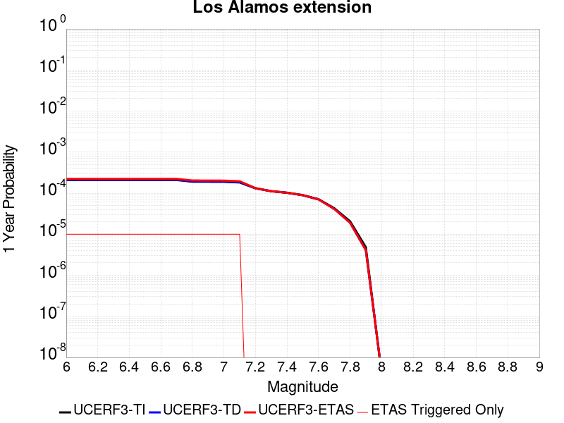 | 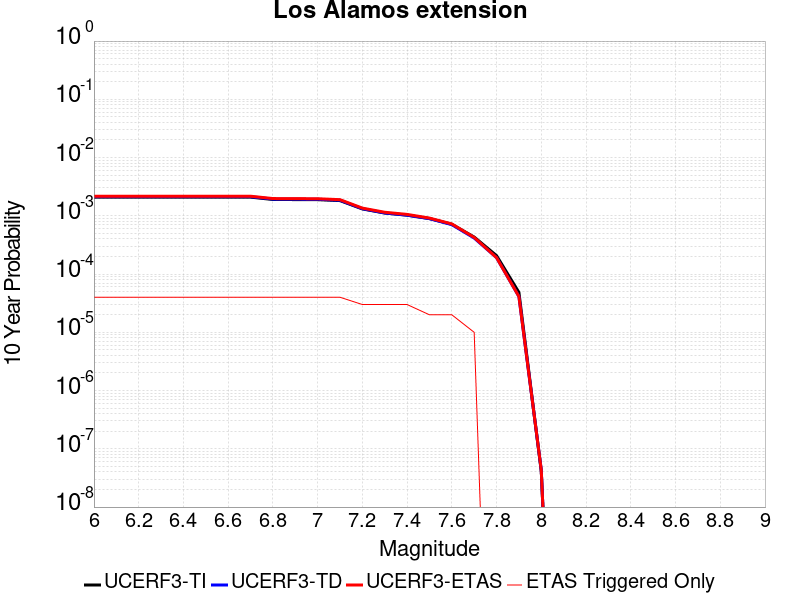 |

| Magnitude | 1 wk TI Prob | 1 wk TD Prob | 1 wk ETAS Prob | 1 wk ETAS/TD Gain | 1 wk ETAS Triggered Only | 1 mo TI Prob | 1 mo TD Prob | 1 mo ETAS Prob | 1 mo ETAS/TD Gain | 1 mo ETAS Triggered Only | 1 yr TI Prob | 1 yr TD Prob | 1 yr ETAS Prob | 1 yr ETAS/TD Gain | 1 yr ETAS Triggered Only | 10 yr TI Prob | 10 yr TD Prob | 10 yr ETAS Prob | 10 yr ETAS/TD Gain | 10 yr ETAS Triggered Only |
|-----|-----|-----|-----|-----|-----|-----|-----|-----|-----|-----|-----|-----|-----|-----|-----|-----|-----|-----|-----|-----|
| 6.0 | 4.0146506E-6 | 4.086164E-6 | 4.086164E-6 | 1.0 | 0.0 | 1.7205533E-5 | 1.7512022E-5 | 1.7512022E-5 | 1.0 | 0.0 | 2.0945723E-4 | 2.1318911E-4 | 2.2318697E-4 | 1.0468967 | 1.0E-5 | 0.0020925992 | 0.002129955 | 0.0021698698 | 1.0187397 | 4.0E-5 |
| 6.1 | 4.0146506E-6 | 4.086164E-6 | 4.086164E-6 | 1.0 | 0.0 | 1.7205533E-5 | 1.7512022E-5 | 1.7512022E-5 | 1.0 | 0.0 | 2.0945723E-4 | 2.1318911E-4 | 2.2318697E-4 | 1.0468967 | 1.0E-5 | 0.0020925992 | 0.002129955 | 0.0021698698 | 1.0187397 | 4.0E-5 |
| 6.2 | 4.0146506E-6 | 4.086164E-6 | 4.086164E-6 | 1.0 | 0.0 | 1.7205533E-5 | 1.7512022E-5 | 1.7512022E-5 | 1.0 | 0.0 | 2.0945723E-4 | 2.1318911E-4 | 2.2318697E-4 | 1.0468967 | 1.0E-5 | 0.0020925992 | 0.002129955 | 0.0021698698 | 1.0187397 | 4.0E-5 |
| 6.3 | 4.0146506E-6 | 4.086164E-6 | 4.086164E-6 | 1.0 | 0.0 | 1.7205533E-5 | 1.7512022E-5 | 1.7512022E-5 | 1.0 | 0.0 | 2.0945723E-4 | 2.1318911E-4 | 2.2318697E-4 | 1.0468967 | 1.0E-5 | 0.0020925992 | 0.002129955 | 0.0021698698 | 1.0187397 | 4.0E-5 |
| 6.4 | 4.0146506E-6 | 4.086164E-6 | 4.086164E-6 | 1.0 | 0.0 | 1.7205533E-5 | 1.7512022E-5 | 1.7512022E-5 | 1.0 | 0.0 | 2.0945723E-4 | 2.1318911E-4 | 2.2318697E-4 | 1.0468967 | 1.0E-5 | 0.0020925992 | 0.002129955 | 0.0021698698 | 1.0187397 | 4.0E-5 |
| 6.5 | 4.0146506E-6 | 4.086164E-6 | 4.086164E-6 | 1.0 | 0.0 | 1.7205533E-5 | 1.7512022E-5 | 1.7512022E-5 | 1.0 | 0.0 | 2.0945723E-4 | 2.1318911E-4 | 2.2318697E-4 | 1.0468967 | 1.0E-5 | 0.0020925992 | 0.002129955 | 0.0021698698 | 1.0187397 | 4.0E-5 |
| 6.6 | 4.0146506E-6 | 4.086164E-6 | 4.086164E-6 | 1.0 | 0.0 | 1.7205533E-5 | 1.7512022E-5 | 1.7512022E-5 | 1.0 | 0.0 | 2.0945723E-4 | 2.1318911E-4 | 2.2318697E-4 | 1.0468967 | 1.0E-5 | 0.0020925992 | 0.002129955 | 0.0021698698 | 1.0187397 | 4.0E-5 |
| 6.7 | 4.0146506E-6 | 4.086164E-6 | 4.086164E-6 | 1.0 | 0.0 | 1.7205533E-5 | 1.7512022E-5 | 1.7512022E-5 | 1.0 | 0.0 | 2.0945723E-4 | 2.1318911E-4 | 2.2318697E-4 | 1.0468967 | 1.0E-5 | 0.0020925992 | 0.002129955 | 0.0021698698 | 1.0187397 | 4.0E-5 |
| 6.8 | 3.6584688E-6 | 3.7188636E-6 | 3.7188636E-6 | 1.0 | 0.0 | 1.5679057E-5 | 1.5937894E-5 | 1.5937894E-5 | 1.0 | 0.0 | 1.9087581E-4 | 1.9402753E-4 | 2.0402558E-4 | 1.051529 | 1.0E-5 | 0.0019071194 | 0.0019386737 | 0.001978596 | 1.0205927 | 4.0E-5 |
| 6.9 | 3.644631E-6 | 3.7045736E-6 | 3.7045736E-6 | 1.0 | 0.0 | 1.5619753E-5 | 1.5876652E-5 | 1.5876652E-5 | 1.0 | 0.0 | 1.901539E-4 | 1.9328203E-4 | 2.032801E-4 | 1.0517279 | 1.0E-5 | 0.0018999127 | 0.0019312317 | 0.0019711545 | 1.0206722 | 4.0E-5 |
| 7.0 | 3.6318522E-6 | 3.691334E-6 | 3.691334E-6 | 1.0 | 0.0 | 1.5564989E-5 | 1.5819913E-5 | 1.5819913E-5 | 1.0 | 0.0 | 1.8948725E-4 | 1.9259135E-4 | 2.0258942E-4 | 1.0519134 | 1.0E-5 | 0.0018932576 | 0.0019243368 | 0.00196426 | 1.0207464 | 4.0E-5 |
| 7.1 | 3.5001724E-6 | 3.5554046E-6 | 3.5554046E-6 | 1.0 | 0.0 | 1.5000653E-5 | 1.5237365E-5 | 1.5237365E-5 | 1.0 | 0.0 | 1.8261763E-4 | 1.8550004E-4 | 1.9549819E-4 | 1.0538983 | 1.0E-5 | 0.0018246764 | 0.0018535426 | 0.0018934686 | 1.0215403 | 4.0E-5 |
| 7.2 | 2.5204702E-6 | 2.5436989E-6 | 2.5436989E-6 | 1.0 | 0.0 | 1.080197E-5 | 1.0901522E-5 | 1.0901522E-5 | 1.0 | 0.0 | 1.3150605E-4 | 1.3271799E-4 | 1.3271799E-4 | 1.0 | 0.0 | 0.0013142825 | 0.001326393 | 0.0013563532 | 1.0225878 | 3.0E-5 |
| 7.3 | 2.1399692E-6 | 2.1501362E-6 | 2.1501362E-6 | 1.0 | 0.0 | 9.1712645E-6 | 9.2148375E-6 | 9.2148375E-6 | 1.0 | 0.0 | 1.1165442E-4 | 1.121849E-4 | 1.121849E-4 | 1.0 | 0.0 | 0.0011159834 | 0.001121286 | 0.0011512523 | 1.026725 | 3.0E-5 |
| 7.4 | 1.9660122E-6 | 1.970241E-6 | 1.970241E-6 | 1.0 | 0.0 | 8.42574E-6 | 8.4438625E-6 | 8.4438625E-6 | 1.0 | 0.0 | 1.0257855E-4 | 1.0279921E-4 | 1.0279921E-4 | 1.0 | 0.0 | 0.0010253121 | 0.0010275197 | 0.0010574888 | 1.0291666 | 3.0E-5 |
| 7.5 | 1.7204633E-6 | 1.7151029E-6 | 1.7151029E-6 | 1.0 | 0.0 | 7.373393E-6 | 7.3504207E-6 | 7.3504207E-6 | 1.0 | 0.0 | 8.976737E-5 | 8.948772E-5 | 8.948772E-5 | 1.0 | 0.0 | 8.9731114E-4 | 8.945199E-4 | 9.14502E-4 | 1.0223384 | 2.0E-5 |
| 7.6 | 1.3717638E-6 | 1.3535872E-6 | 1.3535872E-6 | 1.0 | 0.0 | 5.878974E-6 | 5.801075E-6 | 5.801075E-6 | 1.0 | 0.0 | 7.157416E-5 | 7.062583E-5 | 7.062583E-5 | 1.0 | 0.0 | 7.1551115E-4 | 7.0603646E-4 | 7.2602235E-4 | 1.0283072 | 2.0E-5 |
| 7.7 | 8.272564E-7 | 7.9576733E-7 | 7.9576733E-7 | 1.0 | 0.0 | 3.5453797E-6 | 3.4104269E-6 | 3.4104269E-6 | 1.0 | 0.0 | 4.3164142E-5 | 4.1521158E-5 | 4.1521158E-5 | 1.0 | 0.0 | 4.315576E-4 | 4.151342E-4 | 4.2513004E-4 | 1.0240786 | 1.0E-5 |
| 7.8 | 3.9708277E-7 | 3.671937E-7 | 3.671937E-7 | 1.0 | 0.0 | 1.7017821E-6 | 1.5736864E-6 | 1.5736864E-6 | 1.0 | 0.0 | 2.0719E-5 | 1.9159465E-5 | 1.9159465E-5 | 1.0 | 0.0 | 2.071707E-4 | 1.9157819E-4 | 1.9157819E-4 | 1.0 | 0.0 |
| 7.9 | 9.292528E-8 | 7.889168E-8 | 7.889168E-8 | 1.0 | 0.0 | 3.9825116E-7 | 3.3810713E-7 | 3.3810713E-7 | 1.0 | 0.0 | 4.848697E-6 | 4.1164467E-6 | 4.1164467E-6 | 1.0 | 0.0 | 4.8485912E-5 | 4.1163716E-5 | 4.1163716E-5 | 1.0 | 0.0 |
| 8.0 | 7.880441E-11 | 8.2353124E-11 | 8.2353124E-11 | 1.0 | 0.0 | 3.3773329E-10 | 3.52942E-10 | 3.52942E-10 | 1.0 | 0.0 | 4.1119033E-9 | 4.2970694E-9 | 4.2970694E-9 | 1.0 | 0.0 | 4.1119034E-8 | 4.2970694E-8 | 4.2970694E-8 | 1.0 | 0.0 |

## Monterey Bay-Tularcitos
*[(top)](#table-of-contents)*

| 1 Week | 1 Month | 1 Year | 10 Year |
|-----|-----|-----|-----|
|  |  |  | 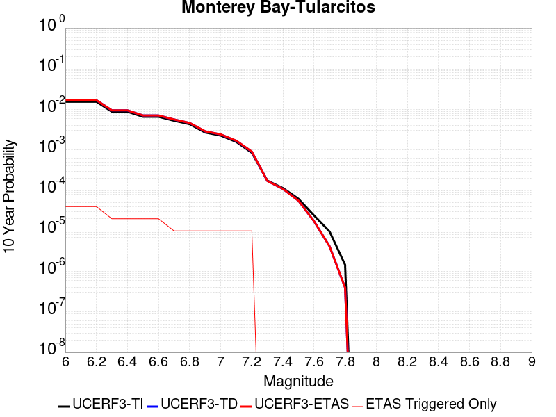 |

| Magnitude | 1 wk TI Prob | 1 wk TD Prob | 1 wk ETAS Prob | 1 wk ETAS/TD Gain | 1 wk ETAS Triggered Only | 1 mo TI Prob | 1 mo TD Prob | 1 mo ETAS Prob | 1 mo ETAS/TD Gain | 1 mo ETAS Triggered Only | 1 yr TI Prob | 1 yr TD Prob | 1 yr ETAS Prob | 1 yr ETAS/TD Gain | 1 yr ETAS Triggered Only | 10 yr TI Prob | 10 yr TD Prob | 10 yr ETAS Prob | 10 yr ETAS/TD Gain | 10 yr ETAS Triggered Only |
|-----|-----|-----|-----|-----|-----|-----|-----|-----|-----|-----|-----|-----|-----|-----|-----|-----|-----|-----|-----|-----|
| 6.0 | 3.0131365E-5 | 3.279877E-5 | 5.2798114E-5 | 1.609759 | 2.0E-5 | 1.2912804E-4 | 1.4055918E-4 | 1.6055637E-4 | 1.1422688 | 2.0E-5 | 0.001571 | 0.0017100703 | 0.001740019 | 1.0175132 | 3.0E-5 | 0.015599402 | 0.016979916 | 0.017019238 | 1.0023158 | 4.0E-5 |
| 6.1 | 3.0131365E-5 | 3.279877E-5 | 5.2798114E-5 | 1.609759 | 2.0E-5 | 1.2912804E-4 | 1.4055918E-4 | 1.6055637E-4 | 1.1422688 | 2.0E-5 | 0.001571 | 0.0017100703 | 0.001740019 | 1.0175132 | 3.0E-5 | 0.015599402 | 0.016979916 | 0.017019238 | 1.0023158 | 4.0E-5 |
| 6.2 | 3.0131365E-5 | 3.279877E-5 | 5.2798114E-5 | 1.609759 | 2.0E-5 | 1.2912804E-4 | 1.4055918E-4 | 1.6055637E-4 | 1.1422688 | 2.0E-5 | 0.001571 | 0.0017100703 | 0.001740019 | 1.0175132 | 3.0E-5 | 0.015599402 | 0.016979916 | 0.017019238 | 1.0023158 | 4.0E-5 |
| 6.3 | 1.6998249E-5 | 1.8330798E-5 | 2.8330614E-5 | 1.54552 | 1.0E-5 | 7.28476E-5 | 7.85583E-5 | 8.8557514E-5 | 1.127284 | 1.0E-5 | 8.865586E-4 | 9.5604634E-4 | 9.760272E-4 | 1.0208995 | 2.0E-5 | 0.0088303005 | 0.009521258 | 0.009541067 | 1.0020806 | 2.0E-5 |
| 6.4 | 1.6998249E-5 | 1.8330798E-5 | 2.8330614E-5 | 1.54552 | 1.0E-5 | 7.28476E-5 | 7.85583E-5 | 8.8557514E-5 | 1.127284 | 1.0E-5 | 8.865586E-4 | 9.5604634E-4 | 9.760272E-4 | 1.0208995 | 2.0E-5 | 0.0088303005 | 0.009521258 | 0.009541067 | 1.0020806 | 2.0E-5 |
| 6.5 | 1.27470785E-5 | 1.3693312E-5 | 2.3693176E-5 | 1.7302735 | 1.0E-5 | 5.4629192E-5 | 5.8684363E-5 | 6.8683774E-5 | 1.1703931 | 1.0E-5 | 6.649074E-4 | 7.1425823E-4 | 7.3424395E-4 | 1.027981 | 2.0E-5 | 0.0066292146 | 0.007120678 | 0.007140536 | 1.0027887 | 2.0E-5 |
| 6.6 | 1.2739422E-5 | 1.36854E-5 | 2.3685263E-5 | 1.7306957 | 1.0E-5 | 5.4596385E-5 | 5.8650454E-5 | 6.864987E-5 | 1.1704917 | 1.0E-5 | 6.645082E-4 | 7.1384566E-4 | 7.338314E-4 | 1.0279973 | 2.0E-5 | 0.0066252467 | 0.007116579 | 0.0071364366 | 1.0027903 | 2.0E-5 |
| 6.7 | 1.0160109E-5 | 1.0885755E-5 | 2.0885645E-5 | 1.9186218 | 1.0E-5 | 4.35426E-5 | 4.665244E-5 | 5.6651974E-5 | 1.214341 | 1.0E-5 | 5.300022E-4 | 5.6785246E-4 | 5.778468E-4 | 1.0176002 | 1.0E-5 | 0.005287399 | 0.0056647263 | 0.0056746695 | 1.0017554 | 1.0E-5 |
| 6.8 | 8.349859E-6 | 8.932587E-6 | 1.8932498E-5 | 2.1194866 | 1.0E-5 | 3.578462E-5 | 3.8281985E-5 | 4.8281603E-5 | 1.2612095 | 1.0E-5 | 4.3559066E-4 | 4.6598914E-4 | 4.759845E-4 | 1.0214497 | 1.0E-5 | 0.004347378 | 0.004650685 | 0.0046606385 | 1.0021402 | 1.0E-5 |
| 6.9 | 5.193639E-6 | 5.53643E-6 | 1.5536374E-5 | 2.8062081 | 1.0E-5 | 2.2258262E-5 | 2.372736E-5 | 3.3727123E-5 | 1.4214444 | 1.0E-5 | 2.7096065E-4 | 2.8884556E-4 | 2.9884267E-4 | 1.0346106 | 1.0E-5 | 0.0027063051 | 0.0028850224 | 0.0028949934 | 1.0034562 | 1.0E-5 |
| 7.0 | 4.359381E-6 | 4.643366E-6 | 1.4643319E-5 | 3.1536002 | 1.0E-5 | 1.8682927E-5 | 1.9900004E-5 | 2.9899806E-5 | 1.5025024 | 1.0E-5 | 2.274409E-4 | 2.422586E-4 | 2.5225617E-4 | 1.0412682 | 1.0E-5 | 0.0022720827 | 0.002420238 | 0.0024302138 | 1.0041218 | 1.0E-5 |
| 7.1 | 3.0398533E-6 | 3.2310427E-6 | 1.3231011E-5 | 4.0949664 | 1.0E-5 | 1.3027877E-5 | 1.3847267E-5 | 2.3847128E-5 | 1.7221541 | 1.0E-5 | 1.5860285E-4 | 1.6858005E-4 | 1.7857837E-4 | 1.059309 | 1.0E-5 | 0.001584897 | 0.0016847793 | 0.0016947625 | 1.0059255 | 1.0E-5 |
| 7.2 | 1.642335E-6 | 1.7333153E-6 | 1.1733298E-5 | 6.7692804 | 1.0E-5 | 7.0385595E-6 | 7.428485E-6 | 1.742841E-5 | 2.3461595 | 1.0E-5 | 8.569109E-5 | 9.044012E-5 | 1.0043921E-4 | 1.1105604 | 1.0E-5 | 8.5658056E-4 | 9.042358E-4 | 9.1422675E-4 | 1.011049 | 1.0E-5 |
| 7.3 | 3.356842E-7 | 3.2952389E-7 | 3.2952389E-7 | 1.0 | 0.0 | 1.4386458E-6 | 1.4122445E-6 | 1.4122445E-6 | 1.0 | 0.0 | 1.7515373E-5 | 1.7193941E-5 | 1.7193941E-5 | 1.0 | 0.0 | 1.7513991E-4 | 1.719262E-4 | 1.719262E-4 | 1.0 | 0.0 |
| 7.4 | 2.1973483E-7 | 2.1006414E-7 | 2.1006414E-7 | 1.0 | 0.0 | 9.417204E-7 | 9.002746E-7 | 9.002746E-7 | 1.0 | 0.0 | 1.1465385E-5 | 1.0960788E-5 | 1.0960788E-5 | 1.0 | 0.0 | 1.1464794E-4 | 1.0960251E-4 | 1.0960251E-4 | 1.0 | 0.0 |
| 7.5 | 1.1944135E-7 | 1.0696035E-7 | 1.0696035E-7 | 1.0 | 0.0 | 5.118914E-7 | 4.5840142E-7 | 4.5840142E-7 | 1.0 | 0.0 | 6.23226E-6 | 5.581023E-6 | 5.581023E-6 | 1.0 | 0.0 | 6.2320854E-5 | 5.5808843E-5 | 5.5808843E-5 | 1.0 | 0.0 |
| 7.6 | 4.636058E-8 | 3.3364433E-8 | 3.3364433E-8 | 1.0 | 0.0 | 1.9868818E-7 | 1.4299042E-7 | 1.4299042E-7 | 1.0 | 0.0 | 2.419026E-6 | 1.740907E-6 | 1.740907E-6 | 1.0 | 0.0 | 2.4189996E-5 | 1.7408936E-5 | 1.7408936E-5 | 1.0 | 0.0 |
| 7.7 | 1.8588572E-8 | 8.003168E-9 | 8.003168E-9 | 1.0 | 0.0 | 7.9665305E-8 | 3.429929E-8 | 3.429929E-8 | 1.0 | 0.0 | 9.699246E-7 | 4.1759378E-7 | 4.1759378E-7 | 1.0 | 0.0 | 9.699204E-6 | 4.1759304E-6 | 4.1759304E-6 | 1.0 | 0.0 |
| 7.8 | 2.7960154E-9 | 7.608624E-10 | 7.608624E-10 | 1.0 | 0.0 | 1.1982923E-8 | 3.2608392E-9 | 3.2608392E-9 | 1.0 | 0.0 | 1.4589209E-7 | 3.9700716E-8 | 3.9700716E-8 | 1.0 | 0.0 | 1.4589199E-6 | 3.970071E-7 | 3.970071E-7 | 1.0 | 0.0 |

## Del Valle
*[(top)](#table-of-contents)*

| 1 Week | 1 Month | 1 Year | 10 Year |
|-----|-----|-----|-----|
|  |  | 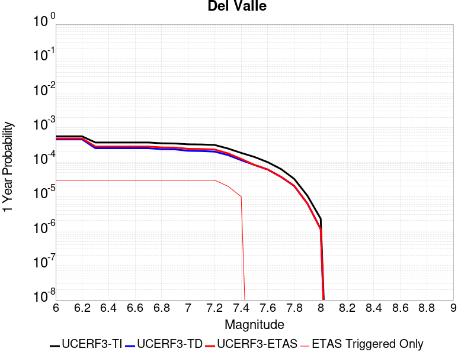 |  |

| Magnitude | 1 wk TI Prob | 1 wk TD Prob | 1 wk ETAS Prob | 1 wk ETAS/TD Gain | 1 wk ETAS Triggered Only | 1 mo TI Prob | 1 mo TD Prob | 1 mo ETAS Prob | 1 mo ETAS/TD Gain | 1 mo ETAS Triggered Only | 1 yr TI Prob | 1 yr TD Prob | 1 yr ETAS Prob | 1 yr ETAS/TD Gain | 1 yr ETAS Triggered Only | 10 yr TI Prob | 10 yr TD Prob | 10 yr ETAS Prob | 10 yr ETAS/TD Gain | 10 yr ETAS Triggered Only |
|-----|-----|-----|-----|-----|-----|-----|-----|-----|-----|-----|-----|-----|-----|-----|-----|-----|-----|-----|-----|-----|
| 6.0 | 1.0716125E-5 | 8.767882E-6 | 1.8767794E-5 | 2.1405163 | 1.0E-5 | 4.592544E-5 | 3.7576207E-5 | 4.7575828E-5 | 1.2661159 | 1.0E-5 | 5.589988E-4 | 4.5741402E-4 | 4.8740028E-4 | 1.065556 | 3.0E-5 | 0.0055759475 | 0.004566694 | 0.0046065114 | 1.0087191 | 4.0E-5 |
| 6.1 | 1.0716125E-5 | 8.767882E-6 | 1.8767794E-5 | 2.1405163 | 1.0E-5 | 4.592544E-5 | 3.7576207E-5 | 4.7575828E-5 | 1.2661159 | 1.0E-5 | 5.589988E-4 | 4.5741402E-4 | 4.8740028E-4 | 1.065556 | 3.0E-5 | 0.0055759475 | 0.004566694 | 0.0046065114 | 1.0087191 | 4.0E-5 |
| 6.2 | 1.0716125E-5 | 8.767882E-6 | 1.8767794E-5 | 2.1405163 | 1.0E-5 | 4.592544E-5 | 3.7576207E-5 | 4.7575828E-5 | 1.2661159 | 1.0E-5 | 5.589988E-4 | 4.5741402E-4 | 4.8740028E-4 | 1.065556 | 3.0E-5 | 0.0055759475 | 0.004566694 | 0.0046065114 | 1.0087191 | 4.0E-5 |
| 6.3 | 7.1293784E-6 | 4.8658226E-6 | 1.4865774E-5 | 3.055141 | 1.0E-5 | 3.055412E-5 | 2.0853362E-5 | 3.0853153E-5 | 1.479529 | 1.0E-5 | 3.7193293E-4 | 2.5386084E-4 | 2.8385324E-4 | 1.118145 | 3.0E-5 | 0.0037131102 | 0.0025358086 | 0.0025757074 | 1.0157341 | 4.0E-5 |
| 6.4 | 7.1293784E-6 | 4.8658226E-6 | 1.4865774E-5 | 3.055141 | 1.0E-5 | 3.055412E-5 | 2.0853362E-5 | 3.0853153E-5 | 1.479529 | 1.0E-5 | 3.7193293E-4 | 2.5386084E-4 | 2.8385324E-4 | 1.118145 | 3.0E-5 | 0.0037131102 | 0.0025358086 | 0.0025757074 | 1.0157341 | 4.0E-5 |
| 6.5 | 7.1293784E-6 | 4.8658226E-6 | 1.4865774E-5 | 3.055141 | 1.0E-5 | 3.055412E-5 | 2.0853362E-5 | 3.0853153E-5 | 1.479529 | 1.0E-5 | 3.7193293E-4 | 2.5386084E-4 | 2.8385324E-4 | 1.118145 | 3.0E-5 | 0.0037131102 | 0.0025358086 | 0.0025757074 | 1.0157341 | 4.0E-5 |
| 6.6 | 7.1293784E-6 | 4.8658226E-6 | 1.4865774E-5 | 3.055141 | 1.0E-5 | 3.055412E-5 | 2.0853362E-5 | 3.0853153E-5 | 1.479529 | 1.0E-5 | 3.7193293E-4 | 2.5386084E-4 | 2.8385324E-4 | 1.118145 | 3.0E-5 | 0.0037131102 | 0.0025358086 | 0.0025757074 | 1.0157341 | 4.0E-5 |
| 6.7 | 7.12272E-6 | 4.8631982E-6 | 1.486315E-5 | 3.05625 | 1.0E-5 | 3.0525585E-5 | 2.0842115E-5 | 3.0841908E-5 | 1.4797877 | 1.0E-5 | 3.7158563E-4 | 2.5372393E-4 | 2.8371633E-4 | 1.1182088 | 3.0E-5 | 0.003709649 | 0.0025344428 | 0.0025743414 | 1.0157425 | 4.0E-5 |
| 6.8 | 6.7558703E-6 | 4.559404E-6 | 1.45593585E-5 | 3.1932592 | 1.0E-5 | 2.895341E-5 | 1.954016E-5 | 2.9539964E-5 | 1.5117565 | 1.0E-5 | 3.5245073E-4 | 2.3787611E-4 | 2.6786898E-4 | 1.1260861 | 3.0E-5 | 0.0035189227 | 0.0023763045 | 0.0024162093 | 1.0167929 | 4.0E-5 |
| 6.9 | 6.6700386E-6 | 4.5025436E-6 | 1.4502499E-5 | 3.220957 | 1.0E-5 | 2.8585566E-5 | 1.9296476E-5 | 2.9296283E-5 | 1.5182194 | 1.0E-5 | 3.479737E-4 | 2.349099E-4 | 2.6490283E-4 | 1.1276785 | 3.0E-5 | 0.003474293 | 0.0023467052 | 0.0023866112 | 1.0170052 | 4.0E-5 |
| 7.0 | 6.3181424E-6 | 4.098708E-6 | 1.4098667E-5 | 3.4397833 | 1.0E-5 | 2.7077473E-5 | 1.7565775E-5 | 2.7565598E-5 | 1.5692788 | 1.0E-5 | 3.2961834E-4 | 2.1384275E-4 | 2.4383633E-4 | 1.14026 | 3.0E-5 | 0.0032912986 | 0.0021364389 | 0.0021763532 | 1.0186827 | 4.0E-5 |
| 7.1 | 6.248759E-6 | 4.033899E-6 | 1.4033859E-5 | 3.478981 | 1.0E-5 | 2.678012E-5 | 1.7288028E-5 | 2.7287855E-5 | 1.5784249 | 1.0E-5 | 3.2599916E-4 | 2.1046183E-4 | 2.4045551E-4 | 1.1425136 | 3.0E-5 | 0.0032552136 | 0.0021026938 | 0.0021426098 | 1.0189832 | 4.0E-5 |
| 7.2 | 6.0411944E-6 | 3.869892E-6 | 1.3869853E-5 | 3.584041 | 1.0E-5 | 2.5890577E-5 | 1.658515E-5 | 2.6584985E-5 | 1.602939 | 1.0E-5 | 3.1517216E-4 | 2.019059E-4 | 2.3189984E-4 | 1.1485541 | 3.0E-5 | 0.0031472554 | 0.0020172922 | 0.0020572115 | 1.0197885 | 4.0E-5 |
| 7.3 | 4.7691183E-6 | 3.0780905E-6 | 1.307806E-5 | 4.2487574 | 1.0E-5 | 2.0438918E-5 | 1.3191751E-5 | 2.3191618E-5 | 1.7580395 | 1.0E-5 | 2.488154E-4 | 1.6059795E-4 | 1.8059474E-4 | 1.1245146 | 2.0E-5 | 0.00248537 | 0.0016048512 | 0.0016248191 | 1.0124422 | 2.0E-5 |
| 7.4 | 3.5524722E-6 | 2.1893159E-6 | 2.1893159E-6 | 1.0 | 0.0 | 1.5224792E-5 | 9.382749E-6 | 9.382749E-6 | 1.0 | 0.0 | 1.8534607E-4 | 1.14229064E-4 | 1.2422792E-4 | 1.0875334 | 1.0E-5 | 0.0018519156 | 0.0011417117 | 0.0011517003 | 1.0087488 | 1.0E-5 |
| 7.5 | 2.7133442E-6 | 1.5915855E-6 | 1.5915855E-6 | 1.0 | 0.0 | 1.1628566E-5 | 6.821063E-6 | 6.821063E-6 | 1.0 | 0.0 | 1.415686E-4 | 8.30433E-5 | 8.30433E-5 | 1.0 | 0.0 | 0.0014147845 | 8.301246E-4 | 8.301246E-4 | 1.0 | 0.0 |
| 7.6 | 1.915338E-6 | 1.1738952E-6 | 1.1738952E-6 | 1.0 | 0.0 | 8.208566E-6 | 5.0309695E-6 | 5.0309695E-6 | 1.0 | 0.0 | 9.993471E-5 | 6.125034E-5 | 6.125034E-5 | 1.0 | 0.0 | 9.988978E-4 | 6.123355E-4 | 6.123355E-4 | 1.0 | 0.0 |
| 7.7 | 1.2120448E-6 | 7.1801645E-7 | 7.1801645E-7 | 1.0 | 0.0 | 5.194467E-6 | 3.0772098E-6 | 3.0772098E-6 | 1.0 | 0.0 | 6.3240805E-5 | 3.746439E-5 | 3.746439E-5 | 1.0 | 0.0 | 6.322281E-4 | 3.745811E-4 | 3.745811E-4 | 1.0 | 0.0 |
| 7.8 | 6.272381E-7 | 3.93245E-7 | 3.93245E-7 | 1.0 | 0.0 | 2.6881603E-6 | 1.6853346E-6 | 1.6853346E-6 | 1.0 | 0.0 | 3.272786E-5 | 2.0518757E-5 | 2.0518757E-5 | 1.0 | 0.0 | 3.272304E-4 | 2.0516879E-4 | 2.0516879E-4 | 1.0 | 0.0 |
| 7.9 | 2.0292627E-7 | 1.2004223E-7 | 1.2004223E-7 | 1.0 | 0.0 | 8.6968373E-7 | 5.144666E-7 | 5.144666E-7 | 1.0 | 0.0 | 1.0588348E-5 | 6.2636127E-6 | 6.2636127E-6 | 1.0 | 0.0 | 1.0587843E-4 | 6.263438E-5 | 6.263438E-5 | 1.0 | 0.0 |
| 8.0 | 4.374492E-8 | 2.1898856E-8 | 2.1898856E-8 | 1.0 | 0.0 | 1.8747821E-7 | 9.3852236E-8 | 9.3852236E-8 | 1.0 | 0.0 | 2.2825448E-6 | 1.1426505E-6 | 1.1426505E-6 | 1.0 | 0.0 | 2.2825214E-5 | 1.1426449E-5 | 1.1426449E-5 | 1.0 | 0.0 |

## Los Alamos 2011 CFM
*[(top)](#table-of-contents)*

| 1 Week | 1 Month | 1 Year | 10 Year |
|-----|-----|-----|-----|
|  |  | 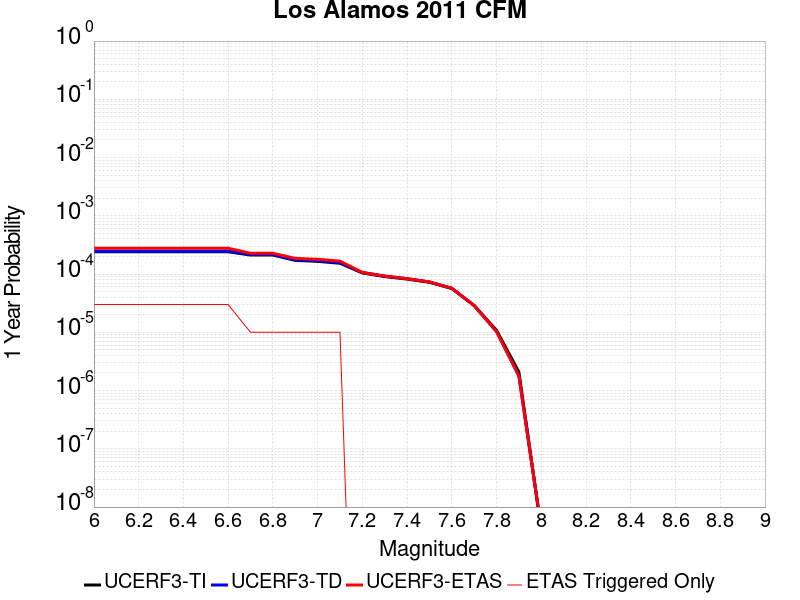 |  |

| Magnitude | 1 wk TI Prob | 1 wk TD Prob | 1 wk ETAS Prob | 1 wk ETAS/TD Gain | 1 wk ETAS Triggered Only | 1 mo TI Prob | 1 mo TD Prob | 1 mo ETAS Prob | 1 mo ETAS/TD Gain | 1 mo ETAS Triggered Only | 1 yr TI Prob | 1 yr TD Prob | 1 yr ETAS Prob | 1 yr ETAS/TD Gain | 1 yr ETAS Triggered Only | 10 yr TI Prob | 10 yr TD Prob | 10 yr ETAS Prob | 10 yr ETAS/TD Gain | 10 yr ETAS Triggered Only |
|-----|-----|-----|-----|-----|-----|-----|-----|-----|-----|-----|-----|-----|-----|-----|-----|-----|-----|-----|-----|-----|
| 6.0 | 4.6284417E-6 | 4.7517333E-6 | 4.7517333E-6 | 1.0 | 0.0 | 1.9836029E-5 | 2.0364423E-5 | 3.036422E-5 | 1.4910425 | 1.0E-5 | 2.4147688E-4 | 2.479104E-4 | 2.7790296E-4 | 1.1209815 | 3.0E-5 | 0.0024121467 | 0.0024765125 | 0.0025164136 | 1.0161117 | 4.0E-5 |
| 6.1 | 4.6284417E-6 | 4.7517333E-6 | 4.7517333E-6 | 1.0 | 0.0 | 1.9836029E-5 | 2.0364423E-5 | 3.036422E-5 | 1.4910425 | 1.0E-5 | 2.4147688E-4 | 2.479104E-4 | 2.7790296E-4 | 1.1209815 | 3.0E-5 | 0.0024121467 | 0.0024765125 | 0.0025164136 | 1.0161117 | 4.0E-5 |
| 6.2 | 4.6284417E-6 | 4.7517333E-6 | 4.7517333E-6 | 1.0 | 0.0 | 1.9836029E-5 | 2.0364423E-5 | 3.036422E-5 | 1.4910425 | 1.0E-5 | 2.4147688E-4 | 2.479104E-4 | 2.7790296E-4 | 1.1209815 | 3.0E-5 | 0.0024121467 | 0.0024765125 | 0.0025164136 | 1.0161117 | 4.0E-5 |
| 6.3 | 4.6284417E-6 | 4.7517333E-6 | 4.7517333E-6 | 1.0 | 0.0 | 1.9836029E-5 | 2.0364423E-5 | 3.036422E-5 | 1.4910425 | 1.0E-5 | 2.4147688E-4 | 2.479104E-4 | 2.7790296E-4 | 1.1209815 | 3.0E-5 | 0.0024121467 | 0.0024765125 | 0.0025164136 | 1.0161117 | 4.0E-5 |
| 6.4 | 4.6284417E-6 | 4.7517333E-6 | 4.7517333E-6 | 1.0 | 0.0 | 1.9836029E-5 | 2.0364423E-5 | 3.036422E-5 | 1.4910425 | 1.0E-5 | 2.4147688E-4 | 2.479104E-4 | 2.7790296E-4 | 1.1209815 | 3.0E-5 | 0.0024121467 | 0.0024765125 | 0.0025164136 | 1.0161117 | 4.0E-5 |
| 6.5 | 4.6284417E-6 | 4.7517333E-6 | 4.7517333E-6 | 1.0 | 0.0 | 1.9836029E-5 | 2.0364423E-5 | 3.036422E-5 | 1.4910425 | 1.0E-5 | 2.4147688E-4 | 2.479104E-4 | 2.7790296E-4 | 1.1209815 | 3.0E-5 | 0.0024121467 | 0.0024765125 | 0.0025164136 | 1.0161117 | 4.0E-5 |
| 6.6 | 4.6284417E-6 | 4.7517333E-6 | 4.7517333E-6 | 1.0 | 0.0 | 1.9836029E-5 | 2.0364423E-5 | 3.036422E-5 | 1.4910425 | 1.0E-5 | 2.4147688E-4 | 2.479104E-4 | 2.7790296E-4 | 1.1209815 | 3.0E-5 | 0.0024121467 | 0.0024765125 | 0.0025164136 | 1.0161117 | 4.0E-5 |
| 6.7 | 4.062321E-6 | 4.166351E-6 | 4.166351E-6 | 1.0 | 0.0 | 1.7409831E-5 | 1.7855677E-5 | 1.7855677E-5 | 1.0 | 0.0 | 2.1194408E-4 | 2.1737268E-4 | 2.2737052E-4 | 1.0459939 | 1.0E-5 | 0.0021174205 | 0.0021717504 | 0.0021917068 | 1.0091891 | 2.0E-5 |
| 6.8 | 4.062321E-6 | 4.166351E-6 | 4.166351E-6 | 1.0 | 0.0 | 1.7409831E-5 | 1.7855677E-5 | 1.7855677E-5 | 1.0 | 0.0 | 2.1194408E-4 | 2.1737268E-4 | 2.2737052E-4 | 1.0459939 | 1.0E-5 | 0.0021174205 | 0.0021717504 | 0.0021917068 | 1.0091891 | 2.0E-5 |
| 6.9 | 3.2936077E-6 | 3.37296E-6 | 3.37296E-6 | 1.0 | 0.0 | 1.4115385E-5 | 1.4455468E-5 | 1.4455468E-5 | 1.0 | 0.0 | 1.7184127E-4 | 1.7598206E-4 | 1.8598029E-4 | 1.056814 | 1.0E-5 | 0.0017170844 | 0.0017585196 | 0.0017784843 | 1.0113533 | 2.0E-5 |
| 7.0 | 3.1687898E-6 | 3.2448177E-6 | 3.2448177E-6 | 1.0 | 0.0 | 1.3580457E-5 | 1.3906293E-5 | 1.3906293E-5 | 1.0 | 0.0 | 1.6532952E-4 | 1.692969E-4 | 1.792952E-4 | 1.0590578 | 1.0E-5 | 0.0016520657 | 0.0016917707 | 0.0017117369 | 1.011802 | 2.0E-5 |
| 7.1 | 2.9379228E-6 | 3.007328E-6 | 3.007328E-6 | 1.0 | 0.0 | 1.25910365E-5 | 1.288849E-5 | 1.288849E-5 | 1.0 | 0.0 | 1.5328509E-4 | 1.5690697E-4 | 1.669054E-4 | 1.063722 | 1.0E-5 | 0.001531794 | 0.001568051 | 0.0015880197 | 1.0127347 | 2.0E-5 |
| 7.2 | 2.0020686E-6 | 2.041632E-6 | 2.041632E-6 | 1.0 | 0.0 | 8.580266E-6 | 8.749822E-6 | 8.749822E-6 | 1.0 | 0.0 | 1.0445973E-4 | 1.0652392E-4 | 1.0652392E-4 | 1.0 | 0.0 | 0.0010441064 | 0.001064733 | 0.0010747224 | 1.009382 | 1.0E-5 |
| 7.3 | 1.7364243E-6 | 1.7678824E-6 | 1.7678824E-6 | 1.0 | 0.0 | 7.441797E-6 | 7.576617E-6 | 7.576617E-6 | 1.0 | 0.0 | 9.0600115E-5 | 9.224144E-5 | 9.224144E-5 | 1.0 | 0.0 | 9.0563187E-4 | 9.2203467E-4 | 9.3202543E-4 | 1.0108355 | 1.0E-5 |
| 7.4 | 1.5718434E-6 | 1.5983198E-6 | 1.5983198E-6 | 1.0 | 0.0 | 6.7364545E-6 | 6.8499244E-6 | 6.8499244E-6 | 1.0 | 0.0 | 8.201325E-5 | 8.339467E-5 | 8.339467E-5 | 1.0 | 0.0 | 8.198299E-4 | 8.3363673E-4 | 8.4362837E-4 | 1.0119857 | 1.0E-5 |
| 7.5 | 1.3841119E-6 | 1.4042814E-6 | 1.4042814E-6 | 1.0 | 0.0 | 5.9318945E-6 | 6.018335E-6 | 6.018335E-6 | 1.0 | 0.0 | 7.221842E-5 | 7.327079E-5 | 7.327079E-5 | 1.0 | 0.0 | 7.2194956E-4 | 7.3246926E-4 | 7.4246194E-4 | 1.0136424 | 1.0E-5 |
| 7.6 | 1.0843726E-6 | 1.0934443E-6 | 1.0934443E-6 | 1.0 | 0.0 | 4.647303E-6 | 4.6861815E-6 | 4.6861815E-6 | 1.0 | 0.0 | 5.6579443E-5 | 5.705279E-5 | 5.705279E-5 | 1.0 | 0.0 | 5.656504E-4 | 5.70384E-4 | 5.8037834E-4 | 1.0175221 | 1.0E-5 |
| 7.7 | 5.544814E-7 | 5.501884E-7 | 5.501884E-7 | 1.0 | 0.0 | 2.3763469E-6 | 2.3579482E-6 | 2.3579482E-6 | 1.0 | 0.0 | 2.8931638E-5 | 2.8707644E-5 | 2.8707644E-5 | 1.0 | 0.0 | 2.8927872E-4 | 2.870395E-4 | 2.9703663E-4 | 1.0348284 | 1.0E-5 |
| 7.8 | 2.0707465E-7 | 1.9778598E-7 | 1.9778598E-7 | 1.0 | 0.0 | 8.874625E-7 | 8.476539E-7 | 8.476539E-7 | 1.0 | 0.0 | 1.08048025E-5 | 1.0320137E-5 | 1.0320137E-5 | 1.0 | 0.0 | 1.0804277E-4 | 1.0319663E-4 | 1.0319663E-4 | 1.0 | 0.0 |
| 7.9 | 3.9821284E-8 | 3.4331528E-8 | 3.4331528E-8 | 1.0 | 0.0 | 1.7066264E-7 | 1.4713511E-7 | 1.4713511E-7 | 1.0 | 0.0 | 2.0778157E-6 | 1.7913685E-6 | 1.7913685E-6 | 1.0 | 0.0 | 2.0777963E-5 | 1.7913546E-5 | 1.7913546E-5 | 1.0 | 0.0 |
| 8.0 | 7.880441E-11 | 8.2353124E-11 | 8.2353124E-11 | 1.0 | 0.0 | 3.3773329E-10 | 3.52942E-10 | 3.52942E-10 | 1.0 | 0.0 | 4.1119033E-9 | 4.2970694E-9 | 4.2970694E-9 | 1.0 | 0.0 | 4.1119034E-8 | 4.2970694E-8 | 4.2970694E-8 | 1.0 | 0.0 |

## Hayward (So) 2011 CFM
*[(top)](#table-of-contents)*

| 1 Week | 1 Month | 1 Year | 10 Year |
|-----|-----|-----|-----|
|  |  |  | 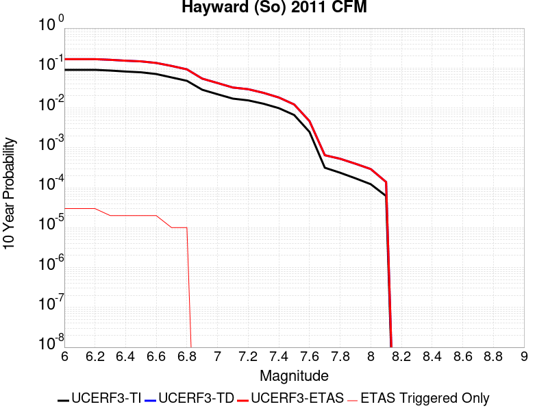 |

| Magnitude | 1 wk TI Prob | 1 wk TD Prob | 1 wk ETAS Prob | 1 wk ETAS/TD Gain | 1 wk ETAS Triggered Only | 1 mo TI Prob | 1 mo TD Prob | 1 mo ETAS Prob | 1 mo ETAS/TD Gain | 1 mo ETAS Triggered Only | 1 yr TI Prob | 1 yr TD Prob | 1 yr ETAS Prob | 1 yr ETAS/TD Gain | 1 yr ETAS Triggered Only | 10 yr TI Prob | 10 yr TD Prob | 10 yr ETAS Prob | 10 yr ETAS/TD Gain | 10 yr ETAS Triggered Only |
|-----|-----|-----|-----|-----|-----|-----|-----|-----|-----|-----|-----|-----|-----|-----|-----|-----|-----|-----|-----|-----|
| 6.0 | 1.8091932E-4 | 3.570673E-4 | 3.570673E-4 | 1.0 | 0.0 | 7.751381E-4 | 0.0015294008 | 0.0015393855 | 1.0065285 | 1.0E-5 | 0.00939654 | 0.018463885 | 0.018483516 | 1.0010632 | 2.0E-5 | 0.090090066 | 0.1667085 | 0.16673349 | 1.00015 | 3.0E-5 |
| 6.1 | 1.8091932E-4 | 3.570673E-4 | 3.570673E-4 | 1.0 | 0.0 | 7.751381E-4 | 0.0015294008 | 0.0015393855 | 1.0065285 | 1.0E-5 | 0.00939654 | 0.018463885 | 0.018483516 | 1.0010632 | 2.0E-5 | 0.090090066 | 0.1667085 | 0.16673349 | 1.00015 | 3.0E-5 |
| 6.2 | 1.8091932E-4 | 3.570673E-4 | 3.570673E-4 | 1.0 | 0.0 | 7.751381E-4 | 0.0015294008 | 0.0015393855 | 1.0065285 | 1.0E-5 | 0.00939654 | 0.018463885 | 0.018483516 | 1.0010632 | 2.0E-5 | 0.090090066 | 0.1667085 | 0.16673349 | 1.00015 | 3.0E-5 |
| 6.3 | 1.7322872E-4 | 3.4263515E-4 | 3.4263515E-4 | 1.0 | 0.0 | 7.4219756E-4 | 0.0014676197 | 0.001477605 | 1.0068038 | 1.0E-5 | 0.0089988755 | 0.017724147 | 0.017743792 | 1.0011084 | 2.0E-5 | 0.08643075 | 0.16065954 | 0.16067632 | 1.0001044 | 2.0E-5 |
| 6.4 | 1.6334097E-4 | 3.2345165E-4 | 3.2345165E-4 | 1.0 | 0.0 | 6.998449E-4 | 0.0013854936 | 0.0013954798 | 1.0072076 | 1.0E-5 | 0.008487372 | 0.016739927 | 0.016759591 | 1.0011748 | 2.0E-5 | 0.081704415 | 0.15256606 | 0.152583 | 1.0001111 | 2.0E-5 |
| 6.5 | 1.5600289E-4 | 3.101982E-4 | 3.101982E-4 | 1.0 | 0.0 | 6.684125E-4 | 0.0013287518 | 0.0013387385 | 1.0075159 | 1.0E-5 | 0.008107598 | 0.016059443 | 0.016079122 | 1.0012254 | 2.0E-5 | 0.078181036 | 0.14684291 | 0.14685997 | 1.0001162 | 2.0E-5 |
| 6.6 | 1.4046066E-4 | 2.8034003E-4 | 2.8034003E-4 | 1.0 | 0.0 | 6.018354E-4 | 0.0012009109 | 0.0012108989 | 1.008317 | 1.0E-5 | 0.0073027555 | 0.014524571 | 0.01454428 | 1.001357 | 2.0E-5 | 0.07067384 | 0.13393044 | 0.13394777 | 1.0001293 | 2.0E-5 |
| 6.7 | 1.14696966E-4 | 2.3272466E-4 | 2.3272466E-4 | 1.0 | 0.0 | 4.914658E-4 | 9.970153E-4 | 0.0010070052 | 1.0100199 | 1.0E-5 | 0.0059671924 | 0.012072163 | 0.012082042 | 1.0008184 | 1.0E-5 | 0.058094822 | 0.11274141 | 0.112750284 | 1.0000787 | 1.0E-5 |
| 6.8 | 9.3874296E-5 | 1.8862431E-4 | 1.8862431E-4 | 1.0 | 0.0 | 4.0225635E-4 | 8.081431E-4 | 8.1813504E-4 | 1.012364 | 1.0E-5 | 0.0048864787 | 0.009795489 | 0.009805392 | 1.0010109 | 1.0E-5 | 0.047804173 | 0.092592984 | 0.09260206 | 1.000098 | 1.0E-5 |
| 6.9 | 5.551852E-5 | 1.0729875E-4 | 1.0729875E-4 | 1.0 | 0.0 | 2.3791482E-4 | 4.5977137E-4 | 4.5977137E-4 | 1.0 | 0.0 | 0.0028927654 | 0.005583468 | 0.005583468 | 1.0 | 0.0 | 0.028553981 | 0.054246075 | 0.054246075 | 1.0 | 0.0 |
| 7.0 | 4.2662363E-5 | 8.246792E-5 | 8.246792E-5 | 1.0 | 0.0 | 1.8282588E-4 | 3.5338648E-4 | 3.5338648E-4 | 1.0 | 0.0 | 0.0022236328 | 0.0042940658 | 0.0042940658 | 1.0 | 0.0 | 0.022015138 | 0.04206509 | 0.04206509 | 1.0 | 0.0 |
| 7.1 | 3.305886E-5 | 6.302183E-5 | 6.302183E-5 | 1.0 | 0.0 | 1.4167312E-4 | 2.7006568E-4 | 2.7006568E-4 | 1.0 | 0.0 | 0.0017235056 | 0.003283111 | 0.003283111 | 1.0 | 0.0 | 0.017101998 | 0.032453902 | 0.032453902 | 1.0 | 0.0 |
| 7.2 | 2.9856887E-5 | 5.701622E-5 | 5.701622E-5 | 1.0 | 0.0 | 1.2795182E-4 | 2.4433242E-4 | 2.4433242E-4 | 1.0 | 0.0 | 0.0015567001 | 0.0029707062 | 0.0029707062 | 1.0 | 0.0 | 0.015458403 | 0.029454801 | 0.029454801 | 1.0 | 0.0 |
| 7.3 | 2.4559737E-5 | 4.599286E-5 | 4.599286E-5 | 1.0 | 0.0 | 1.0525176E-4 | 1.9709744E-4 | 1.9709744E-4 | 1.0 | 0.0 | 0.0012806869 | 0.0023970334 | 0.0023970334 | 1.0 | 0.0 | 0.012733313 | 0.023858516 | 0.023858516 | 1.0 | 0.0 |
| 7.4 | 1.9002231E-5 | 3.505084E-5 | 3.505084E-5 | 1.0 | 0.0 | 8.143559E-5 | 1.502093E-4 | 1.502093E-4 | 1.0 | 0.0 | 9.910273E-4 | 0.001827274 | 0.001827274 | 1.0 | 0.0 | 0.009866194 | 0.018258808 | 0.018258808 | 1.0 | 0.0 |
| 7.5 | 1.2783333E-5 | 2.3331182E-5 | 2.3331182E-5 | 1.0 | 0.0 | 5.4784563E-5 | 9.998698E-5 | 9.998698E-5 | 1.0 | 0.0 | 6.667979E-4 | 0.0012166675 | 0.0012166675 | 1.0 | 0.0 | 0.006648007 | 0.012209443 | 0.012209443 | 1.0 | 0.0 |
| 7.6 | 4.8149627E-6 | 8.888056E-6 | 8.888056E-6 | 1.0 | 0.0 | 2.063539E-5 | 3.8091122E-5 | 3.8091122E-5 | 1.0 | 0.0 | 2.5120692E-4 | 4.6366194E-4 | 4.6366194E-4 | 1.0 | 0.0 | 0.0025092314 | 0.0046805087 | 0.0046805087 | 1.0 | 0.0 |
| 7.7 | 6.0838227E-7 | 1.205754E-6 | 1.205754E-6 | 1.0 | 0.0 | 2.6073499E-6 | 5.1675065E-6 | 5.1675065E-6 | 1.0 | 0.0 | 3.174402E-5 | 6.291258E-5 | 6.291258E-5 | 1.0 | 0.0 | 3.1739488E-4 | 6.5296254E-4 | 6.5296254E-4 | 1.0 | 0.0 |
| 7.8 | 4.5542808E-7 | 9.792941E-7 | 9.792941E-7 | 1.0 | 0.0 | 1.9518332E-6 | 4.196968E-6 | 4.196968E-6 | 1.0 | 0.0 | 2.376331E-5 | 5.109689E-5 | 5.109689E-5 | 1.0 | 0.0 | 2.3760769E-4 | 5.321693E-4 | 5.321693E-4 | 1.0 | 0.0 |
| 7.9 | 3.3016747E-7 | 7.3869535E-7 | 7.3869535E-7 | 1.0 | 0.0 | 1.4150027E-6 | 3.1658333E-6 | 3.1658333E-6 | 1.0 | 0.0 | 1.7227521E-5 | 3.854334E-5 | 3.854334E-5 | 1.0 | 0.0 | 1.7226185E-4 | 3.9932923E-4 | 3.9932923E-4 | 1.0 | 0.0 |
| 8.0 | 2.347038E-7 | 5.471963E-7 | 5.471963E-7 | 1.0 | 0.0 | 1.0058731E-6 | 2.3451248E-6 | 2.3451248E-6 | 1.0 | 0.0 | 1.2246436E-5 | 2.8551523E-5 | 2.8551523E-5 | 1.0 | 0.0 | 1.2245761E-4 | 2.9357258E-4 | 2.9357258E-4 | 1.0 | 0.0 |
| 8.1 | 1.18822804E-7 | 2.6060948E-7 | 2.6060948E-7 | 1.0 | 0.0 | 5.092405E-7 | 1.1168972E-6 | 1.1168972E-6 | 1.0 | 0.0 | 6.1999854E-6 | 1.359814E-5 | 1.359814E-5 | 1.0 | 0.0 | 6.199812E-5 | 1.3918082E-4 | 1.3918082E-4 | 1.0 | 0.0 |

## Ortigalita (South)
*[(top)](#table-of-contents)*

| 1 Week | 1 Month | 1 Year | 10 Year |
|-----|-----|-----|-----|
|  |  |  |  |

| Magnitude | 1 wk TI Prob | 1 wk TD Prob | 1 wk ETAS Prob | 1 wk ETAS/TD Gain | 1 wk ETAS Triggered Only | 1 mo TI Prob | 1 mo TD Prob | 1 mo ETAS Prob | 1 mo ETAS/TD Gain | 1 mo ETAS Triggered Only | 1 yr TI Prob | 1 yr TD Prob | 1 yr ETAS Prob | 1 yr ETAS/TD Gain | 1 yr ETAS Triggered Only | 10 yr TI Prob | 10 yr TD Prob | 10 yr ETAS Prob | 10 yr ETAS/TD Gain | 10 yr ETAS Triggered Only |
|-----|-----|-----|-----|-----|-----|-----|-----|-----|-----|-----|-----|-----|-----|-----|-----|-----|-----|-----|-----|-----|
| 6.0 | 3.72394E-5 | 4.32556E-5 | 5.3255168E-5 | 1.231174 | 1.0E-5 | 1.5958765E-4 | 1.8536886E-4 | 2.2536144E-4 | 1.2157459 | 4.0E-5 | 0.0019412481 | 0.0022546863 | 0.002294596 | 1.0177008 | 4.0E-5 | 0.019243775 | 0.022334501 | 0.022373607 | 1.001751 | 4.0E-5 |
| 6.1 | 2.7299884E-5 | 3.1492036E-5 | 4.149172E-5 | 1.3175306 | 1.0E-5 | 1.16994255E-4 | 1.349592E-4 | 1.749538E-4 | 1.2963458 | 4.0E-5 | 0.0014234743 | 0.0016419457 | 0.00168188 | 1.0243213 | 4.0E-5 | 0.014143906 | 0.016304072 | 0.01634342 | 1.0024134 | 4.0E-5 |
| 6.2 | 2.7299884E-5 | 3.1492036E-5 | 4.149172E-5 | 1.3175306 | 1.0E-5 | 1.16994255E-4 | 1.349592E-4 | 1.749538E-4 | 1.2963458 | 4.0E-5 | 0.0014234743 | 0.0016419457 | 0.00168188 | 1.0243213 | 4.0E-5 | 0.014143906 | 0.016304072 | 0.01634342 | 1.0024134 | 4.0E-5 |
| 6.3 | 2.0546433E-5 | 2.3631454E-5 | 2.3631454E-5 | 1.0 | 0.0 | 8.805317E-5 | 1.0127383E-4 | 1.3127079E-4 | 1.2961966 | 3.0E-5 | 0.00107152 | 0.0012323305 | 0.0012622934 | 1.0243142 | 3.0E-5 | 0.010663681 | 0.012257031 | 0.012286663 | 1.0024176 | 3.0E-5 |
| 6.4 | 2.0546433E-5 | 2.3631454E-5 | 2.3631454E-5 | 1.0 | 0.0 | 8.805317E-5 | 1.0127383E-4 | 1.3127079E-4 | 1.2961966 | 3.0E-5 | 0.00107152 | 0.0012323305 | 0.0012622934 | 1.0243142 | 3.0E-5 | 0.010663681 | 0.012257031 | 0.012286663 | 1.0024176 | 3.0E-5 |
| 6.5 | 1.7779594E-5 | 2.0446974E-5 | 2.0446974E-5 | 1.0 | 0.0 | 7.619603E-5 | 8.762703E-5 | 1.176244E-4 | 1.3423301 | 3.0E-5 | 9.272918E-4 | 0.0010663505 | 0.0010963185 | 1.0281034 | 3.0E-5 | 0.009234319 | 0.010613804 | 0.010643485 | 1.0027965 | 3.0E-5 |
| 6.6 | 1.6272212E-5 | 1.8714967E-5 | 1.8714967E-5 | 1.0 | 0.0 | 6.973618E-5 | 8.0204605E-5 | 1.102022E-4 | 1.3740133 | 3.0E-5 | 8.487073E-4 | 9.760659E-4 | 0.0010060365 | 1.0307056 | 3.0E-5 | 0.008454733 | 0.009719091 | 0.009748799 | 1.0030568 | 3.0E-5 |
| 6.7 | 1.3051484E-5 | 1.5038758E-5 | 1.5038758E-5 | 1.0 | 0.0 | 5.593373E-5 | 6.445028E-5 | 8.444899E-5 | 1.3102968 | 2.0E-5 | 6.807804E-4 | 7.844092E-4 | 8.043935E-4 | 1.0254769 | 2.0E-5 | 0.006786986 | 0.007817388 | 0.007837231 | 1.0025384 | 2.0E-5 |
| 6.8 | 1.04277415E-5 | 1.1987235E-5 | 1.1987235E-5 | 1.0 | 0.0 | 4.4689557E-5 | 5.1372896E-5 | 7.137187E-5 | 1.3892903 | 2.0E-5 | 5.439595E-4 | 6.2529295E-4 | 6.452804E-4 | 1.031965 | 2.0E-5 | 0.0054262993 | 0.00623609 | 0.006255965 | 1.0031872 | 2.0E-5 |
| 6.9 | 7.639968E-6 | 8.791503E-6 | 8.791503E-6 | 1.0 | 0.0 | 3.274231E-5 | 3.767736E-5 | 4.7676982E-5 | 1.2654014 | 1.0E-5 | 3.9856473E-4 | 4.586312E-4 | 4.686266E-4 | 1.021794 | 1.0E-5 | 0.003978506 | 0.004577433 | 0.004587387 | 1.0021746 | 1.0E-5 |
| 7.0 | 3.919831E-6 | 4.5334014E-6 | 4.5334014E-6 | 1.0 | 0.0 | 1.679917E-5 | 1.942873E-5 | 2.9428536E-5 | 1.5146917 | 1.0E-5 | 2.045107E-4 | 2.3652123E-4 | 2.4651887E-4 | 1.0422695 | 1.0E-5 | 0.0020432258 | 0.0023629034 | 0.0023728798 | 1.004222 | 1.0E-5 |
| 7.1 | 1.6017933E-6 | 1.8570418E-6 | 1.8570418E-6 | 1.0 | 0.0 | 6.8648105E-6 | 7.958732E-6 | 7.958732E-6 | 1.0 | 0.0 | 8.357586E-5 | 9.689432E-5 | 9.689432E-5 | 1.0 | 0.0 | 8.3544437E-4 | 9.686254E-4 | 9.686254E-4 | 1.0 | 0.0 |

## Santa Cruz Island
*[(top)](#table-of-contents)*

| 1 Week | 1 Month | 1 Year | 10 Year |
|-----|-----|-----|-----|
|  |  | 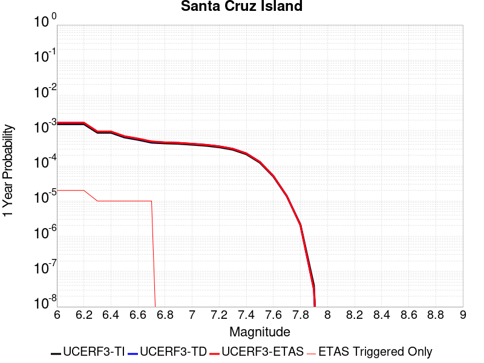 |  |

| Magnitude | 1 wk TI Prob | 1 wk TD Prob | 1 wk ETAS Prob | 1 wk ETAS/TD Gain | 1 wk ETAS Triggered Only | 1 mo TI Prob | 1 mo TD Prob | 1 mo ETAS Prob | 1 mo ETAS/TD Gain | 1 mo ETAS Triggered Only | 1 yr TI Prob | 1 yr TD Prob | 1 yr ETAS Prob | 1 yr ETAS/TD Gain | 1 yr ETAS Triggered Only | 10 yr TI Prob | 10 yr TD Prob | 10 yr ETAS Prob | 10 yr ETAS/TD Gain | 10 yr ETAS Triggered Only |
|-----|-----|-----|-----|-----|-----|-----|-----|-----|-----|-----|-----|-----|-----|-----|-----|-----|-----|-----|-----|-----|
| 6.0 | 2.9164563E-5 | 3.1599742E-5 | 4.159943E-5 | 1.3164482 | 1.0E-5 | 1.2498499E-4 | 1.3542121E-4 | 1.4541986E-4 | 1.0738337 | 1.0E-5 | 0.0015206301 | 0.0016476426 | 0.0016676096 | 1.0121186 | 2.0E-5 | 0.015102667 | 0.016368 | 0.016407344 | 1.0024037 | 4.0E-5 |
| 6.1 | 2.9164563E-5 | 3.1599742E-5 | 4.159943E-5 | 1.3164482 | 1.0E-5 | 1.2498499E-4 | 1.3542121E-4 | 1.4541986E-4 | 1.0738337 | 1.0E-5 | 0.0015206301 | 0.0016476426 | 0.0016676096 | 1.0121186 | 2.0E-5 | 0.015102667 | 0.016368 | 0.016407344 | 1.0024037 | 4.0E-5 |
| 6.2 | 2.9164563E-5 | 3.1599742E-5 | 4.159943E-5 | 1.3164482 | 1.0E-5 | 1.2498499E-4 | 1.3542121E-4 | 1.4541986E-4 | 1.0738337 | 1.0E-5 | 0.0015206301 | 0.0016476426 | 0.0016676096 | 1.0121186 | 2.0E-5 | 0.015102667 | 0.016368 | 0.016407344 | 1.0024037 | 4.0E-5 |
| 6.3 | 1.6635553E-5 | 1.780436E-5 | 2.780418E-5 | 1.5616502 | 1.0E-5 | 7.1293274E-5 | 7.630227E-5 | 8.63015E-5 | 1.1310477 | 1.0E-5 | 8.6765E-4 | 9.286024E-4 | 9.385931E-4 | 1.0107589 | 1.0E-5 | 0.008642701 | 0.009249094 | 0.009259001 | 1.0010712 | 1.0E-5 |
| 6.4 | 1.6635553E-5 | 1.780436E-5 | 2.780418E-5 | 1.5616502 | 1.0E-5 | 7.1293274E-5 | 7.630227E-5 | 8.63015E-5 | 1.1310477 | 1.0E-5 | 8.6765E-4 | 9.286024E-4 | 9.385931E-4 | 1.0107589 | 1.0E-5 | 0.008642701 | 0.009249094 | 0.009259001 | 1.0010712 | 1.0E-5 |
| 6.5 | 1.2238748E-5 | 1.3042996E-5 | 2.3042865E-5 | 1.766685 | 1.0E-5 | 5.2450723E-5 | 5.5897377E-5 | 6.589682E-5 | 1.1788893 | 1.0E-5 | 6.3840044E-4 | 6.8034173E-4 | 6.9033494E-4 | 1.0146885 | 1.0E-5 | 0.0063656955 | 0.006782988 | 0.00679292 | 1.0014642 | 1.0E-5 |
| 6.6 | 1.0489767E-5 | 1.1156636E-5 | 2.1156524E-5 | 1.8963175 | 1.0E-5 | 4.495537E-5 | 4.781329E-5 | 5.7812813E-5 | 1.2091368 | 1.0E-5 | 5.4719415E-4 | 5.819736E-4 | 5.919677E-4 | 1.0171729 | 1.0E-5 | 0.005458487 | 0.005804736 | 0.005814678 | 1.0017127 | 1.0E-5 |
| 6.7 | 8.699222E-6 | 9.236783E-6 | 1.923669E-5 | 2.082618 | 1.0E-5 | 3.7281847E-5 | 3.958561E-5 | 4.958522E-5 | 1.252607 | 1.0E-5 | 4.5381195E-4 | 4.818488E-4 | 4.9184397E-4 | 1.0207434 | 1.0E-5 | 0.0045288634 | 0.004808108 | 0.00481806 | 1.0020698 | 1.0E-5 |
| 6.8 | 8.307732E-6 | 8.8169045E-6 | 8.8169045E-6 | 1.0 | 0.0 | 3.560408E-5 | 3.7786187E-5 | 3.7786187E-5 | 1.0 | 0.0 | 4.3339343E-4 | 4.5995016E-4 | 4.5995016E-4 | 1.0 | 0.0 | 0.004325492 | 0.0045900354 | 0.0045900354 | 1.0 | 0.0 |
| 6.9 | 8.073121E-6 | 8.564939E-6 | 8.564939E-6 | 1.0 | 0.0 | 3.459863E-5 | 3.670637E-5 | 3.670637E-5 | 1.0 | 0.0 | 4.2115687E-4 | 4.4680882E-4 | 4.4680882E-4 | 1.0 | 0.0 | 0.004203596 | 0.004459156 | 0.004459156 | 1.0 | 0.0 |
| 7.0 | 7.617019E-6 | 8.074665E-6 | 8.074665E-6 | 1.0 | 0.0 | 3.264396E-5 | 3.4605247E-5 | 3.4605247E-5 | 1.0 | 0.0 | 3.9736772E-4 | 4.2123784E-4 | 4.2123784E-4 | 1.0 | 0.0 | 0.003966579 | 0.0042044413 | 0.0042044413 | 1.0 | 0.0 |
| 7.1 | 7.1224836E-6 | 7.5457883E-6 | 7.5457883E-6 | 1.0 | 0.0 | 3.052457E-5 | 3.2338692E-5 | 3.2338692E-5 | 1.0 | 0.0 | 3.715733E-4 | 3.9365282E-4 | 3.9365282E-4 | 1.0 | 0.0 | 0.003709526 | 0.0039295983 | 0.0039295983 | 1.0 | 0.0 |
| 7.2 | 6.441115E-6 | 6.8273835E-6 | 6.8273835E-6 | 1.0 | 0.0 | 2.7604487E-5 | 2.9259889E-5 | 2.9259889E-5 | 1.0 | 0.0 | 3.360328E-4 | 3.5618115E-4 | 3.5618115E-4 | 1.0 | 0.0 | 0.0033552512 | 0.0035561312 | 0.0035561312 | 1.0 | 0.0 |
| 7.3 | 5.494274E-6 | 5.8199944E-6 | 5.8199944E-6 | 1.0 | 0.0 | 2.3546674E-5 | 2.4942596E-5 | 2.4942596E-5 | 1.0 | 0.0 | 2.8664304E-4 | 3.03634E-4 | 3.03634E-4 | 1.0 | 0.0 | 0.002862736 | 0.0030322145 | 0.0030322145 | 1.0 | 0.0 |
| 7.4 | 4.0802624E-6 | 4.3122564E-6 | 4.3122564E-6 | 1.0 | 0.0 | 1.7486722E-5 | 1.8480969E-5 | 1.8480969E-5 | 1.0 | 0.0 | 2.1288003E-4 | 2.2498264E-4 | 2.2498264E-4 | 1.0 | 0.0 | 0.0021267622 | 0.0022475577 | 0.0022475577 | 1.0 | 0.0 |
| 7.5 | 2.3584746E-6 | 2.4753099E-6 | 2.4753099E-6 | 1.0 | 0.0 | 1.0107709E-5 | 1.0608428E-5 | 1.0608428E-5 | 1.0 | 0.0 | 1.2305441E-4 | 1.2915001E-4 | 1.2915001E-4 | 1.0 | 0.0 | 0.0012298629 | 0.0012907545 | 0.0012907545 | 1.0 | 0.0 |
| 7.6 | 9.4981914E-7 | 9.860934E-7 | 9.860934E-7 | 1.0 | 0.0 | 4.0706473E-6 | 4.2261076E-6 | 4.2261076E-6 | 1.0 | 0.0 | 4.9559E-5 | 5.1451658E-5 | 5.1451658E-5 | 1.0 | 0.0 | 4.954795E-4 | 5.1439874E-4 | 5.1439874E-4 | 1.0 | 0.0 |
| 7.7 | 2.6013532E-7 | 2.6416632E-7 | 2.6416632E-7 | 1.0 | 0.0 | 1.1148652E-6 | 1.1321408E-6 | 1.1321408E-6 | 1.0 | 0.0 | 1.3573399E-5 | 1.3783729E-5 | 1.3783729E-5 | 1.0 | 0.0 | 1.357257E-4 | 1.378288E-4 | 1.378288E-4 | 1.0 | 0.0 |
| 7.8 | 4.1522263E-8 | 3.965698E-8 | 3.965698E-8 | 1.0 | 0.0 | 1.7795254E-7 | 1.6995848E-7 | 1.6995848E-7 | 1.0 | 0.0 | 2.16657E-6 | 2.0692428E-6 | 2.0692428E-6 | 1.0 | 0.0 | 2.1665488E-5 | 2.0692256E-5 | 2.0692256E-5 | 1.0 | 0.0 |
| 7.9 | 7.7242046E-10 | 5.9475225E-10 | 5.9475225E-10 | 1.0 | 0.0 | 3.3103735E-9 | 2.5489382E-9 | 2.5489382E-9 | 1.0 | 0.0 | 4.0303796E-8 | 3.1033323E-8 | 3.1033323E-8 | 1.0 | 0.0 | 4.030379E-7 | 3.103332E-7 | 3.103332E-7 | 1.0 | 0.0 |

## Shoreline
*[(top)](#table-of-contents)*

| 1 Week | 1 Month | 1 Year | 10 Year |
|-----|-----|-----|-----|
|  |  |  | 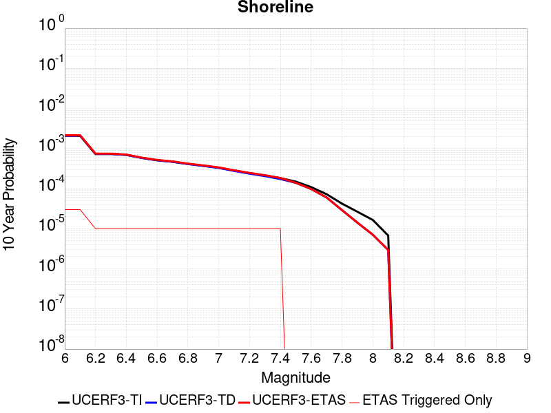 |

| Magnitude | 1 wk TI Prob | 1 wk TD Prob | 1 wk ETAS Prob | 1 wk ETAS/TD Gain | 1 wk ETAS Triggered Only | 1 mo TI Prob | 1 mo TD Prob | 1 mo ETAS Prob | 1 mo ETAS/TD Gain | 1 mo ETAS Triggered Only | 1 yr TI Prob | 1 yr TD Prob | 1 yr ETAS Prob | 1 yr ETAS/TD Gain | 1 yr ETAS Triggered Only | 10 yr TI Prob | 10 yr TD Prob | 10 yr ETAS Prob | 10 yr ETAS/TD Gain | 10 yr ETAS Triggered Only |
|-----|-----|-----|-----|-----|-----|-----|-----|-----|-----|-----|-----|-----|-----|-----|-----|-----|-----|-----|-----|-----|
| 6.0 | 3.9888673E-6 | 4.0479285E-6 | 1.4047888E-5 | 3.4703894 | 1.0E-5 | 1.7095033E-5 | 1.7348182E-5 | 2.7348007E-5 | 1.5764194 | 1.0E-5 | 2.0811215E-4 | 2.1119922E-4 | 2.3119501E-4 | 1.0946773 | 2.0E-5 | 0.0020791737 | 0.0021105339 | 0.0021404705 | 1.0141844 | 3.0E-5 |
| 6.1 | 3.9888673E-6 | 4.0479285E-6 | 1.4047888E-5 | 3.4703894 | 1.0E-5 | 1.7095033E-5 | 1.7348182E-5 | 2.7348007E-5 | 1.5764194 | 1.0E-5 | 2.0811215E-4 | 2.1119922E-4 | 2.3119501E-4 | 1.0946773 | 2.0E-5 | 0.0020791737 | 0.0021105339 | 0.0021404705 | 1.0141844 | 3.0E-5 |
| 6.2 | 1.4039653E-6 | 1.4100885E-6 | 1.4100885E-6 | 1.0 | 0.0 | 6.0169805E-6 | 6.043223E-6 | 6.043223E-6 | 1.0 | 0.0 | 7.325427E-5 | 7.357382E-5 | 7.357382E-5 | 1.0 | 0.0 | 7.3230127E-4 | 7.355006E-4 | 7.454933E-4 | 1.0135862 | 1.0E-5 |
| 6.3 | 1.4039653E-6 | 1.4100885E-6 | 1.4100885E-6 | 1.0 | 0.0 | 6.0169805E-6 | 6.043223E-6 | 6.043223E-6 | 1.0 | 0.0 | 7.325427E-5 | 7.357382E-5 | 7.357382E-5 | 1.0 | 0.0 | 7.3230127E-4 | 7.355006E-4 | 7.454933E-4 | 1.0135862 | 1.0E-5 |
| 6.4 | 1.3314152E-6 | 1.33616E-6 | 1.33616E-6 | 1.0 | 0.0 | 5.7060524E-6 | 5.726388E-6 | 5.726388E-6 | 1.0 | 0.0 | 6.946897E-5 | 6.9716596E-5 | 6.9716596E-5 | 1.0 | 0.0 | 6.9447263E-4 | 6.9695263E-4 | 7.0694566E-4 | 1.0143381 | 1.0E-5 |
| 6.5 | 1.1187026E-6 | 1.1203634E-6 | 1.1203634E-6 | 1.0 | 0.0 | 4.794431E-6 | 4.801549E-6 | 4.801549E-6 | 1.0 | 0.0 | 5.8370628E-5 | 5.8457317E-5 | 5.8457317E-5 | 1.0 | 0.0 | 5.83553E-4 | 5.844219E-4 | 5.9441605E-4 | 1.0171009 | 1.0E-5 |
| 6.6 | 9.793089E-7 | 9.784915E-7 | 9.784915E-7 | 1.0 | 0.0 | 4.1970316E-6 | 4.193528E-6 | 4.193528E-6 | 1.0 | 0.0 | 5.1097657E-5 | 5.1055024E-5 | 5.1055024E-5 | 1.0 | 0.0 | 5.108591E-4 | 5.104342E-4 | 5.204291E-4 | 1.0195812 | 1.0E-5 |
| 6.7 | 8.995986E-7 | 8.972795E-7 | 8.972795E-7 | 1.0 | 0.0 | 3.8554167E-6 | 3.8454777E-6 | 3.8454777E-6 | 1.0 | 0.0 | 4.693869E-5 | 4.68177E-5 | 4.68177E-5 | 1.0 | 0.0 | 4.6928777E-4 | 4.680793E-4 | 4.7807462E-4 | 1.021354 | 1.0E-5 |
| 6.8 | 7.931612E-7 | 7.8803976E-7 | 7.8803976E-7 | 1.0 | 0.0 | 3.3992578E-6 | 3.377309E-6 | 3.377309E-6 | 1.0 | 0.0 | 4.1385178E-5 | 4.1117964E-5 | 4.1117964E-5 | 1.0 | 0.0 | 4.1377472E-4 | 4.1110412E-4 | 4.211E-4 | 1.0243148 | 1.0E-5 |
| 6.9 | 7.1465956E-7 | 7.078001E-7 | 7.078001E-7 | 1.0 | 0.0 | 3.062823E-6 | 3.0334254E-6 | 3.0334254E-6 | 1.0 | 0.0 | 3.7289232E-5 | 3.693133E-5 | 3.693133E-5 | 1.0 | 0.0 | 3.7282976E-4 | 3.6925232E-4 | 3.792486E-4 | 1.0270717 | 1.0E-5 |
| 7.0 | 6.389046E-7 | 6.299453E-7 | 6.299453E-7 | 1.0 | 0.0 | 2.7381598E-6 | 2.699763E-6 | 2.699763E-6 | 1.0 | 0.0 | 3.3336586E-5 | 3.286912E-5 | 3.286912E-5 | 1.0 | 0.0 | 3.3331584E-4 | 3.286428E-4 | 3.3863954E-4 | 1.0304182 | 1.0E-5 |
| 7.1 | 5.4300875E-7 | 5.311126E-7 | 5.311126E-7 | 1.0 | 0.0 | 2.3271782E-6 | 2.276195E-6 | 2.276195E-6 | 1.0 | 0.0 | 2.8333026E-5 | 2.7712322E-5 | 2.7712322E-5 | 1.0 | 0.0 | 2.8329415E-4 | 2.7708875E-4 | 2.8708598E-4 | 1.0360795 | 1.0E-5 |
| 7.2 | 4.6768855E-7 | 4.5348904E-7 | 4.5348904E-7 | 1.0 | 0.0 | 2.0043778E-6 | 1.9435229E-6 | 1.9435229E-6 | 1.0 | 0.0 | 2.4403027E-5 | 2.3662134E-5 | 2.3662134E-5 | 1.0 | 0.0 | 2.4400349E-4 | 2.3659621E-4 | 2.4659385E-4 | 1.0422561 | 1.0E-5 |
| 7.3 | 4.0966103E-7 | 3.9385614E-7 | 3.9385614E-7 | 1.0 | 0.0 | 1.7556889E-6 | 1.6879537E-6 | 1.6879537E-6 | 1.0 | 0.0 | 2.1375303E-5 | 2.0550642E-5 | 2.0550642E-5 | 1.0 | 0.0 | 2.1373246E-4 | 2.0548746E-4 | 2.1548542E-4 | 1.0486548 | 1.0E-5 |
| 7.4 | 3.5105785E-7 | 3.3363924E-7 | 3.3363924E-7 | 1.0 | 0.0 | 1.5045327E-6 | 1.4298816E-6 | 1.4298816E-6 | 1.0 | 0.0 | 1.8317533E-5 | 1.7408669E-5 | 1.7408669E-5 | 1.0 | 0.0 | 1.8316023E-4 | 1.740731E-4 | 1.8407135E-4 | 1.0574372 | 1.0E-5 |
| 7.5 | 2.8737534E-7 | 2.681999E-7 | 2.681999E-7 | 1.0 | 0.0 | 1.2316079E-6 | 1.1494276E-6 | 1.1494276E-6 | 1.0 | 0.0 | 1.4994724E-5 | 1.399419E-5 | 1.399419E-5 | 1.0 | 0.0 | 1.4993713E-4 | 1.3993312E-4 | 1.3993312E-4 | 1.0 | 0.0 |
| 7.6 | 2.0924051E-7 | 1.8778938E-7 | 1.8778938E-7 | 1.0 | 0.0 | 8.967448E-7 | 8.0481135E-7 | 8.0481135E-7 | 1.0 | 0.0 | 1.0917813E-5 | 9.798534E-6 | 9.798534E-6 | 1.0 | 0.0 | 1.0917276E-4 | 9.798103E-5 | 9.798103E-5 | 1.0 | 0.0 |
| 7.7 | 1.392265E-7 | 1.1543341E-7 | 1.1543341E-7 | 1.0 | 0.0 | 5.9668486E-7 | 4.9471447E-7 | 4.9471447E-7 | 1.0 | 0.0 | 7.2646135E-6 | 6.0231323E-6 | 6.0231323E-6 | 1.0 | 0.0 | 7.2643765E-5 | 6.0229693E-5 | 6.0229693E-5 | 1.0 | 0.0 |
| 7.8 | 8.1080074E-8 | 5.5866355E-8 | 5.5866355E-8 | 1.0 | 0.0 | 3.4748598E-7 | 2.394272E-7 | 2.394272E-7 | 1.0 | 0.0 | 4.2306337E-6 | 2.9150222E-6 | 2.9150222E-6 | 1.0 | 0.0 | 4.230553E-5 | 2.9149842E-5 | 2.9149842E-5 | 1.0 | 0.0 |
| 7.9 | 5.0859036E-8 | 2.7243395E-8 | 2.7243395E-8 | 1.0 | 0.0 | 2.1796728E-7 | 1.16757406E-7 | 1.16757406E-7 | 1.0 | 0.0 | 2.6537484E-6 | 1.4215204E-6 | 1.4215204E-6 | 1.0 | 0.0 | 2.6537167E-5 | 1.4215115E-5 | 1.4215115E-5 | 1.0 | 0.0 |
| 8.0 | 3.1760536E-8 | 1.3575991E-8 | 1.3575991E-8 | 1.0 | 0.0 | 1.3611657E-7 | 5.8182817E-8 | 5.8182817E-8 | 1.0 | 0.0 | 1.6572179E-6 | 7.083755E-7 | 7.083755E-7 | 1.0 | 0.0 | 1.6572056E-5 | 7.083733E-6 | 7.083733E-6 | 1.0 | 0.0 |
| 8.1 | 1.2947896E-8 | 5.6625185E-9 | 5.6625185E-9 | 1.0 | 0.0 | 5.5490982E-8 | 2.4267937E-8 | 2.4267937E-8 | 1.0 | 0.0 | 6.756025E-7 | 2.954621E-7 | 2.954621E-7 | 1.0 | 0.0 | 6.7560045E-6 | 2.9546172E-6 | 2.9546172E-6 | 1.0 | 0.0 |

## Mission Hills 2011
*[(top)](#table-of-contents)*

| 1 Week | 1 Month | 1 Year | 10 Year |
|-----|-----|-----|-----|
| 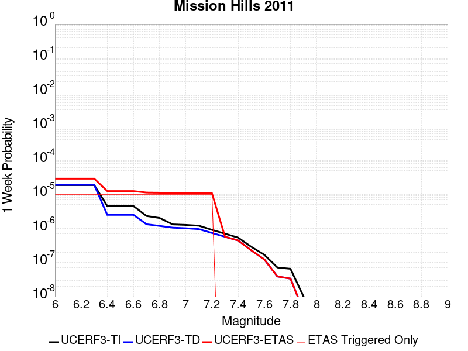 | 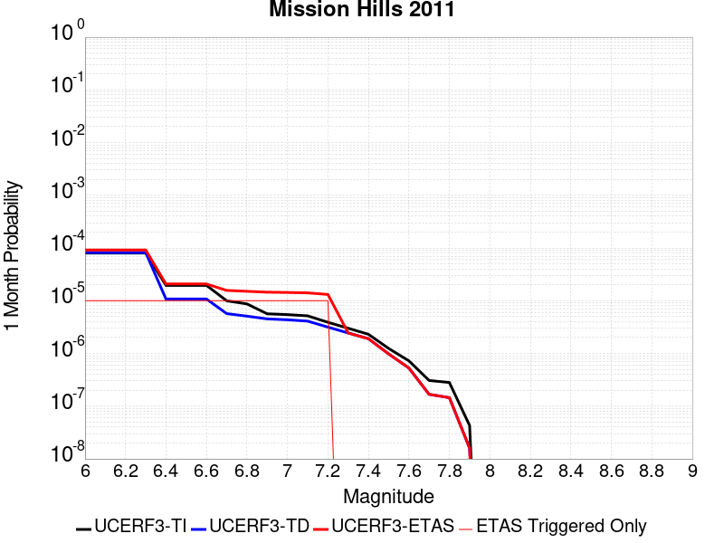 |  |  |

| Magnitude | 1 wk TI Prob | 1 wk TD Prob | 1 wk ETAS Prob | 1 wk ETAS/TD Gain | 1 wk ETAS Triggered Only | 1 mo TI Prob | 1 mo TD Prob | 1 mo ETAS Prob | 1 mo ETAS/TD Gain | 1 mo ETAS Triggered Only | 1 yr TI Prob | 1 yr TD Prob | 1 yr ETAS Prob | 1 yr ETAS/TD Gain | 1 yr ETAS Triggered Only | 10 yr TI Prob | 10 yr TD Prob | 10 yr ETAS Prob | 10 yr ETAS/TD Gain | 10 yr ETAS Triggered Only |
|-----|-----|-----|-----|-----|-----|-----|-----|-----|-----|-----|-----|-----|-----|-----|-----|-----|-----|-----|-----|-----|
| 6.0 | 1.8765717E-5 | 1.9054629E-5 | 2.9054438E-5 | 1.5247968 | 1.0E-5 | 8.0422025E-5 | 8.1662074E-5 | 9.1661255E-5 | 1.1224458 | 1.0E-5 | 9.786983E-4 | 9.941256E-4 | 0.0010240958 | 1.0301473 | 3.0E-5 | 0.009743992 | 0.00993045 | 0.009960151 | 1.002991 | 3.0E-5 |
| 6.1 | 1.8765717E-5 | 1.9054629E-5 | 2.9054438E-5 | 1.5247968 | 1.0E-5 | 8.0422025E-5 | 8.1662074E-5 | 9.1661255E-5 | 1.1224458 | 1.0E-5 | 9.786983E-4 | 9.941256E-4 | 0.0010240958 | 1.0301473 | 3.0E-5 | 0.009743992 | 0.00993045 | 0.009960151 | 1.002991 | 3.0E-5 |
| 6.2 | 1.8765717E-5 | 1.9054629E-5 | 2.9054438E-5 | 1.5247968 | 1.0E-5 | 8.0422025E-5 | 8.1662074E-5 | 9.1661255E-5 | 1.1224458 | 1.0E-5 | 9.786983E-4 | 9.941256E-4 | 0.0010240958 | 1.0301473 | 3.0E-5 | 0.009743992 | 0.00993045 | 0.009960151 | 1.002991 | 3.0E-5 |
| 6.3 | 1.8765717E-5 | 1.9054629E-5 | 2.9054438E-5 | 1.5247968 | 1.0E-5 | 8.0422025E-5 | 8.1662074E-5 | 9.1661255E-5 | 1.1224458 | 1.0E-5 | 9.786983E-4 | 9.941256E-4 | 0.0010240958 | 1.0301473 | 3.0E-5 | 0.009743992 | 0.00993045 | 0.009960151 | 1.002991 | 3.0E-5 |
| 6.4 | 4.566357E-6 | 2.5148213E-6 | 1.2514796E-5 | 4.9764156 | 1.0E-5 | 1.9569954E-5 | 1.0777771E-5 | 2.0777665E-5 | 1.9278256 | 1.0E-5 | 2.3823815E-4 | 1.3121328E-4 | 1.4121197E-4 | 1.0762018 | 1.0E-5 | 0.002379829 | 0.0013115364 | 0.0013215232 | 1.0076146 | 1.0E-5 |
| 6.5 | 4.566357E-6 | 2.5148213E-6 | 1.2514796E-5 | 4.9764156 | 1.0E-5 | 1.9569954E-5 | 1.0777771E-5 | 2.0777665E-5 | 1.9278256 | 1.0E-5 | 2.3823815E-4 | 1.3121328E-4 | 1.4121197E-4 | 1.0762018 | 1.0E-5 | 0.002379829 | 0.0013115364 | 0.0013215232 | 1.0076146 | 1.0E-5 |
| 6.6 | 4.566357E-6 | 2.5148213E-6 | 1.2514796E-5 | 4.9764156 | 1.0E-5 | 1.9569954E-5 | 1.0777771E-5 | 2.0777665E-5 | 1.9278256 | 1.0E-5 | 2.3823815E-4 | 1.3121328E-4 | 1.4121197E-4 | 1.0762018 | 1.0E-5 | 0.002379829 | 0.0013115364 | 0.0013215232 | 1.0076146 | 1.0E-5 |
| 6.7 | 2.3266773E-6 | 1.3296132E-6 | 1.13296E-5 | 8.520975 | 1.0E-5 | 9.971435E-6 | 5.69833E-6 | 1.5698273E-5 | 2.7548902 | 1.0E-5 | 1.2139547E-4 | 6.937502E-5 | 7.9374324E-5 | 1.1441342 | 1.0E-5 | 0.0012132917 | 6.935397E-4 | 7.035328E-4 | 1.0144088 | 1.0E-5 |
| 6.8 | 2.032735E-6 | 1.1894101E-6 | 1.1189398E-5 | 9.407519 | 1.0E-5 | 8.711692E-6 | 5.0974622E-6 | 1.5097411E-5 | 2.9617505 | 1.0E-5 | 1.06059684E-4 | 6.205988E-5 | 7.2059265E-5 | 1.1611247 | 1.0E-5 | 0.0010600908 | 6.204304E-4 | 6.304242E-4 | 1.0161078 | 1.0E-5 |
| 6.9 | 1.3186259E-6 | 1.0561989E-6 | 1.1056189E-5 | 10.467904 | 1.0E-5 | 5.6512413E-6 | 4.526559E-6 | 1.4526514E-5 | 3.2091737 | 1.0E-5 | 6.8801695E-5 | 5.5109493E-5 | 6.510894E-5 | 1.1814469 | 1.0E-5 | 6.8780396E-4 | 5.5096124E-4 | 5.609557E-4 | 1.0181401 | 1.0E-5 |
| 7.0 | 1.2726016E-6 | 1.0159295E-6 | 1.1015919E-5 | 10.843194 | 1.0E-5 | 5.4539955E-6 | 4.3539762E-6 | 1.4353933E-5 | 3.2967412 | 1.0E-5 | 6.6400375E-5 | 5.30084E-5 | 6.3007865E-5 | 1.1886394 | 1.0E-5 | 6.6380535E-4 | 5.299604E-4 | 5.399551E-4 | 1.0188594 | 1.0E-5 |
| 7.1 | 1.2063913E-6 | 9.570282E-7 | 1.0957018E-5 | 11.449003 | 1.0E-5 | 5.170238E-6 | 4.101543E-6 | 1.4101502E-5 | 3.4380968 | 1.0E-5 | 6.294583E-5 | 4.9935166E-5 | 5.9934668E-5 | 1.2002497 | 1.0E-5 | 6.2928005E-4 | 4.9924204E-4 | 5.09237E-4 | 1.0200204 | 1.0E-5 |
| 7.2 | 9.105806E-7 | 7.3767757E-7 | 1.073767E-5 | 14.556047 | 1.0E-5 | 3.9024826E-6 | 3.1614716E-6 | 1.316144E-5 | 4.163074 | 1.0E-5 | 4.7511687E-5 | 3.8490252E-5 | 4.848987E-5 | 1.259796 | 1.0E-5 | 4.7501532E-4 | 3.8483742E-4 | 3.9483357E-4 | 1.025975 | 1.0E-5 |
| 7.3 | 7.020432E-7 | 5.7103375E-7 | 5.7103375E-7 | 1.0 | 0.0 | 3.0087533E-6 | 2.4472852E-6 | 2.4472852E-6 | 1.0 | 0.0 | 3.6630954E-5 | 2.9795303E-5 | 2.9795303E-5 | 1.0 | 0.0 | 3.6624918E-4 | 2.979144E-4 | 2.979144E-4 | 1.0 | 0.0 |
| 7.4 | 5.3900635E-7 | 4.4483278E-7 | 4.4483278E-7 | 1.0 | 0.0 | 2.3100251E-6 | 1.9064248E-6 | 1.9064248E-6 | 1.0 | 0.0 | 2.8124194E-5 | 2.3210489E-5 | 2.3210489E-5 | 1.0 | 0.0 | 2.8120633E-4 | 2.3208185E-4 | 2.3208185E-4 | 1.0 | 0.0 |
| 7.5 | 2.907075E-7 | 2.2875324E-7 | 2.2875324E-7 | 1.0 | 0.0 | 1.2458887E-6 | 9.803706E-7 | 9.803706E-7 | 1.0 | 0.0 | 1.5168589E-5 | 1.1935949E-5 | 1.1935949E-5 | 1.0 | 0.0 | 1.5167553E-4 | 1.1935326E-4 | 1.1935326E-4 | 1.0 | 0.0 |
| 7.6 | 1.6903675E-7 | 1.2353401E-7 | 1.2353401E-7 | 1.0 | 0.0 | 7.2444305E-7 | 5.2943136E-7 | 5.2943136E-7 | 1.0 | 0.0 | 8.820059E-6 | 6.4458086E-6 | 6.4458086E-6 | 1.0 | 0.0 | 8.8197085E-5 | 6.445634E-5 | 6.445634E-5 | 1.0 | 0.0 |
| 7.7 | 7.168073E-8 | 3.9134374E-8 | 3.9134374E-8 | 1.0 | 0.0 | 3.072031E-7 | 1.6771872E-7 | 1.6771872E-7 | 1.0 | 0.0 | 3.7401915E-6 | 2.0419736E-6 | 2.0419736E-6 | 1.0 | 0.0 | 3.7401285E-5 | 2.041956E-5 | 2.041956E-5 | 1.0 | 0.0 |
| 7.8 | 6.564101E-8 | 3.3834656E-8 | 3.3834656E-8 | 1.0 | 0.0 | 2.813186E-7 | 1.4500566E-7 | 1.4500566E-7 | 1.0 | 0.0 | 3.4250486E-6 | 1.7654426E-6 | 1.7654426E-6 | 1.0 | 0.0 | 3.424996E-5 | 1.7654296E-5 | 1.7654296E-5 | 1.0 | 0.0 |
| 7.9 | 1.0029074E-8 | 3.728858E-9 | 3.728858E-9 | 1.0 | 0.0 | 4.2981743E-8 | 1.598082E-8 | 1.598082E-8 | 1.0 | 0.0 | 5.2330256E-7 | 1.945665E-7 | 1.945665E-7 | 1.0 | 0.0 | 5.2330133E-6 | 1.9456643E-6 | 1.9456643E-6 | 1.0 | 0.0 |

## Malibu Coast alt 1
*[(top)](#table-of-contents)*

| 1 Week | 1 Month | 1 Year | 10 Year |
|-----|-----|-----|-----|
|  |  |  | 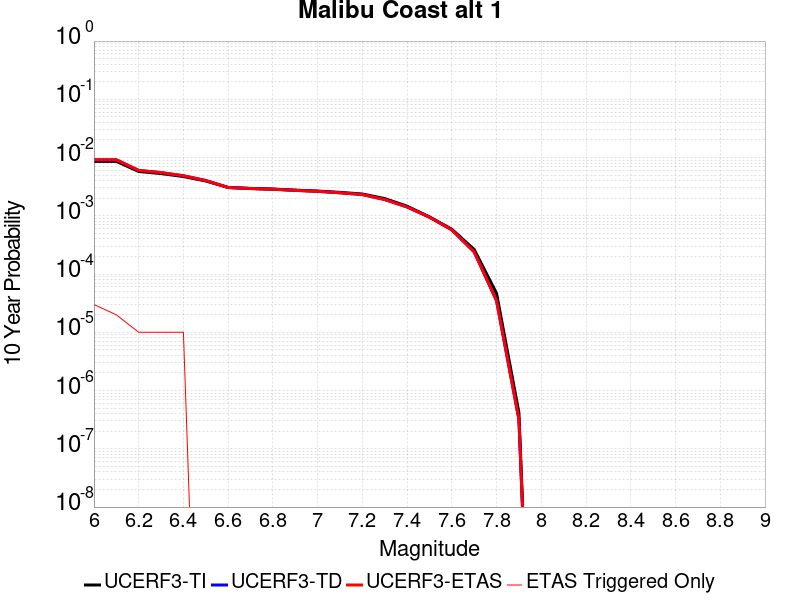 |

| Magnitude | 1 wk TI Prob | 1 wk TD Prob | 1 wk ETAS Prob | 1 wk ETAS/TD Gain | 1 wk ETAS Triggered Only | 1 mo TI Prob | 1 mo TD Prob | 1 mo ETAS Prob | 1 mo ETAS/TD Gain | 1 mo ETAS Triggered Only | 1 yr TI Prob | 1 yr TD Prob | 1 yr ETAS Prob | 1 yr ETAS/TD Gain | 1 yr ETAS Triggered Only | 10 yr TI Prob | 10 yr TD Prob | 10 yr ETAS Prob | 10 yr ETAS/TD Gain | 10 yr ETAS Triggered Only |
|-----|-----|-----|-----|-----|-----|-----|-----|-----|-----|-----|-----|-----|-----|-----|-----|-----|-----|-----|-----|-----|
| 6.0 | 1.6572556E-5 | 1.759807E-5 | 1.759807E-5 | 1.0 | 0.0 | 7.102331E-5 | 7.5418226E-5 | 8.5417465E-5 | 1.132584 | 1.0E-5 | 8.6436566E-4 | 9.1784896E-4 | 9.278398E-4 | 1.010885 | 1.0E-5 | 0.0086101135 | 0.009142514 | 0.00917224 | 1.0032513 | 3.0E-5 |
| 6.1 | 1.6572556E-5 | 1.759807E-5 | 1.759807E-5 | 1.0 | 0.0 | 7.102331E-5 | 7.5418226E-5 | 8.5417465E-5 | 1.132584 | 1.0E-5 | 8.6436566E-4 | 9.1784896E-4 | 9.278398E-4 | 1.010885 | 1.0E-5 | 0.0086101135 | 0.009142514 | 0.009162331 | 1.0021676 | 2.0E-5 |
| 6.2 | 1.1085717E-5 | 1.155715E-5 | 1.155715E-5 | 1.0 | 0.0 | 4.750935E-5 | 4.9529724E-5 | 5.9529226E-5 | 1.2018889 | 1.0E-5 | 5.782728E-4 | 6.0286105E-4 | 6.12855E-4 | 1.0165776 | 1.0E-5 | 0.0057677035 | 0.0060126274 | 0.0060225674 | 1.0016532 | 1.0E-5 |
| 6.3 | 1.0208568E-5 | 1.0592241E-5 | 1.0592241E-5 | 1.0 | 0.0 | 4.375027E-5 | 4.5394543E-5 | 5.5394088E-5 | 1.2202808 | 1.0E-5 | 5.325294E-4 | 5.5254134E-4 | 5.6253583E-4 | 1.0180882 | 1.0E-5 | 0.0053125503 | 0.0055119833 | 0.005521928 | 1.0018042 | 1.0E-5 |
| 6.4 | 9.0682315E-6 | 9.342641E-6 | 9.342641E-6 | 1.0 | 0.0 | 3.8863272E-5 | 4.0039286E-5 | 5.0038885E-5 | 1.2497448 | 1.0E-5 | 4.730576E-4 | 4.873713E-4 | 4.973664E-4 | 1.0205083 | 1.0E-5 | 0.0047205184 | 0.004863238 | 0.004873189 | 1.0020462 | 1.0E-5 |
| 6.5 | 7.605796E-6 | 7.74859E-6 | 7.74859E-6 | 1.0 | 0.0 | 3.259586E-5 | 3.320783E-5 | 3.320783E-5 | 1.0 | 0.0 | 3.9678233E-4 | 4.0423166E-4 | 4.0423166E-4 | 1.0 | 0.0 | 0.0039607463 | 0.0040351013 | 0.0040351013 | 1.0 | 0.0 |
| 6.6 | 5.889873E-6 | 5.8795417E-6 | 5.8795417E-6 | 1.0 | 0.0 | 2.5242069E-5 | 2.5197793E-5 | 2.5197793E-5 | 1.0 | 0.0 | 3.0727885E-4 | 3.0674002E-4 | 3.0674002E-4 | 1.0 | 0.0 | 0.003068543 | 0.0030631793 | 0.0030631793 | 1.0 | 0.0 |
| 6.7 | 5.66586E-6 | 5.6416443E-6 | 5.6416443E-6 | 1.0 | 0.0 | 2.428203E-5 | 2.4178253E-5 | 2.4178253E-5 | 1.0 | 0.0 | 2.955936E-4 | 2.9433056E-4 | 2.9433056E-4 | 1.0 | 0.0 | 0.0029520073 | 0.0029394194 | 0.0029394194 | 1.0 | 0.0 |
| 6.8 | 5.521556E-6 | 5.48943E-6 | 5.48943E-6 | 1.0 | 0.0 | 2.3663597E-5 | 2.3525918E-5 | 2.3525918E-5 | 1.0 | 0.0 | 2.880662E-4 | 2.8639048E-4 | 2.8639048E-4 | 1.0 | 0.0 | 0.0028769306 | 0.0028602257 | 0.0028602257 | 1.0 | 0.0 |
| 6.9 | 5.29752E-6 | 5.2499345E-6 | 5.2499345E-6 | 1.0 | 0.0 | 2.270346E-5 | 2.2499526E-5 | 2.2499526E-5 | 1.0 | 0.0 | 2.7637955E-4 | 2.7389737E-4 | 2.7389737E-4 | 1.0 | 0.0 | 0.0027603607 | 0.0027356083 | 0.0027356083 | 1.0 | 0.0 |
| 7.0 | 5.106743E-6 | 5.0476815E-6 | 5.0476815E-6 | 1.0 | 0.0 | 2.1885859E-5 | 2.1632743E-5 | 2.1632743E-5 | 1.0 | 0.0 | 2.6642776E-4 | 2.6334688E-4 | 2.6334688E-4 | 1.0 | 0.0 | 0.0026610855 | 0.0026303576 | 0.0026303576 | 1.0 | 0.0 |
| 7.1 | 4.8469647E-6 | 4.770376E-6 | 4.770376E-6 | 1.0 | 0.0 | 2.0772539E-5 | 2.044431E-5 | 2.044431E-5 | 1.0 | 0.0 | 2.528763E-4 | 2.488811E-4 | 2.488811E-4 | 1.0 | 0.0 | 0.0025258875 | 0.0024860317 | 0.0024860317 | 1.0 | 0.0 |
| 7.2 | 4.545514E-6 | 4.4481967E-6 | 4.4481967E-6 | 1.0 | 0.0 | 1.9480629E-5 | 1.906356E-5 | 1.906356E-5 | 1.0 | 0.0 | 2.3715083E-4 | 2.3207419E-4 | 2.3207419E-4 | 1.0 | 0.0 | 0.0023689792 | 0.002318326 | 0.002318326 | 1.0 | 0.0 |
| 7.3 | 3.794097E-6 | 3.6519373E-6 | 3.6519373E-6 | 1.0 | 0.0 | 1.6260314E-5 | 1.5651065E-5 | 1.5651065E-5 | 1.0 | 0.0 | 1.9795135E-4 | 1.9053511E-4 | 1.9053511E-4 | 1.0 | 0.0 | 0.001977751 | 0.0019037221 | 0.0019037221 | 1.0 | 0.0 |
| 7.4 | 2.808217E-6 | 2.7190777E-6 | 2.7190777E-6 | 1.0 | 0.0 | 1.203516E-5 | 1.1653137E-5 | 1.1653137E-5 | 1.0 | 0.0 | 1.4651821E-4 | 1.4186774E-4 | 1.4186774E-4 | 1.0 | 0.0 | 0.0014642165 | 0.0014177744 | 0.0014177744 | 1.0 | 0.0 |
| 7.5 | 1.83809E-6 | 1.8190703E-6 | 1.8190703E-6 | 1.0 | 0.0 | 7.877505E-6 | 7.795992E-6 | 7.795992E-6 | 1.0 | 0.0 | 9.59044E-5 | 9.4912095E-5 | 9.4912095E-5 | 1.0 | 0.0 | 9.5863023E-4 | 9.487176E-4 | 9.487176E-4 | 1.0 | 0.0 |
| 7.6 | 1.1292672E-6 | 1.1001456E-6 | 1.1001456E-6 | 1.0 | 0.0 | 4.839708E-6 | 4.7149015E-6 | 4.7149015E-6 | 1.0 | 0.0 | 5.8921847E-5 | 5.7402427E-5 | 5.7402427E-5 | 1.0 | 0.0 | 5.890623E-4 | 5.7387765E-4 | 5.7387765E-4 | 1.0 | 0.0 |
| 7.7 | 5.065272E-7 | 4.6091537E-7 | 4.6091537E-7 | 1.0 | 0.0 | 2.170829E-6 | 1.9753502E-6 | 1.9753502E-6 | 1.0 | 0.0 | 2.6429525E-5 | 2.4049634E-5 | 2.4049634E-5 | 1.0 | 0.0 | 2.642638E-4 | 2.4047145E-4 | 2.4047145E-4 | 1.0 | 0.0 |
| 7.8 | 8.952991E-8 | 6.707853E-8 | 6.707853E-8 | 1.0 | 0.0 | 3.8369956E-7 | 2.874794E-7 | 2.874794E-7 | 1.0 | 0.0 | 4.671532E-6 | 3.5000562E-6 | 3.5000562E-6 | 1.0 | 0.0 | 4.671434E-5 | 3.500003E-5 | 3.500003E-5 | 1.0 | 0.0 |
| 7.9 | 8.007447E-10 | 6.161581E-10 | 6.161581E-10 | 1.0 | 0.0 | 3.4317629E-9 | 2.640678E-9 | 2.640678E-9 | 1.0 | 0.0 | 4.1781714E-8 | 3.2150254E-8 | 3.2150254E-8 | 1.0 | 0.0 | 4.1781706E-7 | 3.2150248E-7 | 3.2150248E-7 | 1.0 | 0.0 |

## Cedar Mtn-Mahogany Mtn
*[(top)](#table-of-contents)*

| 1 Week | 1 Month | 1 Year | 10 Year |
|-----|-----|-----|-----|
|  |  |  |  |

| Magnitude | 1 wk TI Prob | 1 wk TD Prob | 1 wk ETAS Prob | 1 wk ETAS/TD Gain | 1 wk ETAS Triggered Only | 1 mo TI Prob | 1 mo TD Prob | 1 mo ETAS Prob | 1 mo ETAS/TD Gain | 1 mo ETAS Triggered Only | 1 yr TI Prob | 1 yr TD Prob | 1 yr ETAS Prob | 1 yr ETAS/TD Gain | 1 yr ETAS Triggered Only | 10 yr TI Prob | 10 yr TD Prob | 10 yr ETAS Prob | 10 yr ETAS/TD Gain | 10 yr ETAS Triggered Only |
|-----|-----|-----|-----|-----|-----|-----|-----|-----|-----|-----|-----|-----|-----|-----|-----|-----|-----|-----|-----|-----|
| 6.0 | 2.7763876E-5 | 2.9588866E-5 | 2.9588866E-5 | 1.0 | 0.0 | 1.1898261E-4 | 1.2680366E-4 | 1.3680238E-4 | 1.078852 | 1.0E-5 | 0.0014476506 | 0.0015428112 | 0.0015627804 | 1.0129434 | 2.0E-5 | 0.0143825635 | 0.015328225 | 0.015357765 | 1.0019271 | 3.0E-5 |
| 6.1 | 1.6162443E-5 | 1.7142966E-5 | 1.7142966E-5 | 1.0 | 0.0 | 6.926578E-5 | 7.346788E-5 | 7.346788E-5 | 1.0 | 0.0 | 8.4298453E-4 | 8.941221E-4 | 9.0411317E-4 | 1.0111742 | 1.0E-5 | 0.008397939 | 0.008907059 | 0.008926881 | 1.0022254 | 2.0E-5 |
| 6.2 | 1.6162443E-5 | 1.7142966E-5 | 1.7142966E-5 | 1.0 | 0.0 | 6.926578E-5 | 7.346788E-5 | 7.346788E-5 | 1.0 | 0.0 | 8.4298453E-4 | 8.941221E-4 | 9.0411317E-4 | 1.0111742 | 1.0E-5 | 0.008397939 | 0.008907059 | 0.008926881 | 1.0022254 | 2.0E-5 |
| 6.3 | 9.746053E-6 | 1.0303152E-5 | 1.0303152E-5 | 1.0 | 0.0 | 4.1768133E-5 | 4.415564E-5 | 4.415564E-5 | 1.0 | 0.0 | 5.0840835E-4 | 5.3746643E-4 | 5.4746104E-4 | 1.0185958 | 1.0E-5 | 0.0050724675 | 0.005362084 | 0.005381977 | 1.0037099 | 2.0E-5 |
| 6.4 | 9.746053E-6 | 1.0303152E-5 | 1.0303152E-5 | 1.0 | 0.0 | 4.1768133E-5 | 4.415564E-5 | 4.415564E-5 | 1.0 | 0.0 | 5.0840835E-4 | 5.3746643E-4 | 5.4746104E-4 | 1.0185958 | 1.0E-5 | 0.0050724675 | 0.005362084 | 0.005381977 | 1.0037099 | 2.0E-5 |
| 6.5 | 7.290083E-6 | 7.695325E-6 | 7.695325E-6 | 1.0 | 0.0 | 3.124284E-5 | 3.297956E-5 | 3.297956E-5 | 1.0 | 0.0 | 3.8031515E-4 | 4.014543E-4 | 4.1145028E-4 | 1.0248995 | 1.0E-5 | 0.0037966494 | 0.004007511 | 0.004027431 | 1.0049707 | 2.0E-5 |
| 6.6 | 5.67907E-6 | 5.9891527E-6 | 5.9891527E-6 | 1.0 | 0.0 | 2.4338644E-5 | 2.5667552E-5 | 2.5667552E-5 | 1.0 | 0.0 | 2.962827E-4 | 3.12459E-4 | 3.12459E-4 | 1.0 | 0.0 | 0.0029588798 | 0.003120333 | 0.0031303016 | 1.0031948 | 1.0E-5 |
| 6.7 | 3.4853963E-6 | 3.672631E-6 | 3.672631E-6 | 1.0 | 0.0 | 1.4937327E-5 | 1.5739755E-5 | 1.5739755E-5 | 1.0 | 0.0 | 1.8184677E-4 | 1.916153E-4 | 1.916153E-4 | 1.0 | 0.0 | 0.0018169804 | 0.0019145629 | 0.0019245436 | 1.0052131 | 1.0E-5 |
| 6.8 | 2.7535168E-6 | 2.9015764E-6 | 2.9015764E-6 | 1.0 | 0.0 | 1.1800733E-5 | 1.2435271E-5 | 1.2435271E-5 | 1.0 | 0.0 | 1.4366445E-4 | 1.5138938E-4 | 1.5138938E-4 | 1.0 | 0.0 | 0.0014357162 | 0.0015129098 | 0.0015129098 | 1.0 | 0.0 |
| 6.9 | 1.6594106E-6 | 1.7496985E-6 | 1.7496985E-6 | 1.0 | 0.0 | 7.1117406E-6 | 7.4986883E-6 | 7.4986883E-6 | 1.0 | 0.0 | 8.6582E-5 | 9.129302E-5 | 9.129302E-5 | 1.0 | 0.0 | 8.654827E-4 | 9.125856E-4 | 9.125856E-4 | 1.0 | 0.0 |
| 7.0 | 5.10215E-7 | 5.389254E-7 | 5.389254E-7 | 1.0 | 0.0 | 2.186634E-6 | 2.3096788E-6 | 2.3096788E-6 | 1.0 | 0.0 | 2.6621943E-5 | 2.8120105E-5 | 2.8120105E-5 | 1.0 | 0.0 | 2.6618753E-4 | 2.81178E-4 | 2.81178E-4 | 1.0 | 0.0 |

## Reliz 2011 CFM
*[(top)](#table-of-contents)*

| 1 Week | 1 Month | 1 Year | 10 Year |
|-----|-----|-----|-----|
|  |  |  |  |

| Magnitude | 1 wk TI Prob | 1 wk TD Prob | 1 wk ETAS Prob | 1 wk ETAS/TD Gain | 1 wk ETAS Triggered Only | 1 mo TI Prob | 1 mo TD Prob | 1 mo ETAS Prob | 1 mo ETAS/TD Gain | 1 mo ETAS Triggered Only | 1 yr TI Prob | 1 yr TD Prob | 1 yr ETAS Prob | 1 yr ETAS/TD Gain | 1 yr ETAS Triggered Only | 10 yr TI Prob | 10 yr TD Prob | 10 yr ETAS Prob | 10 yr ETAS/TD Gain | 10 yr ETAS Triggered Only |
|-----|-----|-----|-----|-----|-----|-----|-----|-----|-----|-----|-----|-----|-----|-----|-----|-----|-----|-----|-----|-----|
| 6.0 | 1.6002472E-5 | 1.6282795E-5 | 3.628247E-5 | 2.2282703 | 2.0E-5 | 6.8580215E-5 | 6.978165E-5 | 8.978025E-5 | 1.2865883 | 2.0E-5 | 8.3464425E-4 | 8.492802E-4 | 8.6926325E-4 | 1.0235294 | 2.0E-5 | 0.008315164 | 0.008462543 | 0.008492289 | 1.003515 | 3.0E-5 |
| 6.1 | 1.6002472E-5 | 1.6282795E-5 | 3.628247E-5 | 2.2282703 | 2.0E-5 | 6.8580215E-5 | 6.978165E-5 | 8.978025E-5 | 1.2865883 | 2.0E-5 | 8.3464425E-4 | 8.492802E-4 | 8.6926325E-4 | 1.0235294 | 2.0E-5 | 0.008315164 | 0.008462543 | 0.008492289 | 1.003515 | 3.0E-5 |
| 6.2 | 1.6002472E-5 | 1.6282795E-5 | 3.628247E-5 | 2.2282703 | 2.0E-5 | 6.8580215E-5 | 6.978165E-5 | 8.978025E-5 | 1.2865883 | 2.0E-5 | 8.3464425E-4 | 8.492802E-4 | 8.6926325E-4 | 1.0235294 | 2.0E-5 | 0.008315164 | 0.008462543 | 0.008492289 | 1.003515 | 3.0E-5 |
| 6.3 | 7.792404E-6 | 7.803792E-6 | 7.803792E-6 | 1.0 | 0.0 | 3.339559E-5 | 3.3444398E-5 | 3.3444398E-5 | 1.0 | 0.0 | 4.0651546E-4 | 4.0711026E-4 | 4.0711026E-4 | 1.0 | 0.0 | 0.0040577264 | 0.0040639215 | 0.0040639215 | 1.0 | 0.0 |
| 6.4 | 7.792404E-6 | 7.803792E-6 | 7.803792E-6 | 1.0 | 0.0 | 3.339559E-5 | 3.3444398E-5 | 3.3444398E-5 | 1.0 | 0.0 | 4.0651546E-4 | 4.0711026E-4 | 4.0711026E-4 | 1.0 | 0.0 | 0.0040577264 | 0.0040639215 | 0.0040639215 | 1.0 | 0.0 |
| 6.5 | 5.9659374E-6 | 5.928728E-6 | 5.928728E-6 | 1.0 | 0.0 | 2.5568053E-5 | 2.5408588E-5 | 2.5408588E-5 | 1.0 | 0.0 | 3.1124658E-4 | 3.0930588E-4 | 3.0930588E-4 | 1.0 | 0.0 | 0.00310811 | 0.003088972 | 0.003088972 | 1.0 | 0.0 |
| 6.6 | 5.2350692E-6 | 5.178976E-6 | 5.178976E-6 | 1.0 | 0.0 | 2.2435817E-5 | 2.2195423E-5 | 2.2195423E-5 | 1.0 | 0.0 | 2.7312184E-4 | 2.7019592E-4 | 2.7019592E-4 | 1.0 | 0.0 | 0.002727864 | 0.0026988846 | 0.0026988846 | 1.0 | 0.0 |
| 6.7 | 4.580206E-6 | 4.50611E-6 | 4.50611E-6 | 1.0 | 0.0 | 1.9629308E-5 | 1.931176E-5 | 1.931176E-5 | 1.0 | 0.0 | 2.389606E-4 | 2.3509537E-4 | 2.3509537E-4 | 1.0 | 0.0 | 0.002387038 | 0.002348669 | 0.002348669 | 1.0 | 0.0 |
| 6.8 | 4.0765017E-6 | 3.988228E-6 | 3.988228E-6 | 1.0 | 0.0 | 1.7470604E-5 | 1.7092294E-5 | 1.7092294E-5 | 1.0 | 0.0 | 2.1268385E-4 | 2.0807884E-4 | 2.0807884E-4 | 1.0 | 0.0 | 0.002124804 | 0.0020790389 | 0.0020790389 | 1.0 | 0.0 |
| 6.9 | 3.5752896E-6 | 3.4725074E-6 | 3.4725074E-6 | 1.0 | 0.0 | 1.532258E-5 | 1.488209E-5 | 1.488209E-5 | 1.0 | 0.0 | 1.8653645E-4 | 1.811744E-4 | 1.811744E-4 | 1.0 | 0.0 | 0.0018637994 | 0.001810464 | 0.001810464 | 1.0 | 0.0 |
| 7.0 | 3.0259848E-6 | 2.9079317E-6 | 2.9079317E-6 | 1.0 | 0.0 | 1.2968442E-5 | 1.2462505E-5 | 1.2462505E-5 | 1.0 | 0.0 | 1.5787935E-4 | 1.5172044E-4 | 1.5172044E-4 | 1.0 | 0.0 | 0.0015776722 | 0.0015163644 | 0.0015163644 | 1.0 | 0.0 |
| 7.1 | 2.5861116E-6 | 2.455157E-6 | 2.455157E-6 | 1.0 | 0.0 | 1.1083288E-5 | 1.0522059E-5 | 1.0522059E-5 | 1.0 | 0.0 | 1.3493067E-4 | 1.2809855E-4 | 1.2809855E-4 | 1.0 | 0.0 | 0.0013484878 | 0.0012804423 | 0.0012804423 | 1.0 | 0.0 |
| 7.2 | 2.1482588E-6 | 2.0032267E-6 | 2.0032267E-6 | 1.0 | 0.0 | 9.20679E-6 | 8.585229E-6 | 8.585229E-6 | 1.0 | 0.0 | 1.12086906E-4 | 1.0452016E-4 | 1.0452016E-4 | 1.0 | 0.0 | 0.0011203039 | 0.0010449048 | 0.0010449048 | 1.0 | 0.0 |
| 7.3 | 1.7194744E-6 | 1.561114E-6 | 1.561114E-6 | 1.0 | 0.0 | 7.3691554E-6 | 6.6904713E-6 | 6.6904713E-6 | 1.0 | 0.0 | 8.971577E-5 | 8.145344E-5 | 8.145344E-5 | 1.0 | 0.0 | 8.967956E-4 | 8.144305E-4 | 8.144305E-4 | 1.0 | 0.0 |
| 7.4 | 1.2755178E-6 | 1.1056196E-6 | 1.1056196E-6 | 1.0 | 0.0 | 5.4664933E-6 | 4.738361E-6 | 4.738361E-6 | 1.0 | 0.0 | 6.655252E-5 | 5.768802E-5 | 5.768802E-5 | 1.0 | 0.0 | 6.6532596E-4 | 5.769249E-4 | 5.769249E-4 | 1.0 | 0.0 |
| 7.5 | 8.8463224E-7 | 7.0579193E-7 | 7.0579193E-7 | 1.0 | 0.0 | 3.7912755E-6 | 3.0248189E-6 | 3.0248189E-6 | 1.0 | 0.0 | 4.6157802E-5 | 3.682655E-5 | 3.682655E-5 | 1.0 | 0.0 | 4.6148215E-4 | 3.683988E-4 | 3.683988E-4 | 1.0 | 0.0 |
| 7.6 | 5.291355E-7 | 3.5006548E-7 | 3.5006548E-7 | 1.0 | 0.0 | 2.2677216E-6 | 1.5002796E-6 | 1.5002796E-6 | 1.0 | 0.0 | 2.760916E-5 | 1.8265751E-5 | 1.8265751E-5 | 1.0 | 0.0 | 2.760573E-4 | 1.8283579E-4 | 1.8283579E-4 | 1.0 | 0.0 |
| 7.7 | 2.9663357E-7 | 1.3509886E-7 | 1.3509886E-7 | 1.0 | 0.0 | 1.2712861E-6 | 5.7899496E-7 | 5.7899496E-7 | 1.0 | 0.0 | 1.5477797E-5 | 7.0492406E-6 | 7.0492406E-6 | 1.0 | 0.0 | 1.547672E-4 | 7.0675895E-5 | 7.0675895E-5 | 1.0 | 0.0 |
| 7.8 | 1.2509386E-7 | 2.7148959E-8 | 2.7148959E-8 | 1.0 | 0.0 | 5.3611643E-7 | 1.1635268E-7 | 1.1635268E-7 | 1.0 | 0.0 | 6.527198E-6 | 1.4165929E-6 | 1.4165929E-6 | 1.0 | 0.0 | 6.527006E-5 | 1.4322827E-5 | 1.4322827E-5 | 1.0 | 0.0 |
| 7.9 | 6.213493E-8 | 1.1477568E-8 | 1.1477568E-8 | 1.0 | 0.0 | 2.6629255E-7 | 4.9189577E-8 | 4.9189577E-8 | 1.0 | 0.0 | 3.242107E-6 | 5.9888293E-7 | 5.9888293E-7 | 1.0 | 0.0 | 3.2420594E-5 | 6.1203536E-6 | 6.1203536E-6 | 1.0 | 0.0 |
| 8.0 | 5.92383E-9 | 1.6775827E-9 | 1.6775827E-9 | 1.0 | 0.0 | 2.5387841E-8 | 7.18964E-9 | 7.18964E-9 | 1.0 | 0.0 | 3.0909692E-7 | 8.753386E-8 | 8.753386E-8 | 1.0 | 0.0 | 3.090965E-6 | 8.992677E-7 | 8.992677E-7 | 1.0 | 0.0 |

## Elsinore (Stepovers Combined)
*[(top)](#table-of-contents)*

| 1 Week | 1 Month | 1 Year | 10 Year |
|-----|-----|-----|-----|
|  | 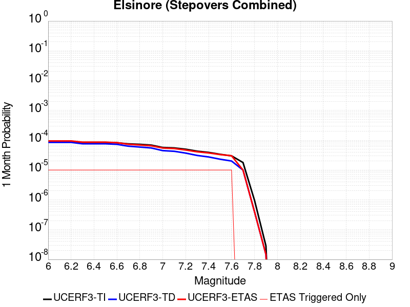 |  | 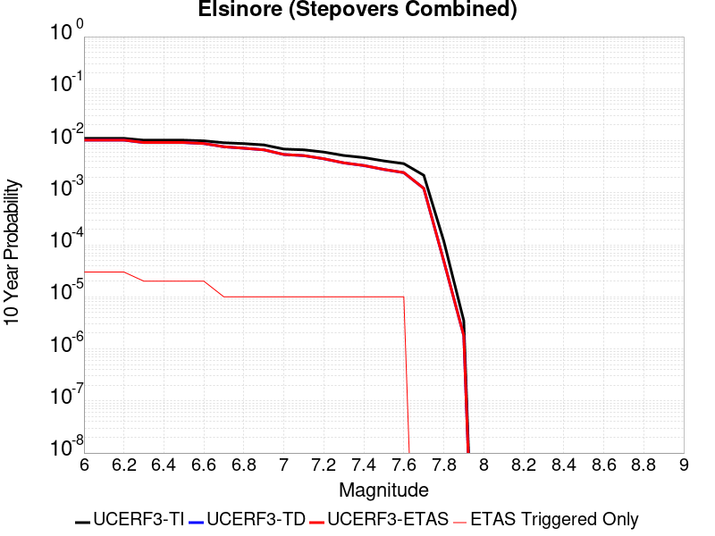 |

| Magnitude | 1 wk TI Prob | 1 wk TD Prob | 1 wk ETAS Prob | 1 wk ETAS/TD Gain | 1 wk ETAS Triggered Only | 1 mo TI Prob | 1 mo TD Prob | 1 mo ETAS Prob | 1 mo ETAS/TD Gain | 1 mo ETAS Triggered Only | 1 yr TI Prob | 1 yr TD Prob | 1 yr ETAS Prob | 1 yr ETAS/TD Gain | 1 yr ETAS Triggered Only | 10 yr TI Prob | 10 yr TD Prob | 10 yr ETAS Prob | 10 yr ETAS/TD Gain | 10 yr ETAS Triggered Only |
|-----|-----|-----|-----|-----|-----|-----|-----|-----|-----|-----|-----|-----|-----|-----|-----|-----|-----|-----|-----|-----|
| 6.0 | 2.144392E-5 | 1.976007E-5 | 1.976007E-5 | 1.0 | 0.0 | 9.189928E-5 | 8.468338E-5 | 9.468253E-5 | 1.1180769 | 1.0E-5 | 0.0011182994 | 0.0010305515 | 0.0010505309 | 1.0193871 | 2.0E-5 | 0.011126885 | 0.010264617 | 0.01029431 | 1.0028926 | 3.0E-5 |
| 6.1 | 2.144392E-5 | 1.976007E-5 | 1.976007E-5 | 1.0 | 0.0 | 9.189928E-5 | 8.468338E-5 | 9.468253E-5 | 1.1180769 | 1.0E-5 | 0.0011182994 | 0.0010305515 | 0.0010505309 | 1.0193871 | 2.0E-5 | 0.011126885 | 0.010264617 | 0.01029431 | 1.0028926 | 3.0E-5 |
| 6.2 | 2.144392E-5 | 1.976007E-5 | 1.976007E-5 | 1.0 | 0.0 | 9.189928E-5 | 8.468338E-5 | 9.468253E-5 | 1.1180769 | 1.0E-5 | 0.0011182994 | 0.0010305515 | 0.0010505309 | 1.0193871 | 2.0E-5 | 0.011126885 | 0.010264617 | 0.01029431 | 1.0028926 | 3.0E-5 |
| 6.3 | 1.9751555E-5 | 1.7741326E-5 | 1.7741326E-5 | 1.0 | 0.0 | 8.4646774E-5 | 7.603211E-5 | 8.603135E-5 | 1.1315134 | 1.0E-5 | 0.0010300872 | 9.25312E-4 | 9.4529346E-4 | 1.0215943 | 2.0E-5 | 0.010253254 | 0.0092209745 | 0.00924079 | 1.002149 | 2.0E-5 |
| 6.4 | 1.9751555E-5 | 1.7741326E-5 | 1.7741326E-5 | 1.0 | 0.0 | 8.4646774E-5 | 7.603211E-5 | 8.603135E-5 | 1.1315134 | 1.0E-5 | 0.0010300872 | 9.25312E-4 | 9.4529346E-4 | 1.0215943 | 2.0E-5 | 0.010253254 | 0.0092209745 | 0.00924079 | 1.002149 | 2.0E-5 |
| 6.5 | 1.9751555E-5 | 1.7741326E-5 | 1.7741326E-5 | 1.0 | 0.0 | 8.4646774E-5 | 7.603211E-5 | 8.603135E-5 | 1.1315134 | 1.0E-5 | 0.0010300872 | 9.25312E-4 | 9.4529346E-4 | 1.0215943 | 2.0E-5 | 0.010253254 | 0.0092209745 | 0.00924079 | 1.002149 | 2.0E-5 |
| 6.6 | 1.9188685E-5 | 1.7003247E-5 | 1.7003247E-5 | 1.0 | 0.0 | 8.2234634E-5 | 7.2869116E-5 | 8.2868384E-5 | 1.1372224 | 1.0E-5 | 0.0010007467 | 8.8683655E-4 | 9.068188E-4 | 1.0225321 | 2.0E-5 | 0.00996252 | 0.008839546 | 0.008859369 | 1.0022426 | 2.0E-5 |
| 6.7 | 1.7608272E-5 | 1.4732402E-5 | 1.4732402E-5 | 1.0 | 0.0 | 7.546184E-5 | 6.313739E-5 | 7.313676E-5 | 1.1583748 | 1.0E-5 | 9.183606E-4 | 7.684364E-4 | 7.7842874E-4 | 1.0130035 | 1.0E-5 | 0.009145746 | 0.007664441 | 0.0076743644 | 1.0012947 | 1.0E-5 |
| 6.8 | 1.697165E-5 | 1.3783126E-5 | 1.3783126E-5 | 1.0 | 0.0 | 7.273361E-5 | 5.906925E-5 | 6.9068665E-5 | 1.1692828 | 1.0E-5 | 8.8517193E-4 | 7.189395E-4 | 7.289323E-4 | 1.0138993 | 1.0E-5 | 0.008816543 | 0.0071722106 | 0.007182139 | 1.0013843 | 1.0E-5 |
| 6.9 | 1.600365E-5 | 1.2846429E-5 | 1.2846429E-5 | 1.0 | 0.0 | 6.858527E-5 | 5.5055007E-5 | 6.505445E-5 | 1.1816266 | 1.0E-5 | 8.347058E-4 | 6.700963E-4 | 6.8008964E-4 | 1.0149132 | 1.0E-5 | 0.008315775 | 0.006686422 | 0.006696355 | 1.0014856 | 1.0E-5 |
| 7.0 | 1.3314581E-5 | 1.044738E-5 | 1.044738E-5 | 1.0 | 0.0 | 5.7061243E-5 | 4.4773733E-5 | 5.4773285E-5 | 1.2233353 | 1.0E-5 | 6.944992E-4 | 5.449866E-4 | 5.549811E-4 | 1.018339 | 1.0E-5 | 0.006923327 | 0.005440055 | 0.005450001 | 1.0018282 | 1.0E-5 |
| 7.1 | 1.2865345E-5 | 9.937339E-6 | 9.937339E-6 | 1.0 | 0.0 | 5.5136024E-5 | 4.258792E-5 | 5.2587493E-5 | 1.2347984 | 1.0E-5 | 6.710743E-4 | 5.1838707E-4 | 5.283819E-4 | 1.0192806 | 1.0E-5 | 0.0066905143 | 0.005175021 | 0.0051849694 | 1.0019224 | 1.0E-5 |
| 7.2 | 1.1650051E-5 | 8.633585E-6 | 8.633585E-6 | 1.0 | 0.0 | 4.9927836E-5 | 3.7000562E-5 | 4.7000194E-5 | 1.2702562 | 1.0E-5 | 6.0770183E-4 | 4.503905E-4 | 4.60386E-4 | 1.022193 | 1.0E-5 | 0.0060604266 | 0.00449624 | 0.0045061954 | 1.0022141 | 1.0E-5 |
| 7.3 | 1.0008533E-5 | 7.2008215E-6 | 7.2008215E-6 | 1.0 | 0.0 | 4.2893007E-5 | 3.0860305E-5 | 4.086E-5 | 1.3240309 | 1.0E-5 | 5.220972E-4 | 3.756609E-4 | 3.8565713E-4 | 1.0266098 | 1.0E-5 | 0.005208723 | 0.0037506663 | 0.0037606286 | 1.0026562 | 1.0E-5 |
| 7.4 | 9.116759E-6 | 6.409854E-6 | 6.409854E-6 | 1.0 | 0.0 | 3.907124E-5 | 2.7470522E-5 | 3.7470247E-5 | 1.3640165 | 1.0E-5 | 4.7558855E-4 | 3.3440365E-4 | 3.444003E-4 | 1.029894 | 1.0E-5 | 0.00474572 | 0.0033391542 | 0.0033491207 | 1.0029848 | 1.0E-5 |
| 7.5 | 7.870524E-6 | 5.382316E-6 | 5.382316E-6 | 1.0 | 0.0 | 3.3730383E-5 | 2.306687E-5 | 3.306664E-5 | 1.4335122 | 1.0E-5 | 4.1059E-4 | 2.8080423E-4 | 2.9080143E-4 | 1.035602 | 1.0E-5 | 0.0040983222 | 0.0028046207 | 0.0028145926 | 1.0035555 | 1.0E-5 |
| 7.6 | 6.9774537E-6 | 4.677398E-6 | 4.677398E-6 | 1.0 | 0.0 | 2.990303E-5 | 2.0045845E-5 | 3.0045645E-5 | 1.4988465 | 1.0E-5 | 3.640086E-4 | 2.44032E-4 | 2.5402955E-4 | 1.0409682 | 1.0E-5 | 0.003634129 | 0.0024377564 | 0.002447732 | 1.0040921 | 1.0E-5 |
| 7.7 | 4.1616954E-6 | 2.3281368E-6 | 2.3281368E-6 | 1.0 | 0.0 | 1.7835715E-5 | 9.977695E-6 | 9.977695E-6 | 1.0 | 0.0 | 2.171282E-4 | 1.2147242E-4 | 1.2147242E-4 | 1.0 | 0.0 | 0.0021691616 | 0.0012141332 | 0.0012141332 | 1.0 | 0.0 |
| 7.8 | 2.2692414E-7 | 9.384417E-8 | 9.384417E-8 | 1.0 | 0.0 | 9.725317E-7 | 4.0218927E-7 | 4.0218927E-7 | 1.0 | 0.0 | 1.1840509E-5 | 4.8966467E-6 | 4.8966467E-6 | 1.0 | 0.0 | 1.1839878E-4 | 4.8965718E-5 | 4.8965718E-5 | 1.0 | 0.0 |
| 7.9 | 6.676829E-9 | 3.4397174E-9 | 3.4397174E-9 | 1.0 | 0.0 | 2.861498E-8 | 1.4741646E-8 | 1.4741646E-8 | 1.0 | 0.0 | 3.4838732E-7 | 1.7947953E-7 | 1.7947953E-7 | 1.0 | 0.0 | 3.4838679E-6 | 1.794794E-6 | 1.794794E-6 | 1.0 | 0.0 |

## Sheephole
*[(top)](#table-of-contents)*

| 1 Week | 1 Month | 1 Year | 10 Year |
|-----|-----|-----|-----|
|  |  |  |  |

| Magnitude | 1 wk TI Prob | 1 wk TD Prob | 1 wk ETAS Prob | 1 wk ETAS/TD Gain | 1 wk ETAS Triggered Only | 1 mo TI Prob | 1 mo TD Prob | 1 mo ETAS Prob | 1 mo ETAS/TD Gain | 1 mo ETAS Triggered Only | 1 yr TI Prob | 1 yr TD Prob | 1 yr ETAS Prob | 1 yr ETAS/TD Gain | 1 yr ETAS Triggered Only | 10 yr TI Prob | 10 yr TD Prob | 10 yr ETAS Prob | 10 yr ETAS/TD Gain | 10 yr ETAS Triggered Only |
|-----|-----|-----|-----|-----|-----|-----|-----|-----|-----|-----|-----|-----|-----|-----|-----|-----|-----|-----|-----|-----|
| 6.0 | 4.5579695E-6 | 4.7412627E-6 | 4.7412627E-6 | 1.0 | 0.0 | 1.9534009E-5 | 2.031957E-5 | 2.031957E-5 | 1.0 | 0.0 | 2.3780059E-4 | 2.473682E-4 | 2.473682E-4 | 1.0 | 0.0 | 0.0023754628 | 0.002471473 | 0.002501399 | 1.0121086 | 3.0E-5 |
| 6.1 | 4.5579695E-6 | 4.7412627E-6 | 4.7412627E-6 | 1.0 | 0.0 | 1.9534009E-5 | 2.031957E-5 | 2.031957E-5 | 1.0 | 0.0 | 2.3780059E-4 | 2.473682E-4 | 2.473682E-4 | 1.0 | 0.0 | 0.0023754628 | 0.002471473 | 0.002501399 | 1.0121086 | 3.0E-5 |
| 6.2 | 2.6677674E-6 | 2.7873941E-6 | 2.7873941E-6 | 1.0 | 0.0 | 1.1433239E-5 | 1.1945926E-5 | 1.1945926E-5 | 1.0 | 0.0 | 1.3919079E-4 | 1.4543302E-4 | 1.4543302E-4 | 1.0 | 0.0 | 0.0013910364 | 0.0014534844 | 0.0014834407 | 1.0206101 | 3.0E-5 |
| 6.3 | 2.6677674E-6 | 2.7873941E-6 | 2.7873941E-6 | 1.0 | 0.0 | 1.1433239E-5 | 1.1945926E-5 | 1.1945926E-5 | 1.0 | 0.0 | 1.3919079E-4 | 1.4543302E-4 | 1.4543302E-4 | 1.0 | 0.0 | 0.0013910364 | 0.0014534844 | 0.0014834407 | 1.0206101 | 3.0E-5 |
| 6.4 | 2.2159759E-6 | 2.3228788E-6 | 2.3228788E-6 | 1.0 | 0.0 | 9.497005E-6 | 9.955161E-6 | 9.955161E-6 | 1.0 | 0.0 | 1.156199E-4 | 1.2119815E-4 | 1.2119815E-4 | 1.0 | 0.0 | 0.0011555976 | 0.0012113999 | 0.0012313756 | 1.0164899 | 2.0E-5 |
| 6.5 | 2.1986082E-6 | 2.304759E-6 | 2.304759E-6 | 1.0 | 0.0 | 9.4225725E-6 | 9.877506E-6 | 9.877506E-6 | 1.0 | 0.0 | 1.1471378E-4 | 1.2025281E-4 | 1.2025281E-4 | 1.0 | 0.0 | 0.0011465458 | 0.0012019566 | 0.0012219326 | 1.0166196 | 2.0E-5 |
| 6.6 | 1.5232331E-6 | 1.6018919E-6 | 1.6018919E-6 | 1.0 | 0.0 | 6.5281256E-6 | 6.865234E-6 | 6.865234E-6 | 1.0 | 0.0 | 7.947703E-5 | 8.35812E-5 | 8.35812E-5 | 1.0 | 0.0 | 7.9448614E-4 | 8.3551643E-4 | 8.4550807E-4 | 1.0119586 | 1.0E-5 |
| 6.7 | 1.3137362E-6 | 1.382819E-6 | 1.382819E-6 | 1.0 | 0.0 | 5.6302856E-6 | 5.926355E-6 | 5.926355E-6 | 1.0 | 0.0 | 6.854657E-5 | 7.215112E-5 | 7.215112E-5 | 1.0 | 0.0 | 6.8525434E-4 | 7.212908E-4 | 7.312836E-4 | 1.013854 | 1.0E-5 |
| 6.8 | 1.2275751E-6 | 1.2922847E-6 | 1.2922847E-6 | 1.0 | 0.0 | 5.2610258E-6 | 5.5383516E-6 | 5.5383516E-6 | 1.0 | 0.0 | 6.4051106E-5 | 6.7427485E-5 | 6.7427485E-5 | 1.0 | 0.0 | 6.4032647E-4 | 6.740836E-4 | 6.8407686E-4 | 1.014825 | 1.0E-5 |
| 6.9 | 1.1837088E-6 | 1.246102E-6 | 1.246102E-6 | 1.0 | 0.0 | 5.0730278E-6 | 5.340427E-6 | 5.340427E-6 | 1.0 | 0.0 | 6.176237E-5 | 6.501789E-5 | 6.501789E-5 | 1.0 | 0.0 | 6.17452E-4 | 6.5000186E-4 | 6.5999536E-4 | 1.0153745 | 1.0E-5 |
| 7.0 | 9.849371E-7 | 1.0366288E-6 | 1.0366288E-6 | 1.0 | 0.0 | 4.2211523E-6 | 4.442688E-6 | 4.442688E-6 | 1.0 | 0.0 | 5.1391315E-5 | 5.4088487E-5 | 5.4088487E-5 | 1.0 | 0.0 | 5.137943E-4 | 5.407633E-4 | 5.5075786E-4 | 1.0184823 | 1.0E-5 |
| 7.1 | 8.1643645E-7 | 8.591669E-7 | 8.591669E-7 | 1.0 | 0.0 | 3.4990085E-6 | 3.682139E-6 | 3.682139E-6 | 1.0 | 0.0 | 4.2599597E-5 | 4.482921E-5 | 4.482921E-5 | 1.0 | 0.0 | 4.259143E-4 | 4.4821028E-4 | 4.4821028E-4 | 1.0 | 0.0 |
| 7.2 | 5.7295756E-7 | 6.029502E-7 | 6.029502E-7 | 1.0 | 0.0 | 2.45553E-6 | 2.58407E-6 | 2.58407E-6 | 1.0 | 0.0 | 2.9895667E-5 | 3.1460666E-5 | 3.1460666E-5 | 1.0 | 0.0 | 2.9891645E-4 | 3.145688E-4 | 3.145688E-4 | 1.0 | 0.0 |

## Channel Islands Western Deep Ramp
*[(top)](#table-of-contents)*

| 1 Week | 1 Month | 1 Year | 10 Year |
|-----|-----|-----|-----|
|  |  |  |  |

| Magnitude | 1 wk TI Prob | 1 wk TD Prob | 1 wk ETAS Prob | 1 wk ETAS/TD Gain | 1 wk ETAS Triggered Only | 1 mo TI Prob | 1 mo TD Prob | 1 mo ETAS Prob | 1 mo ETAS/TD Gain | 1 mo ETAS Triggered Only | 1 yr TI Prob | 1 yr TD Prob | 1 yr ETAS Prob | 1 yr ETAS/TD Gain | 1 yr ETAS Triggered Only | 10 yr TI Prob | 10 yr TD Prob | 10 yr ETAS Prob | 10 yr ETAS/TD Gain | 10 yr ETAS Triggered Only |
|-----|-----|-----|-----|-----|-----|-----|-----|-----|-----|-----|-----|-----|-----|-----|-----|-----|-----|-----|-----|-----|
| 6.0 | 6.0213506E-6 | 6.2548684E-6 | 6.2548684E-6 | 1.0 | 0.0 | 2.5805533E-5 | 2.6806329E-5 | 3.680606E-5 | 1.3730363 | 1.0E-5 | 3.1413708E-4 | 3.2632265E-4 | 3.3631938E-4 | 1.0306345 | 1.0E-5 | 0.0031369338 | 0.0032588763 | 0.0032887785 | 1.0091757 | 3.0E-5 |
| 6.1 | 6.0213506E-6 | 6.2548684E-6 | 6.2548684E-6 | 1.0 | 0.0 | 2.5805533E-5 | 2.6806329E-5 | 3.680606E-5 | 1.3730363 | 1.0E-5 | 3.1413708E-4 | 3.2632265E-4 | 3.3631938E-4 | 1.0306345 | 1.0E-5 | 0.0031369338 | 0.0032588763 | 0.0032887785 | 1.0091757 | 3.0E-5 |
| 6.2 | 6.0213506E-6 | 6.2548684E-6 | 6.2548684E-6 | 1.0 | 0.0 | 2.5805533E-5 | 2.6806329E-5 | 3.680606E-5 | 1.3730363 | 1.0E-5 | 3.1413708E-4 | 3.2632265E-4 | 3.3631938E-4 | 1.0306345 | 1.0E-5 | 0.0031369338 | 0.0032588763 | 0.0032887785 | 1.0091757 | 3.0E-5 |
| 6.3 | 6.0213506E-6 | 6.2548684E-6 | 6.2548684E-6 | 1.0 | 0.0 | 2.5805533E-5 | 2.6806329E-5 | 3.680606E-5 | 1.3730363 | 1.0E-5 | 3.1413708E-4 | 3.2632265E-4 | 3.3631938E-4 | 1.0306345 | 1.0E-5 | 0.0031369338 | 0.0032588763 | 0.0032887785 | 1.0091757 | 3.0E-5 |
| 6.4 | 6.0213506E-6 | 6.2548684E-6 | 6.2548684E-6 | 1.0 | 0.0 | 2.5805533E-5 | 2.6806329E-5 | 3.680606E-5 | 1.3730363 | 1.0E-5 | 3.1413708E-4 | 3.2632265E-4 | 3.3631938E-4 | 1.0306345 | 1.0E-5 | 0.0031369338 | 0.0032588763 | 0.0032887785 | 1.0091757 | 3.0E-5 |
| 6.5 | 6.0213506E-6 | 6.2548684E-6 | 6.2548684E-6 | 1.0 | 0.0 | 2.5805533E-5 | 2.6806329E-5 | 3.680606E-5 | 1.3730363 | 1.0E-5 | 3.1413708E-4 | 3.2632265E-4 | 3.3631938E-4 | 1.0306345 | 1.0E-5 | 0.0031369338 | 0.0032588763 | 0.0032887785 | 1.0091757 | 3.0E-5 |
| 6.6 | 6.0213506E-6 | 6.2548684E-6 | 6.2548684E-6 | 1.0 | 0.0 | 2.5805533E-5 | 2.6806329E-5 | 3.680606E-5 | 1.3730363 | 1.0E-5 | 3.1413708E-4 | 3.2632265E-4 | 3.3631938E-4 | 1.0306345 | 1.0E-5 | 0.0031369338 | 0.0032588763 | 0.0032887785 | 1.0091757 | 3.0E-5 |
| 6.7 | 5.313309E-6 | 5.5252403E-6 | 5.5252403E-6 | 1.0 | 0.0 | 2.2771126E-5 | 2.367941E-5 | 3.3679175E-5 | 1.4222978 | 1.0E-5 | 2.772032E-4 | 2.8826276E-4 | 2.982599E-4 | 1.0346806 | 1.0E-5 | 0.0027685766 | 0.0028792918 | 0.0028992342 | 1.0069262 | 2.0E-5 |
| 6.8 | 5.313309E-6 | 5.5252403E-6 | 5.5252403E-6 | 1.0 | 0.0 | 2.2771126E-5 | 2.367941E-5 | 3.3679175E-5 | 1.4222978 | 1.0E-5 | 2.772032E-4 | 2.8826276E-4 | 2.982599E-4 | 1.0346806 | 1.0E-5 | 0.0027685766 | 0.0028792918 | 0.0028992342 | 1.0069262 | 2.0E-5 |
| 6.9 | 4.744377E-6 | 4.9394303E-6 | 4.9394303E-6 | 1.0 | 0.0 | 2.0332885E-5 | 2.1168837E-5 | 3.1168624E-5 | 1.4723825 | 1.0E-5 | 2.4752476E-4 | 2.5770385E-4 | 2.6770125E-4 | 1.0387943 | 1.0E-5 | 0.0024724922 | 0.0025744175 | 0.002594366 | 1.0077487 | 2.0E-5 |
| 7.0 | 4.722209E-6 | 4.9164732E-6 | 4.9164732E-6 | 1.0 | 0.0 | 2.0237881E-5 | 2.107045E-5 | 3.1070238E-5 | 1.4745883 | 1.0E-5 | 2.4636835E-4 | 2.5650626E-4 | 2.665037E-4 | 1.0389754 | 1.0E-5 | 0.002460954 | 0.0025624693 | 0.002582418 | 1.007785 | 2.0E-5 |
| 7.1 | 4.611174E-6 | 4.801409E-6 | 4.801409E-6 | 1.0 | 0.0 | 1.9762025E-5 | 2.0577325E-5 | 3.057712E-5 | 1.4859618 | 1.0E-5 | 2.4057609E-4 | 2.5050386E-4 | 2.6050137E-4 | 1.0399096 | 1.0E-5 | 0.002403158 | 0.002502582 | 0.002522532 | 1.0079718 | 2.0E-5 |
| 7.2 | 4.043994E-6 | 4.2120264E-6 | 4.2120264E-6 | 1.0 | 0.0 | 1.7331287E-5 | 1.8051438E-5 | 2.8051258E-5 | 1.5539625 | 1.0E-5 | 2.10988E-4 | 2.1975765E-4 | 2.2975546E-4 | 1.0454947 | 1.0E-5 | 0.002107878 | 0.0021957543 | 0.0022157102 | 1.0090885 | 2.0E-5 |
| 7.3 | 2.1233036E-6 | 2.2297875E-6 | 2.2297875E-6 | 1.0 | 0.0 | 9.099841E-6 | 9.556197E-6 | 9.556197E-6 | 1.0 | 0.0 | 1.1078493E-4 | 1.1634055E-4 | 1.1634055E-4 | 1.0 | 0.0 | 0.0011072971 | 0.001162802 | 0.0011727903 | 1.0085899 | 1.0E-5 |
| 7.4 | 1.9051884E-6 | 2.0014973E-6 | 2.0014973E-6 | 1.0 | 0.0 | 8.165067E-6 | 8.577817E-6 | 8.577817E-6 | 1.0 | 0.0 | 9.940516E-5 | 1.0442998E-4 | 1.0442998E-4 | 1.0 | 0.0 | 9.93607E-4 | 0.0010438144 | 0.0010438144 | 1.0 | 0.0 |
| 7.5 | 1.2408497E-6 | 1.3038839E-6 | 1.3038839E-6 | 1.0 | 0.0 | 5.317916E-6 | 5.588062E-6 | 5.588062E-6 | 1.0 | 0.0 | 6.4743705E-5 | 6.8032554E-5 | 6.8032554E-5 | 1.0 | 0.0 | 6.4724847E-4 | 6.8011944E-4 | 6.8011944E-4 | 1.0 | 0.0 |
| 7.6 | 6.5440025E-7 | 6.886718E-7 | 6.886718E-7 | 1.0 | 0.0 | 2.8045695E-6 | 2.9514472E-6 | 2.9514472E-6 | 1.0 | 0.0 | 3.4145098E-5 | 3.593329E-5 | 3.593329E-5 | 1.0 | 0.0 | 3.4139853E-4 | 3.5927625E-4 | 3.5927625E-4 | 1.0 | 0.0 |
| 7.7 | 3.985963E-7 | 4.1930787E-7 | 4.1930787E-7 | 1.0 | 0.0 | 1.7082689E-6 | 1.7970326E-6 | 1.7970326E-6 | 1.0 | 0.0 | 2.0797976E-5 | 2.1878664E-5 | 2.1878664E-5 | 1.0 | 0.0 | 2.0796029E-4 | 2.1876628E-4 | 2.1876628E-4 | 1.0 | 0.0 |
| 7.8 | 3.706329E-8 | 3.8591796E-8 | 3.8591796E-8 | 1.0 | 0.0 | 1.5884267E-7 | 1.653934E-7 | 1.653934E-7 | 1.0 | 0.0 | 1.9339077E-6 | 2.0136629E-6 | 2.0136629E-6 | 1.0 | 0.0 | 1.933891E-5 | 2.0136458E-5 | 2.0136458E-5 | 1.0 | 0.0 |

## Mission (connected) 2011 CFM
*[(top)](#table-of-contents)*

| 1 Week | 1 Month | 1 Year | 10 Year |
|-----|-----|-----|-----|
|  |  |  |  |

| Magnitude | 1 wk TI Prob | 1 wk TD Prob | 1 wk ETAS Prob | 1 wk ETAS/TD Gain | 1 wk ETAS Triggered Only | 1 mo TI Prob | 1 mo TD Prob | 1 mo ETAS Prob | 1 mo ETAS/TD Gain | 1 mo ETAS Triggered Only | 1 yr TI Prob | 1 yr TD Prob | 1 yr ETAS Prob | 1 yr ETAS/TD Gain | 1 yr ETAS Triggered Only | 10 yr TI Prob | 10 yr TD Prob | 10 yr ETAS Prob | 10 yr ETAS/TD Gain | 10 yr ETAS Triggered Only |
|-----|-----|-----|-----|-----|-----|-----|-----|-----|-----|-----|-----|-----|-----|-----|-----|-----|-----|-----|-----|-----|
| 6.0 | 1.8735573E-5 | 2.688439E-5 | 2.688439E-5 | 1.0 | 0.0 | 8.029284E-5 | 1.1521349E-4 | 1.1521349E-4 | 1.0 | 0.0 | 9.771269E-4 | 0.0014017284 | 0.0014117144 | 1.0071241 | 1.0E-5 | 0.009728416 | 0.013937845 | 0.0139674265 | 1.0021224 | 3.0E-5 |
| 6.1 | 1.7515964E-5 | 2.5525667E-5 | 2.5525667E-5 | 1.0 | 0.0 | 7.506625E-5 | 1.0939089E-4 | 1.0939089E-4 | 1.0 | 0.0 | 9.135484E-4 | 0.0013309267 | 0.0013409134 | 1.0075035 | 1.0E-5 | 0.009098019 | 0.01323845 | 0.013268052 | 1.0022361 | 3.0E-5 |
| 6.2 | 1.6486343E-5 | 2.437034E-5 | 2.437034E-5 | 1.0 | 0.0 | 7.065384E-5 | 1.0443989E-4 | 1.0443989E-4 | 1.0 | 0.0 | 8.5987104E-4 | 0.0012707205 | 0.0012807078 | 1.0078596 | 1.0E-5 | 0.008565514 | 0.012643425 | 0.0126730455 | 1.0023428 | 3.0E-5 |
| 6.3 | 1.5229385E-5 | 2.27998E-5 | 2.27998E-5 | 1.0 | 0.0 | 6.526716E-5 | 9.7709526E-5 | 9.7709526E-5 | 1.0 | 0.0 | 7.9433795E-4 | 0.0011888708 | 0.0011988588 | 1.0084014 | 1.0E-5 | 0.007915046 | 0.011836656 | 0.011866301 | 1.0025045 | 3.0E-5 |
| 6.4 | 1.4435828E-5 | 2.1399865E-5 | 2.1399865E-5 | 1.0 | 0.0 | 6.186637E-5 | 9.1710244E-5 | 9.1710244E-5 | 1.0 | 0.0 | 7.529627E-4 | 0.0011159078 | 0.0011258967 | 1.0089513 | 1.0E-5 | 0.007504165 | 0.011119671 | 0.0111493375 | 1.0026679 | 3.0E-5 |
| 6.5 | 1.30127955E-5 | 1.9037165E-5 | 1.9037165E-5 | 1.0 | 0.0 | 5.576793E-5 | 8.1585065E-5 | 8.1585065E-5 | 1.0 | 0.0 | 6.78763E-4 | 9.928137E-4 | 9.928137E-4 | 1.0 | 0.0 | 0.0067669353 | 0.0099117085 | 0.00993151 | 1.0019978 | 2.0E-5 |
| 6.6 | 1.1220718E-5 | 1.6393737E-5 | 1.6393737E-5 | 1.0 | 0.0 | 4.8087906E-5 | 7.025699E-5 | 7.025699E-5 | 1.0 | 0.0 | 5.8531296E-4 | 8.5504283E-4 | 8.5504283E-4 | 1.0 | 0.0 | 0.005837737 | 0.008549754 | 0.008569582 | 1.0023192 | 2.0E-5 |
| 6.7 | 8.086152E-6 | 1.1750606E-5 | 1.1750606E-5 | 1.0 | 0.0 | 3.4654473E-5 | 5.0358773E-5 | 5.0358773E-5 | 1.0 | 0.0 | 4.2183654E-4 | 6.1294634E-4 | 6.1294634E-4 | 1.0 | 0.0 | 0.004210367 | 0.006149825 | 0.0061697024 | 1.0032321 | 2.0E-5 |
| 6.8 | 6.8361655E-6 | 1.0195686E-5 | 1.0195686E-5 | 1.0 | 0.0 | 2.9297524E-5 | 4.369507E-5 | 4.369507E-5 | 1.0 | 0.0 | 3.5663895E-4 | 5.3185824E-4 | 5.3185824E-4 | 1.0 | 0.0 | 0.0035606713 | 0.0053387634 | 0.005358657 | 1.0037262 | 2.0E-5 |
| 6.9 | 5.2517353E-6 | 7.869309E-6 | 7.869309E-6 | 1.0 | 0.0 | 2.2507242E-5 | 3.3725177E-5 | 3.3725177E-5 | 1.0 | 0.0 | 2.739912E-4 | 4.1052693E-4 | 4.1052693E-4 | 1.0 | 0.0 | 0.0027365363 | 0.0041298596 | 0.0041497773 | 1.0048227 | 2.0E-5 |
| 7.0 | 4.4602784E-6 | 6.7018273E-6 | 6.7018273E-6 | 1.0 | 0.0 | 1.911534E-5 | 2.8721803E-5 | 2.8721803E-5 | 1.0 | 0.0 | 2.327044E-4 | 3.49632E-4 | 3.49632E-4 | 1.0 | 0.0 | 0.0023246086 | 0.0035221954 | 0.003542125 | 1.0056583 | 2.0E-5 |
| 7.1 | 4.1492594E-6 | 6.250573E-6 | 6.250573E-6 | 1.0 | 0.0 | 1.7782419E-5 | 2.6787895E-5 | 2.6787895E-5 | 1.0 | 0.0 | 2.1647944E-4 | 3.2609396E-4 | 3.2609396E-4 | 1.0 | 0.0 | 0.0021626868 | 0.0032869952 | 0.0033069295 | 1.0060645 | 2.0E-5 |
| 7.2 | 2.213247E-6 | 3.362939E-6 | 3.362939E-6 | 1.0 | 0.0 | 9.485309E-6 | 1.4412516E-5 | 1.4412516E-5 | 1.0 | 0.0 | 1.15477524E-4 | 1.7545828E-4 | 1.7545828E-4 | 1.0 | 0.0 | 0.0011541754 | 0.0017818378 | 0.0017918199 | 1.0056022 | 1.0E-5 |
| 7.3 | 1.7362703E-6 | 2.738553E-6 | 2.738553E-6 | 1.0 | 0.0 | 7.4411373E-6 | 1.1736603E-5 | 1.1736603E-5 | 1.0 | 0.0 | 9.0592075E-5 | 1.4288379E-4 | 1.4288379E-4 | 1.0 | 0.0 | 9.0555154E-4 | 0.0014532298 | 0.0014632152 | 1.0068712 | 1.0E-5 |
| 7.4 | 1.1628409E-6 | 1.8494098E-6 | 1.8494098E-6 | 1.0 | 0.0 | 4.9835944E-6 | 7.926018E-6 | 7.926018E-6 | 1.0 | 0.0 | 6.0673574E-5 | 9.649501E-5 | 9.649501E-5 | 1.0 | 0.0 | 6.065701E-4 | 9.853557E-4 | 9.953459E-4 | 1.0101386 | 1.0E-5 |
| 7.5 | 5.5610667E-7 | 9.3442156E-7 | 9.3442156E-7 | 1.0 | 0.0 | 2.3833122E-6 | 4.0046575E-6 | 4.0046575E-6 | 1.0 | 0.0 | 2.9016439E-5 | 4.875562E-5 | 4.875562E-5 | 1.0 | 0.0 | 2.901265E-4 | 5.0411985E-4 | 5.141148E-4 | 1.0198265 | 1.0E-5 |
| 7.6 | 4.4307663E-7 | 7.7849705E-7 | 7.7849705E-7 | 1.0 | 0.0 | 1.8988985E-6 | 3.3364117E-6 | 3.3364117E-6 | 1.0 | 0.0 | 2.3118844E-5 | 4.0620056E-5 | 4.0620056E-5 | 1.0 | 0.0 | 2.3116439E-4 | 4.2211605E-4 | 4.3211182E-4 | 1.0236802 | 1.0E-5 |
| 7.7 | 3.639119E-7 | 6.3552113E-7 | 6.3552113E-7 | 1.0 | 0.0 | 1.5596215E-6 | 2.7236592E-6 | 2.7236592E-6 | 1.0 | 0.0 | 1.8988227E-5 | 3.316005E-5 | 3.316005E-5 | 1.0 | 0.0 | 1.8986604E-4 | 3.469058E-4 | 3.5690234E-4 | 1.0288162 | 1.0E-5 |
| 7.8 | 3.1152942E-7 | 5.475073E-7 | 5.475073E-7 | 1.0 | 0.0 | 1.3351254E-6 | 2.3464577E-6 | 2.3464577E-6 | 1.0 | 0.0 | 1.6255031E-5 | 2.856775E-5 | 2.856775E-5 | 1.0 | 0.0 | 1.6253842E-4 | 2.977156E-4 | 3.0771262E-4 | 1.0335791 | 1.0E-5 |
| 7.9 | 1.8035962E-7 | 3.7187047E-7 | 3.7187047E-7 | 1.0 | 0.0 | 7.729696E-7 | 1.5937296E-6 | 1.5937296E-6 | 1.0 | 0.0 | 9.410865E-6 | 1.9403486E-5 | 1.9403486E-5 | 1.0 | 0.0 | 9.410465E-5 | 2.0072333E-4 | 2.1072132E-4 | 1.0498098 | 1.0E-5 |
| 8.0 | 9.279334E-8 | 1.9696856E-7 | 1.9696856E-7 | 1.0 | 0.0 | 3.976857E-7 | 8.4415063E-7 | 8.4415063E-7 | 1.0 | 0.0 | 4.841813E-6 | 1.0277487E-5 | 1.0277487E-5 | 1.0 | 0.0 | 4.841707E-5 | 1.0529156E-4 | 1.0529156E-4 | 1.0 | 0.0 |
| 8.1 | 5.9253985E-8 | 1.1851607E-7 | 1.1851607E-7 | 1.0 | 0.0 | 2.5394561E-7 | 5.079259E-7 | 5.079259E-7 | 1.0 | 0.0 | 3.0917836E-6 | 6.183981E-6 | 6.183981E-6 | 1.0 | 0.0 | 3.0917407E-5 | 6.322424E-5 | 6.322424E-5 | 1.0 | 0.0 |

## Fontana (Seismicity)
*[(top)](#table-of-contents)*

| 1 Week | 1 Month | 1 Year | 10 Year |
|-----|-----|-----|-----|
|  |  |  | 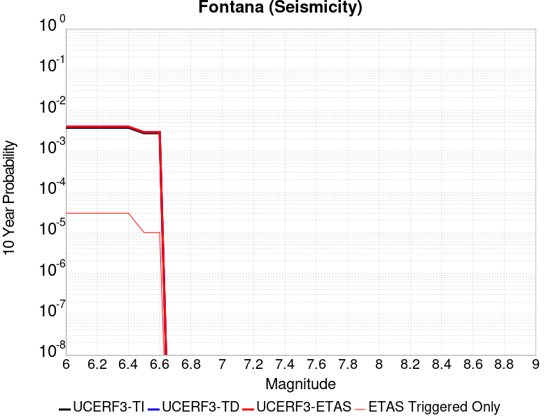 |

| Magnitude | 1 wk TI Prob | 1 wk TD Prob | 1 wk ETAS Prob | 1 wk ETAS/TD Gain | 1 wk ETAS Triggered Only | 1 mo TI Prob | 1 mo TD Prob | 1 mo ETAS Prob | 1 mo ETAS/TD Gain | 1 mo ETAS Triggered Only | 1 yr TI Prob | 1 yr TD Prob | 1 yr ETAS Prob | 1 yr ETAS/TD Gain | 1 yr ETAS Triggered Only | 10 yr TI Prob | 10 yr TD Prob | 10 yr ETAS Prob | 10 yr ETAS/TD Gain | 10 yr ETAS Triggered Only |
|-----|-----|-----|-----|-----|-----|-----|-----|-----|-----|-----|-----|-----|-----|-----|-----|-----|-----|-----|-----|-----|
| 6.0 | 7.1789214E-6 | 7.5520006E-6 | 7.5520006E-6 | 1.0 | 0.0 | 3.076644E-5 | 3.2365548E-5 | 3.2365548E-5 | 1.0 | 0.0 | 3.7451705E-4 | 3.9402005E-4 | 4.0401611E-4 | 1.0253694 | 1.0E-5 | 0.003738865 | 0.003937214 | 0.003967096 | 1.0075896 | 3.0E-5 |
| 6.1 | 7.1789214E-6 | 7.5520006E-6 | 7.5520006E-6 | 1.0 | 0.0 | 3.076644E-5 | 3.2365548E-5 | 3.2365548E-5 | 1.0 | 0.0 | 3.7451705E-4 | 3.9402005E-4 | 4.0401611E-4 | 1.0253694 | 1.0E-5 | 0.003738865 | 0.003937214 | 0.003967096 | 1.0075896 | 3.0E-5 |
| 6.2 | 7.1789214E-6 | 7.5520006E-6 | 7.5520006E-6 | 1.0 | 0.0 | 3.076644E-5 | 3.2365548E-5 | 3.2365548E-5 | 1.0 | 0.0 | 3.7451705E-4 | 3.9402005E-4 | 4.0401611E-4 | 1.0253694 | 1.0E-5 | 0.003738865 | 0.003937214 | 0.003967096 | 1.0075896 | 3.0E-5 |
| 6.3 | 7.1789214E-6 | 7.5520006E-6 | 7.5520006E-6 | 1.0 | 0.0 | 3.076644E-5 | 3.2365548E-5 | 3.2365548E-5 | 1.0 | 0.0 | 3.7451705E-4 | 3.9402005E-4 | 4.0401611E-4 | 1.0253694 | 1.0E-5 | 0.003738865 | 0.003937214 | 0.003967096 | 1.0075896 | 3.0E-5 |
| 6.4 | 7.1789214E-6 | 7.5520006E-6 | 7.5520006E-6 | 1.0 | 0.0 | 3.076644E-5 | 3.2365548E-5 | 3.2365548E-5 | 1.0 | 0.0 | 3.7451705E-4 | 3.9402005E-4 | 4.0401611E-4 | 1.0253694 | 1.0E-5 | 0.003738865 | 0.003937214 | 0.003967096 | 1.0075896 | 3.0E-5 |
| 6.5 | 5.2611317E-6 | 5.532726E-6 | 5.532726E-6 | 1.0 | 0.0 | 2.2547512E-5 | 2.3711682E-5 | 2.3711682E-5 | 1.0 | 0.0 | 2.744814E-4 | 2.8868974E-4 | 2.9868685E-4 | 1.0346292 | 1.0E-5 | 0.002741426 | 0.0028868972 | 0.0028968684 | 1.003454 | 1.0E-5 |
| 6.6 | 5.2611317E-6 | 5.532726E-6 | 5.532726E-6 | 1.0 | 0.0 | 2.2547512E-5 | 2.3711682E-5 | 2.3711682E-5 | 1.0 | 0.0 | 2.744814E-4 | 2.8868974E-4 | 2.9868685E-4 | 1.0346292 | 1.0E-5 | 0.002741426 | 0.0028868972 | 0.0028968684 | 1.003454 | 1.0E-5 |

## White Wolf
*[(top)](#table-of-contents)*

| 1 Week | 1 Month | 1 Year | 10 Year |
|-----|-----|-----|-----|
|  |  |  |  |

| Magnitude | 1 wk TI Prob | 1 wk TD Prob | 1 wk ETAS Prob | 1 wk ETAS/TD Gain | 1 wk ETAS Triggered Only | 1 mo TI Prob | 1 mo TD Prob | 1 mo ETAS Prob | 1 mo ETAS/TD Gain | 1 mo ETAS Triggered Only | 1 yr TI Prob | 1 yr TD Prob | 1 yr ETAS Prob | 1 yr ETAS/TD Gain | 1 yr ETAS Triggered Only | 10 yr TI Prob | 10 yr TD Prob | 10 yr ETAS Prob | 10 yr ETAS/TD Gain | 10 yr ETAS Triggered Only |
|-----|-----|-----|-----|-----|-----|-----|-----|-----|-----|-----|-----|-----|-----|-----|-----|-----|-----|-----|-----|-----|
| 6.0 | 2.0037822E-5 | 1.0468583E-6 | 1.1046848E-5 | 10.5523815 | 1.0E-5 | 8.587355E-5 | 4.4865283E-6 | 1.4486483E-5 | 3.228885 | 1.0E-5 | 0.001045009 | 5.4622164E-5 | 7.462107E-5 | 1.3661318 | 2.0E-5 | 0.010401085 | 5.4609246E-4 | 5.7607604E-4 | 1.0549058 | 3.0E-5 |
| 6.1 | 2.0037822E-5 | 1.0468583E-6 | 1.1046848E-5 | 10.5523815 | 1.0E-5 | 8.587355E-5 | 4.4865283E-6 | 1.4486483E-5 | 3.228885 | 1.0E-5 | 0.001045009 | 5.4622164E-5 | 7.462107E-5 | 1.3661318 | 2.0E-5 | 0.010401085 | 5.4609246E-4 | 5.7607604E-4 | 1.0549058 | 3.0E-5 |
| 6.2 | 2.0037822E-5 | 1.0468583E-6 | 1.1046848E-5 | 10.5523815 | 1.0E-5 | 8.587355E-5 | 4.4865283E-6 | 1.4486483E-5 | 3.228885 | 1.0E-5 | 0.001045009 | 5.4622164E-5 | 7.462107E-5 | 1.3661318 | 2.0E-5 | 0.010401085 | 5.4609246E-4 | 5.7607604E-4 | 1.0549058 | 3.0E-5 |
| 6.3 | 2.0037822E-5 | 1.0468583E-6 | 1.1046848E-5 | 10.5523815 | 1.0E-5 | 8.587355E-5 | 4.4865283E-6 | 1.4486483E-5 | 3.228885 | 1.0E-5 | 0.001045009 | 5.4622164E-5 | 7.462107E-5 | 1.3661318 | 2.0E-5 | 0.010401085 | 5.4609246E-4 | 5.7607604E-4 | 1.0549058 | 3.0E-5 |
| 6.4 | 1.132487E-5 | 1.0468583E-6 | 1.1046848E-5 | 10.5523815 | 1.0E-5 | 4.8534253E-5 | 4.4865283E-6 | 1.4486483E-5 | 3.228885 | 1.0E-5 | 5.907443E-4 | 5.4622164E-5 | 7.462107E-5 | 1.3661318 | 2.0E-5 | 0.005891764 | 5.4609246E-4 | 5.7607604E-4 | 1.0549058 | 3.0E-5 |
| 6.5 | 1.132487E-5 | 1.0468583E-6 | 1.1046848E-5 | 10.5523815 | 1.0E-5 | 4.8534253E-5 | 4.4865283E-6 | 1.4486483E-5 | 3.228885 | 1.0E-5 | 5.907443E-4 | 5.4622164E-5 | 7.462107E-5 | 1.3661318 | 2.0E-5 | 0.005891764 | 5.4609246E-4 | 5.7607604E-4 | 1.0549058 | 3.0E-5 |
| 6.6 | 9.347473E-6 | 1.0468583E-6 | 1.1046848E-5 | 10.5523815 | 1.0E-5 | 4.0059982E-5 | 4.4865283E-6 | 1.4486483E-5 | 3.228885 | 1.0E-5 | 4.8762115E-4 | 5.4622164E-5 | 7.462107E-5 | 1.3661318 | 2.0E-5 | 0.0048655253 | 5.4609246E-4 | 5.7607604E-4 | 1.0549058 | 3.0E-5 |
| 6.7 | 7.842647E-6 | 1.0047773E-6 | 1.1004768E-5 | 10.952444 | 1.0E-5 | 3.361091E-5 | 4.306182E-6 | 1.4306139E-5 | 3.322233 | 1.0E-5 | 4.0913603E-4 | 5.2426552E-5 | 7.24255E-5 | 1.381466 | 2.0E-5 | 0.004083836 | 5.241468E-4 | 5.5413105E-4 | 1.0572059 | 3.0E-5 |
| 6.8 | 6.26597E-6 | 9.734289E-7 | 1.0973419E-5 | 11.272955 | 1.0E-5 | 2.685388E-5 | 4.1718313E-6 | 1.417179E-5 | 3.3970187 | 1.0E-5 | 3.2689696E-4 | 5.0790914E-5 | 7.07899E-5 | 1.3937513 | 2.0E-5 | 0.003264165 | 5.07798E-4 | 5.3778273E-4 | 1.0590487 | 3.0E-5 |
| 6.9 | 5.258436E-6 | 9.1827343E-7 | 1.0918264E-5 | 11.889993 | 1.0E-5 | 2.2535958E-5 | 3.935452E-6 | 1.3935412E-5 | 3.5409942 | 1.0E-5 | 2.7434074E-4 | 4.7913123E-5 | 6.7912166E-5 | 1.4174021 | 2.0E-5 | 0.0027400232 | 4.7903272E-4 | 5.090183E-4 | 1.0625962 | 3.0E-5 |
| 7.0 | 4.675028E-6 | 8.660704E-7 | 1.08660615E-5 | 12.546395 | 1.0E-5 | 2.003568E-5 | 3.7117254E-6 | 1.3711689E-5 | 3.694155 | 1.0E-5 | 2.4390711E-4 | 4.518937E-5 | 6.518846E-5 | 1.442562 | 2.0E-5 | 0.0024363957 | 4.518065E-4 | 4.8179293E-4 | 1.0663701 | 3.0E-5 |
| 7.1 | 2.8270078E-6 | 6.8737717E-7 | 1.068737E-5 | 15.548044 | 1.0E-5 | 1.2115692E-5 | 2.945899E-6 | 1.29458695E-5 | 4.3945394 | 1.0E-5 | 1.4749856E-4 | 3.586577E-5 | 4.5865414E-5 | 1.2788074 | 1.0E-5 | 0.001474007 | 3.5860392E-4 | 3.7859674E-4 | 1.0557518 | 2.0E-5 |
| 7.2 | 1.6881406E-6 | 2.2703432E-7 | 2.2703432E-7 | 1.0 | 0.0 | 7.2348685E-6 | 9.730038E-7 | 9.730038E-7 | 1.0 | 0.0 | 8.808096E-5 | 1.1846259E-5 | 1.1846259E-5 | 1.0 | 0.0 | 8.8046055E-4 | 1.1845643E-4 | 1.1845643E-4 | 1.0 | 0.0 |
| 7.3 | 9.086107E-7 | 1.5264496E-7 | 1.5264496E-7 | 1.0 | 0.0 | 3.8940398E-6 | 6.5419255E-7 | 6.5419255E-7 | 1.0 | 0.0 | 4.7408903E-5 | 7.964766E-6 | 7.964766E-6 | 1.0 | 0.0 | 4.739879E-4 | 7.964489E-5 | 7.964489E-5 | 1.0 | 0.0 |
| 7.4 | 1.9717383E-7 | 9.003399E-8 | 9.003399E-8 | 1.0 | 0.0 | 8.450304E-7 | 3.8585992E-7 | 3.8585992E-7 | 1.0 | 0.0 | 1.0288197E-5 | 4.697835E-6 | 4.697835E-6 | 1.0 | 0.0 | 1.028772E-4 | 4.6977384E-5 | 4.6977384E-5 | 1.0 | 0.0 |
| 7.5 | 1.086975E-7 | 6.659662E-8 | 6.659662E-8 | 1.0 | 0.0 | 4.6584634E-7 | 2.8541407E-7 | 2.8541407E-7 | 1.0 | 0.0 | 5.6716644E-6 | 3.474911E-6 | 3.474911E-6 | 1.0 | 0.0 | 5.6715195E-5 | 3.474859E-5 | 3.474859E-5 | 1.0 | 0.0 |
| 7.6 | 2.4217808E-8 | 1.5820849E-8 | 1.5820849E-8 | 1.0 | 0.0 | 1.03790605E-7 | 6.780364E-8 | 6.780364E-8 | 1.0 | 0.0 | 1.2636499E-6 | 8.25509E-7 | 8.25509E-7 | 1.0 | 0.0 | 1.2636427E-5 | 8.255064E-6 | 8.255064E-6 | 1.0 | 0.0 |

## Elsinore (Coyote Mountains)
*[(top)](#table-of-contents)*

| 1 Week | 1 Month | 1 Year | 10 Year |
|-----|-----|-----|-----|
| 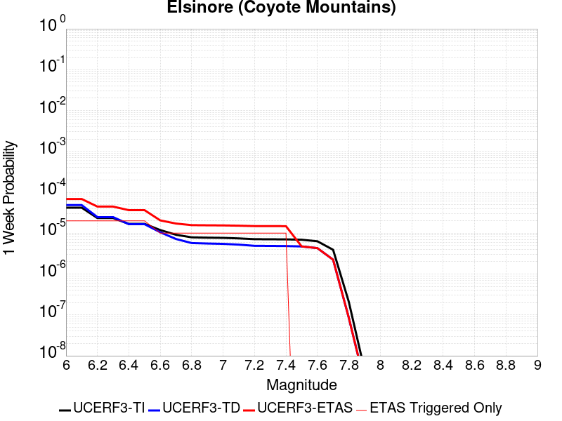 | 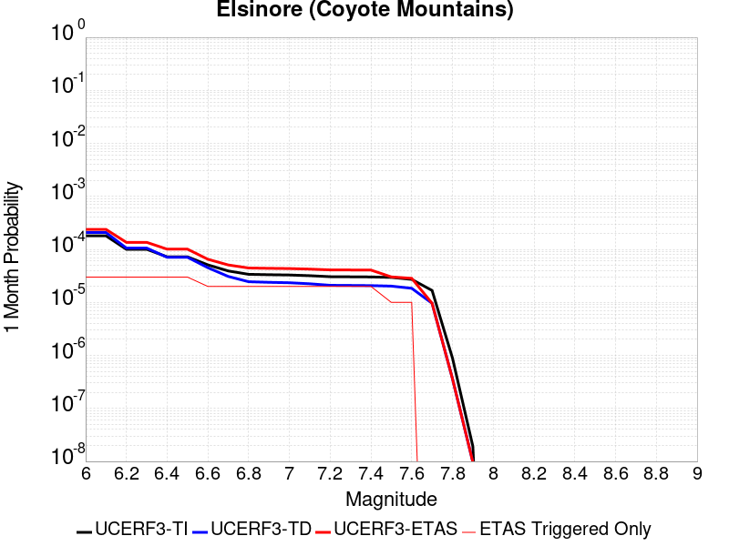 | 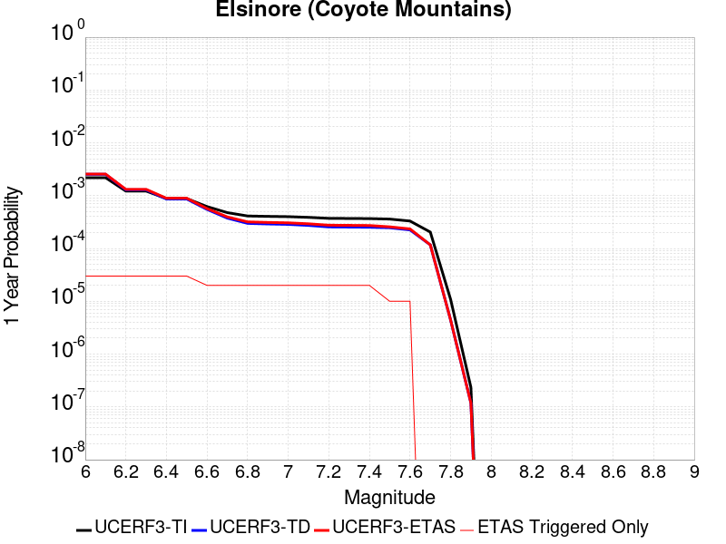 |  |

| Magnitude | 1 wk TI Prob | 1 wk TD Prob | 1 wk ETAS Prob | 1 wk ETAS/TD Gain | 1 wk ETAS Triggered Only | 1 mo TI Prob | 1 mo TD Prob | 1 mo ETAS Prob | 1 mo ETAS/TD Gain | 1 mo ETAS Triggered Only | 1 yr TI Prob | 1 yr TD Prob | 1 yr ETAS Prob | 1 yr ETAS/TD Gain | 1 yr ETAS Triggered Only | 10 yr TI Prob | 10 yr TD Prob | 10 yr ETAS Prob | 10 yr ETAS/TD Gain | 10 yr ETAS Triggered Only |
|-----|-----|-----|-----|-----|-----|-----|-----|-----|-----|-----|-----|-----|-----|-----|-----|-----|-----|-----|-----|-----|
| 6.0 | 4.20513E-5 | 4.8630944E-5 | 6.862997E-5 | 1.4112408 | 2.0E-5 | 1.8020741E-4 | 2.0840492E-4 | 2.3839867E-4 | 1.1439205 | 3.0E-5 | 0.0021918174 | 0.0025349057 | 0.0025648298 | 1.0118047 | 3.0E-5 | 0.021703249 | 0.025111204 | 0.02514045 | 1.0011647 | 3.0E-5 |
| 6.1 | 4.20513E-5 | 4.8630944E-5 | 6.862997E-5 | 1.4112408 | 2.0E-5 | 1.8020741E-4 | 2.0840492E-4 | 2.3839867E-4 | 1.1439205 | 3.0E-5 | 0.0021918174 | 0.0025349057 | 0.0025648298 | 1.0118047 | 3.0E-5 | 0.021703249 | 0.025111204 | 0.02514045 | 1.0011647 | 3.0E-5 |
| 6.2 | 2.3413893E-5 | 2.4695422E-5 | 4.4694927E-5 | 1.8098466 | 2.0E-5 | 1.0034139E-4 | 1.0583377E-4 | 1.358306E-4 | 1.2834334 | 3.0E-5 | 0.0012209718 | 0.0012878523 | 0.0013178136 | 1.0232646 | 3.0E-5 | 0.012142851 | 0.012812569 | 0.012842185 | 1.0023115 | 3.0E-5 |
| 6.3 | 2.3413893E-5 | 2.4695422E-5 | 4.4694927E-5 | 1.8098466 | 2.0E-5 | 1.0034139E-4 | 1.0583377E-4 | 1.358306E-4 | 1.2834334 | 3.0E-5 | 0.0012209718 | 0.0012878523 | 0.0013178136 | 1.0232646 | 3.0E-5 | 0.012142851 | 0.012812569 | 0.012842185 | 1.0023115 | 3.0E-5 |
| 6.4 | 1.6894814E-5 | 1.6568214E-5 | 3.6567882E-5 | 2.207111 | 2.0E-5 | 7.240433E-5 | 7.100491E-5 | 1.01002785E-4 | 1.4224759 | 3.0E-5 | 8.811662E-4 | 8.641788E-4 | 8.941529E-4 | 1.034685 | 3.0E-5 | 0.0087768035 | 0.008611842 | 0.008641584 | 1.0034536 | 3.0E-5 |
| 6.5 | 1.6894814E-5 | 1.6568214E-5 | 3.6567882E-5 | 2.207111 | 2.0E-5 | 7.240433E-5 | 7.100491E-5 | 1.01002785E-4 | 1.4224759 | 3.0E-5 | 8.811662E-4 | 8.641788E-4 | 8.941529E-4 | 1.034685 | 3.0E-5 | 0.0087768035 | 0.008611842 | 0.008641584 | 1.0034536 | 3.0E-5 |
| 6.6 | 1.1910969E-5 | 1.0530538E-5 | 2.0530433E-5 | 1.9496092 | 1.0E-5 | 5.1046012E-5 | 4.513017E-5 | 6.512927E-5 | 1.4431425 | 2.0E-5 | 6.21308E-4 | 5.493346E-4 | 5.6932366E-4 | 1.0363877 | 2.0E-5 | 0.0061957375 | 0.0054810685 | 0.0055009588 | 1.003629 | 2.0E-5 |
| 6.7 | 9.1486E-6 | 7.2026473E-6 | 1.7202576E-5 | 2.3883684 | 1.0E-5 | 3.9207694E-5 | 3.0868145E-5 | 5.0867526E-5 | 1.6478971 | 2.0E-5 | 4.7724912E-4 | 3.7575865E-4 | 3.9575115E-4 | 1.0532056 | 2.0E-5 | 0.0047622547 | 0.0037516125 | 0.0037715374 | 1.005311 | 2.0E-5 |
| 6.8 | 7.90441E-6 | 5.7288153E-6 | 1.5728758E-5 | 2.7455516 | 1.0E-5 | 3.3875604E-5 | 2.4551842E-5 | 4.455135E-5 | 1.8145828 | 2.0E-5 | 4.1235742E-4 | 2.9887896E-4 | 3.1887298E-4 | 1.0668967 | 2.0E-5 | 0.0041159308 | 0.0029848986 | 0.003004839 | 1.0066804 | 2.0E-5 |
| 6.9 | 7.77015E-6 | 5.5827695E-6 | 1.5582715E-5 | 2.7912157 | 1.0E-5 | 3.3300217E-5 | 2.3925944E-5 | 4.3925465E-5 | 1.8358927 | 2.0E-5 | 4.0535472E-4 | 2.912607E-4 | 3.1125487E-4 | 1.068647 | 2.0E-5 | 0.004046161 | 0.0029089167 | 0.0029288584 | 1.0068554 | 2.0E-5 |
| 7.0 | 7.675798E-6 | 5.4796283E-6 | 1.5479574E-5 | 2.8249314 | 1.0E-5 | 3.289586E-5 | 2.3483917E-5 | 4.3483447E-5 | 1.8516266 | 2.0E-5 | 4.004335E-4 | 2.8588044E-4 | 3.058747E-4 | 1.0699394 | 2.0E-5 | 0.003997127 | 0.0028552532 | 0.002875196 | 1.0069846 | 2.0E-5 |
| 7.1 | 7.447814E-6 | 5.2385003E-6 | 1.5238447E-5 | 2.9089334 | 1.0E-5 | 3.191881E-5 | 2.245053E-5 | 4.245008E-5 | 1.8908277 | 2.0E-5 | 3.8854225E-4 | 2.7330214E-4 | 2.9329667E-4 | 1.0731591 | 2.0E-5 | 0.003878636 | 0.0027297847 | 0.0027497301 | 1.0073066 | 2.0E-5 |
| 7.2 | 7.128185E-6 | 4.905146E-6 | 1.49050975E-5 | 3.0386653 | 1.0E-5 | 3.0549007E-5 | 2.1021891E-5 | 4.102147E-5 | 1.9513692 | 2.0E-5 | 3.7187067E-4 | 2.5591266E-4 | 2.7590754E-4 | 1.0781317 | 2.0E-5 | 0.00371249 | 0.002556298 | 0.0025762469 | 1.0078038 | 2.0E-5 |
| 7.3 | 7.0913875E-6 | 4.873821E-6 | 1.4873773E-5 | 3.0517683 | 1.0E-5 | 3.0391306E-5 | 2.0887644E-5 | 4.0887226E-5 | 1.9574839 | 2.0E-5 | 3.6995133E-4 | 2.542786E-4 | 2.742735E-4 | 1.0786339 | 2.0E-5 | 0.0036933604 | 0.0025399947 | 0.0025599438 | 1.007854 | 2.0E-5 |
| 7.4 | 7.051521E-6 | 4.837673E-6 | 1.4837625E-5 | 3.0670996 | 1.0E-5 | 3.0220453E-5 | 2.0732725E-5 | 4.073231E-5 | 1.9646385 | 2.0E-5 | 3.6787192E-4 | 2.5239287E-4 | 2.7238784E-4 | 1.0792215 | 2.0E-5 | 0.0036726352 | 0.0025211805 | 0.0025411302 | 1.0079128 | 2.0E-5 |
| 7.5 | 6.910666E-6 | 4.7332255E-6 | 4.7332255E-6 | 1.0 | 0.0 | 2.9616802E-5 | 2.02851E-5 | 3.0284898E-5 | 1.4929627 | 1.0E-5 | 3.605249E-4 | 2.4694428E-4 | 2.5694183E-4 | 1.0404849 | 1.0E-5 | 0.0035994058 | 0.002466817 | 0.0024767923 | 1.0040438 | 1.0E-5 |
| 7.6 | 6.341753E-6 | 4.306345E-6 | 4.306345E-6 | 1.0 | 0.0 | 2.7178658E-5 | 1.8455641E-5 | 2.8455457E-5 | 1.5418297 | 1.0E-5 | 3.3084993E-4 | 2.2467543E-4 | 2.3467318E-4 | 1.0444987 | 1.0E-5 | 0.0033035777 | 0.002244598 | 0.0022545755 | 1.0044452 | 1.0E-5 |
| 7.7 | 3.9205916E-6 | 2.2437468E-6 | 2.2437468E-6 | 1.0 | 0.0 | 1.6802427E-5 | 9.616027E-6 | 9.616027E-6 | 1.0 | 0.0 | 2.0455034E-4 | 1.17069576E-4 | 1.17069576E-4 | 1.0 | 0.0 | 0.0020436216 | 0.001170152 | 0.001170152 | 1.0 | 0.0 |
| 7.8 | 2.0846227E-7 | 8.4853966E-8 | 8.4853966E-8 | 1.0 | 0.0 | 8.9340944E-7 | 3.6365984E-7 | 3.6365984E-7 | 1.0 | 0.0 | 1.0877206E-5 | 4.427553E-6 | 4.427553E-6 | 1.0 | 0.0 | 1.0876673E-4 | 4.4274973E-5 | 4.4274973E-5 | 1.0 | 0.0 |
| 7.9 | 4.4969806E-9 | 2.269088E-9 | 2.269088E-9 | 1.0 | 0.0 | 1.9272775E-8 | 9.724664E-9 | 9.724664E-9 | 1.0 | 0.0 | 2.3464601E-7 | 1.1839777E-7 | 1.1839777E-7 | 1.0 | 0.0 | 2.3464577E-6 | 1.1839772E-6 | 1.1839772E-6 | 1.0 | 0.0 |

## San Juan
*[(top)](#table-of-contents)*

| 1 Week | 1 Month | 1 Year | 10 Year |
|-----|-----|-----|-----|
|  |  | 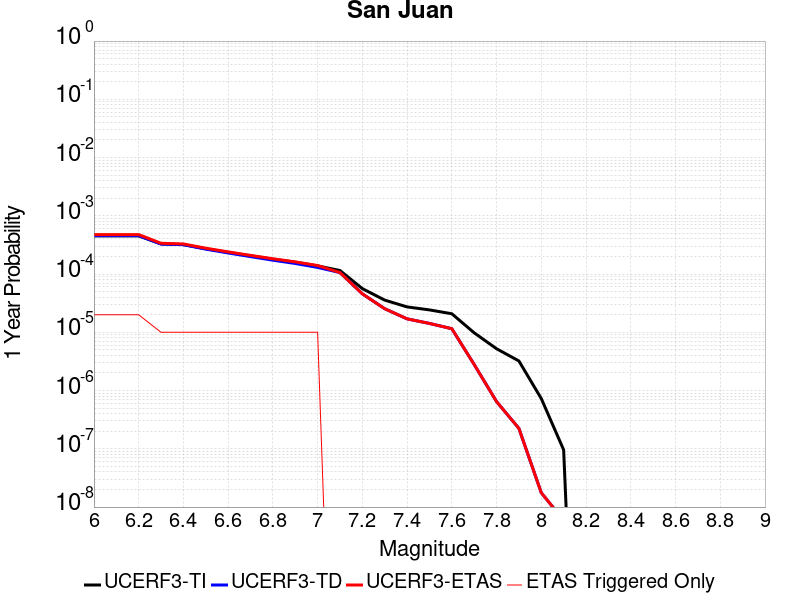 |  |

| Magnitude | 1 wk TI Prob | 1 wk TD Prob | 1 wk ETAS Prob | 1 wk ETAS/TD Gain | 1 wk ETAS Triggered Only | 1 mo TI Prob | 1 mo TD Prob | 1 mo ETAS Prob | 1 mo ETAS/TD Gain | 1 mo ETAS Triggered Only | 1 yr TI Prob | 1 yr TD Prob | 1 yr ETAS Prob | 1 yr ETAS/TD Gain | 1 yr ETAS Triggered Only | 10 yr TI Prob | 10 yr TD Prob | 10 yr ETAS Prob | 10 yr ETAS/TD Gain | 10 yr ETAS Triggered Only |
|-----|-----|-----|-----|-----|-----|-----|-----|-----|-----|-----|-----|-----|-----|-----|-----|-----|-----|-----|-----|-----|
| 6.0 | 8.682808E-6 | 8.74917E-6 | 8.74917E-6 | 1.0 | 0.0 | 3.72115E-5 | 3.749593E-5 | 3.749593E-5 | 1.0 | 0.0 | 4.5295584E-4 | 4.5642213E-4 | 4.76413E-4 | 1.043799 | 2.0E-5 | 0.004520337 | 0.004555389 | 0.004585252 | 1.0065556 | 3.0E-5 |
| 6.1 | 8.682808E-6 | 8.74917E-6 | 8.74917E-6 | 1.0 | 0.0 | 3.72115E-5 | 3.749593E-5 | 3.749593E-5 | 1.0 | 0.0 | 4.5295584E-4 | 4.5642213E-4 | 4.76413E-4 | 1.043799 | 2.0E-5 | 0.004520337 | 0.004555389 | 0.004585252 | 1.0065556 | 3.0E-5 |
| 6.2 | 8.682808E-6 | 8.74917E-6 | 8.74917E-6 | 1.0 | 0.0 | 3.72115E-5 | 3.749593E-5 | 3.749593E-5 | 1.0 | 0.0 | 4.5295584E-4 | 4.5642213E-4 | 4.76413E-4 | 1.043799 | 2.0E-5 | 0.004520337 | 0.004555389 | 0.004585252 | 1.0065556 | 3.0E-5 |
| 6.3 | 6.3054235E-6 | 6.282591E-6 | 6.282591E-6 | 1.0 | 0.0 | 2.7022963E-5 | 2.692512E-5 | 2.692512E-5 | 1.0 | 0.0 | 3.2895492E-4 | 3.2776545E-4 | 3.3776215E-4 | 1.0304996 | 1.0E-5 | 0.003284684 | 0.0032730205 | 0.003292955 | 1.0060905 | 2.0E-5 |
| 6.4 | 6.1490473E-6 | 6.1144706E-6 | 6.1144706E-6 | 1.0 | 0.0 | 2.6352795E-5 | 2.6204618E-5 | 2.6204618E-5 | 1.0 | 0.0 | 3.2079802E-4 | 3.189959E-4 | 3.289927E-4 | 1.0313383 | 1.0E-5 | 0.0032033534 | 0.0031855768 | 0.003205513 | 1.0062582 | 2.0E-5 |
| 6.5 | 5.204848E-6 | 5.137238E-6 | 5.137238E-6 | 1.0 | 0.0 | 2.23063E-5 | 2.2016555E-5 | 2.2016555E-5 | 1.0 | 0.0 | 2.7154534E-4 | 2.6801953E-4 | 2.7801684E-4 | 1.0373007 | 1.0E-5 | 0.0027121378 | 0.0026771172 | 0.0026970638 | 1.0074507 | 2.0E-5 |
| 6.6 | 4.5179986E-6 | 4.415036E-6 | 4.415036E-6 | 1.0 | 0.0 | 1.9362706E-5 | 1.892145E-5 | 1.892145E-5 | 1.0 | 0.0 | 2.3571544E-4 | 2.303451E-4 | 2.403428E-4 | 1.0434031 | 1.0E-5 | 0.0023546559 | 0.0023012008 | 0.0023211548 | 1.0086712 | 2.0E-5 |
| 6.7 | 3.9442616E-6 | 3.8198336E-6 | 3.8198336E-6 | 1.0 | 0.0 | 1.6903869E-5 | 1.6370615E-5 | 1.6370615E-5 | 1.0 | 0.0 | 2.0578515E-4 | 1.9929469E-4 | 2.092927E-4 | 1.050167 | 1.0E-5 | 0.002055947 | 0.001991285 | 0.002001265 | 1.0050119 | 1.0E-5 |
| 6.8 | 3.4536245E-6 | 3.3163408E-6 | 3.3163408E-6 | 1.0 | 0.0 | 1.4801163E-5 | 1.4212815E-5 | 1.4212815E-5 | 1.0 | 0.0 | 1.8018926E-4 | 1.7302789E-4 | 1.8302616E-4 | 1.0577842 | 1.0E-5 | 0.0018004322 | 0.001729051 | 0.0017390337 | 1.0057735 | 1.0E-5 |
| 6.9 | 3.059865E-6 | 2.9120363E-6 | 2.9120363E-6 | 1.0 | 0.0 | 1.3113641E-5 | 1.2480099E-5 | 1.2480099E-5 | 1.0 | 0.0 | 1.596469E-4 | 1.5193518E-4 | 1.6193367E-4 | 1.0658076 | 1.0E-5 | 0.0015953224 | 0.0015184281 | 0.0015284129 | 1.0065757 | 1.0E-5 |
| 7.0 | 2.6504351E-6 | 2.492005E-6 | 2.492005E-6 | 1.0 | 0.0 | 1.1358958E-5 | 1.0679981E-5 | 1.0679981E-5 | 1.0 | 0.0 | 1.3828653E-4 | 1.3002155E-4 | 1.4002025E-4 | 1.0769004 | 1.0E-5 | 0.0013820052 | 0.001299567 | 0.0013095541 | 1.0076848 | 1.0E-5 |
| 7.1 | 2.2039317E-6 | 2.0338366E-6 | 2.0338366E-6 | 1.0 | 0.0 | 9.445387E-6 | 8.716416E-6 | 8.716416E-6 | 1.0 | 0.0 | 1.1499152E-4 | 1.0611773E-4 | 1.0611773E-4 | 1.0 | 0.0 | 0.0011493203 | 0.0010607811 | 0.0010607811 | 1.0 | 0.0 |
| 7.2 | 1.0786707E-6 | 8.770239E-7 | 8.770239E-7 | 1.0 | 0.0 | 4.622866E-6 | 3.7586685E-6 | 3.7586685E-6 | 1.0 | 0.0 | 5.628194E-5 | 4.576084E-5 | 4.576084E-5 | 1.0 | 0.0 | 5.6267687E-4 | 4.5757365E-4 | 4.5757365E-4 | 1.0 | 0.0 |
| 7.3 | 6.846433E-7 | 4.868812E-7 | 4.868812E-7 | 1.0 | 0.0 | 2.9341822E-6 | 2.086632E-6 | 2.086632E-6 | 1.0 | 0.0 | 3.5723086E-5 | 2.5404452E-5 | 2.5404452E-5 | 1.0 | 0.0 | 3.571734E-4 | 2.5405022E-4 | 2.5405022E-4 | 1.0 | 0.0 |
| 7.4 | 5.23043E-7 | 3.2627884E-7 | 3.2627884E-7 | 1.0 | 0.0 | 2.2416111E-6 | 1.3983371E-6 | 1.3983371E-6 | 1.0 | 0.0 | 2.7291273E-5 | 1.7024622E-5 | 1.7024622E-5 | 1.0 | 0.0 | 2.7287923E-4 | 1.7026608E-4 | 1.7026608E-4 | 1.0 | 0.0 |
| 7.5 | 4.648444E-7 | 2.723464E-7 | 2.723464E-7 | 1.0 | 0.0 | 1.9921886E-6 | 1.1671983E-6 | 1.1671983E-6 | 1.0 | 0.0 | 2.4254627E-5 | 1.4210547E-5 | 1.4210547E-5 | 1.0 | 0.0 | 2.425198E-4 | 1.4212691E-4 | 1.4212691E-4 | 1.0 | 0.0 |
| 7.6 | 3.9906567E-7 | 2.2083036E-7 | 2.2083036E-7 | 1.0 | 0.0 | 1.7102802E-6 | 9.4641547E-7 | 9.4641547E-7 | 1.0 | 0.0 | 2.0822463E-5 | 1.1522548E-5 | 1.1522548E-5 | 1.0 | 0.0 | 2.0820512E-4 | 1.15244526E-4 | 1.15244526E-4 | 1.0 | 0.0 |
| 7.7 | 1.8784601E-7 | 5.366277E-8 | 5.366277E-8 | 1.0 | 0.0 | 8.0505407E-7 | 2.2998329E-7 | 2.2998329E-7 | 1.0 | 0.0 | 9.80149E-6 | 2.800043E-6 | 2.800043E-6 | 1.0 | 0.0 | 9.801057E-5 | 2.8008939E-5 | 2.8008939E-5 | 1.0 | 0.0 |
| 7.8 | 1.00154914E-7 | 1.2412917E-8 | 1.2412917E-8 | 1.0 | 0.0 | 4.2923529E-7 | 5.3198217E-8 | 5.3198217E-8 | 1.0 | 0.0 | 5.225927E-6 | 6.476881E-7 | 6.476881E-7 | 1.0 | 0.0 | 5.225804E-5 | 6.4827886E-6 | 6.4827886E-6 | 1.0 | 0.0 |
| 7.9 | 6.171429E-8 | 4.2946513E-9 | 4.2946513E-9 | 1.0 | 0.0 | 2.6448978E-7 | 1.8405647E-8 | 1.8405647E-8 | 1.0 | 0.0 | 3.2201583E-6 | 2.2408874E-7 | 2.2408874E-7 | 1.0 | 0.0 | 3.2201115E-5 | 2.2462114E-6 | 2.2462114E-6 | 1.0 | 0.0 |
| 8.0 | 1.3974572E-8 | 3.3737857E-10 | 3.3737857E-10 | 1.0 | 0.0 | 5.989102E-8 | 1.4459075E-9 | 1.4459075E-9 | 1.0 | 0.0 | 7.2917294E-7 | 1.760392E-8 | 1.760392E-8 | 1.0 | 0.0 | 7.2917055E-6 | 1.8038004E-7 | 1.8038004E-7 | 1.0 | 0.0 |
| 8.1 | 1.8403477E-9 | 1.1291601E-10 | 1.1291601E-10 | 1.0 | 0.0 | 7.887204E-9 | 4.839261E-10 | 4.839261E-10 | 1.0 | 0.0 | 9.602671E-8 | 5.8917977E-9 | 5.8917977E-9 | 1.0 | 0.0 | 9.602667E-7 | 6.0206084E-8 | 6.0206084E-8 | 1.0 | 0.0 |

## Santa Susana East (connector)
*[(top)](#table-of-contents)*

| 1 Week | 1 Month | 1 Year | 10 Year |
|-----|-----|-----|-----|
|  |  |  |  |

| Magnitude | 1 wk TI Prob | 1 wk TD Prob | 1 wk ETAS Prob | 1 wk ETAS/TD Gain | 1 wk ETAS Triggered Only | 1 mo TI Prob | 1 mo TD Prob | 1 mo ETAS Prob | 1 mo ETAS/TD Gain | 1 mo ETAS Triggered Only | 1 yr TI Prob | 1 yr TD Prob | 1 yr ETAS Prob | 1 yr ETAS/TD Gain | 1 yr ETAS Triggered Only | 10 yr TI Prob | 10 yr TD Prob | 10 yr ETAS Prob | 10 yr ETAS/TD Gain | 10 yr ETAS Triggered Only |
|-----|-----|-----|-----|-----|-----|-----|-----|-----|-----|-----|-----|-----|-----|-----|-----|-----|-----|-----|-----|-----|
| 6.0 | 2.858397E-5 | 3.2021693E-5 | 3.2021693E-5 | 1.0 | 0.0 | 1.2249697E-4 | 1.3723019E-4 | 1.4722883E-4 | 1.0728602 | 1.0E-5 | 0.0014903803 | 0.00166977 | 0.0016897366 | 1.0119576 | 2.0E-5 | 0.014804244 | 0.016599316 | 0.016628819 | 1.0017773 | 3.0E-5 |
| 6.1 | 2.858397E-5 | 3.2021693E-5 | 3.2021693E-5 | 1.0 | 0.0 | 1.2249697E-4 | 1.3723019E-4 | 1.4722883E-4 | 1.0728602 | 1.0E-5 | 0.0014903803 | 0.00166977 | 0.0016897366 | 1.0119576 | 2.0E-5 | 0.014804244 | 0.016599316 | 0.016628819 | 1.0017773 | 3.0E-5 |
| 6.2 | 2.858397E-5 | 3.2021693E-5 | 3.2021693E-5 | 1.0 | 0.0 | 1.2249697E-4 | 1.3723019E-4 | 1.4722883E-4 | 1.0728602 | 1.0E-5 | 0.0014903803 | 0.00166977 | 0.0016897366 | 1.0119576 | 2.0E-5 | 0.014804244 | 0.016599316 | 0.016628819 | 1.0017773 | 3.0E-5 |
| 6.3 | 1.943582E-5 | 2.0367343E-5 | 2.0367343E-5 | 1.0 | 0.0 | 8.329371E-5 | 8.7286324E-5 | 9.7285454E-5 | 1.1145555 | 1.0E-5 | 0.001013629 | 0.001062305 | 0.0010822837 | 1.0188069 | 2.0E-5 | 0.010090181 | 0.010583852 | 0.010613535 | 1.0028045 | 3.0E-5 |
| 6.4 | 1.943582E-5 | 2.0367343E-5 | 2.0367343E-5 | 1.0 | 0.0 | 8.329371E-5 | 8.7286324E-5 | 9.7285454E-5 | 1.1145555 | 1.0E-5 | 0.001013629 | 0.001062305 | 0.0010822837 | 1.0188069 | 2.0E-5 | 0.010090181 | 0.010583852 | 0.010613535 | 1.0028045 | 3.0E-5 |
| 6.5 | 1.943582E-5 | 2.0367343E-5 | 2.0367343E-5 | 1.0 | 0.0 | 8.329371E-5 | 8.7286324E-5 | 9.7285454E-5 | 1.1145555 | 1.0E-5 | 0.001013629 | 0.001062305 | 0.0010822837 | 1.0188069 | 2.0E-5 | 0.010090181 | 0.010583852 | 0.010613535 | 1.0028045 | 3.0E-5 |
| 6.6 | 1.943582E-5 | 2.0367343E-5 | 2.0367343E-5 | 1.0 | 0.0 | 8.329371E-5 | 8.7286324E-5 | 9.7285454E-5 | 1.1145555 | 1.0E-5 | 0.001013629 | 0.001062305 | 0.0010822837 | 1.0188069 | 2.0E-5 | 0.010090181 | 0.010583852 | 0.010613535 | 1.0028045 | 3.0E-5 |
| 6.7 | 1.9404439E-5 | 2.0354766E-5 | 2.0354766E-5 | 1.0 | 0.0 | 8.3159226E-5 | 8.723242E-5 | 9.7231554E-5 | 1.1146263 | 1.0E-5 | 0.0010119933 | 0.0010616493 | 0.0010816281 | 1.0188186 | 2.0E-5 | 0.010073971 | 0.010577358 | 0.010607041 | 1.0028063 | 3.0E-5 |
| 6.8 | 1.2217526E-5 | 1.1593157E-5 | 1.1593157E-5 | 1.0 | 0.0 | 5.2359774E-5 | 4.9684106E-5 | 4.9684106E-5 | 1.0 | 0.0 | 6.372938E-4 | 6.047529E-4 | 6.047529E-4 | 1.0 | 0.0 | 0.0063546924 | 0.006033274 | 0.006043214 | 1.0016475 | 1.0E-5 |
| 6.9 | 1.2217526E-5 | 1.1593157E-5 | 1.1593157E-5 | 1.0 | 0.0 | 5.2359774E-5 | 4.9684106E-5 | 4.9684106E-5 | 1.0 | 0.0 | 6.372938E-4 | 6.047529E-4 | 6.047529E-4 | 1.0 | 0.0 | 0.0063546924 | 0.006033274 | 0.006043214 | 1.0016475 | 1.0E-5 |
| 7.0 | 9.276017E-6 | 8.059273E-6 | 8.059273E-6 | 1.0 | 0.0 | 3.9753755E-5 | 3.4539302E-5 | 3.4539302E-5 | 1.0 | 0.0 | 4.8389446E-4 | 4.2043833E-4 | 4.2043833E-4 | 1.0 | 0.0 | 0.0048284214 | 0.0041973097 | 0.004207268 | 1.0023725 | 1.0E-5 |
| 7.1 | 9.130355E-6 | 7.942446E-6 | 7.942446E-6 | 1.0 | 0.0 | 3.9129503E-5 | 3.4038632E-5 | 3.4038632E-5 | 1.0 | 0.0 | 4.7629757E-4 | 4.1434498E-4 | 4.1434498E-4 | 1.0 | 0.0 | 0.00475278 | 0.0041366047 | 0.0041465634 | 1.0024074 | 1.0E-5 |
| 7.2 | 8.851015E-6 | 7.741608E-6 | 7.741608E-6 | 1.0 | 0.0 | 3.7932372E-5 | 3.317792E-5 | 3.317792E-5 | 1.0 | 0.0 | 4.6172875E-4 | 4.038697E-4 | 4.038697E-4 | 1.0 | 0.0 | 0.0046077054 | 0.0040322347 | 0.004042194 | 1.00247 | 1.0E-5 |
| 7.3 | 8.573006E-6 | 7.5503312E-6 | 7.5503312E-6 | 1.0 | 0.0 | 3.6740938E-5 | 3.235818E-5 | 3.235818E-5 | 1.0 | 0.0 | 4.472291E-4 | 3.9389305E-4 | 3.9389305E-4 | 1.0 | 0.0 | 0.004463301 | 0.003932817 | 0.0039427774 | 1.0025327 | 1.0E-5 |
| 7.4 | 7.852282E-6 | 6.8178556E-6 | 6.8178556E-6 | 1.0 | 0.0 | 3.36522E-5 | 2.921907E-5 | 2.921907E-5 | 1.0 | 0.0 | 4.096385E-4 | 3.5568717E-4 | 3.5568717E-4 | 1.0 | 0.0 | 0.0040888423 | 0.0035519868 | 0.0035619512 | 1.0028054 | 1.0E-5 |
| 7.5 | 4.8869324E-6 | 4.2790975E-6 | 4.2790975E-6 | 1.0 | 0.0 | 2.0943828E-5 | 1.833887E-5 | 1.833887E-5 | 1.0 | 0.0 | 2.5496128E-4 | 2.2325452E-4 | 2.2325452E-4 | 1.0 | 0.0 | 0.0025466895 | 0.00223057 | 0.00223057 | 1.0 | 0.0 |
| 7.6 | 1.3894544E-6 | 1.1568394E-6 | 1.1568394E-6 | 1.0 | 0.0 | 5.954791E-6 | 4.957875E-6 | 4.957875E-6 | 1.0 | 0.0 | 7.249717E-5 | 6.036068E-5 | 6.036068E-5 | 1.0 | 0.0 | 7.247352E-4 | 6.0346466E-4 | 6.0346466E-4 | 1.0 | 0.0 |
| 7.7 | 2.9924632E-7 | 2.3719332E-7 | 2.3719332E-7 | 1.0 | 0.0 | 1.2824837E-6 | 1.0165425E-6 | 1.0165425E-6 | 1.0 | 0.0 | 1.5614127E-5 | 1.2376341E-5 | 1.2376341E-5 | 1.0 | 0.0 | 1.5613029E-4 | 1.2375724E-4 | 1.2375724E-4 | 1.0 | 0.0 |
| 7.8 | 4.8188564E-8 | 2.6321862E-8 | 2.6321862E-8 | 1.0 | 0.0 | 2.065224E-7 | 1.12807975E-7 | 1.12807975E-7 | 1.0 | 0.0 | 2.5144072E-6 | 1.3734362E-6 | 1.3734362E-6 | 1.0 | 0.0 | 2.5143789E-5 | 1.3734286E-5 | 1.3734286E-5 | 1.0 | 0.0 |
| 7.9 | 2.6127251E-9 | 2.7681102E-9 | 2.7681102E-9 | 1.0 | 0.0 | 1.1197393E-8 | 1.186333E-8 | 1.186333E-8 | 1.0 | 0.0 | 1.3632825E-7 | 1.4443603E-7 | 1.4443603E-7 | 1.0 | 0.0 | 1.3632817E-6 | 1.4443604E-6 | 1.4443604E-6 | 1.0 | 0.0 |

## Simi-Santa Rosa
*[(top)](#table-of-contents)*

| 1 Week | 1 Month | 1 Year | 10 Year |
|-----|-----|-----|-----|
|  | 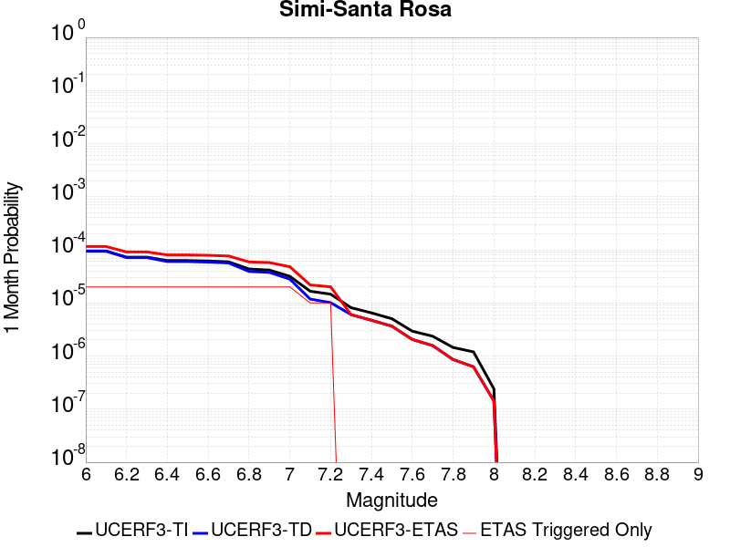 | 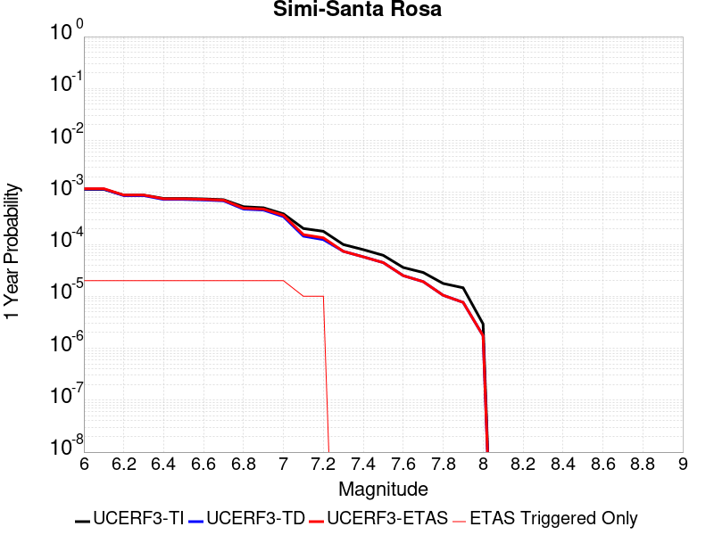 | 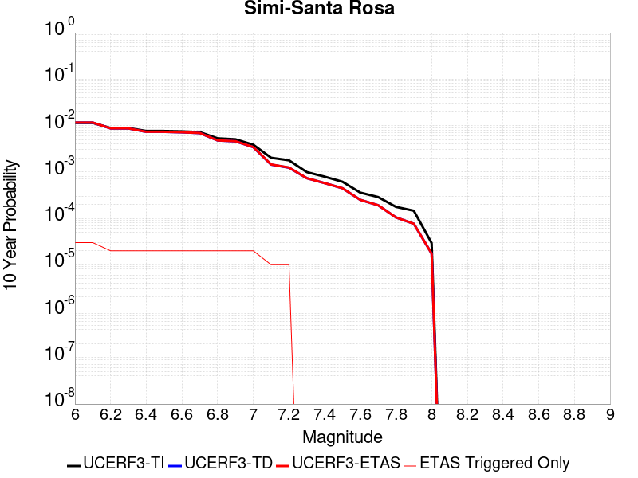 |

| Magnitude | 1 wk TI Prob | 1 wk TD Prob | 1 wk ETAS Prob | 1 wk ETAS/TD Gain | 1 wk ETAS Triggered Only | 1 mo TI Prob | 1 mo TD Prob | 1 mo ETAS Prob | 1 mo ETAS/TD Gain | 1 mo ETAS Triggered Only | 1 yr TI Prob | 1 yr TD Prob | 1 yr ETAS Prob | 1 yr ETAS/TD Gain | 1 yr ETAS Triggered Only | 10 yr TI Prob | 10 yr TD Prob | 10 yr ETAS Prob | 10 yr ETAS/TD Gain | 10 yr ETAS Triggered Only |
|-----|-----|-----|-----|-----|-----|-----|-----|-----|-----|-----|-----|-----|-----|-----|-----|-----|-----|-----|-----|-----|
| 6.0 | 2.198912E-5 | 2.2275388E-5 | 4.2274944E-5 | 1.8978319 | 2.0E-5 | 9.4235686E-5 | 9.54627E-5 | 1.15460796E-4 | 1.2094859 | 2.0E-5 | 0.0011467156 | 0.0011616825 | 0.0011816593 | 1.0171964 | 2.0E-5 | 0.011408163 | 0.011560547 | 0.0115902005 | 1.002565 | 3.0E-5 |
| 6.1 | 2.198912E-5 | 2.2275388E-5 | 4.2274944E-5 | 1.8978319 | 2.0E-5 | 9.4235686E-5 | 9.54627E-5 | 1.15460796E-4 | 1.2094859 | 2.0E-5 | 0.0011467156 | 0.0011616825 | 0.0011816593 | 1.0171964 | 2.0E-5 | 0.011408163 | 0.011560547 | 0.0115902005 | 1.002565 | 3.0E-5 |
| 6.2 | 1.69983E-5 | 1.6668506E-5 | 3.666817E-5 | 2.1998477 | 2.0E-5 | 7.284782E-5 | 7.143466E-5 | 9.1433234E-5 | 1.2799561 | 2.0E-5 | 8.865613E-4 | 8.6939917E-4 | 8.8938174E-4 | 1.0229844 | 2.0E-5 | 0.008830327 | 0.0086629 | 0.008682727 | 1.0022887 | 2.0E-5 |
| 6.3 | 1.69983E-5 | 1.6668506E-5 | 3.666817E-5 | 2.1998477 | 2.0E-5 | 7.284782E-5 | 7.143466E-5 | 9.1433234E-5 | 1.2799561 | 2.0E-5 | 8.865613E-4 | 8.6939917E-4 | 8.8938174E-4 | 1.0229844 | 2.0E-5 | 0.008830327 | 0.0086629 | 0.008682727 | 1.0022887 | 2.0E-5 |
| 6.4 | 1.4666188E-5 | 1.4052489E-5 | 3.405221E-5 | 2.4232154 | 2.0E-5 | 6.285358E-5 | 6.0223705E-5 | 8.02225E-5 | 1.3320751 | 2.0E-5 | 7.6497364E-4 | 7.330018E-4 | 7.5298717E-4 | 1.0272651 | 2.0E-5 | 0.0076234564 | 0.0073083164 | 0.00732817 | 1.0027167 | 2.0E-5 |
| 6.5 | 1.4666188E-5 | 1.4052489E-5 | 3.405221E-5 | 2.4232154 | 2.0E-5 | 6.285358E-5 | 6.0223705E-5 | 8.02225E-5 | 1.3320751 | 2.0E-5 | 7.6497364E-4 | 7.330018E-4 | 7.5298717E-4 | 1.0272651 | 2.0E-5 | 0.0076234564 | 0.0073083164 | 0.00732817 | 1.0027167 | 2.0E-5 |
| 6.6 | 1.4377586E-5 | 1.3729529E-5 | 3.3729255E-5 | 2.4566941 | 2.0E-5 | 6.1616774E-5 | 5.883965E-5 | 7.883847E-5 | 1.3398869 | 2.0E-5 | 7.4992597E-4 | 7.1616215E-4 | 7.361478E-4 | 1.0279067 | 2.0E-5 | 0.007474003 | 0.0071410104 | 0.0071608676 | 1.0027807 | 2.0E-5 |
| 6.7 | 1.3881404E-5 | 1.3207497E-5 | 3.3207234E-5 | 2.5142715 | 2.0E-5 | 5.9490372E-5 | 5.6602472E-5 | 7.660134E-5 | 1.3533214 | 2.0E-5 | 7.240546E-4 | 6.889419E-4 | 7.0892816E-4 | 1.02901 | 2.0E-5 | 0.007217 | 0.0068705105 | 0.0068903733 | 1.002891 | 2.0E-5 |
| 6.8 | 1.0176516E-5 | 9.1541E-6 | 2.9153916E-5 | 3.1847935 | 2.0E-5 | 4.3612912E-5 | 3.923136E-5 | 5.9230573E-5 | 1.5097762 | 2.0E-5 | 5.308578E-4 | 4.775537E-4 | 4.975441E-4 | 1.0418601 | 2.0E-5 | 0.0052959146 | 0.004766908 | 0.0047868127 | 1.0041755 | 2.0E-5 |
| 6.9 | 9.699797E-6 | 8.774672E-6 | 2.8774497E-5 | 3.2792675 | 2.0E-5 | 4.15699E-5 | 3.760529E-5 | 5.7604535E-5 | 1.53182 | 2.0E-5 | 5.05996E-4 | 4.5776463E-4 | 4.7775547E-4 | 1.0436705 | 2.0E-5 | 0.005048454 | 0.0045698346 | 0.0045897434 | 1.0043565 | 2.0E-5 |
| 7.0 | 7.4049476E-6 | 6.559291E-6 | 2.6559159E-5 | 4.0490904 | 2.0E-5 | 3.1735104E-5 | 2.8111013E-5 | 4.811045E-5 | 1.7114449 | 2.0E-5 | 3.8630638E-4 | 3.422105E-4 | 3.6220363E-4 | 1.0584235 | 2.0E-5 | 0.0038563553 | 0.0034180775 | 0.0034380092 | 1.0058312 | 2.0E-5 |
| 7.1 | 3.873439E-6 | 2.759473E-6 | 1.2759446E-5 | 4.6238704 | 1.0E-5 | 1.6600346E-5 | 1.1826261E-5 | 2.1826143E-5 | 1.8455658 | 1.0E-5 | 2.0209046E-4 | 1.4397544E-4 | 1.53974E-4 | 1.0694463 | 1.0E-5 | 0.0020190678 | 0.0014388453 | 0.0014488308 | 1.00694 | 1.0E-5 |
| 7.2 | 3.417706E-6 | 2.367616E-6 | 1.2367592E-5 | 5.223648 | 1.0E-5 | 1.4647229E-5 | 1.0146887E-5 | 2.0146785E-5 | 1.9855139 | 1.0E-5 | 1.7831543E-4 | 1.2353157E-4 | 1.3353034E-4 | 1.080941 | 1.0E-5 | 0.0017817242 | 0.0012346513 | 0.0012446389 | 1.0080894 | 1.0E-5 |
| 7.3 | 1.90225E-6 | 1.4073756E-6 | 1.4073756E-6 | 1.0 | 0.0 | 8.152474E-6 | 6.031596E-6 | 6.031596E-6 | 1.0 | 0.0 | 9.9251854E-5 | 7.343223E-5 | 7.343223E-5 | 1.0 | 0.0 | 9.920754E-4 | 7.340819E-4 | 7.340819E-4 | 1.0 | 0.0 |
| 7.4 | 1.5170556E-6 | 1.1024792E-6 | 1.1024792E-6 | 1.0 | 0.0 | 6.5016507E-6 | 4.7249023E-6 | 4.7249023E-6 | 1.0 | 0.0 | 7.915472E-5 | 5.752418E-5 | 5.752418E-5 | 1.0 | 0.0 | 7.9126534E-4 | 5.75094E-4 | 5.75094E-4 | 1.0 | 0.0 |
| 7.5 | 1.178732E-6 | 8.5351127E-7 | 8.5351127E-7 | 1.0 | 0.0 | 5.0516987E-6 | 3.6579004E-6 | 3.6579004E-6 | 1.0 | 0.0 | 6.1502695E-5 | 4.4534037E-5 | 4.4534037E-5 | 1.0 | 0.0 | 6.148568E-4 | 4.4525208E-4 | 4.4525208E-4 | 1.0 | 0.0 |
| 7.6 | 6.8722386E-7 | 4.793211E-7 | 4.793211E-7 | 1.0 | 0.0 | 2.9452417E-6 | 2.0542318E-6 | 2.0542318E-6 | 1.0 | 0.0 | 3.5857727E-5 | 2.5009986E-5 | 2.5009986E-5 | 1.0 | 0.0 | 3.5851944E-4 | 2.5007184E-4 | 2.5007184E-4 | 1.0 | 0.0 |
| 7.7 | 5.5126515E-7 | 3.6731117E-7 | 3.6731117E-7 | 1.0 | 0.0 | 2.3625628E-6 | 1.5741898E-6 | 1.5741898E-6 | 1.0 | 0.0 | 2.8763823E-5 | 1.9165593E-5 | 1.9165593E-5 | 1.0 | 0.0 | 2.87601E-4 | 1.9163951E-4 | 1.9163951E-4 | 1.0 | 0.0 |
| 7.8 | 3.3860243E-7 | 2.0075514E-7 | 2.0075514E-7 | 1.0 | 0.0 | 1.4511525E-6 | 8.6037886E-7 | 8.6037886E-7 | 1.0 | 0.0 | 1.7667637E-5 | 1.0475063E-5 | 1.0475063E-5 | 1.0 | 0.0 | 1.7666233E-4 | 1.0474575E-4 | 1.0474575E-4 | 1.0 | 0.0 |
| 7.9 | 2.7955386E-7 | 1.4648724E-7 | 1.4648724E-7 | 1.0 | 0.0 | 1.1980875E-6 | 6.278023E-7 | 6.278023E-7 | 1.0 | 0.0 | 1.4586617E-5 | 7.643467E-6 | 7.643467E-6 | 1.0 | 0.0 | 1.458566E-4 | 7.643208E-5 | 7.643208E-5 | 1.0 | 0.0 |
| 8.0 | 5.6259015E-8 | 3.335318E-8 | 3.335318E-8 | 1.0 | 0.0 | 2.4111003E-7 | 1.429422E-7 | 1.429422E-7 | 1.0 | 0.0 | 2.9355108E-6 | 1.7403199E-6 | 1.7403199E-6 | 1.0 | 0.0 | 2.935472E-5 | 1.7403077E-5 | 1.7403077E-5 | 1.0 | 0.0 |

## Great Valley 11
*[(top)](#table-of-contents)*

| 1 Week | 1 Month | 1 Year | 10 Year |
|-----|-----|-----|-----|
| 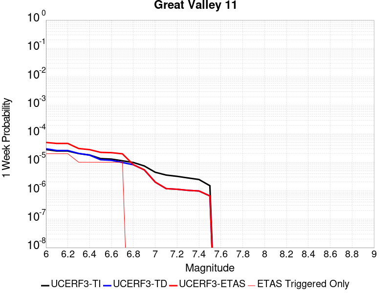 | 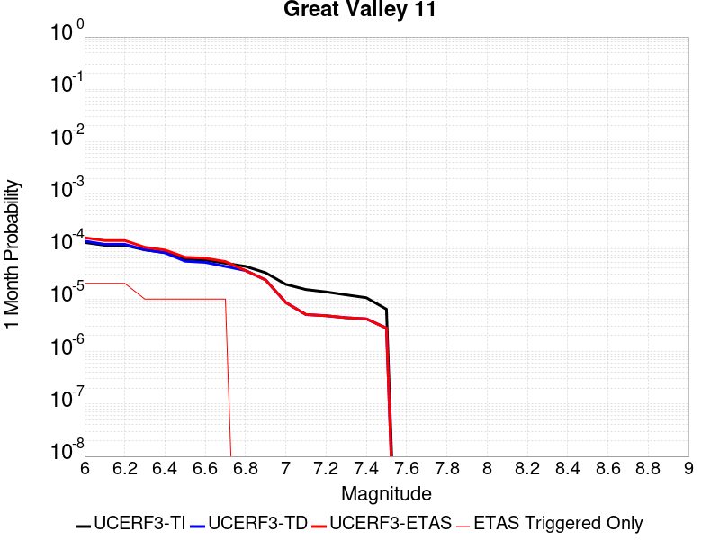 |  | 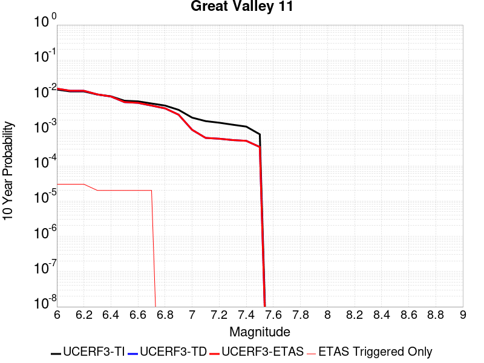 |

| Magnitude | 1 wk TI Prob | 1 wk TD Prob | 1 wk ETAS Prob | 1 wk ETAS/TD Gain | 1 wk ETAS Triggered Only | 1 mo TI Prob | 1 mo TD Prob | 1 mo ETAS Prob | 1 mo ETAS/TD Gain | 1 mo ETAS Triggered Only | 1 yr TI Prob | 1 yr TD Prob | 1 yr ETAS Prob | 1 yr ETAS/TD Gain | 1 yr ETAS Triggered Only | 10 yr TI Prob | 10 yr TD Prob | 10 yr ETAS Prob | 10 yr ETAS/TD Gain | 10 yr ETAS Triggered Only |
|-----|-----|-----|-----|-----|-----|-----|-----|-----|-----|-----|-----|-----|-----|-----|-----|-----|-----|-----|-----|-----|
| 6.0 | 2.8099583E-5 | 2.983214E-5 | 4.9831542E-5 | 1.6703979 | 2.0E-5 | 1.20421224E-4 | 1.2784619E-4 | 1.4784362E-4 | 1.156418 | 2.0E-5 | 0.0014651422 | 0.0015554894 | 0.0015754583 | 1.0128376 | 2.0E-5 | 0.0145552 | 0.015453546 | 0.015483082 | 1.0019113 | 3.0E-5 |
| 6.1 | 2.483194E-5 | 2.5907144E-5 | 4.5906625E-5 | 1.7719679 | 2.0E-5 | 1.0641825E-4 | 1.11026246E-4 | 1.3102403E-4 | 1.1801176 | 2.0E-5 | 0.0012948721 | 0.0013509697 | 0.0013709427 | 1.0147842 | 2.0E-5 | 0.012873529 | 0.013433979 | 0.013463575 | 1.0022031 | 3.0E-5 |
| 6.2 | 2.483194E-5 | 2.5907144E-5 | 4.5906625E-5 | 1.7719679 | 2.0E-5 | 1.0641825E-4 | 1.11026246E-4 | 1.3102403E-4 | 1.1801176 | 2.0E-5 | 0.0012948721 | 0.0013509697 | 0.0013709427 | 1.0147842 | 2.0E-5 | 0.012873529 | 0.013433979 | 0.013463575 | 1.0022031 | 3.0E-5 |
| 6.3 | 2.0257901E-5 | 2.0398915E-5 | 3.039871E-5 | 1.4902122 | 1.0E-5 | 8.681669E-5 | 8.742122E-5 | 9.742035E-5 | 1.1143787 | 1.0E-5 | 0.0010564806 | 0.0010638753 | 0.0010738646 | 1.0093896 | 1.0E-5 | 0.01051472 | 0.010591993 | 0.010611782 | 1.0018682 | 2.0E-5 |
| 6.4 | 1.8054898E-5 | 1.7780852E-5 | 2.7780674E-5 | 1.5623927 | 1.0E-5 | 7.737584E-5 | 7.6201635E-5 | 8.6200875E-5 | 1.1312208 | 1.0E-5 | 9.416436E-4 | 9.2739763E-4 | 9.3738834E-4 | 1.0107728 | 1.0E-5 | 0.009376635 | 0.009239015 | 0.00925883 | 1.0021447 | 2.0E-5 |
| 6.5 | 1.34804895E-5 | 1.2321004E-5 | 2.232088E-5 | 1.8116121 | 1.0E-5 | 5.777225E-5 | 5.2803258E-5 | 6.280273E-5 | 1.1893723 | 1.0E-5 | 7.031501E-4 | 6.426942E-4 | 6.5268774E-4 | 1.0155495 | 1.0E-5 | 0.007009294 | 0.006408792 | 0.006428664 | 1.0031008 | 2.0E-5 |
| 6.6 | 1.294883E-5 | 1.1732261E-5 | 2.1732143E-5 | 1.8523407 | 1.0E-5 | 5.5493805E-5 | 5.028017E-5 | 6.0279668E-5 | 1.1988755 | 1.0E-5 | 6.754276E-4 | 6.1199325E-4 | 6.219871E-4 | 1.01633 | 1.0E-5 | 0.006733784 | 0.0061035044 | 0.006123382 | 1.0032568 | 2.0E-5 |
| 6.7 | 1.1272237E-5 | 9.811834E-6 | 1.9811736E-5 | 2.0191674 | 1.0E-5 | 4.8308695E-5 | 4.205006E-5 | 5.204964E-5 | 1.2378018 | 1.0E-5 | 5.879996E-4 | 5.1184196E-4 | 5.218368E-4 | 1.0195273 | 1.0E-5 | 0.005864462 | 0.005106915 | 0.0051268125 | 1.0038962 | 2.0E-5 |
| 6.8 | 9.8337505E-6 | 8.193719E-6 | 8.193719E-6 | 1.0 | 0.0 | 4.2143965E-5 | 3.5115478E-5 | 3.5115478E-5 | 1.0 | 0.0 | 5.1298196E-4 | 4.2744912E-4 | 4.2744912E-4 | 1.0 | 0.0 | 0.005117994 | 0.0042664795 | 0.0042664795 | 1.0 | 0.0 |
| 6.9 | 7.4224813E-6 | 5.4130837E-6 | 5.4130837E-6 | 1.0 | 0.0 | 3.1810247E-5 | 2.3198732E-5 | 2.3198732E-5 | 1.0 | 0.0 | 3.872209E-4 | 2.8240937E-4 | 2.8240937E-4 | 1.0 | 0.0 | 0.0038654688 | 0.0028206457 | 0.0028206457 | 1.0 | 0.0 |
| 7.0 | 4.4628923E-6 | 2.0110294E-6 | 2.0110294E-6 | 1.0 | 0.0 | 1.912654E-5 | 8.61867E-6 | 8.61867E-6 | 1.0 | 0.0 | 2.3284076E-4 | 1.0492737E-4 | 1.0492737E-4 | 1.0 | 0.0 | 0.0023259693 | 0.0010487898 | 0.0010487898 | 1.0 | 0.0 |
| 7.1 | 3.5546527E-6 | 1.1855383E-6 | 1.1855383E-6 | 1.0 | 0.0 | 1.5234136E-5 | 5.080869E-6 | 5.080869E-6 | 1.0 | 0.0 | 1.8545982E-4 | 6.185789E-5 | 6.185789E-5 | 1.0 | 0.0 | 0.0018530512 | 6.1841356E-4 | 6.1841356E-4 | 1.0 | 0.0 |
| 7.2 | 3.2039936E-6 | 1.1253728E-6 | 1.1253728E-6 | 1.0 | 0.0 | 1.3731329E-5 | 4.8230177E-6 | 4.8230177E-6 | 1.0 | 0.0 | 1.671661E-4 | 5.8718724E-5 | 5.8718724E-5 | 1.0 | 0.0 | 0.0016704041 | 5.870388E-4 | 5.870388E-4 | 1.0 | 0.0 |
| 7.3 | 2.8120473E-6 | 1.0305271E-6 | 1.0305271E-6 | 1.0 | 0.0 | 1.2051575E-5 | 4.4165376E-6 | 4.4165376E-6 | 1.0 | 0.0 | 1.4671806E-4 | 5.3770087E-5 | 5.3770087E-5 | 1.0 | 0.0 | 0.0014662122 | 5.375774E-4 | 5.375774E-4 | 1.0 | 0.0 |
| 7.4 | 2.4837766E-6 | 9.80032E-7 | 9.80032E-7 | 1.0 | 0.0 | 1.0644713E-5 | 4.2001307E-6 | 4.2001307E-6 | 1.0 | 0.0 | 1.2959167E-4 | 5.113546E-5 | 5.113546E-5 | 1.0 | 0.0 | 0.0012951613 | 5.1124353E-4 | 5.1124353E-4 | 1.0 | 0.0 |
| 7.5 | 1.5002679E-6 | 6.545985E-7 | 6.545985E-7 | 1.0 | 0.0 | 6.4297037E-6 | 2.8054194E-6 | 2.8054194E-6 | 1.0 | 0.0 | 7.827883E-5 | 3.4155488E-5 | 3.4155488E-5 | 1.0 | 0.0 | 7.825126E-4 | 3.4150656E-4 | 3.4150656E-4 | 1.0 | 0.0 |

## Antelope Valley 2011
*[(top)](#table-of-contents)*

| 1 Week | 1 Month | 1 Year | 10 Year |
|-----|-----|-----|-----|
|  |  | 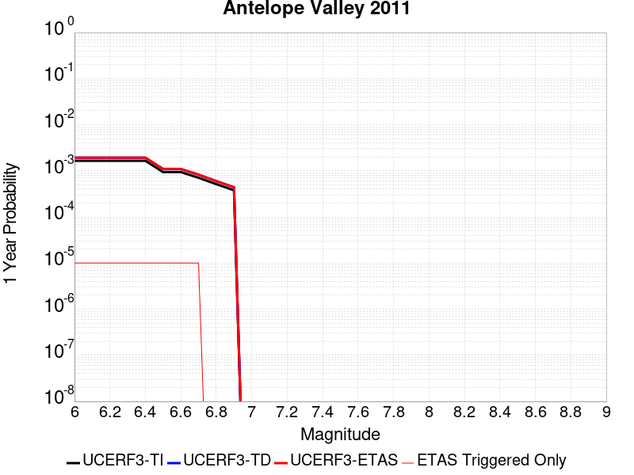 |  |

| Magnitude | 1 wk TI Prob | 1 wk TD Prob | 1 wk ETAS Prob | 1 wk ETAS/TD Gain | 1 wk ETAS Triggered Only | 1 mo TI Prob | 1 mo TD Prob | 1 mo ETAS Prob | 1 mo ETAS/TD Gain | 1 mo ETAS Triggered Only | 1 yr TI Prob | 1 yr TD Prob | 1 yr ETAS Prob | 1 yr ETAS/TD Gain | 1 yr ETAS Triggered Only | 10 yr TI Prob | 10 yr TD Prob | 10 yr ETAS Prob | 10 yr ETAS/TD Gain | 10 yr ETAS Triggered Only |
|-----|-----|-----|-----|-----|-----|-----|-----|-----|-----|-----|-----|-----|-----|-----|-----|-----|-----|-----|-----|-----|
| 6.0 | 3.1646934E-5 | 3.6904392E-5 | 3.6904392E-5 | 1.0 | 0.0 | 1.3562266E-4 | 1.5815359E-4 | 1.5815359E-4 | 1.0 | 0.0 | 0.0016499552 | 0.0019240839 | 0.0019340647 | 1.0051873 | 1.0E-5 | 0.016377583 | 0.019100657 | 0.019130083 | 1.0015407 | 3.0E-5 |
| 6.1 | 3.1646934E-5 | 3.6904392E-5 | 3.6904392E-5 | 1.0 | 0.0 | 1.3562266E-4 | 1.5815359E-4 | 1.5815359E-4 | 1.0 | 0.0 | 0.0016499552 | 0.0019240839 | 0.0019340647 | 1.0051873 | 1.0E-5 | 0.016377583 | 0.019100657 | 0.019130083 | 1.0015407 | 3.0E-5 |
| 6.2 | 3.1646934E-5 | 3.6904392E-5 | 3.6904392E-5 | 1.0 | 0.0 | 1.3562266E-4 | 1.5815359E-4 | 1.5815359E-4 | 1.0 | 0.0 | 0.0016499552 | 0.0019240839 | 0.0019340647 | 1.0051873 | 1.0E-5 | 0.016377583 | 0.019100657 | 0.019130083 | 1.0015407 | 3.0E-5 |
| 6.3 | 3.1646934E-5 | 3.6904392E-5 | 3.6904392E-5 | 1.0 | 0.0 | 1.3562266E-4 | 1.5815359E-4 | 1.5815359E-4 | 1.0 | 0.0 | 0.0016499552 | 0.0019240839 | 0.0019340647 | 1.0051873 | 1.0E-5 | 0.016377583 | 0.019100657 | 0.019130083 | 1.0015407 | 3.0E-5 |
| 6.4 | 3.1646934E-5 | 3.6904392E-5 | 3.6904392E-5 | 1.0 | 0.0 | 1.3562266E-4 | 1.5815359E-4 | 1.5815359E-4 | 1.0 | 0.0 | 0.0016499552 | 0.0019240839 | 0.0019340647 | 1.0051873 | 1.0E-5 | 0.016377583 | 0.019100657 | 0.019130083 | 1.0015407 | 3.0E-5 |
| 6.5 | 1.8034107E-5 | 2.0940955E-5 | 2.0940955E-5 | 1.0 | 0.0 | 7.7286735E-5 | 8.974456E-5 | 8.974456E-5 | 1.0 | 0.0 | 9.405598E-4 | 0.0010922147 | 0.0011022039 | 1.0091457 | 1.0E-5 | 0.009365888 | 0.010880543 | 0.010910216 | 1.0027273 | 3.0E-5 |
| 6.6 | 1.8034107E-5 | 2.0940955E-5 | 2.0940955E-5 | 1.0 | 0.0 | 7.7286735E-5 | 8.974456E-5 | 8.974456E-5 | 1.0 | 0.0 | 9.405598E-4 | 0.0010922147 | 0.0011022039 | 1.0091457 | 1.0E-5 | 0.009365888 | 0.010880543 | 0.010910216 | 1.0027273 | 3.0E-5 |
| 6.7 | 1.3567667E-5 | 1.5749509E-5 | 1.5749509E-5 | 1.0 | 0.0 | 5.814585E-5 | 6.749675E-5 | 6.749675E-5 | 1.0 | 0.0 | 7.076958E-4 | 8.2156935E-4 | 8.315611E-4 | 1.0121619 | 1.0E-5 | 0.007054463 | 0.008195754 | 0.008205673 | 1.0012101 | 1.0E-5 |
| 6.8 | 9.867387E-6 | 1.1467935E-5 | 1.1467935E-5 | 1.0 | 0.0 | 4.2288117E-5 | 4.91479E-5 | 4.91479E-5 | 1.0 | 0.0 | 5.1473617E-4 | 5.9830636E-4 | 5.9830636E-4 | 1.0 | 0.0 | 0.005135455 | 0.005976268 | 0.005976268 | 1.0 | 0.0 |
| 6.9 | 7.273233E-6 | 8.454864E-6 | 8.454864E-6 | 1.0 | 0.0 | 3.1170628E-5 | 3.623513E-5 | 3.623513E-5 | 1.0 | 0.0 | 3.794363E-4 | 4.411627E-4 | 4.411627E-4 | 1.0 | 0.0 | 0.0037878908 | 0.004411627 | 0.004411627 | 1.0 | 0.0 |

## La Panza 2011
*[(top)](#table-of-contents)*

| 1 Week | 1 Month | 1 Year | 10 Year |
|-----|-----|-----|-----|
| 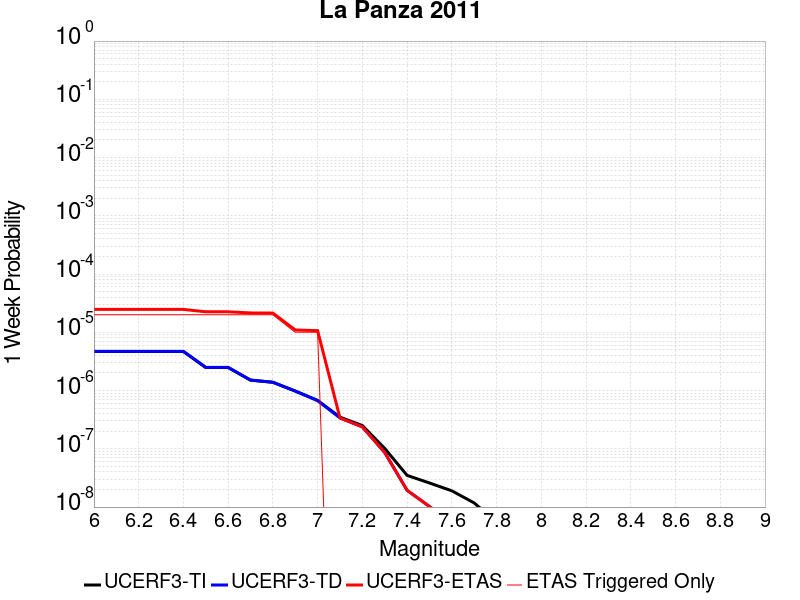 |  | 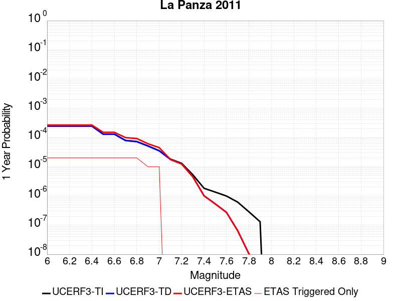 | 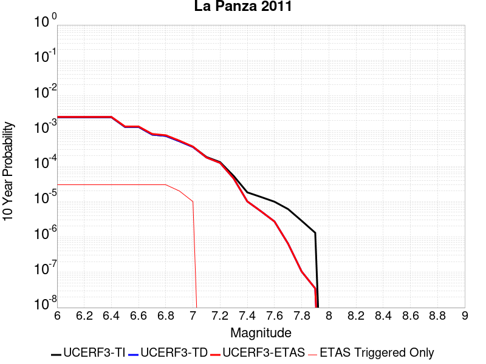 |

| Magnitude | 1 wk TI Prob | 1 wk TD Prob | 1 wk ETAS Prob | 1 wk ETAS/TD Gain | 1 wk ETAS Triggered Only | 1 mo TI Prob | 1 mo TD Prob | 1 mo ETAS Prob | 1 mo ETAS/TD Gain | 1 mo ETAS Triggered Only | 1 yr TI Prob | 1 yr TD Prob | 1 yr ETAS Prob | 1 yr ETAS/TD Gain | 1 yr ETAS Triggered Only | 10 yr TI Prob | 10 yr TD Prob | 10 yr ETAS Prob | 10 yr ETAS/TD Gain | 10 yr ETAS Triggered Only |
|-----|-----|-----|-----|-----|-----|-----|-----|-----|-----|-----|-----|-----|-----|-----|-----|-----|-----|-----|-----|-----|
| 6.0 | 4.6754544E-6 | 4.7175886E-6 | 2.4717494E-5 | 5.239434 | 2.0E-5 | 2.0037509E-5 | 2.021809E-5 | 4.021769E-5 | 1.9891931 | 2.0E-5 | 2.4392935E-4 | 2.4612944E-4 | 2.661245E-4 | 1.081238 | 2.0E-5 | 0.0024366176 | 0.0024587628 | 0.002488689 | 1.0121713 | 3.0E-5 |
| 6.1 | 4.6754544E-6 | 4.7175886E-6 | 2.4717494E-5 | 5.239434 | 2.0E-5 | 2.0037509E-5 | 2.021809E-5 | 4.021769E-5 | 1.9891931 | 2.0E-5 | 2.4392935E-4 | 2.4612944E-4 | 2.661245E-4 | 1.081238 | 2.0E-5 | 0.0024366176 | 0.0024587628 | 0.002488689 | 1.0121713 | 3.0E-5 |
| 6.2 | 4.6754544E-6 | 4.7175886E-6 | 2.4717494E-5 | 5.239434 | 2.0E-5 | 2.0037509E-5 | 2.021809E-5 | 4.021769E-5 | 1.9891931 | 2.0E-5 | 2.4392935E-4 | 2.4612944E-4 | 2.661245E-4 | 1.081238 | 2.0E-5 | 0.0024366176 | 0.0024587628 | 0.002488689 | 1.0121713 | 3.0E-5 |
| 6.3 | 4.6754544E-6 | 4.7175886E-6 | 2.4717494E-5 | 5.239434 | 2.0E-5 | 2.0037509E-5 | 2.021809E-5 | 4.021769E-5 | 1.9891931 | 2.0E-5 | 2.4392935E-4 | 2.4612944E-4 | 2.661245E-4 | 1.081238 | 2.0E-5 | 0.0024366176 | 0.0024587628 | 0.002488689 | 1.0121713 | 3.0E-5 |
| 6.4 | 4.6754544E-6 | 4.7175886E-6 | 2.4717494E-5 | 5.239434 | 2.0E-5 | 2.0037509E-5 | 2.021809E-5 | 4.021769E-5 | 1.9891931 | 2.0E-5 | 2.4392935E-4 | 2.4612944E-4 | 2.661245E-4 | 1.081238 | 2.0E-5 | 0.0024366176 | 0.0024587628 | 0.002488689 | 1.0121713 | 3.0E-5 |
| 6.5 | 2.485343E-6 | 2.5006007E-6 | 2.250055E-5 | 8.998058 | 2.0E-5 | 1.0651426E-5 | 1.0716818E-5 | 3.0716605E-5 | 2.8662057 | 2.0E-5 | 1.296734E-4 | 1.3046984E-4 | 1.5046723E-4 | 1.1532722 | 2.0E-5 | 0.0012959775 | 0.0013039707 | 0.0013339316 | 1.0229766 | 3.0E-5 |
| 6.6 | 2.485343E-6 | 2.5006007E-6 | 2.250055E-5 | 8.998058 | 2.0E-5 | 1.0651426E-5 | 1.0716818E-5 | 3.0716605E-5 | 2.8662057 | 2.0E-5 | 1.296734E-4 | 1.3046984E-4 | 1.5046723E-4 | 1.1532722 | 2.0E-5 | 0.0012959775 | 0.0013039707 | 0.0013339316 | 1.0229766 | 3.0E-5 |
| 6.7 | 1.5108508E-6 | 1.514639E-6 | 2.1514608E-5 | 14.204446 | 2.0E-5 | 6.4750584E-6 | 6.4912947E-6 | 2.6491165E-5 | 4.0810294 | 2.0E-5 | 7.8830984E-5 | 7.902876E-5 | 9.902718E-5 | 1.2530525 | 2.0E-5 | 7.880303E-4 | 7.9001737E-4 | 8.199937E-4 | 1.0379438 | 3.0E-5 |
| 6.8 | 1.3865837E-6 | 1.3885118E-6 | 2.1388483E-5 | 15.403891 | 2.0E-5 | 5.942488E-6 | 5.950752E-6 | 2.5950632E-5 | 4.3609 | 2.0E-5 | 7.234739E-5 | 7.244809E-5 | 9.2446644E-5 | 1.2760397 | 2.0E-5 | 7.232384E-4 | 7.242546E-4 | 7.5423287E-4 | 1.0413918 | 3.0E-5 |
| 6.9 | 9.826583E-7 | 9.796303E-7 | 1.097962E-5 | 11.207923 | 1.0E-5 | 4.2113857E-6 | 4.198409E-6 | 1.4198367E-5 | 3.3818445 | 1.0E-5 | 5.1272415E-5 | 5.1114486E-5 | 6.111398E-5 | 1.1956292 | 1.0E-5 | 5.126059E-4 | 5.1103265E-4 | 5.3102244E-4 | 1.0391165 | 2.0E-5 |
| 7.0 | 6.7797646E-7 | 6.710231E-7 | 1.0671017E-5 | 15.902606 | 1.0E-5 | 2.9056102E-6 | 2.8758104E-6 | 1.2875782E-5 | 4.4772706 | 1.0E-5 | 3.537523E-5 | 3.501246E-5 | 4.501211E-5 | 1.2856026 | 1.0E-5 | 3.5369597E-4 | 3.5007254E-4 | 3.6006904E-4 | 1.0285555 | 1.0E-5 |
| 7.1 | 3.4979826E-7 | 3.3874045E-7 | 3.3874045E-7 | 1.0 | 0.0 | 1.4991346E-6 | 1.4517441E-6 | 1.4517441E-6 | 1.0 | 0.0 | 1.825181E-5 | 1.7674853E-5 | 1.7674853E-5 | 1.0 | 0.0 | 1.825031E-4 | 1.7673563E-4 | 1.7673563E-4 | 1.0 | 0.0 |
| 7.2 | 2.5088332E-7 | 2.3832064E-7 | 2.3832064E-7 | 1.0 | 0.0 | 1.0752137E-6 | 1.0213738E-6 | 1.0213738E-6 | 1.0 | 0.0 | 1.3090649E-5 | 1.2435164E-5 | 1.2435164E-5 | 1.0 | 0.0 | 1.3089878E-4 | 1.2434553E-4 | 1.2434553E-4 | 1.0 | 0.0 |
| 7.3 | 1.0159086E-7 | 8.644785E-8 | 8.644785E-8 | 1.0 | 0.0 | 4.3538932E-7 | 3.704907E-7 | 3.704907E-7 | 1.0 | 0.0 | 5.300852E-6 | 4.510716E-6 | 4.510716E-6 | 1.0 | 0.0 | 5.3007258E-5 | 4.510628E-5 | 4.510628E-5 | 1.0 | 0.0 |
| 7.4 | 3.5006252E-8 | 1.9403883E-8 | 1.9403883E-8 | 1.0 | 0.0 | 1.5002678E-7 | 8.315949E-8 | 8.315949E-8 | 1.0 | 0.0 | 1.8265745E-6 | 1.0124663E-6 | 1.0124663E-6 | 1.0 | 0.0 | 1.8265595E-5 | 1.012462E-5 | 1.012462E-5 | 1.0 | 0.0 |
| 7.5 | 2.592274E-8 | 1.0238468E-8 | 1.0238468E-8 | 1.0 | 0.0 | 1.1109746E-7 | 4.3879147E-8 | 4.3879147E-8 | 1.0 | 0.0 | 1.3526106E-6 | 5.342285E-7 | 5.342285E-7 | 1.0 | 0.0 | 1.3526024E-5 | 5.342273E-6 | 5.342273E-6 | 1.0 | 0.0 |
| 7.6 | 1.9016717E-8 | 5.2442264E-9 | 5.2442264E-9 | 1.0 | 0.0 | 8.150022E-8 | 2.2475257E-8 | 2.2475257E-8 | 1.0 | 0.0 | 9.922647E-7 | 2.736362E-7 | 2.736362E-7 | 1.0 | 0.0 | 9.922603E-6 | 2.736359E-6 | 2.736359E-6 | 1.0 | 0.0 |
| 7.7 | 1.17738495E-8 | 1.2393437E-9 | 1.2393437E-9 | 1.0 | 0.0 | 5.0459356E-8 | 5.3114735E-9 | 5.3114735E-9 | 1.0 | 0.0 | 6.1434247E-7 | 6.466719E-8 | 6.466719E-8 | 1.0 | 0.0 | 6.143408E-6 | 6.466717E-7 | 6.466717E-7 | 1.0 | 0.0 |
| 7.8 | 5.489079E-9 | 2.009185E-10 | 2.009185E-10 | 1.0 | 0.0 | 2.3524624E-8 | 8.61079E-10 | 8.61079E-10 | 1.0 | 0.0 | 2.8641225E-7 | 1.0483639E-8 | 1.0483639E-8 | 1.0 | 0.0 | 2.8641189E-6 | 1.0483638E-7 | 1.0483638E-7 | 1.0 | 0.0 |
| 7.9 | 2.5081048E-9 | 6.675449E-11 | 6.675449E-11 | 1.0 | 0.0 | 1.0749021E-8 | 2.8609015E-10 | 2.8609015E-10 | 1.0 | 0.0 | 1.3086932E-7 | 3.483148E-9 | 3.483148E-9 | 1.0 | 0.0 | 1.3086925E-6 | 3.483148E-8 | 3.483148E-8 | 1.0 | 0.0 |

## Emerson-Copper Mtn 2011
*[(top)](#table-of-contents)*

| 1 Week | 1 Month | 1 Year | 10 Year |
|-----|-----|-----|-----|
| 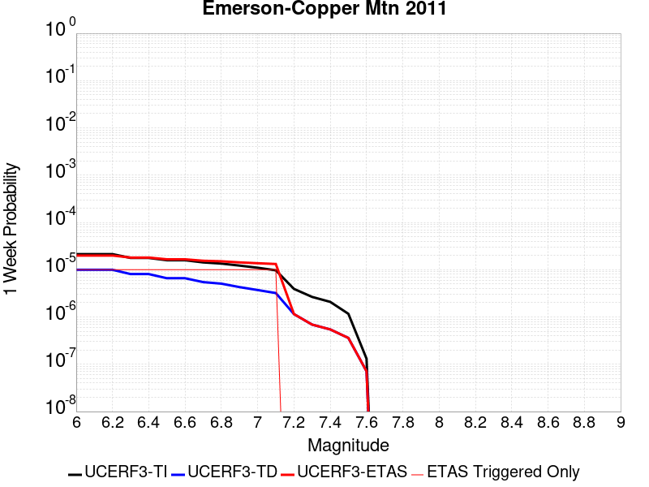 | 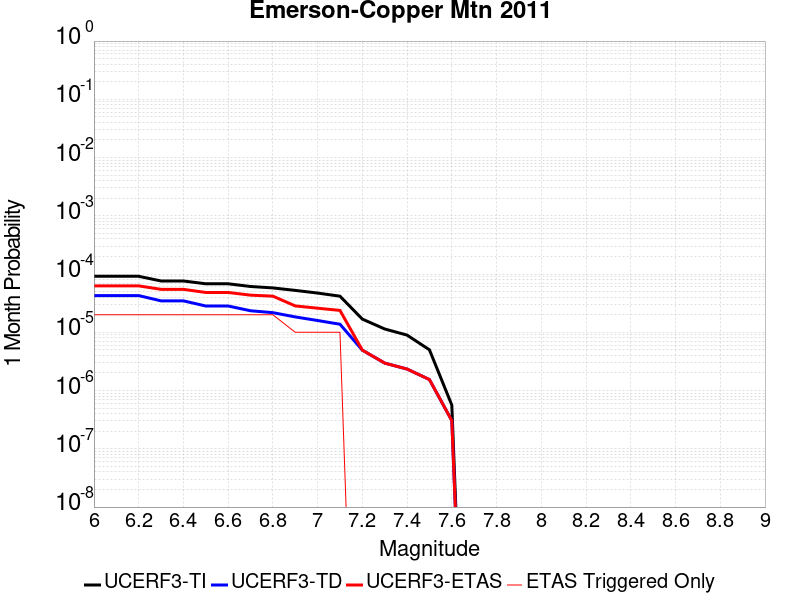 | 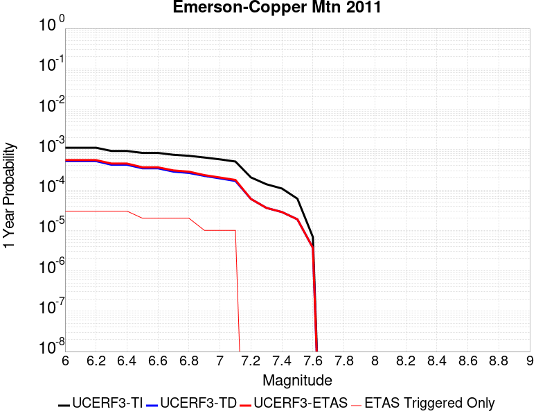 |  |

| Magnitude | 1 wk TI Prob | 1 wk TD Prob | 1 wk ETAS Prob | 1 wk ETAS/TD Gain | 1 wk ETAS Triggered Only | 1 mo TI Prob | 1 mo TD Prob | 1 mo ETAS Prob | 1 mo ETAS/TD Gain | 1 mo ETAS Triggered Only | 1 yr TI Prob | 1 yr TD Prob | 1 yr ETAS Prob | 1 yr ETAS/TD Gain | 1 yr ETAS Triggered Only | 10 yr TI Prob | 10 yr TD Prob | 10 yr ETAS Prob | 10 yr ETAS/TD Gain | 10 yr ETAS Triggered Only |
|-----|-----|-----|-----|-----|-----|-----|-----|-----|-----|-----|-----|-----|-----|-----|-----|-----|-----|-----|-----|-----|
| 6.0 | 2.1364202E-5 | 9.967999E-6 | 1.99679E-5 | 2.0032003 | 1.0E-5 | 9.1557646E-5 | 4.2719344E-5 | 6.271849E-5 | 1.4681519 | 2.0E-5 | 0.0011141442 | 5.1999267E-4 | 5.4997706E-4 | 1.0576631 | 3.0E-5 | 0.011085749 | 0.0051886286 | 0.005218473 | 1.0057518 | 3.0E-5 |
| 6.1 | 2.1364202E-5 | 9.967999E-6 | 1.99679E-5 | 2.0032003 | 1.0E-5 | 9.1557646E-5 | 4.2719344E-5 | 6.271849E-5 | 1.4681519 | 2.0E-5 | 0.0011141442 | 5.1999267E-4 | 5.4997706E-4 | 1.0576631 | 3.0E-5 | 0.011085749 | 0.0051886286 | 0.005218473 | 1.0057518 | 3.0E-5 |
| 6.2 | 2.1364202E-5 | 9.967999E-6 | 1.99679E-5 | 2.0032003 | 1.0E-5 | 9.1557646E-5 | 4.2719344E-5 | 6.271849E-5 | 1.4681519 | 2.0E-5 | 0.0011141442 | 5.1999267E-4 | 5.4997706E-4 | 1.0576631 | 3.0E-5 | 0.011085749 | 0.0051886286 | 0.005218473 | 1.0057518 | 3.0E-5 |
| 6.3 | 1.7751237E-5 | 8.089109E-6 | 1.8089027E-5 | 2.2362201 | 1.0E-5 | 7.607452E-5 | 3.4667184E-5 | 5.466649E-5 | 1.5768945 | 2.0E-5 | 9.258136E-4 | 4.2199748E-4 | 4.5198482E-4 | 1.0710604 | 3.0E-5 | 0.00921966 | 0.004212584 | 0.0042424574 | 1.0070915 | 3.0E-5 |
| 6.4 | 1.7751237E-5 | 8.089109E-6 | 1.8089027E-5 | 2.2362201 | 1.0E-5 | 7.607452E-5 | 3.4667184E-5 | 5.466649E-5 | 1.5768945 | 2.0E-5 | 9.258136E-4 | 4.2199748E-4 | 4.5198482E-4 | 1.0710604 | 3.0E-5 | 0.00921966 | 0.004212584 | 0.0042424574 | 1.0070915 | 3.0E-5 |
| 6.5 | 1.5886664E-5 | 6.6037437E-6 | 1.6603677E-5 | 2.5142825 | 1.0E-5 | 6.808392E-5 | 2.830148E-5 | 4.8300913E-5 | 1.7066568 | 2.0E-5 | 8.286065E-4 | 3.4452073E-4 | 3.6451383E-4 | 1.0580317 | 2.0E-5 | 0.008255237 | 0.0034403303 | 0.0034602615 | 1.0057935 | 2.0E-5 |
| 6.6 | 1.5886664E-5 | 6.6037437E-6 | 1.6603677E-5 | 2.5142825 | 1.0E-5 | 6.808392E-5 | 2.830148E-5 | 4.8300913E-5 | 1.7066568 | 2.0E-5 | 8.286065E-4 | 3.4452073E-4 | 3.6451383E-4 | 1.0580317 | 2.0E-5 | 0.008255237 | 0.0034403303 | 0.0034602615 | 1.0057935 | 2.0E-5 |
| 6.7 | 1.428471E-5 | 5.4703055E-6 | 1.547025E-5 | 2.8280416 | 1.0E-5 | 6.121875E-5 | 2.3443978E-5 | 4.344351E-5 | 1.8530775 | 2.0E-5 | 7.450834E-4 | 2.8539696E-4 | 3.0539127E-4 | 1.0700579 | 2.0E-5 | 0.007425902 | 0.0028506925 | 0.0028706356 | 1.0069958 | 2.0E-5 |
| 6.8 | 1.3490684E-5 | 5.0735894E-6 | 1.5073539E-5 | 2.9709811 | 1.0E-5 | 5.7815934E-5 | 2.1743796E-5 | 4.1743362E-5 | 1.9197826 | 2.0E-5 | 7.0368167E-4 | 2.6470242E-4 | 2.8469713E-4 | 1.0755365 | 2.0E-5 | 0.007014576 | 0.002644252 | 0.002664199 | 1.0075436 | 2.0E-5 |
| 6.9 | 1.2235421E-5 | 4.289545E-6 | 1.4289501E-5 | 3.3312397 | 1.0E-5 | 5.2436466E-5 | 1.8383655E-5 | 2.838347E-5 | 1.5439515 | 1.0E-5 | 6.38227E-4 | 2.238016E-4 | 2.3379936E-4 | 1.0446725 | 1.0E-5 | 0.0063639707 | 0.0022361164 | 0.0022460942 | 1.004462 | 1.0E-5 |
| 7.0 | 1.1009851E-5 | 3.7188345E-6 | 1.3718797E-5 | 3.6890047 | 1.0E-5 | 4.7184225E-5 | 1.5937783E-5 | 2.5937625E-5 | 1.6274298 | 1.0E-5 | 5.743165E-4 | 1.9402867E-4 | 2.0402674E-4 | 1.0515288 | 1.0E-5 | 0.005728345 | 0.0019389305 | 0.0019489111 | 1.0051475 | 1.0E-5 |
| 7.1 | 9.726373E-6 | 3.2115693E-6 | 1.3211537E-5 | 4.1137323 | 1.0E-5 | 4.168379E-5 | 1.3763814E-5 | 2.3763678E-5 | 1.7265328 | 1.0E-5 | 5.07382E-4 | 1.6756494E-4 | 1.7756326E-4 | 1.0596683 | 1.0E-5 | 0.0050622504 | 0.0016747171 | 0.0016847003 | 1.0059612 | 1.0E-5 |
| 7.2 | 3.9335127E-6 | 1.1524114E-6 | 1.1524114E-6 | 1.0 | 0.0 | 1.6857803E-5 | 4.9388973E-6 | 4.9388973E-6 | 1.0 | 0.0 | 2.0522442E-4 | 6.0129474E-5 | 6.0129474E-5 | 1.0 | 0.0 | 0.00205035 | 6.01138E-4 | 6.01138E-4 | 1.0 | 0.0 |
| 7.3 | 2.661632E-6 | 6.91098E-7 | 6.91098E-7 | 1.0 | 0.0 | 1.14069435E-5 | 2.9618452E-6 | 2.9618452E-6 | 1.0 | 0.0 | 1.3887069E-4 | 3.605988E-5 | 3.605988E-5 | 1.0 | 0.0 | 0.0013878393 | 3.6054134E-4 | 3.6054134E-4 | 1.0 | 0.0 |
| 7.4 | 2.0893426E-6 | 5.4614605E-7 | 5.4614605E-7 | 1.0 | 0.0 | 8.954295E-6 | 2.340624E-6 | 2.340624E-6 | 1.0 | 0.0 | 1.0901308E-4 | 2.8496728E-5 | 2.8496728E-5 | 1.0 | 0.0 | 0.0010895962 | 2.849313E-4 | 2.849313E-4 | 1.0 | 0.0 |
| 7.5 | 1.1681728E-6 | 3.6028484E-7 | 3.6028484E-7 | 1.0 | 0.0 | 5.0064455E-6 | 1.544077E-6 | 1.544077E-6 | 1.0 | 0.0 | 6.0951766E-5 | 1.879898E-5 | 1.879898E-5 | 1.0 | 0.0 | 6.093505E-4 | 1.8797436E-4 | 1.8797436E-4 | 1.0 | 0.0 |
| 7.6 | 1.3154387E-7 | 7.1196716E-8 | 7.1196716E-8 | 1.0 | 0.0 | 5.6375933E-7 | 3.0512876E-7 | 3.0512876E-7 | 1.0 | 0.0 | 6.863748E-6 | 3.714938E-6 | 3.714938E-6 | 1.0 | 0.0 | 6.863536E-5 | 3.7148915E-5 | 3.7148915E-5 | 1.0 | 0.0 |

## Cucamonga
*[(top)](#table-of-contents)*

| 1 Week | 1 Month | 1 Year | 10 Year |
|-----|-----|-----|-----|
|  |  |  |  |

| Magnitude | 1 wk TI Prob | 1 wk TD Prob | 1 wk ETAS Prob | 1 wk ETAS/TD Gain | 1 wk ETAS Triggered Only | 1 mo TI Prob | 1 mo TD Prob | 1 mo ETAS Prob | 1 mo ETAS/TD Gain | 1 mo ETAS Triggered Only | 1 yr TI Prob | 1 yr TD Prob | 1 yr ETAS Prob | 1 yr ETAS/TD Gain | 1 yr ETAS Triggered Only | 10 yr TI Prob | 10 yr TD Prob | 10 yr ETAS Prob | 10 yr ETAS/TD Gain | 10 yr ETAS Triggered Only |
|-----|-----|-----|-----|-----|-----|-----|-----|-----|-----|-----|-----|-----|-----|-----|-----|-----|-----|-----|-----|-----|
| 6.0 | 1.1848348E-5 | 1.1737109E-5 | 1.1737109E-5 | 1.0 | 0.0 | 5.0777642E-5 | 5.0300943E-5 | 5.0300943E-5 | 1.0 | 0.0 | 6.180424E-4 | 6.122446E-4 | 6.222385E-4 | 1.0163233 | 1.0E-5 | 0.0061632637 | 0.006106745 | 0.0061266227 | 1.003255 | 2.0E-5 |
| 6.1 | 1.1848348E-5 | 1.1737109E-5 | 1.1737109E-5 | 1.0 | 0.0 | 5.0777642E-5 | 5.0300943E-5 | 5.0300943E-5 | 1.0 | 0.0 | 6.180424E-4 | 6.122446E-4 | 6.222385E-4 | 1.0163233 | 1.0E-5 | 0.0061632637 | 0.006106745 | 0.0061266227 | 1.003255 | 2.0E-5 |
| 6.2 | 1.1848348E-5 | 1.1737109E-5 | 1.1737109E-5 | 1.0 | 0.0 | 5.0777642E-5 | 5.0300943E-5 | 5.0300943E-5 | 1.0 | 0.0 | 6.180424E-4 | 6.122446E-4 | 6.222385E-4 | 1.0163233 | 1.0E-5 | 0.0061632637 | 0.006106745 | 0.0061266227 | 1.003255 | 2.0E-5 |
| 6.3 | 1.1848348E-5 | 1.1737109E-5 | 1.1737109E-5 | 1.0 | 0.0 | 5.0777642E-5 | 5.0300943E-5 | 5.0300943E-5 | 1.0 | 0.0 | 6.180424E-4 | 6.122446E-4 | 6.222385E-4 | 1.0163233 | 1.0E-5 | 0.0061632637 | 0.006106745 | 0.0061266227 | 1.003255 | 2.0E-5 |
| 6.4 | 1.1848348E-5 | 1.1737109E-5 | 1.1737109E-5 | 1.0 | 0.0 | 5.0777642E-5 | 5.0300943E-5 | 5.0300943E-5 | 1.0 | 0.0 | 6.180424E-4 | 6.122446E-4 | 6.222385E-4 | 1.0163233 | 1.0E-5 | 0.0061632637 | 0.006106745 | 0.0061266227 | 1.003255 | 2.0E-5 |
| 6.5 | 1.16988695E-5 | 1.157614E-5 | 1.157614E-5 | 1.0 | 0.0 | 5.013705E-5 | 4.9611102E-5 | 4.9611102E-5 | 1.0 | 0.0 | 6.102476E-4 | 6.0385047E-4 | 6.138444E-4 | 1.0165504 | 1.0E-5 | 0.006085745 | 0.0060232594 | 0.006043139 | 1.0033004 | 2.0E-5 |
| 6.6 | 1.16988695E-5 | 1.157614E-5 | 1.157614E-5 | 1.0 | 0.0 | 5.013705E-5 | 4.9611102E-5 | 4.9611102E-5 | 1.0 | 0.0 | 6.102476E-4 | 6.0385047E-4 | 6.138444E-4 | 1.0165504 | 1.0E-5 | 0.006085745 | 0.0060232594 | 0.006043139 | 1.0033004 | 2.0E-5 |
| 6.7 | 1.1397107E-5 | 1.1115039E-5 | 1.1115039E-5 | 1.0 | 0.0 | 4.884383E-5 | 4.7635025E-5 | 4.7635025E-5 | 1.0 | 0.0 | 5.9451134E-4 | 5.798046E-4 | 5.897988E-4 | 1.0172372 | 1.0E-5 | 0.005929234 | 0.005784061 | 0.005803945 | 1.0034378 | 2.0E-5 |
| 6.8 | 1.058387E-5 | 9.785037E-6 | 9.785037E-6 | 1.0 | 0.0 | 4.5358654E-5 | 4.1935207E-5 | 4.1935207E-5 | 1.0 | 0.0 | 5.521017E-4 | 5.1044265E-4 | 5.1044265E-4 | 1.0 | 0.0 | 0.00550732 | 0.005093702 | 0.005103651 | 1.0019532 | 1.0E-5 |
| 6.9 | 9.690046E-6 | 8.579504E-6 | 8.579504E-6 | 1.0 | 0.0 | 4.1528107E-5 | 3.6768783E-5 | 3.6768783E-5 | 1.0 | 0.0 | 5.054874E-4 | 4.475684E-4 | 4.475684E-4 | 1.0 | 0.0 | 0.005043391 | 0.0044675954 | 0.0044775507 | 1.0022284 | 1.0E-5 |
| 7.0 | 9.381461E-6 | 8.18712E-6 | 8.18712E-6 | 1.0 | 0.0 | 4.020564E-5 | 3.508719E-5 | 3.508719E-5 | 1.0 | 0.0 | 4.893937E-4 | 4.2710314E-4 | 4.2710314E-4 | 1.0 | 0.0 | 0.0048831734 | 0.004263747 | 0.0042737047 | 1.0023353 | 1.0E-5 |
| 7.1 | 8.946492E-6 | 7.781904E-6 | 7.781904E-6 | 1.0 | 0.0 | 3.8341543E-5 | 3.3350592E-5 | 3.3350592E-5 | 1.0 | 0.0 | 4.667083E-4 | 4.0596814E-4 | 4.0596814E-4 | 1.0 | 0.0 | 0.0046572937 | 0.0040531927 | 0.0040631522 | 1.0024571 | 1.0E-5 |
| 7.2 | 8.251016E-6 | 6.9752878E-6 | 6.9752878E-6 | 1.0 | 0.0 | 3.5361016E-5 | 2.9893748E-5 | 2.9893748E-5 | 1.0 | 0.0 | 4.3043532E-4 | 3.6389584E-4 | 3.6389584E-4 | 1.0 | 0.0 | 0.0042960253 | 0.0036339252 | 0.0036438887 | 1.0027418 | 1.0E-5 |
| 7.3 | 7.717881E-6 | 6.4863584E-6 | 6.4863584E-6 | 1.0 | 0.0 | 3.3076216E-5 | 2.7798384E-5 | 2.7798384E-5 | 1.0 | 0.0 | 4.026285E-4 | 3.38393E-4 | 3.38393E-4 | 1.0 | 0.0 | 0.004018998 | 0.0033797103 | 0.0033896766 | 1.0029489 | 1.0E-5 |
| 7.4 | 7.275623E-6 | 6.032004E-6 | 6.032004E-6 | 1.0 | 0.0 | 3.118087E-5 | 2.5851192E-5 | 2.5851192E-5 | 1.0 | 0.0 | 3.7956095E-4 | 3.1469302E-4 | 3.1469302E-4 | 1.0 | 0.0 | 0.0037891332 | 0.0031434046 | 0.0031533733 | 1.0031712 | 1.0E-5 |
| 7.5 | 6.5109502E-6 | 5.100593E-6 | 5.100593E-6 | 1.0 | 0.0 | 2.7903774E-5 | 2.1859503E-5 | 2.1859503E-5 | 1.0 | 0.0 | 3.3967546E-4 | 2.661071E-4 | 2.661071E-4 | 1.0 | 0.0 | 0.0033915674 | 0.0026588016 | 0.0026588016 | 1.0 | 0.0 |
| 7.6 | 5.4495326E-6 | 3.908547E-6 | 3.908547E-6 | 1.0 | 0.0 | 2.335493E-5 | 1.6750808E-5 | 1.6750808E-5 | 1.0 | 0.0 | 2.8430918E-4 | 2.0392207E-4 | 2.0392207E-4 | 1.0 | 0.0 | 0.0028394572 | 0.0020382616 | 0.0020382616 | 1.0 | 0.0 |
| 7.7 | 4.7997164E-6 | 3.2002263E-6 | 3.2002263E-6 | 1.0 | 0.0 | 2.057005E-5 | 1.3715184E-5 | 1.3715184E-5 | 1.0 | 0.0 | 2.504116E-4 | 1.6696959E-4 | 1.6696959E-4 | 1.0 | 0.0 | 0.002501296 | 0.0016693701 | 0.0016693701 | 1.0 | 0.0 |
| 7.8 | 3.3941733E-6 | 2.0641678E-6 | 2.0641678E-6 | 1.0 | 0.0 | 1.4546376E-5 | 8.846404E-6 | 8.846404E-6 | 1.0 | 0.0 | 1.7708774E-4 | 1.07699656E-4 | 1.07699656E-4 | 1.0 | 0.0 | 0.0017694668 | 0.0010766032 | 0.0010766032 | 1.0 | 0.0 |
| 7.9 | 9.750552E-7 | 5.155798E-7 | 5.155798E-7 | 1.0 | 0.0 | 4.178801E-6 | 2.2096258E-6 | 2.2096258E-6 | 1.0 | 0.0 | 5.0875715E-5 | 2.6901867E-5 | 2.6901867E-5 | 1.0 | 0.0 | 5.086407E-4 | 2.689865E-4 | 2.689865E-4 | 1.0 | 0.0 |
| 8.0 | 1.133857E-7 | 6.053372E-8 | 6.053372E-8 | 1.0 | 0.0 | 4.8593864E-7 | 2.594302E-7 | 2.594302E-7 | 1.0 | 0.0 | 5.9162867E-6 | 3.1585582E-6 | 3.1585582E-6 | 1.0 | 0.0 | 5.916129E-5 | 3.158515E-5 | 3.158515E-5 | 1.0 | 0.0 |

## Likely 2011 CFM
*[(top)](#table-of-contents)*

| 1 Week | 1 Month | 1 Year | 10 Year |
|-----|-----|-----|-----|
|  |  |  |  |

| Magnitude | 1 wk TI Prob | 1 wk TD Prob | 1 wk ETAS Prob | 1 wk ETAS/TD Gain | 1 wk ETAS Triggered Only | 1 mo TI Prob | 1 mo TD Prob | 1 mo ETAS Prob | 1 mo ETAS/TD Gain | 1 mo ETAS Triggered Only | 1 yr TI Prob | 1 yr TD Prob | 1 yr ETAS Prob | 1 yr ETAS/TD Gain | 1 yr ETAS Triggered Only | 10 yr TI Prob | 10 yr TD Prob | 10 yr ETAS Prob | 10 yr ETAS/TD Gain | 10 yr ETAS Triggered Only |
|-----|-----|-----|-----|-----|-----|-----|-----|-----|-----|-----|-----|-----|-----|-----|-----|-----|-----|-----|-----|-----|
| 6.0 | 2.5315949E-5 | 2.7104748E-5 | 2.7104748E-5 | 1.0 | 0.0 | 1.0849241E-4 | 1.16158284E-4 | 1.16158284E-4 | 1.0 | 0.0 | 0.0013200947 | 0.0014133542 | 0.00142334 | 1.0070654 | 1.0E-5 | 0.013122803 | 0.01404831 | 0.01406803 | 1.0014037 | 2.0E-5 |
| 6.1 | 2.5315949E-5 | 2.7104748E-5 | 2.7104748E-5 | 1.0 | 0.0 | 1.0849241E-4 | 1.16158284E-4 | 1.16158284E-4 | 1.0 | 0.0 | 0.0013200947 | 0.0014133542 | 0.00142334 | 1.0070654 | 1.0E-5 | 0.013122803 | 0.01404831 | 0.01406803 | 1.0014037 | 2.0E-5 |
| 6.2 | 1.6375941E-5 | 1.7465842E-5 | 1.7465842E-5 | 1.0 | 0.0 | 7.0180715E-5 | 7.485153E-5 | 7.485153E-5 | 1.0 | 0.0 | 8.5411523E-4 | 9.109487E-4 | 9.109487E-4 | 1.0 | 0.0 | 0.008508399 | 0.009073433 | 0.009083342 | 1.0010921 | 1.0E-5 |
| 6.3 | 1.1945543E-5 | 1.2712587E-5 | 1.2712587E-5 | 1.0 | 0.0 | 5.119418E-5 | 5.4481407E-5 | 5.4481407E-5 | 1.0 | 0.0 | 6.2311086E-4 | 6.631146E-4 | 6.631146E-4 | 1.0 | 0.0 | 0.0062136655 | 0.0066119144 | 0.0066218483 | 1.0015024 | 1.0E-5 |
| 6.4 | 9.192729E-6 | 9.768488E-6 | 9.768488E-6 | 1.0 | 0.0 | 3.939681E-5 | 4.1864292E-5 | 4.1864292E-5 | 1.0 | 0.0 | 4.7955062E-4 | 5.0958124E-4 | 5.0958124E-4 | 1.0 | 0.0 | 0.004785171 | 0.0050844094 | 0.0050844094 | 1.0 | 0.0 |
| 6.5 | 7.67906E-6 | 8.152622E-6 | 8.152622E-6 | 1.0 | 0.0 | 3.2909844E-5 | 3.4939352E-5 | 3.4939352E-5 | 1.0 | 0.0 | 4.006037E-4 | 4.2530545E-4 | 4.2530545E-4 | 1.0 | 0.0 | 0.0039988225 | 0.004245108 | 0.004245108 | 1.0 | 0.0 |
| 6.6 | 6.4884057E-6 | 6.8847507E-6 | 6.8847507E-6 | 1.0 | 0.0 | 2.7807157E-5 | 2.9505749E-5 | 2.9505749E-5 | 1.0 | 0.0 | 3.3849955E-4 | 3.591747E-4 | 3.591747E-4 | 1.0 | 0.0 | 0.003379844 | 0.0035860867 | 0.0035860867 | 1.0 | 0.0 |
| 6.7 | 4.6060636E-6 | 4.884041E-6 | 4.884041E-6 | 1.0 | 0.0 | 1.9740122E-5 | 2.0931442E-5 | 2.0931442E-5 | 1.0 | 0.0 | 2.403095E-4 | 2.5481134E-4 | 2.5481134E-4 | 1.0 | 0.0 | 0.002400498 | 0.0025452746 | 0.0025452746 | 1.0 | 0.0 |
| 6.8 | 3.2795615E-6 | 3.4773732E-6 | 3.4773732E-6 | 1.0 | 0.0 | 1.4055187E-5 | 1.4902946E-5 | 1.4902946E-5 | 1.0 | 0.0 | 1.7110848E-4 | 1.8142881E-4 | 1.8142881E-4 | 1.0 | 0.0 | 0.0017097679 | 0.0018128622 | 0.0018128622 | 1.0 | 0.0 |
| 6.9 | 2.3289967E-6 | 2.4705569E-6 | 2.4705569E-6 | 1.0 | 0.0 | 9.981376E-6 | 1.058806E-5 | 1.058806E-5 | 1.0 | 0.0 | 1.2151648E-4 | 1.2890245E-4 | 1.2890245E-4 | 1.0 | 0.0 | 0.0012145005 | 0.0012883197 | 0.0012883197 | 1.0 | 0.0 |
| 7.0 | 1.211292E-6 | 1.2863958E-6 | 1.2863958E-6 | 1.0 | 0.0 | 5.1912407E-6 | 5.5131145E-6 | 5.5131145E-6 | 1.0 | 0.0 | 6.320152E-5 | 6.712041E-5 | 6.712041E-5 | 1.0 | 0.0 | 6.3183554E-4 | 6.710312E-4 | 6.710312E-4 | 1.0 | 0.0 |

## Goose Lake 2011 CFM
*[(top)](#table-of-contents)*

| 1 Week | 1 Month | 1 Year | 10 Year |
|-----|-----|-----|-----|
|  |  |  |  |

| Magnitude | 1 wk TI Prob | 1 wk TD Prob | 1 wk ETAS Prob | 1 wk ETAS/TD Gain | 1 wk ETAS Triggered Only | 1 mo TI Prob | 1 mo TD Prob | 1 mo ETAS Prob | 1 mo ETAS/TD Gain | 1 mo ETAS Triggered Only | 1 yr TI Prob | 1 yr TD Prob | 1 yr ETAS Prob | 1 yr ETAS/TD Gain | 1 yr ETAS Triggered Only | 10 yr TI Prob | 10 yr TD Prob | 10 yr ETAS Prob | 10 yr ETAS/TD Gain | 10 yr ETAS Triggered Only |
|-----|-----|-----|-----|-----|-----|-----|-----|-----|-----|-----|-----|-----|-----|-----|-----|-----|-----|-----|-----|-----|
| 6.0 | 3.780968E-6 | 3.8230223E-6 | 1.3822984E-5 | 3.6157215 | 1.0E-5 | 1.6204049E-5 | 1.6384285E-5 | 2.6384121E-5 | 1.6103309 | 1.0E-5 | 1.9726643E-4 | 1.994615E-4 | 2.0945951E-4 | 1.050125 | 1.0E-5 | 0.001970914 | 0.001992933 | 0.002002913 | 1.0050077 | 1.0E-5 |
| 6.1 | 2.2035124E-6 | 2.229801E-6 | 1.2229779E-5 | 5.4846945 | 1.0E-5 | 9.443591E-6 | 9.556257E-6 | 1.955616E-5 | 2.0464249 | 1.0E-5 | 1.1496965E-4 | 1.163414E-4 | 1.2634024E-4 | 1.0859439 | 1.0E-5 | 0.0011491019 | 0.0011628233 | 0.0011728116 | 1.0085897 | 1.0E-5 |
| 6.2 | 1.5624689E-6 | 1.5826923E-6 | 1.5826923E-6 | 1.0 | 0.0 | 6.6962784E-6 | 6.7829496E-6 | 6.7829496E-6 | 1.0 | 0.0 | 8.152414E-5 | 8.2579325E-5 | 8.2579325E-5 | 1.0 | 0.0 | 8.1494235E-4 | 8.2549086E-4 | 8.2549086E-4 | 1.0 | 0.0 |
| 6.3 | 1.5624689E-6 | 1.5826923E-6 | 1.5826923E-6 | 1.0 | 0.0 | 6.6962784E-6 | 6.7829496E-6 | 6.7829496E-6 | 1.0 | 0.0 | 8.152414E-5 | 8.2579325E-5 | 8.2579325E-5 | 1.0 | 0.0 | 8.1494235E-4 | 8.2549086E-4 | 8.2549086E-4 | 1.0 | 0.0 |
| 6.4 | 1.256464E-6 | 1.2738695E-6 | 1.2738695E-6 | 1.0 | 0.0 | 5.3848344E-6 | 5.4594293E-6 | 5.4594293E-6 | 1.0 | 0.0 | 6.5558386E-5 | 6.646655E-5 | 6.646655E-5 | 1.0 | 0.0 | 6.553905E-4 | 6.644687E-4 | 6.644687E-4 | 1.0 | 0.0 |
| 6.5 | 1.0910911E-6 | 1.1069404E-6 | 1.1069404E-6 | 1.0 | 0.0 | 4.6760965E-6 | 4.7440217E-6 | 4.7440217E-6 | 1.0 | 0.0 | 5.692999E-5 | 5.7756948E-5 | 5.7756948E-5 | 1.0 | 0.0 | 5.6915404E-4 | 5.7742064E-4 | 5.7742064E-4 | 1.0 | 0.0 |
| 6.6 | 9.546601E-7 | 9.691246E-7 | 9.691246E-7 | 1.0 | 0.0 | 4.091394E-6 | 4.1533845E-6 | 4.1533845E-6 | 1.0 | 0.0 | 4.9811584E-5 | 5.056629E-5 | 5.056629E-5 | 1.0 | 0.0 | 4.980042E-4 | 5.055487E-4 | 5.055487E-4 | 1.0 | 0.0 |
| 6.7 | 7.790316E-7 | 7.9159634E-7 | 7.9159634E-7 | 1.0 | 0.0 | 3.3387028E-6 | 3.3925514E-6 | 3.3925514E-6 | 1.0 | 0.0 | 4.0647945E-5 | 4.1303538E-5 | 4.1303538E-5 | 1.0 | 0.0 | 4.0640513E-4 | 4.129592E-4 | 4.129592E-4 | 1.0 | 0.0 |
| 6.8 | 6.3714384E-7 | 6.4787395E-7 | 6.4787395E-7 | 1.0 | 0.0 | 2.7306137E-6 | 2.7765998E-6 | 2.7765998E-6 | 1.0 | 0.0 | 3.3244716E-5 | 3.3804583E-5 | 3.3804583E-5 | 1.0 | 0.0 | 3.323974E-4 | 3.379949E-4 | 3.379949E-4 | 1.0 | 0.0 |
| 6.9 | 4.92586E-7 | 5.0139147E-7 | 5.0139147E-7 | 1.0 | 0.0 | 2.1110811E-6 | 2.1488188E-6 | 2.1488188E-6 | 1.0 | 0.0 | 2.5702111E-5 | 2.616156E-5 | 2.616156E-5 | 1.0 | 0.0 | 2.569914E-4 | 2.6158517E-4 | 2.6158517E-4 | 1.0 | 0.0 |
| 7.0 | 3.130245E-7 | 3.190354E-7 | 3.190354E-7 | 1.0 | 0.0 | 1.3415328E-6 | 1.3672939E-6 | 1.3672939E-6 | 1.0 | 0.0 | 1.6333039E-5 | 1.6646678E-5 | 1.6646678E-5 | 1.0 | 0.0 | 1.6331839E-4 | 1.6645451E-4 | 1.6645451E-4 | 1.0 | 0.0 |
| 7.1 | 1.7680084E-7 | 1.8023923E-7 | 1.8023923E-7 | 1.0 | 0.0 | 7.5771766E-7 | 7.724536E-7 | 7.724536E-7 | 1.0 | 0.0 | 9.225173E-6 | 9.404583E-6 | 9.404583E-6 | 1.0 | 0.0 | 9.22479E-5 | 9.4041956E-5 | 9.4041956E-5 | 1.0 | 0.0 |
| 7.2 | 4.8641045E-8 | 4.9402068E-8 | 4.9402068E-8 | 1.0 | 0.0 | 2.084616E-7 | 2.1172312E-7 | 2.1172312E-7 | 1.0 | 0.0 | 2.538017E-6 | 2.577726E-6 | 2.577726E-6 | 1.0 | 0.0 | 2.537988E-5 | 2.5776973E-5 | 2.5776973E-5 | 1.0 | 0.0 |
| 7.3 | 5.3911844E-9 | 5.4758145E-9 | 5.4758145E-9 | 1.0 | 0.0 | 2.3105075E-8 | 2.3467775E-8 | 2.3467775E-8 | 1.0 | 0.0 | 2.8130427E-7 | 2.8572015E-7 | 2.8572015E-7 | 1.0 | 0.0 | 2.8130391E-6 | 2.8571992E-6 | 2.8571992E-6 | 1.0 | 0.0 |

## Johnson Valley (No) 2011 rev
*[(top)](#table-of-contents)*

| 1 Week | 1 Month | 1 Year | 10 Year |
|-----|-----|-----|-----|
|  |  |  | 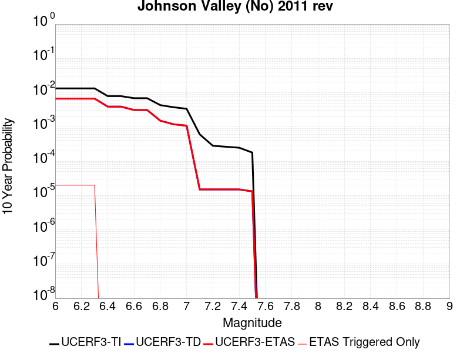 |

| Magnitude | 1 wk TI Prob | 1 wk TD Prob | 1 wk ETAS Prob | 1 wk ETAS/TD Gain | 1 wk ETAS Triggered Only | 1 mo TI Prob | 1 mo TD Prob | 1 mo ETAS Prob | 1 mo ETAS/TD Gain | 1 mo ETAS Triggered Only | 1 yr TI Prob | 1 yr TD Prob | 1 yr ETAS Prob | 1 yr ETAS/TD Gain | 1 yr ETAS Triggered Only | 10 yr TI Prob | 10 yr TD Prob | 10 yr ETAS Prob | 10 yr ETAS/TD Gain | 10 yr ETAS Triggered Only |
|-----|-----|-----|-----|-----|-----|-----|-----|-----|-----|-----|-----|-----|-----|-----|-----|-----|-----|-----|-----|-----|
| 6.0 | 2.577707E-5 | 1.2901208E-5 | 1.2901208E-5 | 1.0 | 0.0 | 1.1046848E-4 | 5.528994E-5 | 5.528994E-5 | 1.0 | 0.0 | 0.0013441239 | 6.729868E-4 | 6.929733E-4 | 1.0296983 | 2.0E-5 | 0.013360229 | 0.006713397 | 0.0067332624 | 1.0029591 | 2.0E-5 |
| 6.1 | 2.577707E-5 | 1.2901208E-5 | 1.2901208E-5 | 1.0 | 0.0 | 1.1046848E-4 | 5.528994E-5 | 5.528994E-5 | 1.0 | 0.0 | 0.0013441239 | 6.729868E-4 | 6.929733E-4 | 1.0296983 | 2.0E-5 | 0.013360229 | 0.006713397 | 0.0067332624 | 1.0029591 | 2.0E-5 |
| 6.2 | 2.577707E-5 | 1.2901208E-5 | 1.2901208E-5 | 1.0 | 0.0 | 1.1046848E-4 | 5.528994E-5 | 5.528994E-5 | 1.0 | 0.0 | 0.0013441239 | 6.729868E-4 | 6.929733E-4 | 1.0296983 | 2.0E-5 | 0.013360229 | 0.006713397 | 0.0067332624 | 1.0029591 | 2.0E-5 |
| 6.3 | 2.577707E-5 | 1.2901208E-5 | 1.2901208E-5 | 1.0 | 0.0 | 1.1046848E-4 | 5.528994E-5 | 5.528994E-5 | 1.0 | 0.0 | 0.0013441239 | 6.729868E-4 | 6.929733E-4 | 1.0296983 | 2.0E-5 | 0.013360229 | 0.006713397 | 0.0067332624 | 1.0029591 | 2.0E-5 |
| 6.4 | 1.5296591E-5 | 7.5369735E-6 | 7.5369735E-6 | 1.0 | 0.0 | 6.555518E-5 | 3.230102E-5 | 3.230102E-5 | 1.0 | 0.0 | 7.97842E-4 | 3.9321271E-4 | 3.9321271E-4 | 1.0 | 0.0 | 0.007949836 | 0.003927011 | 0.003927011 | 1.0 | 0.0 |
| 6.5 | 1.5296591E-5 | 7.5369735E-6 | 7.5369735E-6 | 1.0 | 0.0 | 6.555518E-5 | 3.230102E-5 | 3.230102E-5 | 1.0 | 0.0 | 7.97842E-4 | 3.9321271E-4 | 3.9321271E-4 | 1.0 | 0.0 | 0.007949836 | 0.003927011 | 0.003927011 | 1.0 | 0.0 |
| 6.6 | 1.3289383E-5 | 5.9919316E-6 | 5.9919316E-6 | 1.0 | 0.0 | 5.6953253E-5 | 2.567955E-5 | 2.567955E-5 | 1.0 | 0.0 | 6.9318525E-4 | 3.1262063E-4 | 3.1262063E-4 | 1.0 | 0.0 | 0.0069102696 | 0.0031234731 | 0.0031234731 | 1.0 | 0.0 |
| 6.7 | 1.3289383E-5 | 5.9919316E-6 | 5.9919316E-6 | 1.0 | 0.0 | 5.6953253E-5 | 2.567955E-5 | 2.567955E-5 | 1.0 | 0.0 | 6.9318525E-4 | 3.1262063E-4 | 3.1262063E-4 | 1.0 | 0.0 | 0.0069102696 | 0.0031234731 | 0.0031234731 | 1.0 | 0.0 |
| 6.8 | 8.330789E-6 | 2.9214577E-6 | 2.9214577E-6 | 1.0 | 0.0 | 3.570289E-5 | 1.2520505E-5 | 1.2520505E-5 | 1.0 | 0.0 | 4.34596E-4 | 1.524322E-4 | 1.524322E-4 | 1.0 | 0.0 | 0.0043374705 | 0.0015238364 | 0.0015238364 | 1.0 | 0.0 |
| 6.9 | 7.2359003E-6 | 2.3014702E-6 | 2.3014702E-6 | 1.0 | 0.0 | 3.1010633E-5 | 9.863436E-6 | 9.863436E-6 | 1.0 | 0.0 | 3.7748902E-4 | 1.2008605E-4 | 1.2008605E-4 | 1.0 | 0.0 | 0.0037684843 | 0.0012007345 | 0.0012007345 | 1.0 | 0.0 |
| 7.0 | 6.5149957E-6 | 2.0886398E-6 | 2.0886398E-6 | 1.0 | 0.0 | 2.792111E-5 | 8.951313E-6 | 8.951313E-6 | 1.0 | 0.0 | 3.398865E-4 | 1.0898209E-4 | 1.0898209E-4 | 1.0 | 0.0 | 0.003393671 | 0.0010898062 | 0.0010898062 | 1.0 | 0.0 |
| 7.1 | 1.1662233E-6 | 2.8793124E-8 | 2.8793124E-8 | 1.0 | 0.0 | 4.9980904E-6 | 1.2339909E-7 | 1.2339909E-7 | 1.0 | 0.0 | 6.0850052E-5 | 1.5023832E-6 | 1.5023832E-6 | 1.0 | 0.0 | 6.083339E-4 | 1.5023746E-5 | 1.5023746E-5 | 1.0 | 0.0 |
| 7.2 | 5.413881E-7 | 2.8793124E-8 | 2.8793124E-8 | 1.0 | 0.0 | 2.3202326E-6 | 1.2339909E-7 | 1.2339909E-7 | 1.0 | 0.0 | 2.8248465E-5 | 1.5023832E-6 | 1.5023832E-6 | 1.0 | 0.0 | 2.8244875E-4 | 1.5023746E-5 | 1.5023746E-5 | 1.0 | 0.0 |
| 7.3 | 5.076821E-7 | 2.8793124E-8 | 2.8793124E-8 | 1.0 | 0.0 | 2.1757785E-6 | 1.2339909E-7 | 1.2339909E-7 | 1.0 | 0.0 | 2.648978E-5 | 1.5023832E-6 | 1.5023832E-6 | 1.0 | 0.0 | 2.6486625E-4 | 1.5023746E-5 | 1.5023746E-5 | 1.0 | 0.0 |
| 7.4 | 4.7568687E-7 | 2.8775073E-8 | 2.8775073E-8 | 1.0 | 0.0 | 2.0386565E-6 | 1.2332174E-7 | 1.2332174E-7 | 1.0 | 0.0 | 2.482036E-5 | 1.5014413E-6 | 1.5014413E-6 | 1.0 | 0.0 | 2.4817587E-4 | 1.5014328E-5 | 1.5014328E-5 | 1.0 | 0.0 |
| 7.5 | 3.435626E-7 | 2.5350424E-8 | 2.5350424E-8 | 1.0 | 0.0 | 1.4724103E-6 | 1.0864467E-7 | 1.0864467E-7 | 1.0 | 0.0 | 1.7926448E-5 | 1.3227482E-6 | 1.3227482E-6 | 1.0 | 0.0 | 1.7925001E-4 | 1.3227419E-5 | 1.3227419E-5 | 1.0 | 0.0 |

## San Luis Range 2011 CFM
*[(top)](#table-of-contents)*

| 1 Week | 1 Month | 1 Year | 10 Year |
|-----|-----|-----|-----|
| 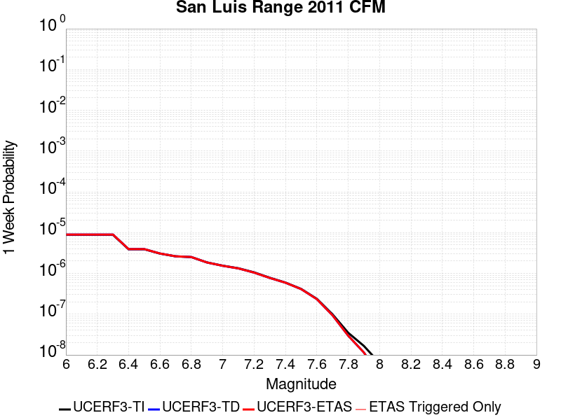 |  |  |  |

| Magnitude | 1 wk TI Prob | 1 wk TD Prob | 1 wk ETAS Prob | 1 wk ETAS/TD Gain | 1 wk ETAS Triggered Only | 1 mo TI Prob | 1 mo TD Prob | 1 mo ETAS Prob | 1 mo ETAS/TD Gain | 1 mo ETAS Triggered Only | 1 yr TI Prob | 1 yr TD Prob | 1 yr ETAS Prob | 1 yr ETAS/TD Gain | 1 yr ETAS Triggered Only | 10 yr TI Prob | 10 yr TD Prob | 10 yr ETAS Prob | 10 yr ETAS/TD Gain | 10 yr ETAS Triggered Only |
|-----|-----|-----|-----|-----|-----|-----|-----|-----|-----|-----|-----|-----|-----|-----|-----|-----|-----|-----|-----|-----|
| 6.0 | 8.8368415E-6 | 8.965455E-6 | 8.965455E-6 | 1.0 | 0.0 | 3.787163E-5 | 3.8422855E-5 | 3.8422855E-5 | 1.0 | 0.0 | 4.609895E-4 | 4.6770574E-4 | 4.6770574E-4 | 1.0 | 0.0 | 0.0046003438 | 0.004667997 | 0.0046879034 | 1.0042645 | 2.0E-5 |
| 6.1 | 8.8368415E-6 | 8.965455E-6 | 8.965455E-6 | 1.0 | 0.0 | 3.787163E-5 | 3.8422855E-5 | 3.8422855E-5 | 1.0 | 0.0 | 4.609895E-4 | 4.6770574E-4 | 4.6770574E-4 | 1.0 | 0.0 | 0.0046003438 | 0.004667997 | 0.0046879034 | 1.0042645 | 2.0E-5 |
| 6.2 | 8.8368415E-6 | 8.965455E-6 | 8.965455E-6 | 1.0 | 0.0 | 3.787163E-5 | 3.8422855E-5 | 3.8422855E-5 | 1.0 | 0.0 | 4.609895E-4 | 4.6770574E-4 | 4.6770574E-4 | 1.0 | 0.0 | 0.0046003438 | 0.004667997 | 0.0046879034 | 1.0042645 | 2.0E-5 |
| 6.3 | 8.8368415E-6 | 8.965455E-6 | 8.965455E-6 | 1.0 | 0.0 | 3.787163E-5 | 3.8422855E-5 | 3.8422855E-5 | 1.0 | 0.0 | 4.609895E-4 | 4.6770574E-4 | 4.6770574E-4 | 1.0 | 0.0 | 0.0046003438 | 0.004667997 | 0.0046879034 | 1.0042645 | 2.0E-5 |
| 6.4 | 3.9094193E-6 | 3.941204E-6 | 3.941204E-6 | 1.0 | 0.0 | 1.6754546E-5 | 1.6890766E-5 | 1.6890766E-5 | 1.0 | 0.0 | 2.039675E-4 | 2.0562594E-4 | 2.0562594E-4 | 1.0 | 0.0 | 0.0020378039 | 0.0020543856 | 0.0020643652 | 1.0048577 | 1.0E-5 |
| 6.5 | 3.9094193E-6 | 3.941204E-6 | 3.941204E-6 | 1.0 | 0.0 | 1.6754546E-5 | 1.6890766E-5 | 1.6890766E-5 | 1.0 | 0.0 | 2.039675E-4 | 2.0562594E-4 | 2.0562594E-4 | 1.0 | 0.0 | 0.0020378039 | 0.0020543856 | 0.0020643652 | 1.0048577 | 1.0E-5 |
| 6.6 | 3.0587726E-6 | 3.0753893E-6 | 3.0753893E-6 | 1.0 | 0.0 | 1.3108959E-5 | 1.3180174E-5 | 1.3180174E-5 | 1.0 | 0.0 | 1.595899E-4 | 1.6045693E-4 | 1.6045693E-4 | 1.0 | 0.0 | 0.0015947534 | 0.0016034227 | 0.0016134066 | 1.0062267 | 1.0E-5 |
| 6.7 | 2.6160574E-6 | 2.6251284E-6 | 2.6251284E-6 | 1.0 | 0.0 | 1.1211626E-5 | 1.1250502E-5 | 1.1250502E-5 | 1.0 | 0.0 | 1.3649299E-4 | 1.3696631E-4 | 1.3696631E-4 | 1.0 | 0.0 | 0.0013640919 | 0.0013688251 | 0.0013788114 | 1.0072955 | 1.0E-5 |
| 6.8 | 2.5110312E-6 | 2.5181412E-6 | 2.5181412E-6 | 1.0 | 0.0 | 1.0761518E-5 | 1.079199E-5 | 1.079199E-5 | 1.0 | 0.0 | 1.310136E-4 | 1.313846E-4 | 1.313846E-4 | 1.0 | 0.0 | 0.0013093639 | 0.0013130752 | 0.0013230621 | 1.0076057 | 1.0E-5 |
| 6.9 | 1.8564405E-6 | 1.852488E-6 | 1.852488E-6 | 1.0 | 0.0 | 7.95615E-6 | 7.93921E-6 | 7.93921E-6 | 1.0 | 0.0 | 9.686181E-5 | 9.665562E-5 | 9.665562E-5 | 1.0 | 0.0 | 9.68196E-4 | 9.6613786E-4 | 9.7612815E-4 | 1.0103405 | 1.0E-5 |
| 7.0 | 1.546127E-6 | 1.5369549E-6 | 1.5369549E-6 | 1.0 | 0.0 | 6.626242E-6 | 6.5869326E-6 | 6.5869326E-6 | 1.0 | 0.0 | 8.06715E-5 | 8.019296E-5 | 8.019296E-5 | 1.0 | 0.0 | 8.0642226E-4 | 8.016409E-4 | 8.116329E-4 | 1.0124644 | 1.0E-5 |
| 7.1 | 1.3368208E-6 | 1.3235336E-6 | 1.3235336E-6 | 1.0 | 0.0 | 5.7292195E-6 | 5.6722747E-6 | 5.6722747E-6 | 1.0 | 0.0 | 6.975101E-5 | 6.905776E-5 | 6.905776E-5 | 1.0 | 0.0 | 6.972912E-4 | 6.903635E-4 | 7.003566E-4 | 1.0144751 | 1.0E-5 |
| 7.2 | 1.0623363E-6 | 1.0454378E-6 | 1.0454378E-6 | 1.0 | 0.0 | 4.5528623E-6 | 4.4804397E-6 | 4.4804397E-6 | 1.0 | 0.0 | 5.5429686E-5 | 5.4547992E-5 | 5.4547992E-5 | 1.0 | 0.0 | 5.5415864E-4 | 5.453463E-4 | 5.5534084E-4 | 1.018327 | 1.0E-5 |
| 7.3 | 7.831679E-7 | 7.727399E-7 | 7.727399E-7 | 1.0 | 0.0 | 3.3564295E-6 | 3.3117383E-6 | 3.3117383E-6 | 1.0 | 0.0 | 4.086376E-5 | 4.031967E-5 | 4.031967E-5 | 1.0 | 0.0 | 4.0856248E-4 | 4.0312367E-4 | 4.1311965E-4 | 1.0247962 | 1.0E-5 |
| 7.4 | 5.9558846E-7 | 5.910646E-7 | 5.910646E-7 | 1.0 | 0.0 | 2.5525194E-6 | 2.5331315E-6 | 2.5331315E-6 | 1.0 | 0.0 | 3.107648E-5 | 3.084044E-5 | 3.084044E-5 | 1.0 | 0.0 | 3.1072134E-4 | 3.083617E-4 | 3.183586E-4 | 1.0324194 | 1.0E-5 |
| 7.5 | 4.1616502E-7 | 4.1196404E-7 | 4.1196404E-7 | 1.0 | 0.0 | 1.7835631E-6 | 1.765559E-6 | 1.765559E-6 | 1.0 | 0.0 | 2.1714664E-5 | 2.1495469E-5 | 2.1495469E-5 | 1.0 | 0.0 | 2.1712543E-4 | 2.1493394E-4 | 2.1493394E-4 | 1.0 | 0.0 |
| 7.6 | 2.3816014E-7 | 2.3376614E-7 | 2.3376614E-7 | 1.0 | 0.0 | 1.0206859E-6 | 1.0018545E-6 | 1.0018545E-6 | 1.0 | 0.0 | 1.242678E-5 | 1.219751E-5 | 1.219751E-5 | 1.0 | 0.0 | 1.2426086E-4 | 1.2196843E-4 | 1.2196843E-4 | 1.0 | 0.0 |
| 7.7 | 9.918777E-8 | 9.3868096E-8 | 9.3868096E-8 | 1.0 | 0.0 | 4.2509038E-7 | 4.022918E-7 | 4.022918E-7 | 1.0 | 0.0 | 5.1754632E-6 | 4.8978914E-6 | 4.8978914E-6 | 1.0 | 0.0 | 5.1753424E-5 | 4.897784E-5 | 4.897784E-5 | 1.0 | 0.0 |
| 7.8 | 3.4982556E-8 | 2.968672E-8 | 2.968672E-8 | 1.0 | 0.0 | 1.4992524E-7 | 1.272288E-7 | 1.272288E-7 | 1.0 | 0.0 | 1.8253382E-6 | 1.5490094E-6 | 1.5490094E-6 | 1.0 | 0.0 | 1.8253233E-5 | 1.5489988E-5 | 1.5489988E-5 | 1.0 | 0.0 |
| 7.9 | 1.6624908E-8 | 1.1476994E-8 | 1.1476994E-8 | 1.0 | 0.0 | 7.12496E-8 | 4.9187115E-8 | 4.9187115E-8 | 1.0 | 0.0 | 8.6746354E-7 | 5.988529E-7 | 5.988529E-7 | 1.0 | 0.0 | 8.674601E-6 | 5.9885133E-6 | 5.9885133E-6 | 1.0 | 0.0 |
| 8.0 | 6.3352315E-9 | 3.0886564E-9 | 3.0886564E-9 | 1.0 | 0.0 | 2.715099E-8 | 1.32370985E-8 | 1.32370985E-8 | 1.0 | 0.0 | 3.3056327E-7 | 1.6116167E-7 | 1.6116167E-7 | 1.0 | 0.0 | 3.3056278E-6 | 1.6116155E-6 | 1.6116155E-6 | 1.0 | 0.0 |

## San Andreas (Offshore) 2011 CFM
*[(top)](#table-of-contents)*

| 1 Week | 1 Month | 1 Year | 10 Year |
|-----|-----|-----|-----|
|  |  |  |  |

| Magnitude | 1 wk TI Prob | 1 wk TD Prob | 1 wk ETAS Prob | 1 wk ETAS/TD Gain | 1 wk ETAS Triggered Only | 1 mo TI Prob | 1 mo TD Prob | 1 mo ETAS Prob | 1 mo ETAS/TD Gain | 1 mo ETAS Triggered Only | 1 yr TI Prob | 1 yr TD Prob | 1 yr ETAS Prob | 1 yr ETAS/TD Gain | 1 yr ETAS Triggered Only | 10 yr TI Prob | 10 yr TD Prob | 10 yr ETAS Prob | 10 yr ETAS/TD Gain | 10 yr ETAS Triggered Only |
|-----|-----|-----|-----|-----|-----|-----|-----|-----|-----|-----|-----|-----|-----|-----|-----|-----|-----|-----|-----|-----|
| 6.0 | 1.7072787E-4 | 1.9226626E-4 | 2.0226435E-4 | 1.0520012 | 1.0E-5 | 7.3148566E-4 | 8.237405E-4 | 8.3373225E-4 | 1.0121298 | 1.0E-5 | 0.008869528 | 0.009983436 | 0.009993336 | 1.0009917 | 1.0E-5 | 0.085237645 | 0.09681613 | 0.0968342 | 1.0001866 | 2.0E-5 |
| 6.1 | 1.7072787E-4 | 1.9226626E-4 | 2.0226435E-4 | 1.0520012 | 1.0E-5 | 7.3148566E-4 | 8.237405E-4 | 8.3373225E-4 | 1.0121298 | 1.0E-5 | 0.008869528 | 0.009983436 | 0.009993336 | 1.0009917 | 1.0E-5 | 0.085237645 | 0.09681613 | 0.0968342 | 1.0001866 | 2.0E-5 |
| 6.2 | 1.6312556E-4 | 1.8408237E-4 | 1.9408052E-4 | 1.0543135 | 1.0E-5 | 6.989222E-4 | 7.8868825E-4 | 7.9868035E-4 | 1.0126693 | 1.0E-5 | 0.008476226 | 0.0095605 | 0.009570405 | 1.0010359 | 1.0E-5 | 0.08160117 | 0.092837214 | 0.09285536 | 1.0001954 | 2.0E-5 |
| 6.3 | 1.5103363E-4 | 1.6881147E-4 | 1.6881147E-4 | 1.0 | 0.0 | 6.471264E-4 | 7.232793E-4 | 7.232793E-4 | 1.0 | 0.0 | 0.007850339 | 0.008770814 | 0.008770814 | 1.0 | 0.0 | 0.075787395 | 0.08546859 | 0.08547774 | 1.000107 | 1.0E-5 |
| 6.4 | 1.5047993E-4 | 1.6767075E-4 | 1.6767075E-4 | 1.0 | 0.0 | 6.4475456E-4 | 7.183932E-4 | 7.183932E-4 | 1.0 | 0.0 | 0.007821669 | 0.008711802 | 0.008711802 | 1.0 | 0.0 | 0.0755203 | 0.08494888 | 0.08495803 | 1.0001078 | 1.0E-5 |
| 6.5 | 1.2760791E-4 | 1.3734949E-4 | 1.3734949E-4 | 1.0 | 0.0 | 5.467764E-4 | 5.8850925E-4 | 5.8850925E-4 | 1.0 | 0.0 | 0.0066367025 | 0.007141834 | 0.007141834 | 1.0 | 0.0 | 0.064419635 | 0.07024954 | 0.07024954 | 1.0 | 0.0 |
| 6.6 | 1.1063525E-4 | 1.15565475E-4 | 1.15565475E-4 | 1.0 | 0.0 | 4.740649E-4 | 4.9518765E-4 | 4.9518765E-4 | 1.0 | 0.0 | 0.0057564764 | 0.006012446 | 0.006012446 | 1.0 | 0.0 | 0.05609626 | 0.059496127 | 0.059496127 | 1.0 | 0.0 |
| 6.7 | 1.0391049E-4 | 1.0645875E-4 | 1.0645875E-4 | 1.0 | 0.0 | 4.4525467E-4 | 4.56173E-4 | 4.56173E-4 | 1.0 | 0.0 | 0.0054075094 | 0.0055399504 | 0.0055399504 | 1.0 | 0.0 | 0.052778035 | 0.05498844 | 0.05498844 | 1.0 | 0.0 |
| 6.8 | 1.0096706E-4 | 1.01582154E-4 | 1.01582154E-4 | 1.0 | 0.0 | 4.3264418E-4 | 4.3528038E-4 | 4.3528038E-4 | 1.0 | 0.0 | 0.0052547283 | 0.0052868384 | 0.0052868384 | 1.0 | 0.0 | 0.051321987 | 0.052686825 | 0.052686825 | 1.0 | 0.0 |
| 6.9 | 9.800265E-5 | 9.588697E-5 | 9.588697E-5 | 1.0 | 0.0 | 4.1994374E-4 | 4.1088034E-4 | 4.1088034E-4 | 1.0 | 0.0 | 0.0051008356 | 0.004991162 | 0.004991162 | 1.0 | 0.0 | 0.049853306 | 0.05001508 | 0.05001508 | 1.0 | 0.0 |
| 7.0 | 9.4642375E-5 | 9.002096E-5 | 9.002096E-5 | 1.0 | 0.0 | 4.0554712E-4 | 3.8574796E-4 | 3.8574796E-4 | 1.0 | 0.0 | 0.004926363 | 0.00468653 | 0.00468653 | 1.0 | 0.0 | 0.048185747 | 0.047194667 | 0.047194667 | 1.0 | 0.0 |
| 7.1 | 9.0996844E-5 | 8.354119E-5 | 8.354119E-5 | 1.0 | 0.0 | 3.8992817E-4 | 3.579854E-4 | 3.579854E-4 | 1.0 | 0.0 | 0.004737046 | 0.0043499186 | 0.0043499186 | 1.0 | 0.0 | 0.04637333 | 0.04404688 | 0.04404688 | 1.0 | 0.0 |
| 7.2 | 8.848287E-5 | 7.981761E-5 | 7.981761E-5 | 1.0 | 0.0 | 3.791572E-4 | 3.420315E-4 | 3.420315E-4 | 1.0 | 0.0 | 0.004606472 | 0.0041564363 | 0.0041564363 | 1.0 | 0.0 | 0.045121472 | 0.042189904 | 0.042189904 | 1.0 | 0.0 |
| 7.3 | 7.9280784E-5 | 6.1274885E-5 | 6.1274885E-5 | 1.0 | 0.0 | 3.3973053E-4 | 2.6258078E-4 | 2.6258078E-4 | 1.0 | 0.0 | 0.004128377 | 0.003192337 | 0.003192337 | 1.0 | 0.0 | 0.040525194 | 0.03290183 | 0.03290183 | 1.0 | 0.0 |
| 7.4 | 6.468038E-5 | 3.7930724E-5 | 3.7930724E-5 | 1.0 | 0.0 | 2.771722E-4 | 1.6255044E-4 | 1.6255044E-4 | 1.0 | 0.0 | 0.0033693502 | 0.0019773128 | 0.0019773128 | 1.0 | 0.0 | 0.0331872 | 0.02081734 | 0.02081734 | 1.0 | 0.0 |
| 7.5 | 4.930574E-5 | 1.2699263E-5 | 1.2699263E-5 | 1.0 | 0.0 | 2.1129321E-4 | 5.4424287E-5 | 5.4424287E-5 | 1.0 | 0.0 | 0.0025694598 | 6.6241587E-4 | 6.6241587E-4 | 1.0 | 0.0 | 0.02539953 | 0.0074798525 | 0.0074798525 | 1.0 | 0.0 |
| 7.6 | 4.612566E-5 | 1.0332297E-5 | 1.0332297E-5 | 1.0 | 0.0 | 1.9766642E-4 | 4.428053E-5 | 4.428053E-5 | 1.0 | 0.0 | 0.0024039324 | 5.3898344E-4 | 5.3898344E-4 | 1.0 | 0.0 | 0.023780935 | 0.006170428 | 0.006170428 | 1.0 | 0.0 |
| 7.7 | 3.9435414E-5 | 5.5710498E-6 | 5.5710498E-6 | 1.0 | 0.0 | 1.6899795E-4 | 2.3875711E-5 | 2.3875711E-5 | 1.0 | 0.0 | 0.0020556084 | 2.906482E-4 | 2.906482E-4 | 1.0 | 0.0 | 0.020366974 | 0.0035397834 | 0.0035397834 | 1.0 | 0.0 |
| 7.8 | 2.7787428E-5 | 3.7526645E-6 | 3.7526645E-6 | 1.0 | 0.0 | 1.1908354E-4 | 1.6082748E-5 | 1.6082748E-5 | 1.0 | 0.0 | 0.0014488777 | 1.9578991E-4 | 1.9578991E-4 | 1.0 | 0.0 | 0.014394675 | 0.0023862 | 0.0023862 | 1.0 | 0.0 |
| 7.9 | 1.590671E-5 | 3.0391298E-6 | 3.0391298E-6 | 1.0 | 0.0 | 6.816983E-5 | 1.3024777E-5 | 1.3024777E-5 | 1.0 | 0.0 | 8.2965166E-4 | 1.5856515E-4 | 1.5856515E-4 | 1.0 | 0.0 | 0.008265611 | 0.0019033558 | 0.0019033558 | 1.0 | 0.0 |
| 8.0 | 9.193638E-6 | 2.5908973E-6 | 2.5908973E-6 | 1.0 | 0.0 | 3.940071E-5 | 1.1103798E-5 | 1.1103798E-5 | 1.0 | 0.0 | 4.7959806E-4 | 1.3518038E-4 | 1.3518038E-4 | 1.0 | 0.0 | 0.0047856434 | 0.0016108477 | 0.0016108477 | 1.0 | 0.0 |
| 8.1 | 5.601576E-6 | 2.2333788E-6 | 2.2333788E-6 | 1.0 | 0.0 | 2.4006533E-5 | 9.571589E-6 | 9.571589E-6 | 1.0 | 0.0 | 2.9224035E-4 | 1.1652788E-4 | 1.1652788E-4 | 1.0 | 0.0 | 0.0029185633 | 0.0014015464 | 0.0014015464 | 1.0 | 0.0 |
| 8.2 | 4.3508785E-6 | 1.8568232E-6 | 1.8568232E-6 | 1.0 | 0.0 | 1.864649E-5 | 7.957789E-6 | 7.957789E-6 | 1.0 | 0.0 | 2.2699735E-4 | 9.6881806E-5 | 9.6881806E-5 | 1.0 | 0.0 | 0.0022676561 | 0.0011590312 | 0.0011590312 | 1.0 | 0.0 |
| 8.3 | 1.9573292E-6 | 7.511501E-7 | 7.511501E-7 | 1.0 | 0.0 | 8.388526E-6 | 3.2192108E-6 | 3.2192108E-6 | 1.0 | 0.0 | 1.0212552E-4 | 3.9193204E-5 | 3.9193204E-5 | 1.0 | 0.0 | 0.001020786 | 4.6391718E-4 | 4.6391718E-4 | 1.0 | 0.0 |

## Garberville - Briceland 2011 CFM
*[(top)](#table-of-contents)*

| 1 Week | 1 Month | 1 Year | 10 Year |
|-----|-----|-----|-----|
|  |  |  |  |

| Magnitude | 1 wk TI Prob | 1 wk TD Prob | 1 wk ETAS Prob | 1 wk ETAS/TD Gain | 1 wk ETAS Triggered Only | 1 mo TI Prob | 1 mo TD Prob | 1 mo ETAS Prob | 1 mo ETAS/TD Gain | 1 mo ETAS Triggered Only | 1 yr TI Prob | 1 yr TD Prob | 1 yr ETAS Prob | 1 yr ETAS/TD Gain | 1 yr ETAS Triggered Only | 10 yr TI Prob | 10 yr TD Prob | 10 yr ETAS Prob | 10 yr ETAS/TD Gain | 10 yr ETAS Triggered Only |
|-----|-----|-----|-----|-----|-----|-----|-----|-----|-----|-----|-----|-----|-----|-----|-----|-----|-----|-----|-----|-----|
| 6.0 | 4.8399295E-5 | 6.4527754E-5 | 6.4527754E-5 | 1.0 | 0.0 | 2.0740906E-4 | 2.765224E-4 | 2.765224E-4 | 1.0 | 0.0 | 0.002522281 | 0.0033621131 | 0.0033621131 | 1.0 | 0.0 | 0.024938442 | 0.03317879 | 0.03318846 | 1.0002913 | 1.0E-5 |
| 6.1 | 4.8399295E-5 | 6.4527754E-5 | 6.4527754E-5 | 1.0 | 0.0 | 2.0740906E-4 | 2.765224E-4 | 2.765224E-4 | 1.0 | 0.0 | 0.002522281 | 0.0033621131 | 0.0033621131 | 1.0 | 0.0 | 0.024938442 | 0.03317879 | 0.03318846 | 1.0002913 | 1.0E-5 |
| 6.2 | 4.8399295E-5 | 6.4527754E-5 | 6.4527754E-5 | 1.0 | 0.0 | 2.0740906E-4 | 2.765224E-4 | 2.765224E-4 | 1.0 | 0.0 | 0.002522281 | 0.0033621131 | 0.0033621131 | 1.0 | 0.0 | 0.024938442 | 0.03317879 | 0.03318846 | 1.0002913 | 1.0E-5 |
| 6.3 | 4.8399295E-5 | 6.4527754E-5 | 6.4527754E-5 | 1.0 | 0.0 | 2.0740906E-4 | 2.765224E-4 | 2.765224E-4 | 1.0 | 0.0 | 0.002522281 | 0.0033621131 | 0.0033621131 | 1.0 | 0.0 | 0.024938442 | 0.03317879 | 0.03318846 | 1.0002913 | 1.0E-5 |
| 6.4 | 4.8399295E-5 | 6.4527754E-5 | 6.4527754E-5 | 1.0 | 0.0 | 2.0740906E-4 | 2.765224E-4 | 2.765224E-4 | 1.0 | 0.0 | 0.002522281 | 0.0033621131 | 0.0033621131 | 1.0 | 0.0 | 0.024938442 | 0.03317879 | 0.03318846 | 1.0002913 | 1.0E-5 |
| 6.5 | 4.8399295E-5 | 6.4527754E-5 | 6.4527754E-5 | 1.0 | 0.0 | 2.0740906E-4 | 2.765224E-4 | 2.765224E-4 | 1.0 | 0.0 | 0.002522281 | 0.0033621131 | 0.0033621131 | 1.0 | 0.0 | 0.024938442 | 0.03317879 | 0.03318846 | 1.0002913 | 1.0E-5 |
| 6.6 | 4.8399295E-5 | 6.4527754E-5 | 6.4527754E-5 | 1.0 | 0.0 | 2.0740906E-4 | 2.765224E-4 | 2.765224E-4 | 1.0 | 0.0 | 0.002522281 | 0.0033621131 | 0.0033621131 | 1.0 | 0.0 | 0.024938442 | 0.03317879 | 0.03318846 | 1.0002913 | 1.0E-5 |
| 6.7 | 3.495179E-5 | 4.630908E-5 | 4.630908E-5 | 1.0 | 0.0 | 1.4978478E-4 | 1.9845538E-4 | 1.9845538E-4 | 1.0 | 0.0 | 0.0018221042 | 0.0024140473 | 0.0024140473 | 1.0 | 0.0 | 0.018072363 | 0.023930654 | 0.023940416 | 1.0004078 | 1.0E-5 |
| 6.8 | 2.7517597E-5 | 3.62417E-5 | 3.62417E-5 | 1.0 | 0.0 | 1.1792722E-4 | 1.5531495E-4 | 1.5531495E-4 | 1.0 | 0.0 | 0.0014348183 | 0.0018897917 | 0.0018897917 | 1.0 | 0.0 | 0.014255894 | 0.01878354 | 0.01879335 | 1.0005224 | 1.0E-5 |
| 6.9 | 2.74461E-5 | 3.6159425E-5 | 3.6159425E-5 | 1.0 | 0.0 | 1.1762084E-4 | 1.5496238E-4 | 1.5496238E-4 | 1.0 | 0.0 | 0.001431093 | 0.0018855067 | 0.0018855067 | 1.0 | 0.0 | 0.014219119 | 0.018741412 | 0.018751225 | 1.0005236 | 1.0E-5 |
| 7.0 | 1.9023773E-5 | 2.4707771E-5 | 2.4707771E-5 | 1.0 | 0.0 | 8.152791E-5 | 1.0588833E-4 | 1.0588833E-4 | 1.0 | 0.0 | 9.921503E-4 | 0.0012888273 | 0.0012888273 | 1.0 | 0.0 | 0.009877323 | 0.012852578 | 0.012852578 | 1.0 | 0.0 |
| 7.1 | 5.566844E-6 | 6.512147E-6 | 6.512147E-6 | 1.0 | 0.0 | 2.3857683E-5 | 2.7908927E-5 | 2.7908927E-5 | 1.0 | 0.0 | 2.9042858E-4 | 3.3974246E-4 | 3.3974246E-4 | 1.0 | 0.0 | 0.002900493 | 0.0033926512 | 0.0033926512 | 1.0 | 0.0 |
| 7.2 | 4.011353E-6 | 4.6746213E-6 | 4.6746213E-6 | 1.0 | 0.0 | 1.7191402E-5 | 2.0033956E-5 | 2.0033956E-5 | 1.0 | 0.0 | 2.0928521E-4 | 2.4388955E-4 | 2.4388955E-4 | 1.0 | 0.0 | 0.0020908823 | 0.0024365564 | 0.0024365564 | 1.0 | 0.0 |
| 7.3 | 2.0974871E-6 | 2.4395908E-6 | 2.4395908E-6 | 1.0 | 0.0 | 8.989199E-6 | 1.0455362E-5 | 1.0455362E-5 | 1.0 | 0.0 | 1.09438006E-4 | 1.272891E-4 | 1.272891E-4 | 1.0 | 0.0 | 0.0010938413 | 0.0012724071 | 0.0012724071 | 1.0 | 0.0 |

## Great Valley 03 Mysterious Ridge
*[(top)](#table-of-contents)*

| 1 Week | 1 Month | 1 Year | 10 Year |
|-----|-----|-----|-----|
|  |  |  |  |

| Magnitude | 1 wk TI Prob | 1 wk TD Prob | 1 wk ETAS Prob | 1 wk ETAS/TD Gain | 1 wk ETAS Triggered Only | 1 mo TI Prob | 1 mo TD Prob | 1 mo ETAS Prob | 1 mo ETAS/TD Gain | 1 mo ETAS Triggered Only | 1 yr TI Prob | 1 yr TD Prob | 1 yr ETAS Prob | 1 yr ETAS/TD Gain | 1 yr ETAS Triggered Only | 10 yr TI Prob | 10 yr TD Prob | 10 yr ETAS Prob | 10 yr ETAS/TD Gain | 10 yr ETAS Triggered Only |
|-----|-----|-----|-----|-----|-----|-----|-----|-----|-----|-----|-----|-----|-----|-----|-----|-----|-----|-----|-----|-----|
| 6.0 | 3.1182444E-5 | 3.6034133E-5 | 3.6034133E-5 | 1.0 | 0.0 | 1.336322E-4 | 1.5442389E-4 | 1.5442389E-4 | 1.0 | 0.0 | 0.0016257578 | 0.0018786751 | 0.0018886563 | 1.0053129 | 1.0E-5 | 0.016139153 | 0.018646672 | 0.018666299 | 1.0010526 | 2.0E-5 |
| 6.1 | 3.1182444E-5 | 3.6034133E-5 | 3.6034133E-5 | 1.0 | 0.0 | 1.336322E-4 | 1.5442389E-4 | 1.5442389E-4 | 1.0 | 0.0 | 0.0016257578 | 0.0018786751 | 0.0018886563 | 1.0053129 | 1.0E-5 | 0.016139153 | 0.018646672 | 0.018666299 | 1.0010526 | 2.0E-5 |
| 6.2 | 3.1182444E-5 | 3.6034133E-5 | 3.6034133E-5 | 1.0 | 0.0 | 1.336322E-4 | 1.5442389E-4 | 1.5442389E-4 | 1.0 | 0.0 | 0.0016257578 | 0.0018786751 | 0.0018886563 | 1.0053129 | 1.0E-5 | 0.016139153 | 0.018646672 | 0.018666299 | 1.0010526 | 2.0E-5 |
| 6.3 | 2.106934E-5 | 2.3850303E-5 | 2.3850303E-5 | 1.0 | 0.0 | 9.0294045E-5 | 1.0221176E-4 | 1.0221176E-4 | 1.0 | 0.0 | 0.0010987755 | 0.0012437488 | 0.0012437488 | 1.0 | 0.0 | 0.010933585 | 0.0123711275 | 0.012381004 | 1.0007983 | 1.0E-5 |
| 6.4 | 2.106934E-5 | 2.3850303E-5 | 2.3850303E-5 | 1.0 | 0.0 | 9.0294045E-5 | 1.0221176E-4 | 1.0221176E-4 | 1.0 | 0.0 | 0.0010987755 | 0.0012437488 | 0.0012437488 | 1.0 | 0.0 | 0.010933585 | 0.0123711275 | 0.012381004 | 1.0007983 | 1.0E-5 |
| 6.5 | 1.9389783E-5 | 2.1884982E-5 | 2.1884982E-5 | 1.0 | 0.0 | 8.309642E-5 | 9.378956E-5 | 9.378956E-5 | 1.0 | 0.0 | 0.0010112294 | 0.0011413175 | 0.0011413175 | 1.0 | 0.0 | 0.010066401 | 0.011357434 | 0.011357434 | 1.0 | 0.0 |
| 6.6 | 1.9370193E-5 | 2.1864902E-5 | 2.1864902E-5 | 1.0 | 0.0 | 8.301247E-5 | 9.3703515E-5 | 9.3703515E-5 | 1.0 | 0.0 | 0.0010102082 | 0.001140271 | 0.001140271 | 1.0 | 0.0 | 0.010056281 | 0.011347076 | 0.011347076 | 1.0 | 0.0 |
| 6.7 | 1.6723505E-5 | 1.8799281E-5 | 1.8799281E-5 | 1.0 | 0.0 | 7.16702E-5 | 8.056597E-5 | 8.056597E-5 | 1.0 | 0.0 | 8.722353E-4 | 9.804688E-4 | 9.804688E-4 | 1.0 | 0.0 | 0.008688197 | 0.009763439 | 0.009763439 | 1.0 | 0.0 |
| 6.8 | 1.426937E-5 | 1.599721E-5 | 1.599721E-5 | 1.0 | 0.0 | 6.115301E-5 | 6.855775E-5 | 6.855775E-5 | 1.0 | 0.0 | 7.4428355E-4 | 8.343854E-4 | 8.343854E-4 | 1.0 | 0.0 | 0.007417957 | 0.008314005 | 0.008314005 | 1.0 | 0.0 |
| 6.9 | 1.2469891E-5 | 1.3956928E-5 | 1.3956928E-5 | 1.0 | 0.0 | 5.3441294E-5 | 5.9814105E-5 | 5.9814105E-5 | 1.0 | 0.0 | 6.504535E-4 | 7.280055E-4 | 7.280055E-4 | 1.0 | 0.0 | 0.006485529 | 0.00725743 | 0.00725743 | 1.0 | 0.0 |
| 7.0 | 8.7746275E-6 | 9.791734E-6 | 9.791734E-6 | 1.0 | 0.0 | 3.7605005E-5 | 4.196394E-5 | 4.196394E-5 | 1.0 | 0.0 | 4.5774475E-4 | 5.1079853E-4 | 5.1079853E-4 | 1.0 | 0.0 | 0.00456803 | 0.005096977 | 0.005096977 | 1.0 | 0.0 |
| 7.1 | 6.1067153E-6 | 6.813725E-6 | 6.813725E-6 | 1.0 | 0.0 | 2.6171374E-5 | 2.9201385E-5 | 2.9201385E-5 | 1.0 | 0.0 | 3.1858988E-4 | 3.5547445E-4 | 3.5547445E-4 | 1.0 | 0.0 | 0.0031813353 | 0.003549609 | 0.003549609 | 1.0 | 0.0 |
| 7.2 | 2.939283E-6 | 3.2741057E-6 | 3.2741057E-6 | 1.0 | 0.0 | 1.2596866E-5 | 1.4031816E-5 | 1.4031816E-5 | 1.0 | 0.0 | 1.5335606E-4 | 1.7082572E-4 | 1.7082572E-4 | 1.0 | 0.0 | 0.0015325027 | 0.001707116 | 0.001707116 | 1.0 | 0.0 |
| 7.3 | 7.2387763E-7 | 8.008505E-7 | 8.008505E-7 | 1.0 | 0.0 | 3.102329E-6 | 3.4322145E-6 | 3.4322145E-6 | 1.0 | 0.0 | 3.77702E-5 | 4.178687E-5 | 4.178687E-5 | 1.0 | 0.0 | 3.7763783E-4 | 4.1783508E-4 | 4.1783508E-4 | 1.0 | 0.0 |
| 7.4 | 3.112171E-8 | 3.2068368E-8 | 3.2068368E-8 | 1.0 | 0.0 | 1.3337875E-7 | 1.3743585E-7 | 1.3743585E-7 | 1.0 | 0.0 | 1.6238852E-6 | 1.6732803E-6 | 1.6732803E-6 | 1.0 | 0.0 | 1.6238733E-5 | 1.6732685E-5 | 1.6732685E-5 | 1.0 | 0.0 |

## Great Valley 10 (Panoche)
*[(top)](#table-of-contents)*

| 1 Week | 1 Month | 1 Year | 10 Year |
|-----|-----|-----|-----|
|  |  |  | 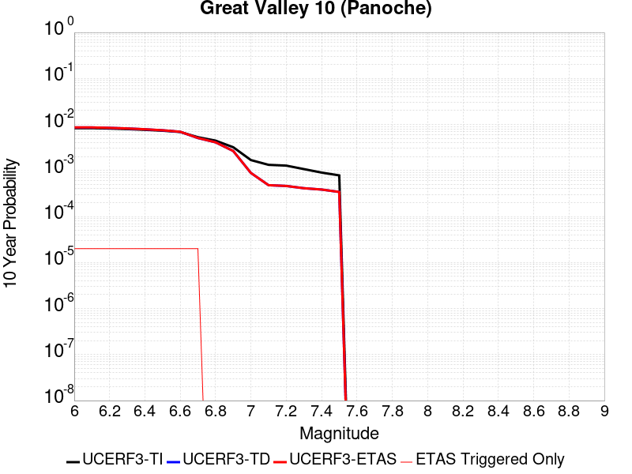 |

| Magnitude | 1 wk TI Prob | 1 wk TD Prob | 1 wk ETAS Prob | 1 wk ETAS/TD Gain | 1 wk ETAS Triggered Only | 1 mo TI Prob | 1 mo TD Prob | 1 mo ETAS Prob | 1 mo ETAS/TD Gain | 1 mo ETAS Triggered Only | 1 yr TI Prob | 1 yr TD Prob | 1 yr ETAS Prob | 1 yr ETAS/TD Gain | 1 yr ETAS Triggered Only | 10 yr TI Prob | 10 yr TD Prob | 10 yr ETAS Prob | 10 yr ETAS/TD Gain | 10 yr ETAS Triggered Only |
|-----|-----|-----|-----|-----|-----|-----|-----|-----|-----|-----|-----|-----|-----|-----|-----|-----|-----|-----|-----|-----|
| 6.0 | 1.6014626E-5 | 1.6575357E-5 | 2.6575191E-5 | 1.6032953 | 1.0E-5 | 6.863231E-5 | 7.103534E-5 | 8.103463E-5 | 1.140765 | 1.0E-5 | 8.35278E-4 | 8.6451764E-4 | 8.8450033E-4 | 1.0231143 | 2.0E-5 | 0.008321454 | 0.008612158 | 0.008631986 | 1.0023023 | 2.0E-5 |
| 6.1 | 1.6014626E-5 | 1.6575357E-5 | 2.6575191E-5 | 1.6032953 | 1.0E-5 | 6.863231E-5 | 7.103534E-5 | 8.103463E-5 | 1.140765 | 1.0E-5 | 8.35278E-4 | 8.6451764E-4 | 8.8450033E-4 | 1.0231143 | 2.0E-5 | 0.008321454 | 0.008612158 | 0.008631986 | 1.0023023 | 2.0E-5 |
| 6.2 | 1.56782E-5 | 1.6198404E-5 | 2.6198242E-5 | 1.6173348 | 1.0E-5 | 6.719056E-5 | 6.941991E-5 | 7.9419224E-5 | 1.144041 | 1.0E-5 | 8.17738E-4 | 8.4486516E-4 | 8.6484826E-4 | 1.0236524 | 2.0E-5 | 0.008147354 | 0.008417133 | 0.008436965 | 1.002356 | 2.0E-5 |
| 6.3 | 1.5263338E-5 | 1.5723472E-5 | 2.5723315E-5 | 1.6359818 | 1.0E-5 | 6.541267E-5 | 6.73846E-5 | 7.738393E-5 | 1.1483918 | 1.0E-5 | 7.961082E-4 | 8.201041E-4 | 8.4008765E-4 | 1.0243671 | 2.0E-5 | 0.007932622 | 0.008171363 | 0.0081912 | 1.0024276 | 2.0E-5 |
| 6.4 | 1.4720723E-5 | 1.5099334E-5 | 2.5099182E-5 | 1.6622709 | 1.0E-5 | 6.308728E-5 | 6.470986E-5 | 7.4709205E-5 | 1.154526 | 1.0E-5 | 7.67817E-4 | 7.87563E-4 | 8.0754724E-4 | 1.0253748 | 2.0E-5 | 0.007651695 | 0.007848289 | 0.007868133 | 1.0025283 | 2.0E-5 |
| 6.5 | 1.408264E-5 | 1.4355928E-5 | 2.4355784E-5 | 1.6965663 | 1.0E-5 | 6.0352773E-5 | 6.1523984E-5 | 7.152337E-5 | 1.1625283 | 1.0E-5 | 7.3454727E-4 | 7.488022E-4 | 7.687873E-4 | 1.0266893 | 2.0E-5 | 0.0073212404 | 0.0074633416 | 0.0074831923 | 1.0026598 | 2.0E-5 |
| 6.6 | 1.3197086E-5 | 1.33218455E-5 | 2.3321712E-5 | 1.7506367 | 1.0E-5 | 5.6557717E-5 | 5.7092402E-5 | 6.709183E-5 | 1.1751447 | 1.0E-5 | 6.8837265E-4 | 6.948834E-4 | 7.1486953E-4 | 1.0287619 | 2.0E-5 | 0.006862442 | 0.0069276392 | 0.0069475006 | 1.002867 | 2.0E-5 |
| 6.7 | 1.017583E-5 | 9.745348E-6 | 1.974525E-5 | 2.0261207 | 1.0E-5 | 4.360997E-5 | 4.176512E-5 | 5.1764702E-5 | 1.2394242 | 1.0E-5 | 5.30822E-4 | 5.083741E-4 | 5.28364E-4 | 1.0393211 | 2.0E-5 | 0.0052955584 | 0.0050723637 | 0.0050922623 | 1.0039229 | 2.0E-5 |
| 6.8 | 8.557912E-6 | 7.8726725E-6 | 7.8726725E-6 | 1.0 | 0.0 | 3.667625E-5 | 3.37396E-5 | 3.37396E-5 | 1.0 | 0.0 | 4.4644187E-4 | 4.1070423E-4 | 4.1070423E-4 | 1.0 | 0.0 | 0.0044554602 | 0.004099659 | 0.004099659 | 1.0 | 0.0 |
| 6.9 | 6.14664E-6 | 5.0920366E-6 | 5.0920366E-6 | 1.0 | 0.0 | 2.6342475E-5 | 2.182284E-5 | 2.182284E-5 | 1.0 | 0.0 | 3.2067244E-4 | 2.6566206E-4 | 2.6566206E-4 | 1.0 | 0.0 | 0.003202101 | 0.0026535832 | 0.0026535832 | 1.0 | 0.0 |
| 7.0 | 3.2310581E-6 | 1.6950871E-6 | 1.6950871E-6 | 1.0 | 0.0 | 1.3847319E-5 | 7.2646394E-6 | 7.2646394E-6 | 1.0 | 0.0 | 1.6857806E-4 | 8.844349E-5 | 8.844349E-5 | 1.0 | 0.0 | 0.0016845023 | 8.840923E-4 | 8.840923E-4 | 1.0 | 0.0 |
| 7.1 | 2.544492E-6 | 9.188573E-7 | 9.188573E-7 | 1.0 | 0.0 | 1.090492E-5 | 3.9379543E-6 | 3.9379543E-6 | 1.0 | 0.0 | 1.327593E-4 | 4.7943588E-5 | 4.7943588E-5 | 1.0 | 0.0 | 0.0013268003 | 4.793372E-4 | 4.793372E-4 | 1.0 | 0.0 |
| 7.2 | 2.4479045E-6 | 8.840978E-7 | 8.840978E-7 | 1.0 | 0.0 | 1.0490977E-5 | 3.7889852E-6 | 3.7889852E-6 | 1.0 | 0.0 | 1.2772017E-4 | 4.6129968E-5 | 4.6129968E-5 | 1.0 | 0.0 | 0.0012764678 | 4.6120866E-4 | 4.6120866E-4 | 1.0 | 0.0 |
| 7.3 | 2.0559578E-6 | 7.892521E-7 | 7.892521E-7 | 1.0 | 0.0 | 8.811218E-6 | 3.382505E-6 | 3.382505E-6 | 1.0 | 0.0 | 1.072713E-4 | 4.1181265E-5 | 4.1181265E-5 | 1.0 | 0.0 | 0.0010721954 | 4.1174097E-4 | 4.1174097E-4 | 1.0 | 0.0 |
| 7.4 | 1.727687E-6 | 7.3875697E-7 | 7.3875697E-7 | 1.0 | 0.0 | 7.404352E-6 | 3.1660977E-6 | 3.1660977E-6 | 1.0 | 0.0 | 9.0144255E-5 | 3.8546605E-5 | 3.8546605E-5 | 1.0 | 0.0 | 9.0107694E-4 | 3.854038E-4 | 3.854038E-4 | 1.0 | 0.0 |
| 7.5 | 1.5002679E-6 | 6.545985E-7 | 6.545985E-7 | 1.0 | 0.0 | 6.4297037E-6 | 2.8054194E-6 | 2.8054194E-6 | 1.0 | 0.0 | 7.827883E-5 | 3.4155488E-5 | 3.4155488E-5 | 1.0 | 0.0 | 7.825126E-4 | 3.4150656E-4 | 3.4150656E-4 | 1.0 | 0.0 |

## Big Lagoon - Bald Mtn 2011 CFM
*[(top)](#table-of-contents)*

| 1 Week | 1 Month | 1 Year | 10 Year |
|-----|-----|-----|-----|
|  |  | 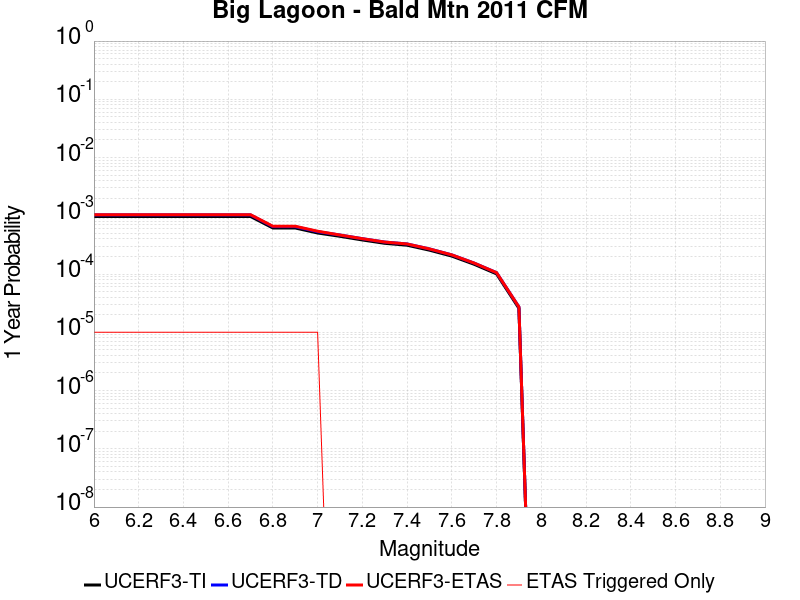 |  |

| Magnitude | 1 wk TI Prob | 1 wk TD Prob | 1 wk ETAS Prob | 1 wk ETAS/TD Gain | 1 wk ETAS Triggered Only | 1 mo TI Prob | 1 mo TD Prob | 1 mo ETAS Prob | 1 mo ETAS/TD Gain | 1 mo ETAS Triggered Only | 1 yr TI Prob | 1 yr TD Prob | 1 yr ETAS Prob | 1 yr ETAS/TD Gain | 1 yr ETAS Triggered Only | 10 yr TI Prob | 10 yr TD Prob | 10 yr ETAS Prob | 10 yr ETAS/TD Gain | 10 yr ETAS Triggered Only |
|-----|-----|-----|-----|-----|-----|-----|-----|-----|-----|-----|-----|-----|-----|-----|-----|-----|-----|-----|-----|-----|
| 6.0 | 1.8699735E-5 | 1.985018E-5 | 1.985018E-5 | 1.0 | 0.0 | 8.013926E-5 | 8.5069645E-5 | 8.5069645E-5 | 1.0 | 0.0 | 9.752587E-4 | 0.0010352687 | 0.0010452583 | 1.0096493 | 1.0E-5 | 0.009709897 | 0.010308274 | 0.0103280675 | 1.0019202 | 2.0E-5 |
| 6.1 | 1.8699735E-5 | 1.985018E-5 | 1.985018E-5 | 1.0 | 0.0 | 8.013926E-5 | 8.5069645E-5 | 8.5069645E-5 | 1.0 | 0.0 | 9.752587E-4 | 0.0010352687 | 0.0010452583 | 1.0096493 | 1.0E-5 | 0.009709897 | 0.010308274 | 0.0103280675 | 1.0019202 | 2.0E-5 |
| 6.2 | 1.8699735E-5 | 1.985018E-5 | 1.985018E-5 | 1.0 | 0.0 | 8.013926E-5 | 8.5069645E-5 | 8.5069645E-5 | 1.0 | 0.0 | 9.752587E-4 | 0.0010352687 | 0.0010452583 | 1.0096493 | 1.0E-5 | 0.009709897 | 0.010308274 | 0.0103280675 | 1.0019202 | 2.0E-5 |
| 6.3 | 1.8699735E-5 | 1.985018E-5 | 1.985018E-5 | 1.0 | 0.0 | 8.013926E-5 | 8.5069645E-5 | 8.5069645E-5 | 1.0 | 0.0 | 9.752587E-4 | 0.0010352687 | 0.0010452583 | 1.0096493 | 1.0E-5 | 0.009709897 | 0.010308274 | 0.0103280675 | 1.0019202 | 2.0E-5 |
| 6.4 | 1.8699735E-5 | 1.985018E-5 | 1.985018E-5 | 1.0 | 0.0 | 8.013926E-5 | 8.5069645E-5 | 8.5069645E-5 | 1.0 | 0.0 | 9.752587E-4 | 0.0010352687 | 0.0010452583 | 1.0096493 | 1.0E-5 | 0.009709897 | 0.010308274 | 0.0103280675 | 1.0019202 | 2.0E-5 |
| 6.5 | 1.8699735E-5 | 1.985018E-5 | 1.985018E-5 | 1.0 | 0.0 | 8.013926E-5 | 8.5069645E-5 | 8.5069645E-5 | 1.0 | 0.0 | 9.752587E-4 | 0.0010352687 | 0.0010452583 | 1.0096493 | 1.0E-5 | 0.009709897 | 0.010308274 | 0.0103280675 | 1.0019202 | 2.0E-5 |
| 6.6 | 1.8699735E-5 | 1.985018E-5 | 1.985018E-5 | 1.0 | 0.0 | 8.013926E-5 | 8.5069645E-5 | 8.5069645E-5 | 1.0 | 0.0 | 9.752587E-4 | 0.0010352687 | 0.0010452583 | 1.0096493 | 1.0E-5 | 0.009709897 | 0.010308274 | 0.0103280675 | 1.0019202 | 2.0E-5 |
| 6.7 | 1.8699735E-5 | 1.985018E-5 | 1.985018E-5 | 1.0 | 0.0 | 8.013926E-5 | 8.5069645E-5 | 8.5069645E-5 | 1.0 | 0.0 | 9.752587E-4 | 0.0010352687 | 0.0010452583 | 1.0096493 | 1.0E-5 | 0.009709897 | 0.010308274 | 0.0103280675 | 1.0019202 | 2.0E-5 |
| 6.8 | 1.18505095E-5 | 1.2499804E-5 | 1.2499804E-5 | 1.0 | 0.0 | 5.078691E-5 | 5.3569514E-5 | 5.3569514E-5 | 1.0 | 0.0 | 6.181552E-4 | 6.520185E-4 | 6.6201197E-4 | 1.015327 | 1.0E-5 | 0.006164385 | 0.0065015587 | 0.006521429 | 1.0030562 | 2.0E-5 |
| 6.9 | 1.18505095E-5 | 1.2499804E-5 | 1.2499804E-5 | 1.0 | 0.0 | 5.078691E-5 | 5.3569514E-5 | 5.3569514E-5 | 1.0 | 0.0 | 6.181552E-4 | 6.520185E-4 | 6.6201197E-4 | 1.015327 | 1.0E-5 | 0.006164385 | 0.0065015587 | 0.006521429 | 1.0030562 | 2.0E-5 |
| 7.0 | 9.719786E-6 | 1.0235487E-5 | 1.0235487E-5 | 1.0 | 0.0 | 4.1655563E-5 | 4.386565E-5 | 4.386565E-5 | 1.0 | 0.0 | 5.0703844E-4 | 5.3393573E-4 | 5.439304E-4 | 1.0187188 | 1.0E-5 | 0.005058831 | 0.0053267754 | 0.005346669 | 1.0037346 | 2.0E-5 |
| 7.1 | 8.523418E-6 | 8.969463E-6 | 8.969463E-6 | 1.0 | 0.0 | 3.652842E-5 | 3.844E-5 | 3.844E-5 | 1.0 | 0.0 | 4.4464276E-4 | 4.6790804E-4 | 4.6790804E-4 | 1.0 | 0.0 | 0.0044375416 | 0.004669392 | 0.0046793455 | 1.0021316 | 1.0E-5 |
| 7.2 | 7.378894E-6 | 7.761112E-6 | 7.761112E-6 | 1.0 | 0.0 | 3.162345E-5 | 3.326149E-5 | 3.326149E-5 | 1.0 | 0.0 | 3.8494746E-4 | 4.048843E-4 | 4.048843E-4 | 1.0 | 0.0 | 0.0038428132 | 0.0040415623 | 0.0040415623 | 1.0 | 0.0 |
| 7.3 | 6.4640294E-6 | 6.7924434E-6 | 6.7924434E-6 | 1.0 | 0.0 | 2.7702688E-5 | 2.9110151E-5 | 2.9110151E-5 | 1.0 | 0.0 | 3.3722803E-4 | 3.5435913E-4 | 3.5435913E-4 | 1.0 | 0.0 | 0.0033671674 | 0.0035380109 | 0.0035380109 | 1.0 | 0.0 |
| 7.4 | 5.9959093E-6 | 6.2988E-6 | 6.2988E-6 | 1.0 | 0.0 | 2.5696501E-5 | 2.6994581E-5 | 2.6994581E-5 | 1.0 | 0.0 | 3.1280998E-4 | 3.2861007E-4 | 3.2861007E-4 | 1.0 | 0.0 | 0.0031237002 | 0.0032813034 | 0.0032813034 | 1.0 | 0.0 |
| 7.5 | 4.929265E-6 | 5.176396E-6 | 5.176396E-6 | 1.0 | 0.0 | 2.112525E-5 | 2.2184367E-5 | 2.2184367E-5 | 1.0 | 0.0 | 2.5716957E-4 | 2.700616E-4 | 2.700616E-4 | 1.0 | 0.0 | 0.0025687215 | 0.002697375 | 0.002697375 | 1.0 | 0.0 |
| 7.6 | 3.8982403E-6 | 4.0889267E-6 | 4.0889267E-6 | 1.0 | 0.0 | 1.6706637E-5 | 1.7523857E-5 | 1.7523857E-5 | 1.0 | 0.0 | 2.0338432E-4 | 2.1333233E-4 | 2.1333233E-4 | 1.0 | 0.0 | 0.0020319829 | 0.002131303 | 0.002131303 | 1.0 | 0.0 |
| 7.7 | 2.820968E-6 | 2.9572116E-6 | 2.9572116E-6 | 1.0 | 0.0 | 1.2089806E-5 | 1.2673704E-5 | 1.2673704E-5 | 1.0 | 0.0 | 1.4718344E-4 | 1.5429159E-4 | 1.5429159E-4 | 1.0 | 0.0 | 0.00147086 | 0.0015418624 | 0.0015418624 | 1.0 | 0.0 |
| 7.8 | 1.9314455E-6 | 2.0260186E-6 | 2.0260186E-6 | 1.0 | 0.0 | 8.277597E-6 | 8.682909E-6 | 8.682909E-6 | 1.0 | 0.0 | 1.0077508E-4 | 1.0570941E-4 | 1.0570941E-4 | 1.0 | 0.0 | 0.0010072939 | 0.0010566041 | 0.0010566041 | 1.0 | 0.0 |
| 7.9 | 4.9586197E-7 | 5.2189216E-7 | 5.2189216E-7 | 1.0 | 0.0 | 2.125121E-6 | 2.2366787E-6 | 2.2366787E-6 | 1.0 | 0.0 | 2.5873042E-5 | 2.7231245E-5 | 2.7231245E-5 | 1.0 | 0.0 | 2.5870028E-4 | 2.7228118E-4 | 2.7228118E-4 | 1.0 | 0.0 |

## Elsinore (Temecula) rev
*[(top)](#table-of-contents)*

| 1 Week | 1 Month | 1 Year | 10 Year |
|-----|-----|-----|-----|
|  | 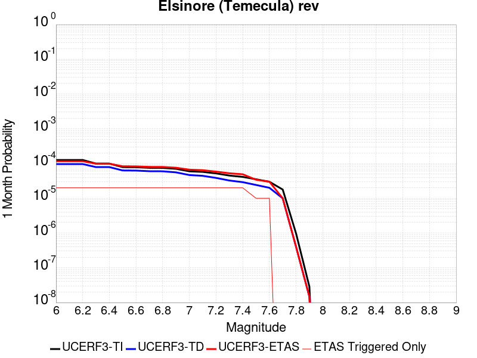 | 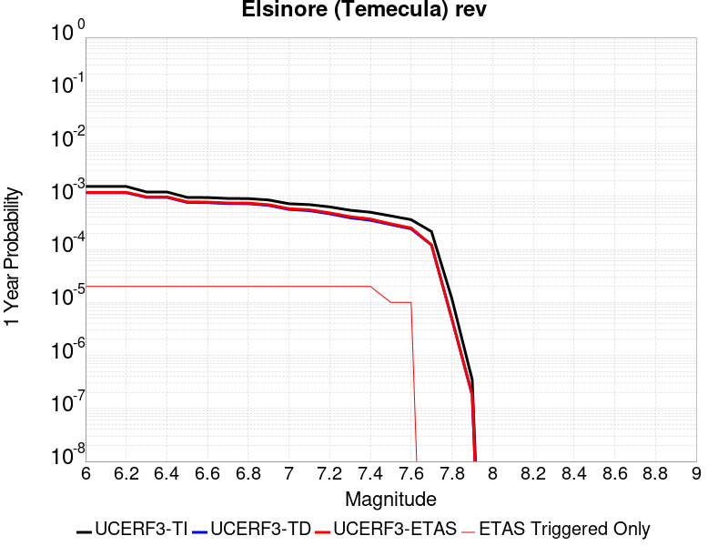 |  |

| Magnitude | 1 wk TI Prob | 1 wk TD Prob | 1 wk ETAS Prob | 1 wk ETAS/TD Gain | 1 wk ETAS Triggered Only | 1 mo TI Prob | 1 mo TD Prob | 1 mo ETAS Prob | 1 mo ETAS/TD Gain | 1 mo ETAS Triggered Only | 1 yr TI Prob | 1 yr TD Prob | 1 yr ETAS Prob | 1 yr ETAS/TD Gain | 1 yr ETAS Triggered Only | 10 yr TI Prob | 10 yr TD Prob | 10 yr ETAS Prob | 10 yr ETAS/TD Gain | 10 yr ETAS Triggered Only |
|-----|-----|-----|-----|-----|-----|-----|-----|-----|-----|-----|-----|-----|-----|-----|-----|-----|-----|-----|-----|-----|
| 6.0 | 2.9514995E-5 | 2.251887E-5 | 3.2518645E-5 | 1.444062 | 1.0E-5 | 1.264867E-4 | 9.6505995E-5 | 1.1650407E-4 | 1.207221 | 2.0E-5 | 0.0015388876 | 0.0011743492 | 0.0011943257 | 1.0170107 | 2.0E-5 | 0.015282745 | 0.011688135 | 0.011707901 | 1.0016911 | 2.0E-5 |
| 6.1 | 2.9514995E-5 | 2.251887E-5 | 3.2518645E-5 | 1.444062 | 1.0E-5 | 1.264867E-4 | 9.6505995E-5 | 1.1650407E-4 | 1.207221 | 2.0E-5 | 0.0015388876 | 0.0011743492 | 0.0011943257 | 1.0170107 | 2.0E-5 | 0.015282745 | 0.011688135 | 0.011707901 | 1.0016911 | 2.0E-5 |
| 6.2 | 2.9514995E-5 | 2.251887E-5 | 3.2518645E-5 | 1.444062 | 1.0E-5 | 1.264867E-4 | 9.6505995E-5 | 1.1650407E-4 | 1.207221 | 2.0E-5 | 0.0015388876 | 0.0011743492 | 0.0011943257 | 1.0170107 | 2.0E-5 | 0.015282745 | 0.011688135 | 0.011707901 | 1.0016911 | 2.0E-5 |
| 6.3 | 2.3223649E-5 | 1.840822E-5 | 2.8408034E-5 | 1.5432256 | 1.0E-5 | 9.952613E-5 | 7.889008E-5 | 9.88885E-5 | 1.2534972 | 2.0E-5 | 0.001211057 | 9.600807E-4 | 9.800615E-4 | 1.0208116 | 2.0E-5 | 0.012044783 | 0.009551284 | 0.009571092 | 1.002074 | 2.0E-5 |
| 6.4 | 2.3223649E-5 | 1.840822E-5 | 2.8408034E-5 | 1.5432256 | 1.0E-5 | 9.952613E-5 | 7.889008E-5 | 9.88885E-5 | 1.2534972 | 2.0E-5 | 0.001211057 | 9.600807E-4 | 9.800615E-4 | 1.0208116 | 2.0E-5 | 0.012044783 | 0.009551284 | 0.009571092 | 1.002074 | 2.0E-5 |
| 6.5 | 1.8338875E-5 | 1.4750074E-5 | 2.4749927E-5 | 1.6779526 | 1.0E-5 | 7.8592806E-5 | 6.321312E-5 | 8.321185E-5 | 1.31637 | 2.0E-5 | 9.5644733E-4 | 7.6935673E-4 | 7.8934134E-4 | 1.0259757 | 2.0E-5 | 0.009523412 | 0.0076699676 | 0.007689814 | 1.0025876 | 2.0E-5 |
| 6.6 | 1.8223333E-5 | 1.461263E-5 | 2.4612484E-5 | 1.6843295 | 1.0E-5 | 7.809766E-5 | 6.26241E-5 | 8.262285E-5 | 1.3193458 | 2.0E-5 | 9.504242E-4 | 7.621905E-4 | 7.821753E-4 | 1.0262202 | 2.0E-5 | 0.009463696 | 0.007598796 | 0.0076186443 | 1.002612 | 2.0E-5 |
| 6.7 | 1.7512752E-5 | 1.4026963E-5 | 2.4026822E-5 | 1.7129027 | 1.0E-5 | 7.505249E-5 | 6.0114216E-5 | 8.0113015E-5 | 1.33268 | 2.0E-5 | 9.13381E-4 | 7.316534E-4 | 7.516388E-4 | 1.0273154 | 2.0E-5 | 0.00909636 | 0.0072983317 | 0.0073181856 | 1.0027204 | 2.0E-5 |
| 6.8 | 1.7417142E-5 | 1.395093E-5 | 2.395079E-5 | 1.716788 | 1.0E-5 | 7.4642754E-5 | 5.978838E-5 | 7.978718E-5 | 1.3344932 | 2.0E-5 | 9.083966E-4 | 7.27689E-4 | 7.4767444E-4 | 1.0274643 | 2.0E-5 | 0.009046922 | 0.007259359 | 0.007279214 | 1.002735 | 2.0E-5 |
| 6.9 | 1.6402591E-5 | 1.29883665E-5 | 2.2988237E-5 | 1.7699097 | 1.0E-5 | 7.0294926E-5 | 5.5663284E-5 | 7.5662174E-5 | 1.3592833 | 2.0E-5 | 8.5550465E-4 | 6.774974E-4 | 6.974839E-4 | 1.0295004 | 2.0E-5 | 0.008522186 | 0.0067598647 | 0.0067797294 | 1.0029386 | 2.0E-5 |
| 7.0 | 1.3912486E-5 | 1.0878067E-5 | 2.0877958E-5 | 1.919271 | 1.0E-5 | 5.9623577E-5 | 4.661947E-5 | 6.661854E-5 | 1.4289854 | 2.0E-5 | 7.2567526E-4 | 5.674469E-4 | 5.874356E-4 | 1.0352256 | 2.0E-5 | 0.0072331014 | 0.0056635314 | 0.0056834184 | 1.0035113 | 2.0E-5 |
| 7.1 | 1.3405147E-5 | 1.0327192E-5 | 2.0327088E-5 | 1.9683074 | 1.0E-5 | 5.7449364E-5 | 4.4258657E-5 | 6.425777E-5 | 1.451869 | 2.0E-5 | 6.9922156E-4 | 5.3871854E-4 | 5.5870775E-4 | 1.0371051 | 2.0E-5 | 0.0069702556 | 0.005377366 | 0.005397259 | 1.0036993 | 2.0E-5 |
| 7.2 | 1.21402E-5 | 8.996479E-6 | 1.8996388E-5 | 2.111536 | 1.0E-5 | 5.202839E-5 | 3.8555776E-5 | 5.8555004E-5 | 1.5187091 | 2.0E-5 | 6.332616E-4 | 4.6931725E-4 | 4.8930786E-4 | 1.0425951 | 2.0E-5 | 0.0063146 | 0.0046847262 | 0.004704633 | 1.0042492 | 2.0E-5 |
| 7.3 | 1.05047775E-5 | 7.571515E-6 | 1.757144E-5 | 2.3207295 | 1.0E-5 | 4.5019697E-5 | 3.2448956E-5 | 5.2448308E-5 | 1.6163327 | 2.0E-5 | 5.4797693E-4 | 3.9499588E-4 | 4.1498797E-4 | 1.0506134 | 2.0E-5 | 0.005466277 | 0.003943348 | 0.003963269 | 1.0050519 | 2.0E-5 |
| 7.4 | 9.624483E-6 | 6.786621E-6 | 1.6786553E-5 | 2.4734774 | 1.0E-5 | 4.124713E-5 | 2.90852E-5 | 4.9084618E-5 | 1.6876149 | 2.0E-5 | 5.0206814E-4 | 3.5405616E-4 | 3.740491E-4 | 1.0564682 | 2.0E-5 | 0.005009353 | 0.0035350726 | 0.0035550017 | 1.0056376 | 2.0E-5 |
| 7.5 | 8.215151E-6 | 5.6353133E-6 | 5.6353133E-6 | 1.0 | 0.0 | 3.5207315E-5 | 2.4151126E-5 | 3.4150886E-5 | 1.4140494 | 1.0E-5 | 4.2856473E-4 | 2.9400157E-4 | 3.0399862E-4 | 1.0340034 | 1.0E-5 | 0.004277392 | 0.002936254 | 0.0029462245 | 1.0033957 | 1.0E-5 |
| 7.6 | 6.975058E-6 | 4.675836E-6 | 4.675836E-6 | 1.0 | 0.0 | 2.9892764E-5 | 2.003915E-5 | 3.003895E-5 | 1.4990132 | 1.0E-5 | 3.6388362E-4 | 2.439505E-4 | 2.5394806E-4 | 1.0409819 | 1.0E-5 | 0.0036328835 | 0.0024369434 | 0.002446919 | 1.0040935 | 1.0E-5 |
| 7.7 | 4.159604E-6 | 2.326789E-6 | 2.326789E-6 | 1.0 | 0.0 | 1.7826753E-5 | 9.971919E-6 | 9.971919E-6 | 1.0 | 0.0 | 2.1701909E-4 | 1.2140209E-4 | 1.2140209E-4 | 1.0 | 0.0 | 0.0021680726 | 0.0012134308 | 0.0012134308 | 1.0 | 0.0 |
| 7.8 | 2.2692414E-7 | 9.384417E-8 | 9.384417E-8 | 1.0 | 0.0 | 9.725317E-7 | 4.0218927E-7 | 4.0218927E-7 | 1.0 | 0.0 | 1.1840509E-5 | 4.8966467E-6 | 4.8966467E-6 | 1.0 | 0.0 | 1.1839878E-4 | 4.8965718E-5 | 4.8965718E-5 | 1.0 | 0.0 |
| 7.9 | 6.676829E-9 | 3.4397174E-9 | 3.4397174E-9 | 1.0 | 0.0 | 2.861498E-8 | 1.4741646E-8 | 1.4741646E-8 | 1.0 | 0.0 | 3.4838732E-7 | 1.7947953E-7 | 1.7947953E-7 | 1.0 | 0.0 | 3.4838679E-6 | 1.794794E-6 | 1.794794E-6 | 1.0 | 0.0 |

## Hunting Creek - Berryessa 2011 CFM
*[(top)](#table-of-contents)*

| 1 Week | 1 Month | 1 Year | 10 Year |
|-----|-----|-----|-----|
|  |  |  |  |

| Magnitude | 1 wk TI Prob | 1 wk TD Prob | 1 wk ETAS Prob | 1 wk ETAS/TD Gain | 1 wk ETAS Triggered Only | 1 mo TI Prob | 1 mo TD Prob | 1 mo ETAS Prob | 1 mo ETAS/TD Gain | 1 mo ETAS Triggered Only | 1 yr TI Prob | 1 yr TD Prob | 1 yr ETAS Prob | 1 yr ETAS/TD Gain | 1 yr ETAS Triggered Only | 10 yr TI Prob | 10 yr TD Prob | 10 yr ETAS Prob | 10 yr ETAS/TD Gain | 10 yr ETAS Triggered Only |
|-----|-----|-----|-----|-----|-----|-----|-----|-----|-----|-----|-----|-----|-----|-----|-----|-----|-----|-----|-----|-----|
| 6.0 | 1.1270982E-4 | 2.0028367E-4 | 2.1028167E-4 | 1.0499191 | 1.0E-5 | 4.8295266E-4 | 8.579912E-4 | 8.679827E-4 | 1.0116451 | 1.0E-5 | 0.0058641075 | 0.010386173 | 0.010396069 | 1.0009528 | 1.0E-5 | 0.057117578 | 0.09804048 | 0.098058514 | 1.0001839 | 2.0E-5 |
| 6.1 | 1.1239393E-4 | 1.9976508E-4 | 1.9976508E-4 | 1.0 | 0.0 | 4.8159933E-4 | 8.557703E-4 | 8.557703E-4 | 1.0 | 0.0 | 0.0058477195 | 0.010359417 | 0.010359417 | 1.0 | 0.0 | 0.056962132 | 0.09779895 | 0.09780797 | 1.0000923 | 1.0E-5 |
| 6.2 | 7.596265E-5 | 1.2933646E-4 | 1.2933646E-4 | 1.0 | 0.0 | 3.2551357E-4 | 5.5415573E-4 | 5.5415573E-4 | 1.0 | 0.0 | 0.0039559277 | 0.0067213587 | 0.0067213587 | 1.0 | 0.0 | 0.038862433 | 0.06459229 | 0.06459229 | 1.0 | 0.0 |
| 6.3 | 6.78794E-5 | 1.1448377E-4 | 1.1448377E-4 | 1.0 | 0.0 | 2.9087928E-4 | 4.9052597E-4 | 4.9052597E-4 | 1.0 | 0.0 | 0.003535705 | 0.005952661 | 0.005952661 | 1.0 | 0.0 | 0.034799766 | 0.057466213 | 0.057466213 | 1.0 | 0.0 |
| 6.4 | 6.2165134E-5 | 1.0434825E-4 | 1.0434825E-4 | 1.0 | 0.0 | 2.6639478E-4 | 4.4711027E-4 | 4.4711027E-4 | 1.0 | 0.0 | 0.0032385332 | 0.0054274183 | 0.0054274183 | 1.0 | 0.0 | 0.03191742 | 0.05255138 | 0.05255138 | 1.0 | 0.0 |
| 6.5 | 5.4368087E-5 | 9.070258E-5 | 9.070258E-5 | 1.0 | 0.0 | 2.3298527E-4 | 3.886537E-4 | 3.886537E-4 | 1.0 | 0.0 | 0.0028329059 | 0.0047197016 | 0.0047197016 | 1.0 | 0.0 | 0.027970633 | 0.045881182 | 0.045881182 | 1.0 | 0.0 |
| 6.6 | 4.729947E-5 | 7.847101E-5 | 7.847101E-5 | 1.0 | 0.0 | 2.0269625E-4 | 3.3624718E-4 | 3.3624718E-4 | 1.0 | 0.0 | 0.002465034 | 0.004084746 | 0.004084746 | 1.0 | 0.0 | 0.02437869 | 0.03985269 | 0.03985269 | 1.0 | 0.0 |
| 6.7 | 3.6875328E-5 | 6.0443555E-5 | 6.0443555E-5 | 1.0 | 0.0 | 1.5802756E-4 | 2.5900968E-4 | 2.5900968E-4 | 1.0 | 0.0 | 0.0019222875 | 0.0031482724 | 0.0031482724 | 1.0 | 0.0 | 0.019057442 | 0.03089371 | 0.03089371 | 1.0 | 0.0 |
| 6.8 | 2.0292036E-5 | 2.8976721E-5 | 2.8976721E-5 | 1.0 | 0.0 | 8.6962966E-5 | 1.2417998E-4 | 1.2417998E-4 | 1.0 | 0.0 | 0.0010582599 | 0.0015108302 | 0.0015108302 | 1.0 | 0.0 | 0.010532344 | 0.0149790775 | 0.0149790775 | 1.0 | 0.0 |
| 6.9 | 1.7871042E-5 | 2.4472653E-5 | 2.4472653E-5 | 1.0 | 0.0 | 7.658793E-5 | 1.04878585E-4 | 1.04878585E-4 | 1.0 | 0.0 | 9.320591E-4 | 0.0012761486 | 0.0012761486 | 1.0 | 0.0 | 0.009281595 | 0.012680395 | 0.012680395 | 1.0 | 0.0 |
| 7.0 | 1.6415532E-5 | 2.1906566E-5 | 2.1906566E-5 | 1.0 | 0.0 | 7.035038E-5 | 9.388191E-5 | 9.388191E-5 | 1.0 | 0.0 | 8.561793E-4 | 0.0011424144 | 0.0011424144 | 1.0 | 0.0 | 0.008528882 | 0.011365017 | 0.011365017 | 1.0 | 0.0 |
| 7.1 | 1.5409885E-5 | 2.0346588E-5 | 2.0346588E-5 | 1.0 | 0.0 | 6.6040695E-5 | 8.719676E-5 | 8.719676E-5 | 1.0 | 0.0 | 8.0374884E-4 | 0.0010611062 | 0.0010611062 | 1.0 | 0.0 | 0.00800848 | 0.010560924 | 0.010560924 | 1.0 | 0.0 |
| 7.2 | 1.4497423E-5 | 1.905519E-5 | 1.905519E-5 | 1.0 | 0.0 | 6.213033E-5 | 8.166256E-5 | 8.166256E-5 | 1.0 | 0.0 | 7.5617427E-4 | 9.937913E-4 | 9.937913E-4 | 1.0 | 0.0 | 0.0075360634 | 0.00989425 | 0.00989425 | 1.0 | 0.0 |
| 7.3 | 1.3615175E-5 | 1.7826347E-5 | 1.7826347E-5 | 1.0 | 0.0 | 5.8349444E-5 | 7.6396405E-5 | 7.6396405E-5 | 1.0 | 0.0 | 7.101729E-4 | 9.297323E-4 | 9.297323E-4 | 1.0 | 0.0 | 0.0070790765 | 0.009259124 | 0.009259124 | 1.0 | 0.0 |
| 7.4 | 1.2252825E-5 | 1.6026455E-5 | 1.6026455E-5 | 1.0 | 0.0 | 5.251105E-5 | 6.868302E-5 | 6.868302E-5 | 1.0 | 0.0 | 6.391345E-4 | 8.3589775E-4 | 8.3589775E-4 | 1.0 | 0.0 | 0.0063729943 | 0.008328172 | 0.008328172 | 1.0 | 0.0 |
| 7.5 | 1.0913301E-5 | 1.4241286E-5 | 1.4241286E-5 | 1.0 | 0.0 | 4.6770452E-5 | 6.103267E-5 | 6.103267E-5 | 1.0 | 0.0 | 5.6928146E-4 | 7.428222E-4 | 7.428222E-4 | 1.0 | 0.0 | 0.0056782532 | 0.0074039865 | 0.0074039865 | 1.0 | 0.0 |
| 7.6 | 8.623192E-6 | 1.12347825E-5 | 1.12347825E-5 | 1.0 | 0.0 | 3.6956015E-5 | 4.8148195E-5 | 4.8148195E-5 | 1.0 | 0.0 | 4.4984656E-4 | 5.8604917E-4 | 5.8604917E-4 | 1.0 | 0.0 | 0.00448937 | 0.005845504 | 0.005845504 | 1.0 | 0.0 |
| 7.7 | 2.0993634E-6 | 2.66264E-6 | 2.66264E-6 | 1.0 | 0.0 | 8.997241E-6 | 1.1411265E-5 | 1.1411265E-5 | 1.0 | 0.0 | 1.09535904E-4 | 1.3892337E-4 | 1.3892337E-4 | 1.0 | 0.0 | 0.0010948193 | 0.0013883994 | 0.0013883994 | 1.0 | 0.0 |
| 7.8 | 1.8428308E-7 | 2.1674624E-7 | 2.1674624E-7 | 1.0 | 0.0 | 7.897844E-7 | 9.289122E-7 | 9.289122E-7 | 1.0 | 0.0 | 9.615583E-6 | 1.130945E-5 | 1.130945E-5 | 1.0 | 0.0 | 9.615166E-5 | 1.1308173E-4 | 1.1308173E-4 | 1.0 | 0.0 |

## Earthquake Valley (So Extension)
*[(top)](#table-of-contents)*

| 1 Week | 1 Month | 1 Year | 10 Year |
|-----|-----|-----|-----|
| 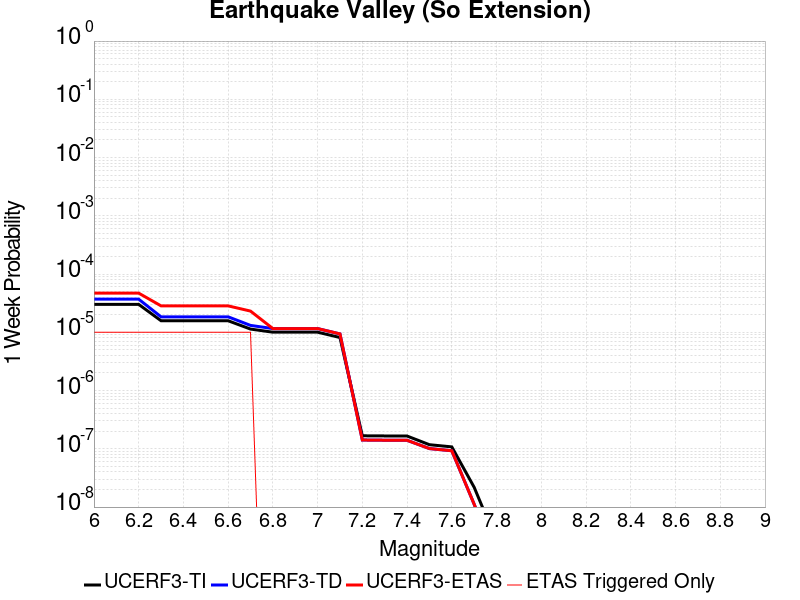 | 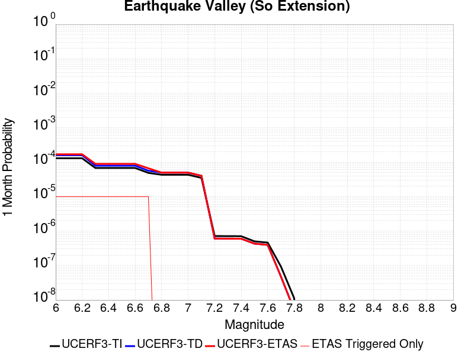 |  |  |

| Magnitude | 1 wk TI Prob | 1 wk TD Prob | 1 wk ETAS Prob | 1 wk ETAS/TD Gain | 1 wk ETAS Triggered Only | 1 mo TI Prob | 1 mo TD Prob | 1 mo ETAS Prob | 1 mo ETAS/TD Gain | 1 mo ETAS Triggered Only | 1 yr TI Prob | 1 yr TD Prob | 1 yr ETAS Prob | 1 yr ETAS/TD Gain | 1 yr ETAS Triggered Only | 10 yr TI Prob | 10 yr TD Prob | 10 yr ETAS Prob | 10 yr ETAS/TD Gain | 10 yr ETAS Triggered Only |
|-----|-----|-----|-----|-----|-----|-----|-----|-----|-----|-----|-----|-----|-----|-----|-----|-----|-----|-----|-----|-----|
| 6.0 | 3.0194888E-5 | 3.707208E-5 | 4.707171E-5 | 1.2697347 | 1.0E-5 | 1.2940024E-4 | 1.5887374E-4 | 1.6887215E-4 | 1.0629331 | 1.0E-5 | 0.0015743093 | 0.0019330877 | 0.0019530491 | 1.0103261 | 2.0E-5 | 0.01563203 | 0.0192131 | 0.019232718 | 1.0010209 | 2.0E-5 |
| 6.1 | 3.0194888E-5 | 3.707208E-5 | 4.707171E-5 | 1.2697347 | 1.0E-5 | 1.2940024E-4 | 1.5887374E-4 | 1.6887215E-4 | 1.0629331 | 1.0E-5 | 0.0015743093 | 0.0019330877 | 0.0019530491 | 1.0103261 | 2.0E-5 | 0.01563203 | 0.0192131 | 0.019232718 | 1.0010209 | 2.0E-5 |
| 6.2 | 3.0194888E-5 | 3.707208E-5 | 4.707171E-5 | 1.2697347 | 1.0E-5 | 1.2940024E-4 | 1.5887374E-4 | 1.6887215E-4 | 1.0629331 | 1.0E-5 | 0.0015743093 | 0.0019330877 | 0.0019530491 | 1.0103261 | 2.0E-5 | 0.01563203 | 0.0192131 | 0.019232718 | 1.0010209 | 2.0E-5 |
| 6.3 | 1.5795305E-5 | 1.8446612E-5 | 2.8446428E-5 | 1.542095 | 1.0E-5 | 6.769241E-5 | 7.905514E-5 | 8.905435E-5 | 1.126484 | 1.0E-5 | 8.238434E-4 | 9.621823E-4 | 9.821631E-4 | 1.0207661 | 2.0E-5 | 0.008207959 | 0.0095910635 | 0.009610872 | 1.0020653 | 2.0E-5 |
| 6.4 | 1.5795305E-5 | 1.8446612E-5 | 2.8446428E-5 | 1.542095 | 1.0E-5 | 6.769241E-5 | 7.905514E-5 | 8.905435E-5 | 1.126484 | 1.0E-5 | 8.238434E-4 | 9.621823E-4 | 9.821631E-4 | 1.0207661 | 2.0E-5 | 0.008207959 | 0.0095910635 | 0.009610872 | 1.0020653 | 2.0E-5 |
| 6.5 | 1.5795305E-5 | 1.8446612E-5 | 2.8446428E-5 | 1.542095 | 1.0E-5 | 6.769241E-5 | 7.905514E-5 | 8.905435E-5 | 1.126484 | 1.0E-5 | 8.238434E-4 | 9.621823E-4 | 9.821631E-4 | 1.0207661 | 2.0E-5 | 0.008207959 | 0.0095910635 | 0.009610872 | 1.0020653 | 2.0E-5 |
| 6.6 | 1.5795305E-5 | 1.8446612E-5 | 2.8446428E-5 | 1.542095 | 1.0E-5 | 6.769241E-5 | 7.905514E-5 | 8.905435E-5 | 1.126484 | 1.0E-5 | 8.238434E-4 | 9.621823E-4 | 9.821631E-4 | 1.0207661 | 2.0E-5 | 0.008207959 | 0.0095910635 | 0.009610872 | 1.0020653 | 2.0E-5 |
| 6.7 | 1.1363076E-5 | 1.3138288E-5 | 2.3138156E-5 | 1.7611241 | 1.0E-5 | 4.8697988E-5 | 5.6306162E-5 | 6.63056E-5 | 1.1775905 | 1.0E-5 | 5.927367E-4 | 6.8538805E-4 | 7.0537435E-4 | 1.0291605 | 2.0E-5 | 0.0059115817 | 0.006840215 | 0.0068600783 | 1.0029039 | 2.0E-5 |
| 6.8 | 1.0049611E-5 | 1.1594328E-5 | 1.1594328E-5 | 1.0 | 0.0 | 4.306905E-5 | 4.968944E-5 | 4.968944E-5 | 1.0 | 0.0 | 5.242395E-4 | 6.0487416E-4 | 6.148681E-4 | 1.0165224 | 1.0E-5 | 0.0052300454 | 0.0060394546 | 0.0060493946 | 1.0016458 | 1.0E-5 |
| 6.9 | 1.0049611E-5 | 1.1594328E-5 | 1.1594328E-5 | 1.0 | 0.0 | 4.306905E-5 | 4.968944E-5 | 4.968944E-5 | 1.0 | 0.0 | 5.242395E-4 | 6.0487416E-4 | 6.148681E-4 | 1.0165224 | 1.0E-5 | 0.0052300454 | 0.0060394546 | 0.0060493946 | 1.0016458 | 1.0E-5 |
| 7.0 | 1.0049611E-5 | 1.1594328E-5 | 1.1594328E-5 | 1.0 | 0.0 | 4.306905E-5 | 4.968944E-5 | 4.968944E-5 | 1.0 | 0.0 | 5.242395E-4 | 6.0487416E-4 | 6.148681E-4 | 1.0165224 | 1.0E-5 | 0.0052300454 | 0.0060394546 | 0.0060493946 | 1.0016458 | 1.0E-5 |
| 7.1 | 8.140254E-6 | 9.3834515E-6 | 9.3834515E-6 | 1.0 | 0.0 | 3.4886336E-5 | 4.021455E-5 | 4.021455E-5 | 1.0 | 0.0 | 4.2465836E-4 | 4.895692E-4 | 4.9956434E-4 | 1.0204161 | 1.0E-5 | 0.0042384774 | 0.004891483 | 0.0049014343 | 1.0020344 | 1.0E-5 |
| 7.2 | 1.673835E-7 | 1.4153493E-7 | 1.4153493E-7 | 1.0 | 0.0 | 7.173577E-7 | 6.065781E-7 | 6.065781E-7 | 1.0 | 0.0 | 8.733795E-6 | 7.3850674E-6 | 7.3850674E-6 | 1.0 | 0.0 | 8.733451E-5 | 7.3848576E-5 | 7.3848576E-5 | 1.0 | 0.0 |
| 7.3 | 1.6632116E-7 | 1.4051723E-7 | 1.4051723E-7 | 1.0 | 0.0 | 7.1280476E-7 | 6.022166E-7 | 6.022166E-7 | 1.0 | 0.0 | 8.678364E-6 | 7.331966E-6 | 7.331966E-6 | 1.0 | 0.0 | 8.6780245E-5 | 7.33176E-5 | 7.33176E-5 | 1.0 | 0.0 |
| 7.4 | 1.6569169E-7 | 1.3996352E-7 | 1.3996352E-7 | 1.0 | 0.0 | 7.1010703E-7 | 5.9984353E-7 | 5.9984353E-7 | 1.0 | 0.0 | 8.645519E-6 | 7.303074E-6 | 7.303074E-6 | 1.0 | 0.0 | 8.645182E-5 | 7.30287E-5 | 7.30287E-5 | 1.0 | 0.0 |
| 7.5 | 1.1764555E-7 | 1.0095245E-7 | 1.0095245E-7 | 1.0 | 0.0 | 5.041951E-7 | 4.3265328E-7 | 4.3265328E-7 | 1.0 | 0.0 | 6.138558E-6 | 5.267543E-6 | 5.267543E-6 | 1.0 | 0.0 | 6.1383886E-5 | 5.2674397E-5 | 5.2674397E-5 | 1.0 | 0.0 |
| 7.6 | 1.07927605E-7 | 9.2600665E-8 | 9.2600665E-8 | 1.0 | 0.0 | 4.6254678E-7 | 3.9685995E-7 | 3.9685995E-7 | 1.0 | 0.0 | 5.6314925E-6 | 4.8317615E-6 | 4.8317615E-6 | 1.0 | 0.0 | 5.63135E-5 | 4.831677E-5 | 4.831677E-5 | 1.0 | 0.0 |
| 7.7 | 2.1826905E-8 | 1.1179958E-8 | 1.1179958E-8 | 1.0 | 0.0 | 9.3543875E-8 | 4.791411E-8 | 4.791411E-8 | 1.0 | 0.0 | 1.1388961E-6 | 5.8335416E-7 | 5.8335416E-7 | 1.0 | 0.0 | 1.1388902E-5 | 5.8335318E-6 | 5.8335318E-6 | 1.0 | 0.0 |
| 7.8 | 2.6169649E-9 | 1.1968753E-9 | 1.1968753E-9 | 1.0 | 0.0 | 1.1215564E-8 | 5.1294657E-9 | 5.1294657E-9 | 1.0 | 0.0 | 1.3654947E-7 | 6.245124E-8 | 6.245124E-8 | 1.0 | 0.0 | 1.365494E-6 | 6.2451244E-7 | 6.2451244E-7 | 1.0 | 0.0 |

## South Klamath Lake East
*[(top)](#table-of-contents)*

| 1 Week | 1 Month | 1 Year | 10 Year |
|-----|-----|-----|-----|
|  |  |  |  |

| Magnitude | 1 wk TI Prob | 1 wk TD Prob | 1 wk ETAS Prob | 1 wk ETAS/TD Gain | 1 wk ETAS Triggered Only | 1 mo TI Prob | 1 mo TD Prob | 1 mo ETAS Prob | 1 mo ETAS/TD Gain | 1 mo ETAS Triggered Only | 1 yr TI Prob | 1 yr TD Prob | 1 yr ETAS Prob | 1 yr ETAS/TD Gain | 1 yr ETAS Triggered Only | 10 yr TI Prob | 10 yr TD Prob | 10 yr ETAS Prob | 10 yr ETAS/TD Gain | 10 yr ETAS Triggered Only |
|-----|-----|-----|-----|-----|-----|-----|-----|-----|-----|-----|-----|-----|-----|-----|-----|-----|-----|-----|-----|-----|
| 6.0 | 2.3539369E-5 | 2.5047308E-5 | 2.5047308E-5 | 1.0 | 0.0 | 1.0087911E-4 | 1.0734166E-4 | 1.1734058E-4 | 1.0931505 | 1.0E-5 | 0.0012275111 | 0.0013061843 | 0.0013161713 | 1.0076458 | 1.0E-5 | 0.012207527 | 0.012993417 | 0.013003287 | 1.0007596 | 1.0E-5 |
| 6.1 | 2.3539369E-5 | 2.5047308E-5 | 2.5047308E-5 | 1.0 | 0.0 | 1.0087911E-4 | 1.0734166E-4 | 1.1734058E-4 | 1.0931505 | 1.0E-5 | 0.0012275111 | 0.0013061843 | 0.0013161713 | 1.0076458 | 1.0E-5 | 0.012207527 | 0.012993417 | 0.013003287 | 1.0007596 | 1.0E-5 |
| 6.2 | 2.3539369E-5 | 2.5047308E-5 | 2.5047308E-5 | 1.0 | 0.0 | 1.0087911E-4 | 1.0734166E-4 | 1.1734058E-4 | 1.0931505 | 1.0E-5 | 0.0012275111 | 0.0013061843 | 0.0013161713 | 1.0076458 | 1.0E-5 | 0.012207527 | 0.012993417 | 0.013003287 | 1.0007596 | 1.0E-5 |
| 6.3 | 9.807823E-6 | 1.0396044E-5 | 1.0396044E-5 | 1.0 | 0.0 | 4.2032847E-5 | 4.455376E-5 | 4.455376E-5 | 1.0 | 0.0 | 5.1162974E-4 | 5.4231536E-4 | 5.4231536E-4 | 1.0 | 0.0 | 0.005104534 | 0.005410756 | 0.005410756 | 1.0 | 0.0 |
| 6.4 | 9.807823E-6 | 1.0396044E-5 | 1.0396044E-5 | 1.0 | 0.0 | 4.2032847E-5 | 4.455376E-5 | 4.455376E-5 | 1.0 | 0.0 | 5.1162974E-4 | 5.4231536E-4 | 5.4231536E-4 | 1.0 | 0.0 | 0.005104534 | 0.005410756 | 0.005410756 | 1.0 | 0.0 |
| 6.5 | 6.191981E-6 | 6.5508398E-6 | 6.5508398E-6 | 1.0 | 0.0 | 2.653679E-5 | 2.8074743E-5 | 2.8074743E-5 | 1.0 | 0.0 | 3.2303753E-4 | 3.4175918E-4 | 3.4175918E-4 | 1.0 | 0.0 | 0.0032256835 | 0.003412614 | 0.003412614 | 1.0 | 0.0 |
| 6.6 | 4.3693776E-6 | 4.6165574E-6 | 4.6165574E-6 | 1.0 | 0.0 | 1.8725768E-5 | 1.9785102E-5 | 1.9785102E-5 | 1.0 | 0.0 | 2.2796239E-4 | 2.4085813E-4 | 2.4085813E-4 | 1.0 | 0.0 | 0.0022772867 | 0.0024060833 | 0.0024060833 | 1.0 | 0.0 |
| 6.7 | 3.360834E-6 | 3.5512403E-6 | 3.5512403E-6 | 1.0 | 0.0 | 1.4403494E-5 | 1.5219517E-5 | 1.5219517E-5 | 1.0 | 0.0 | 1.7534842E-4 | 1.8528267E-4 | 1.8528267E-4 | 1.0 | 0.0 | 0.0017521014 | 0.0018513618 | 0.0018513618 | 1.0 | 0.0 |
| 6.8 | 2.57873E-6 | 2.7251708E-6 | 2.7251708E-6 | 1.0 | 0.0 | 1.1051653E-5 | 1.1679254E-5 | 1.1679254E-5 | 1.0 | 0.0 | 1.3454557E-4 | 1.4218627E-4 | 1.4218627E-4 | 1.0 | 0.0 | 0.0013446413 | 0.0014210136 | 0.0014210136 | 1.0 | 0.0 |
| 6.9 | 9.987825E-7 | 1.0566213E-6 | 1.0566213E-6 | 1.0 | 0.0 | 4.2804895E-6 | 4.528371E-6 | 4.528371E-6 | 1.0 | 0.0 | 5.211371E-5 | 5.5131848E-5 | 5.5131848E-5 | 1.0 | 0.0 | 5.210149E-4 | 5.5121386E-4 | 5.5121386E-4 | 1.0 | 0.0 |

## Big Pine (West)
*[(top)](#table-of-contents)*

| 1 Week | 1 Month | 1 Year | 10 Year |
|-----|-----|-----|-----|
|  |  |  |  |

| Magnitude | 1 wk TI Prob | 1 wk TD Prob | 1 wk ETAS Prob | 1 wk ETAS/TD Gain | 1 wk ETAS Triggered Only | 1 mo TI Prob | 1 mo TD Prob | 1 mo ETAS Prob | 1 mo ETAS/TD Gain | 1 mo ETAS Triggered Only | 1 yr TI Prob | 1 yr TD Prob | 1 yr ETAS Prob | 1 yr ETAS/TD Gain | 1 yr ETAS Triggered Only | 10 yr TI Prob | 10 yr TD Prob | 10 yr ETAS Prob | 10 yr ETAS/TD Gain | 10 yr ETAS Triggered Only |
|-----|-----|-----|-----|-----|-----|-----|-----|-----|-----|-----|-----|-----|-----|-----|-----|-----|-----|-----|-----|-----|
| 6.0 | 6.8306974E-7 | 6.8818304E-7 | 1.0688176E-5 | 15.531008 | 1.0E-5 | 2.9274386E-6 | 2.949353E-6 | 1.2949324E-5 | 4.390564 | 1.0E-5 | 3.564098E-5 | 3.5907877E-5 | 5.590716E-5 | 1.5569608 | 2.0E-5 | 3.5635266E-4 | 3.5903015E-4 | 3.7902297E-4 | 1.0556856 | 2.0E-5 |
| 6.1 | 6.8306974E-7 | 6.8818304E-7 | 1.0688176E-5 | 15.531008 | 1.0E-5 | 2.9274386E-6 | 2.949353E-6 | 1.2949324E-5 | 4.390564 | 1.0E-5 | 3.564098E-5 | 3.5907877E-5 | 5.590716E-5 | 1.5569608 | 2.0E-5 | 3.5635266E-4 | 3.5903015E-4 | 3.7902297E-4 | 1.0556856 | 2.0E-5 |
| 6.2 | 6.8306974E-7 | 6.8818304E-7 | 1.0688176E-5 | 15.531008 | 1.0E-5 | 2.9274386E-6 | 2.949353E-6 | 1.2949324E-5 | 4.390564 | 1.0E-5 | 3.564098E-5 | 3.5907877E-5 | 5.590716E-5 | 1.5569608 | 2.0E-5 | 3.5635266E-4 | 3.5903015E-4 | 3.7902297E-4 | 1.0556856 | 2.0E-5 |
| 6.3 | 4.227652E-7 | 4.2665604E-7 | 1.0426652E-5 | 24.438074 | 1.0E-5 | 1.8118495E-6 | 1.8285248E-6 | 1.1828506E-5 | 6.4688797 | 1.0E-5 | 2.2059045E-5 | 2.226208E-5 | 4.2261636E-5 | 1.8983687 | 2.0E-5 | 2.2056856E-4 | 2.2260031E-4 | 2.4259587E-4 | 1.0898272 | 2.0E-5 |
| 6.4 | 4.227652E-7 | 4.2665604E-7 | 1.0426652E-5 | 24.438074 | 1.0E-5 | 1.8118495E-6 | 1.8285248E-6 | 1.1828506E-5 | 6.4688797 | 1.0E-5 | 2.2059045E-5 | 2.226208E-5 | 4.2261636E-5 | 1.8983687 | 2.0E-5 | 2.2056856E-4 | 2.2260031E-4 | 2.4259587E-4 | 1.0898272 | 2.0E-5 |
| 6.5 | 3.1538403E-7 | 3.1884528E-7 | 1.0318842E-5 | 32.363163 | 1.0E-5 | 1.3516451E-6 | 1.3664791E-6 | 1.13664655E-5 | 8.318068 | 1.0E-5 | 1.6456155E-5 | 1.6636759E-5 | 3.6636426E-5 | 2.2021372 | 2.0E-5 | 1.6454936E-4 | 1.6635554E-4 | 1.863522E-4 | 1.1202044 | 2.0E-5 |
| 6.6 | 3.1538403E-7 | 3.1884528E-7 | 1.0318842E-5 | 32.363163 | 1.0E-5 | 1.3516451E-6 | 1.3664791E-6 | 1.13664655E-5 | 8.318068 | 1.0E-5 | 1.6456155E-5 | 1.6636759E-5 | 3.6636426E-5 | 2.2021372 | 2.0E-5 | 1.6454936E-4 | 1.6635554E-4 | 1.863522E-4 | 1.1202044 | 2.0E-5 |
| 6.7 | 3.1538403E-7 | 3.1884528E-7 | 1.0318842E-5 | 32.363163 | 1.0E-5 | 1.3516451E-6 | 1.3664791E-6 | 1.13664655E-5 | 8.318068 | 1.0E-5 | 1.6456155E-5 | 1.6636759E-5 | 3.6636426E-5 | 2.2021372 | 2.0E-5 | 1.6454936E-4 | 1.6635554E-4 | 1.863522E-4 | 1.1202044 | 2.0E-5 |
| 6.8 | 3.1538403E-7 | 3.1884528E-7 | 1.0318842E-5 | 32.363163 | 1.0E-5 | 1.3516451E-6 | 1.3664791E-6 | 1.13664655E-5 | 8.318068 | 1.0E-5 | 1.6456155E-5 | 1.6636759E-5 | 3.6636426E-5 | 2.2021372 | 2.0E-5 | 1.6454936E-4 | 1.6635554E-4 | 1.863522E-4 | 1.1202044 | 2.0E-5 |
| 6.9 | 3.0402092E-7 | 3.0739798E-7 | 1.0307395E-5 | 33.53111 | 1.0E-5 | 1.3029462E-6 | 1.3174192E-6 | 1.13174065E-5 | 8.590588 | 1.0E-5 | 1.5863254E-5 | 1.6039465E-5 | 3.6039146E-5 | 2.2469044 | 2.0E-5 | 1.5862122E-4 | 1.6038347E-4 | 1.8038026E-4 | 1.1246811 | 2.0E-5 |
| 7.0 | 2.3673063E-7 | 2.3944315E-7 | 2.3944315E-7 | 1.0 | 0.0 | 1.0145594E-6 | 1.0261845E-6 | 1.0261845E-6 | 1.0 | 0.0 | 1.235219E-5 | 1.2493728E-5 | 2.2493603E-5 | 1.8003917 | 1.0E-5 | 1.2351504E-4 | 1.2493054E-4 | 1.3492927E-4 | 1.0800345 | 1.0E-5 |
| 7.1 | 1.632138E-7 | 1.6514511E-7 | 1.6514511E-7 | 1.0 | 0.0 | 6.9948754E-7 | 7.0776457E-7 | 7.0776457E-7 | 1.0 | 0.0 | 8.516227E-6 | 8.617002E-6 | 1.8616916E-5 | 2.1604865 | 1.0E-5 | 8.5159016E-5 | 8.616685E-5 | 9.616599E-5 | 1.1160439 | 1.0E-5 |
| 7.2 | 1.1523723E-7 | 1.1657165E-7 | 1.1657165E-7 | 1.0 | 0.0 | 4.9387376E-7 | 4.9959266E-7 | 4.9959266E-7 | 1.0 | 0.0 | 6.0128964E-6 | 6.082525E-6 | 6.082525E-6 | 1.0 | 0.0 | 6.0127335E-5 | 6.0823695E-5 | 6.0823695E-5 | 1.0 | 0.0 |
| 7.3 | 7.777805E-8 | 7.862446E-8 | 7.862446E-8 | 1.0 | 0.0 | 3.3333444E-7 | 3.3696193E-7 | 3.3696193E-7 | 1.0 | 0.0 | 4.0583395E-6 | 4.102504E-6 | 4.102504E-6 | 1.0 | 0.0 | 4.0582654E-5 | 4.102434E-5 | 4.102434E-5 | 1.0 | 0.0 |
| 7.4 | 4.609946E-8 | 4.6522135E-8 | 4.6522135E-8 | 1.0 | 0.0 | 1.975691E-7 | 1.9938055E-7 | 1.9938055E-7 | 1.0 | 0.0 | 2.4054011E-6 | 2.4274557E-6 | 2.4274557E-6 | 1.0 | 0.0 | 2.405375E-5 | 2.427431E-5 | 2.427431E-5 | 1.0 | 0.0 |
| 7.5 | 2.3439137E-8 | 2.3608283E-8 | 2.3608283E-8 | 1.0 | 0.0 | 1.00453434E-7 | 1.0117836E-7 | 1.0117836E-7 | 1.0 | 0.0 | 1.2230199E-6 | 1.2318458E-6 | 1.2318458E-6 | 1.0 | 0.0 | 1.2230132E-5 | 1.2318393E-5 | 1.2318393E-5 | 1.0 | 0.0 |
| 7.6 | 1.6699769E-8 | 1.6817072E-8 | 1.6817072E-8 | 1.0 | 0.0 | 7.157044E-8 | 7.207316E-8 | 7.207316E-8 | 1.0 | 0.0 | 8.713697E-7 | 8.7749044E-7 | 8.7749044E-7 | 1.0 | 0.0 | 8.713663E-6 | 8.774871E-6 | 8.774871E-6 | 1.0 | 0.0 |
| 7.7 | 7.4061512E-9 | 7.4541635E-9 | 7.4541635E-9 | 1.0 | 0.0 | 3.1740647E-8 | 3.1946417E-8 | 3.1946417E-8 | 1.0 | 0.0 | 3.864423E-7 | 3.8894754E-7 | 3.8894754E-7 | 1.0 | 0.0 | 3.8644166E-6 | 3.8894696E-6 | 3.8894696E-6 | 1.0 | 0.0 |
| 7.8 | 1.2189427E-9 | 1.2270763E-9 | 1.2270763E-9 | 1.0 | 0.0 | 5.2240403E-9 | 5.258898E-9 | 5.258898E-9 | 1.0 | 0.0 | 6.3602684E-8 | 6.4027084E-8 | 6.4027084E-8 | 1.0 | 0.0 | 6.360267E-7 | 6.4027074E-7 | 6.4027074E-7 | 1.0 | 0.0 |

## Great Valley 05 Pittsburg - Kirby Hills alt1
*[(top)](#table-of-contents)*

| 1 Week | 1 Month | 1 Year | 10 Year |
|-----|-----|-----|-----|
|  |  |  |  |

| Magnitude | 1 wk TI Prob | 1 wk TD Prob | 1 wk ETAS Prob | 1 wk ETAS/TD Gain | 1 wk ETAS Triggered Only | 1 mo TI Prob | 1 mo TD Prob | 1 mo ETAS Prob | 1 mo ETAS/TD Gain | 1 mo ETAS Triggered Only | 1 yr TI Prob | 1 yr TD Prob | 1 yr ETAS Prob | 1 yr ETAS/TD Gain | 1 yr ETAS Triggered Only | 10 yr TI Prob | 10 yr TD Prob | 10 yr ETAS Prob | 10 yr ETAS/TD Gain | 10 yr ETAS Triggered Only |
|-----|-----|-----|-----|-----|-----|-----|-----|-----|-----|-----|-----|-----|-----|-----|-----|-----|-----|-----|-----|-----|
| 6.0 | 4.187212E-5 | 5.344289E-5 | 5.344289E-5 | 1.0 | 0.0 | 1.794396E-4 | 2.2902661E-4 | 2.2902661E-4 | 1.0 | 0.0 | 0.002182488 | 0.0027857998 | 0.0027857998 | 1.0 | 0.0 | 0.021611776 | 0.027603218 | 0.027622666 | 1.0007045 | 2.0E-5 |
| 6.1 | 4.187212E-5 | 5.344289E-5 | 5.344289E-5 | 1.0 | 0.0 | 1.794396E-4 | 2.2902661E-4 | 2.2902661E-4 | 1.0 | 0.0 | 0.002182488 | 0.0027857998 | 0.0027857998 | 1.0 | 0.0 | 0.021611776 | 0.027603218 | 0.027622666 | 1.0007045 | 2.0E-5 |
| 6.2 | 1.7353306E-5 | 2.2154672E-5 | 2.2154672E-5 | 1.0 | 0.0 | 7.436919E-5 | 9.4947456E-5 | 9.4947456E-5 | 1.0 | 0.0 | 9.050688E-4 | 0.0011557573 | 0.0011557573 | 1.0 | 0.0 | 0.009013915 | 0.0115352 | 0.011545085 | 1.0008569 | 1.0E-5 |
| 6.3 | 1.7353306E-5 | 2.2154672E-5 | 2.2154672E-5 | 1.0 | 0.0 | 7.436919E-5 | 9.4947456E-5 | 9.4947456E-5 | 1.0 | 0.0 | 9.050688E-4 | 0.0011557573 | 0.0011557573 | 1.0 | 0.0 | 0.009013915 | 0.0115352 | 0.011545085 | 1.0008569 | 1.0E-5 |
| 6.4 | 1.4028824E-5 | 1.7901062E-5 | 1.7901062E-5 | 1.0 | 0.0 | 6.0122147E-5 | 7.671883E-5 | 7.671883E-5 | 1.0 | 0.0 | 7.3174125E-4 | 9.340303E-4 | 9.340303E-4 | 1.0 | 0.0 | 0.0072933645 | 0.009338211 | 0.009348118 | 1.0010608 | 1.0E-5 |

## South Cuyama
*[(top)](#table-of-contents)*

| 1 Week | 1 Month | 1 Year | 10 Year |
|-----|-----|-----|-----|
|  |  |  | 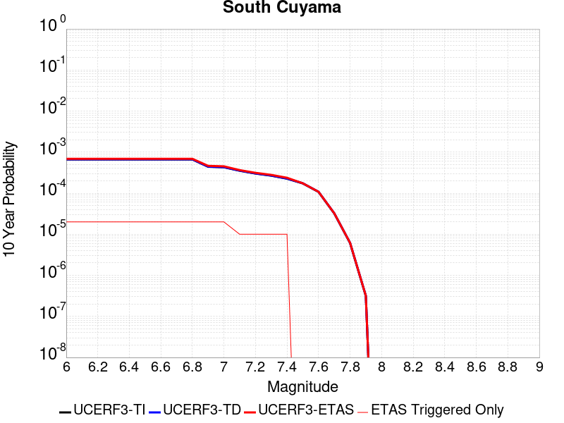 |

| Magnitude | 1 wk TI Prob | 1 wk TD Prob | 1 wk ETAS Prob | 1 wk ETAS/TD Gain | 1 wk ETAS Triggered Only | 1 mo TI Prob | 1 mo TD Prob | 1 mo ETAS Prob | 1 mo ETAS/TD Gain | 1 mo ETAS Triggered Only | 1 yr TI Prob | 1 yr TD Prob | 1 yr ETAS Prob | 1 yr ETAS/TD Gain | 1 yr ETAS Triggered Only | 10 yr TI Prob | 10 yr TD Prob | 10 yr ETAS Prob | 10 yr ETAS/TD Gain | 10 yr ETAS Triggered Only |
|-----|-----|-----|-----|-----|-----|-----|-----|-----|-----|-----|-----|-----|-----|-----|-----|-----|-----|-----|-----|-----|
| 6.0 | 1.2747308E-6 | 1.2818697E-6 | 1.1281857E-5 | 8.801095 | 1.0E-5 | 5.4631205E-6 | 5.4937163E-6 | 1.549366E-5 | 2.8202515 | 1.0E-5 | 6.6511464E-5 | 6.6884015E-5 | 7.688334E-5 | 1.1495025 | 1.0E-5 | 6.649156E-4 | 6.686458E-4 | 6.886324E-4 | 1.0298913 | 2.0E-5 |
| 6.1 | 1.2747308E-6 | 1.2818697E-6 | 1.1281857E-5 | 8.801095 | 1.0E-5 | 5.4631205E-6 | 5.4937163E-6 | 1.549366E-5 | 2.8202515 | 1.0E-5 | 6.6511464E-5 | 6.6884015E-5 | 7.688334E-5 | 1.1495025 | 1.0E-5 | 6.649156E-4 | 6.686458E-4 | 6.886324E-4 | 1.0298913 | 2.0E-5 |
| 6.2 | 1.2747308E-6 | 1.2818697E-6 | 1.1281857E-5 | 8.801095 | 1.0E-5 | 5.4631205E-6 | 5.4937163E-6 | 1.549366E-5 | 2.8202515 | 1.0E-5 | 6.6511464E-5 | 6.6884015E-5 | 7.688334E-5 | 1.1495025 | 1.0E-5 | 6.649156E-4 | 6.686458E-4 | 6.886324E-4 | 1.0298913 | 2.0E-5 |
| 6.3 | 1.2747308E-6 | 1.2818697E-6 | 1.1281857E-5 | 8.801095 | 1.0E-5 | 5.4631205E-6 | 5.4937163E-6 | 1.549366E-5 | 2.8202515 | 1.0E-5 | 6.6511464E-5 | 6.6884015E-5 | 7.688334E-5 | 1.1495025 | 1.0E-5 | 6.649156E-4 | 6.686458E-4 | 6.886324E-4 | 1.0298913 | 2.0E-5 |
| 6.4 | 1.2747308E-6 | 1.2818697E-6 | 1.1281857E-5 | 8.801095 | 1.0E-5 | 5.4631205E-6 | 5.4937163E-6 | 1.549366E-5 | 2.8202515 | 1.0E-5 | 6.6511464E-5 | 6.6884015E-5 | 7.688334E-5 | 1.1495025 | 1.0E-5 | 6.649156E-4 | 6.686458E-4 | 6.886324E-4 | 1.0298913 | 2.0E-5 |
| 6.5 | 1.2747308E-6 | 1.2818697E-6 | 1.1281857E-5 | 8.801095 | 1.0E-5 | 5.4631205E-6 | 5.4937163E-6 | 1.549366E-5 | 2.8202515 | 1.0E-5 | 6.6511464E-5 | 6.6884015E-5 | 7.688334E-5 | 1.1495025 | 1.0E-5 | 6.649156E-4 | 6.686458E-4 | 6.886324E-4 | 1.0298913 | 2.0E-5 |
| 6.6 | 1.2747308E-6 | 1.2818697E-6 | 1.1281857E-5 | 8.801095 | 1.0E-5 | 5.4631205E-6 | 5.4937163E-6 | 1.549366E-5 | 2.8202515 | 1.0E-5 | 6.6511464E-5 | 6.6884015E-5 | 7.688334E-5 | 1.1495025 | 1.0E-5 | 6.649156E-4 | 6.686458E-4 | 6.886324E-4 | 1.0298913 | 2.0E-5 |
| 6.7 | 1.2747308E-6 | 1.2818697E-6 | 1.1281857E-5 | 8.801095 | 1.0E-5 | 5.4631205E-6 | 5.4937163E-6 | 1.549366E-5 | 2.8202515 | 1.0E-5 | 6.6511464E-5 | 6.6884015E-5 | 7.688334E-5 | 1.1495025 | 1.0E-5 | 6.649156E-4 | 6.686458E-4 | 6.886324E-4 | 1.0298913 | 2.0E-5 |
| 6.8 | 1.2747308E-6 | 1.2818697E-6 | 1.1281857E-5 | 8.801095 | 1.0E-5 | 5.4631205E-6 | 5.4937163E-6 | 1.549366E-5 | 2.8202515 | 1.0E-5 | 6.6511464E-5 | 6.6884015E-5 | 7.688334E-5 | 1.1495025 | 1.0E-5 | 6.649156E-4 | 6.686458E-4 | 6.886324E-4 | 1.0298913 | 2.0E-5 |
| 6.9 | 8.4566324E-7 | 8.507883E-7 | 1.085078E-5 | 12.753796 | 1.0E-5 | 3.624266E-6 | 3.6462304E-6 | 1.3646194E-5 | 3.7425485 | 1.0E-5 | 4.4124543E-5 | 4.439196E-5 | 5.4391516E-5 | 1.225256 | 1.0E-5 | 4.4115784E-4 | 4.4383196E-4 | 4.638231E-4 | 1.0450422 | 2.0E-5 |
| 7.0 | 8.2277904E-7 | 8.27782E-7 | 1.0827774E-5 | 13.080465 | 1.0E-5 | 3.526191E-6 | 3.5476323E-6 | 1.3547597E-5 | 3.8187714 | 1.0E-5 | 4.293053E-5 | 4.3191576E-5 | 5.3191146E-5 | 1.2315166 | 1.0E-5 | 4.292224E-4 | 4.3183283E-4 | 4.518242E-4 | 1.0462942 | 2.0E-5 |
| 7.1 | 6.7661887E-7 | 6.80913E-7 | 6.80913E-7 | 1.0 | 0.0 | 2.899792E-6 | 2.9181954E-6 | 2.9181954E-6 | 1.0 | 0.0 | 3.5304394E-5 | 3.5528454E-5 | 3.5528454E-5 | 1.0 | 0.0 | 3.5298787E-4 | 3.552281E-4 | 3.6522458E-4 | 1.0281409 | 1.0E-5 |
| 7.2 | 5.783336E-7 | 5.8211907E-7 | 5.8211907E-7 | 1.0 | 0.0 | 2.4785702E-6 | 2.4947938E-6 | 2.4947938E-6 | 1.0 | 0.0 | 3.0176174E-5 | 3.0373692E-5 | 3.0373692E-5 | 1.0 | 0.0 | 3.0172078E-4 | 3.0369565E-4 | 3.136926E-4 | 1.0329177 | 1.0E-5 |
| 7.3 | 5.136759E-7 | 5.170938E-7 | 5.170938E-7 | 1.0 | 0.0 | 2.2014663E-6 | 2.2161144E-6 | 2.2161144E-6 | 1.0 | 0.0 | 2.6802521E-5 | 2.698086E-5 | 2.698086E-5 | 1.0 | 0.0 | 2.679929E-4 | 2.6977606E-4 | 2.7977335E-4 | 1.0370578 | 1.0E-5 |
| 7.4 | 4.3370295E-7 | 4.3665364E-7 | 4.3665364E-7 | 1.0 | 0.0 | 1.8587256E-6 | 1.8713713E-6 | 1.8713713E-6 | 1.0 | 0.0 | 2.2629749E-5 | 2.278371E-5 | 2.278371E-5 | 1.0 | 0.0 | 2.2627445E-4 | 2.278139E-4 | 2.3781162E-4 | 1.0438855 | 1.0E-5 |
| 7.5 | 3.3242574E-7 | 3.3476465E-7 | 3.3476465E-7 | 1.0 | 0.0 | 1.4246809E-6 | 1.4347048E-6 | 1.4347048E-6 | 1.0 | 0.0 | 1.7345352E-5 | 1.7467393E-5 | 1.7467393E-5 | 1.0 | 0.0 | 1.7343998E-4 | 1.7466032E-4 | 1.7466032E-4 | 1.0 | 0.0 |
| 7.6 | 2.0627535E-7 | 2.07789E-7 | 2.07789E-7 | 1.0 | 0.0 | 8.840369E-7 | 8.90524E-7 | 8.90524E-7 | 1.0 | 0.0 | 1.0763096E-5 | 1.0842076E-5 | 1.0842076E-5 | 1.0 | 0.0 | 1.0762575E-4 | 1.0841556E-4 | 1.0841556E-4 | 1.0 | 0.0 |
| 7.7 | 6.15236E-8 | 6.1983044E-8 | 6.1983044E-8 | 1.0 | 0.0 | 2.6367252E-7 | 2.656416E-7 | 2.656416E-7 | 1.0 | 0.0 | 3.2102084E-6 | 3.2341818E-6 | 3.2341818E-6 | 1.0 | 0.0 | 3.210162E-5 | 3.234136E-5 | 3.234136E-5 | 1.0 | 0.0 |
| 7.8 | 1.1765573E-8 | 1.1873414E-8 | 1.1873414E-8 | 1.0 | 0.0 | 5.0423886E-8 | 5.0886058E-8 | 5.0886058E-8 | 1.0 | 0.0 | 6.1391063E-7 | 6.195376E-7 | 6.195376E-7 | 1.0 | 0.0 | 6.1390897E-6 | 6.19536E-6 | 6.19536E-6 | 1.0 | 0.0 |
| 7.9 | 6.0381755E-10 | 6.10058E-10 | 6.10058E-10 | 1.0 | 0.0 | 2.5877895E-9 | 2.614534E-9 | 2.614534E-9 | 1.0 | 0.0 | 3.1506335E-8 | 3.1831952E-8 | 3.1831952E-8 | 1.0 | 0.0 | 3.1506332E-7 | 3.183195E-7 | 3.183195E-7 | 1.0 | 0.0 |

## Pitas Point (Lower)-Montalvo
*[(top)](#table-of-contents)*

| 1 Week | 1 Month | 1 Year | 10 Year |
|-----|-----|-----|-----|
|  |  |  |  |

| Magnitude | 1 wk TI Prob | 1 wk TD Prob | 1 wk ETAS Prob | 1 wk ETAS/TD Gain | 1 wk ETAS Triggered Only | 1 mo TI Prob | 1 mo TD Prob | 1 mo ETAS Prob | 1 mo ETAS/TD Gain | 1 mo ETAS Triggered Only | 1 yr TI Prob | 1 yr TD Prob | 1 yr ETAS Prob | 1 yr ETAS/TD Gain | 1 yr ETAS Triggered Only | 10 yr TI Prob | 10 yr TD Prob | 10 yr ETAS Prob | 10 yr ETAS/TD Gain | 10 yr ETAS Triggered Only |
|-----|-----|-----|-----|-----|-----|-----|-----|-----|-----|-----|-----|-----|-----|-----|-----|-----|-----|-----|-----|-----|
| 6.0 | 5.2543637E-6 | 4.8379025E-6 | 4.8379025E-6 | 1.0 | 0.0 | 2.2518509E-5 | 2.0733705E-5 | 3.07335E-5 | 1.4822965 | 1.0E-5 | 2.7412834E-4 | 2.5240393E-4 | 2.6240142E-4 | 1.0396091 | 1.0E-5 | 0.0027379042 | 0.0025212052 | 0.0025411546 | 1.0079128 | 2.0E-5 |
| 6.1 | 5.2543637E-6 | 4.8379025E-6 | 4.8379025E-6 | 1.0 | 0.0 | 2.2518509E-5 | 2.0733705E-5 | 3.07335E-5 | 1.4822965 | 1.0E-5 | 2.7412834E-4 | 2.5240393E-4 | 2.6240142E-4 | 1.0396091 | 1.0E-5 | 0.0027379042 | 0.0025212052 | 0.0025411546 | 1.0079128 | 2.0E-5 |
| 6.2 | 5.2543637E-6 | 4.8379025E-6 | 4.8379025E-6 | 1.0 | 0.0 | 2.2518509E-5 | 2.0733705E-5 | 3.07335E-5 | 1.4822965 | 1.0E-5 | 2.7412834E-4 | 2.5240393E-4 | 2.6240142E-4 | 1.0396091 | 1.0E-5 | 0.0027379042 | 0.0025212052 | 0.0025411546 | 1.0079128 | 2.0E-5 |
| 6.3 | 5.2543637E-6 | 4.8379025E-6 | 4.8379025E-6 | 1.0 | 0.0 | 2.2518509E-5 | 2.0733705E-5 | 3.07335E-5 | 1.4822965 | 1.0E-5 | 2.7412834E-4 | 2.5240393E-4 | 2.6240142E-4 | 1.0396091 | 1.0E-5 | 0.0027379042 | 0.0025212052 | 0.0025411546 | 1.0079128 | 2.0E-5 |
| 6.4 | 5.2543637E-6 | 4.8379025E-6 | 4.8379025E-6 | 1.0 | 0.0 | 2.2518509E-5 | 2.0733705E-5 | 3.07335E-5 | 1.4822965 | 1.0E-5 | 2.7412834E-4 | 2.5240393E-4 | 2.6240142E-4 | 1.0396091 | 1.0E-5 | 0.0027379042 | 0.0025212052 | 0.0025411546 | 1.0079128 | 2.0E-5 |
| 6.5 | 5.2543637E-6 | 4.8379025E-6 | 4.8379025E-6 | 1.0 | 0.0 | 2.2518509E-5 | 2.0733705E-5 | 3.07335E-5 | 1.4822965 | 1.0E-5 | 2.7412834E-4 | 2.5240393E-4 | 2.6240142E-4 | 1.0396091 | 1.0E-5 | 0.0027379042 | 0.0025212052 | 0.0025411546 | 1.0079128 | 2.0E-5 |
| 6.6 | 5.2543637E-6 | 4.8379025E-6 | 4.8379025E-6 | 1.0 | 0.0 | 2.2518509E-5 | 2.0733705E-5 | 3.07335E-5 | 1.4822965 | 1.0E-5 | 2.7412834E-4 | 2.5240393E-4 | 2.6240142E-4 | 1.0396091 | 1.0E-5 | 0.0027379042 | 0.0025212052 | 0.0025411546 | 1.0079128 | 2.0E-5 |
| 6.7 | 5.2543637E-6 | 4.8379025E-6 | 4.8379025E-6 | 1.0 | 0.0 | 2.2518509E-5 | 2.0733705E-5 | 3.07335E-5 | 1.4822965 | 1.0E-5 | 2.7412834E-4 | 2.5240393E-4 | 2.6240142E-4 | 1.0396091 | 1.0E-5 | 0.0027379042 | 0.0025212052 | 0.0025411546 | 1.0079128 | 2.0E-5 |
| 6.8 | 5.2543637E-6 | 4.8379025E-6 | 4.8379025E-6 | 1.0 | 0.0 | 2.2518509E-5 | 2.0733705E-5 | 3.07335E-5 | 1.4822965 | 1.0E-5 | 2.7412834E-4 | 2.5240393E-4 | 2.6240142E-4 | 1.0396091 | 1.0E-5 | 0.0027379042 | 0.0025212052 | 0.0025411546 | 1.0079128 | 2.0E-5 |
| 6.9 | 5.2543637E-6 | 4.8379025E-6 | 4.8379025E-6 | 1.0 | 0.0 | 2.2518509E-5 | 2.0733705E-5 | 3.07335E-5 | 1.4822965 | 1.0E-5 | 2.7412834E-4 | 2.5240393E-4 | 2.6240142E-4 | 1.0396091 | 1.0E-5 | 0.0027379042 | 0.0025212052 | 0.0025411546 | 1.0079128 | 2.0E-5 |
| 7.0 | 5.2543637E-6 | 4.8379025E-6 | 4.8379025E-6 | 1.0 | 0.0 | 2.2518509E-5 | 2.0733705E-5 | 3.07335E-5 | 1.4822965 | 1.0E-5 | 2.7412834E-4 | 2.5240393E-4 | 2.6240142E-4 | 1.0396091 | 1.0E-5 | 0.0027379042 | 0.0025212052 | 0.0025411546 | 1.0079128 | 2.0E-5 |
| 7.1 | 5.2543637E-6 | 4.8379025E-6 | 4.8379025E-6 | 1.0 | 0.0 | 2.2518509E-5 | 2.0733705E-5 | 3.07335E-5 | 1.4822965 | 1.0E-5 | 2.7412834E-4 | 2.5240393E-4 | 2.6240142E-4 | 1.0396091 | 1.0E-5 | 0.0027379042 | 0.0025212052 | 0.0025411546 | 1.0079128 | 2.0E-5 |
| 7.2 | 5.2458695E-6 | 4.8290563E-6 | 4.8290563E-6 | 1.0 | 0.0 | 2.2482105E-5 | 2.0695794E-5 | 3.0695588E-5 | 1.4831799 | 1.0E-5 | 2.7368523E-4 | 2.5194246E-4 | 2.6193995E-4 | 1.0396816 | 1.0E-5 | 0.0027334841 | 0.002516601 | 0.0025365506 | 1.0079272 | 2.0E-5 |
| 7.3 | 5.22665E-6 | 4.8089737E-6 | 4.8089737E-6 | 1.0 | 0.0 | 2.2399736E-5 | 2.0609727E-5 | 3.060952E-5 | 1.4851978 | 1.0E-5 | 2.7268266E-4 | 2.5089484E-4 | 2.6089232E-4 | 1.0398474 | 1.0E-5 | 0.002723483 | 0.0025061483 | 0.0025260982 | 1.0079603 | 2.0E-5 |
| 7.4 | 5.210642E-6 | 4.7921862E-6 | 4.7921862E-6 | 1.0 | 0.0 | 2.233113E-5 | 2.053778E-5 | 3.0537576E-5 | 1.4868976 | 1.0E-5 | 2.718476E-4 | 2.500191E-4 | 2.600166E-4 | 1.039987 | 1.0E-5 | 0.002715153 | 0.0024974106 | 0.0025173607 | 1.0079883 | 2.0E-5 |
| 7.5 | 5.1226016E-6 | 4.7000726E-6 | 4.7000726E-6 | 1.0 | 0.0 | 2.1953823E-5 | 2.0143016E-5 | 3.0142814E-5 | 1.49644 | 1.0E-5 | 2.67255E-4 | 2.4521392E-4 | 2.5521146E-4 | 1.0407708 | 1.0E-5 | 0.0026693381 | 0.002449465 | 0.002469416 | 1.0081451 | 2.0E-5 |
| 7.6 | 4.8796987E-6 | 4.4449725E-6 | 4.4449725E-6 | 1.0 | 0.0 | 2.0912828E-5 | 1.9049745E-5 | 2.9049555E-5 | 1.5249314 | 1.0E-5 | 2.5458392E-4 | 2.3190626E-4 | 2.4190394E-4 | 1.0431108 | 1.0E-5 | 0.0025429246 | 0.0023166733 | 0.00232665 | 1.0043066 | 1.0E-5 |
| 7.7 | 4.0834398E-6 | 3.6091444E-6 | 3.6091444E-6 | 1.0 | 0.0 | 1.7500339E-5 | 1.546767E-5 | 2.5467516E-5 | 1.6464998 | 1.0E-5 | 2.1304579E-4 | 1.8830286E-4 | 1.9830097E-4 | 1.0530959 | 1.0E-5 | 0.0021284167 | 0.0018814567 | 0.0018914379 | 1.005305 | 1.0E-5 |
| 7.8 | 2.5445438E-6 | 2.1212566E-6 | 2.1212566E-6 | 1.0 | 0.0 | 1.0905142E-5 | 9.091068E-6 | 9.091068E-6 | 1.0 | 0.0 | 1.3276201E-4 | 1.1067818E-4 | 1.1067818E-4 | 1.0 | 0.0 | 0.0013268272 | 0.0011062352 | 0.0011062352 | 1.0 | 0.0 |
| 7.9 | 4.1677114E-7 | 3.3294015E-7 | 3.3294015E-7 | 1.0 | 0.0 | 1.7861609E-6 | 1.4268857E-6 | 1.4268857E-6 | 1.0 | 0.0 | 2.1746291E-5 | 1.7372196E-5 | 1.7372196E-5 | 1.0 | 0.0 | 2.1744163E-4 | 1.737087E-4 | 1.737087E-4 | 1.0 | 0.0 |
| 8.0 | 7.791402E-9 | 5.6836056E-9 | 5.6836056E-9 | 1.0 | 0.0 | 3.3391725E-8 | 2.4358311E-8 | 2.4358311E-8 | 1.0 | 0.0 | 4.0654416E-7 | 2.965624E-7 | 2.965624E-7 | 1.0 | 0.0 | 4.065434E-6 | 2.9656223E-6 | 2.9656223E-6 | 1.0 | 0.0 |

## Northridge
*[(top)](#table-of-contents)*

| 1 Week | 1 Month | 1 Year | 10 Year |
|-----|-----|-----|-----|
| 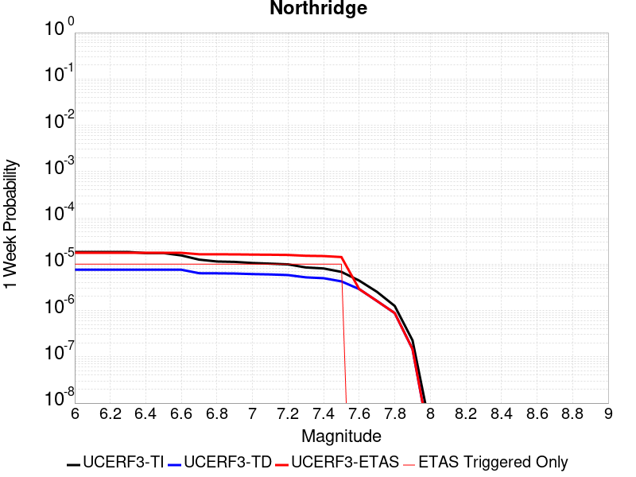 |  | 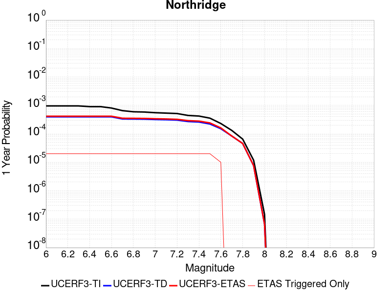 | 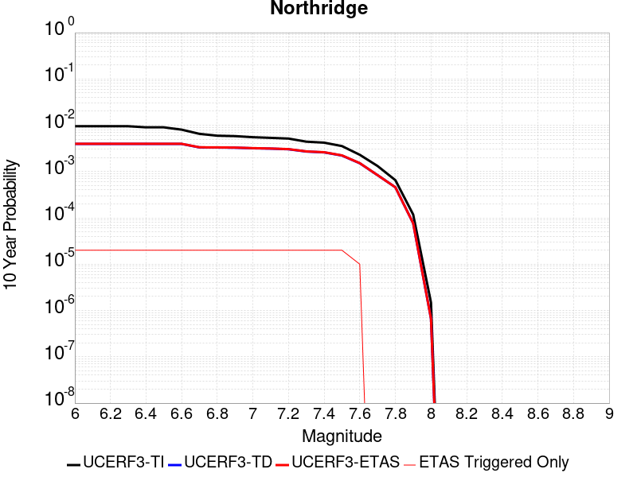 |

| Magnitude | 1 wk TI Prob | 1 wk TD Prob | 1 wk ETAS Prob | 1 wk ETAS/TD Gain | 1 wk ETAS Triggered Only | 1 mo TI Prob | 1 mo TD Prob | 1 mo ETAS Prob | 1 mo ETAS/TD Gain | 1 mo ETAS Triggered Only | 1 yr TI Prob | 1 yr TD Prob | 1 yr ETAS Prob | 1 yr ETAS/TD Gain | 1 yr ETAS Triggered Only | 10 yr TI Prob | 10 yr TD Prob | 10 yr ETAS Prob | 10 yr ETAS/TD Gain | 10 yr ETAS Triggered Only |
|-----|-----|-----|-----|-----|-----|-----|-----|-----|-----|-----|-----|-----|-----|-----|-----|-----|-----|-----|-----|-----|
| 6.0 | 1.8340852E-5 | 7.5878907E-6 | 1.7587814E-5 | 2.3178792 | 1.0E-5 | 7.860128E-5 | 3.251914E-5 | 5.2518488E-5 | 1.6150024 | 2.0E-5 | 9.565505E-4 | 3.9585077E-4 | 4.1584286E-4 | 1.0505041 | 2.0E-5 | 0.009524435 | 0.0039516874 | 0.0039716084 | 1.0050411 | 2.0E-5 |
| 6.1 | 1.8340852E-5 | 7.5878907E-6 | 1.7587814E-5 | 2.3178792 | 1.0E-5 | 7.860128E-5 | 3.251914E-5 | 5.2518488E-5 | 1.6150024 | 2.0E-5 | 9.565505E-4 | 3.9585077E-4 | 4.1584286E-4 | 1.0505041 | 2.0E-5 | 0.009524435 | 0.0039516874 | 0.0039716084 | 1.0050411 | 2.0E-5 |
| 6.2 | 1.8340852E-5 | 7.5878907E-6 | 1.7587814E-5 | 2.3178792 | 1.0E-5 | 7.860128E-5 | 3.251914E-5 | 5.2518488E-5 | 1.6150024 | 2.0E-5 | 9.565505E-4 | 3.9585077E-4 | 4.1584286E-4 | 1.0505041 | 2.0E-5 | 0.009524435 | 0.0039516874 | 0.0039716084 | 1.0050411 | 2.0E-5 |
| 6.3 | 1.8340852E-5 | 7.5878907E-6 | 1.7587814E-5 | 2.3178792 | 1.0E-5 | 7.860128E-5 | 3.251914E-5 | 5.2518488E-5 | 1.6150024 | 2.0E-5 | 9.565505E-4 | 3.9585077E-4 | 4.1584286E-4 | 1.0505041 | 2.0E-5 | 0.009524435 | 0.0039516874 | 0.0039716084 | 1.0050411 | 2.0E-5 |
| 6.4 | 1.7361892E-5 | 7.5878907E-6 | 1.7587814E-5 | 2.3178792 | 1.0E-5 | 7.440598E-5 | 3.251914E-5 | 5.2518488E-5 | 1.6150024 | 2.0E-5 | 9.055163E-4 | 3.9585077E-4 | 4.1584286E-4 | 1.0505041 | 2.0E-5 | 0.009018354 | 0.0039516874 | 0.0039716084 | 1.0050411 | 2.0E-5 |
| 6.5 | 1.7361892E-5 | 7.5878907E-6 | 1.7587814E-5 | 2.3178792 | 1.0E-5 | 7.440598E-5 | 3.251914E-5 | 5.2518488E-5 | 1.6150024 | 2.0E-5 | 9.055163E-4 | 3.9585077E-4 | 4.1584286E-4 | 1.0505041 | 2.0E-5 | 0.009018354 | 0.0039516874 | 0.0039716084 | 1.0050411 | 2.0E-5 |
| 6.6 | 1.5458201E-5 | 7.5878907E-6 | 1.7587814E-5 | 2.3178792 | 1.0E-5 | 6.624775E-5 | 3.251914E-5 | 5.2518488E-5 | 1.6150024 | 2.0E-5 | 8.0626784E-4 | 3.9585077E-4 | 4.1584286E-4 | 1.0505041 | 2.0E-5 | 0.008033488 | 0.0039516874 | 0.0039716084 | 1.0050411 | 2.0E-5 |
| 6.7 | 1.2538368E-5 | 6.381497E-6 | 1.6381433E-5 | 2.5670204 | 1.0E-5 | 5.3734755E-5 | 2.7348988E-5 | 4.734844E-5 | 1.7312685 | 2.0E-5 | 6.5402425E-4 | 3.329235E-4 | 3.5291683E-4 | 1.0600538 | 2.0E-5 | 0.0065210275 | 0.0033243035 | 0.003344237 | 1.0059963 | 2.0E-5 |
| 6.8 | 1.1438097E-5 | 6.350156E-6 | 1.6350094E-5 | 2.5747545 | 1.0E-5 | 4.9019498E-5 | 2.7214674E-5 | 4.721413E-5 | 1.7348777 | 2.0E-5 | 5.9664896E-4 | 3.3128873E-4 | 3.512821E-4 | 1.0603503 | 2.0E-5 | 0.005950495 | 0.0033080047 | 0.0033279385 | 1.0060259 | 2.0E-5 |
| 6.9 | 1.1204891E-5 | 6.2866116E-6 | 1.6286549E-5 | 2.590672 | 1.0E-5 | 4.8020076E-5 | 2.6942345E-5 | 4.6941805E-5 | 1.7423059 | 2.0E-5 | 5.8448757E-4 | 3.2797412E-4 | 3.4796755E-4 | 1.0609604 | 2.0E-5 | 0.0058295266 | 0.0032749567 | 0.0032948912 | 1.006087 | 2.0E-5 |
| 7.0 | 1.061046E-5 | 6.1152687E-6 | 1.6115207E-5 | 2.635241 | 1.0E-5 | 4.5472607E-5 | 2.6208034E-5 | 4.6207508E-5 | 1.7631048 | 2.0E-5 | 5.534883E-4 | 3.190365E-4 | 3.3903014E-4 | 1.0626688 | 2.0E-5 | 0.0055211177 | 0.0031858315 | 0.0032057676 | 1.0062578 | 2.0E-5 |
| 7.1 | 1.0266979E-5 | 6.0041907E-6 | 1.600413E-5 | 2.6654935 | 1.0E-5 | 4.40006E-5 | 2.5731995E-5 | 4.5731478E-5 | 1.7772225 | 2.0E-5 | 5.355756E-4 | 3.1324243E-4 | 3.3323615E-4 | 1.0638283 | 2.0E-5 | 0.0053428668 | 0.0031280548 | 0.003147992 | 1.0063738 | 2.0E-5 |
| 7.2 | 9.91273E-6 | 5.819906E-6 | 1.5819847E-5 | 2.7182307 | 1.0E-5 | 4.248244E-5 | 2.4942217E-5 | 4.494172E-5 | 1.8018333 | 2.0E-5 | 5.171009E-4 | 3.036296E-4 | 3.2362354E-4 | 1.0658498 | 2.0E-5 | 0.0051589934 | 0.0030321924 | 0.0030521317 | 1.006576 | 2.0E-5 |
| 7.3 | 8.4959265E-6 | 5.1930183E-6 | 1.5192966E-5 | 2.9256525 | 1.0E-5 | 3.6410605E-5 | 2.2255605E-5 | 4.225516E-5 | 1.89863 | 2.0E-5 | 4.4320893E-4 | 2.7092852E-4 | 2.909231E-4 | 1.0738002 | 2.0E-5 | 0.00442326 | 0.0027060085 | 0.0027259544 | 1.007371 | 2.0E-5 |
| 7.4 | 8.0847185E-6 | 4.9818977E-6 | 1.4981848E-5 | 3.0072572 | 1.0E-5 | 3.4648332E-5 | 2.1350817E-5 | 4.135039E-5 | 1.9367123 | 2.0E-5 | 4.2176177E-4 | 2.5991542E-4 | 2.7991025E-4 | 1.0769281 | 2.0E-5 | 0.0042096223 | 0.0025961401 | 0.0026160881 | 1.0076838 | 2.0E-5 |
| 7.5 | 6.8220684E-6 | 4.2532647E-6 | 1.4253223E-5 | 3.351125 | 1.0E-5 | 2.9237108E-5 | 1.8228153E-5 | 3.8227787E-5 | 2.097184 | 2.0E-5 | 3.5590364E-4 | 2.2190536E-4 | 2.4190091E-4 | 1.0901085 | 2.0E-5 | 0.0035533418 | 0.0022168586 | 0.0022368142 | 1.0090017 | 2.0E-5 |
| 7.6 | 4.4224143E-6 | 2.8999295E-6 | 2.8999295E-6 | 1.0 | 0.0 | 1.8953066E-5 | 1.24282105E-5 | 2.2428087E-5 | 1.8046111 | 1.0E-5 | 2.3072914E-4 | 1.5130307E-4 | 1.6130156E-4 | 1.0660825 | 1.0E-5 | 0.0023048974 | 0.0015120122 | 0.001521997 | 1.0066037 | 1.0E-5 |
| 7.7 | 2.5297056E-6 | 1.6045943E-6 | 1.6045943E-6 | 1.0 | 0.0 | 1.0841551E-5 | 6.876815E-6 | 6.876815E-6 | 1.0 | 0.0 | 1.319879E-4 | 8.372205E-5 | 8.372205E-5 | 1.0 | 0.0 | 0.0013190953 | 8.369098E-4 | 8.369098E-4 | 1.0 | 0.0 |
| 7.8 | 1.2508156E-6 | 8.780148E-7 | 8.780148E-7 | 1.0 | 0.0 | 5.3606273E-6 | 3.7629154E-6 | 3.7629154E-6 | 1.0 | 0.0 | 6.526368E-5 | 4.5812543E-5 | 4.5812543E-5 | 1.0 | 0.0 | 6.524452E-4 | 4.580323E-4 | 4.580323E-4 | 1.0 | 0.0 |
| 7.9 | 2.262199E-7 | 1.466491E-7 | 1.466491E-7 | 1.0 | 0.0 | 9.695135E-7 | 6.2849597E-7 | 6.2849597E-7 | 1.0 | 0.0 | 1.1803763E-5 | 7.651913E-6 | 7.651913E-6 | 1.0 | 0.0 | 1.1803136E-4 | 7.651657E-5 | 7.651657E-5 | 1.0 | 0.0 |
| 8.0 | 2.865362E-9 | 1.27525E-9 | 1.27525E-9 | 1.0 | 0.0 | 1.2280123E-8 | 5.465357E-9 | 5.465357E-9 | 1.0 | 0.0 | 1.4951048E-7 | 6.654073E-8 | 6.654073E-8 | 1.0 | 0.0 | 1.4951038E-6 | 6.6540724E-7 | 6.6540724E-7 | 1.0 | 0.0 |

## Sierra Madre
*[(top)](#table-of-contents)*

| 1 Week | 1 Month | 1 Year | 10 Year |
|-----|-----|-----|-----|
|  | 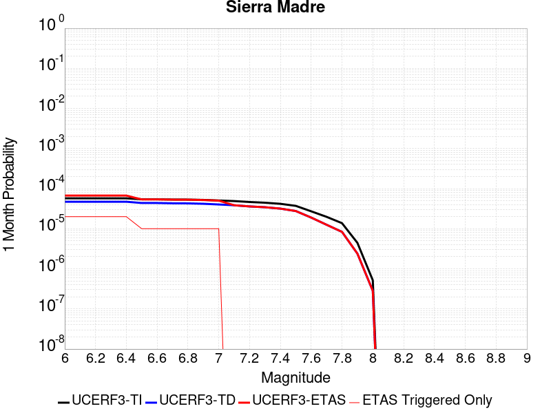 |  |  |

| Magnitude | 1 wk TI Prob | 1 wk TD Prob | 1 wk ETAS Prob | 1 wk ETAS/TD Gain | 1 wk ETAS Triggered Only | 1 mo TI Prob | 1 mo TD Prob | 1 mo ETAS Prob | 1 mo ETAS/TD Gain | 1 mo ETAS Triggered Only | 1 yr TI Prob | 1 yr TD Prob | 1 yr ETAS Prob | 1 yr ETAS/TD Gain | 1 yr ETAS Triggered Only | 10 yr TI Prob | 10 yr TD Prob | 10 yr ETAS Prob | 10 yr ETAS/TD Gain | 10 yr ETAS Triggered Only |
|-----|-----|-----|-----|-----|-----|-----|-----|-----|-----|-----|-----|-----|-----|-----|-----|-----|-----|-----|-----|-----|
| 6.0 | 1.3379373E-5 | 1.1000776E-5 | 1.1000776E-5 | 1.0 | 0.0 | 5.7338908E-5 | 4.714534E-5 | 6.71444E-5 | 1.4242 | 2.0E-5 | 6.978776E-4 | 5.738448E-4 | 5.9383333E-4 | 1.0348326 | 2.0E-5 | 0.0069569005 | 0.0057238447 | 0.0057437303 | 1.0034741 | 2.0E-5 |
| 6.1 | 1.3379373E-5 | 1.1000776E-5 | 1.1000776E-5 | 1.0 | 0.0 | 5.7338908E-5 | 4.714534E-5 | 6.71444E-5 | 1.4242 | 2.0E-5 | 6.978776E-4 | 5.738448E-4 | 5.9383333E-4 | 1.0348326 | 2.0E-5 | 0.0069569005 | 0.0057238447 | 0.0057437303 | 1.0034741 | 2.0E-5 |
| 6.2 | 1.3379373E-5 | 1.1000776E-5 | 1.1000776E-5 | 1.0 | 0.0 | 5.7338908E-5 | 4.714534E-5 | 6.71444E-5 | 1.4242 | 2.0E-5 | 6.978776E-4 | 5.738448E-4 | 5.9383333E-4 | 1.0348326 | 2.0E-5 | 0.0069569005 | 0.0057238447 | 0.0057437303 | 1.0034741 | 2.0E-5 |
| 6.3 | 1.3379373E-5 | 1.1000776E-5 | 1.1000776E-5 | 1.0 | 0.0 | 5.7338908E-5 | 4.714534E-5 | 6.71444E-5 | 1.4242 | 2.0E-5 | 6.978776E-4 | 5.738448E-4 | 5.9383333E-4 | 1.0348326 | 2.0E-5 | 0.0069569005 | 0.0057238447 | 0.0057437303 | 1.0034741 | 2.0E-5 |
| 6.4 | 1.3379373E-5 | 1.1000776E-5 | 1.1000776E-5 | 1.0 | 0.0 | 5.7338908E-5 | 4.714534E-5 | 6.71444E-5 | 1.4242 | 2.0E-5 | 6.978776E-4 | 5.738448E-4 | 5.9383333E-4 | 1.0348326 | 2.0E-5 | 0.0069569005 | 0.0057238447 | 0.0057437303 | 1.0034741 | 2.0E-5 |
| 6.5 | 1.26563245E-5 | 1.0230232E-5 | 1.0230232E-5 | 1.0 | 0.0 | 5.4240263E-5 | 4.384312E-5 | 5.3842683E-5 | 1.228076 | 1.0E-5 | 6.601751E-4 | 5.3366035E-4 | 5.43655E-4 | 1.0187285 | 1.0E-5 | 0.006582173 | 0.0053239604 | 0.005333907 | 1.0018682 | 1.0E-5 |
| 6.6 | 1.26563245E-5 | 1.0230232E-5 | 1.0230232E-5 | 1.0 | 0.0 | 5.4240263E-5 | 4.384312E-5 | 5.3842683E-5 | 1.228076 | 1.0E-5 | 6.601751E-4 | 5.3366035E-4 | 5.43655E-4 | 1.0187285 | 1.0E-5 | 0.006582173 | 0.0053239604 | 0.005333907 | 1.0018682 | 1.0E-5 |
| 6.7 | 1.2502474E-5 | 1.00663765E-5 | 1.00663765E-5 | 1.0 | 0.0 | 5.3580934E-5 | 4.3140906E-5 | 5.3140473E-5 | 1.2317885 | 1.0E-5 | 6.521526E-4 | 5.25115E-4 | 5.351097E-4 | 1.0190334 | 1.0E-5 | 0.0065024206 | 0.0052389116 | 0.005248859 | 1.0018988 | 1.0E-5 |
| 6.8 | 1.2454966E-5 | 1.0018662E-5 | 1.0018662E-5 | 1.0 | 0.0 | 5.3377335E-5 | 4.293642E-5 | 5.293599E-5 | 1.2328925 | 1.0E-5 | 6.4967526E-4 | 5.226266E-4 | 5.3262134E-4 | 1.0191242 | 1.0E-5 | 0.006477792 | 0.0052141445 | 0.0052240924 | 1.0019078 | 1.0E-5 |
| 6.9 | 1.2225574E-5 | 9.792639E-6 | 9.792639E-6 | 1.0 | 0.0 | 5.2394265E-5 | 4.196778E-5 | 5.1967363E-5 | 1.238268 | 1.0E-5 | 6.3771347E-4 | 5.10839E-4 | 5.208339E-4 | 1.0195656 | 1.0E-5 | 0.006358865 | 0.0050968137 | 0.005106763 | 1.001952 | 1.0E-5 |
| 7.0 | 1.182946E-5 | 9.399179E-6 | 9.399179E-6 | 1.0 | 0.0 | 5.06967E-5 | 4.0281582E-5 | 5.0281178E-5 | 1.2482424 | 1.0E-5 | 6.1705755E-4 | 4.903189E-4 | 5.00314E-4 | 1.0203849 | 1.0E-5 | 0.006153469 | 0.004892533 | 0.0049024844 | 1.002034 | 1.0E-5 |
| 7.1 | 1.14369095E-5 | 8.986194E-6 | 8.986194E-6 | 1.0 | 0.0 | 4.9014405E-5 | 3.85117E-5 | 3.85117E-5 | 1.0 | 0.0 | 5.9658696E-4 | 4.6878002E-4 | 4.6878002E-4 | 1.0 | 0.0 | 0.005949879 | 0.0046780678 | 0.0046780678 | 1.0 | 0.0 |
| 7.2 | 1.0836419E-5 | 8.39959E-6 | 8.39959E-6 | 1.0 | 0.0 | 4.644097E-5 | 3.599775E-5 | 3.599775E-5 | 1.0 | 0.0 | 5.652721E-4 | 4.3818538E-4 | 4.3818538E-4 | 1.0 | 0.0 | 0.0056383642 | 0.0043733614 | 0.0043733614 | 1.0 | 0.0 |
| 7.3 | 1.0403439E-5 | 8.020854E-6 | 8.020854E-6 | 1.0 | 0.0 | 4.4585406E-5 | 3.437464E-5 | 3.437464E-5 | 1.0 | 0.0 | 5.426921E-4 | 4.184318E-4 | 4.184318E-4 | 1.0 | 0.0 | 0.005413687 | 0.004176585 | 0.004176585 | 1.0 | 0.0 |
| 7.4 | 9.768864E-6 | 7.4144855E-6 | 7.4144855E-6 | 1.0 | 0.0 | 4.186589E-5 | 3.1775984E-5 | 3.1775984E-5 | 1.0 | 0.0 | 5.09598E-4 | 3.868048E-4 | 3.868048E-4 | 1.0 | 0.0 | 0.0050843097 | 0.0038614576 | 0.0038614576 | 1.0 | 0.0 |
| 7.5 | 8.687089E-6 | 6.450183E-6 | 6.450183E-6 | 1.0 | 0.0 | 3.722985E-5 | 2.7643353E-5 | 2.7643353E-5 | 1.0 | 0.0 | 4.5317915E-4 | 3.3650672E-4 | 3.3650672E-4 | 1.0 | 0.0 | 0.004522561 | 0.003360109 | 0.003360109 | 1.0 | 0.0 |
| 7.6 | 6.3506063E-6 | 4.430329E-6 | 4.430329E-6 | 1.0 | 0.0 | 2.72166E-5 | 1.8986988E-5 | 1.8986988E-5 | 1.0 | 0.0 | 3.3131172E-4 | 2.3114232E-4 | 2.3114232E-4 | 1.0 | 0.0 | 0.003308182 | 0.0023090935 | 0.0023090935 | 1.0 | 0.0 |
| 7.7 | 4.62223E-6 | 2.9329542E-6 | 2.9329542E-6 | 1.0 | 0.0 | 1.9809406E-5 | 1.2569743E-5 | 1.2569743E-5 | 1.0 | 0.0 | 2.4115283E-4 | 1.5302589E-4 | 1.5302589E-4 | 1.0 | 0.0 | 0.0024089129 | 0.0015292577 | 0.0015292577 | 1.0 | 0.0 |
| 7.8 | 3.2145008E-6 | 1.949411E-6 | 1.949411E-6 | 1.0 | 0.0 | 1.3776359E-5 | 8.354592E-6 | 8.354592E-6 | 1.0 | 0.0 | 1.6771426E-4 | 1.01712416E-4 | 1.01712416E-4 | 1.0 | 0.0 | 0.0016758774 | 0.0010166786 | 0.0010166786 | 1.0 | 0.0 |
| 7.9 | 1.0391769E-6 | 5.602482E-7 | 5.602482E-7 | 1.0 | 0.0 | 4.4536077E-6 | 2.4010617E-6 | 2.4010617E-6 | 1.0 | 0.0 | 5.4221324E-5 | 2.9232539E-5 | 2.9232539E-5 | 1.0 | 0.0 | 5.4208096E-4 | 2.9228735E-4 | 2.9228735E-4 | 1.0 | 0.0 |
| 8.0 | 1.210983E-7 | 6.613497E-8 | 6.613497E-8 | 1.0 | 0.0 | 5.1899264E-7 | 2.8343558E-7 | 2.8343558E-7 | 1.0 | 0.0 | 6.3187167E-6 | 3.4508228E-6 | 3.4508228E-6 | 1.0 | 0.0 | 6.318537E-5 | 3.450771E-5 | 3.450771E-5 | 1.0 | 0.0 |

## Great Valley 07 (Orestimba)
*[(top)](#table-of-contents)*

| 1 Week | 1 Month | 1 Year | 10 Year |
|-----|-----|-----|-----|
|  |  |  |  |

| Magnitude | 1 wk TI Prob | 1 wk TD Prob | 1 wk ETAS Prob | 1 wk ETAS/TD Gain | 1 wk ETAS Triggered Only | 1 mo TI Prob | 1 mo TD Prob | 1 mo ETAS Prob | 1 mo ETAS/TD Gain | 1 mo ETAS Triggered Only | 1 yr TI Prob | 1 yr TD Prob | 1 yr ETAS Prob | 1 yr ETAS/TD Gain | 1 yr ETAS Triggered Only | 10 yr TI Prob | 10 yr TD Prob | 10 yr ETAS Prob | 10 yr ETAS/TD Gain | 10 yr ETAS Triggered Only |
|-----|-----|-----|-----|-----|-----|-----|-----|-----|-----|-----|-----|-----|-----|-----|-----|-----|-----|-----|-----|-----|
| 6.0 | 2.9687902E-5 | 3.27575E-5 | 4.2757172E-5 | 1.3052636 | 1.0E-5 | 1.2722766E-4 | 1.4038214E-4 | 1.5038073E-4 | 1.0712241 | 1.0E-5 | 0.0015478961 | 0.0017078844 | 0.0017178673 | 1.0058452 | 1.0E-5 | 0.015371585 | 0.016955135 | 0.016974797 | 1.0011595 | 2.0E-5 |
| 6.1 | 2.9687902E-5 | 3.27575E-5 | 4.2757172E-5 | 1.3052636 | 1.0E-5 | 1.2722766E-4 | 1.4038214E-4 | 1.5038073E-4 | 1.0712241 | 1.0E-5 | 0.0015478961 | 0.0017078844 | 0.0017178673 | 1.0058452 | 1.0E-5 | 0.015371585 | 0.016955135 | 0.016974797 | 1.0011595 | 2.0E-5 |
| 6.2 | 1.9231524E-5 | 2.1159167E-5 | 3.1158954E-5 | 1.4725984 | 1.0E-5 | 8.2418206E-5 | 9.067912E-5 | 1.0067821E-4 | 1.110269 | 1.0E-5 | 0.0010029797 | 0.0011034822 | 0.0011134712 | 1.0090523 | 1.0E-5 | 0.00998465 | 0.010982441 | 0.01100222 | 1.0018011 | 2.0E-5 |
| 6.3 | 1.324766E-5 | 1.4548534E-5 | 2.4548388E-5 | 1.6873446 | 1.0E-5 | 5.6774446E-5 | 6.234942E-5 | 7.23488E-5 | 1.1603764 | 1.0E-5 | 6.910097E-4 | 7.5884897E-4 | 7.6884136E-4 | 1.0131679 | 1.0E-5 | 0.006888649 | 0.0075635235 | 0.0075833723 | 1.0026243 | 2.0E-5 |
| 6.4 | 7.818645E-6 | 8.57284E-6 | 1.8572755E-5 | 2.1664646 | 1.0E-5 | 3.3508048E-5 | 3.6740246E-5 | 4.673988E-5 | 1.2721711 | 1.0E-5 | 4.078841E-4 | 4.4722404E-4 | 4.5721958E-4 | 1.0223502 | 1.0E-5 | 0.004071363 | 0.0044635804 | 0.004473536 | 1.0022304 | 1.0E-5 |
| 6.5 | 5.3076565E-6 | 5.8178007E-6 | 1.5817743E-5 | 2.7188525 | 1.0E-5 | 2.27469E-5 | 2.4933206E-5 | 3.4932957E-5 | 1.4010615 | 1.0E-5 | 2.7690834E-4 | 3.035216E-4 | 3.1351857E-4 | 1.0329366 | 1.0E-5 | 0.0027656353 | 0.00303128 | 0.0030412497 | 1.003289 | 1.0E-5 |
| 6.6 | 3.6003578E-6 | 3.9484953E-6 | 1.39484555E-5 | 3.5326002 | 1.0E-5 | 1.5430012E-5 | 1.6922022E-5 | 2.6921853E-5 | 1.590936 | 1.0E-5 | 1.8784421E-4 | 2.0600771E-4 | 2.1600565E-4 | 1.0485319 | 1.0E-5 | 0.0018768552 | 0.0020583214 | 0.0020683007 | 1.0048484 | 1.0E-5 |
| 6.7 | 2.5361826E-6 | 2.7834678E-6 | 2.7834678E-6 | 1.0 | 0.0 | 1.0869308E-5 | 1.1929101E-5 | 1.1929101E-5 | 1.0 | 0.0 | 1.3232579E-4 | 1.4522845E-4 | 1.4522845E-4 | 1.0 | 0.0 | 0.0013224703 | 0.0014514653 | 0.0014514653 | 1.0 | 0.0 |
| 6.8 | 1.2115831E-6 | 1.3313797E-6 | 1.3313797E-6 | 1.0 | 0.0 | 5.1924885E-6 | 5.7059065E-6 | 5.7059065E-6 | 1.0 | 0.0 | 6.3216714E-5 | 6.9468166E-5 | 6.9468166E-5 | 1.0 | 0.0 | 6.3198735E-4 | 6.945596E-4 | 6.945596E-4 | 1.0 | 0.0 |

## Verdugo
*[(top)](#table-of-contents)*

| 1 Week | 1 Month | 1 Year | 10 Year |
|-----|-----|-----|-----|
| 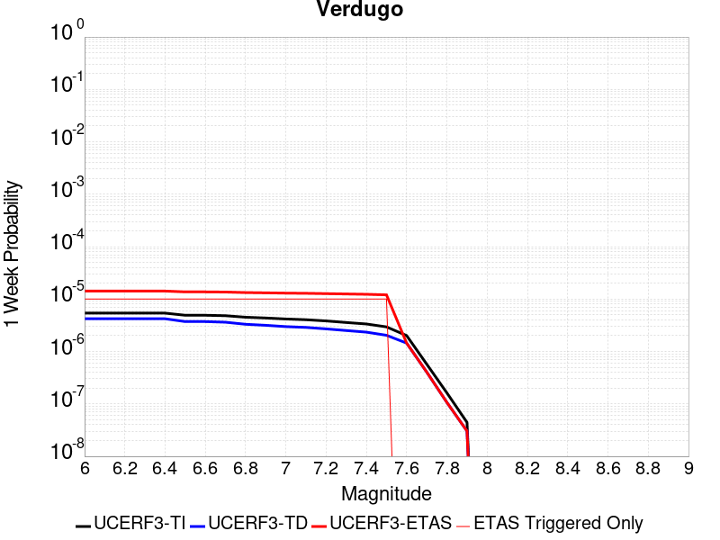 |  |  |  |

| Magnitude | 1 wk TI Prob | 1 wk TD Prob | 1 wk ETAS Prob | 1 wk ETAS/TD Gain | 1 wk ETAS Triggered Only | 1 mo TI Prob | 1 mo TD Prob | 1 mo ETAS Prob | 1 mo ETAS/TD Gain | 1 mo ETAS Triggered Only | 1 yr TI Prob | 1 yr TD Prob | 1 yr ETAS Prob | 1 yr ETAS/TD Gain | 1 yr ETAS Triggered Only | 10 yr TI Prob | 10 yr TD Prob | 10 yr ETAS Prob | 10 yr ETAS/TD Gain | 10 yr ETAS Triggered Only |
|-----|-----|-----|-----|-----|-----|-----|-----|-----|-----|-----|-----|-----|-----|-----|-----|-----|-----|-----|-----|-----|
| 6.0 | 5.392987E-6 | 4.2164934E-6 | 1.4216451E-5 | 3.371629 | 1.0E-5 | 2.3112598E-5 | 1.8070563E-5 | 2.8070383E-5 | 1.5533762 | 1.0E-5 | 2.8135953E-4 | 2.1998737E-4 | 2.2998518E-4 | 1.0454471 | 1.0E-5 | 0.0028100356 | 0.0021977439 | 0.0022176998 | 1.0090803 | 2.0E-5 |
| 6.1 | 5.392987E-6 | 4.2164934E-6 | 1.4216451E-5 | 3.371629 | 1.0E-5 | 2.3112598E-5 | 1.8070563E-5 | 2.8070383E-5 | 1.5533762 | 1.0E-5 | 2.8135953E-4 | 2.1998737E-4 | 2.2998518E-4 | 1.0454471 | 1.0E-5 | 0.0028100356 | 0.0021977439 | 0.0022176998 | 1.0090803 | 2.0E-5 |
| 6.2 | 5.392987E-6 | 4.2164934E-6 | 1.4216451E-5 | 3.371629 | 1.0E-5 | 2.3112598E-5 | 1.8070563E-5 | 2.8070383E-5 | 1.5533762 | 1.0E-5 | 2.8135953E-4 | 2.1998737E-4 | 2.2998518E-4 | 1.0454471 | 1.0E-5 | 0.0028100356 | 0.0021977439 | 0.0022176998 | 1.0090803 | 2.0E-5 |
| 6.3 | 5.392987E-6 | 4.2164934E-6 | 1.4216451E-5 | 3.371629 | 1.0E-5 | 2.3112598E-5 | 1.8070563E-5 | 2.8070383E-5 | 1.5533762 | 1.0E-5 | 2.8135953E-4 | 2.1998737E-4 | 2.2998518E-4 | 1.0454471 | 1.0E-5 | 0.0028100356 | 0.0021977439 | 0.0022176998 | 1.0090803 | 2.0E-5 |
| 6.4 | 5.392987E-6 | 4.2164934E-6 | 1.4216451E-5 | 3.371629 | 1.0E-5 | 2.3112598E-5 | 1.8070563E-5 | 2.8070383E-5 | 1.5533762 | 1.0E-5 | 2.8135953E-4 | 2.1998737E-4 | 2.2998518E-4 | 1.0454471 | 1.0E-5 | 0.0028100356 | 0.0021977439 | 0.0022176998 | 1.0090803 | 2.0E-5 |
| 6.5 | 4.9154837E-6 | 3.7224413E-6 | 1.3722404E-5 | 3.686399 | 1.0E-5 | 2.1066187E-5 | 1.5953223E-5 | 2.5953064E-5 | 1.6268226 | 1.0E-5 | 2.5645064E-4 | 1.9421338E-4 | 2.0421145E-4 | 1.0514797 | 1.0E-5 | 0.002561549 | 0.0019404575 | 0.0019604187 | 1.0102868 | 2.0E-5 |
| 6.6 | 4.9154837E-6 | 3.7224413E-6 | 1.3722404E-5 | 3.686399 | 1.0E-5 | 2.1066187E-5 | 1.5953223E-5 | 2.5953064E-5 | 1.6268226 | 1.0E-5 | 2.5645064E-4 | 1.9421338E-4 | 2.0421145E-4 | 1.0514797 | 1.0E-5 | 0.002561549 | 0.0019404575 | 0.0019604187 | 1.0102868 | 2.0E-5 |
| 6.7 | 4.817006E-6 | 3.620628E-6 | 1.3620592E-5 | 3.761942 | 1.0E-5 | 2.0644147E-5 | 1.5516885E-5 | 2.551673E-5 | 1.6444492 | 1.0E-5 | 2.513135E-4 | 1.889019E-4 | 1.9890002E-4 | 1.0529275 | 1.0E-5 | 0.0025102948 | 0.0018874329 | 0.0019073952 | 1.0105764 | 2.0E-5 |
| 6.8 | 4.507407E-6 | 3.3070805E-6 | 1.3307047E-5 | 4.023805 | 1.0E-5 | 1.9317316E-5 | 1.4173126E-5 | 2.4172985E-5 | 1.7055507 | 1.0E-5 | 2.3516294E-4 | 1.7254429E-4 | 1.8254256E-4 | 1.0579461 | 1.0E-5 | 0.0023491425 | 0.0017241176 | 0.0017341003 | 1.0057901 | 1.0E-5 |
| 6.9 | 4.3573054E-6 | 3.1609877E-6 | 1.3160956E-5 | 4.163558 | 1.0E-5 | 1.8674033E-5 | 1.354702E-5 | 2.3546885E-5 | 1.7381597 | 1.0E-5 | 2.2733262E-4 | 1.649226E-4 | 1.7492096E-4 | 1.0606245 | 1.0E-5 | 0.0022710022 | 0.0016480145 | 0.0016579981 | 1.0060579 | 1.0E-5 |
| 7.0 | 4.171527E-6 | 2.9836467E-6 | 1.2983617E-5 | 4.351593 | 1.0E-5 | 1.787785E-5 | 1.2786995E-5 | 2.2786868E-5 | 1.7820345 | 1.0E-5 | 2.1764109E-4 | 1.5567066E-4 | 1.656691E-4 | 1.0642282 | 1.0E-5 | 0.0021742806 | 0.0015556274 | 0.0015656119 | 1.0064182 | 1.0E-5 |
| 7.1 | 4.0405484E-6 | 2.882238E-6 | 1.2882209E-5 | 4.4695163 | 1.0E-5 | 1.731652E-5 | 1.23523905E-5 | 2.2352267E-5 | 1.8095499 | 1.0E-5 | 2.1080824E-4 | 1.5038009E-4 | 1.6037858E-4 | 1.0664881 | 1.0E-5 | 0.0021060838 | 0.0015027943 | 0.0015127793 | 1.0066442 | 1.0E-5 |
| 7.2 | 3.8306007E-6 | 2.701823E-6 | 1.2701796E-5 | 4.701195 | 1.0E-5 | 1.6416758E-5 | 1.157919E-5 | 2.1579075E-5 | 1.8636082 | 1.0E-5 | 1.9985568E-4 | 1.4096762E-4 | 1.5096621E-4 | 1.0709282 | 1.0E-5 | 0.0019967605 | 0.0014087928 | 0.0014187787 | 1.0070883 | 1.0E-5 |
| 7.3 | 3.5750938E-6 | 2.512154E-6 | 1.2512129E-5 | 4.9806376 | 1.0E-5 | 1.532174E-5 | 1.076633E-5 | 2.0766223E-5 | 1.9288116 | 1.0E-5 | 1.8652623E-4 | 1.3107229E-4 | 1.4107098E-4 | 1.0762838 | 1.0E-5 | 0.0018636974 | 0.0013099604 | 0.0013199473 | 1.0076238 | 1.0E-5 |
| 7.4 | 3.3510041E-6 | 2.340838E-6 | 1.23408145E-5 | 5.2719646 | 1.0E-5 | 1.4361368E-5 | 1.0032124E-5 | 2.0032025E-5 | 1.9967879 | 1.0E-5 | 1.7483562E-4 | 1.2213437E-4 | 1.3213315E-4 | 1.081867 | 1.0E-5 | 0.0017469813 | 0.0012206829 | 0.0012306707 | 1.0081822 | 1.0E-5 |
| 7.5 | 2.948287E-6 | 2.0390912E-6 | 1.20390705E-5 | 5.9041357 | 1.0E-5 | 1.2635454E-5 | 8.7389335E-6 | 1.8738847E-5 | 2.1442943 | 1.0E-5 | 1.538258E-4 | 1.06391424E-4 | 1.1639036E-4 | 1.0939826 | 1.0E-5 | 0.0015371935 | 0.0010634151 | 0.0010734044 | 1.0093937 | 1.0E-5 |
| 7.6 | 2.0134323E-6 | 1.4471086E-6 | 1.4471086E-6 | 1.0 | 0.0 | 8.628967E-6 | 6.20188E-6 | 6.20188E-6 | 1.0 | 0.0 | 1.05052604E-4 | 7.550536E-5 | 7.550536E-5 | 1.0 | 0.0 | 0.0010500296 | 7.548059E-4 | 7.548059E-4 | 1.0 | 0.0 |
| 7.7 | 5.726436E-7 | 4.0453273E-7 | 4.0453273E-7 | 1.0 | 0.0 | 2.4541846E-6 | 1.7337106E-6 | 1.7337106E-6 | 1.0 | 0.0 | 2.9879287E-5 | 2.110775E-5 | 2.110775E-5 | 1.0 | 0.0 | 2.987527E-4 | 2.1105999E-4 | 2.1105999E-4 | 1.0 | 0.0 |
| 7.8 | 1.6248204E-7 | 1.06879604E-7 | 1.06879604E-7 | 1.0 | 0.0 | 6.963514E-7 | 4.5805535E-7 | 4.5805535E-7 | 1.0 | 0.0 | 8.478045E-6 | 5.57681E-6 | 5.57681E-6 | 1.0 | 0.0 | 8.477722E-5 | 5.5766737E-5 | 5.5766737E-5 | 1.0 | 0.0 |
| 7.9 | 4.4475744E-8 | 3.037888E-8 | 3.037888E-8 | 1.0 | 0.0 | 1.9061031E-7 | 1.301952E-7 | 1.301952E-7 | 1.0 | 0.0 | 2.320678E-6 | 1.5851255E-6 | 1.5851255E-6 | 1.0 | 0.0 | 2.3206538E-5 | 1.5851156E-5 | 1.5851156E-5 | 1.0 | 0.0 |

## Oceanside alt1
*[(top)](#table-of-contents)*

| 1 Week | 1 Month | 1 Year | 10 Year |
|-----|-----|-----|-----|
|  |  | 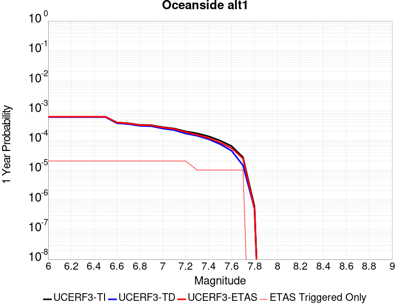 |  |

| Magnitude | 1 wk TI Prob | 1 wk TD Prob | 1 wk ETAS Prob | 1 wk ETAS/TD Gain | 1 wk ETAS Triggered Only | 1 mo TI Prob | 1 mo TD Prob | 1 mo ETAS Prob | 1 mo ETAS/TD Gain | 1 mo ETAS Triggered Only | 1 yr TI Prob | 1 yr TD Prob | 1 yr ETAS Prob | 1 yr ETAS/TD Gain | 1 yr ETAS Triggered Only | 10 yr TI Prob | 10 yr TD Prob | 10 yr ETAS Prob | 10 yr ETAS/TD Gain | 10 yr ETAS Triggered Only |
|-----|-----|-----|-----|-----|-----|-----|-----|-----|-----|-----|-----|-----|-----|-----|-----|-----|-----|-----|-----|-----|
| 6.0 | 1.1617542E-5 | 1.1423485E-5 | 1.1423485E-5 | 1.0 | 0.0 | 4.9788516E-5 | 4.8956965E-5 | 5.8956477E-5 | 1.204251 | 1.0E-5 | 6.060066E-4 | 5.9590413E-4 | 6.1589223E-4 | 1.0335424 | 2.0E-5 | 0.0060435664 | 0.0059446604 | 0.005964542 | 1.0033444 | 2.0E-5 |
| 6.1 | 1.1617542E-5 | 1.1423485E-5 | 1.1423485E-5 | 1.0 | 0.0 | 4.9788516E-5 | 4.8956965E-5 | 5.8956477E-5 | 1.204251 | 1.0E-5 | 6.060066E-4 | 5.9590413E-4 | 6.1589223E-4 | 1.0335424 | 2.0E-5 | 0.0060435664 | 0.0059446604 | 0.005964542 | 1.0033444 | 2.0E-5 |
| 6.2 | 1.1617542E-5 | 1.1423485E-5 | 1.1423485E-5 | 1.0 | 0.0 | 4.9788516E-5 | 4.8956965E-5 | 5.8956477E-5 | 1.204251 | 1.0E-5 | 6.060066E-4 | 5.9590413E-4 | 6.1589223E-4 | 1.0335424 | 2.0E-5 | 0.0060435664 | 0.0059446604 | 0.005964542 | 1.0033444 | 2.0E-5 |
| 6.3 | 1.1617542E-5 | 1.1423485E-5 | 1.1423485E-5 | 1.0 | 0.0 | 4.9788516E-5 | 4.8956965E-5 | 5.8956477E-5 | 1.204251 | 1.0E-5 | 6.060066E-4 | 5.9590413E-4 | 6.1589223E-4 | 1.0335424 | 2.0E-5 | 0.0060435664 | 0.0059446604 | 0.005964542 | 1.0033444 | 2.0E-5 |
| 6.4 | 1.1617542E-5 | 1.1423485E-5 | 1.1423485E-5 | 1.0 | 0.0 | 4.9788516E-5 | 4.8956965E-5 | 5.8956477E-5 | 1.204251 | 1.0E-5 | 6.060066E-4 | 5.9590413E-4 | 6.1589223E-4 | 1.0335424 | 2.0E-5 | 0.0060435664 | 0.0059446604 | 0.005964542 | 1.0033444 | 2.0E-5 |
| 6.5 | 1.1617542E-5 | 1.1423485E-5 | 1.1423485E-5 | 1.0 | 0.0 | 4.9788516E-5 | 4.8956965E-5 | 5.8956477E-5 | 1.204251 | 1.0E-5 | 6.060066E-4 | 5.9590413E-4 | 6.1589223E-4 | 1.0335424 | 2.0E-5 | 0.0060435664 | 0.0059446604 | 0.005964542 | 1.0033444 | 2.0E-5 |
| 6.6 | 7.561768E-6 | 7.1336085E-6 | 7.1336085E-6 | 1.0 | 0.0 | 3.2407173E-5 | 3.0572253E-5 | 4.0571947E-5 | 1.327084 | 1.0E-5 | 3.9448592E-4 | 3.721547E-4 | 3.9214725E-4 | 1.0537211 | 2.0E-5 | 0.0039378637 | 0.0037154262 | 0.003735352 | 1.005363 | 2.0E-5 |
| 6.7 | 7.1042605E-6 | 6.6556786E-6 | 6.6556786E-6 | 1.0 | 0.0 | 3.0446476E-5 | 2.852403E-5 | 3.8523744E-5 | 1.3505716 | 1.0E-5 | 3.706228E-4 | 3.4722552E-4 | 3.6721857E-4 | 1.0575794 | 2.0E-5 | 0.0037000529 | 0.0034669132 | 0.003486844 | 1.0057489 | 2.0E-5 |
| 6.8 | 6.285554E-6 | 5.7996986E-6 | 5.7996986E-6 | 1.0 | 0.0 | 2.693781E-5 | 2.4855617E-5 | 3.485537E-5 | 1.4023136 | 1.0E-5 | 3.2791847E-4 | 3.0257567E-4 | 3.2256963E-4 | 1.0660791 | 2.0E-5 | 0.0032743502 | 0.0030216945 | 0.003041634 | 1.0065988 | 2.0E-5 |
| 6.9 | 6.148883E-6 | 5.6565373E-6 | 5.6565373E-6 | 1.0 | 0.0 | 2.635209E-5 | 2.4242081E-5 | 3.424184E-5 | 1.4124959 | 1.0E-5 | 3.2078946E-4 | 2.951079E-4 | 3.15102E-4 | 1.0677518 | 2.0E-5 | 0.003203268 | 0.002947217 | 0.002967158 | 1.0067661 | 2.0E-5 |
| 7.0 | 5.253857E-6 | 4.7223966E-6 | 4.7223966E-6 | 1.0 | 0.0 | 2.2516335E-5 | 2.0238687E-5 | 3.0238485E-5 | 1.4940932 | 1.0E-5 | 2.7410188E-4 | 2.4637848E-4 | 2.6637354E-4 | 1.0811559 | 2.0E-5 | 0.0027376404 | 0.0024610846 | 0.0024810354 | 1.0081065 | 2.0E-5 |
| 7.1 | 4.730754E-6 | 4.1785024E-6 | 4.1785024E-6 | 1.0 | 0.0 | 2.0274503E-5 | 1.7907745E-5 | 2.7907567E-5 | 1.5584075 | 1.0E-5 | 2.468141E-4 | 2.1800524E-4 | 2.3800088E-4 | 1.0917209 | 2.0E-5 | 0.0024654015 | 0.0021779404 | 0.0021978968 | 1.009163 | 2.0E-5 |
| 7.2 | 3.7998386E-6 | 3.2140165E-6 | 3.2140165E-6 | 1.0 | 0.0 | 1.6284921E-5 | 1.37742845E-5 | 2.3774146E-5 | 1.7259805 | 1.0E-5 | 1.9825088E-4 | 1.6768913E-4 | 1.8768577E-4 | 1.1192483 | 2.0E-5 | 0.001980741 | 0.0016756381 | 0.0016956046 | 1.0119158 | 2.0E-5 |
| 7.3 | 3.2656465E-6 | 2.6983669E-6 | 2.6983669E-6 | 1.0 | 0.0 | 1.3995553E-5 | 1.1564379E-5 | 2.1564263E-5 | 1.8647144 | 1.0E-5 | 1.7038253E-4 | 1.4078732E-4 | 1.5078591E-4 | 1.0710192 | 1.0E-5 | 0.0017025196 | 0.0014069924 | 0.0014169783 | 1.0070974 | 1.0E-5 |
| 7.4 | 2.593703E-6 | 2.0680227E-6 | 2.0680227E-6 | 1.0 | 0.0 | 1.1115822E-5 | 8.862925E-6 | 1.8862836E-5 | 2.1282856 | 1.0E-5 | 1.3532673E-4 | 1.0790086E-4 | 1.1789978E-4 | 1.0926677 | 1.0E-5 | 0.0013524436 | 0.0010784935 | 0.0010884828 | 1.0092622 | 1.0E-5 |
| 7.5 | 1.8715585E-6 | 1.4137277E-6 | 1.4137277E-6 | 1.0 | 0.0 | 8.020941E-6 | 6.058819E-6 | 1.6058759E-5 | 2.6504767 | 1.0E-5 | 9.7650576E-5 | 7.376369E-5 | 8.376295E-5 | 1.135558 | 1.0E-5 | 9.7607676E-4 | 7.373981E-4 | 7.4739073E-4 | 1.0135512 | 1.0E-5 |
| 7.6 | 1.2246786E-6 | 8.526946E-7 | 8.526946E-7 | 1.0 | 0.0 | 5.248612E-6 | 3.6544006E-6 | 1.3654364E-5 | 3.7364168 | 1.0E-5 | 6.389998E-5 | 4.4491466E-5 | 5.449102E-5 | 1.2247522 | 1.0E-5 | 6.3881604E-4 | 4.4483008E-4 | 4.548256E-4 | 1.0224705 | 1.0E-5 |
| 7.7 | 5.140719E-7 | 2.7346528E-7 | 2.7346528E-7 | 1.0 | 0.0 | 2.2031636E-6 | 1.1719936E-6 | 1.1171982E-5 | 9.532459 | 1.0E-5 | 2.6823185E-5 | 1.4268943E-5 | 2.42688E-5 | 1.7008128 | 1.0E-5 | 2.6819948E-4 | 1.4268162E-4 | 1.526802E-4 | 1.0700761 | 1.0E-5 |
| 7.8 | 1.16056995E-8 | 9.782997E-9 | 9.782997E-9 | 1.0 | 0.0 | 4.9738713E-8 | 4.1927127E-8 | 4.1927127E-8 | 1.0 | 0.0 | 6.0556863E-7 | 5.1046277E-7 | 5.1046277E-7 | 1.0 | 0.0 | 6.05567E-6 | 5.1046277E-6 | 5.1046277E-6 | 1.0 | 0.0 |

## San Andreas (Santa Cruz Mts) 2011 CFM
*[(top)](#table-of-contents)*

| 1 Week | 1 Month | 1 Year | 10 Year |
|-----|-----|-----|-----|
| 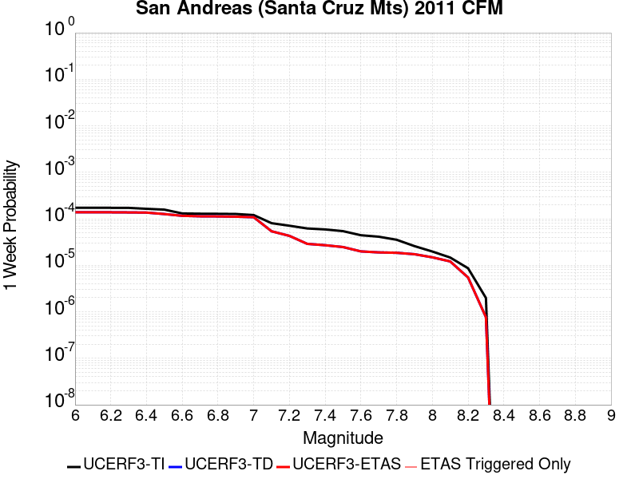 |  |  |  |

| Magnitude | 1 wk TI Prob | 1 wk TD Prob | 1 wk ETAS Prob | 1 wk ETAS/TD Gain | 1 wk ETAS Triggered Only | 1 mo TI Prob | 1 mo TD Prob | 1 mo ETAS Prob | 1 mo ETAS/TD Gain | 1 mo ETAS Triggered Only | 1 yr TI Prob | 1 yr TD Prob | 1 yr ETAS Prob | 1 yr ETAS/TD Gain | 1 yr ETAS Triggered Only | 10 yr TI Prob | 10 yr TD Prob | 10 yr ETAS Prob | 10 yr ETAS/TD Gain | 10 yr ETAS Triggered Only |
|-----|-----|-----|-----|-----|-----|-----|-----|-----|-----|-----|-----|-----|-----|-----|-----|-----|-----|-----|-----|-----|
| 6.0 | 1.7221631E-4 | 1.3792426E-4 | 1.3792426E-4 | 1.0 | 0.0 | 7.378611E-4 | 5.9097214E-4 | 5.9097214E-4 | 1.0 | 0.0 | 0.008946515 | 0.0071717235 | 0.0071717235 | 1.0 | 0.0 | 0.08594794 | 0.07054796 | 0.07056655 | 1.0002635 | 2.0E-5 |
| 6.1 | 1.7221631E-4 | 1.3792426E-4 | 1.3792426E-4 | 1.0 | 0.0 | 7.378611E-4 | 5.9097214E-4 | 5.9097214E-4 | 1.0 | 0.0 | 0.008946515 | 0.0071717235 | 0.0071717235 | 1.0 | 0.0 | 0.08594794 | 0.07054796 | 0.07056655 | 1.0002635 | 2.0E-5 |
| 6.2 | 1.7221631E-4 | 1.3792426E-4 | 1.3792426E-4 | 1.0 | 0.0 | 7.378611E-4 | 5.9097214E-4 | 5.9097214E-4 | 1.0 | 0.0 | 0.008946515 | 0.0071717235 | 0.0071717235 | 1.0 | 0.0 | 0.08594794 | 0.07054796 | 0.07056655 | 1.0002635 | 2.0E-5 |
| 6.3 | 1.716926E-4 | 1.3711878E-4 | 1.3711878E-4 | 1.0 | 0.0 | 7.3561794E-4 | 5.8752164E-4 | 5.8752164E-4 | 1.0 | 0.0 | 0.008919428 | 0.007129989 | 0.007129989 | 1.0 | 0.0 | 0.08569809 | 0.07015993 | 0.07017852 | 1.0002651 | 2.0E-5 |
| 6.4 | 1.6392978E-4 | 1.3587909E-4 | 1.3587909E-4 | 1.0 | 0.0 | 7.02367E-4 | 5.82211E-4 | 5.82211E-4 | 1.0 | 0.0 | 0.008517839 | 0.0070657525 | 0.0070657525 | 1.0 | 0.0 | 0.08198654 | 0.069394976 | 0.06941359 | 1.0002682 | 2.0E-5 |
| 6.5 | 1.5742714E-4 | 1.2647794E-4 | 1.2647794E-4 | 1.0 | 0.0 | 6.745133E-4 | 5.419374E-4 | 5.419374E-4 | 1.0 | 0.0 | 0.00818132 | 0.0065784375 | 0.0065784375 | 1.0 | 0.0 | 0.078865945 | 0.06486093 | 0.06487963 | 1.0002884 | 2.0E-5 |
| 6.6 | 1.3038084E-4 | 1.1587992E-4 | 1.1587992E-4 | 1.0 | 0.0 | 5.5865536E-4 | 4.96535E-4 | 4.96535E-4 | 1.0 | 0.0 | 0.006780438 | 0.006028784 | 0.006028784 | 1.0 | 0.0 | 0.0657725 | 0.059330538 | 0.05934935 | 1.0003171 | 2.0E-5 |
| 6.7 | 1.2867592E-4 | 1.1314491E-4 | 1.1314491E-4 | 1.0 | 0.0 | 5.5135164E-4 | 4.8481792E-4 | 4.8481792E-4 | 1.0 | 0.0 | 0.0066920654 | 0.005886907 | 0.005886907 | 1.0 | 0.0 | 0.06494093 | 0.058041416 | 0.058060255 | 1.0003246 | 2.0E-5 |
| 6.8 | 1.2801298E-4 | 1.12520516E-4 | 1.12520516E-4 | 1.0 | 0.0 | 5.485117E-4 | 4.8214293E-4 | 4.8214293E-4 | 1.0 | 0.0 | 0.0066577005 | 0.0058545293 | 0.0058545293 | 1.0 | 0.0 | 0.06461738 | 0.05775524 | 0.057774086 | 1.0003263 | 2.0E-5 |
| 6.9 | 1.269149E-4 | 1.1094256E-4 | 1.1094256E-4 | 1.0 | 0.0 | 5.4380763E-4 | 4.7538272E-4 | 4.7538272E-4 | 1.0 | 0.0 | 0.006600777 | 0.005772663 | 0.005772663 | 1.0 | 0.0 | 0.06408122 | 0.057027116 | 0.057045978 | 1.0003307 | 2.0E-5 |
| 7.0 | 1.2030331E-4 | 1.0824356E-4 | 1.0824356E-4 | 1.0 | 0.0 | 5.154837E-4 | 4.638198E-4 | 4.638198E-4 | 1.0 | 0.0 | 0.006257969 | 0.0056326203 | 0.0056326203 | 1.0 | 0.0 | 0.06084648 | 0.055699922 | 0.05571881 | 1.000339 | 2.0E-5 |
| 7.1 | 8.049617E-5 | 5.392429E-5 | 5.392429E-5 | 1.0 | 0.0 | 3.4493793E-4 | 2.3108382E-4 | 2.3108382E-4 | 1.0 | 0.0 | 0.0041915346 | 0.0028098505 | 0.0028098505 | 1.0 | 0.0 | 0.041133516 | 0.029618833 | 0.02963824 | 1.0006553 | 2.0E-5 |
| 7.2 | 7.093979E-5 | 4.2935415E-5 | 4.2935415E-5 | 1.0 | 0.0 | 3.0399222E-4 | 1.8399608E-4 | 1.8399608E-4 | 1.0 | 0.0 | 0.0036948253 | 0.0022378736 | 0.0022378736 | 1.0 | 0.0 | 0.03633994 | 0.023941126 | 0.023950886 | 1.0004077 | 1.0E-5 |
| 7.3 | 6.193693E-5 | 2.8891074E-5 | 2.8891074E-5 | 1.0 | 0.0 | 2.6541698E-4 | 1.2381302E-4 | 1.2381302E-4 | 1.0 | 0.0 | 0.0032266637 | 0.001506383 | 0.001506383 | 1.0 | 0.0 | 0.031802133 | 0.016497677 | 0.016507512 | 1.0005962 | 1.0E-5 |
| 7.4 | 5.906492E-5 | 2.7020369E-5 | 2.7020369E-5 | 1.0 | 0.0 | 2.5311083E-4 | 1.1579645E-4 | 1.1579645E-4 | 1.0 | 0.0 | 0.0030772698 | 0.0014089114 | 0.0014089114 | 1.0 | 0.0 | 0.030350044 | 0.0154695045 | 0.0154793495 | 1.0006365 | 1.0E-5 |
| 7.5 | 5.424296E-5 | 2.4675093E-5 | 2.4675093E-5 | 1.0 | 0.0 | 2.324491E-4 | 1.0574612E-4 | 1.0574612E-4 | 1.0 | 0.0 | 0.002826395 | 0.0012866998 | 0.0012866998 | 1.0 | 0.0 | 0.027907165 | 0.014161854 | 0.014171712 | 1.0006961 | 1.0E-5 |
| 7.6 | 4.43084E-5 | 1.990151E-5 | 1.990151E-5 | 1.0 | 0.0 | 1.8987931E-4 | 8.528939E-5 | 8.528939E-5 | 1.0 | 0.0 | 0.0023093296 | 0.001037904 | 0.001037904 | 1.0 | 0.0 | 0.022854783 | 0.011411123 | 0.011421009 | 1.0008663 | 1.0E-5 |
| 7.7 | 4.118098E-5 | 1.8933848E-5 | 1.8933848E-5 | 1.0 | 0.0 | 1.7647797E-4 | 8.1142534E-5 | 8.1142534E-5 | 1.0 | 0.0 | 0.002146502 | 9.874629E-4 | 9.874629E-4 | 1.0 | 0.0 | 0.021258866 | 0.010868995 | 0.010878887 | 1.00091 | 1.0E-5 |
| 7.8 | 3.5408906E-5 | 1.856201E-5 | 1.856201E-5 | 1.0 | 0.0 | 1.5174363E-4 | 7.954905E-5 | 7.954905E-5 | 1.0 | 0.0 | 0.0018459131 | 9.6807955E-4 | 9.6807955E-4 | 1.0 | 0.0 | 0.018306552 | 0.0106506655 | 0.010660559 | 1.0009289 | 1.0E-5 |
| 7.9 | 2.5860836E-5 | 1.7313954E-5 | 1.7313954E-5 | 1.0 | 0.0 | 1.10827445E-4 | 7.420055E-5 | 7.420055E-5 | 1.0 | 0.0 | 0.001348489 | 9.030175E-4 | 9.030175E-4 | 1.0 | 0.0 | 0.013403354 | 0.009906601 | 0.009916502 | 1.0009995 | 1.0E-5 |
| 8.0 | 1.9777332E-5 | 1.4837888E-5 | 1.4837888E-5 | 1.0 | 0.0 | 8.4757245E-5 | 6.3589396E-5 | 6.3589396E-5 | 1.0 | 0.0 | 0.0010314309 | 7.739261E-4 | 7.739261E-4 | 1.0 | 0.0 | 0.010266567 | 0.008508087 | 0.008518002 | 1.0011654 | 1.0E-5 |
| 8.1 | 1.468494E-5 | 1.2105831E-5 | 1.2105831E-5 | 1.0 | 0.0 | 6.293394E-5 | 5.1881103E-5 | 5.1881103E-5 | 1.0 | 0.0 | 7.6595135E-4 | 6.3146953E-4 | 6.3146953E-4 | 1.0 | 0.0 | 0.0076331664 | 0.0069684954 | 0.006978426 | 1.001425 | 1.0E-5 |
| 8.2 | 8.63836E-6 | 5.4678667E-6 | 5.4678667E-6 | 1.0 | 0.0 | 3.7021015E-5 | 2.3433504E-5 | 2.3433504E-5 | 1.0 | 0.0 | 4.5063766E-4 | 2.8526565E-4 | 2.8526565E-4 | 1.0 | 0.0 | 0.004497249 | 0.003245162 | 0.003245162 | 1.0 | 0.0 |
| 8.3 | 1.983087E-6 | 7.6564595E-7 | 7.6564595E-7 | 1.0 | 0.0 | 8.498917E-6 | 3.281336E-6 | 3.281336E-6 | 1.0 | 0.0 | 1.034694E-4 | 3.9949547E-5 | 3.9949547E-5 | 1.0 | 0.0 | 0.0010342124 | 4.717979E-4 | 4.717979E-4 | 1.0 | 0.0 |

## Earthquake Valley
*[(top)](#table-of-contents)*

| 1 Week | 1 Month | 1 Year | 10 Year |
|-----|-----|-----|-----|
|  |  |  |  |

| Magnitude | 1 wk TI Prob | 1 wk TD Prob | 1 wk ETAS Prob | 1 wk ETAS/TD Gain | 1 wk ETAS Triggered Only | 1 mo TI Prob | 1 mo TD Prob | 1 mo ETAS Prob | 1 mo ETAS/TD Gain | 1 mo ETAS Triggered Only | 1 yr TI Prob | 1 yr TD Prob | 1 yr ETAS Prob | 1 yr ETAS/TD Gain | 1 yr ETAS Triggered Only | 10 yr TI Prob | 10 yr TD Prob | 10 yr ETAS Prob | 10 yr ETAS/TD Gain | 10 yr ETAS Triggered Only |
|-----|-----|-----|-----|-----|-----|-----|-----|-----|-----|-----|-----|-----|-----|-----|-----|-----|-----|-----|-----|-----|
| 6.0 | 1.9416384E-5 | 2.258411E-5 | 3.2583885E-5 | 1.4427792 | 1.0E-5 | 8.321042E-5 | 9.6786134E-5 | 1.0678516E-4 | 1.1033106 | 1.0E-5 | 0.001012616 | 0.001177854 | 0.0011978305 | 1.01696 | 2.0E-5 | 0.010080142 | 0.011727945 | 0.01174771 | 1.0016854 | 2.0E-5 |
| 6.1 | 1.9416384E-5 | 2.258411E-5 | 3.2583885E-5 | 1.4427792 | 1.0E-5 | 8.321042E-5 | 9.6786134E-5 | 1.0678516E-4 | 1.1033106 | 1.0E-5 | 0.001012616 | 0.001177854 | 0.0011978305 | 1.01696 | 2.0E-5 | 0.010080142 | 0.011727945 | 0.01174771 | 1.0016854 | 2.0E-5 |
| 6.2 | 1.9416384E-5 | 2.258411E-5 | 3.2583885E-5 | 1.4427792 | 1.0E-5 | 8.321042E-5 | 9.6786134E-5 | 1.0678516E-4 | 1.1033106 | 1.0E-5 | 0.001012616 | 0.001177854 | 0.0011978305 | 1.01696 | 2.0E-5 | 0.010080142 | 0.011727945 | 0.01174771 | 1.0016854 | 2.0E-5 |
| 6.3 | 1.9416384E-5 | 2.258411E-5 | 3.2583885E-5 | 1.4427792 | 1.0E-5 | 8.321042E-5 | 9.6786134E-5 | 1.0678516E-4 | 1.1033106 | 1.0E-5 | 0.001012616 | 0.001177854 | 0.0011978305 | 1.01696 | 2.0E-5 | 0.010080142 | 0.011727945 | 0.01174771 | 1.0016854 | 2.0E-5 |
| 6.4 | 1.9416384E-5 | 2.258411E-5 | 3.2583885E-5 | 1.4427792 | 1.0E-5 | 8.321042E-5 | 9.6786134E-5 | 1.0678516E-4 | 1.1033106 | 1.0E-5 | 0.001012616 | 0.001177854 | 0.0011978305 | 1.01696 | 2.0E-5 | 0.010080142 | 0.011727945 | 0.01174771 | 1.0016854 | 2.0E-5 |
| 6.5 | 1.9389157E-5 | 2.25527E-5 | 3.2552474E-5 | 1.4433959 | 1.0E-5 | 8.309374E-5 | 9.665152E-5 | 1.0665056E-4 | 1.1034545 | 1.0E-5 | 0.0010111968 | 0.001176217 | 0.0011961934 | 1.0169836 | 2.0E-5 | 0.010066078 | 0.011711747 | 0.011731513 | 1.0016876 | 2.0E-5 |
| 6.6 | 1.9389157E-5 | 2.25527E-5 | 3.2552474E-5 | 1.4433959 | 1.0E-5 | 8.309374E-5 | 9.665152E-5 | 1.0665056E-4 | 1.1034545 | 1.0E-5 | 0.0010111968 | 0.001176217 | 0.0011961934 | 1.0169836 | 2.0E-5 | 0.010066078 | 0.011711747 | 0.011731513 | 1.0016876 | 2.0E-5 |
| 6.7 | 1.4925434E-5 | 1.720822E-5 | 2.7208049E-5 | 1.5811076 | 1.0E-5 | 6.396457E-5 | 7.374791E-5 | 8.3747174E-5 | 1.1355871 | 1.0E-5 | 7.7849044E-4 | 8.97596E-4 | 9.1757806E-4 | 1.0222617 | 2.0E-5 | 0.007757689 | 0.008948081 | 0.0089679025 | 1.0022151 | 2.0E-5 |
| 6.8 | 1.3570335E-5 | 1.5616837E-5 | 1.5616837E-5 | 1.0 | 0.0 | 5.8157282E-5 | 6.692804E-5 | 6.692804E-5 | 1.0 | 0.0 | 7.0783484E-4 | 8.146264E-4 | 8.2461827E-4 | 1.0122656 | 1.0E-5 | 0.0070558446 | 0.008124473 | 0.008134392 | 1.0012208 | 1.0E-5 |
| 6.9 | 1.3570335E-5 | 1.5616837E-5 | 1.5616837E-5 | 1.0 | 0.0 | 5.8157282E-5 | 6.692804E-5 | 6.692804E-5 | 1.0 | 0.0 | 7.0783484E-4 | 8.146264E-4 | 8.2461827E-4 | 1.0122656 | 1.0E-5 | 0.0070558446 | 0.008124473 | 0.008134392 | 1.0012208 | 1.0E-5 |
| 7.0 | 1.3433392E-5 | 1.546038E-5 | 1.546038E-5 | 1.0 | 0.0 | 5.757041E-5 | 6.6257555E-5 | 6.6257555E-5 | 1.0 | 0.0 | 7.0069433E-4 | 8.064692E-4 | 8.164611E-4 | 1.0123898 | 1.0E-5 | 0.006984891 | 0.008043493 | 0.008053413 | 1.0012332 | 1.0E-5 |
| 7.1 | 8.181609E-6 | 9.4168445E-6 | 9.4168445E-6 | 1.0 | 0.0 | 3.5063567E-5 | 4.0357656E-5 | 4.0357656E-5 | 1.0 | 0.0 | 4.268153E-4 | 4.913108E-4 | 5.0130585E-4 | 1.0203437 | 1.0E-5 | 0.0042599645 | 0.004908822 | 0.0049187727 | 1.0020272 | 1.0E-5 |
| 7.2 | 2.0663983E-7 | 1.7262263E-7 | 1.7262263E-7 | 1.0 | 0.0 | 8.855989E-7 | 7.398111E-7 | 7.398111E-7 | 1.0 | 0.0 | 1.0782113E-5 | 9.007167E-6 | 9.007167E-6 | 1.0 | 0.0 | 1.07815904E-4 | 9.006837E-5 | 9.006837E-5 | 1.0 | 0.0 |
| 7.3 | 2.0462376E-7 | 1.7077758E-7 | 1.7077758E-7 | 1.0 | 0.0 | 8.7695867E-7 | 7.319037E-7 | 7.319037E-7 | 1.0 | 0.0 | 1.0676919E-5 | 8.910895E-6 | 8.910895E-6 | 1.0 | 0.0 | 1.0676406E-4 | 8.9105735E-5 | 8.9105735E-5 | 1.0 | 0.0 |
| 7.4 | 2.0171088E-7 | 1.6860244E-7 | 1.6860244E-7 | 1.0 | 0.0 | 8.644749E-7 | 7.2258166E-7 | 7.2258166E-7 | 1.0 | 0.0 | 1.0524931E-5 | 8.7974E-6 | 8.7974E-6 | 1.0 | 0.0 | 1.05244326E-4 | 8.7970875E-5 | 8.7970875E-5 | 1.0 | 0.0 |
| 7.5 | 1.4847944E-7 | 1.2558573E-7 | 1.2558573E-7 | 1.0 | 0.0 | 6.363403E-7 | 5.382244E-7 | 5.382244E-7 | 1.0 | 0.0 | 7.747416E-6 | 6.5528648E-6 | 6.5528648E-6 | 1.0 | 0.0 | 7.747146E-5 | 6.552693E-5 | 6.552693E-5 | 1.0 | 0.0 |
| 7.6 | 1.3185847E-7 | 1.1122516E-7 | 1.1122516E-7 | 1.0 | 0.0 | 5.6510765E-7 | 4.766792E-7 | 4.766792E-7 | 1.0 | 0.0 | 6.8801637E-6 | 5.803556E-6 | 5.803556E-6 | 1.0 | 0.0 | 6.8799505E-5 | 5.8034257E-5 | 5.8034257E-5 | 1.0 | 0.0 |
| 7.7 | 2.8609954E-8 | 1.4170218E-8 | 1.4170218E-8 | 1.0 | 0.0 | 1.2261408E-7 | 6.0729505E-8 | 6.0729505E-8 | 1.0 | 0.0 | 1.4928254E-6 | 7.393815E-7 | 7.393815E-7 | 1.0 | 0.0 | 1.4928154E-5 | 7.393796E-6 | 7.393796E-6 | 1.0 | 0.0 |
| 7.8 | 6.527266E-9 | 2.9232412E-9 | 2.9232412E-9 | 1.0 | 0.0 | 2.7973995E-8 | 1.2528178E-8 | 1.2528178E-8 | 1.0 | 0.0 | 3.4058334E-7 | 1.5253055E-7 | 1.5253055E-7 | 1.0 | 0.0 | 3.4058282E-6 | 1.5253047E-6 | 1.5253047E-6 | 1.0 | 0.0 |
| 7.9 | 1.2898267E-9 | 7.127704E-10 | 7.127704E-10 | 1.0 | 0.0 | 5.527829E-9 | 3.0547302E-9 | 3.0547302E-9 | 1.0 | 0.0 | 6.7301315E-8 | 3.719134E-8 | 3.719134E-8 | 1.0 | 0.0 | 6.7301295E-7 | 3.7191342E-7 | 3.7191342E-7 | 1.0 | 0.0 |

## Ozena
*[(top)](#table-of-contents)*

| 1 Week | 1 Month | 1 Year | 10 Year |
|-----|-----|-----|-----|
|  |  |  |  |

| Magnitude | 1 wk TI Prob | 1 wk TD Prob | 1 wk ETAS Prob | 1 wk ETAS/TD Gain | 1 wk ETAS Triggered Only | 1 mo TI Prob | 1 mo TD Prob | 1 mo ETAS Prob | 1 mo ETAS/TD Gain | 1 mo ETAS Triggered Only | 1 yr TI Prob | 1 yr TD Prob | 1 yr ETAS Prob | 1 yr ETAS/TD Gain | 1 yr ETAS Triggered Only | 10 yr TI Prob | 10 yr TD Prob | 10 yr ETAS Prob | 10 yr ETAS/TD Gain | 10 yr ETAS Triggered Only |
|-----|-----|-----|-----|-----|-----|-----|-----|-----|-----|-----|-----|-----|-----|-----|-----|-----|-----|-----|-----|-----|
| 6.0 | 1.4377547E-6 | 1.4513782E-6 | 1.4513782E-6 | 1.0 | 0.0 | 6.161791E-6 | 6.2201793E-6 | 6.2201793E-6 | 1.0 | 0.0 | 7.5017226E-5 | 7.572832E-5 | 7.572832E-5 | 1.0 | 0.0 | 7.4991904E-4 | 7.570518E-4 | 7.7703665E-4 | 1.0263983 | 2.0E-5 |
| 6.1 | 1.4377547E-6 | 1.4513782E-6 | 1.4513782E-6 | 1.0 | 0.0 | 6.161791E-6 | 6.2201793E-6 | 6.2201793E-6 | 1.0 | 0.0 | 7.5017226E-5 | 7.572832E-5 | 7.572832E-5 | 1.0 | 0.0 | 7.4991904E-4 | 7.570518E-4 | 7.7703665E-4 | 1.0263983 | 2.0E-5 |
| 6.2 | 1.4377547E-6 | 1.4513782E-6 | 1.4513782E-6 | 1.0 | 0.0 | 6.161791E-6 | 6.2201793E-6 | 6.2201793E-6 | 1.0 | 0.0 | 7.5017226E-5 | 7.572832E-5 | 7.572832E-5 | 1.0 | 0.0 | 7.4991904E-4 | 7.570518E-4 | 7.7703665E-4 | 1.0263983 | 2.0E-5 |
| 6.3 | 1.4377547E-6 | 1.4513782E-6 | 1.4513782E-6 | 1.0 | 0.0 | 6.161791E-6 | 6.2201793E-6 | 6.2201793E-6 | 1.0 | 0.0 | 7.5017226E-5 | 7.572832E-5 | 7.572832E-5 | 1.0 | 0.0 | 7.4991904E-4 | 7.570518E-4 | 7.7703665E-4 | 1.0263983 | 2.0E-5 |
| 6.4 | 1.4377547E-6 | 1.4513782E-6 | 1.4513782E-6 | 1.0 | 0.0 | 6.161791E-6 | 6.2201793E-6 | 6.2201793E-6 | 1.0 | 0.0 | 7.5017226E-5 | 7.572832E-5 | 7.572832E-5 | 1.0 | 0.0 | 7.4991904E-4 | 7.570518E-4 | 7.7703665E-4 | 1.0263983 | 2.0E-5 |
| 6.5 | 1.4377547E-6 | 1.4513782E-6 | 1.4513782E-6 | 1.0 | 0.0 | 6.161791E-6 | 6.2201793E-6 | 6.2201793E-6 | 1.0 | 0.0 | 7.5017226E-5 | 7.572832E-5 | 7.572832E-5 | 1.0 | 0.0 | 7.4991904E-4 | 7.570518E-4 | 7.7703665E-4 | 1.0263983 | 2.0E-5 |
| 6.6 | 1.4377547E-6 | 1.4513782E-6 | 1.4513782E-6 | 1.0 | 0.0 | 6.161791E-6 | 6.2201793E-6 | 6.2201793E-6 | 1.0 | 0.0 | 7.5017226E-5 | 7.572832E-5 | 7.572832E-5 | 1.0 | 0.0 | 7.4991904E-4 | 7.570518E-4 | 7.7703665E-4 | 1.0263983 | 2.0E-5 |
| 6.7 | 1.4377547E-6 | 1.4513782E-6 | 1.4513782E-6 | 1.0 | 0.0 | 6.161791E-6 | 6.2201793E-6 | 6.2201793E-6 | 1.0 | 0.0 | 7.5017226E-5 | 7.572832E-5 | 7.572832E-5 | 1.0 | 0.0 | 7.4991904E-4 | 7.570518E-4 | 7.7703665E-4 | 1.0263983 | 2.0E-5 |
| 6.8 | 9.223257E-7 | 9.317624E-7 | 9.317624E-7 | 1.0 | 0.0 | 3.9528186E-6 | 3.9932615E-6 | 3.9932615E-6 | 1.0 | 0.0 | 4.81245E-5 | 4.8616912E-5 | 4.8616912E-5 | 1.0 | 0.0 | 4.811408E-4 | 4.860668E-4 | 4.960619E-4 | 1.0205632 | 1.0E-5 |
| 6.9 | 9.141515E-7 | 9.235371E-7 | 9.235371E-7 | 1.0 | 0.0 | 3.917786E-6 | 3.9580104E-6 | 3.9580104E-6 | 1.0 | 0.0 | 4.7698002E-5 | 4.818775E-5 | 4.818775E-5 | 1.0 | 0.0 | 4.7687767E-4 | 4.8177704E-4 | 4.917722E-4 | 1.0207465 | 1.0E-5 |
| 7.0 | 8.767648E-7 | 8.8585773E-7 | 8.8585773E-7 | 1.0 | 0.0 | 3.757558E-6 | 3.7965276E-6 | 3.7965276E-6 | 1.0 | 0.0 | 4.5747307E-5 | 4.6221783E-5 | 4.6221783E-5 | 1.0 | 0.0 | 4.5737892E-4 | 4.6212564E-4 | 4.6212564E-4 | 1.0 | 0.0 |
| 7.1 | 8.199402E-7 | 8.2853984E-7 | 8.2853984E-7 | 1.0 | 0.0 | 3.5140247E-6 | 3.5508804E-6 | 3.5508804E-6 | 1.0 | 0.0 | 4.2782412E-5 | 4.323115E-5 | 4.323115E-5 | 1.0 | 0.0 | 4.2774176E-4 | 4.322311E-4 | 4.322311E-4 | 1.0 | 0.0 |
| 7.2 | 7.38705E-7 | 7.464262E-7 | 7.464262E-7 | 1.0 | 0.0 | 3.1658747E-6 | 3.198966E-6 | 3.198966E-6 | 1.0 | 0.0 | 3.8543843E-5 | 3.894675E-5 | 3.894675E-5 | 1.0 | 0.0 | 3.853716E-4 | 3.8940276E-4 | 3.8940276E-4 | 1.0 | 0.0 |
| 7.3 | 6.490017E-7 | 6.557802E-7 | 6.557802E-7 | 1.0 | 0.0 | 2.7814328E-6 | 2.8104837E-6 | 2.8104837E-6 | 1.0 | 0.0 | 3.386342E-5 | 3.4217133E-5 | 3.4217133E-5 | 1.0 | 0.0 | 3.3858258E-4 | 3.4212202E-4 | 3.4212202E-4 | 1.0 | 0.0 |
| 7.4 | 5.346736E-7 | 5.4022604E-7 | 5.4022604E-7 | 1.0 | 0.0 | 2.291456E-6 | 2.3152527E-6 | 2.3152527E-6 | 1.0 | 0.0 | 2.789812E-5 | 2.8187867E-5 | 2.8187867E-5 | 1.0 | 0.0 | 2.789462E-4 | 2.8184598E-4 | 2.8184598E-4 | 1.0 | 0.0 |
| 7.5 | 2.939325E-7 | 2.9666057E-7 | 2.9666057E-7 | 1.0 | 0.0 | 1.25971E-6 | 1.271402E-6 | 1.271402E-6 | 1.0 | 0.0 | 1.5336862E-5 | 1.5479225E-5 | 1.5479225E-5 | 1.0 | 0.0 | 1.5335804E-4 | 1.5478309E-4 | 1.5478309E-4 | 1.0 | 0.0 |
| 7.6 | 1.4151905E-7 | 1.4253266E-7 | 1.4253266E-7 | 1.0 | 0.0 | 6.065101E-7 | 6.108541E-7 | 6.108541E-7 | 1.0 | 0.0 | 7.3842357E-6 | 7.4371237E-6 | 7.4371237E-6 | 1.0 | 0.0 | 7.38399E-5 | 7.436883E-5 | 7.436883E-5 | 1.0 | 0.0 |
| 7.7 | 4.4957577E-8 | 4.5252243E-8 | 4.5252243E-8 | 1.0 | 0.0 | 1.9267533E-7 | 1.9393818E-7 | 1.9393818E-7 | 1.0 | 0.0 | 2.3458194E-6 | 2.3611947E-6 | 2.3611947E-6 | 1.0 | 0.0 | 2.3457947E-5 | 2.3611707E-5 | 2.3611707E-5 | 1.0 | 0.0 |
| 7.8 | 5.9993255E-9 | 6.0412972E-9 | 6.0412972E-9 | 1.0 | 0.0 | 2.5711394E-8 | 2.5891273E-8 | 2.5891273E-8 | 1.0 | 0.0 | 3.1303617E-7 | 3.1522623E-7 | 3.1522623E-7 | 1.0 | 0.0 | 3.1303573E-6 | 3.1522588E-6 | 3.1522588E-6 | 1.0 | 0.0 |

## Elsinore (Julian)
*[(top)](#table-of-contents)*

| 1 Week | 1 Month | 1 Year | 10 Year |
|-----|-----|-----|-----|
|  |  |  | 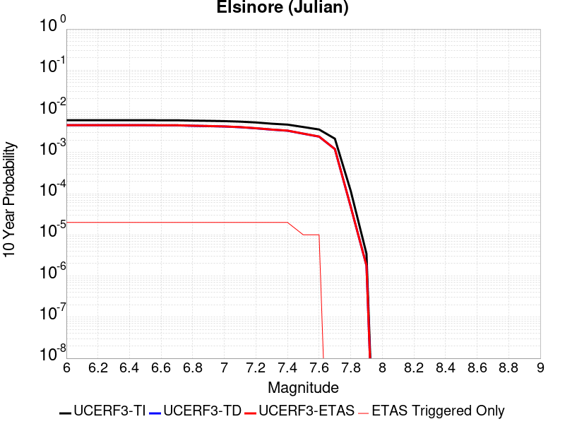 |

| Magnitude | 1 wk TI Prob | 1 wk TD Prob | 1 wk ETAS Prob | 1 wk ETAS/TD Gain | 1 wk ETAS Triggered Only | 1 mo TI Prob | 1 mo TD Prob | 1 mo ETAS Prob | 1 mo ETAS/TD Gain | 1 mo ETAS Triggered Only | 1 yr TI Prob | 1 yr TD Prob | 1 yr ETAS Prob | 1 yr ETAS/TD Gain | 1 yr ETAS Triggered Only | 10 yr TI Prob | 10 yr TD Prob | 10 yr ETAS Prob | 10 yr ETAS/TD Gain | 10 yr ETAS Triggered Only |
|-----|-----|-----|-----|-----|-----|-----|-----|-----|-----|-----|-----|-----|-----|-----|-----|-----|-----|-----|-----|-----|
| 6.0 | 1.1710231E-5 | 8.845315E-6 | 1.8845227E-5 | 2.130532 | 1.0E-5 | 5.0185736E-5 | 3.7907954E-5 | 5.7907197E-5 | 1.5275737 | 2.0E-5 | 6.1084004E-4 | 4.614333E-4 | 4.8142407E-4 | 1.0433232 | 2.0E-5 | 0.006091637 | 0.0046049724 | 0.0046248804 | 1.0043231 | 2.0E-5 |
| 6.1 | 1.1710231E-5 | 8.845315E-6 | 1.8845227E-5 | 2.130532 | 1.0E-5 | 5.0185736E-5 | 3.7907954E-5 | 5.7907197E-5 | 1.5275737 | 2.0E-5 | 6.1084004E-4 | 4.614333E-4 | 4.8142407E-4 | 1.0433232 | 2.0E-5 | 0.006091637 | 0.0046049724 | 0.0046248804 | 1.0043231 | 2.0E-5 |
| 6.2 | 1.1710231E-5 | 8.845315E-6 | 1.8845227E-5 | 2.130532 | 1.0E-5 | 5.0185736E-5 | 3.7907954E-5 | 5.7907197E-5 | 1.5275737 | 2.0E-5 | 6.1084004E-4 | 4.614333E-4 | 4.8142407E-4 | 1.0433232 | 2.0E-5 | 0.006091637 | 0.0046049724 | 0.0046248804 | 1.0043231 | 2.0E-5 |
| 6.3 | 1.1710231E-5 | 8.845315E-6 | 1.8845227E-5 | 2.130532 | 1.0E-5 | 5.0185736E-5 | 3.7907954E-5 | 5.7907197E-5 | 1.5275737 | 2.0E-5 | 6.1084004E-4 | 4.614333E-4 | 4.8142407E-4 | 1.0433232 | 2.0E-5 | 0.006091637 | 0.0046049724 | 0.0046248804 | 1.0043231 | 2.0E-5 |
| 6.4 | 1.1710231E-5 | 8.845315E-6 | 1.8845227E-5 | 2.130532 | 1.0E-5 | 5.0185736E-5 | 3.7907954E-5 | 5.7907197E-5 | 1.5275737 | 2.0E-5 | 6.1084004E-4 | 4.614333E-4 | 4.8142407E-4 | 1.0433232 | 2.0E-5 | 0.006091637 | 0.0046049724 | 0.0046248804 | 1.0043231 | 2.0E-5 |
| 6.5 | 1.1710231E-5 | 8.845315E-6 | 1.8845227E-5 | 2.130532 | 1.0E-5 | 5.0185736E-5 | 3.7907954E-5 | 5.7907197E-5 | 1.5275737 | 2.0E-5 | 6.1084004E-4 | 4.614333E-4 | 4.8142407E-4 | 1.0433232 | 2.0E-5 | 0.006091637 | 0.0046049724 | 0.0046248804 | 1.0043231 | 2.0E-5 |
| 6.6 | 1.1650619E-5 | 8.777691E-6 | 1.8777604E-5 | 2.1392417 | 1.0E-5 | 4.993027E-5 | 3.761814E-5 | 5.761739E-5 | 1.5316384 | 2.0E-5 | 6.0773146E-4 | 4.5790634E-4 | 4.7789718E-4 | 1.0436571 | 2.0E-5 | 0.0060607214 | 0.004569848 | 0.004589757 | 1.0043565 | 2.0E-5 |
| 6.7 | 1.1650619E-5 | 8.777691E-6 | 1.8777604E-5 | 2.1392417 | 1.0E-5 | 4.993027E-5 | 3.761814E-5 | 5.761739E-5 | 1.5316384 | 2.0E-5 | 6.0773146E-4 | 4.5790634E-4 | 4.7789718E-4 | 1.0436571 | 2.0E-5 | 0.0060607214 | 0.004569848 | 0.004589757 | 1.0043565 | 2.0E-5 |
| 6.8 | 1.1442698E-5 | 8.560841E-6 | 1.8560755E-5 | 2.1680994 | 1.0E-5 | 4.9039216E-5 | 3.6688813E-5 | 5.668808E-5 | 1.5451053 | 2.0E-5 | 5.968889E-4 | 4.4659642E-4 | 4.665875E-4 | 1.0447632 | 2.0E-5 | 0.0059528816 | 0.004457207 | 0.004477118 | 1.0044671 | 2.0E-5 |
| 6.9 | 1.1300589E-5 | 8.408708E-6 | 1.8408624E-5 | 2.1892333 | 1.0E-5 | 4.8430196E-5 | 3.603683E-5 | 5.6036108E-5 | 1.5549678 | 2.0E-5 | 5.894781E-4 | 4.3866172E-4 | 4.5865297E-4 | 1.0455732 | 2.0E-5 | 0.005879169 | 0.0043781744 | 0.004398087 | 1.0045481 | 2.0E-5 |
| 7.0 | 1.1117729E-5 | 8.225868E-6 | 1.8225786E-5 | 2.215667 | 1.0E-5 | 4.764654E-5 | 3.5253255E-5 | 5.525255E-5 | 1.5673035 | 2.0E-5 | 5.799422E-4 | 4.291255E-4 | 4.4911692E-4 | 1.0465864 | 2.0E-5 | 0.0057843104 | 0.0042831833 | 0.0043030977 | 1.0046494 | 2.0E-5 |
| 7.1 | 1.08053955E-5 | 7.911498E-6 | 1.791142E-5 | 2.263973 | 1.0E-5 | 4.6308014E-5 | 3.3905988E-5 | 5.390531E-5 | 1.5898463 | 2.0E-5 | 5.6365423E-4 | 4.1272887E-4 | 4.327206E-4 | 1.048438 | 2.0E-5 | 0.005622267 | 0.004119835 | 0.0041397526 | 1.0048345 | 2.0E-5 |
| 7.2 | 1.032804E-5 | 7.432751E-6 | 1.7432676E-5 | 2.345387 | 1.0E-5 | 4.4262277E-5 | 3.1854266E-5 | 5.185363E-5 | 1.6278394 | 2.0E-5 | 5.387599E-4 | 3.8775822E-4 | 4.077505E-4 | 1.0515585 | 2.0E-5 | 0.0053745564 | 0.00387102 | 0.0038909425 | 1.0051466 | 2.0E-5 |
| 7.3 | 9.622426E-6 | 6.897587E-6 | 1.6897518E-5 | 2.4497724 | 1.0E-5 | 4.1238312E-5 | 2.956076E-5 | 4.956017E-5 | 1.6765525 | 2.0E-5 | 5.019608E-4 | 3.5984424E-4 | 3.7983703E-4 | 1.0555596 | 2.0E-5 | 0.005008285 | 0.0035928036 | 0.0036127316 | 1.0055467 | 2.0E-5 |
| 7.4 | 9.144434E-6 | 6.496142E-6 | 1.6496077E-5 | 2.5393653 | 1.0E-5 | 3.9189843E-5 | 2.7840319E-5 | 4.7839763E-5 | 1.7183626 | 2.0E-5 | 4.7703186E-4 | 3.3890453E-4 | 3.5889776E-4 | 1.0589937 | 2.0E-5 | 0.0047600917 | 0.0033840172 | 0.0034039496 | 1.0058901 | 2.0E-5 |
| 7.5 | 7.988981E-6 | 5.498105E-6 | 5.498105E-6 | 1.0 | 0.0 | 3.4238044E-5 | 2.3563101E-5 | 3.3562865E-5 | 1.4243823 | 1.0E-5 | 4.1676845E-4 | 2.8684427E-4 | 2.968414E-4 | 1.0348521 | 1.0E-5 | 0.0041598766 | 0.0028648674 | 0.002874839 | 1.0034806 | 1.0E-5 |
| 7.6 | 6.9554876E-6 | 4.6623254E-6 | 4.6623254E-6 | 1.0 | 0.0 | 2.9808893E-5 | 1.998125E-5 | 2.9981049E-5 | 1.5004592 | 1.0E-5 | 3.6286283E-4 | 2.4324573E-4 | 2.5324328E-4 | 1.0411007 | 1.0E-5 | 0.0036227088 | 0.002429911 | 0.0024398866 | 1.0041053 | 1.0E-5 |
| 7.7 | 4.1557314E-6 | 2.3244427E-6 | 2.3244427E-6 | 1.0 | 0.0 | 1.7810156E-5 | 9.961864E-6 | 9.961864E-6 | 1.0 | 0.0 | 2.1681708E-4 | 1.2127968E-4 | 1.2127968E-4 | 1.0 | 0.0 | 0.0021660565 | 0.001212208 | 0.001212208 | 1.0 | 0.0 |
| 7.8 | 2.2597293E-7 | 9.331864E-8 | 9.331864E-8 | 1.0 | 0.0 | 9.684551E-7 | 3.99937E-7 | 3.99937E-7 | 1.0 | 0.0 | 1.1790877E-5 | 4.8692254E-6 | 4.8692254E-6 | 1.0 | 0.0 | 1.17902506E-4 | 4.8691512E-5 | 4.8691512E-5 | 1.0 | 0.0 |
| 7.9 | 6.676829E-9 | 3.4397174E-9 | 3.4397174E-9 | 1.0 | 0.0 | 2.861498E-8 | 1.4741646E-8 | 1.4741646E-8 | 1.0 | 0.0 | 3.4838732E-7 | 1.7947953E-7 | 1.7947953E-7 | 1.0 | 0.0 | 3.4838679E-6 | 1.794794E-6 | 1.794794E-6 | 1.0 | 0.0 |

## Burnt Mtn
*[(top)](#table-of-contents)*

| 1 Week | 1 Month | 1 Year | 10 Year |
|-----|-----|-----|-----|
|  |  |  | 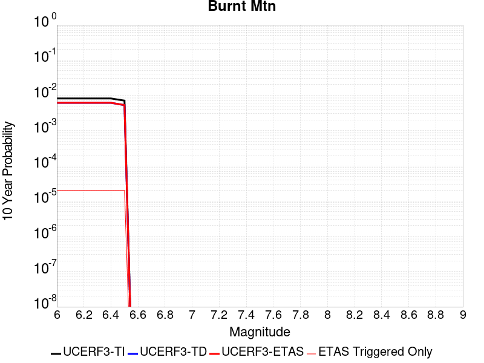 |

| Magnitude | 1 wk TI Prob | 1 wk TD Prob | 1 wk ETAS Prob | 1 wk ETAS/TD Gain | 1 wk ETAS Triggered Only | 1 mo TI Prob | 1 mo TD Prob | 1 mo ETAS Prob | 1 mo ETAS/TD Gain | 1 mo ETAS Triggered Only | 1 yr TI Prob | 1 yr TD Prob | 1 yr ETAS Prob | 1 yr ETAS/TD Gain | 1 yr ETAS Triggered Only | 10 yr TI Prob | 10 yr TD Prob | 10 yr ETAS Prob | 10 yr ETAS/TD Gain | 10 yr ETAS Triggered Only |
|-----|-----|-----|-----|-----|-----|-----|-----|-----|-----|-----|-----|-----|-----|-----|-----|-----|-----|-----|-----|-----|
| 6.0 | 1.5673151E-5 | 1.1749247E-5 | 2.1749129E-5 | 1.8511083 | 1.0E-5 | 6.716892E-5 | 5.0353672E-5 | 6.0353166E-5 | 1.1985853 | 1.0E-5 | 8.1747473E-4 | 6.130124E-4 | 6.2300626E-4 | 1.016303 | 1.0E-5 | 0.008144741 | 0.006125855 | 0.006145732 | 1.0032449 | 2.0E-5 |
| 6.1 | 1.5673151E-5 | 1.1749247E-5 | 2.1749129E-5 | 1.8511083 | 1.0E-5 | 6.716892E-5 | 5.0353672E-5 | 6.0353166E-5 | 1.1985853 | 1.0E-5 | 8.1747473E-4 | 6.130124E-4 | 6.2300626E-4 | 1.016303 | 1.0E-5 | 0.008144741 | 0.006125855 | 0.006145732 | 1.0032449 | 2.0E-5 |
| 6.2 | 1.5673151E-5 | 1.1749247E-5 | 2.1749129E-5 | 1.8511083 | 1.0E-5 | 6.716892E-5 | 5.0353672E-5 | 6.0353166E-5 | 1.1985853 | 1.0E-5 | 8.1747473E-4 | 6.130124E-4 | 6.2300626E-4 | 1.016303 | 1.0E-5 | 0.008144741 | 0.006125855 | 0.006145732 | 1.0032449 | 2.0E-5 |
| 6.3 | 1.5673151E-5 | 1.1749247E-5 | 2.1749129E-5 | 1.8511083 | 1.0E-5 | 6.716892E-5 | 5.0353672E-5 | 6.0353166E-5 | 1.1985853 | 1.0E-5 | 8.1747473E-4 | 6.130124E-4 | 6.2300626E-4 | 1.016303 | 1.0E-5 | 0.008144741 | 0.006125855 | 0.006145732 | 1.0032449 | 2.0E-5 |
| 6.4 | 1.5673151E-5 | 1.1749247E-5 | 2.1749129E-5 | 1.8511083 | 1.0E-5 | 6.716892E-5 | 5.0353672E-5 | 6.0353166E-5 | 1.1985853 | 1.0E-5 | 8.1747473E-4 | 6.130124E-4 | 6.2300626E-4 | 1.016303 | 1.0E-5 | 0.008144741 | 0.006125855 | 0.006145732 | 1.0032449 | 2.0E-5 |
| 6.5 | 1.36191375E-5 | 1.007816E-5 | 2.007806E-5 | 1.9922347 | 1.0E-5 | 5.8366426E-5 | 4.319211E-5 | 5.319168E-5 | 1.2315137 | 1.0E-5 | 7.103795E-4 | 5.2586396E-4 | 5.358587E-4 | 1.0190064 | 1.0E-5 | 0.0070811296 | 0.00525864 | 0.0052785343 | 1.0037832 | 2.0E-5 |

## Great Valley 12
*[(top)](#table-of-contents)*

| 1 Week | 1 Month | 1 Year | 10 Year |
|-----|-----|-----|-----|
|  |  |  | 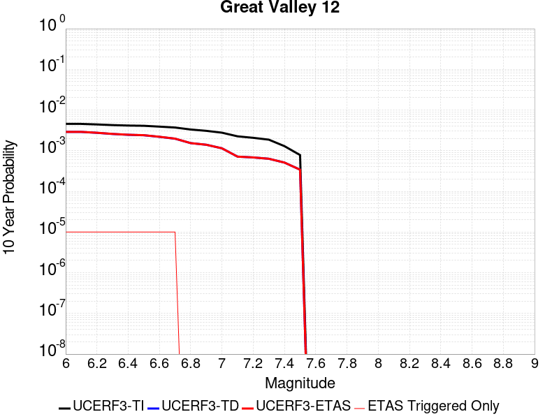 |

| Magnitude | 1 wk TI Prob | 1 wk TD Prob | 1 wk ETAS Prob | 1 wk ETAS/TD Gain | 1 wk ETAS Triggered Only | 1 mo TI Prob | 1 mo TD Prob | 1 mo ETAS Prob | 1 mo ETAS/TD Gain | 1 mo ETAS Triggered Only | 1 yr TI Prob | 1 yr TD Prob | 1 yr ETAS Prob | 1 yr ETAS/TD Gain | 1 yr ETAS Triggered Only | 10 yr TI Prob | 10 yr TD Prob | 10 yr ETAS Prob | 10 yr ETAS/TD Gain | 10 yr ETAS Triggered Only |
|-----|-----|-----|-----|-----|-----|-----|-----|-----|-----|-----|-----|-----|-----|-----|-----|-----|-----|-----|-----|-----|
| 6.0 | 8.757157E-6 | 5.55499E-6 | 5.55499E-6 | 1.0 | 0.0 | 3.7530135E-5 | 2.380689E-5 | 2.380689E-5 | 1.0 | 0.0 | 4.5683357E-4 | 2.8981152E-4 | 2.8981152E-4 | 1.0 | 0.0 | 0.004558956 | 0.0028944567 | 0.002904428 | 1.0034449 | 1.0E-5 |
| 6.1 | 8.757157E-6 | 5.55499E-6 | 5.55499E-6 | 1.0 | 0.0 | 3.7530135E-5 | 2.380689E-5 | 2.380689E-5 | 1.0 | 0.0 | 4.5683357E-4 | 2.8981152E-4 | 2.8981152E-4 | 1.0 | 0.0 | 0.004558956 | 0.0028944567 | 0.002904428 | 1.0034449 | 1.0E-5 |
| 6.2 | 8.499136E-6 | 5.280658E-6 | 5.280658E-6 | 1.0 | 0.0 | 3.642436E-5 | 2.2631202E-5 | 2.2631202E-5 | 1.0 | 0.0 | 4.4337637E-4 | 2.755012E-4 | 2.755012E-4 | 1.0 | 0.0 | 0.0044249278 | 0.002751711 | 0.0027616837 | 1.0036241 | 1.0E-5 |
| 6.3 | 8.186883E-6 | 4.9488035E-6 | 4.9488035E-6 | 1.0 | 0.0 | 3.508617E-5 | 2.120899E-5 | 2.120899E-5 | 1.0 | 0.0 | 4.270904E-4 | 2.581899E-4 | 2.581899E-4 | 1.0 | 0.0 | 0.004262705 | 0.0025789998 | 0.0025889738 | 1.0038675 | 1.0E-5 |
| 6.4 | 7.979878E-6 | 4.720807E-6 | 4.720807E-6 | 1.0 | 0.0 | 3.419903E-5 | 2.0231879E-5 | 2.0231879E-5 | 1.0 | 0.0 | 4.1629362E-4 | 2.4629623E-4 | 2.4629623E-4 | 1.0 | 0.0 | 0.0041551464 | 0.0024603265 | 0.002470302 | 1.0040545 | 1.0E-5 |
| 6.5 | 7.871003E-6 | 4.6007817E-6 | 4.6007817E-6 | 1.0 | 0.0 | 3.373243E-5 | 1.9717492E-5 | 1.9717492E-5 | 1.0 | 0.0 | 4.1061494E-4 | 2.4003495E-4 | 2.4003495E-4 | 1.0 | 0.0 | 0.0040985704 | 0.00239785 | 0.002407826 | 1.0041604 | 1.0E-5 |
| 6.6 | 7.508221E-6 | 4.204166E-6 | 4.204166E-6 | 1.0 | 0.0 | 3.2177693E-5 | 1.8017736E-5 | 1.8017736E-5 | 1.0 | 0.0 | 3.91693E-4 | 2.1934473E-4 | 2.1934473E-4 | 1.0 | 0.0 | 0.003910033 | 0.0021913685 | 0.0022013467 | 1.0045533 | 1.0E-5 |
| 6.7 | 7.1297914E-6 | 3.7818884E-6 | 3.7818884E-6 | 1.0 | 0.0 | 3.055589E-5 | 1.6207996E-5 | 1.6207996E-5 | 1.0 | 0.0 | 3.7195446E-4 | 1.9731528E-4 | 1.9731528E-4 | 1.0 | 0.0 | 0.0037133251 | 0.0019714797 | 0.00198146 | 1.0050623 | 1.0E-5 |
| 6.8 | 6.376581E-6 | 2.9484618E-6 | 2.9484618E-6 | 1.0 | 0.0 | 2.7327918E-5 | 1.2636205E-5 | 1.2636205E-5 | 1.0 | 0.0 | 3.326666E-4 | 1.5383509E-4 | 1.5383509E-4 | 1.0 | 0.0 | 0.0033216903 | 0.0015373026 | 0.0015373026 | 1.0 | 0.0 |
| 6.9 | 5.9095E-6 | 2.6865296E-6 | 2.6865296E-6 | 1.0 | 0.0 | 2.5326184E-5 | 1.1513648E-5 | 1.1513648E-5 | 1.0 | 0.0 | 3.0830267E-4 | 1.4016981E-4 | 1.4016981E-4 | 1.0 | 0.0 | 0.003078753 | 0.0014008294 | 0.0014008294 | 1.0 | 0.0 |
| 7.0 | 5.3239864E-6 | 2.1966623E-6 | 2.1966623E-6 | 1.0 | 0.0 | 2.2816885E-5 | 9.414233E-6 | 9.414233E-6 | 1.0 | 0.0 | 2.7776015E-4 | 1.146124E-4 | 1.146124E-4 | 1.0 | 0.0 | 0.0027741324 | 0.0011455463 | 0.0011455463 | 1.0 | 0.0 |
| 7.1 | 4.329147E-6 | 1.3707412E-6 | 1.3707412E-6 | 1.0 | 0.0 | 1.8553355E-5 | 5.8745923E-6 | 5.8745923E-6 | 1.0 | 0.0 | 2.2586368E-4 | 7.15209E-5 | 7.15209E-5 | 1.0 | 0.0 | 0.0022563424 | 7.149875E-4 | 7.149875E-4 | 1.0 | 0.0 |
| 7.2 | 3.978488E-6 | 1.3105756E-6 | 1.3105756E-6 | 1.0 | 0.0 | 1.7050552E-5 | 5.6167414E-6 | 5.6167414E-6 | 1.0 | 0.0 | 2.075707E-4 | 6.838176E-5 | 6.838176E-5 | 1.0 | 0.0 | 0.0020737692 | 6.8361586E-4 | 6.8361586E-4 | 1.0 | 0.0 |
| 7.3 | 3.586542E-6 | 1.21573E-6 | 1.21573E-6 | 1.0 | 0.0 | 1.5370804E-5 | 5.2102614E-6 | 5.2102614E-6 | 1.0 | 0.0 | 1.8712347E-4 | 6.343317E-5 | 6.343317E-5 | 1.0 | 0.0 | 0.0018696598 | 6.341592E-4 | 6.341592E-4 | 1.0 | 0.0 |
| 7.4 | 2.4837766E-6 | 9.80032E-7 | 9.80032E-7 | 1.0 | 0.0 | 1.0644713E-5 | 4.2001307E-6 | 4.2001307E-6 | 1.0 | 0.0 | 1.2959167E-4 | 5.113546E-5 | 5.113546E-5 | 1.0 | 0.0 | 0.0012951613 | 5.1124353E-4 | 5.1124353E-4 | 1.0 | 0.0 |
| 7.5 | 1.5002679E-6 | 6.545985E-7 | 6.545985E-7 | 1.0 | 0.0 | 6.4297037E-6 | 2.8054194E-6 | 2.8054194E-6 | 1.0 | 0.0 | 7.827883E-5 | 3.4155488E-5 | 3.4155488E-5 | 1.0 | 0.0 | 7.825126E-4 | 3.4150656E-4 | 3.4150656E-4 | 1.0 | 0.0 |

## Gillem - Big Crack 2011 CFM
*[(top)](#table-of-contents)*

| 1 Week | 1 Month | 1 Year | 10 Year |
|-----|-----|-----|-----|
|  |  |  |  |

| Magnitude | 1 wk TI Prob | 1 wk TD Prob | 1 wk ETAS Prob | 1 wk ETAS/TD Gain | 1 wk ETAS Triggered Only | 1 mo TI Prob | 1 mo TD Prob | 1 mo ETAS Prob | 1 mo ETAS/TD Gain | 1 mo ETAS Triggered Only | 1 yr TI Prob | 1 yr TD Prob | 1 yr ETAS Prob | 1 yr ETAS/TD Gain | 1 yr ETAS Triggered Only | 10 yr TI Prob | 10 yr TD Prob | 10 yr ETAS Prob | 10 yr ETAS/TD Gain | 10 yr ETAS Triggered Only |
|-----|-----|-----|-----|-----|-----|-----|-----|-----|-----|-----|-----|-----|-----|-----|-----|-----|-----|-----|-----|-----|
| 6.0 | 2.196852E-5 | 2.3604485E-5 | 2.3604485E-5 | 1.0 | 0.0 | 9.4147406E-5 | 1.01158665E-4 | 1.01158665E-4 | 1.0 | 0.0 | 0.0011456419 | 0.0012309998 | 0.0012309998 | 1.0 | 0.0 | 0.011397537 | 0.012250669 | 0.012260547 | 1.0008063 | 1.0E-5 |
| 6.1 | 9.992795E-6 | 1.071189E-5 | 1.071189E-5 | 1.0 | 0.0 | 4.2825563E-5 | 4.5907396E-5 | 4.5907396E-5 | 1.0 | 0.0 | 5.2127644E-4 | 5.587975E-4 | 5.587975E-4 | 1.0 | 0.0 | 0.0052005537 | 0.0055757347 | 0.0055757347 | 1.0 | 0.0 |
| 6.2 | 9.992795E-6 | 1.071189E-5 | 1.071189E-5 | 1.0 | 0.0 | 4.2825563E-5 | 4.5907396E-5 | 4.5907396E-5 | 1.0 | 0.0 | 5.2127644E-4 | 5.587975E-4 | 5.587975E-4 | 1.0 | 0.0 | 0.0052005537 | 0.0055757347 | 0.0055757347 | 1.0 | 0.0 |
| 6.3 | 4.6127884E-6 | 4.942657E-6 | 4.942657E-6 | 1.0 | 0.0 | 1.9768944E-5 | 2.1182668E-5 | 2.1182668E-5 | 1.0 | 0.0 | 2.406603E-4 | 2.5787292E-4 | 2.5787292E-4 | 1.0 | 0.0 | 0.0024039985 | 0.0025761751 | 0.0025761751 | 1.0 | 0.0 |
| 6.4 | 4.6127884E-6 | 4.942657E-6 | 4.942657E-6 | 1.0 | 0.0 | 1.9768944E-5 | 2.1182668E-5 | 2.1182668E-5 | 1.0 | 0.0 | 2.406603E-4 | 2.5787292E-4 | 2.5787292E-4 | 1.0 | 0.0 | 0.0024039985 | 0.0025761751 | 0.0025761751 | 1.0 | 0.0 |
| 6.5 | 2.716712E-6 | 2.9111113E-6 | 2.9111113E-6 | 1.0 | 0.0 | 1.1643E-5 | 1.24761455E-5 | 1.24761455E-5 | 1.0 | 0.0 | 1.417443E-4 | 1.5188892E-4 | 1.5188892E-4 | 1.0 | 0.0 | 0.0014165393 | 0.001518089 | 0.001518089 | 1.0 | 0.0 |
| 6.6 | 1.3818255E-6 | 1.4820689E-6 | 1.4820689E-6 | 1.0 | 0.0 | 5.922096E-6 | 6.3517155E-6 | 6.3517155E-6 | 1.0 | 0.0 | 7.209913E-5 | 7.7330624E-5 | 7.7330624E-5 | 1.0 | 0.0 | 7.2075747E-4 | 7.7315804E-4 | 7.7315804E-4 | 1.0 | 0.0 |

## South Klamath Lake West
*[(top)](#table-of-contents)*

| 1 Week | 1 Month | 1 Year | 10 Year |
|-----|-----|-----|-----|
|  |  |  |  |

| Magnitude | 1 wk TI Prob | 1 wk TD Prob | 1 wk ETAS Prob | 1 wk ETAS/TD Gain | 1 wk ETAS Triggered Only | 1 mo TI Prob | 1 mo TD Prob | 1 mo ETAS Prob | 1 mo ETAS/TD Gain | 1 mo ETAS Triggered Only | 1 yr TI Prob | 1 yr TD Prob | 1 yr ETAS Prob | 1 yr ETAS/TD Gain | 1 yr ETAS Triggered Only | 10 yr TI Prob | 10 yr TD Prob | 10 yr ETAS Prob | 10 yr ETAS/TD Gain | 10 yr ETAS Triggered Only |
|-----|-----|-----|-----|-----|-----|-----|-----|-----|-----|-----|-----|-----|-----|-----|-----|-----|-----|-----|-----|-----|
| 6.0 | 2.174025E-5 | 2.3042025E-5 | 3.3041793E-5 | 1.4339796 | 1.0E-5 | 9.3169176E-5 | 9.874817E-5 | 1.0874718E-4 | 1.1012577 | 1.0E-5 | 0.0011337444 | 0.0012016617 | 0.0012116497 | 1.0083119 | 1.0E-5 | 0.011279777 | 0.0119582405 | 0.011968121 | 1.0008262 | 1.0E-5 |
| 6.1 | 2.174025E-5 | 2.3042025E-5 | 3.3041793E-5 | 1.4339796 | 1.0E-5 | 9.3169176E-5 | 9.874817E-5 | 1.0874718E-4 | 1.1012577 | 1.0E-5 | 0.0011337444 | 0.0012016617 | 0.0012116497 | 1.0083119 | 1.0E-5 | 0.011279777 | 0.0119582405 | 0.011968121 | 1.0008262 | 1.0E-5 |
| 6.2 | 9.834929E-6 | 1.0393841E-5 | 1.0393841E-5 | 1.0 | 0.0 | 4.2149015E-5 | 4.4544326E-5 | 4.4544326E-5 | 1.0 | 0.0 | 5.1304343E-4 | 5.422012E-4 | 5.422012E-4 | 1.0 | 0.0 | 0.0051186057 | 0.0054096854 | 0.0054096854 | 1.0 | 0.0 |
| 6.3 | 9.834929E-6 | 1.0393841E-5 | 1.0393841E-5 | 1.0 | 0.0 | 4.2149015E-5 | 4.4544326E-5 | 4.4544326E-5 | 1.0 | 0.0 | 5.1304343E-4 | 5.422012E-4 | 5.422012E-4 | 1.0 | 0.0 | 0.0051186057 | 0.0054096854 | 0.0054096854 | 1.0 | 0.0 |
| 6.4 | 6.066321E-6 | 6.40043E-6 | 6.40043E-6 | 1.0 | 0.0 | 2.5998259E-5 | 2.743014E-5 | 2.743014E-5 | 1.0 | 0.0 | 3.1648282E-4 | 3.3391351E-4 | 3.3391351E-4 | 1.0 | 0.0 | 0.0031603249 | 0.0033343881 | 0.0033343881 | 1.0 | 0.0 |
| 6.5 | 6.066321E-6 | 6.40043E-6 | 6.40043E-6 | 1.0 | 0.0 | 2.5998259E-5 | 2.743014E-5 | 2.743014E-5 | 1.0 | 0.0 | 3.1648282E-4 | 3.3391351E-4 | 3.3391351E-4 | 1.0 | 0.0 | 0.0031603249 | 0.0033343881 | 0.0033343881 | 1.0 | 0.0 |
| 6.6 | 4.2321803E-6 | 4.461291E-6 | 4.461291E-6 | 1.0 | 0.0 | 1.8137789E-5 | 1.9119685E-5 | 1.9119685E-5 | 1.0 | 0.0 | 2.208052E-4 | 2.3275832E-4 | 2.3275832E-4 | 1.0 | 0.0 | 0.0022058594 | 0.0023252473 | 0.0023252473 | 1.0 | 0.0 |
| 6.7 | 3.186646E-6 | 3.360305E-6 | 3.360305E-6 | 1.0 | 0.0 | 1.3656982E-5 | 1.4401232E-5 | 1.4401232E-5 | 1.0 | 0.0 | 1.6626107E-4 | 1.7532158E-4 | 1.7532158E-4 | 1.0 | 0.0 | 0.0016613674 | 0.0017518997 | 0.0017518997 | 1.0 | 0.0 |
| 6.8 | 2.380121E-6 | 2.510907E-6 | 2.510907E-6 | 1.0 | 0.0 | 1.0200479E-5 | 1.07609885E-5 | 1.07609885E-5 | 1.0 | 0.0 | 1.2418375E-4 | 1.3100762E-4 | 1.3100762E-4 | 1.0 | 0.0 | 0.0012411437 | 0.0013093497 | 0.0013093497 | 1.0 | 0.0 |
| 6.9 | 8.928287E-7 | 9.4302504E-7 | 9.4302504E-7 | 1.0 | 0.0 | 3.826403E-6 | 4.0415307E-6 | 4.0415307E-6 | 1.0 | 0.0 | 4.658546E-5 | 4.9204747E-5 | 4.9204747E-5 | 1.0 | 0.0 | 4.6575698E-4 | 4.9196015E-4 | 4.9196015E-4 | 1.0 | 0.0 |

## San Gorgonio Pass
*[(top)](#table-of-contents)*

| 1 Week | 1 Month | 1 Year | 10 Year |
|-----|-----|-----|-----|
|  |  |  | 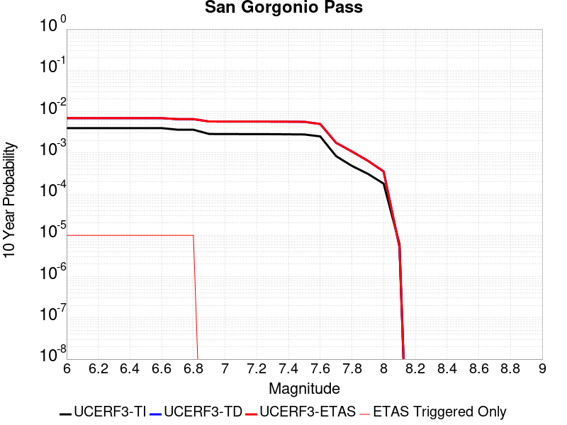 |

| Magnitude | 1 wk TI Prob | 1 wk TD Prob | 1 wk ETAS Prob | 1 wk ETAS/TD Gain | 1 wk ETAS Triggered Only | 1 mo TI Prob | 1 mo TD Prob | 1 mo ETAS Prob | 1 mo ETAS/TD Gain | 1 mo ETAS Triggered Only | 1 yr TI Prob | 1 yr TD Prob | 1 yr ETAS Prob | 1 yr ETAS/TD Gain | 1 yr ETAS Triggered Only | 10 yr TI Prob | 10 yr TD Prob | 10 yr ETAS Prob | 10 yr ETAS/TD Gain | 10 yr ETAS Triggered Only |
|-----|-----|-----|-----|-----|-----|-----|-----|-----|-----|-----|-----|-----|-----|-----|-----|-----|-----|-----|-----|-----|
| 6.0 | 7.644328E-6 | 1.331474E-5 | 1.331474E-5 | 1.0 | 0.0 | 3.2760996E-5 | 5.706197E-5 | 5.706197E-5 | 1.0 | 0.0 | 3.987921E-4 | 6.945166E-4 | 7.045097E-4 | 1.0143886 | 1.0E-5 | 0.003980772 | 0.006930024 | 0.0069399546 | 1.001433 | 1.0E-5 |
| 6.1 | 7.644328E-6 | 1.331474E-5 | 1.331474E-5 | 1.0 | 0.0 | 3.2760996E-5 | 5.706197E-5 | 5.706197E-5 | 1.0 | 0.0 | 3.987921E-4 | 6.945166E-4 | 7.045097E-4 | 1.0143886 | 1.0E-5 | 0.003980772 | 0.006930024 | 0.0069399546 | 1.001433 | 1.0E-5 |
| 6.2 | 7.644328E-6 | 1.331474E-5 | 1.331474E-5 | 1.0 | 0.0 | 3.2760996E-5 | 5.706197E-5 | 5.706197E-5 | 1.0 | 0.0 | 3.987921E-4 | 6.945166E-4 | 7.045097E-4 | 1.0143886 | 1.0E-5 | 0.003980772 | 0.006930024 | 0.0069399546 | 1.001433 | 1.0E-5 |
| 6.3 | 7.644328E-6 | 1.331474E-5 | 1.331474E-5 | 1.0 | 0.0 | 3.2760996E-5 | 5.706197E-5 | 5.706197E-5 | 1.0 | 0.0 | 3.987921E-4 | 6.945166E-4 | 7.045097E-4 | 1.0143886 | 1.0E-5 | 0.003980772 | 0.006930024 | 0.0069399546 | 1.001433 | 1.0E-5 |
| 6.4 | 7.644328E-6 | 1.331474E-5 | 1.331474E-5 | 1.0 | 0.0 | 3.2760996E-5 | 5.706197E-5 | 5.706197E-5 | 1.0 | 0.0 | 3.987921E-4 | 6.945166E-4 | 7.045097E-4 | 1.0143886 | 1.0E-5 | 0.003980772 | 0.006930024 | 0.0069399546 | 1.001433 | 1.0E-5 |
| 6.5 | 7.644328E-6 | 1.331474E-5 | 1.331474E-5 | 1.0 | 0.0 | 3.2760996E-5 | 5.706197E-5 | 5.706197E-5 | 1.0 | 0.0 | 3.987921E-4 | 6.945166E-4 | 7.045097E-4 | 1.0143886 | 1.0E-5 | 0.003980772 | 0.006930024 | 0.0069399546 | 1.001433 | 1.0E-5 |
| 6.6 | 7.644328E-6 | 1.331474E-5 | 1.331474E-5 | 1.0 | 0.0 | 3.2760996E-5 | 5.706197E-5 | 5.706197E-5 | 1.0 | 0.0 | 3.987921E-4 | 6.945166E-4 | 7.045097E-4 | 1.0143886 | 1.0E-5 | 0.003980772 | 0.006930024 | 0.0069399546 | 1.001433 | 1.0E-5 |
| 6.7 | 6.987586E-6 | 1.2619013E-5 | 1.2619013E-5 | 1.0 | 0.0 | 2.9946454E-5 | 5.408041E-5 | 5.408041E-5 | 1.0 | 0.0 | 3.645371E-4 | 6.582382E-4 | 6.6823163E-4 | 1.015182 | 1.0E-5 | 0.0036393967 | 0.0065694 | 0.0065793344 | 1.0015122 | 1.0E-5 |
| 6.8 | 6.987586E-6 | 1.2619013E-5 | 1.2619013E-5 | 1.0 | 0.0 | 2.9946454E-5 | 5.408041E-5 | 5.408041E-5 | 1.0 | 0.0 | 3.645371E-4 | 6.582382E-4 | 6.6823163E-4 | 1.015182 | 1.0E-5 | 0.0036393967 | 0.0065694 | 0.0065793344 | 1.0015122 | 1.0E-5 |
| 6.9 | 5.504702E-6 | 1.1049877E-5 | 1.1049877E-5 | 1.0 | 0.0 | 2.3591367E-5 | 4.7355785E-5 | 4.7355785E-5 | 1.0 | 0.0 | 2.8718702E-4 | 5.764092E-4 | 5.764092E-4 | 1.0 | 0.0 | 0.0028681618 | 0.0057553523 | 0.0057553523 | 1.0 | 0.0 |
| 7.0 | 5.4825764E-6 | 1.1026218E-5 | 1.1026218E-5 | 1.0 | 0.0 | 2.3496545E-5 | 4.725439E-5 | 4.725439E-5 | 1.0 | 0.0 | 2.8603288E-4 | 5.751754E-4 | 5.751754E-4 | 1.0 | 0.0 | 0.00285665 | 0.0057430784 | 0.0057430784 | 1.0 | 0.0 |
| 7.1 | 5.4692787E-6 | 1.1011928E-5 | 1.1011928E-5 | 1.0 | 0.0 | 2.3439556E-5 | 4.719315E-5 | 4.719315E-5 | 1.0 | 0.0 | 2.8533922E-4 | 5.744302E-4 | 5.744302E-4 | 1.0 | 0.0 | 0.0028497311 | 0.0057356646 | 0.0057356646 | 1.0 | 0.0 |
| 7.2 | 5.453661E-6 | 1.0994954E-5 | 1.0994954E-5 | 1.0 | 0.0 | 2.3372622E-5 | 4.712041E-5 | 4.712041E-5 | 1.0 | 0.0 | 2.8452452E-4 | 5.7354505E-4 | 5.7354505E-4 | 1.0 | 0.0 | 0.002841605 | 0.005726859 | 0.005726859 | 1.0 | 0.0 |
| 7.3 | 5.4422303E-6 | 1.09818775E-5 | 1.09818775E-5 | 1.0 | 0.0 | 2.3323635E-5 | 4.7064368E-5 | 4.7064368E-5 | 1.0 | 0.0 | 2.8392827E-4 | 5.728631E-4 | 5.728631E-4 | 1.0 | 0.0 | 0.0028356577 | 0.0057200743 | 0.0057200743 | 1.0 | 0.0 |
| 7.4 | 5.398595E-6 | 1.0929241E-5 | 1.0929241E-5 | 1.0 | 0.0 | 2.313663E-5 | 4.6838795E-5 | 4.6838795E-5 | 1.0 | 0.0 | 2.8165206E-4 | 5.701182E-4 | 5.701182E-4 | 1.0 | 0.0 | 0.0028129534 | 0.0056927665 | 0.0056927665 | 1.0 | 0.0 |
| 7.5 | 5.3578788E-6 | 1.0855785E-5 | 1.0855785E-5 | 1.0 | 0.0 | 2.2962136E-5 | 4.6523994E-5 | 4.6523994E-5 | 1.0 | 0.0 | 2.7952815E-4 | 5.662875E-4 | 5.662875E-4 | 1.0 | 0.0 | 0.002791768 | 0.0056546913 | 0.0056546913 | 1.0 | 0.0 |
| 7.6 | 4.8091474E-6 | 9.604131E-6 | 9.604131E-6 | 1.0 | 0.0 | 2.0610469E-5 | 4.1159943E-5 | 4.1159943E-5 | 1.0 | 0.0 | 2.5090357E-4 | 5.010119E-4 | 5.010119E-4 | 1.0 | 0.0 | 0.0025062046 | 0.0050054584 | 0.0050054584 | 1.0 | 0.0 |
| 7.7 | 1.5991155E-6 | 3.353035E-6 | 3.353035E-6 | 1.0 | 0.0 | 6.853334E-6 | 1.4370073E-5 | 1.4370073E-5 | 1.0 | 0.0 | 8.343615E-5 | 1.7494184E-4 | 1.7494184E-4 | 1.0 | 0.0 | 8.340483E-4 | 0.0017535852 | 0.0017535852 | 1.0 | 0.0 |
| 7.8 | 9.258398E-7 | 2.0581049E-6 | 2.0581049E-6 | 1.0 | 0.0 | 3.967879E-6 | 8.82042E-6 | 8.82042E-6 | 1.0 | 0.0 | 4.8307855E-5 | 1.0738334E-4 | 1.0738334E-4 | 1.0 | 0.0 | 4.8297356E-4 | 0.0010788103 | 0.0010788103 | 1.0 | 0.0 |
| 7.9 | 5.975575E-7 | 1.2292295E-6 | 1.2292295E-6 | 1.0 | 0.0 | 2.5609581E-6 | 5.2681157E-6 | 5.2681157E-6 | 1.0 | 0.0 | 3.117922E-5 | 6.413743E-5 | 6.413743E-5 | 1.0 | 0.0 | 3.1174847E-4 | 6.464778E-4 | 6.464778E-4 | 1.0 | 0.0 |
| 8.0 | 3.4413725E-7 | 6.714992E-7 | 6.714992E-7 | 1.0 | 0.0 | 1.4748731E-6 | 2.8778506E-6 | 2.8778506E-6 | 1.0 | 0.0 | 1.7956432E-5 | 3.5037272E-5 | 3.5037272E-5 | 1.0 | 0.0 | 1.7954981E-4 | 3.5392298E-4 | 3.5392298E-4 | 1.0 | 0.0 |
| 8.1 | 1.1787731E-8 | 9.6332045E-9 | 9.6332045E-9 | 1.0 | 0.0 | 5.0518846E-8 | 4.1285162E-8 | 4.1285162E-8 | 1.0 | 0.0 | 6.1506677E-7 | 5.0264674E-7 | 5.0264674E-7 | 1.0 | 0.0 | 6.1506507E-6 | 5.2417968E-6 | 5.2417968E-6 | 1.0 | 0.0 |

## Fitzhugh Creek
*[(top)](#table-of-contents)*

| 1 Week | 1 Month | 1 Year | 10 Year |
|-----|-----|-----|-----|
|  |  |  |  |

| Magnitude | 1 wk TI Prob | 1 wk TD Prob | 1 wk ETAS Prob | 1 wk ETAS/TD Gain | 1 wk ETAS Triggered Only | 1 mo TI Prob | 1 mo TD Prob | 1 mo ETAS Prob | 1 mo ETAS/TD Gain | 1 mo ETAS Triggered Only | 1 yr TI Prob | 1 yr TD Prob | 1 yr ETAS Prob | 1 yr ETAS/TD Gain | 1 yr ETAS Triggered Only | 10 yr TI Prob | 10 yr TD Prob | 10 yr ETAS Prob | 10 yr ETAS/TD Gain | 10 yr ETAS Triggered Only |
|-----|-----|-----|-----|-----|-----|-----|-----|-----|-----|-----|-----|-----|-----|-----|-----|-----|-----|-----|-----|-----|
| 6.0 | 6.1090436E-6 | 6.2101562E-6 | 6.2101562E-6 | 1.0 | 0.0 | 2.6181353E-5 | 2.6614709E-5 | 2.6614709E-5 | 1.0 | 0.0 | 3.1871133E-4 | 3.239904E-4 | 3.239904E-4 | 1.0 | 0.0 | 0.0031825465 | 0.0032356246 | 0.0032455921 | 1.0030806 | 1.0E-5 |
| 6.1 | 2.9741811E-6 | 3.021581E-6 | 3.021581E-6 | 1.0 | 0.0 | 1.2746428E-5 | 1.2949574E-5 | 1.2949574E-5 | 1.0 | 0.0 | 1.5517672E-4 | 1.576506E-4 | 1.576506E-4 | 1.0 | 0.0 | 0.001550684 | 0.0015754806 | 0.0015754806 | 1.0 | 0.0 |
| 6.2 | 2.9741811E-6 | 3.021581E-6 | 3.021581E-6 | 1.0 | 0.0 | 1.2746428E-5 | 1.2949574E-5 | 1.2949574E-5 | 1.0 | 0.0 | 1.5517672E-4 | 1.576506E-4 | 1.576506E-4 | 1.0 | 0.0 | 0.001550684 | 0.0015754806 | 0.0015754806 | 1.0 | 0.0 |
| 6.3 | 1.4781198E-6 | 1.5012708E-6 | 1.5012708E-6 | 1.0 | 0.0 | 6.3347834E-6 | 6.4340034E-6 | 6.4340034E-6 | 1.0 | 0.0 | 7.712326E-5 | 7.833137E-5 | 7.833137E-5 | 1.0 | 0.0 | 7.70965E-4 | 7.830576E-4 | 7.830576E-4 | 1.0 | 0.0 |
| 6.4 | 1.4781198E-6 | 1.5012708E-6 | 1.5012708E-6 | 1.0 | 0.0 | 6.3347834E-6 | 6.4340034E-6 | 6.4340034E-6 | 1.0 | 0.0 | 7.712326E-5 | 7.833137E-5 | 7.833137E-5 | 1.0 | 0.0 | 7.70965E-4 | 7.830576E-4 | 7.830576E-4 | 1.0 | 0.0 |
| 6.5 | 9.5176676E-7 | 9.66606E-7 | 9.66606E-7 | 1.0 | 0.0 | 4.078994E-6 | 4.142591E-6 | 4.142591E-6 | 1.0 | 0.0 | 4.9660623E-5 | 5.0434985E-5 | 5.0434985E-5 | 1.0 | 0.0 | 4.964952E-4 | 5.042458E-4 | 5.042458E-4 | 1.0 | 0.0 |
| 6.6 | 6.21145E-7 | 6.3085855E-7 | 6.3085855E-7 | 1.0 | 0.0 | 2.662047E-6 | 2.7036772E-6 | 2.7036772E-6 | 1.0 | 0.0 | 3.2409942E-5 | 3.291684E-5 | 3.291684E-5 | 1.0 | 0.0 | 3.2405215E-4 | 3.2912623E-4 | 3.2912623E-4 | 1.0 | 0.0 |
| 6.7 | 2.2377962E-7 | 2.2734636E-7 | 2.2734636E-7 | 1.0 | 0.0 | 9.590551E-7 | 9.743413E-7 | 9.743413E-7 | 1.0 | 0.0 | 1.1676434E-5 | 1.1862574E-5 | 1.1862574E-5 | 1.0 | 0.0 | 1.1675821E-4 | 1.1862254E-4 | 1.1862254E-4 | 1.0 | 0.0 |
| 6.8 | 1.4785022E-7 | 1.5021492E-7 | 1.5021492E-7 | 1.0 | 0.0 | 6.3364365E-7 | 6.4377826E-7 | 6.4377826E-7 | 1.0 | 0.0 | 7.714584E-6 | 7.838E-6 | 7.838E-6 | 1.0 | 0.0 | 7.714316E-5 | 7.838E-5 | 7.838E-5 | 1.0 | 0.0 |

## Greenville (No) 2011 CFM
*[(top)](#table-of-contents)*

| 1 Week | 1 Month | 1 Year | 10 Year |
|-----|-----|-----|-----|
|  | 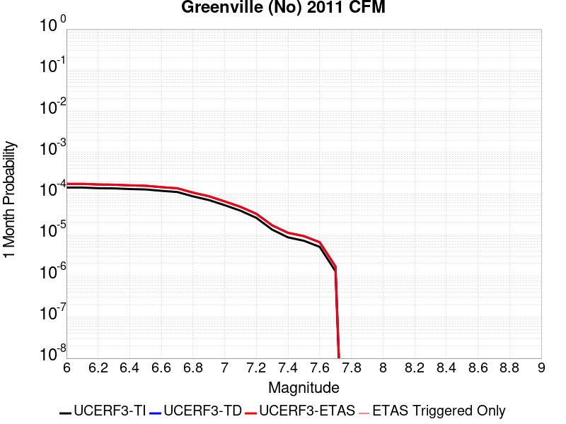 | 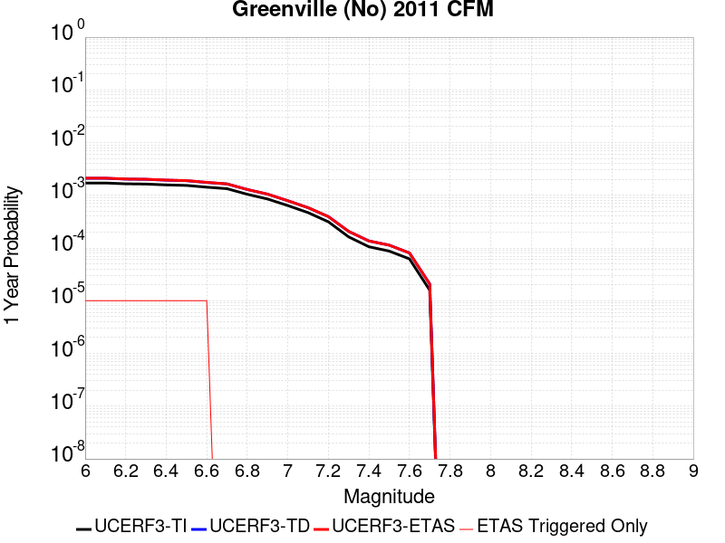 |  |

| Magnitude | 1 wk TI Prob | 1 wk TD Prob | 1 wk ETAS Prob | 1 wk ETAS/TD Gain | 1 wk ETAS Triggered Only | 1 mo TI Prob | 1 mo TD Prob | 1 mo ETAS Prob | 1 mo ETAS/TD Gain | 1 mo ETAS Triggered Only | 1 yr TI Prob | 1 yr TD Prob | 1 yr ETAS Prob | 1 yr ETAS/TD Gain | 1 yr ETAS Triggered Only | 10 yr TI Prob | 10 yr TD Prob | 10 yr ETAS Prob | 10 yr ETAS/TD Gain | 10 yr ETAS Triggered Only |
|-----|-----|-----|-----|-----|-----|-----|-----|-----|-----|-----|-----|-----|-----|-----|-----|-----|-----|-----|-----|-----|
| 6.0 | 3.286654E-5 | 4.036671E-5 | 4.036671E-5 | 1.0 | 0.0 | 1.4084899E-4 | 1.7298892E-4 | 1.7298892E-4 | 1.0 | 0.0 | 0.0017134876 | 0.0021041434 | 0.0021141223 | 1.0047425 | 1.0E-5 | 0.017003356 | 0.02084759 | 0.02085738 | 1.0004697 | 1.0E-5 |
| 6.1 | 3.286654E-5 | 4.036671E-5 | 4.036671E-5 | 1.0 | 0.0 | 1.4084899E-4 | 1.7298892E-4 | 1.7298892E-4 | 1.0 | 0.0 | 0.0017134876 | 0.0021041434 | 0.0021141223 | 1.0047425 | 1.0E-5 | 0.017003356 | 0.02084759 | 0.02085738 | 1.0004697 | 1.0E-5 |
| 6.2 | 3.1697953E-5 | 3.8929615E-5 | 3.8929615E-5 | 1.0 | 0.0 | 1.358413E-4 | 1.6683072E-4 | 1.6683072E-4 | 1.0 | 0.0 | 0.0016526132 | 0.0020293088 | 0.0020392886 | 1.0049177 | 1.0E-5 | 0.01640377 | 0.020112982 | 0.020122781 | 1.0004872 | 1.0E-5 |
| 6.3 | 3.1363317E-5 | 3.8518487E-5 | 3.8518487E-5 | 1.0 | 0.0 | 1.344073E-4 | 1.6506898E-4 | 1.6506898E-4 | 1.0 | 0.0 | 0.0016351803 | 0.0020078993 | 0.0020178794 | 1.0049703 | 1.0E-5 | 0.016232004 | 0.019902749 | 0.01991255 | 1.0004925 | 1.0E-5 |
| 6.4 | 3.0228604E-5 | 3.712561E-5 | 3.712561E-5 | 1.0 | 0.0 | 1.2954473E-4 | 1.5910025E-4 | 1.5910025E-4 | 1.0 | 0.0 | 0.0015760659 | 0.001935361 | 0.0019453416 | 1.005157 | 1.0E-5 | 0.015649348 | 0.01919009 | 0.019199898 | 1.000511 | 1.0E-5 |
| 6.5 | 2.9537814E-5 | 3.628106E-5 | 3.628106E-5 | 1.0 | 0.0 | 1.2658449E-4 | 1.5548118E-4 | 1.5548118E-4 | 1.0 | 0.0 | 0.0015400766 | 0.0018913761 | 0.0019013572 | 1.0052772 | 1.0E-5 | 0.01529447 | 0.018757751 | 0.018767564 | 1.0005231 | 1.0E-5 |
| 6.6 | 2.7345395E-5 | 3.359038E-5 | 3.359038E-5 | 1.0 | 0.0 | 1.1718928E-4 | 1.43951E-4 | 1.43951E-4 | 1.0 | 0.0 | 0.0014258457 | 0.0017512254 | 0.0017612079 | 1.0057002 | 1.0E-5 | 0.014167317 | 0.017378574 | 0.0173884 | 1.0005654 | 1.0E-5 |
| 6.7 | 2.5615784E-5 | 3.1567277E-5 | 3.1567277E-5 | 1.0 | 0.0 | 1.09777306E-4 | 1.352815E-4 | 1.352815E-4 | 1.0 | 0.0 | 0.0013357193 | 0.0016458385 | 0.0016458385 | 1.0 | 0.0 | 0.013277191 | 0.016340667 | 0.016340667 | 1.0 | 0.0 |
| 6.8 | 2.0059057E-5 | 2.4712264E-5 | 2.4712264E-5 | 1.0 | 0.0 | 8.596455E-5 | 1.059055E-4 | 1.059055E-4 | 1.0 | 0.0 | 0.0010461159 | 0.001288653 | 0.001288653 | 1.0 | 0.0 | 0.0104120495 | 0.012814328 | 0.012814328 | 1.0 | 0.0 |
| 6.9 | 1.6321746E-5 | 2.018486E-5 | 2.018486E-5 | 1.0 | 0.0 | 6.9948466E-5 | 8.6503744E-5 | 8.6503744E-5 | 1.0 | 0.0 | 8.5128983E-4 | 0.0010526866 | 0.0010526866 | 1.0 | 0.0 | 0.008480361 | 0.010479037 | 0.010479037 | 1.0 | 0.0 |
| 7.0 | 1.22527645E-5 | 1.5135808E-5 | 1.5135808E-5 | 1.0 | 0.0 | 5.2510793E-5 | 6.486616E-5 | 6.486616E-5 | 1.0 | 0.0 | 6.3913135E-4 | 7.894636E-4 | 7.894636E-4 | 1.0 | 0.0 | 0.0063729626 | 0.007867573 | 0.007867573 | 1.0 | 0.0 |
| 7.1 | 8.996482E-6 | 1.1165116E-5 | 1.1165116E-5 | 1.0 | 0.0 | 3.8555783E-5 | 4.784963E-5 | 4.784963E-5 | 1.0 | 0.0 | 4.6931554E-4 | 5.8241474E-4 | 5.8241474E-4 | 1.0 | 0.0 | 0.004683256 | 0.0058096354 | 0.0058096354 | 1.0 | 0.0 |
| 7.2 | 6.0273087E-6 | 7.569621E-6 | 7.569621E-6 | 1.0 | 0.0 | 2.5831067E-5 | 3.2440836E-5 | 3.2440836E-5 | 1.0 | 0.0 | 3.1444785E-4 | 3.9489628E-4 | 3.9489628E-4 | 1.0 | 0.0 | 0.0031400328 | 0.003942419 | 0.003942419 | 1.0 | 0.0 |
| 7.3 | 3.1209995E-6 | 3.9664565E-6 | 3.9664565E-6 | 1.0 | 0.0 | 1.3375643E-5 | 1.6998989E-5 | 1.6998989E-5 | 1.0 | 0.0 | 1.6283628E-4 | 2.069432E-4 | 2.069432E-4 | 1.0 | 0.0 | 0.0016271701 | 0.0020678395 | 0.0020678395 | 1.0 | 0.0 |
| 7.4 | 2.0254208E-6 | 2.6096657E-6 | 2.6096657E-6 | 1.0 | 0.0 | 8.680347E-6 | 1.1184234E-5 | 1.1184234E-5 | 1.0 | 0.0 | 1.0567809E-4 | 1.361596E-4 | 1.361596E-4 | 1.0 | 0.0 | 0.0010562785 | 0.0013611179 | 0.0013611179 | 1.0 | 0.0 |
| 7.5 | 1.6763418E-6 | 2.1734072E-6 | 2.1734072E-6 | 1.0 | 0.0 | 7.184302E-6 | 9.314569E-6 | 9.314569E-6 | 1.0 | 0.0 | 8.746537E-5 | 1.1339904E-4 | 1.1339904E-4 | 1.0 | 0.0 | 8.743095E-4 | 0.0011337536 | 0.0011337536 | 1.0 | 0.0 |
| 7.6 | 1.1935462E-6 | 1.5458915E-6 | 1.5458915E-6 | 1.0 | 0.0 | 5.115188E-6 | 6.625233E-6 | 6.625233E-6 | 1.0 | 0.0 | 6.2275634E-5 | 8.0659265E-5 | 8.0659265E-5 | 1.0 | 0.0 | 6.2258187E-4 | 8.0655375E-4 | 8.0655375E-4 | 1.0 | 0.0 |
| 7.7 | 3.0464201E-7 | 3.9848686E-7 | 3.9848686E-7 | 1.0 | 0.0 | 1.3056081E-6 | 1.7077997E-6 | 1.7077997E-6 | 1.0 | 0.0 | 1.589566E-5 | 2.0792268E-5 | 2.0792268E-5 | 1.0 | 0.0 | 1.5894524E-4 | 2.0793018E-4 | 2.0793018E-4 | 1.0 | 0.0 |

## Great Valley 04a Trout Creek
*[(top)](#table-of-contents)*

| 1 Week | 1 Month | 1 Year | 10 Year |
|-----|-----|-----|-----|
|  |  |  |  |

| Magnitude | 1 wk TI Prob | 1 wk TD Prob | 1 wk ETAS Prob | 1 wk ETAS/TD Gain | 1 wk ETAS Triggered Only | 1 mo TI Prob | 1 mo TD Prob | 1 mo ETAS Prob | 1 mo ETAS/TD Gain | 1 mo ETAS Triggered Only | 1 yr TI Prob | 1 yr TD Prob | 1 yr ETAS Prob | 1 yr ETAS/TD Gain | 1 yr ETAS Triggered Only | 10 yr TI Prob | 10 yr TD Prob | 10 yr ETAS Prob | 10 yr ETAS/TD Gain | 10 yr ETAS Triggered Only |
|-----|-----|-----|-----|-----|-----|-----|-----|-----|-----|-----|-----|-----|-----|-----|-----|-----|-----|-----|-----|-----|
| 6.0 | 1.4088538E-5 | 1.5719554E-5 | 2.5719397E-5 | 1.6361403 | 1.0E-5 | 6.037805E-5 | 6.7367844E-5 | 7.736717E-5 | 1.1484288 | 1.0E-5 | 7.3485484E-4 | 8.199074E-4 | 8.2989916E-4 | 1.0121865 | 1.0E-5 | 0.007324295 | 0.008170108 | 0.008180026 | 1.001214 | 1.0E-5 |
| 6.1 | 1.4088538E-5 | 1.5719554E-5 | 2.5719397E-5 | 1.6361403 | 1.0E-5 | 6.037805E-5 | 6.7367844E-5 | 7.736717E-5 | 1.1484288 | 1.0E-5 | 7.3485484E-4 | 8.199074E-4 | 8.2989916E-4 | 1.0121865 | 1.0E-5 | 0.007324295 | 0.008170108 | 0.008180026 | 1.001214 | 1.0E-5 |
| 6.2 | 1.4088538E-5 | 1.5719554E-5 | 2.5719397E-5 | 1.6361403 | 1.0E-5 | 6.037805E-5 | 6.7367844E-5 | 7.736717E-5 | 1.1484288 | 1.0E-5 | 7.3485484E-4 | 8.199074E-4 | 8.2989916E-4 | 1.0121865 | 1.0E-5 | 0.007324295 | 0.008170108 | 0.008180026 | 1.001214 | 1.0E-5 |
| 6.3 | 1.2882862E-5 | 1.4378603E-5 | 2.4378458E-5 | 1.6954678 | 1.0E-5 | 5.5211098E-5 | 6.1621184E-5 | 7.162057E-5 | 1.1622719 | 1.0E-5 | 6.7198783E-4 | 7.4999005E-4 | 7.5998256E-4 | 1.0133235 | 1.0E-5 | 0.0066995937 | 0.0074756527 | 0.0074855783 | 1.0013276 | 1.0E-5 |
| 6.4 | 1.2882862E-5 | 1.4378603E-5 | 2.4378458E-5 | 1.6954678 | 1.0E-5 | 5.5211098E-5 | 6.1621184E-5 | 7.162057E-5 | 1.1622719 | 1.0E-5 | 6.7198783E-4 | 7.4999005E-4 | 7.5998256E-4 | 1.0133235 | 1.0E-5 | 0.0066995937 | 0.0074756527 | 0.0074855783 | 1.0013276 | 1.0E-5 |
| 6.5 | 1.2762329E-5 | 1.424516E-5 | 2.4245017E-5 | 1.7019829 | 1.0E-5 | 5.469455E-5 | 6.1049315E-5 | 7.10487E-5 | 1.163792 | 1.0E-5 | 6.657027E-4 | 7.430323E-4 | 7.530249E-4 | 1.0134484 | 1.0E-5 | 0.00663712 | 0.0074065393 | 0.007416465 | 1.0013402 | 1.0E-5 |
| 6.6 | 1.2762329E-5 | 1.424516E-5 | 2.4245017E-5 | 1.7019829 | 1.0E-5 | 5.469455E-5 | 6.1049315E-5 | 7.10487E-5 | 1.163792 | 1.0E-5 | 6.657027E-4 | 7.430323E-4 | 7.530249E-4 | 1.0134484 | 1.0E-5 | 0.00663712 | 0.0074065393 | 0.007416465 | 1.0013402 | 1.0E-5 |
| 6.7 | 1.2557959E-5 | 1.4019395E-5 | 1.4019395E-5 | 1.0 | 0.0 | 5.3818712E-5 | 6.0081795E-5 | 6.0081795E-5 | 1.0 | 0.0 | 6.5504585E-4 | 7.312607E-4 | 7.312607E-4 | 1.0 | 0.0 | 0.006531183 | 0.007289598 | 0.007289598 | 1.0 | 0.0 |
| 6.8 | 1.1871544E-5 | 1.3258823E-5 | 1.3258823E-5 | 1.0 | 0.0 | 5.0877054E-5 | 5.6822348E-5 | 5.6822348E-5 | 1.0 | 0.0 | 6.1925204E-4 | 6.916025E-4 | 6.916025E-4 | 1.0 | 0.0 | 0.0061752927 | 0.0068955184 | 0.0068955184 | 1.0 | 0.0 |
| 6.9 | 1.0500373E-5 | 1.1731261E-5 | 1.1731261E-5 | 1.0 | 0.0 | 4.5000823E-5 | 5.0275914E-5 | 5.0275914E-5 | 1.0 | 0.0 | 5.4774724E-4 | 6.119459E-4 | 6.119459E-4 | 1.0 | 0.0 | 0.005463991 | 0.0061034737 | 0.0061034737 | 1.0 | 0.0 |
| 7.0 | 8.524332E-6 | 9.5334835E-6 | 9.5334835E-6 | 1.0 | 0.0 | 3.653234E-5 | 4.0857187E-5 | 4.0857187E-5 | 1.0 | 0.0 | 4.4469046E-4 | 4.9733004E-4 | 4.9733004E-4 | 1.0 | 0.0 | 0.0044380166 | 0.004962902 | 0.004962902 | 1.0 | 0.0 |
| 7.1 | 6.006849E-6 | 6.711559E-6 | 6.711559E-6 | 1.0 | 0.0 | 2.5743384E-5 | 2.876354E-5 | 2.876354E-5 | 1.0 | 0.0 | 3.1338062E-4 | 3.501454E-4 | 3.501454E-4 | 1.0 | 0.0 | 0.0031293905 | 0.0034964874 | 0.0034964874 | 1.0 | 0.0 |
| 7.2 | 2.9122193E-6 | 3.2465305E-6 | 3.2465305E-6 | 1.0 | 0.0 | 1.248088E-5 | 1.3913637E-5 | 1.3913637E-5 | 1.0 | 0.0 | 1.5194413E-4 | 1.6938712E-4 | 1.6938712E-4 | 1.0 | 0.0 | 0.0015184027 | 0.0016927521 | 0.0016927521 | 1.0 | 0.0 |
| 7.3 | 7.2194007E-7 | 7.988761E-7 | 7.988761E-7 | 1.0 | 0.0 | 3.0940253E-6 | 3.4237528E-6 | 3.4237528E-6 | 1.0 | 0.0 | 3.7669106E-5 | 4.1683852E-5 | 4.1683852E-5 | 1.0 | 0.0 | 3.766272E-4 | 4.168053E-4 | 4.168053E-4 | 1.0 | 0.0 |
| 7.4 | 3.112171E-8 | 3.2068368E-8 | 3.2068368E-8 | 1.0 | 0.0 | 1.3337875E-7 | 1.3743585E-7 | 1.3743585E-7 | 1.0 | 0.0 | 1.6238852E-6 | 1.6732803E-6 | 1.6732803E-6 | 1.0 | 0.0 | 1.6238733E-5 | 1.6732685E-5 | 1.6732685E-5 | 1.0 | 0.0 |

## Breckenridge 2011
*[(top)](#table-of-contents)*

| 1 Week | 1 Month | 1 Year | 10 Year |
|-----|-----|-----|-----|
|  |  | 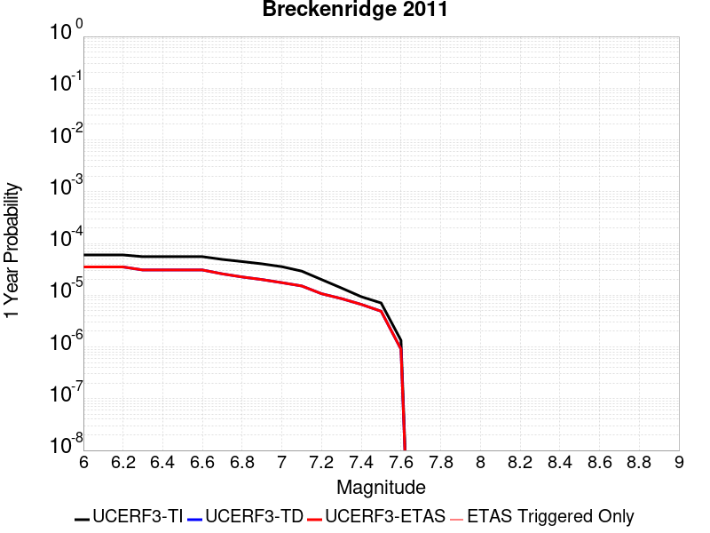 | 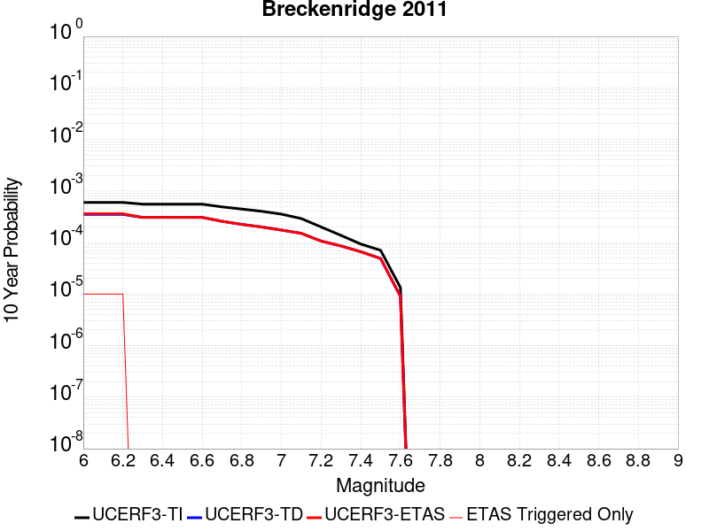 |

| Magnitude | 1 wk TI Prob | 1 wk TD Prob | 1 wk ETAS Prob | 1 wk ETAS/TD Gain | 1 wk ETAS Triggered Only | 1 mo TI Prob | 1 mo TD Prob | 1 mo ETAS Prob | 1 mo ETAS/TD Gain | 1 mo ETAS Triggered Only | 1 yr TI Prob | 1 yr TD Prob | 1 yr ETAS Prob | 1 yr ETAS/TD Gain | 1 yr ETAS Triggered Only | 10 yr TI Prob | 10 yr TD Prob | 10 yr ETAS Prob | 10 yr ETAS/TD Gain | 10 yr ETAS Triggered Only |
|-----|-----|-----|-----|-----|-----|-----|-----|-----|-----|-----|-----|-----|-----|-----|-----|-----|-----|-----|-----|-----|
| 6.0 | 1.1490393E-6 | 6.738007E-7 | 6.738007E-7 | 1.0 | 0.0 | 4.924445E-6 | 2.8877141E-6 | 2.8877141E-6 | 1.0 | 0.0 | 5.995347E-5 | 3.5157373E-5 | 3.5157373E-5 | 1.0 | 0.0 | 5.9937296E-4 | 3.5152017E-4 | 3.6151666E-4 | 1.0284379 | 1.0E-5 |
| 6.1 | 1.1490393E-6 | 6.738007E-7 | 6.738007E-7 | 1.0 | 0.0 | 4.924445E-6 | 2.8877141E-6 | 2.8877141E-6 | 1.0 | 0.0 | 5.995347E-5 | 3.5157373E-5 | 3.5157373E-5 | 1.0 | 0.0 | 5.9937296E-4 | 3.5152017E-4 | 3.6151666E-4 | 1.0284379 | 1.0E-5 |
| 6.2 | 1.1490393E-6 | 6.738007E-7 | 6.738007E-7 | 1.0 | 0.0 | 4.924445E-6 | 2.8877141E-6 | 2.8877141E-6 | 1.0 | 0.0 | 5.995347E-5 | 3.5157373E-5 | 3.5157373E-5 | 1.0 | 0.0 | 5.9937296E-4 | 3.5152017E-4 | 3.6151666E-4 | 1.0284379 | 1.0E-5 |
| 6.3 | 1.064617E-6 | 5.886405E-7 | 5.886405E-7 | 1.0 | 0.0 | 4.5626366E-6 | 2.5227425E-6 | 2.5227425E-6 | 1.0 | 0.0 | 5.5548684E-5 | 3.071397E-5 | 3.071397E-5 | 1.0 | 0.0 | 5.55348E-4 | 3.070984E-4 | 3.070984E-4 | 1.0 | 0.0 |
| 6.4 | 1.064617E-6 | 5.886405E-7 | 5.886405E-7 | 1.0 | 0.0 | 4.5626366E-6 | 2.5227425E-6 | 2.5227425E-6 | 1.0 | 0.0 | 5.5548684E-5 | 3.071397E-5 | 3.071397E-5 | 1.0 | 0.0 | 5.55348E-4 | 3.070984E-4 | 3.070984E-4 | 1.0 | 0.0 |
| 6.5 | 1.064617E-6 | 5.886405E-7 | 5.886405E-7 | 1.0 | 0.0 | 4.5626366E-6 | 2.5227425E-6 | 2.5227425E-6 | 1.0 | 0.0 | 5.5548684E-5 | 3.071397E-5 | 3.071397E-5 | 1.0 | 0.0 | 5.55348E-4 | 3.070984E-4 | 3.070984E-4 | 1.0 | 0.0 |
| 6.6 | 1.064617E-6 | 5.886405E-7 | 5.886405E-7 | 1.0 | 0.0 | 4.5626366E-6 | 2.5227425E-6 | 2.5227425E-6 | 1.0 | 0.0 | 5.5548684E-5 | 3.071397E-5 | 3.071397E-5 | 1.0 | 0.0 | 5.55348E-4 | 3.070984E-4 | 3.070984E-4 | 1.0 | 0.0 |
| 6.7 | 9.4219524E-7 | 4.954012E-7 | 4.954012E-7 | 1.0 | 0.0 | 4.037973E-6 | 2.1231463E-6 | 2.1231463E-6 | 1.0 | 0.0 | 4.916122E-5 | 2.5849005E-5 | 2.5849005E-5 | 1.0 | 0.0 | 4.9150345E-4 | 2.5846064E-4 | 2.5846064E-4 | 1.0 | 0.0 |
| 6.8 | 8.556422E-7 | 4.311915E-7 | 4.311915E-7 | 1.0 | 0.0 | 3.667033E-6 | 1.8479623E-6 | 1.8479623E-6 | 1.0 | 0.0 | 4.464521E-5 | 2.2498712E-5 | 2.2498712E-5 | 1.0 | 0.0 | 4.4636242E-4 | 2.2496474E-4 | 2.2496474E-4 | 1.0 | 0.0 |
| 6.9 | 7.7357794E-7 | 3.841983E-7 | 3.841983E-7 | 1.0 | 0.0 | 3.3153299E-6 | 1.6465632E-6 | 1.6465632E-6 | 1.0 | 0.0 | 4.0363393E-5 | 2.0046726E-5 | 2.0046726E-5 | 1.0 | 0.0 | 4.035606E-4 | 2.0044947E-4 | 2.0044947E-4 | 1.0 | 0.0 |
| 7.0 | 6.8172454E-7 | 3.3470985E-7 | 3.3470985E-7 | 1.0 | 0.0 | 2.9216735E-6 | 1.43447E-6 | 1.43447E-6 | 1.0 | 0.0 | 3.5570793E-5 | 1.7464534E-5 | 1.7464534E-5 | 1.0 | 0.0 | 3.55651E-4 | 1.7463184E-4 | 1.7463184E-4 | 1.0 | 0.0 |
| 7.1 | 5.5936397E-7 | 2.8909366E-7 | 2.8909366E-7 | 1.0 | 0.0 | 2.397272E-6 | 1.2389722E-6 | 1.2389722E-6 | 1.0 | 0.0 | 2.9186394E-5 | 1.5084385E-5 | 1.5084385E-5 | 1.0 | 0.0 | 2.9182562E-4 | 1.5083379E-4 | 1.5083379E-4 | 1.0 | 0.0 |
| 7.2 | 3.8420822E-7 | 2.0468183E-7 | 2.0468183E-7 | 1.0 | 0.0 | 1.6466057E-6 | 8.772076E-7 | 8.772076E-7 | 1.0 | 0.0 | 2.004724E-5 | 1.0679951E-5 | 1.0679951E-5 | 1.0 | 0.0 | 2.004543E-4 | 1.06794454E-4 | 1.06794454E-4 | 1.0 | 0.0 |
| 7.3 | 2.6405158E-7 | 1.6473078E-7 | 1.6473078E-7 | 1.0 | 0.0 | 1.1316491E-6 | 7.0598884E-7 | 7.0598884E-7 | 1.0 | 0.0 | 1.37777415E-5 | 8.595381E-6 | 8.595381E-6 | 1.0 | 0.0 | 1.3776887E-4 | 8.595055E-5 | 8.595055E-5 | 1.0 | 0.0 |
| 7.4 | 1.792114E-7 | 1.2725252E-7 | 1.2725252E-7 | 1.0 | 0.0 | 7.6804866E-7 | 5.453678E-7 | 5.453678E-7 | 1.0 | 0.0 | 9.3509525E-6 | 6.639834E-6 | 6.639834E-6 | 1.0 | 0.0 | 9.350559E-5 | 6.63964E-5 | 6.63964E-5 | 1.0 | 0.0 |
| 7.5 | 1.3548703E-7 | 9.385346E-8 | 9.385346E-8 | 1.0 | 0.0 | 5.8065854E-7 | 4.0222903E-7 | 4.0222903E-7 | 1.0 | 0.0 | 7.0694946E-6 | 4.897128E-6 | 4.897128E-6 | 1.0 | 0.0 | 7.0692695E-5 | 4.8970236E-5 | 4.8970236E-5 | 1.0 | 0.0 |
| 7.6 | 2.572245E-8 | 1.735264E-8 | 1.735264E-8 | 1.0 | 0.0 | 1.10239064E-7 | 7.436845E-8 | 7.436845E-8 | 1.0 | 0.0 | 1.3421597E-6 | 9.0543557E-7 | 9.0543557E-7 | 1.0 | 0.0 | 1.3421517E-5 | 9.054324E-6 | 9.054324E-6 | 1.0 | 0.0 |

## Holser alt 1
*[(top)](#table-of-contents)*

| 1 Week | 1 Month | 1 Year | 10 Year |
|-----|-----|-----|-----|
|  |  |  |  |

| Magnitude | 1 wk TI Prob | 1 wk TD Prob | 1 wk ETAS Prob | 1 wk ETAS/TD Gain | 1 wk ETAS Triggered Only | 1 mo TI Prob | 1 mo TD Prob | 1 mo ETAS Prob | 1 mo ETAS/TD Gain | 1 mo ETAS Triggered Only | 1 yr TI Prob | 1 yr TD Prob | 1 yr ETAS Prob | 1 yr ETAS/TD Gain | 1 yr ETAS Triggered Only | 10 yr TI Prob | 10 yr TD Prob | 10 yr ETAS Prob | 10 yr ETAS/TD Gain | 10 yr ETAS Triggered Only |
|-----|-----|-----|-----|-----|-----|-----|-----|-----|-----|-----|-----|-----|-----|-----|-----|-----|-----|-----|-----|-----|
| 6.0 | 6.2746653E-6 | 5.7899742E-6 | 5.7899742E-6 | 1.0 | 0.0 | 2.6891146E-5 | 2.4814004E-5 | 2.4814004E-5 | 1.0 | 0.0 | 3.273505E-4 | 3.0208015E-4 | 3.1207714E-4 | 1.0330938 | 1.0E-5 | 0.0032686873 | 0.003017828 | 0.003027798 | 1.0033036 | 1.0E-5 |
| 6.1 | 6.2746653E-6 | 5.7899742E-6 | 5.7899742E-6 | 1.0 | 0.0 | 2.6891146E-5 | 2.4814004E-5 | 2.4814004E-5 | 1.0 | 0.0 | 3.273505E-4 | 3.0208015E-4 | 3.1207714E-4 | 1.0330938 | 1.0E-5 | 0.0032686873 | 0.003017828 | 0.003027798 | 1.0033036 | 1.0E-5 |
| 6.2 | 6.2746653E-6 | 5.7899742E-6 | 5.7899742E-6 | 1.0 | 0.0 | 2.6891146E-5 | 2.4814004E-5 | 2.4814004E-5 | 1.0 | 0.0 | 3.273505E-4 | 3.0208015E-4 | 3.1207714E-4 | 1.0330938 | 1.0E-5 | 0.0032686873 | 0.003017828 | 0.003027798 | 1.0033036 | 1.0E-5 |
| 6.3 | 6.2746653E-6 | 5.7899742E-6 | 5.7899742E-6 | 1.0 | 0.0 | 2.6891146E-5 | 2.4814004E-5 | 2.4814004E-5 | 1.0 | 0.0 | 3.273505E-4 | 3.0208015E-4 | 3.1207714E-4 | 1.0330938 | 1.0E-5 | 0.0032686873 | 0.003017828 | 0.003027798 | 1.0033036 | 1.0E-5 |
| 6.4 | 6.2746653E-6 | 5.7899742E-6 | 5.7899742E-6 | 1.0 | 0.0 | 2.6891146E-5 | 2.4814004E-5 | 2.4814004E-5 | 1.0 | 0.0 | 3.273505E-4 | 3.0208015E-4 | 3.1207714E-4 | 1.0330938 | 1.0E-5 | 0.0032686873 | 0.003017828 | 0.003027798 | 1.0033036 | 1.0E-5 |
| 6.5 | 6.2746653E-6 | 5.7899742E-6 | 5.7899742E-6 | 1.0 | 0.0 | 2.6891146E-5 | 2.4814004E-5 | 2.4814004E-5 | 1.0 | 0.0 | 3.273505E-4 | 3.0208015E-4 | 3.1207714E-4 | 1.0330938 | 1.0E-5 | 0.0032686873 | 0.003017828 | 0.003027798 | 1.0033036 | 1.0E-5 |
| 6.6 | 3.375825E-6 | 2.7711988E-6 | 2.7711988E-6 | 1.0 | 0.0 | 1.4467741E-5 | 1.1876513E-5 | 1.1876513E-5 | 1.0 | 0.0 | 1.761305E-4 | 1.4458712E-4 | 1.4458712E-4 | 1.0 | 0.0 | 0.0017599097 | 0.0014449474 | 0.0014449474 | 1.0 | 0.0 |
| 6.7 | 3.375825E-6 | 2.7711988E-6 | 2.7711988E-6 | 1.0 | 0.0 | 1.4467741E-5 | 1.1876513E-5 | 1.1876513E-5 | 1.0 | 0.0 | 1.761305E-4 | 1.4458712E-4 | 1.4458712E-4 | 1.0 | 0.0 | 0.0017599097 | 0.0014449474 | 0.0014449474 | 1.0 | 0.0 |
| 6.8 | 3.366533E-6 | 2.7615984E-6 | 2.7615984E-6 | 1.0 | 0.0 | 1.4427919E-5 | 1.1835369E-5 | 1.1835369E-5 | 1.0 | 0.0 | 1.7564575E-4 | 1.4408625E-4 | 1.4408625E-4 | 1.0 | 0.0 | 0.0017550698 | 0.0014399453 | 0.0014399453 | 1.0 | 0.0 |
| 6.9 | 3.253174E-6 | 2.6438204E-6 | 2.6438204E-6 | 1.0 | 0.0 | 1.39421E-5 | 1.13306105E-5 | 1.13306105E-5 | 1.0 | 0.0 | 1.6973184E-4 | 1.379416E-4 | 1.379416E-4 | 1.0 | 0.0 | 0.0016960226 | 0.0013785758 | 0.0013785758 | 1.0 | 0.0 |
| 7.0 | 2.9336593E-6 | 2.3118082E-6 | 2.3118082E-6 | 1.0 | 0.0 | 1.2572766E-5 | 9.907712E-6 | 9.907712E-6 | 1.0 | 0.0 | 1.5306266E-4 | 1.2061974E-4 | 1.2061974E-4 | 1.0 | 0.0 | 0.0015295728 | 0.0012055453 | 0.0012055453 | 1.0 | 0.0 |
| 7.1 | 2.9087812E-6 | 2.2876604E-6 | 2.2876604E-6 | 1.0 | 0.0 | 1.2466146E-5 | 9.804223E-6 | 9.804223E-6 | 1.0 | 0.0 | 1.5176475E-4 | 1.19359895E-4 | 1.19359895E-4 | 1.0 | 0.0 | 0.0015166114 | 0.0011929603 | 0.0011929603 | 1.0 | 0.0 |
| 7.2 | 2.8674524E-6 | 2.247552E-6 | 2.247552E-6 | 1.0 | 0.0 | 1.2289024E-5 | 9.63233E-6 | 9.63233E-6 | 1.0 | 0.0 | 1.4960859E-4 | 1.1726733E-4 | 1.1726733E-4 | 1.0 | 0.0 | 0.0014950791 | 0.0011720568 | 0.0011720568 | 1.0 | 0.0 |
| 7.3 | 2.8057775E-6 | 2.1954418E-6 | 2.1954418E-6 | 1.0 | 0.0 | 1.2024705E-5 | 9.409002E-6 | 9.409002E-6 | 1.0 | 0.0 | 1.4639096E-4 | 1.145486E-4 | 1.145486E-4 | 1.0 | 0.0 | 0.0014629456 | 0.0011448979 | 0.0011448979 | 1.0 | 0.0 |
| 7.4 | 2.683666E-6 | 2.1092408E-6 | 2.1092408E-6 | 1.0 | 0.0 | 1.1501375E-5 | 9.0395715E-6 | 9.0395715E-6 | 1.0 | 0.0 | 1.4002025E-4 | 1.1005125E-4 | 1.1005125E-4 | 1.0 | 0.0 | 0.0013993206 | 0.0010999697 | 0.0010999697 | 1.0 | 0.0 |
| 7.5 | 2.434495E-6 | 1.9195488E-6 | 1.9195488E-6 | 1.0 | 0.0 | 1.0433508E-5 | 8.226612E-6 | 8.226612E-6 | 1.0 | 0.0 | 1.2702055E-4 | 1.0015442E-4 | 1.0015442E-4 | 1.0 | 0.0 | 0.0012694797 | 0.0010010948 | 0.0010010948 | 1.0 | 0.0 |
| 7.6 | 1.9914562E-6 | 1.5731545E-6 | 1.5731545E-6 | 1.0 | 0.0 | 8.534785E-6 | 6.7420733E-6 | 6.7420733E-6 | 1.0 | 0.0 | 1.03906044E-4 | 8.2081664E-5 | 8.2081664E-5 | 1.0 | 0.0 | 0.0010385747 | 8.2051504E-4 | 8.2051504E-4 | 1.0 | 0.0 |
| 7.7 | 1.5229501E-6 | 1.1896134E-6 | 1.1896134E-6 | 1.0 | 0.0 | 6.526913E-6 | 5.098333E-6 | 5.098333E-6 | 1.0 | 0.0 | 7.946226E-5 | 6.207045E-5 | 6.207045E-5 | 1.0 | 0.0 | 7.943385E-4 | 6.2053243E-4 | 6.2053243E-4 | 1.0 | 0.0 |
| 7.8 | 6.3489426E-7 | 4.6878412E-7 | 4.6878412E-7 | 1.0 | 0.0 | 2.7209726E-6 | 2.0090733E-6 | 2.0090733E-6 | 1.0 | 0.0 | 3.312734E-5 | 2.4460194E-5 | 2.4460194E-5 | 1.0 | 0.0 | 3.31224E-4 | 2.445752E-4 | 2.445752E-4 | 1.0 | 0.0 |
| 7.9 | 1.5459432E-7 | 1.01936465E-7 | 1.01936465E-7 | 1.0 | 0.0 | 6.6254694E-7 | 4.3687047E-7 | 4.3687047E-7 | 1.0 | 0.0 | 8.066479E-6 | 5.318885E-6 | 5.318885E-6 | 1.0 | 0.0 | 8.066186E-5 | 5.3187596E-5 | 5.3187596E-5 | 1.0 | 0.0 |
| 8.0 | 1.8307812E-8 | 9.690041E-9 | 9.690041E-9 | 1.0 | 0.0 | 7.846205E-8 | 4.1528747E-8 | 4.1528747E-8 | 1.0 | 0.0 | 9.55275E-7 | 5.056124E-7 | 5.056124E-7 | 1.0 | 0.0 | 9.552709E-6 | 5.0561125E-6 | 5.0561125E-6 | 1.0 | 0.0 |

## San Joaquin Hills
*[(top)](#table-of-contents)*

| 1 Week | 1 Month | 1 Year | 10 Year |
|-----|-----|-----|-----|
|  |  |  | 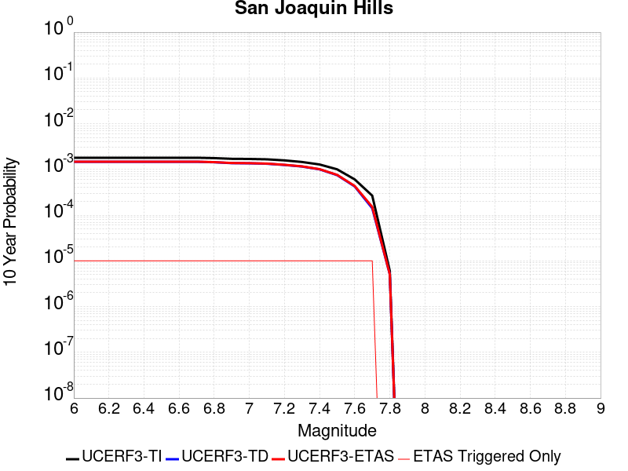 |

| Magnitude | 1 wk TI Prob | 1 wk TD Prob | 1 wk ETAS Prob | 1 wk ETAS/TD Gain | 1 wk ETAS Triggered Only | 1 mo TI Prob | 1 mo TD Prob | 1 mo ETAS Prob | 1 mo ETAS/TD Gain | 1 mo ETAS Triggered Only | 1 yr TI Prob | 1 yr TD Prob | 1 yr ETAS Prob | 1 yr ETAS/TD Gain | 1 yr ETAS Triggered Only | 10 yr TI Prob | 10 yr TD Prob | 10 yr ETAS Prob | 10 yr ETAS/TD Gain | 10 yr ETAS Triggered Only |
|-----|-----|-----|-----|-----|-----|-----|-----|-----|-----|-----|-----|-----|-----|-----|-----|-----|-----|-----|-----|-----|
| 6.0 | 3.4525704E-6 | 2.8139727E-6 | 2.8139727E-6 | 1.0 | 0.0 | 1.4796647E-5 | 1.2059828E-5 | 2.2059707E-5 | 1.8291892 | 1.0E-5 | 1.8013427E-4 | 1.4681864E-4 | 1.5681717E-4 | 1.0681013 | 1.0E-5 | 0.0017998833 | 0.0014672297 | 0.0014772151 | 1.0068055 | 1.0E-5 |
| 6.1 | 3.4525704E-6 | 2.8139727E-6 | 2.8139727E-6 | 1.0 | 0.0 | 1.4796647E-5 | 1.2059828E-5 | 2.2059707E-5 | 1.8291892 | 1.0E-5 | 1.8013427E-4 | 1.4681864E-4 | 1.5681717E-4 | 1.0681013 | 1.0E-5 | 0.0017998833 | 0.0014672297 | 0.0014772151 | 1.0068055 | 1.0E-5 |
| 6.2 | 3.4525704E-6 | 2.8139727E-6 | 2.8139727E-6 | 1.0 | 0.0 | 1.4796647E-5 | 1.2059828E-5 | 2.2059707E-5 | 1.8291892 | 1.0E-5 | 1.8013427E-4 | 1.4681864E-4 | 1.5681717E-4 | 1.0681013 | 1.0E-5 | 0.0017998833 | 0.0014672297 | 0.0014772151 | 1.0068055 | 1.0E-5 |
| 6.3 | 3.4525704E-6 | 2.8139727E-6 | 2.8139727E-6 | 1.0 | 0.0 | 1.4796647E-5 | 1.2059828E-5 | 2.2059707E-5 | 1.8291892 | 1.0E-5 | 1.8013427E-4 | 1.4681864E-4 | 1.5681717E-4 | 1.0681013 | 1.0E-5 | 0.0017998833 | 0.0014672297 | 0.0014772151 | 1.0068055 | 1.0E-5 |
| 6.4 | 3.4525704E-6 | 2.8139727E-6 | 2.8139727E-6 | 1.0 | 0.0 | 1.4796647E-5 | 1.2059828E-5 | 2.2059707E-5 | 1.8291892 | 1.0E-5 | 1.8013427E-4 | 1.4681864E-4 | 1.5681717E-4 | 1.0681013 | 1.0E-5 | 0.0017998833 | 0.0014672297 | 0.0014772151 | 1.0068055 | 1.0E-5 |
| 6.5 | 3.4525704E-6 | 2.8139727E-6 | 2.8139727E-6 | 1.0 | 0.0 | 1.4796647E-5 | 1.2059828E-5 | 2.2059707E-5 | 1.8291892 | 1.0E-5 | 1.8013427E-4 | 1.4681864E-4 | 1.5681717E-4 | 1.0681013 | 1.0E-5 | 0.0017998833 | 0.0014672297 | 0.0014772151 | 1.0068055 | 1.0E-5 |
| 6.6 | 3.4525704E-6 | 2.8139727E-6 | 2.8139727E-6 | 1.0 | 0.0 | 1.4796647E-5 | 1.2059828E-5 | 2.2059707E-5 | 1.8291892 | 1.0E-5 | 1.8013427E-4 | 1.4681864E-4 | 1.5681717E-4 | 1.0681013 | 1.0E-5 | 0.0017998833 | 0.0014672297 | 0.0014772151 | 1.0068055 | 1.0E-5 |
| 6.7 | 3.4525704E-6 | 2.8139727E-6 | 2.8139727E-6 | 1.0 | 0.0 | 1.4796647E-5 | 1.2059828E-5 | 2.2059707E-5 | 1.8291892 | 1.0E-5 | 1.8013427E-4 | 1.4681864E-4 | 1.5681717E-4 | 1.0681013 | 1.0E-5 | 0.0017998833 | 0.0014672297 | 0.0014772151 | 1.0068055 | 1.0E-5 |
| 6.8 | 3.388654E-6 | 2.7484111E-6 | 2.7484111E-6 | 1.0 | 0.0 | 1.4522722E-5 | 1.1778852E-5 | 2.1778735E-5 | 1.8489691 | 1.0E-5 | 1.767998E-4 | 1.4339821E-4 | 1.5339679E-4 | 1.0697259 | 1.0E-5 | 0.001766592 | 0.0014330697 | 0.0014430553 | 1.006968 | 1.0E-5 |
| 6.9 | 3.2694352E-6 | 2.6283255E-6 | 2.6283255E-6 | 1.0 | 0.0 | 1.401179E-5 | 1.1264204E-5 | 2.1264092E-5 | 1.887758 | 1.0E-5 | 1.7058018E-4 | 1.3713316E-4 | 1.471318E-4 | 1.0729119 | 1.0E-5 | 0.0017044931 | 0.0013704967 | 0.001380483 | 1.0072867 | 1.0E-5 |
| 7.0 | 3.246912E-6 | 2.6069824E-6 | 2.6069824E-6 | 1.0 | 0.0 | 1.39152635E-5 | 1.1172735E-5 | 2.1172624E-5 | 1.895026 | 1.0E-5 | 1.6940516E-4 | 1.3601968E-4 | 1.4601831E-4 | 1.0735087 | 1.0E-5 | 0.0016927607 | 0.0013593754 | 0.0013693619 | 1.0073463 | 1.0E-5 |
| 7.1 | 3.1864927E-6 | 2.5523102E-6 | 2.5523102E-6 | 1.0 | 0.0 | 1.3656326E-5 | 1.0938427E-5 | 2.0938318E-5 | 1.9141982 | 1.0E-5 | 1.6625308E-4 | 1.3316733E-4 | 1.4316599E-4 | 1.0750835 | 1.0E-5 | 0.0016612876 | 0.0013308863 | 0.001340873 | 1.0075037 | 1.0E-5 |
| 7.2 | 3.0220644E-6 | 2.3991581E-6 | 2.3991581E-6 | 1.0 | 0.0 | 1.295164E-5 | 1.0282067E-5 | 2.0281963E-5 | 1.9725572 | 1.0E-5 | 1.576748E-4 | 1.2517707E-4 | 1.3517581E-4 | 1.0798768 | 1.0E-5 | 0.0015756298 | 0.001251076 | 0.0012610634 | 1.0079831 | 1.0E-5 |
| 7.3 | 2.787619E-6 | 2.2173751E-6 | 2.2173751E-6 | 1.0 | 0.0 | 1.1946884E-5 | 9.503003E-6 | 1.9502908E-5 | 2.052289 | 1.0E-5 | 1.454436E-4 | 1.1569301E-4 | 1.2569185E-4 | 1.0864257 | 1.0E-5 | 0.0014534845 | 0.0011563377 | 0.0011663261 | 1.008638 | 1.0E-5 |
| 7.4 | 2.4593792E-6 | 1.9226163E-6 | 1.9226163E-6 | 1.0 | 0.0 | 1.0540153E-5 | 8.239759E-6 | 1.8239676E-5 | 2.2136178 | 1.0E-5 | 1.2831882E-4 | 1.0031454E-4 | 1.1031354E-4 | 1.0996765 | 1.0E-5 | 0.0012824474 | 0.0010027013 | 0.0010126913 | 1.009963 | 1.0E-5 |
| 7.5 | 1.926764E-6 | 1.4383043E-6 | 1.4383043E-6 | 1.0 | 0.0 | 8.257534E-6 | 6.1641467E-6 | 1.6164086E-5 | 2.6222746 | 1.0E-5 | 1.00530844E-4 | 7.5045966E-5 | 8.504521E-5 | 1.1332417 | 1.0E-5 | 0.0010048538 | 7.502126E-4 | 7.602051E-4 | 1.0133196 | 1.0E-5 |
| 7.6 | 1.1609359E-6 | 8.145649E-7 | 8.145649E-7 | 1.0 | 0.0 | 4.97543E-6 | 3.4909879E-6 | 1.3490953E-5 | 3.8645086 | 1.0E-5 | 6.0574173E-5 | 4.2501993E-5 | 5.2501568E-5 | 1.2352731 | 1.0E-5 | 6.055767E-4 | 4.24943E-4 | 4.3493873E-4 | 1.0235226 | 1.0E-5 |
| 7.7 | 5.1168536E-7 | 2.7155397E-7 | 2.7155397E-7 | 1.0 | 0.0 | 2.1929354E-6 | 1.1638023E-6 | 1.1163791E-5 | 9.592515 | 1.0E-5 | 2.669866E-5 | 1.4169214E-5 | 2.4169072E-5 | 1.7057455 | 1.0E-5 | 2.6695454E-4 | 1.4168446E-4 | 1.5168304E-4 | 1.0705694 | 1.0E-5 |
| 7.8 | 1.16056995E-8 | 9.782997E-9 | 9.782997E-9 | 1.0 | 0.0 | 4.9738713E-8 | 4.1927127E-8 | 4.1927127E-8 | 1.0 | 0.0 | 6.0556863E-7 | 5.1046277E-7 | 5.1046277E-7 | 1.0 | 0.0 | 6.05567E-6 | 5.1046277E-6 | 5.1046277E-6 | 1.0 | 0.0 |

## Walker Spring 2011 CFM
*[(top)](#table-of-contents)*

| 1 Week | 1 Month | 1 Year | 10 Year |
|-----|-----|-----|-----|
|  |  | 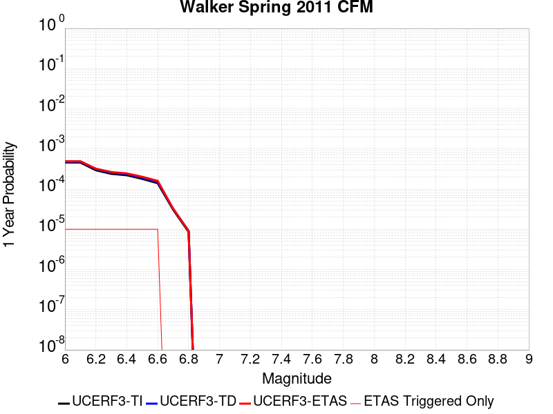 |  |

| Magnitude | 1 wk TI Prob | 1 wk TD Prob | 1 wk ETAS Prob | 1 wk ETAS/TD Gain | 1 wk ETAS Triggered Only | 1 mo TI Prob | 1 mo TD Prob | 1 mo ETAS Prob | 1 mo ETAS/TD Gain | 1 mo ETAS Triggered Only | 1 yr TI Prob | 1 yr TD Prob | 1 yr ETAS Prob | 1 yr ETAS/TD Gain | 1 yr ETAS Triggered Only | 10 yr TI Prob | 10 yr TD Prob | 10 yr ETAS Prob | 10 yr ETAS/TD Gain | 10 yr ETAS Triggered Only |
|-----|-----|-----|-----|-----|-----|-----|-----|-----|-----|-----|-----|-----|-----|-----|-----|-----|-----|-----|-----|-----|
| 6.0 | 8.791276E-6 | 9.264088E-6 | 1.9263995E-5 | 2.079427 | 1.0E-5 | 3.767635E-5 | 3.970269E-5 | 4.9702292E-5 | 1.251862 | 1.0E-5 | 4.58613E-4 | 4.832839E-4 | 4.932791E-4 | 1.0206817 | 1.0E-5 | 0.004576677 | 0.0048234025 | 0.004833354 | 1.0020633 | 1.0E-5 |
| 6.1 | 8.791276E-6 | 9.264088E-6 | 1.9263995E-5 | 2.079427 | 1.0E-5 | 3.767635E-5 | 3.970269E-5 | 4.9702292E-5 | 1.251862 | 1.0E-5 | 4.58613E-4 | 4.832839E-4 | 4.932791E-4 | 1.0206817 | 1.0E-5 | 0.004576677 | 0.0048234025 | 0.004833354 | 1.0020633 | 1.0E-5 |
| 6.2 | 5.654515E-6 | 5.99876E-6 | 1.59987E-5 | 2.6670012 | 1.0E-5 | 2.4233412E-5 | 2.5708747E-5 | 3.570849E-5 | 1.3889626 | 1.0E-5 | 2.9500184E-4 | 3.1296405E-4 | 3.2296093E-4 | 1.0319426 | 1.0E-5 | 0.0029461053 | 0.0031257276 | 0.0031356963 | 1.0031892 | 1.0E-5 |
| 6.3 | 4.591685E-6 | 4.8947268E-6 | 1.4894677E-5 | 3.043005 | 1.0E-5 | 1.96785E-5 | 2.0977257E-5 | 3.0977048E-5 | 1.4766967 | 1.0E-5 | 2.395594E-4 | 2.5537255E-4 | 2.6536998E-4 | 1.0391484 | 1.0E-5 | 0.002393013 | 0.0025512208 | 0.0025611953 | 1.0039097 | 1.0E-5 |
| 6.4 | 4.243283E-6 | 4.52266E-6 | 1.4522615E-5 | 3.211078 | 1.0E-5 | 1.8185372E-5 | 1.938271E-5 | 2.9382516E-5 | 1.5159137 | 1.0E-5 | 2.2138441E-4 | 2.3596318E-4 | 2.459608E-4 | 1.0423695 | 1.0E-5 | 0.00221164 | 0.0023575418 | 0.0023675181 | 1.0042317 | 1.0E-5 |
| 6.5 | 3.4445666E-6 | 3.6860924E-6 | 1.3686055E-5 | 3.71289 | 1.0E-5 | 1.4762345E-5 | 1.5797466E-5 | 2.5797308E-5 | 1.6330029 | 1.0E-5 | 1.7971672E-4 | 1.923212E-4 | 2.0231928E-4 | 1.0519863 | 1.0E-5 | 0.0017957145 | 0.0019219425 | 0.0019319232 | 1.0051931 | 1.0E-5 |
| 6.6 | 2.68766E-6 | 2.8794348E-6 | 1.2879406E-5 | 4.4728937 | 1.0E-5 | 1.1518492E-5 | 1.2340398E-5 | 2.2340275E-5 | 1.8103366 | 1.0E-5 | 1.4022861E-4 | 1.502378E-4 | 1.6023629E-4 | 1.0665511 | 1.0E-5 | 0.0014014016 | 0.0015017362 | 0.0015117212 | 1.006649 | 1.0E-5 |
| 6.7 | 5.880964E-7 | 6.1997474E-7 | 6.1997474E-7 | 1.0 | 0.0 | 2.5204106E-6 | 2.6570326E-6 | 2.6570326E-6 | 1.0 | 0.0 | 3.0685565E-5 | 3.2348988E-5 | 3.2348988E-5 | 1.0 | 0.0 | 3.068133E-4 | 3.2345214E-4 | 3.2345214E-4 | 1.0 | 0.0 |
| 6.8 | 1.6514163E-7 | 1.7409117E-7 | 1.7409117E-7 | 1.0 | 0.0 | 7.077497E-7 | 7.46105E-7 | 7.46105E-7 | 1.0 | 0.0 | 8.616818E-6 | 9.083828E-6 | 9.083828E-6 | 1.0 | 0.0 | 8.616484E-5 | 9.0838286E-5 | 9.0838286E-5 | 1.0 | 0.0 |

## Malibu Coast (Extension) alt 1
*[(top)](#table-of-contents)*

| 1 Week | 1 Month | 1 Year | 10 Year |
|-----|-----|-----|-----|
|  |  | 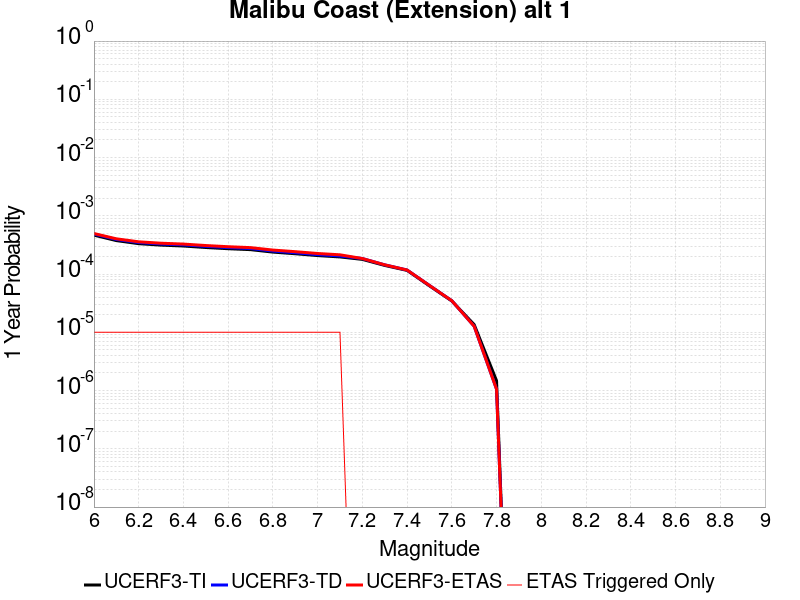 | 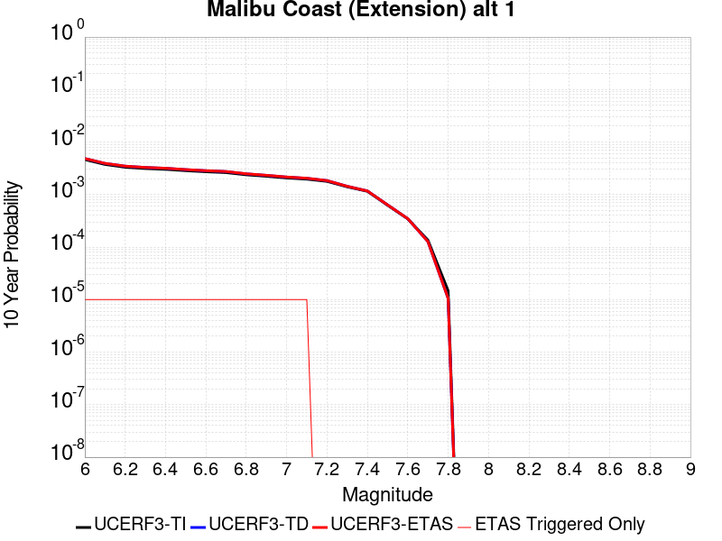 |

| Magnitude | 1 wk TI Prob | 1 wk TD Prob | 1 wk ETAS Prob | 1 wk ETAS/TD Gain | 1 wk ETAS Triggered Only | 1 mo TI Prob | 1 mo TD Prob | 1 mo ETAS Prob | 1 mo ETAS/TD Gain | 1 mo ETAS Triggered Only | 1 yr TI Prob | 1 yr TD Prob | 1 yr ETAS Prob | 1 yr ETAS/TD Gain | 1 yr ETAS Triggered Only | 10 yr TI Prob | 10 yr TD Prob | 10 yr ETAS Prob | 10 yr ETAS/TD Gain | 10 yr ETAS Triggered Only |
|-----|-----|-----|-----|-----|-----|-----|-----|-----|-----|-----|-----|-----|-----|-----|-----|-----|-----|-----|-----|-----|
| 6.0 | 8.930738E-6 | 9.3292765E-6 | 9.3292765E-6 | 1.0 | 0.0 | 3.827403E-5 | 3.998201E-5 | 3.998201E-5 | 1.0 | 0.0 | 4.6588664E-4 | 4.86674E-4 | 4.966691E-4 | 1.0205376 | 1.0E-5 | 0.0046491115 | 0.004856264 | 0.004866216 | 1.0020492 | 1.0E-5 |
| 6.1 | 7.199952E-6 | 7.5302974E-6 | 7.5302974E-6 | 1.0 | 0.0 | 3.0856572E-5 | 3.2272306E-5 | 3.2272306E-5 | 1.0 | 0.0 | 3.75614E-4 | 3.928451E-4 | 4.0284116E-4 | 1.0254453 | 1.0E-5 | 0.0037497976 | 0.0039215726 | 0.0039315335 | 1.00254 | 1.0E-5 |
| 6.2 | 6.3721413E-6 | 6.666792E-6 | 6.666792E-6 | 1.0 | 0.0 | 2.7308892E-5 | 2.8571656E-5 | 2.8571656E-5 | 1.0 | 0.0 | 3.3243504E-4 | 3.4780474E-4 | 3.5780127E-4 | 1.0287417 | 1.0E-5 | 0.0033193815 | 0.0034726441 | 0.0034826095 | 1.0028696 | 1.0E-5 |
| 6.3 | 6.016345E-6 | 6.295159E-6 | 6.295159E-6 | 1.0 | 0.0 | 2.578408E-5 | 2.6978976E-5 | 2.6978976E-5 | 1.0 | 0.0 | 3.1387596E-4 | 3.2841985E-4 | 3.3841658E-4 | 1.0304388 | 1.0E-5 | 0.00313433 | 0.0032793812 | 0.0032893484 | 1.0030394 | 1.0E-5 |
| 6.4 | 5.8104883E-6 | 6.0795455E-6 | 6.0795455E-6 | 1.0 | 0.0 | 2.4901856E-5 | 2.6054937E-5 | 2.6054937E-5 | 1.0 | 0.0 | 3.031379E-4 | 3.17173E-4 | 3.271698E-4 | 1.0315186 | 1.0E-5 | 0.0030272473 | 0.0031672379 | 0.003177206 | 1.0031474 | 1.0E-5 |
| 6.5 | 5.476925E-6 | 5.727514E-6 | 5.727514E-6 | 1.0 | 0.0 | 2.3472323E-5 | 2.454626E-5 | 2.454626E-5 | 1.0 | 0.0 | 2.8573806E-4 | 2.9881002E-4 | 3.0880704E-4 | 1.0334561 | 1.0E-5 | 0.0028537093 | 0.0029841145 | 0.0029940845 | 1.0033411 | 1.0E-5 |
| 6.6 | 5.222387E-6 | 5.4585807E-6 | 5.4585807E-6 | 1.0 | 0.0 | 2.2381464E-5 | 2.3393708E-5 | 2.3393708E-5 | 1.0 | 0.0 | 2.7246025E-4 | 2.8478145E-4 | 2.947786E-4 | 1.0351046 | 1.0E-5 | 0.0027212645 | 0.002844196 | 0.0028541675 | 1.003506 | 1.0E-5 |
| 6.7 | 5.0337076E-6 | 5.259104E-6 | 5.259104E-6 | 1.0 | 0.0 | 2.1572854E-5 | 2.2538823E-5 | 2.2538823E-5 | 1.0 | 0.0 | 2.6261783E-4 | 2.743759E-4 | 2.8437315E-4 | 1.0364363 | 1.0E-5 | 0.002623077 | 0.0027404015 | 0.0027503741 | 1.0036391 | 1.0E-5 |
| 6.8 | 4.5675624E-6 | 4.7587173E-6 | 4.7587173E-6 | 1.0 | 0.0 | 1.9575122E-5 | 2.0394344E-5 | 2.0394344E-5 | 1.0 | 0.0 | 2.3830103E-4 | 2.4827302E-4 | 2.5827056E-4 | 1.0402682 | 1.0E-5 | 0.0023804565 | 0.0024799763 | 0.0024899517 | 1.0040222 | 1.0E-5 |
| 6.9 | 4.2802412E-6 | 4.4520216E-6 | 4.4520216E-6 | 1.0 | 0.0 | 1.8343762E-5 | 1.9079953E-5 | 1.9079953E-5 | 1.0 | 0.0 | 2.2331243E-4 | 2.3227383E-4 | 2.422715E-4 | 1.0430427 | 1.0E-5 | 0.0022308815 | 0.0023203273 | 0.0023303041 | 1.0042998 | 1.0E-5 |
| 7.0 | 3.9794063E-6 | 4.1301E-6 | 4.1301E-6 | 1.0 | 0.0 | 1.7054486E-5 | 1.770031E-5 | 1.770031E-5 | 1.0 | 0.0 | 2.0761859E-4 | 2.1548007E-4 | 2.2547792E-4 | 1.046398 | 1.0E-5 | 0.0020742472 | 0.002152725 | 0.0021627033 | 1.0046353 | 1.0E-5 |
| 7.1 | 3.7730424E-6 | 3.911218E-6 | 3.911218E-6 | 1.0 | 0.0 | 1.6170083E-5 | 1.6762255E-5 | 1.6762255E-5 | 1.0 | 0.0 | 1.9685295E-4 | 2.0406146E-4 | 2.1405943E-4 | 1.0489949 | 1.0E-5 | 0.0019667868 | 0.0020387538 | 0.0020487334 | 1.004895 | 1.0E-5 |
| 7.2 | 3.424985E-6 | 3.541338E-6 | 3.541338E-6 | 1.0 | 0.0 | 1.4678424E-5 | 1.5177075E-5 | 1.5177075E-5 | 1.0 | 0.0 | 1.7869516E-4 | 1.8476533E-4 | 1.8476533E-4 | 1.0 | 0.0 | 0.0017855153 | 0.0018461292 | 0.0018461292 | 1.0 | 0.0 |
| 7.3 | 2.6966375E-6 | 2.759654E-6 | 2.759654E-6 | 1.0 | 0.0 | 1.15569665E-5 | 1.1827035E-5 | 1.1827035E-5 | 1.0 | 0.0 | 1.4069698E-4 | 1.4398468E-4 | 1.4398468E-4 | 1.0 | 0.0 | 0.0014060794 | 0.001438918 | 0.001438918 | 1.0 | 0.0 |
| 7.4 | 2.215957E-6 | 2.249379E-6 | 2.249379E-6 | 1.0 | 0.0 | 9.496924E-6 | 9.64016E-6 | 9.64016E-6 | 1.0 | 0.0 | 1.1561892E-4 | 1.1736266E-4 | 1.1736266E-4 | 1.0 | 0.0 | 0.0011555878 | 0.0011730106 | 0.0011730106 | 1.0 | 0.0 |
| 7.5 | 1.2040218E-6 | 1.2219067E-6 | 1.2219067E-6 | 1.0 | 0.0 | 5.160083E-6 | 5.2367327E-6 | 5.2367327E-6 | 1.0 | 0.0 | 6.2822204E-5 | 6.3755375E-5 | 6.3755375E-5 | 1.0 | 0.0 | 6.280445E-4 | 6.3737266E-4 | 6.3737266E-4 | 1.0 | 0.0 |
| 7.6 | 6.6157446E-7 | 6.6789755E-7 | 6.6789755E-7 | 1.0 | 0.0 | 2.835316E-6 | 2.8624152E-6 | 2.8624152E-6 | 1.0 | 0.0 | 3.4519428E-5 | 3.4849363E-5 | 3.4849363E-5 | 1.0 | 0.0 | 3.4514067E-4 | 3.484405E-4 | 3.484405E-4 | 1.0 | 0.0 |
| 7.7 | 2.6012302E-7 | 2.4357584E-7 | 2.4357584E-7 | 1.0 | 0.0 | 1.1148124E-6 | 1.0438962E-6 | 1.0438962E-6 | 1.0 | 0.0 | 1.3572758E-5 | 1.2709373E-5 | 1.2709373E-5 | 1.0 | 0.0 | 1.3571928E-4 | 1.2708752E-4 | 1.2708752E-4 | 1.0 | 0.0 |
| 7.8 | 2.8323132E-8 | 2.0266642E-8 | 2.0266642E-8 | 1.0 | 0.0 | 1.2138484E-7 | 8.685703E-8 | 8.685703E-8 | 1.0 | 0.0 | 1.4778595E-6 | 1.0574839E-6 | 1.0574839E-6 | 1.0 | 0.0 | 1.4778497E-5 | 1.0574797E-5 | 1.0574797E-5 | 1.0 | 0.0 |

## Rinconada 2011 CFM
*[(top)](#table-of-contents)*

| 1 Week | 1 Month | 1 Year | 10 Year |
|-----|-----|-----|-----|
|  |  |  |  |

| Magnitude | 1 wk TI Prob | 1 wk TD Prob | 1 wk ETAS Prob | 1 wk ETAS/TD Gain | 1 wk ETAS Triggered Only | 1 mo TI Prob | 1 mo TD Prob | 1 mo ETAS Prob | 1 mo ETAS/TD Gain | 1 mo ETAS Triggered Only | 1 yr TI Prob | 1 yr TD Prob | 1 yr ETAS Prob | 1 yr ETAS/TD Gain | 1 yr ETAS Triggered Only | 10 yr TI Prob | 10 yr TD Prob | 10 yr ETAS Prob | 10 yr ETAS/TD Gain | 10 yr ETAS Triggered Only |
|-----|-----|-----|-----|-----|-----|-----|-----|-----|-----|-----|-----|-----|-----|-----|-----|-----|-----|-----|-----|-----|
| 6.0 | 1.5752368E-5 | 1.6274716E-5 | 1.6274716E-5 | 1.0 | 0.0 | 6.75084E-5 | 6.974694E-5 | 6.974694E-5 | 1.0 | 0.0 | 8.2160486E-4 | 8.488413E-4 | 8.5883273E-4 | 1.0117707 | 1.0E-5 | 0.008185739 | 0.00845637 | 0.008466286 | 1.0011725 | 1.0E-5 |
| 6.1 | 1.0966133E-5 | 1.1323029E-5 | 1.1323029E-5 | 1.0 | 0.0 | 4.6996865E-5 | 4.852637E-5 | 4.852637E-5 | 1.0 | 0.0 | 5.720366E-4 | 5.9064914E-4 | 5.9064914E-4 | 1.0 | 0.0 | 0.0057056635 | 0.005890889 | 0.005890889 | 1.0 | 0.0 |
| 6.2 | 1.0966133E-5 | 1.1323029E-5 | 1.1323029E-5 | 1.0 | 0.0 | 4.6996865E-5 | 4.852637E-5 | 4.852637E-5 | 1.0 | 0.0 | 5.720366E-4 | 5.9064914E-4 | 5.9064914E-4 | 1.0 | 0.0 | 0.0057056635 | 0.005890889 | 0.005890889 | 1.0 | 0.0 |
| 6.3 | 8.926149E-6 | 9.212772E-6 | 9.212772E-6 | 1.0 | 0.0 | 3.8254362E-5 | 3.948271E-5 | 3.948271E-5 | 1.0 | 0.0 | 4.6564735E-4 | 4.8059633E-4 | 4.8059633E-4 | 1.0 | 0.0 | 0.0046467283 | 0.0047956146 | 0.0047956146 | 1.0 | 0.0 |
| 6.4 | 7.676955E-6 | 7.920191E-6 | 7.920191E-6 | 1.0 | 0.0 | 3.290082E-5 | 3.3943234E-5 | 3.3943234E-5 | 1.0 | 0.0 | 4.0049385E-4 | 4.131807E-4 | 4.131807E-4 | 1.0 | 0.0 | 0.0039977287 | 0.004124151 | 0.004124151 | 1.0 | 0.0 |
| 6.5 | 6.1671026E-6 | 6.358955E-6 | 6.358955E-6 | 1.0 | 0.0 | 2.6430173E-5 | 2.725238E-5 | 2.725238E-5 | 1.0 | 0.0 | 3.2173982E-4 | 3.317473E-4 | 3.317473E-4 | 1.0 | 0.0 | 0.003212744 | 0.0033125326 | 0.0033125326 | 1.0 | 0.0 |
| 6.6 | 5.553456E-6 | 5.7248126E-6 | 5.7248126E-6 | 1.0 | 0.0 | 2.3800309E-5 | 2.4534682E-5 | 2.4534682E-5 | 1.0 | 0.0 | 2.897302E-4 | 2.9866886E-4 | 2.9866886E-4 | 1.0 | 0.0 | 0.0028935277 | 0.0029826832 | 0.0029826832 | 1.0 | 0.0 |
| 6.7 | 4.787857E-6 | 4.93331E-6 | 4.93331E-6 | 1.0 | 0.0 | 2.0519226E-5 | 2.1142585E-5 | 2.1142585E-5 | 1.0 | 0.0 | 2.4979294E-4 | 2.573806E-4 | 2.573806E-4 | 1.0 | 0.0 | 0.0024951235 | 0.002570831 | 0.002570831 | 1.0 | 0.0 |
| 6.8 | 3.9955166E-6 | 4.1134763E-6 | 4.1134763E-6 | 1.0 | 0.0 | 1.7123532E-5 | 1.7629065E-5 | 1.7629065E-5 | 1.0 | 0.0 | 2.0845905E-4 | 2.1461275E-4 | 2.1461275E-4 | 1.0 | 0.0 | 0.002082636 | 0.0021440587 | 0.0021440587 | 1.0 | 0.0 |
| 6.9 | 3.4250072E-6 | 3.5224466E-6 | 3.5224466E-6 | 1.0 | 0.0 | 1.46785205E-5 | 1.5096112E-5 | 1.5096112E-5 | 1.0 | 0.0 | 1.7869633E-4 | 1.8377969E-4 | 1.8377969E-4 | 1.0 | 0.0 | 0.001785527 | 0.0018362795 | 0.0018362795 | 1.0 | 0.0 |
| 7.0 | 2.7712713E-6 | 2.8467002E-6 | 2.8467002E-6 | 1.0 | 0.0 | 1.1876823E-5 | 1.22000865E-5 | 1.22000865E-5 | 1.0 | 0.0 | 1.4459073E-4 | 1.4852594E-4 | 1.4852594E-4 | 1.0 | 0.0 | 0.0014449668 | 0.0014842683 | 0.0014842683 | 1.0 | 0.0 |
| 7.1 | 2.227358E-6 | 2.2856987E-6 | 2.2856987E-6 | 1.0 | 0.0 | 9.545785E-6 | 9.795815E-6 | 9.795815E-6 | 1.0 | 0.0 | 1.16213734E-4 | 1.1925753E-4 | 1.1925753E-4 | 1.0 | 0.0 | 0.0011615298 | 0.0011919363 | 0.0011919363 | 1.0 | 0.0 |
| 7.2 | 1.581796E-6 | 1.6209015E-6 | 1.6209015E-6 | 1.0 | 0.0 | 6.779108E-6 | 6.946702E-6 | 6.946702E-6 | 1.0 | 0.0 | 8.253252E-5 | 8.4572814E-5 | 8.4572814E-5 | 1.0 | 0.0 | 8.250187E-4 | 8.4540684E-4 | 8.4540684E-4 | 1.0 | 0.0 |
| 7.3 | 1.0306567E-6 | 1.054648E-6 | 1.054648E-6 | 1.0 | 0.0 | 4.4170924E-6 | 4.519912E-6 | 4.519912E-6 | 1.0 | 0.0 | 5.3776774E-5 | 5.502854E-5 | 5.502854E-5 | 1.0 | 0.0 | 5.376376E-4 | 5.501494E-4 | 5.501494E-4 | 1.0 | 0.0 |
| 7.4 | 6.535541E-7 | 6.682744E-7 | 6.682744E-7 | 1.0 | 0.0 | 2.800943E-6 | 2.8640302E-6 | 2.8640302E-6 | 1.0 | 0.0 | 3.4100947E-5 | 3.4869012E-5 | 3.4869012E-5 | 1.0 | 0.0 | 3.4095717E-4 | 3.486355E-4 | 3.486355E-4 | 1.0 | 0.0 |
| 7.5 | 3.2656962E-7 | 3.3316712E-7 | 3.3316712E-7 | 1.0 | 0.0 | 1.3995833E-6 | 1.4278584E-6 | 1.4278584E-6 | 1.0 | 0.0 | 1.7039794E-5 | 1.7384036E-5 | 1.7384036E-5 | 1.0 | 0.0 | 1.7038487E-4 | 1.738268E-4 | 1.738268E-4 | 1.0 | 0.0 |
| 7.6 | 9.754343E-8 | 9.821017E-8 | 9.821017E-8 | 1.0 | 0.0 | 4.180432E-7 | 4.2090065E-7 | 4.2090065E-7 | 1.0 | 0.0 | 5.089664E-6 | 5.1244533E-6 | 5.1244533E-6 | 1.0 | 0.0 | 5.0895473E-5 | 5.124336E-5 | 5.124336E-5 | 1.0 | 0.0 |
| 7.7 | 6.0001453E-9 | 5.8491207E-9 | 5.8491207E-9 | 1.0 | 0.0 | 2.5714908E-8 | 2.506766E-8 | 2.506766E-8 | 1.0 | 0.0 | 3.1307894E-7 | 3.051987E-7 | 3.051987E-7 | 1.0 | 0.0 | 3.1307852E-6 | 3.0519832E-6 | 3.0519832E-6 | 1.0 | 0.0 |
| 7.8 | 7.400003E-11 | 7.4654505E-11 | 7.4654505E-11 | 1.0 | 0.0 | 3.171432E-10 | 3.1994773E-10 | 3.1994773E-10 | 1.0 | 0.0 | 3.861218E-9 | 3.895363E-9 | 3.895363E-9 | 1.0 | 0.0 | 3.861218E-8 | 3.895363E-8 | 3.895363E-8 | 1.0 | 0.0 |

## Hayward (No) 2011 CFM
*[(top)](#table-of-contents)*

| 1 Week | 1 Month | 1 Year | 10 Year |
|-----|-----|-----|-----|
|  |  | 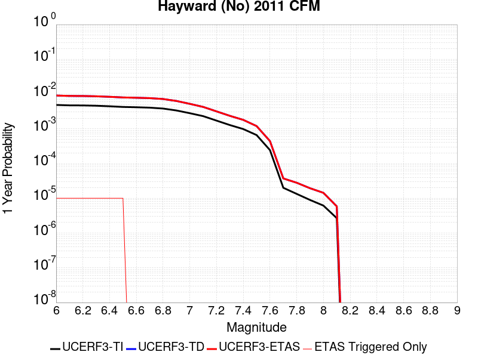 | 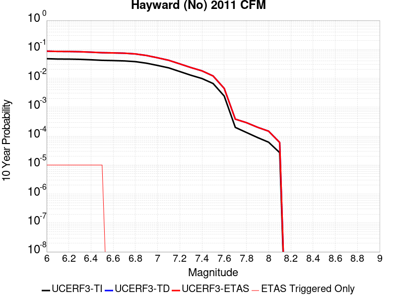 |

| Magnitude | 1 wk TI Prob | 1 wk TD Prob | 1 wk ETAS Prob | 1 wk ETAS/TD Gain | 1 wk ETAS Triggered Only | 1 mo TI Prob | 1 mo TD Prob | 1 mo ETAS Prob | 1 mo ETAS/TD Gain | 1 mo ETAS Triggered Only | 1 yr TI Prob | 1 yr TD Prob | 1 yr ETAS Prob | 1 yr ETAS/TD Gain | 1 yr ETAS Triggered Only | 10 yr TI Prob | 10 yr TD Prob | 10 yr ETAS Prob | 10 yr ETAS/TD Gain | 10 yr ETAS Triggered Only |
|-----|-----|-----|-----|-----|-----|-----|-----|-----|-----|-----|-----|-----|-----|-----|-----|-----|-----|-----|-----|-----|
| 6.0 | 9.3068506E-5 | 1.739643E-4 | 1.739643E-4 | 1.0 | 0.0 | 3.9880406E-4 | 7.453474E-4 | 7.5534E-4 | 1.0134065 | 1.0E-5 | 0.0048446343 | 0.009036727 | 0.0090466365 | 1.0010966 | 1.0E-5 | 0.047403704 | 0.086396605 | 0.08640575 | 1.0001057 | 1.0E-5 |
| 6.1 | 9.055486E-5 | 1.6947639E-4 | 1.6947639E-4 | 1.0 | 0.0 | 3.880345E-4 | 7.2612526E-4 | 7.36118E-4 | 1.0137618 | 1.0E-5 | 0.0047140904 | 0.008804814 | 0.008814726 | 1.0011257 | 1.0E-5 | 0.046153355 | 0.08428568 | 0.08429483 | 1.0001086 | 1.0E-5 |
| 6.2 | 9.006742E-5 | 1.6868232E-4 | 1.6868232E-4 | 1.0 | 0.0 | 3.859461E-4 | 7.227246E-4 | 7.327174E-4 | 1.0138265 | 1.0E-5 | 0.0046887742 | 0.00876378 | 0.008773692 | 1.001131 | 1.0E-5 | 0.0459107 | 0.08390991 | 0.08391907 | 1.0001092 | 1.0E-5 |
| 6.3 | 8.8336754E-5 | 1.6547782E-4 | 1.6547782E-4 | 1.0 | 0.0 | 3.7853114E-4 | 7.0899865E-4 | 7.1899156E-4 | 1.0140944 | 1.0E-5 | 0.004598882 | 0.008598051 | 0.008607965 | 1.0011531 | 1.0E-5 | 0.04504866 | 0.08240195 | 0.082411125 | 1.0001113 | 1.0E-5 |
| 6.4 | 8.526157E-5 | 1.5974796E-4 | 1.5974796E-4 | 1.0 | 0.0 | 3.6535555E-4 | 6.844552E-4 | 6.9444836E-4 | 1.0146002 | 1.0E-5 | 0.0044391346 | 0.00830156 | 0.008311477 | 1.0011946 | 1.0E-5 | 0.043514993 | 0.07968467 | 0.07969387 | 1.0001155 | 1.0E-5 |
| 6.5 | 8.152396E-5 | 1.5307199E-4 | 1.5307199E-4 | 1.0 | 0.0 | 3.493416E-4 | 6.558586E-4 | 6.6585204E-4 | 1.0152372 | 1.0E-5 | 0.0042449418 | 0.007955993 | 0.007965913 | 1.0012469 | 1.0E-5 | 0.04164765 | 0.07651448 | 0.07652372 | 1.0001206 | 1.0E-5 |
| 6.6 | 7.987405E-5 | 1.5011412E-4 | 1.5011412E-4 | 1.0 | 0.0 | 3.4227243E-4 | 6.431883E-4 | 6.431883E-4 | 1.0 | 0.0 | 0.0041592065 | 0.007802858 | 0.007802858 | 1.0 | 0.0 | 0.04082218 | 0.075105876 | 0.075105876 | 1.0 | 0.0 |
| 6.7 | 7.777665E-5 | 1.4650672E-4 | 1.4650672E-4 | 1.0 | 0.0 | 3.332859E-4 | 6.277355E-4 | 6.277355E-4 | 1.0 | 0.0 | 0.004050208 | 0.007616053 | 0.007616053 | 1.0 | 0.0 | 0.039771806 | 0.0733825 | 0.0733825 | 1.0 | 0.0 |
| 6.8 | 7.3284005E-5 | 1.3801287E-4 | 1.3801287E-4 | 1.0 | 0.0 | 3.140365E-4 | 5.9135025E-4 | 5.9135025E-4 | 1.0 | 0.0 | 0.0038166929 | 0.007176059 | 0.007176059 | 1.0 | 0.0 | 0.037518036 | 0.06929624 | 0.06929624 | 1.0 | 0.0 |
| 6.9 | 6.458263E-5 | 1.21319164E-4 | 1.21319164E-4 | 1.0 | 0.0 | 2.7675333E-4 | 5.1983615E-4 | 5.1983615E-4 | 1.0 | 0.0 | 0.0033642664 | 0.0063107396 | 0.0063107396 | 1.0 | 0.0 | 0.033137884 | 0.061224625 | 0.061224625 | 1.0 | 0.0 |
| 7.0 | 5.3853604E-5 | 1.00254634E-4 | 1.00254634E-4 | 1.0 | 0.0 | 2.3078074E-4 | 4.295923E-4 | 4.295923E-4 | 1.0 | 0.0 | 0.0028061352 | 0.0052178074 | 0.0052178074 | 1.0 | 0.0 | 0.027709642 | 0.050957024 | 0.050957024 | 1.0 | 0.0 |
| 7.1 | 4.4308683E-5 | 8.17098E-5 | 8.17098E-5 | 1.0 | 0.0 | 1.8988053E-4 | 3.5013806E-4 | 3.5013806E-4 | 1.0 | 0.0 | 0.0023093442 | 0.0042546396 | 0.0042546396 | 1.0 | 0.0 | 0.022854926 | 0.041824497 | 0.041824497 | 1.0 | 0.0 |
| 7.2 | 3.295973E-5 | 6.0774026E-5 | 6.0774026E-5 | 1.0 | 0.0 | 1.4124835E-4 | 2.6043423E-4 | 2.6043423E-4 | 1.0 | 0.0 | 0.0017183421 | 0.0031661994 | 0.0031661994 | 1.0 | 0.0 | 0.017051157 | 0.031370014 | 0.031370014 | 1.0 | 0.0 |
| 7.3 | 2.452256E-5 | 4.518223E-5 | 4.518223E-5 | 1.0 | 0.0 | 1.05092455E-4 | 1.9362383E-4 | 1.9362383E-4 | 1.0 | 0.0 | 0.0012787496 | 0.0023548352 | 0.0023548352 | 1.0 | 0.0 | 0.0127141625 | 0.023442036 | 0.023442036 | 1.0 | 0.0 |
| 7.4 | 1.8829967E-5 | 3.4604043E-5 | 3.4604043E-5 | 1.0 | 0.0 | 8.069736E-5 | 1.4829468E-4 | 1.4829468E-4 | 1.0 | 0.0 | 9.820475E-4 | 0.0018040023 | 0.0018040023 | 1.0 | 0.0 | 0.009777189 | 0.01802003 | 0.01802003 | 1.0 | 0.0 |
| 7.5 | 1.26374125E-5 | 2.292219E-5 | 2.292219E-5 | 1.0 | 0.0 | 5.4159216E-5 | 9.823428E-5 | 9.823428E-5 | 1.0 | 0.0 | 6.5918895E-4 | 0.0011953521 | 0.0011953521 | 1.0 | 0.0 | 0.00657237 | 0.011988704 | 0.011988704 | 1.0 | 0.0 |
| 7.6 | 4.666429E-6 | 8.479636E-6 | 8.479636E-6 | 1.0 | 0.0 | 1.9998828E-5 | 3.6340796E-5 | 3.6340796E-5 | 1.0 | 0.0 | 2.4345852E-4 | 4.423606E-4 | 4.423606E-4 | 1.0 | 0.0 | 0.0024319198 | 0.004458377 | 0.004458377 | 1.0 | 0.0 |
| 7.7 | 3.8399318E-7 | 7.1343146E-7 | 7.1343146E-7 | 1.0 | 0.0 | 1.6456839E-6 | 3.0575598E-6 | 3.0575598E-6 | 1.0 | 0.0 | 2.003602E-5 | 3.7225156E-5 | 3.7225156E-5 | 1.0 | 0.0 | 2.0034213E-4 | 3.86166E-4 | 3.86166E-4 | 1.0 | 0.0 |
| 7.8 | 2.5637698E-7 | 5.3666145E-7 | 5.3666145E-7 | 1.0 | 0.0 | 1.098758E-6 | 2.2999754E-6 | 2.2999754E-6 | 1.0 | 0.0 | 1.3377297E-5 | 2.8001843E-5 | 2.8001843E-5 | 1.0 | 0.0 | 1.3376492E-4 | 2.9246495E-4 | 2.9246495E-4 | 1.0 | 0.0 |
| 7.9 | 1.7141245E-7 | 3.7293606E-7 | 3.7293606E-7 | 1.0 | 0.0 | 7.3462456E-7 | 1.5982963E-6 | 1.5982963E-6 | 1.0 | 0.0 | 8.944017E-6 | 1.9459085E-5 | 1.9459085E-5 | 1.0 | 0.0 | 8.943657E-5 | 2.0246378E-4 | 2.0246378E-4 | 1.0 | 0.0 |
| 8.0 | 1.1808895E-7 | 2.7512246E-7 | 2.7512246E-7 | 1.0 | 0.0 | 5.060954E-7 | 1.1790958E-6 | 1.1790958E-6 | 1.0 | 0.0 | 6.161694E-6 | 1.4355397E-5 | 1.4355397E-5 | 1.0 | 0.0 | 6.161523E-5 | 1.4817173E-4 | 1.4817173E-4 | 1.0 | 0.0 |
| 8.1 | 5.138535E-8 | 1.12307575E-7 | 1.12307575E-7 | 1.0 | 0.0 | 2.2022292E-7 | 4.8131807E-7 | 4.8131807E-7 | 1.0 | 0.0 | 2.6812106E-6 | 5.860032E-6 | 5.860032E-6 | 1.0 | 0.0 | 2.6811784E-5 | 6.0156468E-5 | 6.0156468E-5 | 1.0 | 0.0 |

## Clayton
*[(top)](#table-of-contents)*

| 1 Week | 1 Month | 1 Year | 10 Year |
|-----|-----|-----|-----|
|  |  | 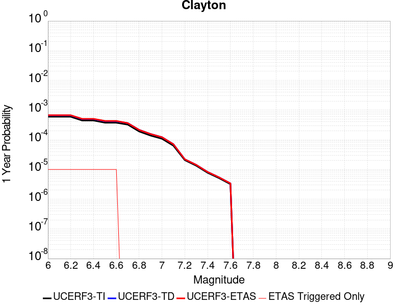 |  |

| Magnitude | 1 wk TI Prob | 1 wk TD Prob | 1 wk ETAS Prob | 1 wk ETAS/TD Gain | 1 wk ETAS Triggered Only | 1 mo TI Prob | 1 mo TD Prob | 1 mo ETAS Prob | 1 mo ETAS/TD Gain | 1 mo ETAS Triggered Only | 1 yr TI Prob | 1 yr TD Prob | 1 yr ETAS Prob | 1 yr ETAS/TD Gain | 1 yr ETAS Triggered Only | 10 yr TI Prob | 10 yr TD Prob | 10 yr ETAS Prob | 10 yr ETAS/TD Gain | 10 yr ETAS Triggered Only |
|-----|-----|-----|-----|-----|-----|-----|-----|-----|-----|-----|-----|-----|-----|-----|-----|-----|-----|-----|-----|-----|
| 6.0 | 1.1413061E-5 | 1.2667071E-5 | 1.2667071E-5 | 1.0 | 0.0 | 4.89122E-5 | 5.4286444E-5 | 5.4286444E-5 | 1.0 | 0.0 | 5.953433E-4 | 6.607592E-4 | 6.7075266E-4 | 1.0151241 | 1.0E-5 | 0.005937509 | 0.006590149 | 0.006600083 | 1.0015074 | 1.0E-5 |
| 6.1 | 1.1413061E-5 | 1.2667071E-5 | 1.2667071E-5 | 1.0 | 0.0 | 4.89122E-5 | 5.4286444E-5 | 5.4286444E-5 | 1.0 | 0.0 | 5.953433E-4 | 6.607592E-4 | 6.7075266E-4 | 1.0151241 | 1.0E-5 | 0.005937509 | 0.006590149 | 0.006600083 | 1.0015074 | 1.0E-5 |
| 6.2 | 1.1413061E-5 | 1.2667071E-5 | 1.2667071E-5 | 1.0 | 0.0 | 4.89122E-5 | 5.4286444E-5 | 5.4286444E-5 | 1.0 | 0.0 | 5.953433E-4 | 6.607592E-4 | 6.7075266E-4 | 1.0151241 | 1.0E-5 | 0.005937509 | 0.006590149 | 0.006600083 | 1.0015074 | 1.0E-5 |
| 6.3 | 8.538689E-6 | 9.532765E-6 | 9.532765E-6 | 1.0 | 0.0 | 3.659387E-5 | 4.085413E-5 | 4.085413E-5 | 1.0 | 0.0 | 4.4543925E-4 | 4.972963E-4 | 5.072913E-4 | 1.0200987 | 1.0E-5 | 0.0044454746 | 0.0049629 | 0.0049728504 | 1.002005 | 1.0E-5 |
| 6.4 | 8.538689E-6 | 9.532765E-6 | 9.532765E-6 | 1.0 | 0.0 | 3.659387E-5 | 4.085413E-5 | 4.085413E-5 | 1.0 | 0.0 | 4.4543925E-4 | 4.972963E-4 | 5.072913E-4 | 1.0200987 | 1.0E-5 | 0.0044454746 | 0.0049629 | 0.0049728504 | 1.002005 | 1.0E-5 |
| 6.5 | 7.197462E-6 | 8.080964E-6 | 8.080964E-6 | 1.0 | 0.0 | 3.08459E-5 | 3.463229E-5 | 3.463229E-5 | 1.0 | 0.0 | 3.7548412E-4 | 4.2157478E-4 | 4.3157054E-4 | 1.0237106 | 1.0E-5 | 0.003748503 | 0.0042085624 | 0.00421852 | 1.0023661 | 1.0E-5 |
| 6.6 | 7.1760483E-6 | 8.05698E-6 | 8.05698E-6 | 1.0 | 0.0 | 3.075413E-5 | 3.4529505E-5 | 3.4529505E-5 | 1.0 | 0.0 | 3.743672E-4 | 4.2032383E-4 | 4.3031963E-4 | 1.0237812 | 1.0E-5 | 0.0037373714 | 0.0041961004 | 0.004206058 | 1.0023732 | 1.0E-5 |
| 6.7 | 6.202582E-6 | 6.9767057E-6 | 6.9767057E-6 | 1.0 | 0.0 | 2.6582224E-5 | 2.9899868E-5 | 2.9899868E-5 | 1.0 | 0.0 | 3.235905E-4 | 3.6397774E-4 | 3.6397774E-4 | 1.0 | 0.0 | 0.0032311971 | 0.003634572 | 0.003634572 | 1.0 | 0.0 |
| 6.8 | 3.6417277E-6 | 4.121308E-6 | 4.121308E-6 | 1.0 | 0.0 | 1.5607311E-5 | 1.7662633E-5 | 1.7662633E-5 | 1.0 | 0.0 | 1.9000245E-4 | 2.150221E-4 | 2.150221E-4 | 1.0 | 0.0 | 0.0018984007 | 0.0021482168 | 0.0021482168 | 1.0 | 0.0 |
| 6.9 | 2.6498485E-6 | 2.9995322E-6 | 2.9995322E-6 | 1.0 | 0.0 | 1.1356444E-5 | 1.2855077E-5 | 1.2855077E-5 | 1.0 | 0.0 | 1.3825593E-4 | 1.5649972E-4 | 1.5649972E-4 | 1.0 | 0.0 | 0.0013816995 | 0.0015639347 | 0.0015639347 | 1.0 | 0.0 |
| 7.0 | 2.070442E-6 | 2.3407345E-6 | 2.3407345E-6 | 1.0 | 0.0 | 8.873292E-6 | 1.0031682E-5 | 1.0031682E-5 | 1.0 | 0.0 | 1.0802698E-4 | 1.2212919E-4 | 1.2212919E-4 | 1.0 | 0.0 | 0.0010797448 | 0.0012206505 | 0.0012206505 | 1.0 | 0.0 |
| 7.1 | 1.2111691E-6 | 1.3588814E-6 | 1.3588814E-6 | 1.0 | 0.0 | 5.190714E-6 | 5.823765E-6 | 5.823765E-6 | 1.0 | 0.0 | 6.319511E-5 | 7.09022E-5 | 7.09022E-5 | 1.0 | 0.0 | 6.3177146E-4 | 7.0881215E-4 | 7.0881215E-4 | 1.0 | 0.0 |
| 7.2 | 3.9541607E-7 | 4.2228464E-7 | 4.2228464E-7 | 1.0 | 0.0 | 1.6946392E-6 | 1.8097901E-6 | 1.8097901E-6 | 1.0 | 0.0 | 2.0632036E-5 | 2.2033973E-5 | 2.2033973E-5 | 1.0 | 0.0 | 2.063012E-4 | 2.2031803E-4 | 2.2031803E-4 | 1.0 | 0.0 |
| 7.3 | 2.5685637E-7 | 2.7457227E-7 | 2.7457227E-7 | 1.0 | 0.0 | 1.1008126E-6 | 1.1767378E-6 | 1.1767378E-6 | 1.0 | 0.0 | 1.3402311E-5 | 1.432669E-5 | 1.432669E-5 | 1.0 | 0.0 | 1.3401502E-4 | 1.4325773E-4 | 1.4325773E-4 | 1.0 | 0.0 |
| 7.4 | 1.482299E-7 | 1.5808227E-7 | 1.5808227E-7 | 1.0 | 0.0 | 6.3527085E-7 | 6.774953E-7 | 6.774953E-7 | 1.0 | 0.0 | 7.734395E-6 | 8.248474E-6 | 8.248474E-6 | 1.0 | 0.0 | 7.734126E-5 | 8.248171E-5 | 8.248171E-5 | 1.0 | 0.0 |
| 7.5 | 9.7969505E-8 | 1.0438379E-7 | 1.0438379E-7 | 1.0 | 0.0 | 4.1986925E-7 | 4.47359E-7 | 4.47359E-7 | 1.0 | 0.0 | 5.111896E-6 | 5.4465827E-6 | 5.4465827E-6 | 1.0 | 0.0 | 5.1117782E-5 | 5.4464508E-5 | 5.4464508E-5 | 1.0 | 0.0 |
| 7.6 | 6.125415E-8 | 6.5232356E-8 | 6.5232356E-8 | 1.0 | 0.0 | 2.6251774E-7 | 2.7956722E-7 | 2.7956722E-7 | 1.0 | 0.0 | 3.196149E-6 | 3.4037257E-6 | 3.4037257E-6 | 1.0 | 0.0 | 3.196103E-5 | 3.4036748E-5 | 3.4036748E-5 | 1.0 | 0.0 |

## Almanor 2011 CFM
*[(top)](#table-of-contents)*

| 1 Week | 1 Month | 1 Year | 10 Year |
|-----|-----|-----|-----|
| 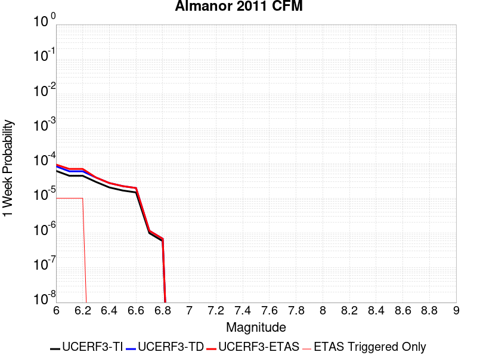 |  |  | 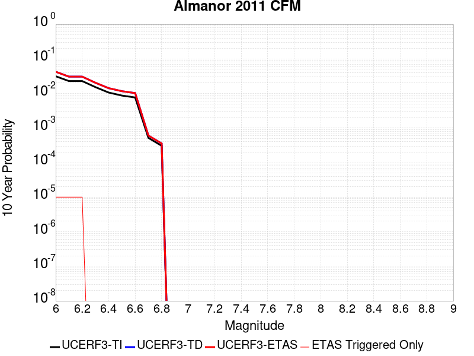 |

| Magnitude | 1 wk TI Prob | 1 wk TD Prob | 1 wk ETAS Prob | 1 wk ETAS/TD Gain | 1 wk ETAS Triggered Only | 1 mo TI Prob | 1 mo TD Prob | 1 mo ETAS Prob | 1 mo ETAS/TD Gain | 1 mo ETAS Triggered Only | 1 yr TI Prob | 1 yr TD Prob | 1 yr ETAS Prob | 1 yr ETAS/TD Gain | 1 yr ETAS Triggered Only | 10 yr TI Prob | 10 yr TD Prob | 10 yr ETAS Prob | 10 yr ETAS/TD Gain | 10 yr ETAS Triggered Only |
|-----|-----|-----|-----|-----|-----|-----|-----|-----|-----|-----|-----|-----|-----|-----|-----|-----|-----|-----|-----|-----|
| 6.0 | 6.1479834E-5 | 8.327245E-5 | 9.3271614E-5 | 1.1200777 | 1.0E-5 | 2.6345838E-4 | 3.5683523E-4 | 3.6683163E-4 | 1.0280142 | 1.0E-5 | 0.0032028882 | 0.004336495 | 0.0043464517 | 1.002296 | 1.0E-5 | 0.031571172 | 0.04258658 | 0.042596154 | 1.0002248 | 1.0E-5 |
| 6.1 | 4.4387216E-5 | 5.9767433E-5 | 6.976684E-5 | 1.1673052 | 1.0E-5 | 1.9021705E-4 | 2.561236E-4 | 2.6612106E-4 | 1.0390337 | 1.0E-5 | 0.0023134327 | 0.003114351 | 0.0031243197 | 1.0032009 | 1.0E-5 | 0.022894967 | 0.030755581 | 0.030765275 | 1.0003152 | 1.0E-5 |
| 6.2 | 4.4387216E-5 | 5.9767433E-5 | 6.976684E-5 | 1.1673052 | 1.0E-5 | 1.9021705E-4 | 2.561236E-4 | 2.6612106E-4 | 1.0390337 | 1.0E-5 | 0.0023134327 | 0.003114351 | 0.0031243197 | 1.0032009 | 1.0E-5 | 0.022894967 | 0.030755581 | 0.030765275 | 1.0003152 | 1.0E-5 |
| 6.3 | 2.9523822E-5 | 3.9546965E-5 | 3.9546965E-5 | 1.0 | 0.0 | 1.2652454E-4 | 1.6947731E-4 | 1.6947731E-4 | 1.0 | 0.0 | 0.0015393476 | 0.0020617929 | 0.0020617929 | 1.0 | 0.0 | 0.015287281 | 0.020461112 | 0.020461112 | 1.0 | 0.0 |
| 6.4 | 2.0512744E-5 | 2.7430639E-5 | 2.7430639E-5 | 1.0 | 0.0 | 8.79088E-5 | 1.17555675E-4 | 1.17555675E-4 | 1.0 | 0.0 | 0.001069764 | 0.0014306171 | 0.0014306171 | 1.0 | 0.0 | 0.010646289 | 0.01424458 | 0.01424458 | 1.0 | 0.0 |
| 6.5 | 1.6750226E-5 | 2.2390364E-5 | 2.2390364E-5 | 1.0 | 0.0 | 7.178471E-5 | 9.595619E-5 | 9.595619E-5 | 1.0 | 0.0 | 8.7362836E-4 | 0.0011679606 | 0.0011679606 | 1.0 | 0.0 | 0.008702018 | 0.011649196 | 0.011649196 | 1.0 | 0.0 |
| 6.6 | 1.4745303E-5 | 1.970686E-5 | 1.970686E-5 | 1.0 | 0.0 | 6.319262E-5 | 8.445639E-5 | 8.445639E-5 | 1.0 | 0.0 | 7.690986E-4 | 0.0010280984 | 0.0010280984 | 1.0 | 0.0 | 0.0076644225 | 0.01026513 | 0.01026513 | 1.0 | 0.0 |
| 6.7 | 9.951145E-7 | 1.1616347E-6 | 1.1616347E-6 | 1.0 | 0.0 | 4.26477E-6 | 4.9784257E-6 | 4.9784257E-6 | 1.0 | 0.0 | 5.1922336E-5 | 6.0610826E-5 | 6.0610826E-5 | 1.0 | 0.0 | 5.1910203E-4 | 6.059602E-4 | 6.059602E-4 | 1.0 | 0.0 |
| 6.8 | 5.866312E-7 | 6.849384E-7 | 6.849384E-7 | 1.0 | 0.0 | 2.5141312E-6 | 2.9354478E-6 | 2.9354478E-6 | 1.0 | 0.0 | 3.0609117E-5 | 3.5738623E-5 | 3.5738623E-5 | 1.0 | 0.0 | 3.06049E-4 | 3.5734157E-4 | 3.5734157E-4 | 1.0 | 0.0 |

## Hosgri
*[(top)](#table-of-contents)*

| 1 Week | 1 Month | 1 Year | 10 Year |
|-----|-----|-----|-----|
|  |  |  |  |

| Magnitude | 1 wk TI Prob | 1 wk TD Prob | 1 wk ETAS Prob | 1 wk ETAS/TD Gain | 1 wk ETAS Triggered Only | 1 mo TI Prob | 1 mo TD Prob | 1 mo ETAS Prob | 1 mo ETAS/TD Gain | 1 mo ETAS Triggered Only | 1 yr TI Prob | 1 yr TD Prob | 1 yr ETAS Prob | 1 yr ETAS/TD Gain | 1 yr ETAS Triggered Only | 10 yr TI Prob | 10 yr TD Prob | 10 yr ETAS Prob | 10 yr ETAS/TD Gain | 10 yr ETAS Triggered Only |
|-----|-----|-----|-----|-----|-----|-----|-----|-----|-----|-----|-----|-----|-----|-----|-----|-----|-----|-----|-----|-----|
| 6.0 | 2.883978E-5 | 2.9128403E-5 | 2.9128403E-5 | 1.0 | 0.0 | 1.235932E-4 | 1.248302E-4 | 1.248302E-4 | 1.0 | 0.0 | 0.0015037085 | 0.0015187752 | 0.0015187752 | 1.0 | 0.0 | 0.01493574 | 0.01508773 | 0.015097579 | 1.0006528 | 1.0E-5 |
| 6.1 | 2.883978E-5 | 2.9128403E-5 | 2.9128403E-5 | 1.0 | 0.0 | 1.235932E-4 | 1.248302E-4 | 1.248302E-4 | 1.0 | 0.0 | 0.0015037085 | 0.0015187752 | 0.0015187752 | 1.0 | 0.0 | 0.01493574 | 0.01508773 | 0.015097579 | 1.0006528 | 1.0E-5 |
| 6.2 | 2.883978E-5 | 2.9128403E-5 | 2.9128403E-5 | 1.0 | 0.0 | 1.235932E-4 | 1.248302E-4 | 1.248302E-4 | 1.0 | 0.0 | 0.0015037085 | 0.0015187752 | 0.0015187752 | 1.0 | 0.0 | 0.01493574 | 0.01508773 | 0.015097579 | 1.0006528 | 1.0E-5 |
| 6.3 | 2.2914428E-5 | 2.2641956E-5 | 2.2641956E-5 | 1.0 | 0.0 | 9.8200995E-5 | 9.703337E-5 | 9.703337E-5 | 1.0 | 0.0 | 0.0011949413 | 0.001180746 | 0.001180746 | 1.0 | 0.0 | 0.011885363 | 0.011746123 | 0.011756006 | 1.0008414 | 1.0E-5 |
| 6.4 | 2.0195741E-5 | 1.9696547E-5 | 1.9696547E-5 | 1.0 | 0.0 | 8.65503E-5 | 8.4411055E-5 | 8.4411055E-5 | 1.0 | 0.0 | 0.0010532405 | 0.001027222 | 0.001027222 | 1.0 | 0.0 | 0.010482626 | 0.010225783 | 0.01023568 | 1.000968 | 1.0E-5 |
| 6.5 | 1.9924333E-5 | 1.9408968E-5 | 1.9408968E-5 | 1.0 | 0.0 | 8.53872E-5 | 8.317865E-5 | 8.317865E-5 | 1.0 | 0.0 | 0.0010390934 | 0.0010122315 | 0.0010122315 | 1.0 | 0.0 | 0.010342481 | 0.010077244 | 0.010087143 | 1.0009823 | 1.0E-5 |
| 6.6 | 1.809694E-5 | 1.7458287E-5 | 1.7458287E-5 | 1.0 | 0.0 | 7.7556004E-5 | 7.4819094E-5 | 7.4819094E-5 | 1.0 | 0.0 | 9.438353E-4 | 9.105431E-4 | 9.105431E-4 | 1.0 | 0.0 | 0.009398366 | 0.009069063 | 0.009078972 | 1.0010927 | 1.0E-5 |
| 6.7 | 1.675989E-5 | 1.6042752E-5 | 1.6042752E-5 | 1.0 | 0.0 | 7.182612E-5 | 6.8752845E-5 | 6.8752845E-5 | 1.0 | 0.0 | 8.7413215E-4 | 8.3674554E-4 | 8.3674554E-4 | 1.0 | 0.0 | 0.008707017 | 0.008336853 | 0.00834677 | 1.0011895 | 1.0E-5 |
| 6.8 | 1.5401129E-5 | 1.4614069E-5 | 1.4614069E-5 | 1.0 | 0.0 | 6.6003166E-5 | 6.263023E-5 | 6.263023E-5 | 1.0 | 0.0 | 8.032922E-4 | 7.6225714E-4 | 7.6225714E-4 | 1.0 | 0.0 | 0.008003947 | 0.0075972863 | 0.0076072104 | 1.0013063 | 1.0E-5 |
| 6.9 | 1.356559E-5 | 1.2689955E-5 | 1.2689955E-5 | 1.0 | 0.0 | 5.8136946E-5 | 5.438439E-5 | 5.438439E-5 | 1.0 | 0.0 | 7.0758746E-4 | 6.6192925E-4 | 6.6192925E-4 | 1.0 | 0.0 | 0.007053386 | 0.006600378 | 0.006610312 | 1.001505 | 1.0E-5 |
| 7.0 | 1.2030819E-5 | 1.1095949E-5 | 1.1095949E-5 | 1.0 | 0.0 | 5.155963E-5 | 4.75532E-5 | 4.75532E-5 | 1.0 | 0.0 | 6.275577E-4 | 5.788065E-4 | 5.788065E-4 | 1.0 | 0.0 | 0.006257884 | 0.0057737473 | 0.0057836897 | 1.001722 | 1.0E-5 |
| 7.1 | 1.0972698E-5 | 1.0022167E-5 | 1.0022167E-5 | 1.0 | 0.0 | 4.7025E-5 | 4.2951437E-5 | 4.2951437E-5 | 1.0 | 0.0 | 5.72379E-4 | 5.2280835E-4 | 5.2280835E-4 | 1.0 | 0.0 | 0.0057090693 | 0.005216533 | 0.005226481 | 1.001907 | 1.0E-5 |
| 7.2 | 9.961926E-6 | 9.034732E-6 | 9.034732E-6 | 1.0 | 0.0 | 4.2693267E-5 | 3.8719707E-5 | 3.8719707E-5 | 1.0 | 0.0 | 5.1966653E-4 | 4.7131052E-4 | 4.7131052E-4 | 1.0 | 0.0 | 0.00518453 | 0.0047038523 | 0.0047138054 | 1.002116 | 1.0E-5 |
| 7.3 | 8.700929E-6 | 7.828089E-6 | 7.828089E-6 | 1.0 | 0.0 | 3.7289166E-5 | 3.354852E-5 | 3.354852E-5 | 1.0 | 0.0 | 4.53901E-4 | 4.083767E-4 | 4.083767E-4 | 1.0 | 0.0 | 0.00452975 | 0.004076999 | 0.0040869582 | 1.0024428 | 1.0E-5 |
| 7.4 | 7.866285E-6 | 6.9987263E-6 | 6.9987263E-6 | 1.0 | 0.0 | 3.3712215E-5 | 2.9994197E-5 | 2.9994197E-5 | 1.0 | 0.0 | 4.103689E-4 | 3.6511818E-4 | 3.6511818E-4 | 1.0 | 0.0 | 0.004096119 | 0.0036459167 | 0.0036558805 | 1.0027328 | 1.0E-5 |
| 7.5 | 6.8381305E-6 | 5.9596814E-6 | 5.9596814E-6 | 1.0 | 0.0 | 2.9305946E-5 | 2.5541241E-5 | 2.5541241E-5 | 1.0 | 0.0 | 3.5674145E-4 | 3.1092027E-4 | 3.1092027E-4 | 1.0 | 0.0 | 0.0035616932 | 0.003105584 | 0.003105584 | 1.0 | 0.0 |
| 7.6 | 5.503376E-6 | 4.595227E-6 | 4.595227E-6 | 1.0 | 0.0 | 2.3585684E-5 | 1.9693682E-5 | 1.9693682E-5 | 1.0 | 0.0 | 2.8711787E-4 | 2.397442E-4 | 2.397442E-4 | 1.0 | 0.0 | 0.002867472 | 0.0023955852 | 0.0023955852 | 1.0 | 0.0 |
| 7.7 | 3.6144982E-6 | 2.6521896E-6 | 2.6521896E-6 | 1.0 | 0.0 | 1.5490614E-5 | 1.1366477E-5 | 1.1366477E-5 | 1.0 | 0.0 | 1.8858191E-4 | 1.3837808E-4 | 1.3837808E-4 | 1.0 | 0.0 | 0.0018842196 | 0.001383647 | 0.001383647 | 1.0 | 0.0 |
| 7.8 | 1.9853494E-6 | 1.1360784E-6 | 1.1360784E-6 | 1.0 | 0.0 | 8.508612E-6 | 4.8688985E-6 | 4.8688985E-6 | 1.0 | 0.0 | 1.0358743E-4 | 5.9277223E-5 | 5.9277223E-5 | 1.0 | 0.0 | 0.0010353916 | 5.933389E-4 | 5.933389E-4 | 1.0 | 0.0 |
| 7.9 | 1.1818757E-6 | 5.29477E-7 | 5.29477E-7 | 1.0 | 0.0 | 5.0651715E-6 | 2.269185E-6 | 2.269185E-6 | 1.0 | 0.0 | 6.1666724E-5 | 2.7626977E-5 | 2.7626977E-5 | 1.0 | 0.0 | 6.1649614E-4 | 2.7691363E-4 | 2.7691363E-4 | 1.0 | 0.0 |
| 8.0 | 6.962958E-7 | 2.71365E-7 | 2.71365E-7 | 1.0 | 0.0 | 2.9841215E-6 | 1.1629924E-6 | 1.1629924E-6 | 1.0 | 0.0 | 3.6331072E-5 | 1.415934E-5 | 1.415934E-5 | 1.0 | 0.0 | 3.6325134E-4 | 1.4215276E-4 | 1.4215276E-4 | 1.0 | 0.0 |
| 8.1 | 1.5033264E-7 | 6.52693E-8 | 6.52693E-8 | 1.0 | 0.0 | 6.442826E-7 | 2.7972553E-7 | 2.7972553E-7 | 1.0 | 0.0 | 7.844113E-6 | 3.4056532E-6 | 3.4056532E-6 | 1.0 | 0.0 | 7.843835E-5 | 3.4072833E-5 | 3.4072833E-5 | 1.0 | 0.0 |

## Casmalia 2011 CFM
*[(top)](#table-of-contents)*

| 1 Week | 1 Month | 1 Year | 10 Year |
|-----|-----|-----|-----|
|  |  |  |  |

| Magnitude | 1 wk TI Prob | 1 wk TD Prob | 1 wk ETAS Prob | 1 wk ETAS/TD Gain | 1 wk ETAS Triggered Only | 1 mo TI Prob | 1 mo TD Prob | 1 mo ETAS Prob | 1 mo ETAS/TD Gain | 1 mo ETAS Triggered Only | 1 yr TI Prob | 1 yr TD Prob | 1 yr ETAS Prob | 1 yr ETAS/TD Gain | 1 yr ETAS Triggered Only | 10 yr TI Prob | 10 yr TD Prob | 10 yr ETAS Prob | 10 yr ETAS/TD Gain | 10 yr ETAS Triggered Only |
|-----|-----|-----|-----|-----|-----|-----|-----|-----|-----|-----|-----|-----|-----|-----|-----|-----|-----|-----|-----|-----|
| 6.0 | 4.1704893E-6 | 4.2624843E-6 | 4.2624843E-6 | 1.0 | 0.0 | 1.7873403E-5 | 1.8267663E-5 | 1.8267663E-5 | 1.0 | 0.0 | 2.1758694E-4 | 2.223863E-4 | 2.223863E-4 | 1.0 | 0.0 | 0.0021737402 | 0.0022216584 | 0.0022316363 | 1.0044911 | 1.0E-5 |
| 6.1 | 4.1704893E-6 | 4.2624843E-6 | 4.2624843E-6 | 1.0 | 0.0 | 1.7873403E-5 | 1.8267663E-5 | 1.8267663E-5 | 1.0 | 0.0 | 2.1758694E-4 | 2.223863E-4 | 2.223863E-4 | 1.0 | 0.0 | 0.0021737402 | 0.0022216584 | 0.0022316363 | 1.0044911 | 1.0E-5 |
| 6.2 | 3.457312E-6 | 3.537023E-6 | 3.537023E-6 | 1.0 | 0.0 | 1.4816967E-5 | 1.5158583E-5 | 1.5158583E-5 | 1.0 | 0.0 | 1.8038164E-4 | 1.845402E-4 | 1.845402E-4 | 1.0 | 0.0 | 0.001802353 | 0.0018438791 | 0.0018538607 | 1.0054133 | 1.0E-5 |
| 6.3 | 3.457312E-6 | 3.537023E-6 | 3.537023E-6 | 1.0 | 0.0 | 1.4816967E-5 | 1.5158583E-5 | 1.5158583E-5 | 1.0 | 0.0 | 1.8038164E-4 | 1.845402E-4 | 1.845402E-4 | 1.0 | 0.0 | 0.001802353 | 0.0018438791 | 0.0018538607 | 1.0054133 | 1.0E-5 |
| 6.4 | 3.0957337E-6 | 3.169227E-6 | 3.169227E-6 | 1.0 | 0.0 | 1.3267363E-5 | 1.3582331E-5 | 1.3582331E-5 | 1.0 | 0.0 | 1.6151817E-4 | 1.653524E-4 | 1.653524E-4 | 1.0 | 0.0 | 0.0016140083 | 0.0016522998 | 0.0016622832 | 1.0060421 | 1.0E-5 |
| 6.5 | 3.0957337E-6 | 3.169227E-6 | 3.169227E-6 | 1.0 | 0.0 | 1.3267363E-5 | 1.3582331E-5 | 1.3582331E-5 | 1.0 | 0.0 | 1.6151817E-4 | 1.653524E-4 | 1.653524E-4 | 1.0 | 0.0 | 0.0016140083 | 0.0016522998 | 0.0016622832 | 1.0060421 | 1.0E-5 |
| 6.6 | 2.9459152E-6 | 3.0165766E-6 | 3.0165766E-6 | 1.0 | 0.0 | 1.262529E-5 | 1.2928121E-5 | 1.2928121E-5 | 1.0 | 0.0 | 1.5370206E-4 | 1.5738855E-4 | 1.5738855E-4 | 1.0 | 0.0 | 0.0015359579 | 0.0015727765 | 0.0015827608 | 1.0063481 | 1.0E-5 |
| 6.7 | 2.8634809E-6 | 2.932474E-6 | 2.932474E-6 | 1.0 | 0.0 | 1.2272003E-5 | 1.2567685E-5 | 1.2567685E-5 | 1.0 | 0.0 | 1.4940138E-4 | 1.5300087E-4 | 1.5300087E-4 | 1.0 | 0.0 | 0.0014930099 | 0.0015289608 | 0.0015389455 | 1.0065304 | 1.0E-5 |
| 6.8 | 2.7999822E-6 | 2.867598E-6 | 2.867598E-6 | 1.0 | 0.0 | 1.1999869E-5 | 1.2289648E-5 | 1.2289648E-5 | 1.0 | 0.0 | 1.460886E-4 | 1.4961624E-4 | 1.4961624E-4 | 1.0 | 0.0 | 0.001459926 | 0.0014951604 | 0.0015051455 | 1.0066782 | 1.0E-5 |
| 6.9 | 2.551052E-6 | 2.6119662E-6 | 2.6119662E-6 | 1.0 | 0.0 | 1.0933034E-5 | 1.1194093E-5 | 1.1194093E-5 | 1.0 | 0.0 | 1.3310155E-4 | 1.3627959E-4 | 1.3627959E-4 | 1.0 | 0.0 | 0.0013302186 | 0.0013619643 | 0.0013719506 | 1.0073323 | 1.0E-5 |
| 7.0 | 2.3081875E-6 | 2.3624102E-6 | 2.3624102E-6 | 1.0 | 0.0 | 9.892195E-6 | 1.0124576E-5 | 1.0124576E-5 | 1.0 | 0.0 | 1.20430814E-4 | 1.2325977E-4 | 1.2325977E-4 | 1.0 | 0.0 | 0.0012036557 | 0.0012319168 | 0.0012419046 | 1.0081074 | 1.0E-5 |
| 7.1 | 2.093245E-6 | 2.1417256E-6 | 2.1417256E-6 | 1.0 | 0.0 | 8.971019E-6 | 9.1787915E-6 | 9.1787915E-6 | 1.0 | 0.0 | 1.09216686E-4 | 1.1174608E-4 | 1.1174608E-4 | 1.0 | 0.0 | 0.0010916302 | 0.0011169009 | 0.0011268897 | 1.0089433 | 1.0E-5 |
| 7.2 | 1.9714576E-6 | 2.0165105E-6 | 2.0165105E-6 | 1.0 | 0.0 | 8.449076E-6 | 8.642159E-6 | 8.642159E-6 | 1.0 | 0.0 | 1.0286264E-4 | 1.0521322E-4 | 1.0521322E-4 | 1.0 | 0.0 | 0.0010281504 | 0.001051636 | 0.0010616254 | 1.009499 | 1.0E-5 |
| 7.3 | 1.6689512E-6 | 1.7047145E-6 | 1.7047145E-6 | 1.0 | 0.0 | 7.1526288E-6 | 7.3058986E-6 | 7.3058986E-6 | 1.0 | 0.0 | 8.7079774E-5 | 8.894569E-5 | 8.894569E-5 | 1.0 | 0.0 | 8.7045657E-4 | 8.891017E-4 | 8.990928E-4 | 1.0112373 | 1.0E-5 |
| 7.4 | 1.4490954E-6 | 1.4778922E-6 | 1.4778922E-6 | 1.0 | 0.0 | 6.210394E-6 | 6.333808E-6 | 6.333808E-6 | 1.0 | 0.0 | 7.560892E-5 | 7.711139E-5 | 7.711139E-5 | 1.0 | 0.0 | 7.55832E-4 | 7.7084696E-4 | 7.8083924E-4 | 1.0129627 | 1.0E-5 |
| 7.5 | 1.226873E-6 | 1.2481714E-6 | 1.2481714E-6 | 1.0 | 0.0 | 5.2580162E-6 | 5.3492954E-6 | 5.3492954E-6 | 1.0 | 0.0 | 6.401447E-5 | 6.512573E-5 | 6.512573E-5 | 1.0 | 0.0 | 6.399603E-4 | 6.5106695E-4 | 6.6106045E-4 | 1.0153494 | 1.0E-5 |
| 7.6 | 9.2561345E-7 | 9.3619366E-7 | 9.3619366E-7 | 1.0 | 0.0 | 3.966909E-6 | 4.0122522E-6 | 4.0122522E-6 | 1.0 | 0.0 | 4.8296046E-5 | 4.884808E-5 | 4.884808E-5 | 1.0 | 0.0 | 4.828555E-4 | 4.8837386E-4 | 4.98369E-4 | 1.0204661 | 1.0E-5 |
| 7.7 | 5.4367933E-7 | 5.3929017E-7 | 5.3929017E-7 | 1.0 | 0.0 | 2.3300522E-6 | 2.3112416E-6 | 2.3112416E-6 | 1.0 | 0.0 | 2.8368017E-5 | 2.8139004E-5 | 2.8139004E-5 | 1.0 | 0.0 | 2.8364395E-4 | 2.8135453E-4 | 2.9135172E-4 | 1.0355324 | 1.0E-5 |
| 7.8 | 1.8825742E-7 | 1.7342425E-7 | 1.7342425E-7 | 1.0 | 0.0 | 8.068173E-7 | 7.432466E-7 | 7.432466E-7 | 1.0 | 0.0 | 9.822956E-6 | 9.048989E-6 | 9.048989E-6 | 1.0 | 0.0 | 9.822522E-5 | 9.048623E-5 | 9.048623E-5 | 1.0 | 0.0 |
| 7.9 | 6.342771E-8 | 4.679002E-8 | 4.679002E-8 | 1.0 | 0.0 | 2.7183304E-7 | 2.0052863E-7 | 2.0052863E-7 | 1.0 | 0.0 | 3.3095623E-6 | 2.4414335E-6 | 2.4414335E-6 | 1.0 | 0.0 | 3.309513E-5 | 2.441407E-5 | 2.441407E-5 | 1.0 | 0.0 |
| 8.0 | 1.2574819E-8 | 6.4727095E-9 | 6.4727095E-9 | 1.0 | 0.0 | 5.3892084E-8 | 2.7740182E-8 | 2.7740182E-8 | 1.0 | 0.0 | 6.561359E-7 | 3.3773665E-7 | 3.3773665E-7 | 1.0 | 0.0 | 6.56134E-6 | 3.3773617E-6 | 3.3773617E-6 | 1.0 | 0.0 |

## Greenville (So) 2011 CFM
*[(top)](#table-of-contents)*

| 1 Week | 1 Month | 1 Year | 10 Year |
|-----|-----|-----|-----|
|  |  |  | 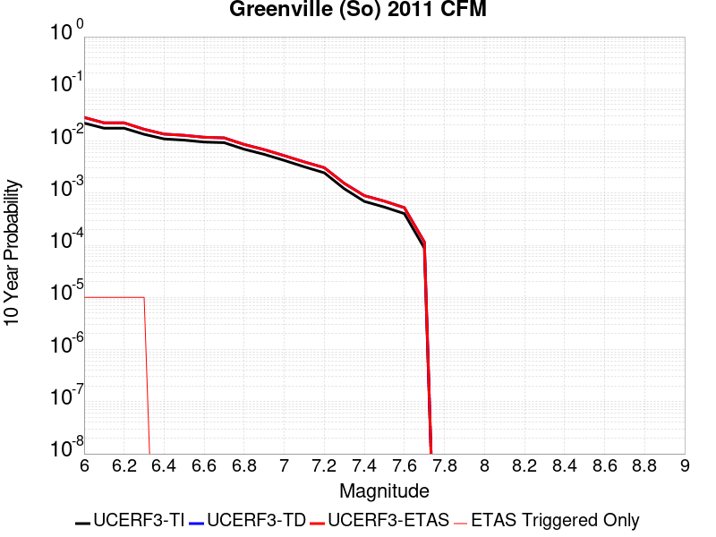 |

| Magnitude | 1 wk TI Prob | 1 wk TD Prob | 1 wk ETAS Prob | 1 wk ETAS/TD Gain | 1 wk ETAS Triggered Only | 1 mo TI Prob | 1 mo TD Prob | 1 mo ETAS Prob | 1 mo ETAS/TD Gain | 1 mo ETAS Triggered Only | 1 yr TI Prob | 1 yr TD Prob | 1 yr ETAS Prob | 1 yr ETAS/TD Gain | 1 yr ETAS Triggered Only | 10 yr TI Prob | 10 yr TD Prob | 10 yr ETAS Prob | 10 yr ETAS/TD Gain | 10 yr ETAS Triggered Only |
|-----|-----|-----|-----|-----|-----|-----|-----|-----|-----|-----|-----|-----|-----|-----|-----|-----|-----|-----|-----|-----|
| 6.0 | 4.279693E-5 | 5.5040568E-5 | 5.5040568E-5 | 1.0 | 0.0 | 1.8340252E-4 | 2.3586866E-4 | 2.3586866E-4 | 1.0 | 0.0 | 0.0022306389 | 0.0028681692 | 0.0028781404 | 1.0034765 | 1.0E-5 | 0.022083808 | 0.028338658 | 0.028348375 | 1.0003428 | 1.0E-5 |
| 6.1 | 3.4037297E-5 | 4.319238E-5 | 4.319238E-5 | 1.0 | 0.0 | 1.4586597E-4 | 1.8509808E-4 | 1.8509808E-4 | 1.0 | 0.0 | 0.0017744715 | 0.0022513992 | 0.0022613765 | 1.0044317 | 1.0E-5 | 0.01760369 | 0.022303047 | 0.022312824 | 1.0004383 | 1.0E-5 |
| 6.2 | 3.4037297E-5 | 4.319238E-5 | 4.319238E-5 | 1.0 | 0.0 | 1.4586597E-4 | 1.8509808E-4 | 1.8509808E-4 | 1.0 | 0.0 | 0.0017744715 | 0.0022513992 | 0.0022613765 | 1.0044317 | 1.0E-5 | 0.01760369 | 0.022303047 | 0.022312824 | 1.0004383 | 1.0E-5 |
| 6.3 | 2.5956324E-5 | 3.242939E-5 | 3.242939E-5 | 1.0 | 0.0 | 1.11236644E-4 | 1.3897609E-4 | 1.3897609E-4 | 1.0 | 0.0 | 0.0013534647 | 0.0016907848 | 0.0017007679 | 1.0059044 | 1.0E-5 | 0.013452509 | 0.016786316 | 0.016796147 | 1.0005857 | 1.0E-5 |
| 6.4 | 2.1145053E-5 | 2.6197793E-5 | 2.6197793E-5 | 1.0 | 0.0 | 9.061851E-5 | 1.1227157E-4 | 1.1227157E-4 | 1.0 | 0.0 | 0.0011027219 | 0.0013660807 | 0.0013660807 | 1.0 | 0.0 | 0.01097266 | 0.013580576 | 0.013580576 | 1.0 | 0.0 |
| 6.5 | 2.0030959E-5 | 2.4795921E-5 | 2.4795921E-5 | 1.0 | 0.0 | 8.584414E-5 | 1.0626408E-4 | 1.0626408E-4 | 1.0 | 0.0 | 0.0010446513 | 0.0012930284 | 0.0012930284 | 1.0 | 0.0 | 0.010397541 | 0.01285873 | 0.01285873 | 1.0 | 0.0 |
| 6.6 | 1.8395405E-5 | 2.275458E-5 | 2.275458E-5 | 1.0 | 0.0 | 7.8835066E-5 | 9.7516146E-5 | 9.7516146E-5 | 1.0 | 0.0 | 9.5939427E-4 | 0.0011866409 | 0.0011866409 | 1.0 | 0.0 | 0.009552629 | 0.01180643 | 0.01180643 | 1.0 | 0.0 |
| 6.7 | 1.7883482E-5 | 2.2125625E-5 | 2.2125625E-5 | 1.0 | 0.0 | 7.664124E-5 | 9.482082E-5 | 9.482082E-5 | 1.0 | 0.0 | 9.3270757E-4 | 0.0011538607 | 0.0011538607 | 1.0 | 0.0 | 0.009288026 | 0.011482077 | 0.011482077 | 1.0 | 0.0 |
| 6.8 | 1.3373564E-5 | 1.650608E-5 | 1.650608E-5 | 1.0 | 0.0 | 5.7314013E-5 | 7.0738504E-5 | 7.0738504E-5 | 1.0 | 0.0 | 6.975747E-4 | 8.609158E-4 | 8.609158E-4 | 1.0 | 0.0 | 0.0069538904 | 0.008577745 | 0.008577745 | 1.0 | 0.0 |
| 6.9 | 1.06692905E-5 | 1.3152695E-5 | 1.3152695E-5 | 1.0 | 0.0 | 4.5724726E-5 | 5.636754E-5 | 5.636754E-5 | 1.0 | 0.0 | 5.5655633E-4 | 6.8606995E-4 | 6.8606995E-4 | 1.0 | 0.0 | 0.005551645 | 0.006841082 | 0.006841082 | 1.0 | 0.0 |
| 7.0 | 8.157512E-6 | 1.0062752E-5 | 1.0062752E-5 | 1.0 | 0.0 | 3.4960296E-5 | 4.312539E-5 | 4.312539E-5 | 1.0 | 0.0 | 4.2555845E-4 | 5.2492885E-4 | 5.2492885E-4 | 1.0 | 0.0 | 0.004247444 | 0.0052376967 | 0.0052376967 | 1.0 | 0.0 |
| 7.1 | 6.1467113E-6 | 7.627545E-6 | 7.627545E-6 | 1.0 | 0.0 | 2.6342783E-5 | 3.2689073E-5 | 3.2689073E-5 | 1.0 | 0.0 | 3.206762E-4 | 3.9791764E-4 | 3.9791764E-4 | 1.0 | 0.0 | 0.0032021382 | 0.0039725704 | 0.0039725704 | 1.0 | 0.0 |
| 7.2 | 4.713467E-6 | 5.9142685E-6 | 5.9142685E-6 | 1.0 | 0.0 | 2.0200418E-5 | 2.5346622E-5 | 2.5346622E-5 | 1.0 | 0.0 | 2.4591232E-4 | 3.0855203E-4 | 3.0855203E-4 | 1.0 | 0.0 | 0.0024564038 | 0.0030816782 | 0.0030816782 | 1.0 | 0.0 |
| 7.3 | 2.3266216E-6 | 2.954067E-6 | 2.954067E-6 | 1.0 | 0.0 | 9.971197E-6 | 1.2660226E-5 | 1.2660226E-5 | 1.0 | 0.0 | 1.2139256E-4 | 1.541275E-4 | 1.541275E-4 | 1.0 | 0.0 | 0.0012132627 | 0.0015404817 | 0.0015404817 | 1.0 | 0.0 |
| 7.4 | 1.3314E-6 | 1.7179866E-6 | 1.7179866E-6 | 1.0 | 0.0 | 5.7059874E-6 | 7.362779E-6 | 7.362779E-6 | 1.0 | 0.0 | 6.946818E-5 | 8.96382E-5 | 8.96382E-5 | 1.0 | 0.0 | 6.9446466E-4 | 8.963211E-4 | 8.963211E-4 | 1.0 | 0.0 |
| 7.5 | 1.0362941E-6 | 1.3469155E-6 | 1.3469155E-6 | 1.0 | 0.0 | 4.4412527E-6 | 5.7724824E-6 | 5.7724824E-6 | 1.0 | 0.0 | 5.407091E-5 | 7.0277754E-5 | 7.0277754E-5 | 1.0 | 0.0 | 5.405776E-4 | 7.028451E-4 | 7.028451E-4 | 1.0 | 0.0 |
| 7.6 | 7.764784E-7 | 1.0088881E-6 | 1.0088881E-6 | 1.0 | 0.0 | 3.3277602E-6 | 4.3237997E-6 | 4.3237997E-6 | 1.0 | 0.0 | 4.0514726E-5 | 5.264103E-5 | 5.264103E-5 | 1.0 | 0.0 | 4.050734E-4 | 5.265317E-4 | 5.265317E-4 | 1.0 | 0.0 |
| 7.7 | 1.6927763E-7 | 2.2140186E-7 | 2.2140186E-7 | 1.0 | 0.0 | 7.2547533E-7 | 9.488648E-7 | 9.488648E-7 | 1.0 | 0.0 | 8.832627E-6 | 1.1552371E-5 | 1.1552371E-5 | 1.0 | 0.0 | 8.8322755E-5 | 1.1554653E-4 | 1.1554653E-4 | 1.0 | 0.0 |

## North Frontal  (East)
*[(top)](#table-of-contents)*

| 1 Week | 1 Month | 1 Year | 10 Year |
|-----|-----|-----|-----|
|  | 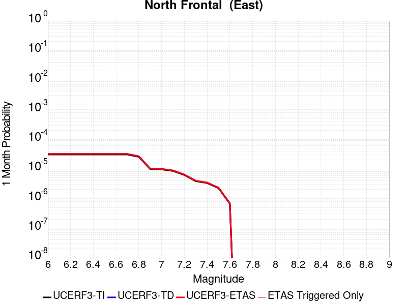 |  |  |

| Magnitude | 1 wk TI Prob | 1 wk TD Prob | 1 wk ETAS Prob | 1 wk ETAS/TD Gain | 1 wk ETAS Triggered Only | 1 mo TI Prob | 1 mo TD Prob | 1 mo ETAS Prob | 1 mo ETAS/TD Gain | 1 mo ETAS Triggered Only | 1 yr TI Prob | 1 yr TD Prob | 1 yr ETAS Prob | 1 yr ETAS/TD Gain | 1 yr ETAS Triggered Only | 10 yr TI Prob | 10 yr TD Prob | 10 yr ETAS Prob | 10 yr ETAS/TD Gain | 10 yr ETAS Triggered Only |
|-----|-----|-----|-----|-----|-----|-----|-----|-----|-----|-----|-----|-----|-----|-----|-----|-----|-----|-----|-----|-----|
| 6.0 | 7.135738E-6 | 7.4771765E-6 | 7.4771765E-6 | 1.0 | 0.0 | 3.0581377E-5 | 3.204476E-5 | 3.204476E-5 | 1.0 | 0.0 | 3.7226462E-4 | 3.9009505E-4 | 3.9009505E-4 | 1.0 | 0.0 | 0.0037164164 | 0.0038960609 | 0.0039060218 | 1.0025567 | 1.0E-5 |
| 6.1 | 7.135738E-6 | 7.4771765E-6 | 7.4771765E-6 | 1.0 | 0.0 | 3.0581377E-5 | 3.204476E-5 | 3.204476E-5 | 1.0 | 0.0 | 3.7226462E-4 | 3.9009505E-4 | 3.9009505E-4 | 1.0 | 0.0 | 0.0037164164 | 0.0038960609 | 0.0039060218 | 1.0025567 | 1.0E-5 |
| 6.2 | 7.135738E-6 | 7.4771765E-6 | 7.4771765E-6 | 1.0 | 0.0 | 3.0581377E-5 | 3.204476E-5 | 3.204476E-5 | 1.0 | 0.0 | 3.7226462E-4 | 3.9009505E-4 | 3.9009505E-4 | 1.0 | 0.0 | 0.0037164164 | 0.0038960609 | 0.0039060218 | 1.0025567 | 1.0E-5 |
| 6.3 | 7.135738E-6 | 7.4771765E-6 | 7.4771765E-6 | 1.0 | 0.0 | 3.0581377E-5 | 3.204476E-5 | 3.204476E-5 | 1.0 | 0.0 | 3.7226462E-4 | 3.9009505E-4 | 3.9009505E-4 | 1.0 | 0.0 | 0.0037164164 | 0.0038960609 | 0.0039060218 | 1.0025567 | 1.0E-5 |
| 6.4 | 7.135738E-6 | 7.4771765E-6 | 7.4771765E-6 | 1.0 | 0.0 | 3.0581377E-5 | 3.204476E-5 | 3.204476E-5 | 1.0 | 0.0 | 3.7226462E-4 | 3.9009505E-4 | 3.9009505E-4 | 1.0 | 0.0 | 0.0037164164 | 0.0038960609 | 0.0039060218 | 1.0025567 | 1.0E-5 |
| 6.5 | 7.135738E-6 | 7.4771765E-6 | 7.4771765E-6 | 1.0 | 0.0 | 3.0581377E-5 | 3.204476E-5 | 3.204476E-5 | 1.0 | 0.0 | 3.7226462E-4 | 3.9009505E-4 | 3.9009505E-4 | 1.0 | 0.0 | 0.0037164164 | 0.0038960609 | 0.0039060218 | 1.0025567 | 1.0E-5 |
| 6.6 | 7.135738E-6 | 7.4771765E-6 | 7.4771765E-6 | 1.0 | 0.0 | 3.0581377E-5 | 3.204476E-5 | 3.204476E-5 | 1.0 | 0.0 | 3.7226462E-4 | 3.9009505E-4 | 3.9009505E-4 | 1.0 | 0.0 | 0.0037164164 | 0.0038960609 | 0.0039060218 | 1.0025567 | 1.0E-5 |
| 6.7 | 7.135738E-6 | 7.4771765E-6 | 7.4771765E-6 | 1.0 | 0.0 | 3.0581377E-5 | 3.204476E-5 | 3.204476E-5 | 1.0 | 0.0 | 3.7226462E-4 | 3.9009505E-4 | 3.9009505E-4 | 1.0 | 0.0 | 0.0037164164 | 0.0038960609 | 0.0039060218 | 1.0025567 | 1.0E-5 |
| 6.8 | 5.959142E-6 | 6.236683E-6 | 6.236683E-6 | 1.0 | 0.0 | 2.553893E-5 | 2.6728469E-5 | 2.6728469E-5 | 1.0 | 0.0 | 3.108921E-4 | 3.253886E-4 | 3.253886E-4 | 1.0 | 0.0 | 0.0031045752 | 0.0032508948 | 0.0032608623 | 1.0030661 | 1.0E-5 |
| 6.9 | 2.2946929E-6 | 2.3824605E-6 | 2.3824605E-6 | 1.0 | 0.0 | 9.834361E-6 | 1.0210508E-5 | 1.0210508E-5 | 1.0 | 0.0 | 1.1972676E-4 | 1.2430632E-4 | 1.2430632E-4 | 1.0 | 0.0 | 0.0011966228 | 0.0012424142 | 0.0012424142 | 1.0 | 0.0 |
| 7.0 | 2.2468673E-6 | 2.3321538E-6 | 2.3321538E-6 | 1.0 | 0.0 | 9.629396E-6 | 9.994909E-6 | 9.994909E-6 | 1.0 | 0.0 | 1.1723159E-4 | 1.21681696E-4 | 1.21681696E-4 | 1.0 | 0.0 | 0.0011716976 | 0.0012161969 | 0.0012161969 | 1.0 | 0.0 |
| 7.1 | 1.9921076E-6 | 2.0646032E-6 | 2.0646032E-6 | 1.0 | 0.0 | 8.537577E-6 | 8.848272E-6 | 8.848272E-6 | 1.0 | 0.0 | 1.0394004E-4 | 1.0772282E-4 | 1.0772282E-4 | 1.0 | 0.0 | 0.0010389143 | 0.0010767487 | 0.0010767487 | 1.0 | 0.0 |
| 7.2 | 1.4524545E-6 | 1.5045148E-6 | 1.5045148E-6 | 1.0 | 0.0 | 6.2247905E-6 | 6.447906E-6 | 6.447906E-6 | 1.0 | 0.0 | 7.5784184E-5 | 7.850068E-5 | 7.850068E-5 | 1.0 | 0.0 | 7.575835E-4 | 7.8475394E-4 | 7.8475394E-4 | 1.0 | 0.0 |
| 7.3 | 8.9802575E-7 | 9.3087283E-7 | 9.3087283E-7 | 1.0 | 0.0 | 3.848676E-6 | 3.9894494E-6 | 3.9894494E-6 | 1.0 | 0.0 | 4.685662E-5 | 4.857058E-5 | 4.857058E-5 | 1.0 | 0.0 | 4.6846745E-4 | 4.8561094E-4 | 4.8561094E-4 | 1.0 | 0.0 |
| 7.4 | 7.776139E-7 | 8.0604747E-7 | 8.0604747E-7 | 1.0 | 0.0 | 3.3326266E-6 | 3.4544853E-6 | 3.4544853E-6 | 1.0 | 0.0 | 4.0573974E-5 | 4.2057654E-5 | 4.2057654E-5 | 1.0 | 0.0 | 4.0566566E-4 | 4.205077E-4 | 4.205077E-4 | 1.0 | 0.0 |
| 7.5 | 5.244417E-7 | 5.441219E-7 | 5.441219E-7 | 1.0 | 0.0 | 2.2476054E-6 | 2.3319494E-6 | 2.3319494E-6 | 1.0 | 0.0 | 2.7364253E-5 | 2.839118E-5 | 2.839118E-5 | 1.0 | 0.0 | 2.7360884E-4 | 2.8388205E-4 | 2.8388205E-4 | 1.0 | 0.0 |
| 7.6 | 1.5489647E-7 | 1.6089504E-7 | 1.6089504E-7 | 1.0 | 0.0 | 6.6384183E-7 | 6.895501E-7 | 6.895501E-7 | 1.0 | 0.0 | 8.082245E-6 | 8.395261E-6 | 8.395261E-6 | 1.0 | 0.0 | 8.08195E-5 | 8.395143E-5 | 8.395143E-5 | 1.0 | 0.0 |

## Hartley Springs 2011 CFM
*[(top)](#table-of-contents)*

| 1 Week | 1 Month | 1 Year | 10 Year |
|-----|-----|-----|-----|
|  |  |  |  |

| Magnitude | 1 wk TI Prob | 1 wk TD Prob | 1 wk ETAS Prob | 1 wk ETAS/TD Gain | 1 wk ETAS Triggered Only | 1 mo TI Prob | 1 mo TD Prob | 1 mo ETAS Prob | 1 mo ETAS/TD Gain | 1 mo ETAS Triggered Only | 1 yr TI Prob | 1 yr TD Prob | 1 yr ETAS Prob | 1 yr ETAS/TD Gain | 1 yr ETAS Triggered Only | 10 yr TI Prob | 10 yr TD Prob | 10 yr ETAS Prob | 10 yr ETAS/TD Gain | 10 yr ETAS Triggered Only |
|-----|-----|-----|-----|-----|-----|-----|-----|-----|-----|-----|-----|-----|-----|-----|-----|-----|-----|-----|-----|-----|
| 6.0 | 1.4352418E-5 | 1.4434111E-5 | 1.4434111E-5 | 1.0 | 0.0 | 6.1508916E-5 | 6.185994E-5 | 7.185932E-5 | 1.1616455 | 1.0E-5 | 7.486137E-4 | 7.5304887E-4 | 7.630413E-4 | 1.0132693 | 1.0E-5 | 0.007460968 | 0.007521092 | 0.0075310166 | 1.0013196 | 1.0E-5 |
| 6.1 | 1.4352418E-5 | 1.4434111E-5 | 1.4434111E-5 | 1.0 | 0.0 | 6.1508916E-5 | 6.185994E-5 | 7.185932E-5 | 1.1616455 | 1.0E-5 | 7.486137E-4 | 7.5304887E-4 | 7.630413E-4 | 1.0132693 | 1.0E-5 | 0.007460968 | 0.007521092 | 0.0075310166 | 1.0013196 | 1.0E-5 |
| 6.2 | 1.4352418E-5 | 1.4434111E-5 | 1.4434111E-5 | 1.0 | 0.0 | 6.1508916E-5 | 6.185994E-5 | 7.185932E-5 | 1.1616455 | 1.0E-5 | 7.486137E-4 | 7.5304887E-4 | 7.630413E-4 | 1.0132693 | 1.0E-5 | 0.007460968 | 0.007521092 | 0.0075310166 | 1.0013196 | 1.0E-5 |
| 6.3 | 1.4352418E-5 | 1.4434111E-5 | 1.4434111E-5 | 1.0 | 0.0 | 6.1508916E-5 | 6.185994E-5 | 7.185932E-5 | 1.1616455 | 1.0E-5 | 7.486137E-4 | 7.5304887E-4 | 7.630413E-4 | 1.0132693 | 1.0E-5 | 0.007460968 | 0.007521092 | 0.0075310166 | 1.0013196 | 1.0E-5 |
| 6.4 | 1.4352418E-5 | 1.4434111E-5 | 1.4434111E-5 | 1.0 | 0.0 | 6.1508916E-5 | 6.185994E-5 | 7.185932E-5 | 1.1616455 | 1.0E-5 | 7.486137E-4 | 7.5304887E-4 | 7.630413E-4 | 1.0132693 | 1.0E-5 | 0.007460968 | 0.007521092 | 0.0075310166 | 1.0013196 | 1.0E-5 |
| 6.5 | 1.2279858E-5 | 1.2133036E-5 | 1.2133036E-5 | 1.0 | 0.0 | 5.26269E-5 | 5.199858E-5 | 6.199806E-5 | 1.192303 | 1.0E-5 | 6.4054417E-4 | 6.33057E-4 | 6.4305065E-4 | 1.0157864 | 1.0E-5 | 0.0063870098 | 0.006328048 | 0.006337985 | 1.0015702 | 1.0E-5 |
| 6.6 | 1.2279858E-5 | 1.2133036E-5 | 1.2133036E-5 | 1.0 | 0.0 | 5.26269E-5 | 5.199858E-5 | 6.199806E-5 | 1.192303 | 1.0E-5 | 6.4054417E-4 | 6.33057E-4 | 6.4305065E-4 | 1.0157864 | 1.0E-5 | 0.0063870098 | 0.006328048 | 0.006337985 | 1.0015702 | 1.0E-5 |
| 6.7 | 2.1282601E-6 | 8.894127E-7 | 8.894127E-7 | 1.0 | 0.0 | 9.121083E-6 | 3.8117648E-6 | 3.8117648E-6 | 1.0 | 0.0 | 1.11043526E-4 | 4.6407506E-5 | 4.6407506E-5 | 1.0 | 0.0 | 0.0011098806 | 4.6400347E-4 | 4.6400347E-4 | 1.0 | 0.0 |
| 6.8 | 2.00516E-6 | 8.516916E-7 | 8.516916E-7 | 1.0 | 0.0 | 8.593515E-6 | 3.6501033E-6 | 3.6501033E-6 | 1.0 | 0.0 | 1.04621024E-4 | 4.443936E-5 | 4.443936E-5 | 1.0 | 0.0 | 0.0010457177 | 4.4432987E-4 | 4.4432987E-4 | 1.0 | 0.0 |
| 6.9 | 2.00516E-6 | 8.516916E-7 | 8.516916E-7 | 1.0 | 0.0 | 8.593515E-6 | 3.6501033E-6 | 3.6501033E-6 | 1.0 | 0.0 | 1.04621024E-4 | 4.443936E-5 | 4.443936E-5 | 1.0 | 0.0 | 0.0010457177 | 4.4432987E-4 | 4.4432987E-4 | 1.0 | 0.0 |
| 7.0 | 1.8366732E-6 | 8.2366813E-7 | 8.2366813E-7 | 1.0 | 0.0 | 7.871433E-6 | 3.5300031E-6 | 3.5300031E-6 | 1.0 | 0.0 | 9.583048E-5 | 4.2977194E-5 | 4.2977194E-5 | 1.0 | 0.0 | 9.5789164E-4 | 4.297139E-4 | 4.297139E-4 | 1.0 | 0.0 |
| 7.1 | 1.5097997E-6 | 7.1897E-7 | 7.1897E-7 | 1.0 | 0.0 | 6.470554E-6 | 3.0812978E-6 | 3.0812978E-6 | 1.0 | 0.0 | 7.877615E-5 | 3.7514397E-5 | 3.7514397E-5 | 1.0 | 0.0 | 7.874823E-4 | 3.7510434E-4 | 3.7510434E-4 | 1.0 | 0.0 |
| 7.2 | 1.3490993E-6 | 6.404769E-7 | 6.404769E-7 | 1.0 | 0.0 | 5.7818415E-6 | 2.7448996E-6 | 2.7448996E-6 | 1.0 | 0.0 | 7.0391645E-5 | 3.3418873E-5 | 3.3418873E-5 | 1.0 | 0.0 | 7.0369354E-4 | 3.3416142E-4 | 3.3416142E-4 | 1.0 | 0.0 |
| 7.3 | 7.900015E-7 | 4.0888176E-7 | 4.0888176E-7 | 1.0 | 0.0 | 3.3857161E-6 | 1.7523504E-6 | 1.7523504E-6 | 1.0 | 0.0 | 4.1220315E-5 | 2.1334865E-5 | 2.1334865E-5 | 1.0 | 0.0 | 4.121267E-4 | 2.1334866E-4 | 2.1334866E-4 | 1.0 | 0.0 |

## Carlsbad
*[(top)](#table-of-contents)*

| 1 Week | 1 Month | 1 Year | 10 Year |
|-----|-----|-----|-----|
|  |  |  | 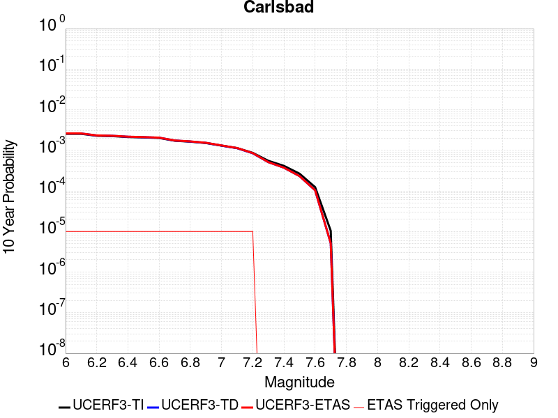 |

| Magnitude | 1 wk TI Prob | 1 wk TD Prob | 1 wk ETAS Prob | 1 wk ETAS/TD Gain | 1 wk ETAS Triggered Only | 1 mo TI Prob | 1 mo TD Prob | 1 mo ETAS Prob | 1 mo ETAS/TD Gain | 1 mo ETAS Triggered Only | 1 yr TI Prob | 1 yr TD Prob | 1 yr ETAS Prob | 1 yr ETAS/TD Gain | 1 yr ETAS Triggered Only | 10 yr TI Prob | 10 yr TD Prob | 10 yr ETAS Prob | 10 yr ETAS/TD Gain | 10 yr ETAS Triggered Only |
|-----|-----|-----|-----|-----|-----|-----|-----|-----|-----|-----|-----|-----|-----|-----|-----|-----|-----|-----|-----|-----|
| 6.0 | 4.9038536E-6 | 4.9872688E-6 | 4.9872688E-6 | 1.0 | 0.0 | 2.1016345E-5 | 2.1373837E-5 | 2.1373837E-5 | 1.0 | 0.0 | 2.5584397E-4 | 2.6019584E-4 | 2.7019324E-4 | 1.0384226 | 1.0E-5 | 0.002555496 | 0.002598959 | 0.002608933 | 1.0038377 | 1.0E-5 |
| 6.1 | 4.9038536E-6 | 4.9872688E-6 | 4.9872688E-6 | 1.0 | 0.0 | 2.1016345E-5 | 2.1373837E-5 | 2.1373837E-5 | 1.0 | 0.0 | 2.5584397E-4 | 2.6019584E-4 | 2.7019324E-4 | 1.0384226 | 1.0E-5 | 0.002555496 | 0.002598959 | 0.002608933 | 1.0038377 | 1.0E-5 |
| 6.2 | 4.3820614E-6 | 4.4547814E-6 | 4.4547814E-6 | 1.0 | 0.0 | 1.8780129E-5 | 1.9091782E-5 | 1.9091782E-5 | 1.0 | 0.0 | 2.2862408E-4 | 2.3241801E-4 | 2.4241568E-4 | 1.043016 | 1.0E-5 | 0.00228389 | 0.002321785 | 0.0023317619 | 1.004297 | 1.0E-5 |
| 6.3 | 4.302872E-6 | 4.373019E-6 | 4.373019E-6 | 1.0 | 0.0 | 1.8440749E-5 | 1.8741377E-5 | 1.8741377E-5 | 1.0 | 0.0 | 2.24493E-4 | 2.2815271E-4 | 2.3815043E-4 | 1.0438203 | 1.0E-5 | 0.0022426634 | 0.0022792201 | 0.0022891972 | 1.0043775 | 1.0E-5 |
| 6.4 | 4.0835243E-6 | 4.147667E-6 | 4.147667E-6 | 1.0 | 0.0 | 1.75007E-5 | 1.7775597E-5 | 1.7775597E-5 | 1.0 | 0.0 | 2.1305021E-4 | 2.1639673E-4 | 2.2639456E-4 | 1.0462015 | 1.0E-5 | 0.0021284607 | 0.0021618942 | 0.0021718726 | 1.0046155 | 1.0E-5 |
| 6.5 | 3.987806E-6 | 4.048899E-6 | 4.048899E-6 | 1.0 | 0.0 | 1.7090486E-5 | 1.7352311E-5 | 1.7352311E-5 | 1.0 | 0.0 | 2.080568E-4 | 2.1124425E-4 | 2.2124212E-4 | 1.0473286 | 1.0E-5 | 0.002078621 | 0.0021104682 | 0.002120447 | 1.0047283 | 1.0E-5 |
| 6.6 | 3.8707576E-6 | 3.927501E-6 | 3.927501E-6 | 1.0 | 0.0 | 1.6588854E-5 | 1.683204E-5 | 1.683204E-5 | 1.0 | 0.0 | 2.0195059E-4 | 2.0491115E-4 | 2.149091E-4 | 1.0487916 | 1.0E-5 | 0.0020176715 | 0.0020472556 | 0.0020572352 | 1.0048746 | 1.0E-5 |
| 6.7 | 3.3093434E-6 | 3.3424044E-6 | 3.3424044E-6 | 1.0 | 0.0 | 1.4182823E-5 | 1.4324512E-5 | 1.4324512E-5 | 1.0 | 0.0 | 1.7266218E-4 | 1.7438704E-4 | 1.843853E-4 | 1.0573337 | 1.0E-5 | 0.001725281 | 0.001742508 | 0.0017524905 | 1.0057288 | 1.0E-5 |
| 6.8 | 3.136983E-6 | 3.1664663E-6 | 3.1664663E-6 | 1.0 | 0.0 | 1.3444143E-5 | 1.35704995E-5 | 1.35704995E-5 | 1.0 | 0.0 | 1.6367015E-4 | 1.6520836E-4 | 1.752067E-4 | 1.0605196 | 1.0E-5 | 0.0016354966 | 0.0016508611 | 0.0016608447 | 1.0060475 | 1.0E-5 |
| 6.9 | 2.9056644E-6 | 2.9267715E-6 | 2.9267715E-6 | 1.0 | 0.0 | 1.2452788E-5 | 1.2543246E-5 | 1.2543246E-5 | 1.0 | 0.0 | 1.5160214E-4 | 1.5270336E-4 | 1.6270184E-4 | 1.0654764 | 1.0E-5 | 0.0015149876 | 0.0015259896 | 0.0015359744 | 1.0065432 | 1.0E-5 |
| 7.0 | 2.5071035E-6 | 2.51141E-6 | 2.51141E-6 | 1.0 | 0.0 | 1.0744685E-5 | 1.0763142E-5 | 1.0763142E-5 | 1.0 | 0.0 | 1.308087E-4 | 1.310334E-4 | 1.4103208E-4 | 1.0763065 | 1.0E-5 | 0.0013073172 | 0.0013095647 | 0.0013195515 | 1.0076262 | 1.0E-5 |
| 7.1 | 2.1786877E-6 | 2.1678952E-6 | 2.1678952E-6 | 1.0 | 0.0 | 9.3372E-6 | 9.290947E-6 | 9.290947E-6 | 1.0 | 0.0 | 1.13674476E-4 | 1.13111426E-4 | 1.231103E-4 | 1.0883983 | 1.0E-5 | 0.0011361635 | 0.0011305414 | 0.0011405301 | 1.0088353 | 1.0E-5 |
| 7.2 | 1.6628418E-6 | 1.6213987E-6 | 1.6213987E-6 | 1.0 | 0.0 | 7.1264453E-6 | 6.9488333E-6 | 6.9488333E-6 | 1.0 | 0.0 | 8.676102E-5 | 8.459878E-5 | 9.4597934E-5 | 1.118195 | 1.0E-5 | 8.672715E-4 | 8.4566796E-4 | 8.556595E-4 | 1.011815 | 1.0E-5 |
| 7.3 | 1.0595926E-6 | 9.816912E-7 | 9.816912E-7 | 1.0 | 0.0 | 4.541103E-6 | 4.207241E-6 | 4.207241E-6 | 1.0 | 0.0 | 5.5286528E-5 | 5.1221967E-5 | 5.1221967E-5 | 1.0 | 0.0 | 5.527277E-4 | 5.121025E-4 | 5.121025E-4 | 1.0 | 0.0 |
| 7.4 | 7.956623E-7 | 7.173889E-7 | 7.173889E-7 | 1.0 | 0.0 | 3.4099767E-6 | 3.0745202E-6 | 3.0745202E-6 | 1.0 | 0.0 | 4.1515676E-5 | 3.7431648E-5 | 3.7431648E-5 | 1.0 | 0.0 | 4.150792E-4 | 3.7425413E-4 | 3.7425413E-4 | 1.0 | 0.0 |
| 7.5 | 5.1043804E-7 | 4.448447E-7 | 4.448447E-7 | 1.0 | 0.0 | 2.1875896E-6 | 1.9064759E-6 | 1.9064759E-6 | 1.0 | 0.0 | 2.663358E-5 | 2.3211102E-5 | 2.3211102E-5 | 1.0 | 0.0 | 2.6630386E-4 | 2.3208735E-4 | 2.3208735E-4 | 1.0 | 0.0 |
| 7.6 | 2.3723294E-7 | 1.9896439E-7 | 1.9896439E-7 | 1.0 | 0.0 | 1.0167122E-6 | 8.527042E-7 | 8.527042E-7 | 1.0 | 0.0 | 1.2378401E-5 | 1.0381627E-5 | 1.0381627E-5 | 1.0 | 0.0 | 1.237771E-4 | 1.038117E-4 | 1.038117E-4 | 1.0 | 0.0 |
| 7.7 | 1.9992152E-8 | 9.860285E-9 | 9.860285E-9 | 1.0 | 0.0 | 8.568065E-8 | 4.2258364E-8 | 4.2258364E-8 | 1.0 | 0.0 | 1.0431614E-6 | 5.144956E-7 | 5.144956E-7 | 1.0 | 0.0 | 1.0431565E-5 | 5.144956E-6 | 5.144956E-6 | 1.0 | 0.0 |

## Surprise Valley 2011 CFM
*[(top)](#table-of-contents)*

| 1 Week | 1 Month | 1 Year | 10 Year |
|-----|-----|-----|-----|
|  |  |  |  |

| Magnitude | 1 wk TI Prob | 1 wk TD Prob | 1 wk ETAS Prob | 1 wk ETAS/TD Gain | 1 wk ETAS Triggered Only | 1 mo TI Prob | 1 mo TD Prob | 1 mo ETAS Prob | 1 mo ETAS/TD Gain | 1 mo ETAS Triggered Only | 1 yr TI Prob | 1 yr TD Prob | 1 yr ETAS Prob | 1 yr ETAS/TD Gain | 1 yr ETAS Triggered Only | 10 yr TI Prob | 10 yr TD Prob | 10 yr ETAS Prob | 10 yr ETAS/TD Gain | 10 yr ETAS Triggered Only |
|-----|-----|-----|-----|-----|-----|-----|-----|-----|-----|-----|-----|-----|-----|-----|-----|-----|-----|-----|-----|-----|
| 6.0 | 4.0396248E-5 | 4.485131E-5 | 5.485086E-5 | 1.2229489 | 1.0E-5 | 1.7311527E-4 | 1.9220692E-4 | 2.02205E-4 | 1.0520172 | 1.0E-5 | 0.002105641 | 0.0023378176 | 0.0023477941 | 1.0042675 | 1.0E-5 | 0.020858008 | 0.023153966 | 0.023163736 | 1.0004219 | 1.0E-5 |
| 6.1 | 4.0396248E-5 | 4.485131E-5 | 5.485086E-5 | 1.2229489 | 1.0E-5 | 1.7311527E-4 | 1.9220692E-4 | 2.02205E-4 | 1.0520172 | 1.0E-5 | 0.002105641 | 0.0023378176 | 0.0023477941 | 1.0042675 | 1.0E-5 | 0.020858008 | 0.023153966 | 0.023163736 | 1.0004219 | 1.0E-5 |
| 6.2 | 2.2295266E-5 | 2.440125E-5 | 3.4401004E-5 | 1.409805 | 1.0E-5 | 9.554764E-5 | 1.0457276E-4 | 1.1457172E-4 | 1.0956172 | 1.0E-5 | 0.0011626717 | 0.0012724606 | 0.0012824478 | 1.0078487 | 1.0E-5 | 0.011566074 | 0.012654981 | 0.0126648545 | 1.0007802 | 1.0E-5 |
| 6.3 | 1.572643E-5 | 1.7096807E-5 | 1.7096807E-5 | 1.0 | 0.0 | 6.7397246E-5 | 7.327003E-5 | 7.327003E-5 | 1.0 | 0.0 | 8.202525E-4 | 8.91708E-4 | 8.91708E-4 | 1.0 | 0.0 | 0.008172315 | 0.008882407 | 0.008882407 | 1.0 | 0.0 |
| 6.4 | 1.5714395E-5 | 1.7084629E-5 | 1.7084629E-5 | 1.0 | 0.0 | 6.734567E-5 | 7.3217845E-5 | 7.3217845E-5 | 1.0 | 0.0 | 8.1962504E-4 | 8.9107314E-4 | 8.9107314E-4 | 1.0 | 0.0 | 0.008166086 | 0.008876109 | 0.008876109 | 1.0 | 0.0 |
| 6.5 | 1.2733495E-5 | 1.38016E-5 | 1.38016E-5 | 1.0 | 0.0 | 5.457098E-5 | 5.9148413E-5 | 5.9148413E-5 | 1.0 | 0.0 | 6.641992E-4 | 7.1990065E-4 | 7.1990065E-4 | 1.0 | 0.0 | 0.0066221743 | 0.0071763797 | 0.0071763797 | 1.0 | 0.0 |
| 6.6 | 1.0983784E-5 | 1.1886554E-5 | 1.1886554E-5 | 1.0 | 0.0 | 4.7072506E-5 | 5.094141E-5 | 5.094141E-5 | 1.0 | 0.0 | 5.7295704E-4 | 6.200405E-4 | 6.200405E-4 | 1.0 | 0.0 | 0.0057148207 | 0.0061836545 | 0.0061836545 | 1.0 | 0.0 |
| 6.7 | 9.104806E-6 | 9.839491E-6 | 9.839491E-6 | 1.0 | 0.0 | 3.902001E-5 | 4.2168587E-5 | 4.2168587E-5 | 1.0 | 0.0 | 4.7496508E-4 | 5.132855E-4 | 5.132855E-4 | 1.0 | 0.0 | 0.004739512 | 0.005121397 | 0.005121397 | 1.0 | 0.0 |
| 6.8 | 6.2162403E-6 | 6.7041337E-6 | 6.7041337E-6 | 1.0 | 0.0 | 2.6640759E-5 | 2.8731698E-5 | 2.8731698E-5 | 1.0 | 0.0 | 3.2430296E-4 | 3.497545E-4 | 3.497545E-4 | 1.0 | 0.0 | 0.003238301 | 0.0034922638 | 0.0034922638 | 1.0 | 0.0 |
| 6.9 | 4.1792696E-6 | 4.50323E-6 | 4.50323E-6 | 1.0 | 0.0 | 1.7911032E-5 | 1.9299423E-5 | 1.9299423E-5 | 1.0 | 0.0 | 2.1804498E-4 | 2.3494668E-4 | 2.3494668E-4 | 1.0 | 0.0 | 0.0021783116 | 0.0023471361 | 0.0023471361 | 1.0 | 0.0 |
| 7.0 | 2.7478413E-6 | 2.9622424E-6 | 2.9622424E-6 | 1.0 | 0.0 | 1.177641E-5 | 1.269527E-5 | 1.269527E-5 | 1.0 | 0.0 | 1.4336836E-4 | 1.545552E-4 | 1.545552E-4 | 1.0 | 0.0 | 0.001432759 | 0.0015445995 | 0.0015445995 | 1.0 | 0.0 |
| 7.1 | 8.128648E-7 | 8.724922E-7 | 8.724922E-7 | 1.0 | 0.0 | 3.4837017E-6 | 3.7392501E-6 | 3.7392501E-6 | 1.0 | 0.0 | 4.2413245E-5 | 4.552502E-5 | 4.552502E-5 | 1.0 | 0.0 | 4.2405148E-4 | 4.5521575E-4 | 4.5521575E-4 | 1.0 | 0.0 |
| 7.2 | 4.8641045E-8 | 4.9402068E-8 | 4.9402068E-8 | 1.0 | 0.0 | 2.084616E-7 | 2.1172312E-7 | 2.1172312E-7 | 1.0 | 0.0 | 2.538017E-6 | 2.577726E-6 | 2.577726E-6 | 1.0 | 0.0 | 2.537988E-5 | 2.5776973E-5 | 2.5776973E-5 | 1.0 | 0.0 |
| 7.3 | 5.3911844E-9 | 5.4758145E-9 | 5.4758145E-9 | 1.0 | 0.0 | 2.3105075E-8 | 2.3467775E-8 | 2.3467775E-8 | 1.0 | 0.0 | 2.8130427E-7 | 2.8572015E-7 | 2.8572015E-7 | 1.0 | 0.0 | 2.8130391E-6 | 2.8571992E-6 | 2.8571992E-6 | 1.0 | 0.0 |

## Superstition Hills
*[(top)](#table-of-contents)*

| 1 Week | 1 Month | 1 Year | 10 Year |
|-----|-----|-----|-----|
|  |  |  |  |

| Magnitude | 1 wk TI Prob | 1 wk TD Prob | 1 wk ETAS Prob | 1 wk ETAS/TD Gain | 1 wk ETAS Triggered Only | 1 mo TI Prob | 1 mo TD Prob | 1 mo ETAS Prob | 1 mo ETAS/TD Gain | 1 mo ETAS Triggered Only | 1 yr TI Prob | 1 yr TD Prob | 1 yr ETAS Prob | 1 yr ETAS/TD Gain | 1 yr ETAS Triggered Only | 10 yr TI Prob | 10 yr TD Prob | 10 yr ETAS Prob | 10 yr ETAS/TD Gain | 10 yr ETAS Triggered Only |
|-----|-----|-----|-----|-----|-----|-----|-----|-----|-----|-----|-----|-----|-----|-----|-----|-----|-----|-----|-----|-----|
| 6.0 | 6.6865185E-5 | 1.4137668E-5 | 1.4137668E-5 | 1.0 | 0.0 | 2.8653358E-4 | 6.058869E-5 | 6.058869E-5 | 1.0 | 0.0 | 0.0034829667 | 7.374338E-4 | 7.474264E-4 | 1.0135505 | 1.0E-5 | 0.03428881 | 0.007520696 | 0.007530621 | 1.0013196 | 1.0E-5 |
| 6.1 | 6.544851E-5 | 1.4137668E-5 | 1.4137668E-5 | 1.0 | 0.0 | 2.8046346E-4 | 6.058869E-5 | 6.058869E-5 | 1.0 | 0.0 | 0.0034092965 | 7.374338E-4 | 7.474264E-4 | 1.0135505 | 1.0E-5 | 0.033574644 | 0.0075206957 | 0.0075306203 | 1.0013196 | 1.0E-5 |
| 6.2 | 6.544851E-5 | 1.4137668E-5 | 1.4137668E-5 | 1.0 | 0.0 | 2.8046346E-4 | 6.058869E-5 | 6.058869E-5 | 1.0 | 0.0 | 0.0034092965 | 7.374338E-4 | 7.474264E-4 | 1.0135505 | 1.0E-5 | 0.033574644 | 0.0075206957 | 0.0075306203 | 1.0013196 | 1.0E-5 |
| 6.3 | 5.2402065E-5 | 1.4137667E-5 | 1.4137667E-5 | 1.0 | 0.0 | 2.2456095E-4 | 6.0588685E-5 | 6.0588685E-5 | 1.0 | 0.0 | 0.0027306017 | 7.374338E-4 | 7.474264E-4 | 1.0135505 | 1.0E-5 | 0.02697292 | 0.0075206906 | 0.007530615 | 1.0013196 | 1.0E-5 |
| 6.4 | 4.542238E-5 | 1.4137666E-5 | 1.4137666E-5 | 1.0 | 0.0 | 1.9465282E-4 | 6.058868E-5 | 6.058868E-5 | 1.0 | 0.0 | 0.0023673223 | 7.3743373E-4 | 7.4742635E-4 | 1.0135505 | 1.0E-5 | 0.023422617 | 0.007520688 | 0.007530613 | 1.0013196 | 1.0E-5 |
| 6.5 | 2.9672969E-5 | 1.4137665E-5 | 1.4137665E-5 | 1.0 | 0.0 | 1.2716366E-4 | 6.0588678E-5 | 6.0588678E-5 | 1.0 | 0.0 | 0.0015471181 | 7.374337E-4 | 7.474263E-4 | 1.0135505 | 1.0E-5 | 0.015363912 | 0.0075206826 | 0.0075306077 | 1.0013196 | 1.0E-5 |
| 6.6 | 2.6056105E-5 | 1.3803436E-5 | 1.3803436E-5 | 1.0 | 0.0 | 1.1166424E-4 | 5.915633E-5 | 5.915633E-5 | 1.0 | 0.0 | 0.0013586642 | 7.200064E-4 | 7.299992E-4 | 1.0138788 | 1.0E-5 | 0.013503874 | 0.0073450673 | 0.007354994 | 1.0013515 | 1.0E-5 |
| 6.7 | 1.4611248E-5 | 1.338333E-5 | 1.338333E-5 | 1.0 | 0.0 | 6.261813E-5 | 5.7355956E-5 | 5.7355956E-5 | 1.0 | 0.0 | 7.6210906E-4 | 6.9810095E-4 | 7.08094E-4 | 1.0143145 | 1.0E-5 | 0.0075950073 | 0.0071262526 | 0.0071361815 | 1.0013933 | 1.0E-5 |
| 6.8 | 1.30607E-5 | 1.09787115E-5 | 1.09787115E-5 | 1.0 | 0.0 | 5.597323E-5 | 4.705082E-5 | 4.705082E-5 | 1.0 | 0.0 | 6.8126095E-4 | 5.727019E-4 | 5.826962E-4 | 1.017451 | 1.0E-5 | 0.006791762 | 0.005873964 | 0.0058839056 | 1.0016924 | 1.0E-5 |
| 6.9 | 1.0443096E-5 | 8.19507E-6 | 8.19507E-6 | 1.0 | 0.0 | 4.4755358E-5 | 3.512127E-5 | 3.512127E-5 | 1.0 | 0.0 | 5.447602E-4 | 4.2751993E-4 | 4.3751564E-4 | 1.0233808 | 1.0E-5 | 0.005434267 | 0.004409497 | 0.004419453 | 1.0022578 | 1.0E-5 |
| 7.0 | 8.045912E-6 | 6.739447E-6 | 6.739447E-6 | 1.0 | 0.0 | 3.4482026E-5 | 2.888303E-5 | 2.888303E-5 | 1.0 | 0.0 | 4.197378E-4 | 3.5159517E-4 | 3.6159166E-4 | 1.0284318 | 1.0E-5 | 0.0041894587 | 0.0036335257 | 0.0036434894 | 1.0027422 | 1.0E-5 |
| 7.1 | 8.045912E-6 | 6.739447E-6 | 6.739447E-6 | 1.0 | 0.0 | 3.4482026E-5 | 2.888303E-5 | 2.888303E-5 | 1.0 | 0.0 | 4.197378E-4 | 3.5159517E-4 | 3.6159166E-4 | 1.0284318 | 1.0E-5 | 0.0041894587 | 0.0036335257 | 0.0036434894 | 1.0027422 | 1.0E-5 |
| 7.2 | 7.375506E-6 | 6.2463805E-6 | 6.2463805E-6 | 1.0 | 0.0 | 3.1608928E-5 | 2.6769932E-5 | 2.6769932E-5 | 1.0 | 0.0 | 3.8477074E-4 | 3.2587603E-4 | 3.3587278E-4 | 1.0306765 | 1.0E-5 | 0.003841052 | 0.0033741172 | 0.0033840835 | 1.0029538 | 1.0E-5 |
| 7.3 | 6.6063913E-6 | 5.798824E-6 | 5.798824E-6 | 1.0 | 0.0 | 2.8312797E-5 | 2.4851872E-5 | 2.4851872E-5 | 1.0 | 0.0 | 3.446538E-4 | 3.0253024E-4 | 3.125272E-4 | 1.0330446 | 1.0E-5 | 0.0034411973 | 0.0031383524 | 0.003148321 | 1.0031763 | 1.0E-5 |
| 7.4 | 6.4313126E-6 | 5.6802523E-6 | 5.6802523E-6 | 1.0 | 0.0 | 2.7562477E-5 | 2.4343715E-5 | 2.4343715E-5 | 1.0 | 0.0 | 3.355215E-4 | 2.963451E-4 | 3.0634215E-4 | 1.0337344 | 1.0E-5 | 0.0033501536 | 0.003076105 | 0.003086074 | 1.0032408 | 1.0E-5 |
| 7.5 | 6.0742927E-6 | 5.476088E-6 | 5.476088E-6 | 1.0 | 0.0 | 2.6032423E-5 | 2.3468741E-5 | 2.3468741E-5 | 1.0 | 0.0 | 3.1689866E-4 | 2.8569513E-4 | 2.956923E-4 | 1.0349923 | 1.0E-5 | 0.0031644711 | 0.0029679502 | 0.0029779205 | 1.0033593 | 1.0E-5 |
| 7.6 | 5.6987187E-6 | 5.2943155E-6 | 5.2943155E-6 | 1.0 | 0.0 | 2.4422852E-5 | 2.268973E-5 | 2.268973E-5 | 1.0 | 0.0 | 2.9730765E-4 | 2.762131E-4 | 2.8621033E-4 | 1.036194 | 1.0E-5 | 0.002969102 | 0.0028712032 | 0.0028811747 | 1.0034728 | 1.0E-5 |
| 7.7 | 5.1658035E-6 | 4.925336E-6 | 4.925336E-6 | 1.0 | 0.0 | 2.2138971E-5 | 2.1108413E-5 | 2.1108413E-5 | 1.0 | 0.0 | 2.6950863E-4 | 2.5696523E-4 | 2.6696266E-4 | 1.0389057 | 1.0E-5 | 0.00269182 | 0.0026763005 | 0.0026862738 | 1.0037265 | 1.0E-5 |
| 7.8 | 3.6864697E-6 | 4.1963563E-6 | 4.1963563E-6 | 1.0 | 0.0 | 1.579906E-5 | 1.7984263E-5 | 1.7984263E-5 | 1.0 | 0.0 | 1.9233658E-4 | 2.1893687E-4 | 2.1893687E-4 | 1.0 | 0.0 | 0.0019217018 | 0.0022895595 | 0.0022895595 | 1.0 | 0.0 |
| 7.9 | 3.0265903E-6 | 3.5636078E-6 | 3.5636078E-6 | 1.0 | 0.0 | 1.2971037E-5 | 1.5272519E-5 | 1.5272519E-5 | 1.0 | 0.0 | 1.5791094E-4 | 1.8592748E-4 | 1.8592748E-4 | 1.0 | 0.0 | 0.0015779877 | 0.0019537222 | 0.0019537222 | 1.0 | 0.0 |
| 8.0 | 2.5271493E-6 | 3.0866524E-6 | 3.0866524E-6 | 1.0 | 0.0 | 1.0830595E-5 | 1.3228446E-5 | 1.3228446E-5 | 1.0 | 0.0 | 1.3185451E-4 | 1.6104484E-4 | 1.6104484E-4 | 1.0 | 0.0 | 0.0013177631 | 0.0016975543 | 0.0016975543 | 1.0 | 0.0 |
| 8.1 | 2.3749135E-6 | 2.9172957E-6 | 2.9172957E-6 | 1.0 | 0.0 | 1.0178161E-5 | 1.2502638E-5 | 1.2502638E-5 | 1.0 | 0.0 | 1.2391206E-4 | 1.522094E-4 | 1.522094E-4 | 1.0 | 0.0 | 0.0012384299 | 0.0016051348 | 0.0016051348 | 1.0 | 0.0 |
| 8.2 | 1.7186406E-9 | 1.1438838E-9 | 1.1438838E-9 | 1.0 | 0.0 | 7.3656024E-9 | 4.902359E-9 | 4.902359E-9 | 1.0 | 0.0 | 8.9676206E-8 | 5.968622E-8 | 5.968622E-8 | 1.0 | 0.0 | 8.9676166E-7 | 6.386644E-7 | 6.386644E-7 | 1.0 | 0.0 |

## Hunting Creek - Bartlett Springs connector 2011
*[(top)](#table-of-contents)*

| 1 Week | 1 Month | 1 Year | 10 Year |
|-----|-----|-----|-----|
|  |  |  |  |

| Magnitude | 1 wk TI Prob | 1 wk TD Prob | 1 wk ETAS Prob | 1 wk ETAS/TD Gain | 1 wk ETAS Triggered Only | 1 mo TI Prob | 1 mo TD Prob | 1 mo ETAS Prob | 1 mo ETAS/TD Gain | 1 mo ETAS Triggered Only | 1 yr TI Prob | 1 yr TD Prob | 1 yr ETAS Prob | 1 yr ETAS/TD Gain | 1 yr ETAS Triggered Only | 10 yr TI Prob | 10 yr TD Prob | 10 yr ETAS Prob | 10 yr ETAS/TD Gain | 10 yr ETAS Triggered Only |
|-----|-----|-----|-----|-----|-----|-----|-----|-----|-----|-----|-----|-----|-----|-----|-----|-----|-----|-----|-----|-----|
| 6.0 | 4.940016E-5 | 6.7870766E-5 | 7.7870085E-5 | 1.1473289 | 1.0E-5 | 2.1169778E-4 | 2.9084194E-4 | 3.0083905E-4 | 1.0343729 | 1.0E-5 | 0.002574374 | 0.0035350819 | 0.0035450463 | 1.0028188 | 1.0E-5 | 0.025447546 | 0.03477475 | 0.034784403 | 1.0002775 | 1.0E-5 |
| 6.1 | 4.940016E-5 | 6.7870766E-5 | 7.7870085E-5 | 1.1473289 | 1.0E-5 | 2.1169778E-4 | 2.9084194E-4 | 3.0083905E-4 | 1.0343729 | 1.0E-5 | 0.002574374 | 0.0035350819 | 0.0035450463 | 1.0028188 | 1.0E-5 | 0.025447546 | 0.03477475 | 0.034784403 | 1.0002775 | 1.0E-5 |
| 6.2 | 4.472471E-5 | 6.100572E-5 | 6.100572E-5 | 1.0 | 0.0 | 1.9166325E-4 | 2.6142647E-4 | 2.6142647E-4 | 1.0 | 0.0 | 0.0023310026 | 0.0031781218 | 0.0031781218 | 1.0 | 0.0 | 0.02306703 | 0.031317808 | 0.031317808 | 1.0 | 0.0 |
| 6.3 | 4.472471E-5 | 6.100572E-5 | 6.100572E-5 | 1.0 | 0.0 | 1.9166325E-4 | 2.6142647E-4 | 2.6142647E-4 | 1.0 | 0.0 | 0.0023310026 | 0.0031781218 | 0.0031781218 | 1.0 | 0.0 | 0.02306703 | 0.031317808 | 0.031317808 | 1.0 | 0.0 |
| 6.4 | 4.0001003E-5 | 5.410516E-5 | 5.410516E-5 | 1.0 | 0.0 | 1.714216E-4 | 2.318579E-4 | 2.318579E-4 | 1.0 | 0.0 | 0.0020850603 | 0.0028191686 | 0.0028191686 | 1.0 | 0.0 | 0.02065605 | 0.027829198 | 0.027829198 | 1.0 | 0.0 |
| 6.5 | 3.8033053E-5 | 5.126649E-5 | 5.126649E-5 | 1.0 | 0.0 | 1.6298861E-4 | 2.1969521E-4 | 2.1969521E-4 | 1.0 | 0.0 | 0.0019825802 | 0.0026714848 | 0.0026714848 | 1.0 | 0.0 | 0.019649856 | 0.026391273 | 0.026391273 | 1.0 | 0.0 |
| 6.6 | 3.653754E-5 | 4.912955E-5 | 4.912955E-5 | 1.0 | 0.0 | 1.5658008E-4 | 2.1053842E-4 | 2.1053842E-4 | 1.0 | 0.0 | 0.0019046954 | 0.0025602889 | 0.0025602889 | 1.0 | 0.0 | 0.018884527 | 0.025307199 | 0.025307199 | 1.0 | 0.0 |
| 6.7 | 3.372024E-5 | 4.5140216E-5 | 4.5140216E-5 | 1.0 | 0.0 | 1.4450731E-4 | 1.9344388E-4 | 1.9344388E-4 | 1.0 | 0.0 | 0.0017579567 | 0.0023526535 | 0.0023526535 | 1.0 | 0.0 | 0.017441148 | 0.023278862 | 0.023278862 | 1.0 | 0.0 |
| 6.8 | 2.9650024E-5 | 3.9411647E-5 | 3.9411647E-5 | 1.0 | 0.0 | 1.2706534E-4 | 1.6889606E-4 | 1.6889606E-4 | 1.0 | 0.0 | 0.0015459227 | 0.0020543607 | 0.0020543607 | 1.0 | 0.0 | 0.015352124 | 0.020351961 | 0.020351961 | 1.0 | 0.0 |
| 6.9 | 2.860775E-5 | 3.7812886E-5 | 3.7812886E-5 | 1.0 | 0.0 | 1.2259888E-4 | 1.620452E-4 | 1.620452E-4 | 1.0 | 0.0 | 0.0014916194 | 0.0019711219 | 0.0019711219 | 1.0 | 0.0 | 0.014816469 | 0.019536555 | 0.019536555 | 1.0 | 0.0 |
| 7.0 | 2.6696067E-5 | 3.5067544E-5 | 3.5067544E-5 | 1.0 | 0.0 | 1.144067E-4 | 1.5028086E-4 | 1.5028086E-4 | 1.0 | 0.0 | 0.0013920115 | 0.0018281427 | 0.0018281427 | 1.0 | 0.0 | 0.013833242 | 0.01813184 | 0.01813184 | 1.0 | 0.0 |
| 7.1 | 2.456087E-5 | 3.2013326E-5 | 3.2013326E-5 | 1.0 | 0.0 | 1.0525662E-4 | 1.3719281E-4 | 1.3719281E-4 | 1.0 | 0.0 | 0.001280746 | 0.0016690517 | 0.0016690517 | 1.0 | 0.0 | 0.012733897 | 0.016566671 | 0.016566671 | 1.0 | 0.0 |
| 7.2 | 2.295761E-5 | 2.9823148E-5 | 2.9823148E-5 | 1.0 | 0.0 | 9.8386045E-5 | 1.2780727E-4 | 1.2780727E-4 | 1.0 | 0.0 | 0.0011971919 | 0.0015549522 | 0.0015549522 | 1.0 | 0.0 | 0.011907627 | 0.015442378 | 0.015442378 | 1.0 | 0.0 |
| 7.3 | 2.1256936E-5 | 2.7542124E-5 | 2.7542124E-5 | 1.0 | 0.0 | 9.109797E-5 | 1.1803238E-4 | 1.1803238E-4 | 1.0 | 0.0 | 0.0011085535 | 0.0014361058 | 0.0014361058 | 1.0 | 0.0 | 0.011030397 | 0.014269741 | 0.014269741 | 1.0 | 0.0 |
| 7.4 | 1.8784336E-5 | 2.430697E-5 | 2.430697E-5 | 1.0 | 0.0 | 8.050181E-5 | 1.0416861E-4 | 1.0416861E-4 | 1.0 | 0.0 | 9.796688E-4 | 0.0012675226 | 0.0012675226 | 1.0 | 0.0 | 0.009753612 | 0.012604194 | 0.012604194 | 1.0 | 0.0 |
| 7.5 | 1.7248298E-5 | 2.2269056E-5 | 2.2269056E-5 | 1.0 | 0.0 | 7.391918E-5 | 9.543537E-5 | 9.543537E-5 | 1.0 | 0.0 | 8.9959445E-4 | 0.0011613137 | 0.0011613137 | 1.0 | 0.0 | 0.008959615 | 0.011553645 | 0.011553645 | 1.0 | 0.0 |
| 7.6 | 1.0653709E-5 | 1.3722259E-5 | 1.3722259E-5 | 1.0 | 0.0 | 4.5657955E-5 | 5.880837E-5 | 5.880837E-5 | 1.0 | 0.0 | 5.557438E-4 | 7.157594E-4 | 7.157594E-4 | 1.0 | 0.0 | 0.0055435603 | 0.0071350415 | 0.0071350415 | 1.0 | 0.0 |
| 7.7 | 3.286316E-6 | 4.0903997E-6 | 4.0903997E-6 | 1.0 | 0.0 | 1.4084137E-5 | 1.7530168E-5 | 1.7530168E-5 | 1.0 | 0.0 | 1.7146087E-4 | 2.1340905E-4 | 2.1340905E-4 | 1.0 | 0.0 | 0.0017132863 | 0.0021320845 | 0.0021320845 | 1.0 | 0.0 |
| 7.8 | 5.1855085E-7 | 5.972095E-7 | 5.972095E-7 | 1.0 | 0.0 | 2.222359E-6 | 2.5594668E-6 | 2.5594668E-6 | 1.0 | 0.0 | 2.7056883E-5 | 3.1161075E-5 | 3.1161075E-5 | 1.0 | 0.0 | 2.705359E-4 | 3.1156064E-4 | 3.1156064E-4 | 1.0 | 0.0 |

## Elmore Ranch
*[(top)](#table-of-contents)*

| 1 Week | 1 Month | 1 Year | 10 Year |
|-----|-----|-----|-----|
|  |  |  |  |

| Magnitude | 1 wk TI Prob | 1 wk TD Prob | 1 wk ETAS Prob | 1 wk ETAS/TD Gain | 1 wk ETAS Triggered Only | 1 mo TI Prob | 1 mo TD Prob | 1 mo ETAS Prob | 1 mo ETAS/TD Gain | 1 mo ETAS Triggered Only | 1 yr TI Prob | 1 yr TD Prob | 1 yr ETAS Prob | 1 yr ETAS/TD Gain | 1 yr ETAS Triggered Only | 10 yr TI Prob | 10 yr TD Prob | 10 yr ETAS Prob | 10 yr ETAS/TD Gain | 10 yr ETAS Triggered Only |
|-----|-----|-----|-----|-----|-----|-----|-----|-----|-----|-----|-----|-----|-----|-----|-----|-----|-----|-----|-----|-----|
| 6.0 | 9.102099E-5 | 8.953848E-5 | 8.953848E-5 | 1.0 | 0.0 | 3.9003167E-4 | 3.836898E-4 | 3.836898E-4 | 1.0 | 0.0 | 0.0047383 | 0.004662132 | 0.0046720854 | 1.0021349 | 1.0E-5 | 0.046385348 | 0.04583787 | 0.045847416 | 1.0002081 | 1.0E-5 |
| 6.1 | 3.8306698E-5 | 4.14921E-5 | 4.14921E-5 | 1.0 | 0.0 | 1.6416123E-4 | 1.7781362E-4 | 1.7781362E-4 | 1.0 | 0.0 | 0.0019968306 | 0.0021632186 | 0.0021632186 | 1.0 | 0.0 | 0.019789828 | 0.021595007 | 0.021595007 | 1.0 | 0.0 |
| 6.2 | 3.8306698E-5 | 4.14921E-5 | 4.14921E-5 | 1.0 | 0.0 | 1.6416123E-4 | 1.7781362E-4 | 1.7781362E-4 | 1.0 | 0.0 | 0.0019968306 | 0.0021632186 | 0.0021632186 | 1.0 | 0.0 | 0.019789828 | 0.021595007 | 0.021595007 | 1.0 | 0.0 |
| 6.3 | 3.3197924E-5 | 3.6550366E-5 | 3.6550366E-5 | 1.0 | 0.0 | 1.4226905E-4 | 1.56639E-4 | 1.56639E-4 | 1.0 | 0.0 | 0.0017307495 | 0.0019059771 | 0.0019059771 | 1.0 | 0.0 | 0.017173318 | 0.019057386 | 0.019057386 | 1.0 | 0.0 |
| 6.4 | 2.5148964E-5 | 2.7420736E-5 | 2.7420736E-5 | 1.0 | 0.0 | 1.0777682E-4 | 1.17515796E-4 | 1.17515796E-4 | 1.0 | 0.0 | 0.0013113929 | 0.0014304637 | 0.0014304637 | 1.0 | 0.0 | 0.01303681 | 0.014365338 | 0.014365338 | 1.0 | 0.0 |
| 6.5 | 2.5148964E-5 | 2.7420736E-5 | 2.7420736E-5 | 1.0 | 0.0 | 1.0777682E-4 | 1.17515796E-4 | 1.17515796E-4 | 1.0 | 0.0 | 0.0013113929 | 0.0014304637 | 0.0014304637 | 1.0 | 0.0 | 0.01303681 | 0.014365338 | 0.014365338 | 1.0 | 0.0 |

## Keddie Ridge 2011 CFM
*[(top)](#table-of-contents)*

| 1 Week | 1 Month | 1 Year | 10 Year |
|-----|-----|-----|-----|
|  | 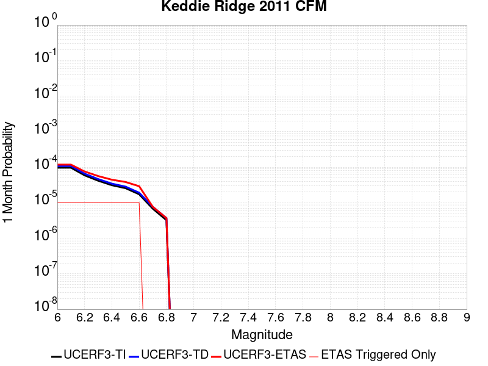 |  |  |

| Magnitude | 1 wk TI Prob | 1 wk TD Prob | 1 wk ETAS Prob | 1 wk ETAS/TD Gain | 1 wk ETAS Triggered Only | 1 mo TI Prob | 1 mo TD Prob | 1 mo ETAS Prob | 1 mo ETAS/TD Gain | 1 mo ETAS Triggered Only | 1 yr TI Prob | 1 yr TD Prob | 1 yr ETAS Prob | 1 yr ETAS/TD Gain | 1 yr ETAS Triggered Only | 10 yr TI Prob | 10 yr TD Prob | 10 yr ETAS Prob | 10 yr ETAS/TD Gain | 10 yr ETAS Triggered Only |
|-----|-----|-----|-----|-----|-----|-----|-----|-----|-----|-----|-----|-----|-----|-----|-----|-----|-----|-----|-----|-----|
| 6.0 | 2.2591947E-5 | 2.5189187E-5 | 3.5188936E-5 | 1.3969858 | 1.0E-5 | 9.6819036E-5 | 1.0794964E-4 | 1.1794856E-4 | 1.0926257 | 1.0E-5 | 0.0011781343 | 0.0013135736 | 0.0013235604 | 1.0076028 | 1.0E-5 | 0.011719079 | 0.013066037 | 0.013075906 | 1.0007553 | 1.0E-5 |
| 6.1 | 2.2591947E-5 | 2.5189187E-5 | 3.5188936E-5 | 1.3969858 | 1.0E-5 | 9.6819036E-5 | 1.0794964E-4 | 1.1794856E-4 | 1.0926257 | 1.0E-5 | 0.0011781343 | 0.0013135736 | 0.0013235604 | 1.0076028 | 1.0E-5 | 0.011719079 | 0.013066037 | 0.013075906 | 1.0007553 | 1.0E-5 |
| 6.2 | 1.3775145E-5 | 1.5322817E-5 | 2.5322664E-5 | 1.6526115 | 1.0E-5 | 5.9035E-5 | 6.56677E-5 | 7.566705E-5 | 1.1522719 | 1.0E-5 | 7.185141E-4 | 7.9923525E-4 | 8.0922723E-4 | 1.012502 | 1.0E-5 | 0.0071619535 | 0.007966028 | 0.007975948 | 1.0012454 | 1.0E-5 |
| 6.3 | 9.705435E-6 | 1.0768351E-5 | 2.0768242E-5 | 1.9286374 | 1.0E-5 | 4.1594063E-5 | 4.6149325E-5 | 5.6148867E-5 | 1.2166779 | 1.0E-5 | 5.0629E-4 | 5.617356E-4 | 5.7172996E-4 | 1.017792 | 1.0E-5 | 0.005051381 | 0.0056043877 | 0.005614332 | 1.0017743 | 1.0E-5 |
| 6.4 | 7.2549733E-6 | 8.027268E-6 | 1.8027187E-5 | 2.2457438 | 1.0E-5 | 3.109237E-5 | 3.440217E-5 | 4.4401826E-5 | 1.2906693 | 1.0E-5 | 3.7848388E-4 | 4.1877388E-4 | 4.287697E-4 | 1.0238693 | 1.0E-5 | 0.003778399 | 0.004180635 | 0.004190593 | 1.002382 | 1.0E-5 |
| 6.5 | 5.983293E-6 | 6.6130237E-6 | 1.6612958E-5 | 2.5121577 | 1.0E-5 | 2.5642432E-5 | 2.834126E-5 | 3.8340975E-5 | 1.3528324 | 1.0E-5 | 3.1215188E-4 | 3.4500693E-4 | 3.550035E-4 | 1.0289749 | 1.0E-5 | 0.0031171376 | 0.003445376 | 0.0034553413 | 1.0028925 | 1.0E-5 |
| 6.6 | 4.0336154E-6 | 4.4578037E-6 | 1.4457759E-5 | 3.243247 | 1.0E-5 | 1.728681E-5 | 1.9104757E-5 | 2.9104565E-5 | 1.5234199 | 1.0E-5 | 2.1044657E-4 | 2.3257962E-4 | 2.425773E-4 | 1.042986 | 1.0E-5 | 0.002102474 | 0.002323758 | 0.0023337347 | 1.0042933 | 1.0E-5 |
| 6.7 | 1.5832104E-6 | 1.7816087E-6 | 1.7816087E-6 | 1.0 | 0.0 | 6.7851697E-6 | 7.635445E-6 | 7.635445E-6 | 1.0 | 0.0 | 8.260631E-5 | 9.295785E-5 | 9.295785E-5 | 1.0 | 0.0 | 8.2575605E-4 | 9.2921633E-4 | 9.2921633E-4 | 1.0 | 0.0 |
| 6.8 | 7.5177275E-7 | 8.5902946E-7 | 8.5902946E-7 | 1.0 | 0.0 | 3.221879E-6 | 3.6815507E-6 | 3.6815507E-6 | 1.0 | 0.0 | 3.9225673E-5 | 4.4822125E-5 | 4.4822125E-5 | 1.0 | 0.0 | 3.921875E-4 | 4.481474E-4 | 4.481474E-4 | 1.0 | 0.0 |

## San Gregorio (North) 2011 CFM
*[(top)](#table-of-contents)*

| 1 Week | 1 Month | 1 Year | 10 Year |
|-----|-----|-----|-----|
|  |  |  | 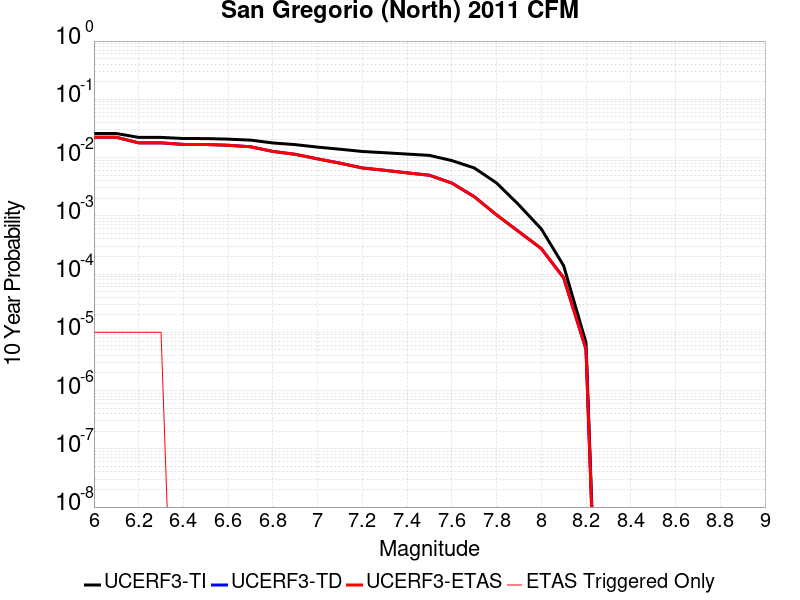 |

| Magnitude | 1 wk TI Prob | 1 wk TD Prob | 1 wk ETAS Prob | 1 wk ETAS/TD Gain | 1 wk ETAS Triggered Only | 1 mo TI Prob | 1 mo TD Prob | 1 mo ETAS Prob | 1 mo ETAS/TD Gain | 1 mo ETAS Triggered Only | 1 yr TI Prob | 1 yr TD Prob | 1 yr ETAS Prob | 1 yr ETAS/TD Gain | 1 yr ETAS Triggered Only | 10 yr TI Prob | 10 yr TD Prob | 10 yr ETAS Prob | 10 yr ETAS/TD Gain | 10 yr ETAS Triggered Only |
|-----|-----|-----|-----|-----|-----|-----|-----|-----|-----|-----|-----|-----|-----|-----|-----|-----|-----|-----|-----|-----|
| 6.0 | 5.0283932E-5 | 4.3057098E-5 | 4.3057098E-5 | 1.0 | 0.0 | 2.1548476E-4 | 1.8451746E-4 | 1.8451746E-4 | 1.0 | 0.0 | 0.0026203706 | 0.002244199 | 0.0022541767 | 1.0044459 | 1.0E-5 | 0.02589687 | 0.022295918 | 0.022305695 | 1.0004386 | 1.0E-5 |
| 6.1 | 5.0283932E-5 | 4.3057098E-5 | 4.3057098E-5 | 1.0 | 0.0 | 2.1548476E-4 | 1.8451746E-4 | 1.8451746E-4 | 1.0 | 0.0 | 0.0026203706 | 0.002244199 | 0.0022541767 | 1.0044459 | 1.0E-5 | 0.02589687 | 0.022295918 | 0.022305695 | 1.0004386 | 1.0E-5 |
| 6.2 | 4.2998647E-5 | 3.4440873E-5 | 3.4440873E-5 | 1.0 | 0.0 | 1.842669E-4 | 1.4759546E-4 | 1.4759546E-4 | 1.0 | 0.0 | 0.0022411412 | 0.001795506 | 0.001805488 | 1.0055594 | 1.0E-5 | 0.022186736 | 0.017884884 | 0.017894706 | 1.0005491 | 1.0E-5 |
| 6.3 | 4.2998647E-5 | 3.4440873E-5 | 3.4440873E-5 | 1.0 | 0.0 | 1.842669E-4 | 1.4759546E-4 | 1.4759546E-4 | 1.0 | 0.0 | 0.0022411412 | 0.001795506 | 0.001805488 | 1.0055594 | 1.0E-5 | 0.022186736 | 0.017884884 | 0.017894706 | 1.0005491 | 1.0E-5 |
| 6.4 | 4.1101295E-5 | 3.2326076E-5 | 3.2326076E-5 | 1.0 | 0.0 | 1.7613651E-4 | 1.3853304E-4 | 1.3853304E-4 | 1.0 | 0.0 | 0.0021423528 | 0.0016853481 | 0.0016853481 | 1.0 | 0.0 | 0.02121817 | 0.016800618 | 0.016800618 | 1.0 | 0.0 |
| 6.5 | 4.1032585E-5 | 3.224411E-5 | 3.224411E-5 | 1.0 | 0.0 | 1.7584208E-4 | 1.381818E-4 | 1.381818E-4 | 1.0 | 0.0 | 0.0021387753 | 0.0016810785 | 0.0016810785 | 1.0 | 0.0 | 0.021183075 | 0.01675857 | 0.01675857 | 1.0 | 0.0 |
| 6.6 | 4.011629E-5 | 3.1265718E-5 | 3.1265718E-5 | 1.0 | 0.0 | 1.7191563E-4 | 1.3398913E-4 | 1.3398913E-4 | 1.0 | 0.0 | 0.0020910634 | 0.0016301107 | 0.0016301107 | 1.0 | 0.0 | 0.020714961 | 0.016257357 | 0.016257357 | 1.0 | 0.0 |
| 6.7 | 3.8583938E-5 | 2.9452754E-5 | 2.9452754E-5 | 1.0 | 0.0 | 1.6534925E-4 | 1.2622007E-4 | 1.2622007E-4 | 1.0 | 0.0 | 0.0020112682 | 0.0015356604 | 0.0015356604 | 1.0 | 0.0 | 0.019931622 | 0.015326062 | 0.015326062 | 1.0 | 0.0 |
| 6.8 | 3.44341E-5 | 2.4450024E-5 | 2.4450024E-5 | 1.0 | 0.0 | 1.4756636E-4 | 1.0478167E-4 | 1.0478167E-4 | 1.0 | 0.0 | 0.0017951399 | 0.0012749807 | 0.0012749807 | 1.0 | 0.0 | 0.017807078 | 0.012751525 | 0.012751525 | 1.0 | 0.0 |
| 6.9 | 3.221199E-5 | 2.1777196E-5 | 2.1777196E-5 | 1.0 | 0.0 | 1.3804408E-4 | 9.3327544E-5 | 9.3327544E-5 | 1.0 | 0.0 | 0.0016793909 | 0.0011356788 | 0.0011356788 | 1.0 | 0.0 | 0.01666756 | 0.011372544 | 0.011372544 | 1.0 | 0.0 |
| 7.0 | 2.9186718E-5 | 1.814604E-5 | 1.814604E-5 | 1.0 | 0.0 | 1.2507994E-4 | 7.776645E-5 | 7.776645E-5 | 1.0 | 0.0 | 0.0015217843 | 9.463997E-4 | 9.463997E-4 | 1.0 | 0.0 | 0.015114053 | 0.0094966395 | 0.0094966395 | 1.0 | 0.0 |
| 7.1 | 2.6840138E-5 | 1.5283675E-5 | 1.5283675E-5 | 1.0 | 0.0 | 1.1502409E-4 | 6.549983E-5 | 6.549983E-5 | 1.0 | 0.0 | 0.0013995186 | 7.971706E-4 | 7.971706E-4 | 1.0 | 0.0 | 0.013907375 | 0.0080155255 | 0.0080155255 | 1.0 | 0.0 |
| 7.2 | 2.453002E-5 | 1.2605825E-5 | 1.2605825E-5 | 1.0 | 0.0 | 1.05124425E-4 | 5.4023847E-5 | 5.4023847E-5 | 1.0 | 0.0 | 0.0012791384 | 6.5754243E-4 | 6.5754243E-4 | 1.0 | 0.0 | 0.012718005 | 0.006627395 | 0.006627395 | 1.0 | 0.0 |
| 7.3 | 2.3330727E-5 | 1.1487833E-5 | 1.1487833E-5 | 1.0 | 0.0 | 9.9985E-5 | 4.923264E-5 | 4.923264E-5 | 1.0 | 0.0 | 0.0012166376 | 5.99243E-4 | 5.99243E-4 | 1.0 | 0.0 | 0.012099981 | 0.0060462817 | 0.0060462817 | 1.0 | 0.0 |
| 7.4 | 2.2136466E-5 | 1.0368137E-5 | 1.0368137E-5 | 1.0 | 0.0 | 9.486712E-5 | 4.4434113E-5 | 4.4434113E-5 | 1.0 | 0.0 | 0.0011543952 | 5.408513E-4 | 5.408513E-4 | 1.0 | 0.0 | 0.011484168 | 0.0054640025 | 0.0054640025 | 1.0 | 0.0 |
| 7.5 | 2.0994974E-5 | 9.426374E-6 | 9.426374E-6 | 1.0 | 0.0 | 8.997535E-5 | 4.0398125E-5 | 4.0398125E-5 | 1.0 | 0.0 | 0.0010948994 | 4.917364E-4 | 4.917364E-4 | 1.0 | 0.0 | 0.010895205 | 0.004973108 | 0.004973108 | 1.0 | 0.0 |
| 7.6 | 1.7091823E-5 | 6.892992E-6 | 6.892992E-6 | 1.0 | 0.0 | 7.3248615E-5 | 2.9541061E-5 | 2.9541061E-5 | 1.0 | 0.0 | 8.9143694E-4 | 3.5960317E-4 | 3.5960317E-4 | 1.0 | 0.0 | 0.008878695 | 0.0036480771 | 0.0036480771 | 1.0 | 0.0 |
| 7.7 | 1.2772179E-5 | 4.0202267E-6 | 4.0202267E-6 | 1.0 | 0.0 | 5.473676E-5 | 1.722943E-5 | 1.722943E-5 | 1.0 | 0.0 | 6.6621625E-4 | 2.0974813E-4 | 2.0974813E-4 | 1.0 | 0.0 | 0.006642225 | 0.0021365841 | 0.0021365841 | 1.0 | 0.0 |
| 7.8 | 7.041923E-6 | 1.9402341E-6 | 1.9402341E-6 | 1.0 | 0.0 | 3.017932E-5 | 8.315263E-6 | 8.315263E-6 | 1.0 | 0.0 | 3.6737128E-4 | 1.01233614E-4 | 1.01233614E-4 | 1.0 | 0.0 | 0.0036676454 | 0.0010376878 | 0.0010376878 | 1.0 | 0.0 |
| 7.9 | 2.946768E-6 | 1.0031822E-6 | 1.0031822E-6 | 1.0 | 0.0 | 1.2628945E-5 | 4.299345E-6 | 4.299345E-6 | 1.0 | 0.0 | 1.5374656E-4 | 5.2343268E-5 | 5.2343268E-5 | 1.0 | 0.0 | 0.0015364023 | 5.339059E-4 | 5.339059E-4 | 1.0 | 0.0 |
| 8.0 | 1.1433375E-6 | 5.180804E-7 | 5.180804E-7 | 1.0 | 0.0 | 4.9000087E-6 | 2.2203426E-6 | 2.2203426E-6 | 1.0 | 0.0 | 5.965597E-5 | 2.7032334E-5 | 2.7032334E-5 | 1.0 | 0.0 | 5.963996E-4 | 2.7394458E-4 | 2.7394458E-4 | 1.0 | 0.0 |
| 8.1 | 2.6675295E-7 | 1.6288074E-7 | 1.6288074E-7 | 1.0 | 0.0 | 1.1432264E-6 | 6.9806015E-7 | 6.9806015E-7 | 1.0 | 0.0 | 1.3918692E-5 | 8.498849E-6 | 8.498849E-6 | 1.0 | 0.0 | 1.391782E-4 | 8.6366665E-5 | 8.6366665E-5 | 1.0 | 0.0 |
| 8.2 | 1.2704569E-8 | 9.429871E-9 | 9.429871E-9 | 1.0 | 0.0 | 5.444815E-8 | 4.041373E-8 | 4.041373E-8 | 1.0 | 0.0 | 6.629061E-7 | 4.920371E-7 | 4.920371E-7 | 1.0 | 0.0 | 6.629041E-6 | 5.1106863E-6 | 5.1106863E-6 | 1.0 | 0.0 |

## San Luis Range - Oceano 2011 CFM
*[(top)](#table-of-contents)*

| 1 Week | 1 Month | 1 Year | 10 Year |
|-----|-----|-----|-----|
|  |  |  |  |

| Magnitude | 1 wk TI Prob | 1 wk TD Prob | 1 wk ETAS Prob | 1 wk ETAS/TD Gain | 1 wk ETAS Triggered Only | 1 mo TI Prob | 1 mo TD Prob | 1 mo ETAS Prob | 1 mo ETAS/TD Gain | 1 mo ETAS Triggered Only | 1 yr TI Prob | 1 yr TD Prob | 1 yr ETAS Prob | 1 yr ETAS/TD Gain | 1 yr ETAS Triggered Only | 10 yr TI Prob | 10 yr TD Prob | 10 yr ETAS Prob | 10 yr ETAS/TD Gain | 10 yr ETAS Triggered Only |
|-----|-----|-----|-----|-----|-----|-----|-----|-----|-----|-----|-----|-----|-----|-----|-----|-----|-----|-----|-----|-----|
| 6.0 | 1.6025788E-6 | 1.620119E-6 | 1.620119E-6 | 1.0 | 0.0 | 6.8681766E-6 | 6.943351E-6 | 6.943351E-6 | 1.0 | 0.0 | 8.361684E-5 | 8.453243E-5 | 8.453243E-5 | 1.0 | 0.0 | 8.3585386E-4 | 8.4504357E-4 | 8.5503515E-4 | 1.0118237 | 1.0E-5 |
| 6.1 | 1.6025788E-6 | 1.620119E-6 | 1.620119E-6 | 1.0 | 0.0 | 6.8681766E-6 | 6.943351E-6 | 6.943351E-6 | 1.0 | 0.0 | 8.361684E-5 | 8.453243E-5 | 8.453243E-5 | 1.0 | 0.0 | 8.3585386E-4 | 8.4504357E-4 | 8.5503515E-4 | 1.0118237 | 1.0E-5 |
| 6.2 | 1.6025788E-6 | 1.620119E-6 | 1.620119E-6 | 1.0 | 0.0 | 6.8681766E-6 | 6.943351E-6 | 6.943351E-6 | 1.0 | 0.0 | 8.361684E-5 | 8.453243E-5 | 8.453243E-5 | 1.0 | 0.0 | 8.3585386E-4 | 8.4504357E-4 | 8.5503515E-4 | 1.0118237 | 1.0E-5 |
| 6.3 | 1.6025788E-6 | 1.620119E-6 | 1.620119E-6 | 1.0 | 0.0 | 6.8681766E-6 | 6.943351E-6 | 6.943351E-6 | 1.0 | 0.0 | 8.361684E-5 | 8.453243E-5 | 8.453243E-5 | 1.0 | 0.0 | 8.3585386E-4 | 8.4504357E-4 | 8.5503515E-4 | 1.0118237 | 1.0E-5 |
| 6.4 | 1.1621186E-6 | 1.1749894E-6 | 1.1749894E-6 | 1.0 | 0.0 | 4.980499E-6 | 5.0356607E-6 | 5.0356607E-6 | 1.0 | 0.0 | 6.0635884E-5 | 6.130771E-5 | 6.130771E-5 | 1.0 | 0.0 | 6.0619344E-4 | 6.1293464E-4 | 6.229285E-4 | 1.016305 | 1.0E-5 |
| 6.5 | 1.1621186E-6 | 1.1749894E-6 | 1.1749894E-6 | 1.0 | 0.0 | 4.980499E-6 | 5.0356607E-6 | 5.0356607E-6 | 1.0 | 0.0 | 6.0635884E-5 | 6.130771E-5 | 6.130771E-5 | 1.0 | 0.0 | 6.0619344E-4 | 6.1293464E-4 | 6.229285E-4 | 1.016305 | 1.0E-5 |
| 6.6 | 7.164729E-7 | 7.2485784E-7 | 7.2485784E-7 | 1.0 | 0.0 | 3.0705946E-6 | 3.10653E-6 | 3.10653E-6 | 1.0 | 0.0 | 3.738385E-5 | 3.7821363E-5 | 3.7821363E-5 | 1.0 | 0.0 | 3.737756E-4 | 3.7815105E-4 | 3.8814725E-4 | 1.0264344 | 1.0E-5 |
| 6.7 | 7.164729E-7 | 7.2485784E-7 | 7.2485784E-7 | 1.0 | 0.0 | 3.0705946E-6 | 3.10653E-6 | 3.10653E-6 | 1.0 | 0.0 | 3.738385E-5 | 3.7821363E-5 | 3.7821363E-5 | 1.0 | 0.0 | 3.737756E-4 | 3.7815105E-4 | 3.8814725E-4 | 1.0264344 | 1.0E-5 |
| 6.8 | 6.700177E-7 | 6.7774397E-7 | 6.7774397E-7 | 1.0 | 0.0 | 2.8715012E-6 | 2.904614E-6 | 2.904614E-6 | 1.0 | 0.0 | 3.495997E-5 | 3.536312E-5 | 3.536312E-5 | 1.0 | 0.0 | 3.495447E-4 | 3.5357653E-4 | 3.63573E-4 | 1.0282724 | 1.0E-5 |
| 6.9 | 5.657865E-7 | 5.7217864E-7 | 5.7217864E-7 | 1.0 | 0.0 | 2.424797E-6 | 2.452192E-6 | 2.452192E-6 | 1.0 | 0.0 | 2.9521503E-5 | 2.9855039E-5 | 2.9855039E-5 | 1.0 | 0.0 | 2.9517582E-4 | 2.9851135E-4 | 3.0850834E-4 | 1.0334896 | 1.0E-5 |
| 7.0 | 4.608413E-7 | 4.660169E-7 | 4.660169E-7 | 1.0 | 0.0 | 1.9750328E-6 | 1.9972138E-6 | 1.9972138E-6 | 1.0 | 0.0 | 2.4045758E-5 | 2.431581E-5 | 2.431581E-5 | 1.0 | 0.0 | 2.4043156E-4 | 2.4313178E-4 | 2.5312934E-4 | 1.0411199 | 1.0E-5 |
| 7.1 | 3.9177846E-7 | 3.9621602E-7 | 3.9621602E-7 | 1.0 | 0.0 | 1.6790494E-6 | 1.6980675E-6 | 1.6980675E-6 | 1.0 | 0.0 | 2.0442236E-5 | 2.0673779E-5 | 2.0673779E-5 | 1.0 | 0.0 | 2.0440355E-4 | 2.067187E-4 | 2.1671664E-4 | 1.0483649 | 1.0E-5 |
| 7.2 | 3.3974752E-7 | 3.436653E-7 | 3.436653E-7 | 1.0 | 0.0 | 1.45606E-6 | 1.4728505E-6 | 1.4728505E-6 | 1.0 | 0.0 | 1.7727387E-5 | 1.7931809E-5 | 1.7931809E-5 | 1.0 | 0.0 | 1.7725973E-4 | 1.7930372E-4 | 1.8930192E-4 | 1.0557613 | 1.0E-5 |
| 7.3 | 2.8900928E-7 | 2.923402E-7 | 2.923402E-7 | 1.0 | 0.0 | 1.2386106E-6 | 1.2528859E-6 | 1.2528859E-6 | 1.0 | 0.0 | 1.5079979E-5 | 1.525378E-5 | 1.525378E-5 | 1.0 | 0.0 | 1.5078956E-4 | 1.5252741E-4 | 1.6252589E-4 | 1.065552 | 1.0E-5 |
| 7.4 | 2.1881527E-7 | 2.2139594E-7 | 2.2139594E-7 | 1.0 | 0.0 | 9.3777936E-7 | 9.488394E-7 | 9.488394E-7 | 1.0 | 0.0 | 1.14174045E-5 | 1.1552059E-5 | 1.1552059E-5 | 1.0 | 0.0 | 1.1416818E-4 | 1.1551464E-4 | 1.2551348E-4 | 1.086559 | 1.0E-5 |
| 7.5 | 1.356398E-7 | 1.3718639E-7 | 1.3718639E-7 | 1.0 | 0.0 | 5.813133E-7 | 5.8794154E-7 | 5.8794154E-7 | 1.0 | 0.0 | 7.0774663E-6 | 7.158165E-6 | 7.158165E-6 | 1.0 | 0.0 | 7.077241E-5 | 7.157937E-5 | 7.157937E-5 | 1.0 | 0.0 |
| 7.6 | 5.9269272E-8 | 6.001364E-8 | 6.001364E-8 | 1.0 | 0.0 | 2.5401116E-7 | 2.572013E-7 | 2.572013E-7 | 1.0 | 0.0 | 3.0925814E-6 | 3.1314214E-6 | 3.1314214E-6 | 1.0 | 0.0 | 3.0925385E-5 | 3.1313786E-5 | 3.1313786E-5 | 1.0 | 0.0 |
| 7.7 | 5.946232E-9 | 6.036928E-9 | 6.036928E-9 | 1.0 | 0.0 | 2.5483851E-8 | 2.5872547E-8 | 2.5872547E-8 | 1.0 | 0.0 | 3.1026585E-7 | 3.1499823E-7 | 3.1499823E-7 | 1.0 | 0.0 | 3.102654E-6 | 3.1499787E-6 | 3.1499787E-6 | 1.0 | 0.0 |

## San Gregorio (South) 2011 CFM
*[(top)](#table-of-contents)*

| 1 Week | 1 Month | 1 Year | 10 Year |
|-----|-----|-----|-----|
|  |  | 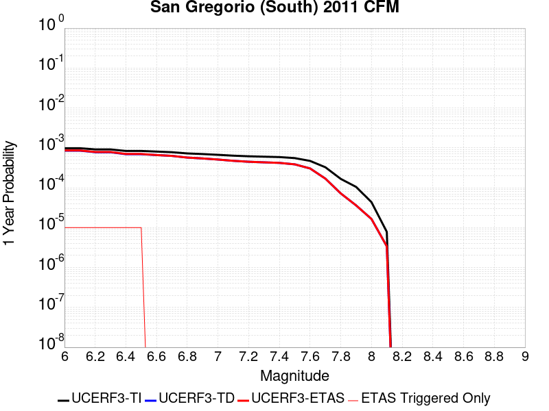 |  |

| Magnitude | 1 wk TI Prob | 1 wk TD Prob | 1 wk ETAS Prob | 1 wk ETAS/TD Gain | 1 wk ETAS Triggered Only | 1 mo TI Prob | 1 mo TD Prob | 1 mo ETAS Prob | 1 mo ETAS/TD Gain | 1 mo ETAS Triggered Only | 1 yr TI Prob | 1 yr TD Prob | 1 yr ETAS Prob | 1 yr ETAS/TD Gain | 1 yr ETAS Triggered Only | 10 yr TI Prob | 10 yr TD Prob | 10 yr ETAS Prob | 10 yr ETAS/TD Gain | 10 yr ETAS Triggered Only |
|-----|-----|-----|-----|-----|-----|-----|-----|-----|-----|-----|-----|-----|-----|-----|-----|-----|-----|-----|-----|-----|
| 6.0 | 1.8770423E-5 | 1.6279559E-5 | 1.6279559E-5 | 1.0 | 0.0 | 8.044219E-5 | 6.9767695E-5 | 6.9767695E-5 | 1.0 | 0.0 | 9.789435E-4 | 8.490944E-4 | 8.5908594E-4 | 1.0117673 | 1.0E-5 | 0.009746423 | 0.008471475 | 0.008481391 | 1.0011704 | 1.0E-5 |
| 6.1 | 1.8770423E-5 | 1.6279559E-5 | 1.6279559E-5 | 1.0 | 0.0 | 8.044219E-5 | 6.9767695E-5 | 6.9767695E-5 | 1.0 | 0.0 | 9.789435E-4 | 8.490944E-4 | 8.5908594E-4 | 1.0117673 | 1.0E-5 | 0.009746423 | 0.008471475 | 0.008481391 | 1.0011704 | 1.0E-5 |
| 6.2 | 1.7508692E-5 | 1.4899064E-5 | 1.4899064E-5 | 1.0 | 0.0 | 7.5035096E-5 | 6.3851585E-5 | 6.3851585E-5 | 1.0 | 0.0 | 9.1316935E-4 | 7.7711884E-4 | 7.8711106E-4 | 1.012858 | 1.0E-5 | 0.00909426 | 0.007756904 | 0.007766826 | 1.0012791 | 1.0E-5 |
| 6.3 | 1.7508692E-5 | 1.4899064E-5 | 1.4899064E-5 | 1.0 | 0.0 | 7.5035096E-5 | 6.3851585E-5 | 6.3851585E-5 | 1.0 | 0.0 | 9.1316935E-4 | 7.7711884E-4 | 7.8711106E-4 | 1.012858 | 1.0E-5 | 0.00909426 | 0.007756904 | 0.007766826 | 1.0012791 | 1.0E-5 |
| 6.4 | 1.6004591E-5 | 1.3248901E-5 | 1.3248901E-5 | 1.0 | 0.0 | 6.85893E-5 | 5.6779776E-5 | 5.6779776E-5 | 1.0 | 0.0 | 8.347548E-4 | 6.910755E-4 | 7.010686E-4 | 1.0144602 | 1.0E-5 | 0.008316261 | 0.0069019548 | 0.006911886 | 1.0014389 | 1.0E-5 |
| 6.5 | 1.6004591E-5 | 1.3248901E-5 | 1.3248901E-5 | 1.0 | 0.0 | 6.85893E-5 | 5.6779776E-5 | 5.6779776E-5 | 1.0 | 0.0 | 8.347548E-4 | 6.910755E-4 | 7.010686E-4 | 1.0144602 | 1.0E-5 | 0.008316261 | 0.0069019548 | 0.006911886 | 1.0014389 | 1.0E-5 |
| 6.6 | 1.5442201E-5 | 1.2633533E-5 | 1.2633533E-5 | 1.0 | 0.0 | 6.617918E-5 | 5.414259E-5 | 5.414259E-5 | 1.0 | 0.0 | 8.0543366E-4 | 6.5898756E-4 | 6.5898756E-4 | 1.0 | 0.0 | 0.008025207 | 0.0065830066 | 0.0065830066 | 1.0 | 0.0 |
| 6.7 | 1.489921E-5 | 1.2042042E-5 | 1.2042042E-5 | 1.0 | 0.0 | 6.3852196E-5 | 5.1607734E-5 | 5.1607734E-5 | 1.0 | 0.0 | 7.7712315E-4 | 6.281437E-4 | 6.281437E-4 | 1.0 | 0.0 | 0.0077441116 | 0.0062763398 | 0.0062763398 | 1.0 | 0.0 |
| 6.8 | 1.3876024E-5 | 1.0920992E-5 | 1.0920992E-5 | 1.0 | 0.0 | 5.9467322E-5 | 4.6803412E-5 | 4.6803412E-5 | 1.0 | 0.0 | 7.237741E-4 | 5.696829E-4 | 5.696829E-4 | 1.0 | 0.0 | 0.0072142133 | 0.005694849 | 0.005694849 | 1.0 | 0.0 |
| 6.9 | 1.33922495E-5 | 1.0392495E-5 | 1.0392495E-5 | 1.0 | 0.0 | 5.7394092E-5 | 4.4538505E-5 | 4.4538505E-5 | 1.0 | 0.0 | 6.9854903E-4 | 5.4212165E-4 | 5.4212165E-4 | 1.0 | 0.0 | 0.0069635725 | 0.0054206066 | 0.0054206066 | 1.0 | 0.0 |
| 7.0 | 1.2807324E-5 | 9.752456E-6 | 9.752456E-6 | 1.0 | 0.0 | 5.4887376E-5 | 4.179557E-5 | 4.179557E-5 | 1.0 | 0.0 | 6.680489E-4 | 5.0874247E-4 | 5.0874247E-4 | 1.0 | 0.0 | 0.006660442 | 0.0050883847 | 0.0050883847 | 1.0 | 0.0 |
| 7.1 | 1.2191438E-5 | 9.061344E-6 | 9.061344E-6 | 1.0 | 0.0 | 5.224797E-5 | 3.8833754E-5 | 3.8833754E-5 | 1.0 | 0.0 | 6.3593336E-4 | 4.7269845E-4 | 4.7269845E-4 | 1.0 | 0.0 | 0.0063411663 | 0.004729529 | 0.004729529 | 1.0 | 0.0 |
| 7.2 | 1.1769438E-5 | 8.581538E-6 | 8.581538E-6 | 1.0 | 0.0 | 5.0439474E-5 | 3.6777503E-5 | 3.6777503E-5 | 1.0 | 0.0 | 6.1392755E-4 | 4.476742E-4 | 4.476742E-4 | 1.0 | 0.0 | 0.0061223423 | 0.0044803214 | 0.0044803214 | 1.0 | 0.0 |
| 7.3 | 1.150374E-5 | 8.296966E-6 | 8.296966E-6 | 1.0 | 0.0 | 4.9300812E-5 | 3.5557943E-5 | 3.5557943E-5 | 1.0 | 0.0 | 6.0007203E-4 | 4.3283202E-4 | 4.3283202E-4 | 1.0 | 0.0 | 0.0059845424 | 0.004332466 | 0.004332466 | 1.0 | 0.0 |
| 7.4 | 1.12514E-5 | 8.042707E-6 | 8.042707E-6 | 1.0 | 0.0 | 4.8219394E-5 | 3.446829E-5 | 3.446829E-5 | 1.0 | 0.0 | 5.8691297E-4 | 4.1957066E-4 | 4.1957066E-4 | 1.0 | 0.0 | 0.005853653 | 0.0042003556 | 0.0042003556 | 1.0 | 0.0 |
| 7.5 | 1.059696E-5 | 7.39299E-6 | 7.39299E-6 | 1.0 | 0.0 | 4.5414752E-5 | 3.168386E-5 | 3.168386E-5 | 1.0 | 0.0 | 5.5278436E-4 | 3.8568274E-4 | 3.8568274E-4 | 1.0 | 0.0 | 0.0055141128 | 0.003862607 | 0.003862607 | 1.0 | 0.0 |
| 7.6 | 9.018592E-6 | 5.836751E-6 | 5.836751E-6 | 1.0 | 0.0 | 3.8650534E-5 | 2.5014408E-5 | 2.5014408E-5 | 1.0 | 0.0 | 4.7046866E-4 | 3.0450788E-4 | 3.0450788E-4 | 1.0 | 0.0 | 0.004694739 | 0.0030530049 | 0.0030530049 | 1.0 | 0.0 |
| 7.7 | 6.243489E-6 | 3.239351E-6 | 3.239351E-6 | 1.0 | 0.0 | 2.6757538E-5 | 1.3882858E-5 | 1.3882858E-5 | 1.0 | 0.0 | 3.257243E-4 | 1.690107E-4 | 1.690107E-4 | 1.0 | 0.0 | 0.003252473 | 0.0016990631 | 0.0016990631 | 1.0 | 0.0 |
| 7.8 | 3.1941963E-6 | 1.380876E-6 | 1.380876E-6 | 1.0 | 0.0 | 1.368934E-5 | 5.9180265E-6 | 5.9180265E-6 | 1.0 | 0.0 | 1.6665498E-4 | 7.2049595E-5 | 7.2049595E-5 | 1.0 | 0.0 | 0.0016653005 | 7.2625576E-4 | 7.2625576E-4 | 1.0 | 0.0 |
| 7.9 | 2.0098398E-6 | 6.915071E-7 | 6.915071E-7 | 1.0 | 0.0 | 8.6135715E-6 | 2.9635985E-6 | 2.9635985E-6 | 1.0 | 0.0 | 1.0486518E-4 | 3.6081216E-5 | 3.6081216E-5 | 1.0 | 0.0 | 0.0010481571 | 3.6566515E-4 | 3.6566515E-4 | 1.0 | 0.0 |
| 8.0 | 8.353119E-7 | 3.1619197E-7 | 3.1619197E-7 | 1.0 | 0.0 | 3.579903E-6 | 1.3551078E-6 | 1.3551078E-6 | 1.0 | 0.0 | 4.358445E-5 | 1.6498312E-5 | 1.6498312E-5 | 1.0 | 0.0 | 4.3575902E-4 | 1.6616881E-4 | 1.6616881E-4 | 1.0 | 0.0 |
| 8.1 | 1.5033264E-7 | 6.52693E-8 | 6.52693E-8 | 1.0 | 0.0 | 6.442826E-7 | 2.7972553E-7 | 2.7972553E-7 | 1.0 | 0.0 | 7.844113E-6 | 3.4056532E-6 | 3.4056532E-6 | 1.0 | 0.0 | 7.843835E-5 | 3.4072833E-5 | 3.4072833E-5 | 1.0 | 0.0 |

## Honey Lake 2011 CFM
*[(top)](#table-of-contents)*

| 1 Week | 1 Month | 1 Year | 10 Year |
|-----|-----|-----|-----|
|  |  |  |  |

| Magnitude | 1 wk TI Prob | 1 wk TD Prob | 1 wk ETAS Prob | 1 wk ETAS/TD Gain | 1 wk ETAS Triggered Only | 1 mo TI Prob | 1 mo TD Prob | 1 mo ETAS Prob | 1 mo ETAS/TD Gain | 1 mo ETAS Triggered Only | 1 yr TI Prob | 1 yr TD Prob | 1 yr ETAS Prob | 1 yr ETAS/TD Gain | 1 yr ETAS Triggered Only | 10 yr TI Prob | 10 yr TD Prob | 10 yr ETAS Prob | 10 yr ETAS/TD Gain | 10 yr ETAS Triggered Only |
|-----|-----|-----|-----|-----|-----|-----|-----|-----|-----|-----|-----|-----|-----|-----|-----|-----|-----|-----|-----|-----|
| 6.0 | 6.155506E-5 | 7.954708E-5 | 7.954708E-5 | 1.0 | 0.0 | 2.6378073E-4 | 3.4087323E-4 | 3.4087323E-4 | 1.0 | 0.0 | 0.0032068014 | 0.0041426765 | 0.0041426765 | 1.0 | 0.0 | 0.03160919 | 0.040703055 | 0.040712647 | 1.0002357 | 1.0E-5 |
| 6.1 | 6.155506E-5 | 7.954708E-5 | 7.954708E-5 | 1.0 | 0.0 | 2.6378073E-4 | 3.4087323E-4 | 3.4087323E-4 | 1.0 | 0.0 | 0.0032068014 | 0.0041426765 | 0.0041426765 | 1.0 | 0.0 | 0.03160919 | 0.040703055 | 0.040712647 | 1.0002357 | 1.0E-5 |
| 6.2 | 4.1335024E-5 | 5.257652E-5 | 5.257652E-5 | 1.0 | 0.0 | 1.7713808E-4 | 2.2530954E-4 | 2.2530954E-4 | 1.0 | 0.0 | 0.0021545228 | 0.0027398444 | 0.0027398444 | 1.0 | 0.0 | 0.021337535 | 0.027076809 | 0.027086537 | 1.0003593 | 1.0E-5 |
| 6.3 | 4.1335024E-5 | 5.257652E-5 | 5.257652E-5 | 1.0 | 0.0 | 1.7713808E-4 | 2.2530954E-4 | 2.2530954E-4 | 1.0 | 0.0 | 0.0021545228 | 0.0027398444 | 0.0027398444 | 1.0 | 0.0 | 0.021337535 | 0.027076809 | 0.027086537 | 1.0003593 | 1.0E-5 |
| 6.4 | 3.2393702E-5 | 4.0887273E-5 | 4.0887273E-5 | 1.0 | 0.0 | 1.3882275E-4 | 1.7522006E-4 | 1.7522006E-4 | 1.0 | 0.0 | 0.0016888566 | 0.0021313233 | 0.0021313233 | 1.0 | 0.0 | 0.016760793 | 0.021119867 | 0.021129655 | 1.0004635 | 1.0E-5 |
| 6.5 | 2.7205504E-5 | 3.4211767E-5 | 3.4211767E-5 | 1.0 | 0.0 | 1.1658981E-4 | 1.4661417E-4 | 1.4661417E-4 | 1.0 | 0.0 | 0.0014185566 | 0.0017836596 | 0.0017836596 | 1.0 | 0.0 | 0.014095354 | 0.017702963 | 0.017712785 | 1.0005549 | 1.0E-5 |
| 6.6 | 2.069265E-5 | 2.5955416E-5 | 2.5955416E-5 | 1.0 | 0.0 | 8.867977E-5 | 1.1123324E-4 | 1.1123324E-4 | 1.0 | 0.0 | 0.0010791414 | 0.0013535074 | 0.0013535074 | 1.0 | 0.0 | 0.010739161 | 0.0134610105 | 0.013470876 | 1.0007329 | 1.0E-5 |
| 6.7 | 1.8060919E-5 | 2.265683E-5 | 2.265683E-5 | 1.0 | 0.0 | 7.7401644E-5 | 9.7097545E-5 | 9.7097545E-5 | 1.0 | 0.0 | 9.419576E-4 | 0.0011816025 | 0.0011816025 | 1.0 | 0.0 | 0.009379748 | 0.0117612425 | 0.011771125 | 1.0008403 | 1.0E-5 |
| 6.8 | 1.4474663E-5 | 1.8181274E-5 | 1.8181274E-5 | 1.0 | 0.0 | 6.203279E-5 | 7.791785E-5 | 7.791785E-5 | 1.0 | 0.0 | 7.5498753E-4 | 9.4831345E-4 | 9.4831345E-4 | 1.0 | 0.0 | 0.007524277 | 0.009450195 | 0.009460101 | 1.0010482 | 1.0E-5 |
| 6.9 | 8.564552E-6 | 1.0802311E-5 | 1.0802311E-5 | 1.0 | 0.0 | 3.6704707E-5 | 4.6295176E-5 | 4.6295176E-5 | 1.0 | 0.0 | 4.4678818E-4 | 5.635644E-4 | 5.635644E-4 | 1.0 | 0.0 | 0.0044589094 | 0.0056278505 | 0.0056377943 | 1.0017669 | 1.0E-5 |

## Great Valley 06 (Midland) 2011 CFM alt1
*[(top)](#table-of-contents)*

| 1 Week | 1 Month | 1 Year | 10 Year |
|-----|-----|-----|-----|
|  |  | 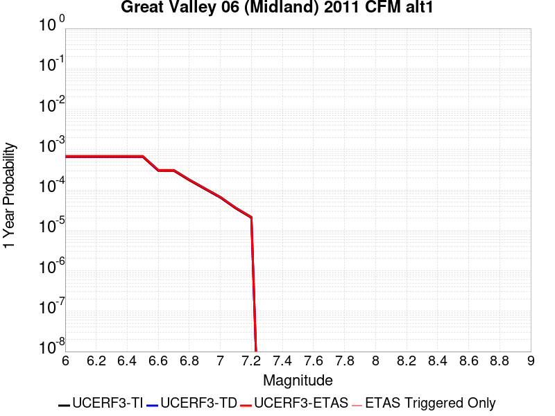 |  |

| Magnitude | 1 wk TI Prob | 1 wk TD Prob | 1 wk ETAS Prob | 1 wk ETAS/TD Gain | 1 wk ETAS Triggered Only | 1 mo TI Prob | 1 mo TD Prob | 1 mo ETAS Prob | 1 mo ETAS/TD Gain | 1 mo ETAS Triggered Only | 1 yr TI Prob | 1 yr TD Prob | 1 yr ETAS Prob | 1 yr ETAS/TD Gain | 1 yr ETAS Triggered Only | 10 yr TI Prob | 10 yr TD Prob | 10 yr ETAS Prob | 10 yr ETAS/TD Gain | 10 yr ETAS Triggered Only |
|-----|-----|-----|-----|-----|-----|-----|-----|-----|-----|-----|-----|-----|-----|-----|-----|-----|-----|-----|-----|-----|
| 6.0 | 1.2712525E-5 | 1.3210576E-5 | 1.3210576E-5 | 1.0 | 0.0 | 5.4481112E-5 | 5.6615667E-5 | 5.6615667E-5 | 1.0 | 0.0 | 6.6310563E-4 | 6.8910315E-4 | 6.8910315E-4 | 1.0 | 0.0 | 0.0066113044 | 0.006872179 | 0.00688211 | 1.0014452 | 1.0E-5 |
| 6.1 | 1.2712525E-5 | 1.3210576E-5 | 1.3210576E-5 | 1.0 | 0.0 | 5.4481112E-5 | 5.6615667E-5 | 5.6615667E-5 | 1.0 | 0.0 | 6.6310563E-4 | 6.8910315E-4 | 6.8910315E-4 | 1.0 | 0.0 | 0.0066113044 | 0.006872179 | 0.00688211 | 1.0014452 | 1.0E-5 |
| 6.2 | 1.2712525E-5 | 1.3210576E-5 | 1.3210576E-5 | 1.0 | 0.0 | 5.4481112E-5 | 5.6615667E-5 | 5.6615667E-5 | 1.0 | 0.0 | 6.6310563E-4 | 6.8910315E-4 | 6.8910315E-4 | 1.0 | 0.0 | 0.0066113044 | 0.006872179 | 0.00688211 | 1.0014452 | 1.0E-5 |
| 6.3 | 1.2712525E-5 | 1.3210576E-5 | 1.3210576E-5 | 1.0 | 0.0 | 5.4481112E-5 | 5.6615667E-5 | 5.6615667E-5 | 1.0 | 0.0 | 6.6310563E-4 | 6.8910315E-4 | 6.8910315E-4 | 1.0 | 0.0 | 0.0066113044 | 0.006872179 | 0.00688211 | 1.0014452 | 1.0E-5 |
| 6.4 | 1.2712525E-5 | 1.3210576E-5 | 1.3210576E-5 | 1.0 | 0.0 | 5.4481112E-5 | 5.6615667E-5 | 5.6615667E-5 | 1.0 | 0.0 | 6.6310563E-4 | 6.8910315E-4 | 6.8910315E-4 | 1.0 | 0.0 | 0.0066113044 | 0.006872179 | 0.00688211 | 1.0014452 | 1.0E-5 |
| 6.5 | 1.2712525E-5 | 1.3210576E-5 | 1.3210576E-5 | 1.0 | 0.0 | 5.4481112E-5 | 5.6615667E-5 | 5.6615667E-5 | 1.0 | 0.0 | 6.6310563E-4 | 6.8910315E-4 | 6.8910315E-4 | 1.0 | 0.0 | 0.0066113044 | 0.006872179 | 0.00688211 | 1.0014452 | 1.0E-5 |
| 6.6 | 5.7574384E-6 | 5.9706463E-6 | 5.9706463E-6 | 1.0 | 0.0 | 2.4674504E-5 | 2.5588255E-5 | 2.5588255E-5 | 1.0 | 0.0 | 3.0037065E-4 | 3.1149638E-4 | 3.1149638E-4 | 1.0 | 0.0 | 0.0029996498 | 0.0031109843 | 0.0031209532 | 1.0032045 | 1.0E-5 |
| 6.7 | 5.7574384E-6 | 5.9706463E-6 | 5.9706463E-6 | 1.0 | 0.0 | 2.4674504E-5 | 2.5588255E-5 | 2.5588255E-5 | 1.0 | 0.0 | 3.0037065E-4 | 3.1149638E-4 | 3.1149638E-4 | 1.0 | 0.0 | 0.0029996498 | 0.0031109843 | 0.0031209532 | 1.0032045 | 1.0E-5 |
| 6.8 | 3.3474828E-6 | 3.4693849E-6 | 3.4693849E-6 | 1.0 | 0.0 | 1.4346277E-5 | 1.4868716E-5 | 1.4868716E-5 | 1.0 | 0.0 | 1.7465191E-4 | 1.8101306E-4 | 1.8101306E-4 | 1.0 | 0.0 | 0.0017451472 | 0.0018088033 | 0.0018088033 | 1.0 | 0.0 |
| 6.9 | 2.035106E-6 | 2.1090357E-6 | 2.1090357E-6 | 1.0 | 0.0 | 8.721853E-6 | 9.038697E-6 | 9.038697E-6 | 1.0 | 0.0 | 1.0618339E-4 | 1.10041314E-4 | 1.10041314E-4 | 1.0 | 0.0 | 0.0010613267 | 0.0010999405 | 0.0010999405 | 1.0 | 0.0 |
| 7.0 | 1.2424716E-6 | 1.2878762E-6 | 1.2878762E-6 | 1.0 | 0.0 | 5.3248673E-6 | 5.51946E-6 | 5.51946E-6 | 1.0 | 0.0 | 6.482833E-5 | 6.7197805E-5 | 6.7197805E-5 | 1.0 | 0.0 | 6.480942E-4 | 6.718192E-4 | 6.718192E-4 | 1.0 | 0.0 |
| 7.1 | 6.6904556E-7 | 6.939035E-7 | 6.939035E-7 | 1.0 | 0.0 | 2.867335E-6 | 2.97387E-6 | 2.97387E-6 | 1.0 | 0.0 | 3.4909244E-5 | 3.6206526E-5 | 3.6206526E-5 | 1.0 | 0.0 | 3.490376E-4 | 3.6203177E-4 | 3.6203177E-4 | 1.0 | 0.0 |
| 7.2 | 3.948168E-7 | 4.095705E-7 | 4.095705E-7 | 1.0 | 0.0 | 1.6920709E-6 | 1.7553022E-6 | 1.7553022E-6 | 1.0 | 0.0 | 2.0600768E-5 | 2.1370803E-5 | 2.1370803E-5 | 1.0 | 0.0 | 2.0598859E-4 | 2.1370803E-4 | 2.1370803E-4 | 1.0 | 0.0 |

## Swain Ravine - Spenceville
*[(top)](#table-of-contents)*

| 1 Week | 1 Month | 1 Year | 10 Year |
|-----|-----|-----|-----|
|  |  |  |  |

| Magnitude | 1 wk TI Prob | 1 wk TD Prob | 1 wk ETAS Prob | 1 wk ETAS/TD Gain | 1 wk ETAS Triggered Only | 1 mo TI Prob | 1 mo TD Prob | 1 mo ETAS Prob | 1 mo ETAS/TD Gain | 1 mo ETAS Triggered Only | 1 yr TI Prob | 1 yr TD Prob | 1 yr ETAS Prob | 1 yr ETAS/TD Gain | 1 yr ETAS Triggered Only | 10 yr TI Prob | 10 yr TD Prob | 10 yr ETAS Prob | 10 yr ETAS/TD Gain | 10 yr ETAS Triggered Only |
|-----|-----|-----|-----|-----|-----|-----|-----|-----|-----|-----|-----|-----|-----|-----|-----|-----|-----|-----|-----|-----|
| 6.0 | 5.596169E-6 | 5.663794E-6 | 5.663794E-6 | 1.0 | 0.0 | 2.398336E-5 | 2.4273193E-5 | 2.4273193E-5 | 1.0 | 0.0 | 2.9195828E-4 | 2.9548878E-4 | 2.9548878E-4 | 1.0 | 0.0 | 0.00291575 | 0.002951228 | 0.0029611986 | 1.0033784 | 1.0E-5 |
| 6.1 | 5.596169E-6 | 5.663794E-6 | 5.663794E-6 | 1.0 | 0.0 | 2.398336E-5 | 2.4273193E-5 | 2.4273193E-5 | 1.0 | 0.0 | 2.9195828E-4 | 2.9548878E-4 | 2.9548878E-4 | 1.0 | 0.0 | 0.00291575 | 0.002951228 | 0.0029611986 | 1.0033784 | 1.0E-5 |
| 6.2 | 5.596169E-6 | 5.663794E-6 | 5.663794E-6 | 1.0 | 0.0 | 2.398336E-5 | 2.4273193E-5 | 2.4273193E-5 | 1.0 | 0.0 | 2.9195828E-4 | 2.9548878E-4 | 2.9548878E-4 | 1.0 | 0.0 | 0.00291575 | 0.002951228 | 0.0029611986 | 1.0033784 | 1.0E-5 |
| 6.3 | 5.596169E-6 | 5.663794E-6 | 5.663794E-6 | 1.0 | 0.0 | 2.398336E-5 | 2.4273193E-5 | 2.4273193E-5 | 1.0 | 0.0 | 2.9195828E-4 | 2.9548878E-4 | 2.9548878E-4 | 1.0 | 0.0 | 0.00291575 | 0.002951228 | 0.0029611986 | 1.0033784 | 1.0E-5 |
| 6.4 | 2.8426775E-6 | 2.874144E-6 | 2.874144E-6 | 1.0 | 0.0 | 1.2182847E-5 | 1.2317704E-5 | 1.2317704E-5 | 1.0 | 0.0 | 1.4831607E-4 | 1.4995811E-4 | 1.4995811E-4 | 1.0 | 0.0 | 0.0014821711 | 0.0014986077 | 0.0015085926 | 1.0066628 | 1.0E-5 |
| 6.5 | 1.9210793E-6 | 1.9414147E-6 | 1.9414147E-6 | 1.0 | 0.0 | 8.233172E-6 | 8.320323E-6 | 8.320323E-6 | 1.0 | 0.0 | 1.0023425E-4 | 1.0129536E-4 | 1.0129536E-4 | 1.0 | 0.0 | 0.0010018905 | 0.0010125053 | 0.0010224952 | 1.0098665 | 1.0E-5 |
| 6.6 | 1.9210793E-6 | 1.9414147E-6 | 1.9414147E-6 | 1.0 | 0.0 | 8.233172E-6 | 8.320323E-6 | 8.320323E-6 | 1.0 | 0.0 | 1.0023425E-4 | 1.0129536E-4 | 1.0129536E-4 | 1.0 | 0.0 | 0.0010018905 | 0.0010125053 | 0.0010224952 | 1.0098665 | 1.0E-5 |
| 6.7 | 1.4667394E-6 | 1.4818934E-6 | 1.4818934E-6 | 1.0 | 0.0 | 6.286011E-6 | 6.3509565E-6 | 6.3509565E-6 | 1.0 | 0.0 | 7.65295E-5 | 7.732023E-5 | 7.732023E-5 | 1.0 | 0.0 | 7.6503144E-4 | 7.72941E-4 | 7.8293326E-4 | 1.0129277 | 1.0E-5 |
| 6.8 | 1.1076943E-6 | 1.1189535E-6 | 1.1189535E-6 | 1.0 | 0.0 | 4.747252E-6 | 4.7955064E-6 | 4.7955064E-6 | 1.0 | 0.0 | 5.7796264E-5 | 5.838377E-5 | 5.838377E-5 | 1.0 | 0.0 | 5.778124E-4 | 5.836887E-4 | 5.936829E-4 | 1.0171224 | 1.0E-5 |
| 6.9 | 8.514296E-7 | 8.600095E-7 | 8.600095E-7 | 1.0 | 0.0 | 3.648979E-6 | 3.6857498E-6 | 3.6857498E-6 | 1.0 | 0.0 | 4.442541E-5 | 4.4873108E-5 | 4.4873108E-5 | 1.0 | 0.0 | 4.441653E-4 | 4.4864335E-4 | 4.4864335E-4 | 1.0 | 0.0 |
| 7.0 | 4.8544706E-7 | 4.9033E-7 | 4.9033E-7 | 1.0 | 0.0 | 2.0804857E-6 | 2.1014127E-6 | 2.1014127E-6 | 1.0 | 0.0 | 2.532962E-5 | 2.5584413E-5 | 2.5584413E-5 | 1.0 | 0.0 | 2.5326732E-4 | 2.5581598E-4 | 2.5581598E-4 | 1.0 | 0.0 |
| 7.1 | 3.829186E-7 | 3.8678783E-7 | 3.8678783E-7 | 1.0 | 0.0 | 1.6410787E-6 | 1.6576612E-6 | 1.6576612E-6 | 1.0 | 0.0 | 1.997995E-5 | 2.0181848E-5 | 2.0181848E-5 | 1.0 | 0.0 | 1.9978154E-4 | 2.0180122E-4 | 2.0180122E-4 | 1.0 | 0.0 |
| 7.2 | 1.4726595E-7 | 1.4879437E-7 | 1.4879437E-7 | 1.0 | 0.0 | 6.3113964E-7 | 6.3769005E-7 | 6.3769005E-7 | 1.0 | 0.0 | 7.684098E-6 | 7.763854E-6 | 7.763854E-6 | 1.0 | 0.0 | 7.6838325E-5 | 7.763636E-5 | 7.763636E-5 | 1.0 | 0.0 |
| 7.3 | 4.1880604E-8 | 4.2324306E-8 | 4.2324306E-8 | 1.0 | 0.0 | 1.7948828E-7 | 1.8138988E-7 | 1.8138988E-7 | 1.0 | 0.0 | 2.1852677E-6 | 2.2084218E-6 | 2.2084218E-6 | 1.0 | 0.0 | 2.1852462E-5 | 2.2084218E-5 | 2.2084218E-5 | 1.0 | 0.0 |

## Maacama 2011 CFM
*[(top)](#table-of-contents)*

| 1 Week | 1 Month | 1 Year | 10 Year |
|-----|-----|-----|-----|
|  |  |  | 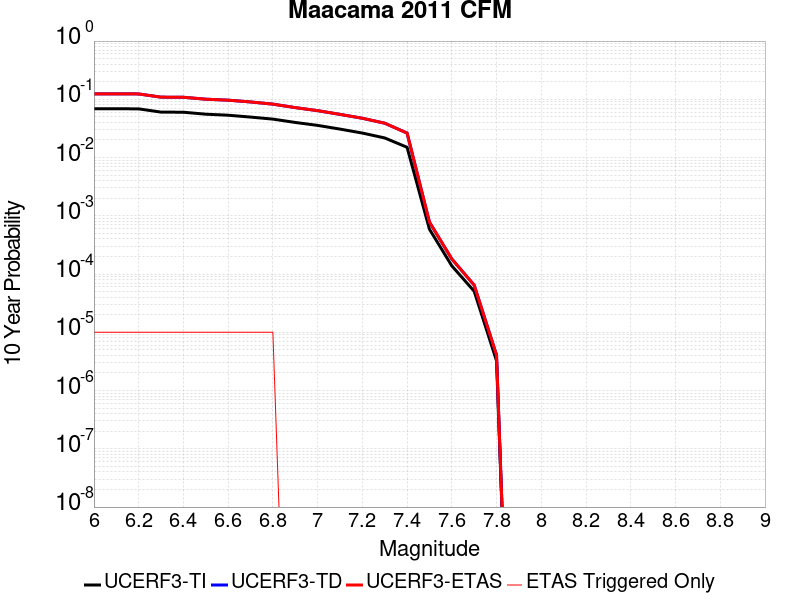 |

| Magnitude | 1 wk TI Prob | 1 wk TD Prob | 1 wk ETAS Prob | 1 wk ETAS/TD Gain | 1 wk ETAS Triggered Only | 1 mo TI Prob | 1 mo TD Prob | 1 mo ETAS Prob | 1 mo ETAS/TD Gain | 1 mo ETAS Triggered Only | 1 yr TI Prob | 1 yr TD Prob | 1 yr ETAS Prob | 1 yr ETAS/TD Gain | 1 yr ETAS Triggered Only | 10 yr TI Prob | 10 yr TD Prob | 10 yr ETAS Prob | 10 yr ETAS/TD Gain | 10 yr ETAS Triggered Only |
|-----|-----|-----|-----|-----|-----|-----|-----|-----|-----|-----|-----|-----|-----|-----|-----|-----|-----|-----|-----|-----|
| 6.0 | 1.368203E-4 | 2.579087E-4 | 2.579087E-4 | 1.0 | 0.0 | 5.862409E-4 | 0.0011047592 | 0.0011047592 | 1.0 | 0.0 | 0.0071141496 | 0.013350345 | 0.013350345 | 1.0 | 0.0 | 0.06890667 | 0.1241916 | 0.12420036 | 1.0000706 | 1.0E-5 |
| 6.1 | 1.368203E-4 | 2.579087E-4 | 2.579087E-4 | 1.0 | 0.0 | 5.862409E-4 | 0.0011047592 | 0.0011047592 | 1.0 | 0.0 | 0.0071141496 | 0.013350345 | 0.013350345 | 1.0 | 0.0 | 0.06890667 | 0.1241916 | 0.12420036 | 1.0000706 | 1.0E-5 |
| 6.2 | 1.360743E-4 | 2.566557E-4 | 2.566557E-4 | 1.0 | 0.0 | 5.8304524E-4 | 0.001099394 | 0.001099394 | 1.0 | 0.0 | 0.007075496 | 0.013285898 | 0.013285898 | 1.0 | 0.0 | 0.06854413 | 0.123625994 | 0.123634756 | 1.0000709 | 1.0E-5 |
| 6.3 | 1.1917239E-4 | 2.236021E-4 | 2.236021E-4 | 1.0 | 0.0 | 5.1063887E-4 | 9.578717E-4 | 9.578717E-4 | 1.0 | 0.0 | 0.0061993203 | 0.0115873255 | 0.0115873255 | 1.0 | 0.0 | 0.060292065 | 0.108845875 | 0.108854786 | 1.0000819 | 1.0E-5 |
| 6.4 | 1.1859289E-4 | 2.2263796E-4 | 2.2263796E-4 | 1.0 | 0.0 | 5.0815626E-4 | 9.537432E-4 | 9.537432E-4 | 1.0 | 0.0 | 0.006169266 | 0.011537647 | 0.011537647 | 1.0 | 0.0 | 0.06000784 | 0.10840272 | 0.10841164 | 1.0000823 | 1.0E-5 |
| 6.5 | 1.09512424E-4 | 2.0517908E-4 | 2.0517908E-4 | 1.0 | 0.0 | 4.6925453E-4 | 8.7897904E-4 | 8.7897904E-4 | 1.0 | 0.0 | 0.005698218 | 0.010639169 | 0.010639169 | 1.0 | 0.0 | 0.055543028 | 0.1004949 | 0.10050389 | 1.0000895 | 1.0E-5 |
| 6.6 | 1.0502928E-4 | 1.9675294E-4 | 1.9675294E-4 | 1.0 | 0.0 | 4.500478E-4 | 8.429031E-4 | 8.429031E-4 | 1.0 | 0.0 | 0.0054655746 | 0.010205293 | 0.010205293 | 1.0 | 0.0 | 0.053330887 | 0.0966474 | 0.096656434 | 1.0000935 | 1.0E-5 |
| 6.7 | 9.739358E-5 | 1.8259176E-4 | 1.8259176E-4 | 1.0 | 0.0 | 4.173343E-4 | 7.822563E-4 | 7.822563E-4 | 1.0 | 0.0 | 0.0050692135 | 0.009475343 | 0.009475343 | 1.0 | 0.0 | 0.049551267 | 0.09012011 | 0.090129204 | 1.000101 | 1.0E-5 |
| 6.8 | 8.969524E-5 | 1.6658378E-4 | 1.6658378E-4 | 1.0 | 0.0 | 3.8435153E-4 | 7.1369443E-4 | 7.1369443E-4 | 1.0 | 0.0 | 0.0046694432 | 0.00864909 | 0.00864909 | 1.0 | 0.0 | 0.045725387 | 0.08265246 | 0.082661636 | 1.000111 | 1.0E-5 |
| 6.9 | 7.838291E-5 | 1.4418772E-4 | 1.4418772E-4 | 1.0 | 0.0 | 3.358835E-4 | 6.1778206E-4 | 6.1778206E-4 | 1.0 | 0.0 | 0.0040817154 | 0.007491724 | 0.007491724 | 1.0 | 0.0 | 0.04007554 | 0.07205298 | 0.07205298 | 1.0 | 0.0 |
| 7.0 | 6.961957E-5 | 1.2708071E-4 | 1.2708071E-4 | 1.0 | 0.0 | 2.9833548E-4 | 5.445059E-4 | 5.445059E-4 | 1.0 | 0.0 | 0.0036261857 | 0.006606692 | 0.006606692 | 1.0 | 0.0 | 0.035675827 | 0.063871816 | 0.063871816 | 1.0 | 0.0 |
| 7.1 | 5.999398E-5 | 1.09053384E-4 | 1.09053384E-4 | 1.0 | 0.0 | 2.570917E-4 | 4.6728246E-4 | 4.6728246E-4 | 1.0 | 0.0 | 0.0031255994 | 0.00567284 | 0.00567284 | 1.0 | 0.0 | 0.030820016 | 0.055139277 | 0.055139277 | 1.0 | 0.0 |
| 7.2 | 5.116532E-5 | 9.305489E-5 | 9.305489E-5 | 1.0 | 0.0 | 2.1926152E-4 | 3.9874107E-4 | 3.9874107E-4 | 1.0 | 0.0 | 0.002666241 | 0.00484315 | 0.00484315 | 1.0 | 0.0 | 0.026344774 | 0.047303654 | 0.047303654 | 1.0 | 0.0 |
| 7.3 | 4.2087835E-5 | 7.617064E-5 | 7.617064E-5 | 1.0 | 0.0 | 1.8036396E-4 | 3.264016E-4 | 3.264016E-4 | 1.0 | 0.0 | 0.0021937196 | 0.0039662397 | 0.0039662397 | 1.0 | 0.0 | 0.0217219 | 0.038905017 | 0.038905017 | 1.0 | 0.0 |
| 7.4 | 2.8991652E-5 | 5.1163643E-5 | 5.1163643E-5 | 1.0 | 0.0 | 1.2424402E-4 | 2.1925455E-4 | 2.1925455E-4 | 1.0 | 0.0 | 0.0015116213 | 0.0026661097 | 0.0026661097 | 1.0 | 0.0 | 0.015013801 | 0.026332043 | 0.026332043 | 1.0 | 0.0 |
| 7.5 | 1.1292299E-6 | 1.4950216E-6 | 1.4950216E-6 | 1.0 | 0.0 | 4.8395473E-6 | 6.407227E-6 | 6.407227E-6 | 1.0 | 0.0 | 5.8919897E-5 | 7.8006444E-5 | 7.8006444E-5 | 1.0 | 0.0 | 5.890428E-4 | 7.805042E-4 | 7.805042E-4 | 1.0 | 0.0 |
| 7.6 | 2.6535366E-7 | 3.4720998E-7 | 3.4720998E-7 | 1.0 | 0.0 | 1.1372296E-6 | 1.4880419E-6 | 1.4880419E-6 | 1.0 | 0.0 | 1.3845682E-5 | 1.811676E-5 | 1.811676E-5 | 1.0 | 0.0 | 1.3844819E-4 | 1.8170691E-4 | 1.8170691E-4 | 1.0 | 0.0 |
| 7.7 | 9.727789E-8 | 1.2302418E-7 | 1.2302418E-7 | 1.0 | 0.0 | 4.1690518E-7 | 5.2724636E-7 | 5.2724636E-7 | 1.0 | 0.0 | 5.0758085E-6 | 6.419206E-6 | 6.419206E-6 | 1.0 | 0.0 | 5.0756928E-5 | 6.456404E-5 | 6.456404E-5 | 1.0 | 0.0 |
| 7.8 | 6.1939325E-9 | 7.711711E-9 | 7.711711E-9 | 1.0 | 0.0 | 2.6545425E-8 | 3.305019E-8 | 3.305019E-8 | 1.0 | 0.0 | 3.231905E-7 | 4.0238598E-7 | 4.0238598E-7 | 1.0 | 0.0 | 3.2319003E-6 | 4.0597915E-6 | 4.0597915E-6 | 1.0 | 0.0 |

## Earthquake Valley (No  Extension)
*[(top)](#table-of-contents)*

| 1 Week | 1 Month | 1 Year | 10 Year |
|-----|-----|-----|-----|
|  |  |  |  |

| Magnitude | 1 wk TI Prob | 1 wk TD Prob | 1 wk ETAS Prob | 1 wk ETAS/TD Gain | 1 wk ETAS Triggered Only | 1 mo TI Prob | 1 mo TD Prob | 1 mo ETAS Prob | 1 mo ETAS/TD Gain | 1 mo ETAS Triggered Only | 1 yr TI Prob | 1 yr TD Prob | 1 yr ETAS Prob | 1 yr ETAS/TD Gain | 1 yr ETAS Triggered Only | 10 yr TI Prob | 10 yr TD Prob | 10 yr ETAS Prob | 10 yr ETAS/TD Gain | 10 yr ETAS Triggered Only |
|-----|-----|-----|-----|-----|-----|-----|-----|-----|-----|-----|-----|-----|-----|-----|-----|-----|-----|-----|-----|-----|
| 6.0 | 2.1859703E-5 | 2.5198351E-5 | 2.5198351E-5 | 1.0 | 0.0 | 9.3681076E-5 | 1.0798928E-4 | 1.0798928E-4 | 1.0 | 0.0 | 0.0011399703 | 0.0013141216 | 0.0013241085 | 1.0075996 | 1.0E-5 | 0.011341401 | 0.013077869 | 0.013087738 | 1.0007546 | 1.0E-5 |
| 6.1 | 2.1859703E-5 | 2.5198351E-5 | 2.5198351E-5 | 1.0 | 0.0 | 9.3681076E-5 | 1.0798928E-4 | 1.0798928E-4 | 1.0 | 0.0 | 0.0011399703 | 0.0013141216 | 0.0013241085 | 1.0075996 | 1.0E-5 | 0.011341401 | 0.013077869 | 0.013087738 | 1.0007546 | 1.0E-5 |
| 6.2 | 2.1859703E-5 | 2.5198351E-5 | 2.5198351E-5 | 1.0 | 0.0 | 9.3681076E-5 | 1.0798928E-4 | 1.0798928E-4 | 1.0 | 0.0 | 0.0011399703 | 0.0013141216 | 0.0013241085 | 1.0075996 | 1.0E-5 | 0.011341401 | 0.013077869 | 0.013087738 | 1.0007546 | 1.0E-5 |
| 6.3 | 2.1859703E-5 | 2.5198351E-5 | 2.5198351E-5 | 1.0 | 0.0 | 9.3681076E-5 | 1.0798928E-4 | 1.0798928E-4 | 1.0 | 0.0 | 0.0011399703 | 0.0013141216 | 0.0013241085 | 1.0075996 | 1.0E-5 | 0.011341401 | 0.013077869 | 0.013087738 | 1.0007546 | 1.0E-5 |
| 6.4 | 2.1859703E-5 | 2.5198351E-5 | 2.5198351E-5 | 1.0 | 0.0 | 9.3681076E-5 | 1.0798928E-4 | 1.0798928E-4 | 1.0 | 0.0 | 0.0011399703 | 0.0013141216 | 0.0013241085 | 1.0075996 | 1.0E-5 | 0.011341401 | 0.013077869 | 0.013087738 | 1.0007546 | 1.0E-5 |
| 6.5 | 2.1859703E-5 | 2.5198351E-5 | 2.5198351E-5 | 1.0 | 0.0 | 9.3681076E-5 | 1.0798928E-4 | 1.0798928E-4 | 1.0 | 0.0 | 0.0011399703 | 0.0013141216 | 0.0013241085 | 1.0075996 | 1.0E-5 | 0.011341401 | 0.013077869 | 0.013087738 | 1.0007546 | 1.0E-5 |
| 6.6 | 1.597E-5 | 1.835627E-5 | 1.835627E-5 | 1.0 | 0.0 | 6.8441055E-5 | 7.866784E-5 | 7.866784E-5 | 1.0 | 0.0 | 8.329513E-4 | 9.5744745E-4 | 9.6743787E-4 | 1.0104344 | 1.0E-5 | 0.008298361 | 0.009541833 | 0.009551737 | 1.0010381 | 1.0E-5 |
| 6.7 | 1.597E-5 | 1.835627E-5 | 1.835627E-5 | 1.0 | 0.0 | 6.8441055E-5 | 7.866784E-5 | 7.866784E-5 | 1.0 | 0.0 | 8.329513E-4 | 9.5744745E-4 | 9.6743787E-4 | 1.0104344 | 1.0E-5 | 0.008298361 | 0.009541833 | 0.009551737 | 1.0010381 | 1.0E-5 |
| 6.8 | 1.5315149E-5 | 1.7602086E-5 | 1.7602086E-5 | 1.0 | 0.0 | 6.5634704E-5 | 7.543582E-5 | 7.543582E-5 | 1.0 | 0.0 | 7.988095E-4 | 9.1813074E-4 | 9.2812156E-4 | 1.0108817 | 1.0E-5 | 0.007959441 | 0.009151915 | 0.009161824 | 1.0010827 | 1.0E-5 |
| 6.9 | 1.3634728E-5 | 1.5675814E-5 | 1.5675814E-5 | 1.0 | 0.0 | 5.8433237E-5 | 6.7180794E-5 | 6.7180794E-5 | 1.0 | 0.0 | 7.1119244E-4 | 8.1770134E-4 | 8.2769315E-4 | 1.0122194 | 1.0E-5 | 0.007089207 | 0.008154998 | 0.008164915 | 1.0012163 | 1.0E-5 |
| 7.0 | 1.3496271E-5 | 1.5517848E-5 | 1.5517848E-5 | 1.0 | 0.0 | 5.783988E-5 | 6.6503824E-5 | 6.6503824E-5 | 1.0 | 0.0 | 7.03973E-4 | 8.0946536E-4 | 8.194573E-4 | 1.0123439 | 1.0E-5 | 0.007017471 | 0.008073238 | 0.008083156 | 1.0012287 | 1.0E-5 |
| 7.1 | 8.242798E-6 | 9.472594E-6 | 9.472594E-6 | 1.0 | 0.0 | 3.53258E-5 | 4.0596577E-5 | 4.0596577E-5 | 1.0 | 0.0 | 4.300067E-4 | 4.9421826E-4 | 5.042133E-4 | 1.020224 | 1.0E-5 | 0.004291756 | 0.0049377684 | 0.004947719 | 1.0020152 | 1.0E-5 |
| 7.2 | 2.6506527E-7 | 2.2559628E-7 | 2.2559628E-7 | 1.0 | 0.0 | 1.1359936E-6 | 9.668408E-7 | 9.668408E-7 | 1.0 | 0.0 | 1.3830633E-5 | 1.1771229E-5 | 1.1771229E-5 | 1.0 | 0.0 | 1.3829772E-4 | 1.1770646E-4 | 1.1770646E-4 | 1.0 | 0.0 |
| 7.3 | 2.5810488E-7 | 2.1954757E-7 | 2.1954757E-7 | 1.0 | 0.0 | 1.1061633E-6 | 9.4091786E-7 | 9.4091786E-7 | 1.0 | 0.0 | 1.3467455E-5 | 1.1455619E-5 | 1.1455619E-5 | 1.0 | 0.0 | 1.3466639E-4 | 1.145507E-4 | 1.145507E-4 | 1.0 | 0.0 |
| 7.4 | 2.2676066E-7 | 1.9109943E-7 | 1.9109943E-7 | 1.0 | 0.0 | 9.71831E-7 | 8.189973E-7 | 8.189973E-7 | 1.0 | 0.0 | 1.1831979E-5 | 9.971251E-6 | 9.971251E-6 | 1.0 | 0.0 | 1.1831349E-4 | 9.970842E-5 | 9.970842E-5 | 1.0 | 0.0 |
| 7.5 | 1.5553917E-7 | 1.311138E-7 | 1.311138E-7 | 1.0 | 0.0 | 6.6659624E-7 | 5.619162E-7 | 5.619162E-7 | 1.0 | 0.0 | 8.115779E-6 | 6.84131E-6 | 6.84131E-6 | 1.0 | 0.0 | 8.115482E-5 | 6.841121E-5 | 6.841121E-5 | 1.0 | 0.0 |
| 7.6 | 1.3448629E-7 | 1.1287708E-7 | 1.1287708E-7 | 1.0 | 0.0 | 5.7636964E-7 | 4.8375887E-7 | 4.8375887E-7 | 1.0 | 0.0 | 7.017278E-6 | 5.8897504E-6 | 5.8897504E-6 | 1.0 | 0.0 | 7.0170565E-5 | 5.8896156E-5 | 5.8896156E-5 | 1.0 | 0.0 |
| 7.7 | 2.9719402E-8 | 1.4581234E-8 | 1.4581234E-8 | 1.0 | 0.0 | 1.2736886E-7 | 6.2491004E-8 | 6.2491004E-8 | 1.0 | 0.0 | 1.5507147E-6 | 7.6082773E-7 | 7.6082773E-7 | 1.0 | 0.0 | 1.550704E-5 | 7.608257E-6 | 7.608257E-6 | 1.0 | 0.0 |
| 7.8 | 7.4390196E-9 | 3.249962E-9 | 3.249962E-9 | 1.0 | 0.0 | 3.1881513E-8 | 1.39284095E-8 | 1.39284095E-8 | 1.0 | 0.0 | 3.8815733E-7 | 1.6957837E-7 | 1.6957837E-7 | 1.0 | 0.0 | 3.8815665E-6 | 1.6957828E-6 | 1.6957828E-6 | 1.0 | 0.0 |
| 7.9 | 1.5373532E-9 | 8.4400953E-10 | 8.4400953E-10 | 1.0 | 0.0 | 6.5886567E-9 | 3.6171839E-9 | 3.6171839E-9 | 1.0 | 0.0 | 8.021689E-8 | 4.403921E-8 | 4.403921E-8 | 1.0 | 0.0 | 8.0216864E-7 | 4.403921E-7 | 4.403921E-7 | 1.0 | 0.0 |

## Compton
*[(top)](#table-of-contents)*

| 1 Week | 1 Month | 1 Year | 10 Year |
|-----|-----|-----|-----|
|  |  |  | 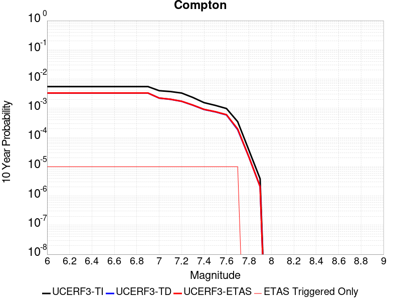 |

| Magnitude | 1 wk TI Prob | 1 wk TD Prob | 1 wk ETAS Prob | 1 wk ETAS/TD Gain | 1 wk ETAS Triggered Only | 1 mo TI Prob | 1 mo TD Prob | 1 mo ETAS Prob | 1 mo ETAS/TD Gain | 1 mo ETAS Triggered Only | 1 yr TI Prob | 1 yr TD Prob | 1 yr ETAS Prob | 1 yr ETAS/TD Gain | 1 yr ETAS Triggered Only | 10 yr TI Prob | 10 yr TD Prob | 10 yr ETAS Prob | 10 yr ETAS/TD Gain | 10 yr ETAS Triggered Only |
|-----|-----|-----|-----|-----|-----|-----|-----|-----|-----|-----|-----|-----|-----|-----|-----|-----|-----|-----|-----|-----|
| 6.0 | 1.06050875E-5 | 6.35892E-6 | 6.35892E-6 | 1.0 | 0.0 | 4.5449582E-5 | 2.7252245E-5 | 3.725197E-5 | 1.3669323 | 1.0E-5 | 5.5320817E-4 | 3.3174842E-4 | 3.4174512E-4 | 1.0301334 | 1.0E-5 | 0.0055183303 | 0.003312816 | 0.0033227827 | 1.0030086 | 1.0E-5 |
| 6.1 | 1.06050875E-5 | 6.35892E-6 | 6.35892E-6 | 1.0 | 0.0 | 4.5449582E-5 | 2.7252245E-5 | 3.725197E-5 | 1.3669323 | 1.0E-5 | 5.5320817E-4 | 3.3174842E-4 | 3.4174512E-4 | 1.0301334 | 1.0E-5 | 0.0055183303 | 0.003312816 | 0.0033227827 | 1.0030086 | 1.0E-5 |
| 6.2 | 1.06050875E-5 | 6.35892E-6 | 6.35892E-6 | 1.0 | 0.0 | 4.5449582E-5 | 2.7252245E-5 | 3.725197E-5 | 1.3669323 | 1.0E-5 | 5.5320817E-4 | 3.3174842E-4 | 3.4174512E-4 | 1.0301334 | 1.0E-5 | 0.0055183303 | 0.003312816 | 0.0033227827 | 1.0030086 | 1.0E-5 |
| 6.3 | 1.06050875E-5 | 6.35892E-6 | 6.35892E-6 | 1.0 | 0.0 | 4.5449582E-5 | 2.7252245E-5 | 3.725197E-5 | 1.3669323 | 1.0E-5 | 5.5320817E-4 | 3.3174842E-4 | 3.4174512E-4 | 1.0301334 | 1.0E-5 | 0.0055183303 | 0.003312816 | 0.0033227827 | 1.0030086 | 1.0E-5 |
| 6.4 | 1.06050875E-5 | 6.35892E-6 | 6.35892E-6 | 1.0 | 0.0 | 4.5449582E-5 | 2.7252245E-5 | 3.725197E-5 | 1.3669323 | 1.0E-5 | 5.5320817E-4 | 3.3174842E-4 | 3.4174512E-4 | 1.0301334 | 1.0E-5 | 0.0055183303 | 0.003312816 | 0.0033227827 | 1.0030086 | 1.0E-5 |
| 6.5 | 1.06050875E-5 | 6.35892E-6 | 6.35892E-6 | 1.0 | 0.0 | 4.5449582E-5 | 2.7252245E-5 | 3.725197E-5 | 1.3669323 | 1.0E-5 | 5.5320817E-4 | 3.3174842E-4 | 3.4174512E-4 | 1.0301334 | 1.0E-5 | 0.0055183303 | 0.003312816 | 0.0033227827 | 1.0030086 | 1.0E-5 |
| 6.6 | 1.06050875E-5 | 6.35892E-6 | 6.35892E-6 | 1.0 | 0.0 | 4.5449582E-5 | 2.7252245E-5 | 3.725197E-5 | 1.3669323 | 1.0E-5 | 5.5320817E-4 | 3.3174842E-4 | 3.4174512E-4 | 1.0301334 | 1.0E-5 | 0.0055183303 | 0.003312816 | 0.0033227827 | 1.0030086 | 1.0E-5 |
| 6.7 | 1.06050875E-5 | 6.35892E-6 | 6.35892E-6 | 1.0 | 0.0 | 4.5449582E-5 | 2.7252245E-5 | 3.725197E-5 | 1.3669323 | 1.0E-5 | 5.5320817E-4 | 3.3174842E-4 | 3.4174512E-4 | 1.0301334 | 1.0E-5 | 0.0055183303 | 0.003312816 | 0.0033227827 | 1.0030086 | 1.0E-5 |
| 6.8 | 1.06050875E-5 | 6.35892E-6 | 6.35892E-6 | 1.0 | 0.0 | 4.5449582E-5 | 2.7252245E-5 | 3.725197E-5 | 1.3669323 | 1.0E-5 | 5.5320817E-4 | 3.3174842E-4 | 3.4174512E-4 | 1.0301334 | 1.0E-5 | 0.0055183303 | 0.003312816 | 0.0033227827 | 1.0030086 | 1.0E-5 |
| 6.9 | 1.06050875E-5 | 6.35892E-6 | 6.35892E-6 | 1.0 | 0.0 | 4.5449582E-5 | 2.7252245E-5 | 3.725197E-5 | 1.3669323 | 1.0E-5 | 5.5320817E-4 | 3.3174842E-4 | 3.4174512E-4 | 1.0301334 | 1.0E-5 | 0.0055183303 | 0.003312816 | 0.0033227827 | 1.0030086 | 1.0E-5 |
| 7.0 | 7.672486E-6 | 4.272077E-6 | 4.272077E-6 | 1.0 | 0.0 | 3.288167E-5 | 1.8308778E-5 | 2.8308594E-5 | 1.5461761 | 1.0E-5 | 4.0026082E-4 | 2.2288719E-4 | 2.3288497E-4 | 1.0448557 | 1.0E-5 | 0.0039954064 | 0.0022266984 | 0.0022366764 | 1.004481 | 1.0E-5 |
| 7.1 | 7.163992E-6 | 3.883783E-6 | 3.883783E-6 | 1.0 | 0.0 | 3.0702464E-5 | 1.664468E-5 | 2.6644515E-5 | 1.6007825 | 1.0E-5 | 3.7373835E-4 | 2.0263072E-4 | 2.126287E-4 | 1.0493408 | 1.0E-5 | 0.0037311043 | 0.0020245167 | 0.0020344963 | 1.0049294 | 1.0E-5 |
| 7.2 | 6.3689185E-6 | 3.3101053E-6 | 3.3101053E-6 | 1.0 | 0.0 | 2.729508E-5 | 1.4186091E-5 | 2.4185949E-5 | 1.7049059 | 1.0E-5 | 3.322669E-4 | 1.7270239E-4 | 1.8270066E-4 | 1.057893 | 1.0E-5 | 0.0033177056 | 0.0017257235 | 0.0017357062 | 1.0057846 | 1.0E-5 |
| 7.3 | 4.4987873E-6 | 2.4480198E-6 | 2.4480198E-6 | 1.0 | 0.0 | 1.9280375E-5 | 1.0491473E-5 | 2.0491369E-5 | 1.953145 | 1.0E-5 | 2.3471327E-4 | 1.2772651E-4 | 1.3772523E-4 | 1.0782822 | 1.0E-5 | 0.002344655 | 0.0012765612 | 0.0012865484 | 1.0078236 | 1.0E-5 |
| 7.4 | 2.987296E-6 | 1.7394043E-6 | 1.7394043E-6 | 1.0 | 0.0 | 1.2802635E-5 | 7.4545687E-6 | 1.7454495E-5 | 2.3414493 | 1.0E-5 | 1.5586092E-4 | 9.075565E-5 | 1.0075475E-4 | 1.110176 | 1.0E-5 | 0.0015575165 | 9.071917E-4 | 9.171826E-4 | 1.011013 | 1.0E-5 |
| 7.5 | 2.4111696E-6 | 1.4471991E-6 | 1.4471991E-6 | 1.0 | 0.0 | 1.0333543E-5 | 6.2022677E-6 | 1.6202206E-5 | 2.6123035 | 1.0E-5 | 1.2580362E-4 | 7.551004E-5 | 8.550928E-5 | 1.1324227 | 1.0E-5 | 0.0012573242 | 7.548485E-4 | 7.648409E-4 | 1.0132377 | 1.0E-5 |
| 7.6 | 1.8783096E-6 | 1.1360306E-6 | 1.1360306E-6 | 1.0 | 0.0 | 8.049874E-6 | 4.868694E-6 | 1.4868645E-5 | 3.053929 | 1.0E-5 | 9.8002805E-5 | 5.9274775E-5 | 6.927418E-5 | 1.1686958 | 1.0E-5 | 9.795959E-4 | 5.925936E-4 | 6.025877E-4 | 1.016865 | 1.0E-5 |
| 7.7 | 6.6646817E-7 | 3.5601457E-7 | 3.5601457E-7 | 1.0 | 0.0 | 2.856289E-6 | 1.5257759E-6 | 1.1525761E-5 | 7.5540323 | 1.0E-5 | 3.4774763E-5 | 1.8576176E-5 | 2.857599E-5 | 1.5383139 | 1.0E-5 | 3.4769322E-4 | 1.8574759E-4 | 1.9574573E-4 | 1.0538265 | 1.0E-5 |
| 7.8 | 7.054689E-8 | 4.1342012E-8 | 4.1342012E-8 | 1.0 | 0.0 | 3.0234378E-7 | 1.7718004E-7 | 1.7718004E-7 | 1.0 | 0.0 | 3.6810293E-6 | 2.157165E-6 | 2.157165E-6 | 1.0 | 0.0 | 3.6809684E-5 | 2.157145E-5 | 2.157145E-5 | 1.0 | 0.0 |
| 7.9 | 7.420925E-9 | 4.0130637E-9 | 4.0130637E-9 | 1.0 | 0.0 | 3.1803964E-8 | 1.7198845E-8 | 1.7198845E-8 | 1.0 | 0.0 | 3.872132E-7 | 2.0939592E-7 | 2.0939592E-7 | 1.0 | 0.0 | 3.872125E-6 | 2.0939574E-6 | 2.0939574E-6 | 1.0 | 0.0 |

## Sierra Madre (San Fernando)
*[(top)](#table-of-contents)*

| 1 Week | 1 Month | 1 Year | 10 Year |
|-----|-----|-----|-----|
|  | 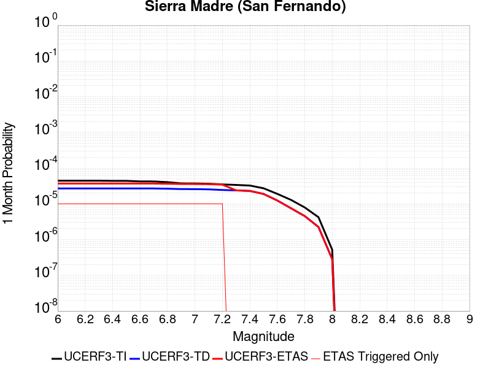 | 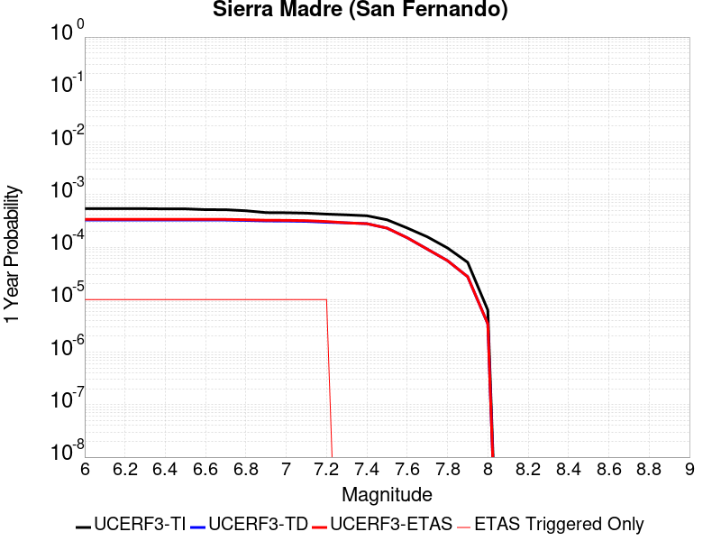 |  |

| Magnitude | 1 wk TI Prob | 1 wk TD Prob | 1 wk ETAS Prob | 1 wk ETAS/TD Gain | 1 wk ETAS Triggered Only | 1 mo TI Prob | 1 mo TD Prob | 1 mo ETAS Prob | 1 mo ETAS/TD Gain | 1 mo ETAS Triggered Only | 1 yr TI Prob | 1 yr TD Prob | 1 yr ETAS Prob | 1 yr ETAS/TD Gain | 1 yr ETAS Triggered Only | 10 yr TI Prob | 10 yr TD Prob | 10 yr ETAS Prob | 10 yr ETAS/TD Gain | 10 yr ETAS Triggered Only |
|-----|-----|-----|-----|-----|-----|-----|-----|-----|-----|-----|-----|-----|-----|-----|-----|-----|-----|-----|-----|-----|
| 6.0 | 1.0346413E-5 | 6.2872386E-6 | 1.6287177E-5 | 2.5905135 | 1.0E-5 | 4.4341014E-5 | 2.6945036E-5 | 3.6944766E-5 | 1.3711159 | 1.0E-5 | 5.3971814E-4 | 3.2800753E-4 | 3.3800426E-4 | 1.030477 | 1.0E-5 | 0.0053840918 | 0.0032753467 | 0.003285314 | 1.003043 | 1.0E-5 |
| 6.1 | 1.0346413E-5 | 6.2872386E-6 | 1.6287177E-5 | 2.5905135 | 1.0E-5 | 4.4341014E-5 | 2.6945036E-5 | 3.6944766E-5 | 1.3711159 | 1.0E-5 | 5.3971814E-4 | 3.2800753E-4 | 3.3800426E-4 | 1.030477 | 1.0E-5 | 0.0053840918 | 0.0032753467 | 0.003285314 | 1.003043 | 1.0E-5 |
| 6.2 | 1.0346413E-5 | 6.2872386E-6 | 1.6287177E-5 | 2.5905135 | 1.0E-5 | 4.4341014E-5 | 2.6945036E-5 | 3.6944766E-5 | 1.3711159 | 1.0E-5 | 5.3971814E-4 | 3.2800753E-4 | 3.3800426E-4 | 1.030477 | 1.0E-5 | 0.0053840918 | 0.0032753467 | 0.003285314 | 1.003043 | 1.0E-5 |
| 6.3 | 1.0346413E-5 | 6.2872386E-6 | 1.6287177E-5 | 2.5905135 | 1.0E-5 | 4.4341014E-5 | 2.6945036E-5 | 3.6944766E-5 | 1.3711159 | 1.0E-5 | 5.3971814E-4 | 3.2800753E-4 | 3.3800426E-4 | 1.030477 | 1.0E-5 | 0.0053840918 | 0.0032753467 | 0.003285314 | 1.003043 | 1.0E-5 |
| 6.4 | 1.0249558E-5 | 6.2872386E-6 | 1.6287177E-5 | 2.5905135 | 1.0E-5 | 4.392594E-5 | 2.6945036E-5 | 3.6944766E-5 | 1.3711159 | 1.0E-5 | 5.3466705E-4 | 3.2800753E-4 | 3.3800426E-4 | 1.030477 | 1.0E-5 | 0.0053338245 | 0.0032753467 | 0.003285314 | 1.003043 | 1.0E-5 |
| 6.5 | 1.0249558E-5 | 6.2872386E-6 | 1.6287177E-5 | 2.5905135 | 1.0E-5 | 4.392594E-5 | 2.6945036E-5 | 3.6944766E-5 | 1.3711159 | 1.0E-5 | 5.3466705E-4 | 3.2800753E-4 | 3.3800426E-4 | 1.030477 | 1.0E-5 | 0.0053338245 | 0.0032753467 | 0.003285314 | 1.003043 | 1.0E-5 |
| 6.6 | 9.9035515E-6 | 6.2872386E-6 | 1.6287177E-5 | 2.5905135 | 1.0E-5 | 4.2443102E-5 | 2.6945036E-5 | 3.6944766E-5 | 1.3711159 | 1.0E-5 | 5.166222E-4 | 3.2800753E-4 | 3.3800426E-4 | 1.030477 | 1.0E-5 | 0.0051542283 | 0.0032753467 | 0.003285314 | 1.003043 | 1.0E-5 |
| 6.7 | 9.87217E-6 | 6.274661E-6 | 1.6274598E-5 | 2.5937016 | 1.0E-5 | 4.2308613E-5 | 2.6891132E-5 | 3.6890862E-5 | 1.3718598 | 1.0E-5 | 5.149856E-4 | 3.2735144E-4 | 3.3734817E-4 | 1.0305382 | 1.0E-5 | 0.005137938 | 0.003268805 | 0.0032787723 | 1.0030493 | 1.0E-5 |
| 6.8 | 9.4359175E-6 | 6.1786473E-6 | 1.6178585E-5 | 2.6184673 | 1.0E-5 | 4.043902E-5 | 2.6479653E-5 | 3.647939E-5 | 1.3776385 | 1.0E-5 | 4.9223384E-4 | 3.223432E-4 | 3.3233996E-4 | 1.0310129 | 1.0E-5 | 0.0049114493 | 0.0032188678 | 0.0032288358 | 1.0030967 | 1.0E-5 |
| 6.9 | 8.700447E-6 | 6.0399334E-6 | 1.6039872E-5 | 2.6556375 | 1.0E-5 | 3.72871E-5 | 2.5885178E-5 | 3.5884917E-5 | 1.3863115 | 1.0E-5 | 4.5387587E-4 | 3.1510755E-4 | 3.251044E-4 | 1.0317252 | 1.0E-5 | 0.0045295 | 0.0031467169 | 0.0031566853 | 1.0031679 | 1.0E-5 |
| 7.0 | 8.648878E-6 | 6.014848E-6 | 1.6014788E-5 | 2.6625423 | 1.0E-5 | 3.7066096E-5 | 2.5777672E-5 | 3.5777415E-5 | 1.3879226 | 1.0E-5 | 4.5118626E-4 | 3.1379904E-4 | 3.2379592E-4 | 1.0318575 | 1.0E-5 | 0.004502713 | 0.0031336688 | 0.0031436374 | 1.0031811 | 1.0E-5 |
| 7.1 | 8.505786E-6 | 5.9244794E-6 | 1.592442E-5 | 2.687902 | 1.0E-5 | 3.645286E-5 | 2.5390384E-5 | 3.539013E-5 | 1.3938398 | 1.0E-5 | 4.437232E-4 | 3.0908515E-4 | 3.1908206E-4 | 1.0323435 | 1.0E-5 | 0.0044283825 | 0.0030866617 | 0.0030966308 | 1.0032297 | 1.0E-5 |
| 7.2 | 8.139752E-6 | 5.698777E-6 | 1.569872E-5 | 2.7547524 | 1.0E-5 | 3.4884186E-5 | 2.4423107E-5 | 3.4422865E-5 | 1.4094383 | 1.0E-5 | 4.246322E-4 | 2.973118E-4 | 3.0730883E-4 | 1.0336248 | 1.0E-5 | 0.004238217 | 0.0029692466 | 0.0029792169 | 1.0033579 | 1.0E-5 |
| 7.3 | 7.8816E-6 | 5.5520936E-6 | 5.5520936E-6 | 1.0 | 0.0 | 3.3777847E-5 | 2.3794475E-5 | 2.3794475E-5 | 1.0 | 0.0 | 4.111677E-4 | 2.8966027E-4 | 2.8966027E-4 | 1.0 | 0.0 | 0.004104078 | 0.0028929329 | 0.0028929329 | 1.0 | 0.0 |
| 7.4 | 7.5810603E-6 | 5.356333E-6 | 5.356333E-6 | 1.0 | 0.0 | 3.2489854E-5 | 2.2955517E-5 | 2.2955517E-5 | 1.0 | 0.0 | 3.9549218E-4 | 2.7944864E-4 | 2.7944864E-4 | 1.0 | 0.0 | 0.0039478904 | 0.0027910774 | 0.0027910774 | 1.0 | 0.0 |
| 7.5 | 6.349153E-6 | 4.4075887E-6 | 4.4075887E-6 | 1.0 | 0.0 | 2.7210372E-5 | 1.8889532E-5 | 1.8889532E-5 | 1.0 | 0.0 | 3.312359E-4 | 2.2995661E-4 | 2.2995661E-4 | 1.0 | 0.0 | 0.0033074263 | 0.0022972687 | 0.0022972687 | 1.0 | 0.0 |
| 7.6 | 4.430576E-6 | 2.8905786E-6 | 2.8905786E-6 | 1.0 | 0.0 | 1.8988047E-5 | 1.23881355E-5 | 1.23881355E-5 | 1.0 | 0.0 | 2.3115493E-4 | 1.5081534E-4 | 1.5081534E-4 | 1.0 | 0.0 | 0.0023091463 | 0.0015071525 | 0.0015071525 | 1.0 | 0.0 |
| 7.7 | 3.005066E-6 | 1.7509823E-6 | 1.7509823E-6 | 1.0 | 0.0 | 1.2878791E-5 | 7.504188E-6 | 7.504188E-6 | 1.0 | 0.0 | 1.56788E-4 | 9.135967E-5 | 9.135967E-5 | 1.0 | 0.0 | 0.0015667742 | 9.1322226E-4 | 9.1322226E-4 | 1.0 | 0.0 |
| 7.8 | 1.8459098E-6 | 1.0581826E-6 | 1.0581826E-6 | 1.0 | 0.0 | 7.911018E-6 | 4.5350607E-6 | 4.5350607E-6 | 1.0 | 0.0 | 9.631238E-5 | 5.5212968E-5 | 5.5212968E-5 | 1.0 | 0.0 | 9.627065E-4 | 5.5199297E-4 | 5.5199297E-4 | 1.0 | 0.0 |
| 7.9 | 9.839262E-7 | 5.2340516E-7 | 5.2340516E-7 | 1.0 | 0.0 | 4.2168194E-6 | 2.243163E-6 | 2.243163E-6 | 1.0 | 0.0 | 5.1338568E-5 | 2.731017E-5 | 2.731017E-5 | 1.0 | 0.0 | 5.132671E-4 | 2.7306844E-4 | 2.7306844E-4 | 1.0 | 0.0 |
| 8.0 | 1.210983E-7 | 6.613497E-8 | 6.613497E-8 | 1.0 | 0.0 | 5.1899264E-7 | 2.8343558E-7 | 2.8343558E-7 | 1.0 | 0.0 | 6.3187167E-6 | 3.4508228E-6 | 3.4508228E-6 | 1.0 | 0.0 | 6.318537E-5 | 3.450771E-5 | 3.450771E-5 | 1.0 | 0.0 |

## Sargent 2011 CFM
*[(top)](#table-of-contents)*

| 1 Week | 1 Month | 1 Year | 10 Year |
|-----|-----|-----|-----|
|  |  |  |  |

| Magnitude | 1 wk TI Prob | 1 wk TD Prob | 1 wk ETAS Prob | 1 wk ETAS/TD Gain | 1 wk ETAS Triggered Only | 1 mo TI Prob | 1 mo TD Prob | 1 mo ETAS Prob | 1 mo ETAS/TD Gain | 1 mo ETAS Triggered Only | 1 yr TI Prob | 1 yr TD Prob | 1 yr ETAS Prob | 1 yr ETAS/TD Gain | 1 yr ETAS Triggered Only | 10 yr TI Prob | 10 yr TD Prob | 10 yr ETAS Prob | 10 yr ETAS/TD Gain | 10 yr ETAS Triggered Only |
|-----|-----|-----|-----|-----|-----|-----|-----|-----|-----|-----|-----|-----|-----|-----|-----|-----|-----|-----|-----|-----|
| 6.0 | 3.7327867E-5 | 3.665065E-5 | 3.665065E-5 | 1.0 | 0.0 | 1.5996677E-4 | 1.5706717E-4 | 1.5706717E-4 | 1.0 | 0.0 | 0.0019458556 | 0.0019110267 | 0.0019110267 | 1.0 | 0.0 | 0.01928905 | 0.019017996 | 0.019027807 | 1.0005158 | 1.0E-5 |
| 6.1 | 2.3771476E-5 | 1.8478724E-5 | 1.8478724E-5 | 1.0 | 0.0 | 1.01873775E-4 | 7.919262E-5 | 7.919262E-5 | 1.0 | 0.0 | 0.0012396075 | 9.638239E-4 | 9.638239E-4 | 1.0 | 0.0 | 0.012327154 | 0.009635902 | 0.009635902 | 1.0 | 0.0 |
| 6.2 | 2.3112721E-5 | 1.7710081E-5 | 1.7710081E-5 | 1.0 | 0.0 | 9.9050754E-5 | 7.5898635E-5 | 7.5898635E-5 | 1.0 | 0.0 | 0.0012052758 | 9.2375383E-4 | 9.2375383E-4 | 1.0 | 0.0 | 0.011987597 | 0.009238554 | 0.009238554 | 1.0 | 0.0 |
| 6.3 | 1.728509E-5 | 1.0458513E-5 | 1.0458513E-5 | 1.0 | 0.0 | 7.407686E-5 | 4.4821696E-5 | 4.4821696E-5 | 1.0 | 0.0 | 9.015125E-4 | 5.456136E-4 | 5.456136E-4 | 1.0 | 0.0 | 0.008978641 | 0.0054789106 | 0.0054789106 | 1.0 | 0.0 |
| 6.4 | 1.48395575E-5 | 7.4555796E-6 | 7.4555796E-6 | 1.0 | 0.0 | 6.3596555E-5 | 3.195231E-5 | 3.195231E-5 | 1.0 | 0.0 | 7.7401294E-4 | 3.889874E-4 | 3.889874E-4 | 1.0 | 0.0 | 0.0077132257 | 0.00391845 | 0.00391845 | 1.0 | 0.0 |
| 6.5 | 1.4358964E-5 | 6.894356E-6 | 6.894356E-6 | 1.0 | 0.0 | 6.1536964E-5 | 2.9547118E-5 | 2.9547118E-5 | 1.0 | 0.0 | 7.48955E-4 | 3.5971415E-4 | 3.5971415E-4 | 1.0 | 0.0 | 0.0074643586 | 0.0036266989 | 0.0036266989 | 1.0 | 0.0 |
| 6.6 | 9.772591E-6 | 1.3732375E-6 | 1.3732375E-6 | 1.0 | 0.0 | 4.188186E-5 | 5.8852906E-6 | 5.8852906E-6 | 1.0 | 0.0 | 5.097923E-4 | 7.165109E-5 | 7.165109E-5 | 1.0 | 0.0 | 0.005086244 | 7.480871E-4 | 7.480871E-4 | 1.0 | 0.0 |
| 6.7 | 9.752745E-6 | 1.3519289E-6 | 1.3519289E-6 | 1.0 | 0.0 | 4.179681E-5 | 5.7939683E-6 | 5.7939683E-6 | 1.0 | 0.0 | 5.0875737E-4 | 7.053931E-5 | 7.053931E-5 | 1.0 | 0.0 | 0.005075942 | 7.369768E-4 | 7.369768E-4 | 1.0 | 0.0 |
| 6.8 | 9.608213E-6 | 1.235796E-6 | 1.235796E-6 | 1.0 | 0.0 | 4.1177405E-5 | 5.296258E-6 | 5.296258E-6 | 1.0 | 0.0 | 5.012196E-4 | 6.448006E-5 | 6.448006E-5 | 1.0 | 0.0 | 0.005000906 | 6.7611714E-4 | 6.7611714E-4 | 1.0 | 0.0 |
| 6.9 | 9.427164E-6 | 1.1205796E-6 | 1.1205796E-6 | 1.0 | 0.0 | 4.04015E-5 | 4.8024754E-6 | 4.8024754E-6 | 1.0 | 0.0 | 4.9177726E-4 | 5.8468588E-5 | 5.8468588E-5 | 1.0 | 0.0 | 0.004906904 | 6.1537215E-4 | 6.1537215E-4 | 1.0 | 0.0 |
| 7.0 | 9.247601E-6 | 9.87042E-7 | 9.87042E-7 | 1.0 | 0.0 | 3.9631974E-5 | 4.2301726E-6 | 4.2301726E-6 | 1.0 | 0.0 | 4.8241246E-4 | 5.1501152E-5 | 5.1501152E-5 | 1.0 | 0.0 | 0.0048136655 | 5.452185E-4 | 5.452185E-4 | 1.0 | 0.0 |
| 7.1 | 8.995454E-6 | 8.267614E-7 | 8.267614E-7 | 1.0 | 0.0 | 3.8551374E-5 | 3.5432583E-6 | 3.5432583E-6 | 1.0 | 0.0 | 4.6926187E-4 | 4.313833E-5 | 4.313833E-5 | 1.0 | 0.0 | 0.004682722 | 4.6070307E-4 | 4.6070307E-4 | 1.0 | 0.0 |
| 7.2 | 8.520861E-6 | 5.27322E-7 | 5.27322E-7 | 1.0 | 0.0 | 3.6517464E-5 | 2.2599497E-6 | 2.2599497E-6 | 1.0 | 0.0 | 4.445094E-4 | 2.7514547E-5 | 2.7514547E-5 | 1.0 | 0.0 | 0.004436213 | 3.0276953E-4 | 3.0276953E-4 | 1.0 | 0.0 |
| 7.3 | 8.043592E-6 | 3.453237E-7 | 3.453237E-7 | 1.0 | 0.0 | 3.4472083E-5 | 1.4799579E-6 | 1.4799579E-6 | 1.0 | 0.0 | 4.196168E-4 | 1.801834E-5 | 1.801834E-5 | 1.0 | 0.0 | 0.004188253 | 2.0650218E-4 | 2.0650218E-4 | 1.0 | 0.0 |
| 7.4 | 7.662316E-6 | 2.9259107E-7 | 2.9259107E-7 | 1.0 | 0.0 | 3.2838085E-5 | 1.2539612E-6 | 1.2539612E-6 | 1.0 | 0.0 | 3.9973034E-4 | 1.526687E-5 | 1.526687E-5 | 1.0 | 0.0 | 0.0039901207 | 1.7718194E-4 | 1.7718194E-4 | 1.0 | 0.0 |
| 7.5 | 6.961638E-6 | 2.3549052E-7 | 2.3549052E-7 | 1.0 | 0.0 | 2.9835252E-5 | 1.0092447E-6 | 1.0092447E-6 | 1.0 | 0.0 | 3.6318362E-4 | 1.2287485E-5 | 1.2287485E-5 | 1.0 | 0.0 | 0.0036259065 | 1.4393168E-4 | 1.4393168E-4 | 1.0 | 0.0 |
| 7.6 | 6.282332E-6 | 1.6871925E-7 | 1.6871925E-7 | 1.0 | 0.0 | 2.6924003E-5 | 7.230823E-7 | 7.230823E-7 | 1.0 | 0.0 | 3.2775043E-4 | 8.803492E-6 | 8.803492E-6 | 1.0 | 0.0 | 0.0032726745 | 1.0492336E-4 | 1.0492336E-4 | 1.0 | 0.0 |
| 7.7 | 4.934408E-6 | 4.9918345E-8 | 4.9918345E-8 | 1.0 | 0.0 | 2.114729E-5 | 2.1393575E-7 | 2.1393575E-7 | 1.0 | 0.0 | 2.5743784E-4 | 2.6046646E-6 | 2.6046646E-6 | 1.0 | 0.0 | 0.0025713982 | 3.2479504E-5 | 3.2479504E-5 | 1.0 | 0.0 |
| 7.8 | 2.373212E-6 | 3.5100808E-8 | 3.5100808E-8 | 1.0 | 0.0 | 1.0170869E-5 | 1.5043203E-7 | 1.5043203E-7 | 1.0 | 0.0 | 1.238233E-4 | 1.8315084E-6 | 1.8315084E-6 | 1.0 | 0.0 | 0.0012375432 | 2.4073881E-5 | 2.4073881E-5 | 1.0 | 0.0 |
| 7.9 | 1.8227792E-6 | 3.055616E-8 | 3.055616E-8 | 1.0 | 0.0 | 7.811887E-6 | 1.3095496E-7 | 1.3095496E-7 | 1.0 | 0.0 | 9.510558E-5 | 1.5943755E-6 | 1.5943755E-6 | 1.0 | 0.0 | 9.5064886E-4 | 2.1365537E-5 | 2.1365537E-5 | 1.0 | 0.0 |
| 8.0 | 1.9095137E-7 | 1.3250629E-8 | 1.3250629E-8 | 1.0 | 0.0 | 8.1836276E-7 | 5.678841E-8 | 5.678841E-8 | 1.0 | 0.0 | 9.963521E-6 | 6.9139867E-7 | 6.9139867E-7 | 1.0 | 0.0 | 9.963074E-5 | 8.455456E-6 | 8.455456E-6 | 1.0 | 0.0 |

## Great Valley 04b Gordon Valley
*[(top)](#table-of-contents)*

| 1 Week | 1 Month | 1 Year | 10 Year |
|-----|-----|-----|-----|
|  |  |  |  |

| Magnitude | 1 wk TI Prob | 1 wk TD Prob | 1 wk ETAS Prob | 1 wk ETAS/TD Gain | 1 wk ETAS Triggered Only | 1 mo TI Prob | 1 mo TD Prob | 1 mo ETAS Prob | 1 mo ETAS/TD Gain | 1 mo ETAS Triggered Only | 1 yr TI Prob | 1 yr TD Prob | 1 yr ETAS Prob | 1 yr ETAS/TD Gain | 1 yr ETAS Triggered Only | 10 yr TI Prob | 10 yr TD Prob | 10 yr ETAS Prob | 10 yr ETAS/TD Gain | 10 yr ETAS Triggered Only |
|-----|-----|-----|-----|-----|-----|-----|-----|-----|-----|-----|-----|-----|-----|-----|-----|-----|-----|-----|-----|-----|
| 6.0 | 2.1181217E-5 | 2.3981951E-5 | 3.3981712E-5 | 1.4169703 | 1.0E-5 | 9.077348E-5 | 1.02776685E-4 | 1.12775655E-4 | 1.0972884 | 1.0E-5 | 0.0011046068 | 0.0012507545 | 0.001260742 | 1.0079851 | 1.0E-5 | 0.010991322 | 0.0124536 | 0.012463476 | 1.000793 | 1.0E-5 |
| 6.1 | 2.1181217E-5 | 2.3981951E-5 | 3.3981712E-5 | 1.4169703 | 1.0E-5 | 9.077348E-5 | 1.02776685E-4 | 1.12775655E-4 | 1.0972884 | 1.0E-5 | 0.0011046068 | 0.0012507545 | 0.001260742 | 1.0079851 | 1.0E-5 | 0.010991322 | 0.0124536 | 0.012463476 | 1.000793 | 1.0E-5 |
| 6.2 | 2.1181217E-5 | 2.3981951E-5 | 3.3981712E-5 | 1.4169703 | 1.0E-5 | 9.077348E-5 | 1.02776685E-4 | 1.12775655E-4 | 1.0972884 | 1.0E-5 | 0.0011046068 | 0.0012507545 | 0.001260742 | 1.0079851 | 1.0E-5 | 0.010991322 | 0.0124536 | 0.012463476 | 1.000793 | 1.0E-5 |
| 6.3 | 2.1181217E-5 | 2.3981951E-5 | 3.3981712E-5 | 1.4169703 | 1.0E-5 | 9.077348E-5 | 1.02776685E-4 | 1.12775655E-4 | 1.0972884 | 1.0E-5 | 0.0011046068 | 0.0012507545 | 0.001260742 | 1.0079851 | 1.0E-5 | 0.010991322 | 0.0124536 | 0.012463476 | 1.000793 | 1.0E-5 |
| 6.4 | 1.0988268E-5 | 1.2254499E-5 | 2.2254377E-5 | 1.8160169 | 1.0E-5 | 4.7091726E-5 | 5.2518313E-5 | 6.2517785E-5 | 1.1903998 | 1.0E-5 | 5.731909E-4 | 6.392388E-4 | 6.492324E-4 | 1.0156336 | 1.0E-5 | 0.005717147 | 0.0063755875 | 0.006385524 | 1.0015585 | 1.0E-5 |
| 6.5 | 1.0988268E-5 | 1.2254499E-5 | 2.2254377E-5 | 1.8160169 | 1.0E-5 | 4.7091726E-5 | 5.2518313E-5 | 6.2517785E-5 | 1.1903998 | 1.0E-5 | 5.731909E-4 | 6.392388E-4 | 6.492324E-4 | 1.0156336 | 1.0E-5 | 0.005717147 | 0.0063755875 | 0.006385524 | 1.0015585 | 1.0E-5 |
| 6.6 | 1.0517822E-5 | 1.1724062E-5 | 2.1723945E-5 | 1.8529367 | 1.0E-5 | 4.5075605E-5 | 5.02451E-5 | 6.0244598E-5 | 1.1990144 | 1.0E-5 | 5.4865726E-4 | 6.11578E-4 | 6.215719E-4 | 1.0163411 | 1.0E-5 | 0.0054730466 | 0.0061005033 | 0.0061104423 | 1.0016292 | 1.0E-5 |
| 6.7 | 7.789219E-6 | 8.6776445E-6 | 8.6776445E-6 | 1.0 | 0.0 | 3.3381937E-5 | 3.7189402E-5 | 3.7189402E-5 | 1.0 | 0.0 | 4.063493E-4 | 4.526921E-4 | 4.526921E-4 | 1.0 | 0.0 | 0.004056071 | 0.0045182165 | 0.0045182165 | 1.0 | 0.0 |
| 6.8 | 7.5850853E-6 | 8.452389E-6 | 8.452389E-6 | 1.0 | 0.0 | 3.2507105E-5 | 3.622405E-5 | 3.622405E-5 | 1.0 | 0.0 | 3.957021E-4 | 4.409437E-4 | 4.409437E-4 | 1.0 | 0.0 | 0.0039499826 | 0.0044012 | 0.0044012 | 1.0 | 0.0 |
| 6.9 | 6.604105E-6 | 7.3585493E-6 | 7.3585493E-6 | 1.0 | 0.0 | 2.8303E-5 | 3.153628E-5 | 3.153628E-5 | 1.0 | 0.0 | 3.4453452E-4 | 3.8389044E-4 | 3.8389044E-4 | 1.0 | 0.0 | 0.0034400085 | 0.0038326595 | 0.0038326595 | 1.0 | 0.0 |
| 7.0 | 5.3701115E-6 | 5.9884183E-6 | 5.9884183E-6 | 1.0 | 0.0 | 2.301456E-5 | 2.5664414E-5 | 2.5664414E-5 | 1.0 | 0.0 | 2.8016625E-4 | 3.1242234E-4 | 3.1242234E-4 | 1.0 | 0.0 | 0.0027981328 | 0.00312012 | 0.00312012 | 1.0 | 0.0 |
| 7.1 | 4.4685607E-6 | 4.986478E-6 | 4.986478E-6 | 1.0 | 0.0 | 1.9150835E-5 | 2.1370459E-5 | 2.1370459E-5 | 1.0 | 0.0 | 2.3313647E-4 | 2.6015675E-4 | 2.6015675E-4 | 1.0 | 0.0 | 0.0023289204 | 0.0025987667 | 0.0025987667 | 1.0 | 0.0 |
| 7.2 | 2.833378E-6 | 3.164419E-6 | 3.164419E-6 | 1.0 | 0.0 | 1.2142991E-5 | 1.3561736E-5 | 1.3561736E-5 | 1.0 | 0.0 | 1.4783088E-4 | 1.6510337E-4 | 1.6510337E-4 | 1.0 | 0.0 | 0.0014773258 | 0.0016499789 | 0.0016499789 | 1.0 | 0.0 |
| 7.3 | 7.0087293E-7 | 7.7728157E-7 | 7.7728157E-7 | 1.0 | 0.0 | 3.0037377E-6 | 3.3312049E-6 | 3.3312049E-6 | 1.0 | 0.0 | 3.656989E-5 | 4.0557123E-5 | 4.0557123E-5 | 1.0 | 0.0 | 3.6563876E-4 | 4.055422E-4 | 4.055422E-4 | 1.0 | 0.0 |
| 7.4 | 3.112171E-8 | 3.2068368E-8 | 3.2068368E-8 | 1.0 | 0.0 | 1.3337875E-7 | 1.3743585E-7 | 1.3743585E-7 | 1.0 | 0.0 | 1.6238852E-6 | 1.6732803E-6 | 1.6732803E-6 | 1.0 | 0.0 | 1.6238733E-5 | 1.6732685E-5 | 1.6732685E-5 | 1.0 | 0.0 |

## San Jose
*[(top)](#table-of-contents)*

| 1 Week | 1 Month | 1 Year | 10 Year |
|-----|-----|-----|-----|
|  |  |  |  |

| Magnitude | 1 wk TI Prob | 1 wk TD Prob | 1 wk ETAS Prob | 1 wk ETAS/TD Gain | 1 wk ETAS Triggered Only | 1 mo TI Prob | 1 mo TD Prob | 1 mo ETAS Prob | 1 mo ETAS/TD Gain | 1 mo ETAS Triggered Only | 1 yr TI Prob | 1 yr TD Prob | 1 yr ETAS Prob | 1 yr ETAS/TD Gain | 1 yr ETAS Triggered Only | 10 yr TI Prob | 10 yr TD Prob | 10 yr ETAS Prob | 10 yr ETAS/TD Gain | 10 yr ETAS Triggered Only |
|-----|-----|-----|-----|-----|-----|-----|-----|-----|-----|-----|-----|-----|-----|-----|-----|-----|-----|-----|-----|-----|
| 6.0 | 5.0851277E-6 | 4.125642E-6 | 4.125642E-6 | 1.0 | 0.0 | 2.1793223E-5 | 1.768122E-5 | 2.7681042E-5 | 1.5655619 | 1.0E-5 | 2.653002E-4 | 2.152502E-4 | 2.2524805E-4 | 1.0464475 | 1.0E-5 | 0.0026498367 | 0.0021507454 | 0.002160724 | 1.0046395 | 1.0E-5 |
| 6.1 | 5.0851277E-6 | 4.125642E-6 | 4.125642E-6 | 1.0 | 0.0 | 2.1793223E-5 | 1.768122E-5 | 2.7681042E-5 | 1.5655619 | 1.0E-5 | 2.653002E-4 | 2.152502E-4 | 2.2524805E-4 | 1.0464475 | 1.0E-5 | 0.0026498367 | 0.0021507454 | 0.002160724 | 1.0046395 | 1.0E-5 |
| 6.2 | 5.0851277E-6 | 4.125642E-6 | 4.125642E-6 | 1.0 | 0.0 | 2.1793223E-5 | 1.768122E-5 | 2.7681042E-5 | 1.5655619 | 1.0E-5 | 2.653002E-4 | 2.152502E-4 | 2.2524805E-4 | 1.0464475 | 1.0E-5 | 0.0026498367 | 0.0021507454 | 0.002160724 | 1.0046395 | 1.0E-5 |
| 6.3 | 5.0851277E-6 | 4.125642E-6 | 4.125642E-6 | 1.0 | 0.0 | 2.1793223E-5 | 1.768122E-5 | 2.7681042E-5 | 1.5655619 | 1.0E-5 | 2.653002E-4 | 2.152502E-4 | 2.2524805E-4 | 1.0464475 | 1.0E-5 | 0.0026498367 | 0.0021507454 | 0.002160724 | 1.0046395 | 1.0E-5 |
| 6.4 | 4.3115124E-6 | 3.3237525E-6 | 3.3237525E-6 | 1.0 | 0.0 | 1.8477778E-5 | 1.4244589E-5 | 1.4244589E-5 | 1.0 | 0.0 | 2.2494372E-4 | 1.7341628E-4 | 1.7341628E-4 | 1.0 | 0.0 | 0.0022471617 | 0.0017330965 | 0.0017330965 | 1.0 | 0.0 |
| 6.5 | 4.3115124E-6 | 3.3237525E-6 | 3.3237525E-6 | 1.0 | 0.0 | 1.8477778E-5 | 1.4244589E-5 | 1.4244589E-5 | 1.0 | 0.0 | 2.2494372E-4 | 1.7341628E-4 | 1.7341628E-4 | 1.0 | 0.0 | 0.0022471617 | 0.0017330965 | 0.0017330965 | 1.0 | 0.0 |
| 6.6 | 3.110396E-6 | 2.0799562E-6 | 2.0799562E-6 | 1.0 | 0.0 | 1.33302E-5 | 8.9140685E-6 | 8.9140685E-6 | 1.0 | 0.0 | 1.622831E-4 | 1.0852366E-4 | 1.0852366E-4 | 1.0 | 0.0 | 0.0016216465 | 0.001084804 | 0.001084804 | 1.0 | 0.0 |
| 6.7 | 3.110396E-6 | 2.0799562E-6 | 2.0799562E-6 | 1.0 | 0.0 | 1.33302E-5 | 8.9140685E-6 | 8.9140685E-6 | 1.0 | 0.0 | 1.622831E-4 | 1.0852366E-4 | 1.0852366E-4 | 1.0 | 0.0 | 0.0016216465 | 0.001084804 | 0.001084804 | 1.0 | 0.0 |
| 6.8 | 2.856651E-6 | 1.9024077E-6 | 1.9024077E-6 | 1.0 | 0.0 | 1.2242733E-5 | 8.153152E-6 | 8.153152E-6 | 1.0 | 0.0 | 1.4904508E-4 | 9.926035E-5 | 9.926035E-5 | 1.0 | 0.0 | 0.0014894515 | 9.922545E-4 | 9.922545E-4 | 1.0 | 0.0 |
| 6.9 | 2.1618725E-6 | 1.4186406E-6 | 1.4186406E-6 | 1.0 | 0.0 | 9.265135E-6 | 6.0798748E-6 | 6.0798748E-6 | 1.0 | 0.0 | 1.12797185E-4 | 7.402005E-5 | 7.402005E-5 | 1.0 | 0.0 | 0.0011273995 | 7.4003247E-4 | 7.4003247E-4 | 1.0 | 0.0 |
| 7.0 | 1.9684312E-6 | 1.3256082E-6 | 1.3256082E-6 | 1.0 | 0.0 | 8.436106E-6 | 5.681166E-6 | 5.681166E-6 | 1.0 | 0.0 | 1.02704755E-4 | 6.916608E-5 | 6.916608E-5 | 1.0 | 0.0 | 0.001026573 | 6.9152354E-4 | 6.9152354E-4 | 1.0 | 0.0 |
| 7.1 | 1.6070337E-6 | 1.1154867E-6 | 1.1154867E-6 | 1.0 | 0.0 | 6.887269E-6 | 4.7806493E-6 | 4.7806493E-6 | 1.0 | 0.0 | 8.384928E-5 | 5.8202913E-5 | 5.8202913E-5 | 1.0 | 0.0 | 8.3817646E-4 | 5.819527E-4 | 5.819527E-4 | 1.0 | 0.0 |
| 7.2 | 1.0631658E-6 | 6.403567E-7 | 6.403567E-7 | 1.0 | 0.0 | 4.556417E-6 | 2.744383E-6 | 2.744383E-6 | 1.0 | 0.0 | 5.5472963E-5 | 3.3412365E-5 | 3.3412365E-5 | 1.0 | 0.0 | 5.545912E-4 | 3.3414463E-4 | 3.3414463E-4 | 1.0 | 0.0 |
| 7.3 | 7.060711E-7 | 4.5823228E-7 | 4.5823228E-7 | 1.0 | 0.0 | 3.0260155E-6 | 1.9638512E-6 | 1.9638512E-6 | 1.0 | 0.0 | 3.6841117E-5 | 2.3909635E-5 | 2.3909635E-5 | 1.0 | 0.0 | 3.6835007E-4 | 2.3914136E-4 | 2.3914136E-4 | 1.0 | 0.0 |
| 7.4 | 3.3677085E-7 | 2.3231999E-7 | 2.3231999E-7 | 1.0 | 0.0 | 1.4433028E-6 | 9.956567E-7 | 9.956567E-7 | 1.0 | 0.0 | 1.757207E-5 | 1.2122056E-5 | 1.2122056E-5 | 1.0 | 0.0 | 1.7570681E-4 | 1.2128407E-4 | 1.2128407E-4 | 1.0 | 0.0 |
| 7.5 | 3.129161E-7 | 1.9529637E-7 | 1.9529637E-7 | 1.0 | 0.0 | 1.3410682E-6 | 8.3698416E-7 | 8.3698416E-7 | 1.0 | 0.0 | 1.6327383E-5 | 1.0190237E-5 | 1.0190237E-5 | 1.0 | 0.0 | 1.6326184E-4 | 1.0196777E-4 | 1.0196777E-4 | 1.0 | 0.0 |
| 7.6 | 2.8008668E-7 | 1.4240818E-7 | 1.4240818E-7 | 1.0 | 0.0 | 1.2003709E-6 | 6.103206E-7 | 6.103206E-7 | 1.0 | 0.0 | 1.46144175E-5 | 7.43063E-6 | 7.43063E-6 | 1.0 | 0.0 | 1.4613457E-4 | 7.43735E-5 | 7.43735E-5 | 1.0 | 0.0 |
| 7.7 | 2.7852005E-7 | 1.4015403E-7 | 1.4015403E-7 | 1.0 | 0.0 | 1.1936568E-6 | 6.0066003E-7 | 6.0066003E-7 | 1.0 | 0.0 | 1.4532674E-5 | 7.3130127E-6 | 7.3130127E-6 | 1.0 | 0.0 | 1.4531724E-4 | 7.31974E-5 | 7.31974E-5 | 1.0 | 0.0 |
| 7.8 | 1.1810797E-7 | 7.5187074E-8 | 7.5187074E-8 | 1.0 | 0.0 | 5.0617695E-7 | 3.2223028E-7 | 3.2223028E-7 | 1.0 | 0.0 | 6.1626865E-6 | 3.9231472E-6 | 3.9231472E-6 | 1.0 | 0.0 | 6.162516E-5 | 3.9271265E-5 | 3.9271265E-5 | 1.0 | 0.0 |

## San Gabriel
*[(top)](#table-of-contents)*

| 1 Week | 1 Month | 1 Year | 10 Year |
|-----|-----|-----|-----|
| 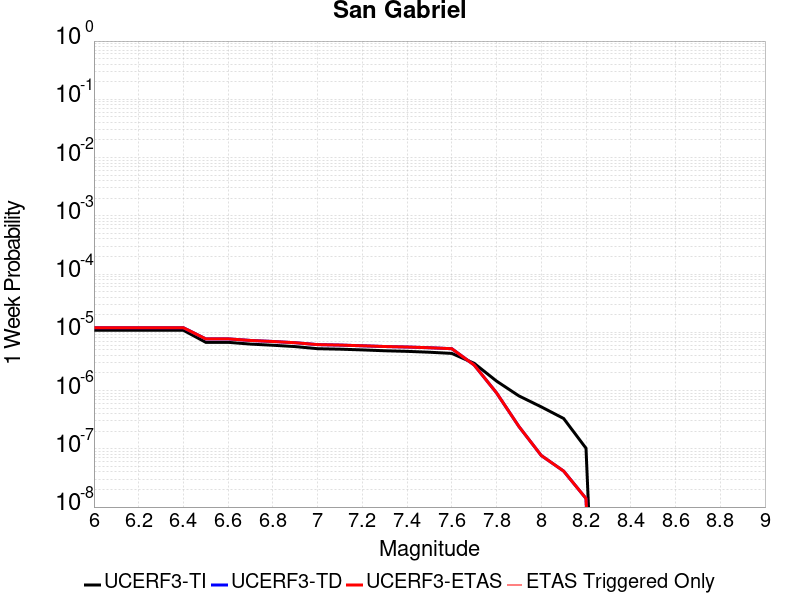 |  |  |  |

| Magnitude | 1 wk TI Prob | 1 wk TD Prob | 1 wk ETAS Prob | 1 wk ETAS/TD Gain | 1 wk ETAS Triggered Only | 1 mo TI Prob | 1 mo TD Prob | 1 mo ETAS Prob | 1 mo ETAS/TD Gain | 1 mo ETAS Triggered Only | 1 yr TI Prob | 1 yr TD Prob | 1 yr ETAS Prob | 1 yr ETAS/TD Gain | 1 yr ETAS Triggered Only | 10 yr TI Prob | 10 yr TD Prob | 10 yr ETAS Prob | 10 yr ETAS/TD Gain | 10 yr ETAS Triggered Only |
|-----|-----|-----|-----|-----|-----|-----|-----|-----|-----|-----|-----|-----|-----|-----|-----|-----|-----|-----|-----|-----|
| 6.0 | 1.083775E-5 | 1.198525E-5 | 1.198525E-5 | 1.0 | 0.0 | 4.6446676E-5 | 5.1364408E-5 | 6.13639E-5 | 1.1946774 | 1.0E-5 | 5.653415E-4 | 6.251936E-4 | 6.351873E-4 | 1.015985 | 1.0E-5 | 0.0056390543 | 0.0062463325 | 0.00625627 | 1.001591 | 1.0E-5 |
| 6.1 | 1.083775E-5 | 1.198525E-5 | 1.198525E-5 | 1.0 | 0.0 | 4.6446676E-5 | 5.1364408E-5 | 6.13639E-5 | 1.1946774 | 1.0E-5 | 5.653415E-4 | 6.251936E-4 | 6.351873E-4 | 1.015985 | 1.0E-5 | 0.0056390543 | 0.0062463325 | 0.00625627 | 1.001591 | 1.0E-5 |
| 6.2 | 1.083775E-5 | 1.198525E-5 | 1.198525E-5 | 1.0 | 0.0 | 4.6446676E-5 | 5.1364408E-5 | 6.13639E-5 | 1.1946774 | 1.0E-5 | 5.653415E-4 | 6.251936E-4 | 6.351873E-4 | 1.015985 | 1.0E-5 | 0.0056390543 | 0.0062463325 | 0.00625627 | 1.001591 | 1.0E-5 |
| 6.3 | 1.083775E-5 | 1.198525E-5 | 1.198525E-5 | 1.0 | 0.0 | 4.6446676E-5 | 5.1364408E-5 | 6.13639E-5 | 1.1946774 | 1.0E-5 | 5.653415E-4 | 6.251936E-4 | 6.351873E-4 | 1.015985 | 1.0E-5 | 0.0056390543 | 0.0062463325 | 0.00625627 | 1.001591 | 1.0E-5 |
| 6.4 | 1.083775E-5 | 1.198525E-5 | 1.198525E-5 | 1.0 | 0.0 | 4.6446676E-5 | 5.1364408E-5 | 6.13639E-5 | 1.1946774 | 1.0E-5 | 5.653415E-4 | 6.251936E-4 | 6.351873E-4 | 1.015985 | 1.0E-5 | 0.0056390543 | 0.0062463325 | 0.00625627 | 1.001591 | 1.0E-5 |
| 6.5 | 6.7317824E-6 | 7.717007E-6 | 7.717007E-6 | 1.0 | 0.0 | 2.8850178E-5 | 3.3072472E-5 | 4.3072145E-5 | 1.3023562 | 1.0E-5 | 3.511943E-4 | 4.0258403E-4 | 4.1258E-4 | 1.0248295 | 1.0E-5 | 0.003506398 | 0.004029533 | 0.0040394925 | 1.0024717 | 1.0E-5 |
| 6.6 | 6.7317824E-6 | 7.717007E-6 | 7.717007E-6 | 1.0 | 0.0 | 2.8850178E-5 | 3.3072472E-5 | 4.3072145E-5 | 1.3023562 | 1.0E-5 | 3.511943E-4 | 4.0258403E-4 | 4.1258E-4 | 1.0248295 | 1.0E-5 | 0.003506398 | 0.004029533 | 0.0040394925 | 1.0024717 | 1.0E-5 |
| 6.7 | 6.274881E-6 | 7.2459275E-6 | 7.2459275E-6 | 1.0 | 0.0 | 2.6892068E-5 | 3.105361E-5 | 4.10533E-5 | 1.3220137 | 1.0E-5 | 3.2736175E-4 | 3.7801306E-4 | 3.880093E-4 | 1.0264441 | 1.0E-5 | 0.0032687993 | 0.0037846796 | 0.0037946417 | 1.0026323 | 1.0E-5 |
| 6.8 | 5.996209E-6 | 6.958647E-6 | 6.958647E-6 | 1.0 | 0.0 | 2.5697784E-5 | 2.9822439E-5 | 3.9822142E-5 | 1.335308 | 1.0E-5 | 3.128256E-4 | 3.6302864E-4 | 3.7302502E-4 | 1.027536 | 1.0E-5 | 0.003123856 | 0.0036353325 | 0.0036452962 | 1.0027407 | 1.0E-5 |
| 6.9 | 5.686331E-6 | 6.6236917E-6 | 6.6236917E-6 | 1.0 | 0.0 | 2.4369761E-5 | 2.8386947E-5 | 3.8386665E-5 | 1.3522646 | 1.0E-5 | 2.9666146E-4 | 3.4555717E-4 | 3.5555373E-4 | 1.0289288 | 1.0E-5 | 0.0029626573 | 0.0034611735 | 0.003471139 | 1.0028791 | 1.0E-5 |
| 7.0 | 5.2329838E-6 | 6.1475757E-6 | 6.1475757E-6 | 1.0 | 0.0 | 2.242688E-5 | 2.6346492E-5 | 3.6346228E-5 | 1.3795471 | 1.0E-5 | 2.7301308E-4 | 3.207221E-4 | 3.3071887E-4 | 1.0311697 | 1.0E-5 | 0.002726779 | 0.0032135549 | 0.0032235228 | 1.0031018 | 1.0E-5 |
| 7.1 | 5.135671E-6 | 6.0377E-6 | 6.0377E-6 | 1.0 | 0.0 | 2.2009834E-5 | 2.5875606E-5 | 3.5875346E-5 | 1.3864543 | 1.0E-5 | 2.6793676E-4 | 3.1499073E-4 | 3.2498757E-4 | 1.031737 | 1.0E-5 | 0.0026761394 | 0.0031564054 | 0.0031663738 | 1.0031582 | 1.0E-5 |
| 7.2 | 4.989062E-6 | 5.8710784E-6 | 5.8710784E-6 | 1.0 | 0.0 | 2.1381518E-5 | 2.5161527E-5 | 3.5161276E-5 | 1.3974222 | 1.0E-5 | 2.6028889E-4 | 3.0629928E-4 | 3.162962E-4 | 1.0326378 | 1.0E-5 | 0.0025998424 | 0.003069734 | 0.0030797033 | 1.0032476 | 1.0E-5 |
| 7.3 | 4.8219395E-6 | 5.7026323E-6 | 5.7026323E-6 | 1.0 | 0.0 | 2.0665291E-5 | 2.4439627E-5 | 3.4439385E-5 | 1.4091616 | 1.0E-5 | 2.5157086E-4 | 2.975126E-4 | 3.0750962E-4 | 1.033602 | 1.0E-5 | 0.0025128627 | 0.002982106 | 0.0029920763 | 1.0033433 | 1.0E-5 |
| 7.4 | 4.7118383E-6 | 5.5911896E-6 | 5.5911896E-6 | 1.0 | 0.0 | 2.0193436E-5 | 2.3962024E-5 | 3.3961784E-5 | 1.417317 | 1.0E-5 | 2.4582737E-4 | 2.9169934E-4 | 3.0169642E-4 | 1.0342718 | 1.0E-5 | 0.002455556 | 0.0029241266 | 0.0029340973 | 1.0034099 | 1.0E-5 |
| 7.5 | 4.5506545E-6 | 5.4365555E-6 | 5.4365555E-6 | 1.0 | 0.0 | 1.9502659E-5 | 2.329932E-5 | 3.3299086E-5 | 1.429187 | 1.0E-5 | 2.37419E-4 | 2.8363304E-4 | 2.936302E-4 | 1.0352468 | 1.0E-5 | 0.002371655 | 0.0028436715 | 0.0028536431 | 1.0035065 | 1.0E-5 |
| 7.6 | 4.343636E-6 | 5.2294336E-6 | 5.2294336E-6 | 1.0 | 0.0 | 1.861545E-5 | 2.241167E-5 | 3.2411444E-5 | 1.4461861 | 1.0E-5 | 2.2661954E-4 | 2.7282868E-4 | 2.8282593E-4 | 1.036643 | 1.0E-5 | 0.0022638857 | 0.0027358893 | 0.002745862 | 1.0036451 | 1.0E-5 |
| 7.7 | 2.936235E-6 | 2.743946E-6 | 2.743946E-6 | 1.0 | 0.0 | 1.2583803E-5 | 1.1759716E-5 | 1.1759716E-5 | 1.0 | 0.0 | 1.5319703E-4 | 1.4316518E-4 | 1.4316518E-4 | 1.0 | 0.0 | 0.0015309147 | 0.0014379849 | 0.0014379849 | 1.0 | 0.0 |
| 7.8 | 1.4541639E-6 | 9.122518E-7 | 9.122518E-7 | 1.0 | 0.0 | 6.232116E-6 | 3.9096444E-6 | 3.9096444E-6 | 1.0 | 0.0 | 7.587337E-5 | 4.7598885E-5 | 4.7598885E-5 | 1.0 | 0.0 | 7.584747E-4 | 4.8078224E-4 | 4.8078224E-4 | 1.0 | 0.0 |
| 7.9 | 8.098958E-7 | 2.4165956E-7 | 2.4165956E-7 | 1.0 | 0.0 | 3.4709774E-6 | 1.0356835E-6 | 1.0356835E-6 | 1.0 | 0.0 | 4.225833E-5 | 1.2609373E-5 | 1.2609373E-5 | 1.0 | 0.0 | 4.2250296E-4 | 1.2917137E-4 | 1.2917137E-4 | 1.0 | 0.0 |
| 8.0 | 5.2473234E-7 | 7.672734E-8 | 7.672734E-8 | 1.0 | 0.0 | 2.248851E-6 | 3.2883142E-7 | 3.2883142E-7 | 1.0 | 0.0 | 2.7379416E-5 | 4.003515E-6 | 4.003515E-6 | 1.0 | 0.0 | 2.7376044E-4 | 4.215796E-5 | 4.215796E-5 | 1.0 | 0.0 |
| 8.1 | 3.3162388E-7 | 4.1457096E-8 | 4.1457096E-8 | 1.0 | 0.0 | 1.4212444E-6 | 1.7767324E-7 | 1.7767324E-7 | 1.0 | 0.0 | 1.7303513E-5 | 2.1631695E-6 | 2.1631695E-6 | 1.0 | 0.0 | 1.7302166E-4 | 2.294416E-5 | 2.294416E-5 | 1.0 | 0.0 |
| 8.2 | 1.0235345E-7 | 1.4032201E-8 | 1.4032201E-8 | 1.0 | 0.0 | 4.3865757E-7 | 6.013801E-8 | 6.013801E-8 | 1.0 | 0.0 | 5.340643E-6 | 7.3217996E-7 | 7.3217996E-7 | 1.0 | 0.0 | 5.3405143E-5 | 7.921925E-6 | 7.921925E-6 | 1.0 | 0.0 |

## Green Valley 2011 CFM
*[(top)](#table-of-contents)*

| 1 Week | 1 Month | 1 Year | 10 Year |
|-----|-----|-----|-----|
|  |  |  | 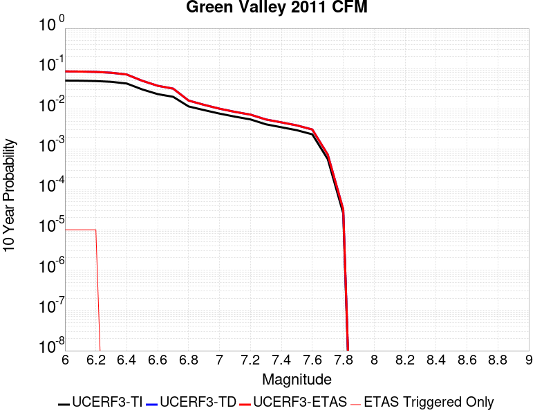 |

| Magnitude | 1 wk TI Prob | 1 wk TD Prob | 1 wk ETAS Prob | 1 wk ETAS/TD Gain | 1 wk ETAS Triggered Only | 1 mo TI Prob | 1 mo TD Prob | 1 mo ETAS Prob | 1 mo ETAS/TD Gain | 1 mo ETAS Triggered Only | 1 yr TI Prob | 1 yr TD Prob | 1 yr ETAS Prob | 1 yr ETAS/TD Gain | 1 yr ETAS Triggered Only | 10 yr TI Prob | 10 yr TD Prob | 10 yr ETAS Prob | 10 yr ETAS/TD Gain | 10 yr ETAS Triggered Only |
|-----|-----|-----|-----|-----|-----|-----|-----|-----|-----|-----|-----|-----|-----|-----|-----|-----|-----|-----|-----|-----|
| 6.0 | 9.9629346E-5 | 1.7302863E-4 | 1.7302863E-4 | 1.0 | 0.0 | 4.2691303E-4 | 7.41326E-4 | 7.41326E-4 | 1.0 | 0.0 | 0.0051852856 | 0.00898692 | 0.008996829 | 1.0011027 | 1.0E-5 | 0.050659515 | 0.08553951 | 0.085548654 | 1.0001069 | 1.0E-5 |
| 6.1 | 9.88615E-5 | 1.7150163E-4 | 1.7150163E-4 | 1.0 | 0.0 | 4.2362334E-4 | 7.347854E-4 | 7.347854E-4 | 1.0 | 0.0 | 0.0051454236 | 0.008907947 | 0.008917858 | 1.0011126 | 1.0E-5 | 0.050279044 | 0.08482712 | 0.08483627 | 1.0001079 | 1.0E-5 |
| 6.2 | 9.696895E-5 | 1.6789208E-4 | 1.6789208E-4 | 1.0 | 0.0 | 4.15515E-4 | 7.1932544E-4 | 7.1932544E-4 | 1.0 | 0.0 | 0.0050471667 | 0.00872133 | 0.008731242 | 1.0011367 | 1.0E-5 | 0.04934063 | 0.08313578 | 0.083144955 | 1.0001103 | 1.0E-5 |
| 6.3 | 9.275224E-5 | 1.5968543E-4 | 1.5968543E-4 | 1.0 | 0.0 | 3.9744904E-4 | 6.841728E-4 | 6.841728E-4 | 1.0 | 0.0 | 0.0048282105 | 0.008296652 | 0.008296652 | 1.0 | 0.0 | 0.047246475 | 0.07927481 | 0.07927481 | 1.0 | 0.0 |
| 6.4 | 8.391499E-5 | 1.4365884E-4 | 1.4365884E-4 | 1.0 | 0.0 | 3.595861E-4 | 6.155238E-4 | 6.155238E-4 | 1.0 | 0.0 | 0.004369175 | 0.007467181 | 0.007467181 | 1.0 | 0.0 | 0.04284265 | 0.07164672 | 0.07164672 | 1.0 | 0.0 |
| 6.5 | 5.9519385E-5 | 9.932622E-5 | 9.932622E-5 | 1.0 | 0.0 | 2.5505814E-4 | 4.2560388E-4 | 4.2560388E-4 | 1.0 | 0.0 | 0.0031009112 | 0.005168341 | 0.005168341 | 1.0 | 0.0 | 0.030579966 | 0.05014692 | 0.05014692 | 1.0 | 0.0 |
| 6.6 | 4.5361558E-5 | 7.4019794E-5 | 7.4019794E-5 | 1.0 | 0.0 | 1.9439218E-4 | 3.1717744E-4 | 3.1717744E-4 | 1.0 | 0.0 | 0.0023641558 | 0.0038538678 | 0.0038538678 | 1.0 | 0.0 | 0.023391623 | 0.03766727 | 0.03766727 | 1.0 | 0.0 |
| 6.7 | 3.8808106E-5 | 6.264382E-5 | 6.264382E-5 | 1.0 | 0.0 | 1.6630985E-4 | 2.6843755E-4 | 2.6843755E-4 | 1.0 | 0.0 | 0.0020229418 | 0.0032627317 | 0.0032627317 | 1.0 | 0.0 | 0.020046256 | 0.032007415 | 0.032007415 | 1.0 | 0.0 |
| 6.8 | 2.2284667E-5 | 3.128574E-5 | 3.128574E-5 | 1.0 | 0.0 | 9.550222E-5 | 1.3407487E-4 | 1.3407487E-4 | 1.0 | 0.0 | 0.0011621192 | 0.0016311383 | 0.0016311383 | 1.0 | 0.0 | 0.011560607 | 0.01616672 | 0.01616672 | 1.0 | 0.0 |
| 6.9 | 1.8050168E-5 | 2.4448536E-5 | 2.4448536E-5 | 1.0 | 0.0 | 7.735557E-5 | 1.0477527E-4 | 1.0477527E-4 | 1.0 | 0.0 | 9.4139716E-4 | 0.0012748954 | 0.0012748954 | 1.0 | 0.0 | 0.009374191 | 0.012669067 | 0.012669067 | 1.0 | 0.0 |
| 7.0 | 1.4763166E-5 | 1.9583236E-5 | 1.9583236E-5 | 1.0 | 0.0 | 6.326917E-5 | 8.3925464E-5 | 8.3925464E-5 | 1.0 | 0.0 | 7.7002996E-4 | 0.001021315 | 0.001021315 | 1.0 | 0.0 | 0.007673672 | 0.01016625 | 0.01016625 | 1.0 | 0.0 |
| 7.1 | 1.2399713E-5 | 1.6304042E-5 | 1.6304042E-5 | 1.0 | 0.0 | 5.3140546E-5 | 6.987261E-5 | 6.987261E-5 | 1.0 | 0.0 | 6.467941E-4 | 8.5036893E-4 | 8.5036893E-4 | 1.0 | 0.0 | 0.006449148 | 0.008471781 | 0.008471781 | 1.0 | 0.0 |
| 7.2 | 1.0584195E-5 | 1.39220465E-5 | 1.39220465E-5 | 1.0 | 0.0 | 4.5360044E-5 | 5.966456E-5 | 5.966456E-5 | 1.0 | 0.0 | 5.521186E-4 | 7.2617555E-4 | 7.2617555E-4 | 1.0 | 0.0 | 0.0055074887 | 0.0072386027 | 0.0072386027 | 1.0 | 0.0 |
| 7.3 | 7.998173E-6 | 1.0544255E-5 | 1.0544255E-5 | 1.0 | 0.0 | 3.4277433E-5 | 4.5188888E-5 | 4.5188888E-5 | 1.0 | 0.0 | 4.1724785E-4 | 5.500369E-4 | 5.500369E-4 | 1.0 | 0.0 | 0.004164653 | 0.005487135 | 0.005487135 | 1.0 | 0.0 |
| 7.4 | 6.7571127E-6 | 8.932903E-6 | 8.932903E-6 | 1.0 | 0.0 | 2.8958733E-5 | 3.8283313E-5 | 3.8283313E-5 | 1.0 | 0.0 | 3.5251552E-4 | 4.660006E-4 | 4.660006E-4 | 1.0 | 0.0 | 0.0035195686 | 0.004650633 | 0.004650633 | 1.0 | 0.0 |
| 7.5 | 5.69878E-6 | 7.516483E-6 | 7.516483E-6 | 1.0 | 0.0 | 2.4423114E-5 | 3.2213105E-5 | 3.2213105E-5 | 1.0 | 0.0 | 2.9731085E-4 | 3.9212484E-4 | 3.9212484E-4 | 1.0 | 0.0 | 0.002969134 | 0.0039147018 | 0.0039147018 | 1.0 | 0.0 |
| 7.6 | 4.503664E-6 | 5.9358217E-6 | 5.9358217E-6 | 1.0 | 0.0 | 1.9301275E-5 | 2.5438992E-5 | 2.5438992E-5 | 1.0 | 0.0 | 2.3496768E-4 | 3.0967654E-4 | 3.0967654E-4 | 1.0 | 0.0 | 0.002347194 | 0.0030927279 | 0.0030927279 | 1.0 | 0.0 |
| 7.7 | 1.0873546E-6 | 1.410754E-6 | 1.410754E-6 | 1.0 | 0.0 | 4.6600826E-6 | 6.0460743E-6 | 6.0460743E-6 | 1.0 | 0.0 | 5.6735033E-5 | 7.36085E-5 | 7.36085E-5 | 1.0 | 0.0 | 5.672055E-4 | 7.3587085E-4 | 7.3587085E-4 | 1.0 | 0.0 |
| 7.8 | 4.9373917E-8 | 6.177967E-8 | 6.177967E-8 | 1.0 | 0.0 | 2.1160248E-7 | 2.6477002E-7 | 2.6477002E-7 | 1.0 | 0.0 | 2.5762572E-6 | 3.2235714E-6 | 3.2235714E-6 | 1.0 | 0.0 | 2.5762274E-5 | 3.2228E-5 | 3.2228E-5 | 1.0 | 0.0 |

## Eureka Peak
*[(top)](#table-of-contents)*

| 1 Week | 1 Month | 1 Year | 10 Year |
|-----|-----|-----|-----|
|  |  |  |  |

| Magnitude | 1 wk TI Prob | 1 wk TD Prob | 1 wk ETAS Prob | 1 wk ETAS/TD Gain | 1 wk ETAS Triggered Only | 1 mo TI Prob | 1 mo TD Prob | 1 mo ETAS Prob | 1 mo ETAS/TD Gain | 1 mo ETAS Triggered Only | 1 yr TI Prob | 1 yr TD Prob | 1 yr ETAS Prob | 1 yr ETAS/TD Gain | 1 yr ETAS Triggered Only | 10 yr TI Prob | 10 yr TD Prob | 10 yr ETAS Prob | 10 yr ETAS/TD Gain | 10 yr ETAS Triggered Only |
|-----|-----|-----|-----|-----|-----|-----|-----|-----|-----|-----|-----|-----|-----|-----|-----|-----|-----|-----|-----|-----|
| 6.0 | 3.1949054E-5 | 9.310979E-6 | 9.310979E-6 | 1.0 | 0.0 | 1.3691733E-4 | 3.9904025E-5 | 4.9903625E-5 | 1.2505913 | 1.0E-5 | 0.0016656938 | 4.858013E-4 | 4.9579644E-4 | 1.0205746 | 1.0E-5 | 0.016532637 | 0.004921293 | 0.0049312436 | 1.002022 | 1.0E-5 |
| 6.1 | 3.1949054E-5 | 9.310979E-6 | 9.310979E-6 | 1.0 | 0.0 | 1.3691733E-4 | 3.9904025E-5 | 4.9903625E-5 | 1.2505913 | 1.0E-5 | 0.0016656938 | 4.858013E-4 | 4.9579644E-4 | 1.0205746 | 1.0E-5 | 0.016532637 | 0.004921293 | 0.0049312436 | 1.002022 | 1.0E-5 |
| 6.2 | 3.1949054E-5 | 9.310979E-6 | 9.310979E-6 | 1.0 | 0.0 | 1.3691733E-4 | 3.9904025E-5 | 4.9903625E-5 | 1.2505913 | 1.0E-5 | 0.0016656938 | 4.858013E-4 | 4.9579644E-4 | 1.0205746 | 1.0E-5 | 0.016532637 | 0.004921293 | 0.0049312436 | 1.002022 | 1.0E-5 |
| 6.3 | 2.7339745E-5 | 7.980821E-6 | 7.980821E-6 | 1.0 | 0.0 | 1.1716507E-4 | 3.4203495E-5 | 4.4203152E-5 | 1.2923578 | 1.0E-5 | 0.0014255513 | 4.164239E-4 | 4.2641972E-4 | 1.024004 | 1.0E-5 | 0.0141644105 | 0.0042259954 | 0.004235953 | 1.0023563 | 1.0E-5 |
| 6.4 | 2.7339745E-5 | 7.980821E-6 | 7.980821E-6 | 1.0 | 0.0 | 1.1716507E-4 | 3.4203495E-5 | 4.4203152E-5 | 1.2923578 | 1.0E-5 | 0.0014255513 | 4.164239E-4 | 4.2641972E-4 | 1.024004 | 1.0E-5 | 0.0141644105 | 0.0042259954 | 0.004235953 | 1.0023563 | 1.0E-5 |
| 6.5 | 9.738388E-8 | 1.8620014E-7 | 1.8620014E-7 | 1.0 | 0.0 | 4.1735944E-7 | 7.980003E-7 | 7.980003E-7 | 1.0 | 0.0 | 5.081339E-6 | 9.715612E-6 | 9.715612E-6 | 1.0 | 0.0 | 5.0812232E-5 | 9.715195E-5 | 9.715195E-5 | 1.0 | 0.0 |
| 6.6 | 9.3495956E-8 | 1.8328839E-7 | 1.8328839E-7 | 1.0 | 0.0 | 4.0069688E-7 | 7.855215E-7 | 7.855215E-7 | 1.0 | 0.0 | 4.8784736E-6 | 9.563682E-6 | 9.563682E-6 | 1.0 | 0.0 | 4.8783666E-5 | 9.563279E-5 | 9.563279E-5 | 1.0 | 0.0 |
| 6.7 | 9.3495956E-8 | 1.8328839E-7 | 1.8328839E-7 | 1.0 | 0.0 | 4.0069688E-7 | 7.855215E-7 | 7.855215E-7 | 1.0 | 0.0 | 4.8784736E-6 | 9.563682E-6 | 9.563682E-6 | 1.0 | 0.0 | 4.8783666E-5 | 9.563279E-5 | 9.563279E-5 | 1.0 | 0.0 |
| 6.8 | 8.591428E-8 | 1.8021817E-7 | 1.8021817E-7 | 1.0 | 0.0 | 3.68204E-7 | 7.7236336E-7 | 7.7236336E-7 | 1.0 | 0.0 | 4.4828744E-6 | 9.403484E-6 | 9.403484E-6 | 1.0 | 0.0 | 4.482784E-5 | 9.403094E-5 | 9.403094E-5 | 1.0 | 0.0 |
| 6.9 | 7.749723E-8 | 1.7439834E-7 | 1.7439834E-7 | 1.0 | 0.0 | 3.3213098E-7 | 7.4742127E-7 | 7.4742127E-7 | 1.0 | 0.0 | 4.043687E-6 | 9.099816E-6 | 9.099816E-6 | 1.0 | 0.0 | 4.0436134E-5 | 9.0994516E-5 | 9.0994516E-5 | 1.0 | 0.0 |
| 7.0 | 6.897872E-8 | 1.6416043E-7 | 1.6416043E-7 | 1.0 | 0.0 | 2.9562307E-7 | 7.035445E-7 | 7.035445E-7 | 1.0 | 0.0 | 3.5992048E-6 | 8.565621E-6 | 8.565621E-6 | 1.0 | 0.0 | 3.5991467E-5 | 8.565299E-5 | 8.565299E-5 | 1.0 | 0.0 |
| 7.1 | 5.859318E-8 | 1.4787899E-7 | 1.4787899E-7 | 1.0 | 0.0 | 2.5111362E-7 | 6.33767E-7 | 6.33767E-7 | 1.0 | 0.0 | 3.057304E-6 | 7.716087E-6 | 7.716087E-6 | 1.0 | 0.0 | 3.0572617E-5 | 7.715825E-5 | 7.715825E-5 | 1.0 | 0.0 |
| 7.2 | 5.1375338E-8 | 1.3421746E-7 | 1.3421746E-7 | 1.0 | 0.0 | 2.2018E-7 | 5.7521754E-7 | 5.7521754E-7 | 1.0 | 0.0 | 2.680688E-6 | 7.003252E-6 | 7.003252E-6 | 1.0 | 0.0 | 2.6806558E-5 | 7.003037E-5 | 7.003037E-5 | 1.0 | 0.0 |
| 7.3 | 4.5441396E-8 | 1.1636931E-7 | 1.1636931E-7 | 1.0 | 0.0 | 1.9474882E-7 | 4.987255E-7 | 4.987255E-7 | 1.0 | 0.0 | 2.3710643E-6 | 6.0719667E-6 | 6.0719667E-6 | 1.0 | 0.0 | 2.371039E-5 | 6.0718063E-5 | 6.0718063E-5 | 1.0 | 0.0 |
| 7.4 | 2.981918E-8 | 6.911723E-8 | 6.911723E-8 | 1.0 | 0.0 | 1.2779647E-7 | 2.9621668E-7 | 2.9621668E-7 | 1.0 | 0.0 | 1.5559209E-6 | 3.6064325E-6 | 3.6064325E-6 | 1.0 | 0.0 | 1.55591E-5 | 3.6063782E-5 | 3.6063782E-5 | 1.0 | 0.0 |
| 7.5 | 4.24214E-9 | 8.34289E-9 | 8.34289E-9 | 1.0 | 0.0 | 1.81806E-8 | 3.5755242E-8 | 3.5755242E-8 | 1.0 | 0.0 | 2.213488E-7 | 4.3532006E-7 | 4.3532006E-7 | 1.0 | 0.0 | 2.2134857E-6 | 4.3531986E-6 | 4.3531986E-6 | 1.0 | 0.0 |

## Great Valley 08 (Quinto)
*[(top)](#table-of-contents)*

| 1 Week | 1 Month | 1 Year | 10 Year |
|-----|-----|-----|-----|
| 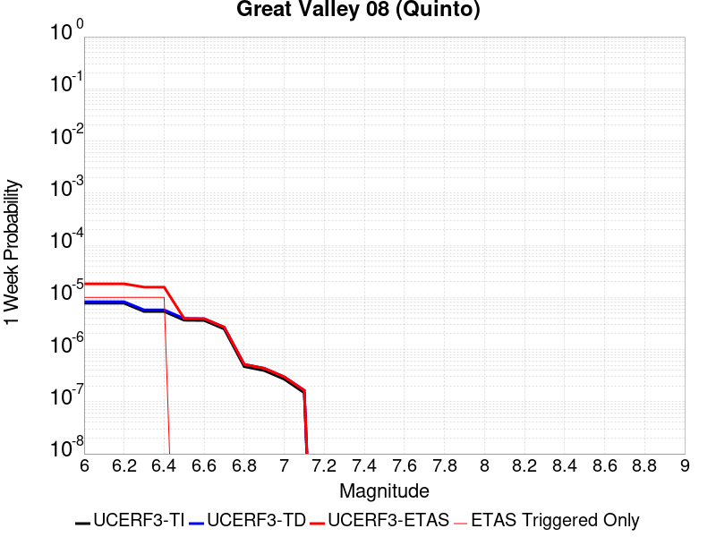 |  |  |  |

| Magnitude | 1 wk TI Prob | 1 wk TD Prob | 1 wk ETAS Prob | 1 wk ETAS/TD Gain | 1 wk ETAS Triggered Only | 1 mo TI Prob | 1 mo TD Prob | 1 mo ETAS Prob | 1 mo ETAS/TD Gain | 1 mo ETAS Triggered Only | 1 yr TI Prob | 1 yr TD Prob | 1 yr ETAS Prob | 1 yr ETAS/TD Gain | 1 yr ETAS Triggered Only | 10 yr TI Prob | 10 yr TD Prob | 10 yr ETAS Prob | 10 yr ETAS/TD Gain | 10 yr ETAS Triggered Only |
|-----|-----|-----|-----|-----|-----|-----|-----|-----|-----|-----|-----|-----|-----|-----|-----|-----|-----|-----|-----|-----|
| 6.0 | 7.737697E-6 | 8.253038E-6 | 1.8252955E-5 | 2.211665 | 1.0E-5 | 3.3161137E-5 | 3.536979E-5 | 4.5369437E-5 | 1.2827171 | 1.0E-5 | 4.0366207E-4 | 4.3056096E-4 | 4.4055664E-4 | 1.0232155 | 1.0E-5 | 0.004029296 | 0.0042991205 | 0.0043090777 | 1.002316 | 1.0E-5 |
| 6.1 | 7.737697E-6 | 8.253038E-6 | 1.8252955E-5 | 2.211665 | 1.0E-5 | 3.3161137E-5 | 3.536979E-5 | 4.5369437E-5 | 1.2827171 | 1.0E-5 | 4.0366207E-4 | 4.3056096E-4 | 4.4055664E-4 | 1.0232155 | 1.0E-5 | 0.004029296 | 0.0042991205 | 0.0043090777 | 1.002316 | 1.0E-5 |
| 6.2 | 7.737697E-6 | 8.253038E-6 | 1.8252955E-5 | 2.211665 | 1.0E-5 | 3.3161137E-5 | 3.536979E-5 | 4.5369437E-5 | 1.2827171 | 1.0E-5 | 4.0366207E-4 | 4.3056096E-4 | 4.4055664E-4 | 1.0232155 | 1.0E-5 | 0.004029296 | 0.0042991205 | 0.0043090777 | 1.002316 | 1.0E-5 |
| 6.3 | 5.374012E-6 | 5.7505736E-6 | 1.5750516E-5 | 2.738947 | 1.0E-5 | 2.3031276E-5 | 2.4645145E-5 | 3.4644898E-5 | 1.4057494 | 1.0E-5 | 2.803697E-4 | 3.0002446E-4 | 3.1002148E-4 | 1.0333207 | 1.0E-5 | 0.0028001624 | 0.0029972875 | 0.0030072576 | 1.0033263 | 1.0E-5 |
| 6.4 | 5.374012E-6 | 5.7505736E-6 | 1.5750516E-5 | 2.738947 | 1.0E-5 | 2.3031276E-5 | 2.4645145E-5 | 3.4644898E-5 | 1.4057494 | 1.0E-5 | 2.803697E-4 | 3.0002446E-4 | 3.1002148E-4 | 1.0333207 | 1.0E-5 | 0.0028001624 | 0.0029972875 | 0.0030072576 | 1.0033263 | 1.0E-5 |
| 6.5 | 3.65427E-6 | 3.941324E-6 | 3.941324E-6 | 1.0 | 0.0 | 1.5661062E-5 | 1.689132E-5 | 1.689132E-5 | 1.0 | 0.0 | 1.9065675E-4 | 2.0563944E-4 | 2.0563944E-4 | 1.0 | 0.0 | 0.0019049325 | 0.0020551833 | 0.0020551833 | 1.0 | 0.0 |
| 6.6 | 3.6143538E-6 | 3.8985104E-6 | 3.8985104E-6 | 1.0 | 0.0 | 1.5489995E-5 | 1.6707834E-5 | 1.6707834E-5 | 1.0 | 0.0 | 1.8857437E-4 | 2.0340596E-4 | 2.0340596E-4 | 1.0 | 0.0 | 0.0018841444 | 0.0020328893 | 0.0020328893 | 1.0 | 0.0 |
| 6.7 | 2.4821015E-6 | 2.6857067E-6 | 2.6857067E-6 | 1.0 | 0.0 | 1.0637535E-5 | 1.1510153E-5 | 1.1510153E-5 | 1.0 | 0.0 | 1.2950429E-4 | 1.4013276E-4 | 1.4013276E-4 | 1.0 | 0.0 | 0.0012942884 | 0.0014009989 | 0.0014009989 | 1.0 | 0.0 |
| 6.8 | 4.7110538E-7 | 5.193021E-7 | 5.193021E-7 | 1.0 | 0.0 | 2.0190216E-6 | 2.2255786E-6 | 2.2255786E-6 | 1.0 | 0.0 | 2.458131E-5 | 2.70961E-5 | 2.70961E-5 | 1.0 | 0.0 | 2.457859E-4 | 2.7092977E-4 | 2.7092977E-4 | 1.0 | 0.0 |
| 6.9 | 3.958685E-7 | 4.3703452E-7 | 4.3703452E-7 | 1.0 | 0.0 | 1.6965782E-6 | 1.8730038E-6 | 1.8730038E-6 | 1.0 | 0.0 | 2.0655643E-5 | 2.28036E-5 | 2.28036E-5 | 1.0 | 0.0 | 2.0653724E-4 | 2.2801422E-4 | 2.2801422E-4 | 1.0 | 0.0 |
| 7.0 | 2.70294E-7 | 2.9920008E-7 | 2.9920008E-7 | 1.0 | 0.0 | 1.1584025E-6 | 1.2822856E-6 | 1.2822856E-6 | 1.0 | 0.0 | 1.4103458E-5 | 1.5611728E-5 | 1.5611728E-5 | 1.0 | 0.0 | 1.4102564E-4 | 1.5610759E-4 | 1.5610759E-4 | 1.0 | 0.0 |
| 7.1 | 1.4828602E-7 | 1.6469107E-7 | 1.6469107E-7 | 1.0 | 0.0 | 6.3551136E-7 | 7.058187E-7 | 7.058187E-7 | 1.0 | 0.0 | 7.737323E-6 | 8.593317E-6 | 8.593317E-6 | 1.0 | 0.0 | 7.737054E-5 | 8.593065E-5 | 8.593065E-5 | 1.0 | 0.0 |

## Point Reyes 2011 CFM
*[(top)](#table-of-contents)*

| 1 Week | 1 Month | 1 Year | 10 Year |
|-----|-----|-----|-----|
|  |  |  |  |

| Magnitude | 1 wk TI Prob | 1 wk TD Prob | 1 wk ETAS Prob | 1 wk ETAS/TD Gain | 1 wk ETAS Triggered Only | 1 mo TI Prob | 1 mo TD Prob | 1 mo ETAS Prob | 1 mo ETAS/TD Gain | 1 mo ETAS Triggered Only | 1 yr TI Prob | 1 yr TD Prob | 1 yr ETAS Prob | 1 yr ETAS/TD Gain | 1 yr ETAS Triggered Only | 10 yr TI Prob | 10 yr TD Prob | 10 yr ETAS Prob | 10 yr ETAS/TD Gain | 10 yr ETAS Triggered Only |
|-----|-----|-----|-----|-----|-----|-----|-----|-----|-----|-----|-----|-----|-----|-----|-----|-----|-----|-----|-----|-----|
| 6.0 | 8.8644965E-6 | 8.96716E-6 | 1.896707E-5 | 2.1151702 | 1.0E-5 | 3.7990147E-5 | 3.8430157E-5 | 4.842977E-5 | 1.2602023 | 1.0E-5 | 4.624319E-4 | 4.67793E-4 | 4.777883E-4 | 1.021367 | 1.0E-5 | 0.0046147075 | 0.004668711 | 0.0046786647 | 1.0021319 | 1.0E-5 |
| 6.1 | 4.526405E-6 | 4.5392153E-6 | 1.45391705E-5 | 3.203014 | 1.0E-5 | 1.9398734E-5 | 1.945364E-5 | 2.9453447E-5 | 1.5140326 | 1.0E-5 | 2.36154E-4 | 2.3682338E-4 | 2.4682103E-4 | 1.0422156 | 1.0E-5 | 0.002359032 | 0.0023658164 | 0.0023757927 | 1.0042169 | 1.0E-5 |
| 6.2 | 4.526405E-6 | 4.5392153E-6 | 1.45391705E-5 | 3.203014 | 1.0E-5 | 1.9398734E-5 | 1.945364E-5 | 2.9453447E-5 | 1.5140326 | 1.0E-5 | 2.36154E-4 | 2.3682338E-4 | 2.4682103E-4 | 1.0422156 | 1.0E-5 | 0.002359032 | 0.0023658164 | 0.0023757927 | 1.0042169 | 1.0E-5 |
| 6.3 | 2.6842322E-6 | 2.660673E-6 | 2.660673E-6 | 1.0 | 0.0 | 1.1503801E-5 | 1.1402836E-5 | 1.1402836E-5 | 1.0 | 0.0 | 1.4004979E-4 | 1.3882088E-4 | 1.3882088E-4 | 1.0 | 0.0 | 0.0013996155 | 0.0013873635 | 0.0013873635 | 1.0 | 0.0 |
| 6.4 | 2.6842322E-6 | 2.660673E-6 | 2.660673E-6 | 1.0 | 0.0 | 1.1503801E-5 | 1.1402836E-5 | 1.1402836E-5 | 1.0 | 0.0 | 1.4004979E-4 | 1.3882088E-4 | 1.3882088E-4 | 1.0 | 0.0 | 0.0013996155 | 0.0013873635 | 0.0013873635 | 1.0 | 0.0 |
| 6.5 | 1.9281833E-6 | 1.8906233E-6 | 1.8906233E-6 | 1.0 | 0.0 | 8.263617E-6 | 8.1026465E-6 | 8.1026465E-6 | 1.0 | 0.0 | 1.0060489E-4 | 9.864534E-5 | 9.864534E-5 | 1.0 | 0.0 | 0.0010055936 | 9.860265E-4 | 9.860265E-4 | 1.0 | 0.0 |
| 6.6 | 1.4726726E-6 | 1.4269547E-6 | 1.4269547E-6 | 1.0 | 0.0 | 6.3114385E-6 | 6.115506E-6 | 6.115506E-6 | 1.0 | 0.0 | 7.683905E-5 | 7.445379E-5 | 7.445379E-5 | 1.0 | 0.0 | 7.6812494E-4 | 7.442957E-4 | 7.442957E-4 | 1.0 | 0.0 |
| 6.7 | 8.572307E-7 | 8.007182E-7 | 8.007182E-7 | 1.0 | 0.0 | 3.6738406E-6 | 3.431645E-6 | 3.431645E-6 | 1.0 | 0.0 | 4.472809E-5 | 4.1779494E-5 | 4.1779494E-5 | 1.0 | 0.0 | 4.471909E-4 | 4.177204E-4 | 4.177204E-4 | 1.0 | 0.0 |
| 6.8 | 6.6745434E-7 | 6.07727E-7 | 6.07727E-7 | 1.0 | 0.0 | 2.8605155E-6 | 2.6045416E-6 | 2.6045416E-6 | 1.0 | 0.0 | 3.482622E-5 | 3.1709842E-5 | 3.1709842E-5 | 1.0 | 0.0 | 3.4820763E-4 | 3.170566E-4 | 3.170566E-4 | 1.0 | 0.0 |
| 6.9 | 4.291521E-7 | 3.6535639E-7 | 3.6535639E-7 | 1.0 | 0.0 | 1.839222E-6 | 1.5658121E-6 | 1.5658121E-6 | 1.0 | 0.0 | 2.2392298E-5 | 1.90636E-5 | 1.90636E-5 | 1.0 | 0.0 | 2.2390042E-4 | 1.906224E-4 | 1.906224E-4 | 1.0 | 0.0 |
| 7.0 | 2.6812808E-7 | 2.0187117E-7 | 2.0187117E-7 | 1.0 | 0.0 | 1.1491198E-6 | 8.6516184E-7 | 8.6516184E-7 | 1.0 | 0.0 | 1.3990444E-5 | 1.0533295E-5 | 1.0533295E-5 | 1.0 | 0.0 | 1.3989564E-4 | 1.05330415E-4 | 1.05330415E-4 | 1.0 | 0.0 |
| 7.1 | 1.9451231E-7 | 1.2725201E-7 | 1.2725201E-7 | 1.0 | 0.0 | 8.336239E-7 | 5.4536565E-7 | 5.4536565E-7 | 1.0 | 0.0 | 1.0149324E-5 | 6.639806E-6 | 6.639806E-6 | 1.0 | 0.0 | 1.014886E-4 | 6.639846E-5 | 6.639846E-5 | 1.0 | 0.0 |
| 7.2 | 1.6715143E-7 | 1.0042555E-7 | 1.0042555E-7 | 1.0 | 0.0 | 7.1636305E-7 | 4.3039515E-7 | 4.3039515E-7 | 1.0 | 0.0 | 8.721685E-6 | 5.2400483E-6 | 5.2400483E-6 | 1.0 | 0.0 | 8.721343E-5 | 5.240162E-5 | 5.240162E-5 | 1.0 | 0.0 |
| 7.3 | 1.5503173E-7 | 9.012816E-8 | 9.012816E-8 | 1.0 | 0.0 | 6.644215E-7 | 3.8626348E-7 | 3.8626348E-7 | 1.0 | 0.0 | 8.089301E-6 | 4.7027474E-6 | 4.7027474E-6 | 1.0 | 0.0 | 8.089007E-5 | 4.7028854E-5 | 4.7028854E-5 | 1.0 | 0.0 |
| 7.4 | 1.4251614E-7 | 8.097342E-8 | 8.097342E-8 | 1.0 | 0.0 | 6.1078333E-7 | 3.4702887E-7 | 3.4702887E-7 | 1.0 | 0.0 | 7.4362615E-6 | 4.225068E-6 | 4.225068E-6 | 1.0 | 0.0 | 7.436013E-5 | 4.2252257E-5 | 4.2252257E-5 | 1.0 | 0.0 |
| 7.5 | 1.2710186E-7 | 7.029377E-8 | 7.029377E-8 | 1.0 | 0.0 | 5.447221E-7 | 3.0125898E-7 | 3.0125898E-7 | 1.0 | 0.0 | 6.6319717E-6 | 3.6678218E-6 | 3.6678218E-6 | 1.0 | 0.0 | 6.6317734E-5 | 3.667999E-5 | 3.667999E-5 | 1.0 | 0.0 |
| 7.6 | 1.0144708E-7 | 5.494996E-8 | 5.494996E-8 | 1.0 | 0.0 | 4.347731E-7 | 2.354998E-7 | 2.354998E-7 | 1.0 | 0.0 | 5.2933497E-6 | 2.8672061E-6 | 2.8672061E-6 | 1.0 | 0.0 | 5.293224E-5 | 2.8674069E-5 | 2.8674069E-5 | 1.0 | 0.0 |
| 7.7 | 7.090527E-8 | 3.9821334E-8 | 3.9821334E-8 | 1.0 | 0.0 | 3.038797E-7 | 1.7066284E-7 | 1.7066284E-7 | 1.0 | 0.0 | 3.699729E-6 | 2.0778182E-6 | 2.0778182E-6 | 1.0 | 0.0 | 3.6996673E-5 | 2.0780362E-5 | 2.0780362E-5 | 1.0 | 0.0 |
| 7.8 | 3.8712045E-8 | 2.7438638E-8 | 2.7438638E-8 | 1.0 | 0.0 | 1.6590876E-7 | 1.1759416E-7 | 1.1759416E-7 | 1.0 | 0.0 | 2.0199373E-6 | 1.4317079E-6 | 1.4317079E-6 | 1.0 | 0.0 | 2.0199188E-5 | 1.4319363E-5 | 1.4319363E-5 | 1.0 | 0.0 |
| 7.9 | 1.7068782E-8 | 1.183186E-8 | 1.183186E-8 | 1.0 | 0.0 | 7.315192E-8 | 5.0707975E-8 | 5.0707975E-8 | 1.0 | 0.0 | 8.906242E-7 | 6.173694E-7 | 6.173694E-7 | 1.0 | 0.0 | 8.906207E-6 | 6.1760525E-6 | 6.1760525E-6 | 1.0 | 0.0 |
| 8.0 | 1.0172592E-8 | 7.0268076E-9 | 7.0268076E-9 | 1.0 | 0.0 | 4.359682E-8 | 3.011489E-8 | 3.011489E-8 | 1.0 | 0.0 | 5.3079117E-7 | 3.6664872E-7 | 3.6664872E-7 | 1.0 | 0.0 | 5.307899E-6 | 3.6688568E-6 | 3.6688568E-6 | 1.0 | 0.0 |
| 8.1 | 3.7861243E-9 | 3.5448604E-9 | 3.5448604E-9 | 1.0 | 0.0 | 1.6226247E-8 | 1.5192258E-8 | 1.5192258E-8 | 1.0 | 0.0 | 1.9755454E-7 | 1.8496571E-7 | 1.8496571E-7 | 1.0 | 0.0 | 1.9755437E-6 | 1.8514592E-6 | 1.8514592E-6 | 1.0 | 0.0 |

## Cerro Prieto
*[(top)](#table-of-contents)*

| 1 Week | 1 Month | 1 Year | 10 Year |
|-----|-----|-----|-----|
|  |  |  |  |

| Magnitude | 1 wk TI Prob | 1 wk TD Prob | 1 wk ETAS Prob | 1 wk ETAS/TD Gain | 1 wk ETAS Triggered Only | 1 mo TI Prob | 1 mo TD Prob | 1 mo ETAS Prob | 1 mo ETAS/TD Gain | 1 mo ETAS Triggered Only | 1 yr TI Prob | 1 yr TD Prob | 1 yr ETAS Prob | 1 yr ETAS/TD Gain | 1 yr ETAS Triggered Only | 10 yr TI Prob | 10 yr TD Prob | 10 yr ETAS Prob | 10 yr ETAS/TD Gain | 10 yr ETAS Triggered Only |
|-----|-----|-----|-----|-----|-----|-----|-----|-----|-----|-----|-----|-----|-----|-----|-----|-----|-----|-----|-----|-----|
| 6.0 | 2.9101528E-4 | 5.9654453E-4 | 5.9654453E-4 | 1.0 | 0.0 | 0.0012466122 | 0.0025543566 | 0.0025543566 | 1.0 | 0.0 | 0.015072231 | 0.030802928 | 0.03081262 | 1.0003146 | 1.0E-5 | 0.14089979 | 0.25386256 | 0.25387004 | 1.0000294 | 1.0E-5 |
| 6.1 | 2.9101528E-4 | 5.9654453E-4 | 5.9654453E-4 | 1.0 | 0.0 | 0.0012466122 | 0.0025543566 | 0.0025543566 | 1.0 | 0.0 | 0.015072231 | 0.030802928 | 0.03081262 | 1.0003146 | 1.0E-5 | 0.14089979 | 0.25386256 | 0.25387004 | 1.0000294 | 1.0E-5 |
| 6.2 | 2.9101528E-4 | 5.9654453E-4 | 5.9654453E-4 | 1.0 | 0.0 | 0.0012466122 | 0.0025543566 | 0.0025543566 | 1.0 | 0.0 | 0.015072231 | 0.030802928 | 0.03081262 | 1.0003146 | 1.0E-5 | 0.14089979 | 0.25386256 | 0.25387004 | 1.0000294 | 1.0E-5 |
| 6.3 | 2.9101528E-4 | 5.9654453E-4 | 5.9654453E-4 | 1.0 | 0.0 | 0.0012466122 | 0.0025543566 | 0.0025543566 | 1.0 | 0.0 | 0.015072231 | 0.030802928 | 0.03081262 | 1.0003146 | 1.0E-5 | 0.14089979 | 0.25386256 | 0.25387004 | 1.0000294 | 1.0E-5 |
| 6.4 | 2.508648E-4 | 5.140412E-4 | 5.140412E-4 | 1.0 | 0.0 | 0.0010746918 | 0.0022013725 | 0.0022013725 | 1.0 | 0.0 | 0.013006088 | 0.026629416 | 0.02663915 | 1.0003655 | 1.0E-5 | 0.12270685 | 0.2242222 | 0.22422995 | 1.0000346 | 1.0E-5 |
| 6.5 | 2.508648E-4 | 5.140412E-4 | 5.140412E-4 | 1.0 | 0.0 | 0.0010746918 | 0.0022013725 | 0.0022013725 | 1.0 | 0.0 | 0.013006088 | 0.026629416 | 0.02663915 | 1.0003655 | 1.0E-5 | 0.12270685 | 0.2242222 | 0.22422995 | 1.0000346 | 1.0E-5 |
| 6.6 | 2.294914E-4 | 4.7123645E-4 | 4.7123645E-4 | 1.0 | 0.0 | 9.831638E-4 | 0.0020182093 | 0.0020182093 | 1.0 | 0.0 | 0.011904482 | 0.024394194 | 0.02440395 | 1.0004 | 1.0E-5 | 0.11286586 | 0.20837563 | 0.20838355 | 1.000038 | 1.0E-5 |
| 6.7 | 1.9621674E-4 | 4.0426268E-4 | 4.0426268E-4 | 1.0 | 0.0 | 8.4065786E-4 | 0.0017315624 | 0.0017315624 | 1.0 | 0.0 | 0.010187071 | 0.020888962 | 0.020898754 | 1.0004687 | 1.0E-5 | 0.09732539 | 0.18264732 | 0.18265548 | 1.0000447 | 1.0E-5 |
| 6.8 | 1.5476145E-4 | 3.0572579E-4 | 3.0572579E-4 | 1.0 | 0.0 | 6.6309475E-4 | 0.0013096977 | 0.0013096977 | 1.0 | 0.0 | 0.008043335 | 0.015826825 | 0.015836667 | 1.0006218 | 1.0E-5 | 0.07758363 | 0.14310057 | 0.14310914 | 1.0000598 | 1.0E-5 |
| 6.9 | 1.20509176E-4 | 2.2588465E-4 | 2.2588465E-4 | 1.0 | 0.0 | 5.1636563E-4 | 9.6778123E-4 | 9.6778123E-4 | 1.0 | 0.0 | 0.006268645 | 0.011734025 | 0.011743907 | 1.0008422 | 1.0E-5 | 0.060947374 | 0.10917958 | 0.10918849 | 1.0000815 | 1.0E-5 |
| 7.0 | 9.3269155E-5 | 1.6721459E-4 | 1.6721459E-4 | 1.0 | 0.0 | 3.9966372E-4 | 7.1648025E-4 | 7.1648025E-4 | 1.0 | 0.0 | 0.0048550544 | 0.008695914 | 0.008705827 | 1.00114 | 1.0E-5 | 0.04750344 | 0.082943216 | 0.08295239 | 1.0001105 | 1.0E-5 |
| 7.1 | 5.029709E-5 | 8.174011E-5 | 8.174011E-5 | 1.0 | 0.0 | 2.1554115E-4 | 3.50287E-4 | 3.50287E-4 | 1.0 | 0.0 | 0.0026210553 | 0.004259821 | 0.0042697787 | 1.0023376 | 1.0E-5 | 0.025903556 | 0.04226813 | 0.04227771 | 1.0002266 | 1.0E-5 |
| 7.2 | 6.5445185E-8 | 6.824737E-8 | 6.824737E-8 | 1.0 | 0.0 | 2.8047933E-7 | 2.9248872E-7 | 2.9248872E-7 | 1.0 | 0.0 | 3.4148304E-6 | 3.56105E-6 | 3.56105E-6 | 1.0 | 0.0 | 3.414778E-5 | 3.56105E-5 | 3.56105E-5 | 1.0 | 0.0 |

## West Napa 2011 CFM
*[(top)](#table-of-contents)*

| 1 Week | 1 Month | 1 Year | 10 Year |
|-----|-----|-----|-----|
|  |  |  |  |

| Magnitude | 1 wk TI Prob | 1 wk TD Prob | 1 wk ETAS Prob | 1 wk ETAS/TD Gain | 1 wk ETAS Triggered Only | 1 mo TI Prob | 1 mo TD Prob | 1 mo ETAS Prob | 1 mo ETAS/TD Gain | 1 mo ETAS Triggered Only | 1 yr TI Prob | 1 yr TD Prob | 1 yr ETAS Prob | 1 yr ETAS/TD Gain | 1 yr ETAS Triggered Only | 10 yr TI Prob | 10 yr TD Prob | 10 yr ETAS Prob | 10 yr ETAS/TD Gain | 10 yr ETAS Triggered Only |
|-----|-----|-----|-----|-----|-----|-----|-----|-----|-----|-----|-----|-----|-----|-----|-----|-----|-----|-----|-----|-----|
| 6.0 | 3.773104E-5 | 4.4528504E-5 | 4.4528504E-5 | 1.0 | 0.0 | 1.6169442E-4 | 1.9082428E-4 | 1.9082428E-4 | 1.0 | 0.0 | 0.001966852 | 0.0023211278 | 0.0023211278 | 1.0 | 0.0 | 0.019495348 | 0.023002012 | 0.023011781 | 1.0004247 | 1.0E-5 |
| 6.1 | 3.773104E-5 | 4.4528504E-5 | 4.4528504E-5 | 1.0 | 0.0 | 1.6169442E-4 | 1.9082428E-4 | 1.9082428E-4 | 1.0 | 0.0 | 0.001966852 | 0.0023211278 | 0.0023211278 | 1.0 | 0.0 | 0.019495348 | 0.023002012 | 0.023011781 | 1.0004247 | 1.0E-5 |
| 6.2 | 3.773104E-5 | 4.4528504E-5 | 4.4528504E-5 | 1.0 | 0.0 | 1.6169442E-4 | 1.9082428E-4 | 1.9082428E-4 | 1.0 | 0.0 | 0.001966852 | 0.0023211278 | 0.0023211278 | 1.0 | 0.0 | 0.019495348 | 0.023002012 | 0.023011781 | 1.0004247 | 1.0E-5 |
| 6.3 | 2.147964E-5 | 2.4987066E-5 | 2.4987066E-5 | 1.0 | 0.0 | 9.2052345E-5 | 1.0708355E-4 | 1.0708355E-4 | 1.0 | 0.0 | 0.001120161 | 0.0013030542 | 0.0013030542 | 1.0 | 0.0 | 0.011145315 | 0.012964482 | 0.0129743535 | 1.0007614 | 1.0E-5 |
| 6.4 | 2.147964E-5 | 2.4987066E-5 | 2.4987066E-5 | 1.0 | 0.0 | 9.2052345E-5 | 1.0708355E-4 | 1.0708355E-4 | 1.0 | 0.0 | 0.001120161 | 0.0013030542 | 0.0013030542 | 1.0 | 0.0 | 0.011145315 | 0.012964482 | 0.0129743535 | 1.0007614 | 1.0E-5 |
| 6.5 | 1.688201E-5 | 1.9547371E-5 | 1.9547371E-5 | 1.0 | 0.0 | 7.234947E-5 | 8.377217E-5 | 8.377217E-5 | 1.0 | 0.0 | 8.804988E-4 | 0.0010195216 | 0.0010195216 | 1.0 | 0.0 | 0.008770182 | 0.01015684 | 0.010166738 | 1.0009745 | 1.0E-5 |
| 6.6 | 1.6846381E-5 | 1.9507064E-5 | 1.9507064E-5 | 1.0 | 0.0 | 7.219678E-5 | 8.3599436E-5 | 8.3599436E-5 | 1.0 | 0.0 | 8.7864127E-4 | 0.0010174206 | 0.0010174206 | 1.0 | 0.0 | 0.008751754 | 0.010136021 | 0.010145919 | 1.0009766 | 1.0E-5 |
| 6.7 | 1.3396501E-5 | 1.5467684E-5 | 1.5467684E-5 | 1.0 | 0.0 | 5.7412315E-5 | 6.628875E-5 | 6.628875E-5 | 1.0 | 0.0 | 6.9877075E-4 | 8.068302E-4 | 8.068302E-4 | 1.0 | 0.0 | 0.0069657755 | 0.008046459 | 0.008056379 | 1.0012327 | 1.0E-5 |
| 6.8 | 1.0139058E-5 | 1.16721785E-5 | 1.16721785E-5 | 1.0 | 0.0 | 4.3452383E-5 | 5.0022976E-5 | 5.0022976E-5 | 1.0 | 0.0 | 5.289043E-4 | 6.0891506E-4 | 6.0891506E-4 | 1.0 | 0.0 | 0.005276473 | 0.0060791126 | 0.006089052 | 1.001635 | 1.0E-5 |
| 6.9 | 7.761281E-6 | 8.890723E-6 | 8.890723E-6 | 1.0 | 0.0 | 3.326221E-5 | 3.810283E-5 | 3.810283E-5 | 1.0 | 0.0 | 4.0489217E-4 | 4.6385458E-4 | 4.6385458E-4 | 1.0 | 0.0 | 0.0040415525 | 0.0046351026 | 0.0046351026 | 1.0 | 0.0 |
| 7.0 | 2.2109202E-6 | 2.3666319E-6 | 2.3666319E-6 | 1.0 | 0.0 | 9.475338E-6 | 1.01426685E-5 | 1.01426685E-5 | 1.0 | 0.0 | 1.1535613E-4 | 1.2348007E-4 | 1.2348007E-4 | 1.0 | 0.0 | 0.0011529627 | 0.0012353238 | 0.0012353238 | 1.0 | 0.0 |
| 7.1 | 1.9008926E-6 | 2.0133207E-6 | 2.0133207E-6 | 1.0 | 0.0 | 8.146657E-6 | 8.628488E-6 | 8.628488E-6 | 1.0 | 0.0 | 9.918104E-5 | 1.05046805E-4 | 1.05046805E-4 | 1.0 | 0.0 | 9.913679E-4 | 0.0010511756 | 0.0010511756 | 1.0 | 0.0 |
| 7.2 | 1.8495944E-6 | 1.9561273E-6 | 1.9561273E-6 | 1.0 | 0.0 | 7.926808E-6 | 8.383376E-6 | 8.383376E-6 | 1.0 | 0.0 | 9.650462E-5 | 1.0206285E-4 | 1.0206285E-4 | 1.0 | 0.0 | 9.6462725E-4 | 0.0010213639 | 0.0010213639 | 1.0 | 0.0 |
| 7.3 | 1.7883189E-6 | 1.8880897E-6 | 1.8880897E-6 | 1.0 | 0.0 | 7.664201E-6 | 8.091788E-6 | 8.091788E-6 | 1.0 | 0.0 | 9.330765E-5 | 9.85131E-5 | 9.85131E-5 | 1.0 | 0.0 | 9.3268487E-4 | 9.858976E-4 | 9.858976E-4 | 1.0 | 0.0 |
| 7.4 | 1.6520572E-6 | 1.7415113E-6 | 1.7415113E-6 | 1.0 | 0.0 | 7.0802257E-6 | 7.463598E-6 | 7.463598E-6 | 1.0 | 0.0 | 8.6198335E-5 | 9.086554E-5 | 9.086554E-5 | 1.0 | 0.0 | 8.616491E-4 | 9.0948684E-4 | 9.0948684E-4 | 1.0 | 0.0 |
| 7.5 | 1.4040345E-6 | 1.4800271E-6 | 1.4800271E-6 | 1.0 | 0.0 | 6.0172765E-6 | 6.342958E-6 | 6.342958E-6 | 1.0 | 0.0 | 7.325788E-5 | 7.72228E-5 | 7.72228E-5 | 1.0 | 0.0 | 7.3233736E-4 | 7.7311805E-4 | 7.7311805E-4 | 1.0 | 0.0 |
| 7.6 | 1.3013842E-7 | 1.4416163E-7 | 1.4416163E-7 | 1.0 | 0.0 | 5.57736E-7 | 6.178354E-7 | 6.178354E-7 | 1.0 | 0.0 | 6.790414E-6 | 7.52212E-6 | 7.52212E-6 | 1.0 | 0.0 | 6.790207E-5 | 7.61463E-5 | 7.61463E-5 | 1.0 | 0.0 |
| 7.7 | 8.541512E-8 | 9.716462E-8 | 9.716462E-8 | 1.0 | 0.0 | 3.6606474E-7 | 4.1641974E-7 | 4.1641974E-7 | 1.0 | 0.0 | 4.456829E-6 | 5.069898E-6 | 5.069898E-6 | 1.0 | 0.0 | 4.4567398E-5 | 5.160189E-5 | 5.160189E-5 | 1.0 | 0.0 |
| 7.8 | 5.6074793E-8 | 6.895456E-8 | 6.895456E-8 | 1.0 | 0.0 | 2.403205E-7 | 2.955195E-7 | 2.955195E-7 | 1.0 | 0.0 | 2.9258983E-6 | 3.597944E-6 | 3.597944E-6 | 1.0 | 0.0 | 2.9258597E-5 | 3.6812045E-5 | 3.6812045E-5 | 1.0 | 0.0 |
| 7.9 | 2.9475839E-8 | 3.8567407E-8 | 3.8567407E-8 | 1.0 | 0.0 | 1.2632502E-7 | 1.6528887E-7 | 1.6528887E-7 | 1.0 | 0.0 | 1.538006E-6 | 2.01239E-6 | 2.01239E-6 | 1.0 | 0.0 | 1.5379954E-5 | 2.0664074E-5 | 2.0664074E-5 | 1.0 | 0.0 |
| 8.0 | 1.3337122E-8 | 2.1632943E-8 | 2.1632943E-8 | 1.0 | 0.0 | 5.7159088E-8 | 9.2712604E-8 | 9.2712604E-8 | 1.0 | 0.0 | 6.959117E-7 | 1.1287754E-6 | 1.1287754E-6 | 1.0 | 0.0 | 6.959095E-6 | 1.1644432E-5 | 1.1644432E-5 | 1.0 | 0.0 |
| 8.1 | 2.6589986E-10 | 4.8617654E-10 | 4.8617654E-10 | 1.0 | 0.0 | 1.1395708E-9 | 2.0836133E-9 | 2.0836133E-9 | 1.0 | 0.0 | 1.3874274E-8 | 2.536799E-8 | 2.536799E-8 | 1.0 | 0.0 | 1.3874273E-7 | 2.6036727E-7 | 2.6036727E-7 | 1.0 | 0.0 |

## Pittville 2011 CFM
*[(top)](#table-of-contents)*

| 1 Week | 1 Month | 1 Year | 10 Year |
|-----|-----|-----|-----|
|  |  |  |  |

| Magnitude | 1 wk TI Prob | 1 wk TD Prob | 1 wk ETAS Prob | 1 wk ETAS/TD Gain | 1 wk ETAS Triggered Only | 1 mo TI Prob | 1 mo TD Prob | 1 mo ETAS Prob | 1 mo ETAS/TD Gain | 1 mo ETAS Triggered Only | 1 yr TI Prob | 1 yr TD Prob | 1 yr ETAS Prob | 1 yr ETAS/TD Gain | 1 yr ETAS Triggered Only | 10 yr TI Prob | 10 yr TD Prob | 10 yr ETAS Prob | 10 yr ETAS/TD Gain | 10 yr ETAS Triggered Only |
|-----|-----|-----|-----|-----|-----|-----|-----|-----|-----|-----|-----|-----|-----|-----|-----|-----|-----|-----|-----|-----|
| 6.0 | 2.5031832E-5 | 2.7056969E-5 | 3.70567E-5 | 1.3695805 | 1.0E-5 | 1.0727487E-4 | 1.1595384E-4 | 1.2595268E-4 | 1.0862312 | 1.0E-5 | 0.001305289 | 0.0014109211 | 0.001420907 | 1.0070776 | 1.0E-5 | 0.012976485 | 0.014029415 | 0.014039275 | 1.0007027 | 1.0E-5 |
| 6.1 | 1.2540113E-5 | 1.3513067E-5 | 2.3512932E-5 | 1.7400144 | 1.0E-5 | 5.3742235E-5 | 5.7911984E-5 | 6.79114E-5 | 1.1726658 | 1.0E-5 | 6.541153E-4 | 7.048728E-4 | 7.1486575E-4 | 1.014177 | 1.0E-5 | 0.0065219323 | 0.0070286044 | 0.007038534 | 1.0014127 | 1.0E-5 |
| 6.2 | 6.603218E-6 | 7.107189E-6 | 1.7107119E-5 | 2.407016 | 1.0E-5 | 2.8299199E-5 | 3.0459063E-5 | 4.045876E-5 | 1.3282995 | 1.0E-5 | 3.4448825E-4 | 3.7078248E-4 | 3.8077877E-4 | 1.02696 | 1.0E-5 | 0.0034395473 | 0.0037022792 | 0.0037122422 | 1.002691 | 1.0E-5 |
| 6.3 | 6.603218E-6 | 7.107189E-6 | 1.7107119E-5 | 2.407016 | 1.0E-5 | 2.8299199E-5 | 3.0459063E-5 | 4.045876E-5 | 1.3282995 | 1.0E-5 | 3.4448825E-4 | 3.7078248E-4 | 3.8077877E-4 | 1.02696 | 1.0E-5 | 0.0034395473 | 0.0037022792 | 0.0037122422 | 1.002691 | 1.0E-5 |
| 6.4 | 3.9389015E-6 | 4.239175E-6 | 1.4239133E-5 | 3.3589396 | 1.0E-5 | 1.6880897E-5 | 1.8167784E-5 | 2.8167602E-5 | 1.5504149 | 1.0E-5 | 2.0550552E-4 | 2.2117342E-4 | 2.311712E-4 | 1.0452034 | 1.0E-5 | 0.0020531558 | 0.002209838 | 0.0022198157 | 1.0045152 | 1.0E-5 |
| 6.5 | 2.4533072E-6 | 2.6412686E-6 | 1.2641242E-5 | 4.7860494 | 1.0E-5 | 1.0514132E-5 | 1.1319685E-5 | 2.131957E-5 | 1.8834069 | 1.0E-5 | 1.2800204E-4 | 1.3781038E-4 | 1.47809E-4 | 1.0725535 | 1.0E-5 | 0.0012792832 | 0.0013774394 | 0.0013874256 | 1.0072498 | 1.0E-5 |
| 6.6 | 1.3482367E-6 | 1.452993E-6 | 1.452993E-6 | 1.0 | 0.0 | 5.778144E-6 | 6.2271047E-6 | 6.2271047E-6 | 1.0 | 0.0 | 7.0346636E-5 | 7.58135E-5 | 7.58135E-5 | 1.0 | 0.0 | 7.032437E-4 | 7.5798744E-4 | 7.5798744E-4 | 1.0 | 0.0 |

## Laguna Salada
*[(top)](#table-of-contents)*

| 1 Week | 1 Month | 1 Year | 10 Year |
|-----|-----|-----|-----|
|  |  |  |  |

| Magnitude | 1 wk TI Prob | 1 wk TD Prob | 1 wk ETAS Prob | 1 wk ETAS/TD Gain | 1 wk ETAS Triggered Only | 1 mo TI Prob | 1 mo TD Prob | 1 mo ETAS Prob | 1 mo ETAS/TD Gain | 1 mo ETAS Triggered Only | 1 yr TI Prob | 1 yr TD Prob | 1 yr ETAS Prob | 1 yr ETAS/TD Gain | 1 yr ETAS Triggered Only | 10 yr TI Prob | 10 yr TD Prob | 10 yr ETAS Prob | 10 yr ETAS/TD Gain | 10 yr ETAS Triggered Only |
|-----|-----|-----|-----|-----|-----|-----|-----|-----|-----|-----|-----|-----|-----|-----|-----|-----|-----|-----|-----|-----|
| 6.0 | 4.6465593E-5 | 4.634507E-5 | 4.634507E-5 | 1.0 | 0.0 | 1.9912305E-4 | 1.9860751E-4 | 1.9860751E-4 | 1.0 | 0.0 | 0.0024216278 | 0.0024154421 | 0.0024154421 | 1.0 | 0.0 | 0.02395408 | 0.023965387 | 0.023975147 | 1.0004072 | 1.0E-5 |
| 6.1 | 3.982297E-5 | 3.7244878E-5 | 3.7244878E-5 | 1.0 | 0.0 | 1.706587E-4 | 1.5961178E-4 | 1.5961178E-4 | 1.0 | 0.0 | 0.0020757897 | 0.0019416384 | 0.0019416384 | 1.0 | 0.0 | 0.020565065 | 0.019322045 | 0.019322045 | 1.0 | 0.0 |
| 6.2 | 3.6067784E-5 | 3.2600165E-5 | 3.2600165E-5 | 1.0 | 0.0 | 1.5456705E-4 | 1.3970808E-4 | 1.3970808E-4 | 1.0 | 0.0 | 0.0018802295 | 0.0016997134 | 0.0016997134 | 1.0 | 0.0 | 0.018644003 | 0.016963193 | 0.016963193 | 1.0 | 0.0 |
| 6.3 | 3.2859112E-5 | 2.8847233E-5 | 2.8847233E-5 | 1.0 | 0.0 | 1.4081717E-4 | 1.2362566E-4 | 1.2362566E-4 | 1.0 | 0.0 | 0.0017131006 | 0.0015041964 | 0.0015041964 | 1.0 | 0.0 | 0.016999546 | 0.015031838 | 0.015031838 | 1.0 | 0.0 |
| 6.4 | 2.9132116E-5 | 2.4851877E-5 | 2.4851877E-5 | 1.0 | 0.0 | 1.2484594E-4 | 1.0650421E-4 | 1.0650421E-4 | 1.0 | 0.0 | 0.0015189396 | 0.001296006 | 0.001296006 | 1.0 | 0.0 | 0.015085992 | 0.012965128 | 0.012965128 | 1.0 | 0.0 |
| 6.5 | 2.7075037E-5 | 2.2824677E-5 | 2.2824677E-5 | 1.0 | 0.0 | 1.1603071E-4 | 9.7816875E-5 | 9.7816875E-5 | 1.0 | 0.0 | 0.0014117584 | 0.0011903581 | 0.0011903581 | 1.0 | 0.0 | 0.014028233 | 0.011916272 | 0.011916272 | 1.0 | 0.0 |
| 6.6 | 2.2367465E-5 | 1.8572848E-5 | 1.8572848E-5 | 1.0 | 0.0 | 9.5857045E-5 | 7.959595E-5 | 7.959595E-5 | 1.0 | 0.0 | 0.0011664346 | 9.687322E-4 | 9.687322E-4 | 1.0 | 0.0 | 0.011603311 | 0.009708806 | 0.009708806 | 1.0 | 0.0 |
| 6.7 | 1.9458053E-5 | 1.5913607E-5 | 1.5913607E-5 | 1.0 | 0.0 | 8.338899E-5 | 6.819984E-5 | 6.819984E-5 | 1.0 | 0.0 | 0.001014788 | 8.300971E-4 | 8.300971E-4 | 1.0 | 0.0 | 0.010101665 | 0.008315945 | 0.008315945 | 1.0 | 0.0 |
| 6.8 | 1.0767866E-5 | 9.183346E-6 | 9.183346E-6 | 1.0 | 0.0 | 4.614718E-5 | 3.9356994E-5 | 3.9356994E-5 | 1.0 | 0.0 | 5.6169706E-4 | 4.7913467E-4 | 4.7913467E-4 | 1.0 | 0.0 | 0.0056027942 | 0.0048085325 | 0.0048085325 | 1.0 | 0.0 |
| 6.9 | 2.1384765E-6 | 1.7913964E-6 | 1.7913964E-6 | 1.0 | 0.0 | 9.164866E-6 | 7.677392E-6 | 7.677392E-6 | 1.0 | 0.0 | 1.1157654E-4 | 9.346863E-5 | 9.346863E-5 | 1.0 | 0.0 | 0.0011152053 | 9.343315E-4 | 9.343315E-4 | 1.0 | 0.0 |
| 7.0 | 2.0952946E-6 | 1.7493335E-6 | 1.7493335E-6 | 1.0 | 0.0 | 8.979802E-6 | 7.497124E-6 | 7.497124E-6 | 1.0 | 0.0 | 1.0932361E-4 | 9.127405E-5 | 9.127405E-5 | 1.0 | 0.0 | 0.0010926984 | 9.124038E-4 | 9.124038E-4 | 1.0 | 0.0 |
| 7.1 | 1.7887576E-6 | 1.4500541E-6 | 1.4500541E-6 | 1.0 | 0.0 | 7.666081E-6 | 6.2145045E-6 | 6.2145045E-6 | 1.0 | 0.0 | 9.333054E-5 | 7.565928E-5 | 7.565928E-5 | 1.0 | 0.0 | 9.329135E-4 | 7.5636554E-4 | 7.5636554E-4 | 1.0 | 0.0 |
| 7.2 | 9.723109E-7 | 7.135829E-7 | 7.135829E-7 | 1.0 | 0.0 | 4.16704E-6 | 3.0582096E-6 | 3.0582096E-6 | 1.0 | 0.0 | 5.073253E-5 | 3.7233232E-5 | 3.7233232E-5 | 1.0 | 0.0 | 5.072095E-4 | 3.722862E-4 | 3.722862E-4 | 1.0 | 0.0 |

## Northridge Hills
*[(top)](#table-of-contents)*

| 1 Week | 1 Month | 1 Year | 10 Year |
|-----|-----|-----|-----|
|  | 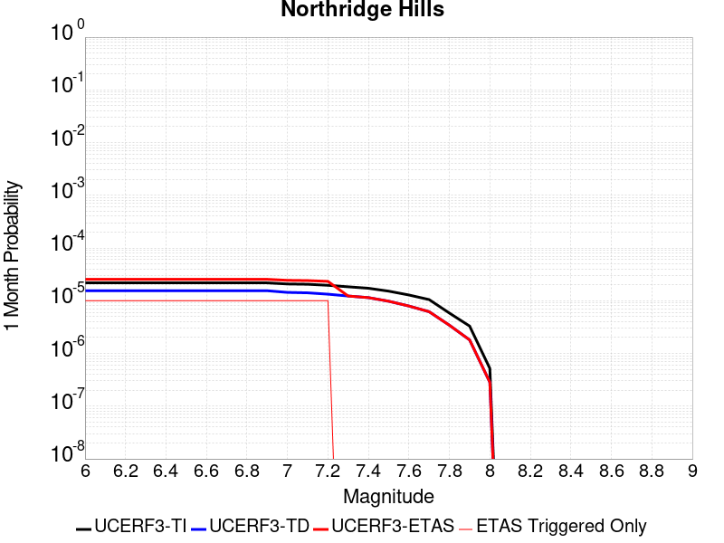 |  |  |

| Magnitude | 1 wk TI Prob | 1 wk TD Prob | 1 wk ETAS Prob | 1 wk ETAS/TD Gain | 1 wk ETAS Triggered Only | 1 mo TI Prob | 1 mo TD Prob | 1 mo ETAS Prob | 1 mo ETAS/TD Gain | 1 mo ETAS Triggered Only | 1 yr TI Prob | 1 yr TD Prob | 1 yr ETAS Prob | 1 yr ETAS/TD Gain | 1 yr ETAS Triggered Only | 10 yr TI Prob | 10 yr TD Prob | 10 yr ETAS Prob | 10 yr ETAS/TD Gain | 10 yr ETAS Triggered Only |
|-----|-----|-----|-----|-----|-----|-----|-----|-----|-----|-----|-----|-----|-----|-----|-----|-----|-----|-----|-----|-----|
| 6.0 | 5.095982E-6 | 3.6152135E-6 | 1.36151775E-5 | 3.7660785 | 1.0E-5 | 2.183974E-5 | 1.549368E-5 | 2.5493526E-5 | 1.6454145 | 1.0E-5 | 2.658664E-4 | 1.8861935E-4 | 1.9861746E-4 | 1.0530069 | 1.0E-5 | 0.0026554854 | 0.0018846049 | 0.0018945861 | 1.0052961 | 1.0E-5 |
| 6.1 | 5.095982E-6 | 3.6152135E-6 | 1.36151775E-5 | 3.7660785 | 1.0E-5 | 2.183974E-5 | 1.549368E-5 | 2.5493526E-5 | 1.6454145 | 1.0E-5 | 2.658664E-4 | 1.8861935E-4 | 1.9861746E-4 | 1.0530069 | 1.0E-5 | 0.0026554854 | 0.0018846049 | 0.0018945861 | 1.0052961 | 1.0E-5 |
| 6.2 | 5.095982E-6 | 3.6152135E-6 | 1.36151775E-5 | 3.7660785 | 1.0E-5 | 2.183974E-5 | 1.549368E-5 | 2.5493526E-5 | 1.6454145 | 1.0E-5 | 2.658664E-4 | 1.8861935E-4 | 1.9861746E-4 | 1.0530069 | 1.0E-5 | 0.0026554854 | 0.0018846049 | 0.0018945861 | 1.0052961 | 1.0E-5 |
| 6.3 | 5.095982E-6 | 3.6152135E-6 | 1.36151775E-5 | 3.7660785 | 1.0E-5 | 2.183974E-5 | 1.549368E-5 | 2.5493526E-5 | 1.6454145 | 1.0E-5 | 2.658664E-4 | 1.8861935E-4 | 1.9861746E-4 | 1.0530069 | 1.0E-5 | 0.0026554854 | 0.0018846049 | 0.0018945861 | 1.0052961 | 1.0E-5 |
| 6.4 | 5.095982E-6 | 3.6152135E-6 | 1.36151775E-5 | 3.7660785 | 1.0E-5 | 2.183974E-5 | 1.549368E-5 | 2.5493526E-5 | 1.6454145 | 1.0E-5 | 2.658664E-4 | 1.8861935E-4 | 1.9861746E-4 | 1.0530069 | 1.0E-5 | 0.0026554854 | 0.0018846049 | 0.0018945861 | 1.0052961 | 1.0E-5 |
| 6.5 | 5.095982E-6 | 3.6152135E-6 | 1.36151775E-5 | 3.7660785 | 1.0E-5 | 2.183974E-5 | 1.549368E-5 | 2.5493526E-5 | 1.6454145 | 1.0E-5 | 2.658664E-4 | 1.8861935E-4 | 1.9861746E-4 | 1.0530069 | 1.0E-5 | 0.0026554854 | 0.0018846049 | 0.0018945861 | 1.0052961 | 1.0E-5 |
| 6.6 | 5.095982E-6 | 3.6152135E-6 | 1.36151775E-5 | 3.7660785 | 1.0E-5 | 2.183974E-5 | 1.549368E-5 | 2.5493526E-5 | 1.6454145 | 1.0E-5 | 2.658664E-4 | 1.8861935E-4 | 1.9861746E-4 | 1.0530069 | 1.0E-5 | 0.0026554854 | 0.0018846049 | 0.0018945861 | 1.0052961 | 1.0E-5 |
| 6.7 | 5.095982E-6 | 3.6152135E-6 | 1.36151775E-5 | 3.7660785 | 1.0E-5 | 2.183974E-5 | 1.549368E-5 | 2.5493526E-5 | 1.6454145 | 1.0E-5 | 2.658664E-4 | 1.8861935E-4 | 1.9861746E-4 | 1.0530069 | 1.0E-5 | 0.0026554854 | 0.0018846049 | 0.0018945861 | 1.0052961 | 1.0E-5 |
| 6.8 | 5.095982E-6 | 3.6152135E-6 | 1.36151775E-5 | 3.7660785 | 1.0E-5 | 2.183974E-5 | 1.549368E-5 | 2.5493526E-5 | 1.6454145 | 1.0E-5 | 2.658664E-4 | 1.8861935E-4 | 1.9861746E-4 | 1.0530069 | 1.0E-5 | 0.0026554854 | 0.0018846049 | 0.0018945861 | 1.0052961 | 1.0E-5 |
| 6.9 | 5.0942654E-6 | 3.6134284E-6 | 1.3613392E-5 | 3.7674448 | 1.0E-5 | 2.1832384E-5 | 1.548603E-5 | 2.5485875E-5 | 1.6457332 | 1.0E-5 | 2.6577685E-4 | 1.8852622E-4 | 1.9852434E-4 | 1.053033 | 1.0E-5 | 0.002654592 | 0.0018836753 | 0.0018936564 | 1.0052987 | 1.0E-5 |
| 7.0 | 4.851143E-6 | 3.3587432E-6 | 1.335871E-5 | 3.977294 | 1.0E-5 | 2.0790447E-5 | 1.4394534E-5 | 2.439439E-5 | 1.6946981 | 1.0E-5 | 2.5309427E-4 | 1.752394E-4 | 1.8523766E-4 | 1.0570548 | 1.0E-5 | 0.0025280623 | 0.0017510166 | 0.0017609991 | 1.005701 | 1.0E-5 |
| 7.1 | 4.7910607E-6 | 3.2970245E-6 | 1.3296992E-5 | 4.0330276 | 1.0E-5 | 2.0532956E-5 | 1.4130029E-5 | 2.4129888E-5 | 1.7077026 | 1.0E-5 | 2.4996005E-4 | 1.7201956E-4 | 1.8201783E-4 | 1.0581229 | 1.0E-5 | 0.0024967908 | 0.0017188682 | 0.0017288509 | 1.0058078 | 1.0E-5 |
| 7.2 | 4.580079E-6 | 3.106803E-6 | 1.3106772E-5 | 4.218733 | 1.0E-5 | 1.9628762E-5 | 1.3314802E-5 | 2.331467E-5 | 1.7510339 | 1.0E-5 | 2.3895396E-4 | 1.6209569E-4 | 1.7209406E-4 | 1.061682 | 1.0E-5 | 0.0023869718 | 0.001619778 | 0.0016297618 | 1.0061637 | 1.0E-5 |
| 7.3 | 4.290062E-6 | 2.8682362E-6 | 2.8682362E-6 | 1.0 | 0.0 | 1.838585E-5 | 1.2292383E-5 | 1.2292383E-5 | 1.0 | 0.0 | 2.2382473E-4 | 1.4964951E-4 | 1.4964951E-4 | 1.0 | 0.0 | 0.0022359942 | 0.0014954903 | 0.0014954903 | 1.0 | 0.0 |
| 7.4 | 4.0259683E-6 | 2.6739135E-6 | 2.6739135E-6 | 1.0 | 0.0 | 1.7254037E-5 | 1.1459579E-5 | 1.1459579E-5 | 1.0 | 0.0 | 2.1004764E-4 | 1.3951147E-4 | 1.3951147E-4 | 1.0 | 0.0 | 0.002098492 | 0.0013942417 | 0.0013942417 | 1.0 | 0.0 |
| 7.5 | 3.5477108E-6 | 2.285198E-6 | 2.285198E-6 | 1.0 | 0.0 | 1.5204386E-5 | 9.793668E-6 | 9.793668E-6 | 1.0 | 0.0 | 1.8509767E-4 | 1.192314E-4 | 1.192314E-4 | 1.0 | 0.0 | 0.0018494357 | 0.0011916759 | 0.0011916759 | 1.0 | 0.0 |
| 7.6 | 2.9990608E-6 | 1.8528159E-6 | 1.8528159E-6 | 1.0 | 0.0 | 1.2853055E-5 | 7.940615E-6 | 7.940615E-6 | 1.0 | 0.0 | 1.564747E-4 | 9.667271E-5 | 9.667271E-5 | 1.0 | 0.0 | 0.0015636457 | 9.6630736E-4 | 9.6630736E-4 | 1.0 | 0.0 |
| 7.7 | 2.4542855E-6 | 1.4461142E-6 | 1.4461142E-6 | 1.0 | 0.0 | 1.05183235E-5 | 6.1976175E-6 | 6.1976175E-6 | 1.0 | 0.0 | 1.2805307E-4 | 7.545339E-5 | 7.545339E-5 | 1.0 | 0.0 | 0.001279793 | 7.5427827E-4 | 7.5427827E-4 | 1.0 | 0.0 |
| 7.8 | 1.3623128E-6 | 8.0160027E-7 | 8.0160027E-7 | 1.0 | 0.0 | 5.8384703E-6 | 3.4354252E-6 | 3.4354252E-6 | 1.0 | 0.0 | 7.108106E-5 | 4.18255E-5 | 4.18255E-5 | 1.0 | 0.0 | 7.1058323E-4 | 4.1817653E-4 | 4.1817653E-4 | 1.0 | 0.0 |
| 7.9 | 7.716622E-7 | 4.218644E-7 | 4.218644E-7 | 1.0 | 0.0 | 3.3071194E-6 | 1.807989E-6 | 1.807989E-6 | 1.0 | 0.0 | 4.0263436E-5 | 2.2012046E-5 | 2.2012046E-5 | 1.0 | 0.0 | 4.0256142E-4 | 2.2009875E-4 | 2.2009875E-4 | 1.0 | 0.0 |
| 8.0 | 1.2117711E-7 | 6.6217325E-8 | 6.6217325E-8 | 1.0 | 0.0 | 5.1933034E-7 | 2.8378852E-7 | 2.8378852E-7 | 1.0 | 0.0 | 6.3228285E-6 | 3.45512E-6 | 3.45512E-6 | 1.0 | 0.0 | 6.3226486E-5 | 3.4550678E-5 | 3.4550678E-5 | 1.0 | 0.0 |

## Round Valley
*[(top)](#table-of-contents)*

| 1 Week | 1 Month | 1 Year | 10 Year |
|-----|-----|-----|-----|
|  |  | 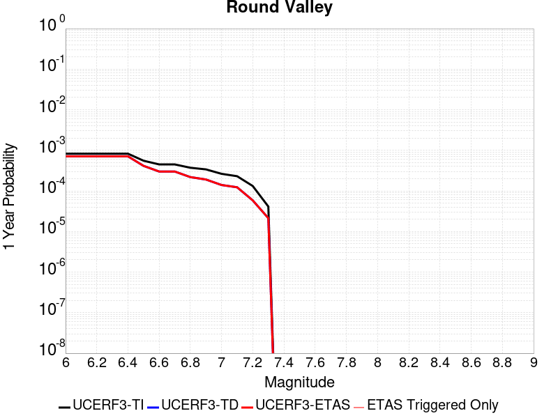 |  |

| Magnitude | 1 wk TI Prob | 1 wk TD Prob | 1 wk ETAS Prob | 1 wk ETAS/TD Gain | 1 wk ETAS Triggered Only | 1 mo TI Prob | 1 mo TD Prob | 1 mo ETAS Prob | 1 mo ETAS/TD Gain | 1 mo ETAS Triggered Only | 1 yr TI Prob | 1 yr TD Prob | 1 yr ETAS Prob | 1 yr ETAS/TD Gain | 1 yr ETAS Triggered Only | 10 yr TI Prob | 10 yr TD Prob | 10 yr ETAS Prob | 10 yr ETAS/TD Gain | 10 yr ETAS Triggered Only |
|-----|-----|-----|-----|-----|-----|-----|-----|-----|-----|-----|-----|-----|-----|-----|-----|-----|-----|-----|-----|-----|
| 6.0 | 1.588152E-5 | 1.3670525E-5 | 1.3670525E-5 | 1.0 | 0.0 | 6.806188E-5 | 5.8586873E-5 | 5.8586873E-5 | 1.0 | 0.0 | 8.283384E-4 | 7.131011E-4 | 7.131011E-4 | 1.0 | 0.0 | 0.008252576 | 0.0071120164 | 0.0071219453 | 1.0013961 | 1.0E-5 |
| 6.1 | 1.588152E-5 | 1.3670525E-5 | 1.3670525E-5 | 1.0 | 0.0 | 6.806188E-5 | 5.8586873E-5 | 5.8586873E-5 | 1.0 | 0.0 | 8.283384E-4 | 7.131011E-4 | 7.131011E-4 | 1.0 | 0.0 | 0.008252576 | 0.0071120164 | 0.0071219453 | 1.0013961 | 1.0E-5 |
| 6.2 | 1.588152E-5 | 1.3670525E-5 | 1.3670525E-5 | 1.0 | 0.0 | 6.806188E-5 | 5.8586873E-5 | 5.8586873E-5 | 1.0 | 0.0 | 8.283384E-4 | 7.131011E-4 | 7.131011E-4 | 1.0 | 0.0 | 0.008252576 | 0.0071120164 | 0.0071219453 | 1.0013961 | 1.0E-5 |
| 6.3 | 1.588152E-5 | 1.3670525E-5 | 1.3670525E-5 | 1.0 | 0.0 | 6.806188E-5 | 5.8586873E-5 | 5.8586873E-5 | 1.0 | 0.0 | 8.283384E-4 | 7.131011E-4 | 7.131011E-4 | 1.0 | 0.0 | 0.008252576 | 0.0071120164 | 0.0071219453 | 1.0013961 | 1.0E-5 |
| 6.4 | 1.588152E-5 | 1.3670525E-5 | 1.3670525E-5 | 1.0 | 0.0 | 6.806188E-5 | 5.8586873E-5 | 5.8586873E-5 | 1.0 | 0.0 | 8.283384E-4 | 7.131011E-4 | 7.131011E-4 | 1.0 | 0.0 | 0.008252576 | 0.0071120164 | 0.0071219453 | 1.0013961 | 1.0E-5 |
| 6.5 | 1.0646776E-5 | 7.952847E-6 | 7.952847E-6 | 1.0 | 0.0 | 4.5628243E-5 | 3.4083234E-5 | 3.4083234E-5 | 1.0 | 0.0 | 5.553823E-4 | 4.1489274E-4 | 4.1489274E-4 | 1.0 | 0.0 | 0.005539963 | 0.00414201 | 0.0041519688 | 1.0024043 | 1.0E-5 |
| 6.6 | 8.632956E-6 | 5.768552E-6 | 5.768552E-6 | 1.0 | 0.0 | 3.6997862E-5 | 2.4722152E-5 | 2.4722152E-5 | 1.0 | 0.0 | 4.5035584E-4 | 3.0095447E-4 | 3.0095447E-4 | 1.0 | 0.0 | 0.0044944426 | 0.0030058469 | 0.0030058469 | 1.0 | 0.0 |
| 6.7 | 8.632956E-6 | 5.768552E-6 | 5.768552E-6 | 1.0 | 0.0 | 3.6997862E-5 | 2.4722152E-5 | 2.4722152E-5 | 1.0 | 0.0 | 4.5035584E-4 | 3.0095447E-4 | 3.0095447E-4 | 1.0 | 0.0 | 0.0044944426 | 0.0030058469 | 0.0030058469 | 1.0 | 0.0 |
| 6.8 | 7.143895E-6 | 4.201644E-6 | 4.201644E-6 | 1.0 | 0.0 | 3.0616335E-5 | 1.8006931E-5 | 1.8006931E-5 | 1.0 | 0.0 | 3.726901E-4 | 2.19214E-4 | 2.19214E-4 | 1.0 | 0.0 | 0.0037206567 | 0.0021901424 | 0.0021901424 | 1.0 | 0.0 |
| 6.9 | 6.5120694E-6 | 3.6642807E-6 | 3.6642807E-6 | 1.0 | 0.0 | 2.790857E-5 | 1.5703974E-5 | 1.5703974E-5 | 1.0 | 0.0 | 3.3973387E-4 | 1.9118062E-4 | 1.9118062E-4 | 1.0 | 0.0 | 0.0033921495 | 0.0019103106 | 0.0019103106 | 1.0 | 0.0 |
| 7.0 | 5.0614435E-6 | 2.6834869E-6 | 2.6834869E-6 | 1.0 | 0.0 | 2.169172E-5 | 1.1500612E-5 | 1.1500612E-5 | 1.0 | 0.0 | 2.6406467E-4 | 1.40012E-4 | 1.40012E-4 | 1.0 | 0.0 | 0.0026375111 | 0.0013993392 | 0.0013993392 | 1.0 | 0.0 |
| 7.1 | 4.41728E-6 | 2.3573243E-6 | 2.3573243E-6 | 1.0 | 0.0 | 1.8931061E-5 | 1.01027845E-5 | 1.01027845E-5 | 1.0 | 0.0 | 2.304613E-4 | 1.2299545E-4 | 1.2299545E-4 | 1.0 | 0.0 | 0.0023022245 | 0.0012293702 | 0.0012293702 | 1.0 | 0.0 |
| 7.2 | 2.535495E-6 | 1.120784E-6 | 1.120784E-6 | 1.0 | 0.0 | 1.0866362E-5 | 4.803354E-6 | 4.803354E-6 | 1.0 | 0.0 | 1.3228992E-4 | 5.8479785E-5 | 5.8479785E-5 | 1.0 | 0.0 | 0.0013221119 | 5.846952E-4 | 5.846952E-4 | 1.0 | 0.0 |
| 7.3 | 7.900015E-7 | 4.0888176E-7 | 4.0888176E-7 | 1.0 | 0.0 | 3.3857161E-6 | 1.7523504E-6 | 1.7523504E-6 | 1.0 | 0.0 | 4.1220315E-5 | 2.1334865E-5 | 2.1334865E-5 | 1.0 | 0.0 | 4.121267E-4 | 2.1334866E-4 | 2.1334866E-4 | 1.0 | 0.0 |

## North Frontal  (West)
*[(top)](#table-of-contents)*

| 1 Week | 1 Month | 1 Year | 10 Year |
|-----|-----|-----|-----|
|  |  |  |  |

| Magnitude | 1 wk TI Prob | 1 wk TD Prob | 1 wk ETAS Prob | 1 wk ETAS/TD Gain | 1 wk ETAS Triggered Only | 1 mo TI Prob | 1 mo TD Prob | 1 mo ETAS Prob | 1 mo ETAS/TD Gain | 1 mo ETAS Triggered Only | 1 yr TI Prob | 1 yr TD Prob | 1 yr ETAS Prob | 1 yr ETAS/TD Gain | 1 yr ETAS Triggered Only | 10 yr TI Prob | 10 yr TD Prob | 10 yr ETAS Prob | 10 yr ETAS/TD Gain | 10 yr ETAS Triggered Only |
|-----|-----|-----|-----|-----|-----|-----|-----|-----|-----|-----|-----|-----|-----|-----|-----|-----|-----|-----|-----|-----|
| 6.0 | 4.7316266E-6 | 4.852674E-6 | 4.852674E-6 | 1.0 | 0.0 | 2.0278241E-5 | 2.0797017E-5 | 2.0797017E-5 | 1.0 | 0.0 | 2.4685962E-4 | 2.5317573E-4 | 2.5317573E-4 | 1.0 | 0.0 | 0.0024658558 | 0.002529019 | 0.0025389937 | 1.0039442 | 1.0E-5 |
| 6.1 | 4.7316266E-6 | 4.852674E-6 | 4.852674E-6 | 1.0 | 0.0 | 2.0278241E-5 | 2.0797017E-5 | 2.0797017E-5 | 1.0 | 0.0 | 2.4685962E-4 | 2.5317573E-4 | 2.5317573E-4 | 1.0 | 0.0 | 0.0024658558 | 0.002529019 | 0.0025389937 | 1.0039442 | 1.0E-5 |
| 6.2 | 4.7316266E-6 | 4.852674E-6 | 4.852674E-6 | 1.0 | 0.0 | 2.0278241E-5 | 2.0797017E-5 | 2.0797017E-5 | 1.0 | 0.0 | 2.4685962E-4 | 2.5317573E-4 | 2.5317573E-4 | 1.0 | 0.0 | 0.0024658558 | 0.002529019 | 0.0025389937 | 1.0039442 | 1.0E-5 |
| 6.3 | 4.7316266E-6 | 4.852674E-6 | 4.852674E-6 | 1.0 | 0.0 | 2.0278241E-5 | 2.0797017E-5 | 2.0797017E-5 | 1.0 | 0.0 | 2.4685962E-4 | 2.5317573E-4 | 2.5317573E-4 | 1.0 | 0.0 | 0.0024658558 | 0.002529019 | 0.0025389937 | 1.0039442 | 1.0E-5 |
| 6.4 | 4.7316266E-6 | 4.852674E-6 | 4.852674E-6 | 1.0 | 0.0 | 2.0278241E-5 | 2.0797017E-5 | 2.0797017E-5 | 1.0 | 0.0 | 2.4685962E-4 | 2.5317573E-4 | 2.5317573E-4 | 1.0 | 0.0 | 0.0024658558 | 0.002529019 | 0.0025389937 | 1.0039442 | 1.0E-5 |
| 6.5 | 4.7316266E-6 | 4.852674E-6 | 4.852674E-6 | 1.0 | 0.0 | 2.0278241E-5 | 2.0797017E-5 | 2.0797017E-5 | 1.0 | 0.0 | 2.4685962E-4 | 2.5317573E-4 | 2.5317573E-4 | 1.0 | 0.0 | 0.0024658558 | 0.002529019 | 0.0025389937 | 1.0039442 | 1.0E-5 |
| 6.6 | 4.7316266E-6 | 4.852674E-6 | 4.852674E-6 | 1.0 | 0.0 | 2.0278241E-5 | 2.0797017E-5 | 2.0797017E-5 | 1.0 | 0.0 | 2.4685962E-4 | 2.5317573E-4 | 2.5317573E-4 | 1.0 | 0.0 | 0.0024658558 | 0.002529019 | 0.0025389937 | 1.0039442 | 1.0E-5 |
| 6.7 | 3.5382777E-6 | 3.6308872E-6 | 3.6308872E-6 | 1.0 | 0.0 | 1.516396E-5 | 1.5560858E-5 | 1.5560858E-5 | 1.0 | 0.0 | 1.8460557E-4 | 1.8943775E-4 | 1.8943775E-4 | 1.0 | 0.0 | 0.0018445229 | 0.0018928396 | 0.0019028207 | 1.0052731 | 1.0E-5 |
| 6.8 | 3.5382777E-6 | 3.6308872E-6 | 3.6308872E-6 | 1.0 | 0.0 | 1.516396E-5 | 1.5560858E-5 | 1.5560858E-5 | 1.0 | 0.0 | 1.8460557E-4 | 1.8943775E-4 | 1.8943775E-4 | 1.0 | 0.0 | 0.0018445229 | 0.0018928396 | 0.0019028207 | 1.0052731 | 1.0E-5 |
| 6.9 | 3.0428037E-6 | 3.1227619E-6 | 3.1227619E-6 | 1.0 | 0.0 | 1.30405215E-5 | 1.3383201E-5 | 1.3383201E-5 | 1.0 | 0.0 | 1.5875678E-4 | 1.6292896E-4 | 1.6292896E-4 | 1.0 | 0.0 | 0.0015864341 | 0.0016281622 | 0.001638146 | 1.0061319 | 1.0E-5 |
| 7.0 | 2.538778E-6 | 2.6060916E-6 | 2.6060916E-6 | 1.0 | 0.0 | 1.0880432E-5 | 1.116892E-5 | 1.116892E-5 | 1.0 | 0.0 | 1.324612E-4 | 1.3597358E-4 | 1.3597358E-4 | 1.0 | 0.0 | 0.0013238228 | 0.0013589506 | 0.001368937 | 1.0073487 | 1.0E-5 |
| 7.1 | 2.2418935E-6 | 2.3012087E-6 | 2.3012087E-6 | 1.0 | 0.0 | 9.60808E-6 | 9.862288E-6 | 9.862288E-6 | 1.0 | 0.0 | 1.1697209E-4 | 1.2006718E-4 | 1.2006718E-4 | 1.0 | 0.0 | 0.0011691054 | 0.0012000671 | 0.0012100551 | 1.0083228 | 1.0E-5 |
| 7.2 | 1.6526745E-6 | 1.6924864E-6 | 1.6924864E-6 | 1.0 | 0.0 | 7.082872E-6 | 7.2534945E-6 | 7.2534945E-6 | 1.0 | 0.0 | 8.623055E-5 | 8.830797E-5 | 8.830797E-5 | 1.0 | 0.0 | 8.61971E-4 | 8.8275387E-4 | 8.8275387E-4 | 1.0 | 0.0 |
| 7.3 | 1.0246019E-6 | 1.0442274E-6 | 1.0442274E-6 | 1.0 | 0.0 | 4.391144E-6 | 4.4752533E-6 | 4.4752533E-6 | 1.0 | 0.0 | 5.3460866E-5 | 5.4484964E-5 | 5.4484964E-5 | 1.0 | 0.0 | 5.344801E-4 | 5.4472755E-4 | 5.4472755E-4 | 1.0 | 0.0 |
| 7.4 | 8.9045164E-7 | 9.056572E-7 | 9.056572E-7 | 1.0 | 0.0 | 3.8162157E-6 | 3.881383E-6 | 3.881383E-6 | 1.0 | 0.0 | 4.646144E-5 | 4.725492E-5 | 4.725492E-5 | 1.0 | 0.0 | 4.6451724E-4 | 4.7245962E-4 | 4.7245962E-4 | 1.0 | 0.0 |
| 7.5 | 6.3357E-7 | 6.4027137E-7 | 6.4027137E-7 | 1.0 | 0.0 | 2.7152971E-6 | 2.7440176E-6 | 2.7440176E-6 | 1.0 | 0.0 | 3.305824E-5 | 3.340797E-5 | 3.340797E-5 | 1.0 | 0.0 | 3.3053322E-4 | 3.3403604E-4 | 3.3403604E-4 | 1.0 | 0.0 |
| 7.6 | 2.5087024E-7 | 2.436123E-7 | 2.436123E-7 | 1.0 | 0.0 | 1.0751578E-6 | 1.0440525E-6 | 1.0440525E-6 | 1.0 | 0.0 | 1.3089967E-5 | 1.2711286E-5 | 1.2711286E-5 | 1.0 | 0.0 | 1.3089196E-4 | 1.2710765E-4 | 1.2710765E-4 | 1.0 | 0.0 |
| 7.7 | 3.282987E-8 | 2.2875435E-8 | 2.2875435E-8 | 1.0 | 0.0 | 1.4069944E-7 | 9.8037575E-8 | 9.8037575E-8 | 1.0 | 0.0 | 1.7130144E-6 | 1.193607E-6 | 1.193607E-6 | 1.0 | 0.0 | 1.7130013E-5 | 1.1936014E-5 | 1.1936014E-5 | 1.0 | 0.0 |
| 7.8 | 8.77499E-9 | 5.6817466E-9 | 5.6817466E-9 | 1.0 | 0.0 | 3.7607098E-8 | 2.4350342E-8 | 2.4350342E-8 | 1.0 | 0.0 | 4.578663E-7 | 2.964654E-7 | 2.964654E-7 | 1.0 | 0.0 | 4.5786537E-6 | 2.9646512E-6 | 2.9646512E-6 | 1.0 | 0.0 |

## Sisar
*[(top)](#table-of-contents)*

| 1 Week | 1 Month | 1 Year | 10 Year |
|-----|-----|-----|-----|
|  |  |  |  |

| Magnitude | 1 wk TI Prob | 1 wk TD Prob | 1 wk ETAS Prob | 1 wk ETAS/TD Gain | 1 wk ETAS Triggered Only | 1 mo TI Prob | 1 mo TD Prob | 1 mo ETAS Prob | 1 mo ETAS/TD Gain | 1 mo ETAS Triggered Only | 1 yr TI Prob | 1 yr TD Prob | 1 yr ETAS Prob | 1 yr ETAS/TD Gain | 1 yr ETAS Triggered Only | 10 yr TI Prob | 10 yr TD Prob | 10 yr ETAS Prob | 10 yr ETAS/TD Gain | 10 yr ETAS Triggered Only |
|-----|-----|-----|-----|-----|-----|-----|-----|-----|-----|-----|-----|-----|-----|-----|-----|-----|-----|-----|-----|-----|
| 6.0 | 4.544193E-6 | 3.8396115E-6 | 3.8396115E-6 | 1.0 | 0.0 | 1.9474966E-5 | 1.6455377E-5 | 1.6455377E-5 | 1.0 | 0.0 | 2.3708193E-4 | 2.0032612E-4 | 2.1032411E-4 | 1.0499086 | 1.0E-5 | 0.0023682916 | 0.002001489 | 0.002011469 | 1.0049863 | 1.0E-5 |
| 6.1 | 4.544193E-6 | 3.8396115E-6 | 3.8396115E-6 | 1.0 | 0.0 | 1.9474966E-5 | 1.6455377E-5 | 1.6455377E-5 | 1.0 | 0.0 | 2.3708193E-4 | 2.0032612E-4 | 2.1032411E-4 | 1.0499086 | 1.0E-5 | 0.0023682916 | 0.002001489 | 0.002011469 | 1.0049863 | 1.0E-5 |
| 6.2 | 4.544193E-6 | 3.8396115E-6 | 3.8396115E-6 | 1.0 | 0.0 | 1.9474966E-5 | 1.6455377E-5 | 1.6455377E-5 | 1.0 | 0.0 | 2.3708193E-4 | 2.0032612E-4 | 2.1032411E-4 | 1.0499086 | 1.0E-5 | 0.0023682916 | 0.002001489 | 0.002011469 | 1.0049863 | 1.0E-5 |
| 6.3 | 4.544193E-6 | 3.8396115E-6 | 3.8396115E-6 | 1.0 | 0.0 | 1.9474966E-5 | 1.6455377E-5 | 1.6455377E-5 | 1.0 | 0.0 | 2.3708193E-4 | 2.0032612E-4 | 2.1032411E-4 | 1.0499086 | 1.0E-5 | 0.0023682916 | 0.002001489 | 0.002011469 | 1.0049863 | 1.0E-5 |
| 6.4 | 4.544193E-6 | 3.8396115E-6 | 3.8396115E-6 | 1.0 | 0.0 | 1.9474966E-5 | 1.6455377E-5 | 1.6455377E-5 | 1.0 | 0.0 | 2.3708193E-4 | 2.0032612E-4 | 2.1032411E-4 | 1.0499086 | 1.0E-5 | 0.0023682916 | 0.002001489 | 0.002011469 | 1.0049863 | 1.0E-5 |
| 6.5 | 4.544193E-6 | 3.8396115E-6 | 3.8396115E-6 | 1.0 | 0.0 | 1.9474966E-5 | 1.6455377E-5 | 1.6455377E-5 | 1.0 | 0.0 | 2.3708193E-4 | 2.0032612E-4 | 2.1032411E-4 | 1.0499086 | 1.0E-5 | 0.0023682916 | 0.002001489 | 0.002011469 | 1.0049863 | 1.0E-5 |
| 6.6 | 4.544193E-6 | 3.8396115E-6 | 3.8396115E-6 | 1.0 | 0.0 | 1.9474966E-5 | 1.6455377E-5 | 1.6455377E-5 | 1.0 | 0.0 | 2.3708193E-4 | 2.0032612E-4 | 2.1032411E-4 | 1.0499086 | 1.0E-5 | 0.0023682916 | 0.002001489 | 0.002011469 | 1.0049863 | 1.0E-5 |
| 6.7 | 4.544193E-6 | 3.8396115E-6 | 3.8396115E-6 | 1.0 | 0.0 | 1.9474966E-5 | 1.6455377E-5 | 1.6455377E-5 | 1.0 | 0.0 | 2.3708193E-4 | 2.0032612E-4 | 2.1032411E-4 | 1.0499086 | 1.0E-5 | 0.0023682916 | 0.002001489 | 0.002011469 | 1.0049863 | 1.0E-5 |
| 6.8 | 4.544193E-6 | 3.8396115E-6 | 3.8396115E-6 | 1.0 | 0.0 | 1.9474966E-5 | 1.6455377E-5 | 1.6455377E-5 | 1.0 | 0.0 | 2.3708193E-4 | 2.0032612E-4 | 2.1032411E-4 | 1.0499086 | 1.0E-5 | 0.0023682916 | 0.002001489 | 0.002011469 | 1.0049863 | 1.0E-5 |
| 6.9 | 4.542225E-6 | 3.8375733E-6 | 3.8375733E-6 | 1.0 | 0.0 | 1.9466532E-5 | 1.6446642E-5 | 1.6446642E-5 | 1.0 | 0.0 | 2.3697925E-4 | 2.0021979E-4 | 2.102178E-4 | 1.0499351 | 1.0E-5 | 0.002367267 | 0.0020004278 | 0.0020104079 | 1.0049889 | 1.0E-5 |
| 7.0 | 4.5278484E-6 | 3.8226376E-6 | 3.8226376E-6 | 1.0 | 0.0 | 1.940492E-5 | 1.6382632E-5 | 1.6382632E-5 | 1.0 | 0.0 | 2.3622929E-4 | 1.9944062E-4 | 2.0943861E-4 | 1.0501302 | 1.0E-5 | 0.0023597833 | 0.00199265 | 0.0020026301 | 1.0050085 | 1.0E-5 |
| 7.1 | 4.5132488E-6 | 3.807425E-6 | 3.807425E-6 | 1.0 | 0.0 | 1.9342351E-5 | 1.6317435E-5 | 1.6317435E-5 | 1.0 | 0.0 | 2.3546767E-4 | 1.98647E-4 | 2.0864501E-4 | 1.0503305 | 1.0E-5 | 0.0023521832 | 0.001984728 | 0.001994708 | 1.0050285 | 1.0E-5 |
| 7.2 | 4.448859E-6 | 3.7398854E-6 | 3.7398854E-6 | 1.0 | 0.0 | 1.9066398E-5 | 1.6027983E-5 | 1.6027983E-5 | 1.0 | 0.0 | 2.3210866E-4 | 1.9512356E-4 | 2.0512161E-4 | 1.0512396 | 1.0E-5 | 0.0023186638 | 0.0019495559 | 0.0019595365 | 1.0051193 | 1.0E-5 |
| 7.3 | 4.3424366E-6 | 3.6337199E-6 | 3.6337199E-6 | 1.0 | 0.0 | 1.861031E-5 | 1.5572994E-5 | 1.5572994E-5 | 1.0 | 0.0 | 2.2655698E-4 | 1.8958503E-4 | 1.9958314E-4 | 1.0527368 | 1.0E-5 | 0.0022632615 | 0.0018942665 | 0.0019042476 | 1.005269 | 1.0E-5 |
| 7.4 | 4.218641E-6 | 3.533073E-6 | 3.533073E-6 | 1.0 | 0.0 | 1.8079765E-5 | 1.5141655E-5 | 1.5141655E-5 | 1.0 | 0.0 | 2.2009891E-4 | 1.8433439E-4 | 1.9433255E-4 | 1.0542393 | 1.0E-5 | 0.0021988105 | 0.0018418481 | 0.0018518298 | 1.0054194 | 1.0E-5 |
| 7.5 | 3.983779E-6 | 3.3478434E-6 | 3.3478434E-6 | 1.0 | 0.0 | 1.7073227E-5 | 1.4347824E-5 | 1.4347824E-5 | 1.0 | 0.0 | 2.0784672E-4 | 1.7467108E-4 | 1.8466933E-4 | 1.0572405 | 1.0E-5 | 0.0020765243 | 0.0017453709 | 0.0017553534 | 1.0057194 | 1.0E-5 |
| 7.6 | 2.777393E-6 | 2.352273E-6 | 2.352273E-6 | 1.0 | 0.0 | 1.1903058E-5 | 1.0081131E-5 | 1.0081131E-5 | 1.0 | 0.0 | 1.449101E-4 | 1.2273094E-4 | 1.2273094E-4 | 1.0 | 0.0 | 0.0014481564 | 0.0012266394 | 0.0012266394 | 1.0 | 0.0 |
| 7.7 | 1.9028433E-6 | 1.5938805E-6 | 1.5938805E-6 | 1.0 | 0.0 | 8.155017E-6 | 6.8308987E-6 | 6.8308987E-6 | 1.0 | 0.0 | 9.928281E-5 | 8.316306E-5 | 8.316306E-5 | 1.0 | 0.0 | 9.923846E-4 | 8.3132414E-4 | 8.3132414E-4 | 1.0 | 0.0 |
| 7.8 | 4.9095956E-7 | 4.3584043E-7 | 4.3584043E-7 | 1.0 | 0.0 | 2.1041105E-6 | 1.8678862E-6 | 1.8678862E-6 | 1.0 | 0.0 | 2.5617246E-5 | 2.2741278E-5 | 2.2741278E-5 | 1.0 | 0.0 | 2.5614293E-4 | 2.273897E-4 | 2.273897E-4 | 1.0 | 0.0 |
| 7.9 | 1.16657894E-7 | 1.03356285E-7 | 1.03356285E-7 | 1.0 | 0.0 | 4.999623E-7 | 4.4295544E-7 | 4.4295544E-7 | 1.0 | 0.0 | 6.087024E-6 | 5.3929693E-6 | 5.3929693E-6 | 1.0 | 0.0 | 6.0868573E-5 | 5.3928416E-5 | 5.3928416E-5 | 1.0 | 0.0 |
| 8.0 | 2.5100346E-9 | 1.7067109E-9 | 1.7067109E-9 | 1.0 | 0.0 | 1.0757291E-8 | 7.3144757E-9 | 7.3144757E-9 | 1.0 | 0.0 | 1.3097001E-7 | 8.905374E-8 | 8.905374E-8 | 1.0 | 0.0 | 1.3096993E-6 | 8.9053714E-7 | 8.9053714E-7 | 1.0 | 0.0 |

