# Start 1919, 500 yr, Log10(k)=-2.31, p=1.08, c=0.04, Scale Factor 1.0, Spontaneous, Historical Catalog Results

|   | Start 1919, 500 yr, Log10(k)=-2.31, p=1.08, c=0.04, Scale Factor 1.0, Spontaneous, Historical Catalog |
|-----|-----|
| Num Simulations | 357 (incomplete) |
| Start Time | 1919/01/01 00:00:00 UTC |
| Start Time Epoch Milliseconds | -1609459200000 |
| Duration | 500 Years |
| Includes Spontaneous? | true |
| Trigger Ruptures | *(none)* |
| Historical Ruptures | 165 Trigger Ruptures |
|   | First: M7.3 at 1852/01/05 04:40:39 UTC |
|   | Last: M6.5 at 1918/07/15 00:24:39 UTC |
|   | Largest: M7.9 at 1857/01/09 16:25:39 UTC |
| Config Generated With | u3etas_config_builder.sh --start-year 1919 --num-simulations 1000 --duration-years 500 --include-spontaneous --historical-catalog --etas-k -2.31 --etas-p 1.08 --etas-c 0.04 --scale-factor 1.0 --hpc-site USC_HPC --nodes 36 --hours 24 --queue scec |

## Table Of Contents

* [Magnitude Frequency Distribution](#magnitude-frequency-distribution)
* [Long Term Rate Variability](#long-term-rate-variability)
  * [162 Year Variability](#162-year-variability)
  * [80 Year Variability](#80-year-variability)
  * [28 Year Variability](#28-year-variability)
  * [Variability Duration Dependence](#variability-duration-dependence)
* [Simulation Stationarity](#simulation-stationarity)
* [Section Participation](#section-participation)
  * [Section Participation Plots](#section-participation-plots)
  * [Supra-Seismogenic Parent Sections Table](#supra-seismogenic-parent-sections-table)
  * [M≥6.5 Parent Sections Table](#m65-parent-sections-table)
  * [M≥7 Parent Sections Table](#m7-parent-sections-table)
  * [M≥7.5 Parent Sections Table](#m75-parent-sections-table)
  * [M≥8 Parent Sections Table](#m8-parent-sections-table)
* [Gridded Nucleation](#gridded-nucleation)
* [JSON Input File](#json-input-file)

## Magnitude Frequency Distribution
*[(top)](#table-of-contents)*

**Legend**
* **Mean** (thick black line): mean annual rate across all 357 catalogs
* **2.5%,97.5%** (thin black lines): annual rate percentiles across all 357 catalogs
* **Median** (thin blue line): median annual rate across all 357 catalogs
* **Mode** (thin cyan line): modal annual rate across all 357 catalogs (scaled to annualized value)
* **500 yr Probability** (thin red line): 500 year probability calculated as the fraction of catalogs with at least 1 occurrence
* **500 yr Supraseismogenic Probability** (thin dashed red line): same as above, but only for supraseismogenic ruptures on explicitly modeled UCERF3 faults
* **95% Conf** (light red shaded region): binomial 95% confidence bounds on probability

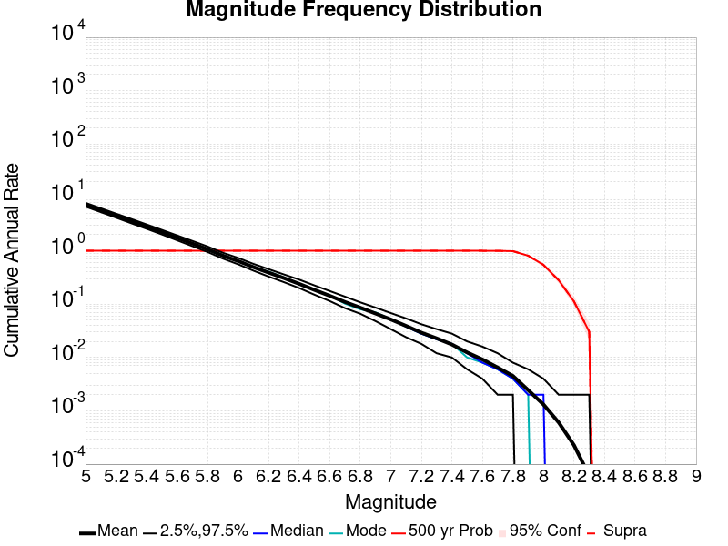

| Mag | Mean | 2.5 %ile | 97.5 %ile | Median | Mode | 500 yr Probability | 500 yr Supra-Seis Prob |
|-----|-----|-----|-----|-----|-----|-----|-----|
| **M&ge;5** | 7.280 | 6.730 | 7.934 | 7.256 | 7.150 | 1.000 (100.00%) | 1.000 (100.00%) |
| **M&ge;5.1** | 5.761 | 5.296 | 6.266 | 5.740 | 5.678 | 1.000 (100.00%) | 1.000 (100.00%) |
| **M&ge;5.2** | 4.558 | 4.192 | 4.980 | 4.544 | 4.382 | 1.000 (100.00%) | 1.000 (100.00%) |
| **M&ge;5.3** | 3.599 | 3.278 | 3.948 | 3.598 | 3.582 | 1.000 (100.00%) | 1.000 (100.00%) |
| **M&ge;5.4** | 2.834 | 2.578 | 3.112 | 2.832 | 2.846 | 1.000 (100.00%) | 1.000 (100.00%) |
| **M&ge;5.5** | 2.231 | 2.022 | 2.456 | 2.224 | 2.210 | 1.000 (100.00%) | 1.000 (100.00%) |
| **M&ge;5.6** | 1.750 | 1.570 | 1.938 | 1.744 | 1.762 | 1.000 (100.00%) | 1.000 (100.00%) |
| **M&ge;5.7** | 1.366 | 1.216 | 1.540 | 1.362 | 1.336 | 1.000 (100.00%) | 1.000 (100.00%) |
| **M&ge;5.8** | 1.063 | 0.938 | 1.196 | 1.064 | 1.052 | 1.000 (100.00%) | 1.000 (100.00%) |
| **M&ge;5.9** | 0.810 | 0.698 | 0.922 | 0.810 | 0.794 | 1.000 (100.00%) | 1.000 (100.00%) |
| **M&ge;6** | 0.641 | 0.556 | 0.744 | 0.640 | 0.652 | 1.000 (100.00%) | 1.000 (100.00%) |
| **M&ge;6.1** | 0.492 | 0.422 | 0.564 | 0.492 | 0.496 | 1.000 (100.00%) | 1.000 (100.00%) |
| **M&ge;6.2** | 0.388 | 0.326 | 0.458 | 0.386 | 0.396 | 1.000 (100.00%) | 1.000 (100.00%) |
| **M&ge;6.3** | 0.307 | 0.258 | 0.368 | 0.304 | 0.298 | 1.000 (100.00%) | 1.000 (100.00%) |
| **M&ge;6.4** | 0.240 | 0.202 | 0.288 | 0.238 | 0.234 | 1.000 (100.00%) | 1.000 (100.00%) |
| **M&ge;6.5** | 0.185 | 0.150 | 0.226 | 0.184 | 0.192 | 1.000 (100.00%) | 1.000 (100.00%) |
| **M&ge;6.6** | 0.144 | 0.112 | 0.176 | 0.142 | 0.146 | 1.000 (100.00%) | 1.000 (100.00%) |
| **M&ge;6.7** | 0.110 | 0.084 | 0.138 | 0.110 | 0.112 | 1.000 (100.00%) | 1.000 (100.00%) |
| **M&ge;6.8** | 0.085 | 0.066 | 0.108 | 0.086 | 0.088 | 1.000 (100.00%) | 1.000 (100.00%) |
| **M&ge;6.9** | 0.066 | 0.048 | 0.088 | 0.066 | 0.066 | 1.000 (100.00%) | 1.000 (100.00%) |
| **M&ge;7** | 0.052 | 0.034 | 0.070 | 0.052 | 0.046 | 1.000 (100.00%) | 1.000 (100.00%) |
| **M&ge;7.1** | 0.039 | 0.024 | 0.054 | 0.038 | 0.038 | 1.000 (100.00%) | 1.000 (100.00%) |
| **M&ge;7.2** | 0.029 | 0.018 | 0.042 | 0.028 | 0.026 | 1.000 (100.00%) | 1.000 (100.00%) |
| **M&ge;7.3** | 0.023 | 0.012 | 0.034 | 0.022 | 0.022 | 1.000 (100.00%) | 1.000 (100.00%) |
| **M&ge;7.4** | 0.017 | 8.00E-3 | 0.026 | 0.018 | 0.016 | 1.000 (100.00%) | 1.000 (100.00%) |
| **M&ge;7.5** | 0.012 | 6.00E-3 | 0.020 | 0.012 | 0.012 | 1.000 (100.00%) | 1.000 (100.00%) |
| **M&ge;7.6** | 9.21E-3 | 4.00E-3 | 0.016 | 8.00E-3 | 8.00E-3 | 1.000 (100.00%) | 1.000 (100.00%) |
| **M&ge;7.7** | 6.55E-3 | 2.00E-3 | 0.010 | 6.00E-3 | 6.00E-3 | 1.000 (100.00%) | 1.000 (100.00%) |
| **M&ge;7.8** | 4.59E-3 | 2.00E-3 | 8.00E-3 | 4.00E-3 | 4.00E-3 | 0.986 (98.60%) | 0.986 (98.60%) |
| **M&ge;7.9** | 2.57E-3 | 0.000 | 6.00E-3 | 2.00E-3 | 2.00E-3 | 0.838 (83.75%) | 0.838 (83.75%) |
| **M&ge;8** | 1.38E-3 | 0.000 | 4.00E-3 | 2.00E-3 | 2.00E-3 | 0.580 (57.98%) | 0.580 (57.98%) |
| **M&ge;8.1** | 6.72E-4 | 0.000 | 2.00E-3 | 0.000 | 0.000 | 0.314 (31.37%) | 0.314 (31.37%) |
| **M&ge;8.2** | 2.30E-4 | 0.000 | 2.00E-3 | 0.000 | 0.000 | 0.112 (11.20%) | 0.112 (11.20%) |
| **M&ge;8.3** | 5.60E-5 | 0.000 | 2.00E-3 | 0.000 | 0.000 | 0.028 (2.80%) | 0.028 (2.80%) |
| **M&ge;8.4** | 0.000 | 0.000 | 0.000 | 0.000 | 0.000 | 0.000 (0.00%) | 0.000 (0.00%) |
| **M&ge;8.5** | 0.000 | 0.000 | 0.000 | 0.000 | 0.000 | 0.000 (0.00%) | 0.000 (0.00%) |
| **M&ge;8.6** | 0.000 | 0.000 | 0.000 | 0.000 | 0.000 | 0.000 (0.00%) | 0.000 (0.00%) |
| **M&ge;8.7** | 0.000 | 0.000 | 0.000 | 0.000 | 0.000 | 0.000 (0.00%) | 0.000 (0.00%) |
| **M&ge;8.8** | 0.000 | 0.000 | 0.000 | 0.000 | 0.000 | 0.000 (0.00%) | 0.000 (0.00%) |
| **M&ge;8.9** | 0.000 | 0.000 | 0.000 | 0.000 | 0.000 | 0.000 (0.00%) | 0.000 (0.00%) |
| **M&ge;9** | 0.000 | 0.000 | 0.000 | 0.000 | 0.000 | 0.000 (0.00%) | 0.000 (0.00%) |


## Long Term Rate Variability
*[(top)](#table-of-contents)*

### 162 Year Variability
*[(top)](#table-of-contents)*

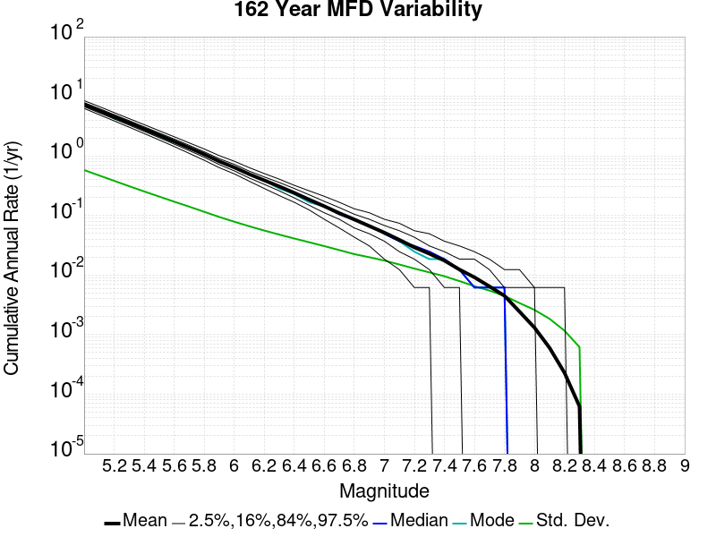

[Download CSV Here](plots/long_term_var_162yr.csv)

| **Magnitude** | Mean | Median | Mode | Std. Dev. | 2.5 %-ile | 16 %-ile | 84 %-ile | 97.5 %-ile |
|-----|-----|-----|-----|-----|-----|-----|-----|-----|
| **5.0** | 7.2765503 | 7.259259 | 7.0246916 | 0.58175373 | 6.2469134 | 6.7098765 | 7.8580246 | 8.475308 |
| **5.1** | 5.7581816 | 5.7469134 | 5.9753084 | 0.47281486 | 4.919753 | 5.283951 | 6.234568 | 6.7222223 |
| **5.2** | 4.555734 | 4.537037 | 4.648148 | 0.37991714 | 3.8888888 | 4.1728396 | 4.9444447 | 5.3024693 |
| **5.3** | 3.598022 | 3.5864198 | 3.4876542 | 0.30824155 | 3.0308642 | 3.2962964 | 3.9074075 | 4.2222223 |
| **5.4** | 2.8326187 | 2.8209877 | 2.8580246 | 0.25188428 | 2.3580246 | 2.580247 | 3.080247 | 3.3333333 |
| **5.5** | 2.229392 | 2.2222223 | 2.2654321 | 0.21002828 | 1.8395061 | 2.0185184 | 2.4320989 | 2.648148 |
| **5.6** | 1.7485101 | 1.7407408 | 1.7839506 | 0.17222291 | 1.425926 | 1.574074 | 1.9197531 | 2.0925925 |
| **5.7** | 1.365529 | 1.3641975 | 1.345679 | 0.14052403 | 1.0987654 | 1.2222222 | 1.5 | 1.6481482 |
| **5.8** | 1.0625007 | 1.0617284 | 1.0802469 | 0.11392149 | 0.845679 | 0.9444444 | 1.1728395 | 1.2962962 |
| **5.9** | 0.80978316 | 0.80864197 | 0.77160496 | 0.09291038 | 0.63580245 | 0.7160494 | 0.90123457 | 1.0061729 |
| **6.0** | 0.64078224 | 0.63580245 | 0.6481481 | 0.07781435 | 0.5 | 0.5617284 | 0.7160494 | 0.8148148 |
| **6.1** | 0.491856 | 0.48765433 | 0.49382716 | 0.06492441 | 0.37037036 | 0.42592594 | 0.5555556 | 0.6234568 |
| **6.2** | 0.38810503 | 0.3888889 | 0.3888889 | 0.055444784 | 0.28395063 | 0.33333334 | 0.44444445 | 0.50617284 |
| **6.3** | 0.3066247 | 0.30246913 | 0.32098764 | 0.04763688 | 0.21604939 | 0.25925925 | 0.35185185 | 0.4074074 |
| **6.4** | 0.23945545 | 0.2345679 | 0.22839506 | 0.041071277 | 0.16666667 | 0.19753087 | 0.2777778 | 0.32098764 |
| **6.5** | 0.18444744 | 0.18518518 | 0.17901234 | 0.03484264 | 0.12345679 | 0.14814815 | 0.22222222 | 0.25308642 |
| **6.6** | 0.14323755 | 0.14197531 | 0.14814815 | 0.030105015 | 0.086419754 | 0.11111111 | 0.17283951 | 0.2037037 |
| **6.7** | 0.10934744 | 0.10493827 | 0.10493827 | 0.025788045 | 0.061728396 | 0.086419754 | 0.13580246 | 0.16666667 |
| **6.8** | 0.085278556 | 0.08024691 | 0.08024691 | 0.022329487 | 0.043209877 | 0.061728396 | 0.10493827 | 0.12962963 |
| **6.9** | 0.06631624 | 0.06790123 | 0.06790123 | 0.01987493 | 0.030864198 | 0.049382716 | 0.086419754 | 0.11111111 |
| **7.0** | 0.051544074 | 0.049382716 | 0.049382716 | 0.017615475 | 0.018518519 | 0.037037037 | 0.06790123 | 0.086419754 |
| **7.1** | 0.03893327 | 0.037037037 | 0.037037037 | 0.015160216 | 0.012345679 | 0.024691358 | 0.055555556 | 0.074074075 |
| **7.2** | 0.028979493 | 0.030864198 | 0.024691358 | 0.013053931 | 0.0061728396 | 0.018518519 | 0.043209877 | 0.055555556 |
| **7.3** | 0.022518473 | 0.018518519 | 0.018518519 | 0.011240945 | 0.0061728396 | 0.012345679 | 0.030864198 | 0.049382716 |
| **7.4** | 0.017290868 | 0.018518519 | 0.018518519 | 0.0096198 | 0.0 | 0.0061728396 | 0.024691358 | 0.037037037 |
| **7.5** | 0.012432134 | 0.012345679 | 0.012345679 | 0.007990203 | 0.0 | 0.0061728396 | 0.018518519 | 0.030864198 |
| **7.6** | 0.009169923 | 0.0061728396 | 0.0061728396 | 0.0066062394 | 0.0 | 0.0 | 0.018518519 | 0.024691358 |
| **7.7** | 0.006501366 | 0.0061728396 | 0.0061728396 | 0.0054365494 | 0.0 | 0.0 | 0.012345679 | 0.018518519 |
| **7.8** | 0.0045532617 | 0.0061728396 | 0.0061728396 | 0.004502499 | 0.0 | 0.0 | 0.0061728396 | 0.012345679 |
| **7.9** | 0.002535994 | 0.0 | 0.0 | 0.0034757059 | 0.0 | 0.0 | 0.0061728396 | 0.012345679 |
| **8.0** | 0.0013602149 | 0.0 | 0.0 | 0.002655349 | 0.0 | 0.0 | 0.0061728396 | 0.0061728396 |
| **8.1** | 6.512893E-4 | 0.0 | 0.0 | 0.0019344075 | 0.0 | 0.0 | 0.0 | 0.0061728396 |
| **8.2** | 2.2478127E-4 | 0.0 | 0.0 | 0.0011568326 | 0.0 | 0.0 | 0.0 | 0.0061728396 |
| **8.3** | 5.763622E-5 | 0.0 | 0.0 | 5.939584E-4 | 0.0 | 0.0 | 0.0 | 0.0 |
| **8.4** | 0.0 | 0.0 | 0.0 | 0.0 | 0.0 | 0.0 | 0.0 | 0.0 |
| **8.5** | 0.0 | 0.0 | 0.0 | 0.0 | 0.0 | 0.0 | 0.0 | 0.0 |
| **8.6** | 0.0 | 0.0 | 0.0 | 0.0 | 0.0 | 0.0 | 0.0 | 0.0 |
| **8.7** | 0.0 | 0.0 | 0.0 | 0.0 | 0.0 | 0.0 | 0.0 | 0.0 |
| **8.8** | 0.0 | 0.0 | 0.0 | 0.0 | 0.0 | 0.0 | 0.0 | 0.0 |
| **8.9** | 0.0 | 0.0 | 0.0 | 0.0 | 0.0 | 0.0 | 0.0 | 0.0 |
| **9.0** | 0.0 | 0.0 | 0.0 | 0.0 | 0.0 | 0.0 | 0.0 | 0.0 |

### 80 Year Variability
*[(top)](#table-of-contents)*

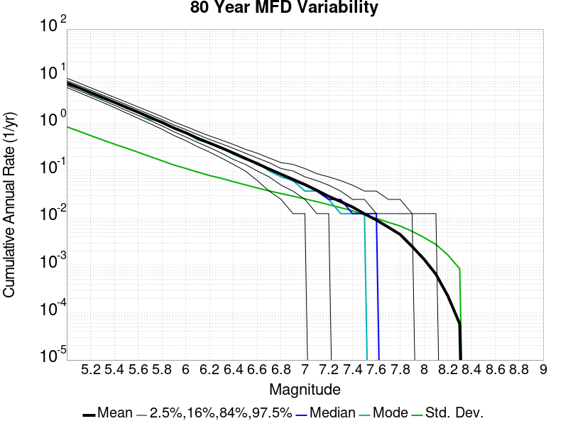

[Download CSV Here](plots/long_term_var_80yr.csv)

| **Magnitude** | Mean | Median | Mode | Std. Dev. | 2.5 %-ile | 16 %-ile | 84 %-ile | 97.5 %-ile |
|-----|-----|-----|-----|-----|-----|-----|-----|-----|
| **5.0** | 7.2782736 | 7.2 | 6.6875 | 0.8594732 | 5.8375 | 6.4375 | 8.1375 | 9.225 |
| **5.1** | 5.759827 | 5.7125 | 5.7 | 0.69695824 | 4.6 | 5.075 | 6.45 | 7.3 |
| **5.2** | 4.5574813 | 4.5125 | 4.2625 | 0.5615231 | 3.6 | 4.0 | 5.125 | 5.7625 |
| **5.3** | 3.5994806 | 3.575 | 3.375 | 0.45427105 | 2.825 | 3.1375 | 4.05 | 4.575 |
| **5.4** | 2.8336194 | 2.8125 | 2.8125 | 0.3696193 | 2.2 | 2.4625 | 3.2125 | 3.6125 |
| **5.5** | 2.2301645 | 2.2125 | 2.1125 | 0.30383074 | 1.6875 | 1.9125 | 2.5375 | 2.8625 |
| **5.6** | 1.7489495 | 1.7375 | 1.7375 | 0.24819009 | 1.3 | 1.5 | 1.9875 | 2.2625 |
| **5.7** | 1.3657329 | 1.3625 | 1.225 | 0.20185724 | 1.0 | 1.1625 | 1.5625 | 1.7875 |
| **5.8** | 1.0628443 | 1.05 | 1.125 | 0.16447182 | 0.7625 | 0.9 | 1.225 | 1.4125 |
| **5.9** | 0.8100665 | 0.8 | 0.825 | 0.13359624 | 0.5625 | 0.675 | 0.9375 | 1.0875 |
| **6.0** | 0.641194 | 0.6375 | 0.6625 | 0.11293604 | 0.4375 | 0.525 | 0.75 | 0.875 |
| **6.1** | 0.4920518 | 0.4875 | 0.45 | 0.09472142 | 0.325 | 0.4 | 0.5875 | 0.6875 |
| **6.2** | 0.3883637 | 0.3875 | 0.3875 | 0.08005126 | 0.25 | 0.3125 | 0.4625 | 0.55 |
| **6.3** | 0.30678105 | 0.3 | 0.3125 | 0.069604725 | 0.1875 | 0.2375 | 0.375 | 0.45 |
| **6.4** | 0.2394958 | 0.2375 | 0.225 | 0.05924154 | 0.1375 | 0.175 | 0.3 | 0.3625 |
| **6.5** | 0.1844421 | 0.1875 | 0.175 | 0.050873827 | 0.1 | 0.1375 | 0.2375 | 0.2875 |
| **6.6** | 0.1432423 | 0.1375 | 0.15 | 0.043645382 | 0.0625 | 0.1 | 0.1875 | 0.2375 |
| **6.7** | 0.10933707 | 0.1125 | 0.1 | 0.037842758 | 0.0375 | 0.075 | 0.15 | 0.1875 |
| **6.8** | 0.08521825 | 0.0875 | 0.075 | 0.033233277 | 0.025 | 0.05 | 0.1125 | 0.15 |
| **6.9** | 0.066264 | 0.0625 | 0.0625 | 0.02922943 | 0.0125 | 0.0375 | 0.1 | 0.1375 |
| **7.0** | 0.05153478 | 0.05 | 0.0375 | 0.025731798 | 0.0125 | 0.025 | 0.075 | 0.1125 |
| **7.1** | 0.038964752 | 0.0375 | 0.0375 | 0.022393925 | 0.0 | 0.0125 | 0.0625 | 0.0875 |
| **7.2** | 0.028985761 | 0.025 | 0.025 | 0.019389056 | 0.0 | 0.0125 | 0.05 | 0.075 |
| **7.3** | 0.0224965 | 0.025 | 0.0125 | 0.016681675 | 0.0 | 0.0 | 0.0375 | 0.0625 |
| **7.4** | 0.01725607 | 0.0125 | 0.0125 | 0.014348148 | 0.0 | 0.0 | 0.025 | 0.05 |
| **7.5** | 0.012400794 | 0.0125 | 0.0125 | 0.011753346 | 0.0 | 0.0 | 0.025 | 0.0375 |
| **7.6** | 0.009156163 | 0.0125 | 0.0 | 0.00993953 | 0.0 | 0.0 | 0.0125 | 0.0375 |
| **7.7** | 0.0064717554 | 0.0 | 0.0 | 0.008188763 | 0.0 | 0.0 | 0.0125 | 0.025 |
| **7.8** | 0.0045226426 | 0.0 | 0.0 | 0.006837445 | 0.0 | 0.0 | 0.0125 | 0.025 |
| **7.9** | 0.0025268442 | 0.0 | 0.0 | 0.00527633 | 0.0 | 0.0 | 0.0125 | 0.0125 |
| **8.0** | 0.0013597106 | 0.0 | 0.0 | 0.0039115986 | 0.0 | 0.0 | 0.0 | 0.0125 |
| **8.1** | 6.535948E-4 | 0.0 | 0.0 | 0.0027832293 | 0.0 | 0.0 | 0.0 | 0.0125 |
| **8.2** | 2.2759104E-4 | 0.0 | 0.0 | 0.0016716444 | 0.0 | 0.0 | 0.0 | 0.0 |
| **8.3** | 5.8356676E-5 | 0.0 | 0.0 | 8.5228635E-4 | 0.0 | 0.0 | 0.0 | 0.0 |
| **8.4** | 0.0 | 0.0 | 0.0 | 0.0 | 0.0 | 0.0 | 0.0 | 0.0 |
| **8.5** | 0.0 | 0.0 | 0.0 | 0.0 | 0.0 | 0.0 | 0.0 | 0.0 |
| **8.6** | 0.0 | 0.0 | 0.0 | 0.0 | 0.0 | 0.0 | 0.0 | 0.0 |
| **8.7** | 0.0 | 0.0 | 0.0 | 0.0 | 0.0 | 0.0 | 0.0 | 0.0 |
| **8.8** | 0.0 | 0.0 | 0.0 | 0.0 | 0.0 | 0.0 | 0.0 | 0.0 |
| **8.9** | 0.0 | 0.0 | 0.0 | 0.0 | 0.0 | 0.0 | 0.0 | 0.0 |
| **9.0** | 0.0 | 0.0 | 0.0 | 0.0 | 0.0 | 0.0 | 0.0 | 0.0 |

### 28 Year Variability
*[(top)](#table-of-contents)*

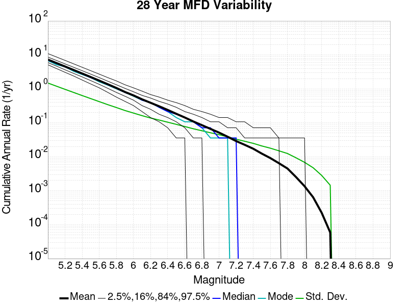

[Download CSV Here](plots/long_term_var_28yr.csv)

| **Magnitude** | Mean | Median | Mode | Std. Dev. | 2.5 %-ile | 16 %-ile | 84 %-ile | 97.5 %-ile |
|-----|-----|-----|-----|-----|-----|-----|-----|-----|
| **5.0** | 7.276946 | 7.0 | 6.785714 | 1.4830804 | 5.107143 | 5.928571 | 8.607142 | 10.928572 |
| **5.1** | 5.7587214 | 5.571429 | 5.142857 | 1.1972216 | 3.9642856 | 4.678571 | 6.857143 | 8.678572 |
| **5.2** | 4.556805 | 4.428571 | 4.464286 | 0.9679001 | 3.0714285 | 3.642857 | 5.428571 | 6.892857 |
| **5.3** | 3.59891 | 3.5 | 3.2857144 | 0.78398395 | 2.392857 | 2.857143 | 4.321429 | 5.464286 |
| **5.4** | 2.833498 | 2.75 | 2.642857 | 0.6350044 | 1.8214285 | 2.25 | 3.4285715 | 4.321429 |
| **5.5** | 2.229945 | 2.142857 | 2.142857 | 0.5166248 | 1.3928572 | 1.75 | 2.7142856 | 3.4285715 |
| **5.6** | 1.7487172 | 1.7142857 | 1.6071428 | 0.42025375 | 1.0714285 | 1.3571428 | 2.142857 | 2.7142856 |
| **5.7** | 1.3655933 | 1.3214285 | 1.2857143 | 0.34200674 | 0.78571427 | 1.0357143 | 1.6785715 | 2.142857 |
| **5.8** | 1.062784 | 1.0357143 | 1.0 | 0.2816834 | 0.5714286 | 0.78571427 | 1.3214285 | 1.7142857 |
| **5.9** | 0.8101123 | 0.78571427 | 0.78571427 | 0.23033877 | 0.42857143 | 0.60714287 | 1.0357143 | 1.3214285 |
| **6.0** | 0.6412565 | 0.64285713 | 0.60714287 | 0.19355395 | 0.32142857 | 0.4642857 | 0.8214286 | 1.0714285 |
| **6.1** | 0.4921027 | 0.4642857 | 0.4642857 | 0.16244856 | 0.21428572 | 0.32142857 | 0.64285713 | 0.85714287 |
| **6.2** | 0.38832593 | 0.39285713 | 0.39285713 | 0.13813554 | 0.14285715 | 0.25 | 0.53571427 | 0.6785714 |
| **6.3** | 0.3066697 | 0.2857143 | 0.2857143 | 0.12046529 | 0.10714286 | 0.17857143 | 0.42857143 | 0.5714286 |
| **6.4** | 0.23939575 | 0.21428572 | 0.21428572 | 0.1043026 | 0.071428575 | 0.14285715 | 0.35714287 | 0.4642857 |
| **6.5** | 0.18443848 | 0.17857143 | 0.14285715 | 0.09006886 | 0.035714287 | 0.10714286 | 0.2857143 | 0.39285713 |
| **6.6** | 0.1432161 | 0.14285715 | 0.10714286 | 0.07763385 | 0.035714287 | 0.071428575 | 0.21428572 | 0.32142857 |
| **6.7** | 0.10927312 | 0.10714286 | 0.10714286 | 0.06668369 | 0.0 | 0.035714287 | 0.17857143 | 0.25 |
| **6.8** | 0.085163474 | 0.071428575 | 0.071428575 | 0.05834112 | 0.0 | 0.035714287 | 0.14285715 | 0.21428572 |
| **6.9** | 0.06617353 | 0.071428575 | 0.035714287 | 0.050863463 | 0.0 | 0.0 | 0.10714286 | 0.17857143 |
| **7.0** | 0.051479414 | 0.035714287 | 0.035714287 | 0.044640917 | 0.0 | 0.0 | 0.10714286 | 0.14285715 |
| **7.1** | 0.03892145 | 0.035714287 | 0.035714287 | 0.03851237 | 0.0 | 0.0 | 0.071428575 | 0.14285715 |
| **7.2** | 0.028970411 | 0.035714287 | 0.0 | 0.032887988 | 0.0 | 0.0 | 0.071428575 | 0.10714286 |
| **7.3** | 0.022473695 | 0.0 | 0.0 | 0.028572615 | 0.0 | 0.0 | 0.035714287 | 0.10714286 |
| **7.4** | 0.017230421 | 0.0 | 0.0 | 0.024797643 | 0.0 | 0.0 | 0.035714287 | 0.071428575 |
| **7.5** | 0.012369654 | 0.0 | 0.0 | 0.020808933 | 0.0 | 0.0 | 0.035714287 | 0.071428575 |
| **7.6** | 0.009133065 | 0.0 | 0.0 | 0.017869579 | 0.0 | 0.0 | 0.035714287 | 0.071428575 |
| **7.7** | 0.0064555234 | 0.0 | 0.0 | 0.014960127 | 0.0 | 0.0 | 0.035714287 | 0.035714287 |
| **7.8** | 0.0045018005 | 0.0 | 0.0 | 0.012459925 | 0.0 | 0.0 | 0.0 | 0.035714287 |
| **7.9** | 0.0025245391 | 0.0 | 0.0 | 0.009313725 | 0.0 | 0.0 | 0.0 | 0.035714287 |
| **8.0** | 0.0013534826 | 0.0 | 0.0 | 0.006850899 | 0.0 | 0.0 | 0.0 | 0.035714287 |
| **8.1** | 6.4143306E-4 | 0.0 | 0.0 | 0.004743479 | 0.0 | 0.0 | 0.0 | 0.0 |
| **8.2** | 2.2361886E-4 | 0.0 | 0.0 | 0.0028173907 | 0.0 | 0.0 | 0.0 | 0.0 |
| **8.3** | 5.884707E-5 | 0.0 | 0.0 | 0.0014486421 | 0.0 | 0.0 | 0.0 | 0.0 |
| **8.4** | 0.0 | 0.0 | 0.0 | 0.0 | 0.0 | 0.0 | 0.0 | 0.0 |
| **8.5** | 0.0 | 0.0 | 0.0 | 0.0 | 0.0 | 0.0 | 0.0 | 0.0 |
| **8.6** | 0.0 | 0.0 | 0.0 | 0.0 | 0.0 | 0.0 | 0.0 | 0.0 |
| **8.7** | 0.0 | 0.0 | 0.0 | 0.0 | 0.0 | 0.0 | 0.0 | 0.0 |
| **8.8** | 0.0 | 0.0 | 0.0 | 0.0 | 0.0 | 0.0 | 0.0 | 0.0 |
| **8.9** | 0.0 | 0.0 | 0.0 | 0.0 | 0.0 | 0.0 | 0.0 | 0.0 |
| **9.0** | 0.0 | 0.0 | 0.0 | 0.0 | 0.0 | 0.0 | 0.0 | 0.0 |

### Variability Duration Dependence
*[(top)](#table-of-contents)*

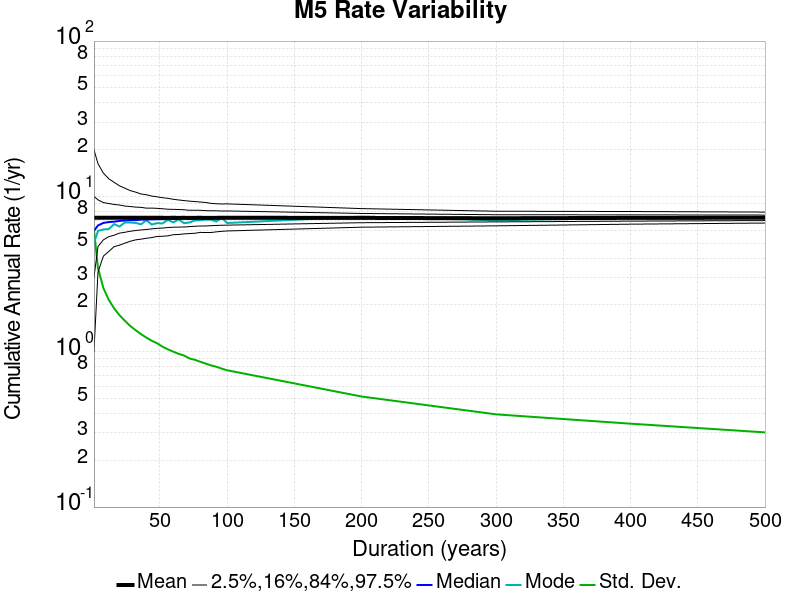

[Download CSV Here](plots/long_term_var_m5.csv)

| **Duration (years)** | Mean | Median | Mode | Std. Dev. | 2.5 %-ile | 16 %-ile | 84 %-ile | 97.5 %-ile |
|-----|-----|-----|-----|-----|-----|-----|-----|-----|
| **1.0** | 7.280336 | 6.0 | 5.0 | 6.1866984 | 1.0 | 3.0 | 10.0 | 20.0 |
| **4.0** | 7.280336 | 6.5 | 6.0 | 3.492111 | 3.25 | 4.75 | 9.5 | 16.5 |
| **8.0** | 7.2787848 | 6.75 | 6.125 | 2.5998967 | 4.125 | 5.25 | 9.125 | 14.375 |
| **12.0** | 7.2778406 | 6.8333335 | 6.1666665 | 2.1740549 | 4.4166665 | 5.5 | 8.916667 | 13.0 |
| **16.0** | 7.2787848 | 6.875 | 6.625 | 1.9139254 | 4.6875 | 5.625 | 8.875 | 12.3125 |
| **20.0** | 7.280336 | 6.95 | 6.4 | 1.736814 | 4.85 | 5.8 | 8.75 | 11.7 |
| **24.0** | 7.2782736 | 7.0 | 6.5416665 | 1.5921823 | 5.0 | 5.875 | 8.666667 | 11.333333 |
| **28.0** | 7.276946 | 7.0 | 6.785714 | 1.4830804 | 5.107143 | 5.928571 | 8.607142 | 10.928572 |
| **32.0** | 7.2782736 | 7.03125 | 6.59375 | 1.3920432 | 5.21875 | 6.0 | 8.5625 | 10.71875 |
| **36.0** | 7.274893 | 7.0555553 | 6.611111 | 1.3097978 | 5.3055553 | 6.0833335 | 8.472222 | 10.416667 |
| **40.0** | 7.2782736 | 7.1 | 6.7 | 1.2347381 | 5.35 | 6.125 | 8.4 | 10.275 |
| **44.0** | 7.2768536 | 7.1136365 | 6.7727275 | 1.1832075 | 5.3863635 | 6.159091 | 8.409091 | 10.090909 |
| **48.0** | 7.2782736 | 7.1041665 | 6.6041665 | 1.139004 | 5.5 | 6.2291665 | 8.354167 | 9.9375 |
| **52.0** | 7.274893 | 7.1153846 | 6.9423075 | 1.0903186 | 5.5384617 | 6.230769 | 8.326923 | 9.884615 |
| **56.0** | 7.2706394 | 7.125 | 6.839286 | 1.0542334 | 5.535714 | 6.285714 | 8.267858 | 9.803572 |
| **60.0** | 7.2782736 | 7.15 | 7.116667 | 1.0077513 | 5.65 | 6.3166666 | 8.233334 | 9.633333 |
| **64.0** | 7.2706394 | 7.140625 | 6.90625 | 0.9855213 | 5.640625 | 6.328125 | 8.234375 | 9.53125 |
| **68.0** | 7.276946 | 7.2058825 | 6.720588 | 0.9509112 | 5.7058825 | 6.352941 | 8.205882 | 9.411765 |
| **72.0** | 7.2647967 | 7.1666665 | 6.3333335 | 0.924824 | 5.736111 | 6.375 | 8.138889 | 9.402778 |
| **76.0** | 7.272065 | 7.1710525 | 7.394737 | 0.90404105 | 5.763158 | 6.394737 | 8.131579 | 9.342105 |
| **80.0** | 7.2782736 | 7.2 | 6.6875 | 0.8594732 | 5.8375 | 6.4375 | 8.1375 | 9.225 |
| **84.0** | 7.263619 | 7.1666665 | 7.202381 | 0.8475009 | 5.8809524 | 6.4404764 | 8.083333 | 9.202381 |
| **88.0** | 7.268704 | 7.181818 | 7.0795455 | 0.8195363 | 5.840909 | 6.465909 | 8.056818 | 9.034091 |
| **92.0** | 7.273907 | 7.1847825 | 7.5108695 | 0.807763 | 5.902174 | 6.4891305 | 8.076087 | 9.01087 |
| **96.0** | 7.2782736 | 7.2291665 | 6.59375 | 0.7860712 | 5.9375 | 6.5104165 | 8.0625 | 8.9375 |
| **100.0** | 7.280336 | 7.23 | 7.66 | 0.7633306 | 5.97 | 6.53 | 8.06 | 9.01 |
| **200.0** | 7.2582283 | 7.24 | 7.39 | 0.5278586 | 6.29 | 6.735 | 7.775 | 8.325 |
| **300.0** | 7.207778 | 7.213333 | 7.483333 | 0.39820945 | 6.46 | 6.7766666 | 7.596667 | 8.026667 |
| **400.0** | 7.2582283 | 7.235 | 7.295 | 0.34968495 | 6.5775 | 6.9225 | 7.61 | 7.9925 |
| **500.0** | 7.280336 | 7.256 | 7.15 | 0.30842116 | 6.73 | 6.954 | 7.58 | 7.934 |


## Simulation Stationarity
*[(top)](#table-of-contents)*

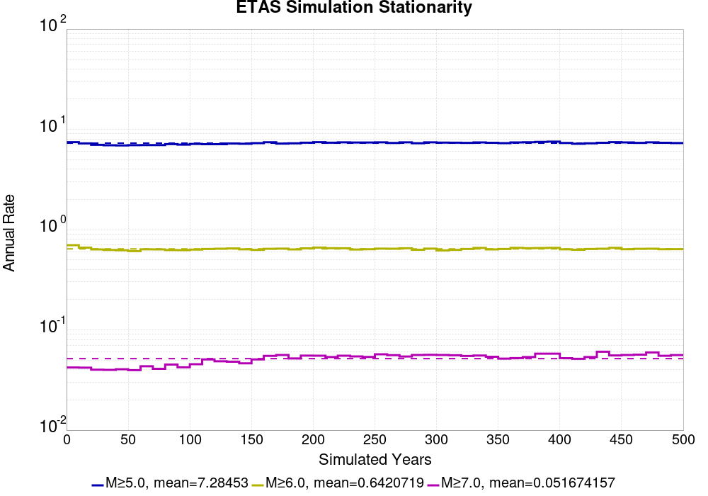


## Section Participation
*[(top)](#table-of-contents)*

### Section Participation Plots
*[(top)](#table-of-contents)*

| Min Mag | Complete Catalog (including spontaneous) |
|-----|-----|
| **All Supra. Seis.** |  |
| **M&ge;6.5** | 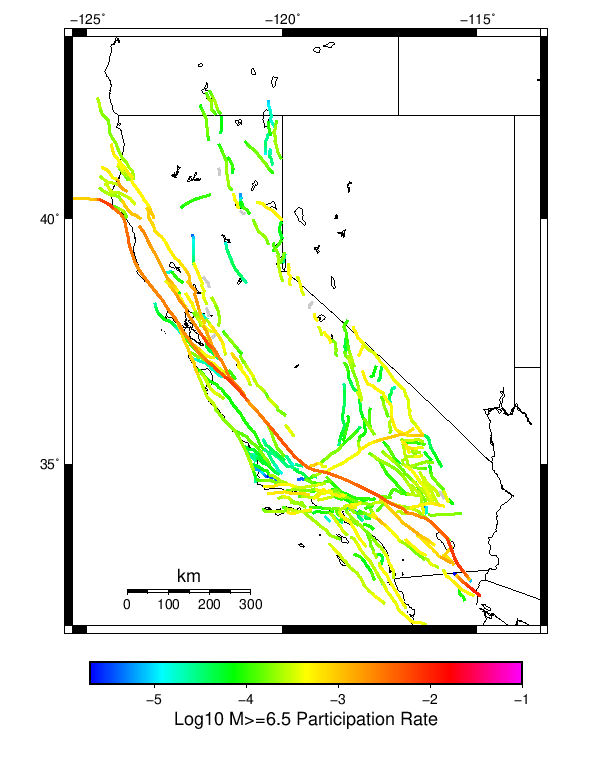 |
| **M&ge;7** | 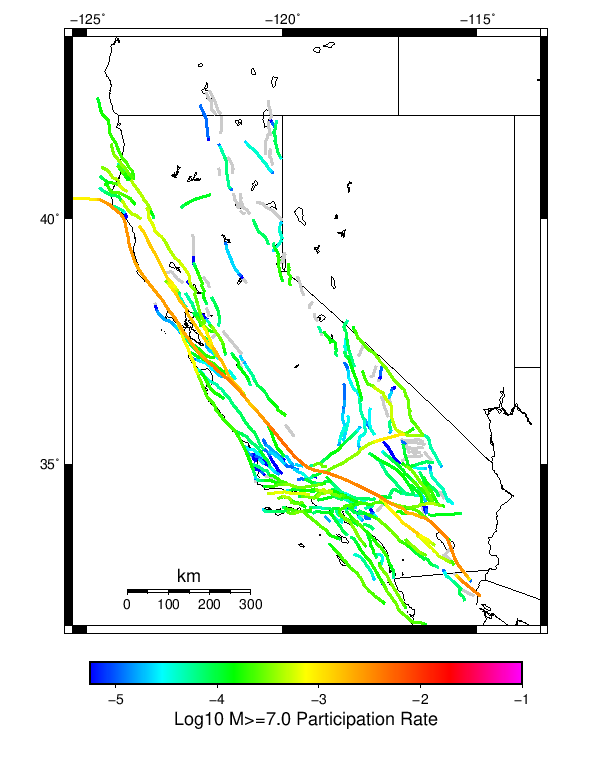 |
| **M&ge;7.5** | 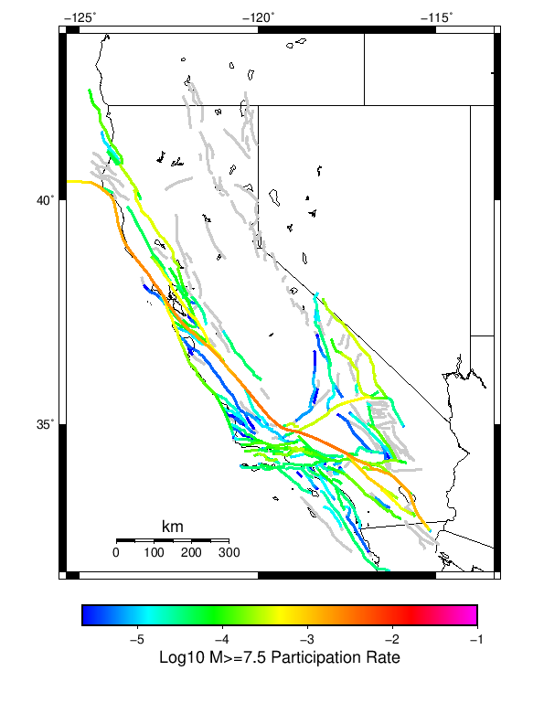 |
| **M&ge;8** |  |

### Supra-Seismogenic Parent Sections Table
*[(top)](#table-of-contents)*

*First 10 of 313 with matching ruptures shown*

| Parent Name | Total Mean Annual Rate | Total 500 Year Prob |
|-----|-----|-----|
| San Andreas (Parkfield) | 0.04340056 | 1.0 |
| San Andreas (Creeping Section) 2011 CFM | 0.027238095 | 1.0 |
| San Andreas (Mojave S) | 0.018364146 | 1.0 |
| Mendocino | 0.01639776 | 1.0 |
| Cerro Prieto | 0.012829131 | 0.99439776 |
| Imperial | 0.011266107 | 1.0 |
| Brawley (Seismic Zone) alt 1 | 0.0104369745 | 1.0 |
| Hayward (So) 2011 CFM | 0.008537815 | 1.0 |
| Elsinore (Glen Ivy) rev | 0.007120448 | 0.9859944 |
| San Andreas (Offshore) 2011 CFM | 0.0071036415 | 0.99439776 |

### M≥6.5 Parent Sections Table
*[(top)](#table-of-contents)*

*First 10 of 306 with matching ruptures shown*

| Parent Name | Total Mean Annual Rate | Total 500 Year Prob |
|-----|-----|-----|
| Cerro Prieto | 0.010913165 | 0.99439776 |
| San Andreas (Creeping Section) 2011 CFM | 0.009742297 | 1.0 |
| Mendocino | 0.007966386 | 0.99439776 |
| Imperial | 0.0077254903 | 0.9887955 |
| Brawley (Seismic Zone) alt 1 | 0.00740056 | 0.9887955 |
| Hayward (So) 2011 CFM | 0.007137255 | 0.9971989 |
| San Andreas (Mojave S) | 0.006420168 | 1.0 |
| San Andreas (San Bernardino N) | 0.006022409 | 0.99439776 |
| San Andreas (Santa Cruz Mts) 2011 CFM | 0.006022409 | 0.9971989 |
| San Andreas (Cholame) rev | 0.0053053224 | 0.9971989 |

### M≥7 Parent Sections Table
*[(top)](#table-of-contents)*

*First 10 of 272 with matching ruptures shown*

| Parent Name | Total Mean Annual Rate | Total 500 Year Prob |
|-----|-----|-----|
| San Andreas (Creeping Section) 2011 CFM | 0.0059607844 | 0.99159664 |
| San Andreas (Cholame) rev | 0.004985994 | 0.9971989 |
| San Andreas (Carrizo) rev | 0.004952381 | 1.0 |
| San Andreas (Santa Cruz Mts) 2011 CFM | 0.0047507 | 0.9971989 |
| San Andreas (Mojave S) | 0.004487395 | 1.0 |
| San Andreas (San Bernardino N) | 0.0039607845 | 0.96358544 |
| San Andreas (Mojave N) | 0.0039439774 | 0.99159664 |
| San Andreas (Big Bend) | 0.0037759105 | 0.9887955 |
| San Andreas (Coachella) rev | 0.003764706 | 0.9579832 |
| San Andreas (North Coast) 2011 CFM | 0.003747899 | 0.97759104 |

### M≥7.5 Parent Sections Table
*[(top)](#table-of-contents)*

*First 10 of 204 with matching ruptures shown*

| Parent Name | Total Mean Annual Rate | Total 500 Year Prob |
|-----|-----|-----|
| San Andreas (Mojave N) | 0.0038767506 | 0.99159664 |
| San Andreas (Big Bend) | 0.003652661 | 0.9887955 |
| San Andreas (Mojave S) | 0.0035294117 | 0.9887955 |
| San Andreas (Carrizo) rev | 0.003467787 | 0.99159664 |
| San Andreas (Cholame) rev | 0.00329972 | 0.9607843 |
| San Andreas (North Coast) 2011 CFM | 0.0030756302 | 0.9607843 |
| San Andreas (Creeping Section) 2011 CFM | 0.0029131654 | 0.88515407 |
| San Andreas (San Bernardino N) | 0.0027843136 | 0.8739496 |
| San Andreas (Peninsula) 2011 CFM | 0.0025938374 | 0.9019608 |
| San Andreas (Parkfield) | 0.0025434173 | 0.837535 |

### M≥8 Parent Sections Table
*[(top)](#table-of-contents)*

*First 10 of 50 with matching ruptures shown*

| Parent Name | Total Mean Annual Rate | Total 500 Year Prob |
|-----|-----|-----|
| San Andreas (Mojave N) | 0.0011988796 | 0.52380955 |
| San Andreas (Carrizo) rev | 0.0011932773 | 0.5182073 |
| San Andreas (Mojave S) | 0.0011820728 | 0.5154062 |
| San Andreas (Big Bend) | 0.0011764705 | 0.5126051 |
| San Andreas (Cholame) rev | 0.0011484594 | 0.5042017 |
| San Andreas (San Bernardino N) | 0.001114846 | 0.4929972 |
| San Andreas (Parkfield) | 0.0010196079 | 0.45938376 |
| San Andreas (Creeping Section) 2011 CFM | 9.971989E-4 | 0.44537815 |
| San Andreas (Santa Cruz Mts) 2011 CFM | 6.6666666E-4 | 0.30532214 |
| San Andreas (Peninsula) 2011 CFM | 6.162465E-4 | 0.28291318 |

## Gridded Nucleation
*[(top)](#table-of-contents)*

| Min Mag | Complete Catalog (including spontaneous) |
|-----|-----|
| **M&ge;5** | 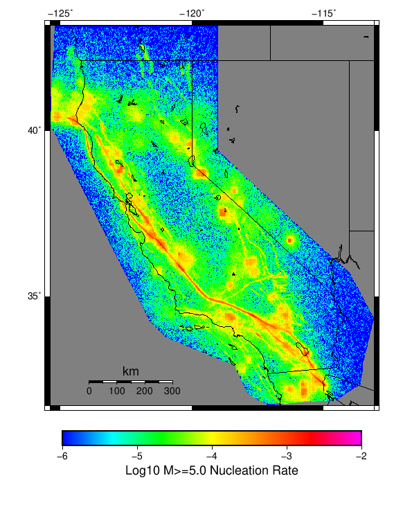 |
| **M&ge;6** | 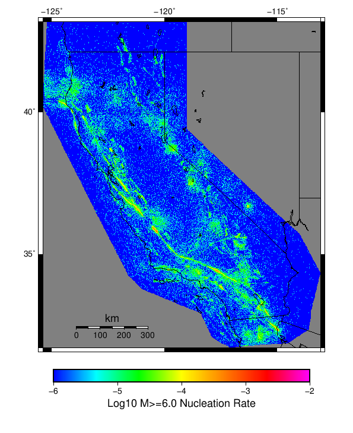 |
| **M&ge;7** | 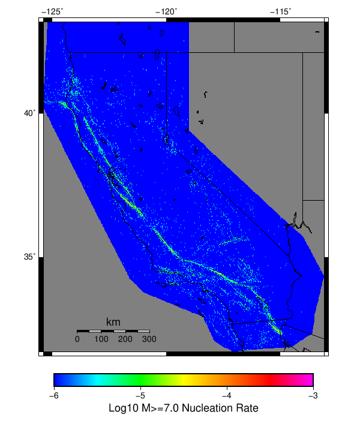 |


## JSON Input File
*[(top)](#table-of-contents)*

```
{
  "numSimulations": 1000,
  "duration": 500.0,
  "startYear": 1919,
  "includeSpontaneous": true,
  "randomSeed": 1567206915843,
  "binaryOutput": true,
  "binaryOutputFilters": [
    {
      "prefix": "results_complete",
      "descendantsOnly": false
    },
    {
      "prefix": "results_m5_preserve_chain",
      "minMag": 5.0,
      "preserveChainBelowMag": true,
      "descendantsOnly": false
    }
  ],
  "forceRecalc": false,
  "simulationName": "Start 1919, 500 yr, Log10(k)\u003d-2.31, p\u003d1.08, c\u003d0.04, Scale Factor 1.0, Spontaneous, Historical Catalog",
  "numRetries": 3,
  "outputDir": "${ETAS_SIM_DIR}/2019_08_30-Start1919_500yr_Log10_k_2p31_p1p08_c0p04_ScaleFactor1p0_Spontaneous_HistoricalCatalog-includeSpont-histCatalog-full_td-modParams",
  "triggerCatalog": "${ETAS_LAUNCHER}/inputs/u3_historical_catalog.txt",
  "triggerCatalogSurfaceMappings": "${ETAS_LAUNCHER}/inputs/u3_historical_catalog_finite_fault_mappings.xml",
  "treatTriggerCatalogAsSpontaneous": true,
  "cacheDir": "${ETAS_LAUNCHER}/inputs/cache_fm3p1_ba",
  "fssFile": "${ETAS_LAUNCHER}/inputs/2013_05_10-ucerf3p3-production-10runs_COMPOUND_SOL_FM3_1_SpatSeisU3_MEAN_BRANCH_AVG_SOL.zip",
  "probModel": "FULL_TD",
  "applySubSeisForSupraNucl": true,
  "totRateScaleFactor": 1.0,
  "gridSeisCorr": true,
  "timeIndependentERF": false,
  "griddedOnly": false,
  "imposeGR": false,
  "includeIndirectTriggering": true,
  "gridSeisDiscr": 0.1,
  "catalogCompletenessModel": "RELAXED",
  "etas_p": 1.08,
  "etas_c": 0.04,
  "etas_log10_k": -2.31,
  "configCommand": "u3etas_config_builder.sh --start-year 1919 --num-simulations 1000 --duration-years 500 --include-spontaneous --historical-catalog --etas-k -2.31 --etas-p 1.08 --etas-c 0.04 --scale-factor 1.0 --hpc-site USC_HPC --nodes 36 --hours 24 --queue scec",
  "configTime": 1567206915843
}
```

