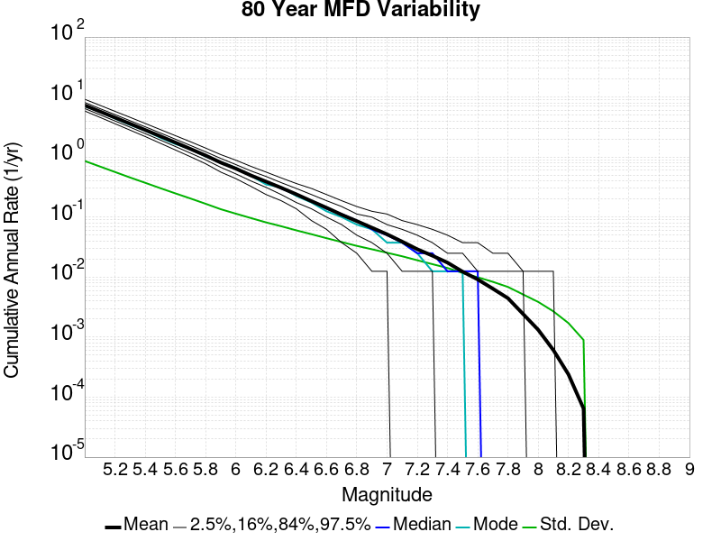
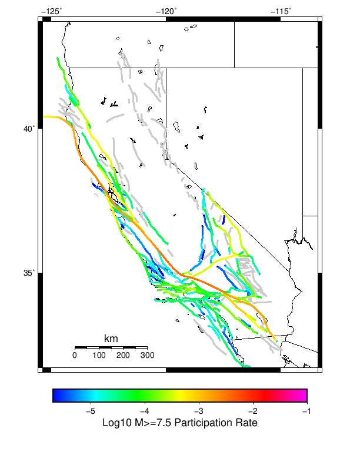
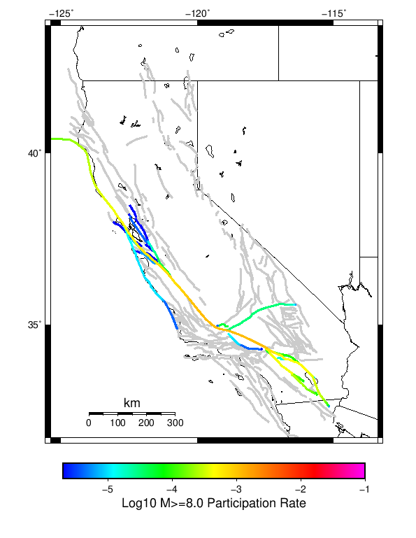

# Start 1919, 500 yr, Log10(k)=-2.31, p=1.08, c=0.04, Scale Factor 1.0, Spontaneous, Historical Catalog Results

|   | Start 1919, 500 yr, Log10(k)=-2.31, p=1.08, c=0.04, Scale Factor 1.0, Spontaneous, Historical Catalog |
|-----|-----|
| Num Simulations | 1000 |
| Start Time | 1919/01/01 00:00:00 UTC |
| Start Time Epoch Milliseconds | -1609459200000 |
| Duration | 500 Years |
| Includes Spontaneous? | true |
| Trigger Ruptures | *(none)* |
| Historical Ruptures | 165 Trigger Ruptures |
|   | First: M7.3 at 1852/01/05 04:40:39 UTC |
|   | Last: M6.5 at 1918/07/15 00:24:39 UTC |
|   | Largest: M7.9 at 1857/01/09 16:25:39 UTC |
| Config Generated With | u3etas_config_builder.sh --start-year 1919 --num-simulations 1000 --duration-years 500 --include-spontaneous --historical-catalog --etas-k -2.31 --etas-p 1.08 --etas-c 0.04 --scale-factor 1.0 --hpc-site USC_HPC --nodes 36 --hours 24 --queue scec |

## Table Of Contents

* [Magnitude Frequency Distribution](#magnitude-frequency-distribution)
* [Long Term Rate Variability](#long-term-rate-variability)
  * [162 Year Variability](#162-year-variability)
  * [80 Year Variability](#80-year-variability)
  * [28 Year Variability](#28-year-variability)
  * [Variability Duration Dependence](#variability-duration-dependence)
* [Simulation Stationarity](#simulation-stationarity)
* [Section Participation](#section-participation)
  * [Section Participation Plots](#section-participation-plots)
  * [Supra-Seismogenic Parent Sections Table](#supra-seismogenic-parent-sections-table)
  * [M≥6.5 Parent Sections Table](#m65-parent-sections-table)
  * [M≥7 Parent Sections Table](#m7-parent-sections-table)
  * [M≥7.5 Parent Sections Table](#m75-parent-sections-table)
  * [M≥8 Parent Sections Table](#m8-parent-sections-table)
* [Gridded Nucleation](#gridded-nucleation)
* [JSON Input File](#json-input-file)

## Magnitude Frequency Distribution
*[(top)](#table-of-contents)*

**Legend**
* **Mean** (thick black line): mean annual rate across all 1000 catalogs
* **2.5%,97.5%** (thin black lines): annual rate percentiles across all 1000 catalogs
* **Median** (thin blue line): median annual rate across all 1000 catalogs
* **Mode** (thin cyan line): modal annual rate across all 1000 catalogs (scaled to annualized value)
* **500 yr Probability** (thin red line): 500 year probability calculated as the fraction of catalogs with at least 1 occurrence
* **500 yr Supraseismogenic Probability** (thin dashed red line): same as above, but only for supraseismogenic ruptures on explicitly modeled UCERF3 faults
* **95% Conf** (light red shaded region): binomial 95% confidence bounds on probability


| Mag | Mean | 2.5 %ile | 97.5 %ile | Median | Mode | 500 yr Probability | 500 yr Supra-Seis Prob |
|-----|-----|-----|-----|-----|-----|-----|-----|
| **M&ge;5** | 7.288 | 6.736 | 7.924 | 7.270 | 7.254 | 1.000 (100.00%) | 1.000 (100.00%) |
| **M&ge;5.1** | 5.764 | 5.310 | 6.266 | 5.754 | 5.692 | 1.000 (100.00%) | 1.000 (100.00%) |
| **M&ge;5.2** | 4.559 | 4.180 | 4.964 | 4.554 | 4.704 | 1.000 (100.00%) | 1.000 (100.00%) |
| **M&ge;5.3** | 3.599 | 3.282 | 3.948 | 3.596 | 3.628 | 1.000 (100.00%) | 1.000 (100.00%) |
| **M&ge;5.4** | 2.836 | 2.580 | 3.116 | 2.834 | 2.846 | 1.000 (100.00%) | 1.000 (100.00%) |
| **M&ge;5.5** | 2.231 | 2.022 | 2.464 | 2.228 | 2.264 | 1.000 (100.00%) | 1.000 (100.00%) |
| **M&ge;5.6** | 1.750 | 1.572 | 1.940 | 1.746 | 1.734 | 1.000 (100.00%) | 1.000 (100.00%) |
| **M&ge;5.7** | 1.367 | 1.220 | 1.530 | 1.364 | 1.350 | 1.000 (100.00%) | 1.000 (100.00%) |
| **M&ge;5.8** | 1.063 | 0.938 | 1.198 | 1.062 | 1.044 | 1.000 (100.00%) | 1.000 (100.00%) |
| **M&ge;5.9** | 0.811 | 0.712 | 0.918 | 0.808 | 0.802 | 1.000 (100.00%) | 1.000 (100.00%) |
| **M&ge;6** | 0.642 | 0.558 | 0.734 | 0.640 | 0.646 | 1.000 (100.00%) | 1.000 (100.00%) |
| **M&ge;6.1** | 0.494 | 0.424 | 0.572 | 0.494 | 0.484 | 1.000 (100.00%) | 1.000 (100.00%) |
| **M&ge;6.2** | 0.390 | 0.328 | 0.456 | 0.388 | 0.396 | 1.000 (100.00%) | 1.000 (100.00%) |
| **M&ge;6.3** | 0.308 | 0.258 | 0.364 | 0.306 | 0.316 | 1.000 (100.00%) | 1.000 (100.00%) |
| **M&ge;6.4** | 0.240 | 0.200 | 0.288 | 0.238 | 0.238 | 1.000 (100.00%) | 1.000 (100.00%) |
| **M&ge;6.5** | 0.185 | 0.150 | 0.226 | 0.184 | 0.186 | 1.000 (100.00%) | 1.000 (100.00%) |
| **M&ge;6.6** | 0.143 | 0.114 | 0.176 | 0.142 | 0.142 | 1.000 (100.00%) | 1.000 (100.00%) |
| **M&ge;6.7** | 0.110 | 0.084 | 0.140 | 0.110 | 0.102 | 1.000 (100.00%) | 1.000 (100.00%) |
| **M&ge;6.8** | 0.086 | 0.066 | 0.108 | 0.086 | 0.080 | 1.000 (100.00%) | 1.000 (100.00%) |
| **M&ge;6.9** | 0.067 | 0.048 | 0.086 | 0.066 | 0.070 | 1.000 (100.00%) | 1.000 (100.00%) |
| **M&ge;7** | 0.052 | 0.034 | 0.068 | 0.052 | 0.052 | 1.000 (100.00%) | 1.000 (100.00%) |
| **M&ge;7.1** | 0.039 | 0.026 | 0.054 | 0.038 | 0.038 | 1.000 (100.00%) | 1.000 (100.00%) |
| **M&ge;7.2** | 0.029 | 0.018 | 0.042 | 0.028 | 0.028 | 1.000 (100.00%) | 1.000 (100.00%) |
| **M&ge;7.3** | 0.023 | 0.012 | 0.034 | 0.022 | 0.022 | 1.000 (100.00%) | 1.000 (100.00%) |
| **M&ge;7.4** | 0.017 | 0.010 | 0.028 | 0.018 | 0.018 | 1.000 (100.00%) | 1.000 (100.00%) |
| **M&ge;7.5** | 0.012 | 6.00E-3 | 0.020 | 0.012 | 0.010 | 1.000 (100.00%) | 1.000 (100.00%) |
| **M&ge;7.6** | 9.19E-3 | 4.00E-3 | 0.016 | 8.00E-3 | 8.00E-3 | 1.000 (100.00%) | 1.000 (100.00%) |
| **M&ge;7.7** | 6.48E-3 | 2.00E-3 | 0.012 | 6.00E-3 | 6.00E-3 | 0.999 (99.90%) | 0.999 (99.90%) |
| **M&ge;7.8** | 4.50E-3 | 2.00E-3 | 8.00E-3 | 4.00E-3 | 4.00E-3 | 0.982 (98.20%) | 0.982 (98.20%) |
| **M&ge;7.9** | 2.44E-3 | 0.000 | 6.00E-3 | 2.00E-3 | 2.00E-3 | 0.808 (80.80%) | 0.808 (80.80%) |
| **M&ge;8** | 1.32E-3 | 0.000 | 4.00E-3 | 2.00E-3 | 0.000 | 0.548 (54.80%) | 0.548 (54.80%) |
| **M&ge;8.1** | 6.08E-4 | 0.000 | 2.00E-3 | 0.000 | 0.000 | 0.281 (28.10%) | 0.281 (28.10%) |
| **M&ge;8.2** | 2.38E-4 | 0.000 | 2.00E-3 | 0.000 | 0.000 | 0.118 (11.80%) | 0.118 (11.80%) |
| **M&ge;8.3** | 6.20E-5 | 0.000 | 2.00E-3 | 0.000 | 0.000 | 0.031 (3.10%) | 0.031 (3.10%) |
| **M&ge;8.4** | 0.000 | 0.000 | 0.000 | 0.000 | 0.000 | 0.000 (0.00%) | 0.000 (0.00%) |
| **M&ge;8.5** | 0.000 | 0.000 | 0.000 | 0.000 | 0.000 | 0.000 (0.00%) | 0.000 (0.00%) |
| **M&ge;8.6** | 0.000 | 0.000 | 0.000 | 0.000 | 0.000 | 0.000 (0.00%) | 0.000 (0.00%) |
| **M&ge;8.7** | 0.000 | 0.000 | 0.000 | 0.000 | 0.000 | 0.000 (0.00%) | 0.000 (0.00%) |
| **M&ge;8.8** | 0.000 | 0.000 | 0.000 | 0.000 | 0.000 | 0.000 (0.00%) | 0.000 (0.00%) |
| **M&ge;8.9** | 0.000 | 0.000 | 0.000 | 0.000 | 0.000 | 0.000 (0.00%) | 0.000 (0.00%) |
| **M&ge;9** | 0.000 | 0.000 | 0.000 | 0.000 | 0.000 | 0.000 (0.00%) | 0.000 (0.00%) |


## Long Term Rate Variability
*[(top)](#table-of-contents)*

### 162 Year Variability
*[(top)](#table-of-contents)*


[Download CSV Here](plots/long_term_var_162yr.csv)

| **Magnitude** | Mean | Median | Mode | Std. Dev. | 2.5 %-ile | 16 %-ile | 84 %-ile | 97.5 %-ile |
|-----|-----|-----|-----|-----|-----|-----|-----|-----|
| **5.0** | 7.287259 | 7.2530866 | 7.191358 | 0.5795637 | 6.271605 | 6.703704 | 7.8641977 | 8.481482 |
| **5.1** | 5.7639794 | 5.7469134 | 5.808642 | 0.46973088 | 4.919753 | 5.296296 | 6.234568 | 6.7530866 |
| **5.2** | 4.558531 | 4.537037 | 4.240741 | 0.38183916 | 3.8641975 | 4.1790123 | 4.9444447 | 5.339506 |
| **5.3** | 3.5994403 | 3.5864198 | 3.728395 | 0.30976975 | 3.0370371 | 3.2901235 | 3.9074075 | 4.228395 |
| **5.4** | 2.8361688 | 2.8271606 | 2.7407408 | 0.2538483 | 2.3765433 | 2.5864198 | 3.080247 | 3.3580246 |
| **5.5** | 2.2311976 | 2.2222223 | 2.1049383 | 0.20782937 | 1.8518518 | 2.0246913 | 2.4320989 | 2.648148 |
| **5.6** | 1.7500453 | 1.7407408 | 1.7839506 | 0.17030568 | 1.4382716 | 1.5802469 | 1.9197531 | 2.0987654 |
| **5.7** | 1.3670576 | 1.3580247 | 1.3827161 | 0.14089006 | 1.1049383 | 1.2283951 | 1.5061729 | 1.654321 |
| **5.8** | 1.0631852 | 1.0555556 | 1.0555556 | 0.11539459 | 0.845679 | 0.9506173 | 1.1728395 | 1.308642 |
| **5.9** | 0.810963 | 0.80864197 | 0.79012346 | 0.09454152 | 0.63580245 | 0.7160494 | 0.90123457 | 1.0123457 |
| **6.0** | 0.64237654 | 0.63580245 | 0.6296296 | 0.07894399 | 0.5 | 0.5617284 | 0.7160494 | 0.8148148 |
| **6.1** | 0.49444857 | 0.49382716 | 0.49382716 | 0.06648558 | 0.37037036 | 0.42592594 | 0.5555556 | 0.63580245 |
| **6.2** | 0.3900247 | 0.3888889 | 0.37654322 | 0.056425966 | 0.29012346 | 0.33333334 | 0.44444445 | 0.5123457 |
| **6.3** | 0.30798766 | 0.30864197 | 0.28395063 | 0.048068274 | 0.22222222 | 0.25925925 | 0.3580247 | 0.4074074 |
| **6.4** | 0.2400679 | 0.2345679 | 0.22839506 | 0.041287344 | 0.16666667 | 0.19753087 | 0.28395063 | 0.3271605 |
| **6.5** | 0.18468107 | 0.18518518 | 0.17283951 | 0.035541505 | 0.12345679 | 0.14814815 | 0.22222222 | 0.25925925 |
| **6.6** | 0.14329217 | 0.14197531 | 0.13580246 | 0.03062792 | 0.086419754 | 0.11111111 | 0.17283951 | 0.20987654 |
| **6.7** | 0.10968107 | 0.10493827 | 0.10493827 | 0.026339587 | 0.061728396 | 0.086419754 | 0.13580246 | 0.16666667 |
| **6.8** | 0.08589506 | 0.086419754 | 0.08024691 | 0.022546409 | 0.043209877 | 0.061728396 | 0.11111111 | 0.13580246 |
| **6.9** | 0.066709876 | 0.06790123 | 0.06790123 | 0.01995833 | 0.030864198 | 0.049382716 | 0.086419754 | 0.11111111 |
| **7.0** | 0.05179424 | 0.049382716 | 0.049382716 | 0.017493647 | 0.018518519 | 0.037037037 | 0.06790123 | 0.086419754 |
| **7.1** | 0.039084364 | 0.037037037 | 0.037037037 | 0.015025472 | 0.012345679 | 0.024691358 | 0.055555556 | 0.074074075 |
| **7.2** | 0.029236626 | 0.030864198 | 0.024691358 | 0.012831372 | 0.0061728396 | 0.018518519 | 0.043209877 | 0.055555556 |
| **7.3** | 0.022833332 | 0.024691358 | 0.018518519 | 0.011011429 | 0.0061728396 | 0.012345679 | 0.030864198 | 0.043209877 |
| **7.4** | 0.017495885 | 0.018518519 | 0.018518519 | 0.009537021 | 0.0 | 0.0061728396 | 0.024691358 | 0.037037037 |
| **7.5** | 0.012374486 | 0.012345679 | 0.012345679 | 0.007912782 | 0.0 | 0.0061728396 | 0.018518519 | 0.030864198 |
| **7.6** | 0.009172839 | 0.0061728396 | 0.0061728396 | 0.0064961812 | 0.0 | 0.0 | 0.018518519 | 0.024691358 |
| **7.7** | 0.006450617 | 0.0061728396 | 0.0061728396 | 0.0054908395 | 0.0 | 0.0 | 0.012345679 | 0.018518519 |
| **7.8** | 0.004483539 | 0.0061728396 | 0.0061728396 | 0.0044638957 | 0.0 | 0.0 | 0.0061728396 | 0.012345679 |
| **7.9** | 0.0024403292 | 0.0 | 0.0 | 0.0033911995 | 0.0 | 0.0 | 0.0061728396 | 0.012345679 |
| **8.0** | 0.0013209877 | 0.0 | 0.0 | 0.002615982 | 0.0 | 0.0 | 0.0061728396 | 0.0061728396 |
| **8.1** | 6.090535E-4 | 0.0 | 0.0 | 0.0018548842 | 0.0 | 0.0 | 0.0 | 0.0061728396 |
| **8.2** | 2.4074074E-4 | 0.0 | 0.0 | 0.0011952297 | 0.0 | 0.0 | 0.0 | 0.0061728396 |
| **8.3** | 6.378601E-5 | 0.0 | 0.0 | 6.243413E-4 | 0.0 | 0.0 | 0.0 | 0.0 |
| **8.4** | 0.0 | 0.0 | 0.0 | 0.0 | 0.0 | 0.0 | 0.0 | 0.0 |
| **8.5** | 0.0 | 0.0 | 0.0 | 0.0 | 0.0 | 0.0 | 0.0 | 0.0 |
| **8.6** | 0.0 | 0.0 | 0.0 | 0.0 | 0.0 | 0.0 | 0.0 | 0.0 |
| **8.7** | 0.0 | 0.0 | 0.0 | 0.0 | 0.0 | 0.0 | 0.0 | 0.0 |
| **8.8** | 0.0 | 0.0 | 0.0 | 0.0 | 0.0 | 0.0 | 0.0 | 0.0 |
| **8.9** | 0.0 | 0.0 | 0.0 | 0.0 | 0.0 | 0.0 | 0.0 | 0.0 |
| **9.0** | 0.0 | 0.0 | 0.0 | 0.0 | 0.0 | 0.0 | 0.0 | 0.0 |

### 80 Year Variability
*[(top)](#table-of-contents)*



[Download CSV Here](plots/long_term_var_80yr.csv)

| **Magnitude** | Mean | Median | Mode | Std. Dev. | 2.5 %-ile | 16 %-ile | 84 %-ile | 97.5 %-ile |
|-----|-----|-----|-----|-----|-----|-----|-----|-----|
| **5.0** | 7.28526 | 7.2 | 7.025 | 0.8621141 | 5.8625 | 6.45 | 8.1375 | 9.2 |
| **5.1** | 5.762054 | 5.7 | 5.7 | 0.69789994 | 4.6 | 5.075 | 6.4375 | 7.3 |
| **5.2** | 4.556925 | 4.5125 | 4.3875 | 0.56488454 | 3.6 | 4.0 | 5.1125 | 5.7875 |
| **5.3** | 3.598075 | 3.5625 | 3.4375 | 0.45693606 | 2.8125 | 3.15 | 4.0375 | 4.6 |
| **5.4** | 2.8350313 | 2.8 | 2.7625 | 0.37302938 | 2.2 | 2.4625 | 3.2 | 3.6375 |
| **5.5** | 2.2303834 | 2.2125 | 2.1 | 0.3035853 | 1.7 | 1.925 | 2.525 | 2.875 |
| **5.6** | 1.7493646 | 1.7375 | 1.65 | 0.24833299 | 1.3125 | 1.5 | 1.9875 | 2.275 |
| **5.7** | 1.366573 | 1.35 | 1.3625 | 0.20409356 | 1.0125 | 1.1625 | 1.5625 | 1.8 |
| **5.8** | 1.0628729 | 1.05 | 1.025 | 0.16668501 | 0.775 | 0.9 | 1.225 | 1.4125 |
| **5.9** | 0.81070834 | 0.8 | 0.825 | 0.13536698 | 0.5625 | 0.675 | 0.95 | 1.1 |
| **6.0** | 0.6422646 | 0.6375 | 0.6625 | 0.113992006 | 0.4375 | 0.525 | 0.75 | 0.8875 |
| **6.1** | 0.49425834 | 0.4875 | 0.4875 | 0.096369445 | 0.325 | 0.4 | 0.5875 | 0.7 |
| **6.2** | 0.38982084 | 0.3875 | 0.35 | 0.0815692 | 0.2375 | 0.3125 | 0.475 | 0.5625 |
| **6.3** | 0.30783957 | 0.3 | 0.3125 | 0.070448846 | 0.1875 | 0.2375 | 0.375 | 0.45 |
| **6.4** | 0.23991458 | 0.2375 | 0.225 | 0.060127523 | 0.1375 | 0.175 | 0.3 | 0.3625 |
| **6.5** | 0.18454374 | 0.1875 | 0.175 | 0.051892478 | 0.0875 | 0.1375 | 0.2375 | 0.3 |
| **6.6** | 0.14315625 | 0.1375 | 0.125 | 0.044499278 | 0.0625 | 0.1 | 0.1875 | 0.2375 |
| **6.7** | 0.109552085 | 0.1125 | 0.1 | 0.038431063 | 0.0375 | 0.075 | 0.15 | 0.1875 |
| **6.8** | 0.0857625 | 0.0875 | 0.075 | 0.033152547 | 0.025 | 0.05 | 0.1125 | 0.15 |
| **6.9** | 0.0666125 | 0.0625 | 0.0625 | 0.029114528 | 0.0125 | 0.0375 | 0.1 | 0.125 |
| **7.0** | 0.05172083 | 0.05 | 0.0375 | 0.025466705 | 0.0125 | 0.025 | 0.075 | 0.1125 |
| **7.1** | 0.039039582 | 0.0375 | 0.0375 | 0.022251608 | 0.0 | 0.0125 | 0.0625 | 0.0875 |
| **7.2** | 0.02916875 | 0.025 | 0.025 | 0.019100884 | 0.0 | 0.0125 | 0.05 | 0.075 |
| **7.3** | 0.022764584 | 0.025 | 0.0125 | 0.016452935 | 0.0 | 0.0125 | 0.0375 | 0.0625 |
| **7.4** | 0.017429167 | 0.0125 | 0.0125 | 0.014192039 | 0.0 | 0.0 | 0.025 | 0.05 |
| **7.5** | 0.012325 | 0.0125 | 0.0125 | 0.011707927 | 0.0 | 0.0 | 0.025 | 0.0375 |
| **7.6** | 0.009141667 | 0.0125 | 0.0 | 0.009941943 | 0.0 | 0.0 | 0.0125 | 0.0375 |
| **7.7** | 0.0064125 | 0.0 | 0.0 | 0.008347018 | 0.0 | 0.0 | 0.0125 | 0.025 |
| **7.8** | 0.00445 | 0.0 | 0.0 | 0.006857715 | 0.0 | 0.0 | 0.0125 | 0.025 |
| **7.9** | 0.0024291666 | 0.0 | 0.0 | 0.0051426943 | 0.0 | 0.0 | 0.0125 | 0.0125 |
| **8.0** | 0.001325 | 0.0 | 0.0 | 0.0038618036 | 0.0 | 0.0 | 0.0 | 0.0125 |
| **8.1** | 6.1041664E-4 | 0.0 | 0.0 | 0.0026942177 | 0.0 | 0.0 | 0.0 | 0.0125 |
| **8.2** | 2.3958333E-4 | 0.0 | 0.0 | 0.0017140248 | 0.0 | 0.0 | 0.0 | 0.0 |
| **8.3** | 6.4583335E-5 | 0.0 | 0.0 | 8.9624466E-4 | 0.0 | 0.0 | 0.0 | 0.0 |
| **8.4** | 0.0 | 0.0 | 0.0 | 0.0 | 0.0 | 0.0 | 0.0 | 0.0 |
| **8.5** | 0.0 | 0.0 | 0.0 | 0.0 | 0.0 | 0.0 | 0.0 | 0.0 |
| **8.6** | 0.0 | 0.0 | 0.0 | 0.0 | 0.0 | 0.0 | 0.0 | 0.0 |
| **8.7** | 0.0 | 0.0 | 0.0 | 0.0 | 0.0 | 0.0 | 0.0 | 0.0 |
| **8.8** | 0.0 | 0.0 | 0.0 | 0.0 | 0.0 | 0.0 | 0.0 | 0.0 |
| **8.9** | 0.0 | 0.0 | 0.0 | 0.0 | 0.0 | 0.0 | 0.0 | 0.0 |
| **9.0** | 0.0 | 0.0 | 0.0 | 0.0 | 0.0 | 0.0 | 0.0 | 0.0 |

### 28 Year Variability
*[(top)](#table-of-contents)*


[Download CSV Here](plots/long_term_var_28yr.csv)

| **Magnitude** | Mean | Median | Mode | Std. Dev. | 2.5 %-ile | 16 %-ile | 84 %-ile | 97.5 %-ile |
|-----|-----|-----|-----|-----|-----|-----|-----|-----|
| **5.0** | 7.2833023 | 7.035714 | 6.785714 | 1.4646444 | 5.142857 | 5.964286 | 8.607142 | 10.892858 |
| **5.1** | 5.7604833 | 5.571429 | 5.214286 | 1.1822495 | 4.0 | 4.678571 | 6.821429 | 8.678572 |
| **5.2** | 4.555689 | 4.392857 | 4.142857 | 0.95752597 | 3.107143 | 3.6785715 | 5.428571 | 6.857143 |
| **5.3** | 3.597229 | 3.5 | 3.2142856 | 0.7765452 | 2.392857 | 2.892857 | 4.321429 | 5.464286 |
| **5.4** | 2.8345442 | 2.75 | 2.642857 | 0.63173866 | 1.8214285 | 2.25 | 3.4285715 | 4.321429 |
| **5.5** | 2.2299075 | 2.1785715 | 1.9642857 | 0.513633 | 1.3928572 | 1.75 | 2.7142856 | 3.4285715 |
| **5.6** | 1.7490042 | 1.7142857 | 1.6428572 | 0.4193336 | 1.0357143 | 1.3571428 | 2.142857 | 2.7142856 |
| **5.7** | 1.36629 | 1.3214285 | 1.2857143 | 0.3432433 | 0.78571427 | 1.0357143 | 1.6785715 | 2.142857 |
| **5.8** | 1.0626891 | 1.0357143 | 1.0357143 | 0.28163478 | 0.5714286 | 0.78571427 | 1.3214285 | 1.7142857 |
| **5.9** | 0.81059456 | 0.78571427 | 0.78571427 | 0.22963186 | 0.42857143 | 0.5714286 | 1.0357143 | 1.3214285 |
| **6.0** | 0.64217645 | 0.64285713 | 0.60714287 | 0.19351257 | 0.32142857 | 0.4642857 | 0.8214286 | 1.0714285 |
| **6.1** | 0.49418277 | 0.4642857 | 0.4642857 | 0.16358018 | 0.21428572 | 0.32142857 | 0.64285713 | 0.85714287 |
| **6.2** | 0.389771 | 0.39285713 | 0.35714287 | 0.13934153 | 0.14285715 | 0.25 | 0.53571427 | 0.6785714 |
| **6.3** | 0.3077395 | 0.2857143 | 0.2857143 | 0.120587125 | 0.10714286 | 0.17857143 | 0.42857143 | 0.5714286 |
| **6.4** | 0.23983824 | 0.21428572 | 0.21428572 | 0.10402148 | 0.071428575 | 0.14285715 | 0.35714287 | 0.4642857 |
| **6.5** | 0.18443908 | 0.17857143 | 0.14285715 | 0.08935811 | 0.035714287 | 0.10714286 | 0.2857143 | 0.39285713 |
| **6.6** | 0.1430273 | 0.14285715 | 0.10714286 | 0.07695202 | 0.035714287 | 0.071428575 | 0.21428572 | 0.32142857 |
| **6.7** | 0.109405465 | 0.10714286 | 0.10714286 | 0.06631271 | 0.0 | 0.035714287 | 0.17857143 | 0.25 |
| **6.8** | 0.08563025 | 0.071428575 | 0.071428575 | 0.057888087 | 0.0 | 0.035714287 | 0.14285715 | 0.21428572 |
| **6.9** | 0.06646008 | 0.071428575 | 0.035714287 | 0.050515044 | 0.0 | 0.0 | 0.10714286 | 0.17857143 |
| **7.0** | 0.05161765 | 0.035714287 | 0.035714287 | 0.044117197 | 0.0 | 0.0 | 0.10714286 | 0.14285715 |
| **7.1** | 0.03897059 | 0.035714287 | 0.035714287 | 0.0382148 | 0.0 | 0.0 | 0.071428575 | 0.14285715 |
| **7.2** | 0.029117648 | 0.035714287 | 0.0 | 0.032699272 | 0.0 | 0.0 | 0.071428575 | 0.10714286 |
| **7.3** | 0.02272479 | 0.0 | 0.0 | 0.02848838 | 0.0 | 0.0 | 0.035714287 | 0.10714286 |
| **7.4** | 0.017407563 | 0.0 | 0.0 | 0.024706842 | 0.0 | 0.0 | 0.035714287 | 0.071428575 |
| **7.5** | 0.012306723 | 0.0 | 0.0 | 0.020665215 | 0.0 | 0.0 | 0.035714287 | 0.071428575 |
| **7.6** | 0.009119748 | 0.0 | 0.0 | 0.017698366 | 0.0 | 0.0 | 0.035714287 | 0.035714287 |
| **7.7** | 0.0063907565 | 0.0 | 0.0 | 0.014806254 | 0.0 | 0.0 | 0.035714287 | 0.035714287 |
| **7.8** | 0.004432773 | 0.0 | 0.0 | 0.012262845 | 0.0 | 0.0 | 0.0 | 0.035714287 |
| **7.9** | 0.002422269 | 0.0 | 0.0 | 0.0090883365 | 0.0 | 0.0 | 0.0 | 0.035714287 |
| **8.0** | 0.0013235294 | 0.0 | 0.0 | 0.0067579527 | 0.0 | 0.0 | 0.0 | 0.035714287 |
| **8.1** | 6.0504203E-4 | 0.0 | 0.0 | 0.0046091015 | 0.0 | 0.0 | 0.0 | 0.0 |
| **8.2** | 2.3529412E-4 | 0.0 | 0.0 | 0.0028893752 | 0.0 | 0.0 | 0.0 | 0.0 |
| **8.3** | 6.302521E-5 | 0.0 | 0.0 | 0.0014990198 | 0.0 | 0.0 | 0.0 | 0.0 |
| **8.4** | 0.0 | 0.0 | 0.0 | 0.0 | 0.0 | 0.0 | 0.0 | 0.0 |
| **8.5** | 0.0 | 0.0 | 0.0 | 0.0 | 0.0 | 0.0 | 0.0 | 0.0 |
| **8.6** | 0.0 | 0.0 | 0.0 | 0.0 | 0.0 | 0.0 | 0.0 | 0.0 |
| **8.7** | 0.0 | 0.0 | 0.0 | 0.0 | 0.0 | 0.0 | 0.0 | 0.0 |
| **8.8** | 0.0 | 0.0 | 0.0 | 0.0 | 0.0 | 0.0 | 0.0 | 0.0 |
| **8.9** | 0.0 | 0.0 | 0.0 | 0.0 | 0.0 | 0.0 | 0.0 | 0.0 |
| **9.0** | 0.0 | 0.0 | 0.0 | 0.0 | 0.0 | 0.0 | 0.0 | 0.0 |

### Variability Duration Dependence
*[(top)](#table-of-contents)*


[Download CSV Here](plots/long_term_var_m5.csv)

| **Duration (years)** | Mean | Median | Mode | Std. Dev. | 2.5 %-ile | 16 %-ile | 84 %-ile | 97.5 %-ile |
|-----|-----|-----|-----|-----|-----|-----|-----|-----|
| **1.0** | 7.287588 | 6.0 | 5.0 | 6.137933 | 1.0 | 3.0 | 10.0 | 20.0 |
| **4.0** | 7.287588 | 6.5 | 6.0 | 3.4574356 | 3.25 | 4.75 | 9.5 | 16.25 |
| **8.0** | 7.286891 | 6.75 | 6.125 | 2.57555 | 4.125 | 5.25 | 9.125 | 14.125 |
| **12.0** | 7.2866383 | 6.8333335 | 6.1666665 | 2.160607 | 4.4166665 | 5.5 | 9.0 | 13.0 |
| **16.0** | 7.286891 | 6.875 | 6.625 | 1.9030252 | 4.75 | 5.625 | 8.875 | 12.3125 |
| **20.0** | 7.287588 | 6.95 | 6.4 | 1.719464 | 4.85 | 5.8 | 8.8 | 11.7 |
| **24.0** | 7.28526 | 7.0 | 6.7916665 | 1.5818309 | 5.0 | 5.875 | 8.666667 | 11.291667 |
| **28.0** | 7.2833023 | 7.035714 | 6.785714 | 1.4646444 | 5.142857 | 5.964286 | 8.607142 | 10.892858 |
| **32.0** | 7.28526 | 7.03125 | 6.75 | 1.3760537 | 5.25 | 6.03125 | 8.53125 | 10.65625 |
| **36.0** | 7.280829 | 7.0833335 | 6.611111 | 1.2978967 | 5.3055553 | 6.0833335 | 8.5 | 10.361111 |
| **40.0** | 7.28526 | 7.1 | 7.025 | 1.232377 | 5.375 | 6.125 | 8.4 | 10.25 |
| **44.0** | 7.286802 | 7.1136365 | 6.590909 | 1.1765739 | 5.431818 | 6.181818 | 8.409091 | 10.045455 |
| **48.0** | 7.28526 | 7.125 | 6.7291665 | 1.1334109 | 5.5208335 | 6.2291665 | 8.375 | 9.9375 |
| **52.0** | 7.280829 | 7.1346154 | 6.6923075 | 1.0772959 | 5.5384617 | 6.25 | 8.326923 | 9.807693 |
| **56.0** | 7.2749953 | 7.142857 | 7.071429 | 1.0356983 | 5.571429 | 6.303571 | 8.267858 | 9.714286 |
| **60.0** | 7.28526 | 7.15 | 6.8 | 1.0007284 | 5.6666665 | 6.3333335 | 8.25 | 9.583333 |
| **64.0** | 7.2749953 | 7.171875 | 7.109375 | 0.9690382 | 5.6875 | 6.34375 | 8.234375 | 9.484375 |
| **68.0** | 7.2833023 | 7.1911764 | 6.720588 | 0.94527686 | 5.7352943 | 6.352941 | 8.205882 | 9.3970585 |
| **72.0** | 7.268155 | 7.1666665 | 6.7916665 | 0.90508807 | 5.763889 | 6.388889 | 8.138889 | 9.319445 |
| **76.0** | 7.2766843 | 7.1842103 | 7.0 | 0.88725597 | 5.7894735 | 6.4210525 | 8.144737 | 9.263158 |
| **80.0** | 7.28526 | 7.2 | 7.025 | 0.8621141 | 5.8625 | 6.45 | 8.1375 | 9.2 |
| **84.0** | 7.269233 | 7.178571 | 7.095238 | 0.8388769 | 5.857143 | 6.452381 | 8.095238 | 9.142858 |
| **88.0** | 7.271857 | 7.193182 | 7.0795455 | 0.8169433 | 5.8522725 | 6.4772725 | 8.079545 | 9.022727 |
| **92.0** | 7.2791457 | 7.195652 | 6.8913045 | 0.8004081 | 5.9130435 | 6.5 | 8.076087 | 8.967391 |
| **96.0** | 7.28526 | 7.2291665 | 7.2916665 | 0.7783485 | 5.9583335 | 6.5208335 | 8.052083 | 8.9375 |
| **100.0** | 7.287588 | 7.23 | 6.74 | 0.75984156 | 5.99 | 6.53 | 8.06 | 8.95 |
| **200.0** | 7.270395 | 7.245 | 7.415 | 0.514885 | 6.335 | 6.77 | 7.765 | 8.345 |
| **300.0** | 7.2326565 | 7.2233334 | 7.016667 | 0.39528754 | 6.463333 | 6.8533335 | 7.62 | 8.026667 |
| **400.0** | 7.270395 | 7.2525 | 7.2825 | 0.3441744 | 6.625 | 6.93 | 7.605 | 7.9925 |
| **500.0** | 7.287588 | 7.27 | 7.254 | 0.30262288 | 6.736 | 6.99 | 7.582 | 7.924 |


## Simulation Stationarity
*[(top)](#table-of-contents)*


## Section Participation
*[(top)](#table-of-contents)*

### Section Participation Plots
*[(top)](#table-of-contents)*

| Min Mag | Complete Catalog (including spontaneous) |
|-----|-----|
| **All Supra. Seis.** |  |
| **M&ge;6.5** |  |
| **M&ge;7** |  |
| **M&ge;7.5** |  |
| **M&ge;8** |  |

### Supra-Seismogenic Parent Sections Table
*[(top)](#table-of-contents)*

*First 10 of 313 with matching ruptures shown*

| Parent Name | Total Mean Annual Rate | Total 500 Year Prob |
|-----|-----|-----|
| San Andreas (Parkfield) | 0.043476 | 1.0 |
| San Andreas (Creeping Section) 2011 CFM | 0.027398 | 1.0 |
| San Andreas (Mojave S) | 0.018284 | 1.0 |
| Mendocino | 0.016498 | 1.0 |
| Cerro Prieto | 0.01265 | 0.998 |
| Imperial | 0.011344 | 1.0 |
| Brawley (Seismic Zone) alt 1 | 0.010526 | 1.0 |
| Hayward (So) 2011 CFM | 0.008642 | 0.999 |
| Elsinore (Glen Ivy) rev | 0.007134 | 0.985 |
| San Andreas (Offshore) 2011 CFM | 0.007108 | 0.997 |

### M≥6.5 Parent Sections Table
*[(top)](#table-of-contents)*

*First 10 of 306 with matching ruptures shown*

| Parent Name | Total Mean Annual Rate | Total 500 Year Prob |
|-----|-----|-----|
| Cerro Prieto | 0.010734 | 0.998 |
| San Andreas (Creeping Section) 2011 CFM | 0.009838 | 1.0 |
| Mendocino | 0.008042 | 0.997 |
| Imperial | 0.007778 | 0.995 |
| Brawley (Seismic Zone) alt 1 | 0.007382 | 0.995 |
| Hayward (So) 2011 CFM | 0.007308 | 0.996 |
| San Andreas (Mojave S) | 0.006318 | 0.999 |
| San Andreas (Santa Cruz Mts) 2011 CFM | 0.006188 | 0.994 |
| San Andreas (San Bernardino N) | 0.005946 | 0.995 |
| San Andreas (Cholame) rev | 0.005242 | 0.998 |

### M≥7 Parent Sections Table
*[(top)](#table-of-contents)*

*First 10 of 273 with matching ruptures shown*

| Parent Name | Total Mean Annual Rate | Total 500 Year Prob |
|-----|-----|-----|
| San Andreas (Creeping Section) 2011 CFM | 0.005988 | 0.985 |
| San Andreas (Cholame) rev | 0.004894 | 0.996 |
| San Andreas (Carrizo) rev | 0.004892 | 1.0 |
| San Andreas (Santa Cruz Mts) 2011 CFM | 0.004734 | 0.984 |
| San Andreas (Mojave S) | 0.004452 | 0.996 |
| San Andreas (Mojave N) | 0.00399 | 0.995 |
| San Andreas (Coachella) rev | 0.003896 | 0.971 |
| San Andreas (San Bernardino N) | 0.003856 | 0.955 |
| San Andreas (Big Bend) | 0.003786 | 0.992 |
| San Andreas (North Coast) 2011 CFM | 0.003756 | 0.983 |

### M≥7.5 Parent Sections Table
*[(top)](#table-of-contents)*

*First 10 of 212 with matching ruptures shown*

| Parent Name | Total Mean Annual Rate | Total 500 Year Prob |
|-----|-----|-----|
| San Andreas (Mojave N) | 0.0039 | 0.993 |
| San Andreas (Big Bend) | 0.003642 | 0.989 |
| San Andreas (Mojave S) | 0.003532 | 0.983 |
| San Andreas (Carrizo) rev | 0.00344 | 0.979 |
| San Andreas (Cholame) rev | 0.003274 | 0.958 |
| San Andreas (North Coast) 2011 CFM | 0.003008 | 0.954 |
| San Andreas (Creeping Section) 2011 CFM | 0.002888 | 0.856 |
| San Andreas (San Bernardino N) | 0.002822 | 0.885 |
| San Andreas (Parkfield) | 0.002556 | 0.847 |
| San Andreas (Peninsula) 2011 CFM | 0.002508 | 0.889 |

### M≥8 Parent Sections Table
*[(top)](#table-of-contents)*

*First 10 of 58 with matching ruptures shown*

| Parent Name | Total Mean Annual Rate | Total 500 Year Prob |
|-----|-----|-----|
| San Andreas (Mojave N) | 0.001168 | 0.499 |
| San Andreas (Carrizo) rev | 0.001166 | 0.499 |
| San Andreas (Big Bend) | 0.001152 | 0.494 |
| San Andreas (Mojave S) | 0.00115 | 0.493 |
| San Andreas (Cholame) rev | 0.001132 | 0.487 |
| San Andreas (San Bernardino N) | 0.001092 | 0.476 |
| San Andreas (Parkfield) | 9.84E-4 | 0.434 |
| San Andreas (Creeping Section) 2011 CFM | 9.36E-4 | 0.413 |
| San Andreas (Santa Cruz Mts) 2011 CFM | 6.58E-4 | 0.301 |
| San Andreas (Peninsula) 2011 CFM | 5.88E-4 | 0.275 |

## Gridded Nucleation
*[(top)](#table-of-contents)*

| Min Mag | Complete Catalog (including spontaneous) |
|-----|-----|
| **M&ge;5** |  |
| **M&ge;6** |  |
| **M&ge;7** |  |


## JSON Input File
*[(top)](#table-of-contents)*

```
{
  "numSimulations": 1000,
  "duration": 500.0,
  "startYear": 1919,
  "includeSpontaneous": true,
  "randomSeed": 1567206915843,
  "binaryOutput": true,
  "binaryOutputFilters": [
    {
      "prefix": "results_complete",
      "descendantsOnly": false
    },
    {
      "prefix": "results_m5_preserve_chain",
      "minMag": 5.0,
      "preserveChainBelowMag": true,
      "descendantsOnly": false
    }
  ],
  "forceRecalc": false,
  "simulationName": "Start 1919, 500 yr, Log10(k)\u003d-2.31, p\u003d1.08, c\u003d0.04, Scale Factor 1.0, Spontaneous, Historical Catalog",
  "numRetries": 3,
  "outputDir": "${ETAS_SIM_DIR}/2019_08_30-Start1919_500yr_Log10_k_2p31_p1p08_c0p04_ScaleFactor1p0_Spontaneous_HistoricalCatalog-includeSpont-histCatalog-full_td-modParams",
  "triggerCatalog": "${ETAS_LAUNCHER}/inputs/u3_historical_catalog.txt",
  "triggerCatalogSurfaceMappings": "${ETAS_LAUNCHER}/inputs/u3_historical_catalog_finite_fault_mappings.xml",
  "treatTriggerCatalogAsSpontaneous": true,
  "cacheDir": "${ETAS_LAUNCHER}/inputs/cache_fm3p1_ba",
  "fssFile": "${ETAS_LAUNCHER}/inputs/2013_05_10-ucerf3p3-production-10runs_COMPOUND_SOL_FM3_1_SpatSeisU3_MEAN_BRANCH_AVG_SOL.zip",
  "probModel": "FULL_TD",
  "applySubSeisForSupraNucl": true,
  "totRateScaleFactor": 1.0,
  "gridSeisCorr": true,
  "timeIndependentERF": false,
  "griddedOnly": false,
  "imposeGR": false,
  "includeIndirectTriggering": true,
  "gridSeisDiscr": 0.1,
  "catalogCompletenessModel": "RELAXED",
  "etas_p": 1.08,
  "etas_c": 0.04,
  "etas_log10_k": -2.31,
  "configCommand": "u3etas_config_builder.sh --start-year 1919 --num-simulations 1000 --duration-years 500 --include-spontaneous --historical-catalog --etas-k -2.31 --etas-p 1.08 --etas-c 0.04 --scale-factor 1.0 --hpc-site USC_HPC --nodes 36 --hours 24 --queue scec",
  "configTime": 1567206915843
}
```

