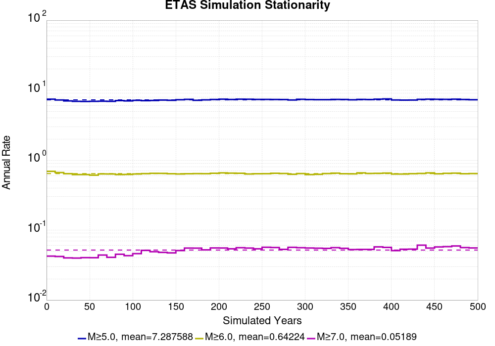

# Start 1919, 500 yr, Log10(k)=-2.31, p=1.08, c=0.04, Scale Factor 1.0, Spontaneous, Historical Catalog Results

|   | Start 1919, 500 yr, Log10(k)=-2.31, p=1.08, c=0.04, Scale Factor 1.0, Spontaneous, Historical Catalog |
|-----|-----|
| Num Simulations | 890 (incomplete) |
| Start Time | 1919/01/01 00:00:00 UTC |
| Start Time Epoch Milliseconds | -1609459200000 |
| Duration | 500 Years |
| Includes Spontaneous? | true |
| Trigger Ruptures | *(none)* |
| Historical Ruptures | 165 Trigger Ruptures |
|   | First: M7.3 at 1852/01/05 04:40:39 UTC |
|   | Last: M6.5 at 1918/07/15 00:24:39 UTC |
|   | Largest: M7.9 at 1857/01/09 16:25:39 UTC |
| Config Generated With | u3etas_config_builder.sh --start-year 1919 --num-simulations 1000 --duration-years 500 --include-spontaneous --historical-catalog --etas-k -2.31 --etas-p 1.08 --etas-c 0.04 --scale-factor 1.0 --hpc-site USC_HPC --nodes 36 --hours 24 --queue scec |

## Table Of Contents

* [Magnitude Frequency Distribution](#magnitude-frequency-distribution)
* [Long Term Rate Variability](#long-term-rate-variability)
  * [162 Year Variability](#162-year-variability)
  * [80 Year Variability](#80-year-variability)
  * [28 Year Variability](#28-year-variability)
  * [Variability Duration Dependence](#variability-duration-dependence)
* [Simulation Stationarity](#simulation-stationarity)
* [Section Participation](#section-participation)
  * [Section Participation Plots](#section-participation-plots)
  * [Supra-Seismogenic Parent Sections Table](#supra-seismogenic-parent-sections-table)
  * [M≥6.5 Parent Sections Table](#m65-parent-sections-table)
  * [M≥7 Parent Sections Table](#m7-parent-sections-table)
  * [M≥7.5 Parent Sections Table](#m75-parent-sections-table)
  * [M≥8 Parent Sections Table](#m8-parent-sections-table)
* [Gridded Nucleation](#gridded-nucleation)
* [JSON Input File](#json-input-file)

## Magnitude Frequency Distribution
*[(top)](#table-of-contents)*

**Legend**
* **Mean** (thick black line): mean annual rate across all 890 catalogs
* **2.5%,97.5%** (thin black lines): annual rate percentiles across all 890 catalogs
* **Median** (thin blue line): median annual rate across all 890 catalogs
* **Mode** (thin cyan line): modal annual rate across all 890 catalogs (scaled to annualized value)
* **500 yr Probability** (thin red line): 500 year probability calculated as the fraction of catalogs with at least 1 occurrence
* **500 yr Supraseismogenic Probability** (thin dashed red line): same as above, but only for supraseismogenic ruptures on explicitly modeled UCERF3 faults
* **95% Conf** (light red shaded region): binomial 95% confidence bounds on probability


| Mag | Mean | 2.5 %ile | 97.5 %ile | Median | Mode | 500 yr Probability | 500 yr Supra-Seis Prob |
|-----|-----|-----|-----|-----|-----|-----|-----|
| **M&ge;5** | 7.285 | 6.734 | 7.924 | 7.262 | 7.198 | 1.000 (100.00%) | 1.000 (100.00%) |
| **M&ge;5.1** | 5.762 | 5.304 | 6.266 | 5.748 | 5.740 | 1.000 (100.00%) | 1.000 (100.00%) |
| **M&ge;5.2** | 4.558 | 4.178 | 4.964 | 4.552 | 4.704 | 1.000 (100.00%) | 1.000 (100.00%) |
| **M&ge;5.3** | 3.599 | 3.278 | 3.948 | 3.596 | 3.518 | 1.000 (100.00%) | 1.000 (100.00%) |
| **M&ge;5.4** | 2.836 | 2.584 | 3.116 | 2.834 | 2.846 | 1.000 (100.00%) | 1.000 (100.00%) |
| **M&ge;5.5** | 2.232 | 2.026 | 2.464 | 2.228 | 2.264 | 1.000 (100.00%) | 1.000 (100.00%) |
| **M&ge;5.6** | 1.750 | 1.572 | 1.940 | 1.746 | 1.780 | 1.000 (100.00%) | 1.000 (100.00%) |
| **M&ge;5.7** | 1.367 | 1.222 | 1.530 | 1.362 | 1.350 | 1.000 (100.00%) | 1.000 (100.00%) |
| **M&ge;5.8** | 1.063 | 0.948 | 1.202 | 1.062 | 1.044 | 1.000 (100.00%) | 1.000 (100.00%) |
| **M&ge;5.9** | 0.811 | 0.714 | 0.918 | 0.808 | 0.802 | 1.000 (100.00%) | 1.000 (100.00%) |
| **M&ge;6** | 0.642 | 0.558 | 0.734 | 0.640 | 0.646 | 1.000 (100.00%) | 1.000 (100.00%) |
| **M&ge;6.1** | 0.494 | 0.424 | 0.568 | 0.492 | 0.484 | 1.000 (100.00%) | 1.000 (100.00%) |
| **M&ge;6.2** | 0.389 | 0.328 | 0.452 | 0.388 | 0.406 | 1.000 (100.00%) | 1.000 (100.00%) |
| **M&ge;6.3** | 0.307 | 0.258 | 0.360 | 0.306 | 0.316 | 1.000 (100.00%) | 1.000 (100.00%) |
| **M&ge;6.4** | 0.240 | 0.200 | 0.288 | 0.238 | 0.238 | 1.000 (100.00%) | 1.000 (100.00%) |
| **M&ge;6.5** | 0.185 | 0.150 | 0.224 | 0.184 | 0.186 | 1.000 (100.00%) | 1.000 (100.00%) |
| **M&ge;6.6** | 0.143 | 0.114 | 0.176 | 0.142 | 0.146 | 1.000 (100.00%) | 1.000 (100.00%) |
| **M&ge;6.7** | 0.110 | 0.084 | 0.138 | 0.110 | 0.102 | 1.000 (100.00%) | 1.000 (100.00%) |
| **M&ge;6.8** | 0.086 | 0.066 | 0.108 | 0.086 | 0.080 | 1.000 (100.00%) | 1.000 (100.00%) |
| **M&ge;6.9** | 0.067 | 0.048 | 0.086 | 0.066 | 0.070 | 1.000 (100.00%) | 1.000 (100.00%) |
| **M&ge;7** | 0.052 | 0.034 | 0.068 | 0.052 | 0.052 | 1.000 (100.00%) | 1.000 (100.00%) |
| **M&ge;7.1** | 0.039 | 0.024 | 0.054 | 0.038 | 0.038 | 1.000 (100.00%) | 1.000 (100.00%) |
| **M&ge;7.2** | 0.029 | 0.018 | 0.042 | 0.028 | 0.028 | 1.000 (100.00%) | 1.000 (100.00%) |
| **M&ge;7.3** | 0.023 | 0.012 | 0.034 | 0.022 | 0.022 | 1.000 (100.00%) | 1.000 (100.00%) |
| **M&ge;7.4** | 0.018 | 0.010 | 0.028 | 0.018 | 0.018 | 1.000 (100.00%) | 1.000 (100.00%) |
| **M&ge;7.5** | 0.012 | 6.00E-3 | 0.020 | 0.012 | 0.010 | 1.000 (100.00%) | 1.000 (100.00%) |
| **M&ge;7.6** | 9.19E-3 | 4.00E-3 | 0.016 | 8.00E-3 | 8.00E-3 | 1.000 (100.00%) | 1.000 (100.00%) |
| **M&ge;7.7** | 6.49E-3 | 2.00E-3 | 0.012 | 6.00E-3 | 6.00E-3 | 0.999 (99.89%) | 0.999 (99.89%) |
| **M&ge;7.8** | 4.51E-3 | 2.00E-3 | 8.00E-3 | 4.00E-3 | 4.00E-3 | 0.983 (98.31%) | 0.983 (98.31%) |
| **M&ge;7.9** | 2.44E-3 | 0.000 | 6.00E-3 | 2.00E-3 | 2.00E-3 | 0.809 (80.90%) | 0.809 (80.90%) |
| **M&ge;8** | 1.31E-3 | 0.000 | 4.00E-3 | 2.00E-3 | 0.000 | 0.545 (54.49%) | 0.545 (54.49%) |
| **M&ge;8.1** | 6.04E-4 | 0.000 | 2.00E-3 | 0.000 | 0.000 | 0.280 (27.98%) | 0.280 (27.98%) |
| **M&ge;8.2** | 2.27E-4 | 0.000 | 2.00E-3 | 0.000 | 0.000 | 0.112 (11.24%) | 0.112 (11.24%) |
| **M&ge;8.3** | 6.07E-5 | 0.000 | 2.00E-3 | 0.000 | 0.000 | 0.030 (3.03%) | 0.030 (3.03%) |
| **M&ge;8.4** | 0.000 | 0.000 | 0.000 | 0.000 | 0.000 | 0.000 (0.00%) | 0.000 (0.00%) |
| **M&ge;8.5** | 0.000 | 0.000 | 0.000 | 0.000 | 0.000 | 0.000 (0.00%) | 0.000 (0.00%) |
| **M&ge;8.6** | 0.000 | 0.000 | 0.000 | 0.000 | 0.000 | 0.000 (0.00%) | 0.000 (0.00%) |
| **M&ge;8.7** | 0.000 | 0.000 | 0.000 | 0.000 | 0.000 | 0.000 (0.00%) | 0.000 (0.00%) |
| **M&ge;8.8** | 0.000 | 0.000 | 0.000 | 0.000 | 0.000 | 0.000 (0.00%) | 0.000 (0.00%) |
| **M&ge;8.9** | 0.000 | 0.000 | 0.000 | 0.000 | 0.000 | 0.000 (0.00%) | 0.000 (0.00%) |
| **M&ge;9** | 0.000 | 0.000 | 0.000 | 0.000 | 0.000 | 0.000 (0.00%) | 0.000 (0.00%) |


## Long Term Rate Variability
*[(top)](#table-of-contents)*

### 162 Year Variability
*[(top)](#table-of-contents)*


[Download CSV Here](plots/long_term_var_162yr.csv)

| **Magnitude** | Mean | Median | Mode | Std. Dev. | 2.5 %-ile | 16 %-ile | 84 %-ile | 97.5 %-ile |
|-----|-----|-----|-----|-----|-----|-----|-----|-----|
| **5.0** | 7.2846856 | 7.2530866 | 7.4382715 | 0.5791913 | 6.271605 | 6.703704 | 7.8641977 | 8.481482 |
| **5.1** | 5.7627435 | 5.7469134 | 5.808642 | 0.47018132 | 4.919753 | 5.2901235 | 6.234568 | 6.7469134 |
| **5.2** | 4.5582743 | 4.537037 | 4.240741 | 0.3822002 | 3.8703704 | 4.1790123 | 4.9444447 | 5.339506 |
| **5.3** | 3.5999005 | 3.5864198 | 3.5432098 | 0.31024346 | 3.0370371 | 3.2901235 | 3.9074075 | 4.228395 |
| **5.4** | 2.8367643 | 2.8271606 | 2.7407408 | 0.25350216 | 2.3765433 | 2.5864198 | 3.080247 | 3.351852 |
| **5.5** | 2.2322745 | 2.2222223 | 2.1049383 | 0.20801635 | 1.8518518 | 2.0246913 | 2.4320989 | 2.648148 |
| **5.6** | 1.7509965 | 1.7407408 | 1.6851852 | 0.17068459 | 1.4382716 | 1.5802469 | 1.9197531 | 2.0987654 |
| **5.7** | 1.3678827 | 1.3641975 | 1.345679 | 0.14087383 | 1.1049383 | 1.2283951 | 1.5061729 | 1.654321 |
| **5.8** | 1.0638877 | 1.0617284 | 1.0802469 | 0.115290314 | 0.845679 | 0.9506173 | 1.1728395 | 1.308642 |
| **5.9** | 0.8110487 | 0.80864197 | 0.79012346 | 0.09451463 | 0.63580245 | 0.7160494 | 0.90123457 | 1.0123457 |
| **6.0** | 0.6423591 | 0.63580245 | 0.6296296 | 0.07869431 | 0.5 | 0.5617284 | 0.7222222 | 0.8148148 |
| **6.1** | 0.4941601 | 0.48765433 | 0.49382716 | 0.06596832 | 0.37654322 | 0.42592594 | 0.5555556 | 0.63580245 |
| **6.2** | 0.3894576 | 0.3888889 | 0.3888889 | 0.055938203 | 0.28395063 | 0.33333334 | 0.44444445 | 0.50617284 |
| **6.3** | 0.30760622 | 0.30864197 | 0.28395063 | 0.04780846 | 0.21604939 | 0.25925925 | 0.3580247 | 0.4074074 |
| **6.4** | 0.23984833 | 0.2345679 | 0.22839506 | 0.041068565 | 0.16666667 | 0.19753087 | 0.28395063 | 0.32098764 |
| **6.5** | 0.18446618 | 0.17901234 | 0.16666667 | 0.035526585 | 0.12345679 | 0.14814815 | 0.22222222 | 0.25925925 |
| **6.6** | 0.14304341 | 0.14197531 | 0.14197531 | 0.030636951 | 0.086419754 | 0.11111111 | 0.17283951 | 0.20987654 |
| **6.7** | 0.109446526 | 0.10493827 | 0.10493827 | 0.0262528 | 0.061728396 | 0.086419754 | 0.13580246 | 0.16666667 |
| **6.8** | 0.085649885 | 0.086419754 | 0.086419754 | 0.022462873 | 0.043209877 | 0.061728396 | 0.10493827 | 0.12962963 |
| **6.9** | 0.06646322 | 0.06790123 | 0.06790123 | 0.019931715 | 0.030864198 | 0.049382716 | 0.086419754 | 0.11111111 |
| **7.0** | 0.05158598 | 0.049382716 | 0.049382716 | 0.017514471 | 0.018518519 | 0.037037037 | 0.06790123 | 0.086419754 |
| **7.1** | 0.03900911 | 0.037037037 | 0.037037037 | 0.0150542995 | 0.012345679 | 0.024691358 | 0.055555556 | 0.074074075 |
| **7.2** | 0.02920886 | 0.030864198 | 0.024691358 | 0.012851083 | 0.0061728396 | 0.018518519 | 0.043209877 | 0.055555556 |
| **7.3** | 0.02283257 | 0.024691358 | 0.018518519 | 0.011094612 | 0.0061728396 | 0.012345679 | 0.030864198 | 0.049382716 |
| **7.4** | 0.017512832 | 0.018518519 | 0.018518519 | 0.009558837 | 0.0 | 0.0061728396 | 0.024691358 | 0.037037037 |
| **7.5** | 0.012391917 | 0.012345679 | 0.012345679 | 0.007930957 | 0.0 | 0.0061728396 | 0.018518519 | 0.030864198 |
| **7.6** | 0.009182965 | 0.0061728396 | 0.0061728396 | 0.006510623 | 0.0 | 0.0 | 0.018518519 | 0.024691358 |
| **7.7** | 0.0064572063 | 0.0061728396 | 0.0061728396 | 0.0054902122 | 0.0 | 0.0 | 0.012345679 | 0.018518519 |
| **7.8** | 0.00449207 | 0.0061728396 | 0.0061728396 | 0.0044755572 | 0.0 | 0.0 | 0.0061728396 | 0.012345679 |
| **7.9** | 0.0024390807 | 0.0 | 0.0 | 0.003396668 | 0.0 | 0.0 | 0.0061728396 | 0.012345679 |
| **8.0** | 0.0013108614 | 0.0 | 0.0 | 0.0026029807 | 0.0 | 0.0 | 0.0061728396 | 0.0061728396 |
| **8.1** | 6.034124E-4 | 0.0 | 0.0 | 0.001849061 | 0.0 | 0.0 | 0.0 | 0.0061728396 |
| **8.2** | 2.2888057E-4 | 0.0 | 0.0 | 0.0011666047 | 0.0 | 0.0 | 0.0 | 0.0061728396 |
| **8.3** | 6.2421976E-5 | 0.0 | 0.0 | 6.177113E-4 | 0.0 | 0.0 | 0.0 | 0.0 |
| **8.4** | 0.0 | 0.0 | 0.0 | 0.0 | 0.0 | 0.0 | 0.0 | 0.0 |
| **8.5** | 0.0 | 0.0 | 0.0 | 0.0 | 0.0 | 0.0 | 0.0 | 0.0 |
| **8.6** | 0.0 | 0.0 | 0.0 | 0.0 | 0.0 | 0.0 | 0.0 | 0.0 |
| **8.7** | 0.0 | 0.0 | 0.0 | 0.0 | 0.0 | 0.0 | 0.0 | 0.0 |
| **8.8** | 0.0 | 0.0 | 0.0 | 0.0 | 0.0 | 0.0 | 0.0 | 0.0 |
| **8.9** | 0.0 | 0.0 | 0.0 | 0.0 | 0.0 | 0.0 | 0.0 | 0.0 |
| **9.0** | 0.0 | 0.0 | 0.0 | 0.0 | 0.0 | 0.0 | 0.0 | 0.0 |

### 80 Year Variability
*[(top)](#table-of-contents)*


[Download CSV Here](plots/long_term_var_80yr.csv)

| **Magnitude** | Mean | Median | Mode | Std. Dev. | 2.5 %-ile | 16 %-ile | 84 %-ile | 97.5 %-ile |
|-----|-----|-----|-----|-----|-----|-----|-----|-----|
| **5.0** | 7.2828326 | 7.2 | 7.4125 | 0.8591595 | 5.8625 | 6.45 | 8.1375 | 9.1875 |
| **5.1** | 5.7609057 | 5.7 | 5.7 | 0.6957678 | 4.6 | 5.075 | 6.4375 | 7.2875 |
| **5.2** | 4.5566807 | 4.5125 | 4.3875 | 0.56400895 | 3.6 | 4.0 | 5.1125 | 5.7875 |
| **5.3** | 3.598619 | 3.5625 | 3.375 | 0.45640123 | 2.8125 | 3.15 | 4.0375 | 4.5875 |
| **5.4** | 2.8356414 | 2.8125 | 2.7625 | 0.37211633 | 2.2 | 2.4625 | 3.2 | 3.6375 |
| **5.5** | 2.2314584 | 2.2125 | 2.2125 | 0.30319074 | 1.7 | 1.925 | 2.5375 | 2.875 |
| **5.6** | 1.7503464 | 1.7375 | 1.725 | 0.2483213 | 1.3125 | 1.5 | 2.0 | 2.275 |
| **5.7** | 1.3674321 | 1.35 | 1.3625 | 0.20400614 | 1.0125 | 1.1625 | 1.5625 | 1.8 |
| **5.8** | 1.0636446 | 1.05 | 1.025 | 0.16637586 | 0.775 | 0.9 | 1.225 | 1.425 |
| **5.9** | 0.81078887 | 0.8 | 0.825 | 0.13498938 | 0.5625 | 0.675 | 0.95 | 1.1 |
| **6.0** | 0.6422472 | 0.6375 | 0.6625 | 0.1135511 | 0.4375 | 0.525 | 0.75 | 0.8875 |
| **6.1** | 0.49399814 | 0.4875 | 0.4875 | 0.09586026 | 0.325 | 0.4 | 0.5875 | 0.7 |
| **6.2** | 0.3893001 | 0.3875 | 0.4 | 0.08116594 | 0.2375 | 0.3125 | 0.475 | 0.5625 |
| **6.3** | 0.3075 | 0.3 | 0.275 | 0.070246354 | 0.1875 | 0.2375 | 0.375 | 0.45 |
| **6.4** | 0.23971207 | 0.2375 | 0.2125 | 0.05977844 | 0.1375 | 0.175 | 0.3 | 0.3625 |
| **6.5** | 0.18433754 | 0.1875 | 0.175 | 0.051698193 | 0.0875 | 0.1375 | 0.2375 | 0.3 |
| **6.6** | 0.142919 | 0.1375 | 0.125 | 0.044395655 | 0.0625 | 0.1 | 0.1875 | 0.2375 |
| **6.7** | 0.10932116 | 0.1125 | 0.1 | 0.03827539 | 0.0375 | 0.075 | 0.15 | 0.1875 |
| **6.8** | 0.08552903 | 0.0875 | 0.075 | 0.033128582 | 0.025 | 0.05 | 0.1125 | 0.15 |
| **6.9** | 0.0663647 | 0.0625 | 0.0625 | 0.029118797 | 0.0125 | 0.0375 | 0.1 | 0.125 |
| **7.0** | 0.05150983 | 0.05 | 0.0375 | 0.025486402 | 0.0125 | 0.025 | 0.075 | 0.1125 |
| **7.1** | 0.038967695 | 0.0375 | 0.0375 | 0.022257425 | 0.0 | 0.0125 | 0.0625 | 0.0875 |
| **7.2** | 0.029145598 | 0.025 | 0.025 | 0.019127743 | 0.0 | 0.0125 | 0.05 | 0.075 |
| **7.3** | 0.022766855 | 0.025 | 0.0125 | 0.016506111 | 0.0 | 0.0125 | 0.0375 | 0.0625 |
| **7.4** | 0.017453184 | 0.0125 | 0.0125 | 0.014187182 | 0.0 | 0.0 | 0.025 | 0.05 |
| **7.5** | 0.012347846 | 0.0125 | 0.0125 | 0.011698415 | 0.0 | 0.0 | 0.025 | 0.0375 |
| **7.6** | 0.009159644 | 0.0125 | 0.0 | 0.009927605 | 0.0 | 0.0 | 0.0125 | 0.0375 |
| **7.7** | 0.00642088 | 0.0 | 0.0 | 0.008331776 | 0.0 | 0.0 | 0.0125 | 0.025 |
| **7.8** | 0.004456929 | 0.0 | 0.0 | 0.006853839 | 0.0 | 0.0 | 0.0125 | 0.025 |
| **7.9** | 0.0024297752 | 0.0 | 0.0 | 0.005144224 | 0.0 | 0.0 | 0.0125 | 0.0125 |
| **8.0** | 0.0013155431 | 0.0 | 0.0 | 0.0038514223 | 0.0 | 0.0 | 0.0 | 0.0125 |
| **8.1** | 6.062734E-4 | 0.0 | 0.0 | 0.002685554 | 0.0 | 0.0 | 0.0 | 0.0125 |
| **8.2** | 2.2940074E-4 | 0.0 | 0.0 | 0.001677919 | 0.0 | 0.0 | 0.0 | 0.0 |
| **8.3** | 6.320225E-5 | 0.0 | 0.0 | 8.866684E-4 | 0.0 | 0.0 | 0.0 | 0.0 |
| **8.4** | 0.0 | 0.0 | 0.0 | 0.0 | 0.0 | 0.0 | 0.0 | 0.0 |
| **8.5** | 0.0 | 0.0 | 0.0 | 0.0 | 0.0 | 0.0 | 0.0 | 0.0 |
| **8.6** | 0.0 | 0.0 | 0.0 | 0.0 | 0.0 | 0.0 | 0.0 | 0.0 |
| **8.7** | 0.0 | 0.0 | 0.0 | 0.0 | 0.0 | 0.0 | 0.0 | 0.0 |
| **8.8** | 0.0 | 0.0 | 0.0 | 0.0 | 0.0 | 0.0 | 0.0 | 0.0 |
| **8.9** | 0.0 | 0.0 | 0.0 | 0.0 | 0.0 | 0.0 | 0.0 | 0.0 |
| **9.0** | 0.0 | 0.0 | 0.0 | 0.0 | 0.0 | 0.0 | 0.0 | 0.0 |

### 28 Year Variability
*[(top)](#table-of-contents)*


[Download CSV Here](plots/long_term_var_28yr.csv)

| **Magnitude** | Mean | Median | Mode | Std. Dev. | 2.5 %-ile | 16 %-ile | 84 %-ile | 97.5 %-ile |
|-----|-----|-----|-----|-----|-----|-----|-----|-----|
| **5.0** | 7.281163 | 7.035714 | 6.785714 | 1.458818 | 5.142857 | 5.964286 | 8.607142 | 10.857142 |
| **5.1** | 5.7595954 | 5.571429 | 5.214286 | 1.1780853 | 4.0 | 4.678571 | 6.821429 | 8.642858 |
| **5.2** | 4.5557146 | 4.428571 | 4.142857 | 0.95515543 | 3.0714285 | 3.6785715 | 5.428571 | 6.821429 |
| **5.3** | 3.59801 | 3.5 | 3.2142856 | 0.7749052 | 2.392857 | 2.892857 | 4.321429 | 5.464286 |
| **5.4** | 2.8353767 | 2.75 | 2.642857 | 0.63019323 | 1.8214285 | 2.25 | 3.4285715 | 4.321429 |
| **5.5** | 2.2311208 | 2.1785715 | 2.142857 | 0.51305497 | 1.3928572 | 1.75 | 2.7142856 | 3.4285715 |
| **5.6** | 1.7501416 | 1.7142857 | 1.6428572 | 0.41953054 | 1.0357143 | 1.3571428 | 2.142857 | 2.7142856 |
| **5.7** | 1.3672906 | 1.3214285 | 1.2857143 | 0.34326053 | 0.78571427 | 1.0357143 | 1.6785715 | 2.142857 |
| **5.8** | 1.0635823 | 1.0357143 | 0.96428573 | 0.28154472 | 0.5714286 | 0.78571427 | 1.3214285 | 1.7142857 |
| **5.9** | 0.81078744 | 0.78571427 | 0.78571427 | 0.22932614 | 0.42857143 | 0.5714286 | 1.0357143 | 1.3214285 |
| **6.0** | 0.6422741 | 0.64285713 | 0.60714287 | 0.19309029 | 0.32142857 | 0.4642857 | 0.8214286 | 1.0714285 |
| **6.1** | 0.49399728 | 0.4642857 | 0.4642857 | 0.16302302 | 0.21428572 | 0.32142857 | 0.64285713 | 0.85714287 |
| **6.2** | 0.38930696 | 0.39285713 | 0.35714287 | 0.13870293 | 0.14285715 | 0.25 | 0.53571427 | 0.6785714 |
| **6.3** | 0.30743793 | 0.2857143 | 0.2857143 | 0.1201316 | 0.10714286 | 0.17857143 | 0.42857143 | 0.5714286 |
| **6.4** | 0.23964924 | 0.21428572 | 0.21428572 | 0.103466876 | 0.071428575 | 0.14285715 | 0.35714287 | 0.4642857 |
| **6.5** | 0.18423662 | 0.17857143 | 0.14285715 | 0.089022376 | 0.035714287 | 0.10714286 | 0.2857143 | 0.39285713 |
| **6.6** | 0.14280757 | 0.14285715 | 0.10714286 | 0.07674792 | 0.035714287 | 0.071428575 | 0.21428572 | 0.32142857 |
| **6.7** | 0.109198846 | 0.10714286 | 0.10714286 | 0.06611216 | 0.0 | 0.035714287 | 0.17857143 | 0.25 |
| **6.8** | 0.08540978 | 0.071428575 | 0.071428575 | 0.057797186 | 0.0 | 0.035714287 | 0.14285715 | 0.21428572 |
| **6.9** | 0.066216595 | 0.071428575 | 0.035714287 | 0.05051078 | 0.0 | 0.0 | 0.10714286 | 0.17857143 |
| **7.0** | 0.05139505 | 0.035714287 | 0.035714287 | 0.044152215 | 0.0 | 0.0 | 0.10714286 | 0.14285715 |
| **7.1** | 0.038891513 | 0.035714287 | 0.035714287 | 0.03822649 | 0.0 | 0.0 | 0.071428575 | 0.14285715 |
| **7.2** | 0.029088376 | 0.035714287 | 0.0 | 0.032714482 | 0.0 | 0.0 | 0.071428575 | 0.10714286 |
| **7.3** | 0.022724483 | 0.0 | 0.0 | 0.028531445 | 0.0 | 0.0 | 0.035714287 | 0.10714286 |
| **7.4** | 0.017432254 | 0.0 | 0.0 | 0.024720468 | 0.0 | 0.0 | 0.035714287 | 0.071428575 |
| **7.5** | 0.012328864 | 0.0 | 0.0 | 0.020670652 | 0.0 | 0.0 | 0.035714287 | 0.071428575 |
| **7.6** | 0.009137475 | 0.0 | 0.0 | 0.017701505 | 0.0 | 0.0 | 0.035714287 | 0.035714287 |
| **7.7** | 0.006396941 | 0.0 | 0.0 | 0.0148129165 | 0.0 | 0.0 | 0.035714287 | 0.035714287 |
| **7.8** | 0.0044400906 | 0.0 | 0.0 | 0.012274881 | 0.0 | 0.0 | 0.0 | 0.035714287 |
| **7.9** | 0.002424228 | 0.0 | 0.0 | 0.009095683 | 0.0 | 0.0 | 0.0 | 0.035714287 |
| **8.0** | 0.0013124351 | 0.0 | 0.0 | 0.0067321467 | 0.0 | 0.0 | 0.0 | 0.035714287 |
| **8.1** | 5.995657E-4 | 0.0 | 0.0 | 0.0045885695 | 0.0 | 0.0 | 0.0 | 0.0 |
| **8.2** | 2.2424701E-4 | 0.0 | 0.0 | 0.0028211807 | 0.0 | 0.0 | 0.0 | 0.0 |
| **8.3** | 6.137286E-5 | 0.0 | 0.0 | 0.0014792789 | 0.0 | 0.0 | 0.0 | 0.0 |
| **8.4** | 0.0 | 0.0 | 0.0 | 0.0 | 0.0 | 0.0 | 0.0 | 0.0 |
| **8.5** | 0.0 | 0.0 | 0.0 | 0.0 | 0.0 | 0.0 | 0.0 | 0.0 |
| **8.6** | 0.0 | 0.0 | 0.0 | 0.0 | 0.0 | 0.0 | 0.0 | 0.0 |
| **8.7** | 0.0 | 0.0 | 0.0 | 0.0 | 0.0 | 0.0 | 0.0 | 0.0 |
| **8.8** | 0.0 | 0.0 | 0.0 | 0.0 | 0.0 | 0.0 | 0.0 | 0.0 |
| **8.9** | 0.0 | 0.0 | 0.0 | 0.0 | 0.0 | 0.0 | 0.0 | 0.0 |
| **9.0** | 0.0 | 0.0 | 0.0 | 0.0 | 0.0 | 0.0 | 0.0 | 0.0 |

### Variability Duration Dependence
*[(top)](#table-of-contents)*


[Download CSV Here](plots/long_term_var_m5.csv)

| **Duration (years)** | Mean | Median | Mode | Std. Dev. | 2.5 %-ile | 16 %-ile | 84 %-ile | 97.5 %-ile |
|-----|-----|-----|-----|-----|-----|-----|-----|-----|
| **1.0** | 7.28453 | 6.0 | 5.0 | 6.1254272 | 1.0 | 3.0 | 10.0 | 20.0 |
| **4.0** | 7.28453 | 6.5 | 6.0 | 3.4450765 | 3.25 | 4.75 | 9.5 | 16.25 |
| **8.0** | 7.284199 | 6.75 | 6.125 | 2.566675 | 4.125 | 5.25 | 9.125 | 14.125 |
| **12.0** | 7.2837534 | 6.8333335 | 6.1666665 | 2.1528192 | 4.4166665 | 5.5 | 8.916667 | 13.0 |
| **16.0** | 7.284199 | 6.875 | 6.625 | 1.8994625 | 4.75 | 5.625 | 8.875 | 12.25 |
| **20.0** | 7.28453 | 6.95 | 6.9 | 1.7154018 | 4.85 | 5.8 | 8.8 | 11.65 |
| **24.0** | 7.2828326 | 7.0 | 6.7916665 | 1.5766945 | 5.0 | 5.875 | 8.666667 | 11.291667 |
| **28.0** | 7.281163 | 7.035714 | 6.785714 | 1.458818 | 5.142857 | 5.964286 | 8.607142 | 10.857142 |
| **32.0** | 7.2828326 | 7.03125 | 6.75 | 1.37428 | 5.25 | 6.03125 | 8.53125 | 10.625 |
| **36.0** | 7.2790694 | 7.0555553 | 6.611111 | 1.2965729 | 5.3055553 | 6.0833335 | 8.5 | 10.361111 |
| **40.0** | 7.2828326 | 7.1 | 7.025 | 1.2257706 | 5.375 | 6.125 | 8.4 | 10.225 |
| **44.0** | 7.284107 | 7.1136365 | 6.590909 | 1.1749817 | 5.431818 | 6.181818 | 8.409091 | 10.022727 |
| **48.0** | 7.2828326 | 7.125 | 6.7291665 | 1.1270338 | 5.5208335 | 6.2291665 | 8.354167 | 9.895833 |
| **52.0** | 7.2790694 | 7.1346154 | 6.673077 | 1.0747447 | 5.5576925 | 6.25 | 8.326923 | 9.788462 |
| **56.0** | 7.274995 | 7.142857 | 7.071429 | 1.0333918 | 5.571429 | 6.303571 | 8.267858 | 9.714286 |
| **60.0** | 7.2828326 | 7.15 | 7.133333 | 0.99674356 | 5.65 | 6.3333335 | 8.25 | 9.566667 |
| **64.0** | 7.274995 | 7.15625 | 6.671875 | 0.9677509 | 5.6875 | 6.34375 | 8.234375 | 9.484375 |
| **68.0** | 7.281163 | 7.1911764 | 6.720588 | 0.94173515 | 5.7352943 | 6.352941 | 8.205882 | 9.382353 |
| **72.0** | 7.2697124 | 7.1666665 | 7.0694447 | 0.9075252 | 5.763889 | 6.388889 | 8.152778 | 9.333333 |
| **76.0** | 7.2768307 | 7.1842103 | 7.144737 | 0.88871 | 5.7894735 | 6.4210525 | 8.144737 | 9.276316 |
| **80.0** | 7.2828326 | 7.2 | 7.4125 | 0.8591595 | 5.8625 | 6.45 | 8.1375 | 9.1875 |
| **84.0** | 7.2705245 | 7.178571 | 7.095238 | 0.83695215 | 5.857143 | 6.452381 | 8.095238 | 9.142858 |
| **88.0** | 7.271813 | 7.193182 | 7.0795455 | 0.81584597 | 5.8522725 | 6.4772725 | 8.079545 | 9.0 |
| **92.0** | 7.2785416 | 7.195652 | 6.8913045 | 0.8009625 | 5.923913 | 6.4891305 | 8.086957 | 8.956522 |
| **96.0** | 7.2828326 | 7.2291665 | 7.4895835 | 0.7764671 | 5.9583335 | 6.5208335 | 8.052083 | 8.9375 |
| **100.0** | 7.28453 | 7.23 | 6.86 | 0.7599591 | 5.99 | 6.53 | 8.05 | 8.96 |
| **200.0** | 7.271483 | 7.25 | 7.025 | 0.5206664 | 6.335 | 6.765 | 7.785 | 8.35 |
| **300.0** | 7.228049 | 7.22 | 7.1233335 | 0.3999588 | 6.463333 | 6.83 | 7.6266665 | 8.03 |
| **400.0** | 7.271483 | 7.2525 | 7.275 | 0.3511235 | 6.6225 | 6.925 | 7.6175 | 8.0 |
| **500.0** | 7.28453 | 7.262 | 7.198 | 0.30511227 | 6.734 | 6.99 | 7.592 | 7.924 |


## Simulation Stationarity
*[(top)](#table-of-contents)*




## Section Participation
*[(top)](#table-of-contents)*

### Section Participation Plots
*[(top)](#table-of-contents)*

| Min Mag | Complete Catalog (including spontaneous) |
|-----|-----|
| **All Supra. Seis.** |  |
| **M&ge;6.5** |  |
| **M&ge;7** |  |
| **M&ge;7.5** |  |
| **M&ge;8** |  |

### Supra-Seismogenic Parent Sections Table
*[(top)](#table-of-contents)*

*First 10 of 313 with matching ruptures shown*

| Parent Name | Total Mean Annual Rate | Total 500 Year Prob |
|-----|-----|-----|
| San Andreas (Parkfield) | 0.043570787 | 1.0 |
| San Andreas (Creeping Section) 2011 CFM | 0.027406741 | 1.0 |
| San Andreas (Mojave S) | 0.018258426 | 1.0 |
| Mendocino | 0.016411236 | 1.0 |
| Cerro Prieto | 0.012626966 | 0.9977528 |
| Imperial | 0.011377528 | 1.0 |
| Brawley (Seismic Zone) alt 1 | 0.010519101 | 1.0 |
| Hayward (So) 2011 CFM | 0.008633708 | 0.9988764 |
| San Andreas (Offshore) 2011 CFM | 0.0071011237 | 0.99662924 |
| Elsinore (Glen Ivy) rev | 0.007094382 | 0.9831461 |

### M≥6.5 Parent Sections Table
*[(top)](#table-of-contents)*

*First 10 of 306 with matching ruptures shown*

| Parent Name | Total Mean Annual Rate | Total 500 Year Prob |
|-----|-----|-----|
| Cerro Prieto | 0.010696629 | 0.9977528 |
| San Andreas (Creeping Section) 2011 CFM | 0.0098337075 | 1.0 |
| Mendocino | 0.007997753 | 0.99662924 |
| Imperial | 0.0077820225 | 0.99550563 |
| Brawley (Seismic Zone) alt 1 | 0.0073842695 | 0.994382 |
| Hayward (So) 2011 CFM | 0.0072921347 | 0.99550563 |
| San Andreas (Mojave S) | 0.0063011236 | 0.9988764 |
| San Andreas (Santa Cruz Mts) 2011 CFM | 0.006186517 | 0.994382 |
| San Andreas (San Bernardino N) | 0.005919101 | 0.994382 |
| San Andreas (Cholame) rev | 0.0052314606 | 0.9977528 |

### M≥7 Parent Sections Table
*[(top)](#table-of-contents)*

*First 10 of 273 with matching ruptures shown*

| Parent Name | Total Mean Annual Rate | Total 500 Year Prob |
|-----|-----|-----|
| San Andreas (Creeping Section) 2011 CFM | 0.0059797755 | 0.9853933 |
| San Andreas (Carrizo) rev | 0.004885393 | 1.0 |
| San Andreas (Cholame) rev | 0.004885393 | 0.99550563 |
| San Andreas (Santa Cruz Mts) 2011 CFM | 0.0047370787 | 0.9853933 |
| San Andreas (Mojave S) | 0.0044651683 | 0.99550563 |
| San Andreas (Mojave N) | 0.0039932583 | 0.994382 |
| San Andreas (Coachella) rev | 0.0039033708 | 0.9730337 |
| San Andreas (San Bernardino N) | 0.0038651684 | 0.95730335 |
| San Andreas (Big Bend) | 0.0037865168 | 0.99101126 |
| San Andreas (North Coast) 2011 CFM | 0.0037280899 | 0.9831461 |

### M≥7.5 Parent Sections Table
*[(top)](#table-of-contents)*

*First 10 of 211 with matching ruptures shown*

| Parent Name | Total Mean Annual Rate | Total 500 Year Prob |
|-----|-----|-----|
| San Andreas (Mojave N) | 0.0038966292 | 0.9921348 |
| San Andreas (Big Bend) | 0.0036337078 | 0.98764044 |
| San Andreas (Mojave S) | 0.003541573 | 0.9831461 |
| San Andreas (Carrizo) rev | 0.0034292135 | 0.9797753 |
| San Andreas (Cholame) rev | 0.0032674158 | 0.95842695 |
| San Andreas (North Coast) 2011 CFM | 0.0029865168 | 0.9550562 |
| San Andreas (Creeping Section) 2011 CFM | 0.0028898877 | 0.858427 |
| San Andreas (San Bernardino N) | 0.002833708 | 0.88314605 |
| San Andreas (Parkfield) | 0.002541573 | 0.8449438 |
| San Andreas (Peninsula) 2011 CFM | 0.0025123595 | 0.89213485 |

### M≥8 Parent Sections Table
*[(top)](#table-of-contents)*

*First 10 of 57 with matching ruptures shown*

| Parent Name | Total Mean Annual Rate | Total 500 Year Prob |
|-----|-----|-----|
| San Andreas (Mojave N) | 0.0011573033 | 0.49550563 |
| San Andreas (Carrizo) rev | 0.001152809 | 0.49438202 |
| San Andreas (Mojave S) | 0.0011438202 | 0.48988765 |
| San Andreas (Big Bend) | 0.0011393258 | 0.48988765 |
| San Andreas (Cholame) rev | 0.0011213484 | 0.48314607 |
| San Andreas (San Bernardino N) | 0.0010876404 | 0.4730337 |
| San Andreas (Parkfield) | 9.730337E-4 | 0.43033707 |
| San Andreas (Creeping Section) 2011 CFM | 9.3483145E-4 | 0.41460675 |
| San Andreas (Santa Cruz Mts) 2011 CFM | 6.47191E-4 | 0.2955056 |
| San Andreas (Peninsula) 2011 CFM | 5.820225E-4 | 0.27078652 |

## Gridded Nucleation
*[(top)](#table-of-contents)*

| Min Mag | Complete Catalog (including spontaneous) |
|-----|-----|
| **M&ge;5** |  |
| **M&ge;6** |  |
| **M&ge;7** |  |


## JSON Input File
*[(top)](#table-of-contents)*

```
{
  "numSimulations": 1000,
  "duration": 500.0,
  "startYear": 1919,
  "includeSpontaneous": true,
  "randomSeed": 1567206915843,
  "binaryOutput": true,
  "binaryOutputFilters": [
    {
      "prefix": "results_complete",
      "descendantsOnly": false
    },
    {
      "prefix": "results_m5_preserve_chain",
      "minMag": 5.0,
      "preserveChainBelowMag": true,
      "descendantsOnly": false
    }
  ],
  "forceRecalc": false,
  "simulationName": "Start 1919, 500 yr, Log10(k)\u003d-2.31, p\u003d1.08, c\u003d0.04, Scale Factor 1.0, Spontaneous, Historical Catalog",
  "numRetries": 3,
  "outputDir": "${ETAS_SIM_DIR}/2019_08_30-Start1919_500yr_Log10_k_2p31_p1p08_c0p04_ScaleFactor1p0_Spontaneous_HistoricalCatalog-includeSpont-histCatalog-full_td-modParams",
  "triggerCatalog": "${ETAS_LAUNCHER}/inputs/u3_historical_catalog.txt",
  "triggerCatalogSurfaceMappings": "${ETAS_LAUNCHER}/inputs/u3_historical_catalog_finite_fault_mappings.xml",
  "treatTriggerCatalogAsSpontaneous": true,
  "cacheDir": "${ETAS_LAUNCHER}/inputs/cache_fm3p1_ba",
  "fssFile": "${ETAS_LAUNCHER}/inputs/2013_05_10-ucerf3p3-production-10runs_COMPOUND_SOL_FM3_1_SpatSeisU3_MEAN_BRANCH_AVG_SOL.zip",
  "probModel": "FULL_TD",
  "applySubSeisForSupraNucl": true,
  "totRateScaleFactor": 1.0,
  "gridSeisCorr": true,
  "timeIndependentERF": false,
  "griddedOnly": false,
  "imposeGR": false,
  "includeIndirectTriggering": true,
  "gridSeisDiscr": 0.1,
  "catalogCompletenessModel": "RELAXED",
  "etas_p": 1.08,
  "etas_c": 0.04,
  "etas_log10_k": -2.31,
  "configCommand": "u3etas_config_builder.sh --start-year 1919 --num-simulations 1000 --duration-years 500 --include-spontaneous --historical-catalog --etas-k -2.31 --etas-p 1.08 --etas-c 0.04 --scale-factor 1.0 --hpc-site USC_HPC --nodes 36 --hours 24 --queue scec",
  "configTime": 1567206915843
}
```

