# Parent Section Magnitude-Probability Distributions

## Table Of Contents

* [Airport Lake](#airport-lake)
* [Almanor 2011 CFM](#almanor-2011-cfm)
* [Anacapa-Dume alt 1](#anacapa-dume-alt-1)
* [Anaheim](#anaheim)
* [Antelope Valley 2011](#antelope-valley-2011)
* [Ash Hill](#ash-hill)
* [Baker](#baker)
* [Bartlett Springs 2011 CFM](#bartlett-springs-2011-cfm)
* [Battle Creek 2011 CFM](#battle-creek-2011-cfm)
* [Bear River fault zone](#bear-river-fault-zone)
* [Bennett Valley 2011 CFM](#bennett-valley-2011-cfm)
* [Bicycle Lake](#bicycle-lake)
* [Big Lagoon - Bald Mtn 2011 CFM](#big-lagoon---bald-mtn-2011-cfm)
* [Big Pine (Central)](#big-pine-central)
* [Big Pine (East)](#big-pine-east)
* [Big Pine (West)](#big-pine-west)
* [Blackwater](#blackwater)
* [Blue Cut](#blue-cut)
* [Brawley (Seismic Zone) alt 1](#brawley-seismic-zone-alt-1)
* [Breckenridge 2011](#breckenridge-2011)
* [Bullion Mountains](#bullion-mountains)
* [Burnt Mtn](#burnt-mtn)
* [Butano 2011 CFM](#butano-2011-cfm)
* [Cady](#cady)
* [Calaveras (Central) 2011 CFM](#calaveras-central-2011-cfm)
* [Calaveras (No) 2011 CFM](#calaveras-no-2011-cfm)
* [Calaveras (So) - Paicines extension 2011 CFM](#calaveras-so---paicines-extension-2011-cfm)
* [Calaveras (So) 2011 CFM](#calaveras-so-2011-cfm)
* [Calico-Hidalgo](#calico-hidalgo)
* [Camp Rock 2011](#camp-rock-2011)
* [Canada David (Detachment)](#canada-david-detachment)
* [Carlsbad](#carlsbad)
* [Carson Range (Genoa)](#carson-range-genoa)
* [Casmalia 2011 CFM](#casmalia-2011-cfm)
* [Cedar Mtn-Mahogany Mtn](#cedar-mtn-mahogany-mtn)
* [Cerro Prieto](#cerro-prieto)
* [Channel Islands Thrust](#channel-islands-thrust)
* [Channel Islands Western Deep Ramp](#channel-islands-western-deep-ramp)
* [Chino alt 1](#chino-alt-1)
* [Clamshell-Sawpit](#clamshell-sawpit)
* [Clayton](#clayton)
* [Cleghorn](#cleghorn)
* [Cleghorn Lake](#cleghorn-lake)
* [Cleghorn Pass](#cleghorn-pass)
* [Collayami 2011 CFM](#collayami-2011-cfm)
* [Compton](#compton)
* [Concord 2011 CFM](#concord-2011-cfm)
* [Contra Costa (Lafayette) 2011 CFM](#contra-costa-lafayette-2011-cfm)
* [Contra Costa Shear Zone (connector) 2011 CFM](#contra-costa-shear-zone-connector-2011-cfm)
* [Coronado Bank alt1](#coronado-bank-alt1)
* [Coyote Canyon](#coyote-canyon)
* [Coyote Lake](#coyote-lake)
* [Cucamonga](#cucamonga)
* [Davis Creek](#davis-creek)
* [Death Valley (Black Mtns Frontal)](#death-valley-black-mtns-frontal)
* [Death Valley (Fish Lake Valley)](#death-valley-fish-lake-valley)
* [Death Valley (No)](#death-valley-no)
* [Death Valley (So)](#death-valley-so)
* [Deep Springs](#deep-springs)
* [Del Valle](#del-valle)
* [Dog Valley](#dog-valley)
* [Dry Mountain](#dry-mountain)
* [Earthquake Valley](#earthquake-valley)
* [Earthquake Valley (No  Extension)](#earthquake-valley-no--extension)
* [Earthquake Valley (So Extension)](#earthquake-valley-so-extension)
* [East Huasna 2011 CFM](#east-huasna-2011-cfm)
* [Eaton Roughs 2011 CFM](#eaton-roughs-2011-cfm)
* [Elmore Ranch](#elmore-ranch)
* [Elsinore (Coyote Mountains)](#elsinore-coyote-mountains)
* [Elsinore (Glen Ivy) rev](#elsinore-glen-ivy-rev)
* [Elsinore (Julian)](#elsinore-julian)
* [Elsinore (Stepovers Combined)](#elsinore-stepovers-combined)
* [Elsinore (Temecula) rev](#elsinore-temecula-rev)
* [Elysian Park (Lower CFM)](#elysian-park-lower-cfm)
* [Elysian Park (Upper)](#elysian-park-upper)
* [Emerson-Copper Mtn 2011](#emerson-copper-mtn-2011)
* [Eureka Peak](#eureka-peak)
* [Fickle Hill (alt1)](#fickle-hill-alt1)
* [Fish Slough 2011 CFM](#fish-slough-2011-cfm)
* [Fitzhugh Creek](#fitzhugh-creek)
* [Fontana (Seismicity)](#fontana-seismicity)
* [Franklin 2011 CFM](#franklin-2011-cfm)
* [Garberville - Briceland 2011 CFM](#garberville---briceland-2011-cfm)
* [Garlic Springs](#garlic-springs)
* [Garlock (Central)](#garlock-central)
* [Garlock (East)](#garlock-east)
* [Garlock (West)](#garlock-west)
* [Gillem - Big Crack 2011 CFM](#gillem---big-crack-2011-cfm)
* [Goldstone Lake](#goldstone-lake)
* [Goose Lake 2011 CFM](#goose-lake-2011-cfm)
* [Gravel Hills-Harper Lk](#gravel-hills-harper-lk)
* [Great Valley 01](#great-valley-01)
* [Great Valley 02](#great-valley-02)
* [Great Valley 03 Mysterious Ridge](#great-valley-03-mysterious-ridge)
* [Great Valley 03a Dunnigan Hills](#great-valley-03a-dunnigan-hills)
* [Great Valley 04a Trout Creek](#great-valley-04a-trout-creek)
* [Great Valley 04b Gordon Valley](#great-valley-04b-gordon-valley)
* [Great Valley 05 Pittsburg - Kirby Hills alt1](#great-valley-05-pittsburg---kirby-hills-alt1)
* [Great Valley 06 (Midland) 2011 CFM alt1](#great-valley-06-midland-2011-cfm-alt1)
* [Great Valley 07 (Orestimba)](#great-valley-07-orestimba)
* [Great Valley 08 (Quinto)](#great-valley-08-quinto)
* [Great Valley 09 (Laguna Seca)](#great-valley-09-laguna-seca)
* [Great Valley 10 (Panoche)](#great-valley-10-panoche)
* [Great Valley 11](#great-valley-11)
* [Great Valley 12](#great-valley-12)
* [Great Valley 13 (Coalinga)](#great-valley-13-coalinga)
* [Great Valley 14 (Kettleman Hills)](#great-valley-14-kettleman-hills)
* [Green Valley 2011 CFM](#green-valley-2011-cfm)
* [Greenville (No) 2011 CFM](#greenville-no-2011-cfm)
* [Greenville (So) 2011 CFM](#greenville-so-2011-cfm)
* [Hartley Springs 2011 CFM](#hartley-springs-2011-cfm)
* [Hat Creek-McArthur-Mayfield](#hat-creek-mcarthur-mayfield)
* [Hayward (No) 2011 CFM](#hayward-no-2011-cfm)
* [Hayward (So) 2011 CFM](#hayward-so-2011-cfm)
* [Hayward (So) extension 2011 CFM](#hayward-so-extension-2011-cfm)
* [Hector Mine](#hector-mine)
* [Helendale-So Lockhart](#helendale-so-lockhart)
* [Hilton Creek 2011 CFM](#hilton-creek-2011-cfm)
* [Hollywood](#hollywood)
* [Holser alt 1](#holser-alt-1)
* [Homestead Valley 2011](#homestead-valley-2011)
* [Honey Lake 2011 CFM](#honey-lake-2011-cfm)
* [Hosgri](#hosgri)
* [Hosgri (Extension)](#hosgri-extension)
* [Hunter Mountain-Saline Valley](#hunter-mountain-saline-valley)
* [Hunting Creek - Bartlett Springs connector 2011](#hunting-creek---bartlett-springs-connector-2011)
* [Hunting Creek - Berryessa 2011 CFM](#hunting-creek---berryessa-2011-cfm)
* [Imperial](#imperial)
* [Incline Village 2011 CFM](#incline-village-2011-cfm)
* [Independence rev 2011](#independence-rev-2011)
* [Jess Valley](#jess-valley)
* [Johnson Valley (No) 2011 rev](#johnson-valley-no-2011-rev)
* [Joshua Tree (Seismicity)](#joshua-tree-seismicity)
* [Keddie Ridge 2011 CFM](#keddie-ridge-2011-cfm)
* [Kern Canyon (Lake Isabella) 2011](#kern-canyon-lake-isabella-2011)
* [Kern Canyon (North Kern) 2011](#kern-canyon-north-kern-2011)
* [Kern Canyon (South Kern) 2011](#kern-canyon-south-kern-2011)
* [Kickapoo](#kickapoo)
* [King Range 2011 CFM](#king-range-2011-cfm)
* [La Panza 2011](#la-panza-2011)
* [Laguna Salada](#laguna-salada)
* [Lake Isabella (Seismicity)](#lake-isabella-seismicity)
* [Las Positas](#las-positas)
* [Last Chance](#last-chance)
* [Lenwood-Lockhart-Old Woman Springs](#lenwood-lockhart-old-woman-springs)
* [Likely 2011 CFM](#likely-2011-cfm)
* [Lions Head 2011 CFM](#lions-head-2011-cfm)
* [Little Lake](#little-lake)
* [Little Salmon (Offshore)](#little-salmon-offshore)
* [Little Salmon (Onshore)](#little-salmon-onshore)
* [Los Alamos 2011 CFM](#los-alamos-2011-cfm)
* [Los Alamos extension](#los-alamos-extension)
* [Los Medanos - Roe Island](#los-medanos---roe-island)
* [Los Osos 2011](#los-osos-2011)
* [Lost Hills](#lost-hills)
* [Ludlow](#ludlow)
* [Maacama 2011 CFM](#maacama-2011-cfm)
* [Mad River (alt1)](#mad-river-alt1)
* [Malibu Coast (Extension) alt 1](#malibu-coast-extension-alt-1)
* [Malibu Coast alt 1](#malibu-coast-alt-1)
* [Manix-Afton Hills](#manix-afton-hills)
* [McKinleyville (alt1)](#mckinleyville-alt1)
* [McLean Lake](#mclean-lake)
* [Mendocino](#mendocino)
* [Mission (connected) 2011 CFM](#mission-connected-2011-cfm)
* [Mission Creek](#mission-creek)
* [Mission Hills 2011](#mission-hills-2011)
* [Mission Ridge-Arroyo Parida-Santa Ana](#mission-ridge-arroyo-parida-santa-ana)
* [Mohawk Valley 2011 CFM](#mohawk-valley-2011-cfm)
* [Mono Lake 2011 CFM](#mono-lake-2011-cfm)
* [Monte Vista - Shannon 2011 CFM](#monte-vista---shannon-2011-cfm)
* [Monterey Bay-Tularcitos](#monterey-bay-tularcitos)
* [Morales (East)](#morales-east)
* [Morales (West)](#morales-west)
* [Mount Diablo Thrust North CFM](#mount-diablo-thrust-north-cfm)
* [Mount Diablo Thrust South](#mount-diablo-thrust-south)
* [Nelson Lake](#nelson-lake)
* [Newport-Inglewood (Offshore)](#newport-inglewood-offshore)
* [Newport-Inglewood alt 1](#newport-inglewood-alt-1)
* [North Frontal  (East)](#north-frontal--east)
* [North Frontal  (West)](#north-frontal--west)
* [North Salt Lake](#north-salt-lake)
* [North Tahoe 2011 CFM](#north-tahoe-2011-cfm)
* [Northridge](#northridge)
* [Northridge Hills](#northridge-hills)
* [Oak Ridge (Onshore)](#oak-ridge-onshore)
* [Oceanic - West Huasna](#oceanic---west-huasna)
* [Oceanside alt1](#oceanside-alt1)
* [Ortigalita (North)](#ortigalita-north)
* [Ortigalita (South)](#ortigalita-south)
* [Owens Valley](#owens-valley)
* [Owens Valley Keough Hot Springs](#owens-valley-keough-hot-springs)
* [Owl Lake](#owl-lake)
* [Ozena](#ozena)
* [Palos Verdes](#palos-verdes)
* [Panamint Valley](#panamint-valley)
* [Paradise](#paradise)
* [Peralta Hills](#peralta-hills)
* [Pilarcitos 2011 CFM](#pilarcitos-2011-cfm)
* [Pine Mtn](#pine-mtn)
* [Pinto Mtn](#pinto-mtn)
* [Pisgah-Bullion Mtn-Mesquite Lk](#pisgah-bullion-mtn-mesquite-lk)
* [Pitas Point (Lower West)](#pitas-point-lower-west)
* [Pitas Point (Lower)-Montalvo](#pitas-point-lower-montalvo)
* [Pittville 2011 CFM](#pittville-2011-cfm)
* [Pleito](#pleito)
* [Point Reyes 2011 CFM](#point-reyes-2011-cfm)
* [Point Reyes 2011 connector](#point-reyes-2011-connector)
* [Polaris 2011 CFM](#polaris-2011-cfm)
* [Puente Hills](#puente-hills)
* [Quien Sabe 2011 CFM](#quien-sabe-2011-cfm)
* [Raymond](#raymond)
* [Red Mountain](#red-mountain)
* [Red Pass](#red-pass)
* [Redondo Canyon alt 1](#redondo-canyon-alt-1)
* [Reliz 2011 CFM](#reliz-2011-cfm)
* [Richfield](#richfield)
* [Rinconada 2011 CFM](#rinconada-2011-cfm)
* [Robinson Creek](#robinson-creek)
* [Rocky Ledge 2011 CFM](#rocky-ledge-2011-cfm)
* [Rodgers Creek - Healdsburg 2011 CFM](#rodgers-creek---healdsburg-2011-cfm)
* [Rose Canyon](#rose-canyon)
* [Round Valley](#round-valley)
* [Russ 2011 CFM](#russ-2011-cfm)
* [San Andreas (Big Bend)](#san-andreas-big-bend)
* [San Andreas (Carrizo) rev](#san-andreas-carrizo-rev)
* [San Andreas (Cholame) rev](#san-andreas-cholame-rev)
* [San Andreas (Coachella) rev](#san-andreas-coachella-rev)
* [San Andreas (Creeping Section) 2011 CFM](#san-andreas-creeping-section-2011-cfm)
* [San Andreas (Mojave N)](#san-andreas-mojave-n)
* [San Andreas (Mojave S)](#san-andreas-mojave-s)
* [San Andreas (North Branch Mill Creek)](#san-andreas-north-branch-mill-creek)
* [San Andreas (North Coast) 2011 CFM](#san-andreas-north-coast-2011-cfm)
* [San Andreas (Offshore) 2011 CFM](#san-andreas-offshore-2011-cfm)
* [San Andreas (Parkfield)](#san-andreas-parkfield)
* [San Andreas (Peninsula) 2011 CFM](#san-andreas-peninsula-2011-cfm)
* [San Andreas (San Bernardino N)](#san-andreas-san-bernardino-n)
* [San Andreas (San Bernardino S)](#san-andreas-san-bernardino-s)
* [San Andreas (San Gorgonio Pass-Garnet HIll)](#san-andreas-san-gorgonio-pass-garnet-hill)
* [San Andreas (Santa Cruz Mts) 2011 CFM](#san-andreas-santa-cruz-mts-2011-cfm)
* [San Cayetano](#san-cayetano)
* [San Clemente](#san-clemente)
* [San Diego Trough north alt1](#san-diego-trough-north-alt1)
* [San Diego Trough south](#san-diego-trough-south)
* [San Gabriel](#san-gabriel)
* [San Gabriel (Extension)](#san-gabriel-extension)
* [San Gorgonio Pass](#san-gorgonio-pass)
* [San Gregorio (North) 2011 CFM](#san-gregorio-north-2011-cfm)
* [San Gregorio (South) 2011 CFM](#san-gregorio-south-2011-cfm)
* [San Jacinto (Anza) rev](#san-jacinto-anza-rev)
* [San Jacinto (Borrego)](#san-jacinto-borrego)
* [San Jacinto (Clark) rev](#san-jacinto-clark-rev)
* [San Jacinto (Coyote Creek)](#san-jacinto-coyote-creek)
* [San Jacinto (Lytle Creek connector)](#san-jacinto-lytle-creek-connector)
* [San Jacinto (San Bernardino)](#san-jacinto-san-bernardino)
* [San Jacinto (San Jacinto Valley) rev](#san-jacinto-san-jacinto-valley-rev)
* [San Jacinto (Stepovers Combined)](#san-jacinto-stepovers-combined)
* [San Jacinto (Superstition Mtn)](#san-jacinto-superstition-mtn)
* [San Joaquin Hills](#san-joaquin-hills)
* [San Jose](#san-jose)
* [San Juan](#san-juan)
* [San Luis Range - Oceano 2011 CFM](#san-luis-range---oceano-2011-cfm)
* [San Luis Range - Pecho 2011 CFM](#san-luis-range---pecho-2011-cfm)
* [San Luis Range 2011 CFM](#san-luis-range-2011-cfm)
* [San Pedro Basin](#san-pedro-basin)
* [San Pedro Escarpment](#san-pedro-escarpment)
* [San Vicente](#san-vicente)
* [Santa Cruz Catalina Ridge alt1](#santa-cruz-catalina-ridge-alt1)
* [Santa Cruz Island](#santa-cruz-island)
* [Santa Monica Bay](#santa-monica-bay)
* [Santa Monica alt 1](#santa-monica-alt-1)
* [Santa Rosa Island](#santa-rosa-island)
* [Santa Susana East (connector)](#santa-susana-east-connector)
* [Santa Susana alt 1](#santa-susana-alt-1)
* [Santa Ynez (East)](#santa-ynez-east)
* [Santa Ynez (West)](#santa-ynez-west)
* [Santa Ynez River](#santa-ynez-river)
* [Sargent 2011 CFM](#sargent-2011-cfm)
* [Scodie Lineament](#scodie-lineament)
* [Sheephole](#sheephole)
* [Shoreline](#shoreline)
* [Sierra Madre](#sierra-madre)
* [Sierra Madre (San Fernando)](#sierra-madre-san-fernando)
* [Sierra Nevada  (No Extension)](#sierra-nevada--no-extension)
* [Silver Creek 2011 CFM](#silver-creek-2011-cfm)
* [Simi-Santa Rosa](#simi-santa-rosa)
* [Sisar](#sisar)
* [Skinner Flat 2011 CFM](#skinner-flat-2011-cfm)
* [So Sierra Nevada](#so-sierra-nevada)
* [South Cuyama](#south-cuyama)
* [South Klamath Lake East](#south-klamath-lake-east)
* [South Klamath Lake West](#south-klamath-lake-west)
* [Superstition Hills](#superstition-hills)
* [Surprise Valley 2011 CFM](#surprise-valley-2011-cfm)
* [Swain Ravine - Spenceville](#swain-ravine---spenceville)
* [Table Bluff](#table-bluff)
* [Tank Canyon](#tank-canyon)
* [Thirty Mile Bank](#thirty-mile-bank)
* [Tin Mountain](#tin-mountain)
* [Towne Pass](#towne-pass)
* [Trinidad (alt1)](#trinidad-alt1)
* [Ventura-Pitas Point](#ventura-pitas-point)
* [Verdugo](#verdugo)
* [Walker Spring 2011 CFM](#walker-spring-2011-cfm)
* [West Napa 2011 CFM](#west-napa-2011-cfm)
* [West Tahoe](#west-tahoe)
* [White Mountains](#white-mountains)
* [White Wolf](#white-wolf)
* [White Wolf (Extension)](#white-wolf-extension)
* [Whittier alt 1](#whittier-alt-1)
* [Wight Way 2011 CFM](#wight-way-2011-cfm)
* [Yorba Linda](#yorba-linda)
* [Zayante-Vergeles 2011 CFM](#zayante-vergeles-2011-cfm)

## Airport Lake
*[(top)](#table-of-contents)*

|  |
|-----|

| Magnitude | UCERF3-TI Prob | UCERF3-TD Prob | UCERF3-ETAS Prob |
|-----|-----|-----|-----|
| 6.0 | 0.27615035 | 0.2854938 | 0.14269663 |
| 6.1 | 0.27615035 | 0.2854938 | 0.14269663 |
| 6.2 | 0.27615035 | 0.2854938 | 0.14269663 |
| 6.3 | 0.27615035 | 0.2854938 | 0.14269663 |
| 6.4 | 0.27615035 | 0.2854938 | 0.14269663 |
| 6.5 | 0.16675177 | 0.17039832 | 0.07977528 |
| 6.6 | 0.16675177 | 0.17039832 | 0.07977528 |
| 6.7 | 0.13315807 | 0.1360586 | 0.060674157 |
| 6.8 | 0.09898019 | 0.10115399 | 0.04269663 |
| 6.9 | 0.07424423 | 0.07595334 | 0.031460673 |
| 7.0 | 0.037275415 | 0.03814455 | 0.020224718 |
| 7.1 | 0.01808444 | 0.018565644 | 0.014606741 |

## Almanor 2011 CFM
*[(top)](#table-of-contents)*

| 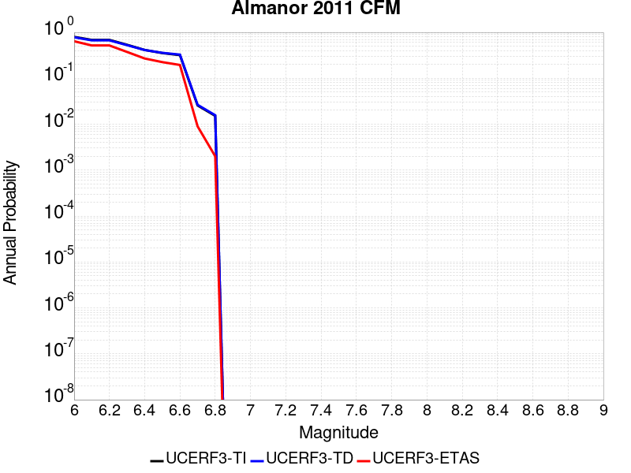 |
|-----|

| Magnitude | UCERF3-TI Prob | UCERF3-TD Prob | UCERF3-ETAS Prob |
|-----|-----|-----|-----|
| 6.0 | 0.7989123 | 0.7822044 | 0.6426966 |
| 6.1 | 0.68590397 | 0.6707897 | 0.51235956 |
| 6.2 | 0.68590397 | 0.6707897 | 0.51235956 |
| 6.3 | 0.53711045 | 0.5270471 | 0.36853933 |
| 6.4 | 0.41442928 | 0.41264424 | 0.26404494 |
| 6.5 | 0.35403186 | 0.35853848 | 0.22134832 |
| 6.6 | 0.31934333 | 0.32803285 | 0.18988764 |
| 6.7 | 0.02562773 | 0.026464546 | 0.006741573 |
| 6.8 | 0.01518827 | 0.015700325 | 0.0 |

## Anacapa-Dume alt 1
*[(top)](#table-of-contents)*

|  |
|-----|

| Magnitude | UCERF3-TI Prob | UCERF3-TD Prob | UCERF3-ETAS Prob |
|-----|-----|-----|-----|
| 6.0 | 0.12657252 | 0.1276772 | 0.05730337 |
| 6.1 | 0.12657252 | 0.1276772 | 0.05730337 |
| 6.2 | 0.12657252 | 0.1276772 | 0.05730337 |
| 6.3 | 0.12657252 | 0.1276772 | 0.05730337 |
| 6.4 | 0.12657252 | 0.1276772 | 0.05730337 |
| 6.5 | 0.12657252 | 0.1276772 | 0.05730337 |
| 6.6 | 0.12657252 | 0.1276772 | 0.05730337 |
| 6.7 | 0.116999194 | 0.11800697 | 0.051685393 |
| 6.8 | 0.11663192 | 0.117636584 | 0.051685393 |
| 6.9 | 0.094385244 | 0.09508108 | 0.04494382 |
| 7.0 | 0.09124036 | 0.09190708 | 0.04269663 |
| 7.1 | 0.08104312 | 0.081592426 | 0.03483146 |
| 7.2 | 0.077538654 | 0.078054234 | 0.033707865 |
| 7.3 | 0.06461729 | 0.064927295 | 0.026966292 |
| 7.4 | 0.05437274 | 0.054544017 | 0.0247191 |
| 7.5 | 0.043974347 | 0.044067286 | 0.017977528 |
| 7.6 | 0.024586326 | 0.024613868 | 0.011235955 |
| 7.7 | 0.0070780776 | 0.006925243 | 0.004494382 |
| 7.8 | 0.0011737979 | 0.0010894769 | 0.0 |
| 7.9 | 2.0890639E-5 | 1.6283522E-5 | 0.0 |

## Anaheim
*[(top)](#table-of-contents)*

| 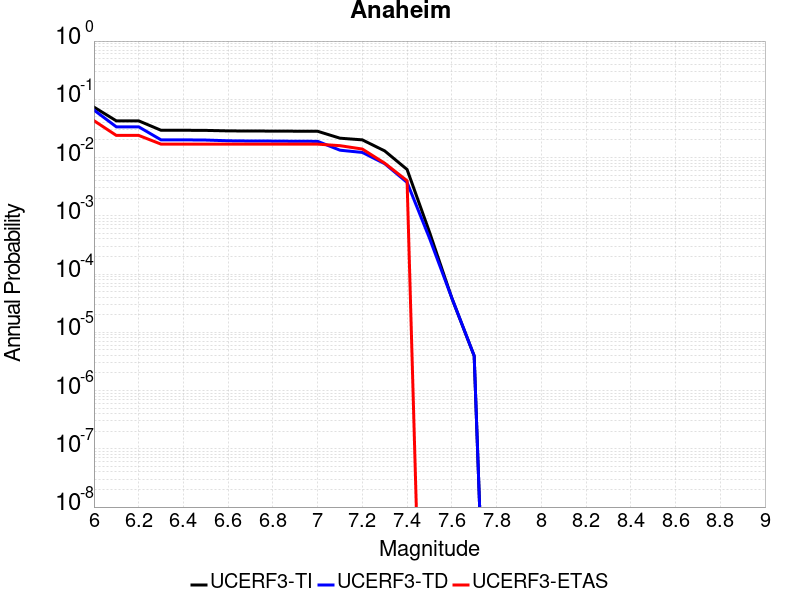 |
|-----|

| Magnitude | UCERF3-TI Prob | UCERF3-TD Prob | UCERF3-ETAS Prob |
|-----|-----|-----|-----|
| 6.0 | 0.073484324 | 0.06546079 | 0.040449437 |
| 6.1 | 0.04270786 | 0.03371695 | 0.023595506 |
| 6.2 | 0.04270786 | 0.03371695 | 0.023595506 |
| 6.3 | 0.029415451 | 0.020133916 | 0.016853932 |
| 6.4 | 0.029415451 | 0.020133916 | 0.016853932 |
| 6.5 | 0.029266685 | 0.019983275 | 0.016853932 |
| 6.6 | 0.028709846 | 0.019419165 | 0.016853932 |
| 6.7 | 0.028539374 | 0.019246634 | 0.016853932 |
| 6.8 | 0.028487021 | 0.019193668 | 0.016853932 |
| 6.9 | 0.028352376 | 0.019057496 | 0.016853932 |
| 7.0 | 0.028272767 | 0.01899182 | 0.016853932 |
| 7.1 | 0.021510389 | 0.013380496 | 0.015730336 |
| 7.2 | 0.020129707 | 0.012241944 | 0.013483146 |
| 7.3 | 0.013003811 | 0.0078515615 | 0.007865168 |
| 7.4 | 0.006243989 | 0.003745891 | 0.004494382 |
| 7.5 | 5.2853033E-4 | 4.1502077E-4 | 0.0 |
| 7.6 | 3.8797745E-5 | 3.8965132E-5 | 0.0 |
| 7.7 | 3.9377246E-6 | 3.9565994E-6 | 0.0 |

## Antelope Valley 2011
*[(top)](#table-of-contents)*

| 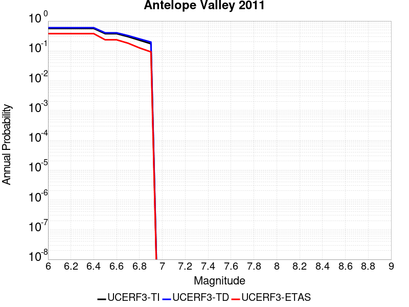 |
|-----|

| Magnitude | UCERF3-TI Prob | UCERF3-TD Prob | UCERF3-ETAS Prob |
|-----|-----|-----|-----|
| 6.0 | 0.5620537 | 0.59553653 | 0.3764045 |
| 6.1 | 0.5620537 | 0.59553653 | 0.3764045 |
| 6.2 | 0.5620537 | 0.59553653 | 0.3764045 |
| 6.3 | 0.5620537 | 0.59553653 | 0.3764045 |
| 6.4 | 0.5620537 | 0.59553653 | 0.3764045 |
| 6.5 | 0.3753109 | 0.4016844 | 0.23932584 |
| 6.6 | 0.3753109 | 0.4016844 | 0.23932584 |
| 6.7 | 0.2981062 | 0.32411137 | 0.18314607 |
| 6.8 | 0.22696762 | 0.2512807 | 0.12808989 |
| 6.9 | 0.17283754 | 0.19604202 | 0.094382025 |

## Ash Hill
*[(top)](#table-of-contents)*

|  |
|-----|

| Magnitude | UCERF3-TI Prob | UCERF3-TD Prob | UCERF3-ETAS Prob |
|-----|-----|-----|-----|
| 6.0 | 0.4299989 | 0.44860062 | 0.33595505 |
| 6.1 | 0.4299989 | 0.44860062 | 0.33595505 |
| 6.2 | 0.4299989 | 0.44860062 | 0.33595505 |
| 6.3 | 0.23015048 | 0.23685107 | 0.16067415 |
| 6.4 | 0.23015048 | 0.23685107 | 0.16067415 |
| 6.5 | 0.1660879 | 0.17100504 | 0.12022472 |
| 6.6 | 0.12211306 | 0.12594453 | 0.07865169 |
| 6.7 | 0.09114263 | 0.09425897 | 0.05505618 |
| 6.8 | 0.06460619 | 0.06708725 | 0.041573033 |
| 6.9 | 0.04509049 | 0.04710879 | 0.031460673 |

## Baker
*[(top)](#table-of-contents)*

|  |
|-----|

| Magnitude | UCERF3-TI Prob | UCERF3-TD Prob | UCERF3-ETAS Prob |
|-----|-----|-----|-----|
| 6.0 | 0.1380798 | 0.13994303 | 0.084269665 |
| 6.1 | 0.1380798 | 0.13994303 | 0.084269665 |
| 6.2 | 0.1380798 | 0.13994303 | 0.084269665 |
| 6.3 | 0.08248248 | 0.08319652 | 0.047191013 |
| 6.4 | 0.08248248 | 0.08319652 | 0.047191013 |
| 6.5 | 0.070014015 | 0.07062621 | 0.04269663 |
| 6.6 | 0.05864197 | 0.059163272 | 0.033707865 |
| 6.7 | 0.05175786 | 0.052234456 | 0.030337078 |
| 6.8 | 0.046762772 | 0.047209553 | 0.025842696 |
| 6.9 | 0.04166041 | 0.042074844 | 0.023595506 |
| 7.0 | 0.0309689 | 0.031310532 | 0.020224718 |
| 7.1 | 0.02708242 | 0.027404178 | 0.019101124 |
| 7.2 | 0.025923347 | 0.026239697 | 0.017977528 |
| 7.3 | 0.0241229 | 0.024430336 | 0.017977528 |
| 7.4 | 0.02272697 | 0.023025509 | 0.017977528 |
| 7.5 | 0.02140191 | 0.021690363 | 0.015730336 |
| 7.6 | 0.019514518 | 0.019787023 | 0.014606741 |
| 7.7 | 0.016888257 | 0.017133739 | 0.013483146 |
| 7.8 | 0.008982842 | 0.009127193 | 0.004494382 |
| 7.9 | 6.676333E-5 | 6.761812E-5 | 0.0 |

## Bartlett Springs 2011 CFM
*[(top)](#table-of-contents)*

|  |
|-----|

| Magnitude | UCERF3-TI Prob | UCERF3-TD Prob | UCERF3-ETAS Prob |
|-----|-----|-----|-----|
| 6.0 | 0.8033039 | 0.796786 | 0.6292135 |
| 6.1 | 0.80304927 | 0.7965363 | 0.6292135 |
| 6.2 | 0.80288804 | 0.79637754 | 0.6292135 |
| 6.3 | 0.80260426 | 0.7961023 | 0.6292135 |
| 6.4 | 0.743664 | 0.73918426 | 0.5539326 |
| 6.5 | 0.74283206 | 0.7383851 | 0.5539326 |
| 6.6 | 0.729295 | 0.7259453 | 0.5382022 |
| 6.7 | 0.72101647 | 0.7180547 | 0.53258425 |
| 6.8 | 0.69631785 | 0.6939874 | 0.49550563 |
| 6.9 | 0.6607917 | 0.6592347 | 0.4516854 |
| 7.0 | 0.608256 | 0.6085846 | 0.38876405 |
| 7.1 | 0.5815035 | 0.58315104 | 0.35730338 |
| 7.2 | 0.5260607 | 0.53082466 | 0.3022472 |
| 7.3 | 0.49750042 | 0.5030929 | 0.2752809 |
| 7.4 | 0.46169633 | 0.46769363 | 0.25168538 |
| 7.5 | 0.43361327 | 0.44000143 | 0.22696629 |
| 7.6 | 0.30407995 | 0.30970135 | 0.14719102 |
| 7.7 | 0.104859725 | 0.10971366 | 0.043820225 |
| 7.8 | 0.015904536 | 0.016538318 | 0.007865168 |

## Battle Creek 2011 CFM
*[(top)](#table-of-contents)*

|  |
|-----|

| Magnitude | UCERF3-TI Prob | UCERF3-TD Prob | UCERF3-ETAS Prob |
|-----|-----|-----|-----|
| 6.0 | 0.14537989 | 0.14800096 | 0.08651686 |
| 6.1 | 0.14537989 | 0.14800096 | 0.08651686 |
| 6.2 | 0.14537989 | 0.14800096 | 0.08651686 |
| 6.3 | 0.14537989 | 0.14800096 | 0.08651686 |
| 6.4 | 0.14537989 | 0.14800096 | 0.08651686 |
| 6.5 | 0.14537989 | 0.14800096 | 0.08651686 |
| 6.6 | 0.14537989 | 0.14800096 | 0.08651686 |
| 6.7 | 0.08909873 | 0.09074571 | 0.05505618 |
| 6.8 | 0.08909873 | 0.09074571 | 0.05505618 |
| 6.9 | 0.070271984 | 0.07171624 | 0.043820225 |
| 7.0 | 0.06534632 | 0.06675387 | 0.040449437 |
| 7.1 | 0.06041359 | 0.06178315 | 0.039325844 |
| 7.2 | 0.0387308 | 0.03982349 | 0.025842696 |

## Bear River fault zone
*[(top)](#table-of-contents)*

|  |
|-----|

| Magnitude | UCERF3-TI Prob | UCERF3-TD Prob | UCERF3-ETAS Prob |
|-----|-----|-----|-----|
| 6.0 | 0.46218297 | 0.48259705 | 0.27415732 |
| 6.1 | 0.46218297 | 0.48259705 | 0.27415732 |
| 6.2 | 0.3408064 | 0.35248324 | 0.18764044 |
| 6.3 | 0.3408064 | 0.35248324 | 0.18764044 |
| 6.4 | 0.28814155 | 0.29786798 | 0.15168539 |
| 6.5 | 0.27807578 | 0.28765357 | 0.14606741 |
| 6.6 | 0.26234362 | 0.27160895 | 0.14157303 |
| 6.7 | 0.24293955 | 0.251746 | 0.13146068 |
| 6.8 | 0.21245626 | 0.22050866 | 0.11011236 |
| 6.9 | 0.18167622 | 0.18895744 | 0.09662921 |
| 7.0 | 0.13889004 | 0.14433347 | 0.05955056 |
| 7.1 | 0.1351813 | 0.14054799 | 0.05955056 |
| 7.2 | 0.09936351 | 0.10402119 | 0.03258427 |
| 7.3 | 0.05325169 | 0.055969507 | 0.019101124 |

## Bennett Valley 2011 CFM
*[(top)](#table-of-contents)*

|  |
|-----|

| Magnitude | UCERF3-TI Prob | UCERF3-TD Prob | UCERF3-ETAS Prob |
|-----|-----|-----|-----|
| 6.0 | 0.4638724 | 0.4907692 | 0.44157302 |
| 6.1 | 0.4638724 | 0.4907692 | 0.42696628 |
| 6.2 | 0.35246128 | 0.37689447 | 0.31460676 |
| 6.3 | 0.35246128 | 0.37689447 | 0.31460676 |
| 6.4 | 0.28655204 | 0.3104958 | 0.25505617 |
| 6.5 | 0.2798319 | 0.30393323 | 0.252809 |
| 6.6 | 0.24646841 | 0.27095106 | 0.22022472 |
| 6.7 | 0.042891447 | 0.039345674 | 0.033707865 |
| 6.8 | 0.037398763 | 0.033576407 | 0.025842696 |
| 6.9 | 0.03458838 | 0.030774629 | 0.0247191 |
| 7.0 | 0.03170149 | 0.027979447 | 0.023595506 |
| 7.1 | 0.028956788 | 0.025347564 | 0.02247191 |
| 7.2 | 0.024102816 | 0.0207552 | 0.019101124 |
| 7.3 | 0.021941911 | 0.018812008 | 0.016853932 |
| 7.4 | 0.017552245 | 0.015146269 | 0.01235955 |
| 7.5 | 0.015086919 | 0.013097095 | 0.01235955 |
| 7.6 | 0.007209723 | 0.0068879775 | 0.006741573 |
| 7.7 | 0.0027436628 | 0.002532749 | 0.0056179776 |
| 7.8 | 3.3165092E-4 | 2.2845816E-4 | 0.0011235955 |
| 7.9 | 1.06331354E-4 | 4.9506452E-5 | 0.0 |
| 8.0 | 4.9897484E-5 | 2.2482829E-5 | 0.0 |

## Bicycle Lake
*[(top)](#table-of-contents)*

| 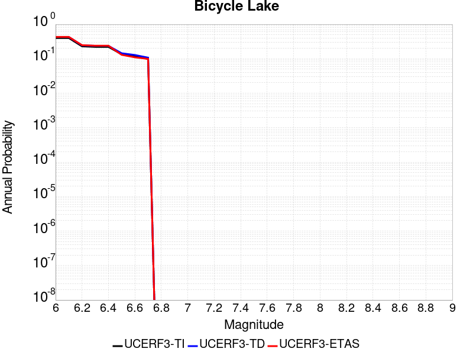 |
|-----|

| Magnitude | UCERF3-TI Prob | UCERF3-TD Prob | UCERF3-ETAS Prob |
|-----|-----|-----|-----|
| 6.0 | 0.40066126 | 0.42841 | 0.43258426 |
| 6.1 | 0.40066126 | 0.42841 | 0.43258426 |
| 6.2 | 0.22957984 | 0.24505857 | 0.24719101 |
| 6.3 | 0.22134136 | 0.23675053 | 0.23707865 |
| 6.4 | 0.22134136 | 0.23675053 | 0.23707865 |
| 6.5 | 0.13497512 | 0.14449753 | 0.12584269 |
| 6.6 | 0.11941355 | 0.12858303 | 0.10561798 |
| 6.7 | 0.098887675 | 0.107608244 | 0.094382025 |

## Big Lagoon - Bald Mtn 2011 CFM
*[(top)](#table-of-contents)*

|  |
|-----|

| Magnitude | UCERF3-TI Prob | UCERF3-TD Prob | UCERF3-ETAS Prob |
|-----|-----|-----|-----|
| 6.0 | 0.38606566 | 0.3974328 | 0.26853934 |
| 6.1 | 0.38606566 | 0.3974328 | 0.26853934 |
| 6.2 | 0.38606566 | 0.3974328 | 0.26853934 |
| 6.3 | 0.38606566 | 0.3974328 | 0.26853934 |
| 6.4 | 0.38606566 | 0.3974328 | 0.26853934 |
| 6.5 | 0.38606566 | 0.3974328 | 0.26853934 |
| 6.6 | 0.38606566 | 0.3974328 | 0.26853934 |
| 6.7 | 0.38606566 | 0.3974328 | 0.26853934 |
| 6.8 | 0.26594636 | 0.27046984 | 0.2 |
| 6.9 | 0.26594636 | 0.27046984 | 0.2 |
| 7.0 | 0.22398506 | 0.22749873 | 0.1741573 |
| 7.1 | 0.19938157 | 0.20242435 | 0.15505618 |
| 7.2 | 0.17511459 | 0.17771332 | 0.13820225 |
| 7.3 | 0.1551891 | 0.15745479 | 0.123595506 |
| 7.4 | 0.14480816 | 0.14691989 | 0.11460674 |
| 7.5 | 0.12067553 | 0.12242831 | 0.094382025 |
| 7.6 | 0.09670176 | 0.09808624 | 0.07865169 |
| 7.7 | 0.07095411 | 0.07196808 | 0.058426965 |
| 7.8 | 0.04914156 | 0.049863644 | 0.035955057 |
| 7.9 | 0.012853368 | 0.013055603 | 0.008988764 |

## Big Pine (Central)
*[(top)](#table-of-contents)*

|  |
|-----|

| Magnitude | UCERF3-TI Prob | UCERF3-TD Prob | UCERF3-ETAS Prob |
|-----|-----|-----|-----|
| 6.0 | 0.28216267 | 0.28994358 | 0.27865168 |
| 6.1 | 0.19559535 | 0.19917397 | 0.16853933 |
| 6.2 | 0.16526437 | 0.16772704 | 0.13370787 |
| 6.3 | 0.06870762 | 0.06467041 | 0.05955056 |
| 6.4 | 0.068350345 | 0.06430444 | 0.05955056 |
| 6.5 | 0.06794906 | 0.0638933 | 0.05955056 |
| 6.6 | 0.06726561 | 0.06319346 | 0.05955056 |
| 6.7 | 0.066577025 | 0.062489767 | 0.05955056 |
| 6.8 | 0.055255387 | 0.050977502 | 0.05505618 |
| 6.9 | 0.036901042 | 0.03267274 | 0.040449437 |
| 7.0 | 0.025938489 | 0.022777334 | 0.026966292 |
| 7.1 | 0.023072042 | 0.019970533 | 0.0247191 |
| 7.2 | 0.013513856 | 0.011163528 | 0.011235955 |
| 7.3 | 0.011420051 | 0.009407622 | 0.010112359 |
| 7.4 | 0.009382009 | 0.0077382894 | 0.006741573 |
| 7.5 | 0.008852296 | 0.007388797 | 0.004494382 |
| 7.6 | 0.008165982 | 0.0069357096 | 0.004494382 |
| 7.7 | 0.0046779956 | 0.004436662 | 0.002247191 |
| 7.8 | 0.0012835753 | 0.0012009746 | 0.002247191 |
| 7.9 | 9.601954E-5 | 9.421179E-5 | 0.0 |

## Big Pine (East)
*[(top)](#table-of-contents)*

|  |
|-----|

| Magnitude | UCERF3-TI Prob | UCERF3-TD Prob | UCERF3-ETAS Prob |
|-----|-----|-----|-----|
| 6.0 | 0.22796582 | 0.2226881 | 0.25505617 |
| 6.1 | 0.22796582 | 0.2226881 | 0.25505617 |
| 6.2 | 0.22796582 | 0.2226881 | 0.25505617 |
| 6.3 | 0.13321312 | 0.121096924 | 0.14044943 |
| 6.4 | 0.13288058 | 0.120753035 | 0.14044943 |
| 6.5 | 0.11832097 | 0.10564516 | 0.1269663 |
| 6.6 | 0.106462784 | 0.09334735 | 0.11235955 |
| 6.7 | 0.09194227 | 0.079661064 | 0.0988764 |
| 6.8 | 0.08648425 | 0.074945256 | 0.09213483 |
| 6.9 | 0.06968629 | 0.060373437 | 0.07977528 |
| 7.0 | 0.054480344 | 0.04696312 | 0.05730337 |
| 7.1 | 0.04342842 | 0.037365805 | 0.048314605 |
| 7.2 | 0.03223786 | 0.027307501 | 0.031460673 |
| 7.3 | 0.028602043 | 0.024481773 | 0.029213483 |
| 7.4 | 0.026100531 | 0.022580262 | 0.025842696 |
| 7.5 | 0.024731142 | 0.021499252 | 0.02247191 |
| 7.6 | 0.020474885 | 0.017857261 | 0.014606741 |
| 7.7 | 0.010783591 | 0.009850033 | 0.0056179776 |
| 7.8 | 0.002987108 | 0.002719152 | 0.002247191 |
| 7.9 | 7.6234667E-4 | 6.93117E-4 | 0.0 |

## Big Pine (West)
*[(top)](#table-of-contents)*

|  |
|-----|

| Magnitude | UCERF3-TI Prob | UCERF3-TD Prob | UCERF3-ETAS Prob |
|-----|-----|-----|-----|
| 6.0 | 0.017662957 | 0.017728137 | 0.006741573 |
| 6.1 | 0.017662957 | 0.017728137 | 0.006741573 |
| 6.2 | 0.017662957 | 0.017728137 | 0.006741573 |
| 6.3 | 0.010969041 | 0.011004359 | 0.0033707866 |
| 6.4 | 0.010969041 | 0.011004359 | 0.0033707866 |
| 6.5 | 0.008194387 | 0.008222521 | 0.002247191 |
| 6.6 | 0.008194387 | 0.008222521 | 0.002247191 |
| 6.7 | 0.008194387 | 0.008222521 | 0.002247191 |
| 6.8 | 0.008194387 | 0.008222521 | 0.002247191 |
| 6.9 | 0.007900317 | 0.007927778 | 0.002247191 |
| 7.0 | 0.0061571007 | 0.0061790873 | 0.002247191 |
| 7.1 | 0.004249079 | 0.0042646946 | 0.0011235955 |
| 7.2 | 0.0030019423 | 0.003012716 | 0.0 |
| 7.3 | 0.0020271165 | 0.0020339247 | 0.0 |
| 7.4 | 0.001201979 | 0.0012053578 | 0.0 |
| 7.5 | 6.113234E-4 | 6.126664E-4 | 0.0 |
| 7.6 | 4.3559016E-4 | 4.3652207E-4 | 0.0 |
| 7.7 | 1.9320253E-4 | 1.9358424E-4 | 0.0 |
| 7.8 | 3.180084E-5 | 3.1865373E-5 | 0.0 |

## Blackwater
*[(top)](#table-of-contents)*

|  |
|-----|

| Magnitude | UCERF3-TI Prob | UCERF3-TD Prob | UCERF3-ETAS Prob |
|-----|-----|-----|-----|
| 6.0 | 0.55119973 | 0.57482636 | 0.40561798 |
| 6.1 | 0.55119973 | 0.57482636 | 0.40561798 |
| 6.2 | 0.2632078 | 0.26955426 | 0.17640449 |
| 6.3 | 0.2632078 | 0.26955426 | 0.17640449 |
| 6.4 | 0.18687396 | 0.19104873 | 0.1247191 |
| 6.5 | 0.14229001 | 0.14543562 | 0.08089887 |
| 6.6 | 0.14229001 | 0.14543562 | 0.08089887 |
| 6.7 | 0.077006884 | 0.07874225 | 0.033707865 |
| 6.8 | 0.05755798 | 0.05889059 | 0.025842696 |
| 6.9 | 0.025630916 | 0.026273092 | 0.017977528 |
| 7.0 | 0.01228644 | 0.012617487 | 0.004494382 |

## Blue Cut
*[(top)](#table-of-contents)*

|  |
|-----|

| Magnitude | UCERF3-TI Prob | UCERF3-TD Prob | UCERF3-ETAS Prob |
|-----|-----|-----|-----|
| 6.0 | 0.42525503 | 0.44012633 | 0.3516854 |
| 6.1 | 0.42525503 | 0.44012633 | 0.3516854 |
| 6.2 | 0.42525503 | 0.44012633 | 0.3516854 |
| 6.3 | 0.26140255 | 0.26785928 | 0.18988764 |
| 6.4 | 0.26140255 | 0.26785928 | 0.18988764 |
| 6.5 | 0.2078567 | 0.21302025 | 0.14157303 |
| 6.6 | 0.17439243 | 0.17888732 | 0.11797753 |
| 6.7 | 0.15106933 | 0.15515664 | 0.09662921 |
| 6.8 | 0.13420075 | 0.13801555 | 0.08876404 |
| 6.9 | 0.11719862 | 0.120739356 | 0.0752809 |
| 7.0 | 0.09634655 | 0.099576175 | 0.05505618 |
| 7.1 | 0.07131406 | 0.07412719 | 0.039325844 |

## Brawley (Seismic Zone) alt 1
*[(top)](#table-of-contents)*

| 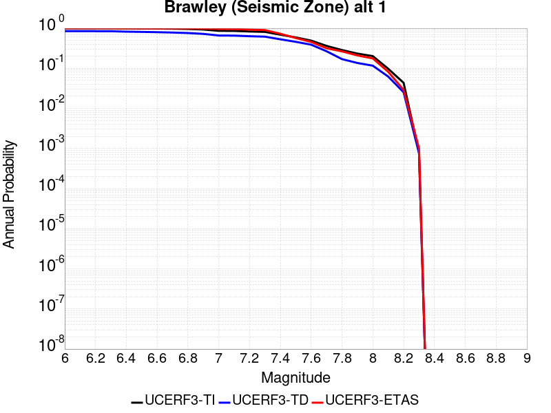 |
|-----|

| Magnitude | UCERF3-TI Prob | UCERF3-TD Prob | UCERF3-ETAS Prob |
|-----|-----|-----|-----|
| 6.0 | 0.9971951 | 0.84862345 | 1.0 |
| 6.1 | 0.9971951 | 0.84862345 | 1.0 |
| 6.2 | 0.99677056 | 0.8453636 | 1.0 |
| 6.3 | 0.99652815 | 0.84348255 | 1.0 |
| 6.4 | 0.9925174 | 0.8223121 | 0.99662924 |
| 6.5 | 0.9893006 | 0.81157595 | 0.994382 |
| 6.6 | 0.98428595 | 0.79864687 | 0.9932584 |
| 6.7 | 0.97583103 | 0.7823052 | 0.99101126 |
| 6.8 | 0.960621 | 0.7599377 | 0.99101126 |
| 6.9 | 0.9297775 | 0.72375184 | 0.98202246 |
| 7.0 | 0.8645344 | 0.6604042 | 0.9629213 |
| 7.1 | 0.85915494 | 0.655623 | 0.95955056 |
| 7.2 | 0.82986325 | 0.63288844 | 0.9269663 |
| 7.3 | 0.8116897 | 0.6174963 | 0.90561795 |
| 7.4 | 0.6914304 | 0.5303049 | 0.73595506 |
| 7.5 | 0.5916505 | 0.45897722 | 0.5741573 |
| 7.6 | 0.49227825 | 0.38930455 | 0.45955056 |
| 7.7 | 0.36309996 | 0.26671144 | 0.31685394 |
| 7.8 | 0.2862844 | 0.17001162 | 0.26179776 |
| 7.9 | 0.23366225 | 0.13613774 | 0.20898877 |
| 8.0 | 0.2020295 | 0.11663814 | 0.17640449 |
| 8.1 | 0.09761054 | 0.062337484 | 0.08089887 |
| 8.2 | 0.043635186 | 0.025320904 | 0.026966292 |
| 8.3 | 7.914095E-4 | 7.660323E-4 | 0.0011235955 |

## Breckenridge 2011
*[(top)](#table-of-contents)*

|  |
|-----|

| Magnitude | UCERF3-TI Prob | UCERF3-TD Prob | UCERF3-ETAS Prob |
|-----|-----|-----|-----|
| 6.0 | 0.02953276 | 0.029710008 | 0.016853932 |
| 6.1 | 0.02953276 | 0.029710008 | 0.016853932 |
| 6.2 | 0.02953276 | 0.029710008 | 0.016853932 |
| 6.3 | 0.027392931 | 0.027562529 | 0.015730336 |
| 6.4 | 0.027392931 | 0.027562529 | 0.015730336 |
| 6.5 | 0.027392931 | 0.027562529 | 0.015730336 |
| 6.6 | 0.027392931 | 0.027562529 | 0.015730336 |
| 6.7 | 0.024281556 | 0.024435792 | 0.014606741 |
| 6.8 | 0.022075787 | 0.02221859 | 0.014606741 |
| 6.9 | 0.019979808 | 0.020110743 | 0.014606741 |
| 7.0 | 0.01762848 | 0.01774538 | 0.01235955 |
| 7.1 | 0.014487443 | 0.014582978 | 0.011235955 |
| 7.2 | 0.00997365 | 0.010036912 | 0.004494382 |
| 7.3 | 0.006865244 | 0.0069067543 | 0.004494382 |
| 7.4 | 0.004664585 | 0.004691337 | 0.004494382 |
| 7.5 | 0.00352852 | 0.0035490198 | 0.004494382 |
| 7.6 | 6.708552E-4 | 6.748372E-4 | 0.0011235955 |

## Bullion Mountains
*[(top)](#table-of-contents)*

| 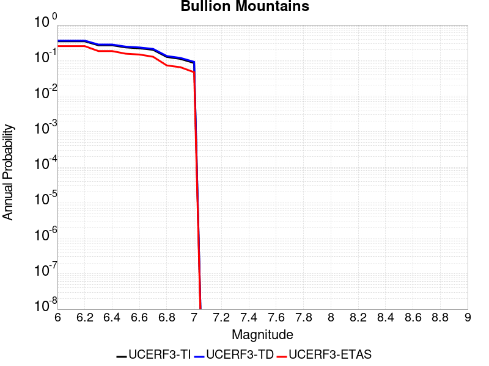 |
|-----|

| Magnitude | UCERF3-TI Prob | UCERF3-TD Prob | UCERF3-ETAS Prob |
|-----|-----|-----|-----|
| 6.0 | 0.3484497 | 0.3645532 | 0.2539326 |
| 6.1 | 0.3484497 | 0.3645532 | 0.2539326 |
| 6.2 | 0.3484497 | 0.3645532 | 0.2539326 |
| 6.3 | 0.2696955 | 0.28297612 | 0.18539326 |
| 6.4 | 0.2696955 | 0.28297612 | 0.18539326 |
| 6.5 | 0.23453283 | 0.24709761 | 0.15617977 |
| 6.6 | 0.22166593 | 0.23405568 | 0.14831461 |
| 6.7 | 0.20106675 | 0.21309647 | 0.12808989 |
| 6.8 | 0.12659106 | 0.13423401 | 0.07191011 |
| 6.9 | 0.11147359 | 0.118756354 | 0.062921345 |
| 7.0 | 0.08563909 | 0.092113815 | 0.04494382 |

## Burnt Mtn
*[(top)](#table-of-contents)*

| 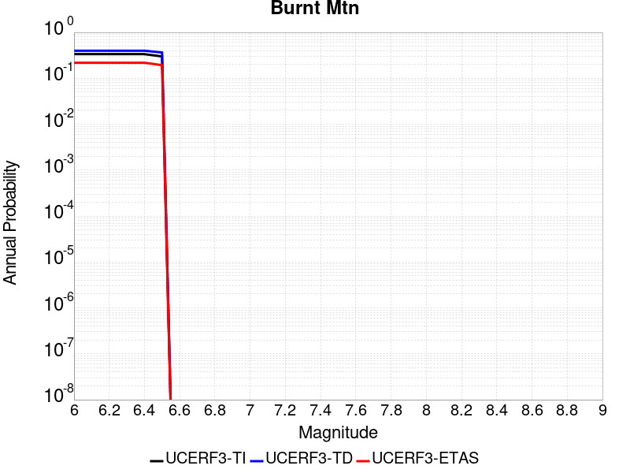 |
|-----|

| Magnitude | UCERF3-TI Prob | UCERF3-TD Prob | UCERF3-ETAS Prob |
|-----|-----|-----|-----|
| 6.0 | 0.33562234 | 0.39878976 | 0.21910113 |
| 6.1 | 0.33562234 | 0.39878976 | 0.21910113 |
| 6.2 | 0.33562234 | 0.39878976 | 0.21910113 |
| 6.3 | 0.33562234 | 0.39878976 | 0.21910113 |
| 6.4 | 0.33562234 | 0.39878976 | 0.21910113 |
| 6.5 | 0.29904807 | 0.36434713 | 0.19438203 |

## Butano 2011 CFM
*[(top)](#table-of-contents)*

| 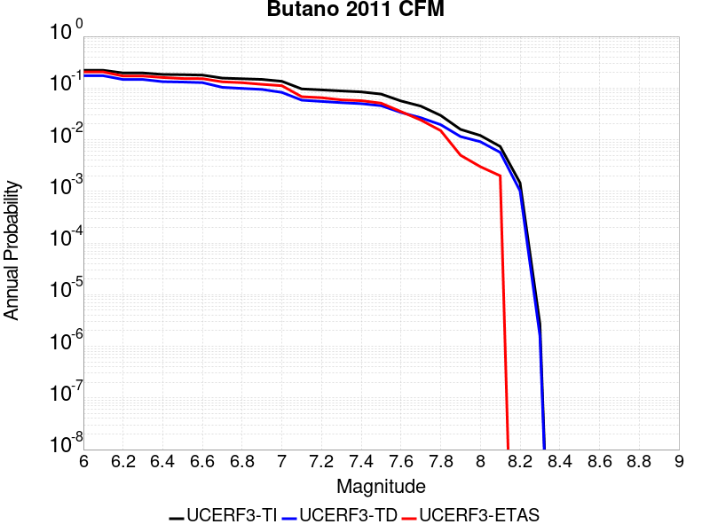 |
|-----|

| Magnitude | UCERF3-TI Prob | UCERF3-TD Prob | UCERF3-ETAS Prob |
|-----|-----|-----|-----|
| 6.0 | 0.22076638 | 0.17323852 | 0.20561798 |
| 6.1 | 0.22076638 | 0.17323852 | 0.20561798 |
| 6.2 | 0.19606031 | 0.14655407 | 0.1719101 |
| 6.3 | 0.19606031 | 0.14655407 | 0.1719101 |
| 6.4 | 0.1834521 | 0.13295193 | 0.15955056 |
| 6.5 | 0.1814291 | 0.13076405 | 0.15168539 |
| 6.6 | 0.17824048 | 0.1273633 | 0.1505618 |
| 6.7 | 0.15580845 | 0.10324768 | 0.12921348 |
| 6.8 | 0.15132317 | 0.09845808 | 0.123595506 |
| 6.9 | 0.1470507 | 0.09403657 | 0.11460674 |
| 7.0 | 0.13516794 | 0.08241723 | 0.10674157 |
| 7.1 | 0.09623851 | 0.058305055 | 0.06629214 |
| 7.2 | 0.09210804 | 0.055085342 | 0.064044945 |
| 7.3 | 0.087927744 | 0.05214365 | 0.058426965 |
| 7.4 | 0.084193796 | 0.049888603 | 0.056179777 |
| 7.5 | 0.07648027 | 0.0455613 | 0.0494382 |
| 7.6 | 0.05622315 | 0.03370828 | 0.033707865 |
| 7.7 | 0.0446779 | 0.026624352 | 0.023595506 |
| 7.8 | 0.029503845 | 0.019544886 | 0.014606741 |
| 7.9 | 0.015828209 | 0.011495863 | 0.004494382 |
| 8.0 | 0.012063397 | 0.009139698 | 0.002247191 |
| 8.1 | 0.007388501 | 0.005680814 | 0.0011235955 |
| 8.2 | 0.0014562283 | 0.0010171854 | 0.0 |
| 8.3 | 2.7057733E-6 | 1.5767646E-6 | 0.0 |

## Cady
*[(top)](#table-of-contents)*

|  |
|-----|

| Magnitude | UCERF3-TI Prob | UCERF3-TD Prob | UCERF3-ETAS Prob |
|-----|-----|-----|-----|
| 6.0 | 0.40487745 | 0.42619717 | 0.28539327 |
| 6.1 | 0.40487745 | 0.42619717 | 0.28539327 |
| 6.2 | 0.40487745 | 0.42619717 | 0.28539327 |
| 6.3 | 0.2517699 | 0.26313534 | 0.16292135 |
| 6.4 | 0.2517699 | 0.26313534 | 0.16292135 |
| 6.5 | 0.14719625 | 0.15337056 | 0.09101123 |
| 6.6 | 0.1408124 | 0.14687747 | 0.08764045 |
| 6.7 | 0.119651 | 0.1251812 | 0.074157305 |
| 6.8 | 0.045349218 | 0.04685675 | 0.031460673 |
| 6.9 | 0.019493284 | 0.020111814 | 0.01235955 |
| 7.0 | 0.017732618 | 0.018302381 | 0.010112359 |

## Calaveras (Central) 2011 CFM
*[(top)](#table-of-contents)*

|  |
|-----|

| Magnitude | UCERF3-TI Prob | UCERF3-TD Prob | UCERF3-ETAS Prob |
|-----|-----|-----|-----|
| 6.0 | 0.98008996 | 0.86738026 | 0.947191 |
| 6.1 | 0.9773778 | 0.8600852 | 0.93932587 |
| 6.2 | 0.97603184 | 0.85667694 | 0.93820226 |
| 6.3 | 0.9707465 | 0.8443611 | 0.92921346 |
| 6.4 | 0.966294 | 0.83446884 | 0.9224719 |
| 6.5 | 0.93538046 | 0.7808674 | 0.8651685 |
| 6.6 | 0.92935973 | 0.76906586 | 0.8573034 |
| 6.7 | 0.9195764 | 0.7515368 | 0.8483146 |
| 6.8 | 0.9066692 | 0.7337091 | 0.8280899 |
| 6.9 | 0.8531677 | 0.67523867 | 0.74382025 |
| 7.0 | 0.7766801 | 0.60241354 | 0.6516854 |
| 7.1 | 0.7255384 | 0.5575905 | 0.5898876 |
| 7.2 | 0.6179046 | 0.46393877 | 0.47865167 |
| 7.3 | 0.49050644 | 0.3544424 | 0.3730337 |
| 7.4 | 0.37062812 | 0.26426372 | 0.2719101 |
| 7.5 | 0.32179266 | 0.21496585 | 0.24269663 |
| 7.6 | 0.19190156 | 0.11723579 | 0.13146068 |
| 7.7 | 0.084544405 | 0.0513154 | 0.053932585 |
| 7.8 | 0.06977037 | 0.040293697 | 0.046067417 |
| 7.9 | 0.050187446 | 0.028388593 | 0.031460673 |
| 8.0 | 0.030233575 | 0.018099995 | 0.015730336 |
| 8.1 | 0.019405646 | 0.012181841 | 0.006741573 |

## Calaveras (No) 2011 CFM
*[(top)](#table-of-contents)*

|  |
|-----|

| Magnitude | UCERF3-TI Prob | UCERF3-TD Prob | UCERF3-ETAS Prob |
|-----|-----|-----|-----|
| 6.0 | 0.7192933 | 0.625273 | 0.6573034 |
| 6.1 | 0.7192933 | 0.625273 | 0.6573034 |
| 6.2 | 0.7107215 | 0.6162804 | 0.6494382 |
| 6.3 | 0.70442986 | 0.6096122 | 0.6426966 |
| 6.4 | 0.70101017 | 0.6060625 | 0.641573 |
| 6.5 | 0.69664615 | 0.60151064 | 0.6337079 |
| 6.6 | 0.694823 | 0.5998185 | 0.6280899 |
| 6.7 | 0.61924326 | 0.52022815 | 0.5078652 |
| 6.8 | 0.6041821 | 0.5039987 | 0.49101123 |
| 6.9 | 0.57664984 | 0.4777546 | 0.45842695 |
| 7.0 | 0.51432884 | 0.41926956 | 0.3764045 |
| 7.1 | 0.47529888 | 0.3840111 | 0.34044945 |
| 7.2 | 0.4026296 | 0.3171292 | 0.2752809 |
| 7.3 | 0.26120505 | 0.20361644 | 0.17303371 |
| 7.4 | 0.11966821 | 0.10743529 | 0.074157305 |
| 7.5 | 0.076660566 | 0.063209854 | 0.056179777 |
| 7.6 | 0.04500223 | 0.029950488 | 0.025842696 |
| 7.7 | 0.033785436 | 0.021999406 | 0.015730336 |
| 7.8 | 0.024335101 | 0.014801661 | 0.010112359 |
| 7.9 | 0.016528333 | 0.009690806 | 0.007865168 |
| 8.0 | 0.008023971 | 0.005070043 | 0.0011235955 |
| 8.1 | 0.0043540956 | 0.0028711194 | 0.0 |

## Calaveras (So) - Paicines extension 2011 CFM
*[(top)](#table-of-contents)*

|  |
|-----|

| Magnitude | UCERF3-TI Prob | UCERF3-TD Prob | UCERF3-ETAS Prob |
|-----|-----|-----|-----|
| 6.0 | 0.9809675 | 0.77103066 | 0.952809 |
| 6.1 | 0.98016304 | 0.766835 | 0.95168537 |
| 6.2 | 0.9640279 | 0.7296728 | 0.92921346 |
| 6.3 | 0.9505599 | 0.7143052 | 0.9044944 |
| 6.4 | 0.9390039 | 0.7017171 | 0.89101124 |
| 6.5 | 0.9203267 | 0.6748788 | 0.8674157 |
| 6.6 | 0.87774384 | 0.6497295 | 0.7977528 |
| 6.7 | 0.86986136 | 0.63995075 | 0.7831461 |
| 6.8 | 0.8375282 | 0.60334706 | 0.747191 |
| 6.9 | 0.77980334 | 0.54868746 | 0.65842694 |
| 7.0 | 0.72773975 | 0.506179 | 0.61573035 |
| 7.1 | 0.6729546 | 0.47117037 | 0.5539326 |
| 7.2 | 0.59348154 | 0.41418502 | 0.4764045 |
| 7.3 | 0.48866954 | 0.34007484 | 0.37865168 |
| 7.4 | 0.37480524 | 0.25665987 | 0.28089887 |
| 7.5 | 0.33428064 | 0.21511123 | 0.24494383 |
| 7.6 | 0.2516329 | 0.15284744 | 0.17752808 |
| 7.7 | 0.14966126 | 0.08849307 | 0.101123594 |
| 7.8 | 0.1292653 | 0.07468024 | 0.08988764 |
| 7.9 | 0.08401161 | 0.049406286 | 0.05505618 |
| 8.0 | 0.051511854 | 0.032363206 | 0.03258427 |
| 8.1 | 0.03134319 | 0.021034956 | 0.014606741 |

## Calaveras (So) 2011 CFM
*[(top)](#table-of-contents)*

| 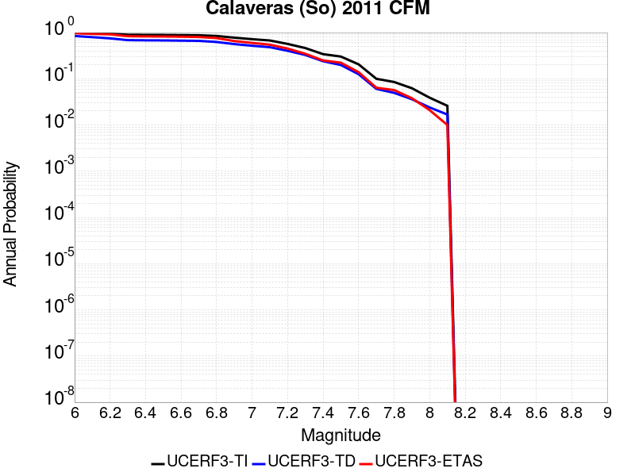 |
|-----|

| Magnitude | UCERF3-TI Prob | UCERF3-TD Prob | UCERF3-ETAS Prob |
|-----|-----|-----|-----|
| 6.0 | 0.98442 | 0.84349626 | 0.9719101 |
| 6.1 | 0.9711138 | 0.7960012 | 0.93595505 |
| 6.2 | 0.9498127 | 0.7497599 | 0.91573036 |
| 6.3 | 0.8964451 | 0.6855957 | 0.83146065 |
| 6.4 | 0.89141756 | 0.6797816 | 0.8224719 |
| 6.5 | 0.8884447 | 0.67607695 | 0.81797755 |
| 6.6 | 0.8821132 | 0.6687557 | 0.81123596 |
| 6.7 | 0.87636757 | 0.6618539 | 0.7977528 |
| 6.8 | 0.8439477 | 0.6255401 | 0.75617975 |
| 6.9 | 0.7759941 | 0.5635195 | 0.641573 |
| 7.0 | 0.71967185 | 0.5187148 | 0.59213483 |
| 7.1 | 0.67431074 | 0.4828987 | 0.53932583 |
| 7.2 | 0.56847316 | 0.40316322 | 0.44494382 |
| 7.3 | 0.46194705 | 0.3277832 | 0.347191 |
| 7.4 | 0.34122387 | 0.23989016 | 0.2505618 |
| 7.5 | 0.30260792 | 0.19888309 | 0.2247191 |
| 7.6 | 0.20549683 | 0.12562697 | 0.14494382 |
| 7.7 | 0.09992415 | 0.06048494 | 0.06741573 |
| 7.8 | 0.08519769 | 0.049644258 | 0.060674157 |
| 7.9 | 0.06250784 | 0.036096305 | 0.041573033 |
| 8.0 | 0.03895953 | 0.023987195 | 0.023595506 |
| 8.1 | 0.02601755 | 0.016850052 | 0.011235955 |

## Calico-Hidalgo
*[(top)](#table-of-contents)*

|  |
|-----|

| Magnitude | UCERF3-TI Prob | UCERF3-TD Prob | UCERF3-ETAS Prob |
|-----|-----|-----|-----|
| 6.0 | 0.65604556 | 0.7076101 | 0.49438202 |
| 6.1 | 0.65604556 | 0.7076101 | 0.49438202 |
| 6.2 | 0.65604556 | 0.7076101 | 0.49438202 |
| 6.3 | 0.46873006 | 0.51435935 | 0.3280899 |
| 6.4 | 0.46873006 | 0.51435935 | 0.3280899 |
| 6.5 | 0.4109696 | 0.45927954 | 0.2955056 |
| 6.6 | 0.41069707 | 0.45902398 | 0.2955056 |
| 6.7 | 0.37473065 | 0.42362115 | 0.27078652 |
| 6.8 | 0.36586374 | 0.4142333 | 0.26516855 |
| 6.9 | 0.33137405 | 0.37576744 | 0.23370786 |
| 7.0 | 0.31822768 | 0.3612883 | 0.21685393 |
| 7.1 | 0.2902175 | 0.33245936 | 0.2 |
| 7.2 | 0.2519666 | 0.2928182 | 0.16966292 |
| 7.3 | 0.22577207 | 0.26236543 | 0.14606741 |
| 7.4 | 0.18715408 | 0.21681556 | 0.11910112 |
| 7.5 | 0.1156799 | 0.13428377 | 0.0752809 |
| 7.6 | 0.0057536047 | 0.0064641978 | 0.002247191 |

## Camp Rock 2011
*[(top)](#table-of-contents)*

|  |
|-----|

| Magnitude | UCERF3-TI Prob | UCERF3-TD Prob | UCERF3-ETAS Prob |
|-----|-----|-----|-----|
| 6.0 | 0.3533668 | 0.37632367 | 0.2235955 |
| 6.1 | 0.3533668 | 0.37632367 | 0.2235955 |
| 6.2 | 0.3533668 | 0.37632367 | 0.2235955 |
| 6.3 | 0.3533668 | 0.37632367 | 0.2235955 |
| 6.4 | 0.18801028 | 0.19182687 | 0.101123594 |
| 6.5 | 0.18801028 | 0.19182687 | 0.101123594 |
| 6.6 | 0.1679815 | 0.17133532 | 0.08202247 |
| 6.7 | 0.16664411 | 0.16997908 | 0.08202247 |
| 6.8 | 0.15319715 | 0.15628695 | 0.073033705 |
| 6.9 | 0.1473991 | 0.15040118 | 0.07191011 |
| 7.0 | 0.13398844 | 0.13673009 | 0.06516854 |
| 7.1 | 0.11805281 | 0.120521575 | 0.05730337 |
| 7.2 | 0.0948167 | 0.096841075 | 0.043820225 |
| 7.3 | 0.06842267 | 0.069914095 | 0.0247191 |
| 7.4 | 0.0530505 | 0.05422025 | 0.017977528 |
| 7.5 | 0.030017076 | 0.030707976 | 0.008988764 |
| 7.6 | 0.0034260035 | 0.003513153 | 0.0011235955 |

## Canada David (Detachment)
*[(top)](#table-of-contents)*

|  |
|-----|

| Magnitude | UCERF3-TI Prob | UCERF3-TD Prob | UCERF3-ETAS Prob |
|-----|-----|-----|-----|
| 6.0 | 0.081861295 | 0.072332256 | 0.047191013 |
| 6.1 | 0.081861295 | 0.072332256 | 0.047191013 |
| 6.2 | 0.081861295 | 0.072332256 | 0.047191013 |
| 6.3 | 0.081861295 | 0.072332256 | 0.047191013 |
| 6.4 | 0.081861295 | 0.072332256 | 0.047191013 |
| 6.5 | 0.081861295 | 0.072332256 | 0.047191013 |
| 6.6 | 0.081861295 | 0.072332256 | 0.047191013 |
| 6.7 | 0.081861295 | 0.072332256 | 0.047191013 |
| 6.8 | 0.081861295 | 0.072332256 | 0.047191013 |
| 6.9 | 0.062932074 | 0.052881338 | 0.040449437 |
| 7.0 | 0.06187579 | 0.05186832 | 0.040449437 |
| 7.1 | 0.045595266 | 0.0356498 | 0.029213483 |
| 7.2 | 0.025047874 | 0.017626328 | 0.013483146 |

## Carlsbad
*[(top)](#table-of-contents)*

|  |
|-----|

| Magnitude | UCERF3-TI Prob | UCERF3-TD Prob | UCERF3-ETAS Prob |
|-----|-----|-----|-----|
| 6.0 | 0.12009238 | 0.12114883 | 0.061797753 |
| 6.1 | 0.12009238 | 0.12114883 | 0.05730337 |
| 6.2 | 0.10803208 | 0.10900247 | 0.0494382 |
| 6.3 | 0.10618736 | 0.10714095 | 0.0494382 |
| 6.4 | 0.10105772 | 0.10197237 | 0.048314605 |
| 6.5 | 0.09881005 | 0.09970535 | 0.047191013 |
| 6.6 | 0.09605385 | 0.09692458 | 0.04494382 |
| 6.7 | 0.08271637 | 0.083383955 | 0.035955057 |
| 6.8 | 0.07858226 | 0.079274885 | 0.033707865 |
| 6.9 | 0.07300473 | 0.07367694 | 0.031460673 |
| 7.0 | 0.06331537 | 0.0638974 | 0.030337078 |
| 7.1 | 0.055255227 | 0.055766296 | 0.025842696 |
| 7.2 | 0.04245484 | 0.042787015 | 0.020224718 |
| 7.3 | 0.027265428 | 0.027364595 | 0.015730336 |
| 7.4 | 0.020544298 | 0.020575903 | 0.01235955 |
| 7.5 | 0.013228688 | 0.013154072 | 0.008988764 |
| 7.6 | 0.0061701247 | 0.0060618967 | 0.0033707866 |
| 7.7 | 5.2144495E-4 | 3.892916E-4 | 0.0 |

## Carson Range (Genoa)
*[(top)](#table-of-contents)*

|  |
|-----|

| Magnitude | UCERF3-TI Prob | UCERF3-TD Prob | UCERF3-ETAS Prob |
|-----|-----|-----|-----|
| 6.0 | 0.65927744 | 0.68561053 | 0.44044945 |
| 6.1 | 0.65927744 | 0.68561053 | 0.44044945 |
| 6.2 | 0.65927744 | 0.68561053 | 0.44044945 |
| 6.3 | 0.65927744 | 0.68561053 | 0.44044945 |
| 6.4 | 0.65927744 | 0.68561053 | 0.44044945 |
| 6.5 | 0.48824435 | 0.5122781 | 0.28876406 |
| 6.6 | 0.48824435 | 0.5122781 | 0.28876406 |
| 6.7 | 0.4060694 | 0.4320467 | 0.21797752 |
| 6.8 | 0.3200152 | 0.34471542 | 0.16966292 |
| 6.9 | 0.24290857 | 0.26632163 | 0.12584269 |
| 7.0 | 0.18124545 | 0.2039604 | 0.09213483 |

## Casmalia 2011 CFM
*[(top)](#table-of-contents)*

|  |
|-----|

| Magnitude | UCERF3-TI Prob | UCERF3-TD Prob | UCERF3-ETAS Prob |
|-----|-----|-----|-----|
| 6.0 | 0.10309498 | 0.10338855 | 0.074157305 |
| 6.1 | 0.10309498 | 0.10338855 | 0.074157305 |
| 6.2 | 0.08625063 | 0.086434275 | 0.06516854 |
| 6.3 | 0.08625063 | 0.086434275 | 0.06516854 |
| 6.4 | 0.07759013 | 0.07772275 | 0.060674157 |
| 6.5 | 0.07759013 | 0.07772275 | 0.060674157 |
| 6.6 | 0.07397767 | 0.07408906 | 0.05955056 |
| 6.7 | 0.07198397 | 0.07208312 | 0.058426965 |
| 6.8 | 0.070445314 | 0.070534416 | 0.058426965 |
| 6.9 | 0.06438874 | 0.06442659 | 0.05280899 |
| 7.0 | 0.05844172 | 0.058427975 | 0.047191013 |
| 7.1 | 0.053146902 | 0.053088795 | 0.041573033 |
| 7.2 | 0.05013363 | 0.050049648 | 0.040449437 |
| 7.3 | 0.04260745 | 0.042451084 | 0.03483146 |
| 7.4 | 0.03710017 | 0.03689051 | 0.023595506 |
| 7.5 | 0.031501416 | 0.031234043 | 0.020224718 |
| 7.6 | 0.023859361 | 0.023508605 | 0.01235955 |
| 7.7 | 0.014084088 | 0.013615108 | 0.008988764 |
| 7.8 | 0.0048994604 | 0.0044008917 | 0.004494382 |
| 7.9 | 0.0016534155 | 0.0011860717 | 0.002247191 |
| 8.0 | 3.2801426E-4 | 1.6306018E-4 | 0.0 |

## Cedar Mtn-Mahogany Mtn
*[(top)](#table-of-contents)*

|  |
|-----|

| Magnitude | UCERF3-TI Prob | UCERF3-TD Prob | UCERF3-ETAS Prob |
|-----|-----|-----|-----|
| 6.0 | 0.5153604 | 0.5306175 | 0.35505617 |
| 6.1 | 0.34404954 | 0.3518408 | 0.24157304 |
| 6.2 | 0.34404954 | 0.3518408 | 0.24157304 |
| 6.3 | 0.22451669 | 0.22859976 | 0.17303371 |
| 6.4 | 0.22451669 | 0.22859976 | 0.17303371 |
| 6.5 | 0.17320107 | 0.1762084 | 0.13033707 |
| 6.6 | 0.1377097 | 0.14004685 | 0.103370786 |
| 6.7 | 0.08691989 | 0.08837258 | 0.050561797 |
| 6.8 | 0.06931777 | 0.07048503 | 0.039325844 |
| 6.9 | 0.042369116 | 0.04310584 | 0.025842696 |
| 7.0 | 0.013222947 | 0.013471437 | 0.006741573 |

## Cerro Prieto
*[(top)](#table-of-contents)*

|  |
|-----|

| Magnitude | UCERF3-TI Prob | UCERF3-TD Prob | UCERF3-ETAS Prob |
|-----|-----|-----|-----|
| 6.0 | 0.9994963 | 0.8197428 | 0.9977528 |
| 6.1 | 0.9994963 | 0.8197428 | 0.9977528 |
| 6.2 | 0.9994963 | 0.8197428 | 0.9977528 |
| 6.3 | 0.9994963 | 0.8197428 | 0.9977528 |
| 6.4 | 0.9985637 | 0.7863464 | 0.9977528 |
| 6.5 | 0.9985637 | 0.7863464 | 0.9977528 |
| 6.6 | 0.9974912 | 0.7653301 | 0.99662924 |
| 6.7 | 0.99402195 | 0.7279573 | 0.9921348 |
| 6.8 | 0.982366 | 0.66705585 | 0.9786517 |
| 6.9 | 0.9568981 | 0.60472953 | 0.9494382 |
| 7.0 | 0.9122654 | 0.53857493 | 0.8820225 |
| 7.1 | 0.73078585 | 0.3892527 | 0.6269663 |
| 7.2 | 0.0017059613 | 0.0017162096 | 0.0011235955 |

## Channel Islands Thrust
*[(top)](#table-of-contents)*

|  |
|-----|

| Magnitude | UCERF3-TI Prob | UCERF3-TD Prob | UCERF3-ETAS Prob |
|-----|-----|-----|-----|
| 6.0 | 0.4390072 | 0.46188402 | 0.3988764 |
| 6.1 | 0.4390072 | 0.46188402 | 0.3988764 |
| 6.2 | 0.4390072 | 0.46188402 | 0.3988764 |
| 6.3 | 0.4390072 | 0.46188402 | 0.3988764 |
| 6.4 | 0.4390072 | 0.46188402 | 0.3988764 |
| 6.5 | 0.4390072 | 0.46188402 | 0.3988764 |
| 6.6 | 0.4390072 | 0.46188402 | 0.3988764 |
| 6.7 | 0.24162835 | 0.24687529 | 0.19325842 |
| 6.8 | 0.23458084 | 0.2396965 | 0.18876405 |
| 6.9 | 0.21029626 | 0.21485832 | 0.16741572 |
| 7.0 | 0.20210907 | 0.20653392 | 0.15730338 |
| 7.1 | 0.1966115 | 0.2009537 | 0.15505618 |
| 7.2 | 0.14412244 | 0.14675331 | 0.09662921 |
| 7.3 | 0.119487606 | 0.12165453 | 0.08202247 |
| 7.4 | 0.096342176 | 0.0980832 | 0.06516854 |
| 7.5 | 0.03458138 | 0.035039168 | 0.025842696 |
| 7.6 | 0.015681144 | 0.015775928 | 0.013483146 |
| 7.7 | 0.0057674283 | 0.0056784176 | 0.006741573 |
| 7.8 | 5.6371145E-4 | 4.1144865E-4 | 0.0 |

## Channel Islands Western Deep Ramp
*[(top)](#table-of-contents)*

|  |
|-----|

| Magnitude | UCERF3-TI Prob | UCERF3-TD Prob | UCERF3-ETAS Prob |
|-----|-----|-----|-----|
| 6.0 | 0.14537561 | 0.14793576 | 0.13820225 |
| 6.1 | 0.14537561 | 0.14793576 | 0.13820225 |
| 6.2 | 0.14537561 | 0.14793576 | 0.13820225 |
| 6.3 | 0.14537561 | 0.14793576 | 0.13820225 |
| 6.4 | 0.14537561 | 0.14793576 | 0.13820225 |
| 6.5 | 0.14537561 | 0.14793576 | 0.13820225 |
| 6.6 | 0.14537561 | 0.14793576 | 0.13820225 |
| 6.7 | 0.12944193 | 0.13181679 | 0.123595506 |
| 6.8 | 0.12944193 | 0.13181679 | 0.123595506 |
| 6.9 | 0.116423756 | 0.118635066 | 0.10898876 |
| 7.0 | 0.1159126 | 0.118119754 | 0.10898876 |
| 7.1 | 0.11334783 | 0.11553308 | 0.104494385 |
| 7.2 | 0.10013014 | 0.10215643 | 0.09213483 |
| 7.3 | 0.053889144 | 0.05467481 | 0.04494382 |
| 7.4 | 0.04848997 | 0.04920517 | 0.04269663 |
| 7.5 | 0.031854507 | 0.032327577 | 0.025842696 |
| 7.6 | 0.016927926 | 0.017189384 | 0.013483146 |
| 7.7 | 0.010345212 | 0.010505158 | 0.008988764 |
| 7.8 | 9.6648745E-4 | 9.78309E-4 | 0.0 |

## Chino alt 1
*[(top)](#table-of-contents)*

|  |
|-----|

| Magnitude | UCERF3-TI Prob | UCERF3-TD Prob | UCERF3-ETAS Prob |
|-----|-----|-----|-----|
| 6.0 | 0.64225113 | 0.6612035 | 0.5494382 |
| 6.1 | 0.42940316 | 0.4183723 | 0.36629215 |
| 6.2 | 0.42940316 | 0.4183723 | 0.36629215 |
| 6.3 | 0.3112239 | 0.290266 | 0.2730337 |
| 6.4 | 0.3112239 | 0.290266 | 0.2730337 |
| 6.5 | 0.28796703 | 0.26605132 | 0.252809 |
| 6.6 | 0.21891174 | 0.1998111 | 0.17865169 |
| 6.7 | 0.1949986 | 0.1796145 | 0.15955056 |
| 6.8 | 0.08692561 | 0.08029778 | 0.061797753 |
| 6.9 | 0.057370283 | 0.053592306 | 0.03258427 |
| 7.0 | 0.04553657 | 0.042030472 | 0.021348314 |
| 7.1 | 0.04416964 | 0.040659934 | 0.020224718 |
| 7.2 | 0.040904514 | 0.037975166 | 0.019101124 |
| 7.3 | 0.034156438 | 0.031936128 | 0.014606741 |
| 7.4 | 0.02865265 | 0.026726818 | 0.013483146 |
| 7.5 | 0.024108768 | 0.022309734 | 0.011235955 |
| 7.6 | 0.021987375 | 0.020278553 | 0.011235955 |
| 7.7 | 0.0056722625 | 0.0049088355 | 0.002247191 |

## Clamshell-Sawpit
*[(top)](#table-of-contents)*

|  |
|-----|

| Magnitude | UCERF3-TI Prob | UCERF3-TD Prob | UCERF3-ETAS Prob |
|-----|-----|-----|-----|
| 6.0 | 0.080167845 | 0.08086742 | 0.05505618 |
| 6.1 | 0.080167845 | 0.08086742 | 0.05505618 |
| 6.2 | 0.080167845 | 0.08086742 | 0.05505618 |
| 6.3 | 0.080167845 | 0.08086742 | 0.05505618 |
| 6.4 | 0.080167845 | 0.08086742 | 0.05505618 |
| 6.5 | 0.06524806 | 0.06572357 | 0.039325844 |
| 6.6 | 0.06524806 | 0.06572357 | 0.039325844 |
| 6.7 | 0.06524806 | 0.06572357 | 0.039325844 |
| 6.8 | 0.060936466 | 0.061356723 | 0.03820225 |
| 6.9 | 0.051023882 | 0.051288806 | 0.031460673 |
| 7.0 | 0.046290193 | 0.04650028 | 0.026966292 |
| 7.1 | 0.039560094 | 0.039661016 | 0.019101124 |
| 7.2 | 0.034879602 | 0.034911532 | 0.016853932 |
| 7.3 | 0.02765543 | 0.027569253 | 0.013483146 |
| 7.4 | 0.021719642 | 0.021527572 | 0.011235955 |
| 7.5 | 0.01624535 | 0.01596485 | 0.004494382 |
| 7.6 | 0.011367763 | 0.011009397 | 0.0033707866 |
| 7.7 | 0.0048680017 | 0.0044546784 | 0.0011235955 |
| 7.8 | 9.2258E-4 | 8.2709914E-4 | 0.0 |
| 7.9 | 1.957795E-4 | 1.7564882E-4 | 0.0 |
| 8.0 | 4.3188215E-6 | 4.3808313E-6 | 0.0 |

## Clayton
*[(top)](#table-of-contents)*

|  |
|-----|

| Magnitude | UCERF3-TI Prob | UCERF3-TD Prob | UCERF3-ETAS Prob |
|-----|-----|-----|-----|
| 6.0 | 0.2575207 | 0.26789472 | 0.19101124 |
| 6.1 | 0.2575207 | 0.26789472 | 0.19101124 |
| 6.2 | 0.2575207 | 0.26789472 | 0.19101124 |
| 6.3 | 0.1997005 | 0.20713937 | 0.14719102 |
| 6.4 | 0.1997005 | 0.20713937 | 0.14719102 |
| 6.5 | 0.17120075 | 0.17772335 | 0.12921348 |
| 6.6 | 0.1707376 | 0.17725171 | 0.12921348 |
| 6.7 | 0.14940692 | 0.15542176 | 0.11235955 |
| 6.8 | 0.09063639 | 0.09367264 | 0.056179777 |
| 6.9 | 0.066797204 | 0.06903338 | 0.043820225 |
| 7.0 | 0.052583437 | 0.05430918 | 0.033707865 |
| 7.1 | 0.031104539 | 0.03209951 | 0.016853932 |
| 7.2 | 0.010263096 | 0.010534161 | 0.002247191 |
| 7.3 | 0.0066787973 | 0.0068536666 | 0.0011235955 |
| 7.4 | 0.0038597444 | 0.0039589303 | 0.0 |
| 7.5 | 0.002552691 | 0.002620197 | 0.0 |
| 7.6 | 0.0015968008 | 0.0016428318 | 0.0 |

## Cleghorn
*[(top)](#table-of-contents)*

|  |
|-----|

| Magnitude | UCERF3-TI Prob | UCERF3-TD Prob | UCERF3-ETAS Prob |
|-----|-----|-----|-----|
| 6.0 | 0.18682033 | 0.18892758 | 0.15393259 |
| 6.1 | 0.18682033 | 0.18892758 | 0.15393259 |
| 6.2 | 0.18682033 | 0.18892758 | 0.15393259 |
| 6.3 | 0.18682033 | 0.18892758 | 0.15393259 |
| 6.4 | 0.107158035 | 0.10610472 | 0.09101123 |
| 6.5 | 0.107158035 | 0.10610472 | 0.09101123 |
| 6.6 | 0.10003893 | 0.09886692 | 0.08764045 |
| 6.7 | 0.084004454 | 0.08245501 | 0.0752809 |
| 6.8 | 0.08225997 | 0.08067362 | 0.0752809 |
| 6.9 | 0.07604418 | 0.074257396 | 0.06516854 |
| 7.0 | 0.07107538 | 0.06886236 | 0.05955056 |
| 7.1 | 0.06549175 | 0.06299656 | 0.053932585 |
| 7.2 | 0.058847878 | 0.055975746 | 0.05280899 |
| 7.3 | 0.05224935 | 0.049110085 | 0.043820225 |
| 7.4 | 0.046014547 | 0.04270903 | 0.041573033 |
| 7.5 | 0.03758361 | 0.034141976 | 0.029213483 |
| 7.6 | 0.025253827 | 0.021614207 | 0.016853932 |
| 7.7 | 0.01897608 | 0.015268425 | 0.013483146 |
| 7.8 | 0.016646227 | 0.012984087 | 0.01235955 |
| 7.9 | 0.009075192 | 0.0070320717 | 0.006741573 |
| 8.0 | 0.0017510193 | 0.0012346809 | 0.0 |
| 8.1 | 8.3411555E-4 | 5.516696E-4 | 0.0 |
| 8.2 | 3.1794564E-4 | 2.0305805E-4 | 0.0 |

## Cleghorn Lake
*[(top)](#table-of-contents)*

| 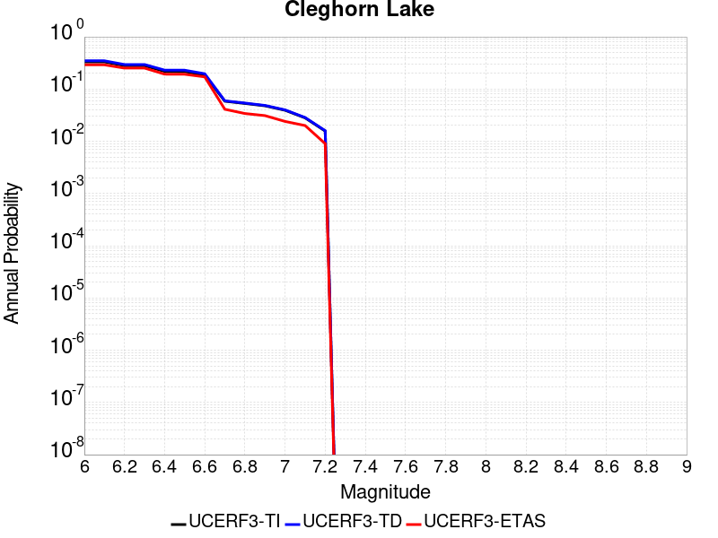 |
|-----|

| Magnitude | UCERF3-TI Prob | UCERF3-TD Prob | UCERF3-ETAS Prob |
|-----|-----|-----|-----|
| 6.0 | 0.3320426 | 0.34755117 | 0.28764045 |
| 6.1 | 0.3320426 | 0.34755117 | 0.28764045 |
| 6.2 | 0.280623 | 0.2949498 | 0.2505618 |
| 6.3 | 0.280623 | 0.2949498 | 0.2505618 |
| 6.4 | 0.21784458 | 0.2303748 | 0.19438203 |
| 6.5 | 0.21683453 | 0.22936259 | 0.19325842 |
| 6.6 | 0.18420838 | 0.19638664 | 0.1719101 |
| 6.7 | 0.058507536 | 0.059507012 | 0.039325844 |
| 6.8 | 0.053024314 | 0.053918425 | 0.031460673 |
| 6.9 | 0.04778834 | 0.04858518 | 0.030337078 |
| 7.0 | 0.039274745 | 0.039926473 | 0.02247191 |
| 7.1 | 0.028050553 | 0.028515507 | 0.017977528 |
| 7.2 | 0.015702942 | 0.015962126 | 0.010112359 |

## Cleghorn Pass
*[(top)](#table-of-contents)*

|  |
|-----|

| Magnitude | UCERF3-TI Prob | UCERF3-TD Prob | UCERF3-ETAS Prob |
|-----|-----|-----|-----|
| 6.0 | 0.24007457 | 0.25394344 | 0.2752809 |
| 6.1 | 0.24007457 | 0.25394344 | 0.2752809 |
| 6.2 | 0.053426985 | 0.055220917 | 0.06741573 |
| 6.3 | 0.053426985 | 0.055220917 | 0.06741573 |
| 6.4 | 0.044031154 | 0.045681633 | 0.056179777 |

## Collayami 2011 CFM
*[(top)](#table-of-contents)*

|  |
|-----|

| Magnitude | UCERF3-TI Prob | UCERF3-TD Prob | UCERF3-ETAS Prob |
|-----|-----|-----|-----|
| 6.0 | 0.556041 | 0.5835082 | 0.3269663 |
| 6.1 | 0.3602245 | 0.3765695 | 0.19213483 |
| 6.2 | 0.3602245 | 0.3765695 | 0.19213483 |
| 6.3 | 0.21012597 | 0.2190657 | 0.11685393 |
| 6.4 | 0.13586608 | 0.14194171 | 0.06741573 |
| 6.5 | 0.08799748 | 0.092442945 | 0.047191013 |
| 6.6 | 0.06222611 | 0.06592369 | 0.028089888 |

## Compton
*[(top)](#table-of-contents)*

|  |
|-----|

| Magnitude | UCERF3-TI Prob | UCERF3-TD Prob | UCERF3-ETAS Prob |
|-----|-----|-----|-----|
| 6.0 | 0.24170336 | 0.1833882 | 0.13932584 |
| 6.1 | 0.24170336 | 0.1833882 | 0.13932584 |
| 6.2 | 0.24170336 | 0.1833882 | 0.13932584 |
| 6.3 | 0.24170336 | 0.1833882 | 0.13932584 |
| 6.4 | 0.24170336 | 0.1833882 | 0.13932584 |
| 6.5 | 0.24170336 | 0.1833882 | 0.13932584 |
| 6.6 | 0.24170336 | 0.1833882 | 0.13932584 |
| 6.7 | 0.24170336 | 0.1833882 | 0.13932584 |
| 6.8 | 0.24170336 | 0.1833882 | 0.13932584 |
| 6.9 | 0.24170336 | 0.1833882 | 0.13932584 |
| 7.0 | 0.18140881 | 0.13160615 | 0.09550562 |
| 7.1 | 0.17047672 | 0.122154705 | 0.09101123 |
| 7.2 | 0.15309018 | 0.10694263 | 0.07191011 |
| 7.3 | 0.11074426 | 0.080724135 | 0.0494382 |
| 7.4 | 0.07497687 | 0.058842734 | 0.031460673 |
| 7.5 | 0.060968045 | 0.049091678 | 0.02247191 |
| 7.6 | 0.04782249 | 0.038429063 | 0.020224718 |
| 7.7 | 0.017237391 | 0.012411137 | 0.008988764 |
| 7.8 | 0.0018388254 | 0.0011680517 | 0.0011235955 |
| 7.9 | 1.935879E-4 | 1.0766437E-4 | 0.0 |

## Concord 2011 CFM
*[(top)](#table-of-contents)*

| 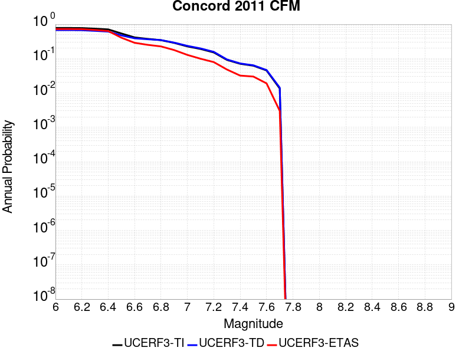 |
|-----|

| Magnitude | UCERF3-TI Prob | UCERF3-TD Prob | UCERF3-ETAS Prob |
|-----|-----|-----|-----|
| 6.0 | 0.7790244 | 0.6763446 | 0.71460676 |
| 6.1 | 0.7790244 | 0.6763446 | 0.71460676 |
| 6.2 | 0.7727343 | 0.6702878 | 0.71011233 |
| 6.3 | 0.7427083 | 0.641283 | 0.6707865 |
| 6.4 | 0.7075263 | 0.61060584 | 0.6235955 |
| 6.5 | 0.5380107 | 0.47373098 | 0.3955056 |
| 6.6 | 0.4133738 | 0.3892645 | 0.27752808 |
| 6.7 | 0.37451643 | 0.36508465 | 0.24044944 |
| 6.8 | 0.34358913 | 0.34558398 | 0.21460675 |
| 6.9 | 0.28607884 | 0.2914165 | 0.16629213 |
| 7.0 | 0.22583543 | 0.23454127 | 0.12022472 |
| 7.1 | 0.19025426 | 0.19752555 | 0.09213483 |
| 7.2 | 0.15084496 | 0.15703775 | 0.0752809 |
| 7.3 | 0.09145196 | 0.09422193 | 0.04494382 |
| 7.4 | 0.07055331 | 0.07225464 | 0.030337078 |
| 7.5 | 0.062111445 | 0.06370806 | 0.029213483 |
| 7.6 | 0.045161143 | 0.046452723 | 0.016853932 |
| 7.7 | 0.013452267 | 0.014232938 | 0.0033707866 |

## Contra Costa (Lafayette) 2011 CFM
*[(top)](#table-of-contents)*

| 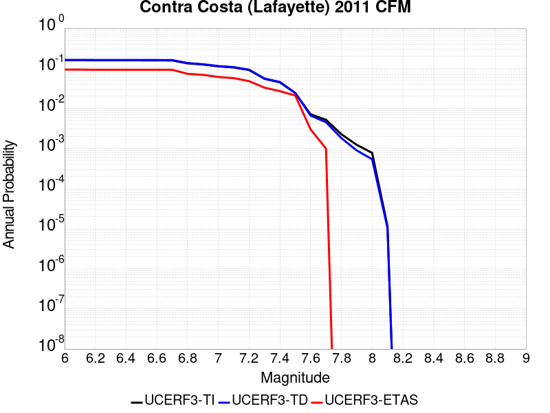 |
|-----|

| Magnitude | UCERF3-TI Prob | UCERF3-TD Prob | UCERF3-ETAS Prob |
|-----|-----|-----|-----|
| 6.0 | 0.15939693 | 0.16283959 | 0.09213483 |
| 6.1 | 0.15939693 | 0.16283959 | 0.09213483 |
| 6.2 | 0.15873863 | 0.16217355 | 0.09101123 |
| 6.3 | 0.15873863 | 0.16217355 | 0.09101123 |
| 6.4 | 0.15873863 | 0.16217355 | 0.09101123 |
| 6.5 | 0.1583222 | 0.16175011 | 0.09101123 |
| 6.6 | 0.1581732 | 0.1615982 | 0.09101123 |
| 6.7 | 0.15723789 | 0.16064727 | 0.09101123 |
| 6.8 | 0.13304448 | 0.13574706 | 0.07078651 |
| 6.9 | 0.12440883 | 0.12692584 | 0.06629214 |
| 7.0 | 0.111991294 | 0.11422559 | 0.058426965 |
| 7.1 | 0.105222166 | 0.107302286 | 0.056179777 |
| 7.2 | 0.09093019 | 0.09275583 | 0.046067417 |
| 7.3 | 0.05478249 | 0.055934284 | 0.031460673 |
| 7.4 | 0.044711318 | 0.045662194 | 0.025842696 |
| 7.5 | 0.024194803 | 0.024402106 | 0.019101124 |
| 7.6 | 0.0071415985 | 0.006651835 | 0.0033707866 |
| 7.7 | 0.005219317 | 0.004540018 | 0.0011235955 |
| 7.8 | 0.0022777077 | 0.0018245984 | 0.0 |
| 7.9 | 0.0012359286 | 8.9559477E-4 | 0.0 |
| 8.0 | 7.80193E-4 | 5.4088427E-4 | 0.0 |
| 8.1 | 1.156065E-5 | 1.0350903E-5 | 0.0 |

## Contra Costa Shear Zone (connector) 2011 CFM
*[(top)](#table-of-contents)*

| 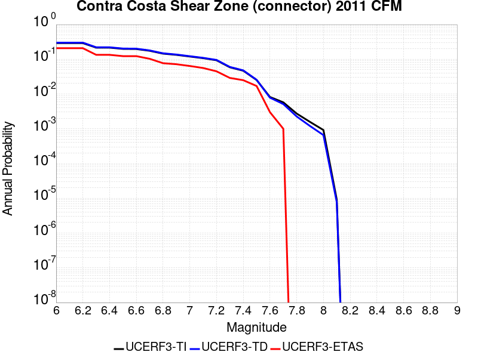 |
|-----|

| Magnitude | UCERF3-TI Prob | UCERF3-TD Prob | UCERF3-ETAS Prob |
|-----|-----|-----|-----|
| 6.0 | 0.29110852 | 0.30083972 | 0.20898877 |
| 6.1 | 0.29110852 | 0.30083972 | 0.20898877 |
| 6.2 | 0.29110852 | 0.30083972 | 0.20898877 |
| 6.3 | 0.21575403 | 0.2209108 | 0.13146068 |
| 6.4 | 0.21575403 | 0.2209108 | 0.13146068 |
| 6.5 | 0.1987384 | 0.20348544 | 0.12022472 |
| 6.6 | 0.19684294 | 0.20155855 | 0.12022472 |
| 6.7 | 0.17521557 | 0.17934713 | 0.103370786 |
| 6.8 | 0.1450092 | 0.14830287 | 0.0752809 |
| 6.9 | 0.13379058 | 0.1368155 | 0.07078651 |
| 7.0 | 0.11981842 | 0.12251613 | 0.062921345 |
| 7.1 | 0.1075162 | 0.10986338 | 0.056179777 |
| 7.2 | 0.09355138 | 0.095616706 | 0.04494382 |
| 7.3 | 0.058682445 | 0.060130943 | 0.028089888 |
| 7.4 | 0.046816517 | 0.04793614 | 0.0247191 |
| 7.5 | 0.025346402 | 0.025685456 | 0.015730336 |
| 7.6 | 0.0082111005 | 0.007846606 | 0.0033707866 |
| 7.7 | 0.005755832 | 0.0051388233 | 0.0011235955 |
| 7.8 | 0.002738112 | 0.0022577872 | 0.0 |
| 7.9 | 0.0015717698 | 0.0011982576 | 0.0 |
| 8.0 | 9.2080625E-4 | 6.583048E-4 | 0.0 |
| 8.1 | 9.193365E-6 | 7.696441E-6 | 0.0 |

## Coronado Bank alt1
*[(top)](#table-of-contents)*

|  |
|-----|

| Magnitude | UCERF3-TI Prob | UCERF3-TD Prob | UCERF3-ETAS Prob |
|-----|-----|-----|-----|
| 6.0 | 0.8599154 | 0.8631768 | 0.7617977 |
| 6.1 | 0.6640339 | 0.6659626 | 0.47191012 |
| 6.2 | 0.6640339 | 0.6659626 | 0.47191012 |
| 6.3 | 0.56372064 | 0.56986725 | 0.3764045 |
| 6.4 | 0.5413682 | 0.548618 | 0.35505617 |
| 6.5 | 0.47245607 | 0.4820209 | 0.31235954 |
| 6.6 | 0.42659444 | 0.4371226 | 0.27078652 |
| 6.7 | 0.38423568 | 0.39561442 | 0.24382022 |
| 6.8 | 0.33890283 | 0.34975058 | 0.21348314 |
| 6.9 | 0.28803328 | 0.29800928 | 0.1741573 |
| 7.0 | 0.24897406 | 0.25818756 | 0.14831461 |
| 7.1 | 0.20443717 | 0.21270794 | 0.12247191 |
| 7.2 | 0.020721626 | 0.021144733 | 0.011235955 |
| 7.3 | 0.00968233 | 0.009855254 | 0.007865168 |
| 7.4 | 0.005348828 | 0.0054449784 | 0.004494382 |
| 7.5 | 0.0017843343 | 0.0018173486 | 0.002247191 |
| 7.6 | 1.5906715E-4 | 1.624121E-4 | 0.0 |

## Coyote Canyon
*[(top)](#table-of-contents)*

| 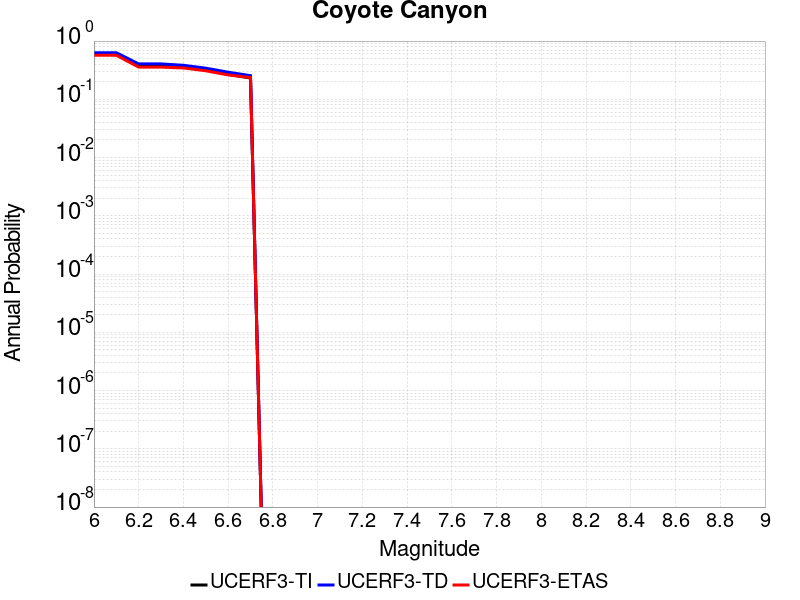 |
|-----|

| Magnitude | UCERF3-TI Prob | UCERF3-TD Prob | UCERF3-ETAS Prob |
|-----|-----|-----|-----|
| 6.0 | 0.5996796 | 0.63132167 | 0.58426964 |
| 6.1 | 0.5996796 | 0.63132167 | 0.58426964 |
| 6.2 | 0.38154912 | 0.40490705 | 0.36292136 |
| 6.3 | 0.38154912 | 0.40490705 | 0.36292136 |
| 6.4 | 0.36026728 | 0.38382694 | 0.3494382 |
| 6.5 | 0.3193368 | 0.34250626 | 0.31123596 |
| 6.6 | 0.26914394 | 0.29210603 | 0.26067415 |
| 6.7 | 0.23155676 | 0.25457802 | 0.23258427 |

## Coyote Lake
*[(top)](#table-of-contents)*

| 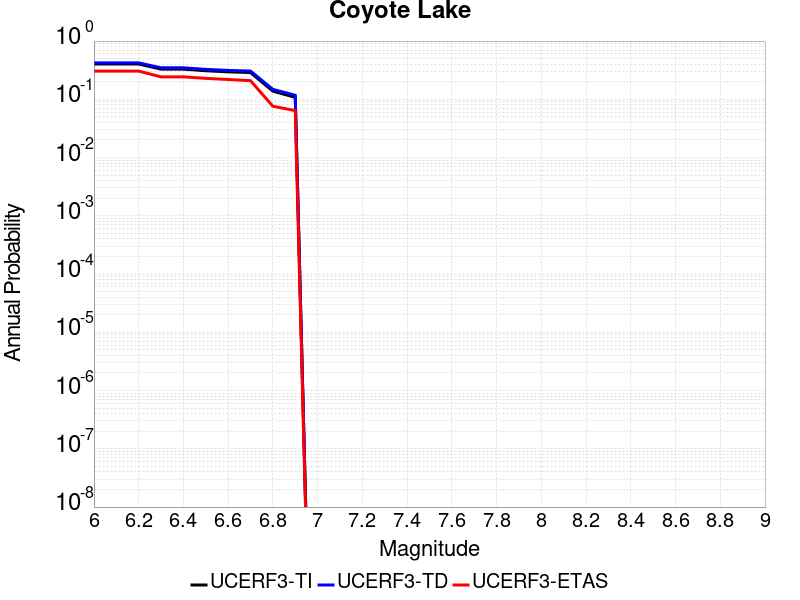 |
|-----|

| Magnitude | UCERF3-TI Prob | UCERF3-TD Prob | UCERF3-ETAS Prob |
|-----|-----|-----|-----|
| 6.0 | 0.40349331 | 0.42228743 | 0.3 |
| 6.1 | 0.40349331 | 0.42228743 | 0.3 |
| 6.2 | 0.40349331 | 0.42228743 | 0.3 |
| 6.3 | 0.32990623 | 0.34737086 | 0.23595506 |
| 6.4 | 0.32990623 | 0.34737086 | 0.23595506 |
| 6.5 | 0.30940497 | 0.3267506 | 0.22247191 |
| 6.6 | 0.29630256 | 0.3136062 | 0.21235955 |
| 6.7 | 0.2881532 | 0.3054081 | 0.20561798 |
| 6.8 | 0.13807777 | 0.14811951 | 0.07191011 |
| 6.9 | 0.10811646 | 0.11743595 | 0.05955056 |

## Cucamonga
*[(top)](#table-of-contents)*

| 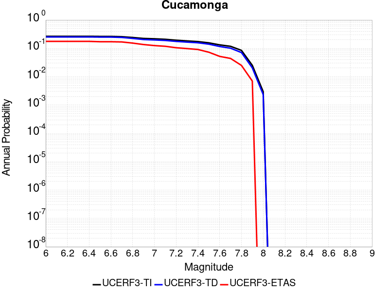 |
|-----|

| Magnitude | UCERF3-TI Prob | UCERF3-TD Prob | UCERF3-ETAS Prob |
|-----|-----|-----|-----|
| 6.0 | 0.26590493 | 0.25191733 | 0.18426967 |
| 6.1 | 0.26590493 | 0.25191733 | 0.18426967 |
| 6.2 | 0.26590493 | 0.25191733 | 0.18426967 |
| 6.3 | 0.26590493 | 0.25191733 | 0.18426967 |
| 6.4 | 0.26590493 | 0.25191733 | 0.18426967 |
| 6.5 | 0.26303652 | 0.24892598 | 0.17865169 |
| 6.6 | 0.26303652 | 0.24892598 | 0.17865169 |
| 6.7 | 0.2572116 | 0.24228583 | 0.1752809 |
| 6.8 | 0.24128349 | 0.22406507 | 0.15842697 |
| 6.9 | 0.22338271 | 0.2042818 | 0.14044943 |
| 7.0 | 0.21710505 | 0.19747052 | 0.13146068 |
| 7.1 | 0.20817006 | 0.1896549 | 0.1247191 |
| 7.2 | 0.19367145 | 0.17557156 | 0.11011236 |
| 7.3 | 0.1823777 | 0.16588148 | 0.10224719 |
| 7.4 | 0.1728891 | 0.15718651 | 0.094382025 |
| 7.5 | 0.15622263 | 0.1404736 | 0.0752809 |
| 7.6 | 0.13253039 | 0.11615503 | 0.05505618 |
| 7.7 | 0.11769853 | 0.10120411 | 0.047191013 |
| 7.8 | 0.084744215 | 0.07102467 | 0.026966292 |
| 7.9 | 0.025117673 | 0.020484261 | 0.007865168 |
| 8.0 | 0.002953781 | 0.0023480398 | 0.0 |

## Davis Creek
*[(top)](#table-of-contents)*

|  |
|-----|

| Magnitude | UCERF3-TI Prob | UCERF3-TD Prob | UCERF3-ETAS Prob |
|-----|-----|-----|-----|
| 6.0 | 0.45570913 | 0.4800038 | 0.3269663 |
| 6.1 | 0.23778735 | 0.24780977 | 0.1719101 |
| 6.2 | 0.23778735 | 0.24780977 | 0.1719101 |
| 6.3 | 0.12532169 | 0.12988298 | 0.08988764 |
| 6.4 | 0.06310547 | 0.06530504 | 0.05280899 |
| 6.5 | 0.06276634 | 0.06496525 | 0.05280899 |
| 6.6 | 0.005392585 | 0.005415947 | 0.004494382 |
| 6.7 | 0.004566783 | 0.004586485 | 0.004494382 |
| 6.8 | 0.003209143 | 0.0032220604 | 0.0033707866 |
| 6.9 | 0.0016683204 | 0.001675257 | 0.0011235955 |
| 7.0 | 1.6814613E-4 | 1.6886594E-4 | 0.0 |

## Death Valley (Black Mtns Frontal)
*[(top)](#table-of-contents)*

|  |
|-----|

| Magnitude | UCERF3-TI Prob | UCERF3-TD Prob | UCERF3-ETAS Prob |
|-----|-----|-----|-----|
| 6.0 | 0.35330656 | 0.36341396 | 0.2235955 |
| 6.1 | 0.35330656 | 0.36341396 | 0.2235955 |
| 6.2 | 0.35330656 | 0.36341396 | 0.2235955 |
| 6.3 | 0.35330656 | 0.36341396 | 0.2235955 |
| 6.4 | 0.33288598 | 0.34254566 | 0.20786516 |
| 6.5 | 0.33288598 | 0.34254566 | 0.20786516 |
| 6.6 | 0.32458875 | 0.33411875 | 0.2011236 |
| 6.7 | 0.31738147 | 0.32680595 | 0.1977528 |
| 6.8 | 0.3097555 | 0.31902784 | 0.19213483 |
| 6.9 | 0.3019855 | 0.3111013 | 0.18988764 |
| 7.0 | 0.2984247 | 0.3074793 | 0.18651685 |
| 7.1 | 0.29500338 | 0.30399954 | 0.18539326 |
| 7.2 | 0.2899773 | 0.2988867 | 0.17977528 |
| 7.3 | 0.28619048 | 0.29503253 | 0.17752808 |
| 7.4 | 0.28332514 | 0.29211676 | 0.1741573 |
| 7.5 | 0.27869287 | 0.2874113 | 0.17303371 |
| 7.6 | 0.25534853 | 0.2635607 | 0.15842697 |
| 7.7 | 0.21316631 | 0.22036088 | 0.12921348 |
| 7.8 | 0.008982842 | 0.009127193 | 0.004494382 |
| 7.9 | 6.676333E-5 | 6.761812E-5 | 0.0 |

## Death Valley (Fish Lake Valley)
*[(top)](#table-of-contents)*

|  |
|-----|

| Magnitude | UCERF3-TI Prob | UCERF3-TD Prob | UCERF3-ETAS Prob |
|-----|-----|-----|-----|
| 6.0 | 0.6358838 | 0.64376944 | 0.41235954 |
| 6.1 | 0.6358838 | 0.64376944 | 0.41235954 |
| 6.2 | 0.6358838 | 0.64376944 | 0.41235954 |
| 6.3 | 0.5227945 | 0.5304044 | 0.32247192 |
| 6.4 | 0.5227945 | 0.5304044 | 0.32247192 |
| 6.5 | 0.47157615 | 0.4814016 | 0.2797753 |
| 6.6 | 0.42630634 | 0.43755698 | 0.2505618 |
| 6.7 | 0.390216 | 0.40234917 | 0.2247191 |
| 6.8 | 0.35304356 | 0.36429775 | 0.20337078 |
| 6.9 | 0.3150635 | 0.32502285 | 0.18539326 |
| 7.0 | 0.28653353 | 0.2956503 | 0.16741572 |
| 7.1 | 0.27912045 | 0.28805798 | 0.16067415 |
| 7.2 | 0.27808073 | 0.28699777 | 0.16067415 |
| 7.3 | 0.2757961 | 0.2846655 | 0.16067415 |
| 7.4 | 0.27188203 | 0.2806679 | 0.16067415 |
| 7.5 | 0.26321104 | 0.27184293 | 0.15168539 |
| 7.6 | 0.23603307 | 0.24394885 | 0.13820225 |
| 7.7 | 0.20798972 | 0.21517506 | 0.121348314 |
| 7.8 | 0.008075784 | 0.008210172 | 0.004494382 |
| 7.9 | 6.676333E-5 | 6.761812E-5 | 0.0 |

## Death Valley (No)
*[(top)](#table-of-contents)*

|  |
|-----|

| Magnitude | UCERF3-TI Prob | UCERF3-TD Prob | UCERF3-ETAS Prob |
|-----|-----|-----|-----|
| 6.0 | 0.4077004 | 0.41839448 | 0.23932584 |
| 6.1 | 0.4077004 | 0.41839448 | 0.23932584 |
| 6.2 | 0.4077004 | 0.41839448 | 0.23932584 |
| 6.3 | 0.39166012 | 0.40217566 | 0.22921348 |
| 6.4 | 0.39166012 | 0.40217566 | 0.22921348 |
| 6.5 | 0.38071296 | 0.3911275 | 0.22247191 |
| 6.6 | 0.37139177 | 0.3817202 | 0.22022472 |
| 6.7 | 0.35865343 | 0.36886522 | 0.21348314 |
| 6.8 | 0.3505657 | 0.36068356 | 0.20337078 |
| 6.9 | 0.34391838 | 0.35398507 | 0.2 |
| 7.0 | 0.33944476 | 0.34948295 | 0.1977528 |
| 7.1 | 0.3343925 | 0.34437317 | 0.19550562 |
| 7.2 | 0.32953972 | 0.33944026 | 0.19438203 |
| 7.3 | 0.31597713 | 0.3255574 | 0.18988764 |
| 7.4 | 0.30809844 | 0.31750992 | 0.18764044 |
| 7.5 | 0.2969267 | 0.30614638 | 0.17865169 |
| 7.6 | 0.25493556 | 0.263149 | 0.15730338 |
| 7.7 | 0.21316631 | 0.22036088 | 0.12921348 |
| 7.8 | 0.008982842 | 0.009127193 | 0.004494382 |
| 7.9 | 6.676333E-5 | 6.761812E-5 | 0.0 |

## Death Valley (So)
*[(top)](#table-of-contents)*

|  |
|-----|

| Magnitude | UCERF3-TI Prob | UCERF3-TD Prob | UCERF3-ETAS Prob |
|-----|-----|-----|-----|
| 6.0 | 0.4170434 | 0.4473469 | 0.37191013 |
| 6.1 | 0.4170434 | 0.4473469 | 0.37191013 |
| 6.2 | 0.4170434 | 0.4473469 | 0.37191013 |
| 6.3 | 0.4102521 | 0.4407315 | 0.36629215 |
| 6.4 | 0.4102521 | 0.4407315 | 0.36629215 |
| 6.5 | 0.40596646 | 0.43655798 | 0.36404493 |
| 6.6 | 0.389859 | 0.41933268 | 0.33707866 |
| 6.7 | 0.38480476 | 0.41417947 | 0.3258427 |
| 6.8 | 0.3719813 | 0.3999459 | 0.31235954 |
| 6.9 | 0.2901416 | 0.3067905 | 0.21235955 |
| 7.0 | 0.25934806 | 0.27203047 | 0.1752809 |
| 7.1 | 0.22390643 | 0.23203537 | 0.13820225 |
| 7.2 | 0.21407233 | 0.22144358 | 0.12808989 |
| 7.3 | 0.20522363 | 0.21182665 | 0.123595506 |
| 7.4 | 0.20324339 | 0.20982963 | 0.12247191 |
| 7.5 | 0.20124386 | 0.20780936 | 0.121348314 |
| 7.6 | 0.19510087 | 0.20155545 | 0.11910112 |
| 7.7 | 0.17711227 | 0.18313292 | 0.10224719 |
| 7.8 | 0.008982842 | 0.009127193 | 0.004494382 |
| 7.9 | 6.676333E-5 | 6.761812E-5 | 0.0 |

## Deep Springs
*[(top)](#table-of-contents)*

|  |
|-----|

| Magnitude | UCERF3-TI Prob | UCERF3-TD Prob | UCERF3-ETAS Prob |
|-----|-----|-----|-----|
| 6.0 | 0.40360376 | 0.49191293 | 0.2764045 |
| 6.1 | 0.40360376 | 0.49191293 | 0.2764045 |
| 6.2 | 0.40360376 | 0.49191293 | 0.2764045 |
| 6.3 | 0.40360376 | 0.49191293 | 0.2764045 |
| 6.4 | 0.40360376 | 0.49191293 | 0.2764045 |
| 6.5 | 0.36140782 | 0.45480856 | 0.23820224 |
| 6.6 | 0.36140782 | 0.45480856 | 0.23820224 |

## Del Valle
*[(top)](#table-of-contents)*

|  |
|-----|

| Magnitude | UCERF3-TI Prob | UCERF3-TD Prob | UCERF3-ETAS Prob |
|-----|-----|-----|-----|
| 6.0 | 0.2438969 | 0.23490527 | 0.11685393 |
| 6.1 | 0.2438969 | 0.23490527 | 0.11685393 |
| 6.2 | 0.2438969 | 0.23490527 | 0.11685393 |
| 6.3 | 0.16972728 | 0.15382275 | 0.0752809 |
| 6.4 | 0.16972728 | 0.15382275 | 0.0752809 |
| 6.5 | 0.16972728 | 0.15382275 | 0.0752809 |
| 6.6 | 0.16972728 | 0.15382275 | 0.0752809 |
| 6.7 | 0.16958304 | 0.15367222 | 0.0752809 |
| 6.8 | 0.16159704 | 0.14525263 | 0.07078651 |
| 6.9 | 0.15971749 | 0.14360586 | 0.07078651 |
| 7.0 | 0.15196753 | 0.13540214 | 0.06516854 |
| 7.1 | 0.15043104 | 0.13386457 | 0.064044945 |
| 7.2 | 0.14581795 | 0.12945786 | 0.062921345 |
| 7.3 | 0.11699391 | 0.10388151 | 0.04269663 |
| 7.4 | 0.088516355 | 0.0777695 | 0.031460673 |
| 7.5 | 0.06834184 | 0.05948229 | 0.02247191 |
| 7.6 | 0.0487419 | 0.042103194 | 0.016853932 |
| 7.7 | 0.031126674 | 0.02617188 | 0.010112359 |
| 7.8 | 0.016231032 | 0.0137397945 | 0.004494382 |
| 7.9 | 0.0052802125 | 0.0043183398 | 0.0 |
| 8.0 | 0.0011406228 | 8.640734E-4 | 0.0 |

## Dog Valley
*[(top)](#table-of-contents)*

| 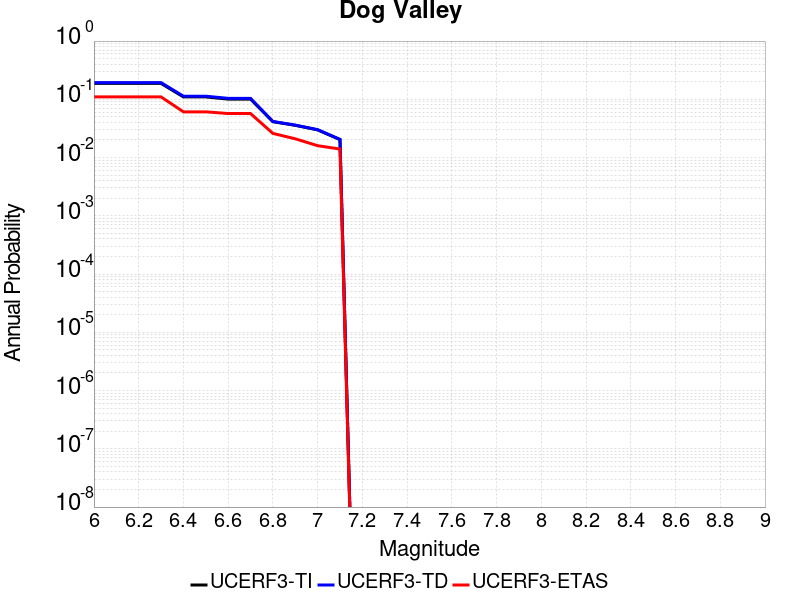 |
|-----|

| Magnitude | UCERF3-TI Prob | UCERF3-TD Prob | UCERF3-ETAS Prob |
|-----|-----|-----|-----|
| 6.0 | 0.1873056 | 0.19359186 | 0.113483146 |
| 6.1 | 0.1873056 | 0.19359186 | 0.113483146 |
| 6.2 | 0.1873056 | 0.19359186 | 0.113483146 |
| 6.3 | 0.1873056 | 0.19359186 | 0.113483146 |
| 6.4 | 0.10989345 | 0.11312654 | 0.062921345 |
| 6.5 | 0.10989345 | 0.11312654 | 0.062921345 |
| 6.6 | 0.10083931 | 0.103946075 | 0.058426965 |
| 6.7 | 0.10083931 | 0.103946075 | 0.058426965 |
| 6.8 | 0.041282788 | 0.041681603 | 0.023595506 |
| 6.9 | 0.035746936 | 0.03609886 | 0.017977528 |
| 7.0 | 0.029859101 | 0.03016403 | 0.014606741 |
| 7.1 | 0.020328866 | 0.020542031 | 0.01235955 |

## Dry Mountain
*[(top)](#table-of-contents)*

|  |
|-----|

| Magnitude | UCERF3-TI Prob | UCERF3-TD Prob | UCERF3-ETAS Prob |
|-----|-----|-----|-----|
| 6.0 | 0.1498555 | 0.15492117 | 0.08988764 |
| 6.1 | 0.1498555 | 0.15492117 | 0.08988764 |
| 6.2 | 0.1498555 | 0.15492117 | 0.08988764 |
| 6.3 | 0.1498555 | 0.15492117 | 0.08988764 |
| 6.4 | 0.1498555 | 0.15492117 | 0.08988764 |
| 6.5 | 0.07172685 | 0.074633084 | 0.037078653 |
| 6.6 | 0.07172685 | 0.074633084 | 0.037078653 |
| 6.7 | 0.064143345 | 0.06697823 | 0.03258427 |

## Earthquake Valley
*[(top)](#table-of-contents)*

|  |
|-----|

| Magnitude | UCERF3-TI Prob | UCERF3-TD Prob | UCERF3-ETAS Prob |
|-----|-----|-----|-----|
| 6.0 | 0.39743787 | 0.42088923 | 0.26067415 |
| 6.1 | 0.39743787 | 0.42088923 | 0.26067415 |
| 6.2 | 0.39743787 | 0.42088923 | 0.26067415 |
| 6.3 | 0.39743787 | 0.42088923 | 0.26067415 |
| 6.4 | 0.39743787 | 0.42088923 | 0.26067415 |
| 6.5 | 0.3970097 | 0.42046985 | 0.26067415 |
| 6.6 | 0.3970097 | 0.42046985 | 0.26067415 |
| 6.7 | 0.3225346 | 0.34440207 | 0.20224719 |
| 6.8 | 0.29815504 | 0.3196294 | 0.17752808 |
| 6.9 | 0.29815504 | 0.3196294 | 0.17752808 |
| 7.0 | 0.295643 | 0.31710836 | 0.1741573 |
| 7.1 | 0.19221005 | 0.21048547 | 0.11460674 |
| 7.2 | 0.00537658 | 0.0050860224 | 0.0033707866 |
| 7.3 | 0.005324264 | 0.00503111 | 0.0033707866 |
| 7.4 | 0.0052486705 | 0.0049603027 | 0.0033707866 |
| 7.5 | 0.0038662297 | 0.003624269 | 0.0033707866 |
| 7.6 | 0.0034341833 | 0.003200762 | 0.0033707866 |
| 7.7 | 7.461348E-4 | 5.121904E-4 | 0.0 |
| 7.8 | 1.702772E-4 | 9.485473E-5 | 0.0 |
| 7.9 | 3.3650093E-5 | 1.797548E-5 | 0.0 |

## Earthquake Valley (No  Extension)
*[(top)](#table-of-contents)*

|  |
|-----|

| Magnitude | UCERF3-TI Prob | UCERF3-TD Prob | UCERF3-ETAS Prob |
|-----|-----|-----|-----|
| 6.0 | 0.43465 | 0.46236306 | 0.30786517 |
| 6.1 | 0.43465 | 0.46236306 | 0.30786517 |
| 6.2 | 0.43465 | 0.46236306 | 0.30786517 |
| 6.3 | 0.43465 | 0.46236306 | 0.30786517 |
| 6.4 | 0.43465 | 0.46236306 | 0.30786517 |
| 6.5 | 0.43465 | 0.46236306 | 0.30786517 |
| 6.6 | 0.34074783 | 0.3629725 | 0.22134832 |
| 6.7 | 0.34074783 | 0.3629725 | 0.22134832 |
| 6.8 | 0.32938787 | 0.35153162 | 0.20674157 |
| 6.9 | 0.29933313 | 0.32073572 | 0.17752808 |
| 7.0 | 0.29679754 | 0.31819052 | 0.1741573 |
| 7.1 | 0.19349857 | 0.21169962 | 0.11460674 |
| 7.2 | 0.006891508 | 0.006541149 | 0.0033707866 |
| 7.3 | 0.0067111515 | 0.0063663186 | 0.0033707866 |
| 7.4 | 0.005898559 | 0.005579486 | 0.0033707866 |
| 7.5 | 0.004049684 | 0.0037850721 | 0.0033707866 |
| 7.6 | 0.0035025033 | 0.003249763 | 0.0033707866 |
| 7.7 | 7.750575E-4 | 5.257307E-4 | 0.0 |
| 7.8 | 1.9405987E-4 | 1.056052E-4 | 0.0 |
| 7.9 | 4.0107643E-5 | 2.125018E-5 | 0.0 |

## Earthquake Valley (So Extension)
*[(top)](#table-of-contents)*

|  |
|-----|

| Magnitude | UCERF3-TI Prob | UCERF3-TD Prob | UCERF3-ETAS Prob |
|-----|-----|-----|-----|
| 6.0 | 0.54514426 | 0.5815805 | 0.35617977 |
| 6.1 | 0.54514426 | 0.5815805 | 0.35617977 |
| 6.2 | 0.54514426 | 0.5815805 | 0.35617977 |
| 6.3 | 0.3377363 | 0.36024687 | 0.21685393 |
| 6.4 | 0.3377363 | 0.36024687 | 0.21685393 |
| 6.5 | 0.3377363 | 0.36024687 | 0.21685393 |
| 6.6 | 0.3377363 | 0.36024687 | 0.21685393 |
| 6.7 | 0.25655183 | 0.27688178 | 0.15842697 |
| 6.8 | 0.230634 | 0.25040072 | 0.13820225 |
| 6.9 | 0.230634 | 0.25040072 | 0.13820225 |
| 7.0 | 0.230634 | 0.25040072 | 0.13820225 |
| 7.1 | 0.19133802 | 0.20970987 | 0.113483146 |
| 7.2 | 0.004357395 | 0.004169088 | 0.002247191 |
| 7.3 | 0.0043297997 | 0.004139293 | 0.002247191 |
| 7.4 | 0.0043134484 | 0.004122799 | 0.002247191 |
| 7.5 | 0.003064583 | 0.0029132846 | 0.002247191 |
| 7.6 | 0.0028117937 | 0.002664775 | 0.002247191 |
| 7.7 | 5.6928623E-4 | 4.1197822E-4 | 0.0 |
| 7.8 | 6.827241E-5 | 4.088609E-5 | 0.0 |

## East Huasna 2011 CFM
*[(top)](#table-of-contents)*

|  |
|-----|

| Magnitude | UCERF3-TI Prob | UCERF3-TD Prob | UCERF3-ETAS Prob |
|-----|-----|-----|-----|
| 6.0 | 0.03752078 | 0.0376088 | 0.037078653 |
| 6.1 | 0.03752078 | 0.0376088 | 0.037078653 |
| 6.2 | 0.03752078 | 0.0376088 | 0.037078653 |
| 6.3 | 0.03752078 | 0.0376088 | 0.037078653 |
| 6.4 | 0.026992148 | 0.027053624 | 0.0247191 |
| 6.5 | 0.026992148 | 0.027053624 | 0.0247191 |
| 6.6 | 0.02183757 | 0.021889858 | 0.023595506 |
| 6.7 | 0.02033864 | 0.0203871 | 0.02247191 |
| 6.8 | 0.018081587 | 0.018126726 | 0.019101124 |
| 6.9 | 0.015273943 | 0.015313595 | 0.01235955 |
| 7.0 | 0.012428838 | 0.012463266 | 0.010112359 |
| 7.1 | 0.010705914 | 0.010736247 | 0.008988764 |
| 7.2 | 0.007336912 | 0.0073587713 | 0.006741573 |
| 7.3 | 0.00397374 | 0.0039859414 | 0.0056179776 |
| 7.4 | 0.0020788258 | 0.002085249 | 0.002247191 |
| 7.5 | 0.0011137845 | 0.0011176268 | 0.002247191 |
| 7.6 | 5.687811E-4 | 5.707513E-4 | 0.0011235955 |
| 7.7 | 1.2312352E-4 | 1.2349992E-4 | 0.0 |
| 7.8 | 1.9306071E-6 | 1.9357753E-6 | 0.0 |

## Eaton Roughs 2011 CFM
*[(top)](#table-of-contents)*

|  |
|-----|

| Magnitude | UCERF3-TI Prob | UCERF3-TD Prob | UCERF3-ETAS Prob |
|-----|-----|-----|-----|
| 6.0 | 0.83056813 | 0.8248372 | 0.7247191 |
| 6.1 | 0.83056813 | 0.8248372 | 0.7247191 |
| 6.2 | 0.83056813 | 0.8248372 | 0.7247191 |
| 6.3 | 0.83056813 | 0.8248372 | 0.7247191 |
| 6.4 | 0.6975078 | 0.70005465 | 0.5696629 |
| 6.5 | 0.6975078 | 0.70005465 | 0.5696629 |
| 6.6 | 0.5685747 | 0.57516426 | 0.42022473 |
| 6.7 | 0.46752074 | 0.4774993 | 0.32022473 |
| 6.8 | 0.43398535 | 0.4438508 | 0.29101124 |
| 6.9 | 0.41729018 | 0.4269967 | 0.27078652 |
| 7.0 | 0.4081523 | 0.41776806 | 0.26292136 |
| 7.1 | 0.37841812 | 0.387399 | 0.23932584 |
| 7.2 | 0.36698413 | 0.37586787 | 0.22696629 |
| 7.3 | 0.33655906 | 0.3450698 | 0.20449439 |
| 7.4 | 0.31421077 | 0.32228246 | 0.18651685 |
| 7.5 | 0.29370537 | 0.30146745 | 0.16966292 |
| 7.6 | 0.24356844 | 0.25034136 | 0.13483146 |
| 7.7 | 0.14353801 | 0.14841355 | 0.08089887 |
| 7.8 | 0.054848842 | 0.056032877 | 0.035955057 |
| 7.9 | 0.012853368 | 0.013055603 | 0.008988764 |

## Elmore Ranch
*[(top)](#table-of-contents)*

|  |
|-----|

| Magnitude | UCERF3-TI Prob | UCERF3-TD Prob | UCERF3-ETAS Prob |
|-----|-----|-----|-----|
| 6.0 | 0.90696514 | 0.86112946 | 0.8449438 |
| 6.1 | 0.6319047 | 0.5586095 | 0.50898874 |
| 6.2 | 0.6319047 | 0.5586095 | 0.50898874 |
| 6.3 | 0.57942164 | 0.51397556 | 0.46741572 |
| 6.4 | 0.48114288 | 0.43140945 | 0.36516854 |
| 6.5 | 0.48114288 | 0.43140945 | 0.36516854 |

## Elsinore (Coyote Mountains)
*[(top)](#table-of-contents)*

|  |
|-----|

| Magnitude | UCERF3-TI Prob | UCERF3-TD Prob | UCERF3-ETAS Prob |
|-----|-----|-----|-----|
| 6.0 | 0.666166 | 0.67399865 | 0.46292135 |
| 6.1 | 0.666166 | 0.67399865 | 0.46292135 |
| 6.2 | 0.4571156 | 0.44647193 | 0.2797753 |
| 6.3 | 0.4571156 | 0.44647193 | 0.2797753 |
| 6.4 | 0.356464 | 0.34250414 | 0.18876405 |
| 6.5 | 0.356464 | 0.34250414 | 0.18876405 |
| 6.6 | 0.2671033 | 0.24922119 | 0.12921348 |
| 6.7 | 0.2123343 | 0.19209702 | 0.09775281 |
| 6.8 | 0.18634695 | 0.16426396 | 0.08089887 |
| 6.9 | 0.1834919 | 0.16125503 | 0.07977528 |
| 7.0 | 0.1814795 | 0.15913263 | 0.07865169 |
| 7.1 | 0.17659646 | 0.15400302 | 0.0764045 |
| 7.2 | 0.16970143 | 0.14673068 | 0.07078651 |
| 7.3 | 0.16890393 | 0.14595555 | 0.07078651 |
| 7.4 | 0.16803907 | 0.14509204 | 0.07078651 |
| 7.5 | 0.16497612 | 0.14230695 | 0.06966292 |
| 7.6 | 0.15248974 | 0.1307828 | 0.06516854 |
| 7.7 | 0.09722835 | 0.07774345 | 0.030337078 |
| 7.8 | 0.00542387 | 0.00338318 | 0.0033707866 |
| 7.9 | 1.17316136E-4 | 6.2971114E-5 | 0.0 |

## Elsinore (Glen Ivy) rev
*[(top)](#table-of-contents)*

|  |
|-----|

| Magnitude | UCERF3-TI Prob | UCERF3-TD Prob | UCERF3-ETAS Prob |
|-----|-----|-----|-----|
| 6.0 | 0.98541665 | 0.8832171 | 0.9831461 |
| 6.1 | 0.98541665 | 0.8832171 | 0.9831461 |
| 6.2 | 0.98541665 | 0.8832171 | 0.9831461 |
| 6.3 | 0.92851114 | 0.7595712 | 0.92921346 |
| 6.4 | 0.92851114 | 0.7595712 | 0.92921346 |
| 6.5 | 0.61539173 | 0.5201129 | 0.5235955 |
| 6.6 | 0.47981948 | 0.4351548 | 0.3516854 |
| 6.7 | 0.4394976 | 0.39965773 | 0.2988764 |
| 6.8 | 0.35241452 | 0.31704107 | 0.20337078 |
| 6.9 | 0.3246078 | 0.29064012 | 0.1752809 |
| 7.0 | 0.31249142 | 0.27837592 | 0.16179775 |
| 7.1 | 0.2925523 | 0.25885466 | 0.14719102 |
| 7.2 | 0.26106375 | 0.22858123 | 0.12247191 |
| 7.3 | 0.23266298 | 0.20148553 | 0.104494385 |
| 7.4 | 0.21093784 | 0.1814317 | 0.09550562 |
| 7.5 | 0.1813909 | 0.15468961 | 0.084269665 |
| 7.6 | 0.16670452 | 0.14135355 | 0.07191011 |
| 7.7 | 0.10293154 | 0.08091676 | 0.031460673 |
| 7.8 | 0.005902799 | 0.0036343427 | 0.004494382 |
| 7.9 | 1.7417852E-4 | 9.24347E-5 | 0.0 |

## Elsinore (Julian)
*[(top)](#table-of-contents)*

|  |
|-----|

| Magnitude | UCERF3-TI Prob | UCERF3-TD Prob | UCERF3-ETAS Prob |
|-----|-----|-----|-----|
| 6.0 | 0.2632549 | 0.23795888 | 0.12584269 |
| 6.1 | 0.2632549 | 0.23795888 | 0.12584269 |
| 6.2 | 0.2632549 | 0.23795888 | 0.12584269 |
| 6.3 | 0.2632549 | 0.23795888 | 0.12584269 |
| 6.4 | 0.2632549 | 0.23795888 | 0.12584269 |
| 6.5 | 0.2632549 | 0.23795888 | 0.12584269 |
| 6.6 | 0.2621082 | 0.2366652 | 0.12584269 |
| 6.7 | 0.2621082 | 0.2366652 | 0.12584269 |
| 6.8 | 0.2580946 | 0.23237841 | 0.1247191 |
| 6.9 | 0.25533882 | 0.22946726 | 0.12247191 |
| 7.0 | 0.25177774 | 0.22576214 | 0.12022472 |
| 7.1 | 0.24565583 | 0.2193523 | 0.11573034 |
| 7.2 | 0.2362025 | 0.20934466 | 0.10561798 |
| 7.3 | 0.2220114 | 0.19549407 | 0.0988764 |
| 7.4 | 0.2122487 | 0.18576247 | 0.094382025 |
| 7.5 | 0.18814024 | 0.16209416 | 0.084269665 |
| 7.6 | 0.16595201 | 0.14081883 | 0.07191011 |
| 7.7 | 0.102749586 | 0.08080803 | 0.031460673 |
| 7.8 | 0.0058781286 | 0.003621769 | 0.004494382 |
| 7.9 | 1.7417852E-4 | 9.24347E-5 | 0.0 |

## Elsinore (Stepovers Combined)
*[(top)](#table-of-contents)*

|  |
|-----|

| Magnitude | UCERF3-TI Prob | UCERF3-TD Prob | UCERF3-ETAS Prob |
|-----|-----|-----|-----|
| 6.0 | 0.42848387 | 0.39489928 | 0.28314605 |
| 6.1 | 0.42848387 | 0.39489928 | 0.28314605 |
| 6.2 | 0.42848387 | 0.39489928 | 0.28314605 |
| 6.3 | 0.40268403 | 0.3669482 | 0.25505617 |
| 6.4 | 0.40268403 | 0.3669482 | 0.25505617 |
| 6.5 | 0.40268403 | 0.3669482 | 0.25505617 |
| 6.6 | 0.39384764 | 0.3584639 | 0.24719101 |
| 6.7 | 0.36833197 | 0.33681914 | 0.20786516 |
| 6.8 | 0.35775277 | 0.3281553 | 0.19438203 |
| 6.9 | 0.34132642 | 0.3114713 | 0.17752808 |
| 7.0 | 0.2934563 | 0.26374796 | 0.14382023 |
| 7.1 | 0.2851266 | 0.2555827 | 0.13820225 |
| 7.2 | 0.2620973 | 0.23301056 | 0.123595506 |
| 7.3 | 0.22980902 | 0.20098323 | 0.103370786 |
| 7.4 | 0.21167973 | 0.1832174 | 0.09550562 |
| 7.5 | 0.18562731 | 0.15886971 | 0.08539326 |
| 7.6 | 0.16642986 | 0.14114644 | 0.07191011 |
| 7.7 | 0.10288919 | 0.080890104 | 0.031460673 |
| 7.8 | 0.005902799 | 0.0036343427 | 0.004494382 |
| 7.9 | 1.7417852E-4 | 9.24347E-5 | 0.0 |

## Elsinore (Temecula) rev
*[(top)](#table-of-contents)*

| 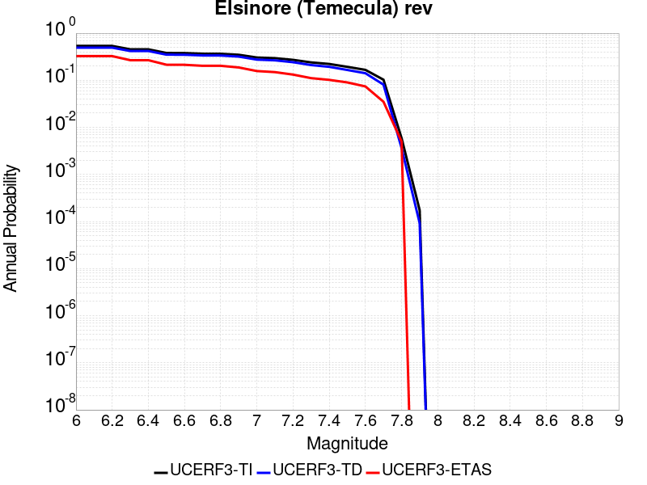 |
|-----|

| Magnitude | UCERF3-TI Prob | UCERF3-TD Prob | UCERF3-ETAS Prob |
|-----|-----|-----|-----|
| 6.0 | 0.5370038 | 0.49266133 | 0.3247191 |
| 6.1 | 0.5370038 | 0.49266133 | 0.3247191 |
| 6.2 | 0.5370038 | 0.49266133 | 0.3247191 |
| 6.3 | 0.45441434 | 0.4182426 | 0.26404494 |
| 6.4 | 0.45441434 | 0.4182426 | 0.26404494 |
| 6.5 | 0.3802583 | 0.3499133 | 0.21011236 |
| 6.6 | 0.3783873 | 0.34794384 | 0.20898877 |
| 6.7 | 0.36675584 | 0.3369873 | 0.2 |
| 6.8 | 0.36517426 | 0.3354654 | 0.2 |
| 6.9 | 0.34814647 | 0.31822434 | 0.18314607 |
| 7.0 | 0.30439225 | 0.2744 | 0.15505618 |
| 7.1 | 0.2951238 | 0.26525474 | 0.14719102 |
| 7.2 | 0.27147335 | 0.24194698 | 0.12808989 |
| 7.3 | 0.23971626 | 0.21041188 | 0.10786517 |
| 7.4 | 0.22205317 | 0.19297865 | 0.1 |
| 7.5 | 0.19291662 | 0.16556972 | 0.08876404 |
| 7.6 | 0.16637775 | 0.14111409 | 0.07191011 |
| 7.7 | 0.10284023 | 0.08086021 | 0.031460673 |
| 7.8 | 0.005902799 | 0.0036343427 | 0.004494382 |
| 7.9 | 1.7417852E-4 | 9.24347E-5 | 0.0 |

## Elysian Park (Lower CFM)
*[(top)](#table-of-contents)*

| 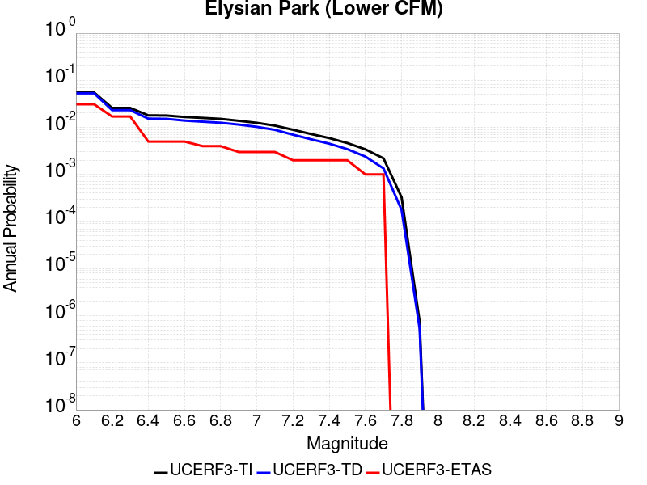 |
|-----|

| Magnitude | UCERF3-TI Prob | UCERF3-TD Prob | UCERF3-ETAS Prob |
|-----|-----|-----|-----|
| 6.0 | 0.055204995 | 0.053111386 | 0.03483146 |
| 6.1 | 0.055204995 | 0.053111386 | 0.03483146 |
| 6.2 | 0.025831167 | 0.023223432 | 0.019101124 |
| 6.3 | 0.025831167 | 0.023223432 | 0.019101124 |
| 6.4 | 0.017995883 | 0.015322755 | 0.0056179776 |
| 6.5 | 0.017845368 | 0.015171375 | 0.0056179776 |
| 6.6 | 0.016609466 | 0.013928758 | 0.0056179776 |
| 6.7 | 0.015887953 | 0.013203619 | 0.004494382 |
| 6.8 | 0.0151406545 | 0.012537313 | 0.004494382 |
| 6.9 | 0.013790793 | 0.0114558805 | 0.0033707866 |
| 7.0 | 0.012482702 | 0.010260274 | 0.0033707866 |
| 7.1 | 0.010880386 | 0.00885979 | 0.0033707866 |
| 7.2 | 0.008898496 | 0.006991832 | 0.002247191 |
| 7.3 | 0.00721924 | 0.0055828076 | 0.002247191 |
| 7.4 | 0.005919418 | 0.0045160493 | 0.002247191 |
| 7.5 | 0.004652488 | 0.003452158 | 0.002247191 |
| 7.6 | 0.0034182456 | 0.0023959402 | 0.0011235955 |
| 7.7 | 0.0021995115 | 0.0013458327 | 0.0011235955 |
| 7.8 | 3.2844688E-4 | 1.7632965E-4 | 0.0 |
| 7.9 | 7.389586E-7 | 5.262296E-7 | 0.0 |

## Elysian Park (Upper)
*[(top)](#table-of-contents)*

|  |
|-----|

| Magnitude | UCERF3-TI Prob | UCERF3-TD Prob | UCERF3-ETAS Prob |
|-----|-----|-----|-----|
| 6.0 | 0.56466347 | 0.59218574 | 0.42696628 |
| 6.1 | 0.56466347 | 0.59218574 | 0.42696628 |
| 6.2 | 0.56466347 | 0.59218574 | 0.42696628 |
| 6.3 | 0.56466347 | 0.59218574 | 0.42696628 |
| 6.4 | 0.39518684 | 0.40627417 | 0.28539327 |
| 6.5 | 0.39518684 | 0.40627417 | 0.28539327 |
| 6.6 | 0.22587518 | 0.21635124 | 0.14494382 |
| 6.7 | 0.22563723 | 0.21610753 | 0.14382023 |
| 6.8 | 0.19054088 | 0.17908975 | 0.11685393 |
| 6.9 | 0.14674352 | 0.13229744 | 0.08764045 |
| 7.0 | 0.1359199 | 0.12145306 | 0.084269665 |
| 7.1 | 0.115628205 | 0.1014778 | 0.06966292 |
| 7.2 | 0.08979652 | 0.07611723 | 0.05505618 |
| 7.3 | 0.06243597 | 0.053993475 | 0.04269663 |
| 7.4 | 0.02991003 | 0.026644813 | 0.02247191 |
| 7.5 | 0.012946002 | 0.012465479 | 0.007865168 |
| 7.6 | 0.0064150025 | 0.00630427 | 0.006741573 |
| 7.7 | 0.002145178 | 0.0019806297 | 0.0033707866 |
| 7.8 | 7.2552223E-4 | 5.5968657E-4 | 0.0 |

## Emerson-Copper Mtn 2011
*[(top)](#table-of-contents)*

|  |
|-----|

| Magnitude | UCERF3-TI Prob | UCERF3-TD Prob | UCERF3-ETAS Prob |
|-----|-----|-----|-----|
| 6.0 | 0.42729396 | 0.44084522 | 0.26966292 |
| 6.1 | 0.42729396 | 0.44084522 | 0.26966292 |
| 6.2 | 0.42729396 | 0.44084522 | 0.26966292 |
| 6.3 | 0.37068367 | 0.38336015 | 0.2235955 |
| 6.4 | 0.37068367 | 0.38336015 | 0.2235955 |
| 6.5 | 0.33931294 | 0.35154206 | 0.19101124 |
| 6.6 | 0.33931294 | 0.35154206 | 0.19101124 |
| 6.7 | 0.31111473 | 0.32299456 | 0.1741573 |
| 6.8 | 0.29669505 | 0.30841476 | 0.16404495 |
| 6.9 | 0.27328098 | 0.28472015 | 0.14157303 |
| 7.0 | 0.24966893 | 0.26080087 | 0.12921348 |
| 7.1 | 0.22411841 | 0.23489724 | 0.11797753 |
| 7.2 | 0.09753263 | 0.0999081 | 0.041573033 |
| 7.3 | 0.067084044 | 0.06857461 | 0.0247191 |
| 7.4 | 0.0530505 | 0.05422025 | 0.017977528 |
| 7.5 | 0.030017076 | 0.030707976 | 0.008988764 |
| 7.6 | 0.0034260035 | 0.003513153 | 0.0011235955 |

## Eureka Peak
*[(top)](#table-of-contents)*

|  |
|-----|

| Magnitude | UCERF3-TI Prob | UCERF3-TD Prob | UCERF3-ETAS Prob |
|-----|-----|-----|-----|
| 6.0 | 0.56549215 | 0.69153947 | 0.38876405 |
| 6.1 | 0.56549215 | 0.69153947 | 0.38876405 |
| 6.2 | 0.56549215 | 0.69153947 | 0.38876405 |
| 6.3 | 0.5099678 | 0.6545782 | 0.33707866 |
| 6.4 | 0.5099678 | 0.6545782 | 0.33707866 |
| 6.5 | 0.0025374512 | 0.0038545043 | 0.002247191 |
| 6.6 | 0.0024362702 | 0.003752971 | 0.002247191 |
| 6.7 | 0.0024362702 | 0.003752971 | 0.002247191 |
| 6.8 | 0.002238932 | 0.0035547 | 0.002247191 |
| 6.9 | 0.0020198051 | 0.003334045 | 0.002247191 |
| 7.0 | 0.0017979874 | 0.0030644883 | 0.002247191 |
| 7.1 | 0.0015274865 | 0.0026907518 | 0.002247191 |
| 7.2 | 0.001339448 | 0.0024019396 | 0.0011235955 |
| 7.3 | 0.0011848311 | 0.0020973634 | 0.0 |
| 7.4 | 7.7765854E-4 | 0.0013019288 | 0.0 |
| 7.5 | 1.1066828E-4 | 1.7656901E-4 | 0.0 |

## Fickle Hill (alt1)
*[(top)](#table-of-contents)*

|  |
|-----|

| Magnitude | UCERF3-TI Prob | UCERF3-TD Prob | UCERF3-ETAS Prob |
|-----|-----|-----|-----|
| 6.0 | 0.13348855 | 0.13619156 | 0.08539326 |
| 6.1 | 0.13348855 | 0.13619156 | 0.08539326 |
| 6.2 | 0.13348855 | 0.13619156 | 0.08539326 |
| 6.3 | 0.13348855 | 0.13619156 | 0.08539326 |
| 6.4 | 0.13348855 | 0.13619156 | 0.08539326 |
| 6.5 | 0.13348855 | 0.13619156 | 0.08539326 |
| 6.6 | 0.13348855 | 0.13619156 | 0.08539326 |
| 6.7 | 0.13348855 | 0.13619156 | 0.08539326 |
| 6.8 | 0.12733771 | 0.12997848 | 0.084269665 |
| 6.9 | 0.12729037 | 0.12993062 | 0.084269665 |
| 7.0 | 0.10852024 | 0.11080725 | 0.06629214 |
| 7.1 | 0.0894354 | 0.09136691 | 0.056179777 |
| 7.2 | 0.07258156 | 0.074210405 | 0.04494382 |
| 7.3 | 0.057626598 | 0.059015077 | 0.03483146 |
| 7.4 | 0.05273717 | 0.054047484 | 0.030337078 |
| 7.5 | 0.04201101 | 0.043101873 | 0.02247191 |
| 7.6 | 0.030035252 | 0.030870043 | 0.01235955 |
| 7.7 | 0.010348153 | 0.010671099 | 0.002247191 |
| 7.8 | 0.0029774588 | 0.0030815545 | 0.002247191 |

## Fish Slough 2011 CFM
*[(top)](#table-of-contents)*

|  |
|-----|

| Magnitude | UCERF3-TI Prob | UCERF3-TD Prob | UCERF3-ETAS Prob |
|-----|-----|-----|-----|
| 6.0 | 0.10758821 | 0.09147042 | 0.046067417 |
| 6.1 | 0.10758821 | 0.09147042 | 0.046067417 |
| 6.2 | 0.10758821 | 0.09147042 | 0.046067417 |
| 6.3 | 0.10758821 | 0.09147042 | 0.046067417 |
| 6.4 | 0.10758821 | 0.09147042 | 0.046067417 |
| 6.5 | 0.07508351 | 0.05781435 | 0.025842696 |
| 6.6 | 0.07508351 | 0.05781435 | 0.025842696 |
| 6.7 | 0.07017978 | 0.05277366 | 0.023595506 |
| 6.8 | 0.049395222 | 0.031210165 | 0.011235955 |
| 6.9 | 0.047286555 | 0.029038535 | 0.010112359 |
| 7.0 | 0.04246895 | 0.02413294 | 0.010112359 |
| 7.1 | 0.03657273 | 0.01829771 | 0.010112359 |
| 7.2 | 0.030342607 | 0.012436467 | 0.007865168 |
| 7.3 | 0.0255436 | 0.008504133 | 0.007865168 |
| 7.4 | 0.021300124 | 0.0063243546 | 0.007865168 |
| 7.5 | 0.013796124 | 0.0037618815 | 0.0056179776 |
| 7.6 | 0.005301698 | 0.0014579515 | 0.002247191 |
| 7.7 | 5.868686E-4 | 9.004612E-5 | 0.0 |

## Fitzhugh Creek
*[(top)](#table-of-contents)*

|  |
|-----|

| Magnitude | UCERF3-TI Prob | UCERF3-TD Prob | UCERF3-ETAS Prob |
|-----|-----|-----|-----|
| 6.0 | 0.14732863 | 0.14904137 | 0.101123594 |
| 6.1 | 0.07466031 | 0.07523914 | 0.051685393 |
| 6.2 | 0.07466031 | 0.07523914 | 0.051685393 |
| 6.3 | 0.037829027 | 0.038056146 | 0.026966292 |
| 6.4 | 0.037829027 | 0.038056146 | 0.026966292 |
| 6.5 | 0.024525175 | 0.02466657 | 0.019101124 |
| 6.6 | 0.016074635 | 0.016167354 | 0.008988764 |
| 6.7 | 0.0058212415 | 0.0058575952 | 0.002247191 |
| 6.8 | 0.003849877 | 0.0038758842 | 0.0 |

## Fontana (Seismicity)
*[(top)](#table-of-contents)*

|  |
|-----|

| Magnitude | UCERF3-TI Prob | UCERF3-TD Prob | UCERF3-ETAS Prob |
|-----|-----|-----|-----|
| 6.0 | 0.17079975 | 0.18251604 | 0.0988764 |
| 6.1 | 0.17079975 | 0.18251604 | 0.0988764 |
| 6.2 | 0.17079975 | 0.18251604 | 0.0988764 |
| 6.3 | 0.17079975 | 0.18251604 | 0.0988764 |
| 6.4 | 0.17079975 | 0.18251604 | 0.0988764 |
| 6.5 | 0.12825605 | 0.13934053 | 0.06629214 |
| 6.6 | 0.12825605 | 0.13934053 | 0.06629214 |

## Franklin 2011 CFM
*[(top)](#table-of-contents)*

|  |
|-----|

| Magnitude | UCERF3-TI Prob | UCERF3-TD Prob | UCERF3-ETAS Prob |
|-----|-----|-----|-----|
| 6.0 | 0.38214952 | 0.39111814 | 0.28202248 |
| 6.1 | 0.38214952 | 0.39111814 | 0.28202248 |
| 6.2 | 0.38214952 | 0.39111814 | 0.28202248 |
| 6.3 | 0.30259362 | 0.30689064 | 0.20898877 |
| 6.4 | 0.30259362 | 0.30689064 | 0.20898877 |
| 6.5 | 0.25550124 | 0.25785428 | 0.17640449 |
| 6.6 | 0.24580874 | 0.24792401 | 0.16741572 |
| 6.7 | 0.24370402 | 0.2457735 | 0.16516854 |
| 6.8 | 0.21837436 | 0.21969655 | 0.13932584 |
| 6.9 | 0.20306493 | 0.20396553 | 0.13258427 |
| 7.0 | 0.18995447 | 0.19044043 | 0.121348314 |
| 7.1 | 0.17421456 | 0.17452428 | 0.10898876 |
| 7.2 | 0.12629516 | 0.12580237 | 0.073033705 |
| 7.3 | 0.0877947 | 0.08612314 | 0.050561797 |
| 7.4 | 0.06497257 | 0.06358586 | 0.03820225 |
| 7.5 | 0.034965444 | 0.033385783 | 0.026966292 |
| 7.6 | 0.013807103 | 0.011445118 | 0.006741573 |
| 7.7 | 0.010895435 | 0.008369703 | 0.0056179776 |
| 7.8 | 0.005875327 | 0.004361422 | 0.0033707866 |
| 7.9 | 0.0037936936 | 0.0026464479 | 0.0033707866 |
| 8.0 | 0.0013783434 | 9.2771515E-4 | 0.0011235955 |
| 8.1 | 6.924989E-5 | 5.1507526E-5 | 0.0 |

## Garberville - Briceland 2011 CFM
*[(top)](#table-of-contents)*

| 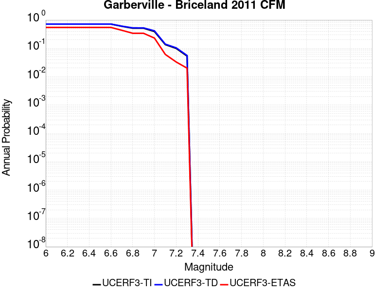 |
|-----|

| Magnitude | UCERF3-TI Prob | UCERF3-TD Prob | UCERF3-ETAS Prob |
|-----|-----|-----|-----|
| 6.0 | 0.7171203 | 0.7171685 | 0.547191 |
| 6.1 | 0.7171203 | 0.7171685 | 0.547191 |
| 6.2 | 0.7171203 | 0.7171685 | 0.547191 |
| 6.3 | 0.7171203 | 0.7171685 | 0.547191 |
| 6.4 | 0.7171203 | 0.7171685 | 0.547191 |
| 6.5 | 0.7171203 | 0.7171685 | 0.547191 |
| 6.6 | 0.7171203 | 0.7171685 | 0.547191 |
| 6.7 | 0.5982331 | 0.6064829 | 0.44044945 |
| 6.8 | 0.51223636 | 0.5264484 | 0.347191 |
| 6.9 | 0.51132566 | 0.5255338 | 0.34606743 |
| 7.0 | 0.39123404 | 0.41489568 | 0.23033708 |
| 7.1 | 0.1351813 | 0.14054799 | 0.05955056 |
| 7.2 | 0.09936351 | 0.10402119 | 0.03258427 |
| 7.3 | 0.05325169 | 0.055969507 | 0.019101124 |

## Garlic Springs
*[(top)](#table-of-contents)*

|  |
|-----|

| Magnitude | UCERF3-TI Prob | UCERF3-TD Prob | UCERF3-ETAS Prob |
|-----|-----|-----|-----|
| 6.0 | 0.35419685 | 0.38007405 | 0.37865168 |
| 6.1 | 0.22667271 | 0.24584039 | 0.2235955 |
| 6.2 | 0.22667271 | 0.24584039 | 0.2235955 |
| 6.3 | 0.10651145 | 0.114621535 | 0.09775281 |
| 6.4 | 0.10651145 | 0.114621535 | 0.09775281 |
| 6.5 | 0.10651145 | 0.114621535 | 0.09775281 |
| 6.6 | 0.106150955 | 0.11425486 | 0.09775281 |
| 6.7 | 0.09579947 | 0.10367577 | 0.08988764 |

## Garlock (Central)
*[(top)](#table-of-contents)*

|  |
|-----|

| Magnitude | UCERF3-TI Prob | UCERF3-TD Prob | UCERF3-ETAS Prob |
|-----|-----|-----|-----|
| 6.0 | 0.76268613 | 0.78646535 | 0.7011236 |
| 6.1 | 0.76268613 | 0.78646535 | 0.7011236 |
| 6.2 | 0.66713274 | 0.6989729 | 0.5977528 |
| 6.3 | 0.66713274 | 0.6989729 | 0.5977528 |
| 6.4 | 0.6177273 | 0.6537384 | 0.5382022 |
| 6.5 | 0.5872697 | 0.6255446 | 0.4988764 |
| 6.6 | 0.5835062 | 0.6219643 | 0.49325842 |
| 6.7 | 0.5725863 | 0.6118135 | 0.4808989 |
| 6.8 | 0.5681693 | 0.6074937 | 0.4730337 |
| 6.9 | 0.5621337 | 0.6015686 | 0.46292135 |
| 7.0 | 0.55348 | 0.5930616 | 0.45617977 |
| 7.1 | 0.54365814 | 0.5833729 | 0.44382024 |
| 7.2 | 0.5177975 | 0.55781776 | 0.40112358 |
| 7.3 | 0.47254843 | 0.5102172 | 0.33483145 |
| 7.4 | 0.45444113 | 0.49108067 | 0.31573033 |
| 7.5 | 0.42148894 | 0.45424825 | 0.27078652 |
| 7.6 | 0.32583362 | 0.34882376 | 0.19550562 |
| 7.7 | 0.2283113 | 0.24011017 | 0.11685393 |
| 7.8 | 0.16160621 | 0.17065807 | 0.1 |
| 7.9 | 0.09851957 | 0.10397418 | 0.058426965 |
| 8.0 | 0.042707413 | 0.044437554 | 0.016853932 |
| 8.1 | 0.00953767 | 0.010071593 | 0.004494382 |

## Garlock (East)
*[(top)](#table-of-contents)*

|  |
|-----|

| Magnitude | UCERF3-TI Prob | UCERF3-TD Prob | UCERF3-ETAS Prob |
|-----|-----|-----|-----|
| 6.0 | 0.6916309 | 0.7340235 | 0.7550562 |
| 6.1 | 0.6916309 | 0.7340235 | 0.7550562 |
| 6.2 | 0.5013886 | 0.5466988 | 0.51797754 |
| 6.3 | 0.5013886 | 0.5466988 | 0.51797754 |
| 6.4 | 0.4833542 | 0.52960545 | 0.49550563 |
| 6.5 | 0.4833542 | 0.52960545 | 0.49550563 |
| 6.6 | 0.44351608 | 0.49008188 | 0.44494382 |
| 6.7 | 0.44024912 | 0.4867697 | 0.43932584 |
| 6.8 | 0.39920074 | 0.44301894 | 0.38089886 |
| 6.9 | 0.29353076 | 0.32570475 | 0.24044944 |
| 7.0 | 0.26422733 | 0.29312077 | 0.20786516 |
| 7.1 | 0.23093799 | 0.25608835 | 0.16853933 |
| 7.2 | 0.22497693 | 0.24946964 | 0.15955056 |
| 7.3 | 0.2163501 | 0.2394642 | 0.152809 |
| 7.4 | 0.20975913 | 0.2316866 | 0.14157303 |
| 7.5 | 0.16868417 | 0.18319176 | 0.09213483 |
| 7.6 | 0.14749219 | 0.15836349 | 0.0752809 |
| 7.7 | 0.117639326 | 0.12554483 | 0.053932585 |
| 7.8 | 0.084952295 | 0.09082496 | 0.047191013 |
| 7.9 | 0.06540824 | 0.06991656 | 0.03483146 |
| 8.0 | 0.035221003 | 0.036912438 | 0.014606741 |
| 8.1 | 0.00953767 | 0.010071593 | 0.004494382 |

## Garlock (West)
*[(top)](#table-of-contents)*

|  |
|-----|

| Magnitude | UCERF3-TI Prob | UCERF3-TD Prob | UCERF3-ETAS Prob |
|-----|-----|-----|-----|
| 6.0 | 0.48158622 | 0.48158434 | 0.3280899 |
| 6.1 | 0.48017773 | 0.48024324 | 0.3269663 |
| 6.2 | 0.47838974 | 0.47860852 | 0.32247192 |
| 6.3 | 0.4754917 | 0.47599632 | 0.31685394 |
| 6.4 | 0.45460913 | 0.45510077 | 0.28876406 |
| 6.5 | 0.44737393 | 0.4502023 | 0.28314605 |
| 6.6 | 0.4266247 | 0.4315755 | 0.26741573 |
| 6.7 | 0.40200523 | 0.40915775 | 0.23483147 |
| 6.8 | 0.38678166 | 0.39773282 | 0.22808988 |
| 6.9 | 0.3675307 | 0.38096443 | 0.21235955 |
| 7.0 | 0.35477665 | 0.36927345 | 0.20898877 |
| 7.1 | 0.34704357 | 0.36185986 | 0.20449439 |
| 7.2 | 0.33747193 | 0.35272136 | 0.19662921 |
| 7.3 | 0.32488889 | 0.3411862 | 0.18876405 |
| 7.4 | 0.32187128 | 0.33818054 | 0.18764044 |
| 7.5 | 0.3151394 | 0.33087033 | 0.18539326 |
| 7.6 | 0.28309774 | 0.29585865 | 0.15955056 |
| 7.7 | 0.23622133 | 0.24713647 | 0.123595506 |
| 7.8 | 0.1675861 | 0.17608741 | 0.104494385 |
| 7.9 | 0.100520685 | 0.10575064 | 0.05955056 |
| 8.0 | 0.042707413 | 0.044437554 | 0.016853932 |
| 8.1 | 0.00953767 | 0.010071593 | 0.004494382 |

## Gillem - Big Crack 2011 CFM
*[(top)](#table-of-contents)*

|  |
|-----|

| Magnitude | UCERF3-TI Prob | UCERF3-TD Prob | UCERF3-ETAS Prob |
|-----|-----|-----|-----|
| 6.0 | 0.43625277 | 0.45599833 | 0.2797753 |
| 6.1 | 0.22949272 | 0.23717971 | 0.14044943 |
| 6.2 | 0.22949272 | 0.23717971 | 0.14044943 |
| 6.3 | 0.11338517 | 0.116554335 | 0.06516854 |
| 6.4 | 0.11338517 | 0.116554335 | 0.06516854 |
| 6.5 | 0.068423696 | 0.07034005 | 0.035955057 |
| 6.6 | 0.035408773 | 0.03642657 | 0.020224718 |

## Goldstone Lake
*[(top)](#table-of-contents)*

| 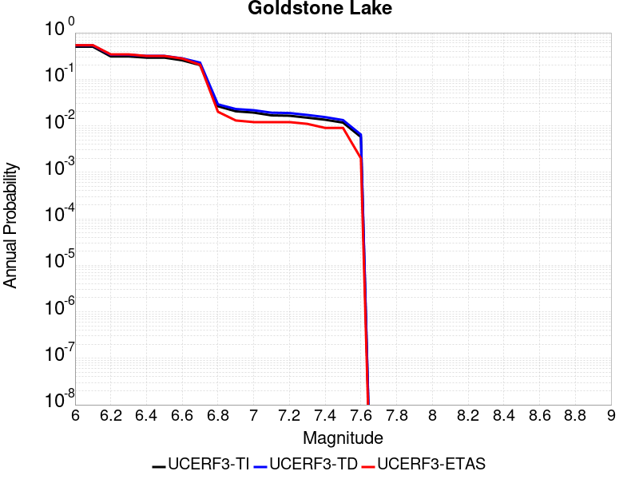 |
|-----|

| Magnitude | UCERF3-TI Prob | UCERF3-TD Prob | UCERF3-ETAS Prob |
|-----|-----|-----|-----|
| 6.0 | 0.5018958 | 0.5352405 | 0.5382022 |
| 6.1 | 0.5018958 | 0.5352405 | 0.5382022 |
| 6.2 | 0.30953738 | 0.3355798 | 0.34269664 |
| 6.3 | 0.30953738 | 0.3355798 | 0.34269664 |
| 6.4 | 0.29206043 | 0.31825498 | 0.31573033 |
| 6.5 | 0.29206043 | 0.31825498 | 0.31573033 |
| 6.6 | 0.25587657 | 0.28213325 | 0.2764045 |
| 6.7 | 0.20204572 | 0.22797729 | 0.20674157 |
| 6.8 | 0.026299195 | 0.028869461 | 0.020224718 |
| 6.9 | 0.020491797 | 0.022926778 | 0.01235955 |
| 7.0 | 0.019218855 | 0.021627944 | 0.011235955 |
| 7.1 | 0.01674055 | 0.019103045 | 0.011235955 |
| 7.2 | 0.01644743 | 0.018804159 | 0.011235955 |
| 7.3 | 0.014939684 | 0.01710826 | 0.010112359 |
| 7.4 | 0.013499651 | 0.015362498 | 0.007865168 |
| 7.5 | 0.011704938 | 0.013263734 | 0.007865168 |
| 7.6 | 0.0057536047 | 0.0064641978 | 0.002247191 |

## Goose Lake 2011 CFM
*[(top)](#table-of-contents)*

| 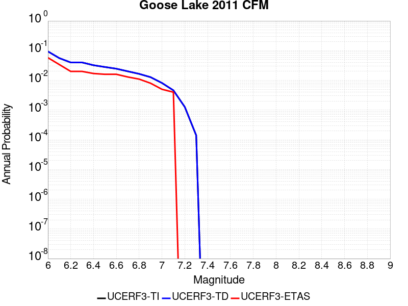 |
|-----|

| Magnitude | UCERF3-TI Prob | UCERF3-TD Prob | UCERF3-ETAS Prob |
|-----|-----|-----|-----|
| 6.0 | 0.093933836 | 0.09450306 | 0.058426965 |
| 6.1 | 0.0558669 | 0.05610917 | 0.033707865 |
| 6.2 | 0.039944064 | 0.04010815 | 0.020224718 |
| 6.3 | 0.039944064 | 0.04010815 | 0.020224718 |
| 6.4 | 0.032248817 | 0.03238631 | 0.016853932 |
| 6.5 | 0.028064469 | 0.028188644 | 0.015730336 |
| 6.6 | 0.024598807 | 0.02471184 | 0.015730336 |
| 6.7 | 0.020119239 | 0.020217348 | 0.013483146 |
| 6.8 | 0.01648524 | 0.016569212 | 0.011235955 |
| 6.9 | 0.012768996 | 0.012838072 | 0.007865168 |
| 7.0 | 0.00813333 | 0.008180519 | 0.004494382 |
| 7.1 | 0.004601986 | 0.004629053 | 0.0033707866 |
| 7.2 | 0.0012682052 | 0.0012742083 | 0.0 |
| 7.3 | 1.4064225E-4 | 1.4131138E-4 | 0.0 |

## Gravel Hills-Harper Lk
*[(top)](#table-of-contents)*

|  |
|-----|

| Magnitude | UCERF3-TI Prob | UCERF3-TD Prob | UCERF3-ETAS Prob |
|-----|-----|-----|-----|
| 6.0 | 0.5508598 | 0.58066875 | 0.4224719 |
| 6.1 | 0.5508598 | 0.58066875 | 0.4224719 |
| 6.2 | 0.32641065 | 0.33432055 | 0.22022472 |
| 6.3 | 0.32641065 | 0.33432055 | 0.22022472 |
| 6.4 | 0.27889216 | 0.2853218 | 0.18764044 |
| 6.5 | 0.25131553 | 0.25701216 | 0.15730338 |
| 6.6 | 0.2233479 | 0.22829394 | 0.13595505 |
| 6.7 | 0.20875514 | 0.21337332 | 0.11685393 |
| 6.8 | 0.17724477 | 0.18106171 | 0.08539326 |
| 6.9 | 0.15247156 | 0.1557304 | 0.073033705 |
| 7.0 | 0.12513012 | 0.12769136 | 0.058426965 |
| 7.1 | 0.10935375 | 0.1116419 | 0.050561797 |
| 7.2 | 0.0873551 | 0.089218475 | 0.037078653 |
| 7.3 | 0.0646471 | 0.06604965 | 0.0247191 |
| 7.4 | 0.051753663 | 0.05288913 | 0.017977528 |
| 7.5 | 0.030017076 | 0.030707976 | 0.008988764 |
| 7.6 | 0.0034260035 | 0.003513153 | 0.0011235955 |

## Great Valley 01
*[(top)](#table-of-contents)*

|  |
|-----|

| Magnitude | UCERF3-TI Prob | UCERF3-TD Prob | UCERF3-ETAS Prob |
|-----|-----|-----|-----|
| 6.0 | 0.08344609 | 0.08401256 | 0.05505618 |
| 6.1 | 0.045675043 | 0.045876447 | 0.037078653 |
| 6.2 | 0.045675043 | 0.045876447 | 0.037078653 |
| 6.3 | 0.029902728 | 0.030019557 | 0.023595506 |
| 6.4 | 0.022622911 | 0.022713756 | 0.019101124 |
| 6.5 | 0.017464599 | 0.017538177 | 0.013483146 |
| 6.6 | 0.013611736 | 0.013673587 | 0.008988764 |
| 6.7 | 0.010744053 | 0.01079773 | 0.006741573 |
| 6.8 | 0.0082395775 | 0.008285842 | 0.0056179776 |
| 6.9 | 0.0065738102 | 0.0066147563 | 0.0056179776 |
| 7.0 | 0.0053775418 | 0.0054137805 | 0.0033707866 |
| 7.1 | 0.0041530076 | 0.0041832332 | 0.0033707866 |
| 7.2 | 0.0026813073 | 0.002702752 | 0.0033707866 |
| 7.3 | 0.0017155361 | 0.0017304093 | 0.0 |
| 7.4 | 8.116137E-4 | 8.189901E-4 | 0.0 |

## Great Valley 02
*[(top)](#table-of-contents)*

|  |
|-----|

| Magnitude | UCERF3-TI Prob | UCERF3-TD Prob | UCERF3-ETAS Prob |
|-----|-----|-----|-----|
| 6.0 | 0.056379996 | 0.056927785 | 0.04494382 |
| 6.1 | 0.056379996 | 0.056927785 | 0.041573033 |
| 6.2 | 0.040352356 | 0.04072295 | 0.025842696 |
| 6.3 | 0.03800251 | 0.038362462 | 0.023595506 |
| 6.4 | 0.03653733 | 0.03689271 | 0.02247191 |
| 6.5 | 0.03266122 | 0.03299765 | 0.020224718 |
| 6.6 | 0.030461147 | 0.030789485 | 0.019101124 |
| 6.7 | 0.027150687 | 0.027456895 | 0.017977528 |
| 6.8 | 0.02317657 | 0.02345639 | 0.015730336 |
| 6.9 | 0.019483525 | 0.019734664 | 0.014606741 |
| 7.0 | 0.015299807 | 0.015504573 | 0.007865168 |
| 7.1 | 0.011427626 | 0.011589407 | 0.007865168 |
| 7.2 | 0.0078734625 | 0.007990066 | 0.006741573 |
| 7.3 | 0.0048670513 | 0.004942102 | 0.0011235955 |
| 7.4 | 8.116137E-4 | 8.189901E-4 | 0.0 |

## Great Valley 03 Mysterious Ridge
*[(top)](#table-of-contents)*

| 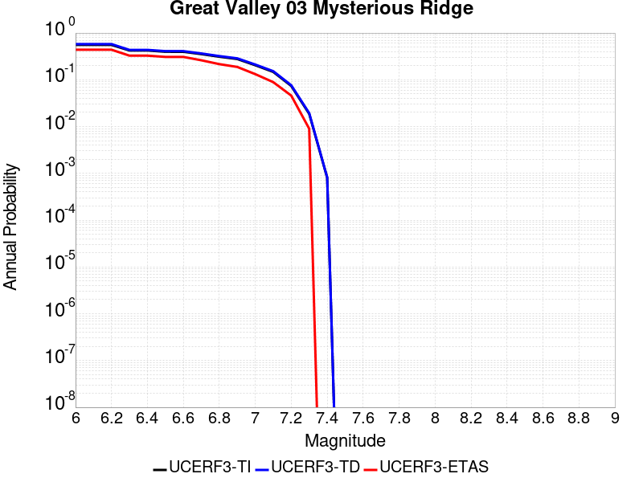 |
|-----|

| Magnitude | UCERF3-TI Prob | UCERF3-TD Prob | UCERF3-ETAS Prob |
|-----|-----|-----|-----|
| 6.0 | 0.5567141 | 0.5797899 | 0.44494382 |
| 6.1 | 0.5567141 | 0.5797899 | 0.44494382 |
| 6.2 | 0.5567141 | 0.5797899 | 0.44494382 |
| 6.3 | 0.4228712 | 0.43551204 | 0.3269663 |
| 6.4 | 0.4228712 | 0.43551204 | 0.3269663 |
| 6.5 | 0.39701954 | 0.40958387 | 0.30674157 |
| 6.6 | 0.3967113 | 0.4092797 | 0.30674157 |
| 6.7 | 0.35358137 | 0.36529228 | 0.25842696 |
| 6.8 | 0.31083897 | 0.3211692 | 0.21573034 |
| 6.9 | 0.2777129 | 0.2870858 | 0.18764044 |
| 7.0 | 0.20461163 | 0.21164788 | 0.12808989 |
| 7.1 | 0.14727683 | 0.15265906 | 0.08988764 |
| 7.2 | 0.07381743 | 0.07646103 | 0.048314605 |
| 7.3 | 0.018708244 | 0.019365635 | 0.008988764 |
| 7.4 | 8.116137E-4 | 8.189901E-4 | 0.0 |

## Great Valley 03a Dunnigan Hills
*[(top)](#table-of-contents)*

|  |
|-----|

| Magnitude | UCERF3-TI Prob | UCERF3-TD Prob | UCERF3-ETAS Prob |
|-----|-----|-----|-----|
| 6.0 | 0.35134837 | 0.36947814 | 0.3539326 |
| 6.1 | 0.18924393 | 0.1974764 | 0.12921348 |
| 6.2 | 0.08203065 | 0.08488795 | 0.05955056 |
| 6.3 | 0.049203355 | 0.051045727 | 0.033707865 |
| 6.4 | 0.033707038 | 0.035129286 | 0.021348314 |

## Great Valley 04a Trout Creek
*[(top)](#table-of-contents)*

|  |
|-----|

| Magnitude | UCERF3-TI Prob | UCERF3-TD Prob | UCERF3-ETAS Prob |
|-----|-----|-----|-----|
| 6.0 | 0.30757993 | 0.31742507 | 0.21797752 |
| 6.1 | 0.30757993 | 0.31742507 | 0.21797752 |
| 6.2 | 0.30757993 | 0.31742507 | 0.21797752 |
| 6.3 | 0.28545323 | 0.29467514 | 0.19887641 |
| 6.4 | 0.28545323 | 0.29467514 | 0.19887641 |
| 6.5 | 0.2832027 | 0.2923917 | 0.1977528 |
| 6.6 | 0.2832027 | 0.2923917 | 0.1977528 |
| 6.7 | 0.27937058 | 0.28850392 | 0.19325842 |
| 6.8 | 0.26634908 | 0.27520746 | 0.17977528 |
| 6.9 | 0.2396289 | 0.24772125 | 0.15730338 |
| 7.0 | 0.19940068 | 0.20643348 | 0.12584269 |
| 7.1 | 0.14505221 | 0.15043306 | 0.08764045 |
| 7.2 | 0.07316325 | 0.07580499 | 0.046067417 |
| 7.3 | 0.01865864 | 0.019315777 | 0.008988764 |
| 7.4 | 8.116137E-4 | 8.189901E-4 | 0.0 |

## Great Valley 04b Gordon Valley
*[(top)](#table-of-contents)*

| 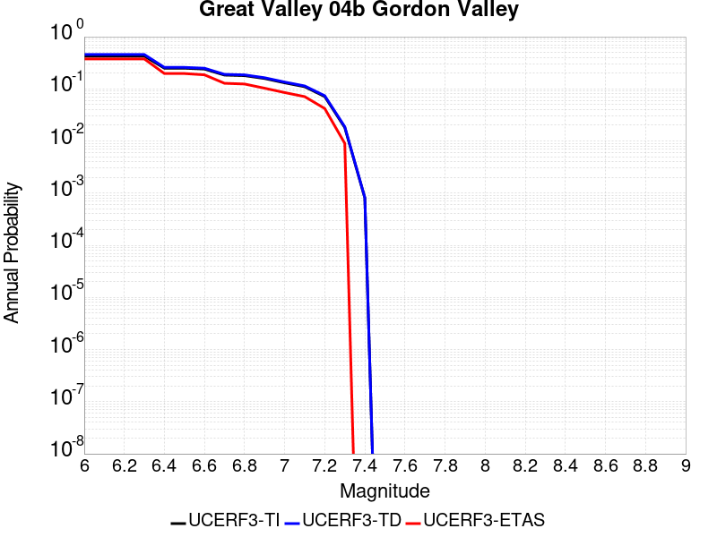 |
|-----|

| Magnitude | UCERF3-TI Prob | UCERF3-TD Prob | UCERF3-ETAS Prob |
|-----|-----|-----|-----|
| 6.0 | 0.42455328 | 0.45598572 | 0.3730337 |
| 6.1 | 0.42455328 | 0.45598572 | 0.3730337 |
| 6.2 | 0.42455328 | 0.45598572 | 0.3730337 |
| 6.3 | 0.42455328 | 0.45598572 | 0.3730337 |
| 6.4 | 0.24924628 | 0.2584801 | 0.1977528 |
| 6.5 | 0.24924628 | 0.2584801 | 0.1977528 |
| 6.6 | 0.23997498 | 0.24903738 | 0.18764044 |
| 6.7 | 0.18389802 | 0.19008261 | 0.12921348 |
| 6.8 | 0.17954007 | 0.18562476 | 0.1247191 |
| 6.9 | 0.15827082 | 0.16359803 | 0.10561798 |
| 7.0 | 0.13073109 | 0.1351911 | 0.08651686 |
| 7.1 | 0.11004273 | 0.11388337 | 0.07078651 |
| 7.2 | 0.07125486 | 0.073878504 | 0.043820225 |
| 7.3 | 0.01811912 | 0.018772561 | 0.008988764 |
| 7.4 | 8.116137E-4 | 8.189901E-4 | 0.0 |

## Great Valley 05 Pittsburg - Kirby Hills alt1
*[(top)](#table-of-contents)*

| 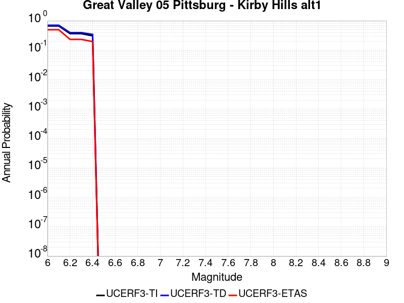 |
|-----|

| Magnitude | UCERF3-TI Prob | UCERF3-TD Prob | UCERF3-ETAS Prob |
|-----|-----|-----|-----|
| 6.0 | 0.66460174 | 0.70283324 | 0.49550563 |
| 6.1 | 0.66460174 | 0.70283324 | 0.49550563 |
| 6.2 | 0.36411613 | 0.3947655 | 0.23146068 |
| 6.3 | 0.36411613 | 0.3947655 | 0.23146068 |
| 6.4 | 0.30650038 | 0.3426368 | 0.19325842 |

## Great Valley 06 (Midland) 2011 CFM alt1
*[(top)](#table-of-contents)*

| 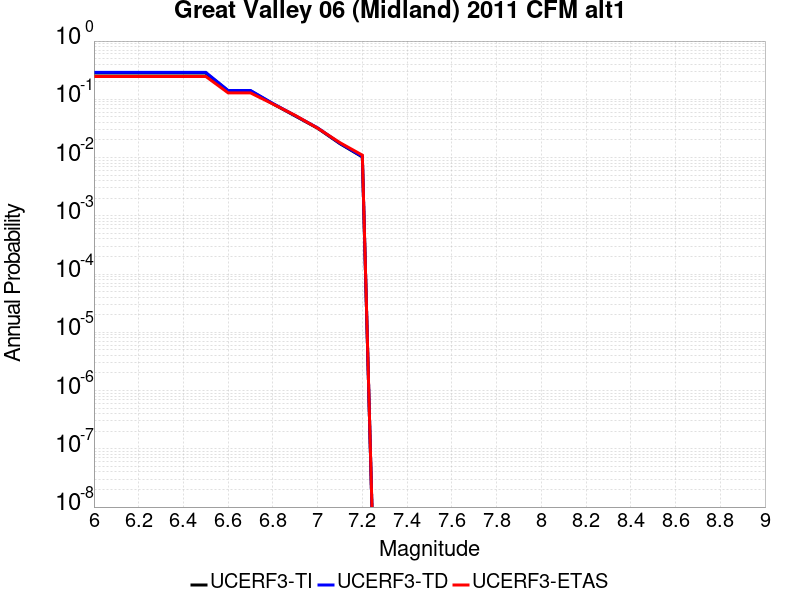 |
|-----|

| Magnitude | UCERF3-TI Prob | UCERF3-TD Prob | UCERF3-ETAS Prob |
|-----|-----|-----|-----|
| 6.0 | 0.2822707 | 0.2898884 | 0.252809 |
| 6.1 | 0.2822707 | 0.2898884 | 0.252809 |
| 6.2 | 0.2822707 | 0.2898884 | 0.252809 |
| 6.3 | 0.2822707 | 0.2898884 | 0.252809 |
| 6.4 | 0.2822707 | 0.2898884 | 0.252809 |
| 6.5 | 0.2822707 | 0.2898884 | 0.252809 |
| 6.6 | 0.13947093 | 0.14177094 | 0.13258427 |
| 6.7 | 0.13947093 | 0.14177094 | 0.13258427 |
| 6.8 | 0.08362864 | 0.084850535 | 0.08651686 |
| 6.9 | 0.05170962 | 0.052434284 | 0.05505618 |
| 7.0 | 0.031895474 | 0.032349817 | 0.03258427 |
| 7.1 | 0.017303472 | 0.01755915 | 0.016853932 |
| 7.2 | 0.010247622 | 0.010414718 | 0.011235955 |

## Great Valley 07 (Orestimba)
*[(top)](#table-of-contents)*

| 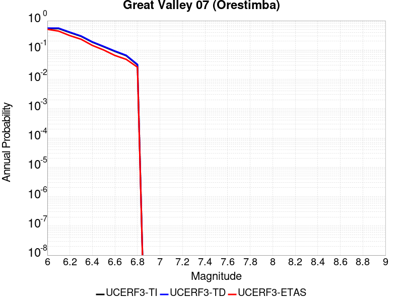 |
|-----|

| Magnitude | UCERF3-TI Prob | UCERF3-TD Prob | UCERF3-ETAS Prob |
|-----|-----|-----|-----|
| 6.0 | 0.5390878 | 0.5561066 | 0.5078652 |
| 6.1 | 0.5390878 | 0.5561066 | 0.447191 |
| 6.2 | 0.39452472 | 0.40561387 | 0.31460676 |
| 6.3 | 0.29222164 | 0.30003205 | 0.24157304 |
| 6.4 | 0.18452431 | 0.18948011 | 0.14831461 |
| 6.5 | 0.12931353 | 0.1329078 | 0.103370786 |
| 6.6 | 0.08965436 | 0.0922818 | 0.06853933 |
| 6.7 | 0.064025715 | 0.0660236 | 0.050561797 |
| 6.8 | 0.031115005 | 0.0321925 | 0.025842696 |

## Great Valley 08 (Quinto)
*[(top)](#table-of-contents)*

|  |
|-----|

| Magnitude | UCERF3-TI Prob | UCERF3-TD Prob | UCERF3-ETAS Prob |
|-----|-----|-----|-----|
| 6.0 | 0.1828003 | 0.1899372 | 0.26966292 |
| 6.1 | 0.1828003 | 0.1899372 | 0.26966292 |
| 6.2 | 0.1828003 | 0.1899372 | 0.26966292 |
| 6.3 | 0.13081953 | 0.13575013 | 0.15842697 |
| 6.4 | 0.13081953 | 0.13575013 | 0.15842697 |
| 6.5 | 0.0909339 | 0.0945023 | 0.09213483 |
| 6.6 | 0.08998671 | 0.09353894 | 0.09213483 |
| 6.7 | 0.06270418 | 0.065473765 | 0.05730337 |
| 6.8 | 0.012215583 | 0.012566032 | 0.011235955 |
| 6.9 | 0.010274779 | 0.010574046 | 0.011235955 |
| 7.0 | 0.0070269736 | 0.0072370134 | 0.007865168 |
| 7.1 | 0.0038612029 | 0.003980029 | 0.004494382 |

## Great Valley 09 (Laguna Seca)
*[(top)](#table-of-contents)*

|  |
|-----|

| Magnitude | UCERF3-TI Prob | UCERF3-TD Prob | UCERF3-ETAS Prob |
|-----|-----|-----|-----|
| 6.0 | 0.75782067 | 0.727919 | 0.694382 |
| 6.1 | 0.69551456 | 0.6675225 | 0.56292135 |
| 6.2 | 0.5250353 | 0.50618315 | 0.35955057 |
| 6.3 | 0.46113566 | 0.44744536 | 0.3022472 |
| 6.4 | 0.39388737 | 0.3870847 | 0.23932584 |
| 6.5 | 0.32742706 | 0.32725725 | 0.17752808 |
| 6.6 | 0.24918081 | 0.25502262 | 0.12022472 |
| 6.7 | 0.21204689 | 0.2182229 | 0.09775281 |
| 6.8 | 0.18382072 | 0.18923476 | 0.08651686 |
| 6.9 | 0.13545766 | 0.13942073 | 0.062921345 |
| 7.0 | 0.0675716 | 0.0693707 | 0.029213483 |
| 7.1 | 0.0507194 | 0.051980425 | 0.025842696 |
| 7.2 | 0.0507194 | 0.051980425 | 0.025842696 |
| 7.3 | 0.043601155 | 0.044641946 | 0.02247191 |
| 7.4 | 0.035375025 | 0.036174554 | 0.019101124 |
| 7.5 | 0.035375025 | 0.036174554 | 0.019101124 |

## Great Valley 10 (Panoche)
*[(top)](#table-of-contents)*

| 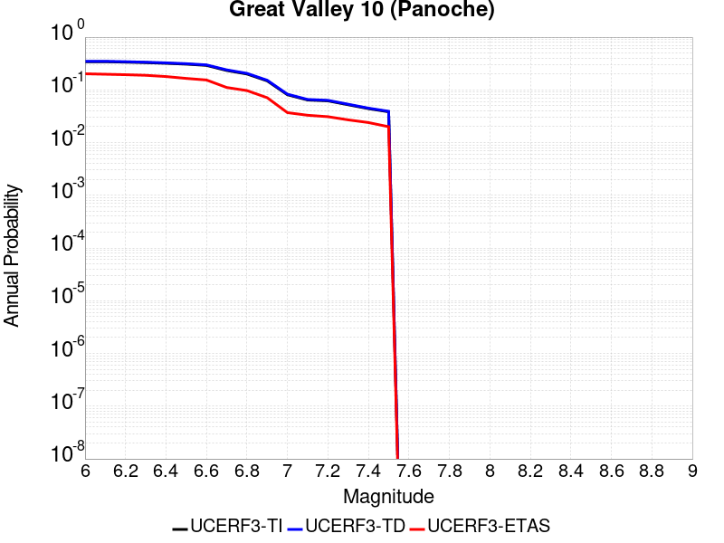 |
|-----|

| Magnitude | UCERF3-TI Prob | UCERF3-TD Prob | UCERF3-ETAS Prob |
|-----|-----|-----|-----|
| 6.0 | 0.34151497 | 0.34850103 | 0.19662921 |
| 6.1 | 0.34151497 | 0.34850103 | 0.19438203 |
| 6.2 | 0.33570984 | 0.3426035 | 0.19101124 |
| 6.3 | 0.32848078 | 0.3352858 | 0.18651685 |
| 6.4 | 0.3189067 | 0.32561398 | 0.17752808 |
| 6.5 | 0.3074734 | 0.3141333 | 0.16179775 |
| 6.6 | 0.29128715 | 0.29791585 | 0.1505618 |
| 6.7 | 0.23316334 | 0.23975307 | 0.11011236 |
| 6.8 | 0.20010178 | 0.20582363 | 0.09662921 |
| 6.9 | 0.14816457 | 0.15237515 | 0.06966292 |
| 7.0 | 0.08084098 | 0.08293246 | 0.035955057 |
| 7.1 | 0.0642286 | 0.06579561 | 0.03258427 |
| 7.2 | 0.061867572 | 0.06336947 | 0.030337078 |
| 7.3 | 0.052225363 | 0.053441085 | 0.026966292 |
| 7.4 | 0.04407341 | 0.045051683 | 0.023595506 |
| 7.5 | 0.038384836 | 0.039245408 | 0.019101124 |

## Great Valley 11
*[(top)](#table-of-contents)*

| 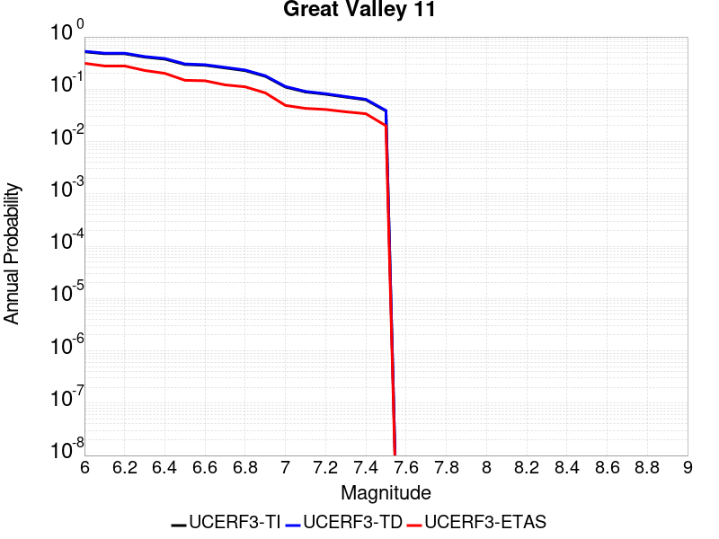 |
|-----|

| Magnitude | UCERF3-TI Prob | UCERF3-TD Prob | UCERF3-ETAS Prob |
|-----|-----|-----|-----|
| 6.0 | 0.5195866 | 0.5306584 | 0.31123596 |
| 6.1 | 0.47683355 | 0.48810393 | 0.2730337 |
| 6.2 | 0.47683355 | 0.48810393 | 0.2730337 |
| 6.3 | 0.41052297 | 0.4212361 | 0.2235955 |
| 6.4 | 0.37564966 | 0.38654542 | 0.2 |
| 6.5 | 0.29650795 | 0.3041268 | 0.14494382 |
| 6.6 | 0.28668198 | 0.2941598 | 0.14157303 |
| 6.7 | 0.2547878 | 0.26173022 | 0.11797753 |
| 6.8 | 0.22628894 | 0.23245907 | 0.11011236 |
| 6.9 | 0.17605208 | 0.18080316 | 0.083146065 |
| 7.0 | 0.1099111 | 0.11264317 | 0.048314605 |
| 7.1 | 0.0885682 | 0.090662524 | 0.04269663 |
| 7.2 | 0.08019173 | 0.082065225 | 0.040449437 |
| 7.3 | 0.07073786 | 0.07233502 | 0.037078653 |
| 7.4 | 0.06274514 | 0.06411307 | 0.033707865 |
| 7.5 | 0.038384836 | 0.039245408 | 0.019101124 |

## Great Valley 12
*[(top)](#table-of-contents)*

| 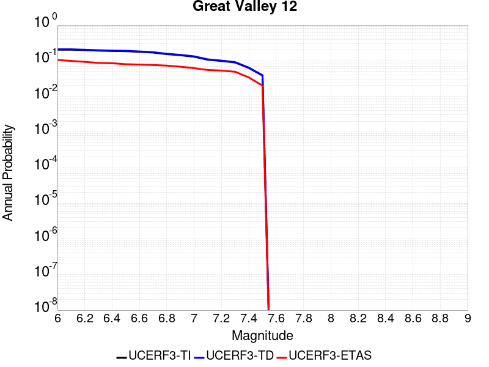 |
|-----|

| Magnitude | UCERF3-TI Prob | UCERF3-TD Prob | UCERF3-ETAS Prob |
|-----|-----|-----|-----|
| 6.0 | 0.20424901 | 0.20918779 | 0.10224719 |
| 6.1 | 0.20424901 | 0.20918779 | 0.09550562 |
| 6.2 | 0.19887424 | 0.20373568 | 0.08988764 |
| 6.3 | 0.19232118 | 0.19707538 | 0.083146065 |
| 6.4 | 0.18794739 | 0.1926024 | 0.08089887 |
| 6.5 | 0.18563746 | 0.1902455 | 0.0752809 |
| 6.6 | 0.17789312 | 0.18234402 | 0.073033705 |
| 6.7 | 0.16973622 | 0.17400676 | 0.07078651 |
| 6.8 | 0.15325947 | 0.1569998 | 0.06966292 |
| 6.9 | 0.14287807 | 0.14636397 | 0.064044945 |
| 7.0 | 0.1296844 | 0.1328103 | 0.058426965 |
| 7.1 | 0.106799856 | 0.10926801 | 0.051685393 |
| 7.2 | 0.09859094 | 0.10084661 | 0.0494382 |
| 7.3 | 0.08932618 | 0.09131549 | 0.046067417 |
| 7.4 | 0.06274514 | 0.06411307 | 0.033707865 |
| 7.5 | 0.038384836 | 0.039245408 | 0.019101124 |

## Great Valley 13 (Coalinga)
*[(top)](#table-of-contents)*

|  |
|-----|

| Magnitude | UCERF3-TI Prob | UCERF3-TD Prob | UCERF3-ETAS Prob |
|-----|-----|-----|-----|
| 6.0 | 0.27959946 | 0.2912637 | 0.1505618 |
| 6.1 | 0.27959946 | 0.2912637 | 0.1505618 |
| 6.2 | 0.27959946 | 0.2912637 | 0.1505618 |
| 6.3 | 0.27959946 | 0.2912637 | 0.1505618 |
| 6.4 | 0.27959946 | 0.2912637 | 0.1505618 |
| 6.5 | 0.27959946 | 0.2912637 | 0.1505618 |
| 6.6 | 0.27959946 | 0.2912637 | 0.1505618 |
| 6.7 | 0.27959946 | 0.2912637 | 0.1505618 |
| 6.8 | 0.24398153 | 0.25426447 | 0.12022472 |
| 6.9 | 0.23933199 | 0.24955389 | 0.11910112 |
| 7.0 | 0.15223595 | 0.15600167 | 0.0764045 |
| 7.1 | 0.14539015 | 0.14899142 | 0.07191011 |
| 7.2 | 0.1375359 | 0.14094558 | 0.06966292 |
| 7.3 | 0.11961763 | 0.122614615 | 0.058426965 |
| 7.4 | 0.06274514 | 0.06411307 | 0.033707865 |
| 7.5 | 0.038384836 | 0.039245408 | 0.019101124 |

## Great Valley 14 (Kettleman Hills)
*[(top)](#table-of-contents)*

|  |
|-----|

| Magnitude | UCERF3-TI Prob | UCERF3-TD Prob | UCERF3-ETAS Prob |
|-----|-----|-----|-----|
| 6.0 | 0.14947799 | 0.1532289 | 0.08089887 |
| 6.1 | 0.14947799 | 0.1532289 | 0.08089887 |
| 6.2 | 0.14947799 | 0.1532289 | 0.08089887 |
| 6.3 | 0.14947799 | 0.1532289 | 0.08089887 |
| 6.4 | 0.14947799 | 0.1532289 | 0.08089887 |
| 6.5 | 0.14947799 | 0.1532289 | 0.08089887 |
| 6.6 | 0.14947799 | 0.1532289 | 0.08089887 |
| 6.7 | 0.14947799 | 0.1532289 | 0.08089887 |
| 6.8 | 0.14947799 | 0.1532289 | 0.08089887 |
| 6.9 | 0.14947799 | 0.1532289 | 0.08089887 |
| 7.0 | 0.14947799 | 0.1532289 | 0.08089887 |
| 7.1 | 0.121176995 | 0.124144964 | 0.062921345 |
| 7.2 | 0.121176995 | 0.124144964 | 0.062921345 |
| 7.3 | 0.11204533 | 0.114838295 | 0.05505618 |
| 7.4 | 0.06274514 | 0.06411307 | 0.033707865 |
| 7.5 | 0.038384836 | 0.039245408 | 0.019101124 |

## Green Valley 2011 CFM
*[(top)](#table-of-contents)*

|  |
|-----|

| Magnitude | UCERF3-TI Prob | UCERF3-TD Prob | UCERF3-ETAS Prob |
|-----|-----|-----|-----|
| 6.0 | 0.92568094 | 0.8335298 | 0.8955056 |
| 6.1 | 0.924177 | 0.831803 | 0.89213485 |
| 6.2 | 0.92033887 | 0.8272815 | 0.88651687 |
| 6.3 | 0.9110741 | 0.8164972 | 0.85955054 |
| 6.4 | 0.8880132 | 0.7891273 | 0.83370787 |
| 6.5 | 0.7883591 | 0.6839175 | 0.7011236 |
| 6.6 | 0.69378793 | 0.6031785 | 0.58764046 |
| 6.7 | 0.63668877 | 0.5598119 | 0.51235956 |
| 6.8 | 0.44088355 | 0.4289599 | 0.28764045 |
| 6.9 | 0.37557262 | 0.37195867 | 0.21797752 |
| 7.0 | 0.31966048 | 0.3207127 | 0.18089887 |
| 7.1 | 0.27638924 | 0.27960896 | 0.14494382 |
| 7.2 | 0.24128991 | 0.24474081 | 0.12921348 |
| 7.3 | 0.1883349 | 0.1901733 | 0.094382025 |
| 7.4 | 0.16162421 | 0.16277833 | 0.073033705 |
| 7.5 | 0.138153 | 0.13966955 | 0.06516854 |
| 7.6 | 0.11085739 | 0.11225269 | 0.04494382 |
| 7.7 | 0.027969718 | 0.029525368 | 0.01235955 |
| 7.8 | 0.001287301 | 0.0013660497 | 0.0011235955 |

## Greenville (No) 2011 CFM
*[(top)](#table-of-contents)*

|  |
|-----|

| Magnitude | UCERF3-TI Prob | UCERF3-TD Prob | UCERF3-ETAS Prob |
|-----|-----|-----|-----|
| 6.0 | 0.5757696 | 0.5847118 | 0.43595505 |
| 6.1 | 0.5757696 | 0.5847118 | 0.39775282 |
| 6.2 | 0.56263626 | 0.57210207 | 0.39101124 |
| 6.3 | 0.55880105 | 0.56843674 | 0.38202247 |
| 6.4 | 0.5455442 | 0.55571365 | 0.35842696 |
| 6.5 | 0.53727937 | 0.54778403 | 0.34269664 |
| 6.6 | 0.51004004 | 0.52133316 | 0.31460676 |
| 6.7 | 0.48742387 | 0.49914458 | 0.29662922 |
| 6.8 | 0.40745693 | 0.41929054 | 0.23820224 |
| 6.9 | 0.34677014 | 0.358689 | 0.2011236 |
| 7.0 | 0.27360973 | 0.28375256 | 0.14831461 |
| 7.1 | 0.2092021 | 0.21807958 | 0.104494385 |
| 7.2 | 0.14550844 | 0.15250169 | 0.06629214 |
| 7.3 | 0.07819795 | 0.08137394 | 0.03483146 |
| 7.4 | 0.051469978 | 0.053228788 | 0.020224718 |
| 7.5 | 0.04279203 | 0.044258386 | 0.019101124 |
| 7.6 | 0.030658968 | 0.03180069 | 0.010112359 |
| 7.7 | 0.007916393 | 0.008406278 | 0.0033707866 |

## Greenville (So) 2011 CFM
*[(top)](#table-of-contents)*

|  |
|-----|

| Magnitude | UCERF3-TI Prob | UCERF3-TD Prob | UCERF3-ETAS Prob |
|-----|-----|-----|-----|
| 6.0 | 0.6725976 | 0.66958106 | 0.4550562 |
| 6.1 | 0.5885319 | 0.5894659 | 0.3696629 |
| 6.2 | 0.5885319 | 0.5894659 | 0.3696629 |
| 6.3 | 0.49195778 | 0.49591246 | 0.28988764 |
| 6.4 | 0.42401013 | 0.43063024 | 0.23820224 |
| 6.5 | 0.4070224 | 0.41455185 | 0.2235955 |
| 6.6 | 0.38117167 | 0.3897147 | 0.21123596 |
| 6.7 | 0.3728512 | 0.38170698 | 0.20449439 |
| 6.8 | 0.29454273 | 0.30291268 | 0.15842697 |
| 6.9 | 0.24297246 | 0.25137296 | 0.13258427 |
| 7.0 | 0.19170204 | 0.19919425 | 0.0988764 |
| 7.1 | 0.14816616 | 0.15497866 | 0.0752809 |
| 7.2 | 0.115710944 | 0.121594585 | 0.051685393 |
| 7.3 | 0.058894437 | 0.06148284 | 0.028089888 |
| 7.4 | 0.03413895 | 0.035342716 | 0.014606741 |
| 7.5 | 0.026673982 | 0.027612044 | 0.013483146 |
| 7.6 | 0.020053962 | 0.020801704 | 0.007865168 |
| 7.7 | 0.004406595 | 0.0046879156 | 0.002247191 |

## Hartley Springs 2011 CFM
*[(top)](#table-of-contents)*

| 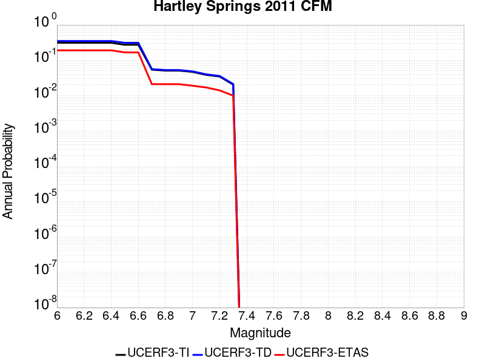 |
|-----|

| Magnitude | UCERF3-TI Prob | UCERF3-TD Prob | UCERF3-ETAS Prob |
|-----|-----|-----|-----|
| 6.0 | 0.31233054 | 0.3506261 | 0.19887641 |
| 6.1 | 0.31233054 | 0.3506261 | 0.19887641 |
| 6.2 | 0.31233054 | 0.3506261 | 0.19887641 |
| 6.3 | 0.31233054 | 0.3506261 | 0.19887641 |
| 6.4 | 0.31233054 | 0.3506261 | 0.19887641 |
| 6.5 | 0.27412298 | 0.3125373 | 0.1719101 |
| 6.6 | 0.27412298 | 0.3125373 | 0.1719101 |
| 6.7 | 0.054011483 | 0.05595466 | 0.021348314 |
| 6.8 | 0.05096846 | 0.052808832 | 0.021348314 |
| 6.9 | 0.05096846 | 0.052808832 | 0.021348314 |
| 7.0 | 0.04678761 | 0.048484683 | 0.019101124 |
| 7.1 | 0.03862394 | 0.04002339 | 0.016853932 |
| 7.2 | 0.03458485 | 0.035853103 | 0.013483146 |
| 7.3 | 0.020399636 | 0.02121619 | 0.010112359 |

## Hat Creek-McArthur-Mayfield
*[(top)](#table-of-contents)*

|  |
|-----|

| Magnitude | UCERF3-TI Prob | UCERF3-TD Prob | UCERF3-ETAS Prob |
|-----|-----|-----|-----|
| 6.0 | 0.6448098 | 0.662974 | 0.47977528 |
| 6.1 | 0.47972023 | 0.49117982 | 0.31910113 |
| 6.2 | 0.47972023 | 0.49117982 | 0.31910113 |
| 6.3 | 0.35190126 | 0.35924813 | 0.22134832 |
| 6.4 | 0.35190126 | 0.35924813 | 0.22134832 |
| 6.5 | 0.29493424 | 0.3010855 | 0.18314607 |
| 6.6 | 0.25216386 | 0.2574473 | 0.15168539 |
| 6.7 | 0.16735604 | 0.17084827 | 0.10224719 |
| 6.8 | 0.14356367 | 0.14658055 | 0.08764045 |
| 6.9 | 0.10214309 | 0.1043093 | 0.062921345 |
| 7.0 | 0.06683244 | 0.06824562 | 0.046067417 |
| 7.1 | 0.033328667 | 0.034051962 | 0.025842696 |
| 7.2 | 0.0128780175 | 0.0131767895 | 0.006741573 |

## Hayward (No) 2011 CFM
*[(top)](#table-of-contents)*

|  |
|-----|

| Magnitude | UCERF3-TI Prob | UCERF3-TD Prob | UCERF3-ETAS Prob |
|-----|-----|-----|-----|
| 6.0 | 0.9118049 | 0.7671431 | 0.9089888 |
| 6.1 | 0.9058267 | 0.7582595 | 0.8966292 |
| 6.2 | 0.90462136 | 0.7562771 | 0.894382 |
| 6.3 | 0.90021574 | 0.75006306 | 0.89101124 |
| 6.4 | 0.89187944 | 0.7386528 | 0.8808989 |
| 6.5 | 0.8808043 | 0.7239922 | 0.8674157 |
| 6.6 | 0.87556106 | 0.7170286 | 0.86404496 |
| 6.7 | 0.86856145 | 0.70831585 | 0.858427 |
| 6.8 | 0.8522151 | 0.6895851 | 0.83370787 |
| 6.9 | 0.81454986 | 0.64957774 | 0.78651685 |
| 7.0 | 0.7546427 | 0.59074736 | 0.7089888 |
| 7.1 | 0.6852597 | 0.5288534 | 0.6179775 |
| 7.2 | 0.57679987 | 0.42823267 | 0.49101123 |
| 7.3 | 0.47259364 | 0.33350387 | 0.39325842 |
| 7.4 | 0.3881481 | 0.2637274 | 0.30674157 |
| 7.5 | 0.28086284 | 0.18260431 | 0.21011236 |
| 7.6 | 0.114625074 | 0.06869333 | 0.07865169 |
| 7.7 | 0.009968095 | 0.00608425 | 0.008988764 |
| 7.8 | 0.006666374 | 0.0032296074 | 0.004494382 |
| 7.9 | 0.004462044 | 0.0021677807 | 0.002247191 |
| 8.0 | 0.0030761154 | 0.0015735888 | 0.002247191 |
| 8.1 | 0.0013397089 | 8.1730186E-4 | 0.0011235955 |

## Hayward (So) 2011 CFM
*[(top)](#table-of-contents)*

| 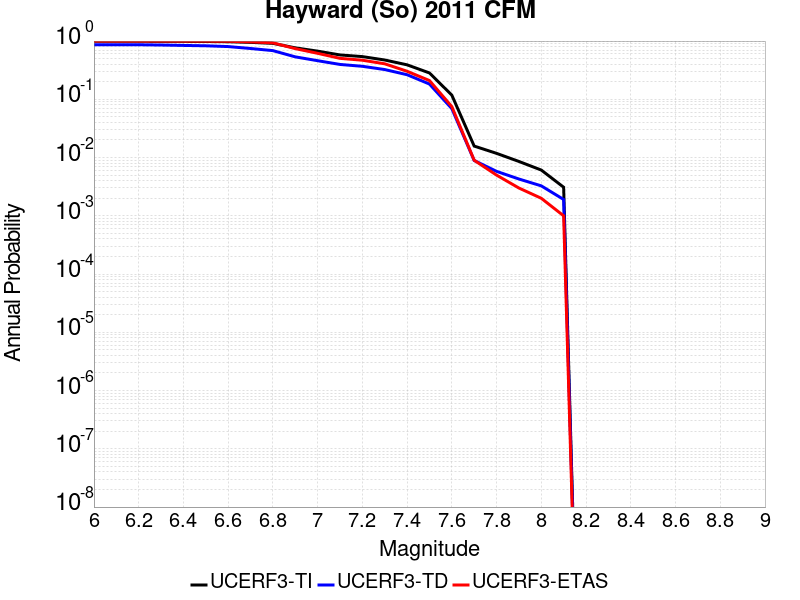 |
|-----|

| Magnitude | UCERF3-TI Prob | UCERF3-TD Prob | UCERF3-ETAS Prob |
|-----|-----|-----|-----|
| 6.0 | 0.9910891 | 0.8642648 | 0.9988764 |
| 6.1 | 0.9910891 | 0.8642648 | 0.9988764 |
| 6.2 | 0.9910891 | 0.8642648 | 0.9988764 |
| 6.3 | 0.98910886 | 0.8548174 | 0.9988764 |
| 6.4 | 0.9859031 | 0.8415321 | 0.99662924 |
| 6.5 | 0.9829281 | 0.82937515 | 0.99550563 |
| 6.6 | 0.9743901 | 0.80435854 | 0.99101126 |
| 6.7 | 0.94983983 | 0.7455669 | 0.9685393 |
| 6.8 | 0.9136398 | 0.6853739 | 0.9314607 |
| 6.9 | 0.7650726 | 0.5357069 | 0.7393258 |
| 7.0 | 0.6714461 | 0.46025 | 0.60786515 |
| 7.1 | 0.5778929 | 0.39684477 | 0.5022472 |
| 7.2 | 0.5411154 | 0.36879668 | 0.46404496 |
| 7.3 | 0.47310492 | 0.32434666 | 0.40561798 |
| 7.4 | 0.3908918 | 0.26437628 | 0.305618 |
| 7.5 | 0.28359538 | 0.18291107 | 0.20898877 |
| 7.6 | 0.118049406 | 0.06921759 | 0.07865169 |
| 7.7 | 0.015746962 | 0.008918895 | 0.010112359 |
| 7.8 | 0.011811486 | 0.0057982462 | 0.0056179776 |
| 7.9 | 0.008576842 | 0.004282976 | 0.0033707866 |
| 8.0 | 0.0061045466 | 0.0032682188 | 0.002247191 |
| 8.1 | 0.0030952024 | 0.0019072084 | 0.0011235955 |

## Hayward (So) extension 2011 CFM
*[(top)](#table-of-contents)*

| 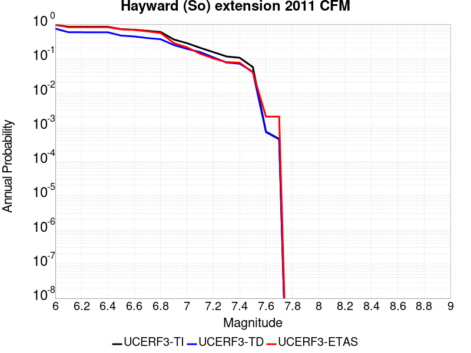 |
|-----|

| Magnitude | UCERF3-TI Prob | UCERF3-TD Prob | UCERF3-ETAS Prob |
|-----|-----|-----|-----|
| 6.0 | 0.9530265 | 0.7406923 | 0.9539326 |
| 6.1 | 0.83864456 | 0.58080316 | 0.80786514 |
| 6.2 | 0.83864456 | 0.58080316 | 0.80786514 |
| 6.3 | 0.8377673 | 0.57924473 | 0.80786514 |
| 6.4 | 0.83695287 | 0.5780351 | 0.80786514 |
| 6.5 | 0.7131305 | 0.46312153 | 0.7 |
| 6.6 | 0.68814945 | 0.43719512 | 0.6730337 |
| 6.7 | 0.6370423 | 0.39267793 | 0.6033708 |
| 6.8 | 0.5905085 | 0.36324456 | 0.54269665 |
| 6.9 | 0.35701612 | 0.24641074 | 0.27865168 |
| 7.0 | 0.27846178 | 0.18916136 | 0.21123596 |
| 7.1 | 0.20413327 | 0.153309 | 0.14157303 |
| 7.2 | 0.15276887 | 0.10757781 | 0.101123594 |
| 7.3 | 0.11414275 | 0.07584239 | 0.07865169 |
| 7.4 | 0.10458853 | 0.07007725 | 0.0764045 |
| 7.5 | 0.05624195 | 0.040650036 | 0.03820225 |
| 7.6 | 7.2899484E-4 | 7.0648413E-4 | 0.002247191 |
| 7.7 | 4.484453E-4 | 4.3513178E-4 | 0.002247191 |

## Hector Mine
*[(top)](#table-of-contents)*

|  |
|-----|

| Magnitude | UCERF3-TI Prob | UCERF3-TD Prob | UCERF3-ETAS Prob |
|-----|-----|-----|-----|
| 6.0 | 0.38703167 | 0.40662596 | 0.25168538 |
| 6.1 | 0.38703167 | 0.40662596 | 0.25168538 |
| 6.2 | 0.38703167 | 0.40662596 | 0.25168538 |
| 6.3 | 0.38703167 | 0.40662596 | 0.25168538 |
| 6.4 | 0.24728088 | 0.2586814 | 0.152809 |
| 6.5 | 0.24728088 | 0.2586814 | 0.152809 |
| 6.6 | 0.2441851 | 0.25555 | 0.1505618 |
| 6.7 | 0.18585677 | 0.19456185 | 0.11460674 |
| 6.8 | 0.17918172 | 0.18776779 | 0.113483146 |
| 6.9 | 0.15538783 | 0.16349283 | 0.09662921 |
| 7.0 | 0.12220506 | 0.12942094 | 0.073033705 |
| 7.1 | 0.033341188 | 0.034286898 | 0.017977528 |
| 7.2 | 0.021657985 | 0.022299368 | 0.014606741 |
| 7.3 | 0.0081330845 | 0.008373383 | 0.0056179776 |

## Helendale-So Lockhart
*[(top)](#table-of-contents)*

| 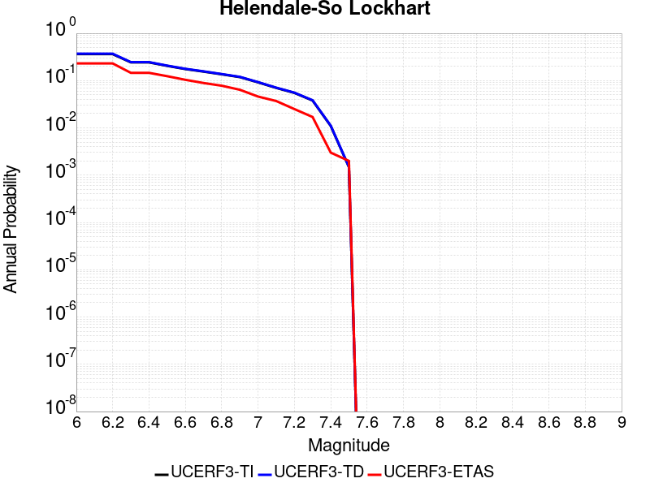 |
|-----|

| Magnitude | UCERF3-TI Prob | UCERF3-TD Prob | UCERF3-ETAS Prob |
|-----|-----|-----|-----|
| 6.0 | 0.36316562 | 0.37055433 | 0.22921348 |
| 6.1 | 0.36316562 | 0.37055433 | 0.22921348 |
| 6.2 | 0.36316562 | 0.37055433 | 0.22921348 |
| 6.3 | 0.24296905 | 0.24622479 | 0.14719102 |
| 6.4 | 0.24296905 | 0.24622479 | 0.14719102 |
| 6.5 | 0.20493136 | 0.20757177 | 0.1247191 |
| 6.6 | 0.17550305 | 0.17773862 | 0.104494385 |
| 6.7 | 0.15510091 | 0.15707797 | 0.08764045 |
| 6.8 | 0.13593142 | 0.13763401 | 0.0764045 |
| 6.9 | 0.11860513 | 0.12007238 | 0.061797753 |
| 7.0 | 0.09187008 | 0.09300424 | 0.046067417 |
| 7.1 | 0.07010339 | 0.07095923 | 0.037078653 |
| 7.2 | 0.054972194 | 0.05565079 | 0.023595506 |
| 7.3 | 0.0379352 | 0.038418185 | 0.015730336 |
| 7.4 | 0.010980636 | 0.011128791 | 0.002247191 |
| 7.5 | 0.0014844815 | 0.001503728 | 0.002247191 |

## Hilton Creek 2011 CFM
*[(top)](#table-of-contents)*

|  |
|-----|

| Magnitude | UCERF3-TI Prob | UCERF3-TD Prob | UCERF3-ETAS Prob |
|-----|-----|-----|-----|
| 6.0 | 0.4780843 | 0.52215755 | 0.29438204 |
| 6.1 | 0.4780843 | 0.52215755 | 0.29438204 |
| 6.2 | 0.4780843 | 0.52215755 | 0.29438204 |
| 6.3 | 0.4780843 | 0.52215755 | 0.29438204 |
| 6.4 | 0.4780843 | 0.52215755 | 0.29438204 |
| 6.5 | 0.43618488 | 0.48314556 | 0.25505617 |
| 6.6 | 0.43618488 | 0.48314556 | 0.25505617 |
| 6.7 | 0.39714086 | 0.44672608 | 0.2235955 |
| 6.8 | 0.39360002 | 0.4433696 | 0.22022472 |
| 6.9 | 0.15555602 | 0.16083156 | 0.06853933 |
| 7.0 | 0.13114384 | 0.13568899 | 0.058426965 |
| 7.1 | 0.10885126 | 0.11273461 | 0.041573033 |
| 7.2 | 0.06400892 | 0.06656108 | 0.0247191 |
| 7.3 | 0.020399636 | 0.02121619 | 0.010112359 |

## Hollywood
*[(top)](#table-of-contents)*

|  |
|-----|

| Magnitude | UCERF3-TI Prob | UCERF3-TD Prob | UCERF3-ETAS Prob |
|-----|-----|-----|-----|
| 6.0 | 0.27731463 | 0.2717346 | 0.17752808 |
| 6.1 | 0.27731463 | 0.2717346 | 0.17752808 |
| 6.2 | 0.27731463 | 0.2717346 | 0.17752808 |
| 6.3 | 0.27731463 | 0.2717346 | 0.17752808 |
| 6.4 | 0.2769801 | 0.2713891 | 0.17752808 |
| 6.5 | 0.25420403 | 0.24766938 | 0.16179775 |
| 6.6 | 0.2540453 | 0.24750537 | 0.16179775 |
| 6.7 | 0.25395447 | 0.24741141 | 0.16179775 |
| 6.8 | 0.2347021 | 0.22731799 | 0.15393259 |
| 6.9 | 0.21446222 | 0.20618783 | 0.13483146 |
| 7.0 | 0.19836134 | 0.18943845 | 0.12808989 |
| 7.1 | 0.15913862 | 0.14872049 | 0.0988764 |
| 7.2 | 0.13477863 | 0.12385445 | 0.08539326 |
| 7.3 | 0.10625966 | 0.09755362 | 0.06966292 |
| 7.4 | 0.07178039 | 0.06725368 | 0.047191013 |
| 7.5 | 0.050660014 | 0.04780631 | 0.028089888 |
| 7.6 | 0.03448371 | 0.03179009 | 0.019101124 |
| 7.7 | 0.019846173 | 0.017308662 | 0.011235955 |
| 7.8 | 0.00949345 | 0.007729834 | 0.002247191 |
| 7.9 | 0.0019554193 | 0.0017436759 | 0.0011235955 |

## Holser alt 1
*[(top)](#table-of-contents)*

| 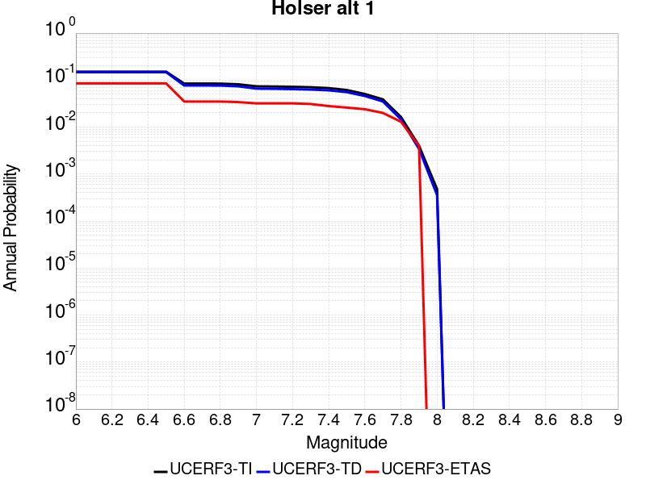 |
|-----|

| Magnitude | UCERF3-TI Prob | UCERF3-TD Prob | UCERF3-ETAS Prob |
|-----|-----|-----|-----|
| 6.0 | 0.15100506 | 0.14737767 | 0.08089887 |
| 6.1 | 0.15100506 | 0.14737767 | 0.08089887 |
| 6.2 | 0.15100506 | 0.14737767 | 0.08089887 |
| 6.3 | 0.15100506 | 0.14737767 | 0.08089887 |
| 6.4 | 0.15100506 | 0.14737767 | 0.08089887 |
| 6.5 | 0.15100506 | 0.14737767 | 0.08089887 |
| 6.6 | 0.08430598 | 0.0766974 | 0.03258427 |
| 6.7 | 0.08430598 | 0.0766974 | 0.03258427 |
| 6.8 | 0.084083974 | 0.076471314 | 0.03258427 |
| 6.9 | 0.08137117 | 0.07370181 | 0.03258427 |
| 7.0 | 0.07368153 | 0.06582736 | 0.031460673 |
| 7.1 | 0.07308011 | 0.06524408 | 0.031460673 |
| 7.2 | 0.07208013 | 0.06427171 | 0.031460673 |
| 7.3 | 0.07058585 | 0.062953584 | 0.030337078 |
| 7.4 | 0.06762019 | 0.060601808 | 0.028089888 |
| 7.5 | 0.06153931 | 0.05541278 | 0.026966292 |
| 7.6 | 0.050629098 | 0.04585305 | 0.0247191 |
| 7.7 | 0.038953718 | 0.035130892 | 0.020224718 |
| 7.8 | 0.016427515 | 0.014606312 | 0.013483146 |
| 7.9 | 0.0040251333 | 0.0034268547 | 0.004494382 |
| 8.0 | 4.7752372E-4 | 3.5758395E-4 | 0.0 |

## Homestead Valley 2011
*[(top)](#table-of-contents)*

| 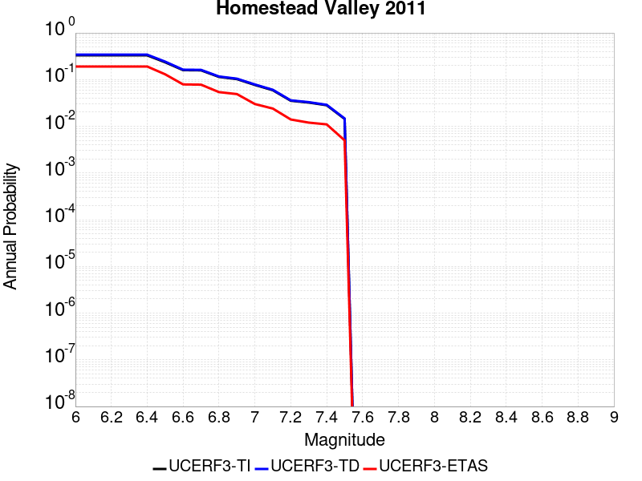 |
|-----|

| Magnitude | UCERF3-TI Prob | UCERF3-TD Prob | UCERF3-ETAS Prob |
|-----|-----|-----|-----|
| 6.0 | 0.33083498 | 0.3423672 | 0.18426967 |
| 6.1 | 0.33083498 | 0.3423672 | 0.18426967 |
| 6.2 | 0.33083498 | 0.3423672 | 0.18426967 |
| 6.3 | 0.33083498 | 0.3423672 | 0.18426967 |
| 6.4 | 0.33083498 | 0.3423672 | 0.18426967 |
| 6.5 | 0.23495042 | 0.24295728 | 0.1247191 |
| 6.6 | 0.15959981 | 0.16326557 | 0.0752809 |
| 6.7 | 0.15807973 | 0.16172057 | 0.074157305 |
| 6.8 | 0.114203654 | 0.11675755 | 0.053932585 |
| 6.9 | 0.10244808 | 0.10478443 | 0.048314605 |
| 7.0 | 0.076907314 | 0.078696884 | 0.029213483 |
| 7.1 | 0.05924382 | 0.06059255 | 0.02247191 |
| 7.2 | 0.035247512 | 0.035982847 | 0.013483146 |
| 7.3 | 0.032270525 | 0.032945596 | 0.011235955 |
| 7.4 | 0.028275661 | 0.028873065 | 0.010112359 |
| 7.5 | 0.014393007 | 0.014709235 | 0.0033707866 |

## Honey Lake 2011 CFM
*[(top)](#table-of-contents)*

| 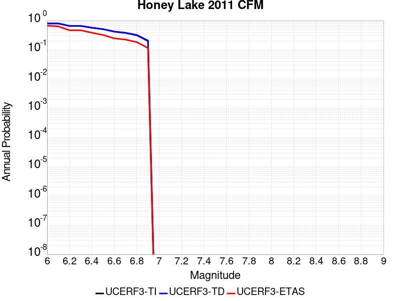 |
|-----|

| Magnitude | UCERF3-TI Prob | UCERF3-TD Prob | UCERF3-ETAS Prob |
|-----|-----|-----|-----|
| 6.0 | 0.79930663 | 0.79414237 | 0.6775281 |
| 6.1 | 0.79930663 | 0.79414237 | 0.63932586 |
| 6.2 | 0.6598687 | 0.65407383 | 0.46516854 |
| 6.3 | 0.6598687 | 0.65407383 | 0.46516854 |
| 6.4 | 0.5705037 | 0.5683707 | 0.38651684 |
| 6.5 | 0.5082485 | 0.509164 | 0.3269663 |
| 6.6 | 0.41717136 | 0.42238864 | 0.25168538 |
| 6.7 | 0.37574774 | 0.38276485 | 0.22921348 |
| 6.8 | 0.31452027 | 0.32185733 | 0.19438203 |
| 6.9 | 0.20024033 | 0.20775607 | 0.121348314 |

## Hosgri
*[(top)](#table-of-contents)*

|  |
|-----|

| Magnitude | UCERF3-TI Prob | UCERF3-TD Prob | UCERF3-ETAS Prob |
|-----|-----|-----|-----|
| 6.0 | 0.5287752 | 0.52933574 | 0.3247191 |
| 6.1 | 0.5287752 | 0.52933574 | 0.3247191 |
| 6.2 | 0.5287752 | 0.52933574 | 0.3247191 |
| 6.3 | 0.449995 | 0.4455321 | 0.2752809 |
| 6.4 | 0.4095662 | 0.4033879 | 0.24157304 |
| 6.5 | 0.4053705 | 0.39905977 | 0.23932584 |
| 6.6 | 0.3763341 | 0.3690098 | 0.21910113 |
| 6.7 | 0.3541947 | 0.34614065 | 0.21235955 |
| 6.8 | 0.33089048 | 0.3220424 | 0.19101124 |
| 6.9 | 0.29806814 | 0.28806183 | 0.16966292 |
| 7.0 | 0.26939136 | 0.258368 | 0.15168539 |
| 7.1 | 0.24894127 | 0.2372531 | 0.13932584 |
| 7.2 | 0.22887193 | 0.2165305 | 0.12584269 |
| 7.3 | 0.20308083 | 0.18989976 | 0.11011236 |
| 7.4 | 0.18553723 | 0.1718107 | 0.09775281 |
| 7.5 | 0.16339442 | 0.14895047 | 0.08764045 |
| 7.6 | 0.13374811 | 0.11837214 | 0.073033705 |
| 7.7 | 0.08999014 | 0.07347466 | 0.040449437 |
| 7.8 | 0.05047783 | 0.035075087 | 0.015730336 |
| 7.9 | 0.030363783 | 0.018337497 | 0.008988764 |
| 8.0 | 0.018001862 | 0.0104820905 | 0.004494382 |
| 8.1 | 0.00391439 | 0.002208592 | 0.0011235955 |

## Hosgri (Extension)
*[(top)](#table-of-contents)*

|  |
|-----|

| Magnitude | UCERF3-TI Prob | UCERF3-TD Prob | UCERF3-ETAS Prob |
|-----|-----|-----|-----|
| 6.0 | 0.25666934 | 0.26401156 | 0.19438203 |
| 6.1 | 0.16550563 | 0.16772416 | 0.09775281 |
| 6.2 | 0.16550563 | 0.16772416 | 0.09775281 |
| 6.3 | 0.111896105 | 0.112302765 | 0.07078651 |
| 6.4 | 0.10420825 | 0.10444956 | 0.062921345 |
| 6.5 | 0.0924293 | 0.092419766 | 0.05280899 |
| 6.6 | 0.08632671 | 0.08618068 | 0.0494382 |
| 6.7 | 0.078256615 | 0.077931665 | 0.046067417 |
| 6.8 | 0.07115067 | 0.07066626 | 0.040449437 |
| 6.9 | 0.062019493 | 0.061331227 | 0.03483146 |
| 7.0 | 0.05333387 | 0.052453544 | 0.028089888 |
| 7.1 | 0.044489734 | 0.043416817 | 0.0247191 |
| 7.2 | 0.039522924 | 0.038344044 | 0.021348314 |
| 7.3 | 0.03530022 | 0.03403115 | 0.019101124 |
| 7.4 | 0.031188505 | 0.029830934 | 0.015730336 |
| 7.5 | 0.02600891 | 0.024541816 | 0.013483146 |
| 7.6 | 0.021053186 | 0.01948083 | 0.010112359 |
| 7.7 | 0.012336085 | 0.010571256 | 0.0033707866 |
| 7.8 | 0.007233802 | 0.005346331 | 0.0011235955 |
| 7.9 | 0.004411874 | 0.0026077 | 0.0 |
| 8.0 | 0.0026642028 | 0.0013581854 | 0.0 |
| 8.1 | 3.7486234E-4 | 1.9064163E-4 | 0.0 |

## Hunter Mountain-Saline Valley
*[(top)](#table-of-contents)*

| 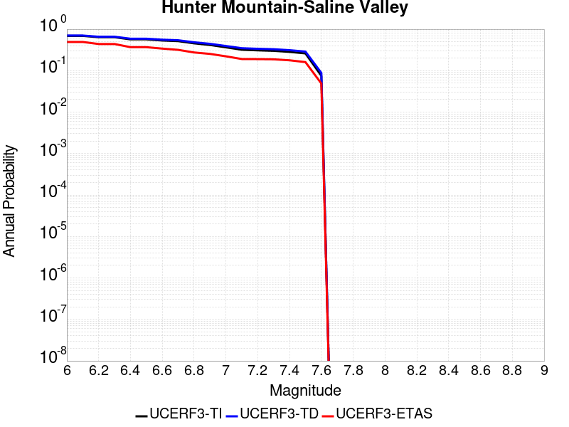 |
|-----|

| Magnitude | UCERF3-TI Prob | UCERF3-TD Prob | UCERF3-ETAS Prob |
|-----|-----|-----|-----|
| 6.0 | 0.6917207 | 0.70487094 | 0.50337076 |
| 6.1 | 0.6917207 | 0.70487094 | 0.50337076 |
| 6.2 | 0.641915 | 0.6592035 | 0.4494382 |
| 6.3 | 0.641915 | 0.6592035 | 0.4494382 |
| 6.4 | 0.5695837 | 0.59132224 | 0.3797753 |
| 6.5 | 0.5695837 | 0.59132224 | 0.3797753 |
| 6.6 | 0.53447044 | 0.5589333 | 0.3516854 |
| 6.7 | 0.5161517 | 0.54205096 | 0.32921347 |
| 6.8 | 0.4567753 | 0.48432255 | 0.28764045 |
| 6.9 | 0.41716284 | 0.44503906 | 0.26404494 |
| 7.0 | 0.36592245 | 0.39391327 | 0.23146068 |
| 7.1 | 0.32045063 | 0.34864795 | 0.2011236 |
| 7.2 | 0.3092311 | 0.33754963 | 0.2 |
| 7.3 | 0.3010799 | 0.32937092 | 0.1977528 |
| 7.4 | 0.2840954 | 0.31231663 | 0.18651685 |
| 7.5 | 0.2610494 | 0.28901863 | 0.16741572 |
| 7.6 | 0.075227775 | 0.08827121 | 0.051685393 |

## Hunting Creek - Bartlett Springs connector 2011
*[(top)](#table-of-contents)*

|  |
|-----|

| Magnitude | UCERF3-TI Prob | UCERF3-TD Prob | UCERF3-ETAS Prob |
|-----|-----|-----|-----|
| 6.0 | 0.72441155 | 0.6936293 | 0.6202247 |
| 6.1 | 0.72441155 | 0.6936293 | 0.6202247 |
| 6.2 | 0.6886575 | 0.66220844 | 0.558427 |
| 6.3 | 0.6886575 | 0.66220844 | 0.558427 |
| 6.4 | 0.64782196 | 0.6267274 | 0.49101123 |
| 6.5 | 0.62926733 | 0.6109927 | 0.45842695 |
| 6.6 | 0.6145161 | 0.5984629 | 0.43707865 |
| 6.7 | 0.5851141 | 0.5730994 | 0.38876405 |
| 6.8 | 0.53863204 | 0.5299924 | 0.33707866 |
| 6.9 | 0.52591395 | 0.51989096 | 0.31460676 |
| 7.0 | 0.50166893 | 0.49879304 | 0.29438204 |
| 7.1 | 0.4731205 | 0.47404137 | 0.27078652 |
| 7.2 | 0.4506143 | 0.45363703 | 0.24382022 |
| 7.3 | 0.42568898 | 0.4295472 | 0.22022472 |
| 7.4 | 0.38741925 | 0.39160377 | 0.1977528 |
| 7.5 | 0.36237162 | 0.36701128 | 0.18539326 |
| 7.6 | 0.24266466 | 0.24667497 | 0.11685393 |
| 7.7 | 0.08216513 | 0.086385414 | 0.035955057 |
| 7.8 | 0.013437524 | 0.013989194 | 0.007865168 |

## Hunting Creek - Berryessa 2011 CFM
*[(top)](#table-of-contents)*

|  |
|-----|

| Magnitude | UCERF3-TI Prob | UCERF3-TD Prob | UCERF3-ETAS Prob |
|-----|-----|-----|-----|
| 6.0 | 0.94717044 | 0.8434649 | 0.9494382 |
| 6.1 | 0.9467332 | 0.842647 | 0.9258427 |
| 6.2 | 0.86219096 | 0.73538834 | 0.7966292 |
| 6.3 | 0.82983476 | 0.7047752 | 0.75842696 |
| 6.4 | 0.8024758 | 0.67938185 | 0.7292135 |
| 6.5 | 0.7579142 | 0.6395661 | 0.66067415 |
| 6.6 | 0.7088855 | 0.59781927 | 0.5955056 |
| 6.7 | 0.6178984 | 0.5263413 | 0.49325842 |
| 6.8 | 0.4110477 | 0.38502285 | 0.25505617 |
| 6.9 | 0.3726476 | 0.3598296 | 0.21123596 |
| 7.0 | 0.34836653 | 0.34327883 | 0.19662921 |
| 7.1 | 0.33104336 | 0.3297573 | 0.18314607 |
| 7.2 | 0.3149272 | 0.31568238 | 0.16404495 |
| 7.3 | 0.29897562 | 0.30075133 | 0.152809 |
| 7.4 | 0.27361086 | 0.27567872 | 0.13483146 |
| 7.5 | 0.2477765 | 0.25025094 | 0.1247191 |
| 7.6 | 0.20146294 | 0.20395203 | 0.1 |
| 7.7 | 0.053298034 | 0.056153737 | 0.026966292 |
| 7.8 | 0.0047962754 | 0.005018719 | 0.002247191 |

## Imperial
*[(top)](#table-of-contents)*

| 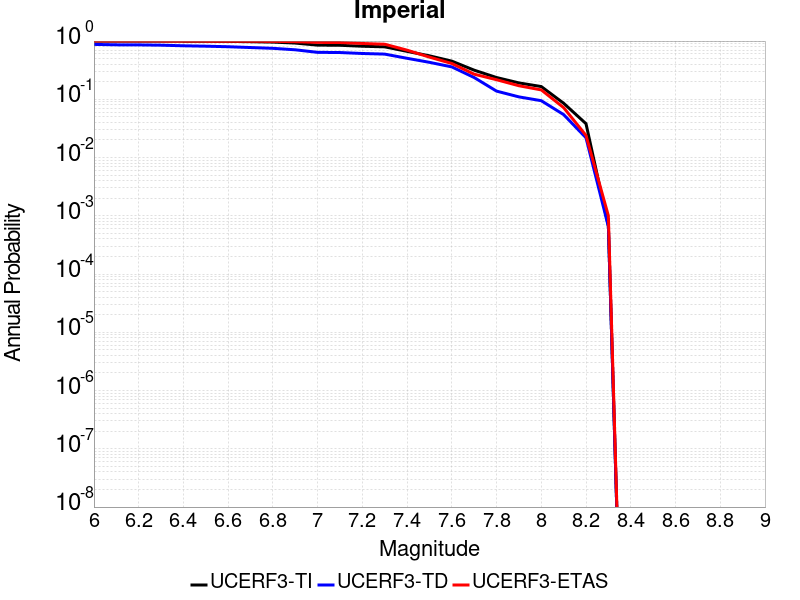 |
|-----|

| Magnitude | UCERF3-TI Prob | UCERF3-TD Prob | UCERF3-ETAS Prob |
|-----|-----|-----|-----|
| 6.0 | 0.9992342 | 0.8761487 | 1.0 |
| 6.1 | 0.9986613 | 0.8623329 | 1.0 |
| 6.2 | 0.9984606 | 0.8594318 | 1.0 |
| 6.3 | 0.9976535 | 0.84944624 | 1.0 |
| 6.4 | 0.9949979 | 0.82971764 | 0.9977528 |
| 6.5 | 0.99209285 | 0.81643057 | 0.99550563 |
| 6.6 | 0.9868002 | 0.79931945 | 0.994382 |
| 6.7 | 0.97555614 | 0.7742979 | 0.9921348 |
| 6.8 | 0.9597917 | 0.7506092 | 0.98876405 |
| 6.9 | 0.92365587 | 0.70811164 | 0.9741573 |
| 7.0 | 0.85185945 | 0.6400843 | 0.9483146 |
| 7.1 | 0.8462215 | 0.6352562 | 0.94494385 |
| 7.2 | 0.81493056 | 0.6118389 | 0.9112359 |
| 7.3 | 0.7957466 | 0.5972368 | 0.8876405 |
| 7.4 | 0.6656618 | 0.5059762 | 0.7022472 |
| 7.5 | 0.5581233 | 0.431413 | 0.5314607 |
| 7.6 | 0.45228356 | 0.3602125 | 0.41348314 |
| 7.7 | 0.3165171 | 0.23654494 | 0.26741573 |
| 7.8 | 0.23669931 | 0.13826197 | 0.21123596 |
| 7.9 | 0.19128849 | 0.110088706 | 0.16741572 |
| 8.0 | 0.16556965 | 0.094650514 | 0.14269663 |
| 8.1 | 0.085566655 | 0.054635473 | 0.06966292 |
| 8.2 | 0.038144484 | 0.021838749 | 0.021348314 |
| 8.3 | 6.717823E-4 | 6.5291364E-4 | 0.0011235955 |

## Incline Village 2011 CFM
*[(top)](#table-of-contents)*

|  |
|-----|

| Magnitude | UCERF3-TI Prob | UCERF3-TD Prob | UCERF3-ETAS Prob |
|-----|-----|-----|-----|
| 6.0 | 0.15668908 | 0.03713988 | 0.019101124 |
| 6.1 | 0.15668908 | 0.03713988 | 0.019101124 |
| 6.2 | 0.15668908 | 0.03713988 | 0.019101124 |
| 6.3 | 0.15668908 | 0.03713988 | 0.019101124 |
| 6.4 | 0.11385884 | 0.03416219 | 0.015730336 |
| 6.5 | 0.11385884 | 0.03416219 | 0.015730336 |
| 6.6 | 0.062031526 | 0.031898342 | 0.015730336 |
| 6.7 | 0.04714669 | 0.020750126 | 0.01235955 |

## Independence rev 2011
*[(top)](#table-of-contents)*

|  |
|-----|

| Magnitude | UCERF3-TI Prob | UCERF3-TD Prob | UCERF3-ETAS Prob |
|-----|-----|-----|-----|
| 6.0 | 0.10896497 | 0.10553868 | 0.083146065 |
| 6.1 | 0.10896497 | 0.10553868 | 0.083146065 |
| 6.2 | 0.10896497 | 0.10553868 | 0.083146065 |
| 6.3 | 0.10896497 | 0.10553868 | 0.083146065 |
| 6.4 | 0.10896497 | 0.10553868 | 0.083146065 |
| 6.5 | 0.10896497 | 0.10553868 | 0.083146065 |
| 6.6 | 0.06713545 | 0.06265267 | 0.0494382 |
| 6.7 | 0.06713545 | 0.06265267 | 0.0494382 |
| 6.8 | 0.050138474 | 0.045534126 | 0.031460673 |
| 6.9 | 0.047836203 | 0.043354135 | 0.028089888 |
| 7.0 | 0.03849223 | 0.034555912 | 0.020224718 |
| 7.1 | 0.0326496 | 0.029058948 | 0.017977528 |
| 7.2 | 0.026810972 | 0.023551634 | 0.013483146 |
| 7.3 | 0.020514637 | 0.018169848 | 0.011235955 |
| 7.4 | 0.013962032 | 0.012675717 | 0.008988764 |
| 7.5 | 0.010085035 | 0.009336999 | 0.0033707866 |
| 7.6 | 0.0062805726 | 0.005978871 | 0.002247191 |
| 7.7 | 0.00178026 | 0.0017600259 | 0.0 |

## Jess Valley
*[(top)](#table-of-contents)*

|  |
|-----|

| Magnitude | UCERF3-TI Prob | UCERF3-TD Prob | UCERF3-ETAS Prob |
|-----|-----|-----|-----|
| 6.0 | 0.08455207 | 0.085594706 | 0.051685393 |
| 6.1 | 0.08455207 | 0.085594706 | 0.051685393 |
| 6.2 | 0.08455207 | 0.085594706 | 0.051685393 |
| 6.3 | 0.08455207 | 0.085594706 | 0.051685393 |
| 6.4 | 0.039109677 | 0.039475642 | 0.021348314 |
| 6.5 | 0.039109677 | 0.039475642 | 0.021348314 |
| 6.6 | 0.013980243 | 0.014088605 | 0.007865168 |
| 6.7 | 0.013980243 | 0.014088605 | 0.007865168 |
| 6.8 | 0.0093632685 | 0.009447081 | 0.006741573 |

## Johnson Valley (No) 2011 rev
*[(top)](#table-of-contents)*

|  |
|-----|

| Magnitude | UCERF3-TI Prob | UCERF3-TD Prob | UCERF3-ETAS Prob |
|-----|-----|-----|-----|
| 6.0 | 0.48957625 | 0.5142189 | 0.3011236 |
| 6.1 | 0.48957625 | 0.5142189 | 0.3011236 |
| 6.2 | 0.48957625 | 0.5142189 | 0.3011236 |
| 6.3 | 0.48957625 | 0.5142189 | 0.3011236 |
| 6.4 | 0.32906312 | 0.3459873 | 0.19662921 |
| 6.5 | 0.32906312 | 0.3459873 | 0.19662921 |
| 6.6 | 0.29299167 | 0.30954972 | 0.16966292 |
| 6.7 | 0.29299167 | 0.30954972 | 0.16966292 |
| 6.8 | 0.19534788 | 0.20802668 | 0.1 |
| 6.9 | 0.17203148 | 0.1842215 | 0.08539326 |
| 7.0 | 0.15631168 | 0.16825467 | 0.0752809 |
| 7.1 | 0.029967742 | 0.030723337 | 0.013483146 |
| 7.2 | 0.014025151 | 0.014339768 | 0.006741573 |
| 7.3 | 0.0131577365 | 0.013452145 | 0.0056179776 |
| 7.4 | 0.012333644 | 0.012609757 | 0.0056179776 |
| 7.5 | 0.008923254 | 0.009126792 | 0.002247191 |

## Joshua Tree (Seismicity)
*[(top)](#table-of-contents)*

| 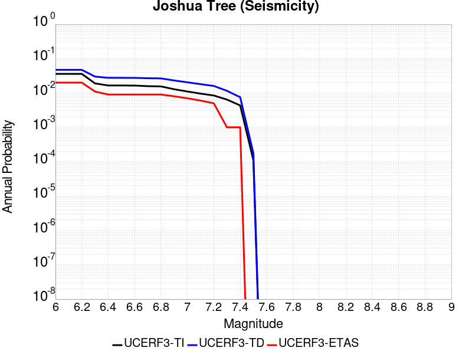 |
|-----|

| Magnitude | UCERF3-TI Prob | UCERF3-TD Prob | UCERF3-ETAS Prob |
|-----|-----|-----|-----|
| 6.0 | 0.035930395 | 0.046966385 | 0.021348314 |
| 6.1 | 0.035930395 | 0.046966385 | 0.021348314 |
| 6.2 | 0.035930395 | 0.046966385 | 0.021348314 |
| 6.3 | 0.018948335 | 0.029978273 | 0.011235955 |
| 6.4 | 0.016513776 | 0.027562317 | 0.010112359 |
| 6.5 | 0.016513776 | 0.027562317 | 0.010112359 |
| 6.6 | 0.016414013 | 0.0274632 | 0.010112359 |
| 6.7 | 0.015775295 | 0.026828187 | 0.010112359 |
| 6.8 | 0.015492656 | 0.026520496 | 0.010112359 |
| 6.9 | 0.012821666 | 0.023084095 | 0.008988764 |
| 7.0 | 0.011027672 | 0.020399304 | 0.007865168 |
| 7.1 | 0.009577803 | 0.018026695 | 0.006741573 |
| 7.2 | 0.008436388 | 0.016001452 | 0.0056179776 |
| 7.3 | 0.006411326 | 0.011524266 | 0.0011235955 |
| 7.4 | 0.004335729 | 0.007517779 | 0.0011235955 |
| 7.5 | 1.1066828E-4 | 1.7656901E-4 | 0.0 |

## Keddie Ridge 2011 CFM
*[(top)](#table-of-contents)*

|  |
|-----|

| Magnitude | UCERF3-TI Prob | UCERF3-TD Prob | UCERF3-ETAS Prob |
|-----|-----|-----|-----|
| 6.0 | 0.44534802 | 0.46356264 | 0.3 |
| 6.1 | 0.44534802 | 0.46356264 | 0.26067415 |
| 6.2 | 0.3018953 | 0.31177273 | 0.152809 |
| 6.3 | 0.22369447 | 0.23050357 | 0.111235954 |
| 6.4 | 0.17244339 | 0.17758563 | 0.08089887 |
| 6.5 | 0.14452662 | 0.14891216 | 0.062921345 |
| 6.6 | 0.099886455 | 0.102814816 | 0.039325844 |
| 6.7 | 0.04046344 | 0.041544612 | 0.007865168 |
| 6.8 | 0.019422133 | 0.020008542 | 0.0 |

## Kern Canyon (Lake Isabella) 2011
*[(top)](#table-of-contents)*

|  |
|-----|

| Magnitude | UCERF3-TI Prob | UCERF3-TD Prob | UCERF3-ETAS Prob |
|-----|-----|-----|-----|
| 6.0 | 0.104690574 | 0.1057331 | 0.053932585 |
| 6.1 | 0.104690574 | 0.1057331 | 0.053932585 |
| 6.2 | 0.104690574 | 0.1057331 | 0.053932585 |
| 6.3 | 0.104690574 | 0.1057331 | 0.053932585 |
| 6.4 | 0.104690574 | 0.1057331 | 0.053932585 |
| 6.5 | 0.07010017 | 0.07057518 | 0.035955057 |
| 6.6 | 0.05635504 | 0.05669187 | 0.028089888 |
| 6.7 | 0.05488112 | 0.055211384 | 0.026966292 |
| 6.8 | 0.047580536 | 0.047864605 | 0.020224718 |
| 6.9 | 0.0404208 | 0.0406617 | 0.019101124 |
| 7.0 | 0.03529378 | 0.035505634 | 0.016853932 |
| 7.1 | 0.028079903 | 0.028247105 | 0.014606741 |
| 7.2 | 0.019703439 | 0.019820511 | 0.007865168 |
| 7.3 | 0.0138005875 | 0.013880583 | 0.004494382 |
| 7.4 | 0.009075729 | 0.009127351 | 0.004494382 |
| 7.5 | 0.0047673816 | 0.0047950773 | 0.0033707866 |
| 7.6 | 6.708552E-4 | 6.748372E-4 | 0.0011235955 |

## Kern Canyon (North Kern) 2011
*[(top)](#table-of-contents)*

|  |
|-----|

| Magnitude | UCERF3-TI Prob | UCERF3-TD Prob | UCERF3-ETAS Prob |
|-----|-----|-----|-----|
| 6.0 | 0.15876137 | 0.16161768 | 0.084269665 |
| 6.1 | 0.15876137 | 0.16161768 | 0.084269665 |
| 6.2 | 0.15876137 | 0.16161768 | 0.084269665 |
| 6.3 | 0.15876137 | 0.16161768 | 0.084269665 |
| 6.4 | 0.15876137 | 0.16161768 | 0.084269665 |
| 6.5 | 0.08048515 | 0.081167474 | 0.03483146 |
| 6.6 | 0.08048515 | 0.081167474 | 0.03483146 |
| 6.7 | 0.055554375 | 0.05592065 | 0.0247191 |
| 6.8 | 0.044140805 | 0.044411033 | 0.014606741 |
| 6.9 | 0.035111923 | 0.035315957 | 0.011235955 |
| 7.0 | 0.029475547 | 0.029644908 | 0.008988764 |
| 7.1 | 0.024213469 | 0.024350666 | 0.0056179776 |
| 7.2 | 0.017733067 | 0.0178332 | 0.004494382 |
| 7.3 | 0.013243667 | 0.0133183105 | 0.0033707866 |
| 7.4 | 0.009089537 | 0.009140968 | 0.0033707866 |
| 7.5 | 0.004430948 | 0.0044562668 | 0.002247191 |
| 7.6 | 6.708552E-4 | 6.748372E-4 | 0.0011235955 |

## Kern Canyon (South Kern) 2011
*[(top)](#table-of-contents)*

|  |
|-----|

| Magnitude | UCERF3-TI Prob | UCERF3-TD Prob | UCERF3-ETAS Prob |
|-----|-----|-----|-----|
| 6.0 | 0.10156299 | 0.10224546 | 0.051685393 |
| 6.1 | 0.10156299 | 0.10224546 | 0.051685393 |
| 6.2 | 0.10156299 | 0.10224546 | 0.051685393 |
| 6.3 | 0.10156299 | 0.10224546 | 0.051685393 |
| 6.4 | 0.10156299 | 0.10224546 | 0.051685393 |
| 6.5 | 0.074921 | 0.07535386 | 0.03483146 |
| 6.6 | 0.074921 | 0.07535386 | 0.03483146 |
| 6.7 | 0.06742572 | 0.067810506 | 0.030337078 |
| 6.8 | 0.05893742 | 0.05927178 | 0.02247191 |
| 6.9 | 0.05324627 | 0.053548623 | 0.021348314 |
| 7.0 | 0.043712646 | 0.043961342 | 0.016853932 |
| 7.1 | 0.036408044 | 0.036614493 | 0.013483146 |
| 7.2 | 0.023456184 | 0.023589008 | 0.010112359 |
| 7.3 | 0.01590191 | 0.015991872 | 0.0056179776 |
| 7.4 | 0.0105101345 | 0.0105702905 | 0.0056179776 |
| 7.5 | 0.0051708296 | 0.0052009863 | 0.004494382 |
| 7.6 | 6.708552E-4 | 6.748372E-4 | 0.0011235955 |

## Kickapoo
*[(top)](#table-of-contents)*

|  |
|-----|

| Magnitude | UCERF3-TI Prob | UCERF3-TD Prob | UCERF3-ETAS Prob |
|-----|-----|-----|-----|
| 6.0 | 0.10986862 | 0.11363367 | 0.28764045 |
| 6.1 | 0.10986862 | 0.11363367 | 0.05730337 |
| 6.2 | 0.10986862 | 0.11363367 | 0.05730337 |
| 6.3 | 0.10986862 | 0.11363367 | 0.05730337 |
| 6.4 | 0.10986862 | 0.11363367 | 0.05730337 |
| 6.5 | 0.10986862 | 0.11363367 | 0.05730337 |
| 6.6 | 0.10463901 | 0.10829417 | 0.05505618 |
| 6.7 | 0.10463901 | 0.10829417 | 0.05505618 |
| 6.8 | 0.058739003 | 0.06020782 | 0.031460673 |
| 6.9 | 0.056055773 | 0.05746768 | 0.028089888 |
| 7.0 | 0.04642769 | 0.04761141 | 0.02247191 |
| 7.1 | 0.03375902 | 0.034591388 | 0.016853932 |
| 7.2 | 0.017738983 | 0.018130524 | 0.010112359 |
| 7.3 | 0.016635269 | 0.017001947 | 0.008988764 |
| 7.4 | 0.015237915 | 0.0155750895 | 0.007865168 |
| 7.5 | 0.008923254 | 0.009126792 | 0.002247191 |

## King Range 2011 CFM
*[(top)](#table-of-contents)*

|  |
|-----|

| Magnitude | UCERF3-TI Prob | UCERF3-TD Prob | UCERF3-ETAS Prob |
|-----|-----|-----|-----|
| 6.0 | 0.27757484 | 0.28012052 | 0.60674155 |
| 6.1 | 0.27757484 | 0.28012052 | 0.60674155 |
| 6.2 | 0.27757484 | 0.28012052 | 0.60674155 |
| 6.3 | 0.1881297 | 0.1842727 | 0.33707866 |
| 6.4 | 0.1881297 | 0.1842727 | 0.33707866 |
| 6.5 | 0.12349245 | 0.11525222 | 0.13033707 |
| 6.6 | 0.111626185 | 0.103086516 | 0.10224719 |
| 6.7 | 0.10178234 | 0.09298827 | 0.08202247 |
| 6.8 | 0.09514223 | 0.08658303 | 0.073033705 |
| 6.9 | 0.08726757 | 0.07878892 | 0.064044945 |
| 7.0 | 0.0740059 | 0.06565581 | 0.058426965 |
| 7.1 | 0.06277566 | 0.05468551 | 0.0494382 |
| 7.2 | 0.055288322 | 0.0473982 | 0.04494382 |
| 7.3 | 0.05177751 | 0.04497314 | 0.03820225 |
| 7.4 | 0.037316423 | 0.034336593 | 0.026966292 |
| 7.5 | 0.020830331 | 0.017662626 | 0.017977528 |
| 7.6 | 0.008117024 | 0.0054601794 | 0.007865168 |
| 7.7 | 0.0046194177 | 0.0031636755 | 0.004494382 |
| 7.8 | 5.486516E-4 | 3.8420034E-4 | 0.0 |
| 7.9 | 3.856695E-5 | 2.754081E-5 | 0.0 |

## La Panza 2011
*[(top)](#table-of-contents)*

|  |
|-----|

| Magnitude | UCERF3-TI Prob | UCERF3-TD Prob | UCERF3-ETAS Prob |
|-----|-----|-----|-----|
| 6.0 | 0.114833534 | 0.1158722 | 0.08539326 |
| 6.1 | 0.114833534 | 0.1158722 | 0.08539326 |
| 6.2 | 0.114833534 | 0.1158722 | 0.08539326 |
| 6.3 | 0.114833534 | 0.1158722 | 0.08539326 |
| 6.4 | 0.114833534 | 0.1158722 | 0.08539326 |
| 6.5 | 0.062783435 | 0.06328379 | 0.039325844 |
| 6.6 | 0.062783435 | 0.06328379 | 0.039325844 |
| 6.7 | 0.038650304 | 0.039004363 | 0.028089888 |
| 6.8 | 0.035528507 | 0.035867043 | 0.025842696 |
| 6.9 | 0.02531103 | 0.0256033 | 0.016853932 |
| 7.0 | 0.017532414 | 0.017790614 | 0.01235955 |
| 7.1 | 0.009084472 | 0.0093076555 | 0.006741573 |
| 7.2 | 0.0065239933 | 0.006735159 | 0.006741573 |
| 7.3 | 0.0026469238 | 0.0028365352 | 0.0033707866 |
| 7.4 | 9.1287115E-4 | 5.8914284E-4 | 0.0033707866 |
| 7.5 | 6.7607715E-4 | 3.0064647E-4 | 0.002247191 |
| 7.6 | 4.9600954E-4 | 1.5172503E-4 | 0.0011235955 |
| 7.7 | 3.0712417E-4 | 3.6111822E-5 | 0.0 |
| 7.8 | 1.431959E-4 | 4.362467E-6 | 0.0 |
| 7.9 | 6.543253E-5 | 1.3523751E-6 | 0.0 |

## Laguna Salada
*[(top)](#table-of-contents)*

|  |
|-----|

| Magnitude | UCERF3-TI Prob | UCERF3-TD Prob | UCERF3-ETAS Prob |
|-----|-----|-----|-----|
| 6.0 | 0.7024825 | 0.65794593 | 0.7325843 |
| 6.1 | 0.6461823 | 0.6030377 | 0.41685393 |
| 6.2 | 0.6097625 | 0.5680795 | 0.37865168 |
| 6.3 | 0.5756874 | 0.535395 | 0.3494382 |
| 6.4 | 0.5323556 | 0.4943583 | 0.30786517 |
| 6.5 | 0.5065718 | 0.4705798 | 0.28314605 |
| 6.6 | 0.44209006 | 0.41229558 | 0.23932584 |
| 6.7 | 0.3980926 | 0.37279096 | 0.20786516 |
| 6.8 | 0.24491689 | 0.23308595 | 0.13033707 |
| 6.9 | 0.054263588 | 0.044019267 | 0.03258427 |
| 7.0 | 0.05319753 | 0.04299677 | 0.03258427 |
| 7.1 | 0.045595266 | 0.0356498 | 0.029213483 |
| 7.2 | 0.025047874 | 0.017626328 | 0.013483146 |

## Lake Isabella (Seismicity)
*[(top)](#table-of-contents)*

| 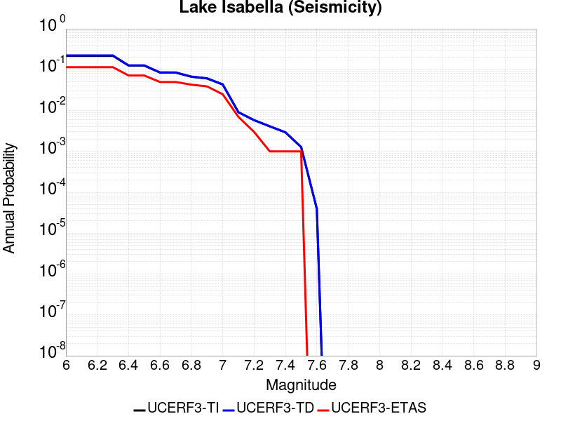 |
|-----|

| Magnitude | UCERF3-TI Prob | UCERF3-TD Prob | UCERF3-ETAS Prob |
|-----|-----|-----|-----|
| 6.0 | 0.21812925 | 0.22272581 | 0.11235955 |
| 6.1 | 0.21812925 | 0.22272581 | 0.11235955 |
| 6.2 | 0.21812925 | 0.22272581 | 0.11235955 |
| 6.3 | 0.21812925 | 0.22272581 | 0.11235955 |
| 6.4 | 0.12558945 | 0.12744586 | 0.07191011 |
| 6.5 | 0.12558945 | 0.12744586 | 0.07191011 |
| 6.6 | 0.08490674 | 0.08599029 | 0.050561797 |
| 6.7 | 0.08459782 | 0.08568026 | 0.050561797 |
| 6.8 | 0.067000516 | 0.06788018 | 0.04494382 |
| 6.9 | 0.060841653 | 0.0616686 | 0.040449437 |
| 7.0 | 0.0432656 | 0.043885466 | 0.028089888 |
| 7.1 | 0.009093262 | 0.009148345 | 0.007865168 |
| 7.2 | 0.0058064912 | 0.005840235 | 0.0033707866 |
| 7.3 | 0.004103336 | 0.0041269655 | 0.0011235955 |
| 7.4 | 0.0029220267 | 0.0029389642 | 0.0011235955 |
| 7.5 | 0.001273698 | 0.0012810744 | 0.0011235955 |
| 7.6 | 3.925424E-5 | 3.9467996E-5 | 0.0 |

## Las Positas
*[(top)](#table-of-contents)*

|  |
|-----|

| Magnitude | UCERF3-TI Prob | UCERF3-TD Prob | UCERF3-ETAS Prob |
|-----|-----|-----|-----|
| 6.0 | 0.24277759 | 0.2847469 | 0.18314607 |
| 6.1 | 0.24277759 | 0.2847469 | 0.18314607 |
| 6.2 | 0.24277759 | 0.2847469 | 0.18314607 |
| 6.3 | 0.24277759 | 0.2847469 | 0.18314607 |

## Last Chance
*[(top)](#table-of-contents)*

| 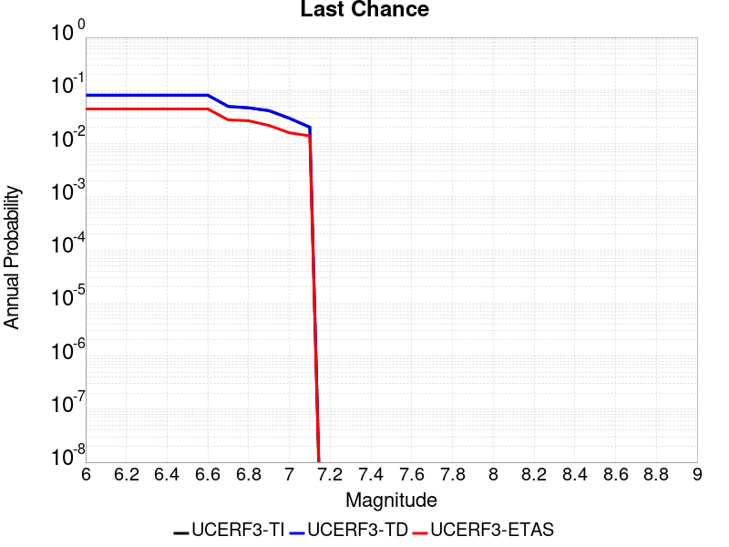 |
|-----|

| Magnitude | UCERF3-TI Prob | UCERF3-TD Prob | UCERF3-ETAS Prob |
|-----|-----|-----|-----|
| 6.0 | 0.08103836 | 0.08212631 | 0.040449437 |
| 6.1 | 0.08103836 | 0.08212631 | 0.040449437 |
| 6.2 | 0.08103836 | 0.08212631 | 0.040449437 |
| 6.3 | 0.08103836 | 0.08212631 | 0.040449437 |
| 6.4 | 0.08103836 | 0.08212631 | 0.040449437 |
| 6.5 | 0.08103836 | 0.08212631 | 0.040449437 |
| 6.6 | 0.08103836 | 0.08212631 | 0.040449437 |
| 6.7 | 0.049946934 | 0.050409283 | 0.0247191 |
| 6.8 | 0.047095586 | 0.0475401 | 0.0247191 |
| 6.9 | 0.041593295 | 0.041991487 | 0.019101124 |
| 7.0 | 0.029859101 | 0.03016403 | 0.014606741 |
| 7.1 | 0.020328866 | 0.020542031 | 0.01235955 |

## Lenwood-Lockhart-Old Woman Springs
*[(top)](#table-of-contents)*

| 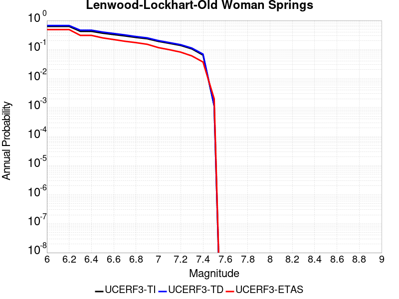 |
|-----|

| Magnitude | UCERF3-TI Prob | UCERF3-TD Prob | UCERF3-ETAS Prob |
|-----|-----|-----|-----|
| 6.0 | 0.6235397 | 0.6678268 | 0.48539326 |
| 6.1 | 0.6235397 | 0.6678268 | 0.48539326 |
| 6.2 | 0.6235397 | 0.6678268 | 0.48539326 |
| 6.3 | 0.42303148 | 0.4619599 | 0.2988764 |
| 6.4 | 0.42303148 | 0.4619599 | 0.2988764 |
| 6.5 | 0.36484525 | 0.39880964 | 0.24269663 |
| 6.6 | 0.3274585 | 0.35572866 | 0.21460675 |
| 6.7 | 0.29365256 | 0.31755453 | 0.18539326 |
| 6.8 | 0.25969228 | 0.27892244 | 0.16516854 |
| 6.9 | 0.23472385 | 0.25117576 | 0.14606741 |
| 7.0 | 0.19058467 | 0.20236672 | 0.11460674 |
| 7.1 | 0.16253151 | 0.17233522 | 0.0988764 |
| 7.2 | 0.13794056 | 0.14630379 | 0.08089887 |
| 7.3 | 0.10503176 | 0.111774854 | 0.05955056 |
| 7.4 | 0.06423641 | 0.06917234 | 0.03820225 |
| 7.5 | 0.0011396303 | 0.001154573 | 0.002247191 |

## Likely 2011 CFM
*[(top)](#table-of-contents)*

|  |
|-----|

| Magnitude | UCERF3-TI Prob | UCERF3-TD Prob | UCERF3-ETAS Prob |
|-----|-----|-----|-----|
| 6.0 | 0.48339844 | 0.49598476 | 0.3539326 |
| 6.1 | 0.48339844 | 0.49598476 | 0.3235955 |
| 6.2 | 0.3476931 | 0.35500115 | 0.23146068 |
| 6.3 | 0.2677641 | 0.27296588 | 0.18202247 |
| 6.4 | 0.21324062 | 0.21720073 | 0.1505618 |
| 6.5 | 0.18154918 | 0.18487313 | 0.1247191 |
| 6.6 | 0.1557262 | 0.1585691 | 0.111235954 |
| 6.7 | 0.1132296 | 0.11529096 | 0.07191011 |
| 6.8 | 0.08200337 | 0.08351501 | 0.046067417 |
| 6.9 | 0.058952753 | 0.060070388 | 0.028089888 |
| 7.0 | 0.031107644 | 0.031735547 | 0.015730336 |

## Lions Head 2011 CFM
*[(top)](#table-of-contents)*

|  |
|-----|

| Magnitude | UCERF3-TI Prob | UCERF3-TD Prob | UCERF3-ETAS Prob |
|-----|-----|-----|-----|
| 6.0 | 0.022924863 | 0.022830537 | 0.019101124 |
| 6.1 | 0.022924863 | 0.022830537 | 0.019101124 |
| 6.2 | 0.014872803 | 0.014757035 | 0.008988764 |
| 6.3 | 0.014872803 | 0.014757035 | 0.008988764 |
| 6.4 | 0.010855306 | 0.010732176 | 0.0056179776 |
| 6.5 | 0.010855306 | 0.010732176 | 0.0056179776 |
| 6.6 | 0.00957978 | 0.009455094 | 0.0056179776 |
| 6.7 | 0.008645951 | 0.00852021 | 0.0056179776 |
| 6.8 | 0.0077146436 | 0.0075879605 | 0.0056179776 |
| 6.9 | 0.0073443796 | 0.0072172624 | 0.0056179776 |
| 7.0 | 0.0067070024 | 0.0065790685 | 0.0056179776 |
| 7.1 | 0.005899276 | 0.005770006 | 0.0056179776 |
| 7.2 | 0.005122631 | 0.004992082 | 0.0056179776 |
| 7.3 | 0.004191877 | 0.0040593687 | 0.0033707866 |
| 7.4 | 0.003398197 | 0.003263743 | 0.002247191 |
| 7.5 | 0.0024521507 | 0.002314892 | 0.002247191 |
| 7.6 | 0.0017298087 | 0.0015900097 | 0.0011235955 |
| 7.7 | 0.0010195943 | 8.766108E-4 | 0.0011235955 |
| 7.8 | 5.1796116E-4 | 3.7242397E-4 | 0.0011235955 |
| 7.9 | 2.5349628E-4 | 1.281239E-4 | 0.0011235955 |
| 8.0 | 1.0017188E-4 | 2.7899248E-5 | 0.0 |

## Little Lake
*[(top)](#table-of-contents)*

| 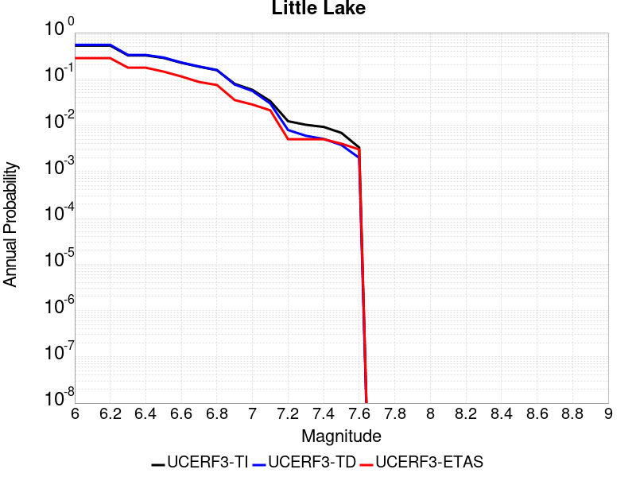 |
|-----|

| Magnitude | UCERF3-TI Prob | UCERF3-TD Prob | UCERF3-ETAS Prob |
|-----|-----|-----|-----|
| 6.0 | 0.523641 | 0.54579383 | 0.2797753 |
| 6.1 | 0.523641 | 0.54579383 | 0.2797753 |
| 6.2 | 0.523641 | 0.54579383 | 0.2797753 |
| 6.3 | 0.3218384 | 0.32974488 | 0.16853933 |
| 6.4 | 0.3218384 | 0.32974488 | 0.16853933 |
| 6.5 | 0.28386164 | 0.29077917 | 0.14157303 |
| 6.6 | 0.22281215 | 0.2268872 | 0.11011236 |
| 6.7 | 0.18344335 | 0.18620671 | 0.08651686 |
| 6.8 | 0.15429576 | 0.15623322 | 0.073033705 |
| 6.9 | 0.078375176 | 0.0757221 | 0.033707865 |
| 7.0 | 0.05800967 | 0.054854803 | 0.028089888 |
| 7.1 | 0.033188317 | 0.029464498 | 0.020224718 |
| 7.2 | 0.012227922 | 0.007896983 | 0.0056179776 |
| 7.3 | 0.010234522 | 0.0059269457 | 0.0056179776 |
| 7.4 | 0.009211505 | 0.005068692 | 0.0056179776 |
| 7.5 | 0.0068520573 | 0.0037491946 | 0.004494382 |
| 7.6 | 0.0033076303 | 0.001977531 | 0.0033707866 |

## Little Salmon (Offshore)
*[(top)](#table-of-contents)*

| 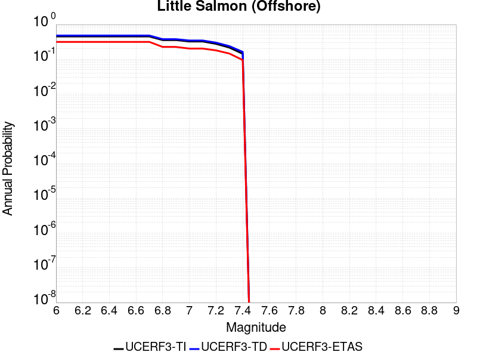 |
|-----|

| Magnitude | UCERF3-TI Prob | UCERF3-TD Prob | UCERF3-ETAS Prob |
|-----|-----|-----|-----|
| 6.0 | 0.45196632 | 0.48159364 | 0.31460676 |
| 6.1 | 0.45196632 | 0.48159364 | 0.31460676 |
| 6.2 | 0.45196632 | 0.48159364 | 0.31460676 |
| 6.3 | 0.45196632 | 0.48159364 | 0.31460676 |
| 6.4 | 0.45196632 | 0.48159364 | 0.31460676 |
| 6.5 | 0.45196632 | 0.48159364 | 0.31460676 |
| 6.6 | 0.45196632 | 0.48159364 | 0.31460676 |
| 6.7 | 0.45196632 | 0.48159364 | 0.31460676 |
| 6.8 | 0.35552254 | 0.37798876 | 0.22921348 |
| 6.9 | 0.35552254 | 0.37798876 | 0.22921348 |
| 7.0 | 0.32475516 | 0.34668222 | 0.20786516 |
| 7.1 | 0.32475516 | 0.34668222 | 0.20786516 |
| 7.2 | 0.27696344 | 0.3008482 | 0.18539326 |
| 7.3 | 0.21666631 | 0.23848137 | 0.1494382 |
| 7.4 | 0.1435946 | 0.16291957 | 0.09775281 |

## Little Salmon (Onshore)
*[(top)](#table-of-contents)*

| 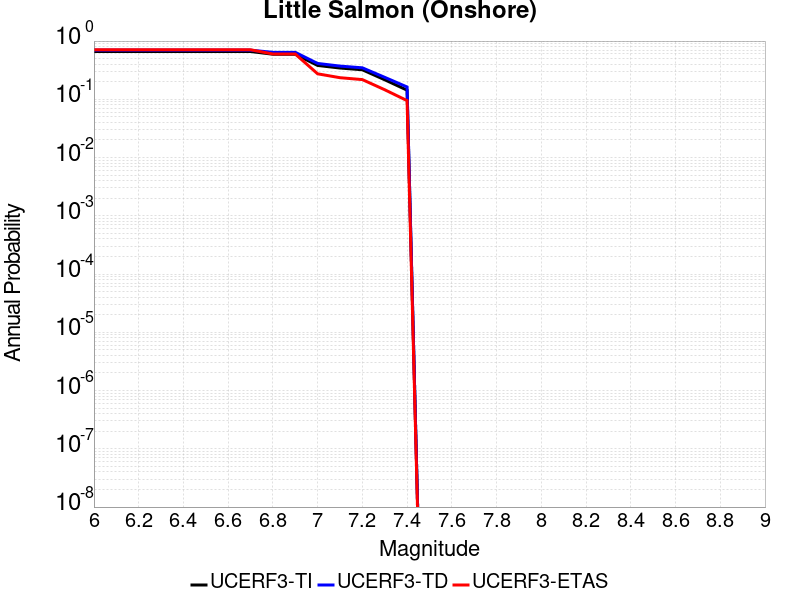 |
|-----|

| Magnitude | UCERF3-TI Prob | UCERF3-TD Prob | UCERF3-ETAS Prob |
|-----|-----|-----|-----|
| 6.0 | 0.66205555 | 0.6973966 | 0.70449436 |
| 6.1 | 0.66205555 | 0.6973966 | 0.70449436 |
| 6.2 | 0.66205555 | 0.6973966 | 0.70449436 |
| 6.3 | 0.66205555 | 0.6973966 | 0.70449436 |
| 6.4 | 0.66205555 | 0.6973966 | 0.70449436 |
| 6.5 | 0.66205555 | 0.6973966 | 0.70449436 |
| 6.6 | 0.66205555 | 0.6973966 | 0.70449436 |
| 6.7 | 0.66205555 | 0.6973966 | 0.70449436 |
| 6.8 | 0.5946124 | 0.64074165 | 0.59213483 |
| 6.9 | 0.5946124 | 0.64074165 | 0.59213483 |
| 7.0 | 0.38142362 | 0.4128691 | 0.27752808 |
| 7.1 | 0.344403 | 0.37183845 | 0.23820224 |
| 7.2 | 0.32153618 | 0.34730682 | 0.2235955 |
| 7.3 | 0.21666631 | 0.23848137 | 0.1494382 |
| 7.4 | 0.1435946 | 0.16291957 | 0.09775281 |

## Los Alamos 2011 CFM
*[(top)](#table-of-contents)*

|  |
|-----|

| Magnitude | UCERF3-TI Prob | UCERF3-TD Prob | UCERF3-ETAS Prob |
|-----|-----|-----|-----|
| 6.0 | 0.11374718 | 0.11480043 | 0.1247191 |
| 6.1 | 0.11374718 | 0.11480043 | 0.1247191 |
| 6.2 | 0.11374718 | 0.11480043 | 0.1247191 |
| 6.3 | 0.11374718 | 0.11480043 | 0.1247191 |
| 6.4 | 0.11374718 | 0.11480043 | 0.1247191 |
| 6.5 | 0.11374718 | 0.11480043 | 0.1247191 |
| 6.6 | 0.11374718 | 0.11480043 | 0.1247191 |
| 6.7 | 0.1005603 | 0.101437405 | 0.111235954 |
| 6.8 | 0.1005603 | 0.101437405 | 0.111235954 |
| 6.9 | 0.08233971 | 0.08291931 | 0.09101123 |
| 7.0 | 0.07934655 | 0.079901814 | 0.08764045 |
| 7.1 | 0.07378457 | 0.07428968 | 0.0752809 |
| 7.2 | 0.050891913 | 0.050973404 | 0.043820225 |
| 7.3 | 0.04429129 | 0.044309918 | 0.037078653 |
| 7.4 | 0.040178843 | 0.04016005 | 0.029213483 |
| 7.5 | 0.035466306 | 0.03539998 | 0.025842696 |
| 7.6 | 0.027894093 | 0.027743097 | 0.016853932 |
| 7.7 | 0.014361898 | 0.014214791 | 0.006741573 |
| 7.8 | 0.0053878636 | 0.005285209 | 0.0033707866 |
| 7.9 | 0.0010383694 | 0.0010051468 | 0.002247191 |
| 8.0 | 2.0559496E-6 | 2.083285E-6 | 0.0 |

## Los Alamos extension
*[(top)](#table-of-contents)*

| 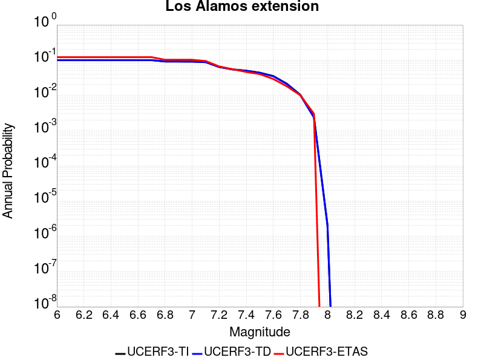 |
|-----|

| Magnitude | UCERF3-TI Prob | UCERF3-TD Prob | UCERF3-ETAS Prob |
|-----|-----|-----|-----|
| 6.0 | 0.099440984 | 0.099909455 | 0.12247191 |
| 6.1 | 0.099440984 | 0.099909455 | 0.12247191 |
| 6.2 | 0.099440984 | 0.099909455 | 0.12247191 |
| 6.3 | 0.099440984 | 0.099909455 | 0.12247191 |
| 6.4 | 0.099440984 | 0.099909455 | 0.12247191 |
| 6.5 | 0.099440984 | 0.099909455 | 0.12247191 |
| 6.6 | 0.099440984 | 0.099909455 | 0.12247191 |
| 6.7 | 0.099440984 | 0.099909455 | 0.12247191 |
| 6.8 | 0.09103347 | 0.09138757 | 0.10224719 |
| 6.9 | 0.09070526 | 0.09105626 | 0.10224719 |
| 7.0 | 0.09040207 | 0.09074991 | 0.10224719 |
| 7.1 | 0.08727181 | 0.0875867 | 0.094382025 |
| 7.2 | 0.06364196 | 0.06351856 | 0.062921345 |
| 7.3 | 0.05430042 | 0.05407437 | 0.05280899 |
| 7.4 | 0.049998682 | 0.049727555 | 0.043820225 |
| 7.5 | 0.04389324 | 0.043549225 | 0.03820225 |
| 7.6 | 0.03515553 | 0.03472874 | 0.028089888 |
| 7.7 | 0.0213513 | 0.020937283 | 0.016853932 |
| 7.8 | 0.010306132 | 0.010025125 | 0.008988764 |
| 7.9 | 0.002421418 | 0.0023428013 | 0.0033707866 |
| 8.0 | 2.0559496E-6 | 2.083285E-6 | 0.0 |

## Los Medanos - Roe Island
*[(top)](#table-of-contents)*

|  |
|-----|

| Magnitude | UCERF3-TI Prob | UCERF3-TD Prob | UCERF3-ETAS Prob |
|-----|-----|-----|-----|
| 6.0 | 0.023378722 | 0.024228862 | 0.010112359 |
| 6.1 | 0.023378722 | 0.024228862 | 0.010112359 |
| 6.2 | 0.023378722 | 0.024228862 | 0.010112359 |
| 6.3 | 0.023378722 | 0.024228862 | 0.010112359 |
| 6.4 | 0.023378722 | 0.024228862 | 0.010112359 |
| 6.5 | 0.023378722 | 0.024228862 | 0.010112359 |
| 6.6 | 0.023378722 | 0.024228862 | 0.010112359 |
| 6.7 | 0.023167823 | 0.024017682 | 0.010112359 |
| 6.8 | 0.022093697 | 0.022858426 | 0.010112359 |
| 6.9 | 0.020618722 | 0.021310315 | 0.010112359 |
| 7.0 | 0.017836284 | 0.01838654 | 0.007865168 |
| 7.1 | 0.0144356275 | 0.014859387 | 0.006741573 |
| 7.2 | 0.010586064 | 0.010865387 | 0.002247191 |
| 7.3 | 0.0069502774 | 0.0071317307 | 0.0011235955 |
| 7.4 | 0.0041270633 | 0.0042327363 | 0.0 |
| 7.5 | 0.0027813127 | 0.002854327 | 0.0 |
| 7.6 | 0.0016894753 | 0.0017380634 | 0.0 |
| 7.7 | 3.12622E-5 | 3.209415E-5 | 0.0 |

## Los Osos 2011
*[(top)](#table-of-contents)*

|  |
|-----|

| Magnitude | UCERF3-TI Prob | UCERF3-TD Prob | UCERF3-ETAS Prob |
|-----|-----|-----|-----|
| 6.0 | 0.11970948 | 0.1204934 | 0.07865169 |
| 6.1 | 0.11970948 | 0.1204934 | 0.07865169 |
| 6.2 | 0.11970948 | 0.1204934 | 0.07865169 |
| 6.3 | 0.11970948 | 0.1204934 | 0.07865169 |
| 6.4 | 0.11970948 | 0.1204934 | 0.07865169 |
| 6.5 | 0.07943341 | 0.07928566 | 0.04494382 |
| 6.6 | 0.07774715 | 0.07758217 | 0.04494382 |
| 6.7 | 0.06586352 | 0.06559435 | 0.030337078 |
| 6.8 | 0.062606044 | 0.06230875 | 0.028089888 |
| 6.9 | 0.054242756 | 0.053876966 | 0.023595506 |
| 7.0 | 0.049063236 | 0.04865924 | 0.02247191 |
| 7.1 | 0.041767113 | 0.04131071 | 0.017977528 |
| 7.2 | 0.036987927 | 0.03649809 | 0.016853932 |
| 7.3 | 0.030859036 | 0.030325778 | 0.014606741 |
| 7.4 | 0.02500876 | 0.024431998 | 0.007865168 |
| 7.5 | 0.01854472 | 0.017916411 | 0.007865168 |
| 7.6 | 0.011809673 | 0.011120887 | 0.004494382 |
| 7.7 | 0.0055088 | 0.0047548967 | 0.0 |
| 7.8 | 0.002572639 | 0.0017953131 | 0.0 |
| 7.9 | 0.0014182272 | 7.3339074E-4 | 0.0 |
| 8.0 | 4.7398292E-4 | 1.81417E-4 | 0.0 |

## Lost Hills
*[(top)](#table-of-contents)*

|  |
|-----|

| Magnitude | UCERF3-TI Prob | UCERF3-TD Prob | UCERF3-ETAS Prob |
|-----|-----|-----|-----|
| 6.0 | 0.44162068 | 0.4736812 | 0.34269664 |
| 6.1 | 0.44162068 | 0.4736812 | 0.34269664 |
| 6.2 | 0.44162068 | 0.4736812 | 0.34269664 |
| 6.3 | 0.44162068 | 0.4736812 | 0.34269664 |
| 6.4 | 0.2742789 | 0.29860452 | 0.20224719 |
| 6.5 | 0.2742789 | 0.29860452 | 0.20224719 |
| 6.6 | 0.20062119 | 0.22351183 | 0.14157303 |
| 6.7 | 0.17137854 | 0.1940791 | 0.12022472 |

## Ludlow
*[(top)](#table-of-contents)*

| 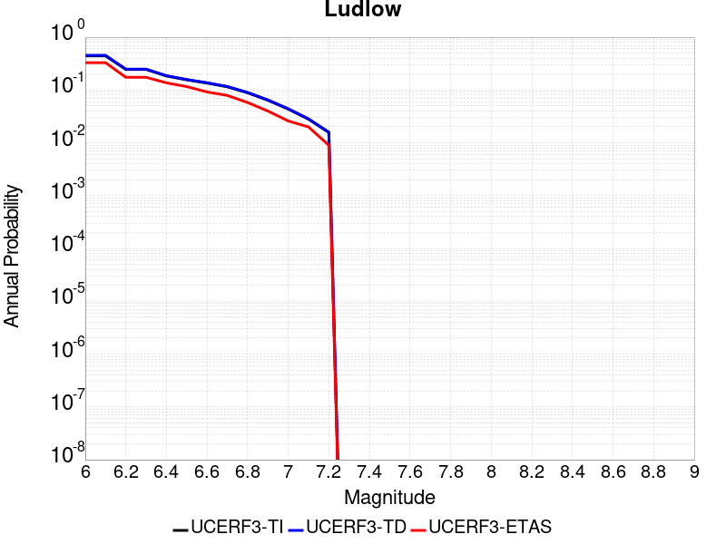 |
|-----|

| Magnitude | UCERF3-TI Prob | UCERF3-TD Prob | UCERF3-ETAS Prob |
|-----|-----|-----|-----|
| 6.0 | 0.44267404 | 0.4544248 | 0.3258427 |
| 6.1 | 0.44267404 | 0.4544248 | 0.3258427 |
| 6.2 | 0.24518055 | 0.24932043 | 0.1741573 |
| 6.3 | 0.24518055 | 0.24932043 | 0.1741573 |
| 6.4 | 0.18443483 | 0.18735965 | 0.13707866 |
| 6.5 | 0.15595151 | 0.15842018 | 0.11573034 |
| 6.6 | 0.13552718 | 0.13768916 | 0.09101123 |
| 6.7 | 0.11507417 | 0.11692044 | 0.07865169 |
| 6.8 | 0.088659465 | 0.09010288 | 0.056179777 |
| 6.9 | 0.063943945 | 0.06499921 | 0.039325844 |
| 7.0 | 0.043590497 | 0.04431589 | 0.0247191 |
| 7.1 | 0.028050553 | 0.028515507 | 0.017977528 |
| 7.2 | 0.015702942 | 0.015962126 | 0.010112359 |

## Maacama 2011 CFM
*[(top)](#table-of-contents)*

|  |
|-----|

| Magnitude | UCERF3-TI Prob | UCERF3-TD Prob | UCERF3-ETAS Prob |
|-----|-----|-----|-----|
| 6.0 | 0.9718382 | 0.8717433 | 0.89325845 |
| 6.1 | 0.9718382 | 0.8717433 | 0.89325845 |
| 6.2 | 0.9712846 | 0.8702253 | 0.89101124 |
| 6.3 | 0.95536816 | 0.84148675 | 0.8561798 |
| 6.4 | 0.9546882 | 0.84000295 | 0.852809 |
| 6.5 | 0.94257396 | 0.82166606 | 0.83370787 |
| 6.6 | 0.93544793 | 0.81142914 | 0.81685394 |
| 6.7 | 0.9212166 | 0.7917781 | 0.7921348 |
| 6.8 | 0.90369064 | 0.76921475 | 0.7617977 |
| 6.9 | 0.87062424 | 0.72829163 | 0.71348315 |
| 7.0 | 0.837388 | 0.69115263 | 0.6640449 |
| 7.1 | 0.79096365 | 0.6415178 | 0.6044944 |
| 7.2 | 0.73681575 | 0.5865357 | 0.54157305 |
| 7.3 | 0.66648406 | 0.51892775 | 0.45955056 |
| 7.4 | 0.5306387 | 0.4068037 | 0.33483145 |
| 7.5 | 0.029031077 | 0.028563224 | 0.02247191 |
| 7.6 | 0.0068989806 | 0.0067229643 | 0.006741573 |
| 7.7 | 0.0025346929 | 0.0024308066 | 0.0056179776 |
| 7.8 | 1.6158223E-4 | 1.4708705E-4 | 0.0011235955 |

## Mad River (alt1)
*[(top)](#table-of-contents)*

|  |
|-----|

| Magnitude | UCERF3-TI Prob | UCERF3-TD Prob | UCERF3-ETAS Prob |
|-----|-----|-----|-----|
| 6.0 | 0.2544568 | 0.26162857 | 0.20561798 |
| 6.1 | 0.2544568 | 0.26162857 | 0.20561798 |
| 6.2 | 0.2544568 | 0.26162857 | 0.20561798 |
| 6.3 | 0.2544568 | 0.26162857 | 0.20561798 |
| 6.4 | 0.2544568 | 0.26162857 | 0.20561798 |
| 6.5 | 0.2544568 | 0.26162857 | 0.20561798 |
| 6.6 | 0.2544568 | 0.26162857 | 0.20561798 |
| 6.7 | 0.16814688 | 0.17201327 | 0.11460674 |
| 6.8 | 0.16814688 | 0.17201327 | 0.11460674 |
| 6.9 | 0.16097611 | 0.16474138 | 0.10674157 |
| 7.0 | 0.16042033 | 0.16417664 | 0.10674157 |
| 7.1 | 0.1286502 | 0.1317813 | 0.08539326 |
| 7.2 | 0.10864814 | 0.11144173 | 0.06629214 |
| 7.3 | 0.085028075 | 0.08741505 | 0.04494382 |
| 7.4 | 0.0766597 | 0.07889795 | 0.037078653 |
| 7.5 | 0.067386195 | 0.06944644 | 0.03258427 |
| 7.6 | 0.047880035 | 0.049463104 | 0.019101124 |
| 7.7 | 0.016715746 | 0.017345406 | 0.006741573 |
| 7.8 | 0.007999505 | 0.008322644 | 0.002247191 |

## Malibu Coast (Extension) alt 1
*[(top)](#table-of-contents)*

| 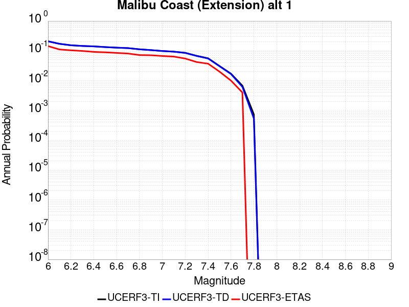 |
|-----|

| Magnitude | UCERF3-TI Prob | UCERF3-TD Prob | UCERF3-ETAS Prob |
|-----|-----|-----|-----|
| 6.0 | 0.20784453 | 0.20955417 | 0.14494382 |
| 6.1 | 0.17125459 | 0.17236404 | 0.11235955 |
| 6.2 | 0.15316139 | 0.1540089 | 0.104494385 |
| 6.3 | 0.14526398 | 0.14600848 | 0.1 |
| 6.4 | 0.14066112 | 0.14134298 | 0.093258426 |
| 6.5 | 0.1331501 | 0.13371159 | 0.09101123 |
| 6.6 | 0.12737441 | 0.12784232 | 0.08651686 |
| 6.7 | 0.123068295 | 0.12346582 | 0.08202247 |
| 6.8 | 0.112338424 | 0.11249024 | 0.073033705 |
| 6.9 | 0.10565948 | 0.105675004 | 0.07191011 |
| 7.0 | 0.09861253 | 0.09847793 | 0.06741573 |
| 7.1 | 0.09374646 | 0.09352382 | 0.064044945 |
| 7.2 | 0.085479654 | 0.08510221 | 0.056179777 |
| 7.3 | 0.06793567 | 0.06715783 | 0.04494382 |
| 7.4 | 0.056173384 | 0.055194825 | 0.040449437 |
| 7.5 | 0.030923855 | 0.03027475 | 0.021348314 |
| 7.6 | 0.01711191 | 0.01661641 | 0.011235955 |
| 7.7 | 0.006763449 | 0.0061579817 | 0.004494382 |
| 7.8 | 7.3865737E-4 | 5.3479295E-4 | 0.0 |

## Malibu Coast alt 1
*[(top)](#table-of-contents)*

|  |
|-----|

| Magnitude | UCERF3-TI Prob | UCERF3-TD Prob | UCERF3-ETAS Prob |
|-----|-----|-----|-----|
| 6.0 | 0.35103062 | 0.35531598 | 0.29101124 |
| 6.1 | 0.35103062 | 0.35531598 | 0.21797752 |
| 6.2 | 0.2511526 | 0.25067398 | 0.14606741 |
| 6.3 | 0.23381805 | 0.23279256 | 0.13707866 |
| 6.4 | 0.21068102 | 0.20887807 | 0.121348314 |
| 6.5 | 0.17998327 | 0.17722528 | 0.103370786 |
| 6.6 | 0.14243905 | 0.1383796 | 0.08089887 |
| 6.7 | 0.13741247 | 0.13323809 | 0.0764045 |
| 6.8 | 0.13415888 | 0.12991603 | 0.074157305 |
| 6.9 | 0.12908325 | 0.12471165 | 0.06966292 |
| 7.0 | 0.124737665 | 0.120266795 | 0.06741573 |
| 7.1 | 0.11878545 | 0.11416451 | 0.06516854 |
| 7.2 | 0.11182766 | 0.107032105 | 0.062921345 |
| 7.3 | 0.09424413 | 0.08918016 | 0.053932585 |
| 7.4 | 0.070645 | 0.06700695 | 0.04269663 |
| 7.5 | 0.046822842 | 0.044971947 | 0.028089888 |
| 7.6 | 0.029032024 | 0.027453527 | 0.017977528 |
| 7.7 | 0.013128003 | 0.011719991 | 0.010112359 |
| 7.8 | 0.0023330457 | 0.001815236 | 0.0011235955 |
| 7.9 | 2.0890639E-5 | 1.6283522E-5 | 0.0 |

## Manix-Afton Hills
*[(top)](#table-of-contents)*

|  |
|-----|

| Magnitude | UCERF3-TI Prob | UCERF3-TD Prob | UCERF3-ETAS Prob |
|-----|-----|-----|-----|
| 6.0 | 0.30204204 | 0.30999506 | 0.21235955 |
| 6.1 | 0.30204204 | 0.30999506 | 0.21235955 |
| 6.2 | 0.30204204 | 0.30999506 | 0.21235955 |
| 6.3 | 0.25044444 | 0.25660107 | 0.1719101 |
| 6.4 | 0.25044444 | 0.25660107 | 0.1719101 |
| 6.5 | 0.22538407 | 0.23107919 | 0.15168539 |
| 6.6 | 0.20534544 | 0.21073897 | 0.13932584 |
| 6.7 | 0.20516452 | 0.21055487 | 0.13932584 |
| 6.8 | 0.16473258 | 0.16947588 | 0.11460674 |
| 6.9 | 0.120756716 | 0.12437105 | 0.08651686 |
| 7.0 | 0.08364036 | 0.086257584 | 0.053932585 |
| 7.1 | 0.031008165 | 0.032037493 | 0.016853932 |

## McKinleyville (alt1)
*[(top)](#table-of-contents)*

|  |
|-----|

| Magnitude | UCERF3-TI Prob | UCERF3-TD Prob | UCERF3-ETAS Prob |
|-----|-----|-----|-----|
| 6.0 | 0.25003436 | 0.2590104 | 0.2483146 |
| 6.1 | 0.25003436 | 0.2590104 | 0.2483146 |
| 6.2 | 0.25003436 | 0.2590104 | 0.2483146 |
| 6.3 | 0.25003436 | 0.2590104 | 0.2483146 |
| 6.4 | 0.25003436 | 0.2590104 | 0.2483146 |
| 6.5 | 0.25003436 | 0.2590104 | 0.2483146 |
| 6.6 | 0.25003436 | 0.2590104 | 0.2483146 |
| 6.7 | 0.15561534 | 0.15973909 | 0.11235955 |
| 6.8 | 0.15561534 | 0.15973909 | 0.11235955 |
| 6.9 | 0.10002239 | 0.102210775 | 0.058426965 |
| 7.0 | 0.09389022 | 0.095993 | 0.05280899 |
| 7.1 | 0.09143592 | 0.09350888 | 0.05280899 |
| 7.2 | 0.075683415 | 0.07748832 | 0.031460673 |
| 7.3 | 0.058428098 | 0.059926685 | 0.02247191 |
| 7.4 | 0.052247383 | 0.053636163 | 0.017977528 |
| 7.5 | 0.045065533 | 0.04631175 | 0.017977528 |
| 7.6 | 0.0332069 | 0.03418371 | 0.01235955 |
| 7.7 | 0.015033923 | 0.015512185 | 0.007865168 |
| 7.8 | 0.0041970243 | 0.004347249 | 0.002247191 |

## McLean Lake
*[(top)](#table-of-contents)*

| 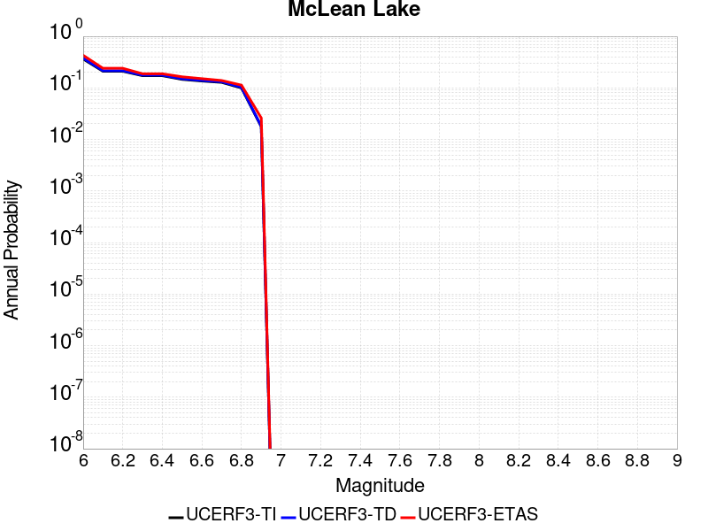 |
|-----|

| Magnitude | UCERF3-TI Prob | UCERF3-TD Prob | UCERF3-ETAS Prob |
|-----|-----|-----|-----|
| 6.0 | 0.3642308 | 0.3776292 | 0.4258427 |
| 6.1 | 0.21056688 | 0.21552867 | 0.24157304 |
| 6.2 | 0.21056688 | 0.21552867 | 0.24157304 |
| 6.3 | 0.17249899 | 0.17659716 | 0.19101124 |
| 6.4 | 0.17249899 | 0.17659716 | 0.19101124 |
| 6.5 | 0.14636655 | 0.14999087 | 0.16853933 |
| 6.6 | 0.13590075 | 0.13937633 | 0.15505618 |
| 6.7 | 0.1279345 | 0.13130325 | 0.14269663 |
| 6.8 | 0.09964277 | 0.10256197 | 0.11573034 |
| 6.9 | 0.017676475 | 0.01798723 | 0.023595506 |

## Mendocino
*[(top)](#table-of-contents)*

| 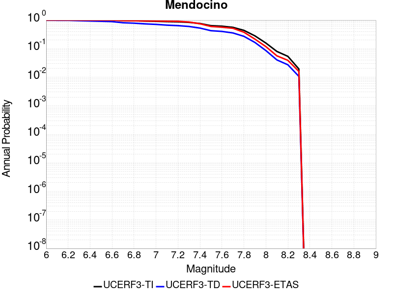 |
|-----|

| Magnitude | UCERF3-TI Prob | UCERF3-TD Prob | UCERF3-ETAS Prob |
|-----|-----|-----|-----|
| 6.0 | 0.99999946 | 0.99475497 | 1.0 |
| 6.1 | 0.9999848 | 0.9790696 | 1.0 |
| 6.2 | 0.9999848 | 0.9790696 | 1.0 |
| 6.3 | 0.9998068 | 0.9524754 | 1.0 |
| 6.4 | 0.9992182 | 0.93035376 | 0.9988764 |
| 6.5 | 0.9980854 | 0.9092127 | 0.99662924 |
| 6.6 | 0.9958534 | 0.8872614 | 0.994382 |
| 6.7 | 0.96258277 | 0.8079618 | 0.95730335 |
| 6.8 | 0.94846886 | 0.7824294 | 0.94494385 |
| 6.9 | 0.9249788 | 0.7385508 | 0.9314607 |
| 7.0 | 0.90855414 | 0.7085047 | 0.9235955 |
| 7.1 | 0.8848701 | 0.6668231 | 0.90786517 |
| 7.2 | 0.8701927 | 0.64020437 | 0.9 |
| 7.3 | 0.8342155 | 0.59893364 | 0.8516854 |
| 7.4 | 0.7612413 | 0.52603376 | 0.74269664 |
| 7.5 | 0.6394822 | 0.426422 | 0.5898876 |
| 7.6 | 0.6132355 | 0.40178856 | 0.558427 |
| 7.7 | 0.558288 | 0.35495132 | 0.51123595 |
| 7.8 | 0.43807203 | 0.27031273 | 0.3730337 |
| 7.9 | 0.2809203 | 0.16513027 | 0.21348314 |
| 8.0 | 0.15718937 | 0.085724145 | 0.11460674 |
| 8.1 | 0.07989597 | 0.040329173 | 0.050561797 |
| 8.2 | 0.053792253 | 0.027248306 | 0.03483146 |
| 8.3 | 0.019471124 | 0.010702377 | 0.015730336 |

## Mission (connected) 2011 CFM
*[(top)](#table-of-contents)*

|  |
|-----|

| Magnitude | UCERF3-TI Prob | UCERF3-TD Prob | UCERF3-ETAS Prob |
|-----|-----|-----|-----|
| 6.0 | 0.38663942 | 0.31905997 | 0.5011236 |
| 6.1 | 0.36680886 | 0.2963829 | 0.38089886 |
| 6.2 | 0.34956926 | 0.27676955 | 0.35505617 |
| 6.3 | 0.32788566 | 0.25380656 | 0.3213483 |
| 6.4 | 0.3138254 | 0.24194148 | 0.305618 |
| 6.5 | 0.2878714 | 0.22336467 | 0.27752808 |
| 6.6 | 0.2537855 | 0.1938988 | 0.23820224 |
| 6.7 | 0.19019578 | 0.13867782 | 0.16067415 |
| 6.8 | 0.16335154 | 0.116369665 | 0.12921348 |
| 6.9 | 0.12804231 | 0.08884641 | 0.09101123 |
| 7.0 | 0.1098504 | 0.07486245 | 0.0764045 |
| 7.1 | 0.10259807 | 0.069243066 | 0.06966292 |
| 7.2 | 0.05610665 | 0.039881807 | 0.03483146 |
| 7.3 | 0.04428745 | 0.031152513 | 0.031460673 |
| 7.4 | 0.029882137 | 0.020882184 | 0.017977528 |
| 7.5 | 0.01440369 | 0.0090118535 | 0.008988764 |
| 7.6 | 0.011493 | 0.006606408 | 0.006741573 |
| 7.7 | 0.009449276 | 0.0054132887 | 0.004494382 |
| 7.8 | 0.008094642 | 0.0047989385 | 0.004494382 |
| 7.9 | 0.004694401 | 0.002538734 | 0.002247191 |
| 8.0 | 0.0024179842 | 0.0014862611 | 0.002247191 |
| 8.1 | 0.0015446999 | 9.949661E-4 | 0.0011235955 |

## Mission Creek
*[(top)](#table-of-contents)*

| 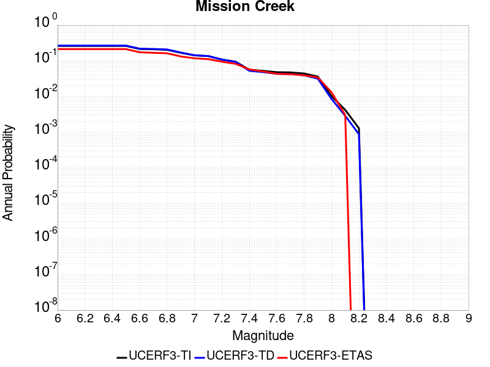 |
|-----|

| Magnitude | UCERF3-TI Prob | UCERF3-TD Prob | UCERF3-ETAS Prob |
|-----|-----|-----|-----|
| 6.0 | 0.26015678 | 0.26625288 | 0.20898877 |
| 6.1 | 0.26015678 | 0.26625288 | 0.20898877 |
| 6.2 | 0.26015678 | 0.26625288 | 0.20898877 |
| 6.3 | 0.26015678 | 0.26625288 | 0.20898877 |
| 6.4 | 0.26015678 | 0.26625288 | 0.20898877 |
| 6.5 | 0.26015678 | 0.26625288 | 0.20898877 |
| 6.6 | 0.21344487 | 0.21792263 | 0.17078651 |
| 6.7 | 0.20966993 | 0.21409881 | 0.16516854 |
| 6.8 | 0.20251153 | 0.20677468 | 0.16067415 |
| 6.9 | 0.16696905 | 0.17024149 | 0.13146068 |
| 7.0 | 0.14146677 | 0.14254752 | 0.11573034 |
| 7.1 | 0.13473414 | 0.13558313 | 0.11011236 |
| 7.2 | 0.10809368 | 0.10736954 | 0.093258426 |
| 7.3 | 0.094120026 | 0.09271839 | 0.08089887 |
| 7.4 | 0.055737175 | 0.05211899 | 0.056179777 |
| 7.5 | 0.052125584 | 0.04800293 | 0.0494382 |
| 7.6 | 0.047699098 | 0.04305649 | 0.04269663 |
| 7.7 | 0.046900064 | 0.042231843 | 0.041573033 |
| 7.8 | 0.043867342 | 0.039090082 | 0.03820225 |
| 7.9 | 0.035954196 | 0.03141594 | 0.033707865 |
| 8.0 | 0.010205568 | 0.008478843 | 0.01235955 |
| 8.1 | 0.004157254 | 0.0028429027 | 0.0033707866 |
| 8.2 | 0.0012776374 | 8.6848286E-4 | 0.0 |

## Mission Hills 2011
*[(top)](#table-of-contents)*

|  |
|-----|

| Magnitude | UCERF3-TI Prob | UCERF3-TD Prob | UCERF3-ETAS Prob |
|-----|-----|-----|-----|
| 6.0 | 0.38712162 | 0.4479637 | 0.21797752 |
| 6.1 | 0.38712162 | 0.4479637 | 0.21797752 |
| 6.2 | 0.38712162 | 0.4479637 | 0.21797752 |
| 6.3 | 0.38712162 | 0.4479637 | 0.21797752 |
| 6.4 | 0.11231051 | 0.11542849 | 0.047191013 |
| 6.5 | 0.11231051 | 0.11542849 | 0.047191013 |
| 6.6 | 0.11231051 | 0.11542849 | 0.047191013 |
| 6.7 | 0.058895804 | 0.059111312 | 0.025842696 |
| 6.8 | 0.051650956 | 0.051652916 | 0.023595506 |
| 6.9 | 0.03381701 | 0.033137325 | 0.015730336 |
| 7.0 | 0.032656174 | 0.031958535 | 0.015730336 |
| 7.1 | 0.030983757 | 0.030256175 | 0.015730336 |
| 7.2 | 0.023476446 | 0.022594646 | 0.008988764 |
| 7.3 | 0.018149098 | 0.017172907 | 0.007865168 |
| 7.4 | 0.013963882 | 0.01293668 | 0.007865168 |
| 7.5 | 0.007555663 | 0.0066097165 | 0.004494382 |
| 7.6 | 0.0044003385 | 0.003711368 | 0.0 |
| 7.7 | 0.0018683517 | 0.0014987076 | 0.0 |
| 7.8 | 0.0017110617 | 0.0013464261 | 0.0 |
| 7.9 | 2.6161713E-4 | 1.8754971E-4 | 0.0 |

## Mission Ridge-Arroyo Parida-Santa Ana
*[(top)](#table-of-contents)*

| 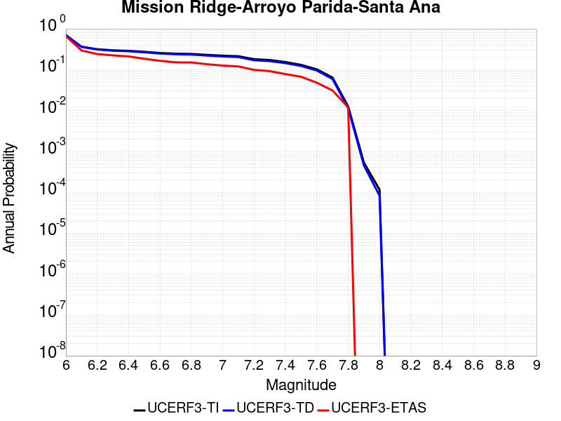 |
|-----|

| Magnitude | UCERF3-TI Prob | UCERF3-TD Prob | UCERF3-ETAS Prob |
|-----|-----|-----|-----|
| 6.0 | 0.66300726 | 0.7097404 | 0.6640449 |
| 6.1 | 0.36458036 | 0.36054206 | 0.29662922 |
| 6.2 | 0.31715342 | 0.31140772 | 0.23820224 |
| 6.3 | 0.29782718 | 0.29138565 | 0.2235955 |
| 6.4 | 0.28944767 | 0.28270537 | 0.21011236 |
| 6.5 | 0.27359617 | 0.26625833 | 0.18314607 |
| 6.6 | 0.25634164 | 0.24829155 | 0.16404495 |
| 6.7 | 0.2468106 | 0.2384679 | 0.1494382 |
| 6.8 | 0.24291468 | 0.2344245 | 0.14831461 |
| 6.9 | 0.23041427 | 0.22134836 | 0.13707866 |
| 7.0 | 0.22029582 | 0.21080244 | 0.1269663 |
| 7.1 | 0.21354148 | 0.2038043 | 0.121348314 |
| 7.2 | 0.1806739 | 0.1699352 | 0.0988764 |
| 7.3 | 0.17233633 | 0.1620458 | 0.09213483 |
| 7.4 | 0.15355523 | 0.14465463 | 0.07752809 |
| 7.5 | 0.13093321 | 0.122957624 | 0.06741573 |
| 7.6 | 0.10207839 | 0.09551995 | 0.0494382 |
| 7.7 | 0.064135544 | 0.059258666 | 0.03258427 |
| 7.8 | 0.012601485 | 0.011353955 | 0.013483146 |
| 7.9 | 5.3397065E-4 | 4.5667737E-4 | 0.0 |
| 8.0 | 1.15923154E-4 | 8.243185E-5 | 0.0 |

## Mohawk Valley 2011 CFM
*[(top)](#table-of-contents)*

|  |
|-----|

| Magnitude | UCERF3-TI Prob | UCERF3-TD Prob | UCERF3-ETAS Prob |
|-----|-----|-----|-----|
| 6.0 | 0.48487183 | 0.5071226 | 0.2797753 |
| 6.1 | 0.48487183 | 0.5071226 | 0.2797753 |
| 6.2 | 0.48487183 | 0.5071226 | 0.2797753 |
| 6.3 | 0.48487183 | 0.5071226 | 0.2797753 |
| 6.4 | 0.2652208 | 0.27304587 | 0.14606741 |
| 6.5 | 0.2652208 | 0.27304587 | 0.14606741 |
| 6.6 | 0.21629946 | 0.22291975 | 0.113483146 |
| 6.7 | 0.1683573 | 0.1737173 | 0.094382025 |
| 6.8 | 0.1178587 | 0.12178246 | 0.05955056 |
| 6.9 | 0.085272916 | 0.08838589 | 0.05280899 |
| 7.0 | 0.06380569 | 0.06639545 | 0.03820225 |

## Mono Lake 2011 CFM
*[(top)](#table-of-contents)*

| 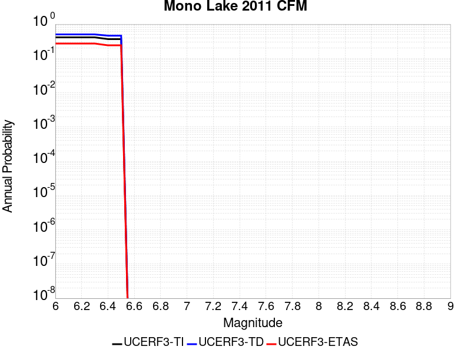 |
|-----|

| Magnitude | UCERF3-TI Prob | UCERF3-TD Prob | UCERF3-ETAS Prob |
|-----|-----|-----|-----|
| 6.0 | 0.41180977 | 0.5015747 | 0.27415732 |
| 6.1 | 0.41180977 | 0.5015747 | 0.27415732 |
| 6.2 | 0.41180977 | 0.5015747 | 0.27415732 |
| 6.3 | 0.41180977 | 0.5015747 | 0.27415732 |
| 6.4 | 0.36651555 | 0.46197432 | 0.24382022 |
| 6.5 | 0.36651555 | 0.46197432 | 0.24382022 |

## Monte Vista - Shannon 2011 CFM
*[(top)](#table-of-contents)*

| 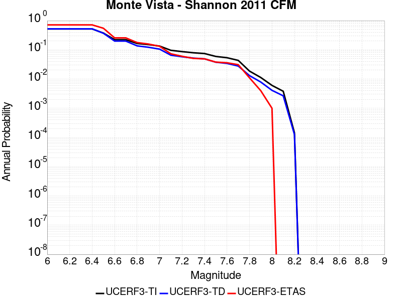 |
|-----|

| Magnitude | UCERF3-TI Prob | UCERF3-TD Prob | UCERF3-ETAS Prob |
|-----|-----|-----|-----|
| 6.0 | 0.5171756 | 0.5230946 | 0.7213483 |
| 6.1 | 0.5171756 | 0.5230946 | 0.7213483 |
| 6.2 | 0.5171756 | 0.5230946 | 0.7213483 |
| 6.3 | 0.5171756 | 0.5230946 | 0.7213483 |
| 6.4 | 0.5171756 | 0.5230946 | 0.7213483 |
| 6.5 | 0.3745951 | 0.36902434 | 0.5539326 |
| 6.6 | 0.22257915 | 0.19914313 | 0.25842696 |
| 6.7 | 0.22213022 | 0.1987177 | 0.25842696 |
| 6.8 | 0.16447179 | 0.1366927 | 0.17977528 |
| 6.9 | 0.15095122 | 0.12251053 | 0.16067415 |
| 7.0 | 0.13439555 | 0.10558132 | 0.13258427 |
| 7.1 | 0.096257776 | 0.065617986 | 0.073033705 |
| 7.2 | 0.08682386 | 0.05788975 | 0.058426965 |
| 7.3 | 0.07933274 | 0.052089933 | 0.048314605 |
| 7.4 | 0.074577875 | 0.049094055 | 0.046067417 |
| 7.5 | 0.05937688 | 0.037675153 | 0.035955057 |
| 7.6 | 0.053629424 | 0.03425125 | 0.033707865 |
| 7.7 | 0.043438744 | 0.027817143 | 0.030337078 |
| 7.8 | 0.018688116 | 0.013101184 | 0.008988764 |
| 7.9 | 0.011307501 | 0.007899403 | 0.002247191 |
| 8.0 | 0.0060649095 | 0.004107412 | 0.0 |
| 8.1 | 0.003818023 | 0.0026678317 | 0.0 |
| 8.2 | 1.4330281E-4 | 1.2622912E-4 | 0.0 |

## Monterey Bay-Tularcitos
*[(top)](#table-of-contents)*

| 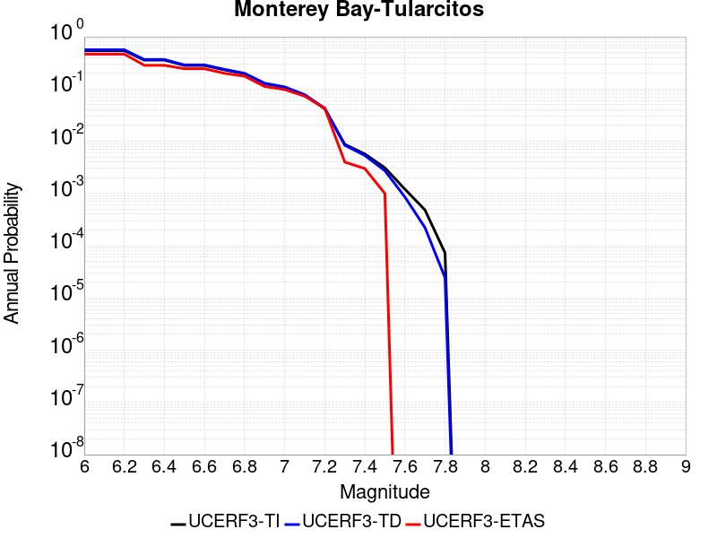 |
|-----|

| Magnitude | UCERF3-TI Prob | UCERF3-TD Prob | UCERF3-ETAS Prob |
|-----|-----|-----|-----|
| 6.0 | 0.5443898 | 0.5644639 | 0.45842695 |
| 6.1 | 0.5443898 | 0.5644639 | 0.45842695 |
| 6.2 | 0.5443898 | 0.5644639 | 0.45842695 |
| 6.3 | 0.35819831 | 0.36714995 | 0.2797753 |
| 6.4 | 0.35819831 | 0.36714995 | 0.2797753 |
| 6.5 | 0.28291744 | 0.2895663 | 0.23932584 |
| 6.6 | 0.28277418 | 0.289423 | 0.23932584 |
| 6.7 | 0.23284878 | 0.23814806 | 0.19438203 |
| 6.8 | 0.19574812 | 0.20016891 | 0.17078651 |
| 6.9 | 0.12671968 | 0.12942913 | 0.113483146 |
| 7.0 | 0.10750412 | 0.10981678 | 0.101123594 |
| 7.1 | 0.07624438 | 0.077911176 | 0.07752809 |
| 7.2 | 0.041942406 | 0.04281536 | 0.043820225 |
| 7.3 | 0.008719525 | 0.008384038 | 0.0033707866 |
| 7.4 | 0.005716325 | 0.005352684 | 0.002247191 |
| 7.5 | 0.0031112898 | 0.0027319414 | 0.0011235955 |
| 7.6 | 0.0012087834 | 8.560771E-4 | 0.0 |
| 7.7 | 4.84845E-4 | 2.226367E-4 | 0.0 |
| 7.8 | 7.294339E-5 | 2.4525287E-5 | 0.0 |

## Morales (East)
*[(top)](#table-of-contents)*

| 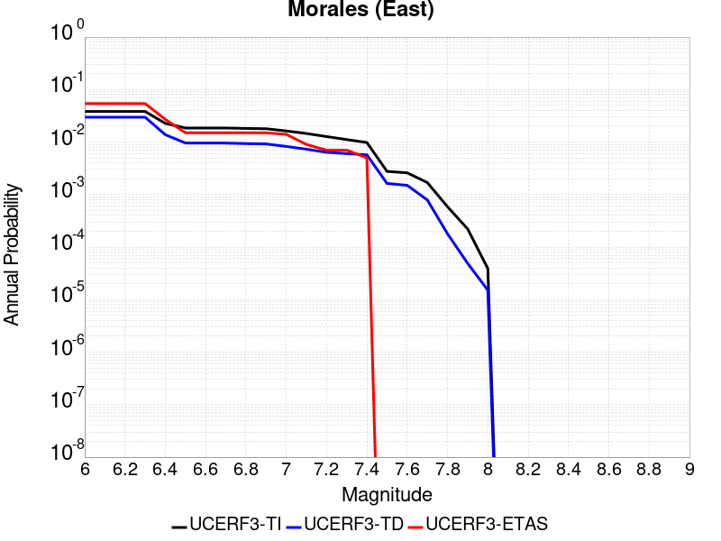 |
|-----|

| Magnitude | UCERF3-TI Prob | UCERF3-TD Prob | UCERF3-ETAS Prob |
|-----|-----|-----|-----|
| 6.0 | 0.03823453 | 0.029663218 | 0.05280899 |
| 6.1 | 0.03823453 | 0.029663218 | 0.05280899 |
| 6.2 | 0.03823453 | 0.029663218 | 0.05280899 |
| 6.3 | 0.03823453 | 0.029663218 | 0.05280899 |
| 6.4 | 0.022694094 | 0.013805224 | 0.025842696 |
| 6.5 | 0.018545398 | 0.009598239 | 0.014606741 |
| 6.6 | 0.018545398 | 0.009598239 | 0.014606741 |
| 6.7 | 0.018504132 | 0.0095650805 | 0.014606741 |
| 6.8 | 0.018179249 | 0.009341383 | 0.014606741 |
| 6.9 | 0.01794701 | 0.009201075 | 0.014606741 |
| 7.0 | 0.01628453 | 0.008259249 | 0.013483146 |
| 7.1 | 0.014555464 | 0.0073204767 | 0.007865168 |
| 7.2 | 0.012729279 | 0.0063718404 | 0.006741573 |
| 7.3 | 0.011150143 | 0.006024201 | 0.006741573 |
| 7.4 | 0.009798602 | 0.005713623 | 0.004494382 |
| 7.5 | 0.0027624848 | 0.0016281018 | 0.0 |
| 7.6 | 0.0025952198 | 0.0015011037 | 0.0 |
| 7.7 | 0.001694228 | 7.890843E-4 | 0.0 |
| 7.8 | 5.8728305E-4 | 1.7930286E-4 | 0.0 |
| 7.9 | 2.2155237E-4 | 4.8910373E-5 | 0.0 |
| 8.0 | 3.90597E-5 | 1.5129618E-5 | 0.0 |

## Morales (West)
*[(top)](#table-of-contents)*

|  |
|-----|

| Magnitude | UCERF3-TI Prob | UCERF3-TD Prob | UCERF3-ETAS Prob |
|-----|-----|-----|-----|
| 6.0 | 0.035934128 | 0.03375726 | 0.029213483 |
| 6.1 | 0.035934128 | 0.03375726 | 0.029213483 |
| 6.2 | 0.035934128 | 0.03375726 | 0.029213483 |
| 6.3 | 0.035934128 | 0.03375726 | 0.029213483 |
| 6.4 | 0.016826611 | 0.014371384 | 0.014606741 |
| 6.5 | 0.016826611 | 0.014371384 | 0.014606741 |
| 6.6 | 0.015032405 | 0.01256731 | 0.014606741 |
| 6.7 | 0.0148674045 | 0.012401504 | 0.014606741 |
| 6.8 | 0.013730694 | 0.011410183 | 0.014606741 |
| 6.9 | 0.012506454 | 0.010288215 | 0.014606741 |
| 7.0 | 0.011223941 | 0.0091287745 | 0.013483146 |
| 7.1 | 0.009706991 | 0.007867358 | 0.013483146 |
| 7.2 | 0.008208396 | 0.0065089073 | 0.01235955 |
| 7.3 | 0.0058990046 | 0.0046550203 | 0.008988764 |
| 7.4 | 0.003202677 | 0.0019338198 | 0.006741573 |
| 7.5 | 0.0025959667 | 0.001294489 | 0.006741573 |
| 7.6 | 0.0021177423 | 8.4604183E-4 | 0.004494382 |
| 7.7 | 0.0013507927 | 2.2399535E-4 | 0.004494382 |
| 7.8 | 6.8630505E-4 | 2.3735272E-5 | 0.002247191 |
| 7.9 | 3.241891E-4 | 3.5112116E-6 | 0.0 |
| 8.0 | 1.5532914E-4 | 2.255353E-6 | 0.0 |
| 8.1 | 3.283612E-5 | 1.6216289E-6 | 0.0 |

## Mount Diablo Thrust North CFM
*[(top)](#table-of-contents)*

|  |
|-----|

| Magnitude | UCERF3-TI Prob | UCERF3-TD Prob | UCERF3-ETAS Prob |
|-----|-----|-----|-----|
| 6.0 | 0.320248 | 0.33606946 | 0.19887641 |
| 6.1 | 0.320248 | 0.33606946 | 0.19887641 |
| 6.2 | 0.320248 | 0.33606946 | 0.19887641 |
| 6.3 | 0.320248 | 0.33606946 | 0.19887641 |
| 6.4 | 0.320248 | 0.33606946 | 0.19887641 |
| 6.5 | 0.320248 | 0.33606946 | 0.19887641 |
| 6.6 | 0.32013944 | 0.33596072 | 0.19887641 |
| 6.7 | 0.32013944 | 0.33596072 | 0.19887641 |
| 6.8 | 0.31981134 | 0.33562976 | 0.19887641 |
| 6.9 | 0.2791877 | 0.2917062 | 0.16292135 |
| 7.0 | 0.23315513 | 0.24334605 | 0.12584269 |
| 7.1 | 0.19676475 | 0.20537062 | 0.09662921 |
| 7.2 | 0.14545159 | 0.15249568 | 0.06853933 |
| 7.3 | 0.08033515 | 0.083608486 | 0.035955057 |
| 7.4 | 0.055882636 | 0.05779957 | 0.02247191 |
| 7.5 | 0.04803711 | 0.049681492 | 0.021348314 |
| 7.6 | 0.03337881 | 0.034634817 | 0.011235955 |
| 7.7 | 0.00935692 | 0.009929791 | 0.0033707866 |

## Mount Diablo Thrust South
*[(top)](#table-of-contents)*

| 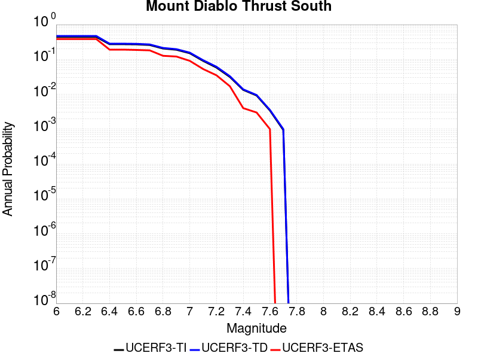 |
|-----|

| Magnitude | UCERF3-TI Prob | UCERF3-TD Prob | UCERF3-ETAS Prob |
|-----|-----|-----|-----|
| 6.0 | 0.4422353 | 0.4716162 | 0.3752809 |
| 6.1 | 0.4422353 | 0.4716162 | 0.3752809 |
| 6.2 | 0.4422353 | 0.4716162 | 0.3752809 |
| 6.3 | 0.4422353 | 0.4716162 | 0.3752809 |
| 6.4 | 0.273149 | 0.28298622 | 0.18651685 |
| 6.5 | 0.273149 | 0.28298622 | 0.18651685 |
| 6.6 | 0.270102 | 0.28002405 | 0.18202247 |
| 6.7 | 0.25919184 | 0.2692937 | 0.17752808 |
| 6.8 | 0.20557708 | 0.21360853 | 0.12022472 |
| 6.9 | 0.18937056 | 0.1970402 | 0.11460674 |
| 7.0 | 0.15062425 | 0.15670386 | 0.083146065 |
| 7.1 | 0.09079918 | 0.095027044 | 0.048314605 |
| 7.2 | 0.058324784 | 0.06150557 | 0.033707865 |
| 7.3 | 0.031429708 | 0.033026837 | 0.015730336 |
| 7.4 | 0.013372163 | 0.013837925 | 0.0033707866 |
| 7.5 | 0.009226421 | 0.009527714 | 0.002247191 |
| 7.6 | 0.0034181245 | 0.003545765 | 0.0 |
| 7.7 | 9.438044E-4 | 0.0010001983 | 0.0 |

## Nelson Lake
*[(top)](#table-of-contents)*

|  |
|-----|

| Magnitude | UCERF3-TI Prob | UCERF3-TD Prob | UCERF3-ETAS Prob |
|-----|-----|-----|-----|
| 6.0 | 0.22789614 | 0.23171295 | 0.29101124 |
| 6.1 | 0.22789614 | 0.23171295 | 0.29101124 |
| 6.2 | 0.112154946 | 0.11339287 | 0.14382023 |
| 6.3 | 0.112154946 | 0.11339287 | 0.14382023 |
| 6.4 | 0.084944725 | 0.085907035 | 0.113483146 |
| 6.5 | 0.071301304 | 0.072149105 | 0.09550562 |
| 6.6 | 0.057048626 | 0.057768766 | 0.0764045 |
| 6.7 | 0.04814229 | 0.048787437 | 0.06629214 |
| 6.8 | 0.038064 | 0.03861272 | 0.051685393 |
| 6.9 | 0.017676475 | 0.01798723 | 0.023595506 |

## Newport-Inglewood (Offshore)
*[(top)](#table-of-contents)*

| 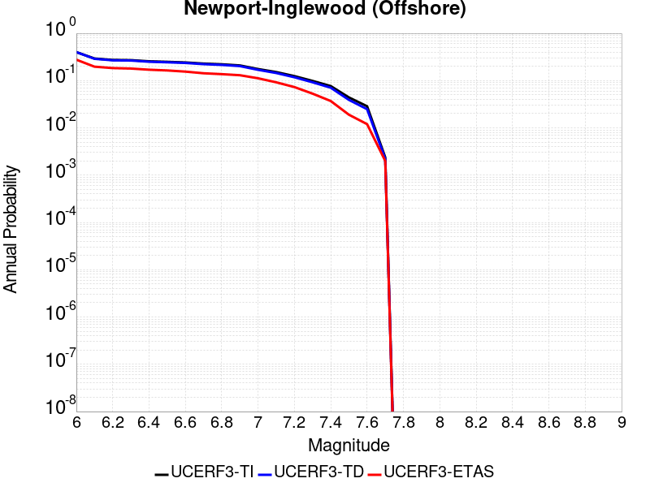 |
|-----|

| Magnitude | UCERF3-TI Prob | UCERF3-TD Prob | UCERF3-ETAS Prob |
|-----|-----|-----|-----|
| 6.0 | 0.40073213 | 0.40067554 | 0.2764045 |
| 6.1 | 0.29353514 | 0.28912508 | 0.19438203 |
| 6.2 | 0.2735735 | 0.26854226 | 0.18202247 |
| 6.3 | 0.27082792 | 0.2657063 | 0.17752808 |
| 6.4 | 0.25627407 | 0.25072646 | 0.16629213 |
| 6.5 | 0.24963993 | 0.24389786 | 0.16067415 |
| 6.6 | 0.2422889 | 0.23632886 | 0.15168539 |
| 6.7 | 0.22919697 | 0.22285827 | 0.13932584 |
| 6.8 | 0.22146389 | 0.21492554 | 0.13258427 |
| 6.9 | 0.20928735 | 0.20264478 | 0.1247191 |
| 7.0 | 0.17571963 | 0.16905539 | 0.10674157 |
| 7.1 | 0.1515575 | 0.14480478 | 0.08764045 |
| 7.2 | 0.12450721 | 0.11771577 | 0.06966292 |
| 7.3 | 0.098516 | 0.0921603 | 0.0494382 |
| 7.4 | 0.07665365 | 0.07073087 | 0.03258427 |
| 7.5 | 0.04407877 | 0.039114628 | 0.017977528 |
| 7.6 | 0.0286868 | 0.024908723 | 0.011235955 |
| 7.7 | 0.002375987 | 0.002206158 | 0.002247191 |

## Newport-Inglewood alt 1
*[(top)](#table-of-contents)*

| 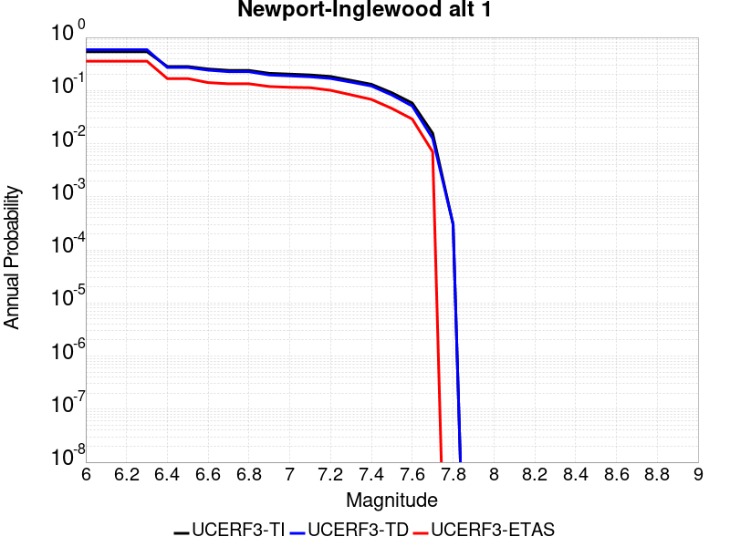 |
|-----|

| Magnitude | UCERF3-TI Prob | UCERF3-TD Prob | UCERF3-ETAS Prob |
|-----|-----|-----|-----|
| 6.0 | 0.53885937 | 0.58669835 | 0.35730338 |
| 6.1 | 0.53885937 | 0.58669835 | 0.35730338 |
| 6.2 | 0.53885937 | 0.58669835 | 0.35730338 |
| 6.3 | 0.53885937 | 0.58669835 | 0.35730338 |
| 6.4 | 0.2831483 | 0.27228433 | 0.16629213 |
| 6.5 | 0.2831483 | 0.27228433 | 0.16629213 |
| 6.6 | 0.25445956 | 0.2420487 | 0.13932584 |
| 6.7 | 0.2397156 | 0.22660372 | 0.13258427 |
| 6.8 | 0.2391454 | 0.22601216 | 0.13258427 |
| 6.9 | 0.21085739 | 0.19630605 | 0.11797753 |
| 7.0 | 0.20385017 | 0.1889871 | 0.11460674 |
| 7.1 | 0.19661716 | 0.18159638 | 0.11235955 |
| 7.2 | 0.18406115 | 0.16867076 | 0.0988764 |
| 7.3 | 0.15540625 | 0.14409117 | 0.07977528 |
| 7.4 | 0.13100395 | 0.12165181 | 0.06516854 |
| 7.5 | 0.090790965 | 0.08240769 | 0.046067417 |
| 7.6 | 0.058011778 | 0.051092423 | 0.028089888 |
| 7.7 | 0.01565494 | 0.012511008 | 0.007865168 |
| 7.8 | 3.027386E-4 | 3.045169E-4 | 0.0 |

## North Frontal  (East)
*[(top)](#table-of-contents)*

|  |
|-----|

| Magnitude | UCERF3-TI Prob | UCERF3-TD Prob | UCERF3-ETAS Prob |
|-----|-----|-----|-----|
| 6.0 | 0.16986503 | 0.17647888 | 0.13932584 |
| 6.1 | 0.16986503 | 0.17647888 | 0.13932584 |
| 6.2 | 0.16986503 | 0.17647888 | 0.13932584 |
| 6.3 | 0.16986503 | 0.17647888 | 0.13932584 |
| 6.4 | 0.16986503 | 0.17647888 | 0.13932584 |
| 6.5 | 0.16986503 | 0.17647888 | 0.13932584 |
| 6.6 | 0.16986503 | 0.17647888 | 0.13932584 |
| 6.7 | 0.16986503 | 0.17647888 | 0.13932584 |
| 6.8 | 0.14398743 | 0.14998165 | 0.113483146 |
| 6.9 | 0.058110174 | 0.058864806 | 0.041573033 |
| 7.0 | 0.056934208 | 0.057671476 | 0.041573033 |
| 7.1 | 0.050645236 | 0.05128568 | 0.040449437 |
| 7.2 | 0.03718455 | 0.037635334 | 0.023595506 |
| 7.3 | 0.023156535 | 0.023434266 | 0.015730336 |
| 7.4 | 0.020082993 | 0.020326737 | 0.014606741 |
| 7.5 | 0.013589136 | 0.013756393 | 0.01235955 |
| 7.6 | 0.004032984 | 0.0040844395 | 0.002247191 |

## North Frontal  (West)
*[(top)](#table-of-contents)*

|  |
|-----|

| Magnitude | UCERF3-TI Prob | UCERF3-TD Prob | UCERF3-ETAS Prob |
|-----|-----|-----|-----|
| 6.0 | 0.116129786 | 0.117404595 | 0.094382025 |
| 6.1 | 0.116129786 | 0.117404595 | 0.094382025 |
| 6.2 | 0.116129786 | 0.117404595 | 0.094382025 |
| 6.3 | 0.116129786 | 0.117404595 | 0.094382025 |
| 6.4 | 0.116129786 | 0.117404595 | 0.094382025 |
| 6.5 | 0.116129786 | 0.117404595 | 0.094382025 |
| 6.6 | 0.116129786 | 0.117404595 | 0.094382025 |
| 6.7 | 0.08817875 | 0.08912296 | 0.06853933 |
| 6.8 | 0.08817875 | 0.08912296 | 0.06853933 |
| 6.9 | 0.07631548 | 0.077157065 | 0.05955056 |
| 7.0 | 0.06408909 | 0.064798445 | 0.053932585 |
| 7.1 | 0.056811824 | 0.057460967 | 0.048314605 |
| 7.2 | 0.042200807 | 0.04266716 | 0.035955057 |
| 7.3 | 0.026377033 | 0.026663361 | 0.020224718 |
| 7.4 | 0.02296349 | 0.02321574 | 0.019101124 |
| 7.5 | 0.016393533 | 0.016571293 | 0.01235955 |
| 7.6 | 0.0065236543 | 0.0065838955 | 0.002247191 |
| 7.7 | 8.561412E-4 | 8.4446184E-4 | 0.0 |
| 7.8 | 2.28907E-4 | 2.0909727E-4 | 0.0 |

## North Salt Lake
*[(top)](#table-of-contents)*

|  |
|-----|

| Magnitude | UCERF3-TI Prob | UCERF3-TD Prob | UCERF3-ETAS Prob |
|-----|-----|-----|-----|
| 6.0 | 0.047109004 | 0.048371326 | 0.05280899 |
| 6.1 | 0.047109004 | 0.048371326 | 0.03483146 |
| 6.2 | 0.047109004 | 0.048371326 | 0.03483146 |
| 6.3 | 0.047109004 | 0.048371326 | 0.03483146 |
| 6.4 | 0.045386918 | 0.046647754 | 0.031460673 |
| 6.5 | 0.015315334 | 0.015611658 | 0.011235955 |
| 6.6 | 0.015315334 | 0.015611658 | 0.011235955 |
| 6.7 | 0.015315334 | 0.015611658 | 0.011235955 |
| 6.8 | 0.012325289 | 0.012564857 | 0.010112359 |
| 6.9 | 0.009437428 | 0.009621855 | 0.006741573 |
| 7.0 | 0.006264508 | 0.0063895737 | 0.004494382 |
| 7.1 | 0.0022285527 | 0.0022662745 | 0.002247191 |
| 7.2 | 6.455741E-4 | 6.543296E-4 | 0.0011235955 |
| 7.3 | 3.9680174E-4 | 4.0168816E-4 | 0.0011235955 |
| 7.4 | 2.1343975E-4 | 2.1549889E-4 | 0.0011235955 |
| 7.5 | 1.429568E-4 | 1.4441575E-4 | 0.0 |
| 7.6 | 6.995442E-6 | 7.066594E-6 | 0.0 |

## North Tahoe 2011 CFM
*[(top)](#table-of-contents)*

| 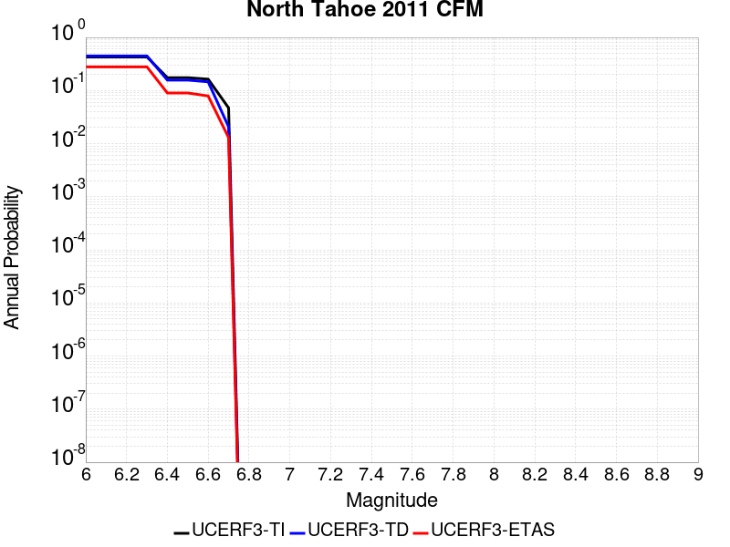 |
|-----|

| Magnitude | UCERF3-TI Prob | UCERF3-TD Prob | UCERF3-ETAS Prob |
|-----|-----|-----|-----|
| 6.0 | 0.42937768 | 0.44842738 | 0.2730337 |
| 6.1 | 0.42937768 | 0.44842738 | 0.2730337 |
| 6.2 | 0.42937768 | 0.44842738 | 0.2730337 |
| 6.3 | 0.42937768 | 0.44842738 | 0.2730337 |
| 6.4 | 0.17462832 | 0.15737154 | 0.08988764 |
| 6.5 | 0.17462832 | 0.15737154 | 0.08988764 |
| 6.6 | 0.16367269 | 0.14585184 | 0.07977528 |
| 6.7 | 0.04714669 | 0.020750126 | 0.01235955 |

## Northridge
*[(top)](#table-of-contents)*

|  |
|-----|

| Magnitude | UCERF3-TI Prob | UCERF3-TD Prob | UCERF3-ETAS Prob |
|-----|-----|-----|-----|
| 6.0 | 0.3802903 | 0.38141838 | 0.19887641 |
| 6.1 | 0.3802903 | 0.38141838 | 0.19887641 |
| 6.2 | 0.3802903 | 0.38141838 | 0.19887641 |
| 6.3 | 0.3802903 | 0.38141838 | 0.19887641 |
| 6.4 | 0.36425853 | 0.3649256 | 0.18988764 |
| 6.5 | 0.36425853 | 0.3649256 | 0.18988764 |
| 6.6 | 0.33188605 | 0.3310101 | 0.15617977 |
| 6.7 | 0.27900213 | 0.2752461 | 0.12808989 |
| 6.8 | 0.25800553 | 0.25335506 | 0.12022472 |
| 6.9 | 0.25347728 | 0.2486671 | 0.11910112 |
| 7.0 | 0.24180964 | 0.23656544 | 0.11011236 |
| 7.1 | 0.23498477 | 0.22952956 | 0.10786517 |
| 7.2 | 0.22788157 | 0.22225401 | 0.09550562 |
| 7.3 | 0.19880714 | 0.19239451 | 0.083146065 |
| 7.4 | 0.1901655 | 0.18393742 | 0.08089887 |
| 7.5 | 0.16304377 | 0.15756965 | 0.06853933 |
| 7.6 | 0.10897063 | 0.10593591 | 0.043820225 |
| 7.7 | 0.06386755 | 0.062138908 | 0.028089888 |
| 7.8 | 0.0321062 | 0.031529512 | 0.019101124 |
| 7.9 | 0.005884534 | 0.0055262363 | 0.002247191 |
| 8.0 | 7.4752454E-5 | 5.7658173E-5 | 0.0 |

## Northridge Hills
*[(top)](#table-of-contents)*

| 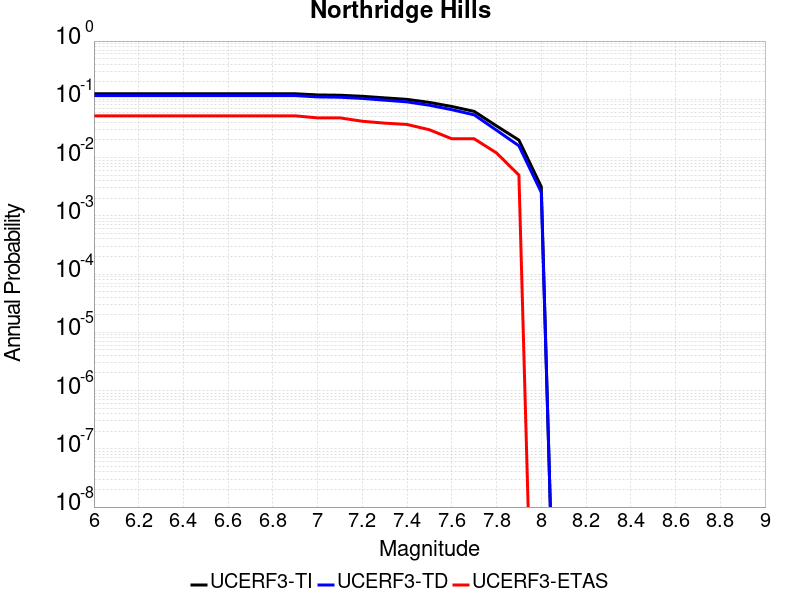 |
|-----|

| Magnitude | UCERF3-TI Prob | UCERF3-TD Prob | UCERF3-ETAS Prob |
|-----|-----|-----|-----|
| 6.0 | 0.12449189 | 0.115724474 | 0.0494382 |
| 6.1 | 0.12449189 | 0.115724474 | 0.0494382 |
| 6.2 | 0.12449189 | 0.115724474 | 0.0494382 |
| 6.3 | 0.12449189 | 0.115724474 | 0.0494382 |
| 6.4 | 0.12449189 | 0.115724474 | 0.0494382 |
| 6.5 | 0.12449189 | 0.115724474 | 0.0494382 |
| 6.6 | 0.12449189 | 0.115724474 | 0.0494382 |
| 6.7 | 0.12449189 | 0.115724474 | 0.0494382 |
| 6.8 | 0.12449189 | 0.115724474 | 0.0494382 |
| 6.9 | 0.12445269 | 0.115684405 | 0.0494382 |
| 7.0 | 0.1188815 | 0.109960064 | 0.04494382 |
| 7.1 | 0.11749926 | 0.10854309 | 0.04494382 |
| 7.2 | 0.11262824 | 0.10354329 | 0.041573033 |
| 7.3 | 0.10588859 | 0.09663546 | 0.03820225 |
| 7.4 | 0.09970685 | 0.09035368 | 0.037078653 |
| 7.5 | 0.08840312 | 0.07907202 | 0.029213483 |
| 7.6 | 0.07526075 | 0.06637723 | 0.021348314 |
| 7.7 | 0.062023733 | 0.054091863 | 0.021348314 |
| 7.8 | 0.0349176 | 0.02943607 | 0.013483146 |
| 7.9 | 0.019930825 | 0.01591367 | 0.0056179776 |
| 8.0 | 0.0031564322 | 0.0025334656 | 0.0 |

## Oak Ridge (Onshore)
*[(top)](#table-of-contents)*

| 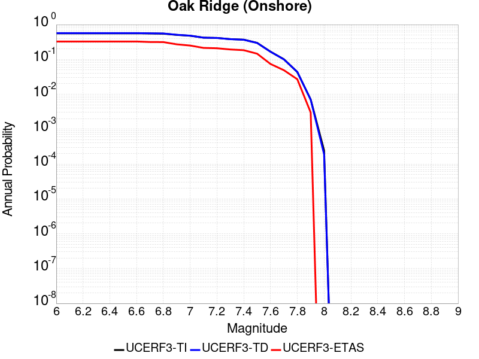 |
|-----|

| Magnitude | UCERF3-TI Prob | UCERF3-TD Prob | UCERF3-ETAS Prob |
|-----|-----|-----|-----|
| 6.0 | 0.56095207 | 0.56804234 | 0.32921347 |
| 6.1 | 0.56095207 | 0.56804234 | 0.32921347 |
| 6.2 | 0.56095207 | 0.56804234 | 0.32921347 |
| 6.3 | 0.56095207 | 0.56804234 | 0.32921347 |
| 6.4 | 0.56095207 | 0.56804234 | 0.32921347 |
| 6.5 | 0.56095207 | 0.56804234 | 0.32921347 |
| 6.6 | 0.56095207 | 0.56804234 | 0.32921347 |
| 6.7 | 0.55447084 | 0.5615792 | 0.31910113 |
| 6.8 | 0.54816014 | 0.5551121 | 0.31685394 |
| 6.9 | 0.50533754 | 0.50970966 | 0.27078652 |
| 7.0 | 0.47767943 | 0.48088866 | 0.2505618 |
| 7.1 | 0.42100143 | 0.42079377 | 0.21685393 |
| 7.2 | 0.4133078 | 0.41286707 | 0.21123596 |
| 7.3 | 0.38226742 | 0.3809144 | 0.19550562 |
| 7.4 | 0.3687128 | 0.36687985 | 0.18651685 |
| 7.5 | 0.2986055 | 0.2964984 | 0.1505618 |
| 7.6 | 0.1666799 | 0.1661514 | 0.0764045 |
| 7.7 | 0.1010318 | 0.10035542 | 0.050561797 |
| 7.8 | 0.043441582 | 0.04382015 | 0.028089888 |
| 7.9 | 0.0070743407 | 0.0070244297 | 0.0033707866 |
| 8.0 | 2.442769E-4 | 1.9069684E-4 | 0.0 |

## Oceanic - West Huasna
*[(top)](#table-of-contents)*

| 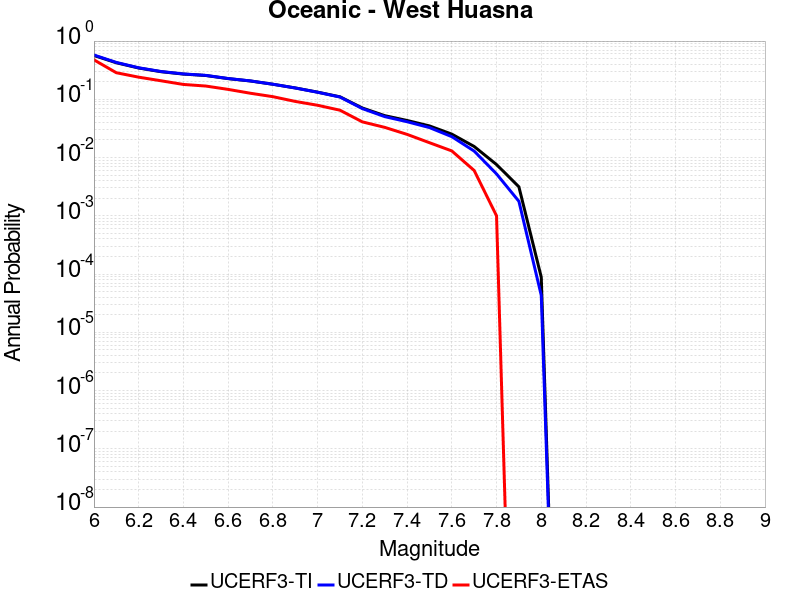 |
|-----|

| Magnitude | UCERF3-TI Prob | UCERF3-TD Prob | UCERF3-ETAS Prob |
|-----|-----|-----|-----|
| 6.0 | 0.56556714 | 0.5762121 | 0.48426965 |
| 6.1 | 0.42418635 | 0.4298705 | 0.29101124 |
| 6.2 | 0.34460846 | 0.34794363 | 0.24494383 |
| 6.3 | 0.29795375 | 0.3001675 | 0.21460675 |
| 6.4 | 0.2711011 | 0.2727579 | 0.18539326 |
| 6.5 | 0.25632128 | 0.2577268 | 0.17303371 |
| 6.6 | 0.2266291 | 0.22750324 | 0.1505618 |
| 6.7 | 0.20629561 | 0.20684339 | 0.13033707 |
| 6.8 | 0.18138474 | 0.18153745 | 0.11235955 |
| 6.9 | 0.15674151 | 0.15650326 | 0.093258426 |
| 7.0 | 0.13277912 | 0.13215993 | 0.07977528 |
| 7.1 | 0.11036651 | 0.10939209 | 0.06629214 |
| 7.2 | 0.07097205 | 0.069276765 | 0.04269663 |
| 7.3 | 0.052435953 | 0.05046341 | 0.03483146 |
| 7.4 | 0.043333665 | 0.041231066 | 0.025842696 |
| 7.5 | 0.034954246 | 0.032718413 | 0.019101124 |
| 7.6 | 0.025251048 | 0.022847703 | 0.014606741 |
| 7.7 | 0.015496228 | 0.012913563 | 0.006741573 |
| 7.8 | 0.0075864913 | 0.0052348822 | 0.0011235955 |
| 7.9 | 0.0031408628 | 0.0017724311 | 0.0 |
| 8.0 | 8.819456E-5 | 4.2895816E-5 | 0.0 |

## Oceanside alt1
*[(top)](#table-of-contents)*

|  |
|-----|

| Magnitude | UCERF3-TI Prob | UCERF3-TD Prob | UCERF3-ETAS Prob |
|-----|-----|-----|-----|
| 6.0 | 0.26147115 | 0.2637212 | 0.16292135 |
| 6.1 | 0.26147115 | 0.2637212 | 0.16292135 |
| 6.2 | 0.26147115 | 0.2637212 | 0.16292135 |
| 6.3 | 0.26147115 | 0.2637212 | 0.16292135 |
| 6.4 | 0.26147115 | 0.2637212 | 0.16292135 |
| 6.5 | 0.26147115 | 0.2637212 | 0.16292135 |
| 6.6 | 0.1790408 | 0.17680599 | 0.09550562 |
| 6.7 | 0.16918302 | 0.16673091 | 0.08988764 |
| 6.8 | 0.1512462 | 0.1484425 | 0.084269665 |
| 6.9 | 0.14821443 | 0.14535753 | 0.083146065 |
| 7.0 | 0.12809058 | 0.124855615 | 0.07191011 |
| 7.1 | 0.11610967 | 0.11271706 | 0.06629214 |
| 7.2 | 0.0943798 | 0.0907479 | 0.050561797 |
| 7.3 | 0.081670046 | 0.07821728 | 0.03820225 |
| 7.4 | 0.06542925 | 0.062343076 | 0.03258427 |
| 7.5 | 0.04765477 | 0.044279806 | 0.025842696 |
| 7.6 | 0.03144597 | 0.027919216 | 0.016853932 |
| 7.7 | 0.013322236 | 0.010362376 | 0.0056179776 |
| 7.8 | 3.027386E-4 | 3.045169E-4 | 0.0 |

## Ortigalita (North)
*[(top)](#table-of-contents)*

|  |
|-----|

| Magnitude | UCERF3-TI Prob | UCERF3-TD Prob | UCERF3-ETAS Prob |
|-----|-----|-----|-----|
| 6.0 | 0.86628586 | 0.8582752 | 0.79550564 |
| 6.1 | 0.6994632 | 0.68686634 | 0.5719101 |
| 6.2 | 0.6994632 | 0.68686634 | 0.5719101 |
| 6.3 | 0.58025813 | 0.57736945 | 0.4550562 |
| 6.4 | 0.51496357 | 0.51815647 | 0.3988764 |
| 6.5 | 0.51442176 | 0.517612 | 0.3988764 |
| 6.6 | 0.45089078 | 0.4605903 | 0.34269664 |
| 6.7 | 0.40455094 | 0.417383 | 0.2988764 |
| 6.8 | 0.15739068 | 0.1625575 | 0.12022472 |
| 6.9 | 0.13642415 | 0.1410578 | 0.10224719 |
| 7.0 | 0.09616783 | 0.099590406 | 0.07191011 |
| 7.1 | 0.040928528 | 0.042454913 | 0.0247191 |

## Ortigalita (South)
*[(top)](#table-of-contents)*

| 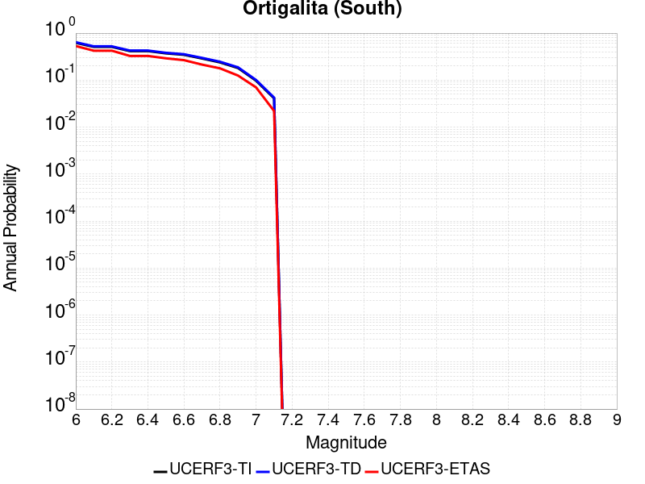 |
|-----|

| Magnitude | UCERF3-TI Prob | UCERF3-TD Prob | UCERF3-ETAS Prob |
|-----|-----|-----|-----|
| 6.0 | 0.6215107 | 0.6404586 | 0.53483146 |
| 6.1 | 0.50945795 | 0.5235145 | 0.42022473 |
| 6.2 | 0.50945795 | 0.5235145 | 0.42022473 |
| 6.3 | 0.41494375 | 0.4258751 | 0.3235955 |
| 6.4 | 0.41494375 | 0.4258751 | 0.3235955 |
| 6.5 | 0.37114903 | 0.38135284 | 0.28764045 |
| 6.6 | 0.34592536 | 0.35586417 | 0.26179776 |
| 6.7 | 0.28858984 | 0.29769197 | 0.21011236 |
| 6.8 | 0.23818669 | 0.24620575 | 0.17865169 |
| 6.9 | 0.18071403 | 0.18716832 | 0.1247191 |
| 7.0 | 0.097210445 | 0.10065857 | 0.07191011 |
| 7.1 | 0.040928528 | 0.042454913 | 0.0247191 |

## Owens Valley
*[(top)](#table-of-contents)*

| 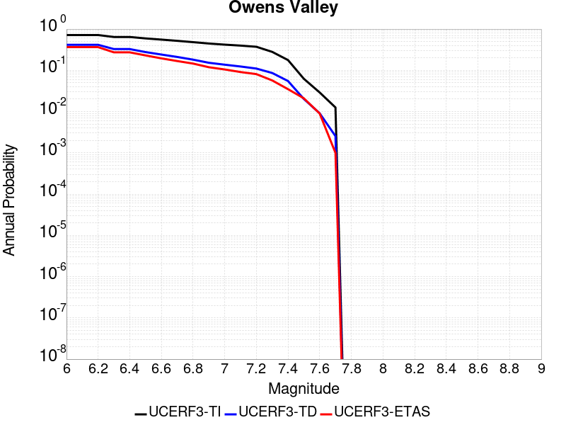 |
|-----|

| Magnitude | UCERF3-TI Prob | UCERF3-TD Prob | UCERF3-ETAS Prob |
|-----|-----|-----|-----|
| 6.0 | 0.7169934 | 0.41606688 | 0.36292136 |
| 6.1 | 0.7169934 | 0.41606688 | 0.36292136 |
| 6.2 | 0.7169934 | 0.41606688 | 0.36292136 |
| 6.3 | 0.6434682 | 0.3276032 | 0.26853934 |
| 6.4 | 0.6434682 | 0.3276032 | 0.26853934 |
| 6.5 | 0.5942473 | 0.2770579 | 0.22247191 |
| 6.6 | 0.5560813 | 0.24144559 | 0.18539326 |
| 6.7 | 0.5192013 | 0.21108632 | 0.16292135 |
| 6.8 | 0.48244452 | 0.1816414 | 0.14269663 |
| 6.9 | 0.44697532 | 0.15255478 | 0.11235955 |
| 7.0 | 0.4198878 | 0.13712375 | 0.0988764 |
| 7.1 | 0.3979548 | 0.12396134 | 0.08539326 |
| 7.2 | 0.37273374 | 0.11050562 | 0.0752809 |
| 7.3 | 0.28051114 | 0.08636666 | 0.053932585 |
| 7.4 | 0.17744736 | 0.055166576 | 0.03483146 |
| 7.5 | 0.062491756 | 0.020274566 | 0.021348314 |
| 7.6 | 0.029123643 | 0.009117973 | 0.008988764 |
| 7.7 | 0.012602747 | 0.0025453607 | 0.0011235955 |

## Owens Valley Keough Hot Springs
*[(top)](#table-of-contents)*

|  |
|-----|

| Magnitude | UCERF3-TI Prob | UCERF3-TD Prob | UCERF3-ETAS Prob |
|-----|-----|-----|-----|
| 6.0 | 0.33623528 | 0.18037207 | 0.14382023 |
| 6.1 | 0.33623528 | 0.18037207 | 0.14382023 |
| 6.2 | 0.33623528 | 0.18037207 | 0.14382023 |
| 6.3 | 0.33623528 | 0.18037207 | 0.14382023 |
| 6.4 | 0.31715924 | 0.15585567 | 0.11573034 |
| 6.5 | 0.2938423 | 0.12574963 | 0.08089887 |
| 6.6 | 0.29379308 | 0.12568751 | 0.08089887 |
| 6.7 | 0.29352325 | 0.12540366 | 0.08089887 |
| 6.8 | 0.27717465 | 0.10910955 | 0.06853933 |
| 6.9 | 0.25202653 | 0.08703391 | 0.047191013 |
| 7.0 | 0.2492033 | 0.08456527 | 0.046067417 |
| 7.1 | 0.23865554 | 0.07701636 | 0.039325844 |
| 7.2 | 0.22941767 | 0.07056881 | 0.03483146 |
| 7.3 | 0.21881695 | 0.06535737 | 0.033707865 |
| 7.4 | 0.15338978 | 0.044266716 | 0.021348314 |
| 7.5 | 0.041365582 | 0.011358876 | 0.013483146 |
| 7.6 | 0.014776949 | 0.0036895664 | 0.004494382 |
| 7.7 | 0.0067573637 | 0.0013195812 | 0.0 |

## Owl Lake
*[(top)](#table-of-contents)*

|  |
|-----|

| Magnitude | UCERF3-TI Prob | UCERF3-TD Prob | UCERF3-ETAS Prob |
|-----|-----|-----|-----|
| 6.0 | 0.73095125 | 0.74490124 | 0.7325843 |
| 6.1 | 0.73095125 | 0.74490124 | 0.7325843 |
| 6.2 | 0.46710685 | 0.4758734 | 0.46853933 |
| 6.3 | 0.36544487 | 0.37974223 | 0.35505617 |
| 6.4 | 0.36544487 | 0.37974223 | 0.35505617 |
| 6.5 | 0.32706726 | 0.34466797 | 0.31460676 |
| 6.6 | 0.16096875 | 0.17617103 | 0.12921348 |
| 6.7 | 0.15999798 | 0.17520146 | 0.12921348 |
| 6.8 | 0.15768631 | 0.17283373 | 0.1269663 |
| 6.9 | 0.15296866 | 0.16793995 | 0.12247191 |
| 7.0 | 0.14788908 | 0.16260998 | 0.11573034 |
| 7.1 | 0.14138806 | 0.15572366 | 0.11235955 |
| 7.2 | 0.117054075 | 0.12966558 | 0.07865169 |
| 7.3 | 0.07647671 | 0.08260338 | 0.03820225 |
| 7.4 | 0.06865884 | 0.073539965 | 0.031460673 |
| 7.5 | 0.06580321 | 0.07021951 | 0.030337078 |
| 7.6 | 0.05826209 | 0.061873738 | 0.029213483 |
| 7.7 | 0.043842636 | 0.04641124 | 0.021348314 |
| 7.8 | 0.021833045 | 0.023298811 | 0.016853932 |
| 7.9 | 0.007062717 | 0.007489999 | 0.0056179776 |
| 8.0 | 5.736804E-4 | 5.97447E-4 | 0.0 |

## Ozena
*[(top)](#table-of-contents)*

|  |
|-----|

| Magnitude | UCERF3-TI Prob | UCERF3-TD Prob | UCERF3-ETAS Prob |
|-----|-----|-----|-----|
| 6.0 | 0.036815234 | 0.03698944 | 0.029213483 |
| 6.1 | 0.036815234 | 0.03698944 | 0.029213483 |
| 6.2 | 0.036815234 | 0.03698944 | 0.029213483 |
| 6.3 | 0.036815234 | 0.03698944 | 0.029213483 |
| 6.4 | 0.036815234 | 0.03698944 | 0.029213483 |
| 6.5 | 0.036815234 | 0.03698944 | 0.029213483 |
| 6.6 | 0.036815234 | 0.03698944 | 0.029213483 |
| 6.7 | 0.036815234 | 0.03698944 | 0.029213483 |
| 6.8 | 0.023775628 | 0.023858994 | 0.015730336 |
| 6.9 | 0.023567416 | 0.023650387 | 0.015730336 |
| 7.0 | 0.022614546 | 0.02269509 | 0.015730336 |
| 7.1 | 0.021164484 | 0.021240773 | 0.014606741 |
| 7.2 | 0.01908777 | 0.019156875 | 0.013483146 |
| 7.3 | 0.016789455 | 0.016851027 | 0.010112359 |
| 7.4 | 0.013852415 | 0.013903773 | 0.008988764 |
| 7.5 | 0.007639162 | 0.0076648993 | 0.004494382 |
| 7.6 | 0.0036853238 | 0.003693515 | 0.0033707866 |
| 7.7 | 0.0011722236 | 0.0011745766 | 0.002247191 |
| 7.8 | 1.5650586E-4 | 1.5684056E-4 | 0.0 |

## Palos Verdes
*[(top)](#table-of-contents)*

|  |
|-----|

| Magnitude | UCERF3-TI Prob | UCERF3-TD Prob | UCERF3-ETAS Prob |
|-----|-----|-----|-----|
| 6.0 | 0.79775894 | 0.8081702 | 0.5955056 |
| 6.1 | 0.79775894 | 0.8081702 | 0.5955056 |
| 6.2 | 0.79775894 | 0.8081702 | 0.5955056 |
| 6.3 | 0.6554297 | 0.6687024 | 0.4516854 |
| 6.4 | 0.6554297 | 0.6687024 | 0.4516854 |
| 6.5 | 0.548892 | 0.56654966 | 0.3505618 |
| 6.6 | 0.5338536 | 0.55145645 | 0.33483145 |
| 6.7 | 0.44938555 | 0.47098038 | 0.2494382 |
| 6.8 | 0.42671937 | 0.44854534 | 0.23370786 |
| 6.9 | 0.3910056 | 0.4133274 | 0.21123596 |
| 7.0 | 0.35987434 | 0.38238004 | 0.19325842 |
| 7.1 | 0.3409677 | 0.36364055 | 0.17640449 |
| 7.2 | 0.31440112 | 0.33722946 | 0.16179775 |
| 7.3 | 0.1288722 | 0.1399093 | 0.05505618 |
| 7.4 | 0.021369152 | 0.02148739 | 0.010112359 |
| 7.5 | 0.016968522 | 0.01706916 | 0.006741573 |
| 7.6 | 0.009094592 | 0.009153739 | 0.0011235955 |
| 7.7 | 0.0031222047 | 0.00313892 | 0.0 |
| 7.8 | 7.939731E-4 | 7.985924E-4 | 0.0 |

## Panamint Valley
*[(top)](#table-of-contents)*

|  |
|-----|

| Magnitude | UCERF3-TI Prob | UCERF3-TD Prob | UCERF3-ETAS Prob |
|-----|-----|-----|-----|
| 6.0 | 0.5453453 | 0.5755152 | 0.43595505 |
| 6.1 | 0.5453453 | 0.5755152 | 0.43595505 |
| 6.2 | 0.5453453 | 0.5755152 | 0.43595505 |
| 6.3 | 0.5254954 | 0.5564148 | 0.41011235 |
| 6.4 | 0.5254954 | 0.5564148 | 0.41011235 |
| 6.5 | 0.5116147 | 0.5429701 | 0.39775282 |
| 6.6 | 0.49433336 | 0.5261372 | 0.3797753 |
| 6.7 | 0.47226584 | 0.5043784 | 0.35617977 |
| 6.8 | 0.4402948 | 0.47219232 | 0.3269663 |
| 6.9 | 0.40503415 | 0.4361011 | 0.28876406 |
| 7.0 | 0.3805009 | 0.4111251 | 0.25730336 |
| 7.1 | 0.36930946 | 0.39980298 | 0.2494382 |
| 7.2 | 0.34778935 | 0.37786603 | 0.23483147 |
| 7.3 | 0.31533936 | 0.34382832 | 0.20449439 |
| 7.4 | 0.28488302 | 0.31313622 | 0.18651685 |
| 7.5 | 0.26186237 | 0.28986597 | 0.16741572 |
| 7.6 | 0.07544772 | 0.08850553 | 0.051685393 |

## Paradise
*[(top)](#table-of-contents)*

| 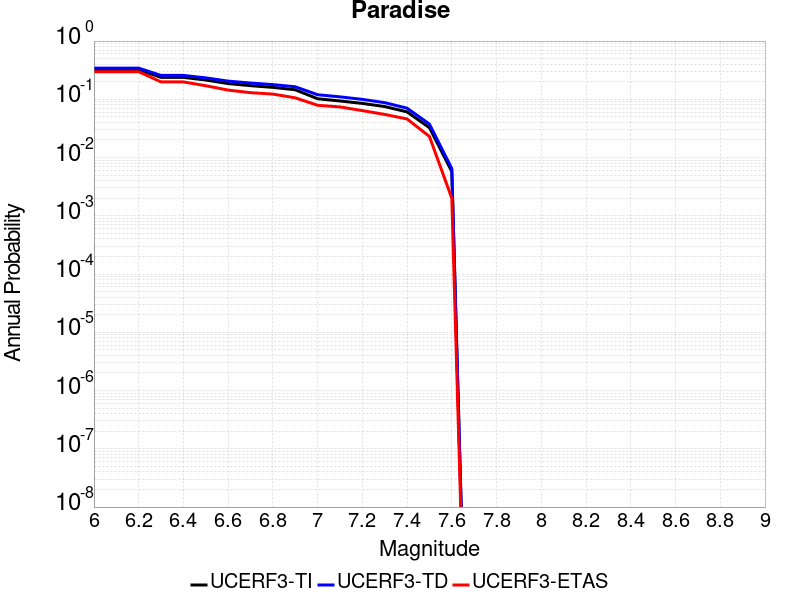 |
|-----|

| Magnitude | UCERF3-TI Prob | UCERF3-TD Prob | UCERF3-ETAS Prob |
|-----|-----|-----|-----|
| 6.0 | 0.32122254 | 0.3430157 | 0.29662922 |
| 6.1 | 0.32122254 | 0.3430157 | 0.29662922 |
| 6.2 | 0.32122254 | 0.3430157 | 0.29662922 |
| 6.3 | 0.23816858 | 0.2572889 | 0.2011236 |
| 6.4 | 0.23816858 | 0.2572889 | 0.2011236 |
| 6.5 | 0.21442084 | 0.23342709 | 0.16966292 |
| 6.6 | 0.18634407 | 0.20520496 | 0.14157303 |
| 6.7 | 0.17138958 | 0.1902275 | 0.12921348 |
| 6.8 | 0.16026174 | 0.17880021 | 0.121348314 |
| 6.9 | 0.14583817 | 0.16415893 | 0.10224719 |
| 7.0 | 0.10224287 | 0.11990245 | 0.074157305 |
| 7.1 | 0.093615144 | 0.11017796 | 0.06966292 |
| 7.2 | 0.08503933 | 0.099736944 | 0.05955056 |
| 7.3 | 0.075126424 | 0.08762189 | 0.051685393 |
| 7.4 | 0.060816385 | 0.07038924 | 0.041573033 |
| 7.5 | 0.032615982 | 0.03757065 | 0.02247191 |
| 7.6 | 0.0057536047 | 0.0064641978 | 0.002247191 |

## Peralta Hills
*[(top)](#table-of-contents)*

|  |
|-----|

| Magnitude | UCERF3-TI Prob | UCERF3-TD Prob | UCERF3-ETAS Prob |
|-----|-----|-----|-----|
| 6.0 | 0.09638984 | 0.09439349 | 0.06516854 |
| 6.1 | 0.09638984 | 0.09439349 | 0.06516854 |
| 6.2 | 0.09638984 | 0.09439349 | 0.06516854 |
| 6.3 | 0.09638984 | 0.09439349 | 0.06516854 |
| 6.4 | 0.09638984 | 0.09439349 | 0.06516854 |
| 6.5 | 0.03985163 | 0.035320394 | 0.020224718 |
| 6.6 | 0.03985163 | 0.035320394 | 0.020224718 |
| 6.7 | 0.038424727 | 0.033867363 | 0.019101124 |
| 6.8 | 0.037334673 | 0.03275588 | 0.017977528 |
| 6.9 | 0.02925928 | 0.025449404 | 0.01235955 |
| 7.0 | 0.025676709 | 0.022170948 | 0.008988764 |
| 7.1 | 0.024949519 | 0.021482453 | 0.007865168 |
| 7.2 | 0.023820337 | 0.020393118 | 0.007865168 |
| 7.3 | 0.021060392 | 0.0177928 | 0.007865168 |
| 7.4 | 0.016513065 | 0.013917267 | 0.007865168 |
| 7.5 | 0.010457003 | 0.008550601 | 0.0056179776 |
| 7.6 | 0.009536811 | 0.007733567 | 0.0056179776 |
| 7.7 | 0.0073992815 | 0.0058166287 | 0.0056179776 |

## Pilarcitos 2011 CFM
*[(top)](#table-of-contents)*

| 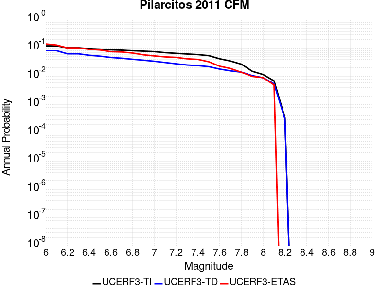 |
|-----|

| Magnitude | UCERF3-TI Prob | UCERF3-TD Prob | UCERF3-ETAS Prob |
|-----|-----|-----|-----|
| 6.0 | 0.12034932 | 0.08145657 | 0.13820225 |
| 6.1 | 0.12034932 | 0.08145657 | 0.1269663 |
| 6.2 | 0.10290434 | 0.06304433 | 0.101123594 |
| 6.3 | 0.10290434 | 0.06304433 | 0.101123594 |
| 6.4 | 0.09619853 | 0.05597884 | 0.08988764 |
| 6.5 | 0.09234231 | 0.051962167 | 0.084269665 |
| 6.6 | 0.08738375 | 0.046746727 | 0.073033705 |
| 6.7 | 0.08466506 | 0.043946482 | 0.07078651 |
| 6.8 | 0.08117872 | 0.04039638 | 0.06516854 |
| 6.9 | 0.078268014 | 0.03741862 | 0.058426965 |
| 7.0 | 0.07513891 | 0.034328736 | 0.05280899 |
| 7.1 | 0.06916249 | 0.030994404 | 0.050561797 |
| 7.2 | 0.065404184 | 0.027930465 | 0.048314605 |
| 7.3 | 0.061964534 | 0.025358412 | 0.04269663 |
| 7.4 | 0.05909899 | 0.024126321 | 0.040449437 |
| 7.5 | 0.054199185 | 0.02215992 | 0.03258427 |
| 7.6 | 0.041997634 | 0.018154213 | 0.021348314 |
| 7.7 | 0.034987677 | 0.015708165 | 0.017977528 |
| 7.8 | 0.027024478 | 0.014127602 | 0.014606741 |
| 7.9 | 0.015162882 | 0.010652994 | 0.010112359 |
| 8.0 | 0.01161178 | 0.008934796 | 0.008988764 |
| 8.1 | 0.0069397017 | 0.00548635 | 0.004494382 |
| 8.2 | 3.4428958E-4 | 3.1086022E-4 | 0.0 |

## Pine Mtn
*[(top)](#table-of-contents)*

|  |
|-----|

| Magnitude | UCERF3-TI Prob | UCERF3-TD Prob | UCERF3-ETAS Prob |
|-----|-----|-----|-----|
| 6.0 | 0.16463035 | 0.16437198 | 0.12584269 |
| 6.1 | 0.16463035 | 0.16437198 | 0.12584269 |
| 6.2 | 0.16463035 | 0.16437198 | 0.12584269 |
| 6.3 | 0.16463035 | 0.16437198 | 0.12584269 |
| 6.4 | 0.16463035 | 0.16437198 | 0.12584269 |
| 6.5 | 0.16463035 | 0.16437198 | 0.12584269 |
| 6.6 | 0.16463035 | 0.16437198 | 0.12584269 |
| 6.7 | 0.14683351 | 0.1462556 | 0.113483146 |
| 6.8 | 0.13712397 | 0.13642225 | 0.11011236 |
| 6.9 | 0.11312454 | 0.11201992 | 0.08876404 |
| 7.0 | 0.110484585 | 0.10935917 | 0.08876404 |
| 7.1 | 0.08018965 | 0.07858766 | 0.064044945 |
| 7.2 | 0.05592965 | 0.05468393 | 0.041573033 |
| 7.3 | 0.03527526 | 0.033976566 | 0.023595506 |
| 7.4 | 0.028913744 | 0.027880494 | 0.020224718 |
| 7.5 | 0.020736082 | 0.01977889 | 0.016853932 |
| 7.6 | 0.012690396 | 0.011851058 | 0.008988764 |
| 7.7 | 0.001729404 | 0.0017414805 | 0.0011235955 |
| 7.8 | 2.4092059E-4 | 2.4287413E-4 | 0.0 |

## Pinto Mtn
*[(top)](#table-of-contents)*

|  |
|-----|

| Magnitude | UCERF3-TI Prob | UCERF3-TD Prob | UCERF3-ETAS Prob |
|-----|-----|-----|-----|
| 6.0 | 0.68432444 | 0.7148907 | 0.53932583 |
| 6.1 | 0.68432444 | 0.7148907 | 0.53932583 |
| 6.2 | 0.68432444 | 0.7148907 | 0.53932583 |
| 6.3 | 0.68432444 | 0.7148907 | 0.53932583 |
| 6.4 | 0.62210166 | 0.65377 | 0.4752809 |
| 6.5 | 0.62210166 | 0.65377 | 0.4752809 |
| 6.6 | 0.5452589 | 0.57781035 | 0.39775282 |
| 6.7 | 0.5411258 | 0.57386744 | 0.39213485 |
| 6.8 | 0.47666693 | 0.5105954 | 0.3213483 |
| 6.9 | 0.45565972 | 0.4902172 | 0.30449438 |
| 7.0 | 0.43404245 | 0.46930268 | 0.28202248 |
| 7.1 | 0.41668698 | 0.4524877 | 0.26853934 |
| 7.2 | 0.3907011 | 0.42732918 | 0.24719101 |
| 7.3 | 0.29384866 | 0.3318232 | 0.17752808 |
| 7.4 | 0.21777074 | 0.25580305 | 0.1269663 |
| 7.5 | 0.17147432 | 0.20314124 | 0.101123594 |
| 7.6 | 0.08240596 | 0.102407716 | 0.04494382 |
| 7.7 | 0.06495138 | 0.08214786 | 0.03820225 |

## Pisgah-Bullion Mtn-Mesquite Lk
*[(top)](#table-of-contents)*

| 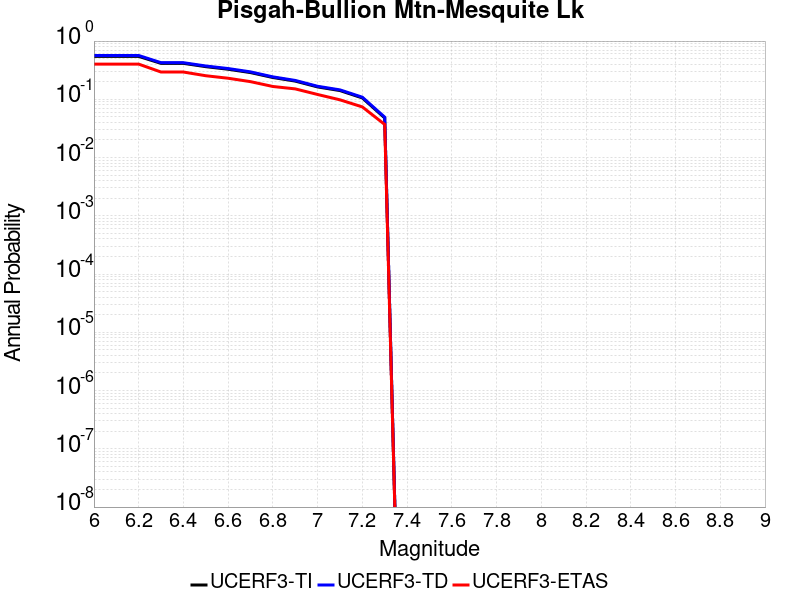 |
|-----|

| Magnitude | UCERF3-TI Prob | UCERF3-TD Prob | UCERF3-ETAS Prob |
|-----|-----|-----|-----|
| 6.0 | 0.5456887 | 0.5656698 | 0.40449437 |
| 6.1 | 0.5456887 | 0.5656698 | 0.40449437 |
| 6.2 | 0.5456887 | 0.5656698 | 0.40449437 |
| 6.3 | 0.4142073 | 0.4254101 | 0.2955056 |
| 6.4 | 0.4142073 | 0.4254101 | 0.2955056 |
| 6.5 | 0.3634999 | 0.3735125 | 0.25617978 |
| 6.6 | 0.3282659 | 0.33752045 | 0.22921348 |
| 6.7 | 0.28758577 | 0.2959184 | 0.2 |
| 6.8 | 0.23671684 | 0.24295859 | 0.16516854 |
| 6.9 | 0.20547493 | 0.21094577 | 0.1505618 |
| 7.0 | 0.16306894 | 0.16746812 | 0.11797753 |
| 7.1 | 0.14125559 | 0.14518479 | 0.09662921 |
| 7.2 | 0.105608396 | 0.10870289 | 0.074157305 |
| 7.3 | 0.04787365 | 0.049374085 | 0.03483146 |

## Pitas Point (Lower West)
*[(top)](#table-of-contents)*

|  |
|-----|

| Magnitude | UCERF3-TI Prob | UCERF3-TD Prob | UCERF3-ETAS Prob |
|-----|-----|-----|-----|
| 6.0 | 0.1915752 | 0.18980168 | 0.18314607 |
| 6.1 | 0.1915752 | 0.18980168 | 0.18314607 |
| 6.2 | 0.1915752 | 0.18980168 | 0.18314607 |
| 6.3 | 0.1915752 | 0.18980168 | 0.18314607 |
| 6.4 | 0.1915752 | 0.18980168 | 0.18314607 |
| 6.5 | 0.1915752 | 0.18980168 | 0.18314607 |
| 6.6 | 0.1915752 | 0.18980168 | 0.18314607 |
| 6.7 | 0.1915752 | 0.18980168 | 0.18314607 |
| 6.8 | 0.1915752 | 0.18980168 | 0.18314607 |
| 6.9 | 0.1915752 | 0.18980168 | 0.18314607 |
| 7.0 | 0.19056298 | 0.18877064 | 0.18202247 |
| 7.1 | 0.1852612 | 0.18336205 | 0.16853933 |
| 7.2 | 0.18351218 | 0.18157412 | 0.16516854 |
| 7.3 | 0.1754511 | 0.1733086 | 0.1505618 |
| 7.4 | 0.16615124 | 0.16377065 | 0.13820225 |
| 7.5 | 0.15933299 | 0.15681046 | 0.13146068 |
| 7.6 | 0.1362297 | 0.1331806 | 0.11460674 |
| 7.7 | 0.11064952 | 0.10735038 | 0.08988764 |
| 7.8 | 0.06576774 | 0.063301384 | 0.0494382 |
| 7.9 | 0.010500169 | 0.010105814 | 0.006741573 |
| 8.0 | 2.0325146E-4 | 1.8586217E-4 | 0.0 |

## Pitas Point (Lower)-Montalvo
*[(top)](#table-of-contents)*

| 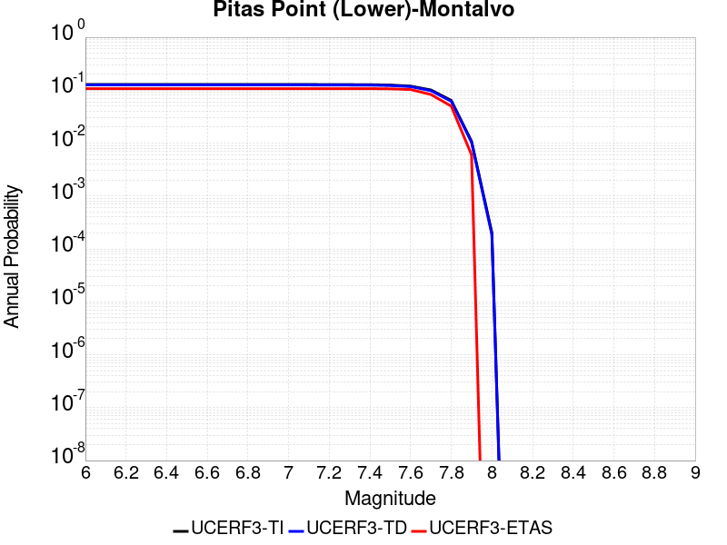 |
|-----|

| Magnitude | UCERF3-TI Prob | UCERF3-TD Prob | UCERF3-ETAS Prob |
|-----|-----|-----|-----|
| 6.0 | 0.12810211 | 0.12553874 | 0.10561798 |
| 6.1 | 0.12810211 | 0.12553874 | 0.10561798 |
| 6.2 | 0.12810211 | 0.12553874 | 0.10561798 |
| 6.3 | 0.12810211 | 0.12553874 | 0.10561798 |
| 6.4 | 0.12810211 | 0.12553874 | 0.10561798 |
| 6.5 | 0.12810211 | 0.12553874 | 0.10561798 |
| 6.6 | 0.12810211 | 0.12553874 | 0.10561798 |
| 6.7 | 0.12810211 | 0.12553874 | 0.10561798 |
| 6.8 | 0.12810211 | 0.12553874 | 0.10561798 |
| 6.9 | 0.12810211 | 0.12553874 | 0.10561798 |
| 7.0 | 0.12810211 | 0.12553874 | 0.10561798 |
| 7.1 | 0.12810211 | 0.12553874 | 0.10561798 |
| 7.2 | 0.12790887 | 0.12534253 | 0.10561798 |
| 7.3 | 0.12747146 | 0.12489801 | 0.10561798 |
| 7.4 | 0.12710698 | 0.12452719 | 0.10561798 |
| 7.5 | 0.12509972 | 0.12248497 | 0.104494385 |
| 7.6 | 0.1195377 | 0.11682647 | 0.101123594 |
| 7.7 | 0.101055734 | 0.0980274 | 0.08202247 |
| 7.8 | 0.06422986 | 0.06187279 | 0.0494382 |
| 7.9 | 0.010814364 | 0.010398468 | 0.006741573 |
| 8.0 | 2.0325146E-4 | 1.8586217E-4 | 0.0 |

## Pittville 2011 CFM
*[(top)](#table-of-contents)*

| 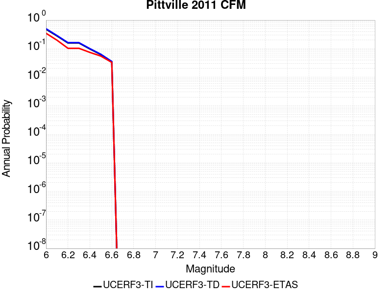 |
|-----|

| Magnitude | UCERF3-TI Prob | UCERF3-TD Prob | UCERF3-ETAS Prob |
|-----|-----|-----|-----|
| 6.0 | 0.47955486 | 0.5000772 | 0.3494382 |
| 6.1 | 0.27903497 | 0.28822738 | 0.1977528 |
| 6.2 | 0.15825133 | 0.16273458 | 0.101123594 |
| 6.3 | 0.15825133 | 0.16273458 | 0.101123594 |
| 6.4 | 0.09765949 | 0.10035348 | 0.07191011 |
| 6.5 | 0.061999794 | 0.06375141 | 0.05280899 |
| 6.6 | 0.03456312 | 0.035578836 | 0.031460673 |

## Pleito
*[(top)](#table-of-contents)*

|  |
|-----|

| Magnitude | UCERF3-TI Prob | UCERF3-TD Prob | UCERF3-ETAS Prob |
|-----|-----|-----|-----|
| 6.0 | 0.35424724 | 0.35528105 | 0.48202246 |
| 6.1 | 0.35424724 | 0.35528105 | 0.48202246 |
| 6.2 | 0.35424724 | 0.35528105 | 0.48202246 |
| 6.3 | 0.35424724 | 0.35528105 | 0.48202246 |
| 6.4 | 0.35424724 | 0.35528105 | 0.48202246 |
| 6.5 | 0.35424724 | 0.35528105 | 0.48202246 |
| 6.6 | 0.22783086 | 0.21114974 | 0.23146068 |
| 6.7 | 0.22783086 | 0.21114974 | 0.23146068 |
| 6.8 | 0.19470467 | 0.1760369 | 0.19325842 |
| 6.9 | 0.19224177 | 0.17348836 | 0.18988764 |
| 7.0 | 0.17071238 | 0.15173693 | 0.16629213 |
| 7.1 | 0.17054573 | 0.15158345 | 0.16629213 |
| 7.2 | 0.16833086 | 0.14954332 | 0.16404495 |
| 7.3 | 0.16737242 | 0.14866793 | 0.16292135 |
| 7.4 | 0.16664061 | 0.14800134 | 0.16292135 |
| 7.5 | 0.16582073 | 0.14729555 | 0.16292135 |
| 7.6 | 0.16533057 | 0.14685604 | 0.16292135 |
| 7.7 | 0.1536854 | 0.13646041 | 0.15168539 |
| 7.8 | 0.14191446 | 0.12523541 | 0.13707866 |
| 7.9 | 0.09241446 | 0.07958043 | 0.08876404 |
| 8.0 | 0.028046543 | 0.023164026 | 0.023595506 |
| 8.1 | 0.0069920467 | 0.0047790115 | 0.004494382 |
| 8.2 | 1.3817761E-4 | 9.1583504E-5 | 0.0 |

## Point Reyes 2011 CFM
*[(top)](#table-of-contents)*

|  |
|-----|

| Magnitude | UCERF3-TI Prob | UCERF3-TD Prob | UCERF3-ETAS Prob |
|-----|-----|-----|-----|
| 6.0 | 0.20647435 | 0.2071345 | 0.20898877 |
| 6.1 | 0.11138476 | 0.11023756 | 0.113483146 |
| 6.2 | 0.11138476 | 0.11023756 | 0.113483146 |
| 6.3 | 0.06763396 | 0.06595236 | 0.06966292 |
| 6.4 | 0.06763396 | 0.06595236 | 0.06966292 |
| 6.5 | 0.049060635 | 0.047213025 | 0.04494382 |
| 6.6 | 0.03769228 | 0.035751406 | 0.03258427 |
| 6.7 | 0.022116313 | 0.020052522 | 0.020224718 |
| 6.8 | 0.017262675 | 0.015162165 | 0.017977528 |
| 6.9 | 0.011133829 | 0.008986836 | 0.010112359 |
| 7.0 | 0.006970861 | 0.004800793 | 0.007865168 |
| 7.1 | 0.005061833 | 0.0028850117 | 0.0056179776 |
| 7.2 | 0.004351367 | 0.0022123747 | 0.0033707866 |
| 7.3 | 0.0040364987 | 0.0019658457 | 0.002247191 |
| 7.4 | 0.0037112408 | 0.0017614595 | 0.002247191 |
| 7.5 | 0.003310505 | 0.0015250521 | 0.002247191 |
| 7.6 | 0.0026431826 | 0.001197051 | 0.002247191 |
| 7.7 | 0.001848158 | 8.609594E-4 | 0.002247191 |
| 7.8 | 0.0010094597 | 5.5038166E-4 | 0.0011235955 |
| 7.9 | 4.452132E-4 | 1.5326297E-4 | 0.0011235955 |
| 8.0 | 2.6536043E-4 | 5.812213E-5 | 0.0011235955 |
| 8.1 | 9.8772405E-5 | 3.1665408E-5 | 0.0 |

## Point Reyes 2011 connector
*[(top)](#table-of-contents)*

| 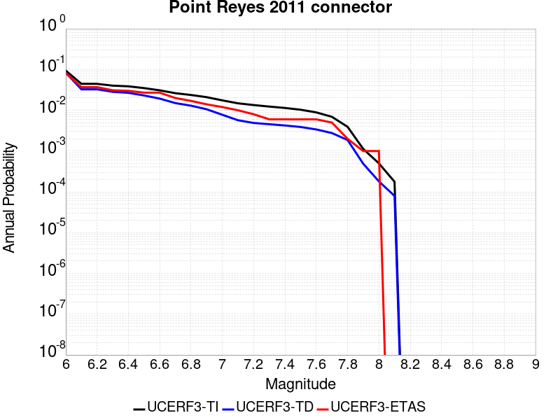 |
|-----|

| Magnitude | UCERF3-TI Prob | UCERF3-TD Prob | UCERF3-ETAS Prob |
|-----|-----|-----|-----|
| 6.0 | 0.09413087 | 0.083644405 | 0.08202247 |
| 6.1 | 0.044503998 | 0.032708645 | 0.037078653 |
| 6.2 | 0.044503998 | 0.032708645 | 0.037078653 |
| 6.3 | 0.040230766 | 0.028365813 | 0.031460673 |
| 6.4 | 0.03872554 | 0.026837055 | 0.030337078 |
| 6.5 | 0.035017524 | 0.023101341 | 0.026966292 |
| 6.6 | 0.030879568 | 0.019337133 | 0.026966292 |
| 6.7 | 0.026247041 | 0.01502163 | 0.019101124 |
| 6.8 | 0.02374774 | 0.012978022 | 0.016853932 |
| 6.9 | 0.020988787 | 0.010597975 | 0.013483146 |
| 7.0 | 0.017515935 | 0.007765876 | 0.01235955 |
| 7.1 | 0.014832685 | 0.0057002525 | 0.010112359 |
| 7.2 | 0.013437603 | 0.004893274 | 0.007865168 |
| 7.3 | 0.012341672 | 0.0045530833 | 0.0056179776 |
| 7.4 | 0.011410401 | 0.0042432654 | 0.0056179776 |
| 7.5 | 0.010329954 | 0.003896212 | 0.0056179776 |
| 7.6 | 0.00887985 | 0.0033911774 | 0.0056179776 |
| 7.7 | 0.0069186897 | 0.002764176 | 0.0056179776 |
| 7.8 | 0.003933572 | 0.0018664955 | 0.002247191 |
| 7.9 | 0.0011271574 | 4.893136E-4 | 0.0011235955 |
| 8.0 | 4.9948314E-4 | 1.8067264E-4 | 0.0011235955 |
| 8.1 | 1.7685097E-4 | 7.94175E-5 | 0.0 |

## Polaris 2011 CFM
*[(top)](#table-of-contents)*

| 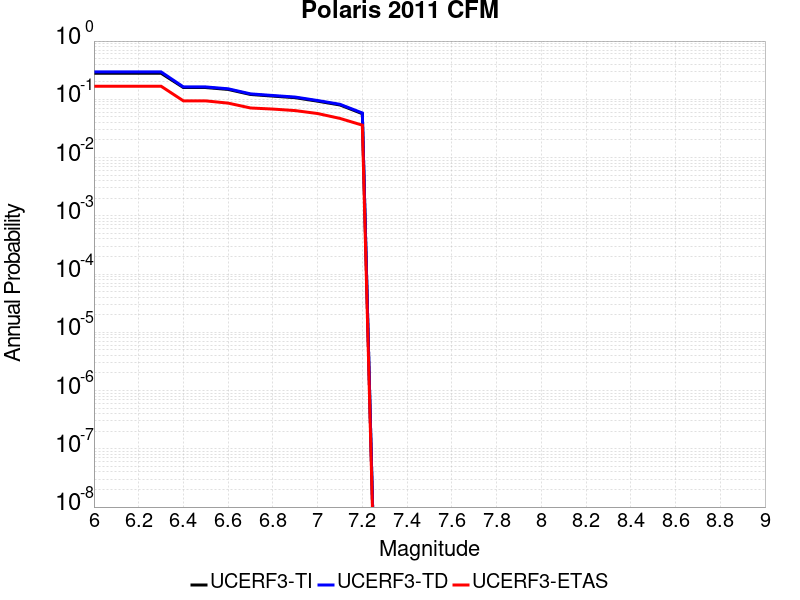 |
|-----|

| Magnitude | UCERF3-TI Prob | UCERF3-TD Prob | UCERF3-ETAS Prob |
|-----|-----|-----|-----|
| 6.0 | 0.2807392 | 0.29568595 | 0.1741573 |
| 6.1 | 0.2807392 | 0.29568595 | 0.1741573 |
| 6.2 | 0.2807392 | 0.29568595 | 0.1741573 |
| 6.3 | 0.2807392 | 0.29568595 | 0.1741573 |
| 6.4 | 0.15912439 | 0.16315556 | 0.09775281 |
| 6.5 | 0.15912439 | 0.16315556 | 0.09775281 |
| 6.6 | 0.14776422 | 0.15154374 | 0.08876404 |
| 6.7 | 0.121093 | 0.12404239 | 0.074157305 |
| 6.8 | 0.11346886 | 0.11626878 | 0.07078651 |
| 6.9 | 0.106594674 | 0.10926911 | 0.06629214 |
| 7.0 | 0.09292298 | 0.09532098 | 0.05955056 |
| 7.1 | 0.07994171 | 0.08207728 | 0.048314605 |
| 7.2 | 0.05665881 | 0.058289655 | 0.035955057 |

## Puente Hills
*[(top)](#table-of-contents)*

|  |
|-----|

| Magnitude | UCERF3-TI Prob | UCERF3-TD Prob | UCERF3-ETAS Prob |
|-----|-----|-----|-----|
| 6.0 | 0.27074036 | 0.20541964 | 0.12808989 |
| 6.1 | 0.27074036 | 0.20541964 | 0.12808989 |
| 6.2 | 0.27074036 | 0.20541964 | 0.12808989 |
| 6.3 | 0.27074036 | 0.20541964 | 0.12808989 |
| 6.4 | 0.27074036 | 0.20541964 | 0.12808989 |
| 6.5 | 0.27074036 | 0.20541964 | 0.12808989 |
| 6.6 | 0.23409624 | 0.16983669 | 0.09775281 |
| 6.7 | 0.23409624 | 0.16983669 | 0.09775281 |
| 6.8 | 0.20174606 | 0.14029923 | 0.06966292 |
| 6.9 | 0.1897801 | 0.13515626 | 0.06629214 |
| 7.0 | 0.17543592 | 0.12515089 | 0.06516854 |
| 7.1 | 0.15523462 | 0.11030914 | 0.056179777 |
| 7.2 | 0.12557049 | 0.0858355 | 0.040449437 |
| 7.3 | 0.09740882 | 0.06708528 | 0.03258427 |
| 7.4 | 0.0701897 | 0.047252 | 0.019101124 |
| 7.5 | 0.05187361 | 0.033688955 | 0.013483146 |
| 7.6 | 0.043280486 | 0.02743119 | 0.008988764 |
| 7.7 | 0.03779581 | 0.023363033 | 0.007865168 |
| 7.8 | 0.0047974703 | 0.0030157 | 0.0033707866 |

## Quien Sabe 2011 CFM
*[(top)](#table-of-contents)*

|  |
|-----|

| Magnitude | UCERF3-TI Prob | UCERF3-TD Prob | UCERF3-ETAS Prob |
|-----|-----|-----|-----|
| 6.0 | 0.6220986 | 0.35737488 | 0.50449437 |
| 6.1 | 0.37190548 | 0.18645187 | 0.28651685 |
| 6.2 | 0.11969468 | 0.05930307 | 0.093258426 |
| 6.3 | 0.095764525 | 0.04874913 | 0.074157305 |
| 6.4 | 0.077143535 | 0.040653992 | 0.062921345 |
| 6.5 | 0.06334029 | 0.03472695 | 0.053932585 |
| 6.6 | 0.044643093 | 0.026746966 | 0.03820225 |
| 6.7 | 0.038522035 | 0.02380777 | 0.033707865 |
| 6.8 | 0.03315597 | 0.021367965 | 0.026966292 |
| 6.9 | 0.022971168 | 0.016498802 | 0.020224718 |
| 7.0 | 0.017300041 | 0.012606279 | 0.015730336 |
| 7.1 | 0.011466527 | 0.008926288 | 0.011235955 |
| 7.2 | 0.0043269033 | 0.0042991745 | 0.0056179776 |
| 7.3 | 0.0031628762 | 0.003176128 | 0.0033707866 |
| 7.4 | 6.3097733E-4 | 6.330797E-4 | 0.0 |
| 7.5 | 3.7647062E-4 | 3.9215462E-4 | 0.0 |

## Raymond
*[(top)](#table-of-contents)*

|  |
|-----|

| Magnitude | UCERF3-TI Prob | UCERF3-TD Prob | UCERF3-ETAS Prob |
|-----|-----|-----|-----|
| 6.0 | 0.32662243 | 0.333923 | 0.26853934 |
| 6.1 | 0.32662243 | 0.333923 | 0.26853934 |
| 6.2 | 0.32662243 | 0.333923 | 0.26853934 |
| 6.3 | 0.32662243 | 0.333923 | 0.26853934 |
| 6.4 | 0.30492666 | 0.31160563 | 0.24269663 |
| 6.5 | 0.30492666 | 0.31160563 | 0.24269663 |
| 6.6 | 0.2404663 | 0.2426732 | 0.16404495 |
| 6.7 | 0.2404663 | 0.2426732 | 0.16404495 |
| 6.8 | 0.23122635 | 0.23327509 | 0.15955056 |
| 6.9 | 0.18245699 | 0.18238471 | 0.12247191 |
| 7.0 | 0.16990462 | 0.1694811 | 0.11797753 |
| 7.1 | 0.13716751 | 0.13572134 | 0.08539326 |
| 7.2 | 0.12082649 | 0.11895037 | 0.06966292 |
| 7.3 | 0.10464668 | 0.10238099 | 0.061797753 |
| 7.4 | 0.087267525 | 0.0845526 | 0.047191013 |
| 7.5 | 0.06894135 | 0.06580622 | 0.026966292 |
| 7.6 | 0.046339024 | 0.04288865 | 0.015730336 |
| 7.7 | 0.027428905 | 0.023708608 | 0.007865168 |
| 7.8 | 0.017875405 | 0.014360673 | 0.0033707866 |
| 7.9 | 0.0019353067 | 0.0017279458 | 0.0011235955 |

## Red Mountain
*[(top)](#table-of-contents)*

| 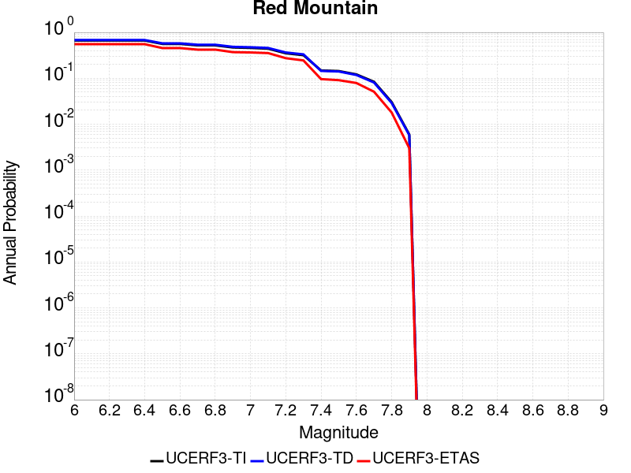 |
|-----|

| Magnitude | UCERF3-TI Prob | UCERF3-TD Prob | UCERF3-ETAS Prob |
|-----|-----|-----|-----|
| 6.0 | 0.6640644 | 0.68153596 | 0.55617976 |
| 6.1 | 0.6640644 | 0.68153596 | 0.55617976 |
| 6.2 | 0.6640644 | 0.68153596 | 0.55617976 |
| 6.3 | 0.6640644 | 0.68153596 | 0.55617976 |
| 6.4 | 0.6640644 | 0.68153596 | 0.55617976 |
| 6.5 | 0.5608878 | 0.5773018 | 0.46067417 |
| 6.6 | 0.56078243 | 0.57719845 | 0.46067417 |
| 6.7 | 0.5216845 | 0.53878015 | 0.4280899 |
| 6.8 | 0.5210046 | 0.5381026 | 0.4280899 |
| 6.9 | 0.4685231 | 0.4849279 | 0.3764045 |
| 7.0 | 0.4581252 | 0.47451177 | 0.37078652 |
| 7.1 | 0.4412769 | 0.45759997 | 0.35842696 |
| 7.2 | 0.35037726 | 0.36491686 | 0.27865168 |
| 7.3 | 0.31859335 | 0.3323299 | 0.2494382 |
| 7.4 | 0.1478658 | 0.14470893 | 0.09662921 |
| 7.5 | 0.1438897 | 0.14065307 | 0.09101123 |
| 7.6 | 0.121670604 | 0.118048705 | 0.07977528 |
| 7.7 | 0.083961055 | 0.08091965 | 0.051685393 |
| 7.8 | 0.030389596 | 0.02906387 | 0.017977528 |
| 7.9 | 0.0059740804 | 0.0057921098 | 0.0033707866 |

## Red Pass
*[(top)](#table-of-contents)*

| 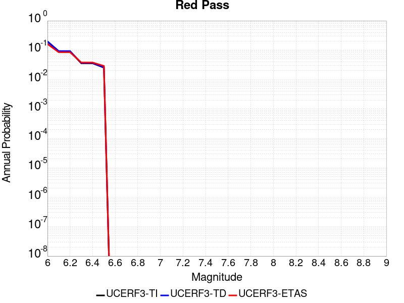 |
|-----|

| Magnitude | UCERF3-TI Prob | UCERF3-TD Prob | UCERF3-ETAS Prob |
|-----|-----|-----|-----|
| 6.0 | 0.19382422 | 0.19950357 | 0.15842697 |
| 6.1 | 0.09083234 | 0.092861116 | 0.08539326 |
| 6.2 | 0.09083234 | 0.092861116 | 0.08539326 |
| 6.3 | 0.035677206 | 0.036400747 | 0.039325844 |
| 6.4 | 0.035677206 | 0.036400747 | 0.039325844 |
| 6.5 | 0.02543875 | 0.026035532 | 0.031460673 |

## Redondo Canyon alt 1
*[(top)](#table-of-contents)*

|  |
|-----|

| Magnitude | UCERF3-TI Prob | UCERF3-TD Prob | UCERF3-ETAS Prob |
|-----|-----|-----|-----|
| 6.0 | 0.23656522 | 0.25346267 | 0.16516854 |
| 6.1 | 0.23656522 | 0.25346267 | 0.16516854 |
| 6.2 | 0.23656522 | 0.25346267 | 0.16516854 |
| 6.3 | 0.08022259 | 0.07759554 | 0.056179777 |
| 6.4 | 0.08022259 | 0.07759554 | 0.056179777 |
| 6.5 | 0.08022259 | 0.07759554 | 0.056179777 |
| 6.6 | 0.04956028 | 0.045476414 | 0.028089888 |
| 6.7 | 0.04956028 | 0.045476414 | 0.028089888 |
| 6.8 | 0.02899541 | 0.023889897 | 0.017977528 |
| 6.9 | 0.02899541 | 0.023889897 | 0.017977528 |
| 7.0 | 0.02899541 | 0.023889897 | 0.017977528 |
| 7.1 | 0.027136533 | 0.022403818 | 0.017977528 |
| 7.2 | 0.027136533 | 0.022403818 | 0.017977528 |
| 7.3 | 0.0024767565 | 0.0016060278 | 0.0011235955 |
| 7.4 | 0.0010305378 | 7.0583925E-4 | 0.0 |
| 7.5 | 1.4643683E-4 | 1.0419682E-4 | 0.0 |
| 7.6 | 1.0712817E-4 | 7.418332E-5 | 0.0 |
| 7.7 | 3.553232E-5 | 2.1367761E-5 | 0.0 |
| 7.8 | 3.553232E-5 | 2.1367761E-5 | 0.0 |

## Reliz 2011 CFM
*[(top)](#table-of-contents)*

| 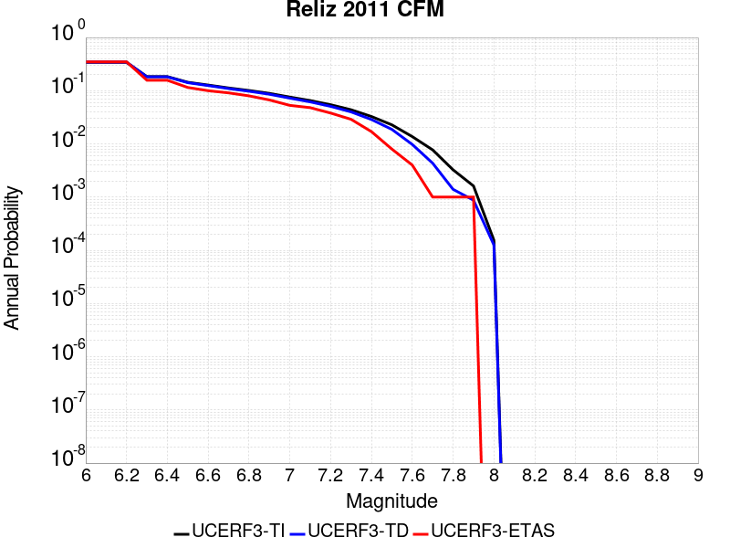 |
|-----|

| Magnitude | UCERF3-TI Prob | UCERF3-TD Prob | UCERF3-ETAS Prob |
|-----|-----|-----|-----|
| 6.0 | 0.34130612 | 0.3444236 | 0.33820224 |
| 6.1 | 0.34130612 | 0.3444236 | 0.33820224 |
| 6.2 | 0.34130612 | 0.3444236 | 0.33820224 |
| 6.3 | 0.18396583 | 0.18189766 | 0.15505618 |
| 6.4 | 0.18396583 | 0.18189766 | 0.15505618 |
| 6.5 | 0.14413919 | 0.14151865 | 0.11235955 |
| 6.6 | 0.12766309 | 0.12484745 | 0.0988764 |
| 6.7 | 0.11263118 | 0.10962446 | 0.08988764 |
| 6.8 | 0.100893006 | 0.0977388 | 0.07865169 |
| 6.9 | 0.089058794 | 0.085756764 | 0.06741573 |
| 7.0 | 0.075910084 | 0.07244784 | 0.051685393 |
| 7.1 | 0.06524413 | 0.061646875 | 0.046067417 |
| 7.2 | 0.05450492 | 0.050762102 | 0.03483146 |
| 7.3 | 0.04386857 | 0.039985433 | 0.0247191 |
| 7.4 | 0.032729767 | 0.028733447 | 0.013483146 |
| 7.5 | 0.02281514 | 0.018749136 | 0.0056179776 |
| 7.6 | 0.013709921 | 0.0097711785 | 0.002247191 |
| 7.7 | 0.00770909 | 0.004334259 | 0.0 |
| 7.8 | 0.00325829 | 0.0013981812 | 0.0 |
| 7.9 | 0.0016197428 | 8.753838E-4 | 0.0 |
| 8.0 | 1.5453655E-4 | 1.2592127E-4 | 0.0 |

## Richfield
*[(top)](#table-of-contents)*

| 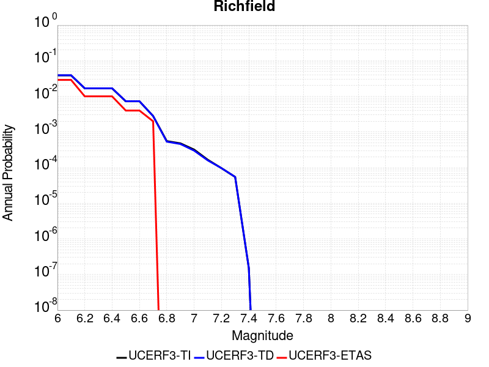 |
|-----|

| Magnitude | UCERF3-TI Prob | UCERF3-TD Prob | UCERF3-ETAS Prob |
|-----|-----|-----|-----|
| 6.0 | 0.038796734 | 0.03923933 | 0.028089888 |
| 6.1 | 0.038796734 | 0.03923933 | 0.028089888 |
| 6.2 | 0.016746502 | 0.016862812 | 0.010112359 |
| 6.3 | 0.016746502 | 0.016862812 | 0.010112359 |
| 6.4 | 0.016746502 | 0.016862812 | 0.010112359 |
| 6.5 | 0.0072665745 | 0.007307834 | 0.0033707866 |
| 6.6 | 0.0072665745 | 0.007307834 | 0.0033707866 |
| 6.7 | 0.0028077713 | 0.0028020386 | 0.0011235955 |
| 6.8 | 5.555963E-4 | 5.3576764E-4 | 0.0 |
| 6.9 | 4.8027976E-4 | 4.602364E-4 | 0.0 |
| 7.0 | 3.2060005E-4 | 3.0012365E-4 | 0.0 |
| 7.1 | 1.6626813E-4 | 1.5962664E-4 | 0.0 |
| 7.2 | 9.649946E-5 | 9.679195E-5 | 0.0 |
| 7.3 | 5.471809E-5 | 5.4897075E-5 | 0.0 |
| 7.4 | 1.5213764E-7 | 1.5261443E-7 | 0.0 |

## Rinconada 2011 CFM
*[(top)](#table-of-contents)*

| 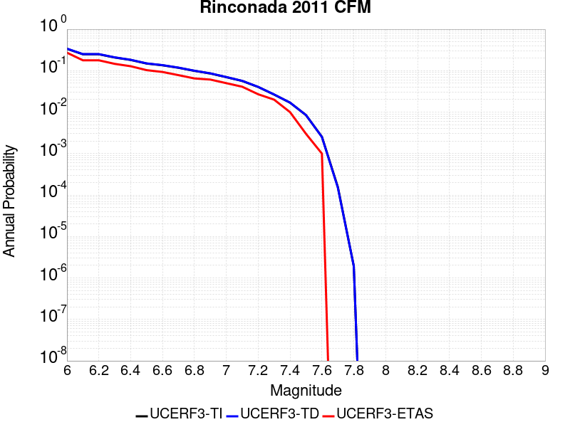 |
|-----|

| Magnitude | UCERF3-TI Prob | UCERF3-TD Prob | UCERF3-ETAS Prob |
|-----|-----|-----|-----|
| 6.0 | 0.33699402 | 0.34020248 | 0.2764045 |
| 6.1 | 0.24881262 | 0.2510109 | 0.18089887 |
| 6.2 | 0.24881262 | 0.2510109 | 0.18089887 |
| 6.3 | 0.2077497 | 0.20955266 | 0.1494382 |
| 6.4 | 0.18150422 | 0.1830619 | 0.13033707 |
| 6.5 | 0.14861922 | 0.14987764 | 0.10224719 |
| 6.6 | 0.13487917 | 0.13601544 | 0.09213483 |
| 6.7 | 0.1174255 | 0.11840352 | 0.07752809 |
| 6.8 | 0.09899132 | 0.099794984 | 0.06516854 |
| 6.9 | 0.08548019 | 0.0861492 | 0.060674157 |
| 7.0 | 0.06974877 | 0.07026934 | 0.0494382 |
| 7.1 | 0.05645408 | 0.056856204 | 0.039325844 |
| 7.2 | 0.04042803 | 0.040692706 | 0.0247191 |
| 7.3 | 0.026530817 | 0.026684282 | 0.016853932 |
| 7.4 | 0.016906222 | 0.016989857 | 0.007865168 |
| 7.5 | 0.008483777 | 0.008505092 | 0.002247191 |
| 7.6 | 0.002541603 | 0.0025170604 | 0.0011235955 |
| 7.7 | 1.5652725E-4 | 1.5086333E-4 | 0.0 |
| 7.8 | 1.9306071E-6 | 1.9357753E-6 | 0.0 |

## Robinson Creek
*[(top)](#table-of-contents)*

| 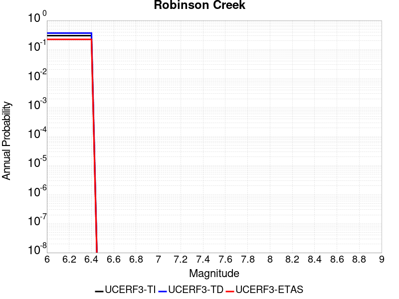 |
|-----|

| Magnitude | UCERF3-TI Prob | UCERF3-TD Prob | UCERF3-ETAS Prob |
|-----|-----|-----|-----|
| 6.0 | 0.30062252 | 0.3669633 | 0.22696629 |
| 6.1 | 0.30062252 | 0.3669633 | 0.22696629 |
| 6.2 | 0.30062252 | 0.3669633 | 0.22696629 |
| 6.3 | 0.30062252 | 0.3669633 | 0.22696629 |
| 6.4 | 0.30062252 | 0.3669633 | 0.22696629 |

## Rocky Ledge 2011 CFM
*[(top)](#table-of-contents)*

|  |
|-----|

| Magnitude | UCERF3-TI Prob | UCERF3-TD Prob | UCERF3-ETAS Prob |
|-----|-----|-----|-----|
| 6.0 | 0.20420532 | 0.22650051 | 0.20337078 |
| 6.1 | 0.20420532 | 0.22650051 | 0.14157303 |
| 6.2 | 0.1764779 | 0.19866046 | 0.11235955 |

## Rodgers Creek - Healdsburg 2011 CFM
*[(top)](#table-of-contents)*

|  |
|-----|

| Magnitude | UCERF3-TI Prob | UCERF3-TD Prob | UCERF3-ETAS Prob |
|-----|-----|-----|-----|
| 6.0 | 0.8545782 | 0.73715454 | 0.84157306 |
| 6.1 | 0.85184324 | 0.7331745 | 0.8359551 |
| 6.2 | 0.8446874 | 0.72446513 | 0.8191011 |
| 6.3 | 0.8358378 | 0.7139002 | 0.81011236 |
| 6.4 | 0.8247785 | 0.70109576 | 0.7932584 |
| 6.5 | 0.8200433 | 0.6946552 | 0.78764045 |
| 6.6 | 0.80620676 | 0.6776094 | 0.7741573 |
| 6.7 | 0.7971889 | 0.66648656 | 0.76292133 |
| 6.8 | 0.7867683 | 0.6538207 | 0.7516854 |
| 6.9 | 0.75577176 | 0.6173955 | 0.71123594 |
| 7.0 | 0.7160957 | 0.577591 | 0.66067415 |
| 7.1 | 0.6505084 | 0.5031911 | 0.57865167 |
| 7.2 | 0.55417913 | 0.41234636 | 0.46853933 |
| 7.3 | 0.45995978 | 0.32457158 | 0.38089886 |
| 7.4 | 0.37883797 | 0.25771692 | 0.2988764 |
| 7.5 | 0.27661043 | 0.18018815 | 0.20898877 |
| 7.6 | 0.110242 | 0.0663912 | 0.0764045 |
| 7.7 | 0.0056140963 | 0.0039944216 | 0.006741573 |
| 7.8 | 0.0025957257 | 0.0012649649 | 0.002247191 |
| 7.9 | 0.0014793479 | 6.640668E-4 | 0.0011235955 |
| 8.0 | 7.462487E-4 | 3.2898123E-4 | 0.0011235955 |
| 8.1 | 9.142622E-5 | 3.9811275E-5 | 0.0 |

## Rose Canyon
*[(top)](#table-of-contents)*

| 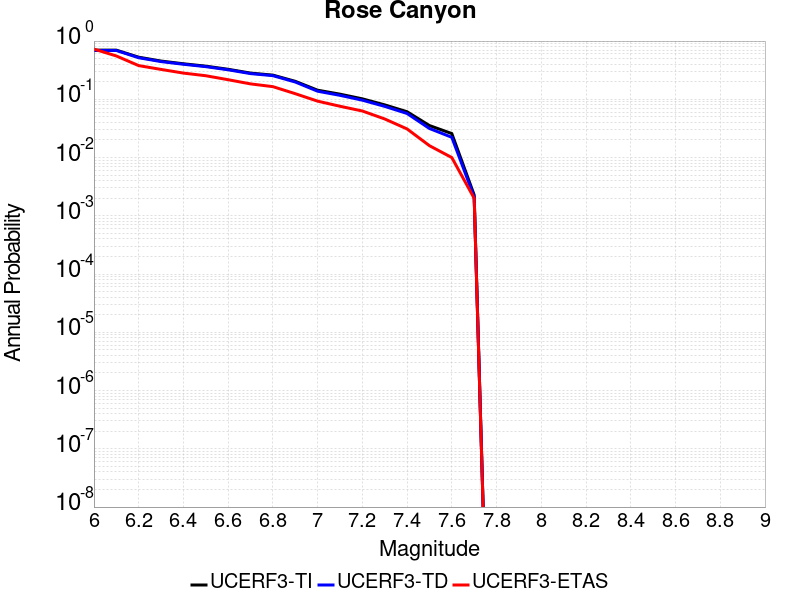 |
|-----|

| Magnitude | UCERF3-TI Prob | UCERF3-TD Prob | UCERF3-ETAS Prob |
|-----|-----|-----|-----|
| 6.0 | 0.69824237 | 0.68915355 | 0.7247191 |
| 6.1 | 0.69824237 | 0.68915355 | 0.5505618 |
| 6.2 | 0.52883613 | 0.51738244 | 0.37865168 |
| 6.3 | 0.45367262 | 0.4442102 | 0.3269663 |
| 6.4 | 0.40757358 | 0.39968476 | 0.27865168 |
| 6.5 | 0.37098983 | 0.3636974 | 0.2505618 |
| 6.6 | 0.32785022 | 0.32128525 | 0.21348314 |
| 6.7 | 0.28210914 | 0.2763226 | 0.17977528 |
| 6.8 | 0.26026353 | 0.25477237 | 0.15955056 |
| 6.9 | 0.20372818 | 0.19832076 | 0.11797753 |
| 7.0 | 0.14342014 | 0.13774054 | 0.08651686 |
| 7.1 | 0.122603774 | 0.117019355 | 0.07078651 |
| 7.2 | 0.10193065 | 0.096595384 | 0.060674157 |
| 7.3 | 0.08029085 | 0.07564909 | 0.043820225 |
| 7.4 | 0.061171506 | 0.057098072 | 0.028089888 |
| 7.5 | 0.035470765 | 0.031560596 | 0.015730336 |
| 7.6 | 0.025806751 | 0.022276811 | 0.008988764 |
| 7.7 | 0.0022833357 | 0.0021129758 | 0.002247191 |

## Round Valley
*[(top)](#table-of-contents)*

|  |
|-----|

| Magnitude | UCERF3-TI Prob | UCERF3-TD Prob | UCERF3-ETAS Prob |
|-----|-----|-----|-----|
| 6.0 | 0.3392243 | 0.35348824 | 0.18988764 |
| 6.1 | 0.3392243 | 0.35348824 | 0.18988764 |
| 6.2 | 0.3392243 | 0.35348824 | 0.18988764 |
| 6.3 | 0.3392243 | 0.35348824 | 0.18988764 |
| 6.4 | 0.3392243 | 0.35348824 | 0.18988764 |
| 6.5 | 0.24252766 | 0.2503918 | 0.123595506 |
| 6.6 | 0.20166634 | 0.2080868 | 0.104494385 |
| 6.7 | 0.20166634 | 0.2080868 | 0.104494385 |
| 6.8 | 0.17004167 | 0.17553018 | 0.0764045 |
| 6.9 | 0.15624727 | 0.16144097 | 0.06629214 |
| 7.0 | 0.12370262 | 0.12800315 | 0.056179777 |
| 7.1 | 0.10885126 | 0.11273461 | 0.041573033 |
| 7.2 | 0.06400892 | 0.06656108 | 0.0247191 |
| 7.3 | 0.020399636 | 0.02121619 | 0.010112359 |

## Russ 2011 CFM
*[(top)](#table-of-contents)*

|  |
|-----|

| Magnitude | UCERF3-TI Prob | UCERF3-TD Prob | UCERF3-ETAS Prob |
|-----|-----|-----|-----|
| 6.0 | 0.46264616 | 0.48005763 | 0.28651685 |
| 6.1 | 0.46264616 | 0.48005763 | 0.28651685 |
| 6.2 | 0.46264616 | 0.48005763 | 0.28651685 |
| 6.3 | 0.46264616 | 0.48005763 | 0.28651685 |
| 6.4 | 0.46264616 | 0.48005763 | 0.28651685 |
| 6.5 | 0.46264616 | 0.48005763 | 0.28651685 |
| 6.6 | 0.46264616 | 0.48005763 | 0.28651685 |
| 6.7 | 0.3500671 | 0.36330637 | 0.19550562 |
| 6.8 | 0.3500671 | 0.36330637 | 0.19550562 |
| 6.9 | 0.2870978 | 0.29838946 | 0.15168539 |
| 7.0 | 0.23368284 | 0.24332102 | 0.12921348 |
| 7.1 | 0.19626485 | 0.2048857 | 0.10561798 |
| 7.2 | 0.15926471 | 0.16684891 | 0.08202247 |
| 7.3 | 0.12126415 | 0.12770689 | 0.062921345 |

## San Andreas (Big Bend)
*[(top)](#table-of-contents)*

| 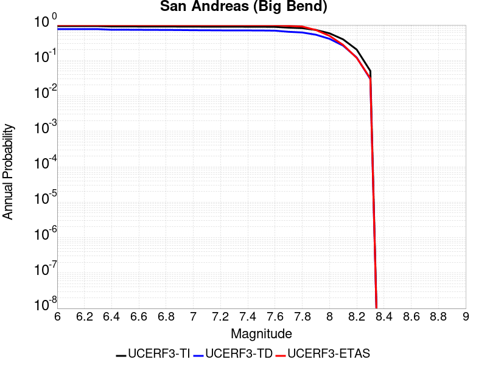 |
|-----|

| Magnitude | UCERF3-TI Prob | UCERF3-TD Prob | UCERF3-ETAS Prob |
|-----|-----|-----|-----|
| 6.0 | 0.92977256 | 0.76302636 | 0.994382 |
| 6.1 | 0.92977256 | 0.76302636 | 0.994382 |
| 6.2 | 0.92977256 | 0.76302636 | 0.994382 |
| 6.3 | 0.92977256 | 0.76302636 | 0.994382 |
| 6.4 | 0.90845436 | 0.7336891 | 0.99101126 |
| 6.5 | 0.90845436 | 0.7336891 | 0.99101126 |
| 6.6 | 0.90551007 | 0.7299553 | 0.99101126 |
| 6.7 | 0.9040454 | 0.72608465 | 0.99101126 |
| 6.8 | 0.9031277 | 0.7243732 | 0.99101126 |
| 6.9 | 0.90085304 | 0.7192919 | 0.99101126 |
| 7.0 | 0.89783585 | 0.7121293 | 0.99101126 |
| 7.1 | 0.8962679 | 0.70885813 | 0.98988765 |
| 7.2 | 0.8941229 | 0.7042514 | 0.98988765 |
| 7.3 | 0.89306086 | 0.70246166 | 0.98988765 |
| 7.4 | 0.89235973 | 0.70128846 | 0.98876405 |
| 7.5 | 0.8905465 | 0.699074 | 0.98764044 |
| 7.6 | 0.88353145 | 0.6910722 | 0.9831461 |
| 7.7 | 0.8391754 | 0.6414723 | 0.9505618 |
| 7.8 | 0.8124624 | 0.61392975 | 0.90561795 |
| 7.9 | 0.72440404 | 0.5312008 | 0.7179775 |
| 8.0 | 0.58217674 | 0.40664217 | 0.48988765 |
| 8.1 | 0.39252114 | 0.26114738 | 0.2730337 |
| 8.2 | 0.20189473 | 0.12060131 | 0.11235955 |
| 8.3 | 0.050421786 | 0.029666498 | 0.030337078 |

## San Andreas (Carrizo) rev
*[(top)](#table-of-contents)*

|  |
|-----|

| Magnitude | UCERF3-TI Prob | UCERF3-TD Prob | UCERF3-ETAS Prob |
|-----|-----|-----|-----|
| 6.0 | 0.9524515 | 0.76764905 | 1.0 |
| 6.1 | 0.9524515 | 0.76764905 | 1.0 |
| 6.2 | 0.9524515 | 0.76764905 | 1.0 |
| 6.3 | 0.9524515 | 0.76764905 | 1.0 |
| 6.4 | 0.9524515 | 0.76764905 | 1.0 |
| 6.5 | 0.94775486 | 0.75986093 | 1.0 |
| 6.6 | 0.94775486 | 0.75986093 | 1.0 |
| 6.7 | 0.9454715 | 0.756242 | 1.0 |
| 6.8 | 0.9448119 | 0.75514525 | 1.0 |
| 6.9 | 0.9440824 | 0.75397104 | 1.0 |
| 7.0 | 0.9433794 | 0.75274724 | 1.0 |
| 7.1 | 0.93208236 | 0.7358217 | 1.0 |
| 7.2 | 0.9269221 | 0.7286364 | 0.9988764 |
| 7.3 | 0.92279536 | 0.7234199 | 0.9988764 |
| 7.4 | 0.9175157 | 0.7169382 | 0.9977528 |
| 7.5 | 0.8776541 | 0.67466724 | 0.9797753 |
| 7.6 | 0.87259173 | 0.6695161 | 0.9775281 |
| 7.7 | 0.8262223 | 0.62016076 | 0.9404494 |
| 7.8 | 0.79889774 | 0.5935488 | 0.89325845 |
| 7.9 | 0.71143574 | 0.51450473 | 0.7078652 |
| 8.0 | 0.58331335 | 0.40661916 | 0.49438202 |
| 8.1 | 0.39363798 | 0.2617753 | 0.27415732 |
| 8.2 | 0.20189473 | 0.12060131 | 0.11235955 |
| 8.3 | 0.050421786 | 0.029666498 | 0.030337078 |

## San Andreas (Cholame) rev
*[(top)](#table-of-contents)*

| 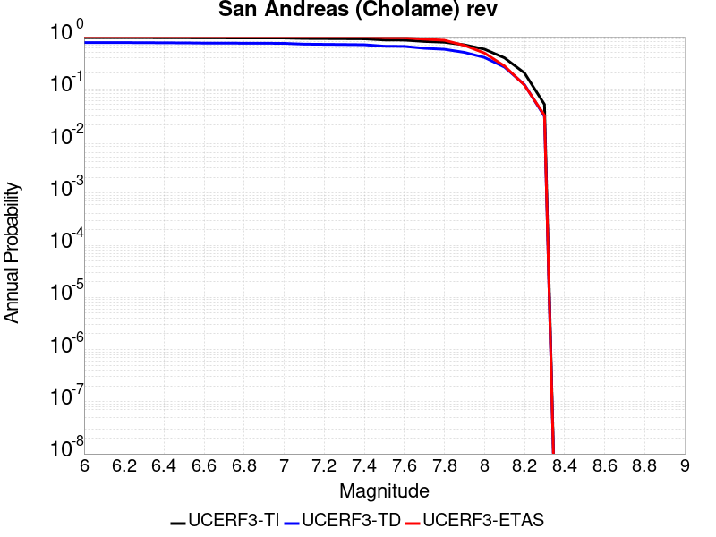 |
|-----|

| Magnitude | UCERF3-TI Prob | UCERF3-TD Prob | UCERF3-ETAS Prob |
|-----|-----|-----|-----|
| 6.0 | 0.95963675 | 0.7722725 | 0.9988764 |
| 6.1 | 0.95963675 | 0.7722725 | 0.9988764 |
| 6.2 | 0.9585811 | 0.7701503 | 0.9988764 |
| 6.3 | 0.95791745 | 0.7688587 | 0.9988764 |
| 6.4 | 0.9547581 | 0.7632057 | 0.9977528 |
| 6.5 | 0.95330924 | 0.76095897 | 0.9977528 |
| 6.6 | 0.94835514 | 0.75335985 | 0.99662924 |
| 6.7 | 0.9471764 | 0.75160354 | 0.99662924 |
| 6.8 | 0.9464347 | 0.7504741 | 0.99662924 |
| 6.9 | 0.94543 | 0.7489073 | 0.99662924 |
| 7.0 | 0.9427916 | 0.7449793 | 0.99550563 |
| 7.1 | 0.9250001 | 0.72015995 | 0.9921348 |
| 7.2 | 0.9203366 | 0.7140822 | 0.98876405 |
| 7.3 | 0.9155421 | 0.7084353 | 0.98876405 |
| 7.4 | 0.90979195 | 0.70162284 | 0.98651683 |
| 7.5 | 0.8664405 | 0.65726274 | 0.95842695 |
| 7.6 | 0.8610057 | 0.65183014 | 0.95168537 |
| 7.7 | 0.81064016 | 0.5998909 | 0.9011236 |
| 7.8 | 0.7834145 | 0.5739554 | 0.85955054 |
| 7.9 | 0.69847554 | 0.5009264 | 0.6797753 |
| 8.0 | 0.57669437 | 0.4000623 | 0.48314607 |
| 8.1 | 0.3936703 | 0.261796 | 0.27415732 |
| 8.2 | 0.20189473 | 0.12060131 | 0.11235955 |
| 8.3 | 0.050421786 | 0.029666498 | 0.030337078 |

## San Andreas (Coachella) rev
*[(top)](#table-of-contents)*

|  |
|-----|

| Magnitude | UCERF3-TI Prob | UCERF3-TD Prob | UCERF3-ETAS Prob |
|-----|-----|-----|-----|
| 6.0 | 0.9554694 | 0.8179867 | 0.9932584 |
| 6.1 | 0.9554694 | 0.8179867 | 0.9932584 |
| 6.2 | 0.93937117 | 0.77135545 | 0.98988765 |
| 6.3 | 0.9389828 | 0.7708732 | 0.98988765 |
| 6.4 | 0.93292415 | 0.7584353 | 0.98764044 |
| 6.5 | 0.93064564 | 0.75402284 | 0.98764044 |
| 6.6 | 0.9286047 | 0.7505822 | 0.98764044 |
| 6.7 | 0.92736304 | 0.7485834 | 0.98764044 |
| 6.8 | 0.9259497 | 0.74635804 | 0.98651683 |
| 6.9 | 0.92199045 | 0.7407781 | 0.9853933 |
| 7.0 | 0.8911606 | 0.70899254 | 0.9730337 |
| 7.1 | 0.88590074 | 0.7030546 | 0.9719101 |
| 7.2 | 0.86102295 | 0.681321 | 0.9539326 |
| 7.3 | 0.84244263 | 0.66216916 | 0.93820226 |
| 7.4 | 0.73884606 | 0.5817017 | 0.79438204 |
| 7.5 | 0.6504233 | 0.51417553 | 0.6494382 |
| 7.6 | 0.55655557 | 0.4422481 | 0.5280899 |
| 7.7 | 0.43819776 | 0.3238187 | 0.3966292 |
| 7.8 | 0.36629486 | 0.22999074 | 0.33595505 |
| 7.9 | 0.30538604 | 0.18551175 | 0.27752808 |
| 8.0 | 0.26665244 | 0.16012529 | 0.23595506 |
| 8.1 | 0.124603406 | 0.07891496 | 0.09550562 |
| 8.2 | 0.058251593 | 0.034171537 | 0.031460673 |
| 8.3 | 0.0027159685 | 0.0025155956 | 0.0011235955 |

## San Andreas (Creeping Section) 2011 CFM
*[(top)](#table-of-contents)*

| 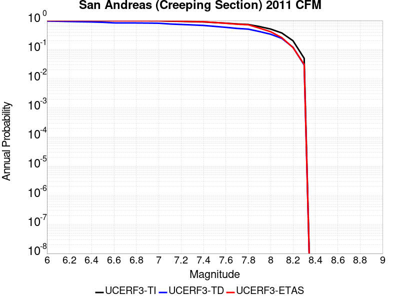 |
|-----|

| Magnitude | UCERF3-TI Prob | UCERF3-TD Prob | UCERF3-ETAS Prob |
|-----|-----|-----|-----|
| 6.0 | 0.9999998 | 0.9568646 | 1.0 |
| 6.1 | 0.9999979 | 0.94394606 | 1.0 |
| 6.2 | 0.9999758 | 0.92506903 | 1.0 |
| 6.3 | 0.9998813 | 0.909049 | 1.0 |
| 6.4 | 0.999528 | 0.89383304 | 1.0 |
| 6.5 | 0.9977753 | 0.8694813 | 1.0 |
| 6.6 | 0.9839723 | 0.8290144 | 0.9853933 |
| 6.7 | 0.98299974 | 0.8261233 | 0.9853933 |
| 6.8 | 0.98265046 | 0.82478887 | 0.9853933 |
| 6.9 | 0.9808175 | 0.81775224 | 0.9853933 |
| 7.0 | 0.97777253 | 0.8074911 | 0.9853933 |
| 7.1 | 0.95107275 | 0.7597434 | 0.96741575 |
| 7.2 | 0.9335833 | 0.73254997 | 0.9494382 |
| 7.3 | 0.9124019 | 0.70552146 | 0.9247191 |
| 7.4 | 0.89586896 | 0.6788693 | 0.9112359 |
| 7.5 | 0.8512573 | 0.6285101 | 0.858427 |
| 7.6 | 0.81139344 | 0.58344674 | 0.805618 |
| 7.7 | 0.7621838 | 0.5356875 | 0.75617975 |
| 7.8 | 0.7306047 | 0.50629246 | 0.7213483 |
| 7.9 | 0.6218306 | 0.4188342 | 0.547191 |
| 8.0 | 0.5095905 | 0.3384343 | 0.41460675 |
| 8.1 | 0.3737842 | 0.2431722 | 0.25617978 |
| 8.2 | 0.20189473 | 0.12060131 | 0.11235955 |
| 8.3 | 0.050421786 | 0.029666498 | 0.030337078 |

## San Andreas (Mojave N)
*[(top)](#table-of-contents)*

|  |
|-----|

| Magnitude | UCERF3-TI Prob | UCERF3-TD Prob | UCERF3-ETAS Prob |
|-----|-----|-----|-----|
| 6.0 | 0.92400926 | 0.7943545 | 0.994382 |
| 6.1 | 0.92400926 | 0.7943545 | 0.994382 |
| 6.2 | 0.92400926 | 0.7943545 | 0.994382 |
| 6.3 | 0.92400926 | 0.7943545 | 0.994382 |
| 6.4 | 0.92400926 | 0.7943545 | 0.994382 |
| 6.5 | 0.9236872 | 0.79398066 | 0.994382 |
| 6.6 | 0.9236872 | 0.79398066 | 0.994382 |
| 6.7 | 0.9235636 | 0.7938373 | 0.994382 |
| 6.8 | 0.9233884 | 0.7936212 | 0.994382 |
| 6.9 | 0.92297405 | 0.79287744 | 0.994382 |
| 7.0 | 0.92207736 | 0.79092336 | 0.994382 |
| 7.1 | 0.92065454 | 0.7878504 | 0.9932584 |
| 7.2 | 0.9196484 | 0.7857278 | 0.9932584 |
| 7.3 | 0.9188888 | 0.78429663 | 0.9932584 |
| 7.4 | 0.91815645 | 0.78313684 | 0.9921348 |
| 7.5 | 0.9174788 | 0.7820772 | 0.9921348 |
| 7.6 | 0.91433024 | 0.7779405 | 0.98988765 |
| 7.7 | 0.8823414 | 0.74045944 | 0.9696629 |
| 7.8 | 0.8505705 | 0.69356227 | 0.93483144 |
| 7.9 | 0.7547762 | 0.5875117 | 0.7483146 |
| 8.0 | 0.59543085 | 0.43047735 | 0.49550563 |
| 8.1 | 0.393273 | 0.2657828 | 0.2730337 |
| 8.2 | 0.20189473 | 0.12060131 | 0.11235955 |
| 8.3 | 0.050421786 | 0.029666498 | 0.030337078 |

## San Andreas (Mojave S)
*[(top)](#table-of-contents)*

|  |
|-----|

| Magnitude | UCERF3-TI Prob | UCERF3-TD Prob | UCERF3-ETAS Prob |
|-----|-----|-----|-----|
| 6.0 | 0.99969816 | 0.9508717 | 1.0 |
| 6.1 | 0.99969816 | 0.9508717 | 1.0 |
| 6.2 | 0.99969816 | 0.9508717 | 1.0 |
| 6.3 | 0.99969816 | 0.9508717 | 1.0 |
| 6.4 | 0.99440026 | 0.89976525 | 1.0 |
| 6.5 | 0.9655628 | 0.83400035 | 0.9988764 |
| 6.6 | 0.9655628 | 0.83400035 | 0.9988764 |
| 6.7 | 0.94026434 | 0.8071039 | 0.99550563 |
| 6.8 | 0.9374611 | 0.804624 | 0.99550563 |
| 6.9 | 0.9335832 | 0.80106753 | 0.99550563 |
| 7.0 | 0.92932504 | 0.7967915 | 0.99550563 |
| 7.1 | 0.924166 | 0.79180765 | 0.994382 |
| 7.2 | 0.9191715 | 0.786948 | 0.9932584 |
| 7.3 | 0.90735185 | 0.7762577 | 0.98764044 |
| 7.4 | 0.9016044 | 0.7705055 | 0.98651683 |
| 7.5 | 0.89599925 | 0.76434654 | 0.9831461 |
| 7.6 | 0.88979846 | 0.75708187 | 0.9797753 |
| 7.7 | 0.8840771 | 0.7488949 | 0.9764045 |
| 7.8 | 0.85663754 | 0.70882446 | 0.941573 |
| 7.9 | 0.74639595 | 0.58030844 | 0.74269664 |
| 8.0 | 0.5859633 | 0.42344153 | 0.48988765 |
| 8.1 | 0.38556156 | 0.26086727 | 0.27078652 |
| 8.2 | 0.19976068 | 0.11892538 | 0.111235954 |
| 8.3 | 0.050421786 | 0.029666498 | 0.030337078 |

## San Andreas (North Branch Mill Creek)
*[(top)](#table-of-contents)*

| 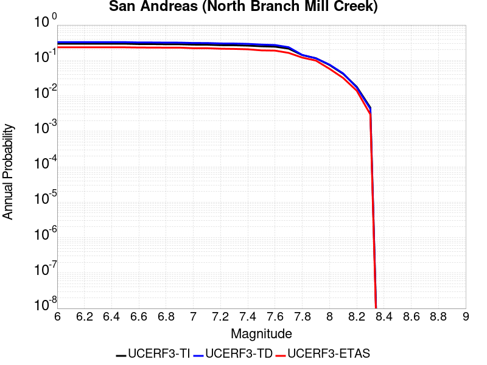 |
|-----|

| Magnitude | UCERF3-TI Prob | UCERF3-TD Prob | UCERF3-ETAS Prob |
|-----|-----|-----|-----|
| 6.0 | 0.29615304 | 0.32814938 | 0.23595506 |
| 6.1 | 0.29615304 | 0.32814938 | 0.23595506 |
| 6.2 | 0.29615304 | 0.32814938 | 0.23595506 |
| 6.3 | 0.29615304 | 0.32814938 | 0.23595506 |
| 6.4 | 0.29615304 | 0.32814938 | 0.23595506 |
| 6.5 | 0.2959611 | 0.32796314 | 0.23595506 |
| 6.6 | 0.28901732 | 0.32136562 | 0.23258427 |
| 6.7 | 0.2885663 | 0.32095066 | 0.23146068 |
| 6.8 | 0.28586468 | 0.31836447 | 0.23033708 |
| 6.9 | 0.28516436 | 0.31770602 | 0.23033708 |
| 7.0 | 0.27820468 | 0.31050512 | 0.22247191 |
| 7.1 | 0.27737692 | 0.3096825 | 0.22247191 |
| 7.2 | 0.26885667 | 0.30121568 | 0.21573034 |
| 7.3 | 0.26734143 | 0.29960227 | 0.21235955 |
| 7.4 | 0.2613358 | 0.29303098 | 0.20674157 |
| 7.5 | 0.2502054 | 0.27979985 | 0.19438203 |
| 7.6 | 0.2439914 | 0.2721179 | 0.19101124 |
| 7.7 | 0.21495374 | 0.2356859 | 0.16292135 |
| 7.8 | 0.14120327 | 0.14263466 | 0.11797753 |
| 7.9 | 0.115174085 | 0.114932425 | 0.09775281 |
| 8.0 | 0.07424653 | 0.07612467 | 0.05505618 |
| 8.1 | 0.041826107 | 0.043055348 | 0.031460673 |
| 8.2 | 0.018002367 | 0.01728265 | 0.013483146 |
| 8.3 | 0.0046528983 | 0.004309069 | 0.002247191 |

## San Andreas (North Coast) 2011 CFM
*[(top)](#table-of-contents)*

| 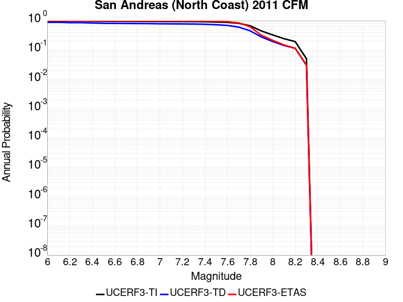 |
|-----|

| Magnitude | UCERF3-TI Prob | UCERF3-TD Prob | UCERF3-ETAS Prob |
|-----|-----|-----|-----|
| 6.0 | 0.9816983 | 0.88117033 | 0.99550563 |
| 6.1 | 0.9816983 | 0.88117033 | 0.99550563 |
| 6.2 | 0.9734848 | 0.8575661 | 0.99550563 |
| 6.3 | 0.9734848 | 0.8575661 | 0.99550563 |
| 6.4 | 0.962881 | 0.8325409 | 0.9921348 |
| 6.5 | 0.953208 | 0.8128069 | 0.99101126 |
| 6.6 | 0.9513513 | 0.8091538 | 0.99101126 |
| 6.7 | 0.9485095 | 0.80364656 | 0.98651683 |
| 6.8 | 0.9462515 | 0.7990798 | 0.9842697 |
| 6.9 | 0.94338554 | 0.79358596 | 0.9842697 |
| 7.0 | 0.9378448 | 0.7835891 | 0.9831461 |
| 7.1 | 0.93505216 | 0.77885437 | 0.9831461 |
| 7.2 | 0.9314461 | 0.7726849 | 0.9797753 |
| 7.3 | 0.9276353 | 0.76639503 | 0.9786517 |
| 7.4 | 0.91983896 | 0.7542704 | 0.9719101 |
| 7.5 | 0.8982801 | 0.7255214 | 0.9550562 |
| 7.6 | 0.8745447 | 0.6880455 | 0.9235955 |
| 7.7 | 0.81105244 | 0.6013621 | 0.83820224 |
| 7.8 | 0.67042315 | 0.45174727 | 0.6202247 |
| 7.9 | 0.44599396 | 0.27829745 | 0.31460676 |
| 8.0 | 0.3268062 | 0.19500428 | 0.21011236 |
| 8.1 | 0.24320462 | 0.14243086 | 0.14157303 |
| 8.2 | 0.19314744 | 0.11426224 | 0.11011236 |
| 8.3 | 0.050421786 | 0.029666498 | 0.030337078 |

## San Andreas (Offshore) 2011 CFM
*[(top)](#table-of-contents)*

|  |
|-----|

| Magnitude | UCERF3-TI Prob | UCERF3-TD Prob | UCERF3-ETAS Prob |
|-----|-----|-----|-----|
| 6.0 | 0.9883744 | 0.8581313 | 0.99662924 |
| 6.1 | 0.9883744 | 0.8581313 | 0.99662924 |
| 6.2 | 0.9858236 | 0.84589607 | 0.99550563 |
| 6.3 | 0.98056453 | 0.8262693 | 0.9932584 |
| 6.4 | 0.9802817 | 0.82545483 | 0.9932584 |
| 6.5 | 0.96418583 | 0.7818778 | 0.98764044 |
| 6.6 | 0.944232 | 0.74159855 | 0.9775281 |
| 6.7 | 0.93353575 | 0.72414345 | 0.9707865 |
| 6.8 | 0.92823017 | 0.7163265 | 0.96741575 |
| 6.9 | 0.9224587 | 0.7086016 | 0.9629213 |
| 7.0 | 0.9153533 | 0.69854414 | 0.96067417 |
| 7.1 | 0.9069065 | 0.6867609 | 0.9539326 |
| 7.2 | 0.9005954 | 0.6779862 | 0.9460674 |
| 7.3 | 0.87361985 | 0.6464459 | 0.90786517 |
| 7.4 | 0.81502223 | 0.5849004 | 0.8269663 |
| 7.5 | 0.7237319 | 0.50405955 | 0.71348315 |
| 7.6 | 0.6998321 | 0.4797804 | 0.68202245 |
| 7.7 | 0.6425865 | 0.42689896 | 0.6202247 |
| 7.8 | 0.5156581 | 0.32869273 | 0.447191 |
| 7.9 | 0.3396584 | 0.20339666 | 0.2483146 |
| 8.0 | 0.2132593 | 0.120871 | 0.14494382 |
| 8.1 | 0.13596459 | 0.07483511 | 0.07977528 |
| 8.2 | 0.10730612 | 0.059791103 | 0.062921345 |
| 8.3 | 0.049783446 | 0.029032541 | 0.029213483 |

## San Andreas (Parkfield)
*[(top)](#table-of-contents)*

| 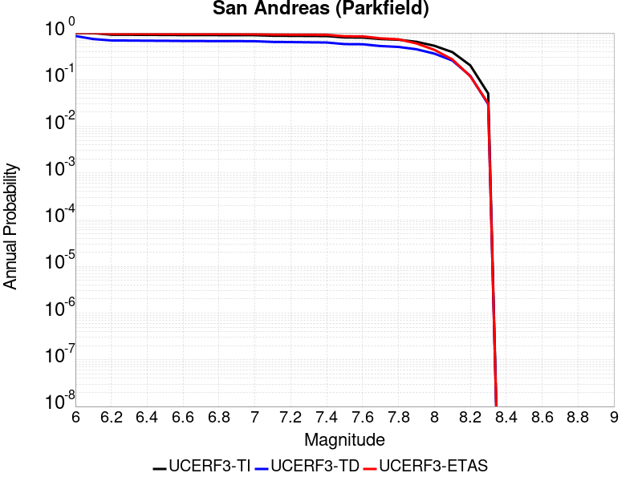 |
|-----|

| Magnitude | UCERF3-TI Prob | UCERF3-TD Prob | UCERF3-ETAS Prob |
|-----|-----|-----|-----|
| 6.0 | 0.9999995 | 0.85930914 | 1.0 |
| 6.1 | 0.9934278 | 0.7387392 | 1.0 |
| 6.2 | 0.9146089 | 0.689454 | 0.9539326 |
| 6.3 | 0.91125554 | 0.68660665 | 0.9539326 |
| 6.4 | 0.9078524 | 0.6815138 | 0.9505618 |
| 6.5 | 0.9044598 | 0.67804533 | 0.9483146 |
| 6.6 | 0.89962167 | 0.67258227 | 0.94382024 |
| 6.7 | 0.89769536 | 0.67036647 | 0.94382024 |
| 6.8 | 0.8969485 | 0.6694267 | 0.9404494 |
| 6.9 | 0.89613765 | 0.6683045 | 0.9404494 |
| 7.0 | 0.8927505 | 0.6644639 | 0.93707865 |
| 7.1 | 0.8702049 | 0.6410595 | 0.9224719 |
| 7.2 | 0.865553 | 0.6358823 | 0.9179775 |
| 7.3 | 0.8606767 | 0.62907666 | 0.9168539 |
| 7.4 | 0.85576004 | 0.62310255 | 0.9101124 |
| 7.5 | 0.798996 | 0.5758369 | 0.8449438 |
| 7.6 | 0.7944759 | 0.571489 | 0.84044945 |
| 7.7 | 0.74013823 | 0.52361846 | 0.7707865 |
| 7.8 | 0.71483195 | 0.5012181 | 0.73370785 |
| 7.9 | 0.6450711 | 0.44657224 | 0.59325844 |
| 8.0 | 0.5305246 | 0.36024264 | 0.43033707 |
| 8.1 | 0.38824737 | 0.2565978 | 0.26966292 |
| 8.2 | 0.20189473 | 0.12060131 | 0.11235955 |
| 8.3 | 0.050421786 | 0.029666498 | 0.030337078 |

## San Andreas (Peninsula) 2011 CFM
*[(top)](#table-of-contents)*

|  |
|-----|

| Magnitude | UCERF3-TI Prob | UCERF3-TD Prob | UCERF3-ETAS Prob |
|-----|-----|-----|-----|
| 6.0 | 0.8944965 | 0.69020885 | 0.95168537 |
| 6.1 | 0.8944965 | 0.69020885 | 0.95168537 |
| 6.2 | 0.8944965 | 0.69020885 | 0.95168537 |
| 6.3 | 0.89258254 | 0.68710506 | 0.95168537 |
| 6.4 | 0.89258254 | 0.68710506 | 0.95168537 |
| 6.5 | 0.8914552 | 0.6852902 | 0.95168537 |
| 6.6 | 0.89109665 | 0.6847515 | 0.95168537 |
| 6.7 | 0.89007205 | 0.68314445 | 0.95168537 |
| 6.8 | 0.8889406 | 0.6812632 | 0.95168537 |
| 6.9 | 0.8872653 | 0.67826176 | 0.9505618 |
| 7.0 | 0.8855872 | 0.6752641 | 0.9505618 |
| 7.1 | 0.8772975 | 0.66400635 | 0.94494385 |
| 7.2 | 0.870773 | 0.653738 | 0.93932587 |
| 7.3 | 0.86660683 | 0.64715046 | 0.9303371 |
| 7.4 | 0.8531856 | 0.63047016 | 0.91573036 |
| 7.5 | 0.83064383 | 0.6025057 | 0.89213485 |
| 7.6 | 0.77239054 | 0.5422885 | 0.81123596 |
| 7.7 | 0.7249129 | 0.4925194 | 0.73483145 |
| 7.8 | 0.6452138 | 0.41821098 | 0.60786515 |
| 7.9 | 0.46695727 | 0.28880766 | 0.35955057 |
| 8.0 | 0.37077117 | 0.2254424 | 0.27078652 |
| 8.1 | 0.29058734 | 0.17503014 | 0.18764044 |
| 8.2 | 0.20171776 | 0.120532386 | 0.11235955 |
| 8.3 | 0.050421786 | 0.029666498 | 0.030337078 |

## San Andreas (San Bernardino N)
*[(top)](#table-of-contents)*

|  |
|-----|

| Magnitude | UCERF3-TI Prob | UCERF3-TD Prob | UCERF3-ETAS Prob |
|-----|-----|-----|-----|
| 6.0 | 0.97586733 | 0.8681918 | 0.99550563 |
| 6.1 | 0.97586733 | 0.8681918 | 0.99550563 |
| 6.2 | 0.97586733 | 0.8681918 | 0.99550563 |
| 6.3 | 0.97219324 | 0.8607974 | 0.994382 |
| 6.4 | 0.97219324 | 0.8607974 | 0.994382 |
| 6.5 | 0.96584696 | 0.84919065 | 0.994382 |
| 6.6 | 0.94513226 | 0.81565714 | 0.98651683 |
| 6.7 | 0.93051964 | 0.79884195 | 0.9741573 |
| 6.8 | 0.91852444 | 0.7833315 | 0.9685393 |
| 6.9 | 0.91364706 | 0.77678114 | 0.96067417 |
| 7.0 | 0.9069622 | 0.7679322 | 0.95730335 |
| 7.1 | 0.89857465 | 0.7596429 | 0.947191 |
| 7.2 | 0.8786272 | 0.73741895 | 0.9235955 |
| 7.3 | 0.86818916 | 0.7278322 | 0.9112359 |
| 7.4 | 0.8594278 | 0.71934605 | 0.9022472 |
| 7.5 | 0.8501297 | 0.70916635 | 0.88314605 |
| 7.6 | 0.8438993 | 0.7017044 | 0.8764045 |
| 7.7 | 0.82633716 | 0.6829584 | 0.85955054 |
| 7.8 | 0.8067728 | 0.65672994 | 0.8359551 |
| 7.9 | 0.7274876 | 0.5658947 | 0.7168539 |
| 8.0 | 0.5684575 | 0.41222173 | 0.4730337 |
| 8.1 | 0.36544946 | 0.24986508 | 0.25842696 |
| 8.2 | 0.18480022 | 0.111582756 | 0.104494385 |
| 8.3 | 0.050421786 | 0.029666498 | 0.030337078 |

## San Andreas (San Bernardino S)
*[(top)](#table-of-contents)*

|  |
|-----|

| Magnitude | UCERF3-TI Prob | UCERF3-TD Prob | UCERF3-ETAS Prob |
|-----|-----|-----|-----|
| 6.0 | 0.9599879 | 0.7953057 | 0.98651683 |
| 6.1 | 0.9599879 | 0.7953057 | 0.98651683 |
| 6.2 | 0.9599879 | 0.7953057 | 0.98651683 |
| 6.3 | 0.952916 | 0.78073823 | 0.9842697 |
| 6.4 | 0.952916 | 0.78073823 | 0.9842697 |
| 6.5 | 0.9385083 | 0.7543981 | 0.98089886 |
| 6.6 | 0.92173964 | 0.72621065 | 0.9707865 |
| 6.7 | 0.8981997 | 0.6909846 | 0.9539326 |
| 6.8 | 0.89291316 | 0.6838935 | 0.9494382 |
| 6.9 | 0.7976541 | 0.5681478 | 0.8426966 |
| 7.0 | 0.7832139 | 0.54861206 | 0.8292135 |
| 7.1 | 0.76883996 | 0.53569764 | 0.80898875 |
| 7.2 | 0.72806895 | 0.49421605 | 0.77191013 |
| 7.3 | 0.7097241 | 0.47914165 | 0.7483146 |
| 7.4 | 0.69534343 | 0.46729925 | 0.7292135 |
| 7.5 | 0.67504495 | 0.4481183 | 0.7033708 |
| 7.6 | 0.5890553 | 0.37538758 | 0.6179775 |
| 7.7 | 0.52228796 | 0.32561508 | 0.5438202 |
| 7.8 | 0.49547994 | 0.3024546 | 0.5067416 |
| 7.9 | 0.42886806 | 0.25119612 | 0.43707865 |
| 8.0 | 0.27677682 | 0.14533053 | 0.2494382 |
| 8.1 | 0.12045774 | 0.057473496 | 0.094382025 |
| 8.2 | 0.06469199 | 0.030098932 | 0.040449437 |
| 8.3 | 0.013693689 | 0.0065632053 | 0.01235955 |

## San Andreas (San Gorgonio Pass-Garnet HIll)
*[(top)](#table-of-contents)*

|  |
|-----|

| Magnitude | UCERF3-TI Prob | UCERF3-TD Prob | UCERF3-ETAS Prob |
|-----|-----|-----|-----|
| 6.0 | 0.88577545 | 0.6969457 | 0.9224719 |
| 6.1 | 0.88577545 | 0.6969457 | 0.9224719 |
| 6.2 | 0.88577545 | 0.6969457 | 0.9224719 |
| 6.3 | 0.88577545 | 0.6969457 | 0.9224719 |
| 6.4 | 0.8778658 | 0.6849463 | 0.9191011 |
| 6.5 | 0.8778658 | 0.6849463 | 0.9191011 |
| 6.6 | 0.8630145 | 0.6620719 | 0.91348314 |
| 6.7 | 0.85648 | 0.65234035 | 0.9101124 |
| 6.8 | 0.85394716 | 0.6488597 | 0.90786517 |
| 6.9 | 0.85017097 | 0.6431966 | 0.90561795 |
| 7.0 | 0.8432466 | 0.6339793 | 0.8977528 |
| 7.1 | 0.84018743 | 0.62932354 | 0.8977528 |
| 7.2 | 0.83256024 | 0.61888903 | 0.8955056 |
| 7.3 | 0.822333 | 0.60513407 | 0.8808989 |
| 7.4 | 0.73602754 | 0.5331168 | 0.78876406 |
| 7.5 | 0.64134896 | 0.45999438 | 0.6494382 |
| 7.6 | 0.5410524 | 0.38075548 | 0.5258427 |
| 7.7 | 0.42386222 | 0.25931475 | 0.39438203 |
| 7.8 | 0.38820913 | 0.22342628 | 0.35730338 |
| 7.9 | 0.32660085 | 0.17991745 | 0.3 |
| 8.0 | 0.25738212 | 0.13427015 | 0.23033708 |
| 8.1 | 0.1073123 | 0.049747165 | 0.08651686 |
| 8.2 | 0.05834506 | 0.026807593 | 0.037078653 |
| 8.3 | 0.013482461 | 0.0064644474 | 0.01235955 |

## San Andreas (Santa Cruz Mts) 2011 CFM
*[(top)](#table-of-contents)*

|  |
|-----|

| Magnitude | UCERF3-TI Prob | UCERF3-TD Prob | UCERF3-ETAS Prob |
|-----|-----|-----|-----|
| 6.0 | 0.9888173 | 0.8213101 | 0.99550563 |
| 6.1 | 0.9888173 | 0.8213101 | 0.99550563 |
| 6.2 | 0.9888173 | 0.8213101 | 0.99550563 |
| 6.3 | 0.98866343 | 0.8205208 | 0.99550563 |
| 6.4 | 0.98611796 | 0.8090606 | 0.994382 |
| 6.5 | 0.9835509 | 0.7992043 | 0.994382 |
| 6.6 | 0.9666856 | 0.7509513 | 0.99101126 |
| 6.7 | 0.9651701 | 0.7479467 | 0.99101126 |
| 6.8 | 0.96456236 | 0.7464918 | 0.99101126 |
| 6.9 | 0.9635323 | 0.74387425 | 0.98988765 |
| 7.0 | 0.95666593 | 0.72900224 | 0.9853933 |
| 7.1 | 0.8775646 | 0.62908703 | 0.8988764 |
| 7.2 | 0.8428939 | 0.5972445 | 0.8573034 |
| 7.3 | 0.80129623 | 0.5652739 | 0.805618 |
| 7.4 | 0.7858347 | 0.55009466 | 0.7820225 |
| 7.5 | 0.7571226 | 0.5205493 | 0.7325843 |
| 7.6 | 0.6852574 | 0.458437 | 0.6348315 |
| 7.7 | 0.65849894 | 0.4339116 | 0.605618 |
| 7.8 | 0.60299623 | 0.38579082 | 0.5370787 |
| 7.9 | 0.49069053 | 0.30683425 | 0.3696629 |
| 8.0 | 0.40308562 | 0.2503017 | 0.2955056 |
| 8.1 | 0.31827056 | 0.19538677 | 0.20561798 |
| 8.2 | 0.20177886 | 0.12059031 | 0.11235955 |
| 8.3 | 0.050421786 | 0.029666498 | 0.030337078 |

## San Cayetano
*[(top)](#table-of-contents)*

| 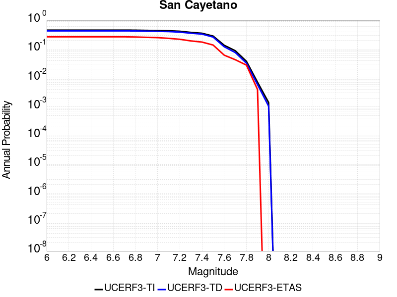 |
|-----|

| Magnitude | UCERF3-TI Prob | UCERF3-TD Prob | UCERF3-ETAS Prob |
|-----|-----|-----|-----|
| 6.0 | 0.45799834 | 0.43135884 | 0.26741573 |
| 6.1 | 0.45799834 | 0.43135884 | 0.26741573 |
| 6.2 | 0.45799834 | 0.43135884 | 0.26741573 |
| 6.3 | 0.45799834 | 0.43135884 | 0.26741573 |
| 6.4 | 0.45799834 | 0.43135884 | 0.26741573 |
| 6.5 | 0.45799834 | 0.43135884 | 0.26741573 |
| 6.6 | 0.45799834 | 0.43135884 | 0.26741573 |
| 6.7 | 0.45799834 | 0.43135884 | 0.26741573 |
| 6.8 | 0.45467442 | 0.42795095 | 0.26292136 |
| 6.9 | 0.44778907 | 0.4206867 | 0.25842696 |
| 7.0 | 0.44260457 | 0.4152228 | 0.252809 |
| 7.1 | 0.4348189 | 0.40734017 | 0.23707865 |
| 7.2 | 0.4174979 | 0.38999698 | 0.21910113 |
| 7.3 | 0.38138136 | 0.35689664 | 0.19101124 |
| 7.4 | 0.3558254 | 0.33297902 | 0.17640449 |
| 7.5 | 0.28433228 | 0.26259583 | 0.14269663 |
| 7.6 | 0.13654356 | 0.12137018 | 0.06516854 |
| 7.7 | 0.08788983 | 0.07630141 | 0.043820225 |
| 7.8 | 0.037943818 | 0.0327217 | 0.029213483 |
| 7.9 | 0.0071665356 | 0.0059482916 | 0.004494382 |
| 8.0 | 0.00140987 | 0.0010564381 | 0.0 |

## San Clemente
*[(top)](#table-of-contents)*

|  |
|-----|

| Magnitude | UCERF3-TI Prob | UCERF3-TD Prob | UCERF3-ETAS Prob |
|-----|-----|-----|-----|
| 6.0 | 0.82503724 | 0.832151 | 0.7404494 |
| 6.1 | 0.82503724 | 0.832151 | 0.6516854 |
| 6.2 | 0.64226156 | 0.6483848 | 0.42022473 |
| 6.3 | 0.5727006 | 0.58172166 | 0.36179775 |
| 6.4 | 0.5362743 | 0.5466161 | 0.3269663 |
| 6.5 | 0.51718384 | 0.5280502 | 0.31460676 |
| 6.6 | 0.44390202 | 0.45574307 | 0.25842696 |
| 6.7 | 0.40441445 | 0.41645733 | 0.22022472 |
| 6.8 | 0.35314393 | 0.36434868 | 0.18426967 |
| 6.9 | 0.32769325 | 0.33841938 | 0.16966292 |
| 7.0 | 0.2762617 | 0.28584555 | 0.13595505 |
| 7.1 | 0.24818511 | 0.25714698 | 0.123595506 |
| 7.2 | 0.22114737 | 0.22950654 | 0.0988764 |
| 7.3 | 0.18872789 | 0.19625671 | 0.08089887 |
| 7.4 | 0.074272044 | 0.07803167 | 0.037078653 |

## San Diego Trough north alt1
*[(top)](#table-of-contents)*

| 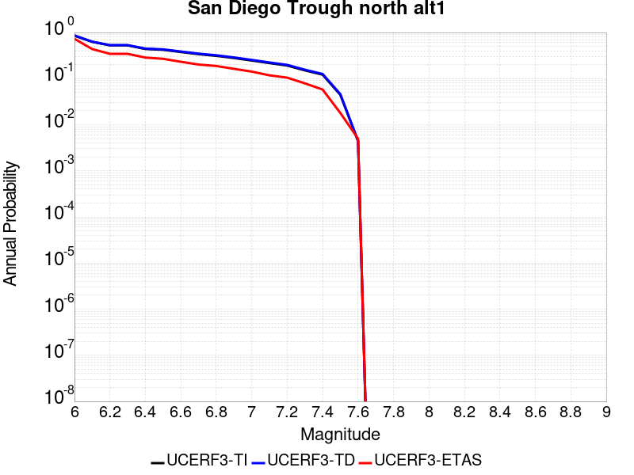 |
|-----|

| Magnitude | UCERF3-TI Prob | UCERF3-TD Prob | UCERF3-ETAS Prob |
|-----|-----|-----|-----|
| 6.0 | 0.85224795 | 0.86329204 | 0.7258427 |
| 6.1 | 0.62836957 | 0.63282704 | 0.43595505 |
| 6.2 | 0.52637774 | 0.53281015 | 0.34606743 |
| 6.3 | 0.52637774 | 0.53281015 | 0.34606743 |
| 6.4 | 0.43971404 | 0.44843462 | 0.28651685 |
| 6.5 | 0.42189917 | 0.43092665 | 0.26853934 |
| 6.6 | 0.37809917 | 0.38751346 | 0.22921348 |
| 6.7 | 0.3392754 | 0.34867954 | 0.2 |
| 6.8 | 0.31194925 | 0.32086274 | 0.18539326 |
| 6.9 | 0.2796759 | 0.2879524 | 0.16067415 |
| 7.0 | 0.24719818 | 0.2547371 | 0.13932584 |
| 7.1 | 0.21734251 | 0.22417063 | 0.121348314 |
| 7.2 | 0.19240354 | 0.19864157 | 0.10674157 |
| 7.3 | 0.150861 | 0.15589972 | 0.07865169 |
| 7.4 | 0.12195748 | 0.12614153 | 0.058426965 |
| 7.5 | 0.044603836 | 0.046146967 | 0.019101124 |
| 7.6 | 0.0044224365 | 0.00446512 | 0.0056179776 |

## San Diego Trough south
*[(top)](#table-of-contents)*

| 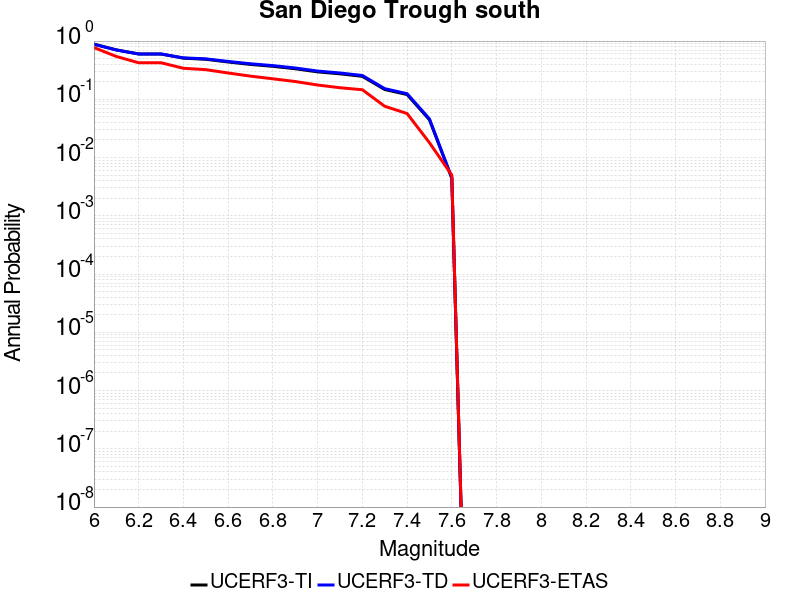 |
|-----|

| Magnitude | UCERF3-TI Prob | UCERF3-TD Prob | UCERF3-ETAS Prob |
|-----|-----|-----|-----|
| 6.0 | 0.88469225 | 0.8820863 | 0.77977526 |
| 6.1 | 0.7063069 | 0.7018941 | 0.5438202 |
| 6.2 | 0.59957117 | 0.6007447 | 0.43033707 |
| 6.3 | 0.59957117 | 0.6007447 | 0.43033707 |
| 6.4 | 0.5081382 | 0.5149609 | 0.34494382 |
| 6.5 | 0.4870079 | 0.49474877 | 0.3280899 |
| 6.6 | 0.43722513 | 0.4466828 | 0.29438204 |
| 6.7 | 0.3970993 | 0.40765786 | 0.25955057 |
| 6.8 | 0.368448 | 0.3789112 | 0.23146068 |
| 6.9 | 0.3347251 | 0.34489346 | 0.20898877 |
| 7.0 | 0.29584482 | 0.30547872 | 0.17977528 |
| 7.1 | 0.27390525 | 0.28314558 | 0.16067415 |
| 7.2 | 0.24796005 | 0.2566607 | 0.14719102 |
| 7.3 | 0.14736493 | 0.15240169 | 0.0752809 |
| 7.4 | 0.12076551 | 0.12494728 | 0.05730337 |
| 7.5 | 0.044603836 | 0.046146967 | 0.019101124 |
| 7.6 | 0.0044224365 | 0.00446512 | 0.0056179776 |

## San Gabriel
*[(top)](#table-of-contents)*

|  |
|-----|

| Magnitude | UCERF3-TI Prob | UCERF3-TD Prob | UCERF3-ETAS Prob |
|-----|-----|-----|-----|
| 6.0 | 0.24629234 | 0.22139353 | 0.16404495 |
| 6.1 | 0.24629234 | 0.22139353 | 0.16404495 |
| 6.2 | 0.24629234 | 0.22139353 | 0.16404495 |
| 6.3 | 0.24629234 | 0.22139353 | 0.16404495 |
| 6.4 | 0.24629234 | 0.22139353 | 0.16404495 |
| 6.5 | 0.16106999 | 0.12987389 | 0.09101123 |
| 6.6 | 0.16106999 | 0.12987389 | 0.09101123 |
| 6.7 | 0.15100983 | 0.119323224 | 0.084269665 |
| 6.8 | 0.14481483 | 0.11282986 | 0.08202247 |
| 6.9 | 0.13787304 | 0.105794005 | 0.08089887 |
| 7.0 | 0.12761565 | 0.095116995 | 0.0764045 |
| 7.1 | 0.12539798 | 0.09300982 | 0.0764045 |
| 7.2 | 0.12204627 | 0.089941196 | 0.0752809 |
| 7.3 | 0.11820992 | 0.08646814 | 0.0752809 |
| 7.4 | 0.11567336 | 0.084274545 | 0.073033705 |
| 7.5 | 0.11194677 | 0.08119066 | 0.07191011 |
| 7.6 | 0.107137434 | 0.07722214 | 0.06966292 |
| 7.7 | 0.073743775 | 0.046831284 | 0.039325844 |
| 7.8 | 0.03722749 | 0.02252459 | 0.020224718 |
| 7.9 | 0.020907946 | 0.012350681 | 0.006741573 |
| 8.0 | 0.013596615 | 0.00782897 | 0.004494382 |
| 8.1 | 0.008614512 | 0.0049188947 | 0.0033707866 |
| 8.2 | 0.0026667663 | 0.0019021474 | 0.0011235955 |

## San Gabriel (Extension)
*[(top)](#table-of-contents)*

|  |
|-----|

| Magnitude | UCERF3-TI Prob | UCERF3-TD Prob | UCERF3-ETAS Prob |
|-----|-----|-----|-----|
| 6.0 | 0.13702421 | 0.1256793 | 0.08764045 |
| 6.1 | 0.13702421 | 0.1256793 | 0.08764045 |
| 6.2 | 0.13702421 | 0.1256793 | 0.08764045 |
| 6.3 | 0.13702421 | 0.1256793 | 0.08764045 |
| 6.4 | 0.13702421 | 0.1256793 | 0.08764045 |
| 6.5 | 0.11571067 | 0.10379557 | 0.06629214 |
| 6.6 | 0.11571067 | 0.10379557 | 0.06629214 |
| 6.7 | 0.10488081 | 0.09269467 | 0.056179777 |
| 6.8 | 0.10186735 | 0.089611724 | 0.05505618 |
| 6.9 | 0.0958912 | 0.08349213 | 0.050561797 |
| 7.0 | 0.09189315 | 0.07940089 | 0.047191013 |
| 7.1 | 0.08890177 | 0.07632905 | 0.046067417 |
| 7.2 | 0.0705026 | 0.057349425 | 0.03483146 |
| 7.3 | 0.06519998 | 0.051925328 | 0.03483146 |
| 7.4 | 0.061831895 | 0.048517775 | 0.031460673 |
| 7.5 | 0.05188082 | 0.039000154 | 0.02247191 |
| 7.6 | 0.046687793 | 0.03411831 | 0.019101124 |
| 7.7 | 0.03784359 | 0.025773145 | 0.015730336 |
| 7.8 | 0.019882068 | 0.01036025 | 0.008988764 |
| 7.9 | 0.004593113 | 0.0013584015 | 0.0011235955 |
| 8.0 | 0.0027261197 | 4.7483607E-4 | 0.0011235955 |
| 8.1 | 0.0020526089 | 3.167369E-4 | 0.0 |
| 8.2 | 3.473524E-4 | 6.45346E-5 | 0.0 |

## San Gorgonio Pass
*[(top)](#table-of-contents)*

| 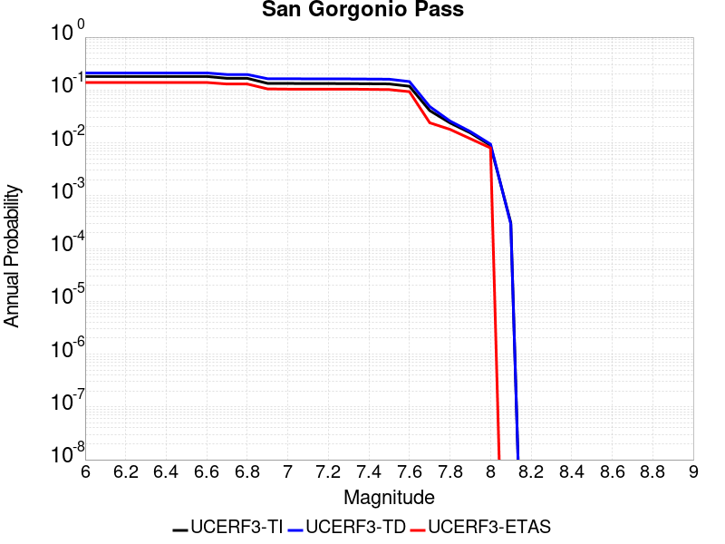 |
|-----|

| Magnitude | UCERF3-TI Prob | UCERF3-TD Prob | UCERF3-ETAS Prob |
|-----|-----|-----|-----|
| 6.0 | 0.1808072 | 0.21065222 | 0.13820225 |
| 6.1 | 0.1808072 | 0.21065222 | 0.13820225 |
| 6.2 | 0.1808072 | 0.21065222 | 0.13820225 |
| 6.3 | 0.1808072 | 0.21065222 | 0.13820225 |
| 6.4 | 0.1808072 | 0.21065222 | 0.13820225 |
| 6.5 | 0.1808072 | 0.21065222 | 0.13820225 |
| 6.6 | 0.1808072 | 0.21065222 | 0.13820225 |
| 6.7 | 0.16665018 | 0.19667909 | 0.12921348 |
| 6.8 | 0.16665018 | 0.19667909 | 0.12921348 |
| 6.9 | 0.13377808 | 0.16378155 | 0.10674157 |
| 7.0 | 0.13327791 | 0.16328895 | 0.10561798 |
| 7.1 | 0.13297717 | 0.16299239 | 0.10561798 |
| 7.2 | 0.13262382 | 0.16264288 | 0.10561798 |
| 7.3 | 0.13236511 | 0.16238911 | 0.10561798 |
| 7.4 | 0.13137682 | 0.1613827 | 0.104494385 |
| 7.5 | 0.13045362 | 0.16034782 | 0.103370786 |
| 7.6 | 0.117915586 | 0.14457406 | 0.09662921 |
| 7.7 | 0.04086152 | 0.048713125 | 0.025842696 |
| 7.8 | 0.023865124 | 0.025940388 | 0.019101124 |
| 7.9 | 0.015468961 | 0.016386526 | 0.01235955 |
| 8.0 | 0.008938112 | 0.009468208 | 0.007865168 |
| 8.1 | 3.074862E-4 | 2.9083464E-4 | 0.0 |

## San Gregorio (North) 2011 CFM
*[(top)](#table-of-contents)*

|  |
|-----|

| Magnitude | UCERF3-TI Prob | UCERF3-TD Prob | UCERF3-ETAS Prob |
|-----|-----|-----|-----|
| 6.0 | 0.7306934 | 0.679394 | 0.64044946 |
| 6.1 | 0.7306934 | 0.679394 | 0.64044946 |
| 6.2 | 0.67431617 | 0.6165785 | 0.58426964 |
| 6.3 | 0.67431617 | 0.6165785 | 0.58426964 |
| 6.4 | 0.6577882 | 0.59866726 | 0.5595506 |
| 6.5 | 0.65717417 | 0.5979702 | 0.5595506 |
| 6.6 | 0.6488797 | 0.5890035 | 0.54831463 |
| 6.7 | 0.63455766 | 0.5732176 | 0.5303371 |
| 6.8 | 0.59276974 | 0.52499753 | 0.4741573 |
| 6.9 | 0.5684627 | 0.4971116 | 0.4516854 |
| 7.0 | 0.53302133 | 0.45650262 | 0.41685393 |
| 7.1 | 0.50353855 | 0.42254516 | 0.38202247 |
| 7.2 | 0.47269627 | 0.38728908 | 0.35280898 |
| 7.3 | 0.4559364 | 0.3686368 | 0.3280899 |
| 7.4 | 0.43871754 | 0.3497619 | 0.305618 |
| 7.5 | 0.42175037 | 0.33258966 | 0.29213482 |
| 7.6 | 0.35976326 | 0.27860555 | 0.22921348 |
| 7.7 | 0.28338686 | 0.20981522 | 0.16629213 |
| 7.8 | 0.1678307 | 0.114810444 | 0.084269665 |
| 7.9 | 0.07399828 | 0.050164845 | 0.031460673 |
| 8.0 | 0.029388385 | 0.01847554 | 0.006741573 |
| 8.1 | 0.006935234 | 0.0042781592 | 0.0011235955 |
| 8.2 | 3.3139822E-4 | 2.195786E-4 | 0.0 |

## San Gregorio (South) 2011 CFM
*[(top)](#table-of-contents)*

|  |
|-----|

| Magnitude | UCERF3-TI Prob | UCERF3-TD Prob | UCERF3-ETAS Prob |
|-----|-----|-----|-----|
| 6.0 | 0.38719684 | 0.36818787 | 0.2539326 |
| 6.1 | 0.38719684 | 0.36818787 | 0.2539326 |
| 6.2 | 0.36668876 | 0.3463896 | 0.24157304 |
| 6.3 | 0.36668876 | 0.3463896 | 0.24157304 |
| 6.4 | 0.34134257 | 0.31922773 | 0.2235955 |
| 6.5 | 0.34134257 | 0.31922773 | 0.2235955 |
| 6.6 | 0.3316071 | 0.30888587 | 0.21235955 |
| 6.7 | 0.32207096 | 0.29876655 | 0.20449439 |
| 6.8 | 0.30373022 | 0.2792362 | 0.19101124 |
| 6.9 | 0.29488656 | 0.26984408 | 0.18426967 |
| 7.0 | 0.28404364 | 0.25832224 | 0.16741572 |
| 7.1 | 0.27244657 | 0.2459996 | 0.15842697 |
| 7.2 | 0.2643921 | 0.23745336 | 0.152809 |
| 7.3 | 0.25927517 | 0.23202896 | 0.1505618 |
| 7.4 | 0.25438258 | 0.22687149 | 0.1494382 |
| 7.5 | 0.24154256 | 0.21347785 | 0.14494382 |
| 7.6 | 0.20965813 | 0.18079974 | 0.12584269 |
| 7.7 | 0.15031424 | 0.12215764 | 0.07977528 |
| 7.8 | 0.0799566 | 0.0589783 | 0.033707865 |
| 7.9 | 0.051084325 | 0.035676226 | 0.02247191 |
| 8.0 | 0.021556953 | 0.013559079 | 0.004494382 |
| 8.1 | 0.00391439 | 0.002208592 | 0.0011235955 |

## San Jacinto (Anza) rev
*[(top)](#table-of-contents)*

|  |
|-----|

| Magnitude | UCERF3-TI Prob | UCERF3-TD Prob | UCERF3-ETAS Prob |
|-----|-----|-----|-----|
| 6.0 | 0.8068107 | 0.72010005 | 0.6573034 |
| 6.1 | 0.8068107 | 0.72010005 | 0.6573034 |
| 6.2 | 0.8068107 | 0.72010005 | 0.6573034 |
| 6.3 | 0.8068107 | 0.72010005 | 0.6573034 |
| 6.4 | 0.8068107 | 0.72010005 | 0.6573034 |
| 6.5 | 0.7804328 | 0.6976827 | 0.63033706 |
| 6.6 | 0.7804328 | 0.6976827 | 0.63033706 |
| 6.7 | 0.7747125 | 0.69296694 | 0.6224719 |
| 6.8 | 0.77378845 | 0.69202715 | 0.6224719 |
| 6.9 | 0.7692809 | 0.68793553 | 0.61460674 |
| 7.0 | 0.7580117 | 0.6771274 | 0.5910112 |
| 7.1 | 0.738379 | 0.65823305 | 0.56179774 |
| 7.2 | 0.71305364 | 0.63394 | 0.5258427 |
| 7.3 | 0.66696596 | 0.58760387 | 0.46179774 |
| 7.4 | 0.6502367 | 0.57101816 | 0.4494382 |
| 7.5 | 0.61859155 | 0.53796005 | 0.41685393 |
| 7.6 | 0.56613326 | 0.4825712 | 0.36404493 |
| 7.7 | 0.50966954 | 0.42203817 | 0.3213483 |
| 7.8 | 0.45785913 | 0.3649184 | 0.28202248 |
| 7.9 | 0.38465756 | 0.29144672 | 0.23146068 |
| 8.0 | 0.33193094 | 0.24193521 | 0.2011236 |
| 8.1 | 0.22931358 | 0.15866484 | 0.13258427 |
| 8.2 | 0.10197369 | 0.06282776 | 0.04494382 |
| 8.3 | 0.032718915 | 0.019016944 | 0.015730336 |

## San Jacinto (Borrego)
*[(top)](#table-of-contents)*

| 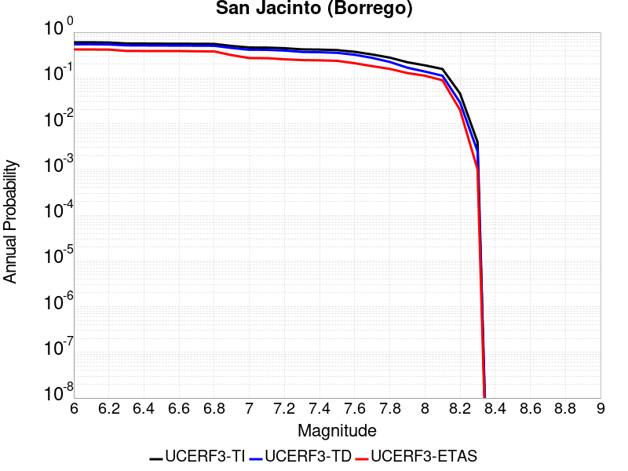 |
|-----|

| Magnitude | UCERF3-TI Prob | UCERF3-TD Prob | UCERF3-ETAS Prob |
|-----|-----|-----|-----|
| 6.0 | 0.6033173 | 0.54553765 | 0.41910112 |
| 6.1 | 0.6031402 | 0.5453666 | 0.41910112 |
| 6.2 | 0.5954657 | 0.5402191 | 0.41573033 |
| 6.3 | 0.56705457 | 0.51610035 | 0.38651684 |
| 6.4 | 0.56412596 | 0.5137916 | 0.38539326 |
| 6.5 | 0.5611002 | 0.51104504 | 0.38426965 |
| 6.6 | 0.5600001 | 0.51005876 | 0.38426965 |
| 6.7 | 0.55719095 | 0.5075583 | 0.37865168 |
| 6.8 | 0.5547801 | 0.50526357 | 0.3752809 |
| 6.9 | 0.500965 | 0.45205185 | 0.30898875 |
| 7.0 | 0.4633185 | 0.4145003 | 0.26853934 |
| 7.1 | 0.46077177 | 0.41190204 | 0.26741573 |
| 7.2 | 0.44715822 | 0.39779133 | 0.2539326 |
| 7.3 | 0.4220706 | 0.3707098 | 0.24382022 |
| 7.4 | 0.41703412 | 0.36543408 | 0.24269663 |
| 7.5 | 0.4064498 | 0.35467392 | 0.23595506 |
| 7.6 | 0.37295228 | 0.3215579 | 0.20898877 |
| 7.7 | 0.32606646 | 0.27487296 | 0.18314607 |
| 7.8 | 0.27829683 | 0.2240529 | 0.15955056 |
| 7.9 | 0.22076362 | 0.16775015 | 0.12921348 |
| 8.0 | 0.18873326 | 0.13806738 | 0.113483146 |
| 8.1 | 0.15690471 | 0.11193155 | 0.08988764 |
| 8.2 | 0.04579597 | 0.029245647 | 0.019101124 |
| 8.3 | 0.003949375 | 0.0024838287 | 0.0011235955 |

## San Jacinto (Clark) rev
*[(top)](#table-of-contents)*

| 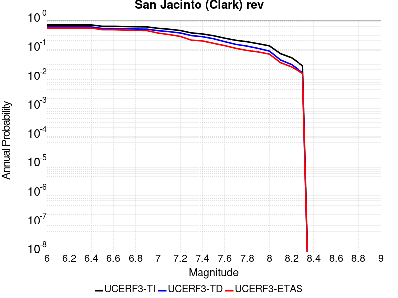 |
|-----|

| Magnitude | UCERF3-TI Prob | UCERF3-TD Prob | UCERF3-ETAS Prob |
|-----|-----|-----|-----|
| 6.0 | 0.6894805 | 0.5880146 | 0.5382022 |
| 6.1 | 0.6894805 | 0.5880146 | 0.5382022 |
| 6.2 | 0.6894805 | 0.5880146 | 0.5382022 |
| 6.3 | 0.6894805 | 0.5880146 | 0.5382022 |
| 6.4 | 0.6894805 | 0.5880146 | 0.5382022 |
| 6.5 | 0.622058 | 0.5239031 | 0.47977528 |
| 6.6 | 0.622058 | 0.5239031 | 0.47977528 |
| 6.7 | 0.60947186 | 0.5121377 | 0.46629214 |
| 6.8 | 0.5990713 | 0.5023033 | 0.4505618 |
| 6.9 | 0.5918872 | 0.4956901 | 0.44606742 |
| 7.0 | 0.53024817 | 0.4392971 | 0.36629215 |
| 7.1 | 0.49257448 | 0.4068813 | 0.3235955 |
| 7.2 | 0.44466588 | 0.36582986 | 0.27865168 |
| 7.3 | 0.3670969 | 0.2972089 | 0.20786516 |
| 7.4 | 0.33996573 | 0.27351952 | 0.19550562 |
| 7.5 | 0.29556102 | 0.2330009 | 0.16404495 |
| 7.6 | 0.24335745 | 0.18480776 | 0.13483146 |
| 7.7 | 0.20539424 | 0.1490143 | 0.11011236 |
| 7.8 | 0.18371087 | 0.1299013 | 0.09213483 |
| 7.9 | 0.15694545 | 0.108136274 | 0.08202247 |
| 8.0 | 0.13251418 | 0.08775276 | 0.07078651 |
| 8.1 | 0.071408615 | 0.04327989 | 0.037078653 |
| 8.2 | 0.05158933 | 0.03010149 | 0.025842696 |
| 8.3 | 0.027427524 | 0.015666625 | 0.014606741 |

## San Jacinto (Coyote Creek)
*[(top)](#table-of-contents)*

| 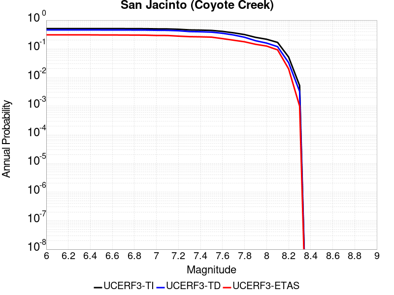 |
|-----|

| Magnitude | UCERF3-TI Prob | UCERF3-TD Prob | UCERF3-ETAS Prob |
|-----|-----|-----|-----|
| 6.0 | 0.51040995 | 0.45696527 | 0.3022472 |
| 6.1 | 0.51040995 | 0.45696527 | 0.3022472 |
| 6.2 | 0.51040995 | 0.45696527 | 0.3022472 |
| 6.3 | 0.51040995 | 0.45696527 | 0.3022472 |
| 6.4 | 0.51040995 | 0.45696527 | 0.3022472 |
| 6.5 | 0.50923467 | 0.45570505 | 0.3 |
| 6.6 | 0.50923467 | 0.45570505 | 0.3 |
| 6.7 | 0.5083857 | 0.45481765 | 0.2977528 |
| 6.8 | 0.5066179 | 0.4530984 | 0.29662922 |
| 6.9 | 0.5053849 | 0.4518791 | 0.29438204 |
| 7.0 | 0.49845904 | 0.44472307 | 0.28764045 |
| 7.1 | 0.49593878 | 0.442127 | 0.28651685 |
| 7.2 | 0.48277932 | 0.42832682 | 0.2730337 |
| 7.3 | 0.45687643 | 0.40026397 | 0.26179776 |
| 7.4 | 0.45069626 | 0.3938165 | 0.25955057 |
| 7.5 | 0.43948475 | 0.38231325 | 0.252809 |
| 7.6 | 0.4067474 | 0.34951383 | 0.2235955 |
| 7.7 | 0.36208037 | 0.3044445 | 0.19887641 |
| 7.8 | 0.31459442 | 0.25356805 | 0.1741573 |
| 7.9 | 0.25171408 | 0.19184753 | 0.14157303 |
| 8.0 | 0.2160001 | 0.15869352 | 0.123595506 |
| 8.1 | 0.16743244 | 0.11897044 | 0.093258426 |
| 8.2 | 0.05172729 | 0.03291594 | 0.019101124 |
| 8.3 | 0.005217573 | 0.003261875 | 0.0011235955 |

## San Jacinto (Lytle Creek connector)
*[(top)](#table-of-contents)*

| 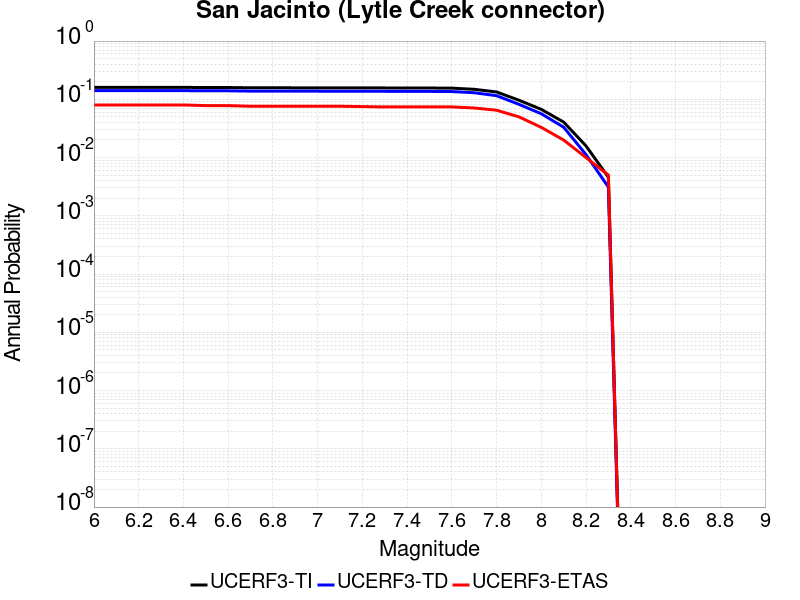 |
|-----|

| Magnitude | UCERF3-TI Prob | UCERF3-TD Prob | UCERF3-ETAS Prob |
|-----|-----|-----|-----|
| 6.0 | 0.16024251 | 0.14086892 | 0.08202247 |
| 6.1 | 0.16024251 | 0.14086892 | 0.08202247 |
| 6.2 | 0.16024251 | 0.14086892 | 0.08202247 |
| 6.3 | 0.16024251 | 0.14086892 | 0.08202247 |
| 6.4 | 0.16024251 | 0.14086892 | 0.08202247 |
| 6.5 | 0.15941378 | 0.14000773 | 0.07977528 |
| 6.6 | 0.15941378 | 0.14000773 | 0.07977528 |
| 6.7 | 0.15774621 | 0.13826858 | 0.07752809 |
| 6.8 | 0.15764531 | 0.13816087 | 0.07752809 |
| 6.9 | 0.15753104 | 0.13803153 | 0.07752809 |
| 7.0 | 0.15739806 | 0.13788174 | 0.07752809 |
| 7.1 | 0.15724458 | 0.13771093 | 0.07752809 |
| 7.2 | 0.15700251 | 0.13744219 | 0.0764045 |
| 7.3 | 0.15678315 | 0.13720022 | 0.0752809 |
| 7.4 | 0.15657482 | 0.13697329 | 0.0752809 |
| 7.5 | 0.15622775 | 0.13661255 | 0.0752809 |
| 7.6 | 0.1554723 | 0.1358479 | 0.0752809 |
| 7.7 | 0.14858443 | 0.12965669 | 0.07191011 |
| 7.8 | 0.13377017 | 0.115464345 | 0.06629214 |
| 7.9 | 0.09648984 | 0.08202781 | 0.05280899 |
| 8.0 | 0.06725205 | 0.056498643 | 0.033707865 |
| 8.1 | 0.040662073 | 0.033214606 | 0.021348314 |
| 8.2 | 0.015864238 | 0.011255008 | 0.010112359 |
| 8.3 | 0.004588645 | 0.0031143844 | 0.004494382 |

## San Jacinto (San Bernardino)
*[(top)](#table-of-contents)*

|  |
|-----|

| Magnitude | UCERF3-TI Prob | UCERF3-TD Prob | UCERF3-ETAS Prob |
|-----|-----|-----|-----|
| 6.0 | 0.58913505 | 0.49714184 | 0.4022472 |
| 6.1 | 0.58913505 | 0.49714184 | 0.4022472 |
| 6.2 | 0.58913505 | 0.49714184 | 0.4022472 |
| 6.3 | 0.58913505 | 0.49714184 | 0.4022472 |
| 6.4 | 0.5882167 | 0.49606845 | 0.40112358 |
| 6.5 | 0.5817949 | 0.48846567 | 0.39325842 |
| 6.6 | 0.5812505 | 0.48783264 | 0.39213485 |
| 6.7 | 0.58118784 | 0.48776674 | 0.39213485 |
| 6.8 | 0.58028656 | 0.48668402 | 0.39213485 |
| 6.9 | 0.5798369 | 0.48616433 | 0.39101124 |
| 7.0 | 0.5794126 | 0.48568818 | 0.38988763 |
| 7.1 | 0.5786725 | 0.48488495 | 0.38988763 |
| 7.2 | 0.5776192 | 0.4836619 | 0.38651684 |
| 7.3 | 0.5767654 | 0.4826904 | 0.38651684 |
| 7.4 | 0.576316 | 0.4822056 | 0.38651684 |
| 7.5 | 0.575231 | 0.48102617 | 0.38651684 |
| 7.6 | 0.57193273 | 0.4775083 | 0.38426965 |
| 7.7 | 0.5462464 | 0.44988915 | 0.36292136 |
| 7.8 | 0.4967049 | 0.39385617 | 0.3235955 |
| 7.9 | 0.418212 | 0.31610355 | 0.26067415 |
| 8.0 | 0.33675528 | 0.24534124 | 0.20337078 |
| 8.1 | 0.23176168 | 0.16008987 | 0.13370787 |
| 8.2 | 0.10353287 | 0.06369808 | 0.04494382 |
| 8.3 | 0.03273745 | 0.019028855 | 0.015730336 |

## San Jacinto (San Jacinto Valley) rev
*[(top)](#table-of-contents)*

|  |
|-----|

| Magnitude | UCERF3-TI Prob | UCERF3-TD Prob | UCERF3-ETAS Prob |
|-----|-----|-----|-----|
| 6.0 | 0.61440945 | 0.5287014 | 0.4022472 |
| 6.1 | 0.61440945 | 0.5287014 | 0.4022472 |
| 6.2 | 0.61440945 | 0.5287014 | 0.4022472 |
| 6.3 | 0.61440945 | 0.5287014 | 0.4022472 |
| 6.4 | 0.6138302 | 0.52809334 | 0.4022472 |
| 6.5 | 0.6138302 | 0.52809334 | 0.4022472 |
| 6.6 | 0.61355907 | 0.527808 | 0.4022472 |
| 6.7 | 0.6134543 | 0.5277009 | 0.4022472 |
| 6.8 | 0.6132271 | 0.5274526 | 0.4022472 |
| 6.9 | 0.61293626 | 0.52713436 | 0.4022472 |
| 7.0 | 0.61206776 | 0.5261847 | 0.40112358 |
| 7.1 | 0.6117219 | 0.5257852 | 0.40112358 |
| 7.2 | 0.6112098 | 0.52521247 | 0.4 |
| 7.3 | 0.6102882 | 0.52419186 | 0.4 |
| 7.4 | 0.6098714 | 0.5237369 | 0.4 |
| 7.5 | 0.6076082 | 0.521388 | 0.4 |
| 7.6 | 0.5757697 | 0.48830733 | 0.37191013 |
| 7.7 | 0.5293005 | 0.43802512 | 0.33595505 |
| 7.8 | 0.47844556 | 0.3811965 | 0.29662922 |
| 7.9 | 0.40470725 | 0.30675375 | 0.24269663 |
| 8.0 | 0.33492464 | 0.24429609 | 0.20224719 |
| 8.1 | 0.23054773 | 0.1594417 | 0.13370787 |
| 8.2 | 0.1027428 | 0.06328772 | 0.04494382 |
| 8.3 | 0.03273745 | 0.019028855 | 0.015730336 |

## San Jacinto (Stepovers Combined)
*[(top)](#table-of-contents)*

| 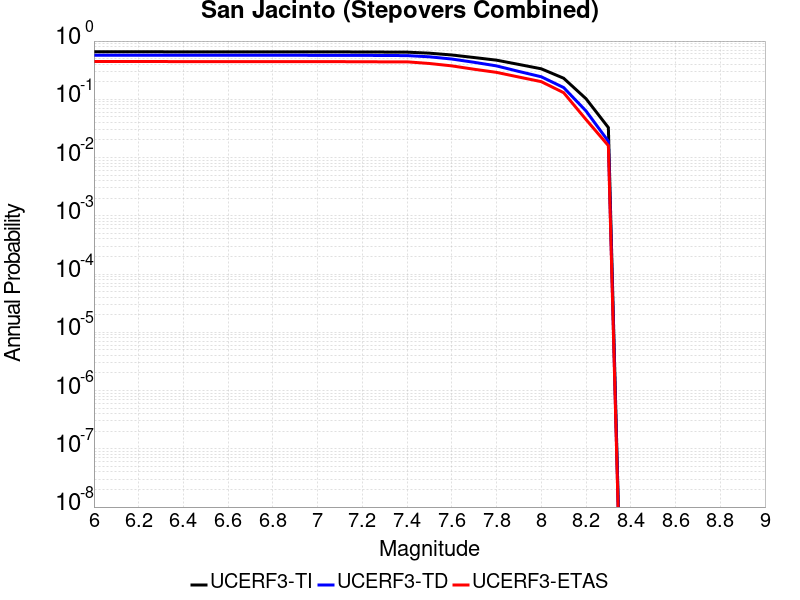 |
|-----|

| Magnitude | UCERF3-TI Prob | UCERF3-TD Prob | UCERF3-ETAS Prob |
|-----|-----|-----|-----|
| 6.0 | 0.6538953 | 0.5717214 | 0.447191 |
| 6.1 | 0.6538953 | 0.5717214 | 0.447191 |
| 6.2 | 0.6538953 | 0.5717214 | 0.447191 |
| 6.3 | 0.6538953 | 0.5717214 | 0.447191 |
| 6.4 | 0.65307695 | 0.570898 | 0.44606742 |
| 6.5 | 0.65307695 | 0.570898 | 0.44606742 |
| 6.6 | 0.65272725 | 0.5705464 | 0.44606742 |
| 6.7 | 0.6525273 | 0.57034236 | 0.44606742 |
| 6.8 | 0.6523259 | 0.57013106 | 0.44606742 |
| 6.9 | 0.6520493 | 0.56984544 | 0.44606742 |
| 7.0 | 0.65114 | 0.568909 | 0.44494382 |
| 7.1 | 0.650953 | 0.56872344 | 0.44494382 |
| 7.2 | 0.65016955 | 0.5679204 | 0.44269663 |
| 7.3 | 0.64726716 | 0.56504285 | 0.44157302 |
| 7.4 | 0.6452416 | 0.56303275 | 0.44157302 |
| 7.5 | 0.61950547 | 0.5366187 | 0.41460675 |
| 7.6 | 0.5765926 | 0.49145383 | 0.3730337 |
| 7.7 | 0.5212953 | 0.4317404 | 0.33033708 |
| 7.8 | 0.46992746 | 0.37466803 | 0.29101124 |
| 7.9 | 0.39672282 | 0.30082762 | 0.23932584 |
| 8.0 | 0.33405817 | 0.24374536 | 0.20224719 |
| 8.1 | 0.23013729 | 0.1591836 | 0.13370787 |
| 8.2 | 0.10244674 | 0.063107915 | 0.04494382 |
| 8.3 | 0.032718915 | 0.019016944 | 0.015730336 |

## San Jacinto (Superstition Mtn)
*[(top)](#table-of-contents)*

| 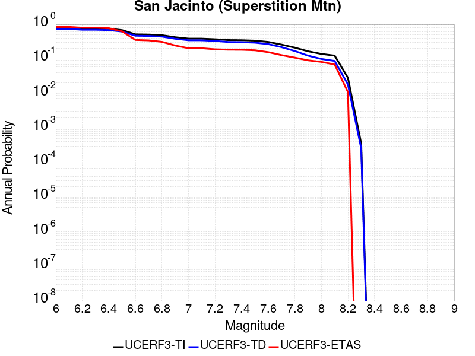 |
|-----|

| Magnitude | UCERF3-TI Prob | UCERF3-TD Prob | UCERF3-ETAS Prob |
|-----|-----|-----|-----|
| 6.0 | 0.8126594 | 0.73441684 | 0.8483146 |
| 6.1 | 0.8126594 | 0.73441684 | 0.8483146 |
| 6.2 | 0.7741191 | 0.6989882 | 0.8033708 |
| 6.3 | 0.77362645 | 0.6984282 | 0.8033708 |
| 6.4 | 0.7566699 | 0.6838212 | 0.7764045 |
| 6.5 | 0.6806504 | 0.6179817 | 0.63033706 |
| 6.6 | 0.51482964 | 0.46879336 | 0.35505617 |
| 6.7 | 0.50720334 | 0.462114 | 0.3438202 |
| 6.8 | 0.48554856 | 0.44223014 | 0.30786517 |
| 6.9 | 0.42426506 | 0.38309348 | 0.23820224 |
| 7.0 | 0.38693884 | 0.3467436 | 0.2 |
| 7.1 | 0.38572586 | 0.34552243 | 0.2 |
| 7.2 | 0.37155885 | 0.33115217 | 0.18764044 |
| 7.3 | 0.351219 | 0.30908653 | 0.18314607 |
| 7.4 | 0.34789065 | 0.30548266 | 0.18314607 |
| 7.5 | 0.3376577 | 0.2952094 | 0.17640449 |
| 7.6 | 0.31046674 | 0.26869667 | 0.15505618 |
| 7.7 | 0.26007205 | 0.21949933 | 0.13033707 |
| 7.8 | 0.2121411 | 0.16922536 | 0.10898876 |
| 7.9 | 0.16633336 | 0.124427564 | 0.09213483 |
| 8.0 | 0.13961427 | 0.09985582 | 0.084269665 |
| 8.1 | 0.12486782 | 0.087437816 | 0.06966292 |
| 8.2 | 0.028482838 | 0.018301005 | 0.011235955 |
| 8.3 | 3.5434432E-4 | 2.579471E-4 | 0.0 |

## San Joaquin Hills
*[(top)](#table-of-contents)*

|  |
|-----|

| Magnitude | UCERF3-TI Prob | UCERF3-TD Prob | UCERF3-ETAS Prob |
|-----|-----|-----|-----|
| 6.0 | 0.086137585 | 0.08289146 | 0.047191013 |
| 6.1 | 0.086137585 | 0.08289146 | 0.047191013 |
| 6.2 | 0.086137585 | 0.08289146 | 0.047191013 |
| 6.3 | 0.086137585 | 0.08289146 | 0.047191013 |
| 6.4 | 0.086137585 | 0.08289146 | 0.047191013 |
| 6.5 | 0.086137585 | 0.08289146 | 0.047191013 |
| 6.6 | 0.086137585 | 0.08289146 | 0.047191013 |
| 6.7 | 0.086137585 | 0.08289146 | 0.047191013 |
| 6.8 | 0.084612414 | 0.0813482 | 0.046067417 |
| 6.9 | 0.08176082 | 0.07846026 | 0.040449437 |
| 7.0 | 0.08122108 | 0.07791346 | 0.040449437 |
| 7.1 | 0.07977167 | 0.076444924 | 0.039325844 |
| 7.2 | 0.075815566 | 0.0724355 | 0.039325844 |
| 7.3 | 0.070145436 | 0.06668143 | 0.035955057 |
| 7.4 | 0.062148374 | 0.058564164 | 0.033707865 |
| 7.5 | 0.04902542 | 0.045270804 | 0.028089888 |
| 7.6 | 0.029833918 | 0.02656582 | 0.016853932 |
| 7.7 | 0.013260799 | 0.010300416 | 0.0056179776 |
| 7.8 | 3.027386E-4 | 3.045169E-4 | 0.0 |

## San Jose
*[(top)](#table-of-contents)*

|  |
|-----|

| Magnitude | UCERF3-TI Prob | UCERF3-TD Prob | UCERF3-ETAS Prob |
|-----|-----|-----|-----|
| 6.0 | 0.12424394 | 0.10214931 | 0.07752809 |
| 6.1 | 0.12424394 | 0.10214931 | 0.07752809 |
| 6.2 | 0.12424394 | 0.10214931 | 0.07752809 |
| 6.3 | 0.12424394 | 0.10214931 | 0.07752809 |
| 6.4 | 0.106388815 | 0.08354298 | 0.05955056 |
| 6.5 | 0.106388815 | 0.08354298 | 0.05955056 |
| 6.6 | 0.07794291 | 0.05357224 | 0.031460673 |
| 6.7 | 0.07794291 | 0.05357224 | 0.031460673 |
| 6.8 | 0.0718186 | 0.04913148 | 0.029213483 |
| 6.9 | 0.05484068 | 0.036784887 | 0.023595506 |
| 7.0 | 0.050058633 | 0.03431935 | 0.02247191 |
| 7.1 | 0.04105964 | 0.02872328 | 0.019101124 |
| 7.2 | 0.027356105 | 0.017766576 | 0.007865168 |
| 7.3 | 0.018252268 | 0.013029365 | 0.006741573 |
| 7.4 | 0.008747627 | 0.007188186 | 0.004494382 |
| 7.5 | 0.008130525 | 0.0065979077 | 0.004494382 |
| 7.6 | 0.007280629 | 0.0057289246 | 0.004494382 |
| 7.7 | 0.0072400537 | 0.0056865755 | 0.004494382 |
| 7.8 | 0.0030766104 | 0.0027579581 | 0.002247191 |

## San Juan
*[(top)](#table-of-contents)*

|  |
|-----|

| Magnitude | UCERF3-TI Prob | UCERF3-TD Prob | UCERF3-ETAS Prob |
|-----|-----|-----|-----|
| 6.0 | 0.20270395 | 0.213642 | 0.21348314 |
| 6.1 | 0.20270395 | 0.213642 | 0.21348314 |
| 6.2 | 0.20270395 | 0.213642 | 0.21348314 |
| 6.3 | 0.15168607 | 0.1619893 | 0.16179775 |
| 6.4 | 0.14821808 | 0.15631269 | 0.15393259 |
| 6.5 | 0.12697503 | 0.13480558 | 0.13033707 |
| 6.6 | 0.11118985 | 0.1169736 | 0.11797753 |
| 6.7 | 0.09778567 | 0.10269983 | 0.1 |
| 6.8 | 0.086162716 | 0.0906966 | 0.09213483 |
| 6.9 | 0.07672654 | 0.08081787 | 0.08764045 |
| 7.0 | 0.06681149 | 0.0703421 | 0.0764045 |
| 7.1 | 0.055877227 | 0.057587765 | 0.061797753 |
| 7.2 | 0.027749471 | 0.028146537 | 0.021348314 |
| 7.3 | 0.017703284 | 0.015757708 | 0.011235955 |
| 7.4 | 0.013553141 | 0.010495927 | 0.010112359 |
| 7.5 | 0.01205422 | 0.008729432 | 0.008988764 |
| 7.6 | 0.01035733 | 0.007116237 | 0.006741573 |
| 7.7 | 0.0048887795 | 0.0019743445 | 0.004494382 |
| 7.8 | 0.0026095596 | 6.083547E-4 | 0.0033707866 |
| 7.9 | 0.0016087863 | 2.9253252E-4 | 0.0 |
| 8.0 | 3.6452015E-4 | 9.622819E-5 | 0.0 |
| 8.1 | 4.8012203E-5 | 2.1388496E-5 | 0.0 |

## San Luis Range - Oceano 2011 CFM
*[(top)](#table-of-contents)*

| 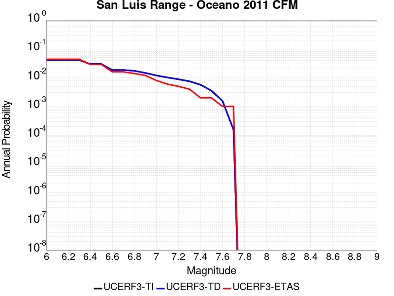 |
|-----|

| Magnitude | UCERF3-TI Prob | UCERF3-TD Prob | UCERF3-ETAS Prob |
|-----|-----|-----|-----|
| 6.0 | 0.04094818 | 0.041188408 | 0.041573033 |
| 6.1 | 0.04094818 | 0.041188408 | 0.041573033 |
| 6.2 | 0.04094818 | 0.041188408 | 0.041573033 |
| 6.3 | 0.04094818 | 0.041188408 | 0.041573033 |
| 6.4 | 0.029863855 | 0.030033307 | 0.028089888 |
| 6.5 | 0.029863855 | 0.030033307 | 0.028089888 |
| 6.6 | 0.018518656 | 0.018588107 | 0.015730336 |
| 6.7 | 0.018518656 | 0.018588107 | 0.015730336 |
| 6.8 | 0.017328395 | 0.017392475 | 0.014606741 |
| 6.9 | 0.01465256 | 0.014704945 | 0.01235955 |
| 7.0 | 0.011951036 | 0.011992013 | 0.007865168 |
| 7.1 | 0.010169163 | 0.010204074 | 0.0056179776 |
| 7.2 | 0.008824605 | 0.008855394 | 0.004494382 |
| 7.3 | 0.0075116917 | 0.0075378725 | 0.0033707866 |
| 7.4 | 0.005692471 | 0.0057127574 | 0.002247191 |
| 7.5 | 0.0035324919 | 0.0035446605 | 0.002247191 |
| 7.6 | 0.0015450981 | 0.0015509474 | 0.0011235955 |
| 7.7 | 1.5512091E-4 | 1.5583022E-4 | 0.0011235955 |

## San Luis Range - Pecho 2011 CFM
*[(top)](#table-of-contents)*

| 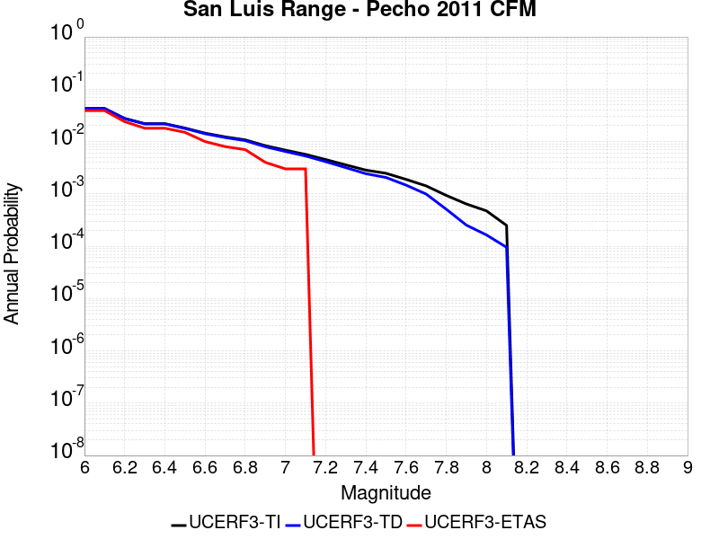 |
|-----|

| Magnitude | UCERF3-TI Prob | UCERF3-TD Prob | UCERF3-ETAS Prob |
|-----|-----|-----|-----|
| 6.0 | 0.043068722 | 0.042861696 | 0.041573033 |
| 6.1 | 0.043068722 | 0.042861696 | 0.041573033 |
| 6.2 | 0.027696114 | 0.027405463 | 0.0247191 |
| 6.3 | 0.021990778 | 0.021678636 | 0.019101124 |
| 6.4 | 0.021990778 | 0.021678636 | 0.019101124 |
| 6.5 | 0.01810429 | 0.017774148 | 0.016853932 |
| 6.6 | 0.014462415 | 0.014117156 | 0.011235955 |
| 6.7 | 0.01227577 | 0.011920984 | 0.008988764 |
| 6.8 | 0.010759901 | 0.010398455 | 0.007865168 |
| 6.9 | 0.008328474 | 0.007954778 | 0.004494382 |
| 7.0 | 0.006842128 | 0.0064599696 | 0.0033707866 |
| 7.1 | 0.005679736 | 0.0052901213 | 0.0033707866 |
| 7.2 | 0.004527434 | 0.0041294163 | 0.0 |
| 7.3 | 0.003579523 | 0.003174095 | 0.0 |
| 7.4 | 0.0028436673 | 0.002431597 | 0.0 |
| 7.5 | 0.0024728866 | 0.0020571384 | 0.0 |
| 7.6 | 0.0018914244 | 0.0014691638 | 0.0 |
| 7.7 | 0.0014198847 | 9.916989E-4 | 0.0 |
| 7.8 | 9.348862E-4 | 5.088442E-4 | 0.0 |
| 7.9 | 6.41275E-4 | 2.5272806E-4 | 0.0 |
| 8.0 | 4.734544E-4 | 1.6407763E-4 | 0.0 |
| 8.1 | 2.4936174E-4 | 9.5302596E-5 | 0.0 |

## San Luis Range 2011 CFM
*[(top)](#table-of-contents)*

|  |
|-----|

| Magnitude | UCERF3-TI Prob | UCERF3-TD Prob | UCERF3-ETAS Prob |
|-----|-----|-----|-----|
| 6.0 | 0.20590161 | 0.20851316 | 0.17640449 |
| 6.1 | 0.20590161 | 0.20851316 | 0.17640449 |
| 6.2 | 0.20590161 | 0.20851316 | 0.17640449 |
| 6.3 | 0.20590161 | 0.20851316 | 0.17640449 |
| 6.4 | 0.096965164 | 0.09739123 | 0.062921345 |
| 6.5 | 0.096965164 | 0.09739123 | 0.062921345 |
| 6.6 | 0.076700225 | 0.0769851 | 0.039325844 |
| 6.7 | 0.065974146 | 0.06619271 | 0.033707865 |
| 6.8 | 0.06341134 | 0.06361547 | 0.03258427 |
| 6.9 | 0.04727907 | 0.047394425 | 0.015730336 |
| 7.0 | 0.03953466 | 0.03960828 | 0.013483146 |
| 7.1 | 0.03427554 | 0.03431792 | 0.01235955 |
| 7.2 | 0.027335057 | 0.027333766 | 0.011235955 |
| 7.3 | 0.020224974 | 0.020177532 | 0.011235955 |
| 7.4 | 0.015418382 | 0.015339517 | 0.007865168 |
| 7.5 | 0.010798721 | 0.010690834 | 0.004494382 |
| 7.6 | 0.0061941654 | 0.006055175 | 0.0011235955 |
| 7.7 | 0.002584393 | 0.0024190987 | 0.0011235955 |
| 7.8 | 9.1225357E-4 | 7.32656E-4 | 0.0011235955 |
| 7.9 | 4.336379E-4 | 2.6595348E-4 | 0.0011235955 |
| 8.0 | 1.6526801E-4 | 6.2794934E-5 | 0.0 |

## San Pedro Basin
*[(top)](#table-of-contents)*

|  |
|-----|

| Magnitude | UCERF3-TI Prob | UCERF3-TD Prob | UCERF3-ETAS Prob |
|-----|-----|-----|-----|
| 6.0 | 0.7520392 | 0.78187346 | 0.5202247 |
| 6.1 | 0.7520392 | 0.78187346 | 0.5202247 |
| 6.2 | 0.45392737 | 0.4661778 | 0.27752808 |
| 6.3 | 0.45392737 | 0.4661778 | 0.27752808 |
| 6.4 | 0.40126428 | 0.41377032 | 0.24606742 |
| 6.5 | 0.36394432 | 0.37646383 | 0.20898877 |
| 6.6 | 0.3131486 | 0.32520705 | 0.17752808 |
| 6.7 | 0.2808154 | 0.29260993 | 0.16067415 |
| 6.8 | 0.25844702 | 0.2697393 | 0.14382023 |
| 6.9 | 0.21152084 | 0.22162059 | 0.11011236 |
| 7.0 | 0.1434504 | 0.15122677 | 0.062921345 |
| 7.1 | 0.054689903 | 0.055050347 | 0.025842696 |
| 7.2 | 0.053935897 | 0.05428853 | 0.025842696 |
| 7.3 | 0.043746468 | 0.043919377 | 0.020224718 |
| 7.4 | 0.037042487 | 0.037121 | 0.017977528 |
| 7.5 | 0.032852296 | 0.03289622 | 0.015730336 |
| 7.6 | 0.01746896 | 0.017498303 | 0.007865168 |
| 7.7 | 0.001619324 | 0.0014814243 | 0.002247191 |
| 7.8 | 6.9344416E-5 | 3.7023965E-5 | 0.0 |

## San Pedro Escarpment
*[(top)](#table-of-contents)*

|  |
|-----|

| Magnitude | UCERF3-TI Prob | UCERF3-TD Prob | UCERF3-ETAS Prob |
|-----|-----|-----|-----|
| 6.0 | 0.030165238 | 0.027788054 | 0.016853932 |
| 6.1 | 0.030165238 | 0.027788054 | 0.016853932 |
| 6.2 | 0.030165238 | 0.027788054 | 0.016853932 |
| 6.3 | 0.030165238 | 0.027788054 | 0.016853932 |
| 6.4 | 0.030165238 | 0.027788054 | 0.016853932 |
| 6.5 | 0.030165238 | 0.027788054 | 0.016853932 |
| 6.6 | 0.030165238 | 0.027788054 | 0.016853932 |
| 6.7 | 0.030165238 | 0.027788054 | 0.016853932 |
| 6.8 | 0.030165238 | 0.027788054 | 0.016853932 |
| 6.9 | 0.030165238 | 0.027788054 | 0.016853932 |
| 7.0 | 0.030165238 | 0.027788054 | 0.016853932 |
| 7.1 | 0.030165238 | 0.027788054 | 0.016853932 |
| 7.2 | 0.030119777 | 0.027742358 | 0.016853932 |
| 7.3 | 0.029595653 | 0.027215248 | 0.016853932 |
| 7.4 | 0.028553043 | 0.026166324 | 0.016853932 |
| 7.5 | 0.02683255 | 0.024556736 | 0.015730336 |
| 7.6 | 0.018143943 | 0.01614384 | 0.010112359 |
| 7.7 | 0.008021772 | 0.0065259365 | 0.0056179776 |
| 7.8 | 0.0014993392 | 0.0011225487 | 0.0011235955 |
| 7.9 | 1.5756825E-4 | 8.826163E-5 | 0.0 |

## San Vicente
*[(top)](#table-of-contents)*

|  |
|-----|

| Magnitude | UCERF3-TI Prob | UCERF3-TD Prob | UCERF3-ETAS Prob |
|-----|-----|-----|-----|
| 6.0 | 0.010601213 | 0.009861172 | 0.0056179776 |
| 6.1 | 0.010601213 | 0.009861172 | 0.0056179776 |
| 6.2 | 0.010175114 | 0.00943426 | 0.0056179776 |
| 6.3 | 0.010175114 | 0.00943426 | 0.0056179776 |
| 6.4 | 0.008386278 | 0.0076401667 | 0.002247191 |
| 6.5 | 0.008386278 | 0.0076401667 | 0.002247191 |
| 6.6 | 0.008306948 | 0.0075606946 | 0.002247191 |
| 6.7 | 0.008013956 | 0.007266852 | 0.002247191 |
| 6.8 | 0.0074938494 | 0.006744901 | 0.002247191 |
| 6.9 | 0.006932904 | 0.0061817933 | 0.002247191 |
| 7.0 | 0.0061727827 | 0.005423454 | 0.002247191 |
| 7.1 | 0.005525233 | 0.004778374 | 0.002247191 |
| 7.2 | 0.004748643 | 0.004006367 | 0.0011235955 |
| 7.3 | 0.004196596 | 0.0035079264 | 0.0011235955 |
| 7.4 | 0.0036845475 | 0.0030712858 | 0.0011235955 |
| 7.5 | 0.002790078 | 0.0023010357 | 0.0 |
| 7.6 | 0.0017586274 | 0.0013719773 | 0.0 |
| 7.7 | 7.5474585E-4 | 4.721126E-4 | 0.0 |
| 7.8 | 2.6480915E-4 | 1.5192678E-4 | 0.0 |
| 7.9 | 7.389586E-7 | 5.262296E-7 | 0.0 |

## Santa Cruz Catalina Ridge alt1
*[(top)](#table-of-contents)*

| 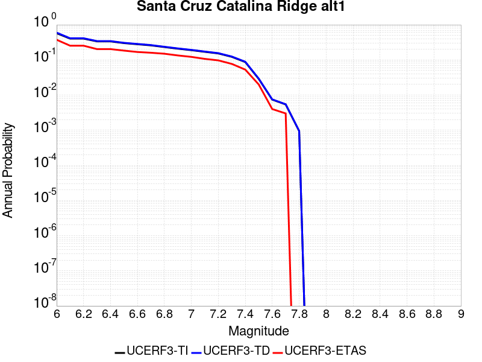 |
|-----|

| Magnitude | UCERF3-TI Prob | UCERF3-TD Prob | UCERF3-ETAS Prob |
|-----|-----|-----|-----|
| 6.0 | 0.5754003 | 0.59873337 | 0.37191013 |
| 6.1 | 0.40399155 | 0.41358724 | 0.2483146 |
| 6.2 | 0.40399155 | 0.41358724 | 0.2483146 |
| 6.3 | 0.33657554 | 0.3436171 | 0.19213483 |
| 6.4 | 0.33657554 | 0.3436171 | 0.19213483 |
| 6.5 | 0.30066642 | 0.30679944 | 0.17303371 |
| 6.6 | 0.2790293 | 0.28467783 | 0.15842697 |
| 6.7 | 0.2592818 | 0.26448768 | 0.1505618 |
| 6.8 | 0.23219363 | 0.2367987 | 0.14044943 |
| 6.9 | 0.20846531 | 0.21253628 | 0.1247191 |
| 7.0 | 0.18936458 | 0.19302906 | 0.113483146 |
| 7.1 | 0.16987354 | 0.17316073 | 0.1 |
| 7.2 | 0.15293762 | 0.15590708 | 0.09213483 |
| 7.3 | 0.12239067 | 0.12481191 | 0.0752809 |
| 7.4 | 0.08703299 | 0.088789195 | 0.050561797 |
| 7.5 | 0.02883536 | 0.029343883 | 0.019101124 |
| 7.6 | 0.007433522 | 0.0075370986 | 0.0033707866 |
| 7.7 | 0.005407079 | 0.005480978 | 0.002247191 |
| 7.8 | 9.4262476E-4 | 9.5417426E-4 | 0.0 |

## Santa Cruz Island
*[(top)](#table-of-contents)*

| 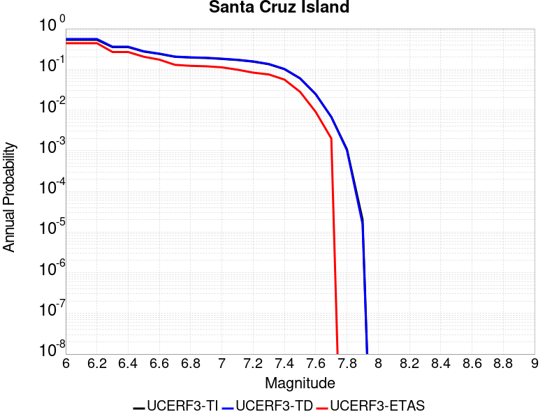 |
|-----|

| Magnitude | UCERF3-TI Prob | UCERF3-TD Prob | UCERF3-ETAS Prob |
|-----|-----|-----|-----|
| 6.0 | 0.5327513 | 0.55716246 | 0.4483146 |
| 6.1 | 0.5327513 | 0.55716246 | 0.4483146 |
| 6.2 | 0.5327513 | 0.55716246 | 0.4483146 |
| 6.3 | 0.35209635 | 0.3606103 | 0.2752809 |
| 6.4 | 0.35209635 | 0.3606103 | 0.2752809 |
| 6.5 | 0.27334404 | 0.2783184 | 0.21123596 |
| 6.6 | 0.23941846 | 0.24359001 | 0.18089887 |
| 6.7 | 0.20304534 | 0.20632072 | 0.13370787 |
| 6.8 | 0.19486369 | 0.1979754 | 0.1269663 |
| 6.9 | 0.18992043 | 0.1929444 | 0.123595506 |
| 7.0 | 0.18022335 | 0.18307306 | 0.11573034 |
| 7.1 | 0.16957791 | 0.1722453 | 0.1 |
| 7.2 | 0.1546839 | 0.15713342 | 0.08539326 |
| 7.3 | 0.13354237 | 0.1356488 | 0.0764045 |
| 7.4 | 0.10098121 | 0.10250123 | 0.05730337 |
| 7.5 | 0.059676196 | 0.060439818 | 0.029213483 |
| 7.6 | 0.024475608 | 0.02466797 | 0.010112359 |
| 7.7 | 0.0067637675 | 0.0067268745 | 0.002247191 |
| 7.8 | 0.0010826996 | 0.0010253718 | 0.0 |
| 7.9 | 2.0151696E-5 | 1.5757301E-5 | 0.0 |

## Santa Monica Bay
*[(top)](#table-of-contents)*

|  |
|-----|

| Magnitude | UCERF3-TI Prob | UCERF3-TD Prob | UCERF3-ETAS Prob |
|-----|-----|-----|-----|
| 6.0 | 0.016798286 | 0.016863056 | 0.006741573 |
| 6.1 | 0.016798286 | 0.016863056 | 0.006741573 |
| 6.2 | 0.016798286 | 0.016863056 | 0.006741573 |
| 6.3 | 0.016798286 | 0.016863056 | 0.006741573 |
| 6.4 | 0.016798286 | 0.016863056 | 0.006741573 |
| 6.5 | 0.016798286 | 0.016863056 | 0.006741573 |
| 6.6 | 0.016798286 | 0.016863056 | 0.006741573 |
| 6.7 | 0.016798286 | 0.016863056 | 0.006741573 |
| 6.8 | 0.016798286 | 0.016863056 | 0.006741573 |
| 6.9 | 0.016798286 | 0.016863056 | 0.006741573 |
| 7.0 | 0.01646146 | 0.016525691 | 0.0056179776 |
| 7.1 | 0.015008413 | 0.015069356 | 0.0056179776 |
| 7.2 | 0.013643266 | 0.0137008075 | 0.0056179776 |
| 7.3 | 0.011885515 | 0.011938073 | 0.004494382 |
| 7.4 | 0.010301556 | 0.01034905 | 0.0033707866 |
| 7.5 | 0.0065393676 | 0.00657161 | 0.0011235955 |
| 7.6 | 0.0042728335 | 0.0042946455 | 0.0 |
| 7.7 | 0.0031337135 | 0.0031504806 | 0.0 |
| 7.8 | 7.9644093E-4 | 8.010729E-4 | 0.0 |

## Santa Monica alt 1
*[(top)](#table-of-contents)*

| 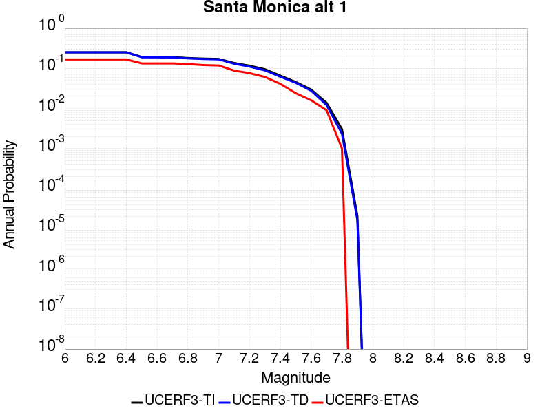 |
|-----|

| Magnitude | UCERF3-TI Prob | UCERF3-TD Prob | UCERF3-ETAS Prob |
|-----|-----|-----|-----|
| 6.0 | 0.2507674 | 0.2514155 | 0.16179775 |
| 6.1 | 0.2507674 | 0.2514155 | 0.16179775 |
| 6.2 | 0.2507674 | 0.2514155 | 0.16179775 |
| 6.3 | 0.2507674 | 0.2514155 | 0.16179775 |
| 6.4 | 0.2507674 | 0.2514155 | 0.16179775 |
| 6.5 | 0.19225083 | 0.18892536 | 0.1269663 |
| 6.6 | 0.19163491 | 0.1882918 | 0.1269663 |
| 6.7 | 0.19071802 | 0.18735263 | 0.1269663 |
| 6.8 | 0.18080094 | 0.17711931 | 0.123595506 |
| 6.9 | 0.17491947 | 0.17107642 | 0.11685393 |
| 7.0 | 0.17146905 | 0.16754526 | 0.11460674 |
| 7.1 | 0.13600697 | 0.13072044 | 0.08764045 |
| 7.2 | 0.11651561 | 0.11054622 | 0.0764045 |
| 7.3 | 0.095068894 | 0.08900091 | 0.064044945 |
| 7.4 | 0.06584492 | 0.061884433 | 0.04494382 |
| 7.5 | 0.045679633 | 0.043576505 | 0.025842696 |
| 7.6 | 0.029488767 | 0.027654352 | 0.017977528 |
| 7.7 | 0.0138117215 | 0.012181106 | 0.010112359 |
| 7.8 | 0.0030396187 | 0.0023317654 | 0.0011235955 |
| 7.9 | 2.0890639E-5 | 1.6283522E-5 | 0.0 |

## Santa Rosa Island
*[(top)](#table-of-contents)*

|  |
|-----|

| Magnitude | UCERF3-TI Prob | UCERF3-TD Prob | UCERF3-ETAS Prob |
|-----|-----|-----|-----|
| 6.0 | 0.6581619 | 0.6798426 | 0.605618 |
| 6.1 | 0.42274937 | 0.4335706 | 0.31235954 |
| 6.2 | 0.42274937 | 0.4335706 | 0.31235954 |
| 6.3 | 0.32663688 | 0.33493412 | 0.24269663 |
| 6.4 | 0.2752973 | 0.2825133 | 0.19662921 |
| 6.5 | 0.21053536 | 0.21638729 | 0.13707866 |
| 6.6 | 0.17870663 | 0.18382281 | 0.10674157 |
| 6.7 | 0.13372554 | 0.1377893 | 0.084269665 |
| 6.8 | 0.09285053 | 0.095549844 | 0.05505618 |
| 6.9 | 0.06207465 | 0.06328073 | 0.03820225 |
| 7.0 | 0.05884273 | 0.05995418 | 0.03820225 |
| 7.1 | 0.05639195 | 0.057438202 | 0.03258427 |
| 7.2 | 0.0541788 | 0.05517581 | 0.031460673 |
| 7.3 | 0.050329376 | 0.051246278 | 0.029213483 |
| 7.4 | 0.043260846 | 0.044040486 | 0.026966292 |
| 7.5 | 0.023174247 | 0.023548976 | 0.019101124 |
| 7.6 | 0.010067202 | 0.010183383 | 0.006741573 |
| 7.7 | 0.0016114889 | 0.0016118662 | 0.0011235955 |
| 7.8 | 3.5753288E-5 | 3.595713E-5 | 0.0 |

## Santa Susana East (connector)
*[(top)](#table-of-contents)*

|  |
|-----|

| Magnitude | UCERF3-TI Prob | UCERF3-TD Prob | UCERF3-ETAS Prob |
|-----|-----|-----|-----|
| 6.0 | 0.52561975 | 0.54430324 | 0.30337077 |
| 6.1 | 0.52561975 | 0.54430324 | 0.30337077 |
| 6.2 | 0.52561975 | 0.54430324 | 0.30337077 |
| 6.3 | 0.39774334 | 0.41286922 | 0.21573034 |
| 6.4 | 0.39774334 | 0.41286922 | 0.21573034 |
| 6.5 | 0.39774334 | 0.41286922 | 0.21573034 |
| 6.6 | 0.39774334 | 0.41286922 | 0.21573034 |
| 6.7 | 0.39725006 | 0.41237545 | 0.21573034 |
| 6.8 | 0.2729416 | 0.27829227 | 0.13483146 |
| 6.9 | 0.2729416 | 0.27829227 | 0.13483146 |
| 7.0 | 0.21494837 | 0.21797389 | 0.1 |
| 7.1 | 0.21195927 | 0.21490283 | 0.09775281 |
| 7.2 | 0.20619519 | 0.20897648 | 0.09101123 |
| 7.3 | 0.2004167 | 0.20314845 | 0.08764045 |
| 7.4 | 0.18523961 | 0.18744944 | 0.07865169 |
| 7.5 | 0.119703844 | 0.121454336 | 0.050561797 |
| 7.6 | 0.035600737 | 0.036075633 | 0.010112359 |
| 7.7 | 0.007776728 | 0.007480422 | 0.0011235955 |
| 7.8 | 0.0012564153 | 0.0010222109 | 0.0 |
| 7.9 | 6.816181E-5 | 6.934941E-5 | 0.0 |

## Santa Susana alt 1
*[(top)](#table-of-contents)*

| 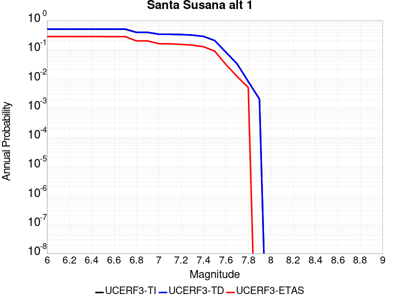 |
|-----|

| Magnitude | UCERF3-TI Prob | UCERF3-TD Prob | UCERF3-ETAS Prob |
|-----|-----|-----|-----|
| 6.0 | 0.50235367 | 0.5123728 | 0.27752808 |
| 6.1 | 0.50235367 | 0.5123728 | 0.27752808 |
| 6.2 | 0.50235367 | 0.5123728 | 0.27752808 |
| 6.3 | 0.50235367 | 0.5123728 | 0.27752808 |
| 6.4 | 0.50235367 | 0.5123728 | 0.27752808 |
| 6.5 | 0.50235367 | 0.5123728 | 0.27752808 |
| 6.6 | 0.50104326 | 0.51111895 | 0.2764045 |
| 6.7 | 0.50104326 | 0.51111895 | 0.2764045 |
| 6.8 | 0.39201823 | 0.393291 | 0.1977528 |
| 6.9 | 0.39152148 | 0.39277905 | 0.1977528 |
| 7.0 | 0.33984393 | 0.33867577 | 0.15842697 |
| 7.1 | 0.3374352 | 0.33619615 | 0.15730338 |
| 7.2 | 0.33115786 | 0.32982355 | 0.1494382 |
| 7.3 | 0.31558213 | 0.31448594 | 0.14382023 |
| 7.4 | 0.28500816 | 0.2846988 | 0.12808989 |
| 7.5 | 0.20571154 | 0.20547228 | 0.09213483 |
| 7.6 | 0.08137521 | 0.08186814 | 0.031460673 |
| 7.7 | 0.032721013 | 0.03245861 | 0.01235955 |
| 7.8 | 0.007971066 | 0.008090017 | 0.0056179776 |
| 7.9 | 0.0019868098 | 0.002024639 | 0.0 |

## Santa Ynez (East)
*[(top)](#table-of-contents)*

| 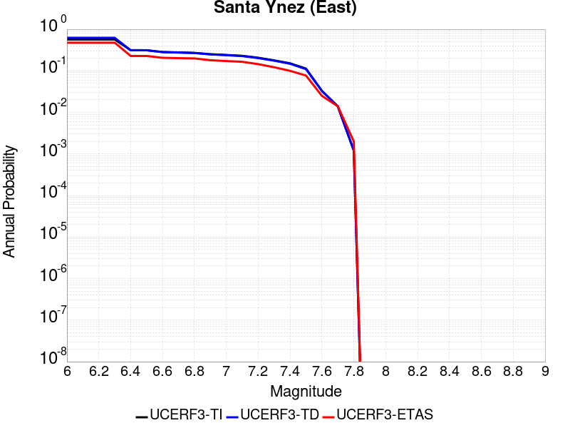 |
|-----|

| Magnitude | UCERF3-TI Prob | UCERF3-TD Prob | UCERF3-ETAS Prob |
|-----|-----|-----|-----|
| 6.0 | 0.5691121 | 0.62336326 | 0.46741572 |
| 6.1 | 0.5691121 | 0.62336326 | 0.46741572 |
| 6.2 | 0.5691121 | 0.62336326 | 0.46741572 |
| 6.3 | 0.5691121 | 0.62336326 | 0.46741572 |
| 6.4 | 0.31326932 | 0.31251058 | 0.22808988 |
| 6.5 | 0.31326932 | 0.31251058 | 0.22808988 |
| 6.6 | 0.2839457 | 0.2820679 | 0.20561798 |
| 6.7 | 0.27747044 | 0.27539617 | 0.2011236 |
| 6.8 | 0.27061626 | 0.26832125 | 0.19887641 |
| 6.9 | 0.2515104 | 0.24864231 | 0.18202247 |
| 7.0 | 0.24115628 | 0.2379673 | 0.1741573 |
| 7.1 | 0.23007508 | 0.22657822 | 0.16629213 |
| 7.2 | 0.20667332 | 0.20257787 | 0.14494382 |
| 7.3 | 0.17879786 | 0.17567778 | 0.121348314 |
| 7.4 | 0.15177394 | 0.14814068 | 0.0988764 |
| 7.5 | 0.11332779 | 0.10974539 | 0.0764045 |
| 7.6 | 0.03299087 | 0.03270283 | 0.0247191 |
| 7.7 | 0.01380995 | 0.014030273 | 0.013483146 |
| 7.8 | 0.001203018 | 0.0012176243 | 0.0011235955 |

## Santa Ynez (West)
*[(top)](#table-of-contents)*

| 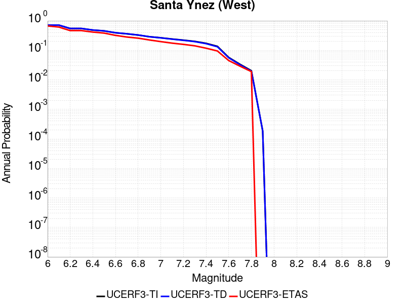 |
|-----|

| Magnitude | UCERF3-TI Prob | UCERF3-TD Prob | UCERF3-ETAS Prob |
|-----|-----|-----|-----|
| 6.0 | 0.70928997 | 0.7173204 | 0.6730337 |
| 6.1 | 0.70928997 | 0.7173204 | 0.6191011 |
| 6.2 | 0.54775894 | 0.5500929 | 0.47191012 |
| 6.3 | 0.54775894 | 0.5500929 | 0.47191012 |
| 6.4 | 0.48523 | 0.48776022 | 0.4247191 |
| 6.5 | 0.45327634 | 0.45598057 | 0.39213485 |
| 6.6 | 0.3927369 | 0.39506426 | 0.33370787 |
| 6.7 | 0.36203504 | 0.36394498 | 0.29325843 |
| 6.8 | 0.32942665 | 0.3303039 | 0.26629212 |
| 6.9 | 0.28895617 | 0.28830177 | 0.23033708 |
| 7.0 | 0.26568732 | 0.26419094 | 0.2011236 |
| 7.1 | 0.24154669 | 0.23918039 | 0.17977528 |
| 7.2 | 0.22137594 | 0.21849324 | 0.16179775 |
| 7.3 | 0.20068946 | 0.19727457 | 0.14269663 |
| 7.4 | 0.17260155 | 0.16841763 | 0.11797753 |
| 7.5 | 0.13654418 | 0.1320938 | 0.094382025 |
| 7.6 | 0.057386234 | 0.05593629 | 0.04494382 |
| 7.7 | 0.033599235 | 0.032504734 | 0.028089888 |
| 7.8 | 0.020409696 | 0.019699806 | 0.019101124 |
| 7.9 | 1.8457326E-4 | 1.8788315E-4 | 0.0 |

## Santa Ynez River
*[(top)](#table-of-contents)*

|  |
|-----|

| Magnitude | UCERF3-TI Prob | UCERF3-TD Prob | UCERF3-ETAS Prob |
|-----|-----|-----|-----|
| 6.0 | 0.34804213 | 0.35762784 | 0.31797752 |
| 6.1 | 0.34804213 | 0.35762784 | 0.31797752 |
| 6.2 | 0.34804213 | 0.35762784 | 0.31797752 |
| 6.3 | 0.22433302 | 0.22699876 | 0.20786516 |
| 6.4 | 0.22433302 | 0.22699876 | 0.20786516 |
| 6.5 | 0.16869958 | 0.16995819 | 0.1494382 |
| 6.6 | 0.142067 | 0.14280316 | 0.12584269 |
| 6.7 | 0.12168464 | 0.12205801 | 0.10674157 |
| 6.8 | 0.108367816 | 0.10852412 | 0.094382025 |
| 6.9 | 0.08787623 | 0.087719925 | 0.0752809 |
| 7.0 | 0.08037432 | 0.08011515 | 0.07078651 |
| 7.1 | 0.063373 | 0.06286882 | 0.051685393 |
| 7.2 | 0.052117042 | 0.051449023 | 0.04269663 |
| 7.3 | 0.042997602 | 0.04219071 | 0.03483146 |
| 7.4 | 0.034860082 | 0.033901386 | 0.029213483 |
| 7.5 | 0.025078988 | 0.024015486 | 0.0247191 |
| 7.6 | 0.0131329335 | 0.012576836 | 0.015730336 |
| 7.7 | 0.0071983235 | 0.0069895056 | 0.010112359 |
| 7.8 | 0.0044369586 | 0.0042896164 | 0.0056179776 |
| 7.9 | 0.0012604729 | 0.0012184477 | 0.0011235955 |

## Sargent 2011 CFM
*[(top)](#table-of-contents)*

|  |
|-----|

| Magnitude | UCERF3-TI Prob | UCERF3-TD Prob | UCERF3-ETAS Prob |
|-----|-----|-----|-----|
| 6.0 | 0.6223833 | 0.59739 | 0.58651686 |
| 6.1 | 0.46215677 | 0.41643786 | 0.43146068 |
| 6.2 | 0.45283306 | 0.4061215 | 0.41348314 |
| 6.3 | 0.3629834 | 0.3083249 | 0.29438204 |
| 6.4 | 0.32101506 | 0.262684 | 0.2539326 |
| 6.5 | 0.312448 | 0.25333157 | 0.23595506 |
| 6.6 | 0.2250534 | 0.15266964 | 0.152809 |
| 6.7 | 0.22465207 | 0.1522216 | 0.152809 |
| 6.8 | 0.22172287 | 0.14928979 | 0.1494382 |
| 6.9 | 0.218038 | 0.14597552 | 0.14606741 |
| 7.0 | 0.21436614 | 0.14256324 | 0.14269663 |
| 7.1 | 0.20918088 | 0.13818318 | 0.13707866 |
| 7.2 | 0.19932817 | 0.130075 | 0.13033707 |
| 7.3 | 0.18929613 | 0.12211269 | 0.12022472 |
| 7.4 | 0.18119156 | 0.1158603 | 0.11460674 |
| 7.5 | 0.16608584 | 0.10462445 | 0.101123594 |
| 7.6 | 0.15117486 | 0.09422384 | 0.08988764 |
| 7.7 | 0.12079351 | 0.07382003 | 0.07191011 |
| 7.8 | 0.06003767 | 0.03473888 | 0.035955057 |
| 7.9 | 0.04644202 | 0.02679012 | 0.02247191 |
| 8.0 | 0.0049693966 | 0.003055703 | 0.0011235955 |

## Scodie Lineament
*[(top)](#table-of-contents)*

|  |
|-----|

| Magnitude | UCERF3-TI Prob | UCERF3-TD Prob | UCERF3-ETAS Prob |
|-----|-----|-----|-----|
| 6.0 | 0.082299605 | 0.083877146 | 0.056179777 |
| 6.1 | 0.04752612 | 0.048190244 | 0.0247191 |
| 6.2 | 0.04752612 | 0.048190244 | 0.0247191 |
| 6.3 | 0.04752612 | 0.048190244 | 0.0247191 |
| 6.4 | 0.04752612 | 0.048190244 | 0.0247191 |
| 6.5 | 0.046139758 | 0.04678745 | 0.0247191 |
| 6.6 | 0.031870123 | 0.032259427 | 0.016853932 |
| 6.7 | 0.028448056 | 0.028796285 | 0.014606741 |
| 6.8 | 0.025769034 | 0.02608688 | 0.01235955 |
| 6.9 | 0.023633264 | 0.02392852 | 0.01235955 |
| 7.0 | 0.01988517 | 0.020139076 | 0.011235955 |
| 7.1 | 0.018362813 | 0.018601079 | 0.011235955 |
| 7.2 | 0.0054117716 | 0.0054821842 | 0.002247191 |
| 7.3 | 0.003918267 | 0.003970782 | 0.002247191 |
| 7.4 | 0.0015468019 | 0.0015681955 | 0.0011235955 |

## Sheephole
*[(top)](#table-of-contents)*

|  |
|-----|

| Magnitude | UCERF3-TI Prob | UCERF3-TD Prob | UCERF3-ETAS Prob |
|-----|-----|-----|-----|
| 6.0 | 0.11211623 | 0.11468318 | 0.094382025 |
| 6.1 | 0.11211623 | 0.11468318 | 0.094382025 |
| 6.2 | 0.06723337 | 0.068353064 | 0.051685393 |
| 6.3 | 0.06723337 | 0.068353064 | 0.051685393 |
| 6.4 | 0.056173846 | 0.057146233 | 0.04269663 |
| 6.5 | 0.055746093 | 0.05671335 | 0.04269663 |
| 6.6 | 0.038960814 | 0.039586835 | 0.028089888 |
| 6.7 | 0.033693746 | 0.034239862 | 0.023595506 |
| 6.8 | 0.03151916 | 0.03203267 | 0.020224718 |
| 6.9 | 0.030410154 | 0.030906562 | 0.020224718 |
| 7.0 | 0.025368977 | 0.025780436 | 0.016853932 |
| 7.1 | 0.021075003 | 0.021417424 | 0.015730336 |
| 7.2 | 0.01483689 | 0.015080396 | 0.008988764 |

## Shoreline
*[(top)](#table-of-contents)*

|  |
|-----|

| Magnitude | UCERF3-TI Prob | UCERF3-TD Prob | UCERF3-ETAS Prob |
|-----|-----|-----|-----|
| 6.0 | 0.098835 | 0.100180894 | 0.07752809 |
| 6.1 | 0.098835 | 0.100180894 | 0.07752809 |
| 6.2 | 0.03596577 | 0.03555007 | 0.025842696 |
| 6.3 | 0.03596577 | 0.03555007 | 0.025842696 |
| 6.4 | 0.034139335 | 0.033710793 | 0.025842696 |
| 6.5 | 0.028764363 | 0.028302317 | 0.02247191 |
| 6.6 | 0.025225855 | 0.024739921 | 0.019101124 |
| 6.7 | 0.023196619 | 0.022697324 | 0.016853932 |
| 6.8 | 0.020480387 | 0.01995722 | 0.011235955 |
| 6.9 | 0.01847222 | 0.017934179 | 0.007865168 |
| 7.0 | 0.016530419 | 0.015974913 | 0.006741573 |
| 7.1 | 0.014066839 | 0.0134871 | 0.006741573 |
| 7.2 | 0.012127524 | 0.011528836 | 0.0033707866 |
| 7.3 | 0.010630854 | 0.010018866 | 0.002247191 |
| 7.4 | 0.009117035 | 0.008491662 | 0.0011235955 |
| 7.5 | 0.0074693826 | 0.0068294164 | 0.0011235955 |
| 7.6 | 0.0054440633 | 0.0047852616 | 0.0011235955 |
| 7.7 | 0.0036257312 | 0.0029477284 | 0.0011235955 |
| 7.8 | 0.0021130857 | 0.0014333396 | 0.0011235955 |
| 7.9 | 0.0013259961 | 7.0093456E-4 | 0.0011235955 |
| 8.0 | 8.282665E-4 | 3.6644677E-4 | 0.0 |
| 8.1 | 3.377443E-4 | 1.7673752E-4 | 0.0 |

## Sierra Madre
*[(top)](#table-of-contents)*

|  |
|-----|

| Magnitude | UCERF3-TI Prob | UCERF3-TD Prob | UCERF3-ETAS Prob |
|-----|-----|-----|-----|
| 6.0 | 0.29464963 | 0.28757557 | 0.1752809 |
| 6.1 | 0.29464963 | 0.28757557 | 0.1752809 |
| 6.2 | 0.29464963 | 0.28757557 | 0.1752809 |
| 6.3 | 0.29464963 | 0.28757557 | 0.1752809 |
| 6.4 | 0.29464963 | 0.28757557 | 0.1752809 |
| 6.5 | 0.28121755 | 0.27367702 | 0.16292135 |
| 6.6 | 0.28121755 | 0.27367702 | 0.16292135 |
| 6.7 | 0.27832666 | 0.2706976 | 0.15842697 |
| 6.8 | 0.2774316 | 0.2697739 | 0.15842697 |
| 6.9 | 0.27309424 | 0.2653085 | 0.15505618 |
| 7.0 | 0.26554313 | 0.2575294 | 0.1505618 |
| 7.1 | 0.25798255 | 0.24960944 | 0.14157303 |
| 7.2 | 0.24626617 | 0.23741655 | 0.12921348 |
| 7.3 | 0.23770352 | 0.22854374 | 0.11910112 |
| 7.4 | 0.22497806 | 0.21534505 | 0.10674157 |
| 7.5 | 0.20279302 | 0.19235298 | 0.083146065 |
| 7.6 | 0.15268546 | 0.14000086 | 0.051685393 |
| 7.7 | 0.11360354 | 0.09956908 | 0.03820225 |
| 7.8 | 0.080443844 | 0.06829604 | 0.0247191 |
| 7.9 | 0.026747182 | 0.021967696 | 0.007865168 |
| 8.0 | 0.0031543828 | 0.0025313876 | 0.0 |

## Sierra Madre (San Fernando)
*[(top)](#table-of-contents)*

|  |
|-----|

| Magnitude | UCERF3-TI Prob | UCERF3-TD Prob | UCERF3-ETAS Prob |
|-----|-----|-----|-----|
| 6.0 | 0.23656853 | 0.23296131 | 0.10674157 |
| 6.1 | 0.23656853 | 0.23296131 | 0.10674157 |
| 6.2 | 0.23656853 | 0.23296131 | 0.10674157 |
| 6.3 | 0.23656853 | 0.23296131 | 0.10674157 |
| 6.4 | 0.23463698 | 0.23097445 | 0.10561798 |
| 6.5 | 0.23463698 | 0.23097445 | 0.10561798 |
| 6.6 | 0.22769664 | 0.22380921 | 0.103370786 |
| 6.7 | 0.22706407 | 0.2231565 | 0.103370786 |
| 6.8 | 0.21821655 | 0.21397328 | 0.09775281 |
| 6.9 | 0.20307082 | 0.19816957 | 0.08876404 |
| 7.0 | 0.20199789 | 0.19706343 | 0.08876404 |
| 7.1 | 0.19901322 | 0.19397742 | 0.08876404 |
| 7.2 | 0.19132744 | 0.18600312 | 0.08089887 |
| 7.3 | 0.1858626 | 0.18036579 | 0.0764045 |
| 7.4 | 0.17945391 | 0.17377047 | 0.074157305 |
| 7.5 | 0.15265335 | 0.14583707 | 0.05955056 |
| 7.6 | 0.10916034 | 0.100705996 | 0.033707865 |
| 7.7 | 0.07540562 | 0.06633617 | 0.0247191 |
| 7.8 | 0.047017284 | 0.039896086 | 0.019101124 |
| 7.9 | 0.025343271 | 0.020712502 | 0.006741573 |
| 8.0 | 0.0031543828 | 0.0025313876 | 0.0 |

## Sierra Nevada  (No Extension)
*[(top)](#table-of-contents)*

|  |
|-----|

| Magnitude | UCERF3-TI Prob | UCERF3-TD Prob | UCERF3-ETAS Prob |
|-----|-----|-----|-----|
| 6.0 | 0.1834684 | 0.17047085 | 0.16404495 |
| 6.1 | 0.1834684 | 0.17047085 | 0.16404495 |
| 6.2 | 0.1834684 | 0.17047085 | 0.16404495 |
| 6.3 | 0.1834684 | 0.17047085 | 0.16404495 |
| 6.4 | 0.1834684 | 0.17047085 | 0.16404495 |
| 6.5 | 0.1834684 | 0.17047085 | 0.16404495 |
| 6.6 | 0.06687393 | 0.04063379 | 0.03483146 |
| 6.7 | 0.06534497 | 0.039046384 | 0.030337078 |
| 6.8 | 0.06522652 | 0.03897642 | 0.030337078 |
| 6.9 | 0.06212092 | 0.035896484 | 0.025842696 |
| 7.0 | 0.06153079 | 0.03532801 | 0.0247191 |
| 7.1 | 0.05984234 | 0.033719175 | 0.023595506 |
| 7.2 | 0.057556257 | 0.03164988 | 0.023595506 |
| 7.3 | 0.054257084 | 0.028968325 | 0.02247191 |
| 7.4 | 0.048480466 | 0.02437673 | 0.021348314 |
| 7.5 | 0.039314453 | 0.019349767 | 0.013483146 |
| 7.6 | 0.027479587 | 0.012087637 | 0.007865168 |
| 7.7 | 0.014270174 | 0.0042406176 | 0.0011235955 |

## Silver Creek 2011 CFM
*[(top)](#table-of-contents)*

|  |
|-----|

| Magnitude | UCERF3-TI Prob | UCERF3-TD Prob | UCERF3-ETAS Prob |
|-----|-----|-----|-----|
| 6.0 | 0.08781315 | 0.08011195 | 0.064044945 |
| 6.1 | 0.08781315 | 0.08011195 | 0.064044945 |
| 6.2 | 0.06646786 | 0.058425862 | 0.048314605 |
| 6.3 | 0.063813984 | 0.055735286 | 0.046067417 |
| 6.4 | 0.05525632 | 0.04706165 | 0.039325844 |
| 6.5 | 0.05168615 | 0.04344448 | 0.037078653 |
| 6.6 | 0.048005633 | 0.039850153 | 0.033707865 |
| 6.7 | 0.042994913 | 0.035061643 | 0.026966292 |
| 6.8 | 0.038822476 | 0.031632468 | 0.021348314 |
| 6.9 | 0.034449838 | 0.02828326 | 0.020224718 |
| 7.0 | 0.02971803 | 0.024304623 | 0.019101124 |
| 7.1 | 0.02219253 | 0.017604271 | 0.015730336 |
| 7.2 | 0.017554566 | 0.01366893 | 0.011235955 |
| 7.3 | 0.013292595 | 0.010437387 | 0.010112359 |
| 7.4 | 0.00991918 | 0.0077938815 | 0.008988764 |
| 7.5 | 0.0057990993 | 0.0043550543 | 0.0033707866 |
| 7.6 | 0.0036993504 | 0.0025389083 | 0.0011235955 |
| 7.7 | 0.0029307613 | 0.0018816042 | 0.0011235955 |
| 7.8 | 0.002239279 | 0.0014226628 | 0.0011235955 |
| 7.9 | 0.0016049052 | 0.0011099129 | 0.0011235955 |
| 8.0 | 7.623134E-4 | 5.9833226E-4 | 0.0011235955 |
| 8.1 | 1.4625162E-4 | 1.3756612E-4 | 0.0 |

## Simi-Santa Rosa
*[(top)](#table-of-contents)*

| 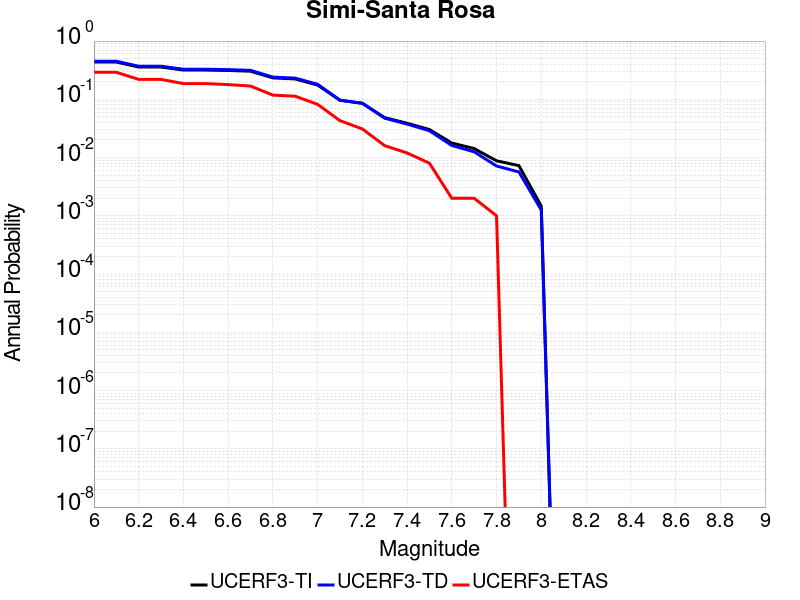 |
|-----|

| Magnitude | UCERF3-TI Prob | UCERF3-TD Prob | UCERF3-ETAS Prob |
|-----|-----|-----|-----|
| 6.0 | 0.43655568 | 0.45050985 | 0.28426966 |
| 6.1 | 0.43655568 | 0.45050985 | 0.28426966 |
| 6.2 | 0.35819918 | 0.36981514 | 0.21460675 |
| 6.3 | 0.35819918 | 0.36981514 | 0.21460675 |
| 6.4 | 0.31793696 | 0.32855308 | 0.17977528 |
| 6.5 | 0.31793696 | 0.32855308 | 0.17977528 |
| 6.6 | 0.31278196 | 0.32333845 | 0.17303371 |
| 6.7 | 0.30382794 | 0.3142666 | 0.16404495 |
| 6.8 | 0.23317708 | 0.24085437 | 0.11460674 |
| 6.9 | 0.22358027 | 0.23102143 | 0.11011236 |
| 7.0 | 0.17567508 | 0.18123929 | 0.07865169 |
| 7.1 | 0.09611708 | 0.09680416 | 0.039325844 |
| 7.2 | 0.085305974 | 0.08570924 | 0.029213483 |
| 7.3 | 0.048417024 | 0.04739339 | 0.014606741 |
| 7.4 | 0.038805913 | 0.037552092 | 0.011235955 |
| 7.5 | 0.03028425 | 0.028871328 | 0.006741573 |
| 7.6 | 0.017769413 | 0.016113538 | 0.0011235955 |
| 7.7 | 0.0142791895 | 0.012561247 | 0.0011235955 |
| 7.8 | 0.008794992 | 0.0071610855 | 0.0 |
| 7.9 | 0.0072668297 | 0.005660081 | 0.0 |
| 8.0 | 0.0014666809 | 0.001256136 | 0.0 |

## Sisar
*[(top)](#table-of-contents)*

|  |
|-----|

| Magnitude | UCERF3-TI Prob | UCERF3-TD Prob | UCERF3-ETAS Prob |
|-----|-----|-----|-----|
| 6.0 | 0.11179705 | 0.109507434 | 0.05730337 |
| 6.1 | 0.11179705 | 0.109507434 | 0.05730337 |
| 6.2 | 0.11179705 | 0.109507434 | 0.05730337 |
| 6.3 | 0.11179705 | 0.109507434 | 0.05730337 |
| 6.4 | 0.11179705 | 0.109507434 | 0.05730337 |
| 6.5 | 0.11179705 | 0.109507434 | 0.05730337 |
| 6.6 | 0.11179705 | 0.109507434 | 0.05730337 |
| 6.7 | 0.11179705 | 0.109507434 | 0.05730337 |
| 6.8 | 0.11179705 | 0.109507434 | 0.05730337 |
| 6.9 | 0.11175144 | 0.109461226 | 0.05730337 |
| 7.0 | 0.111418225 | 0.10912327 | 0.05730337 |
| 7.1 | 0.1110797 | 0.10877965 | 0.05730337 |
| 7.2 | 0.10958515 | 0.10725941 | 0.05730337 |
| 7.3 | 0.107109495 | 0.1048107 | 0.056179777 |
| 7.4 | 0.104221016 | 0.1021458 | 0.05505618 |
| 7.5 | 0.098715365 | 0.09692176 | 0.051685393 |
| 7.6 | 0.06989733 | 0.06982526 | 0.033707865 |
| 7.7 | 0.048431754 | 0.048231553 | 0.02247191 |
| 7.8 | 0.012727103 | 0.012793788 | 0.007865168 |
| 7.9 | 0.0030388944 | 0.0030639297 | 0.002247191 |
| 8.0 | 6.548287E-5 | 5.446597E-5 | 0.0 |

## Skinner Flat 2011 CFM
*[(top)](#table-of-contents)*

|  |
|-----|

| Magnitude | UCERF3-TI Prob | UCERF3-TD Prob | UCERF3-ETAS Prob |
|-----|-----|-----|-----|
| 6.0 | 0.10677096 | 0.114128955 | 0.06516854 |
| 6.1 | 0.10677096 | 0.114128955 | 0.060674157 |

## So Sierra Nevada
*[(top)](#table-of-contents)*

|  |
|-----|

| Magnitude | UCERF3-TI Prob | UCERF3-TD Prob | UCERF3-ETAS Prob |
|-----|-----|-----|-----|
| 6.0 | 0.26014677 | 0.24772555 | 0.16516854 |
| 6.1 | 0.26014677 | 0.24772555 | 0.16516854 |
| 6.2 | 0.26014677 | 0.24772555 | 0.16516854 |
| 6.3 | 0.26014677 | 0.24772555 | 0.16516854 |
| 6.4 | 0.26014677 | 0.24772555 | 0.16516854 |
| 6.5 | 0.26014677 | 0.24772555 | 0.16516854 |
| 6.6 | 0.179582 | 0.16245648 | 0.093258426 |
| 6.7 | 0.179582 | 0.16245648 | 0.093258426 |
| 6.8 | 0.1427259 | 0.12394477 | 0.06516854 |
| 6.9 | 0.12256904 | 0.102994576 | 0.050561797 |
| 7.0 | 0.11059791 | 0.090603925 | 0.04494382 |
| 7.1 | 0.09702229 | 0.07658077 | 0.041573033 |
| 7.2 | 0.08536266 | 0.06459138 | 0.033707865 |
| 7.3 | 0.0670288 | 0.04584876 | 0.025842696 |
| 7.4 | 0.057203136 | 0.036273077 | 0.023595506 |
| 7.5 | 0.03811011 | 0.018844564 | 0.013483146 |
| 7.6 | 0.027479587 | 0.012087637 | 0.007865168 |
| 7.7 | 0.014270174 | 0.0042406176 | 0.0011235955 |

## South Cuyama
*[(top)](#table-of-contents)*

|  |
|-----|

| Magnitude | UCERF3-TI Prob | UCERF3-TD Prob | UCERF3-ETAS Prob |
|-----|-----|-----|-----|
| 6.0 | 0.032709908 | 0.03278314 | 0.028089888 |
| 6.1 | 0.032709908 | 0.03278314 | 0.028089888 |
| 6.2 | 0.032709908 | 0.03278314 | 0.028089888 |
| 6.3 | 0.032709908 | 0.03278314 | 0.028089888 |
| 6.4 | 0.032709908 | 0.03278314 | 0.028089888 |
| 6.5 | 0.032709908 | 0.03278314 | 0.028089888 |
| 6.6 | 0.032709908 | 0.03278314 | 0.028089888 |
| 6.7 | 0.032709908 | 0.03278314 | 0.028089888 |
| 6.8 | 0.032709908 | 0.03278314 | 0.028089888 |
| 6.9 | 0.021821156 | 0.02186357 | 0.015730336 |
| 7.0 | 0.021236977 | 0.021278378 | 0.013483146 |
| 7.1 | 0.017497616 | 0.017532023 | 0.01235955 |
| 7.2 | 0.014975057 | 0.015005201 | 0.010112359 |
| 7.3 | 0.013312041 | 0.013339249 | 0.008988764 |
| 7.4 | 0.011251229 | 0.011274739 | 0.007865168 |
| 7.5 | 0.008635252 | 0.008653925 | 0.0056179776 |
| 7.6 | 0.005367122 | 0.0053792475 | 0.0033707866 |
| 7.7 | 0.0016038193 | 0.00160747 | 0.002247191 |
| 7.8 | 3.069083E-4 | 3.0776198E-4 | 0.0 |
| 7.9 | 1.5753045E-5 | 1.5802327E-5 | 0.0 |

## South Klamath Lake East
*[(top)](#table-of-contents)*

|  |
|-----|

| Magnitude | UCERF3-TI Prob | UCERF3-TD Prob | UCERF3-ETAS Prob |
|-----|-----|-----|-----|
| 6.0 | 0.45888993 | 0.47680375 | 0.3741573 |
| 6.1 | 0.45888993 | 0.47680375 | 0.3741573 |
| 6.2 | 0.45888993 | 0.47680375 | 0.3741573 |
| 6.3 | 0.22576539 | 0.23085958 | 0.21685393 |
| 6.4 | 0.22576539 | 0.23085958 | 0.21685393 |
| 6.5 | 0.14917164 | 0.15209663 | 0.14494382 |
| 6.6 | 0.107736856 | 0.10967523 | 0.11011236 |
| 6.7 | 0.08394778 | 0.08546678 | 0.08089887 |
| 6.8 | 0.0650641 | 0.06625515 | 0.061797753 |
| 6.9 | 0.025720967 | 0.026231857 | 0.02247191 |

## South Klamath Lake West
*[(top)](#table-of-contents)*

|  |
|-----|

| Magnitude | UCERF3-TI Prob | UCERF3-TD Prob | UCERF3-ETAS Prob |
|-----|-----|-----|-----|
| 6.0 | 0.43288535 | 0.44823092 | 0.38089886 |
| 6.1 | 0.43288535 | 0.44823092 | 0.38089886 |
| 6.2 | 0.22631274 | 0.23138715 | 0.21123596 |
| 6.3 | 0.22631274 | 0.23138715 | 0.21123596 |
| 6.4 | 0.1463777 | 0.14914432 | 0.14157303 |
| 6.5 | 0.1463777 | 0.14914432 | 0.14157303 |
| 6.6 | 0.104537375 | 0.10633914 | 0.09550562 |
| 6.7 | 0.07977535 | 0.081155926 | 0.07078651 |
| 6.8 | 0.060207084 | 0.061257698 | 0.05505618 |
| 6.9 | 0.023024078 | 0.023453454 | 0.020224718 |

## Superstition Hills
*[(top)](#table-of-contents)*

|  |
|-----|

| Magnitude | UCERF3-TI Prob | UCERF3-TD Prob | UCERF3-ETAS Prob |
|-----|-----|-----|-----|
| 6.0 | 0.8252717 | 0.77755237 | 0.83932585 |
| 6.1 | 0.8186925 | 0.7708737 | 0.78651685 |
| 6.2 | 0.8186925 | 0.7708737 | 0.78651685 |
| 6.3 | 0.74517244 | 0.698353 | 0.6932584 |
| 6.4 | 0.69427353 | 0.6510581 | 0.6292135 |
| 6.5 | 0.5389081 | 0.5001307 | 0.4516854 |
| 6.6 | 0.49327865 | 0.4603095 | 0.3988764 |
| 6.7 | 0.3169586 | 0.2869556 | 0.2258427 |
| 6.8 | 0.28876087 | 0.26221874 | 0.18764044 |
| 6.9 | 0.23849179 | 0.21525234 | 0.13483146 |
| 7.0 | 0.1893452 | 0.16923615 | 0.09550562 |
| 7.1 | 0.1893452 | 0.16923615 | 0.09550562 |
| 7.2 | 0.17504166 | 0.15532339 | 0.084269665 |
| 7.3 | 0.15832102 | 0.13793284 | 0.07977528 |
| 7.4 | 0.15446769 | 0.13389957 | 0.07977528 |
| 7.5 | 0.14655522 | 0.12617286 | 0.0752809 |
| 7.6 | 0.13815163 | 0.11825724 | 0.07191011 |
| 7.7 | 0.12608527 | 0.106869645 | 0.06966292 |
| 7.8 | 0.09169725 | 0.07180621 | 0.05730337 |
| 7.9 | 0.07592469 | 0.0564981 | 0.051685393 |
| 8.0 | 0.0638051 | 0.045714065 | 0.048314605 |
| 8.1 | 0.060079396 | 0.042755257 | 0.04494382 |
| 8.2 | 4.48371E-5 | 3.5355435E-5 | 0.0 |

## Surprise Valley 2011 CFM
*[(top)](#table-of-contents)*

| 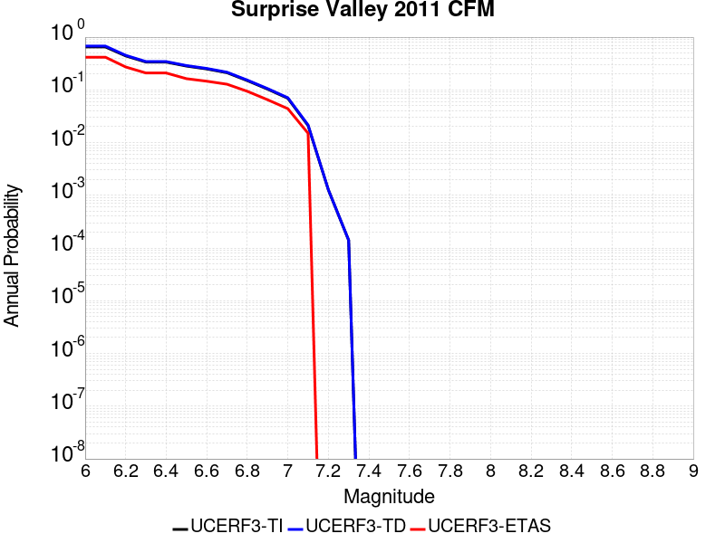 |
|-----|

| Magnitude | UCERF3-TI Prob | UCERF3-TD Prob | UCERF3-ETAS Prob |
|-----|-----|-----|-----|
| 6.0 | 0.65143496 | 0.67749095 | 0.41348314 |
| 6.1 | 0.65143496 | 0.67749095 | 0.41348314 |
| 6.2 | 0.44103816 | 0.45288482 | 0.2719101 |
| 6.3 | 0.3365452 | 0.34463733 | 0.20898877 |
| 6.4 | 0.33633685 | 0.34443074 | 0.20898877 |
| 6.5 | 0.2826633 | 0.28937835 | 0.16516854 |
| 6.6 | 0.24915846 | 0.2551166 | 0.1494382 |
| 6.7 | 0.21143383 | 0.21650128 | 0.13146068 |
| 6.8 | 0.14970997 | 0.15327355 | 0.09662921 |
| 6.9 | 0.103300415 | 0.10581201 | 0.06853933 |
| 7.0 | 0.06917996 | 0.07095435 | 0.046067417 |
| 7.1 | 0.020983784 | 0.021563185 | 0.015730336 |
| 7.2 | 0.0012682052 | 0.0012742083 | 0.0 |
| 7.3 | 1.4064225E-4 | 1.4131138E-4 | 0.0 |

## Swain Ravine - Spenceville
*[(top)](#table-of-contents)*

| 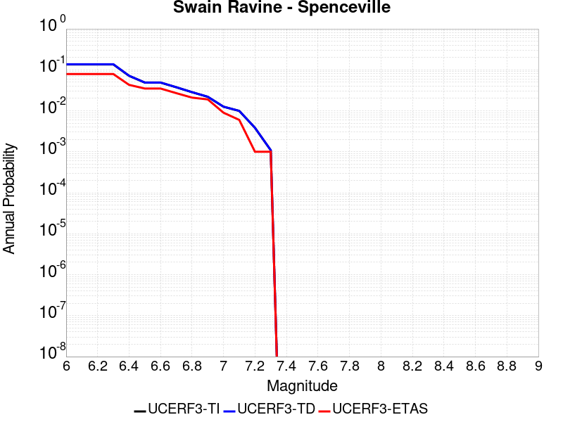 |
|-----|

| Magnitude | UCERF3-TI Prob | UCERF3-TD Prob | UCERF3-ETAS Prob |
|-----|-----|-----|-----|
| 6.0 | 0.1358427 | 0.1369394 | 0.0752809 |
| 6.1 | 0.1358427 | 0.1369394 | 0.0752809 |
| 6.2 | 0.1358427 | 0.1369394 | 0.0752809 |
| 6.3 | 0.1358427 | 0.1369394 | 0.0752809 |
| 6.4 | 0.07148016 | 0.07180742 | 0.041573033 |
| 6.5 | 0.04888437 | 0.049071543 | 0.033707865 |
| 6.6 | 0.04888437 | 0.049071543 | 0.033707865 |
| 6.7 | 0.03754331 | 0.037678573 | 0.0247191 |
| 6.8 | 0.028485386 | 0.028583411 | 0.021348314 |
| 6.9 | 0.021968303 | 0.022042142 | 0.019101124 |
| 7.0 | 0.012585107 | 0.012626651 | 0.008988764 |
| 7.1 | 0.009940339 | 0.009973435 | 0.0056179776 |
| 7.2 | 0.0038346925 | 0.0038481557 | 0.0 |
| 7.3 | 0.0010920384 | 0.0010961338 | 0.0 |

## Table Bluff
*[(top)](#table-of-contents)*

|  |
|-----|

| Magnitude | UCERF3-TI Prob | UCERF3-TD Prob | UCERF3-ETAS Prob |
|-----|-----|-----|-----|
| 6.0 | 0.37057623 | 0.3940641 | 0.26067415 |
| 6.1 | 0.37057623 | 0.3940641 | 0.26067415 |
| 6.2 | 0.37057623 | 0.3940641 | 0.26067415 |
| 6.3 | 0.37057623 | 0.3940641 | 0.26067415 |
| 6.4 | 0.37057623 | 0.3940641 | 0.26067415 |
| 6.5 | 0.28432488 | 0.30345854 | 0.1977528 |
| 6.6 | 0.28432488 | 0.30345854 | 0.1977528 |
| 6.7 | 0.22338533 | 0.2408176 | 0.15617977 |
| 6.8 | 0.22338533 | 0.2408176 | 0.15617977 |
| 6.9 | 0.19040473 | 0.20721534 | 0.13483146 |
| 7.0 | 0.17095083 | 0.18751213 | 0.12247191 |
| 7.1 | 0.08711849 | 0.09535287 | 0.05730337 |
| 7.2 | 0.061646607 | 0.066449985 | 0.041573033 |

## Tank Canyon
*[(top)](#table-of-contents)*

|  |
|-----|

| Magnitude | UCERF3-TI Prob | UCERF3-TD Prob | UCERF3-ETAS Prob |
|-----|-----|-----|-----|
| 6.0 | 0.71627223 | 0.7533103 | 0.6235955 |
| 6.1 | 0.3714237 | 0.38227364 | 0.29438204 |
| 6.2 | 0.3714237 | 0.38227364 | 0.29438204 |
| 6.3 | 0.2971578 | 0.30757117 | 0.2258427 |
| 6.4 | 0.2469291 | 0.25709337 | 0.18651685 |
| 6.5 | 0.18762843 | 0.1968215 | 0.13595505 |
| 6.6 | 0.1588766 | 0.16775918 | 0.11460674 |
| 6.7 | 0.11755917 | 0.12544423 | 0.08539326 |
| 6.8 | 0.1080498 | 0.11521022 | 0.07752809 |
| 6.9 | 0.068736896 | 0.07267306 | 0.043820225 |
| 7.0 | 0.048329774 | 0.050850306 | 0.026966292 |
| 7.1 | 0.03819994 | 0.040093467 | 0.020224718 |
| 7.2 | 0.027506221 | 0.028806455 | 0.016853932 |
| 7.3 | 0.02263725 | 0.023735879 | 0.014606741 |
| 7.4 | 0.019523134 | 0.020640826 | 0.014606741 |
| 7.5 | 0.01447208 | 0.015328992 | 0.010112359 |

## Thirty Mile Bank
*[(top)](#table-of-contents)*

|  |
|-----|

| Magnitude | UCERF3-TI Prob | UCERF3-TD Prob | UCERF3-ETAS Prob |
|-----|-----|-----|-----|
| 6.0 | 0.1562562 | 0.15821263 | 0.113483146 |
| 6.1 | 0.1562562 | 0.15821263 | 0.113483146 |
| 6.2 | 0.1562562 | 0.15821263 | 0.113483146 |
| 6.3 | 0.1562562 | 0.15821263 | 0.113483146 |
| 6.4 | 0.1562562 | 0.15821263 | 0.113483146 |
| 6.5 | 0.1562562 | 0.15821263 | 0.113483146 |
| 6.6 | 0.1562562 | 0.15821263 | 0.113483146 |
| 6.7 | 0.087889336 | 0.0886443 | 0.05955056 |
| 6.8 | 0.084184565 | 0.08490936 | 0.056179777 |
| 6.9 | 0.057642937 | 0.058127012 | 0.035955057 |
| 7.0 | 0.05483742 | 0.05529786 | 0.03483146 |
| 7.1 | 0.04063534 | 0.040986266 | 0.023595506 |
| 7.2 | 0.03327609 | 0.03357143 | 0.019101124 |
| 7.3 | 0.021282015 | 0.021453379 | 0.015730336 |
| 7.4 | 0.011057414 | 0.0111541785 | 0.008988764 |
| 7.5 | 0.007780504 | 0.007852555 | 0.006741573 |
| 7.6 | 0.0044224365 | 0.00446512 | 0.0056179776 |

## Tin Mountain
*[(top)](#table-of-contents)*

|  |
|-----|

| Magnitude | UCERF3-TI Prob | UCERF3-TD Prob | UCERF3-ETAS Prob |
|-----|-----|-----|-----|
| 6.0 | 0.10106362 | 0.102651104 | 0.061797753 |
| 6.1 | 0.10106362 | 0.102651104 | 0.061797753 |
| 6.2 | 0.10106362 | 0.102651104 | 0.061797753 |
| 6.3 | 0.10106362 | 0.102651104 | 0.061797753 |
| 6.4 | 0.10106362 | 0.102651104 | 0.061797753 |
| 6.5 | 0.05859291 | 0.05921765 | 0.03483146 |
| 6.6 | 0.05859291 | 0.05921765 | 0.03483146 |
| 6.7 | 0.043456364 | 0.043941066 | 0.021348314 |
| 6.8 | 0.03313211 | 0.033534456 | 0.013483146 |
| 6.9 | 0.0152000515 | 0.015397383 | 0.004494382 |
| 7.0 | 0.011993478 | 0.012160459 | 0.004494382 |
| 7.1 | 0.009876847 | 0.01002436 | 0.0033707866 |
| 7.2 | 0.009313247 | 0.009455083 | 0.0033707866 |
| 7.3 | 0.008681303 | 0.008814865 | 0.0033707866 |
| 7.4 | 0.007721791 | 0.007841026 | 0.0033707866 |
| 7.5 | 0.0037307607 | 0.0037904594 | 0.0 |

## Towne Pass
*[(top)](#table-of-contents)*

|  |
|-----|

| Magnitude | UCERF3-TI Prob | UCERF3-TD Prob | UCERF3-ETAS Prob |
|-----|-----|-----|-----|
| 6.0 | 0.09555777 | 0.09672592 | 0.08988764 |
| 6.1 | 0.09555777 | 0.09672592 | 0.08988764 |
| 6.2 | 0.09555777 | 0.09672592 | 0.08988764 |
| 6.3 | 0.09555777 | 0.09672592 | 0.08988764 |
| 6.4 | 0.09555777 | 0.09672592 | 0.08988764 |
| 6.5 | 0.030704698 | 0.030546376 | 0.025842696 |
| 6.6 | 0.030704698 | 0.030546376 | 0.025842696 |
| 6.7 | 0.021615237 | 0.021406768 | 0.015730336 |
| 6.8 | 0.01650826 | 0.01627579 | 0.013483146 |
| 6.9 | 0.013850536 | 0.013606465 | 0.008988764 |
| 7.0 | 0.009239058 | 0.008967891 | 0.006741573 |
| 7.1 | 0.007894448 | 0.007613082 | 0.006741573 |
| 7.2 | 0.005414015 | 0.0051194187 | 0.0056179776 |
| 7.3 | 0.0029078692 | 0.0026815676 | 0.0011235955 |

## Trinidad (alt1)
*[(top)](#table-of-contents)*

|  |
|-----|

| Magnitude | UCERF3-TI Prob | UCERF3-TD Prob | UCERF3-ETAS Prob |
|-----|-----|-----|-----|
| 6.0 | 0.5448152 | 0.5746387 | 0.46629214 |
| 6.1 | 0.5448152 | 0.5746387 | 0.46629214 |
| 6.2 | 0.5448152 | 0.5746387 | 0.46629214 |
| 6.3 | 0.5448152 | 0.5746387 | 0.46629214 |
| 6.4 | 0.5448152 | 0.5746387 | 0.46629214 |
| 6.5 | 0.5448152 | 0.5746387 | 0.46629214 |
| 6.6 | 0.5448152 | 0.5746387 | 0.46629214 |
| 6.7 | 0.5448152 | 0.5746387 | 0.46629214 |
| 6.8 | 0.36108062 | 0.37693816 | 0.2752809 |
| 6.9 | 0.36108062 | 0.37693816 | 0.2752809 |
| 7.0 | 0.28500026 | 0.2981022 | 0.21797752 |
| 7.1 | 0.24137376 | 0.25333002 | 0.18314607 |
| 7.2 | 0.19129175 | 0.20167227 | 0.13820225 |
| 7.3 | 0.14014651 | 0.14890562 | 0.093258426 |
| 7.4 | 0.10620347 | 0.11380408 | 0.064044945 |
| 7.5 | 0.014520103 | 0.014917471 | 0.006741573 |
| 7.6 | 0.012109553 | 0.01244778 | 0.0033707866 |
| 7.7 | 0.0057441983 | 0.0059126555 | 0.0 |
| 7.8 | 2.9837273E-4 | 3.076086E-4 | 0.0 |

## Ventura-Pitas Point
*[(top)](#table-of-contents)*

|  |
|-----|

| Magnitude | UCERF3-TI Prob | UCERF3-TD Prob | UCERF3-ETAS Prob |
|-----|-----|-----|-----|
| 6.0 | 0.5792208 | 0.60454696 | 0.44269663 |
| 6.1 | 0.5792208 | 0.60454696 | 0.44269663 |
| 6.2 | 0.5792208 | 0.60454696 | 0.44269663 |
| 6.3 | 0.5792208 | 0.60454696 | 0.44269663 |
| 6.4 | 0.38694492 | 0.38459116 | 0.23932584 |
| 6.5 | 0.38694492 | 0.38459116 | 0.23932584 |
| 6.6 | 0.31249452 | 0.30421665 | 0.1752809 |
| 6.7 | 0.31249452 | 0.30421665 | 0.1752809 |
| 6.8 | 0.29986522 | 0.2909738 | 0.16516854 |
| 6.9 | 0.29950547 | 0.2905984 | 0.16516854 |
| 7.0 | 0.29812777 | 0.28918305 | 0.16516854 |
| 7.1 | 0.288854 | 0.27973732 | 0.15393259 |
| 7.2 | 0.27499706 | 0.26591778 | 0.14382023 |
| 7.3 | 0.2478542 | 0.24046305 | 0.1247191 |
| 7.4 | 0.23762695 | 0.23071823 | 0.121348314 |
| 7.5 | 0.20960215 | 0.2033566 | 0.10561798 |
| 7.6 | 0.12000763 | 0.11524512 | 0.061797753 |
| 7.7 | 0.09639116 | 0.09244062 | 0.05505618 |
| 7.8 | 0.062297437 | 0.06007814 | 0.040449437 |
| 7.9 | 0.010629006 | 0.0102245435 | 0.006741573 |
| 8.0 | 2.0325146E-4 | 1.8586217E-4 | 0.0 |

## Verdugo
*[(top)](#table-of-contents)*

|  |
|-----|

| Magnitude | UCERF3-TI Prob | UCERF3-TD Prob | UCERF3-ETAS Prob |
|-----|-----|-----|-----|
| 6.0 | 0.13124973 | 0.12952101 | 0.06516854 |
| 6.1 | 0.13124973 | 0.12952101 | 0.06516854 |
| 6.2 | 0.13124973 | 0.12952101 | 0.06516854 |
| 6.3 | 0.13124973 | 0.12952101 | 0.06516854 |
| 6.4 | 0.13124973 | 0.12952101 | 0.06516854 |
| 6.5 | 0.12035932 | 0.118433334 | 0.051685393 |
| 6.6 | 0.12035932 | 0.118433334 | 0.051685393 |
| 6.7 | 0.11809642 | 0.116139874 | 0.050561797 |
| 6.8 | 0.11094422 | 0.10885556 | 0.047191013 |
| 6.9 | 0.1074558 | 0.10530664 | 0.046067417 |
| 7.0 | 0.10311927 | 0.100898325 | 0.041573033 |
| 7.1 | 0.10004924 | 0.097771235 | 0.040449437 |
| 7.2 | 0.095106326 | 0.09273658 | 0.03483146 |
| 7.3 | 0.08905414 | 0.08656917 | 0.033707865 |
| 7.4 | 0.08371282 | 0.08116009 | 0.03258427 |
| 7.5 | 0.074034974 | 0.07146254 | 0.026966292 |
| 7.6 | 0.051173255 | 0.0495767 | 0.017977528 |
| 7.7 | 0.014828821 | 0.014265171 | 0.004494382 |
| 7.8 | 0.0042300685 | 0.0036182953 | 0.0 |
| 7.9 | 0.0011596675 | 0.001159638 | 0.0 |

## Walker Spring 2011 CFM
*[(top)](#table-of-contents)*

|  |
|-----|

| Magnitude | UCERF3-TI Prob | UCERF3-TD Prob | UCERF3-ETAS Prob |
|-----|-----|-----|-----|
| 6.0 | 0.20495702 | 0.21000464 | 0.13707866 |
| 6.1 | 0.20495702 | 0.21000464 | 0.10786517 |
| 6.2 | 0.13715713 | 0.14045623 | 0.073033705 |
| 6.3 | 0.11289688 | 0.115858264 | 0.050561797 |
| 6.4 | 0.10479672 | 0.10759428 | 0.048314605 |
| 6.5 | 0.08594674 | 0.08849236 | 0.037078653 |
| 6.6 | 0.067717336 | 0.069923885 | 0.026966292 |
| 6.7 | 0.015225914 | 0.015490001 | 0.0011235955 |
| 6.8 | 0.0042991596 | 0.004376935 | 0.0 |

## West Napa 2011 CFM
*[(top)](#table-of-contents)*

|  |
|-----|

| Magnitude | UCERF3-TI Prob | UCERF3-TD Prob | UCERF3-ETAS Prob |
|-----|-----|-----|-----|
| 6.0 | 0.62633455 | 0.6550328 | 0.4988764 |
| 6.1 | 0.62633455 | 0.6550328 | 0.4988764 |
| 6.2 | 0.62633455 | 0.6550328 | 0.4988764 |
| 6.3 | 0.4290162 | 0.4476777 | 0.33483145 |
| 6.4 | 0.4290162 | 0.4476777 | 0.33483145 |
| 6.5 | 0.35624903 | 0.37442318 | 0.26853934 |
| 6.6 | 0.35565034 | 0.37382665 | 0.26853934 |
| 6.7 | 0.29496476 | 0.31278735 | 0.21573034 |
| 6.8 | 0.23242733 | 0.24843863 | 0.17865169 |
| 6.9 | 0.18330297 | 0.19806455 | 0.1505618 |
| 7.0 | 0.05604935 | 0.05781864 | 0.043820225 |
| 7.1 | 0.048383325 | 0.04989911 | 0.03820225 |
| 7.2 | 0.04710889 | 0.048587475 | 0.037078653 |
| 7.3 | 0.045584343 | 0.047023002 | 0.035955057 |
| 7.4 | 0.04218538 | 0.043547116 | 0.033707865 |
| 7.5 | 0.03596751 | 0.037137467 | 0.03258427 |
| 7.6 | 0.0033894612 | 0.0033749142 | 0.002247191 |
| 7.7 | 0.0022259385 | 0.002122766 | 0.0011235955 |
| 7.8 | 0.0014618817 | 0.001294286 | 0.0011235955 |
| 7.9 | 7.68708E-4 | 6.341997E-4 | 0.0011235955 |
| 8.0 | 3.4789543E-4 | 2.7301183E-4 | 0.0011235955 |
| 8.1 | 6.937113E-6 | 5.6108174E-6 | 0.0 |

## West Tahoe
*[(top)](#table-of-contents)*

| 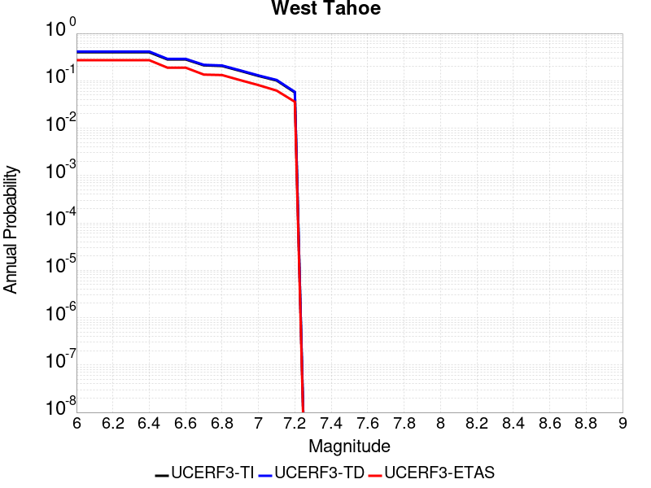 |
|-----|

| Magnitude | UCERF3-TI Prob | UCERF3-TD Prob | UCERF3-ETAS Prob |
|-----|-----|-----|-----|
| 6.0 | 0.3991342 | 0.4144222 | 0.26966292 |
| 6.1 | 0.3991342 | 0.4144222 | 0.26966292 |
| 6.2 | 0.3991342 | 0.4144222 | 0.26966292 |
| 6.3 | 0.3991342 | 0.4144222 | 0.26966292 |
| 6.4 | 0.3991342 | 0.4144222 | 0.26966292 |
| 6.5 | 0.2817602 | 0.2899866 | 0.18876405 |
| 6.6 | 0.2817602 | 0.2899866 | 0.18876405 |
| 6.7 | 0.2117029 | 0.2171975 | 0.13595505 |
| 6.8 | 0.20486477 | 0.21025057 | 0.13258427 |
| 6.9 | 0.16160451 | 0.16579413 | 0.104494385 |
| 7.0 | 0.1263926 | 0.12976953 | 0.084269665 |
| 7.1 | 0.10122751 | 0.10406284 | 0.064044945 |
| 7.2 | 0.05665881 | 0.058289655 | 0.035955057 |

## White Mountains
*[(top)](#table-of-contents)*

| 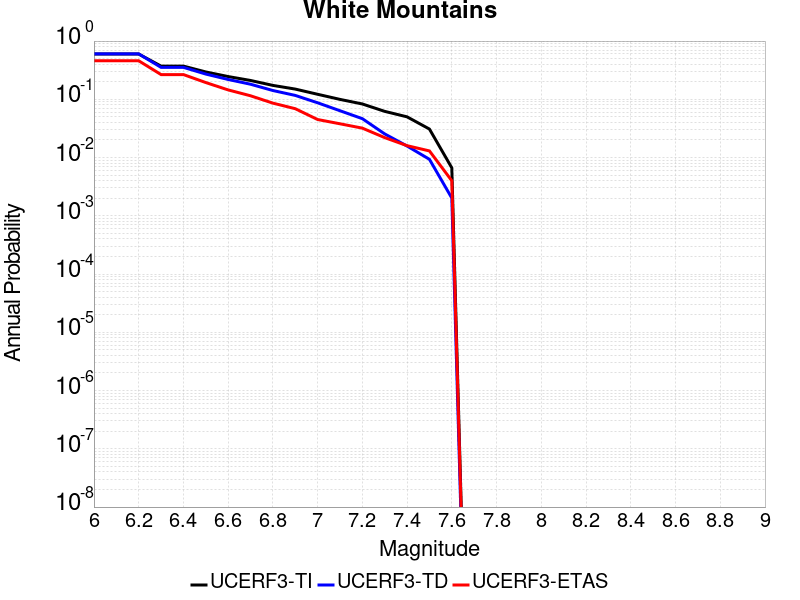 |
|-----|

| Magnitude | UCERF3-TI Prob | UCERF3-TD Prob | UCERF3-ETAS Prob |
|-----|-----|-----|-----|
| 6.0 | 0.59911263 | 0.6031796 | 0.46067417 |
| 6.1 | 0.59911263 | 0.6031796 | 0.46067417 |
| 6.2 | 0.59911263 | 0.6031796 | 0.46067417 |
| 6.3 | 0.37178582 | 0.35358605 | 0.26741573 |
| 6.4 | 0.37178582 | 0.35358605 | 0.26741573 |
| 6.5 | 0.2949842 | 0.27139136 | 0.1977528 |
| 6.6 | 0.24591754 | 0.21906137 | 0.14606741 |
| 6.7 | 0.21067435 | 0.18157807 | 0.113483146 |
| 6.8 | 0.17332757 | 0.14158614 | 0.08876404 |
| 6.9 | 0.14988972 | 0.116666876 | 0.07078651 |
| 7.0 | 0.12201831 | 0.087196924 | 0.047191013 |
| 7.1 | 0.09969078 | 0.06367973 | 0.039325844 |
| 7.2 | 0.08317246 | 0.046530884 | 0.03258427 |
| 7.3 | 0.062120155 | 0.02546467 | 0.021348314 |
| 7.4 | 0.049997214 | 0.01576667 | 0.015730336 |
| 7.5 | 0.030858051 | 0.009330552 | 0.01235955 |
| 7.6 | 0.006659759 | 0.0020180957 | 0.0033707866 |

## White Wolf
*[(top)](#table-of-contents)*

| 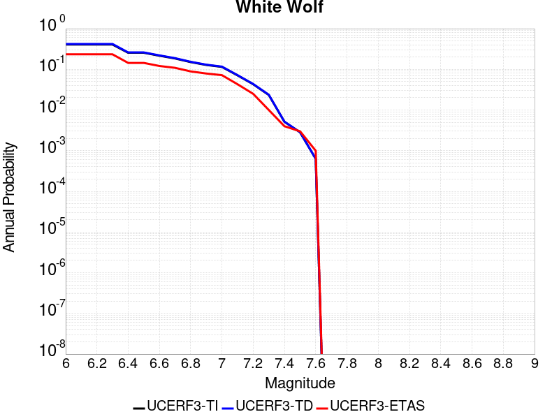 |
|-----|

| Magnitude | UCERF3-TI Prob | UCERF3-TD Prob | UCERF3-ETAS Prob |
|-----|-----|-----|-----|
| 6.0 | 0.40712854 | 0.42072698 | 0.23595506 |
| 6.1 | 0.40712854 | 0.42072698 | 0.23595506 |
| 6.2 | 0.40712854 | 0.42072698 | 0.23595506 |
| 6.3 | 0.40712854 | 0.42072698 | 0.23595506 |
| 6.4 | 0.2558104 | 0.260955 | 0.14719102 |
| 6.5 | 0.2558104 | 0.260955 | 0.14719102 |
| 6.6 | 0.21641053 | 0.22065172 | 0.12247191 |
| 6.7 | 0.18503481 | 0.18851332 | 0.11011236 |
| 6.8 | 0.15081243 | 0.15339725 | 0.08988764 |
| 6.9 | 0.12819473 | 0.1303449 | 0.07977528 |
| 7.0 | 0.114823684 | 0.11675375 | 0.07191011 |
| 7.1 | 0.071100496 | 0.072021544 | 0.04494382 |
| 7.2 | 0.043086637 | 0.043656405 | 0.025842696 |
| 7.3 | 0.023426257 | 0.023736289 | 0.008988764 |
| 7.4 | 0.0051309164 | 0.0051733777 | 0.004494382 |
| 7.5 | 0.002831823 | 0.0028486485 | 0.0033707866 |
| 7.6 | 6.3162576E-4 | 6.3539424E-4 | 0.0011235955 |

## White Wolf (Extension)
*[(top)](#table-of-contents)*

|  |
|-----|

| Magnitude | UCERF3-TI Prob | UCERF3-TD Prob | UCERF3-ETAS Prob |
|-----|-----|-----|-----|
| 6.0 | 0.19307251 | 0.19670115 | 0.0988764 |
| 6.1 | 0.19307251 | 0.19670115 | 0.0988764 |
| 6.2 | 0.19307251 | 0.19670115 | 0.0988764 |
| 6.3 | 0.19307251 | 0.19670115 | 0.0988764 |
| 6.4 | 0.14091408 | 0.14280976 | 0.07752809 |
| 6.5 | 0.13966365 | 0.14154643 | 0.07752809 |
| 6.6 | 0.114097044 | 0.115581356 | 0.060674157 |
| 6.7 | 0.09798938 | 0.09926163 | 0.053932585 |
| 6.8 | 0.08578422 | 0.08691117 | 0.048314605 |
| 6.9 | 0.07857619 | 0.07962776 | 0.047191013 |
| 7.0 | 0.07116851 | 0.07214374 | 0.041573033 |
| 7.1 | 0.060917497 | 0.06177637 | 0.035955057 |
| 7.2 | 0.035552867 | 0.036076475 | 0.02247191 |
| 7.3 | 0.018240402 | 0.018519152 | 0.0056179776 |
| 7.4 | 0.0015468019 | 0.0015681955 | 0.0011235955 |

## Whittier alt 1
*[(top)](#table-of-contents)*

|  |
|-----|

| Magnitude | UCERF3-TI Prob | UCERF3-TD Prob | UCERF3-ETAS Prob |
|-----|-----|-----|-----|
| 6.0 | 0.67052186 | 0.6906139 | 0.5168539 |
| 6.1 | 0.67052186 | 0.6906139 | 0.5168539 |
| 6.2 | 0.67052186 | 0.6906139 | 0.5168539 |
| 6.3 | 0.4005946 | 0.37286556 | 0.24157304 |
| 6.4 | 0.33455 | 0.30060273 | 0.19101124 |
| 6.5 | 0.3264951 | 0.2919962 | 0.18426967 |
| 6.6 | 0.28681317 | 0.25067917 | 0.14157303 |
| 6.7 | 0.27907205 | 0.24275075 | 0.13595505 |
| 6.8 | 0.27253085 | 0.23605871 | 0.1269663 |
| 6.9 | 0.26075318 | 0.2241373 | 0.11797753 |
| 7.0 | 0.2487864 | 0.21219547 | 0.11011236 |
| 7.1 | 0.23425835 | 0.19847113 | 0.1 |
| 7.2 | 0.2176602 | 0.18349957 | 0.08764045 |
| 7.3 | 0.19338462 | 0.16222365 | 0.0752809 |
| 7.4 | 0.17839646 | 0.14933987 | 0.07078651 |
| 7.5 | 0.14823145 | 0.12240658 | 0.05955056 |
| 7.6 | 0.13271546 | 0.108586304 | 0.048314605 |
| 7.7 | 0.103028014 | 0.081003964 | 0.031460673 |
| 7.8 | 0.005902799 | 0.0036343427 | 0.004494382 |
| 7.9 | 1.7417852E-4 | 9.24347E-5 | 0.0 |

## Wight Way 2011 CFM
*[(top)](#table-of-contents)*

|  |
|-----|

| Magnitude | UCERF3-TI Prob | UCERF3-TD Prob | UCERF3-ETAS Prob |
|-----|-----|-----|-----|
| 6.0 | 0.02679807 | 0.02699059 | 0.019101124 |
| 6.1 | 0.02679807 | 0.02699059 | 0.019101124 |
| 6.2 | 0.02679807 | 0.02699059 | 0.019101124 |
| 6.3 | 0.02679807 | 0.02699059 | 0.019101124 |
| 6.4 | 0.013903275 | 0.014028472 | 0.008988764 |
| 6.5 | 0.013903275 | 0.014028472 | 0.008988764 |

## Yorba Linda
*[(top)](#table-of-contents)*

| 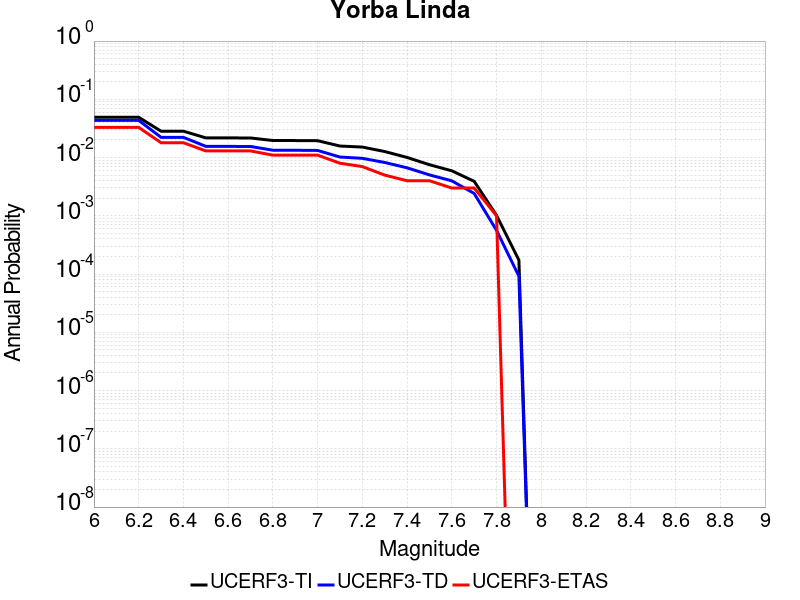 |
|-----|

| Magnitude | UCERF3-TI Prob | UCERF3-TD Prob | UCERF3-ETAS Prob |
|-----|-----|-----|-----|
| 6.0 | 0.049221918 | 0.043544907 | 0.030337078 |
| 6.1 | 0.049221918 | 0.043544907 | 0.030337078 |
| 6.2 | 0.049221918 | 0.043544907 | 0.030337078 |
| 6.3 | 0.028362866 | 0.022243243 | 0.015730336 |
| 6.4 | 0.028362866 | 0.022243243 | 0.015730336 |
| 6.5 | 0.021791818 | 0.015596278 | 0.010112359 |
| 6.6 | 0.021735214 | 0.015534579 | 0.010112359 |
| 6.7 | 0.021707173 | 0.015504045 | 0.010112359 |
| 6.8 | 0.019611908 | 0.013378919 | 0.008988764 |
| 6.9 | 0.019582598 | 0.013344736 | 0.008988764 |
| 7.0 | 0.019477304 | 0.013247108 | 0.008988764 |
| 7.1 | 0.015763052 | 0.010210377 | 0.0056179776 |
| 7.2 | 0.015146166 | 0.0096993465 | 0.004494382 |
| 7.3 | 0.012697442 | 0.008237241 | 0.004494382 |
| 7.4 | 0.010045864 | 0.0066671493 | 0.0033707866 |
| 7.5 | 0.0075388076 | 0.0050423895 | 0.0033707866 |
| 7.6 | 0.0059230034 | 0.003984665 | 0.0033707866 |
| 7.7 | 0.003910214 | 0.0024211707 | 0.0033707866 |
| 7.8 | 0.0010158578 | 5.62619E-4 | 0.0011235955 |
| 7.9 | 1.734397E-4 | 9.1908514E-5 | 0.0 |

## Zayante-Vergeles 2011 CFM
*[(top)](#table-of-contents)*

|  |
|-----|

| Magnitude | UCERF3-TI Prob | UCERF3-TD Prob | UCERF3-ETAS Prob |
|-----|-----|-----|-----|
| 6.0 | 0.028676117 | 0.02155121 | 0.02247191 |
| 6.1 | 0.028676117 | 0.02155121 | 0.02247191 |
| 6.2 | 0.028676117 | 0.02155121 | 0.02247191 |
| 6.3 | 0.028676117 | 0.02155121 | 0.02247191 |
| 6.4 | 0.028676117 | 0.02155121 | 0.02247191 |
| 6.5 | 0.028676117 | 0.02155121 | 0.02247191 |
| 6.6 | 0.028676117 | 0.02155121 | 0.02247191 |
| 6.7 | 0.028676117 | 0.02155121 | 0.02247191 |
| 6.8 | 0.02475527 | 0.017593645 | 0.019101124 |
| 6.9 | 0.02352805 | 0.01635473 | 0.017977528 |
| 7.0 | 0.02152657 | 0.014334934 | 0.014606741 |
| 7.1 | 0.019440396 | 0.012225557 | 0.011235955 |
| 7.2 | 0.01810627 | 0.010872771 | 0.011235955 |
| 7.3 | 0.016688468 | 0.009451455 | 0.011235955 |
| 7.4 | 0.015031327 | 0.0077814176 | 0.008988764 |
| 7.5 | 0.013740559 | 0.0064947857 | 0.007865168 |
| 7.6 | 0.012195927 | 0.0050804196 | 0.006741573 |
| 7.7 | 0.009831744 | 0.0030059982 | 0.0056179776 |
| 7.8 | 0.007635692 | 0.001562157 | 0.004494382 |
| 7.9 | 0.005528668 | 6.849729E-4 | 0.0033707866 |
| 8.0 | 0.0038100798 | 4.2289722E-4 | 0.0033707866 |
| 8.1 | 0.0019873127 | 2.7562733E-4 | 0.0011235955 |
| 8.2 | 1.4515444E-4 | 1.2511627E-5 | 0.0 |

