# Parent Section Magnitude-Probability Distributions

Only fault sections with at least one triggered aftershock are plotted. Sections are sorted by total supraseismogenic trigger rate (decreasing)

## Table Of Contents

* [Garlock (Central)](#garlock-central)
* [Little Lake](#little-lake)
* [Airport Lake](#airport-lake)
* [Tank Canyon](#tank-canyon)
* [Owl Lake](#owl-lake)
* [Panamint Valley](#panamint-valley)
* [Garlock (East)](#garlock-east)
* [Hunter Mountain-Saline Valley](#hunter-mountain-saline-valley)
* [Garlock (West)](#garlock-west)
* [Blackwater](#blackwater)
* [San Andreas (Mojave S)](#san-andreas-mojave-s)
* [Ash Hill](#ash-hill)
* [San Andreas (Mojave N)](#san-andreas-mojave-n)
* [Gravel Hills-Harper Lk](#gravel-hills-harper-lk)
* [McLean Lake](#mclean-lake)
* [So Sierra Nevada](#so-sierra-nevada)
* [Goldstone Lake](#goldstone-lake)
* [San Andreas (San Bernardino N)](#san-andreas-san-bernardino-n)
* [Lenwood-Lockhart-Old Woman Springs](#lenwood-lockhart-old-woman-springs)
* [Paradise](#paradise)
* [San Andreas (San Bernardino S)](#san-andreas-san-bernardino-s)
* [Death Valley (So)](#death-valley-so)
* [Coyote Canyon](#coyote-canyon)
* [Towne Pass](#towne-pass)
* [Scodie Lineament](#scodie-lineament)
* [Nelson Lake](#nelson-lake)
* [White Wolf (Extension)](#white-wolf-extension)
* [Sierra Nevada  (No Extension)](#sierra-nevada--no-extension)
* [Helendale-So Lockhart](#helendale-so-lockhart)
* [Death Valley (Black Mtns Frontal)](#death-valley-black-mtns-frontal)
* [San Andreas (San Gorgonio Pass-Garnet HIll)](#san-andreas-san-gorgonio-pass-garnet-hill)
* [Garlic Springs](#garlic-springs)
* [Hosgri](#hosgri)
* [San Andreas (Santa Cruz Mts) 2011 CFM](#san-andreas-santa-cruz-mts-2011-cfm)
* [San Andreas (Creeping Section) 2011 CFM](#san-andreas-creeping-section-2011-cfm)
* [San Andreas (Coachella) rev](#san-andreas-coachella-rev)
* [San Jacinto (Stepovers Combined)](#san-jacinto-stepovers-combined)
* [San Jacinto (San Jacinto Valley) rev](#san-jacinto-san-jacinto-valley-rev)
* [Mission Creek](#mission-creek)
* [San Andreas (Peninsula) 2011 CFM](#san-andreas-peninsula-2011-cfm)
* [Rose Canyon](#rose-canyon)
* [Ortigalita (North)](#ortigalita-north)
* [San Jacinto (Lytle Creek connector)](#san-jacinto-lytle-creek-connector)
* [Death Valley (Fish Lake Valley)](#death-valley-fish-lake-valley)
* [Dry Mountain](#dry-mountain)
* [Cedar Mtn-Mahogany Mtn](#cedar-mtn-mahogany-mtn)
* [Cleghorn Pass](#cleghorn-pass)
* [Cady](#cady)
* [Hayward (So) 2011 CFM](#hayward-so-2011-cfm)
* [San Jacinto (San Bernardino)](#san-jacinto-san-bernardino)
* [Red Pass](#red-pass)
* [Calaveras (So) 2011 CFM](#calaveras-so-2011-cfm)
* [Owens Valley](#owens-valley)
* [San Gorgonio Pass](#san-gorgonio-pass)
* [San Andreas (Parkfield)](#san-andreas-parkfield)
* [San Andreas (Big Bend)](#san-andreas-big-bend)
* [San Jacinto (Anza) rev](#san-jacinto-anza-rev)
* [Big Pine (East)](#big-pine-east)
* [Independence rev 2011](#independence-rev-2011)
* [San Andreas (Cholame) rev](#san-andreas-cholame-rev)
* [Ludlow](#ludlow)
* [San Luis Range 2011 CFM](#san-luis-range-2011-cfm)
* [San Jacinto (Coyote Creek)](#san-jacinto-coyote-creek)
* [San Cayetano](#san-cayetano)
* [Mission Ridge-Arroyo Parida-Santa Ana](#mission-ridge-arroyo-parida-santa-ana)
* [Brawley (Seismic Zone) alt 1](#brawley-seismic-zone-alt-1)
* [Oak Ridge (Onshore)](#oak-ridge-onshore)
* [San Jacinto (Borrego)](#san-jacinto-borrego)
* [San Andreas (Carrizo) rev](#san-andreas-carrizo-rev)
* [Tin Mountain](#tin-mountain)
* [Coyote Lake](#coyote-lake)
* [Manix-Afton Hills](#manix-afton-hills)
* [Imperial](#imperial)
* [Santa Ynez (East)](#santa-ynez-east)

## Garlock (Central)
*[(top)](#table-of-contents)*

| 1 Week | 1 Month | 1 Year | 10 Year |
|-----|-----|-----|-----|
|  |  |  |  |

| Magnitude | 1 wk TI Prob | 1 wk TD Prob | 1 wk ETAS Prob | 1 wk ETAS/TD Gain | 1 wk ETAS Triggered Only | 1 mo TI Prob | 1 mo TD Prob | 1 mo ETAS Prob | 1 mo ETAS/TD Gain | 1 mo ETAS Triggered Only | 1 yr TI Prob | 1 yr TD Prob | 1 yr ETAS Prob | 1 yr ETAS/TD Gain | 1 yr ETAS Triggered Only | 10 yr TI Prob | 10 yr TD Prob | 10 yr ETAS Prob | 10 yr ETAS/TD Gain | 10 yr ETAS Triggered Only |
|-----|-----|-----|-----|-----|-----|-----|-----|-----|-----|-----|-----|-----|-----|-----|-----|-----|-----|-----|-----|-----|
| 6.0 | 5.5131142E-5 | 7.027124E-5 | 0.0011455214 | 16.301424 | 0.0010753257 | 2.3625491E-4 | 3.0112805E-4 | 0.0036318717 | 12.060887 | 0.0033317467 | 0.0028726095 | 0.0036601364 | 0.015076586 | 4.119132 | 0.0114583885 | 0.028357591 | 0.036092084 | 0.05371284 | 1.4882165 | 0.018280536 |
| 6.1 | 5.5131142E-5 | 7.027124E-5 | 0.0011455214 | 16.301424 | 0.0010753257 | 2.3625491E-4 | 3.0112805E-4 | 0.0036318717 | 12.060887 | 0.0033317467 | 0.0028726095 | 0.0036601364 | 0.015076586 | 4.119132 | 0.0114583885 | 0.028357591 | 0.036092084 | 0.05371284 | 1.4882165 | 0.018280536 |
| 6.2 | 4.216245E-5 | 5.1683597E-5 | 6.510145E-4 | 12.596152 | 5.9936184E-4 | 1.806837E-4 | 2.214825E-4 | 0.002072043 | 9.355335 | 0.0018509704 | 0.0021976046 | 0.0026932466 | 0.009549763 | 3.5458186 | 0.006875033 | 0.021759989 | 0.026701005 | 0.03723577 | 1.3945457 | 0.01082377 |
| 6.3 | 4.216245E-5 | 5.1683597E-5 | 6.510145E-4 | 12.596152 | 5.9936184E-4 | 1.806837E-4 | 2.214825E-4 | 0.002072043 | 9.355335 | 0.0018509704 | 0.0021976046 | 0.0026932466 | 0.009549763 | 3.5458186 | 0.006875033 | 0.021759989 | 0.026701005 | 0.03723577 | 1.3945457 | 0.01082377 |
| 6.4 | 3.6858168E-5 | 4.4131746E-5 | 5.024471E-4 | 11.385161 | 4.5833553E-4 | 1.5795401E-4 | 1.8912248E-4 | 0.0016696188 | 8.82824 | 0.0014807764 | 0.0019213937 | 0.00230016 | 0.007611658 | 3.3091865 | 0.0053237434 | 0.019048655 | 0.022859743 | 0.031110667 | 1.3609369 | 0.008443951 |
| 6.5 | 3.39199E-5 | 4.0038896E-5 | 4.631009E-4 | 11.566276 | 4.2307895E-4 | 1.453629E-4 | 1.715841E-4 | 0.00156398 | 9.114947 | 0.0013926349 | 0.0017683565 | 0.0020870569 | 0.0068719443 | 3.2926486 | 0.0047948947 | 0.017543508 | 0.020770492 | 0.028262261 | 1.360693 | 0.0076506776 |
| 6.6 | 3.3571985E-5 | 3.9493032E-5 | 4.6255527E-4 | 11.712326 | 4.2307895E-4 | 1.4387199E-4 | 1.6924499E-4 | 0.0015440189 | 9.122981 | 0.0013750066 | 0.0017502342 | 0.0020586322 | 0.006826064 | 3.315825 | 0.0047772666 | 0.017365133 | 0.020491783 | 0.027968416 | 1.3648602 | 0.0076330495 |
| 6.7 | 3.2580007E-5 | 3.8109323E-5 | 4.4354453E-4 | 11.638741 | 4.0545067E-4 | 1.3962112E-4 | 1.6331558E-4 | 0.0015028468 | 9.202104 | 0.00133975 | 0.0016985617 | 0.0019865753 | 0.006613605 | 3.329149 | 0.00463624 | 0.016856372 | 0.019784356 | 0.027093595 | 1.3694454 | 0.0074567664 |
| 6.8 | 3.2185937E-5 | 3.7536465E-5 | 4.429719E-4 | 11.801108 | 4.0545067E-4 | 1.3793244E-4 | 1.6086077E-4 | 0.0015003952 | 9.3272915 | 0.00133975 | 0.0016780337 | 0.001956742 | 0.0064607537 | 3.3017912 | 0.0045128423 | 0.016654192 | 0.01949112 | 0.0266297 | 1.3662478 | 0.007280484 |
| 6.9 | 3.165394E-5 | 3.6740938E-5 | 3.892938E-4 | 10.595641 | 3.525658E-4 | 1.3565269E-4 | 1.5745178E-4 | 0.0014441144 | 9.171788 | 0.0012868652 | 0.0016503202 | 0.0019153113 | 0.0062963483 | 3.287376 | 0.0043894444 | 0.01638118 | 0.0190837 | 0.0261042 | 1.3678795 | 0.0071570855 |
| 7.0 | 3.0903822E-5 | 3.564605E-5 | 3.881993E-4 | 10.890387 | 3.525658E-4 | 1.3243823E-4 | 1.5275997E-4 | 0.0014394285 | 9.422813 | 0.0012868652 | 0.0016112428 | 0.0018582871 | 0.006151597 | 3.3103585 | 0.0043013026 | 0.015996104 | 0.018522795 | 0.025408898 | 1.3717637 | 0.0070160595 |
| 7.1 | 3.0069863E-5 | 3.441218E-5 | 3.5171048E-4 | 10.220523 | 3.1730923E-4 | 1.2886449E-4 | 1.4747256E-4 | 0.0013460194 | 9.127254 | 0.0011987237 | 0.0015677959 | 0.0017940209 | 0.0058940435 | 3.285382 | 0.0041073915 | 0.01556781 | 0.017890377 | 0.024451971 | 1.3667667 | 0.006681122 |
| 7.2 | 2.7957109E-5 | 3.1301115E-5 | 2.4283396E-4 | 7.7579975 | 2.1153947E-4 | 1.1981068E-4 | 1.3414085E-4 | 0.0011211927 | 8.358324 | 9.871842E-4 | 0.0014577188 | 0.0016319609 | 0.005151865 | 3.1568558 | 0.003525658 | 0.014481937 | 0.016293783 | 0.021860262 | 1.3416321 | 0.005658681 |
| 7.3 | 2.4519275E-5 | 2.6733265E-5 | 1.6775582E-4 | 6.2751713 | 1.4102632E-4 | 1.0507837E-4 | 1.1456619E-4 | 7.667382E-4 | 6.6925344 | 6.522467E-4 | 0.0012785783 | 0.0013939656 | 0.003788071 | 2.7174783 | 0.0023974474 | 0.012712469 | 0.013937555 | 0.017900787 | 1.2843564 | 0.00401925 |
| 7.4 | 2.3225532E-5 | 2.5217494E-5 | 1.1335672E-4 | 4.495162 | 8.814145E-5 | 9.95342E-5 | 1.0807058E-4 | 6.721149E-4 | 6.219222 | 5.641053E-4 | 0.0012111551 | 0.0013149795 | 0.0034980131 | 2.6601274 | 0.002185908 | 0.012045753 | 0.01315504 | 0.01677349 | 1.2750617 | 0.0036666843 |
| 7.5 | 2.097765E-5 | 2.250088E-5 | 7.538456E-5 | 3.3502936 | 5.288487E-5 | 8.9901114E-5 | 9.6428856E-5 | 5.370936E-4 | 5.5698433 | 4.4070726E-4 | 0.0010939965 | 0.0011734008 | 0.0029165538 | 2.4855564 | 0.0017452007 | 0.010886264 | 0.01174923 | 0.014623724 | 1.2446537 | 0.0029086678 |
| 7.6 | 1.511254E-5 | 1.6007341E-5 | 5.1263356E-5 | 3.2024903 | 3.525658E-5 | 6.476642E-5 | 6.860113E-5 | 2.9775317E-4 | 4.340354 | 2.2916777E-4 | 7.882459E-4 | 8.3490653E-4 | 0.0017508123 | 2.0970159 | 9.1667107E-4 | 0.007854558 | 0.00839184 | 0.009860191 | 1.1749735 | 0.0014807764 |
| 7.7 | 9.934069E-6 | 1.0693656E-5 | 2.8321758E-5 | 2.6484635 | 1.762829E-5 | 4.2573887E-5 | 4.582915E-5 | 1.1633908E-4 | 2.538539 | 7.051316E-5 | 5.182138E-4 | 5.578274E-4 | 8.7495963E-4 | 1.5685132 | 3.1730923E-4 | 0.00517007 | 0.005635394 | 0.0060560885 | 1.0746522 | 4.2307895E-4 |
| 7.8 | 6.7562896E-6 | 8.440562E-6 | 8.440562E-6 | 1.0 | 0.0 | 2.8955206E-5 | 3.6173336E-5 | 3.6173336E-5 | 1.0 | 0.0 | 3.5247262E-4 | 4.4032154E-4 | 6.165268E-4 | 1.4001741 | 1.762829E-4 | 0.0035191406 | 0.0044529405 | 0.0047161877 | 1.0591176 | 2.6442434E-4 |
| 7.9 | 3.975453E-6 | 5.3784297E-6 | 5.3784297E-6 | 1.0 | 0.0 | 1.7037546E-5 | 2.305021E-5 | 2.305021E-5 | 1.0 | 0.0 | 2.0741238E-4 | 2.8060027E-4 | 3.863403E-4 | 1.3768352 | 1.0576974E-4 | 0.002072189 | 0.0028374717 | 0.0029605196 | 1.0433654 | 1.2339803E-4 |
| 8.0 | 1.6729537E-6 | 2.0800776E-6 | 2.0800776E-6 | 1.0 | 0.0 | 7.169782E-6 | 8.914588E-6 | 8.914588E-6 | 1.0 | 0.0 | 8.7288594E-5 | 1.0852974E-4 | 1.437825E-4 | 1.3248211 | 3.525658E-5 | 8.7254314E-4 | 0.0010982669 | 0.0011510937 | 1.0481001 | 5.288487E-5 |
| 8.1 | 3.6733252E-7 | 3.1526864E-7 | 3.1526864E-7 | 1.0 | 0.0 | 1.5742813E-6 | 1.3511507E-6 | 1.3511507E-6 | 1.0 | 0.0 | 1.9166706E-5 | 1.645015E-5 | 3.407815E-5 | 2.0716012 | 1.762829E-5 | 1.9165053E-4 | 1.6658098E-4 | 1.8420634E-4 | 1.1058065 | 1.762829E-5 |

## Little Lake
*[(top)](#table-of-contents)*

| 1 Week | 1 Month | 1 Year | 10 Year |
|-----|-----|-----|-----|
|  |  |  |  |

| Magnitude | 1 wk TI Prob | 1 wk TD Prob | 1 wk ETAS Prob | 1 wk ETAS/TD Gain | 1 wk ETAS Triggered Only | 1 mo TI Prob | 1 mo TD Prob | 1 mo ETAS Prob | 1 mo ETAS/TD Gain | 1 mo ETAS Triggered Only | 1 yr TI Prob | 1 yr TD Prob | 1 yr ETAS Prob | 1 yr ETAS/TD Gain | 1 yr ETAS Triggered Only | 10 yr TI Prob | 10 yr TD Prob | 10 yr ETAS Prob | 10 yr ETAS/TD Gain | 10 yr ETAS Triggered Only |
|-----|-----|-----|-----|-----|-----|-----|-----|-----|-----|-----|-----|-----|-----|-----|-----|-----|-----|-----|-----|-----|
| 6.0 | 2.8424427E-5 | 3.1207477E-5 | 5.4241193E-4 | 17.380833 | 5.112204E-4 | 1.2181328E-4 | 1.3374022E-4 | 0.0018610816 | 13.915646 | 0.0017275724 | 0.0014820677 | 0.0016272042 | 0.0072238785 | 4.4394417 | 0.0056057964 | 0.014722223 | 0.016166303 | 0.025132794 | 1.5546407 | 0.009113826 |
| 6.1 | 2.8424427E-5 | 3.1207477E-5 | 5.4241193E-4 | 17.380833 | 5.112204E-4 | 1.2181328E-4 | 1.3374022E-4 | 0.0018610816 | 13.915646 | 0.0017275724 | 0.0014820677 | 0.0016272042 | 0.0072238785 | 4.4394417 | 0.0056057964 | 0.014722223 | 0.016166303 | 0.025132794 | 1.5546407 | 0.009113826 |
| 6.2 | 2.8424427E-5 | 3.1207477E-5 | 5.4241193E-4 | 17.380833 | 5.112204E-4 | 1.2181328E-4 | 1.3374022E-4 | 0.0018610816 | 13.915646 | 0.0017275724 | 0.0014820677 | 0.0016272042 | 0.0072238785 | 4.4394417 | 0.0056057964 | 0.014722223 | 0.016166303 | 0.025132794 | 1.5546407 | 0.009113826 |
| 6.3 | 1.48860645E-5 | 1.6082206E-5 | 3.510143E-4 | 21.826256 | 3.349375E-4 | 6.379586E-5 | 6.8922076E-5 | 0.0012851902 | 18.647005 | 0.001216352 | 7.7643775E-4 | 8.388314E-4 | 0.0048370967 | 5.7664704 | 0.0040016216 | 0.007737305 | 0.00835947 | 0.014687566 | 1.7569972 | 0.006381441 |
| 6.4 | 1.48860645E-5 | 1.6082206E-5 | 3.510143E-4 | 21.826256 | 3.349375E-4 | 6.379586E-5 | 6.8922076E-5 | 0.0012851902 | 18.647005 | 0.001216352 | 7.7643775E-4 | 8.388314E-4 | 0.0048370967 | 5.7664704 | 0.0040016216 | 0.007737305 | 0.00835947 | 0.014687566 | 1.7569972 | 0.006381441 |
| 6.5 | 1.2797581E-5 | 1.3766247E-5 | 2.95815E-4 | 21.488428 | 2.8205264E-4 | 5.4845623E-5 | 5.899701E-5 | 0.001187141 | 20.122053 | 0.0011282106 | 6.675408E-4 | 7.180776E-4 | 0.004434976 | 6.176179 | 0.0037195692 | 0.006655392 | 0.007160124 | 0.013110828 | 1.8310895 | 0.0059936186 |
| 6.6 | 9.661896E-6 | 1.0289519E-5 | 2.5708304E-4 | 24.984941 | 2.4679606E-4 | 4.1407468E-5 | 4.4097287E-5 | 0.0010136105 | 22.985779 | 9.695559E-4 | 5.040193E-4 | 5.3676846E-4 | 0.0038667268 | 7.203715 | 0.0033317467 | 0.005028777 | 0.0053563244 | 0.010669086 | 1.9918671 | 0.005341372 |
| 6.7 | 7.767871E-6 | 8.200053E-6 | 2.5499408E-4 | 31.096636 | 2.4679606E-4 | 3.329045E-5 | 3.514269E-5 | 9.3415385E-4 | 26.58174 | 8.9904276E-4 | 4.0523586E-4 | 4.27792E-4 | 0.0032823533 | 7.6727786 | 0.0028557829 | 0.004044977 | 0.004271037 | 0.008869923 | 2.076761 | 0.004618612 |
| 6.8 | 6.4235196E-6 | 6.736042E-6 | 2.182741E-4 | 32.403908 | 2.1153947E-4 | 2.752908E-5 | 2.8868506E-5 | 7.516075E-4 | 26.035555 | 7.2275987E-4 | 3.35115E-4 | 3.514302E-4 | 0.0026951688 | 7.669144 | 0.0023445624 | 0.003346101 | 0.0035100048 | 0.0070935534 | 2.0209525 | 0.003596171 |
| 6.9 | 3.1283696E-6 | 3.1122859E-6 | 1.4413816E-4 | 46.312637 | 1.4102632E-4 | 1.3407229E-5 | 1.3338308E-5 | 4.011555E-4 | 30.075443 | 3.8782237E-4 | 1.6322079E-4 | 1.6238331E-4 | 0.0014842903 | 9.140658 | 0.0013221217 | 0.0016310095 | 0.0016227949 | 0.0037523564 | 2.3122802 | 0.002133023 |
| 7.0 | 2.290603E-6 | 2.2287613E-6 | 1.0799826E-4 | 48.45663 | 1.0576974E-4 | 9.816834E-6 | 9.551805E-6 | 2.2108926E-4 | 23.146334 | 2.1153947E-4 | 1.19513395E-4 | 1.1628806E-4 | 9.4472134E-4 | 8.123976 | 8.2852965E-4 | 0.0011944914 | 0.0011623743 | 0.0024653515 | 2.120962 | 0.0013044934 |
| 7.1 | 1.293693E-6 | 1.1777322E-6 | 7.169081E-5 | 60.87191 | 7.051316E-5 | 5.5443866E-6 | 5.0474177E-6 | 1.6370123E-4 | 32.432667 | 1.5865461E-4 | 6.750081E-5 | 6.1451276E-5 | 6.078947E-4 | 9.892303 | 5.46477E-4 | 6.7480316E-4 | 6.144114E-4 | 0.0013014922 | 2.1182752 | 6.875033E-4 |
| 7.2 | 4.715842E-7 | 3.09202E-7 | 3.09202E-7 | 1.0 | 0.0 | 2.0210737E-6 | 1.3251507E-6 | 1.3251507E-6 | 1.0 | 0.0 | 2.4606294E-5 | 1.6133596E-5 | 3.37616E-5 | 2.0926273 | 1.762829E-5 | 2.460357E-4 | 1.6132479E-4 | 1.9657568E-4 | 1.2185088 | 3.525658E-5 |
| 7.3 | 3.9430947E-7 | 2.3099639E-7 | 2.3099639E-7 | 1.0 | 0.0 | 1.6898966E-6 | 9.899842E-7 | 9.899842E-7 | 1.0 | 0.0 | 2.0574296E-5 | 1.2052991E-5 | 2.9681069E-5 | 2.462548 | 1.762829E-5 | 2.0572392E-4 | 1.20523444E-4 | 1.5577578E-4 | 1.2924936 | 3.525658E-5 |
| 7.4 | 3.547123E-7 | 1.9681133E-7 | 1.9681133E-7 | 1.0 | 0.0 | 1.5201948E-6 | 8.4347687E-7 | 8.4347687E-7 | 1.0 | 0.0 | 1.8508214E-5 | 1.0269283E-5 | 2.7897391E-5 | 2.716586 | 1.762829E-5 | 1.8506673E-4 | 1.02688144E-4 | 1.3794111E-4 | 1.3433012 | 3.525658E-5 |
| 7.5 | 2.6354266E-7 | 1.4424535E-7 | 1.4424535E-7 | 1.0 | 0.0 | 1.129468E-6 | 6.1819424E-7 | 6.1819424E-7 | 1.0 | 0.0 | 1.3751187E-5 | 7.5264893E-6 | 7.5264893E-6 | 1.0 | 0.0 | 1.3750336E-4 | 7.52624E-5 | 9.288936E-5 | 1.2342068 | 1.762829E-5 |
| 7.6 | 1.269913E-7 | 7.573149E-8 | 7.573149E-8 | 1.0 | 0.0 | 5.4424834E-7 | 3.245635E-7 | 3.245635E-7 | 1.0 | 0.0 | 6.6262032E-6 | 3.951554E-6 | 3.951554E-6 | 1.0 | 0.0 | 6.626006E-5 | 3.951487E-5 | 5.7142464E-5 | 1.4461002 | 1.762829E-5 |

## Airport Lake
*[(top)](#table-of-contents)*

| 1 Week | 1 Month | 1 Year | 10 Year |
|-----|-----|-----|-----|
|  |  |  |  |

| Magnitude | 1 wk TI Prob | 1 wk TD Prob | 1 wk ETAS Prob | 1 wk ETAS/TD Gain | 1 wk ETAS Triggered Only | 1 mo TI Prob | 1 mo TD Prob | 1 mo ETAS Prob | 1 mo ETAS/TD Gain | 1 mo ETAS Triggered Only | 1 yr TI Prob | 1 yr TD Prob | 1 yr ETAS Prob | 1 yr ETAS/TD Gain | 1 yr ETAS Triggered Only | 10 yr TI Prob | 10 yr TD Prob | 10 yr ETAS Prob | 10 yr ETAS/TD Gain | 10 yr ETAS Triggered Only |
|-----|-----|-----|-----|-----|-----|-----|-----|-----|-----|-----|-----|-----|-----|-----|-----|-----|-----|-----|-----|-----|
| 6.0 | 1.2387061E-5 | 1.3103559E-5 | 4.714331E-4 | 35.977486 | 4.5833553E-4 | 5.3086325E-5 | 5.615706E-5 | 0.0017660052 | 31.447607 | 0.0017099441 | 6.461343E-4 | 6.8352616E-4 | 0.006144561 | 8.989504 | 0.00546477 | 0.0064425888 | 0.006817048 | 0.015518582 | 2.2764373 | 0.00876126 |
| 6.1 | 1.2387061E-5 | 1.3103559E-5 | 4.714331E-4 | 35.977486 | 4.5833553E-4 | 5.3086325E-5 | 5.615706E-5 | 0.0017660052 | 31.447607 | 0.0017099441 | 6.461343E-4 | 6.8352616E-4 | 0.006144561 | 8.989504 | 0.00546477 | 0.0064425888 | 0.006817048 | 0.015518582 | 2.2764373 | 0.00876126 |
| 6.2 | 1.2387061E-5 | 1.3103559E-5 | 4.714331E-4 | 35.977486 | 4.5833553E-4 | 5.3086325E-5 | 5.615706E-5 | 0.0017660052 | 31.447607 | 0.0017099441 | 6.461343E-4 | 6.8352616E-4 | 0.006144561 | 8.989504 | 0.00546477 | 0.0064425888 | 0.006817048 | 0.015518582 | 2.2764373 | 0.00876126 |
| 6.3 | 1.2387061E-5 | 1.3103559E-5 | 4.714331E-4 | 35.977486 | 4.5833553E-4 | 5.3086325E-5 | 5.615706E-5 | 0.0017660052 | 31.447607 | 0.0017099441 | 6.461343E-4 | 6.8352616E-4 | 0.006144561 | 8.989504 | 0.00546477 | 0.0064425888 | 0.006817048 | 0.015518582 | 2.2764373 | 0.00876126 |
| 6.4 | 1.2387061E-5 | 1.3103559E-5 | 4.714331E-4 | 35.977486 | 4.5833553E-4 | 5.3086325E-5 | 5.615706E-5 | 0.0017660052 | 31.447607 | 0.0017099441 | 6.461343E-4 | 6.8352616E-4 | 0.006144561 | 8.989504 | 0.00546477 | 0.0064425888 | 0.006817048 | 0.015518582 | 2.2764373 | 0.00876126 |
| 6.5 | 6.9922594E-6 | 7.385145E-6 | 3.775765E-4 | 51.126484 | 3.701941E-4 | 2.996648E-5 | 3.165027E-5 | 0.0013184746 | 41.657616 | 0.0012868652 | 3.6478083E-4 | 3.8527933E-4 | 0.00450871 | 11.702445 | 0.00412502 | 0.003641826 | 0.003846651 | 0.010414271 | 2.7073603 | 0.0065929806 |
| 6.6 | 6.9922594E-6 | 7.385145E-6 | 3.775765E-4 | 51.126484 | 3.701941E-4 | 2.996648E-5 | 3.165027E-5 | 0.0013184746 | 41.657616 | 0.0012868652 | 3.6478083E-4 | 3.8527933E-4 | 0.00450871 | 11.702445 | 0.00412502 | 0.003641826 | 0.003846651 | 0.010414271 | 2.7073603 | 0.0065929806 |
| 6.7 | 5.477277E-6 | 5.7862417E-6 | 3.407218E-4 | 58.884823 | 3.349375E-4 | 2.3473833E-5 | 2.4797964E-5 | 0.001100097 | 44.362392 | 0.0010753257 | 2.8575645E-4 | 3.0187727E-4 | 0.0035445034 | 11.741538 | 0.0032436054 | 0.0028538927 | 0.003015056 | 0.008357898 | 2.7720542 | 0.005359 |
| 6.8 | 3.9950432E-6 | 4.2192128E-6 | 3.0389888E-4 | 72.02739 | 2.9968092E-4 | 1.7121502E-5 | 1.808223E-5 | 8.113409E-4 | 44.86952 | 7.9327304E-4 | 2.0843433E-4 | 2.2013167E-4 | 0.0026699246 | 12.128762 | 0.0024503323 | 0.0020823893 | 0.0021994072 | 0.0061042802 | 2.7754207 | 0.0039134803 |
| 6.9 | 2.95695E-6 | 3.1231173E-6 | 2.1466194E-4 | 68.73323 | 2.1153947E-4 | 1.2672582E-5 | 1.33847325E-5 | 4.7171413E-4 | 35.242702 | 4.5833553E-4 | 1.5427776E-4 | 1.629492E-4 | 0.0019431163 | 11.924676 | 0.0017804573 | 0.001541707 | 0.0016285196 | 0.004479652 | 2.750751 | 0.0028557829 |
| 7.0 | 1.456072E-6 | 1.5408596E-6 | 1.07310436E-4 | 69.64323 | 1.0576974E-4 | 6.2402937E-6 | 6.603673E-6 | 2.1814175E-4 | 33.033398 | 2.1153947E-4 | 7.597293E-5 | 8.039776E-5 | 8.73607E-4 | 10.866062 | 7.9327304E-4 | 7.594696E-4 | 8.0378563E-4 | 0.002036774 | 2.5339768 | 0.0012339803 |
| 7.1 | 6.995192E-7 | 7.409207E-7 | 7.125403E-5 | 96.16958 | 7.051316E-5 | 2.997936E-6 | 3.1753743E-6 | 1.6182948E-4 | 50.963905 | 1.5865461E-4 | 3.649926E-5 | 3.8660182E-5 | 5.6748843E-4 | 14.678886 | 5.288487E-4 | 3.6493264E-4 | 3.8660184E-4 | 0.0010385964 | 2.6864755 | 6.522467E-4 |

## Tank Canyon
*[(top)](#table-of-contents)*

| 1 Week | 1 Month | 1 Year | 10 Year |
|-----|-----|-----|-----|
|  |  |  |  |

| Magnitude | 1 wk TI Prob | 1 wk TD Prob | 1 wk ETAS Prob | 1 wk ETAS/TD Gain | 1 wk ETAS Triggered Only | 1 mo TI Prob | 1 mo TD Prob | 1 mo ETAS Prob | 1 mo ETAS/TD Gain | 1 mo ETAS Triggered Only | 1 yr TI Prob | 1 yr TD Prob | 1 yr ETAS Prob | 1 yr ETAS/TD Gain | 1 yr ETAS Triggered Only | 10 yr TI Prob | 10 yr TD Prob | 10 yr ETAS Prob | 10 yr ETAS/TD Gain | 10 yr ETAS Triggered Only |
|-----|-----|-----|-----|-----|-----|-----|-----|-----|-----|-----|-----|-----|-----|-----|-----|-----|-----|-----|-----|-----|
| 6.0 | 4.8284557E-5 | 5.7970923E-5 | 6.3967076E-4 | 11.034338 | 5.817336E-4 | 2.0691741E-4 | 2.48427E-4 | 0.0017288355 | 6.959129 | 0.0014807764 | 0.0025163088 | 0.0030210684 | 0.007977228 | 2.640532 | 0.004971178 | 0.02488006 | 0.029866708 | 0.03780194 | 1.2656882 | 0.008179527 |
| 6.1 | 1.7796336E-5 | 2.0875108E-5 | 1.2664264E-4 | 6.066682 | 1.0576974E-4 | 7.626778E-5 | 8.946191E-5 | 4.948763E-4 | 5.5316987 | 4.0545067E-4 | 9.281647E-4 | 0.0010886913 | 0.002655901 | 2.4395354 | 0.0015689178 | 0.009242975 | 0.010837668 | 0.013418379 | 1.2381243 | 0.0026089868 |
| 6.2 | 1.7796336E-5 | 2.0875108E-5 | 1.2664264E-4 | 6.066682 | 1.0576974E-4 | 7.626778E-5 | 8.946191E-5 | 4.948763E-4 | 5.5316987 | 4.0545067E-4 | 9.281647E-4 | 0.0010886913 | 0.002655901 | 2.4395354 | 0.0015689178 | 0.009242975 | 0.010837668 | 0.013418379 | 1.2381243 | 0.0026089868 |
| 6.3 | 1.3515912E-5 | 1.5760828E-5 | 5.1016854E-5 | 3.2369397 | 3.525658E-5 | 5.792405E-5 | 6.7544795E-5 | 3.3195128E-4 | 4.9145355 | 2.6442434E-4 | 7.049971E-4 | 8.220716E-4 | 0.0019317409 | 2.349845 | 0.0011105823 | 0.007027647 | 0.008192917 | 0.009976272 | 1.2176702 | 0.0017980855 |
| 6.4 | 1.0870146E-5 | 1.2618972E-5 | 3.024704E-5 | 2.3969495 | 1.762829E-5 | 4.658551E-5 | 5.4080287E-5 | 2.47981E-4 | 4.585423 | 1.9391118E-4 | 5.67031E-4 | 6.582465E-4 | 0.001415764 | 2.1508112 | 7.580165E-4 | 0.005655863 | 0.006564983 | 0.007860913 | 1.1974003 | 0.0013044934 |
| 6.5 | 7.964826E-6 | 9.196723E-6 | 2.6824851E-5 | 2.9167836 | 1.762829E-5 | 3.4134522E-5 | 3.9413993E-5 | 2.1568994E-4 | 5.47242 | 1.762829E-4 | 4.1550855E-4 | 4.797704E-4 | 0.0010083653 | 2.1017666 | 5.288487E-4 | 0.0041473247 | 0.0047886474 | 0.005595666 | 1.1685274 | 8.1090134E-4 |
| 6.6 | 6.6317E-6 | 7.612777E-6 | 2.5240934E-5 | 3.315601 | 1.762829E-5 | 2.8421264E-5 | 3.262583E-5 | 1.7364755E-4 | 5.322395 | 1.4102632E-4 | 3.4597394E-4 | 3.9715623E-4 | 8.553097E-4 | 2.1535852 | 4.5833553E-4 | 0.0034543579 | 0.003965616 | 0.0046503935 | 1.1726786 | 6.875033E-4 |
| 6.7 | 4.793663E-6 | 5.4310603E-6 | 5.4310603E-6 | 1.0 | 0.0 | 2.0544108E-5 | 2.327579E-5 | 9.378731E-5 | 4.029393 | 7.051316E-5 | 2.500958E-4 | 2.8335027E-4 | 5.124531E-4 | 1.8085499 | 2.2916777E-4 | 0.0024981452 | 0.0028305824 | 0.0031118367 | 1.0993627 | 2.8205264E-4 |
| 6.8 | 4.382823E-6 | 4.9694927E-6 | 4.9694927E-6 | 1.0 | 0.0 | 1.8783392E-5 | 2.1297676E-5 | 9.1809336E-5 | 4.3107677 | 7.051316E-5 | 2.286638E-4 | 2.592726E-4 | 4.8838096E-4 | 1.883658 | 2.2916777E-4 | 0.0022842865 | 0.0025903755 | 0.0028365322 | 1.0950274 | 2.4679606E-4 |
| 6.9 | 2.729601E-6 | 3.0736521E-6 | 3.0736521E-6 | 1.0 | 0.0 | 1.1698237E-5 | 1.3172735E-5 | 3.080079E-5 | 2.338223 | 1.762829E-5 | 1.4241673E-4 | 1.6036748E-4 | 2.6612025E-4 | 1.6594403 | 1.0576974E-4 | 0.001423255 | 0.0016026833 | 0.0017258836 | 1.0768713 | 1.2339803E-4 |
| 7.0 | 1.8987357E-6 | 2.1269989E-6 | 2.1269989E-6 | 1.0 | 0.0 | 8.137413E-6 | 9.115682E-6 | 9.115682E-6 | 1.0 | 0.0 | 9.90685E-5 | 1.1097847E-4 | 1.4623113E-4 | 1.3176532 | 3.525658E-5 | 9.902435E-4 | 0.0011092991 | 0.0011445166 | 1.0317475 | 3.525658E-5 |
| 7.1 | 1.4928986E-6 | 1.6641684E-6 | 1.6641684E-6 | 1.0 | 0.0 | 6.398121E-6 | 7.1321338E-6 | 7.1321338E-6 | 1.0 | 0.0 | 7.789434E-5 | 8.683086E-5 | 1.0445762E-4 | 1.2030011 | 1.762829E-5 | 7.786704E-4 | 8.680272E-4 | 8.856402E-4 | 1.0202909 | 1.762829E-5 |
| 7.2 | 1.069082E-6 | 1.1828834E-6 | 1.1828834E-6 | 1.0 | 0.0 | 4.581772E-6 | 5.0694935E-6 | 5.0694935E-6 | 1.0 | 0.0 | 5.5781646E-5 | 6.171987E-5 | 7.934707E-5 | 1.2856002 | 1.762829E-5 | 5.576765E-4 | 6.170795E-4 | 6.346969E-4 | 1.0285497 | 1.762829E-5 |
| 7.3 | 8.776551E-7 | 9.770195E-7 | 9.770195E-7 | 1.0 | 0.0 | 3.7613736E-6 | 4.1872227E-6 | 4.1872227E-6 | 1.0 | 0.0 | 4.579376E-5 | 5.0978764E-5 | 6.8606154E-5 | 1.3457791 | 1.762829E-5 | 4.5784327E-4 | 5.097217E-4 | 5.2734104E-4 | 1.0345665 | 1.762829E-5 |
| 7.4 | 7.55721E-7 | 8.510402E-7 | 8.510402E-7 | 1.0 | 0.0 | 3.2388E-6 | 3.647313E-6 | 3.647313E-6 | 1.0 | 0.0 | 3.9431678E-5 | 4.440565E-5 | 6.2033156E-5 | 1.3969654 | 1.762829E-5 | 3.942468E-4 | 4.440186E-4 | 4.6163908E-4 | 1.039684 | 1.762829E-5 |
| 7.5 | 5.587665E-7 | 6.305733E-7 | 6.305733E-7 | 1.0 | 0.0 | 2.3947114E-6 | 2.702457E-6 | 2.702457E-6 | 1.0 | 0.0 | 2.915522E-5 | 3.2902415E-5 | 5.0530125E-5 | 1.5357573 | 1.762829E-5 | 2.9151395E-4 | 3.2902416E-4 | 3.4664664E-4 | 1.0535599 | 1.762829E-5 |

## Owl Lake
*[(top)](#table-of-contents)*

| 1 Week | 1 Month | 1 Year | 10 Year |
|-----|-----|-----|-----|
|  |  |  |  |

| Magnitude | 1 wk TI Prob | 1 wk TD Prob | 1 wk ETAS Prob | 1 wk ETAS/TD Gain | 1 wk ETAS Triggered Only | 1 mo TI Prob | 1 mo TD Prob | 1 mo ETAS Prob | 1 mo ETAS/TD Gain | 1 mo ETAS Triggered Only | 1 yr TI Prob | 1 yr TD Prob | 1 yr ETAS Prob | 1 yr ETAS/TD Gain | 1 yr ETAS Triggered Only | 10 yr TI Prob | 10 yr TD Prob | 10 yr ETAS Prob | 10 yr ETAS/TD Gain | 10 yr ETAS Triggered Only |
|-----|-----|-----|-----|-----|-----|-----|-----|-----|-----|-----|-----|-----|-----|-----|-----|-----|-----|-----|-----|-----|
| 6.0 | 5.0320643E-5 | 6.637151E-5 | 2.6026982E-4 | 3.921409 | 1.9391118E-4 | 2.1564208E-4 | 2.844246E-4 | 9.188625E-4 | 3.2306015 | 6.3461845E-4 | 0.0026222812 | 0.0034584238 | 0.0056367717 | 1.6298673 | 0.002185908 | 0.02591553 | 0.034147043 | 0.037586365 | 1.1007209 | 0.0035609147 |
| 6.1 | 5.0320643E-5 | 6.637151E-5 | 2.6026982E-4 | 3.921409 | 1.9391118E-4 | 2.1564208E-4 | 2.844246E-4 | 9.188625E-4 | 3.2306015 | 6.3461845E-4 | 0.0026222812 | 0.0034584238 | 0.0056367717 | 1.6298673 | 0.002185908 | 0.02591553 | 0.034147043 | 0.037586365 | 1.1007209 | 0.0035609147 |
| 6.2 | 2.4125871E-5 | 3.098766E-5 | 2.072651E-4 | 6.688634 | 1.762829E-4 | 1.0339249E-4 | 1.3279865E-4 | 6.96829E-4 | 5.2472596 | 5.641053E-4 | 0.0012580766 | 0.0016157742 | 0.003463754 | 2.1437116 | 0.0018509704 | 0.012509781 | 0.016073797 | 0.018918367 | 1.1769694 | 0.0028910395 |
| 6.3 | 1.7433485E-5 | 2.2360802E-5 | 1.9863975E-4 | 8.883391 | 1.762829E-4 | 7.471279E-5 | 9.582938E-5 | 6.42254E-4 | 6.702057 | 5.46477E-4 | 9.0924866E-4 | 0.0011662478 | 0.002927021 | 2.509776 | 0.001762829 | 0.009055373 | 0.01163159 | 0.014332193 | 1.2321783 | 0.002732385 |
| 6.4 | 1.7433485E-5 | 2.2360802E-5 | 1.9863975E-4 | 8.883391 | 1.762829E-4 | 7.471279E-5 | 9.582938E-5 | 6.42254E-4 | 6.702057 | 5.46477E-4 | 9.0924866E-4 | 0.0011662478 | 0.002927021 | 2.509776 | 0.001762829 | 0.009055373 | 0.01163159 | 0.014332193 | 1.2321783 | 0.002732385 |
| 6.5 | 1.5182742E-5 | 1.9433977E-5 | 1.9571345E-4 | 10.070684 | 1.762829E-4 | 6.506727E-5 | 8.3286664E-5 | 6.297181E-4 | 7.560852 | 5.46477E-4 | 7.919061E-4 | 0.0010136948 | 0.0027747368 | 2.7372508 | 0.001762829 | 0.0078909 | 0.0101209 | 0.012808181 | 1.265518 | 0.0027147566 |
| 6.6 | 6.7271576E-6 | 8.550545E-6 | 1.8483194E-4 | 21.616392 | 1.762829E-4 | 2.8830356E-5 | 3.6644713E-5 | 5.478464E-4 | 14.950217 | 5.112204E-4 | 3.5095305E-4 | 4.460637E-4 | 0.0020671429 | 4.6341877 | 0.0016218027 | 0.0035039932 | 0.0044694655 | 0.006979044 | 1.5614941 | 0.0025208455 |
| 6.7 | 6.682835E-6 | 8.482986E-6 | 1.8476439E-4 | 21.780584 | 1.762829E-4 | 2.8640408E-5 | 3.635518E-5 | 5.47557E-4 | 15.06132 | 5.112204E-4 | 3.4864116E-4 | 4.4254007E-4 | 0.002063625 | 4.663137 | 0.0016218027 | 0.003480947 | 0.004434389 | 0.006944056 | 1.5659555 | 0.0025208455 |
| 6.8 | 6.5774975E-6 | 8.329444E-6 | 1.8461088E-4 | 22.163649 | 1.762829E-4 | 2.8188972E-5 | 3.569716E-5 | 5.4689933E-4 | 15.320526 | 5.112204E-4 | 3.4314668E-4 | 4.3453192E-4 | 0.0020556299 | 4.730676 | 0.0016218027 | 0.0034261728 | 0.004354527 | 0.006864396 | 1.5763813 | 0.0025208455 |
| 6.9 | 6.363419E-6 | 8.002579E-6 | 1.8428407E-4 | 23.028084 | 1.762829E-4 | 2.727151E-5 | 3.429635E-5 | 5.454992E-4 | 15.90546 | 5.112204E-4 | 3.3198006E-4 | 4.1748365E-4 | 0.0020386092 | 4.8830876 | 0.0016218027 | 0.0033148455 | 0.0041844994 | 0.006694796 | 1.5999038 | 0.0025208455 |
| 7.0 | 6.1342453E-6 | 7.63473E-6 | 1.8391629E-4 | 24.08943 | 1.762829E-4 | 2.6289357E-5 | 3.271989E-5 | 5.439236E-4 | 16.623636 | 5.112204E-4 | 3.2002592E-4 | 3.9829736E-4 | 0.0020018327 | 5.0259757 | 0.0016041744 | 0.0031956544 | 0.0039931675 | 0.006486389 | 1.6243719 | 0.0025032172 |
| 7.1 | 5.842926E-6 | 7.14521E-6 | 1.8342685E-4 | 25.671303 | 1.762829E-4 | 2.504087E-5 | 3.0622E-5 | 5.4182677E-4 | 17.694035 | 5.112204E-4 | 3.0482994E-4 | 3.7276448E-4 | 0.001905854 | 5.1127563 | 0.0015336613 | 0.0030441214 | 0.0037385917 | 0.0061446386 | 1.6435703 | 0.0024150757 |
| 7.2 | 4.77173E-6 | 5.361204E-6 | 9.350218E-5 | 17.44052 | 8.814145E-5 | 2.045011E-5 | 2.297641E-5 | 3.5790622E-4 | 15.577117 | 3.349375E-4 | 2.4895166E-4 | 2.7970594E-4 | 0.0013371075 | 4.7804046 | 0.0010576973 | 0.0024867293 | 0.0028100624 | 0.0043394137 | 1.5442412 | 0.0015336613 |
| 7.3 | 3.0494948E-6 | 2.7124704E-6 | 2.0340713E-5 | 7.498962 | 1.762829E-5 | 1.3069198E-5 | 1.1624823E-5 | 6.450908E-5 | 5.5492525 | 5.288487E-5 | 1.5910587E-4 | 1.4152318E-4 | 3.5303272E-4 | 2.494522 | 2.1153947E-4 | 0.0015899199 | 0.0014242887 | 0.0017763524 | 1.2471856 | 3.525658E-4 |
| 7.4 | 2.7263884E-6 | 2.3075613E-6 | 1.9935811E-5 | 8.639342 | 1.762829E-5 | 1.1684469E-5 | 9.889511E-6 | 2.7517626E-5 | 2.7825062 | 1.762829E-5 | 1.4224913E-4 | 1.2039825E-4 | 2.4378143E-4 | 2.0247922 | 1.2339803E-4 | 0.0014215811 | 0.0012122075 | 0.0014410975 | 1.1888208 | 2.2916777E-4 |
| 7.5 | 2.6090431E-6 | 2.1674637E-6 | 1.9795716E-5 | 9.133124 | 1.762829E-5 | 1.1181565E-5 | 9.289097E-6 | 2.6917223E-5 | 2.8977222 | 1.762829E-5 | 1.3612706E-4 | 1.1308899E-4 | 2.3647306E-4 | 2.0910354 | 1.2339803E-4 | 0.001360437 | 0.0011389464 | 0.0013326367 | 1.170061 | 1.9391118E-4 |
| 7.6 | 2.3008756E-6 | 1.8745708E-6 | 1.9502828E-5 | 10.40389 | 1.762829E-5 | 9.860858E-6 | 8.0338505E-6 | 2.5661999E-5 | 3.1942341 | 1.762829E-5 | 1.20049335E-4 | 9.7807824E-5 | 1.6831409E-4 | 1.7208652 | 7.051316E-5 | 0.001199845 | 9.85921E-4 | 0.0010915864 | 1.1071744 | 1.0576974E-4 |
| 7.7 | 1.7184348E-6 | 1.343562E-6 | 1.8971828E-5 | 14.120545 | 1.762829E-5 | 7.3646997E-6 | 5.7581105E-6 | 2.33863E-5 | 4.061454 | 1.762829E-5 | 8.966153E-5 | 7.010278E-5 | 1.2298394E-4 | 1.7543375 | 5.288487E-5 | 8.962536E-4 | 7.086945E-4 | 7.615419E-4 | 1.0745701 | 5.288487E-5 |
| 7.8 | 8.4612907E-7 | 8.4176E-7 | 8.4176E-7 | 1.0 | 0.0 | 3.6262625E-6 | 3.607538E-6 | 3.607538E-6 | 1.0 | 0.0 | 4.4148852E-5 | 4.392091E-5 | 7.9175945E-5 | 1.8026935 | 3.525658E-5 | 4.414008E-4 | 4.4459777E-4 | 4.7983867E-4 | 1.0792646 | 3.525658E-5 |
| 7.9 | 2.716738E-7 | 3.7732943E-7 | 3.7732943E-7 | 1.0 | 0.0 | 1.1643157E-6 | 1.6171252E-6 | 1.6171252E-6 | 1.0 | 0.0 | 1.4175452E-5 | 1.9688332E-5 | 1.9688332E-5 | 1.0 | 0.0 | 1.4174548E-4 | 1.9863734E-4 | 1.9863734E-4 | 1.0 | 0.0 |
| 8.0 | 2.1995428E-8 | 3.389418E-8 | 3.389418E-8 | 1.0 | 0.0 | 9.426611E-8 | 1.4526077E-7 | 1.4526077E-7 | 1.0 | 0.0 | 1.1476893E-6 | 1.768549E-6 | 1.768549E-6 | 1.0 | 0.0 | 1.14768345E-5 | 1.798665E-5 | 1.798665E-5 | 1.0 | 0.0 |

## Panamint Valley
*[(top)](#table-of-contents)*

| 1 Week | 1 Month | 1 Year | 10 Year |
|-----|-----|-----|-----|
|  |  |  |  |

| Magnitude | 1 wk TI Prob | 1 wk TD Prob | 1 wk ETAS Prob | 1 wk ETAS/TD Gain | 1 wk ETAS Triggered Only | 1 mo TI Prob | 1 mo TD Prob | 1 mo ETAS Prob | 1 mo ETAS/TD Gain | 1 mo ETAS Triggered Only | 1 yr TI Prob | 1 yr TD Prob | 1 yr ETAS Prob | 1 yr ETAS/TD Gain | 1 yr ETAS Triggered Only | 10 yr TI Prob | 10 yr TD Prob | 10 yr ETAS Prob | 10 yr ETAS/TD Gain | 10 yr ETAS Triggered Only |
|-----|-----|-----|-----|-----|-----|-----|-----|-----|-----|-----|-----|-----|-----|-----|-----|-----|-----|-----|-----|-----|
| 6.0 | 3.0211835E-5 | 3.39879E-5 | 1.2212635E-4 | 3.5932302 | 8.814145E-5 | 1.2947287E-4 | 1.4565447E-4 | 6.7442615E-4 | 4.6303153 | 5.288487E-4 | 0.0015751923 | 0.0017719301 | 0.0037252032 | 2.102342 | 0.0019567402 | 0.015640736 | 0.017584875 | 0.020615576 | 1.1723471 | 0.0030849506 |
| 6.1 | 3.0211835E-5 | 3.39879E-5 | 1.2212635E-4 | 3.5932302 | 8.814145E-5 | 1.2947287E-4 | 1.4565447E-4 | 6.7442615E-4 | 4.6303153 | 5.288487E-4 | 0.0015751923 | 0.0017719301 | 0.0037252032 | 2.102342 | 0.0019567402 | 0.015640736 | 0.017584875 | 0.020615576 | 1.1723471 | 0.0030849506 |
| 6.2 | 3.0211835E-5 | 3.39879E-5 | 1.2212635E-4 | 3.5932302 | 8.814145E-5 | 1.2947287E-4 | 1.4565447E-4 | 6.7442615E-4 | 4.6303153 | 5.288487E-4 | 0.0015751923 | 0.0017719301 | 0.0037252032 | 2.102342 | 0.0019567402 | 0.015640736 | 0.017584875 | 0.020615576 | 1.1723471 | 0.0030849506 |
| 6.3 | 2.8573924E-5 | 3.210589E-5 | 1.2024451E-4 | 3.7452476 | 8.814145E-5 | 1.2245393E-4 | 1.3758958E-4 | 6.4873963E-4 | 4.715035 | 5.112204E-4 | 0.001489857 | 0.0016738938 | 0.0035569635 | 2.1249638 | 0.001886227 | 0.01479908 | 0.01661945 | 0.019566454 | 1.1773226 | 0.0029968093 |
| 6.4 | 2.8573924E-5 | 3.210589E-5 | 1.2024451E-4 | 3.7452476 | 8.814145E-5 | 1.2245393E-4 | 1.3758958E-4 | 6.4873963E-4 | 4.715035 | 5.112204E-4 | 0.001489857 | 0.0016738938 | 0.0035569635 | 2.1249638 | 0.001886227 | 0.01479908 | 0.01661945 | 0.019566454 | 1.1773226 | 0.0029968093 |
| 6.5 | 2.7468774E-5 | 3.0831525E-5 | 1.1897025E-4 | 3.8587213 | 8.814145E-5 | 1.1771801E-4 | 1.3212857E-4 | 6.2565546E-4 | 4.7352023 | 4.935921E-4 | 0.0014322745 | 0.0016075056 | 0.0034731005 | 2.1605527 | 0.0018685987 | 0.014230782 | 0.015965264 | 0.018896881 | 1.1836247 | 0.002979181 |
| 6.6 | 2.6135967E-5 | 2.9255436E-5 | 9.9766534E-5 | 3.410188 | 7.051316E-5 | 1.1200648E-4 | 1.2537456E-4 | 5.8365264E-4 | 4.6552715 | 4.5833553E-4 | 0.0013628257 | 0.001525393 | 0.0033031343 | 2.1654317 | 0.0017804573 | 0.013544982 | 0.015155562 | 0.017985426 | 1.1867211 | 0.0028734112 |
| 6.7 | 2.4498746E-5 | 2.7344193E-5 | 9.785542E-5 | 3.5786548 | 7.051316E-5 | 1.04990395E-4 | 1.17184274E-4 | 5.5783987E-4 | 4.7603645 | 4.4070726E-4 | 0.0012775084 | 0.0014258098 | 0.0031685221 | 2.2222614 | 0.0017452007 | 0.012701893 | 0.014172745 | 0.016970675 | 1.1974163 | 0.0028381546 |
| 6.8 | 2.2244329E-5 | 2.4938103E-5 | 9.5449504E-5 | 3.8274565 | 7.051316E-5 | 9.532935E-5 | 1.06873325E-4 | 5.4753345E-4 | 5.1232004 | 4.4070726E-4 | 0.0011600169 | 0.0013004278 | 0.002990543 | 2.2996607 | 0.0016923158 | 0.011539802 | 0.012933899 | 0.015596142 | 1.2058346 | 0.0026971283 |
| 6.9 | 1.9902658E-5 | 2.2292743E-5 | 9.280433E-5 | 4.162984 | 7.051316E-5 | 8.529431E-5 | 9.553693E-5 | 4.8332225E-4 | 5.0590096 | 3.8782237E-4 | 0.0010379635 | 0.00116256 | 0.0027296538 | 2.347968 | 0.0015689178 | 0.010331288 | 0.011569886 | 0.014113838 | 1.2198771 | 0.0025737304 |
| 7.0 | 1.8353881E-5 | 2.0568525E-5 | 9.1080234E-5 | 4.4281363 | 7.051316E-5 | 7.865712E-5 | 8.814794E-5 | 4.583094E-4 | 5.1993203 | 3.701941E-4 | 9.5722964E-4 | 0.0010726905 | 0.0025342691 | 2.3625352 | 0.001463148 | 0.009531168 | 0.010680057 | 0.013104219 | 1.2269803 | 0.0024503323 |
| 7.1 | 1.7667631E-5 | 1.9774876E-5 | 9.028664E-5 | 4.565725 | 7.051316E-5 | 7.571623E-5 | 8.474681E-5 | 4.3728272E-4 | 5.1598725 | 3.525658E-4 | 9.2145515E-4 | 0.0010313216 | 0.0024401303 | 2.3660226 | 0.0014102632 | 0.009176437 | 0.010270242 | 0.01262562 | 1.2293401 | 0.002379819 |
| 7.2 | 1.6381597E-5 | 1.8160366E-5 | 7.104428E-5 | 3.9120507 | 5.288487E-5 | 7.020495E-5 | 7.782792E-5 | 3.9511244E-4 | 5.0767446 | 3.1730923E-4 | 8.544101E-4 | 9.471603E-4 | 0.0022328065 | 2.3573694 | 0.0012868652 | 0.008511325 | 0.0094358865 | 0.011653555 | 1.2350248 | 0.0022387928 |
| 7.3 | 1.4520491E-5 | 1.5968182E-5 | 5.12242E-5 | 3.2078917 | 3.525658E-5 | 6.222919E-5 | 6.8433365E-5 | 3.328396E-4 | 4.8637037 | 2.6442434E-4 | 7.57377E-4 | 8.328739E-4 | 0.0019073039 | 2.2900274 | 0.0010753257 | 0.0075480095 | 0.008300635 | 0.010153723 | 1.2232466 | 0.0018685987 |
| 7.4 | 1.2852287E-5 | 1.4146948E-5 | 3.1774987E-5 | 2.2460666 | 1.762829E-5 | 5.5080065E-5 | 6.0628456E-5 | 3.0740956E-4 | 5.070384 | 2.4679606E-4 | 6.7039346E-4 | 7.379173E-4 | 0.0017596036 | 2.384554 | 0.0010224408 | 0.0066837464 | 0.0073575918 | 0.009159947 | 1.2449653 | 0.0018157138 |
| 7.5 | 1.1637851E-5 | 1.2838205E-5 | 3.0466268E-5 | 2.373094 | 1.762829E-5 | 4.987555E-5 | 5.5019806E-5 | 3.018023E-4 | 5.4853387 | 2.4679606E-4 | 6.070656E-4 | 6.6967594E-4 | 0.0016914321 | 2.525747 | 0.0010224408 | 0.006054099 | 0.006679477 | 0.008483063 | 1.270019 | 0.0018157138 |
| 7.6 | 3.0068115E-6 | 3.3335807E-6 | 2.0961812E-5 | 6.288077 | 1.762829E-5 | 1.2886271E-5 | 1.4286737E-5 | 1.2005497E-4 | 8.403246 | 1.0576974E-4 | 1.5687906E-4 | 1.7393442E-4 | 5.7931454E-4 | 3.3306494 | 4.0545067E-4 | 0.0015676835 | 0.0017394236 | 0.0025313168 | 1.4552618 | 7.9327304E-4 |

## Garlock (East)
*[(top)](#table-of-contents)*

| 1 Week | 1 Month | 1 Year | 10 Year |
|-----|-----|-----|-----|
|  |  |  |  |

| Magnitude | 1 wk TI Prob | 1 wk TD Prob | 1 wk ETAS Prob | 1 wk ETAS/TD Gain | 1 wk ETAS Triggered Only | 1 mo TI Prob | 1 mo TD Prob | 1 mo ETAS Prob | 1 mo ETAS/TD Gain | 1 mo ETAS Triggered Only | 1 yr TI Prob | 1 yr TD Prob | 1 yr ETAS Prob | 1 yr ETAS/TD Gain | 1 yr ETAS Triggered Only | 10 yr TI Prob | 10 yr TD Prob | 10 yr ETAS Prob | 10 yr ETAS/TD Gain | 10 yr ETAS Triggered Only |
|-----|-----|-----|-----|-----|-----|-----|-----|-----|-----|-----|-----|-----|-----|-----|-----|-----|-----|-----|-----|-----|
| 6.0 | 4.5092507E-5 | 6.2917425E-5 | 1.3342615E-4 | 2.1206548 | 7.051316E-5 | 1.9323928E-4 | 2.6962077E-4 | 6.9258566E-4 | 2.5687401 | 4.2307895E-4 | 0.0023501497 | 0.0032781374 | 0.0047189184 | 1.4395121 | 0.0014455197 | 0.023254504 | 0.03235903 | 0.03459361 | 1.0690558 | 0.002309306 |
| 6.1 | 4.5092507E-5 | 6.2917425E-5 | 1.3342615E-4 | 2.1206548 | 7.051316E-5 | 1.9323928E-4 | 2.6962077E-4 | 6.9258566E-4 | 2.5687401 | 4.2307895E-4 | 0.0023501497 | 0.0032781374 | 0.0047189184 | 1.4395121 | 0.0014455197 | 0.023254504 | 0.03235903 | 0.03459361 | 1.0690558 | 0.002309306 |
| 6.2 | 2.6674514E-5 | 3.452091E-5 | 1.05031635E-4 | 3.0425513 | 7.051316E-5 | 1.1431433E-4 | 1.4793854E-4 | 5.3570356E-4 | 3.6211221 | 3.8782237E-4 | 0.0013908884 | 0.0017996968 | 0.0030490528 | 1.6942036 | 0.0012516086 | 0.01382215 | 0.017896036 | 0.01983507 | 1.10835 | 0.0019743685 |
| 6.3 | 2.6674514E-5 | 3.452091E-5 | 1.05031635E-4 | 3.0425513 | 7.051316E-5 | 1.1431433E-4 | 1.4793854E-4 | 5.3570356E-4 | 3.6211221 | 3.8782237E-4 | 0.0013908884 | 0.0017996968 | 0.0030490528 | 1.6942036 | 0.0012516086 | 0.01382215 | 0.017896036 | 0.01983507 | 1.10835 | 0.0019743685 |
| 6.4 | 2.5312667E-5 | 3.234991E-5 | 1.0286079E-4 | 3.1796312 | 7.051316E-5 | 1.0847834E-4 | 1.3863528E-4 | 5.264039E-4 | 3.7970414 | 3.8782237E-4 | 0.0013199237 | 0.0016866071 | 0.0029361048 | 1.7408351 | 0.0012516086 | 0.013121112 | 0.016783953 | 0.018707851 | 1.1146272 | 0.0019567402 |
| 6.5 | 2.5312667E-5 | 3.234991E-5 | 1.0286079E-4 | 3.1796312 | 7.051316E-5 | 1.0847834E-4 | 1.3863528E-4 | 5.264039E-4 | 3.7970414 | 3.8782237E-4 | 0.0013199237 | 0.0016866071 | 0.0029361048 | 1.7408351 | 0.0012516086 | 0.013121112 | 0.016783953 | 0.018707851 | 1.1146272 | 0.0019567402 |
| 6.6 | 2.246556E-5 | 2.8144346E-5 | 9.8655524E-5 | 3.5053406 | 7.051316E-5 | 9.627742E-5 | 1.20613186E-4 | 5.083888E-4 | 4.215035 | 3.8782237E-4 | 0.0011715472 | 0.0014674999 | 0.0026996695 | 1.8396385 | 0.0012339803 | 0.011653901 | 0.0146240825 | 0.016517466 | 1.1294702 | 0.0019214835 |
| 6.7 | 2.2241198E-5 | 2.781406E-5 | 9.8325254E-5 | 3.5350919 | 7.051316E-5 | 9.531594E-5 | 1.1919779E-4 | 5.0697394E-4 | 4.253216 | 3.8782237E-4 | 0.0011598538 | 0.0014502906 | 0.0026824812 | 1.8496164 | 0.0012339803 | 0.011538187 | 0.014454261 | 0.01634797 | 1.131014 | 0.0019214835 |
| 6.8 | 1.9528685E-5 | 2.3908038E-5 | 9.441951E-5 | 3.9492788 | 7.051316E-5 | 8.369167E-5 | 1.0245911E-4 | 4.9024174E-4 | 4.784755 | 3.8782237E-4 | 0.0010184698 | 0.0012467455 | 0.0024439746 | 1.9602836 | 0.0011987237 | 0.010138147 | 0.012441495 | 0.014304255 | 1.1497215 | 0.001886227 |
| 6.9 | 1.3318621E-5 | 1.5207374E-5 | 8.571946E-5 | 5.6367035 | 7.051316E-5 | 5.7078556E-5 | 6.517287E-5 | 4.177157E-4 | 6.4093494 | 3.525658E-4 | 6.9470983E-4 | 7.931965E-4 | 0.0019205122 | 2.4212313 | 0.0011282106 | 0.0069254204 | 0.007944281 | 0.00974557 | 1.2267404 | 0.0018157138 |
| 7.0 | 1.1760853E-5 | 1.3115987E-5 | 8.362822E-5 | 6.3760524 | 7.051316E-5 | 5.0402683E-5 | 5.621019E-5 | 4.0875617E-4 | 7.271923 | 3.525658E-4 | 6.134799E-4 | 6.841492E-4 | 0.0018115878 | 2.6479428 | 0.0011282106 | 0.0061178906 | 0.006860767 | 0.008646516 | 1.2602842 | 0.0017980855 |
| 7.1 | 1.0064758E-5 | 1.0910848E-5 | 6.379514E-5 | 5.8469462 | 5.288487E-5 | 4.3133965E-5 | 4.675996E-5 | 3.816818E-4 | 8.162578 | 3.349375E-4 | 5.2502943E-4 | 5.691573E-4 | 0.0016791074 | 2.950164 | 0.0011105823 | 0.005237907 | 0.005717105 | 0.007487383 | 1.3096459 | 0.0017804573 |
| 7.2 | 9.768808E-6 | 1.0506669E-5 | 6.339098E-5 | 6.0334044 | 5.288487E-5 | 4.186565E-5 | 4.5027828E-5 | 3.7995024E-4 | 8.438121 | 3.349375E-4 | 5.095951E-4 | 5.480794E-4 | 0.0016580529 | 3.0252059 | 0.0011105823 | 0.0050842804 | 0.0055073434 | 0.007260464 | 1.3183242 | 0.001762829 |
| 7.3 | 9.344516E-6 | 9.95218E-6 | 6.283652E-5 | 6.3138447 | 5.288487E-5 | 4.004731E-5 | 4.2651525E-5 | 3.599472E-4 | 8.439258 | 3.1730923E-4 | 4.8746695E-4 | 5.1916204E-4 | 0.001541072 | 2.9683836 | 0.0010224408 | 0.0048639905 | 0.0052189473 | 0.0068673585 | 1.3158512 | 0.0016570593 |
| 7.4 | 9.023491E-6 | 9.498219E-6 | 4.4754463E-5 | 4.7118797 | 3.525658E-5 | 3.867153E-5 | 4.0706036E-5 | 3.4037477E-4 | 8.361776 | 2.9968092E-4 | 4.7072413E-4 | 4.9548666E-4 | 0.0014645621 | 2.9558055 | 9.695559E-4 | 0.004697283 | 0.004982321 | 0.00647326 | 1.299246 | 0.0014984047 |
| 7.5 | 7.081253E-6 | 7.0943947E-6 | 7.0943947E-6 | 1.0 | 0.0 | 3.0347876E-5 | 3.0404199E-5 | 2.0668174E-4 | 6.7978024 | 1.762829E-4 | 3.6942272E-4 | 3.70109E-4 | 9.163837E-4 | 2.4759834 | 5.46477E-4 | 0.003688092 | 0.00372781 | 0.0045181257 | 1.2120054 | 7.9327304E-4 |
| 7.6 | 6.116396E-6 | 5.9656345E-6 | 5.9656345E-6 | 1.0 | 0.0 | 2.6212863E-5 | 2.5566756E-5 | 1.1370595E-4 | 4.4474144 | 8.814145E-5 | 3.1909486E-4 | 3.1123104E-4 | 6.460643E-4 | 2.075835 | 3.349375E-4 | 0.0031863707 | 0.0031390795 | 0.0035784035 | 1.139953 | 4.4070726E-4 |
| 7.7 | 4.797145E-6 | 4.763327E-6 | 4.763327E-6 | 1.0 | 0.0 | 2.055903E-5 | 2.04141E-5 | 5.566996E-5 | 2.7270348 | 3.525658E-5 | 2.5027743E-4 | 2.4851345E-4 | 4.4237645E-4 | 1.7800906 | 1.9391118E-4 | 0.0024999576 | 0.0025124948 | 0.0027762547 | 1.1049793 | 2.6442434E-4 |
| 7.8 | 3.4028885E-6 | 3.9838537E-6 | 3.9838537E-6 | 1.0 | 0.0 | 1.4583726E-5 | 1.7073547E-5 | 1.7073547E-5 | 1.0 | 0.0 | 1.775424E-4 | 2.0785068E-4 | 2.9597382E-4 | 1.4239732 | 8.814145E-5 | 0.0017740062 | 0.0021040295 | 0.0022447591 | 1.0668857 | 1.4102632E-4 |
| 7.9 | 2.5928412E-6 | 3.3770064E-6 | 3.3770064E-6 | 1.0 | 0.0 | 1.1112129E-5 | 1.4472805E-5 | 1.4472805E-5 | 1.0 | 0.0 | 1.3528178E-4 | 1.7619222E-4 | 2.6431814E-4 | 1.5001692 | 8.814145E-5 | 0.0013519945 | 0.0017836117 | 0.0018891928 | 1.0591952 | 1.0576974E-4 |
| 8.0 | 1.3743648E-6 | 1.6755408E-6 | 1.6755408E-6 | 1.0 | 0.0 | 5.8901214E-6 | 7.1808695E-6 | 7.1808695E-6 | 1.0 | 0.0 | 7.1709874E-5 | 8.742361E-5 | 1.2267711E-4 | 1.4032491 | 3.525658E-5 | 7.1686733E-4 | 8.847989E-4 | 9.3763694E-4 | 1.0597177 | 5.288487E-5 |
| 8.1 | 3.6733252E-7 | 3.1526864E-7 | 3.1526864E-7 | 1.0 | 0.0 | 1.5742813E-6 | 1.3511507E-6 | 1.3511507E-6 | 1.0 | 0.0 | 1.9166706E-5 | 1.645015E-5 | 3.407815E-5 | 2.0716012 | 1.762829E-5 | 1.9165053E-4 | 1.6658098E-4 | 1.8420634E-4 | 1.1058065 | 1.762829E-5 |

## Hunter Mountain-Saline Valley
*[(top)](#table-of-contents)*

| 1 Week | 1 Month | 1 Year | 10 Year |
|-----|-----|-----|-----|
| 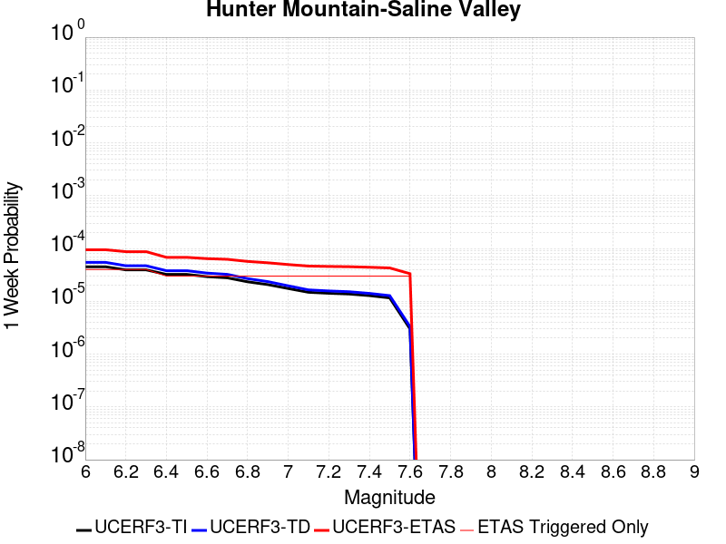 |  |  |  |

| Magnitude | 1 wk TI Prob | 1 wk TD Prob | 1 wk ETAS Prob | 1 wk ETAS/TD Gain | 1 wk ETAS Triggered Only | 1 mo TI Prob | 1 mo TD Prob | 1 mo ETAS Prob | 1 mo ETAS/TD Gain | 1 mo ETAS Triggered Only | 1 yr TI Prob | 1 yr TD Prob | 1 yr ETAS Prob | 1 yr ETAS/TD Gain | 1 yr ETAS Triggered Only | 10 yr TI Prob | 10 yr TD Prob | 10 yr ETAS Prob | 10 yr ETAS/TD Gain | 10 yr ETAS Triggered Only |
|-----|-----|-----|-----|-----|-----|-----|-----|-----|-----|-----|-----|-----|-----|-----|-----|-----|-----|-----|-----|-----|
| 6.0 | 4.5103672E-5 | 5.4576634E-5 | 7.220396E-5 | 1.322983 | 1.762829E-5 | 1.9328714E-4 | 2.3387549E-4 | 4.8061382E-4 | 2.0549986 | 2.4679606E-4 | 0.002350731 | 0.002843864 | 0.003863397 | 1.3585027 | 0.0010224408 | 0.023260195 | 0.028095365 | 0.029911464 | 1.0646405 | 0.0018685987 |
| 6.1 | 4.5103672E-5 | 5.4576634E-5 | 7.220396E-5 | 1.322983 | 1.762829E-5 | 1.9328714E-4 | 2.3387549E-4 | 4.8061382E-4 | 2.0549986 | 2.4679606E-4 | 0.002350731 | 0.002843864 | 0.003863397 | 1.3585027 | 0.0010224408 | 0.023260195 | 0.028095365 | 0.029911464 | 1.0646405 | 0.0018685987 |
| 6.2 | 3.9363465E-5 | 4.706859E-5 | 6.4696054E-5 | 1.3745058 | 1.762829E-5 | 1.6868966E-4 | 2.017032E-4 | 4.484495E-4 | 2.2233136 | 2.4679606E-4 | 0.002051862 | 0.0024531104 | 0.0034730432 | 1.4157711 | 0.0010224408 | 0.020330196 | 0.024276383 | 0.026099619 | 1.0751033 | 0.0018685987 |
| 6.3 | 3.9363465E-5 | 4.706859E-5 | 6.4696054E-5 | 1.3745058 | 1.762829E-5 | 1.6868966E-4 | 2.017032E-4 | 4.484495E-4 | 2.2233136 | 2.4679606E-4 | 0.002051862 | 0.0024531104 | 0.0034730432 | 1.4157711 | 0.0010224408 | 0.020330196 | 0.024276383 | 0.026099619 | 1.0751033 | 0.0018685987 |
| 6.4 | 3.2311684E-5 | 3.7955346E-5 | 5.5582965E-5 | 1.4644306 | 1.762829E-5 | 1.384713E-4 | 1.6265604E-4 | 4.0941196E-4 | 2.5170412 | 2.4679606E-4 | 0.0016845843 | 0.0019786113 | 0.0029990291 | 1.5157243 | 0.0010224408 | 0.016718714 | 0.019618697 | 0.021450637 | 1.0933772 | 0.0018685987 |
| 6.5 | 3.2311684E-5 | 3.7955346E-5 | 5.5582965E-5 | 1.4644306 | 1.762829E-5 | 1.384713E-4 | 1.6265604E-4 | 4.0941196E-4 | 2.5170412 | 2.4679606E-4 | 0.0016845843 | 0.0019786113 | 0.0029990291 | 1.5157243 | 0.0010224408 | 0.016718714 | 0.019618697 | 0.021450637 | 1.0933772 | 0.0018685987 |
| 6.6 | 2.9305844E-5 | 3.4185676E-5 | 5.1813364E-5 | 1.5156454 | 1.762829E-5 | 1.2559042E-4 | 1.4650216E-4 | 3.9326207E-4 | 2.684343 | 2.4679606E-4 | 0.0015279909 | 0.0017822674 | 0.0028028858 | 1.5726517 | 0.0010224408 | 0.015175272 | 0.017687662 | 0.01952321 | 1.1037756 | 0.0018685987 |
| 6.7 | 2.7826512E-5 | 3.234788E-5 | 4.9975602E-5 | 1.544942 | 1.762829E-5 | 1.19251024E-4 | 1.3862675E-4 | 3.8538862E-4 | 2.7800448 | 2.4679606E-4 | 0.0014509142 | 0.0016865344 | 0.0027072509 | 1.6052153 | 0.0010224408 | 0.014414776 | 0.01674504 | 0.018582348 | 1.1097226 | 0.0018685987 |
| 6.8 | 2.3389874E-5 | 2.686964E-5 | 4.4497454E-5 | 1.6560496 | 1.762829E-5 | 1.0023846E-4 | 1.1515078E-4 | 3.619184E-4 | 3.1429958 | 2.4679606E-4 | 0.00121972 | 0.0014011064 | 0.0024221146 | 1.7287158 | 0.0010224408 | 0.01213047 | 0.013928941 | 0.015736748 | 1.1297877 | 0.0018333421 |
| 6.9 | 2.069209E-5 | 2.3572567E-5 | 4.120044E-5 | 1.7478131 | 1.762829E-5 | 8.867737E-5 | 1.01021586E-4 | 3.4779272E-4 | 3.4427564 | 2.4679606E-4 | 0.0010791123 | 0.00122928 | 0.002250464 | 1.8307171 | 0.0010224408 | 0.010738871 | 0.012229833 | 0.014040753 | 1.148074 | 0.0018333421 |
| 7.0 | 1.7462342E-5 | 1.9635625E-5 | 3.726357E-5 | 1.8977531 | 1.762829E-5 | 7.483646E-5 | 8.4150095E-5 | 3.309254E-4 | 3.9325612 | 2.4679606E-4 | 9.1075303E-4 | 0.0010240684 | 0.0020454621 | 1.9973881 | 0.0010224408 | 0.009070295 | 0.010197128 | 0.0119943265 | 1.1762456 | 0.0018157138 |
| 7.1 | 1.4807709E-5 | 1.6443486E-5 | 3.4071487E-5 | 2.0720356 | 1.762829E-5 | 6.3460066E-5 | 7.0470276E-5 | 3.1724895E-4 | 4.501883 | 2.4679606E-4 | 7.723524E-4 | 8.576544E-4 | 0.0018616051 | 2.1705773 | 0.0010048125 | 0.007696735 | 0.008546432 | 0.01032915 | 1.2085922 | 0.0017980855 |
| 7.2 | 1.4180048E-5 | 1.5700001E-5 | 3.3328015E-5 | 2.1228034 | 1.762829E-5 | 6.077022E-5 | 6.7284076E-5 | 3.1406354E-4 | 4.6677246 | 2.4679606E-4 | 7.396263E-4 | 8.188919E-4 | 0.0018228816 | 2.2260344 | 0.0010048125 | 0.0073716943 | 0.008161696 | 0.009945106 | 1.2185098 | 0.0017980855 |
| 7.3 | 1.3730402E-5 | 1.5173691E-5 | 3.2801716E-5 | 2.1617491 | 1.762829E-5 | 5.8843252E-5 | 6.502858E-5 | 3.1180857E-4 | 4.794947 | 2.4679606E-4 | 7.161811E-4 | 7.914514E-4 | 0.0017954687 | 2.2685773 | 0.0010048125 | 0.007138774 | 0.007889261 | 0.0096731605 | 1.2261175 | 0.0017980855 |
| 7.4 | 1.2810095E-5 | 1.4110805E-5 | 3.1738844E-5 | 2.2492583 | 1.762829E-5 | 5.489925E-5 | 6.0473565E-5 | 3.072547E-4 | 5.08081 | 2.4679606E-4 | 6.681934E-4 | 7.360327E-4 | 0.0017401057 | 2.364169 | 0.0010048125 | 0.006661878 | 0.0073388456 | 0.009123735 | 1.2432113 | 0.0017980855 |
| 7.5 | 1.1595659E-5 | 1.2802062E-5 | 3.0430127E-5 | 2.3769708 | 1.762829E-5 | 4.9694736E-5 | 5.486491E-5 | 3.0164744E-4 | 5.4980025 | 2.4679606E-4 | 6.0486543E-4 | 6.677913E-4 | 0.0016719328 | 2.5036757 | 0.0010048125 | 0.006032217 | 0.006660718 | 0.0084468275 | 1.2681556 | 0.0017980855 |
| 7.6 | 2.997694E-6 | 3.325705E-6 | 2.0953936E-5 | 6.3005996 | 1.762829E-5 | 1.28471975E-5 | 1.4252984E-5 | 1.20021214E-4 | 8.420777 | 1.0576974E-4 | 1.564034E-4 | 1.7352356E-4 | 5.789039E-4 | 3.3361688 | 4.0545067E-4 | 0.0015629337 | 0.0017353174 | 0.002527214 | 1.456341 | 7.9327304E-4 |

## Garlock (West)
*[(top)](#table-of-contents)*

| 1 Week | 1 Month | 1 Year | 10 Year |
|-----|-----|-----|-----|
|  |  |  | 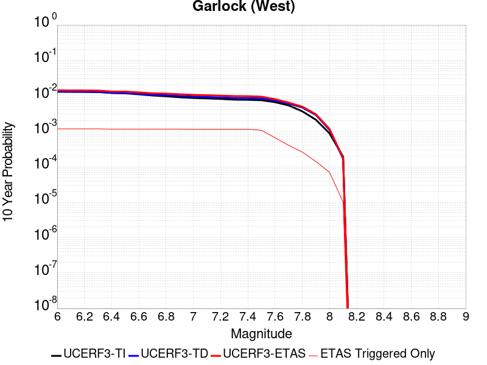 |

| Magnitude | 1 wk TI Prob | 1 wk TD Prob | 1 wk ETAS Prob | 1 wk ETAS/TD Gain | 1 wk ETAS Triggered Only | 1 mo TI Prob | 1 mo TD Prob | 1 mo ETAS Prob | 1 mo ETAS/TD Gain | 1 mo ETAS Triggered Only | 1 yr TI Prob | 1 yr TD Prob | 1 yr ETAS Prob | 1 yr ETAS/TD Gain | 1 yr ETAS Triggered Only | 10 yr TI Prob | 10 yr TD Prob | 10 yr ETAS Prob | 10 yr ETAS/TD Gain | 10 yr ETAS Triggered Only |
|-----|-----|-----|-----|-----|-----|-----|-----|-----|-----|-----|-----|-----|-----|-----|-----|-----|-----|-----|-----|-----|
| 6.0 | 2.5181727E-5 | 2.5216661E-5 | 7.8100195E-5 | 3.0971665 | 5.288487E-5 | 1.0791722E-4 | 1.08066946E-4 | 3.5483635E-4 | 3.2834864 | 2.4679606E-4 | 0.0013131002 | 0.0013149243 | 0.00219518 | 1.6694343 | 8.814145E-4 | 0.013053683 | 0.013151911 | 0.014421851 | 1.0965594 | 0.0012868652 |
| 6.1 | 2.5077732E-5 | 2.5117724E-5 | 7.800126E-5 | 3.1054273 | 5.288487E-5 | 1.0747157E-4 | 1.0764297E-4 | 3.5441245E-4 | 3.2924814 | 2.4679606E-4 | 0.001307681 | 0.0013097686 | 0.0021900288 | 1.6720729 | 8.814145E-4 | 0.013000126 | 0.013100963 | 0.0143709695 | 1.0969399 | 0.0012868652 |
| 6.2 | 2.494612E-5 | 2.4999388E-5 | 7.7882934E-5 | 3.1153936 | 5.288487E-5 | 1.0690756E-4 | 1.0713586E-4 | 3.539055E-4 | 3.3033335 | 2.4679606E-4 | 0.0013008224 | 0.001303602 | 0.0021838674 | 1.6752564 | 8.814145E-4 | 0.012932341 | 0.013040021 | 0.014310106 | 1.097399 | 0.0012868652 |
| 6.3 | 2.4733758E-5 | 2.4818735E-5 | 7.7702294E-5 | 3.130792 | 5.288487E-5 | 1.0599751E-4 | 1.0636169E-4 | 3.531315E-4 | 3.3201005 | 2.4679606E-4 | 0.0012897556 | 0.0012941877 | 0.0021744615 | 1.6801747 | 8.814145E-4 | 0.012822957 | 0.01294698 | 0.014217184 | 1.0981082 | 0.0012868652 |
| 6.4 | 2.3237335E-5 | 2.3197908E-5 | 7.608155E-5 | 3.2796729 | 5.288487E-5 | 9.958477E-5 | 9.941583E-5 | 3.4618736E-4 | 3.4822156 | 2.4679606E-4 | 0.0012117702 | 0.0012097185 | 0.0020900667 | 1.7277298 | 8.814145E-4 | 0.012051838 | 0.012111766 | 0.013383045 | 1.1049623 | 0.0012868652 |
| 6.5 | 2.2732203E-5 | 2.3012379E-5 | 7.589603E-5 | 3.2980525 | 5.288487E-5 | 9.742009E-5 | 9.862077E-5 | 3.4539247E-4 | 3.5022287 | 2.4679606E-4 | 0.0011854442 | 0.0012000492 | 0.002080406 | 1.7336005 | 8.814145E-4 | 0.011791403 | 0.012016123 | 0.013287526 | 1.105808 | 0.0012868652 |
| 6.6 | 2.1319436E-5 | 2.1792415E-5 | 7.467613E-5 | 3.426703 | 5.288487E-5 | 9.136581E-5 | 9.339274E-5 | 3.4016575E-4 | 3.642315 | 2.4679606E-4 | 0.001111811 | 0.0011364657 | 0.0020168785 | 1.7746936 | 8.814145E-4 | 0.011062649 | 0.011386949 | 0.01265916 | 1.1117254 | 0.0012868652 |
| 6.7 | 1.970802E-5 | 2.0412112E-5 | 7.32959E-5 | 3.5908046 | 5.288487E-5 | 8.446021E-5 | 8.747755E-5 | 3.3425202E-4 | 3.8210034 | 2.4679606E-4 | 0.001027818 | 0.0010645206 | 0.0019449968 | 1.8271106 | 8.814145E-4 | 0.010230771 | 0.01067459 | 0.011947718 | 1.1192672 | 0.0012868652 |
| 6.8 | 1.8744462E-5 | 1.9919653E-5 | 7.280347E-5 | 3.6548564 | 5.288487E-5 | 8.033094E-5 | 8.536715E-5 | 3.3214214E-4 | 3.8907487 | 2.4679606E-4 | 9.775903E-4 | 0.0010388512 | 0.00191935 | 1.8475697 | 8.814145E-4 | 0.009733009 | 0.010420324 | 0.011693779 | 1.1222088 | 0.0012868652 |
| 6.9 | 1.7559682E-5 | 1.8971898E-5 | 7.1855764E-5 | 3.7874844 | 5.288487E-5 | 7.5253614E-5 | 8.13056E-5 | 3.280816E-4 | 4.035166 | 2.4679606E-4 | 9.158276E-4 | 9.894476E-4 | 0.00186999 | 1.8899333 | 8.814145E-4 | 0.0091206245 | 0.009930745 | 0.01120483 | 1.1282971 | 0.0012868652 |
| 7.0 | 1.6794445E-5 | 1.8234585E-5 | 7.111849E-5 | 3.900198 | 5.288487E-5 | 7.197421E-5 | 7.814589E-5 | 3.2492264E-4 | 4.1578984 | 2.4679606E-4 | 8.759337E-4 | 9.5101225E-4 | 0.001813977 | 1.907417 | 8.637862E-4 | 0.008724891 | 0.009549588 | 0.010806704 | 1.1316409 | 0.0012692369 |
| 7.1 | 1.6337795E-5 | 1.7735292E-5 | 7.061922E-5 | 3.9818473 | 5.288487E-5 | 7.0017246E-5 | 7.600619E-5 | 3.2278348E-4 | 4.246805 | 2.4679606E-4 | 8.521265E-4 | 9.249838E-4 | 0.001787971 | 1.9329755 | 8.637862E-4 | 0.008488664 | 0.009291395 | 0.010548838 | 1.1353343 | 0.0012692369 |
| 7.2 | 1.5780008E-5 | 1.7183862E-5 | 7.006782E-5 | 4.0775366 | 5.288487E-5 | 6.762685E-5 | 7.364305E-5 | 3.2042092E-4 | 4.3510003 | 2.4679606E-4 | 8.2304585E-4 | 8.962366E-4 | 0.0017592487 | 1.9629288 | 8.637862E-4 | 0.008200042 | 0.009006202 | 0.010264008 | 1.13966 | 0.0012692369 |
| 7.3 | 1.5058865E-5 | 1.6636799E-5 | 6.9520785E-5 | 4.1787357 | 5.288487E-5 | 6.45364E-5 | 7.129862E-5 | 3.180771E-4 | 4.4611955 | 2.4679606E-4 | 7.854473E-4 | 8.6771627E-4 | 0.0017307529 | 1.994607 | 8.637862E-4 | 0.00782677 | 0.008722834 | 0.009981 | 1.1442381 | 0.0012692369 |
| 7.4 | 1.4887923E-5 | 1.647271E-5 | 6.935671E-5 | 4.2104006 | 5.288487E-5 | 6.380382E-5 | 7.059543E-5 | 3.1737407E-4 | 4.4956746 | 2.4679606E-4 | 7.7653467E-4 | 8.591616E-4 | 0.0017222057 | 2.004519 | 8.637862E-4 | 0.0077382675 | 0.008637666 | 0.009895939 | 1.1456729 | 0.0012692369 |
| 7.5 | 1.4509299E-5 | 1.6064607E-5 | 5.132062E-5 | 3.194639 | 3.525658E-5 | 6.218123E-5 | 6.884651E-5 | 2.979985E-4 | 4.328448 | 2.2916777E-4 | 7.567935E-4 | 8.37885E-4 | 0.0016657205 | 1.988006 | 8.2852965E-4 | 0.0075422134 | 0.008425911 | 0.009614534 | 1.1410676 | 0.0011987237 |
| 7.6 | 1.2756717E-5 | 1.4067994E-5 | 3.1696036E-5 | 2.25306 | 1.762829E-5 | 5.4670498E-5 | 6.029001E-5 | 1.836806E-4 | 3.0466175 | 1.2339803E-4 | 6.6541E-4 | 7.3378434E-4 | 0.0012446296 | 1.696179 | 5.112204E-4 | 0.006634211 | 0.0073905406 | 0.008072963 | 1.0923373 | 6.875033E-4 |
| 7.7 | 1.0328985E-5 | 1.147664E-5 | 2.9104727E-5 | 2.5359972 | 1.762829E-5 | 4.4266326E-5 | 4.9184677E-5 | 1.1969436E-4 | 2.4335704 | 7.051316E-5 | 5.388092E-4 | 5.986593E-4 | 9.1577857E-4 | 1.5297158 | 3.1730923E-4 | 0.0053750467 | 0.006046838 | 0.0064673587 | 1.0695438 | 4.2307895E-4 |
| 7.8 | 7.0306583E-6 | 8.912468E-6 | 8.912468E-6 | 1.0 | 0.0 | 3.0131043E-5 | 3.8195732E-5 | 3.8195732E-5 | 1.0 | 0.0 | 3.667837E-4 | 4.6493395E-4 | 6.411349E-4 | 1.3789805 | 1.762829E-4 | 0.003661789 | 0.0047019436 | 0.0049651247 | 1.0559728 | 2.6442434E-4 |
| 7.9 | 4.060633E-6 | 5.4729326E-6 | 5.4729326E-6 | 1.0 | 0.0 | 1.7402595E-5 | 2.3455215E-5 | 2.3455215E-5 | 1.0 | 0.0 | 2.11856E-4 | 2.8552994E-4 | 3.9126948E-4 | 1.3703274 | 1.0576974E-4 | 0.0021165414 | 0.0028881172 | 0.003011159 | 1.0426027 | 1.2339803E-4 |
| 8.0 | 1.6729537E-6 | 2.0800776E-6 | 2.0800776E-6 | 1.0 | 0.0 | 7.169782E-6 | 8.914588E-6 | 8.914588E-6 | 1.0 | 0.0 | 8.7288594E-5 | 1.0852974E-4 | 1.437825E-4 | 1.3248211 | 3.525658E-5 | 8.7254314E-4 | 0.0010982669 | 0.0011510937 | 1.0481001 | 5.288487E-5 |
| 8.1 | 3.6733252E-7 | 3.1526864E-7 | 3.1526864E-7 | 1.0 | 0.0 | 1.5742813E-6 | 1.3511507E-6 | 1.3511507E-6 | 1.0 | 0.0 | 1.9166706E-5 | 1.645015E-5 | 3.407815E-5 | 2.0716012 | 1.762829E-5 | 1.9165053E-4 | 1.6658098E-4 | 1.8420634E-4 | 1.1058065 | 1.762829E-5 |

## Blackwater
*[(top)](#table-of-contents)*

| 1 Week | 1 Month | 1 Year | 10 Year |
|-----|-----|-----|-----|
|  |  |  | 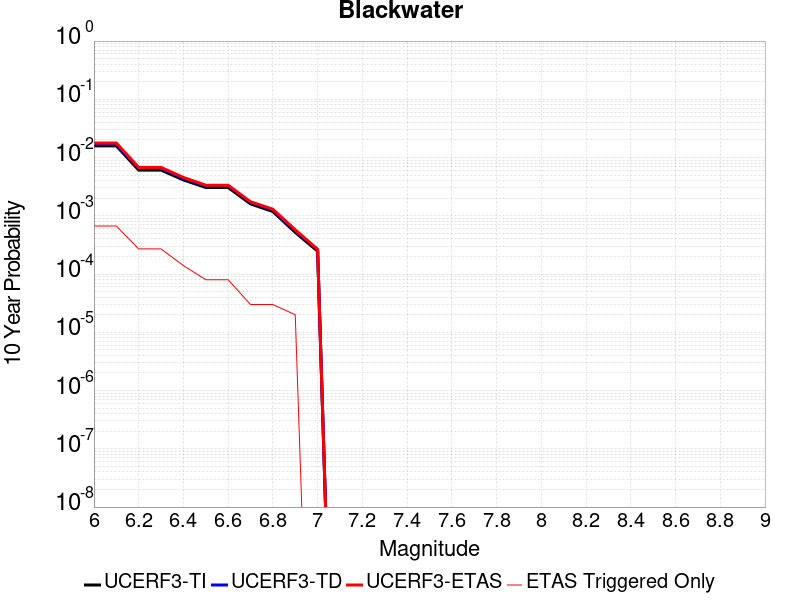 |

| Magnitude | 1 wk TI Prob | 1 wk TD Prob | 1 wk ETAS Prob | 1 wk ETAS/TD Gain | 1 wk ETAS Triggered Only | 1 mo TI Prob | 1 mo TD Prob | 1 mo ETAS Prob | 1 mo ETAS/TD Gain | 1 mo ETAS Triggered Only | 1 yr TI Prob | 1 yr TD Prob | 1 yr ETAS Prob | 1 yr ETAS/TD Gain | 1 yr ETAS Triggered Only | 10 yr TI Prob | 10 yr TD Prob | 10 yr ETAS Prob | 10 yr ETAS/TD Gain | 10 yr ETAS Triggered Only |
|-----|-----|-----|-----|-----|-----|-----|-----|-----|-----|-----|-----|-----|-----|-----|-----|-----|-----|-----|-----|-----|
| 6.0 | 3.0708583E-5 | 3.3097214E-5 | 1.0360804E-4 | 3.1304157 | 7.051316E-5 | 1.3160157E-4 | 1.4183826E-4 | 2.6521878E-4 | 1.8698677 | 1.2339803E-4 | 0.0016010714 | 0.0017256497 | 0.0021128028 | 1.2243521 | 3.8782237E-4 | 0.015895851 | 0.017136335 | 0.017864035 | 1.0424653 | 7.403882E-4 |
| 6.1 | 3.0708583E-5 | 3.3097214E-5 | 1.0360804E-4 | 3.1304157 | 7.051316E-5 | 1.3160157E-4 | 1.4183826E-4 | 2.6521878E-4 | 1.8698677 | 1.2339803E-4 | 0.0016010714 | 0.0017256497 | 0.0021128028 | 1.2243521 | 3.8782237E-4 | 0.015895851 | 0.017136335 | 0.017864035 | 1.0424653 | 7.403882E-4 |
| 6.2 | 1.1707779E-5 | 1.2545598E-5 | 3.0173667E-5 | 2.40512 | 1.762829E-5 | 5.017523E-5 | 5.3765798E-5 | 1.0664782E-4 | 1.9835626 | 5.288487E-5 | 6.107122E-4 | 6.5441156E-4 | 7.9534564E-4 | 1.2153599 | 1.4102632E-4 | 0.006090366 | 0.0065258164 | 0.006858568 | 1.0509901 | 3.349375E-4 |
| 6.3 | 1.1707779E-5 | 1.2545598E-5 | 3.0173667E-5 | 2.40512 | 1.762829E-5 | 5.017523E-5 | 5.3765798E-5 | 1.0664782E-4 | 1.9835626 | 5.288487E-5 | 6.107122E-4 | 6.5441156E-4 | 7.9534564E-4 | 1.2153599 | 1.4102632E-4 | 0.006090366 | 0.0065258164 | 0.006858568 | 1.0509901 | 3.349375E-4 |
| 6.4 | 7.929244E-6 | 8.4804105E-6 | 8.4804105E-6 | 1.0 | 0.0 | 3.3982033E-5 | 3.6344132E-5 | 3.6344132E-5 | 1.0 | 0.0 | 4.136527E-4 | 4.4240404E-4 | 4.9526547E-4 | 1.1194869 | 5.288487E-5 | 0.0041288356 | 0.0044156383 | 0.0045911428 | 1.0397462 | 1.762829E-4 |
| 6.5 | 5.8832115E-6 | 6.286219E-6 | 6.286219E-6 | 1.0 | 0.0 | 2.521352E-5 | 2.6940676E-5 | 2.6940676E-5 | 1.0 | 0.0 | 3.0693135E-4 | 3.279559E-4 | 3.8082342E-4 | 1.1612031 | 5.288487E-5 | 0.0030650778 | 0.0032749726 | 0.003380396 | 1.0321906 | 1.0576974E-4 |
| 6.6 | 5.8832115E-6 | 6.286219E-6 | 6.286219E-6 | 1.0 | 0.0 | 2.521352E-5 | 2.6940676E-5 | 2.6940676E-5 | 1.0 | 0.0 | 3.0693135E-4 | 3.279559E-4 | 3.8082342E-4 | 1.1612031 | 5.288487E-5 | 0.0030650778 | 0.0032749726 | 0.003380396 | 1.0321906 | 1.0576974E-4 |
| 6.7 | 3.0715053E-6 | 3.2815851E-6 | 3.2815851E-6 | 1.0 | 0.0 | 1.3163528E-5 | 1.4063868E-5 | 1.4063868E-5 | 1.0 | 0.0 | 1.6025416E-4 | 1.7121529E-4 | 1.8884057E-4 | 1.1029421 | 1.762829E-5 | 0.0016013865 | 0.0017109484 | 0.0017637428 | 1.0308568 | 5.288487E-5 |
| 6.8 | 2.2722281E-6 | 2.4288424E-6 | 2.4288424E-6 | 1.0 | 0.0 | 9.738084E-6 | 1.0409289E-5 | 1.0409289E-5 | 1.0 | 0.0 | 1.1855473E-4 | 1.2672663E-4 | 1.4435269E-4 | 1.1390872 | 1.762829E-5 | 0.001184915 | 0.0012666339 | 0.0013194517 | 1.0416994 | 5.288487E-5 |
| 6.9 | 9.952399E-7 | 1.0653887E-6 | 1.0653887E-6 | 1.0 | 0.0 | 4.265307E-6 | 4.5659463E-6 | 4.5659463E-6 | 1.0 | 0.0 | 5.1928873E-5 | 5.5589495E-5 | 7.3216805E-5 | 1.3170979 | 1.762829E-5 | 5.191674E-4 | 5.558065E-4 | 5.910435E-4 | 1.0633979 | 3.525658E-5 |
| 7.0 | 4.7385504E-7 | 5.075751E-7 | 5.075751E-7 | 1.0 | 0.0 | 2.0308057E-6 | 2.175322E-6 | 2.175322E-6 | 1.0 | 0.0 | 2.4724779E-5 | 2.6484544E-5 | 2.6484544E-5 | 1.0 | 0.0 | 2.4722028E-4 | 2.6484544E-4 | 2.6484544E-4 | 1.0 | 0.0 |

## San Andreas (Mojave S)
*[(top)](#table-of-contents)*

| 1 Week | 1 Month | 1 Year | 10 Year |
|-----|-----|-----|-----|
|  |  | 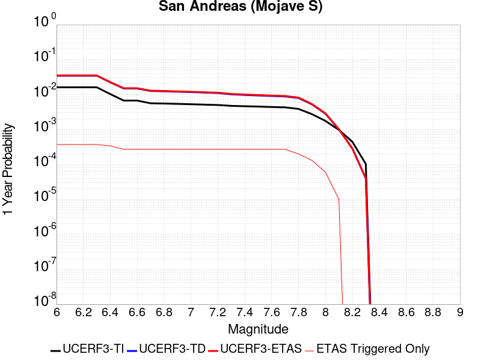 |  |

| Magnitude | 1 wk TI Prob | 1 wk TD Prob | 1 wk ETAS Prob | 1 wk ETAS/TD Gain | 1 wk ETAS Triggered Only | 1 mo TI Prob | 1 mo TD Prob | 1 mo ETAS Prob | 1 mo ETAS/TD Gain | 1 mo ETAS Triggered Only | 1 yr TI Prob | 1 yr TD Prob | 1 yr ETAS Prob | 1 yr ETAS/TD Gain | 1 yr ETAS Triggered Only | 10 yr TI Prob | 10 yr TD Prob | 10 yr ETAS Prob | 10 yr ETAS/TD Gain | 10 yr ETAS Triggered Only |
|-----|-----|-----|-----|-----|-----|-----|-----|-----|-----|-----|-----|-----|-----|-----|-----|-----|-----|-----|-----|-----|
| 6.0 | 3.1064058E-4 | 6.7499664E-4 | 7.278458E-4 | 1.0782955 | 5.288487E-5 | 0.0013306376 | 0.0028897638 | 0.0029600733 | 1.0243305 | 7.051316E-5 | 0.016080605 | 0.034641396 | 0.03498175 | 1.009825 | 3.525658E-4 | 0.1496549 | 0.2867374 | 0.28708947 | 1.0012279 | 4.935921E-4 |
| 6.1 | 3.1064058E-4 | 6.7499664E-4 | 7.278458E-4 | 1.0782955 | 5.288487E-5 | 0.0013306376 | 0.0028897638 | 0.0029600733 | 1.0243305 | 7.051316E-5 | 0.016080605 | 0.034641396 | 0.03498175 | 1.009825 | 3.525658E-4 | 0.1496549 | 0.2867374 | 0.28708947 | 1.0012279 | 4.935921E-4 |
| 6.2 | 3.1064058E-4 | 6.7499664E-4 | 7.278458E-4 | 1.0782955 | 5.288487E-5 | 0.0013306376 | 0.0028897638 | 0.0029600733 | 1.0243305 | 7.051316E-5 | 0.016080605 | 0.034641396 | 0.03498175 | 1.009825 | 3.525658E-4 | 0.1496549 | 0.2867374 | 0.28708947 | 1.0012279 | 4.935921E-4 |
| 6.3 | 3.1064058E-4 | 6.7499664E-4 | 7.278458E-4 | 1.0782955 | 5.288487E-5 | 0.0013306376 | 0.0028897638 | 0.0029600733 | 1.0243305 | 7.051316E-5 | 0.016080605 | 0.034641396 | 0.03498175 | 1.009825 | 3.525658E-4 | 0.1496549 | 0.2867374 | 0.28708947 | 1.0012279 | 4.935921E-4 |
| 6.4 | 1.9872203E-4 | 4.3216298E-4 | 4.6740432E-4 | 1.0815464 | 3.525658E-5 | 8.5138786E-4 | 0.0018508406 | 0.0019036276 | 1.0285206 | 5.288487E-5 | 0.010316478 | 0.022307295 | 0.022600291 | 1.0131345 | 2.9968092E-4 | 0.098504856 | 0.19713911 | 0.1974788 | 1.001723 | 4.2307895E-4 |
| 6.5 | 1.291105E-4 | 2.8787713E-4 | 3.0550035E-4 | 1.0612178 | 1.762829E-5 | 5.5321335E-4 | 0.0012331787 | 0.0012683917 | 1.0285548 | 3.525658E-5 | 0.006714592 | 0.014911419 | 0.015154535 | 1.016304 | 2.4679606E-4 | 0.065152965 | 0.13817947 | 0.13846813 | 1.002089 | 3.349375E-4 |
| 6.6 | 1.291105E-4 | 2.8787713E-4 | 3.0550035E-4 | 1.0612178 | 1.762829E-5 | 5.5321335E-4 | 0.0012331787 | 0.0012683917 | 1.0285548 | 3.525658E-5 | 0.006714592 | 0.014911419 | 0.015154535 | 1.016304 | 2.4679606E-4 | 0.065152965 | 0.13817947 | 0.13846813 | 1.002089 | 3.349375E-4 |
| 6.7 | 1.08001186E-4 | 2.4368397E-4 | 2.6130796E-4 | 1.0723232 | 1.762829E-5 | 4.6278012E-4 | 0.0010439424 | 0.0010791622 | 1.0337373 | 3.525658E-5 | 0.0056198016 | 0.012636229 | 0.012879906 | 1.019284 | 2.4679606E-4 | 0.054797906 | 0.119323194 | 0.11961816 | 1.002472 | 3.349375E-4 |
| 6.8 | 1.0624356E-4 | 2.3885963E-4 | 2.564837E-4 | 1.0737842 | 1.762829E-5 | 4.5525006E-4 | 0.001023283 | 0.0010585035 | 1.0344192 | 3.525658E-5 | 0.0055285925 | 0.012387579 | 0.012631318 | 1.0196761 | 2.4679606E-4 | 0.053930566 | 0.11727233 | 0.11756799 | 1.0025212 | 3.349375E-4 |
| 6.9 | 1.0393785E-4 | 2.3256175E-4 | 2.5018593E-4 | 1.0757829 | 1.762829E-5 | 4.4537184E-4 | 9.963129E-4 | 0.0010315344 | 1.0353518 | 3.525658E-5 | 0.0054089287 | 0.012062895 | 0.0123067135 | 1.0202123 | 2.4679606E-4 | 0.05279156 | 0.114569746 | 0.11486632 | 1.0025885 | 3.349375E-4 |
| 7.0 | 1.0155622E-4 | 2.262555E-4 | 2.4387981E-4 | 1.0778955 | 1.762829E-5 | 4.3516833E-4 | 9.693065E-4 | 0.001004529 | 1.0363377 | 3.525658E-5 | 0.005285311 | 0.011737675 | 0.011981574 | 1.0207791 | 2.4679606E-4 | 0.05161361 | 0.11182977 | 0.11212725 | 1.0026602 | 3.349375E-4 |
| 7.1 | 9.885595E-5 | 2.191377E-4 | 2.3676213E-4 | 1.0804262 | 1.762829E-5 | 4.2359953E-4 | 9.388239E-4 | 9.7404735E-4 | 1.0375187 | 3.525658E-5 | 0.0051451353 | 0.011370476 | 0.011614466 | 1.0214581 | 2.4679606E-4 | 0.05027629 | 0.10871404 | 0.10901256 | 1.002746 | 3.349375E-4 |
| 7.2 | 9.6411415E-5 | 2.1276584E-4 | 2.3039039E-4 | 1.0828354 | 1.762829E-5 | 4.1312634E-4 | 9.115353E-4 | 9.467597E-4 | 1.038643 | 3.525658E-5 | 0.005018219 | 0.0110416515 | 0.011285723 | 1.0221046 | 2.4679606E-4 | 0.049064007 | 0.10590357 | 0.106203035 | 1.0028278 | 3.349375E-4 |
| 7.3 | 9.1180635E-5 | 1.950402E-4 | 2.1266505E-4 | 1.0903652 | 1.762829E-5 | 3.907156E-4 | 8.356189E-4 | 8.70846E-4 | 1.0421569 | 3.525658E-5 | 0.004746591 | 0.010126315 | 0.010370612 | 1.024125 | 2.4679606E-4 | 0.046464786 | 0.09809433 | 0.09839641 | 1.0030795 | 3.349375E-4 |
| 7.4 | 8.887388E-5 | 1.8752231E-4 | 2.0514728E-4 | 1.0939888 | 1.762829E-5 | 3.8083247E-4 | 8.0341956E-4 | 8.3864783E-4 | 1.0438479 | 3.525658E-5 | 0.0046267817 | 0.00973786 | 0.0099822525 | 1.0250971 | 2.4679606E-4 | 0.045316286 | 0.09472819 | 0.095031396 | 1.0032009 | 3.349375E-4 |
| 7.5 | 8.6750515E-5 | 1.8083451E-4 | 1.9845962E-4 | 1.0974654 | 1.762829E-5 | 3.7173493E-4 | 7.7477493E-4 | 8.1000425E-4 | 1.0454704 | 3.525658E-5 | 0.004516484 | 0.009392173 | 0.009636651 | 1.02603 | 2.4679606E-4 | 0.04425787 | 0.09169095 | 0.09199518 | 1.003318 | 3.349375E-4 |
| 7.6 | 8.453092E-5 | 1.747065E-4 | 1.923317E-4 | 1.1008847 | 1.762829E-5 | 3.6222505E-4 | 7.485273E-4 | 7.837575E-4 | 1.047066 | 3.525658E-5 | 0.0044011753 | 0.009075315 | 0.009319871 | 1.0269474 | 2.4679606E-4 | 0.04315024 | 0.08884873 | 0.08915391 | 1.0034348 | 3.349375E-4 |
| 7.7 | 8.259102E-5 | 1.6992437E-4 | 1.8754967E-4 | 1.1037244 | 1.762829E-5 | 3.539135E-4 | 7.280441E-4 | 7.63275E-4 | 1.0483912 | 3.525658E-5 | 0.004300386 | 0.008827981 | 0.009072598 | 1.0277094 | 2.4679606E-4 | 0.042181134 | 0.08659836 | 0.086904295 | 1.0035328 | 3.349375E-4 |
| 7.8 | 7.444844E-5 | 1.531194E-4 | 1.531194E-4 | 1.0 | 0.0 | 3.1902574E-4 | 6.56061E-4 | 6.56061E-4 | 1.0 | 0.0 | 0.0038772223 | 0.007958339 | 0.008150707 | 1.0241718 | 1.9391118E-4 | 0.03810269 | 0.07841811 | 0.07867805 | 1.0033147 | 2.8205264E-4 |
| 7.9 | 5.2586525E-5 | 1.0025827E-4 | 1.0025827E-4 | 1.0 | 0.0 | 2.2535135E-4 | 4.2960755E-4 | 4.2960755E-4 | 1.0 | 0.0 | 0.0027402006 | 0.005217939 | 0.005340693 | 1.0235254 | 1.2339803E-4 | 0.027066574 | 0.052290585 | 0.052424237 | 1.002556 | 1.4102632E-4 |
| 8.0 | 3.379877E-5 | 5.418614E-5 | 5.418614E-5 | 1.0 | 0.0 | 1.4484383E-4 | 2.3220567E-4 | 2.3220567E-4 | 1.0 | 0.0 | 0.0017620471 | 0.0028234406 | 0.0028761763 | 1.0186777 | 5.288487E-5 | 0.017481409 | 0.028889727 | 0.028958203 | 1.0023702 | 7.051316E-5 |
| 8.1 | 1.8668277E-5 | 1.936222E-5 | 1.936222E-5 | 1.0 | 0.0 | 8.000444E-5 | 8.29783E-5 | 8.29783E-5 | 1.0 | 0.0 | 9.736188E-4 | 0.0010097933 | 0.0010274037 | 1.0174397 | 1.762829E-5 | 0.009693642 | 0.010826511 | 0.010843948 | 1.0016106 | 1.762829E-5 |
| 8.2 | 8.541571E-6 | 5.4811067E-6 | 5.4811067E-6 | 1.0 | 0.0 | 3.660622E-5 | 2.3490245E-5 | 2.3490245E-5 | 1.0 | 0.0 | 4.455896E-4 | 2.8595628E-4 | 2.8595628E-4 | 1.0 | 0.0 | 0.0044469717 | 0.0032518986 | 0.0032518986 | 1.0 | 0.0 |
| 8.3 | 1.983087E-6 | 7.693574E-7 | 7.693574E-7 | 1.0 | 0.0 | 8.498917E-6 | 3.297242E-6 | 3.297242E-6 | 1.0 | 0.0 | 1.034694E-4 | 4.01432E-5 | 4.01432E-5 | 1.0 | 0.0 | 0.0010342124 | 4.7390026E-4 | 4.7390026E-4 | 1.0 | 0.0 |

## Ash Hill
*[(top)](#table-of-contents)*

| 1 Week | 1 Month | 1 Year | 10 Year |
|-----|-----|-----|-----|
|  |  |  |  |

| Magnitude | 1 wk TI Prob | 1 wk TD Prob | 1 wk ETAS Prob | 1 wk ETAS/TD Gain | 1 wk ETAS Triggered Only | 1 mo TI Prob | 1 mo TD Prob | 1 mo ETAS Prob | 1 mo ETAS/TD Gain | 1 mo ETAS Triggered Only | 1 yr TI Prob | 1 yr TD Prob | 1 yr ETAS Prob | 1 yr ETAS/TD Gain | 1 yr ETAS Triggered Only | 10 yr TI Prob | 10 yr TD Prob | 10 yr ETAS Prob | 10 yr ETAS/TD Gain | 10 yr ETAS Triggered Only |
|-----|-----|-----|-----|-----|-----|-----|-----|-----|-----|-----|-----|-----|-----|-----|-----|-----|-----|-----|-----|-----|
| 6.0 | 2.1545662E-5 | 2.3195389E-5 | 5.845115E-5 | 2.519947 | 3.525658E-5 | 9.2335285E-5 | 9.940547E-5 | 1.8753816E-4 | 1.886598 | 8.814145E-5 | 0.0011236023 | 0.0012096697 | 0.0013857393 | 1.1455518 | 1.762829E-4 | 0.011179381 | 0.012038835 | 0.012526485 | 1.0405064 | 4.935921E-4 |
| 6.1 | 2.1545662E-5 | 2.3195389E-5 | 5.845115E-5 | 2.519947 | 3.525658E-5 | 9.2335285E-5 | 9.940547E-5 | 1.8753816E-4 | 1.886598 | 8.814145E-5 | 0.0011236023 | 0.0012096697 | 0.0013857393 | 1.1455518 | 1.762829E-4 | 0.011179381 | 0.012038835 | 0.012526485 | 1.0405064 | 4.935921E-4 |
| 6.2 | 2.1545662E-5 | 2.3195389E-5 | 5.845115E-5 | 2.519947 | 3.525658E-5 | 9.2335285E-5 | 9.940547E-5 | 1.8753816E-4 | 1.886598 | 8.814145E-5 | 0.0011236023 | 0.0012096697 | 0.0013857393 | 1.1455518 | 1.762829E-4 | 0.011179381 | 0.012038835 | 0.012526485 | 1.0405064 | 4.935921E-4 |
| 6.3 | 1.0025529E-5 | 1.0747344E-5 | 4.6003544E-5 | 4.280457 | 3.525658E-5 | 4.2965847E-5 | 4.605931E-5 | 1.1656922E-4 | 2.5308504 | 7.051316E-5 | 5.229836E-4 | 5.6064106E-4 | 6.839699E-4 | 1.2199782 | 1.2339803E-4 | 0.005217545 | 0.0055935793 | 0.0059091137 | 1.0564101 | 3.1730923E-4 |
| 6.4 | 1.0025529E-5 | 1.0747344E-5 | 4.6003544E-5 | 4.280457 | 3.525658E-5 | 4.2965847E-5 | 4.605931E-5 | 1.1656922E-4 | 2.5308504 | 7.051316E-5 | 5.229836E-4 | 5.6064106E-4 | 6.839699E-4 | 1.2199782 | 1.2339803E-4 | 0.005217545 | 0.0055935793 | 0.0059091137 | 1.0564101 | 3.1730923E-4 |
| 6.5 | 6.9617327E-6 | 7.4569152E-6 | 4.2713233E-5 | 5.728003 | 3.525658E-5 | 2.9835655E-5 | 3.1957865E-5 | 1.0246877E-4 | 3.2063708 | 7.051316E-5 | 3.6318856E-4 | 3.8902622E-4 | 4.7713338E-4 | 1.2264813 | 8.814145E-5 | 0.0036259557 | 0.0038843066 | 0.004112584 | 1.0587692 | 2.2916777E-4 |
| 6.6 | 4.9919777E-6 | 5.34689E-6 | 4.060328E-5 | 7.593813 | 3.525658E-5 | 2.1394015E-5 | 2.291508E-5 | 7.5798736E-5 | 3.3078105 | 5.288487E-5 | 2.60441E-4 | 2.7896208E-4 | 3.3183218E-4 | 1.1895244 | 5.288487E-5 | 0.0026013597 | 0.0027867774 | 0.00294499 | 1.0567726 | 1.5865461E-4 |
| 6.7 | 3.6630722E-6 | 3.9247725E-6 | 2.1552993E-5 | 5.491527 | 1.762829E-5 | 1.5698786E-5 | 1.6820377E-5 | 5.2076364E-5 | 3.0960283 | 3.525658E-5 | 1.9111596E-4 | 2.0477458E-4 | 2.4002395E-4 | 1.1721374 | 3.525658E-5 | 0.0019095168 | 0.002046422 | 0.0021519752 | 1.0515795 | 1.0576974E-4 |
| 6.8 | 2.5599613E-6 | 2.7450303E-6 | 2.0373272E-5 | 7.421875 | 1.762829E-5 | 1.0971216E-5 | 1.176439E-5 | 4.7020556E-5 | 3.9968543 | 3.525658E-5 | 1.3356637E-4 | 1.4322698E-4 | 1.7847851E-4 | 1.2461236 | 3.525658E-5 | 0.0013348613 | 0.0014318317 | 0.001519847 | 1.0614704 | 8.814145E-5 |
| 6.9 | 1.7684905E-6 | 1.8969438E-6 | 1.95252E-5 | 10.292978 | 1.762829E-5 | 7.579223E-6 | 8.129759E-6 | 2.5757905E-5 | 3.168348 | 1.762829E-5 | 9.2273134E-5 | 9.897981E-5 | 1.1660636E-4 | 1.1780822 | 1.762829E-5 | 9.223483E-4 | 9.897981E-4 | 0.0010250198 | 1.0355847 | 3.525658E-5 |

## San Andreas (Mojave N)
*[(top)](#table-of-contents)*

| 1 Week | 1 Month | 1 Year | 10 Year |
|-----|-----|-----|-----|
|  |  |  |  |

| Magnitude | 1 wk TI Prob | 1 wk TD Prob | 1 wk ETAS Prob | 1 wk ETAS/TD Gain | 1 wk ETAS Triggered Only | 1 mo TI Prob | 1 mo TD Prob | 1 mo ETAS Prob | 1 mo ETAS/TD Gain | 1 mo ETAS Triggered Only | 1 yr TI Prob | 1 yr TD Prob | 1 yr ETAS Prob | 1 yr ETAS/TD Gain | 1 yr ETAS Triggered Only | 10 yr TI Prob | 10 yr TD Prob | 10 yr ETAS Prob | 10 yr ETAS/TD Gain | 10 yr ETAS Triggered Only |
|-----|-----|-----|-----|-----|-----|-----|-----|-----|-----|-----|-----|-----|-----|-----|-----|-----|-----|-----|-----|-----|
| 6.0 | 9.877682E-5 | 1.9435467E-4 | 2.1197952E-4 | 1.090684 | 1.762829E-5 | 4.2326056E-4 | 8.326828E-4 | 9.031373E-4 | 1.0846114 | 7.051316E-5 | 0.0051410277 | 0.010090916 | 0.010457375 | 1.0363157 | 3.701941E-4 | 0.05023708 | 0.09846656 | 0.098911546 | 1.0045192 | 4.935921E-4 |
| 6.1 | 9.877682E-5 | 1.9435467E-4 | 2.1197952E-4 | 1.090684 | 1.762829E-5 | 4.2326056E-4 | 8.326828E-4 | 9.031373E-4 | 1.0846114 | 7.051316E-5 | 0.0051410277 | 0.010090916 | 0.010457375 | 1.0363157 | 3.701941E-4 | 0.05023708 | 0.09846656 | 0.098911546 | 1.0045192 | 4.935921E-4 |
| 6.2 | 9.877682E-5 | 1.9435467E-4 | 2.1197952E-4 | 1.090684 | 1.762829E-5 | 4.2326056E-4 | 8.326828E-4 | 9.031373E-4 | 1.0846114 | 7.051316E-5 | 0.0051410277 | 0.010090916 | 0.010457375 | 1.0363157 | 3.701941E-4 | 0.05023708 | 0.09846656 | 0.098911546 | 1.0045192 | 4.935921E-4 |
| 6.3 | 9.877682E-5 | 1.9435467E-4 | 2.1197952E-4 | 1.090684 | 1.762829E-5 | 4.2326056E-4 | 8.326828E-4 | 9.031373E-4 | 1.0846114 | 7.051316E-5 | 0.0051410277 | 0.010090916 | 0.010457375 | 1.0363157 | 3.701941E-4 | 0.05023708 | 0.09846656 | 0.098911546 | 1.0045192 | 4.935921E-4 |
| 6.4 | 9.877682E-5 | 1.9435467E-4 | 2.1197952E-4 | 1.090684 | 1.762829E-5 | 4.2326056E-4 | 8.326828E-4 | 9.031373E-4 | 1.0846114 | 7.051316E-5 | 0.0051410277 | 0.010090916 | 0.010457375 | 1.0363157 | 3.701941E-4 | 0.05023708 | 0.09846656 | 0.098911546 | 1.0045192 | 4.935921E-4 |
| 6.5 | 9.861474E-5 | 1.9409222E-4 | 2.1171708E-4 | 1.0908067 | 1.762829E-5 | 4.2256617E-4 | 8.3155883E-4 | 9.0201333E-4 | 1.0847259 | 7.051316E-5 | 0.0051326132 | 0.010077358 | 0.010443822 | 1.036365 | 3.701941E-4 | 0.050156746 | 0.09834433 | 0.09878938 | 1.0045254 | 4.935921E-4 |
| 6.6 | 9.861474E-5 | 1.9409222E-4 | 2.1171708E-4 | 1.0908067 | 1.762829E-5 | 4.2256617E-4 | 8.3155883E-4 | 9.0201333E-4 | 1.0847259 | 7.051316E-5 | 0.0051326132 | 0.010077358 | 0.010443822 | 1.036365 | 3.701941E-4 | 0.050156746 | 0.09834433 | 0.09878938 | 1.0045254 | 4.935921E-4 |
| 6.7 | 9.8552715E-5 | 1.9399171E-4 | 2.1161659E-4 | 1.0908537 | 1.762829E-5 | 4.223004E-4 | 8.3112833E-4 | 9.015829E-4 | 1.0847697 | 7.051316E-5 | 0.0051293927 | 0.010072165 | 0.01043863 | 1.036384 | 3.701941E-4 | 0.050125998 | 0.09829751 | 0.09874258 | 1.0045278 | 4.935921E-4 |
| 6.8 | 9.8464974E-5 | 1.9384324E-4 | 2.1146811E-4 | 1.0909233 | 1.762829E-5 | 4.219245E-4 | 8.304924E-4 | 9.00947E-4 | 1.0848347 | 7.051316E-5 | 0.0051248376 | 0.010064495 | 0.010430963 | 1.036412 | 3.701941E-4 | 0.05008251 | 0.0982275 | 0.098672606 | 1.0045314 | 4.935921E-4 |
| 6.9 | 9.825824E-5 | 1.9352314E-4 | 2.1114803E-4 | 1.0910738 | 1.762829E-5 | 4.2103877E-4 | 8.2912145E-4 | 8.995762E-4 | 1.0849751 | 7.051316E-5 | 0.0051141046 | 0.010047957 | 0.010414432 | 1.0364726 | 3.701941E-4 | 0.049980022 | 0.098076545 | 0.098521724 | 1.0045391 | 4.935921E-4 |
| 7.0 | 9.781462E-5 | 1.928364E-4 | 2.104613E-4 | 1.0913981 | 1.762829E-5 | 4.1913814E-4 | 8.2618016E-4 | 8.9663506E-4 | 1.0852779 | 7.051316E-5 | 0.005091073 | 0.010012477 | 0.010378964 | 1.0366031 | 3.701941E-4 | 0.04976007 | 0.0977528 | 0.098198146 | 1.0045558 | 4.935921E-4 |
| 7.1 | 9.7121134E-5 | 1.9185297E-4 | 2.0947789E-4 | 1.0918667 | 1.762829E-5 | 4.1616702E-4 | 8.2196813E-4 | 8.924233E-4 | 1.0857153 | 7.051316E-5 | 0.005055068 | 0.009961666 | 0.010328172 | 1.0367917 | 3.701941E-4 | 0.04941613 | 0.09728914 | 0.09773471 | 1.0045799 | 4.935921E-4 |
| 7.2 | 9.663819E-5 | 1.9116043E-4 | 2.0878535E-4 | 1.0921996 | 1.762829E-5 | 4.1409794E-4 | 8.19002E-4 | 8.8945735E-4 | 1.086026 | 7.051316E-5 | 0.0050299936 | 0.009925882 | 0.010292402 | 1.0369257 | 3.701941E-4 | 0.049176537 | 0.09696228 | 0.09740801 | 1.004597 | 4.935921E-4 |
| 7.3 | 9.6277574E-5 | 1.9068507E-4 | 2.0831E-4 | 1.0924295 | 1.762829E-5 | 4.125529E-4 | 8.16966E-4 | 8.8742154E-4 | 1.0862405 | 7.051316E-5 | 0.0050112694 | 0.00990132 | 0.010267848 | 1.0370182 | 3.701941E-4 | 0.04899759 | 0.09673555 | 0.097181395 | 1.0046089 | 4.935921E-4 |
| 7.4 | 9.593308E-5 | 1.9008234E-4 | 2.0770729E-4 | 1.0927227 | 1.762829E-5 | 4.1107697E-4 | 8.1438443E-4 | 8.848402E-4 | 1.0865141 | 7.051316E-5 | 0.0049933824 | 0.009870174 | 0.010236715 | 1.0371362 | 3.701941E-4 | 0.04882661 | 0.09645354 | 0.096899524 | 1.0046238 | 4.935921E-4 |
| 7.5 | 9.561707E-5 | 1.8954265E-4 | 2.0716761E-4 | 1.0929867 | 1.762829E-5 | 4.0972308E-4 | 8.12073E-4 | 8.825289E-4 | 1.0867605 | 7.051316E-5 | 0.0049769743 | 0.009842287 | 0.010208838 | 1.0372424 | 3.701941E-4 | 0.048669744 | 0.09619955 | 0.09664566 | 1.0046374 | 4.935921E-4 |
| 7.6 | 9.418194E-5 | 1.8606246E-4 | 2.0368746E-4 | 1.0947263 | 1.762829E-5 | 4.0357444E-4 | 7.97167E-4 | 8.6762395E-4 | 1.0883842 | 7.051316E-5 | 0.004902454 | 0.00966243 | 0.010029047 | 1.0379425 | 3.701941E-4 | 0.047957025 | 0.09458092 | 0.09502783 | 1.0047251 | 4.935921E-4 |
| 7.7 | 8.202141E-5 | 1.6052493E-4 | 1.7815038E-4 | 1.1097989 | 1.762829E-5 | 3.51473E-4 | 6.877826E-4 | 7.582473E-4 | 1.1024519 | 7.051316E-5 | 0.00427079 | 0.00834166 | 0.008673803 | 1.0398175 | 3.349375E-4 | 0.04189639 | 0.082371704 | 0.082776114 | 1.0049095 | 4.4070726E-4 |
| 7.8 | 7.2859846E-5 | 1.4544492E-4 | 1.4544492E-4 | 1.0 | 0.0 | 3.1221908E-4 | 6.231865E-4 | 6.231865E-4 | 1.0 | 0.0 | 0.003794643 | 0.0075609423 | 0.0077533876 | 1.0254525 | 1.9391118E-4 | 0.037304975 | 0.07485102 | 0.07511196 | 1.0034862 | 2.8205264E-4 |
| 7.9 | 5.3874453E-5 | 1.0065284E-4 | 1.0065284E-4 | 1.0 | 0.0 | 2.3087008E-4 | 4.3129802E-4 | 4.3129802E-4 | 1.0 | 0.0 | 0.0028072202 | 0.0052384217 | 0.0053611733 | 1.023433 | 1.2339803E-4 | 0.02772022 | 0.05251603 | 0.052649647 | 1.0025444 | 1.4102632E-4 |
| 8.0 | 3.468538E-5 | 5.4373286E-5 | 5.4373286E-5 | 1.0 | 0.0 | 1.4864317E-4 | 2.3300757E-4 | 2.3300757E-4 | 1.0 | 0.0 | 0.0018082283 | 0.0028331785 | 0.0028859135 | 1.0186133 | 5.288487E-5 | 0.017935853 | 0.02900292 | 0.029071387 | 1.0023607 | 7.051316E-5 |
| 8.1 | 1.9152367E-5 | 1.9455974E-5 | 1.9455974E-5 | 1.0 | 0.0 | 8.207899E-5 | 8.338009E-5 | 8.338009E-5 | 1.0 | 0.0 | 9.988535E-4 | 0.0010146805 | 0.0010322909 | 1.0173556 | 1.762829E-5 | 0.009943757 | 0.010884172 | 0.0109016085 | 1.001602 | 1.762829E-5 |
| 8.2 | 8.643924E-6 | 5.49522E-6 | 5.49522E-6 | 1.0 | 0.0 | 3.704486E-5 | 2.355073E-5 | 2.355073E-5 | 1.0 | 0.0 | 4.5092785E-4 | 2.866925E-4 | 2.866925E-4 | 1.0 | 0.0 | 0.0045001395 | 0.0032598388 | 0.0032598388 | 1.0 | 0.0 |
| 8.3 | 1.983087E-6 | 7.693574E-7 | 7.693574E-7 | 1.0 | 0.0 | 8.498917E-6 | 3.297242E-6 | 3.297242E-6 | 1.0 | 0.0 | 1.034694E-4 | 4.01432E-5 | 4.01432E-5 | 1.0 | 0.0 | 0.0010342124 | 4.7390026E-4 | 4.7390026E-4 | 1.0 | 0.0 |

## Gravel Hills-Harper Lk
*[(top)](#table-of-contents)*

| 1 Week | 1 Month | 1 Year | 10 Year |
|-----|-----|-----|-----|
|  |  |  |  |

| Magnitude | 1 wk TI Prob | 1 wk TD Prob | 1 wk ETAS Prob | 1 wk ETAS/TD Gain | 1 wk ETAS Triggered Only | 1 mo TI Prob | 1 mo TD Prob | 1 mo ETAS Prob | 1 mo ETAS/TD Gain | 1 mo ETAS Triggered Only | 1 yr TI Prob | 1 yr TD Prob | 1 yr ETAS Prob | 1 yr ETAS/TD Gain | 1 yr ETAS Triggered Only | 10 yr TI Prob | 10 yr TD Prob | 10 yr ETAS Prob | 10 yr ETAS/TD Gain | 10 yr ETAS Triggered Only |
|-----|-----|-----|-----|-----|-----|-----|-----|-----|-----|-----|-----|-----|-----|-----|-----|-----|-----|-----|-----|-----|
| 6.0 | 3.0679566E-5 | 3.1466803E-5 | 3.1466803E-5 | 1.0 | 0.0 | 1.3147724E-4 | 1.3485197E-4 | 1.5247789E-4 | 1.1307056 | 1.762829E-5 | 0.0015995599 | 0.0016408027 | 0.0018519951 | 1.1287129 | 2.1153947E-4 | 0.015880952 | 0.01630845 | 0.016672606 | 1.0223293 | 3.701941E-4 |
| 6.1 | 3.0679566E-5 | 3.1466803E-5 | 3.1466803E-5 | 1.0 | 0.0 | 1.3147724E-4 | 1.3485197E-4 | 1.5247789E-4 | 1.1307056 | 1.762829E-5 | 0.0015995599 | 0.0016408027 | 0.0018519951 | 1.1287129 | 2.1153947E-4 | 0.015880952 | 0.01630845 | 0.016672606 | 1.0223293 | 3.701941E-4 |
| 6.2 | 1.514536E-5 | 1.363595E-5 | 1.363595E-5 | 1.0 | 0.0 | 6.490707E-5 | 5.8438545E-5 | 7.60658E-5 | 1.3016375 | 1.762829E-5 | 7.8995706E-4 | 7.112689E-4 | 7.817319E-4 | 1.0990666 | 7.051316E-5 | 0.007871548 | 0.007091126 | 0.0071961456 | 1.01481 | 1.0576974E-4 |
| 6.3 | 1.514536E-5 | 1.363595E-5 | 1.363595E-5 | 1.0 | 0.0 | 6.490707E-5 | 5.8438545E-5 | 7.60658E-5 | 1.3016375 | 1.762829E-5 | 7.8995706E-4 | 7.112689E-4 | 7.817319E-4 | 1.0990666 | 7.051316E-5 | 0.007871548 | 0.007091126 | 0.0071961456 | 1.01481 | 1.0576974E-4 |
| 6.4 | 1.2532521E-5 | 1.0690234E-5 | 1.0690234E-5 | 1.0 | 0.0 | 5.37097E-5 | 4.5814515E-5 | 6.3442E-5 | 1.3847575 | 1.762829E-5 | 6.537194E-4 | 5.576548E-4 | 5.752733E-4 | 1.0315938 | 1.762829E-5 | 0.0065179965 | 0.0055631446 | 0.0056157354 | 1.0094534 | 5.288487E-5 |
| 6.5 | 1.1094058E-5 | 9.084107E-6 | 9.084107E-6 | 1.0 | 0.0 | 4.7545094E-5 | 3.8931328E-5 | 5.6558933E-5 | 1.4527872 | 1.762829E-5 | 5.787078E-4 | 4.7388987E-4 | 4.915098E-4 | 1.0371815 | 1.762829E-5 | 0.0057720304 | 0.004729201 | 0.0047818357 | 1.0111297 | 5.288487E-5 |
| 6.6 | 9.688328E-6 | 7.5320527E-6 | 7.5320527E-6 | 1.0 | 0.0 | 4.1520743E-5 | 3.227984E-5 | 4.990756E-5 | 1.5460907 | 1.762829E-5 | 5.053978E-4 | 3.9293873E-4 | 4.105601E-4 | 1.0448451 | 1.762829E-5 | 0.0050424994 | 0.003922696 | 0.0039578145 | 1.0089526 | 3.525658E-5 |
| 6.7 | 8.974824E-6 | 6.7497303E-6 | 6.7497303E-6 | 1.0 | 0.0 | 3.8462964E-5 | 2.8927108E-5 | 4.6554887E-5 | 1.6093862 | 1.762829E-5 | 4.6818596E-4 | 3.5213283E-4 | 3.697549E-4 | 1.0500438 | 1.762829E-5 | 0.004672008 | 0.0035159695 | 0.0035511022 | 1.0099922 | 3.525658E-5 |
| 6.8 | 7.4780046E-6 | 5.1164316E-6 | 5.1164316E-6 | 1.0 | 0.0 | 3.20482E-5 | 2.1927388E-5 | 2.1927388E-5 | 1.0 | 0.0 | 3.9011694E-4 | 2.6693463E-4 | 2.6693463E-4 | 1.0 | 0.0 | 0.0038943281 | 0.0026662783 | 0.0026838596 | 1.006594 | 1.762829E-5 |
| 6.9 | 6.3409307E-6 | 3.907683E-6 | 3.907683E-6 | 1.0 | 0.0 | 2.7175134E-5 | 1.674711E-5 | 1.674711E-5 | 1.0 | 0.0 | 3.3080703E-4 | 2.0387798E-4 | 2.0387798E-4 | 1.0 | 0.0 | 0.0033031502 | 0.0020370076 | 0.0020370076 | 1.0 | 0.0 |
| 7.0 | 5.1239335E-6 | 2.6059872E-6 | 2.6059872E-6 | 1.0 | 0.0 | 2.195953E-5 | 1.116847E-5 | 1.116847E-5 | 1.0 | 0.0 | 2.6732447E-4 | 1.3596789E-4 | 1.3596789E-4 | 1.0 | 0.0 | 0.0026700313 | 0.0013588723 | 0.0013588723 | 1.0 | 0.0 |
| 7.1 | 4.438899E-6 | 2.0985822E-6 | 2.0985822E-6 | 1.0 | 0.0 | 1.9023713E-5 | 8.993894E-6 | 8.993894E-6 | 1.0 | 0.0 | 2.315891E-4 | 1.0949538E-4 | 1.0949538E-4 | 1.0 | 0.0 | 0.002313479 | 0.0010944362 | 0.0010944362 | 1.0 | 0.0 |
| 7.2 | 3.50367E-6 | 1.2616524E-6 | 1.2616524E-6 | 1.0 | 0.0 | 1.5015643E-5 | 5.407071E-6 | 5.407071E-6 | 1.0 | 0.0 | 1.8280011E-4 | 6.582918E-5 | 6.582918E-5 | 1.0 | 0.0 | 0.0018264982 | 6.5810507E-4 | 6.5810507E-4 | 1.0 | 0.0 |
| 7.3 | 2.561638E-6 | 7.11978E-7 | 7.11978E-7 | 1.0 | 0.0 | 1.0978401E-5 | 3.0513306E-6 | 3.0513306E-6 | 1.0 | 0.0 | 1.3365384E-4 | 3.7149337E-5 | 3.7149337E-5 | 1.0 | 0.0 | 0.0013357349 | 3.7143327E-4 | 3.7143327E-4 | 1.0 | 0.0 |
| 7.4 | 2.0368864E-6 | 5.3053367E-7 | 5.3053367E-7 | 1.0 | 0.0 | 8.729483E-6 | 2.2737138E-6 | 2.2737138E-6 | 1.0 | 0.0 | 1.06276275E-4 | 2.768212E-5 | 2.768212E-5 | 1.0 | 0.0 | 0.0010622547 | 2.7678726E-4 | 2.7678726E-4 | 1.0 | 0.0 |
| 7.5 | 1.1681728E-6 | 3.6033393E-7 | 3.6033393E-7 | 1.0 | 0.0 | 5.0064455E-6 | 1.5442874E-6 | 1.5442874E-6 | 1.0 | 0.0 | 6.0951766E-5 | 1.8801542E-5 | 1.8801542E-5 | 1.0 | 0.0 | 6.093505E-4 | 1.8799998E-4 | 1.8799998E-4 | 1.0 | 0.0 |
| 7.6 | 1.3154387E-7 | 7.12009E-8 | 7.12009E-8 | 1.0 | 0.0 | 5.6375933E-7 | 3.051467E-7 | 3.051467E-7 | 1.0 | 0.0 | 6.863748E-6 | 3.7151563E-6 | 3.7151563E-6 | 1.0 | 0.0 | 6.863536E-5 | 3.7151098E-5 | 3.7151098E-5 | 1.0 | 0.0 |

## McLean Lake
*[(top)](#table-of-contents)*

| 1 Week | 1 Month | 1 Year | 10 Year |
|-----|-----|-----|-----|
|  |  |  |  |

| Magnitude | 1 wk TI Prob | 1 wk TD Prob | 1 wk ETAS Prob | 1 wk ETAS/TD Gain | 1 wk ETAS Triggered Only | 1 mo TI Prob | 1 mo TD Prob | 1 mo ETAS Prob | 1 mo ETAS/TD Gain | 1 mo ETAS Triggered Only | 1 yr TI Prob | 1 yr TD Prob | 1 yr ETAS Prob | 1 yr ETAS/TD Gain | 1 yr ETAS Triggered Only | 10 yr TI Prob | 10 yr TD Prob | 10 yr ETAS Prob | 10 yr ETAS/TD Gain | 10 yr ETAS Triggered Only |
|-----|-----|-----|-----|-----|-----|-----|-----|-----|-----|-----|-----|-----|-----|-----|-----|-----|-----|-----|-----|-----|
| 6.0 | 1.7360222E-5 | 1.8502275E-5 | 3.6130237E-5 | 1.9527458 | 1.762829E-5 | 7.439883E-5 | 7.929332E-5 | 1.1454711E-4 | 1.4445996 | 3.525658E-5 | 9.0542925E-4 | 9.6501724E-4 | 0.0011059075 | 1.1459976 | 1.4102632E-4 | 0.009017491 | 0.009613109 | 0.009909909 | 1.0308745 | 2.9968092E-4 |
| 6.1 | 9.062689E-6 | 9.592492E-6 | 9.592492E-6 | 1.0 | 0.0 | 3.8839516E-5 | 4.1110077E-5 | 5.8737645E-5 | 1.4287894 | 1.762829E-5 | 4.727685E-4 | 5.0040917E-4 | 5.8850646E-4 | 1.1760507 | 8.814145E-5 | 0.0047176396 | 0.0049937065 | 0.005169109 | 1.0351248 | 1.762829E-4 |
| 6.2 | 9.062689E-6 | 9.592492E-6 | 9.592492E-6 | 1.0 | 0.0 | 3.8839516E-5 | 4.1110077E-5 | 5.8737645E-5 | 1.4287894 | 1.762829E-5 | 4.727685E-4 | 5.0040917E-4 | 5.8850646E-4 | 1.1760507 | 8.814145E-5 | 0.0047176396 | 0.0049937065 | 0.005169109 | 1.0351248 | 1.762829E-4 |
| 6.3 | 7.2575485E-6 | 7.66794E-6 | 7.66794E-6 | 1.0 | 0.0 | 3.110341E-5 | 3.2862223E-5 | 5.0489933E-5 | 1.5364126 | 1.762829E-5 | 3.786182E-4 | 4.0003125E-4 | 4.705162E-4 | 1.1761986 | 7.051316E-5 | 0.0037797375 | 0.003993816 | 0.0041342797 | 1.0351702 | 1.4102632E-4 |
| 6.4 | 7.2575485E-6 | 7.66794E-6 | 7.66794E-6 | 1.0 | 0.0 | 3.110341E-5 | 3.2862223E-5 | 5.0489933E-5 | 1.5364126 | 1.762829E-5 | 3.786182E-4 | 4.0003125E-4 | 4.705162E-4 | 1.1761986 | 7.051316E-5 | 0.0037797375 | 0.003993816 | 0.0041342797 | 1.0351702 | 1.4102632E-4 |
| 6.5 | 6.06582E-6 | 6.4040664E-6 | 6.4040664E-6 | 1.0 | 0.0 | 2.5996113E-5 | 2.7445747E-5 | 4.5073553E-5 | 1.6422782 | 1.762829E-5 | 3.164567E-4 | 3.3410723E-4 | 3.8697443E-4 | 1.1582342 | 5.288487E-5 | 0.0031600643 | 0.0033366878 | 0.003424535 | 1.0263277 | 8.814145E-5 |
| 6.6 | 5.598744E-6 | 5.910437E-6 | 5.910437E-6 | 1.0 | 0.0 | 2.3994397E-5 | 2.5330233E-5 | 4.2958076E-5 | 1.6959211 | 1.762829E-5 | 2.9209262E-4 | 3.0835834E-4 | 3.4360404E-4 | 1.1143011 | 3.525658E-5 | 0.0029170897 | 0.003079934 | 0.003132656 | 1.0171179 | 5.288487E-5 |
| 6.7 | 5.246996E-6 | 5.5393257E-6 | 5.5393257E-6 | 1.0 | 0.0 | 2.2486933E-5 | 2.3739787E-5 | 4.1367657E-5 | 1.7425455 | 1.762829E-5 | 2.73744E-4 | 2.8899993E-4 | 3.2424633E-4 | 1.1219598 | 3.525658E-5 | 0.0027340704 | 0.0028868648 | 0.002939597 | 1.0182662 | 5.288487E-5 |
| 6.8 | 4.02324E-6 | 4.2470297E-6 | 4.2470297E-6 | 1.0 | 0.0 | 1.7242342E-5 | 1.8201463E-5 | 3.582943E-5 | 1.9684919 | 1.762829E-5 | 2.099053E-4 | 2.2158623E-4 | 2.56835E-4 | 1.1590747 | 3.525658E-5 | 0.0020970714 | 0.0022142373 | 0.002267005 | 1.0238311 | 5.288487E-5 |
| 6.9 | 6.835972E-7 | 7.140097E-7 | 7.140097E-7 | 1.0 | 0.0 | 2.9296991E-6 | 3.0600397E-6 | 3.0600397E-6 | 1.0 | 0.0 | 3.56685E-5 | 3.7255664E-5 | 3.7255664E-5 | 1.0 | 0.0 | 3.5662777E-4 | 3.7252545E-4 | 3.9014718E-4 | 1.0473034 | 1.762829E-5 |

## So Sierra Nevada
*[(top)](#table-of-contents)*

| 1 Week | 1 Month | 1 Year | 10 Year |
|-----|-----|-----|-----|
|  |  |  |  |

| Magnitude | 1 wk TI Prob | 1 wk TD Prob | 1 wk ETAS Prob | 1 wk ETAS/TD Gain | 1 wk ETAS Triggered Only | 1 mo TI Prob | 1 mo TD Prob | 1 mo ETAS Prob | 1 mo ETAS/TD Gain | 1 mo ETAS Triggered Only | 1 yr TI Prob | 1 yr TD Prob | 1 yr ETAS Prob | 1 yr ETAS/TD Gain | 1 yr ETAS Triggered Only | 10 yr TI Prob | 10 yr TD Prob | 10 yr ETAS Prob | 10 yr ETAS/TD Gain | 10 yr ETAS Triggered Only |
|-----|-----|-----|-----|-----|-----|-----|-----|-----|-----|-----|-----|-----|-----|-----|-----|-----|-----|-----|-----|-----|
| 6.0 | 1.15488665E-5 | 1.1079958E-5 | 1.1079958E-5 | 1.0 | 0.0 | 4.9494203E-5 | 4.7484744E-5 | 8.273965E-5 | 1.742447 | 3.525658E-5 | 6.024253E-4 | 5.779862E-4 | 7.013129E-4 | 1.2133731 | 1.2339803E-4 | 0.006007948 | 0.0057660984 | 0.006011471 | 1.0425544 | 2.4679606E-4 |
| 6.1 | 1.15488665E-5 | 1.1079958E-5 | 1.1079958E-5 | 1.0 | 0.0 | 4.9494203E-5 | 4.7484744E-5 | 8.273965E-5 | 1.742447 | 3.525658E-5 | 6.024253E-4 | 5.779862E-4 | 7.013129E-4 | 1.2133731 | 1.2339803E-4 | 0.006007948 | 0.0057660984 | 0.006011471 | 1.0425544 | 2.4679606E-4 |
| 6.2 | 1.15488665E-5 | 1.1079958E-5 | 1.1079958E-5 | 1.0 | 0.0 | 4.9494203E-5 | 4.7484744E-5 | 8.273965E-5 | 1.742447 | 3.525658E-5 | 6.024253E-4 | 5.779862E-4 | 7.013129E-4 | 1.2133731 | 1.2339803E-4 | 0.006007948 | 0.0057660984 | 0.006011471 | 1.0425544 | 2.4679606E-4 |
| 6.3 | 1.15488665E-5 | 1.1079958E-5 | 1.1079958E-5 | 1.0 | 0.0 | 4.9494203E-5 | 4.7484744E-5 | 8.273965E-5 | 1.742447 | 3.525658E-5 | 6.024253E-4 | 5.779862E-4 | 7.013129E-4 | 1.2133731 | 1.2339803E-4 | 0.006007948 | 0.0057660984 | 0.006011471 | 1.0425544 | 2.4679606E-4 |
| 6.4 | 1.15488665E-5 | 1.1079958E-5 | 1.1079958E-5 | 1.0 | 0.0 | 4.9494203E-5 | 4.7484744E-5 | 8.273965E-5 | 1.742447 | 3.525658E-5 | 6.024253E-4 | 5.779862E-4 | 7.013129E-4 | 1.2133731 | 1.2339803E-4 | 0.006007948 | 0.0057660984 | 0.006011471 | 1.0425544 | 2.4679606E-4 |
| 6.5 | 1.15488665E-5 | 1.1079958E-5 | 1.1079958E-5 | 1.0 | 0.0 | 4.9494203E-5 | 4.7484744E-5 | 8.273965E-5 | 1.742447 | 3.525658E-5 | 6.024253E-4 | 5.779862E-4 | 7.013129E-4 | 1.2133731 | 1.2339803E-4 | 0.006007948 | 0.0057660984 | 0.006011471 | 1.0425544 | 2.4679606E-4 |
| 6.6 | 7.587044E-6 | 6.9358503E-6 | 6.9358503E-6 | 1.0 | 0.0 | 3.2515498E-5 | 2.972475E-5 | 2.972475E-5 | 1.0 | 0.0 | 3.9580427E-4 | 3.6184167E-4 | 4.1470738E-4 | 1.1461018 | 5.288487E-5 | 0.003951 | 0.0036128166 | 0.003770898 | 1.0437558 | 1.5865461E-4 |
| 6.7 | 7.587044E-6 | 6.9358503E-6 | 6.9358503E-6 | 1.0 | 0.0 | 3.2515498E-5 | 2.972475E-5 | 2.972475E-5 | 1.0 | 0.0 | 3.9580427E-4 | 3.6184167E-4 | 4.1470738E-4 | 1.1461018 | 5.288487E-5 | 0.003951 | 0.0036128166 | 0.003770898 | 1.0437558 | 1.5865461E-4 |
| 6.8 | 5.9026956E-6 | 5.179568E-6 | 5.179568E-6 | 1.0 | 0.0 | 2.5297022E-5 | 2.2197966E-5 | 2.2197966E-5 | 1.0 | 0.0 | 3.0794772E-4 | 2.7022787E-4 | 3.2309847E-4 | 1.1956518 | 5.288487E-5 | 0.0030752132 | 0.0026991093 | 0.0028221742 | 1.0455947 | 1.2339803E-4 |
| 6.9 | 5.0118915E-6 | 4.2525808E-6 | 4.2525808E-6 | 1.0 | 0.0 | 2.1479358E-5 | 1.8225222E-5 | 1.8225222E-5 | 1.0 | 0.0 | 2.614798E-4 | 2.2187021E-4 | 2.7474336E-4 | 1.2383066 | 5.288487E-5 | 0.0026117235 | 0.0022165596 | 0.0023396842 | 1.0555476 | 1.2339803E-4 |
| 7.0 | 4.4924795E-6 | 3.7140621E-6 | 3.7140621E-6 | 1.0 | 0.0 | 1.925334E-5 | 1.5917316E-5 | 1.5917316E-5 | 1.0 | 0.0 | 2.3438422E-4 | 1.9377672E-4 | 2.2902647E-4 | 1.1819091 | 3.525658E-5 | 0.0023413717 | 0.0019361405 | 0.0020417054 | 1.0545233 | 1.0576974E-4 |
| 7.1 | 3.9118436E-6 | 3.1121094E-6 | 3.1121094E-6 | 1.0 | 0.0 | 1.6764936E-5 | 1.3337547E-5 | 1.3337547E-5 | 1.0 | 0.0 | 2.0409399E-4 | 1.6237311E-4 | 1.7999853E-4 | 1.1085489 | 1.762829E-5 | 0.0020390663 | 0.0016226007 | 0.0016753998 | 1.0325397 | 5.288487E-5 |
| 7.2 | 3.4200818E-6 | 2.605576E-6 | 2.605576E-6 | 1.0 | 0.0 | 1.4657411E-5 | 1.116671E-5 | 1.116671E-5 | 1.0 | 0.0 | 1.7843937E-4 | 1.3594671E-4 | 1.535726E-4 | 1.129653 | 1.762829E-5 | 0.0017829615 | 0.0013586852 | 0.0014114982 | 1.0388707 | 5.288487E-5 |
| 7.3 | 2.6593618E-6 | 1.8285265E-6 | 1.8285265E-6 | 1.0 | 0.0 | 1.13972155E-5 | 7.83652E-6 | 7.83652E-6 | 1.0 | 0.0 | 1.3875226E-4 | 9.5405754E-5 | 1.1303236E-4 | 1.1847541 | 1.762829E-5 | 0.0013866565 | 9.536769E-4 | 9.888998E-4 | 1.0369339 | 3.525658E-5 |
| 7.4 | 2.2577992E-6 | 1.436535E-6 | 1.436535E-6 | 1.0 | 0.0 | 9.676246E-6 | 6.156565E-6 | 6.156565E-6 | 1.0 | 0.0 | 1.1780193E-4 | 7.495386E-5 | 9.258083E-5 | 1.235171 | 1.762829E-5 | 0.001177395 | 7.493108E-4 | 7.8454096E-4 | 1.0470167 | 3.525658E-5 |
| 7.5 | 1.489319E-6 | 7.354697E-7 | 7.354697E-7 | 1.0 | 0.0 | 6.3827797E-6 | 3.1520092E-6 | 3.1520092E-6 | 1.0 | 0.0 | 7.770758E-5 | 3.837504E-5 | 3.837504E-5 | 1.0 | 0.0 | 7.7680405E-4 | 3.836846E-4 | 4.013061E-4 | 1.0459272 | 1.762829E-5 |
| 7.6 | 1.0680322E-6 | 4.6602182E-7 | 4.6602182E-7 | 1.0 | 0.0 | 4.577273E-6 | 1.997235E-6 | 1.997235E-6 | 1.0 | 0.0 | 5.5726876E-5 | 2.4316065E-5 | 2.4316065E-5 | 1.0 | 0.0 | 5.5712904E-4 | 2.431343E-4 | 2.607583E-4 | 1.0724868 | 1.762829E-5 |
| 7.7 | 5.509146E-7 | 1.558334E-7 | 1.558334E-7 | 1.0 | 0.0 | 2.3610605E-6 | 6.678573E-7 | 6.678573E-7 | 1.0 | 0.0 | 2.8745531E-5 | 8.131134E-6 | 8.131134E-6 | 1.0 | 0.0 | 2.8741814E-4 | 8.130848E-5 | 8.130848E-5 | 1.0 | 0.0 |

## Goldstone Lake
*[(top)](#table-of-contents)*

| 1 Week | 1 Month | 1 Year | 10 Year |
|-----|-----|-----|-----|
|  |  |  |  |

| Magnitude | 1 wk TI Prob | 1 wk TD Prob | 1 wk ETAS Prob | 1 wk ETAS/TD Gain | 1 wk ETAS Triggered Only | 1 mo TI Prob | 1 mo TD Prob | 1 mo ETAS Prob | 1 mo ETAS/TD Gain | 1 mo ETAS Triggered Only | 1 yr TI Prob | 1 yr TD Prob | 1 yr ETAS Prob | 1 yr ETAS/TD Gain | 1 yr ETAS Triggered Only | 10 yr TI Prob | 10 yr TD Prob | 10 yr ETAS Prob | 10 yr ETAS/TD Gain | 10 yr ETAS Triggered Only |
|-----|-----|-----|-----|-----|-----|-----|-----|-----|-----|-----|-----|-----|-----|-----|-----|-----|-----|-----|-----|-----|
| 6.0 | 2.671352E-5 | 3.0378242E-5 | 4.8005997E-5 | 1.5802757 | 1.762829E-5 | 1.1448149E-4 | 1.3018708E-4 | 1.6543907E-4 | 1.2707795 | 3.525658E-5 | 0.001392921 | 0.0015840717 | 0.0016720735 | 1.0555542 | 8.814145E-5 | 0.013842222 | 0.015747305 | 0.015938163 | 1.01212 | 1.9391118E-4 |
| 6.1 | 2.671352E-5 | 3.0378242E-5 | 4.8005997E-5 | 1.5802757 | 1.762829E-5 | 1.1448149E-4 | 1.3018708E-4 | 1.6543907E-4 | 1.2707795 | 3.525658E-5 | 0.001392921 | 0.0015840717 | 0.0016720735 | 1.0555542 | 8.814145E-5 | 0.013842222 | 0.015747305 | 0.015938163 | 1.01212 | 1.9391118E-4 |
| 6.2 | 1.4197047E-5 | 1.6097329E-5 | 3.3725337E-5 | 2.095089 | 1.762829E-5 | 6.0843064E-5 | 6.898728E-5 | 8.661436E-5 | 1.2555119 | 1.762829E-5 | 7.4051257E-4 | 8.396952E-4 | 8.7492215E-4 | 1.0419521 | 3.525658E-5 | 0.007380498 | 0.008374922 | 0.008479806 | 1.0125235 | 1.0576974E-4 |
| 6.3 | 1.4197047E-5 | 1.6097329E-5 | 3.3725337E-5 | 2.095089 | 1.762829E-5 | 6.0843064E-5 | 6.898728E-5 | 8.661436E-5 | 1.2555119 | 1.762829E-5 | 7.4051257E-4 | 8.396952E-4 | 8.7492215E-4 | 1.0419521 | 3.525658E-5 | 0.007380498 | 0.008374922 | 0.008479806 | 1.0125235 | 1.0576974E-4 |
| 6.4 | 1.3238931E-5 | 1.5009467E-5 | 3.263749E-5 | 2.1744604 | 1.762829E-5 | 5.6737044E-5 | 6.432525E-5 | 8.195241E-5 | 1.2740316 | 1.762829E-5 | 6.9055456E-4 | 7.829765E-4 | 8.1820553E-4 | 1.0449936 | 3.525658E-5 | 0.006884126 | 0.007811806 | 0.007916749 | 1.0134339 | 1.0576974E-4 |
| 6.5 | 1.3238931E-5 | 1.5009467E-5 | 3.263749E-5 | 2.1744604 | 1.762829E-5 | 5.6737044E-5 | 6.432525E-5 | 8.195241E-5 | 1.2740316 | 1.762829E-5 | 6.9055456E-4 | 7.829765E-4 | 8.1820553E-4 | 1.0449936 | 3.525658E-5 | 0.006884126 | 0.007811806 | 0.007916749 | 1.0134339 | 1.0576974E-4 |
| 6.6 | 1.1328278E-5 | 1.2856027E-5 | 3.048409E-5 | 2.3711905 | 1.762829E-5 | 4.8548856E-5 | 5.5096636E-5 | 7.272395E-5 | 1.3199346 | 1.762829E-5 | 5.90922E-4 | 6.706908E-4 | 7.059237E-4 | 1.0525323 | 3.525658E-5 | 0.0058935313 | 0.0066960566 | 0.006801118 | 1.0156901 | 1.0576974E-4 |
| 6.7 | 8.651175E-6 | 9.825214E-6 | 9.825214E-6 | 1.0 | 0.0 | 3.707594E-5 | 4.2107888E-5 | 4.2107888E-5 | 1.0 | 0.0 | 4.5130608E-4 | 5.1263353E-4 | 5.3025276E-4 | 1.0343701 | 1.762829E-5 | 0.0045039062 | 0.0051233894 | 0.0051935413 | 1.0136925 | 7.051316E-5 |
| 6.8 | 1.0215377E-6 | 1.1755062E-6 | 1.1755062E-6 | 1.0 | 0.0 | 4.378012E-6 | 5.037875E-6 | 5.037875E-6 | 1.0 | 0.0 | 5.3300988E-5 | 6.133451E-5 | 6.133451E-5 | 1.0 | 0.0 | 5.3288206E-4 | 6.131871E-4 | 6.131871E-4 | 1.0 | 0.0 |
| 6.9 | 7.9360774E-7 | 9.2836456E-7 | 9.2836456E-7 | 1.0 | 0.0 | 3.4011714E-6 | 3.9786996E-6 | 3.9786996E-6 | 1.0 | 0.0 | 4.1408475E-5 | 4.8439662E-5 | 4.8439662E-5 | 1.0 | 0.0 | 4.140076E-4 | 4.8429804E-4 | 4.8429804E-4 | 1.0 | 0.0 |
| 7.0 | 7.4382757E-7 | 8.747556E-7 | 8.747556E-7 | 1.0 | 0.0 | 3.1878285E-6 | 3.7489476E-6 | 3.7489476E-6 | 1.0 | 0.0 | 3.8811122E-5 | 4.5642548E-5 | 4.5642548E-5 | 1.0 | 0.0 | 3.8804344E-4 | 4.5633837E-4 | 4.5633837E-4 | 1.0 | 0.0 |
| 7.1 | 6.4709513E-7 | 7.7114885E-7 | 7.7114885E-7 | 1.0 | 0.0 | 2.773262E-6 | 3.3049198E-6 | 3.3049198E-6 | 1.0 | 0.0 | 3.376394E-5 | 4.0236715E-5 | 4.0236715E-5 | 1.0 | 0.0 | 3.375881E-4 | 4.0230027E-4 | 4.0230027E-4 | 1.0 | 0.0 |
| 7.2 | 6.356704E-7 | 7.588543E-7 | 7.588543E-7 | 1.0 | 0.0 | 2.7242988E-6 | 3.2522291E-6 | 3.2522291E-6 | 1.0 | 0.0 | 3.3167835E-5 | 3.959523E-5 | 3.959523E-5 | 1.0 | 0.0 | 3.3162883E-4 | 3.9588768E-4 | 3.9588768E-4 | 1.0 | 0.0 |
| 7.3 | 5.7695723E-7 | 6.8967347E-7 | 6.8967347E-7 | 1.0 | 0.0 | 2.4726714E-6 | 2.9557402E-6 | 2.9557402E-6 | 1.0 | 0.0 | 3.0104358E-5 | 3.5985602E-5 | 3.5985602E-5 | 1.0 | 0.0 | 3.0100282E-4 | 3.5980347E-4 | 3.5980347E-4 | 1.0 | 0.0 |
| 7.4 | 5.209647E-7 | 6.1936566E-7 | 6.1936566E-7 | 1.0 | 0.0 | 2.232704E-6 | 2.654422E-6 | 2.654422E-6 | 1.0 | 0.0 | 2.718283E-5 | 3.2317163E-5 | 3.2317163E-5 | 1.0 | 0.0 | 2.7179506E-4 | 3.231302E-4 | 3.231302E-4 | 1.0 | 0.0 |
| 7.5 | 4.512955E-7 | 5.3490027E-7 | 5.3490027E-7 | 1.0 | 0.0 | 1.934122E-6 | 2.292428E-6 | 2.292428E-6 | 1.0 | 0.0 | 2.3547682E-5 | 2.7910008E-5 | 2.7910008E-5 | 1.0 | 0.0 | 2.3545188E-4 | 2.7907031E-4 | 2.7907031E-4 | 1.0 | 0.0 |
| 7.6 | 2.21172E-7 | 2.6040124E-7 | 2.6040124E-7 | 1.0 | 0.0 | 9.478797E-7 | 1.116005E-6 | 1.116005E-6 | 1.0 | 0.0 | 1.1540374E-5 | 1.3587305E-5 | 1.3587305E-5 | 1.0 | 0.0 | 1.1539775E-4 | 1.3586757E-4 | 1.3586757E-4 | 1.0 | 0.0 |

## San Andreas (San Bernardino N)
*[(top)](#table-of-contents)*

| 1 Week | 1 Month | 1 Year | 10 Year |
|-----|-----|-----|-----|
|  |  | 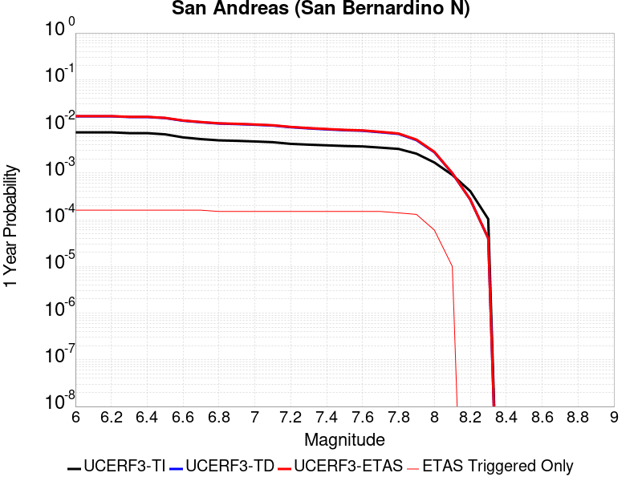 |  |

| Magnitude | 1 wk TI Prob | 1 wk TD Prob | 1 wk ETAS Prob | 1 wk ETAS/TD Gain | 1 wk ETAS Triggered Only | 1 mo TI Prob | 1 mo TD Prob | 1 mo ETAS Prob | 1 mo ETAS/TD Gain | 1 mo ETAS Triggered Only | 1 yr TI Prob | 1 yr TD Prob | 1 yr ETAS Prob | 1 yr ETAS/TD Gain | 1 yr ETAS Triggered Only | 10 yr TI Prob | 10 yr TD Prob | 10 yr ETAS Prob | 10 yr ETAS/TD Gain | 10 yr ETAS Triggered Only |
|-----|-----|-----|-----|-----|-----|-----|-----|-----|-----|-----|-----|-----|-----|-----|-----|-----|-----|-----|-----|-----|
| 6.0 | 1.4273766E-4 | 3.1635934E-4 | 3.1635934E-4 | 1.0 | 0.0 | 6.115894E-4 | 0.0013551271 | 0.0013727315 | 1.012991 | 1.762829E-5 | 0.0074207084 | 0.016375363 | 0.016531419 | 1.00953 | 1.5865461E-4 | 0.07177748 | 0.15038711 | 0.15053688 | 1.0009959 | 1.762829E-4 |
| 6.1 | 1.4273766E-4 | 3.1635934E-4 | 3.1635934E-4 | 1.0 | 0.0 | 6.115894E-4 | 0.0013551271 | 0.0013727315 | 1.012991 | 1.762829E-5 | 0.0074207084 | 0.016375363 | 0.016531419 | 1.00953 | 1.5865461E-4 | 0.07177748 | 0.15038711 | 0.15053688 | 1.0009959 | 1.762829E-4 |
| 6.2 | 1.4273766E-4 | 3.1635934E-4 | 3.1635934E-4 | 1.0 | 0.0 | 6.115894E-4 | 0.0013551271 | 0.0013727315 | 1.012991 | 1.762829E-5 | 0.0074207084 | 0.016375363 | 0.016531419 | 1.00953 | 1.5865461E-4 | 0.07177748 | 0.15038711 | 0.15053688 | 1.0009959 | 1.762829E-4 |
| 6.3 | 1.3730655E-4 | 3.0540637E-4 | 3.0540637E-4 | 1.0 | 0.0 | 5.883239E-4 | 0.0013082335 | 0.0013258387 | 1.0134573 | 1.762829E-5 | 0.0071393442 | 0.015812824 | 0.01596897 | 1.0098746 | 1.5865461E-4 | 0.06914291 | 0.14568701 | 0.14583762 | 1.0010338 | 1.762829E-4 |
| 6.4 | 1.3730655E-4 | 3.0540637E-4 | 3.0540637E-4 | 1.0 | 0.0 | 5.883239E-4 | 0.0013082335 | 0.0013258387 | 1.0134573 | 1.762829E-5 | 0.0071393442 | 0.015812824 | 0.01596897 | 1.0098746 | 1.5865461E-4 | 0.06914291 | 0.14568701 | 0.14583762 | 1.0010338 | 1.762829E-4 |
| 6.5 | 1.2942807E-4 | 2.8954886E-4 | 2.8954886E-4 | 1.0 | 0.0 | 5.545738E-4 | 0.0012403387 | 0.0012579451 | 1.0141948 | 1.762829E-5 | 0.0067310524 | 0.014997809 | 0.015154085 | 1.0104198 | 1.5865461E-4 | 0.06530788 | 0.13882978 | 0.1389816 | 1.0010935 | 1.762829E-4 |
| 6.6 | 1.1125901E-4 | 2.5393223E-4 | 2.5393223E-4 | 1.0 | 0.0 | 4.767372E-4 | 0.0010878295 | 0.0011054386 | 1.0161874 | 1.762829E-5 | 0.005788839 | 0.013164529 | 0.013321094 | 1.011893 | 1.5865461E-4 | 0.056403454 | 0.12311955 | 0.123274125 | 1.0012555 | 1.762829E-4 |
| 6.7 | 1.02209575E-4 | 2.3527986E-4 | 2.3527986E-4 | 1.0 | 0.0 | 4.3796748E-4 | 0.001007954 | 0.0010255645 | 1.0174716 | 1.762829E-5 | 0.0053192247 | 0.012203212 | 0.012359931 | 1.0128424 | 1.5865461E-4 | 0.051936906 | 0.11491149 | 0.11506751 | 1.0013578 | 1.762829E-4 |
| 6.8 | 9.610582E-5 | 2.2053412E-4 | 2.2053412E-4 | 1.0 | 0.0 | 4.1181705E-4 | 9.448046E-4 | 9.624162E-4 | 1.0186405 | 1.762829E-5 | 0.0050023515 | 0.011442591 | 0.011599431 | 1.0137066 | 1.5865461E-4 | 0.048912346 | 0.10831282 | 0.108470015 | 1.0014513 | 1.762829E-4 |
| 6.9 | 9.3877505E-5 | 2.150883E-4 | 2.150883E-4 | 1.0 | 0.0 | 4.0227012E-4 | 9.2148193E-4 | 9.39094E-4 | 1.0191127 | 1.762829E-5 | 0.0048866454 | 0.011161577 | 0.011318461 | 1.0140557 | 1.5865461E-4 | 0.04780577 | 0.1059029 | 0.10606052 | 1.0014883 | 1.762829E-4 |
| 7.0 | 9.1019785E-5 | 2.0835544E-4 | 2.0835544E-4 | 1.0 | 0.0 | 3.900265E-4 | 8.926469E-4 | 9.102595E-4 | 1.0197307 | 1.762829E-5 | 0.0047382377 | 0.010814046 | 0.010970985 | 1.0145125 | 1.5865461E-4 | 0.046384744 | 0.10287278 | 0.10303093 | 1.0015373 | 1.762829E-4 |
| 7.1 | 8.771155E-5 | 2.0009889E-4 | 2.0009889E-4 | 1.0 | 0.0 | 3.758525E-4 | 8.5728534E-4 | 8.748986E-4 | 1.0205452 | 1.762829E-5 | 0.0045664064 | 0.010387696 | 0.010544703 | 1.0151147 | 1.5865461E-4 | 0.044737056 | 0.09918398 | 0.09934278 | 1.0016011 | 1.762829E-4 |
| 7.2 | 8.0830236E-5 | 1.8415037E-4 | 1.8415037E-4 | 1.0 | 0.0 | 3.4636928E-4 | 7.8897737E-4 | 8.065917E-4 | 1.0223256 | 1.762829E-5 | 0.0042088944 | 0.009563598 | 0.009720735 | 1.0164307 | 1.5865461E-4 | 0.041300658 | 0.09191379 | 0.092073865 | 1.0017416 | 1.762829E-4 |
| 7.3 | 7.7668235E-5 | 1.7358093E-4 | 1.7358093E-4 | 1.0 | 0.0 | 3.328214E-4 | 7.437063E-4 | 7.613215E-4 | 1.0236857 | 1.762829E-5 | 0.0040445733 | 0.009017113 | 0.009174337 | 1.0174361 | 1.5865461E-4 | 0.03971748 | 0.08717959 | 0.087340504 | 1.0018458 | 1.762829E-4 |
| 7.4 | 7.520177E-5 | 1.657783E-4 | 1.657783E-4 | 1.0 | 0.0 | 3.2225347E-4 | 7.1028504E-4 | 7.279008E-4 | 1.024801 | 1.762829E-5 | 0.0039163795 | 0.008613498 | 0.008770786 | 1.0182606 | 1.5865461E-4 | 0.038480744 | 0.08363466 | 0.0837962 | 1.0019315 | 1.762829E-4 |
| 7.5 | 7.274697E-5 | 1.5865144E-4 | 1.5865144E-4 | 1.0 | 0.0 | 3.1173544E-4 | 6.797576E-4 | 6.9737394E-4 | 1.0259156 | 1.762829E-5 | 0.003788775 | 0.008244702 | 0.008402048 | 1.0190846 | 1.5865461E-4 | 0.03724827 | 0.08035038 | 0.080512494 | 1.0020176 | 1.762829E-4 |
| 7.6 | 7.1185845E-5 | 1.5434787E-4 | 1.5434787E-4 | 1.0 | 0.0 | 3.0504653E-4 | 6.6132325E-4 | 6.7893986E-4 | 1.0266385 | 1.762829E-5 | 0.0037076178 | 0.008021939 | 0.00817932 | 1.019619 | 1.5865461E-4 | 0.036463667 | 0.078339346 | 0.07850182 | 1.002074 | 1.762829E-4 |
| 7.7 | 6.709961E-5 | 1.4343053E-4 | 1.4343053E-4 | 1.0 | 0.0 | 2.8753807E-4 | 6.1455753E-4 | 6.3217495E-4 | 1.0286669 | 1.762829E-5 | 0.003495157 | 0.007456607 | 0.007614079 | 1.0211184 | 1.5865461E-4 | 0.034406938 | 0.07316601 | 0.0733294 | 1.002233 | 1.762829E-4 |
| 7.8 | 6.300812E-5 | 1.3225875E-4 | 1.3225875E-4 | 1.0 | 0.0 | 2.7000686E-4 | 5.6670007E-4 | 5.6670007E-4 | 1.0 | 0.0 | 0.0032823787 | 0.0068777753 | 0.007017832 | 1.0203636 | 1.4102632E-4 | 0.032343175 | 0.06781986 | 0.06796776 | 1.0021807 | 1.5865461E-4 |
| 7.9 | 4.983037E-5 | 9.7419856E-5 | 9.7419856E-5 | 1.0 | 0.0 | 2.1354125E-4 | 4.1744686E-4 | 4.1744686E-4 | 1.0 | 0.0 | 0.0025967648 | 0.005070582 | 0.005193354 | 1.0242127 | 1.2339803E-4 | 0.025666296 | 0.050735 | 0.050868873 | 1.0026387 | 1.4102632E-4 |
| 8.0 | 3.2211527E-5 | 5.341288E-5 | 5.341288E-5 | 1.0 | 0.0 | 1.380421E-4 | 2.2889227E-4 | 2.2889227E-4 | 1.0 | 0.0 | 0.0016793669 | 0.002783204 | 0.0028359415 | 1.0189486 | 5.288487E-5 | 0.016667323 | 0.028414162 | 0.028482672 | 1.0024111 | 7.051316E-5 |
| 8.1 | 1.743376E-5 | 1.8874636E-5 | 1.8874636E-5 | 1.0 | 0.0 | 7.471398E-5 | 8.088879E-5 | 8.088879E-5 | 1.0 | 0.0 | 9.0926304E-4 | 9.843768E-4 | 0.0010019876 | 1.0178905 | 1.762829E-5 | 0.009055517 | 0.010510205 | 0.010527648 | 1.0016596 | 1.762829E-5 |
| 8.2 | 7.831616E-6 | 5.1737816E-6 | 5.1737816E-6 | 1.0 | 0.0 | 3.3563636E-5 | 2.217316E-5 | 2.217316E-5 | 1.0 | 0.0 | 4.0856065E-4 | 2.6992487E-4 | 2.6992487E-4 | 1.0 | 0.0 | 0.004078103 | 0.0030519657 | 0.0030519657 | 1.0 | 0.0 |
| 8.3 | 1.983087E-6 | 7.693574E-7 | 7.693574E-7 | 1.0 | 0.0 | 8.498917E-6 | 3.297242E-6 | 3.297242E-6 | 1.0 | 0.0 | 1.034694E-4 | 4.01432E-5 | 4.01432E-5 | 1.0 | 0.0 | 0.0010342124 | 4.7390026E-4 | 4.7390026E-4 | 1.0 | 0.0 |

## Lenwood-Lockhart-Old Woman Springs
*[(top)](#table-of-contents)*

| 1 Week | 1 Month | 1 Year | 10 Year |
|-----|-----|-----|-----|
| 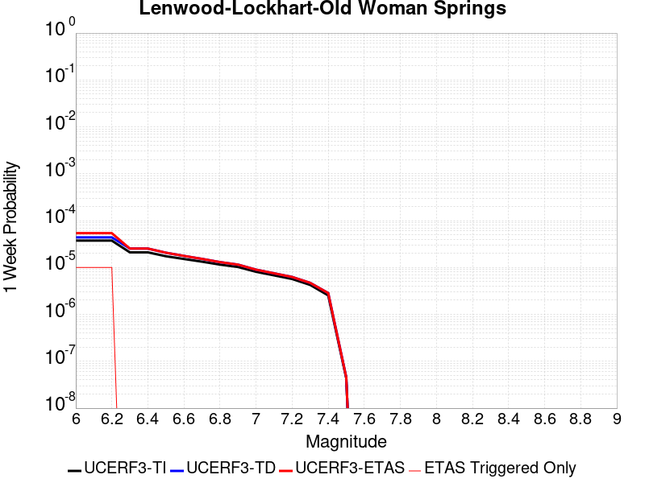 |  |  | 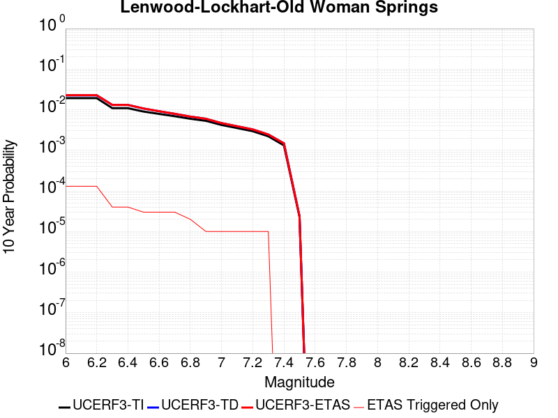 |

| Magnitude | 1 wk TI Prob | 1 wk TD Prob | 1 wk ETAS Prob | 1 wk ETAS/TD Gain | 1 wk ETAS Triggered Only | 1 mo TI Prob | 1 mo TD Prob | 1 mo ETAS Prob | 1 mo ETAS/TD Gain | 1 mo ETAS Triggered Only | 1 yr TI Prob | 1 yr TD Prob | 1 yr ETAS Prob | 1 yr ETAS/TD Gain | 1 yr ETAS Triggered Only | 10 yr TI Prob | 10 yr TD Prob | 10 yr ETAS Prob | 10 yr ETAS/TD Gain | 10 yr ETAS Triggered Only |
|-----|-----|-----|-----|-----|-----|-----|-----|-----|-----|-----|-----|-----|-----|-----|-----|-----|-----|-----|-----|-----|
| 6.0 | 3.744542E-5 | 4.3964304E-5 | 6.159182E-5 | 1.4009506 | 1.762829E-5 | 1.604705E-4 | 1.8840581E-4 | 2.0603079E-4 | 1.0935479 | 1.762829E-5 | 0.0019519776 | 0.0022915998 | 0.0023971272 | 1.0460496 | 1.0576974E-4 | 0.019349206 | 0.0226977 | 0.022835527 | 1.0060722 | 1.4102632E-4 |
| 6.1 | 3.744542E-5 | 4.3964304E-5 | 6.159182E-5 | 1.4009506 | 1.762829E-5 | 1.604705E-4 | 1.8840581E-4 | 2.0603079E-4 | 1.0935479 | 1.762829E-5 | 0.0019519776 | 0.0022915998 | 0.0023971272 | 1.0460496 | 1.0576974E-4 | 0.019349206 | 0.0226977 | 0.022835527 | 1.0060722 | 1.4102632E-4 |
| 6.2 | 3.744542E-5 | 4.3964304E-5 | 6.159182E-5 | 1.4009506 | 1.762829E-5 | 1.604705E-4 | 1.8840581E-4 | 2.0603079E-4 | 1.0935479 | 1.762829E-5 | 0.0019519776 | 0.0022915998 | 0.0023971272 | 1.0460496 | 1.0576974E-4 | 0.019349206 | 0.0226977 | 0.022835527 | 1.0060722 | 1.4102632E-4 |
| 6.3 | 2.1079984E-5 | 2.5354084E-5 | 2.5354084E-5 | 1.0 | 0.0 | 9.0339665E-5 | 1.0865595E-4 | 1.0865595E-4 | 1.0 | 0.0 | 0.0010993304 | 0.0013221033 | 0.0013573134 | 1.0266318 | 3.525658E-5 | 0.010939079 | 0.013144593 | 0.013196782 | 1.0039704 | 5.288487E-5 |
| 6.4 | 2.1079984E-5 | 2.5354084E-5 | 2.5354084E-5 | 1.0 | 0.0 | 9.0339665E-5 | 1.0865595E-4 | 1.0865595E-4 | 1.0 | 0.0 | 0.0010993304 | 0.0013221033 | 0.0013573134 | 1.0266318 | 3.525658E-5 | 0.010939079 | 0.013144593 | 0.013196782 | 1.0039704 | 5.288487E-5 |
| 6.5 | 1.7397282E-5 | 2.0662914E-5 | 2.0662914E-5 | 1.0 | 0.0 | 7.455765E-5 | 8.8552406E-5 | 8.8552406E-5 | 1.0 | 0.0 | 9.073613E-4 | 0.001077604 | 0.0011128226 | 1.0326823 | 3.525658E-5 | 0.009036654 | 0.010725081 | 0.010759959 | 1.003252 | 3.525658E-5 |
| 6.6 | 1.52050325E-5 | 1.7680117E-5 | 1.7680117E-5 | 1.0 | 0.0 | 6.51628E-5 | 7.576977E-5 | 7.576977E-5 | 1.0 | 0.0 | 7.9306826E-4 | 9.221144E-4 | 9.573385E-4 | 1.0381992 | 3.525658E-5 | 0.007902439 | 0.009183745 | 0.009218678 | 1.0038037 | 3.525658E-5 |
| 6.7 | 1.332523E-5 | 1.5264359E-5 | 1.5264359E-5 | 1.0 | 0.0 | 5.7106878E-5 | 6.541707E-5 | 6.541707E-5 | 1.0 | 0.0 | 6.950544E-4 | 7.9616765E-4 | 8.3139614E-4 | 1.0442476 | 3.525658E-5 | 0.006928845 | 0.007933783 | 0.00796876 | 1.0044086 | 3.525658E-5 |
| 6.8 | 1.1525329E-5 | 1.3031262E-5 | 1.3031262E-5 | 1.0 | 0.0 | 4.9393333E-5 | 5.5847093E-5 | 5.5847093E-5 | 1.0 | 0.0 | 6.011979E-4 | 6.797305E-4 | 6.973468E-4 | 1.0259166 | 1.762829E-5 | 0.00599574 | 0.0067769657 | 0.0067944746 | 1.0025836 | 1.762829E-5 |
| 6.9 | 1.0253909E-5 | 1.1514676E-5 | 1.1514676E-5 | 1.0 | 0.0 | 4.3944583E-5 | 4.93477E-5 | 4.93477E-5 | 1.0 | 0.0 | 5.3489394E-4 | 6.006462E-4 | 6.006462E-4 | 1.0 | 0.0 | 0.0053360825 | 0.005990607 | 0.005990607 | 1.0 | 0.0 |
| 7.0 | 8.104563E-6 | 8.991446E-6 | 8.991446E-6 | 1.0 | 0.0 | 3.4733377E-5 | 3.8534214E-5 | 3.8534214E-5 | 1.0 | 0.0 | 4.2279682E-4 | 4.6905546E-4 | 4.6905546E-4 | 1.0 | 0.0 | 0.0042199334 | 0.004680902 | 0.004680902 | 1.0 | 0.0 |
| 7.1 | 6.7986157E-6 | 7.515946E-6 | 7.515946E-6 | 1.0 | 0.0 | 2.91366E-5 | 3.221081E-5 | 3.221081E-5 | 1.0 | 0.0 | 3.5468035E-4 | 3.9209818E-4 | 3.9209818E-4 | 1.0 | 0.0 | 0.003541148 | 0.0039142803 | 0.0039142803 | 1.0 | 0.0 |
| 7.2 | 5.6893327E-6 | 6.280115E-6 | 6.280115E-6 | 1.0 | 0.0 | 2.4382627E-5 | 2.6914513E-5 | 2.6914513E-5 | 1.0 | 0.0 | 2.9681803E-4 | 3.2763692E-4 | 3.2763692E-4 | 1.0 | 0.0 | 0.002964219 | 0.0032717374 | 0.0032717374 | 1.0 | 0.0 |
| 7.3 | 4.253348E-6 | 4.7069766E-6 | 4.7069766E-6 | 1.0 | 0.0 | 1.8228506E-5 | 2.0172612E-5 | 2.0172612E-5 | 1.0 | 0.0 | 2.2190946E-4 | 2.455757E-4 | 2.455757E-4 | 1.0 | 0.0 | 0.00221688 | 0.0024532243 | 0.0024532243 | 1.0 | 0.0 |
| 7.4 | 2.5448119E-6 | 2.8520785E-6 | 2.8520785E-6 | 1.0 | 0.0 | 1.0906291E-5 | 1.2223146E-5 | 1.2223146E-5 | 1.0 | 0.0 | 1.3277601E-4 | 1.4880829E-4 | 1.4880829E-4 | 1.0 | 0.0 | 0.001326967 | 0.0014872487 | 0.0014872487 | 1.0 | 0.0 |
| 7.5 | 4.3706837E-8 | 4.5630156E-8 | 4.5630156E-8 | 1.0 | 0.0 | 1.8731501E-7 | 1.955578E-7 | 1.955578E-7 | 1.0 | 0.0 | 2.2805577E-6 | 2.380914E-6 | 2.380914E-6 | 1.0 | 0.0 | 2.2805343E-5 | 2.3808941E-5 | 2.3808941E-5 | 1.0 | 0.0 |

## Paradise
*[(top)](#table-of-contents)*

| 1 Week | 1 Month | 1 Year | 10 Year |
|-----|-----|-----|-----|
| 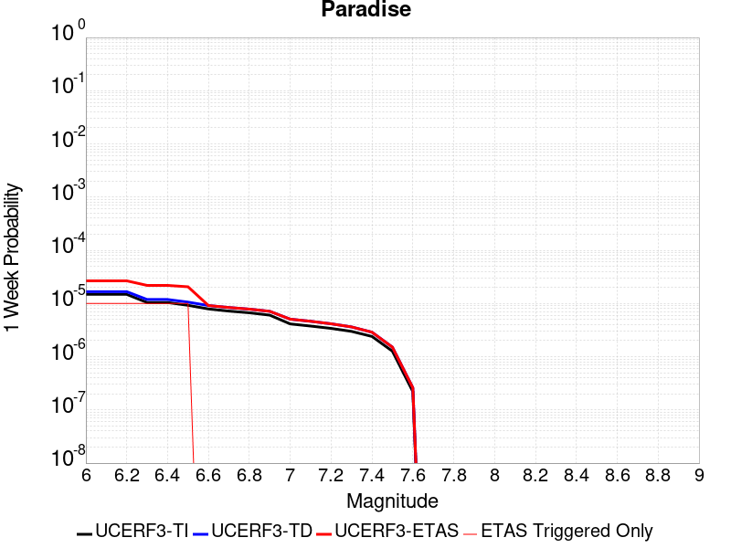 |  |  | 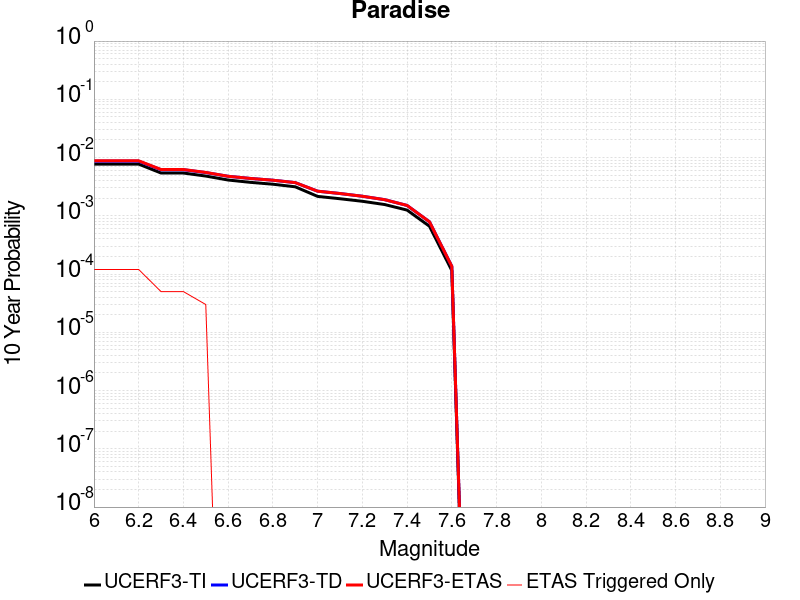 |

| Magnitude | 1 wk TI Prob | 1 wk TD Prob | 1 wk ETAS Prob | 1 wk ETAS/TD Gain | 1 wk ETAS Triggered Only | 1 mo TI Prob | 1 mo TD Prob | 1 mo ETAS Prob | 1 mo ETAS/TD Gain | 1 mo ETAS Triggered Only | 1 yr TI Prob | 1 yr TD Prob | 1 yr ETAS Prob | 1 yr ETAS/TD Gain | 1 yr ETAS Triggered Only | 10 yr TI Prob | 10 yr TD Prob | 10 yr ETAS Prob | 10 yr ETAS/TD Gain | 10 yr ETAS Triggered Only |
|-----|-----|-----|-----|-----|-----|-----|-----|-----|-----|-----|-----|-----|-----|-----|-----|-----|-----|-----|-----|-----|
| 6.0 | 1.4851273E-5 | 1.6695341E-5 | 1.6695341E-5 | 1.0 | 0.0 | 6.364676E-5 | 7.154963E-5 | 1.0680369E-4 | 1.4927217 | 3.525658E-5 | 7.7462377E-4 | 8.707922E-4 | 9.4124395E-4 | 1.0809053 | 7.051316E-5 | 0.0077192914 | 0.008676181 | 0.008798508 | 1.0140992 | 1.2339803E-4 |
| 6.1 | 1.4851273E-5 | 1.6695341E-5 | 1.6695341E-5 | 1.0 | 0.0 | 6.364676E-5 | 7.154963E-5 | 1.0680369E-4 | 1.4927217 | 3.525658E-5 | 7.7462377E-4 | 8.707922E-4 | 9.4124395E-4 | 1.0809053 | 7.051316E-5 | 0.0077192914 | 0.008676181 | 0.008798508 | 1.0140992 | 1.2339803E-4 |
| 6.2 | 1.4851273E-5 | 1.6695341E-5 | 1.6695341E-5 | 1.0 | 0.0 | 6.364676E-5 | 7.154963E-5 | 1.0680369E-4 | 1.4927217 | 3.525658E-5 | 7.7462377E-4 | 8.707922E-4 | 9.4124395E-4 | 1.0809053 | 7.051316E-5 | 0.0077192914 | 0.008676181 | 0.008798508 | 1.0140992 | 1.2339803E-4 |
| 6.3 | 1.0426831E-5 | 1.1889049E-5 | 1.1889049E-5 | 1.0 | 0.0 | 4.4685654E-5 | 5.095211E-5 | 5.095211E-5 | 1.0 | 0.0 | 5.43912E-4 | 6.2017125E-4 | 6.377886E-4 | 1.0284072 | 1.762829E-5 | 0.0054258266 | 0.0061850143 | 0.006237572 | 1.0084976 | 5.288487E-5 |
| 6.4 | 1.0426831E-5 | 1.1889049E-5 | 1.1889049E-5 | 1.0 | 0.0 | 4.4685654E-5 | 5.095211E-5 | 5.095211E-5 | 1.0 | 0.0 | 5.43912E-4 | 6.2017125E-4 | 6.377886E-4 | 1.0284072 | 1.762829E-5 | 0.0054258266 | 0.0061850143 | 0.006237572 | 1.0084976 | 5.288487E-5 |
| 6.5 | 9.25027E-6 | 1.0620336E-5 | 1.0620336E-5 | 1.0 | 0.0 | 3.964341E-5 | 4.551496E-5 | 4.551496E-5 | 1.0 | 0.0 | 4.8255164E-4 | 5.5400864E-4 | 5.7162717E-4 | 1.0318019 | 1.762829E-5 | 0.0048150513 | 0.0055267746 | 0.0055443053 | 1.003172 | 1.762829E-5 |
| 6.6 | 7.904275E-6 | 9.159836E-6 | 9.159836E-6 | 1.0 | 0.0 | 3.3875025E-5 | 3.925587E-5 | 3.925587E-5 | 1.0 | 0.0 | 4.1235037E-4 | 4.7783932E-4 | 4.7783932E-4 | 1.0 | 0.0 | 0.0041158604 | 0.0047685155 | 0.0047685155 | 1.0 | 0.0 |
| 6.7 | 7.2061953E-6 | 8.407527E-6 | 8.407527E-6 | 1.0 | 0.0 | 3.088333E-5 | 3.6031786E-5 | 3.6031786E-5 | 1.0 | 0.0 | 3.7593965E-4 | 4.3860235E-4 | 4.3860235E-4 | 1.0 | 0.0 | 0.003753043 | 0.0043777362 | 0.0043777362 | 1.0 | 0.0 |
| 6.8 | 6.6948724E-6 | 7.842423E-6 | 7.842423E-6 | 1.0 | 0.0 | 2.8691995E-5 | 3.3609973E-5 | 3.3609973E-5 | 1.0 | 0.0 | 3.4926904E-4 | 4.0912814E-4 | 4.0912814E-4 | 1.0 | 0.0 | 0.003487206 | 0.004084107 | 0.004084107 | 1.0 | 0.0 |
| 6.9 | 6.0421025E-6 | 7.1308505E-6 | 7.1308505E-6 | 1.0 | 0.0 | 2.5894467E-5 | 3.0560448E-5 | 3.0560448E-5 | 1.0 | 0.0 | 3.1521954E-4 | 3.7201334E-4 | 3.7201334E-4 | 1.0 | 0.0 | 0.0031477278 | 0.003714244 | 0.003714244 | 1.0 | 0.0 |
| 7.0 | 4.134091E-6 | 5.080469E-6 | 5.080469E-6 | 1.0 | 0.0 | 1.7717413E-5 | 2.1773263E-5 | 2.1773263E-5 | 1.0 | 0.0 | 2.1568815E-4 | 2.6505877E-4 | 2.6505877E-4 | 1.0 | 0.0 | 0.0021547892 | 0.0026475794 | 0.0026475794 | 1.0 | 0.0 |
| 7.1 | 3.7674888E-6 | 4.6320133E-6 | 4.6320133E-6 | 1.0 | 0.0 | 1.6146281E-5 | 1.9851343E-5 | 1.9851343E-5 | 1.0 | 0.0 | 1.9656324E-4 | 2.4166482E-4 | 2.4166482E-4 | 1.0 | 0.0 | 0.0019638946 | 0.002414171 | 0.002414171 | 1.0 | 0.0 |
| 7.2 | 3.4065345E-6 | 4.1568514E-6 | 4.1568514E-6 | 1.0 | 0.0 | 1.4599351E-5 | 1.7814966E-5 | 1.7814966E-5 | 1.0 | 0.0 | 1.777326E-4 | 2.1687712E-4 | 2.1687712E-4 | 1.0 | 0.0 | 0.0017759053 | 0.0021668028 | 0.0021668028 | 1.0 | 0.0 |
| 7.3 | 2.9934936E-6 | 3.629423E-6 | 3.629423E-6 | 1.0 | 0.0 | 1.2829195E-5 | 1.5554586E-5 | 1.5554586E-5 | 1.0 | 0.0 | 1.5618425E-4 | 1.893621E-4 | 1.893621E-4 | 1.0 | 0.0 | 0.0015607453 | 0.0018921527 | 0.0018921527 | 1.0 | 0.0 |
| 7.4 | 2.4049796E-6 | 2.889062E-6 | 2.889062E-6 | 1.0 | 0.0 | 1.0307015E-5 | 1.23816435E-5 | 1.23816435E-5 | 1.0 | 0.0 | 1.2548068E-4 | 1.5073753E-4 | 1.5073753E-4 | 1.0 | 0.0 | 0.0012540985 | 0.0015064942 | 0.0015064942 | 1.0 | 0.0 |
| 7.5 | 1.2710091E-6 | 1.5135054E-6 | 1.5135054E-6 | 1.0 | 0.0 | 5.44717E-6 | 6.4864425E-6 | 6.4864425E-6 | 1.0 | 0.0 | 6.631728E-5 | 7.897083E-5 | 7.897083E-5 | 1.0 | 0.0 | 6.6297496E-4 | 7.8955025E-4 | 7.8955025E-4 | 1.0 | 0.0 |
| 7.6 | 2.21172E-7 | 2.6040124E-7 | 2.6040124E-7 | 1.0 | 0.0 | 9.478797E-7 | 1.116005E-6 | 1.116005E-6 | 1.0 | 0.0 | 1.1540374E-5 | 1.3587305E-5 | 1.3587305E-5 | 1.0 | 0.0 | 1.1539775E-4 | 1.3586757E-4 | 1.3586757E-4 | 1.0 | 0.0 |

## San Andreas (San Bernardino S)
*[(top)](#table-of-contents)*

| 1 Week | 1 Month | 1 Year | 10 Year |
|-----|-----|-----|-----|
|  |  |  |  |

| Magnitude | 1 wk TI Prob | 1 wk TD Prob | 1 wk ETAS Prob | 1 wk ETAS/TD Gain | 1 wk ETAS Triggered Only | 1 mo TI Prob | 1 mo TD Prob | 1 mo ETAS Prob | 1 mo ETAS/TD Gain | 1 mo ETAS Triggered Only | 1 yr TI Prob | 1 yr TD Prob | 1 yr ETAS Prob | 1 yr ETAS/TD Gain | 1 yr ETAS Triggered Only | 10 yr TI Prob | 10 yr TD Prob | 10 yr ETAS Prob | 10 yr ETAS/TD Gain | 10 yr ETAS Triggered Only |
|-----|-----|-----|-----|-----|-----|-----|-----|-----|-----|-----|-----|-----|-----|-----|-----|-----|-----|-----|-----|-----|
| 6.0 | 1.2336002E-4 | 3.0023555E-4 | 3.0023555E-4 | 1.0 | 0.0 | 5.2857865E-4 | 0.0012861154 | 0.0012861154 | 1.0 | 0.0 | 0.006416472 | 0.015550992 | 0.015655117 | 1.0066957 | 1.0576974E-4 | 0.06234337 | 0.14291383 | 0.1430196 | 1.00074 | 1.2339803E-4 |
| 6.1 | 1.2336002E-4 | 3.0023555E-4 | 3.0023555E-4 | 1.0 | 0.0 | 5.2857865E-4 | 0.0012861154 | 0.0012861154 | 1.0 | 0.0 | 0.006416472 | 0.015550992 | 0.015655117 | 1.0066957 | 1.0576974E-4 | 0.06234337 | 0.14291383 | 0.1430196 | 1.00074 | 1.2339803E-4 |
| 6.2 | 1.2336002E-4 | 3.0023555E-4 | 3.0023555E-4 | 1.0 | 0.0 | 5.2857865E-4 | 0.0012861154 | 0.0012861154 | 1.0 | 0.0 | 0.006416472 | 0.015550992 | 0.015655117 | 1.0066957 | 1.0576974E-4 | 0.06234337 | 0.14291383 | 0.1430196 | 1.00074 | 1.2339803E-4 |
| 6.3 | 1.1712257E-4 | 2.8811657E-4 | 2.8811657E-4 | 1.0 | 0.0 | 5.018573E-4 | 0.0012342266 | 0.0012342266 | 1.0 | 0.0 | 0.006093008 | 0.0149280215 | 0.015032212 | 1.0069796 | 1.0576974E-4 | 0.059286322 | 0.13762207 | 0.13772848 | 1.0007732 | 1.2339803E-4 |
| 6.4 | 1.1712257E-4 | 2.8811657E-4 | 2.8811657E-4 | 1.0 | 0.0 | 5.018573E-4 | 0.0012342266 | 0.0012342266 | 1.0 | 0.0 | 0.006093008 | 0.0149280215 | 0.015032212 | 1.0069796 | 1.0576974E-4 | 0.059286322 | 0.13762207 | 0.13772848 | 1.0007732 | 1.2339803E-4 |
| 6.5 | 1.0689076E-4 | 2.682418E-4 | 2.682418E-4 | 1.0 | 0.0 | 4.5802278E-4 | 0.001149126 | 0.001149126 | 1.0 | 0.0 | 0.0055621783 | 0.013905481 | 0.01400978 | 1.0075005 | 1.0576974E-4 | 0.05425003 | 0.12886871 | 0.12897621 | 1.0008341 | 1.2339803E-4 |
| 6.6 | 9.7648895E-5 | 2.506867E-4 | 2.506867E-4 | 1.0 | 0.0 | 4.1842813E-4 | 0.0010739529 | 0.0010739529 | 1.0 | 0.0 | 0.005082469 | 0.0130013535 | 0.013105748 | 1.0080295 | 1.0576974E-4 | 0.049677886 | 0.12102797 | 0.121136434 | 1.0008962 | 1.2339803E-4 |
| 6.7 | 8.757013E-5 | 2.3139146E-4 | 2.3139146E-4 | 1.0 | 0.0 | 3.7524657E-4 | 9.913231E-4 | 9.913231E-4 | 1.0 | 0.0 | 0.00455906 | 0.012006655 | 0.012111155 | 1.0087035 | 1.0576974E-4 | 0.04466656 | 0.112335846 | 0.11244538 | 1.0009751 | 1.2339803E-4 |
| 6.8 | 8.562978E-5 | 2.2698891E-4 | 2.2698891E-4 | 1.0 | 0.0 | 3.6693315E-4 | 9.7246916E-4 | 9.7246916E-4 | 1.0 | 0.0 | 0.004458263 | 0.011779605 | 0.01188413 | 1.0088733 | 1.0576974E-4 | 0.043698758 | 0.11034572 | 0.1104555 | 1.0009949 | 1.2339803E-4 |
| 6.9 | 6.124075E-5 | 1.7082063E-4 | 1.7082063E-4 | 1.0 | 0.0 | 2.6243398E-4 | 7.318838E-4 | 7.318838E-4 | 1.0 | 0.0 | 0.0031904527 | 0.008874487 | 0.008979319 | 1.0118127 | 1.0576974E-4 | 0.031450346 | 0.08425208 | 0.084365085 | 1.0013412 | 1.2339803E-4 |
| 7.0 | 5.8598747E-5 | 1.6510907E-4 | 1.6510907E-4 | 1.0 | 0.0 | 2.5111332E-4 | 7.0741924E-4 | 7.0741924E-4 | 1.0 | 0.0 | 0.0030530186 | 0.008579012 | 0.008683874 | 1.0122231 | 1.0576974E-4 | 0.03011414 | 0.08156926 | 0.0816826 | 1.0013894 | 1.2339803E-4 |
| 7.1 | 5.613814E-5 | 1.5929298E-4 | 1.5929298E-4 | 1.0 | 0.0 | 2.4056983E-4 | 6.825063E-4 | 6.825063E-4 | 1.0 | 0.0 | 0.0029250039 | 0.0082780365 | 0.00838293 | 1.0126714 | 1.0576974E-4 | 0.028868021 | 0.078867756 | 0.07898142 | 1.0014412 | 1.2339803E-4 |
| 7.2 | 4.991222E-5 | 1.4535384E-4 | 1.4535384E-4 | 1.0 | 0.0 | 2.1389198E-4 | 6.227967E-4 | 6.227967E-4 | 1.0 | 0.0 | 0.002601025 | 0.0075562913 | 0.0076612616 | 1.0138918 | 1.0576974E-4 | 0.025707912 | 0.072320335 | 0.072434805 | 1.0015829 | 1.2339803E-4 |
| 7.3 | 4.7410045E-5 | 1.3729246E-4 | 1.3729246E-4 | 1.0 | 0.0 | 2.0317009E-4 | 5.882639E-4 | 5.882639E-4 | 1.0 | 0.0 | 0.0024707897 | 0.0071386793 | 0.0072436943 | 1.0147107 | 1.0576974E-4 | 0.024434982 | 0.06860168 | 0.068716615 | 1.0016754 | 1.2339803E-4 |
| 7.4 | 4.5556746E-5 | 1.313689E-4 | 1.313689E-4 | 1.0 | 0.0 | 1.952286E-4 | 5.628884E-4 | 5.628884E-4 | 1.0 | 0.0 | 0.002374317 | 0.006831711 | 0.0069367583 | 1.0153764 | 1.0576974E-4 | 0.023491086 | 0.06585319 | 0.06596847 | 1.0017505 | 1.2339803E-4 |
| 7.5 | 4.3084514E-5 | 1.2371907E-4 | 1.2371907E-4 | 1.0 | 0.0 | 1.8463485E-4 | 5.3011713E-4 | 5.3011713E-4 | 1.0 | 0.0 | 0.0022456115 | 0.0064351484 | 0.0065402375 | 1.0163305 | 1.0576974E-4 | 0.022230545 | 0.062252887 | 0.062368605 | 1.0018588 | 1.2339803E-4 |
| 7.6 | 3.408608E-5 | 9.8489814E-5 | 9.8489814E-5 | 1.0 | 0.0 | 1.4607502E-4 | 4.2203104E-4 | 4.2203104E-4 | 1.0 | 0.0 | 0.0017770125 | 0.005126148 | 0.005231376 | 1.0205276 | 1.0576974E-4 | 0.017628696 | 0.050079897 | 0.050197113 | 1.0023407 | 1.2339803E-4 |
| 7.7 | 2.8315713E-5 | 8.261325E-5 | 8.261325E-5 | 1.0 | 0.0 | 1.2134742E-4 | 3.5400878E-4 | 3.5400878E-4 | 1.0 | 0.0 | 0.0014764034 | 0.004301548 | 0.004406863 | 1.024483 | 1.0576974E-4 | 0.01466633 | 0.042327844 | 0.042446017 | 1.0027919 | 1.2339803E-4 |
| 7.8 | 2.6222975E-5 | 7.4749165E-5 | 7.4749165E-5 | 1.0 | 0.0 | 1.1237934E-4 | 3.2031426E-4 | 3.2031426E-4 | 1.0 | 0.0 | 0.0013673597 | 0.0038928585 | 0.0039982167 | 1.0270644 | 1.0576974E-4 | 0.013589768 | 0.038489804 | 0.038608454 | 1.0030826 | 1.2339803E-4 |
| 7.9 | 2.1469694E-5 | 5.7977377E-5 | 5.7977377E-5 | 1.0 | 0.0 | 9.200973E-5 | 2.4845081E-4 | 2.4845081E-4 | 1.0 | 0.0 | 0.0011196428 | 0.003020696 | 0.0031261463 | 1.0349092 | 1.0576974E-4 | 0.011140184 | 0.030197 | 0.030316671 | 1.003963 | 1.2339803E-4 |
| 8.0 | 1.2420249E-5 | 3.1373827E-5 | 3.1373827E-5 | 1.0 | 0.0 | 5.322855E-5 | 1.3445233E-4 | 1.3445233E-4 | 1.0 | 0.0 | 6.478649E-4 | 0.001635729 | 0.001670928 | 1.0215188 | 3.525658E-5 | 0.0064597935 | 0.016548108 | 0.016600119 | 1.003143 | 5.288487E-5 |
| 8.1 | 4.9197724E-6 | 7.842378E-6 | 7.842378E-6 | 1.0 | 0.0 | 2.1084568E-5 | 3.360976E-5 | 3.360976E-5 | 1.0 | 0.0 | 2.566744E-4 | 4.0912212E-4 | 4.0912212E-4 | 1.0 | 0.0 | 0.002563781 | 0.004394436 | 0.004394436 | 1.0 | 0.0 |
| 8.2 | 2.5634774E-6 | 2.9160003E-6 | 2.9160003E-6 | 1.0 | 0.0 | 1.0986286E-5 | 1.2497085E-5 | 1.2497085E-5 | 1.0 | 0.0 | 1.3374983E-4 | 1.5214144E-4 | 1.5214144E-4 | 1.0 | 0.0 | 0.0013366934 | 0.0017098442 | 0.0017098442 | 1.0 | 0.0 |
| 8.3 | 5.2850464E-7 | 3.2211614E-7 | 3.2211614E-7 | 1.0 | 0.0 | 2.2650179E-6 | 1.380497E-6 | 1.380497E-6 | 1.0 | 0.0 | 2.7576245E-5 | 1.6807435E-5 | 1.6807435E-5 | 1.0 | 0.0 | 2.7572823E-4 | 1.9939634E-4 | 1.9939634E-4 | 1.0 | 0.0 |

## Death Valley (So)
*[(top)](#table-of-contents)*

| 1 Week | 1 Month | 1 Year | 10 Year |
|-----|-----|-----|-----|
|  |  |  |  |

| Magnitude | 1 wk TI Prob | 1 wk TD Prob | 1 wk ETAS Prob | 1 wk ETAS/TD Gain | 1 wk ETAS Triggered Only | 1 mo TI Prob | 1 mo TD Prob | 1 mo ETAS Prob | 1 mo ETAS/TD Gain | 1 mo ETAS Triggered Only | 1 yr TI Prob | 1 yr TD Prob | 1 yr ETAS Prob | 1 yr ETAS/TD Gain | 1 yr ETAS Triggered Only | 10 yr TI Prob | 10 yr TD Prob | 10 yr ETAS Prob | 10 yr ETAS/TD Gain | 10 yr ETAS Triggered Only |
|-----|-----|-----|-----|-----|-----|-----|-----|-----|-----|-----|-----|-----|-----|-----|-----|-----|-----|-----|-----|-----|
| 6.0 | 2.0684236E-5 | 2.562036E-5 | 4.3248197E-5 | 1.6880403 | 1.762829E-5 | 8.864371E-5 | 1.0979702E-4 | 1.4504972E-4 | 1.3210716 | 3.525658E-5 | 0.0010787029 | 0.0013359758 | 0.0014063949 | 1.0527097 | 7.051316E-5 | 0.010734817 | 0.013282726 | 0.013369696 | 1.0065477 | 8.814145E-5 |
| 6.1 | 2.0684236E-5 | 2.562036E-5 | 4.3248197E-5 | 1.6880403 | 1.762829E-5 | 8.864371E-5 | 1.0979702E-4 | 1.4504972E-4 | 1.3210716 | 3.525658E-5 | 0.0010787029 | 0.0013359758 | 0.0014063949 | 1.0527097 | 7.051316E-5 | 0.010734817 | 0.013282726 | 0.013369696 | 1.0065477 | 8.814145E-5 |
| 6.2 | 2.0684236E-5 | 2.562036E-5 | 4.3248197E-5 | 1.6880403 | 1.762829E-5 | 8.864371E-5 | 1.0979702E-4 | 1.4504972E-4 | 1.3210716 | 3.525658E-5 | 0.0010787029 | 0.0013359758 | 0.0014063949 | 1.0527097 | 7.051316E-5 | 0.010734817 | 0.013282726 | 0.013369696 | 1.0065477 | 8.814145E-5 |
| 6.3 | 2.0240292E-5 | 2.5120411E-5 | 4.274826E-5 | 1.701734 | 1.762829E-5 | 8.6741224E-5 | 1.0765456E-4 | 1.4290735E-4 | 1.3274621 | 3.525658E-5 | 0.0010555626 | 0.0013099229 | 0.0013803437 | 1.0537595 | 7.051316E-5 | 0.010505628 | 0.013025268 | 0.013112261 | 1.0066788 | 8.814145E-5 |
| 6.4 | 2.0240292E-5 | 2.5120411E-5 | 4.274826E-5 | 1.701734 | 1.762829E-5 | 8.6741224E-5 | 1.0765456E-4 | 1.4290735E-4 | 1.3274621 | 3.525658E-5 | 0.0010555626 | 0.0013099229 | 0.0013803437 | 1.0537595 | 7.051316E-5 | 0.010505628 | 0.013025268 | 0.013112261 | 1.0066788 | 8.814145E-5 |
| 6.5 | 1.9962767E-5 | 2.4809646E-5 | 4.24375E-5 | 1.7105242 | 1.762829E-5 | 8.55519E-5 | 1.0632281E-4 | 1.4157564E-4 | 1.3315642 | 3.525658E-5 | 0.0010410968 | 0.0012937282 | 0.0013641502 | 1.0544333 | 7.051316E-5 | 0.010362327 | 0.012865204 | 0.012952212 | 1.006763 | 8.814145E-5 |
| 6.6 | 1.8937297E-5 | 2.331338E-5 | 4.094126E-5 | 1.7561271 | 1.762829E-5 | 8.115732E-5 | 9.991074E-5 | 1.351638E-4 | 1.3528455 | 3.525658E-5 | 9.876423E-4 | 0.0012157491 | 0.0012861765 | 1.0579293 | 7.051316E-5 | 0.009832645 | 0.012094032 | 0.012181108 | 1.0071999 | 8.814145E-5 |
| 6.7 | 1.8621096E-5 | 2.2913995E-5 | 4.054188E-5 | 1.7693065 | 1.762829E-5 | 7.980225E-5 | 9.819922E-5 | 1.3345234E-4 | 1.3589959 | 3.525658E-5 | 9.711593E-4 | 0.0011949344 | 0.0012653632 | 1.0589396 | 7.051316E-5 | 0.009669261 | 0.011888134 | 0.011975228 | 1.0073261 | 8.814145E-5 |
| 6.8 | 1.7830353E-5 | 2.1807928E-5 | 3.9435832E-5 | 1.8083255 | 1.762829E-5 | 7.641356E-5 | 9.3459275E-5 | 1.2871256E-4 | 1.3772048 | 3.525658E-5 | 9.29938E-4 | 0.0011372868 | 0.0012077197 | 1.0619307 | 7.051316E-5 | 0.009260561 | 0.011317508 | 0.011404652 | 1.0077 | 8.814145E-5 |
| 6.9 | 1.3135183E-5 | 1.530519E-5 | 3.293321E-5 | 2.1517675 | 1.762829E-5 | 5.6292425E-5 | 6.559206E-5 | 8.3219194E-5 | 1.2687389 | 1.762829E-5 | 6.8514474E-4 | 7.9829723E-4 | 8.1591145E-4 | 1.0220647 | 1.762829E-5 | 0.006830362 | 0.007955303 | 0.007990279 | 1.0043966 | 3.525658E-5 |
| 7.0 | 1.1507512E-5 | 1.3155178E-5 | 3.0783234E-5 | 2.3400092 | 1.762829E-5 | 4.9316975E-5 | 5.6378147E-5 | 7.4005446E-5 | 1.3126619 | 1.762829E-5 | 6.002687E-4 | 6.861935E-4 | 7.038097E-4 | 1.0256723 | 1.762829E-5 | 0.0059864987 | 0.0068414486 | 0.006858956 | 1.0025591 | 1.762829E-5 |
| 7.1 | 9.715903E-6 | 1.08659815E-5 | 1.08659815E-5 | 1.0 | 0.0 | 4.1638916E-5 | 4.6567682E-5 | 4.6567682E-5 | 1.0 | 0.0 | 5.068359E-4 | 5.6681834E-4 | 5.6681834E-4 | 1.0 | 0.0 | 0.0050568148 | 0.0056541795 | 0.0056541795 | 1.0 | 0.0 |
| 7.2 | 9.233269E-6 | 1.0286961E-5 | 1.0286961E-5 | 1.0 | 0.0 | 3.9570554E-5 | 4.4086253E-5 | 4.4086253E-5 | 1.0 | 0.0 | 4.81665E-4 | 5.366222E-4 | 5.366222E-4 | 1.0 | 0.0 | 0.0048062233 | 0.0053536952 | 0.0053536952 | 1.0 | 0.0 |
| 7.3 | 8.8041315E-6 | 9.80876E-6 | 9.80876E-6 | 1.0 | 0.0 | 3.7731446E-5 | 4.203689E-5 | 4.203689E-5 | 1.0 | 0.0 | 4.592835E-4 | 5.116832E-4 | 5.116832E-4 | 1.0 | 0.0 | 0.0045833546 | 0.005105477 | 0.005105477 | 1.0 | 0.0 |
| 7.4 | 8.708749E-6 | 9.707768E-6 | 9.707768E-6 | 1.0 | 0.0 | 3.7322676E-5 | 4.1604082E-5 | 4.1604082E-5 | 1.0 | 0.0 | 4.5430884E-4 | 5.0641614E-4 | 5.0641614E-4 | 1.0 | 0.0 | 0.004533812 | 0.0050530476 | 0.0050530476 | 1.0 | 0.0 |
| 7.5 | 8.612678E-6 | 9.605406E-6 | 9.605406E-6 | 1.0 | 0.0 | 3.6910955E-5 | 4.1165404E-5 | 4.1165404E-5 | 1.0 | 0.0 | 4.492982E-4 | 5.0107774E-4 | 5.0107774E-4 | 1.0 | 0.0 | 0.004483909 | 0.004999905 | 0.004999905 | 1.0 | 0.0 |
| 7.6 | 8.319024E-6 | 9.28449E-6 | 9.28449E-6 | 1.0 | 0.0 | 3.5652476E-5 | 3.9790088E-5 | 3.9790088E-5 | 1.0 | 0.0 | 4.3398244E-4 | 4.8434082E-4 | 4.8434082E-4 | 1.0 | 0.0 | 0.0043313587 | 0.0048332764 | 0.0048332764 | 1.0 | 0.0 |
| 7.7 | 7.4718328E-6 | 8.345689E-6 | 8.345689E-6 | 1.0 | 0.0 | 3.2021748E-5 | 3.576677E-5 | 3.576677E-5 | 1.0 | 0.0 | 3.8979502E-4 | 4.3537747E-4 | 4.3537747E-4 | 1.0 | 0.0 | 0.00389112 | 0.0043456503 | 0.0043456503 | 1.0 | 0.0 |
| 7.8 | 3.4586725E-7 | 3.648368E-7 | 3.648368E-7 | 1.0 | 0.0 | 1.4822873E-6 | 1.5635853E-6 | 1.5635853E-6 | 1.0 | 0.0 | 1.80467E-5 | 1.903649E-5 | 1.903649E-5 | 1.0 | 0.0 | 1.8045233E-4 | 1.9034903E-4 | 1.9034903E-4 | 1.0 | 0.0 |
| 7.9 | 2.5591178E-9 | 2.6697329E-9 | 2.6697329E-9 | 1.0 | 0.0 | 1.0967647E-8 | 1.14417125E-8 | 1.14417125E-8 | 1.0 | 0.0 | 1.335311E-7 | 1.3930286E-7 | 1.3930286E-7 | 1.0 | 0.0 | 1.3353102E-6 | 1.3930285E-6 | 1.3930285E-6 | 1.0 | 0.0 |

## Coyote Canyon
*[(top)](#table-of-contents)*

| 1 Week | 1 Month | 1 Year | 10 Year |
|-----|-----|-----|-----|
|  |  | 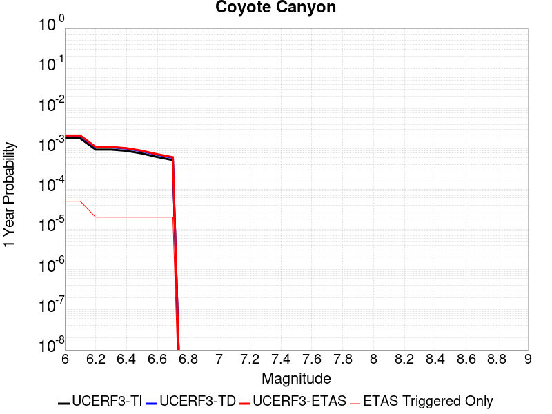 |  |

| Magnitude | 1 wk TI Prob | 1 wk TD Prob | 1 wk ETAS Prob | 1 wk ETAS/TD Gain | 1 wk ETAS Triggered Only | 1 mo TI Prob | 1 mo TD Prob | 1 mo ETAS Prob | 1 mo ETAS/TD Gain | 1 mo ETAS Triggered Only | 1 yr TI Prob | 1 yr TD Prob | 1 yr ETAS Prob | 1 yr ETAS/TD Gain | 1 yr ETAS Triggered Only | 10 yr TI Prob | 10 yr TD Prob | 10 yr ETAS Prob | 10 yr ETAS/TD Gain | 10 yr ETAS Triggered Only |
|-----|-----|-----|-----|-----|-----|-----|-----|-----|-----|-----|-----|-----|-----|-----|-----|-----|-----|-----|-----|-----|
| 6.0 | 3.5090034E-5 | 4.0367544E-5 | 4.0367544E-5 | 1.0 | 0.0 | 1.503772E-4 | 1.7299375E-4 | 1.7299375E-4 | 1.0 | 0.0 | 0.0018293047 | 0.0021044204 | 0.0021220117 | 1.0083592 | 1.762829E-5 | 0.018143194 | 0.020870851 | 0.020957153 | 1.004135 | 8.814145E-5 |
| 6.1 | 3.5090034E-5 | 4.0367544E-5 | 4.0367544E-5 | 1.0 | 0.0 | 1.503772E-4 | 1.7299375E-4 | 1.7299375E-4 | 1.0 | 0.0 | 0.0018293047 | 0.0021044204 | 0.0021220117 | 1.0083592 | 1.762829E-5 | 0.018143194 | 0.020870851 | 0.020957153 | 1.004135 | 8.814145E-5 |
| 6.2 | 1.841879E-5 | 2.1061396E-5 | 2.1061396E-5 | 1.0 | 0.0 | 7.8935285E-5 | 9.026058E-5 | 9.026058E-5 | 1.0 | 0.0 | 9.606133E-4 | 0.0010984705 | 0.0010984705 | 1.0 | 0.0 | 0.0095647145 | 0.010940496 | 0.010975366 | 1.0031873 | 3.525658E-5 |
| 6.3 | 1.841879E-5 | 2.1061396E-5 | 2.1061396E-5 | 1.0 | 0.0 | 7.8935285E-5 | 9.026058E-5 | 9.026058E-5 | 1.0 | 0.0 | 9.606133E-4 | 0.0010984705 | 0.0010984705 | 1.0 | 0.0 | 0.0095647145 | 0.010940496 | 0.010975366 | 1.0031873 | 3.525658E-5 |
| 6.4 | 1.712201E-5 | 1.9566693E-5 | 1.9566693E-5 | 1.0 | 0.0 | 7.337798E-5 | 8.385513E-5 | 8.385513E-5 | 1.0 | 0.0 | 8.930107E-4 | 0.0010205585 | 0.0010205585 | 1.0 | 0.0 | 0.008894307 | 0.010168637 | 0.010186086 | 1.001716 | 1.762829E-5 |
| 6.5 | 1.4744935E-5 | 1.683824E-5 | 1.683824E-5 | 1.0 | 0.0 | 6.3191044E-5 | 7.216242E-5 | 7.216242E-5 | 1.0 | 0.0 | 7.6907943E-4 | 8.7831676E-4 | 8.7831676E-4 | 1.0 | 0.0 | 0.007664232 | 0.008757652 | 0.008775125 | 1.0019953 | 1.762829E-5 |
| 6.6 | 1.2017839E-5 | 1.3725124E-5 | 1.3725124E-5 | 1.0 | 0.0 | 5.150401E-5 | 5.882113E-5 | 5.882113E-5 | 1.0 | 0.0 | 6.268809E-4 | 7.1600056E-4 | 7.1600056E-4 | 1.0 | 0.0 | 0.0062511545 | 0.007145631 | 0.0071631335 | 1.0024494 | 1.762829E-5 |
| 6.7 | 1.00956095E-5 | 1.1534388E-5 | 1.1534388E-5 | 1.0 | 0.0 | 4.326618E-5 | 4.943265E-5 | 4.943265E-5 | 1.0 | 0.0 | 5.266384E-4 | 6.0176325E-4 | 6.0176325E-4 | 1.0 | 0.0 | 0.005253921 | 0.006009866 | 0.0060273884 | 1.0029156 | 1.762829E-5 |

## Towne Pass
*[(top)](#table-of-contents)*

| 1 Week | 1 Month | 1 Year | 10 Year |
|-----|-----|-----|-----|
|  |  |  |  |

| Magnitude | 1 wk TI Prob | 1 wk TD Prob | 1 wk ETAS Prob | 1 wk ETAS/TD Gain | 1 wk ETAS Triggered Only | 1 mo TI Prob | 1 mo TD Prob | 1 mo ETAS Prob | 1 mo ETAS/TD Gain | 1 mo ETAS Triggered Only | 1 yr TI Prob | 1 yr TD Prob | 1 yr ETAS Prob | 1 yr ETAS/TD Gain | 1 yr ETAS Triggered Only | 10 yr TI Prob | 10 yr TD Prob | 10 yr ETAS Prob | 10 yr ETAS/TD Gain | 10 yr ETAS Triggered Only |
|-----|-----|-----|-----|-----|-----|-----|-----|-----|-----|-----|-----|-----|-----|-----|-----|-----|-----|-----|-----|-----|
| 6.0 | 3.849728E-6 | 3.8945745E-6 | 3.8945745E-6 | 1.0 | 0.0 | 1.649873E-5 | 1.669095E-5 | 1.669095E-5 | 1.0 | 0.0 | 2.0085352E-4 | 2.0319775E-4 | 2.2082246E-4 | 1.0867367 | 1.762829E-5 | 0.0020067208 | 0.0020305486 | 0.0021185111 | 1.0433196 | 8.814145E-5 |
| 6.1 | 3.849728E-6 | 3.8945745E-6 | 3.8945745E-6 | 1.0 | 0.0 | 1.649873E-5 | 1.669095E-5 | 1.669095E-5 | 1.0 | 0.0 | 2.0085352E-4 | 2.0319775E-4 | 2.2082246E-4 | 1.0867367 | 1.762829E-5 | 0.0020067208 | 0.0020305486 | 0.0021185111 | 1.0433196 | 8.814145E-5 |
| 6.2 | 3.849728E-6 | 3.8945745E-6 | 3.8945745E-6 | 1.0 | 0.0 | 1.649873E-5 | 1.669095E-5 | 1.669095E-5 | 1.0 | 0.0 | 2.0085352E-4 | 2.0319775E-4 | 2.2082246E-4 | 1.0867367 | 1.762829E-5 | 0.0020067208 | 0.0020305486 | 0.0021185111 | 1.0433196 | 8.814145E-5 |
| 6.3 | 3.849728E-6 | 3.8945745E-6 | 3.8945745E-6 | 1.0 | 0.0 | 1.649873E-5 | 1.669095E-5 | 1.669095E-5 | 1.0 | 0.0 | 2.0085352E-4 | 2.0319775E-4 | 2.2082246E-4 | 1.0867367 | 1.762829E-5 | 0.0020067208 | 0.0020305486 | 0.0021185111 | 1.0433196 | 8.814145E-5 |
| 6.4 | 3.849728E-6 | 3.8945745E-6 | 3.8945745E-6 | 1.0 | 0.0 | 1.649873E-5 | 1.669095E-5 | 1.669095E-5 | 1.0 | 0.0 | 2.0085352E-4 | 2.0319775E-4 | 2.2082246E-4 | 1.0867367 | 1.762829E-5 | 0.0020067208 | 0.0020305486 | 0.0021185111 | 1.0433196 | 8.814145E-5 |
| 6.5 | 1.1953545E-6 | 1.203065E-6 | 1.203065E-6 | 1.0 | 0.0 | 5.1229376E-6 | 5.1559837E-6 | 5.1559837E-6 | 1.0 | 0.0 | 6.236998E-5 | 6.277241E-5 | 6.277241E-5 | 1.0 | 0.0 | 6.235248E-4 | 6.275585E-4 | 6.275585E-4 | 1.0 | 0.0 |
| 6.6 | 1.1953545E-6 | 1.203065E-6 | 1.203065E-6 | 1.0 | 0.0 | 5.1229376E-6 | 5.1559837E-6 | 5.1559837E-6 | 1.0 | 0.0 | 6.236998E-5 | 6.277241E-5 | 6.277241E-5 | 1.0 | 0.0 | 6.235248E-4 | 6.275585E-4 | 6.275585E-4 | 1.0 | 0.0 |
| 6.7 | 8.375951E-7 | 8.410778E-7 | 8.410778E-7 | 1.0 | 0.0 | 3.5896885E-6 | 3.6046144E-6 | 3.6046144E-6 | 1.0 | 0.0 | 4.370358E-5 | 4.3885353E-5 | 4.3885353E-5 | 1.0 | 0.0 | 4.3694986E-4 | 4.387726E-4 | 4.387726E-4 | 1.0 | 0.0 |
| 6.8 | 6.38041E-7 | 6.3922516E-7 | 6.3922516E-7 | 1.0 | 0.0 | 2.7344586E-6 | 2.7395338E-6 | 2.7395338E-6 | 1.0 | 0.0 | 3.3291526E-5 | 3.335335E-5 | 3.335335E-5 | 1.0 | 0.0 | 3.3286537E-4 | 3.3348726E-4 | 3.3348726E-4 | 1.0 | 0.0 |
| 6.9 | 5.3460053E-7 | 5.3454215E-7 | 5.3454215E-7 | 1.0 | 0.0 | 2.2911431E-6 | 2.290893E-6 | 2.290893E-6 | 1.0 | 0.0 | 2.789431E-5 | 2.78913E-5 | 2.78913E-5 | 1.0 | 0.0 | 2.789081E-4 | 2.788813E-4 | 2.788813E-4 | 1.0 | 0.0 |
| 7.0 | 3.557783E-7 | 3.5324976E-7 | 3.5324976E-7 | 1.0 | 0.0 | 1.5247632E-6 | 1.5139268E-6 | 1.5139268E-6 | 1.0 | 0.0 | 1.8563835E-5 | 1.843191E-5 | 1.843191E-5 | 1.0 | 0.0 | 1.8562283E-4 | 1.8430466E-4 | 1.8430466E-4 | 1.0 | 0.0 |
| 7.1 | 3.037942E-7 | 3.0002903E-7 | 3.0002903E-7 | 1.0 | 0.0 | 1.3019744E-6 | 1.285838E-6 | 1.285838E-6 | 1.0 | 0.0 | 1.5851423E-5 | 1.5654974E-5 | 1.5654974E-5 | 1.0 | 0.0 | 1.5850292E-4 | 1.5653945E-4 | 1.5653945E-4 | 1.0 | 0.0 |
| 7.2 | 2.0808248E-7 | 2.0218252E-7 | 2.0218252E-7 | 1.0 | 0.0 | 8.917818E-7 | 8.6649624E-7 | 8.6649624E-7 | 1.0 | 0.0 | 1.0857389E-5 | 1.0549546E-5 | 1.0549546E-5 | 1.0 | 0.0 | 1.0856859E-4 | 1.0549091E-4 | 1.0549091E-4 | 1.0 | 0.0 |
| 7.3 | 1.1162073E-7 | 1.0637251E-7 | 1.0637251E-7 | 1.0 | 0.0 | 4.7837443E-7 | 4.5588212E-7 | 4.5588212E-7 | 1.0 | 0.0 | 5.8241935E-6 | 5.5503524E-6 | 5.5503524E-6 | 1.0 | 0.0 | 5.8240406E-5 | 5.550234E-5 | 5.550234E-5 | 1.0 | 0.0 |

## Scodie Lineament
*[(top)](#table-of-contents)*

| 1 Week | 1 Month | 1 Year | 10 Year |
|-----|-----|-----|-----|
|  |  |  |  |

| Magnitude | 1 wk TI Prob | 1 wk TD Prob | 1 wk ETAS Prob | 1 wk ETAS/TD Gain | 1 wk ETAS Triggered Only | 1 mo TI Prob | 1 mo TD Prob | 1 mo ETAS Prob | 1 mo ETAS/TD Gain | 1 mo ETAS Triggered Only | 1 yr TI Prob | 1 yr TD Prob | 1 yr ETAS Prob | 1 yr ETAS/TD Gain | 1 yr ETAS Triggered Only | 10 yr TI Prob | 10 yr TD Prob | 10 yr ETAS Prob | 10 yr ETAS/TD Gain | 10 yr ETAS Triggered Only |
|-----|-----|-----|-----|-----|-----|-----|-----|-----|-----|-----|-----|-----|-----|-----|-----|-----|-----|-----|-----|-----|
| 6.0 | 3.2919327E-6 | 3.0133992E-6 | 3.0133992E-6 | 1.0 | 0.0 | 1.4108206E-5 | 1.2914522E-5 | 1.2914522E-5 | 1.0 | 0.0 | 1.7175387E-4 | 1.5722614E-4 | 1.7485165E-4 | 1.112103 | 1.762829E-5 | 0.0017162118 | 0.0015714606 | 0.0016594635 | 1.0560007 | 8.814145E-5 |
| 6.1 | 1.8663811E-6 | 1.5490858E-6 | 1.5490858E-6 | 1.0 | 0.0 | 7.998751E-6 | 6.6389252E-6 | 6.6389252E-6 | 1.0 | 0.0 | 9.738045E-5 | 8.082641E-5 | 8.082641E-5 | 1.0 | 0.0 | 9.7337784E-4 | 8.0801896E-4 | 8.608611E-4 | 1.0653971 | 5.288487E-5 |
| 6.2 | 1.8663811E-6 | 1.5490858E-6 | 1.5490858E-6 | 1.0 | 0.0 | 7.998751E-6 | 6.6389252E-6 | 6.6389252E-6 | 1.0 | 0.0 | 9.738045E-5 | 8.082641E-5 | 8.082641E-5 | 1.0 | 0.0 | 9.7337784E-4 | 8.0801896E-4 | 8.608611E-4 | 1.0653971 | 5.288487E-5 |
| 6.3 | 1.8663811E-6 | 1.5490858E-6 | 1.5490858E-6 | 1.0 | 0.0 | 7.998751E-6 | 6.6389252E-6 | 6.6389252E-6 | 1.0 | 0.0 | 9.738045E-5 | 8.082641E-5 | 8.082641E-5 | 1.0 | 0.0 | 9.7337784E-4 | 8.0801896E-4 | 8.608611E-4 | 1.0653971 | 5.288487E-5 |
| 6.4 | 1.8663811E-6 | 1.5490858E-6 | 1.5490858E-6 | 1.0 | 0.0 | 7.998751E-6 | 6.6389252E-6 | 6.6389252E-6 | 1.0 | 0.0 | 9.738045E-5 | 8.082641E-5 | 8.082641E-5 | 1.0 | 0.0 | 9.7337784E-4 | 8.0801896E-4 | 8.608611E-4 | 1.0653971 | 5.288487E-5 |
| 6.5 | 1.8106311E-6 | 1.4910186E-6 | 1.4910186E-6 | 1.0 | 0.0 | 7.759824E-6 | 6.3900666E-6 | 6.3900666E-6 | 1.0 | 0.0 | 9.447177E-5 | 7.779678E-5 | 7.779678E-5 | 1.0 | 0.0 | 9.4431615E-4 | 7.777441E-4 | 8.305879E-4 | 1.0679449 | 5.288487E-5 |
| 6.6 | 1.2414679E-6 | 8.997782E-7 | 8.997782E-7 | 1.0 | 0.0 | 5.320566E-6 | 3.856187E-6 | 3.856187E-6 | 1.0 | 0.0 | 6.477596E-5 | 4.6948153E-5 | 4.6948153E-5 | 1.0 | 0.0 | 6.475708E-4 | 4.69391E-4 | 4.87011E-4 | 1.037538 | 1.762829E-5 |
| 6.7 | 1.1062215E-6 | 7.5945076E-7 | 7.5945076E-7 | 1.0 | 0.0 | 4.7409408E-6 | 3.2547853E-6 | 3.2547853E-6 | 1.0 | 0.0 | 5.7719422E-5 | 3.962636E-5 | 3.962636E-5 | 1.0 | 0.0 | 5.770443E-4 | 3.9619993E-4 | 4.1382122E-4 | 1.0444758 | 1.762829E-5 |
| 6.8 | 1.0006736E-6 | 6.500572E-7 | 6.500572E-7 | 1.0 | 0.0 | 4.288594E-6 | 2.7859567E-6 | 2.7859567E-6 | 1.0 | 0.0 | 5.221238E-5 | 3.3918557E-5 | 3.3918557E-5 | 1.0 | 0.0 | 5.220012E-4 | 3.391399E-4 | 3.391399E-4 | 1.0 | 0.0 |
| 6.9 | 9.167364E-7 | 5.631784E-7 | 5.631784E-7 | 1.0 | 0.0 | 3.9288643E-6 | 2.4136198E-6 | 2.4136198E-6 | 1.0 | 0.0 | 4.7832873E-5 | 2.9385481E-5 | 2.9385481E-5 | 1.0 | 0.0 | 4.782258E-4 | 2.9382162E-4 | 2.9382162E-4 | 1.0 | 0.0 |
| 7.0 | 7.6987664E-7 | 4.113515E-7 | 4.113515E-7 | 1.0 | 0.0 | 3.2994672E-6 | 1.762934E-6 | 1.762934E-6 | 1.0 | 0.0 | 4.0170275E-5 | 2.146355E-5 | 2.146355E-5 | 1.0 | 0.0 | 4.0163012E-4 | 2.1461862E-4 | 2.1461862E-4 | 1.0 | 0.0 |
| 7.1 | 7.1038727E-7 | 3.5212707E-7 | 3.5212707E-7 | 1.0 | 0.0 | 3.0445133E-6 | 1.5091154E-6 | 1.5091154E-6 | 1.0 | 0.0 | 3.706632E-5 | 1.837336E-5 | 1.837336E-5 | 1.0 | 0.0 | 3.7060137E-4 | 1.837219E-4 | 1.837219E-4 | 1.0 | 0.0 |
| 7.2 | 2.0799602E-7 | 3.1190186E-8 | 3.1190186E-8 | 1.0 | 0.0 | 8.914113E-7 | 1.3367222E-7 | 1.3367222E-7 | 1.0 | 0.0 | 1.0852878E-5 | 1.6274581E-6 | 1.6274581E-6 | 1.0 | 0.0 | 1.08523476E-4 | 1.6274469E-5 | 1.6274469E-5 | 1.0 | 0.0 |
| 7.3 | 1.5048182E-7 | 1.5947961E-8 | 1.5947961E-8 | 1.0 | 0.0 | 6.449219E-7 | 6.8348406E-8 | 6.8348406E-8 | 1.0 | 0.0 | 7.851896E-6 | 8.3214155E-7 | 8.3214155E-7 | 1.0 | 0.0 | 7.851618E-5 | 8.321387E-6 | 8.321387E-6 | 1.0 | 0.0 |
| 7.4 | 5.9334678E-8 | 4.86919E-9 | 4.86919E-9 | 1.0 | 0.0 | 2.5429145E-7 | 2.0867958E-8 | 2.0867958E-8 | 1.0 | 0.0 | 3.095994E-6 | 2.5406737E-7 | 2.5406737E-7 | 1.0 | 0.0 | 3.095951E-5 | 2.5406719E-6 | 2.5406719E-6 | 1.0 | 0.0 |

## Nelson Lake
*[(top)](#table-of-contents)*

| 1 Week | 1 Month | 1 Year | 10 Year |
|-----|-----|-----|-----|
|  |  |  |  |

| Magnitude | 1 wk TI Prob | 1 wk TD Prob | 1 wk ETAS Prob | 1 wk ETAS/TD Gain | 1 wk ETAS Triggered Only | 1 mo TI Prob | 1 mo TD Prob | 1 mo ETAS Prob | 1 mo ETAS/TD Gain | 1 mo ETAS Triggered Only | 1 yr TI Prob | 1 yr TD Prob | 1 yr ETAS Prob | 1 yr ETAS/TD Gain | 1 yr ETAS Triggered Only | 10 yr TI Prob | 10 yr TD Prob | 10 yr ETAS Prob | 10 yr ETAS/TD Gain | 10 yr ETAS Triggered Only |
|-----|-----|-----|-----|-----|-----|-----|-----|-----|-----|-----|-----|-----|-----|-----|-----|-----|-----|-----|-----|-----|
| 6.0 | 9.913453E-6 | 1.0192408E-5 | 2.7820517E-5 | 2.7295334 | 1.762829E-5 | 4.2485535E-5 | 4.3681073E-5 | 6.1308594E-5 | 1.4035505 | 1.762829E-5 | 5.1713863E-4 | 5.3169765E-4 | 5.493166E-4 | 1.0331371 | 1.762829E-5 | 0.0051593683 | 0.0053052832 | 0.005357887 | 1.0099155 | 5.288487E-5 |
| 6.1 | 9.913453E-6 | 1.0192408E-5 | 2.7820517E-5 | 2.7295334 | 1.762829E-5 | 4.2485535E-5 | 4.3681073E-5 | 6.1308594E-5 | 1.4035505 | 1.762829E-5 | 5.1713863E-4 | 5.3169765E-4 | 5.493166E-4 | 1.0331371 | 1.762829E-5 | 0.0051593683 | 0.0053052832 | 0.005357887 | 1.0099155 | 5.288487E-5 |
| 6.2 | 4.5596407E-6 | 4.696388E-6 | 4.696388E-6 | 1.0 | 0.0 | 1.954117E-5 | 2.0127229E-5 | 2.0127229E-5 | 1.0 | 0.0 | 2.3788778E-4 | 2.4502273E-4 | 2.4502273E-4 | 1.0 | 0.0 | 0.0023763329 | 0.0024476517 | 0.002465237 | 1.0071845 | 1.762829E-5 |
| 6.3 | 4.5596407E-6 | 4.696388E-6 | 4.696388E-6 | 1.0 | 0.0 | 1.954117E-5 | 2.0127229E-5 | 2.0127229E-5 | 1.0 | 0.0 | 2.3788778E-4 | 2.4502273E-4 | 2.4502273E-4 | 1.0 | 0.0 | 0.0023763329 | 0.0024476517 | 0.002465237 | 1.0071845 | 1.762829E-5 |
| 6.4 | 3.4025713E-6 | 3.509956E-6 | 3.509956E-6 | 1.0 | 0.0 | 1.4582367E-5 | 1.5042587E-5 | 1.5042587E-5 | 1.0 | 0.0 | 1.7752586E-4 | 1.8312894E-4 | 1.8312894E-4 | 1.0 | 0.0 | 0.001773841 | 0.0018298633 | 0.0018474594 | 1.009616 | 1.762829E-5 |
| 6.5 | 2.8352947E-6 | 2.927907E-6 | 2.927907E-6 | 1.0 | 0.0 | 1.2151207E-5 | 1.25481165E-5 | 1.25481165E-5 | 1.0 | 0.0 | 1.479309E-4 | 1.5276336E-4 | 1.5276336E-4 | 1.0 | 0.0 | 0.0014783246 | 0.0015266574 | 0.0015442587 | 1.0115293 | 1.762829E-5 |
| 6.6 | 2.251518E-6 | 2.3291102E-6 | 2.3291102E-6 | 1.0 | 0.0 | 9.649328E-6 | 9.981866E-6 | 9.981866E-6 | 1.0 | 0.0 | 1.1747423E-4 | 1.2152307E-4 | 1.2152307E-4 | 1.0 | 0.0 | 0.0011741214 | 0.001214628 | 0.0012322348 | 1.0144957 | 1.762829E-5 |
| 6.7 | 1.8911853E-6 | 1.959177E-6 | 1.959177E-6 | 1.0 | 0.0 | 8.105055E-6 | 8.39645E-6 | 8.39645E-6 | 1.0 | 0.0 | 9.867457E-5 | 1.0222256E-4 | 1.0222256E-4 | 1.0 | 0.0 | 9.863076E-4 | 0.0010218129 | 0.0010394232 | 1.0172343 | 1.762829E-5 |
| 6.8 | 1.4874814E-6 | 1.5438616E-6 | 1.5438616E-6 | 1.0 | 0.0 | 6.374905E-6 | 6.6165358E-6 | 6.6165358E-6 | 1.0 | 0.0 | 7.76117E-5 | 8.0553866E-5 | 8.0553866E-5 | 1.0 | 0.0 | 7.75846E-4 | 8.0529775E-4 | 8.2291185E-4 | 1.0218728 | 1.762829E-5 |
| 6.9 | 6.835972E-7 | 7.140097E-7 | 7.140097E-7 | 1.0 | 0.0 | 2.9296991E-6 | 3.0600397E-6 | 3.0600397E-6 | 1.0 | 0.0 | 3.56685E-5 | 3.7255664E-5 | 3.7255664E-5 | 1.0 | 0.0 | 3.5662777E-4 | 3.7252545E-4 | 3.9014718E-4 | 1.0473034 | 1.762829E-5 |

## White Wolf (Extension)
*[(top)](#table-of-contents)*

| 1 Week | 1 Month | 1 Year | 10 Year |
|-----|-----|-----|-----|
|  |  |  | 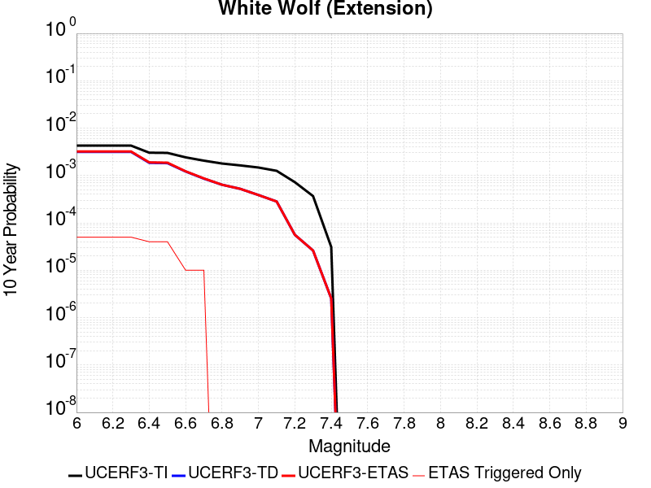 |

| Magnitude | 1 wk TI Prob | 1 wk TD Prob | 1 wk ETAS Prob | 1 wk ETAS/TD Gain | 1 wk ETAS Triggered Only | 1 mo TI Prob | 1 mo TD Prob | 1 mo ETAS Prob | 1 mo ETAS/TD Gain | 1 mo ETAS Triggered Only | 1 yr TI Prob | 1 yr TD Prob | 1 yr ETAS Prob | 1 yr ETAS/TD Gain | 1 yr ETAS Triggered Only | 10 yr TI Prob | 10 yr TD Prob | 10 yr ETAS Prob | 10 yr ETAS/TD Gain | 10 yr ETAS Triggered Only |
|-----|-----|-----|-----|-----|-----|-----|-----|-----|-----|-----|-----|-----|-----|-----|-----|-----|-----|-----|-----|-----|
| 6.0 | 8.222555E-6 | 6.0668267E-6 | 2.3695009E-5 | 3.9056678 | 1.762829E-5 | 3.5239045E-5 | 2.6000464E-5 | 4.3628293E-5 | 1.6779815 | 1.762829E-5 | 4.289509E-4 | 3.165163E-4 | 3.3413898E-4 | 1.055677 | 1.762829E-5 | 0.0042812387 | 0.0031613067 | 0.003231597 | 1.0222346 | 7.051316E-5 |
| 6.1 | 8.222555E-6 | 6.0668267E-6 | 2.3695009E-5 | 3.9056678 | 1.762829E-5 | 3.5239045E-5 | 2.6000464E-5 | 4.3628293E-5 | 1.6779815 | 1.762829E-5 | 4.289509E-4 | 3.165163E-4 | 3.3413898E-4 | 1.055677 | 1.762829E-5 | 0.0042812387 | 0.0031613067 | 0.003231597 | 1.0222346 | 7.051316E-5 |
| 6.2 | 8.222555E-6 | 6.0668267E-6 | 2.3695009E-5 | 3.9056678 | 1.762829E-5 | 3.5239045E-5 | 2.6000464E-5 | 4.3628293E-5 | 1.6779815 | 1.762829E-5 | 4.289509E-4 | 3.165163E-4 | 3.3413898E-4 | 1.055677 | 1.762829E-5 | 0.0042812387 | 0.0031613067 | 0.003231597 | 1.0222346 | 7.051316E-5 |
| 6.3 | 8.222555E-6 | 6.0668267E-6 | 2.3695009E-5 | 3.9056678 | 1.762829E-5 | 3.5239045E-5 | 2.6000464E-5 | 4.3628293E-5 | 1.6779815 | 1.762829E-5 | 4.289509E-4 | 3.165163E-4 | 3.3413898E-4 | 1.055677 | 1.762829E-5 | 0.0042812387 | 0.0031613067 | 0.003231597 | 1.0222346 | 7.051316E-5 |
| 6.4 | 5.821773E-6 | 3.557277E-6 | 3.557277E-6 | 1.0 | 0.0 | 2.4950215E-5 | 1.52453895E-5 | 1.52453895E-5 | 1.0 | 0.0 | 3.0372653E-4 | 1.855979E-4 | 1.855979E-4 | 1.0 | 0.0 | 0.0030331176 | 0.0018545374 | 0.0019073242 | 1.0284636 | 5.288487E-5 |
| 6.5 | 5.766023E-6 | 3.49921E-6 | 3.49921E-6 | 1.0 | 0.0 | 2.4711293E-5 | 1.49965335E-5 | 1.49965335E-5 | 1.0 | 0.0 | 3.0081844E-4 | 1.8256859E-4 | 1.8256859E-4 | 1.0 | 0.0 | 0.0030041158 | 0.0018242942 | 0.0018770826 | 1.0289364 | 5.288487E-5 |
| 6.6 | 4.643576E-6 | 2.332699E-6 | 2.332699E-6 | 1.0 | 0.0 | 1.9900888E-5 | 9.997246E-6 | 9.997246E-6 | 1.0 | 0.0 | 2.4226638E-4 | 1.21710094E-4 | 1.21710094E-4 | 1.0 | 0.0 | 0.0024200242 | 0.0012164768 | 0.0012340837 | 1.0144737 | 1.762829E-5 |
| 6.7 | 3.9529173E-6 | 1.648408E-6 | 1.648408E-6 | 1.0 | 0.0 | 1.6940963E-5 | 7.0645874E-6 | 7.0645874E-6 | 1.0 | 0.0 | 2.0623671E-4 | 8.600815E-5 | 8.600815E-5 | 1.0 | 0.0 | 0.002060454 | 8.597671E-4 | 8.7738025E-4 | 1.0204859 | 1.762829E-5 |
| 6.8 | 3.4377522E-6 | 1.2245736E-6 | 1.2245736E-6 | 1.0 | 0.0 | 1.473314E-5 | 5.2481623E-6 | 5.2481623E-6 | 1.0 | 0.0 | 1.7936122E-4 | 6.389459E-5 | 6.389459E-5 | 1.0 | 0.0 | 0.0017921652 | 6.3877134E-4 | 6.3877134E-4 | 1.0 | 0.0 |
| 6.9 | 3.1367306E-6 | 1.0034221E-6 | 1.0034221E-6 | 1.0 | 0.0 | 1.3443062E-5 | 4.300374E-6 | 4.300374E-6 | 1.0 | 0.0 | 1.63657E-4 | 5.2355874E-5 | 5.2355874E-5 | 1.0 | 0.0 | 0.0016353652 | 5.2344304E-4 | 5.2344304E-4 | 1.0 | 0.0 |
| 7.0 | 2.8298145E-6 | 7.429045E-7 | 7.429045E-7 | 1.0 | 0.0 | 1.2127721E-5 | 3.1838729E-6 | 3.1838729E-6 | 1.0 | 0.0 | 1.47645E-4 | 3.8763013E-5 | 3.8763013E-5 | 1.0 | 0.0 | 0.0014754693 | 3.875675E-4 | 3.875675E-4 | 1.0 | 0.0 |
| 7.1 | 2.4091064E-6 | 5.4230577E-7 | 5.4230577E-7 | 1.0 | 0.0 | 1.03247E-5 | 2.3241657E-6 | 2.3241657E-6 | 1.0 | 0.0 | 1.2569598E-4 | 2.8296392E-5 | 2.8296392E-5 | 1.0 | 0.0 | 0.001256249 | 2.8293193E-4 | 2.8293193E-4 | 1.0 | 0.0 |
| 7.2 | 1.3875518E-6 | 1.0744563E-7 | 1.0744563E-7 | 1.0 | 0.0 | 5.9466374E-6 | 4.604812E-7 | 4.604812E-7 | 1.0 | 0.0 | 7.23979E-5 | 5.6063454E-6 | 5.6063454E-6 | 1.0 | 0.0 | 7.2374323E-4 | 5.6062152E-5 | 5.6062152E-5 | 1.0 | 0.0 |
| 7.3 | 7.056077E-7 | 5.002896E-8 | 5.002896E-8 | 1.0 | 0.0 | 3.0240296E-6 | 2.1440981E-7 | 2.1440981E-7 | 1.0 | 0.0 | 3.681694E-5 | 2.6104367E-6 | 2.6104367E-6 | 1.0 | 0.0 | 3.681084E-4 | 2.6104108E-5 | 2.6104108E-5 | 1.0 | 0.0 |
| 7.4 | 5.9334678E-8 | 4.86919E-9 | 4.86919E-9 | 1.0 | 0.0 | 2.5429145E-7 | 2.0867958E-8 | 2.0867958E-8 | 1.0 | 0.0 | 3.095994E-6 | 2.5406737E-7 | 2.5406737E-7 | 1.0 | 0.0 | 3.095951E-5 | 2.5406719E-6 | 2.5406719E-6 | 1.0 | 0.0 |

## Sierra Nevada  (No Extension)
*[(top)](#table-of-contents)*

| 1 Week | 1 Month | 1 Year | 10 Year |
|-----|-----|-----|-----|
|  | 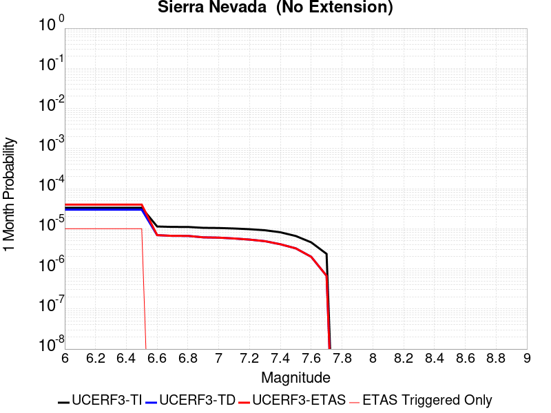 | 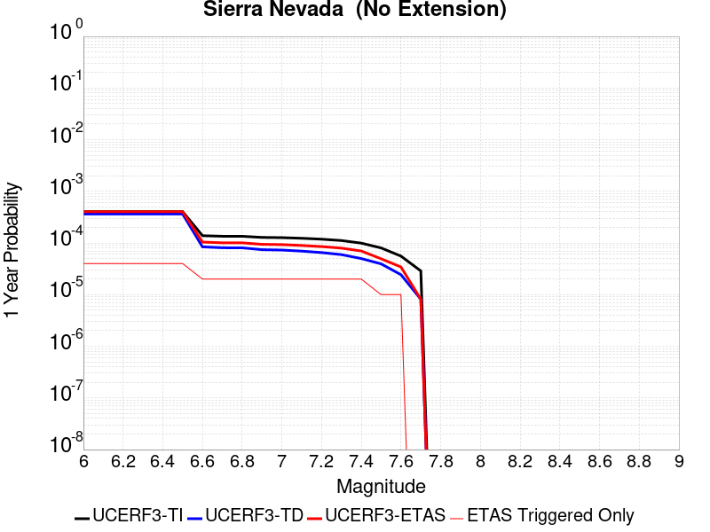 |  |

| Magnitude | 1 wk TI Prob | 1 wk TD Prob | 1 wk ETAS Prob | 1 wk ETAS/TD Gain | 1 wk ETAS Triggered Only | 1 mo TI Prob | 1 mo TD Prob | 1 mo ETAS Prob | 1 mo ETAS/TD Gain | 1 mo ETAS Triggered Only | 1 yr TI Prob | 1 yr TD Prob | 1 yr ETAS Prob | 1 yr ETAS/TD Gain | 1 yr ETAS Triggered Only | 10 yr TI Prob | 10 yr TD Prob | 10 yr ETAS Prob | 10 yr ETAS/TD Gain | 10 yr ETAS Triggered Only |
|-----|-----|-----|-----|-----|-----|-----|-----|-----|-----|-----|-----|-----|-----|-----|-----|-----|-----|-----|-----|-----|
| 6.0 | 7.7690465E-6 | 6.976568E-6 | 6.976568E-6 | 1.0 | 0.0 | 3.329549E-5 | 2.9899435E-5 | 4.75272E-5 | 1.5895684 | 1.762829E-5 | 4.0529718E-4 | 3.6400068E-4 | 4.168663E-4 | 1.145235 | 5.288487E-5 | 0.004045588 | 0.0036375606 | 0.0037078173 | 1.0193142 | 7.051316E-5 |
| 6.1 | 7.7690465E-6 | 6.976568E-6 | 6.976568E-6 | 1.0 | 0.0 | 3.329549E-5 | 2.9899435E-5 | 4.75272E-5 | 1.5895684 | 1.762829E-5 | 4.0529718E-4 | 3.6400068E-4 | 4.168663E-4 | 1.145235 | 5.288487E-5 | 0.004045588 | 0.0036375606 | 0.0037078173 | 1.0193142 | 7.051316E-5 |
| 6.2 | 7.7690465E-6 | 6.976568E-6 | 6.976568E-6 | 1.0 | 0.0 | 3.329549E-5 | 2.9899435E-5 | 4.75272E-5 | 1.5895684 | 1.762829E-5 | 4.0529718E-4 | 3.6400068E-4 | 4.168663E-4 | 1.145235 | 5.288487E-5 | 0.004045588 | 0.0036375606 | 0.0037078173 | 1.0193142 | 7.051316E-5 |
| 6.3 | 7.7690465E-6 | 6.976568E-6 | 6.976568E-6 | 1.0 | 0.0 | 3.329549E-5 | 2.9899435E-5 | 4.75272E-5 | 1.5895684 | 1.762829E-5 | 4.0529718E-4 | 3.6400068E-4 | 4.168663E-4 | 1.145235 | 5.288487E-5 | 0.004045588 | 0.0036375606 | 0.0037078173 | 1.0193142 | 7.051316E-5 |
| 6.4 | 7.7690465E-6 | 6.976568E-6 | 6.976568E-6 | 1.0 | 0.0 | 3.329549E-5 | 2.9899435E-5 | 4.75272E-5 | 1.5895684 | 1.762829E-5 | 4.0529718E-4 | 3.6400068E-4 | 4.168663E-4 | 1.145235 | 5.288487E-5 | 0.004045588 | 0.0036375606 | 0.0037078173 | 1.0193142 | 7.051316E-5 |
| 6.5 | 7.7690465E-6 | 6.976568E-6 | 6.976568E-6 | 1.0 | 0.0 | 3.329549E-5 | 2.9899435E-5 | 4.75272E-5 | 1.5895684 | 1.762829E-5 | 4.0529718E-4 | 3.6400068E-4 | 4.168663E-4 | 1.145235 | 5.288487E-5 | 0.004045588 | 0.0036375606 | 0.0037078173 | 1.0193142 | 7.051316E-5 |
| 6.6 | 2.653E-6 | 1.6149635E-6 | 1.6149635E-6 | 1.0 | 0.0 | 1.136995E-5 | 6.9212538E-6 | 6.9212538E-6 | 1.0 | 0.0 | 1.3842035E-4 | 8.426304E-5 | 1.0188985E-4 | 1.2091879 | 1.762829E-5 | 0.0013833415 | 8.4231433E-4 | 8.7754126E-4 | 1.0418215 | 3.525658E-5 |
| 6.7 | 2.5902466E-6 | 1.5502959E-6 | 1.5502959E-6 | 1.0 | 0.0 | 1.11010095E-5 | 6.644109E-6 | 6.644109E-6 | 1.0 | 0.0 | 1.351464E-4 | 8.0889055E-5 | 9.851591E-5 | 1.2179141 | 1.762829E-5 | 0.0013506424 | 8.0859906E-4 | 8.4382715E-4 | 1.0435668 | 3.525658E-5 |
| 6.8 | 2.5853892E-6 | 1.5470957E-6 | 1.5470957E-6 | 1.0 | 0.0 | 1.1080193E-5 | 6.6303933E-6 | 6.6303933E-6 | 1.0 | 0.0 | 1.34893E-4 | 8.072208E-5 | 9.8348944E-5 | 1.2183648 | 1.762829E-5 | 0.0013481114 | 8.069306E-4 | 8.421587E-4 | 1.043657 | 3.525658E-5 |
| 6.9 | 2.458257E-6 | 1.4221675E-6 | 1.4221675E-6 | 1.0 | 0.0 | 1.0535345E-5 | 6.0949897E-6 | 6.0949897E-6 | 1.0 | 0.0 | 1.2826028E-4 | 7.420399E-5 | 9.1830974E-5 | 1.2375476 | 1.762829E-5 | 0.0012818627 | 7.4179407E-4 | 7.770245E-4 | 1.0474936 | 3.525658E-5 |
| 7.0 | 2.4341468E-6 | 1.3991308E-6 | 1.3991308E-6 | 1.0 | 0.0 | 1.0432016E-5 | 5.9962613E-6 | 5.9962613E-6 | 1.0 | 0.0 | 1.270024E-4 | 7.3002055E-5 | 9.062906E-5 | 1.241459 | 1.762829E-5 | 0.0012692984 | 7.297827E-4 | 7.650135E-4 | 1.0482758 | 3.525658E-5 |
| 7.1 | 2.3652476E-6 | 1.334079E-6 | 1.334079E-6 | 1.0 | 0.0 | 1.0136736E-5 | 5.717469E-6 | 5.717469E-6 | 1.0 | 0.0 | 1.2340778E-4 | 6.960797E-5 | 8.723504E-5 | 1.2532334 | 1.762829E-5 | 0.0012333926 | 6.9586345E-4 | 7.310955E-4 | 1.0506307 | 3.525658E-5 |
| 7.2 | 2.272158E-6 | 1.2503832E-6 | 1.2503832E-6 | 1.0 | 0.0 | 9.737784E-6 | 5.358774E-6 | 5.358774E-6 | 1.0 | 0.0 | 1.1855107E-4 | 6.524114E-5 | 8.286828E-5 | 1.2701844 | 1.762829E-5 | 0.0011848784 | 6.522214E-4 | 6.8745494E-4 | 1.0540209 | 3.525658E-5 |
| 7.3 | 2.1382127E-6 | 1.1420682E-6 | 1.1420682E-6 | 1.0 | 0.0 | 9.163737E-6 | 4.894569E-6 | 4.894569E-6 | 1.0 | 0.0 | 1.1156279E-4 | 5.9589758E-5 | 7.7216995E-5 | 1.2958099 | 1.762829E-5 | 0.001115068 | 5.95739E-4 | 6.3097454E-4 | 1.059146 | 3.525658E-5 |
| 7.4 | 1.9048055E-6 | 9.57617E-7 | 9.57617E-7 | 1.0 | 0.0 | 8.163426E-6 | 4.104066E-6 | 4.104066E-6 | 1.0 | 0.0 | 9.9385186E-5 | 4.9965867E-5 | 6.7593275E-5 | 1.352789 | 1.762829E-5 | 9.934074E-4 | 4.99547E-4 | 5.3478597E-4 | 1.0705419 | 3.525658E-5 |
| 7.5 | 1.5373403E-6 | 7.560832E-7 | 7.560832E-7 | 1.0 | 0.0 | 6.5885843E-6 | 3.2403525E-6 | 3.2403525E-6 | 1.0 | 0.0 | 8.021306E-5 | 3.9450584E-5 | 3.9450584E-5 | 1.0 | 0.0 | 8.0184115E-4 | 3.9443627E-4 | 4.120576E-4 | 1.0446748 | 1.762829E-5 |
| 7.6 | 1.0680322E-6 | 4.6602182E-7 | 4.6602182E-7 | 1.0 | 0.0 | 4.577273E-6 | 1.997235E-6 | 1.997235E-6 | 1.0 | 0.0 | 5.5726876E-5 | 2.4316065E-5 | 2.4316065E-5 | 1.0 | 0.0 | 5.5712904E-4 | 2.431343E-4 | 2.607583E-4 | 1.0724868 | 1.762829E-5 |
| 7.7 | 5.509146E-7 | 1.558334E-7 | 1.558334E-7 | 1.0 | 0.0 | 2.3610605E-6 | 6.678573E-7 | 6.678573E-7 | 1.0 | 0.0 | 2.8745531E-5 | 8.131134E-6 | 8.131134E-6 | 1.0 | 0.0 | 2.8741814E-4 | 8.130848E-5 | 8.130848E-5 | 1.0 | 0.0 |

## Helendale-So Lockhart
*[(top)](#table-of-contents)*

| 1 Week | 1 Month | 1 Year | 10 Year |
|-----|-----|-----|-----|
|  |  |  |  |

| Magnitude | 1 wk TI Prob | 1 wk TD Prob | 1 wk ETAS Prob | 1 wk ETAS/TD Gain | 1 wk ETAS Triggered Only | 1 mo TI Prob | 1 mo TD Prob | 1 mo ETAS Prob | 1 mo ETAS/TD Gain | 1 mo ETAS Triggered Only | 1 yr TI Prob | 1 yr TD Prob | 1 yr ETAS Prob | 1 yr ETAS/TD Gain | 1 yr ETAS Triggered Only | 10 yr TI Prob | 10 yr TD Prob | 10 yr ETAS Prob | 10 yr ETAS/TD Gain | 10 yr ETAS Triggered Only |
|-----|-----|-----|-----|-----|-----|-----|-----|-----|-----|-----|-----|-----|-----|-----|-----|-----|-----|-----|-----|-----|
| 6.0 | 1.7296055E-5 | 1.810418E-5 | 1.810418E-5 | 1.0 | 0.0 | 7.412385E-5 | 7.7587145E-5 | 7.7587145E-5 | 1.0 | 0.0 | 9.0208417E-4 | 9.442349E-4 | 9.970698E-4 | 1.0559553 | 5.288487E-5 | 0.008984311 | 0.009404349 | 0.009456736 | 1.0055705 | 5.288487E-5 |
| 6.1 | 1.7296055E-5 | 1.810418E-5 | 1.810418E-5 | 1.0 | 0.0 | 7.412385E-5 | 7.7587145E-5 | 7.7587145E-5 | 1.0 | 0.0 | 9.0208417E-4 | 9.442349E-4 | 9.970698E-4 | 1.0559553 | 5.288487E-5 | 0.008984311 | 0.009404349 | 0.009456736 | 1.0055705 | 5.288487E-5 |
| 6.2 | 1.7296055E-5 | 1.810418E-5 | 1.810418E-5 | 1.0 | 0.0 | 7.412385E-5 | 7.7587145E-5 | 7.7587145E-5 | 1.0 | 0.0 | 9.0208417E-4 | 9.442349E-4 | 9.970698E-4 | 1.0559553 | 5.288487E-5 | 0.008984311 | 0.009404349 | 0.009456736 | 1.0055705 | 5.288487E-5 |
| 6.3 | 1.0669118E-5 | 1.1135683E-5 | 1.1135683E-5 | 1.0 | 0.0 | 4.5723988E-5 | 4.7723497E-5 | 4.7723497E-5 | 1.0 | 0.0 | 5.5654737E-4 | 5.808815E-4 | 6.337356E-4 | 1.0909896 | 5.288487E-5 | 0.0055515557 | 0.0057939277 | 0.005846506 | 1.0090748 | 5.288487E-5 |
| 6.4 | 1.0669118E-5 | 1.1135683E-5 | 1.1135683E-5 | 1.0 | 0.0 | 4.5723988E-5 | 4.7723497E-5 | 4.7723497E-5 | 1.0 | 0.0 | 5.5654737E-4 | 5.808815E-4 | 6.337356E-4 | 1.0909896 | 5.288487E-5 | 0.0055515557 | 0.0057939277 | 0.005846506 | 1.0090748 | 5.288487E-5 |
| 6.5 | 8.790038E-6 | 9.170408E-6 | 9.170408E-6 | 1.0 | 0.0 | 3.767105E-5 | 3.930116E-5 | 3.930116E-5 | 1.0 | 0.0 | 4.585485E-4 | 4.7838816E-4 | 5.312477E-4 | 1.1104951 | 5.288487E-5 | 0.0045760344 | 0.0047737476 | 0.0048263804 | 1.0110254 | 5.288487E-5 |
| 6.6 | 7.396949E-6 | 7.715714E-6 | 7.715714E-6 | 1.0 | 0.0 | 3.1700827E-5 | 3.306693E-5 | 3.306693E-5 | 1.0 | 0.0 | 3.858892E-4 | 4.025165E-4 | 4.553801E-4 | 1.1313328 | 5.288487E-5 | 0.003852198 | 0.0040179817 | 0.004070654 | 1.0131092 | 5.288487E-5 |
| 6.7 | 6.4600285E-6 | 6.738185E-6 | 6.738185E-6 | 1.0 | 0.0 | 2.7685543E-5 | 2.8877621E-5 | 2.8877621E-5 | 1.0 | 0.0 | 3.3701936E-4 | 3.515291E-4 | 3.867733E-4 | 1.1002597 | 3.525658E-5 | 0.0033650869 | 0.003509812 | 0.0035449448 | 1.0100099 | 3.525658E-5 |
| 6.8 | 5.600104E-6 | 5.8361397E-6 | 5.8361397E-6 | 1.0 | 0.0 | 2.4000226E-5 | 2.5011792E-5 | 2.5011792E-5 | 1.0 | 0.0 | 2.9216358E-4 | 3.0447662E-4 | 3.2209954E-4 | 1.0578794 | 1.762829E-5 | 0.0029177975 | 0.003040656 | 0.0030582307 | 1.0057799 | 1.762829E-5 |
| 6.9 | 4.839122E-6 | 5.03962E-6 | 5.03962E-6 | 1.0 | 0.0 | 2.0738931E-5 | 2.1598196E-5 | 2.1598196E-5 | 1.0 | 0.0 | 2.5246723E-4 | 2.6292677E-4 | 2.6292677E-4 | 1.0 | 0.0 | 0.002521806 | 0.0026262044 | 0.0026262044 | 1.0 | 0.0 |
| 7.0 | 3.6937633E-6 | 3.8452918E-6 | 3.8452918E-6 | 1.0 | 0.0 | 1.5830317E-5 | 1.6479718E-5 | 1.6479718E-5 | 1.0 | 0.0 | 1.9271708E-4 | 2.0062242E-4 | 2.0062242E-4 | 1.0 | 0.0 | 0.0019255003 | 0.0020044446 | 0.0020044446 | 1.0 | 0.0 |
| 7.1 | 2.7858857E-6 | 2.8979157E-6 | 2.8979157E-6 | 1.0 | 0.0 | 1.1939455E-5 | 1.241958E-5 | 1.241958E-5 | 1.0 | 0.0 | 1.4535317E-4 | 1.5119811E-4 | 1.5119811E-4 | 1.0 | 0.0 | 0.0014525814 | 0.0015109739 | 0.0015109739 | 1.0 | 0.0 |
| 7.2 | 2.1672065E-6 | 2.2540607E-6 | 2.2540607E-6 | 1.0 | 0.0 | 9.2879945E-6 | 9.660225E-6 | 9.660225E-6 | 1.0 | 0.0 | 1.1307546E-4 | 1.1760708E-4 | 1.1760708E-4 | 1.0 | 0.0 | 0.0011301794 | 0.0011754666 | 0.0011754666 | 1.0 | 0.0 |
| 7.3 | 1.4823496E-6 | 1.5422432E-6 | 1.5422432E-6 | 1.0 | 0.0 | 6.3529114E-6 | 6.609598E-6 | 6.609598E-6 | 1.0 | 0.0 | 7.734395E-5 | 8.0469035E-5 | 8.0469035E-5 | 1.0 | 0.0 | 7.731704E-4 | 8.044141E-4 | 8.044141E-4 | 1.0 | 0.0 |
| 7.4 | 4.2321457E-7 | 4.4109754E-7 | 4.4109754E-7 | 1.0 | 0.0 | 1.8137755E-6 | 1.8904169E-6 | 1.8904169E-6 | 1.0 | 0.0 | 2.2082493E-5 | 2.301563E-5 | 2.301563E-5 | 1.0 | 0.0 | 2.2080299E-4 | 2.3013698E-4 | 2.3013698E-4 | 1.0 | 0.0 |
| 7.5 | 5.6942316E-8 | 5.9417015E-8 | 5.9417015E-8 | 1.0 | 0.0 | 2.440385E-7 | 2.5464433E-7 | 2.5464433E-7 | 1.0 | 0.0 | 2.9711643E-6 | 3.100291E-6 | 3.100291E-6 | 1.0 | 0.0 | 2.9711247E-5 | 3.1002557E-5 | 3.1002557E-5 | 1.0 | 0.0 |

## Death Valley (Black Mtns Frontal)
*[(top)](#table-of-contents)*

| 1 Week | 1 Month | 1 Year | 10 Year |
|-----|-----|-----|-----|
|  |  |  | 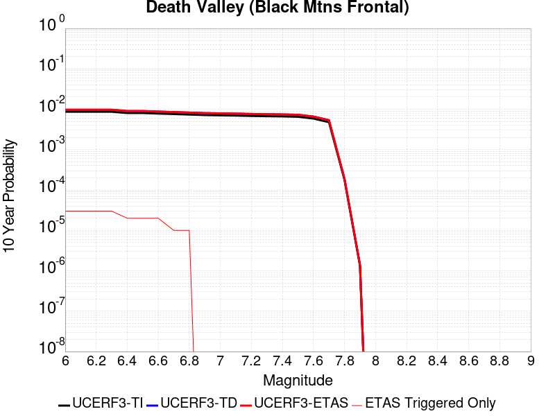 |

| Magnitude | 1 wk TI Prob | 1 wk TD Prob | 1 wk ETAS Prob | 1 wk ETAS/TD Gain | 1 wk ETAS Triggered Only | 1 mo TI Prob | 1 mo TD Prob | 1 mo ETAS Prob | 1 mo ETAS/TD Gain | 1 mo ETAS Triggered Only | 1 yr TI Prob | 1 yr TD Prob | 1 yr ETAS Prob | 1 yr ETAS/TD Gain | 1 yr ETAS Triggered Only | 10 yr TI Prob | 10 yr TD Prob | 10 yr ETAS Prob | 10 yr ETAS/TD Gain | 10 yr ETAS Triggered Only |
|-----|-----|-----|-----|-----|-----|-----|-----|-----|-----|-----|-----|-----|-----|-----|-----|-----|-----|-----|-----|-----|
| 6.0 | 1.6707214E-5 | 1.8671435E-5 | 1.8671435E-5 | 1.0 | 0.0 | 7.160038E-5 | 8.001803E-5 | 1.1527179E-4 | 1.4405727 | 3.525658E-5 | 8.71386E-4 | 9.737917E-4 | 0.001026625 | 1.0542554 | 5.288487E-5 | 0.00867977 | 0.0096961 | 0.009748472 | 1.0054014 | 5.288487E-5 |
| 6.1 | 1.6707214E-5 | 1.8671435E-5 | 1.8671435E-5 | 1.0 | 0.0 | 7.160038E-5 | 8.001803E-5 | 1.1527179E-4 | 1.4405727 | 3.525658E-5 | 8.71386E-4 | 9.737917E-4 | 0.001026625 | 1.0542554 | 5.288487E-5 | 0.00867977 | 0.0096961 | 0.009748472 | 1.0054014 | 5.288487E-5 |
| 6.2 | 1.6707214E-5 | 1.8671435E-5 | 1.8671435E-5 | 1.0 | 0.0 | 7.160038E-5 | 8.001803E-5 | 1.1527179E-4 | 1.4405727 | 3.525658E-5 | 8.71386E-4 | 9.737917E-4 | 0.001026625 | 1.0542554 | 5.288487E-5 | 0.00867977 | 0.0096961 | 0.009748472 | 1.0054014 | 5.288487E-5 |
| 6.3 | 1.6707214E-5 | 1.8671435E-5 | 1.8671435E-5 | 1.0 | 0.0 | 7.160038E-5 | 8.001803E-5 | 1.1527179E-4 | 1.4405727 | 3.525658E-5 | 8.71386E-4 | 9.737917E-4 | 0.001026625 | 1.0542554 | 5.288487E-5 | 0.00867977 | 0.0096961 | 0.009748472 | 1.0054014 | 5.288487E-5 |
| 6.4 | 1.5515609E-5 | 1.7339296E-5 | 1.7339296E-5 | 1.0 | 0.0 | 6.649377E-5 | 7.430919E-5 | 9.193617E-5 | 1.2372113 | 1.762829E-5 | 8.0926094E-4 | 9.04345E-4 | 9.3956967E-4 | 1.0389506 | 3.525658E-5 | 0.008063202 | 0.009007333 | 0.009042272 | 1.003879 | 3.525658E-5 |
| 6.5 | 1.5515609E-5 | 1.7339296E-5 | 1.7339296E-5 | 1.0 | 0.0 | 6.649377E-5 | 7.430919E-5 | 9.193617E-5 | 1.2372113 | 1.762829E-5 | 8.0926094E-4 | 9.04345E-4 | 9.3956967E-4 | 1.0389506 | 3.525658E-5 | 0.008063202 | 0.009007333 | 0.009042272 | 1.003879 | 3.525658E-5 |
| 6.6 | 1.5041828E-5 | 1.6810196E-5 | 1.6810196E-5 | 1.0 | 0.0 | 6.4463384E-5 | 7.204174E-5 | 8.9668756E-5 | 1.2446779 | 1.762829E-5 | 7.8455906E-4 | 8.767611E-4 | 9.119868E-4 | 1.040177 | 3.525658E-5 | 0.00781795 | 0.008733676 | 0.008768625 | 1.0040016 | 3.525658E-5 |
| 6.7 | 1.4634985E-5 | 1.635704E-5 | 1.635704E-5 | 1.0 | 0.0 | 6.271985E-5 | 7.009975E-5 | 8.77268E-5 | 1.2514567 | 1.762829E-5 | 7.6334673E-4 | 8.53136E-4 | 8.707493E-4 | 1.0206453 | 1.762829E-5 | 0.007607299 | 0.008499245 | 0.008516724 | 1.0020565 | 1.762829E-5 |
| 6.8 | 1.4209158E-5 | 1.5883043E-5 | 1.5883043E-5 | 1.0 | 0.0 | 6.089497E-5 | 6.806844E-5 | 8.569553E-5 | 1.2589613 | 1.762829E-5 | 7.4114406E-4 | 8.2842377E-4 | 8.4603747E-4 | 1.0212617 | 1.762829E-5 | 0.007386771 | 0.008253971 | 0.008271454 | 1.0021181 | 1.762829E-5 |
| 6.9 | 1.3780098E-5 | 1.540556E-5 | 1.540556E-5 | 1.0 | 0.0 | 5.9056227E-5 | 6.6022185E-5 | 6.6022185E-5 | 1.0 | 0.0 | 7.1877235E-4 | 8.0352917E-4 | 8.0352917E-4 | 1.0 | 0.0 | 0.0071645193 | 0.0080068335 | 0.0080068335 | 1.0 | 0.0 |
| 7.0 | 1.3585064E-5 | 1.5189109E-5 | 1.5189109E-5 | 1.0 | 0.0 | 5.8220405E-5 | 6.509459E-5 | 6.509459E-5 | 1.0 | 0.0 | 7.086029E-4 | 7.922439E-4 | 7.922439E-4 | 1.0 | 0.0 | 0.007063476 | 0.007894788 | 0.007894788 | 1.0 | 0.0 |
| 7.1 | 1.3398601E-5 | 1.4982282E-5 | 1.4982282E-5 | 1.0 | 0.0 | 5.742131E-5 | 6.420823E-5 | 6.420823E-5 | 1.0 | 0.0 | 6.9888023E-4 | 7.8146026E-4 | 7.8146026E-4 | 1.0 | 0.0 | 0.0069668638 | 0.007787712 | 0.007787712 | 1.0 | 0.0 |
| 7.2 | 1.3126312E-5 | 1.4680485E-5 | 1.4680485E-5 | 1.0 | 0.0 | 5.6254412E-5 | 6.291488E-5 | 6.291488E-5 | 1.0 | 0.0 | 6.846822E-4 | 7.6572486E-4 | 7.6572486E-4 | 1.0 | 0.0 | 0.006825765 | 0.007631449 | 0.007631449 | 1.0 | 0.0 |
| 7.3 | 1.2922429E-5 | 1.4454699E-5 | 1.4454699E-5 | 1.0 | 0.0 | 5.5380664E-5 | 6.194727E-5 | 6.194727E-5 | 1.0 | 0.0 | 6.74051E-4 | 7.539525E-4 | 7.539525E-4 | 1.0 | 0.0 | 0.006720101 | 0.007514527 | 0.007514527 | 1.0 | 0.0 |
| 7.4 | 1.2768878E-5 | 1.4284673E-5 | 1.4284673E-5 | 1.0 | 0.0 | 5.4722615E-5 | 6.121862E-5 | 6.121862E-5 | 1.0 | 0.0 | 6.660441E-4 | 7.450873E-4 | 7.450873E-4 | 1.0 | 0.0 | 0.0066405144 | 0.007426471 | 0.007426471 | 1.0 | 0.0 |
| 7.5 | 1.2521929E-5 | 1.4012902E-5 | 1.4012902E-5 | 1.0 | 0.0 | 5.366431E-5 | 6.0053942E-5 | 6.0053942E-5 | 1.0 | 0.0 | 6.531671E-4 | 7.309169E-4 | 7.309169E-4 | 1.0 | 0.0 | 0.006512506 | 0.0072857053 | 0.0072857053 | 1.0 | 0.0 |
| 7.6 | 1.1301089E-5 | 1.2648951E-5 | 1.2648951E-5 | 1.0 | 0.0 | 4.8432343E-5 | 5.4208693E-5 | 5.4208693E-5 | 1.0 | 0.0 | 5.895042E-4 | 6.597963E-4 | 6.597963E-4 | 1.0 | 0.0 | 0.0058794282 | 0.006578926 | 0.006578926 | 1.0 | 0.0 |
| 7.7 | 9.189108E-6 | 1.02840095E-5 | 1.02840095E-5 | 1.0 | 0.0 | 3.93813E-5 | 4.407361E-5 | 4.407361E-5 | 1.0 | 0.0 | 4.7936183E-4 | 5.3646916E-4 | 5.3646916E-4 | 1.0 | 0.0 | 0.004783291 | 0.005352252 | 0.005352252 | 1.0 | 0.0 |
| 7.8 | 3.4586725E-7 | 3.648368E-7 | 3.648368E-7 | 1.0 | 0.0 | 1.4822873E-6 | 1.5635853E-6 | 1.5635853E-6 | 1.0 | 0.0 | 1.80467E-5 | 1.903649E-5 | 1.903649E-5 | 1.0 | 0.0 | 1.8045233E-4 | 1.9034903E-4 | 1.9034903E-4 | 1.0 | 0.0 |
| 7.9 | 2.5591178E-9 | 2.6697329E-9 | 2.6697329E-9 | 1.0 | 0.0 | 1.0967647E-8 | 1.14417125E-8 | 1.14417125E-8 | 1.0 | 0.0 | 1.335311E-7 | 1.3930286E-7 | 1.3930286E-7 | 1.0 | 0.0 | 1.3353102E-6 | 1.3930285E-6 | 1.3930285E-6 | 1.0 | 0.0 |

## San Andreas (San Gorgonio Pass-Garnet HIll)
*[(top)](#table-of-contents)*

| 1 Week | 1 Month | 1 Year | 10 Year |
|-----|-----|-----|-----|
|  |  | 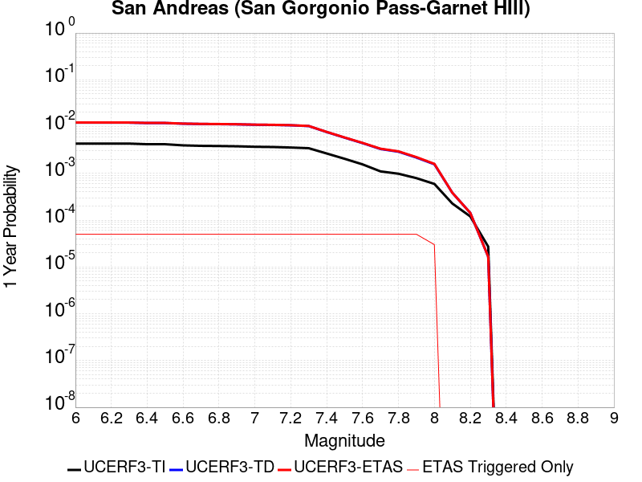 |  |

| Magnitude | 1 wk TI Prob | 1 wk TD Prob | 1 wk ETAS Prob | 1 wk ETAS/TD Gain | 1 wk ETAS Triggered Only | 1 mo TI Prob | 1 mo TD Prob | 1 mo ETAS Prob | 1 mo ETAS/TD Gain | 1 mo ETAS Triggered Only | 1 yr TI Prob | 1 yr TD Prob | 1 yr ETAS Prob | 1 yr ETAS/TD Gain | 1 yr ETAS Triggered Only | 10 yr TI Prob | 10 yr TD Prob | 10 yr ETAS Prob | 10 yr ETAS/TD Gain | 10 yr ETAS Triggered Only |
|-----|-----|-----|-----|-----|-----|-----|-----|-----|-----|-----|-----|-----|-----|-----|-----|-----|-----|-----|-----|-----|
| 6.0 | 8.31567E-5 | 2.3398406E-4 | 2.3398406E-4 | 1.0 | 0.0 | 3.5633717E-4 | 0.001002406 | 0.001002406 | 1.0 | 0.0 | 0.004329778 | 0.012136027 | 0.01218827 | 1.0043048 | 5.288487E-5 | 0.042463828 | 0.11264349 | 0.11269042 | 1.0004166 | 5.288487E-5 |
| 6.1 | 8.31567E-5 | 2.3398406E-4 | 2.3398406E-4 | 1.0 | 0.0 | 3.5633717E-4 | 0.001002406 | 0.001002406 | 1.0 | 0.0 | 0.004329778 | 0.012136027 | 0.01218827 | 1.0043048 | 5.288487E-5 | 0.042463828 | 0.11264349 | 0.11269042 | 1.0004166 | 5.288487E-5 |
| 6.2 | 8.31567E-5 | 2.3398406E-4 | 2.3398406E-4 | 1.0 | 0.0 | 3.5633717E-4 | 0.001002406 | 0.001002406 | 1.0 | 0.0 | 0.004329778 | 0.012136027 | 0.01218827 | 1.0043048 | 5.288487E-5 | 0.042463828 | 0.11264349 | 0.11269042 | 1.0004166 | 5.288487E-5 |
| 6.3 | 8.31567E-5 | 2.3398406E-4 | 2.3398406E-4 | 1.0 | 0.0 | 3.5633717E-4 | 0.001002406 | 0.001002406 | 1.0 | 0.0 | 0.004329778 | 0.012136027 | 0.01218827 | 1.0043048 | 5.288487E-5 | 0.042463828 | 0.11264349 | 0.11269042 | 1.0004166 | 5.288487E-5 |
| 6.4 | 8.059055E-5 | 2.2956554E-4 | 2.2956554E-4 | 1.0 | 0.0 | 3.4534236E-4 | 9.834839E-4 | 9.834839E-4 | 1.0 | 0.0 | 0.0041964394 | 0.011908189 | 0.011960445 | 1.0043882 | 5.288487E-5 | 0.041180745 | 0.11062444 | 0.110671476 | 1.0004252 | 5.288487E-5 |
| 6.5 | 8.059055E-5 | 2.2956554E-4 | 2.2956554E-4 | 1.0 | 0.0 | 3.4534236E-4 | 9.834839E-4 | 9.834839E-4 | 1.0 | 0.0 | 0.0041964394 | 0.011908189 | 0.011960445 | 1.0043882 | 5.288487E-5 | 0.041180745 | 0.11062444 | 0.110671476 | 1.0004252 | 5.288487E-5 |
| 6.6 | 7.619237E-5 | 2.2200657E-4 | 2.2200657E-4 | 1.0 | 0.0 | 3.2649786E-4 | 9.511121E-4 | 9.511121E-4 | 1.0 | 0.0 | 0.0039678677 | 0.011518859 | 0.011571135 | 1.0045383 | 5.288487E-5 | 0.03897764 | 0.107160784 | 0.107208006 | 1.0004406 | 5.288487E-5 |
| 6.7 | 7.440636E-5 | 2.1876446E-4 | 2.1876446E-4 | 1.0 | 0.0 | 3.188454E-4 | 9.372274E-4 | 9.372274E-4 | 1.0 | 0.0 | 0.0038750346 | 0.01135158 | 0.011403864 | 1.0046059 | 5.288487E-5 | 0.038081564 | 0.105669186 | 0.10571648 | 1.0004476 | 5.288487E-5 |
| 6.8 | 7.3735864E-5 | 2.1723597E-4 | 2.1723597E-4 | 1.0 | 0.0 | 3.1597257E-4 | 9.306814E-4 | 9.306814E-4 | 1.0 | 0.0 | 0.0038401815 | 0.011272711 | 0.011324999 | 1.0046386 | 5.288487E-5 | 0.03774495 | 0.1049707 | 0.105018035 | 1.000451 | 5.288487E-5 |
| 6.9 | 7.27575E-5 | 2.1492546E-4 | 2.1492546E-4 | 1.0 | 0.0 | 3.117806E-4 | 9.207862E-4 | 9.207862E-4 | 1.0 | 0.0 | 0.003789323 | 0.011153476 | 0.011205771 | 1.0046886 | 5.288487E-5 | 0.037253562 | 0.10391858 | 0.103965975 | 1.000456 | 5.288487E-5 |
| 7.0 | 7.102591E-5 | 2.1076521E-4 | 2.1076521E-4 | 1.0 | 0.0 | 3.0436125E-4 | 9.02969E-4 | 9.02969E-4 | 1.0 | 0.0 | 0.003699303 | 0.010938748 | 0.010991054 | 1.0047817 | 5.288487E-5 | 0.03638325 | 0.102020636 | 0.102068126 | 1.0004655 | 5.288487E-5 |
| 7.1 | 7.028513E-5 | 2.0912137E-4 | 2.0912137E-4 | 1.0 | 0.0 | 3.0118722E-4 | 8.959288E-4 | 8.959288E-4 | 1.0 | 0.0 | 0.0036607897 | 0.01085389 | 0.010906202 | 1.0048195 | 5.288487E-5 | 0.036010686 | 0.10126359 | 0.101311125 | 1.0004693 | 5.288487E-5 |
| 7.2 | 6.8498244E-5 | 2.0519937E-4 | 2.0519937E-4 | 1.0 | 0.0 | 2.9353087E-4 | 8.7913166E-4 | 8.7913166E-4 | 1.0 | 0.0 | 0.003567883 | 0.0106514 | 0.010703721 | 1.0049121 | 5.288487E-5 | 0.035111405 | 0.09945543 | 0.099503055 | 1.0004789 | 5.288487E-5 |
| 7.3 | 6.622592E-5 | 1.9747039E-4 | 1.9747039E-4 | 1.0 | 0.0 | 2.8379448E-4 | 8.460293E-4 | 8.460293E-4 | 1.0 | 0.0 | 0.0034497243 | 0.010252241 | 0.010304583 | 1.0051055 | 5.288487E-5 | 0.033966612 | 0.09595134 | 0.09599915 | 1.0004983 | 5.288487E-5 |
| 7.4 | 5.1050705E-5 | 1.4701985E-4 | 1.4701985E-4 | 1.0 | 0.0 | 2.1877038E-4 | 6.299338E-4 | 6.299338E-4 | 1.0 | 0.0 | 0.002660276 | 0.0076426673 | 0.007695148 | 1.0068668 | 5.288487E-5 | 0.02628654 | 0.07291896 | 0.07296799 | 1.0006723 | 5.288487E-5 |
| 7.5 | 3.9302922E-5 | 1.1141107E-4 | 1.1141107E-4 | 1.0 | 0.0 | 1.6843023E-4 | 4.7738897E-4 | 4.7738897E-4 | 1.0 | 0.0 | 0.0020487092 | 0.005796791 | 0.0058493693 | 1.0090703 | 5.288487E-5 | 0.020299247 | 0.056059215 | 0.056109134 | 1.0008905 | 5.288487E-5 |
| 7.6 | 2.9851626E-5 | 8.504997E-5 | 8.504997E-5 | 1.0 | 0.0 | 1.2792926E-4 | 3.6444908E-4 | 3.6444908E-4 | 1.0 | 0.0 | 0.0015564259 | 0.0044281655 | 0.004480816 | 1.0118899 | 5.288487E-5 | 0.0154556995 | 0.043238558 | 0.04328916 | 1.0011702 | 5.288487E-5 |
| 7.7 | 2.1135214E-5 | 6.361802E-5 | 6.361802E-5 | 1.0 | 0.0 | 9.0576345E-5 | 2.726202E-4 | 2.726202E-4 | 1.0 | 0.0 | 0.0011022091 | 0.0033141046 | 0.0033668142 | 1.0159047 | 5.288487E-5 | 0.010967582 | 0.032622673 | 0.032673832 | 1.0015682 | 5.288487E-5 |
| 7.8 | 1.883379E-5 | 5.572194E-5 | 5.572194E-5 | 1.0 | 0.0 | 8.0713755E-5 | 2.3878647E-4 | 2.3878647E-4 | 1.0 | 0.0 | 9.822468E-4 | 0.0029033525 | 0.002956084 | 1.0181623 | 5.288487E-5 | 0.0097791655 | 0.028732158 | 0.028783524 | 1.0017878 | 5.288487E-5 |
| 7.9 | 1.5156185E-5 | 4.1725576E-5 | 4.1725576E-5 | 1.0 | 0.0 | 6.495346E-5 | 1.7881165E-4 | 1.7881165E-4 | 1.0 | 0.0 | 7.9052144E-4 | 0.0021748596 | 0.0022276295 | 1.0242636 | 5.288487E-5 | 0.007877152 | 0.021790246 | 0.021841979 | 1.002374 | 5.288487E-5 |
| 8.0 | 1.1405907E-5 | 3.0024876E-5 | 3.0024876E-5 | 1.0 | 0.0 | 4.8881542E-5 | 1.286717E-4 | 1.286717E-4 | 1.0 | 0.0 | 5.9497025E-4 | 0.0015654531 | 0.0015830538 | 1.0112432 | 1.762829E-5 | 0.005933798 | 0.015796356 | 0.015813706 | 1.0010984 | 1.762829E-5 |
| 8.1 | 4.3511436E-6 | 7.3873994E-6 | 7.3873994E-6 | 1.0 | 0.0 | 1.8647626E-5 | 3.16599E-5 | 3.16599E-5 | 1.0 | 0.0 | 2.2701119E-4 | 3.8539123E-4 | 3.8539123E-4 | 1.0 | 0.0 | 0.0022677942 | 0.0041254 | 0.0041254 | 1.0 | 0.0 |
| 8.2 | 2.3042528E-6 | 2.74142E-6 | 2.74142E-6 | 1.0 | 0.0 | 9.875332E-6 | 1.174889E-5 | 1.174889E-5 | 1.0 | 0.0 | 1.2022553E-4 | 1.430334E-4 | 1.430334E-4 | 1.0 | 0.0 | 0.0012016051 | 0.0016024038 | 0.0016024038 | 1.0 | 0.0 |
| 8.3 | 5.202968E-7 | 3.171921E-7 | 3.171921E-7 | 1.0 | 0.0 | 2.2298414E-6 | 1.3593941E-6 | 1.3593941E-6 | 1.0 | 0.0 | 2.714798E-5 | 1.655051E-5 | 1.655051E-5 | 1.0 | 0.0 | 2.7144665E-4 | 1.9631305E-4 | 1.9631305E-4 | 1.0 | 0.0 |

## Garlic Springs
*[(top)](#table-of-contents)*

| 1 Week | 1 Month | 1 Year | 10 Year |
|-----|-----|-----|-----|
|  |  |  |  |

| Magnitude | 1 wk TI Prob | 1 wk TD Prob | 1 wk ETAS Prob | 1 wk ETAS/TD Gain | 1 wk ETAS Triggered Only | 1 mo TI Prob | 1 mo TD Prob | 1 mo ETAS Prob | 1 mo ETAS/TD Gain | 1 mo ETAS Triggered Only | 1 yr TI Prob | 1 yr TD Prob | 1 yr ETAS Prob | 1 yr ETAS/TD Gain | 1 yr ETAS Triggered Only | 10 yr TI Prob | 10 yr TD Prob | 10 yr ETAS Prob | 10 yr ETAS/TD Gain | 10 yr ETAS Triggered Only |
|-----|-----|-----|-----|-----|-----|-----|-----|-----|-----|-----|-----|-----|-----|-----|-----|-----|-----|-----|-----|-----|
| 6.0 | 1.6760017E-5 | 1.8778032E-5 | 1.8778032E-5 | 1.0 | 0.0 | 7.182667E-5 | 8.047546E-5 | 8.047546E-5 | 1.0 | 0.0 | 8.7413884E-4 | 9.794658E-4 | 9.970767E-4 | 1.0179802 | 1.762829E-5 | 0.008707083 | 0.009763034 | 0.009815403 | 1.005364 | 5.288487E-5 |
| 6.1 | 9.852767E-6 | 1.097425E-5 | 1.097425E-5 | 1.0 | 0.0 | 4.222546E-5 | 4.703205E-5 | 4.703205E-5 | 1.0 | 0.0 | 5.139737E-4 | 5.7253573E-4 | 5.7253573E-4 | 1.0 | 0.0 | 0.005127866 | 0.005717566 | 0.0057350933 | 1.0030656 | 1.762829E-5 |
| 6.2 | 9.852767E-6 | 1.097425E-5 | 1.097425E-5 | 1.0 | 0.0 | 4.222546E-5 | 4.703205E-5 | 4.703205E-5 | 1.0 | 0.0 | 5.139737E-4 | 5.7253573E-4 | 5.7253573E-4 | 1.0 | 0.0 | 0.005127866 | 0.005717566 | 0.0057350933 | 1.0030656 | 1.762829E-5 |
| 6.3 | 4.3167724E-6 | 4.7782996E-6 | 4.7782996E-6 | 1.0 | 0.0 | 1.8500323E-5 | 2.0478396E-5 | 2.0478396E-5 | 1.0 | 0.0 | 2.2521814E-4 | 2.4931898E-4 | 2.4931898E-4 | 1.0 | 0.0 | 0.0022499003 | 0.002492651 | 0.002492651 | 1.0 | 0.0 |
| 6.4 | 4.3167724E-6 | 4.7782996E-6 | 4.7782996E-6 | 1.0 | 0.0 | 1.8500323E-5 | 2.0478396E-5 | 2.0478396E-5 | 1.0 | 0.0 | 2.2521814E-4 | 2.4931898E-4 | 2.4931898E-4 | 1.0 | 0.0 | 0.0022499003 | 0.002492651 | 0.002492651 | 1.0 | 0.0 |
| 6.5 | 4.3167724E-6 | 4.7782996E-6 | 4.7782996E-6 | 1.0 | 0.0 | 1.8500323E-5 | 2.0478396E-5 | 2.0478396E-5 | 1.0 | 0.0 | 2.2521814E-4 | 2.4931898E-4 | 2.4931898E-4 | 1.0 | 0.0 | 0.0022499003 | 0.002492651 | 0.002492651 | 1.0 | 0.0 |
| 6.6 | 4.301311E-6 | 4.761167E-6 | 4.761167E-6 | 1.0 | 0.0 | 1.8434059E-5 | 2.0404972E-5 | 2.0404972E-5 | 1.0 | 0.0 | 2.2441156E-4 | 2.4842523E-4 | 2.4842523E-4 | 1.0 | 0.0 | 0.0022418506 | 0.002483734 | 0.002483734 | 1.0 | 0.0 |
| 6.7 | 3.8599724E-6 | 4.2713013E-6 | 4.2713013E-6 | 1.0 | 0.0 | 1.6542634E-5 | 1.8305576E-5 | 1.8305576E-5 | 1.0 | 0.0 | 2.0138794E-4 | 2.228704E-4 | 2.228704E-4 | 1.0 | 0.0 | 0.0020120554 | 0.0022287038 | 0.0022287038 | 1.0 | 0.0 |

## Hosgri
*[(top)](#table-of-contents)*

| 1 Week | 1 Month | 1 Year | 10 Year |
|-----|-----|-----|-----|
|  |  |  |  |

| Magnitude | 1 wk TI Prob | 1 wk TD Prob | 1 wk ETAS Prob | 1 wk ETAS/TD Gain | 1 wk ETAS Triggered Only | 1 mo TI Prob | 1 mo TD Prob | 1 mo ETAS Prob | 1 mo ETAS/TD Gain | 1 mo ETAS Triggered Only | 1 yr TI Prob | 1 yr TD Prob | 1 yr ETAS Prob | 1 yr ETAS/TD Gain | 1 yr ETAS Triggered Only | 10 yr TI Prob | 10 yr TD Prob | 10 yr ETAS Prob | 10 yr ETAS/TD Gain | 10 yr ETAS Triggered Only |
|-----|-----|-----|-----|-----|-----|-----|-----|-----|-----|-----|-----|-----|-----|-----|-----|-----|-----|-----|-----|-----|
| 6.0 | 2.883978E-5 | 2.9130051E-5 | 2.9130051E-5 | 1.0 | 0.0 | 1.235932E-4 | 1.2483726E-4 | 1.4246334E-4 | 1.1411926 | 1.762829E-5 | 0.0015037085 | 0.0015188612 | 0.0015540641 | 1.0231773 | 3.525658E-5 | 0.01493574 | 0.015088581 | 0.015123305 | 1.0023013 | 3.525658E-5 |
| 6.1 | 2.883978E-5 | 2.9130051E-5 | 2.9130051E-5 | 1.0 | 0.0 | 1.235932E-4 | 1.2483726E-4 | 1.4246334E-4 | 1.1411926 | 1.762829E-5 | 0.0015037085 | 0.0015188612 | 0.0015540641 | 1.0231773 | 3.525658E-5 | 0.01493574 | 0.015088581 | 0.015123305 | 1.0023013 | 3.525658E-5 |
| 6.2 | 2.883978E-5 | 2.9130051E-5 | 2.9130051E-5 | 1.0 | 0.0 | 1.235932E-4 | 1.2483726E-4 | 1.4246334E-4 | 1.1411926 | 1.762829E-5 | 0.0015037085 | 0.0015188612 | 0.0015540641 | 1.0231773 | 3.525658E-5 | 0.01493574 | 0.015088581 | 0.015123305 | 1.0023013 | 3.525658E-5 |
| 6.3 | 2.2914428E-5 | 2.2643277E-5 | 2.2643277E-5 | 1.0 | 0.0 | 9.8200995E-5 | 9.703903E-5 | 1.14665614E-4 | 1.1816442 | 1.762829E-5 | 0.0011949413 | 0.0011808148 | 0.0011984223 | 1.0149113 | 1.762829E-5 | 0.011885363 | 0.011746808 | 0.011764229 | 1.0014831 | 1.762829E-5 |
| 6.4 | 2.0195741E-5 | 1.9697736E-5 | 1.9697736E-5 | 1.0 | 0.0 | 8.65503E-5 | 8.441615E-5 | 1.02042955E-4 | 1.2088084 | 1.762829E-5 | 0.0010532405 | 0.0010272841 | 0.0010448942 | 1.0171424 | 1.762829E-5 | 0.010482626 | 0.0102264015 | 0.010243849 | 1.0017061 | 1.762829E-5 |
| 6.5 | 1.9924333E-5 | 1.9410149E-5 | 1.9410149E-5 | 1.0 | 0.0 | 8.53872E-5 | 8.318371E-5 | 1.0081053E-4 | 1.2119024 | 1.762829E-5 | 0.0010390934 | 0.001012293 | 0.0010299034 | 1.0173966 | 1.762829E-5 | 0.010342481 | 0.0100778565 | 0.010095308 | 1.0017316 | 1.762829E-5 |
| 6.6 | 1.809694E-5 | 1.7459393E-5 | 1.7459393E-5 | 1.0 | 0.0 | 7.7556004E-5 | 7.482383E-5 | 9.24508E-5 | 1.2355796 | 1.762829E-5 | 9.438353E-4 | 9.106007E-4 | 9.2821295E-4 | 1.0193413 | 1.762829E-5 | 0.009398366 | 0.009069638 | 0.009087107 | 1.0019261 | 1.762829E-5 |
| 6.7 | 1.675989E-5 | 1.6043807E-5 | 1.6043807E-5 | 1.0 | 0.0 | 7.182612E-5 | 6.875736E-5 | 8.638444E-5 | 1.2563664 | 1.762829E-5 | 8.7413215E-4 | 8.3680055E-4 | 8.544141E-4 | 1.0210487 | 1.762829E-5 | 0.008707017 | 0.008337403 | 0.008354885 | 1.0020968 | 1.762829E-5 |
| 6.8 | 1.5401129E-5 | 1.4615074E-5 | 1.4615074E-5 | 1.0 | 0.0 | 6.6003166E-5 | 6.2634535E-5 | 8.026172E-5 | 1.2814292 | 1.762829E-5 | 8.032922E-4 | 7.623095E-4 | 7.7992433E-4 | 1.0231072 | 1.762829E-5 | 0.008003947 | 0.0075978106 | 0.007615305 | 1.0023025 | 1.762829E-5 |
| 6.9 | 1.356559E-5 | 1.2690892E-5 | 1.2690892E-5 | 1.0 | 0.0 | 5.8136946E-5 | 5.4388405E-5 | 7.201573E-5 | 1.3241009 | 1.762829E-5 | 7.0758746E-4 | 6.619781E-4 | 6.795947E-4 | 1.026612 | 1.762829E-5 | 0.007053386 | 0.006600868 | 0.0066183796 | 1.002653 | 1.762829E-5 |
| 7.0 | 1.2030819E-5 | 1.1096832E-5 | 1.1096832E-5 | 1.0 | 0.0 | 5.155963E-5 | 4.7556987E-5 | 6.518444E-5 | 1.3706596 | 1.762829E-5 | 6.275577E-4 | 5.788526E-4 | 5.9647067E-4 | 1.0304363 | 1.762829E-5 | 0.006257884 | 0.0057742097 | 0.0057917363 | 1.0030353 | 1.762829E-5 |
| 7.1 | 1.0972698E-5 | 1.0023018E-5 | 1.0023018E-5 | 1.0 | 0.0 | 4.7025E-5 | 4.2955086E-5 | 4.2955086E-5 | 1.0 | 0.0 | 5.72379E-4 | 5.2285276E-4 | 5.2285276E-4 | 1.0 | 0.0 | 0.0057090693 | 0.0052169785 | 0.0052169785 | 1.0 | 0.0 |
| 7.2 | 9.961926E-6 | 9.035558E-6 | 9.035558E-6 | 1.0 | 0.0 | 4.2693267E-5 | 3.8723243E-5 | 3.8723243E-5 | 1.0 | 0.0 | 5.1966653E-4 | 4.713536E-4 | 4.713536E-4 | 1.0 | 0.0 | 0.00518453 | 0.004704285 | 0.004704285 | 1.0 | 0.0 |
| 7.3 | 8.700929E-6 | 7.82888E-6 | 7.82888E-6 | 1.0 | 0.0 | 3.7289166E-5 | 3.3551914E-5 | 3.3551914E-5 | 1.0 | 0.0 | 4.53901E-4 | 4.0841804E-4 | 4.0841804E-4 | 1.0 | 0.0 | 0.00452975 | 0.0040774145 | 0.0040774145 | 1.0 | 0.0 |
| 7.4 | 7.866285E-6 | 6.9995003E-6 | 6.9995003E-6 | 1.0 | 0.0 | 3.3712215E-5 | 2.9997515E-5 | 2.9997515E-5 | 1.0 | 0.0 | 4.103689E-4 | 3.6515854E-4 | 3.6515854E-4 | 1.0 | 0.0 | 0.004096119 | 0.0036463232 | 0.0036463232 | 1.0 | 0.0 |
| 7.5 | 6.8381305E-6 | 5.9604317E-6 | 5.9604317E-6 | 1.0 | 0.0 | 2.9305946E-5 | 2.5544457E-5 | 2.5544457E-5 | 1.0 | 0.0 | 3.5674145E-4 | 3.109594E-4 | 3.109594E-4 | 1.0 | 0.0 | 0.0035616932 | 0.0031059785 | 0.0031059785 | 1.0 | 0.0 |
| 7.6 | 5.503376E-6 | 4.5959455E-6 | 4.5959455E-6 | 1.0 | 0.0 | 2.3585684E-5 | 1.969676E-5 | 1.969676E-5 | 1.0 | 0.0 | 2.8711787E-4 | 2.3978167E-4 | 2.3978167E-4 | 1.0 | 0.0 | 0.002867472 | 0.002395963 | 0.002395963 | 1.0 | 0.0 |
| 7.7 | 3.6144982E-6 | 2.652859E-6 | 2.652859E-6 | 1.0 | 0.0 | 1.5490614E-5 | 1.1369346E-5 | 1.1369346E-5 | 1.0 | 0.0 | 1.8858191E-4 | 1.38413E-4 | 1.38413E-4 | 1.0 | 0.0 | 0.0018842196 | 0.0013839996 | 0.0013839996 | 1.0 | 0.0 |
| 7.8 | 1.9853494E-6 | 1.1366585E-6 | 1.1366585E-6 | 1.0 | 0.0 | 8.508612E-6 | 4.8713846E-6 | 4.8713846E-6 | 1.0 | 0.0 | 1.0358743E-4 | 5.930749E-5 | 5.930749E-5 | 1.0 | 0.0 | 0.0010353916 | 5.9364707E-4 | 5.9364707E-4 | 1.0 | 0.0 |
| 7.9 | 1.1818757E-6 | 5.2994693E-7 | 5.2994693E-7 | 1.0 | 0.0 | 5.0651715E-6 | 2.271199E-6 | 2.271199E-6 | 1.0 | 0.0 | 6.1666724E-5 | 2.7651497E-5 | 2.7651497E-5 | 1.0 | 0.0 | 6.1649614E-4 | 2.771693E-4 | 2.771693E-4 | 1.0 | 0.0 |
| 8.0 | 6.962958E-7 | 2.716916E-7 | 2.716916E-7 | 1.0 | 0.0 | 2.9841215E-6 | 1.164392E-6 | 1.164392E-6 | 1.0 | 0.0 | 3.6331072E-5 | 1.417638E-5 | 1.417638E-5 | 1.0 | 0.0 | 3.6325134E-4 | 1.423256E-4 | 1.423256E-4 | 1.0 | 0.0 |
| 8.1 | 1.5033264E-7 | 6.5338824E-8 | 6.5338824E-8 | 1.0 | 0.0 | 6.442826E-7 | 2.800235E-7 | 2.800235E-7 | 1.0 | 0.0 | 7.844113E-6 | 3.409281E-6 | 3.409281E-6 | 1.0 | 0.0 | 7.843835E-5 | 3.410959E-5 | 3.410959E-5 | 1.0 | 0.0 |

## San Andreas (Santa Cruz Mts) 2011 CFM
*[(top)](#table-of-contents)*

| 1 Week | 1 Month | 1 Year | 10 Year |
|-----|-----|-----|-----|
|  | 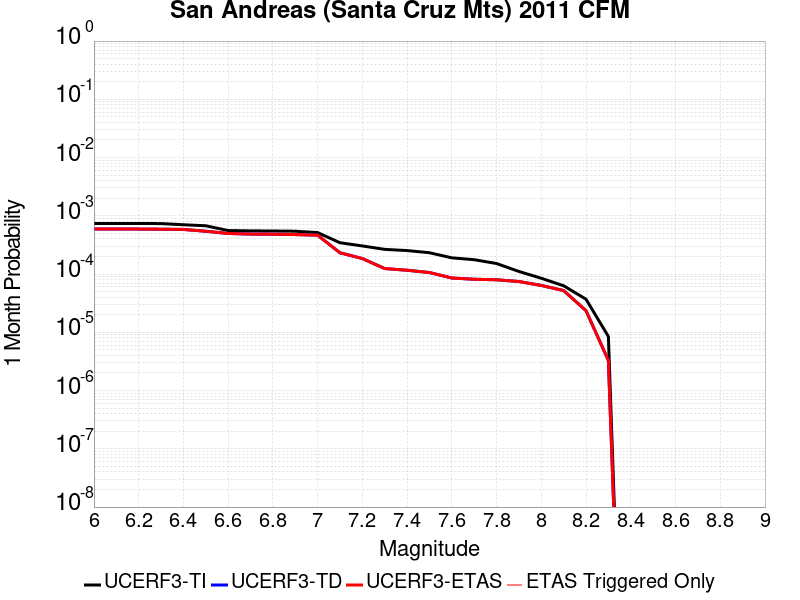 |  |  |

| Magnitude | 1 wk TI Prob | 1 wk TD Prob | 1 wk ETAS Prob | 1 wk ETAS/TD Gain | 1 wk ETAS Triggered Only | 1 mo TI Prob | 1 mo TD Prob | 1 mo ETAS Prob | 1 mo ETAS/TD Gain | 1 mo ETAS Triggered Only | 1 yr TI Prob | 1 yr TD Prob | 1 yr ETAS Prob | 1 yr ETAS/TD Gain | 1 yr ETAS Triggered Only | 10 yr TI Prob | 10 yr TD Prob | 10 yr ETAS Prob | 10 yr ETAS/TD Gain | 10 yr ETAS Triggered Only |
|-----|-----|-----|-----|-----|-----|-----|-----|-----|-----|-----|-----|-----|-----|-----|-----|-----|-----|-----|-----|-----|
| 6.0 | 1.7221631E-4 | 1.3823692E-4 | 1.3823692E-4 | 1.0 | 0.0 | 7.378611E-4 | 5.923115E-4 | 5.923115E-4 | 1.0 | 0.0 | 0.008946515 | 0.0071879383 | 0.00720544 | 1.0024348 | 1.762829E-5 | 0.08594794 | 0.070697196 | 0.070729956 | 1.0004635 | 3.525658E-5 |
| 6.1 | 1.7221631E-4 | 1.3823692E-4 | 1.3823692E-4 | 1.0 | 0.0 | 7.378611E-4 | 5.923115E-4 | 5.923115E-4 | 1.0 | 0.0 | 0.008946515 | 0.0071879383 | 0.00720544 | 1.0024348 | 1.762829E-5 | 0.08594794 | 0.070697196 | 0.070729956 | 1.0004635 | 3.525658E-5 |
| 6.2 | 1.7221631E-4 | 1.3823692E-4 | 1.3823692E-4 | 1.0 | 0.0 | 7.378611E-4 | 5.923115E-4 | 5.923115E-4 | 1.0 | 0.0 | 0.008946515 | 0.0071879383 | 0.00720544 | 1.0024348 | 1.762829E-5 | 0.08594794 | 0.070697196 | 0.070729956 | 1.0004635 | 3.525658E-5 |
| 6.3 | 1.716926E-4 | 1.3743078E-4 | 1.3743078E-4 | 1.0 | 0.0 | 7.3561794E-4 | 5.888581E-4 | 5.888581E-4 | 1.0 | 0.0 | 0.008919428 | 0.0071461694 | 0.007163672 | 1.0024492 | 1.762829E-5 | 0.08569809 | 0.0703092 | 0.07034198 | 1.0004662 | 3.525658E-5 |
| 6.4 | 1.6392978E-4 | 1.3618424E-4 | 1.3618424E-4 | 1.0 | 0.0 | 7.02367E-4 | 5.8351824E-4 | 5.8351824E-4 | 1.0 | 0.0 | 0.008517839 | 0.0070815794 | 0.0070990827 | 1.0024717 | 1.762829E-5 | 0.08198654 | 0.06954003 | 0.069572836 | 1.0004717 | 3.525658E-5 |
| 6.5 | 1.5742714E-4 | 1.26776E-4 | 1.26776E-4 | 1.0 | 0.0 | 6.745133E-4 | 5.4321426E-4 | 5.4321426E-4 | 1.0 | 0.0 | 0.00818132 | 0.006593904 | 0.006611416 | 1.0026557 | 1.762829E-5 | 0.078865945 | 0.0649993 | 0.065032266 | 1.0005071 | 3.525658E-5 |
| 6.6 | 1.3038084E-4 | 1.161551E-4 | 1.161551E-4 | 1.0 | 0.0 | 5.5865536E-4 | 4.9771386E-4 | 4.9771386E-4 | 1.0 | 0.0 | 0.006780438 | 0.0060430723 | 0.006060594 | 1.0028995 | 1.762829E-5 | 0.0657725 | 0.059452567 | 0.05948573 | 1.0005578 | 3.525658E-5 |
| 6.7 | 1.2867592E-4 | 1.13418515E-4 | 1.13418515E-4 | 1.0 | 0.0 | 5.5135164E-4 | 4.8599008E-4 | 4.8599008E-4 | 1.0 | 0.0 | 0.0066920654 | 0.005901116 | 0.00591864 | 1.0029696 | 1.762829E-5 | 0.06494093 | 0.05816314 | 0.058196347 | 1.0005709 | 3.525658E-5 |
| 6.8 | 1.2801298E-4 | 1.1279377E-4 | 1.1279377E-4 | 1.0 | 0.0 | 5.485117E-4 | 4.833136E-4 | 4.833136E-4 | 1.0 | 0.0 | 0.0066577005 | 0.0058687064 | 0.0058862315 | 1.0029862 | 1.762829E-5 | 0.06461738 | 0.05787688 | 0.057910096 | 1.0005739 | 3.525658E-5 |
| 6.9 | 1.269149E-4 | 1.11214715E-4 | 1.11214715E-4 | 1.0 | 0.0 | 5.4380763E-4 | 4.765487E-4 | 4.765487E-4 | 1.0 | 0.0 | 0.006600777 | 0.005786784 | 0.00580431 | 1.0030286 | 1.762829E-5 | 0.06408122 | 0.057148356 | 0.0571816 | 1.0005816 | 3.525658E-5 |
| 7.0 | 1.2030331E-4 | 1.0851204E-4 | 1.0851204E-4 | 1.0 | 0.0 | 5.154837E-4 | 4.6496998E-4 | 4.6496998E-4 | 1.0 | 0.0 | 0.006257969 | 0.005646552 | 0.005664081 | 1.0031043 | 1.762829E-5 | 0.06084648 | 0.055819258 | 0.055852547 | 1.0005964 | 3.525658E-5 |
| 7.1 | 8.049617E-5 | 5.4114953E-5 | 5.4114953E-5 | 1.0 | 0.0 | 3.4493793E-4 | 2.319008E-4 | 2.319008E-4 | 1.0 | 0.0 | 0.0041915346 | 0.0028197719 | 0.0028373506 | 1.006234 | 1.762829E-5 | 0.041133516 | 0.02971132 | 0.029745528 | 1.0011513 | 3.525658E-5 |
| 7.2 | 7.093979E-5 | 4.310381E-5 | 4.310381E-5 | 1.0 | 0.0 | 3.0399222E-4 | 1.8471766E-4 | 1.8471766E-4 | 1.0 | 0.0 | 0.0036948253 | 0.0022466409 | 0.0022642296 | 1.0078288 | 1.762829E-5 | 0.03633994 | 0.024024088 | 0.024058498 | 1.0014323 | 3.525658E-5 |
| 7.3 | 6.193693E-5 | 2.9018376E-5 | 2.9018376E-5 | 1.0 | 0.0 | 2.6541698E-4 | 1.2435856E-4 | 1.2435856E-4 | 1.0 | 0.0 | 0.0032266637 | 0.0015130156 | 0.0015306172 | 1.0116335 | 1.762829E-5 | 0.031802133 | 0.016564084 | 0.01658142 | 1.0010467 | 1.762829E-5 |
| 7.4 | 5.906492E-5 | 2.7136244E-5 | 2.7136244E-5 | 1.0 | 0.0 | 2.5311083E-4 | 1.16293006E-4 | 1.16293006E-4 | 1.0 | 0.0 | 0.0030772698 | 0.0014149492 | 0.0014325526 | 1.0124409 | 1.762829E-5 | 0.030350044 | 0.015530545 | 0.0155478995 | 1.0011175 | 1.762829E-5 |
| 7.5 | 5.424296E-5 | 2.4776109E-5 | 2.4776109E-5 | 1.0 | 0.0 | 2.324491E-4 | 1.0617901E-4 | 1.0617901E-4 | 1.0 | 0.0 | 0.002826395 | 0.0012919641 | 0.0013095696 | 1.0136269 | 1.762829E-5 | 0.027907165 | 0.014215293 | 0.014232671 | 1.0012225 | 1.762829E-5 |
| 7.6 | 4.43084E-5 | 1.9971396E-5 | 1.9971396E-5 | 1.0 | 0.0 | 1.8987931E-4 | 8.558889E-5 | 8.558889E-5 | 1.0 | 0.0 | 0.0023093296 | 0.0010415468 | 0.0010591567 | 1.0169075 | 1.762829E-5 | 0.022854783 | 0.011448878 | 0.011466305 | 1.0015221 | 1.762829E-5 |
| 7.7 | 4.118098E-5 | 1.8999577E-5 | 1.8999577E-5 | 1.0 | 0.0 | 1.7647797E-4 | 8.1424216E-5 | 8.1424216E-5 | 1.0 | 0.0 | 0.002146502 | 9.908893E-4 | 0.0010085 | 1.0177728 | 1.762829E-5 | 0.021258866 | 0.010904559 | 0.010921995 | 1.001599 | 1.762829E-5 |
| 7.8 | 3.5408906E-5 | 1.8625631E-5 | 1.8625631E-5 | 1.0 | 0.0 | 1.5174363E-4 | 7.982169E-5 | 7.982169E-5 | 1.0 | 0.0 | 0.0018459131 | 9.7139605E-4 | 9.890072E-4 | 1.0181297 | 1.762829E-5 | 0.018306552 | 0.0106848935 | 0.010702333 | 1.0016322 | 1.762829E-5 |
| 7.9 | 2.5860836E-5 | 1.7371205E-5 | 1.7371205E-5 | 1.0 | 0.0 | 1.10827445E-4 | 7.4445896E-5 | 7.4445896E-5 | 1.0 | 0.0 | 0.001348489 | 9.060022E-4 | 9.236145E-4 | 1.0194396 | 1.762829E-5 | 0.013403354 | 0.009936898 | 0.009954351 | 1.0017564 | 1.762829E-5 |
| 8.0 | 1.9777332E-5 | 1.4886952E-5 | 1.4886952E-5 | 1.0 | 0.0 | 8.4757245E-5 | 6.379966E-5 | 6.379966E-5 | 1.0 | 0.0 | 0.0010314309 | 7.7648426E-4 | 7.940989E-4 | 1.022685 | 1.762829E-5 | 0.010266567 | 0.008534084 | 0.008551562 | 1.002048 | 1.762829E-5 |
| 8.1 | 1.468494E-5 | 1.2146339E-5 | 1.2146339E-5 | 1.0 | 0.0 | 6.293394E-5 | 5.20547E-5 | 5.20547E-5 | 1.0 | 0.0 | 7.6595135E-4 | 6.3358183E-4 | 6.3358183E-4 | 1.0 | 0.0 | 0.0076331664 | 0.0069899 | 0.0069899 | 1.0 | 0.0 |
| 8.2 | 8.63836E-6 | 5.489407E-6 | 5.489407E-6 | 1.0 | 0.0 | 3.7021015E-5 | 2.3525818E-5 | 2.3525818E-5 | 1.0 | 0.0 | 4.5063766E-4 | 2.863893E-4 | 2.863893E-4 | 1.0 | 0.0 | 0.004497249 | 0.0032568157 | 0.0032568157 | 1.0 | 0.0 |
| 8.3 | 1.983087E-6 | 7.693574E-7 | 7.693574E-7 | 1.0 | 0.0 | 8.498917E-6 | 3.297242E-6 | 3.297242E-6 | 1.0 | 0.0 | 1.034694E-4 | 4.01432E-5 | 4.01432E-5 | 1.0 | 0.0 | 0.0010342124 | 4.7390026E-4 | 4.7390026E-4 | 1.0 | 0.0 |

## San Andreas (Creeping Section) 2011 CFM
*[(top)](#table-of-contents)*

| 1 Week | 1 Month | 1 Year | 10 Year |
|-----|-----|-----|-----|
|  |  |  |  |

| Magnitude | 1 wk TI Prob | 1 wk TD Prob | 1 wk ETAS Prob | 1 wk ETAS/TD Gain | 1 wk ETAS Triggered Only | 1 mo TI Prob | 1 mo TD Prob | 1 mo ETAS Prob | 1 mo ETAS/TD Gain | 1 mo ETAS Triggered Only | 1 yr TI Prob | 1 yr TD Prob | 1 yr ETAS Prob | 1 yr ETAS/TD Gain | 1 yr ETAS Triggered Only | 10 yr TI Prob | 10 yr TD Prob | 10 yr ETAS Prob | 10 yr ETAS/TD Gain | 10 yr ETAS Triggered Only |
|-----|-----|-----|-----|-----|-----|-----|-----|-----|-----|-----|-----|-----|-----|-----|-----|-----|-----|-----|-----|-----|
| 6.0 | 5.986481E-4 | 0.0012277901 | 0.0012277901 | 1.0 | 0.0 | 0.0025631124 | 0.0052455855 | 0.0052455855 | 1.0 | 0.0 | 0.030762846 | 0.061229862 | 0.061246414 | 1.0002702 | 1.762829E-5 | 0.26835477 | 0.42607152 | 0.42609173 | 1.0000474 | 3.525658E-5 |
| 6.1 | 5.015945E-4 | 0.0010218644 | 0.0010218644 | 1.0 | 0.0 | 0.00214792 | 0.0043676887 | 0.0043676887 | 1.0 | 0.0 | 0.025839351 | 0.051269703 | 0.051286425 | 1.0003262 | 1.762829E-5 | 0.23032776 | 0.37298882 | 0.37301093 | 1.0000592 | 3.525658E-5 |
| 6.2 | 4.073338E-4 | 8.109829E-4 | 8.109829E-4 | 1.0 | 0.0 | 0.0017445484 | 0.0034675654 | 0.0034675654 | 1.0 | 0.0 | 0.021034058 | 0.040954083 | 0.04097099 | 1.0004128 | 1.762829E-5 | 0.19150782 | 0.31317768 | 0.3132019 | 1.0000774 | 3.525658E-5 |
| 6.3 | 3.464099E-4 | 6.7405414E-4 | 6.7405414E-4 | 1.0 | 0.0 | 0.0014837692 | 0.0028840431 | 0.0028840431 | 1.0 | 0.0 | 0.017915873 | 0.034210727 | 0.03422775 | 1.0004977 | 1.762829E-5 | 0.16538359 | 0.27146977 | 0.27149543 | 1.0000947 | 3.525658E-5 |
| 6.4 | 2.935057E-4 | 5.543318E-4 | 5.543318E-4 | 1.0 | 0.0 | 0.0012572751 | 0.0023728115 | 0.0023728115 | 1.0 | 0.0 | 0.015200248 | 0.028285956 | 0.028303085 | 1.0006056 | 1.762829E-5 | 0.14201577 | 0.23314685 | 0.23317388 | 1.000116 | 3.525658E-5 |
| 6.5 | 2.3409708E-4 | 4.2106997E-4 | 4.2106997E-4 | 1.0 | 0.0 | 0.0010028875 | 0.001803265 | 0.001803265 | 1.0 | 0.0 | 0.012141965 | 0.02160988 | 0.021627128 | 1.0007981 | 1.762829E-5 | 0.11499573 | 0.18699536 | 0.18702401 | 1.0001533 | 3.525658E-5 |
| 6.6 | 1.5842178E-4 | 2.5115322E-4 | 2.5115322E-4 | 1.0 | 0.0 | 6.7877385E-4 | 0.0010759257 | 0.0010759257 | 1.0 | 0.0 | 0.0082328 | 0.013019121 | 0.01303652 | 1.0013365 | 1.762829E-5 | 0.07934396 | 0.12333139 | 0.1233623 | 1.0002506 | 3.525658E-5 |
| 6.7 | 1.5616413E-4 | 2.4651614E-4 | 2.4651614E-4 | 1.0 | 0.0 | 6.691031E-4 | 0.0010560687 | 0.0010560687 | 1.0 | 0.0 | 0.0081159435 | 0.012780937 | 0.01279834 | 1.0013616 | 1.762829E-5 | 0.0782586 | 0.12135857 | 0.12138955 | 1.0002552 | 3.525658E-5 |
| 6.8 | 1.5538467E-4 | 2.4475376E-4 | 2.4475376E-4 | 1.0 | 0.0 | 6.6576427E-4 | 0.0010485224 | 0.0010485224 | 1.0 | 0.0 | 0.008075596 | 0.0126902815 | 0.012707686 | 1.0013715 | 1.762829E-5 | 0.07788358 | 0.12058931 | 0.12062032 | 1.0002571 | 3.525658E-5 |
| 6.9 | 1.5153569E-4 | 2.3584193E-4 | 2.3584193E-4 | 1.0 | 0.0 | 6.49277E-4 | 0.0010103616 | 0.0010103616 | 1.0 | 0.0 | 0.007876333 | 0.0122323 | 0.012249713 | 1.0014235 | 1.762829E-5 | 0.07602952 | 0.11665895 | 0.11669009 | 1.0002669 | 3.525658E-5 |
| 7.0 | 1.4588932E-4 | 2.2441045E-4 | 2.2441045E-4 | 1.0 | 0.0 | 6.250901E-4 | 9.6140656E-4 | 9.6140656E-4 | 1.0 | 0.0 | 0.0075839474 | 0.011642803 | 0.011660227 | 1.0014964 | 1.762829E-5 | 0.073302895 | 0.11150479 | 0.11153612 | 1.000281 | 3.525658E-5 |
| 7.1 | 1.1565079E-4 | 1.6318668E-4 | 1.6318668E-4 | 1.0 | 0.0 | 4.955521E-4 | 6.991849E-4 | 6.991849E-4 | 1.0 | 0.0 | 0.006016669 | 0.008479553 | 0.008497031 | 1.0020612 | 1.762829E-5 | 0.058563538 | 0.08383247 | 0.08386477 | 1.0003853 | 3.525658E-5 |
| 7.2 | 1.0393792E-4 | 1.4650424E-4 | 1.4650424E-4 | 1.0 | 0.0 | 4.4537216E-4 | 6.2772504E-4 | 6.2772504E-4 | 1.0 | 0.0 | 0.005408933 | 0.007615941 | 0.007633435 | 1.002297 | 1.762829E-5 | 0.052791595 | 0.075774014 | 0.075806595 | 1.00043 | 3.525658E-5 |
| 7.3 | 9.332884E-5 | 1.2811116E-4 | 1.2811116E-4 | 1.0 | 0.0 | 3.999194E-4 | 5.4893293E-4 | 5.4893293E-4 | 1.0 | 0.0 | 0.0048581534 | 0.006662914 | 0.006680425 | 1.0026281 | 1.762829E-5 | 0.047533102 | 0.06662133 | 0.06663779 | 1.000247 | 1.762829E-5 |
| 7.4 | 8.670252E-5 | 1.17293064E-4 | 1.17293064E-4 | 1.0 | 0.0 | 3.715293E-4 | 5.0258834E-4 | 5.0258834E-4 | 1.0 | 0.0 | 0.004513991 | 0.006101966 | 0.006119487 | 1.0028713 | 1.762829E-5 | 0.044233937 | 0.06127167 | 0.06128822 | 1.0002701 | 1.762829E-5 |
| 7.5 | 7.3036405E-5 | 9.027501E-5 | 9.027501E-5 | 1.0 | 0.0 | 3.129756E-4 | 3.8683563E-4 | 3.8683563E-4 | 1.0 | 0.0 | 0.0038038217 | 0.0046995743 | 0.00471712 | 1.0037334 | 1.762829E-5 | 0.03739367 | 0.047980286 | 0.04799707 | 1.0003498 | 1.762829E-5 |
| 7.6 | 6.3935775E-5 | 8.298733E-5 | 8.298733E-5 | 1.0 | 0.0 | 2.7398168E-4 | 3.5561158E-4 | 3.5561158E-4 | 1.0 | 0.0 | 0.0033306254 | 0.0043209945 | 0.0043385467 | 1.004062 | 1.762829E-5 | 0.032811474 | 0.04407886 | 0.044095714 | 1.0003823 | 1.762829E-5 |
| 7.7 | 5.5050095E-5 | 6.6780485E-5 | 6.6780485E-5 | 1.0 | 0.0 | 2.3590765E-4 | 2.861707E-4 | 2.861707E-4 | 1.0 | 0.0 | 0.0028683927 | 0.003478566 | 0.003496133 | 1.0050501 | 1.762829E-5 | 0.0283165 | 0.035874426 | 0.03589142 | 1.0004737 | 1.762829E-5 |
| 7.8 | 5.027131E-5 | 6.177649E-5 | 6.177649E-5 | 1.0 | 0.0 | 2.1543067E-4 | 2.6472952E-4 | 2.6472952E-4 | 1.0 | 0.0 | 0.0026197135 | 0.0032183218 | 0.0032358933 | 1.0054599 | 1.762829E-5 | 0.025890453 | 0.033198178 | 0.03321522 | 1.0005133 | 1.762829E-5 |
| 7.9 | 3.7271806E-5 | 5.034326E-5 | 5.034326E-5 | 1.0 | 0.0 | 1.5972654E-4 | 2.15739E-4 | 2.15739E-4 | 1.0 | 0.0 | 0.0019429359 | 0.0026234603 | 0.0026410425 | 1.0067018 | 1.762829E-5 | 0.019260362 | 0.027125074 | 0.027142223 | 1.0006323 | 1.762829E-5 |
| 8.0 | 2.7310243E-5 | 3.1506686E-5 | 3.1506686E-5 | 1.0 | 0.0 | 1.17038646E-4 | 1.3502168E-4 | 1.3502168E-4 | 1.0 | 0.0 | 0.0014240141 | 0.0016426502 | 0.0016602495 | 1.0107139 | 1.762829E-5 | 0.014149235 | 0.017253635 | 0.017270958 | 1.0010041 | 1.762829E-5 |
| 8.1 | 1.7940547E-5 | 1.7450684E-5 | 1.7450684E-5 | 1.0 | 0.0 | 7.688579E-5 | 7.4786505E-5 | 7.4786505E-5 | 1.0 | 0.0 | 9.3568244E-4 | 9.1014587E-4 | 9.1014587E-4 | 1.0 | 0.0 | 0.009317525 | 0.009825298 | 0.009825298 | 1.0 | 0.0 |
| 8.2 | 8.643924E-6 | 5.49522E-6 | 5.49522E-6 | 1.0 | 0.0 | 3.704486E-5 | 2.355073E-5 | 2.355073E-5 | 1.0 | 0.0 | 4.5092785E-4 | 2.866925E-4 | 2.866925E-4 | 1.0 | 0.0 | 0.0045001395 | 0.0032598388 | 0.0032598388 | 1.0 | 0.0 |
| 8.3 | 1.983087E-6 | 7.693574E-7 | 7.693574E-7 | 1.0 | 0.0 | 8.498917E-6 | 3.297242E-6 | 3.297242E-6 | 1.0 | 0.0 | 1.034694E-4 | 4.01432E-5 | 4.01432E-5 | 1.0 | 0.0 | 0.0010342124 | 4.7390026E-4 | 4.7390026E-4 | 1.0 | 0.0 |

## San Andreas (Coachella) rev
*[(top)](#table-of-contents)*

| 1 Week | 1 Month | 1 Year | 10 Year |
|-----|-----|-----|-----|
|  |  |  |  |

| Magnitude | 1 wk TI Prob | 1 wk TD Prob | 1 wk ETAS Prob | 1 wk ETAS/TD Gain | 1 wk ETAS Triggered Only | 1 mo TI Prob | 1 mo TD Prob | 1 mo ETAS Prob | 1 mo ETAS/TD Gain | 1 mo ETAS Triggered Only | 1 yr TI Prob | 1 yr TD Prob | 1 yr ETAS Prob | 1 yr ETAS/TD Gain | 1 yr ETAS Triggered Only | 10 yr TI Prob | 10 yr TD Prob | 10 yr ETAS Prob | 10 yr ETAS/TD Gain | 10 yr ETAS Triggered Only |
|-----|-----|-----|-----|-----|-----|-----|-----|-----|-----|-----|-----|-----|-----|-----|-----|-----|-----|-----|-----|-----|
| 6.0 | 1.1925945E-4 | 3.2747045E-4 | 3.2747045E-4 | 1.0 | 0.0 | 5.110118E-4 | 0.0014026947 | 0.0014026947 | 1.0 | 0.0 | 0.0062038354 | 0.016945418 | 0.016962748 | 1.0010227 | 1.762829E-5 | 0.060334753 | 0.15272202 | 0.15273695 | 1.0000978 | 1.762829E-5 |
| 6.1 | 1.1925945E-4 | 3.2747045E-4 | 3.2747045E-4 | 1.0 | 0.0 | 5.110118E-4 | 0.0014026947 | 0.0014026947 | 1.0 | 0.0 | 0.0062038354 | 0.016945418 | 0.016962748 | 1.0010227 | 1.762829E-5 | 0.060334753 | 0.15272202 | 0.15273695 | 1.0000978 | 1.762829E-5 |
| 6.2 | 1.07432395E-4 | 3.0247675E-4 | 3.0247675E-4 | 1.0 | 0.0 | 4.603433E-4 | 0.0012956889 | 0.0012956889 | 1.0 | 0.0 | 0.005590286 | 0.015662009 | 0.015679361 | 1.0011079 | 1.762829E-5 | 0.05451731 | 0.14189328 | 0.1419084 | 1.0001066 | 1.762829E-5 |
| 6.3 | 1.0718766E-4 | 3.019298E-4 | 3.019298E-4 | 1.0 | 0.0 | 4.592948E-4 | 0.0012933471 | 0.0012933471 | 1.0 | 0.0 | 0.005577586 | 0.015633909 | 0.015651261 | 1.00111 | 1.762829E-5 | 0.054396555 | 0.14166155 | 0.14167668 | 1.0001068 | 1.762829E-5 |
| 6.4 | 1.0355944E-4 | 2.9401045E-4 | 2.9401045E-4 | 1.0 | 0.0 | 4.4375064E-4 | 0.0012594402 | 0.0012594402 | 1.0 | 0.0 | 0.0053892885 | 0.015226932 | 0.015244292 | 1.0011401 | 1.762829E-5 | 0.052604496 | 0.13822177 | 0.13823695 | 1.0001099 | 1.762829E-5 |
| 6.5 | 1.0227914E-4 | 2.912047E-4 | 2.912047E-4 | 1.0 | 0.0 | 4.382655E-4 | 0.0012474272 | 0.0012474272 | 1.0 | 0.0 | 0.0053228354 | 0.015082708 | 0.01510007 | 1.0011512 | 1.762829E-5 | 0.051971316 | 0.13700101 | 0.1370162 | 1.0001111 | 1.762829E-5 |
| 6.6 | 1.0116757E-4 | 2.8886212E-4 | 2.8886212E-4 | 1.0 | 0.0 | 4.3350324E-4 | 0.0012373971 | 0.0012373971 | 1.0 | 0.0 | 0.0052651367 | 0.0149622755 | 0.01497964 | 1.0011605 | 1.762829E-5 | 0.051421247 | 0.13597922 | 0.13599446 | 1.000112 | 1.762829E-5 |
| 6.7 | 1.0050676E-4 | 2.874477E-4 | 2.874477E-4 | 1.0 | 0.0 | 4.3067214E-4 | 0.001231341 | 0.001231341 | 1.0 | 0.0 | 0.005230834 | 0.014889553 | 0.014906919 | 1.0011663 | 1.762829E-5 | 0.051094085 | 0.13536398 | 0.13537923 | 1.0001127 | 1.762829E-5 |
| 6.8 | 9.976819E-5 | 2.8548407E-4 | 2.8548407E-4 | 1.0 | 0.0 | 4.2750788E-4 | 0.0012229334 | 0.0012229334 | 1.0 | 0.0 | 0.0051924936 | 0.014788584 | 0.014805952 | 1.0011744 | 1.762829E-5 | 0.050728295 | 0.13451566 | 0.13453092 | 1.0001134 | 1.762829E-5 |
| 6.9 | 9.77719E-5 | 2.80452E-4 | 2.80452E-4 | 1.0 | 0.0 | 4.1895514E-4 | 0.0012013874 | 0.0012013874 | 1.0 | 0.0 | 0.0050888555 | 0.01452979 | 0.014547162 | 1.0011957 | 1.762829E-5 | 0.049738888 | 0.13234389 | 0.13235918 | 1.0001155 | 1.762829E-5 |
| 7.0 | 8.500761E-5 | 2.4778847E-4 | 2.4778847E-4 | 1.0 | 0.0 | 3.6426744E-4 | 0.0010615216 | 0.0010615216 | 1.0 | 0.0 | 0.0044259406 | 0.012848215 | 0.012865617 | 1.0013545 | 1.762829E-5 | 0.04338823 | 0.11819933 | 0.118214875 | 1.0001315 | 1.762829E-5 |
| 7.1 | 8.319876E-5 | 2.4381404E-4 | 2.4381404E-4 | 1.0 | 0.0 | 3.5651738E-4 | 0.0010445021 | 0.0010445021 | 1.0 | 0.0 | 0.004331963 | 0.012643427 | 0.012660832 | 1.0013766 | 1.762829E-5 | 0.042484846 | 0.11641899 | 0.11643457 | 1.0001338 | 1.762829E-5 |
| 7.2 | 7.563917E-5 | 2.2429357E-4 | 2.2429357E-4 | 1.0 | 0.0 | 3.2412758E-4 | 9.609071E-4 | 9.609071E-4 | 1.0 | 0.0 | 0.0039391145 | 0.011636979 | 0.011654402 | 1.0014973 | 1.762829E-5 | 0.03870018 | 0.107823946 | 0.107839674 | 1.0001459 | 1.762829E-5 |
| 7.3 | 7.082985E-5 | 2.074492E-4 | 2.074492E-4 | 1.0 | 0.0 | 3.0352117E-4 | 8.8876794E-4 | 8.8876794E-4 | 1.0 | 0.0 | 0.0036891096 | 0.010767689 | 0.010785127 | 1.0016196 | 1.762829E-5 | 0.03628465 | 0.10034482 | 0.100360684 | 1.0001581 | 1.762829E-5 |
| 7.4 | 5.146215E-5 | 1.428607E-4 | 1.428607E-4 | 1.0 | 0.0 | 2.2053342E-4 | 6.121174E-4 | 6.121174E-4 | 1.0 | 0.0 | 0.0026816884 | 0.0074272524 | 0.00744475 | 1.0023558 | 1.762829E-5 | 0.02649557 | 0.07090313 | 0.070919506 | 1.000231 | 1.762829E-5 |
| 7.5 | 4.0285166E-5 | 1.0952253E-4 | 1.0952253E-4 | 1.0 | 0.0 | 1.7263928E-4 | 4.6929816E-4 | 4.6929816E-4 | 1.0 | 0.0 | 0.002099857 | 0.0056988057 | 0.0057163336 | 1.0030757 | 1.762829E-5 | 0.020801254 | 0.05505857 | 0.05507523 | 1.0003026 | 1.762829E-5 |
| 7.6 | 3.1168736E-5 | 8.4483814E-5 | 8.4483814E-5 | 1.0 | 0.0 | 1.3357346E-4 | 3.6202336E-4 | 3.6202336E-4 | 1.0 | 0.0 | 0.0016250437 | 0.0043987534 | 0.004416304 | 1.0039899 | 1.762829E-5 | 0.016132116 | 0.04285275 | 0.04286962 | 1.0003937 | 1.762829E-5 |
| 7.7 | 2.2100989E-5 | 6.2470855E-5 | 6.2470855E-5 | 1.0 | 0.0 | 9.4715084E-5 | 2.677048E-4 | 2.677048E-4 | 1.0 | 0.0 | 0.001152546 | 0.0032544413 | 0.003272012 | 1.0053991 | 1.762829E-5 | 0.011465867 | 0.031938035 | 0.0319551 | 1.0005343 | 1.762829E-5 |
| 7.8 | 1.7484861E-5 | 5.187001E-5 | 5.187001E-5 | 1.0 | 0.0 | 7.493296E-5 | 2.2228112E-4 | 2.2228112E-4 | 1.0 | 0.0 | 9.1192697E-4 | 0.002702917 | 0.0027204975 | 1.0065043 | 1.762829E-5 | 0.009081938 | 0.026673956 | 0.026691115 | 1.0006433 | 1.762829E-5 |
| 7.9 | 1.3967285E-5 | 3.8283448E-5 | 3.8283448E-5 | 1.0 | 0.0 | 5.985842E-5 | 1.6406161E-4 | 1.6406161E-4 | 1.0 | 0.0 | 7.2853256E-4 | 0.0019956212 | 0.0020132144 | 1.0088159 | 1.762829E-5 | 0.0072614877 | 0.019937595 | 0.019954873 | 1.0008665 | 1.762829E-5 |
| 8.0 | 1.1887396E-5 | 3.1117535E-5 | 3.1117535E-5 | 1.0 | 0.0 | 5.094499E-5 | 1.3335406E-4 | 1.3335406E-4 | 1.0 | 0.0 | 6.200787E-4 | 0.0016223775 | 0.0016399772 | 1.010848 | 1.762829E-5 | 0.006183513 | 0.016303658 | 0.016321 | 1.0010636 | 1.762829E-5 |
| 8.1 | 5.100864E-6 | 8.994677E-6 | 8.994677E-6 | 1.0 | 0.0 | 2.1860664E-5 | 3.854805E-5 | 3.854805E-5 | 1.0 | 0.0 | 2.6612106E-4 | 4.6922156E-4 | 4.6922156E-4 | 1.0 | 0.0 | 0.002658026 | 0.00492833 | 0.00492833 | 1.0 | 0.0 |
| 8.2 | 2.3004484E-6 | 2.795008E-6 | 2.795008E-6 | 1.0 | 0.0 | 9.859027E-6 | 1.1978551E-5 | 1.1978551E-5 | 1.0 | 0.0 | 1.2002704E-4 | 1.4582912E-4 | 1.4582912E-4 | 1.0 | 0.0 | 0.0011996223 | 0.0016018103 | 0.0016018103 | 1.0 | 0.0 |
| 8.3 | 1.0424446E-7 | 5.8393972E-8 | 5.8393972E-8 | 1.0 | 0.0 | 4.4676187E-7 | 2.5025986E-7 | 2.5025986E-7 | 1.0 | 0.0 | 5.439312E-6 | 3.0469098E-6 | 3.0469098E-6 | 1.0 | 0.0 | 5.4391792E-5 | 3.203139E-5 | 3.203139E-5 | 1.0 | 0.0 |

## San Jacinto (Stepovers Combined)
*[(top)](#table-of-contents)*

| 1 Week | 1 Month | 1 Year | 10 Year |
|-----|-----|-----|-----|
|  |  |  | 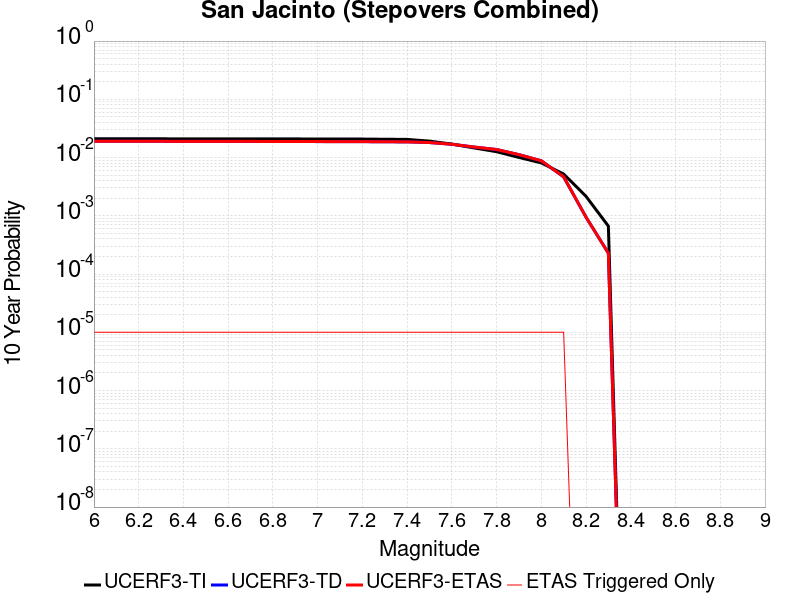 |

| Magnitude | 1 wk TI Prob | 1 wk TD Prob | 1 wk ETAS Prob | 1 wk ETAS/TD Gain | 1 wk ETAS Triggered Only | 1 mo TI Prob | 1 mo TD Prob | 1 mo ETAS Prob | 1 mo ETAS/TD Gain | 1 mo ETAS Triggered Only | 1 yr TI Prob | 1 yr TD Prob | 1 yr ETAS Prob | 1 yr ETAS/TD Gain | 1 yr ETAS Triggered Only | 10 yr TI Prob | 10 yr TD Prob | 10 yr ETAS Prob | 10 yr ETAS/TD Gain | 10 yr ETAS Triggered Only |
|-----|-----|-----|-----|-----|-----|-----|-----|-----|-----|-----|-----|-----|-----|-----|-----|-----|-----|-----|-----|-----|
| 6.0 | 4.0667746E-5 | 3.5336896E-5 | 3.5336896E-5 | 1.0 | 0.0 | 1.742787E-4 | 1.5143506E-4 | 1.5143506E-4 | 1.0 | 0.0 | 0.0021197782 | 0.0018421634 | 0.0018597592 | 1.0095518 | 1.762829E-5 | 0.020996714 | 0.019020144 | 0.019037437 | 1.0009092 | 1.762829E-5 |
| 6.1 | 4.0667746E-5 | 3.5336896E-5 | 3.5336896E-5 | 1.0 | 0.0 | 1.742787E-4 | 1.5143506E-4 | 1.5143506E-4 | 1.0 | 0.0 | 0.0021197782 | 0.0018421634 | 0.0018597592 | 1.0095518 | 1.762829E-5 | 0.020996714 | 0.019020144 | 0.019037437 | 1.0009092 | 1.762829E-5 |
| 6.2 | 4.0667746E-5 | 3.5336896E-5 | 3.5336896E-5 | 1.0 | 0.0 | 1.742787E-4 | 1.5143506E-4 | 1.5143506E-4 | 1.0 | 0.0 | 0.0021197782 | 0.0018421634 | 0.0018597592 | 1.0095518 | 1.762829E-5 | 0.020996714 | 0.019020144 | 0.019037437 | 1.0009092 | 1.762829E-5 |
| 6.3 | 4.0667746E-5 | 3.5336896E-5 | 3.5336896E-5 | 1.0 | 0.0 | 1.742787E-4 | 1.5143506E-4 | 1.5143506E-4 | 1.0 | 0.0 | 0.0021197782 | 0.0018421634 | 0.0018597592 | 1.0095518 | 1.762829E-5 | 0.020996714 | 0.019020144 | 0.019037437 | 1.0009092 | 1.762829E-5 |
| 6.4 | 4.0577226E-5 | 3.5208766E-5 | 3.5208766E-5 | 1.0 | 0.0 | 1.738908E-4 | 1.50886E-4 | 1.50886E-4 | 1.0 | 0.0 | 0.0021150648 | 0.0018354917 | 0.0018530877 | 1.0095865 | 1.762829E-5 | 0.020950472 | 0.018954702 | 0.018971996 | 1.0009124 | 1.762829E-5 |
| 6.5 | 4.0577226E-5 | 3.5208766E-5 | 3.5208766E-5 | 1.0 | 0.0 | 1.738908E-4 | 1.50886E-4 | 1.50886E-4 | 1.0 | 0.0 | 0.0021150648 | 0.0018354917 | 0.0018530877 | 1.0095865 | 1.762829E-5 | 0.020950472 | 0.018954702 | 0.018971996 | 1.0009124 | 1.762829E-5 |
| 6.6 | 4.053861E-5 | 3.5154102E-5 | 3.5154102E-5 | 1.0 | 0.0 | 1.7372532E-4 | 1.5065174E-4 | 1.5065174E-4 | 1.0 | 0.0 | 0.0021130538 | 0.0018326445 | 0.0018502404 | 1.0096015 | 1.762829E-5 | 0.020930743 | 0.018926777 | 0.01894407 | 1.0009137 | 1.762829E-5 |
| 6.7 | 4.0516545E-5 | 3.512316E-5 | 3.512316E-5 | 1.0 | 0.0 | 1.7363077E-4 | 1.5051916E-4 | 1.5051916E-4 | 1.0 | 0.0 | 0.002111905 | 0.0018310336 | 0.0018486296 | 1.0096099 | 1.762829E-5 | 0.020919468 | 0.01891097 | 0.018928265 | 1.0009146 | 1.762829E-5 |
| 6.8 | 4.049434E-5 | 3.509472E-5 | 3.509472E-5 | 1.0 | 0.0 | 1.7353562E-4 | 1.5039727E-4 | 1.5039727E-4 | 1.0 | 0.0 | 0.0021107488 | 0.0018295521 | 0.0018471482 | 1.0096177 | 1.762829E-5 | 0.020908125 | 0.01889638 | 0.018913675 | 1.0009153 | 1.762829E-5 |
| 6.9 | 4.046386E-5 | 3.505727E-5 | 3.505727E-5 | 1.0 | 0.0 | 1.73405E-4 | 1.502368E-4 | 1.502368E-4 | 1.0 | 0.0 | 0.0021091616 | 0.0018276017 | 0.0018451978 | 1.0096279 | 1.762829E-5 | 0.020892553 | 0.01887715 | 0.018894445 | 1.0009162 | 1.762829E-5 |
| 7.0 | 4.036382E-5 | 3.4937813E-5 | 3.4937813E-5 | 1.0 | 0.0 | 1.7297632E-4 | 1.4972492E-4 | 1.4972492E-4 | 1.0 | 0.0 | 0.0021039525 | 0.00182138 | 0.0018389762 | 1.009661 | 1.762829E-5 | 0.02084144 | 0.018815752 | 0.018833049 | 1.0009192 | 1.762829E-5 |
| 7.1 | 4.0343282E-5 | 3.4916273E-5 | 3.4916273E-5 | 1.0 | 0.0 | 1.7288832E-4 | 1.496326E-4 | 1.496326E-4 | 1.0 | 0.0 | 0.002102883 | 0.0018202579 | 0.0018378542 | 1.0096669 | 1.762829E-5 | 0.020830948 | 0.018804627 | 0.018821923 | 1.0009198 | 1.762829E-5 |
| 7.2 | 4.0257353E-5 | 3.4820667E-5 | 3.4820667E-5 | 1.0 | 0.0 | 1.725201E-4 | 1.492229E-4 | 1.492229E-4 | 1.0 | 0.0 | 0.0020984085 | 0.0018152783 | 0.0018328746 | 1.0096934 | 1.762829E-5 | 0.020787042 | 0.018755313 | 0.018772611 | 1.0009223 | 1.762829E-5 |
| 7.3 | 3.9940667E-5 | 3.4648023E-5 | 3.4648023E-5 | 1.0 | 0.0 | 1.7116306E-4 | 1.4848309E-4 | 1.4848309E-4 | 1.0 | 0.0 | 0.0020819185 | 0.0018062859 | 0.0018238825 | 1.0097418 | 1.762829E-5 | 0.020625217 | 0.018663792 | 0.01868109 | 1.0009269 | 1.762829E-5 |
| 7.4 | 3.9721202E-5 | 3.453329E-5 | 3.453329E-5 | 1.0 | 0.0 | 1.7022261E-4 | 1.4799142E-4 | 1.4799142E-4 | 1.0 | 0.0 | 0.0020704903 | 0.0018003098 | 0.0018179064 | 1.0097742 | 1.762829E-5 | 0.020513052 | 0.01860285 | 0.01862015 | 1.00093 | 1.762829E-5 |
| 7.5 | 3.7036873E-5 | 3.3598866E-5 | 3.3598866E-5 | 1.0 | 0.0 | 1.5871979E-4 | 1.439872E-4 | 1.439872E-4 | 1.0 | 0.0 | 0.0019307006 | 0.0017516377 | 0.001769235 | 1.0100462 | 1.762829E-5 | 0.019140124 | 0.018103454 | 0.018120764 | 1.0009562 | 1.762829E-5 |
| 7.6 | 3.2940967E-5 | 3.1372547E-5 | 3.1372547E-5 | 1.0 | 0.0 | 1.4116794E-4 | 1.3444685E-4 | 1.3444685E-4 | 1.0 | 0.0 | 0.0017173645 | 0.0016356637 | 0.0016532631 | 1.0107598 | 1.762829E-5 | 0.01704153 | 0.01693263 | 0.016949961 | 1.0010234 | 1.762829E-5 |
| 7.7 | 2.8236149E-5 | 2.7937022E-5 | 2.7937022E-5 | 1.0 | 0.0 | 1.2100645E-4 | 1.197246E-4 | 1.197246E-4 | 1.0 | 0.0 | 0.0014722579 | 0.0014566735 | 0.0014742761 | 1.0120841 | 1.762829E-5 | 0.014625421 | 0.015142685 | 0.0151600465 | 1.0011466 | 1.762829E-5 |
| 7.8 | 2.4329287E-5 | 2.5258554E-5 | 2.5258554E-5 | 1.0 | 0.0 | 1.042642E-4 | 1.0824646E-4 | 1.0824646E-4 | 1.0 | 0.0 | 0.0012686774 | 0.0013171048 | 0.0013347098 | 1.0133665 | 1.762829E-5 | 0.012614589 | 0.013738932 | 0.013756318 | 1.0012654 | 1.762829E-5 |
| 7.9 | 1.9370926E-5 | 2.0467445E-5 | 2.0467445E-5 | 1.0 | 0.0 | 8.301561E-5 | 8.7714674E-5 | 8.7714674E-5 | 1.0 | 0.0 | 0.0010102465 | 0.0010674037 | 0.0010850132 | 1.0164975 | 1.762829E-5 | 0.0100566605 | 0.011223499 | 0.011240929 | 1.001553 | 1.762829E-5 |
| 8.0 | 1.5583017E-5 | 1.5925136E-5 | 1.5925136E-5 | 1.0 | 0.0 | 6.6782646E-5 | 6.82488E-5 | 6.82488E-5 | 1.0 | 0.0 | 8.127754E-4 | 8.306131E-4 | 8.482267E-4 | 1.0212055 | 1.762829E-5 | 0.008098091 | 0.008802158 | 0.008819631 | 1.0019851 | 1.762829E-5 |
| 8.1 | 1.0024873E-5 | 8.314913E-6 | 8.314913E-6 | 1.0 | 0.0 | 4.2963035E-5 | 3.563486E-5 | 3.563486E-5 | 1.0 | 0.0 | 5.229494E-4 | 4.3376858E-4 | 4.5138923E-4 | 1.0406222 | 1.762829E-5 | 0.0052172043 | 0.00466551 | 0.004683056 | 1.0037608 | 1.762829E-5 |
| 8.2 | 4.142796E-6 | 1.5676045E-6 | 1.5676045E-6 | 1.0 | 0.0 | 1.775472E-5 | 6.7182878E-6 | 6.7182878E-6 | 1.0 | 0.0 | 2.1614227E-4 | 8.179211E-5 | 8.179211E-5 | 1.0 | 0.0 | 0.0021593217 | 9.4923546E-4 | 9.4923546E-4 | 1.0 | 0.0 |
| 8.3 | 1.2750878E-6 | 3.6301523E-7 | 3.6301523E-7 | 1.0 | 0.0 | 5.4646503E-6 | 1.5557786E-6 | 1.5557786E-6 | 1.0 | 0.0 | 6.653009E-5 | 1.8941444E-5 | 1.8941444E-5 | 1.0 | 0.0 | 6.6510175E-4 | 2.2840123E-4 | 2.2840123E-4 | 1.0 | 0.0 |

## San Jacinto (San Jacinto Valley) rev
*[(top)](#table-of-contents)*

| 1 Week | 1 Month | 1 Year | 10 Year |
|-----|-----|-----|-----|
|  | 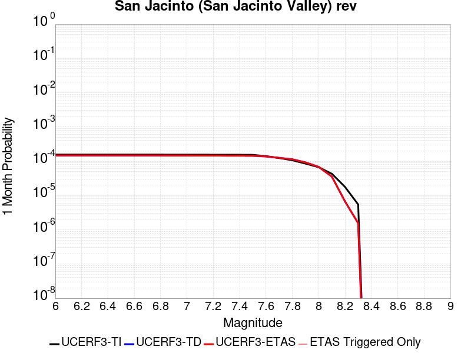 |  | 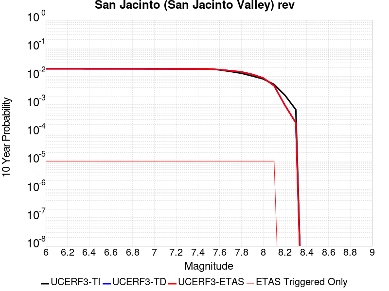 |

| Magnitude | 1 wk TI Prob | 1 wk TD Prob | 1 wk ETAS Prob | 1 wk ETAS/TD Gain | 1 wk ETAS Triggered Only | 1 mo TI Prob | 1 mo TD Prob | 1 mo ETAS Prob | 1 mo ETAS/TD Gain | 1 mo ETAS Triggered Only | 1 yr TI Prob | 1 yr TD Prob | 1 yr ETAS Prob | 1 yr ETAS/TD Gain | 1 yr ETAS Triggered Only | 10 yr TI Prob | 10 yr TD Prob | 10 yr ETAS Prob | 10 yr ETAS/TD Gain | 10 yr ETAS Triggered Only |
|-----|-----|-----|-----|-----|-----|-----|-----|-----|-----|-----|-----|-----|-----|-----|-----|-----|-----|-----|-----|-----|
| 6.0 | 3.652694E-5 | 3.4467394E-5 | 3.4467394E-5 | 1.0 | 0.0 | 1.5653463E-4 | 1.4770904E-4 | 1.4770904E-4 | 1.0 | 0.0 | 0.0019041431 | 0.001796876 | 0.0018144725 | 1.0097929 | 1.762829E-5 | 0.018879099 | 0.018560216 | 0.018577516 | 1.0009322 | 1.762829E-5 |
| 6.1 | 3.652694E-5 | 3.4467394E-5 | 3.4467394E-5 | 1.0 | 0.0 | 1.5653463E-4 | 1.4770904E-4 | 1.4770904E-4 | 1.0 | 0.0 | 0.0019041431 | 0.001796876 | 0.0018144725 | 1.0097929 | 1.762829E-5 | 0.018879099 | 0.018560216 | 0.018577516 | 1.0009322 | 1.762829E-5 |
| 6.2 | 3.652694E-5 | 3.4467394E-5 | 3.4467394E-5 | 1.0 | 0.0 | 1.5653463E-4 | 1.4770904E-4 | 1.4770904E-4 | 1.0 | 0.0 | 0.0019041431 | 0.001796876 | 0.0018144725 | 1.0097929 | 1.762829E-5 | 0.018879099 | 0.018560216 | 0.018577516 | 1.0009322 | 1.762829E-5 |
| 6.3 | 3.652694E-5 | 3.4467394E-5 | 3.4467394E-5 | 1.0 | 0.0 | 1.5653463E-4 | 1.4770904E-4 | 1.4770904E-4 | 1.0 | 0.0 | 0.0019041431 | 0.001796876 | 0.0018144725 | 1.0097929 | 1.762829E-5 | 0.018879099 | 0.018560216 | 0.018577516 | 1.0009322 | 1.762829E-5 |
| 6.4 | 3.646941E-5 | 3.4388955E-5 | 3.4388955E-5 | 1.0 | 0.0 | 1.5628811E-4 | 1.4737292E-4 | 1.4737292E-4 | 1.0 | 0.0 | 0.0019011468 | 0.0017927908 | 0.0018103876 | 1.0098152 | 1.762829E-5 | 0.018849645 | 0.01852009 | 0.018537393 | 1.0009342 | 1.762829E-5 |
| 6.5 | 3.646941E-5 | 3.4388955E-5 | 3.4388955E-5 | 1.0 | 0.0 | 1.5628811E-4 | 1.4737292E-4 | 1.4737292E-4 | 1.0 | 0.0 | 0.0019011468 | 0.0017927908 | 0.0018103876 | 1.0098152 | 1.762829E-5 | 0.018849645 | 0.01852009 | 0.018537393 | 1.0009342 | 1.762829E-5 |
| 6.6 | 3.6442503E-5 | 3.4352335E-5 | 3.4352335E-5 | 1.0 | 0.0 | 1.561728E-4 | 1.4721598E-4 | 1.4721598E-4 | 1.0 | 0.0 | 0.0018997455 | 0.0017908834 | 0.00180848 | 1.0098257 | 1.762829E-5 | 0.018835869 | 0.018501356 | 0.018518658 | 1.0009352 | 1.762829E-5 |
| 6.7 | 3.6432113E-5 | 3.4337903E-5 | 3.4337903E-5 | 1.0 | 0.0 | 1.5612828E-4 | 1.4715415E-4 | 1.4715415E-4 | 1.0 | 0.0 | 0.0018992044 | 0.001790132 | 0.0018077287 | 1.0098299 | 1.762829E-5 | 0.018830549 | 0.01849398 | 0.018511282 | 1.0009356 | 1.762829E-5 |
| 6.8 | 3.6409598E-5 | 3.430695E-5 | 3.430695E-5 | 1.0 | 0.0 | 1.560318E-4 | 1.470215E-4 | 1.470215E-4 | 1.0 | 0.0 | 0.0018980318 | 0.0017885199 | 0.0018061167 | 1.0098387 | 1.762829E-5 | 0.018819023 | 0.01847813 | 0.018495435 | 1.0009364 | 1.762829E-5 |
| 6.9 | 3.638078E-5 | 3.4267367E-5 | 3.4267367E-5 | 1.0 | 0.0 | 1.5590832E-4 | 1.4685189E-4 | 1.4685189E-4 | 1.0 | 0.0 | 0.0018965311 | 0.0017864581 | 0.0018040548 | 1.0098501 | 1.762829E-5 | 0.018804269 | 0.018457862 | 0.018475166 | 1.0009375 | 1.762829E-5 |
| 7.0 | 3.6294874E-5 | 3.4149365E-5 | 3.4149365E-5 | 1.0 | 0.0 | 1.5554018E-4 | 1.4634622E-4 | 1.4634622E-4 | 1.0 | 0.0 | 0.0018920569 | 0.0017803118 | 0.0017979088 | 1.0098841 | 1.762829E-5 | 0.018760284 | 0.018397434 | 0.018414738 | 1.0009406 | 1.762829E-5 |
| 7.1 | 3.6260717E-5 | 3.410564E-5 | 3.410564E-5 | 1.0 | 0.0 | 1.5539382E-4 | 1.4615887E-4 | 1.4615887E-4 | 1.0 | 0.0 | 0.001890278 | 0.0017780344 | 0.0017956314 | 1.0098969 | 1.762829E-5 | 0.018742796 | 0.018375032 | 0.018392337 | 1.0009418 | 1.762829E-5 |
| 7.2 | 3.6210204E-5 | 3.403977E-5 | 3.403977E-5 | 1.0 | 0.0 | 1.5517735E-4 | 1.4587659E-4 | 1.4587659E-4 | 1.0 | 0.0 | 0.001887647 | 0.0017746033 | 0.0017922003 | 1.0099161 | 1.762829E-5 | 0.01871693 | 0.018341267 | 0.018358571 | 1.0009435 | 1.762829E-5 |
| 7.3 | 3.6119454E-5 | 3.3927867E-5 | 3.3927867E-5 | 1.0 | 0.0 | 1.5478847E-4 | 1.4539705E-4 | 1.4539705E-4 | 1.0 | 0.0 | 0.0018829206 | 0.0017687745 | 0.0017863716 | 1.0099487 | 1.762829E-5 | 0.018670462 | 0.018283723 | 0.018301029 | 1.0009465 | 1.762829E-5 |
| 7.4 | 3.607848E-5 | 3.387532E-5 | 3.387532E-5 | 1.0 | 0.0 | 1.5461289E-4 | 1.4517189E-4 | 1.4517189E-4 | 1.0 | 0.0 | 0.0018807866 | 0.0017660374 | 0.0017836347 | 1.0099642 | 1.762829E-5 | 0.018649481 | 0.018256696 | 0.018274004 | 1.000948 | 1.762829E-5 |
| 7.5 | 3.5856774E-5 | 3.3684162E-5 | 3.3684162E-5 | 1.0 | 0.0 | 1.5366284E-4 | 1.4435273E-4 | 1.4435273E-4 | 1.0 | 0.0 | 0.0018692396 | 0.0017560803 | 0.0017736776 | 1.0100209 | 1.762829E-5 | 0.018535944 | 0.01815731 | 0.018174618 | 1.0009532 | 1.762829E-5 |
| 7.6 | 3.286655E-5 | 3.220034E-5 | 3.220034E-5 | 1.0 | 0.0 | 1.4084904E-4 | 1.3799417E-4 | 1.3799417E-4 | 1.0 | 0.0 | 0.001713488 | 0.0016787864 | 0.0016963851 | 1.010483 | 1.762829E-5 | 0.017003361 | 0.017373424 | 0.017390745 | 1.0009971 | 1.762829E-5 |
| 7.7 | 2.8882527E-5 | 2.9291981E-5 | 2.9291981E-5 | 1.0 | 0.0 | 1.237764E-4 | 1.2553102E-4 | 1.2553102E-4 | 1.0 | 0.0 | 0.0015059357 | 0.0015272698 | 0.0015448713 | 1.0115247 | 1.762829E-5 | 0.014957713 | 0.015859274 | 0.015876623 | 1.0010939 | 1.762829E-5 |
| 7.8 | 2.4950225E-5 | 2.6580747E-5 | 2.6580747E-5 | 1.0 | 0.0 | 1.0692515E-4 | 1.13912516E-4 | 1.13912516E-4 | 1.0 | 0.0 | 0.0013010362 | 0.0013860033 | 0.0014036072 | 1.0127012 | 1.762829E-5 | 0.012934455 | 0.014439502 | 0.014456876 | 1.0012032 | 1.762829E-5 |
| 7.9 | 1.9881603E-5 | 2.155556E-5 | 2.155556E-5 | 1.0 | 0.0 | 8.520408E-5 | 9.2377704E-5 | 9.2377704E-5 | 1.0 | 0.0 | 0.001036866 | 0.001124119 | 0.0011417276 | 1.0156642 | 1.762829E-5 | 0.010320415 | 0.011802064 | 0.011819485 | 1.001476 | 1.762829E-5 |
| 8.0 | 1.563292E-5 | 1.5976173E-5 | 1.5976173E-5 | 1.0 | 0.0 | 6.6996516E-5 | 6.846752E-5 | 6.846752E-5 | 1.0 | 0.0 | 8.153773E-4 | 8.332739E-4 | 8.508875E-4 | 1.0211378 | 1.762829E-5 | 0.00812392 | 0.008830938 | 0.00884841 | 1.0019785 | 1.762829E-5 |
| 8.1 | 1.0045313E-5 | 8.324356E-6 | 8.324356E-6 | 1.0 | 0.0 | 4.305063E-5 | 3.5675326E-5 | 3.5675326E-5 | 1.0 | 0.0 | 5.2401534E-4 | 4.3426102E-4 | 4.5188167E-4 | 1.0405761 | 1.762829E-5 | 0.0052278144 | 0.0046712374 | 0.0046887835 | 1.0037562 | 1.762829E-5 |
| 8.2 | 4.1554413E-6 | 1.5721832E-6 | 1.5721832E-6 | 1.0 | 0.0 | 1.7808914E-5 | 6.737911E-6 | 6.737911E-6 | 1.0 | 0.0 | 2.1680194E-4 | 8.203101E-5 | 8.203101E-5 | 1.0 | 0.0 | 0.0021659054 | 9.520741E-4 | 9.520741E-4 | 1.0 | 0.0 |
| 8.3 | 1.2758221E-6 | 3.6330252E-7 | 3.6330252E-7 | 1.0 | 0.0 | 5.4677976E-6 | 1.5570099E-6 | 1.5570099E-6 | 1.0 | 0.0 | 6.65684E-5 | 1.8956434E-5 | 1.8956434E-5 | 1.0 | 0.0 | 6.6548464E-4 | 2.2857229E-4 | 2.2857229E-4 | 1.0 | 0.0 |

## Mission Creek
*[(top)](#table-of-contents)*

| 1 Week | 1 Month | 1 Year | 10 Year |
|-----|-----|-----|-----|
| 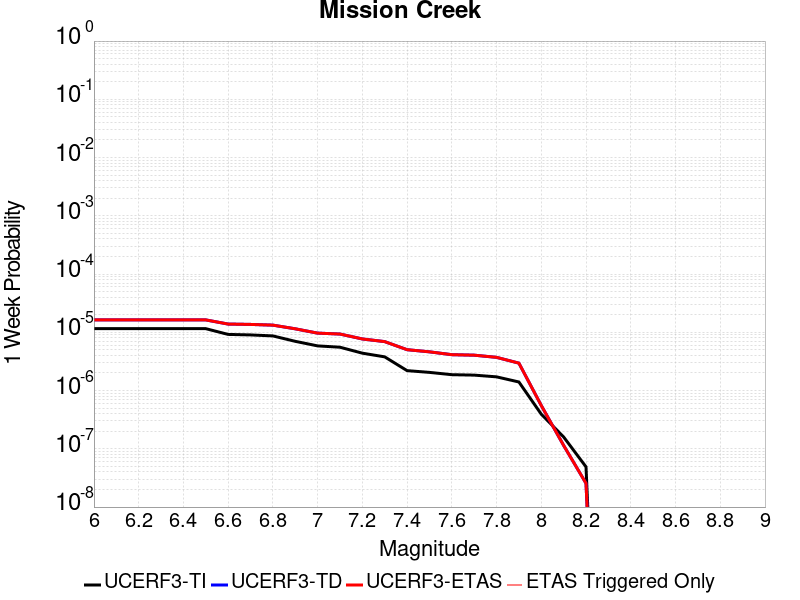 | 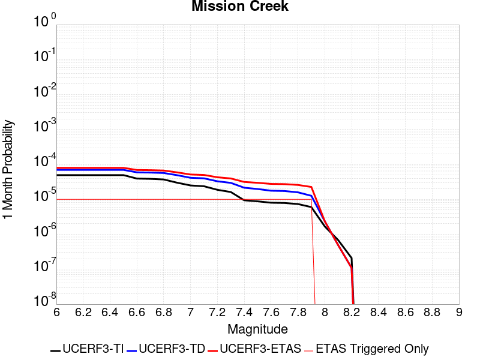 | 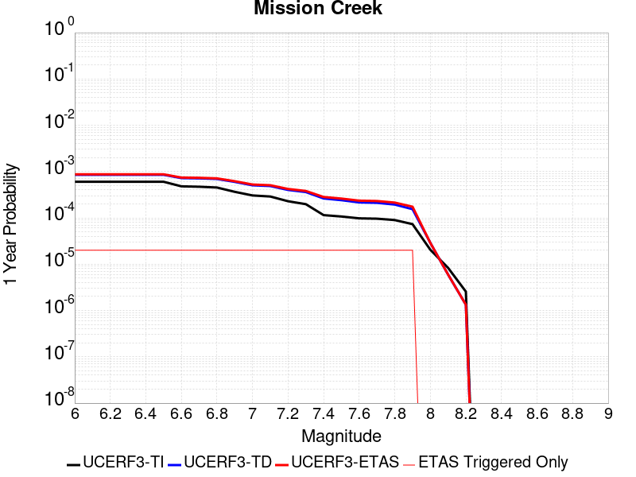 |  |

| Magnitude | 1 wk TI Prob | 1 wk TD Prob | 1 wk ETAS Prob | 1 wk ETAS/TD Gain | 1 wk ETAS Triggered Only | 1 mo TI Prob | 1 mo TD Prob | 1 mo ETAS Prob | 1 mo ETAS/TD Gain | 1 mo ETAS Triggered Only | 1 yr TI Prob | 1 yr TD Prob | 1 yr ETAS Prob | 1 yr ETAS/TD Gain | 1 yr ETAS Triggered Only | 10 yr TI Prob | 10 yr TD Prob | 10 yr ETAS Prob | 10 yr ETAS/TD Gain | 10 yr ETAS Triggered Only |
|-----|-----|-----|-----|-----|-----|-----|-----|-----|-----|-----|-----|-----|-----|-----|-----|-----|-----|-----|-----|-----|
| 6.0 | 1.1549387E-5 | 1.6331744E-5 | 1.6331744E-5 | 1.0 | 0.0 | 4.9496433E-5 | 6.9991394E-5 | 6.9991394E-5 | 1.0 | 0.0 | 6.0245243E-4 | 8.5182703E-4 | 8.5182703E-4 | 1.0 | 0.0 | 0.006008218 | 0.008514742 | 0.008532221 | 1.0020527 | 1.762829E-5 |
| 6.1 | 1.1549387E-5 | 1.6331744E-5 | 1.6331744E-5 | 1.0 | 0.0 | 4.9496433E-5 | 6.9991394E-5 | 6.9991394E-5 | 1.0 | 0.0 | 6.0245243E-4 | 8.5182703E-4 | 8.5182703E-4 | 1.0 | 0.0 | 0.006008218 | 0.008514742 | 0.008532221 | 1.0020527 | 1.762829E-5 |
| 6.2 | 1.1549387E-5 | 1.6331744E-5 | 1.6331744E-5 | 1.0 | 0.0 | 4.9496433E-5 | 6.9991394E-5 | 6.9991394E-5 | 1.0 | 0.0 | 6.0245243E-4 | 8.5182703E-4 | 8.5182703E-4 | 1.0 | 0.0 | 0.006008218 | 0.008514742 | 0.008532221 | 1.0020527 | 1.762829E-5 |
| 6.3 | 1.1549387E-5 | 1.6331744E-5 | 1.6331744E-5 | 1.0 | 0.0 | 4.9496433E-5 | 6.9991394E-5 | 6.9991394E-5 | 1.0 | 0.0 | 6.0245243E-4 | 8.5182703E-4 | 8.5182703E-4 | 1.0 | 0.0 | 0.006008218 | 0.008514742 | 0.008532221 | 1.0020527 | 1.762829E-5 |
| 6.4 | 1.1549387E-5 | 1.6331744E-5 | 1.6331744E-5 | 1.0 | 0.0 | 4.9496433E-5 | 6.9991394E-5 | 6.9991394E-5 | 1.0 | 0.0 | 6.0245243E-4 | 8.5182703E-4 | 8.5182703E-4 | 1.0 | 0.0 | 0.006008218 | 0.008514742 | 0.008532221 | 1.0020527 | 1.762829E-5 |
| 6.5 | 1.1549387E-5 | 1.6331744E-5 | 1.6331744E-5 | 1.0 | 0.0 | 4.9496433E-5 | 6.9991394E-5 | 6.9991394E-5 | 1.0 | 0.0 | 6.0245243E-4 | 8.5182703E-4 | 8.5182703E-4 | 1.0 | 0.0 | 0.006008218 | 0.008514742 | 0.008532221 | 1.0020527 | 1.762829E-5 |
| 6.6 | 9.202681E-6 | 1.3854947E-5 | 1.3854947E-5 | 1.0 | 0.0 | 3.9439463E-5 | 5.9377046E-5 | 5.9377046E-5 | 1.0 | 0.0 | 4.800697E-4 | 7.226848E-4 | 7.226848E-4 | 1.0 | 0.0 | 0.004790339 | 0.007231895 | 0.0072493954 | 1.00242 | 1.762829E-5 |
| 6.7 | 9.019164E-6 | 1.366061E-5 | 1.366061E-5 | 1.0 | 0.0 | 3.8652986E-5 | 5.854421E-5 | 5.854421E-5 | 1.0 | 0.0 | 4.7049852E-4 | 7.1255164E-4 | 7.1255164E-4 | 1.0 | 0.0 | 0.004695036 | 0.007131216 | 0.007148719 | 1.0024544 | 1.762829E-5 |
| 6.8 | 8.673558E-6 | 1.3282702E-5 | 1.3282702E-5 | 1.0 | 0.0 | 3.717186E-5 | 5.6924673E-5 | 5.6924673E-5 | 1.0 | 0.0 | 4.524734E-4 | 6.928463E-4 | 6.928463E-4 | 1.0 | 0.0 | 0.0045155324 | 0.0069353953 | 0.0069529014 | 1.0025241 | 1.762829E-5 |
| 6.9 | 7.002255E-6 | 1.1486859E-5 | 1.1486859E-5 | 1.0 | 0.0 | 3.000932E-5 | 4.9228507E-5 | 4.9228507E-5 | 1.0 | 0.0 | 3.653022E-4 | 5.991991E-4 | 5.991991E-4 | 1.0 | 0.0 | 0.0036470229 | 0.0060041854 | 0.0060217083 | 1.0029184 | 1.762829E-5 |
| 7.0 | 5.84644E-6 | 9.683714E-6 | 9.683714E-6 | 1.0 | 0.0 | 2.5055931E-5 | 4.1500996E-5 | 4.1500996E-5 | 1.0 | 0.0 | 3.0501327E-4 | 5.0516205E-4 | 5.0516205E-4 | 1.0 | 0.0 | 0.0030459496 | 0.005068281 | 0.00508582 | 1.0034605 | 1.762829E-5 |
| 7.1 | 5.54703E-6 | 9.338158E-6 | 9.338158E-6 | 1.0 | 0.0 | 2.377277E-5 | 4.0020088E-5 | 4.0020088E-5 | 1.0 | 0.0 | 2.8939504E-4 | 4.871401E-4 | 4.871401E-4 | 1.0 | 0.0 | 0.0028901845 | 0.0048888596 | 0.0049064015 | 1.0035882 | 1.762829E-5 |
| 7.2 | 4.384709E-6 | 7.689885E-6 | 7.689885E-6 | 1.0 | 0.0 | 1.8791474E-5 | 3.2956254E-5 | 3.2956254E-5 | 1.0 | 0.0 | 2.2876218E-4 | 4.0117218E-4 | 4.0117218E-4 | 1.0 | 0.0 | 0.0022852682 | 0.0040325816 | 0.0040501384 | 1.0043539 | 1.762829E-5 |
| 7.3 | 3.7888456E-6 | 6.923602E-6 | 6.923602E-6 | 1.0 | 0.0 | 1.623781E-5 | 2.9672263E-5 | 2.9672263E-5 | 1.0 | 0.0 | 1.9767738E-4 | 3.6120327E-4 | 3.6120327E-4 | 1.0 | 0.0 | 0.0019750162 | 0.0036342472 | 0.0036518115 | 1.004833 | 1.762829E-5 |
| 7.4 | 2.1982462E-6 | 5.0316853E-6 | 5.0316853E-6 | 1.0 | 0.0 | 9.421021E-6 | 2.1564189E-5 | 2.1564189E-5 | 1.0 | 0.0 | 1.1469489E-4 | 2.6251256E-4 | 2.6251256E-4 | 1.0 | 0.0 | 0.0011463572 | 0.0026498951 | 0.0026674767 | 1.0066348 | 1.762829E-5 |
| 7.5 | 2.051923E-6 | 4.6227096E-6 | 4.6227096E-6 | 1.0 | 0.0 | 8.793926E-6 | 1.9811463E-5 | 1.9811463E-5 | 1.0 | 0.0 | 1.0706078E-4 | 2.4117802E-4 | 2.4117802E-4 | 1.0 | 0.0 | 0.0010700922 | 0.0024374423 | 0.0024550278 | 1.0072147 | 1.762829E-5 |
| 7.6 | 1.8733427E-6 | 4.1308053E-6 | 4.1308053E-6 | 1.0 | 0.0 | 8.028587E-6 | 1.7703333E-5 | 1.7703333E-5 | 1.0 | 0.0 | 9.774366E-5 | 2.1551683E-4 | 2.1551683E-4 | 1.0 | 0.0 | 9.770069E-4 | 0.002181846 | 0.0021994358 | 1.0080619 | 1.762829E-5 |
| 7.7 | 1.8411953E-6 | 4.0504306E-6 | 4.0504306E-6 | 1.0 | 0.0 | 7.890813E-6 | 1.7358872E-5 | 1.7358872E-5 | 1.0 | 0.0 | 9.606641E-5 | 2.1132386E-4 | 2.1132386E-4 | 1.0 | 0.0 | 9.6024893E-4 | 0.0021401057 | 0.0021576963 | 1.0082195 | 1.762829E-5 |
| 7.8 | 1.7194251E-6 | 3.7173024E-6 | 3.7173024E-6 | 1.0 | 0.0 | 7.368944E-6 | 1.59312E-5 | 1.59312E-5 | 1.0 | 0.0 | 8.97132E-5 | 1.9394518E-4 | 1.9394518E-4 | 1.0 | 0.0 | 8.967699E-4 | 0.0019658357 | 0.0019834293 | 1.0089498 | 1.762829E-5 |
| 7.9 | 1.4035052E-6 | 2.9557E-6 | 2.9557E-6 | 1.0 | 0.0 | 6.0150082E-6 | 1.2667225E-5 | 1.2667225E-5 | 1.0 | 0.0 | 7.3230265E-5 | 1.5421261E-4 | 1.5421261E-4 | 1.0 | 0.0 | 7.3206134E-4 | 0.0015659636 | 0.0015835643 | 1.0112395 | 1.762829E-5 |
| 8.0 | 3.9318823E-7 | 5.542283E-7 | 5.542283E-7 | 1.0 | 0.0 | 1.6850913E-6 | 2.3752618E-6 | 2.3752618E-6 | 1.0 | 0.0 | 2.0515794E-5 | 2.8918435E-5 | 2.8918435E-5 | 1.0 | 0.0 | 2.0513899E-4 | 2.997098E-4 | 3.173328E-4 | 1.0588002 | 1.762829E-5 |
| 8.1 | 1.596793E-7 | 1.1427638E-7 | 1.1427638E-7 | 1.0 | 0.0 | 6.8433974E-7 | 4.8975585E-7 | 4.8975585E-7 | 1.0 | 0.0 | 8.331805E-6 | 5.962761E-6 | 5.962761E-6 | 1.0 | 0.0 | 8.331492E-5 | 6.57585E-5 | 6.57585E-5 | 1.0 | 0.0 |
| 8.2 | 4.9003038E-8 | 2.5565779E-8 | 2.5565779E-8 | 1.0 | 0.0 | 2.10013E-7 | 1.09567615E-7 | 1.09567615E-7 | 1.0 | 0.0 | 2.5569052E-6 | 1.3339849E-6 | 1.3339849E-6 | 1.0 | 0.0 | 2.556876E-5 | 1.5023335E-5 | 1.5023335E-5 | 1.0 | 0.0 |

## San Andreas (Peninsula) 2011 CFM
*[(top)](#table-of-contents)*

| 1 Week | 1 Month | 1 Year | 10 Year |
|-----|-----|-----|-----|
|  |  |  |  |

| Magnitude | 1 wk TI Prob | 1 wk TD Prob | 1 wk ETAS Prob | 1 wk ETAS/TD Gain | 1 wk ETAS Triggered Only | 1 mo TI Prob | 1 mo TD Prob | 1 mo ETAS Prob | 1 mo ETAS/TD Gain | 1 mo ETAS Triggered Only | 1 yr TI Prob | 1 yr TD Prob | 1 yr ETAS Prob | 1 yr ETAS/TD Gain | 1 yr ETAS Triggered Only | 10 yr TI Prob | 10 yr TD Prob | 10 yr ETAS Prob | 10 yr ETAS/TD Gain | 10 yr ETAS Triggered Only |
|-----|-----|-----|-----|-----|-----|-----|-----|-----|-----|-----|-----|-----|-----|-----|-----|-----|-----|-----|-----|-----|
| 6.0 | 8.6200685E-5 | 2.5333706E-5 | 2.5333706E-5 | 1.0 | 0.0 | 3.6937918E-4 | 1.08568514E-4 | 1.08568514E-4 | 1.0 | 0.0 | 0.0044879215 | 0.0013210218 | 0.0013386268 | 1.0133268 | 1.762829E-5 | 0.043983612 | 0.014838956 | 0.014856323 | 1.0011704 | 1.762829E-5 |
| 6.1 | 8.6200685E-5 | 2.5333706E-5 | 2.5333706E-5 | 1.0 | 0.0 | 3.6937918E-4 | 1.08568514E-4 | 1.08568514E-4 | 1.0 | 0.0 | 0.0044879215 | 0.0013210218 | 0.0013386268 | 1.0133268 | 1.762829E-5 | 0.043983612 | 0.014838956 | 0.014856323 | 1.0011704 | 1.762829E-5 |
| 6.2 | 8.6200685E-5 | 2.5333706E-5 | 2.5333706E-5 | 1.0 | 0.0 | 3.6937918E-4 | 1.08568514E-4 | 1.08568514E-4 | 1.0 | 0.0 | 0.0044879215 | 0.0013210218 | 0.0013386268 | 1.0133268 | 1.762829E-5 | 0.043983612 | 0.014838956 | 0.014856323 | 1.0011704 | 1.762829E-5 |
| 6.3 | 8.551163E-5 | 2.5024961E-5 | 2.5024961E-5 | 1.0 | 0.0 | 3.6642692E-4 | 1.0724543E-4 | 1.0724543E-4 | 1.0 | 0.0 | 0.004452125 | 0.0013049326 | 0.001322538 | 1.0134914 | 1.762829E-5 | 0.043639794 | 0.014665611 | 0.01468298 | 1.0011843 | 1.762829E-5 |
| 6.4 | 8.551163E-5 | 2.5024961E-5 | 2.5024961E-5 | 1.0 | 0.0 | 3.6642692E-4 | 1.0724543E-4 | 1.0724543E-4 | 1.0 | 0.0 | 0.004452125 | 0.0013049326 | 0.001322538 | 1.0134914 | 1.762829E-5 | 0.043639794 | 0.014665611 | 0.01468298 | 1.0011843 | 1.762829E-5 |
| 6.5 | 8.511146E-5 | 2.4846031E-5 | 2.4846031E-5 | 1.0 | 0.0 | 3.647124E-4 | 1.0647865E-4 | 1.0647865E-4 | 1.0 | 0.0 | 0.004431336 | 0.0012956082 | 0.0013132137 | 1.0135885 | 1.762829E-5 | 0.04344007 | 0.014565198 | 0.014582569 | 1.0011927 | 1.762829E-5 |
| 6.6 | 8.4985084E-5 | 2.477655E-5 | 2.477655E-5 | 1.0 | 0.0 | 3.6417096E-4 | 1.061809E-4 | 1.061809E-4 | 1.0 | 0.0 | 0.0044247704 | 0.0012919875 | 0.001309593 | 1.0136267 | 1.762829E-5 | 0.043376986 | 0.014527207 | 0.014544579 | 1.0011958 | 1.762829E-5 |
| 6.7 | 8.462618E-5 | 2.4604726E-5 | 2.4604726E-5 | 1.0 | 0.0 | 3.6263323E-4 | 1.05444575E-4 | 1.05444575E-4 | 1.0 | 0.0 | 0.004406125 | 0.0012830333 | 0.0013006389 | 1.013722 | 1.762829E-5 | 0.043197807 | 0.01443185 | 0.014449224 | 1.0012039 | 1.762829E-5 |
| 6.8 | 8.42337E-5 | 2.4500272E-5 | 2.4500272E-5 | 1.0 | 0.0 | 3.6095164E-4 | 1.0499695E-4 | 1.0499695E-4 | 1.0 | 0.0 | 0.004385734 | 0.0012775898 | 0.0012951955 | 1.0137805 | 1.762829E-5 | 0.043001823 | 0.014372395 | 0.014389771 | 1.0012089 | 1.762829E-5 |
| 6.9 | 8.365989E-5 | 2.4304522E-5 | 2.4304522E-5 | 1.0 | 0.0 | 3.5849313E-4 | 1.0415808E-4 | 1.0415808E-4 | 1.0 | 0.0 | 0.004355922 | 0.0012673886 | 0.0012849945 | 1.0138915 | 1.762829E-5 | 0.04271523 | 0.014264696 | 0.014282073 | 1.0012182 | 1.762829E-5 |
| 7.0 | 8.30936E-5 | 2.4065685E-5 | 2.4065685E-5 | 1.0 | 0.0 | 3.560668E-4 | 1.0313458E-4 | 1.0313458E-4 | 1.0 | 0.0 | 0.004326499 | 0.0012549418 | 0.001272548 | 1.0140295 | 1.762829E-5 | 0.042432297 | 0.0141355125 | 0.014152892 | 1.0012294 | 1.762829E-5 |
| 7.1 | 8.041264E-5 | 2.3751329E-5 | 2.3751329E-5 | 1.0 | 0.0 | 3.4458007E-4 | 1.01787446E-4 | 1.01787446E-4 | 1.0 | 0.0 | 0.0041871946 | 0.0012385593 | 0.0012561657 | 1.0142152 | 1.762829E-5 | 0.041091725 | 0.013957874 | 0.013975257 | 1.0012454 | 1.762829E-5 |
| 7.2 | 7.8427016E-5 | 2.3174005E-5 | 2.3174005E-5 | 1.0 | 0.0 | 3.3607247E-4 | 9.931339E-5 | 9.931339E-5 | 1.0 | 0.0 | 0.004084008 | 0.0012084715 | 0.0012260784 | 1.0145696 | 1.762829E-5 | 0.040097635 | 0.013641416 | 0.013658804 | 1.0012746 | 1.762829E-5 |
| 7.3 | 7.721087E-5 | 2.2958477E-5 | 2.2958477E-5 | 1.0 | 0.0 | 3.3086175E-4 | 9.838976E-5 | 9.838976E-5 | 1.0 | 0.0 | 0.004020803 | 0.0011972387 | 0.0012148459 | 1.0147065 | 1.762829E-5 | 0.03948827 | 0.013524936 | 0.013542325 | 1.0012858 | 1.762829E-5 |
| 7.4 | 7.3536525E-5 | 2.1064485E-5 | 2.1064485E-5 | 1.0 | 0.0 | 3.1511846E-4 | 9.027325E-5 | 9.027325E-5 | 1.0 | 0.0 | 0.0038298194 | 0.001098524 | 0.0011161328 | 1.0160296 | 1.762829E-5 | 0.037644852 | 0.01247618 | 0.012493588 | 1.0013953 | 1.762829E-5 |
| 7.5 | 6.806207E-5 | 1.8855704E-5 | 1.8855704E-5 | 1.0 | 0.0 | 2.9166197E-4 | 8.080766E-5 | 8.080766E-5 | 1.0 | 0.0 | 0.0035452035 | 9.833903E-4 | 0.0010010012 | 1.0179085 | 1.762829E-5 | 0.034891766 | 0.011221583 | 0.011239014 | 1.0015533 | 1.762829E-5 |
| 7.6 | 5.6731416E-5 | 1.4235568E-5 | 1.4235568E-5 | 1.0 | 0.0 | 2.43112E-4 | 6.100815E-5 | 6.100815E-5 | 1.0 | 0.0 | 0.0029558712 | 7.4252125E-4 | 7.6013646E-4 | 1.0237235 | 1.762829E-5 | 0.02916862 | 0.008518306 | 0.008535784 | 1.0020518 | 1.762829E-5 |
| 7.7 | 4.946994E-5 | 1.3298509E-5 | 1.3298509E-5 | 1.0 | 0.0 | 2.1199681E-4 | 5.6992365E-5 | 5.6992365E-5 | 1.0 | 0.0 | 0.002578006 | 6.936613E-4 | 7.1127736E-4 | 1.0253958 | 1.762829E-5 | 0.02548303 | 0.007937518 | 0.007955006 | 1.0022032 | 1.762829E-5 |
| 7.8 | 3.9718198E-5 | 1.3032537E-5 | 1.3032537E-5 | 1.0 | 0.0 | 1.7020974E-4 | 5.585253E-5 | 5.585253E-5 | 1.0 | 0.0 | 0.0020703338 | 6.7979255E-4 | 6.9740886E-4 | 1.0259142 | 1.762829E-5 | 0.020511515 | 0.007746509 | 0.0077640004 | 1.0022581 | 1.762829E-5 |
| 7.9 | 2.4115114E-5 | 1.2229653E-5 | 1.2229653E-5 | 1.0 | 0.0 | 1.0334639E-4 | 5.2411746E-5 | 5.2411746E-5 | 1.0 | 0.0 | 0.001257516 | 6.3792634E-4 | 6.5554335E-4 | 1.0276161 | 1.762829E-5 | 0.012504238 | 0.0071830763 | 0.007200578 | 1.0024365 | 1.762829E-5 |
| 8.0 | 1.7756569E-5 | 1.144976E-5 | 1.144976E-5 | 1.0 | 0.0 | 7.6097356E-5 | 4.9069477E-5 | 4.9069477E-5 | 1.0 | 0.0 | 9.260915E-4 | 5.972573E-4 | 6.1487505E-4 | 1.0294977 | 1.762829E-5 | 0.009222416 | 0.006680902 | 0.006698413 | 1.0026209 | 1.762829E-5 |
| 8.1 | 1.3159258E-5 | 9.77991E-6 | 9.77991E-6 | 1.0 | 0.0 | 5.6395602E-5 | 4.1913227E-5 | 4.1913227E-5 | 1.0 | 0.0 | 6.864001E-4 | 5.101742E-4 | 5.101742E-4 | 1.0 | 0.0 | 0.0068428386 | 0.0057076924 | 0.0057076924 | 1.0 | 0.0 |
| 8.2 | 8.635426E-6 | 5.4872503E-6 | 5.4872503E-6 | 1.0 | 0.0 | 3.700844E-5 | 2.3516575E-5 | 2.3516575E-5 | 1.0 | 0.0 | 4.5048463E-4 | 2.8627677E-4 | 2.8627677E-4 | 1.0 | 0.0 | 0.004495725 | 0.0032556232 | 0.0032556232 | 1.0 | 0.0 |
| 8.3 | 1.983087E-6 | 7.693574E-7 | 7.693574E-7 | 1.0 | 0.0 | 8.498917E-6 | 3.297242E-6 | 3.297242E-6 | 1.0 | 0.0 | 1.034694E-4 | 4.01432E-5 | 4.01432E-5 | 1.0 | 0.0 | 0.0010342124 | 4.7390026E-4 | 4.7390026E-4 | 1.0 | 0.0 |

## Rose Canyon
*[(top)](#table-of-contents)*

| 1 Week | 1 Month | 1 Year | 10 Year |
|-----|-----|-----|-----|
|  |  | 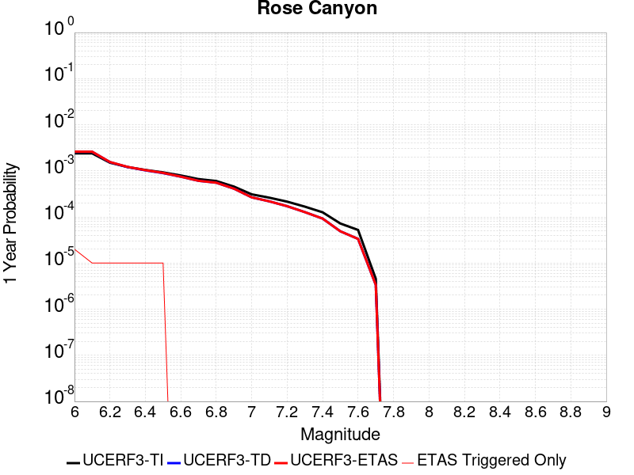 |  |

| Magnitude | 1 wk TI Prob | 1 wk TD Prob | 1 wk ETAS Prob | 1 wk ETAS/TD Gain | 1 wk ETAS Triggered Only | 1 mo TI Prob | 1 mo TD Prob | 1 mo ETAS Prob | 1 mo ETAS/TD Gain | 1 mo ETAS Triggered Only | 1 yr TI Prob | 1 yr TD Prob | 1 yr ETAS Prob | 1 yr ETAS/TD Gain | 1 yr ETAS Triggered Only | 10 yr TI Prob | 10 yr TD Prob | 10 yr ETAS Prob | 10 yr ETAS/TD Gain | 10 yr ETAS Triggered Only |
|-----|-----|-----|-----|-----|-----|-----|-----|-----|-----|-----|-----|-----|-----|-----|-----|-----|-----|-----|-----|-----|
| 6.0 | 4.5923203E-5 | 4.9720562E-5 | 4.9720562E-5 | 1.0 | 0.0 | 1.9679888E-4 | 2.1307007E-4 | 2.1307007E-4 | 1.0 | 0.0 | 0.0023933933 | 0.0025912558 | 0.0026088385 | 1.0067854 | 1.762829E-5 | 0.023677798 | 0.025643215 | 0.02566039 | 1.0006698 | 1.762829E-5 |
| 6.1 | 4.5923203E-5 | 4.9720562E-5 | 4.9720562E-5 | 1.0 | 0.0 | 1.9679888E-4 | 2.1307007E-4 | 2.1307007E-4 | 1.0 | 0.0 | 0.0023933933 | 0.0025912558 | 0.0026088385 | 1.0067854 | 1.762829E-5 | 0.023677798 | 0.025643215 | 0.02566039 | 1.0006698 | 1.762829E-5 |
| 6.2 | 2.8844734E-5 | 2.9671555E-5 | 2.9671555E-5 | 1.0 | 0.0 | 1.2361443E-4 | 1.2715581E-4 | 1.2715581E-4 | 1.0 | 0.0 | 0.0015039665 | 0.0015470508 | 0.0015646517 | 1.0113771 | 1.762829E-5 | 0.0149382865 | 0.015375828 | 0.015393185 | 1.0011289 | 1.762829E-5 |
| 6.3 | 2.3171577E-5 | 2.3163228E-5 | 2.3163228E-5 | 1.0 | 0.0 | 9.9302975E-5 | 9.926727E-5 | 9.926727E-5 | 1.0 | 0.0 | 0.0012083431 | 0.0012079224 | 0.0012255294 | 1.0145763 | 1.762829E-5 | 0.012017938 | 0.012023459 | 0.012040875 | 1.0014485 | 1.762829E-5 |
| 6.4 | 2.0066604E-5 | 1.9668718E-5 | 1.9668718E-5 | 1.0 | 0.0 | 8.599689E-5 | 8.429184E-5 | 8.429184E-5 | 1.0 | 0.0 | 0.0010465092 | 0.00102578 | 0.0010433902 | 1.0171676 | 1.762829E-5 | 0.010415946 | 0.010218433 | 0.010235881 | 1.0017076 | 1.762829E-5 |
| 6.5 | 1.776989E-5 | 1.7115255E-5 | 1.7115255E-5 | 1.0 | 0.0 | 7.615444E-5 | 7.3349074E-5 | 7.3349074E-5 | 1.0 | 0.0 | 9.267859E-4 | 8.9266605E-4 | 9.102786E-4 | 1.0197303 | 1.762829E-5 | 0.009229303 | 0.008896962 | 0.0089144325 | 1.0019637 | 1.762829E-5 |
| 6.6 | 1.5227364E-5 | 1.4340241E-5 | 1.4340241E-5 | 1.0 | 0.0 | 6.52585E-5 | 6.1456754E-5 | 6.1456754E-5 | 1.0 | 0.0 | 7.942326E-4 | 7.4798433E-4 | 7.4798433E-4 | 1.0 | 0.0 | 0.007914 | 0.007458868 | 0.007458868 | 1.0 | 0.0 |
| 6.7 | 1.2703898E-5 | 1.167398E-5 | 1.167398E-5 | 1.0 | 0.0 | 5.4444143E-5 | 5.003041E-5 | 5.003041E-5 | 1.0 | 0.0 | 6.626558E-4 | 6.0895423E-4 | 6.0895423E-4 | 1.0 | 0.0 | 0.006606833 | 0.0060754507 | 0.0060754507 | 1.0 | 0.0 |
| 6.8 | 1.1554917E-5 | 1.060993E-5 | 1.060993E-5 | 1.0 | 0.0 | 4.9520135E-5 | 4.547036E-5 | 4.547036E-5 | 1.0 | 0.0 | 6.0274085E-4 | 5.5346504E-4 | 5.5346504E-4 | 1.0 | 0.0 | 0.0060110865 | 0.005522874 | 0.005522874 | 1.0 | 0.0 |
| 6.9 | 8.732078E-6 | 7.88172E-6 | 7.88172E-6 | 1.0 | 0.0 | 3.7422655E-5 | 3.377838E-5 | 3.377838E-5 | 1.0 | 0.0 | 4.5552556E-4 | 4.111771E-4 | 4.111771E-4 | 1.0 | 0.0 | 0.0045459294 | 0.0041049966 | 0.0041049966 | 1.0 | 0.0 |
| 7.0 | 5.9337494E-6 | 5.1076677E-6 | 5.1076677E-6 | 1.0 | 0.0 | 2.5430107E-5 | 2.188982E-5 | 2.188982E-5 | 1.0 | 0.0 | 3.0956755E-4 | 2.6647613E-4 | 2.6647613E-4 | 1.0 | 0.0 | 0.0030913667 | 0.0026615816 | 0.0026615816 | 1.0 | 0.0 |
| 7.1 | 5.013409E-6 | 4.177528E-6 | 4.177528E-6 | 1.0 | 0.0 | 2.1485863E-5 | 1.7903569E-5 | 1.7903569E-5 | 1.0 | 0.0 | 2.6155898E-4 | 2.1795425E-4 | 2.1795425E-4 | 1.0 | 0.0 | 0.0026125133 | 0.0021774166 | 0.0021774166 | 1.0 | 0.0 |
| 7.2 | 4.120763E-6 | 3.2822556E-6 | 3.2822556E-6 | 1.0 | 0.0 | 1.7660293E-5 | 1.4066734E-5 | 1.4066734E-5 | 1.0 | 0.0 | 2.1499286E-4 | 1.7124912E-4 | 1.7124912E-4 | 1.0 | 0.0 | 0.0021478499 | 0.0017111811 | 0.0017111811 | 1.0 | 0.0 |
| 7.3 | 3.2081239E-6 | 2.4406268E-6 | 2.4406268E-6 | 1.0 | 0.0 | 1.374903E-5 | 1.0459787E-5 | 1.0459787E-5 | 1.0 | 0.0 | 1.6738157E-4 | 1.2734054E-4 | 1.2734054E-4 | 1.0 | 0.0 | 0.0016725556 | 0.0012726827 | 0.0012726827 | 1.0 | 0.0 |
| 7.4 | 2.4194755E-6 | 1.7681314E-6 | 1.7681314E-6 | 1.0 | 0.0 | 1.0369139E-5 | 7.577684E-6 | 7.577684E-6 | 1.0 | 0.0 | 1.2623696E-4 | 9.225445E-5 | 9.225445E-5 | 1.0 | 0.0 | 0.0012616527 | 9.2216686E-4 | 9.2216686E-4 | 1.0 | 0.0 |
| 7.5 | 1.3842889E-6 | 9.3790675E-7 | 9.3790675E-7 | 1.0 | 0.0 | 5.9326535E-6 | 4.019594E-6 | 4.019594E-6 | 1.0 | 0.0 | 7.222766E-5 | 4.8937498E-5 | 4.8937498E-5 | 1.0 | 0.0 | 7.220419E-4 | 4.892707E-4 | 4.892707E-4 | 1.0 | 0.0 |
| 7.6 | 1.0021575E-6 | 6.4118046E-7 | 6.4118046E-7 | 1.0 | 0.0 | 4.2949537E-6 | 2.7479136E-6 | 2.7479136E-6 | 1.0 | 0.0 | 5.2289808E-5 | 3.3455355E-5 | 3.3455355E-5 | 1.0 | 0.0 | 5.2277505E-4 | 3.3450534E-4 | 3.3450534E-4 | 1.0 | 0.0 |
| 7.7 | 8.7620116E-8 | 6.4494145E-8 | 6.4494145E-8 | 1.0 | 0.0 | 3.7551473E-7 | 2.7640345E-7 | 2.7640345E-7 | 1.0 | 0.0 | 4.5718825E-6 | 3.365207E-6 | 3.365207E-6 | 1.0 | 0.0 | 4.5717883E-5 | 3.365159E-5 | 3.365159E-5 | 1.0 | 0.0 |

## Ortigalita (North)
*[(top)](#table-of-contents)*

| 1 Week | 1 Month | 1 Year | 10 Year |
|-----|-----|-----|-----|
|  |  |  |  |

| Magnitude | 1 wk TI Prob | 1 wk TD Prob | 1 wk ETAS Prob | 1 wk ETAS/TD Gain | 1 wk ETAS Triggered Only | 1 mo TI Prob | 1 mo TD Prob | 1 mo ETAS Prob | 1 mo ETAS/TD Gain | 1 mo ETAS Triggered Only | 1 yr TI Prob | 1 yr TD Prob | 1 yr ETAS Prob | 1 yr ETAS/TD Gain | 1 yr ETAS Triggered Only | 10 yr TI Prob | 10 yr TD Prob | 10 yr ETAS Prob | 10 yr ETAS/TD Gain | 10 yr ETAS Triggered Only |
|-----|-----|-----|-----|-----|-----|-----|-----|-----|-----|-----|-----|-----|-----|-----|-----|-----|-----|-----|-----|-----|
| 6.0 | 7.711876E-5 | 1.05086016E-4 | 1.05086016E-4 | 1.0 | 0.0 | 3.3046713E-4 | 4.5030177E-4 | 4.679221E-4 | 1.0391301 | 1.762829E-5 | 0.004016016 | 0.005468958 | 0.0054864897 | 1.0032057 | 1.762829E-5 | 0.039442103 | 0.053463764 | 0.053480454 | 1.0003121 | 1.762829E-5 |
| 6.1 | 4.607858E-5 | 6.024935E-5 | 6.024935E-5 | 1.0 | 0.0 | 1.9746469E-4 | 2.5818875E-4 | 2.5818875E-4 | 1.0 | 0.0 | 0.0024014818 | 0.003139252 | 0.003139252 | 1.0 | 0.0 | 0.023756953 | 0.030979859 | 0.030979859 | 1.0 | 0.0 |
| 6.2 | 4.607858E-5 | 6.024935E-5 | 6.024935E-5 | 1.0 | 0.0 | 1.9746469E-4 | 2.5818875E-4 | 2.5818875E-4 | 1.0 | 0.0 | 0.0024014818 | 0.003139252 | 0.003139252 | 1.0 | 0.0 | 0.023756953 | 0.030979859 | 0.030979859 | 1.0 | 0.0 |
| 6.3 | 3.327423E-5 | 4.2481566E-5 | 4.2481566E-5 | 1.0 | 0.0 | 1.4259605E-4 | 1.8205289E-4 | 1.8205289E-4 | 1.0 | 0.0 | 0.0017347244 | 0.0022145277 | 0.0022145277 | 1.0 | 0.0 | 0.017212452 | 0.021948816 | 0.021948816 | 1.0 | 0.0 |
| 6.4 | 2.7732503E-5 | 3.5003635E-5 | 3.5003635E-5 | 1.0 | 0.0 | 1.1884817E-4 | 1.5000845E-4 | 1.5000845E-4 | 1.0 | 0.0 | 0.001446016 | 0.0018250674 | 0.0018250674 | 1.0 | 0.0 | 0.014366428 | 0.018123753 | 0.018123753 | 1.0 | 0.0 |
| 6.5 | 2.7689714E-5 | 3.4953442E-5 | 3.4953442E-5 | 1.0 | 0.0 | 1.186648E-4 | 1.4979337E-4 | 1.4979337E-4 | 1.0 | 0.0 | 0.0014437864 | 0.0018224533 | 0.0018224533 | 1.0 | 0.0 | 0.014344421 | 0.018098038 | 0.018098038 | 1.0 | 0.0 |
| 6.6 | 2.2976905E-5 | 2.8722226E-5 | 2.8722226E-5 | 1.0 | 0.0 | 9.846873E-5 | 1.2309088E-4 | 1.2309088E-4 | 1.0 | 0.0 | 0.0011981975 | 0.001497839 | 0.001497839 | 1.0 | 0.0 | 0.011917574 | 0.014900712 | 0.014900712 | 1.0 | 0.0 |
| 6.7 | 1.9871539E-5 | 2.4907882E-5 | 2.4907882E-5 | 1.0 | 0.0 | 8.516096E-5 | 1.067451E-4 | 1.067451E-4 | 1.0 | 0.0 | 0.0010363415 | 0.0012990955 | 0.0012990955 | 1.0 | 0.0 | 0.010315218 | 0.012938703 | 0.012938703 | 1.0 | 0.0 |
| 6.8 | 6.5640475E-6 | 7.6061337E-6 | 7.6061337E-6 | 1.0 | 0.0 | 2.813133E-5 | 3.2597323E-5 | 3.2597323E-5 | 1.0 | 0.0 | 3.424451E-4 | 3.9680302E-4 | 3.9680302E-4 | 1.0 | 0.0 | 0.0034191788 | 0.0039612325 | 0.0039612325 | 1.0 | 0.0 |
| 6.9 | 5.6219683E-6 | 6.5023783E-6 | 6.5023783E-6 | 1.0 | 0.0 | 2.4093928E-5 | 2.7867052E-5 | 2.7867052E-5 | 1.0 | 0.0 | 2.933041E-4 | 3.3923113E-4 | 3.3923113E-4 | 1.0 | 0.0 | 0.0029291727 | 0.00338739 | 0.00338739 | 1.0 | 0.0 |
| 7.0 | 3.875591E-6 | 4.4851295E-6 | 4.4851295E-6 | 1.0 | 0.0 | 1.6609569E-5 | 1.9221854E-5 | 1.9221854E-5 | 1.0 | 0.0 | 2.0220275E-4 | 2.3400305E-4 | 2.3400305E-4 | 1.0 | 0.0 | 0.0020201886 | 0.0023377747 | 0.0023377747 | 1.0 | 0.0 |
| 7.1 | 1.6017933E-6 | 1.857199E-6 | 1.857199E-6 | 1.0 | 0.0 | 6.8648105E-6 | 7.959406E-6 | 7.959406E-6 | 1.0 | 0.0 | 8.357586E-5 | 9.690253E-5 | 9.690253E-5 | 1.0 | 0.0 | 8.3544437E-4 | 9.6870743E-4 | 9.6870743E-4 | 1.0 | 0.0 |

## San Jacinto (Lytle Creek connector)
*[(top)](#table-of-contents)*

| 1 Week | 1 Month | 1 Year | 10 Year |
|-----|-----|-----|-----|
|  |  |  |  |

| Magnitude | 1 wk TI Prob | 1 wk TD Prob | 1 wk ETAS Prob | 1 wk ETAS/TD Gain | 1 wk ETAS Triggered Only | 1 mo TI Prob | 1 mo TD Prob | 1 mo ETAS Prob | 1 mo ETAS/TD Gain | 1 mo ETAS Triggered Only | 1 yr TI Prob | 1 yr TD Prob | 1 yr ETAS Prob | 1 yr ETAS/TD Gain | 1 yr ETAS Triggered Only | 10 yr TI Prob | 10 yr TD Prob | 10 yr ETAS Prob | 10 yr ETAS/TD Gain | 10 yr ETAS Triggered Only |
|-----|-----|-----|-----|-----|-----|-----|-----|-----|-----|-----|-----|-----|-----|-----|-----|-----|-----|-----|-----|-----|
| 6.0 | 6.693995E-6 | 6.6710027E-6 | 6.6710027E-6 | 1.0 | 0.0 | 2.8688235E-5 | 2.8589699E-5 | 2.8589699E-5 | 1.0 | 0.0 | 3.492233E-4 | 3.4802407E-4 | 3.6564624E-4 | 1.0506349 | 1.762829E-5 | 0.00348675 | 0.0035549873 | 0.003572553 | 1.0049411 | 1.762829E-5 |
| 6.1 | 6.693995E-6 | 6.6710027E-6 | 6.6710027E-6 | 1.0 | 0.0 | 2.8688235E-5 | 2.8589699E-5 | 2.8589699E-5 | 1.0 | 0.0 | 3.492233E-4 | 3.4802407E-4 | 3.6564624E-4 | 1.0506349 | 1.762829E-5 | 0.00348675 | 0.0035549873 | 0.003572553 | 1.0049411 | 1.762829E-5 |
| 6.2 | 6.693995E-6 | 6.6710027E-6 | 6.6710027E-6 | 1.0 | 0.0 | 2.8688235E-5 | 2.8589699E-5 | 2.8589699E-5 | 1.0 | 0.0 | 3.492233E-4 | 3.4802407E-4 | 3.6564624E-4 | 1.0506349 | 1.762829E-5 | 0.00348675 | 0.0035549873 | 0.003572553 | 1.0049411 | 1.762829E-5 |
| 6.3 | 6.693995E-6 | 6.6710027E-6 | 6.6710027E-6 | 1.0 | 0.0 | 2.8688235E-5 | 2.8589699E-5 | 2.8589699E-5 | 1.0 | 0.0 | 3.492233E-4 | 3.4802407E-4 | 3.6564624E-4 | 1.0506349 | 1.762829E-5 | 0.00348675 | 0.0035549873 | 0.003572553 | 1.0049411 | 1.762829E-5 |
| 6.4 | 6.693995E-6 | 6.6710027E-6 | 6.6710027E-6 | 1.0 | 0.0 | 2.8688235E-5 | 2.8589699E-5 | 2.8589699E-5 | 1.0 | 0.0 | 3.492233E-4 | 3.4802407E-4 | 3.6564624E-4 | 1.0506349 | 1.762829E-5 | 0.00348675 | 0.0035549873 | 0.003572553 | 1.0049411 | 1.762829E-5 |
| 6.5 | 6.6561875E-6 | 6.63122E-6 | 6.63122E-6 | 1.0 | 0.0 | 2.8526205E-5 | 2.8419205E-5 | 2.8419205E-5 | 1.0 | 0.0 | 3.472512E-4 | 3.4594897E-4 | 3.6357116E-4 | 1.0509387 | 1.762829E-5 | 0.0034670907 | 0.0035343023 | 0.0035518683 | 1.0049702 | 1.762829E-5 |
| 6.6 | 6.6561875E-6 | 6.63122E-6 | 6.63122E-6 | 1.0 | 0.0 | 2.8526205E-5 | 2.8419205E-5 | 2.8419205E-5 | 1.0 | 0.0 | 3.472512E-4 | 3.4594897E-4 | 3.6357116E-4 | 1.0509387 | 1.762829E-5 | 0.0034670907 | 0.0035343023 | 0.0035518683 | 1.0049702 | 1.762829E-5 |
| 6.7 | 6.5802237E-6 | 6.550394E-6 | 6.550394E-6 | 1.0 | 0.0 | 2.8200653E-5 | 2.8072815E-5 | 2.8072815E-5 | 1.0 | 0.0 | 3.4328885E-4 | 3.41733E-4 | 3.5935527E-4 | 1.0515673 | 1.762829E-5 | 0.0034275902 | 0.0034922757 | 0.0035098423 | 1.0050302 | 1.762829E-5 |
| 6.8 | 6.575632E-6 | 6.544883E-6 | 6.544883E-6 | 1.0 | 0.0 | 2.8180975E-5 | 2.8049197E-5 | 2.8049197E-5 | 1.0 | 0.0 | 3.4304935E-4 | 3.4144553E-4 | 3.590678E-4 | 1.0516108 | 1.762829E-5 | 0.0034252026 | 0.00348941 | 0.0035069769 | 1.0050343 | 1.762829E-5 |
| 6.9 | 6.570433E-6 | 6.5362756E-6 | 6.5362756E-6 | 1.0 | 0.0 | 2.8158694E-5 | 2.801231E-5 | 2.801231E-5 | 1.0 | 0.0 | 3.4277816E-4 | 3.4099657E-4 | 3.5861885E-4 | 1.0516788 | 1.762829E-5 | 0.0034224992 | 0.0034849346 | 0.0035025014 | 1.0050408 | 1.762829E-5 |
| 7.0 | 6.5643826E-6 | 6.526395E-6 | 6.526395E-6 | 1.0 | 0.0 | 2.8132765E-5 | 2.7969963E-5 | 2.7969963E-5 | 1.0 | 0.0 | 3.424626E-4 | 3.4048117E-4 | 3.5810345E-4 | 1.051757 | 1.762829E-5 | 0.0034193532 | 0.0034797967 | 0.0034973638 | 1.0050483 | 1.762829E-5 |
| 7.1 | 6.557402E-6 | 6.515105E-6 | 6.515105E-6 | 1.0 | 0.0 | 2.8102848E-5 | 2.792158E-5 | 2.792158E-5 | 1.0 | 0.0 | 3.4209844E-4 | 3.3989229E-4 | 3.5751457E-4 | 1.0518467 | 1.762829E-5 | 0.0034157229 | 0.0034739273 | 0.0034914943 | 1.0050569 | 1.762829E-5 |
| 7.2 | 6.546394E-6 | 6.4970677E-6 | 6.4970677E-6 | 1.0 | 0.0 | 2.8055672E-5 | 2.784428E-5 | 2.784428E-5 | 1.0 | 0.0 | 3.4152428E-4 | 3.3895145E-4 | 3.5657376E-4 | 1.0519906 | 1.762829E-5 | 0.0034099987 | 0.0034645528 | 0.0034821199 | 1.0050706 | 1.762829E-5 |
| 7.3 | 6.5364216E-6 | 6.477847E-6 | 6.477847E-6 | 1.0 | 0.0 | 2.8012933E-5 | 2.7761906E-5 | 2.7761906E-5 | 1.0 | 0.0 | 3.4100408E-4 | 3.3794885E-4 | 3.555712E-4 | 1.052145 | 1.762829E-5 | 0.003404813 | 0.003454571 | 0.0034721382 | 1.0050852 | 1.762829E-5 |
| 7.4 | 6.5269523E-6 | 6.4589262E-6 | 6.4589262E-6 | 1.0 | 0.0 | 2.7972354E-5 | 2.7680819E-5 | 2.7680819E-5 | 1.0 | 0.0 | 3.4051016E-4 | 3.3696194E-4 | 3.5458428E-4 | 1.0522977 | 1.762829E-5 | 0.0033998888 | 0.003444749 | 0.0034623167 | 1.0050998 | 1.762829E-5 |
| 7.5 | 6.5111835E-6 | 6.435192E-6 | 6.435192E-6 | 1.0 | 0.0 | 2.7904773E-5 | 2.7579103E-5 | 2.7579103E-5 | 1.0 | 0.0 | 3.3968766E-4 | 3.3572392E-4 | 3.533463E-4 | 1.0524907 | 1.762829E-5 | 0.0033916887 | 0.003432418 | 0.0034499858 | 1.0051183 | 1.762829E-5 |
| 7.6 | 6.4768806E-6 | 6.3942884E-6 | 6.3942884E-6 | 1.0 | 0.0 | 2.7757764E-5 | 2.7403805E-5 | 2.7403805E-5 | 1.0 | 0.0 | 3.3789838E-4 | 3.3359032E-4 | 3.5121274E-4 | 1.0528265 | 1.762829E-5 | 0.0033738504 | 0.0034111436 | 0.0034287118 | 1.0051502 | 1.762829E-5 |
| 7.7 | 6.1655364E-6 | 6.1866886E-6 | 6.1866886E-6 | 1.0 | 0.0 | 2.642346E-5 | 2.651411E-5 | 2.651411E-5 | 1.0 | 0.0 | 3.2165812E-4 | 3.2276154E-4 | 3.4038414E-4 | 1.0545994 | 1.762829E-5 | 0.0032119295 | 0.0033027146 | 0.0033202847 | 1.0053198 | 1.762829E-5 |
| 7.8 | 5.5043524E-6 | 5.747449E-6 | 5.747449E-6 | 1.0 | 0.0 | 2.3589868E-5 | 2.4631692E-5 | 2.4631692E-5 | 1.0 | 0.0 | 2.871688E-4 | 2.9984963E-4 | 3.1747264E-4 | 1.0587728 | 1.762829E-5 | 0.0028679797 | 0.0030726613 | 0.0030902354 | 1.0057195 | 1.762829E-5 |
| 7.9 | 3.889249E-6 | 4.0851965E-6 | 4.0851965E-6 | 1.0 | 0.0 | 1.6668104E-5 | 1.7507866E-5 | 1.7507866E-5 | 1.0 | 0.0 | 2.0291525E-4 | 2.1313746E-4 | 2.30762E-4 | 1.082691 | 1.762829E-5 | 0.0020273007 | 0.0021987387 | 0.0022163282 | 1.0079998 | 1.762829E-5 |
| 8.0 | 2.668535E-6 | 2.537347E-6 | 2.537347E-6 | 1.0 | 0.0 | 1.1436528E-5 | 1.0874299E-5 | 1.0874299E-5 | 1.0 | 0.0 | 1.3923083E-4 | 1.3238657E-4 | 1.5001252E-4 | 1.1331401 | 1.762829E-5 | 0.0013914363 | 0.0013788831 | 0.0013964871 | 1.0127668 | 1.762829E-5 |
| 8.1 | 1.5911459E-6 | 1.2217948E-6 | 1.2217948E-6 | 1.0 | 0.0 | 6.8191785E-6 | 5.2362534E-6 | 5.2362534E-6 | 1.0 | 0.0 | 8.3020335E-5 | 6.374954E-5 | 8.1376704E-5 | 1.2765065 | 1.762829E-5 | 8.298933E-4 | 6.7100645E-4 | 6.886229E-4 | 1.0262538 | 1.762829E-5 |
| 8.2 | 6.1294963E-7 | 2.1905348E-7 | 2.1905348E-7 | 1.0 | 0.0 | 2.6269242E-6 | 9.3880027E-7 | 9.3880027E-7 | 1.0 | 0.0 | 3.1982334E-5 | 1.1429834E-5 | 1.1429834E-5 | 1.0 | 0.0 | 3.1977732E-4 | 1.2836853E-4 | 1.2836853E-4 | 1.0 | 0.0 |
| 8.3 | 1.762871E-7 | 4.7785655E-8 | 4.7785655E-8 | 1.0 | 0.0 | 7.5551594E-7 | 2.0479564E-7 | 2.0479564E-7 | 1.0 | 0.0 | 9.1983675E-6 | 2.4933843E-6 | 2.4933843E-6 | 1.0 | 0.0 | 9.197987E-5 | 2.8824745E-5 | 2.8824745E-5 | 1.0 | 0.0 |

## Death Valley (Fish Lake Valley)
*[(top)](#table-of-contents)*

| 1 Week | 1 Month | 1 Year | 10 Year |
|-----|-----|-----|-----|
|  |  | 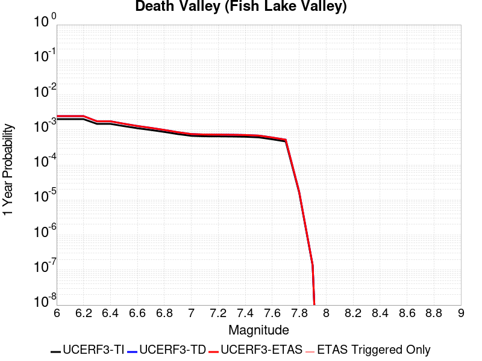 |  |

| Magnitude | 1 wk TI Prob | 1 wk TD Prob | 1 wk ETAS Prob | 1 wk ETAS/TD Gain | 1 wk ETAS Triggered Only | 1 mo TI Prob | 1 mo TD Prob | 1 mo ETAS Prob | 1 mo ETAS/TD Gain | 1 mo ETAS Triggered Only | 1 yr TI Prob | 1 yr TD Prob | 1 yr ETAS Prob | 1 yr ETAS/TD Gain | 1 yr ETAS Triggered Only | 10 yr TI Prob | 10 yr TD Prob | 10 yr ETAS Prob | 10 yr ETAS/TD Gain | 10 yr ETAS Triggered Only |
|-----|-----|-----|-----|-----|-----|-----|-----|-----|-----|-----|-----|-----|-----|-----|-----|-----|-----|-----|-----|-----|
| 6.0 | 3.872328E-5 | 4.727316E-5 | 4.727316E-5 | 1.0 | 0.0 | 1.6594635E-4 | 2.0258522E-4 | 2.0258522E-4 | 1.0 | 0.0 | 0.0020185246 | 0.0024638134 | 0.0024638134 | 1.0 | 0.0 | 0.02000288 | 0.024390986 | 0.024408184 | 1.0007051 | 1.762829E-5 |
| 6.1 | 3.872328E-5 | 4.727316E-5 | 4.727316E-5 | 1.0 | 0.0 | 1.6594635E-4 | 2.0258522E-4 | 2.0258522E-4 | 1.0 | 0.0 | 0.0020185246 | 0.0024638134 | 0.0024638134 | 1.0 | 0.0 | 0.02000288 | 0.024390986 | 0.024408184 | 1.0007051 | 1.762829E-5 |
| 6.2 | 3.872328E-5 | 4.727316E-5 | 4.727316E-5 | 1.0 | 0.0 | 1.6594635E-4 | 2.0258522E-4 | 2.0258522E-4 | 1.0 | 0.0 | 0.0020185246 | 0.0024638134 | 0.0024638134 | 1.0 | 0.0 | 0.02000288 | 0.024390986 | 0.024408184 | 1.0007051 | 1.762829E-5 |
| 6.3 | 2.8356371E-5 | 3.361322E-5 | 3.361322E-5 | 1.0 | 0.0 | 1.2152165E-4 | 1.4404916E-4 | 1.4404916E-4 | 1.0 | 0.0 | 0.0014785219 | 0.0017524667 | 0.0017524667 | 1.0 | 0.0 | 0.014687235 | 0.017393492 | 0.017410815 | 1.0009959 | 1.762829E-5 |
| 6.4 | 2.8356371E-5 | 3.361322E-5 | 3.361322E-5 | 1.0 | 0.0 | 1.2152165E-4 | 1.4404916E-4 | 1.4404916E-4 | 1.0 | 0.0 | 0.0014785219 | 0.0017524667 | 0.0017524667 | 1.0 | 0.0 | 0.014687235 | 0.017393492 | 0.017410815 | 1.0009959 | 1.762829E-5 |
| 6.5 | 2.4448687E-5 | 2.8610175E-5 | 2.8610175E-5 | 1.0 | 0.0 | 1.0477588E-4 | 1.2260956E-4 | 1.2260956E-4 | 1.0 | 0.0 | 0.0012748998 | 0.0014917998 | 0.0014917998 | 1.0 | 0.0 | 0.012676105 | 0.014822718 | 0.014840085 | 1.0011716 | 1.762829E-5 |
| 6.6 | 2.1298161E-5 | 2.4662175E-5 | 2.4662175E-5 | 1.0 | 0.0 | 9.127464E-5 | 1.05690946E-4 | 1.05690946E-4 | 1.0 | 0.0 | 0.0011107022 | 0.0012860615 | 0.0012860615 | 1.0 | 0.0 | 0.011051672 | 0.012789601 | 0.012807004 | 1.0013607 | 1.762829E-5 |
| 6.7 | 1.8959729E-5 | 2.1782762E-5 | 2.1782762E-5 | 1.0 | 0.0 | 8.125345E-5 | 9.3351504E-5 | 9.3351504E-5 | 1.0 | 0.0 | 9.888117E-4 | 0.0011359875 | 0.0011359875 | 1.0 | 0.0 | 0.009844234 | 0.011304467 | 0.011321896 | 1.0015417 | 1.762829E-5 |
| 6.8 | 1.6691629E-5 | 1.901977E-5 | 1.901977E-5 | 1.0 | 0.0 | 7.153359E-5 | 8.151084E-5 | 8.151084E-5 | 1.0 | 0.0 | 8.7057345E-4 | 9.919596E-4 | 9.919596E-4 | 1.0 | 0.0 | 0.008671708 | 0.009877076 | 0.00989453 | 1.0017672 | 1.762829E-5 |
| 6.9 | 1.450505E-5 | 1.6390675E-5 | 1.6390675E-5 | 1.0 | 0.0 | 6.216302E-5 | 7.024391E-5 | 7.024391E-5 | 1.0 | 0.0 | 7.5657194E-4 | 8.5489283E-4 | 8.5489283E-4 | 1.0 | 0.0 | 0.007540013 | 0.008516973 | 0.008516973 | 1.0 | 0.0 |
| 7.0 | 1.2940855E-5 | 1.4538927E-5 | 1.4538927E-5 | 1.0 | 0.0 | 5.545963E-5 | 6.230823E-5 | 6.230823E-5 | 1.0 | 0.0 | 6.750118E-4 | 7.583444E-4 | 7.583444E-4 | 1.0 | 0.0 | 0.006729651 | 0.007558184 | 0.007558184 | 1.0 | 0.0 |
| 7.1 | 1.2544658E-5 | 1.4079123E-5 | 1.4079123E-5 | 1.0 | 0.0 | 5.3761712E-5 | 6.0337734E-5 | 6.0337734E-5 | 1.0 | 0.0 | 6.5435225E-4 | 7.343699E-4 | 7.343699E-4 | 1.0 | 0.0 | 0.006524288 | 0.007320025 | 0.007320025 | 1.0 | 0.0 |
| 7.2 | 1.2489416E-5 | 1.4016585E-5 | 1.4016585E-5 | 1.0 | 0.0 | 5.3524967E-5 | 6.0069728E-5 | 6.0069728E-5 | 1.0 | 0.0 | 6.514716E-4 | 7.311091E-4 | 7.311091E-4 | 1.0 | 0.0 | 0.006495651 | 0.0072876317 | 0.0072876317 | 1.0 | 0.0 |
| 7.3 | 1.2368307E-5 | 1.38807145E-5 | 1.38807145E-5 | 1.0 | 0.0 | 5.3005948E-5 | 5.948745E-5 | 5.948745E-5 | 1.0 | 0.0 | 6.451563E-4 | 7.2402466E-4 | 7.2402466E-4 | 1.0 | 0.0 | 0.0064328653 | 0.0072172494 | 0.0072172494 | 1.0 | 0.0 |
| 7.4 | 1.2161707E-5 | 1.3648755E-5 | 1.3648755E-5 | 1.0 | 0.0 | 5.212056E-5 | 5.8493384E-5 | 5.8493384E-5 | 1.0 | 0.0 | 6.3438306E-4 | 7.1192987E-4 | 7.1192987E-4 | 1.0 | 0.0 | 0.006325751 | 0.0070970803 | 0.0070970803 | 1.0 | 0.0 |
| 7.5 | 1.1707948E-5 | 1.3146373E-5 | 1.3146373E-5 | 1.0 | 0.0 | 5.0175953E-5 | 5.6340414E-5 | 5.6340414E-5 | 1.0 | 0.0 | 6.10721E-4 | 6.857342E-4 | 6.857342E-4 | 1.0 | 0.0 | 0.0060904534 | 0.006836766 | 0.006836766 | 1.0 | 0.0 |
| 7.6 | 1.0319538E-5 | 1.1580373E-5 | 1.1580373E-5 | 1.0 | 0.0 | 4.4225842E-5 | 4.9629256E-5 | 4.9629256E-5 | 1.0 | 0.0 | 5.383166E-4 | 6.0407387E-4 | 6.0407387E-4 | 1.0 | 0.0 | 0.0053701443 | 0.00602485 | 0.00602485 | 1.0 | 0.0 |
| 7.7 | 8.937764E-6 | 1.0023426E-5 | 1.0023426E-5 | 1.0 | 0.0 | 3.830414E-5 | 4.295686E-5 | 4.295686E-5 | 1.0 | 0.0 | 4.6625308E-4 | 5.228793E-4 | 5.228793E-4 | 1.0 | 0.0 | 0.0046527605 | 0.005217 | 0.005217 | 1.0 | 0.0 |
| 7.8 | 3.108007E-7 | 3.2847535E-7 | 3.2847535E-7 | 1.0 | 0.0 | 1.3320023E-6 | 1.4077508E-6 | 1.4077508E-6 | 1.0 | 0.0 | 1.6217007E-5 | 1.7139235E-5 | 1.7139235E-5 | 1.0 | 0.0 | 1.6215823E-4 | 1.713795E-4 | 1.713795E-4 | 1.0 | 0.0 |
| 7.9 | 2.5591178E-9 | 2.6697329E-9 | 2.6697329E-9 | 1.0 | 0.0 | 1.0967647E-8 | 1.14417125E-8 | 1.14417125E-8 | 1.0 | 0.0 | 1.335311E-7 | 1.3930286E-7 | 1.3930286E-7 | 1.0 | 0.0 | 1.3353102E-6 | 1.3930285E-6 | 1.3930285E-6 | 1.0 | 0.0 |

## Dry Mountain
*[(top)](#table-of-contents)*

| 1 Week | 1 Month | 1 Year | 10 Year |
|-----|-----|-----|-----|
|  |  |  | 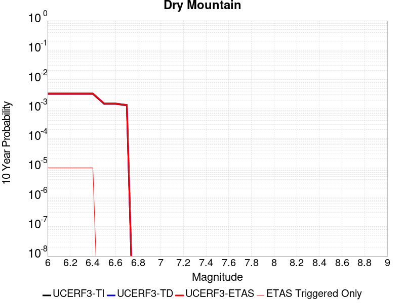 |

| Magnitude | 1 wk TI Prob | 1 wk TD Prob | 1 wk ETAS Prob | 1 wk ETAS/TD Gain | 1 wk ETAS Triggered Only | 1 mo TI Prob | 1 mo TD Prob | 1 mo ETAS Prob | 1 mo ETAS/TD Gain | 1 mo ETAS Triggered Only | 1 yr TI Prob | 1 yr TD Prob | 1 yr ETAS Prob | 1 yr ETAS/TD Gain | 1 yr ETAS Triggered Only | 10 yr TI Prob | 10 yr TD Prob | 10 yr ETAS Prob | 10 yr ETAS/TD Gain | 10 yr ETAS Triggered Only |
|-----|-----|-----|-----|-----|-----|-----|-----|-----|-----|-----|-----|-----|-----|-----|-----|-----|-----|-----|-----|-----|
| 6.0 | 6.222801E-6 | 6.4395003E-6 | 6.4395003E-6 | 1.0 | 0.0 | 2.6668875E-5 | 2.7597656E-5 | 2.7597656E-5 | 1.0 | 0.0 | 3.2464517E-4 | 3.3596557E-4 | 3.3596557E-4 | 1.0 | 0.0 | 0.0032417132 | 0.0033561387 | 0.0033737079 | 1.005235 | 1.762829E-5 |
| 6.1 | 6.222801E-6 | 6.4395003E-6 | 6.4395003E-6 | 1.0 | 0.0 | 2.6668875E-5 | 2.7597656E-5 | 2.7597656E-5 | 1.0 | 0.0 | 3.2464517E-4 | 3.3596557E-4 | 3.3596557E-4 | 1.0 | 0.0 | 0.0032417132 | 0.0033561387 | 0.0033737079 | 1.005235 | 1.762829E-5 |
| 6.2 | 6.222801E-6 | 6.4395003E-6 | 6.4395003E-6 | 1.0 | 0.0 | 2.6668875E-5 | 2.7597656E-5 | 2.7597656E-5 | 1.0 | 0.0 | 3.2464517E-4 | 3.3596557E-4 | 3.3596557E-4 | 1.0 | 0.0 | 0.0032417132 | 0.0033561387 | 0.0033737079 | 1.005235 | 1.762829E-5 |
| 6.3 | 6.222801E-6 | 6.4395003E-6 | 6.4395003E-6 | 1.0 | 0.0 | 2.6668875E-5 | 2.7597656E-5 | 2.7597656E-5 | 1.0 | 0.0 | 3.2464517E-4 | 3.3596557E-4 | 3.3596557E-4 | 1.0 | 0.0 | 0.0032417132 | 0.0033561387 | 0.0033737079 | 1.005235 | 1.762829E-5 |
| 6.4 | 6.222801E-6 | 6.4395003E-6 | 6.4395003E-6 | 1.0 | 0.0 | 2.6668875E-5 | 2.7597656E-5 | 2.7597656E-5 | 1.0 | 0.0 | 3.2464517E-4 | 3.3596557E-4 | 3.3596557E-4 | 1.0 | 0.0 | 0.0032417132 | 0.0033561387 | 0.0033737079 | 1.005235 | 1.762829E-5 |
| 6.5 | 2.8528623E-6 | 2.952223E-6 | 2.952223E-6 | 1.0 | 0.0 | 1.22264955E-5 | 1.2652372E-5 | 1.2652372E-5 | 1.0 | 0.0 | 1.4884741E-4 | 1.5404043E-4 | 1.5404043E-4 | 1.0 | 0.0 | 0.0014874774 | 0.0015401901 | 0.0015401901 | 1.0 | 0.0 |
| 6.6 | 2.8528623E-6 | 2.952223E-6 | 2.952223E-6 | 1.0 | 0.0 | 1.22264955E-5 | 1.2652372E-5 | 1.2652372E-5 | 1.0 | 0.0 | 1.4884741E-4 | 1.5404043E-4 | 1.5404043E-4 | 1.0 | 0.0 | 0.0014874774 | 0.0015401901 | 0.0015401901 | 1.0 | 0.0 |
| 6.7 | 2.541E-6 | 2.6294065E-6 | 2.6294065E-6 | 1.0 | 0.0 | 1.0889954E-5 | 1.1268885E-5 | 1.1268885E-5 | 1.0 | 0.0 | 1.3257713E-4 | 1.3719867E-4 | 1.3719867E-4 | 1.0 | 0.0 | 0.0013249806 | 0.0013719867 | 0.0013719867 | 1.0 | 0.0 |

## Cedar Mtn-Mahogany Mtn
*[(top)](#table-of-contents)*

| 1 Week | 1 Month | 1 Year | 10 Year |
|-----|-----|-----|-----|
|  |  |  |  |

| Magnitude | 1 wk TI Prob | 1 wk TD Prob | 1 wk ETAS Prob | 1 wk ETAS/TD Gain | 1 wk ETAS Triggered Only | 1 mo TI Prob | 1 mo TD Prob | 1 mo ETAS Prob | 1 mo ETAS/TD Gain | 1 mo ETAS Triggered Only | 1 yr TI Prob | 1 yr TD Prob | 1 yr ETAS Prob | 1 yr ETAS/TD Gain | 1 yr ETAS Triggered Only | 10 yr TI Prob | 10 yr TD Prob | 10 yr ETAS Prob | 10 yr ETAS/TD Gain | 10 yr ETAS Triggered Only |
|-----|-----|-----|-----|-----|-----|-----|-----|-----|-----|-----|-----|-----|-----|-----|-----|-----|-----|-----|-----|-----|
| 6.0 | 2.7763876E-5 | 2.9589899E-5 | 2.9589899E-5 | 1.0 | 0.0 | 1.1898261E-4 | 1.2680808E-4 | 1.2680808E-4 | 1.0 | 0.0 | 0.0014476506 | 0.0015428651 | 0.0015428651 | 1.0 | 0.0 | 0.0143825635 | 0.015328757 | 0.015346115 | 1.0011324 | 1.762829E-5 |
| 6.1 | 1.6162443E-5 | 1.7143519E-5 | 1.7143519E-5 | 1.0 | 0.0 | 6.926578E-5 | 7.347025E-5 | 7.347025E-5 | 1.0 | 0.0 | 8.4298453E-4 | 8.9415093E-4 | 8.9415093E-4 | 1.0 | 0.0 | 0.008397939 | 0.008907345 | 0.008924816 | 1.0019615 | 1.762829E-5 |
| 6.2 | 1.6162443E-5 | 1.7143519E-5 | 1.7143519E-5 | 1.0 | 0.0 | 6.926578E-5 | 7.347025E-5 | 7.347025E-5 | 1.0 | 0.0 | 8.4298453E-4 | 8.9415093E-4 | 8.9415093E-4 | 1.0 | 0.0 | 0.008397939 | 0.008907345 | 0.008924816 | 1.0019615 | 1.762829E-5 |
| 6.3 | 9.746053E-6 | 1.03034645E-5 | 1.03034645E-5 | 1.0 | 0.0 | 4.1768133E-5 | 4.415698E-5 | 4.415698E-5 | 1.0 | 0.0 | 5.0840835E-4 | 5.3748273E-4 | 5.3748273E-4 | 1.0 | 0.0 | 0.0050724675 | 0.0053622467 | 0.00537978 | 1.0032699 | 1.762829E-5 |
| 6.4 | 9.746053E-6 | 1.03034645E-5 | 1.03034645E-5 | 1.0 | 0.0 | 4.1768133E-5 | 4.415698E-5 | 4.415698E-5 | 1.0 | 0.0 | 5.0840835E-4 | 5.3748273E-4 | 5.3748273E-4 | 1.0 | 0.0 | 0.0050724675 | 0.0053622467 | 0.00537978 | 1.0032699 | 1.762829E-5 |
| 6.5 | 7.290083E-6 | 7.695551E-6 | 7.695551E-6 | 1.0 | 0.0 | 3.124284E-5 | 3.298053E-5 | 3.298053E-5 | 1.0 | 0.0 | 3.8031515E-4 | 4.0146615E-4 | 4.0146615E-4 | 1.0 | 0.0 | 0.0037966494 | 0.004007629 | 0.004025187 | 1.0043811 | 1.762829E-5 |
| 6.6 | 5.67907E-6 | 5.9893264E-6 | 5.9893264E-6 | 1.0 | 0.0 | 2.4338644E-5 | 2.5668296E-5 | 2.5668296E-5 | 1.0 | 0.0 | 2.962827E-4 | 3.1246804E-4 | 3.1246804E-4 | 1.0 | 0.0 | 0.0029588798 | 0.003120423 | 0.0031379964 | 1.0056317 | 1.762829E-5 |
| 6.7 | 3.4853963E-6 | 3.6727356E-6 | 3.6727356E-6 | 1.0 | 0.0 | 1.4937327E-5 | 1.5740205E-5 | 1.5740205E-5 | 1.0 | 0.0 | 1.8184677E-4 | 1.9162075E-4 | 1.9162075E-4 | 1.0 | 0.0 | 0.0018169804 | 0.0019146174 | 0.0019146174 | 1.0 | 0.0 |
| 6.8 | 2.7535168E-6 | 2.9016592E-6 | 2.9016592E-6 | 1.0 | 0.0 | 1.1800733E-5 | 1.2435626E-5 | 1.2435626E-5 | 1.0 | 0.0 | 1.4366445E-4 | 1.513937E-4 | 1.513937E-4 | 1.0 | 0.0 | 0.0014357162 | 0.0015129528 | 0.0015129528 | 1.0 | 0.0 |
| 6.9 | 1.6594106E-6 | 1.7497491E-6 | 1.7497491E-6 | 1.0 | 0.0 | 7.1117406E-6 | 7.498905E-6 | 7.498905E-6 | 1.0 | 0.0 | 8.6582E-5 | 9.129565E-5 | 9.129565E-5 | 1.0 | 0.0 | 8.654827E-4 | 9.126119E-4 | 9.126119E-4 | 1.0 | 0.0 |
| 7.0 | 5.10215E-7 | 5.389415E-7 | 5.389415E-7 | 1.0 | 0.0 | 2.186634E-6 | 2.3097477E-6 | 2.3097477E-6 | 1.0 | 0.0 | 2.6621943E-5 | 2.8120945E-5 | 2.8120945E-5 | 1.0 | 0.0 | 2.6618753E-4 | 2.8118643E-4 | 2.8118643E-4 | 1.0 | 0.0 |

## Cleghorn Pass
*[(top)](#table-of-contents)*

| 1 Week | 1 Month | 1 Year | 10 Year |
|-----|-----|-----|-----|
|  |  |  |  |

| Magnitude | 1 wk TI Prob | 1 wk TD Prob | 1 wk ETAS Prob | 1 wk ETAS/TD Gain | 1 wk ETAS Triggered Only | 1 mo TI Prob | 1 mo TD Prob | 1 mo ETAS Prob | 1 mo ETAS/TD Gain | 1 mo ETAS Triggered Only | 1 yr TI Prob | 1 yr TD Prob | 1 yr ETAS Prob | 1 yr ETAS/TD Gain | 1 yr ETAS Triggered Only | 10 yr TI Prob | 10 yr TD Prob | 10 yr ETAS Prob | 10 yr ETAS/TD Gain | 10 yr ETAS Triggered Only |
|-----|-----|-----|-----|-----|-----|-----|-----|-----|-----|-----|-----|-----|-----|-----|-----|-----|-----|-----|-----|-----|
| 6.0 | 1.0522846E-5 | 1.104093E-5 | 1.104093E-5 | 1.0 | 0.0 | 4.509713E-5 | 4.731771E-5 | 6.494517E-5 | 1.372534 | 1.762829E-5 | 5.4891926E-4 | 5.759935E-4 | 5.936116E-4 | 1.0305874 | 1.762829E-5 | 0.0054756533 | 0.005750172 | 0.0057676984 | 1.0030481 | 1.762829E-5 |
| 6.1 | 1.0522846E-5 | 1.104093E-5 | 1.104093E-5 | 1.0 | 0.0 | 4.509713E-5 | 4.731771E-5 | 6.494517E-5 | 1.372534 | 1.762829E-5 | 5.4891926E-4 | 5.759935E-4 | 5.936116E-4 | 1.0305874 | 1.762829E-5 | 0.0054756533 | 0.005750172 | 0.0057676984 | 1.0030481 | 1.762829E-5 |
| 6.2 | 2.1045846E-6 | 2.2082602E-6 | 2.2082602E-6 | 1.0 | 0.0 | 9.019617E-6 | 9.463961E-6 | 9.463961E-6 | 1.0 | 0.0 | 1.098083E-4 | 1.1522183E-4 | 1.1522183E-4 | 1.0 | 0.0 | 0.0010975406 | 0.0011520323 | 0.0011520323 | 1.0 | 0.0 |
| 6.3 | 2.1045846E-6 | 2.2082602E-6 | 2.2082602E-6 | 1.0 | 0.0 | 9.019617E-6 | 9.463961E-6 | 9.463961E-6 | 1.0 | 0.0 | 1.098083E-4 | 1.1522183E-4 | 1.1522183E-4 | 1.0 | 0.0 | 0.0010975406 | 0.0011520323 | 0.0011520323 | 1.0 | 0.0 |
| 6.4 | 1.7259927E-6 | 1.8109243E-6 | 1.8109243E-6 | 1.0 | 0.0 | 7.3970905E-6 | 7.761104E-6 | 7.761104E-6 | 1.0 | 0.0 | 9.005586E-5 | 9.449144E-5 | 9.449144E-5 | 1.0 | 0.0 | 9.001937E-4 | 9.4491447E-4 | 9.4491447E-4 | 1.0 | 0.0 |

## Cady
*[(top)](#table-of-contents)*

| 1 Week | 1 Month | 1 Year | 10 Year |
|-----|-----|-----|-----|
|  |  |  | 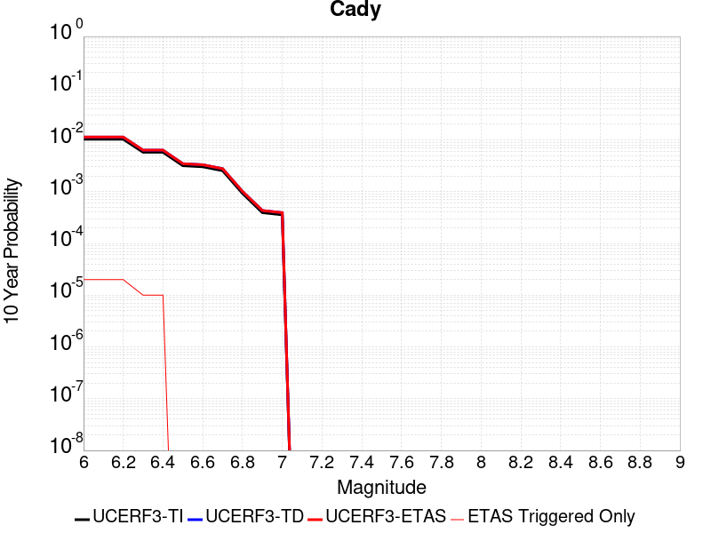 |

| Magnitude | 1 wk TI Prob | 1 wk TD Prob | 1 wk ETAS Prob | 1 wk ETAS/TD Gain | 1 wk ETAS Triggered Only | 1 mo TI Prob | 1 mo TD Prob | 1 mo ETAS Prob | 1 mo ETAS/TD Gain | 1 mo ETAS Triggered Only | 1 yr TI Prob | 1 yr TD Prob | 1 yr ETAS Prob | 1 yr ETAS/TD Gain | 1 yr ETAS Triggered Only | 10 yr TI Prob | 10 yr TD Prob | 10 yr ETAS Prob | 10 yr ETAS/TD Gain | 10 yr ETAS Triggered Only |
|-----|-----|-----|-----|-----|-----|-----|-----|-----|-----|-----|-----|-----|-----|-----|-----|-----|-----|-----|-----|-----|
| 6.0 | 1.9892565E-5 | 2.1859876E-5 | 2.1859876E-5 | 1.0 | 0.0 | 8.525106E-5 | 9.3682334E-5 | 9.3682334E-5 | 1.0 | 0.0 | 0.0010374374 | 0.0011400766 | 0.0011400766 | 1.0 | 0.0 | 0.010326075 | 0.011351293 | 0.011368722 | 1.0015353 | 1.762829E-5 |
| 6.1 | 1.9892565E-5 | 2.1859876E-5 | 2.1859876E-5 | 1.0 | 0.0 | 8.525106E-5 | 9.3682334E-5 | 9.3682334E-5 | 1.0 | 0.0 | 0.0010374374 | 0.0011400766 | 0.0011400766 | 1.0 | 0.0 | 0.010326075 | 0.011351293 | 0.011368722 | 1.0015353 | 1.762829E-5 |
| 6.2 | 1.9892565E-5 | 2.1859876E-5 | 2.1859876E-5 | 1.0 | 0.0 | 8.525106E-5 | 9.3682334E-5 | 9.3682334E-5 | 1.0 | 0.0 | 0.0010374374 | 0.0011400766 | 0.0011400766 | 1.0 | 0.0 | 0.010326075 | 0.011351293 | 0.011368722 | 1.0015353 | 1.762829E-5 |
| 6.3 | 1.1117327E-5 | 1.2177199E-5 | 1.2177199E-5 | 1.0 | 0.0 | 4.764482E-5 | 5.218713E-5 | 5.218713E-5 | 1.0 | 0.0 | 5.7992124E-4 | 6.352246E-4 | 6.352246E-4 | 1.0 | 0.0 | 0.0057841022 | 0.006337195 | 0.006337195 | 1.0 | 0.0 |
| 6.4 | 1.1117327E-5 | 1.2177199E-5 | 1.2177199E-5 | 1.0 | 0.0 | 4.764482E-5 | 5.218713E-5 | 5.218713E-5 | 1.0 | 0.0 | 5.7992124E-4 | 6.352246E-4 | 6.352246E-4 | 1.0 | 0.0 | 0.0057841022 | 0.006337195 | 0.006337195 | 1.0 | 0.0 |
| 6.5 | 6.103093E-6 | 6.672351E-6 | 6.672351E-6 | 1.0 | 0.0 | 2.615585E-5 | 2.8595547E-5 | 2.8595547E-5 | 1.0 | 0.0 | 3.1840094E-4 | 3.4810771E-4 | 3.4810771E-4 | 1.0 | 0.0 | 0.0031794512 | 0.0034768586 | 0.0034768586 | 1.0 | 0.0 |
| 6.6 | 5.817237E-6 | 6.3659772E-6 | 6.3659772E-6 | 1.0 | 0.0 | 2.4930776E-5 | 2.7282544E-5 | 2.7282544E-5 | 1.0 | 0.0 | 3.034899E-4 | 3.321268E-4 | 3.321268E-4 | 1.0 | 0.0 | 0.0030307577 | 0.0033175263 | 0.0033175263 | 1.0 | 0.0 |
| 6.7 | 4.8846314E-6 | 5.340833E-6 | 5.340833E-6 | 1.0 | 0.0 | 2.0933967E-5 | 2.288915E-5 | 2.288915E-5 | 1.0 | 0.0 | 2.5484123E-4 | 2.7865154E-4 | 2.7865154E-4 | 1.0 | 0.0 | 0.0025454918 | 0.002784177 | 0.002784177 | 1.0 | 0.0 |
| 6.8 | 1.7788773E-6 | 1.940001E-6 | 1.940001E-6 | 1.0 | 0.0 | 7.6237375E-6 | 8.314273E-6 | 8.314273E-6 | 1.0 | 0.0 | 9.281505E-5 | 1.0122315E-4 | 1.0122315E-4 | 1.0 | 0.0 | 9.2776294E-4 | 0.001011925 | 0.001011925 | 1.0 | 0.0 |
| 6.9 | 7.5455404E-7 | 8.2975305E-7 | 8.2975305E-7 | 1.0 | 0.0 | 3.233799E-6 | 3.5560815E-6 | 3.5560815E-6 | 1.0 | 0.0 | 3.937079E-5 | 4.329477E-5 | 4.329477E-5 | 1.0 | 0.0 | 3.9363815E-4 | 4.3289628E-4 | 4.3289628E-4 | 1.0 | 0.0 |
| 7.0 | 6.8578805E-7 | 7.542215E-7 | 7.542215E-7 | 1.0 | 0.0 | 2.9390883E-6 | 3.2323758E-6 | 3.2323758E-6 | 1.0 | 0.0 | 3.578281E-5 | 3.9353796E-5 | 3.9353796E-5 | 1.0 | 0.0 | 3.577705E-4 | 3.9350073E-4 | 3.9350073E-4 | 1.0 | 0.0 |

## Hayward (So) 2011 CFM
*[(top)](#table-of-contents)*

| 1 Week | 1 Month | 1 Year | 10 Year |
|-----|-----|-----|-----|
|  |  |  |  |

| Magnitude | 1 wk TI Prob | 1 wk TD Prob | 1 wk ETAS Prob | 1 wk ETAS/TD Gain | 1 wk ETAS Triggered Only | 1 mo TI Prob | 1 mo TD Prob | 1 mo ETAS Prob | 1 mo ETAS/TD Gain | 1 mo ETAS Triggered Only | 1 yr TI Prob | 1 yr TD Prob | 1 yr ETAS Prob | 1 yr ETAS/TD Gain | 1 yr ETAS Triggered Only | 10 yr TI Prob | 10 yr TD Prob | 10 yr ETAS Prob | 10 yr ETAS/TD Gain | 10 yr ETAS Triggered Only |
|-----|-----|-----|-----|-----|-----|-----|-----|-----|-----|-----|-----|-----|-----|-----|-----|-----|-----|-----|-----|-----|
| 6.0 | 1.8091932E-4 | 3.5726093E-4 | 3.5726093E-4 | 1.0 | 0.0 | 7.751381E-4 | 0.0015302298 | 0.0015302298 | 1.0 | 0.0 | 0.00939654 | 0.018473808 | 0.018473808 | 1.0 | 0.0 | 0.090090066 | 0.16681154 | 0.16682622 | 1.0000881 | 1.762829E-5 |
| 6.1 | 1.8091932E-4 | 3.5726093E-4 | 3.5726093E-4 | 1.0 | 0.0 | 7.751381E-4 | 0.0015302298 | 0.0015302298 | 1.0 | 0.0 | 0.00939654 | 0.018473808 | 0.018473808 | 1.0 | 0.0 | 0.090090066 | 0.16681154 | 0.16682622 | 1.0000881 | 1.762829E-5 |
| 6.2 | 1.8091932E-4 | 3.5726093E-4 | 3.5726093E-4 | 1.0 | 0.0 | 7.751381E-4 | 0.0015302298 | 0.0015302298 | 1.0 | 0.0 | 0.00939654 | 0.018473808 | 0.018473808 | 1.0 | 0.0 | 0.090090066 | 0.16681154 | 0.16682622 | 1.0000881 | 1.762829E-5 |
| 6.3 | 1.7322872E-4 | 3.4282645E-4 | 3.4282645E-4 | 1.0 | 0.0 | 7.4219756E-4 | 0.0014684385 | 0.0014684385 | 1.0 | 0.0 | 0.0089988755 | 0.017733958 | 0.017733958 | 1.0 | 0.0 | 0.08643075 | 0.16074646 | 0.16074646 | 1.0 | 0.0 |
| 6.4 | 1.6334097E-4 | 3.2363975E-4 | 3.2363975E-4 | 1.0 | 0.0 | 6.998449E-4 | 0.0013862988 | 0.0013862988 | 1.0 | 0.0 | 0.008487372 | 0.016749581 | 0.016749581 | 1.0 | 0.0 | 0.081704415 | 0.15263419 | 0.15263419 | 1.0 | 0.0 |
| 6.5 | 1.5600289E-4 | 3.103831E-4 | 3.103831E-4 | 1.0 | 0.0 | 6.684125E-4 | 0.0013295435 | 0.0013295435 | 1.0 | 0.0 | 0.008107598 | 0.016068943 | 0.016068943 | 1.0 | 0.0 | 0.078181036 | 0.14691001 | 0.14691001 | 1.0 | 0.0 |
| 6.6 | 1.4046066E-4 | 2.805153E-4 | 2.805153E-4 | 1.0 | 0.0 | 6.018354E-4 | 0.0012016613 | 0.0012016613 | 1.0 | 0.0 | 0.0073027555 | 0.014533587 | 0.014533587 | 1.0 | 0.0 | 0.07067384 | 0.13399512 | 0.13399512 | 1.0 | 0.0 |
| 6.7 | 1.14696966E-4 | 2.3288323E-4 | 2.3288323E-4 | 1.0 | 0.0 | 4.914658E-4 | 9.976943E-4 | 9.976943E-4 | 1.0 | 0.0 | 0.0059671924 | 0.01208034 | 0.01208034 | 1.0 | 0.0 | 0.058094822 | 0.11281668 | 0.11281668 | 1.0 | 0.0 |
| 6.8 | 9.3874296E-5 | 1.8875435E-4 | 1.8875435E-4 | 1.0 | 0.0 | 4.0225635E-4 | 8.0870016E-4 | 8.0870016E-4 | 1.0 | 0.0 | 0.0048864787 | 0.00980221 | 0.00980221 | 1.0 | 0.0 | 0.047804173 | 0.09265828 | 0.09265828 | 1.0 | 0.0 |
| 6.9 | 5.551852E-5 | 1.0737576E-4 | 1.0737576E-4 | 1.0 | 0.0 | 2.3791482E-4 | 4.601013E-4 | 4.601013E-4 | 1.0 | 0.0 | 0.0028927654 | 0.005587464 | 0.005587464 | 1.0 | 0.0 | 0.028553981 | 0.054282483 | 0.054282483 | 1.0 | 0.0 |
| 7.0 | 4.2662363E-5 | 8.252773E-5 | 8.252773E-5 | 1.0 | 0.0 | 1.8282588E-4 | 3.5364274E-4 | 3.5364274E-4 | 1.0 | 0.0 | 0.0022236328 | 0.0042971736 | 0.0042971736 | 1.0 | 0.0 | 0.022015138 | 0.042094123 | 0.042094123 | 1.0 | 0.0 |
| 7.1 | 3.305886E-5 | 6.307206E-5 | 6.307206E-5 | 1.0 | 0.0 | 1.4167312E-4 | 2.7028093E-4 | 2.7028093E-4 | 1.0 | 0.0 | 0.0017235056 | 0.0032857237 | 0.0032857237 | 1.0 | 0.0 | 0.017101998 | 0.032478187 | 0.032478187 | 1.0 | 0.0 |
| 7.2 | 2.9856887E-5 | 5.7064462E-5 | 5.7064462E-5 | 1.0 | 0.0 | 1.2795182E-4 | 2.4453914E-4 | 2.4453914E-4 | 1.0 | 0.0 | 0.0015567001 | 0.0029732161 | 0.0029732161 | 1.0 | 0.0 | 0.015458403 | 0.029477973 | 0.029477973 | 1.0 | 0.0 |
| 7.3 | 2.4559737E-5 | 4.603359E-5 | 4.603359E-5 | 1.0 | 0.0 | 1.0525176E-4 | 1.9727198E-4 | 1.9727198E-4 | 1.0 | 0.0 | 0.0012806869 | 0.0023991538 | 0.0023991538 | 1.0 | 0.0 | 0.012733313 | 0.023878254 | 0.023878254 | 1.0 | 0.0 |
| 7.4 | 1.9002231E-5 | 3.5085814E-5 | 3.5085814E-5 | 1.0 | 0.0 | 8.143559E-5 | 1.5035916E-4 | 1.5035916E-4 | 1.0 | 0.0 | 9.910273E-4 | 0.0018290955 | 0.0018290955 | 1.0 | 0.0 | 0.009866194 | 0.01827623 | 0.01827623 | 1.0 | 0.0 |
| 7.5 | 1.2783333E-5 | 2.3358793E-5 | 2.3358793E-5 | 1.0 | 0.0 | 5.4784563E-5 | 1.001053E-4 | 1.001053E-4 | 1.0 | 0.0 | 6.667979E-4 | 0.0012181065 | 0.0012181065 | 1.0 | 0.0 | 0.006648007 | 0.012223811 | 0.012223811 | 1.0 | 0.0 |
| 7.6 | 4.8149627E-6 | 8.8984125E-6 | 8.8984125E-6 | 1.0 | 0.0 | 2.063539E-5 | 3.8135506E-5 | 3.8135506E-5 | 1.0 | 0.0 | 2.5120692E-4 | 4.6420208E-4 | 4.6420208E-4 | 1.0 | 0.0 | 0.0025092314 | 0.0046865833 | 0.0046865833 | 1.0 | 0.0 |
| 7.7 | 6.0838227E-7 | 1.2079701E-6 | 1.2079701E-6 | 1.0 | 0.0 | 2.6073499E-6 | 5.177004E-6 | 5.177004E-6 | 1.0 | 0.0 | 3.174402E-5 | 6.30282E-5 | 6.30282E-5 | 1.0 | 0.0 | 3.1739488E-4 | 6.5405015E-4 | 6.5405015E-4 | 1.0 | 0.0 |
| 7.8 | 4.5542808E-7 | 9.812286E-7 | 9.812286E-7 | 1.0 | 0.0 | 1.9518332E-6 | 4.2052584E-6 | 4.2052584E-6 | 1.0 | 0.0 | 2.376331E-5 | 5.119782E-5 | 5.119782E-5 | 1.0 | 0.0 | 2.3760769E-4 | 5.331101E-4 | 5.331101E-4 | 1.0 | 0.0 |
| 7.9 | 3.3016747E-7 | 7.401128E-7 | 7.401128E-7 | 1.0 | 0.0 | 1.4150027E-6 | 3.171908E-6 | 3.171908E-6 | 1.0 | 0.0 | 1.7227521E-5 | 3.8617298E-5 | 3.8617298E-5 | 1.0 | 0.0 | 1.7226185E-4 | 4.0002094E-4 | 4.0002094E-4 | 1.0 | 0.0 |
| 8.0 | 2.347038E-7 | 5.4817883E-7 | 5.4817883E-7 | 1.0 | 0.0 | 1.0058731E-6 | 2.3493355E-6 | 2.3493355E-6 | 1.0 | 0.0 | 1.2246436E-5 | 2.8602788E-5 | 2.8602788E-5 | 1.0 | 0.0 | 1.2245761E-4 | 2.940476E-4 | 2.940476E-4 | 1.0 | 0.0 |
| 8.1 | 1.18822804E-7 | 2.6104607E-7 | 2.6104607E-7 | 1.0 | 0.0 | 5.092405E-7 | 1.1187684E-6 | 1.1187684E-6 | 1.0 | 0.0 | 6.1999854E-6 | 1.3620921E-5 | 1.3620921E-5 | 1.0 | 0.0 | 6.199812E-5 | 1.394018E-4 | 1.394018E-4 | 1.0 | 0.0 |

## San Jacinto (San Bernardino)
*[(top)](#table-of-contents)*

| 1 Week | 1 Month | 1 Year | 10 Year |
|-----|-----|-----|-----|
|  |  |  |  |

| Magnitude | 1 wk TI Prob | 1 wk TD Prob | 1 wk ETAS Prob | 1 wk ETAS/TD Gain | 1 wk ETAS Triggered Only | 1 mo TI Prob | 1 mo TD Prob | 1 mo ETAS Prob | 1 mo ETAS/TD Gain | 1 mo ETAS Triggered Only | 1 yr TI Prob | 1 yr TD Prob | 1 yr ETAS Prob | 1 yr ETAS/TD Gain | 1 yr ETAS Triggered Only | 10 yr TI Prob | 10 yr TD Prob | 10 yr ETAS Prob | 10 yr ETAS/TD Gain | 10 yr ETAS Triggered Only |
|-----|-----|-----|-----|-----|-----|-----|-----|-----|-----|-----|-----|-----|-----|-----|-----|-----|-----|-----|-----|-----|
| 6.0 | 3.409352E-5 | 3.6049758E-5 | 3.6049758E-5 | 1.0 | 0.0 | 1.461069E-4 | 1.5448983E-4 | 1.5448983E-4 | 1.0 | 0.0 | 0.0017774 | 0.0018792928 | 0.0018968879 | 1.0093627 | 1.762829E-5 | 0.01763251 | 0.019382251 | 0.019399537 | 1.0008919 | 1.762829E-5 |
| 6.1 | 3.409352E-5 | 3.6049758E-5 | 3.6049758E-5 | 1.0 | 0.0 | 1.461069E-4 | 1.5448983E-4 | 1.5448983E-4 | 1.0 | 0.0 | 0.0017774 | 0.0018792928 | 0.0018968879 | 1.0093627 | 1.762829E-5 | 0.01763251 | 0.019382251 | 0.019399537 | 1.0008919 | 1.762829E-5 |
| 6.2 | 3.409352E-5 | 3.6049758E-5 | 3.6049758E-5 | 1.0 | 0.0 | 1.461069E-4 | 1.5448983E-4 | 1.5448983E-4 | 1.0 | 0.0 | 0.0017774 | 0.0018792928 | 0.0018968879 | 1.0093627 | 1.762829E-5 | 0.01763251 | 0.019382251 | 0.019399537 | 1.0008919 | 1.762829E-5 |
| 6.3 | 3.409352E-5 | 3.6049758E-5 | 3.6049758E-5 | 1.0 | 0.0 | 1.461069E-4 | 1.5448983E-4 | 1.5448983E-4 | 1.0 | 0.0 | 0.0017774 | 0.0018792928 | 0.0018968879 | 1.0093627 | 1.762829E-5 | 0.01763251 | 0.019382251 | 0.019399537 | 1.0008919 | 1.762829E-5 |
| 6.4 | 3.400795E-5 | 3.5942405E-5 | 3.5942405E-5 | 1.0 | 0.0 | 1.4574021E-4 | 1.540298E-4 | 1.540298E-4 | 1.0 | 0.0 | 0.0017729428 | 0.0018737017 | 0.001891297 | 1.0093906 | 1.762829E-5 | 0.017588645 | 0.019327328 | 0.019344615 | 1.0008944 | 1.762829E-5 |
| 6.5 | 3.341482E-5 | 3.5202946E-5 | 3.5202946E-5 | 1.0 | 0.0 | 1.4319851E-4 | 1.5086106E-4 | 1.5086106E-4 | 1.0 | 0.0 | 0.0017420477 | 0.0018351874 | 0.0018527834 | 1.0095881 | 1.762829E-5 | 0.017284546 | 0.018948833 | 0.018966127 | 1.0009127 | 1.762829E-5 |
| 6.6 | 3.3364955E-5 | 3.5140158E-5 | 3.5140158E-5 | 1.0 | 0.0 | 1.4298483E-4 | 1.50592E-4 | 1.50592E-4 | 1.0 | 0.0 | 0.0017394501 | 0.0018319171 | 0.001849513 | 1.0096053 | 1.762829E-5 | 0.017258976 | 0.018916694 | 0.01893399 | 1.0009142 | 1.762829E-5 |
| 6.7 | 3.335922E-5 | 3.512993E-5 | 3.512993E-5 | 1.0 | 0.0 | 1.4296026E-4 | 1.5054816E-4 | 1.5054816E-4 | 1.0 | 0.0 | 0.0017391514 | 0.0018313844 | 0.0018489803 | 1.009608 | 1.762829E-5 | 0.017256035 | 0.018911485 | 0.018928781 | 1.0009146 | 1.762829E-5 |
| 6.8 | 3.327683E-5 | 3.5023982E-5 | 3.5023982E-5 | 1.0 | 0.0 | 1.4260718E-4 | 1.5009414E-4 | 1.5009414E-4 | 1.0 | 0.0 | 0.0017348597 | 0.0018258659 | 0.0018434621 | 1.0096371 | 1.762829E-5 | 0.017213784 | 0.018857252 | 0.018874547 | 1.0009172 | 1.762829E-5 |
| 6.9 | 3.3235785E-5 | 3.4964927E-5 | 3.4964927E-5 | 1.0 | 0.0 | 1.4243131E-4 | 1.4984109E-4 | 1.4984109E-4 | 1.0 | 0.0 | 0.0017327217 | 0.0018227901 | 0.0018403862 | 1.0096534 | 1.762829E-5 | 0.017192734 | 0.018827116 | 0.018844413 | 1.0009187 | 1.762829E-5 |
| 7.0 | 3.3197095E-5 | 3.4904846E-5 | 3.4904846E-5 | 1.0 | 0.0 | 1.422655E-4 | 1.4958362E-4 | 1.4958362E-4 | 1.0 | 0.0 | 0.0017307063 | 0.0018196608 | 0.001837257 | 1.00967 | 1.762829E-5 | 0.017172894 | 0.018796489 | 0.018813785 | 1.0009202 | 1.762829E-5 |
| 7.1 | 3.3129716E-5 | 3.478503E-5 | 3.478503E-5 | 1.0 | 0.0 | 1.4197677E-4 | 1.4907018E-4 | 1.4907018E-4 | 1.0 | 0.0 | 0.0017271966 | 0.0018134202 | 0.0018310165 | 1.0097034 | 1.762829E-5 | 0.017138338 | 0.018735558 | 0.018752856 | 1.0009233 | 1.762829E-5 |
| 7.2 | 3.3034008E-5 | 3.4652458E-5 | 3.4652458E-5 | 1.0 | 0.0 | 1.4156665E-4 | 1.4850209E-4 | 1.4850209E-4 | 1.0 | 0.0 | 0.0017222111 | 0.001806515 | 0.0018241114 | 1.0097406 | 1.762829E-5 | 0.017089253 | 0.018667944 | 0.018685242 | 1.0009267 | 1.762829E-5 |
| 7.3 | 3.2956614E-5 | 3.4520177E-5 | 3.4520177E-5 | 1.0 | 0.0 | 1.4123498E-4 | 1.4793524E-4 | 1.4793524E-4 | 1.0 | 0.0 | 0.0017181796 | 0.001799625 | 0.0018172216 | 1.0097779 | 1.762829E-5 | 0.017049557 | 0.018600674 | 0.018617975 | 1.0009301 | 1.762829E-5 |
| 7.4 | 3.2915937E-5 | 3.4441844E-5 | 3.4441844E-5 | 1.0 | 0.0 | 1.4106068E-4 | 1.4759957E-4 | 1.4759957E-4 | 1.0 | 0.0 | 0.0017160608 | 0.0017955449 | 0.0018131415 | 1.0098002 | 1.762829E-5 | 0.017028693 | 0.018560927 | 0.01857823 | 1.0009321 | 1.762829E-5 |
| 7.5 | 3.281791E-5 | 3.430671E-5 | 3.430671E-5 | 1.0 | 0.0 | 1.406406E-4 | 1.4702049E-4 | 1.4702049E-4 | 1.0 | 0.0 | 0.0017109542 | 0.0017885063 | 0.0018061032 | 1.0098388 | 1.762829E-5 | 0.016978411 | 0.018491795 | 0.018509097 | 1.0009357 | 1.762829E-5 |
| 7.6 | 3.2521442E-5 | 3.4031546E-5 | 3.4031546E-5 | 1.0 | 0.0 | 1.3937015E-4 | 1.4584133E-4 | 1.4584133E-4 | 1.0 | 0.0 | 0.0016955109 | 0.0017741736 | 0.0017917706 | 1.0099185 | 1.762829E-5 | 0.016826328 | 0.018349366 | 0.018366672 | 1.0009431 | 1.762829E-5 |
| 7.7 | 3.0287873E-5 | 3.2514843E-5 | 3.2514843E-5 | 1.0 | 0.0 | 1.297987E-4 | 1.393419E-4 | 1.393419E-4 | 1.0 | 0.0 | 0.0015791537 | 0.0016951686 | 0.0017127669 | 1.0103815 | 1.762829E-5 | 0.01567979 | 0.017559871 | 0.01757719 | 1.0009862 | 1.762829E-5 |
| 7.8 | 2.6316151E-5 | 2.9723395E-5 | 2.9723395E-5 | 1.0 | 0.0 | 1.1277862E-4 | 1.2737977E-4 | 1.2737977E-4 | 1.0 | 0.0 | 0.0013722149 | 0.0015497464 | 0.0015673473 | 1.0113573 | 1.762829E-5 | 0.013637724 | 0.016100293 | 0.016117638 | 1.0010773 | 1.762829E-5 |
| 7.9 | 2.0761147E-5 | 2.3470231E-5 | 2.3470231E-5 | 1.0 | 0.0 | 8.897331E-5 | 1.0058283E-4 | 1.0058283E-4 | 1.0 | 0.0 | 0.0010827117 | 0.0012239089 | 0.0012415156 | 1.0143857 | 1.762829E-5 | 0.010774517 | 0.012820105 | 0.012837507 | 1.0013574 | 1.762829E-5 |
| 8.0 | 1.5738568E-5 | 1.607273E-5 | 1.607273E-5 | 1.0 | 0.0 | 6.744926E-5 | 6.8881316E-5 | 6.8881316E-5 | 1.0 | 0.0 | 8.2088535E-4 | 8.38308E-4 | 8.5592153E-4 | 1.0210108 | 1.762829E-5 | 0.008178596 | 0.008886527 | 0.008903999 | 1.0019661 | 1.762829E-5 |
| 8.1 | 1.0105832E-5 | 8.353191E-6 | 8.353191E-6 | 1.0 | 0.0 | 4.3309992E-5 | 3.5798905E-5 | 3.5798905E-5 | 1.0 | 0.0 | 5.2717153E-4 | 4.35765E-4 | 4.533856E-4 | 1.040436 | 1.762829E-5 | 0.005259227 | 0.004689436 | 0.0047069816 | 1.0037415 | 1.762829E-5 |
| 8.2 | 4.189207E-6 | 1.5851253E-6 | 1.5851253E-6 | 1.0 | 0.0 | 1.7953622E-5 | 6.7933765E-6 | 6.7933765E-6 | 1.0 | 0.0 | 2.1856341E-4 | 8.270625E-5 | 8.270625E-5 | 1.0 | 0.0 | 0.0021834858 | 9.604094E-4 | 9.604094E-4 | 1.0 | 0.0 |
| 8.3 | 1.2758221E-6 | 3.6330252E-7 | 3.6330252E-7 | 1.0 | 0.0 | 5.4677976E-6 | 1.5570099E-6 | 1.5570099E-6 | 1.0 | 0.0 | 6.65684E-5 | 1.8956434E-5 | 1.8956434E-5 | 1.0 | 0.0 | 6.6548464E-4 | 2.2857229E-4 | 2.2857229E-4 | 1.0 | 0.0 |

## Red Pass
*[(top)](#table-of-contents)*

| 1 Week | 1 Month | 1 Year | 10 Year |
|-----|-----|-----|-----|
|  |  |  | 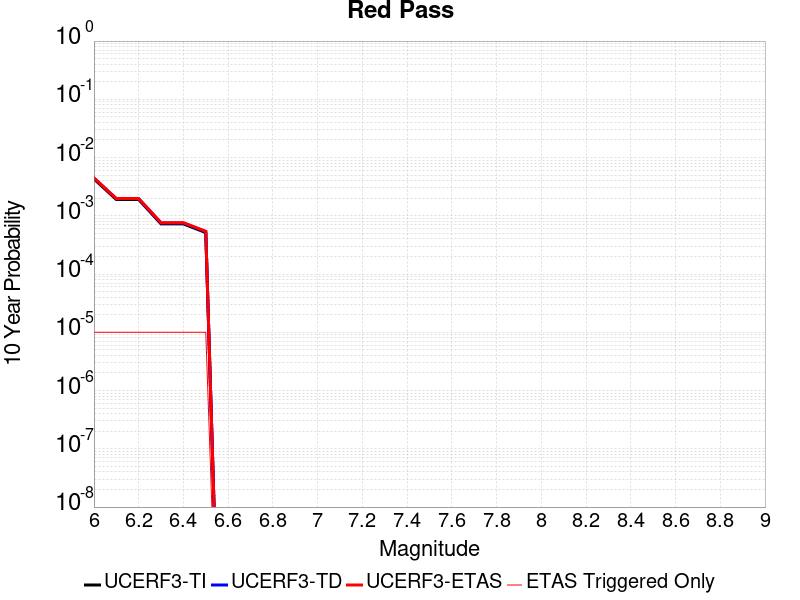 |

| Magnitude | 1 wk TI Prob | 1 wk TD Prob | 1 wk ETAS Prob | 1 wk ETAS/TD Gain | 1 wk ETAS Triggered Only | 1 mo TI Prob | 1 mo TD Prob | 1 mo ETAS Prob | 1 mo ETAS/TD Gain | 1 mo ETAS Triggered Only | 1 yr TI Prob | 1 yr TD Prob | 1 yr ETAS Prob | 1 yr ETAS/TD Gain | 1 yr ETAS Triggered Only | 10 yr TI Prob | 10 yr TD Prob | 10 yr ETAS Prob | 10 yr ETAS/TD Gain | 10 yr ETAS Triggered Only |
|-----|-----|-----|-----|-----|-----|-----|-----|-----|-----|-----|-----|-----|-----|-----|-----|-----|-----|-----|-----|-----|
| 6.0 | 8.258278E-6 | 8.551426E-6 | 8.551426E-6 | 1.0 | 0.0 | 3.539214E-5 | 3.6648555E-5 | 3.6648555E-5 | 1.0 | 0.0 | 4.308141E-4 | 4.4612266E-4 | 4.4612266E-4 | 1.0 | 0.0 | 0.0042997985 | 0.0044540283 | 0.004471578 | 1.0039402 | 1.762829E-5 |
| 6.1 | 3.649988E-6 | 3.7753848E-6 | 3.7753848E-6 | 1.0 | 0.0 | 1.5642712E-5 | 1.6180147E-5 | 1.6180147E-5 | 1.0 | 0.0 | 1.9043336E-4 | 1.9698025E-4 | 1.9698025E-4 | 1.0 | 0.0 | 0.0019027026 | 0.0019685237 | 0.0019861173 | 1.0089375 | 1.762829E-5 |
| 6.2 | 3.649988E-6 | 3.7753848E-6 | 3.7753848E-6 | 1.0 | 0.0 | 1.5642712E-5 | 1.6180147E-5 | 1.6180147E-5 | 1.0 | 0.0 | 1.9043336E-4 | 1.9698025E-4 | 1.9698025E-4 | 1.0 | 0.0 | 0.0019027026 | 0.0019685237 | 0.0019861173 | 1.0089375 | 1.762829E-5 |
| 6.3 | 1.3924937E-6 | 1.4411434E-6 | 1.4411434E-6 | 1.0 | 0.0 | 5.9678164E-6 | 6.1763217E-6 | 6.1763217E-6 | 1.0 | 0.0 | 7.265574E-5 | 7.519554E-5 | 7.519554E-5 | 1.0 | 0.0 | 7.263199E-4 | 7.518397E-4 | 7.6945475E-4 | 1.0234293 | 1.762829E-5 |
| 6.4 | 1.3924937E-6 | 1.4411434E-6 | 1.4411434E-6 | 1.0 | 0.0 | 5.9678164E-6 | 6.1763217E-6 | 6.1763217E-6 | 1.0 | 0.0 | 7.265574E-5 | 7.519554E-5 | 7.519554E-5 | 1.0 | 0.0 | 7.263199E-4 | 7.518397E-4 | 7.6945475E-4 | 1.0234293 | 1.762829E-5 |
| 6.5 | 9.876812E-7 | 1.0222102E-6 | 1.0222102E-6 | 1.0 | 0.0 | 4.2329125E-6 | 4.3809005E-6 | 4.3809005E-6 | 1.0 | 0.0 | 5.153449E-5 | 5.3337466E-5 | 5.3337466E-5 | 1.0 | 0.0 | 5.1522546E-4 | 5.3337467E-4 | 5.5099354E-4 | 1.0330329 | 1.762829E-5 |

## Calaveras (So) 2011 CFM
*[(top)](#table-of-contents)*

| 1 Week | 1 Month | 1 Year | 10 Year |
|-----|-----|-----|-----|
|  | 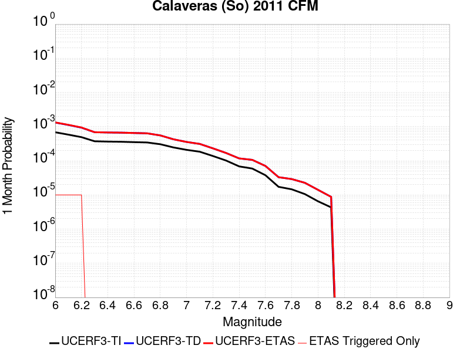 | 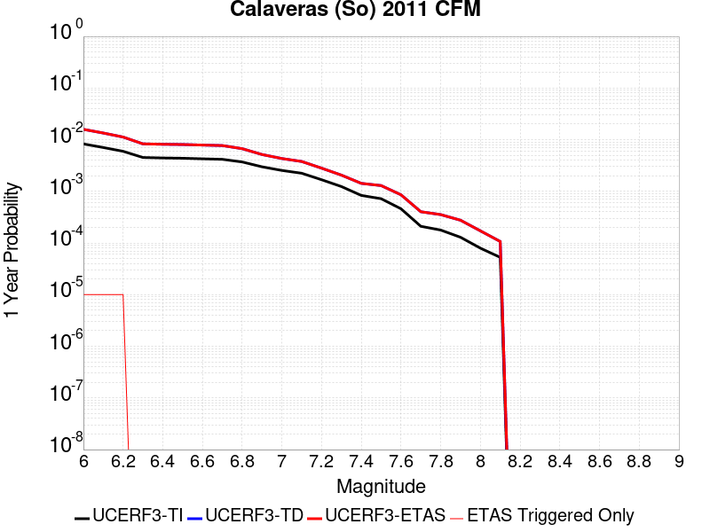 |  |

| Magnitude | 1 wk TI Prob | 1 wk TD Prob | 1 wk ETAS Prob | 1 wk ETAS/TD Gain | 1 wk ETAS Triggered Only | 1 mo TI Prob | 1 mo TD Prob | 1 mo ETAS Prob | 1 mo ETAS/TD Gain | 1 mo ETAS Triggered Only | 1 yr TI Prob | 1 yr TD Prob | 1 yr ETAS Prob | 1 yr ETAS/TD Gain | 1 yr ETAS Triggered Only | 10 yr TI Prob | 10 yr TD Prob | 10 yr ETAS Prob | 10 yr ETAS/TD Gain | 10 yr ETAS Triggered Only |
|-----|-----|-----|-----|-----|-----|-----|-----|-----|-----|-----|-----|-----|-----|-----|-----|-----|-----|-----|-----|-----|
| 6.0 | 1.5950744E-4 | 3.0739905E-4 | 3.0739905E-4 | 1.0 | 0.0 | 6.834242E-4 | 0.0013167706 | 0.0013343756 | 1.0133699 | 1.762829E-5 | 0.00828899 | 0.015865553 | 0.015882902 | 1.0010935 | 1.762829E-5 | 0.079865426 | 0.14445968 | 0.14447477 | 1.0001044 | 1.762829E-5 |
| 6.1 | 1.3584697E-4 | 2.6061598E-4 | 2.6061598E-4 | 1.0 | 0.0 | 5.8207137E-4 | 0.0011164517 | 0.0011340603 | 1.015772 | 1.762829E-5 | 0.007063716 | 0.013468163 | 0.013485555 | 1.0012913 | 1.762829E-5 | 0.06843361 | 0.124085724 | 0.12410116 | 1.0001245 | 1.762829E-5 |
| 6.2 | 1.14676266E-4 | 2.1746816E-4 | 2.1746816E-4 | 1.0 | 0.0 | 4.9137714E-4 | 9.316741E-4 | 9.492859E-4 | 1.0189035 | 1.762829E-5 | 0.0059661185 | 0.011251126 | 0.011268556 | 1.0015491 | 1.762829E-5 | 0.058084648 | 0.10507494 | 0.105090715 | 1.0001501 | 1.762829E-5 |
| 6.3 | 8.691518E-5 | 1.6001116E-4 | 1.6001116E-4 | 1.0 | 0.0 | 3.7244044E-4 | 6.855628E-4 | 6.855628E-4 | 1.0 | 0.0 | 0.004525038 | 0.008307241 | 0.008307241 | 1.0 | 0.0 | 0.044339992 | 0.079390146 | 0.079390146 | 1.0 | 0.0 |
| 6.4 | 8.50982E-5 | 1.5707467E-4 | 1.5707467E-4 | 1.0 | 0.0 | 3.646556E-4 | 6.7298434E-4 | 6.7298434E-4 | 1.0 | 0.0 | 0.0044306475 | 0.008155251 | 0.008155251 | 1.0 | 0.0 | 0.04343345 | 0.077996135 | 0.077996135 | 1.0 | 0.0 |
| 6.5 | 8.4062965E-5 | 1.5531975E-4 | 1.5531975E-4 | 1.0 | 0.0 | 3.602201E-4 | 6.654671E-4 | 6.654671E-4 | 1.0 | 0.0 | 0.004376863 | 0.008064441 | 0.008064441 | 1.0 | 0.0 | 0.042916555 | 0.07716733 | 0.07716733 | 1.0 | 0.0 |
| 6.6 | 8.194716E-5 | 1.516774E-4 | 1.516774E-4 | 1.0 | 0.0 | 3.5115483E-4 | 6.498649E-4 | 6.498649E-4 | 1.0 | 0.0 | 0.0042669317 | 0.007876252 | 0.007876252 | 1.0 | 0.0 | 0.04185927 | 0.0754524 | 0.0754524 | 1.0 | 0.0 |
| 6.7 | 8.012326E-5 | 1.483531E-4 | 1.483531E-4 | 1.0 | 0.0 | 3.433402E-4 | 6.3563243E-4 | 6.3563243E-4 | 1.0 | 0.0 | 0.004172157 | 0.0077047227 | 0.0077047227 | 1.0 | 0.0 | 0.040946912 | 0.0738944 | 0.0738944 | 1.0 | 0.0 |
| 6.8 | 7.119773E-5 | 1.289278E-4 | 1.289278E-4 | 1.0 | 0.0 | 3.0509746E-4 | 5.524251E-4 | 5.524251E-4 | 1.0 | 0.0 | 0.0037082357 | 0.0067017726 | 0.0067017726 | 1.0 | 0.0 | 0.036469642 | 0.06473622 | 0.06473622 | 1.0 | 0.0 |
| 6.9 | 5.7343088E-5 | 9.928818E-5 | 9.928818E-5 | 1.0 | 0.0 | 2.4573295E-4 | 4.254518E-4 | 4.254518E-4 | 1.0 | 0.0 | 0.0029876942 | 0.0051676547 | 0.0051676547 | 1.0 | 0.0 | 0.02947844 | 0.05055552 | 0.05055552 | 1.0 | 0.0 |
| 7.0 | 4.8746577E-5 | 8.294431E-5 | 8.294431E-5 | 1.0 | 0.0 | 2.0889717E-4 | 3.5542753E-4 | 3.5542753E-4 | 1.0 | 0.0 | 0.0025403565 | 0.0043188105 | 0.0043188105 | 1.0 | 0.0 | 0.025115121 | 0.04253077 | 0.04253077 | 1.0 | 0.0 |
| 7.1 | 4.2998014E-5 | 7.27236E-5 | 7.27236E-5 | 1.0 | 0.0 | 1.8426418E-4 | 3.1163564E-4 | 3.1163564E-4 | 1.0 | 0.0 | 0.002241108 | 0.0037876235 | 0.0037876235 | 1.0 | 0.0 | 0.022186412 | 0.037458975 | 0.037458975 | 1.0 | 0.0 |
| 7.2 | 3.221292E-5 | 5.3976983E-5 | 5.3976983E-5 | 1.0 | 0.0 | 1.3804805E-4 | 2.3130958E-4 | 2.3130958E-4 | 1.0 | 0.0 | 0.0016794393 | 0.002812585 | 0.002812585 | 1.0 | 0.0 | 0.016668037 | 0.02807059 | 0.02807059 | 1.0 | 0.0 |
| 7.3 | 2.3756531E-5 | 3.9534E-5 | 3.9534E-5 | 1.0 | 0.0 | 1.0180973E-4 | 1.6942051E-4 | 1.6942051E-4 | 1.0 | 0.0 | 0.0012388286 | 0.0020607605 | 0.0020607605 | 1.0 | 0.0 | 0.012319452 | 0.020674022 | 0.020674022 | 1.0 | 0.0 |
| 7.4 | 1.5997684E-5 | 2.737303E-5 | 2.737303E-5 | 1.0 | 0.0 | 6.8559704E-5 | 1.1730772E-4 | 1.1730772E-4 | 1.0 | 0.0 | 8.343947E-4 | 0.0014272883 | 0.0014272883 | 1.0 | 0.0 | 0.008312687 | 0.0143921655 | 0.0143921655 | 1.0 | 0.0 |
| 7.5 | 1.3814293E-5 | 2.481389E-5 | 2.481389E-5 | 1.0 | 0.0 | 5.9202768E-5 | 1.0634092E-4 | 1.0634092E-4 | 1.0 | 0.0 | 7.205553E-4 | 0.0012939342 | 0.0012939342 | 1.0 | 0.0 | 0.007182234 | 0.013070965 | 0.013070965 | 1.0 | 0.0 |
| 7.6 | 8.817309E-6 | 1.6456672E-5 | 1.6456672E-5 | 1.0 | 0.0 | 3.7787922E-5 | 7.0526694E-5 | 7.0526694E-5 | 1.0 | 0.0 | 4.5997082E-4 | 8.5832557E-4 | 8.5832557E-4 | 1.0 | 0.0 | 0.004590199 | 0.008732965 | 0.008732965 | 1.0 | 0.0 |
| 7.7 | 4.0352206E-6 | 7.724012E-6 | 7.724012E-6 | 1.0 | 0.0 | 1.7293689E-5 | 3.310249E-5 | 3.310249E-5 | 1.0 | 0.0 | 2.1053031E-4 | 4.0294835E-4 | 4.0294835E-4 | 1.0 | 0.0 | 0.0021033096 | 0.0041733775 | 0.0041733775 | 1.0 | 0.0 |
| 7.8 | 3.413169E-6 | 6.8018153E-6 | 6.8018153E-6 | 1.0 | 0.0 | 1.4627784E-5 | 2.9150313E-5 | 2.9150313E-5 | 1.0 | 0.0 | 1.7807873E-4 | 3.5484732E-4 | 3.5484732E-4 | 1.0 | 0.0 | 0.0017793609 | 0.0036736047 | 0.0036736047 | 1.0 | 0.0 |
| 7.9 | 2.4740732E-6 | 5.2897763E-6 | 5.2897763E-6 | 1.0 | 0.0 | 1.06031275E-5 | 2.2670272E-5 | 2.2670272E-5 | 1.0 | 0.0 | 1.2908543E-4 | 2.7597568E-4 | 2.7597568E-4 | 1.0 | 0.0 | 0.0012901047 | 0.002839954 | 0.002839954 | 1.0 | 0.0 |
| 8.0 | 1.5231818E-6 | 3.2950636E-6 | 3.2950636E-6 | 1.0 | 0.0 | 6.527906E-6 | 1.4121625E-5 | 1.4121625E-5 | 1.0 | 0.0 | 7.9474354E-5 | 1.7191726E-4 | 1.7191726E-4 | 1.0 | 0.0 | 7.944594E-4 | 0.0017594753 | 0.0017594753 | 1.0 | 0.0 |
| 8.1 | 1.0104524E-6 | 2.049573E-6 | 2.049573E-6 | 1.0 | 0.0 | 4.330503E-6 | 8.783854E-6 | 8.783854E-6 | 1.0 | 0.0 | 5.2722597E-5 | 1.0693821E-4 | 1.0693821E-4 | 1.0 | 0.0 | 5.271009E-4 | 0.0010948586 | 0.0010948586 | 1.0 | 0.0 |

## Owens Valley
*[(top)](#table-of-contents)*

| 1 Week | 1 Month | 1 Year | 10 Year |
|-----|-----|-----|-----|
|  |  |  |  |

| Magnitude | 1 wk TI Prob | 1 wk TD Prob | 1 wk ETAS Prob | 1 wk ETAS/TD Gain | 1 wk ETAS Triggered Only | 1 mo TI Prob | 1 mo TD Prob | 1 mo ETAS Prob | 1 mo ETAS/TD Gain | 1 mo ETAS Triggered Only | 1 yr TI Prob | 1 yr TD Prob | 1 yr ETAS Prob | 1 yr ETAS/TD Gain | 1 yr ETAS Triggered Only | 10 yr TI Prob | 10 yr TD Prob | 10 yr ETAS Prob | 10 yr ETAS/TD Gain | 10 yr ETAS Triggered Only |
|-----|-----|-----|-----|-----|-----|-----|-----|-----|-----|-----|-----|-----|-----|-----|-----|-----|-----|-----|-----|-----|
| 6.0 | 4.83821E-5 | 3.6298834E-6 | 3.6298834E-6 | 1.0 | 0.0 | 2.0733538E-4 | 1.5556556E-5 | 1.5556556E-5 | 1.0 | 0.0 | 0.002521386 | 1.893856E-4 | 2.0701055E-4 | 1.0930638 | 1.762829E-5 | 0.024929691 | 0.0019267192 | 0.0019443135 | 1.0091318 | 1.762829E-5 |
| 6.1 | 4.83821E-5 | 3.6298834E-6 | 3.6298834E-6 | 1.0 | 0.0 | 2.0733538E-4 | 1.5556556E-5 | 1.5556556E-5 | 1.0 | 0.0 | 0.002521386 | 1.893856E-4 | 2.0701055E-4 | 1.0930638 | 1.762829E-5 | 0.024929691 | 0.0019267192 | 0.0019443135 | 1.0091318 | 1.762829E-5 |
| 6.2 | 4.83821E-5 | 3.6298834E-6 | 3.6298834E-6 | 1.0 | 0.0 | 2.0733538E-4 | 1.5556556E-5 | 1.5556556E-5 | 1.0 | 0.0 | 0.002521386 | 1.893856E-4 | 2.0701055E-4 | 1.0930638 | 1.762829E-5 | 0.024929691 | 0.0019267192 | 0.0019443135 | 1.0091318 | 1.762829E-5 |
| 6.3 | 3.953008E-5 | 3.1571942E-6 | 3.1571942E-6 | 1.0 | 0.0 | 1.6940363E-4 | 1.3530766E-5 | 1.3530766E-5 | 1.0 | 0.0 | 0.002060538 | 1.6472537E-4 | 1.8235075E-4 | 1.1069986 | 1.762829E-5 | 0.020415364 | 0.0016601578 | 0.0016777568 | 1.0106008 | 1.762829E-5 |
| 6.4 | 3.953008E-5 | 3.1571942E-6 | 3.1571942E-6 | 1.0 | 0.0 | 1.6940363E-4 | 1.3530766E-5 | 1.3530766E-5 | 1.0 | 0.0 | 0.002060538 | 1.6472537E-4 | 1.8235075E-4 | 1.1069986 | 1.762829E-5 | 0.020415364 | 0.0016601578 | 0.0016777568 | 1.0106008 | 1.762829E-5 |
| 6.5 | 3.457342E-5 | 2.9727623E-6 | 2.9727623E-6 | 1.0 | 0.0 | 1.4816338E-4 | 1.2740352E-5 | 1.2740352E-5 | 1.0 | 0.0 | 0.0018023965 | 1.5510344E-4 | 1.72729E-4 | 1.1136374 | 1.762829E-5 | 0.017878477 | 0.0015563503 | 0.0015739511 | 1.011309 | 1.762829E-5 |
| 6.6 | 3.1127765E-5 | 2.8753116E-6 | 2.8753116E-6 | 1.0 | 0.0 | 1.3339789E-4 | 1.232271E-5 | 1.232271E-5 | 1.0 | 0.0 | 0.0016229092 | 1.5001935E-4 | 1.67645E-4 | 1.1174891 | 1.762829E-5 | 0.016111081 | 0.0015016922 | 0.001519294 | 1.0117214 | 1.762829E-5 |
| 6.7 | 2.806885E-5 | 2.8110242E-6 | 2.8110242E-6 | 1.0 | 0.0 | 1.2028952E-4 | 1.2047194E-5 | 1.2047194E-5 | 1.0 | 0.0 | 0.001463541 | 1.466654E-4 | 1.6429111E-4 | 1.1201763 | 1.762829E-5 | 0.014539397 | 0.0014660707 | 0.0014836731 | 1.0120065 | 1.762829E-5 |
| 6.8 | 2.524524E-5 | 2.2358972E-6 | 2.2358972E-6 | 1.0 | 0.0 | 1.0818939E-4 | 9.582383E-6 | 9.582383E-6 | 1.0 | 0.0 | 0.0013164099 | 1.16659576E-4 | 1.342858E-4 | 1.1510912 | 1.762829E-5 | 0.01308639 | 0.001166257 | 0.0011838647 | 1.0150976 | 1.762829E-5 |
| 6.9 | 2.2704568E-5 | 1.6085578E-6 | 1.6085578E-6 | 1.0 | 0.0 | 9.730166E-5 | 6.893801E-6 | 6.893801E-6 | 1.0 | 0.0 | 0.0011840039 | 8.392881E-5 | 1.0155562E-4 | 1.210021 | 1.762829E-5 | 0.011777153 | 8.391837E-4 | 8.567972E-4 | 1.0209888 | 1.762829E-5 |
| 7.0 | 2.0871712E-5 | 1.5399135E-6 | 1.5399135E-6 | 1.0 | 0.0 | 8.944713E-5 | 6.5996123E-6 | 6.5996123E-6 | 1.0 | 0.0 | 0.0010884746 | 8.034734E-5 | 9.797421E-5 | 1.2193835 | 1.762829E-5 | 0.010831586 | 8.0335594E-4 | 8.2097005E-4 | 1.0219257 | 1.762829E-5 |
| 7.1 | 1.944928E-5 | 1.3867325E-6 | 1.3867325E-6 | 1.0 | 0.0 | 8.335139E-5 | 5.943126E-6 | 5.943126E-6 | 1.0 | 0.0 | 0.0010143308 | 7.2355164E-5 | 8.9982175E-5 | 1.2436179 | 1.762829E-5 | 0.010097133 | 7.23475E-4 | 7.4109057E-4 | 1.0243485 | 1.762829E-5 |
| 7.2 | 1.7876306E-5 | 1.249191E-6 | 1.249191E-6 | 1.0 | 0.0 | 7.6610486E-5 | 5.3536646E-6 | 5.3536646E-6 | 1.0 | 0.0 | 9.3233347E-4 | 6.517892E-5 | 8.2806066E-5 | 1.2704424 | 1.762829E-5 | 0.009284316 | 6.517364E-4 | 6.6935323E-4 | 1.0270306 | 1.762829E-5 |
| 7.3 | 1.2618672E-5 | 1.1117779E-6 | 1.1117779E-6 | 1.0 | 0.0 | 5.40789E-5 | 4.764754E-6 | 4.764754E-6 | 1.0 | 0.0 | 6.582117E-4 | 5.8009344E-5 | 7.5636606E-5 | 1.3038695 | 1.762829E-5 | 0.0065626553 | 5.800754E-4 | 5.9769343E-4 | 1.030372 | 1.762829E-5 |
| 7.4 | 7.4874442E-6 | 8.550806E-7 | 8.550806E-7 | 1.0 | 0.0 | 3.208865E-5 | 3.6646259E-6 | 3.6646259E-6 | 1.0 | 0.0 | 3.906093E-4 | 4.461591E-5 | 6.2243416E-5 | 1.3950945 | 1.762829E-5 | 0.003899234 | 4.461625E-4 | 4.6378293E-4 | 1.0394933 | 1.762829E-5 |
| 7.5 | 2.4734156E-6 | 6.0700546E-7 | 6.0700546E-7 | 1.0 | 0.0 | 1.060031E-5 | 2.6014495E-6 | 2.6014495E-6 | 1.0 | 0.0 | 1.2905113E-4 | 3.167219E-5 | 3.167219E-5 | 1.0 | 0.0 | 0.0012897621 | 3.166771E-4 | 3.166771E-4 | 1.0 | 0.0 |
| 7.6 | 1.1328841E-6 | 3.1972448E-7 | 3.1972448E-7 | 1.0 | 0.0 | 4.8552088E-6 | 1.3702471E-6 | 1.3702471E-6 | 1.0 | 0.0 | 5.9110564E-5 | 1.6682632E-5 | 1.6682632E-5 | 1.0 | 0.0 | 5.9094845E-4 | 1.6681399E-4 | 1.6681399E-4 | 1.0 | 0.0 |
| 7.7 | 4.8613185E-7 | 8.967469E-8 | 8.967469E-8 | 1.0 | 0.0 | 2.0834207E-6 | 3.8432006E-7 | 3.8432006E-7 | 1.0 | 0.0 | 2.536535E-5 | 4.6790874E-6 | 4.6790874E-6 | 1.0 | 0.0 | 2.5362454E-4 | 4.678996E-5 | 4.678996E-5 | 1.0 | 0.0 |

## San Gorgonio Pass
*[(top)](#table-of-contents)*

| 1 Week | 1 Month | 1 Year | 10 Year |
|-----|-----|-----|-----|
|  |  |  |  |

| Magnitude | 1 wk TI Prob | 1 wk TD Prob | 1 wk ETAS Prob | 1 wk ETAS/TD Gain | 1 wk ETAS Triggered Only | 1 mo TI Prob | 1 mo TD Prob | 1 mo ETAS Prob | 1 mo ETAS/TD Gain | 1 mo ETAS Triggered Only | 1 yr TI Prob | 1 yr TD Prob | 1 yr ETAS Prob | 1 yr ETAS/TD Gain | 1 yr ETAS Triggered Only | 10 yr TI Prob | 10 yr TD Prob | 10 yr ETAS Prob | 10 yr ETAS/TD Gain | 10 yr ETAS Triggered Only |
|-----|-----|-----|-----|-----|-----|-----|-----|-----|-----|-----|-----|-----|-----|-----|-----|-----|-----|-----|-----|-----|
| 6.0 | 7.644328E-6 | 1.3322503E-5 | 1.3322503E-5 | 1.0 | 0.0 | 3.2760996E-5 | 5.7095243E-5 | 5.7095243E-5 | 1.0 | 0.0 | 3.987921E-4 | 6.949214E-4 | 6.949214E-4 | 1.0 | 0.0 | 0.003980772 | 0.0069342447 | 0.0069517507 | 1.0025246 | 1.762829E-5 |
| 6.1 | 7.644328E-6 | 1.3322503E-5 | 1.3322503E-5 | 1.0 | 0.0 | 3.2760996E-5 | 5.7095243E-5 | 5.7095243E-5 | 1.0 | 0.0 | 3.987921E-4 | 6.949214E-4 | 6.949214E-4 | 1.0 | 0.0 | 0.003980772 | 0.0069342447 | 0.0069517507 | 1.0025246 | 1.762829E-5 |
| 6.2 | 7.644328E-6 | 1.3322503E-5 | 1.3322503E-5 | 1.0 | 0.0 | 3.2760996E-5 | 5.7095243E-5 | 5.7095243E-5 | 1.0 | 0.0 | 3.987921E-4 | 6.949214E-4 | 6.949214E-4 | 1.0 | 0.0 | 0.003980772 | 0.0069342447 | 0.0069517507 | 1.0025246 | 1.762829E-5 |
| 6.3 | 7.644328E-6 | 1.3322503E-5 | 1.3322503E-5 | 1.0 | 0.0 | 3.2760996E-5 | 5.7095243E-5 | 5.7095243E-5 | 1.0 | 0.0 | 3.987921E-4 | 6.949214E-4 | 6.949214E-4 | 1.0 | 0.0 | 0.003980772 | 0.0069342447 | 0.0069517507 | 1.0025246 | 1.762829E-5 |
| 6.4 | 7.644328E-6 | 1.3322503E-5 | 1.3322503E-5 | 1.0 | 0.0 | 3.2760996E-5 | 5.7095243E-5 | 5.7095243E-5 | 1.0 | 0.0 | 3.987921E-4 | 6.949214E-4 | 6.949214E-4 | 1.0 | 0.0 | 0.003980772 | 0.0069342447 | 0.0069517507 | 1.0025246 | 1.762829E-5 |
| 6.5 | 7.644328E-6 | 1.3322503E-5 | 1.3322503E-5 | 1.0 | 0.0 | 3.2760996E-5 | 5.7095243E-5 | 5.7095243E-5 | 1.0 | 0.0 | 3.987921E-4 | 6.949214E-4 | 6.949214E-4 | 1.0 | 0.0 | 0.003980772 | 0.0069342447 | 0.0069517507 | 1.0025246 | 1.762829E-5 |
| 6.6 | 7.644328E-6 | 1.3322503E-5 | 1.3322503E-5 | 1.0 | 0.0 | 3.2760996E-5 | 5.7095243E-5 | 5.7095243E-5 | 1.0 | 0.0 | 3.987921E-4 | 6.949214E-4 | 6.949214E-4 | 1.0 | 0.0 | 0.003980772 | 0.0069342447 | 0.0069517507 | 1.0025246 | 1.762829E-5 |
| 6.7 | 6.987586E-6 | 1.2626756E-5 | 1.2626756E-5 | 1.0 | 0.0 | 2.9946454E-5 | 5.411359E-5 | 5.411359E-5 | 1.0 | 0.0 | 3.645371E-4 | 6.586419E-4 | 6.586419E-4 | 1.0 | 0.0 | 0.0036393967 | 0.006573611 | 0.006591123 | 1.0026641 | 1.762829E-5 |
| 6.8 | 6.987586E-6 | 1.2626756E-5 | 1.2626756E-5 | 1.0 | 0.0 | 2.9946454E-5 | 5.411359E-5 | 5.411359E-5 | 1.0 | 0.0 | 3.645371E-4 | 6.586419E-4 | 6.586419E-4 | 1.0 | 0.0 | 0.0036393967 | 0.006573611 | 0.006591123 | 1.0026641 | 1.762829E-5 |
| 6.9 | 5.504702E-6 | 1.105757E-5 | 1.105757E-5 | 1.0 | 0.0 | 2.3591367E-5 | 4.7388756E-5 | 4.7388756E-5 | 1.0 | 0.0 | 2.8718702E-4 | 5.7681045E-4 | 5.7681045E-4 | 1.0 | 0.0 | 0.0028681618 | 0.0057595414 | 0.0057595414 | 1.0 | 0.0 |
| 7.0 | 5.4825764E-6 | 1.1033911E-5 | 1.1033911E-5 | 1.0 | 0.0 | 2.3496545E-5 | 4.7287358E-5 | 4.7287358E-5 | 1.0 | 0.0 | 2.8603288E-4 | 5.7557656E-4 | 5.7557656E-4 | 1.0 | 0.0 | 0.00285665 | 0.005747267 | 0.005747267 | 1.0 | 0.0 |
| 7.1 | 5.4692787E-6 | 1.101962E-5 | 1.101962E-5 | 1.0 | 0.0 | 2.3439556E-5 | 4.7226116E-5 | 4.7226116E-5 | 1.0 | 0.0 | 2.8533922E-4 | 5.748313E-4 | 5.748313E-4 | 1.0 | 0.0 | 0.0028497311 | 0.0057398533 | 0.0057398533 | 1.0 | 0.0 |
| 7.2 | 5.453661E-6 | 1.1002646E-5 | 1.1002646E-5 | 1.0 | 0.0 | 2.3372622E-5 | 4.715337E-5 | 4.715337E-5 | 1.0 | 0.0 | 2.8452452E-4 | 5.7394616E-4 | 5.7394616E-4 | 1.0 | 0.0 | 0.002841605 | 0.0057310467 | 0.0057310467 | 1.0 | 0.0 |
| 7.3 | 5.4422303E-6 | 1.0989567E-5 | 1.0989567E-5 | 1.0 | 0.0 | 2.3323635E-5 | 4.7097325E-5 | 4.7097325E-5 | 1.0 | 0.0 | 2.8392827E-4 | 5.7326414E-4 | 5.7326414E-4 | 1.0 | 0.0 | 0.0028356577 | 0.005724262 | 0.005724262 | 1.0 | 0.0 |
| 7.4 | 5.398595E-6 | 1.09369275E-5 | 1.09369275E-5 | 1.0 | 0.0 | 2.313663E-5 | 4.6871734E-5 | 4.6871734E-5 | 1.0 | 0.0 | 2.8165206E-4 | 5.70519E-4 | 5.70519E-4 | 1.0 | 0.0 | 0.0028129534 | 0.005696952 | 0.005696952 | 1.0 | 0.0 |
| 7.5 | 5.3578788E-6 | 1.0863459E-5 | 1.0863459E-5 | 1.0 | 0.0 | 2.2962136E-5 | 4.6556877E-5 | 4.6556877E-5 | 1.0 | 0.0 | 2.7952815E-4 | 5.666876E-4 | 5.666876E-4 | 1.0 | 0.0 | 0.002791768 | 0.005658858 | 0.005658858 | 1.0 | 0.0 |
| 7.6 | 4.8091474E-6 | 9.611402E-6 | 9.611402E-6 | 1.0 | 0.0 | 2.0610469E-5 | 4.11911E-5 | 4.11911E-5 | 1.0 | 0.0 | 2.5090357E-4 | 5.0139107E-4 | 5.0139107E-4 | 1.0 | 0.0 | 0.0025062046 | 0.0050092908 | 0.0050092908 | 1.0 | 0.0 |
| 7.7 | 1.5991155E-6 | 3.3570436E-6 | 3.3570436E-6 | 1.0 | 0.0 | 6.853334E-6 | 1.4387251E-5 | 1.4387251E-5 | 1.0 | 0.0 | 8.343615E-5 | 1.7515096E-4 | 1.7515096E-4 | 1.0 | 0.0 | 8.340483E-4 | 0.0017555724 | 0.0017555724 | 1.0 | 0.0 |
| 7.8 | 9.258398E-7 | 2.0611112E-6 | 2.0611112E-6 | 1.0 | 0.0 | 3.967879E-6 | 8.8333045E-6 | 8.8333045E-6 | 1.0 | 0.0 | 4.8307855E-5 | 1.07540196E-4 | 1.07540196E-4 | 1.0 | 0.0 | 4.8297356E-4 | 0.0010803007 | 0.0010803007 | 1.0 | 0.0 |
| 7.9 | 5.975575E-7 | 1.2314358E-6 | 1.2314358E-6 | 1.0 | 0.0 | 2.5609581E-6 | 5.2775713E-6 | 5.2775713E-6 | 1.0 | 0.0 | 3.117922E-5 | 6.425255E-5 | 6.425255E-5 | 1.0 | 0.0 | 3.1174847E-4 | 6.474769E-4 | 6.474769E-4 | 1.0 | 0.0 |
| 8.0 | 3.4413725E-7 | 6.7283526E-7 | 6.7283526E-7 | 1.0 | 0.0 | 1.4748731E-6 | 2.8835764E-6 | 2.8835764E-6 | 1.0 | 0.0 | 1.7956432E-5 | 3.5106983E-5 | 3.5106983E-5 | 1.0 | 0.0 | 1.7954981E-4 | 3.5443812E-4 | 3.5443812E-4 | 1.0 | 0.0 |
| 8.1 | 1.1787731E-8 | 9.668936E-9 | 9.668936E-9 | 1.0 | 0.0 | 5.0518846E-8 | 4.1438298E-8 | 4.1438298E-8 | 1.0 | 0.0 | 6.1506677E-7 | 5.0451115E-7 | 5.0451115E-7 | 1.0 | 0.0 | 6.1506507E-6 | 5.2608457E-6 | 5.2608457E-6 | 1.0 | 0.0 |

## San Andreas (Parkfield)
*[(top)](#table-of-contents)*

| 1 Week | 1 Month | 1 Year | 10 Year |
|-----|-----|-----|-----|
|  |  |  | 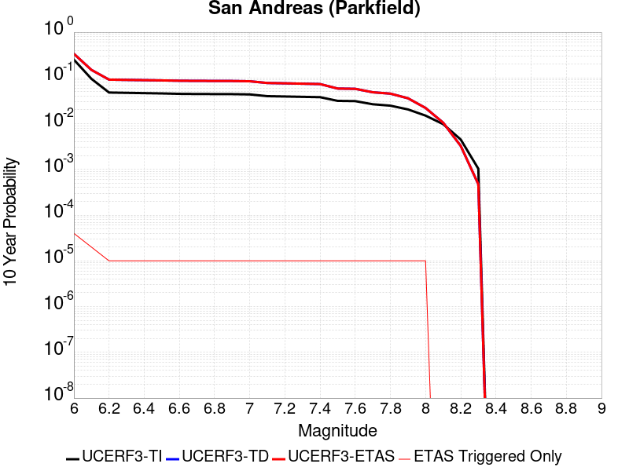 |

| Magnitude | 1 wk TI Prob | 1 wk TD Prob | 1 wk ETAS Prob | 1 wk ETAS/TD Gain | 1 wk ETAS Triggered Only | 1 mo TI Prob | 1 mo TD Prob | 1 mo ETAS Prob | 1 mo ETAS/TD Gain | 1 mo ETAS Triggered Only | 1 yr TI Prob | 1 yr TD Prob | 1 yr ETAS Prob | 1 yr ETAS/TD Gain | 1 yr ETAS Triggered Only | 10 yr TI Prob | 10 yr TD Prob | 10 yr ETAS Prob | 10 yr ETAS/TD Gain | 10 yr ETAS Triggered Only |
|-----|-----|-----|-----|-----|-----|-----|-----|-----|-----|-----|-----|-----|-----|-----|-----|-----|-----|-----|-----|-----|
| 6.0 | 5.556969E-4 | 7.819087E-4 | 7.819087E-4 | 1.0 | 0.0 | 0.0023793848 | 0.0033472886 | 0.0033472886 | 1.0 | 0.0 | 0.028586963 | 0.040385824 | 0.04040274 | 1.0004189 | 1.762829E-5 | 0.25176284 | 0.33777508 | 0.33778676 | 1.0000346 | 1.762829E-5 |
| 6.1 | 1.925858E-4 | 3.0390357E-4 | 3.0390357E-4 | 1.0 | 0.0 | 8.2510663E-4 | 0.0013018888 | 0.0013018888 | 1.0 | 0.0 | 0.0099994885 | 0.015834767 | 0.015852116 | 1.0010957 | 1.762829E-5 | 0.095613256 | 0.14999957 | 0.15001455 | 1.0000999 | 1.762829E-5 |
| 6.2 | 9.4306815E-5 | 1.8273306E-4 | 1.8273306E-4 | 1.0 | 0.0 | 4.0410945E-4 | 7.829079E-4 | 7.829079E-4 | 1.0 | 0.0 | 0.0049089384 | 0.009490452 | 0.009507913 | 1.0018399 | 1.762829E-5 | 0.048019063 | 0.09198628 | 0.09200229 | 1.000174 | 1.762829E-5 |
| 6.3 | 9.283051E-5 | 1.7969737E-4 | 1.7969737E-4 | 1.0 | 0.0 | 3.9778434E-4 | 7.6990545E-4 | 7.6990545E-4 | 1.0 | 0.0 | 0.0048322747 | 0.009333515 | 0.009350979 | 1.0018711 | 1.762829E-5 | 0.047285385 | 0.09063911 | 0.09065514 | 1.0001769 | 1.762829E-5 |
| 6.4 | 9.138826E-5 | 1.7731739E-4 | 1.7731739E-4 | 1.0 | 0.0 | 3.916052E-4 | 7.5971155E-4 | 7.5971155E-4 | 1.0 | 0.0 | 0.0047573745 | 0.00921046 | 0.009227926 | 1.0018963 | 1.762829E-5 | 0.046568092 | 0.0895407 | 0.089556746 | 1.0001793 | 1.762829E-5 |
| 6.5 | 9.000255E-5 | 1.7489606E-4 | 1.7489606E-4 | 1.0 | 0.0 | 3.8566816E-4 | 7.493404E-4 | 7.493404E-4 | 1.0 | 0.0 | 0.0046854047 | 0.009085262 | 0.00910273 | 1.0019227 | 1.762829E-5 | 0.045878403 | 0.08842592 | 0.08844198 | 1.0001817 | 1.762829E-5 |
| 6.6 | 8.8109264E-5 | 1.7170387E-4 | 1.7170387E-4 | 1.0 | 0.0 | 3.7755648E-4 | 7.3566736E-4 | 7.3566736E-4 | 1.0 | 0.0 | 0.0045870654 | 0.0089201825 | 0.008937653 | 1.0019586 | 1.762829E-5 | 0.04493529 | 0.08695624 | 0.08697233 | 1.0001851 | 1.762829E-5 |
| 6.7 | 8.738073E-5 | 1.7037381E-4 | 1.7037381E-4 | 1.0 | 0.0 | 3.7443507E-4 | 7.2997034E-4 | 7.2997034E-4 | 1.0 | 0.0 | 0.0045492216 | 0.0088514285 | 0.0088689 | 1.001974 | 1.762829E-5 | 0.04457213 | 0.08635636 | 0.086372465 | 1.0001866 | 1.762829E-5 |
| 6.8 | 8.710195E-5 | 1.6982816E-4 | 1.6982816E-4 | 1.0 | 0.0 | 3.7324068E-4 | 7.2763313E-4 | 7.2763313E-4 | 1.0 | 0.0 | 0.0045347405 | 0.008823211 | 0.008840685 | 1.0019803 | 1.762829E-5 | 0.04443313 | 0.08610373 | 0.08611984 | 1.0001872 | 1.762829E-5 |
| 6.9 | 8.6801556E-5 | 1.6923707E-4 | 1.6923707E-4 | 1.0 | 0.0 | 3.7195362E-4 | 7.251013E-4 | 7.251013E-4 | 1.0 | 0.0 | 0.0045191357 | 0.008792636 | 0.0088101085 | 1.0019872 | 1.762829E-5 | 0.044283327 | 0.08582957 | 0.08584569 | 1.0001878 | 1.762829E-5 |
| 7.0 | 8.5571606E-5 | 1.6676294E-4 | 1.6676294E-4 | 1.0 | 0.0 | 3.6668387E-4 | 7.145037E-4 | 7.145037E-4 | 1.0 | 0.0 | 0.004455241 | 0.008664643 | 0.008682119 | 1.0020169 | 1.762829E-5 | 0.043669727 | 0.08467713 | 0.08469327 | 1.0001905 | 1.762829E-5 |
| 7.1 | 7.82589E-5 | 1.5156237E-4 | 1.5156237E-4 | 1.0 | 0.0 | 3.3535215E-4 | 6.493921E-4 | 6.493921E-4 | 1.0 | 0.0 | 0.0040752706 | 0.007877857 | 0.007895347 | 1.00222 | 1.762829E-5 | 0.040013418 | 0.077585794 | 0.07760206 | 1.0002096 | 1.762829E-5 |
| 7.2 | 7.690929E-5 | 1.489332E-4 | 1.489332E-4 | 1.0 | 0.0 | 3.2956956E-4 | 6.381298E-4 | 6.381298E-4 | 1.0 | 0.0 | 0.004005129 | 0.007741721 | 0.007759213 | 1.0022594 | 1.762829E-5 | 0.0393371 | 0.076358445 | 0.076374725 | 1.0002133 | 1.762829E-5 |
| 7.3 | 7.5543794E-5 | 1.4589565E-4 | 1.4589565E-4 | 1.0 | 0.0 | 3.2371894E-4 | 6.25118E-4 | 6.25118E-4 | 1.0 | 0.0 | 0.003934157 | 0.0075844154 | 0.00760191 | 1.0023067 | 1.762829E-5 | 0.038652334 | 0.07492032 | 0.07493663 | 1.0002177 | 1.762829E-5 |
| 7.4 | 7.4214564E-5 | 1.4290171E-4 | 1.4290171E-4 | 1.0 | 0.0 | 3.1802364E-4 | 6.122929E-4 | 6.122929E-4 | 1.0 | 0.0 | 0.003865065 | 0.007429345 | 0.0074468423 | 1.0023552 | 1.762829E-5 | 0.03798529 | 0.07349284 | 0.07350917 | 1.0002222 | 1.762829E-5 |
| 7.5 | 6.149578E-5 | 1.1214155E-4 | 1.1214155E-4 | 1.0 | 0.0 | 2.6352672E-4 | 4.8051824E-4 | 4.8051824E-4 | 1.0 | 0.0 | 0.0032037178 | 0.005834648 | 0.0058521735 | 1.0030037 | 1.762829E-5 | 0.03157923 | 0.058665328 | 0.05868192 | 1.0002829 | 1.762829E-5 |
| 7.6 | 6.0643448E-5 | 1.10425855E-4 | 1.10425855E-4 | 1.0 | 0.0 | 2.598746E-4 | 4.7316792E-4 | 4.7316792E-4 | 1.0 | 0.0 | 0.0031593828 | 0.0057456335 | 0.0057631605 | 1.0030504 | 1.762829E-5 | 0.031148417 | 0.05782546 | 0.057842072 | 1.0002872 | 1.762829E-5 |
| 7.7 | 5.1652263E-5 | 9.1955124E-5 | 9.1955124E-5 | 1.0 | 0.0 | 2.2134806E-4 | 3.9403388E-4 | 3.9403388E-4 | 1.0 | 0.0 | 0.002691582 | 0.00478682 | 0.004804364 | 1.0036651 | 1.762829E-5 | 0.026592141 | 0.048633553 | 0.048650324 | 1.0003449 | 1.762829E-5 |
| 7.8 | 4.8090482E-5 | 8.578783E-5 | 8.578783E-5 | 1.0 | 0.0 | 2.060858E-4 | 3.6761034E-4 | 3.6761034E-4 | 1.0 | 0.0 | 0.0025062072 | 0.004466479 | 0.0044840286 | 1.0039291 | 1.762829E-5 | 0.024781305 | 0.045392275 | 0.045409102 | 1.0003707 | 1.762829E-5 |
| 7.9 | 3.970278E-5 | 6.7652974E-5 | 6.7652974E-5 | 1.0 | 0.0 | 1.7014367E-4 | 2.899091E-4 | 2.899091E-4 | 1.0 | 0.0 | 0.002069531 | 0.0035239344 | 0.0035415005 | 1.0049849 | 1.762829E-5 | 0.020503636 | 0.035952512 | 0.035969507 | 1.0004727 | 1.762829E-5 |
| 8.0 | 2.8982335E-5 | 4.079188E-5 | 4.079188E-5 | 1.0 | 0.0 | 1.2420409E-4 | 1.7481064E-4 | 1.7481064E-4 | 1.0 | 0.0 | 0.0015111357 | 0.0021262432 | 0.002143834 | 1.0082732 | 1.762829E-5 | 0.015009012 | 0.022057572 | 0.022074813 | 1.0007815 | 1.762829E-5 |
| 8.1 | 1.8836186E-5 | 1.8733741E-5 | 1.8733741E-5 | 1.0 | 0.0 | 8.0724014E-5 | 8.028499E-5 | 8.028499E-5 | 1.0 | 0.0 | 9.823717E-4 | 9.77032E-4 | 9.77032E-4 | 1.0 | 0.0 | 0.009780403 | 0.010515724 | 0.010515724 | 1.0 | 0.0 |
| 8.2 | 8.643924E-6 | 5.49522E-6 | 5.49522E-6 | 1.0 | 0.0 | 3.704486E-5 | 2.355073E-5 | 2.355073E-5 | 1.0 | 0.0 | 4.5092785E-4 | 2.866925E-4 | 2.866925E-4 | 1.0 | 0.0 | 0.0045001395 | 0.0032598388 | 0.0032598388 | 1.0 | 0.0 |
| 8.3 | 1.983087E-6 | 7.693574E-7 | 7.693574E-7 | 1.0 | 0.0 | 8.498917E-6 | 3.297242E-6 | 3.297242E-6 | 1.0 | 0.0 | 1.034694E-4 | 4.01432E-5 | 4.01432E-5 | 1.0 | 0.0 | 0.0010342124 | 4.7390026E-4 | 4.7390026E-4 | 1.0 | 0.0 |

## San Andreas (Big Bend)
*[(top)](#table-of-contents)*

| 1 Week | 1 Month | 1 Year | 10 Year |
|-----|-----|-----|-----|
|  |  | 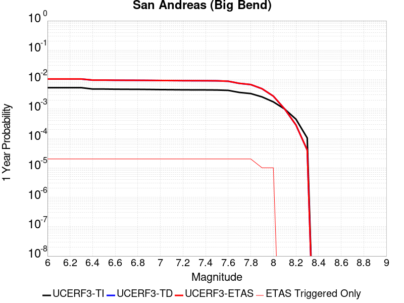 |  |

| Magnitude | 1 wk TI Prob | 1 wk TD Prob | 1 wk ETAS Prob | 1 wk ETAS/TD Gain | 1 wk ETAS Triggered Only | 1 mo TI Prob | 1 mo TD Prob | 1 mo ETAS Prob | 1 mo ETAS/TD Gain | 1 mo ETAS Triggered Only | 1 yr TI Prob | 1 yr TD Prob | 1 yr ETAS Prob | 1 yr ETAS/TD Gain | 1 yr ETAS Triggered Only | 10 yr TI Prob | 10 yr TD Prob | 10 yr ETAS Prob | 10 yr ETAS/TD Gain | 10 yr ETAS Triggered Only |
|-----|-----|-----|-----|-----|-----|-----|-----|-----|-----|-----|-----|-----|-----|-----|-----|-----|-----|-----|-----|-----|
| 6.0 | 1.0179969E-4 | 2.0106303E-4 | 2.0106303E-4 | 1.0 | 0.0 | 4.362114E-4 | 8.614151E-4 | 8.614151E-4 | 1.0 | 0.0 | 0.0052979486 | 0.010437581 | 0.010455025 | 1.0016713 | 1.762829E-5 | 0.051734097 | 0.10159716 | 0.101613 | 1.0001559 | 1.762829E-5 |
| 6.1 | 1.0179969E-4 | 2.0106303E-4 | 2.0106303E-4 | 1.0 | 0.0 | 4.362114E-4 | 8.614151E-4 | 8.614151E-4 | 1.0 | 0.0 | 0.0052979486 | 0.010437581 | 0.010455025 | 1.0016713 | 1.762829E-5 | 0.051734097 | 0.10159716 | 0.101613 | 1.0001559 | 1.762829E-5 |
| 6.2 | 1.0179969E-4 | 2.0106303E-4 | 2.0106303E-4 | 1.0 | 0.0 | 4.362114E-4 | 8.614151E-4 | 8.614151E-4 | 1.0 | 0.0 | 0.0052979486 | 0.010437581 | 0.010455025 | 1.0016713 | 1.762829E-5 | 0.051734097 | 0.10159716 | 0.101613 | 1.0001559 | 1.762829E-5 |
| 6.3 | 1.0179969E-4 | 2.0106303E-4 | 2.0106303E-4 | 1.0 | 0.0 | 4.362114E-4 | 8.614151E-4 | 8.614151E-4 | 1.0 | 0.0 | 0.0052979486 | 0.010437581 | 0.010455025 | 1.0016713 | 1.762829E-5 | 0.051734097 | 0.10159716 | 0.101613 | 1.0001559 | 1.762829E-5 |
| 6.4 | 9.1639464E-5 | 1.8462905E-4 | 1.8462905E-4 | 1.0 | 0.0 | 3.9268145E-4 | 7.910276E-4 | 7.910276E-4 | 1.0 | 0.0 | 0.0047704205 | 0.009588352 | 0.009605811 | 1.0018209 | 1.762829E-5 | 0.046693064 | 0.093921766 | 0.09393773 | 1.0001701 | 1.762829E-5 |
| 6.5 | 9.1639464E-5 | 1.8462905E-4 | 1.8462905E-4 | 1.0 | 0.0 | 3.9268145E-4 | 7.910276E-4 | 7.910276E-4 | 1.0 | 0.0 | 0.0047704205 | 0.009588352 | 0.009605811 | 1.0018209 | 1.762829E-5 | 0.046693064 | 0.093921766 | 0.09393773 | 1.0001701 | 1.762829E-5 |
| 6.6 | 9.042622E-5 | 1.826988E-4 | 1.826988E-4 | 1.0 | 0.0 | 3.8748336E-4 | 7.827601E-4 | 7.827601E-4 | 1.0 | 0.0 | 0.0047074095 | 0.009488574 | 0.009506035 | 1.0018402 | 1.762829E-5 | 0.046089325 | 0.093015574 | 0.09303156 | 1.0001719 | 1.762829E-5 |
| 6.7 | 8.9836685E-5 | 1.8184188E-4 | 1.8184188E-4 | 1.0 | 0.0 | 3.8495753E-4 | 7.790898E-4 | 7.790898E-4 | 1.0 | 0.0 | 0.00467679 | 0.009444275 | 0.009461737 | 1.0018489 | 1.762829E-5 | 0.045795817 | 0.09260978 | 0.092625774 | 1.0001727 | 1.762829E-5 |
| 6.8 | 8.9471854E-5 | 1.8130938E-4 | 1.8130938E-4 | 1.0 | 0.0 | 3.8339442E-4 | 7.7680906E-4 | 7.7680906E-4 | 1.0 | 0.0 | 0.004657841 | 0.009416748 | 0.00943421 | 1.0018544 | 1.762829E-5 | 0.04561414 | 0.09235688 | 0.09237288 | 1.0001732 | 1.762829E-5 |
| 6.9 | 8.858234E-5 | 1.8012857E-4 | 1.8012857E-4 | 1.0 | 0.0 | 3.7958333E-4 | 7.717514E-4 | 7.717514E-4 | 1.0 | 0.0 | 0.004611638 | 0.009355701 | 0.009373164 | 1.0018666 | 1.762829E-5 | 0.04517103 | 0.09179684 | 0.09181285 | 1.0001744 | 1.762829E-5 |
| 7.0 | 8.7433385E-5 | 1.7851574E-4 | 1.7851574E-4 | 1.0 | 0.0 | 3.746607E-4 | 7.648433E-4 | 7.648433E-4 | 1.0 | 0.0 | 0.004551957 | 0.009272313 | 0.009289778 | 1.0018835 | 1.762829E-5 | 0.044598386 | 0.091031015 | 0.09104703 | 1.0001761 | 1.762829E-5 |
| 7.1 | 8.684964E-5 | 1.7763473E-4 | 1.7763473E-4 | 1.0 | 0.0 | 3.7215967E-4 | 7.610698E-4 | 7.610698E-4 | 1.0 | 0.0 | 0.0045216335 | 0.009226761 | 0.009244227 | 1.0018929 | 1.762829E-5 | 0.04430731 | 0.09061238 | 0.090628415 | 1.0001769 | 1.762829E-5 |
| 7.2 | 8.606521E-5 | 1.7654036E-4 | 1.7654036E-4 | 1.0 | 0.0 | 3.6879873E-4 | 7.5638236E-4 | 7.5638236E-4 | 1.0 | 0.0 | 0.0044808835 | 0.009170174 | 0.00918764 | 1.0019047 | 1.762829E-5 | 0.043916024 | 0.09009273 | 0.090108775 | 1.0001781 | 1.762829E-5 |
| 7.3 | 8.568266E-5 | 1.7595981E-4 | 1.7595981E-4 | 1.0 | 0.0 | 3.6715972E-4 | 7.5389567E-4 | 7.5389567E-4 | 1.0 | 0.0 | 0.0044610105 | 0.0091401525 | 0.009157619 | 1.001911 | 1.762829E-5 | 0.043725148 | 0.08981366 | 0.0898297 | 1.0001787 | 1.762829E-5 |
| 7.4 | 8.5432206E-5 | 1.7558529E-4 | 1.7558529E-4 | 1.0 | 0.0 | 3.6608664E-4 | 7.522915E-4 | 7.522915E-4 | 1.0 | 0.0 | 0.004447999 | 0.009120786 | 0.009138253 | 1.0019151 | 1.762829E-5 | 0.043600157 | 0.08963369 | 0.08964974 | 1.000179 | 1.762829E-5 |
| 7.5 | 8.4791965E-5 | 1.742772E-4 | 1.742772E-4 | 1.0 | 0.0 | 3.633435E-4 | 7.466887E-4 | 7.466887E-4 | 1.0 | 0.0 | 0.0044147377 | 0.00905314 | 0.009070609 | 1.0019295 | 1.762829E-5 | 0.043280575 | 0.08901084 | 0.089026906 | 1.0001804 | 1.762829E-5 |
| 7.6 | 8.241105E-5 | 1.6872598E-4 | 1.6872598E-4 | 1.0 | 0.0 | 3.531424E-4 | 7.229111E-4 | 7.229111E-4 | 1.0 | 0.0 | 0.0042910352 | 0.008766012 | 0.008783487 | 1.0019933 | 1.762829E-5 | 0.042091176 | 0.086385906 | 0.086402014 | 1.0001864 | 1.762829E-5 |
| 7.7 | 7.00432E-5 | 1.4233537E-4 | 1.4233537E-4 | 1.0 | 0.0 | 3.001506E-4 | 6.0986617E-4 | 6.0986617E-4 | 1.0 | 0.0 | 0.0036482112 | 0.0073998813 | 0.007417379 | 1.0023646 | 1.762829E-5 | 0.035888977 | 0.07364825 | 0.07366458 | 1.0002217 | 1.762829E-5 |
| 7.8 | 6.415362E-5 | 1.2995097E-4 | 1.2995097E-4 | 1.0 | 0.0 | 2.749151E-4 | 5.568139E-4 | 5.568139E-4 | 1.0 | 0.0 | 0.0033419547 | 0.006758167 | 0.0067756763 | 1.0025908 | 1.762829E-5 | 0.03292141 | 0.06737108 | 0.067387514 | 1.000244 | 1.762829E-5 |
| 7.9 | 4.939911E-5 | 9.359872E-5 | 9.359872E-5 | 1.0 | 0.0 | 2.116933E-4 | 4.0107573E-4 | 4.0107573E-4 | 1.0 | 0.0 | 0.0025743195 | 0.0048721726 | 0.004889715 | 1.0036005 | 1.762829E-5 | 0.025447013 | 0.04900208 | 0.049018845 | 1.0003421 | 1.762829E-5 |
| 8.0 | 3.344983E-5 | 5.2337946E-5 | 5.2337946E-5 | 1.0 | 0.0 | 1.4334853E-4 | 2.2428621E-4 | 2.2428621E-4 | 1.0 | 0.0 | 0.0017438711 | 0.0027272669 | 0.002744847 | 1.0064461 | 1.762829E-5 | 0.017302496 | 0.027976755 | 0.02799389 | 1.0006125 | 1.762829E-5 |
| 8.1 | 1.9104898E-5 | 1.9226556E-5 | 1.9226556E-5 | 1.0 | 0.0 | 8.1875565E-5 | 8.2396924E-5 | 8.2396924E-5 | 1.0 | 0.0 | 9.963791E-4 | 0.0010027215 | 0.0010027215 | 1.0 | 0.0 | 0.009919235 | 0.01077785 | 0.01077785 | 1.0 | 0.0 |
| 8.2 | 8.643924E-6 | 5.49522E-6 | 5.49522E-6 | 1.0 | 0.0 | 3.704486E-5 | 2.355073E-5 | 2.355073E-5 | 1.0 | 0.0 | 4.5092785E-4 | 2.866925E-4 | 2.866925E-4 | 1.0 | 0.0 | 0.0045001395 | 0.0032598388 | 0.0032598388 | 1.0 | 0.0 |
| 8.3 | 1.983087E-6 | 7.693574E-7 | 7.693574E-7 | 1.0 | 0.0 | 8.498917E-6 | 3.297242E-6 | 3.297242E-6 | 1.0 | 0.0 | 1.034694E-4 | 4.01432E-5 | 4.01432E-5 | 1.0 | 0.0 | 0.0010342124 | 4.7390026E-4 | 4.7390026E-4 | 1.0 | 0.0 |

## San Jacinto (Anza) rev
*[(top)](#table-of-contents)*

| 1 Week | 1 Month | 1 Year | 10 Year |
|-----|-----|-----|-----|
| 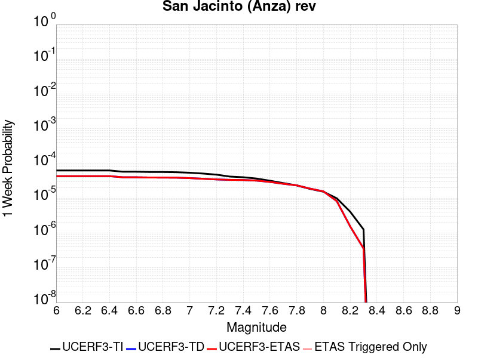 | 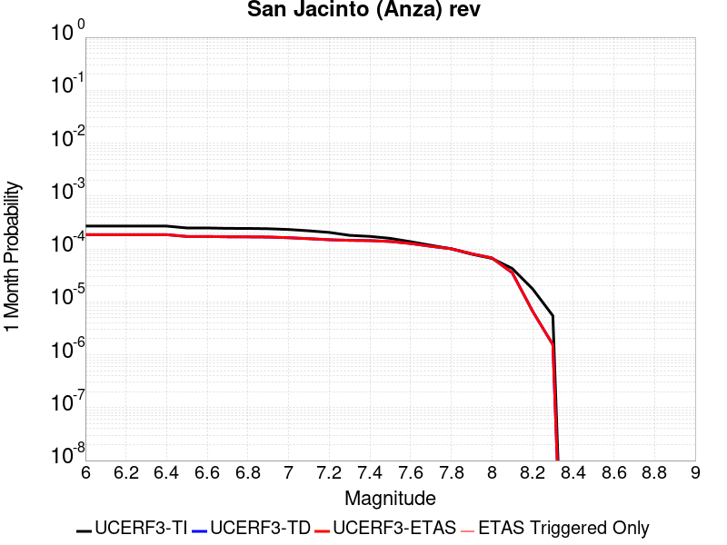 |  |  |

| Magnitude | 1 wk TI Prob | 1 wk TD Prob | 1 wk ETAS Prob | 1 wk ETAS/TD Gain | 1 wk ETAS Triggered Only | 1 mo TI Prob | 1 mo TD Prob | 1 mo ETAS Prob | 1 mo ETAS/TD Gain | 1 mo ETAS Triggered Only | 1 yr TI Prob | 1 yr TD Prob | 1 yr ETAS Prob | 1 yr ETAS/TD Gain | 1 yr ETAS Triggered Only | 10 yr TI Prob | 10 yr TD Prob | 10 yr ETAS Prob | 10 yr ETAS/TD Gain | 10 yr ETAS Triggered Only |
|-----|-----|-----|-----|-----|-----|-----|-----|-----|-----|-----|-----|-----|-----|-----|-----|-----|-----|-----|-----|-----|
| 6.0 | 6.3015636E-5 | 4.337693E-5 | 4.337693E-5 | 1.0 | 0.0 | 2.7003905E-4 | 1.8588796E-4 | 1.8588796E-4 | 1.0 | 0.0 | 0.0032827691 | 0.0022608489 | 0.0022784371 | 1.0077796 | 1.762829E-5 | 0.032346968 | 0.023334619 | 0.023351837 | 1.0007378 | 1.762829E-5 |
| 6.1 | 6.3015636E-5 | 4.337693E-5 | 4.337693E-5 | 1.0 | 0.0 | 2.7003905E-4 | 1.8588796E-4 | 1.8588796E-4 | 1.0 | 0.0 | 0.0032827691 | 0.0022608489 | 0.0022784371 | 1.0077796 | 1.762829E-5 | 0.032346968 | 0.023334619 | 0.023351837 | 1.0007378 | 1.762829E-5 |
| 6.2 | 6.3015636E-5 | 4.337693E-5 | 4.337693E-5 | 1.0 | 0.0 | 2.7003905E-4 | 1.8588796E-4 | 1.8588796E-4 | 1.0 | 0.0 | 0.0032827691 | 0.0022608489 | 0.0022784371 | 1.0077796 | 1.762829E-5 | 0.032346968 | 0.023334619 | 0.023351837 | 1.0007378 | 1.762829E-5 |
| 6.3 | 6.3015636E-5 | 4.337693E-5 | 4.337693E-5 | 1.0 | 0.0 | 2.7003905E-4 | 1.8588796E-4 | 1.8588796E-4 | 1.0 | 0.0 | 0.0032827691 | 0.0022608489 | 0.0022784371 | 1.0077796 | 1.762829E-5 | 0.032346968 | 0.023334619 | 0.023351837 | 1.0007378 | 1.762829E-5 |
| 6.4 | 6.3015636E-5 | 4.337693E-5 | 4.337693E-5 | 1.0 | 0.0 | 2.7003905E-4 | 1.8588796E-4 | 1.8588796E-4 | 1.0 | 0.0 | 0.0032827691 | 0.0022608489 | 0.0022784371 | 1.0077796 | 1.762829E-5 | 0.032346968 | 0.023334619 | 0.023351837 | 1.0007378 | 1.762829E-5 |
| 6.5 | 5.811017E-5 | 4.015336E-5 | 4.015336E-5 | 1.0 | 0.0 | 2.4901982E-4 | 1.7207452E-4 | 1.7207452E-4 | 1.0 | 0.0 | 0.0030276014 | 0.0020929999 | 0.0021105914 | 1.0084049 | 1.762829E-5 | 0.02986684 | 0.021630494 | 0.021647742 | 1.0007974 | 1.762829E-5 |
| 6.6 | 5.811017E-5 | 4.015336E-5 | 4.015336E-5 | 1.0 | 0.0 | 2.4901982E-4 | 1.7207452E-4 | 1.7207452E-4 | 1.0 | 0.0 | 0.0030276014 | 0.0020929999 | 0.0021105914 | 1.0084049 | 1.762829E-5 | 0.02986684 | 0.021630494 | 0.021647742 | 1.0007974 | 1.762829E-5 |
| 6.7 | 5.712442E-5 | 3.957534E-5 | 3.957534E-5 | 1.0 | 0.0 | 2.4479596E-4 | 1.6959761E-4 | 1.6959761E-4 | 1.0 | 0.0 | 0.0029763177 | 0.002062901 | 0.002080493 | 1.0085278 | 1.762829E-5 | 0.029367693 | 0.021321962 | 0.021339215 | 1.0008092 | 1.762829E-5 |
| 6.8 | 5.6967532E-5 | 3.9431634E-5 | 3.9431634E-5 | 1.0 | 0.0 | 2.4412372E-4 | 1.689818E-4 | 1.689818E-4 | 1.0 | 0.0 | 0.0029681553 | 0.0020554175 | 0.0020730097 | 1.0085589 | 1.762829E-5 | 0.029288229 | 0.021246629 | 0.021263883 | 1.000812 | 1.762829E-5 |
| 6.9 | 5.6211324E-5 | 3.9135975E-5 | 3.9135975E-5 | 1.0 | 0.0 | 2.4088343E-4 | 1.6771485E-4 | 1.6771485E-4 | 1.0 | 0.0 | 0.0029288116 | 0.0020400216 | 0.0020576138 | 1.0086236 | 1.762829E-5 | 0.028905109 | 0.021085827 | 0.021103084 | 1.0008184 | 1.762829E-5 |
| 7.0 | 5.4383527E-5 | 3.7995007E-5 | 3.7995007E-5 | 1.0 | 0.0 | 2.3305144E-4 | 1.6282561E-4 | 1.6282561E-4 | 1.0 | 0.0 | 0.0028337094 | 0.0019806041 | 0.0019981975 | 1.0088829 | 1.762829E-5 | 0.027978465 | 0.020476038 | 0.020493304 | 1.0008433 | 1.762829E-5 |
| 7.1 | 5.1393665E-5 | 3.6455618E-5 | 3.6455618E-5 | 1.0 | 0.0 | 2.2023996E-4 | 1.5622903E-4 | 1.5622903E-4 | 1.0 | 0.0 | 0.0026781242 | 0.0019004333 | 0.0019180281 | 1.0092583 | 1.762829E-5 | 0.026460782 | 0.019648531 | 0.019665813 | 1.0008795 | 1.762829E-5 |
| 7.2 | 4.785222E-5 | 3.480494E-5 | 3.480494E-5 | 1.0 | 0.0 | 2.0506482E-4 | 1.4915552E-4 | 1.4915552E-4 | 1.0 | 0.0 | 0.0024938055 | 0.0018144595 | 0.0018320557 | 1.0096978 | 1.762829E-5 | 0.024660049 | 0.018761909 | 0.018779207 | 1.000922 | 1.762829E-5 |
| 7.3 | 4.2143256E-5 | 3.389763E-5 | 3.389763E-5 | 1.0 | 0.0 | 1.8060145E-4 | 1.4526749E-4 | 1.4526749E-4 | 1.0 | 0.0 | 0.002196605 | 0.0017672004 | 0.0017847975 | 1.0099577 | 1.762829E-5 | 0.02175019 | 0.018269178 | 0.018286483 | 1.0009472 | 1.762829E-5 |
| 7.4 | 4.0264713E-5 | 3.3535252E-5 | 3.3535252E-5 | 1.0 | 0.0 | 1.7255165E-4 | 1.4371461E-4 | 1.4371461E-4 | 1.0 | 0.0 | 0.002098792 | 0.0017483246 | 0.0017659221 | 1.0100653 | 1.762829E-5 | 0.020790804 | 0.018073453 | 0.018090764 | 1.0009577 | 1.762829E-5 |
| 7.5 | 3.694492E-5 | 3.2247204E-5 | 3.2247204E-5 | 1.0 | 0.0 | 1.5832575E-4 | 1.38195E-4 | 1.38195E-4 | 1.0 | 0.0 | 0.0019259118 | 0.0016812286 | 0.0016988274 | 1.0104678 | 1.762829E-5 | 0.01909306 | 0.017388845 | 0.017406166 | 1.0009961 | 1.762829E-5 |
| 7.6 | 3.200565E-5 | 2.9555436E-5 | 2.9555436E-5 | 1.0 | 0.0 | 1.3715986E-4 | 1.2666002E-4 | 1.2666002E-4 | 1.0 | 0.0 | 0.001668642 | 0.0015409971 | 0.0015585982 | 1.0114219 | 1.762829E-5 | 0.01656168 | 0.015973015 | 0.015990362 | 1.001086 | 1.762829E-5 |
| 7.7 | 2.731642E-5 | 2.6142696E-5 | 2.6142696E-5 | 1.0 | 0.0 | 1.1706512E-4 | 1.1203532E-4 | 1.1203532E-4 | 1.0 | 0.0 | 0.001424336 | 0.0013631776 | 0.0013807818 | 1.0129142 | 1.762829E-5 | 0.014152412 | 0.01419303 | 0.014210409 | 1.0012244 | 1.762829E-5 |
| 7.8 | 2.3466424E-5 | 2.3552704E-5 | 2.3552704E-5 | 1.0 | 0.0 | 1.0056651E-4 | 1.0093625E-4 | 1.0093625E-4 | 1.0 | 0.0 | 0.0012237094 | 0.0012282069 | 0.0012458136 | 1.0143353 | 1.762829E-5 | 0.012169928 | 0.012833906 | 0.012851309 | 1.0013559 | 1.762829E-5 |
| 7.9 | 1.8611925E-5 | 1.8951272E-5 | 1.8951272E-5 | 1.0 | 0.0 | 7.9762955E-5 | 8.1217215E-5 | 8.1217215E-5 | 1.0 | 0.0 | 9.7068126E-4 | 9.883717E-4 | 0.0010059826 | 1.0178181 | 1.762829E-5 | 0.0096645225 | 0.010416457 | 0.010433902 | 1.0016748 | 1.762829E-5 |
| 8.0 | 1.5460775E-5 | 1.5779307E-5 | 1.5779307E-5 | 1.0 | 0.0 | 6.6258784E-5 | 6.762385E-5 | 6.762385E-5 | 1.0 | 0.0 | 8.0640207E-4 | 8.2301005E-4 | 8.4062386E-4 | 1.0214016 | 1.762829E-5 | 0.008034821 | 0.008723064 | 0.008740539 | 1.0020033 | 1.762829E-5 |
| 8.1 | 9.983884E-6 | 8.292369E-6 | 8.292369E-6 | 1.0 | 0.0 | 4.2787375E-5 | 3.5538244E-5 | 3.5538244E-5 | 1.0 | 0.0 | 5.2081177E-4 | 4.3259273E-4 | 4.5021338E-4 | 1.0407327 | 1.762829E-5 | 0.0051959283 | 0.00465207 | 0.0046696165 | 1.0037717 | 1.762829E-5 |
| 8.2 | 4.1226E-6 | 1.5595413E-6 | 1.5595413E-6 | 1.0 | 0.0 | 1.7668166E-5 | 6.683731E-6 | 6.683731E-6 | 1.0 | 0.0 | 2.1508869E-4 | 8.137142E-5 | 8.137142E-5 | 1.0 | 0.0 | 0.0021488064 | 9.4425044E-4 | 9.4425044E-4 | 1.0 | 0.0 |
| 8.3 | 1.2750878E-6 | 3.6301523E-7 | 3.6301523E-7 | 1.0 | 0.0 | 5.4646503E-6 | 1.5557786E-6 | 1.5557786E-6 | 1.0 | 0.0 | 6.653009E-5 | 1.8941444E-5 | 1.8941444E-5 | 1.0 | 0.0 | 6.6510175E-4 | 2.2840123E-4 | 2.2840123E-4 | 1.0 | 0.0 |

## Big Pine (East)
*[(top)](#table-of-contents)*

| 1 Week | 1 Month | 1 Year | 10 Year |
|-----|-----|-----|-----|
| 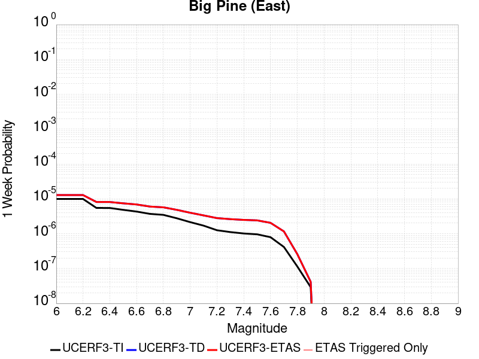 |  |  |  |

| Magnitude | 1 wk TI Prob | 1 wk TD Prob | 1 wk ETAS Prob | 1 wk ETAS/TD Gain | 1 wk ETAS Triggered Only | 1 mo TI Prob | 1 mo TD Prob | 1 mo ETAS Prob | 1 mo ETAS/TD Gain | 1 mo ETAS Triggered Only | 1 yr TI Prob | 1 yr TD Prob | 1 yr ETAS Prob | 1 yr ETAS/TD Gain | 1 yr ETAS Triggered Only | 10 yr TI Prob | 10 yr TD Prob | 10 yr ETAS Prob | 10 yr ETAS/TD Gain | 10 yr ETAS Triggered Only |
|-----|-----|-----|-----|-----|-----|-----|-----|-----|-----|-----|-----|-----|-----|-----|-----|-----|-----|-----|-----|-----|
| 6.0 | 9.916913E-6 | 1.282197E-5 | 1.282197E-5 | 1.0 | 0.0 | 4.250036E-5 | 5.495027E-5 | 5.495027E-5 | 1.0 | 0.0 | 5.173191E-4 | 6.6883623E-4 | 6.6883623E-4 | 1.0 | 0.0 | 0.0051611643 | 0.0066729826 | 0.0066904933 | 1.0026242 | 1.762829E-5 |
| 6.1 | 9.916913E-6 | 1.282197E-5 | 1.282197E-5 | 1.0 | 0.0 | 4.250036E-5 | 5.495027E-5 | 5.495027E-5 | 1.0 | 0.0 | 5.173191E-4 | 6.6883623E-4 | 6.6883623E-4 | 1.0 | 0.0 | 0.0051611643 | 0.0066729826 | 0.0066904933 | 1.0026242 | 1.762829E-5 |
| 6.2 | 9.916913E-6 | 1.282197E-5 | 1.282197E-5 | 1.0 | 0.0 | 4.250036E-5 | 5.495027E-5 | 5.495027E-5 | 1.0 | 0.0 | 5.173191E-4 | 6.6883623E-4 | 6.6883623E-4 | 1.0 | 0.0 | 0.0051611643 | 0.0066729826 | 0.0066904933 | 1.0026242 | 1.762829E-5 |
| 6.3 | 5.479711E-6 | 8.117787E-6 | 8.117787E-6 | 1.0 | 0.0 | 2.3484265E-5 | 3.4790068E-5 | 3.4790068E-5 | 1.0 | 0.0 | 2.858834E-4 | 4.2348995E-4 | 4.2348995E-4 | 1.0 | 0.0 | 0.0028551589 | 0.004229713 | 0.004229713 | 1.0 | 0.0 |
| 6.4 | 5.465009E-6 | 8.10208E-6 | 8.10208E-6 | 1.0 | 0.0 | 2.3421257E-5 | 3.4722754E-5 | 3.4722754E-5 | 1.0 | 0.0 | 2.851165E-4 | 4.2267074E-4 | 4.2267074E-4 | 1.0 | 0.0 | 0.0028475097 | 0.004221552 | 0.004221552 | 1.0 | 0.0 |
| 6.5 | 4.826767E-6 | 7.4271156E-6 | 7.4271156E-6 | 1.0 | 0.0 | 2.068598E-5 | 3.183012E-5 | 3.183012E-5 | 1.0 | 0.0 | 2.518227E-4 | 3.874656E-4 | 3.874656E-4 | 1.0 | 0.0 | 0.0025153751 | 0.0038707424 | 0.0038707424 | 1.0 | 0.0 |
| 6.6 | 4.3146847E-6 | 6.887036E-6 | 6.887036E-6 | 1.0 | 0.0 | 1.8491375E-5 | 2.9515548E-5 | 2.9515548E-5 | 1.0 | 0.0 | 2.2510924E-4 | 3.59295E-4 | 3.59295E-4 | 1.0 | 0.0 | 0.0022488134 | 0.0035899505 | 0.0035899505 | 1.0 | 0.0 |
| 6.7 | 3.6968106E-6 | 5.9999884E-6 | 5.9999884E-6 | 1.0 | 0.0 | 1.5843378E-5 | 2.571399E-5 | 2.571399E-5 | 1.0 | 0.0 | 1.9287605E-4 | 3.130244E-4 | 3.130244E-4 | 1.0 | 0.0 | 0.0019270873 | 0.0031285542 | 0.0031285542 | 1.0 | 0.0 |
| 6.8 | 3.4671132E-6 | 5.7065704E-6 | 5.7065704E-6 | 1.0 | 0.0 | 1.4858972E-5 | 2.4456509E-5 | 2.4456509E-5 | 1.0 | 0.0 | 1.8089297E-4 | 2.9771877E-4 | 2.9771877E-4 | 1.0 | 0.0 | 0.0018074579 | 0.0029759097 | 0.0029759097 | 1.0 | 0.0 |
| 6.9 | 2.7686972E-6 | 4.829279E-6 | 4.829279E-6 | 1.0 | 0.0 | 1.1865792E-5 | 2.069675E-5 | 2.069675E-5 | 1.0 | 0.0 | 1.4445644E-4 | 2.5195457E-4 | 2.5195457E-4 | 1.0 | 0.0 | 0.0014436257 | 0.0025193316 | 0.0025193316 | 1.0 | 0.0 |
| 7.0 | 2.1472624E-6 | 3.988725E-6 | 3.988725E-6 | 1.0 | 0.0 | 9.20252E-6 | 1.7094428E-5 | 1.7094428E-5 | 1.0 | 0.0 | 1.12034926E-4 | 2.0810531E-4 | 2.0810531E-4 | 1.0 | 0.0 | 0.0011197845 | 0.002081715 | 0.002081715 | 1.0 | 0.0 |
| 7.1 | 1.7018335E-6 | 3.348229E-6 | 3.348229E-6 | 1.0 | 0.0 | 7.293552E-6 | 1.4349476E-5 | 1.4349476E-5 | 1.0 | 0.0 | 8.879537E-5 | 1.7469123E-4 | 1.7469123E-4 | 1.0 | 0.0 | 8.87599E-4 | 0.0017481181 | 0.0017481181 | 1.0 | 0.0 |
| 7.2 | 1.25603E-6 | 2.7976516E-6 | 2.7976516E-6 | 1.0 | 0.0 | 5.3829745E-6 | 1.1989882E-5 | 1.1989882E-5 | 1.0 | 0.0 | 6.553574E-5 | 1.4596726E-4 | 1.4596726E-4 | 1.0 | 0.0 | 6.551642E-4 | 0.0014612685 | 0.0014612685 | 1.0 | 0.0 |
| 7.3 | 1.112297E-6 | 2.613323E-6 | 2.613323E-6 | 1.0 | 0.0 | 4.7669787E-6 | 1.1199909E-5 | 1.1199909E-5 | 1.0 | 0.0 | 5.803642E-5 | 1.3635057E-4 | 1.3635057E-4 | 1.0 | 0.0 | 5.802127E-4 | 0.0013650558 | 0.0013650558 | 1.0 | 0.0 |
| 7.4 | 1.0137181E-6 | 2.4863546E-6 | 2.4863546E-6 | 1.0 | 0.0 | 4.3444993E-6 | 1.0655763E-5 | 1.0655763E-5 | 1.0 | 0.0 | 5.2892992E-5 | 1.297264E-4 | 1.297264E-4 | 1.0 | 0.0 | 5.288041E-4 | 0.0012986774 | 0.0012986774 | 1.0 | 0.0 |
| 7.5 | 9.598608E-7 | 2.4099256E-6 | 2.4099256E-6 | 1.0 | 0.0 | 4.1136827E-6 | 1.0328214E-5 | 1.0328214E-5 | 1.0 | 0.0 | 5.0082934E-5 | 1.2573895E-4 | 1.2573895E-4 | 1.0 | 0.0 | 5.007165E-4 | 0.0012586572 | 0.0012586572 | 1.0 | 0.0 |
| 7.6 | 7.929459E-7 | 2.047312E-6 | 2.047312E-6 | 1.0 | 0.0 | 3.3983351E-6 | 8.7741655E-6 | 8.7741655E-6 | 1.0 | 0.0 | 4.1373947E-5 | 1.0682041E-4 | 1.0682041E-4 | 1.0 | 0.0 | 4.1366243E-4 | 0.0010697625 | 0.0010697625 | 1.0 | 0.0 |
| 7.7 | 4.155788E-7 | 1.162298E-6 | 1.162298E-6 | 1.0 | 0.0 | 1.7810507E-6 | 4.981268E-6 | 4.981268E-6 | 1.0 | 0.0 | 2.1684076E-5 | 6.064529E-5 | 6.064529E-5 | 1.0 | 0.0 | 2.1681961E-4 | 6.09451E-4 | 6.09451E-4 | 1.0 | 0.0 |
| 7.8 | 1.14666925E-7 | 2.5959213E-7 | 2.5959213E-7 | 1.0 | 0.0 | 4.914296E-7 | 1.1125372E-6 | 1.1125372E-6 | 1.0 | 0.0 | 5.9831386E-6 | 1.354506E-5 | 1.354506E-5 | 1.0 | 0.0 | 5.9829777E-5 | 1.3654139E-4 | 1.3654139E-4 | 1.0 | 0.0 |
| 7.9 | 2.9231824E-8 | 4.15291E-8 | 4.15291E-8 | 1.0 | 0.0 | 1.2527924E-7 | 1.7798183E-7 | 1.7798183E-7 | 1.0 | 0.0 | 1.5252737E-6 | 2.1669268E-6 | 2.1669268E-6 | 1.0 | 0.0 | 1.5252632E-5 | 2.2001832E-5 | 2.2001832E-5 | 1.0 | 0.0 |

## Independence rev 2011
*[(top)](#table-of-contents)*

| 1 Week | 1 Month | 1 Year | 10 Year |
|-----|-----|-----|-----|
|  |  |  | 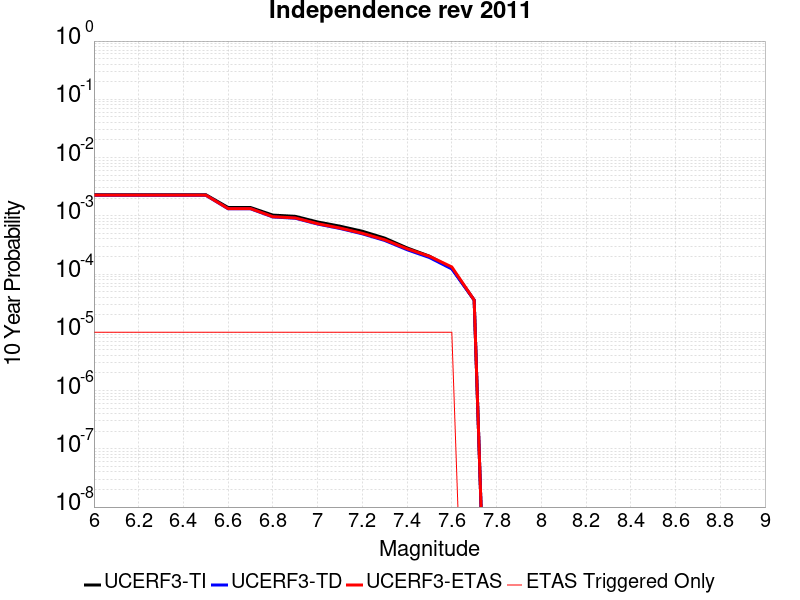 |

| Magnitude | 1 wk TI Prob | 1 wk TD Prob | 1 wk ETAS Prob | 1 wk ETAS/TD Gain | 1 wk ETAS Triggered Only | 1 mo TI Prob | 1 mo TD Prob | 1 mo ETAS Prob | 1 mo ETAS/TD Gain | 1 mo ETAS Triggered Only | 1 yr TI Prob | 1 yr TD Prob | 1 yr ETAS Prob | 1 yr ETAS/TD Gain | 1 yr ETAS Triggered Only | 10 yr TI Prob | 10 yr TD Prob | 10 yr ETAS Prob | 10 yr ETAS/TD Gain | 10 yr ETAS Triggered Only |
|-----|-----|-----|-----|-----|-----|-----|-----|-----|-----|-----|-----|-----|-----|-----|-----|-----|-----|-----|-----|-----|
| 6.0 | 4.422171E-6 | 4.3263003E-6 | 4.3263003E-6 | 1.0 | 0.0 | 1.8952025E-5 | 1.8541172E-5 | 1.8541172E-5 | 1.0 | 0.0 | 2.3071647E-4 | 2.2571837E-4 | 2.2571837E-4 | 1.0 | 0.0 | 0.0023047708 | 0.0022551846 | 0.002272773 | 1.0077991 | 1.762829E-5 |
| 6.1 | 4.422171E-6 | 4.3263003E-6 | 4.3263003E-6 | 1.0 | 0.0 | 1.8952025E-5 | 1.8541172E-5 | 1.8541172E-5 | 1.0 | 0.0 | 2.3071647E-4 | 2.2571837E-4 | 2.2571837E-4 | 1.0 | 0.0 | 0.0023047708 | 0.0022551846 | 0.002272773 | 1.0077991 | 1.762829E-5 |
| 6.2 | 4.422171E-6 | 4.3263003E-6 | 4.3263003E-6 | 1.0 | 0.0 | 1.8952025E-5 | 1.8541172E-5 | 1.8541172E-5 | 1.0 | 0.0 | 2.3071647E-4 | 2.2571837E-4 | 2.2571837E-4 | 1.0 | 0.0 | 0.0023047708 | 0.0022551846 | 0.002272773 | 1.0077991 | 1.762829E-5 |
| 6.3 | 4.422171E-6 | 4.3263003E-6 | 4.3263003E-6 | 1.0 | 0.0 | 1.8952025E-5 | 1.8541172E-5 | 1.8541172E-5 | 1.0 | 0.0 | 2.3071647E-4 | 2.2571837E-4 | 2.2571837E-4 | 1.0 | 0.0 | 0.0023047708 | 0.0022551846 | 0.002272773 | 1.0077991 | 1.762829E-5 |
| 6.4 | 4.422171E-6 | 4.3263003E-6 | 4.3263003E-6 | 1.0 | 0.0 | 1.8952025E-5 | 1.8541172E-5 | 1.8541172E-5 | 1.0 | 0.0 | 2.3071647E-4 | 2.2571837E-4 | 2.2571837E-4 | 1.0 | 0.0 | 0.0023047708 | 0.0022551846 | 0.002272773 | 1.0077991 | 1.762829E-5 |
| 6.5 | 4.422171E-6 | 4.3263003E-6 | 4.3263003E-6 | 1.0 | 0.0 | 1.8952025E-5 | 1.8541172E-5 | 1.8541172E-5 | 1.0 | 0.0 | 2.3071647E-4 | 2.2571837E-4 | 2.2571837E-4 | 1.0 | 0.0 | 0.0023047708 | 0.0022551846 | 0.002272773 | 1.0077991 | 1.762829E-5 |
| 6.6 | 2.663744E-6 | 2.53204E-6 | 2.53204E-6 | 1.0 | 0.0 | 1.1415996E-5 | 1.0851558E-5 | 1.0851558E-5 | 1.0 | 0.0 | 1.3898089E-4 | 1.3211019E-4 | 1.3211019E-4 | 1.0 | 0.0 | 0.0013889399 | 0.0013203648 | 0.0013379698 | 1.0133334 | 1.762829E-5 |
| 6.7 | 2.663744E-6 | 2.53204E-6 | 2.53204E-6 | 1.0 | 0.0 | 1.1415996E-5 | 1.0851558E-5 | 1.0851558E-5 | 1.0 | 0.0 | 1.3898089E-4 | 1.3211019E-4 | 1.3211019E-4 | 1.0 | 0.0 | 0.0013889399 | 0.0013203648 | 0.0013379698 | 1.0133334 | 1.762829E-5 |
| 6.8 | 1.9716529E-6 | 1.8323044E-6 | 1.8323044E-6 | 1.0 | 0.0 | 8.449913E-6 | 7.85271E-6 | 7.85271E-6 | 1.0 | 0.0 | 1.0287284E-4 | 9.5602685E-5 | 9.5602685E-5 | 1.0 | 0.0 | 0.0010282523 | 9.5562846E-4 | 9.7323995E-4 | 1.0184292 | 1.762829E-5 |
| 6.9 | 1.8788617E-6 | 1.7430435E-6 | 1.7430435E-6 | 1.0 | 0.0 | 8.0522395E-6 | 7.470166E-6 | 7.470166E-6 | 1.0 | 0.0 | 9.80316E-5 | 9.09456E-5 | 9.09456E-5 | 1.0 | 0.0 | 9.798837E-4 | 9.090958E-4 | 9.2670805E-4 | 1.0193734 | 1.762829E-5 |
| 7.0 | 1.5045488E-6 | 1.384987E-6 | 1.384987E-6 | 1.0 | 0.0 | 6.44805E-6 | 5.9356453E-6 | 5.9356453E-6 | 1.0 | 0.0 | 7.8502184E-5 | 7.2264134E-5 | 7.2264134E-5 | 1.0 | 0.0 | 7.8474457E-4 | 7.224115E-4 | 7.4002706E-4 | 1.0243844 | 1.762829E-5 |
| 7.1 | 1.272341E-6 | 1.1625416E-6 | 1.1625416E-6 | 1.0 | 0.0 | 5.4528787E-6 | 4.9823116E-6 | 4.9823116E-6 | 1.0 | 0.0 | 6.6386776E-5 | 6.065799E-5 | 6.065799E-5 | 1.0 | 0.0 | 6.636695E-4 | 6.0641754E-4 | 6.2403514E-4 | 1.0290519 | 1.762829E-5 |
| 7.2 | 1.0416892E-6 | 9.410155E-7 | 9.410155E-7 | 1.0 | 0.0 | 4.464375E-6 | 4.032918E-6 | 4.032918E-6 | 1.0 | 0.0 | 5.4352407E-5 | 4.9099683E-5 | 4.9099683E-5 | 1.0 | 0.0 | 5.4339116E-4 | 4.9089023E-4 | 5.0850987E-4 | 1.0358932 | 1.762829E-5 |
| 7.3 | 7.9450155E-7 | 7.2352077E-7 | 7.2352077E-7 | 1.0 | 0.0 | 3.4050022E-6 | 3.1007996E-6 | 3.1007996E-6 | 1.0 | 0.0 | 4.1455114E-5 | 3.7751593E-5 | 3.7751593E-5 | 1.0 | 0.0 | 4.144738E-4 | 3.774529E-4 | 3.9507454E-4 | 1.0466857 | 1.762829E-5 |
| 7.4 | 5.3893444E-7 | 5.01964E-7 | 5.01964E-7 | 1.0 | 0.0 | 2.309717E-6 | 2.1512726E-6 | 2.1512726E-6 | 1.0 | 0.0 | 2.8120441E-5 | 2.6191434E-5 | 2.6191434E-5 | 1.0 | 0.0 | 2.8116882E-4 | 2.6188392E-4 | 2.795076E-4 | 1.0672958 | 1.762829E-5 |
| 7.5 | 3.8852085E-7 | 3.6826376E-7 | 3.6826376E-7 | 1.0 | 0.0 | 1.6650882E-6 | 1.5782723E-6 | 1.5782723E-6 | 1.0 | 0.0 | 2.027226E-5 | 1.9215298E-5 | 1.9215298E-5 | 1.0 | 0.0 | 2.0270412E-4 | 1.9213658E-4 | 2.0976148E-4 | 1.0917311 | 1.762829E-5 |
| 7.6 | 2.414929E-7 | 2.3457987E-7 | 2.3457987E-7 | 1.0 | 0.0 | 1.0349692E-6 | 1.0053419E-6 | 1.0053419E-6 | 1.0 | 0.0 | 1.2600677E-5 | 1.2239971E-5 | 1.2239971E-5 | 1.0 | 0.0 | 1.2599962E-4 | 1.2239309E-4 | 1.4001921E-4 | 1.1440125 | 1.762829E-5 |
| 7.7 | 6.8298014E-8 | 6.8590616E-8 | 6.8590616E-8 | 1.0 | 0.0 | 2.9270575E-7 | 2.9395974E-7 | 2.9395974E-7 | 1.0 | 0.0 | 3.5636867E-6 | 3.5789546E-6 | 3.5789546E-6 | 1.0 | 0.0 | 3.5636294E-5 | 3.5789017E-5 | 3.5789017E-5 | 1.0 | 0.0 |

## San Andreas (Cholame) rev
*[(top)](#table-of-contents)*

| 1 Week | 1 Month | 1 Year | 10 Year |
|-----|-----|-----|-----|
|  |  |  | 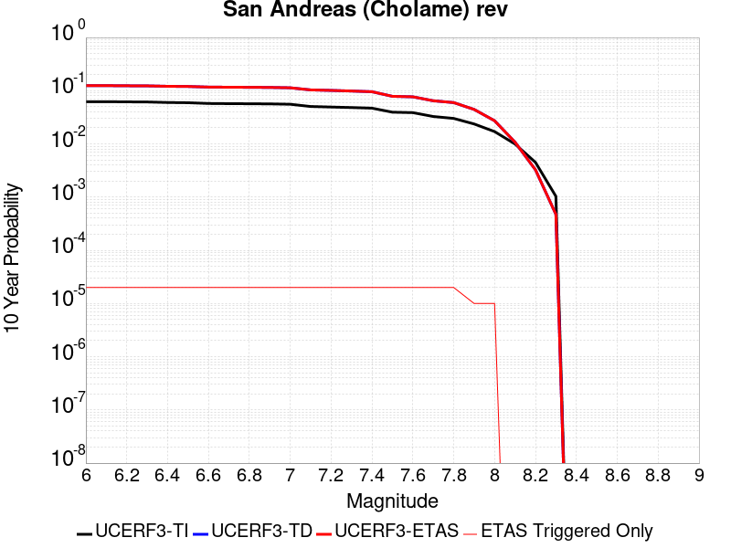 |

| Magnitude | 1 wk TI Prob | 1 wk TD Prob | 1 wk ETAS Prob | 1 wk ETAS/TD Gain | 1 wk ETAS Triggered Only | 1 mo TI Prob | 1 mo TD Prob | 1 mo ETAS Prob | 1 mo ETAS/TD Gain | 1 mo ETAS Triggered Only | 1 yr TI Prob | 1 yr TD Prob | 1 yr ETAS Prob | 1 yr ETAS/TD Gain | 1 yr ETAS Triggered Only | 10 yr TI Prob | 10 yr TD Prob | 10 yr ETAS Prob | 10 yr ETAS/TD Gain | 10 yr ETAS Triggered Only |
|-----|-----|-----|-----|-----|-----|-----|-----|-----|-----|-----|-----|-----|-----|-----|-----|-----|-----|-----|-----|-----|
| 6.0 | 1.2302514E-4 | 2.5242948E-4 | 2.5242948E-4 | 1.0 | 0.0 | 5.27144E-4 | 0.0010813937 | 0.0010813937 | 1.0 | 0.0 | 0.0063991086 | 0.013086997 | 0.013104394 | 1.0013294 | 1.762829E-5 | 0.06217949 | 0.1245517 | 0.12456713 | 1.0001239 | 1.762829E-5 |
| 6.1 | 1.2302514E-4 | 2.5242948E-4 | 2.5242948E-4 | 1.0 | 0.0 | 5.27144E-4 | 0.0010813937 | 0.0010813937 | 1.0 | 0.0 | 0.0063991086 | 0.013086997 | 0.013104394 | 1.0013294 | 1.762829E-5 | 0.06217949 | 0.1245517 | 0.12456713 | 1.0001239 | 1.762829E-5 |
| 6.2 | 1.2203569E-4 | 2.5059693E-4 | 2.5059693E-4 | 1.0 | 0.0 | 5.2290526E-4 | 0.0010735465 | 0.0010735465 | 1.0 | 0.0 | 0.006347804 | 0.0129926 | 0.01301 | 1.0013392 | 1.762829E-5 | 0.061695136 | 0.12373783 | 0.12375328 | 1.0001248 | 1.762829E-5 |
| 6.3 | 1.2142645E-4 | 2.4945638E-4 | 2.4945638E-4 | 1.0 | 0.0 | 5.202953E-4 | 0.0010686623 | 0.0010686623 | 1.0 | 0.0 | 0.006316212 | 0.012933843 | 0.012951244 | 1.0013453 | 1.762829E-5 | 0.06139677 | 0.123231925 | 0.123247385 | 1.0001254 | 1.762829E-5 |
| 6.4 | 1.1865206E-4 | 2.4450937E-4 | 2.4450937E-4 | 1.0 | 0.0 | 5.0840975E-4 | 0.001047478 | 0.001047478 | 1.0 | 0.0 | 0.006172335 | 0.012678952 | 0.0126963565 | 1.0013727 | 1.762829E-5 | 0.060036868 | 0.121024184 | 0.12103968 | 1.000128 | 1.762829E-5 |
| 6.5 | 1.17443946E-4 | 2.4244092E-4 | 2.4244092E-4 | 1.0 | 0.0 | 5.032341E-4 | 0.0010386204 | 0.0010386204 | 1.0 | 0.0 | 0.006109677 | 0.012572356 | 0.012589762 | 1.0013845 | 1.762829E-5 | 0.059444077 | 0.12009794 | 0.120113455 | 1.0001291 | 1.762829E-5 |
| 6.6 | 1.13579066E-4 | 2.3552658E-4 | 2.3552658E-4 | 1.0 | 0.0 | 4.866766E-4 | 0.0010090107 | 0.0010090107 | 1.0 | 0.0 | 0.0059092017 | 0.012215953 | 0.012233366 | 1.0014254 | 1.762829E-5 | 0.057545185 | 0.11701085 | 0.11702641 | 1.000133 | 1.762829E-5 |
| 6.7 | 1.1271412E-4 | 2.339688E-4 | 2.339688E-4 | 1.0 | 0.0 | 4.829711E-4 | 0.0010023396 | 0.0010023396 | 1.0 | 0.0 | 0.005864331 | 0.012135641 | 0.0121530555 | 1.0014349 | 1.762829E-5 | 0.057119697 | 0.116314195 | 0.11632977 | 1.0001339 | 1.762829E-5 |
| 6.8 | 1.1217975E-4 | 2.3285215E-4 | 2.3285215E-4 | 1.0 | 0.0 | 4.8068175E-4 | 9.975577E-4 | 9.975577E-4 | 1.0 | 0.0 | 0.005836608 | 0.012078067 | 0.012095483 | 1.001442 | 1.762829E-5 | 0.056856725 | 0.11581219 | 0.11582778 | 1.0001346 | 1.762829E-5 |
| 6.9 | 1.1146753E-4 | 2.3133864E-4 | 2.3133864E-4 | 1.0 | 0.0 | 4.7763053E-4 | 9.910761E-4 | 9.910761E-4 | 1.0 | 0.0 | 0.0057996577 | 0.012000027 | 0.012017444 | 1.0014514 | 1.762829E-5 | 0.056506127 | 0.11513234 | 0.11514793 | 1.0001355 | 1.762829E-5 |
| 7.0 | 1.0965793E-4 | 2.2756905E-4 | 2.2756905E-4 | 1.0 | 0.0 | 4.698779E-4 | 9.7493286E-4 | 9.7493286E-4 | 1.0 | 0.0 | 0.005705768 | 0.01180563 | 0.01182305 | 1.0014756 | 1.762829E-5 | 0.055614736 | 0.11343304 | 0.113448665 | 1.0001378 | 1.762829E-5 |
| 7.1 | 9.927982E-5 | 2.0574623E-4 | 2.0574623E-4 | 1.0 | 0.0 | 4.2541555E-4 | 8.814726E-4 | 8.814726E-4 | 1.0 | 0.0 | 0.0051671406 | 0.0106794145 | 0.010696854 | 1.001633 | 1.762829E-5 | 0.05048634 | 0.10352388 | 0.10353968 | 1.0001527 | 1.762829E-5 |
| 7.2 | 9.696786E-5 | 2.0078626E-4 | 2.0078626E-4 | 1.0 | 0.0 | 4.1551032E-4 | 8.602298E-4 | 8.602298E-4 | 1.0 | 0.0 | 0.00504711 | 0.010423285 | 0.01044073 | 1.0016736 | 1.762829E-5 | 0.04934009 | 0.10126121 | 0.10127705 | 1.0001564 | 1.762829E-5 |
| 7.3 | 9.4727984E-5 | 1.9507346E-4 | 1.9507346E-4 | 1.0 | 0.0 | 4.0591392E-4 | 8.357622E-4 | 8.357622E-4 | 1.0 | 0.0 | 0.0049308087 | 0.010128201 | 0.01014565 | 1.0017229 | 1.762829E-5 | 0.048228268 | 0.09863034 | 0.09864622 | 1.000161 | 1.762829E-5 |
| 7.4 | 9.220358E-5 | 1.8877286E-4 | 1.8877286E-4 | 1.0 | 0.0 | 3.9509835E-4 | 8.0877665E-4 | 8.0877665E-4 | 1.0 | 0.0 | 0.004799717 | 0.009802646 | 0.009820102 | 1.0017807 | 1.762829E-5 | 0.046973653 | 0.09570612 | 0.095722064 | 1.0001665 | 1.762829E-5 |
| 7.5 | 7.71631E-5 | 1.520787E-4 | 1.520787E-4 | 1.0 | 0.0 | 3.306571E-4 | 6.516032E-4 | 6.516032E-4 | 1.0 | 0.0 | 0.0040183207 | 0.007904484 | 0.007921973 | 1.0022125 | 1.762829E-5 | 0.03946433 | 0.078419134 | 0.078435384 | 1.0002072 | 1.762829E-5 |
| 7.6 | 7.5634416E-5 | 1.4866945E-4 | 1.4866945E-4 | 1.0 | 0.0 | 3.241072E-4 | 6.369994E-4 | 6.369994E-4 | 1.0 | 0.0 | 0.0039388672 | 0.007727957 | 0.007745449 | 1.0022634 | 1.762829E-5 | 0.038697794 | 0.07678112 | 0.07679739 | 1.000212 | 1.762829E-5 |
| 7.7 | 6.3783E-5 | 1.2385153E-4 | 1.2385153E-4 | 1.0 | 0.0 | 2.7332708E-4 | 5.3068437E-4 | 5.3068437E-4 | 1.0 | 0.0 | 0.0033226798 | 0.0064419676 | 0.0064594825 | 1.0027188 | 1.762829E-5 | 0.032734364 | 0.064660996 | 0.064677484 | 1.000255 | 1.762829E-5 |
| 7.8 | 5.863422E-5 | 1.1440121E-4 | 1.1440121E-4 | 1.0 | 0.0 | 2.512653E-4 | 4.9019884E-4 | 4.9019884E-4 | 1.0 | 0.0 | 0.003054864 | 0.00595186 | 0.0059693833 | 1.0029442 | 1.762829E-5 | 0.030132094 | 0.059769355 | 0.05978593 | 1.0002773 | 1.762829E-5 |
| 7.9 | 4.595283E-5 | 8.443828E-5 | 8.443828E-5 | 1.0 | 0.0 | 1.9692584E-4 | 3.6182816E-4 | 3.6182816E-4 | 1.0 | 0.0 | 0.0023949358 | 0.0043963664 | 0.004413917 | 1.0039921 | 1.762829E-5 | 0.023692891 | 0.04444455 | 0.044461396 | 1.000379 | 1.762829E-5 |
| 8.0 | 3.2950178E-5 | 5.0881976E-5 | 5.0881976E-5 | 1.0 | 0.0 | 1.412074E-4 | 2.180474E-4 | 2.180474E-4 | 1.0 | 0.0 | 0.0017178444 | 0.0026514968 | 0.0026690783 | 1.0066308 | 1.762829E-5 | 0.017046256 | 0.027233804 | 0.027250951 | 1.0006297 | 1.762829E-5 |
| 8.1 | 1.9177472E-5 | 1.9238712E-5 | 1.9238712E-5 | 1.0 | 0.0 | 8.218658E-5 | 8.244903E-5 | 8.244903E-5 | 1.0 | 0.0 | 0.0010001622 | 0.0010033553 | 0.0010033553 | 1.0 | 0.0 | 0.009956728 | 0.010786239 | 0.010786239 | 1.0 | 0.0 |
| 8.2 | 8.643924E-6 | 5.49522E-6 | 5.49522E-6 | 1.0 | 0.0 | 3.704486E-5 | 2.355073E-5 | 2.355073E-5 | 1.0 | 0.0 | 4.5092785E-4 | 2.866925E-4 | 2.866925E-4 | 1.0 | 0.0 | 0.0045001395 | 0.0032598388 | 0.0032598388 | 1.0 | 0.0 |
| 8.3 | 1.983087E-6 | 7.693574E-7 | 7.693574E-7 | 1.0 | 0.0 | 8.498917E-6 | 3.297242E-6 | 3.297242E-6 | 1.0 | 0.0 | 1.034694E-4 | 4.01432E-5 | 4.01432E-5 | 1.0 | 0.0 | 0.0010342124 | 4.7390026E-4 | 4.7390026E-4 | 1.0 | 0.0 |

## Ludlow
*[(top)](#table-of-contents)*

| 1 Week | 1 Month | 1 Year | 10 Year |
|-----|-----|-----|-----|
|  |  |  |  |

| Magnitude | 1 wk TI Prob | 1 wk TD Prob | 1 wk ETAS Prob | 1 wk ETAS/TD Gain | 1 wk ETAS Triggered Only | 1 mo TI Prob | 1 mo TD Prob | 1 mo ETAS Prob | 1 mo ETAS/TD Gain | 1 mo ETAS Triggered Only | 1 yr TI Prob | 1 yr TD Prob | 1 yr ETAS Prob | 1 yr ETAS/TD Gain | 1 yr ETAS Triggered Only | 10 yr TI Prob | 10 yr TD Prob | 10 yr ETAS Prob | 10 yr ETAS/TD Gain | 10 yr ETAS Triggered Only |
|-----|-----|-----|-----|-----|-----|-----|-----|-----|-----|-----|-----|-----|-----|-----|-----|-----|-----|-----|-----|-----|
| 6.0 | 2.2407607E-5 | 2.3657954E-5 | 2.3657954E-5 | 1.0 | 0.0 | 9.602906E-5 | 1.0138754E-4 | 1.0138754E-4 | 1.0 | 0.0 | 0.0011685267 | 0.0012337384 | 0.0012513449 | 1.0142709 | 1.762829E-5 | 0.011624013 | 0.012273403 | 0.012290815 | 1.0014187 | 1.762829E-5 |
| 6.1 | 2.2407607E-5 | 2.3657954E-5 | 2.3657954E-5 | 1.0 | 0.0 | 9.602906E-5 | 1.0138754E-4 | 1.0138754E-4 | 1.0 | 0.0 | 0.0011685267 | 0.0012337384 | 0.0012513449 | 1.0142709 | 1.762829E-5 | 0.011624013 | 0.012273403 | 0.012290815 | 1.0014187 | 1.762829E-5 |
| 6.2 | 1.0781252E-5 | 1.1365991E-5 | 1.1365991E-5 | 1.0 | 0.0 | 4.620455E-5 | 4.8710503E-5 | 4.8710503E-5 | 1.0 | 0.0 | 5.623952E-4 | 5.92893E-4 | 6.105109E-4 | 1.0297151 | 1.762829E-5 | 0.00560974 | 0.005913531 | 0.005931055 | 1.0029634 | 1.762829E-5 |
| 6.3 | 1.0781252E-5 | 1.1365991E-5 | 1.1365991E-5 | 1.0 | 0.0 | 4.620455E-5 | 4.8710503E-5 | 4.8710503E-5 | 1.0 | 0.0 | 5.623952E-4 | 5.92893E-4 | 6.105109E-4 | 1.0297151 | 1.762829E-5 | 0.00560974 | 0.005913531 | 0.005931055 | 1.0029634 | 1.762829E-5 |
| 6.4 | 7.814439E-6 | 8.237966E-6 | 8.237966E-6 | 1.0 | 0.0 | 3.3490025E-5 | 3.5305096E-5 | 3.5305096E-5 | 1.0 | 0.0 | 4.0766477E-4 | 4.2975618E-4 | 4.473769E-4 | 1.0410017 | 1.762829E-5 | 0.0040691774 | 0.0042893975 | 0.00430695 | 1.0040921 | 1.762829E-5 |
| 6.5 | 6.4986366E-6 | 6.8511167E-6 | 6.8511167E-6 | 1.0 | 0.0 | 2.7851002E-5 | 2.9361603E-5 | 2.9361603E-5 | 1.0 | 0.0 | 3.390332E-4 | 3.574198E-4 | 3.750418E-4 | 1.0493033 | 1.762829E-5 | 0.003385164 | 0.003568546 | 0.0035861111 | 1.0049223 | 1.762829E-5 |
| 6.6 | 5.582177E-6 | 5.8861756E-6 | 5.8861756E-6 | 1.0 | 0.0 | 2.3923398E-5 | 2.5226227E-5 | 2.5226227E-5 | 1.0 | 0.0 | 2.9122844E-4 | 3.0708674E-4 | 3.2470963E-4 | 1.0573872 | 1.762829E-5 | 0.0029084706 | 0.0030666974 | 0.0030842717 | 1.0057306 | 1.762829E-5 |
| 6.7 | 4.6858763E-6 | 4.94057E-6 | 4.94057E-6 | 1.0 | 0.0 | 2.0082172E-5 | 2.1173702E-5 | 2.1173702E-5 | 1.0 | 0.0 | 2.4447302E-4 | 2.5775988E-4 | 2.7538362E-4 | 1.0683727 | 1.762829E-5 | 0.0024420423 | 0.0025746655 | 0.0025922484 | 1.0068291 | 1.762829E-5 |
| 6.8 | 3.5584908E-6 | 3.7521265E-6 | 3.7521265E-6 | 1.0 | 0.0 | 1.5250586E-5 | 1.6080447E-5 | 1.6080447E-5 | 1.0 | 0.0 | 1.8566006E-4 | 1.9576224E-4 | 2.1338709E-4 | 1.0900319 | 1.762829E-5 | 0.0018550502 | 0.0019559392 | 0.0019735328 | 1.008995 | 1.762829E-5 |
| 6.9 | 2.532834E-6 | 2.6710807E-6 | 2.6710807E-6 | 1.0 | 0.0 | 1.0854958E-5 | 1.1447441E-5 | 1.1447441E-5 | 1.0 | 0.0 | 1.3215111E-4 | 1.3936395E-4 | 1.5698979E-4 | 1.1264734 | 1.762829E-5 | 0.0013207254 | 0.0013927931 | 0.0014103969 | 1.0126392 | 1.762829E-5 |
| 7.0 | 1.7083285E-6 | 1.8019963E-6 | 1.8019963E-6 | 1.0 | 0.0 | 7.3213873E-6 | 7.722819E-6 | 7.722819E-6 | 1.0 | 0.0 | 8.913424E-5 | 9.402143E-5 | 9.402143E-5 | 1.0 | 0.0 | 8.9098496E-4 | 9.3983306E-4 | 9.3983306E-4 | 1.0 | 0.0 |
| 7.1 | 1.0905424E-6 | 1.1497951E-6 | 1.1497951E-6 | 1.0 | 0.0 | 4.6737446E-6 | 4.9276846E-6 | 4.9276846E-6 | 1.0 | 0.0 | 5.6901354E-5 | 5.9993006E-5 | 5.9993006E-5 | 1.0 | 0.0 | 5.6886784E-4 | 5.997779E-4 | 5.997779E-4 | 1.0 | 0.0 |
| 7.2 | 6.06668E-7 | 6.387457E-7 | 6.387457E-7 | 1.0 | 0.0 | 2.600003E-6 | 2.737479E-6 | 2.737479E-6 | 1.0 | 0.0 | 3.1654577E-5 | 3.3328364E-5 | 3.3328364E-5 | 1.0 | 0.0 | 3.1650066E-4 | 3.3324052E-4 | 3.3324052E-4 | 1.0 | 0.0 |

## San Luis Range 2011 CFM
*[(top)](#table-of-contents)*

| 1 Week | 1 Month | 1 Year | 10 Year |
|-----|-----|-----|-----|
|  |  |  | 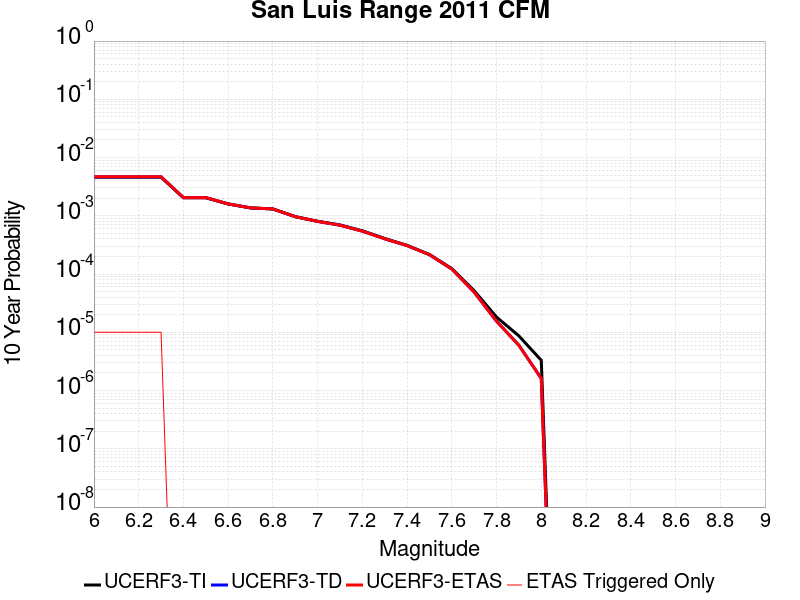 |

| Magnitude | 1 wk TI Prob | 1 wk TD Prob | 1 wk ETAS Prob | 1 wk ETAS/TD Gain | 1 wk ETAS Triggered Only | 1 mo TI Prob | 1 mo TD Prob | 1 mo ETAS Prob | 1 mo ETAS/TD Gain | 1 mo ETAS Triggered Only | 1 yr TI Prob | 1 yr TD Prob | 1 yr ETAS Prob | 1 yr ETAS/TD Gain | 1 yr ETAS Triggered Only | 10 yr TI Prob | 10 yr TD Prob | 10 yr ETAS Prob | 10 yr ETAS/TD Gain | 10 yr ETAS Triggered Only |
|-----|-----|-----|-----|-----|-----|-----|-----|-----|-----|-----|-----|-----|-----|-----|-----|-----|-----|-----|-----|-----|
| 6.0 | 8.8368415E-6 | 8.965548E-6 | 8.965548E-6 | 1.0 | 0.0 | 3.787163E-5 | 3.8423255E-5 | 3.8423255E-5 | 1.0 | 0.0 | 4.609895E-4 | 4.677106E-4 | 4.677106E-4 | 1.0 | 0.0 | 0.0046003438 | 0.0046680453 | 0.0046855914 | 1.0037588 | 1.762829E-5 |
| 6.1 | 8.8368415E-6 | 8.965548E-6 | 8.965548E-6 | 1.0 | 0.0 | 3.787163E-5 | 3.8423255E-5 | 3.8423255E-5 | 1.0 | 0.0 | 4.609895E-4 | 4.677106E-4 | 4.677106E-4 | 1.0 | 0.0 | 0.0046003438 | 0.0046680453 | 0.0046855914 | 1.0037588 | 1.762829E-5 |
| 6.2 | 8.8368415E-6 | 8.965548E-6 | 8.965548E-6 | 1.0 | 0.0 | 3.787163E-5 | 3.8423255E-5 | 3.8423255E-5 | 1.0 | 0.0 | 4.609895E-4 | 4.677106E-4 | 4.677106E-4 | 1.0 | 0.0 | 0.0046003438 | 0.0046680453 | 0.0046855914 | 1.0037588 | 1.762829E-5 |
| 6.3 | 8.8368415E-6 | 8.965548E-6 | 8.965548E-6 | 1.0 | 0.0 | 3.787163E-5 | 3.8423255E-5 | 3.8423255E-5 | 1.0 | 0.0 | 4.609895E-4 | 4.677106E-4 | 4.677106E-4 | 1.0 | 0.0 | 0.0046003438 | 0.0046680453 | 0.0046855914 | 1.0037588 | 1.762829E-5 |
| 6.4 | 3.9094193E-6 | 3.941245E-6 | 3.941245E-6 | 1.0 | 0.0 | 1.6754546E-5 | 1.6890941E-5 | 1.6890941E-5 | 1.0 | 0.0 | 2.039675E-4 | 2.0562808E-4 | 2.0562808E-4 | 1.0 | 0.0 | 0.0020378039 | 0.002054407 | 0.002054407 | 1.0 | 0.0 |
| 6.5 | 3.9094193E-6 | 3.941245E-6 | 3.941245E-6 | 1.0 | 0.0 | 1.6754546E-5 | 1.6890941E-5 | 1.6890941E-5 | 1.0 | 0.0 | 2.039675E-4 | 2.0562808E-4 | 2.0562808E-4 | 1.0 | 0.0 | 0.0020378039 | 0.002054407 | 0.002054407 | 1.0 | 0.0 |
| 6.6 | 3.0587726E-6 | 3.075422E-6 | 3.075422E-6 | 1.0 | 0.0 | 1.3108959E-5 | 1.3180314E-5 | 1.3180314E-5 | 1.0 | 0.0 | 1.595899E-4 | 1.6045863E-4 | 1.6045863E-4 | 1.0 | 0.0 | 0.0015947534 | 0.0016034397 | 0.0016034397 | 1.0 | 0.0 |
| 6.7 | 2.6160574E-6 | 2.625157E-6 | 2.625157E-6 | 1.0 | 0.0 | 1.1211626E-5 | 1.1250625E-5 | 1.1250625E-5 | 1.0 | 0.0 | 1.3649299E-4 | 1.369678E-4 | 1.369678E-4 | 1.0 | 0.0 | 0.0013640919 | 0.0013688401 | 0.0013688401 | 1.0 | 0.0 |
| 6.8 | 2.5110312E-6 | 2.518169E-6 | 2.518169E-6 | 1.0 | 0.0 | 1.0761518E-5 | 1.0792108E-5 | 1.0792108E-5 | 1.0 | 0.0 | 1.310136E-4 | 1.3138604E-4 | 1.3138604E-4 | 1.0 | 0.0 | 0.0013093639 | 0.0013130896 | 0.0013130896 | 1.0 | 0.0 |
| 6.9 | 1.8564405E-6 | 1.8525097E-6 | 1.8525097E-6 | 1.0 | 0.0 | 7.95615E-6 | 7.939303E-6 | 7.939303E-6 | 1.0 | 0.0 | 9.686181E-5 | 9.6656746E-5 | 9.6656746E-5 | 1.0 | 0.0 | 9.68196E-4 | 9.6614915E-4 | 9.6614915E-4 | 1.0 | 0.0 |
| 7.0 | 1.546127E-6 | 1.5369736E-6 | 1.5369736E-6 | 1.0 | 0.0 | 6.626242E-6 | 6.5870136E-6 | 6.5870136E-6 | 1.0 | 0.0 | 8.06715E-5 | 8.0193946E-5 | 8.0193946E-5 | 1.0 | 0.0 | 8.0642226E-4 | 8.0165075E-4 | 8.0165075E-4 | 1.0 | 0.0 |
| 7.1 | 1.3368208E-6 | 1.3235502E-6 | 1.3235502E-6 | 1.0 | 0.0 | 5.7292195E-6 | 5.672346E-6 | 5.672346E-6 | 1.0 | 0.0 | 6.975101E-5 | 6.905863E-5 | 6.905863E-5 | 1.0 | 0.0 | 6.972912E-4 | 6.9037214E-4 | 6.9037214E-4 | 1.0 | 0.0 |
| 7.2 | 1.0623363E-6 | 1.0454515E-6 | 1.0454515E-6 | 1.0 | 0.0 | 4.5528623E-6 | 4.480499E-6 | 4.480499E-6 | 1.0 | 0.0 | 5.5429686E-5 | 5.454871E-5 | 5.454871E-5 | 1.0 | 0.0 | 5.5415864E-4 | 5.453535E-4 | 5.453535E-4 | 1.0 | 0.0 |
| 7.3 | 7.831679E-7 | 7.72751E-7 | 7.72751E-7 | 1.0 | 0.0 | 3.3564295E-6 | 3.3117856E-6 | 3.3117856E-6 | 1.0 | 0.0 | 4.086376E-5 | 4.0320243E-5 | 4.0320243E-5 | 1.0 | 0.0 | 4.0856248E-4 | 4.0312944E-4 | 4.0312944E-4 | 1.0 | 0.0 |
| 7.4 | 5.9558846E-7 | 5.910736E-7 | 5.910736E-7 | 1.0 | 0.0 | 2.5525194E-6 | 2.5331701E-6 | 2.5331701E-6 | 1.0 | 0.0 | 3.107648E-5 | 3.084091E-5 | 3.084091E-5 | 1.0 | 0.0 | 3.1072134E-4 | 3.0836638E-4 | 3.0836638E-4 | 1.0 | 0.0 |
| 7.5 | 4.1616502E-7 | 4.1197126E-7 | 4.1197126E-7 | 1.0 | 0.0 | 1.7835631E-6 | 1.7655899E-6 | 1.7655899E-6 | 1.0 | 0.0 | 2.1714664E-5 | 2.1495845E-5 | 2.1495845E-5 | 1.0 | 0.0 | 2.1712543E-4 | 2.1493771E-4 | 2.1493771E-4 | 1.0 | 0.0 |
| 7.6 | 2.3816014E-7 | 2.337718E-7 | 2.337718E-7 | 1.0 | 0.0 | 1.0206859E-6 | 1.0018788E-6 | 1.0018788E-6 | 1.0 | 0.0 | 1.242678E-5 | 1.21978055E-5 | 1.21978055E-5 | 1.0 | 0.0 | 1.2426086E-4 | 1.2197138E-4 | 1.2197138E-4 | 1.0 | 0.0 |
| 7.7 | 9.918777E-8 | 9.3872394E-8 | 9.3872394E-8 | 1.0 | 0.0 | 4.2509038E-7 | 4.023102E-7 | 4.023102E-7 | 1.0 | 0.0 | 5.1754632E-6 | 4.8981155E-6 | 4.8981155E-6 | 1.0 | 0.0 | 5.1753424E-5 | 4.898008E-5 | 4.898008E-5 | 1.0 | 0.0 |
| 7.8 | 3.4982556E-8 | 2.9690542E-8 | 2.9690542E-8 | 1.0 | 0.0 | 1.4992524E-7 | 1.2724517E-7 | 1.2724517E-7 | 1.0 | 0.0 | 1.8253382E-6 | 1.549209E-6 | 1.549209E-6 | 1.0 | 0.0 | 1.8253233E-5 | 1.5491982E-5 | 1.5491982E-5 | 1.0 | 0.0 |
| 7.9 | 1.6624908E-8 | 1.1480696E-8 | 1.1480696E-8 | 1.0 | 0.0 | 7.12496E-8 | 4.920299E-8 | 4.920299E-8 | 1.0 | 0.0 | 8.6746354E-7 | 5.990462E-7 | 5.990462E-7 | 1.0 | 0.0 | 8.674601E-6 | 5.9904464E-6 | 5.9904464E-6 | 1.0 | 0.0 |
| 8.0 | 6.3352315E-9 | 3.0908693E-9 | 3.0908693E-9 | 1.0 | 0.0 | 2.715099E-8 | 1.3246585E-8 | 1.3246585E-8 | 1.0 | 0.0 | 3.3056327E-7 | 1.6127716E-7 | 1.6127716E-7 | 1.0 | 0.0 | 3.3056278E-6 | 1.6127703E-6 | 1.6127703E-6 | 1.0 | 0.0 |

## San Jacinto (Coyote Creek)
*[(top)](#table-of-contents)*

| 1 Week | 1 Month | 1 Year | 10 Year |
|-----|-----|-----|-----|
|  | 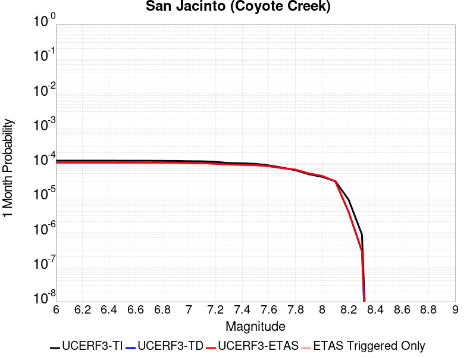 |  |  |

| Magnitude | 1 wk TI Prob | 1 wk TD Prob | 1 wk ETAS Prob | 1 wk ETAS/TD Gain | 1 wk ETAS Triggered Only | 1 mo TI Prob | 1 mo TD Prob | 1 mo ETAS Prob | 1 mo ETAS/TD Gain | 1 mo ETAS Triggered Only | 1 yr TI Prob | 1 yr TD Prob | 1 yr ETAS Prob | 1 yr ETAS/TD Gain | 1 yr ETAS Triggered Only | 10 yr TI Prob | 10 yr TD Prob | 10 yr ETAS Prob | 10 yr ETAS/TD Gain | 10 yr ETAS Triggered Only |
|-----|-----|-----|-----|-----|-----|-----|-----|-----|-----|-----|-----|-----|-----|-----|-----|-----|-----|-----|-----|-----|
| 6.0 | 2.7374346E-5 | 2.4177032E-5 | 2.4177032E-5 | 1.0 | 0.0 | 1.1731335E-4 | 1.0361175E-4 | 1.0361175E-4 | 1.0 | 0.0 | 0.0014273542 | 0.0012607456 | 0.0012783516 | 1.0139648 | 1.762829E-5 | 0.01418221 | 0.012944878 | 0.012962278 | 1.0013442 | 1.762829E-5 |
| 6.1 | 2.7374346E-5 | 2.4177032E-5 | 2.4177032E-5 | 1.0 | 0.0 | 1.1731335E-4 | 1.0361175E-4 | 1.0361175E-4 | 1.0 | 0.0 | 0.0014273542 | 0.0012607456 | 0.0012783516 | 1.0139648 | 1.762829E-5 | 0.01418221 | 0.012944878 | 0.012962278 | 1.0013442 | 1.762829E-5 |
| 6.2 | 2.7374346E-5 | 2.4177032E-5 | 2.4177032E-5 | 1.0 | 0.0 | 1.1731335E-4 | 1.0361175E-4 | 1.0361175E-4 | 1.0 | 0.0 | 0.0014273542 | 0.0012607456 | 0.0012783516 | 1.0139648 | 1.762829E-5 | 0.01418221 | 0.012944878 | 0.012962278 | 1.0013442 | 1.762829E-5 |
| 6.3 | 2.7374346E-5 | 2.4177032E-5 | 2.4177032E-5 | 1.0 | 0.0 | 1.1731335E-4 | 1.0361175E-4 | 1.0361175E-4 | 1.0 | 0.0 | 0.0014273542 | 0.0012607456 | 0.0012783516 | 1.0139648 | 1.762829E-5 | 0.01418221 | 0.012944878 | 0.012962278 | 1.0013442 | 1.762829E-5 |
| 6.4 | 2.7374346E-5 | 2.4177032E-5 | 2.4177032E-5 | 1.0 | 0.0 | 1.1731335E-4 | 1.0361175E-4 | 1.0361175E-4 | 1.0 | 0.0 | 0.0014273542 | 0.0012607456 | 0.0012783516 | 1.0139648 | 1.762829E-5 | 0.01418221 | 0.012944878 | 0.012962278 | 1.0013442 | 1.762829E-5 |
| 6.5 | 2.7282445E-5 | 2.4063094E-5 | 2.4063094E-5 | 1.0 | 0.0 | 1.16919524E-4 | 1.03123486E-4 | 1.03123486E-4 | 1.0 | 0.0 | 0.0014225657 | 0.0012548079 | 0.0012724141 | 1.0140309 | 1.762829E-5 | 0.014134934 | 0.012886199 | 0.0129036 | 1.0013504 | 1.762829E-5 |
| 6.6 | 2.7282445E-5 | 2.4063094E-5 | 2.4063094E-5 | 1.0 | 0.0 | 1.16919524E-4 | 1.03123486E-4 | 1.03123486E-4 | 1.0 | 0.0 | 0.0014225657 | 0.0012548079 | 0.0012724141 | 1.0140309 | 1.762829E-5 | 0.014134934 | 0.012886199 | 0.0129036 | 1.0013504 | 1.762829E-5 |
| 6.7 | 2.7216198E-5 | 2.3988207E-5 | 2.3988207E-5 | 1.0 | 0.0 | 1.1663563E-4 | 1.02802565E-4 | 1.02802565E-4 | 1.0 | 0.0 | 0.0014191137 | 0.0012509052 | 0.0012685114 | 1.0140748 | 1.762829E-5 | 0.014100855 | 0.012847606 | 0.012865008 | 1.0013545 | 1.762829E-5 |
| 6.8 | 2.7078617E-5 | 2.3905404E-5 | 2.3905404E-5 | 1.0 | 0.0 | 1.1604605E-4 | 1.02447724E-4 | 1.02447724E-4 | 1.0 | 0.0 | 0.001411945 | 0.00124659 | 0.0012641964 | 1.0141236 | 1.762829E-5 | 0.014030075 | 0.012804739 | 0.012822142 | 1.0013591 | 1.762829E-5 |
| 6.9 | 2.6982952E-5 | 2.3824896E-5 | 2.3824896E-5 | 1.0 | 0.0 | 1.15636096E-4 | 1.0210271E-4 | 1.0210271E-4 | 1.0 | 0.0 | 0.0014069602 | 0.0012423943 | 0.0012600007 | 1.0141714 | 1.762829E-5 | 0.013980856 | 0.012763045 | 0.012780448 | 1.0013635 | 1.762829E-5 |
| 7.0 | 2.6449972E-5 | 2.3401846E-5 | 2.3401846E-5 | 1.0 | 0.0 | 1.1335209E-4 | 1.00289784E-4 | 1.00289784E-4 | 1.0 | 0.0 | 0.001379188 | 0.0012203468 | 0.0012379535 | 1.0144277 | 1.762829E-5 | 0.0137065975 | 0.012544374 | 0.012561781 | 1.0013876 | 1.762829E-5 |
| 7.1 | 2.6257849E-5 | 2.322785E-5 | 2.322785E-5 | 1.0 | 0.0 | 1.1252879E-4 | 9.9544144E-5 | 9.9544144E-5 | 1.0 | 0.0 | 0.0013691769 | 0.0012112787 | 0.0012288857 | 1.0145358 | 1.762829E-5 | 0.013607717 | 0.012454224 | 0.012471632 | 1.0013978 | 1.762829E-5 |
| 7.2 | 2.5270041E-5 | 2.2422375E-5 | 2.2422375E-5 | 1.0 | 0.0 | 1.0829568E-4 | 9.6092364E-5 | 9.6092364E-5 | 1.0 | 0.0 | 0.0013177024 | 0.001169299 | 0.0011869067 | 1.0150583 | 1.762829E-5 | 0.013099162 | 0.012035143 | 0.012052558 | 1.0014471 | 1.762829E-5 |
| 7.3 | 2.339701E-5 | 2.1153774E-5 | 2.1153774E-5 | 1.0 | 0.0 | 1.0026905E-4 | 9.065589E-5 | 9.065589E-5 | 1.0 | 0.0 | 0.001220092 | 0.0011031787 | 0.0011207876 | 1.0159619 | 1.762829E-5 | 0.012134149 | 0.011373838 | 0.011391266 | 1.0015323 | 1.762829E-5 |
| 7.4 | 2.296333E-5 | 2.0884016E-5 | 2.0884016E-5 | 1.0 | 0.0 | 9.841056E-5 | 8.949987E-5 | 8.949987E-5 | 1.0 | 0.0 | 0.0011974899 | 0.0010891182 | 0.0011067273 | 1.0161682 | 1.762829E-5 | 0.011910575 | 0.011232895 | 0.0112503255 | 1.0015517 | 1.762829E-5 |
| 7.5 | 2.2188895E-5 | 2.0406682E-5 | 2.0406682E-5 | 1.0 | 0.0 | 9.50918E-5 | 8.745429E-5 | 8.745429E-5 | 1.0 | 0.0 | 0.0011571277 | 0.0010642379 | 0.0010818474 | 1.0165466 | 1.762829E-5 | 0.011511209 | 0.010982383 | 0.010999817 | 1.0015875 | 1.762829E-5 |
| 7.6 | 2.0013189E-5 | 1.8992265E-5 | 1.8992265E-5 | 1.0 | 0.0 | 8.5767984E-5 | 8.139289E-5 | 8.139289E-5 | 1.0 | 0.0 | 0.001043725 | 9.905098E-4 | 0.0010081205 | 1.0177796 | 1.762829E-5 | 0.010388365 | 0.010240043 | 0.01025749 | 1.0017039 | 1.762829E-5 |
| 7.7 | 1.7230794E-5 | 1.677281E-5 | 1.677281E-5 | 1.0 | 0.0 | 7.384417E-5 | 7.18815E-5 | 7.18815E-5 | 1.0 | 0.0 | 8.986819E-4 | 8.7480666E-4 | 8.9241954E-4 | 1.0201335 | 1.762829E-5 | 0.008950562 | 0.009078168 | 0.009095636 | 1.0019242 | 1.762829E-5 |
| 7.8 | 1.4478809E-5 | 1.50190535E-5 | 1.50190535E-5 | 1.0 | 0.0 | 6.205057E-5 | 6.4365784E-5 | 6.4365784E-5 | 1.0 | 0.0 | 7.552038E-4 | 7.833723E-4 | 8.0098683E-4 | 1.0224855 | 1.762829E-5 | 0.0075264242 | 0.00815608 | 0.008173564 | 1.0021437 | 1.762829E-5 |
| 7.9 | 1.1114467E-5 | 1.1670009E-5 | 1.1670009E-5 | 1.0 | 0.0 | 4.7632562E-5 | 5.001337E-5 | 5.001337E-5 | 1.0 | 0.0 | 5.797721E-4 | 6.087432E-4 | 6.2636076E-4 | 1.0289409 | 1.762829E-5 | 0.0057826187 | 0.006393403 | 0.0064109187 | 1.0027397 | 1.762829E-5 |
| 8.0 | 9.327402E-6 | 9.9217805E-6 | 9.9217805E-6 | 1.0 | 0.0 | 3.9973966E-5 | 4.2521227E-5 | 4.2521227E-5 | 1.0 | 0.0 | 4.8657437E-4 | 5.175735E-4 | 5.3519267E-4 | 1.0340419 | 1.762829E-5 | 0.0048551033 | 0.005461854 | 0.005479386 | 1.00321 | 1.762829E-5 |
| 8.1 | 7.0235833E-6 | 6.844232E-6 | 6.844232E-6 | 1.0 | 0.0 | 3.0100724E-5 | 2.9332095E-5 | 2.9332095E-5 | 1.0 | 0.0 | 3.664147E-4 | 3.5706026E-4 | 3.7468225E-4 | 1.049353 | 1.762829E-5 | 0.003658111 | 0.0037964787 | 0.00381404 | 1.0046257 | 1.762829E-5 |
| 8.2 | 2.0358202E-6 | 9.0285533E-7 | 9.0285533E-7 | 1.0 | 0.0 | 8.724915E-6 | 3.8693743E-6 | 3.8693743E-6 | 1.0 | 0.0 | 1.06220665E-4 | 4.710864E-5 | 4.710864E-5 | 1.0 | 0.0 | 0.001061699 | 5.3444994E-4 | 5.3444994E-4 | 1.0 | 0.0 |
| 8.3 | 2.0051264E-7 | 6.646147E-8 | 6.646147E-8 | 1.0 | 0.0 | 8.5933965E-7 | 2.8483484E-7 | 2.8483484E-7 | 1.0 | 0.0 | 1.046241E-5 | 3.467859E-6 | 3.467859E-6 | 1.0 | 0.0 | 1.0461917E-4 | 4.0304385E-5 | 4.0304385E-5 | 1.0 | 0.0 |

## San Cayetano
*[(top)](#table-of-contents)*

| 1 Week | 1 Month | 1 Year | 10 Year |
|-----|-----|-----|-----|
|  |  |  |  |

| Magnitude | 1 wk TI Prob | 1 wk TD Prob | 1 wk ETAS Prob | 1 wk ETAS/TD Gain | 1 wk ETAS Triggered Only | 1 mo TI Prob | 1 mo TD Prob | 1 mo ETAS Prob | 1 mo ETAS/TD Gain | 1 mo ETAS Triggered Only | 1 yr TI Prob | 1 yr TD Prob | 1 yr ETAS Prob | 1 yr ETAS/TD Gain | 1 yr ETAS Triggered Only | 10 yr TI Prob | 10 yr TD Prob | 10 yr ETAS Prob | 10 yr ETAS/TD Gain | 10 yr ETAS Triggered Only |
|-----|-----|-----|-----|-----|-----|-----|-----|-----|-----|-----|-----|-----|-----|-----|-----|-----|-----|-----|-----|-----|
| 6.0 | 2.3476267E-5 | 1.8172246E-5 | 1.8172246E-5 | 1.0 | 0.0 | 1.0060869E-4 | 7.787875E-5 | 7.787875E-5 | 1.0 | 0.0 | 0.0012242225 | 9.4776496E-4 | 9.6537656E-4 | 1.0185822 | 1.762829E-5 | 0.012175002 | 0.009438118 | 0.009455579 | 1.0018501 | 1.762829E-5 |
| 6.1 | 2.3476267E-5 | 1.8172246E-5 | 1.8172246E-5 | 1.0 | 0.0 | 1.0060869E-4 | 7.787875E-5 | 7.787875E-5 | 1.0 | 0.0 | 0.0012242225 | 9.4776496E-4 | 9.6537656E-4 | 1.0185822 | 1.762829E-5 | 0.012175002 | 0.009438118 | 0.009455579 | 1.0018501 | 1.762829E-5 |
| 6.2 | 2.3476267E-5 | 1.8172246E-5 | 1.8172246E-5 | 1.0 | 0.0 | 1.0060869E-4 | 7.787875E-5 | 7.787875E-5 | 1.0 | 0.0 | 0.0012242225 | 9.4776496E-4 | 9.6537656E-4 | 1.0185822 | 1.762829E-5 | 0.012175002 | 0.009438118 | 0.009455579 | 1.0018501 | 1.762829E-5 |
| 6.3 | 2.3476267E-5 | 1.8172246E-5 | 1.8172246E-5 | 1.0 | 0.0 | 1.0060869E-4 | 7.787875E-5 | 7.787875E-5 | 1.0 | 0.0 | 0.0012242225 | 9.4776496E-4 | 9.6537656E-4 | 1.0185822 | 1.762829E-5 | 0.012175002 | 0.009438118 | 0.009455579 | 1.0018501 | 1.762829E-5 |
| 6.4 | 2.3476267E-5 | 1.8172246E-5 | 1.8172246E-5 | 1.0 | 0.0 | 1.0060869E-4 | 7.787875E-5 | 7.787875E-5 | 1.0 | 0.0 | 0.0012242225 | 9.4776496E-4 | 9.6537656E-4 | 1.0185822 | 1.762829E-5 | 0.012175002 | 0.009438118 | 0.009455579 | 1.0018501 | 1.762829E-5 |
| 6.5 | 2.3476267E-5 | 1.8172246E-5 | 1.8172246E-5 | 1.0 | 0.0 | 1.0060869E-4 | 7.787875E-5 | 7.787875E-5 | 1.0 | 0.0 | 0.0012242225 | 9.4776496E-4 | 9.6537656E-4 | 1.0185822 | 1.762829E-5 | 0.012175002 | 0.009438118 | 0.009455579 | 1.0018501 | 1.762829E-5 |
| 6.6 | 2.3476267E-5 | 1.8172246E-5 | 1.8172246E-5 | 1.0 | 0.0 | 1.0060869E-4 | 7.787875E-5 | 7.787875E-5 | 1.0 | 0.0 | 0.0012242225 | 9.4776496E-4 | 9.6537656E-4 | 1.0185822 | 1.762829E-5 | 0.012175002 | 0.009438118 | 0.009455579 | 1.0018501 | 1.762829E-5 |
| 6.7 | 2.3476267E-5 | 1.8172246E-5 | 1.8172246E-5 | 1.0 | 0.0 | 1.0060869E-4 | 7.787875E-5 | 7.787875E-5 | 1.0 | 0.0 | 0.0012242225 | 9.4776496E-4 | 9.6537656E-4 | 1.0185822 | 1.762829E-5 | 0.012175002 | 0.009438118 | 0.009455579 | 1.0018501 | 1.762829E-5 |
| 6.8 | 2.3241924E-5 | 1.7939927E-5 | 1.7939927E-5 | 1.0 | 0.0 | 9.960445E-5 | 7.688316E-5 | 7.688316E-5 | 1.0 | 0.0 | 0.0012120095 | 9.356541E-4 | 9.532659E-4 | 1.018823 | 1.762829E-5 | 0.012054204 | 0.009318002 | 0.009335466 | 1.0018742 | 1.762829E-5 |
| 6.9 | 2.2761007E-5 | 1.7435323E-5 | 1.7435323E-5 | 1.0 | 0.0 | 9.7543525E-5 | 7.4720694E-5 | 7.4720694E-5 | 1.0 | 0.0 | 0.0011869454 | 9.093482E-4 | 9.093482E-4 | 1.0 | 0.0 | 0.011806256 | 0.009057103 | 0.009057103 | 1.0 | 0.0 |
| 7.0 | 2.240283E-5 | 1.7069042E-5 | 1.7069042E-5 | 1.0 | 0.0 | 9.600859E-5 | 7.3151E-5 | 7.3151E-5 | 1.0 | 0.0 | 0.0011682777 | 8.9025294E-4 | 8.9025294E-4 | 1.0 | 0.0 | 0.011621549 | 0.008867681 | 0.008867681 | 1.0 | 0.0 |
| 7.1 | 2.1871154E-5 | 1.6588847E-5 | 1.6588847E-5 | 1.0 | 0.0 | 9.373015E-5 | 7.1093134E-5 | 7.1093134E-5 | 1.0 | 0.0 | 0.0011405671 | 8.652186E-4 | 8.652186E-4 | 1.0 | 0.0 | 0.011347309 | 0.008619301 | 0.008619301 | 1.0 | 0.0 |
| 7.2 | 2.0714133E-5 | 1.5567295E-5 | 1.5567295E-5 | 1.0 | 0.0 | 8.8771834E-5 | 6.671529E-5 | 6.671529E-5 | 1.0 | 0.0 | 0.0010802611 | 8.1195927E-4 | 8.1195927E-4 | 1.0 | 0.0 | 0.010750249 | 0.008090701 | 0.008090701 | 1.0 | 0.0 |
| 7.3 | 1.8408395E-5 | 1.3998046E-5 | 1.3998046E-5 | 1.0 | 0.0 | 7.8890735E-5 | 5.999026E-5 | 5.999026E-5 | 1.0 | 0.0 | 9.600714E-4 | 7.3013967E-4 | 7.3013967E-4 | 1.0 | 0.0 | 0.009559342 | 0.007278127 | 0.007278127 | 1.0 | 0.0 |
| 7.4 | 1.6856795E-5 | 1.2851064E-5 | 1.2851064E-5 | 1.0 | 0.0 | 7.2241404E-5 | 5.507484E-5 | 5.507484E-5 | 1.0 | 0.0 | 8.7918417E-4 | 6.7033275E-4 | 6.7033275E-4 | 1.0 | 0.0 | 0.00875714 | 0.006683788 | 0.006683788 | 1.0 | 0.0 |
| 7.5 | 1.2822778E-5 | 9.578205E-6 | 9.578205E-6 | 1.0 | 0.0 | 5.495361E-5 | 4.1048817E-5 | 4.1048817E-5 | 1.0 | 0.0 | 6.688548E-4 | 4.996563E-4 | 4.996563E-4 | 1.0 | 0.0 | 0.006668452 | 0.0049855 | 0.0049855 | 1.0 | 0.0 |
| 7.6 | 5.6272684E-6 | 3.855203E-6 | 3.855203E-6 | 1.0 | 0.0 | 2.4116642E-5 | 1.6522194E-5 | 1.6522194E-5 | 1.0 | 0.0 | 2.9358055E-4 | 2.0113925E-4 | 2.0113925E-4 | 1.0 | 0.0 | 0.0029319301 | 0.002009583 | 0.002009583 | 1.0 | 0.0 |
| 7.7 | 3.5261346E-6 | 2.3408893E-6 | 2.3408893E-6 | 1.0 | 0.0 | 1.5111918E-5 | 1.0032345E-5 | 1.0032345E-5 | 1.0 | 0.0 | 1.8397206E-4 | 1.2213703E-4 | 1.2213703E-4 | 1.0 | 0.0 | 0.0018381984 | 0.0012207064 | 0.0012207064 | 1.0 | 0.0 |
| 7.8 | 1.4826929E-6 | 1.0564999E-6 | 1.0564999E-6 | 1.0 | 0.0 | 6.354383E-6 | 4.527849E-6 | 4.527849E-6 | 1.0 | 0.0 | 7.736187E-5 | 5.5125187E-5 | 5.5125187E-5 | 1.0 | 0.0 | 7.733494E-4 | 5.511172E-4 | 5.511172E-4 | 1.0 | 0.0 |
| 7.9 | 2.7568166E-7 | 1.6979952E-7 | 1.6979952E-7 | 1.0 | 0.0 | 1.1814923E-6 | 7.27712E-7 | 7.27712E-7 | 1.0 | 0.0 | 1.4384574E-5 | 8.859858E-6 | 8.859858E-6 | 1.0 | 0.0 | 1.4383643E-4 | 8.859509E-5 | 8.859509E-5 | 1.0 | 0.0 |
| 8.0 | 5.407832E-8 | 2.6893451E-8 | 2.6893451E-8 | 1.0 | 0.0 | 2.3176422E-7 | 1.1525764E-7 | 1.1525764E-7 | 1.0 | 0.0 | 2.8217257E-6 | 1.403261E-6 | 1.403261E-6 | 1.0 | 0.0 | 2.8216898E-5 | 1.4032525E-5 | 1.4032525E-5 | 1.0 | 0.0 |

## Mission Ridge-Arroyo Parida-Santa Ana
*[(top)](#table-of-contents)*

| 1 Week | 1 Month | 1 Year | 10 Year |
|-----|-----|-----|-----|
|  | 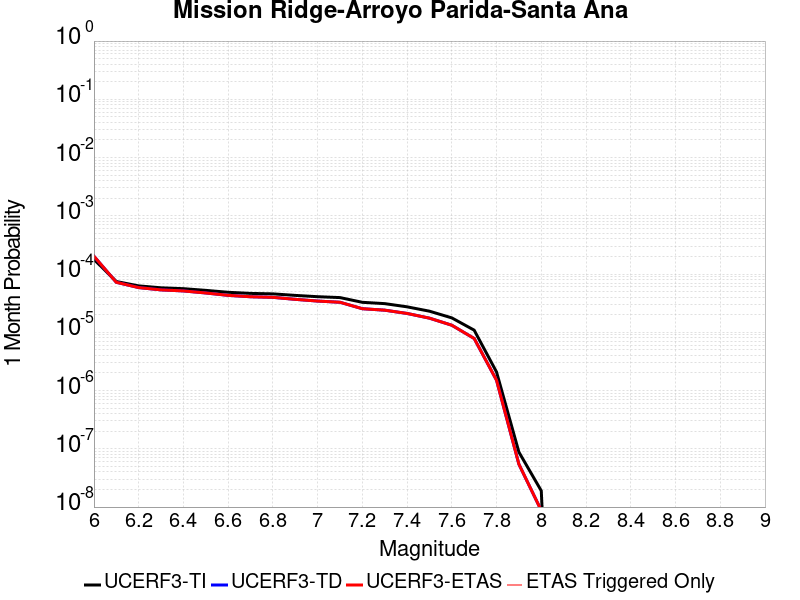 |  |  |

| Magnitude | 1 wk TI Prob | 1 wk TD Prob | 1 wk ETAS Prob | 1 wk ETAS/TD Gain | 1 wk ETAS Triggered Only | 1 mo TI Prob | 1 mo TD Prob | 1 mo ETAS Prob | 1 mo ETAS/TD Gain | 1 mo ETAS Triggered Only | 1 yr TI Prob | 1 yr TD Prob | 1 yr ETAS Prob | 1 yr ETAS/TD Gain | 1 yr ETAS Triggered Only | 10 yr TI Prob | 10 yr TD Prob | 10 yr ETAS Prob | 10 yr ETAS/TD Gain | 10 yr ETAS Triggered Only |
|-----|-----|-----|-----|-----|-----|-----|-----|-----|-----|-----|-----|-----|-----|-----|-----|-----|-----|-----|-----|-----|
| 6.0 | 4.169034E-5 | 4.71435E-5 | 4.71435E-5 | 1.0 | 0.0 | 1.7866064E-4 | 2.0203278E-4 | 2.0203278E-4 | 1.0 | 0.0 | 0.0021730233 | 0.0024577067 | 0.0024752917 | 1.0071551 | 1.762829E-5 | 0.021518968 | 0.024387252 | 0.02440445 | 1.0007052 | 1.762829E-5 |
| 6.1 | 1.73813E-5 | 1.6855427E-5 | 1.6855427E-5 | 1.0 | 0.0 | 7.4489166E-5 | 7.2235605E-5 | 7.2235605E-5 | 1.0 | 0.0 | 9.065282E-4 | 8.791244E-4 | 8.9673715E-4 | 1.0200344 | 1.762829E-5 | 0.009028391 | 0.008757609 | 0.008775082 | 1.0019953 | 1.762829E-5 |
| 6.2 | 1.4622182E-5 | 1.3674228E-5 | 1.3674228E-5 | 1.0 | 0.0 | 6.2664985E-5 | 5.8602538E-5 | 5.8602538E-5 | 1.0 | 0.0 | 7.6267915E-4 | 7.1325625E-4 | 7.308719E-4 | 1.0246975 | 1.762829E-5 | 0.007600669 | 0.0071101133 | 0.0071276166 | 1.0024617 | 1.762829E-5 |
| 6.3 | 1.3552434E-5 | 1.2483067E-5 | 1.2483067E-5 | 1.0 | 0.0 | 5.8080568E-5 | 5.3497777E-5 | 5.3497777E-5 | 1.0 | 0.0 | 7.069015E-4 | 6.5114396E-4 | 6.6876074E-4 | 1.0270551 | 1.762829E-5 | 0.00704657 | 0.0064927237 | 0.0065102377 | 1.0026975 | 1.762829E-5 |
| 6.4 | 1.30977305E-5 | 1.1979993E-5 | 1.1979993E-5 | 1.0 | 0.0 | 5.613192E-5 | 5.1341834E-5 | 5.1341834E-5 | 1.0 | 0.0 | 6.831918E-4 | 6.249106E-4 | 6.425278E-4 | 1.0281917 | 1.762829E-5 | 0.006810953 | 0.0062318784 | 0.006249397 | 1.0028111 | 1.762829E-5 |
| 6.5 | 1.225205E-5 | 1.104959E-5 | 1.104959E-5 | 1.0 | 0.0 | 5.2507727E-5 | 4.7354544E-5 | 4.7354544E-5 | 1.0 | 0.0 | 6.3909404E-4 | 5.7639176E-4 | 5.940099E-4 | 1.0305662 | 1.762829E-5 | 0.006372592 | 0.005749278 | 0.005766805 | 1.0030485 | 1.762829E-5 |
| 6.6 | 1.1352241E-5 | 1.0064273E-5 | 1.0064273E-5 | 1.0 | 0.0 | 4.8651553E-5 | 4.3131895E-5 | 4.3131895E-5 | 1.0 | 0.0 | 5.921717E-4 | 5.2500644E-4 | 5.4262544E-4 | 1.0335597 | 1.762829E-5 | 0.0059059616 | 0.005237907 | 0.0052554435 | 1.0033479 | 1.762829E-5 |
| 6.7 | 1.0864116E-5 | 9.517729E-6 | 9.517729E-6 | 1.0 | 0.0 | 4.6559664E-5 | 4.0789644E-5 | 4.0789644E-5 | 1.0 | 0.0 | 5.667165E-4 | 4.9650273E-4 | 5.141223E-4 | 1.0354873 | 1.762829E-5 | 0.005652734 | 0.0049541686 | 0.0049717096 | 1.0035406 | 1.762829E-5 |
| 6.8 | 1.0666365E-5 | 9.30047E-6 | 9.30047E-6 | 1.0 | 0.0 | 4.571219E-5 | 3.9858558E-5 | 3.9858558E-5 | 1.0 | 0.0 | 5.564038E-4 | 4.851719E-4 | 5.0279166E-4 | 1.0363165 | 1.762829E-5 | 0.005550127 | 0.004841359 | 0.004858902 | 1.0036236 | 1.762829E-5 |
| 6.9 | 1.0038665E-5 | 8.592689E-6 | 8.592689E-6 | 1.0 | 0.0 | 4.302214E-5 | 3.68253E-5 | 3.68253E-5 | 1.0 | 0.0 | 5.236687E-4 | 4.4825758E-4 | 4.4825758E-4 | 1.0 | 0.0 | 0.005224364 | 0.004473745 | 0.004473745 | 1.0 | 0.0 |
| 7.0 | 9.5379955E-6 | 8.025674E-6 | 8.025674E-6 | 1.0 | 0.0 | 4.0876483E-5 | 3.4395303E-5 | 3.4395303E-5 | 1.0 | 0.0 | 4.975576E-4 | 4.1868407E-4 | 4.1868407E-4 | 1.0 | 0.0 | 0.00496445 | 0.004179152 | 0.004179152 | 1.0 | 0.0 |
| 7.1 | 9.207389E-6 | 7.652948E-6 | 7.652948E-6 | 1.0 | 0.0 | 3.945964E-5 | 3.2797943E-5 | 3.2797943E-5 | 1.0 | 0.0 | 4.803152E-4 | 3.992435E-4 | 3.992435E-4 | 1.0 | 0.0 | 0.004792784 | 0.003985459 | 0.003985459 | 1.0 | 0.0 |
| 7.2 | 7.638091E-6 | 5.9315435E-6 | 5.9315435E-6 | 1.0 | 0.0 | 3.2734264E-5 | 2.5420655E-5 | 2.5420655E-5 | 1.0 | 0.0 | 3.984668E-4 | 3.0945282E-4 | 3.0945282E-4 | 1.0 | 0.0 | 0.0039775306 | 0.0030902762 | 0.0030902762 | 1.0 | 0.0 |
| 7.3 | 7.2500147E-6 | 5.5965506E-6 | 5.5965506E-6 | 1.0 | 0.0 | 3.1071122E-5 | 2.3985E-5 | 2.3985E-5 | 1.0 | 0.0 | 3.7822526E-4 | 2.9197853E-4 | 2.9197853E-4 | 1.0 | 0.0 | 0.0037758215 | 0.0029160045 | 0.0029160045 | 1.0 | 0.0 |
| 7.4 | 6.3899715E-6 | 4.918836E-6 | 4.918836E-6 | 1.0 | 0.0 | 2.7385306E-5 | 2.1080557E-5 | 2.1080557E-5 | 1.0 | 0.0 | 3.3336508E-4 | 2.5662576E-4 | 2.5662576E-4 | 1.0 | 0.0 | 0.0033286542 | 0.0025633385 | 0.0025633385 | 1.0 | 0.0 |
| 7.5 | 5.379025E-6 | 4.0841346E-6 | 4.0841346E-6 | 1.0 | 0.0 | 2.305276E-5 | 1.7503316E-5 | 1.7503316E-5 | 1.0 | 0.0 | 2.806312E-4 | 2.1308215E-4 | 2.1308215E-4 | 1.0 | 0.0 | 0.0028027708 | 0.0021287897 | 0.0021287897 | 1.0 | 0.0 |
| 7.6 | 4.1270696E-6 | 3.0885622E-6 | 3.0885622E-6 | 1.0 | 0.0 | 1.768732E-5 | 1.3236629E-5 | 1.3236629E-5 | 1.0 | 0.0 | 2.1532185E-4 | 1.6114411E-4 | 1.6114411E-4 | 1.0 | 0.0 | 0.0021511333 | 0.0016102807 | 0.0016102807 | 1.0 | 0.0 |
| 7.7 | 2.5406805E-6 | 1.8283382E-6 | 1.8283382E-6 | 1.0 | 0.0 | 1.0888585E-5 | 7.8357125E-6 | 7.8357125E-6 | 1.0 | 0.0 | 1.3256045E-4 | 9.539568E-5 | 9.539568E-5 | 1.0 | 0.0 | 0.0013248142 | 9.535535E-4 | 9.535535E-4 | 1.0 | 0.0 |
| 7.8 | 4.8608285E-7 | 3.5100658E-7 | 3.5100658E-7 | 1.0 | 0.0 | 2.0832106E-6 | 1.504313E-6 | 1.504313E-6 | 1.0 | 0.0 | 2.5362791E-5 | 1.8314859E-5 | 1.8314859E-5 | 1.0 | 0.0 | 2.5359896E-4 | 1.8313361E-4 | 1.8313361E-4 | 1.0 | 0.0 |
| 7.9 | 2.0472514E-8 | 1.2690024E-8 | 1.2690024E-8 | 1.0 | 0.0 | 8.7739345E-8 | 5.438582E-8 | 5.438582E-8 | 1.0 | 0.0 | 1.068226E-6 | 6.621471E-7 | 6.621471E-7 | 1.0 | 0.0 | 1.0682209E-5 | 6.6214525E-6 | 6.6214525E-6 | 1.0 | 0.0 |
| 8.0 | 4.443582E-9 | 2.0326807E-9 | 2.0326807E-9 | 1.0 | 0.0 | 1.9043922E-8 | 8.711488E-9 | 8.711488E-9 | 1.0 | 0.0 | 2.3185973E-7 | 1.06062366E-7 | 1.06062366E-7 | 1.0 | 0.0 | 2.3185949E-6 | 1.0606232E-6 | 1.0606232E-6 | 1.0 | 0.0 |

## Brawley (Seismic Zone) alt 1
*[(top)](#table-of-contents)*

| 1 Week | 1 Month | 1 Year | 10 Year |
|-----|-----|-----|-----|
| 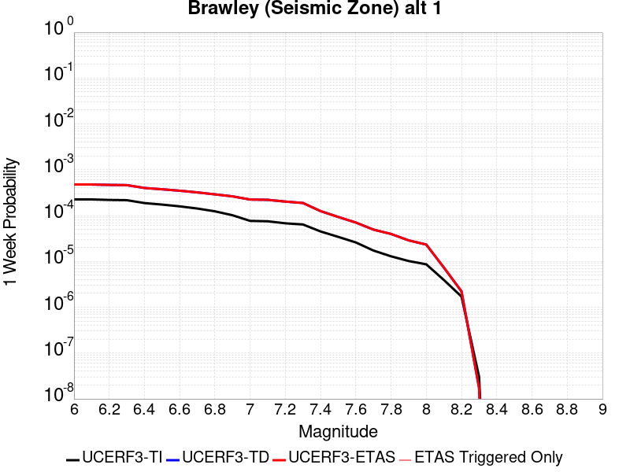 |  |  |  |

| Magnitude | 1 wk TI Prob | 1 wk TD Prob | 1 wk ETAS Prob | 1 wk ETAS/TD Gain | 1 wk ETAS Triggered Only | 1 mo TI Prob | 1 mo TD Prob | 1 mo ETAS Prob | 1 mo ETAS/TD Gain | 1 mo ETAS Triggered Only | 1 yr TI Prob | 1 yr TD Prob | 1 yr ETAS Prob | 1 yr ETAS/TD Gain | 1 yr ETAS Triggered Only | 10 yr TI Prob | 10 yr TD Prob | 10 yr ETAS Prob | 10 yr ETAS/TD Gain | 10 yr ETAS Triggered Only |
|-----|-----|-----|-----|-----|-----|-----|-----|-----|-----|-----|-----|-----|-----|-----|-----|-----|-----|-----|-----|-----|
| 6.0 | 2.2521618E-4 | 4.7667572E-4 | 4.7667572E-4 | 1.0 | 0.0 | 9.6485513E-4 | 0.0020413336 | 0.0020413336 | 1.0 | 0.0 | 0.011683988 | 0.024564065 | 0.024581261 | 1.0007 | 1.762829E-5 | 0.11088423 | 0.21362062 | 0.21363448 | 1.0000648 | 1.762829E-5 |
| 6.1 | 2.2521618E-4 | 4.7667572E-4 | 4.7667572E-4 | 1.0 | 0.0 | 9.6485513E-4 | 0.0020413336 | 0.0020413336 | 1.0 | 0.0 | 0.011683988 | 0.024564065 | 0.024581261 | 1.0007 | 1.762829E-5 | 0.11088423 | 0.21362062 | 0.21363448 | 1.0000648 | 1.762829E-5 |
| 6.2 | 2.198148E-4 | 4.6751375E-4 | 4.6751375E-4 | 1.0 | 0.0 | 9.417233E-4 | 0.0020021286 | 0.0020021286 | 1.0 | 0.0 | 0.011405343 | 0.024097936 | 0.02411514 | 1.000714 | 1.762829E-5 | 0.10837428 | 0.2100555 | 0.21006942 | 1.0000663 | 1.762829E-5 |
| 6.3 | 2.1704129E-4 | 4.6186932E-4 | 4.6186932E-4 | 1.0 | 0.0 | 9.298453E-4 | 0.001977975 | 0.001977975 | 1.0 | 0.0 | 0.011262234 | 0.023811033 | 0.023828242 | 1.0007228 | 1.762829E-5 | 0.107082725 | 0.20794643 | 0.2079604 | 1.0000671 | 1.762829E-5 |
| 6.4 | 1.876142E-4 | 4.007805E-4 | 4.007805E-4 | 1.0 | 0.0 | 8.038131E-4 | 0.0017165145 | 0.0017165145 | 1.0 | 0.0 | 0.00974259 | 0.020697333 | 0.020714596 | 1.0008341 | 1.762829E-5 | 0.093263686 | 0.18469763 | 0.18471201 | 1.0000778 | 1.762829E-5 |
| 6.5 | 1.7390939E-4 | 3.750906E-4 | 3.750906E-4 | 1.0 | 0.0 | 7.45113E-4 | 0.001606553 | 0.001606553 | 1.0 | 0.0 | 0.009034078 | 0.019385088 | 0.019402375 | 1.0008918 | 1.762829E-5 | 0.086755216 | 0.17451778 | 0.17453234 | 1.0000833 | 1.762829E-5 |
| 6.6 | 1.591791E-4 | 3.4922338E-4 | 3.4922338E-4 | 1.0 | 0.0 | 6.8201777E-4 | 0.0014958231 | 0.0014958231 | 1.0 | 0.0 | 0.008271996 | 0.018061135 | 0.018078445 | 1.0009584 | 1.762829E-5 | 0.07970774 | 0.16392244 | 0.1639372 | 1.0000899 | 1.762829E-5 |
| 6.7 | 1.4268003E-4 | 3.208674E-4 | 3.208674E-4 | 1.0 | 0.0 | 6.1134255E-4 | 0.0013744296 | 0.0013744296 | 1.0 | 0.0 | 0.007417723 | 0.016607253 | 0.016624589 | 1.0010438 | 1.762829E-5 | 0.07174956 | 0.1520427 | 0.15205765 | 1.0000983 | 1.762829E-5 |
| 6.8 | 1.239713E-4 | 2.9077847E-4 | 2.9077847E-4 | 1.0 | 0.0 | 5.3119735E-4 | 0.0012456045 | 0.0012456045 | 1.0 | 0.0 | 0.0064481674 | 0.0150612155 | 0.015078579 | 1.0011529 | 1.762829E-5 | 0.06264243 | 0.13847366 | 0.13848884 | 1.0001097 | 1.762829E-5 |
| 6.9 | 1.0180238E-4 | 2.6273142E-4 | 2.6273142E-4 | 1.0 | 0.0 | 4.3622297E-4 | 0.0011255102 | 0.0011255102 | 1.0 | 0.0 | 0.005298089 | 0.013617991 | 0.013635379 | 1.0012769 | 1.762829E-5 | 0.05173543 | 0.1250377 | 0.12505314 | 1.0001234 | 1.762829E-5 |
| 7.0 | 7.6619996E-5 | 2.2413618E-4 | 2.2413618E-4 | 1.0 | 0.0 | 3.283301E-4 | 9.602332E-4 | 9.602332E-4 | 1.0 | 0.0 | 0.0039900932 | 0.011628882 | 0.011646305 | 1.0014982 | 1.762829E-5 | 0.039192066 | 0.10732558 | 0.10734132 | 1.0001466 | 1.762829E-5 |
| 7.1 | 7.5127435E-5 | 2.20966E-4 | 2.20966E-4 | 1.0 | 0.0 | 3.2193496E-4 | 9.466566E-4 | 9.466566E-4 | 1.0 | 0.0 | 0.0039125155 | 0.011465338 | 0.011482764 | 1.0015199 | 1.762829E-5 | 0.038443442 | 0.105888925 | 0.10590469 | 1.0001489 | 1.762829E-5 |
| 7.2 | 6.788582E-5 | 2.022384E-4 | 2.022384E-4 | 1.0 | 0.0 | 2.9090676E-4 | 8.664511E-4 | 8.664511E-4 | 1.0 | 0.0 | 0.0035360386 | 0.010498658 | 0.0105161015 | 1.0016614 | 1.762829E-5 | 0.034803 | 0.09755801 | 0.09757391 | 1.0001631 | 1.762829E-5 |
| 7.3 | 6.399602E-5 | 1.8854217E-4 | 1.8854217E-4 | 1.0 | 0.0 | 2.7423984E-4 | 8.0779055E-4 | 8.0779055E-4 | 1.0 | 0.0 | 0.0033337586 | 0.009791091 | 0.009791091 | 1.0 | 0.0 | 0.03284188 | 0.09145105 | 0.09145105 | 1.0 | 0.0 |
| 7.4 | 4.506759E-5 | 1.253954E-4 | 1.253954E-4 | 1.0 | 0.0 | 1.9313251E-4 | 5.37299E-4 | 5.37299E-4 | 1.0 | 0.0 | 0.0023488526 | 0.0065221693 | 0.0065221693 | 1.0 | 0.0 | 0.023241805 | 0.062409032 | 0.062409032 | 1.0 | 0.0 |
| 7.5 | 3.43289E-5 | 9.344148E-5 | 9.344148E-5 | 1.0 | 0.0 | 1.4711556E-4 | 4.0040232E-4 | 4.0040232E-4 | 1.0 | 0.0 | 0.0017896603 | 0.004864064 | 0.004864064 | 1.0 | 0.0 | 0.01775316 | 0.047094297 | 0.047094297 | 1.0 | 0.0 |
| 7.6 | 2.5980507E-5 | 7.0607166E-5 | 7.0607166E-5 | 1.0 | 0.0 | 1.1134028E-4 | 3.0256718E-4 | 3.0256718E-4 | 1.0 | 0.0 | 0.001354725 | 0.0036775572 | 0.0036775572 | 1.0 | 0.0 | 0.013464959 | 0.0358753 | 0.0358753 | 1.0 | 0.0 |
| 7.7 | 1.7292105E-5 | 4.9472306E-5 | 4.9472306E-5 | 1.0 | 0.0 | 7.4106916E-5 | 2.1200697E-4 | 2.1200697E-4 | 1.0 | 0.0 | 9.018782E-4 | 0.002578135 | 0.002578135 | 1.0 | 0.0 | 0.008982267 | 0.02531998 | 0.02531998 | 1.0 | 0.0 |
| 7.8 | 1.2927471E-5 | 3.974989E-5 | 3.974989E-5 | 1.0 | 0.0 | 5.5402274E-5 | 1.7034556E-4 | 1.7034556E-4 | 1.0 | 0.0 | 6.743139E-4 | 0.0020719871 | 0.0020719871 | 1.0 | 0.0 | 0.0067227143 | 0.020457525 | 0.020457525 | 1.0 | 0.0 |
| 7.9 | 1.0200774E-5 | 2.8791523E-5 | 2.8791523E-5 | 1.0 | 0.0 | 4.371687E-5 | 1.233864E-4 | 1.233864E-4 | 1.0 | 0.0 | 5.321229E-4 | 0.0015011955 | 0.0015011955 | 1.0 | 0.0 | 0.005308505 | 0.015012851 | 0.015012851 | 1.0 | 0.0 |
| 8.0 | 8.650396E-6 | 2.3316703E-5 | 2.3316703E-5 | 1.0 | 0.0 | 3.70726E-5 | 9.992491E-5 | 9.992491E-5 | 1.0 | 0.0 | 4.5126543E-4 | 0.0012159076 | 0.0012159076 | 1.0 | 0.0 | 0.0045035016 | 0.0122294305 | 0.0122294305 | 1.0 | 0.0 |
| 8.1 | 3.9368224E-6 | 7.3449833E-6 | 7.3449833E-6 | 1.0 | 0.0 | 1.6871985E-5 | 3.147812E-5 | 3.147812E-5 | 1.0 | 0.0 | 2.0539707E-4 | 3.8317885E-4 | 3.8317885E-4 | 1.0 | 0.0 | 0.0020520731 | 0.0040096184 | 0.0040096184 | 1.0 | 0.0 |
| 8.2 | 1.7101195E-6 | 2.2245397E-6 | 2.2245397E-6 | 1.0 | 0.0 | 7.329063E-6 | 9.533706E-6 | 9.533706E-6 | 1.0 | 0.0 | 8.922769E-5 | 1.1606672E-4 | 1.1606672E-4 | 1.0 | 0.0 | 8.9191867E-4 | 0.0012700944 | 0.0012700944 | 1.0 | 0.0 |
| 8.3 | 3.0346666E-8 | 1.7284824E-8 | 1.7284824E-8 | 1.0 | 0.0 | 1.3005713E-7 | 7.407782E-8 | 7.407782E-8 | 1.0 | 0.0 | 1.5834444E-6 | 9.018973E-7 | 9.018973E-7 | 1.0 | 0.0 | 1.5834332E-5 | 9.40451E-6 | 9.40451E-6 | 1.0 | 0.0 |

## Oak Ridge (Onshore)
*[(top)](#table-of-contents)*

| 1 Week | 1 Month | 1 Year | 10 Year |
|-----|-----|-----|-----|
|  | 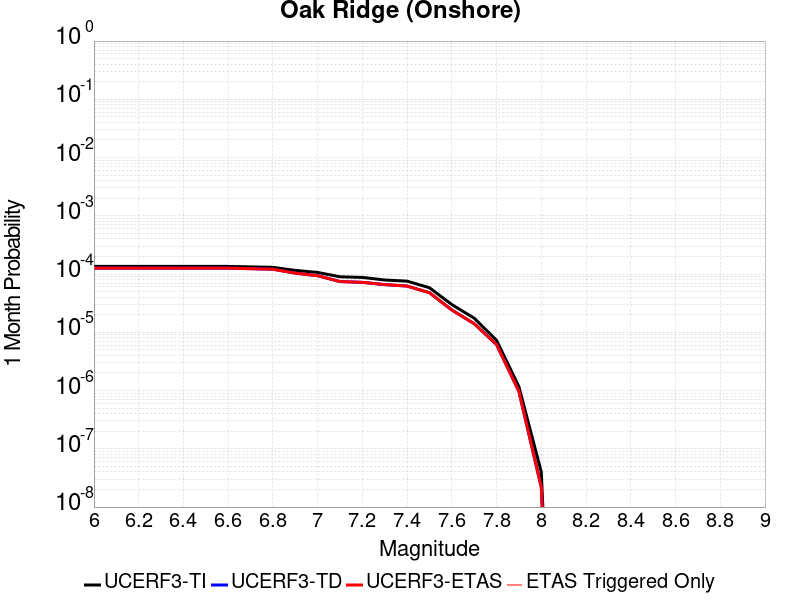 |  | 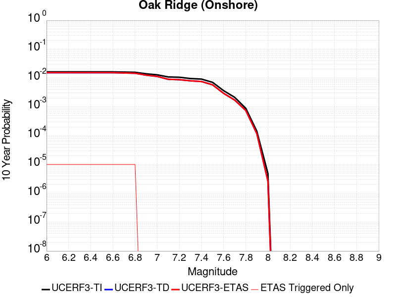 |

| Magnitude | 1 wk TI Prob | 1 wk TD Prob | 1 wk ETAS Prob | 1 wk ETAS/TD Gain | 1 wk ETAS Triggered Only | 1 mo TI Prob | 1 mo TD Prob | 1 mo ETAS Prob | 1 mo ETAS/TD Gain | 1 mo ETAS Triggered Only | 1 yr TI Prob | 1 yr TD Prob | 1 yr ETAS Prob | 1 yr ETAS/TD Gain | 1 yr ETAS Triggered Only | 10 yr TI Prob | 10 yr TD Prob | 10 yr ETAS Prob | 10 yr ETAS/TD Gain | 10 yr ETAS Triggered Only |
|-----|-----|-----|-----|-----|-----|-----|-----|-----|-----|-----|-----|-----|-----|-----|-----|-----|-----|-----|-----|-----|
| 6.0 | 3.155064E-5 | 2.9529447E-5 | 2.9529447E-5 | 1.0 | 0.0 | 1.3521002E-4 | 1.2654884E-4 | 1.2654884E-4 | 1.0 | 0.0 | 0.001644939 | 0.0015396813 | 0.0015572824 | 1.0114317 | 1.762829E-5 | 0.01632816 | 0.015294643 | 0.015312002 | 1.001135 | 1.762829E-5 |
| 6.1 | 3.155064E-5 | 2.9529447E-5 | 2.9529447E-5 | 1.0 | 0.0 | 1.3521002E-4 | 1.2654884E-4 | 1.2654884E-4 | 1.0 | 0.0 | 0.001644939 | 0.0015396813 | 0.0015572824 | 1.0114317 | 1.762829E-5 | 0.01632816 | 0.015294643 | 0.015312002 | 1.001135 | 1.762829E-5 |
| 6.2 | 3.155064E-5 | 2.9529447E-5 | 2.9529447E-5 | 1.0 | 0.0 | 1.3521002E-4 | 1.2654884E-4 | 1.2654884E-4 | 1.0 | 0.0 | 0.001644939 | 0.0015396813 | 0.0015572824 | 1.0114317 | 1.762829E-5 | 0.01632816 | 0.015294643 | 0.015312002 | 1.001135 | 1.762829E-5 |
| 6.3 | 3.155064E-5 | 2.9529447E-5 | 2.9529447E-5 | 1.0 | 0.0 | 1.3521002E-4 | 1.2654884E-4 | 1.2654884E-4 | 1.0 | 0.0 | 0.001644939 | 0.0015396813 | 0.0015572824 | 1.0114317 | 1.762829E-5 | 0.01632816 | 0.015294643 | 0.015312002 | 1.001135 | 1.762829E-5 |
| 6.4 | 3.155064E-5 | 2.9529447E-5 | 2.9529447E-5 | 1.0 | 0.0 | 1.3521002E-4 | 1.2654884E-4 | 1.2654884E-4 | 1.0 | 0.0 | 0.001644939 | 0.0015396813 | 0.0015572824 | 1.0114317 | 1.762829E-5 | 0.01632816 | 0.015294643 | 0.015312002 | 1.001135 | 1.762829E-5 |
| 6.5 | 3.155064E-5 | 2.9529447E-5 | 2.9529447E-5 | 1.0 | 0.0 | 1.3521002E-4 | 1.2654884E-4 | 1.2654884E-4 | 1.0 | 0.0 | 0.001644939 | 0.0015396813 | 0.0015572824 | 1.0114317 | 1.762829E-5 | 0.01632816 | 0.015294643 | 0.015312002 | 1.001135 | 1.762829E-5 |
| 6.6 | 3.155064E-5 | 2.9529447E-5 | 2.9529447E-5 | 1.0 | 0.0 | 1.3521002E-4 | 1.2654884E-4 | 1.2654884E-4 | 1.0 | 0.0 | 0.001644939 | 0.0015396813 | 0.0015572824 | 1.0114317 | 1.762829E-5 | 0.01632816 | 0.015294643 | 0.015312002 | 1.001135 | 1.762829E-5 |
| 6.7 | 3.098897E-5 | 2.8867584E-5 | 2.8867584E-5 | 1.0 | 0.0 | 1.328031E-4 | 1.2371257E-4 | 1.2371257E-4 | 1.0 | 0.0 | 0.0016156785 | 0.0015051975 | 0.0015227993 | 1.011694 | 1.762829E-5 | 0.016039822 | 0.014954466 | 0.014971832 | 1.0011612 | 1.762829E-5 |
| 6.8 | 3.0449872E-5 | 2.824273E-5 | 2.824273E-5 | 1.0 | 0.0 | 1.3049292E-4 | 1.21034864E-4 | 1.21034864E-4 | 1.0 | 0.0 | 0.0015875935 | 0.0014726405 | 0.0014902429 | 1.0119529 | 1.762829E-5 | 0.015762992 | 0.014633188 | 0.014650559 | 1.0011871 | 1.762829E-5 |
| 6.9 | 2.697928E-5 | 2.4222792E-5 | 2.4222792E-5 | 1.0 | 0.0 | 1.15620365E-4 | 1.0380796E-4 | 1.0380796E-4 | 1.0 | 0.0 | 0.0014067689 | 0.0012631506 | 0.0012631506 | 1.0 | 0.0 | 0.0139789665 | 0.012562426 | 0.012562426 | 1.0 | 0.0 |
| 7.0 | 2.4893961E-5 | 2.1864875E-5 | 2.1864875E-5 | 1.0 | 0.0 | 1.0668404E-4 | 9.370334E-5 | 9.370334E-5 | 1.0 | 0.0 | 0.0012981043 | 0.0011402589 | 0.0011402589 | 1.0 | 0.0 | 0.012905477 | 0.011346367 | 0.011346367 | 1.0 | 0.0 |
| 7.1 | 2.0945363E-5 | 1.7356973E-5 | 1.7356973E-5 | 1.0 | 0.0 | 8.976275E-5 | 7.438494E-5 | 7.438494E-5 | 1.0 | 0.0 | 0.0010923136 | 9.0526504E-4 | 9.0526504E-4 | 1.0 | 0.0 | 0.0108696 | 0.009016709 | 0.009016709 | 1.0 | 0.0 |
| 7.2 | 2.0439404E-5 | 1.6811871E-5 | 1.6811871E-5 | 1.0 | 0.0 | 8.7594504E-5 | 7.204891E-5 | 7.204891E-5 | 1.0 | 0.0 | 0.0010659413 | 8.768472E-4 | 8.768472E-4 | 1.0 | 0.0 | 0.010608427 | 0.0087347925 | 0.0087347925 | 1.0 | 0.0 |
| 7.3 | 1.8463334E-5 | 1.538278E-5 | 1.538278E-5 | 1.0 | 0.0 | 7.912617E-5 | 6.5924556E-5 | 6.5924556E-5 | 1.0 | 0.0 | 9.6293533E-4 | 8.023403E-4 | 8.023403E-4 | 1.0 | 0.0 | 0.009587734 | 0.007995299 | 0.007995299 | 1.0 | 0.0 |
| 7.4 | 1.763139E-5 | 1.4517647E-5 | 1.4517647E-5 | 1.0 | 0.0 | 7.556091E-5 | 6.221703E-5 | 6.221703E-5 | 1.0 | 0.0 | 9.1956573E-4 | 7.57233E-4 | 7.57233E-4 | 1.0 | 0.0 | 0.009157699 | 0.007547332 | 0.007547332 | 1.0 | 0.0 |
| 7.5 | 1.3594944E-5 | 1.116386E-5 | 1.116386E-5 | 1.0 | 0.0 | 5.8262744E-5 | 4.784425E-5 | 4.784425E-5 | 1.0 | 0.0 | 7.0911803E-4 | 5.823506E-4 | 5.823506E-4 | 1.0 | 0.0 | 0.007068595 | 0.005808517 | 0.005808517 | 1.0 | 0.0 |
| 7.6 | 6.9889534E-6 | 5.6369217E-6 | 5.6369217E-6 | 1.0 | 0.0 | 2.9952313E-5 | 2.4158015E-5 | 2.4158015E-5 | 1.0 | 0.0 | 3.646084E-4 | 2.9408454E-4 | 2.9408454E-4 | 1.0 | 0.0 | 0.0036401073 | 0.0029369977 | 0.0029369977 | 1.0 | 0.0 |
| 7.7 | 4.0824193E-6 | 3.2833782E-6 | 3.2833782E-6 | 1.0 | 0.0 | 1.7495966E-5 | 1.40715465E-5 | 1.40715465E-5 | 1.0 | 0.0 | 2.1299256E-4 | 1.7130774E-4 | 1.7130774E-4 | 1.0 | 0.0 | 0.0021278851 | 0.0017117702 | 0.0017117702 | 1.0 | 0.0 |
| 7.8 | 1.7023609E-6 | 1.4370928E-6 | 1.4370928E-6 | 1.0 | 0.0 | 7.295812E-6 | 6.158955E-6 | 6.158955E-6 | 1.0 | 0.0 | 8.882289E-5 | 7.498272E-5 | 7.498272E-5 | 1.0 | 0.0 | 8.8787393E-4 | 7.49577E-4 | 7.49577E-4 | 1.0 | 0.0 |
| 7.9 | 2.721225E-7 | 2.2617367E-7 | 2.2617367E-7 | 1.0 | 0.0 | 1.1662388E-6 | 9.693154E-7 | 9.693154E-7 | 1.0 | 0.0 | 1.4198865E-5 | 1.1801353E-5 | 1.1801353E-5 | 1.0 | 0.0 | 1.4197957E-4 | 1.1800755E-4 | 1.1800755E-4 | 1.0 | 0.0 |
| 8.0 | 9.364255E-9 | 5.1216933E-9 | 5.1216933E-9 | 1.0 | 0.0 | 4.0132523E-8 | 2.1950115E-8 | 2.1950115E-8 | 1.0 | 0.0 | 4.8861335E-7 | 2.6724263E-7 | 2.6724263E-7 | 1.0 | 0.0 | 4.8861225E-6 | 2.6724233E-6 | 2.6724233E-6 | 1.0 | 0.0 |

## San Jacinto (Borrego)
*[(top)](#table-of-contents)*

| 1 Week | 1 Month | 1 Year | 10 Year |
|-----|-----|-----|-----|
|  |  |  |  |

| Magnitude | 1 wk TI Prob | 1 wk TD Prob | 1 wk ETAS Prob | 1 wk ETAS/TD Gain | 1 wk ETAS Triggered Only | 1 mo TI Prob | 1 mo TD Prob | 1 mo ETAS Prob | 1 mo ETAS/TD Gain | 1 mo ETAS Triggered Only | 1 yr TI Prob | 1 yr TD Prob | 1 yr ETAS Prob | 1 yr ETAS/TD Gain | 1 yr ETAS Triggered Only | 10 yr TI Prob | 10 yr TD Prob | 10 yr ETAS Prob | 10 yr ETAS/TD Gain | 10 yr ETAS Triggered Only |
|-----|-----|-----|-----|-----|-----|-----|-----|-----|-----|-----|-----|-----|-----|-----|-----|-----|-----|-----|-----|-----|
| 6.0 | 3.543992E-5 | 2.7956603E-5 | 2.7956603E-5 | 1.0 | 0.0 | 1.5187653E-4 | 1.1980858E-4 | 1.1980858E-4 | 1.0 | 0.0 | 0.0018475284 | 0.0014577056 | 0.0014753083 | 1.0120755 | 1.762829E-5 | 0.018322436 | 0.014885285 | 0.01490265 | 1.0011667 | 1.762829E-5 |
| 6.1 | 3.542281E-5 | 2.7956603E-5 | 2.7956603E-5 | 1.0 | 0.0 | 1.5180321E-4 | 1.1980858E-4 | 1.1980858E-4 | 1.0 | 0.0 | 0.0018466372 | 0.0014577056 | 0.0014753083 | 1.0120755 | 1.762829E-5 | 0.018313672 | 0.014885285 | 0.01490265 | 1.0011667 | 1.762829E-5 |
| 6.2 | 3.4688688E-5 | 2.7956603E-5 | 2.7956603E-5 | 1.0 | 0.0 | 1.4865733E-4 | 1.19808574E-4 | 1.19808574E-4 | 1.0 | 0.0 | 0.0018084005 | 0.0014577056 | 0.0014753082 | 1.0120755 | 1.762829E-5 | 0.017937548 | 0.014885284 | 0.01490265 | 1.0011667 | 1.762829E-5 |
| 6.3 | 3.2087122E-5 | 2.7801936E-5 | 2.7801936E-5 | 1.0 | 0.0 | 1.3750899E-4 | 1.19145785E-4 | 1.19145785E-4 | 1.0 | 0.0 | 0.0016728862 | 0.0014496469 | 0.0014672496 | 1.0121428 | 1.762829E-5 | 0.016603488 | 0.014806312 | 0.014823679 | 1.001173 | 1.762829E-5 |
| 6.4 | 3.1828724E-5 | 2.7768916E-5 | 2.7768916E-5 | 1.0 | 0.0 | 1.364017E-4 | 1.1900428E-4 | 1.1900428E-4 | 1.0 | 0.0 | 0.0016594254 | 0.0014479264 | 0.0014655292 | 1.0121572 | 1.762829E-5 | 0.016470885 | 0.014789388 | 0.014806755 | 1.0011743 | 1.762829E-5 |
| 6.5 | 3.1563577E-5 | 2.7508588E-5 | 2.7508588E-5 | 1.0 | 0.0 | 1.3526545E-4 | 1.1788869E-4 | 1.1788869E-4 | 1.0 | 0.0 | 0.0016456128 | 0.0014343619 | 0.001451965 | 1.0122724 | 1.762829E-5 | 0.0163348 | 0.014655951 | 0.014673321 | 1.0011852 | 1.762829E-5 |
| 6.6 | 3.1467625E-5 | 2.735279E-5 | 2.735279E-5 | 1.0 | 0.0 | 1.3485427E-4 | 1.1722104E-4 | 1.1722104E-4 | 1.0 | 0.0 | 0.0016406142 | 0.001426244 | 0.0014438472 | 1.0123423 | 1.762829E-5 | 0.016285548 | 0.014576187 | 0.014593559 | 1.0011917 | 1.762829E-5 |
| 6.7 | 3.1223695E-5 | 2.6970763E-5 | 2.6970763E-5 | 1.0 | 0.0 | 1.3380898E-4 | 1.15583935E-4 | 1.15583935E-4 | 1.0 | 0.0 | 0.0016279068 | 0.0014063381 | 0.0014239416 | 1.0125172 | 1.762829E-5 | 0.01616033 | 0.01438054 | 0.0143979145 | 1.0012082 | 1.762829E-5 |
| 6.8 | 3.1015585E-5 | 2.6791718E-5 | 2.6791718E-5 | 1.0 | 0.0 | 1.3291716E-4 | 1.1481666E-4 | 1.1481666E-4 | 1.0 | 0.0 | 0.001617065 | 0.0013970085 | 0.0014146123 | 1.012601 | 1.762829E-5 | 0.016053487 | 0.014287795 | 0.014305171 | 1.0012162 | 1.762829E-5 |
| 6.9 | 2.6641965E-5 | 2.2212334E-5 | 2.2212334E-5 | 1.0 | 0.0 | 1.1417485E-4 | 9.519226E-5 | 9.519226E-5 | 1.0 | 0.0 | 0.0013891924 | 0.0011583535 | 0.0011759615 | 1.0152007 | 1.762829E-5 | 0.0138054015 | 0.011897102 | 0.0119145205 | 1.0014641 | 1.762829E-5 |
| 7.0 | 2.3854353E-5 | 2.0506088E-5 | 2.0506088E-5 | 1.0 | 0.0 | 1.02228936E-4 | 8.788029E-5 | 8.788029E-5 | 1.0 | 0.0 | 0.0012439266 | 0.0010694199 | 0.0010870293 | 1.0164664 | 1.762829E-5 | 0.012369866 | 0.010996936 | 0.011014371 | 1.0015854 | 1.762829E-5 |
| 7.1 | 2.3672901E-5 | 2.0342548E-5 | 2.0342548E-5 | 1.0 | 0.0 | 1.0145135E-4 | 8.717945E-5 | 8.717945E-5 | 1.0 | 0.0 | 0.0012344702 | 0.0010608955 | 0.0010785051 | 1.0165988 | 1.762829E-5 | 0.0122763505 | 0.010912099 | 0.010929535 | 1.0015979 | 1.762829E-5 |
| 7.2 | 2.2717244E-5 | 1.9569701E-5 | 1.9569701E-5 | 1.0 | 0.0 | 9.735599E-5 | 8.386746E-5 | 8.386746E-5 | 1.0 | 0.0 | 0.0011846646 | 0.0010206103 | 0.0010382207 | 1.0172547 | 1.762829E-5 | 0.01178369 | 0.010509352 | 0.010526795 | 1.0016598 | 1.762829E-5 |
| 7.3 | 2.1016205E-5 | 1.8410952E-5 | 1.8410952E-5 | 1.0 | 0.0 | 9.006634E-5 | 7.890171E-5 | 7.890171E-5 | 1.0 | 0.0 | 0.001096006 | 9.6020696E-4 | 9.778184E-4 | 1.0183412 | 1.762829E-5 | 0.010906163 | 0.009904788 | 0.009922242 | 1.0017622 | 1.762829E-5 |
| 7.4 | 2.0683625E-5 | 1.8213394E-5 | 1.8213394E-5 | 1.0 | 0.0 | 8.86411E-5 | 7.805508E-5 | 7.805508E-5 | 1.0 | 0.0 | 0.001078671 | 9.4990834E-4 | 9.675199E-4 | 1.0185403 | 1.762829E-5 | 0.010734501 | 0.009801473 | 0.009818928 | 1.0017809 | 1.762829E-5 |
| 7.5 | 1.9993966E-5 | 1.7808186E-5 | 1.7808186E-5 | 1.0 | 0.0 | 8.568561E-5 | 7.631858E-5 | 7.631858E-5 | 1.0 | 0.0 | 0.001042723 | 9.287846E-4 | 9.4639655E-4 | 1.0189624 | 1.762829E-5 | 0.010378438 | 0.009588276 | 0.009605735 | 1.0018209 | 1.762829E-5 |
| 7.6 | 1.788966E-5 | 1.6460734E-5 | 1.6460734E-5 | 1.0 | 0.0 | 7.666772E-5 | 7.0544105E-5 | 7.0544105E-5 | 1.0 | 0.0 | 9.3302975E-4 | 8.585378E-4 | 8.7615097E-4 | 1.0205153 | 1.762829E-5 | 0.00929122 | 0.008879809 | 0.00889728 | 1.0019675 | 1.762829E-5 |
| 7.7 | 1.5125781E-5 | 1.4262029E-5 | 1.4262029E-5 | 1.0 | 0.0 | 6.4823165E-5 | 6.112155E-5 | 6.112155E-5 | 1.0 | 0.0 | 7.889362E-4 | 7.4390165E-4 | 7.615168E-4 | 1.0236795 | 1.762829E-5 | 0.007861412 | 0.007727129 | 0.007744621 | 1.0022637 | 1.762829E-5 |
| 7.8 | 1.250089E-5 | 1.2654241E-5 | 1.2654241E-5 | 1.0 | 0.0 | 5.3574146E-5 | 5.423134E-5 | 5.423134E-5 | 1.0 | 0.0 | 6.5207E-4 | 6.6006713E-4 | 6.776838E-4 | 1.0266892 | 1.762829E-5 | 0.006501599 | 0.0068802256 | 0.0068977326 | 1.0025445 | 1.762829E-5 |
| 7.9 | 9.561E-6 | 9.775645E-6 | 9.775645E-6 | 1.0 | 0.0 | 4.0975072E-5 | 4.189495E-5 | 4.189495E-5 | 1.0 | 0.0 | 4.987573E-4 | 5.099522E-4 | 5.275715E-4 | 1.0345509 | 1.762829E-5 | 0.0049763937 | 0.0053634187 | 0.0053809523 | 1.0032691 | 1.762829E-5 |
| 8.0 | 8.01699E-6 | 8.312629E-6 | 8.312629E-6 | 1.0 | 0.0 | 3.4358076E-5 | 3.5625068E-5 | 3.5625068E-5 | 1.0 | 0.0 | 4.1822926E-4 | 4.336494E-4 | 4.5127003E-4 | 1.0406334 | 1.762829E-5 | 0.0041744304 | 0.00458347 | 0.0046010176 | 1.0038284 | 1.762829E-5 |
| 8.1 | 6.541947E-6 | 6.477901E-6 | 6.477901E-6 | 1.0 | 0.0 | 2.8036617E-5 | 2.7762142E-5 | 2.7762142E-5 | 1.0 | 0.0 | 3.4129233E-4 | 3.3795217E-4 | 3.5557448E-4 | 1.0521444 | 1.762829E-5 | 0.0034076865 | 0.003588998 | 0.003606563 | 1.0048941 | 1.762829E-5 |
| 8.2 | 1.7968189E-6 | 8.0012404E-7 | 8.0012404E-7 | 1.0 | 0.0 | 7.70063E-6 | 3.4290986E-6 | 3.4290986E-6 | 1.0 | 0.0 | 9.3751136E-5 | 4.17485E-5 | 4.17485E-5 | 1.0 | 0.0 | 9.371159E-4 | 4.7288055E-4 | 4.7288055E-4 | 1.0 | 0.0 |
| 8.3 | 1.5167889E-7 | 4.9190945E-8 | 4.9190945E-8 | 1.0 | 0.0 | 6.500522E-7 | 2.1081833E-7 | 2.1081833E-7 | 1.0 | 0.0 | 7.9143565E-6 | 2.5667105E-6 | 2.5667105E-6 | 1.0 | 0.0 | 7.914075E-5 | 2.9817646E-5 | 2.9817646E-5 | 1.0 | 0.0 |

## San Andreas (Carrizo) rev
*[(top)](#table-of-contents)*

| 1 Week | 1 Month | 1 Year | 10 Year |
|-----|-----|-----|-----|
|  |  |  |  |

| Magnitude | 1 wk TI Prob | 1 wk TD Prob | 1 wk ETAS Prob | 1 wk ETAS/TD Gain | 1 wk ETAS Triggered Only | 1 mo TI Prob | 1 mo TD Prob | 1 mo ETAS Prob | 1 mo ETAS/TD Gain | 1 mo ETAS Triggered Only | 1 yr TI Prob | 1 yr TD Prob | 1 yr ETAS Prob | 1 yr ETAS/TD Gain | 1 yr ETAS Triggered Only | 10 yr TI Prob | 10 yr TD Prob | 10 yr ETAS Prob | 10 yr ETAS/TD Gain | 10 yr ETAS Triggered Only |
|-----|-----|-----|-----|-----|-----|-----|-----|-----|-----|-----|-----|-----|-----|-----|-----|-----|-----|-----|-----|-----|
| 6.0 | 1.1674632E-4 | 2.4361293E-4 | 2.4361293E-4 | 1.0 | 0.0 | 5.002454E-4 | 0.0010436393 | 0.0010436393 | 1.0 | 0.0 | 0.006073493 | 0.012632766 | 0.012650171 | 1.0013778 | 1.762829E-5 | 0.0591016 | 0.12077509 | 0.120790586 | 1.0001284 | 1.762829E-5 |
| 6.1 | 1.1674632E-4 | 2.4361293E-4 | 2.4361293E-4 | 1.0 | 0.0 | 5.002454E-4 | 0.0010436393 | 0.0010436393 | 1.0 | 0.0 | 0.006073493 | 0.012632766 | 0.012650171 | 1.0013778 | 1.762829E-5 | 0.0591016 | 0.12077509 | 0.120790586 | 1.0001284 | 1.762829E-5 |
| 6.2 | 1.1674632E-4 | 2.4361293E-4 | 2.4361293E-4 | 1.0 | 0.0 | 5.002454E-4 | 0.0010436393 | 0.0010436393 | 1.0 | 0.0 | 0.006073493 | 0.012632766 | 0.012650171 | 1.0013778 | 1.762829E-5 | 0.0591016 | 0.12077509 | 0.120790586 | 1.0001284 | 1.762829E-5 |
| 6.3 | 1.1674632E-4 | 2.4361293E-4 | 2.4361293E-4 | 1.0 | 0.0 | 5.002454E-4 | 0.0010436393 | 0.0010436393 | 1.0 | 0.0 | 0.006073493 | 0.012632766 | 0.012650171 | 1.0013778 | 1.762829E-5 | 0.0591016 | 0.12077509 | 0.120790586 | 1.0001284 | 1.762829E-5 |
| 6.4 | 1.1674632E-4 | 2.4361293E-4 | 2.4361293E-4 | 1.0 | 0.0 | 5.002454E-4 | 0.0010436393 | 0.0010436393 | 1.0 | 0.0 | 0.006073493 | 0.012632766 | 0.012650171 | 1.0013778 | 1.762829E-5 | 0.0591016 | 0.12077509 | 0.120790586 | 1.0001284 | 1.762829E-5 |
| 6.5 | 1.13136164E-4 | 2.3681132E-4 | 2.3681132E-4 | 1.0 | 0.0 | 4.847792E-4 | 0.0010145125 | 0.0010145125 | 1.0 | 0.0 | 0.0058862255 | 0.012282185 | 0.012299597 | 1.0014176 | 1.762829E-5 | 0.057327334 | 0.1177463 | 0.11776185 | 1.0001321 | 1.762829E-5 |
| 6.6 | 1.13136164E-4 | 2.3681132E-4 | 2.3681132E-4 | 1.0 | 0.0 | 4.847792E-4 | 0.0010145125 | 0.0010145125 | 1.0 | 0.0 | 0.0058862255 | 0.012282185 | 0.012299597 | 1.0014176 | 1.762829E-5 | 0.057327334 | 0.1177463 | 0.11776185 | 1.0001321 | 1.762829E-5 |
| 6.7 | 1.1149675E-4 | 2.3372276E-4 | 2.3372276E-4 | 1.0 | 0.0 | 4.777557E-4 | 0.001001286 | 0.001001286 | 1.0 | 0.0 | 0.0058011734 | 0.012122953 | 0.012140368 | 1.0014365 | 1.762829E-5 | 0.05652051 | 0.116367765 | 0.116383344 | 1.0001339 | 1.762829E-5 |
| 6.8 | 1.1103589E-4 | 2.3274389E-4 | 2.3274389E-4 | 1.0 | 0.0 | 4.7578133E-4 | 9.97094E-4 | 9.97094E-4 | 1.0 | 0.0 | 0.005777263 | 0.012072483 | 0.012089899 | 1.0014426 | 1.762829E-5 | 0.056293584 | 0.115927964 | 0.11594355 | 1.0001345 | 1.762829E-5 |
| 6.9 | 1.1053259E-4 | 2.316672E-4 | 2.316672E-4 | 1.0 | 0.0 | 4.7362508E-4 | 9.924831E-4 | 9.924831E-4 | 1.0 | 0.0 | 0.0057511497 | 0.012016967 | 0.012034383 | 1.0014493 | 1.762829E-5 | 0.05604569 | 0.11544405 | 0.115459636 | 1.0001351 | 1.762829E-5 |
| 7.0 | 1.1005377E-4 | 2.3067516E-4 | 2.3067516E-4 | 1.0 | 0.0 | 4.7157376E-4 | 9.882348E-4 | 9.882348E-4 | 1.0 | 0.0 | 0.0057263062 | 0.011965811 | 0.011983229 | 1.0014555 | 1.762829E-5 | 0.055809796 | 0.11499625 | 0.11501185 | 1.0001357 | 1.762829E-5 |
| 7.1 | 1.0308142E-4 | 2.1576507E-4 | 2.1576507E-4 | 1.0 | 0.0 | 4.417027E-4 | 9.2438085E-4 | 9.2438085E-4 | 1.0 | 0.0 | 0.0053644776 | 0.011196577 | 0.011214008 | 1.0015568 | 1.762829E-5 | 0.052368138 | 0.10825095 | 0.108266674 | 1.0001452 | 1.762829E-5 |
| 7.2 | 1.0027479E-4 | 2.098411E-4 | 2.098411E-4 | 1.0 | 0.0 | 4.296783E-4 | 8.9901005E-4 | 8.9901005E-4 | 1.0 | 0.0 | 0.0052187922 | 0.010890815 | 0.010908252 | 1.001601 | 1.762829E-5 | 0.050979212 | 0.105554216 | 0.10556999 | 1.0001494 | 1.762829E-5 |
| 7.3 | 9.816942E-5 | 2.0458816E-4 | 2.0458816E-4 | 1.0 | 0.0 | 4.2065824E-4 | 8.765127E-4 | 8.765127E-4 | 1.0 | 0.0 | 0.005109493 | 0.010619612 | 0.010637053 | 1.0016423 | 1.762829E-5 | 0.049935985 | 0.10313633 | 0.10315214 | 1.0001533 | 1.762829E-5 |
| 7.4 | 9.5634205E-5 | 1.9827684E-4 | 1.9827684E-4 | 1.0 | 0.0 | 4.0979648E-4 | 8.494821E-4 | 8.494821E-4 | 1.0 | 0.0 | 0.0049778637 | 0.010293663 | 0.010311109 | 1.0016949 | 1.762829E-5 | 0.048678253 | 0.100220494 | 0.100236356 | 1.0001583 | 1.762829E-5 |
| 7.5 | 8.052417E-5 | 1.6143978E-4 | 1.6143978E-4 | 1.0 | 0.0 | 3.4505792E-4 | 6.917014E-4 | 6.917014E-4 | 1.0 | 0.0 | 0.0041929903 | 0.008389029 | 0.008406509 | 1.0020838 | 1.762829E-5 | 0.04114753 | 0.08295002 | 0.082966186 | 1.0001949 | 1.762829E-5 |
| 7.6 | 7.897024E-5 | 1.579682E-4 | 1.579682E-4 | 1.0 | 0.0 | 3.384E-4 | 6.768311E-4 | 6.768311E-4 | 1.0 | 0.0 | 0.0041122385 | 0.00820936 | 0.008226844 | 1.0021297 | 1.762829E-5 | 0.040369697 | 0.081289805 | 0.081306 | 1.0001992 | 1.762829E-5 |
| 7.7 | 6.707427E-5 | 1.3303987E-4 | 1.3303987E-4 | 1.0 | 0.0 | 2.8742946E-4 | 5.700463E-4 | 5.700463E-4 | 1.0 | 0.0 | 0.003493839 | 0.0069182604 | 0.006935767 | 1.0025305 | 1.762829E-5 | 0.034394164 | 0.06917457 | 0.06919098 | 1.0002372 | 1.762829E-5 |
| 7.8 | 6.147705E-5 | 1.2222702E-4 | 1.2222702E-4 | 1.0 | 0.0 | 2.6344648E-4 | 5.23725E-4 | 5.23725E-4 | 1.0 | 0.0 | 0.0032027436 | 0.0063577346 | 0.006375251 | 1.002755 | 1.762829E-5 | 0.031569764 | 0.06362964 | 0.06364615 | 1.0002594 | 1.762829E-5 |
| 7.9 | 4.7636717E-5 | 8.8979046E-5 | 8.8979046E-5 | 1.0 | 0.0 | 2.0414138E-4 | 3.8128305E-4 | 3.8128305E-4 | 1.0 | 0.0 | 0.0024825884 | 0.004632248 | 0.0046497947 | 1.0037879 | 1.762829E-5 | 0.024550365 | 0.046713326 | 0.04673013 | 1.0003598 | 1.762829E-5 |
| 8.0 | 3.3554235E-5 | 5.224805E-5 | 5.224805E-5 | 1.0 | 0.0 | 1.4379594E-4 | 2.23901E-4 | 2.23901E-4 | 1.0 | 0.0 | 0.0017493097 | 0.0027225888 | 0.0027401692 | 1.0064572 | 1.762829E-5 | 0.017356034 | 0.027935574 | 0.02795271 | 1.0006135 | 1.762829E-5 |
| 8.1 | 1.9175432E-5 | 1.9238541E-5 | 1.9238541E-5 | 1.0 | 0.0 | 8.217783E-5 | 8.244829E-5 | 8.244829E-5 | 1.0 | 0.0 | 0.0010000558 | 0.0010033463 | 0.0010033463 | 1.0 | 0.0 | 0.009955673 | 0.010786123 | 0.010786123 | 1.0 | 0.0 |
| 8.2 | 8.643924E-6 | 5.49522E-6 | 5.49522E-6 | 1.0 | 0.0 | 3.704486E-5 | 2.355073E-5 | 2.355073E-5 | 1.0 | 0.0 | 4.5092785E-4 | 2.866925E-4 | 2.866925E-4 | 1.0 | 0.0 | 0.0045001395 | 0.0032598388 | 0.0032598388 | 1.0 | 0.0 |
| 8.3 | 1.983087E-6 | 7.693574E-7 | 7.693574E-7 | 1.0 | 0.0 | 8.498917E-6 | 3.297242E-6 | 3.297242E-6 | 1.0 | 0.0 | 1.034694E-4 | 4.01432E-5 | 4.01432E-5 | 1.0 | 0.0 | 0.0010342124 | 4.7390026E-4 | 4.7390026E-4 | 1.0 | 0.0 |

## Tin Mountain
*[(top)](#table-of-contents)*

| 1 Week | 1 Month | 1 Year | 10 Year |
|-----|-----|-----|-----|
|  |  |  |  |

| Magnitude | 1 wk TI Prob | 1 wk TD Prob | 1 wk ETAS Prob | 1 wk ETAS/TD Gain | 1 wk ETAS Triggered Only | 1 mo TI Prob | 1 mo TD Prob | 1 mo ETAS Prob | 1 mo ETAS/TD Gain | 1 mo ETAS Triggered Only | 1 yr TI Prob | 1 yr TD Prob | 1 yr ETAS Prob | 1 yr ETAS/TD Gain | 1 yr ETAS Triggered Only | 10 yr TI Prob | 10 yr TD Prob | 10 yr ETAS Prob | 10 yr ETAS/TD Gain | 10 yr ETAS Triggered Only |
|-----|-----|-----|-----|-----|-----|-----|-----|-----|-----|-----|-----|-----|-----|-----|-----|-----|-----|-----|-----|-----|
| 6.0 | 4.083776E-6 | 4.18159E-6 | 4.18159E-6 | 1.0 | 0.0 | 1.750178E-5 | 1.7920998E-5 | 1.7920998E-5 | 1.0 | 0.0 | 2.1306332E-4 | 2.1817003E-4 | 2.1817003E-4 | 1.0 | 0.0 | 0.0021285915 | 0.0021799242 | 0.002197514 | 1.008069 | 1.762829E-5 |
| 6.1 | 4.083776E-6 | 4.18159E-6 | 4.18159E-6 | 1.0 | 0.0 | 1.750178E-5 | 1.7920998E-5 | 1.7920998E-5 | 1.0 | 0.0 | 2.1306332E-4 | 2.1817003E-4 | 2.1817003E-4 | 1.0 | 0.0 | 0.0021285915 | 0.0021799242 | 0.002197514 | 1.008069 | 1.762829E-5 |
| 6.2 | 4.083776E-6 | 4.18159E-6 | 4.18159E-6 | 1.0 | 0.0 | 1.750178E-5 | 1.7920998E-5 | 1.7920998E-5 | 1.0 | 0.0 | 2.1306332E-4 | 2.1817003E-4 | 2.1817003E-4 | 1.0 | 0.0 | 0.0021285915 | 0.0021799242 | 0.002197514 | 1.008069 | 1.762829E-5 |
| 6.3 | 4.083776E-6 | 4.18159E-6 | 4.18159E-6 | 1.0 | 0.0 | 1.750178E-5 | 1.7920998E-5 | 1.7920998E-5 | 1.0 | 0.0 | 2.1306332E-4 | 2.1817003E-4 | 2.1817003E-4 | 1.0 | 0.0 | 0.0021285915 | 0.0021799242 | 0.002197514 | 1.008069 | 1.762829E-5 |
| 6.4 | 4.083776E-6 | 4.18159E-6 | 4.18159E-6 | 1.0 | 0.0 | 1.750178E-5 | 1.7920998E-5 | 1.7920998E-5 | 1.0 | 0.0 | 2.1306332E-4 | 2.1817003E-4 | 2.1817003E-4 | 1.0 | 0.0 | 0.0021285915 | 0.0021799242 | 0.002197514 | 1.008069 | 1.762829E-5 |
| 6.5 | 2.3143427E-6 | 2.3731893E-6 | 2.3731893E-6 | 1.0 | 0.0 | 9.9185745E-6 | 1.01707765E-5 | 1.01707765E-5 | 1.0 | 0.0 | 1.2075195E-4 | 1.2382293E-4 | 1.2382293E-4 | 1.0 | 0.0 | 0.0012068636 | 0.0012376154 | 0.0012376154 | 1.0 | 0.0 |
| 6.6 | 2.3143427E-6 | 2.3731893E-6 | 2.3731893E-6 | 1.0 | 0.0 | 9.9185745E-6 | 1.01707765E-5 | 1.01707765E-5 | 1.0 | 0.0 | 1.2075195E-4 | 1.2382293E-4 | 1.2382293E-4 | 1.0 | 0.0 | 0.0012068636 | 0.0012376154 | 0.0012376154 | 1.0 | 0.0 |
| 6.7 | 1.7029532E-6 | 1.7498172E-6 | 1.7498172E-6 | 1.0 | 0.0 | 7.2983503E-6 | 7.499198E-6 | 7.499198E-6 | 1.0 | 0.0 | 8.885379E-5 | 9.1299444E-5 | 9.1299444E-5 | 1.0 | 0.0 | 8.881827E-4 | 9.12672E-4 | 9.12672E-4 | 1.0 | 0.0 |
| 6.8 | 1.2914646E-6 | 1.329959E-6 | 1.329959E-6 | 1.0 | 0.0 | 5.534837E-6 | 5.699814E-6 | 5.699814E-6 | 1.0 | 0.0 | 6.738455E-5 | 6.939347E-5 | 6.939347E-5 | 1.0 | 0.0 | 6.736412E-4 | 6.937614E-4 | 6.937614E-4 | 1.0 | 0.0 |
| 6.9 | 5.8708974E-7 | 6.11713E-7 | 6.11713E-7 | 1.0 | 0.0 | 2.5160964E-6 | 2.6216248E-6 | 2.6216248E-6 | 1.0 | 0.0 | 3.0633044E-5 | 3.1917854E-5 | 3.1917854E-5 | 1.0 | 0.0 | 3.0628822E-4 | 3.1913683E-4 | 3.1913683E-4 | 1.0 | 0.0 |
| 7.0 | 4.6248786E-7 | 4.8321306E-7 | 4.8321306E-7 | 1.0 | 0.0 | 1.9820893E-6 | 2.0709115E-6 | 2.0709115E-6 | 1.0 | 0.0 | 2.413167E-5 | 2.5213094E-5 | 2.5213094E-5 | 1.0 | 0.0 | 2.412905E-4 | 2.5210602E-4 | 2.5210602E-4 | 1.0 | 0.0 |
| 7.1 | 3.804606E-7 | 3.9872486E-7 | 3.9872486E-7 | 1.0 | 0.0 | 1.6305444E-6 | 1.7088199E-6 | 1.7088199E-6 | 1.0 | 0.0 | 1.9851697E-5 | 2.0804719E-5 | 2.0804719E-5 | 1.0 | 0.0 | 1.9849923E-4 | 2.0803107E-4 | 2.0803107E-4 | 1.0 | 0.0 |
| 7.2 | 3.5864858E-7 | 3.7617838E-7 | 3.7617838E-7 | 1.0 | 0.0 | 1.5370645E-6 | 1.6121922E-6 | 1.6121922E-6 | 1.0 | 0.0 | 1.87136E-5 | 1.9628298E-5 | 1.9628298E-5 | 1.0 | 0.0 | 1.8712023E-4 | 1.9626896E-4 | 1.9626896E-4 | 1.0 | 0.0 |
| 7.3 | 3.342063E-7 | 3.5064386E-7 | 3.5064386E-7 | 1.0 | 0.0 | 1.4323119E-6 | 1.5027588E-6 | 1.5027588E-6 | 1.0 | 0.0 | 1.7438259E-5 | 1.8295968E-5 | 1.8295968E-5 | 1.0 | 0.0 | 1.743689E-4 | 1.8294792E-4 | 1.8294792E-4 | 1.0 | 0.0 |
| 7.4 | 2.971242E-7 | 3.1166627E-7 | 3.1166627E-7 | 1.0 | 0.0 | 1.2733886E-6 | 1.3357121E-6 | 1.3357121E-6 | 1.0 | 0.0 | 1.5503398E-5 | 1.6262207E-5 | 1.6262207E-5 | 1.0 | 0.0 | 1.5502315E-4 | 1.6261345E-4 | 1.6261345E-4 | 1.0 | 0.0 |
| 7.5 | 1.4326713E-7 | 1.5012905E-7 | 1.5012905E-7 | 1.0 | 0.0 | 6.140018E-7 | 6.434102E-7 | 6.434102E-7 | 1.0 | 0.0 | 7.4754466E-6 | 7.83352E-6 | 7.83352E-6 | 1.0 | 0.0 | 7.475195E-5 | 7.833519E-5 | 7.833519E-5 | 1.0 | 0.0 |

## Coyote Lake
*[(top)](#table-of-contents)*

| 1 Week | 1 Month | 1 Year | 10 Year |
|-----|-----|-----|-----|
|  |  | 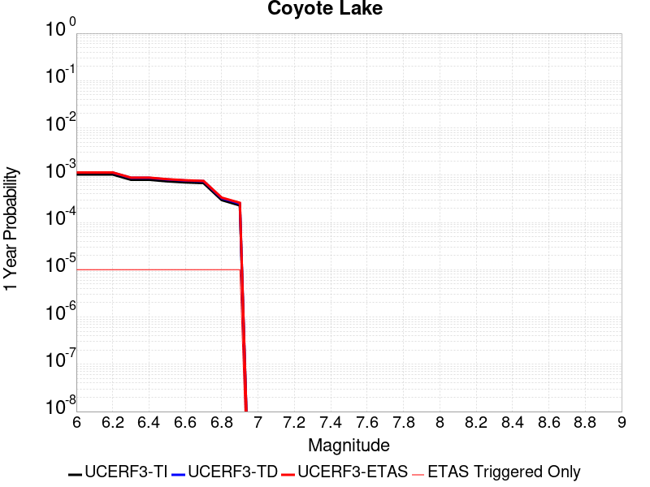 |  |

| Magnitude | 1 wk TI Prob | 1 wk TD Prob | 1 wk ETAS Prob | 1 wk ETAS/TD Gain | 1 wk ETAS Triggered Only | 1 mo TI Prob | 1 mo TD Prob | 1 mo ETAS Prob | 1 mo ETAS/TD Gain | 1 mo ETAS Triggered Only | 1 yr TI Prob | 1 yr TD Prob | 1 yr ETAS Prob | 1 yr ETAS/TD Gain | 1 yr ETAS Triggered Only | 10 yr TI Prob | 10 yr TD Prob | 10 yr ETAS Prob | 10 yr ETAS/TD Gain | 10 yr ETAS Triggered Only |
|-----|-----|-----|-----|-----|-----|-----|-----|-----|-----|-----|-----|-----|-----|-----|-----|-----|-----|-----|-----|-----|
| 6.0 | 1.980352E-5 | 2.1707852E-5 | 2.1707852E-5 | 1.0 | 0.0 | 8.486947E-5 | 9.303074E-5 | 9.303074E-5 | 1.0 | 0.0 | 0.0010327959 | 0.0011321327 | 0.0011497411 | 1.0155532 | 1.762829E-5 | 0.010280091 | 0.01127083 | 0.011288259 | 1.0015464 | 1.762829E-5 |
| 6.1 | 1.980352E-5 | 2.1707852E-5 | 2.1707852E-5 | 1.0 | 0.0 | 8.486947E-5 | 9.303074E-5 | 9.303074E-5 | 1.0 | 0.0 | 0.0010327959 | 0.0011321327 | 0.0011497411 | 1.0155532 | 1.762829E-5 | 0.010280091 | 0.01127083 | 0.011288259 | 1.0015464 | 1.762829E-5 |
| 6.2 | 1.980352E-5 | 2.1707852E-5 | 2.1707852E-5 | 1.0 | 0.0 | 8.486947E-5 | 9.303074E-5 | 9.303074E-5 | 1.0 | 0.0 | 0.0010327959 | 0.0011321327 | 0.0011497411 | 1.0155532 | 1.762829E-5 | 0.010280091 | 0.01127083 | 0.011288259 | 1.0015464 | 1.762829E-5 |
| 6.3 | 1.5344787E-5 | 1.6821528E-5 | 1.6821528E-5 | 1.0 | 0.0 | 6.576172E-5 | 7.209062E-5 | 7.209062E-5 | 1.0 | 0.0 | 8.003548E-4 | 8.7741105E-4 | 8.9502387E-4 | 1.0200737 | 1.762829E-5 | 0.007974784 | 0.008745514 | 0.008762988 | 1.0019981 | 1.762829E-5 |
| 6.4 | 1.5344787E-5 | 1.6821528E-5 | 1.6821528E-5 | 1.0 | 0.0 | 6.576172E-5 | 7.209062E-5 | 7.209062E-5 | 1.0 | 0.0 | 8.003548E-4 | 8.7741105E-4 | 8.9502387E-4 | 1.0200737 | 1.762829E-5 | 0.007974784 | 0.008745514 | 0.008762988 | 1.0019981 | 1.762829E-5 |
| 6.5 | 1.4189697E-5 | 1.5558782E-5 | 1.5558782E-5 | 1.0 | 0.0 | 6.081157E-5 | 6.667913E-5 | 6.667913E-5 | 1.0 | 0.0 | 7.401293E-4 | 8.115764E-4 | 8.2919037E-4 | 1.0217034 | 1.762829E-5 | 0.0073766913 | 0.008092069 | 0.008109555 | 1.0021608 | 1.762829E-5 |
| 6.6 | 1.3469301E-5 | 1.4772335E-5 | 1.4772335E-5 | 1.0 | 0.0 | 5.7724297E-5 | 6.330881E-5 | 6.330881E-5 | 1.0 | 0.0 | 7.025667E-4 | 7.7057217E-4 | 7.8818685E-4 | 1.0228592 | 1.762829E-5 | 0.0070034964 | 0.0076849074 | 0.0077024 | 1.0022763 | 1.762829E-5 |
| 6.7 | 1.3027966E-5 | 1.4282475E-5 | 1.4282475E-5 | 1.0 | 0.0 | 5.5832945E-5 | 6.12095E-5 | 6.12095E-5 | 1.0 | 0.0 | 6.7955407E-4 | 7.450307E-4 | 7.6264585E-4 | 1.0236435 | 1.762829E-5 | 0.006774798 | 0.007431207 | 0.0074487044 | 1.0023546 | 1.762829E-5 |
| 6.8 | 5.695434E-6 | 6.2247245E-6 | 6.2247245E-6 | 1.0 | 0.0 | 2.4408775E-5 | 2.6677288E-5 | 2.6677288E-5 | 1.0 | 0.0 | 2.971363E-4 | 3.2477756E-4 | 3.424001E-4 | 1.0542604 | 1.762829E-5 | 0.0029673933 | 0.0032459702 | 0.0032635413 | 1.0054132 | 1.762829E-5 |
| 6.9 | 4.385688E-6 | 4.7932917E-6 | 4.7932917E-6 | 1.0 | 0.0 | 1.879567E-5 | 2.0542679E-5 | 2.0542679E-5 | 1.0 | 0.0 | 2.2881327E-4 | 2.501071E-4 | 2.67731E-4 | 1.0704653 | 1.762829E-5 | 0.002285778 | 0.002501071 | 0.0025186553 | 1.0070307 | 1.762829E-5 |

## Manix-Afton Hills
*[(top)](#table-of-contents)*

| 1 Week | 1 Month | 1 Year | 10 Year |
|-----|-----|-----|-----|
|  |  |  |  |

| Magnitude | 1 wk TI Prob | 1 wk TD Prob | 1 wk ETAS Prob | 1 wk ETAS/TD Gain | 1 wk ETAS Triggered Only | 1 mo TI Prob | 1 mo TD Prob | 1 mo ETAS Prob | 1 mo ETAS/TD Gain | 1 mo ETAS Triggered Only | 1 yr TI Prob | 1 yr TD Prob | 1 yr ETAS Prob | 1 yr ETAS/TD Gain | 1 yr ETAS Triggered Only | 10 yr TI Prob | 10 yr TD Prob | 10 yr ETAS Prob | 10 yr ETAS/TD Gain | 10 yr ETAS Triggered Only |
|-----|-----|-----|-----|-----|-----|-----|-----|-----|-----|-----|-----|-----|-----|-----|-----|-----|-----|-----|-----|-----|
| 6.0 | 1.3783202E-5 | 1.4711616E-5 | 1.4711616E-5 | 1.0 | 0.0 | 5.906953E-5 | 6.3048356E-5 | 6.3048356E-5 | 1.0 | 0.0 | 7.189342E-4 | 7.673609E-4 | 7.8497565E-4 | 1.022955 | 1.762829E-5 | 0.0071661277 | 0.0076488685 | 0.007666362 | 1.002287 | 1.762829E-5 |
| 6.1 | 1.3783202E-5 | 1.4711616E-5 | 1.4711616E-5 | 1.0 | 0.0 | 5.906953E-5 | 6.3048356E-5 | 6.3048356E-5 | 1.0 | 0.0 | 7.189342E-4 | 7.673609E-4 | 7.8497565E-4 | 1.022955 | 1.762829E-5 | 0.0071661277 | 0.0076488685 | 0.007666362 | 1.002287 | 1.762829E-5 |
| 6.2 | 1.3783202E-5 | 1.4711616E-5 | 1.4711616E-5 | 1.0 | 0.0 | 5.906953E-5 | 6.3048356E-5 | 6.3048356E-5 | 1.0 | 0.0 | 7.189342E-4 | 7.673609E-4 | 7.8497565E-4 | 1.022955 | 1.762829E-5 | 0.0071661277 | 0.0076488685 | 0.007666362 | 1.002287 | 1.762829E-5 |
| 6.3 | 1.10494875E-5 | 1.1793558E-5 | 1.1793558E-5 | 1.0 | 0.0 | 4.7354086E-5 | 5.0542898E-5 | 5.0542898E-5 | 1.0 | 0.0 | 5.763835E-4 | 6.151964E-4 | 6.151964E-4 | 1.0 | 0.0 | 0.005748908 | 0.0061359745 | 0.0061359745 | 1.0 | 0.0 |
| 6.4 | 1.10494875E-5 | 1.1793558E-5 | 1.1793558E-5 | 1.0 | 0.0 | 4.7354086E-5 | 5.0542898E-5 | 5.0542898E-5 | 1.0 | 0.0 | 5.763835E-4 | 6.151964E-4 | 6.151964E-4 | 1.0 | 0.0 | 0.005748908 | 0.0061359745 | 0.0061359745 | 1.0 | 0.0 |
| 6.5 | 9.788949E-6 | 1.0454697E-5 | 1.0454697E-5 | 1.0 | 0.0 | 4.1951964E-5 | 4.480513E-5 | 4.480513E-5 | 1.0 | 0.0 | 5.1064545E-4 | 5.453752E-4 | 5.453752E-4 | 1.0 | 0.0 | 0.0050947363 | 0.005441295 | 0.005441295 | 1.0 | 0.0 |
| 6.6 | 8.810006E-6 | 9.413971E-6 | 9.413971E-6 | 1.0 | 0.0 | 3.775662E-5 | 4.0345018E-5 | 4.0345018E-5 | 1.0 | 0.0 | 4.5958988E-4 | 4.9109873E-4 | 4.9109873E-4 | 1.0 | 0.0 | 0.0045864056 | 0.0049010175 | 0.0049010175 | 1.0 | 0.0 |
| 6.7 | 8.80128E-6 | 9.404451E-6 | 9.404451E-6 | 1.0 | 0.0 | 3.7719226E-5 | 4.0304214E-5 | 4.0304214E-5 | 1.0 | 0.0 | 4.591348E-4 | 4.906022E-4 | 4.906022E-4 | 1.0 | 0.0 | 0.004581874 | 0.004896074 | 0.004896074 | 1.0 | 0.0 |
| 6.8 | 6.8994877E-6 | 7.3803494E-6 | 7.3803494E-6 | 1.0 | 0.0 | 2.9568899E-5 | 3.162973E-5 | 3.162973E-5 | 1.0 | 0.0 | 3.5994186E-4 | 3.850321E-4 | 3.850321E-4 | 1.0 | 0.0 | 0.003593594 | 0.0038444551 | 0.0038444551 | 1.0 | 0.0 |
| 6.9 | 4.9328037E-6 | 5.271154E-6 | 5.271154E-6 | 1.0 | 0.0 | 2.1140417E-5 | 2.2590497E-5 | 2.2590497E-5 | 1.0 | 0.0 | 2.5735417E-4 | 2.7501077E-4 | 2.7501077E-4 | 1.0 | 0.0 | 0.0025705635 | 0.0027473096 | 0.0027473096 | 1.0 | 0.0 |
| 7.0 | 3.347973E-6 | 3.590168E-6 | 3.590168E-6 | 1.0 | 0.0 | 1.4348378E-5 | 1.5386368E-5 | 1.5386368E-5 | 1.0 | 0.0 | 1.746775E-4 | 1.8731703E-4 | 1.8731703E-4 | 1.0 | 0.0 | 0.0017454025 | 0.0018719939 | 0.0018719939 | 1.0 | 0.0 |
| 7.1 | 1.2073567E-6 | 1.293531E-6 | 1.293531E-6 | 1.0 | 0.0 | 5.1743755E-6 | 5.5437017E-6 | 5.5437017E-6 | 1.0 | 0.0 | 6.29962E-5 | 6.749411E-5 | 6.749411E-5 | 1.0 | 0.0 | 6.297835E-4 | 6.748963E-4 | 6.748963E-4 | 1.0 | 0.0 |

## Imperial
*[(top)](#table-of-contents)*

| 1 Week | 1 Month | 1 Year | 10 Year |
|-----|-----|-----|-----|
|  |  | 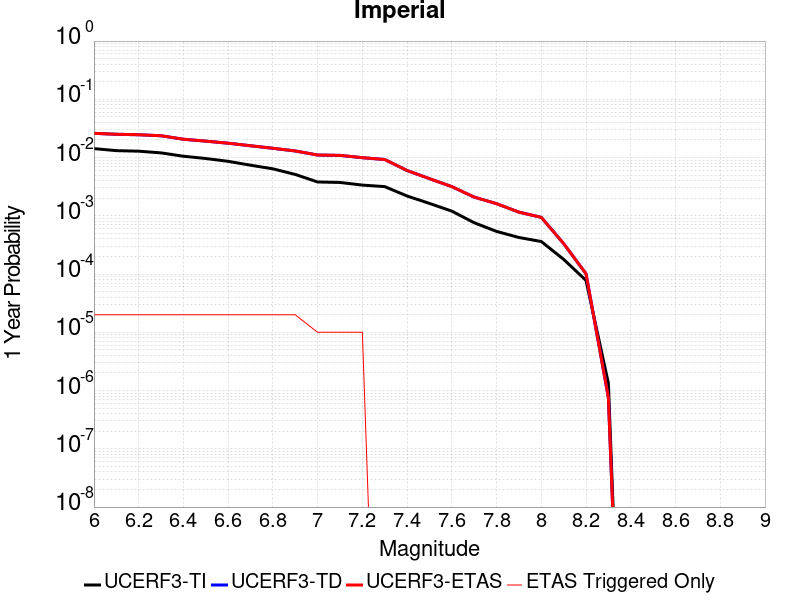 | 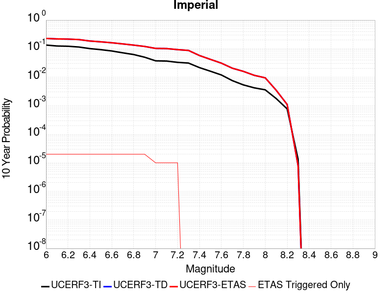 |

| Magnitude | 1 wk TI Prob | 1 wk TD Prob | 1 wk ETAS Prob | 1 wk ETAS/TD Gain | 1 wk ETAS Triggered Only | 1 mo TI Prob | 1 mo TD Prob | 1 mo ETAS Prob | 1 mo ETAS/TD Gain | 1 mo ETAS Triggered Only | 1 yr TI Prob | 1 yr TD Prob | 1 yr ETAS Prob | 1 yr ETAS/TD Gain | 1 yr ETAS Triggered Only | 10 yr TI Prob | 10 yr TD Prob | 10 yr ETAS Prob | 10 yr ETAS/TD Gain | 10 yr ETAS Triggered Only |
|-----|-----|-----|-----|-----|-----|-----|-----|-----|-----|-----|-----|-----|-----|-----|-----|-----|-----|-----|-----|-----|
| 6.0 | 2.7496446E-4 | 5.060379E-4 | 5.060379E-4 | 1.0 | 0.0 | 0.0011778869 | 0.0021669706 | 0.0021669706 | 1.0 | 0.0 | 0.0142467655 | 0.026064837 | 0.026082007 | 1.0006588 | 1.762829E-5 | 0.13367249 | 0.22821419 | 0.2282278 | 1.0000596 | 1.762829E-5 |
| 6.1 | 2.5356023E-4 | 4.8701192E-4 | 4.8701192E-4 | 1.0 | 0.0 | 0.001086234 | 0.0020855628 | 0.0020855628 | 1.0 | 0.0 | 0.013144928 | 0.02509391 | 0.025111094 | 1.0006849 | 1.762829E-5 | 0.123940155 | 0.21963087 | 0.21964462 | 1.0000626 | 1.762829E-5 |
| 6.2 | 2.4820742E-4 | 4.7795815E-4 | 4.7795815E-4 | 1.0 | 0.0 | 0.0010633124 | 0.0020468219 | 0.0020468219 | 1.0 | 0.0 | 0.01286919 | 0.024633536 | 0.02465073 | 1.000698 | 1.762829E-5 | 0.12148927 | 0.21613504 | 0.21614887 | 1.0000639 | 1.762829E-5 |
| 6.3 | 2.3205351E-4 | 4.5929378E-4 | 4.5929378E-4 | 1.0 | 0.0 | 9.94136E-4 | 0.001966954 | 0.001966954 | 1.0 | 0.0 | 0.012036599 | 0.02368102 | 0.023698231 | 1.0007268 | 1.762829E-5 | 0.11405133 | 0.20807077 | 0.20808472 | 1.0000671 | 1.762829E-5 |
| 6.4 | 2.0304754E-4 | 3.991441E-4 | 3.991441E-4 | 1.0 | 0.0 | 8.6991355E-4 | 0.0017095108 | 0.0017095108 | 1.0 | 0.0 | 0.010539869 | 0.020614926 | 0.02063219 | 1.0008374 | 1.762829E-5 | 0.100537635 | 0.18520407 | 0.18521844 | 1.0000776 | 1.762829E-5 |
| 6.5 | 1.854992E-4 | 3.702423E-4 | 3.702423E-4 | 1.0 | 0.0 | 7.9475436E-4 | 0.0015858002 | 0.0015858002 | 1.0 | 0.0 | 0.009633281 | 0.01913749 | 0.019154781 | 1.0009035 | 1.762829E-5 | 0.0922623 | 0.17342903 | 0.1734436 | 1.000084 | 1.762829E-5 |
| 6.6 | 1.6586106E-4 | 3.406714E-4 | 3.406714E-4 | 1.0 | 0.0 | 7.106394E-4 | 0.0014592134 | 0.0014592134 | 1.0 | 0.0 | 0.008617763 | 0.017622843 | 0.01764016 | 1.0009826 | 1.762829E-5 | 0.08291132 | 0.16089731 | 0.16091211 | 1.0000919 | 1.762829E-5 |
| 6.7 | 1.4224656E-4 | 3.0794923E-4 | 3.0794923E-4 | 1.0 | 0.0 | 6.094856E-4 | 0.0013191231 | 0.0013191231 | 1.0 | 0.0 | 0.0073952693 | 0.015943963 | 0.01596131 | 1.001088 | 1.762829E-5 | 0.07153955 | 0.14659329 | 0.14660834 | 1.0001026 | 1.762829E-5 |
| 6.8 | 1.2317259E-4 | 2.781478E-4 | 2.781478E-4 | 1.0 | 0.0 | 5.2777573E-4 | 0.0011915236 | 0.0011915236 | 1.0 | 0.0 | 0.0064067547 | 0.0144116925 | 0.014429066 | 1.0012056 | 1.762829E-5 | 0.06225166 | 0.13303171 | 0.13304698 | 1.0001149 | 1.762829E-5 |
| 6.9 | 9.859898E-5 | 2.503195E-4 | 2.503195E-4 | 1.0 | 0.0 | 4.2249862E-4 | 0.0010723611 | 0.0010723611 | 1.0 | 0.0 | 0.0051317946 | 0.012978803 | 0.012996203 | 1.0013406 | 1.762829E-5 | 0.05014893 | 0.11947842 | 0.11949394 | 1.0001299 | 1.762829E-5 |
| 7.0 | 7.3191884E-5 | 2.127993E-4 | 2.127993E-4 | 1.0 | 0.0 | 3.136418E-4 | 9.116815E-4 | 9.116815E-4 | 1.0 | 0.0 | 0.003811904 | 0.011043918 | 0.011061352 | 1.0015786 | 1.762829E-5 | 0.037471764 | 0.10211917 | 0.102135 | 1.000155 | 1.762829E-5 |
| 7.1 | 7.1760296E-5 | 2.0981116E-4 | 2.0981116E-4 | 1.0 | 0.0 | 3.0750787E-4 | 8.9888397E-4 | 8.9888397E-4 | 1.0 | 0.0 | 0.003737482 | 0.010889676 | 0.010907113 | 1.0016012 | 1.762829E-5 | 0.03675245 | 0.10075505 | 0.100770906 | 1.0001574 | 1.762829E-5 |
| 7.2 | 6.46614E-5 | 1.9149172E-4 | 1.9149172E-4 | 1.0 | 0.0 | 2.7709085E-4 | 8.204237E-4 | 8.204237E-4 | 1.0 | 0.0 | 0.0033683628 | 0.009943534 | 0.009960987 | 1.0017552 | 1.762829E-5 | 0.033177625 | 0.09256114 | 0.09257714 | 1.0001729 | 1.762829E-5 |
| 7.3 | 6.088115E-5 | 1.7820326E-4 | 1.7820326E-4 | 1.0 | 0.0 | 2.6089314E-4 | 7.635076E-4 | 7.635076E-4 | 1.0 | 0.0 | 0.0031717476 | 0.009256661 | 0.009256661 | 1.0 | 0.0 | 0.031268585 | 0.08661022 | 0.08661022 | 1.0 | 0.0 |
| 7.4 | 4.199346E-5 | 1.1519547E-4 | 1.1519547E-4 | 1.0 | 0.0 | 1.7995955E-4 | 4.9360236E-4 | 4.9360236E-4 | 1.0 | 0.0 | 0.0021888057 | 0.0059932186 | 0.0059932186 | 1.0 | 0.0 | 0.02167372 | 0.05748037 | 0.05748037 | 1.0 | 0.0 |
| 7.5 | 3.130448E-5 | 8.340871E-5 | 8.340871E-5 | 1.0 | 0.0 | 1.3415517E-4 | 3.5741724E-4 | 3.5741724E-4 | 1.0 | 0.0 | 0.0016321153 | 0.0043429323 | 0.0043429323 | 1.0 | 0.0 | 0.016201803 | 0.04216626 | 0.04216626 | 1.0 | 0.0 |
| 7.6 | 2.3074248E-5 | 6.0909417E-5 | 6.0909417E-5 | 1.0 | 0.0 | 9.888588E-5 | 2.610144E-4 | 2.610144E-4 | 1.0 | 0.0 | 0.0012032706 | 0.0031732426 | 0.0031732426 | 1.0 | 0.0 | 0.011967761 | 0.031055957 | 0.031055957 | 1.0 | 0.0 |
| 7.7 | 1.45864815E-5 | 4.0178427E-5 | 4.0178427E-5 | 1.0 | 0.0 | 6.2511994E-5 | 1.7218193E-4 | 1.7218193E-4 | 1.0 | 0.0 | 7.608177E-4 | 0.002094305 | 0.002094305 | 1.0 | 0.0 | 0.007582182 | 0.020652408 | 0.020652408 | 1.0 | 0.0 |
| 7.8 | 1.0352979E-5 | 3.1006606E-5 | 3.1006606E-5 | 1.0 | 0.0 | 4.4369157E-5 | 1.328787E-4 | 1.328787E-4 | 1.0 | 0.0 | 5.400606E-4 | 0.0016166 | 0.0016166 | 1.0 | 0.0 | 0.0053875 | 0.016037801 | 0.016037801 | 1.0 | 0.0 |
| 7.9 | 8.137906E-6 | 2.2185837E-5 | 2.2185837E-5 | 1.0 | 0.0 | 3.4876273E-5 | 9.50787E-5 | 9.50787E-5 | 1.0 | 0.0 | 4.2453592E-4 | 0.0011569695 | 0.0011569695 | 1.0 | 0.0 | 0.004237258 | 0.011635021 | 0.011635021 | 1.0 | 0.0 |
| 8.0 | 6.93792E-6 | 1.8040371E-5 | 1.8040371E-5 | 1.0 | 0.0 | 2.9733603E-5 | 7.731359E-5 | 7.731359E-5 | 1.0 | 0.0 | 3.6194647E-4 | 9.408872E-4 | 9.408872E-4 | 1.0 | 0.0 | 0.0036135751 | 0.00951638 | 0.00951638 | 1.0 | 0.0 |
| 8.1 | 3.4286315E-6 | 6.39459E-6 | 6.39459E-6 | 1.0 | 0.0 | 1.4694053E-5 | 2.7405098E-5 | 2.7405098E-5 | 1.0 | 0.0 | 1.7888541E-4 | 3.336061E-4 | 3.336061E-4 | 1.0 | 0.0 | 0.0017874148 | 0.003493339 | 0.003493339 | 1.0 | 0.0 |
| 8.2 | 1.4906886E-6 | 1.9424117E-6 | 1.9424117E-6 | 1.0 | 0.0 | 6.3886496E-6 | 8.324595E-6 | 8.324595E-6 | 1.0 | 0.0 | 7.7779034E-5 | 1.0134726E-4 | 1.0134726E-4 | 1.0 | 0.0 | 7.775182E-4 | 0.0011104804 | 0.0011104804 | 1.0 | 0.0 |
| 8.3 | 2.5758007E-8 | 1.45585295E-8 | 1.45585295E-8 | 1.0 | 0.0 | 1.10391454E-7 | 6.23937E-8 | 6.23937E-8 | 1.0 | 0.0 | 1.3440151E-6 | 7.596433E-7 | 7.596433E-7 | 1.0 | 0.0 | 1.344007E-5 | 7.918924E-6 | 7.918924E-6 | 1.0 | 0.0 |

## Santa Ynez (East)
*[(top)](#table-of-contents)*

| 1 Week | 1 Month | 1 Year | 10 Year |
|-----|-----|-----|-----|
|  |  |  |  |

| Magnitude | 1 wk TI Prob | 1 wk TD Prob | 1 wk ETAS Prob | 1 wk ETAS/TD Gain | 1 wk ETAS Triggered Only | 1 mo TI Prob | 1 mo TD Prob | 1 mo ETAS Prob | 1 mo ETAS/TD Gain | 1 mo ETAS Triggered Only | 1 yr TI Prob | 1 yr TD Prob | 1 yr ETAS Prob | 1 yr ETAS/TD Gain | 1 yr ETAS Triggered Only | 10 yr TI Prob | 10 yr TD Prob | 10 yr ETAS Prob | 10 yr ETAS/TD Gain | 10 yr ETAS Triggered Only |
|-----|-----|-----|-----|-----|-----|-----|-----|-----|-----|-----|-----|-----|-----|-----|-----|-----|-----|-----|-----|-----|
| 6.0 | 3.2269712E-5 | 3.675388E-5 | 3.675388E-5 | 1.0 | 0.0 | 1.3829143E-4 | 1.5751045E-4 | 1.5751045E-4 | 1.0 | 0.0 | 0.0016823979 | 0.0019165927 | 0.0019341871 | 1.0091801 | 1.762829E-5 | 0.016697178 | 0.019058175 | 0.019075468 | 1.0009073 | 1.762829E-5 |
| 6.1 | 3.2269712E-5 | 3.675388E-5 | 3.675388E-5 | 1.0 | 0.0 | 1.3829143E-4 | 1.5751045E-4 | 1.5751045E-4 | 1.0 | 0.0 | 0.0016823979 | 0.0019165927 | 0.0019341871 | 1.0091801 | 1.762829E-5 | 0.016697178 | 0.019058175 | 0.019075468 | 1.0009073 | 1.762829E-5 |
| 6.2 | 3.2269712E-5 | 3.675388E-5 | 3.675388E-5 | 1.0 | 0.0 | 1.3829143E-4 | 1.5751045E-4 | 1.5751045E-4 | 1.0 | 0.0 | 0.0016823979 | 0.0019165927 | 0.0019341871 | 1.0091801 | 1.762829E-5 | 0.016697178 | 0.019058175 | 0.019075468 | 1.0009073 | 1.762829E-5 |
| 6.3 | 3.2269712E-5 | 3.675388E-5 | 3.675388E-5 | 1.0 | 0.0 | 1.3829143E-4 | 1.5751045E-4 | 1.5751045E-4 | 1.0 | 0.0 | 0.0016823979 | 0.0019165927 | 0.0019341871 | 1.0091801 | 1.762829E-5 | 0.016697178 | 0.019058175 | 0.019075468 | 1.0009073 | 1.762829E-5 |
| 6.4 | 1.4404779E-5 | 1.485013E-5 | 1.485013E-5 | 1.0 | 0.0 | 6.1733306E-5 | 6.364189E-5 | 6.364189E-5 | 1.0 | 0.0 | 7.513438E-4 | 7.745696E-4 | 7.9218426E-4 | 1.0227412 | 1.762829E-5 | 0.0074880854 | 0.0077192495 | 0.0077367416 | 1.002266 | 1.762829E-5 |
| 6.5 | 1.4404779E-5 | 1.485013E-5 | 1.485013E-5 | 1.0 | 0.0 | 6.1733306E-5 | 6.364189E-5 | 6.364189E-5 | 1.0 | 0.0 | 7.513438E-4 | 7.745696E-4 | 7.9218426E-4 | 1.0227412 | 1.762829E-5 | 0.0074880854 | 0.0077192495 | 0.0077367416 | 1.002266 | 1.762829E-5 |
| 6.6 | 1.280208E-5 | 1.3012552E-5 | 1.3012552E-5 | 1.0 | 0.0 | 5.4864904E-5 | 5.5766897E-5 | 5.5766897E-5 | 1.0 | 0.0 | 6.6777546E-4 | 6.7875226E-4 | 6.963686E-4 | 1.025954 | 1.762829E-5 | 0.006657724 | 0.006767002 | 0.0067845113 | 1.0025874 | 1.762829E-5 |
| 6.7 | 1.2457027E-5 | 1.262905E-5 | 1.262905E-5 | 1.0 | 0.0 | 5.3386164E-5 | 5.4123386E-5 | 5.4123386E-5 | 1.0 | 0.0 | 6.497827E-4 | 6.5875467E-4 | 6.7637133E-4 | 1.0267423 | 1.762829E-5 | 0.00647886 | 0.0065682167 | 0.0065857293 | 1.0026662 | 1.762829E-5 |
| 6.8 | 1.2095134E-5 | 1.2231476E-5 | 1.2231476E-5 | 1.0 | 0.0 | 5.1835254E-5 | 5.2419568E-5 | 5.2419568E-5 | 1.0 | 0.0 | 6.309115E-4 | 6.3802296E-4 | 6.5564E-4 | 1.027612 | 1.762829E-5 | 0.0062912325 | 0.0063621 | 0.0063796164 | 1.0027533 | 1.762829E-5 |
| 6.9 | 1.1104036E-5 | 1.115786E-5 | 1.115786E-5 | 1.0 | 0.0 | 4.758786E-5 | 4.7818532E-5 | 4.7818532E-5 | 1.0 | 0.0 | 5.7922816E-4 | 5.820364E-4 | 5.820364E-4 | 1.0 | 0.0 | 0.005777207 | 0.005805265 | 0.005805265 | 1.0 | 0.0 |
| 7.0 | 1.0577444E-5 | 1.0582165E-5 | 1.0582165E-5 | 1.0 | 0.0 | 4.5331115E-5 | 4.5351353E-5 | 4.5351353E-5 | 1.0 | 0.0 | 5.5176654E-4 | 5.5201404E-4 | 5.5201404E-4 | 1.0 | 0.0 | 0.0055039856 | 0.005506567 | 0.005506567 | 1.0 | 0.0 |
| 7.1 | 1.0021775E-5 | 9.981446E-6 | 9.981446E-6 | 1.0 | 0.0 | 4.294976E-5 | 4.277693E-5 | 4.277693E-5 | 1.0 | 0.0 | 5.2278786E-4 | 5.2068586E-4 | 5.2068586E-4 | 1.0 | 0.0 | 0.0052155964 | 0.0051947916 | 0.0051947916 | 1.0 | 0.0 |
| 7.2 | 8.874109E-6 | 8.749197E-6 | 8.749197E-6 | 1.0 | 0.0 | 3.8031343E-5 | 3.7496025E-5 | 3.7496025E-5 | 1.0 | 0.0 | 4.629332E-4 | 4.564196E-4 | 4.564196E-4 | 1.0 | 0.0 | 0.0046197 | 0.00455494 | 0.00455494 | 1.0 | 0.0 |
| 7.3 | 7.5504267E-6 | 7.505443E-6 | 7.505443E-6 | 1.0 | 0.0 | 3.235857E-5 | 3.2165794E-5 | 3.2165794E-5 | 1.0 | 0.0 | 3.9389438E-4 | 3.915492E-4 | 3.915492E-4 | 1.0 | 0.0 | 0.0039319694 | 0.0039087003 | 0.0039087003 | 1.0 | 0.0 |
| 7.4 | 6.309394E-6 | 6.183419E-6 | 6.183419E-6 | 1.0 | 0.0 | 2.703998E-5 | 2.6500104E-5 | 2.6500104E-5 | 1.0 | 0.0 | 3.2916202E-4 | 3.2259195E-4 | 3.2259195E-4 | 1.0 | 0.0 | 0.003286749 | 0.003221334 | 0.003221334 | 1.0 | 0.0 |
| 7.5 | 4.6103073E-6 | 4.4410685E-6 | 4.4410685E-6 | 1.0 | 0.0 | 1.975831E-5 | 1.9033017E-5 | 1.9033017E-5 | 1.0 | 0.0 | 2.4053088E-4 | 2.3170303E-4 | 2.3170303E-4 | 1.0 | 0.0 | 0.002402707 | 0.002314684 | 0.002314684 | 1.0 | 0.0 |
| 7.6 | 1.2858658E-6 | 1.3008554E-6 | 1.3008554E-6 | 1.0 | 0.0 | 5.5108417E-6 | 5.575083E-6 | 5.575083E-6 | 1.0 | 0.0 | 6.7092435E-5 | 6.7874586E-5 | 6.7874586E-5 | 1.0 | 0.0 | 6.707218E-4 | 6.7854545E-4 | 6.7854545E-4 | 1.0 | 0.0 |
| 7.7 | 5.3302307E-7 | 5.612297E-7 | 5.612297E-7 | 1.0 | 0.0 | 2.2843826E-6 | 2.4052679E-6 | 2.4052679E-6 | 1.0 | 0.0 | 2.7812002E-5 | 2.9283781E-5 | 2.9283781E-5 | 1.0 | 0.0 | 2.7808524E-4 | 2.9280278E-4 | 2.9280278E-4 | 1.0 | 0.0 |
| 7.8 | 4.613933E-8 | 4.8031144E-8 | 4.8031144E-8 | 1.0 | 0.0 | 1.9773998E-7 | 2.0584774E-7 | 2.0584774E-7 | 1.0 | 0.0 | 2.4074816E-6 | 2.5061934E-6 | 2.5061934E-6 | 1.0 | 0.0 | 2.4074554E-5 | 2.5061661E-5 | 2.5061661E-5 | 1.0 | 0.0 |

