# Parent Section Magnitude-Probability Distributions

Only fault sections with at least one triggered aftershock are plotted. Sections are sorted by total supraseismogenic trigger rate (decreasing)

## Table Of Contents

* [Garlock (Central)](#garlock-central)
* [Little Lake](#little-lake)
* [Airport Lake](#airport-lake)
* [Tank Canyon](#tank-canyon)
* [Owl Lake](#owl-lake)
* [Panamint Valley](#panamint-valley)
* [Garlock (East)](#garlock-east)
* [Hunter Mountain-Saline Valley](#hunter-mountain-saline-valley)
* [Garlock (West)](#garlock-west)
* [Blackwater](#blackwater)
* [Ash Hill](#ash-hill)
* [San Andreas (Mojave S)](#san-andreas-mojave-s)
* [San Andreas (Mojave N)](#san-andreas-mojave-n)
* [Gravel Hills-Harper Lk](#gravel-hills-harper-lk)
* [McLean Lake](#mclean-lake)
* [So Sierra Nevada](#so-sierra-nevada)
* [San Andreas (San Bernardino N)](#san-andreas-san-bernardino-n)
* [Goldstone Lake](#goldstone-lake)
* [Lenwood-Lockhart-Old Woman Springs](#lenwood-lockhart-old-woman-springs)
* [San Andreas (San Bernardino S)](#san-andreas-san-bernardino-s)
* [Paradise](#paradise)
* [Towne Pass](#towne-pass)
* [Scodie Lineament](#scodie-lineament)
* [Nelson Lake](#nelson-lake)
* [Garlic Springs](#garlic-springs)
* [White Wolf (Extension)](#white-wolf-extension)
* [Death Valley (So)](#death-valley-so)
* [Sierra Nevada  (No Extension)](#sierra-nevada--no-extension)
* [Helendale-So Lockhart](#helendale-so-lockhart)
* [Death Valley (Black Mtns Frontal)](#death-valley-black-mtns-frontal)
* [San Andreas (Santa Cruz Mts) 2011 CFM](#san-andreas-santa-cruz-mts-2011-cfm)
* [San Andreas (San Gorgonio Pass-Garnet HIll)](#san-andreas-san-gorgonio-pass-garnet-hill)
* [San Andreas (Creeping Section) 2011 CFM](#san-andreas-creeping-section-2011-cfm)
* [Ortigalita (North)](#ortigalita-north)
* [Manix-Afton Hills](#manix-afton-hills)
* [Hosgri](#hosgri)
* [San Jacinto (Lytle Creek connector)](#san-jacinto-lytle-creek-connector)
* [Coyote Canyon](#coyote-canyon)
* [San Andreas (Peninsula) 2011 CFM](#san-andreas-peninsula-2011-cfm)
* [Owens Valley](#owens-valley)
* [San Jacinto (Stepovers Combined)](#san-jacinto-stepovers-combined)
* [San Andreas (Big Bend)](#san-andreas-big-bend)
* [Ludlow](#ludlow)
* [San Andreas (Carrizo) rev](#san-andreas-carrizo-rev)
* [Red Pass](#red-pass)
* [San Gorgonio Pass](#san-gorgonio-pass)
* [Calaveras (So) 2011 CFM](#calaveras-so-2011-cfm)
* [San Jacinto (Borrego)](#san-jacinto-borrego)
* [San Jacinto (Coyote Creek)](#san-jacinto-coyote-creek)
* [Mission Creek](#mission-creek)
* [Big Pine (East)](#big-pine-east)
* [Coyote Lake](#coyote-lake)
* [San Jacinto (San Bernardino)](#san-jacinto-san-bernardino)
* [San Luis Range 2011 CFM](#san-luis-range-2011-cfm)
* [Dry Mountain](#dry-mountain)
* [San Jacinto (Anza) rev](#san-jacinto-anza-rev)
* [San Jacinto (San Jacinto Valley) rev](#san-jacinto-san-jacinto-valley-rev)
* [Cedar Mtn-Mahogany Mtn](#cedar-mtn-mahogany-mtn)
* [San Andreas (Cholame) rev](#san-andreas-cholame-rev)
* [San Andreas (Parkfield)](#san-andreas-parkfield)
* [Tin Mountain](#tin-mountain)

## Garlock (Central)
*[(top)](#table-of-contents)*

| 1 Week | 1 Month | 1 Year | 10 Year |
|-----|-----|-----|-----|
|  |  |  |  |

| Magnitude | 1 wk TI Prob | 1 wk TD Prob | 1 wk ETAS Prob | 1 wk ETAS/TD Gain | 1 wk ETAS Triggered Only | 1 mo TI Prob | 1 mo TD Prob | 1 mo ETAS Prob | 1 mo ETAS/TD Gain | 1 mo ETAS Triggered Only | 1 yr TI Prob | 1 yr TD Prob | 1 yr ETAS Prob | 1 yr ETAS/TD Gain | 1 yr ETAS Triggered Only | 10 yr TI Prob | 10 yr TD Prob | 10 yr ETAS Prob | 10 yr ETAS/TD Gain | 10 yr ETAS Triggered Only |
|-----|-----|-----|-----|-----|-----|-----|-----|-----|-----|-----|-----|-----|-----|-----|-----|-----|-----|-----|-----|-----|
| 6.0 | 5.5131142E-5 | 7.027124E-5 | 0.0012438425 | 17.700592 | 0.0011736539 | 2.3625491E-4 | 3.0112805E-4 | 0.0037740972 | 12.533196 | 0.0034740153 | 0.0028726095 | 0.0036601364 | 0.015260168 | 4.1692896 | 0.011642646 | 0.028357591 | 0.036092084 | 0.05383078 | 1.4914843 | 0.018402891 |
| 6.1 | 5.5131142E-5 | 7.027124E-5 | 0.0012438425 | 17.700592 | 0.0011736539 | 2.3625491E-4 | 3.0112805E-4 | 0.0037740972 | 12.533196 | 0.0034740153 | 0.0028726095 | 0.0036601364 | 0.015260168 | 4.1692896 | 0.011642646 | 0.028357591 | 0.036092084 | 0.05383078 | 1.4914843 | 0.018402891 |
| 6.2 | 4.216245E-5 | 5.1683597E-5 | 6.61952E-4 | 12.807778 | 6.103E-4 | 1.806837E-4 | 2.214825E-4 | 0.0020989126 | 9.476652 | 0.0018778461 | 0.0021976046 | 0.0026932466 | 0.009622565 | 3.5728493 | 0.0069480306 | 0.021759989 | 0.026701005 | 0.037187465 | 1.3927366 | 0.010774142 |
| 6.3 | 4.216245E-5 | 5.1683597E-5 | 6.61952E-4 | 12.807778 | 6.103E-4 | 1.806837E-4 | 2.214825E-4 | 0.0020989126 | 9.476652 | 0.0018778461 | 0.0021976046 | 0.0026932466 | 0.009622565 | 3.5728493 | 0.0069480306 | 0.021759989 | 0.026701005 | 0.037187465 | 1.3927366 | 0.010774142 |
| 6.4 | 3.6858168E-5 | 4.4131746E-5 | 5.1357254E-4 | 11.637259 | 4.6946152E-4 | 1.5795401E-4 | 1.8912248E-4 | 0.0016676466 | 8.817813 | 0.0014788038 | 0.0019213937 | 0.00230016 | 0.007616292 | 3.311201 | 0.0053283884 | 0.019048655 | 0.022859743 | 0.030910451 | 1.3521783 | 0.008239049 |
| 6.5 | 3.39199E-5 | 4.0038896E-5 | 4.860095E-4 | 12.138433 | 4.4598844E-4 | 1.453629E-4 | 1.715841E-4 | 0.001556258 | 9.069942 | 0.0013849115 | 0.0017683565 | 0.0020870569 | 0.006771874 | 3.2447004 | 0.0046946155 | 0.017543508 | 0.020770492 | 0.027987948 | 1.347486 | 0.007370546 |
| 6.6 | 3.3571985E-5 | 3.9493032E-5 | 4.8546388E-4 | 12.292393 | 4.4598844E-4 | 1.4387199E-4 | 1.6924499E-4 | 0.001530453 | 9.042826 | 0.0013614384 | 0.0017502342 | 0.0020586322 | 0.0067201583 | 3.2643802 | 0.004671142 | 0.017365133 | 0.020491783 | 0.0276883 | 1.3511904 | 0.007347073 |
| 6.7 | 3.2580007E-5 | 3.8109323E-5 | 4.606086E-4 | 12.086506 | 4.2251538E-4 | 1.3962112E-4 | 1.6331558E-4 | 0.0014775932 | 9.047473 | 0.0013144923 | 0.0016985617 | 0.0019865753 | 0.006461026 | 3.2523441 | 0.0044833575 | 0.016856372 | 0.019784356 | 0.026755985 | 1.3523809 | 0.007112342 |
| 6.8 | 3.2185937E-5 | 3.7536465E-5 | 4.6003598E-4 | 12.255709 | 4.2251538E-4 | 1.3793244E-4 | 1.6086077E-4 | 0.0014751416 | 9.1703005 | 0.0013144923 | 0.0016780337 | 0.001956742 | 0.006290764 | 3.2149174 | 0.004342519 | 0.016654192 | 0.01949112 | 0.026303725 | 1.3495235 | 0.0069480306 |
| 6.9 | 3.165394E-5 | 3.6740938E-5 | 4.3576857E-4 | 11.860573 | 3.990423E-4 | 1.3565269E-4 | 1.5745178E-4 | 0.0014482677 | 9.198167 | 0.0012910191 | 0.0016503202 | 0.0019153113 | 0.0061558005 | 3.2139947 | 0.004248627 | 0.01638118 | 0.0190837 | 0.025807034 | 1.3523078 | 0.0068541383 |
| 7.0 | 3.0903822E-5 | 3.564605E-5 | 4.3467412E-4 | 12.194174 | 3.990423E-4 | 1.3243823E-4 | 1.5275997E-4 | 0.0014435819 | 9.450002 | 0.0012910191 | 0.0016112428 | 0.0018582871 | 0.0060287304 | 3.2442405 | 0.0041782074 | 0.015996104 | 0.018522795 | 0.025134785 | 1.356965 | 0.006736773 |
| 7.1 | 3.0069863E-5 | 3.441218E-5 | 3.8649622E-4 | 11.231378 | 3.5209613E-4 | 1.2886449E-4 | 1.4747256E-4 | 0.0013209532 | 8.957282 | 0.0011736539 | 0.0015677959 | 0.0017940209 | 0.005730423 | 3.1941786 | 0.003943477 | 0.01556781 | 0.017890377 | 0.024114722 | 1.3479159 | 0.0063377307 |
| 7.2 | 2.7957109E-5 | 3.1301115E-5 | 2.6602452E-4 | 8.498884 | 2.3473076E-4 | 1.1981068E-4 | 1.3414085E-4 | 0.0010494681 | 7.8236275 | 9.1545E-4 | 0.0014577188 | 0.0016319609 | 0.0049362634 | 3.0247438 | 0.0033097037 | 0.014481937 | 0.016293783 | 0.021627715 | 1.3273599 | 0.0054222806 |
| 7.3 | 2.4519275E-5 | 2.6733265E-5 | 1.6756795E-4 | 6.268144 | 1.4083846E-4 | 1.0507837E-4 | 1.1456619E-4 | 7.4826664E-4 | 6.5313044 | 6.3377304E-4 | 0.0012785783 | 0.0013939656 | 0.0037145608 | 2.6647437 | 0.0023238345 | 0.012712469 | 0.013937555 | 0.017802924 | 1.2773348 | 0.003920004 |
| 7.4 | 2.3225532E-5 | 2.5217494E-5 | 9.563495E-5 | 3.792405 | 7.041923E-5 | 9.95342E-5 | 1.0807058E-4 | 6.2442245E-4 | 5.7779136 | 5.1640766E-4 | 0.0012111551 | 0.0013149795 | 0.0034013363 | 2.5866077 | 0.0020891037 | 0.012045753 | 0.01315504 | 0.016652849 | 1.2658911 | 0.0035444344 |
| 7.5 | 2.097765E-5 | 2.250088E-5 | 4.597343E-5 | 2.0431836 | 2.3473076E-5 | 8.9901114E-5 | 9.6428856E-5 | 4.9543264E-4 | 5.1378055 | 3.990423E-4 | 0.0010939965 | 0.0011734008 | 0.0028145881 | 2.3986588 | 0.0016431153 | 0.010886264 | 0.01174923 | 0.0145793 | 1.2408727 | 0.0028637154 |
| 7.6 | 1.511254E-5 | 1.6007341E-5 | 1.6007341E-5 | 1.0 | 0.0 | 6.476642E-5 | 6.860113E-5 | 2.5637285E-4 | 3.737152 | 1.8778461E-4 | 7.882459E-4 | 8.3490653E-4 | 0.0017026853 | 2.0393722 | 8.685038E-4 | 0.007854558 | 0.00839184 | 0.009858235 | 1.1747404 | 0.0014788038 |
| 7.7 | 9.934069E-6 | 1.0693656E-5 | 1.0693656E-5 | 1.0 | 0.0 | 4.2573887E-5 | 4.582915E-5 | 9.277315E-5 | 2.0243263 | 4.6946152E-5 | 5.182138E-4 | 5.578274E-4 | 8.1588724E-4 | 1.4626158 | 2.5820383E-4 | 0.00517007 | 0.005635394 | 0.0060088467 | 1.0662692 | 3.7556922E-4 |
| 7.8 | 6.7562896E-6 | 8.440562E-6 | 8.440562E-6 | 1.0 | 0.0 | 2.8955206E-5 | 3.6173336E-5 | 3.6173336E-5 | 1.0 | 0.0 | 3.5247262E-4 | 4.4032154E-4 | 6.2802347E-4 | 1.4262837 | 1.8778461E-4 | 0.0035191406 | 0.0044529405 | 0.004733363 | 1.0629747 | 2.816769E-4 |
| 7.9 | 3.975453E-6 | 5.3784297E-6 | 5.3784297E-6 | 1.0 | 0.0 | 1.7037546E-5 | 2.305021E-5 | 2.305021E-5 | 1.0 | 0.0 | 2.0741238E-4 | 2.8060027E-4 | 3.9793272E-4 | 1.418148 | 1.1736538E-4 | 0.002072189 | 0.0028374717 | 0.0029779105 | 1.0494944 | 1.4083846E-4 |
| 8.0 | 1.6729537E-6 | 2.0800776E-6 | 2.0800776E-6 | 1.0 | 0.0 | 7.169782E-6 | 8.914588E-6 | 8.914588E-6 | 1.0 | 0.0 | 8.7288594E-5 | 1.0852974E-4 | 1.3200026E-4 | 1.216259 | 2.3473076E-5 | 8.7254314E-4 | 0.0010982669 | 0.0011451616 | 1.0426987 | 4.6946152E-5 |
| 8.1 | 3.6733252E-7 | 3.1526864E-7 | 3.1526864E-7 | 1.0 | 0.0 | 1.5742813E-6 | 1.3511507E-6 | 1.3511507E-6 | 1.0 | 0.0 | 1.9166706E-5 | 1.645015E-5 | 3.992284E-5 | 2.426898 | 2.3473076E-5 | 1.9165053E-4 | 1.6658098E-4 | 1.9005014E-4 | 1.1408874 | 2.3473076E-5 |

## Little Lake
*[(top)](#table-of-contents)*

| 1 Week | 1 Month | 1 Year | 10 Year |
|-----|-----|-----|-----|
|  |  |  | 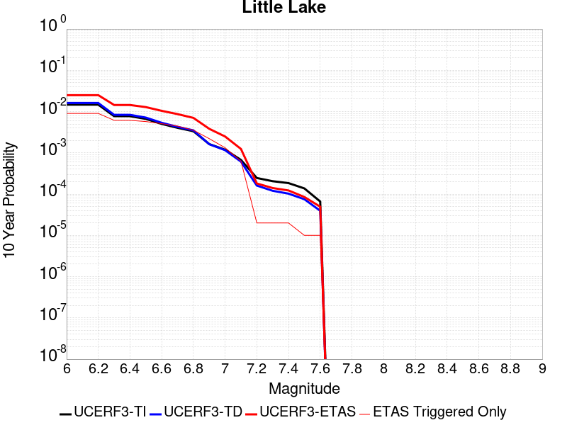 |

| Magnitude | 1 wk TI Prob | 1 wk TD Prob | 1 wk ETAS Prob | 1 wk ETAS/TD Gain | 1 wk ETAS Triggered Only | 1 mo TI Prob | 1 mo TD Prob | 1 mo ETAS Prob | 1 mo ETAS/TD Gain | 1 mo ETAS Triggered Only | 1 yr TI Prob | 1 yr TD Prob | 1 yr ETAS Prob | 1 yr ETAS/TD Gain | 1 yr ETAS Triggered Only | 10 yr TI Prob | 10 yr TD Prob | 10 yr ETAS Prob | 10 yr ETAS/TD Gain | 10 yr ETAS Triggered Only |
|-----|-----|-----|-----|-----|-----|-----|-----|-----|-----|-----|-----|-----|-----|-----|-----|-----|-----|-----|-----|-----|
| 6.0 | 2.8424427E-5 | 3.1207477E-5 | 5.241267E-4 | 16.794909 | 4.929346E-4 | 1.2181328E-4 | 1.3374022E-4 | 0.0018705155 | 13.986185 | 0.0017370076 | 0.0014820677 | 0.0016272042 | 0.00732188 | 4.499669 | 0.0057039578 | 0.014722223 | 0.016166303 | 0.02517281 | 1.5571159 | 0.0091544995 |
| 6.1 | 2.8424427E-5 | 3.1207477E-5 | 5.241267E-4 | 16.794909 | 4.929346E-4 | 1.2181328E-4 | 1.3374022E-4 | 0.0018705155 | 13.986185 | 0.0017370076 | 0.0014820677 | 0.0016272042 | 0.00732188 | 4.499669 | 0.0057039578 | 0.014722223 | 0.016166303 | 0.02517281 | 1.5571159 | 0.0091544995 |
| 6.2 | 2.8424427E-5 | 3.1207477E-5 | 5.241267E-4 | 16.794909 | 4.929346E-4 | 1.2181328E-4 | 1.3374022E-4 | 0.0018705155 | 13.986185 | 0.0017370076 | 0.0014820677 | 0.0016272042 | 0.00732188 | 4.499669 | 0.0057039578 | 0.014722223 | 0.016166303 | 0.02517281 | 1.5571159 | 0.0091544995 |
| 6.3 | 1.48860645E-5 | 1.6082206E-5 | 3.6817268E-4 | 22.893171 | 3.5209613E-4 | 6.379586E-5 | 6.8922076E-5 | 0.0013363808 | 19.389736 | 0.0012675461 | 7.7643775E-4 | 8.388314E-4 | 0.0050838944 | 6.0606866 | 0.004248627 | 0.007737305 | 0.00835947 | 0.014760605 | 1.7657346 | 0.006455096 |
| 6.4 | 1.48860645E-5 | 1.6082206E-5 | 3.6817268E-4 | 22.893171 | 3.5209613E-4 | 6.379586E-5 | 6.8922076E-5 | 0.0013363808 | 19.389736 | 0.0012675461 | 7.7643775E-4 | 8.388314E-4 | 0.0050838944 | 6.0606866 | 0.004248627 | 0.007737305 | 0.00835947 | 0.014760605 | 1.7657346 | 0.006455096 |
| 6.5 | 1.2797581E-5 | 1.3766247E-5 | 3.1891203E-4 | 23.16623 | 3.0515E-4 | 5.4845623E-5 | 5.899701E-5 | 0.0012325816 | 20.892271 | 0.0011736539 | 6.675408E-4 | 7.180776E-4 | 0.004658723 | 6.4877706 | 0.003943477 | 0.006655392 | 0.007160124 | 0.01319612 | 1.8430017 | 0.0060795266 |
| 6.6 | 9.661896E-6 | 1.0289519E-5 | 2.9196354E-4 | 28.374847 | 2.816769E-4 | 4.1407468E-5 | 4.4097287E-5 | 0.0010768671 | 24.420258 | 0.0010328153 | 5.040193E-4 | 5.3676846E-4 | 0.004149682 | 7.73086 | 0.0036148538 | 0.005028777 | 0.0053563244 | 0.010772909 | 2.0112503 | 0.0054457537 |
| 6.7 | 7.767871E-6 | 8.200053E-6 | 2.8987465E-4 | 35.350338 | 2.816769E-4 | 3.329045E-5 | 3.514269E-5 | 9.7403274E-4 | 27.716509 | 9.3892304E-4 | 4.0523586E-4 | 4.27792E-4 | 0.0035718386 | 8.349475 | 0.0031453923 | 0.004044977 | 0.004271037 | 0.009062465 | 2.121842 | 0.0048119808 |
| 6.8 | 6.4235196E-6 | 6.736042E-6 | 2.4146523E-4 | 35.846752 | 2.3473076E-4 | 2.752908E-5 | 2.8868506E-5 | 8.034577E-4 | 27.831635 | 7.7461154E-4 | 3.35115E-4 | 3.514302E-4 | 0.002956026 | 8.411417 | 0.0026055116 | 0.003346101 | 0.0035100048 | 0.007252515 | 2.0662405 | 0.0037556922 |
| 6.9 | 3.1283696E-6 | 3.1122859E-6 | 1.674233E-4 | 53.794323 | 1.6431154E-4 | 1.3407229E-5 | 1.3338308E-5 | 3.6542976E-4 | 27.39701 | 3.5209613E-4 | 1.6322079E-4 | 1.6238331E-4 | 0.001640947 | 10.105392 | 0.0014788038 | 0.0016310095 | 0.0016227949 | 0.0038725534 | 2.386348 | 0.0022534153 |
| 7.0 | 2.290603E-6 | 2.2287613E-6 | 1.1959388E-4 | 53.65935 | 1.1736538E-4 | 9.816834E-6 | 9.551805E-6 | 1.9733462E-4 | 20.659407 | 1.8778461E-4 | 1.19513395E-4 | 1.1628806E-4 | 0.0010316316 | 8.8713455 | 9.1545E-4 | 0.0011944914 | 0.0011623743 | 0.0024753385 | 2.1295538 | 0.0013144923 |
| 7.1 | 1.293693E-6 | 1.1777322E-6 | 7.159688E-5 | 60.792152 | 7.041923E-5 | 5.5443866E-6 | 5.0474177E-6 | 1.2241221E-4 | 24.252441 | 1.1736538E-4 | 6.750081E-5 | 6.1451276E-5 | 6.247705E-4 | 10.166924 | 5.633538E-4 | 6.7480316E-4 | 6.144114E-4 | 0.0012712537 | 2.0690596 | 6.5724616E-4 |
| 7.2 | 4.715842E-7 | 3.09202E-7 | 3.09202E-7 | 1.0 | 0.0 | 2.0210737E-6 | 1.3251507E-6 | 1.3251507E-6 | 1.0 | 0.0 | 2.4606294E-5 | 1.6133596E-5 | 3.9606293E-5 | 2.4548955 | 2.3473076E-5 | 2.460357E-4 | 1.6132479E-4 | 1.8479407E-4 | 1.1454785 | 2.3473076E-5 |
| 7.3 | 3.9430947E-7 | 2.3099639E-7 | 2.3099639E-7 | 1.0 | 0.0 | 1.6898966E-6 | 9.899842E-7 | 9.899842E-7 | 1.0 | 0.0 | 2.0574296E-5 | 1.2052991E-5 | 3.5525783E-5 | 2.9474664 | 2.3473076E-5 | 2.0572392E-4 | 1.20523444E-4 | 1.4399369E-4 | 1.194736 | 2.3473076E-5 |
| 7.4 | 3.547123E-7 | 1.9681133E-7 | 1.9681133E-7 | 1.0 | 0.0 | 1.5201948E-6 | 8.4347687E-7 | 8.4347687E-7 | 1.0 | 0.0 | 1.8508214E-5 | 1.0269283E-5 | 3.374212E-5 | 3.2857327 | 2.3473076E-5 | 1.8506673E-4 | 1.02688144E-4 | 1.2615882E-4 | 1.2285626 | 2.3473076E-5 |
| 7.5 | 2.6354266E-7 | 1.4424535E-7 | 1.4424535E-7 | 1.0 | 0.0 | 1.129468E-6 | 6.1819424E-7 | 6.1819424E-7 | 1.0 | 0.0 | 1.3751187E-5 | 7.5264893E-6 | 7.5264893E-6 | 1.0 | 0.0 | 1.3750336E-4 | 7.52624E-5 | 7.52624E-5 | 1.0 | 0.0 |
| 7.6 | 1.269913E-7 | 7.573149E-8 | 7.573149E-8 | 1.0 | 0.0 | 5.4424834E-7 | 3.245635E-7 | 3.245635E-7 | 1.0 | 0.0 | 6.6262032E-6 | 3.951554E-6 | 3.951554E-6 | 1.0 | 0.0 | 6.626006E-5 | 3.951487E-5 | 3.951487E-5 | 1.0 | 0.0 |

## Airport Lake
*[(top)](#table-of-contents)*

| 1 Week | 1 Month | 1 Year | 10 Year |
|-----|-----|-----|-----|
|  |  |  |  |

| Magnitude | 1 wk TI Prob | 1 wk TD Prob | 1 wk ETAS Prob | 1 wk ETAS/TD Gain | 1 wk ETAS Triggered Only | 1 mo TI Prob | 1 mo TD Prob | 1 mo ETAS Prob | 1 mo ETAS/TD Gain | 1 mo ETAS Triggered Only | 1 yr TI Prob | 1 yr TD Prob | 1 yr ETAS Prob | 1 yr ETAS/TD Gain | 1 yr ETAS Triggered Only | 10 yr TI Prob | 10 yr TD Prob | 10 yr ETAS Prob | 10 yr ETAS/TD Gain | 10 yr ETAS Triggered Only |
|-----|-----|-----|-----|-----|-----|-----|-----|-----|-----|-----|-----|-----|-----|-----|-----|-----|-----|-----|-----|-----|
| 6.0 | 1.2387061E-5 | 1.3103559E-5 | 5.5297726E-4 | 42.20054 | 5.3988077E-4 | 5.3086325E-5 | 5.615706E-5 | 0.0019338977 | 34.4373 | 0.0018778461 | 6.461343E-4 | 6.8352616E-4 | 0.00650087 | 9.510785 | 0.005821323 | 0.0064425888 | 0.006817048 | 0.01581589 | 2.3200495 | 0.009060607 |
| 6.1 | 1.2387061E-5 | 1.3103559E-5 | 5.5297726E-4 | 42.20054 | 5.3988077E-4 | 5.3086325E-5 | 5.615706E-5 | 0.0019338977 | 34.4373 | 0.0018778461 | 6.461343E-4 | 6.8352616E-4 | 0.00650087 | 9.510785 | 0.005821323 | 0.0064425888 | 0.006817048 | 0.01581589 | 2.3200495 | 0.009060607 |
| 6.2 | 1.2387061E-5 | 1.3103559E-5 | 5.5297726E-4 | 42.20054 | 5.3988077E-4 | 5.3086325E-5 | 5.615706E-5 | 0.0019338977 | 34.4373 | 0.0018778461 | 6.461343E-4 | 6.8352616E-4 | 0.00650087 | 9.510785 | 0.005821323 | 0.0064425888 | 0.006817048 | 0.01581589 | 2.3200495 | 0.009060607 |
| 6.3 | 1.2387061E-5 | 1.3103559E-5 | 5.5297726E-4 | 42.20054 | 5.3988077E-4 | 5.3086325E-5 | 5.615706E-5 | 0.0019338977 | 34.4373 | 0.0018778461 | 6.461343E-4 | 6.8352616E-4 | 0.00650087 | 9.510785 | 0.005821323 | 0.0064425888 | 0.006817048 | 0.01581589 | 2.3200495 | 0.009060607 |
| 6.4 | 1.2387061E-5 | 1.3103559E-5 | 5.5297726E-4 | 42.20054 | 5.3988077E-4 | 5.3086325E-5 | 5.615706E-5 | 0.0019338977 | 34.4373 | 0.0018778461 | 6.461343E-4 | 6.8352616E-4 | 0.00650087 | 9.510785 | 0.005821323 | 0.0064425888 | 0.006817048 | 0.01581589 | 2.3200495 | 0.009060607 |
| 6.5 | 6.9922594E-6 | 7.385145E-6 | 4.298974E-4 | 58.211098 | 4.2251538E-4 | 2.996648E-5 | 3.165027E-5 | 0.0013461009 | 42.530476 | 0.0013144923 | 3.6478083E-4 | 3.8527933E-4 | 0.0047730533 | 12.388554 | 0.0043894653 | 0.003641826 | 0.003846651 | 0.010604275 | 2.7567554 | 0.006783719 |
| 6.6 | 6.9922594E-6 | 7.385145E-6 | 4.298974E-4 | 58.211098 | 4.2251538E-4 | 2.996648E-5 | 3.165027E-5 | 0.0013461009 | 42.530476 | 0.0013144923 | 3.6478083E-4 | 3.8527933E-4 | 0.0047730533 | 12.388554 | 0.0043894653 | 0.003641826 | 0.003846651 | 0.010604275 | 2.7567554 | 0.006783719 |
| 6.7 | 5.477277E-6 | 5.7862417E-6 | 3.8135328E-4 | 65.906906 | 3.7556922E-4 | 2.3473833E-5 | 2.4797964E-5 | 0.0011045327 | 44.541264 | 0.0010797615 | 2.8575645E-4 | 3.0187727E-4 | 0.003727912 | 12.349097 | 0.0034270692 | 0.0028538927 | 0.003015056 | 0.008491195 | 2.8162644 | 0.0054927 |
| 6.8 | 3.9950432E-6 | 4.2192128E-6 | 3.328409E-4 | 78.88697 | 3.2862308E-4 | 1.7121502E-5 | 1.808223E-5 | 8.39625E-4 | 46.433712 | 8.2155765E-4 | 2.0843433E-4 | 2.2013167E-4 | 0.0028485374 | 12.940153 | 0.0026289846 | 0.0020823893 | 0.0021994072 | 0.0062981606 | 2.8635721 | 0.004107788 |
| 6.9 | 2.95695E-6 | 3.1231173E-6 | 2.3785315E-4 | 76.15889 | 2.3473076E-4 | 1.2672582E-5 | 1.33847325E-5 | 4.3589444E-4 | 32.56654 | 4.2251538E-4 | 1.5427776E-4 | 1.629492E-4 | 0.0020639587 | 12.66627 | 0.0019013191 | 0.001541707 | 0.0016285196 | 0.0046047457 | 2.8275652 | 0.0029810807 |
| 7.0 | 1.456072E-6 | 1.5408596E-6 | 1.18906064E-4 | 77.168655 | 1.1736538E-4 | 6.2402937E-6 | 6.603673E-6 | 1.9438704E-4 | 29.436201 | 1.8778461E-4 | 7.597293E-5 | 8.039776E-5 | 9.488318E-4 | 11.801719 | 8.685038E-4 | 7.594696E-4 | 8.0378563E-4 | 0.0020468587 | 2.546523 | 0.001244073 |
| 7.1 | 6.995192E-7 | 7.409207E-7 | 7.1160095E-5 | 96.0428 | 7.041923E-5 | 2.997936E-6 | 3.1753743E-6 | 1.2054038E-4 | 37.961 | 1.1736538E-4 | 3.649926E-5 | 3.8660182E-5 | 5.7852006E-4 | 14.964235 | 5.3988077E-4 | 3.6493264E-4 | 3.8660184E-4 | 0.0010201299 | 2.6387093 | 6.3377304E-4 |

## Tank Canyon
*[(top)](#table-of-contents)*

| 1 Week | 1 Month | 1 Year | 10 Year |
|-----|-----|-----|-----|
|  | 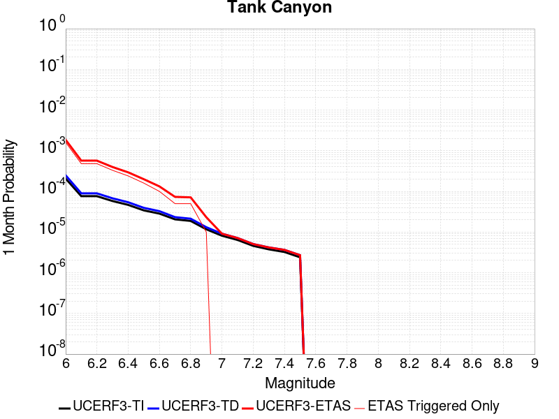 | 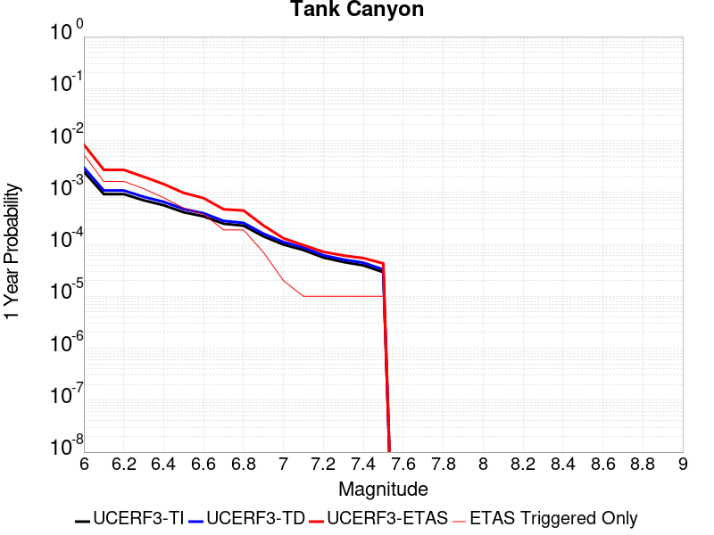 |  |

| Magnitude | 1 wk TI Prob | 1 wk TD Prob | 1 wk ETAS Prob | 1 wk ETAS/TD Gain | 1 wk ETAS Triggered Only | 1 mo TI Prob | 1 mo TD Prob | 1 mo ETAS Prob | 1 mo ETAS/TD Gain | 1 mo ETAS Triggered Only | 1 yr TI Prob | 1 yr TD Prob | 1 yr ETAS Prob | 1 yr ETAS/TD Gain | 1 yr ETAS Triggered Only | 10 yr TI Prob | 10 yr TD Prob | 10 yr ETAS Prob | 10 yr ETAS/TD Gain | 10 yr ETAS Triggered Only |
|-----|-----|-----|-----|-----|-----|-----|-----|-----|-----|-----|-----|-----|-----|-----|-----|-----|-----|-----|-----|-----|
| 6.0 | 4.8284557E-5 | 5.7970923E-5 | 6.447638E-4 | 11.122193 | 5.8682694E-4 | 2.0691741E-4 | 2.48427E-4 | 0.0017503307 | 7.045654 | 0.0015022769 | 0.0025163088 | 0.0030210684 | 0.00812274 | 2.6886978 | 0.0051171305 | 0.02488006 | 0.029866708 | 0.03799632 | 1.2721963 | 0.008379889 |
| 6.1 | 1.7796336E-5 | 2.0875108E-5 | 1.14765455E-4 | 5.497718 | 9.3892304E-5 | 7.626778E-5 | 8.946191E-5 | 5.1193946E-4 | 5.7224298 | 4.2251538E-4 | 9.281647E-4 | 0.0010886913 | 0.0026831229 | 2.4645395 | 0.0015961692 | 0.009242975 | 0.010837668 | 0.013507816 | 1.2463766 | 0.0026994038 |
| 6.2 | 1.7796336E-5 | 2.0875108E-5 | 1.14765455E-4 | 5.497718 | 9.3892304E-5 | 7.626778E-5 | 8.946191E-5 | 5.1193946E-4 | 5.7224298 | 4.2251538E-4 | 9.281647E-4 | 0.0010886913 | 0.0026831229 | 2.4645395 | 0.0015961692 | 0.009242975 | 0.010837668 | 0.013507816 | 1.2463766 | 0.0026994038 |
| 6.3 | 1.3515912E-5 | 1.5760828E-5 | 6.270624E-5 | 3.9786134 | 4.6946152E-5 | 5.792405E-5 | 6.7544795E-5 | 3.492027E-4 | 5.1699424 | 2.816769E-4 | 7.049971E-4 | 8.220716E-4 | 0.001947853 | 2.3694444 | 0.0011267076 | 0.007027647 | 0.008192917 | 0.010055379 | 1.2273258 | 0.0018778461 |
| 6.4 | 1.0870146E-5 | 1.2618972E-5 | 3.609175E-5 | 2.8601184 | 2.3473076E-5 | 4.658551E-5 | 5.4080287E-5 | 2.4185474E-4 | 4.472142 | 1.8778461E-4 | 5.67031E-4 | 6.582465E-4 | 0.0014323482 | 2.1760056 | 7.7461154E-4 | 0.005655863 | 0.006564983 | 0.007917483 | 1.2060174 | 0.0013614384 |
| 6.5 | 7.964826E-6 | 9.196723E-6 | 3.2669584E-5 | 3.552307 | 2.3473076E-5 | 3.4134522E-5 | 3.9413993E-5 | 2.0371906E-4 | 5.1686983 | 1.6431154E-4 | 4.1550855E-4 | 4.797704E-4 | 9.959303E-4 | 2.0758479 | 5.1640766E-4 | 0.0041473247 | 0.0047886474 | 0.0055595497 | 1.1609854 | 7.7461154E-4 |
| 6.6 | 6.6317E-6 | 7.612777E-6 | 3.1085674E-5 | 4.0833554 | 2.3473076E-5 | 2.8421264E-5 | 3.262583E-5 | 1.4998739E-4 | 4.5971975 | 1.1736538E-4 | 3.4597394E-4 | 3.9715623E-4 | 8.195038E-4 | 2.0634294 | 4.2251538E-4 | 0.0034543579 | 0.003965616 | 0.004596876 | 1.1591833 | 6.3377304E-4 |
| 6.7 | 4.793663E-6 | 5.4310603E-6 | 5.4310603E-6 | 1.0 | 0.0 | 2.0544108E-5 | 2.327579E-5 | 9.369338E-5 | 4.0253577 | 7.041923E-5 | 2.500958E-4 | 2.8335027E-4 | 4.945481E-4 | 1.7453595 | 2.1125769E-4 | 0.0024981452 | 0.0028305824 | 0.0030880554 | 1.0909611 | 2.5820383E-4 |
| 6.8 | 4.382823E-6 | 4.9694927E-6 | 4.9694927E-6 | 1.0 | 0.0 | 1.8783392E-5 | 2.1297676E-5 | 9.17154E-5 | 4.3063574 | 7.041923E-5 | 2.286638E-4 | 2.592726E-4 | 4.7047553E-4 | 1.8145978 | 2.1125769E-4 | 0.0022842865 | 0.0025903755 | 0.002824498 | 1.0903817 | 2.3473076E-4 |
| 6.9 | 2.729601E-6 | 3.0736521E-6 | 3.0736521E-6 | 1.0 | 0.0 | 1.1698237E-5 | 1.3172735E-5 | 3.6645502E-5 | 2.7819204 | 2.3473076E-5 | 1.4241673E-4 | 1.6036748E-4 | 2.307754E-4 | 1.4390413 | 7.041923E-5 | 0.001423255 | 0.0016026833 | 0.0016964251 | 1.0584905 | 9.3892304E-5 |
| 7.0 | 1.8987357E-6 | 2.1269989E-6 | 2.1269989E-6 | 1.0 | 0.0 | 8.137413E-6 | 9.115682E-6 | 9.115682E-6 | 1.0 | 0.0 | 9.90685E-5 | 1.1097847E-4 | 1.3444894E-4 | 1.2114867 | 2.3473076E-5 | 9.902435E-4 | 0.0011092991 | 0.0011327462 | 1.0211368 | 2.3473076E-5 |
| 7.1 | 1.4928986E-6 | 1.6641684E-6 | 1.6641684E-6 | 1.0 | 0.0 | 6.398121E-6 | 7.1321338E-6 | 7.1321338E-6 | 1.0 | 0.0 | 7.789434E-5 | 8.683086E-5 | 1.10301895E-4 | 1.2703075 | 2.3473076E-5 | 7.786704E-4 | 8.680272E-4 | 8.914799E-4 | 1.0270184 | 2.3473076E-5 |
| 7.2 | 1.069082E-6 | 1.1828834E-6 | 1.1828834E-6 | 1.0 | 0.0 | 4.581772E-6 | 5.0694935E-6 | 5.0694935E-6 | 1.0 | 0.0 | 5.5781646E-5 | 6.171987E-5 | 8.5191496E-5 | 1.3802929 | 2.3473076E-5 | 5.576765E-4 | 6.170795E-4 | 6.405381E-4 | 1.0380155 | 2.3473076E-5 |
| 7.3 | 8.776551E-7 | 9.770195E-7 | 9.770195E-7 | 1.0 | 0.0 | 3.7613736E-6 | 4.1872227E-6 | 4.1872227E-6 | 1.0 | 0.0 | 4.579376E-5 | 5.0978764E-5 | 7.445064E-5 | 1.4604247 | 2.3473076E-5 | 4.5784327E-4 | 5.097217E-4 | 5.331828E-4 | 1.0460273 | 2.3473076E-5 |
| 7.4 | 7.55721E-7 | 8.510402E-7 | 8.510402E-7 | 1.0 | 0.0 | 3.2388E-6 | 3.647313E-6 | 3.647313E-6 | 1.0 | 0.0 | 3.9431678E-5 | 4.440565E-5 | 6.7877685E-5 | 1.5285822 | 2.3473076E-5 | 3.942468E-4 | 4.440186E-4 | 4.6748127E-4 | 1.0528415 | 2.3473076E-5 |
| 7.5 | 5.587665E-7 | 6.305733E-7 | 6.305733E-7 | 1.0 | 0.0 | 2.3947114E-6 | 2.702457E-6 | 2.702457E-6 | 1.0 | 0.0 | 2.915522E-5 | 3.2902415E-5 | 5.637472E-5 | 1.7133915 | 2.3473076E-5 | 2.9151395E-4 | 3.2902416E-4 | 3.524895E-4 | 1.071318 | 2.3473076E-5 |

## Owl Lake
*[(top)](#table-of-contents)*

| 1 Week | 1 Month | 1 Year | 10 Year |
|-----|-----|-----|-----|
|  | 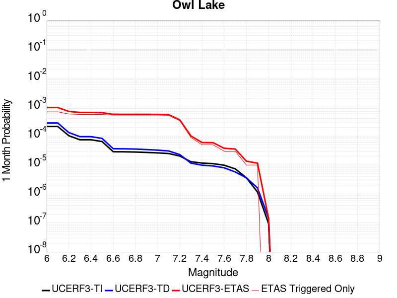 | 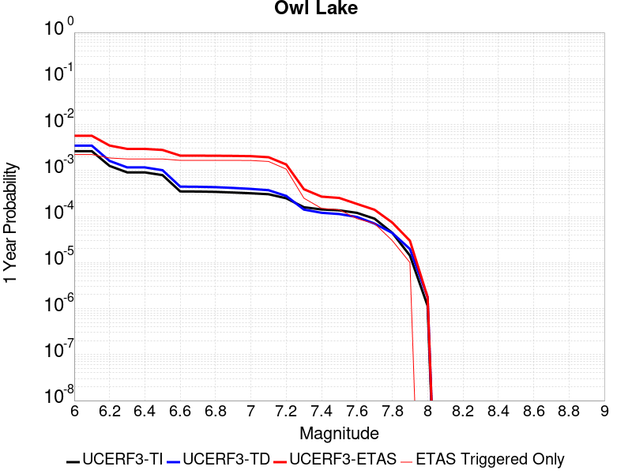 |  |

| Magnitude | 1 wk TI Prob | 1 wk TD Prob | 1 wk ETAS Prob | 1 wk ETAS/TD Gain | 1 wk ETAS Triggered Only | 1 mo TI Prob | 1 mo TD Prob | 1 mo ETAS Prob | 1 mo ETAS/TD Gain | 1 mo ETAS Triggered Only | 1 yr TI Prob | 1 yr TD Prob | 1 yr ETAS Prob | 1 yr ETAS/TD Gain | 1 yr ETAS Triggered Only | 10 yr TI Prob | 10 yr TD Prob | 10 yr ETAS Prob | 10 yr ETAS/TD Gain | 10 yr ETAS Triggered Only |
|-----|-----|-----|-----|-----|-----|-----|-----|-----|-----|-----|-----|-----|-----|-----|-----|-----|-----|-----|-----|-----|
| 6.0 | 5.0320643E-5 | 6.637151E-5 | 2.7761518E-4 | 4.182746 | 2.1125769E-4 | 2.1564208E-4 | 2.844246E-4 | 9.180174E-4 | 3.2276301 | 6.3377304E-4 | 0.0026222812 | 0.0034584238 | 0.0055403025 | 1.6019733 | 0.0020891037 | 0.02591553 | 0.034147043 | 0.037411746 | 1.0956072 | 0.003380123 |
| 6.1 | 5.0320643E-5 | 6.637151E-5 | 2.7761518E-4 | 4.182746 | 2.1125769E-4 | 2.1564208E-4 | 2.844246E-4 | 9.180174E-4 | 3.2276301 | 6.3377304E-4 | 0.0026222812 | 0.0034584238 | 0.0055403025 | 1.6019733 | 0.0020891037 | 0.02591553 | 0.034147043 | 0.037411746 | 1.0956072 | 0.003380123 |
| 6.2 | 2.4125871E-5 | 3.098766E-5 | 2.1876645E-4 | 7.059793 | 1.8778461E-4 | 1.0339249E-4 | 1.3279865E-4 | 6.7260774E-4 | 5.0648685 | 5.3988077E-4 | 0.0012580766 | 0.0016157742 | 0.00332654 | 2.0587902 | 0.0017135346 | 0.012509781 | 0.016073797 | 0.018614331 | 1.1580545 | 0.0025820383 |
| 6.3 | 1.7433485E-5 | 2.2360802E-5 | 2.1014121E-4 | 9.397749 | 1.8778461E-4 | 7.471279E-5 | 9.582938E-5 | 6.356584E-4 | 6.6332307 | 5.3988077E-4 | 9.0924866E-4 | 0.0011662478 | 0.0028308926 | 2.4273508 | 0.0016665885 | 0.009055373 | 0.01163159 | 0.014067595 | 1.2094301 | 0.002464673 |
| 6.4 | 1.7433485E-5 | 2.2360802E-5 | 2.1014121E-4 | 9.397749 | 1.8778461E-4 | 7.471279E-5 | 9.582938E-5 | 6.356584E-4 | 6.6332307 | 5.3988077E-4 | 9.0924866E-4 | 0.0011662478 | 0.0028308926 | 2.4273508 | 0.0016665885 | 0.009055373 | 0.01163159 | 0.014067595 | 1.2094301 | 0.002464673 |
| 6.5 | 1.5182742E-5 | 1.9433977E-5 | 2.0721494E-4 | 10.662508 | 1.8778461E-4 | 6.506727E-5 | 8.3286664E-5 | 6.2312244E-4 | 7.4816594 | 5.3988077E-4 | 7.919061E-4 | 0.0010136948 | 0.0026785939 | 2.6424067 | 0.0016665885 | 0.0078909 | 0.0101209 | 0.012537393 | 1.2387626 | 0.0024412 |
| 6.6 | 6.7271576E-6 | 8.550545E-6 | 1.9633355E-4 | 22.961523 | 1.8778461E-4 | 2.8830356E-5 | 3.6644713E-5 | 5.530335E-4 | 15.091767 | 5.1640766E-4 | 3.5095305E-4 | 4.460637E-4 | 0.0020415208 | 4.5767474 | 0.0015961692 | 0.0035039932 | 0.0044694655 | 0.0067829136 | 1.5176119 | 0.0023238345 |
| 6.7 | 6.682835E-6 | 8.482986E-6 | 1.96266E-4 | 23.136429 | 1.8778461E-4 | 2.8640408E-5 | 3.635518E-5 | 5.527441E-4 | 15.203998 | 5.1640766E-4 | 3.4864116E-4 | 4.4254007E-4 | 0.002038003 | 4.605239 | 0.0015961692 | 0.003480947 | 0.004434389 | 0.006747919 | 1.5217246 | 0.0023238345 |
| 6.8 | 6.5774975E-6 | 8.329444E-6 | 1.961125E-4 | 23.544487 | 1.8778461E-4 | 2.8188972E-5 | 3.569716E-5 | 5.520864E-4 | 15.465835 | 5.1640766E-4 | 3.4314668E-4 | 4.3453192E-4 | 0.0020300075 | 4.671711 | 0.0015961692 | 0.0034261728 | 0.004354527 | 0.0066682426 | 1.5313356 | 0.0023238345 |
| 6.9 | 6.363419E-6 | 8.002579E-6 | 1.9578569E-4 | 24.465322 | 1.8778461E-4 | 2.727151E-5 | 3.429635E-5 | 5.506863E-4 | 16.056704 | 5.1640766E-4 | 3.3198006E-4 | 4.1748365E-4 | 0.0020129865 | 4.8217134 | 0.0015961692 | 0.0033148455 | 0.0041844994 | 0.0064986097 | 1.5530196 | 0.0023238345 |
| 7.0 | 6.1342453E-6 | 7.63473E-6 | 1.954179E-4 | 25.595917 | 1.8778461E-4 | 2.6289357E-5 | 3.271989E-5 | 5.491107E-4 | 16.782167 | 5.1640766E-4 | 3.2002592E-4 | 3.9829736E-4 | 0.0019938308 | 5.005885 | 0.0015961692 | 0.0031956544 | 0.0039931675 | 0.0063077225 | 1.5796288 | 0.0023238345 |
| 7.1 | 5.842926E-6 | 7.14521E-6 | 1.9492848E-4 | 27.281 | 1.8778461E-4 | 2.504087E-5 | 3.0622E-5 | 5.470139E-4 | 17.863426 | 5.1640766E-4 | 3.0482994E-4 | 3.7276448E-4 | 0.0018744814 | 5.028594 | 0.0015022769 | 0.0030441214 | 0.0037385917 | 0.0059368117 | 1.5879807 | 0.0022064692 |
| 7.2 | 4.77173E-6 | 5.361204E-6 | 9.9253004E-5 | 18.513193 | 9.3892304E-5 | 2.045011E-5 | 2.297641E-5 | 3.2811938E-4 | 14.280708 | 3.0515E-4 | 2.4895166E-4 | 2.7970594E-4 | 0.0012887659 | 4.6075745 | 0.0010093423 | 0.0024867293 | 0.0028100624 | 0.0042613037 | 1.5164444 | 0.0014553308 |
| 7.3 | 3.0494948E-6 | 2.7124704E-6 | 2.7124704E-6 | 1.0 | 0.0 | 1.3069198E-5 | 1.1624823E-5 | 5.857043E-5 | 5.0383935 | 4.6946152E-5 | 1.5910587E-4 | 1.4152318E-4 | 3.5275097E-4 | 2.4925313 | 2.1125769E-4 | 0.0015899199 | 0.0014242887 | 0.0017524437 | 1.2303993 | 3.2862308E-4 |
| 7.4 | 2.7263884E-6 | 2.3075613E-6 | 2.3075613E-6 | 1.0 | 0.0 | 1.1684469E-5 | 9.889511E-6 | 9.889511E-6 | 1.0 | 0.0 | 1.4224913E-4 | 1.2039825E-4 | 2.377495E-4 | 1.9746923 | 1.1736538E-4 | 0.0014215811 | 0.0012122075 | 0.0014232091 | 1.1740639 | 2.1125769E-4 |
| 7.5 | 2.6090431E-6 | 2.1674637E-6 | 2.1674637E-6 | 1.0 | 0.0 | 1.1181565E-5 | 9.289097E-6 | 9.289097E-6 | 1.0 | 0.0 | 1.3612706E-4 | 1.1308899E-4 | 2.3044109E-4 | 2.037697 | 1.1736538E-4 | 0.001360437 | 0.0011389464 | 0.0013265171 | 1.164688 | 1.8778461E-4 |
| 7.6 | 2.3008756E-6 | 1.8745708E-6 | 1.8745708E-6 | 1.0 | 0.0 | 9.860858E-6 | 8.0338505E-6 | 8.0338505E-6 | 1.0 | 0.0 | 1.20049335E-4 | 9.7807824E-5 | 1.4474939E-4 | 1.4799367 | 4.6946152E-5 | 0.001199845 | 9.85921E-4 | 0.0010562708 | 1.0713544 | 7.041923E-5 |
| 7.7 | 1.7184348E-6 | 1.343562E-6 | 1.343562E-6 | 1.0 | 0.0 | 7.3646997E-6 | 5.7581105E-6 | 5.7581105E-6 | 1.0 | 0.0 | 8.966153E-5 | 7.010278E-5 | 9.3574214E-5 | 1.3348145 | 2.3473076E-5 | 8.962536E-4 | 7.086945E-4 | 7.32151E-4 | 1.0330981 | 2.3473076E-5 |
| 7.8 | 8.4612907E-7 | 8.4176E-7 | 8.4176E-7 | 1.0 | 0.0 | 3.6262625E-6 | 3.607538E-6 | 3.607538E-6 | 1.0 | 0.0 | 4.4148852E-5 | 4.392091E-5 | 6.739296E-5 | 1.5344162 | 2.3473076E-5 | 4.414008E-4 | 4.4459777E-4 | 4.680604E-4 | 1.0527728 | 2.3473076E-5 |
| 7.9 | 2.716738E-7 | 3.7732943E-7 | 3.7732943E-7 | 1.0 | 0.0 | 1.1643157E-6 | 1.6171252E-6 | 1.6171252E-6 | 1.0 | 0.0 | 1.4175452E-5 | 1.9688332E-5 | 1.9688332E-5 | 1.0 | 0.0 | 1.4174548E-4 | 1.9863734E-4 | 1.9863734E-4 | 1.0 | 0.0 |
| 8.0 | 2.1995428E-8 | 3.389418E-8 | 3.389418E-8 | 1.0 | 0.0 | 9.426611E-8 | 1.4526077E-7 | 1.4526077E-7 | 1.0 | 0.0 | 1.1476893E-6 | 1.768549E-6 | 1.768549E-6 | 1.0 | 0.0 | 1.14768345E-5 | 1.798665E-5 | 1.798665E-5 | 1.0 | 0.0 |

## Panamint Valley
*[(top)](#table-of-contents)*

| 1 Week | 1 Month | 1 Year | 10 Year |
|-----|-----|-----|-----|
|  |  |  |  |

| Magnitude | 1 wk TI Prob | 1 wk TD Prob | 1 wk ETAS Prob | 1 wk ETAS/TD Gain | 1 wk ETAS Triggered Only | 1 mo TI Prob | 1 mo TD Prob | 1 mo ETAS Prob | 1 mo ETAS/TD Gain | 1 mo ETAS Triggered Only | 1 yr TI Prob | 1 yr TD Prob | 1 yr ETAS Prob | 1 yr ETAS/TD Gain | 1 yr ETAS Triggered Only | 10 yr TI Prob | 10 yr TD Prob | 10 yr ETAS Prob | 10 yr ETAS/TD Gain | 10 yr ETAS Triggered Only |
|-----|-----|-----|-----|-----|-----|-----|-----|-----|-----|-----|-----|-----|-----|-----|-----|-----|-----|-----|-----|-----|
| 6.0 | 3.0211835E-5 | 3.39879E-5 | 1.2787702E-4 | 3.7624276 | 9.3892304E-5 | 1.2947287E-4 | 1.4565447E-4 | 6.8545656E-4 | 4.7060456 | 5.3988077E-4 | 0.0015751923 | 0.0017719301 | 0.0036698803 | 2.0711203 | 0.0019013191 | 0.015640736 | 0.017584875 | 0.020605775 | 1.1717896 | 0.003074973 |
| 6.1 | 3.0211835E-5 | 3.39879E-5 | 1.2787702E-4 | 3.7624276 | 9.3892304E-5 | 1.2947287E-4 | 1.4565447E-4 | 6.8545656E-4 | 4.7060456 | 5.3988077E-4 | 0.0015751923 | 0.0017719301 | 0.0036698803 | 2.0711203 | 0.0019013191 | 0.015640736 | 0.017584875 | 0.020605775 | 1.1717896 | 0.003074973 |
| 6.2 | 3.0211835E-5 | 3.39879E-5 | 1.2787702E-4 | 3.7624276 | 9.3892304E-5 | 1.2947287E-4 | 1.4565447E-4 | 6.8545656E-4 | 4.7060456 | 5.3988077E-4 | 0.0015751923 | 0.0017719301 | 0.0036698803 | 2.0711203 | 0.0019013191 | 0.015640736 | 0.017584875 | 0.020605775 | 1.1717896 | 0.003074973 |
| 6.3 | 2.8573924E-5 | 3.210589E-5 | 1.2599518E-4 | 3.9243634 | 9.3892304E-5 | 1.2245393E-4 | 1.3758958E-4 | 6.773961E-4 | 4.9233093 | 5.3988077E-4 | 0.001489857 | 0.0016738938 | 0.0035251628 | 2.1059656 | 0.001854373 | 0.01479908 | 0.01661945 | 0.019574068 | 1.1777809 | 0.0030045537 |
| 6.4 | 2.8573924E-5 | 3.210589E-5 | 1.2599518E-4 | 3.9243634 | 9.3892304E-5 | 1.2245393E-4 | 1.3758958E-4 | 6.773961E-4 | 4.9233093 | 5.3988077E-4 | 0.001489857 | 0.0016738938 | 0.0035251628 | 2.1059656 | 0.001854373 | 0.01479908 | 0.01661945 | 0.019574068 | 1.1777809 | 0.0030045537 |
| 6.5 | 2.7468774E-5 | 3.0831525E-5 | 1.2472093E-4 | 4.045241 | 9.3892304E-5 | 1.1771801E-4 | 1.3212857E-4 | 6.4846803E-4 | 4.9078565 | 5.1640766E-4 | 0.0014322745 | 0.0016075056 | 0.0034354625 | 2.1371386 | 0.0018309 | 0.014230782 | 0.015965264 | 0.01889875 | 1.1837418 | 0.0029810807 |
| 6.6 | 2.6135967E-5 | 2.9255436E-5 | 9.96726E-5 | 3.4069772 | 7.041923E-5 | 1.1200648E-4 | 1.2537456E-4 | 5.9477723E-4 | 4.7440023 | 4.6946152E-4 | 0.0013628257 | 0.001525393 | 0.0032363138 | 2.1216261 | 0.0017135346 | 0.013544982 | 0.015155562 | 0.017952759 | 1.1845657 | 0.0028402423 |
| 6.7 | 2.4498746E-5 | 2.7344193E-5 | 9.77615E-5 | 3.5752196 | 7.041923E-5 | 1.04990395E-4 | 1.17184274E-4 | 5.865908E-4 | 5.0057125 | 4.6946152E-4 | 0.0012775084 | 0.0014258098 | 0.0031369012 | 2.200084 | 0.0017135346 | 0.012701893 | 0.014172745 | 0.016972734 | 1.1975615 | 0.0028402423 |
| 6.8 | 2.2244329E-5 | 2.4938103E-5 | 9.535557E-5 | 3.8236902 | 7.041923E-5 | 9.532935E-5 | 1.06873325E-4 | 5.7628466E-4 | 5.392222 | 4.6946152E-4 | 0.0011600169 | 0.0013004278 | 0.0029648491 | 2.2799027 | 0.0016665885 | 0.011539802 | 0.012933899 | 0.015598388 | 1.2060083 | 0.0026994038 |
| 6.9 | 1.9902658E-5 | 2.2292743E-5 | 9.2710405E-5 | 4.1587706 | 7.041923E-5 | 8.529431E-5 | 9.553693E-5 | 5.180119E-4 | 5.422112 | 4.2251538E-4 | 0.0010379635 | 0.00116256 | 0.0026865362 | 2.3108797 | 0.0015257499 | 0.010331288 | 0.011569886 | 0.014098848 | 1.2185816 | 0.0025585652 |
| 7.0 | 1.8353881E-5 | 2.0568525E-5 | 9.098631E-5 | 4.4235697 | 7.041923E-5 | 7.865712E-5 | 8.814794E-5 | 4.8715508E-4 | 5.526562 | 3.990423E-4 | 9.5722964E-4 | 0.0010726905 | 0.0025264602 | 2.3552554 | 0.0014553308 | 0.009531168 | 0.010680057 | 0.013118407 | 1.2283087 | 0.002464673 |
| 7.1 | 1.7667631E-5 | 1.9774876E-5 | 9.019271E-5 | 4.560975 | 7.041923E-5 | 7.571623E-5 | 8.474681E-5 | 4.602842E-4 | 5.4312863 | 3.7556922E-4 | 9.2145515E-4 | 0.0010313216 | 0.0024382537 | 2.364203 | 0.0014083845 | 0.009176437 | 0.010270242 | 0.012639906 | 1.2307311 | 0.0023942539 |
| 7.2 | 1.6381597E-5 | 1.8160366E-5 | 6.510567E-5 | 3.5850415 | 4.6946152E-5 | 7.020495E-5 | 7.782792E-5 | 4.0642542E-4 | 5.222103 | 3.2862308E-4 | 8.544101E-4 | 9.471603E-4 | 0.0022135058 | 2.3369918 | 0.0012675461 | 0.008511325 | 0.0094358865 | 0.011644787 | 1.2340957 | 0.0022299422 |
| 7.3 | 1.4520491E-5 | 1.5968182E-5 | 3.9440885E-5 | 2.4699671 | 2.3473076E-5 | 6.222919E-5 | 6.8433365E-5 | 3.50091E-4 | 5.115794 | 2.816769E-4 | 7.57377E-4 | 8.328739E-4 | 0.0019351897 | 2.3235085 | 0.0011032346 | 0.0075480095 | 0.008300635 | 0.010186172 | 1.2271558 | 0.0019013191 |
| 7.4 | 1.2852287E-5 | 1.4146948E-5 | 1.4146948E-5 | 1.0 | 0.0 | 5.5080065E-5 | 6.0628456E-5 | 3.1881663E-4 | 5.258531 | 2.5820383E-4 | 6.7039346E-4 | 7.379173E-4 | 0.0017699705 | 2.398603 | 0.0010328153 | 0.0066837464 | 0.0073575918 | 0.009175021 | 1.247014 | 0.0018309 |
| 7.5 | 1.1637851E-5 | 1.2838205E-5 | 1.2838205E-5 | 1.0 | 0.0 | 4.987555E-5 | 5.5019806E-5 | 3.1320943E-4 | 5.692667 | 2.5820383E-4 | 6.070656E-4 | 6.6967594E-4 | 0.0017017997 | 2.5412285 | 0.0010328153 | 0.006054099 | 0.006679477 | 0.008498148 | 1.2722774 | 0.0018309 |
| 7.6 | 3.0068115E-6 | 3.3335807E-6 | 3.3335807E-6 | 1.0 | 0.0 | 1.2886271E-5 | 1.4286737E-5 | 1.081777E-4 | 7.571897 | 9.3892304E-5 | 1.5687906E-4 | 1.7393442E-4 | 5.963763E-4 | 3.4287424 | 4.2251538E-4 | 0.0015676835 | 0.0017394236 | 0.0025829845 | 1.4849658 | 8.4503077E-4 |

## Garlock (East)
*[(top)](#table-of-contents)*

| 1 Week | 1 Month | 1 Year | 10 Year |
|-----|-----|-----|-----|
|  |  |  |  |

| Magnitude | 1 wk TI Prob | 1 wk TD Prob | 1 wk ETAS Prob | 1 wk ETAS/TD Gain | 1 wk ETAS Triggered Only | 1 mo TI Prob | 1 mo TD Prob | 1 mo ETAS Prob | 1 mo ETAS/TD Gain | 1 mo ETAS Triggered Only | 1 yr TI Prob | 1 yr TD Prob | 1 yr ETAS Prob | 1 yr ETAS/TD Gain | 1 yr ETAS Triggered Only | 10 yr TI Prob | 10 yr TD Prob | 10 yr ETAS Prob | 10 yr ETAS/TD Gain | 10 yr ETAS Triggered Only |
|-----|-----|-----|-----|-----|-----|-----|-----|-----|-----|-----|-----|-----|-----|-----|-----|-----|-----|-----|-----|-----|
| 6.0 | 4.5092507E-5 | 6.2917425E-5 | 1.5680383E-4 | 2.492216 | 9.3892304E-5 | 1.9323928E-4 | 2.6962077E-4 | 6.6855544E-4 | 2.4796143 | 3.990423E-4 | 0.0023501497 | 0.0032781374 | 0.0046819053 | 1.4282211 | 0.0014083845 | 0.023254504 | 0.03235903 | 0.034516815 | 1.0666826 | 0.0022299422 |
| 6.1 | 4.5092507E-5 | 6.2917425E-5 | 1.5680383E-4 | 2.492216 | 9.3892304E-5 | 1.9323928E-4 | 2.6962077E-4 | 6.6855544E-4 | 2.4796143 | 3.990423E-4 | 0.0023501497 | 0.0032781374 | 0.0046819053 | 1.4282211 | 0.0014083845 | 0.023254504 | 0.03235903 | 0.034516815 | 1.0666826 | 0.0022299422 |
| 6.2 | 2.6674514E-5 | 3.452091E-5 | 1.2840997E-4 | 3.719774 | 9.3892304E-5 | 1.1431433E-4 | 1.4793854E-4 | 4.999826E-4 | 3.3796642 | 3.5209613E-4 | 0.0013908884 | 0.0017996968 | 0.0029712385 | 1.650966 | 0.0011736539 | 0.01382215 | 0.017896036 | 0.01969417 | 1.1004766 | 0.0018309 |
| 6.3 | 2.6674514E-5 | 3.452091E-5 | 1.2840997E-4 | 3.719774 | 9.3892304E-5 | 1.1431433E-4 | 1.4793854E-4 | 4.999826E-4 | 3.3796642 | 3.5209613E-4 | 0.0013908884 | 0.0017996968 | 0.0029712385 | 1.650966 | 0.0011736539 | 0.01382215 | 0.017896036 | 0.01969417 | 1.1004766 | 0.0018309 |
| 6.4 | 2.5312667E-5 | 3.234991E-5 | 1.2623917E-4 | 3.9023037 | 9.3892304E-5 | 1.0847834E-4 | 1.3863528E-4 | 4.906826E-4 | 3.5393777 | 3.5209613E-4 | 0.0013199237 | 0.0016866071 | 0.0028582814 | 1.6946931 | 0.0011736539 | 0.013121112 | 0.016783953 | 0.018584123 | 1.1072555 | 0.0018309 |
| 6.5 | 2.5312667E-5 | 3.234991E-5 | 1.2623917E-4 | 3.9023037 | 9.3892304E-5 | 1.0847834E-4 | 1.3863528E-4 | 4.906826E-4 | 3.5393777 | 3.5209613E-4 | 0.0013199237 | 0.0016866071 | 0.0028582814 | 1.6946931 | 0.0011736539 | 0.013121112 | 0.016783953 | 0.018584123 | 1.1072555 | 0.0018309 |
| 6.6 | 2.246556E-5 | 2.8144346E-5 | 1.2203401E-4 | 4.3360043 | 9.3892304E-5 | 9.627742E-5 | 1.20613186E-4 | 4.7266687E-4 | 3.9188657 | 3.5209613E-4 | 0.0011715472 | 0.0014674999 | 0.0026159927 | 1.7826186 | 0.0011501807 | 0.011653901 | 0.0146240825 | 0.016381947 | 1.1202035 | 0.0017839537 |
| 6.7 | 2.2241198E-5 | 2.781406E-5 | 1.2170375E-4 | 4.37562 | 9.3892304E-5 | 9.531594E-5 | 1.1919779E-4 | 4.71252E-4 | 3.9535291 | 3.5209613E-4 | 0.0011598538 | 0.0014502906 | 0.0025988033 | 1.791919 | 0.0011501807 | 0.011538187 | 0.014454261 | 0.01621243 | 1.1216366 | 0.0017839537 |
| 6.8 | 1.9528685E-5 | 2.3908038E-5 | 1.17798096E-4 | 4.9271336 | 9.3892304E-5 | 8.369167E-5 | 1.0245911E-4 | 4.5451918E-4 | 4.4361033 | 3.5209613E-4 | 0.0010184698 | 0.0012467455 | 0.0023486046 | 1.8837883 | 0.0011032346 | 0.010138147 | 0.012441495 | 0.014156892 | 1.1378771 | 0.0017370076 |
| 6.9 | 1.3318621E-5 | 1.5207374E-5 | 1.09098255E-4 | 7.174036 | 9.3892304E-5 | 5.7078556E-5 | 6.517287E-5 | 3.7030297E-4 | 5.681858 | 3.0515E-4 | 6.9470983E-4 | 7.931965E-4 | 0.0018017382 | 2.2714903 | 0.0010093423 | 0.0069254204 | 0.007944281 | 0.0095743425 | 1.2051868 | 0.0016431153 |
| 7.0 | 1.1760853E-5 | 1.3115987E-5 | 1.0700706E-4 | 8.158522 | 9.3892304E-5 | 5.0402683E-5 | 5.621019E-5 | 3.6134303E-4 | 6.428426 | 3.0515E-4 | 6.134799E-4 | 6.841492E-4 | 0.0016928009 | 2.4743154 | 0.0010093423 | 0.0061178906 | 0.006860767 | 0.0084926095 | 1.2378513 | 0.0016431153 |
| 7.1 | 1.0064758E-5 | 1.0910848E-5 | 8.132931E-5 | 7.453986 | 7.041923E-5 | 4.3133965E-5 | 4.675996E-5 | 3.2842372E-4 | 7.0236096 | 2.816769E-4 | 5.2502943E-4 | 5.691573E-4 | 0.0015544654 | 2.7311702 | 9.858692E-4 | 0.005237907 | 0.005717105 | 0.0073274877 | 1.281678 | 0.0016196423 |
| 7.2 | 9.768808E-6 | 1.0506669E-5 | 8.092516E-5 | 7.7022657 | 7.041923E-5 | 4.186565E-5 | 4.5027828E-5 | 3.2669207E-4 | 7.255337 | 2.816769E-4 | 5.095951E-4 | 5.480794E-4 | 0.0015334083 | 2.797785 | 9.858692E-4 | 0.0050842804 | 0.0055073434 | 0.007118066 | 1.2924681 | 0.0016196423 |
| 7.3 | 9.344516E-6 | 9.95218E-6 | 8.037071E-5 | 8.075688 | 7.041923E-5 | 4.004731E-5 | 4.2651525E-5 | 3.2431644E-4 | 7.6038647 | 2.816769E-4 | 4.8746695E-4 | 5.1916204E-4 | 0.0014575977 | 2.8075967 | 9.3892304E-4 | 0.0048639905 | 0.0052189473 | 0.006760085 | 1.2952967 | 0.0015492231 |
| 7.4 | 9.023491E-6 | 9.498219E-6 | 5.6443925E-5 | 5.94258 | 4.6946152E-5 | 3.867153E-5 | 4.0706036E-5 | 2.9889937E-4 | 7.342876 | 2.5820383E-4 | 4.7072413E-4 | 4.9548666E-4 | 0.0013870216 | 2.7993116 | 8.919769E-4 | 0.004697283 | 0.004982321 | 0.0063603325 | 1.2765802 | 0.0013849115 |
| 7.5 | 7.081253E-6 | 7.0943947E-6 | 7.0943947E-6 | 1.0 | 0.0 | 3.0347876E-5 | 3.0404199E-5 | 1.7123838E-4 | 5.6320634 | 1.4083846E-4 | 3.6942272E-4 | 3.70109E-4 | 8.393968E-4 | 2.2679718 | 4.6946152E-4 | 0.003688092 | 0.00372781 | 0.004476148 | 1.2007447 | 7.5113843E-4 |
| 7.6 | 6.116396E-6 | 5.9656345E-6 | 5.9656345E-6 | 1.0 | 0.0 | 2.6212863E-5 | 2.5566756E-5 | 1.1945666E-4 | 4.6723433 | 9.3892304E-5 | 3.1909486E-4 | 3.1123104E-4 | 6.1628607E-4 | 1.9801562 | 3.0515E-4 | 0.0031863707 | 0.0031390795 | 0.0035602688 | 1.134176 | 4.2251538E-4 |
| 7.7 | 4.797145E-6 | 4.763327E-6 | 4.763327E-6 | 1.0 | 0.0 | 2.055903E-5 | 2.04141E-5 | 6.7359295E-5 | 3.2996457 | 4.6946152E-5 | 2.5027743E-4 | 2.4851345E-4 | 4.1278414E-4 | 1.6610134 | 1.6431154E-4 | 0.0024999576 | 0.0025124948 | 0.0027466358 | 1.0931907 | 2.3473076E-4 |
| 7.8 | 3.4028885E-6 | 3.9838537E-6 | 3.9838537E-6 | 1.0 | 0.0 | 1.4583726E-5 | 1.7073547E-5 | 1.7073547E-5 | 1.0 | 0.0 | 1.775424E-4 | 2.0785068E-4 | 3.0172348E-4 | 1.4516357 | 9.3892304E-5 | 0.0017740062 | 0.0021040295 | 0.0022445717 | 1.0667967 | 1.4083846E-4 |
| 7.9 | 2.5928412E-6 | 3.3770064E-6 | 3.3770064E-6 | 1.0 | 0.0 | 1.1112129E-5 | 1.4472805E-5 | 1.4472805E-5 | 1.0 | 0.0 | 1.3528178E-4 | 1.7619222E-4 | 2.7006798E-4 | 1.5328032 | 9.3892304E-5 | 0.0013519945 | 0.0017836117 | 0.0019007678 | 1.0656847 | 1.1736538E-4 |
| 8.0 | 1.3743648E-6 | 1.6755408E-6 | 1.6755408E-6 | 1.0 | 0.0 | 5.8901214E-6 | 7.1808695E-6 | 7.1808695E-6 | 1.0 | 0.0 | 7.1709874E-5 | 8.742361E-5 | 1.1089463E-4 | 1.2684747 | 2.3473076E-5 | 7.1686733E-4 | 8.847989E-4 | 9.317035E-4 | 1.0530117 | 4.6946152E-5 |
| 8.1 | 3.6733252E-7 | 3.1526864E-7 | 3.1526864E-7 | 1.0 | 0.0 | 1.5742813E-6 | 1.3511507E-6 | 1.3511507E-6 | 1.0 | 0.0 | 1.9166706E-5 | 1.645015E-5 | 3.992284E-5 | 2.426898 | 2.3473076E-5 | 1.9165053E-4 | 1.6658098E-4 | 1.9005014E-4 | 1.1408874 | 2.3473076E-5 |

## Hunter Mountain-Saline Valley
*[(top)](#table-of-contents)*

| 1 Week | 1 Month | 1 Year | 10 Year |
|-----|-----|-----|-----|
|  |  |  |  |

| Magnitude | 1 wk TI Prob | 1 wk TD Prob | 1 wk ETAS Prob | 1 wk ETAS/TD Gain | 1 wk ETAS Triggered Only | 1 mo TI Prob | 1 mo TD Prob | 1 mo ETAS Prob | 1 mo ETAS/TD Gain | 1 mo ETAS Triggered Only | 1 yr TI Prob | 1 yr TD Prob | 1 yr ETAS Prob | 1 yr ETAS/TD Gain | 1 yr ETAS Triggered Only | 10 yr TI Prob | 10 yr TD Prob | 10 yr ETAS Prob | 10 yr ETAS/TD Gain | 10 yr ETAS Triggered Only |
|-----|-----|-----|-----|-----|-----|-----|-----|-----|-----|-----|-----|-----|-----|-----|-----|-----|-----|-----|-----|-----|
| 6.0 | 4.5103672E-5 | 5.4576634E-5 | 5.4576634E-5 | 1.0 | 0.0 | 1.9328714E-4 | 2.3387549E-4 | 4.9201894E-4 | 2.1037645 | 2.5820383E-4 | 0.002350731 | 0.002843864 | 0.0038971484 | 1.3703709 | 0.0010562885 | 0.023260195 | 0.028095365 | 0.029943267 | 1.0657724 | 0.0019013191 |
| 6.1 | 4.5103672E-5 | 5.4576634E-5 | 5.4576634E-5 | 1.0 | 0.0 | 1.9328714E-4 | 2.3387549E-4 | 4.9201894E-4 | 2.1037645 | 2.5820383E-4 | 0.002350731 | 0.002843864 | 0.0038971484 | 1.3703709 | 0.0010562885 | 0.023260195 | 0.028095365 | 0.029943267 | 1.0657724 | 0.0019013191 |
| 6.2 | 3.9363465E-5 | 4.706859E-5 | 4.706859E-5 | 1.0 | 0.0 | 1.6868966E-4 | 2.017032E-4 | 4.5985496E-4 | 2.2798595 | 2.5820383E-4 | 0.002051862 | 0.0024531104 | 0.0035068078 | 1.4295352 | 0.0010562885 | 0.020330196 | 0.024276383 | 0.026131544 | 1.0764184 | 0.0019013191 |
| 6.3 | 3.9363465E-5 | 4.706859E-5 | 4.706859E-5 | 1.0 | 0.0 | 1.6868966E-4 | 2.017032E-4 | 4.5985496E-4 | 2.2798595 | 2.5820383E-4 | 0.002051862 | 0.0024531104 | 0.0035068078 | 1.4295352 | 0.0010562885 | 0.020330196 | 0.024276383 | 0.026131544 | 1.0764184 | 0.0019013191 |
| 6.4 | 3.2311684E-5 | 3.7955346E-5 | 3.7955346E-5 | 1.0 | 0.0 | 1.384713E-4 | 1.6265604E-4 | 4.2081787E-4 | 2.5871642 | 2.5820383E-4 | 0.0016845843 | 0.0019786113 | 0.0030328096 | 1.5327972 | 0.0010562885 | 0.016718714 | 0.019618697 | 0.021482715 | 1.0950123 | 0.0019013191 |
| 6.5 | 3.2311684E-5 | 3.7955346E-5 | 3.7955346E-5 | 1.0 | 0.0 | 1.384713E-4 | 1.6265604E-4 | 4.2081787E-4 | 2.5871642 | 2.5820383E-4 | 0.0016845843 | 0.0019786113 | 0.0030328096 | 1.5327972 | 0.0010562885 | 0.016718714 | 0.019618697 | 0.021482715 | 1.0950123 | 0.0019013191 |
| 6.6 | 2.9305844E-5 | 3.4185676E-5 | 3.4185676E-5 | 1.0 | 0.0 | 1.2559042E-4 | 1.4650216E-4 | 4.046682E-4 | 2.7621992 | 2.5820383E-4 | 0.0015279909 | 0.0017822674 | 0.002836673 | 1.5916092 | 0.0010562885 | 0.015175272 | 0.017687662 | 0.01955535 | 1.1055927 | 0.0019013191 |
| 6.7 | 2.7826512E-5 | 3.234788E-5 | 3.234788E-5 | 1.0 | 0.0 | 1.19251024E-4 | 1.3862675E-4 | 3.967948E-4 | 2.8623247 | 2.5820383E-4 | 0.0014509142 | 0.0016865344 | 0.0027410414 | 1.6252508 | 0.0010562885 | 0.014414776 | 0.01674504 | 0.018614521 | 1.1116439 | 0.0019013191 |
| 6.8 | 2.3389874E-5 | 2.686964E-5 | 2.686964E-5 | 1.0 | 0.0 | 1.0023846E-4 | 1.1515078E-4 | 3.733249E-4 | 3.2420526 | 2.5820383E-4 | 0.00121972 | 0.0014011064 | 0.0024559149 | 1.7528397 | 0.0010562885 | 0.01213047 | 0.013928941 | 0.015757484 | 1.1312766 | 0.001854373 |
| 6.9 | 2.069209E-5 | 2.3572567E-5 | 2.3572567E-5 | 1.0 | 0.0 | 8.867737E-5 | 1.01021586E-4 | 3.5919933E-4 | 3.5556693 | 2.5820383E-4 | 0.0010791123 | 0.00122928 | 0.00228427 | 1.8582178 | 0.0010562885 | 0.010738871 | 0.012229833 | 0.014061527 | 1.1497726 | 0.001854373 |
| 7.0 | 1.7462342E-5 | 1.9635625E-5 | 1.9635625E-5 | 1.0 | 0.0 | 7.483646E-5 | 8.4150095E-5 | 3.423322E-4 | 4.0681143 | 2.5820383E-4 | 9.1075303E-4 | 0.0010240684 | 0.0020792752 | 2.0304065 | 0.0010562885 | 0.009070295 | 0.010197128 | 0.012032592 | 1.1799982 | 0.001854373 |
| 7.1 | 1.4807709E-5 | 1.6443486E-5 | 1.6443486E-5 | 1.0 | 0.0 | 6.3460066E-5 | 7.0470276E-5 | 3.286559E-4 | 4.6637526 | 2.5820383E-4 | 7.723524E-4 | 8.576544E-4 | 0.0018895839 | 2.2031999 | 0.0010328153 | 0.007696735 | 0.008546432 | 0.010361684 | 1.2123989 | 0.0018309 |
| 7.2 | 1.4180048E-5 | 1.5700001E-5 | 1.5700001E-5 | 1.0 | 0.0 | 6.077022E-5 | 6.7284076E-5 | 3.2547055E-4 | 4.83726 | 2.5820383E-4 | 7.396263E-4 | 8.188919E-4 | 0.0018508615 | 2.2602024 | 0.0010328153 | 0.0073716943 | 0.008161696 | 0.009977653 | 1.2224975 | 0.0018309 |
| 7.3 | 1.3730402E-5 | 1.5173691E-5 | 1.5173691E-5 | 1.0 | 0.0 | 5.8843252E-5 | 6.502858E-5 | 3.2321562E-4 | 4.9703627 | 2.5820383E-4 | 7.161811E-4 | 7.914514E-4 | 0.0018234494 | 2.3039308 | 0.0010328153 | 0.007138774 | 0.007889261 | 0.009705717 | 1.230244 | 0.0018309 |
| 7.4 | 1.2810095E-5 | 1.4110805E-5 | 1.4110805E-5 | 1.0 | 0.0 | 5.489925E-5 | 6.0473565E-5 | 3.186618E-4 | 5.2694397 | 2.5820383E-4 | 6.681934E-4 | 7.360327E-4 | 0.001768088 | 2.4021864 | 0.0010328153 | 0.006661878 | 0.0073388456 | 0.009156309 | 1.2476498 | 0.0018309 |
| 7.5 | 1.1595659E-5 | 1.2802062E-5 | 1.2802062E-5 | 1.0 | 0.0 | 4.9694736E-5 | 5.486491E-5 | 3.130546E-4 | 5.705916 | 2.5820383E-4 | 6.0486543E-4 | 6.677913E-4 | 0.0016999169 | 2.5455813 | 0.0010328153 | 0.006032217 | 0.006660718 | 0.008479423 | 1.2730494 | 0.0018309 |
| 7.6 | 2.997694E-6 | 3.325705E-6 | 3.325705E-6 | 1.0 | 0.0 | 1.28471975E-5 | 1.4252984E-5 | 1.08143955E-4 | 7.58746 | 9.3892304E-5 | 1.564034E-4 | 1.7352356E-4 | 5.959656E-4 | 3.434494 | 4.2251538E-4 | 0.0015629337 | 0.0017353174 | 0.0025788818 | 1.4861153 | 8.4503077E-4 |

## Garlock (West)
*[(top)](#table-of-contents)*

| 1 Week | 1 Month | 1 Year | 10 Year |
|-----|-----|-----|-----|
|  |  |  |  |

| Magnitude | 1 wk TI Prob | 1 wk TD Prob | 1 wk ETAS Prob | 1 wk ETAS/TD Gain | 1 wk ETAS Triggered Only | 1 mo TI Prob | 1 mo TD Prob | 1 mo ETAS Prob | 1 mo ETAS/TD Gain | 1 mo ETAS Triggered Only | 1 yr TI Prob | 1 yr TD Prob | 1 yr ETAS Prob | 1 yr ETAS/TD Gain | 1 yr ETAS Triggered Only | 10 yr TI Prob | 10 yr TD Prob | 10 yr ETAS Prob | 10 yr ETAS/TD Gain | 10 yr ETAS Triggered Only |
|-----|-----|-----|-----|-----|-----|-----|-----|-----|-----|-----|-----|-----|-----|-----|-----|-----|-----|-----|-----|-----|
| 6.0 | 2.5181727E-5 | 2.5216661E-5 | 7.216163E-5 | 2.8616648 | 4.6946152E-5 | 1.0791722E-4 | 1.08066946E-4 | 2.9583127E-4 | 2.7374816 | 1.8778461E-4 | 0.0013131002 | 0.0013149243 | 0.0020885174 | 1.5883174 | 7.7461154E-4 | 0.013053683 | 0.013151911 | 0.014356458 | 1.0915872 | 0.0012206 |
| 6.1 | 2.5077732E-5 | 2.5117724E-5 | 7.20627E-5 | 2.8689978 | 4.6946152E-5 | 1.0747157E-4 | 1.0764297E-4 | 2.9540737E-4 | 2.7443256 | 1.8778461E-4 | 0.001307681 | 0.0013097686 | 0.0020833656 | 1.5906364 | 7.7461154E-4 | 0.013000126 | 0.013100963 | 0.014305572 | 1.0919482 | 0.0012206 |
| 6.2 | 2.494612E-5 | 2.4999388E-5 | 7.194437E-5 | 2.877845 | 4.6946152E-5 | 1.0690756E-4 | 1.0713586E-4 | 2.9490035E-4 | 2.752583 | 1.8778461E-4 | 0.0013008224 | 0.001303602 | 0.0020772037 | 1.593434 | 7.7461154E-4 | 0.012932341 | 0.013040021 | 0.0142447045 | 1.0923835 | 0.0012206 |
| 6.3 | 2.4733758E-5 | 2.4818735E-5 | 7.176372E-5 | 2.891514 | 4.6946152E-5 | 1.0599751E-4 | 1.0636169E-4 | 2.9412634E-4 | 2.7653408 | 1.8778461E-4 | 0.0012897556 | 0.0012941877 | 0.0020677967 | 1.5977564 | 7.7461154E-4 | 0.012822957 | 0.01294698 | 0.014151776 | 1.0930562 | 0.0012206 |
| 6.4 | 2.3237335E-5 | 2.3197908E-5 | 7.0142974E-5 | 3.0236766 | 4.6946152E-5 | 9.958477E-5 | 9.941583E-5 | 2.8718179E-4 | 2.8886926 | 1.8778461E-4 | 0.0012117702 | 0.0012097185 | 0.001983393 | 1.6395491 | 7.7461154E-4 | 0.012051838 | 0.012111766 | 0.013317582 | 1.0995574 | 0.0012206 |
| 6.5 | 2.2732203E-5 | 2.3012379E-5 | 6.995745E-5 | 3.0399923 | 4.6946152E-5 | 9.742009E-5 | 9.862077E-5 | 2.8638684E-4 | 2.9039204 | 1.8778461E-4 | 0.0011854442 | 0.0012000492 | 0.0019737312 | 1.6447085 | 7.7461154E-4 | 0.011791403 | 0.012016123 | 0.013222056 | 1.1003596 | 0.0012206 |
| 6.6 | 2.1319436E-5 | 2.1792415E-5 | 6.873754E-5 | 3.1541958 | 4.6946152E-5 | 9.136581E-5 | 9.339274E-5 | 2.811598E-4 | 3.0105104 | 1.8778461E-4 | 0.001111811 | 0.0011364657 | 0.001910197 | 1.6808223 | 7.7461154E-4 | 0.011062649 | 0.011386949 | 0.01259365 | 1.1059723 | 0.0012206 |
| 6.7 | 1.970802E-5 | 2.0412112E-5 | 6.735731E-5 | 3.2998698 | 4.6946152E-5 | 8.446021E-5 | 8.747755E-5 | 2.7524572E-4 | 3.1464727 | 1.8778461E-4 | 0.001027818 | 0.0010645206 | 0.0018383075 | 1.7268877 | 7.7461154E-4 | 0.010230771 | 0.01067459 | 0.011882161 | 1.1131257 | 0.0012206 |
| 6.8 | 1.8744462E-5 | 1.9919653E-5 | 6.686487E-5 | 3.3567288 | 4.6946152E-5 | 8.033094E-5 | 8.536715E-5 | 2.7313572E-4 | 3.1995413 | 1.8778461E-4 | 9.775903E-4 | 0.0010388512 | 0.001812658 | 1.7448678 | 7.7461154E-4 | 0.009733009 | 0.010420324 | 0.011628205 | 1.1159159 | 0.0012206 |
| 6.9 | 1.7559682E-5 | 1.8971898E-5 | 6.591716E-5 | 3.4744632 | 4.6946152E-5 | 7.5253614E-5 | 8.13056E-5 | 2.6907495E-4 | 3.3094268 | 1.8778461E-4 | 9.158276E-4 | 9.894476E-4 | 0.0017632927 | 1.782098 | 7.7461154E-4 | 0.0091206245 | 0.009930745 | 0.011139223 | 1.1216906 | 0.0012206 |
| 7.0 | 1.6794445E-5 | 1.8234585E-5 | 6.5179884E-5 | 3.5745196 | 4.6946152E-5 | 7.197421E-5 | 7.814589E-5 | 2.6591582E-4 | 3.402813 | 1.8778461E-4 | 8.759337E-4 | 9.5101225E-4 | 0.0017014364 | 1.7890793 | 7.5113843E-4 | 0.008724891 | 0.009549588 | 0.010735283 | 1.1241618 | 0.0011971269 |
| 7.1 | 1.6337795E-5 | 1.7735292E-5 | 6.4680615E-5 | 3.647 | 4.6946152E-5 | 7.0017246E-5 | 7.600619E-5 | 2.637765E-4 | 3.4704611 | 1.8778461E-4 | 8.521265E-4 | 9.249838E-4 | 0.0016754274 | 1.8113047 | 7.5113843E-4 | 0.008488664 | 0.009291395 | 0.0104773985 | 1.1276454 | 0.0011971269 |
| 7.2 | 1.5780008E-5 | 1.7183862E-5 | 6.4129206E-5 | 3.7319438 | 4.6946152E-5 | 6.762685E-5 | 7.364305E-5 | 2.6141384E-4 | 3.549742 | 1.8778461E-4 | 8.2304585E-4 | 8.962366E-4 | 0.0016467018 | 1.8373517 | 7.5113843E-4 | 0.008200042 | 0.009006202 | 0.010192548 | 1.1317254 | 0.0011971269 |
| 7.3 | 1.5058865E-5 | 1.6636799E-5 | 6.358217E-5 | 3.821779 | 4.6946152E-5 | 6.45364E-5 | 7.129862E-5 | 2.5906984E-4 | 3.6335883 | 1.8778461E-4 | 7.854473E-4 | 8.6771627E-4 | 0.0016182029 | 1.8648987 | 7.5113843E-4 | 0.00782677 | 0.008722834 | 0.009909519 | 1.1360434 | 0.0011971269 |
| 7.4 | 1.4887923E-5 | 1.647271E-5 | 6.341809E-5 | 3.8498878 | 4.6946152E-5 | 6.380382E-5 | 7.059543E-5 | 2.5836678E-4 | 3.6598232 | 1.8778461E-4 | 7.7653467E-4 | 8.591616E-4 | 0.0016096547 | 1.873518 | 7.5113843E-4 | 0.0077382675 | 0.008637666 | 0.009824452 | 1.1373967 | 0.0011971269 |
| 7.5 | 1.4509299E-5 | 1.6064607E-5 | 3.9537306E-5 | 2.4611437 | 2.3473076E-5 | 6.218123E-5 | 6.884651E-5 | 2.3314673E-4 | 3.3864715 | 1.6431154E-4 | 7.567935E-4 | 8.37885E-4 | 0.0015414873 | 1.839736 | 7.0419227E-4 | 0.0075422134 | 0.008425911 | 0.009543125 | 1.1325927 | 0.0011267076 |
| 7.6 | 1.2756717E-5 | 1.4067994E-5 | 1.4067994E-5 | 1.0 | 0.0 | 5.4670498E-5 | 6.029001E-5 | 1.5417665E-4 | 2.5572503 | 9.3892304E-5 | 6.6541E-4 | 7.3378434E-4 | 0.0011794455 | 1.6073463 | 4.4598844E-4 | 0.006634211 | 0.0073905406 | 0.00801963 | 1.0851208 | 6.3377304E-4 |
| 7.7 | 1.0328985E-5 | 1.147664E-5 | 1.147664E-5 | 1.0 | 0.0 | 4.4266326E-5 | 4.9184677E-5 | 9.612852E-5 | 1.9544405 | 4.6946152E-5 | 5.388092E-4 | 5.986593E-4 | 8.5670856E-4 | 1.4310453 | 2.5820383E-4 | 0.0053750467 | 0.006046838 | 0.0064201364 | 1.0617344 | 3.7556922E-4 |
| 7.8 | 7.0306583E-6 | 8.912468E-6 | 8.912468E-6 | 1.0 | 0.0 | 3.0131043E-5 | 3.8195732E-5 | 3.8195732E-5 | 1.0 | 0.0 | 3.667837E-4 | 4.6493395E-4 | 6.526313E-4 | 1.4037075 | 1.8778461E-4 | 0.003661789 | 0.0047019436 | 0.004982296 | 1.0596248 | 2.816769E-4 |
| 7.9 | 4.060633E-6 | 5.4729326E-6 | 5.4729326E-6 | 1.0 | 0.0 | 1.7402595E-5 | 2.3455215E-5 | 2.3455215E-5 | 1.0 | 0.0 | 2.11856E-4 | 2.8552994E-4 | 4.028618E-4 | 1.4109267 | 1.1736538E-4 | 0.0021165414 | 0.0028881172 | 0.003028549 | 1.0486239 | 1.4083846E-4 |
| 8.0 | 1.6729537E-6 | 2.0800776E-6 | 2.0800776E-6 | 1.0 | 0.0 | 7.169782E-6 | 8.914588E-6 | 8.914588E-6 | 1.0 | 0.0 | 8.7288594E-5 | 1.0852974E-4 | 1.3200026E-4 | 1.216259 | 2.3473076E-5 | 8.7254314E-4 | 0.0010982669 | 0.0011451616 | 1.0426987 | 4.6946152E-5 |
| 8.1 | 3.6733252E-7 | 3.1526864E-7 | 3.1526864E-7 | 1.0 | 0.0 | 1.5742813E-6 | 1.3511507E-6 | 1.3511507E-6 | 1.0 | 0.0 | 1.9166706E-5 | 1.645015E-5 | 3.992284E-5 | 2.426898 | 2.3473076E-5 | 1.9165053E-4 | 1.6658098E-4 | 1.9005014E-4 | 1.1408874 | 2.3473076E-5 |

## Blackwater
*[(top)](#table-of-contents)*

| 1 Week | 1 Month | 1 Year | 10 Year |
|-----|-----|-----|-----|
| 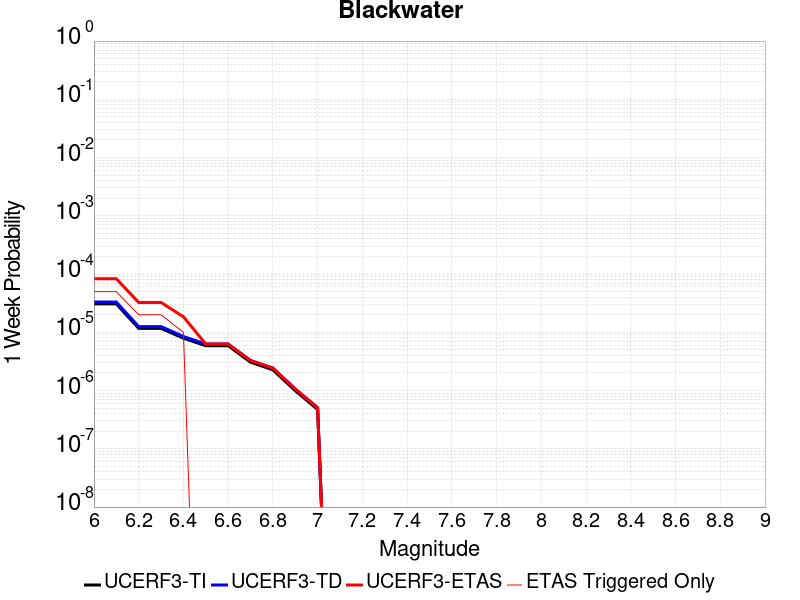 |  |  |  |

| Magnitude | 1 wk TI Prob | 1 wk TD Prob | 1 wk ETAS Prob | 1 wk ETAS/TD Gain | 1 wk ETAS Triggered Only | 1 mo TI Prob | 1 mo TD Prob | 1 mo ETAS Prob | 1 mo ETAS/TD Gain | 1 mo ETAS Triggered Only | 1 yr TI Prob | 1 yr TD Prob | 1 yr ETAS Prob | 1 yr ETAS/TD Gain | 1 yr ETAS Triggered Only | 10 yr TI Prob | 10 yr TD Prob | 10 yr ETAS Prob | 10 yr ETAS/TD Gain | 10 yr ETAS Triggered Only |
|-----|-----|-----|-----|-----|-----|-----|-----|-----|-----|-----|-----|-----|-----|-----|-----|-----|-----|-----|-----|-----|
| 6.0 | 3.0708583E-5 | 3.3097214E-5 | 1.0351411E-4 | 3.1275778 | 7.041923E-5 | 1.3160157E-4 | 1.4183826E-4 | 2.59187E-4 | 1.8273419 | 1.1736538E-4 | 0.0016010714 | 0.0017256497 | 0.002147436 | 1.2444217 | 4.2251538E-4 | 0.015895851 | 0.017136335 | 0.017920744 | 1.0457746 | 7.980846E-4 |
| 6.1 | 3.0708583E-5 | 3.3097214E-5 | 1.0351411E-4 | 3.1275778 | 7.041923E-5 | 1.3160157E-4 | 1.4183826E-4 | 2.59187E-4 | 1.8273419 | 1.1736538E-4 | 0.0016010714 | 0.0017256497 | 0.002147436 | 1.2444217 | 4.2251538E-4 | 0.015895851 | 0.017136335 | 0.017920744 | 1.0457746 | 7.980846E-4 |
| 6.2 | 1.1707779E-5 | 1.2545598E-5 | 1.2545598E-5 | 1.0 | 0.0 | 5.017523E-5 | 5.3765798E-5 | 7.723761E-5 | 1.4365566 | 2.3473076E-5 | 6.107122E-4 | 6.5441156E-4 | 7.717002E-4 | 1.1792276 | 1.1736538E-4 | 0.006090366 | 0.0065258164 | 0.006828975 | 1.0464553 | 3.0515E-4 |
| 6.3 | 1.1707779E-5 | 1.2545598E-5 | 1.2545598E-5 | 1.0 | 0.0 | 5.017523E-5 | 5.3765798E-5 | 7.723761E-5 | 1.4365566 | 2.3473076E-5 | 6.107122E-4 | 6.5441156E-4 | 7.717002E-4 | 1.1792276 | 1.1736538E-4 | 0.006090366 | 0.0065258164 | 0.006828975 | 1.0464553 | 3.0515E-4 |
| 6.4 | 7.929244E-6 | 8.4804105E-6 | 8.4804105E-6 | 1.0 | 0.0 | 3.3982033E-5 | 3.6344132E-5 | 3.6344132E-5 | 1.0 | 0.0 | 4.136527E-4 | 4.4240404E-4 | 5.127921E-4 | 1.1591036 | 7.041923E-5 | 0.0041288356 | 0.0044156383 | 0.0045792246 | 1.0370469 | 1.6431154E-4 |
| 6.5 | 5.8832115E-6 | 6.286219E-6 | 6.286219E-6 | 1.0 | 0.0 | 2.521352E-5 | 2.6940676E-5 | 2.6940676E-5 | 1.0 | 0.0 | 3.0693135E-4 | 3.279559E-4 | 3.9835204E-4 | 1.2146512 | 7.041923E-5 | 0.0030650778 | 0.0032749726 | 0.0033685574 | 1.0285758 | 9.3892304E-5 |
| 6.6 | 5.8832115E-6 | 6.286219E-6 | 6.286219E-6 | 1.0 | 0.0 | 2.521352E-5 | 2.6940676E-5 | 2.6940676E-5 | 1.0 | 0.0 | 3.0693135E-4 | 3.279559E-4 | 3.9835204E-4 | 1.2146512 | 7.041923E-5 | 0.0030650778 | 0.0032749726 | 0.0033685574 | 1.0285758 | 9.3892304E-5 |
| 6.7 | 3.0715053E-6 | 3.2815851E-6 | 3.2815851E-6 | 1.0 | 0.0 | 1.3163528E-5 | 1.4063868E-5 | 1.4063868E-5 | 1.0 | 0.0 | 1.6025416E-4 | 1.7121529E-4 | 1.9468435E-4 | 1.1370734 | 2.3473076E-5 | 0.0016013865 | 0.0017109484 | 0.0017578142 | 1.0273917 | 4.6946152E-5 |
| 6.8 | 2.2722281E-6 | 2.4288424E-6 | 2.4288424E-6 | 1.0 | 0.0 | 9.738084E-6 | 1.0409289E-5 | 1.0409289E-5 | 1.0 | 0.0 | 1.1855473E-4 | 1.2672663E-4 | 1.5019673E-4 | 1.1852026 | 2.3473076E-5 | 0.001184915 | 0.0012666339 | 0.0013135205 | 1.0370167 | 4.6946152E-5 |
| 6.9 | 9.952399E-7 | 1.0653887E-6 | 1.0653887E-6 | 1.0 | 0.0 | 4.265307E-6 | 4.5659463E-6 | 4.5659463E-6 | 1.0 | 0.0 | 5.1928873E-5 | 5.5589495E-5 | 7.906127E-5 | 1.4222339 | 2.3473076E-5 | 5.191674E-4 | 5.558065E-4 | 5.792666E-4 | 1.042209 | 2.3473076E-5 |
| 7.0 | 4.7385504E-7 | 5.075751E-7 | 5.075751E-7 | 1.0 | 0.0 | 2.0308057E-6 | 2.175322E-6 | 2.175322E-6 | 1.0 | 0.0 | 2.4724779E-5 | 2.6484544E-5 | 2.6484544E-5 | 1.0 | 0.0 | 2.4722028E-4 | 2.6484544E-4 | 2.6484544E-4 | 1.0 | 0.0 |

## Ash Hill
*[(top)](#table-of-contents)*

| 1 Week | 1 Month | 1 Year | 10 Year |
|-----|-----|-----|-----|
|  |  |  |  |

| Magnitude | 1 wk TI Prob | 1 wk TD Prob | 1 wk ETAS Prob | 1 wk ETAS/TD Gain | 1 wk ETAS Triggered Only | 1 mo TI Prob | 1 mo TD Prob | 1 mo ETAS Prob | 1 mo ETAS/TD Gain | 1 mo ETAS Triggered Only | 1 yr TI Prob | 1 yr TD Prob | 1 yr ETAS Prob | 1 yr ETAS/TD Gain | 1 yr ETAS Triggered Only | 10 yr TI Prob | 10 yr TD Prob | 10 yr ETAS Prob | 10 yr ETAS/TD Gain | 10 yr ETAS Triggered Only |
|-----|-----|-----|-----|-----|-----|-----|-----|-----|-----|-----|-----|-----|-----|-----|-----|-----|-----|-----|-----|-----|
| 6.0 | 2.1545662E-5 | 2.3195389E-5 | 7.014045E-5 | 3.0238965 | 4.6946152E-5 | 9.2335285E-5 | 9.940547E-5 | 1.6981771E-4 | 1.7083335 | 7.041923E-5 | 0.0011236023 | 0.0012096697 | 0.0013972272 | 1.1550485 | 1.8778461E-4 | 0.011179381 | 0.012038835 | 0.012595407 | 1.0462314 | 5.633538E-4 |
| 6.1 | 2.1545662E-5 | 2.3195389E-5 | 7.014045E-5 | 3.0238965 | 4.6946152E-5 | 9.2335285E-5 | 9.940547E-5 | 1.6981771E-4 | 1.7083335 | 7.041923E-5 | 0.0011236023 | 0.0012096697 | 0.0013972272 | 1.1550485 | 1.8778461E-4 | 0.011179381 | 0.012038835 | 0.012595407 | 1.0462314 | 5.633538E-4 |
| 6.2 | 2.1545662E-5 | 2.3195389E-5 | 7.014045E-5 | 3.0238965 | 4.6946152E-5 | 9.2335285E-5 | 9.940547E-5 | 1.6981771E-4 | 1.7083335 | 7.041923E-5 | 0.0011236023 | 0.0012096697 | 0.0013972272 | 1.1550485 | 1.8778461E-4 | 0.011179381 | 0.012038835 | 0.012595407 | 1.0462314 | 5.633538E-4 |
| 6.3 | 1.0025529E-5 | 1.0747344E-5 | 5.7692992E-5 | 5.368116 | 4.6946152E-5 | 4.2965847E-5 | 4.605931E-5 | 9.30033E-5 | 2.0192075 | 4.6946152E-5 | 5.229836E-4 | 5.6064106E-4 | 6.779406E-4 | 1.209224 | 1.1736538E-4 | 0.005217545 | 0.0055935793 | 0.005943706 | 1.0625944 | 3.5209613E-4 |
| 6.4 | 1.0025529E-5 | 1.0747344E-5 | 5.7692992E-5 | 5.368116 | 4.6946152E-5 | 4.2965847E-5 | 4.605931E-5 | 9.30033E-5 | 2.0192075 | 4.6946152E-5 | 5.229836E-4 | 5.6064106E-4 | 6.779406E-4 | 1.209224 | 1.1736538E-4 | 0.005217545 | 0.0055935793 | 0.005943706 | 1.0625944 | 3.5209613E-4 |
| 6.5 | 6.9617327E-6 | 7.4569152E-6 | 5.4402717E-5 | 7.295606 | 4.6946152E-5 | 2.9835655E-5 | 3.1957865E-5 | 7.890252E-5 | 2.4689546 | 4.6946152E-5 | 3.6318856E-4 | 3.8902622E-4 | 4.5941805E-4 | 1.1809437 | 7.041923E-5 | 0.0036259557 | 0.0038843066 | 0.0041181254 | 1.0601958 | 2.3473076E-4 |
| 6.6 | 4.9919777E-6 | 5.34689E-6 | 5.229279E-5 | 9.780039 | 4.6946152E-5 | 2.1394015E-5 | 2.291508E-5 | 6.986016E-5 | 3.0486543 | 4.6946152E-5 | 2.60441E-4 | 2.7896208E-4 | 3.2589512E-4 | 1.1682417 | 4.6946152E-5 | 0.0026013597 | 0.0027867774 | 0.002950631 | 1.0587968 | 1.6431154E-4 |
| 6.7 | 3.6630722E-6 | 3.9247725E-6 | 2.7397757E-5 | 6.980725 | 2.3473076E-5 | 1.5698786E-5 | 1.6820377E-5 | 4.029306E-5 | 2.395491 | 2.3473076E-5 | 1.9111596E-4 | 2.0477458E-4 | 2.2824285E-4 | 1.1146054 | 2.3473076E-5 | 0.0019095168 | 0.002046422 | 0.0021401222 | 1.0457873 | 9.3892304E-5 |
| 6.8 | 2.5599613E-6 | 2.7450303E-6 | 2.6218042E-5 | 9.551094 | 2.3473076E-5 | 1.0971216E-5 | 1.176439E-5 | 3.523719E-5 | 2.9952414 | 2.3473076E-5 | 1.3356637E-4 | 1.4322698E-4 | 1.666967E-4 | 1.1638638 | 2.3473076E-5 | 0.0013348613 | 0.0014318317 | 0.0015021502 | 1.0491108 | 7.041923E-5 |
| 6.9 | 1.7684905E-6 | 1.8969438E-6 | 2.5369976E-5 | 13.374131 | 2.3473076E-5 | 7.579223E-6 | 8.129759E-6 | 3.1602645E-5 | 3.8872793 | 2.3473076E-5 | 9.2273134E-5 | 9.897981E-5 | 1.2245057E-4 | 1.2371267 | 2.3473076E-5 | 9.223483E-4 | 9.897981E-4 | 0.0010366979 | 1.0473831 | 4.6946152E-5 |

## San Andreas (Mojave S)
*[(top)](#table-of-contents)*

| 1 Week | 1 Month | 1 Year | 10 Year |
|-----|-----|-----|-----|
| 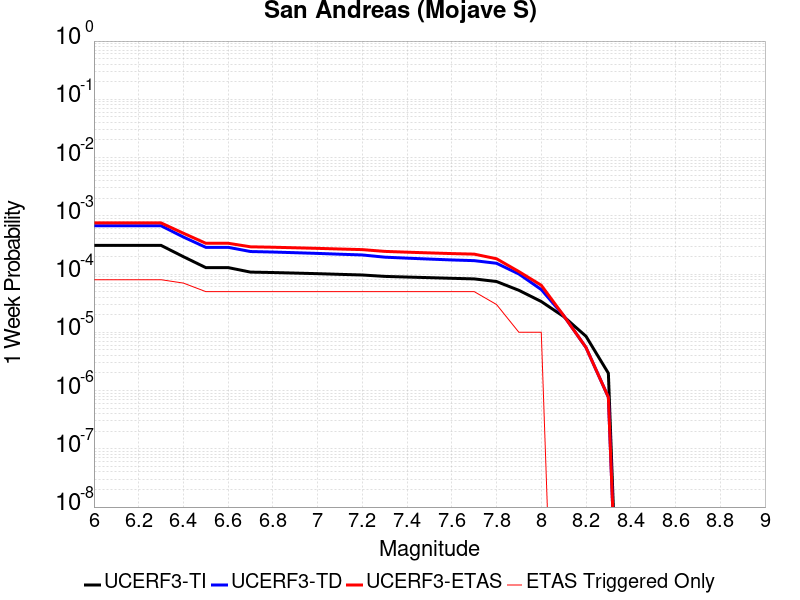 |  |  |  |

| Magnitude | 1 wk TI Prob | 1 wk TD Prob | 1 wk ETAS Prob | 1 wk ETAS/TD Gain | 1 wk ETAS Triggered Only | 1 mo TI Prob | 1 mo TD Prob | 1 mo ETAS Prob | 1 mo ETAS/TD Gain | 1 mo ETAS Triggered Only | 1 yr TI Prob | 1 yr TD Prob | 1 yr ETAS Prob | 1 yr ETAS/TD Gain | 1 yr ETAS Triggered Only | 10 yr TI Prob | 10 yr TD Prob | 10 yr ETAS Prob | 10 yr ETAS/TD Gain | 10 yr ETAS Triggered Only |
|-----|-----|-----|-----|-----|-----|-----|-----|-----|-----|-----|-----|-----|-----|-----|-----|-----|-----|-----|-----|-----|
| 6.0 | 3.1064058E-4 | 6.7499664E-4 | 7.219111E-4 | 1.0695033 | 4.6946152E-5 | 0.0013306376 | 0.0028897638 | 0.0029365744 | 1.0161988 | 4.6946152E-5 | 0.016080605 | 0.034641396 | 0.03495864 | 1.0091578 | 3.2862308E-4 | 0.1496549 | 0.2867374 | 0.287089 | 1.0012262 | 4.929346E-4 |
| 6.1 | 3.1064058E-4 | 6.7499664E-4 | 7.219111E-4 | 1.0695033 | 4.6946152E-5 | 0.0013306376 | 0.0028897638 | 0.0029365744 | 1.0161988 | 4.6946152E-5 | 0.016080605 | 0.034641396 | 0.03495864 | 1.0091578 | 3.2862308E-4 | 0.1496549 | 0.2867374 | 0.287089 | 1.0012262 | 4.929346E-4 |
| 6.2 | 3.1064058E-4 | 6.7499664E-4 | 7.219111E-4 | 1.0695033 | 4.6946152E-5 | 0.0013306376 | 0.0028897638 | 0.0029365744 | 1.0161988 | 4.6946152E-5 | 0.016080605 | 0.034641396 | 0.03495864 | 1.0091578 | 3.2862308E-4 | 0.1496549 | 0.2867374 | 0.287089 | 1.0012262 | 4.929346E-4 |
| 6.3 | 3.1064058E-4 | 6.7499664E-4 | 7.219111E-4 | 1.0695033 | 4.6946152E-5 | 0.0013306376 | 0.0028897638 | 0.0029365744 | 1.0161988 | 4.6946152E-5 | 0.016080605 | 0.034641396 | 0.03495864 | 1.0091578 | 3.2862308E-4 | 0.1496549 | 0.2867374 | 0.287089 | 1.0012262 | 4.929346E-4 |
| 6.4 | 1.9872203E-4 | 4.3216298E-4 | 4.556259E-4 | 1.0542918 | 2.3473076E-5 | 8.5138786E-4 | 0.0018508406 | 0.0018742703 | 1.012659 | 2.3473076E-5 | 0.010316478 | 0.022307295 | 0.022559738 | 1.0113167 | 2.5820383E-4 | 0.098504856 | 0.19713911 | 0.19745949 | 1.0016252 | 3.990423E-4 |
| 6.5 | 1.291105E-4 | 2.8787713E-4 | 2.8787713E-4 | 1.0 | 0.0 | 5.5321335E-4 | 0.0012331787 | 0.0012331787 | 1.0 | 0.0 | 0.006714592 | 0.014911419 | 0.015119527 | 1.0139563 | 2.1125769E-4 | 0.065152965 | 0.13817947 | 0.13844246 | 1.0019032 | 3.0515E-4 |
| 6.6 | 1.291105E-4 | 2.8787713E-4 | 2.8787713E-4 | 1.0 | 0.0 | 5.5321335E-4 | 0.0012331787 | 0.0012331787 | 1.0 | 0.0 | 0.006714592 | 0.014911419 | 0.015119527 | 1.0139563 | 2.1125769E-4 | 0.065152965 | 0.13817947 | 0.13844246 | 1.0019032 | 3.0515E-4 |
| 6.7 | 1.08001186E-4 | 2.4368397E-4 | 2.4368397E-4 | 1.0 | 0.0 | 4.6278012E-4 | 0.0010439424 | 0.0010439424 | 1.0 | 0.0 | 0.0056198016 | 0.012636229 | 0.012844817 | 1.0165071 | 2.1125769E-4 | 0.054797906 | 0.119323194 | 0.11959193 | 1.0022522 | 3.0515E-4 |
| 6.8 | 1.0624356E-4 | 2.3885963E-4 | 2.3885963E-4 | 1.0 | 0.0 | 4.5525006E-4 | 0.001023283 | 0.001023283 | 1.0 | 0.0 | 0.0055285925 | 0.012387579 | 0.01259622 | 1.0168427 | 2.1125769E-4 | 0.053930566 | 0.11727233 | 0.11754169 | 1.0022969 | 3.0515E-4 |
| 6.9 | 1.0393785E-4 | 2.3256175E-4 | 2.3256175E-4 | 1.0 | 0.0 | 4.4537184E-4 | 9.963129E-4 | 9.963129E-4 | 1.0 | 0.0 | 0.0054089287 | 0.012062895 | 0.012271604 | 1.0173018 | 2.1125769E-4 | 0.05279156 | 0.114569746 | 0.11483994 | 1.0023583 | 3.0515E-4 |
| 7.0 | 1.0155622E-4 | 2.262555E-4 | 2.262555E-4 | 1.0 | 0.0 | 4.3516833E-4 | 9.693065E-4 | 9.693065E-4 | 1.0 | 0.0 | 0.005285311 | 0.011737675 | 0.011946453 | 1.017787 | 2.1125769E-4 | 0.05161361 | 0.11182977 | 0.112100795 | 1.0024235 | 3.0515E-4 |
| 7.1 | 9.885595E-5 | 2.191377E-4 | 2.191377E-4 | 1.0 | 0.0 | 4.2359953E-4 | 9.388239E-4 | 9.388239E-4 | 1.0 | 0.0 | 0.0051451353 | 0.011370476 | 0.011579332 | 1.0183682 | 2.1125769E-4 | 0.05027629 | 0.10871404 | 0.10898601 | 1.0025017 | 3.0515E-4 |
| 7.2 | 9.6411415E-5 | 2.1276584E-4 | 2.1276584E-4 | 1.0 | 0.0 | 4.1312634E-4 | 9.115353E-4 | 9.115353E-4 | 1.0 | 0.0 | 0.005018219 | 0.0110416515 | 0.011250577 | 1.0189215 | 2.1125769E-4 | 0.049064007 | 0.10590357 | 0.106176406 | 1.0025762 | 3.0515E-4 |
| 7.3 | 9.1180635E-5 | 1.950402E-4 | 1.950402E-4 | 1.0 | 0.0 | 3.907156E-4 | 8.356189E-4 | 8.356189E-4 | 1.0 | 0.0 | 0.004746591 | 0.010126315 | 0.010335433 | 1.020651 | 2.1125769E-4 | 0.046464786 | 0.09809433 | 0.098369546 | 1.0028056 | 3.0515E-4 |
| 7.4 | 8.887388E-5 | 1.8752231E-4 | 1.8752231E-4 | 1.0 | 0.0 | 3.8083247E-4 | 8.0341956E-4 | 8.0341956E-4 | 1.0 | 0.0 | 0.0046267817 | 0.00973786 | 0.009947061 | 1.0214832 | 2.1125769E-4 | 0.045316286 | 0.09472819 | 0.095004424 | 1.0029162 | 3.0515E-4 |
| 7.5 | 8.6750515E-5 | 1.8083451E-4 | 1.8083451E-4 | 1.0 | 0.0 | 3.7173493E-4 | 7.7477493E-4 | 7.7477493E-4 | 1.0 | 0.0 | 0.004516484 | 0.009392173 | 0.009601446 | 1.0222816 | 2.1125769E-4 | 0.04425787 | 0.09169095 | 0.09196813 | 1.0030229 | 3.0515E-4 |
| 7.6 | 8.453092E-5 | 1.747065E-4 | 1.747065E-4 | 1.0 | 0.0 | 3.6222505E-4 | 7.485273E-4 | 7.485273E-4 | 1.0 | 0.0 | 0.0044011753 | 0.009075315 | 0.009284655 | 1.023067 | 2.1125769E-4 | 0.04315024 | 0.08884873 | 0.08912677 | 1.0031294 | 3.0515E-4 |
| 7.7 | 8.259102E-5 | 1.6992437E-4 | 1.6992437E-4 | 1.0 | 0.0 | 3.539135E-4 | 7.280441E-4 | 7.280441E-4 | 1.0 | 0.0 | 0.004300386 | 0.008827981 | 0.009037374 | 1.0237192 | 2.1125769E-4 | 0.042181134 | 0.08659836 | 0.086877085 | 1.0032185 | 3.0515E-4 |
| 7.8 | 7.444844E-5 | 1.531194E-4 | 1.531194E-4 | 1.0 | 0.0 | 3.1902574E-4 | 6.56061E-4 | 6.56061E-4 | 1.0 | 0.0 | 0.0038772223 | 0.007958339 | 0.008167915 | 1.0263342 | 2.1125769E-4 | 0.03810269 | 0.07841811 | 0.078699335 | 1.0035862 | 3.0515E-4 |
| 7.9 | 5.2586525E-5 | 1.0025827E-4 | 1.0025827E-4 | 1.0 | 0.0 | 2.2535135E-4 | 4.2960755E-4 | 4.2960755E-4 | 1.0 | 0.0 | 0.0027402006 | 0.005217939 | 0.0053580427 | 1.0268503 | 1.4083846E-4 | 0.027066574 | 0.052290585 | 0.052446302 | 1.002978 | 1.6431154E-4 |
| 8.0 | 3.379877E-5 | 5.418614E-5 | 5.418614E-5 | 1.0 | 0.0 | 1.4484383E-4 | 2.3220567E-4 | 2.3220567E-4 | 1.0 | 0.0 | 0.0017620471 | 0.0028234406 | 0.0028702542 | 1.0165803 | 4.6946152E-5 | 0.017481409 | 0.028889727 | 0.028958112 | 1.0023671 | 7.041923E-5 |
| 8.1 | 1.8668277E-5 | 1.936222E-5 | 1.936222E-5 | 1.0 | 0.0 | 8.000444E-5 | 8.29783E-5 | 8.29783E-5 | 1.0 | 0.0 | 9.736188E-4 | 0.0010097933 | 0.0010332427 | 1.023222 | 2.3473076E-5 | 0.009693642 | 0.010826511 | 0.01084973 | 1.0021447 | 2.3473076E-5 |
| 8.2 | 8.541571E-6 | 5.4811067E-6 | 5.4811067E-6 | 1.0 | 0.0 | 3.660622E-5 | 2.3490245E-5 | 2.3490245E-5 | 1.0 | 0.0 | 4.455896E-4 | 2.8595628E-4 | 2.8595628E-4 | 1.0 | 0.0 | 0.0044469717 | 0.0032518986 | 0.0032518986 | 1.0 | 0.0 |
| 8.3 | 1.983087E-6 | 7.693574E-7 | 7.693574E-7 | 1.0 | 0.0 | 8.498917E-6 | 3.297242E-6 | 3.297242E-6 | 1.0 | 0.0 | 1.034694E-4 | 4.01432E-5 | 4.01432E-5 | 1.0 | 0.0 | 0.0010342124 | 4.7390026E-4 | 4.7390026E-4 | 1.0 | 0.0 |

## San Andreas (Mojave N)
*[(top)](#table-of-contents)*

| 1 Week | 1 Month | 1 Year | 10 Year |
|-----|-----|-----|-----|
|  |  | 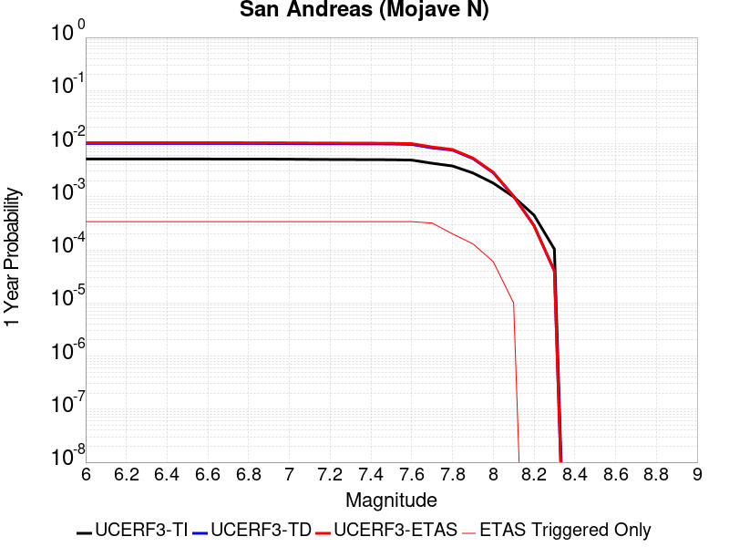 |  |

| Magnitude | 1 wk TI Prob | 1 wk TD Prob | 1 wk ETAS Prob | 1 wk ETAS/TD Gain | 1 wk ETAS Triggered Only | 1 mo TI Prob | 1 mo TD Prob | 1 mo ETAS Prob | 1 mo ETAS/TD Gain | 1 mo ETAS Triggered Only | 1 yr TI Prob | 1 yr TD Prob | 1 yr ETAS Prob | 1 yr ETAS/TD Gain | 1 yr ETAS Triggered Only | 10 yr TI Prob | 10 yr TD Prob | 10 yr ETAS Prob | 10 yr ETAS/TD Gain | 10 yr ETAS Triggered Only |
|-----|-----|-----|-----|-----|-----|-----|-----|-----|-----|-----|-----|-----|-----|-----|-----|-----|-----|-----|-----|-----|
| 6.0 | 9.877682E-5 | 1.9435467E-4 | 1.9435467E-4 | 1.0 | 0.0 | 4.2326056E-4 | 8.326828E-4 | 8.7958993E-4 | 1.0563325 | 4.6946152E-5 | 0.0051410277 | 0.010090916 | 0.010392987 | 1.0299349 | 3.0515E-4 | 0.05023708 | 0.09846656 | 0.09884747 | 1.0038685 | 4.2251538E-4 |
| 6.1 | 9.877682E-5 | 1.9435467E-4 | 1.9435467E-4 | 1.0 | 0.0 | 4.2326056E-4 | 8.326828E-4 | 8.7958993E-4 | 1.0563325 | 4.6946152E-5 | 0.0051410277 | 0.010090916 | 0.010392987 | 1.0299349 | 3.0515E-4 | 0.05023708 | 0.09846656 | 0.09884747 | 1.0038685 | 4.2251538E-4 |
| 6.2 | 9.877682E-5 | 1.9435467E-4 | 1.9435467E-4 | 1.0 | 0.0 | 4.2326056E-4 | 8.326828E-4 | 8.7958993E-4 | 1.0563325 | 4.6946152E-5 | 0.0051410277 | 0.010090916 | 0.010392987 | 1.0299349 | 3.0515E-4 | 0.05023708 | 0.09846656 | 0.09884747 | 1.0038685 | 4.2251538E-4 |
| 6.3 | 9.877682E-5 | 1.9435467E-4 | 1.9435467E-4 | 1.0 | 0.0 | 4.2326056E-4 | 8.326828E-4 | 8.7958993E-4 | 1.0563325 | 4.6946152E-5 | 0.0051410277 | 0.010090916 | 0.010392987 | 1.0299349 | 3.0515E-4 | 0.05023708 | 0.09846656 | 0.09884747 | 1.0038685 | 4.2251538E-4 |
| 6.4 | 9.877682E-5 | 1.9435467E-4 | 1.9435467E-4 | 1.0 | 0.0 | 4.2326056E-4 | 8.326828E-4 | 8.7958993E-4 | 1.0563325 | 4.6946152E-5 | 0.0051410277 | 0.010090916 | 0.010392987 | 1.0299349 | 3.0515E-4 | 0.05023708 | 0.09846656 | 0.09884747 | 1.0038685 | 4.2251538E-4 |
| 6.5 | 9.861474E-5 | 1.9409222E-4 | 1.9409222E-4 | 1.0 | 0.0 | 4.2256617E-4 | 8.3155883E-4 | 8.7846594E-4 | 1.0564086 | 4.6946152E-5 | 0.0051326132 | 0.010077358 | 0.010379433 | 1.0299757 | 3.0515E-4 | 0.050156746 | 0.09834433 | 0.0987253 | 1.0038738 | 4.2251538E-4 |
| 6.6 | 9.861474E-5 | 1.9409222E-4 | 1.9409222E-4 | 1.0 | 0.0 | 4.2256617E-4 | 8.3155883E-4 | 8.7846594E-4 | 1.0564086 | 4.6946152E-5 | 0.0051326132 | 0.010077358 | 0.010379433 | 1.0299757 | 3.0515E-4 | 0.050156746 | 0.09834433 | 0.0987253 | 1.0038738 | 4.2251538E-4 |
| 6.7 | 9.8552715E-5 | 1.9399171E-4 | 1.9399171E-4 | 1.0 | 0.0 | 4.223004E-4 | 8.3112833E-4 | 8.7803544E-4 | 1.0564378 | 4.6946152E-5 | 0.0051293927 | 0.010072165 | 0.0103742415 | 1.0299913 | 3.0515E-4 | 0.050125998 | 0.09829751 | 0.09867849 | 1.0038759 | 4.2251538E-4 |
| 6.8 | 9.8464974E-5 | 1.9384324E-4 | 1.9384324E-4 | 1.0 | 0.0 | 4.219245E-4 | 8.304924E-4 | 8.773996E-4 | 1.0564811 | 4.6946152E-5 | 0.0051248376 | 0.010064495 | 0.010366573 | 1.0300143 | 3.0515E-4 | 0.05008251 | 0.0982275 | 0.098608516 | 1.0038788 | 4.2251538E-4 |
| 6.9 | 9.825824E-5 | 1.9352314E-4 | 1.9352314E-4 | 1.0 | 0.0 | 4.2103877E-4 | 8.2912145E-4 | 8.760287E-4 | 1.0565746 | 4.6946152E-5 | 0.0051141046 | 0.010047957 | 0.010350041 | 1.0300642 | 3.0515E-4 | 0.049980022 | 0.098076545 | 0.09845762 | 1.0038855 | 4.2251538E-4 |
| 7.0 | 9.781462E-5 | 1.928364E-4 | 1.928364E-4 | 1.0 | 0.0 | 4.1913814E-4 | 8.2618016E-4 | 8.730875E-4 | 1.0567762 | 4.6946152E-5 | 0.005091073 | 0.010012477 | 0.010314572 | 1.0301719 | 3.0515E-4 | 0.04976007 | 0.0977528 | 0.09813402 | 1.0038998 | 4.2251538E-4 |
| 7.1 | 9.7121134E-5 | 1.9185297E-4 | 1.9185297E-4 | 1.0 | 0.0 | 4.1616702E-4 | 8.2196813E-4 | 8.688757E-4 | 1.0570674 | 4.6946152E-5 | 0.005055068 | 0.009961666 | 0.0102637755 | 1.0303273 | 3.0515E-4 | 0.04941613 | 0.09728914 | 0.09767055 | 1.0039203 | 4.2251538E-4 |
| 7.2 | 9.663819E-5 | 1.9116043E-4 | 1.9116043E-4 | 1.0 | 0.0 | 4.1409794E-4 | 8.19002E-4 | 8.659097E-4 | 1.0572742 | 4.6946152E-5 | 0.0050299936 | 0.009925882 | 0.010228003 | 1.0304377 | 3.0515E-4 | 0.049176537 | 0.09696228 | 0.097343825 | 1.003935 | 4.2251538E-4 |
| 7.3 | 9.6277574E-5 | 1.9068507E-4 | 1.9068507E-4 | 1.0 | 0.0 | 4.125529E-4 | 8.16966E-4 | 8.6387375E-4 | 1.057417 | 4.6946152E-5 | 0.0050112694 | 0.00990132 | 0.010203448 | 1.030514 | 3.0515E-4 | 0.04899759 | 0.09673555 | 0.09711719 | 1.0039452 | 4.2251538E-4 |
| 7.4 | 9.593308E-5 | 1.9008234E-4 | 1.9008234E-4 | 1.0 | 0.0 | 4.1107697E-4 | 8.1438443E-4 | 8.6129236E-4 | 1.0575992 | 4.6946152E-5 | 0.0049933824 | 0.009870174 | 0.010172313 | 1.0306113 | 3.0515E-4 | 0.04882661 | 0.09645354 | 0.09683531 | 1.003958 | 4.2251538E-4 |
| 7.5 | 9.561707E-5 | 1.8954265E-4 | 1.8954265E-4 | 1.0 | 0.0 | 4.0972308E-4 | 8.12073E-4 | 8.58981E-4 | 1.0577633 | 4.6946152E-5 | 0.0049769743 | 0.009842287 | 0.010144434 | 1.0306988 | 3.0515E-4 | 0.048669744 | 0.09619955 | 0.09658142 | 1.0039696 | 4.2251538E-4 |
| 7.6 | 9.418194E-5 | 1.8606246E-4 | 1.8606246E-4 | 1.0 | 0.0 | 4.0357444E-4 | 7.97167E-4 | 8.4407575E-4 | 1.0588443 | 4.6946152E-5 | 0.004902454 | 0.00966243 | 0.009964632 | 1.031276 | 3.0515E-4 | 0.047957025 | 0.09458092 | 0.094963476 | 1.0040448 | 4.2251538E-4 |
| 7.7 | 8.202141E-5 | 1.6052493E-4 | 1.6052493E-4 | 1.0 | 0.0 | 3.51473E-4 | 6.877826E-4 | 7.3469646E-4 | 1.0682104 | 4.6946152E-5 | 0.00427079 | 0.00834166 | 0.008620987 | 1.0334858 | 2.816769E-4 | 0.04189639 | 0.082371704 | 0.08273788 | 1.0044453 | 3.990423E-4 |
| 7.8 | 7.2859846E-5 | 1.4544492E-4 | 1.4544492E-4 | 1.0 | 0.0 | 3.1221908E-4 | 6.231865E-4 | 6.231865E-4 | 1.0 | 0.0 | 0.003794643 | 0.0075609423 | 0.0077706026 | 1.0277294 | 2.1125769E-4 | 0.037304975 | 0.07485102 | 0.07513333 | 1.0037717 | 3.0515E-4 |
| 7.9 | 5.3874453E-5 | 1.0065284E-4 | 1.0065284E-4 | 1.0 | 0.0 | 2.3087008E-4 | 4.3129802E-4 | 4.3129802E-4 | 1.0 | 0.0 | 0.0028072202 | 0.0052384217 | 0.0053785224 | 1.0267448 | 1.4083846E-4 | 0.02772022 | 0.05251603 | 0.052671712 | 1.0029645 | 1.6431154E-4 |
| 8.0 | 3.468538E-5 | 5.4373286E-5 | 5.4373286E-5 | 1.0 | 0.0 | 1.4864317E-4 | 2.3300757E-4 | 2.3300757E-4 | 1.0 | 0.0 | 0.0018082283 | 0.0028331785 | 0.0028799917 | 1.0165232 | 4.6946152E-5 | 0.017935853 | 0.02900292 | 0.029071297 | 1.0023576 | 7.041923E-5 |
| 8.1 | 1.9152367E-5 | 1.9455974E-5 | 1.9455974E-5 | 1.0 | 0.0 | 8.207899E-5 | 8.338009E-5 | 8.338009E-5 | 1.0 | 0.0 | 9.988535E-4 | 0.0010146805 | 0.0010381297 | 1.02311 | 2.3473076E-5 | 0.009943757 | 0.010884172 | 0.01090739 | 1.0021331 | 2.3473076E-5 |
| 8.2 | 8.643924E-6 | 5.49522E-6 | 5.49522E-6 | 1.0 | 0.0 | 3.704486E-5 | 2.355073E-5 | 2.355073E-5 | 1.0 | 0.0 | 4.5092785E-4 | 2.866925E-4 | 2.866925E-4 | 1.0 | 0.0 | 0.0045001395 | 0.0032598388 | 0.0032598388 | 1.0 | 0.0 |
| 8.3 | 1.983087E-6 | 7.693574E-7 | 7.693574E-7 | 1.0 | 0.0 | 8.498917E-6 | 3.297242E-6 | 3.297242E-6 | 1.0 | 0.0 | 1.034694E-4 | 4.01432E-5 | 4.01432E-5 | 1.0 | 0.0 | 0.0010342124 | 4.7390026E-4 | 4.7390026E-4 | 1.0 | 0.0 |

## Gravel Hills-Harper Lk
*[(top)](#table-of-contents)*

| 1 Week | 1 Month | 1 Year | 10 Year |
|-----|-----|-----|-----|
| 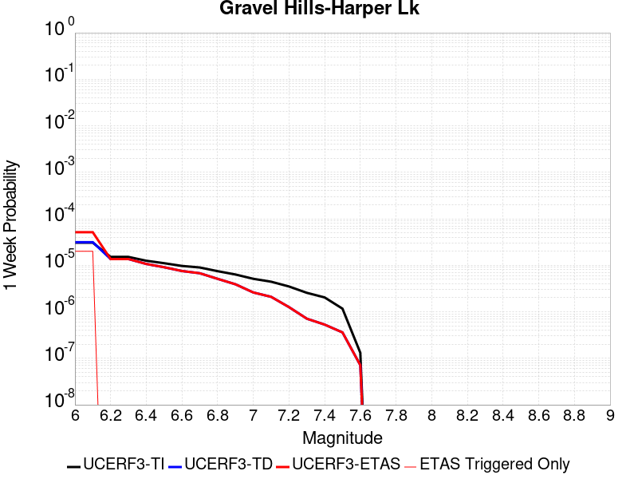 |  |  |  |

| Magnitude | 1 wk TI Prob | 1 wk TD Prob | 1 wk ETAS Prob | 1 wk ETAS/TD Gain | 1 wk ETAS Triggered Only | 1 mo TI Prob | 1 mo TD Prob | 1 mo ETAS Prob | 1 mo ETAS/TD Gain | 1 mo ETAS Triggered Only | 1 yr TI Prob | 1 yr TD Prob | 1 yr ETAS Prob | 1 yr ETAS/TD Gain | 1 yr ETAS Triggered Only | 10 yr TI Prob | 10 yr TD Prob | 10 yr ETAS Prob | 10 yr ETAS/TD Gain | 10 yr ETAS Triggered Only |
|-----|-----|-----|-----|-----|-----|-----|-----|-----|-----|-----|-----|-----|-----|-----|-----|-----|-----|-----|-----|-----|
| 6.0 | 3.0679566E-5 | 3.1466803E-5 | 3.1466803E-5 | 1.0 | 0.0 | 1.3147724E-4 | 1.3485197E-4 | 1.5832188E-4 | 1.174042 | 2.3473076E-5 | 0.0015995599 | 0.0016408027 | 0.0018048447 | 1.0999767 | 1.6431154E-4 | 0.015880952 | 0.01630845 | 0.016654802 | 1.0212377 | 3.5209613E-4 |
| 6.1 | 3.0679566E-5 | 3.1466803E-5 | 3.1466803E-5 | 1.0 | 0.0 | 1.3147724E-4 | 1.3485197E-4 | 1.5832188E-4 | 1.174042 | 2.3473076E-5 | 0.0015995599 | 0.0016408027 | 0.0018048447 | 1.0999767 | 1.6431154E-4 | 0.015880952 | 0.01630845 | 0.016654802 | 1.0212377 | 3.5209613E-4 |
| 6.2 | 1.514536E-5 | 1.363595E-5 | 1.363595E-5 | 1.0 | 0.0 | 6.490707E-5 | 5.8438545E-5 | 8.191025E-5 | 1.4016477 | 2.3473076E-5 | 7.8995706E-4 | 7.112689E-4 | 7.581817E-4 | 1.0659565 | 4.6946152E-5 | 0.007871548 | 0.007091126 | 0.0071843523 | 1.0131469 | 9.3892304E-5 |
| 6.3 | 1.514536E-5 | 1.363595E-5 | 1.363595E-5 | 1.0 | 0.0 | 6.490707E-5 | 5.8438545E-5 | 8.191025E-5 | 1.4016477 | 2.3473076E-5 | 7.8995706E-4 | 7.112689E-4 | 7.581817E-4 | 1.0659565 | 4.6946152E-5 | 0.007871548 | 0.007091126 | 0.0071843523 | 1.0131469 | 9.3892304E-5 |
| 6.4 | 1.2532521E-5 | 1.0690234E-5 | 1.0690234E-5 | 1.0 | 0.0 | 5.37097E-5 | 4.5814515E-5 | 6.9286514E-5 | 1.5123267 | 2.3473076E-5 | 6.537194E-4 | 5.576548E-4 | 5.811148E-4 | 1.042069 | 2.3473076E-5 | 0.0065179965 | 0.0055631446 | 0.005633172 | 1.0125878 | 7.041923E-5 |
| 6.5 | 1.1094058E-5 | 9.084107E-6 | 9.084107E-6 | 1.0 | 0.0 | 4.7545094E-5 | 3.8931328E-5 | 6.2403495E-5 | 1.602912 | 2.3473076E-5 | 5.787078E-4 | 4.7388987E-4 | 4.973518E-4 | 1.0495093 | 2.3473076E-5 | 0.0057720304 | 0.004729201 | 0.004799287 | 1.0148199 | 7.041923E-5 |
| 6.6 | 9.688328E-6 | 7.5320527E-6 | 7.5320527E-6 | 1.0 | 0.0 | 4.1520743E-5 | 3.227984E-5 | 5.575216E-5 | 1.727151 | 2.3473076E-5 | 5.053978E-4 | 3.9293873E-4 | 4.164026E-4 | 1.0597137 | 2.3473076E-5 | 0.0050424994 | 0.003922696 | 0.0039694584 | 1.0119209 | 4.6946152E-5 |
| 6.7 | 8.974824E-6 | 6.7497303E-6 | 6.7497303E-6 | 1.0 | 0.0 | 3.8462964E-5 | 2.8927108E-5 | 5.2399504E-5 | 1.8114326 | 2.3473076E-5 | 4.6818596E-4 | 3.5213283E-4 | 3.7559765E-4 | 1.0666362 | 2.3473076E-5 | 0.004672008 | 0.0035159695 | 0.0035627508 | 1.0133053 | 4.6946152E-5 |
| 6.8 | 7.4780046E-6 | 5.1164316E-6 | 5.1164316E-6 | 1.0 | 0.0 | 3.20482E-5 | 2.1927388E-5 | 2.1927388E-5 | 1.0 | 0.0 | 3.9011694E-4 | 2.6693463E-4 | 2.6693463E-4 | 1.0 | 0.0 | 0.0038943281 | 0.0026662783 | 0.0026896887 | 1.0087802 | 2.3473076E-5 |
| 6.9 | 6.3409307E-6 | 3.907683E-6 | 3.907683E-6 | 1.0 | 0.0 | 2.7175134E-5 | 1.674711E-5 | 1.674711E-5 | 1.0 | 0.0 | 3.3080703E-4 | 2.0387798E-4 | 2.0387798E-4 | 1.0 | 0.0 | 0.0033031502 | 0.0020370076 | 0.0020370076 | 1.0 | 0.0 |
| 7.0 | 5.1239335E-6 | 2.6059872E-6 | 2.6059872E-6 | 1.0 | 0.0 | 2.195953E-5 | 1.116847E-5 | 1.116847E-5 | 1.0 | 0.0 | 2.6732447E-4 | 1.3596789E-4 | 1.3596789E-4 | 1.0 | 0.0 | 0.0026700313 | 0.0013588723 | 0.0013588723 | 1.0 | 0.0 |
| 7.1 | 4.438899E-6 | 2.0985822E-6 | 2.0985822E-6 | 1.0 | 0.0 | 1.9023713E-5 | 8.993894E-6 | 8.993894E-6 | 1.0 | 0.0 | 2.315891E-4 | 1.0949538E-4 | 1.0949538E-4 | 1.0 | 0.0 | 0.002313479 | 0.0010944362 | 0.0010944362 | 1.0 | 0.0 |
| 7.2 | 3.50367E-6 | 1.2616524E-6 | 1.2616524E-6 | 1.0 | 0.0 | 1.5015643E-5 | 5.407071E-6 | 5.407071E-6 | 1.0 | 0.0 | 1.8280011E-4 | 6.582918E-5 | 6.582918E-5 | 1.0 | 0.0 | 0.0018264982 | 6.5810507E-4 | 6.5810507E-4 | 1.0 | 0.0 |
| 7.3 | 2.561638E-6 | 7.11978E-7 | 7.11978E-7 | 1.0 | 0.0 | 1.0978401E-5 | 3.0513306E-6 | 3.0513306E-6 | 1.0 | 0.0 | 1.3365384E-4 | 3.7149337E-5 | 3.7149337E-5 | 1.0 | 0.0 | 0.0013357349 | 3.7143327E-4 | 3.7143327E-4 | 1.0 | 0.0 |
| 7.4 | 2.0368864E-6 | 5.3053367E-7 | 5.3053367E-7 | 1.0 | 0.0 | 8.729483E-6 | 2.2737138E-6 | 2.2737138E-6 | 1.0 | 0.0 | 1.06276275E-4 | 2.768212E-5 | 2.768212E-5 | 1.0 | 0.0 | 0.0010622547 | 2.7678726E-4 | 2.7678726E-4 | 1.0 | 0.0 |
| 7.5 | 1.1681728E-6 | 3.6033393E-7 | 3.6033393E-7 | 1.0 | 0.0 | 5.0064455E-6 | 1.5442874E-6 | 1.5442874E-6 | 1.0 | 0.0 | 6.0951766E-5 | 1.8801542E-5 | 1.8801542E-5 | 1.0 | 0.0 | 6.093505E-4 | 1.8799998E-4 | 1.8799998E-4 | 1.0 | 0.0 |
| 7.6 | 1.3154387E-7 | 7.12009E-8 | 7.12009E-8 | 1.0 | 0.0 | 5.6375933E-7 | 3.051467E-7 | 3.051467E-7 | 1.0 | 0.0 | 6.863748E-6 | 3.7151563E-6 | 3.7151563E-6 | 1.0 | 0.0 | 6.863536E-5 | 3.7151098E-5 | 3.7151098E-5 | 1.0 | 0.0 |

## McLean Lake
*[(top)](#table-of-contents)*

| 1 Week | 1 Month | 1 Year | 10 Year |
|-----|-----|-----|-----|
|  | 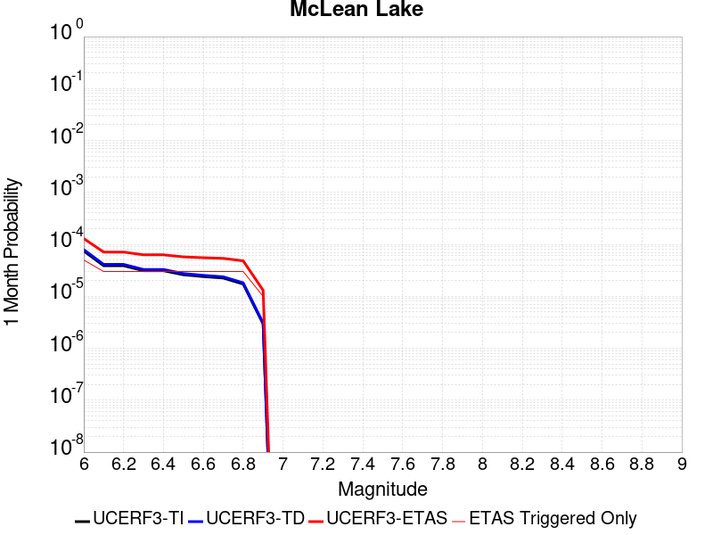 |  |  |

| Magnitude | 1 wk TI Prob | 1 wk TD Prob | 1 wk ETAS Prob | 1 wk ETAS/TD Gain | 1 wk ETAS Triggered Only | 1 mo TI Prob | 1 mo TD Prob | 1 mo ETAS Prob | 1 mo ETAS/TD Gain | 1 mo ETAS Triggered Only | 1 yr TI Prob | 1 yr TD Prob | 1 yr ETAS Prob | 1 yr ETAS/TD Gain | 1 yr ETAS Triggered Only | 10 yr TI Prob | 10 yr TD Prob | 10 yr ETAS Prob | 10 yr ETAS/TD Gain | 10 yr ETAS Triggered Only |
|-----|-----|-----|-----|-----|-----|-----|-----|-----|-----|-----|-----|-----|-----|-----|-----|-----|-----|-----|-----|-----|
| 6.0 | 1.7360222E-5 | 1.8502275E-5 | 4.1974916E-5 | 2.2686355 | 2.3473076E-5 | 7.439883E-5 | 7.929332E-5 | 1.2623575E-4 | 1.5920099 | 4.6946152E-5 | 9.0542925E-4 | 9.6501724E-4 | 0.0011291703 | 1.1701037 | 1.6431154E-4 | 0.009017491 | 0.009613109 | 0.0099385725 | 1.0338563 | 3.2862308E-4 |
| 6.1 | 9.062689E-6 | 9.592492E-6 | 9.592492E-6 | 1.0 | 0.0 | 3.8839516E-5 | 4.1110077E-5 | 6.458219E-5 | 1.5709575 | 2.3473076E-5 | 4.727685E-4 | 5.0040917E-4 | 6.177158E-4 | 1.2344215 | 1.1736538E-4 | 0.0047176396 | 0.0049937065 | 0.005180553 | 1.0374165 | 1.8778461E-4 |
| 6.2 | 9.062689E-6 | 9.592492E-6 | 9.592492E-6 | 1.0 | 0.0 | 3.8839516E-5 | 4.1110077E-5 | 6.458219E-5 | 1.5709575 | 2.3473076E-5 | 4.727685E-4 | 5.0040917E-4 | 6.177158E-4 | 1.2344215 | 1.1736538E-4 | 0.0047176396 | 0.0049937065 | 0.005180553 | 1.0374165 | 1.8778461E-4 |
| 6.3 | 7.2575485E-6 | 7.66794E-6 | 7.66794E-6 | 1.0 | 0.0 | 3.110341E-5 | 3.2862223E-5 | 5.6334527E-5 | 1.714264 | 2.3473076E-5 | 3.786182E-4 | 4.0003125E-4 | 4.93886E-4 | 1.2346185 | 9.3892304E-5 | 0.0037797375 | 0.003993816 | 0.0041340925 | 1.0351233 | 1.4083846E-4 |
| 6.4 | 7.2575485E-6 | 7.66794E-6 | 7.66794E-6 | 1.0 | 0.0 | 3.110341E-5 | 3.2862223E-5 | 5.6334527E-5 | 1.714264 | 2.3473076E-5 | 3.786182E-4 | 4.0003125E-4 | 4.93886E-4 | 1.2346185 | 9.3892304E-5 | 0.0037797375 | 0.003993816 | 0.0041340925 | 1.0351233 | 1.4083846E-4 |
| 6.5 | 6.06582E-6 | 6.4040664E-6 | 6.4040664E-6 | 1.0 | 0.0 | 2.5996113E-5 | 2.7445747E-5 | 5.091818E-5 | 1.8552302 | 2.3473076E-5 | 3.164567E-4 | 3.3410723E-4 | 4.0450293E-4 | 1.2106979 | 7.041923E-5 | 0.0031600643 | 0.0033366878 | 0.0034302669 | 1.0280455 | 9.3892304E-5 |
| 6.6 | 5.598744E-6 | 5.910437E-6 | 5.910437E-6 | 1.0 | 0.0 | 2.3994397E-5 | 2.5330233E-5 | 4.8802714E-5 | 1.9266587 | 2.3473076E-5 | 2.9209262E-4 | 3.0835834E-4 | 3.5529002E-4 | 1.1521986 | 4.6946152E-5 | 0.0029170897 | 0.003079934 | 0.0031501362 | 1.0227934 | 7.041923E-5 |
| 6.7 | 5.246996E-6 | 5.5393257E-6 | 5.5393257E-6 | 1.0 | 0.0 | 2.2486933E-5 | 2.3739787E-5 | 4.7212307E-5 | 1.9887418 | 2.3473076E-5 | 2.73744E-4 | 2.8899993E-4 | 3.359325E-4 | 1.1623966 | 4.6946152E-5 | 0.0027340704 | 0.0028868648 | 0.0029570807 | 1.0243225 | 7.041923E-5 |
| 6.8 | 4.02324E-6 | 4.2470297E-6 | 4.2470297E-6 | 1.0 | 0.0 | 1.7242342E-5 | 1.8201463E-5 | 4.1674113E-5 | 2.2896023 | 2.3473076E-5 | 2.099053E-4 | 2.2158623E-4 | 2.6852198E-4 | 1.2118171 | 4.6946152E-5 | 0.0020970714 | 0.0022142373 | 0.0022845005 | 1.0317326 | 7.041923E-5 |
| 6.9 | 6.835972E-7 | 7.140097E-7 | 7.140097E-7 | 1.0 | 0.0 | 2.9296991E-6 | 3.0600397E-6 | 3.0600397E-6 | 1.0 | 0.0 | 3.56685E-5 | 3.7255664E-5 | 3.7255664E-5 | 1.0 | 0.0 | 3.5662777E-4 | 3.7252545E-4 | 3.9598977E-4 | 1.0629872 | 2.3473076E-5 |

## So Sierra Nevada
*[(top)](#table-of-contents)*

| 1 Week | 1 Month | 1 Year | 10 Year |
|-----|-----|-----|-----|
|  |  | 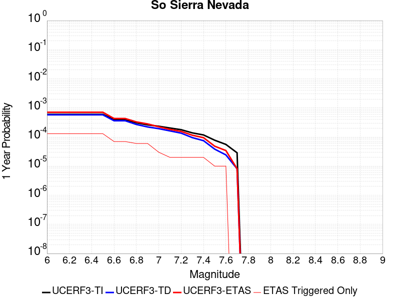 |  |

| Magnitude | 1 wk TI Prob | 1 wk TD Prob | 1 wk ETAS Prob | 1 wk ETAS/TD Gain | 1 wk ETAS Triggered Only | 1 mo TI Prob | 1 mo TD Prob | 1 mo ETAS Prob | 1 mo ETAS/TD Gain | 1 mo ETAS Triggered Only | 1 yr TI Prob | 1 yr TD Prob | 1 yr ETAS Prob | 1 yr ETAS/TD Gain | 1 yr ETAS Triggered Only | 10 yr TI Prob | 10 yr TD Prob | 10 yr ETAS Prob | 10 yr ETAS/TD Gain | 10 yr ETAS Triggered Only |
|-----|-----|-----|-----|-----|-----|-----|-----|-----|-----|-----|-----|-----|-----|-----|-----|-----|-----|-----|-----|-----|
| 6.0 | 1.15488665E-5 | 1.1079958E-5 | 1.1079958E-5 | 1.0 | 0.0 | 4.9494203E-5 | 4.7484744E-5 | 9.4428666E-5 | 1.9886106 | 4.6946152E-5 | 6.024253E-4 | 5.779862E-4 | 7.4220274E-4 | 1.2841185 | 1.6431154E-4 | 0.006007948 | 0.0057660984 | 0.006046151 | 1.0485688 | 2.816769E-4 |
| 6.1 | 1.15488665E-5 | 1.1079958E-5 | 1.1079958E-5 | 1.0 | 0.0 | 4.9494203E-5 | 4.7484744E-5 | 9.4428666E-5 | 1.9886106 | 4.6946152E-5 | 6.024253E-4 | 5.779862E-4 | 7.4220274E-4 | 1.2841185 | 1.6431154E-4 | 0.006007948 | 0.0057660984 | 0.006046151 | 1.0485688 | 2.816769E-4 |
| 6.2 | 1.15488665E-5 | 1.1079958E-5 | 1.1079958E-5 | 1.0 | 0.0 | 4.9494203E-5 | 4.7484744E-5 | 9.4428666E-5 | 1.9886106 | 4.6946152E-5 | 6.024253E-4 | 5.779862E-4 | 7.4220274E-4 | 1.2841185 | 1.6431154E-4 | 0.006007948 | 0.0057660984 | 0.006046151 | 1.0485688 | 2.816769E-4 |
| 6.3 | 1.15488665E-5 | 1.1079958E-5 | 1.1079958E-5 | 1.0 | 0.0 | 4.9494203E-5 | 4.7484744E-5 | 9.4428666E-5 | 1.9886106 | 4.6946152E-5 | 6.024253E-4 | 5.779862E-4 | 7.4220274E-4 | 1.2841185 | 1.6431154E-4 | 0.006007948 | 0.0057660984 | 0.006046151 | 1.0485688 | 2.816769E-4 |
| 6.4 | 1.15488665E-5 | 1.1079958E-5 | 1.1079958E-5 | 1.0 | 0.0 | 4.9494203E-5 | 4.7484744E-5 | 9.4428666E-5 | 1.9886106 | 4.6946152E-5 | 6.024253E-4 | 5.779862E-4 | 7.4220274E-4 | 1.2841185 | 1.6431154E-4 | 0.006007948 | 0.0057660984 | 0.006046151 | 1.0485688 | 2.816769E-4 |
| 6.5 | 1.15488665E-5 | 1.1079958E-5 | 1.1079958E-5 | 1.0 | 0.0 | 4.9494203E-5 | 4.7484744E-5 | 9.4428666E-5 | 1.9886106 | 4.6946152E-5 | 6.024253E-4 | 5.779862E-4 | 7.4220274E-4 | 1.2841185 | 1.6431154E-4 | 0.006007948 | 0.0057660984 | 0.006046151 | 1.0485688 | 2.816769E-4 |
| 6.6 | 7.587044E-6 | 6.9358503E-6 | 6.9358503E-6 | 1.0 | 0.0 | 3.2515498E-5 | 2.972475E-5 | 2.972475E-5 | 1.0 | 0.0 | 3.9580427E-4 | 3.6184167E-4 | 4.322354E-4 | 1.194543 | 7.041923E-5 | 0.003951 | 0.0036128166 | 0.0037765345 | 1.0453159 | 1.6431154E-4 |
| 6.7 | 7.587044E-6 | 6.9358503E-6 | 6.9358503E-6 | 1.0 | 0.0 | 3.2515498E-5 | 2.972475E-5 | 2.972475E-5 | 1.0 | 0.0 | 3.9580427E-4 | 3.6184167E-4 | 4.322354E-4 | 1.194543 | 7.041923E-5 | 0.003951 | 0.0036128166 | 0.0037765345 | 1.0453159 | 1.6431154E-4 |
| 6.8 | 5.9026956E-6 | 5.179568E-6 | 5.179568E-6 | 1.0 | 0.0 | 2.5297022E-5 | 2.2197966E-5 | 2.2197966E-5 | 1.0 | 0.0 | 3.0794772E-4 | 2.7022787E-4 | 3.406281E-4 | 1.2605217 | 7.041923E-5 | 0.0030752132 | 0.0026991093 | 0.0028395674 | 1.0520388 | 1.4083846E-4 |
| 6.9 | 5.0118915E-6 | 4.2525808E-6 | 4.2525808E-6 | 1.0 | 0.0 | 2.1479358E-5 | 1.8225222E-5 | 1.8225222E-5 | 1.0 | 0.0 | 2.614798E-4 | 2.2187021E-4 | 2.9227382E-4 | 1.3173189 | 7.041923E-5 | 0.0026117235 | 0.0022165596 | 0.002357086 | 1.0633984 | 1.4083846E-4 |
| 7.0 | 4.4924795E-6 | 3.7140621E-6 | 3.7140621E-6 | 1.0 | 0.0 | 1.925334E-5 | 1.5917316E-5 | 1.5917316E-5 | 1.0 | 0.0 | 2.3438422E-4 | 1.9377672E-4 | 2.4071378E-4 | 1.2422223 | 4.6946152E-5 | 0.0023413717 | 0.0019361405 | 0.0020532787 | 1.0605009 | 1.1736538E-4 |
| 7.1 | 3.9118436E-6 | 3.1121094E-6 | 3.1121094E-6 | 1.0 | 0.0 | 1.6764936E-5 | 1.3337547E-5 | 1.3337547E-5 | 1.0 | 0.0 | 2.0409399E-4 | 1.6237311E-4 | 1.8584236E-4 | 1.1445391 | 2.3473076E-5 | 0.0020390663 | 0.0016226007 | 0.0016694707 | 1.0288857 | 4.6946152E-5 |
| 7.2 | 3.4200818E-6 | 2.605576E-6 | 2.605576E-6 | 1.0 | 0.0 | 1.4657411E-5 | 1.116671E-5 | 1.116671E-5 | 1.0 | 0.0 | 1.7843937E-4 | 1.3594671E-4 | 1.594166E-4 | 1.1726403 | 2.3473076E-5 | 0.0017829615 | 0.0013586852 | 0.0014055675 | 1.0345057 | 4.6946152E-5 |
| 7.3 | 2.6593618E-6 | 1.8285265E-6 | 1.8285265E-6 | 1.0 | 0.0 | 1.13972155E-5 | 7.83652E-6 | 7.83652E-6 | 1.0 | 0.0 | 1.3875226E-4 | 9.5405754E-5 | 1.1887659E-4 | 1.2460107 | 2.3473076E-5 | 0.0013866565 | 9.536769E-4 | 9.771276E-4 | 1.0245898 | 2.3473076E-5 |
| 7.4 | 2.2577992E-6 | 1.436535E-6 | 1.436535E-6 | 1.0 | 0.0 | 9.676246E-6 | 6.156565E-6 | 6.156565E-6 | 1.0 | 0.0 | 1.1780193E-4 | 7.495386E-5 | 9.8425175E-5 | 1.3131436 | 2.3473076E-5 | 0.001177395 | 7.493108E-4 | 7.727663E-4 | 1.0313027 | 2.3473076E-5 |
| 7.5 | 1.489319E-6 | 7.354697E-7 | 7.354697E-7 | 1.0 | 0.0 | 6.3827797E-6 | 3.1520092E-6 | 3.1520092E-6 | 1.0 | 0.0 | 7.770758E-5 | 3.837504E-5 | 3.837504E-5 | 1.0 | 0.0 | 7.7680405E-4 | 3.836846E-4 | 3.836846E-4 | 1.0 | 0.0 |
| 7.6 | 1.0680322E-6 | 4.6602182E-7 | 4.6602182E-7 | 1.0 | 0.0 | 4.577273E-6 | 1.997235E-6 | 1.997235E-6 | 1.0 | 0.0 | 5.5726876E-5 | 2.4316065E-5 | 2.4316065E-5 | 1.0 | 0.0 | 5.5712904E-4 | 2.431343E-4 | 2.431343E-4 | 1.0 | 0.0 |
| 7.7 | 5.509146E-7 | 1.558334E-7 | 1.558334E-7 | 1.0 | 0.0 | 2.3610605E-6 | 6.678573E-7 | 6.678573E-7 | 1.0 | 0.0 | 2.8745531E-5 | 8.131134E-6 | 8.131134E-6 | 1.0 | 0.0 | 2.8741814E-4 | 8.130848E-5 | 8.130848E-5 | 1.0 | 0.0 |

## San Andreas (San Bernardino N)
*[(top)](#table-of-contents)*

| 1 Week | 1 Month | 1 Year | 10 Year |
|-----|-----|-----|-----|
|  |  |  |  |

| Magnitude | 1 wk TI Prob | 1 wk TD Prob | 1 wk ETAS Prob | 1 wk ETAS/TD Gain | 1 wk ETAS Triggered Only | 1 mo TI Prob | 1 mo TD Prob | 1 mo ETAS Prob | 1 mo ETAS/TD Gain | 1 mo ETAS Triggered Only | 1 yr TI Prob | 1 yr TD Prob | 1 yr ETAS Prob | 1 yr ETAS/TD Gain | 1 yr ETAS Triggered Only | 10 yr TI Prob | 10 yr TD Prob | 10 yr ETAS Prob | 10 yr ETAS/TD Gain | 10 yr ETAS Triggered Only |
|-----|-----|-----|-----|-----|-----|-----|-----|-----|-----|-----|-----|-----|-----|-----|-----|-----|-----|-----|-----|-----|
| 6.0 | 1.4273766E-4 | 3.1635934E-4 | 3.1635934E-4 | 1.0 | 0.0 | 6.115894E-4 | 0.0013551271 | 0.0013551271 | 1.0 | 0.0 | 0.0074207084 | 0.016375363 | 0.016536983 | 1.0098698 | 1.6431154E-4 | 0.07177748 | 0.15038711 | 0.15054666 | 1.0010608 | 1.8778461E-4 |
| 6.1 | 1.4273766E-4 | 3.1635934E-4 | 3.1635934E-4 | 1.0 | 0.0 | 6.115894E-4 | 0.0013551271 | 0.0013551271 | 1.0 | 0.0 | 0.0074207084 | 0.016375363 | 0.016536983 | 1.0098698 | 1.6431154E-4 | 0.07177748 | 0.15038711 | 0.15054666 | 1.0010608 | 1.8778461E-4 |
| 6.2 | 1.4273766E-4 | 3.1635934E-4 | 3.1635934E-4 | 1.0 | 0.0 | 6.115894E-4 | 0.0013551271 | 0.0013551271 | 1.0 | 0.0 | 0.0074207084 | 0.016375363 | 0.016536983 | 1.0098698 | 1.6431154E-4 | 0.07177748 | 0.15038711 | 0.15054666 | 1.0010608 | 1.8778461E-4 |
| 6.3 | 1.3730655E-4 | 3.0540637E-4 | 3.0540637E-4 | 1.0 | 0.0 | 5.883239E-4 | 0.0013082335 | 0.0013082335 | 1.0 | 0.0 | 0.0071393442 | 0.015812824 | 0.015974537 | 1.0102267 | 1.6431154E-4 | 0.06914291 | 0.14568701 | 0.14584744 | 1.0011011 | 1.8778461E-4 |
| 6.4 | 1.3730655E-4 | 3.0540637E-4 | 3.0540637E-4 | 1.0 | 0.0 | 5.883239E-4 | 0.0013082335 | 0.0013082335 | 1.0 | 0.0 | 0.0071393442 | 0.015812824 | 0.015974537 | 1.0102267 | 1.6431154E-4 | 0.06914291 | 0.14568701 | 0.14584744 | 1.0011011 | 1.8778461E-4 |
| 6.5 | 1.2942807E-4 | 2.8954886E-4 | 2.8954886E-4 | 1.0 | 0.0 | 5.545738E-4 | 0.0012403387 | 0.0012403387 | 1.0 | 0.0 | 0.0067310524 | 0.014997809 | 0.015159657 | 1.0107914 | 1.6431154E-4 | 0.06530788 | 0.13882978 | 0.1389915 | 1.0011648 | 1.8778461E-4 |
| 6.6 | 1.1125901E-4 | 2.5393223E-4 | 2.5393223E-4 | 1.0 | 0.0 | 4.767372E-4 | 0.0010878295 | 0.0010878295 | 1.0 | 0.0 | 0.005788839 | 0.013164529 | 0.013326677 | 1.0123171 | 1.6431154E-4 | 0.056403454 | 0.12311955 | 0.12328421 | 1.0013374 | 1.8778461E-4 |
| 6.7 | 1.02209575E-4 | 2.3527986E-4 | 2.3527986E-4 | 1.0 | 0.0 | 4.3796748E-4 | 0.001007954 | 0.001007954 | 1.0 | 0.0 | 0.0053192247 | 0.012203212 | 0.012365519 | 1.0133003 | 1.6431154E-4 | 0.051936906 | 0.11491149 | 0.11507769 | 1.0014464 | 1.8778461E-4 |
| 6.8 | 9.610582E-5 | 2.2053412E-4 | 2.2053412E-4 | 1.0 | 0.0 | 4.1181705E-4 | 9.448046E-4 | 9.448046E-4 | 1.0 | 0.0 | 0.0050023515 | 0.011442591 | 0.0116050225 | 1.0141953 | 1.6431154E-4 | 0.048912346 | 0.10831282 | 0.10848027 | 1.0015459 | 1.8778461E-4 |
| 6.9 | 9.3877505E-5 | 2.150883E-4 | 2.150883E-4 | 1.0 | 0.0 | 4.0227012E-4 | 9.2148193E-4 | 9.2148193E-4 | 1.0 | 0.0 | 0.0048866454 | 0.011161577 | 0.011324055 | 1.0145569 | 1.6431154E-4 | 0.04780577 | 0.1059029 | 0.1060708 | 1.0015854 | 1.8778461E-4 |
| 7.0 | 9.1019785E-5 | 2.0835544E-4 | 2.0835544E-4 | 1.0 | 0.0 | 3.900265E-4 | 8.926469E-4 | 8.926469E-4 | 1.0 | 0.0 | 0.0047382377 | 0.010814046 | 0.01097658 | 1.0150299 | 1.6431154E-4 | 0.046384744 | 0.10287278 | 0.10304125 | 1.0016376 | 1.8778461E-4 |
| 7.1 | 8.771155E-5 | 2.0009889E-4 | 2.0009889E-4 | 1.0 | 0.0 | 3.758525E-4 | 8.5728534E-4 | 8.5728534E-4 | 1.0 | 0.0 | 0.0045664064 | 0.010387696 | 0.0105503015 | 1.0156536 | 1.6431154E-4 | 0.044737056 | 0.09918398 | 0.09935314 | 1.0017055 | 1.8778461E-4 |
| 7.2 | 8.0830236E-5 | 1.8415037E-4 | 1.8415037E-4 | 1.0 | 0.0 | 3.4636928E-4 | 7.8897737E-4 | 7.8897737E-4 | 1.0 | 0.0 | 0.0042088944 | 0.009563598 | 0.009726338 | 1.0170166 | 1.6431154E-4 | 0.041300658 | 0.09191379 | 0.09208431 | 1.0018553 | 1.8778461E-4 |
| 7.3 | 7.7668235E-5 | 1.7358093E-4 | 1.7358093E-4 | 1.0 | 0.0 | 3.328214E-4 | 7.437063E-4 | 7.437063E-4 | 1.0 | 0.0 | 0.0040445733 | 0.009017113 | 0.009179942 | 1.0180578 | 1.6431154E-4 | 0.03971748 | 0.08717959 | 0.087351 | 1.0019662 | 1.8778461E-4 |
| 7.4 | 7.520177E-5 | 1.657783E-4 | 1.657783E-4 | 1.0 | 0.0 | 3.2225347E-4 | 7.1028504E-4 | 7.1028504E-4 | 1.0 | 0.0 | 0.0039163795 | 0.008613498 | 0.008776395 | 1.0189117 | 1.6431154E-4 | 0.038480744 | 0.08363466 | 0.08380674 | 1.0020576 | 1.8778461E-4 |
| 7.5 | 7.274697E-5 | 1.5865144E-4 | 1.5865144E-4 | 1.0 | 0.0 | 3.1173544E-4 | 6.797576E-4 | 6.797576E-4 | 1.0 | 0.0 | 0.003788775 | 0.008244702 | 0.008407658 | 1.019765 | 1.6431154E-4 | 0.03724827 | 0.08035038 | 0.08052307 | 1.0021493 | 1.8778461E-4 |
| 7.6 | 7.1185845E-5 | 1.5434787E-4 | 1.5434787E-4 | 1.0 | 0.0 | 3.0504653E-4 | 6.6132325E-4 | 6.6132325E-4 | 1.0 | 0.0 | 0.0037076178 | 0.008021939 | 0.008184931 | 1.0203185 | 1.6431154E-4 | 0.036463667 | 0.078339346 | 0.07851242 | 1.0022093 | 1.8778461E-4 |
| 7.7 | 6.709961E-5 | 1.4343053E-4 | 1.4343053E-4 | 1.0 | 0.0 | 2.8753807E-4 | 6.1455753E-4 | 6.1455753E-4 | 1.0 | 0.0 | 0.003495157 | 0.007456607 | 0.0076196934 | 1.0218713 | 1.6431154E-4 | 0.034406938 | 0.07316601 | 0.07334006 | 1.0023788 | 1.8778461E-4 |
| 7.8 | 6.300812E-5 | 1.3225875E-4 | 1.3225875E-4 | 1.0 | 0.0 | 2.7000686E-4 | 5.6670007E-4 | 5.6670007E-4 | 1.0 | 0.0 | 0.0032823787 | 0.0068777753 | 0.0070409565 | 1.0237259 | 1.6431154E-4 | 0.032343175 | 0.06781986 | 0.06799491 | 1.0025811 | 1.8778461E-4 |
| 7.9 | 4.983037E-5 | 9.7419856E-5 | 9.7419856E-5 | 1.0 | 0.0 | 2.1354125E-4 | 4.1744686E-4 | 4.1744686E-4 | 1.0 | 0.0 | 0.0025967648 | 0.005070582 | 0.005210706 | 1.0276347 | 1.4083846E-4 | 0.025666296 | 0.050735 | 0.050890975 | 1.0030743 | 1.6431154E-4 |
| 8.0 | 3.2211527E-5 | 5.341288E-5 | 5.341288E-5 | 1.0 | 0.0 | 1.380421E-4 | 2.2889227E-4 | 2.2889227E-4 | 1.0 | 0.0 | 0.0016793669 | 0.002783204 | 0.0028300195 | 1.0168207 | 4.6946152E-5 | 0.016667323 | 0.028414162 | 0.02848258 | 1.0024079 | 7.041923E-5 |
| 8.1 | 1.743376E-5 | 1.8874636E-5 | 1.8874636E-5 | 1.0 | 0.0 | 7.471398E-5 | 8.088879E-5 | 8.088879E-5 | 1.0 | 0.0 | 9.0926304E-4 | 9.843768E-4 | 0.0010078266 | 1.0238222 | 2.3473076E-5 | 0.009055517 | 0.010510205 | 0.010533432 | 1.0022099 | 2.3473076E-5 |
| 8.2 | 7.831616E-6 | 5.1737816E-6 | 5.1737816E-6 | 1.0 | 0.0 | 3.3563636E-5 | 2.217316E-5 | 2.217316E-5 | 1.0 | 0.0 | 4.0856065E-4 | 2.6992487E-4 | 2.6992487E-4 | 1.0 | 0.0 | 0.004078103 | 0.0030519657 | 0.0030519657 | 1.0 | 0.0 |
| 8.3 | 1.983087E-6 | 7.693574E-7 | 7.693574E-7 | 1.0 | 0.0 | 8.498917E-6 | 3.297242E-6 | 3.297242E-6 | 1.0 | 0.0 | 1.034694E-4 | 4.01432E-5 | 4.01432E-5 | 1.0 | 0.0 | 0.0010342124 | 4.7390026E-4 | 4.7390026E-4 | 1.0 | 0.0 |

## Goldstone Lake
*[(top)](#table-of-contents)*

| 1 Week | 1 Month | 1 Year | 10 Year |
|-----|-----|-----|-----|
|  |  |  |  |

| Magnitude | 1 wk TI Prob | 1 wk TD Prob | 1 wk ETAS Prob | 1 wk ETAS/TD Gain | 1 wk ETAS Triggered Only | 1 mo TI Prob | 1 mo TD Prob | 1 mo ETAS Prob | 1 mo ETAS/TD Gain | 1 mo ETAS Triggered Only | 1 yr TI Prob | 1 yr TD Prob | 1 yr ETAS Prob | 1 yr ETAS/TD Gain | 1 yr ETAS Triggered Only | 10 yr TI Prob | 10 yr TD Prob | 10 yr ETAS Prob | 10 yr ETAS/TD Gain | 10 yr ETAS Triggered Only |
|-----|-----|-----|-----|-----|-----|-----|-----|-----|-----|-----|-----|-----|-----|-----|-----|-----|-----|-----|-----|-----|
| 6.0 | 2.671352E-5 | 3.0378242E-5 | 5.3850606E-5 | 1.7726703 | 2.3473076E-5 | 1.1448149E-4 | 1.3018708E-4 | 1.7712712E-4 | 1.3605584 | 4.6946152E-5 | 0.001392921 | 0.0015840717 | 0.0016543793 | 1.0443841 | 7.041923E-5 | 0.013842222 | 0.015747305 | 0.01590903 | 1.01027 | 1.6431154E-4 |
| 6.1 | 2.671352E-5 | 3.0378242E-5 | 5.3850606E-5 | 1.7726703 | 2.3473076E-5 | 1.1448149E-4 | 1.3018708E-4 | 1.7712712E-4 | 1.3605584 | 4.6946152E-5 | 0.001392921 | 0.0015840717 | 0.0016543793 | 1.0443841 | 7.041923E-5 | 0.013842222 | 0.015747305 | 0.01590903 | 1.01027 | 1.6431154E-4 |
| 6.2 | 1.4197047E-5 | 1.6097329E-5 | 3.9570026E-5 | 2.4581735 | 2.3473076E-5 | 6.0843064E-5 | 6.898728E-5 | 9.2458744E-5 | 1.3402287 | 2.3473076E-5 | 7.4051257E-4 | 8.396952E-4 | 8.6314854E-4 | 1.0279309 | 2.3473076E-5 | 0.007380498 | 0.008374922 | 0.008468027 | 1.0111172 | 9.3892304E-5 |
| 6.3 | 1.4197047E-5 | 1.6097329E-5 | 3.9570026E-5 | 2.4581735 | 2.3473076E-5 | 6.0843064E-5 | 6.898728E-5 | 9.2458744E-5 | 1.3402287 | 2.3473076E-5 | 7.4051257E-4 | 8.396952E-4 | 8.6314854E-4 | 1.0279309 | 2.3473076E-5 | 0.007380498 | 0.008374922 | 0.008468027 | 1.0111172 | 9.3892304E-5 |
| 6.4 | 1.3238931E-5 | 1.5009467E-5 | 3.848219E-5 | 2.5638614 | 2.3473076E-5 | 5.6737044E-5 | 6.432525E-5 | 8.779682E-5 | 1.3648889 | 2.3473076E-5 | 6.9055456E-4 | 7.829765E-4 | 8.064312E-4 | 1.0299559 | 2.3473076E-5 | 0.006884126 | 0.007811806 | 0.007904965 | 1.0119253 | 9.3892304E-5 |
| 6.5 | 1.3238931E-5 | 1.5009467E-5 | 3.848219E-5 | 2.5638614 | 2.3473076E-5 | 5.6737044E-5 | 6.432525E-5 | 8.779682E-5 | 1.3648889 | 2.3473076E-5 | 6.9055456E-4 | 7.829765E-4 | 8.064312E-4 | 1.0299559 | 2.3473076E-5 | 0.006884126 | 0.007811806 | 0.007904965 | 1.0119253 | 9.3892304E-5 |
| 6.6 | 1.1328278E-5 | 1.2856027E-5 | 3.63288E-5 | 2.8258188 | 2.3473076E-5 | 4.8548856E-5 | 5.5096636E-5 | 7.856842E-5 | 1.4260112 | 2.3473076E-5 | 5.90922E-4 | 6.706908E-4 | 6.941481E-4 | 1.0349749 | 2.3473076E-5 | 0.0058935313 | 0.0066960566 | 0.00678932 | 1.0139282 | 9.3892304E-5 |
| 6.7 | 8.651175E-6 | 9.825214E-6 | 9.825214E-6 | 1.0 | 0.0 | 3.707594E-5 | 4.2107888E-5 | 4.2107888E-5 | 1.0 | 0.0 | 4.5130608E-4 | 5.1263353E-4 | 5.1263353E-4 | 1.0 | 0.0 | 0.0045039062 | 0.0051233894 | 0.0051700952 | 1.0091162 | 4.6946152E-5 |
| 6.8 | 1.0215377E-6 | 1.1755062E-6 | 1.1755062E-6 | 1.0 | 0.0 | 4.378012E-6 | 5.037875E-6 | 5.037875E-6 | 1.0 | 0.0 | 5.3300988E-5 | 6.133451E-5 | 6.133451E-5 | 1.0 | 0.0 | 5.3288206E-4 | 6.131871E-4 | 6.131871E-4 | 1.0 | 0.0 |
| 6.9 | 7.9360774E-7 | 9.2836456E-7 | 9.2836456E-7 | 1.0 | 0.0 | 3.4011714E-6 | 3.9786996E-6 | 3.9786996E-6 | 1.0 | 0.0 | 4.1408475E-5 | 4.8439662E-5 | 4.8439662E-5 | 1.0 | 0.0 | 4.140076E-4 | 4.8429804E-4 | 4.8429804E-4 | 1.0 | 0.0 |
| 7.0 | 7.4382757E-7 | 8.747556E-7 | 8.747556E-7 | 1.0 | 0.0 | 3.1878285E-6 | 3.7489476E-6 | 3.7489476E-6 | 1.0 | 0.0 | 3.8811122E-5 | 4.5642548E-5 | 4.5642548E-5 | 1.0 | 0.0 | 3.8804344E-4 | 4.5633837E-4 | 4.5633837E-4 | 1.0 | 0.0 |
| 7.1 | 6.4709513E-7 | 7.7114885E-7 | 7.7114885E-7 | 1.0 | 0.0 | 2.773262E-6 | 3.3049198E-6 | 3.3049198E-6 | 1.0 | 0.0 | 3.376394E-5 | 4.0236715E-5 | 4.0236715E-5 | 1.0 | 0.0 | 3.375881E-4 | 4.0230027E-4 | 4.0230027E-4 | 1.0 | 0.0 |
| 7.2 | 6.356704E-7 | 7.588543E-7 | 7.588543E-7 | 1.0 | 0.0 | 2.7242988E-6 | 3.2522291E-6 | 3.2522291E-6 | 1.0 | 0.0 | 3.3167835E-5 | 3.959523E-5 | 3.959523E-5 | 1.0 | 0.0 | 3.3162883E-4 | 3.9588768E-4 | 3.9588768E-4 | 1.0 | 0.0 |
| 7.3 | 5.7695723E-7 | 6.8967347E-7 | 6.8967347E-7 | 1.0 | 0.0 | 2.4726714E-6 | 2.9557402E-6 | 2.9557402E-6 | 1.0 | 0.0 | 3.0104358E-5 | 3.5985602E-5 | 3.5985602E-5 | 1.0 | 0.0 | 3.0100282E-4 | 3.5980347E-4 | 3.5980347E-4 | 1.0 | 0.0 |
| 7.4 | 5.209647E-7 | 6.1936566E-7 | 6.1936566E-7 | 1.0 | 0.0 | 2.232704E-6 | 2.654422E-6 | 2.654422E-6 | 1.0 | 0.0 | 2.718283E-5 | 3.2317163E-5 | 3.2317163E-5 | 1.0 | 0.0 | 2.7179506E-4 | 3.231302E-4 | 3.231302E-4 | 1.0 | 0.0 |
| 7.5 | 4.512955E-7 | 5.3490027E-7 | 5.3490027E-7 | 1.0 | 0.0 | 1.934122E-6 | 2.292428E-6 | 2.292428E-6 | 1.0 | 0.0 | 2.3547682E-5 | 2.7910008E-5 | 2.7910008E-5 | 1.0 | 0.0 | 2.3545188E-4 | 2.7907031E-4 | 2.7907031E-4 | 1.0 | 0.0 |
| 7.6 | 2.21172E-7 | 2.6040124E-7 | 2.6040124E-7 | 1.0 | 0.0 | 9.478797E-7 | 1.116005E-6 | 1.116005E-6 | 1.0 | 0.0 | 1.1540374E-5 | 1.3587305E-5 | 1.3587305E-5 | 1.0 | 0.0 | 1.1539775E-4 | 1.3586757E-4 | 1.3586757E-4 | 1.0 | 0.0 |

## Lenwood-Lockhart-Old Woman Springs
*[(top)](#table-of-contents)*

| 1 Week | 1 Month | 1 Year | 10 Year |
|-----|-----|-----|-----|
|  | 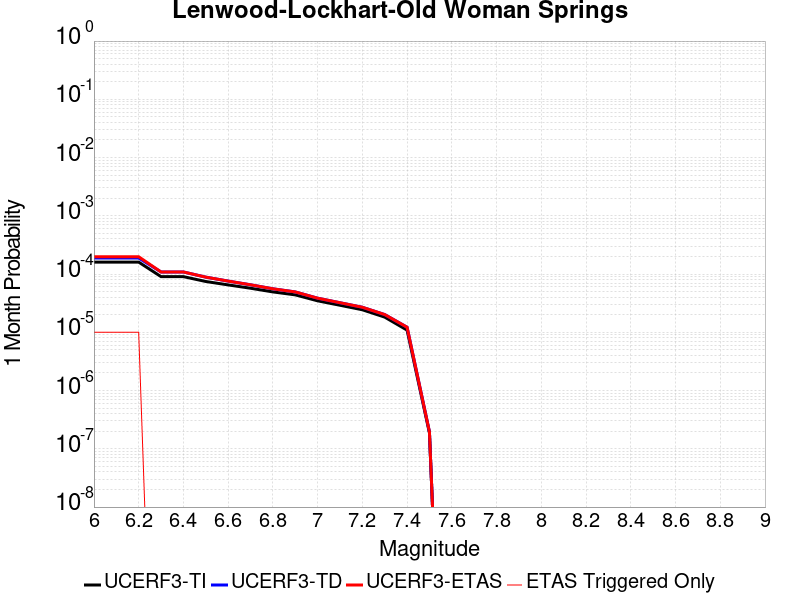 |  |  |

| Magnitude | 1 wk TI Prob | 1 wk TD Prob | 1 wk ETAS Prob | 1 wk ETAS/TD Gain | 1 wk ETAS Triggered Only | 1 mo TI Prob | 1 mo TD Prob | 1 mo ETAS Prob | 1 mo ETAS/TD Gain | 1 mo ETAS Triggered Only | 1 yr TI Prob | 1 yr TD Prob | 1 yr ETAS Prob | 1 yr ETAS/TD Gain | 1 yr ETAS Triggered Only | 10 yr TI Prob | 10 yr TD Prob | 10 yr ETAS Prob | 10 yr ETAS/TD Gain | 10 yr ETAS Triggered Only |
|-----|-----|-----|-----|-----|-----|-----|-----|-----|-----|-----|-----|-----|-----|-----|-----|-----|-----|-----|-----|-----|
| 6.0 | 3.744542E-5 | 4.3964304E-5 | 6.743635E-5 | 1.5338887 | 2.3473076E-5 | 1.604705E-4 | 1.8840581E-4 | 2.1187447E-4 | 1.1245644 | 2.3473076E-5 | 0.0019519776 | 0.0022915998 | 0.0024086963 | 1.0510981 | 1.1736538E-4 | 0.019349206 | 0.0226977 | 0.022858283 | 1.0070748 | 1.6431154E-4 |
| 6.1 | 3.744542E-5 | 4.3964304E-5 | 6.743635E-5 | 1.5338887 | 2.3473076E-5 | 1.604705E-4 | 1.8840581E-4 | 2.1187447E-4 | 1.1245644 | 2.3473076E-5 | 0.0019519776 | 0.0022915998 | 0.0024086963 | 1.0510981 | 1.1736538E-4 | 0.019349206 | 0.0226977 | 0.022858283 | 1.0070748 | 1.6431154E-4 |
| 6.2 | 3.744542E-5 | 4.3964304E-5 | 6.743635E-5 | 1.5338887 | 2.3473076E-5 | 1.604705E-4 | 1.8840581E-4 | 2.1187447E-4 | 1.1245644 | 2.3473076E-5 | 0.0019519776 | 0.0022915998 | 0.0024086963 | 1.0510981 | 1.1736538E-4 | 0.019349206 | 0.0226977 | 0.022858283 | 1.0070748 | 1.6431154E-4 |
| 6.3 | 2.1079984E-5 | 2.5354084E-5 | 2.5354084E-5 | 1.0 | 0.0 | 9.0339665E-5 | 1.0865595E-4 | 1.0865595E-4 | 1.0 | 0.0 | 0.0010993304 | 0.0013221033 | 0.0013455454 | 1.0177308 | 2.3473076E-5 | 0.010939079 | 0.013144593 | 0.013190921 | 1.0035245 | 4.6946152E-5 |
| 6.4 | 2.1079984E-5 | 2.5354084E-5 | 2.5354084E-5 | 1.0 | 0.0 | 9.0339665E-5 | 1.0865595E-4 | 1.0865595E-4 | 1.0 | 0.0 | 0.0010993304 | 0.0013221033 | 0.0013455454 | 1.0177308 | 2.3473076E-5 | 0.010939079 | 0.013144593 | 0.013190921 | 1.0035245 | 4.6946152E-5 |
| 6.5 | 1.7397282E-5 | 2.0662914E-5 | 2.0662914E-5 | 1.0 | 0.0 | 7.455765E-5 | 8.8552406E-5 | 8.8552406E-5 | 1.0 | 0.0 | 9.073613E-4 | 0.001077604 | 0.0011010518 | 1.0217592 | 2.3473076E-5 | 0.009036654 | 0.010725081 | 0.010748303 | 1.0021652 | 2.3473076E-5 |
| 6.6 | 1.52050325E-5 | 1.7680117E-5 | 1.7680117E-5 | 1.0 | 0.0 | 6.51628E-5 | 7.576977E-5 | 7.576977E-5 | 1.0 | 0.0 | 7.9306826E-4 | 9.221144E-4 | 9.455658E-4 | 1.0254322 | 2.3473076E-5 | 0.007902439 | 0.009183745 | 0.009207002 | 1.0025325 | 2.3473076E-5 |
| 6.7 | 1.332523E-5 | 1.5264359E-5 | 1.5264359E-5 | 1.0 | 0.0 | 5.7106878E-5 | 6.541707E-5 | 6.541707E-5 | 1.0 | 0.0 | 6.950544E-4 | 7.9616765E-4 | 8.19622E-4 | 1.0294591 | 2.3473076E-5 | 0.006928845 | 0.007933783 | 0.00795707 | 1.0029352 | 2.3473076E-5 |
| 6.8 | 1.1525329E-5 | 1.3031262E-5 | 1.3031262E-5 | 1.0 | 0.0 | 4.9393333E-5 | 5.5847093E-5 | 5.5847093E-5 | 1.0 | 0.0 | 6.011979E-4 | 6.797305E-4 | 7.031876E-4 | 1.0345094 | 2.3473076E-5 | 0.00599574 | 0.0067769657 | 0.0068002795 | 1.0034401 | 2.3473076E-5 |
| 6.9 | 1.0253909E-5 | 1.1514676E-5 | 1.1514676E-5 | 1.0 | 0.0 | 4.3944583E-5 | 4.93477E-5 | 4.93477E-5 | 1.0 | 0.0 | 5.3489394E-4 | 6.006462E-4 | 6.006462E-4 | 1.0 | 0.0 | 0.0053360825 | 0.005990607 | 0.005990607 | 1.0 | 0.0 |
| 7.0 | 8.104563E-6 | 8.991446E-6 | 8.991446E-6 | 1.0 | 0.0 | 3.4733377E-5 | 3.8534214E-5 | 3.8534214E-5 | 1.0 | 0.0 | 4.2279682E-4 | 4.6905546E-4 | 4.6905546E-4 | 1.0 | 0.0 | 0.0042199334 | 0.004680902 | 0.004680902 | 1.0 | 0.0 |
| 7.1 | 6.7986157E-6 | 7.515946E-6 | 7.515946E-6 | 1.0 | 0.0 | 2.91366E-5 | 3.221081E-5 | 3.221081E-5 | 1.0 | 0.0 | 3.5468035E-4 | 3.9209818E-4 | 3.9209818E-4 | 1.0 | 0.0 | 0.003541148 | 0.0039142803 | 0.0039142803 | 1.0 | 0.0 |
| 7.2 | 5.6893327E-6 | 6.280115E-6 | 6.280115E-6 | 1.0 | 0.0 | 2.4382627E-5 | 2.6914513E-5 | 2.6914513E-5 | 1.0 | 0.0 | 2.9681803E-4 | 3.2763692E-4 | 3.2763692E-4 | 1.0 | 0.0 | 0.002964219 | 0.0032717374 | 0.0032717374 | 1.0 | 0.0 |
| 7.3 | 4.253348E-6 | 4.7069766E-6 | 4.7069766E-6 | 1.0 | 0.0 | 1.8228506E-5 | 2.0172612E-5 | 2.0172612E-5 | 1.0 | 0.0 | 2.2190946E-4 | 2.455757E-4 | 2.455757E-4 | 1.0 | 0.0 | 0.00221688 | 0.0024532243 | 0.0024532243 | 1.0 | 0.0 |
| 7.4 | 2.5448119E-6 | 2.8520785E-6 | 2.8520785E-6 | 1.0 | 0.0 | 1.0906291E-5 | 1.2223146E-5 | 1.2223146E-5 | 1.0 | 0.0 | 1.3277601E-4 | 1.4880829E-4 | 1.4880829E-4 | 1.0 | 0.0 | 0.001326967 | 0.0014872487 | 0.0014872487 | 1.0 | 0.0 |
| 7.5 | 4.3706837E-8 | 4.5630156E-8 | 4.5630156E-8 | 1.0 | 0.0 | 1.8731501E-7 | 1.955578E-7 | 1.955578E-7 | 1.0 | 0.0 | 2.2805577E-6 | 2.380914E-6 | 2.380914E-6 | 1.0 | 0.0 | 2.2805343E-5 | 2.3808941E-5 | 2.3808941E-5 | 1.0 | 0.0 |

## San Andreas (San Bernardino S)
*[(top)](#table-of-contents)*

| 1 Week | 1 Month | 1 Year | 10 Year |
|-----|-----|-----|-----|
|  |  |  | 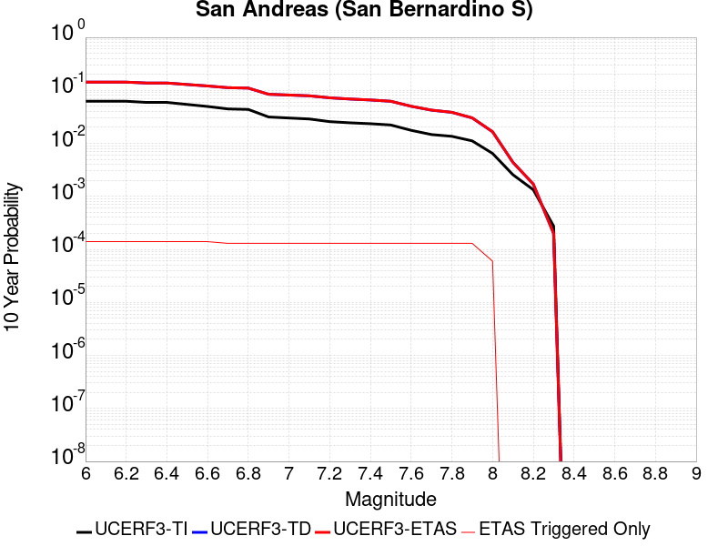 |

| Magnitude | 1 wk TI Prob | 1 wk TD Prob | 1 wk ETAS Prob | 1 wk ETAS/TD Gain | 1 wk ETAS Triggered Only | 1 mo TI Prob | 1 mo TD Prob | 1 mo ETAS Prob | 1 mo ETAS/TD Gain | 1 mo ETAS Triggered Only | 1 yr TI Prob | 1 yr TD Prob | 1 yr ETAS Prob | 1 yr ETAS/TD Gain | 1 yr ETAS Triggered Only | 10 yr TI Prob | 10 yr TD Prob | 10 yr ETAS Prob | 10 yr ETAS/TD Gain | 10 yr ETAS Triggered Only |
|-----|-----|-----|-----|-----|-----|-----|-----|-----|-----|-----|-----|-----|-----|-----|-----|-----|-----|-----|-----|-----|
| 6.0 | 1.2336002E-4 | 3.0023555E-4 | 3.0023555E-4 | 1.0 | 0.0 | 5.2857865E-4 | 0.0012861154 | 0.0012861154 | 1.0 | 0.0 | 0.006416472 | 0.015550992 | 0.015666533 | 1.0074297 | 1.1736538E-4 | 0.06234337 | 0.14291383 | 0.14303455 | 1.0008446 | 1.4083846E-4 |
| 6.1 | 1.2336002E-4 | 3.0023555E-4 | 3.0023555E-4 | 1.0 | 0.0 | 5.2857865E-4 | 0.0012861154 | 0.0012861154 | 1.0 | 0.0 | 0.006416472 | 0.015550992 | 0.015666533 | 1.0074297 | 1.1736538E-4 | 0.06234337 | 0.14291383 | 0.14303455 | 1.0008446 | 1.4083846E-4 |
| 6.2 | 1.2336002E-4 | 3.0023555E-4 | 3.0023555E-4 | 1.0 | 0.0 | 5.2857865E-4 | 0.0012861154 | 0.0012861154 | 1.0 | 0.0 | 0.006416472 | 0.015550992 | 0.015666533 | 1.0074297 | 1.1736538E-4 | 0.06234337 | 0.14291383 | 0.14303455 | 1.0008446 | 1.4083846E-4 |
| 6.3 | 1.1712257E-4 | 2.8811657E-4 | 2.8811657E-4 | 1.0 | 0.0 | 5.018573E-4 | 0.0012342266 | 0.0012342266 | 1.0 | 0.0 | 0.006093008 | 0.0149280215 | 0.015043635 | 1.0077447 | 1.1736538E-4 | 0.059286322 | 0.13762207 | 0.13774353 | 1.0008825 | 1.4083846E-4 |
| 6.4 | 1.1712257E-4 | 2.8811657E-4 | 2.8811657E-4 | 1.0 | 0.0 | 5.018573E-4 | 0.0012342266 | 0.0012342266 | 1.0 | 0.0 | 0.006093008 | 0.0149280215 | 0.015043635 | 1.0077447 | 1.1736538E-4 | 0.059286322 | 0.13762207 | 0.13774353 | 1.0008825 | 1.4083846E-4 |
| 6.5 | 1.0689076E-4 | 2.682418E-4 | 2.682418E-4 | 1.0 | 0.0 | 4.5802278E-4 | 0.001149126 | 0.001149126 | 1.0 | 0.0 | 0.0055621783 | 0.013905481 | 0.014021214 | 1.0083228 | 1.1736538E-4 | 0.05425003 | 0.12886871 | 0.1289914 | 1.000952 | 1.4083846E-4 |
| 6.6 | 9.7648895E-5 | 2.506867E-4 | 2.506867E-4 | 1.0 | 0.0 | 4.1842813E-4 | 0.0010739529 | 0.0010739529 | 1.0 | 0.0 | 0.005082469 | 0.0130013535 | 0.013117193 | 1.0089098 | 1.1736538E-4 | 0.049677886 | 0.12102797 | 0.12115176 | 1.0010228 | 1.4083846E-4 |
| 6.7 | 8.757013E-5 | 2.3139146E-4 | 2.3139146E-4 | 1.0 | 0.0 | 3.7524657E-4 | 9.913231E-4 | 9.913231E-4 | 1.0 | 0.0 | 0.00455906 | 0.012006655 | 0.0121226115 | 1.0096576 | 1.1736538E-4 | 0.04466656 | 0.112335846 | 0.11246086 | 1.0011129 | 1.4083846E-4 |
| 6.8 | 8.562978E-5 | 2.2698891E-4 | 2.2698891E-4 | 1.0 | 0.0 | 3.6693315E-4 | 9.7246916E-4 | 9.7246916E-4 | 1.0 | 0.0 | 0.004458263 | 0.011779605 | 0.011895589 | 1.0098461 | 1.1736538E-4 | 0.043698758 | 0.11034572 | 0.11047102 | 1.0011355 | 1.4083846E-4 |
| 6.9 | 6.124075E-5 | 1.7082063E-4 | 1.7082063E-4 | 1.0 | 0.0 | 2.6243398E-4 | 7.318838E-4 | 7.318838E-4 | 1.0 | 0.0 | 0.0031904527 | 0.008874487 | 0.008990811 | 1.0131077 | 1.1736538E-4 | 0.031450346 | 0.08425208 | 0.08438106 | 1.0015308 | 1.4083846E-4 |
| 7.0 | 5.8598747E-5 | 1.6510907E-4 | 1.6510907E-4 | 1.0 | 0.0 | 2.5111332E-4 | 7.0741924E-4 | 7.0741924E-4 | 1.0 | 0.0 | 0.0030530186 | 0.008579012 | 0.0086953705 | 1.0135632 | 1.1736538E-4 | 0.03011414 | 0.08156926 | 0.08169861 | 1.0015857 | 1.4083846E-4 |
| 7.1 | 5.613814E-5 | 1.5929298E-4 | 1.5929298E-4 | 1.0 | 0.0 | 2.4056983E-4 | 6.825063E-4 | 6.825063E-4 | 1.0 | 0.0 | 0.0029250039 | 0.0082780365 | 0.00839443 | 1.0140606 | 1.1736538E-4 | 0.028868021 | 0.078867756 | 0.078997485 | 1.001645 | 1.4083846E-4 |
| 7.2 | 4.991222E-5 | 1.4535384E-4 | 1.4535384E-4 | 1.0 | 0.0 | 2.1389198E-4 | 6.227967E-4 | 6.227967E-4 | 1.0 | 0.0 | 0.002601025 | 0.0075562913 | 0.0076727695 | 1.0154148 | 1.1736538E-4 | 0.025707912 | 0.072320335 | 0.07245098 | 1.0018066 | 1.4083846E-4 |
| 7.3 | 4.7410045E-5 | 1.3729246E-4 | 1.3729246E-4 | 1.0 | 0.0 | 2.0317009E-4 | 5.882639E-4 | 5.882639E-4 | 1.0 | 0.0 | 0.0024707897 | 0.0071386793 | 0.007255207 | 1.0163234 | 1.1736538E-4 | 0.024434982 | 0.06860168 | 0.06873286 | 1.0019121 | 1.4083846E-4 |
| 7.4 | 4.5556746E-5 | 1.313689E-4 | 1.313689E-4 | 1.0 | 0.0 | 1.952286E-4 | 5.628884E-4 | 5.628884E-4 | 1.0 | 0.0 | 0.002374317 | 0.006831711 | 0.0069482746 | 1.0170622 | 1.1736538E-4 | 0.023491086 | 0.06585319 | 0.065984756 | 1.0019978 | 1.4083846E-4 |
| 7.5 | 4.3084514E-5 | 1.2371907E-4 | 1.2371907E-4 | 1.0 | 0.0 | 1.8463485E-4 | 5.3011713E-4 | 5.3011713E-4 | 1.0 | 0.0 | 0.0022456115 | 0.0064351484 | 0.0065517584 | 1.0181208 | 1.1736538E-4 | 0.022230545 | 0.062252887 | 0.06238496 | 1.0021216 | 1.4083846E-4 |
| 7.6 | 3.408608E-5 | 9.8489814E-5 | 9.8489814E-5 | 1.0 | 0.0 | 1.4607502E-4 | 4.2203104E-4 | 4.2203104E-4 | 1.0 | 0.0 | 0.0017770125 | 0.005126148 | 0.0052429116 | 1.022778 | 1.1736538E-4 | 0.017628696 | 0.050079897 | 0.050213683 | 1.0026715 | 1.4083846E-4 |
| 7.7 | 2.8315713E-5 | 8.261325E-5 | 8.261325E-5 | 1.0 | 0.0 | 1.2134742E-4 | 3.5400878E-4 | 3.5400878E-4 | 1.0 | 0.0 | 0.0014764034 | 0.004301548 | 0.0044184085 | 1.0271671 | 1.1736538E-4 | 0.01466633 | 0.042327844 | 0.042462718 | 1.0031865 | 1.4083846E-4 |
| 7.8 | 2.6222975E-5 | 7.4749165E-5 | 7.4749165E-5 | 1.0 | 0.0 | 1.1237934E-4 | 3.2031426E-4 | 3.2031426E-4 | 1.0 | 0.0 | 0.0013673597 | 0.0038928585 | 0.004009767 | 1.0300316 | 1.1736538E-4 | 0.013589768 | 0.038489804 | 0.03862522 | 1.0035182 | 1.4083846E-4 |
| 7.9 | 2.1469694E-5 | 5.7977377E-5 | 5.7977377E-5 | 1.0 | 0.0 | 9.200973E-5 | 2.4845081E-4 | 2.4845081E-4 | 1.0 | 0.0 | 0.0011196428 | 0.003020696 | 0.0031377068 | 1.0387363 | 1.1736538E-4 | 0.011140184 | 0.030197 | 0.030333586 | 1.0045232 | 1.4083846E-4 |
| 8.0 | 1.2420249E-5 | 3.1373827E-5 | 3.1373827E-5 | 1.0 | 0.0 | 5.322855E-5 | 1.3445233E-4 | 1.3445233E-4 | 1.0 | 0.0 | 6.478649E-4 | 0.001635729 | 0.0016591637 | 1.0143267 | 2.3473076E-5 | 0.0064597935 | 0.016548108 | 0.016594278 | 1.00279 | 4.6946152E-5 |
| 8.1 | 4.9197724E-6 | 7.842378E-6 | 7.842378E-6 | 1.0 | 0.0 | 2.1084568E-5 | 3.360976E-5 | 3.360976E-5 | 1.0 | 0.0 | 2.566744E-4 | 4.0912212E-4 | 4.0912212E-4 | 1.0 | 0.0 | 0.002563781 | 0.004394436 | 0.004394436 | 1.0 | 0.0 |
| 8.2 | 2.5634774E-6 | 2.9160003E-6 | 2.9160003E-6 | 1.0 | 0.0 | 1.0986286E-5 | 1.2497085E-5 | 1.2497085E-5 | 1.0 | 0.0 | 1.3374983E-4 | 1.5214144E-4 | 1.5214144E-4 | 1.0 | 0.0 | 0.0013366934 | 0.0017098442 | 0.0017098442 | 1.0 | 0.0 |
| 8.3 | 5.2850464E-7 | 3.2211614E-7 | 3.2211614E-7 | 1.0 | 0.0 | 2.2650179E-6 | 1.380497E-6 | 1.380497E-6 | 1.0 | 0.0 | 2.7576245E-5 | 1.6807435E-5 | 1.6807435E-5 | 1.0 | 0.0 | 2.7572823E-4 | 1.9939634E-4 | 1.9939634E-4 | 1.0 | 0.0 |

## Paradise
*[(top)](#table-of-contents)*

| 1 Week | 1 Month | 1 Year | 10 Year |
|-----|-----|-----|-----|
|  |  |  |  |

| Magnitude | 1 wk TI Prob | 1 wk TD Prob | 1 wk ETAS Prob | 1 wk ETAS/TD Gain | 1 wk ETAS Triggered Only | 1 mo TI Prob | 1 mo TD Prob | 1 mo ETAS Prob | 1 mo ETAS/TD Gain | 1 mo ETAS Triggered Only | 1 yr TI Prob | 1 yr TD Prob | 1 yr ETAS Prob | 1 yr ETAS/TD Gain | 1 yr ETAS Triggered Only | 10 yr TI Prob | 10 yr TD Prob | 10 yr ETAS Prob | 10 yr ETAS/TD Gain | 10 yr ETAS Triggered Only |
|-----|-----|-----|-----|-----|-----|-----|-----|-----|-----|-----|-----|-----|-----|-----|-----|-----|-----|-----|-----|-----|
| 6.0 | 1.4851273E-5 | 1.6695341E-5 | 1.6695341E-5 | 1.0 | 0.0 | 6.364676E-5 | 7.154963E-5 | 9.502103E-5 | 1.3280436 | 2.3473076E-5 | 7.7462377E-4 | 8.707922E-4 | 9.411501E-4 | 1.0807976 | 7.041923E-5 | 0.0077192914 | 0.008676181 | 0.008792528 | 1.01341 | 1.1736538E-4 |
| 6.1 | 1.4851273E-5 | 1.6695341E-5 | 1.6695341E-5 | 1.0 | 0.0 | 6.364676E-5 | 7.154963E-5 | 9.502103E-5 | 1.3280436 | 2.3473076E-5 | 7.7462377E-4 | 8.707922E-4 | 9.411501E-4 | 1.0807976 | 7.041923E-5 | 0.0077192914 | 0.008676181 | 0.008792528 | 1.01341 | 1.1736538E-4 |
| 6.2 | 1.4851273E-5 | 1.6695341E-5 | 1.6695341E-5 | 1.0 | 0.0 | 6.364676E-5 | 7.154963E-5 | 9.502103E-5 | 1.3280436 | 2.3473076E-5 | 7.7462377E-4 | 8.707922E-4 | 9.411501E-4 | 1.0807976 | 7.041923E-5 | 0.0077192914 | 0.008676181 | 0.008792528 | 1.01341 | 1.1736538E-4 |
| 6.3 | 1.0426831E-5 | 1.1889049E-5 | 1.1889049E-5 | 1.0 | 0.0 | 4.4685654E-5 | 5.095211E-5 | 5.095211E-5 | 1.0 | 0.0 | 5.43912E-4 | 6.2017125E-4 | 6.436298E-4 | 1.0378258 | 2.3473076E-5 | 0.0054258266 | 0.0061850143 | 0.00623167 | 1.0075433 | 4.6946152E-5 |
| 6.4 | 1.0426831E-5 | 1.1889049E-5 | 1.1889049E-5 | 1.0 | 0.0 | 4.4685654E-5 | 5.095211E-5 | 5.095211E-5 | 1.0 | 0.0 | 5.43912E-4 | 6.2017125E-4 | 6.436298E-4 | 1.0378258 | 2.3473076E-5 | 0.0054258266 | 0.0061850143 | 0.00623167 | 1.0075433 | 4.6946152E-5 |
| 6.5 | 9.25027E-6 | 1.0620336E-5 | 1.0620336E-5 | 1.0 | 0.0 | 3.964341E-5 | 4.551496E-5 | 4.551496E-5 | 1.0 | 0.0 | 4.8255164E-4 | 5.5400864E-4 | 5.774687E-4 | 1.042346 | 2.3473076E-5 | 0.0048150513 | 0.0055267746 | 0.005550118 | 1.0042237 | 2.3473076E-5 |
| 6.6 | 7.904275E-6 | 9.159836E-6 | 9.159836E-6 | 1.0 | 0.0 | 3.3875025E-5 | 3.925587E-5 | 3.925587E-5 | 1.0 | 0.0 | 4.1235037E-4 | 4.7783932E-4 | 4.7783932E-4 | 1.0 | 0.0 | 0.0041158604 | 0.0047685155 | 0.0047685155 | 1.0 | 0.0 |
| 6.7 | 7.2061953E-6 | 8.407527E-6 | 8.407527E-6 | 1.0 | 0.0 | 3.088333E-5 | 3.6031786E-5 | 3.6031786E-5 | 1.0 | 0.0 | 3.7593965E-4 | 4.3860235E-4 | 4.3860235E-4 | 1.0 | 0.0 | 0.003753043 | 0.0043777362 | 0.0043777362 | 1.0 | 0.0 |
| 6.8 | 6.6948724E-6 | 7.842423E-6 | 7.842423E-6 | 1.0 | 0.0 | 2.8691995E-5 | 3.3609973E-5 | 3.3609973E-5 | 1.0 | 0.0 | 3.4926904E-4 | 4.0912814E-4 | 4.0912814E-4 | 1.0 | 0.0 | 0.003487206 | 0.004084107 | 0.004084107 | 1.0 | 0.0 |
| 6.9 | 6.0421025E-6 | 7.1308505E-6 | 7.1308505E-6 | 1.0 | 0.0 | 2.5894467E-5 | 3.0560448E-5 | 3.0560448E-5 | 1.0 | 0.0 | 3.1521954E-4 | 3.7201334E-4 | 3.7201334E-4 | 1.0 | 0.0 | 0.0031477278 | 0.003714244 | 0.003714244 | 1.0 | 0.0 |
| 7.0 | 4.134091E-6 | 5.080469E-6 | 5.080469E-6 | 1.0 | 0.0 | 1.7717413E-5 | 2.1773263E-5 | 2.1773263E-5 | 1.0 | 0.0 | 2.1568815E-4 | 2.6505877E-4 | 2.6505877E-4 | 1.0 | 0.0 | 0.0021547892 | 0.0026475794 | 0.0026475794 | 1.0 | 0.0 |
| 7.1 | 3.7674888E-6 | 4.6320133E-6 | 4.6320133E-6 | 1.0 | 0.0 | 1.6146281E-5 | 1.9851343E-5 | 1.9851343E-5 | 1.0 | 0.0 | 1.9656324E-4 | 2.4166482E-4 | 2.4166482E-4 | 1.0 | 0.0 | 0.0019638946 | 0.002414171 | 0.002414171 | 1.0 | 0.0 |
| 7.2 | 3.4065345E-6 | 4.1568514E-6 | 4.1568514E-6 | 1.0 | 0.0 | 1.4599351E-5 | 1.7814966E-5 | 1.7814966E-5 | 1.0 | 0.0 | 1.777326E-4 | 2.1687712E-4 | 2.1687712E-4 | 1.0 | 0.0 | 0.0017759053 | 0.0021668028 | 0.0021668028 | 1.0 | 0.0 |
| 7.3 | 2.9934936E-6 | 3.629423E-6 | 3.629423E-6 | 1.0 | 0.0 | 1.2829195E-5 | 1.5554586E-5 | 1.5554586E-5 | 1.0 | 0.0 | 1.5618425E-4 | 1.893621E-4 | 1.893621E-4 | 1.0 | 0.0 | 0.0015607453 | 0.0018921527 | 0.0018921527 | 1.0 | 0.0 |
| 7.4 | 2.4049796E-6 | 2.889062E-6 | 2.889062E-6 | 1.0 | 0.0 | 1.0307015E-5 | 1.23816435E-5 | 1.23816435E-5 | 1.0 | 0.0 | 1.2548068E-4 | 1.5073753E-4 | 1.5073753E-4 | 1.0 | 0.0 | 0.0012540985 | 0.0015064942 | 0.0015064942 | 1.0 | 0.0 |
| 7.5 | 1.2710091E-6 | 1.5135054E-6 | 1.5135054E-6 | 1.0 | 0.0 | 5.44717E-6 | 6.4864425E-6 | 6.4864425E-6 | 1.0 | 0.0 | 6.631728E-5 | 7.897083E-5 | 7.897083E-5 | 1.0 | 0.0 | 6.6297496E-4 | 7.8955025E-4 | 7.8955025E-4 | 1.0 | 0.0 |
| 7.6 | 2.21172E-7 | 2.6040124E-7 | 2.6040124E-7 | 1.0 | 0.0 | 9.478797E-7 | 1.116005E-6 | 1.116005E-6 | 1.0 | 0.0 | 1.1540374E-5 | 1.3587305E-5 | 1.3587305E-5 | 1.0 | 0.0 | 1.1539775E-4 | 1.3586757E-4 | 1.3586757E-4 | 1.0 | 0.0 |

## Towne Pass
*[(top)](#table-of-contents)*

| 1 Week | 1 Month | 1 Year | 10 Year |
|-----|-----|-----|-----|
|  |  |  |  |

| Magnitude | 1 wk TI Prob | 1 wk TD Prob | 1 wk ETAS Prob | 1 wk ETAS/TD Gain | 1 wk ETAS Triggered Only | 1 mo TI Prob | 1 mo TD Prob | 1 mo ETAS Prob | 1 mo ETAS/TD Gain | 1 mo ETAS Triggered Only | 1 yr TI Prob | 1 yr TD Prob | 1 yr ETAS Prob | 1 yr ETAS/TD Gain | 1 yr ETAS Triggered Only | 10 yr TI Prob | 10 yr TD Prob | 10 yr ETAS Prob | 10 yr ETAS/TD Gain | 10 yr ETAS Triggered Only |
|-----|-----|-----|-----|-----|-----|-----|-----|-----|-----|-----|-----|-----|-----|-----|-----|-----|-----|-----|-----|-----|
| 6.0 | 3.849728E-6 | 3.8945745E-6 | 3.8945745E-6 | 1.0 | 0.0 | 1.649873E-5 | 1.669095E-5 | 1.669095E-5 | 1.0 | 0.0 | 2.0085352E-4 | 2.0319775E-4 | 2.2666606E-4 | 1.115495 | 2.3473076E-5 | 0.0020067208 | 0.0020305486 | 0.0021242504 | 1.046146 | 9.3892304E-5 |
| 6.1 | 3.849728E-6 | 3.8945745E-6 | 3.8945745E-6 | 1.0 | 0.0 | 1.649873E-5 | 1.669095E-5 | 1.669095E-5 | 1.0 | 0.0 | 2.0085352E-4 | 2.0319775E-4 | 2.2666606E-4 | 1.115495 | 2.3473076E-5 | 0.0020067208 | 0.0020305486 | 0.0021242504 | 1.046146 | 9.3892304E-5 |
| 6.2 | 3.849728E-6 | 3.8945745E-6 | 3.8945745E-6 | 1.0 | 0.0 | 1.649873E-5 | 1.669095E-5 | 1.669095E-5 | 1.0 | 0.0 | 2.0085352E-4 | 2.0319775E-4 | 2.2666606E-4 | 1.115495 | 2.3473076E-5 | 0.0020067208 | 0.0020305486 | 0.0021242504 | 1.046146 | 9.3892304E-5 |
| 6.3 | 3.849728E-6 | 3.8945745E-6 | 3.8945745E-6 | 1.0 | 0.0 | 1.649873E-5 | 1.669095E-5 | 1.669095E-5 | 1.0 | 0.0 | 2.0085352E-4 | 2.0319775E-4 | 2.2666606E-4 | 1.115495 | 2.3473076E-5 | 0.0020067208 | 0.0020305486 | 0.0021242504 | 1.046146 | 9.3892304E-5 |
| 6.4 | 3.849728E-6 | 3.8945745E-6 | 3.8945745E-6 | 1.0 | 0.0 | 1.649873E-5 | 1.669095E-5 | 1.669095E-5 | 1.0 | 0.0 | 2.0085352E-4 | 2.0319775E-4 | 2.2666606E-4 | 1.115495 | 2.3473076E-5 | 0.0020067208 | 0.0020305486 | 0.0021242504 | 1.046146 | 9.3892304E-5 |
| 6.5 | 1.1953545E-6 | 1.203065E-6 | 1.203065E-6 | 1.0 | 0.0 | 5.1229376E-6 | 5.1559837E-6 | 5.1559837E-6 | 1.0 | 0.0 | 6.236998E-5 | 6.277241E-5 | 6.277241E-5 | 1.0 | 0.0 | 6.235248E-4 | 6.275585E-4 | 6.275585E-4 | 1.0 | 0.0 |
| 6.6 | 1.1953545E-6 | 1.203065E-6 | 1.203065E-6 | 1.0 | 0.0 | 5.1229376E-6 | 5.1559837E-6 | 5.1559837E-6 | 1.0 | 0.0 | 6.236998E-5 | 6.277241E-5 | 6.277241E-5 | 1.0 | 0.0 | 6.235248E-4 | 6.275585E-4 | 6.275585E-4 | 1.0 | 0.0 |
| 6.7 | 8.375951E-7 | 8.410778E-7 | 8.410778E-7 | 1.0 | 0.0 | 3.5896885E-6 | 3.6046144E-6 | 3.6046144E-6 | 1.0 | 0.0 | 4.370358E-5 | 4.3885353E-5 | 4.3885353E-5 | 1.0 | 0.0 | 4.3694986E-4 | 4.387726E-4 | 4.387726E-4 | 1.0 | 0.0 |
| 6.8 | 6.38041E-7 | 6.3922516E-7 | 6.3922516E-7 | 1.0 | 0.0 | 2.7344586E-6 | 2.7395338E-6 | 2.7395338E-6 | 1.0 | 0.0 | 3.3291526E-5 | 3.335335E-5 | 3.335335E-5 | 1.0 | 0.0 | 3.3286537E-4 | 3.3348726E-4 | 3.3348726E-4 | 1.0 | 0.0 |
| 6.9 | 5.3460053E-7 | 5.3454215E-7 | 5.3454215E-7 | 1.0 | 0.0 | 2.2911431E-6 | 2.290893E-6 | 2.290893E-6 | 1.0 | 0.0 | 2.789431E-5 | 2.78913E-5 | 2.78913E-5 | 1.0 | 0.0 | 2.789081E-4 | 2.788813E-4 | 2.788813E-4 | 1.0 | 0.0 |
| 7.0 | 3.557783E-7 | 3.5324976E-7 | 3.5324976E-7 | 1.0 | 0.0 | 1.5247632E-6 | 1.5139268E-6 | 1.5139268E-6 | 1.0 | 0.0 | 1.8563835E-5 | 1.843191E-5 | 1.843191E-5 | 1.0 | 0.0 | 1.8562283E-4 | 1.8430466E-4 | 1.8430466E-4 | 1.0 | 0.0 |
| 7.1 | 3.037942E-7 | 3.0002903E-7 | 3.0002903E-7 | 1.0 | 0.0 | 1.3019744E-6 | 1.285838E-6 | 1.285838E-6 | 1.0 | 0.0 | 1.5851423E-5 | 1.5654974E-5 | 1.5654974E-5 | 1.0 | 0.0 | 1.5850292E-4 | 1.5653945E-4 | 1.5653945E-4 | 1.0 | 0.0 |
| 7.2 | 2.0808248E-7 | 2.0218252E-7 | 2.0218252E-7 | 1.0 | 0.0 | 8.917818E-7 | 8.6649624E-7 | 8.6649624E-7 | 1.0 | 0.0 | 1.0857389E-5 | 1.0549546E-5 | 1.0549546E-5 | 1.0 | 0.0 | 1.0856859E-4 | 1.0549091E-4 | 1.0549091E-4 | 1.0 | 0.0 |
| 7.3 | 1.1162073E-7 | 1.0637251E-7 | 1.0637251E-7 | 1.0 | 0.0 | 4.7837443E-7 | 4.5588212E-7 | 4.5588212E-7 | 1.0 | 0.0 | 5.8241935E-6 | 5.5503524E-6 | 5.5503524E-6 | 1.0 | 0.0 | 5.8240406E-5 | 5.550234E-5 | 5.550234E-5 | 1.0 | 0.0 |

## Scodie Lineament
*[(top)](#table-of-contents)*

| 1 Week | 1 Month | 1 Year | 10 Year |
|-----|-----|-----|-----|
|  |  | 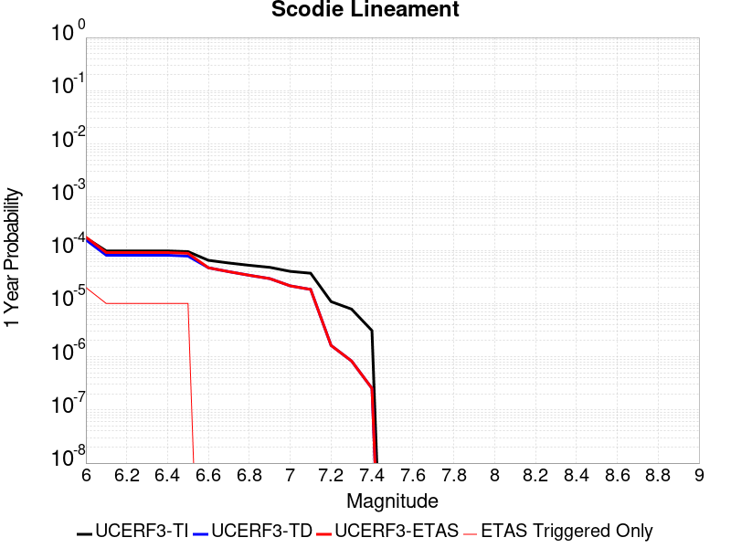 |  |

| Magnitude | 1 wk TI Prob | 1 wk TD Prob | 1 wk ETAS Prob | 1 wk ETAS/TD Gain | 1 wk ETAS Triggered Only | 1 mo TI Prob | 1 mo TD Prob | 1 mo ETAS Prob | 1 mo ETAS/TD Gain | 1 mo ETAS Triggered Only | 1 yr TI Prob | 1 yr TD Prob | 1 yr ETAS Prob | 1 yr ETAS/TD Gain | 1 yr ETAS Triggered Only | 10 yr TI Prob | 10 yr TD Prob | 10 yr ETAS Prob | 10 yr ETAS/TD Gain | 10 yr ETAS Triggered Only |
|-----|-----|-----|-----|-----|-----|-----|-----|-----|-----|-----|-----|-----|-----|-----|-----|-----|-----|-----|-----|-----|
| 6.0 | 3.2919327E-6 | 3.0133992E-6 | 3.0133992E-6 | 1.0 | 0.0 | 1.4108206E-5 | 1.2914522E-5 | 1.2914522E-5 | 1.0 | 0.0 | 1.7175387E-4 | 1.5722614E-4 | 1.8069553E-4 | 1.1492715 | 2.3473076E-5 | 0.0017162118 | 0.0015714606 | 0.0016652053 | 1.0596546 | 9.3892304E-5 |
| 6.1 | 1.8663811E-6 | 1.5490858E-6 | 1.5490858E-6 | 1.0 | 0.0 | 7.998751E-6 | 6.6389252E-6 | 6.6389252E-6 | 1.0 | 0.0 | 9.738045E-5 | 8.082641E-5 | 8.082641E-5 | 1.0 | 0.0 | 9.7337784E-4 | 8.0801896E-4 | 8.549272E-4 | 1.0580534 | 4.6946152E-5 |
| 6.2 | 1.8663811E-6 | 1.5490858E-6 | 1.5490858E-6 | 1.0 | 0.0 | 7.998751E-6 | 6.6389252E-6 | 6.6389252E-6 | 1.0 | 0.0 | 9.738045E-5 | 8.082641E-5 | 8.082641E-5 | 1.0 | 0.0 | 9.7337784E-4 | 8.0801896E-4 | 8.549272E-4 | 1.0580534 | 4.6946152E-5 |
| 6.3 | 1.8663811E-6 | 1.5490858E-6 | 1.5490858E-6 | 1.0 | 0.0 | 7.998751E-6 | 6.6389252E-6 | 6.6389252E-6 | 1.0 | 0.0 | 9.738045E-5 | 8.082641E-5 | 8.082641E-5 | 1.0 | 0.0 | 9.7337784E-4 | 8.0801896E-4 | 8.549272E-4 | 1.0580534 | 4.6946152E-5 |
| 6.4 | 1.8663811E-6 | 1.5490858E-6 | 1.5490858E-6 | 1.0 | 0.0 | 7.998751E-6 | 6.6389252E-6 | 6.6389252E-6 | 1.0 | 0.0 | 9.738045E-5 | 8.082641E-5 | 8.082641E-5 | 1.0 | 0.0 | 9.7337784E-4 | 8.0801896E-4 | 8.549272E-4 | 1.0580534 | 4.6946152E-5 |
| 6.5 | 1.8106311E-6 | 1.4910186E-6 | 1.4910186E-6 | 1.0 | 0.0 | 7.759824E-6 | 6.3900666E-6 | 6.3900666E-6 | 1.0 | 0.0 | 9.447177E-5 | 7.779678E-5 | 7.779678E-5 | 1.0 | 0.0 | 9.4431615E-4 | 7.777441E-4 | 8.246538E-4 | 1.060315 | 4.6946152E-5 |
| 6.6 | 1.2414679E-6 | 8.997782E-7 | 8.997782E-7 | 1.0 | 0.0 | 5.320566E-6 | 3.856187E-6 | 3.856187E-6 | 1.0 | 0.0 | 6.477596E-5 | 4.6948153E-5 | 4.6948153E-5 | 1.0 | 0.0 | 6.475708E-4 | 4.69391E-4 | 4.9285305E-4 | 1.0499841 | 2.3473076E-5 |
| 6.7 | 1.1062215E-6 | 7.5945076E-7 | 7.5945076E-7 | 1.0 | 0.0 | 4.7409408E-6 | 3.2547853E-6 | 3.2547853E-6 | 1.0 | 0.0 | 5.7719422E-5 | 3.962636E-5 | 3.962636E-5 | 1.0 | 0.0 | 5.770443E-4 | 3.9619993E-4 | 4.196637E-4 | 1.0592221 | 2.3473076E-5 |
| 6.8 | 1.0006736E-6 | 6.500572E-7 | 6.500572E-7 | 1.0 | 0.0 | 4.288594E-6 | 2.7859567E-6 | 2.7859567E-6 | 1.0 | 0.0 | 5.221238E-5 | 3.3918557E-5 | 3.3918557E-5 | 1.0 | 0.0 | 5.220012E-4 | 3.391399E-4 | 3.391399E-4 | 1.0 | 0.0 |
| 6.9 | 9.167364E-7 | 5.631784E-7 | 5.631784E-7 | 1.0 | 0.0 | 3.9288643E-6 | 2.4136198E-6 | 2.4136198E-6 | 1.0 | 0.0 | 4.7832873E-5 | 2.9385481E-5 | 2.9385481E-5 | 1.0 | 0.0 | 4.782258E-4 | 2.9382162E-4 | 2.9382162E-4 | 1.0 | 0.0 |
| 7.0 | 7.6987664E-7 | 4.113515E-7 | 4.113515E-7 | 1.0 | 0.0 | 3.2994672E-6 | 1.762934E-6 | 1.762934E-6 | 1.0 | 0.0 | 4.0170275E-5 | 2.146355E-5 | 2.146355E-5 | 1.0 | 0.0 | 4.0163012E-4 | 2.1461862E-4 | 2.1461862E-4 | 1.0 | 0.0 |
| 7.1 | 7.1038727E-7 | 3.5212707E-7 | 3.5212707E-7 | 1.0 | 0.0 | 3.0445133E-6 | 1.5091154E-6 | 1.5091154E-6 | 1.0 | 0.0 | 3.706632E-5 | 1.837336E-5 | 1.837336E-5 | 1.0 | 0.0 | 3.7060137E-4 | 1.837219E-4 | 1.837219E-4 | 1.0 | 0.0 |
| 7.2 | 2.0799602E-7 | 3.1190186E-8 | 3.1190186E-8 | 1.0 | 0.0 | 8.914113E-7 | 1.3367222E-7 | 1.3367222E-7 | 1.0 | 0.0 | 1.0852878E-5 | 1.6274581E-6 | 1.6274581E-6 | 1.0 | 0.0 | 1.08523476E-4 | 1.6274469E-5 | 1.6274469E-5 | 1.0 | 0.0 |
| 7.3 | 1.5048182E-7 | 1.5947961E-8 | 1.5947961E-8 | 1.0 | 0.0 | 6.449219E-7 | 6.8348406E-8 | 6.8348406E-8 | 1.0 | 0.0 | 7.851896E-6 | 8.3214155E-7 | 8.3214155E-7 | 1.0 | 0.0 | 7.851618E-5 | 8.321387E-6 | 8.321387E-6 | 1.0 | 0.0 |
| 7.4 | 5.9334678E-8 | 4.86919E-9 | 4.86919E-9 | 1.0 | 0.0 | 2.5429145E-7 | 2.0867958E-8 | 2.0867958E-8 | 1.0 | 0.0 | 3.095994E-6 | 2.5406737E-7 | 2.5406737E-7 | 1.0 | 0.0 | 3.095951E-5 | 2.5406719E-6 | 2.5406719E-6 | 1.0 | 0.0 |

## Nelson Lake
*[(top)](#table-of-contents)*

| 1 Week | 1 Month | 1 Year | 10 Year |
|-----|-----|-----|-----|
|  |  |  |  |

| Magnitude | 1 wk TI Prob | 1 wk TD Prob | 1 wk ETAS Prob | 1 wk ETAS/TD Gain | 1 wk ETAS Triggered Only | 1 mo TI Prob | 1 mo TD Prob | 1 mo ETAS Prob | 1 mo ETAS/TD Gain | 1 mo ETAS Triggered Only | 1 yr TI Prob | 1 yr TD Prob | 1 yr ETAS Prob | 1 yr ETAS/TD Gain | 1 yr ETAS Triggered Only | 10 yr TI Prob | 10 yr TD Prob | 10 yr ETAS Prob | 10 yr ETAS/TD Gain | 10 yr ETAS Triggered Only |
|-----|-----|-----|-----|-----|-----|-----|-----|-----|-----|-----|-----|-----|-----|-----|-----|-----|-----|-----|-----|-----|
| 6.0 | 9.913453E-6 | 1.0192408E-5 | 3.3665245E-5 | 3.3029728 | 2.3473076E-5 | 4.2485535E-5 | 4.3681073E-5 | 6.715312E-5 | 1.5373507 | 2.3473076E-5 | 5.1713863E-4 | 5.3169765E-4 | 5.5515824E-4 | 1.0441239 | 2.3473076E-5 | 0.0051593683 | 0.0053052832 | 0.0053753285 | 1.013203 | 7.041923E-5 |
| 6.1 | 9.913453E-6 | 1.0192408E-5 | 3.3665245E-5 | 3.3029728 | 2.3473076E-5 | 4.2485535E-5 | 4.3681073E-5 | 6.715312E-5 | 1.5373507 | 2.3473076E-5 | 5.1713863E-4 | 5.3169765E-4 | 5.5515824E-4 | 1.0441239 | 2.3473076E-5 | 0.0051593683 | 0.0053052832 | 0.0053753285 | 1.013203 | 7.041923E-5 |
| 6.2 | 4.5596407E-6 | 4.696388E-6 | 4.696388E-6 | 1.0 | 0.0 | 1.954117E-5 | 2.0127229E-5 | 2.0127229E-5 | 1.0 | 0.0 | 2.3788778E-4 | 2.4502273E-4 | 2.4502273E-4 | 1.0 | 0.0 | 0.0023763329 | 0.0024476517 | 0.0024710675 | 1.0095665 | 2.3473076E-5 |
| 6.3 | 4.5596407E-6 | 4.696388E-6 | 4.696388E-6 | 1.0 | 0.0 | 1.954117E-5 | 2.0127229E-5 | 2.0127229E-5 | 1.0 | 0.0 | 2.3788778E-4 | 2.4502273E-4 | 2.4502273E-4 | 1.0 | 0.0 | 0.0023763329 | 0.0024476517 | 0.0024710675 | 1.0095665 | 2.3473076E-5 |
| 6.4 | 3.4025713E-6 | 3.509956E-6 | 3.509956E-6 | 1.0 | 0.0 | 1.4582367E-5 | 1.5042587E-5 | 1.5042587E-5 | 1.0 | 0.0 | 1.7752586E-4 | 1.8312894E-4 | 1.8312894E-4 | 1.0 | 0.0 | 0.001773841 | 0.0018298633 | 0.0018532934 | 1.0128043 | 2.3473076E-5 |
| 6.5 | 2.8352947E-6 | 2.927907E-6 | 2.927907E-6 | 1.0 | 0.0 | 1.2151207E-5 | 1.25481165E-5 | 1.25481165E-5 | 1.0 | 0.0 | 1.479309E-4 | 1.5276336E-4 | 1.5276336E-4 | 1.0 | 0.0 | 0.0014783246 | 0.0015266574 | 0.0015500946 | 1.015352 | 2.3473076E-5 |
| 6.6 | 2.251518E-6 | 2.3291102E-6 | 2.3291102E-6 | 1.0 | 0.0 | 9.649328E-6 | 9.981866E-6 | 9.981866E-6 | 1.0 | 0.0 | 1.1747423E-4 | 1.2152307E-4 | 1.2152307E-4 | 1.0 | 0.0 | 0.0011741214 | 0.001214628 | 0.0012380725 | 1.0193019 | 2.3473076E-5 |
| 6.7 | 1.8911853E-6 | 1.959177E-6 | 1.959177E-6 | 1.0 | 0.0 | 8.105055E-6 | 8.39645E-6 | 8.39645E-6 | 1.0 | 0.0 | 9.867457E-5 | 1.0222256E-4 | 1.0222256E-4 | 1.0 | 0.0 | 9.863076E-4 | 0.0010218129 | 0.001045262 | 1.0229485 | 2.3473076E-5 |
| 6.8 | 1.4874814E-6 | 1.5438616E-6 | 1.5438616E-6 | 1.0 | 0.0 | 6.374905E-6 | 6.6165358E-6 | 6.6165358E-6 | 1.0 | 0.0 | 7.76117E-5 | 8.0553866E-5 | 8.0553866E-5 | 1.0 | 0.0 | 7.75846E-4 | 8.0529775E-4 | 8.2875194E-4 | 1.0291249 | 2.3473076E-5 |
| 6.9 | 6.835972E-7 | 7.140097E-7 | 7.140097E-7 | 1.0 | 0.0 | 2.9296991E-6 | 3.0600397E-6 | 3.0600397E-6 | 1.0 | 0.0 | 3.56685E-5 | 3.7255664E-5 | 3.7255664E-5 | 1.0 | 0.0 | 3.5662777E-4 | 3.7252545E-4 | 3.9598977E-4 | 1.0629872 | 2.3473076E-5 |

## Garlic Springs
*[(top)](#table-of-contents)*

| 1 Week | 1 Month | 1 Year | 10 Year |
|-----|-----|-----|-----|
|  |  |  |  |

| Magnitude | 1 wk TI Prob | 1 wk TD Prob | 1 wk ETAS Prob | 1 wk ETAS/TD Gain | 1 wk ETAS Triggered Only | 1 mo TI Prob | 1 mo TD Prob | 1 mo ETAS Prob | 1 mo ETAS/TD Gain | 1 mo ETAS Triggered Only | 1 yr TI Prob | 1 yr TD Prob | 1 yr ETAS Prob | 1 yr ETAS/TD Gain | 1 yr ETAS Triggered Only | 10 yr TI Prob | 10 yr TD Prob | 10 yr ETAS Prob | 10 yr ETAS/TD Gain | 10 yr ETAS Triggered Only |
|-----|-----|-----|-----|-----|-----|-----|-----|-----|-----|-----|-----|-----|-----|-----|-----|-----|-----|-----|-----|-----|
| 6.0 | 1.6760017E-5 | 1.8778032E-5 | 1.8778032E-5 | 1.0 | 0.0 | 7.182667E-5 | 8.047546E-5 | 8.047546E-5 | 1.0 | 0.0 | 8.7413884E-4 | 9.794658E-4 | 0.0010029158 | 1.0239418 | 2.3473076E-5 | 0.008707083 | 0.009763034 | 0.009832766 | 1.0071424 | 7.041923E-5 |
| 6.1 | 9.852767E-6 | 1.097425E-5 | 1.097425E-5 | 1.0 | 0.0 | 4.222546E-5 | 4.703205E-5 | 4.703205E-5 | 1.0 | 0.0 | 5.139737E-4 | 5.7253573E-4 | 5.7253573E-4 | 1.0 | 0.0 | 0.005127866 | 0.005717566 | 0.0057409047 | 1.004082 | 2.3473076E-5 |
| 6.2 | 9.852767E-6 | 1.097425E-5 | 1.097425E-5 | 1.0 | 0.0 | 4.222546E-5 | 4.703205E-5 | 4.703205E-5 | 1.0 | 0.0 | 5.139737E-4 | 5.7253573E-4 | 5.7253573E-4 | 1.0 | 0.0 | 0.005127866 | 0.005717566 | 0.0057409047 | 1.004082 | 2.3473076E-5 |
| 6.3 | 4.3167724E-6 | 4.7782996E-6 | 4.7782996E-6 | 1.0 | 0.0 | 1.8500323E-5 | 2.0478396E-5 | 2.0478396E-5 | 1.0 | 0.0 | 2.2521814E-4 | 2.4931898E-4 | 2.4931898E-4 | 1.0 | 0.0 | 0.0022499003 | 0.002492651 | 0.002492651 | 1.0 | 0.0 |
| 6.4 | 4.3167724E-6 | 4.7782996E-6 | 4.7782996E-6 | 1.0 | 0.0 | 1.8500323E-5 | 2.0478396E-5 | 2.0478396E-5 | 1.0 | 0.0 | 2.2521814E-4 | 2.4931898E-4 | 2.4931898E-4 | 1.0 | 0.0 | 0.0022499003 | 0.002492651 | 0.002492651 | 1.0 | 0.0 |
| 6.5 | 4.3167724E-6 | 4.7782996E-6 | 4.7782996E-6 | 1.0 | 0.0 | 1.8500323E-5 | 2.0478396E-5 | 2.0478396E-5 | 1.0 | 0.0 | 2.2521814E-4 | 2.4931898E-4 | 2.4931898E-4 | 1.0 | 0.0 | 0.0022499003 | 0.002492651 | 0.002492651 | 1.0 | 0.0 |
| 6.6 | 4.301311E-6 | 4.761167E-6 | 4.761167E-6 | 1.0 | 0.0 | 1.8434059E-5 | 2.0404972E-5 | 2.0404972E-5 | 1.0 | 0.0 | 2.2441156E-4 | 2.4842523E-4 | 2.4842523E-4 | 1.0 | 0.0 | 0.0022418506 | 0.002483734 | 0.002483734 | 1.0 | 0.0 |
| 6.7 | 3.8599724E-6 | 4.2713013E-6 | 4.2713013E-6 | 1.0 | 0.0 | 1.6542634E-5 | 1.8305576E-5 | 1.8305576E-5 | 1.0 | 0.0 | 2.0138794E-4 | 2.228704E-4 | 2.228704E-4 | 1.0 | 0.0 | 0.0020120554 | 0.0022287038 | 0.0022287038 | 1.0 | 0.0 |

## White Wolf (Extension)
*[(top)](#table-of-contents)*

| 1 Week | 1 Month | 1 Year | 10 Year |
|-----|-----|-----|-----|
|  |  | 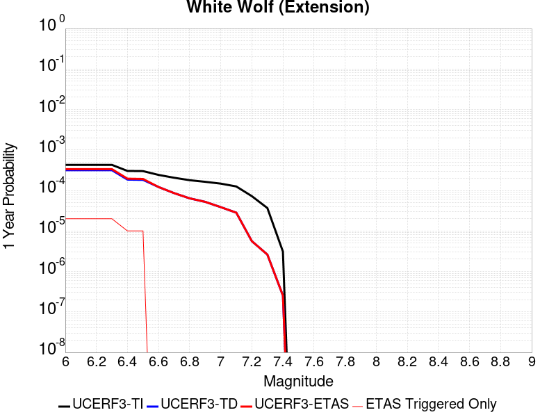 |  |

| Magnitude | 1 wk TI Prob | 1 wk TD Prob | 1 wk ETAS Prob | 1 wk ETAS/TD Gain | 1 wk ETAS Triggered Only | 1 mo TI Prob | 1 mo TD Prob | 1 mo ETAS Prob | 1 mo ETAS/TD Gain | 1 mo ETAS Triggered Only | 1 yr TI Prob | 1 yr TD Prob | 1 yr ETAS Prob | 1 yr ETAS/TD Gain | 1 yr ETAS Triggered Only | 10 yr TI Prob | 10 yr TD Prob | 10 yr ETAS Prob | 10 yr ETAS/TD Gain | 10 yr ETAS Triggered Only |
|-----|-----|-----|-----|-----|-----|-----|-----|-----|-----|-----|-----|-----|-----|-----|-----|-----|-----|-----|-----|-----|
| 6.0 | 8.222555E-6 | 6.0668267E-6 | 2.953976E-5 | 4.869063 | 2.3473076E-5 | 3.5239045E-5 | 2.6000464E-5 | 4.947293E-5 | 1.9027711 | 2.3473076E-5 | 4.289509E-4 | 3.165163E-4 | 3.3998193E-4 | 1.0741372 | 2.3473076E-5 | 0.0042812387 | 0.0031613067 | 0.0032315033 | 1.022205 | 7.041923E-5 |
| 6.1 | 8.222555E-6 | 6.0668267E-6 | 2.953976E-5 | 4.869063 | 2.3473076E-5 | 3.5239045E-5 | 2.6000464E-5 | 4.947293E-5 | 1.9027711 | 2.3473076E-5 | 4.289509E-4 | 3.165163E-4 | 3.3998193E-4 | 1.0741372 | 2.3473076E-5 | 0.0042812387 | 0.0031613067 | 0.0032315033 | 1.022205 | 7.041923E-5 |
| 6.2 | 8.222555E-6 | 6.0668267E-6 | 2.953976E-5 | 4.869063 | 2.3473076E-5 | 3.5239045E-5 | 2.6000464E-5 | 4.947293E-5 | 1.9027711 | 2.3473076E-5 | 4.289509E-4 | 3.165163E-4 | 3.3998193E-4 | 1.0741372 | 2.3473076E-5 | 0.0042812387 | 0.0031613067 | 0.0032315033 | 1.022205 | 7.041923E-5 |
| 6.3 | 8.222555E-6 | 6.0668267E-6 | 2.953976E-5 | 4.869063 | 2.3473076E-5 | 3.5239045E-5 | 2.6000464E-5 | 4.947293E-5 | 1.9027711 | 2.3473076E-5 | 4.289509E-4 | 3.165163E-4 | 3.3998193E-4 | 1.0741372 | 2.3473076E-5 | 0.0042812387 | 0.0031613067 | 0.0032315033 | 1.022205 | 7.041923E-5 |
| 6.4 | 5.821773E-6 | 3.557277E-6 | 3.557277E-6 | 1.0 | 0.0 | 2.4950215E-5 | 1.52453895E-5 | 1.52453895E-5 | 1.0 | 0.0 | 3.0372653E-4 | 1.855979E-4 | 1.855979E-4 | 1.0 | 0.0 | 0.0030331176 | 0.0018545374 | 0.0019013966 | 1.0252672 | 4.6946152E-5 |
| 6.5 | 5.766023E-6 | 3.49921E-6 | 3.49921E-6 | 1.0 | 0.0 | 2.4711293E-5 | 1.49965335E-5 | 1.49965335E-5 | 1.0 | 0.0 | 3.0081844E-4 | 1.8256859E-4 | 1.8256859E-4 | 1.0 | 0.0 | 0.0030041158 | 0.0018242942 | 0.0018711548 | 1.025687 | 4.6946152E-5 |
| 6.6 | 4.643576E-6 | 2.332699E-6 | 2.332699E-6 | 1.0 | 0.0 | 1.9900888E-5 | 9.997246E-6 | 9.997246E-6 | 1.0 | 0.0 | 2.4226638E-4 | 1.21710094E-4 | 1.21710094E-4 | 1.0 | 0.0 | 0.0024200242 | 0.0012164768 | 0.0012399213 | 1.0192724 | 2.3473076E-5 |
| 6.7 | 3.9529173E-6 | 1.648408E-6 | 1.648408E-6 | 1.0 | 0.0 | 1.6940963E-5 | 7.0645874E-6 | 7.0645874E-6 | 1.0 | 0.0 | 2.0623671E-4 | 8.600815E-5 | 8.600815E-5 | 1.0 | 0.0 | 0.002060454 | 8.597671E-4 | 8.8322E-4 | 1.0272782 | 2.3473076E-5 |
| 6.8 | 3.4377522E-6 | 1.2245736E-6 | 1.2245736E-6 | 1.0 | 0.0 | 1.473314E-5 | 5.2481623E-6 | 5.2481623E-6 | 1.0 | 0.0 | 1.7936122E-4 | 6.389459E-5 | 6.389459E-5 | 1.0 | 0.0 | 0.0017921652 | 6.3877134E-4 | 6.3877134E-4 | 1.0 | 0.0 |
| 6.9 | 3.1367306E-6 | 1.0034221E-6 | 1.0034221E-6 | 1.0 | 0.0 | 1.3443062E-5 | 4.300374E-6 | 4.300374E-6 | 1.0 | 0.0 | 1.63657E-4 | 5.2355874E-5 | 5.2355874E-5 | 1.0 | 0.0 | 0.0016353652 | 5.2344304E-4 | 5.2344304E-4 | 1.0 | 0.0 |
| 7.0 | 2.8298145E-6 | 7.429045E-7 | 7.429045E-7 | 1.0 | 0.0 | 1.2127721E-5 | 3.1838729E-6 | 3.1838729E-6 | 1.0 | 0.0 | 1.47645E-4 | 3.8763013E-5 | 3.8763013E-5 | 1.0 | 0.0 | 0.0014754693 | 3.875675E-4 | 3.875675E-4 | 1.0 | 0.0 |
| 7.1 | 2.4091064E-6 | 5.4230577E-7 | 5.4230577E-7 | 1.0 | 0.0 | 1.03247E-5 | 2.3241657E-6 | 2.3241657E-6 | 1.0 | 0.0 | 1.2569598E-4 | 2.8296392E-5 | 2.8296392E-5 | 1.0 | 0.0 | 0.001256249 | 2.8293193E-4 | 2.8293193E-4 | 1.0 | 0.0 |
| 7.2 | 1.3875518E-6 | 1.0744563E-7 | 1.0744563E-7 | 1.0 | 0.0 | 5.9466374E-6 | 4.604812E-7 | 4.604812E-7 | 1.0 | 0.0 | 7.23979E-5 | 5.6063454E-6 | 5.6063454E-6 | 1.0 | 0.0 | 7.2374323E-4 | 5.6062152E-5 | 5.6062152E-5 | 1.0 | 0.0 |
| 7.3 | 7.056077E-7 | 5.002896E-8 | 5.002896E-8 | 1.0 | 0.0 | 3.0240296E-6 | 2.1440981E-7 | 2.1440981E-7 | 1.0 | 0.0 | 3.681694E-5 | 2.6104367E-6 | 2.6104367E-6 | 1.0 | 0.0 | 3.681084E-4 | 2.6104108E-5 | 2.6104108E-5 | 1.0 | 0.0 |
| 7.4 | 5.9334678E-8 | 4.86919E-9 | 4.86919E-9 | 1.0 | 0.0 | 2.5429145E-7 | 2.0867958E-8 | 2.0867958E-8 | 1.0 | 0.0 | 3.095994E-6 | 2.5406737E-7 | 2.5406737E-7 | 1.0 | 0.0 | 3.095951E-5 | 2.5406719E-6 | 2.5406719E-6 | 1.0 | 0.0 |

## Death Valley (So)
*[(top)](#table-of-contents)*

| 1 Week | 1 Month | 1 Year | 10 Year |
|-----|-----|-----|-----|
|  |  | 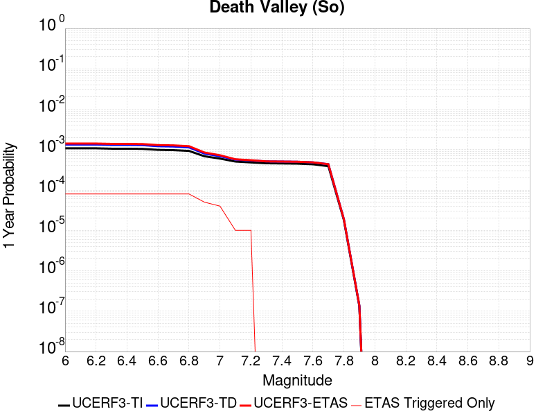 |  |

| Magnitude | 1 wk TI Prob | 1 wk TD Prob | 1 wk ETAS Prob | 1 wk ETAS/TD Gain | 1 wk ETAS Triggered Only | 1 mo TI Prob | 1 mo TD Prob | 1 mo ETAS Prob | 1 mo ETAS/TD Gain | 1 mo ETAS Triggered Only | 1 yr TI Prob | 1 yr TD Prob | 1 yr ETAS Prob | 1 yr ETAS/TD Gain | 1 yr ETAS Triggered Only | 10 yr TI Prob | 10 yr TD Prob | 10 yr ETAS Prob | 10 yr ETAS/TD Gain | 10 yr ETAS Triggered Only |
|-----|-----|-----|-----|-----|-----|-----|-----|-----|-----|-----|-----|-----|-----|-----|-----|-----|-----|-----|-----|-----|
| 6.0 | 2.0684236E-5 | 2.562036E-5 | 4.9092836E-5 | 1.9161649 | 2.3473076E-5 | 8.864371E-5 | 1.0979702E-4 | 1.3326752E-4 | 1.2137626 | 2.3473076E-5 | 0.0010787029 | 0.0013359758 | 0.001406301 | 1.0526395 | 7.041923E-5 | 0.010734817 | 0.013282726 | 0.01335221 | 1.0052311 | 7.041923E-5 |
| 6.1 | 2.0684236E-5 | 2.562036E-5 | 4.9092836E-5 | 1.9161649 | 2.3473076E-5 | 8.864371E-5 | 1.0979702E-4 | 1.3326752E-4 | 1.2137626 | 2.3473076E-5 | 0.0010787029 | 0.0013359758 | 0.001406301 | 1.0526395 | 7.041923E-5 | 0.010734817 | 0.013282726 | 0.01335221 | 1.0052311 | 7.041923E-5 |
| 6.2 | 2.0684236E-5 | 2.562036E-5 | 4.9092836E-5 | 1.9161649 | 2.3473076E-5 | 8.864371E-5 | 1.0979702E-4 | 1.3326752E-4 | 1.2137626 | 2.3473076E-5 | 0.0010787029 | 0.0013359758 | 0.001406301 | 1.0526395 | 7.041923E-5 | 0.010734817 | 0.013282726 | 0.01335221 | 1.0052311 | 7.041923E-5 |
| 6.3 | 2.0240292E-5 | 2.5120411E-5 | 4.8592898E-5 | 1.934399 | 2.3473076E-5 | 8.6741224E-5 | 1.0765456E-4 | 1.3112511E-4 | 1.2180172 | 2.3473076E-5 | 0.0010555626 | 0.0013099229 | 0.0013802499 | 1.0536879 | 7.041923E-5 | 0.010505628 | 0.013025268 | 0.01309477 | 1.0053359 | 7.041923E-5 |
| 6.4 | 2.0240292E-5 | 2.5120411E-5 | 4.8592898E-5 | 1.934399 | 2.3473076E-5 | 8.6741224E-5 | 1.0765456E-4 | 1.3112511E-4 | 1.2180172 | 2.3473076E-5 | 0.0010555626 | 0.0013099229 | 0.0013802499 | 1.0536879 | 7.041923E-5 | 0.010505628 | 0.013025268 | 0.01309477 | 1.0053359 | 7.041923E-5 |
| 6.5 | 1.9962767E-5 | 2.4809646E-5 | 4.8282138E-5 | 1.9461036 | 2.3473076E-5 | 8.55519E-5 | 1.0632281E-4 | 1.2979339E-4 | 1.2207483 | 2.3473076E-5 | 0.0010410968 | 0.0012937282 | 0.0013640564 | 1.0543609 | 7.041923E-5 | 0.010362327 | 0.012865204 | 0.012934717 | 1.0054032 | 7.041923E-5 |
| 6.6 | 1.8937297E-5 | 2.331338E-5 | 4.678591E-5 | 2.0068264 | 2.3473076E-5 | 8.115732E-5 | 9.991074E-5 | 1.2338147E-4 | 1.234917 | 2.3473076E-5 | 9.876423E-4 | 0.0012157491 | 0.0012860827 | 1.057852 | 7.041923E-5 | 0.009832645 | 0.012094032 | 0.0121636 | 1.0057522 | 7.041923E-5 |
| 6.7 | 1.8621096E-5 | 2.2913995E-5 | 4.6386533E-5 | 2.0243757 | 2.3473076E-5 | 7.980225E-5 | 9.819922E-5 | 1.2167E-4 | 1.2390118 | 2.3473076E-5 | 9.711593E-4 | 0.0011949344 | 0.0012652694 | 1.058861 | 7.041923E-5 | 0.009669261 | 0.011888134 | 0.011957716 | 1.005853 | 7.041923E-5 |
| 6.8 | 1.7830353E-5 | 2.1807928E-5 | 4.5280492E-5 | 2.0763319 | 2.3473076E-5 | 7.641356E-5 | 9.3459275E-5 | 1.1693016E-4 | 1.2511349 | 2.3473076E-5 | 9.29938E-4 | 0.0011372868 | 0.0012076258 | 1.0618482 | 7.041923E-5 | 0.009260561 | 0.011317508 | 0.01138713 | 1.0061517 | 7.041923E-5 |
| 6.9 | 1.3135183E-5 | 1.530519E-5 | 3.8777907E-5 | 2.5336442 | 2.3473076E-5 | 5.6292425E-5 | 6.559206E-5 | 8.90636E-5 | 1.3578411 | 2.3473076E-5 | 6.8514474E-4 | 7.9829723E-4 | 8.2175154E-4 | 1.0293804 | 2.3473076E-5 | 0.006830362 | 0.007955303 | 0.007978589 | 1.0029272 | 2.3473076E-5 |
| 7.0 | 1.1507512E-5 | 1.3155178E-5 | 3.6627946E-5 | 2.784299 | 2.3473076E-5 | 4.9316975E-5 | 5.6378147E-5 | 7.98499E-5 | 1.4163271 | 2.3473076E-5 | 6.002687E-4 | 6.861935E-4 | 7.096505E-4 | 1.0341842 | 2.3473076E-5 | 0.0059864987 | 0.0068414486 | 0.006864761 | 1.0034075 | 2.3473076E-5 |
| 7.1 | 9.715903E-6 | 1.08659815E-5 | 1.08659815E-5 | 1.0 | 0.0 | 4.1638916E-5 | 4.6567682E-5 | 4.6567682E-5 | 1.0 | 0.0 | 5.068359E-4 | 5.6681834E-4 | 5.6681834E-4 | 1.0 | 0.0 | 0.0050568148 | 0.0056541795 | 0.0056541795 | 1.0 | 0.0 |
| 7.2 | 9.233269E-6 | 1.0286961E-5 | 1.0286961E-5 | 1.0 | 0.0 | 3.9570554E-5 | 4.4086253E-5 | 4.4086253E-5 | 1.0 | 0.0 | 4.81665E-4 | 5.366222E-4 | 5.366222E-4 | 1.0 | 0.0 | 0.0048062233 | 0.0053536952 | 0.0053536952 | 1.0 | 0.0 |
| 7.3 | 8.8041315E-6 | 9.80876E-6 | 9.80876E-6 | 1.0 | 0.0 | 3.7731446E-5 | 4.203689E-5 | 4.203689E-5 | 1.0 | 0.0 | 4.592835E-4 | 5.116832E-4 | 5.116832E-4 | 1.0 | 0.0 | 0.0045833546 | 0.005105477 | 0.005105477 | 1.0 | 0.0 |
| 7.4 | 8.708749E-6 | 9.707768E-6 | 9.707768E-6 | 1.0 | 0.0 | 3.7322676E-5 | 4.1604082E-5 | 4.1604082E-5 | 1.0 | 0.0 | 4.5430884E-4 | 5.0641614E-4 | 5.0641614E-4 | 1.0 | 0.0 | 0.004533812 | 0.0050530476 | 0.0050530476 | 1.0 | 0.0 |
| 7.5 | 8.612678E-6 | 9.605406E-6 | 9.605406E-6 | 1.0 | 0.0 | 3.6910955E-5 | 4.1165404E-5 | 4.1165404E-5 | 1.0 | 0.0 | 4.492982E-4 | 5.0107774E-4 | 5.0107774E-4 | 1.0 | 0.0 | 0.004483909 | 0.004999905 | 0.004999905 | 1.0 | 0.0 |
| 7.6 | 8.319024E-6 | 9.28449E-6 | 9.28449E-6 | 1.0 | 0.0 | 3.5652476E-5 | 3.9790088E-5 | 3.9790088E-5 | 1.0 | 0.0 | 4.3398244E-4 | 4.8434082E-4 | 4.8434082E-4 | 1.0 | 0.0 | 0.0043313587 | 0.0048332764 | 0.0048332764 | 1.0 | 0.0 |
| 7.7 | 7.4718328E-6 | 8.345689E-6 | 8.345689E-6 | 1.0 | 0.0 | 3.2021748E-5 | 3.576677E-5 | 3.576677E-5 | 1.0 | 0.0 | 3.8979502E-4 | 4.3537747E-4 | 4.3537747E-4 | 1.0 | 0.0 | 0.00389112 | 0.0043456503 | 0.0043456503 | 1.0 | 0.0 |
| 7.8 | 3.4586725E-7 | 3.648368E-7 | 3.648368E-7 | 1.0 | 0.0 | 1.4822873E-6 | 1.5635853E-6 | 1.5635853E-6 | 1.0 | 0.0 | 1.80467E-5 | 1.903649E-5 | 1.903649E-5 | 1.0 | 0.0 | 1.8045233E-4 | 1.9034903E-4 | 1.9034903E-4 | 1.0 | 0.0 |
| 7.9 | 2.5591178E-9 | 2.6697329E-9 | 2.6697329E-9 | 1.0 | 0.0 | 1.0967647E-8 | 1.14417125E-8 | 1.14417125E-8 | 1.0 | 0.0 | 1.335311E-7 | 1.3930286E-7 | 1.3930286E-7 | 1.0 | 0.0 | 1.3353102E-6 | 1.3930285E-6 | 1.3930285E-6 | 1.0 | 0.0 |

## Sierra Nevada  (No Extension)
*[(top)](#table-of-contents)*

| 1 Week | 1 Month | 1 Year | 10 Year |
|-----|-----|-----|-----|
|  |  |  |  |

| Magnitude | 1 wk TI Prob | 1 wk TD Prob | 1 wk ETAS Prob | 1 wk ETAS/TD Gain | 1 wk ETAS Triggered Only | 1 mo TI Prob | 1 mo TD Prob | 1 mo ETAS Prob | 1 mo ETAS/TD Gain | 1 mo ETAS Triggered Only | 1 yr TI Prob | 1 yr TD Prob | 1 yr ETAS Prob | 1 yr ETAS/TD Gain | 1 yr ETAS Triggered Only | 10 yr TI Prob | 10 yr TD Prob | 10 yr ETAS Prob | 10 yr ETAS/TD Gain | 10 yr ETAS Triggered Only |
|-----|-----|-----|-----|-----|-----|-----|-----|-----|-----|-----|-----|-----|-----|-----|-----|-----|-----|-----|-----|-----|
| 6.0 | 7.7690465E-6 | 6.976568E-6 | 6.976568E-6 | 1.0 | 0.0 | 3.329549E-5 | 2.9899435E-5 | 5.337181E-5 | 1.7850441 | 2.3473076E-5 | 4.0529718E-4 | 3.6400068E-4 | 4.3439426E-4 | 1.1933887 | 7.041923E-5 | 0.004045588 | 0.0036375606 | 0.003707724 | 1.0192885 | 7.041923E-5 |
| 6.1 | 7.7690465E-6 | 6.976568E-6 | 6.976568E-6 | 1.0 | 0.0 | 3.329549E-5 | 2.9899435E-5 | 5.337181E-5 | 1.7850441 | 2.3473076E-5 | 4.0529718E-4 | 3.6400068E-4 | 4.3439426E-4 | 1.1933887 | 7.041923E-5 | 0.004045588 | 0.0036375606 | 0.003707724 | 1.0192885 | 7.041923E-5 |
| 6.2 | 7.7690465E-6 | 6.976568E-6 | 6.976568E-6 | 1.0 | 0.0 | 3.329549E-5 | 2.9899435E-5 | 5.337181E-5 | 1.7850441 | 2.3473076E-5 | 4.0529718E-4 | 3.6400068E-4 | 4.3439426E-4 | 1.1933887 | 7.041923E-5 | 0.004045588 | 0.0036375606 | 0.003707724 | 1.0192885 | 7.041923E-5 |
| 6.3 | 7.7690465E-6 | 6.976568E-6 | 6.976568E-6 | 1.0 | 0.0 | 3.329549E-5 | 2.9899435E-5 | 5.337181E-5 | 1.7850441 | 2.3473076E-5 | 4.0529718E-4 | 3.6400068E-4 | 4.3439426E-4 | 1.1933887 | 7.041923E-5 | 0.004045588 | 0.0036375606 | 0.003707724 | 1.0192885 | 7.041923E-5 |
| 6.4 | 7.7690465E-6 | 6.976568E-6 | 6.976568E-6 | 1.0 | 0.0 | 3.329549E-5 | 2.9899435E-5 | 5.337181E-5 | 1.7850441 | 2.3473076E-5 | 4.0529718E-4 | 3.6400068E-4 | 4.3439426E-4 | 1.1933887 | 7.041923E-5 | 0.004045588 | 0.0036375606 | 0.003707724 | 1.0192885 | 7.041923E-5 |
| 6.5 | 7.7690465E-6 | 6.976568E-6 | 6.976568E-6 | 1.0 | 0.0 | 3.329549E-5 | 2.9899435E-5 | 5.337181E-5 | 1.7850441 | 2.3473076E-5 | 4.0529718E-4 | 3.6400068E-4 | 4.3439426E-4 | 1.1933887 | 7.041923E-5 | 0.004045588 | 0.0036375606 | 0.003707724 | 1.0192885 | 7.041923E-5 |
| 6.6 | 2.653E-6 | 1.6149635E-6 | 1.6149635E-6 | 1.0 | 0.0 | 1.136995E-5 | 6.9212538E-6 | 6.9212538E-6 | 1.0 | 0.0 | 1.3842035E-4 | 8.426304E-5 | 1.0773414E-4 | 1.2785456 | 2.3473076E-5 | 0.0013833415 | 8.4231433E-4 | 8.6576765E-4 | 1.0278438 | 2.3473076E-5 |
| 6.7 | 2.5902466E-6 | 1.5502959E-6 | 1.5502959E-6 | 1.0 | 0.0 | 1.11010095E-5 | 6.644109E-6 | 6.644109E-6 | 1.0 | 0.0 | 1.351464E-4 | 8.0889055E-5 | 1.0436023E-4 | 1.2901651 | 2.3473076E-5 | 0.0013506424 | 8.0859906E-4 | 8.320532E-4 | 1.0290059 | 2.3473076E-5 |
| 6.8 | 2.5853892E-6 | 1.5470957E-6 | 1.5470957E-6 | 1.0 | 0.0 | 1.1080193E-5 | 6.6303933E-6 | 6.6303933E-6 | 1.0 | 0.0 | 1.34893E-4 | 8.072208E-5 | 1.0419326E-4 | 1.2907653 | 2.3473076E-5 | 0.0013481114 | 8.069306E-4 | 8.3038467E-4 | 1.0290658 | 2.3473076E-5 |
| 6.9 | 2.458257E-6 | 1.4221675E-6 | 1.4221675E-6 | 1.0 | 0.0 | 1.0535345E-5 | 6.0949897E-6 | 6.0949897E-6 | 1.0 | 0.0 | 1.2826028E-4 | 7.420399E-5 | 9.767532E-5 | 1.3163083 | 2.3473076E-5 | 0.0012818627 | 7.4179407E-4 | 7.652498E-4 | 1.0316201 | 2.3473076E-5 |
| 7.0 | 2.4341468E-6 | 1.3991308E-6 | 1.3991308E-6 | 1.0 | 0.0 | 1.0432016E-5 | 5.9962613E-6 | 5.9962613E-6 | 1.0 | 0.0 | 1.270024E-4 | 7.3002055E-5 | 9.647342E-5 | 1.3215165 | 2.3473076E-5 | 0.0012692984 | 7.297827E-4 | 7.532386E-4 | 1.032141 | 2.3473076E-5 |
| 7.1 | 2.3652476E-6 | 1.334079E-6 | 1.334079E-6 | 1.0 | 0.0 | 1.0136736E-5 | 5.717469E-6 | 5.717469E-6 | 1.0 | 0.0 | 1.2340778E-4 | 6.960797E-5 | 9.307942E-5 | 1.3371947 | 2.3473076E-5 | 0.0012333926 | 6.9586345E-4 | 7.193202E-4 | 1.0337088 | 2.3473076E-5 |
| 7.2 | 2.272158E-6 | 1.2503832E-6 | 1.2503832E-6 | 1.0 | 0.0 | 9.737784E-6 | 5.358774E-6 | 5.358774E-6 | 1.0 | 0.0 | 1.1855107E-4 | 6.524114E-5 | 8.871268E-5 | 1.359766 | 2.3473076E-5 | 0.0011848784 | 6.522214E-4 | 6.756791E-4 | 1.0359659 | 2.3473076E-5 |
| 7.3 | 2.1382127E-6 | 1.1420682E-6 | 1.1420682E-6 | 1.0 | 0.0 | 9.163737E-6 | 4.894569E-6 | 4.894569E-6 | 1.0 | 0.0 | 1.1156279E-4 | 5.9589758E-5 | 8.306144E-5 | 1.3938878 | 2.3473076E-5 | 0.001115068 | 5.95739E-4 | 6.191981E-4 | 1.0393782 | 2.3473076E-5 |
| 7.4 | 1.9048055E-6 | 9.57617E-7 | 9.57617E-7 | 1.0 | 0.0 | 8.163426E-6 | 4.104066E-6 | 4.104066E-6 | 1.0 | 0.0 | 9.9385186E-5 | 4.9965867E-5 | 7.343777E-5 | 1.4697587 | 2.3473076E-5 | 9.934074E-4 | 4.99547E-4 | 5.2300835E-4 | 1.0469652 | 2.3473076E-5 |
| 7.5 | 1.5373403E-6 | 7.560832E-7 | 7.560832E-7 | 1.0 | 0.0 | 6.5885843E-6 | 3.2403525E-6 | 3.2403525E-6 | 1.0 | 0.0 | 8.021306E-5 | 3.9450584E-5 | 3.9450584E-5 | 1.0 | 0.0 | 8.0184115E-4 | 3.9443627E-4 | 3.9443627E-4 | 1.0 | 0.0 |
| 7.6 | 1.0680322E-6 | 4.6602182E-7 | 4.6602182E-7 | 1.0 | 0.0 | 4.577273E-6 | 1.997235E-6 | 1.997235E-6 | 1.0 | 0.0 | 5.5726876E-5 | 2.4316065E-5 | 2.4316065E-5 | 1.0 | 0.0 | 5.5712904E-4 | 2.431343E-4 | 2.431343E-4 | 1.0 | 0.0 |
| 7.7 | 5.509146E-7 | 1.558334E-7 | 1.558334E-7 | 1.0 | 0.0 | 2.3610605E-6 | 6.678573E-7 | 6.678573E-7 | 1.0 | 0.0 | 2.8745531E-5 | 8.131134E-6 | 8.131134E-6 | 1.0 | 0.0 | 2.8741814E-4 | 8.130848E-5 | 8.130848E-5 | 1.0 | 0.0 |

## Helendale-So Lockhart
*[(top)](#table-of-contents)*

| 1 Week | 1 Month | 1 Year | 10 Year |
|-----|-----|-----|-----|
| 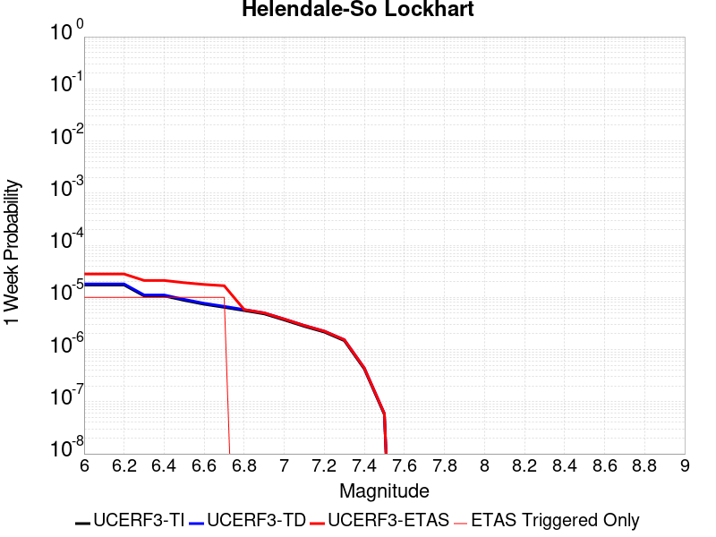 |  |  |  |

| Magnitude | 1 wk TI Prob | 1 wk TD Prob | 1 wk ETAS Prob | 1 wk ETAS/TD Gain | 1 wk ETAS Triggered Only | 1 mo TI Prob | 1 mo TD Prob | 1 mo ETAS Prob | 1 mo ETAS/TD Gain | 1 mo ETAS Triggered Only | 1 yr TI Prob | 1 yr TD Prob | 1 yr ETAS Prob | 1 yr ETAS/TD Gain | 1 yr ETAS Triggered Only | 10 yr TI Prob | 10 yr TD Prob | 10 yr ETAS Prob | 10 yr ETAS/TD Gain | 10 yr ETAS Triggered Only |
|-----|-----|-----|-----|-----|-----|-----|-----|-----|-----|-----|-----|-----|-----|-----|-----|-----|-----|-----|-----|-----|
| 6.0 | 1.7296055E-5 | 1.810418E-5 | 1.810418E-5 | 1.0 | 0.0 | 7.412385E-5 | 7.7587145E-5 | 7.7587145E-5 | 1.0 | 0.0 | 9.0208417E-4 | 9.442349E-4 | 9.911367E-4 | 1.0496718 | 4.6946152E-5 | 0.008984311 | 0.009404349 | 0.009450854 | 1.004945 | 4.6946152E-5 |
| 6.1 | 1.7296055E-5 | 1.810418E-5 | 1.810418E-5 | 1.0 | 0.0 | 7.412385E-5 | 7.7587145E-5 | 7.7587145E-5 | 1.0 | 0.0 | 9.0208417E-4 | 9.442349E-4 | 9.911367E-4 | 1.0496718 | 4.6946152E-5 | 0.008984311 | 0.009404349 | 0.009450854 | 1.004945 | 4.6946152E-5 |
| 6.2 | 1.7296055E-5 | 1.810418E-5 | 1.810418E-5 | 1.0 | 0.0 | 7.412385E-5 | 7.7587145E-5 | 7.7587145E-5 | 1.0 | 0.0 | 9.0208417E-4 | 9.442349E-4 | 9.911367E-4 | 1.0496718 | 4.6946152E-5 | 0.008984311 | 0.009404349 | 0.009450854 | 1.004945 | 4.6946152E-5 |
| 6.3 | 1.0669118E-5 | 1.1135683E-5 | 1.1135683E-5 | 1.0 | 0.0 | 4.5723988E-5 | 4.7723497E-5 | 4.7723497E-5 | 1.0 | 0.0 | 5.5654737E-4 | 5.808815E-4 | 6.2780036E-4 | 1.0807719 | 4.6946152E-5 | 0.0055515557 | 0.0057939277 | 0.005840602 | 1.0080557 | 4.6946152E-5 |
| 6.4 | 1.0669118E-5 | 1.1135683E-5 | 1.1135683E-5 | 1.0 | 0.0 | 4.5723988E-5 | 4.7723497E-5 | 4.7723497E-5 | 1.0 | 0.0 | 5.5654737E-4 | 5.808815E-4 | 6.2780036E-4 | 1.0807719 | 4.6946152E-5 | 0.0055515557 | 0.0057939277 | 0.005840602 | 1.0080557 | 4.6946152E-5 |
| 6.5 | 8.790038E-6 | 9.170408E-6 | 9.170408E-6 | 1.0 | 0.0 | 3.767105E-5 | 3.930116E-5 | 3.930116E-5 | 1.0 | 0.0 | 4.585485E-4 | 4.7838816E-4 | 5.2531186E-4 | 1.0980871 | 4.6946152E-5 | 0.0045760344 | 0.0047737476 | 0.0048204698 | 1.0097873 | 4.6946152E-5 |
| 6.6 | 7.396949E-6 | 7.715714E-6 | 7.715714E-6 | 1.0 | 0.0 | 3.1700827E-5 | 3.306693E-5 | 3.306693E-5 | 1.0 | 0.0 | 3.858892E-4 | 4.025165E-4 | 4.494438E-4 | 1.1165847 | 4.6946152E-5 | 0.003852198 | 0.0040179817 | 0.004064739 | 1.0116371 | 4.6946152E-5 |
| 6.7 | 6.4600285E-6 | 6.738185E-6 | 6.738185E-6 | 1.0 | 0.0 | 2.7685543E-5 | 2.8877621E-5 | 2.8877621E-5 | 1.0 | 0.0 | 3.3701936E-4 | 3.515291E-4 | 3.7499392E-4 | 1.0667508 | 2.3473076E-5 | 0.0033650869 | 0.003509812 | 0.0035332027 | 1.0066644 | 2.3473076E-5 |
| 6.8 | 5.600104E-6 | 5.8361397E-6 | 5.8361397E-6 | 1.0 | 0.0 | 2.4000226E-5 | 2.5011792E-5 | 2.5011792E-5 | 1.0 | 0.0 | 2.9216358E-4 | 3.0447662E-4 | 3.2794254E-4 | 1.0770698 | 2.3473076E-5 | 0.0029177975 | 0.003040656 | 0.0030640578 | 1.0076963 | 2.3473076E-5 |
| 6.9 | 4.839122E-6 | 5.03962E-6 | 5.03962E-6 | 1.0 | 0.0 | 2.0738931E-5 | 2.1598196E-5 | 2.1598196E-5 | 1.0 | 0.0 | 2.5246723E-4 | 2.6292677E-4 | 2.6292677E-4 | 1.0 | 0.0 | 0.002521806 | 0.0026262044 | 0.0026262044 | 1.0 | 0.0 |
| 7.0 | 3.6937633E-6 | 3.8452918E-6 | 3.8452918E-6 | 1.0 | 0.0 | 1.5830317E-5 | 1.6479718E-5 | 1.6479718E-5 | 1.0 | 0.0 | 1.9271708E-4 | 2.0062242E-4 | 2.0062242E-4 | 1.0 | 0.0 | 0.0019255003 | 0.0020044446 | 0.0020044446 | 1.0 | 0.0 |
| 7.1 | 2.7858857E-6 | 2.8979157E-6 | 2.8979157E-6 | 1.0 | 0.0 | 1.1939455E-5 | 1.241958E-5 | 1.241958E-5 | 1.0 | 0.0 | 1.4535317E-4 | 1.5119811E-4 | 1.5119811E-4 | 1.0 | 0.0 | 0.0014525814 | 0.0015109739 | 0.0015109739 | 1.0 | 0.0 |
| 7.2 | 2.1672065E-6 | 2.2540607E-6 | 2.2540607E-6 | 1.0 | 0.0 | 9.2879945E-6 | 9.660225E-6 | 9.660225E-6 | 1.0 | 0.0 | 1.1307546E-4 | 1.1760708E-4 | 1.1760708E-4 | 1.0 | 0.0 | 0.0011301794 | 0.0011754666 | 0.0011754666 | 1.0 | 0.0 |
| 7.3 | 1.4823496E-6 | 1.5422432E-6 | 1.5422432E-6 | 1.0 | 0.0 | 6.3529114E-6 | 6.609598E-6 | 6.609598E-6 | 1.0 | 0.0 | 7.734395E-5 | 8.0469035E-5 | 8.0469035E-5 | 1.0 | 0.0 | 7.731704E-4 | 8.044141E-4 | 8.044141E-4 | 1.0 | 0.0 |
| 7.4 | 4.2321457E-7 | 4.4109754E-7 | 4.4109754E-7 | 1.0 | 0.0 | 1.8137755E-6 | 1.8904169E-6 | 1.8904169E-6 | 1.0 | 0.0 | 2.2082493E-5 | 2.301563E-5 | 2.301563E-5 | 1.0 | 0.0 | 2.2080299E-4 | 2.3013698E-4 | 2.3013698E-4 | 1.0 | 0.0 |
| 7.5 | 5.6942316E-8 | 5.9417015E-8 | 5.9417015E-8 | 1.0 | 0.0 | 2.440385E-7 | 2.5464433E-7 | 2.5464433E-7 | 1.0 | 0.0 | 2.9711643E-6 | 3.100291E-6 | 3.100291E-6 | 1.0 | 0.0 | 2.9711247E-5 | 3.1002557E-5 | 3.1002557E-5 | 1.0 | 0.0 |

## Death Valley (Black Mtns Frontal)
*[(top)](#table-of-contents)*

| 1 Week | 1 Month | 1 Year | 10 Year |
|-----|-----|-----|-----|
|  |  |  |  |

| Magnitude | 1 wk TI Prob | 1 wk TD Prob | 1 wk ETAS Prob | 1 wk ETAS/TD Gain | 1 wk ETAS Triggered Only | 1 mo TI Prob | 1 mo TD Prob | 1 mo ETAS Prob | 1 mo ETAS/TD Gain | 1 mo ETAS Triggered Only | 1 yr TI Prob | 1 yr TD Prob | 1 yr ETAS Prob | 1 yr ETAS/TD Gain | 1 yr ETAS Triggered Only | 10 yr TI Prob | 10 yr TD Prob | 10 yr ETAS Prob | 10 yr ETAS/TD Gain | 10 yr ETAS Triggered Only |
|-----|-----|-----|-----|-----|-----|-----|-----|-----|-----|-----|-----|-----|-----|-----|-----|-----|-----|-----|-----|-----|
| 6.0 | 1.6707214E-5 | 1.8671435E-5 | 1.8671435E-5 | 1.0 | 0.0 | 7.160038E-5 | 8.001803E-5 | 1.0348923E-4 | 1.2933239 | 2.3473076E-5 | 8.71386E-4 | 9.737917E-4 | 0.0010206922 | 1.0481627 | 4.6946152E-5 | 0.00867977 | 0.0096961 | 0.009742591 | 1.0047948 | 4.6946152E-5 |
| 6.1 | 1.6707214E-5 | 1.8671435E-5 | 1.8671435E-5 | 1.0 | 0.0 | 7.160038E-5 | 8.001803E-5 | 1.0348923E-4 | 1.2933239 | 2.3473076E-5 | 8.71386E-4 | 9.737917E-4 | 0.0010206922 | 1.0481627 | 4.6946152E-5 | 0.00867977 | 0.0096961 | 0.009742591 | 1.0047948 | 4.6946152E-5 |
| 6.2 | 1.6707214E-5 | 1.8671435E-5 | 1.8671435E-5 | 1.0 | 0.0 | 7.160038E-5 | 8.001803E-5 | 1.0348923E-4 | 1.2933239 | 2.3473076E-5 | 8.71386E-4 | 9.737917E-4 | 0.0010206922 | 1.0481627 | 4.6946152E-5 | 0.00867977 | 0.0096961 | 0.009742591 | 1.0047948 | 4.6946152E-5 |
| 6.3 | 1.6707214E-5 | 1.8671435E-5 | 1.8671435E-5 | 1.0 | 0.0 | 7.160038E-5 | 8.001803E-5 | 1.0348923E-4 | 1.2933239 | 2.3473076E-5 | 8.71386E-4 | 9.737917E-4 | 0.0010206922 | 1.0481627 | 4.6946152E-5 | 0.00867977 | 0.0096961 | 0.009742591 | 1.0047948 | 4.6946152E-5 |
| 6.4 | 1.5515609E-5 | 1.7339296E-5 | 1.7339296E-5 | 1.0 | 0.0 | 6.649377E-5 | 7.430919E-5 | 7.430919E-5 | 1.0 | 0.0 | 8.0926094E-4 | 9.04345E-4 | 9.277968E-4 | 1.0259324 | 2.3473076E-5 | 0.008063202 | 0.009007333 | 0.0090305945 | 1.0025826 | 2.3473076E-5 |
| 6.5 | 1.5515609E-5 | 1.7339296E-5 | 1.7339296E-5 | 1.0 | 0.0 | 6.649377E-5 | 7.430919E-5 | 7.430919E-5 | 1.0 | 0.0 | 8.0926094E-4 | 9.04345E-4 | 9.277968E-4 | 1.0259324 | 2.3473076E-5 | 0.008063202 | 0.009007333 | 0.0090305945 | 1.0025826 | 2.3473076E-5 |
| 6.6 | 1.5041828E-5 | 1.6810196E-5 | 1.6810196E-5 | 1.0 | 0.0 | 6.4463384E-5 | 7.204174E-5 | 7.204174E-5 | 1.0 | 0.0 | 7.8455906E-4 | 8.767611E-4 | 9.002136E-4 | 1.026749 | 2.3473076E-5 | 0.00781795 | 0.008733676 | 0.008756944 | 1.0026642 | 2.3473076E-5 |
| 6.7 | 1.4634985E-5 | 1.635704E-5 | 1.635704E-5 | 1.0 | 0.0 | 6.271985E-5 | 7.009975E-5 | 7.009975E-5 | 1.0 | 0.0 | 7.6334673E-4 | 8.53136E-4 | 8.53136E-4 | 1.0 | 0.0 | 0.007607299 | 0.008499245 | 0.008499245 | 1.0 | 0.0 |
| 6.8 | 1.4209158E-5 | 1.5883043E-5 | 1.5883043E-5 | 1.0 | 0.0 | 6.089497E-5 | 6.806844E-5 | 6.806844E-5 | 1.0 | 0.0 | 7.4114406E-4 | 8.2842377E-4 | 8.2842377E-4 | 1.0 | 0.0 | 0.007386771 | 0.008253971 | 0.008253971 | 1.0 | 0.0 |
| 6.9 | 1.3780098E-5 | 1.540556E-5 | 1.540556E-5 | 1.0 | 0.0 | 5.9056227E-5 | 6.6022185E-5 | 6.6022185E-5 | 1.0 | 0.0 | 7.1877235E-4 | 8.0352917E-4 | 8.0352917E-4 | 1.0 | 0.0 | 0.0071645193 | 0.0080068335 | 0.0080068335 | 1.0 | 0.0 |
| 7.0 | 1.3585064E-5 | 1.5189109E-5 | 1.5189109E-5 | 1.0 | 0.0 | 5.8220405E-5 | 6.509459E-5 | 6.509459E-5 | 1.0 | 0.0 | 7.086029E-4 | 7.922439E-4 | 7.922439E-4 | 1.0 | 0.0 | 0.007063476 | 0.007894788 | 0.007894788 | 1.0 | 0.0 |
| 7.1 | 1.3398601E-5 | 1.4982282E-5 | 1.4982282E-5 | 1.0 | 0.0 | 5.742131E-5 | 6.420823E-5 | 6.420823E-5 | 1.0 | 0.0 | 6.9888023E-4 | 7.8146026E-4 | 7.8146026E-4 | 1.0 | 0.0 | 0.0069668638 | 0.007787712 | 0.007787712 | 1.0 | 0.0 |
| 7.2 | 1.3126312E-5 | 1.4680485E-5 | 1.4680485E-5 | 1.0 | 0.0 | 5.6254412E-5 | 6.291488E-5 | 6.291488E-5 | 1.0 | 0.0 | 6.846822E-4 | 7.6572486E-4 | 7.6572486E-4 | 1.0 | 0.0 | 0.006825765 | 0.007631449 | 0.007631449 | 1.0 | 0.0 |
| 7.3 | 1.2922429E-5 | 1.4454699E-5 | 1.4454699E-5 | 1.0 | 0.0 | 5.5380664E-5 | 6.194727E-5 | 6.194727E-5 | 1.0 | 0.0 | 6.74051E-4 | 7.539525E-4 | 7.539525E-4 | 1.0 | 0.0 | 0.006720101 | 0.007514527 | 0.007514527 | 1.0 | 0.0 |
| 7.4 | 1.2768878E-5 | 1.4284673E-5 | 1.4284673E-5 | 1.0 | 0.0 | 5.4722615E-5 | 6.121862E-5 | 6.121862E-5 | 1.0 | 0.0 | 6.660441E-4 | 7.450873E-4 | 7.450873E-4 | 1.0 | 0.0 | 0.0066405144 | 0.007426471 | 0.007426471 | 1.0 | 0.0 |
| 7.5 | 1.2521929E-5 | 1.4012902E-5 | 1.4012902E-5 | 1.0 | 0.0 | 5.366431E-5 | 6.0053942E-5 | 6.0053942E-5 | 1.0 | 0.0 | 6.531671E-4 | 7.309169E-4 | 7.309169E-4 | 1.0 | 0.0 | 0.006512506 | 0.0072857053 | 0.0072857053 | 1.0 | 0.0 |
| 7.6 | 1.1301089E-5 | 1.2648951E-5 | 1.2648951E-5 | 1.0 | 0.0 | 4.8432343E-5 | 5.4208693E-5 | 5.4208693E-5 | 1.0 | 0.0 | 5.895042E-4 | 6.597963E-4 | 6.597963E-4 | 1.0 | 0.0 | 0.0058794282 | 0.006578926 | 0.006578926 | 1.0 | 0.0 |
| 7.7 | 9.189108E-6 | 1.02840095E-5 | 1.02840095E-5 | 1.0 | 0.0 | 3.93813E-5 | 4.407361E-5 | 4.407361E-5 | 1.0 | 0.0 | 4.7936183E-4 | 5.3646916E-4 | 5.3646916E-4 | 1.0 | 0.0 | 0.004783291 | 0.005352252 | 0.005352252 | 1.0 | 0.0 |
| 7.8 | 3.4586725E-7 | 3.648368E-7 | 3.648368E-7 | 1.0 | 0.0 | 1.4822873E-6 | 1.5635853E-6 | 1.5635853E-6 | 1.0 | 0.0 | 1.80467E-5 | 1.903649E-5 | 1.903649E-5 | 1.0 | 0.0 | 1.8045233E-4 | 1.9034903E-4 | 1.9034903E-4 | 1.0 | 0.0 |
| 7.9 | 2.5591178E-9 | 2.6697329E-9 | 2.6697329E-9 | 1.0 | 0.0 | 1.0967647E-8 | 1.14417125E-8 | 1.14417125E-8 | 1.0 | 0.0 | 1.335311E-7 | 1.3930286E-7 | 1.3930286E-7 | 1.0 | 0.0 | 1.3353102E-6 | 1.3930285E-6 | 1.3930285E-6 | 1.0 | 0.0 |

## San Andreas (Santa Cruz Mts) 2011 CFM
*[(top)](#table-of-contents)*

| 1 Week | 1 Month | 1 Year | 10 Year |
|-----|-----|-----|-----|
|  |  |  |  |

| Magnitude | 1 wk TI Prob | 1 wk TD Prob | 1 wk ETAS Prob | 1 wk ETAS/TD Gain | 1 wk ETAS Triggered Only | 1 mo TI Prob | 1 mo TD Prob | 1 mo ETAS Prob | 1 mo ETAS/TD Gain | 1 mo ETAS Triggered Only | 1 yr TI Prob | 1 yr TD Prob | 1 yr ETAS Prob | 1 yr ETAS/TD Gain | 1 yr ETAS Triggered Only | 10 yr TI Prob | 10 yr TD Prob | 10 yr ETAS Prob | 10 yr ETAS/TD Gain | 10 yr ETAS Triggered Only |
|-----|-----|-----|-----|-----|-----|-----|-----|-----|-----|-----|-----|-----|-----|-----|-----|-----|-----|-----|-----|-----|
| 6.0 | 1.7221631E-4 | 1.3823692E-4 | 1.3823692E-4 | 1.0 | 0.0 | 7.378611E-4 | 5.923115E-4 | 5.923115E-4 | 1.0 | 0.0 | 0.008946515 | 0.0071879383 | 0.007211243 | 1.0032421 | 2.3473076E-5 | 0.08594794 | 0.070697196 | 0.07074082 | 1.0006171 | 4.6946152E-5 |
| 6.1 | 1.7221631E-4 | 1.3823692E-4 | 1.3823692E-4 | 1.0 | 0.0 | 7.378611E-4 | 5.923115E-4 | 5.923115E-4 | 1.0 | 0.0 | 0.008946515 | 0.0071879383 | 0.007211243 | 1.0032421 | 2.3473076E-5 | 0.08594794 | 0.070697196 | 0.07074082 | 1.0006171 | 4.6946152E-5 |
| 6.2 | 1.7221631E-4 | 1.3823692E-4 | 1.3823692E-4 | 1.0 | 0.0 | 7.378611E-4 | 5.923115E-4 | 5.923115E-4 | 1.0 | 0.0 | 0.008946515 | 0.0071879383 | 0.007211243 | 1.0032421 | 2.3473076E-5 | 0.08594794 | 0.070697196 | 0.07074082 | 1.0006171 | 4.6946152E-5 |
| 6.3 | 1.716926E-4 | 1.3743078E-4 | 1.3743078E-4 | 1.0 | 0.0 | 7.3561794E-4 | 5.888581E-4 | 5.888581E-4 | 1.0 | 0.0 | 0.008919428 | 0.0071461694 | 0.007169475 | 1.0032612 | 2.3473076E-5 | 0.08569809 | 0.0703092 | 0.070352845 | 1.0006207 | 4.6946152E-5 |
| 6.4 | 1.6392978E-4 | 1.3618424E-4 | 1.3618424E-4 | 1.0 | 0.0 | 7.02367E-4 | 5.8351824E-4 | 5.8351824E-4 | 1.0 | 0.0 | 0.008517839 | 0.0070815794 | 0.007104886 | 1.0032912 | 2.3473076E-5 | 0.08198654 | 0.06954003 | 0.069583714 | 1.0006281 | 4.6946152E-5 |
| 6.5 | 1.5742714E-4 | 1.26776E-4 | 1.26776E-4 | 1.0 | 0.0 | 6.745133E-4 | 5.4321426E-4 | 5.4321426E-4 | 1.0 | 0.0 | 0.00818132 | 0.006593904 | 0.006617222 | 1.0035363 | 2.3473076E-5 | 0.078865945 | 0.0649993 | 0.065043196 | 1.0006753 | 4.6946152E-5 |
| 6.6 | 1.3038084E-4 | 1.161551E-4 | 1.161551E-4 | 1.0 | 0.0 | 5.5865536E-4 | 4.9771386E-4 | 4.9771386E-4 | 1.0 | 0.0 | 0.006780438 | 0.0060430723 | 0.006066404 | 1.0038608 | 2.3473076E-5 | 0.0657725 | 0.059452567 | 0.059496723 | 1.0007427 | 4.6946152E-5 |
| 6.7 | 1.2867592E-4 | 1.13418515E-4 | 1.13418515E-4 | 1.0 | 0.0 | 5.5135164E-4 | 4.8599008E-4 | 4.8599008E-4 | 1.0 | 0.0 | 0.0066920654 | 0.005901116 | 0.0059244507 | 1.0039543 | 2.3473076E-5 | 0.06494093 | 0.05816314 | 0.058207355 | 1.0007602 | 4.6946152E-5 |
| 6.8 | 1.2801298E-4 | 1.1279377E-4 | 1.1279377E-4 | 1.0 | 0.0 | 5.485117E-4 | 4.833136E-4 | 4.833136E-4 | 1.0 | 0.0 | 0.0066577005 | 0.0058687064 | 0.005892042 | 1.0039762 | 2.3473076E-5 | 0.06461738 | 0.05787688 | 0.05792111 | 1.0007643 | 4.6946152E-5 |
| 6.9 | 1.269149E-4 | 1.11214715E-4 | 1.11214715E-4 | 1.0 | 0.0 | 5.4380763E-4 | 4.765487E-4 | 4.765487E-4 | 1.0 | 0.0 | 0.006600777 | 0.005786784 | 0.005810121 | 1.0040329 | 2.3473076E-5 | 0.06408122 | 0.057148356 | 0.05719262 | 1.0007745 | 4.6946152E-5 |
| 7.0 | 1.2030331E-4 | 1.0851204E-4 | 1.0851204E-4 | 1.0 | 0.0 | 5.154837E-4 | 4.6496998E-4 | 4.6496998E-4 | 1.0 | 0.0 | 0.006257969 | 0.005646552 | 0.0056698928 | 1.0041336 | 2.3473076E-5 | 0.06084648 | 0.055819258 | 0.05586358 | 1.000794 | 4.6946152E-5 |
| 7.1 | 8.049617E-5 | 5.4114953E-5 | 5.4114953E-5 | 1.0 | 0.0 | 3.4493793E-4 | 2.319008E-4 | 2.319008E-4 | 1.0 | 0.0 | 0.0041915346 | 0.0028197719 | 0.0028431788 | 1.008301 | 2.3473076E-5 | 0.041133516 | 0.02971132 | 0.02975687 | 1.0015332 | 4.6946152E-5 |
| 7.2 | 7.093979E-5 | 4.310381E-5 | 4.310381E-5 | 1.0 | 0.0 | 3.0399222E-4 | 1.8471766E-4 | 1.8471766E-4 | 1.0 | 0.0 | 0.0036948253 | 0.0022466409 | 0.0022700613 | 1.0104246 | 2.3473076E-5 | 0.03633994 | 0.024024088 | 0.024069907 | 1.0019072 | 4.6946152E-5 |
| 7.3 | 6.193693E-5 | 2.9018376E-5 | 2.9018376E-5 | 1.0 | 0.0 | 2.6541698E-4 | 1.2435856E-4 | 1.2435856E-4 | 1.0 | 0.0 | 0.0032266637 | 0.0015130156 | 0.0015364531 | 1.0154907 | 2.3473076E-5 | 0.031802133 | 0.016564084 | 0.016587168 | 1.0013937 | 2.3473076E-5 |
| 7.4 | 5.906492E-5 | 2.7136244E-5 | 2.7136244E-5 | 1.0 | 0.0 | 2.5311083E-4 | 1.16293006E-4 | 1.16293006E-4 | 1.0 | 0.0 | 0.0030772698 | 0.0014149492 | 0.0014383891 | 1.0165659 | 2.3473076E-5 | 0.030350044 | 0.015530545 | 0.015553653 | 1.001488 | 2.3473076E-5 |
| 7.5 | 5.424296E-5 | 2.4776109E-5 | 2.4776109E-5 | 1.0 | 0.0 | 2.324491E-4 | 1.0617901E-4 | 1.0617901E-4 | 1.0 | 0.0 | 0.002826395 | 0.0012919641 | 0.0013154068 | 1.0181451 | 2.3473076E-5 | 0.027907165 | 0.014215293 | 0.014238433 | 1.0016278 | 2.3473076E-5 |
| 7.6 | 4.43084E-5 | 1.9971396E-5 | 1.9971396E-5 | 1.0 | 0.0 | 1.8987931E-4 | 8.558889E-5 | 8.558889E-5 | 1.0 | 0.0 | 0.0023093296 | 0.0010415468 | 0.0010649954 | 1.0225133 | 2.3473076E-5 | 0.022854783 | 0.011448878 | 0.011472083 | 1.0020268 | 2.3473076E-5 |
| 7.7 | 4.118098E-5 | 1.8999577E-5 | 1.8999577E-5 | 1.0 | 0.0 | 1.7647797E-4 | 8.1424216E-5 | 8.1424216E-5 | 1.0 | 0.0 | 0.002146502 | 9.908893E-4 | 0.001014339 | 1.0236654 | 2.3473076E-5 | 0.021258866 | 0.010904559 | 0.010927776 | 1.0021291 | 2.3473076E-5 |
| 7.8 | 3.5408906E-5 | 1.8625631E-5 | 1.8625631E-5 | 1.0 | 0.0 | 1.5174363E-4 | 7.982169E-5 | 7.982169E-5 | 1.0 | 0.0 | 0.0018459131 | 9.7139605E-4 | 9.948463E-4 | 1.0241408 | 2.3473076E-5 | 0.018306552 | 0.0106848935 | 0.010708116 | 1.0021734 | 2.3473076E-5 |
| 7.9 | 2.5860836E-5 | 1.7371205E-5 | 1.7371205E-5 | 1.0 | 0.0 | 1.10827445E-4 | 7.4445896E-5 | 7.4445896E-5 | 1.0 | 0.0 | 0.001348489 | 9.060022E-4 | 9.29454E-4 | 1.025885 | 2.3473076E-5 | 0.013403354 | 0.009936898 | 0.009960138 | 1.0023388 | 2.3473076E-5 |
| 8.0 | 1.9777332E-5 | 1.4886952E-5 | 1.4886952E-5 | 1.0 | 0.0 | 8.4757245E-5 | 6.379966E-5 | 6.379966E-5 | 1.0 | 0.0 | 0.0010314309 | 7.7648426E-4 | 7.999391E-4 | 1.0302064 | 2.3473076E-5 | 0.010266567 | 0.008534084 | 0.008557357 | 1.002727 | 2.3473076E-5 |
| 8.1 | 1.468494E-5 | 1.2146339E-5 | 1.2146339E-5 | 1.0 | 0.0 | 6.293394E-5 | 5.20547E-5 | 5.20547E-5 | 1.0 | 0.0 | 7.6595135E-4 | 6.3358183E-4 | 6.3358183E-4 | 1.0 | 0.0 | 0.0076331664 | 0.0069899 | 0.0069899 | 1.0 | 0.0 |
| 8.2 | 8.63836E-6 | 5.489407E-6 | 5.489407E-6 | 1.0 | 0.0 | 3.7021015E-5 | 2.3525818E-5 | 2.3525818E-5 | 1.0 | 0.0 | 4.5063766E-4 | 2.863893E-4 | 2.863893E-4 | 1.0 | 0.0 | 0.004497249 | 0.0032568157 | 0.0032568157 | 1.0 | 0.0 |
| 8.3 | 1.983087E-6 | 7.693574E-7 | 7.693574E-7 | 1.0 | 0.0 | 8.498917E-6 | 3.297242E-6 | 3.297242E-6 | 1.0 | 0.0 | 1.034694E-4 | 4.01432E-5 | 4.01432E-5 | 1.0 | 0.0 | 0.0010342124 | 4.7390026E-4 | 4.7390026E-4 | 1.0 | 0.0 |

## San Andreas (San Gorgonio Pass-Garnet HIll)
*[(top)](#table-of-contents)*

| 1 Week | 1 Month | 1 Year | 10 Year |
|-----|-----|-----|-----|
|  |  |  |  |

| Magnitude | 1 wk TI Prob | 1 wk TD Prob | 1 wk ETAS Prob | 1 wk ETAS/TD Gain | 1 wk ETAS Triggered Only | 1 mo TI Prob | 1 mo TD Prob | 1 mo ETAS Prob | 1 mo ETAS/TD Gain | 1 mo ETAS Triggered Only | 1 yr TI Prob | 1 yr TD Prob | 1 yr ETAS Prob | 1 yr ETAS/TD Gain | 1 yr ETAS Triggered Only | 10 yr TI Prob | 10 yr TD Prob | 10 yr ETAS Prob | 10 yr ETAS/TD Gain | 10 yr ETAS Triggered Only |
|-----|-----|-----|-----|-----|-----|-----|-----|-----|-----|-----|-----|-----|-----|-----|-----|-----|-----|-----|-----|-----|
| 6.0 | 8.31567E-5 | 2.3398406E-4 | 2.3398406E-4 | 1.0 | 0.0 | 3.5633717E-4 | 0.001002406 | 0.001002406 | 1.0 | 0.0 | 0.004329778 | 0.012136027 | 0.012182403 | 1.0038214 | 4.6946152E-5 | 0.042463828 | 0.11264349 | 0.112685144 | 1.0003698 | 4.6946152E-5 |
| 6.1 | 8.31567E-5 | 2.3398406E-4 | 2.3398406E-4 | 1.0 | 0.0 | 3.5633717E-4 | 0.001002406 | 0.001002406 | 1.0 | 0.0 | 0.004329778 | 0.012136027 | 0.012182403 | 1.0038214 | 4.6946152E-5 | 0.042463828 | 0.11264349 | 0.112685144 | 1.0003698 | 4.6946152E-5 |
| 6.2 | 8.31567E-5 | 2.3398406E-4 | 2.3398406E-4 | 1.0 | 0.0 | 3.5633717E-4 | 0.001002406 | 0.001002406 | 1.0 | 0.0 | 0.004329778 | 0.012136027 | 0.012182403 | 1.0038214 | 4.6946152E-5 | 0.042463828 | 0.11264349 | 0.112685144 | 1.0003698 | 4.6946152E-5 |
| 6.3 | 8.31567E-5 | 2.3398406E-4 | 2.3398406E-4 | 1.0 | 0.0 | 3.5633717E-4 | 0.001002406 | 0.001002406 | 1.0 | 0.0 | 0.004329778 | 0.012136027 | 0.012182403 | 1.0038214 | 4.6946152E-5 | 0.042463828 | 0.11264349 | 0.112685144 | 1.0003698 | 4.6946152E-5 |
| 6.4 | 8.059055E-5 | 2.2956554E-4 | 2.2956554E-4 | 1.0 | 0.0 | 3.4534236E-4 | 9.834839E-4 | 9.834839E-4 | 1.0 | 0.0 | 0.0041964394 | 0.011908189 | 0.011954577 | 1.0038954 | 4.6946152E-5 | 0.041180745 | 0.11062444 | 0.11066619 | 1.0003774 | 4.6946152E-5 |
| 6.5 | 8.059055E-5 | 2.2956554E-4 | 2.2956554E-4 | 1.0 | 0.0 | 3.4534236E-4 | 9.834839E-4 | 9.834839E-4 | 1.0 | 0.0 | 0.0041964394 | 0.011908189 | 0.011954577 | 1.0038954 | 4.6946152E-5 | 0.041180745 | 0.11062444 | 0.11066619 | 1.0003774 | 4.6946152E-5 |
| 6.6 | 7.619237E-5 | 2.2200657E-4 | 2.2200657E-4 | 1.0 | 0.0 | 3.2649786E-4 | 9.511121E-4 | 9.511121E-4 | 1.0 | 0.0 | 0.0039678677 | 0.011518859 | 0.011565264 | 1.0040287 | 4.6946152E-5 | 0.03897764 | 0.107160784 | 0.1072027 | 1.0003911 | 4.6946152E-5 |
| 6.7 | 7.440636E-5 | 2.1876446E-4 | 2.1876446E-4 | 1.0 | 0.0 | 3.188454E-4 | 9.372274E-4 | 9.372274E-4 | 1.0 | 0.0 | 0.0038750346 | 0.01135158 | 0.011397993 | 1.0040888 | 4.6946152E-5 | 0.038081564 | 0.105669186 | 0.10571117 | 1.0003973 | 4.6946152E-5 |
| 6.8 | 7.3735864E-5 | 2.1723597E-4 | 2.1723597E-4 | 1.0 | 0.0 | 3.1597257E-4 | 9.306814E-4 | 9.306814E-4 | 1.0 | 0.0 | 0.0038401815 | 0.011272711 | 0.011319128 | 1.0041176 | 4.6946152E-5 | 0.03774495 | 0.1049707 | 0.10501272 | 1.0004003 | 4.6946152E-5 |
| 6.9 | 7.27575E-5 | 2.1492546E-4 | 2.1492546E-4 | 1.0 | 0.0 | 3.117806E-4 | 9.207862E-4 | 9.207862E-4 | 1.0 | 0.0 | 0.003789323 | 0.011153476 | 0.011199898 | 1.0041622 | 4.6946152E-5 | 0.037253562 | 0.10391858 | 0.10396065 | 1.0004048 | 4.6946152E-5 |
| 7.0 | 7.102591E-5 | 2.1076521E-4 | 2.1076521E-4 | 1.0 | 0.0 | 3.0436125E-4 | 9.02969E-4 | 9.02969E-4 | 1.0 | 0.0 | 0.003699303 | 0.010938748 | 0.010985181 | 1.0042448 | 4.6946152E-5 | 0.03638325 | 0.102020636 | 0.10206279 | 1.0004132 | 4.6946152E-5 |
| 7.1 | 7.028513E-5 | 2.0912137E-4 | 2.0912137E-4 | 1.0 | 0.0 | 3.0118722E-4 | 8.959288E-4 | 8.959288E-4 | 1.0 | 0.0 | 0.0036607897 | 0.01085389 | 0.010900327 | 1.0042783 | 4.6946152E-5 | 0.036010686 | 0.10126359 | 0.10130578 | 1.0004166 | 4.6946152E-5 |
| 7.2 | 6.8498244E-5 | 2.0519937E-4 | 2.0519937E-4 | 1.0 | 0.0 | 2.9353087E-4 | 8.7913166E-4 | 8.7913166E-4 | 1.0 | 0.0 | 0.003567883 | 0.0106514 | 0.010697846 | 1.0043606 | 4.6946152E-5 | 0.035111405 | 0.09945543 | 0.099497706 | 1.0004251 | 4.6946152E-5 |
| 7.3 | 6.622592E-5 | 1.9747039E-4 | 1.9747039E-4 | 1.0 | 0.0 | 2.8379448E-4 | 8.460293E-4 | 8.460293E-4 | 1.0 | 0.0 | 0.0034497243 | 0.010252241 | 0.010298706 | 1.0045322 | 4.6946152E-5 | 0.033966612 | 0.09595134 | 0.09599379 | 1.0004423 | 4.6946152E-5 |
| 7.4 | 5.1050705E-5 | 1.4701985E-4 | 1.4701985E-4 | 1.0 | 0.0 | 2.1877038E-4 | 6.299338E-4 | 6.299338E-4 | 1.0 | 0.0 | 0.002660276 | 0.0076426673 | 0.007689255 | 1.0060956 | 4.6946152E-5 | 0.02628654 | 0.07291896 | 0.072962485 | 1.0005969 | 4.6946152E-5 |
| 7.5 | 3.9302922E-5 | 1.1141107E-4 | 1.1141107E-4 | 1.0 | 0.0 | 1.6843023E-4 | 4.7738897E-4 | 4.7738897E-4 | 1.0 | 0.0 | 0.0020487092 | 0.005796791 | 0.005843465 | 1.0080518 | 4.6946152E-5 | 0.020299247 | 0.056059215 | 0.056103528 | 1.0007905 | 4.6946152E-5 |
| 7.6 | 2.9851626E-5 | 8.504997E-5 | 8.504997E-5 | 1.0 | 0.0 | 1.2792926E-4 | 3.6444908E-4 | 3.6444908E-4 | 1.0 | 0.0 | 0.0015564259 | 0.0044281655 | 0.004474904 | 1.0105548 | 4.6946152E-5 | 0.0154556995 | 0.043238558 | 0.043283474 | 1.0010388 | 4.6946152E-5 |
| 7.7 | 2.1135214E-5 | 6.361802E-5 | 6.361802E-5 | 1.0 | 0.0 | 9.0576345E-5 | 2.726202E-4 | 2.726202E-4 | 1.0 | 0.0 | 0.0011022091 | 0.0033141046 | 0.0033608952 | 1.0141187 | 4.6946152E-5 | 0.010967582 | 0.032622673 | 0.032668084 | 1.0013921 | 4.6946152E-5 |
| 7.8 | 1.883379E-5 | 5.572194E-5 | 5.572194E-5 | 1.0 | 0.0 | 8.0713755E-5 | 2.3878647E-4 | 2.3878647E-4 | 1.0 | 0.0 | 9.822468E-4 | 0.0029033525 | 0.0029501624 | 1.0161227 | 4.6946152E-5 | 0.0097791655 | 0.028732158 | 0.028777756 | 1.001587 | 4.6946152E-5 |
| 7.9 | 1.5156185E-5 | 4.1725576E-5 | 4.1725576E-5 | 1.0 | 0.0 | 6.495346E-5 | 1.7881165E-4 | 1.7881165E-4 | 1.0 | 0.0 | 7.9052144E-4 | 0.0021748596 | 0.0022217038 | 1.0215389 | 4.6946152E-5 | 0.007877152 | 0.021790246 | 0.021836169 | 1.0021075 | 4.6946152E-5 |
| 8.0 | 1.1405907E-5 | 3.0024876E-5 | 3.0024876E-5 | 1.0 | 0.0 | 4.8881542E-5 | 1.286717E-4 | 1.286717E-4 | 1.0 | 0.0 | 5.9497025E-4 | 0.0015654531 | 0.0015654531 | 1.0 | 0.0 | 0.005933798 | 0.015796356 | 0.015796356 | 1.0 | 0.0 |
| 8.1 | 4.3511436E-6 | 7.3873994E-6 | 7.3873994E-6 | 1.0 | 0.0 | 1.8647626E-5 | 3.16599E-5 | 3.16599E-5 | 1.0 | 0.0 | 2.2701119E-4 | 3.8539123E-4 | 3.8539123E-4 | 1.0 | 0.0 | 0.0022677942 | 0.0041254 | 0.0041254 | 1.0 | 0.0 |
| 8.2 | 2.3042528E-6 | 2.74142E-6 | 2.74142E-6 | 1.0 | 0.0 | 9.875332E-6 | 1.174889E-5 | 1.174889E-5 | 1.0 | 0.0 | 1.2022553E-4 | 1.430334E-4 | 1.430334E-4 | 1.0 | 0.0 | 0.0012016051 | 0.0016024038 | 0.0016024038 | 1.0 | 0.0 |
| 8.3 | 5.202968E-7 | 3.171921E-7 | 3.171921E-7 | 1.0 | 0.0 | 2.2298414E-6 | 1.3593941E-6 | 1.3593941E-6 | 1.0 | 0.0 | 2.714798E-5 | 1.655051E-5 | 1.655051E-5 | 1.0 | 0.0 | 2.7144665E-4 | 1.9631305E-4 | 1.9631305E-4 | 1.0 | 0.0 |

## San Andreas (Creeping Section) 2011 CFM
*[(top)](#table-of-contents)*

| 1 Week | 1 Month | 1 Year | 10 Year |
|-----|-----|-----|-----|
| 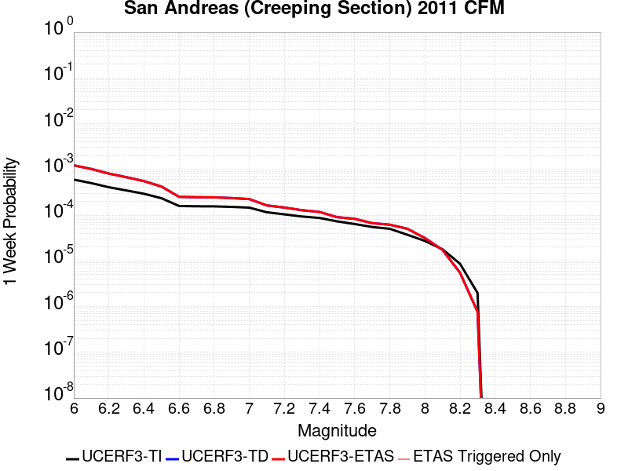 |  |  |  |

| Magnitude | 1 wk TI Prob | 1 wk TD Prob | 1 wk ETAS Prob | 1 wk ETAS/TD Gain | 1 wk ETAS Triggered Only | 1 mo TI Prob | 1 mo TD Prob | 1 mo ETAS Prob | 1 mo ETAS/TD Gain | 1 mo ETAS Triggered Only | 1 yr TI Prob | 1 yr TD Prob | 1 yr ETAS Prob | 1 yr ETAS/TD Gain | 1 yr ETAS Triggered Only | 10 yr TI Prob | 10 yr TD Prob | 10 yr ETAS Prob | 10 yr ETAS/TD Gain | 10 yr ETAS Triggered Only |
|-----|-----|-----|-----|-----|-----|-----|-----|-----|-----|-----|-----|-----|-----|-----|-----|-----|-----|-----|-----|-----|
| 6.0 | 5.986481E-4 | 0.0012277901 | 0.0012277901 | 1.0 | 0.0 | 0.0025631124 | 0.0052455855 | 0.0052455855 | 1.0 | 0.0 | 0.030762846 | 0.061229862 | 0.061251897 | 1.0003599 | 2.3473076E-5 | 0.26835477 | 0.42607152 | 0.42609847 | 1.0000632 | 4.6946152E-5 |
| 6.1 | 5.015945E-4 | 0.0010218644 | 0.0010218644 | 1.0 | 0.0 | 0.00214792 | 0.0043676887 | 0.0043676887 | 1.0 | 0.0 | 0.025839351 | 0.051269703 | 0.051291972 | 1.0004344 | 2.3473076E-5 | 0.23032776 | 0.37298882 | 0.37301823 | 1.0000789 | 4.6946152E-5 |
| 6.2 | 4.073338E-4 | 8.109829E-4 | 8.109829E-4 | 1.0 | 0.0 | 0.0017445484 | 0.0034675654 | 0.0034675654 | 1.0 | 0.0 | 0.021034058 | 0.040954083 | 0.040976595 | 1.0005497 | 2.3473076E-5 | 0.19150782 | 0.31317768 | 0.31320992 | 1.000103 | 4.6946152E-5 |
| 6.3 | 3.464099E-4 | 6.7405414E-4 | 6.7405414E-4 | 1.0 | 0.0 | 0.0014837692 | 0.0028840431 | 0.0028840431 | 1.0 | 0.0 | 0.017915873 | 0.034210727 | 0.034233395 | 1.0006627 | 2.3473076E-5 | 0.16538359 | 0.27146977 | 0.27150396 | 1.000126 | 4.6946152E-5 |
| 6.4 | 2.935057E-4 | 5.543318E-4 | 5.543318E-4 | 1.0 | 0.0 | 0.0012572751 | 0.0023728115 | 0.0023728115 | 1.0 | 0.0 | 0.015200248 | 0.028285956 | 0.028308764 | 1.0008063 | 2.3473076E-5 | 0.14201577 | 0.23314685 | 0.23318285 | 1.0001544 | 4.6946152E-5 |
| 6.5 | 2.3409708E-4 | 4.2106997E-4 | 4.2106997E-4 | 1.0 | 0.0 | 0.0010028875 | 0.001803265 | 0.001803265 | 1.0 | 0.0 | 0.012141965 | 0.02160988 | 0.021632846 | 1.0010628 | 2.3473076E-5 | 0.11499573 | 0.18699536 | 0.18703352 | 1.0002041 | 4.6946152E-5 |
| 6.6 | 1.5842178E-4 | 2.5115322E-4 | 2.5115322E-4 | 1.0 | 0.0 | 6.7877385E-4 | 0.0010759257 | 0.0010759257 | 1.0 | 0.0 | 0.0082328 | 0.013019121 | 0.013042289 | 1.0017794 | 2.3473076E-5 | 0.07934396 | 0.12333139 | 0.12337255 | 1.0003337 | 4.6946152E-5 |
| 6.7 | 1.5616413E-4 | 2.4651614E-4 | 2.4651614E-4 | 1.0 | 0.0 | 6.691031E-4 | 0.0010560687 | 0.0010560687 | 1.0 | 0.0 | 0.0081159435 | 0.012780937 | 0.012804111 | 1.001813 | 2.3473076E-5 | 0.0782586 | 0.12135857 | 0.12139982 | 1.0003399 | 4.6946152E-5 |
| 6.8 | 1.5538467E-4 | 2.4475376E-4 | 2.4475376E-4 | 1.0 | 0.0 | 6.6576427E-4 | 0.0010485224 | 0.0010485224 | 1.0 | 0.0 | 0.008075596 | 0.0126902815 | 0.0127134565 | 1.0018262 | 2.3473076E-5 | 0.07788358 | 0.12058931 | 0.12063059 | 1.0003424 | 4.6946152E-5 |
| 6.9 | 1.5153569E-4 | 2.3584193E-4 | 2.3584193E-4 | 1.0 | 0.0 | 6.49277E-4 | 0.0010103616 | 0.0010103616 | 1.0 | 0.0 | 0.007876333 | 0.0122323 | 0.012255486 | 1.0018954 | 2.3473076E-5 | 0.07602952 | 0.11665895 | 0.11670042 | 1.0003555 | 4.6946152E-5 |
| 7.0 | 1.4588932E-4 | 2.2441045E-4 | 2.2441045E-4 | 1.0 | 0.0 | 6.250901E-4 | 9.6140656E-4 | 9.6140656E-4 | 1.0 | 0.0 | 0.0075839474 | 0.011642803 | 0.011666003 | 1.0019926 | 2.3473076E-5 | 0.073302895 | 0.11150479 | 0.11154651 | 1.0003741 | 4.6946152E-5 |
| 7.1 | 1.1565079E-4 | 1.6318668E-4 | 1.6318668E-4 | 1.0 | 0.0 | 4.955521E-4 | 6.991849E-4 | 6.991849E-4 | 1.0 | 0.0 | 0.006016669 | 0.008479553 | 0.008502827 | 1.0027447 | 2.3473076E-5 | 0.058563538 | 0.08383247 | 0.083875485 | 1.0005131 | 4.6946152E-5 |
| 7.2 | 1.0393792E-4 | 1.4650424E-4 | 1.4650424E-4 | 1.0 | 0.0 | 4.4537216E-4 | 6.2772504E-4 | 6.2772504E-4 | 1.0 | 0.0 | 0.005408933 | 0.007615941 | 0.0076392354 | 1.0030587 | 2.3473076E-5 | 0.052791595 | 0.075774014 | 0.0758174 | 1.0005726 | 4.6946152E-5 |
| 7.3 | 9.332884E-5 | 1.2811116E-4 | 1.2811116E-4 | 1.0 | 0.0 | 3.999194E-4 | 5.4893293E-4 | 5.4893293E-4 | 1.0 | 0.0 | 0.0048581534 | 0.006662914 | 0.0066862307 | 1.0034995 | 2.3473076E-5 | 0.047533102 | 0.06662133 | 0.066643246 | 1.0003289 | 2.3473076E-5 |
| 7.4 | 8.670252E-5 | 1.17293064E-4 | 1.17293064E-4 | 1.0 | 0.0 | 3.715293E-4 | 5.0258834E-4 | 5.0258834E-4 | 1.0 | 0.0 | 0.004513991 | 0.006101966 | 0.006125296 | 1.0038233 | 2.3473076E-5 | 0.044233937 | 0.06127167 | 0.061293706 | 1.0003597 | 2.3473076E-5 |
| 7.5 | 7.3036405E-5 | 9.027501E-5 | 9.027501E-5 | 1.0 | 0.0 | 3.129756E-4 | 3.8683563E-4 | 3.8683563E-4 | 1.0 | 0.0 | 0.0038038217 | 0.0046995743 | 0.004722937 | 1.0049713 | 2.3473076E-5 | 0.03739367 | 0.047980286 | 0.048002634 | 1.0004658 | 2.3473076E-5 |
| 7.6 | 6.3935775E-5 | 8.298733E-5 | 8.298733E-5 | 1.0 | 0.0 | 2.7398168E-4 | 3.5561158E-4 | 3.5561158E-4 | 1.0 | 0.0 | 0.0033306254 | 0.0043209945 | 0.0043443665 | 1.0054089 | 2.3473076E-5 | 0.032811474 | 0.04407886 | 0.044101298 | 1.000509 | 2.3473076E-5 |
| 7.7 | 5.5050095E-5 | 6.6780485E-5 | 6.6780485E-5 | 1.0 | 0.0 | 2.3590765E-4 | 2.861707E-4 | 2.861707E-4 | 1.0 | 0.0 | 0.0028683927 | 0.003478566 | 0.0035019575 | 1.0067245 | 2.3473076E-5 | 0.0283165 | 0.035874426 | 0.035897058 | 1.0006309 | 2.3473076E-5 |
| 7.8 | 5.027131E-5 | 6.177649E-5 | 6.177649E-5 | 1.0 | 0.0 | 2.1543067E-4 | 2.6472952E-4 | 2.6472952E-4 | 1.0 | 0.0 | 0.0026197135 | 0.0032183218 | 0.0032417192 | 1.0072701 | 2.3473076E-5 | 0.025890453 | 0.033198178 | 0.033220872 | 1.0006835 | 2.3473076E-5 |
| 7.9 | 3.7271806E-5 | 5.034326E-5 | 5.034326E-5 | 1.0 | 0.0 | 1.5972654E-4 | 2.15739E-4 | 2.15739E-4 | 1.0 | 0.0 | 0.0019429359 | 0.0026234603 | 0.0026468718 | 1.0089239 | 2.3473076E-5 | 0.019260362 | 0.027125074 | 0.02714791 | 1.0008419 | 2.3473076E-5 |
| 8.0 | 2.7310243E-5 | 3.1506686E-5 | 3.1506686E-5 | 1.0 | 0.0 | 1.17038646E-4 | 1.3502168E-4 | 1.3502168E-4 | 1.0 | 0.0 | 0.0014240141 | 0.0016426502 | 0.0016660846 | 1.0142663 | 2.3473076E-5 | 0.014149235 | 0.017253635 | 0.017276702 | 1.001337 | 2.3473076E-5 |
| 8.1 | 1.7940547E-5 | 1.7450684E-5 | 1.7450684E-5 | 1.0 | 0.0 | 7.688579E-5 | 7.4786505E-5 | 7.4786505E-5 | 1.0 | 0.0 | 9.3568244E-4 | 9.1014587E-4 | 9.1014587E-4 | 1.0 | 0.0 | 0.009317525 | 0.009825298 | 0.009825298 | 1.0 | 0.0 |
| 8.2 | 8.643924E-6 | 5.49522E-6 | 5.49522E-6 | 1.0 | 0.0 | 3.704486E-5 | 2.355073E-5 | 2.355073E-5 | 1.0 | 0.0 | 4.5092785E-4 | 2.866925E-4 | 2.866925E-4 | 1.0 | 0.0 | 0.0045001395 | 0.0032598388 | 0.0032598388 | 1.0 | 0.0 |
| 8.3 | 1.983087E-6 | 7.693574E-7 | 7.693574E-7 | 1.0 | 0.0 | 8.498917E-6 | 3.297242E-6 | 3.297242E-6 | 1.0 | 0.0 | 1.034694E-4 | 4.01432E-5 | 4.01432E-5 | 1.0 | 0.0 | 0.0010342124 | 4.7390026E-4 | 4.7390026E-4 | 1.0 | 0.0 |

## Ortigalita (North)
*[(top)](#table-of-contents)*

| 1 Week | 1 Month | 1 Year | 10 Year |
|-----|-----|-----|-----|
|  |  |  |  |

| Magnitude | 1 wk TI Prob | 1 wk TD Prob | 1 wk ETAS Prob | 1 wk ETAS/TD Gain | 1 wk ETAS Triggered Only | 1 mo TI Prob | 1 mo TD Prob | 1 mo ETAS Prob | 1 mo ETAS/TD Gain | 1 mo ETAS Triggered Only | 1 yr TI Prob | 1 yr TD Prob | 1 yr ETAS Prob | 1 yr ETAS/TD Gain | 1 yr ETAS Triggered Only | 10 yr TI Prob | 10 yr TD Prob | 10 yr ETAS Prob | 10 yr ETAS/TD Gain | 10 yr ETAS Triggered Only |
|-----|-----|-----|-----|-----|-----|-----|-----|-----|-----|-----|-----|-----|-----|-----|-----|-----|-----|-----|-----|-----|
| 6.0 | 7.711876E-5 | 1.05086016E-4 | 1.05086016E-4 | 1.0 | 0.0 | 3.3046713E-4 | 4.5030177E-4 | 4.7376426E-4 | 1.052104 | 2.3473076E-5 | 0.004016016 | 0.005468958 | 0.0054923026 | 1.0042685 | 2.3473076E-5 | 0.039442103 | 0.053463764 | 0.053485986 | 1.0004156 | 2.3473076E-5 |
| 6.1 | 4.607858E-5 | 6.024935E-5 | 6.024935E-5 | 1.0 | 0.0 | 1.9746469E-4 | 2.5818875E-4 | 2.5818875E-4 | 1.0 | 0.0 | 0.0024014818 | 0.003139252 | 0.003139252 | 1.0 | 0.0 | 0.023756953 | 0.030979859 | 0.030979859 | 1.0 | 0.0 |
| 6.2 | 4.607858E-5 | 6.024935E-5 | 6.024935E-5 | 1.0 | 0.0 | 1.9746469E-4 | 2.5818875E-4 | 2.5818875E-4 | 1.0 | 0.0 | 0.0024014818 | 0.003139252 | 0.003139252 | 1.0 | 0.0 | 0.023756953 | 0.030979859 | 0.030979859 | 1.0 | 0.0 |
| 6.3 | 3.327423E-5 | 4.2481566E-5 | 4.2481566E-5 | 1.0 | 0.0 | 1.4259605E-4 | 1.8205289E-4 | 1.8205289E-4 | 1.0 | 0.0 | 0.0017347244 | 0.0022145277 | 0.0022145277 | 1.0 | 0.0 | 0.017212452 | 0.021948816 | 0.021948816 | 1.0 | 0.0 |
| 6.4 | 2.7732503E-5 | 3.5003635E-5 | 3.5003635E-5 | 1.0 | 0.0 | 1.1884817E-4 | 1.5000845E-4 | 1.5000845E-4 | 1.0 | 0.0 | 0.001446016 | 0.0018250674 | 0.0018250674 | 1.0 | 0.0 | 0.014366428 | 0.018123753 | 0.018123753 | 1.0 | 0.0 |
| 6.5 | 2.7689714E-5 | 3.4953442E-5 | 3.4953442E-5 | 1.0 | 0.0 | 1.186648E-4 | 1.4979337E-4 | 1.4979337E-4 | 1.0 | 0.0 | 0.0014437864 | 0.0018224533 | 0.0018224533 | 1.0 | 0.0 | 0.014344421 | 0.018098038 | 0.018098038 | 1.0 | 0.0 |
| 6.6 | 2.2976905E-5 | 2.8722226E-5 | 2.8722226E-5 | 1.0 | 0.0 | 9.846873E-5 | 1.2309088E-4 | 1.2309088E-4 | 1.0 | 0.0 | 0.0011981975 | 0.001497839 | 0.001497839 | 1.0 | 0.0 | 0.011917574 | 0.014900712 | 0.014900712 | 1.0 | 0.0 |
| 6.7 | 1.9871539E-5 | 2.4907882E-5 | 2.4907882E-5 | 1.0 | 0.0 | 8.516096E-5 | 1.067451E-4 | 1.067451E-4 | 1.0 | 0.0 | 0.0010363415 | 0.0012990955 | 0.0012990955 | 1.0 | 0.0 | 0.010315218 | 0.012938703 | 0.012938703 | 1.0 | 0.0 |
| 6.8 | 6.5640475E-6 | 7.6061337E-6 | 7.6061337E-6 | 1.0 | 0.0 | 2.813133E-5 | 3.2597323E-5 | 3.2597323E-5 | 1.0 | 0.0 | 3.424451E-4 | 3.9680302E-4 | 3.9680302E-4 | 1.0 | 0.0 | 0.0034191788 | 0.0039612325 | 0.0039612325 | 1.0 | 0.0 |
| 6.9 | 5.6219683E-6 | 6.5023783E-6 | 6.5023783E-6 | 1.0 | 0.0 | 2.4093928E-5 | 2.7867052E-5 | 2.7867052E-5 | 1.0 | 0.0 | 2.933041E-4 | 3.3923113E-4 | 3.3923113E-4 | 1.0 | 0.0 | 0.0029291727 | 0.00338739 | 0.00338739 | 1.0 | 0.0 |
| 7.0 | 3.875591E-6 | 4.4851295E-6 | 4.4851295E-6 | 1.0 | 0.0 | 1.6609569E-5 | 1.9221854E-5 | 1.9221854E-5 | 1.0 | 0.0 | 2.0220275E-4 | 2.3400305E-4 | 2.3400305E-4 | 1.0 | 0.0 | 0.0020201886 | 0.0023377747 | 0.0023377747 | 1.0 | 0.0 |
| 7.1 | 1.6017933E-6 | 1.857199E-6 | 1.857199E-6 | 1.0 | 0.0 | 6.8648105E-6 | 7.959406E-6 | 7.959406E-6 | 1.0 | 0.0 | 8.357586E-5 | 9.690253E-5 | 9.690253E-5 | 1.0 | 0.0 | 8.3544437E-4 | 9.6870743E-4 | 9.6870743E-4 | 1.0 | 0.0 |

## Manix-Afton Hills
*[(top)](#table-of-contents)*

| 1 Week | 1 Month | 1 Year | 10 Year |
|-----|-----|-----|-----|
|  |  |  |  |

| Magnitude | 1 wk TI Prob | 1 wk TD Prob | 1 wk ETAS Prob | 1 wk ETAS/TD Gain | 1 wk ETAS Triggered Only | 1 mo TI Prob | 1 mo TD Prob | 1 mo ETAS Prob | 1 mo ETAS/TD Gain | 1 mo ETAS Triggered Only | 1 yr TI Prob | 1 yr TD Prob | 1 yr ETAS Prob | 1 yr ETAS/TD Gain | 1 yr ETAS Triggered Only | 10 yr TI Prob | 10 yr TD Prob | 10 yr ETAS Prob | 10 yr ETAS/TD Gain | 10 yr ETAS Triggered Only |
|-----|-----|-----|-----|-----|-----|-----|-----|-----|-----|-----|-----|-----|-----|-----|-----|-----|-----|-----|-----|-----|
| 6.0 | 1.3783202E-5 | 1.4711616E-5 | 1.4711616E-5 | 1.0 | 0.0 | 5.906953E-5 | 6.3048356E-5 | 6.3048356E-5 | 1.0 | 0.0 | 7.189342E-4 | 7.673609E-4 | 7.90816E-4 | 1.0305659 | 2.3473076E-5 | 0.0071661277 | 0.0076488685 | 0.0076721623 | 1.0030453 | 2.3473076E-5 |
| 6.1 | 1.3783202E-5 | 1.4711616E-5 | 1.4711616E-5 | 1.0 | 0.0 | 5.906953E-5 | 6.3048356E-5 | 6.3048356E-5 | 1.0 | 0.0 | 7.189342E-4 | 7.673609E-4 | 7.90816E-4 | 1.0305659 | 2.3473076E-5 | 0.0071661277 | 0.0076488685 | 0.0076721623 | 1.0030453 | 2.3473076E-5 |
| 6.2 | 1.3783202E-5 | 1.4711616E-5 | 1.4711616E-5 | 1.0 | 0.0 | 5.906953E-5 | 6.3048356E-5 | 6.3048356E-5 | 1.0 | 0.0 | 7.189342E-4 | 7.673609E-4 | 7.90816E-4 | 1.0305659 | 2.3473076E-5 | 0.0071661277 | 0.0076488685 | 0.0076721623 | 1.0030453 | 2.3473076E-5 |
| 6.3 | 1.10494875E-5 | 1.1793558E-5 | 1.1793558E-5 | 1.0 | 0.0 | 4.7354086E-5 | 5.0542898E-5 | 5.0542898E-5 | 1.0 | 0.0 | 5.763835E-4 | 6.151964E-4 | 6.151964E-4 | 1.0 | 0.0 | 0.005748908 | 0.0061359745 | 0.0061359745 | 1.0 | 0.0 |
| 6.4 | 1.10494875E-5 | 1.1793558E-5 | 1.1793558E-5 | 1.0 | 0.0 | 4.7354086E-5 | 5.0542898E-5 | 5.0542898E-5 | 1.0 | 0.0 | 5.763835E-4 | 6.151964E-4 | 6.151964E-4 | 1.0 | 0.0 | 0.005748908 | 0.0061359745 | 0.0061359745 | 1.0 | 0.0 |
| 6.5 | 9.788949E-6 | 1.0454697E-5 | 1.0454697E-5 | 1.0 | 0.0 | 4.1951964E-5 | 4.480513E-5 | 4.480513E-5 | 1.0 | 0.0 | 5.1064545E-4 | 5.453752E-4 | 5.453752E-4 | 1.0 | 0.0 | 0.0050947363 | 0.005441295 | 0.005441295 | 1.0 | 0.0 |
| 6.6 | 8.810006E-6 | 9.413971E-6 | 9.413971E-6 | 1.0 | 0.0 | 3.775662E-5 | 4.0345018E-5 | 4.0345018E-5 | 1.0 | 0.0 | 4.5958988E-4 | 4.9109873E-4 | 4.9109873E-4 | 1.0 | 0.0 | 0.0045864056 | 0.0049010175 | 0.0049010175 | 1.0 | 0.0 |
| 6.7 | 8.80128E-6 | 9.404451E-6 | 9.404451E-6 | 1.0 | 0.0 | 3.7719226E-5 | 4.0304214E-5 | 4.0304214E-5 | 1.0 | 0.0 | 4.591348E-4 | 4.906022E-4 | 4.906022E-4 | 1.0 | 0.0 | 0.004581874 | 0.004896074 | 0.004896074 | 1.0 | 0.0 |
| 6.8 | 6.8994877E-6 | 7.3803494E-6 | 7.3803494E-6 | 1.0 | 0.0 | 2.9568899E-5 | 3.162973E-5 | 3.162973E-5 | 1.0 | 0.0 | 3.5994186E-4 | 3.850321E-4 | 3.850321E-4 | 1.0 | 0.0 | 0.003593594 | 0.0038444551 | 0.0038444551 | 1.0 | 0.0 |
| 6.9 | 4.9328037E-6 | 5.271154E-6 | 5.271154E-6 | 1.0 | 0.0 | 2.1140417E-5 | 2.2590497E-5 | 2.2590497E-5 | 1.0 | 0.0 | 2.5735417E-4 | 2.7501077E-4 | 2.7501077E-4 | 1.0 | 0.0 | 0.0025705635 | 0.0027473096 | 0.0027473096 | 1.0 | 0.0 |
| 7.0 | 3.347973E-6 | 3.590168E-6 | 3.590168E-6 | 1.0 | 0.0 | 1.4348378E-5 | 1.5386368E-5 | 1.5386368E-5 | 1.0 | 0.0 | 1.746775E-4 | 1.8731703E-4 | 1.8731703E-4 | 1.0 | 0.0 | 0.0017454025 | 0.0018719939 | 0.0018719939 | 1.0 | 0.0 |
| 7.1 | 1.2073567E-6 | 1.293531E-6 | 1.293531E-6 | 1.0 | 0.0 | 5.1743755E-6 | 5.5437017E-6 | 5.5437017E-6 | 1.0 | 0.0 | 6.29962E-5 | 6.749411E-5 | 6.749411E-5 | 1.0 | 0.0 | 6.297835E-4 | 6.748963E-4 | 6.748963E-4 | 1.0 | 0.0 |

## Hosgri
*[(top)](#table-of-contents)*

| 1 Week | 1 Month | 1 Year | 10 Year |
|-----|-----|-----|-----|
|  | 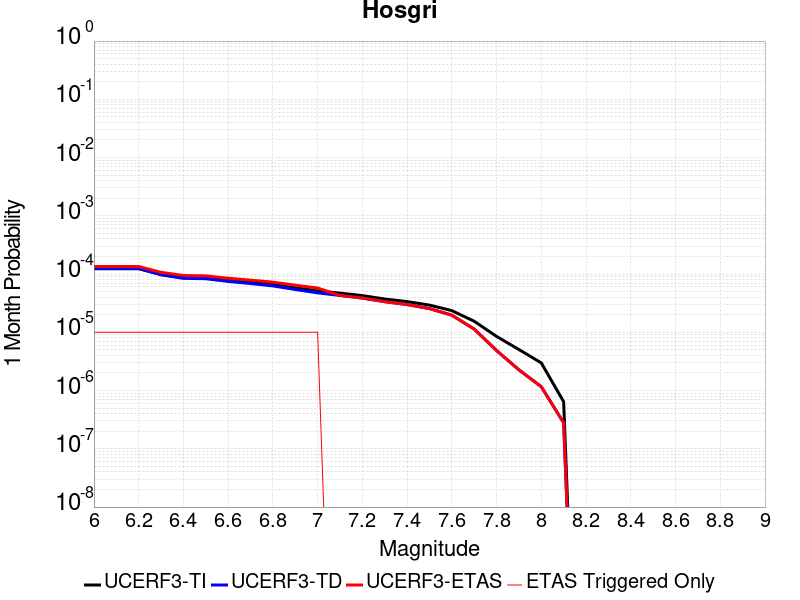 |  |  |

| Magnitude | 1 wk TI Prob | 1 wk TD Prob | 1 wk ETAS Prob | 1 wk ETAS/TD Gain | 1 wk ETAS Triggered Only | 1 mo TI Prob | 1 mo TD Prob | 1 mo ETAS Prob | 1 mo ETAS/TD Gain | 1 mo ETAS Triggered Only | 1 yr TI Prob | 1 yr TD Prob | 1 yr ETAS Prob | 1 yr ETAS/TD Gain | 1 yr ETAS Triggered Only | 10 yr TI Prob | 10 yr TD Prob | 10 yr ETAS Prob | 10 yr ETAS/TD Gain | 10 yr ETAS Triggered Only |
|-----|-----|-----|-----|-----|-----|-----|-----|-----|-----|-----|-----|-----|-----|-----|-----|-----|-----|-----|-----|-----|
| 6.0 | 2.883978E-5 | 2.9130051E-5 | 2.9130051E-5 | 1.0 | 0.0 | 1.235932E-4 | 1.2483726E-4 | 1.2483726E-4 | 1.0 | 0.0 | 0.0015037085 | 0.0015188612 | 0.0015422986 | 1.0154309 | 2.3473076E-5 | 0.01493574 | 0.015088581 | 0.0151117 | 1.0015322 | 2.3473076E-5 |
| 6.1 | 2.883978E-5 | 2.9130051E-5 | 2.9130051E-5 | 1.0 | 0.0 | 1.235932E-4 | 1.2483726E-4 | 1.2483726E-4 | 1.0 | 0.0 | 0.0015037085 | 0.0015188612 | 0.0015422986 | 1.0154309 | 2.3473076E-5 | 0.01493574 | 0.015088581 | 0.0151117 | 1.0015322 | 2.3473076E-5 |
| 6.2 | 2.883978E-5 | 2.9130051E-5 | 2.9130051E-5 | 1.0 | 0.0 | 1.235932E-4 | 1.2483726E-4 | 1.2483726E-4 | 1.0 | 0.0 | 0.0015037085 | 0.0015188612 | 0.0015422986 | 1.0154309 | 2.3473076E-5 | 0.01493574 | 0.015088581 | 0.0151117 | 1.0015322 | 2.3473076E-5 |
| 6.3 | 2.2914428E-5 | 2.2643277E-5 | 2.2643277E-5 | 1.0 | 0.0 | 9.8200995E-5 | 9.703903E-5 | 9.703903E-5 | 1.0 | 0.0 | 0.0011949413 | 0.0011808148 | 0.0011808148 | 1.0 | 0.0 | 0.011885363 | 0.011746808 | 0.011746808 | 1.0 | 0.0 |
| 6.4 | 2.0195741E-5 | 1.9697736E-5 | 1.9697736E-5 | 1.0 | 0.0 | 8.65503E-5 | 8.441615E-5 | 8.441615E-5 | 1.0 | 0.0 | 0.0010532405 | 0.0010272841 | 0.0010272841 | 1.0 | 0.0 | 0.010482626 | 0.0102264015 | 0.0102264015 | 1.0 | 0.0 |
| 6.5 | 1.9924333E-5 | 1.9410149E-5 | 1.9410149E-5 | 1.0 | 0.0 | 8.53872E-5 | 8.318371E-5 | 8.318371E-5 | 1.0 | 0.0 | 0.0010390934 | 0.001012293 | 0.001012293 | 1.0 | 0.0 | 0.010342481 | 0.0100778565 | 0.0100778565 | 1.0 | 0.0 |
| 6.6 | 1.809694E-5 | 1.7459393E-5 | 1.7459393E-5 | 1.0 | 0.0 | 7.7556004E-5 | 7.482383E-5 | 7.482383E-5 | 1.0 | 0.0 | 9.438353E-4 | 9.106007E-4 | 9.106007E-4 | 1.0 | 0.0 | 0.009398366 | 0.009069638 | 0.009069638 | 1.0 | 0.0 |
| 6.7 | 1.675989E-5 | 1.6043807E-5 | 1.6043807E-5 | 1.0 | 0.0 | 7.182612E-5 | 6.875736E-5 | 6.875736E-5 | 1.0 | 0.0 | 8.7413215E-4 | 8.3680055E-4 | 8.3680055E-4 | 1.0 | 0.0 | 0.008707017 | 0.008337403 | 0.008337403 | 1.0 | 0.0 |
| 6.8 | 1.5401129E-5 | 1.4615074E-5 | 1.4615074E-5 | 1.0 | 0.0 | 6.6003166E-5 | 6.2634535E-5 | 6.2634535E-5 | 1.0 | 0.0 | 8.032922E-4 | 7.623095E-4 | 7.623095E-4 | 1.0 | 0.0 | 0.008003947 | 0.0075978106 | 0.0075978106 | 1.0 | 0.0 |
| 6.9 | 1.356559E-5 | 1.2690892E-5 | 1.2690892E-5 | 1.0 | 0.0 | 5.8136946E-5 | 5.4388405E-5 | 5.4388405E-5 | 1.0 | 0.0 | 7.0758746E-4 | 6.619781E-4 | 6.619781E-4 | 1.0 | 0.0 | 0.007053386 | 0.006600868 | 0.006600868 | 1.0 | 0.0 |
| 7.0 | 1.2030819E-5 | 1.1096832E-5 | 1.1096832E-5 | 1.0 | 0.0 | 5.155963E-5 | 4.7556987E-5 | 4.7556987E-5 | 1.0 | 0.0 | 6.275577E-4 | 5.788526E-4 | 5.788526E-4 | 1.0 | 0.0 | 0.006257884 | 0.0057742097 | 0.0057742097 | 1.0 | 0.0 |
| 7.1 | 1.0972698E-5 | 1.0023018E-5 | 1.0023018E-5 | 1.0 | 0.0 | 4.7025E-5 | 4.2955086E-5 | 4.2955086E-5 | 1.0 | 0.0 | 5.72379E-4 | 5.2285276E-4 | 5.2285276E-4 | 1.0 | 0.0 | 0.0057090693 | 0.0052169785 | 0.0052169785 | 1.0 | 0.0 |
| 7.2 | 9.961926E-6 | 9.035558E-6 | 9.035558E-6 | 1.0 | 0.0 | 4.2693267E-5 | 3.8723243E-5 | 3.8723243E-5 | 1.0 | 0.0 | 5.1966653E-4 | 4.713536E-4 | 4.713536E-4 | 1.0 | 0.0 | 0.00518453 | 0.004704285 | 0.004704285 | 1.0 | 0.0 |
| 7.3 | 8.700929E-6 | 7.82888E-6 | 7.82888E-6 | 1.0 | 0.0 | 3.7289166E-5 | 3.3551914E-5 | 3.3551914E-5 | 1.0 | 0.0 | 4.53901E-4 | 4.0841804E-4 | 4.0841804E-4 | 1.0 | 0.0 | 0.00452975 | 0.0040774145 | 0.0040774145 | 1.0 | 0.0 |
| 7.4 | 7.866285E-6 | 6.9995003E-6 | 6.9995003E-6 | 1.0 | 0.0 | 3.3712215E-5 | 2.9997515E-5 | 2.9997515E-5 | 1.0 | 0.0 | 4.103689E-4 | 3.6515854E-4 | 3.6515854E-4 | 1.0 | 0.0 | 0.004096119 | 0.0036463232 | 0.0036463232 | 1.0 | 0.0 |
| 7.5 | 6.8381305E-6 | 5.9604317E-6 | 5.9604317E-6 | 1.0 | 0.0 | 2.9305946E-5 | 2.5544457E-5 | 2.5544457E-5 | 1.0 | 0.0 | 3.5674145E-4 | 3.109594E-4 | 3.109594E-4 | 1.0 | 0.0 | 0.0035616932 | 0.0031059785 | 0.0031059785 | 1.0 | 0.0 |
| 7.6 | 5.503376E-6 | 4.5959455E-6 | 4.5959455E-6 | 1.0 | 0.0 | 2.3585684E-5 | 1.969676E-5 | 1.969676E-5 | 1.0 | 0.0 | 2.8711787E-4 | 2.3978167E-4 | 2.3978167E-4 | 1.0 | 0.0 | 0.002867472 | 0.002395963 | 0.002395963 | 1.0 | 0.0 |
| 7.7 | 3.6144982E-6 | 2.652859E-6 | 2.652859E-6 | 1.0 | 0.0 | 1.5490614E-5 | 1.1369346E-5 | 1.1369346E-5 | 1.0 | 0.0 | 1.8858191E-4 | 1.38413E-4 | 1.38413E-4 | 1.0 | 0.0 | 0.0018842196 | 0.0013839996 | 0.0013839996 | 1.0 | 0.0 |
| 7.8 | 1.9853494E-6 | 1.1366585E-6 | 1.1366585E-6 | 1.0 | 0.0 | 8.508612E-6 | 4.8713846E-6 | 4.8713846E-6 | 1.0 | 0.0 | 1.0358743E-4 | 5.930749E-5 | 5.930749E-5 | 1.0 | 0.0 | 0.0010353916 | 5.9364707E-4 | 5.9364707E-4 | 1.0 | 0.0 |
| 7.9 | 1.1818757E-6 | 5.2994693E-7 | 5.2994693E-7 | 1.0 | 0.0 | 5.0651715E-6 | 2.271199E-6 | 2.271199E-6 | 1.0 | 0.0 | 6.1666724E-5 | 2.7651497E-5 | 2.7651497E-5 | 1.0 | 0.0 | 6.1649614E-4 | 2.771693E-4 | 2.771693E-4 | 1.0 | 0.0 |
| 8.0 | 6.962958E-7 | 2.716916E-7 | 2.716916E-7 | 1.0 | 0.0 | 2.9841215E-6 | 1.164392E-6 | 1.164392E-6 | 1.0 | 0.0 | 3.6331072E-5 | 1.417638E-5 | 1.417638E-5 | 1.0 | 0.0 | 3.6325134E-4 | 1.423256E-4 | 1.423256E-4 | 1.0 | 0.0 |
| 8.1 | 1.5033264E-7 | 6.5338824E-8 | 6.5338824E-8 | 1.0 | 0.0 | 6.442826E-7 | 2.800235E-7 | 2.800235E-7 | 1.0 | 0.0 | 7.844113E-6 | 3.409281E-6 | 3.409281E-6 | 1.0 | 0.0 | 7.843835E-5 | 3.410959E-5 | 3.410959E-5 | 1.0 | 0.0 |

## San Jacinto (Lytle Creek connector)
*[(top)](#table-of-contents)*

| 1 Week | 1 Month | 1 Year | 10 Year |
|-----|-----|-----|-----|
| 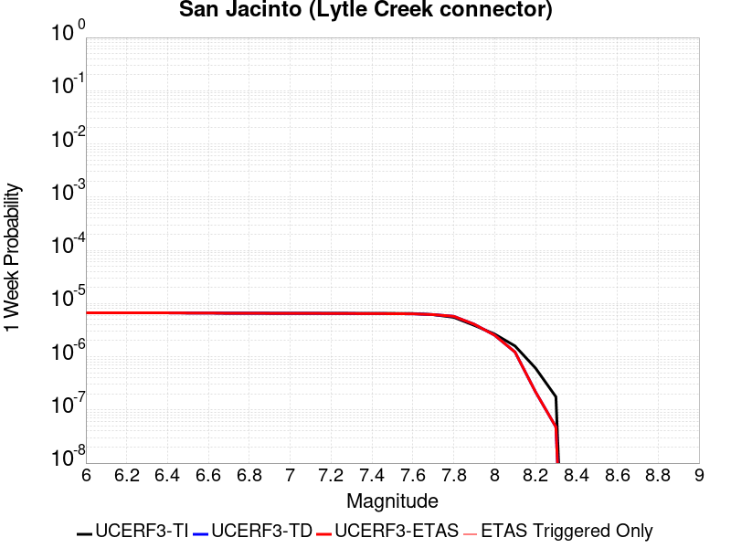 |  |  |  |

| Magnitude | 1 wk TI Prob | 1 wk TD Prob | 1 wk ETAS Prob | 1 wk ETAS/TD Gain | 1 wk ETAS Triggered Only | 1 mo TI Prob | 1 mo TD Prob | 1 mo ETAS Prob | 1 mo ETAS/TD Gain | 1 mo ETAS Triggered Only | 1 yr TI Prob | 1 yr TD Prob | 1 yr ETAS Prob | 1 yr ETAS/TD Gain | 1 yr ETAS Triggered Only | 10 yr TI Prob | 10 yr TD Prob | 10 yr ETAS Prob | 10 yr ETAS/TD Gain | 10 yr ETAS Triggered Only |
|-----|-----|-----|-----|-----|-----|-----|-----|-----|-----|-----|-----|-----|-----|-----|-----|-----|-----|-----|-----|-----|
| 6.0 | 6.693995E-6 | 6.6710027E-6 | 6.6710027E-6 | 1.0 | 0.0 | 2.8688235E-5 | 2.8589699E-5 | 2.8589699E-5 | 1.0 | 0.0 | 3.492233E-4 | 3.4802407E-4 | 3.7148898E-4 | 1.0674232 | 2.3473076E-5 | 0.00348675 | 0.0035549873 | 0.003578377 | 1.0065794 | 2.3473076E-5 |
| 6.1 | 6.693995E-6 | 6.6710027E-6 | 6.6710027E-6 | 1.0 | 0.0 | 2.8688235E-5 | 2.8589699E-5 | 2.8589699E-5 | 1.0 | 0.0 | 3.492233E-4 | 3.4802407E-4 | 3.7148898E-4 | 1.0674232 | 2.3473076E-5 | 0.00348675 | 0.0035549873 | 0.003578377 | 1.0065794 | 2.3473076E-5 |
| 6.2 | 6.693995E-6 | 6.6710027E-6 | 6.6710027E-6 | 1.0 | 0.0 | 2.8688235E-5 | 2.8589699E-5 | 2.8589699E-5 | 1.0 | 0.0 | 3.492233E-4 | 3.4802407E-4 | 3.7148898E-4 | 1.0674232 | 2.3473076E-5 | 0.00348675 | 0.0035549873 | 0.003578377 | 1.0065794 | 2.3473076E-5 |
| 6.3 | 6.693995E-6 | 6.6710027E-6 | 6.6710027E-6 | 1.0 | 0.0 | 2.8688235E-5 | 2.8589699E-5 | 2.8589699E-5 | 1.0 | 0.0 | 3.492233E-4 | 3.4802407E-4 | 3.7148898E-4 | 1.0674232 | 2.3473076E-5 | 0.00348675 | 0.0035549873 | 0.003578377 | 1.0065794 | 2.3473076E-5 |
| 6.4 | 6.693995E-6 | 6.6710027E-6 | 6.6710027E-6 | 1.0 | 0.0 | 2.8688235E-5 | 2.8589699E-5 | 2.8589699E-5 | 1.0 | 0.0 | 3.492233E-4 | 3.4802407E-4 | 3.7148898E-4 | 1.0674232 | 2.3473076E-5 | 0.00348675 | 0.0035549873 | 0.003578377 | 1.0065794 | 2.3473076E-5 |
| 6.5 | 6.6561875E-6 | 6.63122E-6 | 6.63122E-6 | 1.0 | 0.0 | 2.8526205E-5 | 2.8419205E-5 | 2.8419205E-5 | 1.0 | 0.0 | 3.472512E-4 | 3.4594897E-4 | 3.694139E-4 | 1.0678278 | 2.3473076E-5 | 0.0034670907 | 0.0035343023 | 0.0035576925 | 1.006618 | 2.3473076E-5 |
| 6.6 | 6.6561875E-6 | 6.63122E-6 | 6.63122E-6 | 1.0 | 0.0 | 2.8526205E-5 | 2.8419205E-5 | 2.8419205E-5 | 1.0 | 0.0 | 3.472512E-4 | 3.4594897E-4 | 3.694139E-4 | 1.0678278 | 2.3473076E-5 | 0.0034670907 | 0.0035343023 | 0.0035576925 | 1.006618 | 2.3473076E-5 |
| 6.7 | 6.5802237E-6 | 6.550394E-6 | 6.550394E-6 | 1.0 | 0.0 | 2.8200653E-5 | 2.8072815E-5 | 2.8072815E-5 | 1.0 | 0.0 | 3.4328885E-4 | 3.41733E-4 | 3.6519807E-4 | 1.0686649 | 2.3473076E-5 | 0.0034275902 | 0.0034922757 | 0.0035156668 | 1.006698 | 2.3473076E-5 |
| 6.8 | 6.575632E-6 | 6.544883E-6 | 6.544883E-6 | 1.0 | 0.0 | 2.8180975E-5 | 2.8049197E-5 | 2.8049197E-5 | 1.0 | 0.0 | 3.4304935E-4 | 3.4144553E-4 | 3.649106E-4 | 1.0687227 | 2.3473076E-5 | 0.0034252026 | 0.00348941 | 0.0035128014 | 1.0067035 | 2.3473076E-5 |
| 6.9 | 6.570433E-6 | 6.5362756E-6 | 6.5362756E-6 | 1.0 | 0.0 | 2.8158694E-5 | 2.801231E-5 | 2.801231E-5 | 1.0 | 0.0 | 3.4277816E-4 | 3.4099657E-4 | 3.6446165E-4 | 1.0688132 | 2.3473076E-5 | 0.0034224992 | 0.0034849346 | 0.0035083257 | 1.0067121 | 2.3473076E-5 |
| 7.0 | 6.5643826E-6 | 6.526395E-6 | 6.526395E-6 | 1.0 | 0.0 | 2.8132765E-5 | 2.7969963E-5 | 2.7969963E-5 | 1.0 | 0.0 | 3.424626E-4 | 3.4048117E-4 | 3.6394625E-4 | 1.0689174 | 2.3473076E-5 | 0.0034193532 | 0.0034797967 | 0.0035031883 | 1.0067221 | 2.3473076E-5 |
| 7.1 | 6.557402E-6 | 6.515105E-6 | 6.515105E-6 | 1.0 | 0.0 | 2.8102848E-5 | 2.792158E-5 | 2.792158E-5 | 1.0 | 0.0 | 3.4209844E-4 | 3.3989229E-4 | 3.6335737E-4 | 1.0690368 | 2.3473076E-5 | 0.0034157229 | 0.0034739273 | 0.0034973188 | 1.0067334 | 2.3473076E-5 |
| 7.2 | 6.546394E-6 | 6.4970677E-6 | 6.4970677E-6 | 1.0 | 0.0 | 2.8055672E-5 | 2.784428E-5 | 2.784428E-5 | 1.0 | 0.0 | 3.4152428E-4 | 3.3895145E-4 | 3.6241655E-4 | 1.0692285 | 2.3473076E-5 | 0.0034099987 | 0.0034645528 | 0.0034879444 | 1.0067518 | 2.3473076E-5 |
| 7.3 | 6.5364216E-6 | 6.477847E-6 | 6.477847E-6 | 1.0 | 0.0 | 2.8012933E-5 | 2.7761906E-5 | 2.7761906E-5 | 1.0 | 0.0 | 3.4100408E-4 | 3.3794885E-4 | 3.61414E-4 | 1.069434 | 2.3473076E-5 | 0.003404813 | 0.003454571 | 0.003477963 | 1.0067713 | 2.3473076E-5 |
| 7.4 | 6.5269523E-6 | 6.4589262E-6 | 6.4589262E-6 | 1.0 | 0.0 | 2.7972354E-5 | 2.7680819E-5 | 2.7680819E-5 | 1.0 | 0.0 | 3.4051016E-4 | 3.3696194E-4 | 3.604271E-4 | 1.0696374 | 2.3473076E-5 | 0.0033998888 | 0.003444749 | 0.0034681412 | 1.0067906 | 2.3473076E-5 |
| 7.5 | 6.5111835E-6 | 6.435192E-6 | 6.435192E-6 | 1.0 | 0.0 | 2.7904773E-5 | 2.7579103E-5 | 2.7579103E-5 | 1.0 | 0.0 | 3.3968766E-4 | 3.3572392E-4 | 3.591891E-4 | 1.0698943 | 2.3473076E-5 | 0.0033916887 | 0.003432418 | 0.0034558105 | 1.0068152 | 2.3473076E-5 |
| 7.6 | 6.4768806E-6 | 6.3942884E-6 | 6.3942884E-6 | 1.0 | 0.0 | 2.7757764E-5 | 2.7403805E-5 | 2.7403805E-5 | 1.0 | 0.0 | 3.3789838E-4 | 3.3359032E-4 | 3.5705557E-4 | 1.0703415 | 2.3473076E-5 | 0.0033738504 | 0.0034111436 | 0.0034345365 | 1.0068579 | 2.3473076E-5 |
| 7.7 | 6.1655364E-6 | 6.1866886E-6 | 6.1866886E-6 | 1.0 | 0.0 | 2.642346E-5 | 2.651411E-5 | 2.651411E-5 | 1.0 | 0.0 | 3.2165812E-4 | 3.2276154E-4 | 3.4622703E-4 | 1.0727023 | 2.3473076E-5 | 0.0032119295 | 0.0033027146 | 0.00332611 | 1.0070838 | 2.3473076E-5 |
| 7.8 | 5.5043524E-6 | 5.747449E-6 | 5.747449E-6 | 1.0 | 0.0 | 2.3589868E-5 | 2.4631692E-5 | 2.4631692E-5 | 1.0 | 0.0 | 2.871688E-4 | 2.9984963E-4 | 3.2331567E-4 | 1.0782593 | 2.3473076E-5 | 0.0028679797 | 0.0030726613 | 0.0030960622 | 1.0076158 | 2.3473076E-5 |
| 7.9 | 3.889249E-6 | 4.0851965E-6 | 4.0851965E-6 | 1.0 | 0.0 | 1.6668104E-5 | 1.7507866E-5 | 1.7507866E-5 | 1.0 | 0.0 | 2.0291525E-4 | 2.1313746E-4 | 2.3660554E-4 | 1.1101077 | 2.3473076E-5 | 0.0020273007 | 0.0021987387 | 0.00222216 | 1.0106522 | 2.3473076E-5 |
| 8.0 | 2.668535E-6 | 2.537347E-6 | 2.537347E-6 | 1.0 | 0.0 | 1.1436528E-5 | 1.0874299E-5 | 1.0874299E-5 | 1.0 | 0.0 | 1.3923083E-4 | 1.3238657E-4 | 1.5585654E-4 | 1.1772836 | 2.3473076E-5 | 0.0013914363 | 0.0013788831 | 0.0014023238 | 1.0169997 | 2.3473076E-5 |
| 8.1 | 1.5911459E-6 | 1.2217948E-6 | 1.2217948E-6 | 1.0 | 0.0 | 6.8191785E-6 | 5.2362534E-6 | 5.2362534E-6 | 1.0 | 0.0 | 8.3020335E-5 | 6.374954E-5 | 8.722112E-5 | 1.3681843 | 2.3473076E-5 | 8.298933E-4 | 6.7100645E-4 | 6.944638E-4 | 1.0349584 | 2.3473076E-5 |
| 8.2 | 6.1294963E-7 | 2.1905348E-7 | 2.1905348E-7 | 1.0 | 0.0 | 2.6269242E-6 | 9.3880027E-7 | 9.3880027E-7 | 1.0 | 0.0 | 3.1982334E-5 | 1.1429834E-5 | 1.1429834E-5 | 1.0 | 0.0 | 3.1977732E-4 | 1.2836853E-4 | 1.2836853E-4 | 1.0 | 0.0 |
| 8.3 | 1.762871E-7 | 4.7785655E-8 | 4.7785655E-8 | 1.0 | 0.0 | 7.5551594E-7 | 2.0479564E-7 | 2.0479564E-7 | 1.0 | 0.0 | 9.1983675E-6 | 2.4933843E-6 | 2.4933843E-6 | 1.0 | 0.0 | 9.197987E-5 | 2.8824745E-5 | 2.8824745E-5 | 1.0 | 0.0 |

## Coyote Canyon
*[(top)](#table-of-contents)*

| 1 Week | 1 Month | 1 Year | 10 Year |
|-----|-----|-----|-----|
|  |  |  |  |

| Magnitude | 1 wk TI Prob | 1 wk TD Prob | 1 wk ETAS Prob | 1 wk ETAS/TD Gain | 1 wk ETAS Triggered Only | 1 mo TI Prob | 1 mo TD Prob | 1 mo ETAS Prob | 1 mo ETAS/TD Gain | 1 mo ETAS Triggered Only | 1 yr TI Prob | 1 yr TD Prob | 1 yr ETAS Prob | 1 yr ETAS/TD Gain | 1 yr ETAS Triggered Only | 10 yr TI Prob | 10 yr TD Prob | 10 yr ETAS Prob | 10 yr ETAS/TD Gain | 10 yr ETAS Triggered Only |
|-----|-----|-----|-----|-----|-----|-----|-----|-----|-----|-----|-----|-----|-----|-----|-----|-----|-----|-----|-----|-----|
| 6.0 | 3.5090034E-5 | 4.0367544E-5 | 4.0367544E-5 | 1.0 | 0.0 | 1.503772E-4 | 1.7299375E-4 | 1.7299375E-4 | 1.0 | 0.0 | 0.0018293047 | 0.0021044204 | 0.0021044204 | 1.0 | 0.0 | 0.018143194 | 0.020870851 | 0.020893835 | 1.0011013 | 2.3473076E-5 |
| 6.1 | 3.5090034E-5 | 4.0367544E-5 | 4.0367544E-5 | 1.0 | 0.0 | 1.503772E-4 | 1.7299375E-4 | 1.7299375E-4 | 1.0 | 0.0 | 0.0018293047 | 0.0021044204 | 0.0021044204 | 1.0 | 0.0 | 0.018143194 | 0.020870851 | 0.020893835 | 1.0011013 | 2.3473076E-5 |
| 6.2 | 1.841879E-5 | 2.1061396E-5 | 2.1061396E-5 | 1.0 | 0.0 | 7.8935285E-5 | 9.026058E-5 | 9.026058E-5 | 1.0 | 0.0 | 9.606133E-4 | 0.0010984705 | 0.0010984705 | 1.0 | 0.0 | 0.0095647145 | 0.010940496 | 0.010940496 | 1.0 | 0.0 |
| 6.3 | 1.841879E-5 | 2.1061396E-5 | 2.1061396E-5 | 1.0 | 0.0 | 7.8935285E-5 | 9.026058E-5 | 9.026058E-5 | 1.0 | 0.0 | 9.606133E-4 | 0.0010984705 | 0.0010984705 | 1.0 | 0.0 | 0.0095647145 | 0.010940496 | 0.010940496 | 1.0 | 0.0 |
| 6.4 | 1.712201E-5 | 1.9566693E-5 | 1.9566693E-5 | 1.0 | 0.0 | 7.337798E-5 | 8.385513E-5 | 8.385513E-5 | 1.0 | 0.0 | 8.930107E-4 | 0.0010205585 | 0.0010205585 | 1.0 | 0.0 | 0.008894307 | 0.010168637 | 0.010168637 | 1.0 | 0.0 |
| 6.5 | 1.4744935E-5 | 1.683824E-5 | 1.683824E-5 | 1.0 | 0.0 | 6.3191044E-5 | 7.216242E-5 | 7.216242E-5 | 1.0 | 0.0 | 7.6907943E-4 | 8.7831676E-4 | 8.7831676E-4 | 1.0 | 0.0 | 0.007664232 | 0.008757652 | 0.008757652 | 1.0 | 0.0 |
| 6.6 | 1.2017839E-5 | 1.3725124E-5 | 1.3725124E-5 | 1.0 | 0.0 | 5.150401E-5 | 5.882113E-5 | 5.882113E-5 | 1.0 | 0.0 | 6.268809E-4 | 7.1600056E-4 | 7.1600056E-4 | 1.0 | 0.0 | 0.0062511545 | 0.007145631 | 0.007145631 | 1.0 | 0.0 |
| 6.7 | 1.00956095E-5 | 1.1534388E-5 | 1.1534388E-5 | 1.0 | 0.0 | 4.326618E-5 | 4.943265E-5 | 4.943265E-5 | 1.0 | 0.0 | 5.266384E-4 | 6.0176325E-4 | 6.0176325E-4 | 1.0 | 0.0 | 0.005253921 | 0.006009866 | 0.006009866 | 1.0 | 0.0 |

## San Andreas (Peninsula) 2011 CFM
*[(top)](#table-of-contents)*

| 1 Week | 1 Month | 1 Year | 10 Year |
|-----|-----|-----|-----|
|  |  |  | 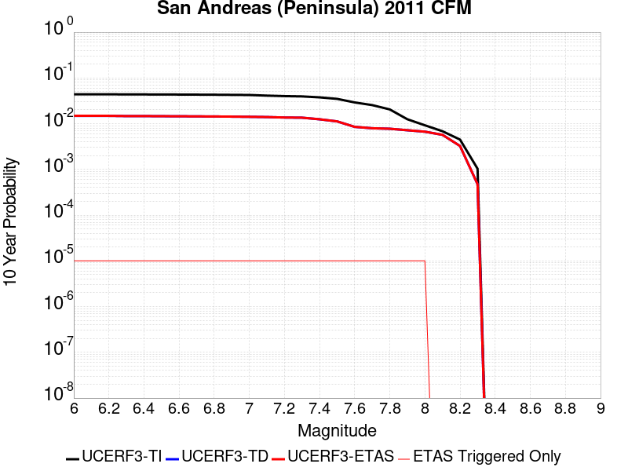 |

| Magnitude | 1 wk TI Prob | 1 wk TD Prob | 1 wk ETAS Prob | 1 wk ETAS/TD Gain | 1 wk ETAS Triggered Only | 1 mo TI Prob | 1 mo TD Prob | 1 mo ETAS Prob | 1 mo ETAS/TD Gain | 1 mo ETAS Triggered Only | 1 yr TI Prob | 1 yr TD Prob | 1 yr ETAS Prob | 1 yr ETAS/TD Gain | 1 yr ETAS Triggered Only | 10 yr TI Prob | 10 yr TD Prob | 10 yr ETAS Prob | 10 yr ETAS/TD Gain | 10 yr ETAS Triggered Only |
|-----|-----|-----|-----|-----|-----|-----|-----|-----|-----|-----|-----|-----|-----|-----|-----|-----|-----|-----|-----|-----|
| 6.0 | 8.6200685E-5 | 2.5333706E-5 | 2.5333706E-5 | 1.0 | 0.0 | 3.6937918E-4 | 1.08568514E-4 | 1.08568514E-4 | 1.0 | 0.0 | 0.0044879215 | 0.0013210218 | 0.0013444639 | 1.0177454 | 2.3473076E-5 | 0.043983612 | 0.014838956 | 0.014862081 | 1.0015584 | 2.3473076E-5 |
| 6.1 | 8.6200685E-5 | 2.5333706E-5 | 2.5333706E-5 | 1.0 | 0.0 | 3.6937918E-4 | 1.08568514E-4 | 1.08568514E-4 | 1.0 | 0.0 | 0.0044879215 | 0.0013210218 | 0.0013444639 | 1.0177454 | 2.3473076E-5 | 0.043983612 | 0.014838956 | 0.014862081 | 1.0015584 | 2.3473076E-5 |
| 6.2 | 8.6200685E-5 | 2.5333706E-5 | 2.5333706E-5 | 1.0 | 0.0 | 3.6937918E-4 | 1.08568514E-4 | 1.08568514E-4 | 1.0 | 0.0 | 0.0044879215 | 0.0013210218 | 0.0013444639 | 1.0177454 | 2.3473076E-5 | 0.043983612 | 0.014838956 | 0.014862081 | 1.0015584 | 2.3473076E-5 |
| 6.3 | 8.551163E-5 | 2.5024961E-5 | 2.5024961E-5 | 1.0 | 0.0 | 3.6642692E-4 | 1.0724543E-4 | 1.0724543E-4 | 1.0 | 0.0 | 0.004452125 | 0.0013049326 | 0.0013283751 | 1.0179645 | 2.3473076E-5 | 0.043639794 | 0.014665611 | 0.01468874 | 1.001577 | 2.3473076E-5 |
| 6.4 | 8.551163E-5 | 2.5024961E-5 | 2.5024961E-5 | 1.0 | 0.0 | 3.6642692E-4 | 1.0724543E-4 | 1.0724543E-4 | 1.0 | 0.0 | 0.004452125 | 0.0013049326 | 0.0013283751 | 1.0179645 | 2.3473076E-5 | 0.043639794 | 0.014665611 | 0.01468874 | 1.001577 | 2.3473076E-5 |
| 6.5 | 8.511146E-5 | 2.4846031E-5 | 2.4846031E-5 | 1.0 | 0.0 | 3.647124E-4 | 1.0647865E-4 | 1.0647865E-4 | 1.0 | 0.0 | 0.004431336 | 0.0012956082 | 0.0013190509 | 1.018094 | 2.3473076E-5 | 0.04344007 | 0.014565198 | 0.014588329 | 1.0015881 | 2.3473076E-5 |
| 6.6 | 8.4985084E-5 | 2.477655E-5 | 2.477655E-5 | 1.0 | 0.0 | 3.6417096E-4 | 1.061809E-4 | 1.061809E-4 | 1.0 | 0.0 | 0.0044247704 | 0.0012919875 | 0.0013154302 | 1.0181447 | 2.3473076E-5 | 0.043376986 | 0.014527207 | 0.014550339 | 1.0015923 | 2.3473076E-5 |
| 6.7 | 8.462618E-5 | 2.4604726E-5 | 2.4604726E-5 | 1.0 | 0.0 | 3.6263323E-4 | 1.05444575E-4 | 1.05444575E-4 | 1.0 | 0.0 | 0.004406125 | 0.0012830333 | 0.0013064762 | 1.0182716 | 2.3473076E-5 | 0.043197807 | 0.01443185 | 0.014454984 | 1.001603 | 2.3473076E-5 |
| 6.8 | 8.42337E-5 | 2.4500272E-5 | 2.4500272E-5 | 1.0 | 0.0 | 3.6095164E-4 | 1.0499695E-4 | 1.0499695E-4 | 1.0 | 0.0 | 0.004385734 | 0.0012775898 | 0.001301033 | 1.0183494 | 2.3473076E-5 | 0.043001823 | 0.014372395 | 0.014395531 | 1.0016097 | 2.3473076E-5 |
| 6.9 | 8.365989E-5 | 2.4304522E-5 | 2.4304522E-5 | 1.0 | 0.0 | 3.5849313E-4 | 1.0415808E-4 | 1.0415808E-4 | 1.0 | 0.0 | 0.004355922 | 0.0012673886 | 0.001290832 | 1.0184973 | 2.3473076E-5 | 0.04271523 | 0.014264696 | 0.014287835 | 1.0016221 | 2.3473076E-5 |
| 7.0 | 8.30936E-5 | 2.4065685E-5 | 2.4065685E-5 | 1.0 | 0.0 | 3.560668E-4 | 1.0313458E-4 | 1.0313458E-4 | 1.0 | 0.0 | 0.004326499 | 0.0012549418 | 0.0012783854 | 1.018681 | 2.3473076E-5 | 0.042432297 | 0.0141355125 | 0.014158654 | 1.0016371 | 2.3473076E-5 |
| 7.1 | 8.041264E-5 | 2.3751329E-5 | 2.3751329E-5 | 1.0 | 0.0 | 3.4458007E-4 | 1.01787446E-4 | 1.01787446E-4 | 1.0 | 0.0 | 0.0041871946 | 0.0012385593 | 0.0012620032 | 1.0189284 | 2.3473076E-5 | 0.041091725 | 0.013957874 | 0.01398102 | 1.0016582 | 2.3473076E-5 |
| 7.2 | 7.8427016E-5 | 2.3174005E-5 | 2.3174005E-5 | 1.0 | 0.0 | 3.3607247E-4 | 9.931339E-5 | 9.931339E-5 | 1.0 | 0.0 | 0.004084008 | 0.0012084715 | 0.0012319161 | 1.0194004 | 2.3473076E-5 | 0.040097635 | 0.013641416 | 0.013664569 | 1.0016973 | 2.3473076E-5 |
| 7.3 | 7.721087E-5 | 2.2958477E-5 | 2.2958477E-5 | 1.0 | 0.0 | 3.3086175E-4 | 9.838976E-5 | 9.838976E-5 | 1.0 | 0.0 | 0.004020803 | 0.0011972387 | 0.0012206837 | 1.0195825 | 2.3473076E-5 | 0.03948827 | 0.013524936 | 0.013548091 | 1.0017121 | 2.3473076E-5 |
| 7.4 | 7.3536525E-5 | 2.1064485E-5 | 2.1064485E-5 | 1.0 | 0.0 | 3.1511846E-4 | 9.027325E-5 | 9.027325E-5 | 1.0 | 0.0 | 0.0038298194 | 0.001098524 | 0.0011219712 | 1.0213443 | 2.3473076E-5 | 0.037644852 | 0.01247618 | 0.012499359 | 1.001858 | 2.3473076E-5 |
| 7.5 | 6.806207E-5 | 1.8855704E-5 | 1.8855704E-5 | 1.0 | 0.0 | 2.9166197E-4 | 8.080766E-5 | 8.080766E-5 | 1.0 | 0.0 | 0.0035452035 | 9.833903E-4 | 0.0010068403 | 1.023846 | 2.3473076E-5 | 0.034891766 | 0.011221583 | 0.011244793 | 1.0020683 | 2.3473076E-5 |
| 7.6 | 5.6731416E-5 | 1.4235568E-5 | 1.4235568E-5 | 1.0 | 0.0 | 2.43112E-4 | 6.100815E-5 | 6.100815E-5 | 1.0 | 0.0 | 0.0029558712 | 7.4252125E-4 | 7.659769E-4 | 1.0315892 | 2.3473076E-5 | 0.02916862 | 0.008518306 | 0.008541579 | 1.0027322 | 2.3473076E-5 |
| 7.7 | 4.946994E-5 | 1.3298509E-5 | 1.3298509E-5 | 1.0 | 0.0 | 2.1199681E-4 | 5.6992365E-5 | 5.6992365E-5 | 1.0 | 0.0 | 0.002578006 | 6.936613E-4 | 7.171181E-4 | 1.0338159 | 2.3473076E-5 | 0.02548303 | 0.007937518 | 0.007960805 | 1.0029337 | 2.3473076E-5 |
| 7.8 | 3.9718198E-5 | 1.3032537E-5 | 1.3032537E-5 | 1.0 | 0.0 | 1.7020974E-4 | 5.585253E-5 | 5.585253E-5 | 1.0 | 0.0 | 0.0020703338 | 6.7979255E-4 | 7.032497E-4 | 1.0345063 | 2.3473076E-5 | 0.020511515 | 0.007746509 | 0.0077698003 | 1.0030067 | 2.3473076E-5 |
| 7.9 | 2.4115114E-5 | 1.2229653E-5 | 1.2229653E-5 | 1.0 | 0.0 | 1.0334639E-4 | 5.2411746E-5 | 5.2411746E-5 | 1.0 | 0.0 | 0.001257516 | 6.3792634E-4 | 6.6138443E-4 | 1.0367725 | 2.3473076E-5 | 0.012504238 | 0.0071830763 | 0.007206381 | 1.0032444 | 2.3473076E-5 |
| 8.0 | 1.7756569E-5 | 1.144976E-5 | 1.144976E-5 | 1.0 | 0.0 | 7.6097356E-5 | 4.9069477E-5 | 4.9069477E-5 | 1.0 | 0.0 | 9.260915E-4 | 5.972573E-4 | 6.207163E-4 | 1.039278 | 2.3473076E-5 | 0.009222416 | 0.006680902 | 0.006704218 | 1.00349 | 2.3473076E-5 |
| 8.1 | 1.3159258E-5 | 9.77991E-6 | 9.77991E-6 | 1.0 | 0.0 | 5.6395602E-5 | 4.1913227E-5 | 4.1913227E-5 | 1.0 | 0.0 | 6.864001E-4 | 5.101742E-4 | 5.101742E-4 | 1.0 | 0.0 | 0.0068428386 | 0.0057076924 | 0.0057076924 | 1.0 | 0.0 |
| 8.2 | 8.635426E-6 | 5.4872503E-6 | 5.4872503E-6 | 1.0 | 0.0 | 3.700844E-5 | 2.3516575E-5 | 2.3516575E-5 | 1.0 | 0.0 | 4.5048463E-4 | 2.8627677E-4 | 2.8627677E-4 | 1.0 | 0.0 | 0.004495725 | 0.0032556232 | 0.0032556232 | 1.0 | 0.0 |
| 8.3 | 1.983087E-6 | 7.693574E-7 | 7.693574E-7 | 1.0 | 0.0 | 8.498917E-6 | 3.297242E-6 | 3.297242E-6 | 1.0 | 0.0 | 1.034694E-4 | 4.01432E-5 | 4.01432E-5 | 1.0 | 0.0 | 0.0010342124 | 4.7390026E-4 | 4.7390026E-4 | 1.0 | 0.0 |

## Owens Valley
*[(top)](#table-of-contents)*

| 1 Week | 1 Month | 1 Year | 10 Year |
|-----|-----|-----|-----|
|  |  |  |  |

| Magnitude | 1 wk TI Prob | 1 wk TD Prob | 1 wk ETAS Prob | 1 wk ETAS/TD Gain | 1 wk ETAS Triggered Only | 1 mo TI Prob | 1 mo TD Prob | 1 mo ETAS Prob | 1 mo ETAS/TD Gain | 1 mo ETAS Triggered Only | 1 yr TI Prob | 1 yr TD Prob | 1 yr ETAS Prob | 1 yr ETAS/TD Gain | 1 yr ETAS Triggered Only | 10 yr TI Prob | 10 yr TD Prob | 10 yr ETAS Prob | 10 yr ETAS/TD Gain | 10 yr ETAS Triggered Only |
|-----|-----|-----|-----|-----|-----|-----|-----|-----|-----|-----|-----|-----|-----|-----|-----|-----|-----|-----|-----|-----|
| 6.0 | 4.83821E-5 | 3.6298834E-6 | 3.6298834E-6 | 1.0 | 0.0 | 2.0733538E-4 | 1.5556556E-5 | 1.5556556E-5 | 1.0 | 0.0 | 0.002521386 | 1.893856E-4 | 2.1285423E-4 | 1.1239198 | 2.3473076E-5 | 0.024929691 | 0.0019267192 | 0.001950147 | 1.0121595 | 2.3473076E-5 |
| 6.1 | 4.83821E-5 | 3.6298834E-6 | 3.6298834E-6 | 1.0 | 0.0 | 2.0733538E-4 | 1.5556556E-5 | 1.5556556E-5 | 1.0 | 0.0 | 0.002521386 | 1.893856E-4 | 2.1285423E-4 | 1.1239198 | 2.3473076E-5 | 0.024929691 | 0.0019267192 | 0.001950147 | 1.0121595 | 2.3473076E-5 |
| 6.2 | 4.83821E-5 | 3.6298834E-6 | 3.6298834E-6 | 1.0 | 0.0 | 2.0733538E-4 | 1.5556556E-5 | 1.5556556E-5 | 1.0 | 0.0 | 0.002521386 | 1.893856E-4 | 2.1285423E-4 | 1.1239198 | 2.3473076E-5 | 0.024929691 | 0.0019267192 | 0.001950147 | 1.0121595 | 2.3473076E-5 |
| 6.3 | 3.953008E-5 | 3.1571942E-6 | 3.1571942E-6 | 1.0 | 0.0 | 1.6940363E-4 | 1.3530766E-5 | 1.3530766E-5 | 1.0 | 0.0 | 0.002060538 | 1.6472537E-4 | 1.8819458E-4 | 1.1424748 | 2.3473076E-5 | 0.020415364 | 0.0016601578 | 0.0016835919 | 1.0141156 | 2.3473076E-5 |
| 6.4 | 3.953008E-5 | 3.1571942E-6 | 3.1571942E-6 | 1.0 | 0.0 | 1.6940363E-4 | 1.3530766E-5 | 1.3530766E-5 | 1.0 | 0.0 | 0.002060538 | 1.6472537E-4 | 1.8819458E-4 | 1.1424748 | 2.3473076E-5 | 0.020415364 | 0.0016601578 | 0.0016835919 | 1.0141156 | 2.3473076E-5 |
| 6.5 | 3.457342E-5 | 2.9727623E-6 | 2.9727623E-6 | 1.0 | 0.0 | 1.4816338E-4 | 1.2740352E-5 | 1.2740352E-5 | 1.0 | 0.0 | 0.0018023965 | 1.5510344E-4 | 1.7857287E-4 | 1.1513147 | 2.3473076E-5 | 0.017878477 | 0.0015563503 | 0.0015797868 | 1.0150586 | 2.3473076E-5 |
| 6.6 | 3.1127765E-5 | 2.8753116E-6 | 2.8753116E-6 | 1.0 | 0.0 | 1.3339789E-4 | 1.232271E-5 | 1.232271E-5 | 1.0 | 0.0 | 0.0016229092 | 1.5001935E-4 | 1.7348891E-4 | 1.1564435 | 2.3473076E-5 | 0.016111081 | 0.0015016922 | 0.00152513 | 1.0156076 | 2.3473076E-5 |
| 6.7 | 2.806885E-5 | 2.8110242E-6 | 2.8110242E-6 | 1.0 | 0.0 | 1.2028952E-4 | 1.2047194E-5 | 1.2047194E-5 | 1.0 | 0.0 | 0.001463541 | 1.466654E-4 | 1.7013504E-4 | 1.1600217 | 2.3473076E-5 | 0.014539397 | 0.0014660707 | 0.0014895092 | 1.0159874 | 2.3473076E-5 |
| 6.8 | 2.524524E-5 | 2.2358972E-6 | 2.2358972E-6 | 1.0 | 0.0 | 1.0818939E-4 | 9.582383E-6 | 9.582383E-6 | 1.0 | 0.0 | 0.0013164099 | 1.16659576E-4 | 1.4012991E-4 | 1.2011865 | 2.3473076E-5 | 0.01308639 | 0.001166257 | 0.0011897027 | 1.0201033 | 2.3473076E-5 |
| 6.9 | 2.2704568E-5 | 1.6085578E-6 | 1.6085578E-6 | 1.0 | 0.0 | 9.730166E-5 | 6.893801E-6 | 6.893801E-6 | 1.0 | 0.0 | 0.0011840039 | 8.392881E-5 | 1.07399916E-4 | 1.279655 | 2.3473076E-5 | 0.011777153 | 8.391837E-4 | 8.6263707E-4 | 1.0279479 | 2.3473076E-5 |
| 7.0 | 2.0871712E-5 | 1.5399135E-6 | 1.5399135E-6 | 1.0 | 0.0 | 8.944713E-5 | 6.5996123E-6 | 6.5996123E-6 | 1.0 | 0.0 | 0.0010884746 | 8.034734E-5 | 1.0381853E-4 | 1.2921215 | 2.3473076E-5 | 0.010831586 | 8.0335594E-4 | 8.2681014E-4 | 1.0291953 | 2.3473076E-5 |
| 7.1 | 1.944928E-5 | 1.3867325E-6 | 1.3867325E-6 | 1.0 | 0.0 | 8.335139E-5 | 5.943126E-6 | 5.943126E-6 | 1.0 | 0.0 | 0.0010143308 | 7.2355164E-5 | 9.582654E-5 | 1.3243912 | 2.3473076E-5 | 0.010097133 | 7.23475E-4 | 7.469311E-4 | 1.0324215 | 2.3473076E-5 |
| 7.2 | 1.7876306E-5 | 1.249191E-6 | 1.249191E-6 | 1.0 | 0.0 | 7.6610486E-5 | 5.3536646E-6 | 5.3536646E-6 | 1.0 | 0.0 | 9.3233347E-4 | 6.517892E-5 | 8.865047E-5 | 1.3601094 | 2.3473076E-5 | 0.009284316 | 6.517364E-4 | 6.751942E-4 | 1.0359927 | 2.3473076E-5 |
| 7.3 | 1.2618672E-5 | 1.1117779E-6 | 1.1117779E-6 | 1.0 | 0.0 | 5.40789E-5 | 4.764754E-6 | 4.764754E-6 | 1.0 | 0.0 | 6.582117E-4 | 5.8009344E-5 | 8.1481056E-5 | 1.4046196 | 2.3473076E-5 | 0.0065626553 | 5.800754E-4 | 6.0353486E-4 | 1.0404421 | 2.3473076E-5 |
| 7.4 | 7.4874442E-6 | 8.550806E-7 | 8.550806E-7 | 1.0 | 0.0 | 3.208865E-5 | 3.6646259E-6 | 3.6646259E-6 | 1.0 | 0.0 | 3.906093E-4 | 4.461591E-5 | 6.808794E-5 | 1.526091 | 2.3473076E-5 | 0.003899234 | 4.461625E-4 | 4.696251E-4 | 1.0525876 | 2.3473076E-5 |
| 7.5 | 2.4734156E-6 | 6.0700546E-7 | 6.0700546E-7 | 1.0 | 0.0 | 1.060031E-5 | 2.6014495E-6 | 2.6014495E-6 | 1.0 | 0.0 | 1.2905113E-4 | 3.167219E-5 | 3.167219E-5 | 1.0 | 0.0 | 0.0012897621 | 3.166771E-4 | 3.166771E-4 | 1.0 | 0.0 |
| 7.6 | 1.1328841E-6 | 3.1972448E-7 | 3.1972448E-7 | 1.0 | 0.0 | 4.8552088E-6 | 1.3702471E-6 | 1.3702471E-6 | 1.0 | 0.0 | 5.9110564E-5 | 1.6682632E-5 | 1.6682632E-5 | 1.0 | 0.0 | 5.9094845E-4 | 1.6681399E-4 | 1.6681399E-4 | 1.0 | 0.0 |
| 7.7 | 4.8613185E-7 | 8.967469E-8 | 8.967469E-8 | 1.0 | 0.0 | 2.0834207E-6 | 3.8432006E-7 | 3.8432006E-7 | 1.0 | 0.0 | 2.536535E-5 | 4.6790874E-6 | 4.6790874E-6 | 1.0 | 0.0 | 2.5362454E-4 | 4.678996E-5 | 4.678996E-5 | 1.0 | 0.0 |

## San Jacinto (Stepovers Combined)
*[(top)](#table-of-contents)*

| 1 Week | 1 Month | 1 Year | 10 Year |
|-----|-----|-----|-----|
|  |  |  |  |

| Magnitude | 1 wk TI Prob | 1 wk TD Prob | 1 wk ETAS Prob | 1 wk ETAS/TD Gain | 1 wk ETAS Triggered Only | 1 mo TI Prob | 1 mo TD Prob | 1 mo ETAS Prob | 1 mo ETAS/TD Gain | 1 mo ETAS Triggered Only | 1 yr TI Prob | 1 yr TD Prob | 1 yr ETAS Prob | 1 yr ETAS/TD Gain | 1 yr ETAS Triggered Only | 10 yr TI Prob | 10 yr TD Prob | 10 yr ETAS Prob | 10 yr ETAS/TD Gain | 10 yr ETAS Triggered Only |
|-----|-----|-----|-----|-----|-----|-----|-----|-----|-----|-----|-----|-----|-----|-----|-----|-----|-----|-----|-----|-----|
| 6.0 | 4.0667746E-5 | 3.5336896E-5 | 3.5336896E-5 | 1.0 | 0.0 | 1.742787E-4 | 1.5143506E-4 | 1.5143506E-4 | 1.0 | 0.0 | 0.0021197782 | 0.0018421634 | 0.0018655933 | 1.0127187 | 2.3473076E-5 | 0.020996714 | 0.019020144 | 0.01904317 | 1.0012107 | 2.3473076E-5 |
| 6.1 | 4.0667746E-5 | 3.5336896E-5 | 3.5336896E-5 | 1.0 | 0.0 | 1.742787E-4 | 1.5143506E-4 | 1.5143506E-4 | 1.0 | 0.0 | 0.0021197782 | 0.0018421634 | 0.0018655933 | 1.0127187 | 2.3473076E-5 | 0.020996714 | 0.019020144 | 0.01904317 | 1.0012107 | 2.3473076E-5 |
| 6.2 | 4.0667746E-5 | 3.5336896E-5 | 3.5336896E-5 | 1.0 | 0.0 | 1.742787E-4 | 1.5143506E-4 | 1.5143506E-4 | 1.0 | 0.0 | 0.0021197782 | 0.0018421634 | 0.0018655933 | 1.0127187 | 2.3473076E-5 | 0.020996714 | 0.019020144 | 0.01904317 | 1.0012107 | 2.3473076E-5 |
| 6.3 | 4.0667746E-5 | 3.5336896E-5 | 3.5336896E-5 | 1.0 | 0.0 | 1.742787E-4 | 1.5143506E-4 | 1.5143506E-4 | 1.0 | 0.0 | 0.0021197782 | 0.0018421634 | 0.0018655933 | 1.0127187 | 2.3473076E-5 | 0.020996714 | 0.019020144 | 0.01904317 | 1.0012107 | 2.3473076E-5 |
| 6.4 | 4.0577226E-5 | 3.5208766E-5 | 3.5208766E-5 | 1.0 | 0.0 | 1.738908E-4 | 1.50886E-4 | 1.50886E-4 | 1.0 | 0.0 | 0.0021150648 | 0.0018354917 | 0.0018589217 | 1.0127649 | 2.3473076E-5 | 0.020950472 | 0.018954702 | 0.01897773 | 1.0012149 | 2.3473076E-5 |
| 6.5 | 4.0577226E-5 | 3.5208766E-5 | 3.5208766E-5 | 1.0 | 0.0 | 1.738908E-4 | 1.50886E-4 | 1.50886E-4 | 1.0 | 0.0 | 0.0021150648 | 0.0018354917 | 0.0018589217 | 1.0127649 | 2.3473076E-5 | 0.020950472 | 0.018954702 | 0.01897773 | 1.0012149 | 2.3473076E-5 |
| 6.6 | 4.053861E-5 | 3.5154102E-5 | 3.5154102E-5 | 1.0 | 0.0 | 1.7372532E-4 | 1.5065174E-4 | 1.5065174E-4 | 1.0 | 0.0 | 0.0021130538 | 0.0018326445 | 0.0018560746 | 1.0127848 | 2.3473076E-5 | 0.020930743 | 0.018926777 | 0.018949805 | 1.0012168 | 2.3473076E-5 |
| 6.7 | 4.0516545E-5 | 3.512316E-5 | 3.512316E-5 | 1.0 | 0.0 | 1.7363077E-4 | 1.5051916E-4 | 1.5051916E-4 | 1.0 | 0.0 | 0.002111905 | 0.0018310336 | 0.0018544637 | 1.0127962 | 2.3473076E-5 | 0.020919468 | 0.01891097 | 0.018933998 | 1.0012177 | 2.3473076E-5 |
| 6.8 | 4.049434E-5 | 3.509472E-5 | 3.509472E-5 | 1.0 | 0.0 | 1.7353562E-4 | 1.5039727E-4 | 1.5039727E-4 | 1.0 | 0.0 | 0.0021107488 | 0.0018295521 | 0.0018529822 | 1.0128065 | 2.3473076E-5 | 0.020908125 | 0.01889638 | 0.01891941 | 1.0012187 | 2.3473076E-5 |
| 6.9 | 4.046386E-5 | 3.505727E-5 | 3.505727E-5 | 1.0 | 0.0 | 1.73405E-4 | 1.502368E-4 | 1.502368E-4 | 1.0 | 0.0 | 0.0021091616 | 0.0018276017 | 0.0018510319 | 1.0128201 | 2.3473076E-5 | 0.020892553 | 0.01887715 | 0.01890018 | 1.00122 | 2.3473076E-5 |
| 7.0 | 4.036382E-5 | 3.4937813E-5 | 3.4937813E-5 | 1.0 | 0.0 | 1.7297632E-4 | 1.4972492E-4 | 1.4972492E-4 | 1.0 | 0.0 | 0.0021039525 | 0.00182138 | 0.0018448103 | 1.012864 | 2.3473076E-5 | 0.02084144 | 0.018815752 | 0.018838784 | 1.001224 | 2.3473076E-5 |
| 7.1 | 4.0343282E-5 | 3.4916273E-5 | 3.4916273E-5 | 1.0 | 0.0 | 1.7288832E-4 | 1.496326E-4 | 1.496326E-4 | 1.0 | 0.0 | 0.002102883 | 0.0018202579 | 0.0018436883 | 1.012872 | 2.3473076E-5 | 0.020830948 | 0.018804627 | 0.018827658 | 1.0012248 | 2.3473076E-5 |
| 7.2 | 4.0257353E-5 | 3.4820667E-5 | 3.4820667E-5 | 1.0 | 0.0 | 1.725201E-4 | 1.492229E-4 | 1.492229E-4 | 1.0 | 0.0 | 0.0020984085 | 0.0018152783 | 0.0018387088 | 1.0129074 | 2.3473076E-5 | 0.020787042 | 0.018755313 | 0.018778346 | 1.0012281 | 2.3473076E-5 |
| 7.3 | 3.9940667E-5 | 3.4648023E-5 | 3.4648023E-5 | 1.0 | 0.0 | 1.7116306E-4 | 1.4848309E-4 | 1.4848309E-4 | 1.0 | 0.0 | 0.0020819185 | 0.0018062859 | 0.0018297166 | 1.0129718 | 2.3473076E-5 | 0.020625217 | 0.018663792 | 0.018686827 | 1.0012342 | 2.3473076E-5 |
| 7.4 | 3.9721202E-5 | 3.453329E-5 | 3.453329E-5 | 1.0 | 0.0 | 1.7022261E-4 | 1.4799142E-4 | 1.4799142E-4 | 1.0 | 0.0 | 0.0020704903 | 0.0018003098 | 0.0018237407 | 1.0130149 | 2.3473076E-5 | 0.020513052 | 0.01860285 | 0.018625887 | 1.0012383 | 2.3473076E-5 |
| 7.5 | 3.7036873E-5 | 3.3598866E-5 | 3.3598866E-5 | 1.0 | 0.0 | 1.5871979E-4 | 1.439872E-4 | 1.439872E-4 | 1.0 | 0.0 | 0.0019307006 | 0.0017516377 | 0.0017750696 | 1.0133772 | 2.3473076E-5 | 0.019140124 | 0.018103454 | 0.018126503 | 1.0012732 | 2.3473076E-5 |
| 7.6 | 3.2940967E-5 | 3.1372547E-5 | 3.1372547E-5 | 1.0 | 0.0 | 1.4116794E-4 | 1.3444685E-4 | 1.3444685E-4 | 1.0 | 0.0 | 0.0017173645 | 0.0016356637 | 0.0016590984 | 1.0143273 | 2.3473076E-5 | 0.01704153 | 0.01693263 | 0.016955707 | 1.0013628 | 2.3473076E-5 |
| 7.7 | 2.8236149E-5 | 2.7937022E-5 | 2.7937022E-5 | 1.0 | 0.0 | 1.2100645E-4 | 1.197246E-4 | 1.197246E-4 | 1.0 | 0.0 | 0.0014722579 | 0.0014566735 | 0.0014801123 | 1.0160908 | 2.3473076E-5 | 0.014625421 | 0.015142685 | 0.015165803 | 1.0015266 | 2.3473076E-5 |
| 7.8 | 2.4329287E-5 | 2.5258554E-5 | 2.5258554E-5 | 1.0 | 0.0 | 1.042642E-4 | 1.0824646E-4 | 1.0824646E-4 | 1.0 | 0.0 | 0.0012686774 | 0.0013171048 | 0.0013405469 | 1.0177983 | 2.3473076E-5 | 0.012614589 | 0.013738932 | 0.013762082 | 1.001685 | 2.3473076E-5 |
| 7.9 | 1.9370926E-5 | 2.0467445E-5 | 2.0467445E-5 | 1.0 | 0.0 | 8.301561E-5 | 8.7714674E-5 | 8.7714674E-5 | 1.0 | 0.0 | 0.0010102465 | 0.0010674037 | 0.0010908517 | 1.0219673 | 2.3473076E-5 | 0.0100566605 | 0.011223499 | 0.011246708 | 1.0020679 | 2.3473076E-5 |
| 8.0 | 1.5583017E-5 | 1.5925136E-5 | 1.5925136E-5 | 1.0 | 0.0 | 6.6782646E-5 | 6.82488E-5 | 6.82488E-5 | 1.0 | 0.0 | 8.127754E-4 | 8.306131E-4 | 8.5406663E-4 | 1.0282365 | 2.3473076E-5 | 0.008098091 | 0.008802158 | 0.008825424 | 1.0026432 | 2.3473076E-5 |
| 8.1 | 1.0024873E-5 | 8.314913E-6 | 8.314913E-6 | 1.0 | 0.0 | 4.2963035E-5 | 3.563486E-5 | 3.563486E-5 | 1.0 | 0.0 | 5.229494E-4 | 4.3376858E-4 | 4.5723148E-4 | 1.0540909 | 2.3473076E-5 | 0.0052172043 | 0.00466551 | 0.0046888734 | 1.0050077 | 2.3473076E-5 |
| 8.2 | 4.142796E-6 | 1.5676045E-6 | 1.5676045E-6 | 1.0 | 0.0 | 1.775472E-5 | 6.7182878E-6 | 6.7182878E-6 | 1.0 | 0.0 | 2.1614227E-4 | 8.179211E-5 | 8.179211E-5 | 1.0 | 0.0 | 0.0021593217 | 9.4923546E-4 | 9.4923546E-4 | 1.0 | 0.0 |
| 8.3 | 1.2750878E-6 | 3.6301523E-7 | 3.6301523E-7 | 1.0 | 0.0 | 5.4646503E-6 | 1.5557786E-6 | 1.5557786E-6 | 1.0 | 0.0 | 6.653009E-5 | 1.8941444E-5 | 1.8941444E-5 | 1.0 | 0.0 | 6.6510175E-4 | 2.2840123E-4 | 2.2840123E-4 | 1.0 | 0.0 |

## San Andreas (Big Bend)
*[(top)](#table-of-contents)*

| 1 Week | 1 Month | 1 Year | 10 Year |
|-----|-----|-----|-----|
|  |  |  |  |

| Magnitude | 1 wk TI Prob | 1 wk TD Prob | 1 wk ETAS Prob | 1 wk ETAS/TD Gain | 1 wk ETAS Triggered Only | 1 mo TI Prob | 1 mo TD Prob | 1 mo ETAS Prob | 1 mo ETAS/TD Gain | 1 mo ETAS Triggered Only | 1 yr TI Prob | 1 yr TD Prob | 1 yr ETAS Prob | 1 yr ETAS/TD Gain | 1 yr ETAS Triggered Only | 10 yr TI Prob | 10 yr TD Prob | 10 yr ETAS Prob | 10 yr ETAS/TD Gain | 10 yr ETAS Triggered Only |
|-----|-----|-----|-----|-----|-----|-----|-----|-----|-----|-----|-----|-----|-----|-----|-----|-----|-----|-----|-----|-----|
| 6.0 | 1.0179969E-4 | 2.0106303E-4 | 2.0106303E-4 | 1.0 | 0.0 | 4.362114E-4 | 8.614151E-4 | 8.614151E-4 | 1.0 | 0.0 | 0.0052979486 | 0.010437581 | 0.010460809 | 1.0022254 | 2.3473076E-5 | 0.051734097 | 0.10159716 | 0.10161825 | 1.0002075 | 2.3473076E-5 |
| 6.1 | 1.0179969E-4 | 2.0106303E-4 | 2.0106303E-4 | 1.0 | 0.0 | 4.362114E-4 | 8.614151E-4 | 8.614151E-4 | 1.0 | 0.0 | 0.0052979486 | 0.010437581 | 0.010460809 | 1.0022254 | 2.3473076E-5 | 0.051734097 | 0.10159716 | 0.10161825 | 1.0002075 | 2.3473076E-5 |
| 6.2 | 1.0179969E-4 | 2.0106303E-4 | 2.0106303E-4 | 1.0 | 0.0 | 4.362114E-4 | 8.614151E-4 | 8.614151E-4 | 1.0 | 0.0 | 0.0052979486 | 0.010437581 | 0.010460809 | 1.0022254 | 2.3473076E-5 | 0.051734097 | 0.10159716 | 0.10161825 | 1.0002075 | 2.3473076E-5 |
| 6.3 | 1.0179969E-4 | 2.0106303E-4 | 2.0106303E-4 | 1.0 | 0.0 | 4.362114E-4 | 8.614151E-4 | 8.614151E-4 | 1.0 | 0.0 | 0.0052979486 | 0.010437581 | 0.010460809 | 1.0022254 | 2.3473076E-5 | 0.051734097 | 0.10159716 | 0.10161825 | 1.0002075 | 2.3473076E-5 |
| 6.4 | 9.1639464E-5 | 1.8462905E-4 | 1.8462905E-4 | 1.0 | 0.0 | 3.9268145E-4 | 7.910276E-4 | 7.910276E-4 | 1.0 | 0.0 | 0.0047704205 | 0.009588352 | 0.0096116 | 1.0024246 | 2.3473076E-5 | 0.046693064 | 0.093921766 | 0.09394303 | 1.0002265 | 2.3473076E-5 |
| 6.5 | 9.1639464E-5 | 1.8462905E-4 | 1.8462905E-4 | 1.0 | 0.0 | 3.9268145E-4 | 7.910276E-4 | 7.910276E-4 | 1.0 | 0.0 | 0.0047704205 | 0.009588352 | 0.0096116 | 1.0024246 | 2.3473076E-5 | 0.046693064 | 0.093921766 | 0.09394303 | 1.0002265 | 2.3473076E-5 |
| 6.6 | 9.042622E-5 | 1.826988E-4 | 1.826988E-4 | 1.0 | 0.0 | 3.8748336E-4 | 7.827601E-4 | 7.827601E-4 | 1.0 | 0.0 | 0.0047074095 | 0.009488574 | 0.009511825 | 1.0024503 | 2.3473076E-5 | 0.046089325 | 0.093015574 | 0.09303686 | 1.0002289 | 2.3473076E-5 |
| 6.7 | 8.9836685E-5 | 1.8184188E-4 | 1.8184188E-4 | 1.0 | 0.0 | 3.8495753E-4 | 7.790898E-4 | 7.790898E-4 | 1.0 | 0.0 | 0.00467679 | 0.009444275 | 0.009467526 | 1.0024619 | 2.3473076E-5 | 0.045795817 | 0.09260978 | 0.09263108 | 1.00023 | 2.3473076E-5 |
| 6.8 | 8.9471854E-5 | 1.8130938E-4 | 1.8130938E-4 | 1.0 | 0.0 | 3.8339442E-4 | 7.7680906E-4 | 7.7680906E-4 | 1.0 | 0.0 | 0.004657841 | 0.009416748 | 0.009439999 | 1.0024692 | 2.3473076E-5 | 0.04561414 | 0.09235688 | 0.092378184 | 1.0002307 | 2.3473076E-5 |
| 6.9 | 8.858234E-5 | 1.8012857E-4 | 1.8012857E-4 | 1.0 | 0.0 | 3.7958333E-4 | 7.717514E-4 | 7.717514E-4 | 1.0 | 0.0 | 0.004611638 | 0.009355701 | 0.009378954 | 1.0024855 | 2.3473076E-5 | 0.04517103 | 0.09179684 | 0.091818154 | 1.0002322 | 2.3473076E-5 |
| 7.0 | 8.7433385E-5 | 1.7851574E-4 | 1.7851574E-4 | 1.0 | 0.0 | 3.746607E-4 | 7.648433E-4 | 7.648433E-4 | 1.0 | 0.0 | 0.004551957 | 0.009272313 | 0.009295569 | 1.002508 | 2.3473076E-5 | 0.044598386 | 0.091031015 | 0.09105235 | 1.0002344 | 2.3473076E-5 |
| 7.1 | 8.684964E-5 | 1.7763473E-4 | 1.7763473E-4 | 1.0 | 0.0 | 3.7215967E-4 | 7.610698E-4 | 7.610698E-4 | 1.0 | 0.0 | 0.0045216335 | 0.009226761 | 0.009250018 | 1.0025206 | 2.3473076E-5 | 0.04430731 | 0.09061238 | 0.09063373 | 1.0002356 | 2.3473076E-5 |
| 7.2 | 8.606521E-5 | 1.7654036E-4 | 1.7654036E-4 | 1.0 | 0.0 | 3.6879873E-4 | 7.5638236E-4 | 7.5638236E-4 | 1.0 | 0.0 | 0.0044808835 | 0.009170174 | 0.009193431 | 1.0025363 | 2.3473076E-5 | 0.043916024 | 0.09009273 | 0.090114094 | 1.0002371 | 2.3473076E-5 |
| 7.3 | 8.568266E-5 | 1.7595981E-4 | 1.7595981E-4 | 1.0 | 0.0 | 3.6715972E-4 | 7.5389567E-4 | 7.5389567E-4 | 1.0 | 0.0 | 0.0044610105 | 0.0091401525 | 0.009163411 | 1.0025446 | 2.3473076E-5 | 0.043725148 | 0.08981366 | 0.08983502 | 1.0002378 | 2.3473076E-5 |
| 7.4 | 8.5432206E-5 | 1.7558529E-4 | 1.7558529E-4 | 1.0 | 0.0 | 3.6608664E-4 | 7.522915E-4 | 7.522915E-4 | 1.0 | 0.0 | 0.004447999 | 0.009120786 | 0.0091440445 | 1.0025501 | 2.3473076E-5 | 0.043600157 | 0.08963369 | 0.08965506 | 1.0002384 | 2.3473076E-5 |
| 7.5 | 8.4791965E-5 | 1.742772E-4 | 1.742772E-4 | 1.0 | 0.0 | 3.633435E-4 | 7.466887E-4 | 7.466887E-4 | 1.0 | 0.0 | 0.0044147377 | 0.00905314 | 0.009076401 | 1.0025693 | 2.3473076E-5 | 0.043280575 | 0.08901084 | 0.089032225 | 1.0002402 | 2.3473076E-5 |
| 7.6 | 8.241105E-5 | 1.6872598E-4 | 1.6872598E-4 | 1.0 | 0.0 | 3.531424E-4 | 7.229111E-4 | 7.229111E-4 | 1.0 | 0.0 | 0.0042910352 | 0.008766012 | 0.00878928 | 1.0026543 | 2.3473076E-5 | 0.042091176 | 0.086385906 | 0.08640735 | 1.0002482 | 2.3473076E-5 |
| 7.7 | 7.00432E-5 | 1.4233537E-4 | 1.4233537E-4 | 1.0 | 0.0 | 3.001506E-4 | 6.0986617E-4 | 6.0986617E-4 | 1.0 | 0.0 | 0.0036482112 | 0.0073998813 | 0.0074231806 | 1.0031486 | 2.3473076E-5 | 0.035888977 | 0.07364825 | 0.07367 | 1.0002953 | 2.3473076E-5 |
| 7.8 | 6.415362E-5 | 1.2995097E-4 | 1.2995097E-4 | 1.0 | 0.0 | 2.749151E-4 | 5.568139E-4 | 5.568139E-4 | 1.0 | 0.0 | 0.0033419547 | 0.006758167 | 0.0067814817 | 1.0034498 | 2.3473076E-5 | 0.03292141 | 0.06737108 | 0.06739297 | 1.000325 | 2.3473076E-5 |
| 7.9 | 4.939911E-5 | 9.359872E-5 | 9.359872E-5 | 1.0 | 0.0 | 2.116933E-4 | 4.0107573E-4 | 4.0107573E-4 | 1.0 | 0.0 | 0.0025743195 | 0.0048721726 | 0.0048955316 | 1.0047944 | 2.3473076E-5 | 0.025447013 | 0.04900208 | 0.049024403 | 1.0004555 | 2.3473076E-5 |
| 8.0 | 3.344983E-5 | 5.2337946E-5 | 5.2337946E-5 | 1.0 | 0.0 | 1.4334853E-4 | 2.2428621E-4 | 2.2428621E-4 | 1.0 | 0.0 | 0.0017438711 | 0.0027272669 | 0.002750676 | 1.0085833 | 2.3473076E-5 | 0.017302496 | 0.027976755 | 0.02799957 | 1.0008155 | 2.3473076E-5 |
| 8.1 | 1.9104898E-5 | 1.9226556E-5 | 1.9226556E-5 | 1.0 | 0.0 | 8.1875565E-5 | 8.2396924E-5 | 8.2396924E-5 | 1.0 | 0.0 | 9.963791E-4 | 0.0010027215 | 0.0010027215 | 1.0 | 0.0 | 0.009919235 | 0.01077785 | 0.01077785 | 1.0 | 0.0 |
| 8.2 | 8.643924E-6 | 5.49522E-6 | 5.49522E-6 | 1.0 | 0.0 | 3.704486E-5 | 2.355073E-5 | 2.355073E-5 | 1.0 | 0.0 | 4.5092785E-4 | 2.866925E-4 | 2.866925E-4 | 1.0 | 0.0 | 0.0045001395 | 0.0032598388 | 0.0032598388 | 1.0 | 0.0 |
| 8.3 | 1.983087E-6 | 7.693574E-7 | 7.693574E-7 | 1.0 | 0.0 | 8.498917E-6 | 3.297242E-6 | 3.297242E-6 | 1.0 | 0.0 | 1.034694E-4 | 4.01432E-5 | 4.01432E-5 | 1.0 | 0.0 | 0.0010342124 | 4.7390026E-4 | 4.7390026E-4 | 1.0 | 0.0 |

## Ludlow
*[(top)](#table-of-contents)*

| 1 Week | 1 Month | 1 Year | 10 Year |
|-----|-----|-----|-----|
|  |  |  | 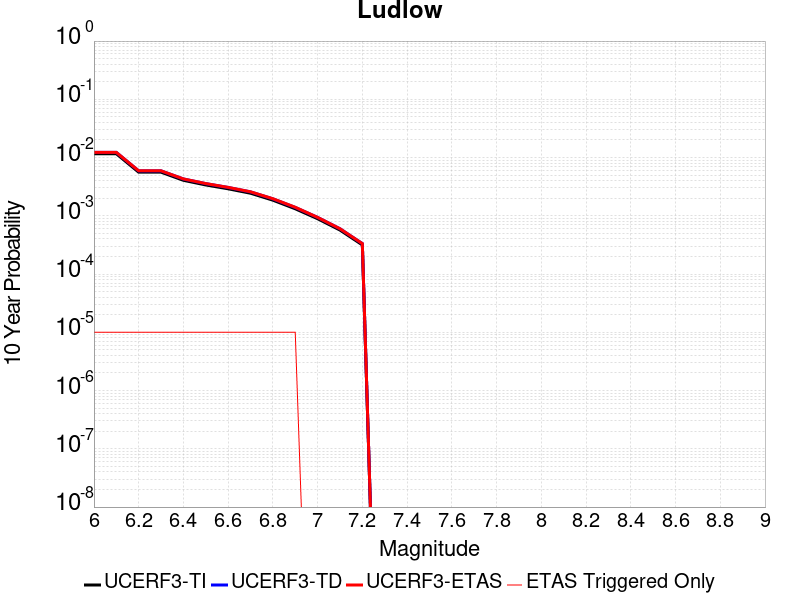 |

| Magnitude | 1 wk TI Prob | 1 wk TD Prob | 1 wk ETAS Prob | 1 wk ETAS/TD Gain | 1 wk ETAS Triggered Only | 1 mo TI Prob | 1 mo TD Prob | 1 mo ETAS Prob | 1 mo ETAS/TD Gain | 1 mo ETAS Triggered Only | 1 yr TI Prob | 1 yr TD Prob | 1 yr ETAS Prob | 1 yr ETAS/TD Gain | 1 yr ETAS Triggered Only | 10 yr TI Prob | 10 yr TD Prob | 10 yr ETAS Prob | 10 yr ETAS/TD Gain | 10 yr ETAS Triggered Only |
|-----|-----|-----|-----|-----|-----|-----|-----|-----|-----|-----|-----|-----|-----|-----|-----|-----|-----|-----|-----|-----|
| 6.0 | 2.2407607E-5 | 2.3657954E-5 | 2.3657954E-5 | 1.0 | 0.0 | 9.602906E-5 | 1.0138754E-4 | 1.0138754E-4 | 1.0 | 0.0 | 0.0011685267 | 0.0012337384 | 0.0012571826 | 1.0190026 | 2.3473076E-5 | 0.011624013 | 0.012273403 | 0.012296588 | 1.001889 | 2.3473076E-5 |
| 6.1 | 2.2407607E-5 | 2.3657954E-5 | 2.3657954E-5 | 1.0 | 0.0 | 9.602906E-5 | 1.0138754E-4 | 1.0138754E-4 | 1.0 | 0.0 | 0.0011685267 | 0.0012337384 | 0.0012571826 | 1.0190026 | 2.3473076E-5 | 0.011624013 | 0.012273403 | 0.012296588 | 1.001889 | 2.3473076E-5 |
| 6.2 | 1.0781252E-5 | 1.1365991E-5 | 1.1365991E-5 | 1.0 | 0.0 | 4.620455E-5 | 4.8710503E-5 | 4.8710503E-5 | 1.0 | 0.0 | 5.623952E-4 | 5.92893E-4 | 6.163522E-4 | 1.0395672 | 2.3473076E-5 | 0.00560974 | 0.005913531 | 0.005936865 | 1.003946 | 2.3473076E-5 |
| 6.3 | 1.0781252E-5 | 1.1365991E-5 | 1.1365991E-5 | 1.0 | 0.0 | 4.620455E-5 | 4.8710503E-5 | 4.8710503E-5 | 1.0 | 0.0 | 5.623952E-4 | 5.92893E-4 | 6.163522E-4 | 1.0395672 | 2.3473076E-5 | 0.00560974 | 0.005913531 | 0.005936865 | 1.003946 | 2.3473076E-5 |
| 6.4 | 7.814439E-6 | 8.237966E-6 | 8.237966E-6 | 1.0 | 0.0 | 3.3490025E-5 | 3.5305096E-5 | 3.5305096E-5 | 1.0 | 0.0 | 4.0766477E-4 | 4.2975618E-4 | 4.5321917E-4 | 1.0545961 | 2.3473076E-5 | 0.0040691774 | 0.0042893975 | 0.00431277 | 1.0054488 | 2.3473076E-5 |
| 6.5 | 6.4986366E-6 | 6.8511167E-6 | 6.8511167E-6 | 1.0 | 0.0 | 2.7851002E-5 | 2.9361603E-5 | 2.9361603E-5 | 1.0 | 0.0 | 3.390332E-4 | 3.574198E-4 | 3.808845E-4 | 1.0656502 | 2.3473076E-5 | 0.003385164 | 0.003568546 | 0.0035919352 | 1.0065542 | 2.3473076E-5 |
| 6.6 | 5.582177E-6 | 5.8861756E-6 | 5.8861756E-6 | 1.0 | 0.0 | 2.3923398E-5 | 2.5226227E-5 | 2.5226227E-5 | 1.0 | 0.0 | 2.9122844E-4 | 3.0708674E-4 | 3.305526E-4 | 1.0764145 | 2.3473076E-5 | 0.0029084706 | 0.0030666974 | 0.0030900985 | 1.0076307 | 2.3473076E-5 |
| 6.7 | 4.6858763E-6 | 4.94057E-6 | 4.94057E-6 | 1.0 | 0.0 | 2.0082172E-5 | 2.1173702E-5 | 2.1173702E-5 | 1.0 | 0.0 | 2.4447302E-4 | 2.5775988E-4 | 2.812269E-4 | 1.0910422 | 2.3473076E-5 | 0.0024420423 | 0.0025746655 | 0.002598078 | 1.0090935 | 2.3473076E-5 |
| 6.8 | 3.5584908E-6 | 3.7521265E-6 | 3.7521265E-6 | 1.0 | 0.0 | 1.5250586E-5 | 1.6080447E-5 | 1.6080447E-5 | 1.0 | 0.0 | 1.8566006E-4 | 1.9576224E-4 | 2.1923073E-4 | 1.1198826 | 2.3473076E-5 | 0.0018550502 | 0.0019559392 | 0.0019793662 | 1.0119774 | 2.3473076E-5 |
| 6.9 | 2.532834E-6 | 2.6710807E-6 | 2.6710807E-6 | 1.0 | 0.0 | 1.0854958E-5 | 1.1447441E-5 | 1.1447441E-5 | 1.0 | 0.0 | 1.3215111E-4 | 1.3936395E-4 | 1.6283376E-4 | 1.1684066 | 2.3473076E-5 | 0.0013207254 | 0.0013927931 | 0.0014162335 | 1.0168297 | 2.3473076E-5 |
| 7.0 | 1.7083285E-6 | 1.8019963E-6 | 1.8019963E-6 | 1.0 | 0.0 | 7.3213873E-6 | 7.722819E-6 | 7.722819E-6 | 1.0 | 0.0 | 8.913424E-5 | 9.402143E-5 | 9.402143E-5 | 1.0 | 0.0 | 8.9098496E-4 | 9.3983306E-4 | 9.3983306E-4 | 1.0 | 0.0 |
| 7.1 | 1.0905424E-6 | 1.1497951E-6 | 1.1497951E-6 | 1.0 | 0.0 | 4.6737446E-6 | 4.9276846E-6 | 4.9276846E-6 | 1.0 | 0.0 | 5.6901354E-5 | 5.9993006E-5 | 5.9993006E-5 | 1.0 | 0.0 | 5.6886784E-4 | 5.997779E-4 | 5.997779E-4 | 1.0 | 0.0 |
| 7.2 | 6.06668E-7 | 6.387457E-7 | 6.387457E-7 | 1.0 | 0.0 | 2.600003E-6 | 2.737479E-6 | 2.737479E-6 | 1.0 | 0.0 | 3.1654577E-5 | 3.3328364E-5 | 3.3328364E-5 | 1.0 | 0.0 | 3.1650066E-4 | 3.3324052E-4 | 3.3324052E-4 | 1.0 | 0.0 |

## San Andreas (Carrizo) rev
*[(top)](#table-of-contents)*

| 1 Week | 1 Month | 1 Year | 10 Year |
|-----|-----|-----|-----|
| 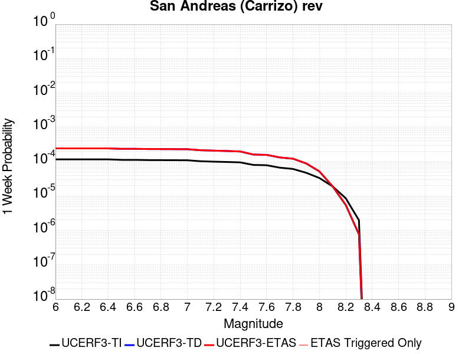 | 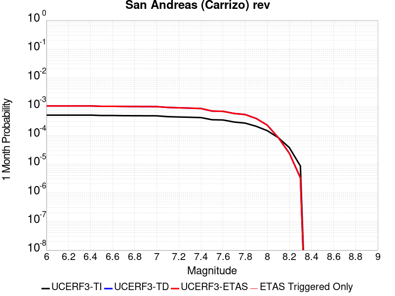 |  |  |

| Magnitude | 1 wk TI Prob | 1 wk TD Prob | 1 wk ETAS Prob | 1 wk ETAS/TD Gain | 1 wk ETAS Triggered Only | 1 mo TI Prob | 1 mo TD Prob | 1 mo ETAS Prob | 1 mo ETAS/TD Gain | 1 mo ETAS Triggered Only | 1 yr TI Prob | 1 yr TD Prob | 1 yr ETAS Prob | 1 yr ETAS/TD Gain | 1 yr ETAS Triggered Only | 10 yr TI Prob | 10 yr TD Prob | 10 yr ETAS Prob | 10 yr ETAS/TD Gain | 10 yr ETAS Triggered Only |
|-----|-----|-----|-----|-----|-----|-----|-----|-----|-----|-----|-----|-----|-----|-----|-----|-----|-----|-----|-----|-----|
| 6.0 | 1.1674632E-4 | 2.4361293E-4 | 2.4361293E-4 | 1.0 | 0.0 | 5.002454E-4 | 0.0010436393 | 0.0010436393 | 1.0 | 0.0 | 0.006073493 | 0.012632766 | 0.012655942 | 1.0018346 | 2.3473076E-5 | 0.0591016 | 0.12077509 | 0.12079573 | 1.0001708 | 2.3473076E-5 |
| 6.1 | 1.1674632E-4 | 2.4361293E-4 | 2.4361293E-4 | 1.0 | 0.0 | 5.002454E-4 | 0.0010436393 | 0.0010436393 | 1.0 | 0.0 | 0.006073493 | 0.012632766 | 0.012655942 | 1.0018346 | 2.3473076E-5 | 0.0591016 | 0.12077509 | 0.12079573 | 1.0001708 | 2.3473076E-5 |
| 6.2 | 1.1674632E-4 | 2.4361293E-4 | 2.4361293E-4 | 1.0 | 0.0 | 5.002454E-4 | 0.0010436393 | 0.0010436393 | 1.0 | 0.0 | 0.006073493 | 0.012632766 | 0.012655942 | 1.0018346 | 2.3473076E-5 | 0.0591016 | 0.12077509 | 0.12079573 | 1.0001708 | 2.3473076E-5 |
| 6.3 | 1.1674632E-4 | 2.4361293E-4 | 2.4361293E-4 | 1.0 | 0.0 | 5.002454E-4 | 0.0010436393 | 0.0010436393 | 1.0 | 0.0 | 0.006073493 | 0.012632766 | 0.012655942 | 1.0018346 | 2.3473076E-5 | 0.0591016 | 0.12077509 | 0.12079573 | 1.0001708 | 2.3473076E-5 |
| 6.4 | 1.1674632E-4 | 2.4361293E-4 | 2.4361293E-4 | 1.0 | 0.0 | 5.002454E-4 | 0.0010436393 | 0.0010436393 | 1.0 | 0.0 | 0.006073493 | 0.012632766 | 0.012655942 | 1.0018346 | 2.3473076E-5 | 0.0591016 | 0.12077509 | 0.12079573 | 1.0001708 | 2.3473076E-5 |
| 6.5 | 1.13136164E-4 | 2.3681132E-4 | 2.3681132E-4 | 1.0 | 0.0 | 4.847792E-4 | 0.0010145125 | 0.0010145125 | 1.0 | 0.0 | 0.0058862255 | 0.012282185 | 0.0123053705 | 1.0018877 | 2.3473076E-5 | 0.057327334 | 0.1177463 | 0.117767006 | 1.0001758 | 2.3473076E-5 |
| 6.6 | 1.13136164E-4 | 2.3681132E-4 | 2.3681132E-4 | 1.0 | 0.0 | 4.847792E-4 | 0.0010145125 | 0.0010145125 | 1.0 | 0.0 | 0.0058862255 | 0.012282185 | 0.0123053705 | 1.0018877 | 2.3473076E-5 | 0.057327334 | 0.1177463 | 0.117767006 | 1.0001758 | 2.3473076E-5 |
| 6.7 | 1.1149675E-4 | 2.3372276E-4 | 2.3372276E-4 | 1.0 | 0.0 | 4.777557E-4 | 0.001001286 | 0.001001286 | 1.0 | 0.0 | 0.0058011734 | 0.012122953 | 0.012146142 | 1.0019128 | 2.3473076E-5 | 0.05652051 | 0.116367765 | 0.11638851 | 1.0001782 | 2.3473076E-5 |
| 6.8 | 1.1103589E-4 | 2.3274389E-4 | 2.3274389E-4 | 1.0 | 0.0 | 4.7578133E-4 | 9.97094E-4 | 9.97094E-4 | 1.0 | 0.0 | 0.005777263 | 0.012072483 | 0.012095673 | 1.0019208 | 2.3473076E-5 | 0.056293584 | 0.115927964 | 0.115948714 | 1.000179 | 2.3473076E-5 |
| 6.9 | 1.1053259E-4 | 2.316672E-4 | 2.316672E-4 | 1.0 | 0.0 | 4.7362508E-4 | 9.924831E-4 | 9.924831E-4 | 1.0 | 0.0 | 0.0057511497 | 0.012016967 | 0.012040158 | 1.0019299 | 2.3473076E-5 | 0.05604569 | 0.11544405 | 0.11546481 | 1.0001799 | 2.3473076E-5 |
| 7.0 | 1.1005377E-4 | 2.3067516E-4 | 2.3067516E-4 | 1.0 | 0.0 | 4.7157376E-4 | 9.882348E-4 | 9.882348E-4 | 1.0 | 0.0 | 0.0057263062 | 0.011965811 | 0.011989004 | 1.0019382 | 2.3473076E-5 | 0.055809796 | 0.11499625 | 0.11501702 | 1.0001806 | 2.3473076E-5 |
| 7.1 | 1.0308142E-4 | 2.1576507E-4 | 2.1576507E-4 | 1.0 | 0.0 | 4.417027E-4 | 9.2438085E-4 | 9.2438085E-4 | 1.0 | 0.0 | 0.0053644776 | 0.011196577 | 0.011219787 | 1.0020729 | 2.3473076E-5 | 0.052368138 | 0.10825095 | 0.10827188 | 1.0001934 | 2.3473076E-5 |
| 7.2 | 1.0027479E-4 | 2.098411E-4 | 2.098411E-4 | 1.0 | 0.0 | 4.296783E-4 | 8.9901005E-4 | 8.9901005E-4 | 1.0 | 0.0 | 0.0052187922 | 0.010890815 | 0.010914032 | 1.0021318 | 2.3473076E-5 | 0.050979212 | 0.105554216 | 0.10557521 | 1.000199 | 2.3473076E-5 |
| 7.3 | 9.816942E-5 | 2.0458816E-4 | 2.0458816E-4 | 1.0 | 0.0 | 4.2065824E-4 | 8.765127E-4 | 8.765127E-4 | 1.0 | 0.0 | 0.005109493 | 0.010619612 | 0.010642837 | 1.0021869 | 2.3473076E-5 | 0.049935985 | 0.10313633 | 0.10315738 | 1.0002041 | 2.3473076E-5 |
| 7.4 | 9.5634205E-5 | 1.9827684E-4 | 1.9827684E-4 | 1.0 | 0.0 | 4.0979648E-4 | 8.494821E-4 | 8.494821E-4 | 1.0 | 0.0 | 0.0049778637 | 0.010293663 | 0.010316894 | 1.0022569 | 2.3473076E-5 | 0.048678253 | 0.100220494 | 0.10024162 | 1.0002108 | 2.3473076E-5 |
| 7.5 | 8.052417E-5 | 1.6143978E-4 | 1.6143978E-4 | 1.0 | 0.0 | 3.4505792E-4 | 6.917014E-4 | 6.917014E-4 | 1.0 | 0.0 | 0.0041929903 | 0.008389029 | 0.008412304 | 1.0027746 | 2.3473076E-5 | 0.04114753 | 0.08295002 | 0.08297154 | 1.0002595 | 2.3473076E-5 |
| 7.6 | 7.897024E-5 | 1.579682E-4 | 1.579682E-4 | 1.0 | 0.0 | 3.384E-4 | 6.768311E-4 | 6.768311E-4 | 1.0 | 0.0 | 0.0041122385 | 0.00820936 | 0.008232641 | 1.0028359 | 2.3473076E-5 | 0.040369697 | 0.081289805 | 0.081311375 | 1.0002652 | 2.3473076E-5 |
| 7.7 | 6.707427E-5 | 1.3303987E-4 | 1.3303987E-4 | 1.0 | 0.0 | 2.8742946E-4 | 5.700463E-4 | 5.700463E-4 | 1.0 | 0.0 | 0.003493839 | 0.0069182604 | 0.0069415714 | 1.0033695 | 2.3473076E-5 | 0.034394164 | 0.06917457 | 0.06919642 | 1.0003159 | 2.3473076E-5 |
| 7.8 | 6.147705E-5 | 1.2222702E-4 | 1.2222702E-4 | 1.0 | 0.0 | 2.6344648E-4 | 5.23725E-4 | 5.23725E-4 | 1.0 | 0.0 | 0.0032027436 | 0.0063577346 | 0.0063810586 | 1.0036685 | 2.3473076E-5 | 0.031569764 | 0.06362964 | 0.06365162 | 1.0003455 | 2.3473076E-5 |
| 7.9 | 4.7636717E-5 | 8.8979046E-5 | 8.8979046E-5 | 1.0 | 0.0 | 2.0414138E-4 | 3.8128305E-4 | 3.8128305E-4 | 1.0 | 0.0 | 0.0024825884 | 0.004632248 | 0.004655612 | 1.0050439 | 2.3473076E-5 | 0.024550365 | 0.046713326 | 0.046735704 | 1.000479 | 2.3473076E-5 |
| 8.0 | 3.3554235E-5 | 5.224805E-5 | 5.224805E-5 | 1.0 | 0.0 | 1.4379594E-4 | 2.23901E-4 | 2.23901E-4 | 1.0 | 0.0 | 0.0017493097 | 0.0027225888 | 0.002745998 | 1.0085981 | 2.3473076E-5 | 0.017356034 | 0.027935574 | 0.027958391 | 1.0008168 | 2.3473076E-5 |
| 8.1 | 1.9175432E-5 | 1.9238541E-5 | 1.9238541E-5 | 1.0 | 0.0 | 8.217783E-5 | 8.244829E-5 | 8.244829E-5 | 1.0 | 0.0 | 0.0010000558 | 0.0010033463 | 0.0010033463 | 1.0 | 0.0 | 0.009955673 | 0.010786123 | 0.010786123 | 1.0 | 0.0 |
| 8.2 | 8.643924E-6 | 5.49522E-6 | 5.49522E-6 | 1.0 | 0.0 | 3.704486E-5 | 2.355073E-5 | 2.355073E-5 | 1.0 | 0.0 | 4.5092785E-4 | 2.866925E-4 | 2.866925E-4 | 1.0 | 0.0 | 0.0045001395 | 0.0032598388 | 0.0032598388 | 1.0 | 0.0 |
| 8.3 | 1.983087E-6 | 7.693574E-7 | 7.693574E-7 | 1.0 | 0.0 | 8.498917E-6 | 3.297242E-6 | 3.297242E-6 | 1.0 | 0.0 | 1.034694E-4 | 4.01432E-5 | 4.01432E-5 | 1.0 | 0.0 | 0.0010342124 | 4.7390026E-4 | 4.7390026E-4 | 1.0 | 0.0 |

## Red Pass
*[(top)](#table-of-contents)*

| 1 Week | 1 Month | 1 Year | 10 Year |
|-----|-----|-----|-----|
|  |  | 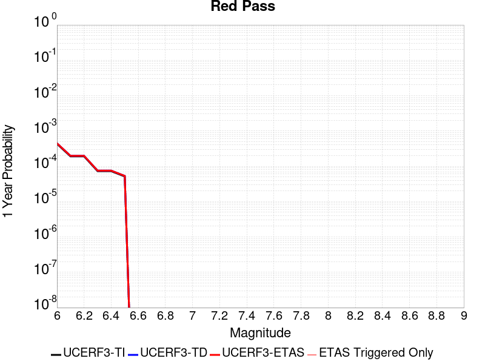 |  |

| Magnitude | 1 wk TI Prob | 1 wk TD Prob | 1 wk ETAS Prob | 1 wk ETAS/TD Gain | 1 wk ETAS Triggered Only | 1 mo TI Prob | 1 mo TD Prob | 1 mo ETAS Prob | 1 mo ETAS/TD Gain | 1 mo ETAS Triggered Only | 1 yr TI Prob | 1 yr TD Prob | 1 yr ETAS Prob | 1 yr ETAS/TD Gain | 1 yr ETAS Triggered Only | 10 yr TI Prob | 10 yr TD Prob | 10 yr ETAS Prob | 10 yr ETAS/TD Gain | 10 yr ETAS Triggered Only |
|-----|-----|-----|-----|-----|-----|-----|-----|-----|-----|-----|-----|-----|-----|-----|-----|-----|-----|-----|-----|-----|
| 6.0 | 8.258278E-6 | 8.551426E-6 | 8.551426E-6 | 1.0 | 0.0 | 3.539214E-5 | 3.6648555E-5 | 3.6648555E-5 | 1.0 | 0.0 | 4.308141E-4 | 4.4612266E-4 | 4.4612266E-4 | 1.0 | 0.0 | 0.0042997985 | 0.0044540283 | 0.004477397 | 1.0052466 | 2.3473076E-5 |
| 6.1 | 3.649988E-6 | 3.7753848E-6 | 3.7753848E-6 | 1.0 | 0.0 | 1.5642712E-5 | 1.6180147E-5 | 1.6180147E-5 | 1.0 | 0.0 | 1.9043336E-4 | 1.9698025E-4 | 1.9698025E-4 | 1.0 | 0.0 | 0.0019027026 | 0.0019685237 | 0.0019919507 | 1.0119008 | 2.3473076E-5 |
| 6.2 | 3.649988E-6 | 3.7753848E-6 | 3.7753848E-6 | 1.0 | 0.0 | 1.5642712E-5 | 1.6180147E-5 | 1.6180147E-5 | 1.0 | 0.0 | 1.9043336E-4 | 1.9698025E-4 | 1.9698025E-4 | 1.0 | 0.0 | 0.0019027026 | 0.0019685237 | 0.0019919507 | 1.0119008 | 2.3473076E-5 |
| 6.3 | 1.3924937E-6 | 1.4411434E-6 | 1.4411434E-6 | 1.0 | 0.0 | 5.9678164E-6 | 6.1763217E-6 | 6.1763217E-6 | 1.0 | 0.0 | 7.265574E-5 | 7.519554E-5 | 7.519554E-5 | 1.0 | 0.0 | 7.263199E-4 | 7.518397E-4 | 7.7529514E-4 | 1.0311974 | 2.3473076E-5 |
| 6.4 | 1.3924937E-6 | 1.4411434E-6 | 1.4411434E-6 | 1.0 | 0.0 | 5.9678164E-6 | 6.1763217E-6 | 6.1763217E-6 | 1.0 | 0.0 | 7.265574E-5 | 7.519554E-5 | 7.519554E-5 | 1.0 | 0.0 | 7.263199E-4 | 7.518397E-4 | 7.7529514E-4 | 1.0311974 | 2.3473076E-5 |
| 6.5 | 9.876812E-7 | 1.0222102E-6 | 1.0222102E-6 | 1.0 | 0.0 | 4.2329125E-6 | 4.3809005E-6 | 4.3809005E-6 | 1.0 | 0.0 | 5.153449E-5 | 5.3337466E-5 | 5.3337466E-5 | 1.0 | 0.0 | 5.1522546E-4 | 5.3337467E-4 | 5.568352E-4 | 1.0439851 | 2.3473076E-5 |

## San Gorgonio Pass
*[(top)](#table-of-contents)*

| 1 Week | 1 Month | 1 Year | 10 Year |
|-----|-----|-----|-----|
| 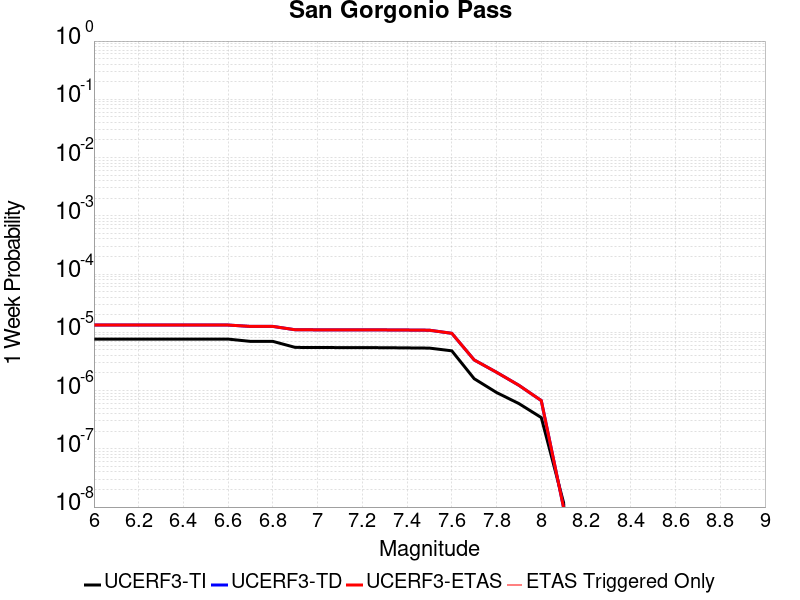 |  |  |  |

| Magnitude | 1 wk TI Prob | 1 wk TD Prob | 1 wk ETAS Prob | 1 wk ETAS/TD Gain | 1 wk ETAS Triggered Only | 1 mo TI Prob | 1 mo TD Prob | 1 mo ETAS Prob | 1 mo ETAS/TD Gain | 1 mo ETAS Triggered Only | 1 yr TI Prob | 1 yr TD Prob | 1 yr ETAS Prob | 1 yr ETAS/TD Gain | 1 yr ETAS Triggered Only | 10 yr TI Prob | 10 yr TD Prob | 10 yr ETAS Prob | 10 yr ETAS/TD Gain | 10 yr ETAS Triggered Only |
|-----|-----|-----|-----|-----|-----|-----|-----|-----|-----|-----|-----|-----|-----|-----|-----|-----|-----|-----|-----|-----|
| 6.0 | 7.644328E-6 | 1.3322503E-5 | 1.3322503E-5 | 1.0 | 0.0 | 3.2760996E-5 | 5.7095243E-5 | 5.7095243E-5 | 1.0 | 0.0 | 3.987921E-4 | 6.949214E-4 | 6.949214E-4 | 1.0 | 0.0 | 0.003980772 | 0.0069342447 | 0.0069575547 | 1.0033616 | 2.3473076E-5 |
| 6.1 | 7.644328E-6 | 1.3322503E-5 | 1.3322503E-5 | 1.0 | 0.0 | 3.2760996E-5 | 5.7095243E-5 | 5.7095243E-5 | 1.0 | 0.0 | 3.987921E-4 | 6.949214E-4 | 6.949214E-4 | 1.0 | 0.0 | 0.003980772 | 0.0069342447 | 0.0069575547 | 1.0033616 | 2.3473076E-5 |
| 6.2 | 7.644328E-6 | 1.3322503E-5 | 1.3322503E-5 | 1.0 | 0.0 | 3.2760996E-5 | 5.7095243E-5 | 5.7095243E-5 | 1.0 | 0.0 | 3.987921E-4 | 6.949214E-4 | 6.949214E-4 | 1.0 | 0.0 | 0.003980772 | 0.0069342447 | 0.0069575547 | 1.0033616 | 2.3473076E-5 |
| 6.3 | 7.644328E-6 | 1.3322503E-5 | 1.3322503E-5 | 1.0 | 0.0 | 3.2760996E-5 | 5.7095243E-5 | 5.7095243E-5 | 1.0 | 0.0 | 3.987921E-4 | 6.949214E-4 | 6.949214E-4 | 1.0 | 0.0 | 0.003980772 | 0.0069342447 | 0.0069575547 | 1.0033616 | 2.3473076E-5 |
| 6.4 | 7.644328E-6 | 1.3322503E-5 | 1.3322503E-5 | 1.0 | 0.0 | 3.2760996E-5 | 5.7095243E-5 | 5.7095243E-5 | 1.0 | 0.0 | 3.987921E-4 | 6.949214E-4 | 6.949214E-4 | 1.0 | 0.0 | 0.003980772 | 0.0069342447 | 0.0069575547 | 1.0033616 | 2.3473076E-5 |
| 6.5 | 7.644328E-6 | 1.3322503E-5 | 1.3322503E-5 | 1.0 | 0.0 | 3.2760996E-5 | 5.7095243E-5 | 5.7095243E-5 | 1.0 | 0.0 | 3.987921E-4 | 6.949214E-4 | 6.949214E-4 | 1.0 | 0.0 | 0.003980772 | 0.0069342447 | 0.0069575547 | 1.0033616 | 2.3473076E-5 |
| 6.6 | 7.644328E-6 | 1.3322503E-5 | 1.3322503E-5 | 1.0 | 0.0 | 3.2760996E-5 | 5.7095243E-5 | 5.7095243E-5 | 1.0 | 0.0 | 3.987921E-4 | 6.949214E-4 | 6.949214E-4 | 1.0 | 0.0 | 0.003980772 | 0.0069342447 | 0.0069575547 | 1.0033616 | 2.3473076E-5 |
| 6.7 | 6.987586E-6 | 1.2626756E-5 | 1.2626756E-5 | 1.0 | 0.0 | 2.9946454E-5 | 5.411359E-5 | 5.411359E-5 | 1.0 | 0.0 | 3.645371E-4 | 6.586419E-4 | 6.586419E-4 | 1.0 | 0.0 | 0.0036393967 | 0.006573611 | 0.0065969294 | 1.0035473 | 2.3473076E-5 |
| 6.8 | 6.987586E-6 | 1.2626756E-5 | 1.2626756E-5 | 1.0 | 0.0 | 2.9946454E-5 | 5.411359E-5 | 5.411359E-5 | 1.0 | 0.0 | 3.645371E-4 | 6.586419E-4 | 6.586419E-4 | 1.0 | 0.0 | 0.0036393967 | 0.006573611 | 0.0065969294 | 1.0035473 | 2.3473076E-5 |
| 6.9 | 5.504702E-6 | 1.105757E-5 | 1.105757E-5 | 1.0 | 0.0 | 2.3591367E-5 | 4.7388756E-5 | 4.7388756E-5 | 1.0 | 0.0 | 2.8718702E-4 | 5.7681045E-4 | 5.7681045E-4 | 1.0 | 0.0 | 0.0028681618 | 0.0057595414 | 0.0057595414 | 1.0 | 0.0 |
| 7.0 | 5.4825764E-6 | 1.1033911E-5 | 1.1033911E-5 | 1.0 | 0.0 | 2.3496545E-5 | 4.7287358E-5 | 4.7287358E-5 | 1.0 | 0.0 | 2.8603288E-4 | 5.7557656E-4 | 5.7557656E-4 | 1.0 | 0.0 | 0.00285665 | 0.005747267 | 0.005747267 | 1.0 | 0.0 |
| 7.1 | 5.4692787E-6 | 1.101962E-5 | 1.101962E-5 | 1.0 | 0.0 | 2.3439556E-5 | 4.7226116E-5 | 4.7226116E-5 | 1.0 | 0.0 | 2.8533922E-4 | 5.748313E-4 | 5.748313E-4 | 1.0 | 0.0 | 0.0028497311 | 0.0057398533 | 0.0057398533 | 1.0 | 0.0 |
| 7.2 | 5.453661E-6 | 1.1002646E-5 | 1.1002646E-5 | 1.0 | 0.0 | 2.3372622E-5 | 4.715337E-5 | 4.715337E-5 | 1.0 | 0.0 | 2.8452452E-4 | 5.7394616E-4 | 5.7394616E-4 | 1.0 | 0.0 | 0.002841605 | 0.0057310467 | 0.0057310467 | 1.0 | 0.0 |
| 7.3 | 5.4422303E-6 | 1.0989567E-5 | 1.0989567E-5 | 1.0 | 0.0 | 2.3323635E-5 | 4.7097325E-5 | 4.7097325E-5 | 1.0 | 0.0 | 2.8392827E-4 | 5.7326414E-4 | 5.7326414E-4 | 1.0 | 0.0 | 0.0028356577 | 0.005724262 | 0.005724262 | 1.0 | 0.0 |
| 7.4 | 5.398595E-6 | 1.09369275E-5 | 1.09369275E-5 | 1.0 | 0.0 | 2.313663E-5 | 4.6871734E-5 | 4.6871734E-5 | 1.0 | 0.0 | 2.8165206E-4 | 5.70519E-4 | 5.70519E-4 | 1.0 | 0.0 | 0.0028129534 | 0.005696952 | 0.005696952 | 1.0 | 0.0 |
| 7.5 | 5.3578788E-6 | 1.0863459E-5 | 1.0863459E-5 | 1.0 | 0.0 | 2.2962136E-5 | 4.6556877E-5 | 4.6556877E-5 | 1.0 | 0.0 | 2.7952815E-4 | 5.666876E-4 | 5.666876E-4 | 1.0 | 0.0 | 0.002791768 | 0.005658858 | 0.005658858 | 1.0 | 0.0 |
| 7.6 | 4.8091474E-6 | 9.611402E-6 | 9.611402E-6 | 1.0 | 0.0 | 2.0610469E-5 | 4.11911E-5 | 4.11911E-5 | 1.0 | 0.0 | 2.5090357E-4 | 5.0139107E-4 | 5.0139107E-4 | 1.0 | 0.0 | 0.0025062046 | 0.0050092908 | 0.0050092908 | 1.0 | 0.0 |
| 7.7 | 1.5991155E-6 | 3.3570436E-6 | 3.3570436E-6 | 1.0 | 0.0 | 6.853334E-6 | 1.4387251E-5 | 1.4387251E-5 | 1.0 | 0.0 | 8.343615E-5 | 1.7515096E-4 | 1.7515096E-4 | 1.0 | 0.0 | 8.340483E-4 | 0.0017555724 | 0.0017555724 | 1.0 | 0.0 |
| 7.8 | 9.258398E-7 | 2.0611112E-6 | 2.0611112E-6 | 1.0 | 0.0 | 3.967879E-6 | 8.8333045E-6 | 8.8333045E-6 | 1.0 | 0.0 | 4.8307855E-5 | 1.07540196E-4 | 1.07540196E-4 | 1.0 | 0.0 | 4.8297356E-4 | 0.0010803007 | 0.0010803007 | 1.0 | 0.0 |
| 7.9 | 5.975575E-7 | 1.2314358E-6 | 1.2314358E-6 | 1.0 | 0.0 | 2.5609581E-6 | 5.2775713E-6 | 5.2775713E-6 | 1.0 | 0.0 | 3.117922E-5 | 6.425255E-5 | 6.425255E-5 | 1.0 | 0.0 | 3.1174847E-4 | 6.474769E-4 | 6.474769E-4 | 1.0 | 0.0 |
| 8.0 | 3.4413725E-7 | 6.7283526E-7 | 6.7283526E-7 | 1.0 | 0.0 | 1.4748731E-6 | 2.8835764E-6 | 2.8835764E-6 | 1.0 | 0.0 | 1.7956432E-5 | 3.5106983E-5 | 3.5106983E-5 | 1.0 | 0.0 | 1.7954981E-4 | 3.5443812E-4 | 3.5443812E-4 | 1.0 | 0.0 |
| 8.1 | 1.1787731E-8 | 9.668936E-9 | 9.668936E-9 | 1.0 | 0.0 | 5.0518846E-8 | 4.1438298E-8 | 4.1438298E-8 | 1.0 | 0.0 | 6.1506677E-7 | 5.0451115E-7 | 5.0451115E-7 | 1.0 | 0.0 | 6.1506507E-6 | 5.2608457E-6 | 5.2608457E-6 | 1.0 | 0.0 |

## Calaveras (So) 2011 CFM
*[(top)](#table-of-contents)*

| 1 Week | 1 Month | 1 Year | 10 Year |
|-----|-----|-----|-----|
|  |  |  |  |

| Magnitude | 1 wk TI Prob | 1 wk TD Prob | 1 wk ETAS Prob | 1 wk ETAS/TD Gain | 1 wk ETAS Triggered Only | 1 mo TI Prob | 1 mo TD Prob | 1 mo ETAS Prob | 1 mo ETAS/TD Gain | 1 mo ETAS Triggered Only | 1 yr TI Prob | 1 yr TD Prob | 1 yr ETAS Prob | 1 yr ETAS/TD Gain | 1 yr ETAS Triggered Only | 10 yr TI Prob | 10 yr TD Prob | 10 yr ETAS Prob | 10 yr ETAS/TD Gain | 10 yr ETAS Triggered Only |
|-----|-----|-----|-----|-----|-----|-----|-----|-----|-----|-----|-----|-----|-----|-----|-----|-----|-----|-----|-----|-----|
| 6.0 | 1.5950744E-4 | 3.0739905E-4 | 3.0739905E-4 | 1.0 | 0.0 | 6.834242E-4 | 0.0013167706 | 0.0013402126 | 1.0178027 | 2.3473076E-5 | 0.00828899 | 0.015865553 | 0.015888654 | 1.001456 | 2.3473076E-5 | 0.079865426 | 0.14445968 | 0.14447977 | 1.000139 | 2.3473076E-5 |
| 6.1 | 1.3584697E-4 | 2.6061598E-4 | 2.6061598E-4 | 1.0 | 0.0 | 5.8207137E-4 | 0.0011164517 | 0.0011398986 | 1.0210012 | 2.3473076E-5 | 0.007063716 | 0.013468163 | 0.01349132 | 1.0017194 | 2.3473076E-5 | 0.06843361 | 0.124085724 | 0.12410628 | 1.0001657 | 2.3473076E-5 |
| 6.2 | 1.14676266E-4 | 2.1746816E-4 | 2.1746816E-4 | 1.0 | 0.0 | 4.9137714E-4 | 9.316741E-4 | 9.5512526E-4 | 1.025171 | 2.3473076E-5 | 0.0059661185 | 0.011251126 | 0.011274335 | 1.0020628 | 2.3473076E-5 | 0.058084648 | 0.10507494 | 0.105095945 | 1.0001999 | 2.3473076E-5 |
| 6.3 | 8.691518E-5 | 1.6001116E-4 | 1.6001116E-4 | 1.0 | 0.0 | 3.7244044E-4 | 6.855628E-4 | 6.855628E-4 | 1.0 | 0.0 | 0.004525038 | 0.008307241 | 0.008307241 | 1.0 | 0.0 | 0.044339992 | 0.079390146 | 0.079390146 | 1.0 | 0.0 |
| 6.4 | 8.50982E-5 | 1.5707467E-4 | 1.5707467E-4 | 1.0 | 0.0 | 3.646556E-4 | 6.7298434E-4 | 6.7298434E-4 | 1.0 | 0.0 | 0.0044306475 | 0.008155251 | 0.008155251 | 1.0 | 0.0 | 0.04343345 | 0.077996135 | 0.077996135 | 1.0 | 0.0 |
| 6.5 | 8.4062965E-5 | 1.5531975E-4 | 1.5531975E-4 | 1.0 | 0.0 | 3.602201E-4 | 6.654671E-4 | 6.654671E-4 | 1.0 | 0.0 | 0.004376863 | 0.008064441 | 0.008064441 | 1.0 | 0.0 | 0.042916555 | 0.07716733 | 0.07716733 | 1.0 | 0.0 |
| 6.6 | 8.194716E-5 | 1.516774E-4 | 1.516774E-4 | 1.0 | 0.0 | 3.5115483E-4 | 6.498649E-4 | 6.498649E-4 | 1.0 | 0.0 | 0.0042669317 | 0.007876252 | 0.007876252 | 1.0 | 0.0 | 0.04185927 | 0.0754524 | 0.0754524 | 1.0 | 0.0 |
| 6.7 | 8.012326E-5 | 1.483531E-4 | 1.483531E-4 | 1.0 | 0.0 | 3.433402E-4 | 6.3563243E-4 | 6.3563243E-4 | 1.0 | 0.0 | 0.004172157 | 0.0077047227 | 0.0077047227 | 1.0 | 0.0 | 0.040946912 | 0.0738944 | 0.0738944 | 1.0 | 0.0 |
| 6.8 | 7.119773E-5 | 1.289278E-4 | 1.289278E-4 | 1.0 | 0.0 | 3.0509746E-4 | 5.524251E-4 | 5.524251E-4 | 1.0 | 0.0 | 0.0037082357 | 0.0067017726 | 0.0067017726 | 1.0 | 0.0 | 0.036469642 | 0.06473622 | 0.06473622 | 1.0 | 0.0 |
| 6.9 | 5.7343088E-5 | 9.928818E-5 | 9.928818E-5 | 1.0 | 0.0 | 2.4573295E-4 | 4.254518E-4 | 4.254518E-4 | 1.0 | 0.0 | 0.0029876942 | 0.0051676547 | 0.0051676547 | 1.0 | 0.0 | 0.02947844 | 0.05055552 | 0.05055552 | 1.0 | 0.0 |
| 7.0 | 4.8746577E-5 | 8.294431E-5 | 8.294431E-5 | 1.0 | 0.0 | 2.0889717E-4 | 3.5542753E-4 | 3.5542753E-4 | 1.0 | 0.0 | 0.0025403565 | 0.0043188105 | 0.0043188105 | 1.0 | 0.0 | 0.025115121 | 0.04253077 | 0.04253077 | 1.0 | 0.0 |
| 7.1 | 4.2998014E-5 | 7.27236E-5 | 7.27236E-5 | 1.0 | 0.0 | 1.8426418E-4 | 3.1163564E-4 | 3.1163564E-4 | 1.0 | 0.0 | 0.002241108 | 0.0037876235 | 0.0037876235 | 1.0 | 0.0 | 0.022186412 | 0.037458975 | 0.037458975 | 1.0 | 0.0 |
| 7.2 | 3.221292E-5 | 5.3976983E-5 | 5.3976983E-5 | 1.0 | 0.0 | 1.3804805E-4 | 2.3130958E-4 | 2.3130958E-4 | 1.0 | 0.0 | 0.0016794393 | 0.002812585 | 0.002812585 | 1.0 | 0.0 | 0.016668037 | 0.02807059 | 0.02807059 | 1.0 | 0.0 |
| 7.3 | 2.3756531E-5 | 3.9534E-5 | 3.9534E-5 | 1.0 | 0.0 | 1.0180973E-4 | 1.6942051E-4 | 1.6942051E-4 | 1.0 | 0.0 | 0.0012388286 | 0.0020607605 | 0.0020607605 | 1.0 | 0.0 | 0.012319452 | 0.020674022 | 0.020674022 | 1.0 | 0.0 |
| 7.4 | 1.5997684E-5 | 2.737303E-5 | 2.737303E-5 | 1.0 | 0.0 | 6.8559704E-5 | 1.1730772E-4 | 1.1730772E-4 | 1.0 | 0.0 | 8.343947E-4 | 0.0014272883 | 0.0014272883 | 1.0 | 0.0 | 0.008312687 | 0.0143921655 | 0.0143921655 | 1.0 | 0.0 |
| 7.5 | 1.3814293E-5 | 2.481389E-5 | 2.481389E-5 | 1.0 | 0.0 | 5.9202768E-5 | 1.0634092E-4 | 1.0634092E-4 | 1.0 | 0.0 | 7.205553E-4 | 0.0012939342 | 0.0012939342 | 1.0 | 0.0 | 0.007182234 | 0.013070965 | 0.013070965 | 1.0 | 0.0 |
| 7.6 | 8.817309E-6 | 1.6456672E-5 | 1.6456672E-5 | 1.0 | 0.0 | 3.7787922E-5 | 7.0526694E-5 | 7.0526694E-5 | 1.0 | 0.0 | 4.5997082E-4 | 8.5832557E-4 | 8.5832557E-4 | 1.0 | 0.0 | 0.004590199 | 0.008732965 | 0.008732965 | 1.0 | 0.0 |
| 7.7 | 4.0352206E-6 | 7.724012E-6 | 7.724012E-6 | 1.0 | 0.0 | 1.7293689E-5 | 3.310249E-5 | 3.310249E-5 | 1.0 | 0.0 | 2.1053031E-4 | 4.0294835E-4 | 4.0294835E-4 | 1.0 | 0.0 | 0.0021033096 | 0.0041733775 | 0.0041733775 | 1.0 | 0.0 |
| 7.8 | 3.413169E-6 | 6.8018153E-6 | 6.8018153E-6 | 1.0 | 0.0 | 1.4627784E-5 | 2.9150313E-5 | 2.9150313E-5 | 1.0 | 0.0 | 1.7807873E-4 | 3.5484732E-4 | 3.5484732E-4 | 1.0 | 0.0 | 0.0017793609 | 0.0036736047 | 0.0036736047 | 1.0 | 0.0 |
| 7.9 | 2.4740732E-6 | 5.2897763E-6 | 5.2897763E-6 | 1.0 | 0.0 | 1.06031275E-5 | 2.2670272E-5 | 2.2670272E-5 | 1.0 | 0.0 | 1.2908543E-4 | 2.7597568E-4 | 2.7597568E-4 | 1.0 | 0.0 | 0.0012901047 | 0.002839954 | 0.002839954 | 1.0 | 0.0 |
| 8.0 | 1.5231818E-6 | 3.2950636E-6 | 3.2950636E-6 | 1.0 | 0.0 | 6.527906E-6 | 1.4121625E-5 | 1.4121625E-5 | 1.0 | 0.0 | 7.9474354E-5 | 1.7191726E-4 | 1.7191726E-4 | 1.0 | 0.0 | 7.944594E-4 | 0.0017594753 | 0.0017594753 | 1.0 | 0.0 |
| 8.1 | 1.0104524E-6 | 2.049573E-6 | 2.049573E-6 | 1.0 | 0.0 | 4.330503E-6 | 8.783854E-6 | 8.783854E-6 | 1.0 | 0.0 | 5.2722597E-5 | 1.0693821E-4 | 1.0693821E-4 | 1.0 | 0.0 | 5.271009E-4 | 0.0010948586 | 0.0010948586 | 1.0 | 0.0 |

## San Jacinto (Borrego)
*[(top)](#table-of-contents)*

| 1 Week | 1 Month | 1 Year | 10 Year |
|-----|-----|-----|-----|
|  |  |  |  |

| Magnitude | 1 wk TI Prob | 1 wk TD Prob | 1 wk ETAS Prob | 1 wk ETAS/TD Gain | 1 wk ETAS Triggered Only | 1 mo TI Prob | 1 mo TD Prob | 1 mo ETAS Prob | 1 mo ETAS/TD Gain | 1 mo ETAS Triggered Only | 1 yr TI Prob | 1 yr TD Prob | 1 yr ETAS Prob | 1 yr ETAS/TD Gain | 1 yr ETAS Triggered Only | 10 yr TI Prob | 10 yr TD Prob | 10 yr ETAS Prob | 10 yr ETAS/TD Gain | 10 yr ETAS Triggered Only |
|-----|-----|-----|-----|-----|-----|-----|-----|-----|-----|-----|-----|-----|-----|-----|-----|-----|-----|-----|-----|-----|
| 6.0 | 3.543992E-5 | 2.7956603E-5 | 2.7956603E-5 | 1.0 | 0.0 | 1.5187653E-4 | 1.1980858E-4 | 1.1980858E-4 | 1.0 | 0.0 | 0.0018475284 | 0.0014577056 | 0.0014811446 | 1.0160793 | 2.3473076E-5 | 0.018322436 | 0.014885285 | 0.014908409 | 1.0015534 | 2.3473076E-5 |
| 6.1 | 3.542281E-5 | 2.7956603E-5 | 2.7956603E-5 | 1.0 | 0.0 | 1.5180321E-4 | 1.1980858E-4 | 1.1980858E-4 | 1.0 | 0.0 | 0.0018466372 | 0.0014577056 | 0.0014811446 | 1.0160793 | 2.3473076E-5 | 0.018313672 | 0.014885285 | 0.014908409 | 1.0015534 | 2.3473076E-5 |
| 6.2 | 3.4688688E-5 | 2.7956603E-5 | 2.7956603E-5 | 1.0 | 0.0 | 1.4865733E-4 | 1.19808574E-4 | 1.19808574E-4 | 1.0 | 0.0 | 0.0018084005 | 0.0014577056 | 0.0014811446 | 1.0160793 | 2.3473076E-5 | 0.017937548 | 0.014885284 | 0.014908408 | 1.0015534 | 2.3473076E-5 |
| 6.3 | 3.2087122E-5 | 2.7801936E-5 | 2.7801936E-5 | 1.0 | 0.0 | 1.3750899E-4 | 1.19145785E-4 | 1.19145785E-4 | 1.0 | 0.0 | 0.0016728862 | 0.0014496469 | 0.001473086 | 1.0161688 | 2.3473076E-5 | 0.016603488 | 0.014806312 | 0.014829437 | 1.0015619 | 2.3473076E-5 |
| 6.4 | 3.1828724E-5 | 2.7768916E-5 | 2.7768916E-5 | 1.0 | 0.0 | 1.364017E-4 | 1.1900428E-4 | 1.1900428E-4 | 1.0 | 0.0 | 0.0016594254 | 0.0014479264 | 0.0014713655 | 1.016188 | 2.3473076E-5 | 0.016470885 | 0.014789388 | 0.014812513 | 1.0015637 | 2.3473076E-5 |
| 6.5 | 3.1563577E-5 | 2.7508588E-5 | 2.7508588E-5 | 1.0 | 0.0 | 1.3526545E-4 | 1.1788869E-4 | 1.1788869E-4 | 1.0 | 0.0 | 0.0016456128 | 0.0014343619 | 0.0014578013 | 1.0163413 | 2.3473076E-5 | 0.0163348 | 0.014655951 | 0.01467908 | 1.0015781 | 2.3473076E-5 |
| 6.6 | 3.1467625E-5 | 2.735279E-5 | 2.735279E-5 | 1.0 | 0.0 | 1.3485427E-4 | 1.1722104E-4 | 1.1722104E-4 | 1.0 | 0.0 | 0.0016406142 | 0.001426244 | 0.0014496837 | 1.0164346 | 2.3473076E-5 | 0.016285548 | 0.014576187 | 0.014599319 | 1.0015869 | 2.3473076E-5 |
| 6.7 | 3.1223695E-5 | 2.6970763E-5 | 2.6970763E-5 | 1.0 | 0.0 | 1.3380898E-4 | 1.15583935E-4 | 1.15583935E-4 | 1.0 | 0.0 | 0.0016279068 | 0.0014063381 | 0.0014297782 | 1.0166675 | 2.3473076E-5 | 0.01616033 | 0.01438054 | 0.014403676 | 1.0016088 | 2.3473076E-5 |
| 6.8 | 3.1015585E-5 | 2.6791718E-5 | 2.6791718E-5 | 1.0 | 0.0 | 1.3291716E-4 | 1.1481666E-4 | 1.1481666E-4 | 1.0 | 0.0 | 0.001617065 | 0.0013970085 | 0.0014204489 | 1.016779 | 2.3473076E-5 | 0.016053487 | 0.014287795 | 0.014310933 | 1.0016195 | 2.3473076E-5 |
| 6.9 | 2.6641965E-5 | 2.2212334E-5 | 2.2212334E-5 | 1.0 | 0.0 | 1.1417485E-4 | 9.519226E-5 | 9.519226E-5 | 1.0 | 0.0 | 0.0013891924 | 0.0011583535 | 0.0011817995 | 1.0202407 | 2.3473076E-5 | 0.0138054015 | 0.011897102 | 0.011920296 | 1.0019495 | 2.3473076E-5 |
| 7.0 | 2.3854353E-5 | 2.0506088E-5 | 2.0506088E-5 | 1.0 | 0.0 | 1.02228936E-4 | 8.788029E-5 | 8.788029E-5 | 1.0 | 0.0 | 0.0012439266 | 0.0010694199 | 0.0010928679 | 1.0219259 | 2.3473076E-5 | 0.012369866 | 0.010996936 | 0.011020151 | 1.0021111 | 2.3473076E-5 |
| 7.1 | 2.3672901E-5 | 2.0342548E-5 | 2.0342548E-5 | 1.0 | 0.0 | 1.0145135E-4 | 8.717945E-5 | 8.717945E-5 | 1.0 | 0.0 | 0.0012344702 | 0.0010608955 | 0.0010843436 | 1.0221022 | 2.3473076E-5 | 0.0122763505 | 0.010912099 | 0.010935316 | 1.0021276 | 2.3473076E-5 |
| 7.2 | 2.2717244E-5 | 1.9569701E-5 | 1.9569701E-5 | 1.0 | 0.0 | 9.735599E-5 | 8.386746E-5 | 8.386746E-5 | 1.0 | 0.0 | 0.0011846646 | 0.0010206103 | 0.0010440595 | 1.0229756 | 2.3473076E-5 | 0.01178369 | 0.010509352 | 0.010532578 | 1.00221 | 2.3473076E-5 |
| 7.3 | 2.1016205E-5 | 1.8410952E-5 | 1.8410952E-5 | 1.0 | 0.0 | 9.006634E-5 | 7.890171E-5 | 7.890171E-5 | 1.0 | 0.0 | 0.001096006 | 9.6020696E-4 | 9.836575E-4 | 1.0244224 | 2.3473076E-5 | 0.010906163 | 0.009904788 | 0.009928028 | 1.0023464 | 2.3473076E-5 |
| 7.4 | 2.0683625E-5 | 1.8213394E-5 | 1.8213394E-5 | 1.0 | 0.0 | 8.86411E-5 | 7.805508E-5 | 7.805508E-5 | 1.0 | 0.0 | 0.001078671 | 9.4990834E-4 | 9.733591E-4 | 1.0246874 | 2.3473076E-5 | 0.010734501 | 0.009801473 | 0.009824716 | 1.0023714 | 2.3473076E-5 |
| 7.5 | 1.9993966E-5 | 1.7808186E-5 | 1.7808186E-5 | 1.0 | 0.0 | 8.568561E-5 | 7.631858E-5 | 7.631858E-5 | 1.0 | 0.0 | 0.001042723 | 9.287846E-4 | 9.522359E-4 | 1.0252495 | 2.3473076E-5 | 0.010378438 | 0.009588276 | 0.009611524 | 1.0024246 | 2.3473076E-5 |
| 7.6 | 1.788966E-5 | 1.6460734E-5 | 1.6460734E-5 | 1.0 | 0.0 | 7.666772E-5 | 7.0544105E-5 | 7.0544105E-5 | 1.0 | 0.0 | 9.3302975E-4 | 8.585378E-4 | 8.819907E-4 | 1.0273173 | 2.3473076E-5 | 0.00929122 | 0.008879809 | 0.008903073 | 1.00262 | 2.3473076E-5 |
| 7.7 | 1.5125781E-5 | 1.4262029E-5 | 1.4262029E-5 | 1.0 | 0.0 | 6.4823165E-5 | 6.112155E-5 | 6.112155E-5 | 1.0 | 0.0 | 7.889362E-4 | 7.4390165E-4 | 7.6735724E-4 | 1.0315305 | 2.3473076E-5 | 0.007861412 | 0.007727129 | 0.007750421 | 1.0030143 | 2.3473076E-5 |
| 7.8 | 1.250089E-5 | 1.2654241E-5 | 1.2654241E-5 | 1.0 | 0.0 | 5.3574146E-5 | 5.423134E-5 | 5.423134E-5 | 1.0 | 0.0 | 6.5207E-4 | 6.6006713E-4 | 6.835247E-4 | 1.0355382 | 2.3473076E-5 | 0.006501599 | 0.0068802256 | 0.006903537 | 1.0033882 | 2.3473076E-5 |
| 7.9 | 9.561E-6 | 9.775645E-6 | 9.775645E-6 | 1.0 | 0.0 | 4.0975072E-5 | 4.189495E-5 | 4.189495E-5 | 1.0 | 0.0 | 4.987573E-4 | 5.099522E-4 | 5.334133E-4 | 1.0460064 | 2.3473076E-5 | 0.0049763937 | 0.0053634187 | 0.0053867656 | 1.004353 | 2.3473076E-5 |
| 8.0 | 8.01699E-6 | 8.312629E-6 | 8.312629E-6 | 1.0 | 0.0 | 3.4358076E-5 | 3.5625068E-5 | 3.5625068E-5 | 1.0 | 0.0 | 4.1822926E-4 | 4.336494E-4 | 4.571123E-4 | 1.0541056 | 2.3473076E-5 | 0.0041744304 | 0.00458347 | 0.0046068355 | 1.0050977 | 2.3473076E-5 |
| 8.1 | 6.541947E-6 | 6.477901E-6 | 6.477901E-6 | 1.0 | 0.0 | 2.8036617E-5 | 2.7762142E-5 | 2.7762142E-5 | 1.0 | 0.0 | 3.4129233E-4 | 3.3795217E-4 | 3.614173E-4 | 1.0694333 | 2.3473076E-5 | 0.0034076865 | 0.003588998 | 0.0036123868 | 1.0065168 | 2.3473076E-5 |
| 8.2 | 1.7968189E-6 | 8.0012404E-7 | 8.0012404E-7 | 1.0 | 0.0 | 7.70063E-6 | 3.4290986E-6 | 3.4290986E-6 | 1.0 | 0.0 | 9.3751136E-5 | 4.17485E-5 | 4.17485E-5 | 1.0 | 0.0 | 9.371159E-4 | 4.7288055E-4 | 4.7288055E-4 | 1.0 | 0.0 |
| 8.3 | 1.5167889E-7 | 4.9190945E-8 | 4.9190945E-8 | 1.0 | 0.0 | 6.500522E-7 | 2.1081833E-7 | 2.1081833E-7 | 1.0 | 0.0 | 7.9143565E-6 | 2.5667105E-6 | 2.5667105E-6 | 1.0 | 0.0 | 7.914075E-5 | 2.9817646E-5 | 2.9817646E-5 | 1.0 | 0.0 |

## San Jacinto (Coyote Creek)
*[(top)](#table-of-contents)*

| 1 Week | 1 Month | 1 Year | 10 Year |
|-----|-----|-----|-----|
| 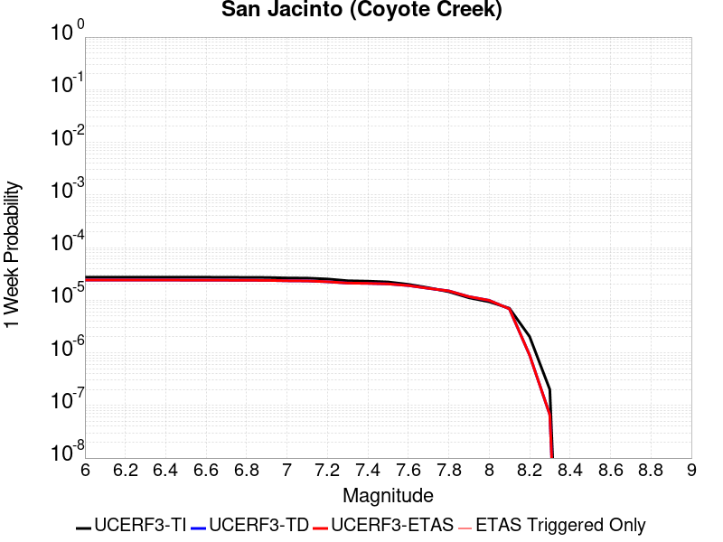 |  |  | 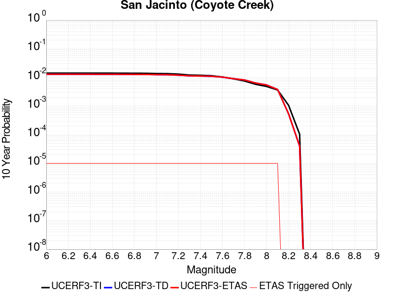 |

| Magnitude | 1 wk TI Prob | 1 wk TD Prob | 1 wk ETAS Prob | 1 wk ETAS/TD Gain | 1 wk ETAS Triggered Only | 1 mo TI Prob | 1 mo TD Prob | 1 mo ETAS Prob | 1 mo ETAS/TD Gain | 1 mo ETAS Triggered Only | 1 yr TI Prob | 1 yr TD Prob | 1 yr ETAS Prob | 1 yr ETAS/TD Gain | 1 yr ETAS Triggered Only | 10 yr TI Prob | 10 yr TD Prob | 10 yr ETAS Prob | 10 yr ETAS/TD Gain | 10 yr ETAS Triggered Only |
|-----|-----|-----|-----|-----|-----|-----|-----|-----|-----|-----|-----|-----|-----|-----|-----|-----|-----|-----|-----|-----|
| 6.0 | 2.7374346E-5 | 2.4177032E-5 | 2.4177032E-5 | 1.0 | 0.0 | 1.1731335E-4 | 1.0361175E-4 | 1.0361175E-4 | 1.0 | 0.0 | 0.0014273542 | 0.0012607456 | 0.001284189 | 1.018595 | 2.3473076E-5 | 0.01418221 | 0.012944878 | 0.0129680475 | 1.0017898 | 2.3473076E-5 |
| 6.1 | 2.7374346E-5 | 2.4177032E-5 | 2.4177032E-5 | 1.0 | 0.0 | 1.1731335E-4 | 1.0361175E-4 | 1.0361175E-4 | 1.0 | 0.0 | 0.0014273542 | 0.0012607456 | 0.001284189 | 1.018595 | 2.3473076E-5 | 0.01418221 | 0.012944878 | 0.0129680475 | 1.0017898 | 2.3473076E-5 |
| 6.2 | 2.7374346E-5 | 2.4177032E-5 | 2.4177032E-5 | 1.0 | 0.0 | 1.1731335E-4 | 1.0361175E-4 | 1.0361175E-4 | 1.0 | 0.0 | 0.0014273542 | 0.0012607456 | 0.001284189 | 1.018595 | 2.3473076E-5 | 0.01418221 | 0.012944878 | 0.0129680475 | 1.0017898 | 2.3473076E-5 |
| 6.3 | 2.7374346E-5 | 2.4177032E-5 | 2.4177032E-5 | 1.0 | 0.0 | 1.1731335E-4 | 1.0361175E-4 | 1.0361175E-4 | 1.0 | 0.0 | 0.0014273542 | 0.0012607456 | 0.001284189 | 1.018595 | 2.3473076E-5 | 0.01418221 | 0.012944878 | 0.0129680475 | 1.0017898 | 2.3473076E-5 |
| 6.4 | 2.7374346E-5 | 2.4177032E-5 | 2.4177032E-5 | 1.0 | 0.0 | 1.1731335E-4 | 1.0361175E-4 | 1.0361175E-4 | 1.0 | 0.0 | 0.0014273542 | 0.0012607456 | 0.001284189 | 1.018595 | 2.3473076E-5 | 0.01418221 | 0.012944878 | 0.0129680475 | 1.0017898 | 2.3473076E-5 |
| 6.5 | 2.7282445E-5 | 2.4063094E-5 | 2.4063094E-5 | 1.0 | 0.0 | 1.16919524E-4 | 1.03123486E-4 | 1.03123486E-4 | 1.0 | 0.0 | 0.0014225657 | 0.0012548079 | 0.0012782515 | 1.0186831 | 2.3473076E-5 | 0.014134934 | 0.012886199 | 0.01290937 | 1.0017982 | 2.3473076E-5 |
| 6.6 | 2.7282445E-5 | 2.4063094E-5 | 2.4063094E-5 | 1.0 | 0.0 | 1.16919524E-4 | 1.03123486E-4 | 1.03123486E-4 | 1.0 | 0.0 | 0.0014225657 | 0.0012548079 | 0.0012782515 | 1.0186831 | 2.3473076E-5 | 0.014134934 | 0.012886199 | 0.01290937 | 1.0017982 | 2.3473076E-5 |
| 6.7 | 2.7216198E-5 | 2.3988207E-5 | 2.3988207E-5 | 1.0 | 0.0 | 1.1663563E-4 | 1.02802565E-4 | 1.02802565E-4 | 1.0 | 0.0 | 0.0014191137 | 0.0012509052 | 0.0012743489 | 1.0187414 | 2.3473076E-5 | 0.014100855 | 0.012847606 | 0.012870777 | 1.0018035 | 2.3473076E-5 |
| 6.8 | 2.7078617E-5 | 2.3905404E-5 | 2.3905404E-5 | 1.0 | 0.0 | 1.1604605E-4 | 1.02447724E-4 | 1.02447724E-4 | 1.0 | 0.0 | 0.001411945 | 0.00124659 | 0.0012700339 | 1.0188063 | 2.3473076E-5 | 0.014030075 | 0.012804739 | 0.012827911 | 1.0018097 | 2.3473076E-5 |
| 6.9 | 2.6982952E-5 | 2.3824896E-5 | 2.3824896E-5 | 1.0 | 0.0 | 1.15636096E-4 | 1.0210271E-4 | 1.0210271E-4 | 1.0 | 0.0 | 0.0014069602 | 0.0012423943 | 0.0012658383 | 1.01887 | 2.3473076E-5 | 0.013980856 | 0.012763045 | 0.012786218 | 1.0018157 | 2.3473076E-5 |
| 7.0 | 2.6449972E-5 | 2.3401846E-5 | 2.3401846E-5 | 1.0 | 0.0 | 1.1335209E-4 | 1.00289784E-4 | 1.00289784E-4 | 1.0 | 0.0 | 0.001379188 | 0.0012203468 | 0.0012437912 | 1.0192113 | 2.3473076E-5 | 0.0137065975 | 0.012544374 | 0.012567553 | 1.0018477 | 2.3473076E-5 |
| 7.1 | 2.6257849E-5 | 2.322785E-5 | 2.322785E-5 | 1.0 | 0.0 | 1.1252879E-4 | 9.9544144E-5 | 9.9544144E-5 | 1.0 | 0.0 | 0.0013691769 | 0.0012112787 | 0.0012347234 | 1.0193553 | 2.3473076E-5 | 0.013607717 | 0.012454224 | 0.012477404 | 1.0018613 | 2.3473076E-5 |
| 7.2 | 2.5270041E-5 | 2.2422375E-5 | 2.2422375E-5 | 1.0 | 0.0 | 1.0829568E-4 | 9.6092364E-5 | 9.6092364E-5 | 1.0 | 0.0 | 0.0013177024 | 0.001169299 | 0.0011927447 | 1.020051 | 2.3473076E-5 | 0.013099162 | 0.012035143 | 0.012058333 | 1.0019269 | 2.3473076E-5 |
| 7.3 | 2.339701E-5 | 2.1153774E-5 | 2.1153774E-5 | 1.0 | 0.0 | 1.0026905E-4 | 9.065589E-5 | 9.065589E-5 | 1.0 | 0.0 | 0.001220092 | 0.0011031787 | 0.0011266259 | 1.0212542 | 2.3473076E-5 | 0.012134149 | 0.011373838 | 0.011397045 | 1.0020403 | 2.3473076E-5 |
| 7.4 | 2.296333E-5 | 2.0884016E-5 | 2.0884016E-5 | 1.0 | 0.0 | 9.841056E-5 | 8.949987E-5 | 8.949987E-5 | 1.0 | 0.0 | 0.0011974899 | 0.0010891182 | 0.0011125657 | 1.0215288 | 2.3473076E-5 | 0.011910575 | 0.011232895 | 0.011256104 | 1.0020663 | 2.3473076E-5 |
| 7.5 | 2.2188895E-5 | 2.0406682E-5 | 2.0406682E-5 | 1.0 | 0.0 | 9.50918E-5 | 8.745429E-5 | 8.745429E-5 | 1.0 | 0.0 | 0.0011571277 | 0.0010642379 | 0.0010876859 | 1.0220327 | 2.3473076E-5 | 0.011511209 | 0.010982383 | 0.011005598 | 1.0021138 | 2.3473076E-5 |
| 7.6 | 2.0013189E-5 | 1.8992265E-5 | 1.8992265E-5 | 1.0 | 0.0 | 8.5767984E-5 | 8.139289E-5 | 8.139289E-5 | 1.0 | 0.0 | 0.001043725 | 9.905098E-4 | 0.0010139595 | 1.0236745 | 2.3473076E-5 | 0.010388365 | 0.010240043 | 0.010263275 | 1.0022688 | 2.3473076E-5 |
| 7.7 | 1.7230794E-5 | 1.677281E-5 | 1.677281E-5 | 1.0 | 0.0 | 7.384417E-5 | 7.18815E-5 | 7.18815E-5 | 1.0 | 0.0 | 8.986819E-4 | 8.7480666E-4 | 8.982592E-4 | 1.0268089 | 2.3473076E-5 | 0.008950562 | 0.009078168 | 0.009101428 | 1.0025622 | 2.3473076E-5 |
| 7.8 | 1.4478809E-5 | 1.50190535E-5 | 1.50190535E-5 | 1.0 | 0.0 | 6.205057E-5 | 6.4365784E-5 | 6.4365784E-5 | 1.0 | 0.0 | 7.552038E-4 | 7.833723E-4 | 8.0682704E-4 | 1.0299406 | 2.3473076E-5 | 0.0075264242 | 0.00815608 | 0.008179362 | 1.0028545 | 2.3473076E-5 |
| 7.9 | 1.1114467E-5 | 1.1670009E-5 | 1.1670009E-5 | 1.0 | 0.0 | 4.7632562E-5 | 5.001337E-5 | 5.001337E-5 | 1.0 | 0.0 | 5.797721E-4 | 6.087432E-4 | 6.32202E-4 | 1.0385364 | 2.3473076E-5 | 0.0057826187 | 0.006393403 | 0.006416726 | 1.0036479 | 2.3473076E-5 |
| 8.0 | 9.327402E-6 | 9.9217805E-6 | 9.9217805E-6 | 1.0 | 0.0 | 3.9973966E-5 | 4.2521227E-5 | 4.2521227E-5 | 1.0 | 0.0 | 4.8657437E-4 | 5.175735E-4 | 5.4103445E-4 | 1.0453287 | 2.3473076E-5 | 0.0048551033 | 0.005461854 | 0.005485199 | 1.0042741 | 2.3473076E-5 |
| 8.1 | 7.0235833E-6 | 6.844232E-6 | 6.844232E-6 | 1.0 | 0.0 | 3.0100724E-5 | 2.9332095E-5 | 2.9332095E-5 | 1.0 | 0.0 | 3.664147E-4 | 3.5706026E-4 | 3.8052493E-4 | 1.0657164 | 2.3473076E-5 | 0.003658111 | 0.0037964787 | 0.0038198626 | 1.0061594 | 2.3473076E-5 |
| 8.2 | 2.0358202E-6 | 9.0285533E-7 | 9.0285533E-7 | 1.0 | 0.0 | 8.724915E-6 | 3.8693743E-6 | 3.8693743E-6 | 1.0 | 0.0 | 1.06220665E-4 | 4.710864E-5 | 4.710864E-5 | 1.0 | 0.0 | 0.001061699 | 5.3444994E-4 | 5.3444994E-4 | 1.0 | 0.0 |
| 8.3 | 2.0051264E-7 | 6.646147E-8 | 6.646147E-8 | 1.0 | 0.0 | 8.5933965E-7 | 2.8483484E-7 | 2.8483484E-7 | 1.0 | 0.0 | 1.046241E-5 | 3.467859E-6 | 3.467859E-6 | 1.0 | 0.0 | 1.0461917E-4 | 4.0304385E-5 | 4.0304385E-5 | 1.0 | 0.0 |

## Mission Creek
*[(top)](#table-of-contents)*

| 1 Week | 1 Month | 1 Year | 10 Year |
|-----|-----|-----|-----|
|  |  |  | 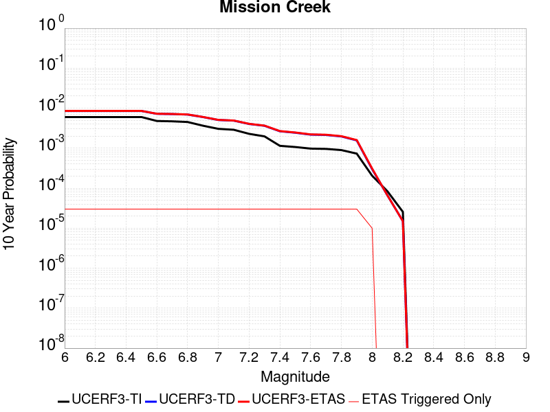 |

| Magnitude | 1 wk TI Prob | 1 wk TD Prob | 1 wk ETAS Prob | 1 wk ETAS/TD Gain | 1 wk ETAS Triggered Only | 1 mo TI Prob | 1 mo TD Prob | 1 mo ETAS Prob | 1 mo ETAS/TD Gain | 1 mo ETAS Triggered Only | 1 yr TI Prob | 1 yr TD Prob | 1 yr ETAS Prob | 1 yr ETAS/TD Gain | 1 yr ETAS Triggered Only | 10 yr TI Prob | 10 yr TD Prob | 10 yr ETAS Prob | 10 yr ETAS/TD Gain | 10 yr ETAS Triggered Only |
|-----|-----|-----|-----|-----|-----|-----|-----|-----|-----|-----|-----|-----|-----|-----|-----|-----|-----|-----|-----|-----|
| 6.0 | 1.1549387E-5 | 1.6331744E-5 | 1.6331744E-5 | 1.0 | 0.0 | 4.9496433E-5 | 6.9991394E-5 | 6.9991394E-5 | 1.0 | 0.0 | 6.0245243E-4 | 8.5182703E-4 | 8.5182703E-4 | 1.0 | 0.0 | 0.006008218 | 0.008514742 | 0.008538016 | 1.0027332 | 2.3473076E-5 |
| 6.1 | 1.1549387E-5 | 1.6331744E-5 | 1.6331744E-5 | 1.0 | 0.0 | 4.9496433E-5 | 6.9991394E-5 | 6.9991394E-5 | 1.0 | 0.0 | 6.0245243E-4 | 8.5182703E-4 | 8.5182703E-4 | 1.0 | 0.0 | 0.006008218 | 0.008514742 | 0.008538016 | 1.0027332 | 2.3473076E-5 |
| 6.2 | 1.1549387E-5 | 1.6331744E-5 | 1.6331744E-5 | 1.0 | 0.0 | 4.9496433E-5 | 6.9991394E-5 | 6.9991394E-5 | 1.0 | 0.0 | 6.0245243E-4 | 8.5182703E-4 | 8.5182703E-4 | 1.0 | 0.0 | 0.006008218 | 0.008514742 | 0.008538016 | 1.0027332 | 2.3473076E-5 |
| 6.3 | 1.1549387E-5 | 1.6331744E-5 | 1.6331744E-5 | 1.0 | 0.0 | 4.9496433E-5 | 6.9991394E-5 | 6.9991394E-5 | 1.0 | 0.0 | 6.0245243E-4 | 8.5182703E-4 | 8.5182703E-4 | 1.0 | 0.0 | 0.006008218 | 0.008514742 | 0.008538016 | 1.0027332 | 2.3473076E-5 |
| 6.4 | 1.1549387E-5 | 1.6331744E-5 | 1.6331744E-5 | 1.0 | 0.0 | 4.9496433E-5 | 6.9991394E-5 | 6.9991394E-5 | 1.0 | 0.0 | 6.0245243E-4 | 8.5182703E-4 | 8.5182703E-4 | 1.0 | 0.0 | 0.006008218 | 0.008514742 | 0.008538016 | 1.0027332 | 2.3473076E-5 |
| 6.5 | 1.1549387E-5 | 1.6331744E-5 | 1.6331744E-5 | 1.0 | 0.0 | 4.9496433E-5 | 6.9991394E-5 | 6.9991394E-5 | 1.0 | 0.0 | 6.0245243E-4 | 8.5182703E-4 | 8.5182703E-4 | 1.0 | 0.0 | 0.006008218 | 0.008514742 | 0.008538016 | 1.0027332 | 2.3473076E-5 |
| 6.6 | 9.202681E-6 | 1.3854947E-5 | 1.3854947E-5 | 1.0 | 0.0 | 3.9439463E-5 | 5.9377046E-5 | 5.9377046E-5 | 1.0 | 0.0 | 4.800697E-4 | 7.226848E-4 | 7.226848E-4 | 1.0 | 0.0 | 0.004790339 | 0.007231895 | 0.007255198 | 1.0032223 | 2.3473076E-5 |
| 6.7 | 9.019164E-6 | 1.366061E-5 | 1.366061E-5 | 1.0 | 0.0 | 3.8652986E-5 | 5.854421E-5 | 5.854421E-5 | 1.0 | 0.0 | 4.7049852E-4 | 7.1255164E-4 | 7.1255164E-4 | 1.0 | 0.0 | 0.004695036 | 0.007131216 | 0.007154522 | 1.0032681 | 2.3473076E-5 |
| 6.8 | 8.673558E-6 | 1.3282702E-5 | 1.3282702E-5 | 1.0 | 0.0 | 3.717186E-5 | 5.6924673E-5 | 5.6924673E-5 | 1.0 | 0.0 | 4.524734E-4 | 6.928463E-4 | 6.928463E-4 | 1.0 | 0.0 | 0.0045155324 | 0.0069353953 | 0.0069587054 | 1.0033611 | 2.3473076E-5 |
| 6.9 | 7.002255E-6 | 1.1486859E-5 | 1.1486859E-5 | 1.0 | 0.0 | 3.000932E-5 | 4.9228507E-5 | 4.9228507E-5 | 1.0 | 0.0 | 3.653022E-4 | 5.991991E-4 | 5.991991E-4 | 1.0 | 0.0 | 0.0036470229 | 0.0060041854 | 0.006027518 | 1.003886 | 2.3473076E-5 |
| 7.0 | 5.84644E-6 | 9.683714E-6 | 9.683714E-6 | 1.0 | 0.0 | 2.5055931E-5 | 4.1500996E-5 | 4.1500996E-5 | 1.0 | 0.0 | 3.0501327E-4 | 5.0516205E-4 | 5.0516205E-4 | 1.0 | 0.0 | 0.0030459496 | 0.005068281 | 0.005091635 | 1.0046079 | 2.3473076E-5 |
| 7.1 | 5.54703E-6 | 9.338158E-6 | 9.338158E-6 | 1.0 | 0.0 | 2.377277E-5 | 4.0020088E-5 | 4.0020088E-5 | 1.0 | 0.0 | 2.8939504E-4 | 4.871401E-4 | 4.871401E-4 | 1.0 | 0.0 | 0.0028901845 | 0.0048888596 | 0.0049122176 | 1.0047779 | 2.3473076E-5 |
| 7.2 | 4.384709E-6 | 7.689885E-6 | 7.689885E-6 | 1.0 | 0.0 | 1.8791474E-5 | 3.2956254E-5 | 3.2956254E-5 | 1.0 | 0.0 | 2.2876218E-4 | 4.0117218E-4 | 4.0117218E-4 | 1.0 | 0.0 | 0.0022852682 | 0.0040325816 | 0.0040559596 | 1.0057974 | 2.3473076E-5 |
| 7.3 | 3.7888456E-6 | 6.923602E-6 | 6.923602E-6 | 1.0 | 0.0 | 1.623781E-5 | 2.9672263E-5 | 2.9672263E-5 | 1.0 | 0.0 | 1.9767738E-4 | 3.6120327E-4 | 3.6120327E-4 | 1.0 | 0.0 | 0.0019750162 | 0.0036342472 | 0.003657635 | 1.0064354 | 2.3473076E-5 |
| 7.4 | 2.1982462E-6 | 5.0316853E-6 | 5.0316853E-6 | 1.0 | 0.0 | 9.421021E-6 | 2.1564189E-5 | 2.1564189E-5 | 1.0 | 0.0 | 1.1469489E-4 | 2.6251256E-4 | 2.6251256E-4 | 1.0 | 0.0 | 0.0011463572 | 0.0026498951 | 0.002673306 | 1.0088346 | 2.3473076E-5 |
| 7.5 | 2.051923E-6 | 4.6227096E-6 | 4.6227096E-6 | 1.0 | 0.0 | 8.793926E-6 | 1.9811463E-5 | 1.9811463E-5 | 1.0 | 0.0 | 1.0706078E-4 | 2.4117802E-4 | 2.4117802E-4 | 1.0 | 0.0 | 0.0010700922 | 0.0024374423 | 0.0024608583 | 1.0096067 | 2.3473076E-5 |
| 7.6 | 1.8733427E-6 | 4.1308053E-6 | 4.1308053E-6 | 1.0 | 0.0 | 8.028587E-6 | 1.7703333E-5 | 1.7703333E-5 | 1.0 | 0.0 | 9.774366E-5 | 2.1551683E-4 | 2.1551683E-4 | 1.0 | 0.0 | 9.770069E-4 | 0.002181846 | 0.0022052678 | 1.0107349 | 2.3473076E-5 |
| 7.7 | 1.8411953E-6 | 4.0504306E-6 | 4.0504306E-6 | 1.0 | 0.0 | 7.890813E-6 | 1.7358872E-5 | 1.7358872E-5 | 1.0 | 0.0 | 9.606641E-5 | 2.1132386E-4 | 2.1132386E-4 | 1.0 | 0.0 | 9.6024893E-4 | 0.0021401057 | 0.0021635287 | 1.0109447 | 2.3473076E-5 |
| 7.8 | 1.7194251E-6 | 3.7173024E-6 | 3.7173024E-6 | 1.0 | 0.0 | 7.368944E-6 | 1.59312E-5 | 1.59312E-5 | 1.0 | 0.0 | 8.97132E-5 | 1.9394518E-4 | 1.9394518E-4 | 1.0 | 0.0 | 8.967699E-4 | 0.0019658357 | 0.0019892626 | 1.011917 | 2.3473076E-5 |
| 7.9 | 1.4035052E-6 | 2.9557E-6 | 2.9557E-6 | 1.0 | 0.0 | 6.0150082E-6 | 1.2667225E-5 | 1.2667225E-5 | 1.0 | 0.0 | 7.3230265E-5 | 1.5421261E-4 | 1.5421261E-4 | 1.0 | 0.0 | 7.3206134E-4 | 0.0015659636 | 0.0015893999 | 1.014966 | 2.3473076E-5 |
| 8.0 | 3.9318823E-7 | 5.542283E-7 | 5.542283E-7 | 1.0 | 0.0 | 1.6850913E-6 | 2.3752618E-6 | 2.3752618E-6 | 1.0 | 0.0 | 2.0515794E-5 | 2.8918435E-5 | 2.8918435E-5 | 1.0 | 0.0 | 2.0513899E-4 | 2.997098E-4 | 3.2317583E-4 | 1.0782958 | 2.3473076E-5 |
| 8.1 | 1.596793E-7 | 1.1427638E-7 | 1.1427638E-7 | 1.0 | 0.0 | 6.8433974E-7 | 4.8975585E-7 | 4.8975585E-7 | 1.0 | 0.0 | 8.331805E-6 | 5.962761E-6 | 5.962761E-6 | 1.0 | 0.0 | 8.331492E-5 | 6.57585E-5 | 6.57585E-5 | 1.0 | 0.0 |
| 8.2 | 4.9003038E-8 | 2.5565779E-8 | 2.5565779E-8 | 1.0 | 0.0 | 2.10013E-7 | 1.09567615E-7 | 1.09567615E-7 | 1.0 | 0.0 | 2.5569052E-6 | 1.3339849E-6 | 1.3339849E-6 | 1.0 | 0.0 | 2.556876E-5 | 1.5023335E-5 | 1.5023335E-5 | 1.0 | 0.0 |

## Big Pine (East)
*[(top)](#table-of-contents)*

| 1 Week | 1 Month | 1 Year | 10 Year |
|-----|-----|-----|-----|
|  |  |  |  |

| Magnitude | 1 wk TI Prob | 1 wk TD Prob | 1 wk ETAS Prob | 1 wk ETAS/TD Gain | 1 wk ETAS Triggered Only | 1 mo TI Prob | 1 mo TD Prob | 1 mo ETAS Prob | 1 mo ETAS/TD Gain | 1 mo ETAS Triggered Only | 1 yr TI Prob | 1 yr TD Prob | 1 yr ETAS Prob | 1 yr ETAS/TD Gain | 1 yr ETAS Triggered Only | 10 yr TI Prob | 10 yr TD Prob | 10 yr ETAS Prob | 10 yr ETAS/TD Gain | 10 yr ETAS Triggered Only |
|-----|-----|-----|-----|-----|-----|-----|-----|-----|-----|-----|-----|-----|-----|-----|-----|-----|-----|-----|-----|-----|
| 6.0 | 9.916913E-6 | 1.282197E-5 | 1.282197E-5 | 1.0 | 0.0 | 4.250036E-5 | 5.495027E-5 | 5.495027E-5 | 1.0 | 0.0 | 5.173191E-4 | 6.6883623E-4 | 6.6883623E-4 | 1.0 | 0.0 | 0.0051611643 | 0.0066729826 | 0.006696299 | 1.0034941 | 2.3473076E-5 |
| 6.1 | 9.916913E-6 | 1.282197E-5 | 1.282197E-5 | 1.0 | 0.0 | 4.250036E-5 | 5.495027E-5 | 5.495027E-5 | 1.0 | 0.0 | 5.173191E-4 | 6.6883623E-4 | 6.6883623E-4 | 1.0 | 0.0 | 0.0051611643 | 0.0066729826 | 0.006696299 | 1.0034941 | 2.3473076E-5 |
| 6.2 | 9.916913E-6 | 1.282197E-5 | 1.282197E-5 | 1.0 | 0.0 | 4.250036E-5 | 5.495027E-5 | 5.495027E-5 | 1.0 | 0.0 | 5.173191E-4 | 6.6883623E-4 | 6.6883623E-4 | 1.0 | 0.0 | 0.0051611643 | 0.0066729826 | 0.006696299 | 1.0034941 | 2.3473076E-5 |
| 6.3 | 5.479711E-6 | 8.117787E-6 | 8.117787E-6 | 1.0 | 0.0 | 2.3484265E-5 | 3.4790068E-5 | 3.4790068E-5 | 1.0 | 0.0 | 2.858834E-4 | 4.2348995E-4 | 4.2348995E-4 | 1.0 | 0.0 | 0.0028551589 | 0.004229713 | 0.004229713 | 1.0 | 0.0 |
| 6.4 | 5.465009E-6 | 8.10208E-6 | 8.10208E-6 | 1.0 | 0.0 | 2.3421257E-5 | 3.4722754E-5 | 3.4722754E-5 | 1.0 | 0.0 | 2.851165E-4 | 4.2267074E-4 | 4.2267074E-4 | 1.0 | 0.0 | 0.0028475097 | 0.004221552 | 0.004221552 | 1.0 | 0.0 |
| 6.5 | 4.826767E-6 | 7.4271156E-6 | 7.4271156E-6 | 1.0 | 0.0 | 2.068598E-5 | 3.183012E-5 | 3.183012E-5 | 1.0 | 0.0 | 2.518227E-4 | 3.874656E-4 | 3.874656E-4 | 1.0 | 0.0 | 0.0025153751 | 0.0038707424 | 0.0038707424 | 1.0 | 0.0 |
| 6.6 | 4.3146847E-6 | 6.887036E-6 | 6.887036E-6 | 1.0 | 0.0 | 1.8491375E-5 | 2.9515548E-5 | 2.9515548E-5 | 1.0 | 0.0 | 2.2510924E-4 | 3.59295E-4 | 3.59295E-4 | 1.0 | 0.0 | 0.0022488134 | 0.0035899505 | 0.0035899505 | 1.0 | 0.0 |
| 6.7 | 3.6968106E-6 | 5.9999884E-6 | 5.9999884E-6 | 1.0 | 0.0 | 1.5843378E-5 | 2.571399E-5 | 2.571399E-5 | 1.0 | 0.0 | 1.9287605E-4 | 3.130244E-4 | 3.130244E-4 | 1.0 | 0.0 | 0.0019270873 | 0.0031285542 | 0.0031285542 | 1.0 | 0.0 |
| 6.8 | 3.4671132E-6 | 5.7065704E-6 | 5.7065704E-6 | 1.0 | 0.0 | 1.4858972E-5 | 2.4456509E-5 | 2.4456509E-5 | 1.0 | 0.0 | 1.8089297E-4 | 2.9771877E-4 | 2.9771877E-4 | 1.0 | 0.0 | 0.0018074579 | 0.0029759097 | 0.0029759097 | 1.0 | 0.0 |
| 6.9 | 2.7686972E-6 | 4.829279E-6 | 4.829279E-6 | 1.0 | 0.0 | 1.1865792E-5 | 2.069675E-5 | 2.069675E-5 | 1.0 | 0.0 | 1.4445644E-4 | 2.5195457E-4 | 2.5195457E-4 | 1.0 | 0.0 | 0.0014436257 | 0.0025193316 | 0.0025193316 | 1.0 | 0.0 |
| 7.0 | 2.1472624E-6 | 3.988725E-6 | 3.988725E-6 | 1.0 | 0.0 | 9.20252E-6 | 1.7094428E-5 | 1.7094428E-5 | 1.0 | 0.0 | 1.12034926E-4 | 2.0810531E-4 | 2.0810531E-4 | 1.0 | 0.0 | 0.0011197845 | 0.002081715 | 0.002081715 | 1.0 | 0.0 |
| 7.1 | 1.7018335E-6 | 3.348229E-6 | 3.348229E-6 | 1.0 | 0.0 | 7.293552E-6 | 1.4349476E-5 | 1.4349476E-5 | 1.0 | 0.0 | 8.879537E-5 | 1.7469123E-4 | 1.7469123E-4 | 1.0 | 0.0 | 8.87599E-4 | 0.0017481181 | 0.0017481181 | 1.0 | 0.0 |
| 7.2 | 1.25603E-6 | 2.7976516E-6 | 2.7976516E-6 | 1.0 | 0.0 | 5.3829745E-6 | 1.1989882E-5 | 1.1989882E-5 | 1.0 | 0.0 | 6.553574E-5 | 1.4596726E-4 | 1.4596726E-4 | 1.0 | 0.0 | 6.551642E-4 | 0.0014612685 | 0.0014612685 | 1.0 | 0.0 |
| 7.3 | 1.112297E-6 | 2.613323E-6 | 2.613323E-6 | 1.0 | 0.0 | 4.7669787E-6 | 1.1199909E-5 | 1.1199909E-5 | 1.0 | 0.0 | 5.803642E-5 | 1.3635057E-4 | 1.3635057E-4 | 1.0 | 0.0 | 5.802127E-4 | 0.0013650558 | 0.0013650558 | 1.0 | 0.0 |
| 7.4 | 1.0137181E-6 | 2.4863546E-6 | 2.4863546E-6 | 1.0 | 0.0 | 4.3444993E-6 | 1.0655763E-5 | 1.0655763E-5 | 1.0 | 0.0 | 5.2892992E-5 | 1.297264E-4 | 1.297264E-4 | 1.0 | 0.0 | 5.288041E-4 | 0.0012986774 | 0.0012986774 | 1.0 | 0.0 |
| 7.5 | 9.598608E-7 | 2.4099256E-6 | 2.4099256E-6 | 1.0 | 0.0 | 4.1136827E-6 | 1.0328214E-5 | 1.0328214E-5 | 1.0 | 0.0 | 5.0082934E-5 | 1.2573895E-4 | 1.2573895E-4 | 1.0 | 0.0 | 5.007165E-4 | 0.0012586572 | 0.0012586572 | 1.0 | 0.0 |
| 7.6 | 7.929459E-7 | 2.047312E-6 | 2.047312E-6 | 1.0 | 0.0 | 3.3983351E-6 | 8.7741655E-6 | 8.7741655E-6 | 1.0 | 0.0 | 4.1373947E-5 | 1.0682041E-4 | 1.0682041E-4 | 1.0 | 0.0 | 4.1366243E-4 | 0.0010697625 | 0.0010697625 | 1.0 | 0.0 |
| 7.7 | 4.155788E-7 | 1.162298E-6 | 1.162298E-6 | 1.0 | 0.0 | 1.7810507E-6 | 4.981268E-6 | 4.981268E-6 | 1.0 | 0.0 | 2.1684076E-5 | 6.064529E-5 | 6.064529E-5 | 1.0 | 0.0 | 2.1681961E-4 | 6.09451E-4 | 6.09451E-4 | 1.0 | 0.0 |
| 7.8 | 1.14666925E-7 | 2.5959213E-7 | 2.5959213E-7 | 1.0 | 0.0 | 4.914296E-7 | 1.1125372E-6 | 1.1125372E-6 | 1.0 | 0.0 | 5.9831386E-6 | 1.354506E-5 | 1.354506E-5 | 1.0 | 0.0 | 5.9829777E-5 | 1.3654139E-4 | 1.3654139E-4 | 1.0 | 0.0 |
| 7.9 | 2.9231824E-8 | 4.15291E-8 | 4.15291E-8 | 1.0 | 0.0 | 1.2527924E-7 | 1.7798183E-7 | 1.7798183E-7 | 1.0 | 0.0 | 1.5252737E-6 | 2.1669268E-6 | 2.1669268E-6 | 1.0 | 0.0 | 1.5252632E-5 | 2.2001832E-5 | 2.2001832E-5 | 1.0 | 0.0 |

## Coyote Lake
*[(top)](#table-of-contents)*

| 1 Week | 1 Month | 1 Year | 10 Year |
|-----|-----|-----|-----|
|  | 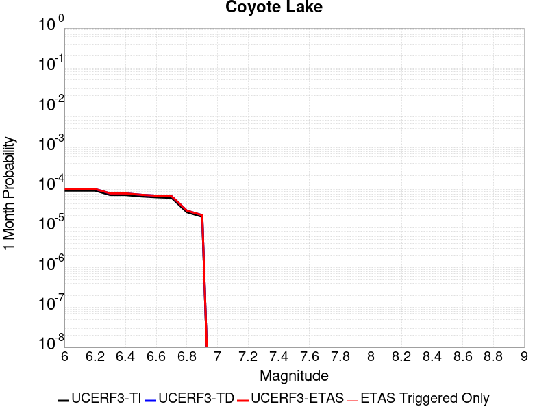 |  |  |

| Magnitude | 1 wk TI Prob | 1 wk TD Prob | 1 wk ETAS Prob | 1 wk ETAS/TD Gain | 1 wk ETAS Triggered Only | 1 mo TI Prob | 1 mo TD Prob | 1 mo ETAS Prob | 1 mo ETAS/TD Gain | 1 mo ETAS Triggered Only | 1 yr TI Prob | 1 yr TD Prob | 1 yr ETAS Prob | 1 yr ETAS/TD Gain | 1 yr ETAS Triggered Only | 10 yr TI Prob | 10 yr TD Prob | 10 yr ETAS Prob | 10 yr ETAS/TD Gain | 10 yr ETAS Triggered Only |
|-----|-----|-----|-----|-----|-----|-----|-----|-----|-----|-----|-----|-----|-----|-----|-----|-----|-----|-----|-----|-----|
| 6.0 | 1.980352E-5 | 2.1707852E-5 | 2.1707852E-5 | 1.0 | 0.0 | 8.486947E-5 | 9.303074E-5 | 9.303074E-5 | 1.0 | 0.0 | 0.0010327959 | 0.0011321327 | 0.0011555792 | 1.02071 | 2.3473076E-5 | 0.010280091 | 0.01127083 | 0.011294039 | 1.0020592 | 2.3473076E-5 |
| 6.1 | 1.980352E-5 | 2.1707852E-5 | 2.1707852E-5 | 1.0 | 0.0 | 8.486947E-5 | 9.303074E-5 | 9.303074E-5 | 1.0 | 0.0 | 0.0010327959 | 0.0011321327 | 0.0011555792 | 1.02071 | 2.3473076E-5 | 0.010280091 | 0.01127083 | 0.011294039 | 1.0020592 | 2.3473076E-5 |
| 6.2 | 1.980352E-5 | 2.1707852E-5 | 2.1707852E-5 | 1.0 | 0.0 | 8.486947E-5 | 9.303074E-5 | 9.303074E-5 | 1.0 | 0.0 | 0.0010327959 | 0.0011321327 | 0.0011555792 | 1.02071 | 2.3473076E-5 | 0.010280091 | 0.01127083 | 0.011294039 | 1.0020592 | 2.3473076E-5 |
| 6.3 | 1.5344787E-5 | 1.6821528E-5 | 1.6821528E-5 | 1.0 | 0.0 | 6.576172E-5 | 7.209062E-5 | 7.209062E-5 | 1.0 | 0.0 | 8.003548E-4 | 8.7741105E-4 | 9.008635E-4 | 1.0267292 | 2.3473076E-5 | 0.007974784 | 0.008745514 | 0.008768782 | 1.0026605 | 2.3473076E-5 |
| 6.4 | 1.5344787E-5 | 1.6821528E-5 | 1.6821528E-5 | 1.0 | 0.0 | 6.576172E-5 | 7.209062E-5 | 7.209062E-5 | 1.0 | 0.0 | 8.003548E-4 | 8.7741105E-4 | 9.008635E-4 | 1.0267292 | 2.3473076E-5 | 0.007974784 | 0.008745514 | 0.008768782 | 1.0026605 | 2.3473076E-5 |
| 6.5 | 1.4189697E-5 | 1.5558782E-5 | 1.5558782E-5 | 1.0 | 0.0 | 6.081157E-5 | 6.667913E-5 | 6.667913E-5 | 1.0 | 0.0 | 7.401293E-4 | 8.115764E-4 | 8.350304E-4 | 1.0288993 | 2.3473076E-5 | 0.0073766913 | 0.008092069 | 0.008115352 | 1.0028772 | 2.3473076E-5 |
| 6.6 | 1.3469301E-5 | 1.4772335E-5 | 1.4772335E-5 | 1.0 | 0.0 | 5.7724297E-5 | 6.330881E-5 | 6.330881E-5 | 1.0 | 0.0 | 7.025667E-4 | 7.7057217E-4 | 7.940272E-4 | 1.0304384 | 2.3473076E-5 | 0.0070034964 | 0.0076849074 | 0.0077082003 | 1.003031 | 2.3473076E-5 |
| 6.7 | 1.3027966E-5 | 1.4282475E-5 | 1.4282475E-5 | 1.0 | 0.0 | 5.5832945E-5 | 6.12095E-5 | 6.12095E-5 | 1.0 | 0.0 | 6.7955407E-4 | 7.450307E-4 | 7.6848624E-4 | 1.0314827 | 2.3473076E-5 | 0.006774798 | 0.007431207 | 0.0074545057 | 1.0031352 | 2.3473076E-5 |
| 6.8 | 5.695434E-6 | 6.2247245E-6 | 6.2247245E-6 | 1.0 | 0.0 | 2.4408775E-5 | 2.6677288E-5 | 2.6677288E-5 | 1.0 | 0.0 | 2.971363E-4 | 3.2477756E-4 | 3.4824302E-4 | 1.0722508 | 2.3473076E-5 | 0.0029673933 | 0.0032459702 | 0.0032693672 | 1.007208 | 2.3473076E-5 |
| 6.9 | 4.385688E-6 | 4.7932917E-6 | 4.7932917E-6 | 1.0 | 0.0 | 1.879567E-5 | 2.0542679E-5 | 2.0542679E-5 | 1.0 | 0.0 | 2.2881327E-4 | 2.501071E-4 | 2.7357432E-4 | 1.0938287 | 2.3473076E-5 | 0.002285778 | 0.002501071 | 0.0025244853 | 1.0093617 | 2.3473076E-5 |

## San Jacinto (San Bernardino)
*[(top)](#table-of-contents)*

| 1 Week | 1 Month | 1 Year | 10 Year |
|-----|-----|-----|-----|
|  | 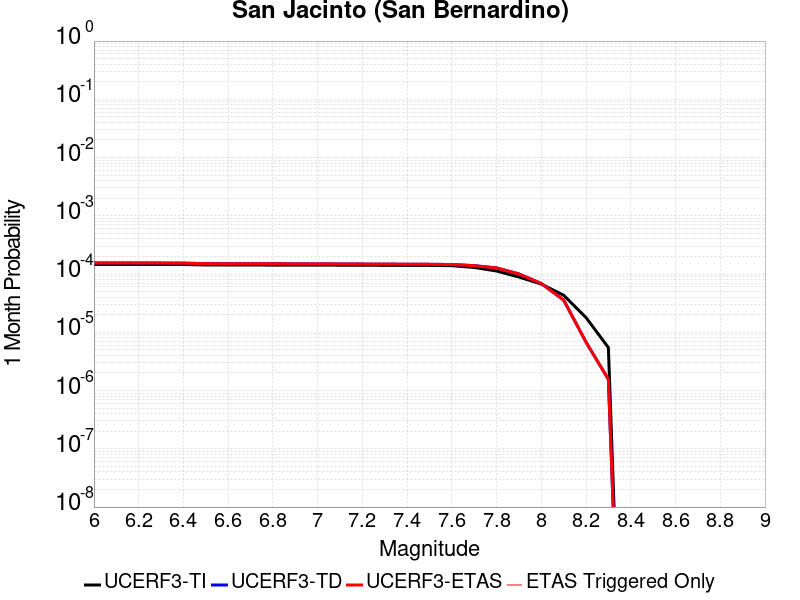 | 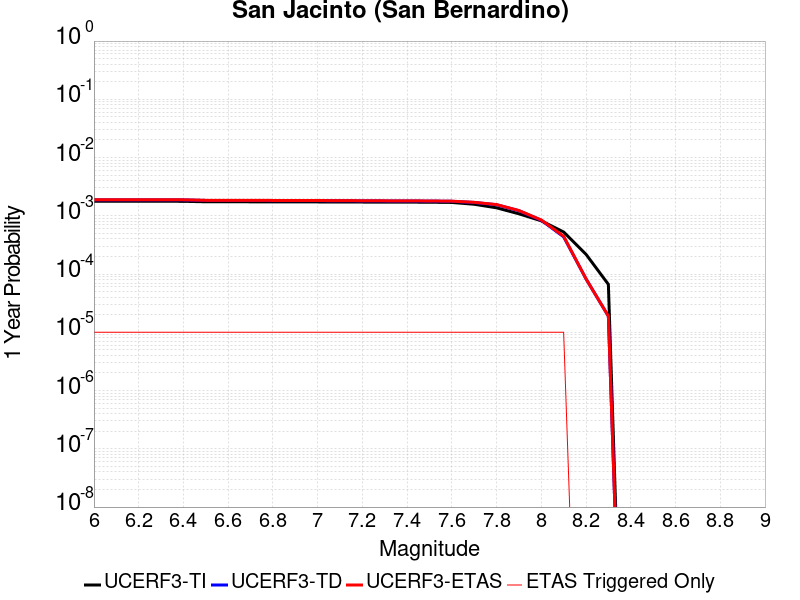 |  |

| Magnitude | 1 wk TI Prob | 1 wk TD Prob | 1 wk ETAS Prob | 1 wk ETAS/TD Gain | 1 wk ETAS Triggered Only | 1 mo TI Prob | 1 mo TD Prob | 1 mo ETAS Prob | 1 mo ETAS/TD Gain | 1 mo ETAS Triggered Only | 1 yr TI Prob | 1 yr TD Prob | 1 yr ETAS Prob | 1 yr ETAS/TD Gain | 1 yr ETAS Triggered Only | 10 yr TI Prob | 10 yr TD Prob | 10 yr ETAS Prob | 10 yr ETAS/TD Gain | 10 yr ETAS Triggered Only |
|-----|-----|-----|-----|-----|-----|-----|-----|-----|-----|-----|-----|-----|-----|-----|-----|-----|-----|-----|-----|-----|
| 6.0 | 3.409352E-5 | 3.6049758E-5 | 3.6049758E-5 | 1.0 | 0.0 | 1.461069E-4 | 1.5448983E-4 | 1.5448983E-4 | 1.0 | 0.0 | 0.0017774 | 0.0018792928 | 0.0019027217 | 1.0124669 | 2.3473076E-5 | 0.01763251 | 0.019382251 | 0.01940527 | 1.0011876 | 2.3473076E-5 |
| 6.1 | 3.409352E-5 | 3.6049758E-5 | 3.6049758E-5 | 1.0 | 0.0 | 1.461069E-4 | 1.5448983E-4 | 1.5448983E-4 | 1.0 | 0.0 | 0.0017774 | 0.0018792928 | 0.0019027217 | 1.0124669 | 2.3473076E-5 | 0.01763251 | 0.019382251 | 0.01940527 | 1.0011876 | 2.3473076E-5 |
| 6.2 | 3.409352E-5 | 3.6049758E-5 | 3.6049758E-5 | 1.0 | 0.0 | 1.461069E-4 | 1.5448983E-4 | 1.5448983E-4 | 1.0 | 0.0 | 0.0017774 | 0.0018792928 | 0.0019027217 | 1.0124669 | 2.3473076E-5 | 0.01763251 | 0.019382251 | 0.01940527 | 1.0011876 | 2.3473076E-5 |
| 6.3 | 3.409352E-5 | 3.6049758E-5 | 3.6049758E-5 | 1.0 | 0.0 | 1.461069E-4 | 1.5448983E-4 | 1.5448983E-4 | 1.0 | 0.0 | 0.0017774 | 0.0018792928 | 0.0019027217 | 1.0124669 | 2.3473076E-5 | 0.01763251 | 0.019382251 | 0.01940527 | 1.0011876 | 2.3473076E-5 |
| 6.4 | 3.400795E-5 | 3.5942405E-5 | 3.5942405E-5 | 1.0 | 0.0 | 1.4574021E-4 | 1.540298E-4 | 1.540298E-4 | 1.0 | 0.0 | 0.0017729428 | 0.0018737017 | 0.0018971309 | 1.0125042 | 2.3473076E-5 | 0.017588645 | 0.019327328 | 0.019350346 | 1.001191 | 2.3473076E-5 |
| 6.5 | 3.341482E-5 | 3.5202946E-5 | 3.5202946E-5 | 1.0 | 0.0 | 1.4319851E-4 | 1.5086106E-4 | 1.5086106E-4 | 1.0 | 0.0 | 0.0017420477 | 0.0018351874 | 0.0018586174 | 1.0127671 | 2.3473076E-5 | 0.017284546 | 0.018948833 | 0.01897186 | 1.0012153 | 2.3473076E-5 |
| 6.6 | 3.3364955E-5 | 3.5140158E-5 | 3.5140158E-5 | 1.0 | 0.0 | 1.4298483E-4 | 1.50592E-4 | 1.50592E-4 | 1.0 | 0.0 | 0.0017394501 | 0.0018319171 | 0.0018553471 | 1.01279 | 2.3473076E-5 | 0.017258976 | 0.018916694 | 0.018939724 | 1.0012174 | 2.3473076E-5 |
| 6.7 | 3.335922E-5 | 3.512993E-5 | 3.512993E-5 | 1.0 | 0.0 | 1.4296026E-4 | 1.5054816E-4 | 1.5054816E-4 | 1.0 | 0.0 | 0.0017391514 | 0.0018313844 | 0.0018548145 | 1.0127937 | 2.3473076E-5 | 0.017256035 | 0.018911485 | 0.018934514 | 1.0012177 | 2.3473076E-5 |
| 6.8 | 3.327683E-5 | 3.5023982E-5 | 3.5023982E-5 | 1.0 | 0.0 | 1.4260718E-4 | 1.5009414E-4 | 1.5009414E-4 | 1.0 | 0.0 | 0.0017348597 | 0.0018258659 | 0.0018492962 | 1.0128324 | 2.3473076E-5 | 0.017213784 | 0.018857252 | 0.018880282 | 1.0012213 | 2.3473076E-5 |
| 6.9 | 3.3235785E-5 | 3.4964927E-5 | 3.4964927E-5 | 1.0 | 0.0 | 1.4243131E-4 | 1.4984109E-4 | 1.4984109E-4 | 1.0 | 0.0 | 0.0017327217 | 0.0018227901 | 0.0018462203 | 1.0128541 | 2.3473076E-5 | 0.017192734 | 0.018827116 | 0.018850148 | 1.0012233 | 2.3473076E-5 |
| 7.0 | 3.3197095E-5 | 3.4904846E-5 | 3.4904846E-5 | 1.0 | 0.0 | 1.422655E-4 | 1.4958362E-4 | 1.4958362E-4 | 1.0 | 0.0 | 0.0017307063 | 0.0018196608 | 0.0018430911 | 1.0128763 | 2.3473076E-5 | 0.017172894 | 0.018796489 | 0.01881952 | 1.0012254 | 2.3473076E-5 |
| 7.1 | 3.3129716E-5 | 3.478503E-5 | 3.478503E-5 | 1.0 | 0.0 | 1.4197677E-4 | 1.4907018E-4 | 1.4907018E-4 | 1.0 | 0.0 | 0.0017271966 | 0.0018134202 | 0.0018368507 | 1.0129206 | 2.3473076E-5 | 0.017138338 | 0.018735558 | 0.018758591 | 1.0012294 | 2.3473076E-5 |
| 7.2 | 3.3034008E-5 | 3.4652458E-5 | 3.4652458E-5 | 1.0 | 0.0 | 1.4156665E-4 | 1.4850209E-4 | 1.4850209E-4 | 1.0 | 0.0 | 0.0017222111 | 0.001806515 | 0.0018299457 | 1.0129701 | 2.3473076E-5 | 0.017089253 | 0.018667944 | 0.018690977 | 1.0012339 | 2.3473076E-5 |
| 7.3 | 3.2956614E-5 | 3.4520177E-5 | 3.4520177E-5 | 1.0 | 0.0 | 1.4123498E-4 | 1.4793524E-4 | 1.4793524E-4 | 1.0 | 0.0 | 0.0017181796 | 0.001799625 | 0.0018230559 | 1.0130198 | 2.3473076E-5 | 0.017049557 | 0.018600674 | 0.018623712 | 1.0012385 | 2.3473076E-5 |
| 7.4 | 3.2915937E-5 | 3.4441844E-5 | 3.4441844E-5 | 1.0 | 0.0 | 1.4106068E-4 | 1.4759957E-4 | 1.4759957E-4 | 1.0 | 0.0 | 0.0017160608 | 0.0017955449 | 0.0018189758 | 1.0130495 | 2.3473076E-5 | 0.017028693 | 0.018560927 | 0.018583965 | 1.0012412 | 2.3473076E-5 |
| 7.5 | 3.281791E-5 | 3.430671E-5 | 3.430671E-5 | 1.0 | 0.0 | 1.406406E-4 | 1.4702049E-4 | 1.4702049E-4 | 1.0 | 0.0 | 0.0017109542 | 0.0017885063 | 0.0018119374 | 1.013101 | 2.3473076E-5 | 0.016978411 | 0.018491795 | 0.018514834 | 1.0012459 | 2.3473076E-5 |
| 7.6 | 3.2521442E-5 | 3.4031546E-5 | 3.4031546E-5 | 1.0 | 0.0 | 1.3937015E-4 | 1.4584133E-4 | 1.4584133E-4 | 1.0 | 0.0 | 0.0016955109 | 0.0017741736 | 0.001797605 | 1.013207 | 2.3473076E-5 | 0.016826328 | 0.018349366 | 0.018372409 | 1.0012558 | 2.3473076E-5 |
| 7.7 | 3.0287873E-5 | 3.2514843E-5 | 3.2514843E-5 | 1.0 | 0.0 | 1.297987E-4 | 1.393419E-4 | 1.393419E-4 | 1.0 | 0.0 | 0.0015791537 | 0.0016951686 | 0.0017186019 | 1.0138236 | 2.3473076E-5 | 0.01567979 | 0.017559871 | 0.017582932 | 1.0013133 | 2.3473076E-5 |
| 7.8 | 2.6316151E-5 | 2.9723395E-5 | 2.9723395E-5 | 1.0 | 0.0 | 1.1277862E-4 | 1.2737977E-4 | 1.2737977E-4 | 1.0 | 0.0 | 0.0013722149 | 0.0015497464 | 0.0015731831 | 1.0151229 | 2.3473076E-5 | 0.013637724 | 0.016100293 | 0.016123388 | 1.0014344 | 2.3473076E-5 |
| 7.9 | 2.0761147E-5 | 2.3470231E-5 | 2.3470231E-5 | 1.0 | 0.0 | 8.897331E-5 | 1.0058283E-4 | 1.0058283E-4 | 1.0 | 0.0 | 0.0010827117 | 0.0012239089 | 0.0012473533 | 1.0191553 | 2.3473076E-5 | 0.010774517 | 0.012820105 | 0.012843277 | 1.0018075 | 2.3473076E-5 |
| 8.0 | 1.5738568E-5 | 1.607273E-5 | 1.607273E-5 | 1.0 | 0.0 | 6.744926E-5 | 6.8881316E-5 | 6.8881316E-5 | 1.0 | 0.0 | 8.2088535E-4 | 8.38308E-4 | 8.6176145E-4 | 1.0279771 | 2.3473076E-5 | 0.008178596 | 0.008886527 | 0.008909792 | 1.002618 | 2.3473076E-5 |
| 8.1 | 1.0105832E-5 | 8.353191E-6 | 8.353191E-6 | 1.0 | 0.0 | 4.3309992E-5 | 3.5798905E-5 | 3.5798905E-5 | 1.0 | 0.0 | 5.2717153E-4 | 4.35765E-4 | 4.5922786E-4 | 1.0538429 | 2.3473076E-5 | 0.005259227 | 0.004689436 | 0.0047127986 | 1.004982 | 2.3473076E-5 |
| 8.2 | 4.189207E-6 | 1.5851253E-6 | 1.5851253E-6 | 1.0 | 0.0 | 1.7953622E-5 | 6.7933765E-6 | 6.7933765E-6 | 1.0 | 0.0 | 2.1856341E-4 | 8.270625E-5 | 8.270625E-5 | 1.0 | 0.0 | 0.0021834858 | 9.604094E-4 | 9.604094E-4 | 1.0 | 0.0 |
| 8.3 | 1.2758221E-6 | 3.6330252E-7 | 3.6330252E-7 | 1.0 | 0.0 | 5.4677976E-6 | 1.5570099E-6 | 1.5570099E-6 | 1.0 | 0.0 | 6.65684E-5 | 1.8956434E-5 | 1.8956434E-5 | 1.0 | 0.0 | 6.6548464E-4 | 2.2857229E-4 | 2.2857229E-4 | 1.0 | 0.0 |

## San Luis Range 2011 CFM
*[(top)](#table-of-contents)*

| 1 Week | 1 Month | 1 Year | 10 Year |
|-----|-----|-----|-----|
|  |  |  |  |

| Magnitude | 1 wk TI Prob | 1 wk TD Prob | 1 wk ETAS Prob | 1 wk ETAS/TD Gain | 1 wk ETAS Triggered Only | 1 mo TI Prob | 1 mo TD Prob | 1 mo ETAS Prob | 1 mo ETAS/TD Gain | 1 mo ETAS Triggered Only | 1 yr TI Prob | 1 yr TD Prob | 1 yr ETAS Prob | 1 yr ETAS/TD Gain | 1 yr ETAS Triggered Only | 10 yr TI Prob | 10 yr TD Prob | 10 yr ETAS Prob | 10 yr ETAS/TD Gain | 10 yr ETAS Triggered Only |
|-----|-----|-----|-----|-----|-----|-----|-----|-----|-----|-----|-----|-----|-----|-----|-----|-----|-----|-----|-----|-----|
| 6.0 | 8.8368415E-6 | 8.965548E-6 | 8.965548E-6 | 1.0 | 0.0 | 3.787163E-5 | 3.8423255E-5 | 3.8423255E-5 | 1.0 | 0.0 | 4.609895E-4 | 4.677106E-4 | 4.677106E-4 | 1.0 | 0.0 | 0.0046003438 | 0.0046680453 | 0.004691409 | 1.005005 | 2.3473076E-5 |
| 6.1 | 8.8368415E-6 | 8.965548E-6 | 8.965548E-6 | 1.0 | 0.0 | 3.787163E-5 | 3.8423255E-5 | 3.8423255E-5 | 1.0 | 0.0 | 4.609895E-4 | 4.677106E-4 | 4.677106E-4 | 1.0 | 0.0 | 0.0046003438 | 0.0046680453 | 0.004691409 | 1.005005 | 2.3473076E-5 |
| 6.2 | 8.8368415E-6 | 8.965548E-6 | 8.965548E-6 | 1.0 | 0.0 | 3.787163E-5 | 3.8423255E-5 | 3.8423255E-5 | 1.0 | 0.0 | 4.609895E-4 | 4.677106E-4 | 4.677106E-4 | 1.0 | 0.0 | 0.0046003438 | 0.0046680453 | 0.004691409 | 1.005005 | 2.3473076E-5 |
| 6.3 | 8.8368415E-6 | 8.965548E-6 | 8.965548E-6 | 1.0 | 0.0 | 3.787163E-5 | 3.8423255E-5 | 3.8423255E-5 | 1.0 | 0.0 | 4.609895E-4 | 4.677106E-4 | 4.677106E-4 | 1.0 | 0.0 | 0.0046003438 | 0.0046680453 | 0.004691409 | 1.005005 | 2.3473076E-5 |
| 6.4 | 3.9094193E-6 | 3.941245E-6 | 3.941245E-6 | 1.0 | 0.0 | 1.6754546E-5 | 1.6890941E-5 | 1.6890941E-5 | 1.0 | 0.0 | 2.039675E-4 | 2.0562808E-4 | 2.0562808E-4 | 1.0 | 0.0 | 0.0020378039 | 0.002054407 | 0.002054407 | 1.0 | 0.0 |
| 6.5 | 3.9094193E-6 | 3.941245E-6 | 3.941245E-6 | 1.0 | 0.0 | 1.6754546E-5 | 1.6890941E-5 | 1.6890941E-5 | 1.0 | 0.0 | 2.039675E-4 | 2.0562808E-4 | 2.0562808E-4 | 1.0 | 0.0 | 0.0020378039 | 0.002054407 | 0.002054407 | 1.0 | 0.0 |
| 6.6 | 3.0587726E-6 | 3.075422E-6 | 3.075422E-6 | 1.0 | 0.0 | 1.3108959E-5 | 1.3180314E-5 | 1.3180314E-5 | 1.0 | 0.0 | 1.595899E-4 | 1.6045863E-4 | 1.6045863E-4 | 1.0 | 0.0 | 0.0015947534 | 0.0016034397 | 0.0016034397 | 1.0 | 0.0 |
| 6.7 | 2.6160574E-6 | 2.625157E-6 | 2.625157E-6 | 1.0 | 0.0 | 1.1211626E-5 | 1.1250625E-5 | 1.1250625E-5 | 1.0 | 0.0 | 1.3649299E-4 | 1.369678E-4 | 1.369678E-4 | 1.0 | 0.0 | 0.0013640919 | 0.0013688401 | 0.0013688401 | 1.0 | 0.0 |
| 6.8 | 2.5110312E-6 | 2.518169E-6 | 2.518169E-6 | 1.0 | 0.0 | 1.0761518E-5 | 1.0792108E-5 | 1.0792108E-5 | 1.0 | 0.0 | 1.310136E-4 | 1.3138604E-4 | 1.3138604E-4 | 1.0 | 0.0 | 0.0013093639 | 0.0013130896 | 0.0013130896 | 1.0 | 0.0 |
| 6.9 | 1.8564405E-6 | 1.8525097E-6 | 1.8525097E-6 | 1.0 | 0.0 | 7.95615E-6 | 7.939303E-6 | 7.939303E-6 | 1.0 | 0.0 | 9.686181E-5 | 9.6656746E-5 | 9.6656746E-5 | 1.0 | 0.0 | 9.68196E-4 | 9.6614915E-4 | 9.6614915E-4 | 1.0 | 0.0 |
| 7.0 | 1.546127E-6 | 1.5369736E-6 | 1.5369736E-6 | 1.0 | 0.0 | 6.626242E-6 | 6.5870136E-6 | 6.5870136E-6 | 1.0 | 0.0 | 8.06715E-5 | 8.0193946E-5 | 8.0193946E-5 | 1.0 | 0.0 | 8.0642226E-4 | 8.0165075E-4 | 8.0165075E-4 | 1.0 | 0.0 |
| 7.1 | 1.3368208E-6 | 1.3235502E-6 | 1.3235502E-6 | 1.0 | 0.0 | 5.7292195E-6 | 5.672346E-6 | 5.672346E-6 | 1.0 | 0.0 | 6.975101E-5 | 6.905863E-5 | 6.905863E-5 | 1.0 | 0.0 | 6.972912E-4 | 6.9037214E-4 | 6.9037214E-4 | 1.0 | 0.0 |
| 7.2 | 1.0623363E-6 | 1.0454515E-6 | 1.0454515E-6 | 1.0 | 0.0 | 4.5528623E-6 | 4.480499E-6 | 4.480499E-6 | 1.0 | 0.0 | 5.5429686E-5 | 5.454871E-5 | 5.454871E-5 | 1.0 | 0.0 | 5.5415864E-4 | 5.453535E-4 | 5.453535E-4 | 1.0 | 0.0 |
| 7.3 | 7.831679E-7 | 7.72751E-7 | 7.72751E-7 | 1.0 | 0.0 | 3.3564295E-6 | 3.3117856E-6 | 3.3117856E-6 | 1.0 | 0.0 | 4.086376E-5 | 4.0320243E-5 | 4.0320243E-5 | 1.0 | 0.0 | 4.0856248E-4 | 4.0312944E-4 | 4.0312944E-4 | 1.0 | 0.0 |
| 7.4 | 5.9558846E-7 | 5.910736E-7 | 5.910736E-7 | 1.0 | 0.0 | 2.5525194E-6 | 2.5331701E-6 | 2.5331701E-6 | 1.0 | 0.0 | 3.107648E-5 | 3.084091E-5 | 3.084091E-5 | 1.0 | 0.0 | 3.1072134E-4 | 3.0836638E-4 | 3.0836638E-4 | 1.0 | 0.0 |
| 7.5 | 4.1616502E-7 | 4.1197126E-7 | 4.1197126E-7 | 1.0 | 0.0 | 1.7835631E-6 | 1.7655899E-6 | 1.7655899E-6 | 1.0 | 0.0 | 2.1714664E-5 | 2.1495845E-5 | 2.1495845E-5 | 1.0 | 0.0 | 2.1712543E-4 | 2.1493771E-4 | 2.1493771E-4 | 1.0 | 0.0 |
| 7.6 | 2.3816014E-7 | 2.337718E-7 | 2.337718E-7 | 1.0 | 0.0 | 1.0206859E-6 | 1.0018788E-6 | 1.0018788E-6 | 1.0 | 0.0 | 1.242678E-5 | 1.21978055E-5 | 1.21978055E-5 | 1.0 | 0.0 | 1.2426086E-4 | 1.2197138E-4 | 1.2197138E-4 | 1.0 | 0.0 |
| 7.7 | 9.918777E-8 | 9.3872394E-8 | 9.3872394E-8 | 1.0 | 0.0 | 4.2509038E-7 | 4.023102E-7 | 4.023102E-7 | 1.0 | 0.0 | 5.1754632E-6 | 4.8981155E-6 | 4.8981155E-6 | 1.0 | 0.0 | 5.1753424E-5 | 4.898008E-5 | 4.898008E-5 | 1.0 | 0.0 |
| 7.8 | 3.4982556E-8 | 2.9690542E-8 | 2.9690542E-8 | 1.0 | 0.0 | 1.4992524E-7 | 1.2724517E-7 | 1.2724517E-7 | 1.0 | 0.0 | 1.8253382E-6 | 1.549209E-6 | 1.549209E-6 | 1.0 | 0.0 | 1.8253233E-5 | 1.5491982E-5 | 1.5491982E-5 | 1.0 | 0.0 |
| 7.9 | 1.6624908E-8 | 1.1480696E-8 | 1.1480696E-8 | 1.0 | 0.0 | 7.12496E-8 | 4.920299E-8 | 4.920299E-8 | 1.0 | 0.0 | 8.6746354E-7 | 5.990462E-7 | 5.990462E-7 | 1.0 | 0.0 | 8.674601E-6 | 5.9904464E-6 | 5.9904464E-6 | 1.0 | 0.0 |
| 8.0 | 6.3352315E-9 | 3.0908693E-9 | 3.0908693E-9 | 1.0 | 0.0 | 2.715099E-8 | 1.3246585E-8 | 1.3246585E-8 | 1.0 | 0.0 | 3.3056327E-7 | 1.6127716E-7 | 1.6127716E-7 | 1.0 | 0.0 | 3.3056278E-6 | 1.6127703E-6 | 1.6127703E-6 | 1.0 | 0.0 |

## Dry Mountain
*[(top)](#table-of-contents)*

| 1 Week | 1 Month | 1 Year | 10 Year |
|-----|-----|-----|-----|
|  | 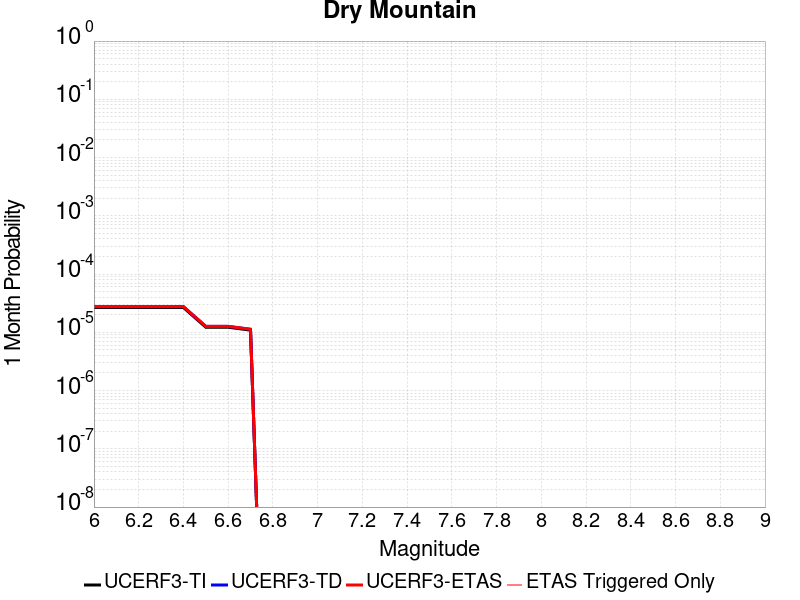 |  |  |

| Magnitude | 1 wk TI Prob | 1 wk TD Prob | 1 wk ETAS Prob | 1 wk ETAS/TD Gain | 1 wk ETAS Triggered Only | 1 mo TI Prob | 1 mo TD Prob | 1 mo ETAS Prob | 1 mo ETAS/TD Gain | 1 mo ETAS Triggered Only | 1 yr TI Prob | 1 yr TD Prob | 1 yr ETAS Prob | 1 yr ETAS/TD Gain | 1 yr ETAS Triggered Only | 10 yr TI Prob | 10 yr TD Prob | 10 yr ETAS Prob | 10 yr ETAS/TD Gain | 10 yr ETAS Triggered Only |
|-----|-----|-----|-----|-----|-----|-----|-----|-----|-----|-----|-----|-----|-----|-----|-----|-----|-----|-----|-----|-----|
| 6.0 | 6.222801E-6 | 6.4395003E-6 | 6.4395003E-6 | 1.0 | 0.0 | 2.6668875E-5 | 2.7597656E-5 | 2.7597656E-5 | 1.0 | 0.0 | 3.2464517E-4 | 3.3596557E-4 | 3.3596557E-4 | 1.0 | 0.0 | 0.0032417132 | 0.0033561387 | 0.003379533 | 1.0069706 | 2.3473076E-5 |
| 6.1 | 6.222801E-6 | 6.4395003E-6 | 6.4395003E-6 | 1.0 | 0.0 | 2.6668875E-5 | 2.7597656E-5 | 2.7597656E-5 | 1.0 | 0.0 | 3.2464517E-4 | 3.3596557E-4 | 3.3596557E-4 | 1.0 | 0.0 | 0.0032417132 | 0.0033561387 | 0.003379533 | 1.0069706 | 2.3473076E-5 |
| 6.2 | 6.222801E-6 | 6.4395003E-6 | 6.4395003E-6 | 1.0 | 0.0 | 2.6668875E-5 | 2.7597656E-5 | 2.7597656E-5 | 1.0 | 0.0 | 3.2464517E-4 | 3.3596557E-4 | 3.3596557E-4 | 1.0 | 0.0 | 0.0032417132 | 0.0033561387 | 0.003379533 | 1.0069706 | 2.3473076E-5 |
| 6.3 | 6.222801E-6 | 6.4395003E-6 | 6.4395003E-6 | 1.0 | 0.0 | 2.6668875E-5 | 2.7597656E-5 | 2.7597656E-5 | 1.0 | 0.0 | 3.2464517E-4 | 3.3596557E-4 | 3.3596557E-4 | 1.0 | 0.0 | 0.0032417132 | 0.0033561387 | 0.003379533 | 1.0069706 | 2.3473076E-5 |
| 6.4 | 6.222801E-6 | 6.4395003E-6 | 6.4395003E-6 | 1.0 | 0.0 | 2.6668875E-5 | 2.7597656E-5 | 2.7597656E-5 | 1.0 | 0.0 | 3.2464517E-4 | 3.3596557E-4 | 3.3596557E-4 | 1.0 | 0.0 | 0.0032417132 | 0.0033561387 | 0.003379533 | 1.0069706 | 2.3473076E-5 |
| 6.5 | 2.8528623E-6 | 2.952223E-6 | 2.952223E-6 | 1.0 | 0.0 | 1.22264955E-5 | 1.2652372E-5 | 1.2652372E-5 | 1.0 | 0.0 | 1.4884741E-4 | 1.5404043E-4 | 1.5404043E-4 | 1.0 | 0.0 | 0.0014874774 | 0.0015401901 | 0.0015401901 | 1.0 | 0.0 |
| 6.6 | 2.8528623E-6 | 2.952223E-6 | 2.952223E-6 | 1.0 | 0.0 | 1.22264955E-5 | 1.2652372E-5 | 1.2652372E-5 | 1.0 | 0.0 | 1.4884741E-4 | 1.5404043E-4 | 1.5404043E-4 | 1.0 | 0.0 | 0.0014874774 | 0.0015401901 | 0.0015401901 | 1.0 | 0.0 |
| 6.7 | 2.541E-6 | 2.6294065E-6 | 2.6294065E-6 | 1.0 | 0.0 | 1.0889954E-5 | 1.1268885E-5 | 1.1268885E-5 | 1.0 | 0.0 | 1.3257713E-4 | 1.3719867E-4 | 1.3719867E-4 | 1.0 | 0.0 | 0.0013249806 | 0.0013719867 | 0.0013719867 | 1.0 | 0.0 |

## San Jacinto (Anza) rev
*[(top)](#table-of-contents)*

| 1 Week | 1 Month | 1 Year | 10 Year |
|-----|-----|-----|-----|
|  |  |  |  |

| Magnitude | 1 wk TI Prob | 1 wk TD Prob | 1 wk ETAS Prob | 1 wk ETAS/TD Gain | 1 wk ETAS Triggered Only | 1 mo TI Prob | 1 mo TD Prob | 1 mo ETAS Prob | 1 mo ETAS/TD Gain | 1 mo ETAS Triggered Only | 1 yr TI Prob | 1 yr TD Prob | 1 yr ETAS Prob | 1 yr ETAS/TD Gain | 1 yr ETAS Triggered Only | 10 yr TI Prob | 10 yr TD Prob | 10 yr ETAS Prob | 10 yr ETAS/TD Gain | 10 yr ETAS Triggered Only |
|-----|-----|-----|-----|-----|-----|-----|-----|-----|-----|-----|-----|-----|-----|-----|-----|-----|-----|-----|-----|-----|
| 6.0 | 6.3015636E-5 | 4.337693E-5 | 4.337693E-5 | 1.0 | 0.0 | 2.7003905E-4 | 1.8588796E-4 | 1.8588796E-4 | 1.0 | 0.0 | 0.0032827691 | 0.0022608489 | 0.0022842688 | 1.0103589 | 2.3473076E-5 | 0.032346968 | 0.023334619 | 0.023357544 | 1.0009824 | 2.3473076E-5 |
| 6.1 | 6.3015636E-5 | 4.337693E-5 | 4.337693E-5 | 1.0 | 0.0 | 2.7003905E-4 | 1.8588796E-4 | 1.8588796E-4 | 1.0 | 0.0 | 0.0032827691 | 0.0022608489 | 0.0022842688 | 1.0103589 | 2.3473076E-5 | 0.032346968 | 0.023334619 | 0.023357544 | 1.0009824 | 2.3473076E-5 |
| 6.2 | 6.3015636E-5 | 4.337693E-5 | 4.337693E-5 | 1.0 | 0.0 | 2.7003905E-4 | 1.8588796E-4 | 1.8588796E-4 | 1.0 | 0.0 | 0.0032827691 | 0.0022608489 | 0.0022842688 | 1.0103589 | 2.3473076E-5 | 0.032346968 | 0.023334619 | 0.023357544 | 1.0009824 | 2.3473076E-5 |
| 6.3 | 6.3015636E-5 | 4.337693E-5 | 4.337693E-5 | 1.0 | 0.0 | 2.7003905E-4 | 1.8588796E-4 | 1.8588796E-4 | 1.0 | 0.0 | 0.0032827691 | 0.0022608489 | 0.0022842688 | 1.0103589 | 2.3473076E-5 | 0.032346968 | 0.023334619 | 0.023357544 | 1.0009824 | 2.3473076E-5 |
| 6.4 | 6.3015636E-5 | 4.337693E-5 | 4.337693E-5 | 1.0 | 0.0 | 2.7003905E-4 | 1.8588796E-4 | 1.8588796E-4 | 1.0 | 0.0 | 0.0032827691 | 0.0022608489 | 0.0022842688 | 1.0103589 | 2.3473076E-5 | 0.032346968 | 0.023334619 | 0.023357544 | 1.0009824 | 2.3473076E-5 |
| 6.5 | 5.811017E-5 | 4.015336E-5 | 4.015336E-5 | 1.0 | 0.0 | 2.4901982E-4 | 1.7207452E-4 | 1.7207452E-4 | 1.0 | 0.0 | 0.0030276014 | 0.0020929999 | 0.0021164238 | 1.0111916 | 2.3473076E-5 | 0.02986684 | 0.021630494 | 0.02165346 | 1.0010617 | 2.3473076E-5 |
| 6.6 | 5.811017E-5 | 4.015336E-5 | 4.015336E-5 | 1.0 | 0.0 | 2.4901982E-4 | 1.7207452E-4 | 1.7207452E-4 | 1.0 | 0.0 | 0.0030276014 | 0.0020929999 | 0.0021164238 | 1.0111916 | 2.3473076E-5 | 0.02986684 | 0.021630494 | 0.02165346 | 1.0010617 | 2.3473076E-5 |
| 6.7 | 5.712442E-5 | 3.957534E-5 | 3.957534E-5 | 1.0 | 0.0 | 2.4479596E-4 | 1.6959761E-4 | 1.6959761E-4 | 1.0 | 0.0 | 0.0029763177 | 0.002062901 | 0.0020863255 | 1.0113552 | 2.3473076E-5 | 0.029367693 | 0.021321962 | 0.021344936 | 1.0010774 | 2.3473076E-5 |
| 6.8 | 5.6967532E-5 | 3.9431634E-5 | 3.9431634E-5 | 1.0 | 0.0 | 2.4412372E-4 | 1.689818E-4 | 1.689818E-4 | 1.0 | 0.0 | 0.0029681553 | 0.0020554175 | 0.0020788424 | 1.0113966 | 2.3473076E-5 | 0.029288229 | 0.021246629 | 0.021269603 | 1.0010813 | 2.3473076E-5 |
| 6.9 | 5.6211324E-5 | 3.9135975E-5 | 3.9135975E-5 | 1.0 | 0.0 | 2.4088343E-4 | 1.6771485E-4 | 1.6771485E-4 | 1.0 | 0.0 | 0.0029288116 | 0.0020400216 | 0.0020634467 | 1.0114828 | 2.3473076E-5 | 0.028905109 | 0.021085827 | 0.021108804 | 1.0010897 | 2.3473076E-5 |
| 7.0 | 5.4383527E-5 | 3.7995007E-5 | 3.7995007E-5 | 1.0 | 0.0 | 2.3305144E-4 | 1.6282561E-4 | 1.6282561E-4 | 1.0 | 0.0 | 0.0028337094 | 0.0019806041 | 0.0020040309 | 1.011828 | 2.3473076E-5 | 0.027978465 | 0.020476038 | 0.02049903 | 1.001123 | 2.3473076E-5 |
| 7.1 | 5.1393665E-5 | 3.6455618E-5 | 3.6455618E-5 | 1.0 | 0.0 | 2.2023996E-4 | 1.5622903E-4 | 1.5622903E-4 | 1.0 | 0.0 | 0.0026781242 | 0.0019004333 | 0.0019238618 | 1.0123279 | 2.3473076E-5 | 0.026460782 | 0.019648531 | 0.019671543 | 1.0011712 | 2.3473076E-5 |
| 7.2 | 4.785222E-5 | 3.480494E-5 | 3.480494E-5 | 1.0 | 0.0 | 2.0506482E-4 | 1.4915552E-4 | 1.4915552E-4 | 1.0 | 0.0 | 0.0024938055 | 0.0018144595 | 0.0018378899 | 1.0129132 | 2.3473076E-5 | 0.024660049 | 0.018761909 | 0.018784942 | 1.0012276 | 2.3473076E-5 |
| 7.3 | 4.2143256E-5 | 3.389763E-5 | 3.389763E-5 | 1.0 | 0.0 | 1.8060145E-4 | 1.4526749E-4 | 1.4526749E-4 | 1.0 | 0.0 | 0.002196605 | 0.0017672004 | 0.001790632 | 1.0132592 | 2.3473076E-5 | 0.02175019 | 0.018269178 | 0.01829222 | 1.0012614 | 2.3473076E-5 |
| 7.4 | 4.0264713E-5 | 3.3535252E-5 | 3.3535252E-5 | 1.0 | 0.0 | 1.7255165E-4 | 1.4371461E-4 | 1.4371461E-4 | 1.0 | 0.0 | 0.002098792 | 0.0017483246 | 0.0017717566 | 1.0134026 | 2.3473076E-5 | 0.020790804 | 0.018073453 | 0.018096503 | 1.0012753 | 2.3473076E-5 |
| 7.5 | 3.694492E-5 | 3.2247204E-5 | 3.2247204E-5 | 1.0 | 0.0 | 1.5832575E-4 | 1.38195E-4 | 1.38195E-4 | 1.0 | 0.0 | 0.0019259118 | 0.0016812286 | 0.0017046622 | 1.0139384 | 2.3473076E-5 | 0.01909306 | 0.017388845 | 0.01741191 | 1.0013264 | 2.3473076E-5 |
| 7.6 | 3.200565E-5 | 2.9555436E-5 | 2.9555436E-5 | 1.0 | 0.0 | 1.3715986E-4 | 1.2666002E-4 | 1.2666002E-4 | 1.0 | 0.0 | 0.001668642 | 0.0015409971 | 0.001564434 | 1.015209 | 2.3473076E-5 | 0.01656168 | 0.015973015 | 0.015996113 | 1.0014461 | 2.3473076E-5 |
| 7.7 | 2.731642E-5 | 2.6142696E-5 | 2.6142696E-5 | 1.0 | 0.0 | 1.1706512E-4 | 1.1203532E-4 | 1.1203532E-4 | 1.0 | 0.0 | 0.001424336 | 0.0013631776 | 0.0013866186 | 1.0171959 | 2.3473076E-5 | 0.014152412 | 0.01419303 | 0.01421617 | 1.0016304 | 2.3473076E-5 |
| 7.8 | 2.3466424E-5 | 2.3552704E-5 | 2.3552704E-5 | 1.0 | 0.0 | 1.0056651E-4 | 1.0093625E-4 | 1.0093625E-4 | 1.0 | 0.0 | 0.0012237094 | 0.0012282069 | 0.0012516512 | 1.0190881 | 2.3473076E-5 | 0.012169928 | 0.012833906 | 0.012857079 | 1.0018055 | 2.3473076E-5 |
| 7.9 | 1.8611925E-5 | 1.8951272E-5 | 1.8951272E-5 | 1.0 | 0.0 | 7.9762955E-5 | 8.1217215E-5 | 8.1217215E-5 | 1.0 | 0.0 | 9.7068126E-4 | 9.883717E-4 | 0.0010118216 | 1.0237257 | 2.3473076E-5 | 0.0096645225 | 0.010416457 | 0.010439686 | 1.0022299 | 2.3473076E-5 |
| 8.0 | 1.5460775E-5 | 1.5779307E-5 | 1.5779307E-5 | 1.0 | 0.0 | 6.6258784E-5 | 6.762385E-5 | 6.762385E-5 | 1.0 | 0.0 | 8.0640207E-4 | 8.2301005E-4 | 8.4646384E-4 | 1.0284976 | 2.3473076E-5 | 0.008034821 | 0.008723064 | 0.0087463325 | 1.0026674 | 2.3473076E-5 |
| 8.1 | 9.983884E-6 | 8.292369E-6 | 8.292369E-6 | 1.0 | 0.0 | 4.2787375E-5 | 3.5538244E-5 | 3.5538244E-5 | 1.0 | 0.0 | 5.2081177E-4 | 4.3259273E-4 | 4.5605566E-4 | 1.0542378 | 2.3473076E-5 | 0.0051959283 | 0.00465207 | 0.004675434 | 1.0050223 | 2.3473076E-5 |
| 8.2 | 4.1226E-6 | 1.5595413E-6 | 1.5595413E-6 | 1.0 | 0.0 | 1.7668166E-5 | 6.683731E-6 | 6.683731E-6 | 1.0 | 0.0 | 2.1508869E-4 | 8.137142E-5 | 8.137142E-5 | 1.0 | 0.0 | 0.0021488064 | 9.4425044E-4 | 9.4425044E-4 | 1.0 | 0.0 |
| 8.3 | 1.2750878E-6 | 3.6301523E-7 | 3.6301523E-7 | 1.0 | 0.0 | 5.4646503E-6 | 1.5557786E-6 | 1.5557786E-6 | 1.0 | 0.0 | 6.653009E-5 | 1.8941444E-5 | 1.8941444E-5 | 1.0 | 0.0 | 6.6510175E-4 | 2.2840123E-4 | 2.2840123E-4 | 1.0 | 0.0 |

## San Jacinto (San Jacinto Valley) rev
*[(top)](#table-of-contents)*

| 1 Week | 1 Month | 1 Year | 10 Year |
|-----|-----|-----|-----|
|  |  |  |  |

| Magnitude | 1 wk TI Prob | 1 wk TD Prob | 1 wk ETAS Prob | 1 wk ETAS/TD Gain | 1 wk ETAS Triggered Only | 1 mo TI Prob | 1 mo TD Prob | 1 mo ETAS Prob | 1 mo ETAS/TD Gain | 1 mo ETAS Triggered Only | 1 yr TI Prob | 1 yr TD Prob | 1 yr ETAS Prob | 1 yr ETAS/TD Gain | 1 yr ETAS Triggered Only | 10 yr TI Prob | 10 yr TD Prob | 10 yr ETAS Prob | 10 yr ETAS/TD Gain | 10 yr ETAS Triggered Only |
|-----|-----|-----|-----|-----|-----|-----|-----|-----|-----|-----|-----|-----|-----|-----|-----|-----|-----|-----|-----|-----|
| 6.0 | 3.652694E-5 | 3.4467394E-5 | 3.4467394E-5 | 1.0 | 0.0 | 1.5653463E-4 | 1.4770904E-4 | 1.4770904E-4 | 1.0 | 0.0 | 0.0019041431 | 0.001796876 | 0.0018203068 | 1.0130398 | 2.3473076E-5 | 0.018879099 | 0.018560216 | 0.018583253 | 1.0012412 | 2.3473076E-5 |
| 6.1 | 3.652694E-5 | 3.4467394E-5 | 3.4467394E-5 | 1.0 | 0.0 | 1.5653463E-4 | 1.4770904E-4 | 1.4770904E-4 | 1.0 | 0.0 | 0.0019041431 | 0.001796876 | 0.0018203068 | 1.0130398 | 2.3473076E-5 | 0.018879099 | 0.018560216 | 0.018583253 | 1.0012412 | 2.3473076E-5 |
| 6.2 | 3.652694E-5 | 3.4467394E-5 | 3.4467394E-5 | 1.0 | 0.0 | 1.5653463E-4 | 1.4770904E-4 | 1.4770904E-4 | 1.0 | 0.0 | 0.0019041431 | 0.001796876 | 0.0018203068 | 1.0130398 | 2.3473076E-5 | 0.018879099 | 0.018560216 | 0.018583253 | 1.0012412 | 2.3473076E-5 |
| 6.3 | 3.652694E-5 | 3.4467394E-5 | 3.4467394E-5 | 1.0 | 0.0 | 1.5653463E-4 | 1.4770904E-4 | 1.4770904E-4 | 1.0 | 0.0 | 0.0019041431 | 0.001796876 | 0.0018203068 | 1.0130398 | 2.3473076E-5 | 0.018879099 | 0.018560216 | 0.018583253 | 1.0012412 | 2.3473076E-5 |
| 6.4 | 3.646941E-5 | 3.4388955E-5 | 3.4388955E-5 | 1.0 | 0.0 | 1.5628811E-4 | 1.4737292E-4 | 1.4737292E-4 | 1.0 | 0.0 | 0.0019011468 | 0.0017927908 | 0.0018162219 | 1.0130695 | 2.3473076E-5 | 0.018849645 | 0.01852009 | 0.01854313 | 1.001244 | 2.3473076E-5 |
| 6.5 | 3.646941E-5 | 3.4388955E-5 | 3.4388955E-5 | 1.0 | 0.0 | 1.5628811E-4 | 1.4737292E-4 | 1.4737292E-4 | 1.0 | 0.0 | 0.0019011468 | 0.0017927908 | 0.0018162219 | 1.0130695 | 2.3473076E-5 | 0.018849645 | 0.01852009 | 0.01854313 | 1.001244 | 2.3473076E-5 |
| 6.6 | 3.6442503E-5 | 3.4352335E-5 | 3.4352335E-5 | 1.0 | 0.0 | 1.561728E-4 | 1.4721598E-4 | 1.4721598E-4 | 1.0 | 0.0 | 0.0018997455 | 0.0017908834 | 0.0018143144 | 1.0130835 | 2.3473076E-5 | 0.018835869 | 0.018501356 | 0.018524395 | 1.0012453 | 2.3473076E-5 |
| 6.7 | 3.6432113E-5 | 3.4337903E-5 | 3.4337903E-5 | 1.0 | 0.0 | 1.5612828E-4 | 1.4715415E-4 | 1.4715415E-4 | 1.0 | 0.0 | 0.0018992044 | 0.001790132 | 0.001813563 | 1.0130891 | 2.3473076E-5 | 0.018830549 | 0.01849398 | 0.01851702 | 1.0012457 | 2.3473076E-5 |
| 6.8 | 3.6409598E-5 | 3.430695E-5 | 3.430695E-5 | 1.0 | 0.0 | 1.560318E-4 | 1.470215E-4 | 1.470215E-4 | 1.0 | 0.0 | 0.0018980318 | 0.0017885199 | 0.0018119509 | 1.0131009 | 2.3473076E-5 | 0.018819023 | 0.01847813 | 0.01850117 | 1.0012468 | 2.3473076E-5 |
| 6.9 | 3.638078E-5 | 3.4267367E-5 | 3.4267367E-5 | 1.0 | 0.0 | 1.5590832E-4 | 1.4685189E-4 | 1.4685189E-4 | 1.0 | 0.0 | 0.0018965311 | 0.0017864581 | 0.0018098892 | 1.013116 | 2.3473076E-5 | 0.018804269 | 0.018457862 | 0.018480903 | 1.0012482 | 2.3473076E-5 |
| 7.0 | 3.6294874E-5 | 3.4149365E-5 | 3.4149365E-5 | 1.0 | 0.0 | 1.5554018E-4 | 1.4634622E-4 | 1.4634622E-4 | 1.0 | 0.0 | 0.0018920569 | 0.0017803118 | 0.0018037431 | 1.0131613 | 2.3473076E-5 | 0.018760284 | 0.018397434 | 0.018420476 | 1.0012524 | 2.3473076E-5 |
| 7.1 | 3.6260717E-5 | 3.410564E-5 | 3.410564E-5 | 1.0 | 0.0 | 1.5539382E-4 | 1.4615887E-4 | 1.4615887E-4 | 1.0 | 0.0 | 0.001890278 | 0.0017780344 | 0.0018014658 | 1.0131782 | 2.3473076E-5 | 0.018742796 | 0.018375032 | 0.018398074 | 1.001254 | 2.3473076E-5 |
| 7.2 | 3.6210204E-5 | 3.403977E-5 | 3.403977E-5 | 1.0 | 0.0 | 1.5517735E-4 | 1.4587659E-4 | 1.4587659E-4 | 1.0 | 0.0 | 0.001887647 | 0.0017746033 | 0.0017980348 | 1.0132037 | 2.3473076E-5 | 0.01871693 | 0.018341267 | 0.018364308 | 1.0012563 | 2.3473076E-5 |
| 7.3 | 3.6119454E-5 | 3.3927867E-5 | 3.3927867E-5 | 1.0 | 0.0 | 1.5478847E-4 | 1.4539705E-4 | 1.4539705E-4 | 1.0 | 0.0 | 0.0018829206 | 0.0017687745 | 0.001792206 | 1.0132474 | 2.3473076E-5 | 0.018670462 | 0.018283723 | 0.018306768 | 1.0012604 | 2.3473076E-5 |
| 7.4 | 3.607848E-5 | 3.387532E-5 | 3.387532E-5 | 1.0 | 0.0 | 1.5461289E-4 | 1.4517189E-4 | 1.4517189E-4 | 1.0 | 0.0 | 0.0018807866 | 0.0017660374 | 0.0017894692 | 1.0132679 | 2.3473076E-5 | 0.018649481 | 0.018256696 | 0.01827974 | 1.0012623 | 2.3473076E-5 |
| 7.5 | 3.5856774E-5 | 3.3684162E-5 | 3.3684162E-5 | 1.0 | 0.0 | 1.5366284E-4 | 1.4435273E-4 | 1.4435273E-4 | 1.0 | 0.0 | 0.0018692396 | 0.0017560803 | 0.0017795123 | 1.0133432 | 2.3473076E-5 | 0.018535944 | 0.01815731 | 0.018180357 | 1.0012693 | 2.3473076E-5 |
| 7.6 | 3.286655E-5 | 3.220034E-5 | 3.220034E-5 | 1.0 | 0.0 | 1.4084904E-4 | 1.3799417E-4 | 1.3799417E-4 | 1.0 | 0.0 | 0.001713488 | 0.0016787864 | 0.0017022201 | 1.0139587 | 2.3473076E-5 | 0.017003361 | 0.017373424 | 0.01739649 | 1.0013276 | 2.3473076E-5 |
| 7.7 | 2.8882527E-5 | 2.9291981E-5 | 2.9291981E-5 | 1.0 | 0.0 | 1.237764E-4 | 1.2553102E-4 | 1.2553102E-4 | 1.0 | 0.0 | 0.0015059357 | 0.0015272698 | 0.001550707 | 1.0153458 | 2.3473076E-5 | 0.014957713 | 0.015859274 | 0.015882375 | 1.0014566 | 2.3473076E-5 |
| 7.8 | 2.4950225E-5 | 2.6580747E-5 | 2.6580747E-5 | 1.0 | 0.0 | 1.0692515E-4 | 1.13912516E-4 | 1.13912516E-4 | 1.0 | 0.0 | 0.0013010362 | 0.0013860033 | 0.0014094439 | 1.0169123 | 2.3473076E-5 | 0.012934455 | 0.014439502 | 0.014462637 | 1.0016022 | 2.3473076E-5 |
| 7.9 | 1.9881603E-5 | 2.155556E-5 | 2.155556E-5 | 1.0 | 0.0 | 8.520408E-5 | 9.2377704E-5 | 9.2377704E-5 | 1.0 | 0.0 | 0.001036866 | 0.001124119 | 0.0011475657 | 1.0208578 | 2.3473076E-5 | 0.010320415 | 0.011802064 | 0.011825261 | 1.0019654 | 2.3473076E-5 |
| 8.0 | 1.563292E-5 | 1.5976173E-5 | 1.5976173E-5 | 1.0 | 0.0 | 6.6996516E-5 | 6.846752E-5 | 6.846752E-5 | 1.0 | 0.0 | 8.153773E-4 | 8.332739E-4 | 8.567274E-4 | 1.0281463 | 2.3473076E-5 | 0.00812392 | 0.008830938 | 0.008854204 | 1.0026345 | 2.3473076E-5 |
| 8.1 | 1.0045313E-5 | 8.324356E-6 | 8.324356E-6 | 1.0 | 0.0 | 4.305063E-5 | 3.5675326E-5 | 3.5675326E-5 | 1.0 | 0.0 | 5.2401534E-4 | 4.3426102E-4 | 4.5772392E-4 | 1.0540295 | 2.3473076E-5 | 0.0052278144 | 0.0046712374 | 0.004694601 | 1.0050015 | 2.3473076E-5 |
| 8.2 | 4.1554413E-6 | 1.5721832E-6 | 1.5721832E-6 | 1.0 | 0.0 | 1.7808914E-5 | 6.737911E-6 | 6.737911E-6 | 1.0 | 0.0 | 2.1680194E-4 | 8.203101E-5 | 8.203101E-5 | 1.0 | 0.0 | 0.0021659054 | 9.520741E-4 | 9.520741E-4 | 1.0 | 0.0 |
| 8.3 | 1.2758221E-6 | 3.6330252E-7 | 3.6330252E-7 | 1.0 | 0.0 | 5.4677976E-6 | 1.5570099E-6 | 1.5570099E-6 | 1.0 | 0.0 | 6.65684E-5 | 1.8956434E-5 | 1.8956434E-5 | 1.0 | 0.0 | 6.6548464E-4 | 2.2857229E-4 | 2.2857229E-4 | 1.0 | 0.0 |

## Cedar Mtn-Mahogany Mtn
*[(top)](#table-of-contents)*

| 1 Week | 1 Month | 1 Year | 10 Year |
|-----|-----|-----|-----|
|  |  | 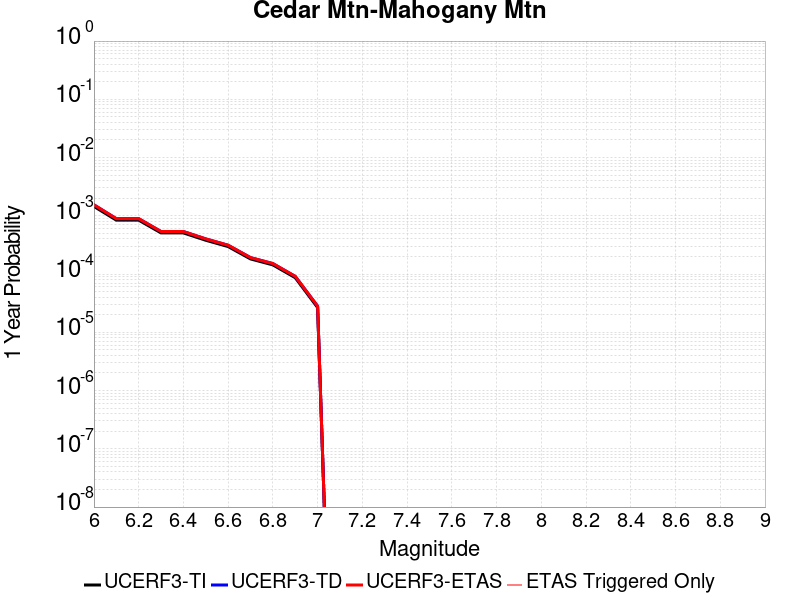 |  |

| Magnitude | 1 wk TI Prob | 1 wk TD Prob | 1 wk ETAS Prob | 1 wk ETAS/TD Gain | 1 wk ETAS Triggered Only | 1 mo TI Prob | 1 mo TD Prob | 1 mo ETAS Prob | 1 mo ETAS/TD Gain | 1 mo ETAS Triggered Only | 1 yr TI Prob | 1 yr TD Prob | 1 yr ETAS Prob | 1 yr ETAS/TD Gain | 1 yr ETAS Triggered Only | 10 yr TI Prob | 10 yr TD Prob | 10 yr ETAS Prob | 10 yr ETAS/TD Gain | 10 yr ETAS Triggered Only |
|-----|-----|-----|-----|-----|-----|-----|-----|-----|-----|-----|-----|-----|-----|-----|-----|-----|-----|-----|-----|-----|
| 6.0 | 2.7763876E-5 | 2.9589899E-5 | 2.9589899E-5 | 1.0 | 0.0 | 1.1898261E-4 | 1.2680808E-4 | 1.2680808E-4 | 1.0 | 0.0 | 0.0014476506 | 0.0015428651 | 0.0015428651 | 1.0 | 0.0 | 0.0143825635 | 0.015328757 | 0.01535187 | 1.0015079 | 2.3473076E-5 |
| 6.1 | 1.6162443E-5 | 1.7143519E-5 | 1.7143519E-5 | 1.0 | 0.0 | 6.926578E-5 | 7.347025E-5 | 7.347025E-5 | 1.0 | 0.0 | 8.4298453E-4 | 8.9415093E-4 | 8.9415093E-4 | 1.0 | 0.0 | 0.008397939 | 0.008907345 | 0.008930609 | 1.0026118 | 2.3473076E-5 |
| 6.2 | 1.6162443E-5 | 1.7143519E-5 | 1.7143519E-5 | 1.0 | 0.0 | 6.926578E-5 | 7.347025E-5 | 7.347025E-5 | 1.0 | 0.0 | 8.4298453E-4 | 8.9415093E-4 | 8.9415093E-4 | 1.0 | 0.0 | 0.008397939 | 0.008907345 | 0.008930609 | 1.0026118 | 2.3473076E-5 |
| 6.3 | 9.746053E-6 | 1.03034645E-5 | 1.03034645E-5 | 1.0 | 0.0 | 4.1768133E-5 | 4.415698E-5 | 4.415698E-5 | 1.0 | 0.0 | 5.0840835E-4 | 5.3748273E-4 | 5.3748273E-4 | 1.0 | 0.0 | 0.0050724675 | 0.0053622467 | 0.005385594 | 1.004354 | 2.3473076E-5 |
| 6.4 | 9.746053E-6 | 1.03034645E-5 | 1.03034645E-5 | 1.0 | 0.0 | 4.1768133E-5 | 4.415698E-5 | 4.415698E-5 | 1.0 | 0.0 | 5.0840835E-4 | 5.3748273E-4 | 5.3748273E-4 | 1.0 | 0.0 | 0.0050724675 | 0.0053622467 | 0.005385594 | 1.004354 | 2.3473076E-5 |
| 6.5 | 7.290083E-6 | 7.695551E-6 | 7.695551E-6 | 1.0 | 0.0 | 3.124284E-5 | 3.298053E-5 | 3.298053E-5 | 1.0 | 0.0 | 3.8031515E-4 | 4.0146615E-4 | 4.0146615E-4 | 1.0 | 0.0 | 0.0037966494 | 0.004007629 | 0.004031008 | 1.0058336 | 2.3473076E-5 |
| 6.6 | 5.67907E-6 | 5.9893264E-6 | 5.9893264E-6 | 1.0 | 0.0 | 2.4338644E-5 | 2.5668296E-5 | 2.5668296E-5 | 1.0 | 0.0 | 2.962827E-4 | 3.1246804E-4 | 3.1246804E-4 | 1.0 | 0.0 | 0.0029588798 | 0.003120423 | 0.003143823 | 1.007499 | 2.3473076E-5 |
| 6.7 | 3.4853963E-6 | 3.6727356E-6 | 3.6727356E-6 | 1.0 | 0.0 | 1.4937327E-5 | 1.5740205E-5 | 1.5740205E-5 | 1.0 | 0.0 | 1.8184677E-4 | 1.9162075E-4 | 1.9162075E-4 | 1.0 | 0.0 | 0.0018169804 | 0.0019146174 | 0.0019146174 | 1.0 | 0.0 |
| 6.8 | 2.7535168E-6 | 2.9016592E-6 | 2.9016592E-6 | 1.0 | 0.0 | 1.1800733E-5 | 1.2435626E-5 | 1.2435626E-5 | 1.0 | 0.0 | 1.4366445E-4 | 1.513937E-4 | 1.513937E-4 | 1.0 | 0.0 | 0.0014357162 | 0.0015129528 | 0.0015129528 | 1.0 | 0.0 |
| 6.9 | 1.6594106E-6 | 1.7497491E-6 | 1.7497491E-6 | 1.0 | 0.0 | 7.1117406E-6 | 7.498905E-6 | 7.498905E-6 | 1.0 | 0.0 | 8.6582E-5 | 9.129565E-5 | 9.129565E-5 | 1.0 | 0.0 | 8.654827E-4 | 9.126119E-4 | 9.126119E-4 | 1.0 | 0.0 |
| 7.0 | 5.10215E-7 | 5.389415E-7 | 5.389415E-7 | 1.0 | 0.0 | 2.186634E-6 | 2.3097477E-6 | 2.3097477E-6 | 1.0 | 0.0 | 2.6621943E-5 | 2.8120945E-5 | 2.8120945E-5 | 1.0 | 0.0 | 2.6618753E-4 | 2.8118643E-4 | 2.8118643E-4 | 1.0 | 0.0 |

## San Andreas (Cholame) rev
*[(top)](#table-of-contents)*

| 1 Week | 1 Month | 1 Year | 10 Year |
|-----|-----|-----|-----|
|  |  |  |  |

| Magnitude | 1 wk TI Prob | 1 wk TD Prob | 1 wk ETAS Prob | 1 wk ETAS/TD Gain | 1 wk ETAS Triggered Only | 1 mo TI Prob | 1 mo TD Prob | 1 mo ETAS Prob | 1 mo ETAS/TD Gain | 1 mo ETAS Triggered Only | 1 yr TI Prob | 1 yr TD Prob | 1 yr ETAS Prob | 1 yr ETAS/TD Gain | 1 yr ETAS Triggered Only | 10 yr TI Prob | 10 yr TD Prob | 10 yr ETAS Prob | 10 yr ETAS/TD Gain | 10 yr ETAS Triggered Only |
|-----|-----|-----|-----|-----|-----|-----|-----|-----|-----|-----|-----|-----|-----|-----|-----|-----|-----|-----|-----|-----|
| 6.0 | 1.2302514E-4 | 2.5242948E-4 | 2.5242948E-4 | 1.0 | 0.0 | 5.27144E-4 | 0.0010813937 | 0.0010813937 | 1.0 | 0.0 | 0.0063991086 | 0.013086997 | 0.013110163 | 1.0017701 | 2.3473076E-5 | 0.06217949 | 0.1245517 | 0.12457225 | 1.000165 | 2.3473076E-5 |
| 6.1 | 1.2302514E-4 | 2.5242948E-4 | 2.5242948E-4 | 1.0 | 0.0 | 5.27144E-4 | 0.0010813937 | 0.0010813937 | 1.0 | 0.0 | 0.0063991086 | 0.013086997 | 0.013110163 | 1.0017701 | 2.3473076E-5 | 0.06217949 | 0.1245517 | 0.12457225 | 1.000165 | 2.3473076E-5 |
| 6.2 | 1.2203569E-4 | 2.5059693E-4 | 2.5059693E-4 | 1.0 | 0.0 | 5.2290526E-4 | 0.0010735465 | 0.0010735465 | 1.0 | 0.0 | 0.006347804 | 0.0129926 | 0.0130157685 | 1.0017831 | 2.3473076E-5 | 0.061695136 | 0.12373783 | 0.1237584 | 1.0001662 | 2.3473076E-5 |
| 6.3 | 1.2142645E-4 | 2.4945638E-4 | 2.4945638E-4 | 1.0 | 0.0 | 5.202953E-4 | 0.0010686623 | 0.0010686623 | 1.0 | 0.0 | 0.006316212 | 0.012933843 | 0.012957012 | 1.0017914 | 2.3473076E-5 | 0.06139677 | 0.123231925 | 0.12325251 | 1.000167 | 2.3473076E-5 |
| 6.4 | 1.1865206E-4 | 2.4450937E-4 | 2.4450937E-4 | 1.0 | 0.0 | 5.0840975E-4 | 0.001047478 | 0.001047478 | 1.0 | 0.0 | 0.006172335 | 0.012678952 | 0.012702128 | 1.0018278 | 2.3473076E-5 | 0.060036868 | 0.121024184 | 0.121044815 | 1.0001705 | 2.3473076E-5 |
| 6.5 | 1.17443946E-4 | 2.4244092E-4 | 2.4244092E-4 | 1.0 | 0.0 | 5.032341E-4 | 0.0010386204 | 0.0010386204 | 1.0 | 0.0 | 0.006109677 | 0.012572356 | 0.012595533 | 1.0018436 | 2.3473076E-5 | 0.059444077 | 0.12009794 | 0.120118596 | 1.000172 | 2.3473076E-5 |
| 6.6 | 1.13579066E-4 | 2.3552658E-4 | 2.3552658E-4 | 1.0 | 0.0 | 4.866766E-4 | 0.0010090107 | 0.0010090107 | 1.0 | 0.0 | 0.0059092017 | 0.012215953 | 0.0122391395 | 1.001898 | 2.3473076E-5 | 0.057545185 | 0.11701085 | 0.117031574 | 1.0001771 | 2.3473076E-5 |
| 6.7 | 1.1271412E-4 | 2.339688E-4 | 2.339688E-4 | 1.0 | 0.0 | 4.829711E-4 | 0.0010023396 | 0.0010023396 | 1.0 | 0.0 | 0.005864331 | 0.012135641 | 0.01215883 | 1.0019108 | 2.3473076E-5 | 0.057119697 | 0.116314195 | 0.11633494 | 1.0001783 | 2.3473076E-5 |
| 6.8 | 1.1217975E-4 | 2.3285215E-4 | 2.3285215E-4 | 1.0 | 0.0 | 4.8068175E-4 | 9.975577E-4 | 9.975577E-4 | 1.0 | 0.0 | 0.005836608 | 0.012078067 | 0.012101257 | 1.00192 | 2.3473076E-5 | 0.056856725 | 0.11581219 | 0.11583294 | 1.0001792 | 2.3473076E-5 |
| 6.9 | 1.1146753E-4 | 2.3133864E-4 | 2.3133864E-4 | 1.0 | 0.0 | 4.7763053E-4 | 9.910761E-4 | 9.910761E-4 | 1.0 | 0.0 | 0.0057996577 | 0.012000027 | 0.012023218 | 1.0019326 | 2.3473076E-5 | 0.056506127 | 0.11513234 | 0.115153104 | 1.0001804 | 2.3473076E-5 |
| 7.0 | 1.0965793E-4 | 2.2756905E-4 | 2.2756905E-4 | 1.0 | 0.0 | 4.698779E-4 | 9.7493286E-4 | 9.7493286E-4 | 1.0 | 0.0 | 0.005705768 | 0.01180563 | 0.011828826 | 1.0019648 | 2.3473076E-5 | 0.055614736 | 0.11343304 | 0.11345385 | 1.0001835 | 2.3473076E-5 |
| 7.1 | 9.927982E-5 | 2.0574623E-4 | 2.0574623E-4 | 1.0 | 0.0 | 4.2541555E-4 | 8.814726E-4 | 8.814726E-4 | 1.0 | 0.0 | 0.0051671406 | 0.0106794145 | 0.010702637 | 1.0021745 | 2.3473076E-5 | 0.05048634 | 0.10352388 | 0.10354492 | 1.0002033 | 2.3473076E-5 |
| 7.2 | 9.696786E-5 | 2.0078626E-4 | 2.0078626E-4 | 1.0 | 0.0 | 4.1551032E-4 | 8.602298E-4 | 8.602298E-4 | 1.0 | 0.0 | 0.00504711 | 0.010423285 | 0.010446514 | 1.0022285 | 2.3473076E-5 | 0.04934009 | 0.10126121 | 0.101282306 | 1.0002084 | 2.3473076E-5 |
| 7.3 | 9.4727984E-5 | 1.9507346E-4 | 1.9507346E-4 | 1.0 | 0.0 | 4.0591392E-4 | 8.357622E-4 | 8.357622E-4 | 1.0 | 0.0 | 0.0049308087 | 0.010128201 | 0.010151436 | 1.0022941 | 2.3473076E-5 | 0.048228268 | 0.09863034 | 0.09865149 | 1.0002146 | 2.3473076E-5 |
| 7.4 | 9.220358E-5 | 1.8877286E-4 | 1.8877286E-4 | 1.0 | 0.0 | 3.9509835E-4 | 8.0877665E-4 | 8.0877665E-4 | 1.0 | 0.0 | 0.004799717 | 0.009802646 | 0.009825889 | 1.0023711 | 2.3473076E-5 | 0.046973653 | 0.09570612 | 0.09572735 | 1.0002218 | 2.3473076E-5 |
| 7.5 | 7.71631E-5 | 1.520787E-4 | 1.520787E-4 | 1.0 | 0.0 | 3.306571E-4 | 6.516032E-4 | 6.516032E-4 | 1.0 | 0.0 | 0.0040183207 | 0.007904484 | 0.007927772 | 1.0029461 | 2.3473076E-5 | 0.03946433 | 0.078419134 | 0.07844077 | 1.0002759 | 2.3473076E-5 |
| 7.6 | 7.5634416E-5 | 1.4866945E-4 | 1.4866945E-4 | 1.0 | 0.0 | 3.241072E-4 | 6.369994E-4 | 6.369994E-4 | 1.0 | 0.0 | 0.0039388672 | 0.007727957 | 0.0077512483 | 1.003014 | 2.3473076E-5 | 0.038697794 | 0.07678112 | 0.07680278 | 1.0002823 | 2.3473076E-5 |
| 7.7 | 6.3783E-5 | 1.2385153E-4 | 1.2385153E-4 | 1.0 | 0.0 | 2.7332708E-4 | 5.3068437E-4 | 5.3068437E-4 | 1.0 | 0.0 | 0.0033226798 | 0.0064419676 | 0.0064652897 | 1.0036203 | 2.3473076E-5 | 0.032734364 | 0.064660996 | 0.06468295 | 1.0003395 | 2.3473076E-5 |
| 7.8 | 5.863422E-5 | 1.1440121E-4 | 1.1440121E-4 | 1.0 | 0.0 | 2.512653E-4 | 4.9019884E-4 | 4.9019884E-4 | 1.0 | 0.0 | 0.003054864 | 0.00595186 | 0.0059751933 | 1.0039203 | 2.3473076E-5 | 0.030132094 | 0.059769355 | 0.059791423 | 1.0003693 | 2.3473076E-5 |
| 7.9 | 4.595283E-5 | 8.443828E-5 | 8.443828E-5 | 1.0 | 0.0 | 1.9692584E-4 | 3.6182816E-4 | 3.6182816E-4 | 1.0 | 0.0 | 0.0023949358 | 0.0043963664 | 0.0044197366 | 1.0053158 | 2.3473076E-5 | 0.023692891 | 0.04444455 | 0.04446698 | 1.0005046 | 2.3473076E-5 |
| 8.0 | 3.2950178E-5 | 5.0881976E-5 | 5.0881976E-5 | 1.0 | 0.0 | 1.412074E-4 | 2.180474E-4 | 2.180474E-4 | 1.0 | 0.0 | 0.0017178444 | 0.0026514968 | 0.0026749077 | 1.0088292 | 2.3473076E-5 | 0.017046256 | 0.027233804 | 0.027256636 | 1.0008384 | 2.3473076E-5 |
| 8.1 | 1.9177472E-5 | 1.9238712E-5 | 1.9238712E-5 | 1.0 | 0.0 | 8.218658E-5 | 8.244903E-5 | 8.244903E-5 | 1.0 | 0.0 | 0.0010001622 | 0.0010033553 | 0.0010033553 | 1.0 | 0.0 | 0.009956728 | 0.010786239 | 0.010786239 | 1.0 | 0.0 |
| 8.2 | 8.643924E-6 | 5.49522E-6 | 5.49522E-6 | 1.0 | 0.0 | 3.704486E-5 | 2.355073E-5 | 2.355073E-5 | 1.0 | 0.0 | 4.5092785E-4 | 2.866925E-4 | 2.866925E-4 | 1.0 | 0.0 | 0.0045001395 | 0.0032598388 | 0.0032598388 | 1.0 | 0.0 |
| 8.3 | 1.983087E-6 | 7.693574E-7 | 7.693574E-7 | 1.0 | 0.0 | 8.498917E-6 | 3.297242E-6 | 3.297242E-6 | 1.0 | 0.0 | 1.034694E-4 | 4.01432E-5 | 4.01432E-5 | 1.0 | 0.0 | 0.0010342124 | 4.7390026E-4 | 4.7390026E-4 | 1.0 | 0.0 |

## San Andreas (Parkfield)
*[(top)](#table-of-contents)*

| 1 Week | 1 Month | 1 Year | 10 Year |
|-----|-----|-----|-----|
|  |  |  |  |

| Magnitude | 1 wk TI Prob | 1 wk TD Prob | 1 wk ETAS Prob | 1 wk ETAS/TD Gain | 1 wk ETAS Triggered Only | 1 mo TI Prob | 1 mo TD Prob | 1 mo ETAS Prob | 1 mo ETAS/TD Gain | 1 mo ETAS Triggered Only | 1 yr TI Prob | 1 yr TD Prob | 1 yr ETAS Prob | 1 yr ETAS/TD Gain | 1 yr ETAS Triggered Only | 10 yr TI Prob | 10 yr TD Prob | 10 yr ETAS Prob | 10 yr ETAS/TD Gain | 10 yr ETAS Triggered Only |
|-----|-----|-----|-----|-----|-----|-----|-----|-----|-----|-----|-----|-----|-----|-----|-----|-----|-----|-----|-----|-----|
| 6.0 | 5.556969E-4 | 7.819087E-4 | 7.819087E-4 | 1.0 | 0.0 | 0.0023793848 | 0.0033472886 | 0.0033472886 | 1.0 | 0.0 | 0.028586963 | 0.040385824 | 0.040408347 | 1.0005578 | 2.3473076E-5 | 0.25176284 | 0.33777508 | 0.33779064 | 1.000046 | 2.3473076E-5 |
| 6.1 | 1.925858E-4 | 3.0390357E-4 | 3.0390357E-4 | 1.0 | 0.0 | 8.2510663E-4 | 0.0013018888 | 0.0013018888 | 1.0 | 0.0 | 0.0099994885 | 0.015834767 | 0.01585787 | 1.0014589 | 2.3473076E-5 | 0.095613256 | 0.14999957 | 0.15001953 | 1.000133 | 2.3473076E-5 |
| 6.2 | 9.4306815E-5 | 1.8273306E-4 | 1.8273306E-4 | 1.0 | 0.0 | 4.0410945E-4 | 7.829079E-4 | 7.829079E-4 | 1.0 | 0.0 | 0.0049089384 | 0.009490452 | 0.009513702 | 1.0024499 | 2.3473076E-5 | 0.048019063 | 0.09198628 | 0.0920076 | 1.0002317 | 2.3473076E-5 |
| 6.3 | 9.283051E-5 | 1.7969737E-4 | 1.7969737E-4 | 1.0 | 0.0 | 3.9778434E-4 | 7.6990545E-4 | 7.6990545E-4 | 1.0 | 0.0 | 0.0048322747 | 0.009333515 | 0.009356769 | 1.0024915 | 2.3473076E-5 | 0.047285385 | 0.09063911 | 0.09066045 | 1.0002356 | 2.3473076E-5 |
| 6.4 | 9.138826E-5 | 1.7731739E-4 | 1.7731739E-4 | 1.0 | 0.0 | 3.916052E-4 | 7.5971155E-4 | 7.5971155E-4 | 1.0 | 0.0 | 0.0047573745 | 0.00921046 | 0.009233717 | 1.0025251 | 2.3473076E-5 | 0.046568092 | 0.0895407 | 0.089562066 | 1.0002387 | 2.3473076E-5 |
| 6.5 | 9.000255E-5 | 1.7489606E-4 | 1.7489606E-4 | 1.0 | 0.0 | 3.8566816E-4 | 7.493404E-4 | 7.493404E-4 | 1.0 | 0.0 | 0.0046854047 | 0.009085262 | 0.009108522 | 1.0025601 | 2.3473076E-5 | 0.045878403 | 0.08842592 | 0.08844732 | 1.000242 | 2.3473076E-5 |
| 6.6 | 8.8109264E-5 | 1.7170387E-4 | 1.7170387E-4 | 1.0 | 0.0 | 3.7755648E-4 | 7.3566736E-4 | 7.3566736E-4 | 1.0 | 0.0 | 0.0045870654 | 0.0089201825 | 0.008943446 | 1.002608 | 2.3473076E-5 | 0.04493529 | 0.08695624 | 0.086977676 | 1.0002465 | 2.3473076E-5 |
| 6.7 | 8.738073E-5 | 1.7037381E-4 | 1.7037381E-4 | 1.0 | 0.0 | 3.7443507E-4 | 7.2997034E-4 | 7.2997034E-4 | 1.0 | 0.0 | 0.0045492216 | 0.0088514285 | 0.008874694 | 1.0026284 | 2.3473076E-5 | 0.04457213 | 0.08635636 | 0.08637781 | 1.0002483 | 2.3473076E-5 |
| 6.8 | 8.710195E-5 | 1.6982816E-4 | 1.6982816E-4 | 1.0 | 0.0 | 3.7324068E-4 | 7.2763313E-4 | 7.2763313E-4 | 1.0 | 0.0 | 0.0045347405 | 0.008823211 | 0.008846478 | 1.0026369 | 2.3473076E-5 | 0.04443313 | 0.08610373 | 0.08612518 | 1.0002491 | 2.3473076E-5 |
| 6.9 | 8.6801556E-5 | 1.6923707E-4 | 1.6923707E-4 | 1.0 | 0.0 | 3.7195362E-4 | 7.251013E-4 | 7.251013E-4 | 1.0 | 0.0 | 0.0045191357 | 0.008792636 | 0.008815902 | 1.0026462 | 2.3473076E-5 | 0.044283327 | 0.08582957 | 0.08585103 | 1.00025 | 2.3473076E-5 |
| 7.0 | 8.5571606E-5 | 1.6676294E-4 | 1.6676294E-4 | 1.0 | 0.0 | 3.6668387E-4 | 7.145037E-4 | 7.145037E-4 | 1.0 | 0.0 | 0.004455241 | 0.008664643 | 0.0086879125 | 1.0026855 | 2.3473076E-5 | 0.043669727 | 0.08467713 | 0.08469862 | 1.0002537 | 2.3473076E-5 |
| 7.1 | 7.82589E-5 | 1.5156237E-4 | 1.5156237E-4 | 1.0 | 0.0 | 3.3535215E-4 | 6.493921E-4 | 6.493921E-4 | 1.0 | 0.0 | 0.0040752706 | 0.007877857 | 0.007901145 | 1.0029562 | 2.3473076E-5 | 0.040013418 | 0.077585794 | 0.077607445 | 1.0002791 | 2.3473076E-5 |
| 7.2 | 7.690929E-5 | 1.489332E-4 | 1.489332E-4 | 1.0 | 0.0 | 3.2956956E-4 | 6.381298E-4 | 6.381298E-4 | 1.0 | 0.0 | 0.004005129 | 0.007741721 | 0.0077650123 | 1.0030086 | 2.3473076E-5 | 0.0393371 | 0.076358445 | 0.076380126 | 1.000284 | 2.3473076E-5 |
| 7.3 | 7.5543794E-5 | 1.4589565E-4 | 1.4589565E-4 | 1.0 | 0.0 | 3.2371894E-4 | 6.25118E-4 | 6.25118E-4 | 1.0 | 0.0 | 0.003934157 | 0.0075844154 | 0.00760771 | 1.0030714 | 2.3473076E-5 | 0.038652334 | 0.07492032 | 0.07494203 | 1.0002898 | 2.3473076E-5 |
| 7.4 | 7.4214564E-5 | 1.4290171E-4 | 1.4290171E-4 | 1.0 | 0.0 | 3.1802364E-4 | 6.122929E-4 | 6.122929E-4 | 1.0 | 0.0 | 0.003865065 | 0.007429345 | 0.0074526435 | 1.003136 | 2.3473076E-5 | 0.03798529 | 0.07349284 | 0.07351459 | 1.0002959 | 2.3473076E-5 |
| 7.5 | 6.149578E-5 | 1.1214155E-4 | 1.1214155E-4 | 1.0 | 0.0 | 2.6352672E-4 | 4.8051824E-4 | 4.8051824E-4 | 1.0 | 0.0 | 0.0032037178 | 0.005834648 | 0.005857984 | 1.0039996 | 2.3473076E-5 | 0.03157923 | 0.058665328 | 0.058687422 | 1.0003767 | 2.3473076E-5 |
| 7.6 | 6.0643448E-5 | 1.10425855E-4 | 1.10425855E-4 | 1.0 | 0.0 | 2.598746E-4 | 4.7316792E-4 | 4.7316792E-4 | 1.0 | 0.0 | 0.0031593828 | 0.0057456335 | 0.005768972 | 1.0040619 | 2.3473076E-5 | 0.031148417 | 0.05782546 | 0.057847578 | 1.0003824 | 2.3473076E-5 |
| 7.7 | 5.1652263E-5 | 9.1955124E-5 | 9.1955124E-5 | 1.0 | 0.0 | 2.2134806E-4 | 3.9403388E-4 | 3.9403388E-4 | 1.0 | 0.0 | 0.002691582 | 0.00478682 | 0.0048101805 | 1.0048802 | 2.3473076E-5 | 0.026592141 | 0.048633553 | 0.048655882 | 1.0004592 | 2.3473076E-5 |
| 7.8 | 4.8090482E-5 | 8.578783E-5 | 8.578783E-5 | 1.0 | 0.0 | 2.060858E-4 | 3.6761034E-4 | 3.6761034E-4 | 1.0 | 0.0 | 0.0025062072 | 0.004466479 | 0.0044898475 | 1.0052319 | 2.3473076E-5 | 0.024781305 | 0.045392275 | 0.045414682 | 1.0004936 | 2.3473076E-5 |
| 7.9 | 3.970278E-5 | 6.7652974E-5 | 6.7652974E-5 | 1.0 | 0.0 | 1.7014367E-4 | 2.899091E-4 | 2.899091E-4 | 1.0 | 0.0 | 0.002069531 | 0.0035239344 | 0.0035473248 | 1.0066376 | 2.3473076E-5 | 0.020503636 | 0.035952512 | 0.03597514 | 1.0006294 | 2.3473076E-5 |
| 8.0 | 2.8982335E-5 | 4.079188E-5 | 4.079188E-5 | 1.0 | 0.0 | 1.2420409E-4 | 1.7481064E-4 | 1.7481064E-4 | 1.0 | 0.0 | 0.0015111357 | 0.0021262432 | 0.0021496664 | 1.0110162 | 2.3473076E-5 | 0.015009012 | 0.022057572 | 0.022080528 | 1.0010407 | 2.3473076E-5 |
| 8.1 | 1.8836186E-5 | 1.8733741E-5 | 1.8733741E-5 | 1.0 | 0.0 | 8.0724014E-5 | 8.028499E-5 | 8.028499E-5 | 1.0 | 0.0 | 9.823717E-4 | 9.77032E-4 | 9.77032E-4 | 1.0 | 0.0 | 0.009780403 | 0.010515724 | 0.010515724 | 1.0 | 0.0 |
| 8.2 | 8.643924E-6 | 5.49522E-6 | 5.49522E-6 | 1.0 | 0.0 | 3.704486E-5 | 2.355073E-5 | 2.355073E-5 | 1.0 | 0.0 | 4.5092785E-4 | 2.866925E-4 | 2.866925E-4 | 1.0 | 0.0 | 0.0045001395 | 0.0032598388 | 0.0032598388 | 1.0 | 0.0 |
| 8.3 | 1.983087E-6 | 7.693574E-7 | 7.693574E-7 | 1.0 | 0.0 | 8.498917E-6 | 3.297242E-6 | 3.297242E-6 | 1.0 | 0.0 | 1.034694E-4 | 4.01432E-5 | 4.01432E-5 | 1.0 | 0.0 | 0.0010342124 | 4.7390026E-4 | 4.7390026E-4 | 1.0 | 0.0 |

## Tin Mountain
*[(top)](#table-of-contents)*

| 1 Week | 1 Month | 1 Year | 10 Year |
|-----|-----|-----|-----|
|  |  |  |  |

| Magnitude | 1 wk TI Prob | 1 wk TD Prob | 1 wk ETAS Prob | 1 wk ETAS/TD Gain | 1 wk ETAS Triggered Only | 1 mo TI Prob | 1 mo TD Prob | 1 mo ETAS Prob | 1 mo ETAS/TD Gain | 1 mo ETAS Triggered Only | 1 yr TI Prob | 1 yr TD Prob | 1 yr ETAS Prob | 1 yr ETAS/TD Gain | 1 yr ETAS Triggered Only | 10 yr TI Prob | 10 yr TD Prob | 10 yr ETAS Prob | 10 yr ETAS/TD Gain | 10 yr ETAS Triggered Only |
|-----|-----|-----|-----|-----|-----|-----|-----|-----|-----|-----|-----|-----|-----|-----|-----|-----|-----|-----|-----|-----|
| 6.0 | 4.083776E-6 | 4.18159E-6 | 4.18159E-6 | 1.0 | 0.0 | 1.750178E-5 | 1.7920998E-5 | 1.7920998E-5 | 1.0 | 0.0 | 2.1306332E-4 | 2.1817003E-4 | 2.1817003E-4 | 1.0 | 0.0 | 0.0021285915 | 0.0021799242 | 0.002203346 | 1.0107443 | 2.3473076E-5 |
| 6.1 | 4.083776E-6 | 4.18159E-6 | 4.18159E-6 | 1.0 | 0.0 | 1.750178E-5 | 1.7920998E-5 | 1.7920998E-5 | 1.0 | 0.0 | 2.1306332E-4 | 2.1817003E-4 | 2.1817003E-4 | 1.0 | 0.0 | 0.0021285915 | 0.0021799242 | 0.002203346 | 1.0107443 | 2.3473076E-5 |
| 6.2 | 4.083776E-6 | 4.18159E-6 | 4.18159E-6 | 1.0 | 0.0 | 1.750178E-5 | 1.7920998E-5 | 1.7920998E-5 | 1.0 | 0.0 | 2.1306332E-4 | 2.1817003E-4 | 2.1817003E-4 | 1.0 | 0.0 | 0.0021285915 | 0.0021799242 | 0.002203346 | 1.0107443 | 2.3473076E-5 |
| 6.3 | 4.083776E-6 | 4.18159E-6 | 4.18159E-6 | 1.0 | 0.0 | 1.750178E-5 | 1.7920998E-5 | 1.7920998E-5 | 1.0 | 0.0 | 2.1306332E-4 | 2.1817003E-4 | 2.1817003E-4 | 1.0 | 0.0 | 0.0021285915 | 0.0021799242 | 0.002203346 | 1.0107443 | 2.3473076E-5 |
| 6.4 | 4.083776E-6 | 4.18159E-6 | 4.18159E-6 | 1.0 | 0.0 | 1.750178E-5 | 1.7920998E-5 | 1.7920998E-5 | 1.0 | 0.0 | 2.1306332E-4 | 2.1817003E-4 | 2.1817003E-4 | 1.0 | 0.0 | 0.0021285915 | 0.0021799242 | 0.002203346 | 1.0107443 | 2.3473076E-5 |
| 6.5 | 2.3143427E-6 | 2.3731893E-6 | 2.3731893E-6 | 1.0 | 0.0 | 9.9185745E-6 | 1.01707765E-5 | 1.01707765E-5 | 1.0 | 0.0 | 1.2075195E-4 | 1.2382293E-4 | 1.2382293E-4 | 1.0 | 0.0 | 0.0012068636 | 0.0012376154 | 0.0012376154 | 1.0 | 0.0 |
| 6.6 | 2.3143427E-6 | 2.3731893E-6 | 2.3731893E-6 | 1.0 | 0.0 | 9.9185745E-6 | 1.01707765E-5 | 1.01707765E-5 | 1.0 | 0.0 | 1.2075195E-4 | 1.2382293E-4 | 1.2382293E-4 | 1.0 | 0.0 | 0.0012068636 | 0.0012376154 | 0.0012376154 | 1.0 | 0.0 |
| 6.7 | 1.7029532E-6 | 1.7498172E-6 | 1.7498172E-6 | 1.0 | 0.0 | 7.2983503E-6 | 7.499198E-6 | 7.499198E-6 | 1.0 | 0.0 | 8.885379E-5 | 9.1299444E-5 | 9.1299444E-5 | 1.0 | 0.0 | 8.881827E-4 | 9.12672E-4 | 9.12672E-4 | 1.0 | 0.0 |
| 6.8 | 1.2914646E-6 | 1.329959E-6 | 1.329959E-6 | 1.0 | 0.0 | 5.534837E-6 | 5.699814E-6 | 5.699814E-6 | 1.0 | 0.0 | 6.738455E-5 | 6.939347E-5 | 6.939347E-5 | 1.0 | 0.0 | 6.736412E-4 | 6.937614E-4 | 6.937614E-4 | 1.0 | 0.0 |
| 6.9 | 5.8708974E-7 | 6.11713E-7 | 6.11713E-7 | 1.0 | 0.0 | 2.5160964E-6 | 2.6216248E-6 | 2.6216248E-6 | 1.0 | 0.0 | 3.0633044E-5 | 3.1917854E-5 | 3.1917854E-5 | 1.0 | 0.0 | 3.0628822E-4 | 3.1913683E-4 | 3.1913683E-4 | 1.0 | 0.0 |
| 7.0 | 4.6248786E-7 | 4.8321306E-7 | 4.8321306E-7 | 1.0 | 0.0 | 1.9820893E-6 | 2.0709115E-6 | 2.0709115E-6 | 1.0 | 0.0 | 2.413167E-5 | 2.5213094E-5 | 2.5213094E-5 | 1.0 | 0.0 | 2.412905E-4 | 2.5210602E-4 | 2.5210602E-4 | 1.0 | 0.0 |
| 7.1 | 3.804606E-7 | 3.9872486E-7 | 3.9872486E-7 | 1.0 | 0.0 | 1.6305444E-6 | 1.7088199E-6 | 1.7088199E-6 | 1.0 | 0.0 | 1.9851697E-5 | 2.0804719E-5 | 2.0804719E-5 | 1.0 | 0.0 | 1.9849923E-4 | 2.0803107E-4 | 2.0803107E-4 | 1.0 | 0.0 |
| 7.2 | 3.5864858E-7 | 3.7617838E-7 | 3.7617838E-7 | 1.0 | 0.0 | 1.5370645E-6 | 1.6121922E-6 | 1.6121922E-6 | 1.0 | 0.0 | 1.87136E-5 | 1.9628298E-5 | 1.9628298E-5 | 1.0 | 0.0 | 1.8712023E-4 | 1.9626896E-4 | 1.9626896E-4 | 1.0 | 0.0 |
| 7.3 | 3.342063E-7 | 3.5064386E-7 | 3.5064386E-7 | 1.0 | 0.0 | 1.4323119E-6 | 1.5027588E-6 | 1.5027588E-6 | 1.0 | 0.0 | 1.7438259E-5 | 1.8295968E-5 | 1.8295968E-5 | 1.0 | 0.0 | 1.743689E-4 | 1.8294792E-4 | 1.8294792E-4 | 1.0 | 0.0 |
| 7.4 | 2.971242E-7 | 3.1166627E-7 | 3.1166627E-7 | 1.0 | 0.0 | 1.2733886E-6 | 1.3357121E-6 | 1.3357121E-6 | 1.0 | 0.0 | 1.5503398E-5 | 1.6262207E-5 | 1.6262207E-5 | 1.0 | 0.0 | 1.5502315E-4 | 1.6261345E-4 | 1.6261345E-4 | 1.0 | 0.0 |
| 7.5 | 1.4326713E-7 | 1.5012905E-7 | 1.5012905E-7 | 1.0 | 0.0 | 6.140018E-7 | 6.434102E-7 | 6.434102E-7 | 1.0 | 0.0 | 7.4754466E-6 | 7.83352E-6 | 7.83352E-6 | 1.0 | 0.0 | 7.475195E-5 | 7.833519E-5 | 7.833519E-5 | 1.0 | 0.0 |

