# Parent Section Magnitude-Probability Distributions

Only fault sections with at least one triggered aftershock are plotted. Sections are sorted by total supraseismogenic trigger rate (decreasing)

## Table Of Contents

* [Garlock (Central)](#garlock-central)
* [Little Lake](#little-lake)
* [Airport Lake](#airport-lake)
* [Tank Canyon](#tank-canyon)
* [Owl Lake](#owl-lake)
* [Panamint Valley](#panamint-valley)
* [Garlock (East)](#garlock-east)
* [Hunter Mountain-Saline Valley](#hunter-mountain-saline-valley)
* [Garlock (West)](#garlock-west)
* [Blackwater](#blackwater)
* [Ash Hill](#ash-hill)
* [San Andreas (Mojave S)](#san-andreas-mojave-s)
* [San Andreas (Mojave N)](#san-andreas-mojave-n)
* [Gravel Hills-Harper Lk](#gravel-hills-harper-lk)
* [McLean Lake](#mclean-lake)
* [So Sierra Nevada](#so-sierra-nevada)
* [Goldstone Lake](#goldstone-lake)
* [San Andreas (San Bernardino N)](#san-andreas-san-bernardino-n)
* [San Andreas (San Bernardino S)](#san-andreas-san-bernardino-s)
* [Lenwood-Lockhart-Old Woman Springs](#lenwood-lockhart-old-woman-springs)
* [Death Valley (So)](#death-valley-so)
* [Paradise](#paradise)
* [Coyote Canyon](#coyote-canyon)
* [Scodie Lineament](#scodie-lineament)
* [San Andreas (San Gorgonio Pass-Garnet HIll)](#san-andreas-san-gorgonio-pass-garnet-hill)
* [Sierra Nevada  (No Extension)](#sierra-nevada--no-extension)
* [Towne Pass](#towne-pass)
* [San Andreas (Coachella) rev](#san-andreas-coachella-rev)
* [Nelson Lake](#nelson-lake)
* [White Wolf (Extension)](#white-wolf-extension)
* [Helendale-So Lockhart](#helendale-so-lockhart)
* [San Andreas (Parkfield)](#san-andreas-parkfield)
* [Death Valley (Black Mtns Frontal)](#death-valley-black-mtns-frontal)
* [Garlic Springs](#garlic-springs)
* [Mission Creek](#mission-creek)
* [Bicycle Lake](#bicycle-lake)
* [San Andreas (Carrizo) rev](#san-andreas-carrizo-rev)
* [Rose Canyon](#rose-canyon)
* [Cady](#cady)
* [Cleghorn Pass](#cleghorn-pass)
* [San Andreas (Cholame) rev](#san-andreas-cholame-rev)
* [Tin Mountain](#tin-mountain)
* [Owens Valley](#owens-valley)
* [Coyote Lake](#coyote-lake)
* [Hosgri](#hosgri)
* [San Andreas (Santa Cruz Mts) 2011 CFM](#san-andreas-santa-cruz-mts-2011-cfm)
* [San Andreas (Big Bend)](#san-andreas-big-bend)
* [San Andreas (Creeping Section) 2011 CFM](#san-andreas-creeping-section-2011-cfm)
* [Brawley (Seismic Zone) alt 1](#brawley-seismic-zone-alt-1)
* [Imperial](#imperial)
* [Manix-Afton Hills](#manix-afton-hills)
* [Death Valley (Fish Lake Valley)](#death-valley-fish-lake-valley)
* [Santa Ynez (East)](#santa-ynez-east)
* [Death Valley (No)](#death-valley-no)
* [Pleito](#pleito)
* [Mission Ridge-Arroyo Parida-Santa Ana](#mission-ridge-arroyo-parida-santa-ana)
* [San Diego Trough south](#san-diego-trough-south)
* [Calaveras (So) 2011 CFM](#calaveras-so-2011-cfm)
* [Oceanic - West Huasna](#oceanic---west-huasna)
* [San Jose](#san-jose)
* [Lake Isabella (Seismicity)](#lake-isabella-seismicity)
* [White Mountains](#white-mountains)
* [San Jacinto (Lytle Creek connector)](#san-jacinto-lytle-creek-connector)
* [San Gorgonio Pass](#san-gorgonio-pass)
* [Elmore Ranch](#elmore-ranch)
* [Hayward (So) 2011 CFM](#hayward-so-2011-cfm)
* [Kern Canyon (South Kern) 2011](#kern-canyon-south-kern-2011)
* [Coronado Bank alt1](#coronado-bank-alt1)
* [Ortigalita (South)](#ortigalita-south)
* [Elsinore (Glen Ivy) rev](#elsinore-glen-ivy-rev)
* [Red Pass](#red-pass)
* [San Andreas (Peninsula) 2011 CFM](#san-andreas-peninsula-2011-cfm)
* [Ortigalita (North)](#ortigalita-north)
* [San Jacinto (San Bernardino)](#san-jacinto-san-bernardino)
* [San Jacinto (San Jacinto Valley) rev](#san-jacinto-san-jacinto-valley-rev)
* [San Jacinto (Coyote Creek)](#san-jacinto-coyote-creek)
* [San Luis Range 2011 CFM](#san-luis-range-2011-cfm)
* [San Cayetano](#san-cayetano)
* [Santa Cruz Island](#santa-cruz-island)
* [Dry Mountain](#dry-mountain)
* [San Jacinto (Stepovers Combined)](#san-jacinto-stepovers-combined)
* [Cucamonga](#cucamonga)
* [Raymond](#raymond)
* [Great Valley 06 (Midland) 2011 CFM alt1](#great-valley-06-midland-2011-cfm-alt1)
* [Big Pine (East)](#big-pine-east)
* [San Jacinto (Borrego)](#san-jacinto-borrego)
* [San Jacinto (Anza) rev](#san-jacinto-anza-rev)
* [Cedar Mtn-Mahogany Mtn](#cedar-mtn-mahogany-mtn)
* [Oak Ridge (Onshore)](#oak-ridge-onshore)
* [Great Valley 03a Dunnigan Hills](#great-valley-03a-dunnigan-hills)
* [Ludlow](#ludlow)
* [San Andreas (North Branch Mill Creek)](#san-andreas-north-branch-mill-creek)
* [Independence rev 2011](#independence-rev-2011)
* [Verdugo](#verdugo)

## Garlock (Central)
*[(top)](#table-of-contents)*

| 1 Week | 1 Month | 1 Year | 10 Year |
|-----|-----|-----|-----|
|  |  |  |  |

| Magnitude | 1 wk TI Prob | 1 wk TD Prob | 1 wk ETAS Prob | 1 wk ETAS/TD Gain | 1 wk ETAS Triggered Only | 1 mo TI Prob | 1 mo TD Prob | 1 mo ETAS Prob | 1 mo ETAS/TD Gain | 1 mo ETAS Triggered Only | 1 yr TI Prob | 1 yr TD Prob | 1 yr ETAS Prob | 1 yr ETAS/TD Gain | 1 yr ETAS Triggered Only | 10 yr TI Prob | 10 yr TD Prob | 10 yr ETAS Prob | 10 yr ETAS/TD Gain | 10 yr ETAS Triggered Only |
|-----|-----|-----|-----|-----|-----|-----|-----|-----|-----|-----|-----|-----|-----|-----|-----|-----|-----|-----|-----|-----|
| 6.0 | 5.5131142E-5 | 7.027124E-5 | 0.0011501954 | 16.367939 | 0.00108 | 2.3625491E-4 | 3.0112805E-4 | 0.0037001043 | 12.2874775 | 0.0034 | 0.0028726095 | 0.0036601364 | 0.0151778255 | 4.1467924 | 0.01156 | 0.028357591 | 0.036092084 | 0.054068968 | 1.4980838 | 0.01865 |
| 6.1 | 5.5131142E-5 | 7.027124E-5 | 0.0011501954 | 16.367939 | 0.00108 | 2.3625491E-4 | 3.0112805E-4 | 0.0037001043 | 12.2874775 | 0.0034 | 0.0028726095 | 0.0036601364 | 0.0151778255 | 4.1467924 | 0.01156 | 0.028357591 | 0.036092084 | 0.054068968 | 1.4980838 | 0.01865 |
| 6.2 | 4.216245E-5 | 5.1683597E-5 | 7.0165E-4 | 13.575874 | 6.5E-4 | 1.806837E-4 | 2.214825E-4 | 0.002201044 | 9.937778 | 0.00198 | 0.0021976046 | 0.0026932466 | 0.009624529 | 3.5735786 | 0.00695 | 0.021759989 | 0.026701005 | 0.037446227 | 1.4024276 | 0.01104 |
| 6.3 | 4.216245E-5 | 5.1683597E-5 | 7.0165E-4 | 13.575874 | 6.5E-4 | 1.806837E-4 | 2.214825E-4 | 0.002201044 | 9.937778 | 0.00198 | 0.0021976046 | 0.0026932466 | 0.009624529 | 3.5735786 | 0.00695 | 0.021759989 | 0.026701005 | 0.037446227 | 1.4024276 | 0.01104 |
| 6.4 | 3.6858168E-5 | 4.4131746E-5 | 5.541092E-4 | 12.555797 | 5.1E-4 | 1.5795401E-4 | 1.8912248E-4 | 0.0018088161 | 9.564258 | 0.00162 | 0.0019213937 | 0.00230016 | 0.0076578083 | 3.3292503 | 0.00537 | 0.019048655 | 0.022859743 | 0.031282693 | 1.3684621 | 0.00862 |
| 6.5 | 3.39199E-5 | 4.0038896E-5 | 4.800213E-4 | 11.9888735 | 4.4E-4 | 1.453629E-4 | 1.715841E-4 | 0.0016613285 | 9.682298 | 0.00149 | 0.0017683565 | 0.0020870569 | 0.006887018 | 3.299871 | 0.00481 | 0.017543508 | 0.020770492 | 0.02834973 | 1.364904 | 0.00774 |
| 6.6 | 3.3571985E-5 | 3.9493032E-5 | 4.7947565E-4 | 12.140766 | 4.4E-4 | 1.4387199E-4 | 1.6924499E-4 | 0.0016489945 | 9.743239 | 0.00148 | 0.0017502342 | 0.0020586322 | 0.0068387715 | 3.3219976 | 0.00479 | 0.017365133 | 0.020491783 | 0.028053585 | 1.3690164 | 0.00772 |
| 6.7 | 3.2580007E-5 | 3.8109323E-5 | 4.5809333E-4 | 12.020505 | 4.2E-4 | 1.3962112E-4 | 1.6331558E-4 | 0.0016030804 | 9.8158455 | 0.00144 | 0.0016985617 | 0.0019865753 | 0.0066173575 | 3.331038 | 0.00464 | 0.016856372 | 0.019784356 | 0.02716538 | 1.3730738 | 0.00753 |
| 6.8 | 3.2185937E-5 | 3.7536465E-5 | 4.4752107E-4 | 11.922302 | 4.1E-4 | 1.3793244E-4 | 1.6086077E-4 | 0.0015806323 | 9.82609 | 0.00142 | 0.0016780337 | 0.001956742 | 0.006477878 | 3.3105426 | 0.00453 | 0.016654192 | 0.01949112 | 0.026717471 | 1.3707509 | 0.00737 |
| 6.9 | 3.165394E-5 | 3.6740938E-5 | 4.1672698E-4 | 11.342306 | 3.8E-4 | 1.3565269E-4 | 1.5745178E-4 | 0.0015372345 | 9.763208 | 0.00138 | 0.0016503202 | 0.0019153113 | 0.0063468073 | 3.313721 | 0.00444 | 0.01638118 | 0.0190837 | 0.026185533 | 1.3721414 | 0.00724 |
| 7.0 | 3.0903822E-5 | 3.564605E-5 | 4.0563286E-4 | 11.379461 | 3.7E-4 | 1.3243823E-4 | 1.5275997E-4 | 0.0015225507 | 9.9669485 | 0.00137 | 0.0016112428 | 0.0018582871 | 0.006210185 | 3.3418865 | 0.00436 | 0.015996104 | 0.018522795 | 0.025501098 | 1.3767413 | 0.00711 |
| 7.1 | 3.0069863E-5 | 3.441218E-5 | 3.8440013E-4 | 11.170467 | 3.5E-4 | 1.2886449E-4 | 1.4747256E-4 | 0.0014472809 | 9.813899 | 0.0013 | 0.0015677959 | 0.0017940209 | 0.0059365756 | 3.3090897 | 0.00415 | 0.01556781 | 0.017890377 | 0.02454908 | 1.3721946 | 0.00678 |
| 7.2 | 2.7957109E-5 | 3.1301115E-5 | 3.0129266E-4 | 9.625621 | 2.7E-4 | 1.1981068E-4 | 1.3414085E-4 | 0.0011939986 | 8.901082 | 0.00106 | 0.0014577188 | 0.0016319609 | 0.005146216 | 3.1533945 | 0.00352 | 0.014481937 | 0.016293783 | 0.021871397 | 1.3423154 | 0.00567 |
| 7.3 | 2.4519275E-5 | 2.6733265E-5 | 2.167282E-4 | 8.1070595 | 1.9E-4 | 1.0507837E-4 | 1.1456619E-4 | 8.644803E-4 | 7.545684 | 7.5E-4 | 0.0012785783 | 0.0013939656 | 0.0038205783 | 2.7407982 | 0.00243 | 0.012712469 | 0.013937555 | 0.017901527 | 1.2844094 | 0.00402 |
| 7.4 | 2.3225532E-5 | 2.5217494E-5 | 1.6521396E-4 | 6.551562 | 1.4E-4 | 9.95342E-5 | 1.0807058E-4 | 7.6799927E-4 | 7.10646 | 6.6E-4 | 0.0012111551 | 0.0013149795 | 0.0035120866 | 2.6708298 | 0.0022 | 0.012045753 | 0.01315504 | 0.016776761 | 1.2753105 | 0.00367 |
| 7.5 | 2.097765E-5 | 2.250088E-5 | 1.324984E-4 | 5.8885875 | 1.1E-4 | 8.9901114E-5 | 9.6428856E-5 | 6.463758E-4 | 6.703137 | 5.5E-4 | 0.0010939965 | 0.0011734008 | 0.002941324 | 2.506666 | 0.00177 | 0.010886264 | 0.01174923 | 0.014674453 | 1.2489713 | 0.00296 |
| 7.6 | 1.511254E-5 | 1.6007341E-5 | 9.600606E-5 | 5.997627 | 8.0E-5 | 6.476642E-5 | 6.860113E-5 | 3.5858122E-4 | 5.2270455 | 2.9E-4 | 7.882459E-4 | 8.3490653E-4 | 0.0017541384 | 2.1009998 | 9.2E-4 | 0.007854558 | 0.00839184 | 0.009899085 | 1.1796083 | 0.00152 |
| 7.7 | 9.934069E-6 | 1.0693656E-5 | 6.069312E-5 | 5.6756196 | 5.0E-5 | 4.2573887E-5 | 4.582915E-5 | 1.4582457E-4 | 3.1819174 | 1.0E-4 | 5.182138E-4 | 5.578274E-4 | 8.576601E-4 | 1.5375007 | 3.0E-4 | 0.00517007 | 0.005635394 | 0.00603314 | 1.07058 | 4.0E-4 |
| 7.8 | 6.7562896E-6 | 8.440562E-6 | 3.844031E-5 | 4.5542355 | 3.0E-5 | 2.8955206E-5 | 3.6173336E-5 | 8.617153E-5 | 2.3821836 | 5.0E-5 | 3.5247262E-4 | 4.4032154E-4 | 6.2024227E-4 | 1.4086121 | 1.8E-4 | 0.0035191406 | 0.0044529405 | 0.004711783 | 1.0581284 | 2.6E-4 |
| 7.9 | 3.975453E-6 | 5.3784297E-6 | 1.5378377E-5 | 2.8592687 | 1.0E-5 | 1.7037546E-5 | 2.305021E-5 | 5.304952E-5 | 2.3014765 | 3.0E-5 | 2.0741238E-4 | 2.8060027E-4 | 4.0056658E-4 | 1.4275346 | 1.2E-4 | 0.002072189 | 0.0028374717 | 0.0029770744 | 1.0491997 | 1.4E-4 |
| 8.0 | 1.6729537E-6 | 2.0800776E-6 | 1.2080057E-5 | 5.8075027 | 1.0E-5 | 7.169782E-6 | 8.914588E-6 | 2.891441E-5 | 3.2434936 | 2.0E-5 | 8.7288594E-5 | 1.0852974E-4 | 1.5852432E-4 | 1.4606532 | 5.0E-5 | 8.7254314E-4 | 0.0010982669 | 0.0011681902 | 1.0636668 | 7.0E-5 |
| 8.1 | 3.6733252E-7 | 3.1526864E-7 | 3.1526864E-7 | 1.0 | 0.0 | 1.5742813E-6 | 1.3511507E-6 | 1.3511507E-6 | 1.0 | 0.0 | 1.9166706E-5 | 1.645015E-5 | 2.6449987E-5 | 1.6078871 | 1.0E-5 | 1.9165053E-4 | 1.6658098E-4 | 1.7657931E-4 | 1.0600208 | 1.0E-5 |

## Little Lake
*[(top)](#table-of-contents)*

| 1 Week | 1 Month | 1 Year | 10 Year |
|-----|-----|-----|-----|
|  | 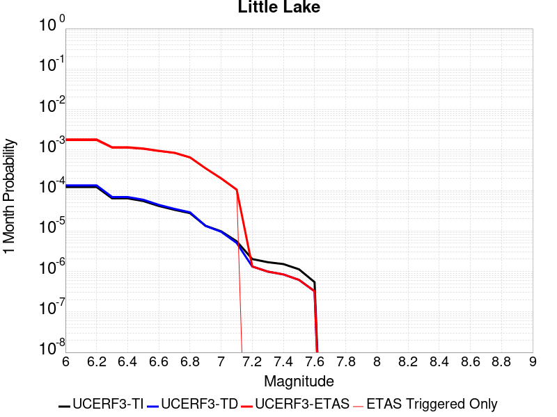 |  |  |

| Magnitude | 1 wk TI Prob | 1 wk TD Prob | 1 wk ETAS Prob | 1 wk ETAS/TD Gain | 1 wk ETAS Triggered Only | 1 mo TI Prob | 1 mo TD Prob | 1 mo ETAS Prob | 1 mo ETAS/TD Gain | 1 mo ETAS Triggered Only | 1 yr TI Prob | 1 yr TD Prob | 1 yr ETAS Prob | 1 yr ETAS/TD Gain | 1 yr ETAS Triggered Only | 10 yr TI Prob | 10 yr TD Prob | 10 yr ETAS Prob | 10 yr ETAS/TD Gain | 10 yr ETAS Triggered Only |
|-----|-----|-----|-----|-----|-----|-----|-----|-----|-----|-----|-----|-----|-----|-----|-----|-----|-----|-----|-----|-----|
| 6.0 | 2.8424427E-5 | 3.1207477E-5 | 5.511913E-4 | 17.662153 | 5.2E-4 | 1.2181328E-4 | 1.3374022E-4 | 0.0018235142 | 13.6347475 | 0.00169 | 0.0014820677 | 0.0016272042 | 0.007148206 | 4.392937 | 0.00553 | 0.014722223 | 0.016166303 | 0.02506016 | 1.5501478 | 0.00904 |
| 6.1 | 2.8424427E-5 | 3.1207477E-5 | 5.511913E-4 | 17.662153 | 5.2E-4 | 1.2181328E-4 | 1.3374022E-4 | 0.0018235142 | 13.6347475 | 0.00169 | 0.0014820677 | 0.0016272042 | 0.007148206 | 4.392937 | 0.00553 | 0.014722223 | 0.016166303 | 0.02506016 | 1.5501478 | 0.00904 |
| 6.2 | 2.8424427E-5 | 3.1207477E-5 | 5.511913E-4 | 17.662153 | 5.2E-4 | 1.2181328E-4 | 1.3374022E-4 | 0.0018235142 | 13.6347475 | 0.00169 | 0.0014820677 | 0.0016272042 | 0.007148206 | 4.392937 | 0.00553 | 0.014722223 | 0.016166303 | 0.02506016 | 1.5501478 | 0.00904 |
| 6.3 | 1.48860645E-5 | 1.6082206E-5 | 3.1607738E-4 | 19.653858 | 3.0E-4 | 6.379586E-5 | 6.8922076E-5 | 0.0011688463 | 16.958954 | 0.0011 | 7.7643775E-4 | 8.388314E-4 | 0.0045856857 | 5.466755 | 0.00375 | 0.007737305 | 0.00835947 | 0.014458059 | 1.7295425 | 0.00615 |
| 6.4 | 1.48860645E-5 | 1.6082206E-5 | 3.1607738E-4 | 19.653858 | 3.0E-4 | 6.379586E-5 | 6.8922076E-5 | 0.0011688463 | 16.958954 | 0.0011 | 7.7643775E-4 | 8.388314E-4 | 0.0045856857 | 5.466755 | 0.00375 | 0.007737305 | 0.00835947 | 0.014458059 | 1.7295425 | 0.00615 |
| 6.5 | 1.2797581E-5 | 1.3766247E-5 | 2.637628E-4 | 19.16011 | 2.5E-4 | 5.4845623E-5 | 5.899701E-5 | 0.0010889362 | 18.457481 | 0.00103 | 6.675408E-4 | 7.180776E-4 | 0.004195579 | 5.842793 | 0.00348 | 0.006655392 | 0.007160124 | 0.012859025 | 1.7959222 | 0.00574 |
| 6.6 | 9.661896E-6 | 1.0289519E-5 | 2.4028715E-4 | 23.352612 | 2.3E-4 | 4.1407468E-5 | 4.4097287E-5 | 9.5405715E-4 | 21.63528 | 9.1E-4 | 5.040193E-4 | 5.3676846E-4 | 0.0036650884 | 6.8280625 | 0.00313 | 0.005028777 | 0.0053563244 | 0.0104389535 | 1.9489024 | 0.00511 |
| 6.7 | 7.767871E-6 | 8.200053E-6 | 2.1819833E-4 | 26.609379 | 2.1E-4 | 3.329045E-5 | 3.514269E-5 | 8.551139E-4 | 24.332623 | 8.2E-4 | 4.0523586E-4 | 4.27792E-4 | 0.0031266368 | 7.3087783 | 0.0027 | 0.004044977 | 0.004271037 | 0.00870203 | 2.0374515 | 0.00445 |
| 6.8 | 6.4235196E-6 | 6.736042E-6 | 1.6673497E-4 | 24.75266 | 1.6E-4 | 2.752908E-5 | 2.8868506E-5 | 6.588503E-4 | 22.82246 | 6.3E-4 | 3.35115E-4 | 3.514302E-4 | 0.00257065 | 7.314824 | 0.00222 | 0.003346101 | 0.0035100048 | 0.0070475442 | 2.0078447 | 0.00355 |
| 6.9 | 3.1283696E-6 | 3.1122859E-6 | 1.1311194E-4 | 36.34369 | 1.1E-4 | 1.3407229E-5 | 1.3338308E-5 | 3.5333377E-4 | 26.49015 | 3.4E-4 | 1.6322079E-4 | 1.6238331E-4 | 0.0014721706 | 9.066022 | 0.00131 | 0.0016310095 | 0.0016227949 | 0.0038292084 | 2.359638 | 0.00221 |
| 7.0 | 2.290603E-6 | 2.2287613E-6 | 7.2228606E-5 | 32.407513 | 7.0E-5 | 9.816834E-6 | 9.551805E-6 | 1.9954999E-4 | 20.891338 | 1.9E-4 | 1.19513395E-4 | 1.1628806E-4 | 9.361927E-4 | 8.050634 | 8.2E-4 | 0.0011944914 | 0.0011623743 | 0.0024908283 | 2.1428797 | 0.00133 |
| 7.1 | 1.293693E-6 | 1.1777322E-6 | 4.1177685E-5 | 34.96354 | 4.0E-5 | 5.5443866E-6 | 5.0474177E-6 | 1.05046915E-4 | 20.81201 | 1.0E-4 | 6.750081E-5 | 6.1451276E-5 | 5.21423E-4 | 8.485145 | 4.6E-4 | 6.7480316E-4 | 6.144114E-4 | 0.0012440243 | 2.0247416 | 6.3E-4 |
| 7.2 | 4.715842E-7 | 3.09202E-7 | 3.09202E-7 | 1.0 | 0.0 | 2.0210737E-6 | 1.3251507E-6 | 1.3251507E-6 | 1.0 | 0.0 | 2.4606294E-5 | 1.6133596E-5 | 2.6133435E-5 | 1.6198146 | 1.0E-5 | 2.460357E-4 | 1.6132479E-4 | 1.8132156E-4 | 1.1239535 | 2.0E-5 |
| 7.3 | 3.9430947E-7 | 2.3099639E-7 | 2.3099639E-7 | 1.0 | 0.0 | 1.6898966E-6 | 9.899842E-7 | 9.899842E-7 | 1.0 | 0.0 | 2.0574296E-5 | 1.2052991E-5 | 2.2052871E-5 | 1.8296596 | 1.0E-5 | 2.0572392E-4 | 1.20523444E-4 | 1.4052104E-4 | 1.1659228 | 2.0E-5 |
| 7.4 | 3.547123E-7 | 1.9681133E-7 | 1.9681133E-7 | 1.0 | 0.0 | 1.5201948E-6 | 8.4347687E-7 | 8.4347687E-7 | 1.0 | 0.0 | 1.8508214E-5 | 1.0269283E-5 | 2.026918E-5 | 1.9737679 | 1.0E-5 | 1.8506673E-4 | 1.02688144E-4 | 1.2268609E-4 | 1.1947445 | 2.0E-5 |
| 7.5 | 2.6354266E-7 | 1.4424535E-7 | 1.4424535E-7 | 1.0 | 0.0 | 1.129468E-6 | 6.1819424E-7 | 6.1819424E-7 | 1.0 | 0.0 | 1.3751187E-5 | 7.5264893E-6 | 7.5264893E-6 | 1.0 | 0.0 | 1.3750336E-4 | 7.52624E-5 | 8.526164E-5 | 1.1328585 | 1.0E-5 |
| 7.6 | 1.269913E-7 | 7.573149E-8 | 7.573149E-8 | 1.0 | 0.0 | 5.4424834E-7 | 3.245635E-7 | 3.245635E-7 | 1.0 | 0.0 | 6.6262032E-6 | 3.951554E-6 | 3.951554E-6 | 1.0 | 0.0 | 6.626006E-5 | 3.951487E-5 | 4.9514474E-5 | 1.2530593 | 1.0E-5 |

## Airport Lake
*[(top)](#table-of-contents)*

| 1 Week | 1 Month | 1 Year | 10 Year |
|-----|-----|-----|-----|
|  |  | 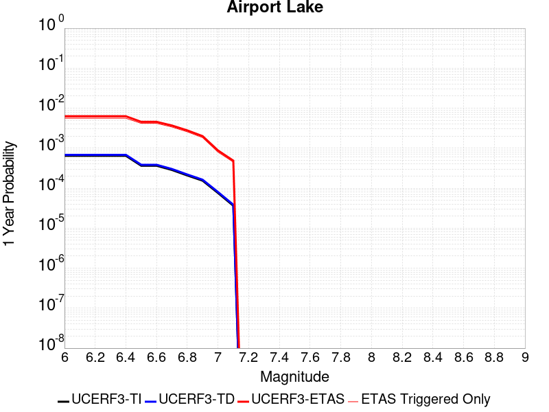 |  |

| Magnitude | 1 wk TI Prob | 1 wk TD Prob | 1 wk ETAS Prob | 1 wk ETAS/TD Gain | 1 wk ETAS Triggered Only | 1 mo TI Prob | 1 mo TD Prob | 1 mo ETAS Prob | 1 mo ETAS/TD Gain | 1 mo ETAS Triggered Only | 1 yr TI Prob | 1 yr TD Prob | 1 yr ETAS Prob | 1 yr ETAS/TD Gain | 1 yr ETAS Triggered Only | 10 yr TI Prob | 10 yr TD Prob | 10 yr ETAS Prob | 10 yr ETAS/TD Gain | 10 yr ETAS Triggered Only |
|-----|-----|-----|-----|-----|-----|-----|-----|-----|-----|-----|-----|-----|-----|-----|-----|-----|-----|-----|-----|-----|
| 6.0 | 1.2387061E-5 | 1.3103559E-5 | 4.530978E-4 | 34.578224 | 4.4E-4 | 5.3086325E-5 | 5.615706E-5 | 0.0017860599 | 31.804726 | 0.00173 | 6.461343E-4 | 6.8352616E-4 | 0.0062896917 | 9.20183 | 0.00561 | 0.0064425888 | 0.006817048 | 0.015765626 | 2.3126764 | 0.00901 |
| 6.1 | 1.2387061E-5 | 1.3103559E-5 | 4.530978E-4 | 34.578224 | 4.4E-4 | 5.3086325E-5 | 5.615706E-5 | 0.0017860599 | 31.804726 | 0.00173 | 6.461343E-4 | 6.8352616E-4 | 0.0062896917 | 9.20183 | 0.00561 | 0.0064425888 | 0.006817048 | 0.015765626 | 2.3126764 | 0.00901 |
| 6.2 | 1.2387061E-5 | 1.3103559E-5 | 4.530978E-4 | 34.578224 | 4.4E-4 | 5.3086325E-5 | 5.615706E-5 | 0.0017860599 | 31.804726 | 0.00173 | 6.461343E-4 | 6.8352616E-4 | 0.0062896917 | 9.20183 | 0.00561 | 0.0064425888 | 0.006817048 | 0.015765626 | 2.3126764 | 0.00901 |
| 6.3 | 1.2387061E-5 | 1.3103559E-5 | 4.530978E-4 | 34.578224 | 4.4E-4 | 5.3086325E-5 | 5.615706E-5 | 0.0017860599 | 31.804726 | 0.00173 | 6.461343E-4 | 6.8352616E-4 | 0.0062896917 | 9.20183 | 0.00561 | 0.0064425888 | 0.006817048 | 0.015765626 | 2.3126764 | 0.00901 |
| 6.4 | 1.2387061E-5 | 1.3103559E-5 | 4.530978E-4 | 34.578224 | 4.4E-4 | 5.3086325E-5 | 5.615706E-5 | 0.0017860599 | 31.804726 | 0.00173 | 6.461343E-4 | 6.8352616E-4 | 0.0062896917 | 9.20183 | 0.00561 | 0.0064425888 | 0.006817048 | 0.015765626 | 2.3126764 | 0.00901 |
| 6.5 | 6.9922594E-6 | 7.385145E-6 | 3.5738255E-4 | 48.392082 | 3.5E-4 | 2.996648E-5 | 3.165027E-5 | 0.0012916104 | 40.808826 | 0.00126 | 3.6478083E-4 | 3.8527933E-4 | 0.0045636687 | 11.845092 | 0.00418 | 0.003641826 | 0.003846651 | 0.010520878 | 2.7350748 | 0.0067 |
| 6.6 | 6.9922594E-6 | 7.385145E-6 | 3.5738255E-4 | 48.392082 | 3.5E-4 | 2.996648E-5 | 3.165027E-5 | 0.0012916104 | 40.808826 | 0.00126 | 3.6478083E-4 | 3.8527933E-4 | 0.0045636687 | 11.845092 | 0.00418 | 0.003641826 | 0.003846651 | 0.010520878 | 2.7350748 | 0.0067 |
| 6.7 | 5.477277E-6 | 5.7862417E-6 | 2.8578463E-4 | 49.390373 | 2.8E-4 | 2.3473833E-5 | 2.4797964E-5 | 0.001074772 | 43.341137 | 0.00105 | 2.8575645E-4 | 3.0187727E-4 | 0.003690854 | 12.226339 | 0.00339 | 0.0028538927 | 0.003015056 | 0.008508443 | 2.821985 | 0.00551 |
| 6.8 | 3.9950432E-6 | 4.2192128E-6 | 2.442182E-4 | 57.882412 | 2.4E-4 | 1.7121502E-5 | 1.808223E-5 | 7.780685E-4 | 43.029453 | 7.6E-4 | 2.0843433E-4 | 2.2013167E-4 | 0.0027895658 | 12.672261 | 0.00257 | 0.0020823893 | 0.0021994072 | 0.006320324 | 2.873649 | 0.00413 |
| 6.9 | 2.95695E-6 | 3.1231173E-6 | 1.731226E-4 | 55.43262 | 1.7E-4 | 1.2672582E-5 | 1.33847325E-5 | 4.8337845E-4 | 36.114162 | 4.7E-4 | 1.5427776E-4 | 1.629492E-4 | 0.0020026495 | 12.290023 | 0.00184 | 0.001541707 | 0.0016285196 | 0.0046236343 | 2.8391638 | 0.003 |
| 7.0 | 1.456072E-6 | 1.5408596E-6 | 7.154075E-5 | 46.42912 | 7.0E-5 | 6.2402937E-6 | 6.603673E-6 | 1.9660241E-4 | 29.771677 | 1.9E-4 | 7.597293E-5 | 8.039776E-5 | 8.803334E-4 | 10.949726 | 8.0E-4 | 7.594696E-4 | 8.0378563E-4 | 0.0020927486 | 2.6036155 | 0.00129 |
| 7.1 | 6.995192E-7 | 7.409207E-7 | 4.074089E-5 | 54.986843 | 4.0E-5 | 2.997936E-6 | 3.1753743E-6 | 1.0317506E-4 | 32.49225 | 1.0E-4 | 3.649926E-5 | 3.8660182E-5 | 4.886428E-4 | 12.639433 | 4.5E-4 | 3.6493264E-4 | 3.8660184E-4 | 9.96366E-4 | 2.5772407 | 6.1E-4 |

## Tank Canyon
*[(top)](#table-of-contents)*

| 1 Week | 1 Month | 1 Year | 10 Year |
|-----|-----|-----|-----|
|  |  |  |  |

| Magnitude | 1 wk TI Prob | 1 wk TD Prob | 1 wk ETAS Prob | 1 wk ETAS/TD Gain | 1 wk ETAS Triggered Only | 1 mo TI Prob | 1 mo TD Prob | 1 mo ETAS Prob | 1 mo ETAS/TD Gain | 1 mo ETAS Triggered Only | 1 yr TI Prob | 1 yr TD Prob | 1 yr ETAS Prob | 1 yr ETAS/TD Gain | 1 yr ETAS Triggered Only | 10 yr TI Prob | 10 yr TD Prob | 10 yr ETAS Prob | 10 yr ETAS/TD Gain | 10 yr ETAS Triggered Only |
|-----|-----|-----|-----|-----|-----|-----|-----|-----|-----|-----|-----|-----|-----|-----|-----|-----|-----|-----|-----|-----|
| 6.0 | 4.8284557E-5 | 5.7970923E-5 | 6.279379E-4 | 10.831945 | 5.7E-4 | 2.0691741E-4 | 2.48427E-4 | 0.0018580271 | 7.479167 | 0.00161 | 0.0025163088 | 0.0030210684 | 0.008334966 | 2.7589464 | 0.00533 | 0.02488006 | 0.029866708 | 0.038151648 | 1.2773972 | 0.00854 |
| 6.1 | 1.7796336E-5 | 2.0875108E-5 | 1.6087218E-4 | 7.706412 | 1.4E-4 | 7.626778E-5 | 8.946191E-5 | 5.6941895E-4 | 6.364932 | 4.8E-4 | 9.281647E-4 | 0.0010886913 | 0.0027169168 | 2.4955804 | 0.00163 | 0.009242975 | 0.010837668 | 0.013488623 | 1.2446057 | 0.00268 |
| 6.2 | 1.7796336E-5 | 2.0875108E-5 | 1.6087218E-4 | 7.706412 | 1.4E-4 | 7.626778E-5 | 8.946191E-5 | 5.6941895E-4 | 6.364932 | 4.8E-4 | 9.281647E-4 | 0.0010886913 | 0.0027169168 | 2.4955804 | 0.00163 | 0.009242975 | 0.010837668 | 0.013488623 | 1.2446057 | 0.00268 |
| 6.3 | 1.3515912E-5 | 1.5760828E-5 | 1.0575941E-4 | 6.71027 | 9.0E-5 | 5.792405E-5 | 6.7544795E-5 | 3.975225E-4 | 5.885317 | 3.3E-4 | 7.049971E-4 | 8.220716E-4 | 0.0020011016 | 2.434218 | 0.00118 | 0.007027647 | 0.008192917 | 0.010126942 | 1.2360605 | 0.00195 |
| 6.4 | 1.0870146E-5 | 1.2618972E-5 | 6.261834E-5 | 4.962238 | 5.0E-5 | 4.658551E-5 | 5.4080287E-5 | 2.9406731E-4 | 5.4376063 | 2.4E-4 | 5.67031E-4 | 6.582465E-4 | 0.0014477265 | 2.1993682 | 7.9E-4 | 0.005655863 | 0.006564983 | 0.007975661 | 1.2148792 | 0.00142 |
| 6.5 | 7.964826E-6 | 9.196723E-6 | 3.9196446E-5 | 4.2620015 | 3.0E-5 | 3.4134522E-5 | 3.9413993E-5 | 1.9940769E-4 | 5.059312 | 1.6E-4 | 4.1550855E-4 | 4.797704E-4 | 9.795305E-4 | 2.041665 | 5.0E-4 | 0.0041473247 | 0.0047886474 | 0.0056246254 | 1.1745749 | 8.4E-4 |
| 6.6 | 6.6317E-6 | 7.612777E-6 | 2.7612625E-5 | 3.6271422 | 2.0E-5 | 2.8421264E-5 | 3.262583E-5 | 1.3262258E-4 | 4.064956 | 1.0E-4 | 3.4597394E-4 | 3.9715623E-4 | 7.7700533E-4 | 1.9564223 | 3.8E-4 | 0.0034543579 | 0.003965616 | 0.0046130386 | 1.1632589 | 6.5E-4 |
| 6.7 | 4.793663E-6 | 5.4310603E-6 | 5.4310603E-6 | 1.0 | 0.0 | 2.0544108E-5 | 2.327579E-5 | 7.327463E-5 | 3.1481047 | 5.0E-5 | 2.500958E-4 | 2.8335027E-4 | 4.7329644E-4 | 1.6703582 | 1.9E-4 | 0.0024981452 | 0.0028305824 | 0.003139705 | 1.1092081 | 3.1E-4 |
| 6.8 | 4.382823E-6 | 4.9694927E-6 | 4.9694927E-6 | 1.0 | 0.0 | 1.8783392E-5 | 2.1297676E-5 | 7.1296614E-5 | 3.347624 | 5.0E-5 | 2.286638E-4 | 2.592726E-4 | 4.4922336E-4 | 1.7326294 | 1.9E-4 | 0.0022842865 | 0.0025903755 | 0.00286965 | 1.1078124 | 2.8E-4 |
| 6.9 | 2.729601E-6 | 3.0736521E-6 | 3.0736521E-6 | 1.0 | 0.0 | 1.1698237E-5 | 1.3172735E-5 | 2.3172603E-5 | 1.7591338 | 1.0E-5 | 1.4241673E-4 | 1.6036748E-4 | 2.3035625E-4 | 1.4364275 | 7.0E-5 | 0.001423255 | 0.0016026833 | 0.001702523 | 1.0622953 | 1.0E-4 |
| 7.0 | 1.8987357E-6 | 2.1269989E-6 | 2.1269989E-6 | 1.0 | 0.0 | 8.137413E-6 | 9.115682E-6 | 9.115682E-6 | 1.0 | 0.0 | 9.90685E-5 | 1.1097847E-4 | 1.3097626E-4 | 1.1801951 | 2.0E-5 | 9.902435E-4 | 0.0011092991 | 0.001139266 | 1.0270141 | 3.0E-5 |
| 7.1 | 1.4928986E-6 | 1.6641684E-6 | 1.6641684E-6 | 1.0 | 0.0 | 6.398121E-6 | 7.1321338E-6 | 7.1321338E-6 | 1.0 | 0.0 | 7.789434E-5 | 8.683086E-5 | 9.6829994E-5 | 1.1151564 | 1.0E-5 | 7.786704E-4 | 8.680272E-4 | 8.780185E-4 | 1.0115104 | 1.0E-5 |
| 7.2 | 1.069082E-6 | 1.1828834E-6 | 1.1828834E-6 | 1.0 | 0.0 | 4.581772E-6 | 5.0694935E-6 | 5.0694935E-6 | 1.0 | 0.0 | 5.5781646E-5 | 6.171987E-5 | 7.171925E-5 | 1.1620123 | 1.0E-5 | 5.576765E-4 | 6.170795E-4 | 6.2707334E-4 | 1.0161954 | 1.0E-5 |
| 7.3 | 8.776551E-7 | 9.770195E-7 | 9.770195E-7 | 1.0 | 0.0 | 3.7613736E-6 | 4.1872227E-6 | 4.1872227E-6 | 1.0 | 0.0 | 4.579376E-5 | 5.0978764E-5 | 6.0978255E-5 | 1.1961501 | 1.0E-5 | 4.5784327E-4 | 5.097217E-4 | 5.197166E-4 | 1.0196085 | 1.0E-5 |
| 7.4 | 7.55721E-7 | 8.510402E-7 | 8.510402E-7 | 1.0 | 0.0 | 3.2388E-6 | 3.647313E-6 | 3.647313E-6 | 1.0 | 0.0 | 3.9431678E-5 | 4.440565E-5 | 5.4405205E-5 | 1.2251866 | 1.0E-5 | 3.942468E-4 | 4.440186E-4 | 4.5401417E-4 | 1.0225116 | 1.0E-5 |
| 7.5 | 5.587665E-7 | 6.305733E-7 | 6.305733E-7 | 1.0 | 0.0 | 2.3947114E-6 | 2.702457E-6 | 2.702457E-6 | 1.0 | 0.0 | 2.915522E-5 | 3.2902415E-5 | 4.2902087E-5 | 1.3039191 | 1.0E-5 | 2.9151395E-4 | 3.2902416E-4 | 3.3902086E-4 | 1.0303829 | 1.0E-5 |

## Owl Lake
*[(top)](#table-of-contents)*

| 1 Week | 1 Month | 1 Year | 10 Year |
|-----|-----|-----|-----|
|  |  |  |  |

| Magnitude | 1 wk TI Prob | 1 wk TD Prob | 1 wk ETAS Prob | 1 wk ETAS/TD Gain | 1 wk ETAS Triggered Only | 1 mo TI Prob | 1 mo TD Prob | 1 mo ETAS Prob | 1 mo ETAS/TD Gain | 1 mo ETAS Triggered Only | 1 yr TI Prob | 1 yr TD Prob | 1 yr ETAS Prob | 1 yr ETAS/TD Gain | 1 yr ETAS Triggered Only | 10 yr TI Prob | 10 yr TD Prob | 10 yr ETAS Prob | 10 yr ETAS/TD Gain | 10 yr ETAS Triggered Only |
|-----|-----|-----|-----|-----|-----|-----|-----|-----|-----|-----|-----|-----|-----|-----|-----|-----|-----|-----|-----|-----|
| 6.0 | 5.0320643E-5 | 6.637151E-5 | 2.6635823E-4 | 4.013141 | 2.0E-4 | 2.1564208E-4 | 2.844246E-4 | 9.742284E-4 | 3.4252605 | 6.9E-4 | 0.0026222812 | 0.0034584238 | 0.005670746 | 1.639691 | 0.00222 | 0.02591553 | 0.034147043 | 0.037595138 | 1.1009779 | 0.00357 |
| 6.1 | 5.0320643E-5 | 6.637151E-5 | 2.6635823E-4 | 4.013141 | 2.0E-4 | 2.1564208E-4 | 2.844246E-4 | 9.742284E-4 | 3.4252605 | 6.9E-4 | 0.0026222812 | 0.0034584238 | 0.005670746 | 1.639691 | 0.00222 | 0.02591553 | 0.034147043 | 0.037595138 | 1.1009779 | 0.00357 |
| 6.2 | 2.4125871E-5 | 3.098766E-5 | 2.2098178E-4 | 7.1312833 | 1.9E-4 | 1.0339249E-4 | 1.3279865E-4 | 7.127216E-4 | 5.3669343 | 5.8E-4 | 0.0012580766 | 0.0016157742 | 0.0034827527 | 2.15547 | 0.00187 | 0.012509781 | 0.016073797 | 0.019025575 | 1.1836392 | 0.003 |
| 6.3 | 1.7433485E-5 | 2.2360802E-5 | 2.1235655E-4 | 9.496821 | 1.9E-4 | 7.471279E-5 | 9.582938E-5 | 6.557757E-4 | 6.843159 | 5.6E-4 | 9.0924866E-4 | 0.0011662478 | 0.002944172 | 2.5244823 | 0.00178 | 0.009055373 | 0.01163159 | 0.014418789 | 1.2396232 | 0.00282 |
| 6.4 | 1.7433485E-5 | 2.2360802E-5 | 2.1235655E-4 | 9.496821 | 1.9E-4 | 7.471279E-5 | 9.582938E-5 | 6.557757E-4 | 6.843159 | 5.6E-4 | 9.0924866E-4 | 0.0011662478 | 0.002944172 | 2.5244823 | 0.00178 | 0.009055373 | 0.01163159 | 0.014418789 | 1.2396232 | 0.00282 |
| 6.5 | 1.5182742E-5 | 1.9433977E-5 | 2.0943029E-4 | 10.776502 | 1.9E-4 | 6.506727E-5 | 8.3286664E-5 | 6.4324E-4 | 7.7232056 | 5.6E-4 | 7.919061E-4 | 0.0010136948 | 0.0027918904 | 2.7541726 | 0.00178 | 0.0078909 | 0.0101209 | 0.012882663 | 1.2728772 | 0.00279 |
| 6.6 | 6.7271576E-6 | 8.550545E-6 | 1.88549E-4 | 22.05111 | 1.8E-4 | 2.8830356E-5 | 3.6644713E-5 | 5.6662527E-4 | 15.462676 | 5.3E-4 | 3.5095305E-4 | 4.460637E-4 | 0.0021053231 | 4.719782 | 0.00166 | 0.0035039932 | 0.0044694655 | 0.0070777554 | 1.5835799 | 0.00262 |
| 6.7 | 6.682835E-6 | 8.482986E-6 | 1.8848146E-4 | 22.218763 | 1.8E-4 | 2.8640408E-5 | 3.635518E-5 | 5.663359E-4 | 15.57786 | 5.3E-4 | 3.4864116E-4 | 4.4254007E-4 | 0.0021018055 | 4.7494125 | 0.00166 | 0.003480947 | 0.004434389 | 0.007042771 | 1.5882168 | 0.00262 |
| 6.8 | 6.5774975E-6 | 8.329444E-6 | 1.8832795E-4 | 22.609905 | 1.8E-4 | 2.8188972E-5 | 3.569716E-5 | 5.6567823E-4 | 15.846588 | 5.3E-4 | 3.4314668E-4 | 4.3453192E-4 | 0.0020938106 | 4.8185425 | 0.00166 | 0.0034261728 | 0.004354527 | 0.0069631184 | 1.5990527 | 0.00262 |
| 6.9 | 6.363419E-6 | 8.002579E-6 | 1.8800114E-4 | 23.492567 | 1.8E-4 | 2.727151E-5 | 3.429635E-5 | 5.6427816E-4 | 16.45301 | 5.3E-4 | 3.3198006E-4 | 4.1748365E-4 | 0.0020767907 | 4.9745436 | 0.00166 | 0.0033148455 | 0.0041844994 | 0.006793536 | 1.6235003 | 0.00262 |
| 7.0 | 6.1342453E-6 | 7.63473E-6 | 1.8763336E-4 | 24.576294 | 1.8E-4 | 2.6289357E-5 | 3.271989E-5 | 5.6270254E-4 | 17.197569 | 5.3E-4 | 3.2002592E-4 | 3.9829736E-4 | 0.0020476403 | 5.1409836 | 0.00165 | 0.0031956544 | 0.0039931675 | 0.0065927454 | 1.6510065 | 0.00261 |
| 7.1 | 5.842926E-6 | 7.14521E-6 | 1.8714393E-4 | 26.19152 | 1.8E-4 | 2.504087E-5 | 3.0622E-5 | 5.5060606E-4 | 17.980736 | 5.2E-4 | 3.0482994E-4 | 3.7276448E-4 | 0.0019421793 | 5.2102046 | 0.00157 | 0.0030441214 | 0.0037385917 | 0.0062192827 | 1.6635362 | 0.00249 |
| 7.2 | 4.77173E-6 | 5.361204E-6 | 1.2536056E-4 | 23.382912 | 1.2E-4 | 2.045011E-5 | 2.297641E-5 | 3.629686E-4 | 15.797446 | 3.4E-4 | 2.4895166E-4 | 2.7970594E-4 | 0.0013494067 | 4.824376 | 0.00107 | 0.0024867293 | 0.0028100624 | 0.0044055665 | 1.5677824 | 0.0016 |
| 7.3 | 3.0494948E-6 | 2.7124704E-6 | 5.2712334E-5 | 19.43333 | 5.0E-5 | 1.3069198E-5 | 1.1624823E-5 | 1.0162377E-4 | 8.741963 | 9.0E-5 | 1.5910587E-4 | 1.4152318E-4 | 3.9148782E-4 | 2.7662451 | 2.5E-4 | 0.0015899199 | 0.0014242887 | 0.0018137333 | 1.273431 | 3.9E-4 |
| 7.4 | 2.7263884E-6 | 2.3075613E-6 | 3.2307493E-5 | 14.000709 | 3.0E-5 | 1.1684469E-5 | 9.889511E-6 | 5.988902E-5 | 6.0558114 | 5.0E-5 | 1.4224913E-4 | 1.2039825E-4 | 2.703802E-4 | 2.2457154 | 1.5E-4 | 0.0014215811 | 0.0012122075 | 0.0014718923 | 1.2142247 | 2.6E-4 |
| 7.5 | 2.6090431E-6 | 2.1674637E-6 | 3.2167398E-5 | 14.841033 | 3.0E-5 | 1.1181565E-5 | 9.289097E-6 | 5.928863E-5 | 6.3826046 | 5.0E-5 | 1.3612706E-4 | 1.1308899E-4 | 2.5307314E-4 | 2.2378232 | 1.4E-4 | 0.001360437 | 0.0011389464 | 0.0013586958 | 1.192941 | 2.2E-4 |
| 7.6 | 2.3008756E-6 | 1.8745708E-6 | 2.1874534E-5 | 11.669089 | 2.0E-5 | 9.860858E-6 | 8.0338505E-6 | 3.803361E-5 | 4.7341695 | 3.0E-5 | 1.20049335E-4 | 9.7807824E-5 | 1.8779901E-4 | 1.9200819 | 9.0E-5 | 0.001199845 | 9.85921E-4 | 0.001125783 | 1.1418592 | 1.4E-4 |
| 7.7 | 1.7184348E-6 | 1.343562E-6 | 2.1343536E-5 | 15.885783 | 2.0E-5 | 7.3646997E-6 | 5.7581105E-6 | 3.5757937E-5 | 6.2100124 | 3.0E-5 | 8.966153E-5 | 7.010278E-5 | 1.4009788E-4 | 1.9984639 | 7.0E-5 | 8.962536E-4 | 7.086945E-4 | 7.8863784E-4 | 1.1128036 | 8.0E-5 |
| 7.8 | 8.4612907E-7 | 8.4176E-7 | 8.4176E-7 | 1.0 | 0.0 | 3.6262625E-6 | 3.607538E-6 | 1.3607502E-5 | 3.7719636 | 1.0E-5 | 4.4148852E-5 | 4.392091E-5 | 7.39196E-5 | 1.683016 | 3.0E-5 | 4.414008E-4 | 4.4459777E-4 | 4.8457997E-4 | 1.089929 | 4.0E-5 |
| 7.9 | 2.716738E-7 | 3.7732943E-7 | 3.7732943E-7 | 1.0 | 0.0 | 1.1643157E-6 | 1.6171252E-6 | 1.1617109E-5 | 7.183803 | 1.0E-5 | 1.4175452E-5 | 1.9688332E-5 | 2.9688135E-5 | 1.507905 | 1.0E-5 | 1.4174548E-4 | 1.9863734E-4 | 2.0863536E-4 | 1.050333 | 1.0E-5 |
| 8.0 | 2.1995428E-8 | 3.389418E-8 | 3.389418E-8 | 1.0 | 0.0 | 9.426611E-8 | 1.4526077E-7 | 1.4526077E-7 | 1.0 | 0.0 | 1.1476893E-6 | 1.768549E-6 | 1.768549E-6 | 1.0 | 0.0 | 1.14768345E-5 | 1.798665E-5 | 1.798665E-5 | 1.0 | 0.0 |

## Panamint Valley
*[(top)](#table-of-contents)*

| 1 Week | 1 Month | 1 Year | 10 Year |
|-----|-----|-----|-----|
|  |  |  |  |

| Magnitude | 1 wk TI Prob | 1 wk TD Prob | 1 wk ETAS Prob | 1 wk ETAS/TD Gain | 1 wk ETAS Triggered Only | 1 mo TI Prob | 1 mo TD Prob | 1 mo ETAS Prob | 1 mo ETAS/TD Gain | 1 mo ETAS Triggered Only | 1 yr TI Prob | 1 yr TD Prob | 1 yr ETAS Prob | 1 yr ETAS/TD Gain | 1 yr ETAS Triggered Only | 10 yr TI Prob | 10 yr TD Prob | 10 yr ETAS Prob | 10 yr ETAS/TD Gain | 10 yr ETAS Triggered Only |
|-----|-----|-----|-----|-----|-----|-----|-----|-----|-----|-----|-----|-----|-----|-----|-----|-----|-----|-----|-----|-----|
| 6.0 | 3.0211835E-5 | 3.39879E-5 | 1.0398552E-4 | 3.0594864 | 7.0E-5 | 1.2947287E-4 | 1.4565447E-4 | 6.9557433E-4 | 4.77551 | 5.5E-4 | 0.0015751923 | 0.0017719301 | 0.0037484218 | 2.1154456 | 0.00198 | 0.015640736 | 0.017584875 | 0.020826844 | 1.1843612 | 0.0033 |
| 6.1 | 3.0211835E-5 | 3.39879E-5 | 1.0398552E-4 | 3.0594864 | 7.0E-5 | 1.2947287E-4 | 1.4565447E-4 | 6.9557433E-4 | 4.77551 | 5.5E-4 | 0.0015751923 | 0.0017719301 | 0.0037484218 | 2.1154456 | 0.00198 | 0.015640736 | 0.017584875 | 0.020826844 | 1.1843612 | 0.0033 |
| 6.2 | 3.0211835E-5 | 3.39879E-5 | 1.0398552E-4 | 3.0594864 | 7.0E-5 | 1.2947287E-4 | 1.4565447E-4 | 6.9557433E-4 | 4.77551 | 5.5E-4 | 0.0015751923 | 0.0017719301 | 0.0037484218 | 2.1154456 | 0.00198 | 0.015640736 | 0.017584875 | 0.020826844 | 1.1843612 | 0.0033 |
| 6.3 | 2.8573924E-5 | 3.210589E-5 | 1.02103644E-4 | 3.1802151 | 7.0E-5 | 1.2245393E-4 | 1.3758958E-4 | 6.6751667E-4 | 4.8515058 | 5.3E-4 | 0.001489857 | 0.0016738938 | 0.00359068 | 2.145106 | 0.00192 | 0.01479908 | 0.01661945 | 0.0197761 | 1.1899372 | 0.00321 |
| 6.4 | 2.8573924E-5 | 3.210589E-5 | 1.02103644E-4 | 3.1802151 | 7.0E-5 | 1.2245393E-4 | 1.3758958E-4 | 6.6751667E-4 | 4.8515058 | 5.3E-4 | 0.001489857 | 0.0016738938 | 0.00359068 | 2.145106 | 0.00192 | 0.01479908 | 0.01661945 | 0.0197761 | 1.1899372 | 0.00321 |
| 6.5 | 2.7468774E-5 | 3.0831525E-5 | 1.0082936E-4 | 3.2703335 | 7.0E-5 | 1.1771801E-4 | 1.3212857E-4 | 6.420612E-4 | 4.859367 | 5.1E-4 | 0.0014322745 | 0.0016075056 | 0.0035044514 | 2.1800554 | 0.0019 | 0.014230782 | 0.015965264 | 0.019104334 | 1.1966188 | 0.00319 |
| 6.6 | 2.6135967E-5 | 2.9255436E-5 | 8.925368E-5 | 3.0508409 | 6.0E-5 | 1.1200648E-4 | 1.2537456E-4 | 6.153131E-4 | 4.907799 | 4.9E-4 | 0.0013628257 | 0.001525393 | 0.003372571 | 2.2109523 | 0.00185 | 0.013544982 | 0.015155562 | 0.018238125 | 1.2033949 | 0.00313 |
| 6.7 | 2.4498746E-5 | 2.7344193E-5 | 8.734255E-5 | 3.1941903 | 6.0E-5 | 1.04990395E-4 | 1.17184274E-4 | 5.97128E-4 | 5.095633 | 4.8E-4 | 0.0012775084 | 0.0014258098 | 0.003233229 | 2.267644 | 0.00181 | 0.012701893 | 0.014172745 | 0.017209092 | 1.2142385 | 0.00308 |
| 6.8 | 2.2244329E-5 | 2.4938103E-5 | 8.4936604E-5 | 3.405897 | 6.0E-5 | 9.532935E-5 | 1.06873325E-4 | 5.8682205E-4 | 5.4908185 | 4.8E-4 | 0.0011600169 | 0.0013004278 | 0.003058139 | 2.3516407 | 0.00176 | 0.011539802 | 0.012933899 | 0.015865484 | 1.2266592 | 0.00297 |
| 6.9 | 1.9902658E-5 | 2.2292743E-5 | 8.229141E-5 | 3.6913989 | 6.0E-5 | 8.529431E-5 | 9.553693E-5 | 5.354949E-4 | 5.6051087 | 4.4E-4 | 0.0010379635 | 0.00116256 | 0.002790665 | 2.400448 | 0.00163 | 0.010331288 | 0.011569886 | 0.014317721 | 1.237499 | 0.00278 |
| 7.0 | 1.8353881E-5 | 2.0568525E-5 | 8.056729E-5 | 3.9170184 | 6.0E-5 | 7.865712E-5 | 8.814794E-5 | 5.1811006E-4 | 5.8777328 | 4.3E-4 | 9.5722964E-4 | 0.0010726905 | 0.0026110385 | 2.4341025 | 0.00154 | 0.009531168 | 0.010680057 | 0.013321541 | 1.2473286 | 0.00267 |
| 7.1 | 1.7667631E-5 | 1.9774876E-5 | 7.977369E-5 | 4.034093 | 6.0E-5 | 7.571623E-5 | 8.474681E-5 | 5.0471124E-4 | 5.9555187 | 4.2E-4 | 9.2145515E-4 | 0.0010313216 | 0.0025297746 | 2.4529445 | 0.0015 | 0.009176437 | 0.010270242 | 0.012853436 | 1.2515223 | 0.00261 |
| 7.2 | 1.6381597E-5 | 1.8160366E-5 | 6.815946E-5 | 3.7531984 | 5.0E-5 | 7.020495E-5 | 7.782792E-5 | 4.5779833E-4 | 5.882187 | 3.8E-4 | 8.544101E-4 | 9.471603E-4 | 0.0023158626 | 2.4450588 | 0.00137 | 0.008511325 | 0.0094358865 | 0.011803335 | 1.2508984 | 0.00239 |
| 7.3 | 1.4520491E-5 | 1.5968182E-5 | 5.5967543E-5 | 3.5049415 | 4.0E-5 | 6.222919E-5 | 6.8433365E-5 | 4.084101E-4 | 5.967997 | 3.4E-4 | 7.57377E-4 | 8.328739E-4 | 0.0020018995 | 2.4036045 | 0.00117 | 0.0075480095 | 0.008300635 | 0.010303868 | 1.2413349 | 0.00202 |
| 7.4 | 1.2852287E-5 | 1.4146948E-5 | 4.4146524E-5 | 3.1205688 | 3.0E-5 | 5.5080065E-5 | 6.0628456E-5 | 3.8060907E-4 | 6.2777295 | 3.2E-4 | 6.7039346E-4 | 7.379173E-4 | 0.0018570909 | 2.5166652 | 0.00112 | 0.0066837464 | 0.0073575918 | 0.009313097 | 1.2657807 | 0.00197 |
| 7.5 | 1.1637851E-5 | 1.2838205E-5 | 4.283782E-5 | 3.3367453 | 3.0E-5 | 4.987555E-5 | 5.5019806E-5 | 3.7500222E-4 | 6.8157673 | 3.2E-4 | 6.070656E-4 | 6.6967594E-4 | 0.001788926 | 2.6713307 | 0.00112 | 0.006054099 | 0.006679477 | 0.008636319 | 1.2929633 | 0.00197 |
| 7.6 | 3.0068115E-6 | 3.3335807E-6 | 3.333348E-5 | 9.999303 | 3.0E-5 | 1.2886271E-5 | 1.4286737E-5 | 1.5428473E-4 | 10.799159 | 1.4E-4 | 1.5687906E-4 | 1.7393442E-4 | 6.2385615E-4 | 3.586732 | 4.5E-4 | 0.0015676835 | 0.0017394236 | 0.0025979278 | 1.4935566 | 8.6E-4 |

## Garlock (East)
*[(top)](#table-of-contents)*

| 1 Week | 1 Month | 1 Year | 10 Year |
|-----|-----|-----|-----|
|  |  |  | 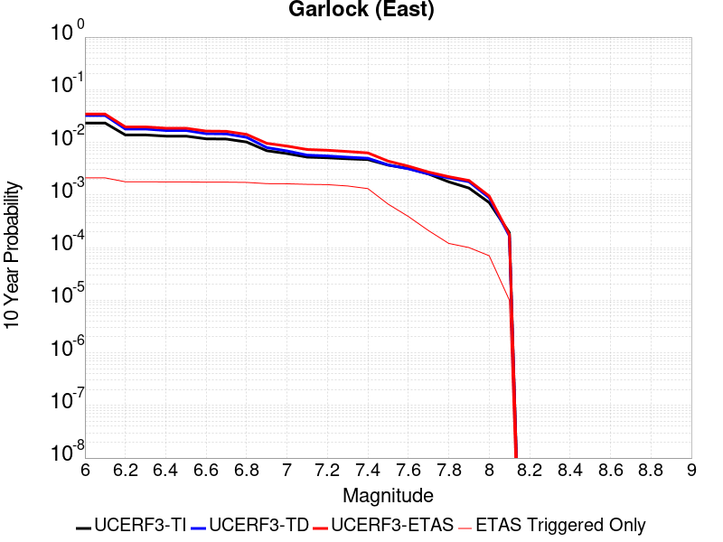 |

| Magnitude | 1 wk TI Prob | 1 wk TD Prob | 1 wk ETAS Prob | 1 wk ETAS/TD Gain | 1 wk ETAS Triggered Only | 1 mo TI Prob | 1 mo TD Prob | 1 mo ETAS Prob | 1 mo ETAS/TD Gain | 1 mo ETAS Triggered Only | 1 yr TI Prob | 1 yr TD Prob | 1 yr ETAS Prob | 1 yr ETAS/TD Gain | 1 yr ETAS Triggered Only | 10 yr TI Prob | 10 yr TD Prob | 10 yr ETAS Prob | 10 yr ETAS/TD Gain | 10 yr ETAS Triggered Only |
|-----|-----|-----|-----|-----|-----|-----|-----|-----|-----|-----|-----|-----|-----|-----|-----|-----|-----|-----|-----|-----|
| 6.0 | 4.5092507E-5 | 6.2917425E-5 | 1.5291176E-4 | 2.4303563 | 9.0E-5 | 1.9323928E-4 | 2.6962077E-4 | 6.7951024E-4 | 2.5202444 | 4.1E-4 | 0.0023501497 | 0.0032781374 | 0.0045738756 | 1.3952667 | 0.0013 | 0.023254504 | 0.03235903 | 0.034400754 | 1.0630959 | 0.00211 |
| 6.1 | 4.5092507E-5 | 6.2917425E-5 | 1.5291176E-4 | 2.4303563 | 9.0E-5 | 1.9323928E-4 | 2.6962077E-4 | 6.7951024E-4 | 2.5202444 | 4.1E-4 | 0.0023501497 | 0.0032781374 | 0.0045738756 | 1.3952667 | 0.0013 | 0.023254504 | 0.03235903 | 0.034400754 | 1.0630959 | 0.00211 |
| 6.2 | 2.6674514E-5 | 3.452091E-5 | 1.245178E-4 | 3.6070256 | 9.0E-5 | 1.1431433E-4 | 1.4793854E-4 | 5.178838E-4 | 3.5006685 | 3.7E-4 | 0.0013908884 | 0.0017996968 | 0.0029376452 | 1.6323 | 0.00114 | 0.01382215 | 0.017896036 | 0.01964418 | 1.0976833 | 0.00178 |
| 6.3 | 2.6674514E-5 | 3.452091E-5 | 1.245178E-4 | 3.6070256 | 9.0E-5 | 1.1431433E-4 | 1.4793854E-4 | 5.178838E-4 | 3.5006685 | 3.7E-4 | 0.0013908884 | 0.0017996968 | 0.0029376452 | 1.6323 | 0.00114 | 0.01382215 | 0.017896036 | 0.01964418 | 1.0976833 | 0.00178 |
| 6.4 | 2.5312667E-5 | 3.234991E-5 | 1.22347E-4 | 3.7819889 | 9.0E-5 | 1.0847834E-4 | 1.3863528E-4 | 5.0858397E-4 | 3.6685035 | 3.7E-4 | 0.0013199237 | 0.0016866071 | 0.0028246844 | 1.6747732 | 0.00114 | 0.013121112 | 0.016783953 | 0.018524244 | 1.1036879 | 0.00177 |
| 6.5 | 2.5312667E-5 | 3.234991E-5 | 1.22347E-4 | 3.7819889 | 9.0E-5 | 1.0847834E-4 | 1.3863528E-4 | 5.0858397E-4 | 3.6685035 | 3.7E-4 | 0.0013199237 | 0.0016866071 | 0.0028246844 | 1.6747732 | 0.00114 | 0.013121112 | 0.016783953 | 0.018524244 | 1.1036879 | 0.00177 |
| 6.6 | 2.246556E-5 | 2.8144346E-5 | 1.1814181E-4 | 4.19771 | 9.0E-5 | 9.627742E-5 | 1.20613186E-4 | 4.905686E-4 | 4.067288 | 3.7E-4 | 0.0011715472 | 0.0014674999 | 0.0025958417 | 1.768887 | 0.00113 | 0.011653901 | 0.0146240825 | 0.01634849 | 1.1179156 | 0.00175 |
| 6.7 | 2.2241198E-5 | 2.781406E-5 | 1.17811556E-4 | 4.2356834 | 9.0E-5 | 9.531594E-5 | 1.1919779E-4 | 4.8915367E-4 | 4.103714 | 3.7E-4 | 0.0011598538 | 0.0014502906 | 0.0025786518 | 1.7780242 | 0.00113 | 0.011538187 | 0.014454261 | 0.016178966 | 1.1193216 | 0.00175 |
| 6.8 | 1.9528685E-5 | 2.3908038E-5 | 1.1390589E-4 | 4.764334 | 9.0E-5 | 8.369167E-5 | 1.0245911E-4 | 4.724212E-4 | 4.6108265 | 3.7E-4 | 0.0010184698 | 0.0012467455 | 0.0023553616 | 1.8892081 | 0.00111 | 0.010138147 | 0.012441495 | 0.014149971 | 1.1373208 | 0.00173 |
| 6.9 | 1.3318621E-5 | 1.5207374E-5 | 1.05206E-4 | 6.9180913 | 9.0E-5 | 5.7078556E-5 | 6.517287E-5 | 4.1515005E-4 | 6.369983 | 3.5E-4 | 6.9470983E-4 | 7.931965E-4 | 0.0018423636 | 2.3227077 | 0.00105 | 0.0069254204 | 0.007944281 | 0.009571252 | 1.2047979 | 0.00164 |
| 7.0 | 1.1760853E-5 | 1.3115987E-5 | 1.03114806E-4 | 7.861765 | 9.0E-5 | 5.0402683E-5 | 5.621019E-5 | 4.0619052E-4 | 7.2262793 | 3.5E-4 | 6.134799E-4 | 6.841492E-4 | 0.0017334308 | 2.533703 | 0.00105 | 0.0061178906 | 0.006860767 | 0.008479584 | 1.2359527 | 0.00163 |
| 7.1 | 1.0064758E-5 | 1.0910848E-5 | 9.0909976E-5 | 8.332072 | 8.0E-5 | 4.3133965E-5 | 4.675996E-5 | 3.7674452E-4 | 8.05699 | 3.3E-4 | 5.2502943E-4 | 5.691573E-4 | 0.0015785825 | 2.7735434 | 0.00101 | 0.005237907 | 0.005717105 | 0.007298015 | 1.2765228 | 0.00159 |
| 7.2 | 9.768808E-6 | 1.0506669E-5 | 8.050593E-5 | 7.6623645 | 7.0E-5 | 4.186565E-5 | 4.5027828E-5 | 3.6501343E-4 | 8.106397 | 3.2E-4 | 5.095951E-4 | 5.480794E-4 | 0.0015475313 | 2.8235533 | 0.001 | 0.0050842804 | 0.0055073434 | 0.007068697 | 1.2835039 | 0.00157 |
| 7.3 | 9.344516E-6 | 9.95218E-6 | 6.995158E-5 | 7.0287695 | 6.0E-5 | 4.004731E-5 | 4.2651525E-5 | 3.3263915E-4 | 7.798998 | 2.9E-4 | 4.8746695E-4 | 5.1916204E-4 | 0.0014386844 | 2.7711663 | 9.2E-4 | 0.0048639905 | 0.0052189473 | 0.0066912235 | 1.2821021 | 0.00148 |
| 7.4 | 9.023491E-6 | 9.498219E-6 | 5.9497743E-5 | 6.264095 | 5.0E-5 | 3.867153E-5 | 4.0706036E-5 | 3.1069503E-4 | 7.6326528 | 2.7E-4 | 4.7072413E-4 | 4.9548666E-4 | 0.0013450654 | 2.7146351 | 8.5E-4 | 0.004697283 | 0.004982321 | 0.0062957443 | 1.2636168 | 0.00132 |
| 7.5 | 7.081253E-6 | 7.0943947E-6 | 2.7094253E-5 | 3.819107 | 2.0E-5 | 3.0347876E-5 | 3.0404199E-5 | 1.9039934E-4 | 6.262271 | 1.6E-4 | 3.6942272E-4 | 3.70109E-4 | 8.1994245E-4 | 2.215408 | 4.5E-4 | 0.003688092 | 0.00372781 | 0.004395312 | 1.1790602 | 6.7E-4 |
| 7.6 | 6.116396E-6 | 5.9656345E-6 | 1.5965576E-5 | 2.6762576 | 1.0E-5 | 2.6212863E-5 | 2.5566756E-5 | 1.1556446E-4 | 4.5201063 | 9.0E-5 | 3.1909486E-4 | 3.1123104E-4 | 5.911439E-4 | 1.8993732 | 2.8E-4 | 0.0031863707 | 0.0031390795 | 0.0035278555 | 1.1238502 | 3.9E-4 |
| 7.7 | 4.797145E-6 | 4.763327E-6 | 1.4763279E-5 | 3.099363 | 1.0E-5 | 2.055903E-5 | 2.04141E-5 | 6.0413284E-5 | 2.95939 | 4.0E-5 | 2.5027743E-4 | 2.4851345E-4 | 3.9847617E-4 | 1.6034391 | 1.5E-4 | 0.0024999576 | 0.0025124948 | 0.0027219672 | 1.0833722 | 2.1E-4 |
| 7.8 | 3.4028885E-6 | 3.9838537E-6 | 1.3983814E-5 | 3.5101223 | 1.0E-5 | 1.4583726E-5 | 1.7073547E-5 | 3.7073205E-5 | 2.1713827 | 2.0E-5 | 1.775424E-4 | 2.0785068E-4 | 2.8783406E-4 | 1.3848116 | 8.0E-5 | 0.0017740062 | 0.0021040295 | 0.0022237771 | 1.0569134 | 1.2E-4 |
| 7.9 | 2.5928412E-6 | 3.3770064E-6 | 1.3376973E-5 | 3.9611926 | 1.0E-5 | 1.1112129E-5 | 1.4472805E-5 | 3.4472516E-5 | 2.3818822 | 2.0E-5 | 1.3528178E-4 | 1.7619222E-4 | 2.5617811E-4 | 1.4539696 | 8.0E-5 | 0.0013519945 | 0.0017836117 | 0.0018834333 | 1.055966 | 1.0E-4 |
| 8.0 | 1.3743648E-6 | 1.6755408E-6 | 1.1675524E-5 | 6.968212 | 1.0E-5 | 5.8901214E-6 | 7.1808695E-6 | 2.7180726E-5 | 3.785158 | 2.0E-5 | 7.1709874E-5 | 8.742361E-5 | 1.3741924E-4 | 1.5718778 | 5.0E-5 | 7.1686733E-4 | 8.847989E-4 | 9.5473696E-4 | 1.079044 | 7.0E-5 |
| 8.1 | 3.6733252E-7 | 3.1526864E-7 | 3.1526864E-7 | 1.0 | 0.0 | 1.5742813E-6 | 1.3511507E-6 | 1.3511507E-6 | 1.0 | 0.0 | 1.9166706E-5 | 1.645015E-5 | 2.6449987E-5 | 1.6078871 | 1.0E-5 | 1.9165053E-4 | 1.6658098E-4 | 1.7657931E-4 | 1.0600208 | 1.0E-5 |

## Hunter Mountain-Saline Valley
*[(top)](#table-of-contents)*

| 1 Week | 1 Month | 1 Year | 10 Year |
|-----|-----|-----|-----|
|  | 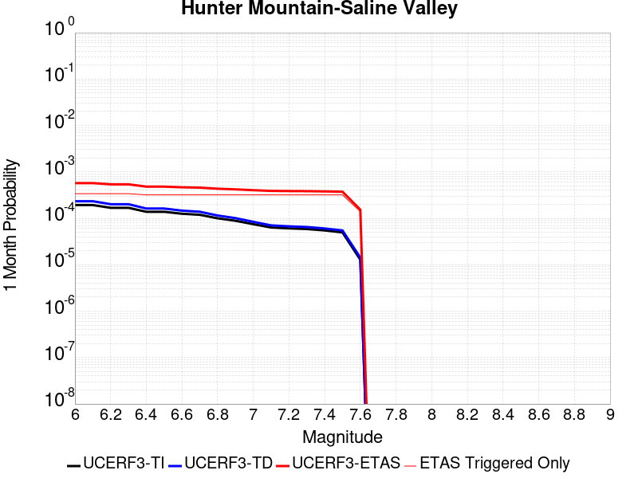 |  |  |

| Magnitude | 1 wk TI Prob | 1 wk TD Prob | 1 wk ETAS Prob | 1 wk ETAS/TD Gain | 1 wk ETAS Triggered Only | 1 mo TI Prob | 1 mo TD Prob | 1 mo ETAS Prob | 1 mo ETAS/TD Gain | 1 mo ETAS Triggered Only | 1 yr TI Prob | 1 yr TD Prob | 1 yr ETAS Prob | 1 yr ETAS/TD Gain | 1 yr ETAS Triggered Only | 10 yr TI Prob | 10 yr TD Prob | 10 yr ETAS Prob | 10 yr ETAS/TD Gain | 10 yr ETAS Triggered Only |
|-----|-----|-----|-----|-----|-----|-----|-----|-----|-----|-----|-----|-----|-----|-----|-----|-----|-----|-----|-----|-----|
| 6.0 | 4.5103672E-5 | 5.4576634E-5 | 9.4574454E-5 | 1.7328744 | 4.0E-5 | 1.9328714E-4 | 2.3387549E-4 | 5.73796E-4 | 2.453425 | 3.4E-4 | 0.002350731 | 0.002843864 | 0.0039905934 | 1.4032294 | 0.00115 | 0.023260195 | 0.028095365 | 0.030068332 | 1.0702239 | 0.00203 |
| 6.1 | 4.5103672E-5 | 5.4576634E-5 | 9.4574454E-5 | 1.7328744 | 4.0E-5 | 1.9328714E-4 | 2.3387549E-4 | 5.73796E-4 | 2.453425 | 3.4E-4 | 0.002350731 | 0.002843864 | 0.0039905934 | 1.4032294 | 0.00115 | 0.023260195 | 0.028095365 | 0.030068332 | 1.0702239 | 0.00203 |
| 6.2 | 3.9363465E-5 | 4.706859E-5 | 8.7066706E-5 | 1.8497837 | 4.0E-5 | 1.6868966E-4 | 2.017032E-4 | 5.416346E-4 | 2.685305 | 3.4E-4 | 0.002051862 | 0.0024531104 | 0.003590314 | 1.4635761 | 0.00114 | 0.020330196 | 0.024276383 | 0.026247345 | 1.0811884 | 0.00202 |
| 6.3 | 3.9363465E-5 | 4.706859E-5 | 8.7066706E-5 | 1.8497837 | 4.0E-5 | 1.6868966E-4 | 2.017032E-4 | 5.416346E-4 | 2.685305 | 3.4E-4 | 0.002051862 | 0.0024531104 | 0.003590314 | 1.4635761 | 0.00114 | 0.020330196 | 0.024276383 | 0.026247345 | 1.0811884 | 0.00202 |
| 6.4 | 3.2311684E-5 | 3.7955346E-5 | 6.7954206E-5 | 1.7903725 | 3.0E-5 | 1.384713E-4 | 1.6265604E-4 | 4.82604E-4 | 2.9670217 | 3.2E-4 | 0.0016845843 | 0.0019786113 | 0.0030963952 | 1.5649335 | 0.00112 | 0.016718714 | 0.019618697 | 0.02157946 | 1.0999435 | 0.002 |
| 6.5 | 3.2311684E-5 | 3.7955346E-5 | 6.7954206E-5 | 1.7903725 | 3.0E-5 | 1.384713E-4 | 1.6265604E-4 | 4.82604E-4 | 2.9670217 | 3.2E-4 | 0.0016845843 | 0.0019786113 | 0.0030963952 | 1.5649335 | 0.00112 | 0.016718714 | 0.019618697 | 0.02157946 | 1.0999435 | 0.002 |
| 6.6 | 2.9305844E-5 | 3.4185676E-5 | 6.418465E-5 | 1.8775305 | 3.0E-5 | 1.2559042E-4 | 1.4650216E-4 | 4.664553E-4 | 3.183948 | 3.2E-4 | 0.0015279909 | 0.0017822674 | 0.0029002712 | 1.627293 | 0.00112 | 0.015175272 | 0.017687662 | 0.019652287 | 1.1110731 | 0.002 |
| 6.7 | 2.7826512E-5 | 3.234788E-5 | 6.234691E-5 | 1.9273877 | 3.0E-5 | 1.19251024E-4 | 1.3862675E-4 | 4.585824E-4 | 3.3080366 | 3.2E-4 | 0.0014509142 | 0.0016865344 | 0.0028046456 | 1.6629637 | 0.00112 | 0.014414776 | 0.01674504 | 0.01871155 | 1.1174383 | 0.002 |
| 6.8 | 2.3389874E-5 | 2.686964E-5 | 5.6868834E-5 | 2.1164718 | 3.0E-5 | 1.0023846E-4 | 1.1515078E-4 | 4.3511394E-4 | 3.778645 | 3.2E-4 | 0.00121972 | 0.0014011064 | 0.0025195372 | 1.7982483 | 0.00112 | 0.01213047 | 0.013928941 | 0.015881361 | 1.1401701 | 0.00198 |
| 6.9 | 2.069209E-5 | 2.3572567E-5 | 5.357186E-5 | 2.2726357 | 3.0E-5 | 8.867737E-5 | 1.01021586E-4 | 4.2098926E-4 | 4.16732 | 3.2E-4 | 0.0010791123 | 0.00122928 | 0.002347903 | 1.9099824 | 0.00112 | 0.010738871 | 0.012229833 | 0.014185618 | 1.1599191 | 0.00198 |
| 7.0 | 1.7462342E-5 | 1.9635625E-5 | 4.9635037E-5 | 2.5278053 | 3.0E-5 | 7.483646E-5 | 8.4150095E-5 | 4.0412316E-4 | 4.802409 | 3.2E-4 | 9.1075303E-4 | 0.0010240684 | 0.0021429216 | 2.092557 | 0.00112 | 0.009070295 | 0.010197128 | 0.01214704 | 1.1912216 | 0.00197 |
| 7.1 | 1.4807709E-5 | 1.6443486E-5 | 4.6442994E-5 | 2.8244007 | 3.0E-5 | 6.3460066E-5 | 7.0470276E-5 | 3.9044773E-4 | 5.5406017 | 3.2E-4 | 7.723524E-4 | 8.576544E-4 | 0.0019667023 | 2.2931178 | 0.00111 | 0.007696735 | 0.008546432 | 0.010489681 | 1.2273755 | 0.00196 |
| 7.2 | 1.4180048E-5 | 1.5700001E-5 | 4.569953E-5 | 2.910798 | 3.0E-5 | 6.077022E-5 | 6.7284076E-5 | 3.8726255E-4 | 5.755635 | 3.2E-4 | 7.396263E-4 | 8.188919E-4 | 0.0019279829 | 2.3543801 | 0.00111 | 0.0073716943 | 0.008161696 | 0.010105699 | 1.2381861 | 0.00196 |
| 7.3 | 1.3730402E-5 | 1.5173691E-5 | 4.5173238E-5 | 2.9770763 | 3.0E-5 | 5.8843252E-5 | 6.502858E-5 | 3.8500776E-4 | 5.9205933 | 3.2E-4 | 7.161811E-4 | 7.914514E-4 | 0.0019005729 | 2.4013765 | 0.00111 | 0.007138774 | 0.007889261 | 0.009833798 | 1.246479 | 0.00196 |
| 7.4 | 1.2810095E-5 | 1.4110805E-5 | 4.411038E-5 | 3.1260004 | 3.0E-5 | 5.489925E-5 | 6.0473565E-5 | 3.804542E-4 | 6.2912483 | 3.2E-4 | 6.681934E-4 | 7.360327E-4 | 0.0018452158 | 2.5069752 | 0.00111 | 0.006661878 | 0.0073388456 | 0.009284462 | 1.2651119 | 0.00196 |
| 7.5 | 1.1595659E-5 | 1.2802062E-5 | 4.280168E-5 | 3.3433425 | 3.0E-5 | 4.9694736E-5 | 5.486491E-5 | 3.7484735E-4 | 6.832187 | 3.2E-4 | 6.0486543E-4 | 6.677913E-4 | 0.00177705 | 2.661086 | 0.00111 | 0.006032217 | 0.006660718 | 0.008607663 | 1.2923026 | 0.00196 |
| 7.6 | 2.997694E-6 | 3.325705E-6 | 3.3325607E-5 | 10.020614 | 3.0E-5 | 1.28471975E-5 | 1.4252984E-5 | 1.5425099E-4 | 10.822364 | 1.4E-4 | 1.564034E-4 | 1.7352356E-4 | 6.234455E-4 | 3.5928578 | 4.5E-4 | 0.0015629337 | 0.0017353174 | 0.002593825 | 1.4947265 | 8.6E-4 |

## Garlock (West)
*[(top)](#table-of-contents)*

| 1 Week | 1 Month | 1 Year | 10 Year |
|-----|-----|-----|-----|
|  |  | 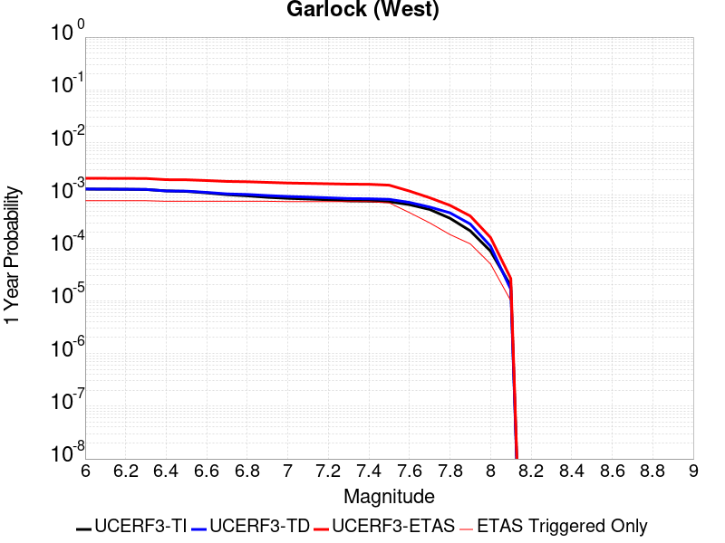 |  |

| Magnitude | 1 wk TI Prob | 1 wk TD Prob | 1 wk ETAS Prob | 1 wk ETAS/TD Gain | 1 wk ETAS Triggered Only | 1 mo TI Prob | 1 mo TD Prob | 1 mo ETAS Prob | 1 mo ETAS/TD Gain | 1 mo ETAS Triggered Only | 1 yr TI Prob | 1 yr TD Prob | 1 yr ETAS Prob | 1 yr ETAS/TD Gain | 1 yr ETAS Triggered Only | 10 yr TI Prob | 10 yr TD Prob | 10 yr ETAS Prob | 10 yr ETAS/TD Gain | 10 yr ETAS Triggered Only |
|-----|-----|-----|-----|-----|-----|-----|-----|-----|-----|-----|-----|-----|-----|-----|-----|-----|-----|-----|-----|-----|
| 6.0 | 2.5181727E-5 | 2.5216661E-5 | 1.1521439E-4 | 4.568979 | 9.0E-5 | 1.0791722E-4 | 1.08066946E-4 | 3.6803886E-4 | 3.405656 | 2.6E-4 | 0.0013131002 | 0.0013149243 | 0.0021038856 | 1.600005 | 7.9E-4 | 0.013053683 | 0.013151911 | 0.014306523 | 1.0877905 | 0.00117 |
| 6.1 | 2.5077732E-5 | 2.5117724E-5 | 1.15115465E-4 | 4.5830374 | 9.0E-5 | 1.0747157E-4 | 1.0764297E-4 | 3.67615E-4 | 3.4151323 | 2.6E-4 | 0.001307681 | 0.0013097686 | 0.002098734 | 1.6023699 | 7.9E-4 | 0.013000126 | 0.013100963 | 0.014255635 | 1.0881364 | 0.00117 |
| 6.2 | 2.494612E-5 | 2.4999388E-5 | 1.14997136E-4 | 4.599998 | 9.0E-5 | 1.0690756E-4 | 1.0713586E-4 | 3.67108E-4 | 3.4265652 | 2.6E-4 | 0.0013008224 | 0.001303602 | 0.0020925722 | 1.6052232 | 7.9E-4 | 0.012932341 | 0.013040021 | 0.014194764 | 1.0885538 | 0.00117 |
| 6.3 | 2.4733758E-5 | 2.4818735E-5 | 1.148165E-4 | 4.6262026 | 9.0E-5 | 1.0599751E-4 | 1.0636169E-4 | 3.6633405E-4 | 3.4442291 | 2.6E-4 | 0.0012897556 | 0.0012941877 | 0.0020831653 | 1.6096315 | 7.9E-4 | 0.012822957 | 0.01294698 | 0.014101832 | 1.0891986 | 0.00117 |
| 6.4 | 2.3237335E-5 | 2.3197908E-5 | 1.1319582E-4 | 4.8795705 | 9.0E-5 | 9.958477E-5 | 9.941583E-5 | 3.5939E-4 | 3.6150177 | 2.6E-4 | 0.0012117702 | 0.0012097185 | 0.001978787 | 1.6357417 | 7.7E-4 | 0.012051838 | 0.012111766 | 0.013247837 | 1.093799 | 0.00115 |
| 6.5 | 2.2732203E-5 | 2.3012379E-5 | 1.13010305E-4 | 4.9108486 | 9.0E-5 | 9.742009E-5 | 9.862077E-5 | 3.5859513E-4 | 3.6361017 | 2.6E-4 | 0.0011854442 | 0.0012000492 | 0.0019691251 | 1.6408703 | 7.7E-4 | 0.011791403 | 0.012016123 | 0.013152305 | 1.0945548 | 0.00115 |
| 6.6 | 2.1319436E-5 | 2.1792415E-5 | 1.11790454E-4 | 5.1297874 | 9.0E-5 | 9.136581E-5 | 9.339274E-5 | 3.5336846E-4 | 3.7836826 | 2.6E-4 | 0.001111811 | 0.0011364657 | 0.0019055906 | 1.6767691 | 7.7E-4 | 0.011062649 | 0.011386949 | 0.012523854 | 1.0998428 | 0.00115 |
| 6.7 | 1.970802E-5 | 2.0412112E-5 | 1.1041027E-4 | 5.409057 | 9.0E-5 | 8.446021E-5 | 8.747755E-5 | 3.474548E-4 | 3.971931 | 2.6E-4 | 0.001027818 | 0.0010645206 | 0.0018337008 | 1.7225603 | 7.7E-4 | 0.010230771 | 0.01067459 | 0.011812314 | 1.1065825 | 0.00115 |
| 6.8 | 1.8744462E-5 | 1.9919653E-5 | 1.0991786E-4 | 5.518061 | 9.0E-5 | 8.033094E-5 | 8.536715E-5 | 3.4534495E-4 | 4.045408 | 2.6E-4 | 9.775903E-4 | 0.0010388512 | 0.0018080513 | 1.7404333 | 7.7E-4 | 0.009733009 | 0.010420324 | 0.011558341 | 1.1092112 | 0.00115 |
| 6.9 | 1.7559682E-5 | 1.8971898E-5 | 1.0897019E-4 | 5.7437687 | 9.0E-5 | 7.5253614E-5 | 8.13056E-5 | 3.4128447E-4 | 4.1975517 | 2.6E-4 | 9.158276E-4 | 9.894476E-4 | 0.0017586858 | 1.777442 | 7.7E-4 | 0.0091206245 | 0.009930745 | 0.011069324 | 1.114652 | 0.00115 |
| 7.0 | 1.6794445E-5 | 1.8234585E-5 | 1.0823294E-4 | 5.935586 | 9.0E-5 | 7.197421E-5 | 7.814589E-5 | 3.3812557E-4 | 4.3268504 | 2.6E-4 | 8.759337E-4 | 9.5101225E-4 | 0.0017102895 | 1.7983885 | 7.6E-4 | 0.008724891 | 0.009549588 | 0.010678701 | 1.1182369 | 0.00114 |
| 7.1 | 1.6337795E-5 | 1.7735292E-5 | 1.0773369E-4 | 6.0745373 | 9.0E-5 | 7.0017246E-5 | 7.600619E-5 | 3.3598643E-4 | 4.420514 | 2.6E-4 | 8.521265E-4 | 9.249838E-4 | 0.0016842808 | 1.820876 | 7.6E-4 | 0.008488664 | 0.009291395 | 0.010420802 | 1.1215541 | 0.00114 |
| 7.2 | 1.5780008E-5 | 1.7183862E-5 | 1.0718231E-4 | 6.2373824 | 9.0E-5 | 6.762685E-5 | 7.364305E-5 | 3.336239E-4 | 4.5302835 | 2.6E-4 | 8.2304585E-4 | 8.962366E-4 | 0.0016555554 | 1.8472303 | 7.6E-4 | 0.008200042 | 0.009006202 | 0.010135935 | 1.1254394 | 0.00114 |
| 7.3 | 1.5058865E-5 | 1.6636799E-5 | 1.066353E-4 | 6.4096045 | 9.0E-5 | 6.45364E-5 | 7.129862E-5 | 3.3128008E-4 | 4.646374 | 2.6E-4 | 7.854473E-4 | 8.6771627E-4 | 0.0016270567 | 1.8751024 | 7.6E-4 | 0.00782677 | 0.008722834 | 0.00985289 | 1.1295514 | 0.00114 |
| 7.4 | 1.4887923E-5 | 1.647271E-5 | 1.0647123E-4 | 6.4634914 | 9.0E-5 | 6.380382E-5 | 7.059543E-5 | 3.3057708E-4 | 4.6826982 | 2.6E-4 | 7.7653467E-4 | 8.591616E-4 | 0.0016185086 | 1.8838233 | 7.6E-4 | 0.0077382675 | 0.008637666 | 0.009767818 | 1.1308401 | 0.00114 |
| 7.5 | 1.4509299E-5 | 1.6064607E-5 | 9.606332E-5 | 5.9798117 | 8.0E-5 | 6.218123E-5 | 6.884651E-5 | 3.188293E-4 | 4.6310163 | 2.5E-4 | 7.567935E-4 | 8.37885E-4 | 0.0015572817 | 1.8585864 | 7.2E-4 | 0.0075422134 | 0.008425911 | 0.009486895 | 1.1259192 | 0.00107 |
| 7.6 | 1.2756717E-5 | 1.4067994E-5 | 6.406729E-5 | 4.554117 | 5.0E-5 | 5.4670498E-5 | 6.029001E-5 | 2.1028097E-4 | 3.4878242 | 1.5E-4 | 6.6541E-4 | 7.3378434E-4 | 0.0012034394 | 1.6400452 | 4.7E-4 | 0.006634211 | 0.0073905406 | 0.008045663 | 1.0886433 | 6.6E-4 |
| 7.7 | 1.0328985E-5 | 1.147664E-5 | 6.1476065E-5 | 5.356626 | 5.0E-5 | 4.4266326E-5 | 4.9184677E-5 | 1.4917976E-4 | 3.0330536 | 1.0E-4 | 5.388092E-4 | 5.986593E-4 | 8.9847966E-4 | 1.5008198 | 3.0E-4 | 0.0053750467 | 0.006046838 | 0.0064444193 | 1.0657502 | 4.0E-4 |
| 7.8 | 7.0306583E-6 | 8.912468E-6 | 3.89122E-5 | 4.366041 | 3.0E-5 | 3.0131043E-5 | 3.8195732E-5 | 8.819382E-5 | 2.308997 | 5.0E-5 | 3.667837E-4 | 4.6493395E-4 | 6.4485025E-4 | 1.3869717 | 1.8E-4 | 0.003661789 | 0.0047019436 | 0.0049607214 | 1.0550363 | 2.6E-4 |
| 7.9 | 4.060633E-6 | 5.4729326E-6 | 1.5472879E-5 | 2.827164 | 1.0E-5 | 1.7402595E-5 | 2.3455215E-5 | 5.345451E-5 | 2.2790031 | 3.0E-5 | 2.11856E-4 | 2.8552994E-4 | 4.0549567E-4 | 1.4201511 | 1.2E-4 | 0.0021165414 | 0.0028881172 | 0.003027713 | 1.0483345 | 1.4E-4 |
| 8.0 | 1.6729537E-6 | 2.0800776E-6 | 1.2080057E-5 | 5.8075027 | 1.0E-5 | 7.169782E-6 | 8.914588E-6 | 2.891441E-5 | 3.2434936 | 2.0E-5 | 8.7288594E-5 | 1.0852974E-4 | 1.5852432E-4 | 1.4606532 | 5.0E-5 | 8.7254314E-4 | 0.0010982669 | 0.0011681902 | 1.0636668 | 7.0E-5 |
| 8.1 | 3.6733252E-7 | 3.1526864E-7 | 3.1526864E-7 | 1.0 | 0.0 | 1.5742813E-6 | 1.3511507E-6 | 1.3511507E-6 | 1.0 | 0.0 | 1.9166706E-5 | 1.645015E-5 | 2.6449987E-5 | 1.6078871 | 1.0E-5 | 1.9165053E-4 | 1.6658098E-4 | 1.7657931E-4 | 1.0600208 | 1.0E-5 |

## Blackwater
*[(top)](#table-of-contents)*

| 1 Week | 1 Month | 1 Year | 10 Year |
|-----|-----|-----|-----|
|  |  | 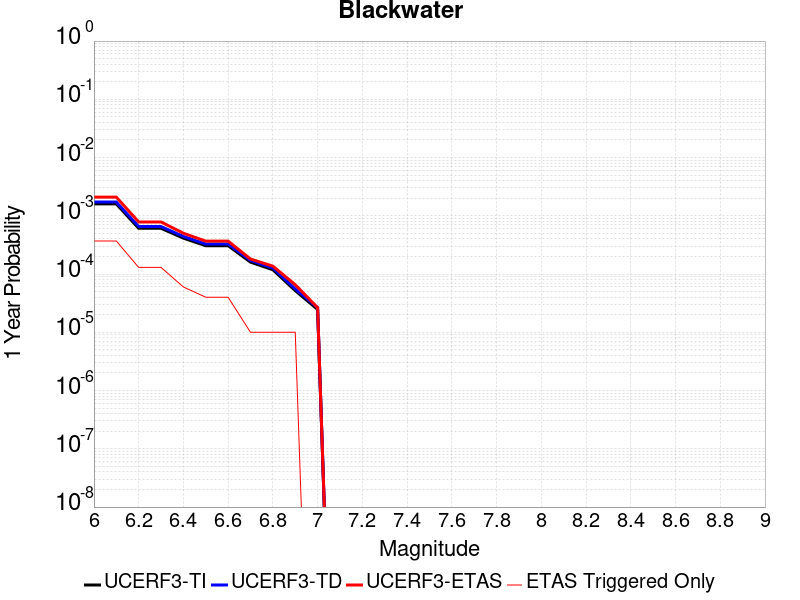 |  |

| Magnitude | 1 wk TI Prob | 1 wk TD Prob | 1 wk ETAS Prob | 1 wk ETAS/TD Gain | 1 wk ETAS Triggered Only | 1 mo TI Prob | 1 mo TD Prob | 1 mo ETAS Prob | 1 mo ETAS/TD Gain | 1 mo ETAS Triggered Only | 1 yr TI Prob | 1 yr TD Prob | 1 yr ETAS Prob | 1 yr ETAS/TD Gain | 1 yr ETAS Triggered Only | 10 yr TI Prob | 10 yr TD Prob | 10 yr ETAS Prob | 10 yr ETAS/TD Gain | 10 yr ETAS Triggered Only |
|-----|-----|-----|-----|-----|-----|-----|-----|-----|-----|-----|-----|-----|-----|-----|-----|-----|-----|-----|-----|-----|
| 6.0 | 3.0708583E-5 | 3.3097214E-5 | 8.309556E-5 | 2.510651 | 5.0E-5 | 1.3160157E-4 | 1.4183826E-4 | 2.6182126E-4 | 1.845914 | 1.2E-4 | 0.0016010714 | 0.0017256497 | 0.0020950113 | 1.214042 | 3.7E-4 | 0.015895851 | 0.017136335 | 0.017794855 | 1.0384282 | 6.7E-4 |
| 6.1 | 3.0708583E-5 | 3.3097214E-5 | 8.309556E-5 | 2.510651 | 5.0E-5 | 1.3160157E-4 | 1.4183826E-4 | 2.6182126E-4 | 1.845914 | 1.2E-4 | 0.0016010714 | 0.0017256497 | 0.0020950113 | 1.214042 | 3.7E-4 | 0.015895851 | 0.017136335 | 0.017794855 | 1.0384282 | 6.7E-4 |
| 6.2 | 1.1707779E-5 | 1.2545598E-5 | 3.2545347E-5 | 2.5941646 | 2.0E-5 | 5.017523E-5 | 5.3765798E-5 | 1.0376311E-4 | 1.9299092 | 5.0E-5 | 6.107122E-4 | 6.5441156E-4 | 7.843265E-4 | 1.1985217 | 1.3E-4 | 0.006090366 | 0.0065258164 | 0.0067940545 | 1.0411041 | 2.7E-4 |
| 6.3 | 1.1707779E-5 | 1.2545598E-5 | 3.2545347E-5 | 2.5941646 | 2.0E-5 | 5.017523E-5 | 5.3765798E-5 | 1.0376311E-4 | 1.9299092 | 5.0E-5 | 6.107122E-4 | 6.5441156E-4 | 7.843265E-4 | 1.1985217 | 1.3E-4 | 0.006090366 | 0.0065258164 | 0.0067940545 | 1.0411041 | 2.7E-4 |
| 6.4 | 7.929244E-6 | 8.4804105E-6 | 1.8480327E-5 | 2.1791782 | 1.0E-5 | 3.3982033E-5 | 3.6344132E-5 | 5.6343408E-5 | 1.5502751 | 2.0E-5 | 4.136527E-4 | 4.4240404E-4 | 5.0237746E-4 | 1.1355627 | 6.0E-5 | 0.0041288356 | 0.0044156383 | 0.00455502 | 1.0315655 | 1.4E-4 |
| 6.5 | 5.8832115E-6 | 6.286219E-6 | 6.286219E-6 | 1.0 | 0.0 | 2.521352E-5 | 2.6940676E-5 | 2.6940676E-5 | 1.0 | 0.0 | 3.0693135E-4 | 3.279559E-4 | 3.679428E-4 | 1.1219276 | 4.0E-5 | 0.0030650778 | 0.0032749726 | 0.0033547105 | 1.0243477 | 8.0E-5 |
| 6.6 | 5.8832115E-6 | 6.286219E-6 | 6.286219E-6 | 1.0 | 0.0 | 2.521352E-5 | 2.6940676E-5 | 2.6940676E-5 | 1.0 | 0.0 | 3.0693135E-4 | 3.279559E-4 | 3.679428E-4 | 1.1219276 | 4.0E-5 | 0.0030650778 | 0.0032749726 | 0.0033547105 | 1.0243477 | 8.0E-5 |
| 6.7 | 3.0715053E-6 | 3.2815851E-6 | 3.2815851E-6 | 1.0 | 0.0 | 1.3163528E-5 | 1.4063868E-5 | 1.4063868E-5 | 1.0 | 0.0 | 1.6025416E-4 | 1.7121529E-4 | 1.8121357E-4 | 1.058396 | 1.0E-5 | 0.0016013865 | 0.0017109484 | 0.0017408971 | 1.0175041 | 3.0E-5 |
| 6.8 | 2.2722281E-6 | 2.4288424E-6 | 2.4288424E-6 | 1.0 | 0.0 | 9.738084E-6 | 1.0409289E-5 | 1.0409289E-5 | 1.0 | 0.0 | 1.1855473E-4 | 1.2672663E-4 | 1.3672537E-4 | 1.0789 | 1.0E-5 | 0.001184915 | 0.0012666339 | 0.0012965959 | 1.0236548 | 3.0E-5 |
| 6.9 | 9.952399E-7 | 1.0653887E-6 | 1.0653887E-6 | 1.0 | 0.0 | 4.265307E-6 | 4.5659463E-6 | 4.5659463E-6 | 1.0 | 0.0 | 5.1928873E-5 | 5.5589495E-5 | 6.558894E-5 | 1.1798801 | 1.0E-5 | 5.191674E-4 | 5.558065E-4 | 5.757954E-4 | 1.0359638 | 2.0E-5 |
| 7.0 | 4.7385504E-7 | 5.075751E-7 | 5.075751E-7 | 1.0 | 0.0 | 2.0308057E-6 | 2.175322E-6 | 2.175322E-6 | 1.0 | 0.0 | 2.4724779E-5 | 2.6484544E-5 | 2.6484544E-5 | 1.0 | 0.0 | 2.4722028E-4 | 2.6484544E-4 | 2.6484544E-4 | 1.0 | 0.0 |

## Ash Hill
*[(top)](#table-of-contents)*

| 1 Week | 1 Month | 1 Year | 10 Year |
|-----|-----|-----|-----|
|  |  |  | 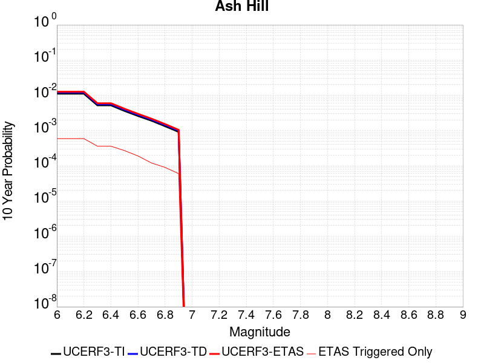 |

| Magnitude | 1 wk TI Prob | 1 wk TD Prob | 1 wk ETAS Prob | 1 wk ETAS/TD Gain | 1 wk ETAS Triggered Only | 1 mo TI Prob | 1 mo TD Prob | 1 mo ETAS Prob | 1 mo ETAS/TD Gain | 1 mo ETAS Triggered Only | 1 yr TI Prob | 1 yr TD Prob | 1 yr ETAS Prob | 1 yr ETAS/TD Gain | 1 yr ETAS Triggered Only | 10 yr TI Prob | 10 yr TD Prob | 10 yr ETAS Prob | 10 yr ETAS/TD Gain | 10 yr ETAS Triggered Only |
|-----|-----|-----|-----|-----|-----|-----|-----|-----|-----|-----|-----|-----|-----|-----|-----|-----|-----|-----|-----|-----|
| 6.0 | 2.1545662E-5 | 2.3195389E-5 | 5.3194693E-5 | 2.2933304 | 3.0E-5 | 9.2335285E-5 | 9.940547E-5 | 1.9939554E-4 | 2.0058808 | 1.0E-4 | 0.0011236023 | 0.0012096697 | 0.0015592463 | 1.2889851 | 3.5E-4 | 0.011179381 | 0.012038835 | 0.012621732 | 1.048418 | 5.9E-4 |
| 6.1 | 2.1545662E-5 | 2.3195389E-5 | 5.3194693E-5 | 2.2933304 | 3.0E-5 | 9.2335285E-5 | 9.940547E-5 | 1.9939554E-4 | 2.0058808 | 1.0E-4 | 0.0011236023 | 0.0012096697 | 0.0015592463 | 1.2889851 | 3.5E-4 | 0.011179381 | 0.012038835 | 0.012621732 | 1.048418 | 5.9E-4 |
| 6.2 | 2.1545662E-5 | 2.3195389E-5 | 5.3194693E-5 | 2.2933304 | 3.0E-5 | 9.2335285E-5 | 9.940547E-5 | 1.9939554E-4 | 2.0058808 | 1.0E-4 | 0.0011236023 | 0.0012096697 | 0.0015592463 | 1.2889851 | 3.5E-4 | 0.011179381 | 0.012038835 | 0.012621732 | 1.048418 | 5.9E-4 |
| 6.3 | 1.0025529E-5 | 1.0747344E-5 | 4.074702E-5 | 3.7913573 | 3.0E-5 | 4.2965847E-5 | 4.605931E-5 | 1.16056086E-4 | 2.5197096 | 7.0E-5 | 5.229836E-4 | 5.6064106E-4 | 7.905121E-4 | 1.4100146 | 2.3E-4 | 0.005217545 | 0.0055935793 | 0.0059515657 | 1.0639995 | 3.6E-4 |
| 6.4 | 1.0025529E-5 | 1.0747344E-5 | 4.074702E-5 | 3.7913573 | 3.0E-5 | 4.2965847E-5 | 4.605931E-5 | 1.16056086E-4 | 2.5197096 | 7.0E-5 | 5.229836E-4 | 5.6064106E-4 | 7.905121E-4 | 1.4100146 | 2.3E-4 | 0.005217545 | 0.0055935793 | 0.0059515657 | 1.0639995 | 3.6E-4 |
| 6.5 | 6.9617327E-6 | 7.4569152E-6 | 3.745669E-5 | 5.0230813 | 3.0E-5 | 2.9835655E-5 | 3.1957865E-5 | 1.0195563E-4 | 3.190314 | 7.0E-5 | 3.6318856E-4 | 3.8902622E-4 | 5.689562E-4 | 1.4625138 | 1.8E-4 | 0.0036259557 | 0.0038843066 | 0.0041532577 | 1.0692405 | 2.7E-4 |
| 6.6 | 4.9919777E-6 | 5.34689E-6 | 2.5346782E-5 | 4.7404723 | 2.0E-5 | 2.1394015E-5 | 2.291508E-5 | 7.2913936E-5 | 3.1819193 | 5.0E-5 | 2.60441E-4 | 2.7896208E-4 | 3.989286E-4 | 1.430046 | 1.2E-4 | 0.0026013597 | 0.0027867774 | 0.002976248 | 1.0679891 | 1.9E-4 |
| 6.7 | 3.6630722E-6 | 3.9247725E-6 | 1.3924733E-5 | 3.5479085 | 1.0E-5 | 1.5698786E-5 | 1.6820377E-5 | 4.681987E-5 | 2.783521 | 3.0E-5 | 1.9111596E-4 | 2.0477458E-4 | 2.847582E-4 | 1.3905935 | 8.0E-5 | 0.0019095168 | 0.002046422 | 0.0021661764 | 1.0585189 | 1.2E-4 |
| 6.8 | 2.5599613E-6 | 2.7450303E-6 | 1.2745003E-5 | 4.642937 | 1.0E-5 | 1.0971216E-5 | 1.176439E-5 | 3.1764153E-5 | 2.7000256 | 2.0E-5 | 1.3356637E-4 | 1.4322698E-4 | 2.032184E-4 | 1.4188554 | 6.0E-5 | 0.0013348613 | 0.0014318317 | 0.0015217029 | 1.0627666 | 9.0E-5 |
| 6.9 | 1.7684905E-6 | 1.8969438E-6 | 1.1896925E-5 | 6.2716274 | 1.0E-5 | 7.579223E-6 | 8.129759E-6 | 1.8129678E-5 | 2.2300386 | 1.0E-5 | 9.2273134E-5 | 9.897981E-5 | 1.4897487E-4 | 1.5051035 | 5.0E-5 | 9.223483E-4 | 9.897981E-4 | 0.0010497387 | 1.0605584 | 6.0E-5 |

## San Andreas (Mojave S)
*[(top)](#table-of-contents)*

| 1 Week | 1 Month | 1 Year | 10 Year |
|-----|-----|-----|-----|
|  |  |  |  |

| Magnitude | 1 wk TI Prob | 1 wk TD Prob | 1 wk ETAS Prob | 1 wk ETAS/TD Gain | 1 wk ETAS Triggered Only | 1 mo TI Prob | 1 mo TD Prob | 1 mo ETAS Prob | 1 mo ETAS/TD Gain | 1 mo ETAS Triggered Only | 1 yr TI Prob | 1 yr TD Prob | 1 yr ETAS Prob | 1 yr ETAS/TD Gain | 1 yr ETAS Triggered Only | 10 yr TI Prob | 10 yr TD Prob | 10 yr ETAS Prob | 10 yr ETAS/TD Gain | 10 yr ETAS Triggered Only |
|-----|-----|-----|-----|-----|-----|-----|-----|-----|-----|-----|-----|-----|-----|-----|-----|-----|-----|-----|-----|-----|
| 6.0 | 3.1064058E-4 | 6.7499664E-4 | 7.5494265E-4 | 1.1184391 | 8.0E-5 | 0.0013306376 | 0.0028897638 | 0.003009417 | 1.0414059 | 1.2E-4 | 0.016080605 | 0.034641396 | 0.03499858 | 1.0103109 | 3.7E-4 | 0.1496549 | 0.2867374 | 0.2870869 | 1.0012189 | 4.9E-4 |
| 6.1 | 3.1064058E-4 | 6.7499664E-4 | 7.5494265E-4 | 1.1184391 | 8.0E-5 | 0.0013306376 | 0.0028897638 | 0.003009417 | 1.0414059 | 1.2E-4 | 0.016080605 | 0.034641396 | 0.03499858 | 1.0103109 | 3.7E-4 | 0.1496549 | 0.2867374 | 0.2870869 | 1.0012189 | 4.9E-4 |
| 6.2 | 3.1064058E-4 | 6.7499664E-4 | 7.5494265E-4 | 1.1184391 | 8.0E-5 | 0.0013306376 | 0.0028897638 | 0.003009417 | 1.0414059 | 1.2E-4 | 0.016080605 | 0.034641396 | 0.03499858 | 1.0103109 | 3.7E-4 | 0.1496549 | 0.2867374 | 0.2870869 | 1.0012189 | 4.9E-4 |
| 6.3 | 3.1064058E-4 | 6.7499664E-4 | 7.5494265E-4 | 1.1184391 | 8.0E-5 | 0.0013306376 | 0.0028897638 | 0.003009417 | 1.0414059 | 1.2E-4 | 0.016080605 | 0.034641396 | 0.03499858 | 1.0103109 | 3.7E-4 | 0.1496549 | 0.2867374 | 0.2870869 | 1.0012189 | 4.9E-4 |
| 6.4 | 1.9872203E-4 | 4.3216298E-4 | 5.0213275E-4 | 1.1619059 | 7.0E-5 | 8.5138786E-4 | 0.0018508406 | 0.001960637 | 1.0593225 | 1.1E-4 | 0.010316478 | 0.022307295 | 0.02263971 | 1.0149016 | 3.4E-4 | 0.098504856 | 0.19713911 | 0.19750041 | 1.0018326 | 4.5E-4 |
| 6.5 | 1.291105E-4 | 2.8787713E-4 | 3.3786276E-4 | 1.1736352 | 5.0E-5 | 5.5321335E-4 | 0.0012331787 | 0.00131308 | 1.064793 | 8.0E-5 | 0.006714592 | 0.014911419 | 0.015177392 | 1.0178369 | 2.7E-4 | 0.065152965 | 0.13817947 | 0.13848972 | 1.0022453 | 3.6E-4 |
| 6.6 | 1.291105E-4 | 2.8787713E-4 | 3.3786276E-4 | 1.1736352 | 5.0E-5 | 5.5321335E-4 | 0.0012331787 | 0.00131308 | 1.064793 | 8.0E-5 | 0.006714592 | 0.014911419 | 0.015177392 | 1.0178369 | 2.7E-4 | 0.065152965 | 0.13817947 | 0.13848972 | 1.0022453 | 3.6E-4 |
| 6.7 | 1.08001186E-4 | 2.4368397E-4 | 2.936718E-4 | 1.2051338 | 5.0E-5 | 4.6278012E-4 | 0.0010439424 | 0.001123859 | 1.0765526 | 8.0E-5 | 0.0056198016 | 0.012636229 | 0.012902817 | 1.0210972 | 2.7E-4 | 0.054797906 | 0.119323194 | 0.11964024 | 1.002657 | 3.6E-4 |
| 6.8 | 1.0624356E-4 | 2.3885963E-4 | 2.888477E-4 | 1.209278 | 5.0E-5 | 4.5525006E-4 | 0.001023283 | 0.0011032012 | 1.0780997 | 8.0E-5 | 0.0055285925 | 0.012387579 | 0.012654235 | 1.021526 | 2.7E-4 | 0.053930566 | 0.11727233 | 0.117590114 | 1.0027097 | 3.6E-4 |
| 6.9 | 1.0393785E-4 | 2.3256175E-4 | 2.825501E-4 | 1.2149466 | 5.0E-5 | 4.4537184E-4 | 9.963129E-4 | 0.0010762332 | 1.080216 | 8.0E-5 | 0.0054089287 | 0.012062895 | 0.012329638 | 1.0221127 | 2.7E-4 | 0.05279156 | 0.114569746 | 0.114888504 | 1.0027822 | 3.6E-4 |
| 7.0 | 1.0155622E-4 | 2.262555E-4 | 2.762442E-4 | 1.220939 | 5.0E-5 | 4.3516833E-4 | 9.693065E-4 | 0.001049229 | 1.0824533 | 8.0E-5 | 0.005285311 | 0.011737675 | 0.012004506 | 1.0227329 | 2.7E-4 | 0.05161361 | 0.11182977 | 0.112149514 | 1.0028592 | 3.6E-4 |
| 7.1 | 9.885595E-5 | 2.191377E-4 | 2.6912676E-4 | 1.228117 | 5.0E-5 | 4.2359953E-4 | 9.388239E-4 | 0.0010187487 | 1.085133 | 8.0E-5 | 0.0051451353 | 0.011370476 | 0.011637406 | 1.0234758 | 2.7E-4 | 0.05027629 | 0.10871404 | 0.109034896 | 1.0029514 | 3.6E-4 |
| 7.2 | 9.6411415E-5 | 2.1276584E-4 | 2.627552E-4 | 1.2349502 | 5.0E-5 | 4.1312634E-4 | 9.115353E-4 | 9.914624E-4 | 1.087684 | 8.0E-5 | 0.005018219 | 0.0110416515 | 0.01130867 | 1.0241829 | 2.7E-4 | 0.049064007 | 0.10590357 | 0.106225446 | 1.0030394 | 3.6E-4 |
| 7.3 | 9.1180635E-5 | 1.950402E-4 | 2.4503045E-4 | 1.2563074 | 5.0E-5 | 3.907156E-4 | 8.356189E-4 | 9.15552E-4 | 1.0956575 | 8.0E-5 | 0.004746591 | 0.010126315 | 0.01039358 | 1.0263932 | 2.7E-4 | 0.046464786 | 0.09809433 | 0.09841902 | 1.00331 | 3.6E-4 |
| 7.4 | 8.887388E-5 | 1.8752231E-4 | 2.3751293E-4 | 1.266585 | 5.0E-5 | 3.8083247E-4 | 8.0341956E-4 | 8.833553E-4 | 1.0994943 | 8.0E-5 | 0.0046267817 | 0.00973786 | 0.010005231 | 1.0274569 | 2.7E-4 | 0.045316286 | 0.09472819 | 0.09505408 | 1.0034404 | 3.6E-4 |
| 7.5 | 8.6750515E-5 | 1.8083451E-4 | 2.3082548E-4 | 1.2764459 | 5.0E-5 | 3.7173493E-4 | 7.7477493E-4 | 8.5471297E-4 | 1.1031758 | 8.0E-5 | 0.004516484 | 0.009392173 | 0.009659637 | 1.0284773 | 2.7E-4 | 0.04425787 | 0.09169095 | 0.09201794 | 1.0035663 | 3.6E-4 |
| 7.6 | 8.453092E-5 | 1.747065E-4 | 2.2469775E-4 | 1.2861443 | 5.0E-5 | 3.6222505E-4 | 7.485273E-4 | 8.284674E-4 | 1.1067965 | 8.0E-5 | 0.0044011753 | 0.009075315 | 0.009342864 | 1.029481 | 2.7E-4 | 0.04315024 | 0.08884873 | 0.089176744 | 1.0036918 | 3.6E-4 |
| 7.7 | 8.259102E-5 | 1.6992437E-4 | 2.1991588E-4 | 1.2941985 | 5.0E-5 | 3.539135E-4 | 7.280441E-4 | 8.0798584E-4 | 1.1098034 | 8.0E-5 | 0.004300386 | 0.008827981 | 0.009095597 | 1.0303146 | 2.7E-4 | 0.042181134 | 0.08659836 | 0.08692718 | 1.0037972 | 3.6E-4 |
| 7.8 | 7.444844E-5 | 1.531194E-4 | 1.8311481E-4 | 1.1958956 | 3.0E-5 | 3.1902574E-4 | 6.56061E-4 | 7.060282E-4 | 1.0761625 | 5.0E-5 | 0.0038772223 | 0.007958339 | 0.008156747 | 1.0249308 | 2.0E-4 | 0.03810269 | 0.07841811 | 0.07867616 | 1.0032907 | 2.8E-4 |
| 7.9 | 5.2586525E-5 | 1.0025827E-4 | 1.10257264E-4 | 1.0997324 | 1.0E-5 | 2.2535135E-4 | 4.2960755E-4 | 4.5959465E-4 | 1.0698012 | 3.0E-5 | 0.0027402006 | 0.005217939 | 0.0053472607 | 1.0247841 | 1.3E-4 | 0.027066574 | 0.052290585 | 0.05243274 | 1.0027186 | 1.5E-4 |
| 8.0 | 3.379877E-5 | 5.418614E-5 | 6.41856E-5 | 1.1845391 | 1.0E-5 | 1.4484383E-4 | 2.3220567E-4 | 2.5220102E-4 | 1.0861106 | 2.0E-5 | 0.0017620471 | 0.0028234406 | 0.0028832713 | 1.0211906 | 6.0E-5 | 0.017481409 | 0.028889727 | 0.028967416 | 1.0026891 | 8.0E-5 |
| 8.1 | 1.8668277E-5 | 1.936222E-5 | 1.936222E-5 | 1.0 | 0.0 | 8.000444E-5 | 8.29783E-5 | 8.29783E-5 | 1.0 | 0.0 | 9.736188E-4 | 0.0010097933 | 0.0010197832 | 1.0098931 | 1.0E-5 | 0.009693642 | 0.010826511 | 0.010836403 | 1.0009136 | 1.0E-5 |
| 8.2 | 8.541571E-6 | 5.4811067E-6 | 5.4811067E-6 | 1.0 | 0.0 | 3.660622E-5 | 2.3490245E-5 | 2.3490245E-5 | 1.0 | 0.0 | 4.455896E-4 | 2.8595628E-4 | 2.8595628E-4 | 1.0 | 0.0 | 0.0044469717 | 0.0032518986 | 0.0032518986 | 1.0 | 0.0 |
| 8.3 | 1.983087E-6 | 7.693574E-7 | 7.693574E-7 | 1.0 | 0.0 | 8.498917E-6 | 3.297242E-6 | 3.297242E-6 | 1.0 | 0.0 | 1.034694E-4 | 4.01432E-5 | 4.01432E-5 | 1.0 | 0.0 | 0.0010342124 | 4.7390026E-4 | 4.7390026E-4 | 1.0 | 0.0 |

## San Andreas (Mojave N)
*[(top)](#table-of-contents)*

| 1 Week | 1 Month | 1 Year | 10 Year |
|-----|-----|-----|-----|
| 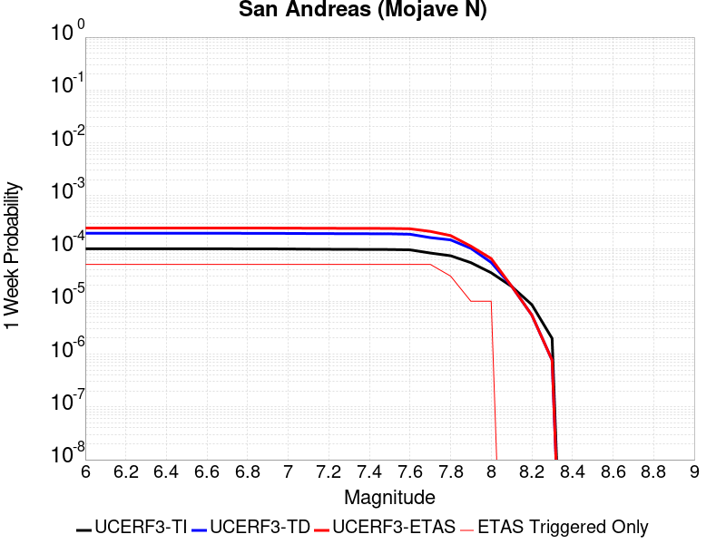 |  |  | 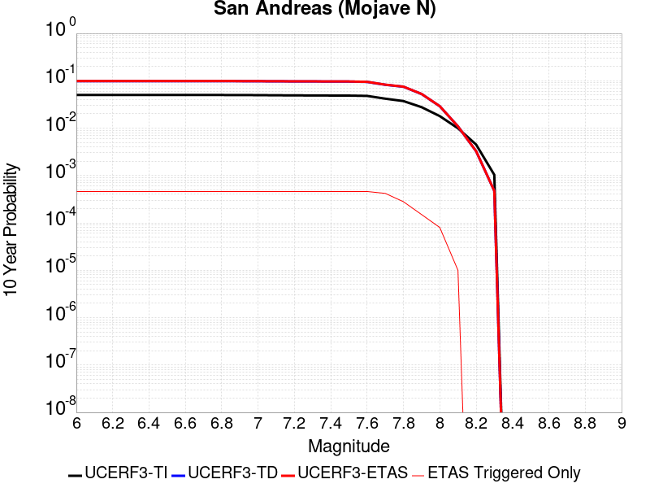 |

| Magnitude | 1 wk TI Prob | 1 wk TD Prob | 1 wk ETAS Prob | 1 wk ETAS/TD Gain | 1 wk ETAS Triggered Only | 1 mo TI Prob | 1 mo TD Prob | 1 mo ETAS Prob | 1 mo ETAS/TD Gain | 1 mo ETAS Triggered Only | 1 yr TI Prob | 1 yr TD Prob | 1 yr ETAS Prob | 1 yr ETAS/TD Gain | 1 yr ETAS Triggered Only | 10 yr TI Prob | 10 yr TD Prob | 10 yr ETAS Prob | 10 yr ETAS/TD Gain | 10 yr ETAS Triggered Only |
|-----|-----|-----|-----|-----|-----|-----|-----|-----|-----|-----|-----|-----|-----|-----|-----|-----|-----|-----|-----|-----|
| 6.0 | 9.877682E-5 | 1.9435467E-4 | 2.4434493E-4 | 1.2572117 | 5.0E-5 | 4.2326056E-4 | 8.326828E-4 | 9.325996E-4 | 1.1199937 | 1.0E-4 | 0.0051410277 | 0.010090916 | 0.010427485 | 1.0333537 | 3.4E-4 | 0.05023708 | 0.09846656 | 0.09888127 | 1.0042117 | 4.6E-4 |
| 6.1 | 9.877682E-5 | 1.9435467E-4 | 2.4434493E-4 | 1.2572117 | 5.0E-5 | 4.2326056E-4 | 8.326828E-4 | 9.325996E-4 | 1.1199937 | 1.0E-4 | 0.0051410277 | 0.010090916 | 0.010427485 | 1.0333537 | 3.4E-4 | 0.05023708 | 0.09846656 | 0.09888127 | 1.0042117 | 4.6E-4 |
| 6.2 | 9.877682E-5 | 1.9435467E-4 | 2.4434493E-4 | 1.2572117 | 5.0E-5 | 4.2326056E-4 | 8.326828E-4 | 9.325996E-4 | 1.1199937 | 1.0E-4 | 0.0051410277 | 0.010090916 | 0.010427485 | 1.0333537 | 3.4E-4 | 0.05023708 | 0.09846656 | 0.09888127 | 1.0042117 | 4.6E-4 |
| 6.3 | 9.877682E-5 | 1.9435467E-4 | 2.4434493E-4 | 1.2572117 | 5.0E-5 | 4.2326056E-4 | 8.326828E-4 | 9.325996E-4 | 1.1199937 | 1.0E-4 | 0.0051410277 | 0.010090916 | 0.010427485 | 1.0333537 | 3.4E-4 | 0.05023708 | 0.09846656 | 0.09888127 | 1.0042117 | 4.6E-4 |
| 6.4 | 9.877682E-5 | 1.9435467E-4 | 2.4434493E-4 | 1.2572117 | 5.0E-5 | 4.2326056E-4 | 8.326828E-4 | 9.325996E-4 | 1.1199937 | 1.0E-4 | 0.0051410277 | 0.010090916 | 0.010427485 | 1.0333537 | 3.4E-4 | 0.05023708 | 0.09846656 | 0.09888127 | 1.0042117 | 4.6E-4 |
| 6.5 | 9.861474E-5 | 1.9409222E-4 | 2.4408252E-4 | 1.2575595 | 5.0E-5 | 4.2256617E-4 | 8.3155883E-4 | 9.3147566E-4 | 1.120156 | 1.0E-4 | 0.0051326132 | 0.010077358 | 0.010413932 | 1.033399 | 3.4E-4 | 0.050156746 | 0.09834433 | 0.09875909 | 1.0042174 | 4.6E-4 |
| 6.6 | 9.861474E-5 | 1.9409222E-4 | 2.4408252E-4 | 1.2575595 | 5.0E-5 | 4.2256617E-4 | 8.3155883E-4 | 9.3147566E-4 | 1.120156 | 1.0E-4 | 0.0051326132 | 0.010077358 | 0.010413932 | 1.033399 | 3.4E-4 | 0.050156746 | 0.09834433 | 0.09875909 | 1.0042174 | 4.6E-4 |
| 6.7 | 9.8552715E-5 | 1.9399171E-4 | 2.4398201E-4 | 1.2576929 | 5.0E-5 | 4.223004E-4 | 8.3112833E-4 | 9.310452E-4 | 1.1202184 | 1.0E-4 | 0.0051293927 | 0.010072165 | 0.0104087405 | 1.0334164 | 3.4E-4 | 0.050125998 | 0.09829751 | 0.098712295 | 1.0042197 | 4.6E-4 |
| 6.8 | 9.8464974E-5 | 1.9384324E-4 | 2.4383355E-4 | 1.2578903 | 5.0E-5 | 4.219245E-4 | 8.304924E-4 | 9.3040935E-4 | 1.1203105 | 1.0E-4 | 0.0051248376 | 0.010064495 | 0.010401073 | 1.0334421 | 3.4E-4 | 0.05008251 | 0.0982275 | 0.09864232 | 1.004223 | 4.6E-4 |
| 6.9 | 9.825824E-5 | 1.9352314E-4 | 2.4351347E-4 | 1.258317 | 5.0E-5 | 4.2103877E-4 | 8.2912145E-4 | 9.2903856E-4 | 1.1205096 | 1.0E-4 | 0.0051141046 | 0.010047957 | 0.010384541 | 1.0334977 | 3.4E-4 | 0.049980022 | 0.098076545 | 0.09849142 | 1.0042303 | 4.6E-4 |
| 7.0 | 9.781462E-5 | 1.928364E-4 | 2.4282676E-4 | 1.2592372 | 5.0E-5 | 4.1913814E-4 | 8.2618016E-4 | 9.2609756E-4 | 1.120939 | 1.0E-4 | 0.005091073 | 0.010012477 | 0.0103490725 | 1.0336176 | 3.4E-4 | 0.04976007 | 0.0977528 | 0.09816784 | 1.0042458 | 4.6E-4 |
| 7.1 | 9.7121134E-5 | 1.9185297E-4 | 2.4184339E-4 | 1.2605662 | 5.0E-5 | 4.1616702E-4 | 8.2196813E-4 | 9.2188595E-4 | 1.1215593 | 1.0E-4 | 0.005055068 | 0.009961666 | 0.010298278 | 1.0337908 | 3.4E-4 | 0.04941613 | 0.09728914 | 0.09770439 | 1.0042682 | 4.6E-4 |
| 7.2 | 9.663819E-5 | 1.9116043E-4 | 2.4115088E-4 | 1.2615104 | 5.0E-5 | 4.1409794E-4 | 8.19002E-4 | 9.189201E-4 | 1.1219999 | 1.0E-4 | 0.0050299936 | 0.009925882 | 0.010262507 | 1.0339139 | 3.4E-4 | 0.049176537 | 0.09696228 | 0.09737768 | 1.0042841 | 4.6E-4 |
| 7.3 | 9.6277574E-5 | 1.9068507E-4 | 2.4067554E-4 | 1.2621624 | 5.0E-5 | 4.125529E-4 | 8.16966E-4 | 9.168843E-4 | 1.1223041 | 1.0E-4 | 0.0050112694 | 0.00990132 | 0.010237953 | 1.0339988 | 3.4E-4 | 0.04899759 | 0.09673555 | 0.097151056 | 1.0042952 | 4.6E-4 |
| 7.4 | 9.593308E-5 | 1.9008234E-4 | 2.4007284E-4 | 1.2629939 | 5.0E-5 | 4.1107697E-4 | 8.1438443E-4 | 9.14303E-4 | 1.1226921 | 1.0E-4 | 0.0049933824 | 0.009870174 | 0.010206819 | 1.0341072 | 3.4E-4 | 0.04882661 | 0.09645354 | 0.09686918 | 1.0043092 | 4.6E-4 |
| 7.5 | 9.561707E-5 | 1.8954265E-4 | 2.3953318E-4 | 1.2637428 | 5.0E-5 | 4.0972308E-4 | 8.12073E-4 | 9.1199175E-4 | 1.1230416 | 1.0E-4 | 0.0049769743 | 0.009842287 | 0.01017894 | 1.0342048 | 3.4E-4 | 0.048669744 | 0.09619955 | 0.0966153 | 1.0043217 | 4.6E-4 |
| 7.6 | 9.418194E-5 | 1.8606246E-4 | 2.3605315E-4 | 1.268677 | 5.0E-5 | 4.0357444E-4 | 7.97167E-4 | 8.9708733E-4 | 1.1253443 | 1.0E-4 | 0.004902454 | 0.00966243 | 0.009999145 | 1.0348479 | 3.4E-4 | 0.047957025 | 0.09458092 | 0.09499741 | 1.0044036 | 4.6E-4 |
| 7.7 | 8.202141E-5 | 1.6052493E-4 | 2.105169E-4 | 1.3114281 | 5.0E-5 | 3.51473E-4 | 6.877826E-4 | 7.877138E-4 | 1.1452948 | 1.0E-4 | 0.00427079 | 0.00834166 | 0.00865899 | 1.0380417 | 3.2E-4 | 0.04189639 | 0.082371704 | 0.08275711 | 1.0046788 | 4.2E-4 |
| 7.8 | 7.2859846E-5 | 1.4544492E-4 | 1.7544057E-4 | 1.2062336 | 3.0E-5 | 3.1221908E-4 | 6.231865E-4 | 6.7315536E-4 | 1.0801828 | 5.0E-5 | 0.003794643 | 0.0075609423 | 0.0077594304 | 1.0262517 | 2.0E-4 | 0.037304975 | 0.07485102 | 0.07511006 | 1.0034608 | 2.8E-4 |
| 7.9 | 5.3874453E-5 | 1.0065284E-4 | 1.1065183E-4 | 1.0993414 | 1.0E-5 | 2.3087008E-4 | 4.3129802E-4 | 4.6128506E-4 | 1.0695275 | 3.0E-5 | 0.0028072202 | 0.0052384217 | 0.0053677405 | 1.0246867 | 1.3E-4 | 0.02772022 | 0.05251603 | 0.05265815 | 1.0027063 | 1.5E-4 |
| 8.0 | 3.468538E-5 | 5.4373286E-5 | 6.437274E-5 | 1.1839038 | 1.0E-5 | 1.4864317E-4 | 2.3300757E-4 | 2.5300292E-4 | 1.0858141 | 2.0E-5 | 0.0018082283 | 0.0028331785 | 0.0028930085 | 1.0211177 | 6.0E-5 | 0.017935853 | 0.02900292 | 0.0290806 | 1.0026784 | 8.0E-5 |
| 8.1 | 1.9152367E-5 | 1.9455974E-5 | 1.9455974E-5 | 1.0 | 0.0 | 8.207899E-5 | 8.338009E-5 | 8.338009E-5 | 1.0 | 0.0 | 9.988535E-4 | 0.0010146805 | 0.0010246703 | 1.0098454 | 1.0E-5 | 0.009943757 | 0.010884172 | 0.010894063 | 1.0009087 | 1.0E-5 |
| 8.2 | 8.643924E-6 | 5.49522E-6 | 5.49522E-6 | 1.0 | 0.0 | 3.704486E-5 | 2.355073E-5 | 2.355073E-5 | 1.0 | 0.0 | 4.5092785E-4 | 2.866925E-4 | 2.866925E-4 | 1.0 | 0.0 | 0.0045001395 | 0.0032598388 | 0.0032598388 | 1.0 | 0.0 |
| 8.3 | 1.983087E-6 | 7.693574E-7 | 7.693574E-7 | 1.0 | 0.0 | 8.498917E-6 | 3.297242E-6 | 3.297242E-6 | 1.0 | 0.0 | 1.034694E-4 | 4.01432E-5 | 4.01432E-5 | 1.0 | 0.0 | 0.0010342124 | 4.7390026E-4 | 4.7390026E-4 | 1.0 | 0.0 |

## Gravel Hills-Harper Lk
*[(top)](#table-of-contents)*

| 1 Week | 1 Month | 1 Year | 10 Year |
|-----|-----|-----|-----|
|  | 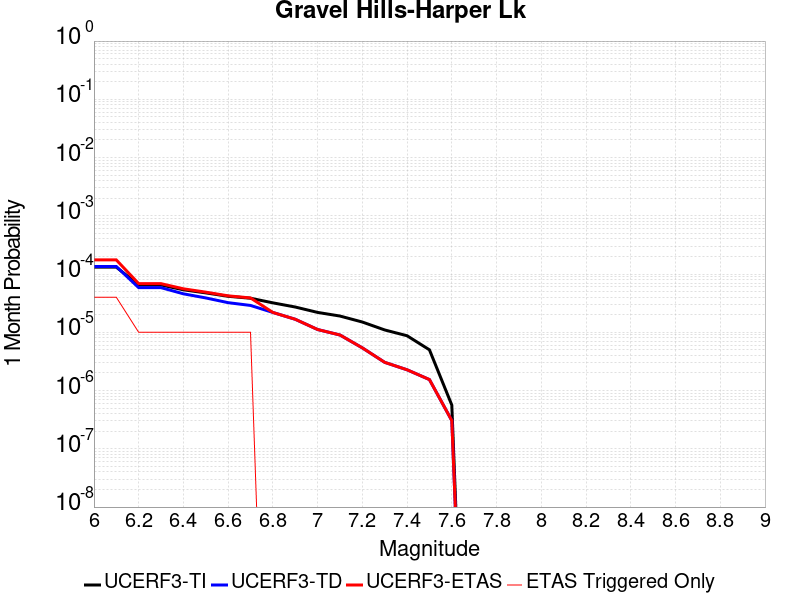 |  |  |

| Magnitude | 1 wk TI Prob | 1 wk TD Prob | 1 wk ETAS Prob | 1 wk ETAS/TD Gain | 1 wk ETAS Triggered Only | 1 mo TI Prob | 1 mo TD Prob | 1 mo ETAS Prob | 1 mo ETAS/TD Gain | 1 mo ETAS Triggered Only | 1 yr TI Prob | 1 yr TD Prob | 1 yr ETAS Prob | 1 yr ETAS/TD Gain | 1 yr ETAS Triggered Only | 10 yr TI Prob | 10 yr TD Prob | 10 yr ETAS Prob | 10 yr ETAS/TD Gain | 10 yr ETAS Triggered Only |
|-----|-----|-----|-----|-----|-----|-----|-----|-----|-----|-----|-----|-----|-----|-----|-----|-----|-----|-----|-----|-----|
| 6.0 | 3.0679566E-5 | 3.1466803E-5 | 5.1466173E-5 | 1.6355705 | 2.0E-5 | 1.3147724E-4 | 1.3485197E-4 | 1.7484659E-4 | 1.2965815 | 4.0E-5 | 0.0015995599 | 0.0016408027 | 0.0018604418 | 1.1338607 | 2.2E-4 | 0.015880952 | 0.01630845 | 0.016682252 | 1.0229208 | 3.8E-4 |
| 6.1 | 3.0679566E-5 | 3.1466803E-5 | 5.1466173E-5 | 1.6355705 | 2.0E-5 | 1.3147724E-4 | 1.3485197E-4 | 1.7484659E-4 | 1.2965815 | 4.0E-5 | 0.0015995599 | 0.0016408027 | 0.0018604418 | 1.1338607 | 2.2E-4 | 0.015880952 | 0.01630845 | 0.016682252 | 1.0229208 | 3.8E-4 |
| 6.2 | 1.514536E-5 | 1.363595E-5 | 1.363595E-5 | 1.0 | 0.0 | 6.490707E-5 | 5.8438545E-5 | 6.843796E-5 | 1.1711099 | 1.0E-5 | 7.8995706E-4 | 7.112689E-4 | 7.7122624E-4 | 1.0842962 | 6.0E-5 | 0.007871548 | 0.007091126 | 0.0071904166 | 1.0140021 | 1.0E-4 |
| 6.3 | 1.514536E-5 | 1.363595E-5 | 1.363595E-5 | 1.0 | 0.0 | 6.490707E-5 | 5.8438545E-5 | 6.843796E-5 | 1.1711099 | 1.0E-5 | 7.8995706E-4 | 7.112689E-4 | 7.7122624E-4 | 1.0842962 | 6.0E-5 | 0.007871548 | 0.007091126 | 0.0071904166 | 1.0140021 | 1.0E-4 |
| 6.4 | 1.2532521E-5 | 1.0690234E-5 | 1.0690234E-5 | 1.0 | 0.0 | 5.37097E-5 | 4.5814515E-5 | 5.581406E-5 | 1.2182615 | 1.0E-5 | 6.537194E-4 | 5.576548E-4 | 5.776437E-4 | 1.0358444 | 2.0E-5 | 0.0065179965 | 0.0055631446 | 0.005622811 | 1.0107253 | 6.0E-5 |
| 6.5 | 1.1094058E-5 | 9.084107E-6 | 9.084107E-6 | 1.0 | 0.0 | 4.7545094E-5 | 3.8931328E-5 | 4.893094E-5 | 1.2568525 | 1.0E-5 | 5.787078E-4 | 4.7388987E-4 | 4.938804E-4 | 1.0421839 | 2.0E-5 | 0.0057720304 | 0.004729201 | 0.0047789644 | 1.0105226 | 5.0E-5 |
| 6.6 | 9.688328E-6 | 7.5320527E-6 | 7.5320527E-6 | 1.0 | 0.0 | 4.1520743E-5 | 3.227984E-5 | 4.2279516E-5 | 1.3097808 | 1.0E-5 | 5.053978E-4 | 3.9293873E-4 | 4.1293088E-4 | 1.0508785 | 2.0E-5 | 0.0050424994 | 0.003922696 | 0.0039525786 | 1.0076178 | 3.0E-5 |
| 6.7 | 8.974824E-6 | 6.7497303E-6 | 6.7497303E-6 | 1.0 | 0.0 | 3.8462964E-5 | 2.8927108E-5 | 3.8926817E-5 | 1.3456866 | 1.0E-5 | 4.6818596E-4 | 3.5213283E-4 | 3.621293E-4 | 1.0283884 | 1.0E-5 | 0.004672008 | 0.0035159695 | 0.0035358993 | 1.0056683 | 2.0E-5 |
| 6.8 | 7.4780046E-6 | 5.1164316E-6 | 5.1164316E-6 | 1.0 | 0.0 | 3.20482E-5 | 2.1927388E-5 | 2.1927388E-5 | 1.0 | 0.0 | 3.9011694E-4 | 2.6693463E-4 | 2.6693463E-4 | 1.0 | 0.0 | 0.0038943281 | 0.0026662783 | 0.0026762516 | 1.0037405 | 1.0E-5 |
| 6.9 | 6.3409307E-6 | 3.907683E-6 | 3.907683E-6 | 1.0 | 0.0 | 2.7175134E-5 | 1.674711E-5 | 1.674711E-5 | 1.0 | 0.0 | 3.3080703E-4 | 2.0387798E-4 | 2.0387798E-4 | 1.0 | 0.0 | 0.0033031502 | 0.0020370076 | 0.0020370076 | 1.0 | 0.0 |
| 7.0 | 5.1239335E-6 | 2.6059872E-6 | 2.6059872E-6 | 1.0 | 0.0 | 2.195953E-5 | 1.116847E-5 | 1.116847E-5 | 1.0 | 0.0 | 2.6732447E-4 | 1.3596789E-4 | 1.3596789E-4 | 1.0 | 0.0 | 0.0026700313 | 0.0013588723 | 0.0013588723 | 1.0 | 0.0 |
| 7.1 | 4.438899E-6 | 2.0985822E-6 | 2.0985822E-6 | 1.0 | 0.0 | 1.9023713E-5 | 8.993894E-6 | 8.993894E-6 | 1.0 | 0.0 | 2.315891E-4 | 1.0949538E-4 | 1.0949538E-4 | 1.0 | 0.0 | 0.002313479 | 0.0010944362 | 0.0010944362 | 1.0 | 0.0 |
| 7.2 | 3.50367E-6 | 1.2616524E-6 | 1.2616524E-6 | 1.0 | 0.0 | 1.5015643E-5 | 5.407071E-6 | 5.407071E-6 | 1.0 | 0.0 | 1.8280011E-4 | 6.582918E-5 | 6.582918E-5 | 1.0 | 0.0 | 0.0018264982 | 6.5810507E-4 | 6.5810507E-4 | 1.0 | 0.0 |
| 7.3 | 2.561638E-6 | 7.11978E-7 | 7.11978E-7 | 1.0 | 0.0 | 1.0978401E-5 | 3.0513306E-6 | 3.0513306E-6 | 1.0 | 0.0 | 1.3365384E-4 | 3.7149337E-5 | 3.7149337E-5 | 1.0 | 0.0 | 0.0013357349 | 3.7143327E-4 | 3.7143327E-4 | 1.0 | 0.0 |
| 7.4 | 2.0368864E-6 | 5.3053367E-7 | 5.3053367E-7 | 1.0 | 0.0 | 8.729483E-6 | 2.2737138E-6 | 2.2737138E-6 | 1.0 | 0.0 | 1.06276275E-4 | 2.768212E-5 | 2.768212E-5 | 1.0 | 0.0 | 0.0010622547 | 2.7678726E-4 | 2.7678726E-4 | 1.0 | 0.0 |
| 7.5 | 1.1681728E-6 | 3.6033393E-7 | 3.6033393E-7 | 1.0 | 0.0 | 5.0064455E-6 | 1.5442874E-6 | 1.5442874E-6 | 1.0 | 0.0 | 6.0951766E-5 | 1.8801542E-5 | 1.8801542E-5 | 1.0 | 0.0 | 6.093505E-4 | 1.8799998E-4 | 1.8799998E-4 | 1.0 | 0.0 |
| 7.6 | 1.3154387E-7 | 7.12009E-8 | 7.12009E-8 | 1.0 | 0.0 | 5.6375933E-7 | 3.051467E-7 | 3.051467E-7 | 1.0 | 0.0 | 6.863748E-6 | 3.7151563E-6 | 3.7151563E-6 | 1.0 | 0.0 | 6.863536E-5 | 3.7151098E-5 | 3.7151098E-5 | 1.0 | 0.0 |

## McLean Lake
*[(top)](#table-of-contents)*

| 1 Week | 1 Month | 1 Year | 10 Year |
|-----|-----|-----|-----|
| 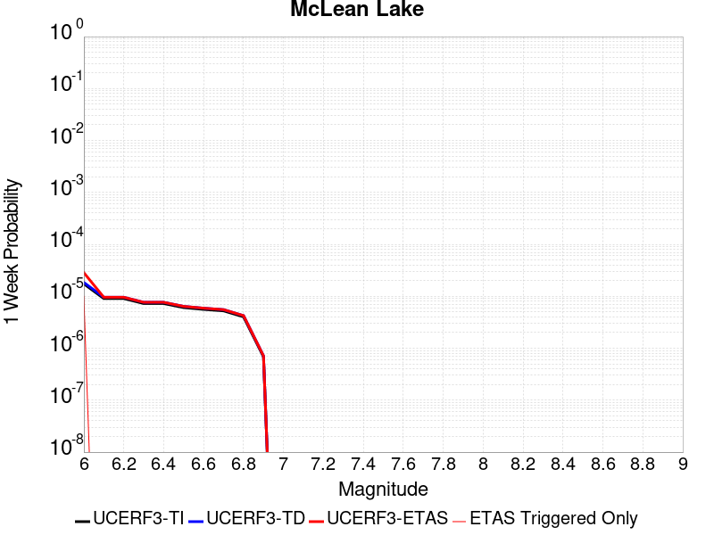 |  |  |  |

| Magnitude | 1 wk TI Prob | 1 wk TD Prob | 1 wk ETAS Prob | 1 wk ETAS/TD Gain | 1 wk ETAS Triggered Only | 1 mo TI Prob | 1 mo TD Prob | 1 mo ETAS Prob | 1 mo ETAS/TD Gain | 1 mo ETAS Triggered Only | 1 yr TI Prob | 1 yr TD Prob | 1 yr ETAS Prob | 1 yr ETAS/TD Gain | 1 yr ETAS Triggered Only | 10 yr TI Prob | 10 yr TD Prob | 10 yr ETAS Prob | 10 yr ETAS/TD Gain | 10 yr ETAS Triggered Only |
|-----|-----|-----|-----|-----|-----|-----|-----|-----|-----|-----|-----|-----|-----|-----|-----|-----|-----|-----|-----|-----|
| 6.0 | 1.7360222E-5 | 1.8502275E-5 | 2.8502089E-5 | 1.5404642 | 1.0E-5 | 7.439883E-5 | 7.929332E-5 | 1.2928936E-4 | 1.6305201 | 5.0E-5 | 9.0542925E-4 | 9.6501724E-4 | 0.0010948918 | 1.1345826 | 1.3E-4 | 0.009017491 | 0.009613109 | 0.009890418 | 1.0288469 | 2.8E-4 |
| 6.1 | 9.062689E-6 | 9.592492E-6 | 9.592492E-6 | 1.0 | 0.0 | 3.8839516E-5 | 4.1110077E-5 | 7.110884E-5 | 1.7297181 | 3.0E-5 | 4.727685E-4 | 5.0040917E-4 | 5.803691E-4 | 1.1597892 | 8.0E-5 | 0.0047176396 | 0.0049937065 | 0.005152907 | 1.0318804 | 1.6E-4 |
| 6.2 | 9.062689E-6 | 9.592492E-6 | 9.592492E-6 | 1.0 | 0.0 | 3.8839516E-5 | 4.1110077E-5 | 7.110884E-5 | 1.7297181 | 3.0E-5 | 4.727685E-4 | 5.0040917E-4 | 5.803691E-4 | 1.1597892 | 8.0E-5 | 0.0047176396 | 0.0049937065 | 0.005152907 | 1.0318804 | 1.6E-4 |
| 6.3 | 7.2575485E-6 | 7.66794E-6 | 7.66794E-6 | 1.0 | 0.0 | 3.110341E-5 | 3.2862223E-5 | 6.286124E-5 | 1.9128723 | 3.0E-5 | 3.786182E-4 | 4.0003125E-4 | 4.7000326E-4 | 1.1749164 | 7.0E-5 | 0.0037797375 | 0.003993816 | 0.004113337 | 1.0299264 | 1.2E-4 |
| 6.4 | 7.2575485E-6 | 7.66794E-6 | 7.66794E-6 | 1.0 | 0.0 | 3.110341E-5 | 3.2862223E-5 | 6.286124E-5 | 1.9128723 | 3.0E-5 | 3.786182E-4 | 4.0003125E-4 | 4.7000326E-4 | 1.1749164 | 7.0E-5 | 0.0037797375 | 0.003993816 | 0.004113337 | 1.0299264 | 1.2E-4 |
| 6.5 | 6.06582E-6 | 6.4040664E-6 | 6.4040664E-6 | 1.0 | 0.0 | 2.5996113E-5 | 2.7445747E-5 | 5.7444926E-5 | 2.0930355 | 3.0E-5 | 3.164567E-4 | 3.3410723E-4 | 3.9408717E-4 | 1.1795231 | 6.0E-5 | 0.0031600643 | 0.0033366878 | 0.003416421 | 1.0238959 | 8.0E-5 |
| 6.6 | 5.598744E-6 | 5.910437E-6 | 5.910437E-6 | 1.0 | 0.0 | 2.3994397E-5 | 2.5330233E-5 | 5.5329474E-5 | 2.1843255 | 3.0E-5 | 2.9209262E-4 | 3.0835834E-4 | 3.5834292E-4 | 1.162099 | 5.0E-5 | 0.0029170897 | 0.003079934 | 0.0031397492 | 1.019421 | 6.0E-5 |
| 6.7 | 5.246996E-6 | 5.5393257E-6 | 5.5393257E-6 | 1.0 | 0.0 | 2.2486933E-5 | 2.3739787E-5 | 5.3739077E-5 | 2.2636714 | 3.0E-5 | 2.73744E-4 | 2.8899993E-4 | 3.3898547E-4 | 1.1729604 | 5.0E-5 | 0.0027340704 | 0.0028868648 | 0.0029466916 | 1.0207238 | 6.0E-5 |
| 6.8 | 4.02324E-6 | 4.2470297E-6 | 4.2470297E-6 | 1.0 | 0.0 | 1.7242342E-5 | 1.8201463E-5 | 4.8200916E-5 | 2.648189 | 3.0E-5 | 2.099053E-4 | 2.2158623E-4 | 2.7157515E-4 | 1.2255958 | 5.0E-5 | 0.0020970714 | 0.0022142373 | 0.0022741044 | 1.0270374 | 6.0E-5 |
| 6.9 | 6.835972E-7 | 7.140097E-7 | 7.140097E-7 | 1.0 | 0.0 | 2.9296991E-6 | 3.0600397E-6 | 1.3060009E-5 | 4.2679214 | 1.0E-5 | 3.56685E-5 | 3.7255664E-5 | 4.7255293E-5 | 1.2684056 | 1.0E-5 | 3.5662777E-4 | 3.7252545E-4 | 3.92518E-4 | 1.0536677 | 2.0E-5 |

## So Sierra Nevada
*[(top)](#table-of-contents)*

| 1 Week | 1 Month | 1 Year | 10 Year |
|-----|-----|-----|-----|
|  |  |  | 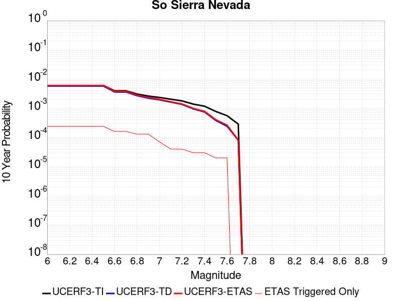 |

| Magnitude | 1 wk TI Prob | 1 wk TD Prob | 1 wk ETAS Prob | 1 wk ETAS/TD Gain | 1 wk ETAS Triggered Only | 1 mo TI Prob | 1 mo TD Prob | 1 mo ETAS Prob | 1 mo ETAS/TD Gain | 1 mo ETAS Triggered Only | 1 yr TI Prob | 1 yr TD Prob | 1 yr ETAS Prob | 1 yr ETAS/TD Gain | 1 yr ETAS Triggered Only | 10 yr TI Prob | 10 yr TD Prob | 10 yr ETAS Prob | 10 yr ETAS/TD Gain | 10 yr ETAS Triggered Only |
|-----|-----|-----|-----|-----|-----|-----|-----|-----|-----|-----|-----|-----|-----|-----|-----|-----|-----|-----|-----|-----|
| 6.0 | 1.15488665E-5 | 1.1079958E-5 | 2.1079848E-5 | 1.9025204 | 1.0E-5 | 4.9494203E-5 | 4.7484744E-5 | 7.748332E-5 | 1.6317519 | 3.0E-5 | 6.024253E-4 | 5.779862E-4 | 7.0791104E-4 | 1.2247889 | 1.3E-4 | 0.006007948 | 0.0057660984 | 0.0060047144 | 1.0413826 | 2.4E-4 |
| 6.1 | 1.15488665E-5 | 1.1079958E-5 | 2.1079848E-5 | 1.9025204 | 1.0E-5 | 4.9494203E-5 | 4.7484744E-5 | 7.748332E-5 | 1.6317519 | 3.0E-5 | 6.024253E-4 | 5.779862E-4 | 7.0791104E-4 | 1.2247889 | 1.3E-4 | 0.006007948 | 0.0057660984 | 0.0060047144 | 1.0413826 | 2.4E-4 |
| 6.2 | 1.15488665E-5 | 1.1079958E-5 | 2.1079848E-5 | 1.9025204 | 1.0E-5 | 4.9494203E-5 | 4.7484744E-5 | 7.748332E-5 | 1.6317519 | 3.0E-5 | 6.024253E-4 | 5.779862E-4 | 7.0791104E-4 | 1.2247889 | 1.3E-4 | 0.006007948 | 0.0057660984 | 0.0060047144 | 1.0413826 | 2.4E-4 |
| 6.3 | 1.15488665E-5 | 1.1079958E-5 | 2.1079848E-5 | 1.9025204 | 1.0E-5 | 4.9494203E-5 | 4.7484744E-5 | 7.748332E-5 | 1.6317519 | 3.0E-5 | 6.024253E-4 | 5.779862E-4 | 7.0791104E-4 | 1.2247889 | 1.3E-4 | 0.006007948 | 0.0057660984 | 0.0060047144 | 1.0413826 | 2.4E-4 |
| 6.4 | 1.15488665E-5 | 1.1079958E-5 | 2.1079848E-5 | 1.9025204 | 1.0E-5 | 4.9494203E-5 | 4.7484744E-5 | 7.748332E-5 | 1.6317519 | 3.0E-5 | 6.024253E-4 | 5.779862E-4 | 7.0791104E-4 | 1.2247889 | 1.3E-4 | 0.006007948 | 0.0057660984 | 0.0060047144 | 1.0413826 | 2.4E-4 |
| 6.5 | 1.15488665E-5 | 1.1079958E-5 | 2.1079848E-5 | 1.9025204 | 1.0E-5 | 4.9494203E-5 | 4.7484744E-5 | 7.748332E-5 | 1.6317519 | 3.0E-5 | 6.024253E-4 | 5.779862E-4 | 7.0791104E-4 | 1.2247889 | 1.3E-4 | 0.006007948 | 0.0057660984 | 0.0060047144 | 1.0413826 | 2.4E-4 |
| 6.6 | 7.587044E-6 | 6.9358503E-6 | 6.9358503E-6 | 1.0 | 0.0 | 3.2515498E-5 | 2.972475E-5 | 2.972475E-5 | 1.0 | 0.0 | 3.9580427E-4 | 3.6184167E-4 | 4.3181633E-4 | 1.1933848 | 7.0E-5 | 0.003951 | 0.0036128166 | 0.0037722385 | 1.0441267 | 1.6E-4 |
| 6.7 | 7.587044E-6 | 6.9358503E-6 | 6.9358503E-6 | 1.0 | 0.0 | 3.2515498E-5 | 2.972475E-5 | 2.972475E-5 | 1.0 | 0.0 | 3.9580427E-4 | 3.6184167E-4 | 4.3181633E-4 | 1.1933848 | 7.0E-5 | 0.003951 | 0.0036128166 | 0.0037722385 | 1.0441267 | 1.6E-4 |
| 6.8 | 5.9026956E-6 | 5.179568E-6 | 5.179568E-6 | 1.0 | 0.0 | 2.5297022E-5 | 2.2197966E-5 | 2.2197966E-5 | 1.0 | 0.0 | 3.0794772E-4 | 2.7022787E-4 | 3.3021168E-4 | 1.2219748 | 6.0E-5 | 0.0030752132 | 0.0026991093 | 0.0028287582 | 1.0480341 | 1.3E-4 |
| 6.9 | 5.0118915E-6 | 4.2525808E-6 | 4.2525808E-6 | 1.0 | 0.0 | 2.1479358E-5 | 1.8225222E-5 | 1.8225222E-5 | 1.0 | 0.0 | 2.614798E-4 | 2.2187021E-4 | 2.818569E-4 | 1.2703683 | 6.0E-5 | 0.0026117235 | 0.0022165596 | 0.0023462714 | 1.0585195 | 1.3E-4 |
| 7.0 | 4.4924795E-6 | 3.7140621E-6 | 3.7140621E-6 | 1.0 | 0.0 | 1.925334E-5 | 1.5917316E-5 | 1.5917316E-5 | 1.0 | 0.0 | 2.3438422E-4 | 1.9377672E-4 | 2.2377091E-4 | 1.1547873 | 3.0E-5 | 0.0023413717 | 0.0019361405 | 0.002006005 | 1.0360844 | 7.0E-5 |
| 7.1 | 3.9118436E-6 | 3.1121094E-6 | 3.1121094E-6 | 1.0 | 0.0 | 1.6764936E-5 | 1.3337547E-5 | 1.3337547E-5 | 1.0 | 0.0 | 2.0409399E-4 | 1.6237311E-4 | 1.8236985E-4 | 1.1231531 | 2.0E-5 | 0.0020390663 | 0.0016226007 | 0.0016625358 | 1.0246118 | 4.0E-5 |
| 7.2 | 3.4200818E-6 | 2.605576E-6 | 2.605576E-6 | 1.0 | 0.0 | 1.4657411E-5 | 1.116671E-5 | 1.116671E-5 | 1.0 | 0.0 | 1.7843937E-4 | 1.3594671E-4 | 1.5594398E-4 | 1.1470965 | 2.0E-5 | 0.0017829615 | 0.0013586852 | 0.0013986308 | 1.0294002 | 4.0E-5 |
| 7.3 | 2.6593618E-6 | 1.8285265E-6 | 1.8285265E-6 | 1.0 | 0.0 | 1.13972155E-5 | 7.83652E-6 | 7.83652E-6 | 1.0 | 0.0 | 1.3875226E-4 | 9.5405754E-5 | 1.1540384E-4 | 1.2096109 | 2.0E-5 | 0.0013866565 | 9.536769E-4 | 9.836482E-4 | 1.0314271 | 3.0E-5 |
| 7.4 | 2.2577992E-6 | 1.436535E-6 | 1.436535E-6 | 1.0 | 0.0 | 9.676246E-6 | 6.156565E-6 | 6.156565E-6 | 1.0 | 0.0 | 1.1780193E-4 | 7.495386E-5 | 9.495236E-5 | 1.2668108 | 2.0E-5 | 0.001177395 | 7.493108E-4 | 7.7928836E-4 | 1.0400068 | 3.0E-5 |
| 7.5 | 1.489319E-6 | 7.354697E-7 | 7.354697E-7 | 1.0 | 0.0 | 6.3827797E-6 | 3.1520092E-6 | 3.1520092E-6 | 1.0 | 0.0 | 7.770758E-5 | 3.837504E-5 | 4.8374655E-5 | 1.260576 | 1.0E-5 | 7.7680405E-4 | 3.836846E-4 | 4.036769E-4 | 1.0521061 | 2.0E-5 |
| 7.6 | 1.0680322E-6 | 4.6602182E-7 | 4.6602182E-7 | 1.0 | 0.0 | 4.577273E-6 | 1.997235E-6 | 1.997235E-6 | 1.0 | 0.0 | 5.5726876E-5 | 2.4316065E-5 | 3.431582E-5 | 1.4112407 | 1.0E-5 | 5.5712904E-4 | 2.431343E-4 | 2.6312945E-4 | 1.082239 | 2.0E-5 |
| 7.7 | 5.509146E-7 | 1.558334E-7 | 1.558334E-7 | 1.0 | 0.0 | 2.3610605E-6 | 6.678573E-7 | 6.678573E-7 | 1.0 | 0.0 | 2.8745531E-5 | 8.131134E-6 | 8.131134E-6 | 1.0 | 0.0 | 2.8741814E-4 | 8.130848E-5 | 8.130848E-5 | 1.0 | 0.0 |

## Goldstone Lake
*[(top)](#table-of-contents)*

| 1 Week | 1 Month | 1 Year | 10 Year |
|-----|-----|-----|-----|
|  |  |  |  |

| Magnitude | 1 wk TI Prob | 1 wk TD Prob | 1 wk ETAS Prob | 1 wk ETAS/TD Gain | 1 wk ETAS Triggered Only | 1 mo TI Prob | 1 mo TD Prob | 1 mo ETAS Prob | 1 mo ETAS/TD Gain | 1 mo ETAS Triggered Only | 1 yr TI Prob | 1 yr TD Prob | 1 yr ETAS Prob | 1 yr ETAS/TD Gain | 1 yr ETAS Triggered Only | 10 yr TI Prob | 10 yr TD Prob | 10 yr ETAS Prob | 10 yr ETAS/TD Gain | 10 yr ETAS Triggered Only |
|-----|-----|-----|-----|-----|-----|-----|-----|-----|-----|-----|-----|-----|-----|-----|-----|-----|-----|-----|-----|-----|
| 6.0 | 2.671352E-5 | 3.0378242E-5 | 4.0377938E-5 | 1.329173 | 1.0E-5 | 1.1448149E-4 | 1.3018708E-4 | 1.6018318E-4 | 1.2304076 | 3.0E-5 | 0.001392921 | 0.0015840717 | 0.0016839133 | 1.0630285 | 1.0E-4 | 0.013842222 | 0.015747305 | 0.015944155 | 1.0125006 | 2.0E-4 |
| 6.1 | 2.671352E-5 | 3.0378242E-5 | 4.0377938E-5 | 1.329173 | 1.0E-5 | 1.1448149E-4 | 1.3018708E-4 | 1.6018318E-4 | 1.2304076 | 3.0E-5 | 0.001392921 | 0.0015840717 | 0.0016839133 | 1.0630285 | 1.0E-4 | 0.013842222 | 0.015747305 | 0.015944155 | 1.0125006 | 2.0E-4 |
| 6.2 | 1.4197047E-5 | 1.6097329E-5 | 2.6097168E-5 | 1.621211 | 1.0E-5 | 6.0843064E-5 | 6.898728E-5 | 7.8986595E-5 | 1.1449442 | 1.0E-5 | 7.4051257E-4 | 8.396952E-4 | 8.896532E-4 | 1.0594954 | 5.0E-5 | 0.007380498 | 0.008374922 | 0.008484 | 1.0130244 | 1.1E-4 |
| 6.3 | 1.4197047E-5 | 1.6097329E-5 | 2.6097168E-5 | 1.621211 | 1.0E-5 | 6.0843064E-5 | 6.898728E-5 | 7.8986595E-5 | 1.1449442 | 1.0E-5 | 7.4051257E-4 | 8.396952E-4 | 8.896532E-4 | 1.0594954 | 5.0E-5 | 0.007380498 | 0.008374922 | 0.008484 | 1.0130244 | 1.1E-4 |
| 6.4 | 1.3238931E-5 | 1.5009467E-5 | 2.5009316E-5 | 1.6662362 | 1.0E-5 | 5.6737044E-5 | 6.432525E-5 | 7.4324606E-5 | 1.15545 | 1.0E-5 | 6.9055456E-4 | 7.829765E-4 | 8.3293737E-4 | 1.0638089 | 5.0E-5 | 0.006884126 | 0.007811806 | 0.007920947 | 1.0139712 | 1.1E-4 |
| 6.5 | 1.3238931E-5 | 1.5009467E-5 | 2.5009316E-5 | 1.6662362 | 1.0E-5 | 5.6737044E-5 | 6.432525E-5 | 7.4324606E-5 | 1.15545 | 1.0E-5 | 6.9055456E-4 | 7.829765E-4 | 8.3293737E-4 | 1.0638089 | 5.0E-5 | 0.006884126 | 0.007811806 | 0.007920947 | 1.0139712 | 1.1E-4 |
| 6.6 | 1.1328278E-5 | 1.2856027E-5 | 2.2855898E-5 | 1.7778352 | 1.0E-5 | 4.8548856E-5 | 5.5096636E-5 | 6.509609E-5 | 1.1814892 | 1.0E-5 | 5.90922E-4 | 6.706908E-4 | 7.2065723E-4 | 1.0745 | 5.0E-5 | 0.0058935313 | 0.0066960566 | 0.006795387 | 1.0148342 | 1.0E-4 |
| 6.7 | 8.651175E-6 | 9.825214E-6 | 9.825214E-6 | 1.0 | 0.0 | 3.707594E-5 | 4.2107888E-5 | 4.2107888E-5 | 1.0 | 0.0 | 4.5130608E-4 | 5.1263353E-4 | 5.426181E-4 | 1.0584913 | 3.0E-5 | 0.0045039062 | 0.0051233894 | 0.005193031 | 1.0135928 | 7.0E-5 |
| 6.8 | 1.0215377E-6 | 1.1755062E-6 | 1.1755062E-6 | 1.0 | 0.0 | 4.378012E-6 | 5.037875E-6 | 5.037875E-6 | 1.0 | 0.0 | 5.3300988E-5 | 6.133451E-5 | 6.133451E-5 | 1.0 | 0.0 | 5.3288206E-4 | 6.131871E-4 | 6.131871E-4 | 1.0 | 0.0 |
| 6.9 | 7.9360774E-7 | 9.2836456E-7 | 9.2836456E-7 | 1.0 | 0.0 | 3.4011714E-6 | 3.9786996E-6 | 3.9786996E-6 | 1.0 | 0.0 | 4.1408475E-5 | 4.8439662E-5 | 4.8439662E-5 | 1.0 | 0.0 | 4.140076E-4 | 4.8429804E-4 | 4.8429804E-4 | 1.0 | 0.0 |
| 7.0 | 7.4382757E-7 | 8.747556E-7 | 8.747556E-7 | 1.0 | 0.0 | 3.1878285E-6 | 3.7489476E-6 | 3.7489476E-6 | 1.0 | 0.0 | 3.8811122E-5 | 4.5642548E-5 | 4.5642548E-5 | 1.0 | 0.0 | 3.8804344E-4 | 4.5633837E-4 | 4.5633837E-4 | 1.0 | 0.0 |
| 7.1 | 6.4709513E-7 | 7.7114885E-7 | 7.7114885E-7 | 1.0 | 0.0 | 2.773262E-6 | 3.3049198E-6 | 3.3049198E-6 | 1.0 | 0.0 | 3.376394E-5 | 4.0236715E-5 | 4.0236715E-5 | 1.0 | 0.0 | 3.375881E-4 | 4.0230027E-4 | 4.0230027E-4 | 1.0 | 0.0 |
| 7.2 | 6.356704E-7 | 7.588543E-7 | 7.588543E-7 | 1.0 | 0.0 | 2.7242988E-6 | 3.2522291E-6 | 3.2522291E-6 | 1.0 | 0.0 | 3.3167835E-5 | 3.959523E-5 | 3.959523E-5 | 1.0 | 0.0 | 3.3162883E-4 | 3.9588768E-4 | 3.9588768E-4 | 1.0 | 0.0 |
| 7.3 | 5.7695723E-7 | 6.8967347E-7 | 6.8967347E-7 | 1.0 | 0.0 | 2.4726714E-6 | 2.9557402E-6 | 2.9557402E-6 | 1.0 | 0.0 | 3.0104358E-5 | 3.5985602E-5 | 3.5985602E-5 | 1.0 | 0.0 | 3.0100282E-4 | 3.5980347E-4 | 3.5980347E-4 | 1.0 | 0.0 |
| 7.4 | 5.209647E-7 | 6.1936566E-7 | 6.1936566E-7 | 1.0 | 0.0 | 2.232704E-6 | 2.654422E-6 | 2.654422E-6 | 1.0 | 0.0 | 2.718283E-5 | 3.2317163E-5 | 3.2317163E-5 | 1.0 | 0.0 | 2.7179506E-4 | 3.231302E-4 | 3.231302E-4 | 1.0 | 0.0 |
| 7.5 | 4.512955E-7 | 5.3490027E-7 | 5.3490027E-7 | 1.0 | 0.0 | 1.934122E-6 | 2.292428E-6 | 2.292428E-6 | 1.0 | 0.0 | 2.3547682E-5 | 2.7910008E-5 | 2.7910008E-5 | 1.0 | 0.0 | 2.3545188E-4 | 2.7907031E-4 | 2.7907031E-4 | 1.0 | 0.0 |
| 7.6 | 2.21172E-7 | 2.6040124E-7 | 2.6040124E-7 | 1.0 | 0.0 | 9.478797E-7 | 1.116005E-6 | 1.116005E-6 | 1.0 | 0.0 | 1.1540374E-5 | 1.3587305E-5 | 1.3587305E-5 | 1.0 | 0.0 | 1.1539775E-4 | 1.3586757E-4 | 1.3586757E-4 | 1.0 | 0.0 |

## San Andreas (San Bernardino N)
*[(top)](#table-of-contents)*

| 1 Week | 1 Month | 1 Year | 10 Year |
|-----|-----|-----|-----|
|  |  |  |  |

| Magnitude | 1 wk TI Prob | 1 wk TD Prob | 1 wk ETAS Prob | 1 wk ETAS/TD Gain | 1 wk ETAS Triggered Only | 1 mo TI Prob | 1 mo TD Prob | 1 mo ETAS Prob | 1 mo ETAS/TD Gain | 1 mo ETAS Triggered Only | 1 yr TI Prob | 1 yr TD Prob | 1 yr ETAS Prob | 1 yr ETAS/TD Gain | 1 yr ETAS Triggered Only | 10 yr TI Prob | 10 yr TD Prob | 10 yr ETAS Prob | 10 yr ETAS/TD Gain | 10 yr ETAS Triggered Only |
|-----|-----|-----|-----|-----|-----|-----|-----|-----|-----|-----|-----|-----|-----|-----|-----|-----|-----|-----|-----|-----|
| 6.0 | 1.4273766E-4 | 3.1635934E-4 | 3.36353E-4 | 1.0631993 | 2.0E-5 | 6.115894E-4 | 0.0013551271 | 0.0014050594 | 1.0368469 | 5.0E-5 | 0.0074207084 | 0.016375363 | 0.016532741 | 1.0096108 | 1.6E-4 | 0.07177748 | 0.15038711 | 0.15054853 | 1.0010734 | 1.9E-4 |
| 6.1 | 1.4273766E-4 | 3.1635934E-4 | 3.36353E-4 | 1.0631993 | 2.0E-5 | 6.115894E-4 | 0.0013551271 | 0.0014050594 | 1.0368469 | 5.0E-5 | 0.0074207084 | 0.016375363 | 0.016532741 | 1.0096108 | 1.6E-4 | 0.07177748 | 0.15038711 | 0.15054853 | 1.0010734 | 1.9E-4 |
| 6.2 | 1.4273766E-4 | 3.1635934E-4 | 3.36353E-4 | 1.0631993 | 2.0E-5 | 6.115894E-4 | 0.0013551271 | 0.0014050594 | 1.0368469 | 5.0E-5 | 0.0074207084 | 0.016375363 | 0.016532741 | 1.0096108 | 1.6E-4 | 0.07177748 | 0.15038711 | 0.15054853 | 1.0010734 | 1.9E-4 |
| 6.3 | 1.3730655E-4 | 3.0540637E-4 | 3.2540027E-4 | 1.0654665 | 2.0E-5 | 5.883239E-4 | 0.0013082335 | 0.0013581681 | 1.0381695 | 5.0E-5 | 0.0071393442 | 0.015812824 | 0.015970293 | 1.0099584 | 1.6E-4 | 0.06914291 | 0.14568701 | 0.14584933 | 1.0011141 | 1.9E-4 |
| 6.4 | 1.3730655E-4 | 3.0540637E-4 | 3.2540027E-4 | 1.0654665 | 2.0E-5 | 5.883239E-4 | 0.0013082335 | 0.0013581681 | 1.0381695 | 5.0E-5 | 0.0071393442 | 0.015812824 | 0.015970293 | 1.0099584 | 1.6E-4 | 0.06914291 | 0.14568701 | 0.14584933 | 1.0011141 | 1.9E-4 |
| 6.5 | 1.2942807E-4 | 2.8954886E-4 | 3.0954307E-4 | 1.0690529 | 2.0E-5 | 5.545738E-4 | 0.0012403387 | 0.0012902766 | 1.0402616 | 5.0E-5 | 0.0067310524 | 0.014997809 | 0.01515541 | 1.0105082 | 1.6E-4 | 0.06530788 | 0.13882978 | 0.13899341 | 1.0011786 | 1.9E-4 |
| 6.6 | 1.1125901E-4 | 2.5393223E-4 | 2.7392717E-4 | 1.0787412 | 2.0E-5 | 4.767372E-4 | 0.0010878295 | 0.001137775 | 1.0459131 | 5.0E-5 | 0.005788839 | 0.013164529 | 0.013322422 | 1.0119939 | 1.6E-4 | 0.056403454 | 0.12311955 | 0.12328615 | 1.0013533 | 1.9E-4 |
| 6.7 | 1.02209575E-4 | 2.3527986E-4 | 2.5527517E-4 | 1.0849851 | 2.0E-5 | 4.3796748E-4 | 0.001007954 | 0.0010579036 | 1.0495554 | 5.0E-5 | 0.0053192247 | 0.012203212 | 0.01236126 | 1.0129513 | 1.6E-4 | 0.051936906 | 0.11491149 | 0.115079656 | 1.0014634 | 1.9E-4 |
| 6.8 | 9.610582E-5 | 2.2053412E-4 | 2.305319E-4 | 1.0453345 | 1.0E-5 | 4.1181705E-4 | 9.448046E-4 | 9.847668E-4 | 1.0422968 | 4.0E-5 | 0.0050023515 | 0.011442591 | 0.011590875 | 1.0129589 | 1.5E-4 | 0.048912346 | 0.10831282 | 0.10847332 | 1.0014819 | 1.8E-4 |
| 6.9 | 9.3877505E-5 | 2.150883E-4 | 2.2508614E-4 | 1.0464826 | 1.0E-5 | 4.0227012E-4 | 9.2148193E-4 | 9.614451E-4 | 1.0433683 | 4.0E-5 | 0.0048866454 | 0.011161577 | 0.011309903 | 1.013289 | 1.5E-4 | 0.04780577 | 0.1059029 | 0.10606384 | 1.0015197 | 1.8E-4 |
| 7.0 | 9.1019785E-5 | 2.0835544E-4 | 2.1835337E-4 | 1.047985 | 1.0E-5 | 3.900265E-4 | 8.926469E-4 | 9.3261123E-4 | 1.0447706 | 4.0E-5 | 0.0047382377 | 0.010814046 | 0.010962423 | 1.0137209 | 1.5E-4 | 0.046384744 | 0.10287278 | 0.103034265 | 1.0015697 | 1.8E-4 |
| 7.1 | 8.771155E-5 | 2.0009889E-4 | 2.1009688E-4 | 1.0499653 | 1.0E-5 | 3.758525E-4 | 8.5728534E-4 | 8.9725107E-4 | 1.0466189 | 4.0E-5 | 0.0045664064 | 0.010387696 | 0.010536138 | 1.0142902 | 1.5E-4 | 0.044737056 | 0.09918398 | 0.09934612 | 1.0016348 | 1.8E-4 |
| 7.2 | 8.0830236E-5 | 1.8415037E-4 | 1.9414854E-4 | 1.0542934 | 1.0E-5 | 3.4636928E-4 | 7.8897737E-4 | 8.289458E-4 | 1.0506586 | 4.0E-5 | 0.0042088944 | 0.009563598 | 0.009712163 | 1.0155345 | 1.5E-4 | 0.041300658 | 0.09191379 | 0.09207724 | 1.0017784 | 1.8E-4 |
| 7.3 | 7.7668235E-5 | 1.7358093E-4 | 1.835792E-4 | 1.0576 | 1.0E-5 | 3.328214E-4 | 7.437063E-4 | 7.836766E-4 | 1.0537447 | 4.0E-5 | 0.0040445733 | 0.009017113 | 0.009165759 | 1.0164851 | 1.5E-4 | 0.03971748 | 0.08717959 | 0.087343894 | 1.0018847 | 1.8E-4 |
| 7.4 | 7.520177E-5 | 1.657783E-4 | 1.7577664E-4 | 1.0603116 | 1.0E-5 | 3.2225347E-4 | 7.1028504E-4 | 7.5025664E-4 | 1.0562754 | 4.0E-5 | 0.0039163795 | 0.008613498 | 0.008762206 | 1.0172645 | 1.5E-4 | 0.038480744 | 0.08363466 | 0.08379961 | 1.0019722 | 1.8E-4 |
| 7.5 | 7.274697E-5 | 1.5865144E-4 | 1.6864986E-4 | 1.0630213 | 1.0E-5 | 3.1173544E-4 | 6.797576E-4 | 7.1973045E-4 | 1.0588045 | 4.0E-5 | 0.003788775 | 0.008244702 | 0.008393465 | 1.0180435 | 1.5E-4 | 0.03724827 | 0.08035038 | 0.08051591 | 1.0020602 | 1.8E-4 |
| 7.6 | 7.1185845E-5 | 1.5434787E-4 | 1.6434633E-4 | 1.0647787 | 1.0E-5 | 3.0504653E-4 | 6.6132325E-4 | 7.012968E-4 | 1.0604448 | 4.0E-5 | 0.0037076178 | 0.008021939 | 0.008170735 | 1.0185487 | 1.5E-4 | 0.036463667 | 0.078339346 | 0.07850525 | 1.0021178 | 1.8E-4 |
| 7.7 | 6.709961E-5 | 1.4343053E-4 | 1.5342911E-4 | 1.0697101 | 1.0E-5 | 2.8753807E-4 | 6.1455753E-4 | 6.545329E-4 | 1.0650475 | 4.0E-5 | 0.003495157 | 0.007456607 | 0.007605489 | 1.0199664 | 1.5E-4 | 0.034406938 | 0.07316601 | 0.07333284 | 1.0022801 | 1.8E-4 |
| 7.8 | 6.300812E-5 | 1.3225875E-4 | 1.4225741E-4 | 1.0755993 | 1.0E-5 | 2.7000686E-4 | 5.6670007E-4 | 5.9668306E-4 | 1.0529081 | 3.0E-5 | 0.0032823787 | 0.0068777753 | 0.0070168125 | 1.0202154 | 1.4E-4 | 0.032343175 | 0.06781986 | 0.06797833 | 1.0023366 | 1.7E-4 |
| 7.9 | 4.983037E-5 | 9.7419856E-5 | 1.0741888E-4 | 1.1026385 | 1.0E-5 | 2.1354125E-4 | 4.1744686E-4 | 4.4743434E-4 | 1.0718354 | 3.0E-5 | 0.0025967648 | 0.005070582 | 0.0051999227 | 1.025508 | 1.3E-4 | 0.025666296 | 0.050735 | 0.05087739 | 1.0028065 | 1.5E-4 |
| 8.0 | 3.2211527E-5 | 5.341288E-5 | 6.341235E-5 | 1.1872108 | 1.0E-5 | 1.380421E-4 | 2.2889227E-4 | 2.488877E-4 | 1.0873574 | 2.0E-5 | 0.0016793669 | 0.002783204 | 0.002843037 | 1.0214978 | 6.0E-5 | 0.016667323 | 0.028414162 | 0.02849189 | 1.0027355 | 8.0E-5 |
| 8.1 | 1.743376E-5 | 1.8874636E-5 | 1.8874636E-5 | 1.0 | 0.0 | 7.471398E-5 | 8.088879E-5 | 8.088879E-5 | 1.0 | 0.0 | 9.0926304E-4 | 9.843768E-4 | 9.943668E-4 | 1.0101488 | 1.0E-5 | 0.009055517 | 0.010510205 | 0.0105201 | 1.0009415 | 1.0E-5 |
| 8.2 | 7.831616E-6 | 5.1737816E-6 | 5.1737816E-6 | 1.0 | 0.0 | 3.3563636E-5 | 2.217316E-5 | 2.217316E-5 | 1.0 | 0.0 | 4.0856065E-4 | 2.6992487E-4 | 2.6992487E-4 | 1.0 | 0.0 | 0.004078103 | 0.0030519657 | 0.0030519657 | 1.0 | 0.0 |
| 8.3 | 1.983087E-6 | 7.693574E-7 | 7.693574E-7 | 1.0 | 0.0 | 8.498917E-6 | 3.297242E-6 | 3.297242E-6 | 1.0 | 0.0 | 1.034694E-4 | 4.01432E-5 | 4.01432E-5 | 1.0 | 0.0 | 0.0010342124 | 4.7390026E-4 | 4.7390026E-4 | 1.0 | 0.0 |

## San Andreas (San Bernardino S)
*[(top)](#table-of-contents)*

| 1 Week | 1 Month | 1 Year | 10 Year |
|-----|-----|-----|-----|
|  |  |  |  |

| Magnitude | 1 wk TI Prob | 1 wk TD Prob | 1 wk ETAS Prob | 1 wk ETAS/TD Gain | 1 wk ETAS Triggered Only | 1 mo TI Prob | 1 mo TD Prob | 1 mo ETAS Prob | 1 mo ETAS/TD Gain | 1 mo ETAS Triggered Only | 1 yr TI Prob | 1 yr TD Prob | 1 yr ETAS Prob | 1 yr ETAS/TD Gain | 1 yr ETAS Triggered Only | 10 yr TI Prob | 10 yr TD Prob | 10 yr ETAS Prob | 10 yr ETAS/TD Gain | 10 yr ETAS Triggered Only |
|-----|-----|-----|-----|-----|-----|-----|-----|-----|-----|-----|-----|-----|-----|-----|-----|-----|-----|-----|-----|-----|
| 6.0 | 1.2336002E-4 | 3.0023555E-4 | 3.0023555E-4 | 1.0 | 0.0 | 5.2857865E-4 | 0.0012861154 | 0.0013060896 | 1.0155307 | 2.0E-5 | 0.006416472 | 0.015550992 | 0.015659282 | 1.0069635 | 1.1E-4 | 0.06234337 | 0.14291383 | 0.14303383 | 1.0008396 | 1.4E-4 |
| 6.1 | 1.2336002E-4 | 3.0023555E-4 | 3.0023555E-4 | 1.0 | 0.0 | 5.2857865E-4 | 0.0012861154 | 0.0013060896 | 1.0155307 | 2.0E-5 | 0.006416472 | 0.015550992 | 0.015659282 | 1.0069635 | 1.1E-4 | 0.06234337 | 0.14291383 | 0.14303383 | 1.0008396 | 1.4E-4 |
| 6.2 | 1.2336002E-4 | 3.0023555E-4 | 3.0023555E-4 | 1.0 | 0.0 | 5.2857865E-4 | 0.0012861154 | 0.0013060896 | 1.0155307 | 2.0E-5 | 0.006416472 | 0.015550992 | 0.015659282 | 1.0069635 | 1.1E-4 | 0.06234337 | 0.14291383 | 0.14303383 | 1.0008396 | 1.4E-4 |
| 6.3 | 1.1712257E-4 | 2.8811657E-4 | 2.8811657E-4 | 1.0 | 0.0 | 5.018573E-4 | 0.0012342266 | 0.001254202 | 1.0161844 | 2.0E-5 | 0.006093008 | 0.0149280215 | 0.01503638 | 1.0072587 | 1.1E-4 | 0.059286322 | 0.13762207 | 0.1377428 | 1.0008773 | 1.4E-4 |
| 6.4 | 1.1712257E-4 | 2.8811657E-4 | 2.8811657E-4 | 1.0 | 0.0 | 5.018573E-4 | 0.0012342266 | 0.001254202 | 1.0161844 | 2.0E-5 | 0.006093008 | 0.0149280215 | 0.01503638 | 1.0072587 | 1.1E-4 | 0.059286322 | 0.13762207 | 0.1377428 | 1.0008773 | 1.4E-4 |
| 6.5 | 1.0689076E-4 | 2.682418E-4 | 2.682418E-4 | 1.0 | 0.0 | 4.5802278E-4 | 0.001149126 | 0.0011691031 | 1.0173845 | 2.0E-5 | 0.0055621783 | 0.013905481 | 0.014013952 | 1.0078006 | 1.1E-4 | 0.05425003 | 0.12886871 | 0.12899067 | 1.0009464 | 1.4E-4 |
| 6.6 | 9.7648895E-5 | 2.506867E-4 | 2.506867E-4 | 1.0 | 0.0 | 4.1842813E-4 | 0.0010739529 | 0.0010939314 | 1.0186028 | 2.0E-5 | 0.005082469 | 0.0130013535 | 0.013109923 | 1.0083506 | 1.1E-4 | 0.049677886 | 0.12102797 | 0.12115102 | 1.0010167 | 1.4E-4 |
| 6.7 | 8.757013E-5 | 2.3139146E-4 | 2.3139146E-4 | 1.0 | 0.0 | 3.7524657E-4 | 9.913231E-4 | 0.0010113033 | 1.0201551 | 2.0E-5 | 0.00455906 | 0.012006655 | 0.012115334 | 1.0090516 | 1.1E-4 | 0.04466656 | 0.112335846 | 0.11245124 | 1.0010272 | 1.3E-4 |
| 6.8 | 8.562978E-5 | 2.2698891E-4 | 2.2698891E-4 | 1.0 | 0.0 | 3.6693315E-4 | 9.7246916E-4 | 9.924497E-4 | 1.0205462 | 2.0E-5 | 0.004458263 | 0.011779605 | 0.01188831 | 1.0092282 | 1.1E-4 | 0.043698758 | 0.11034572 | 0.11046138 | 1.0010481 | 1.3E-4 |
| 6.9 | 6.124075E-5 | 1.7082063E-4 | 1.7082063E-4 | 1.0 | 0.0 | 2.6243398E-4 | 7.318838E-4 | 7.518692E-4 | 1.0273068 | 2.0E-5 | 0.0031904527 | 0.008874487 | 0.008983511 | 1.0122851 | 1.1E-4 | 0.031450346 | 0.08425208 | 0.084371135 | 1.001413 | 1.3E-4 |
| 7.0 | 5.8598747E-5 | 1.6510907E-4 | 1.6510907E-4 | 1.0 | 0.0 | 2.5111332E-4 | 7.0741924E-4 | 7.274051E-4 | 1.0282518 | 2.0E-5 | 0.0030530186 | 0.008579012 | 0.008688069 | 1.012712 | 1.1E-4 | 0.03011414 | 0.08156926 | 0.08168866 | 1.0014638 | 1.3E-4 |
| 7.1 | 5.613814E-5 | 1.5929298E-4 | 1.5929298E-4 | 1.0 | 0.0 | 2.4056983E-4 | 6.825063E-4 | 7.0249266E-4 | 1.0292838 | 2.0E-5 | 0.0029250039 | 0.0082780365 | 0.008387126 | 1.0131782 | 1.1E-4 | 0.028868021 | 0.078867756 | 0.0789875 | 1.0015184 | 1.3E-4 |
| 7.2 | 4.991222E-5 | 1.4535384E-4 | 1.4535384E-4 | 1.0 | 0.0 | 2.1389198E-4 | 6.227967E-4 | 6.427843E-4 | 1.0320932 | 2.0E-5 | 0.002601025 | 0.0075562913 | 0.00766546 | 1.0144475 | 1.1E-4 | 0.025707912 | 0.072320335 | 0.07244093 | 1.0016675 | 1.3E-4 |
| 7.3 | 4.7410045E-5 | 1.3729246E-4 | 1.3729246E-4 | 1.0 | 0.0 | 2.0317009E-4 | 5.882639E-4 | 6.082522E-4 | 1.0339783 | 2.0E-5 | 0.0024707897 | 0.0071386793 | 0.007247894 | 1.015299 | 1.1E-4 | 0.024434982 | 0.06860168 | 0.06872276 | 1.001765 | 1.3E-4 |
| 7.4 | 4.5556746E-5 | 1.313689E-4 | 1.313689E-4 | 1.0 | 0.0 | 1.952286E-4 | 5.628884E-4 | 5.8287714E-4 | 1.035511 | 2.0E-5 | 0.002374317 | 0.006831711 | 0.0069409595 | 1.0159913 | 1.1E-4 | 0.023491086 | 0.06585319 | 0.06597463 | 1.001844 | 1.3E-4 |
| 7.5 | 4.3084514E-5 | 1.2371907E-4 | 1.2371907E-4 | 1.0 | 0.0 | 1.8463485E-4 | 5.3011713E-4 | 5.501066E-4 | 1.0377076 | 2.0E-5 | 0.0022456115 | 0.0064351484 | 0.0065444405 | 1.0169836 | 1.1E-4 | 0.022230545 | 0.062252887 | 0.062374797 | 1.0019583 | 1.3E-4 |
| 7.6 | 3.408608E-5 | 9.8489814E-5 | 9.8489814E-5 | 1.0 | 0.0 | 1.4607502E-4 | 4.2203104E-4 | 4.420226E-4 | 1.0473698 | 2.0E-5 | 0.0017770125 | 0.005126148 | 0.0052355845 | 1.0213486 | 1.1E-4 | 0.017628696 | 0.050079897 | 0.050203387 | 1.0024658 | 1.3E-4 |
| 7.7 | 2.8315713E-5 | 8.261325E-5 | 8.261325E-5 | 1.0 | 0.0 | 1.2134742E-4 | 3.5400878E-4 | 3.740017E-4 | 1.0564758 | 2.0E-5 | 0.0014764034 | 0.004301548 | 0.004411075 | 1.0254622 | 1.1E-4 | 0.01466633 | 0.042327844 | 0.04245234 | 1.0029413 | 1.3E-4 |
| 7.8 | 2.6222975E-5 | 7.4749165E-5 | 7.4749165E-5 | 1.0 | 0.0 | 1.1237934E-4 | 3.2031426E-4 | 3.4030783E-4 | 1.0624187 | 2.0E-5 | 0.0013673597 | 0.0038928585 | 0.0040024305 | 1.0281469 | 1.1E-4 | 0.013589768 | 0.038489804 | 0.038614802 | 1.0032475 | 1.3E-4 |
| 7.9 | 2.1469694E-5 | 5.7977377E-5 | 5.7977377E-5 | 1.0 | 0.0 | 9.200973E-5 | 2.4845081E-4 | 2.6844584E-4 | 1.0804788 | 2.0E-5 | 0.0011196428 | 0.003020696 | 0.0031303638 | 1.0363054 | 1.1E-4 | 0.011140184 | 0.030197 | 0.030323075 | 1.0041751 | 1.3E-4 |
| 8.0 | 1.2420249E-5 | 3.1373827E-5 | 3.1373827E-5 | 1.0 | 0.0 | 5.322855E-5 | 1.3445233E-4 | 1.4445098E-4 | 1.0743659 | 1.0E-5 | 6.478649E-4 | 0.001635729 | 0.0016756636 | 1.024414 | 4.0E-5 | 0.0064597935 | 0.016548108 | 0.016607115 | 1.0035658 | 6.0E-5 |
| 8.1 | 4.9197724E-6 | 7.842378E-6 | 7.842378E-6 | 1.0 | 0.0 | 2.1084568E-5 | 3.360976E-5 | 3.360976E-5 | 1.0 | 0.0 | 2.566744E-4 | 4.0912212E-4 | 4.0912212E-4 | 1.0 | 0.0 | 0.002563781 | 0.004394436 | 0.004394436 | 1.0 | 0.0 |
| 8.2 | 2.5634774E-6 | 2.9160003E-6 | 2.9160003E-6 | 1.0 | 0.0 | 1.0986286E-5 | 1.2497085E-5 | 1.2497085E-5 | 1.0 | 0.0 | 1.3374983E-4 | 1.5214144E-4 | 1.5214144E-4 | 1.0 | 0.0 | 0.0013366934 | 0.0017098442 | 0.0017098442 | 1.0 | 0.0 |
| 8.3 | 5.2850464E-7 | 3.2211614E-7 | 3.2211614E-7 | 1.0 | 0.0 | 2.2650179E-6 | 1.380497E-6 | 1.380497E-6 | 1.0 | 0.0 | 2.7576245E-5 | 1.6807435E-5 | 1.6807435E-5 | 1.0 | 0.0 | 2.7572823E-4 | 1.9939634E-4 | 1.9939634E-4 | 1.0 | 0.0 |

## Lenwood-Lockhart-Old Woman Springs
*[(top)](#table-of-contents)*

| 1 Week | 1 Month | 1 Year | 10 Year |
|-----|-----|-----|-----|
|  |  |  |  |

| Magnitude | 1 wk TI Prob | 1 wk TD Prob | 1 wk ETAS Prob | 1 wk ETAS/TD Gain | 1 wk ETAS Triggered Only | 1 mo TI Prob | 1 mo TD Prob | 1 mo ETAS Prob | 1 mo ETAS/TD Gain | 1 mo ETAS Triggered Only | 1 yr TI Prob | 1 yr TD Prob | 1 yr ETAS Prob | 1 yr ETAS/TD Gain | 1 yr ETAS Triggered Only | 10 yr TI Prob | 10 yr TD Prob | 10 yr ETAS Prob | 10 yr ETAS/TD Gain | 10 yr ETAS Triggered Only |
|-----|-----|-----|-----|-----|-----|-----|-----|-----|-----|-----|-----|-----|-----|-----|-----|-----|-----|-----|-----|-----|
| 6.0 | 3.744542E-5 | 4.3964304E-5 | 5.3963868E-5 | 1.2274473 | 1.0E-5 | 1.604705E-4 | 1.8840581E-4 | 1.9840394E-4 | 1.053067 | 1.0E-5 | 0.0019519776 | 0.0022915998 | 0.0023714164 | 1.0348301 | 8.0E-5 | 0.019349206 | 0.0226977 | 0.02282475 | 1.0055975 | 1.3E-4 |
| 6.1 | 3.744542E-5 | 4.3964304E-5 | 5.3963868E-5 | 1.2274473 | 1.0E-5 | 1.604705E-4 | 1.8840581E-4 | 1.9840394E-4 | 1.053067 | 1.0E-5 | 0.0019519776 | 0.0022915998 | 0.0023714164 | 1.0348301 | 8.0E-5 | 0.019349206 | 0.0226977 | 0.02282475 | 1.0055975 | 1.3E-4 |
| 6.2 | 3.744542E-5 | 4.3964304E-5 | 5.3963868E-5 | 1.2274473 | 1.0E-5 | 1.604705E-4 | 1.8840581E-4 | 1.9840394E-4 | 1.053067 | 1.0E-5 | 0.0019519776 | 0.0022915998 | 0.0023714164 | 1.0348301 | 8.0E-5 | 0.019349206 | 0.0226977 | 0.02282475 | 1.0055975 | 1.3E-4 |
| 6.3 | 2.1079984E-5 | 2.5354084E-5 | 2.5354084E-5 | 1.0 | 0.0 | 9.0339665E-5 | 1.0865595E-4 | 1.0865595E-4 | 1.0 | 0.0 | 0.0010993304 | 0.0013221033 | 0.0013420769 | 1.0151074 | 2.0E-5 | 0.010939079 | 0.013144593 | 0.013184067 | 1.0030031 | 4.0E-5 |
| 6.4 | 2.1079984E-5 | 2.5354084E-5 | 2.5354084E-5 | 1.0 | 0.0 | 9.0339665E-5 | 1.0865595E-4 | 1.0865595E-4 | 1.0 | 0.0 | 0.0010993304 | 0.0013221033 | 0.0013420769 | 1.0151074 | 2.0E-5 | 0.010939079 | 0.013144593 | 0.013184067 | 1.0030031 | 4.0E-5 |
| 6.5 | 1.7397282E-5 | 2.0662914E-5 | 2.0662914E-5 | 1.0 | 0.0 | 7.455765E-5 | 8.8552406E-5 | 8.8552406E-5 | 1.0 | 0.0 | 9.073613E-4 | 0.001077604 | 0.0010975825 | 1.0185397 | 2.0E-5 | 0.009036654 | 0.010725081 | 0.010754759 | 1.0027672 | 3.0E-5 |
| 6.6 | 1.52050325E-5 | 1.7680117E-5 | 1.7680117E-5 | 1.0 | 0.0 | 6.51628E-5 | 7.576977E-5 | 7.576977E-5 | 1.0 | 0.0 | 7.9306826E-4 | 9.221144E-4 | 9.4209594E-4 | 1.0216693 | 2.0E-5 | 0.007902439 | 0.009183745 | 0.009213469 | 1.0032367 | 3.0E-5 |
| 6.7 | 1.332523E-5 | 1.5264359E-5 | 1.5264359E-5 | 1.0 | 0.0 | 5.7106878E-5 | 6.541707E-5 | 6.541707E-5 | 1.0 | 0.0 | 6.950544E-4 | 7.9616765E-4 | 8.1615173E-4 | 1.0251004 | 2.0E-5 | 0.006928845 | 0.007933783 | 0.007963545 | 1.0037513 | 3.0E-5 |
| 6.8 | 1.1525329E-5 | 1.3031262E-5 | 1.3031262E-5 | 1.0 | 0.0 | 4.9393333E-5 | 5.5847093E-5 | 5.5847093E-5 | 1.0 | 0.0 | 6.011979E-4 | 6.797305E-4 | 6.897237E-4 | 1.0147017 | 1.0E-5 | 0.00599574 | 0.0067769657 | 0.0067968303 | 1.0029311 | 2.0E-5 |
| 6.9 | 1.0253909E-5 | 1.1514676E-5 | 1.1514676E-5 | 1.0 | 0.0 | 4.3944583E-5 | 4.93477E-5 | 4.93477E-5 | 1.0 | 0.0 | 5.3489394E-4 | 6.006462E-4 | 6.006462E-4 | 1.0 | 0.0 | 0.0053360825 | 0.005990607 | 0.006000547 | 1.0016593 | 1.0E-5 |
| 7.0 | 8.104563E-6 | 8.991446E-6 | 8.991446E-6 | 1.0 | 0.0 | 3.4733377E-5 | 3.8534214E-5 | 3.8534214E-5 | 1.0 | 0.0 | 4.2279682E-4 | 4.6905546E-4 | 4.6905546E-4 | 1.0 | 0.0 | 0.0042199334 | 0.004680902 | 0.0046908557 | 1.0021263 | 1.0E-5 |
| 7.1 | 6.7986157E-6 | 7.515946E-6 | 7.515946E-6 | 1.0 | 0.0 | 2.91366E-5 | 3.221081E-5 | 3.221081E-5 | 1.0 | 0.0 | 3.5468035E-4 | 3.9209818E-4 | 3.9209818E-4 | 1.0 | 0.0 | 0.003541148 | 0.0039142803 | 0.0039242413 | 1.0025448 | 1.0E-5 |
| 7.2 | 5.6893327E-6 | 6.280115E-6 | 6.280115E-6 | 1.0 | 0.0 | 2.4382627E-5 | 2.6914513E-5 | 2.6914513E-5 | 1.0 | 0.0 | 2.9681803E-4 | 3.2763692E-4 | 3.2763692E-4 | 1.0 | 0.0 | 0.002964219 | 0.0032717374 | 0.0032817046 | 1.0030465 | 1.0E-5 |
| 7.3 | 4.253348E-6 | 4.7069766E-6 | 4.7069766E-6 | 1.0 | 0.0 | 1.8228506E-5 | 2.0172612E-5 | 2.0172612E-5 | 1.0 | 0.0 | 2.2190946E-4 | 2.455757E-4 | 2.455757E-4 | 1.0 | 0.0 | 0.00221688 | 0.0024532243 | 0.0024631997 | 1.0040662 | 1.0E-5 |
| 7.4 | 2.5448119E-6 | 2.8520785E-6 | 2.8520785E-6 | 1.0 | 0.0 | 1.0906291E-5 | 1.2223146E-5 | 1.2223146E-5 | 1.0 | 0.0 | 1.3277601E-4 | 1.4880829E-4 | 1.4880829E-4 | 1.0 | 0.0 | 0.001326967 | 0.0014872487 | 0.0014872487 | 1.0 | 0.0 |
| 7.5 | 4.3706837E-8 | 4.5630156E-8 | 4.5630156E-8 | 1.0 | 0.0 | 1.8731501E-7 | 1.955578E-7 | 1.955578E-7 | 1.0 | 0.0 | 2.2805577E-6 | 2.380914E-6 | 2.380914E-6 | 1.0 | 0.0 | 2.2805343E-5 | 2.3808941E-5 | 2.3808941E-5 | 1.0 | 0.0 |

## Death Valley (So)
*[(top)](#table-of-contents)*

| 1 Week | 1 Month | 1 Year | 10 Year |
|-----|-----|-----|-----|
|  |  |  |  |

| Magnitude | 1 wk TI Prob | 1 wk TD Prob | 1 wk ETAS Prob | 1 wk ETAS/TD Gain | 1 wk ETAS Triggered Only | 1 mo TI Prob | 1 mo TD Prob | 1 mo ETAS Prob | 1 mo ETAS/TD Gain | 1 mo ETAS Triggered Only | 1 yr TI Prob | 1 yr TD Prob | 1 yr ETAS Prob | 1 yr ETAS/TD Gain | 1 yr ETAS Triggered Only | 10 yr TI Prob | 10 yr TD Prob | 10 yr ETAS Prob | 10 yr ETAS/TD Gain | 10 yr ETAS Triggered Only |
|-----|-----|-----|-----|-----|-----|-----|-----|-----|-----|-----|-----|-----|-----|-----|-----|-----|-----|-----|-----|-----|
| 6.0 | 2.0684236E-5 | 2.562036E-5 | 3.5620105E-5 | 1.3903046 | 1.0E-5 | 8.864371E-5 | 1.0979702E-4 | 1.2979482E-4 | 1.1821343 | 2.0E-5 | 0.0010787029 | 0.0013359758 | 0.001415869 | 1.0598013 | 8.0E-5 | 0.010734817 | 0.013282726 | 0.013401131 | 1.0089142 | 1.2E-4 |
| 6.1 | 2.0684236E-5 | 2.562036E-5 | 3.5620105E-5 | 1.3903046 | 1.0E-5 | 8.864371E-5 | 1.0979702E-4 | 1.2979482E-4 | 1.1821343 | 2.0E-5 | 0.0010787029 | 0.0013359758 | 0.001415869 | 1.0598013 | 8.0E-5 | 0.010734817 | 0.013282726 | 0.013401131 | 1.0089142 | 1.2E-4 |
| 6.2 | 2.0684236E-5 | 2.562036E-5 | 3.5620105E-5 | 1.3903046 | 1.0E-5 | 8.864371E-5 | 1.0979702E-4 | 1.2979482E-4 | 1.1821343 | 2.0E-5 | 0.0010787029 | 0.0013359758 | 0.001415869 | 1.0598013 | 8.0E-5 | 0.010734817 | 0.013282726 | 0.013401131 | 1.0089142 | 1.2E-4 |
| 6.3 | 2.0240292E-5 | 2.5120411E-5 | 3.512016E-5 | 1.3980726 | 1.0E-5 | 8.6741224E-5 | 1.0765456E-4 | 1.2765241E-4 | 1.1857594 | 2.0E-5 | 0.0010555626 | 0.0013099229 | 0.0013898181 | 1.0609922 | 8.0E-5 | 0.010505628 | 0.013025268 | 0.013133835 | 1.0083351 | 1.1E-4 |
| 6.4 | 2.0240292E-5 | 2.5120411E-5 | 3.512016E-5 | 1.3980726 | 1.0E-5 | 8.6741224E-5 | 1.0765456E-4 | 1.2765241E-4 | 1.1857594 | 2.0E-5 | 0.0010555626 | 0.0013099229 | 0.0013898181 | 1.0609922 | 8.0E-5 | 0.010505628 | 0.013025268 | 0.013133835 | 1.0083351 | 1.1E-4 |
| 6.5 | 1.9962767E-5 | 2.4809646E-5 | 3.4809396E-5 | 1.403059 | 1.0E-5 | 8.55519E-5 | 1.0632281E-4 | 1.2632068E-4 | 1.1880864 | 2.0E-5 | 0.0010410968 | 0.0012937282 | 0.0013736248 | 1.0617567 | 8.0E-5 | 0.010362327 | 0.012865204 | 0.012973789 | 1.0084401 | 1.1E-4 |
| 6.6 | 1.8937297E-5 | 2.331338E-5 | 3.3313147E-5 | 1.4289283 | 1.0E-5 | 8.115732E-5 | 9.991074E-5 | 1.1990874E-4 | 1.2001587 | 2.0E-5 | 9.876423E-4 | 0.0012157491 | 0.0012956518 | 1.0657231 | 8.0E-5 | 0.009832645 | 0.012094032 | 0.0122027015 | 1.0089854 | 1.1E-4 |
| 6.7 | 1.8621096E-5 | 2.2913995E-5 | 3.2913766E-5 | 1.4364045 | 1.0E-5 | 7.980225E-5 | 9.819922E-5 | 1.1819726E-4 | 1.2036476 | 2.0E-5 | 9.711593E-4 | 0.0011949344 | 0.0012748387 | 1.0668693 | 8.0E-5 | 0.009669261 | 0.011888134 | 0.011996826 | 1.0091429 | 1.1E-4 |
| 6.8 | 1.7830353E-5 | 2.1807928E-5 | 3.180771E-5 | 1.4585389 | 1.0E-5 | 7.641356E-5 | 9.3459275E-5 | 1.13457405E-4 | 1.213977 | 2.0E-5 | 9.29938E-4 | 0.0011372868 | 0.0012171958 | 1.0702629 | 8.0E-5 | 0.009260561 | 0.011317508 | 0.0114262635 | 1.0096095 | 1.1E-4 |
| 6.9 | 1.3135183E-5 | 1.530519E-5 | 2.5305037E-5 | 1.6533631 | 1.0E-5 | 5.6292425E-5 | 6.559206E-5 | 7.55914E-5 | 1.1524475 | 1.0E-5 | 6.8514474E-4 | 7.9829723E-4 | 8.482573E-4 | 1.0625833 | 5.0E-5 | 0.006830362 | 0.007955303 | 0.008014826 | 1.0074822 | 6.0E-5 |
| 7.0 | 1.1507512E-5 | 1.3155178E-5 | 2.3155046E-5 | 1.760147 | 1.0E-5 | 4.9316975E-5 | 5.6378147E-5 | 6.6377586E-5 | 1.1773636 | 1.0E-5 | 6.002687E-4 | 6.861935E-4 | 7.261661E-4 | 1.0582526 | 4.0E-5 | 0.0059864987 | 0.0068414486 | 0.006881175 | 1.0058067 | 4.0E-5 |
| 7.1 | 9.715903E-6 | 1.08659815E-5 | 1.08659815E-5 | 1.0 | 0.0 | 4.1638916E-5 | 4.6567682E-5 | 4.6567682E-5 | 1.0 | 0.0 | 5.068359E-4 | 5.6681834E-4 | 5.7681266E-4 | 1.0176324 | 1.0E-5 | 0.0050568148 | 0.0056541795 | 0.0056641228 | 1.0017586 | 1.0E-5 |
| 7.2 | 9.233269E-6 | 1.0286961E-5 | 1.0286961E-5 | 1.0 | 0.0 | 3.9570554E-5 | 4.4086253E-5 | 4.4086253E-5 | 1.0 | 0.0 | 4.81665E-4 | 5.366222E-4 | 5.466168E-4 | 1.0186251 | 1.0E-5 | 0.0048062233 | 0.0053536952 | 0.005363642 | 1.0018579 | 1.0E-5 |
| 7.3 | 8.8041315E-6 | 9.80876E-6 | 9.80876E-6 | 1.0 | 0.0 | 3.7731446E-5 | 4.203689E-5 | 4.203689E-5 | 1.0 | 0.0 | 4.592835E-4 | 5.116832E-4 | 5.116832E-4 | 1.0 | 0.0 | 0.0045833546 | 0.005105477 | 0.005105477 | 1.0 | 0.0 |
| 7.4 | 8.708749E-6 | 9.707768E-6 | 9.707768E-6 | 1.0 | 0.0 | 3.7322676E-5 | 4.1604082E-5 | 4.1604082E-5 | 1.0 | 0.0 | 4.5430884E-4 | 5.0641614E-4 | 5.0641614E-4 | 1.0 | 0.0 | 0.004533812 | 0.0050530476 | 0.0050530476 | 1.0 | 0.0 |
| 7.5 | 8.612678E-6 | 9.605406E-6 | 9.605406E-6 | 1.0 | 0.0 | 3.6910955E-5 | 4.1165404E-5 | 4.1165404E-5 | 1.0 | 0.0 | 4.492982E-4 | 5.0107774E-4 | 5.0107774E-4 | 1.0 | 0.0 | 0.004483909 | 0.004999905 | 0.004999905 | 1.0 | 0.0 |
| 7.6 | 8.319024E-6 | 9.28449E-6 | 9.28449E-6 | 1.0 | 0.0 | 3.5652476E-5 | 3.9790088E-5 | 3.9790088E-5 | 1.0 | 0.0 | 4.3398244E-4 | 4.8434082E-4 | 4.8434082E-4 | 1.0 | 0.0 | 0.0043313587 | 0.0048332764 | 0.0048332764 | 1.0 | 0.0 |
| 7.7 | 7.4718328E-6 | 8.345689E-6 | 8.345689E-6 | 1.0 | 0.0 | 3.2021748E-5 | 3.576677E-5 | 3.576677E-5 | 1.0 | 0.0 | 3.8979502E-4 | 4.3537747E-4 | 4.3537747E-4 | 1.0 | 0.0 | 0.00389112 | 0.0043456503 | 0.0043456503 | 1.0 | 0.0 |
| 7.8 | 3.4586725E-7 | 3.648368E-7 | 3.648368E-7 | 1.0 | 0.0 | 1.4822873E-6 | 1.5635853E-6 | 1.5635853E-6 | 1.0 | 0.0 | 1.80467E-5 | 1.903649E-5 | 1.903649E-5 | 1.0 | 0.0 | 1.8045233E-4 | 1.9034903E-4 | 1.9034903E-4 | 1.0 | 0.0 |
| 7.9 | 2.5591178E-9 | 2.6697329E-9 | 2.6697329E-9 | 1.0 | 0.0 | 1.0967647E-8 | 1.14417125E-8 | 1.14417125E-8 | 1.0 | 0.0 | 1.335311E-7 | 1.3930286E-7 | 1.3930286E-7 | 1.0 | 0.0 | 1.3353102E-6 | 1.3930285E-6 | 1.3930285E-6 | 1.0 | 0.0 |

## Paradise
*[(top)](#table-of-contents)*

| 1 Week | 1 Month | 1 Year | 10 Year |
|-----|-----|-----|-----|
|  |  | 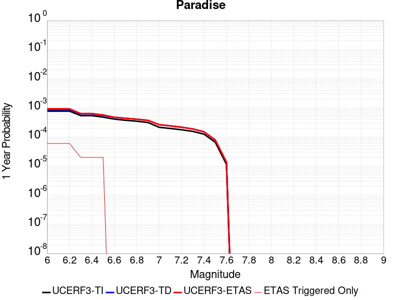 |  |

| Magnitude | 1 wk TI Prob | 1 wk TD Prob | 1 wk ETAS Prob | 1 wk ETAS/TD Gain | 1 wk ETAS Triggered Only | 1 mo TI Prob | 1 mo TD Prob | 1 mo ETAS Prob | 1 mo ETAS/TD Gain | 1 mo ETAS Triggered Only | 1 yr TI Prob | 1 yr TD Prob | 1 yr ETAS Prob | 1 yr ETAS/TD Gain | 1 yr ETAS Triggered Only | 10 yr TI Prob | 10 yr TD Prob | 10 yr ETAS Prob | 10 yr ETAS/TD Gain | 10 yr ETAS Triggered Only |
|-----|-----|-----|-----|-----|-----|-----|-----|-----|-----|-----|-----|-----|-----|-----|-----|-----|-----|-----|-----|-----|
| 6.0 | 1.4851273E-5 | 1.6695341E-5 | 2.6695174E-5 | 1.5989594 | 1.0E-5 | 6.364676E-5 | 7.154963E-5 | 1.1154677E-4 | 1.5590125 | 4.0E-5 | 7.7462377E-4 | 8.707922E-4 | 9.3074E-4 | 1.0688428 | 6.0E-5 | 0.0077192914 | 0.008676181 | 0.008795139 | 1.013711 | 1.2E-4 |
| 6.1 | 1.4851273E-5 | 1.6695341E-5 | 2.6695174E-5 | 1.5989594 | 1.0E-5 | 6.364676E-5 | 7.154963E-5 | 1.1154677E-4 | 1.5590125 | 4.0E-5 | 7.7462377E-4 | 8.707922E-4 | 9.3074E-4 | 1.0688428 | 6.0E-5 | 0.0077192914 | 0.008676181 | 0.008795139 | 1.013711 | 1.2E-4 |
| 6.2 | 1.4851273E-5 | 1.6695341E-5 | 2.6695174E-5 | 1.5989594 | 1.0E-5 | 6.364676E-5 | 7.154963E-5 | 1.1154677E-4 | 1.5590125 | 4.0E-5 | 7.7462377E-4 | 8.707922E-4 | 9.3074E-4 | 1.0688428 | 6.0E-5 | 0.0077192914 | 0.008676181 | 0.008795139 | 1.013711 | 1.2E-4 |
| 6.3 | 1.0426831E-5 | 1.1889049E-5 | 2.188893E-5 | 1.8411001 | 1.0E-5 | 4.4685654E-5 | 5.095211E-5 | 6.09516E-5 | 1.1962527 | 1.0E-5 | 5.43912E-4 | 6.2017125E-4 | 6.401589E-4 | 1.0322292 | 2.0E-5 | 0.0054258266 | 0.0061850143 | 0.006234705 | 1.0080341 | 5.0E-5 |
| 6.4 | 1.0426831E-5 | 1.1889049E-5 | 2.188893E-5 | 1.8411001 | 1.0E-5 | 4.4685654E-5 | 5.095211E-5 | 6.09516E-5 | 1.1962527 | 1.0E-5 | 5.43912E-4 | 6.2017125E-4 | 6.401589E-4 | 1.0322292 | 2.0E-5 | 0.0054258266 | 0.0061850143 | 0.006234705 | 1.0080341 | 5.0E-5 |
| 6.5 | 9.25027E-6 | 1.0620336E-5 | 2.062023E-5 | 1.9415798 | 1.0E-5 | 3.964341E-5 | 4.551496E-5 | 5.5514505E-5 | 1.219698 | 1.0E-5 | 4.8255164E-4 | 5.5400864E-4 | 5.7399756E-4 | 1.0360805 | 2.0E-5 | 0.0048150513 | 0.0055267746 | 0.005556609 | 1.0053982 | 3.0E-5 |
| 6.6 | 7.904275E-6 | 9.159836E-6 | 9.159836E-6 | 1.0 | 0.0 | 3.3875025E-5 | 3.925587E-5 | 3.925587E-5 | 1.0 | 0.0 | 4.1235037E-4 | 4.7783932E-4 | 4.7783932E-4 | 1.0 | 0.0 | 0.0041158604 | 0.0047685155 | 0.0047685155 | 1.0 | 0.0 |
| 6.7 | 7.2061953E-6 | 8.407527E-6 | 8.407527E-6 | 1.0 | 0.0 | 3.088333E-5 | 3.6031786E-5 | 3.6031786E-5 | 1.0 | 0.0 | 3.7593965E-4 | 4.3860235E-4 | 4.3860235E-4 | 1.0 | 0.0 | 0.003753043 | 0.0043777362 | 0.0043777362 | 1.0 | 0.0 |
| 6.8 | 6.6948724E-6 | 7.842423E-6 | 7.842423E-6 | 1.0 | 0.0 | 2.8691995E-5 | 3.3609973E-5 | 3.3609973E-5 | 1.0 | 0.0 | 3.4926904E-4 | 4.0912814E-4 | 4.0912814E-4 | 1.0 | 0.0 | 0.003487206 | 0.004084107 | 0.004084107 | 1.0 | 0.0 |
| 6.9 | 6.0421025E-6 | 7.1308505E-6 | 7.1308505E-6 | 1.0 | 0.0 | 2.5894467E-5 | 3.0560448E-5 | 3.0560448E-5 | 1.0 | 0.0 | 3.1521954E-4 | 3.7201334E-4 | 3.7201334E-4 | 1.0 | 0.0 | 0.0031477278 | 0.003714244 | 0.003714244 | 1.0 | 0.0 |
| 7.0 | 4.134091E-6 | 5.080469E-6 | 5.080469E-6 | 1.0 | 0.0 | 1.7717413E-5 | 2.1773263E-5 | 2.1773263E-5 | 1.0 | 0.0 | 2.1568815E-4 | 2.6505877E-4 | 2.6505877E-4 | 1.0 | 0.0 | 0.0021547892 | 0.0026475794 | 0.0026475794 | 1.0 | 0.0 |
| 7.1 | 3.7674888E-6 | 4.6320133E-6 | 4.6320133E-6 | 1.0 | 0.0 | 1.6146281E-5 | 1.9851343E-5 | 1.9851343E-5 | 1.0 | 0.0 | 1.9656324E-4 | 2.4166482E-4 | 2.4166482E-4 | 1.0 | 0.0 | 0.0019638946 | 0.002414171 | 0.002414171 | 1.0 | 0.0 |
| 7.2 | 3.4065345E-6 | 4.1568514E-6 | 4.1568514E-6 | 1.0 | 0.0 | 1.4599351E-5 | 1.7814966E-5 | 1.7814966E-5 | 1.0 | 0.0 | 1.777326E-4 | 2.1687712E-4 | 2.1687712E-4 | 1.0 | 0.0 | 0.0017759053 | 0.0021668028 | 0.0021668028 | 1.0 | 0.0 |
| 7.3 | 2.9934936E-6 | 3.629423E-6 | 3.629423E-6 | 1.0 | 0.0 | 1.2829195E-5 | 1.5554586E-5 | 1.5554586E-5 | 1.0 | 0.0 | 1.5618425E-4 | 1.893621E-4 | 1.893621E-4 | 1.0 | 0.0 | 0.0015607453 | 0.0018921527 | 0.0018921527 | 1.0 | 0.0 |
| 7.4 | 2.4049796E-6 | 2.889062E-6 | 2.889062E-6 | 1.0 | 0.0 | 1.0307015E-5 | 1.23816435E-5 | 1.23816435E-5 | 1.0 | 0.0 | 1.2548068E-4 | 1.5073753E-4 | 1.5073753E-4 | 1.0 | 0.0 | 0.0012540985 | 0.0015064942 | 0.0015064942 | 1.0 | 0.0 |
| 7.5 | 1.2710091E-6 | 1.5135054E-6 | 1.5135054E-6 | 1.0 | 0.0 | 5.44717E-6 | 6.4864425E-6 | 6.4864425E-6 | 1.0 | 0.0 | 6.631728E-5 | 7.897083E-5 | 7.897083E-5 | 1.0 | 0.0 | 6.6297496E-4 | 7.8955025E-4 | 7.8955025E-4 | 1.0 | 0.0 |
| 7.6 | 2.21172E-7 | 2.6040124E-7 | 2.6040124E-7 | 1.0 | 0.0 | 9.478797E-7 | 1.116005E-6 | 1.116005E-6 | 1.0 | 0.0 | 1.1540374E-5 | 1.3587305E-5 | 1.3587305E-5 | 1.0 | 0.0 | 1.1539775E-4 | 1.3586757E-4 | 1.3586757E-4 | 1.0 | 0.0 |

## Coyote Canyon
*[(top)](#table-of-contents)*

| 1 Week | 1 Month | 1 Year | 10 Year |
|-----|-----|-----|-----|
|  | 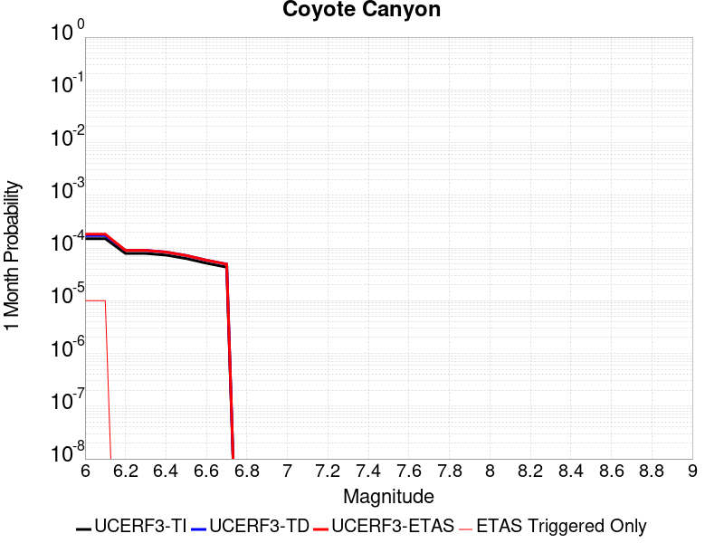 |  |  |

| Magnitude | 1 wk TI Prob | 1 wk TD Prob | 1 wk ETAS Prob | 1 wk ETAS/TD Gain | 1 wk ETAS Triggered Only | 1 mo TI Prob | 1 mo TD Prob | 1 mo ETAS Prob | 1 mo ETAS/TD Gain | 1 mo ETAS Triggered Only | 1 yr TI Prob | 1 yr TD Prob | 1 yr ETAS Prob | 1 yr ETAS/TD Gain | 1 yr ETAS Triggered Only | 10 yr TI Prob | 10 yr TD Prob | 10 yr ETAS Prob | 10 yr ETAS/TD Gain | 10 yr ETAS Triggered Only |
|-----|-----|-----|-----|-----|-----|-----|-----|-----|-----|-----|-----|-----|-----|-----|-----|-----|-----|-----|-----|-----|
| 6.0 | 3.5090034E-5 | 4.0367544E-5 | 5.0367144E-5 | 1.2477138 | 1.0E-5 | 1.503772E-4 | 1.7299375E-4 | 1.8299202E-4 | 1.0577955 | 1.0E-5 | 0.0018293047 | 0.0021044204 | 0.0021543151 | 1.0237095 | 5.0E-5 | 0.018143194 | 0.020870851 | 0.020968765 | 1.0046914 | 1.0E-4 |
| 6.1 | 3.5090034E-5 | 4.0367544E-5 | 5.0367144E-5 | 1.2477138 | 1.0E-5 | 1.503772E-4 | 1.7299375E-4 | 1.8299202E-4 | 1.0577955 | 1.0E-5 | 0.0018293047 | 0.0021044204 | 0.0021543151 | 1.0237095 | 5.0E-5 | 0.018143194 | 0.020870851 | 0.020968765 | 1.0046914 | 1.0E-4 |
| 6.2 | 1.841879E-5 | 2.1061396E-5 | 2.1061396E-5 | 1.0 | 0.0 | 7.8935285E-5 | 9.026058E-5 | 9.026058E-5 | 1.0 | 0.0 | 9.606133E-4 | 0.0010984705 | 0.0011184486 | 1.0181872 | 2.0E-5 | 0.0095647145 | 0.010940496 | 0.010989949 | 1.0045202 | 5.0E-5 |
| 6.3 | 1.841879E-5 | 2.1061396E-5 | 2.1061396E-5 | 1.0 | 0.0 | 7.8935285E-5 | 9.026058E-5 | 9.026058E-5 | 1.0 | 0.0 | 9.606133E-4 | 0.0010984705 | 0.0011184486 | 1.0181872 | 2.0E-5 | 0.0095647145 | 0.010940496 | 0.010989949 | 1.0045202 | 5.0E-5 |
| 6.4 | 1.712201E-5 | 1.9566693E-5 | 1.9566693E-5 | 1.0 | 0.0 | 7.337798E-5 | 8.385513E-5 | 8.385513E-5 | 1.0 | 0.0 | 8.930107E-4 | 0.0010205585 | 0.0010405382 | 1.0195771 | 2.0E-5 | 0.008894307 | 0.010168637 | 0.01020823 | 1.0038936 | 4.0E-5 |
| 6.5 | 1.4744935E-5 | 1.683824E-5 | 1.683824E-5 | 1.0 | 0.0 | 6.3191044E-5 | 7.216242E-5 | 7.216242E-5 | 1.0 | 0.0 | 7.6907943E-4 | 8.7831676E-4 | 8.982992E-4 | 1.0227509 | 2.0E-5 | 0.007664232 | 0.008757652 | 0.008797301 | 1.0045274 | 4.0E-5 |
| 6.6 | 1.2017839E-5 | 1.3725124E-5 | 1.3725124E-5 | 1.0 | 0.0 | 5.150401E-5 | 5.882113E-5 | 5.882113E-5 | 1.0 | 0.0 | 6.268809E-4 | 7.1600056E-4 | 7.359862E-4 | 1.027913 | 2.0E-5 | 0.0062511545 | 0.007145631 | 0.007185345 | 1.0055578 | 4.0E-5 |
| 6.7 | 1.00956095E-5 | 1.1534388E-5 | 1.1534388E-5 | 1.0 | 0.0 | 4.326618E-5 | 4.943265E-5 | 4.943265E-5 | 1.0 | 0.0 | 5.266384E-4 | 6.0176325E-4 | 6.2175124E-4 | 1.0332156 | 2.0E-5 | 0.005253921 | 0.006009866 | 0.0060496256 | 1.0066158 | 4.0E-5 |

## Scodie Lineament
*[(top)](#table-of-contents)*

| 1 Week | 1 Month | 1 Year | 10 Year |
|-----|-----|-----|-----|
|  |  |  | 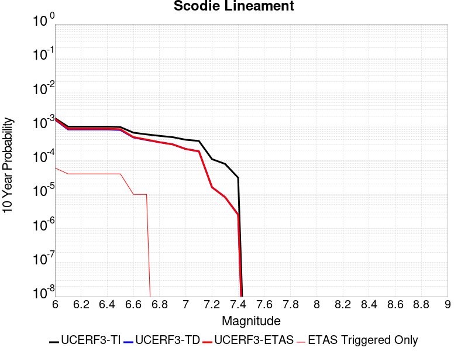 |

| Magnitude | 1 wk TI Prob | 1 wk TD Prob | 1 wk ETAS Prob | 1 wk ETAS/TD Gain | 1 wk ETAS Triggered Only | 1 mo TI Prob | 1 mo TD Prob | 1 mo ETAS Prob | 1 mo ETAS/TD Gain | 1 mo ETAS Triggered Only | 1 yr TI Prob | 1 yr TD Prob | 1 yr ETAS Prob | 1 yr ETAS/TD Gain | 1 yr ETAS Triggered Only | 10 yr TI Prob | 10 yr TD Prob | 10 yr ETAS Prob | 10 yr ETAS/TD Gain | 10 yr ETAS Triggered Only |
|-----|-----|-----|-----|-----|-----|-----|-----|-----|-----|-----|-----|-----|-----|-----|-----|-----|-----|-----|-----|-----|
| 6.0 | 3.2919327E-6 | 3.0133992E-6 | 3.0133992E-6 | 1.0 | 0.0 | 1.4108206E-5 | 1.2914522E-5 | 2.2914393E-5 | 1.7743121 | 1.0E-5 | 1.7175387E-4 | 1.5722614E-4 | 1.7722299E-4 | 1.1271853 | 2.0E-5 | 0.0017162118 | 0.0015714606 | 0.0016313663 | 1.038121 | 6.0E-5 |
| 6.1 | 1.8663811E-6 | 1.5490858E-6 | 1.5490858E-6 | 1.0 | 0.0 | 7.998751E-6 | 6.6389252E-6 | 1.6638858E-5 | 2.506258 | 1.0E-5 | 9.738045E-5 | 8.082641E-5 | 9.0825604E-5 | 1.123712 | 1.0E-5 | 9.7337784E-4 | 8.0801896E-4 | 8.4798667E-4 | 1.0494637 | 4.0E-5 |
| 6.2 | 1.8663811E-6 | 1.5490858E-6 | 1.5490858E-6 | 1.0 | 0.0 | 7.998751E-6 | 6.6389252E-6 | 1.6638858E-5 | 2.506258 | 1.0E-5 | 9.738045E-5 | 8.082641E-5 | 9.0825604E-5 | 1.123712 | 1.0E-5 | 9.7337784E-4 | 8.0801896E-4 | 8.4798667E-4 | 1.0494637 | 4.0E-5 |
| 6.3 | 1.8663811E-6 | 1.5490858E-6 | 1.5490858E-6 | 1.0 | 0.0 | 7.998751E-6 | 6.6389252E-6 | 1.6638858E-5 | 2.506258 | 1.0E-5 | 9.738045E-5 | 8.082641E-5 | 9.0825604E-5 | 1.123712 | 1.0E-5 | 9.7337784E-4 | 8.0801896E-4 | 8.4798667E-4 | 1.0494637 | 4.0E-5 |
| 6.4 | 1.8663811E-6 | 1.5490858E-6 | 1.5490858E-6 | 1.0 | 0.0 | 7.998751E-6 | 6.6389252E-6 | 1.6638858E-5 | 2.506258 | 1.0E-5 | 9.738045E-5 | 8.082641E-5 | 9.0825604E-5 | 1.123712 | 1.0E-5 | 9.7337784E-4 | 8.0801896E-4 | 8.4798667E-4 | 1.0494637 | 4.0E-5 |
| 6.5 | 1.8106311E-6 | 1.4910186E-6 | 1.4910186E-6 | 1.0 | 0.0 | 7.759824E-6 | 6.3900666E-6 | 1.6390002E-5 | 2.564919 | 1.0E-5 | 9.447177E-5 | 7.779678E-5 | 8.7796005E-5 | 1.12853 | 1.0E-5 | 9.4431615E-4 | 7.777441E-4 | 8.17713E-4 | 1.0513908 | 4.0E-5 |
| 6.6 | 1.2414679E-6 | 8.997782E-7 | 8.997782E-7 | 1.0 | 0.0 | 5.320566E-6 | 3.856187E-6 | 3.856187E-6 | 1.0 | 0.0 | 6.477596E-5 | 4.6948153E-5 | 4.6948153E-5 | 1.0 | 0.0 | 6.475708E-4 | 4.69391E-4 | 4.793863E-4 | 1.0212942 | 1.0E-5 |
| 6.7 | 1.1062215E-6 | 7.5945076E-7 | 7.5945076E-7 | 1.0 | 0.0 | 4.7409408E-6 | 3.2547853E-6 | 3.2547853E-6 | 1.0 | 0.0 | 5.7719422E-5 | 3.962636E-5 | 3.962636E-5 | 1.0 | 0.0 | 5.770443E-4 | 3.9619993E-4 | 4.0619596E-4 | 1.0252298 | 1.0E-5 |
| 6.8 | 1.0006736E-6 | 6.500572E-7 | 6.500572E-7 | 1.0 | 0.0 | 4.288594E-6 | 2.7859567E-6 | 2.7859567E-6 | 1.0 | 0.0 | 5.221238E-5 | 3.3918557E-5 | 3.3918557E-5 | 1.0 | 0.0 | 5.220012E-4 | 3.391399E-4 | 3.391399E-4 | 1.0 | 0.0 |
| 6.9 | 9.167364E-7 | 5.631784E-7 | 5.631784E-7 | 1.0 | 0.0 | 3.9288643E-6 | 2.4136198E-6 | 2.4136198E-6 | 1.0 | 0.0 | 4.7832873E-5 | 2.9385481E-5 | 2.9385481E-5 | 1.0 | 0.0 | 4.782258E-4 | 2.9382162E-4 | 2.9382162E-4 | 1.0 | 0.0 |
| 7.0 | 7.6987664E-7 | 4.113515E-7 | 4.113515E-7 | 1.0 | 0.0 | 3.2994672E-6 | 1.762934E-6 | 1.762934E-6 | 1.0 | 0.0 | 4.0170275E-5 | 2.146355E-5 | 2.146355E-5 | 1.0 | 0.0 | 4.0163012E-4 | 2.1461862E-4 | 2.1461862E-4 | 1.0 | 0.0 |
| 7.1 | 7.1038727E-7 | 3.5212707E-7 | 3.5212707E-7 | 1.0 | 0.0 | 3.0445133E-6 | 1.5091154E-6 | 1.5091154E-6 | 1.0 | 0.0 | 3.706632E-5 | 1.837336E-5 | 1.837336E-5 | 1.0 | 0.0 | 3.7060137E-4 | 1.837219E-4 | 1.837219E-4 | 1.0 | 0.0 |
| 7.2 | 2.0799602E-7 | 3.1190186E-8 | 3.1190186E-8 | 1.0 | 0.0 | 8.914113E-7 | 1.3367222E-7 | 1.3367222E-7 | 1.0 | 0.0 | 1.0852878E-5 | 1.6274581E-6 | 1.6274581E-6 | 1.0 | 0.0 | 1.08523476E-4 | 1.6274469E-5 | 1.6274469E-5 | 1.0 | 0.0 |
| 7.3 | 1.5048182E-7 | 1.5947961E-8 | 1.5947961E-8 | 1.0 | 0.0 | 6.449219E-7 | 6.8348406E-8 | 6.8348406E-8 | 1.0 | 0.0 | 7.851896E-6 | 8.3214155E-7 | 8.3214155E-7 | 1.0 | 0.0 | 7.851618E-5 | 8.321387E-6 | 8.321387E-6 | 1.0 | 0.0 |
| 7.4 | 5.9334678E-8 | 4.86919E-9 | 4.86919E-9 | 1.0 | 0.0 | 2.5429145E-7 | 2.0867958E-8 | 2.0867958E-8 | 1.0 | 0.0 | 3.095994E-6 | 2.5406737E-7 | 2.5406737E-7 | 1.0 | 0.0 | 3.095951E-5 | 2.5406719E-6 | 2.5406719E-6 | 1.0 | 0.0 |

## San Andreas (San Gorgonio Pass-Garnet HIll)
*[(top)](#table-of-contents)*

| 1 Week | 1 Month | 1 Year | 10 Year |
|-----|-----|-----|-----|
| 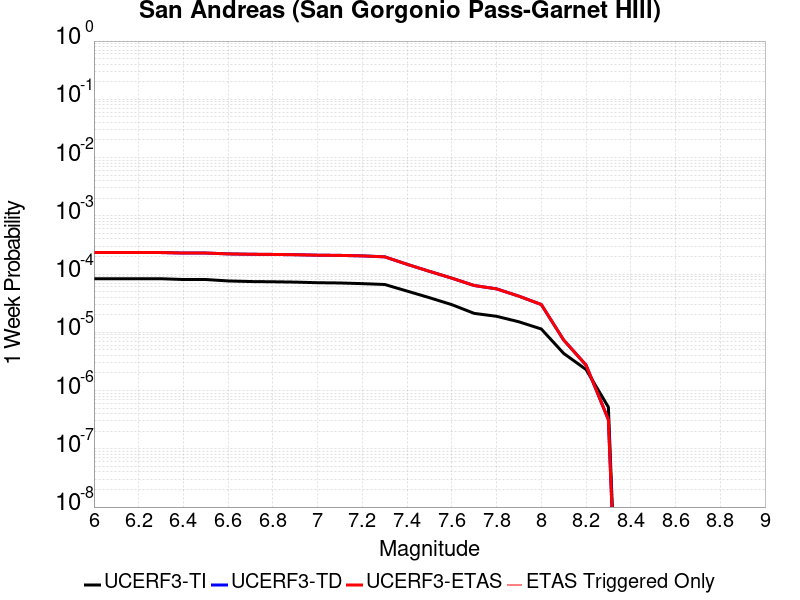 | 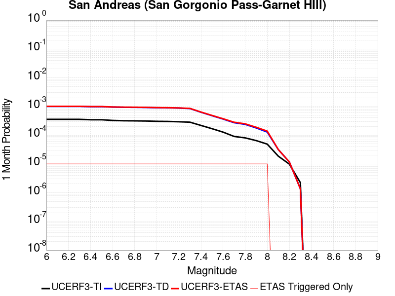 |  |  |

| Magnitude | 1 wk TI Prob | 1 wk TD Prob | 1 wk ETAS Prob | 1 wk ETAS/TD Gain | 1 wk ETAS Triggered Only | 1 mo TI Prob | 1 mo TD Prob | 1 mo ETAS Prob | 1 mo ETAS/TD Gain | 1 mo ETAS Triggered Only | 1 yr TI Prob | 1 yr TD Prob | 1 yr ETAS Prob | 1 yr ETAS/TD Gain | 1 yr ETAS Triggered Only | 10 yr TI Prob | 10 yr TD Prob | 10 yr ETAS Prob | 10 yr ETAS/TD Gain | 10 yr ETAS Triggered Only |
|-----|-----|-----|-----|-----|-----|-----|-----|-----|-----|-----|-----|-----|-----|-----|-----|-----|-----|-----|-----|-----|
| 6.0 | 8.31567E-5 | 2.3398406E-4 | 2.3398406E-4 | 1.0 | 0.0 | 3.5633717E-4 | 0.001002406 | 0.001012396 | 1.009966 | 1.0E-5 | 0.004329778 | 0.012136027 | 0.01218542 | 1.0040699 | 5.0E-5 | 0.042463828 | 0.11264349 | 0.11269673 | 1.0004727 | 6.0E-5 |
| 6.1 | 8.31567E-5 | 2.3398406E-4 | 2.3398406E-4 | 1.0 | 0.0 | 3.5633717E-4 | 0.001002406 | 0.001012396 | 1.009966 | 1.0E-5 | 0.004329778 | 0.012136027 | 0.01218542 | 1.0040699 | 5.0E-5 | 0.042463828 | 0.11264349 | 0.11269673 | 1.0004727 | 6.0E-5 |
| 6.2 | 8.31567E-5 | 2.3398406E-4 | 2.3398406E-4 | 1.0 | 0.0 | 3.5633717E-4 | 0.001002406 | 0.001012396 | 1.009966 | 1.0E-5 | 0.004329778 | 0.012136027 | 0.01218542 | 1.0040699 | 5.0E-5 | 0.042463828 | 0.11264349 | 0.11269673 | 1.0004727 | 6.0E-5 |
| 6.3 | 8.31567E-5 | 2.3398406E-4 | 2.3398406E-4 | 1.0 | 0.0 | 3.5633717E-4 | 0.001002406 | 0.001012396 | 1.009966 | 1.0E-5 | 0.004329778 | 0.012136027 | 0.01218542 | 1.0040699 | 5.0E-5 | 0.042463828 | 0.11264349 | 0.11269673 | 1.0004727 | 6.0E-5 |
| 6.4 | 8.059055E-5 | 2.2956554E-4 | 2.2956554E-4 | 1.0 | 0.0 | 3.4534236E-4 | 9.834839E-4 | 9.93474E-4 | 1.010158 | 1.0E-5 | 0.0041964394 | 0.011908189 | 0.011957594 | 1.0041488 | 5.0E-5 | 0.041180745 | 0.11062444 | 0.11067781 | 1.0004823 | 6.0E-5 |
| 6.5 | 8.059055E-5 | 2.2956554E-4 | 2.2956554E-4 | 1.0 | 0.0 | 3.4534236E-4 | 9.834839E-4 | 9.93474E-4 | 1.010158 | 1.0E-5 | 0.0041964394 | 0.011908189 | 0.011957594 | 1.0041488 | 5.0E-5 | 0.041180745 | 0.11062444 | 0.11067781 | 1.0004823 | 6.0E-5 |
| 6.6 | 7.619237E-5 | 2.2200657E-4 | 2.2200657E-4 | 1.0 | 0.0 | 3.2649786E-4 | 9.511121E-4 | 9.6110255E-4 | 1.010504 | 1.0E-5 | 0.0039678677 | 0.011518859 | 0.011568284 | 1.0042907 | 5.0E-5 | 0.03897764 | 0.107160784 | 0.10721436 | 1.0005 | 6.0E-5 |
| 6.7 | 7.440636E-5 | 2.1876446E-4 | 2.1876446E-4 | 1.0 | 0.0 | 3.188454E-4 | 9.372274E-4 | 9.47218E-4 | 1.0106598 | 1.0E-5 | 0.0038750346 | 0.01135158 | 0.011401013 | 1.0043547 | 5.0E-5 | 0.038081564 | 0.105669186 | 0.105722845 | 1.0005078 | 6.0E-5 |
| 6.8 | 7.3735864E-5 | 2.1723597E-4 | 2.1723597E-4 | 1.0 | 0.0 | 3.1597257E-4 | 9.306814E-4 | 9.4067206E-4 | 1.0107348 | 1.0E-5 | 0.0038401815 | 0.011272711 | 0.011322147 | 1.0043855 | 5.0E-5 | 0.03774495 | 0.1049707 | 0.105024405 | 1.0005116 | 6.0E-5 |
| 6.9 | 7.27575E-5 | 2.1492546E-4 | 2.1492546E-4 | 1.0 | 0.0 | 3.117806E-4 | 9.207862E-4 | 9.30777E-4 | 1.0108503 | 1.0E-5 | 0.003789323 | 0.011153476 | 0.011202918 | 1.0044329 | 5.0E-5 | 0.037253562 | 0.10391858 | 0.103972346 | 1.0005174 | 6.0E-5 |
| 7.0 | 7.102591E-5 | 2.1076521E-4 | 2.1076521E-4 | 1.0 | 0.0 | 3.0436125E-4 | 9.02969E-4 | 9.1296E-4 | 1.0110645 | 1.0E-5 | 0.003699303 | 0.010938748 | 0.010988201 | 1.0045209 | 5.0E-5 | 0.03638325 | 0.102020636 | 0.10207451 | 1.0005281 | 6.0E-5 |
| 7.1 | 7.028513E-5 | 2.0912137E-4 | 2.0912137E-4 | 1.0 | 0.0 | 3.0118722E-4 | 8.959288E-4 | 9.059199E-4 | 1.0111516 | 1.0E-5 | 0.0036607897 | 0.01085389 | 0.010903348 | 1.0045567 | 5.0E-5 | 0.036010686 | 0.10126359 | 0.10131752 | 1.0005325 | 6.0E-5 |
| 7.2 | 6.8498244E-5 | 2.0519937E-4 | 2.0519937E-4 | 1.0 | 0.0 | 2.9353087E-4 | 8.7913166E-4 | 8.8912284E-4 | 1.0113648 | 1.0E-5 | 0.003567883 | 0.0106514 | 0.0107008675 | 1.0046443 | 5.0E-5 | 0.035111405 | 0.09945543 | 0.09950946 | 1.0005432 | 6.0E-5 |
| 7.3 | 6.622592E-5 | 1.9747039E-4 | 1.9747039E-4 | 1.0 | 0.0 | 2.8379448E-4 | 8.460293E-4 | 8.560209E-4 | 1.01181 | 1.0E-5 | 0.0034497243 | 0.010252241 | 0.010301728 | 1.004827 | 5.0E-5 | 0.033966612 | 0.09595134 | 0.09600559 | 1.0005653 | 6.0E-5 |
| 7.4 | 5.1050705E-5 | 1.4701985E-4 | 1.4701985E-4 | 1.0 | 0.0 | 2.1877038E-4 | 6.299338E-4 | 6.399275E-4 | 1.0158647 | 1.0E-5 | 0.002660276 | 0.0076426673 | 0.0076922853 | 1.0064923 | 5.0E-5 | 0.02628654 | 0.07291896 | 0.072974585 | 1.0007628 | 6.0E-5 |
| 7.5 | 3.9302922E-5 | 1.1141107E-4 | 1.1141107E-4 | 1.0 | 0.0 | 1.6843023E-4 | 4.7738897E-4 | 4.873842E-4 | 1.0209373 | 1.0E-5 | 0.0020487092 | 0.005796791 | 0.0058465013 | 1.0085754 | 5.0E-5 | 0.020299247 | 0.056059215 | 0.05611585 | 1.0010103 | 6.0E-5 |
| 7.6 | 2.9851626E-5 | 8.504997E-5 | 8.504997E-5 | 1.0 | 0.0 | 1.2792926E-4 | 3.6444908E-4 | 3.7444543E-4 | 1.0274286 | 1.0E-5 | 0.0015564259 | 0.0044281655 | 0.004477944 | 1.0112413 | 5.0E-5 | 0.0154556995 | 0.043238558 | 0.043295965 | 1.0013276 | 6.0E-5 |
| 7.7 | 2.1135214E-5 | 6.361802E-5 | 6.361802E-5 | 1.0 | 0.0 | 9.0576345E-5 | 2.726202E-4 | 2.8261746E-4 | 1.036671 | 1.0E-5 | 0.0011022091 | 0.0033141046 | 0.003363939 | 1.0150371 | 5.0E-5 | 0.010967582 | 0.032622673 | 0.032680713 | 1.0017792 | 6.0E-5 |
| 7.8 | 1.883379E-5 | 5.572194E-5 | 5.572194E-5 | 1.0 | 0.0 | 8.0713755E-5 | 2.3878647E-4 | 2.4878408E-4 | 1.0418684 | 1.0E-5 | 9.822468E-4 | 0.0029033525 | 0.0029532074 | 1.0171715 | 5.0E-5 | 0.0097791655 | 0.028732158 | 0.028790435 | 1.0020282 | 6.0E-5 |
| 7.9 | 1.5156185E-5 | 4.1725576E-5 | 4.1725576E-5 | 1.0 | 0.0 | 6.495346E-5 | 1.7881165E-4 | 1.8880986E-4 | 1.0559148 | 1.0E-5 | 7.9052144E-4 | 0.0021748596 | 0.0022247508 | 1.02294 | 5.0E-5 | 0.007877152 | 0.021790246 | 0.02184894 | 1.0026935 | 6.0E-5 |
| 8.0 | 1.1405907E-5 | 3.0024876E-5 | 3.0024876E-5 | 1.0 | 0.0 | 4.8881542E-5 | 1.286717E-4 | 1.3867041E-4 | 1.0777072 | 1.0E-5 | 5.9497025E-4 | 0.0015654531 | 0.0015954062 | 1.0191338 | 3.0E-5 | 0.005933798 | 0.015796356 | 0.015835725 | 1.0024922 | 4.0E-5 |
| 8.1 | 4.3511436E-6 | 7.3873994E-6 | 7.3873994E-6 | 1.0 | 0.0 | 1.8647626E-5 | 3.16599E-5 | 3.16599E-5 | 1.0 | 0.0 | 2.2701119E-4 | 3.8539123E-4 | 3.8539123E-4 | 1.0 | 0.0 | 0.0022677942 | 0.0041254 | 0.0041254 | 1.0 | 0.0 |
| 8.2 | 2.3042528E-6 | 2.74142E-6 | 2.74142E-6 | 1.0 | 0.0 | 9.875332E-6 | 1.174889E-5 | 1.174889E-5 | 1.0 | 0.0 | 1.2022553E-4 | 1.430334E-4 | 1.430334E-4 | 1.0 | 0.0 | 0.0012016051 | 0.0016024038 | 0.0016024038 | 1.0 | 0.0 |
| 8.3 | 5.202968E-7 | 3.171921E-7 | 3.171921E-7 | 1.0 | 0.0 | 2.2298414E-6 | 1.3593941E-6 | 1.3593941E-6 | 1.0 | 0.0 | 2.714798E-5 | 1.655051E-5 | 1.655051E-5 | 1.0 | 0.0 | 2.7144665E-4 | 1.9631305E-4 | 1.9631305E-4 | 1.0 | 0.0 |

## Sierra Nevada  (No Extension)
*[(top)](#table-of-contents)*

| 1 Week | 1 Month | 1 Year | 10 Year |
|-----|-----|-----|-----|
|  |  |  |  |

| Magnitude | 1 wk TI Prob | 1 wk TD Prob | 1 wk ETAS Prob | 1 wk ETAS/TD Gain | 1 wk ETAS Triggered Only | 1 mo TI Prob | 1 mo TD Prob | 1 mo ETAS Prob | 1 mo ETAS/TD Gain | 1 mo ETAS Triggered Only | 1 yr TI Prob | 1 yr TD Prob | 1 yr ETAS Prob | 1 yr ETAS/TD Gain | 1 yr ETAS Triggered Only | 10 yr TI Prob | 10 yr TD Prob | 10 yr ETAS Prob | 10 yr ETAS/TD Gain | 10 yr ETAS Triggered Only |
|-----|-----|-----|-----|-----|-----|-----|-----|-----|-----|-----|-----|-----|-----|-----|-----|-----|-----|-----|-----|-----|
| 6.0 | 7.7690465E-6 | 6.976568E-6 | 6.976568E-6 | 1.0 | 0.0 | 3.329549E-5 | 2.9899435E-5 | 3.9899136E-5 | 1.3344445 | 1.0E-5 | 4.0529718E-4 | 3.6400068E-4 | 4.039861E-4 | 1.1098499 | 4.0E-5 | 0.004045588 | 0.0036375606 | 0.0036973425 | 1.0164346 | 6.0E-5 |
| 6.1 | 7.7690465E-6 | 6.976568E-6 | 6.976568E-6 | 1.0 | 0.0 | 3.329549E-5 | 2.9899435E-5 | 3.9899136E-5 | 1.3344445 | 1.0E-5 | 4.0529718E-4 | 3.6400068E-4 | 4.039861E-4 | 1.1098499 | 4.0E-5 | 0.004045588 | 0.0036375606 | 0.0036973425 | 1.0164346 | 6.0E-5 |
| 6.2 | 7.7690465E-6 | 6.976568E-6 | 6.976568E-6 | 1.0 | 0.0 | 3.329549E-5 | 2.9899435E-5 | 3.9899136E-5 | 1.3344445 | 1.0E-5 | 4.0529718E-4 | 3.6400068E-4 | 4.039861E-4 | 1.1098499 | 4.0E-5 | 0.004045588 | 0.0036375606 | 0.0036973425 | 1.0164346 | 6.0E-5 |
| 6.3 | 7.7690465E-6 | 6.976568E-6 | 6.976568E-6 | 1.0 | 0.0 | 3.329549E-5 | 2.9899435E-5 | 3.9899136E-5 | 1.3344445 | 1.0E-5 | 4.0529718E-4 | 3.6400068E-4 | 4.039861E-4 | 1.1098499 | 4.0E-5 | 0.004045588 | 0.0036375606 | 0.0036973425 | 1.0164346 | 6.0E-5 |
| 6.4 | 7.7690465E-6 | 6.976568E-6 | 6.976568E-6 | 1.0 | 0.0 | 3.329549E-5 | 2.9899435E-5 | 3.9899136E-5 | 1.3344445 | 1.0E-5 | 4.0529718E-4 | 3.6400068E-4 | 4.039861E-4 | 1.1098499 | 4.0E-5 | 0.004045588 | 0.0036375606 | 0.0036973425 | 1.0164346 | 6.0E-5 |
| 6.5 | 7.7690465E-6 | 6.976568E-6 | 6.976568E-6 | 1.0 | 0.0 | 3.329549E-5 | 2.9899435E-5 | 3.9899136E-5 | 1.3344445 | 1.0E-5 | 4.0529718E-4 | 3.6400068E-4 | 4.039861E-4 | 1.1098499 | 4.0E-5 | 0.004045588 | 0.0036375606 | 0.0036973425 | 1.0164346 | 6.0E-5 |
| 6.6 | 2.653E-6 | 1.6149635E-6 | 1.6149635E-6 | 1.0 | 0.0 | 1.136995E-5 | 6.9212538E-6 | 6.9212538E-6 | 1.0 | 0.0 | 1.3842035E-4 | 8.426304E-5 | 1.0426136E-4 | 1.237332 | 2.0E-5 | 0.0013833415 | 8.4231433E-4 | 8.7228906E-4 | 1.0355861 | 3.0E-5 |
| 6.7 | 2.5902466E-6 | 1.5502959E-6 | 1.5502959E-6 | 1.0 | 0.0 | 1.11010095E-5 | 6.644109E-6 | 6.644109E-6 | 1.0 | 0.0 | 1.351464E-4 | 8.0889055E-5 | 1.0088743E-4 | 1.2472322 | 2.0E-5 | 0.0013506424 | 8.0859906E-4 | 8.3857484E-4 | 1.0370712 | 3.0E-5 |
| 6.8 | 2.5853892E-6 | 1.5470957E-6 | 1.5470957E-6 | 1.0 | 0.0 | 1.1080193E-5 | 6.6303933E-6 | 6.6303933E-6 | 1.0 | 0.0 | 1.34893E-4 | 8.072208E-5 | 1.0072046E-4 | 1.2477437 | 2.0E-5 | 0.0013481114 | 8.069306E-4 | 8.369064E-4 | 1.0371479 | 3.0E-5 |
| 6.9 | 2.458257E-6 | 1.4221675E-6 | 1.4221675E-6 | 1.0 | 0.0 | 1.0535345E-5 | 6.0949897E-6 | 6.0949897E-6 | 1.0 | 0.0 | 1.2826028E-4 | 7.420399E-5 | 9.420251E-5 | 1.2695073 | 2.0E-5 | 0.0012818627 | 7.4179407E-4 | 7.717718E-4 | 1.0404125 | 3.0E-5 |
| 7.0 | 2.4341468E-6 | 1.3991308E-6 | 1.3991308E-6 | 1.0 | 0.0 | 1.0432016E-5 | 5.9962613E-6 | 5.9962613E-6 | 1.0 | 0.0 | 1.270024E-4 | 7.3002055E-5 | 9.300059E-5 | 1.2739449 | 2.0E-5 | 0.0012692984 | 7.297827E-4 | 7.597608E-4 | 1.0410781 | 3.0E-5 |
| 7.1 | 2.3652476E-6 | 1.334079E-6 | 1.334079E-6 | 1.0 | 0.0 | 1.0136736E-5 | 5.717469E-6 | 5.717469E-6 | 1.0 | 0.0 | 1.2340778E-4 | 6.960797E-5 | 8.960658E-5 | 1.2873034 | 2.0E-5 | 0.0012333926 | 6.9586345E-4 | 7.2584255E-4 | 1.0430819 | 3.0E-5 |
| 7.2 | 2.272158E-6 | 1.2503832E-6 | 1.2503832E-6 | 1.0 | 0.0 | 9.737784E-6 | 5.358774E-6 | 5.358774E-6 | 1.0 | 0.0 | 1.1855107E-4 | 6.524114E-5 | 8.523984E-5 | 1.306535 | 2.0E-5 | 0.0011848784 | 6.522214E-4 | 6.822018E-4 | 1.0459666 | 3.0E-5 |
| 7.3 | 2.1382127E-6 | 1.1420682E-6 | 1.1420682E-6 | 1.0 | 0.0 | 9.163737E-6 | 4.894569E-6 | 4.894569E-6 | 1.0 | 0.0 | 1.1156279E-4 | 5.9589758E-5 | 7.9588564E-5 | 1.3356081 | 2.0E-5 | 0.001115068 | 5.95739E-4 | 6.257211E-4 | 1.0503277 | 3.0E-5 |
| 7.4 | 1.9048055E-6 | 9.57617E-7 | 9.57617E-7 | 1.0 | 0.0 | 8.163426E-6 | 4.104066E-6 | 4.104066E-6 | 1.0 | 0.0 | 9.9385186E-5 | 4.9965867E-5 | 6.9964866E-5 | 1.4002533 | 2.0E-5 | 9.934074E-4 | 4.99547E-4 | 5.2953203E-4 | 1.0600244 | 3.0E-5 |
| 7.5 | 1.5373403E-6 | 7.560832E-7 | 7.560832E-7 | 1.0 | 0.0 | 6.5885843E-6 | 3.2403525E-6 | 3.2403525E-6 | 1.0 | 0.0 | 8.021306E-5 | 3.9450584E-5 | 4.9450187E-5 | 1.2534717 | 1.0E-5 | 8.0184115E-4 | 3.9443627E-4 | 4.144284E-4 | 1.0506853 | 2.0E-5 |
| 7.6 | 1.0680322E-6 | 4.6602182E-7 | 4.6602182E-7 | 1.0 | 0.0 | 4.577273E-6 | 1.997235E-6 | 1.997235E-6 | 1.0 | 0.0 | 5.5726876E-5 | 2.4316065E-5 | 3.431582E-5 | 1.4112407 | 1.0E-5 | 5.5712904E-4 | 2.431343E-4 | 2.6312945E-4 | 1.082239 | 2.0E-5 |
| 7.7 | 5.509146E-7 | 1.558334E-7 | 1.558334E-7 | 1.0 | 0.0 | 2.3610605E-6 | 6.678573E-7 | 6.678573E-7 | 1.0 | 0.0 | 2.8745531E-5 | 8.131134E-6 | 8.131134E-6 | 1.0 | 0.0 | 2.8741814E-4 | 8.130848E-5 | 8.130848E-5 | 1.0 | 0.0 |

## Towne Pass
*[(top)](#table-of-contents)*

| 1 Week | 1 Month | 1 Year | 10 Year |
|-----|-----|-----|-----|
|  |  |  |  |

| Magnitude | 1 wk TI Prob | 1 wk TD Prob | 1 wk ETAS Prob | 1 wk ETAS/TD Gain | 1 wk ETAS Triggered Only | 1 mo TI Prob | 1 mo TD Prob | 1 mo ETAS Prob | 1 mo ETAS/TD Gain | 1 mo ETAS Triggered Only | 1 yr TI Prob | 1 yr TD Prob | 1 yr ETAS Prob | 1 yr ETAS/TD Gain | 1 yr ETAS Triggered Only | 10 yr TI Prob | 10 yr TD Prob | 10 yr ETAS Prob | 10 yr ETAS/TD Gain | 10 yr ETAS Triggered Only |
|-----|-----|-----|-----|-----|-----|-----|-----|-----|-----|-----|-----|-----|-----|-----|-----|-----|-----|-----|-----|-----|
| 6.0 | 3.849728E-6 | 3.8945745E-6 | 3.8945745E-6 | 1.0 | 0.0 | 1.649873E-5 | 1.669095E-5 | 1.669095E-5 | 1.0 | 0.0 | 2.0085352E-4 | 2.0319775E-4 | 2.2319368E-4 | 1.0984063 | 2.0E-5 | 0.0020067208 | 0.0020305486 | 0.0020904269 | 1.0294887 | 6.0E-5 |
| 6.1 | 3.849728E-6 | 3.8945745E-6 | 3.8945745E-6 | 1.0 | 0.0 | 1.649873E-5 | 1.669095E-5 | 1.669095E-5 | 1.0 | 0.0 | 2.0085352E-4 | 2.0319775E-4 | 2.2319368E-4 | 1.0984063 | 2.0E-5 | 0.0020067208 | 0.0020305486 | 0.0020904269 | 1.0294887 | 6.0E-5 |
| 6.2 | 3.849728E-6 | 3.8945745E-6 | 3.8945745E-6 | 1.0 | 0.0 | 1.649873E-5 | 1.669095E-5 | 1.669095E-5 | 1.0 | 0.0 | 2.0085352E-4 | 2.0319775E-4 | 2.2319368E-4 | 1.0984063 | 2.0E-5 | 0.0020067208 | 0.0020305486 | 0.0020904269 | 1.0294887 | 6.0E-5 |
| 6.3 | 3.849728E-6 | 3.8945745E-6 | 3.8945745E-6 | 1.0 | 0.0 | 1.649873E-5 | 1.669095E-5 | 1.669095E-5 | 1.0 | 0.0 | 2.0085352E-4 | 2.0319775E-4 | 2.2319368E-4 | 1.0984063 | 2.0E-5 | 0.0020067208 | 0.0020305486 | 0.0020904269 | 1.0294887 | 6.0E-5 |
| 6.4 | 3.849728E-6 | 3.8945745E-6 | 3.8945745E-6 | 1.0 | 0.0 | 1.649873E-5 | 1.669095E-5 | 1.669095E-5 | 1.0 | 0.0 | 2.0085352E-4 | 2.0319775E-4 | 2.2319368E-4 | 1.0984063 | 2.0E-5 | 0.0020067208 | 0.0020305486 | 0.0020904269 | 1.0294887 | 6.0E-5 |
| 6.5 | 1.1953545E-6 | 1.203065E-6 | 1.203065E-6 | 1.0 | 0.0 | 5.1229376E-6 | 5.1559837E-6 | 5.1559837E-6 | 1.0 | 0.0 | 6.236998E-5 | 6.277241E-5 | 7.2771785E-5 | 1.1592957 | 1.0E-5 | 6.235248E-4 | 6.275585E-4 | 6.3755224E-4 | 1.0159248 | 1.0E-5 |
| 6.6 | 1.1953545E-6 | 1.203065E-6 | 1.203065E-6 | 1.0 | 0.0 | 5.1229376E-6 | 5.1559837E-6 | 5.1559837E-6 | 1.0 | 0.0 | 6.236998E-5 | 6.277241E-5 | 7.2771785E-5 | 1.1592957 | 1.0E-5 | 6.235248E-4 | 6.275585E-4 | 6.3755224E-4 | 1.0159248 | 1.0E-5 |
| 6.7 | 8.375951E-7 | 8.410778E-7 | 8.410778E-7 | 1.0 | 0.0 | 3.5896885E-6 | 3.6046144E-6 | 3.6046144E-6 | 1.0 | 0.0 | 4.370358E-5 | 4.3885353E-5 | 5.3884916E-5 | 1.2278564 | 1.0E-5 | 4.3694986E-4 | 4.387726E-4 | 4.487682E-4 | 1.0227809 | 1.0E-5 |
| 6.8 | 6.38041E-7 | 6.3922516E-7 | 6.3922516E-7 | 1.0 | 0.0 | 2.7344586E-6 | 2.7395338E-6 | 2.7395338E-6 | 1.0 | 0.0 | 3.3291526E-5 | 3.335335E-5 | 3.335335E-5 | 1.0 | 0.0 | 3.3286537E-4 | 3.3348726E-4 | 3.3348726E-4 | 1.0 | 0.0 |
| 6.9 | 5.3460053E-7 | 5.3454215E-7 | 5.3454215E-7 | 1.0 | 0.0 | 2.2911431E-6 | 2.290893E-6 | 2.290893E-6 | 1.0 | 0.0 | 2.789431E-5 | 2.78913E-5 | 2.78913E-5 | 1.0 | 0.0 | 2.789081E-4 | 2.788813E-4 | 2.788813E-4 | 1.0 | 0.0 |
| 7.0 | 3.557783E-7 | 3.5324976E-7 | 3.5324976E-7 | 1.0 | 0.0 | 1.5247632E-6 | 1.5139268E-6 | 1.5139268E-6 | 1.0 | 0.0 | 1.8563835E-5 | 1.843191E-5 | 1.843191E-5 | 1.0 | 0.0 | 1.8562283E-4 | 1.8430466E-4 | 1.8430466E-4 | 1.0 | 0.0 |
| 7.1 | 3.037942E-7 | 3.0002903E-7 | 3.0002903E-7 | 1.0 | 0.0 | 1.3019744E-6 | 1.285838E-6 | 1.285838E-6 | 1.0 | 0.0 | 1.5851423E-5 | 1.5654974E-5 | 1.5654974E-5 | 1.0 | 0.0 | 1.5850292E-4 | 1.5653945E-4 | 1.5653945E-4 | 1.0 | 0.0 |
| 7.2 | 2.0808248E-7 | 2.0218252E-7 | 2.0218252E-7 | 1.0 | 0.0 | 8.917818E-7 | 8.6649624E-7 | 8.6649624E-7 | 1.0 | 0.0 | 1.0857389E-5 | 1.0549546E-5 | 1.0549546E-5 | 1.0 | 0.0 | 1.0856859E-4 | 1.0549091E-4 | 1.0549091E-4 | 1.0 | 0.0 |
| 7.3 | 1.1162073E-7 | 1.0637251E-7 | 1.0637251E-7 | 1.0 | 0.0 | 4.7837443E-7 | 4.5588212E-7 | 4.5588212E-7 | 1.0 | 0.0 | 5.8241935E-6 | 5.5503524E-6 | 5.5503524E-6 | 1.0 | 0.0 | 5.8240406E-5 | 5.550234E-5 | 5.550234E-5 | 1.0 | 0.0 |

## San Andreas (Coachella) rev
*[(top)](#table-of-contents)*

| 1 Week | 1 Month | 1 Year | 10 Year |
|-----|-----|-----|-----|
| 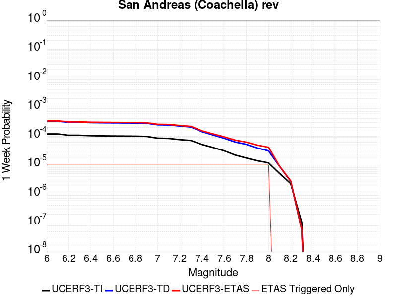 | 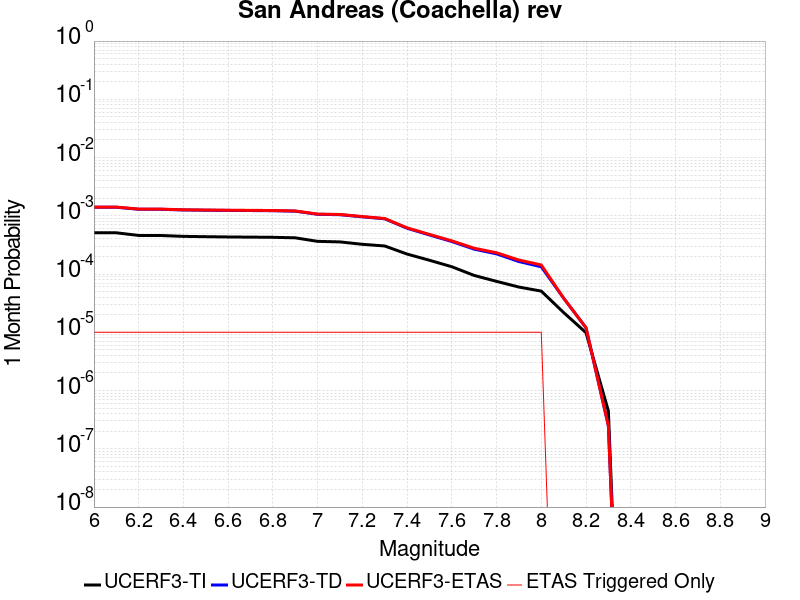 |  |  |

| Magnitude | 1 wk TI Prob | 1 wk TD Prob | 1 wk ETAS Prob | 1 wk ETAS/TD Gain | 1 wk ETAS Triggered Only | 1 mo TI Prob | 1 mo TD Prob | 1 mo ETAS Prob | 1 mo ETAS/TD Gain | 1 mo ETAS Triggered Only | 1 yr TI Prob | 1 yr TD Prob | 1 yr ETAS Prob | 1 yr ETAS/TD Gain | 1 yr ETAS Triggered Only | 10 yr TI Prob | 10 yr TD Prob | 10 yr ETAS Prob | 10 yr ETAS/TD Gain | 10 yr ETAS Triggered Only |
|-----|-----|-----|-----|-----|-----|-----|-----|-----|-----|-----|-----|-----|-----|-----|-----|-----|-----|-----|-----|-----|
| 6.0 | 1.1925945E-4 | 3.2747045E-4 | 3.3746718E-4 | 1.0305271 | 1.0E-5 | 5.110118E-4 | 0.0014026947 | 0.0014126806 | 1.0071192 | 1.0E-5 | 0.0062038354 | 0.016945418 | 0.01698474 | 1.0023205 | 4.0E-5 | 0.060334753 | 0.15272202 | 0.15276438 | 1.0002774 | 5.0E-5 |
| 6.1 | 1.1925945E-4 | 3.2747045E-4 | 3.3746718E-4 | 1.0305271 | 1.0E-5 | 5.110118E-4 | 0.0014026947 | 0.0014126806 | 1.0071192 | 1.0E-5 | 0.0062038354 | 0.016945418 | 0.01698474 | 1.0023205 | 4.0E-5 | 0.060334753 | 0.15272202 | 0.15276438 | 1.0002774 | 5.0E-5 |
| 6.2 | 1.07432395E-4 | 3.0247675E-4 | 3.124737E-4 | 1.0330504 | 1.0E-5 | 4.603433E-4 | 0.0012956889 | 0.001305676 | 1.007708 | 1.0E-5 | 0.005590286 | 0.015662009 | 0.015701383 | 1.002514 | 4.0E-5 | 0.05451731 | 0.14189328 | 0.14193618 | 1.0003024 | 5.0E-5 |
| 6.3 | 1.0718766E-4 | 3.019298E-4 | 3.1192676E-4 | 1.0331103 | 1.0E-5 | 4.592948E-4 | 0.0012933471 | 0.0013033341 | 1.0077219 | 1.0E-5 | 0.005577586 | 0.015633909 | 0.015673283 | 1.0025185 | 4.0E-5 | 0.054396555 | 0.14166155 | 0.14170447 | 1.0003029 | 5.0E-5 |
| 6.4 | 1.0355944E-4 | 2.9401045E-4 | 3.040075E-4 | 1.0340024 | 1.0E-5 | 4.4375064E-4 | 0.0012594402 | 0.0012694276 | 1.00793 | 1.0E-5 | 0.0053892885 | 0.015226932 | 0.015266323 | 1.002587 | 4.0E-5 | 0.052604496 | 0.13822177 | 0.13826485 | 1.0003117 | 5.0E-5 |
| 6.5 | 1.0227914E-4 | 2.912047E-4 | 3.0120177E-4 | 1.0343301 | 1.0E-5 | 4.382655E-4 | 0.0012474272 | 0.0012574147 | 1.0080065 | 1.0E-5 | 0.0053228354 | 0.015082708 | 0.015122104 | 1.002612 | 4.0E-5 | 0.051971316 | 0.13700101 | 0.13704415 | 1.000315 | 5.0E-5 |
| 6.6 | 1.0116757E-4 | 2.8886212E-4 | 2.9885923E-4 | 1.0346086 | 1.0E-5 | 4.3350324E-4 | 0.0012373971 | 0.0012473847 | 1.0080714 | 1.0E-5 | 0.0052651367 | 0.0149622755 | 0.015001677 | 1.0026333 | 4.0E-5 | 0.051421247 | 0.13597922 | 0.13602243 | 1.0003177 | 5.0E-5 |
| 6.7 | 1.0050676E-4 | 2.874477E-4 | 2.9744484E-4 | 1.034779 | 1.0E-5 | 4.3067214E-4 | 0.001231341 | 0.0012413288 | 1.0081112 | 1.0E-5 | 0.005230834 | 0.014889553 | 0.014928957 | 1.0026464 | 4.0E-5 | 0.051094085 | 0.13536398 | 0.13540721 | 1.0003194 | 5.0E-5 |
| 6.8 | 9.976819E-5 | 2.8548407E-4 | 2.954812E-4 | 1.0350182 | 1.0E-5 | 4.2750788E-4 | 0.0012229334 | 0.0012329211 | 1.008167 | 1.0E-5 | 0.0051924936 | 0.014788584 | 0.014827993 | 1.0026648 | 4.0E-5 | 0.050728295 | 0.13451566 | 0.13455893 | 1.0003217 | 5.0E-5 |
| 6.9 | 9.77719E-5 | 2.80452E-4 | 2.9044918E-4 | 1.0356467 | 1.0E-5 | 4.1895514E-4 | 0.0012013874 | 0.0012113753 | 1.0083137 | 1.0E-5 | 0.0050888555 | 0.01452979 | 0.014569208 | 1.002713 | 4.0E-5 | 0.049738888 | 0.13234389 | 0.13238727 | 1.0003278 | 5.0E-5 |
| 7.0 | 8.500761E-5 | 2.4778847E-4 | 2.5778599E-4 | 1.040347 | 1.0E-5 | 3.6426744E-4 | 0.0010615216 | 0.001071511 | 1.0094104 | 1.0E-5 | 0.0044259406 | 0.012848215 | 0.01287783 | 1.0023049 | 3.0E-5 | 0.04338823 | 0.11819933 | 0.118234605 | 1.0002984 | 4.0E-5 |
| 7.1 | 8.319876E-5 | 2.4381404E-4 | 2.538116E-4 | 1.0410049 | 1.0E-5 | 3.5651738E-4 | 0.0010445021 | 0.0010544916 | 1.0095639 | 1.0E-5 | 0.004331963 | 0.012643427 | 0.012673047 | 1.0023428 | 3.0E-5 | 0.042484846 | 0.11641899 | 0.11645433 | 1.0003036 | 4.0E-5 |
| 7.2 | 7.563917E-5 | 2.2429357E-4 | 2.3429132E-4 | 1.0445744 | 1.0E-5 | 3.2412758E-4 | 9.609071E-4 | 9.708975E-4 | 1.0103968 | 1.0E-5 | 0.0039391145 | 0.011636979 | 0.011666629 | 1.002548 | 3.0E-5 | 0.03870018 | 0.107823946 | 0.107859634 | 1.0003309 | 4.0E-5 |
| 7.3 | 7.082985E-5 | 2.074492E-4 | 2.1744712E-4 | 1.0481945 | 1.0E-5 | 3.0352117E-4 | 8.8876794E-4 | 8.9875906E-4 | 1.0112416 | 1.0E-5 | 0.0036891096 | 0.010767689 | 0.010797366 | 1.0027561 | 3.0E-5 | 0.03628465 | 0.10034482 | 0.10038081 | 1.0003586 | 4.0E-5 |
| 7.4 | 5.146215E-5 | 1.428607E-4 | 1.5285928E-4 | 1.0699883 | 1.0E-5 | 2.2053342E-4 | 6.121174E-4 | 6.2211126E-4 | 1.0163268 | 1.0E-5 | 0.0026816884 | 0.0074272524 | 0.0074570295 | 1.0040091 | 3.0E-5 | 0.02649557 | 0.07090313 | 0.07094029 | 1.0005242 | 4.0E-5 |
| 7.5 | 4.0285166E-5 | 1.0952253E-4 | 1.19521435E-4 | 1.0912954 | 1.0E-5 | 1.7263928E-4 | 4.6929816E-4 | 4.7929346E-4 | 1.0212984 | 1.0E-5 | 0.002099857 | 0.0056988057 | 0.0057286345 | 1.0052342 | 3.0E-5 | 0.020801254 | 0.05505857 | 0.05509637 | 1.0006865 | 4.0E-5 |
| 7.6 | 3.1168736E-5 | 8.4483814E-5 | 9.4482966E-5 | 1.1183559 | 1.0E-5 | 1.3357346E-4 | 3.6202336E-4 | 3.7201974E-4 | 1.0276126 | 1.0E-5 | 0.0016250437 | 0.0043987534 | 0.0044286214 | 1.0067902 | 3.0E-5 | 0.016132116 | 0.04285275 | 0.042891033 | 1.0008935 | 4.0E-5 |
| 7.7 | 2.2100989E-5 | 6.2470855E-5 | 7.247023E-5 | 1.1600646 | 1.0E-5 | 9.4715084E-5 | 2.677048E-4 | 2.7770214E-4 | 1.0373446 | 1.0E-5 | 0.001152546 | 0.0032544413 | 0.0032843438 | 1.0091882 | 3.0E-5 | 0.011465867 | 0.031938035 | 0.031976756 | 1.0012125 | 4.0E-5 |
| 7.8 | 1.7484861E-5 | 5.187001E-5 | 6.186949E-5 | 1.1927797 | 1.0E-5 | 7.493296E-5 | 2.2228112E-4 | 2.322789E-4 | 1.044978 | 1.0E-5 | 9.1192697E-4 | 0.002702917 | 0.002732836 | 1.0110692 | 3.0E-5 | 0.009081938 | 0.026673956 | 0.026712889 | 1.0014596 | 4.0E-5 |
| 7.9 | 1.3967285E-5 | 3.8283448E-5 | 4.8283066E-5 | 1.2611995 | 1.0E-5 | 5.985842E-5 | 1.6406161E-4 | 1.7405997E-4 | 1.0609428 | 1.0E-5 | 7.2853256E-4 | 0.0019956212 | 0.0020255614 | 1.015003 | 3.0E-5 | 0.0072614877 | 0.019937595 | 0.019976798 | 1.0019662 | 4.0E-5 |
| 8.0 | 1.1887396E-5 | 3.1117535E-5 | 4.1117226E-5 | 1.3213522 | 1.0E-5 | 5.094499E-5 | 1.3335406E-4 | 1.4335272E-4 | 1.0749784 | 1.0E-5 | 6.200787E-4 | 0.0016223775 | 0.0016523289 | 1.0184613 | 3.0E-5 | 0.006183513 | 0.016303658 | 0.016343007 | 1.0024134 | 4.0E-5 |
| 8.1 | 5.100864E-6 | 8.994677E-6 | 8.994677E-6 | 1.0 | 0.0 | 2.1860664E-5 | 3.854805E-5 | 3.854805E-5 | 1.0 | 0.0 | 2.6612106E-4 | 4.6922156E-4 | 4.6922156E-4 | 1.0 | 0.0 | 0.002658026 | 0.00492833 | 0.00492833 | 1.0 | 0.0 |
| 8.2 | 2.3004484E-6 | 2.795008E-6 | 2.795008E-6 | 1.0 | 0.0 | 9.859027E-6 | 1.1978551E-5 | 1.1978551E-5 | 1.0 | 0.0 | 1.2002704E-4 | 1.4582912E-4 | 1.4582912E-4 | 1.0 | 0.0 | 0.0011996223 | 0.0016018103 | 0.0016018103 | 1.0 | 0.0 |
| 8.3 | 1.0424446E-7 | 5.8393972E-8 | 5.8393972E-8 | 1.0 | 0.0 | 4.4676187E-7 | 2.5025986E-7 | 2.5025986E-7 | 1.0 | 0.0 | 5.439312E-6 | 3.0469098E-6 | 3.0469098E-6 | 1.0 | 0.0 | 5.4391792E-5 | 3.203139E-5 | 3.203139E-5 | 1.0 | 0.0 |

## Nelson Lake
*[(top)](#table-of-contents)*

| 1 Week | 1 Month | 1 Year | 10 Year |
|-----|-----|-----|-----|
|  |  |  |  |

| Magnitude | 1 wk TI Prob | 1 wk TD Prob | 1 wk ETAS Prob | 1 wk ETAS/TD Gain | 1 wk ETAS Triggered Only | 1 mo TI Prob | 1 mo TD Prob | 1 mo ETAS Prob | 1 mo ETAS/TD Gain | 1 mo ETAS Triggered Only | 1 yr TI Prob | 1 yr TD Prob | 1 yr ETAS Prob | 1 yr ETAS/TD Gain | 1 yr ETAS Triggered Only | 10 yr TI Prob | 10 yr TD Prob | 10 yr ETAS Prob | 10 yr ETAS/TD Gain | 10 yr ETAS Triggered Only |
|-----|-----|-----|-----|-----|-----|-----|-----|-----|-----|-----|-----|-----|-----|-----|-----|-----|-----|-----|-----|-----|
| 6.0 | 9.913453E-6 | 1.0192408E-5 | 2.0192305E-5 | 1.9811125 | 1.0E-5 | 4.2485535E-5 | 4.3681073E-5 | 6.36802E-5 | 1.4578443 | 2.0E-5 | 5.1713863E-4 | 5.3169765E-4 | 5.5168703E-4 | 1.0375954 | 2.0E-5 | 0.0051593683 | 0.0053052832 | 0.0053550177 | 1.0093746 | 5.0E-5 |
| 6.1 | 9.913453E-6 | 1.0192408E-5 | 2.0192305E-5 | 1.9811125 | 1.0E-5 | 4.2485535E-5 | 4.3681073E-5 | 6.36802E-5 | 1.4578443 | 2.0E-5 | 5.1713863E-4 | 5.3169765E-4 | 5.5168703E-4 | 1.0375954 | 2.0E-5 | 0.0051593683 | 0.0053052832 | 0.0053550177 | 1.0093746 | 5.0E-5 |
| 6.2 | 4.5596407E-6 | 4.696388E-6 | 4.696388E-6 | 1.0 | 0.0 | 1.954117E-5 | 2.0127229E-5 | 3.0127027E-5 | 1.4968294 | 1.0E-5 | 2.3788778E-4 | 2.4502273E-4 | 2.5502028E-4 | 1.0408026 | 1.0E-5 | 0.0023763329 | 0.0024476517 | 0.0024676027 | 1.008151 | 2.0E-5 |
| 6.3 | 4.5596407E-6 | 4.696388E-6 | 4.696388E-6 | 1.0 | 0.0 | 1.954117E-5 | 2.0127229E-5 | 3.0127027E-5 | 1.4968294 | 1.0E-5 | 2.3788778E-4 | 2.4502273E-4 | 2.5502028E-4 | 1.0408026 | 1.0E-5 | 0.0023763329 | 0.0024476517 | 0.0024676027 | 1.008151 | 2.0E-5 |
| 6.4 | 3.4025713E-6 | 3.509956E-6 | 3.509956E-6 | 1.0 | 0.0 | 1.4582367E-5 | 1.5042587E-5 | 2.5042436E-5 | 1.6647693 | 1.0E-5 | 1.7752586E-4 | 1.8312894E-4 | 1.9312711E-4 | 1.0545963 | 1.0E-5 | 0.001773841 | 0.0018298633 | 0.0018498268 | 1.0109098 | 2.0E-5 |
| 6.5 | 2.8352947E-6 | 2.927907E-6 | 2.927907E-6 | 1.0 | 0.0 | 1.2151207E-5 | 1.25481165E-5 | 2.254799E-5 | 1.7969223 | 1.0E-5 | 1.479309E-4 | 1.5276336E-4 | 1.6276183E-4 | 1.0654507 | 1.0E-5 | 0.0014783246 | 0.0015266574 | 0.0015466268 | 1.0130805 | 2.0E-5 |
| 6.6 | 2.251518E-6 | 2.3291102E-6 | 2.3291102E-6 | 1.0 | 0.0 | 9.649328E-6 | 9.981866E-6 | 1.9981766E-5 | 2.0018067 | 1.0E-5 | 1.1747423E-4 | 1.2152307E-4 | 1.3152185E-4 | 1.0822788 | 1.0E-5 | 0.0011741214 | 0.001214628 | 0.0012346037 | 1.016446 | 2.0E-5 |
| 6.7 | 1.8911853E-6 | 1.959177E-6 | 1.959177E-6 | 1.0 | 0.0 | 8.105055E-6 | 8.39645E-6 | 1.8396366E-5 | 2.1909695 | 1.0E-5 | 9.867457E-5 | 1.0222256E-4 | 1.1222154E-4 | 1.0978158 | 1.0E-5 | 9.863076E-4 | 0.0010218129 | 0.0010417924 | 1.0195531 | 2.0E-5 |
| 6.8 | 1.4874814E-6 | 1.5438616E-6 | 1.5438616E-6 | 1.0 | 0.0 | 6.374905E-6 | 6.6165358E-6 | 1.661647E-5 | 2.511355 | 1.0E-5 | 7.76117E-5 | 8.0553866E-5 | 9.055306E-5 | 1.1241305 | 1.0E-5 | 7.75846E-4 | 8.0529775E-4 | 8.2528166E-4 | 1.0248156 | 2.0E-5 |
| 6.9 | 6.835972E-7 | 7.140097E-7 | 7.140097E-7 | 1.0 | 0.0 | 2.9296991E-6 | 3.0600397E-6 | 1.3060009E-5 | 4.2679214 | 1.0E-5 | 3.56685E-5 | 3.7255664E-5 | 4.7255293E-5 | 1.2684056 | 1.0E-5 | 3.5662777E-4 | 3.7252545E-4 | 3.92518E-4 | 1.0536677 | 2.0E-5 |

## White Wolf (Extension)
*[(top)](#table-of-contents)*

| 1 Week | 1 Month | 1 Year | 10 Year |
|-----|-----|-----|-----|
| 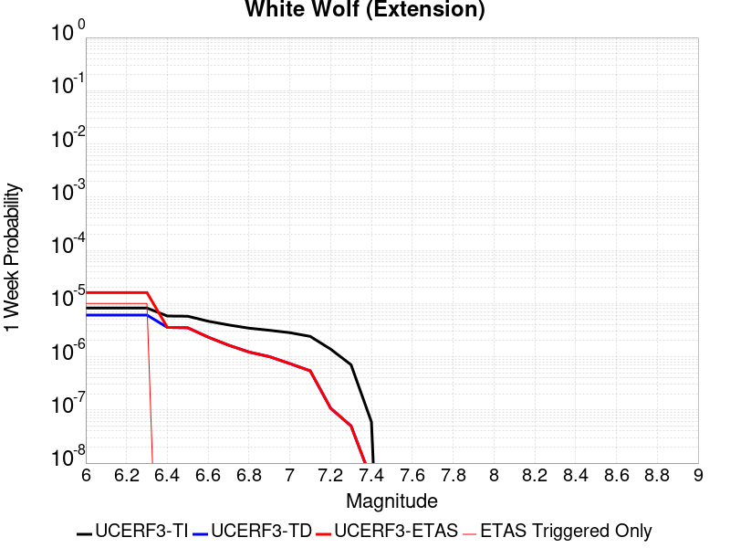 |  |  |  |

| Magnitude | 1 wk TI Prob | 1 wk TD Prob | 1 wk ETAS Prob | 1 wk ETAS/TD Gain | 1 wk ETAS Triggered Only | 1 mo TI Prob | 1 mo TD Prob | 1 mo ETAS Prob | 1 mo ETAS/TD Gain | 1 mo ETAS Triggered Only | 1 yr TI Prob | 1 yr TD Prob | 1 yr ETAS Prob | 1 yr ETAS/TD Gain | 1 yr ETAS Triggered Only | 10 yr TI Prob | 10 yr TD Prob | 10 yr ETAS Prob | 10 yr ETAS/TD Gain | 10 yr ETAS Triggered Only |
|-----|-----|-----|-----|-----|-----|-----|-----|-----|-----|-----|-----|-----|-----|-----|-----|-----|-----|-----|-----|-----|
| 6.0 | 8.222555E-6 | 6.0668267E-6 | 1.6066766E-5 | 2.6482983 | 1.0E-5 | 3.5239045E-5 | 2.6000464E-5 | 4.5999943E-5 | 1.7691971 | 2.0E-5 | 4.289509E-4 | 3.165163E-4 | 3.3650995E-4 | 1.0631679 | 2.0E-5 | 0.0042812387 | 0.0031613067 | 0.0032111485 | 1.0157663 | 5.0E-5 |
| 6.1 | 8.222555E-6 | 6.0668267E-6 | 1.6066766E-5 | 2.6482983 | 1.0E-5 | 3.5239045E-5 | 2.6000464E-5 | 4.5999943E-5 | 1.7691971 | 2.0E-5 | 4.289509E-4 | 3.165163E-4 | 3.3650995E-4 | 1.0631679 | 2.0E-5 | 0.0042812387 | 0.0031613067 | 0.0032111485 | 1.0157663 | 5.0E-5 |
| 6.2 | 8.222555E-6 | 6.0668267E-6 | 1.6066766E-5 | 2.6482983 | 1.0E-5 | 3.5239045E-5 | 2.6000464E-5 | 4.5999943E-5 | 1.7691971 | 2.0E-5 | 4.289509E-4 | 3.165163E-4 | 3.3650995E-4 | 1.0631679 | 2.0E-5 | 0.0042812387 | 0.0031613067 | 0.0032111485 | 1.0157663 | 5.0E-5 |
| 6.3 | 8.222555E-6 | 6.0668267E-6 | 1.6066766E-5 | 2.6482983 | 1.0E-5 | 3.5239045E-5 | 2.6000464E-5 | 4.5999943E-5 | 1.7691971 | 2.0E-5 | 4.289509E-4 | 3.165163E-4 | 3.3650995E-4 | 1.0631679 | 2.0E-5 | 0.0042812387 | 0.0031613067 | 0.0032111485 | 1.0157663 | 5.0E-5 |
| 6.4 | 5.821773E-6 | 3.557277E-6 | 3.557277E-6 | 1.0 | 0.0 | 2.4950215E-5 | 1.52453895E-5 | 2.5245237E-5 | 1.655926 | 1.0E-5 | 3.0372653E-4 | 1.855979E-4 | 1.9559606E-4 | 1.05387 | 1.0E-5 | 0.0030331176 | 0.0018545374 | 0.0018944632 | 1.0215287 | 4.0E-5 |
| 6.5 | 5.766023E-6 | 3.49921E-6 | 3.49921E-6 | 1.0 | 0.0 | 2.4711293E-5 | 1.49965335E-5 | 2.4996383E-5 | 1.6668108 | 1.0E-5 | 3.0081844E-4 | 1.8256859E-4 | 1.9256677E-4 | 1.0547639 | 1.0E-5 | 0.0030041158 | 0.0018242942 | 0.0018642213 | 1.0218862 | 4.0E-5 |
| 6.6 | 4.643576E-6 | 2.332699E-6 | 2.332699E-6 | 1.0 | 0.0 | 1.9900888E-5 | 9.997246E-6 | 9.997246E-6 | 1.0 | 0.0 | 2.4226638E-4 | 1.21710094E-4 | 1.21710094E-4 | 1.0 | 0.0 | 0.0024200242 | 0.0012164768 | 0.0012264646 | 1.0082104 | 1.0E-5 |
| 6.7 | 3.9529173E-6 | 1.648408E-6 | 1.648408E-6 | 1.0 | 0.0 | 1.6940963E-5 | 7.0645874E-6 | 7.0645874E-6 | 1.0 | 0.0 | 2.0623671E-4 | 8.600815E-5 | 8.600815E-5 | 1.0 | 0.0 | 0.002060454 | 8.597671E-4 | 8.697585E-4 | 1.011621 | 1.0E-5 |
| 6.8 | 3.4377522E-6 | 1.2245736E-6 | 1.2245736E-6 | 1.0 | 0.0 | 1.473314E-5 | 5.2481623E-6 | 5.2481623E-6 | 1.0 | 0.0 | 1.7936122E-4 | 6.389459E-5 | 6.389459E-5 | 1.0 | 0.0 | 0.0017921652 | 6.3877134E-4 | 6.3877134E-4 | 1.0 | 0.0 |
| 6.9 | 3.1367306E-6 | 1.0034221E-6 | 1.0034221E-6 | 1.0 | 0.0 | 1.3443062E-5 | 4.300374E-6 | 4.300374E-6 | 1.0 | 0.0 | 1.63657E-4 | 5.2355874E-5 | 5.2355874E-5 | 1.0 | 0.0 | 0.0016353652 | 5.2344304E-4 | 5.2344304E-4 | 1.0 | 0.0 |
| 7.0 | 2.8298145E-6 | 7.429045E-7 | 7.429045E-7 | 1.0 | 0.0 | 1.2127721E-5 | 3.1838729E-6 | 3.1838729E-6 | 1.0 | 0.0 | 1.47645E-4 | 3.8763013E-5 | 3.8763013E-5 | 1.0 | 0.0 | 0.0014754693 | 3.875675E-4 | 3.875675E-4 | 1.0 | 0.0 |
| 7.1 | 2.4091064E-6 | 5.4230577E-7 | 5.4230577E-7 | 1.0 | 0.0 | 1.03247E-5 | 2.3241657E-6 | 2.3241657E-6 | 1.0 | 0.0 | 1.2569598E-4 | 2.8296392E-5 | 2.8296392E-5 | 1.0 | 0.0 | 0.001256249 | 2.8293193E-4 | 2.8293193E-4 | 1.0 | 0.0 |
| 7.2 | 1.3875518E-6 | 1.0744563E-7 | 1.0744563E-7 | 1.0 | 0.0 | 5.9466374E-6 | 4.604812E-7 | 4.604812E-7 | 1.0 | 0.0 | 7.23979E-5 | 5.6063454E-6 | 5.6063454E-6 | 1.0 | 0.0 | 7.2374323E-4 | 5.6062152E-5 | 5.6062152E-5 | 1.0 | 0.0 |
| 7.3 | 7.056077E-7 | 5.002896E-8 | 5.002896E-8 | 1.0 | 0.0 | 3.0240296E-6 | 2.1440981E-7 | 2.1440981E-7 | 1.0 | 0.0 | 3.681694E-5 | 2.6104367E-6 | 2.6104367E-6 | 1.0 | 0.0 | 3.681084E-4 | 2.6104108E-5 | 2.6104108E-5 | 1.0 | 0.0 |
| 7.4 | 5.9334678E-8 | 4.86919E-9 | 4.86919E-9 | 1.0 | 0.0 | 2.5429145E-7 | 2.0867958E-8 | 2.0867958E-8 | 1.0 | 0.0 | 3.095994E-6 | 2.5406737E-7 | 2.5406737E-7 | 1.0 | 0.0 | 3.095951E-5 | 2.5406719E-6 | 2.5406719E-6 | 1.0 | 0.0 |

## Helendale-So Lockhart
*[(top)](#table-of-contents)*

| 1 Week | 1 Month | 1 Year | 10 Year |
|-----|-----|-----|-----|
|  |  |  |  |

| Magnitude | 1 wk TI Prob | 1 wk TD Prob | 1 wk ETAS Prob | 1 wk ETAS/TD Gain | 1 wk ETAS Triggered Only | 1 mo TI Prob | 1 mo TD Prob | 1 mo ETAS Prob | 1 mo ETAS/TD Gain | 1 mo ETAS Triggered Only | 1 yr TI Prob | 1 yr TD Prob | 1 yr ETAS Prob | 1 yr ETAS/TD Gain | 1 yr ETAS Triggered Only | 10 yr TI Prob | 10 yr TD Prob | 10 yr ETAS Prob | 10 yr ETAS/TD Gain | 10 yr ETAS Triggered Only |
|-----|-----|-----|-----|-----|-----|-----|-----|-----|-----|-----|-----|-----|-----|-----|-----|-----|-----|-----|-----|-----|
| 6.0 | 1.7296055E-5 | 1.810418E-5 | 2.8103997E-5 | 1.5523486 | 1.0E-5 | 7.412385E-5 | 7.7587145E-5 | 9.7585595E-5 | 1.2577547 | 2.0E-5 | 9.0208417E-4 | 9.442349E-4 | 9.941877E-4 | 1.0529029 | 5.0E-5 | 0.008984311 | 0.009404349 | 0.009453879 | 1.0052667 | 5.0E-5 |
| 6.1 | 1.7296055E-5 | 1.810418E-5 | 2.8103997E-5 | 1.5523486 | 1.0E-5 | 7.412385E-5 | 7.7587145E-5 | 9.7585595E-5 | 1.2577547 | 2.0E-5 | 9.0208417E-4 | 9.442349E-4 | 9.941877E-4 | 1.0529029 | 5.0E-5 | 0.008984311 | 0.009404349 | 0.009453879 | 1.0052667 | 5.0E-5 |
| 6.2 | 1.7296055E-5 | 1.810418E-5 | 2.8103997E-5 | 1.5523486 | 1.0E-5 | 7.412385E-5 | 7.7587145E-5 | 9.7585595E-5 | 1.2577547 | 2.0E-5 | 9.0208417E-4 | 9.442349E-4 | 9.941877E-4 | 1.0529029 | 5.0E-5 | 0.008984311 | 0.009404349 | 0.009453879 | 1.0052667 | 5.0E-5 |
| 6.3 | 1.0669118E-5 | 1.1135683E-5 | 2.1135571E-5 | 1.898004 | 1.0E-5 | 4.5723988E-5 | 4.7723497E-5 | 6.772255E-5 | 1.4190607 | 2.0E-5 | 5.5654737E-4 | 5.808815E-4 | 6.308524E-4 | 1.0860261 | 5.0E-5 | 0.0055515557 | 0.0057939277 | 0.005843638 | 1.0085797 | 5.0E-5 |
| 6.4 | 1.0669118E-5 | 1.1135683E-5 | 2.1135571E-5 | 1.898004 | 1.0E-5 | 4.5723988E-5 | 4.7723497E-5 | 6.772255E-5 | 1.4190607 | 2.0E-5 | 5.5654737E-4 | 5.808815E-4 | 6.308524E-4 | 1.0860261 | 5.0E-5 | 0.0055515557 | 0.0057939277 | 0.005843638 | 1.0085797 | 5.0E-5 |
| 6.5 | 8.790038E-6 | 9.170408E-6 | 1.9170317E-5 | 2.090454 | 1.0E-5 | 3.767105E-5 | 3.930116E-5 | 5.930038E-5 | 1.5088708 | 2.0E-5 | 4.585485E-4 | 4.7838816E-4 | 5.283642E-4 | 1.1044676 | 5.0E-5 | 0.0045760344 | 0.0047737476 | 0.004823509 | 1.0104239 | 5.0E-5 |
| 6.6 | 7.396949E-6 | 7.715714E-6 | 1.7715636E-5 | 2.2960465 | 1.0E-5 | 3.1700827E-5 | 3.306693E-5 | 5.306627E-5 | 1.6048139 | 2.0E-5 | 3.858892E-4 | 4.025165E-4 | 4.524964E-4 | 1.1241685 | 5.0E-5 | 0.003852198 | 0.0040179817 | 0.0040677804 | 1.0123941 | 5.0E-5 |
| 6.7 | 6.4600285E-6 | 6.738185E-6 | 1.6738119E-5 | 2.484069 | 1.0E-5 | 2.7685543E-5 | 2.8877621E-5 | 4.8877042E-5 | 1.6925578 | 2.0E-5 | 3.3701936E-4 | 3.515291E-4 | 3.9151503E-4 | 1.1137486 | 4.0E-5 | 0.0033650869 | 0.003509812 | 0.0035496717 | 1.0113566 | 4.0E-5 |
| 6.8 | 5.600104E-6 | 5.8361397E-6 | 5.8361397E-6 | 1.0 | 0.0 | 2.4000226E-5 | 2.5011792E-5 | 3.501154E-5 | 1.3998014 | 1.0E-5 | 2.9216358E-4 | 3.0447662E-4 | 3.2447051E-4 | 1.0656664 | 2.0E-5 | 0.0029177975 | 0.003040656 | 0.0030605951 | 1.0065576 | 2.0E-5 |
| 6.9 | 4.839122E-6 | 5.03962E-6 | 5.03962E-6 | 1.0 | 0.0 | 2.0738931E-5 | 2.1598196E-5 | 3.1597978E-5 | 1.4629916 | 1.0E-5 | 2.5246723E-4 | 2.6292677E-4 | 2.7292414E-4 | 1.0380234 | 1.0E-5 | 0.002521806 | 0.0026262044 | 0.0026361782 | 1.0037978 | 1.0E-5 |
| 7.0 | 3.6937633E-6 | 3.8452918E-6 | 3.8452918E-6 | 1.0 | 0.0 | 1.5830317E-5 | 1.6479718E-5 | 2.6479554E-5 | 1.6067965 | 1.0E-5 | 1.9271708E-4 | 2.0062242E-4 | 2.1062042E-4 | 1.0498348 | 1.0E-5 | 0.0019255003 | 0.0020044446 | 0.0020144244 | 1.0049789 | 1.0E-5 |
| 7.1 | 2.7858857E-6 | 2.8979157E-6 | 2.8979157E-6 | 1.0 | 0.0 | 1.1939455E-5 | 1.241958E-5 | 2.2419455E-5 | 1.8051702 | 1.0E-5 | 1.4535317E-4 | 1.5119811E-4 | 1.611966E-4 | 1.0661284 | 1.0E-5 | 0.0014525814 | 0.0015109739 | 0.0015209588 | 1.0066082 | 1.0E-5 |
| 7.2 | 2.1672065E-6 | 2.2540607E-6 | 2.2540607E-6 | 1.0 | 0.0 | 9.2879945E-6 | 9.660225E-6 | 9.660225E-6 | 1.0 | 0.0 | 1.1307546E-4 | 1.1760708E-4 | 1.1760708E-4 | 1.0 | 0.0 | 0.0011301794 | 0.0011754666 | 0.0011754666 | 1.0 | 0.0 |
| 7.3 | 1.4823496E-6 | 1.5422432E-6 | 1.5422432E-6 | 1.0 | 0.0 | 6.3529114E-6 | 6.609598E-6 | 6.609598E-6 | 1.0 | 0.0 | 7.734395E-5 | 8.0469035E-5 | 8.0469035E-5 | 1.0 | 0.0 | 7.731704E-4 | 8.044141E-4 | 8.044141E-4 | 1.0 | 0.0 |
| 7.4 | 4.2321457E-7 | 4.4109754E-7 | 4.4109754E-7 | 1.0 | 0.0 | 1.8137755E-6 | 1.8904169E-6 | 1.8904169E-6 | 1.0 | 0.0 | 2.2082493E-5 | 2.301563E-5 | 2.301563E-5 | 1.0 | 0.0 | 2.2080299E-4 | 2.3013698E-4 | 2.3013698E-4 | 1.0 | 0.0 |
| 7.5 | 5.6942316E-8 | 5.9417015E-8 | 5.9417015E-8 | 1.0 | 0.0 | 2.440385E-7 | 2.5464433E-7 | 2.5464433E-7 | 1.0 | 0.0 | 2.9711643E-6 | 3.100291E-6 | 3.100291E-6 | 1.0 | 0.0 | 2.9711247E-5 | 3.1002557E-5 | 3.1002557E-5 | 1.0 | 0.0 |

## San Andreas (Parkfield)
*[(top)](#table-of-contents)*

| 1 Week | 1 Month | 1 Year | 10 Year |
|-----|-----|-----|-----|
|  | 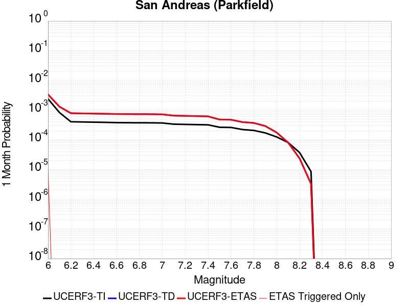 |  |  |

| Magnitude | 1 wk TI Prob | 1 wk TD Prob | 1 wk ETAS Prob | 1 wk ETAS/TD Gain | 1 wk ETAS Triggered Only | 1 mo TI Prob | 1 mo TD Prob | 1 mo ETAS Prob | 1 mo ETAS/TD Gain | 1 mo ETAS Triggered Only | 1 yr TI Prob | 1 yr TD Prob | 1 yr ETAS Prob | 1 yr ETAS/TD Gain | 1 yr ETAS Triggered Only | 10 yr TI Prob | 10 yr TD Prob | 10 yr ETAS Prob | 10 yr ETAS/TD Gain | 10 yr ETAS Triggered Only |
|-----|-----|-----|-----|-----|-----|-----|-----|-----|-----|-----|-----|-----|-----|-----|-----|-----|-----|-----|-----|-----|
| 6.0 | 5.556969E-4 | 7.819087E-4 | 7.9190085E-4 | 1.0127792 | 1.0E-5 | 0.0023793848 | 0.0033472886 | 0.0033572551 | 1.0029775 | 1.0E-5 | 0.028586963 | 0.040385824 | 0.040414613 | 1.0007129 | 3.0E-5 | 0.25176284 | 0.33777508 | 0.33780158 | 1.0000784 | 4.0E-5 |
| 6.1 | 1.925858E-4 | 3.0390357E-4 | 3.0390357E-4 | 1.0 | 0.0 | 8.2510663E-4 | 0.0013018888 | 0.0013018888 | 1.0 | 0.0 | 0.0099994885 | 0.015834767 | 0.01584461 | 1.0006216 | 1.0E-5 | 0.095613256 | 0.14999957 | 0.15001658 | 1.0001134 | 2.0E-5 |
| 6.2 | 9.4306815E-5 | 1.8273306E-4 | 1.8273306E-4 | 1.0 | 0.0 | 4.0410945E-4 | 7.829079E-4 | 7.829079E-4 | 1.0 | 0.0 | 0.0049089384 | 0.009490452 | 0.009500357 | 1.0010437 | 1.0E-5 | 0.048019063 | 0.09198628 | 0.091995366 | 1.0000987 | 1.0E-5 |
| 6.3 | 9.283051E-5 | 1.7969737E-4 | 1.7969737E-4 | 1.0 | 0.0 | 3.9778434E-4 | 7.6990545E-4 | 7.6990545E-4 | 1.0 | 0.0 | 0.0048322747 | 0.009333515 | 0.009343421 | 1.0010614 | 1.0E-5 | 0.047285385 | 0.09063911 | 0.090648204 | 1.0001004 | 1.0E-5 |
| 6.4 | 9.138826E-5 | 1.7731739E-4 | 1.7731739E-4 | 1.0 | 0.0 | 3.916052E-4 | 7.5971155E-4 | 7.5971155E-4 | 1.0 | 0.0 | 0.0047573745 | 0.00921046 | 0.009220368 | 1.0010757 | 1.0E-5 | 0.046568092 | 0.0895407 | 0.0895498 | 1.0001017 | 1.0E-5 |
| 6.5 | 9.000255E-5 | 1.7489606E-4 | 1.7489606E-4 | 1.0 | 0.0 | 3.8566816E-4 | 7.493404E-4 | 7.493404E-4 | 1.0 | 0.0 | 0.0046854047 | 0.009085262 | 0.0090951715 | 1.0010906 | 1.0E-5 | 0.045878403 | 0.08842592 | 0.08843503 | 1.0001031 | 1.0E-5 |
| 6.6 | 8.8109264E-5 | 1.7170387E-4 | 1.7170387E-4 | 1.0 | 0.0 | 3.7755648E-4 | 7.3566736E-4 | 7.3566736E-4 | 1.0 | 0.0 | 0.0045870654 | 0.0089201825 | 0.008930093 | 1.001111 | 1.0E-5 | 0.04493529 | 0.08695624 | 0.086965375 | 1.000105 | 1.0E-5 |
| 6.7 | 8.738073E-5 | 1.7037381E-4 | 1.7037381E-4 | 1.0 | 0.0 | 3.7443507E-4 | 7.2997034E-4 | 7.2997034E-4 | 1.0 | 0.0 | 0.0045492216 | 0.0088514285 | 0.00886134 | 1.0011197 | 1.0E-5 | 0.04457213 | 0.08635636 | 0.08636549 | 1.0001059 | 1.0E-5 |
| 6.8 | 8.710195E-5 | 1.6982816E-4 | 1.6982816E-4 | 1.0 | 0.0 | 3.7324068E-4 | 7.2763313E-4 | 7.2763313E-4 | 1.0 | 0.0 | 0.0045347405 | 0.008823211 | 0.008833123 | 1.0011234 | 1.0E-5 | 0.04443313 | 0.08610373 | 0.08611287 | 1.0001061 | 1.0E-5 |
| 6.9 | 8.6801556E-5 | 1.6923707E-4 | 1.6923707E-4 | 1.0 | 0.0 | 3.7195362E-4 | 7.251013E-4 | 7.251013E-4 | 1.0 | 0.0 | 0.0045191357 | 0.008792636 | 0.008802548 | 1.0011274 | 1.0E-5 | 0.044283327 | 0.08582957 | 0.08583871 | 1.0001065 | 1.0E-5 |
| 7.0 | 8.5571606E-5 | 1.6676294E-4 | 1.6676294E-4 | 1.0 | 0.0 | 3.6668387E-4 | 7.145037E-4 | 7.145037E-4 | 1.0 | 0.0 | 0.004455241 | 0.008664643 | 0.008674556 | 1.0011442 | 1.0E-5 | 0.043669727 | 0.08467713 | 0.08468629 | 1.0001081 | 1.0E-5 |
| 7.1 | 7.82589E-5 | 1.5156237E-4 | 1.5156237E-4 | 1.0 | 0.0 | 3.3535215E-4 | 6.493921E-4 | 6.493921E-4 | 1.0 | 0.0 | 0.0040752706 | 0.007877857 | 0.007887779 | 1.0012593 | 1.0E-5 | 0.040013418 | 0.077585794 | 0.07759502 | 1.0001189 | 1.0E-5 |
| 7.2 | 7.690929E-5 | 1.489332E-4 | 1.489332E-4 | 1.0 | 0.0 | 3.2956956E-4 | 6.381298E-4 | 6.381298E-4 | 1.0 | 0.0 | 0.004005129 | 0.007741721 | 0.0077516437 | 1.0012817 | 1.0E-5 | 0.0393371 | 0.076358445 | 0.07636768 | 1.000121 | 1.0E-5 |
| 7.3 | 7.5543794E-5 | 1.4589565E-4 | 1.4589565E-4 | 1.0 | 0.0 | 3.2371894E-4 | 6.25118E-4 | 6.25118E-4 | 1.0 | 0.0 | 0.003934157 | 0.0075844154 | 0.0075943395 | 1.0013084 | 1.0E-5 | 0.038652334 | 0.07492032 | 0.074929565 | 1.0001235 | 1.0E-5 |
| 7.4 | 7.4214564E-5 | 1.4290171E-4 | 1.4290171E-4 | 1.0 | 0.0 | 3.1802364E-4 | 6.122929E-4 | 6.122929E-4 | 1.0 | 0.0 | 0.003865065 | 0.007429345 | 0.0074392706 | 1.001336 | 1.0E-5 | 0.03798529 | 0.07349284 | 0.0735021 | 1.0001261 | 1.0E-5 |
| 7.5 | 6.149578E-5 | 1.1214155E-4 | 1.1214155E-4 | 1.0 | 0.0 | 2.6352672E-4 | 4.8051824E-4 | 4.8051824E-4 | 1.0 | 0.0 | 0.0032037178 | 0.005834648 | 0.00584459 | 1.0017039 | 1.0E-5 | 0.03157923 | 0.058665328 | 0.05867474 | 1.0001605 | 1.0E-5 |
| 7.6 | 6.0643448E-5 | 1.10425855E-4 | 1.10425855E-4 | 1.0 | 0.0 | 2.598746E-4 | 4.7316792E-4 | 4.7316792E-4 | 1.0 | 0.0 | 0.0031593828 | 0.0057456335 | 0.0057555763 | 1.0017304 | 1.0E-5 | 0.031148417 | 0.05782546 | 0.057834882 | 1.000163 | 1.0E-5 |
| 7.7 | 5.1652263E-5 | 9.1955124E-5 | 9.1955124E-5 | 1.0 | 0.0 | 2.2134806E-4 | 3.9403388E-4 | 3.9403388E-4 | 1.0 | 0.0 | 0.002691582 | 0.00478682 | 0.0047967723 | 1.002079 | 1.0E-5 | 0.026592141 | 0.048633553 | 0.048643067 | 1.0001956 | 1.0E-5 |
| 7.8 | 4.8090482E-5 | 8.578783E-5 | 8.578783E-5 | 1.0 | 0.0 | 2.060858E-4 | 3.6761034E-4 | 3.6761034E-4 | 1.0 | 0.0 | 0.0025062072 | 0.004466479 | 0.0044764346 | 1.0022289 | 1.0E-5 | 0.024781305 | 0.045392275 | 0.045401823 | 1.0002103 | 1.0E-5 |
| 7.9 | 3.970278E-5 | 6.7652974E-5 | 6.7652974E-5 | 1.0 | 0.0 | 1.7014367E-4 | 2.899091E-4 | 2.899091E-4 | 1.0 | 0.0 | 0.002069531 | 0.0035239344 | 0.003533899 | 1.0028278 | 1.0E-5 | 0.020503636 | 0.035952512 | 0.035962153 | 1.0002681 | 1.0E-5 |
| 8.0 | 2.8982335E-5 | 4.079188E-5 | 4.079188E-5 | 1.0 | 0.0 | 1.2420409E-4 | 1.7481064E-4 | 1.7481064E-4 | 1.0 | 0.0 | 0.0015111357 | 0.0021262432 | 0.002136222 | 1.0046932 | 1.0E-5 | 0.015009012 | 0.022057572 | 0.022067351 | 1.0004433 | 1.0E-5 |
| 8.1 | 1.8836186E-5 | 1.8733741E-5 | 1.8733741E-5 | 1.0 | 0.0 | 8.0724014E-5 | 8.028499E-5 | 8.028499E-5 | 1.0 | 0.0 | 9.823717E-4 | 9.77032E-4 | 9.77032E-4 | 1.0 | 0.0 | 0.009780403 | 0.010515724 | 0.010515724 | 1.0 | 0.0 |
| 8.2 | 8.643924E-6 | 5.49522E-6 | 5.49522E-6 | 1.0 | 0.0 | 3.704486E-5 | 2.355073E-5 | 2.355073E-5 | 1.0 | 0.0 | 4.5092785E-4 | 2.866925E-4 | 2.866925E-4 | 1.0 | 0.0 | 0.0045001395 | 0.0032598388 | 0.0032598388 | 1.0 | 0.0 |
| 8.3 | 1.983087E-6 | 7.693574E-7 | 7.693574E-7 | 1.0 | 0.0 | 8.498917E-6 | 3.297242E-6 | 3.297242E-6 | 1.0 | 0.0 | 1.034694E-4 | 4.01432E-5 | 4.01432E-5 | 1.0 | 0.0 | 0.0010342124 | 4.7390026E-4 | 4.7390026E-4 | 1.0 | 0.0 |

## Death Valley (Black Mtns Frontal)
*[(top)](#table-of-contents)*

| 1 Week | 1 Month | 1 Year | 10 Year |
|-----|-----|-----|-----|
|  |  |  |  |

| Magnitude | 1 wk TI Prob | 1 wk TD Prob | 1 wk ETAS Prob | 1 wk ETAS/TD Gain | 1 wk ETAS Triggered Only | 1 mo TI Prob | 1 mo TD Prob | 1 mo ETAS Prob | 1 mo ETAS/TD Gain | 1 mo ETAS Triggered Only | 1 yr TI Prob | 1 yr TD Prob | 1 yr ETAS Prob | 1 yr ETAS/TD Gain | 1 yr ETAS Triggered Only | 10 yr TI Prob | 10 yr TD Prob | 10 yr ETAS Prob | 10 yr ETAS/TD Gain | 10 yr ETAS Triggered Only |
|-----|-----|-----|-----|-----|-----|-----|-----|-----|-----|-----|-----|-----|-----|-----|-----|-----|-----|-----|-----|-----|
| 6.0 | 1.6707214E-5 | 1.8671435E-5 | 1.8671435E-5 | 1.0 | 0.0 | 7.160038E-5 | 8.001803E-5 | 1.0001643E-4 | 1.2499237 | 2.0E-5 | 8.71386E-4 | 9.737917E-4 | 0.0010037625 | 1.0307775 | 3.0E-5 | 0.00867977 | 0.0096961 | 0.009725809 | 1.003064 | 3.0E-5 |
| 6.1 | 1.6707214E-5 | 1.8671435E-5 | 1.8671435E-5 | 1.0 | 0.0 | 7.160038E-5 | 8.001803E-5 | 1.0001643E-4 | 1.2499237 | 2.0E-5 | 8.71386E-4 | 9.737917E-4 | 0.0010037625 | 1.0307775 | 3.0E-5 | 0.00867977 | 0.0096961 | 0.009725809 | 1.003064 | 3.0E-5 |
| 6.2 | 1.6707214E-5 | 1.8671435E-5 | 1.8671435E-5 | 1.0 | 0.0 | 7.160038E-5 | 8.001803E-5 | 1.0001643E-4 | 1.2499237 | 2.0E-5 | 8.71386E-4 | 9.737917E-4 | 0.0010037625 | 1.0307775 | 3.0E-5 | 0.00867977 | 0.0096961 | 0.009725809 | 1.003064 | 3.0E-5 |
| 6.3 | 1.6707214E-5 | 1.8671435E-5 | 1.8671435E-5 | 1.0 | 0.0 | 7.160038E-5 | 8.001803E-5 | 1.0001643E-4 | 1.2499237 | 2.0E-5 | 8.71386E-4 | 9.737917E-4 | 0.0010037625 | 1.0307775 | 3.0E-5 | 0.00867977 | 0.0096961 | 0.009725809 | 1.003064 | 3.0E-5 |
| 6.4 | 1.5515609E-5 | 1.7339296E-5 | 1.7339296E-5 | 1.0 | 0.0 | 6.649377E-5 | 7.430919E-5 | 8.430845E-5 | 1.1345628 | 1.0E-5 | 8.0926094E-4 | 9.04345E-4 | 9.243269E-4 | 1.0220954 | 2.0E-5 | 0.008063202 | 0.009007333 | 0.009027153 | 1.0022004 | 2.0E-5 |
| 6.5 | 1.5515609E-5 | 1.7339296E-5 | 1.7339296E-5 | 1.0 | 0.0 | 6.649377E-5 | 7.430919E-5 | 8.430845E-5 | 1.1345628 | 1.0E-5 | 8.0926094E-4 | 9.04345E-4 | 9.243269E-4 | 1.0220954 | 2.0E-5 | 0.008063202 | 0.009007333 | 0.009027153 | 1.0022004 | 2.0E-5 |
| 6.6 | 1.5041828E-5 | 1.6810196E-5 | 1.6810196E-5 | 1.0 | 0.0 | 6.4463384E-5 | 7.204174E-5 | 8.204102E-5 | 1.1387985 | 1.0E-5 | 7.8455906E-4 | 8.767611E-4 | 8.9674356E-4 | 1.0227913 | 2.0E-5 | 0.00781795 | 0.008733676 | 0.008753502 | 1.00227 | 2.0E-5 |
| 6.7 | 1.4634985E-5 | 1.635704E-5 | 1.635704E-5 | 1.0 | 0.0 | 6.271985E-5 | 7.009975E-5 | 8.0099046E-5 | 1.1426438 | 1.0E-5 | 7.6334673E-4 | 8.53136E-4 | 8.6312747E-4 | 1.0117115 | 1.0E-5 | 0.007607299 | 0.008499245 | 0.00850916 | 1.0011666 | 1.0E-5 |
| 6.8 | 1.4209158E-5 | 1.5883043E-5 | 1.5883043E-5 | 1.0 | 0.0 | 6.089497E-5 | 6.806844E-5 | 7.806776E-5 | 1.146901 | 1.0E-5 | 7.4114406E-4 | 8.2842377E-4 | 8.3841546E-4 | 1.0120611 | 1.0E-5 | 0.007386771 | 0.008253971 | 0.008263889 | 1.0012015 | 1.0E-5 |
| 6.9 | 1.3780098E-5 | 1.540556E-5 | 1.540556E-5 | 1.0 | 0.0 | 5.9056227E-5 | 6.6022185E-5 | 6.6022185E-5 | 1.0 | 0.0 | 7.1877235E-4 | 8.0352917E-4 | 8.0352917E-4 | 1.0 | 0.0 | 0.0071645193 | 0.0080068335 | 0.0080068335 | 1.0 | 0.0 |
| 7.0 | 1.3585064E-5 | 1.5189109E-5 | 1.5189109E-5 | 1.0 | 0.0 | 5.8220405E-5 | 6.509459E-5 | 6.509459E-5 | 1.0 | 0.0 | 7.086029E-4 | 7.922439E-4 | 7.922439E-4 | 1.0 | 0.0 | 0.007063476 | 0.007894788 | 0.007894788 | 1.0 | 0.0 |
| 7.1 | 1.3398601E-5 | 1.4982282E-5 | 1.4982282E-5 | 1.0 | 0.0 | 5.742131E-5 | 6.420823E-5 | 6.420823E-5 | 1.0 | 0.0 | 6.9888023E-4 | 7.8146026E-4 | 7.8146026E-4 | 1.0 | 0.0 | 0.0069668638 | 0.007787712 | 0.007787712 | 1.0 | 0.0 |
| 7.2 | 1.3126312E-5 | 1.4680485E-5 | 1.4680485E-5 | 1.0 | 0.0 | 5.6254412E-5 | 6.291488E-5 | 6.291488E-5 | 1.0 | 0.0 | 6.846822E-4 | 7.6572486E-4 | 7.6572486E-4 | 1.0 | 0.0 | 0.006825765 | 0.007631449 | 0.007631449 | 1.0 | 0.0 |
| 7.3 | 1.2922429E-5 | 1.4454699E-5 | 1.4454699E-5 | 1.0 | 0.0 | 5.5380664E-5 | 6.194727E-5 | 6.194727E-5 | 1.0 | 0.0 | 6.74051E-4 | 7.539525E-4 | 7.539525E-4 | 1.0 | 0.0 | 0.006720101 | 0.007514527 | 0.007514527 | 1.0 | 0.0 |
| 7.4 | 1.2768878E-5 | 1.4284673E-5 | 1.4284673E-5 | 1.0 | 0.0 | 5.4722615E-5 | 6.121862E-5 | 6.121862E-5 | 1.0 | 0.0 | 6.660441E-4 | 7.450873E-4 | 7.450873E-4 | 1.0 | 0.0 | 0.0066405144 | 0.007426471 | 0.007426471 | 1.0 | 0.0 |
| 7.5 | 1.2521929E-5 | 1.4012902E-5 | 1.4012902E-5 | 1.0 | 0.0 | 5.366431E-5 | 6.0053942E-5 | 6.0053942E-5 | 1.0 | 0.0 | 6.531671E-4 | 7.309169E-4 | 7.309169E-4 | 1.0 | 0.0 | 0.006512506 | 0.0072857053 | 0.0072857053 | 1.0 | 0.0 |
| 7.6 | 1.1301089E-5 | 1.2648951E-5 | 1.2648951E-5 | 1.0 | 0.0 | 4.8432343E-5 | 5.4208693E-5 | 5.4208693E-5 | 1.0 | 0.0 | 5.895042E-4 | 6.597963E-4 | 6.597963E-4 | 1.0 | 0.0 | 0.0058794282 | 0.006578926 | 0.006578926 | 1.0 | 0.0 |
| 7.7 | 9.189108E-6 | 1.02840095E-5 | 1.02840095E-5 | 1.0 | 0.0 | 3.93813E-5 | 4.407361E-5 | 4.407361E-5 | 1.0 | 0.0 | 4.7936183E-4 | 5.3646916E-4 | 5.3646916E-4 | 1.0 | 0.0 | 0.004783291 | 0.005352252 | 0.005352252 | 1.0 | 0.0 |
| 7.8 | 3.4586725E-7 | 3.648368E-7 | 3.648368E-7 | 1.0 | 0.0 | 1.4822873E-6 | 1.5635853E-6 | 1.5635853E-6 | 1.0 | 0.0 | 1.80467E-5 | 1.903649E-5 | 1.903649E-5 | 1.0 | 0.0 | 1.8045233E-4 | 1.9034903E-4 | 1.9034903E-4 | 1.0 | 0.0 |
| 7.9 | 2.5591178E-9 | 2.6697329E-9 | 2.6697329E-9 | 1.0 | 0.0 | 1.0967647E-8 | 1.14417125E-8 | 1.14417125E-8 | 1.0 | 0.0 | 1.335311E-7 | 1.3930286E-7 | 1.3930286E-7 | 1.0 | 0.0 | 1.3353102E-6 | 1.3930285E-6 | 1.3930285E-6 | 1.0 | 0.0 |

## Garlic Springs
*[(top)](#table-of-contents)*

| 1 Week | 1 Month | 1 Year | 10 Year |
|-----|-----|-----|-----|
|  | 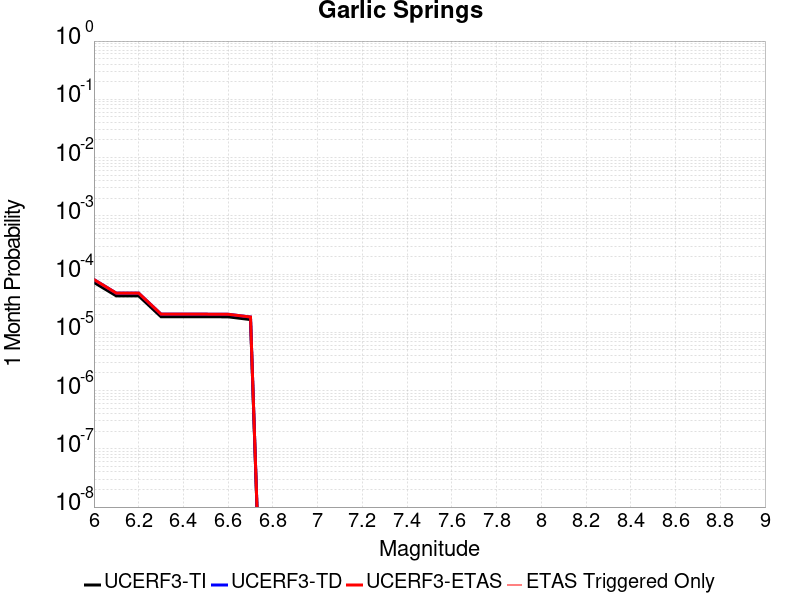 |  |  |

| Magnitude | 1 wk TI Prob | 1 wk TD Prob | 1 wk ETAS Prob | 1 wk ETAS/TD Gain | 1 wk ETAS Triggered Only | 1 mo TI Prob | 1 mo TD Prob | 1 mo ETAS Prob | 1 mo ETAS/TD Gain | 1 mo ETAS Triggered Only | 1 yr TI Prob | 1 yr TD Prob | 1 yr ETAS Prob | 1 yr ETAS/TD Gain | 1 yr ETAS Triggered Only | 10 yr TI Prob | 10 yr TD Prob | 10 yr ETAS Prob | 10 yr ETAS/TD Gain | 10 yr ETAS Triggered Only |
|-----|-----|-----|-----|-----|-----|-----|-----|-----|-----|-----|-----|-----|-----|-----|-----|-----|-----|-----|-----|-----|
| 6.0 | 1.6760017E-5 | 1.8778032E-5 | 1.8778032E-5 | 1.0 | 0.0 | 7.182667E-5 | 8.047546E-5 | 8.047546E-5 | 1.0 | 0.0 | 8.7413884E-4 | 9.794658E-4 | 9.89456E-4 | 1.0101997 | 1.0E-5 | 0.008707083 | 0.009763034 | 0.009792741 | 1.0030428 | 3.0E-5 |
| 6.1 | 9.852767E-6 | 1.097425E-5 | 1.097425E-5 | 1.0 | 0.0 | 4.222546E-5 | 4.703205E-5 | 4.703205E-5 | 1.0 | 0.0 | 5.139737E-4 | 5.7253573E-4 | 5.7253573E-4 | 1.0 | 0.0 | 0.005127866 | 0.005717566 | 0.005727509 | 1.001739 | 1.0E-5 |
| 6.2 | 9.852767E-6 | 1.097425E-5 | 1.097425E-5 | 1.0 | 0.0 | 4.222546E-5 | 4.703205E-5 | 4.703205E-5 | 1.0 | 0.0 | 5.139737E-4 | 5.7253573E-4 | 5.7253573E-4 | 1.0 | 0.0 | 0.005127866 | 0.005717566 | 0.005727509 | 1.001739 | 1.0E-5 |
| 6.3 | 4.3167724E-6 | 4.7782996E-6 | 4.7782996E-6 | 1.0 | 0.0 | 1.8500323E-5 | 2.0478396E-5 | 2.0478396E-5 | 1.0 | 0.0 | 2.2521814E-4 | 2.4931898E-4 | 2.4931898E-4 | 1.0 | 0.0 | 0.0022499003 | 0.002492651 | 0.002492651 | 1.0 | 0.0 |
| 6.4 | 4.3167724E-6 | 4.7782996E-6 | 4.7782996E-6 | 1.0 | 0.0 | 1.8500323E-5 | 2.0478396E-5 | 2.0478396E-5 | 1.0 | 0.0 | 2.2521814E-4 | 2.4931898E-4 | 2.4931898E-4 | 1.0 | 0.0 | 0.0022499003 | 0.002492651 | 0.002492651 | 1.0 | 0.0 |
| 6.5 | 4.3167724E-6 | 4.7782996E-6 | 4.7782996E-6 | 1.0 | 0.0 | 1.8500323E-5 | 2.0478396E-5 | 2.0478396E-5 | 1.0 | 0.0 | 2.2521814E-4 | 2.4931898E-4 | 2.4931898E-4 | 1.0 | 0.0 | 0.0022499003 | 0.002492651 | 0.002492651 | 1.0 | 0.0 |
| 6.6 | 4.301311E-6 | 4.761167E-6 | 4.761167E-6 | 1.0 | 0.0 | 1.8434059E-5 | 2.0404972E-5 | 2.0404972E-5 | 1.0 | 0.0 | 2.2441156E-4 | 2.4842523E-4 | 2.4842523E-4 | 1.0 | 0.0 | 0.0022418506 | 0.002483734 | 0.002483734 | 1.0 | 0.0 |
| 6.7 | 3.8599724E-6 | 4.2713013E-6 | 4.2713013E-6 | 1.0 | 0.0 | 1.6542634E-5 | 1.8305576E-5 | 1.8305576E-5 | 1.0 | 0.0 | 2.0138794E-4 | 2.228704E-4 | 2.228704E-4 | 1.0 | 0.0 | 0.0020120554 | 0.0022287038 | 0.0022287038 | 1.0 | 0.0 |

## Mission Creek
*[(top)](#table-of-contents)*

| 1 Week | 1 Month | 1 Year | 10 Year |
|-----|-----|-----|-----|
|  |  |  |  |

| Magnitude | 1 wk TI Prob | 1 wk TD Prob | 1 wk ETAS Prob | 1 wk ETAS/TD Gain | 1 wk ETAS Triggered Only | 1 mo TI Prob | 1 mo TD Prob | 1 mo ETAS Prob | 1 mo ETAS/TD Gain | 1 mo ETAS Triggered Only | 1 yr TI Prob | 1 yr TD Prob | 1 yr ETAS Prob | 1 yr ETAS/TD Gain | 1 yr ETAS Triggered Only | 10 yr TI Prob | 10 yr TD Prob | 10 yr ETAS Prob | 10 yr ETAS/TD Gain | 10 yr ETAS Triggered Only |
|-----|-----|-----|-----|-----|-----|-----|-----|-----|-----|-----|-----|-----|-----|-----|-----|-----|-----|-----|-----|-----|
| 6.0 | 1.1549387E-5 | 1.6331744E-5 | 1.6331744E-5 | 1.0 | 0.0 | 4.9496433E-5 | 6.9991394E-5 | 7.999069E-5 | 1.1428647 | 1.0E-5 | 6.0245243E-4 | 8.5182703E-4 | 8.7181E-4 | 1.023459 | 2.0E-5 | 0.006008218 | 0.008514742 | 0.008544487 | 1.0034933 | 3.0E-5 |
| 6.1 | 1.1549387E-5 | 1.6331744E-5 | 1.6331744E-5 | 1.0 | 0.0 | 4.9496433E-5 | 6.9991394E-5 | 7.999069E-5 | 1.1428647 | 1.0E-5 | 6.0245243E-4 | 8.5182703E-4 | 8.7181E-4 | 1.023459 | 2.0E-5 | 0.006008218 | 0.008514742 | 0.008544487 | 1.0034933 | 3.0E-5 |
| 6.2 | 1.1549387E-5 | 1.6331744E-5 | 1.6331744E-5 | 1.0 | 0.0 | 4.9496433E-5 | 6.9991394E-5 | 7.999069E-5 | 1.1428647 | 1.0E-5 | 6.0245243E-4 | 8.5182703E-4 | 8.7181E-4 | 1.023459 | 2.0E-5 | 0.006008218 | 0.008514742 | 0.008544487 | 1.0034933 | 3.0E-5 |
| 6.3 | 1.1549387E-5 | 1.6331744E-5 | 1.6331744E-5 | 1.0 | 0.0 | 4.9496433E-5 | 6.9991394E-5 | 7.999069E-5 | 1.1428647 | 1.0E-5 | 6.0245243E-4 | 8.5182703E-4 | 8.7181E-4 | 1.023459 | 2.0E-5 | 0.006008218 | 0.008514742 | 0.008544487 | 1.0034933 | 3.0E-5 |
| 6.4 | 1.1549387E-5 | 1.6331744E-5 | 1.6331744E-5 | 1.0 | 0.0 | 4.9496433E-5 | 6.9991394E-5 | 7.999069E-5 | 1.1428647 | 1.0E-5 | 6.0245243E-4 | 8.5182703E-4 | 8.7181E-4 | 1.023459 | 2.0E-5 | 0.006008218 | 0.008514742 | 0.008544487 | 1.0034933 | 3.0E-5 |
| 6.5 | 1.1549387E-5 | 1.6331744E-5 | 1.6331744E-5 | 1.0 | 0.0 | 4.9496433E-5 | 6.9991394E-5 | 7.999069E-5 | 1.1428647 | 1.0E-5 | 6.0245243E-4 | 8.5182703E-4 | 8.7181E-4 | 1.023459 | 2.0E-5 | 0.006008218 | 0.008514742 | 0.008544487 | 1.0034933 | 3.0E-5 |
| 6.6 | 9.202681E-6 | 1.3854947E-5 | 1.3854947E-5 | 1.0 | 0.0 | 3.9439463E-5 | 5.9377046E-5 | 6.937645E-5 | 1.1684053 | 1.0E-5 | 4.800697E-4 | 7.226848E-4 | 7.426703E-4 | 1.0276545 | 2.0E-5 | 0.004790339 | 0.007231895 | 0.0072616776 | 1.0041183 | 3.0E-5 |
| 6.7 | 9.019164E-6 | 1.366061E-5 | 1.366061E-5 | 1.0 | 0.0 | 3.8652986E-5 | 5.854421E-5 | 6.8543624E-5 | 1.170801 | 1.0E-5 | 4.7049852E-4 | 7.1255164E-4 | 7.325374E-4 | 1.0280482 | 2.0E-5 | 0.004695036 | 0.007131216 | 0.0071610026 | 1.0041769 | 3.0E-5 |
| 6.8 | 8.673558E-6 | 1.3282702E-5 | 1.3282702E-5 | 1.0 | 0.0 | 3.717186E-5 | 5.6924673E-5 | 6.6924105E-5 | 1.1756607 | 1.0E-5 | 4.524734E-4 | 6.928463E-4 | 7.128325E-4 | 1.0288464 | 2.0E-5 | 0.0045155324 | 0.0069353953 | 0.0069651874 | 1.0042956 | 3.0E-5 |
| 6.9 | 7.002255E-6 | 1.1486859E-5 | 1.1486859E-5 | 1.0 | 0.0 | 3.000932E-5 | 4.9228507E-5 | 5.9228016E-5 | 1.2031243 | 1.0E-5 | 3.653022E-4 | 5.991991E-4 | 6.1918714E-4 | 1.0333579 | 2.0E-5 | 0.0036470229 | 0.0060041854 | 0.0060340054 | 1.0049665 | 3.0E-5 |
| 7.0 | 5.84644E-6 | 9.683714E-6 | 9.683714E-6 | 1.0 | 0.0 | 2.5055931E-5 | 4.1500996E-5 | 5.150058E-5 | 1.2409481 | 1.0E-5 | 3.0501327E-4 | 5.0516205E-4 | 5.251519E-4 | 1.0395713 | 2.0E-5 | 0.0030459496 | 0.005068281 | 0.005098129 | 1.0058892 | 3.0E-5 |
| 7.1 | 5.54703E-6 | 9.338158E-6 | 9.338158E-6 | 1.0 | 0.0 | 2.377277E-5 | 4.0020088E-5 | 5.0019687E-5 | 1.2498645 | 1.0E-5 | 2.8939504E-4 | 4.871401E-4 | 5.0713035E-4 | 1.041036 | 2.0E-5 | 0.0028901845 | 0.0048888596 | 0.0049187127 | 1.0061064 | 3.0E-5 |
| 7.2 | 4.384709E-6 | 7.689885E-6 | 7.689885E-6 | 1.0 | 0.0 | 1.8791474E-5 | 3.2956254E-5 | 4.2955926E-5 | 1.3034226 | 1.0E-5 | 2.2876218E-4 | 4.0117218E-4 | 4.2116415E-4 | 1.0498339 | 2.0E-5 | 0.0022852682 | 0.0040325816 | 0.0040624603 | 1.0074095 | 3.0E-5 |
| 7.3 | 3.7888456E-6 | 6.923602E-6 | 6.923602E-6 | 1.0 | 0.0 | 1.623781E-5 | 2.9672263E-5 | 3.9671966E-5 | 1.3370051 | 1.0E-5 | 1.9767738E-4 | 3.6120327E-4 | 3.8119603E-4 | 1.0553505 | 2.0E-5 | 0.0019750162 | 0.0036342472 | 0.0036641383 | 1.0082248 | 3.0E-5 |
| 7.4 | 2.1982462E-6 | 5.0316853E-6 | 5.0316853E-6 | 1.0 | 0.0 | 9.421021E-6 | 2.1564189E-5 | 3.1563974E-5 | 1.4637218 | 1.0E-5 | 1.1469489E-4 | 2.6251256E-4 | 2.825073E-4 | 1.0761669 | 2.0E-5 | 0.0011463572 | 0.0026498951 | 0.0026798157 | 1.0112911 | 3.0E-5 |
| 7.5 | 2.051923E-6 | 4.6227096E-6 | 4.6227096E-6 | 1.0 | 0.0 | 8.793926E-6 | 1.9811463E-5 | 2.9811266E-5 | 1.5047482 | 1.0E-5 | 1.0706078E-4 | 2.4117802E-4 | 2.611732E-4 | 1.0829062 | 2.0E-5 | 0.0010700922 | 0.0024374423 | 0.0024673692 | 1.012278 | 3.0E-5 |
| 7.6 | 1.8733427E-6 | 4.1308053E-6 | 4.1308053E-6 | 1.0 | 0.0 | 8.028587E-6 | 1.7703333E-5 | 2.7703156E-5 | 1.5648555 | 1.0E-5 | 9.774366E-5 | 2.1551683E-4 | 2.3551252E-4 | 1.0927802 | 2.0E-5 | 9.770069E-4 | 0.002181846 | 0.0022117805 | 1.0137198 | 3.0E-5 |
| 7.7 | 1.8411953E-6 | 4.0504306E-6 | 4.0504306E-6 | 1.0 | 0.0 | 7.890813E-6 | 1.7358872E-5 | 2.73587E-5 | 1.5760642 | 1.0E-5 | 9.606641E-5 | 2.1132386E-4 | 2.3131965E-4 | 1.0946214 | 2.0E-5 | 9.6024893E-4 | 0.0021401057 | 0.0021700417 | 1.013988 | 3.0E-5 |
| 7.8 | 1.7194251E-6 | 3.7173024E-6 | 3.7173024E-6 | 1.0 | 0.0 | 7.368944E-6 | 1.59312E-5 | 2.593104E-5 | 1.6276891 | 1.0E-5 | 8.97132E-5 | 1.9394518E-4 | 2.139413E-4 | 1.103102 | 2.0E-5 | 8.967699E-4 | 0.0019658357 | 0.0019957765 | 1.0152307 | 3.0E-5 |
| 7.9 | 1.4035052E-6 | 2.9557E-6 | 2.9557E-6 | 1.0 | 0.0 | 6.0150082E-6 | 1.2667225E-5 | 2.2667098E-5 | 1.789429 | 1.0E-5 | 7.3230265E-5 | 1.5421261E-4 | 1.7420952E-4 | 1.1296711 | 2.0E-5 | 7.3206134E-4 | 0.0015659636 | 0.0015959166 | 1.0191275 | 3.0E-5 |
| 8.0 | 3.9318823E-7 | 5.542283E-7 | 5.542283E-7 | 1.0 | 0.0 | 1.6850913E-6 | 2.3752618E-6 | 2.3752618E-6 | 1.0 | 0.0 | 2.0515794E-5 | 2.8918435E-5 | 2.8918435E-5 | 1.0 | 0.0 | 2.0513899E-4 | 2.997098E-4 | 3.097068E-4 | 1.0333556 | 1.0E-5 |
| 8.1 | 1.596793E-7 | 1.1427638E-7 | 1.1427638E-7 | 1.0 | 0.0 | 6.8433974E-7 | 4.8975585E-7 | 4.8975585E-7 | 1.0 | 0.0 | 8.331805E-6 | 5.962761E-6 | 5.962761E-6 | 1.0 | 0.0 | 8.331492E-5 | 6.57585E-5 | 6.57585E-5 | 1.0 | 0.0 |
| 8.2 | 4.9003038E-8 | 2.5565779E-8 | 2.5565779E-8 | 1.0 | 0.0 | 2.10013E-7 | 1.09567615E-7 | 1.09567615E-7 | 1.0 | 0.0 | 2.5569052E-6 | 1.3339849E-6 | 1.3339849E-6 | 1.0 | 0.0 | 2.556876E-5 | 1.5023335E-5 | 1.5023335E-5 | 1.0 | 0.0 |

## Bicycle Lake
*[(top)](#table-of-contents)*

| 1 Week | 1 Month | 1 Year | 10 Year |
|-----|-----|-----|-----|
|  |  |  |  |

| Magnitude | 1 wk TI Prob | 1 wk TD Prob | 1 wk ETAS Prob | 1 wk ETAS/TD Gain | 1 wk ETAS Triggered Only | 1 mo TI Prob | 1 mo TD Prob | 1 mo ETAS Prob | 1 mo ETAS/TD Gain | 1 mo ETAS Triggered Only | 1 yr TI Prob | 1 yr TD Prob | 1 yr ETAS Prob | 1 yr ETAS/TD Gain | 1 yr ETAS Triggered Only | 10 yr TI Prob | 10 yr TD Prob | 10 yr ETAS Prob | 10 yr ETAS/TD Gain | 10 yr ETAS Triggered Only |
|-----|-----|-----|-----|-----|-----|-----|-----|-----|-----|-----|-----|-----|-----|-----|-----|-----|-----|-----|-----|-----|
| 6.0 | 1.9621975E-5 | 2.2098558E-5 | 2.2098558E-5 | 1.0 | 0.0 | 8.4091465E-5 | 9.470543E-5 | 9.470543E-5 | 1.0 | 0.0 | 0.0010233327 | 0.0011525637 | 0.0011725406 | 1.0173327 | 2.0E-5 | 0.01018633 | 0.011479173 | 0.011508829 | 1.0025834 | 3.0E-5 |
| 6.1 | 1.9621975E-5 | 2.2098558E-5 | 2.2098558E-5 | 1.0 | 0.0 | 8.4091465E-5 | 9.470543E-5 | 9.470543E-5 | 1.0 | 0.0 | 0.0010233327 | 0.0011525637 | 0.0011725406 | 1.0173327 | 2.0E-5 | 0.01018633 | 0.011479173 | 0.011508829 | 1.0025834 | 3.0E-5 |
| 6.2 | 9.9971285E-6 | 1.1256391E-5 | 1.1256391E-5 | 1.0 | 0.0 | 4.2844134E-5 | 4.824108E-5 | 4.824108E-5 | 1.0 | 0.0 | 5.2150246E-4 | 5.8722886E-4 | 6.0721714E-4 | 1.0340383 | 2.0E-5 | 0.0052028033 | 0.0058618775 | 0.0058817603 | 1.0033919 | 2.0E-5 |
| 6.3 | 9.589428E-6 | 1.0799068E-5 | 1.0799068E-5 | 1.0 | 0.0 | 4.10969E-5 | 4.628119E-5 | 4.628119E-5 | 1.0 | 0.0 | 5.002399E-4 | 5.633797E-4 | 5.8336847E-4 | 1.03548 | 2.0E-5 | 0.0049911533 | 0.0056246053 | 0.005644493 | 1.0035357 | 2.0E-5 |
| 6.4 | 9.589428E-6 | 1.0799068E-5 | 1.0799068E-5 | 1.0 | 0.0 | 4.10969E-5 | 4.628119E-5 | 4.628119E-5 | 1.0 | 0.0 | 5.002399E-4 | 5.633797E-4 | 5.8336847E-4 | 1.03548 | 2.0E-5 | 0.0049911533 | 0.0056246053 | 0.005644493 | 1.0035357 | 2.0E-5 |
| 6.5 | 5.557707E-6 | 6.286038E-6 | 6.286038E-6 | 1.0 | 0.0 | 2.3818526E-5 | 2.6940037E-5 | 2.6940037E-5 | 1.0 | 0.0 | 2.8995197E-4 | 3.2797246E-4 | 3.379692E-4 | 1.0304804 | 1.0E-5 | 0.0028957394 | 0.0032775209 | 0.0032874881 | 1.003041 | 1.0E-5 |
| 6.6 | 4.8742945E-6 | 5.5136734E-6 | 5.5136734E-6 | 1.0 | 0.0 | 2.0889667E-5 | 2.3629962E-5 | 2.3629962E-5 | 1.0 | 0.0 | 2.54302E-4 | 2.87683E-4 | 2.9768012E-4 | 1.0347505 | 1.0E-5 | 0.002540112 | 0.0028756752 | 0.0028856464 | 1.0034674 | 1.0E-5 |
| 6.7 | 3.991108E-6 | 4.5162255E-6 | 4.5162255E-6 | 1.0 | 0.0 | 1.7104636E-5 | 1.9355251E-5 | 1.9355251E-5 | 1.0 | 0.0 | 2.0822904E-4 | 2.3565018E-4 | 2.4564783E-4 | 1.0424258 | 1.0E-5 | 0.0020803404 | 0.0023565018 | 0.0023664783 | 1.0042336 | 1.0E-5 |

## San Andreas (Carrizo) rev
*[(top)](#table-of-contents)*

| 1 Week | 1 Month | 1 Year | 10 Year |
|-----|-----|-----|-----|
|  |  |  |  |

| Magnitude | 1 wk TI Prob | 1 wk TD Prob | 1 wk ETAS Prob | 1 wk ETAS/TD Gain | 1 wk ETAS Triggered Only | 1 mo TI Prob | 1 mo TD Prob | 1 mo ETAS Prob | 1 mo ETAS/TD Gain | 1 mo ETAS Triggered Only | 1 yr TI Prob | 1 yr TD Prob | 1 yr ETAS Prob | 1 yr ETAS/TD Gain | 1 yr ETAS Triggered Only | 10 yr TI Prob | 10 yr TD Prob | 10 yr ETAS Prob | 10 yr ETAS/TD Gain | 10 yr ETAS Triggered Only |
|-----|-----|-----|-----|-----|-----|-----|-----|-----|-----|-----|-----|-----|-----|-----|-----|-----|-----|-----|-----|-----|
| 6.0 | 1.1674632E-4 | 2.4361293E-4 | 2.4361293E-4 | 1.0 | 0.0 | 5.002454E-4 | 0.0010436393 | 0.0010436393 | 1.0 | 0.0 | 0.006073493 | 0.012632766 | 0.012652513 | 1.0015632 | 2.0E-5 | 0.0591016 | 0.12077509 | 0.12079267 | 1.0001456 | 2.0E-5 |
| 6.1 | 1.1674632E-4 | 2.4361293E-4 | 2.4361293E-4 | 1.0 | 0.0 | 5.002454E-4 | 0.0010436393 | 0.0010436393 | 1.0 | 0.0 | 0.006073493 | 0.012632766 | 0.012652513 | 1.0015632 | 2.0E-5 | 0.0591016 | 0.12077509 | 0.12079267 | 1.0001456 | 2.0E-5 |
| 6.2 | 1.1674632E-4 | 2.4361293E-4 | 2.4361293E-4 | 1.0 | 0.0 | 5.002454E-4 | 0.0010436393 | 0.0010436393 | 1.0 | 0.0 | 0.006073493 | 0.012632766 | 0.012652513 | 1.0015632 | 2.0E-5 | 0.0591016 | 0.12077509 | 0.12079267 | 1.0001456 | 2.0E-5 |
| 6.3 | 1.1674632E-4 | 2.4361293E-4 | 2.4361293E-4 | 1.0 | 0.0 | 5.002454E-4 | 0.0010436393 | 0.0010436393 | 1.0 | 0.0 | 0.006073493 | 0.012632766 | 0.012652513 | 1.0015632 | 2.0E-5 | 0.0591016 | 0.12077509 | 0.12079267 | 1.0001456 | 2.0E-5 |
| 6.4 | 1.1674632E-4 | 2.4361293E-4 | 2.4361293E-4 | 1.0 | 0.0 | 5.002454E-4 | 0.0010436393 | 0.0010436393 | 1.0 | 0.0 | 0.006073493 | 0.012632766 | 0.012652513 | 1.0015632 | 2.0E-5 | 0.0591016 | 0.12077509 | 0.12079267 | 1.0001456 | 2.0E-5 |
| 6.5 | 1.13136164E-4 | 2.3681132E-4 | 2.3681132E-4 | 1.0 | 0.0 | 4.847792E-4 | 0.0010145125 | 0.0010145125 | 1.0 | 0.0 | 0.0058862255 | 0.012282185 | 0.01230194 | 1.0016084 | 2.0E-5 | 0.057327334 | 0.1177463 | 0.117763944 | 1.0001498 | 2.0E-5 |
| 6.6 | 1.13136164E-4 | 2.3681132E-4 | 2.3681132E-4 | 1.0 | 0.0 | 4.847792E-4 | 0.0010145125 | 0.0010145125 | 1.0 | 0.0 | 0.0058862255 | 0.012282185 | 0.01230194 | 1.0016084 | 2.0E-5 | 0.057327334 | 0.1177463 | 0.117763944 | 1.0001498 | 2.0E-5 |
| 6.7 | 1.1149675E-4 | 2.3372276E-4 | 2.3372276E-4 | 1.0 | 0.0 | 4.777557E-4 | 0.001001286 | 0.001001286 | 1.0 | 0.0 | 0.0058011734 | 0.012122953 | 0.012142711 | 1.0016297 | 2.0E-5 | 0.05652051 | 0.116367765 | 0.11638544 | 1.0001519 | 2.0E-5 |
| 6.8 | 1.1103589E-4 | 2.3274389E-4 | 2.3274389E-4 | 1.0 | 0.0 | 4.7578133E-4 | 9.97094E-4 | 9.97094E-4 | 1.0 | 0.0 | 0.005777263 | 0.012072483 | 0.012092242 | 1.0016366 | 2.0E-5 | 0.056293584 | 0.115927964 | 0.115945645 | 1.0001525 | 2.0E-5 |
| 6.9 | 1.1053259E-4 | 2.316672E-4 | 2.316672E-4 | 1.0 | 0.0 | 4.7362508E-4 | 9.924831E-4 | 9.924831E-4 | 1.0 | 0.0 | 0.0057511497 | 0.012016967 | 0.012036726 | 1.0016444 | 2.0E-5 | 0.05604569 | 0.11544405 | 0.11546174 | 1.0001533 | 2.0E-5 |
| 7.0 | 1.1005377E-4 | 2.3067516E-4 | 2.3067516E-4 | 1.0 | 0.0 | 4.7157376E-4 | 9.882348E-4 | 9.882348E-4 | 1.0 | 0.0 | 0.0057263062 | 0.011965811 | 0.011985572 | 1.0016514 | 2.0E-5 | 0.055809796 | 0.11499625 | 0.11501395 | 1.0001539 | 2.0E-5 |
| 7.1 | 1.0308142E-4 | 2.1576507E-4 | 2.1576507E-4 | 1.0 | 0.0 | 4.417027E-4 | 9.2438085E-4 | 9.2438085E-4 | 1.0 | 0.0 | 0.0053644776 | 0.011196577 | 0.011216353 | 1.0017662 | 2.0E-5 | 0.052368138 | 0.10825095 | 0.10826878 | 1.0001647 | 2.0E-5 |
| 7.2 | 1.0027479E-4 | 2.098411E-4 | 2.098411E-4 | 1.0 | 0.0 | 4.296783E-4 | 8.9901005E-4 | 8.9901005E-4 | 1.0 | 0.0 | 0.0052187922 | 0.010890815 | 0.010910598 | 1.0018164 | 2.0E-5 | 0.050979212 | 0.105554216 | 0.105572104 | 1.0001695 | 2.0E-5 |
| 7.3 | 9.816942E-5 | 2.0458816E-4 | 2.0458816E-4 | 1.0 | 0.0 | 4.2065824E-4 | 8.765127E-4 | 8.765127E-4 | 1.0 | 0.0 | 0.005109493 | 0.010619612 | 0.0106394 | 1.0018634 | 2.0E-5 | 0.049935985 | 0.10313633 | 0.103154264 | 1.0001739 | 2.0E-5 |
| 7.4 | 9.5634205E-5 | 1.9827684E-4 | 1.9827684E-4 | 1.0 | 0.0 | 4.0979648E-4 | 8.494821E-4 | 8.494821E-4 | 1.0 | 0.0 | 0.0049778637 | 0.010293663 | 0.010313457 | 1.001923 | 2.0E-5 | 0.048678253 | 0.100220494 | 0.10023849 | 1.0001795 | 2.0E-5 |
| 7.5 | 8.052417E-5 | 1.6143978E-4 | 1.6143978E-4 | 1.0 | 0.0 | 3.4505792E-4 | 6.917014E-4 | 6.917014E-4 | 1.0 | 0.0 | 0.0041929903 | 0.008389029 | 0.00840886 | 1.002364 | 2.0E-5 | 0.04114753 | 0.08295002 | 0.08296836 | 1.0002211 | 2.0E-5 |
| 7.6 | 7.897024E-5 | 1.579682E-4 | 1.579682E-4 | 1.0 | 0.0 | 3.384E-4 | 6.768311E-4 | 6.768311E-4 | 1.0 | 0.0 | 0.0041122385 | 0.00820936 | 0.008229196 | 1.0024163 | 2.0E-5 | 0.040369697 | 0.081289805 | 0.08130818 | 1.000226 | 2.0E-5 |
| 7.7 | 6.707427E-5 | 1.3303987E-4 | 1.3303987E-4 | 1.0 | 0.0 | 2.8742946E-4 | 5.700463E-4 | 5.700463E-4 | 1.0 | 0.0 | 0.003493839 | 0.0069182604 | 0.006938122 | 1.0028709 | 2.0E-5 | 0.034394164 | 0.06917457 | 0.069193184 | 1.0002692 | 2.0E-5 |
| 7.8 | 6.147705E-5 | 1.2222702E-4 | 1.2222702E-4 | 1.0 | 0.0 | 2.6344648E-4 | 5.23725E-4 | 5.23725E-4 | 1.0 | 0.0 | 0.0032027436 | 0.0063577346 | 0.0063776076 | 1.0031258 | 2.0E-5 | 0.031569764 | 0.06362964 | 0.06364837 | 1.0002943 | 2.0E-5 |
| 7.9 | 4.7636717E-5 | 8.8979046E-5 | 8.8979046E-5 | 1.0 | 0.0 | 2.0414138E-4 | 3.8128305E-4 | 3.8128305E-4 | 1.0 | 0.0 | 0.0024825884 | 0.004632248 | 0.0046422016 | 1.0021487 | 1.0E-5 | 0.024550365 | 0.046713326 | 0.04672286 | 1.0002041 | 1.0E-5 |
| 8.0 | 3.3554235E-5 | 5.224805E-5 | 5.224805E-5 | 1.0 | 0.0 | 1.4379594E-4 | 2.23901E-4 | 2.23901E-4 | 1.0 | 0.0 | 0.0017493097 | 0.0027225888 | 0.0027325617 | 1.003663 | 1.0E-5 | 0.017356034 | 0.027935574 | 0.027945295 | 1.000348 | 1.0E-5 |
| 8.1 | 1.9175432E-5 | 1.9238541E-5 | 1.9238541E-5 | 1.0 | 0.0 | 8.217783E-5 | 8.244829E-5 | 8.244829E-5 | 1.0 | 0.0 | 0.0010000558 | 0.0010033463 | 0.0010033463 | 1.0 | 0.0 | 0.009955673 | 0.010786123 | 0.010786123 | 1.0 | 0.0 |
| 8.2 | 8.643924E-6 | 5.49522E-6 | 5.49522E-6 | 1.0 | 0.0 | 3.704486E-5 | 2.355073E-5 | 2.355073E-5 | 1.0 | 0.0 | 4.5092785E-4 | 2.866925E-4 | 2.866925E-4 | 1.0 | 0.0 | 0.0045001395 | 0.0032598388 | 0.0032598388 | 1.0 | 0.0 |
| 8.3 | 1.983087E-6 | 7.693574E-7 | 7.693574E-7 | 1.0 | 0.0 | 8.498917E-6 | 3.297242E-6 | 3.297242E-6 | 1.0 | 0.0 | 1.034694E-4 | 4.01432E-5 | 4.01432E-5 | 1.0 | 0.0 | 0.0010342124 | 4.7390026E-4 | 4.7390026E-4 | 1.0 | 0.0 |

## Rose Canyon
*[(top)](#table-of-contents)*

| 1 Week | 1 Month | 1 Year | 10 Year |
|-----|-----|-----|-----|
|  | 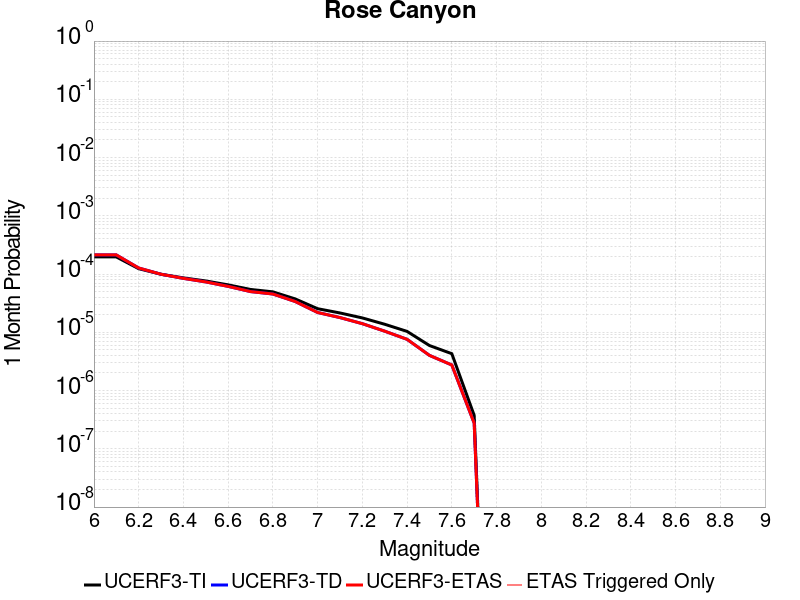 |  | 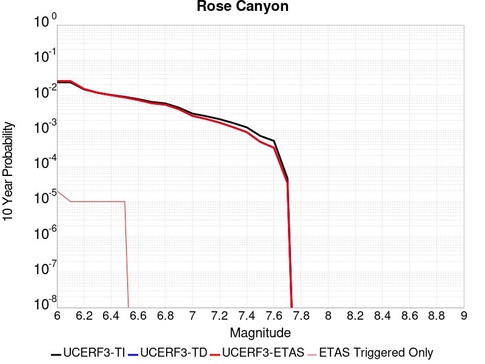 |

| Magnitude | 1 wk TI Prob | 1 wk TD Prob | 1 wk ETAS Prob | 1 wk ETAS/TD Gain | 1 wk ETAS Triggered Only | 1 mo TI Prob | 1 mo TD Prob | 1 mo ETAS Prob | 1 mo ETAS/TD Gain | 1 mo ETAS Triggered Only | 1 yr TI Prob | 1 yr TD Prob | 1 yr ETAS Prob | 1 yr ETAS/TD Gain | 1 yr ETAS Triggered Only | 10 yr TI Prob | 10 yr TD Prob | 10 yr ETAS Prob | 10 yr ETAS/TD Gain | 10 yr ETAS Triggered Only |
|-----|-----|-----|-----|-----|-----|-----|-----|-----|-----|-----|-----|-----|-----|-----|-----|-----|-----|-----|-----|-----|
| 6.0 | 4.5923203E-5 | 4.9720562E-5 | 4.9720562E-5 | 1.0 | 0.0 | 1.9679888E-4 | 2.1307007E-4 | 2.1307007E-4 | 1.0 | 0.0 | 0.0023933933 | 0.0025912558 | 0.002611204 | 1.0076983 | 2.0E-5 | 0.023677798 | 0.025643215 | 0.025662702 | 1.00076 | 2.0E-5 |
| 6.1 | 4.5923203E-5 | 4.9720562E-5 | 4.9720562E-5 | 1.0 | 0.0 | 1.9679888E-4 | 2.1307007E-4 | 2.1307007E-4 | 1.0 | 0.0 | 0.0023933933 | 0.0025912558 | 0.0026012298 | 1.0038491 | 1.0E-5 | 0.023677798 | 0.025643215 | 0.025652958 | 1.0003799 | 1.0E-5 |
| 6.2 | 2.8844734E-5 | 2.9671555E-5 | 2.9671555E-5 | 1.0 | 0.0 | 1.2361443E-4 | 1.2715581E-4 | 1.2715581E-4 | 1.0 | 0.0 | 0.0015039665 | 0.0015470508 | 0.0015570353 | 1.0064539 | 1.0E-5 | 0.0149382865 | 0.015375828 | 0.015385674 | 1.0006404 | 1.0E-5 |
| 6.3 | 2.3171577E-5 | 2.3163228E-5 | 2.3163228E-5 | 1.0 | 0.0 | 9.9302975E-5 | 9.926727E-5 | 9.926727E-5 | 1.0 | 0.0 | 0.0012083431 | 0.0012079224 | 0.0012179102 | 1.0082687 | 1.0E-5 | 0.012017938 | 0.012023459 | 0.012033339 | 1.0008217 | 1.0E-5 |
| 6.4 | 2.0066604E-5 | 1.9668718E-5 | 1.9668718E-5 | 1.0 | 0.0 | 8.599689E-5 | 8.429184E-5 | 8.429184E-5 | 1.0 | 0.0 | 0.0010465092 | 0.00102578 | 0.0010357697 | 1.0097387 | 1.0E-5 | 0.010415946 | 0.010218433 | 0.010228331 | 1.0009686 | 1.0E-5 |
| 6.5 | 1.776989E-5 | 1.7115255E-5 | 1.7115255E-5 | 1.0 | 0.0 | 7.615444E-5 | 7.3349074E-5 | 7.3349074E-5 | 1.0 | 0.0 | 9.267859E-4 | 8.9266605E-4 | 9.026571E-4 | 1.0111924 | 1.0E-5 | 0.009229303 | 0.008896962 | 0.008906872 | 1.001114 | 1.0E-5 |
| 6.6 | 1.5227364E-5 | 1.4340241E-5 | 1.4340241E-5 | 1.0 | 0.0 | 6.52585E-5 | 6.1456754E-5 | 6.1456754E-5 | 1.0 | 0.0 | 7.942326E-4 | 7.4798433E-4 | 7.4798433E-4 | 1.0 | 0.0 | 0.007914 | 0.007458868 | 0.007458868 | 1.0 | 0.0 |
| 6.7 | 1.2703898E-5 | 1.167398E-5 | 1.167398E-5 | 1.0 | 0.0 | 5.4444143E-5 | 5.003041E-5 | 5.003041E-5 | 1.0 | 0.0 | 6.626558E-4 | 6.0895423E-4 | 6.0895423E-4 | 1.0 | 0.0 | 0.006606833 | 0.0060754507 | 0.0060754507 | 1.0 | 0.0 |
| 6.8 | 1.1554917E-5 | 1.060993E-5 | 1.060993E-5 | 1.0 | 0.0 | 4.9520135E-5 | 4.547036E-5 | 4.547036E-5 | 1.0 | 0.0 | 6.0274085E-4 | 5.5346504E-4 | 5.5346504E-4 | 1.0 | 0.0 | 0.0060110865 | 0.005522874 | 0.005522874 | 1.0 | 0.0 |
| 6.9 | 8.732078E-6 | 7.88172E-6 | 7.88172E-6 | 1.0 | 0.0 | 3.7422655E-5 | 3.377838E-5 | 3.377838E-5 | 1.0 | 0.0 | 4.5552556E-4 | 4.111771E-4 | 4.111771E-4 | 1.0 | 0.0 | 0.0045459294 | 0.0041049966 | 0.0041049966 | 1.0 | 0.0 |
| 7.0 | 5.9337494E-6 | 5.1076677E-6 | 5.1076677E-6 | 1.0 | 0.0 | 2.5430107E-5 | 2.188982E-5 | 2.188982E-5 | 1.0 | 0.0 | 3.0956755E-4 | 2.6647613E-4 | 2.6647613E-4 | 1.0 | 0.0 | 0.0030913667 | 0.0026615816 | 0.0026615816 | 1.0 | 0.0 |
| 7.1 | 5.013409E-6 | 4.177528E-6 | 4.177528E-6 | 1.0 | 0.0 | 2.1485863E-5 | 1.7903569E-5 | 1.7903569E-5 | 1.0 | 0.0 | 2.6155898E-4 | 2.1795425E-4 | 2.1795425E-4 | 1.0 | 0.0 | 0.0026125133 | 0.0021774166 | 0.0021774166 | 1.0 | 0.0 |
| 7.2 | 4.120763E-6 | 3.2822556E-6 | 3.2822556E-6 | 1.0 | 0.0 | 1.7660293E-5 | 1.4066734E-5 | 1.4066734E-5 | 1.0 | 0.0 | 2.1499286E-4 | 1.7124912E-4 | 1.7124912E-4 | 1.0 | 0.0 | 0.0021478499 | 0.0017111811 | 0.0017111811 | 1.0 | 0.0 |
| 7.3 | 3.2081239E-6 | 2.4406268E-6 | 2.4406268E-6 | 1.0 | 0.0 | 1.374903E-5 | 1.0459787E-5 | 1.0459787E-5 | 1.0 | 0.0 | 1.6738157E-4 | 1.2734054E-4 | 1.2734054E-4 | 1.0 | 0.0 | 0.0016725556 | 0.0012726827 | 0.0012726827 | 1.0 | 0.0 |
| 7.4 | 2.4194755E-6 | 1.7681314E-6 | 1.7681314E-6 | 1.0 | 0.0 | 1.0369139E-5 | 7.577684E-6 | 7.577684E-6 | 1.0 | 0.0 | 1.2623696E-4 | 9.225445E-5 | 9.225445E-5 | 1.0 | 0.0 | 0.0012616527 | 9.2216686E-4 | 9.2216686E-4 | 1.0 | 0.0 |
| 7.5 | 1.3842889E-6 | 9.3790675E-7 | 9.3790675E-7 | 1.0 | 0.0 | 5.9326535E-6 | 4.019594E-6 | 4.019594E-6 | 1.0 | 0.0 | 7.222766E-5 | 4.8937498E-5 | 4.8937498E-5 | 1.0 | 0.0 | 7.220419E-4 | 4.892707E-4 | 4.892707E-4 | 1.0 | 0.0 |
| 7.6 | 1.0021575E-6 | 6.4118046E-7 | 6.4118046E-7 | 1.0 | 0.0 | 4.2949537E-6 | 2.7479136E-6 | 2.7479136E-6 | 1.0 | 0.0 | 5.2289808E-5 | 3.3455355E-5 | 3.3455355E-5 | 1.0 | 0.0 | 5.2277505E-4 | 3.3450534E-4 | 3.3450534E-4 | 1.0 | 0.0 |
| 7.7 | 8.7620116E-8 | 6.4494145E-8 | 6.4494145E-8 | 1.0 | 0.0 | 3.7551473E-7 | 2.7640345E-7 | 2.7640345E-7 | 1.0 | 0.0 | 4.5718825E-6 | 3.365207E-6 | 3.365207E-6 | 1.0 | 0.0 | 4.5717883E-5 | 3.365159E-5 | 3.365159E-5 | 1.0 | 0.0 |

## Cady
*[(top)](#table-of-contents)*

| 1 Week | 1 Month | 1 Year | 10 Year |
|-----|-----|-----|-----|
|  |  | 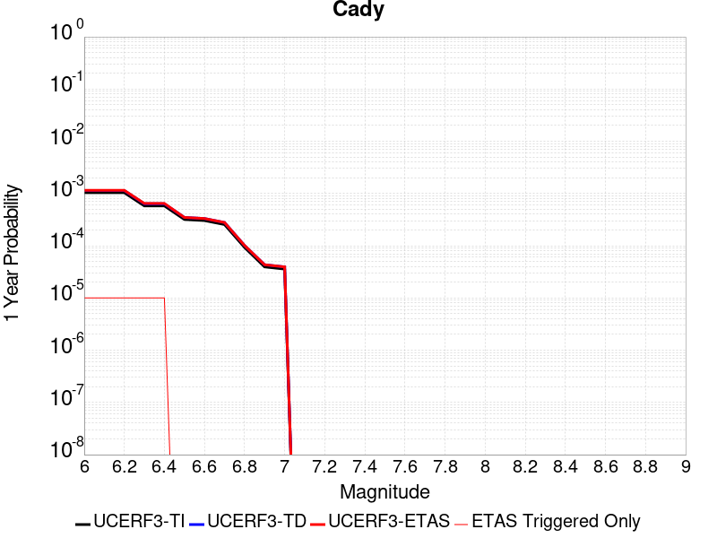 |  |

| Magnitude | 1 wk TI Prob | 1 wk TD Prob | 1 wk ETAS Prob | 1 wk ETAS/TD Gain | 1 wk ETAS Triggered Only | 1 mo TI Prob | 1 mo TD Prob | 1 mo ETAS Prob | 1 mo ETAS/TD Gain | 1 mo ETAS Triggered Only | 1 yr TI Prob | 1 yr TD Prob | 1 yr ETAS Prob | 1 yr ETAS/TD Gain | 1 yr ETAS Triggered Only | 10 yr TI Prob | 10 yr TD Prob | 10 yr ETAS Prob | 10 yr ETAS/TD Gain | 10 yr ETAS Triggered Only |
|-----|-----|-----|-----|-----|-----|-----|-----|-----|-----|-----|-----|-----|-----|-----|-----|-----|-----|-----|-----|-----|
| 6.0 | 1.9892565E-5 | 2.1859876E-5 | 2.1859876E-5 | 1.0 | 0.0 | 8.525106E-5 | 9.3682334E-5 | 9.3682334E-5 | 1.0 | 0.0 | 0.0010374374 | 0.0011400766 | 0.0011500651 | 1.0087613 | 1.0E-5 | 0.010326075 | 0.011351293 | 0.011371066 | 1.0017419 | 2.0E-5 |
| 6.1 | 1.9892565E-5 | 2.1859876E-5 | 2.1859876E-5 | 1.0 | 0.0 | 8.525106E-5 | 9.3682334E-5 | 9.3682334E-5 | 1.0 | 0.0 | 0.0010374374 | 0.0011400766 | 0.0011500651 | 1.0087613 | 1.0E-5 | 0.010326075 | 0.011351293 | 0.011371066 | 1.0017419 | 2.0E-5 |
| 6.2 | 1.9892565E-5 | 2.1859876E-5 | 2.1859876E-5 | 1.0 | 0.0 | 8.525106E-5 | 9.3682334E-5 | 9.3682334E-5 | 1.0 | 0.0 | 0.0010374374 | 0.0011400766 | 0.0011500651 | 1.0087613 | 1.0E-5 | 0.010326075 | 0.011351293 | 0.011371066 | 1.0017419 | 2.0E-5 |
| 6.3 | 1.1117327E-5 | 1.2177199E-5 | 1.2177199E-5 | 1.0 | 0.0 | 4.764482E-5 | 5.218713E-5 | 5.218713E-5 | 1.0 | 0.0 | 5.7992124E-4 | 6.352246E-4 | 6.4521824E-4 | 1.0157324 | 1.0E-5 | 0.0057841022 | 0.006337195 | 0.006347132 | 1.001568 | 1.0E-5 |
| 6.4 | 1.1117327E-5 | 1.2177199E-5 | 1.2177199E-5 | 1.0 | 0.0 | 4.764482E-5 | 5.218713E-5 | 5.218713E-5 | 1.0 | 0.0 | 5.7992124E-4 | 6.352246E-4 | 6.4521824E-4 | 1.0157324 | 1.0E-5 | 0.0057841022 | 0.006337195 | 0.006347132 | 1.001568 | 1.0E-5 |
| 6.5 | 6.103093E-6 | 6.672351E-6 | 6.672351E-6 | 1.0 | 0.0 | 2.615585E-5 | 2.8595547E-5 | 2.8595547E-5 | 1.0 | 0.0 | 3.1840094E-4 | 3.4810771E-4 | 3.4810771E-4 | 1.0 | 0.0 | 0.0031794512 | 0.0034768586 | 0.0034768586 | 1.0 | 0.0 |
| 6.6 | 5.817237E-6 | 6.3659772E-6 | 6.3659772E-6 | 1.0 | 0.0 | 2.4930776E-5 | 2.7282544E-5 | 2.7282544E-5 | 1.0 | 0.0 | 3.034899E-4 | 3.321268E-4 | 3.321268E-4 | 1.0 | 0.0 | 0.0030307577 | 0.0033175263 | 0.0033175263 | 1.0 | 0.0 |
| 6.7 | 4.8846314E-6 | 5.340833E-6 | 5.340833E-6 | 1.0 | 0.0 | 2.0933967E-5 | 2.288915E-5 | 2.288915E-5 | 1.0 | 0.0 | 2.5484123E-4 | 2.7865154E-4 | 2.7865154E-4 | 1.0 | 0.0 | 0.0025454918 | 0.002784177 | 0.002784177 | 1.0 | 0.0 |
| 6.8 | 1.7788773E-6 | 1.940001E-6 | 1.940001E-6 | 1.0 | 0.0 | 7.6237375E-6 | 8.314273E-6 | 8.314273E-6 | 1.0 | 0.0 | 9.281505E-5 | 1.0122315E-4 | 1.0122315E-4 | 1.0 | 0.0 | 9.2776294E-4 | 0.001011925 | 0.001011925 | 1.0 | 0.0 |
| 6.9 | 7.5455404E-7 | 8.2975305E-7 | 8.2975305E-7 | 1.0 | 0.0 | 3.233799E-6 | 3.5560815E-6 | 3.5560815E-6 | 1.0 | 0.0 | 3.937079E-5 | 4.329477E-5 | 4.329477E-5 | 1.0 | 0.0 | 3.9363815E-4 | 4.3289628E-4 | 4.3289628E-4 | 1.0 | 0.0 |
| 7.0 | 6.8578805E-7 | 7.542215E-7 | 7.542215E-7 | 1.0 | 0.0 | 2.9390883E-6 | 3.2323758E-6 | 3.2323758E-6 | 1.0 | 0.0 | 3.578281E-5 | 3.9353796E-5 | 3.9353796E-5 | 1.0 | 0.0 | 3.577705E-4 | 3.9350073E-4 | 3.9350073E-4 | 1.0 | 0.0 |

## Cleghorn Pass
*[(top)](#table-of-contents)*

| 1 Week | 1 Month | 1 Year | 10 Year |
|-----|-----|-----|-----|
|  |  |  |  |

| Magnitude | 1 wk TI Prob | 1 wk TD Prob | 1 wk ETAS Prob | 1 wk ETAS/TD Gain | 1 wk ETAS Triggered Only | 1 mo TI Prob | 1 mo TD Prob | 1 mo ETAS Prob | 1 mo ETAS/TD Gain | 1 mo ETAS Triggered Only | 1 yr TI Prob | 1 yr TD Prob | 1 yr ETAS Prob | 1 yr ETAS/TD Gain | 1 yr ETAS Triggered Only | 10 yr TI Prob | 10 yr TD Prob | 10 yr ETAS Prob | 10 yr ETAS/TD Gain | 10 yr ETAS Triggered Only |
|-----|-----|-----|-----|-----|-----|-----|-----|-----|-----|-----|-----|-----|-----|-----|-----|-----|-----|-----|-----|-----|
| 6.0 | 1.0522846E-5 | 1.104093E-5 | 1.104093E-5 | 1.0 | 0.0 | 4.509713E-5 | 4.731771E-5 | 5.7317236E-5 | 1.2113273 | 1.0E-5 | 5.4891926E-4 | 5.759935E-4 | 5.9598195E-4 | 1.0347027 | 2.0E-5 | 0.0054756533 | 0.005750172 | 0.0057700565 | 1.0034581 | 2.0E-5 |
| 6.1 | 1.0522846E-5 | 1.104093E-5 | 1.104093E-5 | 1.0 | 0.0 | 4.509713E-5 | 4.731771E-5 | 5.7317236E-5 | 1.2113273 | 1.0E-5 | 5.4891926E-4 | 5.759935E-4 | 5.9598195E-4 | 1.0347027 | 2.0E-5 | 0.0054756533 | 0.005750172 | 0.0057700565 | 1.0034581 | 2.0E-5 |
| 6.2 | 2.1045846E-6 | 2.2082602E-6 | 2.2082602E-6 | 1.0 | 0.0 | 9.019617E-6 | 9.463961E-6 | 9.463961E-6 | 1.0 | 0.0 | 1.098083E-4 | 1.1522183E-4 | 1.1522183E-4 | 1.0 | 0.0 | 0.0010975406 | 0.0011520323 | 0.0011520323 | 1.0 | 0.0 |
| 6.3 | 2.1045846E-6 | 2.2082602E-6 | 2.2082602E-6 | 1.0 | 0.0 | 9.019617E-6 | 9.463961E-6 | 9.463961E-6 | 1.0 | 0.0 | 1.098083E-4 | 1.1522183E-4 | 1.1522183E-4 | 1.0 | 0.0 | 0.0010975406 | 0.0011520323 | 0.0011520323 | 1.0 | 0.0 |
| 6.4 | 1.7259927E-6 | 1.8109243E-6 | 1.8109243E-6 | 1.0 | 0.0 | 7.3970905E-6 | 7.761104E-6 | 7.761104E-6 | 1.0 | 0.0 | 9.005586E-5 | 9.449144E-5 | 9.449144E-5 | 1.0 | 0.0 | 9.001937E-4 | 9.4491447E-4 | 9.4491447E-4 | 1.0 | 0.0 |

## San Andreas (Cholame) rev
*[(top)](#table-of-contents)*

| 1 Week | 1 Month | 1 Year | 10 Year |
|-----|-----|-----|-----|
|  | 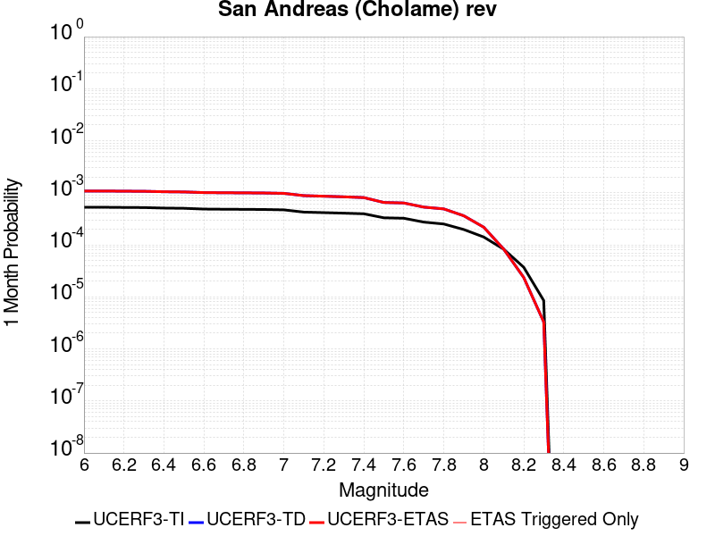 |  |  |

| Magnitude | 1 wk TI Prob | 1 wk TD Prob | 1 wk ETAS Prob | 1 wk ETAS/TD Gain | 1 wk ETAS Triggered Only | 1 mo TI Prob | 1 mo TD Prob | 1 mo ETAS Prob | 1 mo ETAS/TD Gain | 1 mo ETAS Triggered Only | 1 yr TI Prob | 1 yr TD Prob | 1 yr ETAS Prob | 1 yr ETAS/TD Gain | 1 yr ETAS Triggered Only | 10 yr TI Prob | 10 yr TD Prob | 10 yr ETAS Prob | 10 yr ETAS/TD Gain | 10 yr ETAS Triggered Only |
|-----|-----|-----|-----|-----|-----|-----|-----|-----|-----|-----|-----|-----|-----|-----|-----|-----|-----|-----|-----|-----|
| 6.0 | 1.2302514E-4 | 2.5242948E-4 | 2.5242948E-4 | 1.0 | 0.0 | 5.27144E-4 | 0.0010813937 | 0.0010813937 | 1.0 | 0.0 | 0.0063991086 | 0.013086997 | 0.013106735 | 1.0015082 | 2.0E-5 | 0.06217949 | 0.1245517 | 0.12456921 | 1.0001405 | 2.0E-5 |
| 6.1 | 1.2302514E-4 | 2.5242948E-4 | 2.5242948E-4 | 1.0 | 0.0 | 5.27144E-4 | 0.0010813937 | 0.0010813937 | 1.0 | 0.0 | 0.0063991086 | 0.013086997 | 0.013106735 | 1.0015082 | 2.0E-5 | 0.06217949 | 0.1245517 | 0.12456921 | 1.0001405 | 2.0E-5 |
| 6.2 | 1.2203569E-4 | 2.5059693E-4 | 2.5059693E-4 | 1.0 | 0.0 | 5.2290526E-4 | 0.0010735465 | 0.0010735465 | 1.0 | 0.0 | 0.006347804 | 0.0129926 | 0.01301234 | 1.0015193 | 2.0E-5 | 0.061695136 | 0.12373783 | 0.12375536 | 1.0001416 | 2.0E-5 |
| 6.3 | 1.2142645E-4 | 2.4945638E-4 | 2.4945638E-4 | 1.0 | 0.0 | 5.202953E-4 | 0.0010686623 | 0.0010686623 | 1.0 | 0.0 | 0.006316212 | 0.012933843 | 0.012953585 | 1.0015264 | 2.0E-5 | 0.06139677 | 0.123231925 | 0.123249464 | 1.0001423 | 2.0E-5 |
| 6.4 | 1.1865206E-4 | 2.4450937E-4 | 2.4450937E-4 | 1.0 | 0.0 | 5.0840975E-4 | 0.001047478 | 0.001047478 | 1.0 | 0.0 | 0.006172335 | 0.012678952 | 0.012698699 | 1.0015575 | 2.0E-5 | 0.060036868 | 0.121024184 | 0.12104176 | 1.0001452 | 2.0E-5 |
| 6.5 | 1.17443946E-4 | 2.4244092E-4 | 2.4244092E-4 | 1.0 | 0.0 | 5.032341E-4 | 0.0010386204 | 0.0010386204 | 1.0 | 0.0 | 0.006109677 | 0.012572356 | 0.012592104 | 1.0015708 | 2.0E-5 | 0.059444077 | 0.12009794 | 0.12011554 | 1.0001465 | 2.0E-5 |
| 6.6 | 1.13579066E-4 | 2.3552658E-4 | 2.3552658E-4 | 1.0 | 0.0 | 4.866766E-4 | 0.0010090107 | 0.0010090107 | 1.0 | 0.0 | 0.0059092017 | 0.012215953 | 0.012235709 | 1.0016172 | 2.0E-5 | 0.057545185 | 0.11701085 | 0.117028505 | 1.0001509 | 2.0E-5 |
| 6.7 | 1.1271412E-4 | 2.339688E-4 | 2.339688E-4 | 1.0 | 0.0 | 4.829711E-4 | 0.0010023396 | 0.0010023396 | 1.0 | 0.0 | 0.005864331 | 0.012135641 | 0.012155399 | 1.001628 | 2.0E-5 | 0.057119697 | 0.116314195 | 0.11633187 | 1.000152 | 2.0E-5 |
| 6.8 | 1.1217975E-4 | 2.3285215E-4 | 2.3285215E-4 | 1.0 | 0.0 | 4.8068175E-4 | 9.975577E-4 | 9.975577E-4 | 1.0 | 0.0 | 0.005836608 | 0.012078067 | 0.012097826 | 1.0016359 | 2.0E-5 | 0.056856725 | 0.11581219 | 0.11582987 | 1.0001527 | 2.0E-5 |
| 6.9 | 1.1146753E-4 | 2.3133864E-4 | 2.3133864E-4 | 1.0 | 0.0 | 4.7763053E-4 | 9.910761E-4 | 9.910761E-4 | 1.0 | 0.0 | 0.0057996577 | 0.012000027 | 0.012019787 | 1.0016466 | 2.0E-5 | 0.056506127 | 0.11513234 | 0.115150034 | 1.0001537 | 2.0E-5 |
| 7.0 | 1.0965793E-4 | 2.2756905E-4 | 2.2756905E-4 | 1.0 | 0.0 | 4.698779E-4 | 9.7493286E-4 | 9.7493286E-4 | 1.0 | 0.0 | 0.005705768 | 0.01180563 | 0.011825394 | 1.001674 | 2.0E-5 | 0.055614736 | 0.11343304 | 0.11345077 | 1.0001563 | 2.0E-5 |
| 7.1 | 9.927982E-5 | 2.0574623E-4 | 2.0574623E-4 | 1.0 | 0.0 | 4.2541555E-4 | 8.814726E-4 | 8.814726E-4 | 1.0 | 0.0 | 0.0051671406 | 0.0106794145 | 0.0106992 | 1.0018528 | 2.0E-5 | 0.05048634 | 0.10352388 | 0.103541814 | 1.0001732 | 2.0E-5 |
| 7.2 | 9.696786E-5 | 2.0078626E-4 | 2.0078626E-4 | 1.0 | 0.0 | 4.1551032E-4 | 8.602298E-4 | 8.602298E-4 | 1.0 | 0.0 | 0.00504711 | 0.010423285 | 0.0104430765 | 1.0018988 | 2.0E-5 | 0.04934009 | 0.10126121 | 0.101279184 | 1.0001775 | 2.0E-5 |
| 7.3 | 9.4727984E-5 | 1.9507346E-4 | 1.9507346E-4 | 1.0 | 0.0 | 4.0591392E-4 | 8.357622E-4 | 8.357622E-4 | 1.0 | 0.0 | 0.0049308087 | 0.010128201 | 0.010147998 | 1.0019547 | 2.0E-5 | 0.048228268 | 0.09863034 | 0.09864836 | 1.0001827 | 2.0E-5 |
| 7.4 | 9.220358E-5 | 1.8877286E-4 | 1.8877286E-4 | 1.0 | 0.0 | 3.9509835E-4 | 8.0877665E-4 | 8.0877665E-4 | 1.0 | 0.0 | 0.004799717 | 0.009802646 | 0.00982245 | 1.0020202 | 2.0E-5 | 0.046973653 | 0.09570612 | 0.09572421 | 1.000189 | 2.0E-5 |
| 7.5 | 7.71631E-5 | 1.520787E-4 | 1.520787E-4 | 1.0 | 0.0 | 3.306571E-4 | 6.516032E-4 | 6.516032E-4 | 1.0 | 0.0 | 0.0040183207 | 0.007904484 | 0.007924326 | 1.0025102 | 2.0E-5 | 0.03946433 | 0.078419134 | 0.07843757 | 1.0002351 | 2.0E-5 |
| 7.6 | 7.5634416E-5 | 1.4866945E-4 | 1.4866945E-4 | 1.0 | 0.0 | 3.241072E-4 | 6.369994E-4 | 6.369994E-4 | 1.0 | 0.0 | 0.0039388672 | 0.007727957 | 0.0077478024 | 1.002568 | 2.0E-5 | 0.038697794 | 0.07678112 | 0.07679958 | 1.0002404 | 2.0E-5 |
| 7.7 | 6.3783E-5 | 1.2385153E-4 | 1.2385153E-4 | 1.0 | 0.0 | 2.7332708E-4 | 5.3068437E-4 | 5.3068437E-4 | 1.0 | 0.0 | 0.0033226798 | 0.0064419676 | 0.0064618387 | 1.0030847 | 2.0E-5 | 0.032734364 | 0.064660996 | 0.064679705 | 1.0002893 | 2.0E-5 |
| 7.8 | 5.863422E-5 | 1.1440121E-4 | 1.1440121E-4 | 1.0 | 0.0 | 2.512653E-4 | 4.9019884E-4 | 4.9019884E-4 | 1.0 | 0.0 | 0.003054864 | 0.00595186 | 0.005971741 | 1.0033402 | 2.0E-5 | 0.030132094 | 0.059769355 | 0.05978816 | 1.0003146 | 2.0E-5 |
| 7.9 | 4.595283E-5 | 8.443828E-5 | 8.443828E-5 | 1.0 | 0.0 | 1.9692584E-4 | 3.6182816E-4 | 3.6182816E-4 | 1.0 | 0.0 | 0.0023949358 | 0.0043963664 | 0.0044063227 | 1.0022646 | 1.0E-5 | 0.023692891 | 0.04444455 | 0.044454105 | 1.000215 | 1.0E-5 |
| 8.0 | 3.2950178E-5 | 5.0881976E-5 | 5.0881976E-5 | 1.0 | 0.0 | 1.412074E-4 | 2.180474E-4 | 2.180474E-4 | 1.0 | 0.0 | 0.0017178444 | 0.0026514968 | 0.0026614703 | 1.0037614 | 1.0E-5 | 0.017046256 | 0.027233804 | 0.02724353 | 1.0003572 | 1.0E-5 |
| 8.1 | 1.9177472E-5 | 1.9238712E-5 | 1.9238712E-5 | 1.0 | 0.0 | 8.218658E-5 | 8.244903E-5 | 8.244903E-5 | 1.0 | 0.0 | 0.0010001622 | 0.0010033553 | 0.0010033553 | 1.0 | 0.0 | 0.009956728 | 0.010786239 | 0.010786239 | 1.0 | 0.0 |
| 8.2 | 8.643924E-6 | 5.49522E-6 | 5.49522E-6 | 1.0 | 0.0 | 3.704486E-5 | 2.355073E-5 | 2.355073E-5 | 1.0 | 0.0 | 4.5092785E-4 | 2.866925E-4 | 2.866925E-4 | 1.0 | 0.0 | 0.0045001395 | 0.0032598388 | 0.0032598388 | 1.0 | 0.0 |
| 8.3 | 1.983087E-6 | 7.693574E-7 | 7.693574E-7 | 1.0 | 0.0 | 8.498917E-6 | 3.297242E-6 | 3.297242E-6 | 1.0 | 0.0 | 1.034694E-4 | 4.01432E-5 | 4.01432E-5 | 1.0 | 0.0 | 0.0010342124 | 4.7390026E-4 | 4.7390026E-4 | 1.0 | 0.0 |

## Tin Mountain
*[(top)](#table-of-contents)*

| 1 Week | 1 Month | 1 Year | 10 Year |
|-----|-----|-----|-----|
|  |  |  |  |

| Magnitude | 1 wk TI Prob | 1 wk TD Prob | 1 wk ETAS Prob | 1 wk ETAS/TD Gain | 1 wk ETAS Triggered Only | 1 mo TI Prob | 1 mo TD Prob | 1 mo ETAS Prob | 1 mo ETAS/TD Gain | 1 mo ETAS Triggered Only | 1 yr TI Prob | 1 yr TD Prob | 1 yr ETAS Prob | 1 yr ETAS/TD Gain | 1 yr ETAS Triggered Only | 10 yr TI Prob | 10 yr TD Prob | 10 yr ETAS Prob | 10 yr ETAS/TD Gain | 10 yr ETAS Triggered Only |
|-----|-----|-----|-----|-----|-----|-----|-----|-----|-----|-----|-----|-----|-----|-----|-----|-----|-----|-----|-----|-----|
| 6.0 | 4.083776E-6 | 4.18159E-6 | 4.18159E-6 | 1.0 | 0.0 | 1.750178E-5 | 1.7920998E-5 | 1.7920998E-5 | 1.0 | 0.0 | 2.1306332E-4 | 2.1817003E-4 | 2.2816785E-4 | 1.0458258 | 1.0E-5 | 0.0021285915 | 0.0021799242 | 0.0021998805 | 1.0091547 | 2.0E-5 |
| 6.1 | 4.083776E-6 | 4.18159E-6 | 4.18159E-6 | 1.0 | 0.0 | 1.750178E-5 | 1.7920998E-5 | 1.7920998E-5 | 1.0 | 0.0 | 2.1306332E-4 | 2.1817003E-4 | 2.2816785E-4 | 1.0458258 | 1.0E-5 | 0.0021285915 | 0.0021799242 | 0.0021998805 | 1.0091547 | 2.0E-5 |
| 6.2 | 4.083776E-6 | 4.18159E-6 | 4.18159E-6 | 1.0 | 0.0 | 1.750178E-5 | 1.7920998E-5 | 1.7920998E-5 | 1.0 | 0.0 | 2.1306332E-4 | 2.1817003E-4 | 2.2816785E-4 | 1.0458258 | 1.0E-5 | 0.0021285915 | 0.0021799242 | 0.0021998805 | 1.0091547 | 2.0E-5 |
| 6.3 | 4.083776E-6 | 4.18159E-6 | 4.18159E-6 | 1.0 | 0.0 | 1.750178E-5 | 1.7920998E-5 | 1.7920998E-5 | 1.0 | 0.0 | 2.1306332E-4 | 2.1817003E-4 | 2.2816785E-4 | 1.0458258 | 1.0E-5 | 0.0021285915 | 0.0021799242 | 0.0021998805 | 1.0091547 | 2.0E-5 |
| 6.4 | 4.083776E-6 | 4.18159E-6 | 4.18159E-6 | 1.0 | 0.0 | 1.750178E-5 | 1.7920998E-5 | 1.7920998E-5 | 1.0 | 0.0 | 2.1306332E-4 | 2.1817003E-4 | 2.2816785E-4 | 1.0458258 | 1.0E-5 | 0.0021285915 | 0.0021799242 | 0.0021998805 | 1.0091547 | 2.0E-5 |
| 6.5 | 2.3143427E-6 | 2.3731893E-6 | 2.3731893E-6 | 1.0 | 0.0 | 9.9185745E-6 | 1.01707765E-5 | 1.01707765E-5 | 1.0 | 0.0 | 1.2075195E-4 | 1.2382293E-4 | 1.2382293E-4 | 1.0 | 0.0 | 0.0012068636 | 0.0012376154 | 0.0012376154 | 1.0 | 0.0 |
| 6.6 | 2.3143427E-6 | 2.3731893E-6 | 2.3731893E-6 | 1.0 | 0.0 | 9.9185745E-6 | 1.01707765E-5 | 1.01707765E-5 | 1.0 | 0.0 | 1.2075195E-4 | 1.2382293E-4 | 1.2382293E-4 | 1.0 | 0.0 | 0.0012068636 | 0.0012376154 | 0.0012376154 | 1.0 | 0.0 |
| 6.7 | 1.7029532E-6 | 1.7498172E-6 | 1.7498172E-6 | 1.0 | 0.0 | 7.2983503E-6 | 7.499198E-6 | 7.499198E-6 | 1.0 | 0.0 | 8.885379E-5 | 9.1299444E-5 | 9.1299444E-5 | 1.0 | 0.0 | 8.881827E-4 | 9.12672E-4 | 9.12672E-4 | 1.0 | 0.0 |
| 6.8 | 1.2914646E-6 | 1.329959E-6 | 1.329959E-6 | 1.0 | 0.0 | 5.534837E-6 | 5.699814E-6 | 5.699814E-6 | 1.0 | 0.0 | 6.738455E-5 | 6.939347E-5 | 6.939347E-5 | 1.0 | 0.0 | 6.736412E-4 | 6.937614E-4 | 6.937614E-4 | 1.0 | 0.0 |
| 6.9 | 5.8708974E-7 | 6.11713E-7 | 6.11713E-7 | 1.0 | 0.0 | 2.5160964E-6 | 2.6216248E-6 | 2.6216248E-6 | 1.0 | 0.0 | 3.0633044E-5 | 3.1917854E-5 | 3.1917854E-5 | 1.0 | 0.0 | 3.0628822E-4 | 3.1913683E-4 | 3.1913683E-4 | 1.0 | 0.0 |
| 7.0 | 4.6248786E-7 | 4.8321306E-7 | 4.8321306E-7 | 1.0 | 0.0 | 1.9820893E-6 | 2.0709115E-6 | 2.0709115E-6 | 1.0 | 0.0 | 2.413167E-5 | 2.5213094E-5 | 2.5213094E-5 | 1.0 | 0.0 | 2.412905E-4 | 2.5210602E-4 | 2.5210602E-4 | 1.0 | 0.0 |
| 7.1 | 3.804606E-7 | 3.9872486E-7 | 3.9872486E-7 | 1.0 | 0.0 | 1.6305444E-6 | 1.7088199E-6 | 1.7088199E-6 | 1.0 | 0.0 | 1.9851697E-5 | 2.0804719E-5 | 2.0804719E-5 | 1.0 | 0.0 | 1.9849923E-4 | 2.0803107E-4 | 2.0803107E-4 | 1.0 | 0.0 |
| 7.2 | 3.5864858E-7 | 3.7617838E-7 | 3.7617838E-7 | 1.0 | 0.0 | 1.5370645E-6 | 1.6121922E-6 | 1.6121922E-6 | 1.0 | 0.0 | 1.87136E-5 | 1.9628298E-5 | 1.9628298E-5 | 1.0 | 0.0 | 1.8712023E-4 | 1.9626896E-4 | 1.9626896E-4 | 1.0 | 0.0 |
| 7.3 | 3.342063E-7 | 3.5064386E-7 | 3.5064386E-7 | 1.0 | 0.0 | 1.4323119E-6 | 1.5027588E-6 | 1.5027588E-6 | 1.0 | 0.0 | 1.7438259E-5 | 1.8295968E-5 | 1.8295968E-5 | 1.0 | 0.0 | 1.743689E-4 | 1.8294792E-4 | 1.8294792E-4 | 1.0 | 0.0 |
| 7.4 | 2.971242E-7 | 3.1166627E-7 | 3.1166627E-7 | 1.0 | 0.0 | 1.2733886E-6 | 1.3357121E-6 | 1.3357121E-6 | 1.0 | 0.0 | 1.5503398E-5 | 1.6262207E-5 | 1.6262207E-5 | 1.0 | 0.0 | 1.5502315E-4 | 1.6261345E-4 | 1.6261345E-4 | 1.0 | 0.0 |
| 7.5 | 1.4326713E-7 | 1.5012905E-7 | 1.5012905E-7 | 1.0 | 0.0 | 6.140018E-7 | 6.434102E-7 | 6.434102E-7 | 1.0 | 0.0 | 7.4754466E-6 | 7.83352E-6 | 7.83352E-6 | 1.0 | 0.0 | 7.475195E-5 | 7.833519E-5 | 7.833519E-5 | 1.0 | 0.0 |

## Owens Valley
*[(top)](#table-of-contents)*

| 1 Week | 1 Month | 1 Year | 10 Year |
|-----|-----|-----|-----|
|  | 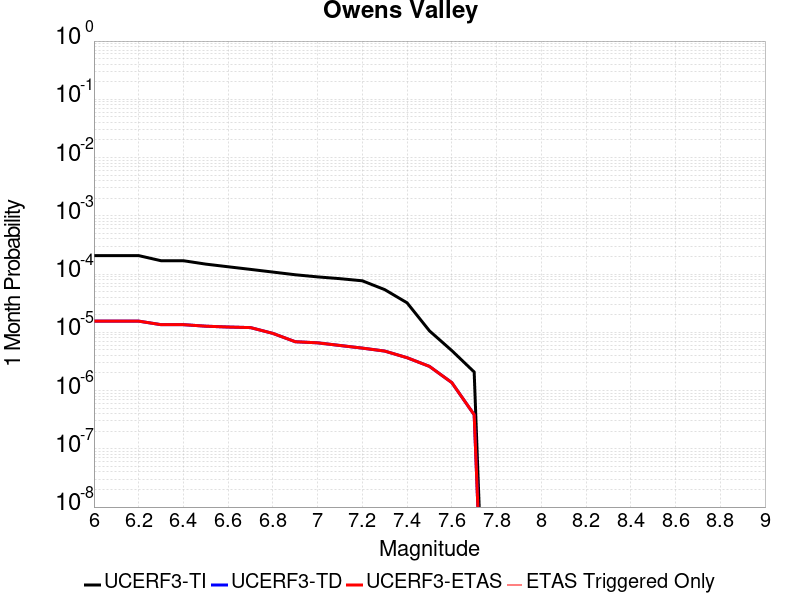 |  |  |

| Magnitude | 1 wk TI Prob | 1 wk TD Prob | 1 wk ETAS Prob | 1 wk ETAS/TD Gain | 1 wk ETAS Triggered Only | 1 mo TI Prob | 1 mo TD Prob | 1 mo ETAS Prob | 1 mo ETAS/TD Gain | 1 mo ETAS Triggered Only | 1 yr TI Prob | 1 yr TD Prob | 1 yr ETAS Prob | 1 yr ETAS/TD Gain | 1 yr ETAS Triggered Only | 10 yr TI Prob | 10 yr TD Prob | 10 yr ETAS Prob | 10 yr ETAS/TD Gain | 10 yr ETAS Triggered Only |
|-----|-----|-----|-----|-----|-----|-----|-----|-----|-----|-----|-----|-----|-----|-----|-----|-----|-----|-----|-----|-----|
| 6.0 | 4.83821E-5 | 3.6298834E-6 | 3.6298834E-6 | 1.0 | 0.0 | 2.0733538E-4 | 1.5556556E-5 | 1.5556556E-5 | 1.0 | 0.0 | 0.002521386 | 1.893856E-4 | 2.0938182E-4 | 1.1055846 | 2.0E-5 | 0.024929691 | 0.0019267192 | 0.0019466806 | 1.0103604 | 2.0E-5 |
| 6.1 | 4.83821E-5 | 3.6298834E-6 | 3.6298834E-6 | 1.0 | 0.0 | 2.0733538E-4 | 1.5556556E-5 | 1.5556556E-5 | 1.0 | 0.0 | 0.002521386 | 1.893856E-4 | 2.0938182E-4 | 1.1055846 | 2.0E-5 | 0.024929691 | 0.0019267192 | 0.0019466806 | 1.0103604 | 2.0E-5 |
| 6.2 | 4.83821E-5 | 3.6298834E-6 | 3.6298834E-6 | 1.0 | 0.0 | 2.0733538E-4 | 1.5556556E-5 | 1.5556556E-5 | 1.0 | 0.0 | 0.002521386 | 1.893856E-4 | 2.0938182E-4 | 1.1055846 | 2.0E-5 | 0.024929691 | 0.0019267192 | 0.0019466806 | 1.0103604 | 2.0E-5 |
| 6.3 | 3.953008E-5 | 3.1571942E-6 | 3.1571942E-6 | 1.0 | 0.0 | 1.6940363E-4 | 1.3530766E-5 | 1.3530766E-5 | 1.0 | 0.0 | 0.002060538 | 1.6472537E-4 | 1.8472207E-4 | 1.1213942 | 2.0E-5 | 0.020415364 | 0.0016601578 | 0.0016801246 | 1.012027 | 2.0E-5 |
| 6.4 | 3.953008E-5 | 3.1571942E-6 | 3.1571942E-6 | 1.0 | 0.0 | 1.6940363E-4 | 1.3530766E-5 | 1.3530766E-5 | 1.0 | 0.0 | 0.002060538 | 1.6472537E-4 | 1.8472207E-4 | 1.1213942 | 2.0E-5 | 0.020415364 | 0.0016601578 | 0.0016801246 | 1.012027 | 2.0E-5 |
| 6.5 | 3.457342E-5 | 2.9727623E-6 | 2.9727623E-6 | 1.0 | 0.0 | 1.4816338E-4 | 1.2740352E-5 | 1.2740352E-5 | 1.0 | 0.0 | 0.0018023965 | 1.5510344E-4 | 1.7510033E-4 | 1.1289262 | 2.0E-5 | 0.017878477 | 0.0015563503 | 0.0015763191 | 1.0128306 | 2.0E-5 |
| 6.6 | 3.1127765E-5 | 2.8753116E-6 | 2.8753116E-6 | 1.0 | 0.0 | 1.3339789E-4 | 1.232271E-5 | 1.232271E-5 | 1.0 | 0.0 | 0.0016229092 | 1.5001935E-4 | 1.7001636E-4 | 1.1332961 | 2.0E-5 | 0.016111081 | 0.0015016922 | 0.0015216621 | 1.0132983 | 2.0E-5 |
| 6.7 | 2.806885E-5 | 2.8110242E-6 | 2.8110242E-6 | 1.0 | 0.0 | 1.2028952E-4 | 1.2047194E-5 | 1.2047194E-5 | 1.0 | 0.0 | 0.001463541 | 1.466654E-4 | 1.6666247E-4 | 1.1363448 | 2.0E-5 | 0.014539397 | 0.0014660707 | 0.0014860414 | 1.0136219 | 2.0E-5 |
| 6.8 | 2.524524E-5 | 2.2358972E-6 | 2.2358972E-6 | 1.0 | 0.0 | 1.0818939E-4 | 9.582383E-6 | 9.582383E-6 | 1.0 | 0.0 | 0.0013164099 | 1.16659576E-4 | 1.3665724E-4 | 1.171419 | 2.0E-5 | 0.01308639 | 0.001166257 | 0.0011862336 | 1.0171288 | 2.0E-5 |
| 6.9 | 2.2704568E-5 | 1.6085578E-6 | 1.6085578E-6 | 1.0 | 0.0 | 9.730166E-5 | 6.893801E-6 | 6.893801E-6 | 1.0 | 0.0 | 0.0011840039 | 8.392881E-5 | 1.0392713E-4 | 1.2382772 | 2.0E-5 | 0.011777153 | 8.391837E-4 | 8.591669E-4 | 1.0238127 | 2.0E-5 |
| 7.0 | 2.0871712E-5 | 1.5399135E-6 | 1.5399135E-6 | 1.0 | 0.0 | 8.944713E-5 | 6.5996123E-6 | 6.5996123E-6 | 1.0 | 0.0 | 0.0010884746 | 8.034734E-5 | 1.0034573E-4 | 1.2488992 | 2.0E-5 | 0.010831586 | 8.0335594E-4 | 8.2333985E-4 | 1.0248755 | 2.0E-5 |
| 7.1 | 1.944928E-5 | 1.3867325E-6 | 1.3867325E-6 | 1.0 | 0.0 | 8.335139E-5 | 5.943126E-6 | 5.943126E-6 | 1.0 | 0.0 | 0.0010143308 | 7.2355164E-5 | 9.2353715E-5 | 1.2763942 | 2.0E-5 | 0.010097133 | 7.23475E-4 | 7.4346055E-4 | 1.0276244 | 2.0E-5 |
| 7.2 | 1.7876306E-5 | 1.249191E-6 | 1.249191E-6 | 1.0 | 0.0 | 7.6610486E-5 | 5.3536646E-6 | 5.3536646E-6 | 1.0 | 0.0 | 9.3233347E-4 | 6.517892E-5 | 8.517762E-5 | 1.3068277 | 2.0E-5 | 0.009284316 | 6.517364E-4 | 6.717234E-4 | 1.0306673 | 2.0E-5 |
| 7.3 | 1.2618672E-5 | 1.1117779E-6 | 1.1117779E-6 | 1.0 | 0.0 | 5.40789E-5 | 4.764754E-6 | 4.764754E-6 | 1.0 | 0.0 | 6.582117E-4 | 5.8009344E-5 | 7.800818E-5 | 1.3447521 | 2.0E-5 | 0.0065626553 | 5.800754E-4 | 6.000638E-4 | 1.0344583 | 2.0E-5 |
| 7.4 | 7.4874442E-6 | 8.550806E-7 | 8.550806E-7 | 1.0 | 0.0 | 3.208865E-5 | 3.6646259E-6 | 3.6646259E-6 | 1.0 | 0.0 | 3.906093E-4 | 4.461591E-5 | 6.461502E-5 | 1.4482505 | 2.0E-5 | 0.003899234 | 4.461625E-4 | 4.6615358E-4 | 1.0448067 | 2.0E-5 |
| 7.5 | 2.4734156E-6 | 6.0700546E-7 | 6.0700546E-7 | 1.0 | 0.0 | 1.060031E-5 | 2.6014495E-6 | 2.6014495E-6 | 1.0 | 0.0 | 1.2905113E-4 | 3.167219E-5 | 4.1671872E-5 | 1.3157244 | 1.0E-5 | 0.0012897621 | 3.166771E-4 | 3.266739E-4 | 1.0315679 | 1.0E-5 |
| 7.6 | 1.1328841E-6 | 3.1972448E-7 | 3.1972448E-7 | 1.0 | 0.0 | 4.8552088E-6 | 1.3702471E-6 | 1.3702471E-6 | 1.0 | 0.0 | 5.9110564E-5 | 1.6682632E-5 | 2.6682466E-5 | 1.5994158 | 1.0E-5 | 5.9094845E-4 | 1.6681399E-4 | 1.7681232E-4 | 1.059937 | 1.0E-5 |
| 7.7 | 4.8613185E-7 | 8.967469E-8 | 8.967469E-8 | 1.0 | 0.0 | 2.0834207E-6 | 3.8432006E-7 | 3.8432006E-7 | 1.0 | 0.0 | 2.536535E-5 | 4.6790874E-6 | 4.6790874E-6 | 1.0 | 0.0 | 2.5362454E-4 | 4.678996E-5 | 4.678996E-5 | 1.0 | 0.0 |

## Coyote Lake
*[(top)](#table-of-contents)*

| 1 Week | 1 Month | 1 Year | 10 Year |
|-----|-----|-----|-----|
|  |  |  | 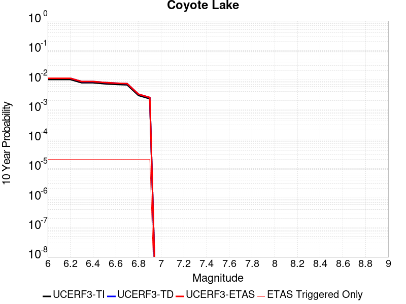 |

| Magnitude | 1 wk TI Prob | 1 wk TD Prob | 1 wk ETAS Prob | 1 wk ETAS/TD Gain | 1 wk ETAS Triggered Only | 1 mo TI Prob | 1 mo TD Prob | 1 mo ETAS Prob | 1 mo ETAS/TD Gain | 1 mo ETAS Triggered Only | 1 yr TI Prob | 1 yr TD Prob | 1 yr ETAS Prob | 1 yr ETAS/TD Gain | 1 yr ETAS Triggered Only | 10 yr TI Prob | 10 yr TD Prob | 10 yr ETAS Prob | 10 yr ETAS/TD Gain | 10 yr ETAS Triggered Only |
|-----|-----|-----|-----|-----|-----|-----|-----|-----|-----|-----|-----|-----|-----|-----|-----|-----|-----|-----|-----|-----|
| 6.0 | 1.980352E-5 | 2.1707852E-5 | 2.1707852E-5 | 1.0 | 0.0 | 8.486947E-5 | 9.303074E-5 | 9.303074E-5 | 1.0 | 0.0 | 0.0010327959 | 0.0011321327 | 0.0011421215 | 1.0088229 | 1.0E-5 | 0.010280091 | 0.01127083 | 0.011290604 | 1.0017545 | 2.0E-5 |
| 6.1 | 1.980352E-5 | 2.1707852E-5 | 2.1707852E-5 | 1.0 | 0.0 | 8.486947E-5 | 9.303074E-5 | 9.303074E-5 | 1.0 | 0.0 | 0.0010327959 | 0.0011321327 | 0.0011421215 | 1.0088229 | 1.0E-5 | 0.010280091 | 0.01127083 | 0.011290604 | 1.0017545 | 2.0E-5 |
| 6.2 | 1.980352E-5 | 2.1707852E-5 | 2.1707852E-5 | 1.0 | 0.0 | 8.486947E-5 | 9.303074E-5 | 9.303074E-5 | 1.0 | 0.0 | 0.0010327959 | 0.0011321327 | 0.0011421215 | 1.0088229 | 1.0E-5 | 0.010280091 | 0.01127083 | 0.011290604 | 1.0017545 | 2.0E-5 |
| 6.3 | 1.5344787E-5 | 1.6821528E-5 | 1.6821528E-5 | 1.0 | 0.0 | 6.576172E-5 | 7.209062E-5 | 7.209062E-5 | 1.0 | 0.0 | 8.003548E-4 | 8.7741105E-4 | 8.874023E-4 | 1.0113871 | 1.0E-5 | 0.007974784 | 0.008745514 | 0.008765339 | 1.0022669 | 2.0E-5 |
| 6.4 | 1.5344787E-5 | 1.6821528E-5 | 1.6821528E-5 | 1.0 | 0.0 | 6.576172E-5 | 7.209062E-5 | 7.209062E-5 | 1.0 | 0.0 | 8.003548E-4 | 8.7741105E-4 | 8.874023E-4 | 1.0113871 | 1.0E-5 | 0.007974784 | 0.008745514 | 0.008765339 | 1.0022669 | 2.0E-5 |
| 6.5 | 1.4189697E-5 | 1.5558782E-5 | 1.5558782E-5 | 1.0 | 0.0 | 6.081157E-5 | 6.667913E-5 | 6.667913E-5 | 1.0 | 0.0 | 7.401293E-4 | 8.115764E-4 | 8.215683E-4 | 1.0123117 | 1.0E-5 | 0.0073766913 | 0.008092069 | 0.008111907 | 1.0024515 | 2.0E-5 |
| 6.6 | 1.3469301E-5 | 1.4772335E-5 | 1.4772335E-5 | 1.0 | 0.0 | 5.7724297E-5 | 6.330881E-5 | 6.330881E-5 | 1.0 | 0.0 | 7.025667E-4 | 7.7057217E-4 | 7.8056444E-4 | 1.0129673 | 1.0E-5 | 0.0070034964 | 0.0076849074 | 0.007704754 | 1.0025826 | 2.0E-5 |
| 6.7 | 1.3027966E-5 | 1.4282475E-5 | 1.4282475E-5 | 1.0 | 0.0 | 5.5832945E-5 | 6.12095E-5 | 6.12095E-5 | 1.0 | 0.0 | 6.7955407E-4 | 7.450307E-4 | 7.550232E-4 | 1.0134122 | 1.0E-5 | 0.006774798 | 0.007431207 | 0.0074510584 | 1.0026714 | 2.0E-5 |
| 6.8 | 5.695434E-6 | 6.2247245E-6 | 6.2247245E-6 | 1.0 | 0.0 | 2.4408775E-5 | 2.6677288E-5 | 2.6677288E-5 | 1.0 | 0.0 | 2.971363E-4 | 3.2477756E-4 | 3.3477432E-4 | 1.0307803 | 1.0E-5 | 0.0029673933 | 0.0032459702 | 0.0032659054 | 1.0061415 | 2.0E-5 |
| 6.9 | 4.385688E-6 | 4.7932917E-6 | 4.7932917E-6 | 1.0 | 0.0 | 1.879567E-5 | 2.0542679E-5 | 2.0542679E-5 | 1.0 | 0.0 | 2.2881327E-4 | 2.501071E-4 | 2.601046E-4 | 1.0399729 | 1.0E-5 | 0.002285778 | 0.002501071 | 0.002521021 | 1.0079765 | 2.0E-5 |

## Hosgri
*[(top)](#table-of-contents)*

| 1 Week | 1 Month | 1 Year | 10 Year |
|-----|-----|-----|-----|
|  |  | 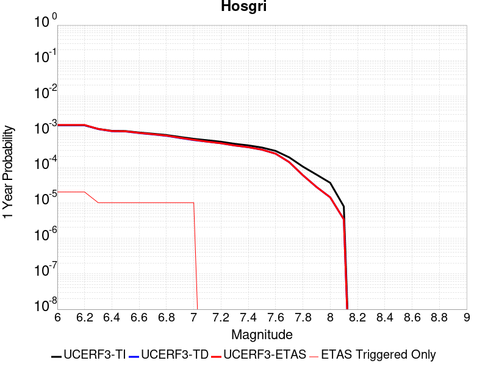 |  |

| Magnitude | 1 wk TI Prob | 1 wk TD Prob | 1 wk ETAS Prob | 1 wk ETAS/TD Gain | 1 wk ETAS Triggered Only | 1 mo TI Prob | 1 mo TD Prob | 1 mo ETAS Prob | 1 mo ETAS/TD Gain | 1 mo ETAS Triggered Only | 1 yr TI Prob | 1 yr TD Prob | 1 yr ETAS Prob | 1 yr ETAS/TD Gain | 1 yr ETAS Triggered Only | 10 yr TI Prob | 10 yr TD Prob | 10 yr ETAS Prob | 10 yr ETAS/TD Gain | 10 yr ETAS Triggered Only |
|-----|-----|-----|-----|-----|-----|-----|-----|-----|-----|-----|-----|-----|-----|-----|-----|-----|-----|-----|-----|-----|
| 6.0 | 2.883978E-5 | 2.9130051E-5 | 2.9130051E-5 | 1.0 | 0.0 | 1.235932E-4 | 1.2483726E-4 | 1.3483601E-4 | 1.0800943 | 1.0E-5 | 0.0015037085 | 0.0015188612 | 0.0015388307 | 1.0131477 | 2.0E-5 | 0.01493574 | 0.015088581 | 0.015108279 | 1.0013055 | 2.0E-5 |
| 6.1 | 2.883978E-5 | 2.9130051E-5 | 2.9130051E-5 | 1.0 | 0.0 | 1.235932E-4 | 1.2483726E-4 | 1.3483601E-4 | 1.0800943 | 1.0E-5 | 0.0015037085 | 0.0015188612 | 0.0015388307 | 1.0131477 | 2.0E-5 | 0.01493574 | 0.015088581 | 0.015108279 | 1.0013055 | 2.0E-5 |
| 6.2 | 2.883978E-5 | 2.9130051E-5 | 2.9130051E-5 | 1.0 | 0.0 | 1.235932E-4 | 1.2483726E-4 | 1.3483601E-4 | 1.0800943 | 1.0E-5 | 0.0015037085 | 0.0015188612 | 0.0015388307 | 1.0131477 | 2.0E-5 | 0.01493574 | 0.015088581 | 0.015108279 | 1.0013055 | 2.0E-5 |
| 6.3 | 2.2914428E-5 | 2.2643277E-5 | 2.2643277E-5 | 1.0 | 0.0 | 9.8200995E-5 | 9.703903E-5 | 1.0703806E-4 | 1.1030413 | 1.0E-5 | 0.0011949413 | 0.0011808148 | 0.001190803 | 1.0084587 | 1.0E-5 | 0.011885363 | 0.011746808 | 0.01175669 | 1.0008413 | 1.0E-5 |
| 6.4 | 2.0195741E-5 | 1.9697736E-5 | 1.9697736E-5 | 1.0 | 0.0 | 8.65503E-5 | 8.441615E-5 | 9.441531E-5 | 1.1184508 | 1.0E-5 | 0.0010532405 | 0.0010272841 | 0.0010372738 | 1.0097244 | 1.0E-5 | 0.010482626 | 0.0102264015 | 0.010236299 | 1.0009679 | 1.0E-5 |
| 6.5 | 1.9924333E-5 | 1.9410149E-5 | 1.9410149E-5 | 1.0 | 0.0 | 8.53872E-5 | 8.318371E-5 | 9.3182876E-5 | 1.1202059 | 1.0E-5 | 0.0010390934 | 0.001012293 | 0.0010222829 | 1.0098686 | 1.0E-5 | 0.010342481 | 0.0100778565 | 0.0100877555 | 1.0009823 | 1.0E-5 |
| 6.6 | 1.809694E-5 | 1.7459393E-5 | 1.7459393E-5 | 1.0 | 0.0 | 7.7556004E-5 | 7.482383E-5 | 8.4823085E-5 | 1.1336373 | 1.0E-5 | 9.438353E-4 | 9.106007E-4 | 9.205916E-4 | 1.0109718 | 1.0E-5 | 0.009398366 | 0.009069638 | 0.009079548 | 1.0010926 | 1.0E-5 |
| 6.7 | 1.675989E-5 | 1.6043807E-5 | 1.6043807E-5 | 1.0 | 0.0 | 7.182612E-5 | 6.875736E-5 | 7.8756675E-5 | 1.145429 | 1.0E-5 | 8.7413215E-4 | 8.3680055E-4 | 8.467922E-4 | 1.0119402 | 1.0E-5 | 0.008707017 | 0.008337403 | 0.008347319 | 1.0011895 | 1.0E-5 |
| 6.8 | 1.5401129E-5 | 1.4615074E-5 | 1.4615074E-5 | 1.0 | 0.0 | 6.6003166E-5 | 6.2634535E-5 | 7.2633906E-5 | 1.1596464 | 1.0E-5 | 8.032922E-4 | 7.623095E-4 | 7.7230186E-4 | 1.013108 | 1.0E-5 | 0.008003947 | 0.0075978106 | 0.0076077343 | 1.0013062 | 1.0E-5 |
| 6.9 | 1.356559E-5 | 1.2690892E-5 | 1.2690892E-5 | 1.0 | 0.0 | 5.8136946E-5 | 5.4388405E-5 | 6.438786E-5 | 1.1838527 | 1.0E-5 | 7.0758746E-4 | 6.619781E-4 | 6.719715E-4 | 1.0150962 | 1.0E-5 | 0.007053386 | 0.006600868 | 0.006610802 | 1.0015049 | 1.0E-5 |
| 7.0 | 1.2030819E-5 | 1.1096832E-5 | 1.1096832E-5 | 1.0 | 0.0 | 5.155963E-5 | 4.7556987E-5 | 5.755651E-5 | 1.2102641 | 1.0E-5 | 6.275577E-4 | 5.788526E-4 | 5.888468E-4 | 1.0172656 | 1.0E-5 | 0.006257884 | 0.0057742097 | 0.005784152 | 1.0017219 | 1.0E-5 |
| 7.1 | 1.0972698E-5 | 1.0023018E-5 | 1.0023018E-5 | 1.0 | 0.0 | 4.7025E-5 | 4.2955086E-5 | 4.2955086E-5 | 1.0 | 0.0 | 5.72379E-4 | 5.2285276E-4 | 5.2285276E-4 | 1.0 | 0.0 | 0.0057090693 | 0.0052169785 | 0.0052169785 | 1.0 | 0.0 |
| 7.2 | 9.961926E-6 | 9.035558E-6 | 9.035558E-6 | 1.0 | 0.0 | 4.2693267E-5 | 3.8723243E-5 | 3.8723243E-5 | 1.0 | 0.0 | 5.1966653E-4 | 4.713536E-4 | 4.713536E-4 | 1.0 | 0.0 | 0.00518453 | 0.004704285 | 0.004704285 | 1.0 | 0.0 |
| 7.3 | 8.700929E-6 | 7.82888E-6 | 7.82888E-6 | 1.0 | 0.0 | 3.7289166E-5 | 3.3551914E-5 | 3.3551914E-5 | 1.0 | 0.0 | 4.53901E-4 | 4.0841804E-4 | 4.0841804E-4 | 1.0 | 0.0 | 0.00452975 | 0.0040774145 | 0.0040774145 | 1.0 | 0.0 |
| 7.4 | 7.866285E-6 | 6.9995003E-6 | 6.9995003E-6 | 1.0 | 0.0 | 3.3712215E-5 | 2.9997515E-5 | 2.9997515E-5 | 1.0 | 0.0 | 4.103689E-4 | 3.6515854E-4 | 3.6515854E-4 | 1.0 | 0.0 | 0.004096119 | 0.0036463232 | 0.0036463232 | 1.0 | 0.0 |
| 7.5 | 6.8381305E-6 | 5.9604317E-6 | 5.9604317E-6 | 1.0 | 0.0 | 2.9305946E-5 | 2.5544457E-5 | 2.5544457E-5 | 1.0 | 0.0 | 3.5674145E-4 | 3.109594E-4 | 3.109594E-4 | 1.0 | 0.0 | 0.0035616932 | 0.0031059785 | 0.0031059785 | 1.0 | 0.0 |
| 7.6 | 5.503376E-6 | 4.5959455E-6 | 4.5959455E-6 | 1.0 | 0.0 | 2.3585684E-5 | 1.969676E-5 | 1.969676E-5 | 1.0 | 0.0 | 2.8711787E-4 | 2.3978167E-4 | 2.3978167E-4 | 1.0 | 0.0 | 0.002867472 | 0.002395963 | 0.002395963 | 1.0 | 0.0 |
| 7.7 | 3.6144982E-6 | 2.652859E-6 | 2.652859E-6 | 1.0 | 0.0 | 1.5490614E-5 | 1.1369346E-5 | 1.1369346E-5 | 1.0 | 0.0 | 1.8858191E-4 | 1.38413E-4 | 1.38413E-4 | 1.0 | 0.0 | 0.0018842196 | 0.0013839996 | 0.0013839996 | 1.0 | 0.0 |
| 7.8 | 1.9853494E-6 | 1.1366585E-6 | 1.1366585E-6 | 1.0 | 0.0 | 8.508612E-6 | 4.8713846E-6 | 4.8713846E-6 | 1.0 | 0.0 | 1.0358743E-4 | 5.930749E-5 | 5.930749E-5 | 1.0 | 0.0 | 0.0010353916 | 5.9364707E-4 | 5.9364707E-4 | 1.0 | 0.0 |
| 7.9 | 1.1818757E-6 | 5.2994693E-7 | 5.2994693E-7 | 1.0 | 0.0 | 5.0651715E-6 | 2.271199E-6 | 2.271199E-6 | 1.0 | 0.0 | 6.1666724E-5 | 2.7651497E-5 | 2.7651497E-5 | 1.0 | 0.0 | 6.1649614E-4 | 2.771693E-4 | 2.771693E-4 | 1.0 | 0.0 |
| 8.0 | 6.962958E-7 | 2.716916E-7 | 2.716916E-7 | 1.0 | 0.0 | 2.9841215E-6 | 1.164392E-6 | 1.164392E-6 | 1.0 | 0.0 | 3.6331072E-5 | 1.417638E-5 | 1.417638E-5 | 1.0 | 0.0 | 3.6325134E-4 | 1.423256E-4 | 1.423256E-4 | 1.0 | 0.0 |
| 8.1 | 1.5033264E-7 | 6.5338824E-8 | 6.5338824E-8 | 1.0 | 0.0 | 6.442826E-7 | 2.800235E-7 | 2.800235E-7 | 1.0 | 0.0 | 7.844113E-6 | 3.409281E-6 | 3.409281E-6 | 1.0 | 0.0 | 7.843835E-5 | 3.410959E-5 | 3.410959E-5 | 1.0 | 0.0 |

## San Andreas (Santa Cruz Mts) 2011 CFM
*[(top)](#table-of-contents)*

| 1 Week | 1 Month | 1 Year | 10 Year |
|-----|-----|-----|-----|
| 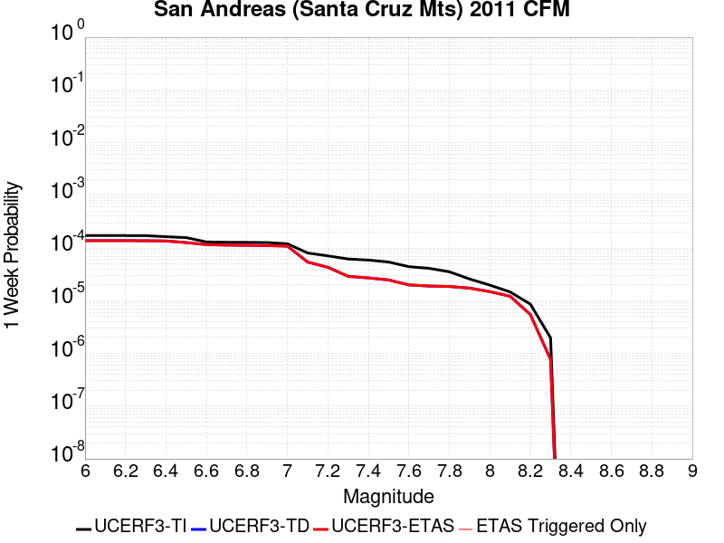 |  |  |  |

| Magnitude | 1 wk TI Prob | 1 wk TD Prob | 1 wk ETAS Prob | 1 wk ETAS/TD Gain | 1 wk ETAS Triggered Only | 1 mo TI Prob | 1 mo TD Prob | 1 mo ETAS Prob | 1 mo ETAS/TD Gain | 1 mo ETAS Triggered Only | 1 yr TI Prob | 1 yr TD Prob | 1 yr ETAS Prob | 1 yr ETAS/TD Gain | 1 yr ETAS Triggered Only | 10 yr TI Prob | 10 yr TD Prob | 10 yr ETAS Prob | 10 yr ETAS/TD Gain | 10 yr ETAS Triggered Only |
|-----|-----|-----|-----|-----|-----|-----|-----|-----|-----|-----|-----|-----|-----|-----|-----|-----|-----|-----|-----|-----|
| 6.0 | 1.7221631E-4 | 1.3823692E-4 | 1.3823692E-4 | 1.0 | 0.0 | 7.378611E-4 | 5.923115E-4 | 5.923115E-4 | 1.0 | 0.0 | 0.008946515 | 0.0071879383 | 0.0071978667 | 1.0013813 | 1.0E-5 | 0.08594794 | 0.070697196 | 0.07071578 | 1.0002629 | 2.0E-5 |
| 6.1 | 1.7221631E-4 | 1.3823692E-4 | 1.3823692E-4 | 1.0 | 0.0 | 7.378611E-4 | 5.923115E-4 | 5.923115E-4 | 1.0 | 0.0 | 0.008946515 | 0.0071879383 | 0.0071978667 | 1.0013813 | 1.0E-5 | 0.08594794 | 0.070697196 | 0.07071578 | 1.0002629 | 2.0E-5 |
| 6.2 | 1.7221631E-4 | 1.3823692E-4 | 1.3823692E-4 | 1.0 | 0.0 | 7.378611E-4 | 5.923115E-4 | 5.923115E-4 | 1.0 | 0.0 | 0.008946515 | 0.0071879383 | 0.0071978667 | 1.0013813 | 1.0E-5 | 0.08594794 | 0.070697196 | 0.07071578 | 1.0002629 | 2.0E-5 |
| 6.3 | 1.716926E-4 | 1.3743078E-4 | 1.3743078E-4 | 1.0 | 0.0 | 7.3561794E-4 | 5.888581E-4 | 5.888581E-4 | 1.0 | 0.0 | 0.008919428 | 0.0071461694 | 0.007156098 | 1.0013894 | 1.0E-5 | 0.08569809 | 0.0703092 | 0.070327796 | 1.0002644 | 2.0E-5 |
| 6.4 | 1.6392978E-4 | 1.3618424E-4 | 1.3618424E-4 | 1.0 | 0.0 | 7.02367E-4 | 5.8351824E-4 | 5.8351824E-4 | 1.0 | 0.0 | 0.008517839 | 0.0070815794 | 0.0070915087 | 1.0014021 | 1.0E-5 | 0.08198654 | 0.06954003 | 0.06955864 | 1.0002676 | 2.0E-5 |
| 6.5 | 1.5742714E-4 | 1.26776E-4 | 1.26776E-4 | 1.0 | 0.0 | 6.745133E-4 | 5.4321426E-4 | 5.4321426E-4 | 1.0 | 0.0 | 0.00818132 | 0.006593904 | 0.006603838 | 1.0015066 | 1.0E-5 | 0.078865945 | 0.0649993 | 0.065018 | 1.0002877 | 2.0E-5 |
| 6.6 | 1.3038084E-4 | 1.161551E-4 | 1.161551E-4 | 1.0 | 0.0 | 5.5865536E-4 | 4.9771386E-4 | 4.9771386E-4 | 1.0 | 0.0 | 0.006780438 | 0.0060430723 | 0.0060530123 | 1.0016447 | 1.0E-5 | 0.0657725 | 0.059452567 | 0.05947138 | 1.0003164 | 2.0E-5 |
| 6.7 | 1.2867592E-4 | 1.13418515E-4 | 1.13418515E-4 | 1.0 | 0.0 | 5.5135164E-4 | 4.8599008E-4 | 4.8599008E-4 | 1.0 | 0.0 | 0.0066920654 | 0.005901116 | 0.005911057 | 1.0016845 | 1.0E-5 | 0.06494093 | 0.05816314 | 0.058181975 | 1.0003239 | 2.0E-5 |
| 6.8 | 1.2801298E-4 | 1.1279377E-4 | 1.1279377E-4 | 1.0 | 0.0 | 5.485117E-4 | 4.833136E-4 | 4.833136E-4 | 1.0 | 0.0 | 0.0066577005 | 0.0058687064 | 0.005878648 | 1.001694 | 1.0E-5 | 0.06461738 | 0.05787688 | 0.057895724 | 1.0003256 | 2.0E-5 |
| 6.9 | 1.269149E-4 | 1.11214715E-4 | 1.11214715E-4 | 1.0 | 0.0 | 5.4380763E-4 | 4.765487E-4 | 4.765487E-4 | 1.0 | 0.0 | 0.006600777 | 0.005786784 | 0.0057967263 | 1.001718 | 1.0E-5 | 0.06408122 | 0.057148356 | 0.057167213 | 1.00033 | 2.0E-5 |
| 7.0 | 1.2030331E-4 | 1.0851204E-4 | 1.0851204E-4 | 1.0 | 0.0 | 5.154837E-4 | 4.6496998E-4 | 4.6496998E-4 | 1.0 | 0.0 | 0.006257969 | 0.005646552 | 0.0056564957 | 1.001761 | 1.0E-5 | 0.06084648 | 0.055819258 | 0.05583814 | 1.0003383 | 2.0E-5 |
| 7.1 | 8.049617E-5 | 5.4114953E-5 | 5.4114953E-5 | 1.0 | 0.0 | 3.4493793E-4 | 2.319008E-4 | 2.319008E-4 | 1.0 | 0.0 | 0.0041915346 | 0.0028197719 | 0.0028297438 | 1.0035363 | 1.0E-5 | 0.041133516 | 0.02971132 | 0.029730724 | 1.0006531 | 2.0E-5 |
| 7.2 | 7.093979E-5 | 4.310381E-5 | 4.310381E-5 | 1.0 | 0.0 | 3.0399222E-4 | 1.8471766E-4 | 1.8471766E-4 | 1.0 | 0.0 | 0.0036948253 | 0.0022466409 | 0.0022566186 | 1.0044411 | 1.0E-5 | 0.03633994 | 0.024024088 | 0.024043608 | 1.0008125 | 2.0E-5 |
| 7.3 | 6.193693E-5 | 2.9018376E-5 | 2.9018376E-5 | 1.0 | 0.0 | 2.6541698E-4 | 1.2435856E-4 | 1.2435856E-4 | 1.0 | 0.0 | 0.0032266637 | 0.0015130156 | 0.0015230004 | 1.0065993 | 1.0E-5 | 0.031802133 | 0.016564084 | 0.016573917 | 1.0005937 | 1.0E-5 |
| 7.4 | 5.906492E-5 | 2.7136244E-5 | 2.7136244E-5 | 1.0 | 0.0 | 2.5311083E-4 | 1.16293006E-4 | 1.16293006E-4 | 1.0 | 0.0 | 0.0030772698 | 0.0014149492 | 0.0014249351 | 1.0070574 | 1.0E-5 | 0.030350044 | 0.015530545 | 0.01554039 | 1.0006338 | 1.0E-5 |
| 7.5 | 5.424296E-5 | 2.4776109E-5 | 2.4776109E-5 | 1.0 | 0.0 | 2.324491E-4 | 1.0617901E-4 | 1.0617901E-4 | 1.0 | 0.0 | 0.002826395 | 0.0012919641 | 0.0013019511 | 1.0077301 | 1.0E-5 | 0.027907165 | 0.014215293 | 0.014225151 | 1.0006934 | 1.0E-5 |
| 7.6 | 4.43084E-5 | 1.9971396E-5 | 1.9971396E-5 | 1.0 | 0.0 | 1.8987931E-4 | 8.558889E-5 | 8.558889E-5 | 1.0 | 0.0 | 0.0023093296 | 0.0010415468 | 0.0010515364 | 1.0095911 | 1.0E-5 | 0.022854783 | 0.011448878 | 0.011458764 | 1.0008634 | 1.0E-5 |
| 7.7 | 4.118098E-5 | 1.8999577E-5 | 1.8999577E-5 | 1.0 | 0.0 | 1.7647797E-4 | 8.1424216E-5 | 8.1424216E-5 | 1.0 | 0.0 | 0.002146502 | 9.908893E-4 | 0.0010008793 | 1.0100819 | 1.0E-5 | 0.021258866 | 0.010904559 | 0.01091445 | 1.0009071 | 1.0E-5 |
| 7.8 | 3.5408906E-5 | 1.8625631E-5 | 1.8625631E-5 | 1.0 | 0.0 | 1.5174363E-4 | 7.982169E-5 | 7.982169E-5 | 1.0 | 0.0 | 0.0018459131 | 9.7139605E-4 | 9.813864E-4 | 1.0102844 | 1.0E-5 | 0.018306552 | 0.0106848935 | 0.010694786 | 1.0009259 | 1.0E-5 |
| 7.9 | 2.5860836E-5 | 1.7371205E-5 | 1.7371205E-5 | 1.0 | 0.0 | 1.10827445E-4 | 7.4445896E-5 | 7.4445896E-5 | 1.0 | 0.0 | 0.001348489 | 9.060022E-4 | 9.159931E-4 | 1.0110275 | 1.0E-5 | 0.013403354 | 0.009936898 | 0.009946799 | 1.0009964 | 1.0E-5 |
| 8.0 | 1.9777332E-5 | 1.4886952E-5 | 1.4886952E-5 | 1.0 | 0.0 | 8.4757245E-5 | 6.379966E-5 | 6.379966E-5 | 1.0 | 0.0 | 0.0010314309 | 7.7648426E-4 | 7.864765E-4 | 1.0128685 | 1.0E-5 | 0.010266567 | 0.008534084 | 0.008543999 | 1.0011618 | 1.0E-5 |
| 8.1 | 1.468494E-5 | 1.2146339E-5 | 1.2146339E-5 | 1.0 | 0.0 | 6.293394E-5 | 5.20547E-5 | 5.20547E-5 | 1.0 | 0.0 | 7.6595135E-4 | 6.3358183E-4 | 6.3358183E-4 | 1.0 | 0.0 | 0.0076331664 | 0.0069899 | 0.0069899 | 1.0 | 0.0 |
| 8.2 | 8.63836E-6 | 5.489407E-6 | 5.489407E-6 | 1.0 | 0.0 | 3.7021015E-5 | 2.3525818E-5 | 2.3525818E-5 | 1.0 | 0.0 | 4.5063766E-4 | 2.863893E-4 | 2.863893E-4 | 1.0 | 0.0 | 0.004497249 | 0.0032568157 | 0.0032568157 | 1.0 | 0.0 |
| 8.3 | 1.983087E-6 | 7.693574E-7 | 7.693574E-7 | 1.0 | 0.0 | 8.498917E-6 | 3.297242E-6 | 3.297242E-6 | 1.0 | 0.0 | 1.034694E-4 | 4.01432E-5 | 4.01432E-5 | 1.0 | 0.0 | 0.0010342124 | 4.7390026E-4 | 4.7390026E-4 | 1.0 | 0.0 |

## San Andreas (Big Bend)
*[(top)](#table-of-contents)*

| 1 Week | 1 Month | 1 Year | 10 Year |
|-----|-----|-----|-----|
|  |  |  |  |

| Magnitude | 1 wk TI Prob | 1 wk TD Prob | 1 wk ETAS Prob | 1 wk ETAS/TD Gain | 1 wk ETAS Triggered Only | 1 mo TI Prob | 1 mo TD Prob | 1 mo ETAS Prob | 1 mo ETAS/TD Gain | 1 mo ETAS Triggered Only | 1 yr TI Prob | 1 yr TD Prob | 1 yr ETAS Prob | 1 yr ETAS/TD Gain | 1 yr ETAS Triggered Only | 10 yr TI Prob | 10 yr TD Prob | 10 yr ETAS Prob | 10 yr ETAS/TD Gain | 10 yr ETAS Triggered Only |
|-----|-----|-----|-----|-----|-----|-----|-----|-----|-----|-----|-----|-----|-----|-----|-----|-----|-----|-----|-----|-----|
| 6.0 | 1.0179969E-4 | 2.0106303E-4 | 2.0106303E-4 | 1.0 | 0.0 | 4.362114E-4 | 8.614151E-4 | 8.614151E-4 | 1.0 | 0.0 | 0.0052979486 | 0.010437581 | 0.010457372 | 1.0018961 | 2.0E-5 | 0.051734097 | 0.10159716 | 0.10161513 | 1.0001769 | 2.0E-5 |
| 6.1 | 1.0179969E-4 | 2.0106303E-4 | 2.0106303E-4 | 1.0 | 0.0 | 4.362114E-4 | 8.614151E-4 | 8.614151E-4 | 1.0 | 0.0 | 0.0052979486 | 0.010437581 | 0.010457372 | 1.0018961 | 2.0E-5 | 0.051734097 | 0.10159716 | 0.10161513 | 1.0001769 | 2.0E-5 |
| 6.2 | 1.0179969E-4 | 2.0106303E-4 | 2.0106303E-4 | 1.0 | 0.0 | 4.362114E-4 | 8.614151E-4 | 8.614151E-4 | 1.0 | 0.0 | 0.0052979486 | 0.010437581 | 0.010457372 | 1.0018961 | 2.0E-5 | 0.051734097 | 0.10159716 | 0.10161513 | 1.0001769 | 2.0E-5 |
| 6.3 | 1.0179969E-4 | 2.0106303E-4 | 2.0106303E-4 | 1.0 | 0.0 | 4.362114E-4 | 8.614151E-4 | 8.614151E-4 | 1.0 | 0.0 | 0.0052979486 | 0.010437581 | 0.010457372 | 1.0018961 | 2.0E-5 | 0.051734097 | 0.10159716 | 0.10161513 | 1.0001769 | 2.0E-5 |
| 6.4 | 9.1639464E-5 | 1.8462905E-4 | 1.8462905E-4 | 1.0 | 0.0 | 3.9268145E-4 | 7.910276E-4 | 7.910276E-4 | 1.0 | 0.0 | 0.0047704205 | 0.009588352 | 0.009608161 | 1.0020659 | 2.0E-5 | 0.046693064 | 0.093921766 | 0.093939885 | 1.000193 | 2.0E-5 |
| 6.5 | 9.1639464E-5 | 1.8462905E-4 | 1.8462905E-4 | 1.0 | 0.0 | 3.9268145E-4 | 7.910276E-4 | 7.910276E-4 | 1.0 | 0.0 | 0.0047704205 | 0.009588352 | 0.009608161 | 1.0020659 | 2.0E-5 | 0.046693064 | 0.093921766 | 0.093939885 | 1.000193 | 2.0E-5 |
| 6.6 | 9.042622E-5 | 1.826988E-4 | 1.826988E-4 | 1.0 | 0.0 | 3.8748336E-4 | 7.827601E-4 | 7.827601E-4 | 1.0 | 0.0 | 0.0047074095 | 0.009488574 | 0.009508384 | 1.0020878 | 2.0E-5 | 0.046089325 | 0.093015574 | 0.09303371 | 1.000195 | 2.0E-5 |
| 6.7 | 8.9836685E-5 | 1.8184188E-4 | 1.8184188E-4 | 1.0 | 0.0 | 3.8495753E-4 | 7.790898E-4 | 7.790898E-4 | 1.0 | 0.0 | 0.00467679 | 0.009444275 | 0.009464086 | 1.0020977 | 2.0E-5 | 0.045795817 | 0.09260978 | 0.09262793 | 1.000196 | 2.0E-5 |
| 6.8 | 8.9471854E-5 | 1.8130938E-4 | 1.8130938E-4 | 1.0 | 0.0 | 3.8339442E-4 | 7.7680906E-4 | 7.7680906E-4 | 1.0 | 0.0 | 0.004657841 | 0.009416748 | 0.009436559 | 1.0021039 | 2.0E-5 | 0.04561414 | 0.09235688 | 0.09237503 | 1.0001966 | 2.0E-5 |
| 6.9 | 8.858234E-5 | 1.8012857E-4 | 1.8012857E-4 | 1.0 | 0.0 | 3.7958333E-4 | 7.717514E-4 | 7.717514E-4 | 1.0 | 0.0 | 0.004611638 | 0.009355701 | 0.0093755135 | 1.0021178 | 2.0E-5 | 0.04517103 | 0.09179684 | 0.091815 | 1.0001979 | 2.0E-5 |
| 7.0 | 8.7433385E-5 | 1.7851574E-4 | 1.7851574E-4 | 1.0 | 0.0 | 3.746607E-4 | 7.648433E-4 | 7.648433E-4 | 1.0 | 0.0 | 0.004551957 | 0.009272313 | 0.009292128 | 1.002137 | 2.0E-5 | 0.044598386 | 0.091031015 | 0.091049194 | 1.0001997 | 2.0E-5 |
| 7.1 | 8.684964E-5 | 1.7763473E-4 | 1.7763473E-4 | 1.0 | 0.0 | 3.7215967E-4 | 7.610698E-4 | 7.610698E-4 | 1.0 | 0.0 | 0.0045216335 | 0.009226761 | 0.009246577 | 1.0021476 | 2.0E-5 | 0.04430731 | 0.09061238 | 0.09063057 | 1.0002007 | 2.0E-5 |
| 7.2 | 8.606521E-5 | 1.7654036E-4 | 1.7654036E-4 | 1.0 | 0.0 | 3.6879873E-4 | 7.5638236E-4 | 7.5638236E-4 | 1.0 | 0.0 | 0.0044808835 | 0.009170174 | 0.009189989 | 1.002161 | 2.0E-5 | 0.043916024 | 0.09009273 | 0.09011093 | 1.000202 | 2.0E-5 |
| 7.3 | 8.568266E-5 | 1.7595981E-4 | 1.7595981E-4 | 1.0 | 0.0 | 3.6715972E-4 | 7.5389567E-4 | 7.5389567E-4 | 1.0 | 0.0 | 0.0044610105 | 0.0091401525 | 0.00915997 | 1.0021682 | 2.0E-5 | 0.043725148 | 0.08981366 | 0.08983186 | 1.0002027 | 2.0E-5 |
| 7.4 | 8.5432206E-5 | 1.7558529E-4 | 1.7558529E-4 | 1.0 | 0.0 | 3.6608664E-4 | 7.522915E-4 | 7.522915E-4 | 1.0 | 0.0 | 0.004447999 | 0.009120786 | 0.009140603 | 1.0021728 | 2.0E-5 | 0.043600157 | 0.08963369 | 0.08965189 | 1.0002031 | 2.0E-5 |
| 7.5 | 8.4791965E-5 | 1.742772E-4 | 1.742772E-4 | 1.0 | 0.0 | 3.633435E-4 | 7.466887E-4 | 7.466887E-4 | 1.0 | 0.0 | 0.0044147377 | 0.00905314 | 0.0090729585 | 1.0021892 | 2.0E-5 | 0.043280575 | 0.08901084 | 0.089029066 | 1.0002047 | 2.0E-5 |
| 7.6 | 8.241105E-5 | 1.6872598E-4 | 1.6872598E-4 | 1.0 | 0.0 | 3.531424E-4 | 7.229111E-4 | 7.229111E-4 | 1.0 | 0.0 | 0.0042910352 | 0.008766012 | 0.008785837 | 1.0022615 | 2.0E-5 | 0.042091176 | 0.086385906 | 0.08640418 | 1.0002115 | 2.0E-5 |
| 7.7 | 7.00432E-5 | 1.4233537E-4 | 1.4233537E-4 | 1.0 | 0.0 | 3.001506E-4 | 6.0986617E-4 | 6.0986617E-4 | 1.0 | 0.0 | 0.0036482112 | 0.0073998813 | 0.007419733 | 1.0026828 | 2.0E-5 | 0.035888977 | 0.07364825 | 0.07366678 | 1.0002515 | 2.0E-5 |
| 7.8 | 6.415362E-5 | 1.2995097E-4 | 1.2995097E-4 | 1.0 | 0.0 | 2.749151E-4 | 5.568139E-4 | 5.568139E-4 | 1.0 | 0.0 | 0.0033419547 | 0.006758167 | 0.006778032 | 1.0029393 | 2.0E-5 | 0.03292141 | 0.06737108 | 0.06738973 | 1.0002768 | 2.0E-5 |
| 7.9 | 4.939911E-5 | 9.359872E-5 | 9.359872E-5 | 1.0 | 0.0 | 2.116933E-4 | 4.0107573E-4 | 4.0107573E-4 | 1.0 | 0.0 | 0.0025743195 | 0.0048721726 | 0.0048821243 | 1.0020425 | 1.0E-5 | 0.025447013 | 0.04900208 | 0.04901159 | 1.0001941 | 1.0E-5 |
| 8.0 | 3.344983E-5 | 5.2337946E-5 | 5.2337946E-5 | 1.0 | 0.0 | 1.4334853E-4 | 2.2428621E-4 | 2.2428621E-4 | 1.0 | 0.0 | 0.0017438711 | 0.0027272669 | 0.0027372397 | 1.0036566 | 1.0E-5 | 0.017302496 | 0.027976755 | 0.027986474 | 1.0003475 | 1.0E-5 |
| 8.1 | 1.9104898E-5 | 1.9226556E-5 | 1.9226556E-5 | 1.0 | 0.0 | 8.1875565E-5 | 8.2396924E-5 | 8.2396924E-5 | 1.0 | 0.0 | 9.963791E-4 | 0.0010027215 | 0.0010027215 | 1.0 | 0.0 | 0.009919235 | 0.01077785 | 0.01077785 | 1.0 | 0.0 |
| 8.2 | 8.643924E-6 | 5.49522E-6 | 5.49522E-6 | 1.0 | 0.0 | 3.704486E-5 | 2.355073E-5 | 2.355073E-5 | 1.0 | 0.0 | 4.5092785E-4 | 2.866925E-4 | 2.866925E-4 | 1.0 | 0.0 | 0.0045001395 | 0.0032598388 | 0.0032598388 | 1.0 | 0.0 |
| 8.3 | 1.983087E-6 | 7.693574E-7 | 7.693574E-7 | 1.0 | 0.0 | 8.498917E-6 | 3.297242E-6 | 3.297242E-6 | 1.0 | 0.0 | 1.034694E-4 | 4.01432E-5 | 4.01432E-5 | 1.0 | 0.0 | 0.0010342124 | 4.7390026E-4 | 4.7390026E-4 | 1.0 | 0.0 |

## San Andreas (Creeping Section) 2011 CFM
*[(top)](#table-of-contents)*

| 1 Week | 1 Month | 1 Year | 10 Year |
|-----|-----|-----|-----|
|  | 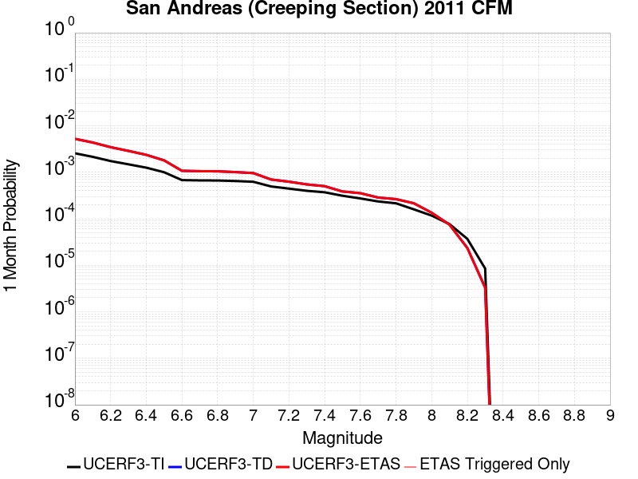 |  |  |

| Magnitude | 1 wk TI Prob | 1 wk TD Prob | 1 wk ETAS Prob | 1 wk ETAS/TD Gain | 1 wk ETAS Triggered Only | 1 mo TI Prob | 1 mo TD Prob | 1 mo ETAS Prob | 1 mo ETAS/TD Gain | 1 mo ETAS Triggered Only | 1 yr TI Prob | 1 yr TD Prob | 1 yr ETAS Prob | 1 yr ETAS/TD Gain | 1 yr ETAS Triggered Only | 10 yr TI Prob | 10 yr TD Prob | 10 yr ETAS Prob | 10 yr ETAS/TD Gain | 10 yr ETAS Triggered Only |
|-----|-----|-----|-----|-----|-----|-----|-----|-----|-----|-----|-----|-----|-----|-----|-----|-----|-----|-----|-----|-----|
| 6.0 | 5.986481E-4 | 0.0012277901 | 0.0012277901 | 1.0 | 0.0 | 0.0025631124 | 0.0052455855 | 0.0052455855 | 1.0 | 0.0 | 0.030762846 | 0.061229862 | 0.06123925 | 1.0001533 | 1.0E-5 | 0.26835477 | 0.42607152 | 0.426083 | 1.000027 | 2.0E-5 |
| 6.1 | 5.015945E-4 | 0.0010218644 | 0.0010218644 | 1.0 | 0.0 | 0.00214792 | 0.0043676887 | 0.0043676887 | 1.0 | 0.0 | 0.025839351 | 0.051269703 | 0.05127919 | 1.000185 | 1.0E-5 | 0.23032776 | 0.37298882 | 0.37300137 | 1.0000336 | 2.0E-5 |
| 6.2 | 4.073338E-4 | 8.109829E-4 | 8.109829E-4 | 1.0 | 0.0 | 0.0017445484 | 0.0034675654 | 0.0034675654 | 1.0 | 0.0 | 0.021034058 | 0.040954083 | 0.040963672 | 1.0002341 | 1.0E-5 | 0.19150782 | 0.31317768 | 0.3131914 | 1.0000439 | 2.0E-5 |
| 6.3 | 3.464099E-4 | 6.7405414E-4 | 6.7405414E-4 | 1.0 | 0.0 | 0.0014837692 | 0.0028840431 | 0.0028840431 | 1.0 | 0.0 | 0.017915873 | 0.034210727 | 0.034220383 | 1.0002823 | 1.0E-5 | 0.16538359 | 0.27146977 | 0.27148435 | 1.0000536 | 2.0E-5 |
| 6.4 | 2.935057E-4 | 5.543318E-4 | 5.543318E-4 | 1.0 | 0.0 | 0.0012572751 | 0.0023728115 | 0.0023728115 | 1.0 | 0.0 | 0.015200248 | 0.028285956 | 0.028295673 | 1.0003436 | 1.0E-5 | 0.14201577 | 0.23314685 | 0.23316218 | 1.0000658 | 2.0E-5 |
| 6.5 | 2.3409708E-4 | 4.2106997E-4 | 4.2106997E-4 | 1.0 | 0.0 | 0.0010028875 | 0.001803265 | 0.001803265 | 1.0 | 0.0 | 0.012141965 | 0.02160988 | 0.021619665 | 1.0004528 | 1.0E-5 | 0.11499573 | 0.18699536 | 0.18701161 | 1.0000869 | 2.0E-5 |
| 6.6 | 1.5842178E-4 | 2.5115322E-4 | 2.5115322E-4 | 1.0 | 0.0 | 6.7877385E-4 | 0.0010759257 | 0.0010759257 | 1.0 | 0.0 | 0.0082328 | 0.013019121 | 0.013028991 | 1.000758 | 1.0E-5 | 0.07934396 | 0.12333139 | 0.12334893 | 1.0001422 | 2.0E-5 |
| 6.7 | 1.5616413E-4 | 2.4651614E-4 | 2.4651614E-4 | 1.0 | 0.0 | 6.691031E-4 | 0.0010560687 | 0.0010560687 | 1.0 | 0.0 | 0.0081159435 | 0.012780937 | 0.012790809 | 1.0007724 | 1.0E-5 | 0.0782586 | 0.12135857 | 0.12137614 | 1.0001448 | 2.0E-5 |
| 6.8 | 1.5538467E-4 | 2.4475376E-4 | 2.4475376E-4 | 1.0 | 0.0 | 6.6576427E-4 | 0.0010485224 | 0.0010485224 | 1.0 | 0.0 | 0.008075596 | 0.0126902815 | 0.012700154 | 1.000778 | 1.0E-5 | 0.07788358 | 0.12058931 | 0.1206069 | 1.0001458 | 2.0E-5 |
| 6.9 | 1.5153569E-4 | 2.3584193E-4 | 2.3584193E-4 | 1.0 | 0.0 | 6.49277E-4 | 0.0010103616 | 0.0010103616 | 1.0 | 0.0 | 0.007876333 | 0.0122323 | 0.012242178 | 1.0008075 | 1.0E-5 | 0.07602952 | 0.11665895 | 0.11667661 | 1.0001514 | 2.0E-5 |
| 7.0 | 1.4588932E-4 | 2.2441045E-4 | 2.2441045E-4 | 1.0 | 0.0 | 6.250901E-4 | 9.6140656E-4 | 9.6140656E-4 | 1.0 | 0.0 | 0.0075839474 | 0.011642803 | 0.011652687 | 1.0008489 | 1.0E-5 | 0.073302895 | 0.11150479 | 0.11152256 | 1.0001594 | 2.0E-5 |
| 7.1 | 1.1565079E-4 | 1.6318668E-4 | 1.6318668E-4 | 1.0 | 0.0 | 4.955521E-4 | 6.991849E-4 | 6.991849E-4 | 1.0 | 0.0 | 0.006016669 | 0.008479553 | 0.008489468 | 1.0011693 | 1.0E-5 | 0.058563538 | 0.08383247 | 0.08385079 | 1.0002186 | 2.0E-5 |
| 7.2 | 1.0393792E-4 | 1.4650424E-4 | 1.4650424E-4 | 1.0 | 0.0 | 4.4537216E-4 | 6.2772504E-4 | 6.2772504E-4 | 1.0 | 0.0 | 0.005408933 | 0.007615941 | 0.0076258653 | 1.0013031 | 1.0E-5 | 0.052791595 | 0.075774014 | 0.0757925 | 1.0002439 | 2.0E-5 |
| 7.3 | 9.332884E-5 | 1.2811116E-4 | 1.2811116E-4 | 1.0 | 0.0 | 3.999194E-4 | 5.4893293E-4 | 5.4893293E-4 | 1.0 | 0.0 | 0.0048581534 | 0.006662914 | 0.0066728476 | 1.0014908 | 1.0E-5 | 0.047533102 | 0.06662133 | 0.06663067 | 1.0001401 | 1.0E-5 |
| 7.4 | 8.670252E-5 | 1.17293064E-4 | 1.17293064E-4 | 1.0 | 0.0 | 3.715293E-4 | 5.0258834E-4 | 5.0258834E-4 | 1.0 | 0.0 | 0.004513991 | 0.006101966 | 0.006111905 | 1.0016288 | 1.0E-5 | 0.044233937 | 0.06127167 | 0.06128106 | 1.0001532 | 1.0E-5 |
| 7.5 | 7.3036405E-5 | 9.027501E-5 | 9.027501E-5 | 1.0 | 0.0 | 3.129756E-4 | 3.8683563E-4 | 3.8683563E-4 | 1.0 | 0.0 | 0.0038038217 | 0.0046995743 | 0.0047095274 | 1.0021179 | 1.0E-5 | 0.03739367 | 0.047980286 | 0.047989808 | 1.0001984 | 1.0E-5 |
| 7.6 | 6.3935775E-5 | 8.298733E-5 | 8.298733E-5 | 1.0 | 0.0 | 2.7398168E-4 | 3.5561158E-4 | 3.5561158E-4 | 1.0 | 0.0 | 0.0033306254 | 0.0043209945 | 0.0043309513 | 1.0023043 | 1.0E-5 | 0.032811474 | 0.04407886 | 0.04408842 | 1.0002168 | 1.0E-5 |
| 7.7 | 5.5050095E-5 | 6.6780485E-5 | 6.6780485E-5 | 1.0 | 0.0 | 2.3590765E-4 | 2.861707E-4 | 2.861707E-4 | 1.0 | 0.0 | 0.0028683927 | 0.003478566 | 0.0034885313 | 1.0028647 | 1.0E-5 | 0.0283165 | 0.035874426 | 0.035884067 | 1.0002687 | 1.0E-5 |
| 7.8 | 5.027131E-5 | 6.177649E-5 | 6.177649E-5 | 1.0 | 0.0 | 2.1543067E-4 | 2.6472952E-4 | 2.6472952E-4 | 1.0 | 0.0 | 0.0026197135 | 0.0032183218 | 0.0032282895 | 1.0030972 | 1.0E-5 | 0.025890453 | 0.033198178 | 0.03320785 | 1.0002912 | 1.0E-5 |
| 7.9 | 3.7271806E-5 | 5.034326E-5 | 5.034326E-5 | 1.0 | 0.0 | 1.5972654E-4 | 2.15739E-4 | 2.15739E-4 | 1.0 | 0.0 | 0.0019429359 | 0.0026234603 | 0.002633434 | 1.0038017 | 1.0E-5 | 0.019260362 | 0.027125074 | 0.027134802 | 1.0003587 | 1.0E-5 |
| 8.0 | 2.7310243E-5 | 3.1506686E-5 | 3.1506686E-5 | 1.0 | 0.0 | 1.17038646E-4 | 1.3502168E-4 | 1.3502168E-4 | 1.0 | 0.0 | 0.0014240141 | 0.0016426502 | 0.0016526338 | 1.0060778 | 1.0E-5 | 0.014149235 | 0.017253635 | 0.017263463 | 1.0005696 | 1.0E-5 |
| 8.1 | 1.7940547E-5 | 1.7450684E-5 | 1.7450684E-5 | 1.0 | 0.0 | 7.688579E-5 | 7.4786505E-5 | 7.4786505E-5 | 1.0 | 0.0 | 9.3568244E-4 | 9.1014587E-4 | 9.1014587E-4 | 1.0 | 0.0 | 0.009317525 | 0.009825298 | 0.009825298 | 1.0 | 0.0 |
| 8.2 | 8.643924E-6 | 5.49522E-6 | 5.49522E-6 | 1.0 | 0.0 | 3.704486E-5 | 2.355073E-5 | 2.355073E-5 | 1.0 | 0.0 | 4.5092785E-4 | 2.866925E-4 | 2.866925E-4 | 1.0 | 0.0 | 0.0045001395 | 0.0032598388 | 0.0032598388 | 1.0 | 0.0 |
| 8.3 | 1.983087E-6 | 7.693574E-7 | 7.693574E-7 | 1.0 | 0.0 | 8.498917E-6 | 3.297242E-6 | 3.297242E-6 | 1.0 | 0.0 | 1.034694E-4 | 4.01432E-5 | 4.01432E-5 | 1.0 | 0.0 | 0.0010342124 | 4.7390026E-4 | 4.7390026E-4 | 1.0 | 0.0 |

## Brawley (Seismic Zone) alt 1
*[(top)](#table-of-contents)*

| 1 Week | 1 Month | 1 Year | 10 Year |
|-----|-----|-----|-----|
|  |  | 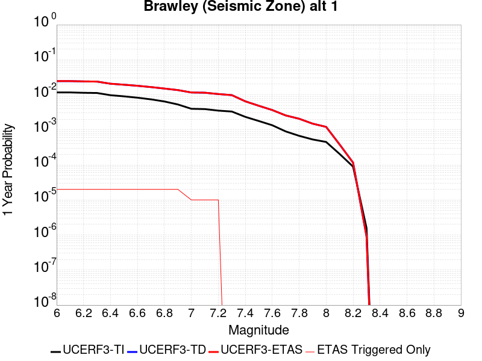 |  |

| Magnitude | 1 wk TI Prob | 1 wk TD Prob | 1 wk ETAS Prob | 1 wk ETAS/TD Gain | 1 wk ETAS Triggered Only | 1 mo TI Prob | 1 mo TD Prob | 1 mo ETAS Prob | 1 mo ETAS/TD Gain | 1 mo ETAS Triggered Only | 1 yr TI Prob | 1 yr TD Prob | 1 yr ETAS Prob | 1 yr ETAS/TD Gain | 1 yr ETAS Triggered Only | 10 yr TI Prob | 10 yr TD Prob | 10 yr ETAS Prob | 10 yr ETAS/TD Gain | 10 yr ETAS Triggered Only |
|-----|-----|-----|-----|-----|-----|-----|-----|-----|-----|-----|-----|-----|-----|-----|-----|-----|-----|-----|-----|-----|
| 6.0 | 2.2521618E-4 | 4.7667572E-4 | 4.7667572E-4 | 1.0 | 0.0 | 9.6485513E-4 | 0.0020413336 | 0.0020413336 | 1.0 | 0.0 | 0.011683988 | 0.024564065 | 0.024583574 | 1.0007942 | 2.0E-5 | 0.11088423 | 0.21362062 | 0.21363635 | 1.0000737 | 2.0E-5 |
| 6.1 | 2.2521618E-4 | 4.7667572E-4 | 4.7667572E-4 | 1.0 | 0.0 | 9.6485513E-4 | 0.0020413336 | 0.0020413336 | 1.0 | 0.0 | 0.011683988 | 0.024564065 | 0.024583574 | 1.0007942 | 2.0E-5 | 0.11088423 | 0.21362062 | 0.21363635 | 1.0000737 | 2.0E-5 |
| 6.2 | 2.198148E-4 | 4.6751375E-4 | 4.6751375E-4 | 1.0 | 0.0 | 9.417233E-4 | 0.0020021286 | 0.0020021286 | 1.0 | 0.0 | 0.011405343 | 0.024097936 | 0.024117453 | 1.0008099 | 2.0E-5 | 0.10837428 | 0.2100555 | 0.2100713 | 1.0000752 | 2.0E-5 |
| 6.3 | 2.1704129E-4 | 4.6186932E-4 | 4.6186932E-4 | 1.0 | 0.0 | 9.298453E-4 | 0.001977975 | 0.001977975 | 1.0 | 0.0 | 0.011262234 | 0.023811033 | 0.023830557 | 1.0008199 | 2.0E-5 | 0.107082725 | 0.20794643 | 0.20796227 | 1.0000762 | 2.0E-5 |
| 6.4 | 1.876142E-4 | 4.007805E-4 | 4.007805E-4 | 1.0 | 0.0 | 8.038131E-4 | 0.0017165145 | 0.0017165145 | 1.0 | 0.0 | 0.00974259 | 0.020697333 | 0.020716919 | 1.0009463 | 2.0E-5 | 0.093263686 | 0.18469763 | 0.18471393 | 1.0000883 | 2.0E-5 |
| 6.5 | 1.7390939E-4 | 3.750906E-4 | 3.750906E-4 | 1.0 | 0.0 | 7.45113E-4 | 0.001606553 | 0.001606553 | 1.0 | 0.0 | 0.009034078 | 0.019385088 | 0.019404702 | 1.0010117 | 2.0E-5 | 0.086755216 | 0.17451778 | 0.17453429 | 1.0000947 | 2.0E-5 |
| 6.6 | 1.591791E-4 | 3.4922338E-4 | 3.4922338E-4 | 1.0 | 0.0 | 6.8201777E-4 | 0.0014958231 | 0.0014958231 | 1.0 | 0.0 | 0.008271996 | 0.018061135 | 0.018080773 | 1.0010873 | 2.0E-5 | 0.07970774 | 0.16392244 | 0.16393918 | 1.000102 | 2.0E-5 |
| 6.7 | 1.4268003E-4 | 3.208674E-4 | 3.208674E-4 | 1.0 | 0.0 | 6.1134255E-4 | 0.0013744296 | 0.0013744296 | 1.0 | 0.0 | 0.007417723 | 0.016607253 | 0.01662692 | 1.0011843 | 2.0E-5 | 0.07174956 | 0.1520427 | 0.15205966 | 1.0001116 | 2.0E-5 |
| 6.8 | 1.239713E-4 | 2.9077847E-4 | 2.9077847E-4 | 1.0 | 0.0 | 5.3119735E-4 | 0.0012456045 | 0.0012456045 | 1.0 | 0.0 | 0.0064481674 | 0.0150612155 | 0.015080915 | 1.001308 | 2.0E-5 | 0.06264243 | 0.13847366 | 0.13849089 | 1.0001245 | 2.0E-5 |
| 6.9 | 1.0180238E-4 | 2.6273142E-4 | 2.6273142E-4 | 1.0 | 0.0 | 4.3622297E-4 | 0.0011255102 | 0.0011255102 | 1.0 | 0.0 | 0.005298089 | 0.013617991 | 0.013637719 | 1.0014486 | 2.0E-5 | 0.05173543 | 0.1250377 | 0.12505521 | 1.00014 | 2.0E-5 |
| 7.0 | 7.6619996E-5 | 2.2413618E-4 | 2.2413618E-4 | 1.0 | 0.0 | 3.283301E-4 | 9.602332E-4 | 9.602332E-4 | 1.0 | 0.0 | 0.0039900932 | 0.011628882 | 0.011638765 | 1.00085 | 1.0E-5 | 0.039192066 | 0.10732558 | 0.10733451 | 1.0000832 | 1.0E-5 |
| 7.1 | 7.5127435E-5 | 2.20966E-4 | 2.20966E-4 | 1.0 | 0.0 | 3.2193496E-4 | 9.466566E-4 | 9.466566E-4 | 1.0 | 0.0 | 0.0039125155 | 0.011465338 | 0.011475224 | 1.0008622 | 1.0E-5 | 0.038443442 | 0.105888925 | 0.105897866 | 1.0000844 | 1.0E-5 |
| 7.2 | 6.788582E-5 | 2.022384E-4 | 2.022384E-4 | 1.0 | 0.0 | 2.9090676E-4 | 8.664511E-4 | 8.664511E-4 | 1.0 | 0.0 | 0.0035360386 | 0.010498658 | 0.010508553 | 1.0009425 | 1.0E-5 | 0.034803 | 0.09755801 | 0.09756703 | 1.0000925 | 1.0E-5 |
| 7.3 | 6.399602E-5 | 1.8854217E-4 | 1.8854217E-4 | 1.0 | 0.0 | 2.7423984E-4 | 8.0779055E-4 | 8.0779055E-4 | 1.0 | 0.0 | 0.0033337586 | 0.009791091 | 0.009791091 | 1.0 | 0.0 | 0.03284188 | 0.09145105 | 0.09145105 | 1.0 | 0.0 |
| 7.4 | 4.506759E-5 | 1.253954E-4 | 1.253954E-4 | 1.0 | 0.0 | 1.9313251E-4 | 5.37299E-4 | 5.37299E-4 | 1.0 | 0.0 | 0.0023488526 | 0.0065221693 | 0.0065221693 | 1.0 | 0.0 | 0.023241805 | 0.062409032 | 0.062409032 | 1.0 | 0.0 |
| 7.5 | 3.43289E-5 | 9.344148E-5 | 9.344148E-5 | 1.0 | 0.0 | 1.4711556E-4 | 4.0040232E-4 | 4.0040232E-4 | 1.0 | 0.0 | 0.0017896603 | 0.004864064 | 0.004864064 | 1.0 | 0.0 | 0.01775316 | 0.047094297 | 0.047094297 | 1.0 | 0.0 |
| 7.6 | 2.5980507E-5 | 7.0607166E-5 | 7.0607166E-5 | 1.0 | 0.0 | 1.1134028E-4 | 3.0256718E-4 | 3.0256718E-4 | 1.0 | 0.0 | 0.001354725 | 0.0036775572 | 0.0036775572 | 1.0 | 0.0 | 0.013464959 | 0.0358753 | 0.0358753 | 1.0 | 0.0 |
| 7.7 | 1.7292105E-5 | 4.9472306E-5 | 4.9472306E-5 | 1.0 | 0.0 | 7.4106916E-5 | 2.1200697E-4 | 2.1200697E-4 | 1.0 | 0.0 | 9.018782E-4 | 0.002578135 | 0.002578135 | 1.0 | 0.0 | 0.008982267 | 0.02531998 | 0.02531998 | 1.0 | 0.0 |
| 7.8 | 1.2927471E-5 | 3.974989E-5 | 3.974989E-5 | 1.0 | 0.0 | 5.5402274E-5 | 1.7034556E-4 | 1.7034556E-4 | 1.0 | 0.0 | 6.743139E-4 | 0.0020719871 | 0.0020719871 | 1.0 | 0.0 | 0.0067227143 | 0.020457525 | 0.020457525 | 1.0 | 0.0 |
| 7.9 | 1.0200774E-5 | 2.8791523E-5 | 2.8791523E-5 | 1.0 | 0.0 | 4.371687E-5 | 1.233864E-4 | 1.233864E-4 | 1.0 | 0.0 | 5.321229E-4 | 0.0015011955 | 0.0015011955 | 1.0 | 0.0 | 0.005308505 | 0.015012851 | 0.015012851 | 1.0 | 0.0 |
| 8.0 | 8.650396E-6 | 2.3316703E-5 | 2.3316703E-5 | 1.0 | 0.0 | 3.70726E-5 | 9.992491E-5 | 9.992491E-5 | 1.0 | 0.0 | 4.5126543E-4 | 0.0012159076 | 0.0012159076 | 1.0 | 0.0 | 0.0045035016 | 0.0122294305 | 0.0122294305 | 1.0 | 0.0 |
| 8.1 | 3.9368224E-6 | 7.3449833E-6 | 7.3449833E-6 | 1.0 | 0.0 | 1.6871985E-5 | 3.147812E-5 | 3.147812E-5 | 1.0 | 0.0 | 2.0539707E-4 | 3.8317885E-4 | 3.8317885E-4 | 1.0 | 0.0 | 0.0020520731 | 0.0040096184 | 0.0040096184 | 1.0 | 0.0 |
| 8.2 | 1.7101195E-6 | 2.2245397E-6 | 2.2245397E-6 | 1.0 | 0.0 | 7.329063E-6 | 9.533706E-6 | 9.533706E-6 | 1.0 | 0.0 | 8.922769E-5 | 1.1606672E-4 | 1.1606672E-4 | 1.0 | 0.0 | 8.9191867E-4 | 0.0012700944 | 0.0012700944 | 1.0 | 0.0 |
| 8.3 | 3.0346666E-8 | 1.7284824E-8 | 1.7284824E-8 | 1.0 | 0.0 | 1.3005713E-7 | 7.407782E-8 | 7.407782E-8 | 1.0 | 0.0 | 1.5834444E-6 | 9.018973E-7 | 9.018973E-7 | 1.0 | 0.0 | 1.5834332E-5 | 9.40451E-6 | 9.40451E-6 | 1.0 | 0.0 |

## Imperial
*[(top)](#table-of-contents)*

| 1 Week | 1 Month | 1 Year | 10 Year |
|-----|-----|-----|-----|
| 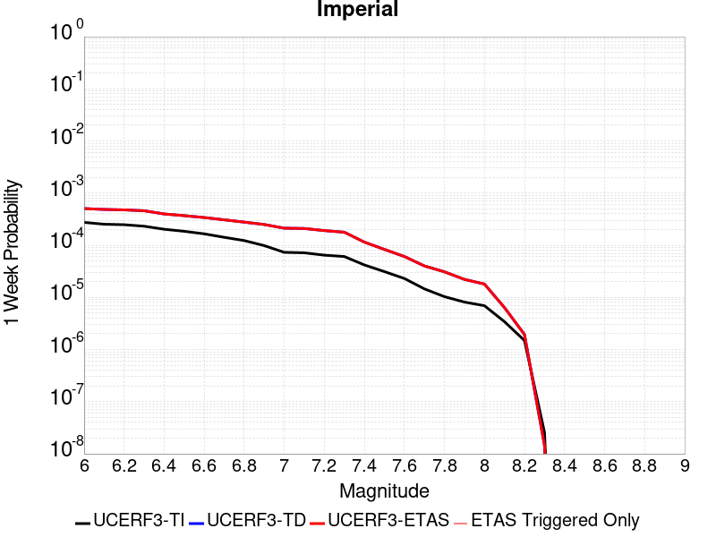 |  |  |  |

| Magnitude | 1 wk TI Prob | 1 wk TD Prob | 1 wk ETAS Prob | 1 wk ETAS/TD Gain | 1 wk ETAS Triggered Only | 1 mo TI Prob | 1 mo TD Prob | 1 mo ETAS Prob | 1 mo ETAS/TD Gain | 1 mo ETAS Triggered Only | 1 yr TI Prob | 1 yr TD Prob | 1 yr ETAS Prob | 1 yr ETAS/TD Gain | 1 yr ETAS Triggered Only | 10 yr TI Prob | 10 yr TD Prob | 10 yr ETAS Prob | 10 yr ETAS/TD Gain | 10 yr ETAS Triggered Only |
|-----|-----|-----|-----|-----|-----|-----|-----|-----|-----|-----|-----|-----|-----|-----|-----|-----|-----|-----|-----|-----|
| 6.0 | 2.7496446E-4 | 5.060379E-4 | 5.060379E-4 | 1.0 | 0.0 | 0.0011778869 | 0.0021669706 | 0.0021669706 | 1.0 | 0.0 | 0.0142467655 | 0.026064837 | 0.026084317 | 1.0007473 | 2.0E-5 | 0.13367249 | 0.22821419 | 0.22822963 | 1.0000676 | 2.0E-5 |
| 6.1 | 2.5356023E-4 | 4.8701192E-4 | 4.8701192E-4 | 1.0 | 0.0 | 0.001086234 | 0.0020855628 | 0.0020855628 | 1.0 | 0.0 | 0.013144928 | 0.02509391 | 0.025113408 | 1.000777 | 2.0E-5 | 0.123940155 | 0.21963087 | 0.21964647 | 1.000071 | 2.0E-5 |
| 6.2 | 2.4820742E-4 | 4.7795815E-4 | 4.7795815E-4 | 1.0 | 0.0 | 0.0010633124 | 0.0020468219 | 0.0020468219 | 1.0 | 0.0 | 0.01286919 | 0.024633536 | 0.024653044 | 1.0007919 | 2.0E-5 | 0.12148927 | 0.21613504 | 0.21615072 | 1.0000725 | 2.0E-5 |
| 6.3 | 2.3205351E-4 | 4.5929378E-4 | 4.5929378E-4 | 1.0 | 0.0 | 9.94136E-4 | 0.001966954 | 0.001966954 | 1.0 | 0.0 | 0.012036599 | 0.02368102 | 0.023700546 | 1.0008246 | 2.0E-5 | 0.11405133 | 0.20807077 | 0.2080866 | 1.0000762 | 2.0E-5 |
| 6.4 | 2.0304754E-4 | 3.991441E-4 | 3.991441E-4 | 1.0 | 0.0 | 8.6991355E-4 | 0.0017095108 | 0.0017095108 | 1.0 | 0.0 | 0.010539869 | 0.020614926 | 0.020634513 | 1.0009502 | 2.0E-5 | 0.100537635 | 0.18520407 | 0.18522036 | 1.000088 | 2.0E-5 |
| 6.5 | 1.854992E-4 | 3.702423E-4 | 3.702423E-4 | 1.0 | 0.0 | 7.9475436E-4 | 0.0015858002 | 0.0015858002 | 1.0 | 0.0 | 0.009633281 | 0.01913749 | 0.019157108 | 1.0010251 | 2.0E-5 | 0.0922623 | 0.17342903 | 0.17344557 | 1.0000954 | 2.0E-5 |
| 6.6 | 1.6586106E-4 | 3.406714E-4 | 3.406714E-4 | 1.0 | 0.0 | 7.106394E-4 | 0.0014592134 | 0.0014592134 | 1.0 | 0.0 | 0.008617763 | 0.017622843 | 0.01764249 | 1.0011148 | 2.0E-5 | 0.08291132 | 0.16089731 | 0.16091411 | 1.0001043 | 2.0E-5 |
| 6.7 | 1.4224656E-4 | 3.0794923E-4 | 3.0794923E-4 | 1.0 | 0.0 | 6.094856E-4 | 0.0013191231 | 0.0013191231 | 1.0 | 0.0 | 0.0073952693 | 0.015943963 | 0.015963644 | 1.0012344 | 2.0E-5 | 0.07153955 | 0.14659329 | 0.14661036 | 1.0001165 | 2.0E-5 |
| 6.8 | 1.2317259E-4 | 2.781478E-4 | 2.781478E-4 | 1.0 | 0.0 | 5.2777573E-4 | 0.0011915236 | 0.0011915236 | 1.0 | 0.0 | 0.0064067547 | 0.0144116925 | 0.014431404 | 1.0013678 | 2.0E-5 | 0.06225166 | 0.13303171 | 0.13304904 | 1.0001303 | 2.0E-5 |
| 6.9 | 9.859898E-5 | 2.503195E-4 | 2.503195E-4 | 1.0 | 0.0 | 4.2249862E-4 | 0.0010723611 | 0.0010723611 | 1.0 | 0.0 | 0.0051317946 | 0.012978803 | 0.012998545 | 1.001521 | 2.0E-5 | 0.05014893 | 0.11947842 | 0.11949603 | 1.0001473 | 2.0E-5 |
| 7.0 | 7.3191884E-5 | 2.127993E-4 | 2.127993E-4 | 1.0 | 0.0 | 3.136418E-4 | 9.116815E-4 | 9.116815E-4 | 1.0 | 0.0 | 0.003811904 | 0.011043918 | 0.011053807 | 1.0008955 | 1.0E-5 | 0.037471764 | 0.10211917 | 0.102128156 | 1.000088 | 1.0E-5 |
| 7.1 | 7.1760296E-5 | 2.0981116E-4 | 2.0981116E-4 | 1.0 | 0.0 | 3.0750787E-4 | 8.9888397E-4 | 8.9888397E-4 | 1.0 | 0.0 | 0.003737482 | 0.010889676 | 0.010899567 | 1.0009083 | 1.0E-5 | 0.03675245 | 0.10075505 | 0.10076404 | 1.0000893 | 1.0E-5 |
| 7.2 | 6.46614E-5 | 1.9149172E-4 | 1.9149172E-4 | 1.0 | 0.0 | 2.7709085E-4 | 8.204237E-4 | 8.204237E-4 | 1.0 | 0.0 | 0.0033683628 | 0.009943534 | 0.009953435 | 1.0009956 | 1.0E-5 | 0.033177625 | 0.09256114 | 0.092570215 | 1.000098 | 1.0E-5 |
| 7.3 | 6.088115E-5 | 1.7820326E-4 | 1.7820326E-4 | 1.0 | 0.0 | 2.6089314E-4 | 7.635076E-4 | 7.635076E-4 | 1.0 | 0.0 | 0.0031717476 | 0.009256661 | 0.009256661 | 1.0 | 0.0 | 0.031268585 | 0.08661022 | 0.08661022 | 1.0 | 0.0 |
| 7.4 | 4.199346E-5 | 1.1519547E-4 | 1.1519547E-4 | 1.0 | 0.0 | 1.7995955E-4 | 4.9360236E-4 | 4.9360236E-4 | 1.0 | 0.0 | 0.0021888057 | 0.0059932186 | 0.0059932186 | 1.0 | 0.0 | 0.02167372 | 0.05748037 | 0.05748037 | 1.0 | 0.0 |
| 7.5 | 3.130448E-5 | 8.340871E-5 | 8.340871E-5 | 1.0 | 0.0 | 1.3415517E-4 | 3.5741724E-4 | 3.5741724E-4 | 1.0 | 0.0 | 0.0016321153 | 0.0043429323 | 0.0043429323 | 1.0 | 0.0 | 0.016201803 | 0.04216626 | 0.04216626 | 1.0 | 0.0 |
| 7.6 | 2.3074248E-5 | 6.0909417E-5 | 6.0909417E-5 | 1.0 | 0.0 | 9.888588E-5 | 2.610144E-4 | 2.610144E-4 | 1.0 | 0.0 | 0.0012032706 | 0.0031732426 | 0.0031732426 | 1.0 | 0.0 | 0.011967761 | 0.031055957 | 0.031055957 | 1.0 | 0.0 |
| 7.7 | 1.45864815E-5 | 4.0178427E-5 | 4.0178427E-5 | 1.0 | 0.0 | 6.2511994E-5 | 1.7218193E-4 | 1.7218193E-4 | 1.0 | 0.0 | 7.608177E-4 | 0.002094305 | 0.002094305 | 1.0 | 0.0 | 0.007582182 | 0.020652408 | 0.020652408 | 1.0 | 0.0 |
| 7.8 | 1.0352979E-5 | 3.1006606E-5 | 3.1006606E-5 | 1.0 | 0.0 | 4.4369157E-5 | 1.328787E-4 | 1.328787E-4 | 1.0 | 0.0 | 5.400606E-4 | 0.0016166 | 0.0016166 | 1.0 | 0.0 | 0.0053875 | 0.016037801 | 0.016037801 | 1.0 | 0.0 |
| 7.9 | 8.137906E-6 | 2.2185837E-5 | 2.2185837E-5 | 1.0 | 0.0 | 3.4876273E-5 | 9.50787E-5 | 9.50787E-5 | 1.0 | 0.0 | 4.2453592E-4 | 0.0011569695 | 0.0011569695 | 1.0 | 0.0 | 0.004237258 | 0.011635021 | 0.011635021 | 1.0 | 0.0 |
| 8.0 | 6.93792E-6 | 1.8040371E-5 | 1.8040371E-5 | 1.0 | 0.0 | 2.9733603E-5 | 7.731359E-5 | 7.731359E-5 | 1.0 | 0.0 | 3.6194647E-4 | 9.408872E-4 | 9.408872E-4 | 1.0 | 0.0 | 0.0036135751 | 0.00951638 | 0.00951638 | 1.0 | 0.0 |
| 8.1 | 3.4286315E-6 | 6.39459E-6 | 6.39459E-6 | 1.0 | 0.0 | 1.4694053E-5 | 2.7405098E-5 | 2.7405098E-5 | 1.0 | 0.0 | 1.7888541E-4 | 3.336061E-4 | 3.336061E-4 | 1.0 | 0.0 | 0.0017874148 | 0.003493339 | 0.003493339 | 1.0 | 0.0 |
| 8.2 | 1.4906886E-6 | 1.9424117E-6 | 1.9424117E-6 | 1.0 | 0.0 | 6.3886496E-6 | 8.324595E-6 | 8.324595E-6 | 1.0 | 0.0 | 7.7779034E-5 | 1.0134726E-4 | 1.0134726E-4 | 1.0 | 0.0 | 7.775182E-4 | 0.0011104804 | 0.0011104804 | 1.0 | 0.0 |
| 8.3 | 2.5758007E-8 | 1.45585295E-8 | 1.45585295E-8 | 1.0 | 0.0 | 1.10391454E-7 | 6.23937E-8 | 6.23937E-8 | 1.0 | 0.0 | 1.3440151E-6 | 7.596433E-7 | 7.596433E-7 | 1.0 | 0.0 | 1.344007E-5 | 7.918924E-6 | 7.918924E-6 | 1.0 | 0.0 |

## Manix-Afton Hills
*[(top)](#table-of-contents)*

| 1 Week | 1 Month | 1 Year | 10 Year |
|-----|-----|-----|-----|
|  |  |  |  |

| Magnitude | 1 wk TI Prob | 1 wk TD Prob | 1 wk ETAS Prob | 1 wk ETAS/TD Gain | 1 wk ETAS Triggered Only | 1 mo TI Prob | 1 mo TD Prob | 1 mo ETAS Prob | 1 mo ETAS/TD Gain | 1 mo ETAS Triggered Only | 1 yr TI Prob | 1 yr TD Prob | 1 yr ETAS Prob | 1 yr ETAS/TD Gain | 1 yr ETAS Triggered Only | 10 yr TI Prob | 10 yr TD Prob | 10 yr ETAS Prob | 10 yr ETAS/TD Gain | 10 yr ETAS Triggered Only |
|-----|-----|-----|-----|-----|-----|-----|-----|-----|-----|-----|-----|-----|-----|-----|-----|-----|-----|-----|-----|-----|
| 6.0 | 1.3783202E-5 | 1.4711616E-5 | 2.471147E-5 | 1.6797249 | 1.0E-5 | 5.906953E-5 | 6.3048356E-5 | 7.3047726E-5 | 1.1585984 | 1.0E-5 | 7.189342E-4 | 7.673609E-4 | 7.873456E-4 | 1.0260434 | 2.0E-5 | 0.0071661277 | 0.0076488685 | 0.0076687154 | 1.0025947 | 2.0E-5 |
| 6.1 | 1.3783202E-5 | 1.4711616E-5 | 2.471147E-5 | 1.6797249 | 1.0E-5 | 5.906953E-5 | 6.3048356E-5 | 7.3047726E-5 | 1.1585984 | 1.0E-5 | 7.189342E-4 | 7.673609E-4 | 7.873456E-4 | 1.0260434 | 2.0E-5 | 0.0071661277 | 0.0076488685 | 0.0076687154 | 1.0025947 | 2.0E-5 |
| 6.2 | 1.3783202E-5 | 1.4711616E-5 | 2.471147E-5 | 1.6797249 | 1.0E-5 | 5.906953E-5 | 6.3048356E-5 | 7.3047726E-5 | 1.1585984 | 1.0E-5 | 7.189342E-4 | 7.673609E-4 | 7.873456E-4 | 1.0260434 | 2.0E-5 | 0.0071661277 | 0.0076488685 | 0.0076687154 | 1.0025947 | 2.0E-5 |
| 6.3 | 1.10494875E-5 | 1.1793558E-5 | 1.1793558E-5 | 1.0 | 0.0 | 4.7354086E-5 | 5.0542898E-5 | 5.0542898E-5 | 1.0 | 0.0 | 5.763835E-4 | 6.151964E-4 | 6.151964E-4 | 1.0 | 0.0 | 0.005748908 | 0.0061359745 | 0.0061359745 | 1.0 | 0.0 |
| 6.4 | 1.10494875E-5 | 1.1793558E-5 | 1.1793558E-5 | 1.0 | 0.0 | 4.7354086E-5 | 5.0542898E-5 | 5.0542898E-5 | 1.0 | 0.0 | 5.763835E-4 | 6.151964E-4 | 6.151964E-4 | 1.0 | 0.0 | 0.005748908 | 0.0061359745 | 0.0061359745 | 1.0 | 0.0 |
| 6.5 | 9.788949E-6 | 1.0454697E-5 | 1.0454697E-5 | 1.0 | 0.0 | 4.1951964E-5 | 4.480513E-5 | 4.480513E-5 | 1.0 | 0.0 | 5.1064545E-4 | 5.453752E-4 | 5.453752E-4 | 1.0 | 0.0 | 0.0050947363 | 0.005441295 | 0.005441295 | 1.0 | 0.0 |
| 6.6 | 8.810006E-6 | 9.413971E-6 | 9.413971E-6 | 1.0 | 0.0 | 3.775662E-5 | 4.0345018E-5 | 4.0345018E-5 | 1.0 | 0.0 | 4.5958988E-4 | 4.9109873E-4 | 4.9109873E-4 | 1.0 | 0.0 | 0.0045864056 | 0.0049010175 | 0.0049010175 | 1.0 | 0.0 |
| 6.7 | 8.80128E-6 | 9.404451E-6 | 9.404451E-6 | 1.0 | 0.0 | 3.7719226E-5 | 4.0304214E-5 | 4.0304214E-5 | 1.0 | 0.0 | 4.591348E-4 | 4.906022E-4 | 4.906022E-4 | 1.0 | 0.0 | 0.004581874 | 0.004896074 | 0.004896074 | 1.0 | 0.0 |
| 6.8 | 6.8994877E-6 | 7.3803494E-6 | 7.3803494E-6 | 1.0 | 0.0 | 2.9568899E-5 | 3.162973E-5 | 3.162973E-5 | 1.0 | 0.0 | 3.5994186E-4 | 3.850321E-4 | 3.850321E-4 | 1.0 | 0.0 | 0.003593594 | 0.0038444551 | 0.0038444551 | 1.0 | 0.0 |
| 6.9 | 4.9328037E-6 | 5.271154E-6 | 5.271154E-6 | 1.0 | 0.0 | 2.1140417E-5 | 2.2590497E-5 | 2.2590497E-5 | 1.0 | 0.0 | 2.5735417E-4 | 2.7501077E-4 | 2.7501077E-4 | 1.0 | 0.0 | 0.0025705635 | 0.0027473096 | 0.0027473096 | 1.0 | 0.0 |
| 7.0 | 3.347973E-6 | 3.590168E-6 | 3.590168E-6 | 1.0 | 0.0 | 1.4348378E-5 | 1.5386368E-5 | 1.5386368E-5 | 1.0 | 0.0 | 1.746775E-4 | 1.8731703E-4 | 1.8731703E-4 | 1.0 | 0.0 | 0.0017454025 | 0.0018719939 | 0.0018719939 | 1.0 | 0.0 |
| 7.1 | 1.2073567E-6 | 1.293531E-6 | 1.293531E-6 | 1.0 | 0.0 | 5.1743755E-6 | 5.5437017E-6 | 5.5437017E-6 | 1.0 | 0.0 | 6.29962E-5 | 6.749411E-5 | 6.749411E-5 | 1.0 | 0.0 | 6.297835E-4 | 6.748963E-4 | 6.748963E-4 | 1.0 | 0.0 |

## Death Valley (Fish Lake Valley)
*[(top)](#table-of-contents)*

| 1 Week | 1 Month | 1 Year | 10 Year |
|-----|-----|-----|-----|
|  | 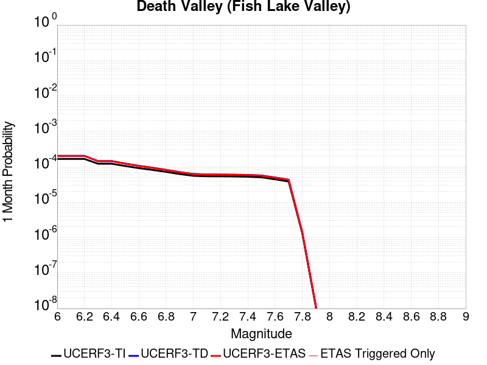 |  | 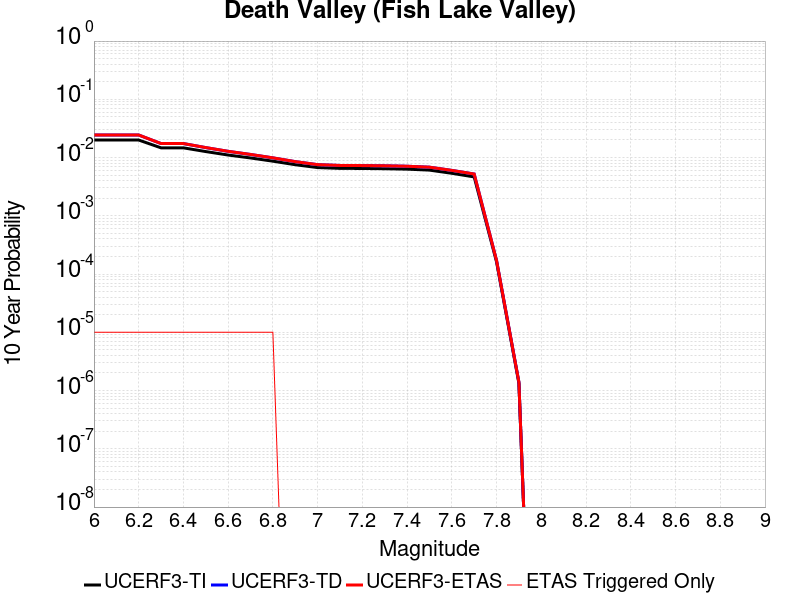 |

| Magnitude | 1 wk TI Prob | 1 wk TD Prob | 1 wk ETAS Prob | 1 wk ETAS/TD Gain | 1 wk ETAS Triggered Only | 1 mo TI Prob | 1 mo TD Prob | 1 mo ETAS Prob | 1 mo ETAS/TD Gain | 1 mo ETAS Triggered Only | 1 yr TI Prob | 1 yr TD Prob | 1 yr ETAS Prob | 1 yr ETAS/TD Gain | 1 yr ETAS Triggered Only | 10 yr TI Prob | 10 yr TD Prob | 10 yr ETAS Prob | 10 yr ETAS/TD Gain | 10 yr ETAS Triggered Only |
|-----|-----|-----|-----|-----|-----|-----|-----|-----|-----|-----|-----|-----|-----|-----|-----|-----|-----|-----|-----|-----|
| 6.0 | 3.872328E-5 | 4.727316E-5 | 4.727316E-5 | 1.0 | 0.0 | 1.6594635E-4 | 2.0258522E-4 | 2.0258522E-4 | 1.0 | 0.0 | 0.0020185246 | 0.0024638134 | 0.0024638134 | 1.0 | 0.0 | 0.02000288 | 0.024390986 | 0.02440074 | 1.0004 | 1.0E-5 |
| 6.1 | 3.872328E-5 | 4.727316E-5 | 4.727316E-5 | 1.0 | 0.0 | 1.6594635E-4 | 2.0258522E-4 | 2.0258522E-4 | 1.0 | 0.0 | 0.0020185246 | 0.0024638134 | 0.0024638134 | 1.0 | 0.0 | 0.02000288 | 0.024390986 | 0.02440074 | 1.0004 | 1.0E-5 |
| 6.2 | 3.872328E-5 | 4.727316E-5 | 4.727316E-5 | 1.0 | 0.0 | 1.6594635E-4 | 2.0258522E-4 | 2.0258522E-4 | 1.0 | 0.0 | 0.0020185246 | 0.0024638134 | 0.0024638134 | 1.0 | 0.0 | 0.02000288 | 0.024390986 | 0.02440074 | 1.0004 | 1.0E-5 |
| 6.3 | 2.8356371E-5 | 3.361322E-5 | 3.361322E-5 | 1.0 | 0.0 | 1.2152165E-4 | 1.4404916E-4 | 1.4404916E-4 | 1.0 | 0.0 | 0.0014785219 | 0.0017524667 | 0.0017524667 | 1.0 | 0.0 | 0.014687235 | 0.017393492 | 0.01740332 | 1.0005649 | 1.0E-5 |
| 6.4 | 2.8356371E-5 | 3.361322E-5 | 3.361322E-5 | 1.0 | 0.0 | 1.2152165E-4 | 1.4404916E-4 | 1.4404916E-4 | 1.0 | 0.0 | 0.0014785219 | 0.0017524667 | 0.0017524667 | 1.0 | 0.0 | 0.014687235 | 0.017393492 | 0.01740332 | 1.0005649 | 1.0E-5 |
| 6.5 | 2.4448687E-5 | 2.8610175E-5 | 2.8610175E-5 | 1.0 | 0.0 | 1.0477588E-4 | 1.2260956E-4 | 1.2260956E-4 | 1.0 | 0.0 | 0.0012748998 | 0.0014917998 | 0.0014917998 | 1.0 | 0.0 | 0.012676105 | 0.014822718 | 0.01483257 | 1.0006646 | 1.0E-5 |
| 6.6 | 2.1298161E-5 | 2.4662175E-5 | 2.4662175E-5 | 1.0 | 0.0 | 9.127464E-5 | 1.05690946E-4 | 1.05690946E-4 | 1.0 | 0.0 | 0.0011107022 | 0.0012860615 | 0.0012860615 | 1.0 | 0.0 | 0.011051672 | 0.012789601 | 0.0127994735 | 1.0007719 | 1.0E-5 |
| 6.7 | 1.8959729E-5 | 2.1782762E-5 | 2.1782762E-5 | 1.0 | 0.0 | 8.125345E-5 | 9.3351504E-5 | 9.3351504E-5 | 1.0 | 0.0 | 9.888117E-4 | 0.0011359875 | 0.0011359875 | 1.0 | 0.0 | 0.009844234 | 0.011304467 | 0.011314354 | 1.0008746 | 1.0E-5 |
| 6.8 | 1.6691629E-5 | 1.901977E-5 | 1.901977E-5 | 1.0 | 0.0 | 7.153359E-5 | 8.151084E-5 | 8.151084E-5 | 1.0 | 0.0 | 8.7057345E-4 | 9.919596E-4 | 9.919596E-4 | 1.0 | 0.0 | 0.008671708 | 0.009877076 | 0.009886977 | 1.0010024 | 1.0E-5 |
| 6.9 | 1.450505E-5 | 1.6390675E-5 | 1.6390675E-5 | 1.0 | 0.0 | 6.216302E-5 | 7.024391E-5 | 7.024391E-5 | 1.0 | 0.0 | 7.5657194E-4 | 8.5489283E-4 | 8.5489283E-4 | 1.0 | 0.0 | 0.007540013 | 0.008516973 | 0.008516973 | 1.0 | 0.0 |
| 7.0 | 1.2940855E-5 | 1.4538927E-5 | 1.4538927E-5 | 1.0 | 0.0 | 5.545963E-5 | 6.230823E-5 | 6.230823E-5 | 1.0 | 0.0 | 6.750118E-4 | 7.583444E-4 | 7.583444E-4 | 1.0 | 0.0 | 0.006729651 | 0.007558184 | 0.007558184 | 1.0 | 0.0 |
| 7.1 | 1.2544658E-5 | 1.4079123E-5 | 1.4079123E-5 | 1.0 | 0.0 | 5.3761712E-5 | 6.0337734E-5 | 6.0337734E-5 | 1.0 | 0.0 | 6.5435225E-4 | 7.343699E-4 | 7.343699E-4 | 1.0 | 0.0 | 0.006524288 | 0.007320025 | 0.007320025 | 1.0 | 0.0 |
| 7.2 | 1.2489416E-5 | 1.4016585E-5 | 1.4016585E-5 | 1.0 | 0.0 | 5.3524967E-5 | 6.0069728E-5 | 6.0069728E-5 | 1.0 | 0.0 | 6.514716E-4 | 7.311091E-4 | 7.311091E-4 | 1.0 | 0.0 | 0.006495651 | 0.0072876317 | 0.0072876317 | 1.0 | 0.0 |
| 7.3 | 1.2368307E-5 | 1.38807145E-5 | 1.38807145E-5 | 1.0 | 0.0 | 5.3005948E-5 | 5.948745E-5 | 5.948745E-5 | 1.0 | 0.0 | 6.451563E-4 | 7.2402466E-4 | 7.2402466E-4 | 1.0 | 0.0 | 0.0064328653 | 0.0072172494 | 0.0072172494 | 1.0 | 0.0 |
| 7.4 | 1.2161707E-5 | 1.3648755E-5 | 1.3648755E-5 | 1.0 | 0.0 | 5.212056E-5 | 5.8493384E-5 | 5.8493384E-5 | 1.0 | 0.0 | 6.3438306E-4 | 7.1192987E-4 | 7.1192987E-4 | 1.0 | 0.0 | 0.006325751 | 0.0070970803 | 0.0070970803 | 1.0 | 0.0 |
| 7.5 | 1.1707948E-5 | 1.3146373E-5 | 1.3146373E-5 | 1.0 | 0.0 | 5.0175953E-5 | 5.6340414E-5 | 5.6340414E-5 | 1.0 | 0.0 | 6.10721E-4 | 6.857342E-4 | 6.857342E-4 | 1.0 | 0.0 | 0.0060904534 | 0.006836766 | 0.006836766 | 1.0 | 0.0 |
| 7.6 | 1.0319538E-5 | 1.1580373E-5 | 1.1580373E-5 | 1.0 | 0.0 | 4.4225842E-5 | 4.9629256E-5 | 4.9629256E-5 | 1.0 | 0.0 | 5.383166E-4 | 6.0407387E-4 | 6.0407387E-4 | 1.0 | 0.0 | 0.0053701443 | 0.00602485 | 0.00602485 | 1.0 | 0.0 |
| 7.7 | 8.937764E-6 | 1.0023426E-5 | 1.0023426E-5 | 1.0 | 0.0 | 3.830414E-5 | 4.295686E-5 | 4.295686E-5 | 1.0 | 0.0 | 4.6625308E-4 | 5.228793E-4 | 5.228793E-4 | 1.0 | 0.0 | 0.0046527605 | 0.005217 | 0.005217 | 1.0 | 0.0 |
| 7.8 | 3.108007E-7 | 3.2847535E-7 | 3.2847535E-7 | 1.0 | 0.0 | 1.3320023E-6 | 1.4077508E-6 | 1.4077508E-6 | 1.0 | 0.0 | 1.6217007E-5 | 1.7139235E-5 | 1.7139235E-5 | 1.0 | 0.0 | 1.6215823E-4 | 1.713795E-4 | 1.713795E-4 | 1.0 | 0.0 |
| 7.9 | 2.5591178E-9 | 2.6697329E-9 | 2.6697329E-9 | 1.0 | 0.0 | 1.0967647E-8 | 1.14417125E-8 | 1.14417125E-8 | 1.0 | 0.0 | 1.335311E-7 | 1.3930286E-7 | 1.3930286E-7 | 1.0 | 0.0 | 1.3353102E-6 | 1.3930285E-6 | 1.3930285E-6 | 1.0 | 0.0 |

## Santa Ynez (East)
*[(top)](#table-of-contents)*

| 1 Week | 1 Month | 1 Year | 10 Year |
|-----|-----|-----|-----|
|  | 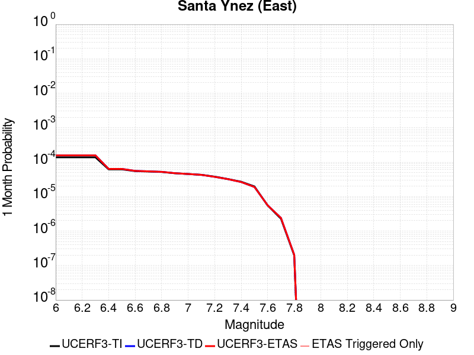 |  | 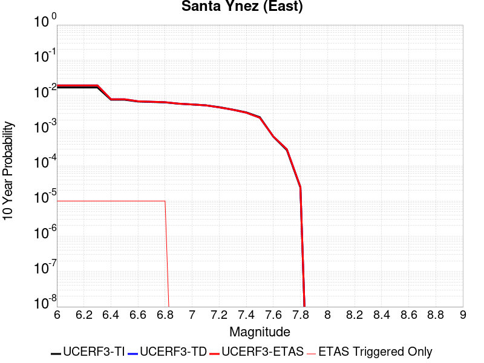 |

| Magnitude | 1 wk TI Prob | 1 wk TD Prob | 1 wk ETAS Prob | 1 wk ETAS/TD Gain | 1 wk ETAS Triggered Only | 1 mo TI Prob | 1 mo TD Prob | 1 mo ETAS Prob | 1 mo ETAS/TD Gain | 1 mo ETAS Triggered Only | 1 yr TI Prob | 1 yr TD Prob | 1 yr ETAS Prob | 1 yr ETAS/TD Gain | 1 yr ETAS Triggered Only | 10 yr TI Prob | 10 yr TD Prob | 10 yr ETAS Prob | 10 yr ETAS/TD Gain | 10 yr ETAS Triggered Only |
|-----|-----|-----|-----|-----|-----|-----|-----|-----|-----|-----|-----|-----|-----|-----|-----|-----|-----|-----|-----|-----|
| 6.0 | 3.2269712E-5 | 3.675388E-5 | 3.675388E-5 | 1.0 | 0.0 | 1.3829143E-4 | 1.5751045E-4 | 1.5751045E-4 | 1.0 | 0.0 | 0.0016823979 | 0.0019165927 | 0.0019265735 | 1.0052075 | 1.0E-5 | 0.016697178 | 0.019058175 | 0.019067986 | 1.0005147 | 1.0E-5 |
| 6.1 | 3.2269712E-5 | 3.675388E-5 | 3.675388E-5 | 1.0 | 0.0 | 1.3829143E-4 | 1.5751045E-4 | 1.5751045E-4 | 1.0 | 0.0 | 0.0016823979 | 0.0019165927 | 0.0019265735 | 1.0052075 | 1.0E-5 | 0.016697178 | 0.019058175 | 0.019067986 | 1.0005147 | 1.0E-5 |
| 6.2 | 3.2269712E-5 | 3.675388E-5 | 3.675388E-5 | 1.0 | 0.0 | 1.3829143E-4 | 1.5751045E-4 | 1.5751045E-4 | 1.0 | 0.0 | 0.0016823979 | 0.0019165927 | 0.0019265735 | 1.0052075 | 1.0E-5 | 0.016697178 | 0.019058175 | 0.019067986 | 1.0005147 | 1.0E-5 |
| 6.3 | 3.2269712E-5 | 3.675388E-5 | 3.675388E-5 | 1.0 | 0.0 | 1.3829143E-4 | 1.5751045E-4 | 1.5751045E-4 | 1.0 | 0.0 | 0.0016823979 | 0.0019165927 | 0.0019265735 | 1.0052075 | 1.0E-5 | 0.016697178 | 0.019058175 | 0.019067986 | 1.0005147 | 1.0E-5 |
| 6.4 | 1.4404779E-5 | 1.485013E-5 | 1.485013E-5 | 1.0 | 0.0 | 6.1733306E-5 | 6.364189E-5 | 6.364189E-5 | 1.0 | 0.0 | 7.513438E-4 | 7.745696E-4 | 7.8456185E-4 | 1.0129004 | 1.0E-5 | 0.0074880854 | 0.0077192495 | 0.0077291722 | 1.0012854 | 1.0E-5 |
| 6.5 | 1.4404779E-5 | 1.485013E-5 | 1.485013E-5 | 1.0 | 0.0 | 6.1733306E-5 | 6.364189E-5 | 6.364189E-5 | 1.0 | 0.0 | 7.513438E-4 | 7.745696E-4 | 7.8456185E-4 | 1.0129004 | 1.0E-5 | 0.0074880854 | 0.0077192495 | 0.0077291722 | 1.0012854 | 1.0E-5 |
| 6.6 | 1.280208E-5 | 1.3012552E-5 | 1.3012552E-5 | 1.0 | 0.0 | 5.4864904E-5 | 5.5766897E-5 | 5.5766897E-5 | 1.0 | 0.0 | 6.6777546E-4 | 6.7875226E-4 | 6.8874547E-4 | 1.014723 | 1.0E-5 | 0.006657724 | 0.006767002 | 0.0067769345 | 1.0014677 | 1.0E-5 |
| 6.7 | 1.2457027E-5 | 1.262905E-5 | 1.262905E-5 | 1.0 | 0.0 | 5.3386164E-5 | 5.4123386E-5 | 5.4123386E-5 | 1.0 | 0.0 | 6.497827E-4 | 6.5875467E-4 | 6.6874805E-4 | 1.0151702 | 1.0E-5 | 0.00647886 | 0.0065682167 | 0.006578151 | 1.0015125 | 1.0E-5 |
| 6.8 | 1.2095134E-5 | 1.2231476E-5 | 1.2231476E-5 | 1.0 | 0.0 | 5.1835254E-5 | 5.2419568E-5 | 5.2419568E-5 | 1.0 | 0.0 | 6.309115E-4 | 6.3802296E-4 | 6.480166E-4 | 1.0156634 | 1.0E-5 | 0.0062912325 | 0.0063621 | 0.0063720364 | 1.0015618 | 1.0E-5 |
| 6.9 | 1.1104036E-5 | 1.115786E-5 | 1.115786E-5 | 1.0 | 0.0 | 4.758786E-5 | 4.7818532E-5 | 4.7818532E-5 | 1.0 | 0.0 | 5.7922816E-4 | 5.820364E-4 | 5.820364E-4 | 1.0 | 0.0 | 0.005777207 | 0.005805265 | 0.005805265 | 1.0 | 0.0 |
| 7.0 | 1.0577444E-5 | 1.0582165E-5 | 1.0582165E-5 | 1.0 | 0.0 | 4.5331115E-5 | 4.5351353E-5 | 4.5351353E-5 | 1.0 | 0.0 | 5.5176654E-4 | 5.5201404E-4 | 5.5201404E-4 | 1.0 | 0.0 | 0.0055039856 | 0.005506567 | 0.005506567 | 1.0 | 0.0 |
| 7.1 | 1.0021775E-5 | 9.981446E-6 | 9.981446E-6 | 1.0 | 0.0 | 4.294976E-5 | 4.277693E-5 | 4.277693E-5 | 1.0 | 0.0 | 5.2278786E-4 | 5.2068586E-4 | 5.2068586E-4 | 1.0 | 0.0 | 0.0052155964 | 0.0051947916 | 0.0051947916 | 1.0 | 0.0 |
| 7.2 | 8.874109E-6 | 8.749197E-6 | 8.749197E-6 | 1.0 | 0.0 | 3.8031343E-5 | 3.7496025E-5 | 3.7496025E-5 | 1.0 | 0.0 | 4.629332E-4 | 4.564196E-4 | 4.564196E-4 | 1.0 | 0.0 | 0.0046197 | 0.00455494 | 0.00455494 | 1.0 | 0.0 |
| 7.3 | 7.5504267E-6 | 7.505443E-6 | 7.505443E-6 | 1.0 | 0.0 | 3.235857E-5 | 3.2165794E-5 | 3.2165794E-5 | 1.0 | 0.0 | 3.9389438E-4 | 3.915492E-4 | 3.915492E-4 | 1.0 | 0.0 | 0.0039319694 | 0.0039087003 | 0.0039087003 | 1.0 | 0.0 |
| 7.4 | 6.309394E-6 | 6.183419E-6 | 6.183419E-6 | 1.0 | 0.0 | 2.703998E-5 | 2.6500104E-5 | 2.6500104E-5 | 1.0 | 0.0 | 3.2916202E-4 | 3.2259195E-4 | 3.2259195E-4 | 1.0 | 0.0 | 0.003286749 | 0.003221334 | 0.003221334 | 1.0 | 0.0 |
| 7.5 | 4.6103073E-6 | 4.4410685E-6 | 4.4410685E-6 | 1.0 | 0.0 | 1.975831E-5 | 1.9033017E-5 | 1.9033017E-5 | 1.0 | 0.0 | 2.4053088E-4 | 2.3170303E-4 | 2.3170303E-4 | 1.0 | 0.0 | 0.002402707 | 0.002314684 | 0.002314684 | 1.0 | 0.0 |
| 7.6 | 1.2858658E-6 | 1.3008554E-6 | 1.3008554E-6 | 1.0 | 0.0 | 5.5108417E-6 | 5.575083E-6 | 5.575083E-6 | 1.0 | 0.0 | 6.7092435E-5 | 6.7874586E-5 | 6.7874586E-5 | 1.0 | 0.0 | 6.707218E-4 | 6.7854545E-4 | 6.7854545E-4 | 1.0 | 0.0 |
| 7.7 | 5.3302307E-7 | 5.612297E-7 | 5.612297E-7 | 1.0 | 0.0 | 2.2843826E-6 | 2.4052679E-6 | 2.4052679E-6 | 1.0 | 0.0 | 2.7812002E-5 | 2.9283781E-5 | 2.9283781E-5 | 1.0 | 0.0 | 2.7808524E-4 | 2.9280278E-4 | 2.9280278E-4 | 1.0 | 0.0 |
| 7.8 | 4.613933E-8 | 4.8031144E-8 | 4.8031144E-8 | 1.0 | 0.0 | 1.9773998E-7 | 2.0584774E-7 | 2.0584774E-7 | 1.0 | 0.0 | 2.4074816E-6 | 2.5061934E-6 | 2.5061934E-6 | 1.0 | 0.0 | 2.4074554E-5 | 2.5061661E-5 | 2.5061661E-5 | 1.0 | 0.0 |

## Death Valley (No)
*[(top)](#table-of-contents)*

| 1 Week | 1 Month | 1 Year | 10 Year |
|-----|-----|-----|-----|
|  |  |  |  |

| Magnitude | 1 wk TI Prob | 1 wk TD Prob | 1 wk ETAS Prob | 1 wk ETAS/TD Gain | 1 wk ETAS Triggered Only | 1 mo TI Prob | 1 mo TD Prob | 1 mo ETAS Prob | 1 mo ETAS/TD Gain | 1 mo ETAS Triggered Only | 1 yr TI Prob | 1 yr TD Prob | 1 yr ETAS Prob | 1 yr ETAS/TD Gain | 1 yr ETAS Triggered Only | 10 yr TI Prob | 10 yr TD Prob | 10 yr ETAS Prob | 10 yr ETAS/TD Gain | 10 yr ETAS Triggered Only |
|-----|-----|-----|-----|-----|-----|-----|-----|-----|-----|-----|-----|-----|-----|-----|-----|-----|-----|-----|-----|-----|
| 6.0 | 2.0074807E-5 | 2.2501532E-5 | 2.2501532E-5 | 1.0 | 0.0 | 8.603206E-5 | 9.643161E-5 | 9.643161E-5 | 1.0 | 0.0 | 0.001046937 | 0.00117343 | 0.0011834182 | 1.008512 | 1.0E-5 | 0.010420183 | 0.011673254 | 0.011683137 | 1.0008466 | 1.0E-5 |
| 6.1 | 2.0074807E-5 | 2.2501532E-5 | 2.2501532E-5 | 1.0 | 0.0 | 8.603206E-5 | 9.643161E-5 | 9.643161E-5 | 1.0 | 0.0 | 0.001046937 | 0.00117343 | 0.0011834182 | 1.008512 | 1.0E-5 | 0.010420183 | 0.011673254 | 0.011683137 | 1.0008466 | 1.0E-5 |
| 6.2 | 2.0074807E-5 | 2.2501532E-5 | 2.2501532E-5 | 1.0 | 0.0 | 8.603206E-5 | 9.643161E-5 | 9.643161E-5 | 1.0 | 0.0 | 0.001046937 | 0.00117343 | 0.0011834182 | 1.008512 | 1.0E-5 | 0.010420183 | 0.011673254 | 0.011683137 | 1.0008466 | 1.0E-5 |
| 6.3 | 1.9050609E-5 | 2.1338312E-5 | 2.1338312E-5 | 1.0 | 0.0 | 8.164292E-5 | 9.1446746E-5 | 9.1446746E-5 | 1.0 | 0.0 | 9.935491E-4 | 0.0011128022 | 0.0011128022 | 1.0 | 0.0 | 0.009891188 | 0.011073124 | 0.011073124 | 1.0 | 0.0 |
| 6.4 | 1.9050609E-5 | 2.1338312E-5 | 2.1338312E-5 | 1.0 | 0.0 | 8.164292E-5 | 9.1446746E-5 | 9.1446746E-5 | 1.0 | 0.0 | 9.935491E-4 | 0.0011128022 | 0.0011128022 | 1.0 | 0.0 | 0.009891188 | 0.011073124 | 0.011073124 | 1.0 | 0.0 |
| 6.5 | 1.8367004E-5 | 2.0562318E-5 | 2.0562318E-5 | 1.0 | 0.0 | 7.8713354E-5 | 8.8121276E-5 | 8.8121276E-5 | 1.0 | 0.0 | 9.5791375E-4 | 0.0010723551 | 0.0010723551 | 1.0 | 0.0 | 0.009537951 | 0.010672592 | 0.010672592 | 1.0 | 0.0 |
| 6.6 | 1.779439E-5 | 1.9912191E-5 | 1.9912191E-5 | 1.0 | 0.0 | 7.625944E-5 | 8.53352E-5 | 8.53352E-5 | 1.0 | 0.0 | 9.280632E-4 | 0.0010384673 | 0.0010384673 | 1.0 | 0.0 | 0.009241969 | 0.010336905 | 0.010336905 | 1.0 | 0.0 |
| 6.7 | 1.7025437E-5 | 1.904463E-5 | 1.904463E-5 | 1.0 | 0.0 | 7.296412E-5 | 8.161732E-5 | 8.161732E-5 | 1.0 | 0.0 | 8.87976E-4 | 9.93244E-4 | 9.93244E-4 | 1.0 | 0.0 | 0.008844362 | 0.009888767 | 0.009888767 | 1.0 | 0.0 |
| 6.8 | 1.6545107E-5 | 1.851372E-5 | 1.851372E-5 | 1.0 | 0.0 | 7.090568E-5 | 7.934213E-5 | 7.934213E-5 | 1.0 | 0.0 | 8.629347E-4 | 9.6556847E-4 | 9.6556847E-4 | 1.0 | 0.0 | 0.008595915 | 0.009614435 | 0.009614435 | 1.0 | 0.0 |
| 6.9 | 1.615478E-5 | 1.8088747E-5 | 1.8088747E-5 | 1.0 | 0.0 | 6.9232934E-5 | 7.7520934E-5 | 7.7520934E-5 | 1.0 | 0.0 | 8.4258494E-4 | 9.4341475E-4 | 9.4341475E-4 | 1.0 | 0.0 | 0.008393973 | 0.009394792 | 0.009394792 | 1.0 | 0.0 |
| 7.0 | 1.5894311E-5 | 1.780669E-5 | 1.780669E-5 | 1.0 | 0.0 | 6.81167E-5 | 7.6312186E-5 | 7.6312186E-5 | 1.0 | 0.0 | 8.2900526E-4 | 9.287109E-4 | 9.287109E-4 | 1.0 | 0.0 | 0.008259195 | 0.009248987 | 0.009248987 | 1.0 | 0.0 |
| 7.1 | 1.5602263E-5 | 1.7484625E-5 | 1.7484625E-5 | 1.0 | 0.0 | 6.6865134E-5 | 7.493199E-5 | 7.493199E-5 | 1.0 | 0.0 | 8.137789E-4 | 9.119212E-4 | 9.119212E-4 | 1.0 | 0.0 | 0.008108052 | 0.009082474 | 0.009082474 | 1.0 | 0.0 |
| 7.2 | 1.5323829E-5 | 1.7171731E-5 | 1.7171731E-5 | 1.0 | 0.0 | 6.56719E-5 | 7.3591094E-5 | 7.3591094E-5 | 1.0 | 0.0 | 7.99262E-4 | 8.956093E-4 | 8.956093E-4 | 1.0 | 0.0 | 0.007963934 | 0.008920676 | 0.008920676 | 1.0 | 0.0 |
| 7.3 | 1.4556212E-5 | 1.6303497E-5 | 1.6303497E-5 | 1.0 | 0.0 | 6.238227E-5 | 6.9870286E-5 | 6.9870286E-5 | 1.0 | 0.0 | 7.592395E-4 | 8.503446E-4 | 8.503446E-4 | 1.0 | 0.0 | 0.0075665074 | 0.008471553 | 0.008471553 | 1.0 | 0.0 |
| 7.4 | 1.411725E-5 | 1.5808968E-5 | 1.5808968E-5 | 1.0 | 0.0 | 6.0501097E-5 | 6.775099E-5 | 6.775099E-5 | 1.0 | 0.0 | 7.363519E-4 | 8.24562E-4 | 8.24562E-4 | 1.0 | 0.0 | 0.0073391674 | 0.00821566 | 0.00821566 | 1.0 | 0.0 |
| 7.5 | 1.3503312E-5 | 1.5127256E-5 | 1.5127256E-5 | 1.0 | 0.0 | 5.7870053E-5 | 6.4829524E-5 | 6.4829524E-5 | 1.0 | 0.0 | 7.043401E-4 | 7.890194E-4 | 7.890194E-4 | 1.0 | 0.0 | 0.007021119 | 0.007862805 | 0.007862805 | 1.0 | 0.0 |
| 7.6 | 1.1279839E-5 | 1.2627129E-5 | 1.2627129E-5 | 1.0 | 0.0 | 4.834127E-5 | 5.4115175E-5 | 5.4115175E-5 | 1.0 | 0.0 | 5.88396E-4 | 6.586584E-4 | 6.586584E-4 | 1.0 | 0.0 | 0.005868405 | 0.006567614 | 0.006567614 | 1.0 | 0.0 |
| 7.7 | 9.189108E-6 | 1.02840095E-5 | 1.02840095E-5 | 1.0 | 0.0 | 3.93813E-5 | 4.407361E-5 | 4.407361E-5 | 1.0 | 0.0 | 4.7936183E-4 | 5.3646916E-4 | 5.3646916E-4 | 1.0 | 0.0 | 0.004783291 | 0.005352252 | 0.005352252 | 1.0 | 0.0 |
| 7.8 | 3.4586725E-7 | 3.648368E-7 | 3.648368E-7 | 1.0 | 0.0 | 1.4822873E-6 | 1.5635853E-6 | 1.5635853E-6 | 1.0 | 0.0 | 1.80467E-5 | 1.903649E-5 | 1.903649E-5 | 1.0 | 0.0 | 1.8045233E-4 | 1.9034903E-4 | 1.9034903E-4 | 1.0 | 0.0 |
| 7.9 | 2.5591178E-9 | 2.6697329E-9 | 2.6697329E-9 | 1.0 | 0.0 | 1.0967647E-8 | 1.14417125E-8 | 1.14417125E-8 | 1.0 | 0.0 | 1.335311E-7 | 1.3930286E-7 | 1.3930286E-7 | 1.0 | 0.0 | 1.3353102E-6 | 1.3930285E-6 | 1.3930285E-6 | 1.0 | 0.0 |

## Pleito
*[(top)](#table-of-contents)*

| 1 Week | 1 Month | 1 Year | 10 Year |
|-----|-----|-----|-----|
| 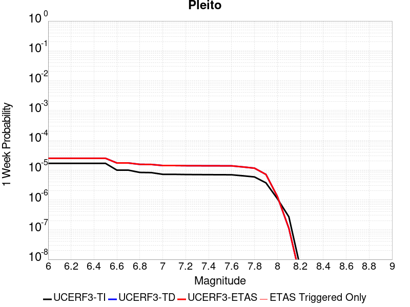 | 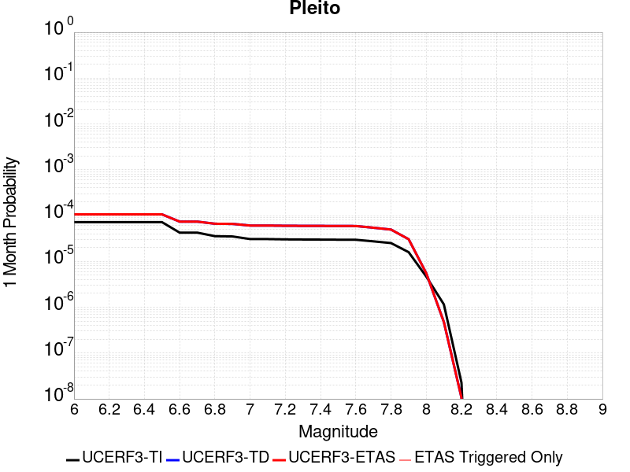 | 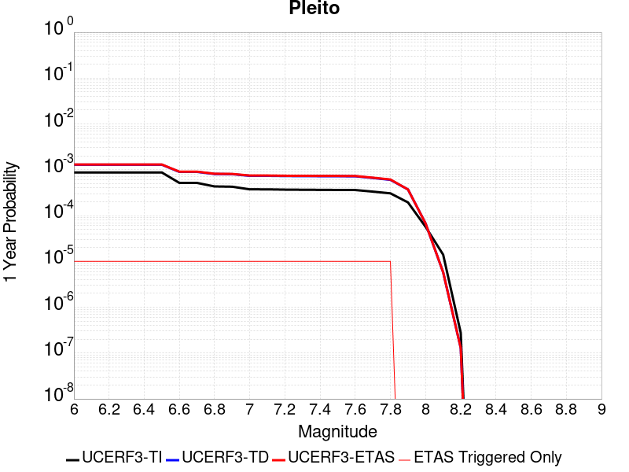 | 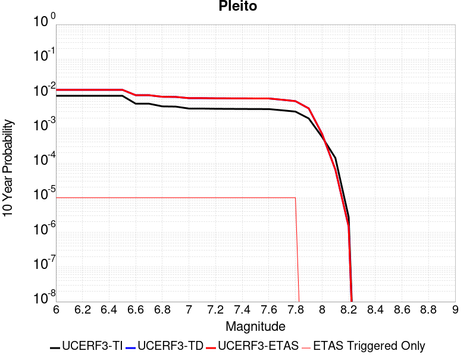 |

| Magnitude | 1 wk TI Prob | 1 wk TD Prob | 1 wk ETAS Prob | 1 wk ETAS/TD Gain | 1 wk ETAS Triggered Only | 1 mo TI Prob | 1 mo TD Prob | 1 mo ETAS Prob | 1 mo ETAS/TD Gain | 1 mo ETAS Triggered Only | 1 yr TI Prob | 1 yr TD Prob | 1 yr ETAS Prob | 1 yr ETAS/TD Gain | 1 yr ETAS Triggered Only | 10 yr TI Prob | 10 yr TD Prob | 10 yr ETAS Prob | 10 yr ETAS/TD Gain | 10 yr ETAS Triggered Only |
|-----|-----|-----|-----|-----|-----|-----|-----|-----|-----|-----|-----|-----|-----|-----|-----|-----|-----|-----|-----|-----|
| 6.0 | 1.6763008E-5 | 2.479053E-5 | 2.479053E-5 | 1.0 | 0.0 | 7.183948E-5 | 1.0624121E-4 | 1.0624121E-4 | 1.0 | 0.0 | 8.742947E-4 | 0.0012927912 | 0.0013027784 | 1.0077252 | 1.0E-5 | 0.00870863 | 0.012967364 | 0.012977234 | 1.0007612 | 1.0E-5 |
| 6.1 | 1.6763008E-5 | 2.479053E-5 | 2.479053E-5 | 1.0 | 0.0 | 7.183948E-5 | 1.0624121E-4 | 1.0624121E-4 | 1.0 | 0.0 | 8.742947E-4 | 0.0012927912 | 0.0013027784 | 1.0077252 | 1.0E-5 | 0.00870863 | 0.012967364 | 0.012977234 | 1.0007612 | 1.0E-5 |
| 6.2 | 1.6763008E-5 | 2.479053E-5 | 2.479053E-5 | 1.0 | 0.0 | 7.183948E-5 | 1.0624121E-4 | 1.0624121E-4 | 1.0 | 0.0 | 8.742947E-4 | 0.0012927912 | 0.0013027784 | 1.0077252 | 1.0E-5 | 0.00870863 | 0.012967364 | 0.012977234 | 1.0007612 | 1.0E-5 |
| 6.3 | 1.6763008E-5 | 2.479053E-5 | 2.479053E-5 | 1.0 | 0.0 | 7.183948E-5 | 1.0624121E-4 | 1.0624121E-4 | 1.0 | 0.0 | 8.742947E-4 | 0.0012927912 | 0.0013027784 | 1.0077252 | 1.0E-5 | 0.00870863 | 0.012967364 | 0.012977234 | 1.0007612 | 1.0E-5 |
| 6.4 | 1.6763008E-5 | 2.479053E-5 | 2.479053E-5 | 1.0 | 0.0 | 7.183948E-5 | 1.0624121E-4 | 1.0624121E-4 | 1.0 | 0.0 | 8.742947E-4 | 0.0012927912 | 0.0013027784 | 1.0077252 | 1.0E-5 | 0.00870863 | 0.012967364 | 0.012977234 | 1.0007612 | 1.0E-5 |
| 6.5 | 1.6763008E-5 | 2.479053E-5 | 2.479053E-5 | 1.0 | 0.0 | 7.183948E-5 | 1.0624121E-4 | 1.0624121E-4 | 1.0 | 0.0 | 8.742947E-4 | 0.0012927912 | 0.0013027784 | 1.0077252 | 1.0E-5 | 0.00870863 | 0.012967364 | 0.012977234 | 1.0007612 | 1.0E-5 |
| 6.6 | 9.910213E-6 | 1.7240907E-5 | 1.7240907E-5 | 1.0 | 0.0 | 4.247165E-5 | 7.388753E-5 | 7.388753E-5 | 1.0 | 0.0 | 5.169696E-4 | 8.992132E-4 | 9.092042E-4 | 1.0111108 | 1.0E-5 | 0.0051576863 | 0.009064018 | 0.009073927 | 1.0010933 | 1.0E-5 |
| 6.7 | 9.910213E-6 | 1.7240907E-5 | 1.7240907E-5 | 1.0 | 0.0 | 4.247165E-5 | 7.388753E-5 | 7.388753E-5 | 1.0 | 0.0 | 5.169696E-4 | 8.992132E-4 | 9.092042E-4 | 1.0111108 | 1.0E-5 | 0.0051576863 | 0.009064018 | 0.009073927 | 1.0010933 | 1.0E-5 |
| 6.8 | 8.300162E-6 | 1.5500442E-5 | 1.5500442E-5 | 1.0 | 0.0 | 3.557164E-5 | 6.642878E-5 | 6.642878E-5 | 1.0 | 0.0 | 4.3299864E-4 | 8.0847176E-4 | 8.184637E-4 | 1.012359 | 1.0E-5 | 0.004321559 | 0.008163428 | 0.0081733465 | 1.001215 | 1.0E-5 |
| 6.9 | 8.183114E-6 | 1.5371645E-5 | 1.5371645E-5 | 1.0 | 0.0 | 3.5070017E-5 | 6.5876826E-5 | 6.5876826E-5 | 1.0 | 0.0 | 4.2689382E-4 | 8.017566E-4 | 8.117486E-4 | 1.0124626 | 1.0E-5 | 0.0042607468 | 0.008096768 | 0.008106686 | 1.0012251 | 1.0E-5 |
| 7.0 | 7.1748823E-6 | 1.4158308E-5 | 1.4158308E-5 | 1.0 | 0.0 | 3.0749135E-5 | 6.067705E-5 | 6.067705E-5 | 1.0 | 0.0 | 3.743064E-4 | 7.384933E-4 | 7.4848585E-4 | 1.0135311 | 1.0E-5 | 0.0037367654 | 0.0074680606 | 0.007477986 | 1.0013291 | 1.0E-5 |
| 7.1 | 7.1671807E-6 | 1.4148675E-5 | 1.4148675E-5 | 1.0 | 0.0 | 3.0716128E-5 | 6.063577E-5 | 6.063577E-5 | 1.0 | 0.0 | 3.7390468E-4 | 7.37991E-4 | 7.4798363E-4 | 1.0135403 | 1.0E-5 | 0.0037327618 | 0.007463072 | 0.0074729975 | 1.0013299 | 1.0E-5 |
| 7.2 | 7.0649667E-6 | 1.399588E-5 | 1.399588E-5 | 1.0 | 0.0 | 3.0278077E-5 | 5.998097E-5 | 5.998097E-5 | 1.0 | 0.0 | 3.6857324E-4 | 7.300241E-4 | 7.400168E-4 | 1.0136882 | 1.0E-5 | 0.0036796255 | 0.007383786 | 0.0073937126 | 1.0013443 | 1.0E-5 |
| 7.3 | 7.02082E-6 | 1.3939285E-5 | 1.3939285E-5 | 1.0 | 0.0 | 3.008888E-5 | 5.9738428E-5 | 5.9738428E-5 | 1.0 | 0.0 | 3.6627054E-4 | 7.270732E-4 | 7.370659E-4 | 1.0137438 | 1.0E-5 | 0.0036566744 | 0.0073542604 | 0.007364187 | 1.0013498 | 1.0E-5 |
| 7.4 | 6.987146E-6 | 1.3898819E-5 | 1.3898819E-5 | 1.0 | 0.0 | 2.9944567E-5 | 5.956501E-5 | 5.956501E-5 | 1.0 | 0.0 | 3.6451413E-4 | 7.249632E-4 | 7.3495595E-4 | 1.0137838 | 1.0E-5 | 0.0036391679 | 0.007333182 | 0.0073431083 | 1.0013536 | 1.0E-5 |
| 7.5 | 6.9494554E-6 | 1.3855703E-5 | 1.3855703E-5 | 1.0 | 0.0 | 2.9783041E-5 | 5.9380236E-5 | 5.9380236E-5 | 1.0 | 0.0 | 3.625482E-4 | 7.2271505E-4 | 7.3270785E-4 | 1.0138267 | 1.0E-5 | 0.0036195726 | 0.0073107993 | 0.0073207263 | 1.0013578 | 1.0E-5 |
| 7.6 | 6.92694E-6 | 1.3814777E-5 | 1.3814777E-5 | 1.0 | 0.0 | 2.9686547E-5 | 5.9204845E-5 | 5.9204845E-5 | 1.0 | 0.0 | 3.6137376E-4 | 7.205811E-4 | 7.305739E-4 | 1.0138677 | 1.0E-5 | 0.0036078666 | 0.007289532 | 0.0072994595 | 1.0013618 | 1.0E-5 |
| 7.7 | 6.395867E-6 | 1.2692768E-5 | 1.2692768E-5 | 1.0 | 0.0 | 2.741057E-5 | 5.439644E-5 | 5.439644E-5 | 1.0 | 0.0 | 3.336726E-4 | 6.6207576E-4 | 6.7206915E-4 | 1.015094 | 1.0E-5 | 0.0033317201 | 0.0067076497 | 0.0067175827 | 1.0014808 | 1.0E-5 |
| 7.8 | 5.8664327E-6 | 1.155828E-5 | 1.155828E-5 | 1.0 | 0.0 | 2.5141611E-5 | 4.953455E-5 | 4.953455E-5 | 1.0 | 0.0 | 3.060561E-4 | 6.0291647E-4 | 6.1291043E-4 | 1.016576 | 1.0E-5 | 0.0030563495 | 0.00611206 | 0.0061219987 | 1.0016261 | 1.0E-5 |
| 7.9 | 3.7167474E-6 | 7.1276354E-6 | 7.1276354E-6 | 1.0 | 0.0 | 1.592882E-5 | 3.0546653E-5 | 3.0546653E-5 | 1.0 | 0.0 | 1.9391612E-4 | 3.7184218E-4 | 3.7184218E-4 | 1.0 | 0.0 | 0.0019374699 | 0.003774384 | 0.003774384 | 1.0 | 0.0 |
| 8.0 | 1.0903841E-6 | 1.2909164E-6 | 1.2909164E-6 | 1.0 | 0.0 | 4.6730665E-6 | 5.532487E-6 | 5.532487E-6 | 1.0 | 0.0 | 5.68931E-5 | 6.735596E-5 | 6.735596E-5 | 1.0 | 0.0 | 5.6878536E-4 | 6.957586E-4 | 6.957586E-4 | 1.0 | 0.0 |
| 8.1 | 2.6894583E-7 | 1.1110662E-7 | 1.1110662E-7 | 1.0 | 0.0 | 1.1526245E-6 | 4.7617115E-7 | 4.7617115E-7 | 1.0 | 0.0 | 1.4033113E-5 | 5.7973684E-6 | 5.7973684E-6 | 1.0 | 0.0 | 1.4032227E-4 | 6.485011E-5 | 6.485011E-5 | 1.0 | 0.0 |
| 8.2 | 5.2967013E-9 | 2.4698603E-9 | 2.4698603E-9 | 1.0 | 0.0 | 2.2700148E-8 | 1.0585116E-8 | 1.0585116E-8 | 1.0 | 0.0 | 2.7637427E-7 | 1.2887378E-7 | 1.2887378E-7 | 1.0 | 0.0 | 2.7637393E-6 | 1.466009E-6 | 1.466009E-6 | 1.0 | 0.0 |

## Mission Ridge-Arroyo Parida-Santa Ana
*[(top)](#table-of-contents)*

| 1 Week | 1 Month | 1 Year | 10 Year |
|-----|-----|-----|-----|
|  |  |  |  |

| Magnitude | 1 wk TI Prob | 1 wk TD Prob | 1 wk ETAS Prob | 1 wk ETAS/TD Gain | 1 wk ETAS Triggered Only | 1 mo TI Prob | 1 mo TD Prob | 1 mo ETAS Prob | 1 mo ETAS/TD Gain | 1 mo ETAS Triggered Only | 1 yr TI Prob | 1 yr TD Prob | 1 yr ETAS Prob | 1 yr ETAS/TD Gain | 1 yr ETAS Triggered Only | 10 yr TI Prob | 10 yr TD Prob | 10 yr ETAS Prob | 10 yr ETAS/TD Gain | 10 yr ETAS Triggered Only |
|-----|-----|-----|-----|-----|-----|-----|-----|-----|-----|-----|-----|-----|-----|-----|-----|-----|-----|-----|-----|-----|
| 6.0 | 4.169034E-5 | 4.71435E-5 | 4.71435E-5 | 1.0 | 0.0 | 1.7866064E-4 | 2.0203278E-4 | 2.0203278E-4 | 1.0 | 0.0 | 0.0021730233 | 0.0024577067 | 0.0024676821 | 1.0040588 | 1.0E-5 | 0.021518968 | 0.024387252 | 0.024397008 | 1.0004001 | 1.0E-5 |
| 6.1 | 1.73813E-5 | 1.6855427E-5 | 1.6855427E-5 | 1.0 | 0.0 | 7.4489166E-5 | 7.2235605E-5 | 7.2235605E-5 | 1.0 | 0.0 | 9.065282E-4 | 8.791244E-4 | 8.891156E-4 | 1.0113649 | 1.0E-5 | 0.009028391 | 0.008757609 | 0.008767521 | 1.0011319 | 1.0E-5 |
| 6.2 | 1.4622182E-5 | 1.3674228E-5 | 1.3674228E-5 | 1.0 | 0.0 | 6.2664985E-5 | 5.8602538E-5 | 5.8602538E-5 | 1.0 | 0.0 | 7.6267915E-4 | 7.1325625E-4 | 7.232491E-4 | 1.0140102 | 1.0E-5 | 0.007600669 | 0.0071101133 | 0.007120042 | 1.0013964 | 1.0E-5 |
| 6.3 | 1.3552434E-5 | 1.2483067E-5 | 1.2483067E-5 | 1.0 | 0.0 | 5.8080568E-5 | 5.3497777E-5 | 5.3497777E-5 | 1.0 | 0.0 | 7.069015E-4 | 6.5114396E-4 | 6.611374E-4 | 1.0153476 | 1.0E-5 | 0.00704657 | 0.0064927237 | 0.006502659 | 1.0015302 | 1.0E-5 |
| 6.4 | 1.30977305E-5 | 1.1979993E-5 | 1.1979993E-5 | 1.0 | 0.0 | 5.613192E-5 | 5.1341834E-5 | 5.1341834E-5 | 1.0 | 0.0 | 6.831918E-4 | 6.249106E-4 | 6.349043E-4 | 1.0159923 | 1.0E-5 | 0.006810953 | 0.0062318784 | 0.006241816 | 1.0015947 | 1.0E-5 |
| 6.5 | 1.225205E-5 | 1.104959E-5 | 1.104959E-5 | 1.0 | 0.0 | 5.2507727E-5 | 4.7354544E-5 | 4.7354544E-5 | 1.0 | 0.0 | 6.3909404E-4 | 5.7639176E-4 | 5.86386E-4 | 1.0173393 | 1.0E-5 | 0.006372592 | 0.005749278 | 0.00575922 | 1.0017294 | 1.0E-5 |
| 6.6 | 1.1352241E-5 | 1.0064273E-5 | 1.0064273E-5 | 1.0 | 0.0 | 4.8651553E-5 | 4.3131895E-5 | 4.3131895E-5 | 1.0 | 0.0 | 5.921717E-4 | 5.2500644E-4 | 5.3500116E-4 | 1.0190374 | 1.0E-5 | 0.0059059616 | 0.005237907 | 0.005247855 | 1.0018991 | 1.0E-5 |
| 6.7 | 1.0864116E-5 | 9.517729E-6 | 9.517729E-6 | 1.0 | 0.0 | 4.6559664E-5 | 4.0789644E-5 | 4.0789644E-5 | 1.0 | 0.0 | 5.667165E-4 | 4.9650273E-4 | 5.064978E-4 | 1.0201309 | 1.0E-5 | 0.005652734 | 0.0049541686 | 0.0049641193 | 1.0020086 | 1.0E-5 |
| 6.8 | 1.0666365E-5 | 9.30047E-6 | 9.30047E-6 | 1.0 | 0.0 | 4.571219E-5 | 3.9858558E-5 | 3.9858558E-5 | 1.0 | 0.0 | 5.564038E-4 | 4.851719E-4 | 4.9516704E-4 | 1.0206013 | 1.0E-5 | 0.005550127 | 0.004841359 | 0.0048513105 | 1.0020555 | 1.0E-5 |
| 6.9 | 1.0038665E-5 | 8.592689E-6 | 8.592689E-6 | 1.0 | 0.0 | 4.302214E-5 | 3.68253E-5 | 3.68253E-5 | 1.0 | 0.0 | 5.236687E-4 | 4.4825758E-4 | 4.4825758E-4 | 1.0 | 0.0 | 0.005224364 | 0.004473745 | 0.004473745 | 1.0 | 0.0 |
| 7.0 | 9.5379955E-6 | 8.025674E-6 | 8.025674E-6 | 1.0 | 0.0 | 4.0876483E-5 | 3.4395303E-5 | 3.4395303E-5 | 1.0 | 0.0 | 4.975576E-4 | 4.1868407E-4 | 4.1868407E-4 | 1.0 | 0.0 | 0.00496445 | 0.004179152 | 0.004179152 | 1.0 | 0.0 |
| 7.1 | 9.207389E-6 | 7.652948E-6 | 7.652948E-6 | 1.0 | 0.0 | 3.945964E-5 | 3.2797943E-5 | 3.2797943E-5 | 1.0 | 0.0 | 4.803152E-4 | 3.992435E-4 | 3.992435E-4 | 1.0 | 0.0 | 0.004792784 | 0.003985459 | 0.003985459 | 1.0 | 0.0 |
| 7.2 | 7.638091E-6 | 5.9315435E-6 | 5.9315435E-6 | 1.0 | 0.0 | 3.2734264E-5 | 2.5420655E-5 | 2.5420655E-5 | 1.0 | 0.0 | 3.984668E-4 | 3.0945282E-4 | 3.0945282E-4 | 1.0 | 0.0 | 0.0039775306 | 0.0030902762 | 0.0030902762 | 1.0 | 0.0 |
| 7.3 | 7.2500147E-6 | 5.5965506E-6 | 5.5965506E-6 | 1.0 | 0.0 | 3.1071122E-5 | 2.3985E-5 | 2.3985E-5 | 1.0 | 0.0 | 3.7822526E-4 | 2.9197853E-4 | 2.9197853E-4 | 1.0 | 0.0 | 0.0037758215 | 0.0029160045 | 0.0029160045 | 1.0 | 0.0 |
| 7.4 | 6.3899715E-6 | 4.918836E-6 | 4.918836E-6 | 1.0 | 0.0 | 2.7385306E-5 | 2.1080557E-5 | 2.1080557E-5 | 1.0 | 0.0 | 3.3336508E-4 | 2.5662576E-4 | 2.5662576E-4 | 1.0 | 0.0 | 0.0033286542 | 0.0025633385 | 0.0025633385 | 1.0 | 0.0 |
| 7.5 | 5.379025E-6 | 4.0841346E-6 | 4.0841346E-6 | 1.0 | 0.0 | 2.305276E-5 | 1.7503316E-5 | 1.7503316E-5 | 1.0 | 0.0 | 2.806312E-4 | 2.1308215E-4 | 2.1308215E-4 | 1.0 | 0.0 | 0.0028027708 | 0.0021287897 | 0.0021287897 | 1.0 | 0.0 |
| 7.6 | 4.1270696E-6 | 3.0885622E-6 | 3.0885622E-6 | 1.0 | 0.0 | 1.768732E-5 | 1.3236629E-5 | 1.3236629E-5 | 1.0 | 0.0 | 2.1532185E-4 | 1.6114411E-4 | 1.6114411E-4 | 1.0 | 0.0 | 0.0021511333 | 0.0016102807 | 0.0016102807 | 1.0 | 0.0 |
| 7.7 | 2.5406805E-6 | 1.8283382E-6 | 1.8283382E-6 | 1.0 | 0.0 | 1.0888585E-5 | 7.8357125E-6 | 7.8357125E-6 | 1.0 | 0.0 | 1.3256045E-4 | 9.539568E-5 | 9.539568E-5 | 1.0 | 0.0 | 0.0013248142 | 9.535535E-4 | 9.535535E-4 | 1.0 | 0.0 |
| 7.8 | 4.8608285E-7 | 3.5100658E-7 | 3.5100658E-7 | 1.0 | 0.0 | 2.0832106E-6 | 1.504313E-6 | 1.504313E-6 | 1.0 | 0.0 | 2.5362791E-5 | 1.8314859E-5 | 1.8314859E-5 | 1.0 | 0.0 | 2.5359896E-4 | 1.8313361E-4 | 1.8313361E-4 | 1.0 | 0.0 |
| 7.9 | 2.0472514E-8 | 1.2690024E-8 | 1.2690024E-8 | 1.0 | 0.0 | 8.7739345E-8 | 5.438582E-8 | 5.438582E-8 | 1.0 | 0.0 | 1.068226E-6 | 6.621471E-7 | 6.621471E-7 | 1.0 | 0.0 | 1.0682209E-5 | 6.6214525E-6 | 6.6214525E-6 | 1.0 | 0.0 |
| 8.0 | 4.443582E-9 | 2.0326807E-9 | 2.0326807E-9 | 1.0 | 0.0 | 1.9043922E-8 | 8.711488E-9 | 8.711488E-9 | 1.0 | 0.0 | 2.3185973E-7 | 1.06062366E-7 | 1.06062366E-7 | 1.0 | 0.0 | 2.3185949E-6 | 1.0606232E-6 | 1.0606232E-6 | 1.0 | 0.0 |

## San Diego Trough south
*[(top)](#table-of-contents)*

| 1 Week | 1 Month | 1 Year | 10 Year |
|-----|-----|-----|-----|
| 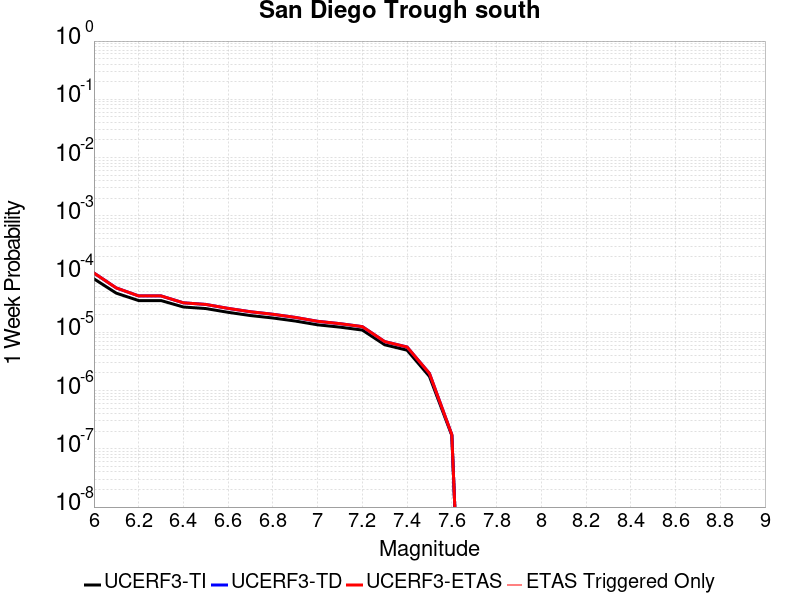 | 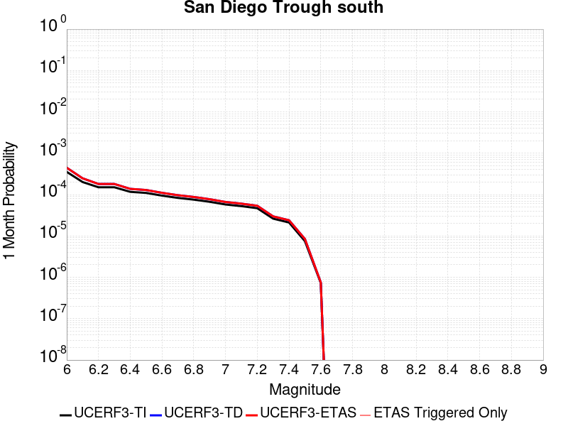 | 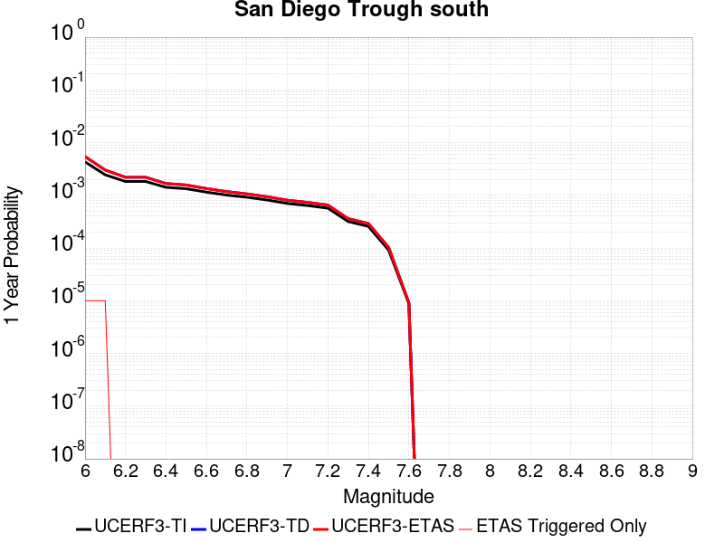 | 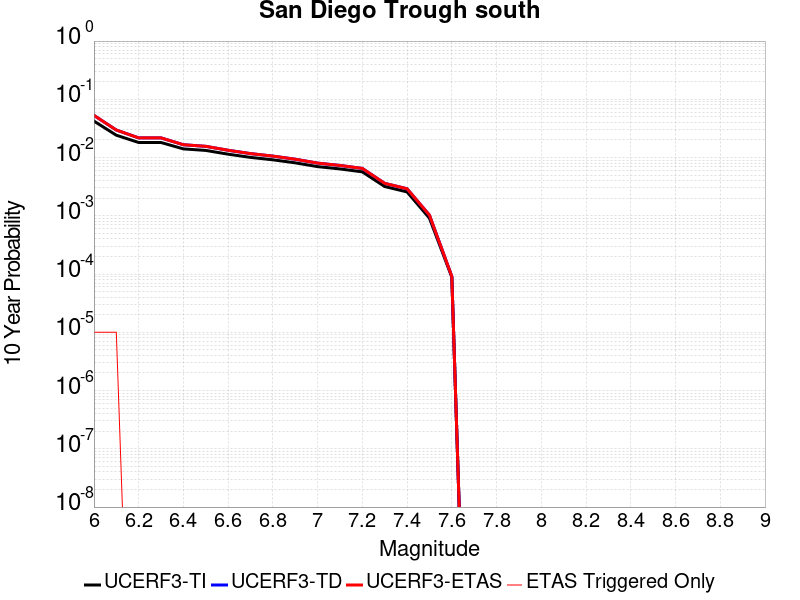 |

| Magnitude | 1 wk TI Prob | 1 wk TD Prob | 1 wk ETAS Prob | 1 wk ETAS/TD Gain | 1 wk ETAS Triggered Only | 1 mo TI Prob | 1 mo TD Prob | 1 mo ETAS Prob | 1 mo ETAS/TD Gain | 1 mo ETAS Triggered Only | 1 yr TI Prob | 1 yr TD Prob | 1 yr ETAS Prob | 1 yr ETAS/TD Gain | 1 yr ETAS Triggered Only | 10 yr TI Prob | 10 yr TD Prob | 10 yr ETAS Prob | 10 yr ETAS/TD Gain | 10 yr ETAS Triggered Only |
|-----|-----|-----|-----|-----|-----|-----|-----|-----|-----|-----|-----|-----|-----|-----|-----|-----|-----|-----|-----|-----|
| 6.0 | 8.279495E-5 | 1.0425644E-4 | 1.0425644E-4 | 1.0 | 0.0 | 3.5478722E-4 | 4.467418E-4 | 4.467418E-4 | 1.0 | 0.0 | 0.004310982 | 0.0054263812 | 0.005436327 | 1.0018328 | 1.0E-5 | 0.042283054 | 0.052999042 | 0.05300851 | 1.0001787 | 1.0E-5 |
| 6.1 | 4.6961468E-5 | 5.7736743E-5 | 5.7736743E-5 | 1.0 | 0.0 | 2.0124791E-4 | 2.4742068E-4 | 2.4742068E-4 | 1.0 | 0.0 | 0.00244744 | 0.0030083342 | 0.003018304 | 1.0033141 | 1.0E-5 | 0.024206603 | 0.029682966 | 0.02969267 | 1.0003269 | 1.0E-5 |
| 6.2 | 3.5079658E-5 | 4.2146152E-5 | 4.2146152E-5 | 1.0 | 0.0 | 1.5033272E-4 | 1.8061412E-4 | 1.8061412E-4 | 1.0 | 0.0 | 0.0018287642 | 0.0021968025 | 0.0021968025 | 1.0 | 0.0 | 0.018137876 | 0.021753421 | 0.021753421 | 1.0 | 0.0 |
| 6.3 | 3.5079658E-5 | 4.2146152E-5 | 4.2146152E-5 | 1.0 | 0.0 | 1.5033272E-4 | 1.8061412E-4 | 1.8061412E-4 | 1.0 | 0.0 | 0.0018287642 | 0.0021968025 | 0.0021968025 | 1.0 | 0.0 | 0.018137876 | 0.021753421 | 0.021753421 | 1.0 | 0.0 |
| 6.4 | 2.7196904E-5 | 3.2090265E-5 | 3.2090265E-5 | 1.0 | 0.0 | 1.16552954E-4 | 1.3752255E-4 | 1.3752255E-4 | 1.0 | 0.0 | 0.0014181085 | 0.0016730648 | 0.0016730648 | 1.0 | 0.0 | 0.014090929 | 0.016606223 | 0.016606223 | 1.0 | 0.0 |
| 6.5 | 2.5584688E-5 | 3.0104491E-5 | 3.0104491E-5 | 1.0 | 0.0 | 1.0964406E-4 | 1.2901296E-4 | 1.2901296E-4 | 1.0 | 0.0 | 0.0013340989 | 0.0015696133 | 0.0015696133 | 1.0 | 0.0 | 0.013261181 | 0.015586771 | 0.015586771 | 1.0 | 0.0 |
| 6.6 | 2.2034688E-5 | 2.5745056E-5 | 2.5745056E-5 | 1.0 | 0.0 | 9.443096E-5 | 1.1033134E-4 | 1.1033134E-4 | 1.0 | 0.0 | 0.0011490905 | 0.0013424625 | 0.0013424625 | 1.0 | 0.0 | 0.011431668 | 0.013344509 | 0.013344509 | 1.0 | 0.0 |
| 6.7 | 1.9394853E-5 | 2.2543714E-5 | 2.2543714E-5 | 1.0 | 0.0 | 8.311815E-5 | 9.661237E-5 | 9.661237E-5 | 1.0 | 0.0 | 0.0010114936 | 0.0011756261 | 0.0011756261 | 1.0 | 0.0 | 0.01006902 | 0.011694773 | 0.011694773 | 1.0 | 0.0 |
| 6.8 | 1.7615313E-5 | 2.0404905E-5 | 2.0404905E-5 | 1.0 | 0.0 | 7.549201E-5 | 8.7446686E-5 | 8.7446686E-5 | 1.0 | 0.0 | 9.1872766E-4 | 0.0010641477 | 0.0010641477 | 1.0 | 0.0 | 0.009149387 | 0.010591088 | 0.010591088 | 1.0 | 0.0 |
| 6.9 | 1.5621423E-5 | 1.8027593E-5 | 1.8027593E-5 | 1.0 | 0.0 | 6.6947236E-5 | 7.725885E-5 | 7.725885E-5 | 1.0 | 0.0 | 8.147778E-4 | 9.402241E-4 | 9.402241E-4 | 1.0 | 0.0 | 0.008117969 | 0.009362906 | 0.009362906 | 1.0 | 0.0 |
| 7.0 | 1.3444376E-5 | 1.5449315E-5 | 1.5449315E-5 | 1.0 | 0.0 | 5.7617483E-5 | 6.6209686E-5 | 6.6209686E-5 | 1.0 | 0.0 | 7.0126704E-4 | 8.0580753E-4 | 8.0580753E-4 | 1.0 | 0.0 | 0.006990582 | 0.00802919 | 0.00802919 | 1.0 | 0.0 |
| 7.1 | 1.2268361E-5 | 1.4074132E-5 | 1.4074132E-5 | 1.0 | 0.0 | 5.2577634E-5 | 6.031633E-5 | 6.031633E-5 | 1.0 | 0.0 | 6.399447E-4 | 7.341065E-4 | 7.341065E-4 | 1.0 | 0.0 | 0.0063810493 | 0.00731712 | 0.00731712 | 1.0 | 0.0 |
| 7.2 | 1.0922655E-5 | 1.2514534E-5 | 1.2514534E-5 | 1.0 | 0.0 | 4.681054E-5 | 5.363263E-5 | 5.363263E-5 | 1.0 | 0.0 | 5.697693E-4 | 6.5278413E-4 | 6.5278413E-4 | 1.0 | 0.0 | 0.0056831064 | 0.006508947 | 0.006508947 | 1.0 | 0.0 |
| 7.3 | 6.1106753E-6 | 6.9294197E-6 | 6.9294197E-6 | 1.0 | 0.0 | 2.6188345E-5 | 2.9697178E-5 | 2.9697178E-5 | 1.0 | 0.0 | 3.1879646E-4 | 3.6150354E-4 | 3.6150354E-4 | 1.0 | 0.0 | 0.0031833951 | 0.0036092002 | 0.0036092002 | 1.0 | 0.0 |
| 7.4 | 4.933187E-6 | 5.5899495E-6 | 5.5899495E-6 | 1.0 | 0.0 | 2.114206E-5 | 2.3956709E-5 | 2.3956709E-5 | 1.0 | 0.0 | 2.5737417E-4 | 2.9163426E-4 | 2.9163426E-4 | 1.0 | 0.0 | 0.002570763 | 0.0029125568 | 0.0029125568 | 1.0 | 0.0 |
| 7.5 | 1.7489613E-6 | 1.9698116E-6 | 1.9698116E-6 | 1.0 | 0.0 | 7.495527E-6 | 8.4420235E-6 | 8.4420235E-6 | 1.0 | 0.0 | 9.125422E-5 | 1.0277701E-4 | 1.0277701E-4 | 1.0 | 0.0 | 9.1216754E-4 | 0.0010273168 | 0.0010273168 | 1.0 | 0.0 |
| 7.6 | 1.6988751E-7 | 1.7534121E-7 | 1.7534121E-7 | 1.0 | 0.0 | 7.2808916E-7 | 7.5146215E-7 | 7.5146215E-7 | 1.0 | 0.0 | 8.864449E-6 | 9.149016E-6 | 9.149016E-6 | 1.0 | 0.0 | 8.8640954E-5 | 9.148658E-5 | 9.148658E-5 | 1.0 | 0.0 |

## Calaveras (So) 2011 CFM
*[(top)](#table-of-contents)*

| 1 Week | 1 Month | 1 Year | 10 Year |
|-----|-----|-----|-----|
|  |  |  | 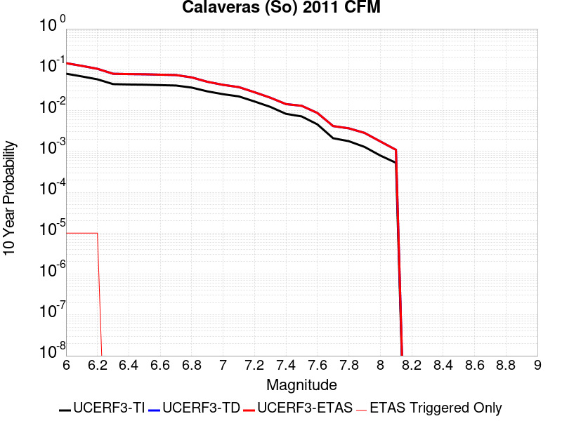 |

| Magnitude | 1 wk TI Prob | 1 wk TD Prob | 1 wk ETAS Prob | 1 wk ETAS/TD Gain | 1 wk ETAS Triggered Only | 1 mo TI Prob | 1 mo TD Prob | 1 mo ETAS Prob | 1 mo ETAS/TD Gain | 1 mo ETAS Triggered Only | 1 yr TI Prob | 1 yr TD Prob | 1 yr ETAS Prob | 1 yr ETAS/TD Gain | 1 yr ETAS Triggered Only | 10 yr TI Prob | 10 yr TD Prob | 10 yr ETAS Prob | 10 yr ETAS/TD Gain | 10 yr ETAS Triggered Only |
|-----|-----|-----|-----|-----|-----|-----|-----|-----|-----|-----|-----|-----|-----|-----|-----|-----|-----|-----|-----|-----|
| 6.0 | 1.5950744E-4 | 3.0739905E-4 | 3.0739905E-4 | 1.0 | 0.0 | 6.834242E-4 | 0.0013167706 | 0.0013267574 | 1.0075843 | 1.0E-5 | 0.00828899 | 0.015865553 | 0.015875394 | 1.0006202 | 1.0E-5 | 0.079865426 | 0.14445968 | 0.14446825 | 1.0000592 | 1.0E-5 |
| 6.1 | 1.3584697E-4 | 2.6061598E-4 | 2.6061598E-4 | 1.0 | 0.0 | 5.8207137E-4 | 0.0011164517 | 0.0011264406 | 1.0089469 | 1.0E-5 | 0.007063716 | 0.013468163 | 0.013478029 | 1.0007325 | 1.0E-5 | 0.06843361 | 0.124085724 | 0.12409448 | 1.0000706 | 1.0E-5 |
| 6.2 | 1.14676266E-4 | 2.1746816E-4 | 2.1746816E-4 | 1.0 | 0.0 | 4.9137714E-4 | 9.316741E-4 | 9.4166474E-4 | 1.0107234 | 1.0E-5 | 0.0059661185 | 0.011251126 | 0.011261014 | 1.0008788 | 1.0E-5 | 0.058084648 | 0.10507494 | 0.10508389 | 1.0000851 | 1.0E-5 |
| 6.3 | 8.691518E-5 | 1.6001116E-4 | 1.6001116E-4 | 1.0 | 0.0 | 3.7244044E-4 | 6.855628E-4 | 6.855628E-4 | 1.0 | 0.0 | 0.004525038 | 0.008307241 | 0.008307241 | 1.0 | 0.0 | 0.044339992 | 0.079390146 | 0.079390146 | 1.0 | 0.0 |
| 6.4 | 8.50982E-5 | 1.5707467E-4 | 1.5707467E-4 | 1.0 | 0.0 | 3.646556E-4 | 6.7298434E-4 | 6.7298434E-4 | 1.0 | 0.0 | 0.0044306475 | 0.008155251 | 0.008155251 | 1.0 | 0.0 | 0.04343345 | 0.077996135 | 0.077996135 | 1.0 | 0.0 |
| 6.5 | 8.4062965E-5 | 1.5531975E-4 | 1.5531975E-4 | 1.0 | 0.0 | 3.602201E-4 | 6.654671E-4 | 6.654671E-4 | 1.0 | 0.0 | 0.004376863 | 0.008064441 | 0.008064441 | 1.0 | 0.0 | 0.042916555 | 0.07716733 | 0.07716733 | 1.0 | 0.0 |
| 6.6 | 8.194716E-5 | 1.516774E-4 | 1.516774E-4 | 1.0 | 0.0 | 3.5115483E-4 | 6.498649E-4 | 6.498649E-4 | 1.0 | 0.0 | 0.0042669317 | 0.007876252 | 0.007876252 | 1.0 | 0.0 | 0.04185927 | 0.0754524 | 0.0754524 | 1.0 | 0.0 |
| 6.7 | 8.012326E-5 | 1.483531E-4 | 1.483531E-4 | 1.0 | 0.0 | 3.433402E-4 | 6.3563243E-4 | 6.3563243E-4 | 1.0 | 0.0 | 0.004172157 | 0.0077047227 | 0.0077047227 | 1.0 | 0.0 | 0.040946912 | 0.0738944 | 0.0738944 | 1.0 | 0.0 |
| 6.8 | 7.119773E-5 | 1.289278E-4 | 1.289278E-4 | 1.0 | 0.0 | 3.0509746E-4 | 5.524251E-4 | 5.524251E-4 | 1.0 | 0.0 | 0.0037082357 | 0.0067017726 | 0.0067017726 | 1.0 | 0.0 | 0.036469642 | 0.06473622 | 0.06473622 | 1.0 | 0.0 |
| 6.9 | 5.7343088E-5 | 9.928818E-5 | 9.928818E-5 | 1.0 | 0.0 | 2.4573295E-4 | 4.254518E-4 | 4.254518E-4 | 1.0 | 0.0 | 0.0029876942 | 0.0051676547 | 0.0051676547 | 1.0 | 0.0 | 0.02947844 | 0.05055552 | 0.05055552 | 1.0 | 0.0 |
| 7.0 | 4.8746577E-5 | 8.294431E-5 | 8.294431E-5 | 1.0 | 0.0 | 2.0889717E-4 | 3.5542753E-4 | 3.5542753E-4 | 1.0 | 0.0 | 0.0025403565 | 0.0043188105 | 0.0043188105 | 1.0 | 0.0 | 0.025115121 | 0.04253077 | 0.04253077 | 1.0 | 0.0 |
| 7.1 | 4.2998014E-5 | 7.27236E-5 | 7.27236E-5 | 1.0 | 0.0 | 1.8426418E-4 | 3.1163564E-4 | 3.1163564E-4 | 1.0 | 0.0 | 0.002241108 | 0.0037876235 | 0.0037876235 | 1.0 | 0.0 | 0.022186412 | 0.037458975 | 0.037458975 | 1.0 | 0.0 |
| 7.2 | 3.221292E-5 | 5.3976983E-5 | 5.3976983E-5 | 1.0 | 0.0 | 1.3804805E-4 | 2.3130958E-4 | 2.3130958E-4 | 1.0 | 0.0 | 0.0016794393 | 0.002812585 | 0.002812585 | 1.0 | 0.0 | 0.016668037 | 0.02807059 | 0.02807059 | 1.0 | 0.0 |
| 7.3 | 2.3756531E-5 | 3.9534E-5 | 3.9534E-5 | 1.0 | 0.0 | 1.0180973E-4 | 1.6942051E-4 | 1.6942051E-4 | 1.0 | 0.0 | 0.0012388286 | 0.0020607605 | 0.0020607605 | 1.0 | 0.0 | 0.012319452 | 0.020674022 | 0.020674022 | 1.0 | 0.0 |
| 7.4 | 1.5997684E-5 | 2.737303E-5 | 2.737303E-5 | 1.0 | 0.0 | 6.8559704E-5 | 1.1730772E-4 | 1.1730772E-4 | 1.0 | 0.0 | 8.343947E-4 | 0.0014272883 | 0.0014272883 | 1.0 | 0.0 | 0.008312687 | 0.0143921655 | 0.0143921655 | 1.0 | 0.0 |
| 7.5 | 1.3814293E-5 | 2.481389E-5 | 2.481389E-5 | 1.0 | 0.0 | 5.9202768E-5 | 1.0634092E-4 | 1.0634092E-4 | 1.0 | 0.0 | 7.205553E-4 | 0.0012939342 | 0.0012939342 | 1.0 | 0.0 | 0.007182234 | 0.013070965 | 0.013070965 | 1.0 | 0.0 |
| 7.6 | 8.817309E-6 | 1.6456672E-5 | 1.6456672E-5 | 1.0 | 0.0 | 3.7787922E-5 | 7.0526694E-5 | 7.0526694E-5 | 1.0 | 0.0 | 4.5997082E-4 | 8.5832557E-4 | 8.5832557E-4 | 1.0 | 0.0 | 0.004590199 | 0.008732965 | 0.008732965 | 1.0 | 0.0 |
| 7.7 | 4.0352206E-6 | 7.724012E-6 | 7.724012E-6 | 1.0 | 0.0 | 1.7293689E-5 | 3.310249E-5 | 3.310249E-5 | 1.0 | 0.0 | 2.1053031E-4 | 4.0294835E-4 | 4.0294835E-4 | 1.0 | 0.0 | 0.0021033096 | 0.0041733775 | 0.0041733775 | 1.0 | 0.0 |
| 7.8 | 3.413169E-6 | 6.8018153E-6 | 6.8018153E-6 | 1.0 | 0.0 | 1.4627784E-5 | 2.9150313E-5 | 2.9150313E-5 | 1.0 | 0.0 | 1.7807873E-4 | 3.5484732E-4 | 3.5484732E-4 | 1.0 | 0.0 | 0.0017793609 | 0.0036736047 | 0.0036736047 | 1.0 | 0.0 |
| 7.9 | 2.4740732E-6 | 5.2897763E-6 | 5.2897763E-6 | 1.0 | 0.0 | 1.06031275E-5 | 2.2670272E-5 | 2.2670272E-5 | 1.0 | 0.0 | 1.2908543E-4 | 2.7597568E-4 | 2.7597568E-4 | 1.0 | 0.0 | 0.0012901047 | 0.002839954 | 0.002839954 | 1.0 | 0.0 |
| 8.0 | 1.5231818E-6 | 3.2950636E-6 | 3.2950636E-6 | 1.0 | 0.0 | 6.527906E-6 | 1.4121625E-5 | 1.4121625E-5 | 1.0 | 0.0 | 7.9474354E-5 | 1.7191726E-4 | 1.7191726E-4 | 1.0 | 0.0 | 7.944594E-4 | 0.0017594753 | 0.0017594753 | 1.0 | 0.0 |
| 8.1 | 1.0104524E-6 | 2.049573E-6 | 2.049573E-6 | 1.0 | 0.0 | 4.330503E-6 | 8.783854E-6 | 8.783854E-6 | 1.0 | 0.0 | 5.2722597E-5 | 1.0693821E-4 | 1.0693821E-4 | 1.0 | 0.0 | 5.271009E-4 | 0.0010948586 | 0.0010948586 | 1.0 | 0.0 |

## Oceanic - West Huasna
*[(top)](#table-of-contents)*

| 1 Week | 1 Month | 1 Year | 10 Year |
|-----|-----|-----|-----|
| 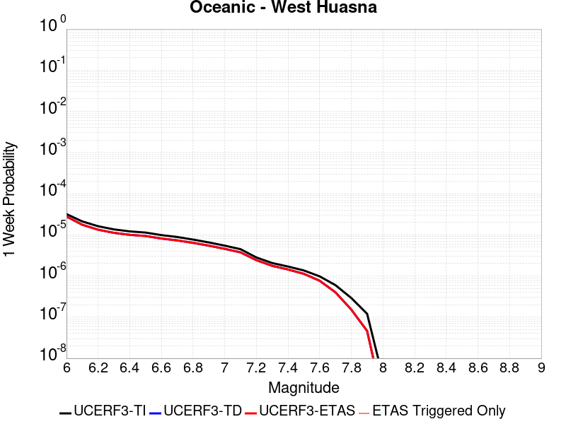 | 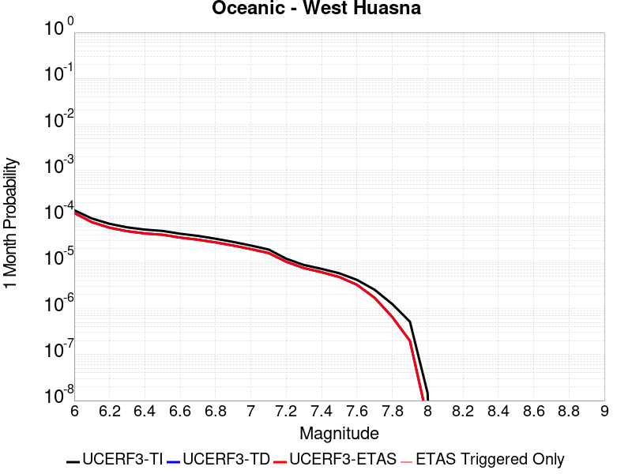 | 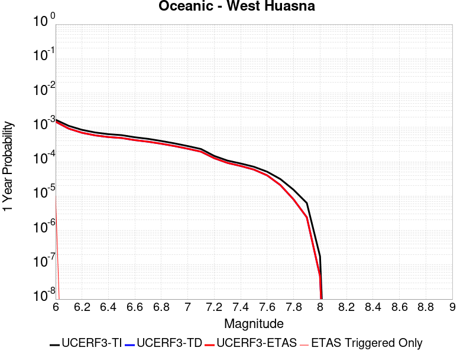 | 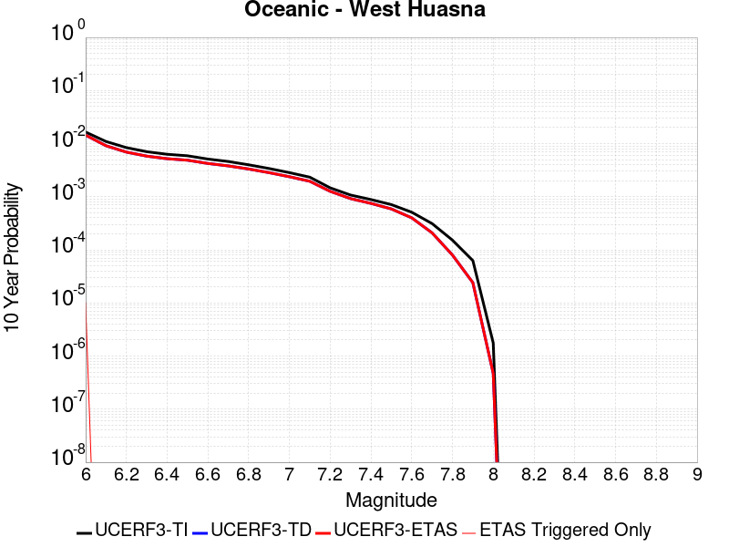 |

| Magnitude | 1 wk TI Prob | 1 wk TD Prob | 1 wk ETAS Prob | 1 wk ETAS/TD Gain | 1 wk ETAS Triggered Only | 1 mo TI Prob | 1 mo TD Prob | 1 mo ETAS Prob | 1 mo ETAS/TD Gain | 1 mo ETAS Triggered Only | 1 yr TI Prob | 1 yr TD Prob | 1 yr ETAS Prob | 1 yr ETAS/TD Gain | 1 yr ETAS Triggered Only | 10 yr TI Prob | 10 yr TD Prob | 10 yr ETAS Prob | 10 yr ETAS/TD Gain | 10 yr ETAS Triggered Only |
|-----|-----|-----|-----|-----|-----|-----|-----|-----|-----|-----|-----|-----|-----|-----|-----|-----|-----|-----|-----|-----|
| 6.0 | 3.195567E-5 | 2.792801E-5 | 2.792801E-5 | 1.0 | 0.0 | 1.3694567E-4 | 1.1968623E-4 | 1.1968623E-4 | 1.0 | 0.0 | 0.0016660384 | 0.0014562489 | 0.0014662343 | 1.0068569 | 1.0E-5 | 0.016536033 | 0.014471616 | 0.014481471 | 1.000681 | 1.0E-5 |
| 6.1 | 2.1156782E-5 | 1.7574157E-5 | 1.7574157E-5 | 1.0 | 0.0 | 9.066878E-5 | 7.53157E-5 | 7.53157E-5 | 1.0 | 0.0 | 0.0011033333 | 9.1659225E-4 | 9.1659225E-4 | 1.0 | 0.0 | 0.010978713 | 0.009129126 | 0.009129126 | 1.0 | 0.0 |
| 6.2 | 1.6195117E-5 | 1.332762E-5 | 1.332762E-5 | 1.0 | 0.0 | 6.9405796E-5 | 5.7117133E-5 | 5.7117133E-5 | 1.0 | 0.0 | 8.44688E-4 | 6.9518184E-4 | 6.9518184E-4 | 1.0 | 0.0 | 0.008414844 | 0.006930365 | 0.006930365 | 1.0 | 0.0 |
| 6.3 | 1.3559345E-5 | 1.1179509E-5 | 1.1179509E-5 | 1.0 | 0.0 | 5.811018E-5 | 4.7911308E-5 | 4.7911308E-5 | 1.0 | 0.0 | 7.072618E-4 | 5.83165E-4 | 5.83165E-4 | 1.0 | 0.0 | 0.0070501505 | 0.0058164652 | 0.0058164652 | 1.0 | 0.0 |
| 6.4 | 1.2120619E-5 | 1.0001292E-5 | 1.0001292E-5 | 1.0 | 0.0 | 5.1944477E-5 | 4.286198E-5 | 4.286198E-5 | 1.0 | 0.0 | 6.322405E-4 | 5.2172015E-4 | 5.2172015E-4 | 1.0 | 0.0 | 0.006304447 | 0.005205021 | 0.005205021 | 1.0 | 0.0 |
| 6.5 | 1.13511915E-5 | 9.3677645E-6 | 9.3677645E-6 | 1.0 | 0.0 | 4.8647056E-5 | 4.0146948E-5 | 4.0146948E-5 | 1.0 | 0.0 | 5.9211696E-4 | 4.886799E-4 | 4.886799E-4 | 1.0 | 0.0 | 0.0059054173 | 0.004876112 | 0.004876112 | 1.0 | 0.0 |
| 6.6 | 9.850605E-6 | 8.135666E-6 | 8.135666E-6 | 1.0 | 0.0 | 4.2216197E-5 | 3.4866673E-5 | 3.4866673E-5 | 1.0 | 0.0 | 5.1386096E-4 | 4.2441927E-4 | 4.2441927E-4 | 1.0 | 0.0 | 0.0051267436 | 0.0042361193 | 0.0042361193 | 1.0 | 0.0 |
| 6.7 | 8.8558645E-6 | 7.3186534E-6 | 7.3186534E-6 | 1.0 | 0.0 | 3.7953152E-5 | 3.136528E-5 | 3.136528E-5 | 1.0 | 0.0 | 4.6198163E-4 | 3.8180556E-4 | 3.8180556E-4 | 1.0 | 0.0 | 0.004610224 | 0.0038115215 | 0.0038115215 | 1.0 | 0.0 |
| 6.8 | 7.67136E-6 | 6.3919483E-6 | 6.3919483E-6 | 1.0 | 0.0 | 3.2876844E-5 | 2.7393779E-5 | 2.7393779E-5 | 1.0 | 0.0 | 4.0020206E-4 | 3.3346837E-4 | 3.3346837E-4 | 1.0 | 0.0 | 0.003994821 | 0.0033297008 | 0.0033297008 | 1.0 | 0.0 |
| 6.9 | 6.534529E-6 | 5.4584953E-6 | 5.4584953E-6 | 1.0 | 0.0 | 2.8004823E-5 | 2.3393342E-5 | 2.3393342E-5 | 1.0 | 0.0 | 3.4090536E-4 | 2.8477685E-4 | 2.8477685E-4 | 1.0 | 0.0 | 0.0034038287 | 0.002844136 | 0.002844136 | 1.0 | 0.0 |
| 7.0 | 5.460525E-6 | 4.570095E-6 | 4.570095E-6 | 1.0 | 0.0 | 2.3402039E-5 | 1.9585976E-5 | 1.9585976E-5 | 1.0 | 0.0 | 2.8488258E-4 | 2.3843326E-4 | 2.3843326E-4 | 1.0 | 0.0 | 0.0028451765 | 0.0023817883 | 0.0023817883 | 1.0 | 0.0 |
| 7.1 | 4.4825083E-6 | 3.7525715E-6 | 3.7525715E-6 | 1.0 | 0.0 | 1.9210609E-5 | 1.6082351E-5 | 1.6082351E-5 | 1.0 | 0.0 | 2.3386406E-4 | 1.9578513E-4 | 1.9578513E-4 | 1.0 | 0.0 | 0.002336181 | 0.0019561385 | 0.0019561385 | 1.0 | 0.0 |
| 7.2 | 2.821708E-6 | 2.4250364E-6 | 2.4250364E-6 | 1.0 | 0.0 | 1.2092979E-5 | 1.03929715E-5 | 1.03929715E-5 | 1.0 | 0.0 | 1.4722206E-4 | 1.265271E-4 | 1.265271E-4 | 1.0 | 0.0 | 0.0014712457 | 0.001264553 | 0.001264553 | 1.0 | 0.0 |
| 7.3 | 2.0644757E-6 | 1.7688327E-6 | 1.7688327E-6 | 1.0 | 0.0 | 8.847723E-6 | 7.5806893E-6 | 7.5806893E-6 | 1.0 | 0.0 | 1.0771569E-4 | 9.229099E-5 | 9.229099E-5 | 1.0 | 0.0 | 0.001076635 | 9.225283E-4 | 9.225283E-4 | 1.0 | 0.0 |
| 7.4 | 1.6980367E-6 | 1.4380759E-6 | 1.4380759E-6 | 1.0 | 0.0 | 7.27728E-6 | 6.1631677E-6 | 6.1631677E-6 | 1.0 | 0.0 | 8.8597284E-5 | 7.503398E-5 | 7.503398E-5 | 1.0 | 0.0 | 8.8561967E-4 | 7.500881E-4 | 7.500881E-4 | 1.0 | 0.0 |
| 7.5 | 1.3637683E-6 | 1.130346E-6 | 1.130346E-6 | 1.0 | 0.0 | 5.844708E-6 | 4.844331E-6 | 4.844331E-6 | 1.0 | 0.0 | 7.1156996E-5 | 5.897814E-5 | 5.897814E-5 | 1.0 | 0.0 | 7.1134215E-4 | 5.896264E-4 | 5.896264E-4 | 1.0 | 0.0 |
| 7.6 | 9.802994E-7 | 7.6780117E-7 | 7.6780117E-7 | 1.0 | 0.0 | 4.2012766E-6 | 3.290572E-6 | 3.290572E-6 | 1.0 | 0.0 | 5.1149345E-5 | 4.006198E-5 | 4.006198E-5 | 1.0 | 0.0 | 5.113757E-4 | 4.00549E-4 | 4.00549E-4 | 1.0 | 0.0 |
| 7.7 | 5.986191E-7 | 4.005761E-7 | 4.005761E-7 | 1.0 | 0.0 | 2.5655079E-6 | 1.7167536E-6 | 1.7167536E-6 | 1.0 | 0.0 | 3.1234613E-5 | 2.0901274E-5 | 2.0901274E-5 | 1.0 | 0.0 | 3.123022E-4 | 2.0899443E-4 | 2.0899443E-4 | 1.0 | 0.0 |
| 7.8 | 2.9189815E-7 | 1.529205E-7 | 1.529205E-7 | 1.0 | 0.0 | 1.2509914E-6 | 6.553734E-7 | 6.553734E-7 | 1.0 | 0.0 | 1.5230714E-5 | 7.9791425E-6 | 7.9791425E-6 | 1.0 | 0.0 | 1.522967E-4 | 7.978987E-5 | 7.978987E-5 | 1.0 | 0.0 |
| 7.9 | 1.2057845E-7 | 4.6247223E-8 | 4.6247223E-8 | 1.0 | 0.0 | 5.1676466E-7 | 1.9820237E-7 | 1.9820237E-7 | 1.0 | 0.0 | 6.2915915E-6 | 2.4131111E-6 | 2.4131111E-6 | 1.0 | 0.0 | 6.2914136E-5 | 2.4132154E-5 | 2.4132154E-5 | 1.0 | 0.0 |
| 8.0 | 3.3806387E-9 | 9.024813E-10 | 9.024813E-10 | 1.0 | 0.0 | 1.4488451E-8 | 3.8677777E-9 | 3.8677777E-9 | 1.0 | 0.0 | 1.7639688E-7 | 4.7090193E-8 | 4.7090193E-8 | 1.0 | 0.0 | 1.7639674E-6 | 4.7199646E-7 | 4.7199646E-7 | 1.0 | 0.0 |

## San Jose
*[(top)](#table-of-contents)*

| 1 Week | 1 Month | 1 Year | 10 Year |
|-----|-----|-----|-----|
| 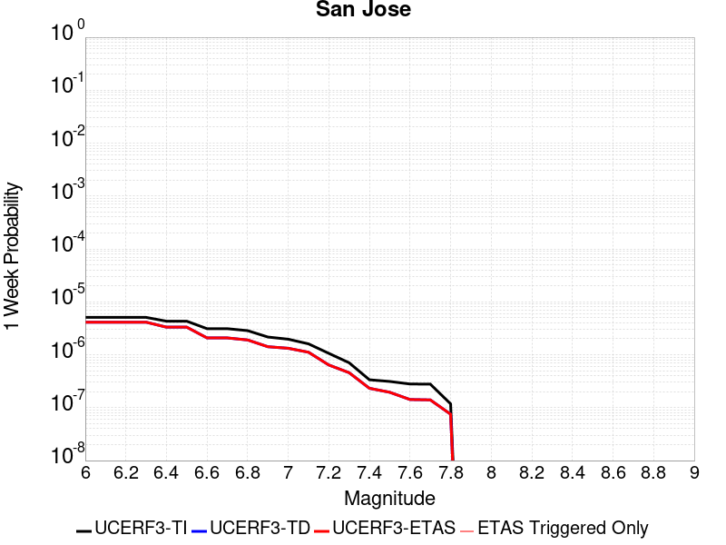 | 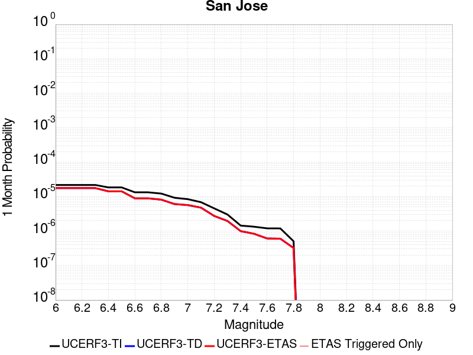 | 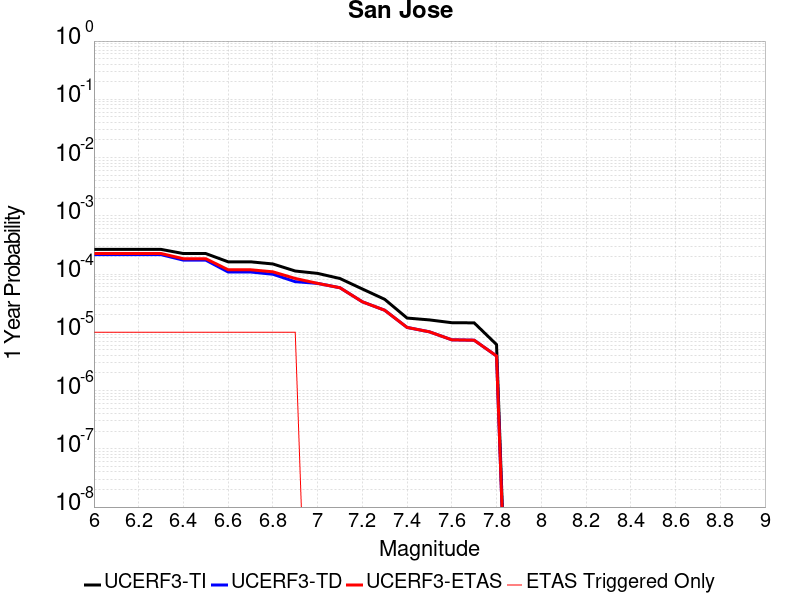 | 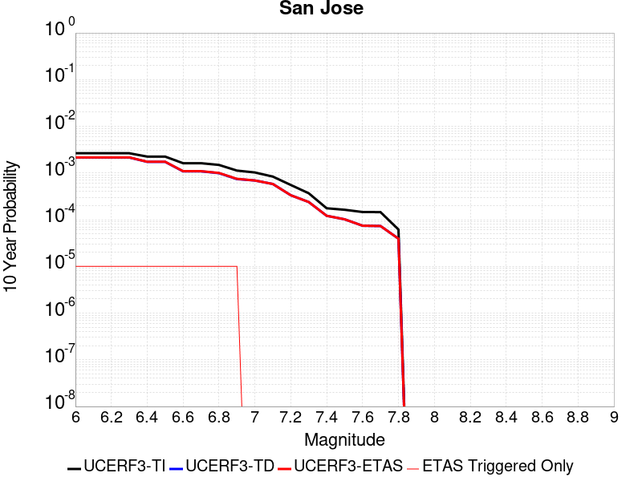 |

| Magnitude | 1 wk TI Prob | 1 wk TD Prob | 1 wk ETAS Prob | 1 wk ETAS/TD Gain | 1 wk ETAS Triggered Only | 1 mo TI Prob | 1 mo TD Prob | 1 mo ETAS Prob | 1 mo ETAS/TD Gain | 1 mo ETAS Triggered Only | 1 yr TI Prob | 1 yr TD Prob | 1 yr ETAS Prob | 1 yr ETAS/TD Gain | 1 yr ETAS Triggered Only | 10 yr TI Prob | 10 yr TD Prob | 10 yr ETAS Prob | 10 yr ETAS/TD Gain | 10 yr ETAS Triggered Only |
|-----|-----|-----|-----|-----|-----|-----|-----|-----|-----|-----|-----|-----|-----|-----|-----|-----|-----|-----|-----|-----|
| 6.0 | 5.0851277E-6 | 4.125986E-6 | 4.125986E-6 | 1.0 | 0.0 | 2.1793223E-5 | 1.768269E-5 | 1.768269E-5 | 1.0 | 0.0 | 2.653002E-4 | 2.1526813E-4 | 2.2526598E-4 | 1.0464437 | 1.0E-5 | 0.0026498367 | 0.0021508872 | 0.0021608656 | 1.0046393 | 1.0E-5 |
| 6.1 | 5.0851277E-6 | 4.125986E-6 | 4.125986E-6 | 1.0 | 0.0 | 2.1793223E-5 | 1.768269E-5 | 1.768269E-5 | 1.0 | 0.0 | 2.653002E-4 | 2.1526813E-4 | 2.2526598E-4 | 1.0464437 | 1.0E-5 | 0.0026498367 | 0.0021508872 | 0.0021608656 | 1.0046393 | 1.0E-5 |
| 6.2 | 5.0851277E-6 | 4.125986E-6 | 4.125986E-6 | 1.0 | 0.0 | 2.1793223E-5 | 1.768269E-5 | 1.768269E-5 | 1.0 | 0.0 | 2.653002E-4 | 2.1526813E-4 | 2.2526598E-4 | 1.0464437 | 1.0E-5 | 0.0026498367 | 0.0021508872 | 0.0021608656 | 1.0046393 | 1.0E-5 |
| 6.3 | 5.0851277E-6 | 4.125986E-6 | 4.125986E-6 | 1.0 | 0.0 | 2.1793223E-5 | 1.768269E-5 | 1.768269E-5 | 1.0 | 0.0 | 2.653002E-4 | 2.1526813E-4 | 2.2526598E-4 | 1.0464437 | 1.0E-5 | 0.0026498367 | 0.0021508872 | 0.0021608656 | 1.0046393 | 1.0E-5 |
| 6.4 | 4.3115124E-6 | 3.3240806E-6 | 3.3240806E-6 | 1.0 | 0.0 | 1.8477778E-5 | 1.4245994E-5 | 1.4245994E-5 | 1.0 | 0.0 | 2.2494372E-4 | 1.734334E-4 | 1.8343165E-4 | 1.057649 | 1.0E-5 | 0.0022471617 | 0.0017332301 | 0.0017432128 | 1.0057596 | 1.0E-5 |
| 6.5 | 4.3115124E-6 | 3.3240806E-6 | 3.3240806E-6 | 1.0 | 0.0 | 1.8477778E-5 | 1.4245994E-5 | 1.4245994E-5 | 1.0 | 0.0 | 2.2494372E-4 | 1.734334E-4 | 1.8343165E-4 | 1.057649 | 1.0E-5 | 0.0022471617 | 0.0017332301 | 0.0017432128 | 1.0057596 | 1.0E-5 |
| 6.6 | 3.110396E-6 | 2.0802606E-6 | 2.0802606E-6 | 1.0 | 0.0 | 1.33302E-5 | 8.915374E-6 | 8.915374E-6 | 1.0 | 0.0 | 1.622831E-4 | 1.0853955E-4 | 1.1853846E-4 | 1.0921223 | 1.0E-5 | 0.0016216465 | 0.0010849254 | 0.0010949145 | 1.0092072 | 1.0E-5 |
| 6.7 | 3.110396E-6 | 2.0802606E-6 | 2.0802606E-6 | 1.0 | 0.0 | 1.33302E-5 | 8.915374E-6 | 8.915374E-6 | 1.0 | 0.0 | 1.622831E-4 | 1.0853955E-4 | 1.1853846E-4 | 1.0921223 | 1.0E-5 | 0.0016216465 | 0.0010849254 | 0.0010949145 | 1.0092072 | 1.0E-5 |
| 6.8 | 2.856651E-6 | 1.9027021E-6 | 1.9027021E-6 | 1.0 | 0.0 | 1.2242733E-5 | 8.154414E-6 | 8.154414E-6 | 1.0 | 0.0 | 1.4904508E-4 | 9.927571E-5 | 1.0927472E-4 | 1.1007196 | 1.0E-5 | 0.0014894515 | 9.923707E-4 | 0.0010023607 | 1.0100669 | 1.0E-5 |
| 6.9 | 2.1618725E-6 | 1.4189131E-6 | 1.4189131E-6 | 1.0 | 0.0 | 9.265135E-6 | 6.0810426E-6 | 6.0810426E-6 | 1.0 | 0.0 | 1.12797185E-4 | 7.4034266E-5 | 8.403353E-5 | 1.1350626 | 1.0E-5 | 0.0011273995 | 7.4013724E-4 | 7.5012987E-4 | 1.013501 | 1.0E-5 |
| 7.0 | 1.9684312E-6 | 1.3258774E-6 | 1.3258774E-6 | 1.0 | 0.0 | 8.436106E-6 | 5.6823196E-6 | 5.6823196E-6 | 1.0 | 0.0 | 1.02704755E-4 | 6.9180125E-5 | 6.9180125E-5 | 1.0 | 0.0 | 0.001026573 | 6.9162657E-4 | 6.9162657E-4 | 1.0 | 0.0 |
| 7.1 | 1.6070337E-6 | 1.1157406E-6 | 1.1157406E-6 | 1.0 | 0.0 | 6.887269E-6 | 4.781737E-6 | 4.781737E-6 | 1.0 | 0.0 | 8.384928E-5 | 5.8216156E-5 | 5.8216156E-5 | 1.0 | 0.0 | 8.3817646E-4 | 5.8204774E-4 | 5.8204774E-4 | 1.0 | 0.0 |
| 7.2 | 1.0631658E-6 | 6.405485E-7 | 6.405485E-7 | 1.0 | 0.0 | 4.556417E-6 | 2.745205E-6 | 2.745205E-6 | 1.0 | 0.0 | 5.5472963E-5 | 3.342237E-5 | 3.342237E-5 | 1.0 | 0.0 | 5.545912E-4 | 3.3420732E-4 | 3.3420732E-4 | 1.0 | 0.0 |
| 7.3 | 7.060711E-7 | 4.5838595E-7 | 4.5838595E-7 | 1.0 | 0.0 | 3.0260155E-6 | 1.9645097E-6 | 1.9645097E-6 | 1.0 | 0.0 | 3.6841117E-5 | 2.3917653E-5 | 2.3917653E-5 | 1.0 | 0.0 | 3.6835007E-4 | 2.3918417E-4 | 2.3918417E-4 | 1.0 | 0.0 |
| 7.4 | 3.3677085E-7 | 2.3243108E-7 | 2.3243108E-7 | 1.0 | 0.0 | 1.4433028E-6 | 9.961328E-7 | 9.961328E-7 | 1.0 | 0.0 | 1.757207E-5 | 1.2127853E-5 | 1.2127853E-5 | 1.0 | 0.0 | 1.7570681E-4 | 1.21304685E-4 | 1.21304685E-4 | 1.0 | 0.0 |
| 7.5 | 3.129161E-7 | 1.9539081E-7 | 1.9539081E-7 | 1.0 | 0.0 | 1.3410682E-6 | 8.3738894E-7 | 8.3738894E-7 | 1.0 | 0.0 | 1.6327383E-5 | 1.0195165E-5 | 1.0195165E-5 | 1.0 | 0.0 | 1.6326184E-4 | 1.019797E-4 | 1.019797E-4 | 1.0 | 0.0 |
| 7.6 | 2.8008668E-7 | 1.4247968E-7 | 1.4247968E-7 | 1.0 | 0.0 | 1.2003709E-6 | 6.1062707E-7 | 6.1062707E-7 | 1.0 | 0.0 | 1.46144175E-5 | 7.434361E-6 | 7.434361E-6 | 1.0 | 0.0 | 1.4613457E-4 | 7.437373E-5 | 7.437373E-5 | 1.0 | 0.0 |
| 7.7 | 2.7852005E-7 | 1.402248E-7 | 1.402248E-7 | 1.0 | 0.0 | 1.1936568E-6 | 6.009633E-7 | 6.009633E-7 | 1.0 | 0.0 | 1.4532674E-5 | 7.3167053E-6 | 7.3167053E-6 | 1.0 | 0.0 | 1.4531724E-4 | 7.319726E-5 | 7.319726E-5 | 1.0 | 0.0 |
| 7.8 | 1.1810797E-7 | 7.5213165E-8 | 7.5213165E-8 | 1.0 | 0.0 | 5.0617695E-7 | 3.2234212E-7 | 3.2234212E-7 | 1.0 | 0.0 | 6.1626865E-6 | 3.9245087E-6 | 3.9245087E-6 | 1.0 | 0.0 | 6.162516E-5 | 3.9262773E-5 | 3.9262773E-5 | 1.0 | 0.0 |

## Lake Isabella (Seismicity)
*[(top)](#table-of-contents)*

| 1 Week | 1 Month | 1 Year | 10 Year |
|-----|-----|-----|-----|
|  |  |  | 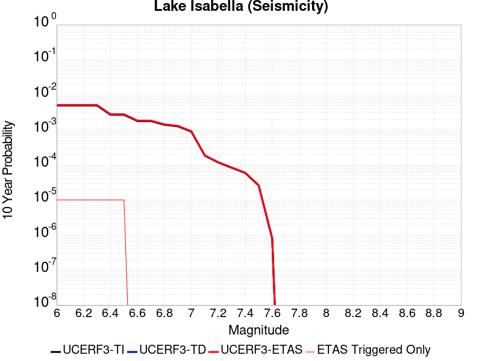 |

| Magnitude | 1 wk TI Prob | 1 wk TD Prob | 1 wk ETAS Prob | 1 wk ETAS/TD Gain | 1 wk ETAS Triggered Only | 1 mo TI Prob | 1 mo TD Prob | 1 mo ETAS Prob | 1 mo ETAS/TD Gain | 1 mo ETAS Triggered Only | 1 yr TI Prob | 1 yr TD Prob | 1 yr ETAS Prob | 1 yr ETAS/TD Gain | 1 yr ETAS Triggered Only | 10 yr TI Prob | 10 yr TD Prob | 10 yr ETAS Prob | 10 yr ETAS/TD Gain | 10 yr ETAS Triggered Only |
|-----|-----|-----|-----|-----|-----|-----|-----|-----|-----|-----|-----|-----|-----|-----|-----|-----|-----|-----|-----|-----|
| 6.0 | 9.431637E-6 | 9.7418215E-6 | 9.7418215E-6 | 1.0 | 0.0 | 4.0420677E-5 | 4.175007E-5 | 4.175007E-5 | 1.0 | 0.0 | 4.920106E-4 | 5.082016E-4 | 5.082016E-4 | 1.0 | 0.0 | 0.004909227 | 0.005071687 | 0.0050816364 | 1.0019617 | 1.0E-5 |
| 6.1 | 9.431637E-6 | 9.7418215E-6 | 9.7418215E-6 | 1.0 | 0.0 | 4.0420677E-5 | 4.175007E-5 | 4.175007E-5 | 1.0 | 0.0 | 4.920106E-4 | 5.082016E-4 | 5.082016E-4 | 1.0 | 0.0 | 0.004909227 | 0.005071687 | 0.0050816364 | 1.0019617 | 1.0E-5 |
| 6.2 | 9.431637E-6 | 9.7418215E-6 | 9.7418215E-6 | 1.0 | 0.0 | 4.0420677E-5 | 4.175007E-5 | 4.175007E-5 | 1.0 | 0.0 | 4.920106E-4 | 5.082016E-4 | 5.082016E-4 | 1.0 | 0.0 | 0.004909227 | 0.005071687 | 0.0050816364 | 1.0019617 | 1.0E-5 |
| 6.3 | 9.431637E-6 | 9.7418215E-6 | 9.7418215E-6 | 1.0 | 0.0 | 4.0420677E-5 | 4.175007E-5 | 4.175007E-5 | 1.0 | 0.0 | 4.920106E-4 | 5.082016E-4 | 5.082016E-4 | 1.0 | 0.0 | 0.004909227 | 0.005071687 | 0.0050816364 | 1.0019617 | 1.0E-5 |
| 6.4 | 5.144063E-6 | 5.3001613E-6 | 5.3001613E-6 | 1.0 | 0.0 | 2.2045799E-5 | 2.27148E-5 | 2.27148E-5 | 1.0 | 0.0 | 2.6837454E-4 | 2.7652105E-4 | 2.7652105E-4 | 1.0 | 0.0 | 0.0026805066 | 0.0027621102 | 0.0027720826 | 1.0036104 | 1.0E-5 |
| 6.5 | 5.144063E-6 | 5.3001613E-6 | 5.3001613E-6 | 1.0 | 0.0 | 2.2045799E-5 | 2.27148E-5 | 2.27148E-5 | 1.0 | 0.0 | 2.6837454E-4 | 2.7652105E-4 | 2.7652105E-4 | 1.0 | 0.0 | 0.0026805066 | 0.0027621102 | 0.0027720826 | 1.0036104 | 1.0E-5 |
| 6.6 | 3.4009804E-6 | 3.4988395E-6 | 3.4988395E-6 | 1.0 | 0.0 | 1.4575549E-5 | 1.4994949E-5 | 1.4994949E-5 | 1.0 | 0.0 | 1.7744285E-4 | 1.8254982E-4 | 1.8254982E-4 | 1.0 | 0.0 | 0.0017730123 | 0.0018241564 | 0.0018241564 | 1.0 | 0.0 |
| 6.7 | 3.3880428E-6 | 3.485706E-6 | 3.485706E-6 | 1.0 | 0.0 | 1.4520103E-5 | 1.4938664E-5 | 1.4938664E-5 | 1.0 | 0.0 | 1.767679E-4 | 1.8186466E-4 | 1.8186466E-4 | 1.0 | 0.0 | 0.0017662736 | 0.0018173159 | 0.0018173159 | 1.0 | 0.0 |
| 6.8 | 2.6582E-6 | 2.7337414E-6 | 2.7337414E-6 | 1.0 | 0.0 | 1.1392236E-5 | 1.171599E-5 | 1.171599E-5 | 1.0 | 0.0 | 1.3869164E-4 | 1.4263418E-4 | 1.4263418E-4 | 1.0 | 0.0 | 0.0013860512 | 0.0014255584 | 0.0014255584 | 1.0 | 0.0 |
| 6.9 | 2.406011E-6 | 2.474366E-6 | 2.474366E-6 | 1.0 | 0.0 | 1.0311434E-5 | 1.0604391E-5 | 1.0604391E-5 | 1.0 | 0.0 | 1.2553448E-4 | 1.2910213E-4 | 1.2910213E-4 | 1.0 | 0.0 | 0.0012546359 | 0.0012904009 | 0.0012904009 | 1.0 | 0.0 |
| 7.0 | 1.6953097E-6 | 1.7429631E-6 | 1.7429631E-6 | 1.0 | 0.0 | 7.265593E-6 | 7.469827E-6 | 7.469827E-6 | 1.0 | 0.0 | 8.8455E-5 | 9.094239E-5 | 9.094239E-5 | 1.0 | 0.0 | 8.84198E-4 | 9.0915454E-4 | 9.0915454E-4 | 1.0 | 0.0 |
| 7.1 | 3.5013824E-7 | 3.5715203E-7 | 3.5715203E-7 | 1.0 | 0.0 | 1.5005916E-6 | 1.5306507E-6 | 1.5306507E-6 | 1.0 | 0.0 | 1.826955E-5 | 1.8635516E-5 | 1.8635516E-5 | 1.0 | 0.0 | 1.8268047E-4 | 1.8633978E-4 | 1.8633978E-4 | 1.0 | 0.0 |
| 7.2 | 2.2321095E-7 | 2.2750805E-7 | 2.2750805E-7 | 1.0 | 0.0 | 9.56618E-7 | 9.750341E-7 | 9.750341E-7 | 1.0 | 0.0 | 1.1646762E-5 | 1.1870978E-5 | 1.1870978E-5 | 1.0 | 0.0 | 1.1646151E-4 | 1.1870354E-4 | 1.1870354E-4 | 1.0 | 0.0 |
| 7.3 | 1.5760406E-7 | 1.6061085E-7 | 1.6061085E-7 | 1.0 | 0.0 | 6.7544585E-7 | 6.88332E-7 | 6.88332E-7 | 1.0 | 0.0 | 8.223522E-6 | 8.380411E-6 | 8.380411E-6 | 1.0 | 0.0 | 8.2232174E-5 | 8.380101E-5 | 8.380101E-5 | 1.0 | 0.0 |
| 7.4 | 1.1216497E-7 | 1.14318226E-7 | 1.14318226E-7 | 1.0 | 0.0 | 4.8070694E-7 | 4.899352E-7 | 4.899352E-7 | 1.0 | 0.0 | 5.852591E-6 | 5.9649446E-6 | 5.9649446E-6 | 1.0 | 0.0 | 5.8524372E-5 | 5.964789E-5 | 5.964789E-5 | 1.0 | 0.0 |
| 7.5 | 4.885185E-8 | 4.9788245E-8 | 4.9788245E-8 | 1.0 | 0.0 | 2.0936506E-7 | 2.1337817E-7 | 2.1337817E-7 | 1.0 | 0.0 | 2.5490165E-6 | 2.5978763E-6 | 2.5978763E-6 | 1.0 | 0.0 | 2.5489873E-5 | 2.5978477E-5 | 2.5978477E-5 | 1.0 | 0.0 |
| 7.6 | 1.504641E-9 | 1.5318049E-9 | 1.5318049E-9 | 1.0 | 0.0 | 6.4484613E-9 | 6.5648784E-9 | 6.5648784E-9 | 1.0 | 0.0 | 7.851001E-8 | 7.9927396E-8 | 7.9927396E-8 | 1.0 | 0.0 | 7.8509987E-7 | 7.9927395E-7 | 7.9927395E-7 | 1.0 | 0.0 |

## White Mountains
*[(top)](#table-of-contents)*

| 1 Week | 1 Month | 1 Year | 10 Year |
|-----|-----|-----|-----|
| 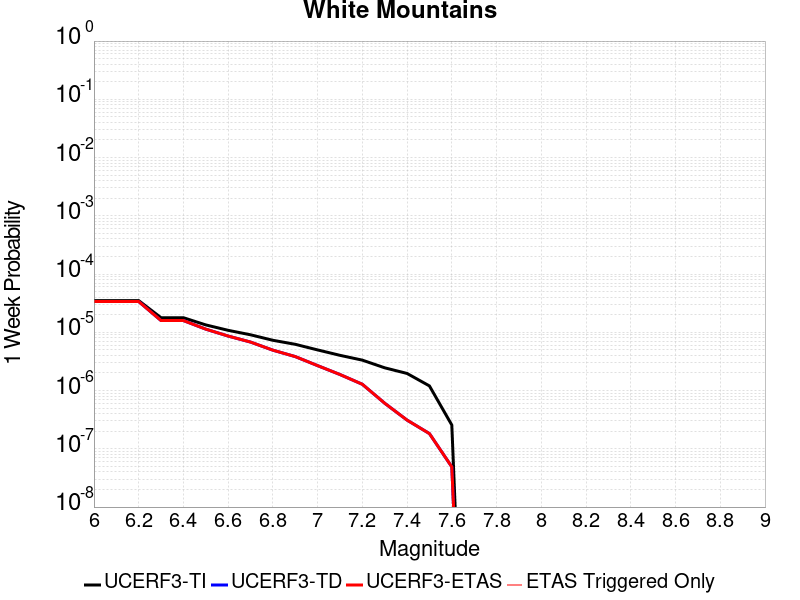 | 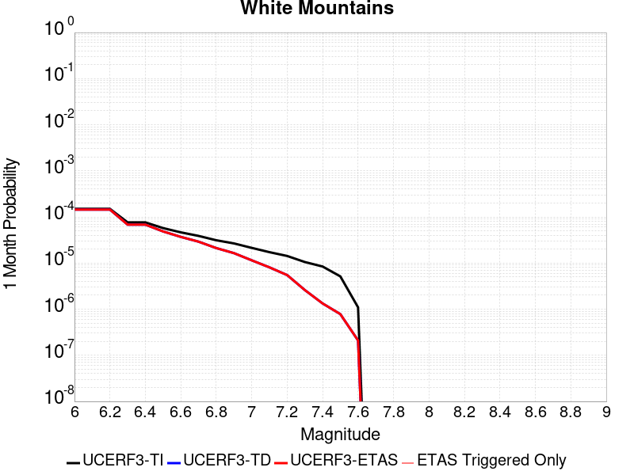 | 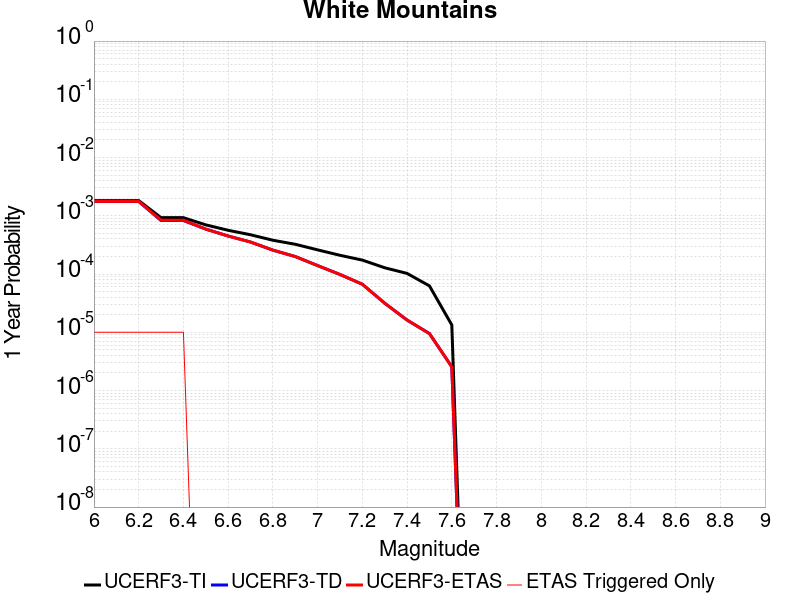 | 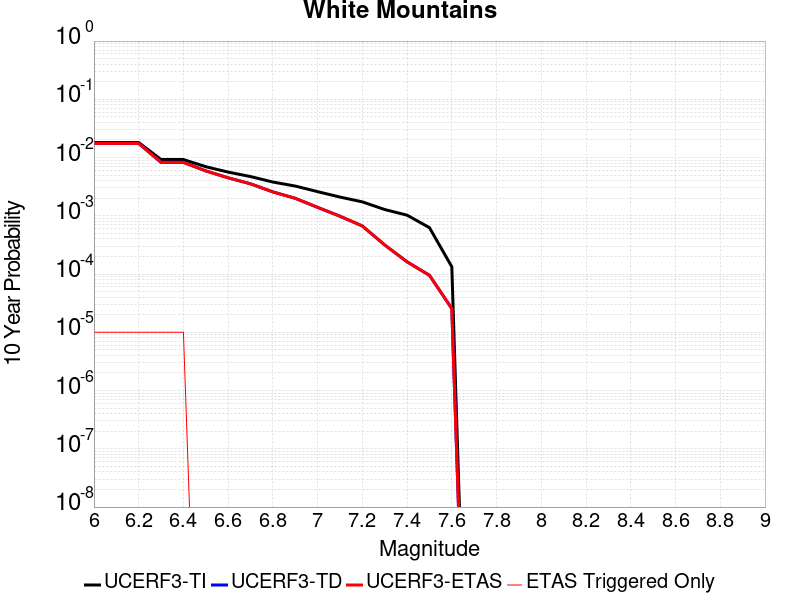 |

| Magnitude | 1 wk TI Prob | 1 wk TD Prob | 1 wk ETAS Prob | 1 wk ETAS/TD Gain | 1 wk ETAS Triggered Only | 1 mo TI Prob | 1 mo TD Prob | 1 mo ETAS Prob | 1 mo ETAS/TD Gain | 1 mo ETAS Triggered Only | 1 yr TI Prob | 1 yr TD Prob | 1 yr ETAS Prob | 1 yr ETAS/TD Gain | 1 yr ETAS Triggered Only | 10 yr TI Prob | 10 yr TD Prob | 10 yr ETAS Prob | 10 yr ETAS/TD Gain | 10 yr ETAS Triggered Only |
|-----|-----|-----|-----|-----|-----|-----|-----|-----|-----|-----|-----|-----|-----|-----|-----|-----|-----|-----|-----|-----|
| 6.0 | 3.503579E-5 | 3.378569E-5 | 3.378569E-5 | 1.0 | 0.0 | 1.5014476E-4 | 1.4478847E-4 | 1.4478847E-4 | 1.0 | 0.0 | 0.0018264796 | 0.001761495 | 0.0017714774 | 1.005667 | 1.0E-5 | 0.018115403 | 0.017487662 | 0.017497486 | 1.0005618 | 1.0E-5 |
| 6.1 | 3.503579E-5 | 3.378569E-5 | 3.378569E-5 | 1.0 | 0.0 | 1.5014476E-4 | 1.4478847E-4 | 1.4478847E-4 | 1.0 | 0.0 | 0.0018264796 | 0.001761495 | 0.0017714774 | 1.005667 | 1.0E-5 | 0.018115403 | 0.017487662 | 0.017497486 | 1.0005618 | 1.0E-5 |
| 6.2 | 3.503579E-5 | 3.378569E-5 | 3.378569E-5 | 1.0 | 0.0 | 1.5014476E-4 | 1.4478847E-4 | 1.4478847E-4 | 1.0 | 0.0 | 0.0018264796 | 0.001761495 | 0.0017714774 | 1.005667 | 1.0E-5 | 0.018115403 | 0.017487662 | 0.017497486 | 1.0005618 | 1.0E-5 |
| 6.3 | 1.7818425E-5 | 1.5916867E-5 | 1.5916867E-5 | 1.0 | 0.0 | 7.636245E-5 | 6.821344E-5 | 6.821344E-5 | 1.0 | 0.0 | 9.293162E-4 | 8.301964E-4 | 8.401881E-4 | 1.0120354 | 1.0E-5 | 0.009254395 | 0.0082724085 | 0.008282326 | 1.0011989 | 1.0E-5 |
| 6.4 | 1.7818425E-5 | 1.5916867E-5 | 1.5916867E-5 | 1.0 | 0.0 | 7.636245E-5 | 6.821344E-5 | 6.821344E-5 | 1.0 | 0.0 | 9.293162E-4 | 8.301964E-4 | 8.401881E-4 | 1.0120354 | 1.0E-5 | 0.009254395 | 0.0082724085 | 0.008282326 | 1.0011989 | 1.0E-5 |
| 6.5 | 1.3397557E-5 | 1.1336862E-5 | 1.1336862E-5 | 1.0 | 0.0 | 5.741684E-5 | 4.8585687E-5 | 4.8585687E-5 | 1.0 | 0.0 | 6.988258E-4 | 5.9137715E-4 | 5.9137715E-4 | 1.0 | 0.0 | 0.006966323 | 0.00589874 | 0.00589874 | 1.0 | 0.0 |
| 6.6 | 1.0818695E-5 | 8.625775E-6 | 8.625775E-6 | 1.0 | 0.0 | 4.6365014E-5 | 3.696711E-5 | 3.696711E-5 | 1.0 | 0.0 | 5.6434784E-4 | 4.4998596E-4 | 4.4998596E-4 | 1.0 | 0.0 | 0.005629168 | 0.004491185 | 0.004491185 | 1.0 | 0.0 |
| 6.7 | 9.067908E-6 | 6.8027375E-6 | 6.8027375E-6 | 1.0 | 0.0 | 3.8861883E-5 | 2.9154282E-5 | 2.9154282E-5 | 1.0 | 0.0 | 4.7304068E-4 | 3.5489874E-4 | 3.5489874E-4 | 1.0 | 0.0 | 0.00472035 | 0.003543637 | 0.003543637 | 1.0 | 0.0 |
| 6.8 | 7.295947E-6 | 4.9365945E-6 | 4.9365945E-6 | 1.0 | 0.0 | 3.126797E-5 | 2.1156668E-5 | 2.1156668E-5 | 1.0 | 0.0 | 3.8062103E-4 | 2.5755313E-4 | 2.5755313E-4 | 1.0 | 0.0 | 0.0037996976 | 0.0025726592 | 0.0025726592 | 1.0 | 0.0 |
| 6.9 | 6.2243444E-6 | 3.83238E-6 | 3.83238E-6 | 1.0 | 0.0 | 2.6675489E-5 | 1.6424385E-5 | 1.6424385E-5 | 1.0 | 0.0 | 3.2472567E-4 | 1.9994906E-4 | 1.9994906E-4 | 1.0 | 0.0 | 0.0032425157 | 0.0019977444 | 0.0019977444 | 1.0 | 0.0 |
| 7.0 | 4.9878413E-6 | 2.6796765E-6 | 2.6796765E-6 | 1.0 | 0.0 | 2.1376287E-5 | 1.1484279E-5 | 1.1484279E-5 | 1.0 | 0.0 | 2.602252E-4 | 1.3981239E-4 | 1.3981239E-4 | 1.0 | 0.0 | 0.002599207 | 0.0013972705 | 0.0013972705 | 1.0 | 0.0 |
| 7.1 | 4.0252844E-6 | 1.8858877E-6 | 1.8858877E-6 | 1.0 | 0.0 | 1.7251105E-5 | 8.082352E-6 | 8.082352E-6 | 1.0 | 0.0 | 2.1001195E-4 | 9.839832E-5 | 9.839832E-5 | 1.0 | 0.0 | 0.0020981359 | 9.835603E-4 | 9.835603E-4 | 1.0 | 0.0 |
| 7.2 | 3.3284066E-6 | 1.2820851E-6 | 1.2820851E-6 | 1.0 | 0.0 | 1.4264522E-5 | 5.49464E-6 | 5.49464E-6 | 1.0 | 0.0 | 1.736567E-4 | 6.6895285E-5 | 6.6895285E-5 | 1.0 | 0.0 | 0.0017352107 | 6.6876155E-4 | 6.6876155E-4 | 1.0 | 0.0 |
| 7.3 | 2.458226E-6 | 6.058311E-7 | 6.058311E-7 | 1.0 | 0.0 | 1.0535211E-5 | 2.5964166E-6 | 2.5964166E-6 | 1.0 | 0.0 | 1.2825865E-4 | 3.161095E-5 | 3.161095E-5 | 1.0 | 0.0 | 0.0012818464 | 3.160683E-4 | 3.160683E-4 | 1.0 | 0.0 |
| 7.4 | 1.965953E-6 | 3.1098764E-7 | 3.1098764E-7 | 1.0 | 0.0 | 8.425486E-6 | 1.3328034E-6 | 1.3328034E-6 | 1.0 | 0.0 | 1.0257547E-4 | 1.6226762E-5 | 1.6226762E-5 | 1.0 | 0.0 | 0.0010252813 | 1.622559E-4 | 1.622559E-4 | 1.0 | 0.0 |
| 7.5 | 1.2014192E-6 | 1.8250802E-7 | 1.8250802E-7 | 1.0 | 0.0 | 5.148929E-6 | 7.82177E-7 | 7.82177E-7 | 1.0 | 0.0 | 6.2686406E-5 | 9.522963E-6 | 9.522963E-6 | 1.0 | 0.0 | 6.266873E-4 | 9.522564E-5 | 9.522564E-5 | 1.0 | 0.0 |
| 7.6 | 2.5612175E-7 | 4.8963752E-8 | 4.8963752E-8 | 1.0 | 0.0 | 1.0976642E-6 | 2.0984464E-7 | 2.0984464E-7 | 1.0 | 0.0 | 1.3363979E-5 | 2.5548559E-6 | 2.5548559E-6 | 1.0 | 0.0 | 1.3363175E-4 | 2.5548301E-5 | 2.5548301E-5 | 1.0 | 0.0 |

## San Jacinto (Lytle Creek connector)
*[(top)](#table-of-contents)*

| 1 Week | 1 Month | 1 Year | 10 Year |
|-----|-----|-----|-----|
|  | 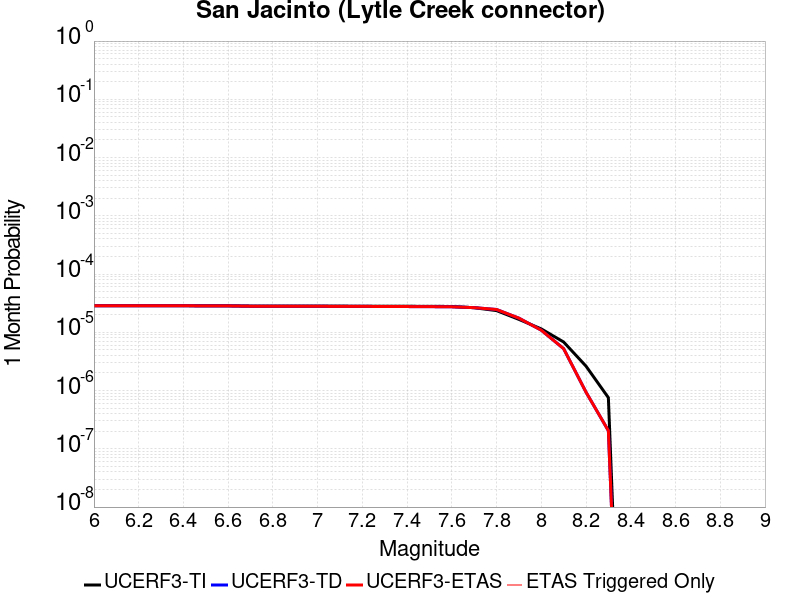 |  |  |

| Magnitude | 1 wk TI Prob | 1 wk TD Prob | 1 wk ETAS Prob | 1 wk ETAS/TD Gain | 1 wk ETAS Triggered Only | 1 mo TI Prob | 1 mo TD Prob | 1 mo ETAS Prob | 1 mo ETAS/TD Gain | 1 mo ETAS Triggered Only | 1 yr TI Prob | 1 yr TD Prob | 1 yr ETAS Prob | 1 yr ETAS/TD Gain | 1 yr ETAS Triggered Only | 10 yr TI Prob | 10 yr TD Prob | 10 yr ETAS Prob | 10 yr ETAS/TD Gain | 10 yr ETAS Triggered Only |
|-----|-----|-----|-----|-----|-----|-----|-----|-----|-----|-----|-----|-----|-----|-----|-----|-----|-----|-----|-----|-----|
| 6.0 | 6.693995E-6 | 6.6710027E-6 | 6.6710027E-6 | 1.0 | 0.0 | 2.8688235E-5 | 2.8589699E-5 | 2.8589699E-5 | 1.0 | 0.0 | 3.492233E-4 | 3.4802407E-4 | 3.580206E-4 | 1.0287236 | 1.0E-5 | 0.00348675 | 0.0035549873 | 0.0035649517 | 1.002803 | 1.0E-5 |
| 6.1 | 6.693995E-6 | 6.6710027E-6 | 6.6710027E-6 | 1.0 | 0.0 | 2.8688235E-5 | 2.8589699E-5 | 2.8589699E-5 | 1.0 | 0.0 | 3.492233E-4 | 3.4802407E-4 | 3.580206E-4 | 1.0287236 | 1.0E-5 | 0.00348675 | 0.0035549873 | 0.0035649517 | 1.002803 | 1.0E-5 |
| 6.2 | 6.693995E-6 | 6.6710027E-6 | 6.6710027E-6 | 1.0 | 0.0 | 2.8688235E-5 | 2.8589699E-5 | 2.8589699E-5 | 1.0 | 0.0 | 3.492233E-4 | 3.4802407E-4 | 3.580206E-4 | 1.0287236 | 1.0E-5 | 0.00348675 | 0.0035549873 | 0.0035649517 | 1.002803 | 1.0E-5 |
| 6.3 | 6.693995E-6 | 6.6710027E-6 | 6.6710027E-6 | 1.0 | 0.0 | 2.8688235E-5 | 2.8589699E-5 | 2.8589699E-5 | 1.0 | 0.0 | 3.492233E-4 | 3.4802407E-4 | 3.580206E-4 | 1.0287236 | 1.0E-5 | 0.00348675 | 0.0035549873 | 0.0035649517 | 1.002803 | 1.0E-5 |
| 6.4 | 6.693995E-6 | 6.6710027E-6 | 6.6710027E-6 | 1.0 | 0.0 | 2.8688235E-5 | 2.8589699E-5 | 2.8589699E-5 | 1.0 | 0.0 | 3.492233E-4 | 3.4802407E-4 | 3.580206E-4 | 1.0287236 | 1.0E-5 | 0.00348675 | 0.0035549873 | 0.0035649517 | 1.002803 | 1.0E-5 |
| 6.5 | 6.6561875E-6 | 6.63122E-6 | 6.63122E-6 | 1.0 | 0.0 | 2.8526205E-5 | 2.8419205E-5 | 2.8419205E-5 | 1.0 | 0.0 | 3.472512E-4 | 3.4594897E-4 | 3.559455E-4 | 1.028896 | 1.0E-5 | 0.0034670907 | 0.0035343023 | 0.003544267 | 1.0028194 | 1.0E-5 |
| 6.6 | 6.6561875E-6 | 6.63122E-6 | 6.63122E-6 | 1.0 | 0.0 | 2.8526205E-5 | 2.8419205E-5 | 2.8419205E-5 | 1.0 | 0.0 | 3.472512E-4 | 3.4594897E-4 | 3.559455E-4 | 1.028896 | 1.0E-5 | 0.0034670907 | 0.0035343023 | 0.003544267 | 1.0028194 | 1.0E-5 |
| 6.7 | 6.5802237E-6 | 6.550394E-6 | 6.550394E-6 | 1.0 | 0.0 | 2.8200653E-5 | 2.8072815E-5 | 2.8072815E-5 | 1.0 | 0.0 | 3.4328885E-4 | 3.41733E-4 | 3.5172957E-4 | 1.0292526 | 1.0E-5 | 0.0034275902 | 0.0034922757 | 0.0035022406 | 1.0028535 | 1.0E-5 |
| 6.8 | 6.575632E-6 | 6.544883E-6 | 6.544883E-6 | 1.0 | 0.0 | 2.8180975E-5 | 2.8049197E-5 | 2.8049197E-5 | 1.0 | 0.0 | 3.4304935E-4 | 3.4144553E-4 | 3.514421E-4 | 1.0292772 | 1.0E-5 | 0.0034252026 | 0.00348941 | 0.0034993752 | 1.0028558 | 1.0E-5 |
| 6.9 | 6.570433E-6 | 6.5362756E-6 | 6.5362756E-6 | 1.0 | 0.0 | 2.8158694E-5 | 2.801231E-5 | 2.801231E-5 | 1.0 | 0.0 | 3.4277816E-4 | 3.4099657E-4 | 3.5099316E-4 | 1.0293158 | 1.0E-5 | 0.0034224992 | 0.0034849346 | 0.0034948997 | 1.0028595 | 1.0E-5 |
| 7.0 | 6.5643826E-6 | 6.526395E-6 | 6.526395E-6 | 1.0 | 0.0 | 2.8132765E-5 | 2.7969963E-5 | 2.7969963E-5 | 1.0 | 0.0 | 3.424626E-4 | 3.4048117E-4 | 3.5047776E-4 | 1.0293602 | 1.0E-5 | 0.0034193532 | 0.0034797967 | 0.003489762 | 1.0028638 | 1.0E-5 |
| 7.1 | 6.557402E-6 | 6.515105E-6 | 6.515105E-6 | 1.0 | 0.0 | 2.8102848E-5 | 2.792158E-5 | 2.792158E-5 | 1.0 | 0.0 | 3.4209844E-4 | 3.3989229E-4 | 3.4988887E-4 | 1.0294111 | 1.0E-5 | 0.0034157229 | 0.0034739273 | 0.0034838924 | 1.0028685 | 1.0E-5 |
| 7.2 | 6.546394E-6 | 6.4970677E-6 | 6.4970677E-6 | 1.0 | 0.0 | 2.8055672E-5 | 2.784428E-5 | 2.784428E-5 | 1.0 | 0.0 | 3.4152428E-4 | 3.3895145E-4 | 3.4894806E-4 | 1.0294927 | 1.0E-5 | 0.0034099987 | 0.0034645528 | 0.0034745182 | 1.0028764 | 1.0E-5 |
| 7.3 | 6.5364216E-6 | 6.477847E-6 | 6.477847E-6 | 1.0 | 0.0 | 2.8012933E-5 | 2.7761906E-5 | 2.7761906E-5 | 1.0 | 0.0 | 3.4100408E-4 | 3.3794885E-4 | 3.4794546E-4 | 1.0295802 | 1.0E-5 | 0.003404813 | 0.003454571 | 0.0034645363 | 1.0028847 | 1.0E-5 |
| 7.4 | 6.5269523E-6 | 6.4589262E-6 | 6.4589262E-6 | 1.0 | 0.0 | 2.7972354E-5 | 2.7680819E-5 | 2.7680819E-5 | 1.0 | 0.0 | 3.4051016E-4 | 3.3696194E-4 | 3.4695855E-4 | 1.0296669 | 1.0E-5 | 0.0033998888 | 0.003444749 | 0.0034547145 | 1.002893 | 1.0E-5 |
| 7.5 | 6.5111835E-6 | 6.435192E-6 | 6.435192E-6 | 1.0 | 0.0 | 2.7904773E-5 | 2.7579103E-5 | 2.7579103E-5 | 1.0 | 0.0 | 3.3968766E-4 | 3.3572392E-4 | 3.4572056E-4 | 1.0297763 | 1.0E-5 | 0.0033916887 | 0.003432418 | 0.0034423836 | 1.0029033 | 1.0E-5 |
| 7.6 | 6.4768806E-6 | 6.3942884E-6 | 6.3942884E-6 | 1.0 | 0.0 | 2.7757764E-5 | 2.7403805E-5 | 2.7403805E-5 | 1.0 | 0.0 | 3.3789838E-4 | 3.3359032E-4 | 3.43587E-4 | 1.0299668 | 1.0E-5 | 0.0033738504 | 0.0034111436 | 0.0034211094 | 1.0029216 | 1.0E-5 |
| 7.7 | 6.1655364E-6 | 6.1866886E-6 | 6.1866886E-6 | 1.0 | 0.0 | 2.642346E-5 | 2.651411E-5 | 2.651411E-5 | 1.0 | 0.0 | 3.2165812E-4 | 3.2276154E-4 | 3.327583E-4 | 1.0309726 | 1.0E-5 | 0.0032119295 | 0.0033027146 | 0.0033126816 | 1.0030178 | 1.0E-5 |
| 7.8 | 5.5043524E-6 | 5.747449E-6 | 5.747449E-6 | 1.0 | 0.0 | 2.3589868E-5 | 2.4631692E-5 | 2.4631692E-5 | 1.0 | 0.0 | 2.871688E-4 | 2.9984963E-4 | 3.0984663E-4 | 1.0333401 | 1.0E-5 | 0.0028679797 | 0.0030726613 | 0.0030826307 | 1.0032445 | 1.0E-5 |
| 7.9 | 3.889249E-6 | 4.0851965E-6 | 4.0851965E-6 | 1.0 | 0.0 | 1.6668104E-5 | 1.7507866E-5 | 1.7507866E-5 | 1.0 | 0.0 | 2.0291525E-4 | 2.1313746E-4 | 2.2313533E-4 | 1.046908 | 1.0E-5 | 0.0020273007 | 0.0021987387 | 0.0022087167 | 1.004538 | 1.0E-5 |
| 8.0 | 2.668535E-6 | 2.537347E-6 | 2.537347E-6 | 1.0 | 0.0 | 1.1436528E-5 | 1.0874299E-5 | 1.0874299E-5 | 1.0 | 0.0 | 1.3923083E-4 | 1.3238657E-4 | 1.4238524E-4 | 1.0755264 | 1.0E-5 | 0.0013914363 | 0.0013788831 | 0.0013888694 | 1.0072422 | 1.0E-5 |
| 8.1 | 1.5911459E-6 | 1.2217948E-6 | 1.2217948E-6 | 1.0 | 0.0 | 6.8191785E-6 | 5.2362534E-6 | 5.2362534E-6 | 1.0 | 0.0 | 8.3020335E-5 | 6.374954E-5 | 7.37489E-5 | 1.1568539 | 1.0E-5 | 8.298933E-4 | 6.7100645E-4 | 6.809997E-4 | 1.0148929 | 1.0E-5 |
| 8.2 | 6.1294963E-7 | 2.1905348E-7 | 2.1905348E-7 | 1.0 | 0.0 | 2.6269242E-6 | 9.3880027E-7 | 9.3880027E-7 | 1.0 | 0.0 | 3.1982334E-5 | 1.1429834E-5 | 1.1429834E-5 | 1.0 | 0.0 | 3.1977732E-4 | 1.2836853E-4 | 1.2836853E-4 | 1.0 | 0.0 |
| 8.3 | 1.762871E-7 | 4.7785655E-8 | 4.7785655E-8 | 1.0 | 0.0 | 7.5551594E-7 | 2.0479564E-7 | 2.0479564E-7 | 1.0 | 0.0 | 9.1983675E-6 | 2.4933843E-6 | 2.4933843E-6 | 1.0 | 0.0 | 9.197987E-5 | 2.8824745E-5 | 2.8824745E-5 | 1.0 | 0.0 |

## San Gorgonio Pass
*[(top)](#table-of-contents)*

| 1 Week | 1 Month | 1 Year | 10 Year |
|-----|-----|-----|-----|
|  |  |  |  |

| Magnitude | 1 wk TI Prob | 1 wk TD Prob | 1 wk ETAS Prob | 1 wk ETAS/TD Gain | 1 wk ETAS Triggered Only | 1 mo TI Prob | 1 mo TD Prob | 1 mo ETAS Prob | 1 mo ETAS/TD Gain | 1 mo ETAS Triggered Only | 1 yr TI Prob | 1 yr TD Prob | 1 yr ETAS Prob | 1 yr ETAS/TD Gain | 1 yr ETAS Triggered Only | 10 yr TI Prob | 10 yr TD Prob | 10 yr ETAS Prob | 10 yr ETAS/TD Gain | 10 yr ETAS Triggered Only |
|-----|-----|-----|-----|-----|-----|-----|-----|-----|-----|-----|-----|-----|-----|-----|-----|-----|-----|-----|-----|-----|
| 6.0 | 7.644328E-6 | 1.3322503E-5 | 1.3322503E-5 | 1.0 | 0.0 | 3.2760996E-5 | 5.7095243E-5 | 5.7095243E-5 | 1.0 | 0.0 | 3.987921E-4 | 6.949214E-4 | 6.949214E-4 | 1.0 | 0.0 | 0.003980772 | 0.0069342447 | 0.0069441753 | 1.0014321 | 1.0E-5 |
| 6.1 | 7.644328E-6 | 1.3322503E-5 | 1.3322503E-5 | 1.0 | 0.0 | 3.2760996E-5 | 5.7095243E-5 | 5.7095243E-5 | 1.0 | 0.0 | 3.987921E-4 | 6.949214E-4 | 6.949214E-4 | 1.0 | 0.0 | 0.003980772 | 0.0069342447 | 0.0069441753 | 1.0014321 | 1.0E-5 |
| 6.2 | 7.644328E-6 | 1.3322503E-5 | 1.3322503E-5 | 1.0 | 0.0 | 3.2760996E-5 | 5.7095243E-5 | 5.7095243E-5 | 1.0 | 0.0 | 3.987921E-4 | 6.949214E-4 | 6.949214E-4 | 1.0 | 0.0 | 0.003980772 | 0.0069342447 | 0.0069441753 | 1.0014321 | 1.0E-5 |
| 6.3 | 7.644328E-6 | 1.3322503E-5 | 1.3322503E-5 | 1.0 | 0.0 | 3.2760996E-5 | 5.7095243E-5 | 5.7095243E-5 | 1.0 | 0.0 | 3.987921E-4 | 6.949214E-4 | 6.949214E-4 | 1.0 | 0.0 | 0.003980772 | 0.0069342447 | 0.0069441753 | 1.0014321 | 1.0E-5 |
| 6.4 | 7.644328E-6 | 1.3322503E-5 | 1.3322503E-5 | 1.0 | 0.0 | 3.2760996E-5 | 5.7095243E-5 | 5.7095243E-5 | 1.0 | 0.0 | 3.987921E-4 | 6.949214E-4 | 6.949214E-4 | 1.0 | 0.0 | 0.003980772 | 0.0069342447 | 0.0069441753 | 1.0014321 | 1.0E-5 |
| 6.5 | 7.644328E-6 | 1.3322503E-5 | 1.3322503E-5 | 1.0 | 0.0 | 3.2760996E-5 | 5.7095243E-5 | 5.7095243E-5 | 1.0 | 0.0 | 3.987921E-4 | 6.949214E-4 | 6.949214E-4 | 1.0 | 0.0 | 0.003980772 | 0.0069342447 | 0.0069441753 | 1.0014321 | 1.0E-5 |
| 6.6 | 7.644328E-6 | 1.3322503E-5 | 1.3322503E-5 | 1.0 | 0.0 | 3.2760996E-5 | 5.7095243E-5 | 5.7095243E-5 | 1.0 | 0.0 | 3.987921E-4 | 6.949214E-4 | 6.949214E-4 | 1.0 | 0.0 | 0.003980772 | 0.0069342447 | 0.0069441753 | 1.0014321 | 1.0E-5 |
| 6.7 | 6.987586E-6 | 1.2626756E-5 | 1.2626756E-5 | 1.0 | 0.0 | 2.9946454E-5 | 5.411359E-5 | 5.411359E-5 | 1.0 | 0.0 | 3.645371E-4 | 6.586419E-4 | 6.586419E-4 | 1.0 | 0.0 | 0.0036393967 | 0.006573611 | 0.006583545 | 1.0015112 | 1.0E-5 |
| 6.8 | 6.987586E-6 | 1.2626756E-5 | 1.2626756E-5 | 1.0 | 0.0 | 2.9946454E-5 | 5.411359E-5 | 5.411359E-5 | 1.0 | 0.0 | 3.645371E-4 | 6.586419E-4 | 6.586419E-4 | 1.0 | 0.0 | 0.0036393967 | 0.006573611 | 0.006583545 | 1.0015112 | 1.0E-5 |
| 6.9 | 5.504702E-6 | 1.105757E-5 | 1.105757E-5 | 1.0 | 0.0 | 2.3591367E-5 | 4.7388756E-5 | 4.7388756E-5 | 1.0 | 0.0 | 2.8718702E-4 | 5.7681045E-4 | 5.7681045E-4 | 1.0 | 0.0 | 0.0028681618 | 0.0057595414 | 0.0057595414 | 1.0 | 0.0 |
| 7.0 | 5.4825764E-6 | 1.1033911E-5 | 1.1033911E-5 | 1.0 | 0.0 | 2.3496545E-5 | 4.7287358E-5 | 4.7287358E-5 | 1.0 | 0.0 | 2.8603288E-4 | 5.7557656E-4 | 5.7557656E-4 | 1.0 | 0.0 | 0.00285665 | 0.005747267 | 0.005747267 | 1.0 | 0.0 |
| 7.1 | 5.4692787E-6 | 1.101962E-5 | 1.101962E-5 | 1.0 | 0.0 | 2.3439556E-5 | 4.7226116E-5 | 4.7226116E-5 | 1.0 | 0.0 | 2.8533922E-4 | 5.748313E-4 | 5.748313E-4 | 1.0 | 0.0 | 0.0028497311 | 0.0057398533 | 0.0057398533 | 1.0 | 0.0 |
| 7.2 | 5.453661E-6 | 1.1002646E-5 | 1.1002646E-5 | 1.0 | 0.0 | 2.3372622E-5 | 4.715337E-5 | 4.715337E-5 | 1.0 | 0.0 | 2.8452452E-4 | 5.7394616E-4 | 5.7394616E-4 | 1.0 | 0.0 | 0.002841605 | 0.0057310467 | 0.0057310467 | 1.0 | 0.0 |
| 7.3 | 5.4422303E-6 | 1.0989567E-5 | 1.0989567E-5 | 1.0 | 0.0 | 2.3323635E-5 | 4.7097325E-5 | 4.7097325E-5 | 1.0 | 0.0 | 2.8392827E-4 | 5.7326414E-4 | 5.7326414E-4 | 1.0 | 0.0 | 0.0028356577 | 0.005724262 | 0.005724262 | 1.0 | 0.0 |
| 7.4 | 5.398595E-6 | 1.09369275E-5 | 1.09369275E-5 | 1.0 | 0.0 | 2.313663E-5 | 4.6871734E-5 | 4.6871734E-5 | 1.0 | 0.0 | 2.8165206E-4 | 5.70519E-4 | 5.70519E-4 | 1.0 | 0.0 | 0.0028129534 | 0.005696952 | 0.005696952 | 1.0 | 0.0 |
| 7.5 | 5.3578788E-6 | 1.0863459E-5 | 1.0863459E-5 | 1.0 | 0.0 | 2.2962136E-5 | 4.6556877E-5 | 4.6556877E-5 | 1.0 | 0.0 | 2.7952815E-4 | 5.666876E-4 | 5.666876E-4 | 1.0 | 0.0 | 0.002791768 | 0.005658858 | 0.005658858 | 1.0 | 0.0 |
| 7.6 | 4.8091474E-6 | 9.611402E-6 | 9.611402E-6 | 1.0 | 0.0 | 2.0610469E-5 | 4.11911E-5 | 4.11911E-5 | 1.0 | 0.0 | 2.5090357E-4 | 5.0139107E-4 | 5.0139107E-4 | 1.0 | 0.0 | 0.0025062046 | 0.0050092908 | 0.0050092908 | 1.0 | 0.0 |
| 7.7 | 1.5991155E-6 | 3.3570436E-6 | 3.3570436E-6 | 1.0 | 0.0 | 6.853334E-6 | 1.4387251E-5 | 1.4387251E-5 | 1.0 | 0.0 | 8.343615E-5 | 1.7515096E-4 | 1.7515096E-4 | 1.0 | 0.0 | 8.340483E-4 | 0.0017555724 | 0.0017555724 | 1.0 | 0.0 |
| 7.8 | 9.258398E-7 | 2.0611112E-6 | 2.0611112E-6 | 1.0 | 0.0 | 3.967879E-6 | 8.8333045E-6 | 8.8333045E-6 | 1.0 | 0.0 | 4.8307855E-5 | 1.07540196E-4 | 1.07540196E-4 | 1.0 | 0.0 | 4.8297356E-4 | 0.0010803007 | 0.0010803007 | 1.0 | 0.0 |
| 7.9 | 5.975575E-7 | 1.2314358E-6 | 1.2314358E-6 | 1.0 | 0.0 | 2.5609581E-6 | 5.2775713E-6 | 5.2775713E-6 | 1.0 | 0.0 | 3.117922E-5 | 6.425255E-5 | 6.425255E-5 | 1.0 | 0.0 | 3.1174847E-4 | 6.474769E-4 | 6.474769E-4 | 1.0 | 0.0 |
| 8.0 | 3.4413725E-7 | 6.7283526E-7 | 6.7283526E-7 | 1.0 | 0.0 | 1.4748731E-6 | 2.8835764E-6 | 2.8835764E-6 | 1.0 | 0.0 | 1.7956432E-5 | 3.5106983E-5 | 3.5106983E-5 | 1.0 | 0.0 | 1.7954981E-4 | 3.5443812E-4 | 3.5443812E-4 | 1.0 | 0.0 |
| 8.1 | 1.1787731E-8 | 9.668936E-9 | 9.668936E-9 | 1.0 | 0.0 | 5.0518846E-8 | 4.1438298E-8 | 4.1438298E-8 | 1.0 | 0.0 | 6.1506677E-7 | 5.0451115E-7 | 5.0451115E-7 | 1.0 | 0.0 | 6.1506507E-6 | 5.2608457E-6 | 5.2608457E-6 | 1.0 | 0.0 |

## Elmore Ranch
*[(top)](#table-of-contents)*

| 1 Week | 1 Month | 1 Year | 10 Year |
|-----|-----|-----|-----|
| 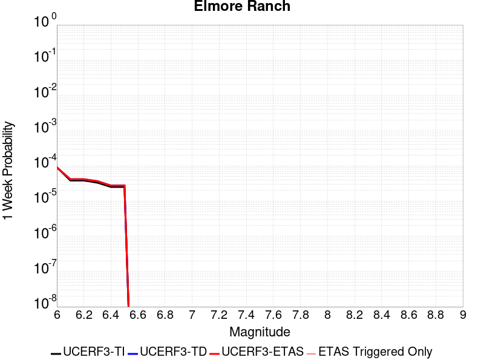 | 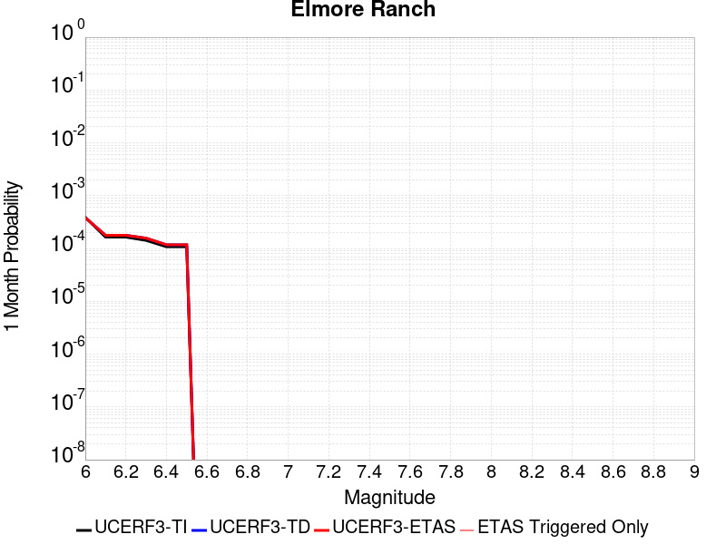 | 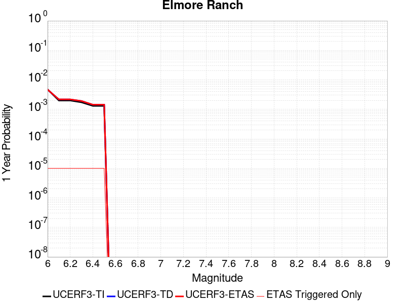 | 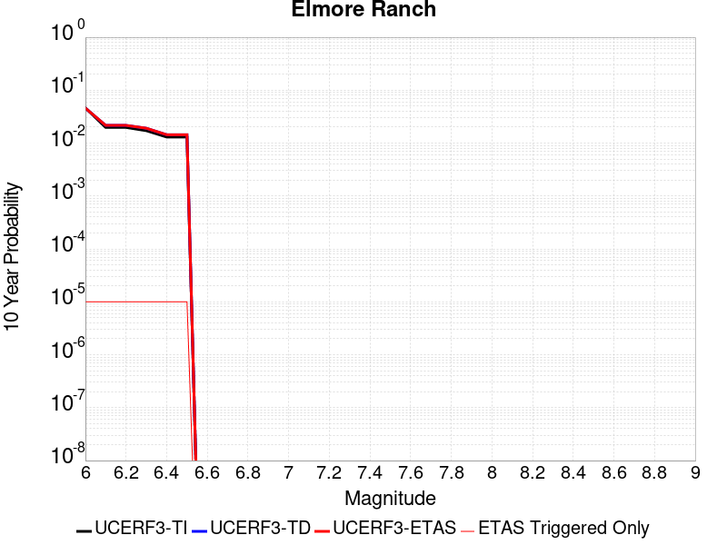 |

| Magnitude | 1 wk TI Prob | 1 wk TD Prob | 1 wk ETAS Prob | 1 wk ETAS/TD Gain | 1 wk ETAS Triggered Only | 1 mo TI Prob | 1 mo TD Prob | 1 mo ETAS Prob | 1 mo ETAS/TD Gain | 1 mo ETAS Triggered Only | 1 yr TI Prob | 1 yr TD Prob | 1 yr ETAS Prob | 1 yr ETAS/TD Gain | 1 yr ETAS Triggered Only | 10 yr TI Prob | 10 yr TD Prob | 10 yr ETAS Prob | 10 yr ETAS/TD Gain | 10 yr ETAS Triggered Only |
|-----|-----|-----|-----|-----|-----|-----|-----|-----|-----|-----|-----|-----|-----|-----|-----|-----|-----|-----|-----|-----|
| 6.0 | 9.102099E-5 | 8.954503E-5 | 8.954503E-5 | 1.0 | 0.0 | 3.9003167E-4 | 3.837211E-4 | 3.837211E-4 | 1.0 | 0.0 | 0.0047383 | 0.0046632043 | 0.004673158 | 1.0021344 | 1.0E-5 | 0.046385348 | 0.045880616 | 0.045890156 | 1.0002079 | 1.0E-5 |
| 6.1 | 3.8306698E-5 | 4.1508196E-5 | 4.1508196E-5 | 1.0 | 0.0 | 1.6416123E-4 | 1.7788421E-4 | 1.7788421E-4 | 1.0 | 0.0 | 0.0019968306 | 0.002163561 | 0.0021735395 | 1.004612 | 1.0E-5 | 0.019789828 | 0.021632731 | 0.021642515 | 1.0004523 | 1.0E-5 |
| 6.2 | 3.8306698E-5 | 4.1508196E-5 | 4.1508196E-5 | 1.0 | 0.0 | 1.6416123E-4 | 1.7788421E-4 | 1.7788421E-4 | 1.0 | 0.0 | 0.0019968306 | 0.002163561 | 0.0021735395 | 1.004612 | 1.0E-5 | 0.019789828 | 0.021632731 | 0.021642515 | 1.0004523 | 1.0E-5 |
| 6.3 | 3.3197924E-5 | 3.656194E-5 | 3.656194E-5 | 1.0 | 0.0 | 1.4226905E-4 | 1.5668859E-4 | 1.5668859E-4 | 1.0 | 0.0 | 0.0017307495 | 0.001906266 | 0.0019162468 | 1.0052359 | 1.0E-5 | 0.017173318 | 0.019093616 | 0.019103425 | 1.0005138 | 1.0E-5 |
| 6.4 | 2.5148964E-5 | 2.7425167E-5 | 2.7425167E-5 | 1.0 | 0.0 | 1.0777682E-4 | 1.1753479E-4 | 1.1753479E-4 | 1.0 | 0.0 | 0.0013113929 | 0.001430695 | 0.0014406806 | 1.0069796 | 1.0E-5 | 0.01303681 | 0.014389615 | 0.014399471 | 1.000685 | 1.0E-5 |
| 6.5 | 2.5148964E-5 | 2.7425167E-5 | 2.7425167E-5 | 1.0 | 0.0 | 1.0777682E-4 | 1.1753479E-4 | 1.1753479E-4 | 1.0 | 0.0 | 0.0013113929 | 0.001430695 | 0.0014406806 | 1.0069796 | 1.0E-5 | 0.01303681 | 0.014389615 | 0.014399471 | 1.000685 | 1.0E-5 |

## Hayward (So) 2011 CFM
*[(top)](#table-of-contents)*

| 1 Week | 1 Month | 1 Year | 10 Year |
|-----|-----|-----|-----|
| 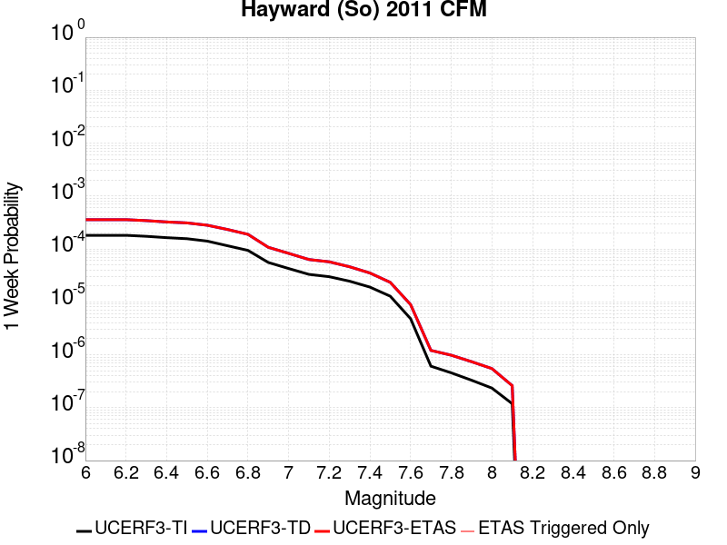 |  | 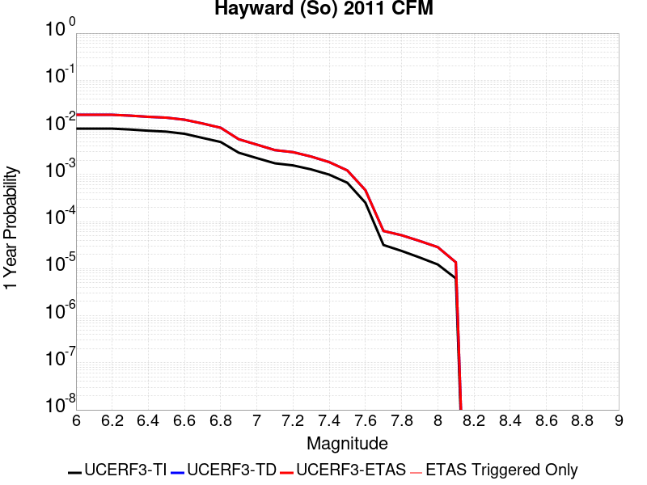 |  |

| Magnitude | 1 wk TI Prob | 1 wk TD Prob | 1 wk ETAS Prob | 1 wk ETAS/TD Gain | 1 wk ETAS Triggered Only | 1 mo TI Prob | 1 mo TD Prob | 1 mo ETAS Prob | 1 mo ETAS/TD Gain | 1 mo ETAS Triggered Only | 1 yr TI Prob | 1 yr TD Prob | 1 yr ETAS Prob | 1 yr ETAS/TD Gain | 1 yr ETAS Triggered Only | 10 yr TI Prob | 10 yr TD Prob | 10 yr ETAS Prob | 10 yr ETAS/TD Gain | 10 yr ETAS Triggered Only |
|-----|-----|-----|-----|-----|-----|-----|-----|-----|-----|-----|-----|-----|-----|-----|-----|-----|-----|-----|-----|-----|
| 6.0 | 1.8091932E-4 | 3.5726093E-4 | 3.5726093E-4 | 1.0 | 0.0 | 7.751381E-4 | 0.0015302298 | 0.0015302298 | 1.0 | 0.0 | 0.00939654 | 0.018473808 | 0.018473808 | 1.0 | 0.0 | 0.090090066 | 0.16681154 | 0.16681987 | 1.00005 | 1.0E-5 |
| 6.1 | 1.8091932E-4 | 3.5726093E-4 | 3.5726093E-4 | 1.0 | 0.0 | 7.751381E-4 | 0.0015302298 | 0.0015302298 | 1.0 | 0.0 | 0.00939654 | 0.018473808 | 0.018473808 | 1.0 | 0.0 | 0.090090066 | 0.16681154 | 0.16681987 | 1.00005 | 1.0E-5 |
| 6.2 | 1.8091932E-4 | 3.5726093E-4 | 3.5726093E-4 | 1.0 | 0.0 | 7.751381E-4 | 0.0015302298 | 0.0015302298 | 1.0 | 0.0 | 0.00939654 | 0.018473808 | 0.018473808 | 1.0 | 0.0 | 0.090090066 | 0.16681154 | 0.16681987 | 1.00005 | 1.0E-5 |
| 6.3 | 1.7322872E-4 | 3.4282645E-4 | 3.4282645E-4 | 1.0 | 0.0 | 7.4219756E-4 | 0.0014684385 | 0.0014684385 | 1.0 | 0.0 | 0.0089988755 | 0.017733958 | 0.017733958 | 1.0 | 0.0 | 0.08643075 | 0.16074646 | 0.16074646 | 1.0 | 0.0 |
| 6.4 | 1.6334097E-4 | 3.2363975E-4 | 3.2363975E-4 | 1.0 | 0.0 | 6.998449E-4 | 0.0013862988 | 0.0013862988 | 1.0 | 0.0 | 0.008487372 | 0.016749581 | 0.016749581 | 1.0 | 0.0 | 0.081704415 | 0.15263419 | 0.15263419 | 1.0 | 0.0 |
| 6.5 | 1.5600289E-4 | 3.103831E-4 | 3.103831E-4 | 1.0 | 0.0 | 6.684125E-4 | 0.0013295435 | 0.0013295435 | 1.0 | 0.0 | 0.008107598 | 0.016068943 | 0.016068943 | 1.0 | 0.0 | 0.078181036 | 0.14691001 | 0.14691001 | 1.0 | 0.0 |
| 6.6 | 1.4046066E-4 | 2.805153E-4 | 2.805153E-4 | 1.0 | 0.0 | 6.018354E-4 | 0.0012016613 | 0.0012016613 | 1.0 | 0.0 | 0.0073027555 | 0.014533587 | 0.014533587 | 1.0 | 0.0 | 0.07067384 | 0.13399512 | 0.13399512 | 1.0 | 0.0 |
| 6.7 | 1.14696966E-4 | 2.3288323E-4 | 2.3288323E-4 | 1.0 | 0.0 | 4.914658E-4 | 9.976943E-4 | 9.976943E-4 | 1.0 | 0.0 | 0.0059671924 | 0.01208034 | 0.01208034 | 1.0 | 0.0 | 0.058094822 | 0.11281668 | 0.11281668 | 1.0 | 0.0 |
| 6.8 | 9.3874296E-5 | 1.8875435E-4 | 1.8875435E-4 | 1.0 | 0.0 | 4.0225635E-4 | 8.0870016E-4 | 8.0870016E-4 | 1.0 | 0.0 | 0.0048864787 | 0.00980221 | 0.00980221 | 1.0 | 0.0 | 0.047804173 | 0.09265828 | 0.09265828 | 1.0 | 0.0 |
| 6.9 | 5.551852E-5 | 1.0737576E-4 | 1.0737576E-4 | 1.0 | 0.0 | 2.3791482E-4 | 4.601013E-4 | 4.601013E-4 | 1.0 | 0.0 | 0.0028927654 | 0.005587464 | 0.005587464 | 1.0 | 0.0 | 0.028553981 | 0.054282483 | 0.054282483 | 1.0 | 0.0 |
| 7.0 | 4.2662363E-5 | 8.252773E-5 | 8.252773E-5 | 1.0 | 0.0 | 1.8282588E-4 | 3.5364274E-4 | 3.5364274E-4 | 1.0 | 0.0 | 0.0022236328 | 0.0042971736 | 0.0042971736 | 1.0 | 0.0 | 0.022015138 | 0.042094123 | 0.042094123 | 1.0 | 0.0 |
| 7.1 | 3.305886E-5 | 6.307206E-5 | 6.307206E-5 | 1.0 | 0.0 | 1.4167312E-4 | 2.7028093E-4 | 2.7028093E-4 | 1.0 | 0.0 | 0.0017235056 | 0.0032857237 | 0.0032857237 | 1.0 | 0.0 | 0.017101998 | 0.032478187 | 0.032478187 | 1.0 | 0.0 |
| 7.2 | 2.9856887E-5 | 5.7064462E-5 | 5.7064462E-5 | 1.0 | 0.0 | 1.2795182E-4 | 2.4453914E-4 | 2.4453914E-4 | 1.0 | 0.0 | 0.0015567001 | 0.0029732161 | 0.0029732161 | 1.0 | 0.0 | 0.015458403 | 0.029477973 | 0.029477973 | 1.0 | 0.0 |
| 7.3 | 2.4559737E-5 | 4.603359E-5 | 4.603359E-5 | 1.0 | 0.0 | 1.0525176E-4 | 1.9727198E-4 | 1.9727198E-4 | 1.0 | 0.0 | 0.0012806869 | 0.0023991538 | 0.0023991538 | 1.0 | 0.0 | 0.012733313 | 0.023878254 | 0.023878254 | 1.0 | 0.0 |
| 7.4 | 1.9002231E-5 | 3.5085814E-5 | 3.5085814E-5 | 1.0 | 0.0 | 8.143559E-5 | 1.5035916E-4 | 1.5035916E-4 | 1.0 | 0.0 | 9.910273E-4 | 0.0018290955 | 0.0018290955 | 1.0 | 0.0 | 0.009866194 | 0.01827623 | 0.01827623 | 1.0 | 0.0 |
| 7.5 | 1.2783333E-5 | 2.3358793E-5 | 2.3358793E-5 | 1.0 | 0.0 | 5.4784563E-5 | 1.001053E-4 | 1.001053E-4 | 1.0 | 0.0 | 6.667979E-4 | 0.0012181065 | 0.0012181065 | 1.0 | 0.0 | 0.006648007 | 0.012223811 | 0.012223811 | 1.0 | 0.0 |
| 7.6 | 4.8149627E-6 | 8.8984125E-6 | 8.8984125E-6 | 1.0 | 0.0 | 2.063539E-5 | 3.8135506E-5 | 3.8135506E-5 | 1.0 | 0.0 | 2.5120692E-4 | 4.6420208E-4 | 4.6420208E-4 | 1.0 | 0.0 | 0.0025092314 | 0.0046865833 | 0.0046865833 | 1.0 | 0.0 |
| 7.7 | 6.0838227E-7 | 1.2079701E-6 | 1.2079701E-6 | 1.0 | 0.0 | 2.6073499E-6 | 5.177004E-6 | 5.177004E-6 | 1.0 | 0.0 | 3.174402E-5 | 6.30282E-5 | 6.30282E-5 | 1.0 | 0.0 | 3.1739488E-4 | 6.5405015E-4 | 6.5405015E-4 | 1.0 | 0.0 |
| 7.8 | 4.5542808E-7 | 9.812286E-7 | 9.812286E-7 | 1.0 | 0.0 | 1.9518332E-6 | 4.2052584E-6 | 4.2052584E-6 | 1.0 | 0.0 | 2.376331E-5 | 5.119782E-5 | 5.119782E-5 | 1.0 | 0.0 | 2.3760769E-4 | 5.331101E-4 | 5.331101E-4 | 1.0 | 0.0 |
| 7.9 | 3.3016747E-7 | 7.401128E-7 | 7.401128E-7 | 1.0 | 0.0 | 1.4150027E-6 | 3.171908E-6 | 3.171908E-6 | 1.0 | 0.0 | 1.7227521E-5 | 3.8617298E-5 | 3.8617298E-5 | 1.0 | 0.0 | 1.7226185E-4 | 4.0002094E-4 | 4.0002094E-4 | 1.0 | 0.0 |
| 8.0 | 2.347038E-7 | 5.4817883E-7 | 5.4817883E-7 | 1.0 | 0.0 | 1.0058731E-6 | 2.3493355E-6 | 2.3493355E-6 | 1.0 | 0.0 | 1.2246436E-5 | 2.8602788E-5 | 2.8602788E-5 | 1.0 | 0.0 | 1.2245761E-4 | 2.940476E-4 | 2.940476E-4 | 1.0 | 0.0 |
| 8.1 | 1.18822804E-7 | 2.6104607E-7 | 2.6104607E-7 | 1.0 | 0.0 | 5.092405E-7 | 1.1187684E-6 | 1.1187684E-6 | 1.0 | 0.0 | 6.1999854E-6 | 1.3620921E-5 | 1.3620921E-5 | 1.0 | 0.0 | 6.199812E-5 | 1.394018E-4 | 1.394018E-4 | 1.0 | 0.0 |

## Kern Canyon (South Kern) 2011
*[(top)](#table-of-contents)*

| 1 Week | 1 Month | 1 Year | 10 Year |
|-----|-----|-----|-----|
|  |  | 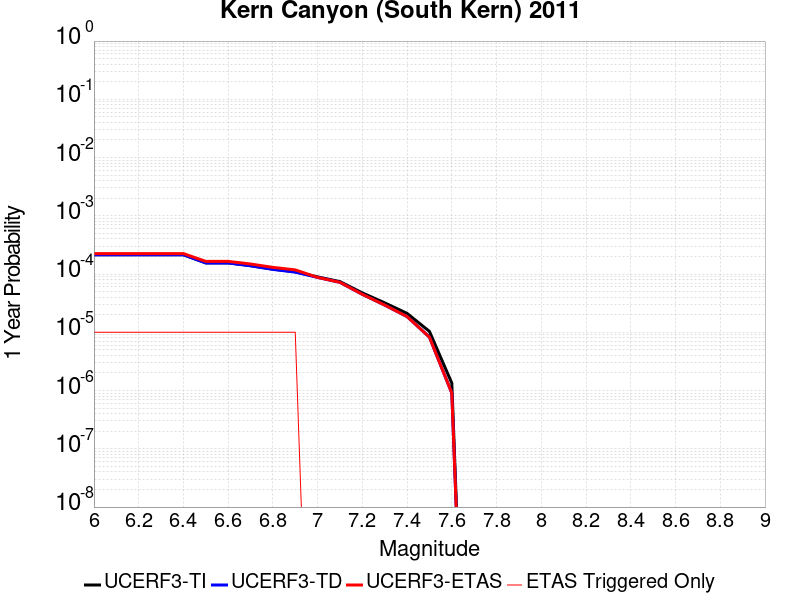 | 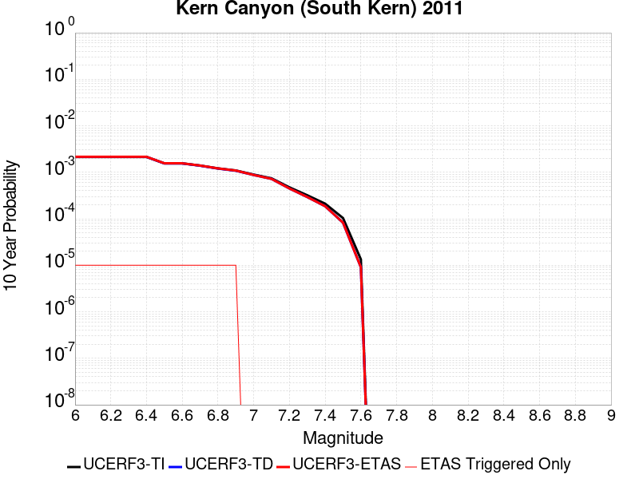 |

| Magnitude | 1 wk TI Prob | 1 wk TD Prob | 1 wk ETAS Prob | 1 wk ETAS/TD Gain | 1 wk ETAS Triggered Only | 1 mo TI Prob | 1 mo TD Prob | 1 mo ETAS Prob | 1 mo ETAS/TD Gain | 1 mo ETAS Triggered Only | 1 yr TI Prob | 1 yr TD Prob | 1 yr ETAS Prob | 1 yr ETAS/TD Gain | 1 yr ETAS Triggered Only | 10 yr TI Prob | 10 yr TD Prob | 10 yr ETAS Prob | 10 yr ETAS/TD Gain | 10 yr ETAS Triggered Only |
|-----|-----|-----|-----|-----|-----|-----|-----|-----|-----|-----|-----|-----|-----|-----|-----|-----|-----|-----|-----|-----|
| 6.0 | 4.105075E-6 | 4.1137673E-6 | 4.1137673E-6 | 1.0 | 0.0 | 1.7593058E-5 | 1.7630317E-5 | 1.7630317E-5 | 1.0 | 0.0 | 2.1417443E-4 | 2.146286E-4 | 2.2462646E-4 | 1.0465821 | 1.0E-5 | 0.0021396813 | 0.002144277 | 0.0021542555 | 1.0046536 | 1.0E-5 |
| 6.1 | 4.105075E-6 | 4.1137673E-6 | 4.1137673E-6 | 1.0 | 0.0 | 1.7593058E-5 | 1.7630317E-5 | 1.7630317E-5 | 1.0 | 0.0 | 2.1417443E-4 | 2.146286E-4 | 2.2462646E-4 | 1.0465821 | 1.0E-5 | 0.0021396813 | 0.002144277 | 0.0021542555 | 1.0046536 | 1.0E-5 |
| 6.2 | 4.105075E-6 | 4.1137673E-6 | 4.1137673E-6 | 1.0 | 0.0 | 1.7593058E-5 | 1.7630317E-5 | 1.7630317E-5 | 1.0 | 0.0 | 2.1417443E-4 | 2.146286E-4 | 2.2462646E-4 | 1.0465821 | 1.0E-5 | 0.0021396813 | 0.002144277 | 0.0021542555 | 1.0046536 | 1.0E-5 |
| 6.3 | 4.105075E-6 | 4.1137673E-6 | 4.1137673E-6 | 1.0 | 0.0 | 1.7593058E-5 | 1.7630317E-5 | 1.7630317E-5 | 1.0 | 0.0 | 2.1417443E-4 | 2.146286E-4 | 2.2462646E-4 | 1.0465821 | 1.0E-5 | 0.0021396813 | 0.002144277 | 0.0021542555 | 1.0046536 | 1.0E-5 |
| 6.4 | 4.105075E-6 | 4.1137673E-6 | 4.1137673E-6 | 1.0 | 0.0 | 1.7593058E-5 | 1.7630317E-5 | 1.7630317E-5 | 1.0 | 0.0 | 2.1417443E-4 | 2.146286E-4 | 2.2462646E-4 | 1.0465821 | 1.0E-5 | 0.0021396813 | 0.002144277 | 0.0021542555 | 1.0046536 | 1.0E-5 |
| 6.5 | 2.9849807E-6 | 2.9731848E-6 | 2.9731848E-6 | 1.0 | 0.0 | 1.2792712E-5 | 1.2742159E-5 | 1.2742159E-5 | 1.0 | 0.0 | 1.5574014E-4 | 1.5512489E-4 | 1.6512333E-4 | 1.0644542 | 1.0E-5 | 0.0015563103 | 0.0015501813 | 0.0015601658 | 1.0064409 | 1.0E-5 |
| 6.6 | 2.9849807E-6 | 2.9731848E-6 | 2.9731848E-6 | 1.0 | 0.0 | 1.2792712E-5 | 1.2742159E-5 | 1.2742159E-5 | 1.0 | 0.0 | 1.5574014E-4 | 1.5512489E-4 | 1.6512333E-4 | 1.0644542 | 1.0E-5 | 0.0015563103 | 0.0015501813 | 0.0015601658 | 1.0064409 | 1.0E-5 |
| 6.7 | 2.6756725E-6 | 2.6582477E-6 | 2.6582477E-6 | 1.0 | 0.0 | 1.1467117E-5 | 1.1392441E-5 | 1.1392441E-5 | 1.0 | 0.0 | 1.396032E-4 | 1.3869425E-4 | 1.4869287E-4 | 1.072091 | 1.0E-5 | 0.0013951553 | 0.0013860879 | 0.001396074 | 1.0072045 | 1.0E-5 |
| 6.8 | 2.3283721E-6 | 2.3048024E-6 | 2.3048024E-6 | 1.0 | 0.0 | 9.9787E-6 | 9.877688E-6 | 9.877688E-6 | 1.0 | 0.0 | 1.214839E-4 | 1.20254284E-4 | 1.3025309E-4 | 1.0831472 | 1.0E-5 | 0.001214175 | 0.0012018996 | 0.0012118876 | 1.0083102 | 1.0E-5 |
| 6.9 | 2.0972677E-6 | 2.0696625E-6 | 2.0696625E-6 | 1.0 | 0.0 | 8.988259E-6 | 8.869953E-6 | 8.869953E-6 | 1.0 | 0.0 | 1.0942656E-4 | 1.0798638E-4 | 1.179853E-4 | 1.0925943 | 1.0E-5 | 0.0010937268 | 0.0010793449 | 0.0010893341 | 1.0092549 | 1.0E-5 |
| 7.0 | 1.7132242E-6 | 1.6787213E-6 | 1.6787213E-6 | 1.0 | 0.0 | 7.3423685E-6 | 7.1945E-6 | 7.1945E-6 | 1.0 | 0.0 | 8.938967E-5 | 8.758956E-5 | 8.758956E-5 | 1.0 | 0.0 | 8.935372E-4 | 8.755542E-4 | 8.755542E-4 | 1.0 | 0.0 |
| 7.1 | 1.4215541E-6 | 1.38159E-6 | 1.38159E-6 | 1.0 | 0.0 | 6.0923603E-6 | 5.9210865E-6 | 5.9210865E-6 | 1.0 | 0.0 | 7.417196E-5 | 7.208687E-5 | 7.208687E-5 | 1.0 | 0.0 | 7.414721E-4 | 7.206376E-4 | 7.206376E-4 | 1.0 | 0.0 |
| 7.2 | 9.097853E-7 | 8.603873E-7 | 8.603873E-7 | 1.0 | 0.0 | 3.899074E-6 | 3.687369E-6 | 3.687369E-6 | 1.0 | 0.0 | 4.7470192E-5 | 4.48928E-5 | 4.48928E-5 | 1.0 | 0.0 | 4.7460053E-4 | 4.488384E-4 | 4.488384E-4 | 1.0 | 0.0 |
| 7.3 | 6.144169E-7 | 5.628273E-7 | 5.628273E-7 | 1.0 | 0.0 | 2.6332125E-6 | 2.412115E-6 | 2.412115E-6 | 1.0 | 0.0 | 3.205889E-5 | 2.936711E-5 | 2.936711E-5 | 1.0 | 0.0 | 3.2054266E-4 | 2.936328E-4 | 2.936328E-4 | 1.0 | 0.0 |
| 7.4 | 4.049844E-7 | 3.5728772E-7 | 3.5728772E-7 | 1.0 | 0.0 | 1.7356463E-6 | 1.5312322E-6 | 1.5312322E-6 | 1.0 | 0.0 | 2.1131287E-5 | 1.8642595E-5 | 1.8642595E-5 | 1.0 | 0.0 | 2.1129279E-4 | 1.8641056E-4 | 1.8641056E-4 | 1.0 | 0.0 |
| 7.5 | 1.9871162E-7 | 1.5830682E-7 | 1.5830682E-7 | 1.0 | 0.0 | 8.5162094E-7 | 6.7845764E-7 | 6.7845764E-7 | 1.0 | 0.0 | 1.0368436E-5 | 8.260191E-6 | 8.260191E-6 | 1.0 | 0.0 | 1.0367952E-4 | 8.259893E-5 | 8.259893E-5 | 1.0 | 0.0 |
| 7.6 | 2.572245E-8 | 1.7352884E-8 | 1.7352884E-8 | 1.0 | 0.0 | 1.10239064E-7 | 7.43695E-8 | 7.43695E-8 | 1.0 | 0.0 | 1.3421597E-6 | 9.0544836E-7 | 9.0544836E-7 | 1.0 | 0.0 | 1.3421517E-5 | 9.054452E-6 | 9.054452E-6 | 1.0 | 0.0 |

## Coronado Bank alt1
*[(top)](#table-of-contents)*

| 1 Week | 1 Month | 1 Year | 10 Year |
|-----|-----|-----|-----|
|  | 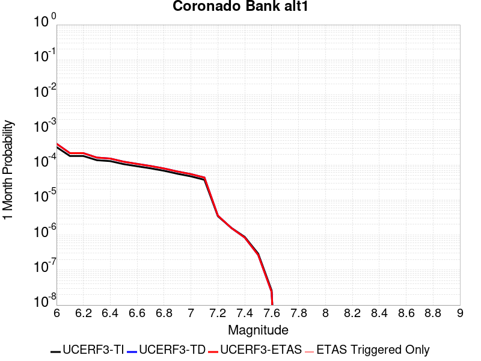 | 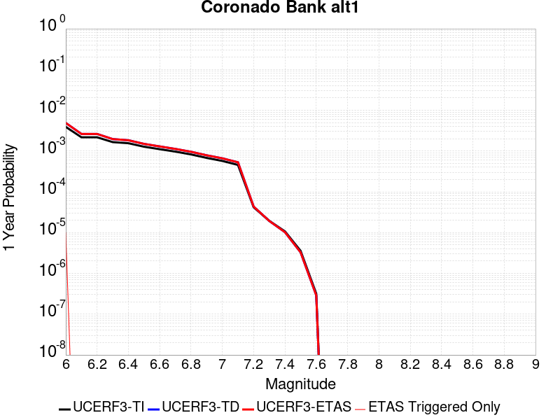 | 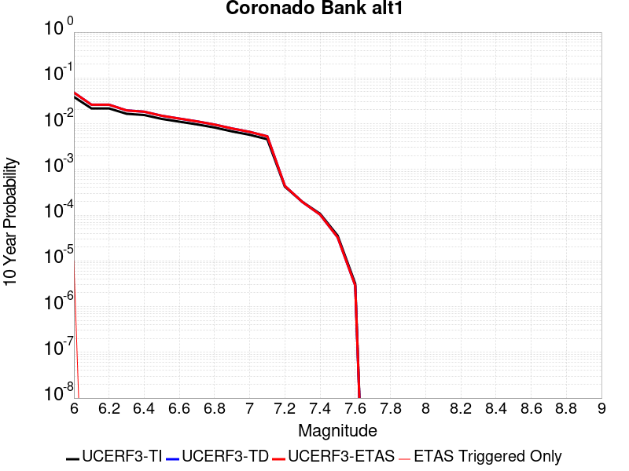 |

| Magnitude | 1 wk TI Prob | 1 wk TD Prob | 1 wk ETAS Prob | 1 wk ETAS/TD Gain | 1 wk ETAS Triggered Only | 1 mo TI Prob | 1 mo TD Prob | 1 mo ETAS Prob | 1 mo ETAS/TD Gain | 1 mo ETAS Triggered Only | 1 yr TI Prob | 1 yr TD Prob | 1 yr ETAS Prob | 1 yr ETAS/TD Gain | 1 yr ETAS Triggered Only | 10 yr TI Prob | 10 yr TD Prob | 10 yr ETAS Prob | 10 yr ETAS/TD Gain | 10 yr ETAS Triggered Only |
|-----|-----|-----|-----|-----|-----|-----|-----|-----|-----|-----|-----|-----|-----|-----|-----|-----|-----|-----|-----|-----|
| 6.0 | 7.533492E-5 | 9.39618E-5 | 9.39618E-5 | 1.0 | 0.0 | 3.22824E-4 | 4.0263552E-4 | 4.0263552E-4 | 1.0 | 0.0 | 0.0039233007 | 0.0048915995 | 0.0049015507 | 1.0020343 | 1.0E-5 | 0.03854755 | 0.04790961 | 0.04791913 | 1.0001987 | 1.0E-5 |
| 6.1 | 4.1807285E-5 | 5.049851E-5 | 5.049851E-5 | 1.0 | 0.0 | 1.7916178E-4 | 2.1640482E-4 | 2.1640482E-4 | 1.0 | 0.0 | 0.0021791123 | 0.0026316417 | 0.0026316417 | 1.0 | 0.0 | 0.021578677 | 0.026013888 | 0.026013888 | 1.0 | 0.0 |
| 6.2 | 4.1807285E-5 | 5.049851E-5 | 5.049851E-5 | 1.0 | 0.0 | 1.7916178E-4 | 2.1640482E-4 | 2.1640482E-4 | 1.0 | 0.0 | 0.0021791123 | 0.0026316417 | 0.0026316417 | 1.0 | 0.0 | 0.021578677 | 0.026013888 | 0.026013888 | 1.0 | 0.0 |
| 6.3 | 3.1793104E-5 | 3.7714894E-5 | 3.7714894E-5 | 1.0 | 0.0 | 1.3624904E-4 | 1.6162546E-4 | 1.6162546E-4 | 1.0 | 0.0 | 0.0016575698 | 0.0019660434 | 0.0019660434 | 1.0 | 0.0 | 0.016452603 | 0.019490387 | 0.019490387 | 1.0 | 0.0 |
| 6.4 | 2.9878007E-5 | 3.5339268E-5 | 3.5339268E-5 | 1.0 | 0.0 | 1.2804232E-4 | 1.514454E-4 | 1.514454E-4 | 1.0 | 0.0 | 0.0015578003 | 0.0018423185 | 0.0018423185 | 1.0 | 0.0 | 0.015469253 | 0.018274212 | 0.018274212 | 1.0 | 0.0 |
| 6.5 | 2.4512565E-5 | 2.8766724E-5 | 2.8766724E-5 | 1.0 | 0.0 | 1.0504962E-4 | 1.2328029E-4 | 1.2328029E-4 | 1.0 | 0.0 | 0.0012782287 | 0.0014999318 | 0.0014999318 | 1.0 | 0.0 | 0.012709012 | 0.01490106 | 0.01490106 | 1.0 | 0.0 |
| 6.6 | 2.1317413E-5 | 2.4908924E-5 | 2.4908924E-5 | 1.0 | 0.0 | 9.135714E-5 | 1.06748295E-4 | 1.06748295E-4 | 1.0 | 0.0 | 0.0011117056 | 0.0012989079 | 0.0012989079 | 1.0 | 0.0 | 0.011061605 | 0.012915566 | 0.012915566 | 1.0 | 0.0 |
| 6.7 | 1.8585655E-5 | 2.163679E-5 | 2.163679E-5 | 1.0 | 0.0 | 7.9650374E-5 | 9.272592E-5 | 9.272592E-5 | 1.0 | 0.0 | 9.6931186E-4 | 0.0011283738 | 0.0011283738 | 1.0 | 0.0 | 0.0096509475 | 0.011228608 | 0.011228608 | 1.0 | 0.0 |
| 6.8 | 1.5862879E-5 | 1.8421075E-5 | 1.8421075E-5 | 1.0 | 0.0 | 6.798199E-5 | 7.894518E-5 | 7.894518E-5 | 1.0 | 0.0 | 8.273665E-4 | 9.60753E-4 | 9.60753E-4 | 1.0 | 0.0 | 0.008242928 | 0.009567977 | 0.009567977 | 1.0 | 0.0 |
| 6.9 | 1.3021509E-5 | 1.50965625E-5 | 1.50965625E-5 | 1.0 | 0.0 | 5.5805274E-5 | 6.4698055E-5 | 6.4698055E-5 | 1.0 | 0.0 | 6.792174E-4 | 7.8743225E-4 | 7.8743225E-4 | 1.0 | 0.0 | 0.006771452 | 0.007848245 | 0.007848245 | 1.0 | 0.0 |
| 7.0 | 1.0974371E-5 | 1.27212E-5 | 1.27212E-5 | 1.0 | 0.0 | 4.7032172E-5 | 5.4518387E-5 | 5.4518387E-5 | 1.0 | 0.0 | 5.7246623E-4 | 6.6357676E-4 | 6.6357676E-4 | 1.0 | 0.0 | 0.0057099373 | 0.006617703 | 0.006617703 | 1.0 | 0.0 |
| 7.1 | 8.766221E-6 | 1.0164713E-5 | 1.0164713E-5 | 1.0 | 0.0 | 3.7568978E-5 | 4.3562424E-5 | 4.3562424E-5 | 1.0 | 0.0 | 4.573063E-4 | 5.302607E-4 | 5.302607E-4 | 1.0 | 0.0 | 0.0045636636 | 0.0052916543 | 0.0052916543 | 1.0 | 0.0 |
| 7.2 | 8.026024E-7 | 8.332054E-7 | 8.332054E-7 | 1.0 | 0.0 | 3.43972E-6 | 3.5708754E-6 | 3.5708754E-6 | 1.0 | 0.0 | 4.1877785E-5 | 4.3474553E-5 | 4.3474553E-5 | 1.0 | 0.0 | 4.1869894E-4 | 4.3466155E-4 | 4.3466155E-4 | 1.0 | 0.0 |
| 7.3 | 3.7293114E-7 | 3.7001894E-7 | 3.7001894E-7 | 1.0 | 0.0 | 1.5982754E-6 | 1.5857945E-6 | 1.5857945E-6 | 1.0 | 0.0 | 1.9458828E-5 | 1.9306877E-5 | 1.9306877E-5 | 1.0 | 0.0 | 1.9457124E-4 | 1.9305207E-4 | 1.9305207E-4 | 1.0 | 0.0 |
| 7.4 | 2.0557036E-7 | 1.9674766E-7 | 1.9674766E-7 | 1.0 | 0.0 | 8.810155E-7 | 8.4320396E-7 | 8.4320396E-7 | 1.0 | 0.0 | 1.0726311E-5 | 1.0265961E-5 | 1.0265961E-5 | 1.0 | 0.0 | 1.0725793E-4 | 1.0265489E-4 | 1.0265489E-4 | 1.0 | 0.0 |
| 7.5 | 6.845446E-8 | 6.2794456E-8 | 6.2794456E-8 | 1.0 | 0.0 | 2.9337625E-7 | 2.6911906E-7 | 2.6911906E-7 | 1.0 | 0.0 | 3.5718497E-6 | 3.2765197E-6 | 3.2765197E-6 | 1.0 | 0.0 | 3.5717923E-5 | 3.2764725E-5 | 3.2764725E-5 | 1.0 | 0.0 |
| 7.6 | 6.0975145E-9 | 5.5318936E-9 | 5.5318936E-9 | 1.0 | 0.0 | 2.6132206E-8 | 2.3708115E-8 | 2.3708115E-8 | 1.0 | 0.0 | 3.1815955E-7 | 2.8864628E-7 | 2.8864628E-7 | 1.0 | 0.0 | 3.181591E-6 | 2.88646E-6 | 2.88646E-6 | 1.0 | 0.0 |

## Ortigalita (South)
*[(top)](#table-of-contents)*

| 1 Week | 1 Month | 1 Year | 10 Year |
|-----|-----|-----|-----|
| 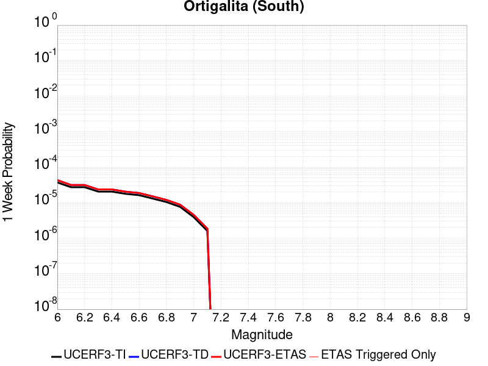 |  |  |  |

| Magnitude | 1 wk TI Prob | 1 wk TD Prob | 1 wk ETAS Prob | 1 wk ETAS/TD Gain | 1 wk ETAS Triggered Only | 1 mo TI Prob | 1 mo TD Prob | 1 mo ETAS Prob | 1 mo ETAS/TD Gain | 1 mo ETAS Triggered Only | 1 yr TI Prob | 1 yr TD Prob | 1 yr ETAS Prob | 1 yr ETAS/TD Gain | 1 yr ETAS Triggered Only | 10 yr TI Prob | 10 yr TD Prob | 10 yr ETAS Prob | 10 yr ETAS/TD Gain | 10 yr ETAS Triggered Only |
|-----|-----|-----|-----|-----|-----|-----|-----|-----|-----|-----|-----|-----|-----|-----|-----|-----|-----|-----|-----|-----|
| 6.0 | 3.72394E-5 | 4.3259344E-5 | 4.3259344E-5 | 1.0 | 0.0 | 1.5958765E-4 | 1.853849E-4 | 1.9538304E-4 | 1.0539318 | 1.0E-5 | 0.0019412481 | 0.0022548812 | 0.0022648587 | 1.0044248 | 1.0E-5 | 0.019243775 | 0.0223364 | 0.022346176 | 1.0004377 | 1.0E-5 |
| 6.1 | 2.7299884E-5 | 3.1494616E-5 | 3.1494616E-5 | 1.0 | 0.0 | 1.16994255E-4 | 1.3497027E-4 | 1.4496892E-4 | 1.0740803 | 1.0E-5 | 0.0014234743 | 0.0016420797 | 0.0016520632 | 1.0060798 | 1.0E-5 | 0.014143906 | 0.016305393 | 0.01631523 | 1.0006033 | 1.0E-5 |
| 6.2 | 2.7299884E-5 | 3.1494616E-5 | 3.1494616E-5 | 1.0 | 0.0 | 1.16994255E-4 | 1.3497027E-4 | 1.4496892E-4 | 1.0740803 | 1.0E-5 | 0.0014234743 | 0.0016420797 | 0.0016520632 | 1.0060798 | 1.0E-5 | 0.014143906 | 0.016305393 | 0.01631523 | 1.0006033 | 1.0E-5 |
| 6.3 | 2.0546433E-5 | 2.3633338E-5 | 2.3633338E-5 | 1.0 | 0.0 | 8.805317E-5 | 1.0128191E-4 | 1.11280904E-4 | 1.0987244 | 1.0E-5 | 0.00107152 | 0.0012324287 | 0.0012424164 | 1.0081041 | 1.0E-5 | 0.010663681 | 0.0122580035 | 0.012267881 | 1.0008057 | 1.0E-5 |
| 6.4 | 2.0546433E-5 | 2.3633338E-5 | 2.3633338E-5 | 1.0 | 0.0 | 8.805317E-5 | 1.0128191E-4 | 1.11280904E-4 | 1.0987244 | 1.0E-5 | 0.00107152 | 0.0012324287 | 0.0012424164 | 1.0081041 | 1.0E-5 | 0.010663681 | 0.0122580035 | 0.012267881 | 1.0008057 | 1.0E-5 |
| 6.5 | 1.7779594E-5 | 2.0448608E-5 | 2.0448608E-5 | 1.0 | 0.0 | 7.619603E-5 | 8.763402E-5 | 9.763314E-5 | 1.1141009 | 1.0E-5 | 9.272918E-4 | 0.0010664355 | 0.0010764248 | 1.009367 | 1.0E-5 | 0.009234319 | 0.010614647 | 0.01062454 | 1.0009321 | 1.0E-5 |
| 6.6 | 1.6272212E-5 | 1.8716462E-5 | 1.8716462E-5 | 1.0 | 0.0 | 6.973618E-5 | 8.0211015E-5 | 9.021021E-5 | 1.1246612 | 1.0E-5 | 8.487073E-4 | 9.761438E-4 | 9.86134E-4 | 1.0102344 | 1.0E-5 | 0.008454733 | 0.0097198635 | 0.009729766 | 1.0010188 | 1.0E-5 |
| 6.7 | 1.3051484E-5 | 1.5039977E-5 | 1.5039977E-5 | 1.0 | 0.0 | 5.593373E-5 | 6.4455504E-5 | 7.445486E-5 | 1.1551358 | 1.0E-5 | 6.807804E-4 | 7.8447274E-4 | 7.944649E-4 | 1.0127374 | 1.0E-5 | 0.006786986 | 0.007818019 | 0.007827941 | 1.0012691 | 1.0E-5 |
| 6.8 | 1.04277415E-5 | 1.1988188E-5 | 1.1988188E-5 | 1.0 | 0.0 | 4.4689557E-5 | 5.137698E-5 | 6.1376464E-5 | 1.1946297 | 1.0E-5 | 5.439595E-4 | 6.2534265E-4 | 6.353364E-4 | 1.0159812 | 1.0E-5 | 0.0054262993 | 0.0062365844 | 0.006246522 | 1.0015935 | 1.0E-5 |
| 6.9 | 7.639968E-6 | 8.792207E-6 | 8.792207E-6 | 1.0 | 0.0 | 3.274231E-5 | 3.7680376E-5 | 3.7680376E-5 | 1.0 | 0.0 | 3.9856473E-4 | 4.586679E-4 | 4.586679E-4 | 1.0 | 0.0 | 0.003978506 | 0.004577799 | 0.004577799 | 1.0 | 0.0 |
| 7.0 | 3.919831E-6 | 4.5337783E-6 | 4.5337783E-6 | 1.0 | 0.0 | 1.679917E-5 | 1.9430345E-5 | 1.9430345E-5 | 1.0 | 0.0 | 2.045107E-4 | 2.3654089E-4 | 2.3654089E-4 | 1.0 | 0.0 | 0.0020432258 | 0.0023630997 | 0.0023630997 | 1.0 | 0.0 |
| 7.1 | 1.6017933E-6 | 1.857199E-6 | 1.857199E-6 | 1.0 | 0.0 | 6.8648105E-6 | 7.959406E-6 | 7.959406E-6 | 1.0 | 0.0 | 8.357586E-5 | 9.690253E-5 | 9.690253E-5 | 1.0 | 0.0 | 8.3544437E-4 | 9.6870743E-4 | 9.6870743E-4 | 1.0 | 0.0 |

## Elsinore (Glen Ivy) rev
*[(top)](#table-of-contents)*

| 1 Week | 1 Month | 1 Year | 10 Year |
|-----|-----|-----|-----|
| 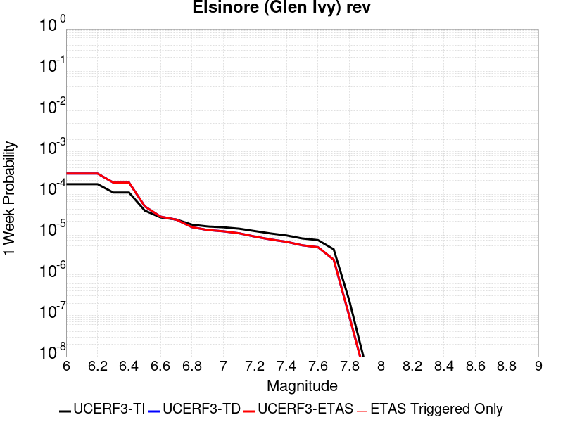 | 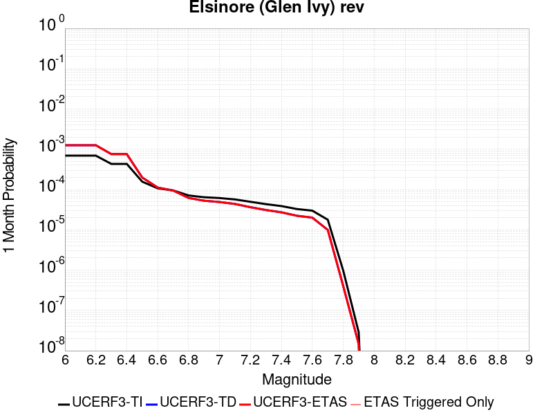 | 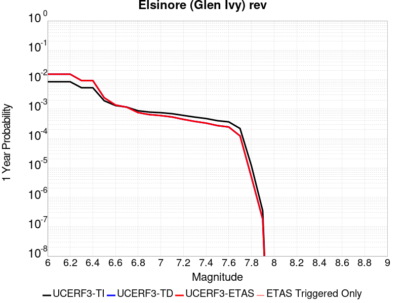 | 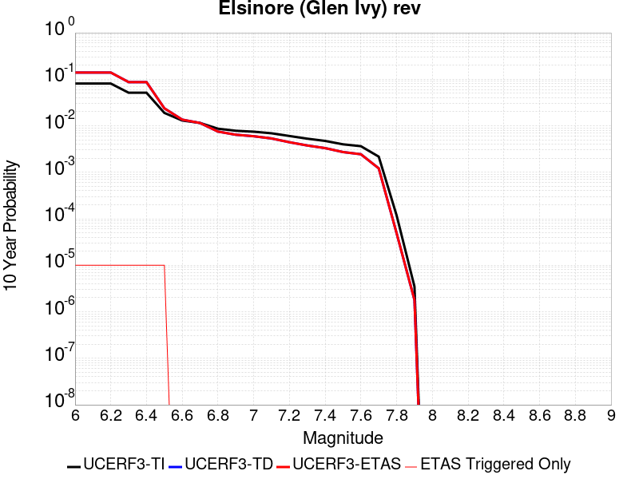 |

| Magnitude | 1 wk TI Prob | 1 wk TD Prob | 1 wk ETAS Prob | 1 wk ETAS/TD Gain | 1 wk ETAS Triggered Only | 1 mo TI Prob | 1 mo TD Prob | 1 mo ETAS Prob | 1 mo ETAS/TD Gain | 1 mo ETAS Triggered Only | 1 yr TI Prob | 1 yr TD Prob | 1 yr ETAS Prob | 1 yr ETAS/TD Gain | 1 yr ETAS Triggered Only | 10 yr TI Prob | 10 yr TD Prob | 10 yr ETAS Prob | 10 yr ETAS/TD Gain | 10 yr ETAS Triggered Only |
|-----|-----|-----|-----|-----|-----|-----|-----|-----|-----|-----|-----|-----|-----|-----|-----|-----|-----|-----|-----|-----|
| 6.0 | 1.6204086E-4 | 2.936593E-4 | 2.936593E-4 | 1.0 | 0.0 | 6.94276E-4 | 0.0012580877 | 0.0012580877 | 1.0 | 0.0 | 0.008420097 | 0.015237179 | 0.015237179 | 1.0 | 0.0 | 0.081081145 | 0.13970533 | 0.13971393 | 1.0000616 | 1.0E-5 |
| 6.1 | 1.6204086E-4 | 2.936593E-4 | 2.936593E-4 | 1.0 | 0.0 | 6.94276E-4 | 0.0012580877 | 0.0012580877 | 1.0 | 0.0 | 0.008420097 | 0.015237179 | 0.015237179 | 1.0 | 0.0 | 0.081081145 | 0.13970533 | 0.13971393 | 1.0000616 | 1.0E-5 |
| 6.2 | 1.6204086E-4 | 2.936593E-4 | 2.936593E-4 | 1.0 | 0.0 | 6.94276E-4 | 0.0012580877 | 0.0012580877 | 1.0 | 0.0 | 0.008420097 | 0.015237179 | 0.015237179 | 1.0 | 0.0 | 0.081081145 | 0.13970533 | 0.13971393 | 1.0000616 | 1.0E-5 |
| 6.3 | 1.0111737E-4 | 1.7704896E-4 | 1.7704896E-4 | 1.0 | 0.0 | 4.332882E-4 | 7.5867726E-4 | 7.5867726E-4 | 1.0 | 0.0 | 0.005262531 | 0.009218467 | 0.009218467 | 1.0 | 0.0 | 0.0513964 | 0.087025836 | 0.08703497 | 1.0001049 | 1.0E-5 |
| 6.4 | 1.0111737E-4 | 1.7704896E-4 | 1.7704896E-4 | 1.0 | 0.0 | 4.332882E-4 | 7.5867726E-4 | 7.5867726E-4 | 1.0 | 0.0 | 0.005262531 | 0.009218467 | 0.009218467 | 1.0 | 0.0 | 0.0513964 | 0.087025836 | 0.08703497 | 1.0001049 | 1.0E-5 |
| 6.5 | 3.6624708E-5 | 4.6398443E-5 | 4.6398443E-5 | 1.0 | 0.0 | 1.569536E-4 | 1.9883736E-4 | 1.9883736E-4 | 1.0 | 0.0 | 0.001909235 | 0.0024185202 | 0.0024185202 | 1.0 | 0.0 | 0.01892915 | 0.02374361 | 0.023753375 | 1.0004112 | 1.0E-5 |
| 6.6 | 2.5051324E-5 | 2.615282E-5 | 2.615282E-5 | 1.0 | 0.0 | 1.073584E-4 | 1.12078946E-4 | 1.12078946E-4 | 1.0 | 0.0 | 0.0013063047 | 0.0013637516 | 0.0013637516 | 1.0 | 0.0 | 0.012986525 | 0.013567226 | 0.013567226 | 1.0 | 0.0 |
| 6.7 | 2.2189772E-5 | 2.2077227E-5 | 2.2077227E-5 | 1.0 | 0.0 | 9.509556E-5 | 9.461347E-5 | 9.461347E-5 | 1.0 | 0.0 | 0.0011571734 | 0.0011513466 | 0.0011513466 | 1.0 | 0.0 | 0.011511663 | 0.0114676645 | 0.0114676645 | 1.0 | 0.0 |
| 6.8 | 1.6654378E-5 | 1.4440319E-5 | 1.4440319E-5 | 1.0 | 0.0 | 7.137396E-5 | 6.188564E-5 | 6.188564E-5 | 1.0 | 0.0 | 8.686314E-4 | 7.532024E-4 | 7.532024E-4 | 1.0 | 0.0 | 0.008652439 | 0.0075118328 | 0.0075118328 | 1.0 | 0.0 |
| 6.9 | 1.5042909E-5 | 1.2334286E-5 | 1.2334286E-5 | 1.0 | 0.0 | 6.446802E-5 | 5.286017E-5 | 5.286017E-5 | 1.0 | 0.0 | 7.8461546E-4 | 6.433857E-4 | 6.433857E-4 | 1.0 | 0.0 | 0.007818509 | 0.006419453 | 0.006419453 | 1.0 | 0.0 |
| 7.0 | 1.4361385E-5 | 1.1453455E-5 | 1.1453455E-5 | 1.0 | 0.0 | 6.154734E-5 | 4.908533E-5 | 4.908533E-5 | 1.0 | 0.0 | 7.490812E-4 | 5.974529E-4 | 5.974529E-4 | 1.0 | 0.0 | 0.007465612 | 0.005962458 | 0.005962458 | 1.0 | 0.0 |
| 7.1 | 1.3265571E-5 | 1.0246749E-5 | 1.0246749E-5 | 1.0 | 0.0 | 5.6851208E-5 | 4.3913915E-5 | 4.3913915E-5 | 1.0 | 0.0 | 6.919436E-4 | 5.345233E-4 | 5.345233E-4 | 1.0 | 0.0 | 0.006897931 | 0.0053357324 | 0.0053357324 | 1.0 | 0.0 |
| 7.2 | 1.1596403E-5 | 8.506553E-6 | 8.506553E-6 | 1.0 | 0.0 | 4.9697923E-5 | 3.6456157E-5 | 3.6456157E-5 | 1.0 | 0.0 | 6.049042E-4 | 4.4376502E-4 | 4.4376502E-4 | 1.0 | 0.0 | 0.006032603 | 0.004430204 | 0.004430204 | 1.0 | 0.0 |
| 7.3 | 1.0150827E-5 | 7.2399926E-6 | 7.2399926E-6 | 1.0 | 0.0 | 4.3502816E-5 | 3.102818E-5 | 3.102818E-5 | 1.0 | 0.0 | 5.2951806E-4 | 3.77704E-4 | 3.77704E-4 | 1.0 | 0.0 | 0.005282581 | 0.0037710073 | 0.0037710073 | 1.0 | 0.0 |
| 7.4 | 9.080705E-6 | 6.3535763E-6 | 6.3535763E-6 | 1.0 | 0.0 | 3.8916725E-5 | 2.7229335E-5 | 2.7229335E-5 | 1.0 | 0.0 | 4.7370812E-4 | 3.314681E-4 | 3.314681E-4 | 1.0 | 0.0 | 0.004726996 | 0.0033098878 | 0.0033098878 | 1.0 | 0.0 |
| 7.5 | 7.671649E-6 | 5.2264927E-6 | 5.2264927E-6 | 1.0 | 0.0 | 3.287808E-5 | 2.2399068E-5 | 2.2399068E-5 | 1.0 | 0.0 | 4.0021708E-4 | 2.726758E-4 | 2.726758E-4 | 1.0 | 0.0 | 0.0039949706 | 0.0027235372 | 0.0027235372 | 1.0 | 0.0 |
| 7.6 | 6.990086E-6 | 4.6883147E-6 | 4.6883147E-6 | 1.0 | 0.0 | 2.9957167E-5 | 2.009263E-5 | 2.009263E-5 | 1.0 | 0.0 | 3.6466747E-4 | 2.4460148E-4 | 2.4460148E-4 | 1.0 | 0.0 | 0.0036406964 | 0.0024434389 | 0.0024434389 | 1.0 | 0.0 |
| 7.7 | 4.163505E-6 | 2.3299876E-6 | 2.3299876E-6 | 1.0 | 0.0 | 1.7843471E-5 | 9.985628E-6 | 9.985628E-6 | 1.0 | 0.0 | 2.172226E-4 | 1.2156898E-4 | 1.2156898E-4 | 1.0 | 0.0 | 0.0021701038 | 0.0012150978 | 0.0012150978 | 1.0 | 0.0 |
| 7.8 | 2.2692414E-7 | 9.3873886E-8 | 9.3873886E-8 | 1.0 | 0.0 | 9.725317E-7 | 4.023166E-7 | 4.023166E-7 | 1.0 | 0.0 | 1.1840509E-5 | 4.898197E-6 | 4.898197E-6 | 1.0 | 0.0 | 1.1839878E-4 | 4.898122E-5 | 4.898122E-5 | 1.0 | 0.0 |
| 7.9 | 6.676829E-9 | 3.4403498E-9 | 3.4403498E-9 | 1.0 | 0.0 | 2.861498E-8 | 1.4744357E-8 | 1.4744357E-8 | 1.0 | 0.0 | 3.4838732E-7 | 1.7951253E-7 | 1.7951253E-7 | 1.0 | 0.0 | 3.4838679E-6 | 1.7951239E-6 | 1.7951239E-6 | 1.0 | 0.0 |

## Red Pass
*[(top)](#table-of-contents)*

| 1 Week | 1 Month | 1 Year | 10 Year |
|-----|-----|-----|-----|
|  |  |  |  |

| Magnitude | 1 wk TI Prob | 1 wk TD Prob | 1 wk ETAS Prob | 1 wk ETAS/TD Gain | 1 wk ETAS Triggered Only | 1 mo TI Prob | 1 mo TD Prob | 1 mo ETAS Prob | 1 mo ETAS/TD Gain | 1 mo ETAS Triggered Only | 1 yr TI Prob | 1 yr TD Prob | 1 yr ETAS Prob | 1 yr ETAS/TD Gain | 1 yr ETAS Triggered Only | 10 yr TI Prob | 10 yr TD Prob | 10 yr ETAS Prob | 10 yr ETAS/TD Gain | 10 yr ETAS Triggered Only |
|-----|-----|-----|-----|-----|-----|-----|-----|-----|-----|-----|-----|-----|-----|-----|-----|-----|-----|-----|-----|-----|
| 6.0 | 8.258278E-6 | 8.551426E-6 | 8.551426E-6 | 1.0 | 0.0 | 3.539214E-5 | 3.6648555E-5 | 3.6648555E-5 | 1.0 | 0.0 | 4.308141E-4 | 4.4612266E-4 | 4.4612266E-4 | 1.0 | 0.0 | 0.0042997985 | 0.0044540283 | 0.004463984 | 1.0022352 | 1.0E-5 |
| 6.1 | 3.649988E-6 | 3.7753848E-6 | 3.7753848E-6 | 1.0 | 0.0 | 1.5642712E-5 | 1.6180147E-5 | 1.6180147E-5 | 1.0 | 0.0 | 1.9043336E-4 | 1.9698025E-4 | 1.9698025E-4 | 1.0 | 0.0 | 0.0019027026 | 0.0019685237 | 0.0019785042 | 1.00507 | 1.0E-5 |
| 6.2 | 3.649988E-6 | 3.7753848E-6 | 3.7753848E-6 | 1.0 | 0.0 | 1.5642712E-5 | 1.6180147E-5 | 1.6180147E-5 | 1.0 | 0.0 | 1.9043336E-4 | 1.9698025E-4 | 1.9698025E-4 | 1.0 | 0.0 | 0.0019027026 | 0.0019685237 | 0.0019785042 | 1.00507 | 1.0E-5 |
| 6.3 | 1.3924937E-6 | 1.4411434E-6 | 1.4411434E-6 | 1.0 | 0.0 | 5.9678164E-6 | 6.1763217E-6 | 6.1763217E-6 | 1.0 | 0.0 | 7.265574E-5 | 7.519554E-5 | 7.519554E-5 | 1.0 | 0.0 | 7.263199E-4 | 7.518397E-4 | 7.618322E-4 | 1.0132908 | 1.0E-5 |
| 6.4 | 1.3924937E-6 | 1.4411434E-6 | 1.4411434E-6 | 1.0 | 0.0 | 5.9678164E-6 | 6.1763217E-6 | 6.1763217E-6 | 1.0 | 0.0 | 7.265574E-5 | 7.519554E-5 | 7.519554E-5 | 1.0 | 0.0 | 7.263199E-4 | 7.518397E-4 | 7.618322E-4 | 1.0132908 | 1.0E-5 |
| 6.5 | 9.876812E-7 | 1.0222102E-6 | 1.0222102E-6 | 1.0 | 0.0 | 4.2329125E-6 | 4.3809005E-6 | 4.3809005E-6 | 1.0 | 0.0 | 5.153449E-5 | 5.3337466E-5 | 5.3337466E-5 | 1.0 | 0.0 | 5.1522546E-4 | 5.3337467E-4 | 5.4336933E-4 | 1.0187385 | 1.0E-5 |

## San Andreas (Peninsula) 2011 CFM
*[(top)](#table-of-contents)*

| 1 Week | 1 Month | 1 Year | 10 Year |
|-----|-----|-----|-----|
|  |  |  |  |

| Magnitude | 1 wk TI Prob | 1 wk TD Prob | 1 wk ETAS Prob | 1 wk ETAS/TD Gain | 1 wk ETAS Triggered Only | 1 mo TI Prob | 1 mo TD Prob | 1 mo ETAS Prob | 1 mo ETAS/TD Gain | 1 mo ETAS Triggered Only | 1 yr TI Prob | 1 yr TD Prob | 1 yr ETAS Prob | 1 yr ETAS/TD Gain | 1 yr ETAS Triggered Only | 10 yr TI Prob | 10 yr TD Prob | 10 yr ETAS Prob | 10 yr ETAS/TD Gain | 10 yr ETAS Triggered Only |
|-----|-----|-----|-----|-----|-----|-----|-----|-----|-----|-----|-----|-----|-----|-----|-----|-----|-----|-----|-----|-----|
| 6.0 | 8.6200685E-5 | 2.5333706E-5 | 2.5333706E-5 | 1.0 | 0.0 | 3.6937918E-4 | 1.08568514E-4 | 1.08568514E-4 | 1.0 | 0.0 | 0.0044879215 | 0.0013210218 | 0.0013310086 | 1.0075599 | 1.0E-5 | 0.043983612 | 0.014838956 | 0.014848808 | 1.0006639 | 1.0E-5 |
| 6.1 | 8.6200685E-5 | 2.5333706E-5 | 2.5333706E-5 | 1.0 | 0.0 | 3.6937918E-4 | 1.08568514E-4 | 1.08568514E-4 | 1.0 | 0.0 | 0.0044879215 | 0.0013210218 | 0.0013310086 | 1.0075599 | 1.0E-5 | 0.043983612 | 0.014838956 | 0.014848808 | 1.0006639 | 1.0E-5 |
| 6.2 | 8.6200685E-5 | 2.5333706E-5 | 2.5333706E-5 | 1.0 | 0.0 | 3.6937918E-4 | 1.08568514E-4 | 1.08568514E-4 | 1.0 | 0.0 | 0.0044879215 | 0.0013210218 | 0.0013310086 | 1.0075599 | 1.0E-5 | 0.043983612 | 0.014838956 | 0.014848808 | 1.0006639 | 1.0E-5 |
| 6.3 | 8.551163E-5 | 2.5024961E-5 | 2.5024961E-5 | 1.0 | 0.0 | 3.6642692E-4 | 1.0724543E-4 | 1.0724543E-4 | 1.0 | 0.0 | 0.004452125 | 0.0013049326 | 0.0013149197 | 1.0076532 | 1.0E-5 | 0.043639794 | 0.014665611 | 0.0146754645 | 1.0006719 | 1.0E-5 |
| 6.4 | 8.551163E-5 | 2.5024961E-5 | 2.5024961E-5 | 1.0 | 0.0 | 3.6642692E-4 | 1.0724543E-4 | 1.0724543E-4 | 1.0 | 0.0 | 0.004452125 | 0.0013049326 | 0.0013149197 | 1.0076532 | 1.0E-5 | 0.043639794 | 0.014665611 | 0.0146754645 | 1.0006719 | 1.0E-5 |
| 6.5 | 8.511146E-5 | 2.4846031E-5 | 2.4846031E-5 | 1.0 | 0.0 | 3.647124E-4 | 1.0647865E-4 | 1.0647865E-4 | 1.0 | 0.0 | 0.004431336 | 0.0012956082 | 0.0013055953 | 1.0077084 | 1.0E-5 | 0.04344007 | 0.014565198 | 0.014575052 | 1.0006765 | 1.0E-5 |
| 6.6 | 8.4985084E-5 | 2.477655E-5 | 2.477655E-5 | 1.0 | 0.0 | 3.6417096E-4 | 1.061809E-4 | 1.061809E-4 | 1.0 | 0.0 | 0.0044247704 | 0.0012919875 | 0.0013019745 | 1.00773 | 1.0E-5 | 0.043376986 | 0.014527207 | 0.014537062 | 1.0006784 | 1.0E-5 |
| 6.7 | 8.462618E-5 | 2.4604726E-5 | 2.4604726E-5 | 1.0 | 0.0 | 3.6263323E-4 | 1.05444575E-4 | 1.05444575E-4 | 1.0 | 0.0 | 0.004406125 | 0.0012830333 | 0.0012930204 | 1.007784 | 1.0E-5 | 0.043197807 | 0.01443185 | 0.014441705 | 1.000683 | 1.0E-5 |
| 6.8 | 8.42337E-5 | 2.4500272E-5 | 2.4500272E-5 | 1.0 | 0.0 | 3.6095164E-4 | 1.0499695E-4 | 1.0499695E-4 | 1.0 | 0.0 | 0.004385734 | 0.0012775898 | 0.0012875771 | 1.0078173 | 1.0E-5 | 0.043001823 | 0.014372395 | 0.014382252 | 1.0006858 | 1.0E-5 |
| 6.9 | 8.365989E-5 | 2.4304522E-5 | 2.4304522E-5 | 1.0 | 0.0 | 3.5849313E-4 | 1.0415808E-4 | 1.0415808E-4 | 1.0 | 0.0 | 0.004355922 | 0.0012673886 | 0.0012773758 | 1.0078802 | 1.0E-5 | 0.04271523 | 0.014264696 | 0.014274553 | 1.000691 | 1.0E-5 |
| 7.0 | 8.30936E-5 | 2.4065685E-5 | 2.4065685E-5 | 1.0 | 0.0 | 3.560668E-4 | 1.0313458E-4 | 1.0313458E-4 | 1.0 | 0.0 | 0.004326499 | 0.0012549418 | 0.0012649293 | 1.0079585 | 1.0E-5 | 0.042432297 | 0.0141355125 | 0.0141453715 | 1.0006975 | 1.0E-5 |
| 7.1 | 8.041264E-5 | 2.3751329E-5 | 2.3751329E-5 | 1.0 | 0.0 | 3.4458007E-4 | 1.01787446E-4 | 1.01787446E-4 | 1.0 | 0.0 | 0.0041871946 | 0.0012385593 | 0.0012485469 | 1.0080639 | 1.0E-5 | 0.041091725 | 0.013957874 | 0.013967735 | 1.0007064 | 1.0E-5 |
| 7.2 | 7.8427016E-5 | 2.3174005E-5 | 2.3174005E-5 | 1.0 | 0.0 | 3.3607247E-4 | 9.931339E-5 | 9.931339E-5 | 1.0 | 0.0 | 0.004084008 | 0.0012084715 | 0.0012184593 | 1.0082649 | 1.0E-5 | 0.040097635 | 0.013641416 | 0.01365128 | 1.000723 | 1.0E-5 |
| 7.3 | 7.721087E-5 | 2.2958477E-5 | 2.2958477E-5 | 1.0 | 0.0 | 3.3086175E-4 | 9.838976E-5 | 9.838976E-5 | 1.0 | 0.0 | 0.004020803 | 0.0011972387 | 0.0012072268 | 1.0083425 | 1.0E-5 | 0.03948827 | 0.013524936 | 0.0135348 | 1.0007293 | 1.0E-5 |
| 7.4 | 7.3536525E-5 | 2.1064485E-5 | 2.1064485E-5 | 1.0 | 0.0 | 3.1511846E-4 | 9.027325E-5 | 9.027325E-5 | 1.0 | 0.0 | 0.0038298194 | 0.001098524 | 0.001108513 | 1.0090932 | 1.0E-5 | 0.037644852 | 0.01247618 | 0.012486055 | 1.0007915 | 1.0E-5 |
| 7.5 | 6.806207E-5 | 1.8855704E-5 | 1.8855704E-5 | 1.0 | 0.0 | 2.9166197E-4 | 8.080766E-5 | 8.080766E-5 | 1.0 | 0.0 | 0.0035452035 | 9.833903E-4 | 9.933804E-4 | 1.0101589 | 1.0E-5 | 0.034891766 | 0.011221583 | 0.011231471 | 1.0008812 | 1.0E-5 |
| 7.6 | 5.6731416E-5 | 1.4235568E-5 | 1.4235568E-5 | 1.0 | 0.0 | 2.43112E-4 | 6.100815E-5 | 6.100815E-5 | 1.0 | 0.0 | 0.0029558712 | 7.4252125E-4 | 7.525138E-4 | 1.0134577 | 1.0E-5 | 0.02916862 | 0.008518306 | 0.0085282205 | 1.001164 | 1.0E-5 |
| 7.7 | 4.946994E-5 | 1.3298509E-5 | 1.3298509E-5 | 1.0 | 0.0 | 2.1199681E-4 | 5.6992365E-5 | 5.6992365E-5 | 1.0 | 0.0 | 0.002578006 | 6.936613E-4 | 7.0365437E-4 | 1.0144062 | 1.0E-5 | 0.02548303 | 0.007937518 | 0.007947439 | 1.0012498 | 1.0E-5 |
| 7.8 | 3.9718198E-5 | 1.3032537E-5 | 1.3032537E-5 | 1.0 | 0.0 | 1.7020974E-4 | 5.585253E-5 | 5.585253E-5 | 1.0 | 0.0 | 0.0020703338 | 6.7979255E-4 | 6.8978575E-4 | 1.0147004 | 1.0E-5 | 0.020511515 | 0.007746509 | 0.0077564316 | 1.0012809 | 1.0E-5 |
| 7.9 | 2.4115114E-5 | 1.2229653E-5 | 1.2229653E-5 | 1.0 | 0.0 | 1.0334639E-4 | 5.2411746E-5 | 5.2411746E-5 | 1.0 | 0.0 | 0.001257516 | 6.3792634E-4 | 6.4791995E-4 | 1.0156658 | 1.0E-5 | 0.012504238 | 0.0071830763 | 0.0071930047 | 1.0013821 | 1.0E-5 |
| 8.0 | 1.7756569E-5 | 1.144976E-5 | 1.144976E-5 | 1.0 | 0.0 | 7.6097356E-5 | 4.9069477E-5 | 4.9069477E-5 | 1.0 | 0.0 | 9.260915E-4 | 5.972573E-4 | 6.072513E-4 | 1.0167332 | 1.0E-5 | 0.009222416 | 0.006680902 | 0.006690835 | 1.0014868 | 1.0E-5 |
| 8.1 | 1.3159258E-5 | 9.77991E-6 | 9.77991E-6 | 1.0 | 0.0 | 5.6395602E-5 | 4.1913227E-5 | 4.1913227E-5 | 1.0 | 0.0 | 6.864001E-4 | 5.101742E-4 | 5.101742E-4 | 1.0 | 0.0 | 0.0068428386 | 0.0057076924 | 0.0057076924 | 1.0 | 0.0 |
| 8.2 | 8.635426E-6 | 5.4872503E-6 | 5.4872503E-6 | 1.0 | 0.0 | 3.700844E-5 | 2.3516575E-5 | 2.3516575E-5 | 1.0 | 0.0 | 4.5048463E-4 | 2.8627677E-4 | 2.8627677E-4 | 1.0 | 0.0 | 0.004495725 | 0.0032556232 | 0.0032556232 | 1.0 | 0.0 |
| 8.3 | 1.983087E-6 | 7.693574E-7 | 7.693574E-7 | 1.0 | 0.0 | 8.498917E-6 | 3.297242E-6 | 3.297242E-6 | 1.0 | 0.0 | 1.034694E-4 | 4.01432E-5 | 4.01432E-5 | 1.0 | 0.0 | 0.0010342124 | 4.7390026E-4 | 4.7390026E-4 | 1.0 | 0.0 |

## Ortigalita (North)
*[(top)](#table-of-contents)*

| 1 Week | 1 Month | 1 Year | 10 Year |
|-----|-----|-----|-----|
| 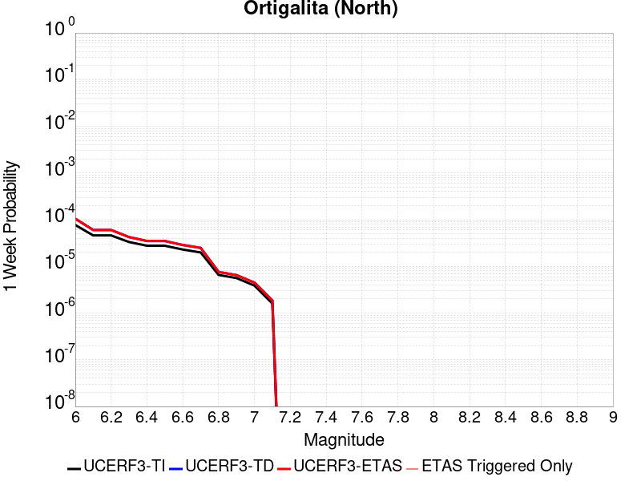 | 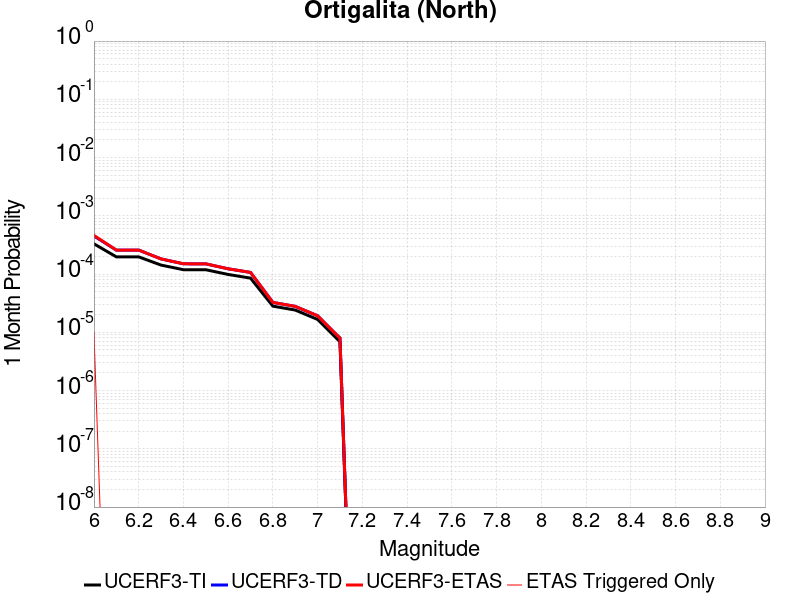 | 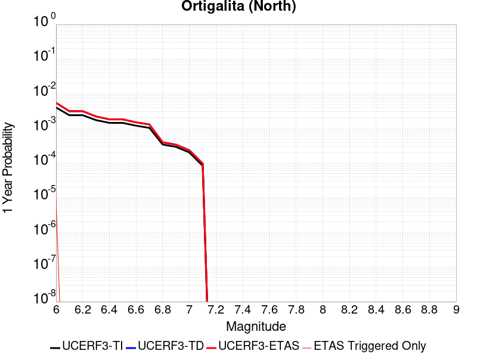 | 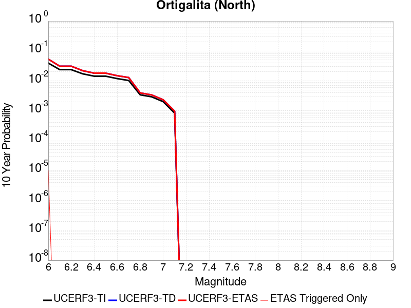 |

| Magnitude | 1 wk TI Prob | 1 wk TD Prob | 1 wk ETAS Prob | 1 wk ETAS/TD Gain | 1 wk ETAS Triggered Only | 1 mo TI Prob | 1 mo TD Prob | 1 mo ETAS Prob | 1 mo ETAS/TD Gain | 1 mo ETAS Triggered Only | 1 yr TI Prob | 1 yr TD Prob | 1 yr ETAS Prob | 1 yr ETAS/TD Gain | 1 yr ETAS Triggered Only | 10 yr TI Prob | 10 yr TD Prob | 10 yr ETAS Prob | 10 yr ETAS/TD Gain | 10 yr ETAS Triggered Only |
|-----|-----|-----|-----|-----|-----|-----|-----|-----|-----|-----|-----|-----|-----|-----|-----|-----|-----|-----|-----|-----|
| 6.0 | 7.711876E-5 | 1.05086016E-4 | 1.05086016E-4 | 1.0 | 0.0 | 3.3046713E-4 | 4.5030177E-4 | 4.6029725E-4 | 1.0221974 | 1.0E-5 | 0.004016016 | 0.005468958 | 0.005478903 | 1.0018185 | 1.0E-5 | 0.039442103 | 0.053463764 | 0.05347323 | 1.000177 | 1.0E-5 |
| 6.1 | 4.607858E-5 | 6.024935E-5 | 6.024935E-5 | 1.0 | 0.0 | 1.9746469E-4 | 2.5818875E-4 | 2.5818875E-4 | 1.0 | 0.0 | 0.0024014818 | 0.003139252 | 0.003139252 | 1.0 | 0.0 | 0.023756953 | 0.030979859 | 0.030979859 | 1.0 | 0.0 |
| 6.2 | 4.607858E-5 | 6.024935E-5 | 6.024935E-5 | 1.0 | 0.0 | 1.9746469E-4 | 2.5818875E-4 | 2.5818875E-4 | 1.0 | 0.0 | 0.0024014818 | 0.003139252 | 0.003139252 | 1.0 | 0.0 | 0.023756953 | 0.030979859 | 0.030979859 | 1.0 | 0.0 |
| 6.3 | 3.327423E-5 | 4.2481566E-5 | 4.2481566E-5 | 1.0 | 0.0 | 1.4259605E-4 | 1.8205289E-4 | 1.8205289E-4 | 1.0 | 0.0 | 0.0017347244 | 0.0022145277 | 0.0022145277 | 1.0 | 0.0 | 0.017212452 | 0.021948816 | 0.021948816 | 1.0 | 0.0 |
| 6.4 | 2.7732503E-5 | 3.5003635E-5 | 3.5003635E-5 | 1.0 | 0.0 | 1.1884817E-4 | 1.5000845E-4 | 1.5000845E-4 | 1.0 | 0.0 | 0.001446016 | 0.0018250674 | 0.0018250674 | 1.0 | 0.0 | 0.014366428 | 0.018123753 | 0.018123753 | 1.0 | 0.0 |
| 6.5 | 2.7689714E-5 | 3.4953442E-5 | 3.4953442E-5 | 1.0 | 0.0 | 1.186648E-4 | 1.4979337E-4 | 1.4979337E-4 | 1.0 | 0.0 | 0.0014437864 | 0.0018224533 | 0.0018224533 | 1.0 | 0.0 | 0.014344421 | 0.018098038 | 0.018098038 | 1.0 | 0.0 |
| 6.6 | 2.2976905E-5 | 2.8722226E-5 | 2.8722226E-5 | 1.0 | 0.0 | 9.846873E-5 | 1.2309088E-4 | 1.2309088E-4 | 1.0 | 0.0 | 0.0011981975 | 0.001497839 | 0.001497839 | 1.0 | 0.0 | 0.011917574 | 0.014900712 | 0.014900712 | 1.0 | 0.0 |
| 6.7 | 1.9871539E-5 | 2.4907882E-5 | 2.4907882E-5 | 1.0 | 0.0 | 8.516096E-5 | 1.067451E-4 | 1.067451E-4 | 1.0 | 0.0 | 0.0010363415 | 0.0012990955 | 0.0012990955 | 1.0 | 0.0 | 0.010315218 | 0.012938703 | 0.012938703 | 1.0 | 0.0 |
| 6.8 | 6.5640475E-6 | 7.6061337E-6 | 7.6061337E-6 | 1.0 | 0.0 | 2.813133E-5 | 3.2597323E-5 | 3.2597323E-5 | 1.0 | 0.0 | 3.424451E-4 | 3.9680302E-4 | 3.9680302E-4 | 1.0 | 0.0 | 0.0034191788 | 0.0039612325 | 0.0039612325 | 1.0 | 0.0 |
| 6.9 | 5.6219683E-6 | 6.5023783E-6 | 6.5023783E-6 | 1.0 | 0.0 | 2.4093928E-5 | 2.7867052E-5 | 2.7867052E-5 | 1.0 | 0.0 | 2.933041E-4 | 3.3923113E-4 | 3.3923113E-4 | 1.0 | 0.0 | 0.0029291727 | 0.00338739 | 0.00338739 | 1.0 | 0.0 |
| 7.0 | 3.875591E-6 | 4.4851295E-6 | 4.4851295E-6 | 1.0 | 0.0 | 1.6609569E-5 | 1.9221854E-5 | 1.9221854E-5 | 1.0 | 0.0 | 2.0220275E-4 | 2.3400305E-4 | 2.3400305E-4 | 1.0 | 0.0 | 0.0020201886 | 0.0023377747 | 0.0023377747 | 1.0 | 0.0 |
| 7.1 | 1.6017933E-6 | 1.857199E-6 | 1.857199E-6 | 1.0 | 0.0 | 6.8648105E-6 | 7.959406E-6 | 7.959406E-6 | 1.0 | 0.0 | 8.357586E-5 | 9.690253E-5 | 9.690253E-5 | 1.0 | 0.0 | 8.3544437E-4 | 9.6870743E-4 | 9.6870743E-4 | 1.0 | 0.0 |

## San Jacinto (San Bernardino)
*[(top)](#table-of-contents)*

| 1 Week | 1 Month | 1 Year | 10 Year |
|-----|-----|-----|-----|
|  |  |  |  |

| Magnitude | 1 wk TI Prob | 1 wk TD Prob | 1 wk ETAS Prob | 1 wk ETAS/TD Gain | 1 wk ETAS Triggered Only | 1 mo TI Prob | 1 mo TD Prob | 1 mo ETAS Prob | 1 mo ETAS/TD Gain | 1 mo ETAS Triggered Only | 1 yr TI Prob | 1 yr TD Prob | 1 yr ETAS Prob | 1 yr ETAS/TD Gain | 1 yr ETAS Triggered Only | 10 yr TI Prob | 10 yr TD Prob | 10 yr ETAS Prob | 10 yr ETAS/TD Gain | 10 yr ETAS Triggered Only |
|-----|-----|-----|-----|-----|-----|-----|-----|-----|-----|-----|-----|-----|-----|-----|-----|-----|-----|-----|-----|-----|
| 6.0 | 3.409352E-5 | 3.6049758E-5 | 3.6049758E-5 | 1.0 | 0.0 | 1.461069E-4 | 1.5448983E-4 | 1.5448983E-4 | 1.0 | 0.0 | 0.0017774 | 0.0018792928 | 0.001889274 | 1.0053111 | 1.0E-5 | 0.01763251 | 0.019382251 | 0.019392056 | 1.0005059 | 1.0E-5 |
| 6.1 | 3.409352E-5 | 3.6049758E-5 | 3.6049758E-5 | 1.0 | 0.0 | 1.461069E-4 | 1.5448983E-4 | 1.5448983E-4 | 1.0 | 0.0 | 0.0017774 | 0.0018792928 | 0.001889274 | 1.0053111 | 1.0E-5 | 0.01763251 | 0.019382251 | 0.019392056 | 1.0005059 | 1.0E-5 |
| 6.2 | 3.409352E-5 | 3.6049758E-5 | 3.6049758E-5 | 1.0 | 0.0 | 1.461069E-4 | 1.5448983E-4 | 1.5448983E-4 | 1.0 | 0.0 | 0.0017774 | 0.0018792928 | 0.001889274 | 1.0053111 | 1.0E-5 | 0.01763251 | 0.019382251 | 0.019392056 | 1.0005059 | 1.0E-5 |
| 6.3 | 3.409352E-5 | 3.6049758E-5 | 3.6049758E-5 | 1.0 | 0.0 | 1.461069E-4 | 1.5448983E-4 | 1.5448983E-4 | 1.0 | 0.0 | 0.0017774 | 0.0018792928 | 0.001889274 | 1.0053111 | 1.0E-5 | 0.01763251 | 0.019382251 | 0.019392056 | 1.0005059 | 1.0E-5 |
| 6.4 | 3.400795E-5 | 3.5942405E-5 | 3.5942405E-5 | 1.0 | 0.0 | 1.4574021E-4 | 1.540298E-4 | 1.540298E-4 | 1.0 | 0.0 | 0.0017729428 | 0.0018737017 | 0.001883683 | 1.005327 | 1.0E-5 | 0.017588645 | 0.019327328 | 0.019337134 | 1.0005074 | 1.0E-5 |
| 6.5 | 3.341482E-5 | 3.5202946E-5 | 3.5202946E-5 | 1.0 | 0.0 | 1.4319851E-4 | 1.5086106E-4 | 1.5086106E-4 | 1.0 | 0.0 | 0.0017420477 | 0.0018351874 | 0.0018451691 | 1.005439 | 1.0E-5 | 0.017284546 | 0.018948833 | 0.018958643 | 1.0005177 | 1.0E-5 |
| 6.6 | 3.3364955E-5 | 3.5140158E-5 | 3.5140158E-5 | 1.0 | 0.0 | 1.4298483E-4 | 1.50592E-4 | 1.50592E-4 | 1.0 | 0.0 | 0.0017394501 | 0.0018319171 | 0.0018418988 | 1.0054488 | 1.0E-5 | 0.017258976 | 0.018916694 | 0.018926505 | 1.0005187 | 1.0E-5 |
| 6.7 | 3.335922E-5 | 3.512993E-5 | 3.512993E-5 | 1.0 | 0.0 | 1.4296026E-4 | 1.5054816E-4 | 1.5054816E-4 | 1.0 | 0.0 | 0.0017391514 | 0.0018313844 | 0.0018413661 | 1.0054504 | 1.0E-5 | 0.017256035 | 0.018911485 | 0.018921297 | 1.0005188 | 1.0E-5 |
| 6.8 | 3.327683E-5 | 3.5023982E-5 | 3.5023982E-5 | 1.0 | 0.0 | 1.4260718E-4 | 1.5009414E-4 | 1.5009414E-4 | 1.0 | 0.0 | 0.0017348597 | 0.0018258659 | 0.0018358477 | 1.0054668 | 1.0E-5 | 0.017213784 | 0.018857252 | 0.018867062 | 1.0005203 | 1.0E-5 |
| 6.9 | 3.3235785E-5 | 3.4964927E-5 | 3.4964927E-5 | 1.0 | 0.0 | 1.4243131E-4 | 1.4984109E-4 | 1.4984109E-4 | 1.0 | 0.0 | 0.0017327217 | 0.0018227901 | 0.0018327718 | 1.0054761 | 1.0E-5 | 0.017192734 | 0.018827116 | 0.018836929 | 1.0005212 | 1.0E-5 |
| 7.0 | 3.3197095E-5 | 3.4904846E-5 | 3.4904846E-5 | 1.0 | 0.0 | 1.422655E-4 | 1.4958362E-4 | 1.4958362E-4 | 1.0 | 0.0 | 0.0017307063 | 0.0018196608 | 0.0018296426 | 1.0054855 | 1.0E-5 | 0.017172894 | 0.018796489 | 0.018806301 | 1.000522 | 1.0E-5 |
| 7.1 | 3.3129716E-5 | 3.478503E-5 | 3.478503E-5 | 1.0 | 0.0 | 1.4197677E-4 | 1.4907018E-4 | 1.4907018E-4 | 1.0 | 0.0 | 0.0017271966 | 0.0018134202 | 0.001823402 | 1.0055045 | 1.0E-5 | 0.017138338 | 0.018735558 | 0.01874537 | 1.0005237 | 1.0E-5 |
| 7.2 | 3.3034008E-5 | 3.4652458E-5 | 3.4652458E-5 | 1.0 | 0.0 | 1.4156665E-4 | 1.4850209E-4 | 1.4850209E-4 | 1.0 | 0.0 | 0.0017222111 | 0.001806515 | 0.001816497 | 1.0055255 | 1.0E-5 | 0.017089253 | 0.018667944 | 0.018677756 | 1.0005257 | 1.0E-5 |
| 7.3 | 3.2956614E-5 | 3.4520177E-5 | 3.4520177E-5 | 1.0 | 0.0 | 1.4123498E-4 | 1.4793524E-4 | 1.4793524E-4 | 1.0 | 0.0 | 0.0017181796 | 0.001799625 | 0.001809607 | 1.0055467 | 1.0E-5 | 0.017049557 | 0.018600674 | 0.018610489 | 1.0005276 | 1.0E-5 |
| 7.4 | 3.2915937E-5 | 3.4441844E-5 | 3.4441844E-5 | 1.0 | 0.0 | 1.4106068E-4 | 1.4759957E-4 | 1.4759957E-4 | 1.0 | 0.0 | 0.0017160608 | 0.0017955449 | 0.0018055269 | 1.0055593 | 1.0E-5 | 0.017028693 | 0.018560927 | 0.018570742 | 1.0005288 | 1.0E-5 |
| 7.5 | 3.281791E-5 | 3.430671E-5 | 3.430671E-5 | 1.0 | 0.0 | 1.406406E-4 | 1.4702049E-4 | 1.4702049E-4 | 1.0 | 0.0 | 0.0017109542 | 0.0017885063 | 0.0017984884 | 1.0055813 | 1.0E-5 | 0.016978411 | 0.018491795 | 0.01850161 | 1.0005308 | 1.0E-5 |
| 7.6 | 3.2521442E-5 | 3.4031546E-5 | 3.4031546E-5 | 1.0 | 0.0 | 1.3937015E-4 | 1.4584133E-4 | 1.4584133E-4 | 1.0 | 0.0 | 0.0016955109 | 0.0017741736 | 0.0017841558 | 1.0056264 | 1.0E-5 | 0.016826328 | 0.018349366 | 0.018359182 | 1.000535 | 1.0E-5 |
| 7.7 | 3.0287873E-5 | 3.2514843E-5 | 3.2514843E-5 | 1.0 | 0.0 | 1.297987E-4 | 1.393419E-4 | 1.393419E-4 | 1.0 | 0.0 | 0.0015791537 | 0.0016951686 | 0.0017051516 | 1.0058892 | 1.0E-5 | 0.01567979 | 0.017559871 | 0.017569697 | 1.0005594 | 1.0E-5 |
| 7.8 | 2.6316151E-5 | 2.9723395E-5 | 2.9723395E-5 | 1.0 | 0.0 | 1.1277862E-4 | 1.2737977E-4 | 1.2737977E-4 | 1.0 | 0.0 | 0.0013722149 | 0.0015497464 | 0.0015597309 | 1.0064427 | 1.0E-5 | 0.013637724 | 0.016100293 | 0.016110133 | 1.0006111 | 1.0E-5 |
| 7.9 | 2.0761147E-5 | 2.3470231E-5 | 2.3470231E-5 | 1.0 | 0.0 | 8.897331E-5 | 1.0058283E-4 | 1.0058283E-4 | 1.0 | 0.0 | 0.0010827117 | 0.0012239089 | 0.0012338966 | 1.0081606 | 1.0E-5 | 0.010774517 | 0.012820105 | 0.012829976 | 1.00077 | 1.0E-5 |
| 8.0 | 1.5738568E-5 | 1.607273E-5 | 1.607273E-5 | 1.0 | 0.0 | 6.744926E-5 | 6.8881316E-5 | 6.8881316E-5 | 1.0 | 0.0 | 8.2088535E-4 | 8.38308E-4 | 8.4829965E-4 | 1.0119188 | 1.0E-5 | 0.008178596 | 0.008886527 | 0.008896438 | 1.0011153 | 1.0E-5 |
| 8.1 | 1.0105832E-5 | 8.353191E-6 | 8.353191E-6 | 1.0 | 0.0 | 4.3309992E-5 | 3.5798905E-5 | 3.5798905E-5 | 1.0 | 0.0 | 5.2717153E-4 | 4.35765E-4 | 4.4576064E-4 | 1.0229381 | 1.0E-5 | 0.005259227 | 0.004689436 | 0.004699389 | 1.0021224 | 1.0E-5 |
| 8.2 | 4.189207E-6 | 1.5851253E-6 | 1.5851253E-6 | 1.0 | 0.0 | 1.7953622E-5 | 6.7933765E-6 | 6.7933765E-6 | 1.0 | 0.0 | 2.1856341E-4 | 8.270625E-5 | 8.270625E-5 | 1.0 | 0.0 | 0.0021834858 | 9.604094E-4 | 9.604094E-4 | 1.0 | 0.0 |
| 8.3 | 1.2758221E-6 | 3.6330252E-7 | 3.6330252E-7 | 1.0 | 0.0 | 5.4677976E-6 | 1.5570099E-6 | 1.5570099E-6 | 1.0 | 0.0 | 6.65684E-5 | 1.8956434E-5 | 1.8956434E-5 | 1.0 | 0.0 | 6.6548464E-4 | 2.2857229E-4 | 2.2857229E-4 | 1.0 | 0.0 |

## San Jacinto (San Jacinto Valley) rev
*[(top)](#table-of-contents)*

| 1 Week | 1 Month | 1 Year | 10 Year |
|-----|-----|-----|-----|
|  |  |  |  |

| Magnitude | 1 wk TI Prob | 1 wk TD Prob | 1 wk ETAS Prob | 1 wk ETAS/TD Gain | 1 wk ETAS Triggered Only | 1 mo TI Prob | 1 mo TD Prob | 1 mo ETAS Prob | 1 mo ETAS/TD Gain | 1 mo ETAS Triggered Only | 1 yr TI Prob | 1 yr TD Prob | 1 yr ETAS Prob | 1 yr ETAS/TD Gain | 1 yr ETAS Triggered Only | 10 yr TI Prob | 10 yr TD Prob | 10 yr ETAS Prob | 10 yr ETAS/TD Gain | 10 yr ETAS Triggered Only |
|-----|-----|-----|-----|-----|-----|-----|-----|-----|-----|-----|-----|-----|-----|-----|-----|-----|-----|-----|-----|-----|
| 6.0 | 3.652694E-5 | 3.4467394E-5 | 3.4467394E-5 | 1.0 | 0.0 | 1.5653463E-4 | 1.4770904E-4 | 1.4770904E-4 | 1.0 | 0.0 | 0.0019041431 | 0.001796876 | 0.001806858 | 1.0055553 | 1.0E-5 | 0.018879099 | 0.018560216 | 0.01857003 | 1.0005288 | 1.0E-5 |
| 6.1 | 3.652694E-5 | 3.4467394E-5 | 3.4467394E-5 | 1.0 | 0.0 | 1.5653463E-4 | 1.4770904E-4 | 1.4770904E-4 | 1.0 | 0.0 | 0.0019041431 | 0.001796876 | 0.001806858 | 1.0055553 | 1.0E-5 | 0.018879099 | 0.018560216 | 0.01857003 | 1.0005288 | 1.0E-5 |
| 6.2 | 3.652694E-5 | 3.4467394E-5 | 3.4467394E-5 | 1.0 | 0.0 | 1.5653463E-4 | 1.4770904E-4 | 1.4770904E-4 | 1.0 | 0.0 | 0.0019041431 | 0.001796876 | 0.001806858 | 1.0055553 | 1.0E-5 | 0.018879099 | 0.018560216 | 0.01857003 | 1.0005288 | 1.0E-5 |
| 6.3 | 3.652694E-5 | 3.4467394E-5 | 3.4467394E-5 | 1.0 | 0.0 | 1.5653463E-4 | 1.4770904E-4 | 1.4770904E-4 | 1.0 | 0.0 | 0.0019041431 | 0.001796876 | 0.001806858 | 1.0055553 | 1.0E-5 | 0.018879099 | 0.018560216 | 0.01857003 | 1.0005288 | 1.0E-5 |
| 6.4 | 3.646941E-5 | 3.4388955E-5 | 3.4388955E-5 | 1.0 | 0.0 | 1.5628811E-4 | 1.4737292E-4 | 1.4737292E-4 | 1.0 | 0.0 | 0.0019011468 | 0.0017927908 | 0.001802773 | 1.0055679 | 1.0E-5 | 0.018849645 | 0.01852009 | 0.018529905 | 1.00053 | 1.0E-5 |
| 6.5 | 3.646941E-5 | 3.4388955E-5 | 3.4388955E-5 | 1.0 | 0.0 | 1.5628811E-4 | 1.4737292E-4 | 1.4737292E-4 | 1.0 | 0.0 | 0.0019011468 | 0.0017927908 | 0.001802773 | 1.0055679 | 1.0E-5 | 0.018849645 | 0.01852009 | 0.018529905 | 1.00053 | 1.0E-5 |
| 6.6 | 3.6442503E-5 | 3.4352335E-5 | 3.4352335E-5 | 1.0 | 0.0 | 1.561728E-4 | 1.4721598E-4 | 1.4721598E-4 | 1.0 | 0.0 | 0.0018997455 | 0.0017908834 | 0.0018008654 | 1.0055739 | 1.0E-5 | 0.018835869 | 0.018501356 | 0.018511172 | 1.0005305 | 1.0E-5 |
| 6.7 | 3.6432113E-5 | 3.4337903E-5 | 3.4337903E-5 | 1.0 | 0.0 | 1.5612828E-4 | 1.4715415E-4 | 1.4715415E-4 | 1.0 | 0.0 | 0.0018992044 | 0.001790132 | 0.001800114 | 1.0055761 | 1.0E-5 | 0.018830549 | 0.01849398 | 0.018503794 | 1.0005307 | 1.0E-5 |
| 6.8 | 3.6409598E-5 | 3.430695E-5 | 3.430695E-5 | 1.0 | 0.0 | 1.560318E-4 | 1.470215E-4 | 1.470215E-4 | 1.0 | 0.0 | 0.0018980318 | 0.0017885199 | 0.0017985019 | 1.0055813 | 1.0E-5 | 0.018819023 | 0.01847813 | 0.018487947 | 1.0005312 | 1.0E-5 |
| 6.9 | 3.638078E-5 | 3.4267367E-5 | 3.4267367E-5 | 1.0 | 0.0 | 1.5590832E-4 | 1.4685189E-4 | 1.4685189E-4 | 1.0 | 0.0 | 0.0018965311 | 0.0017864581 | 0.0017964402 | 1.0055877 | 1.0E-5 | 0.018804269 | 0.018457862 | 0.018467678 | 1.0005318 | 1.0E-5 |
| 7.0 | 3.6294874E-5 | 3.4149365E-5 | 3.4149365E-5 | 1.0 | 0.0 | 1.5554018E-4 | 1.4634622E-4 | 1.4634622E-4 | 1.0 | 0.0 | 0.0018920569 | 0.0017803118 | 0.0017902941 | 1.005607 | 1.0E-5 | 0.018760284 | 0.018397434 | 0.01840725 | 1.0005336 | 1.0E-5 |
| 7.1 | 3.6260717E-5 | 3.410564E-5 | 3.410564E-5 | 1.0 | 0.0 | 1.5539382E-4 | 1.4615887E-4 | 1.4615887E-4 | 1.0 | 0.0 | 0.001890278 | 0.0017780344 | 0.0017880166 | 1.0056142 | 1.0E-5 | 0.018742796 | 0.018375032 | 0.018384848 | 1.0005342 | 1.0E-5 |
| 7.2 | 3.6210204E-5 | 3.403977E-5 | 3.403977E-5 | 1.0 | 0.0 | 1.5517735E-4 | 1.4587659E-4 | 1.4587659E-4 | 1.0 | 0.0 | 0.001887647 | 0.0017746033 | 0.0017845855 | 1.005625 | 1.0E-5 | 0.01871693 | 0.018341267 | 0.018351084 | 1.0005352 | 1.0E-5 |
| 7.3 | 3.6119454E-5 | 3.3927867E-5 | 3.3927867E-5 | 1.0 | 0.0 | 1.5478847E-4 | 1.4539705E-4 | 1.4539705E-4 | 1.0 | 0.0 | 0.0018829206 | 0.0017687745 | 0.0017787567 | 1.0056436 | 1.0E-5 | 0.018670462 | 0.018283723 | 0.01829354 | 1.0005369 | 1.0E-5 |
| 7.4 | 3.607848E-5 | 3.387532E-5 | 3.387532E-5 | 1.0 | 0.0 | 1.5461289E-4 | 1.4517189E-4 | 1.4517189E-4 | 1.0 | 0.0 | 0.0018807866 | 0.0017660374 | 0.0017760198 | 1.0056524 | 1.0E-5 | 0.018649481 | 0.018256696 | 0.018266514 | 1.0005378 | 1.0E-5 |
| 7.5 | 3.5856774E-5 | 3.3684162E-5 | 3.3684162E-5 | 1.0 | 0.0 | 1.5366284E-4 | 1.4435273E-4 | 1.4435273E-4 | 1.0 | 0.0 | 0.0018692396 | 0.0017560803 | 0.0017660628 | 1.0056845 | 1.0E-5 | 0.018535944 | 0.01815731 | 0.018167129 | 1.0005407 | 1.0E-5 |
| 7.6 | 3.286655E-5 | 3.220034E-5 | 3.220034E-5 | 1.0 | 0.0 | 1.4084904E-4 | 1.3799417E-4 | 1.3799417E-4 | 1.0 | 0.0 | 0.001713488 | 0.0016787864 | 0.0016887697 | 1.0059466 | 1.0E-5 | 0.017003361 | 0.017373424 | 0.01738325 | 1.0005656 | 1.0E-5 |
| 7.7 | 2.8882527E-5 | 2.9291981E-5 | 2.9291981E-5 | 1.0 | 0.0 | 1.237764E-4 | 1.2553102E-4 | 1.2553102E-4 | 1.0 | 0.0 | 0.0015059357 | 0.0015272698 | 0.0015372545 | 1.0065377 | 1.0E-5 | 0.014957713 | 0.015859274 | 0.015869115 | 1.0006206 | 1.0E-5 |
| 7.8 | 2.4950225E-5 | 2.6580747E-5 | 2.6580747E-5 | 1.0 | 0.0 | 1.0692515E-4 | 1.13912516E-4 | 1.13912516E-4 | 1.0 | 0.0 | 0.0013010362 | 0.0013860033 | 0.0013959896 | 1.007205 | 1.0E-5 | 0.012934455 | 0.014439502 | 0.014449358 | 1.0006826 | 1.0E-5 |
| 7.9 | 1.9881603E-5 | 2.155556E-5 | 2.155556E-5 | 1.0 | 0.0 | 8.520408E-5 | 9.2377704E-5 | 9.2377704E-5 | 1.0 | 0.0 | 0.001036866 | 0.001124119 | 0.0011341078 | 1.0088859 | 1.0E-5 | 0.010320415 | 0.011802064 | 0.0118119465 | 1.0008373 | 1.0E-5 |
| 8.0 | 1.563292E-5 | 1.5976173E-5 | 1.5976173E-5 | 1.0 | 0.0 | 6.6996516E-5 | 6.846752E-5 | 6.846752E-5 | 1.0 | 0.0 | 8.153773E-4 | 8.332739E-4 | 8.4326556E-4 | 1.0119909 | 1.0E-5 | 0.00812392 | 0.008830938 | 0.00884085 | 1.0011224 | 1.0E-5 |
| 8.1 | 1.0045313E-5 | 8.324356E-6 | 8.324356E-6 | 1.0 | 0.0 | 4.305063E-5 | 3.5675326E-5 | 3.5675326E-5 | 1.0 | 0.0 | 5.2401534E-4 | 4.3426102E-4 | 4.442567E-4 | 1.0230176 | 1.0E-5 | 0.0052278144 | 0.0046712374 | 0.004681191 | 1.0021307 | 1.0E-5 |
| 8.2 | 4.1554413E-6 | 1.5721832E-6 | 1.5721832E-6 | 1.0 | 0.0 | 1.7808914E-5 | 6.737911E-6 | 6.737911E-6 | 1.0 | 0.0 | 2.1680194E-4 | 8.203101E-5 | 8.203101E-5 | 1.0 | 0.0 | 0.0021659054 | 9.520741E-4 | 9.520741E-4 | 1.0 | 0.0 |
| 8.3 | 1.2758221E-6 | 3.6330252E-7 | 3.6330252E-7 | 1.0 | 0.0 | 5.4677976E-6 | 1.5570099E-6 | 1.5570099E-6 | 1.0 | 0.0 | 6.65684E-5 | 1.8956434E-5 | 1.8956434E-5 | 1.0 | 0.0 | 6.6548464E-4 | 2.2857229E-4 | 2.2857229E-4 | 1.0 | 0.0 |

## San Jacinto (Coyote Creek)
*[(top)](#table-of-contents)*

| 1 Week | 1 Month | 1 Year | 10 Year |
|-----|-----|-----|-----|
|  |  |  |  |

| Magnitude | 1 wk TI Prob | 1 wk TD Prob | 1 wk ETAS Prob | 1 wk ETAS/TD Gain | 1 wk ETAS Triggered Only | 1 mo TI Prob | 1 mo TD Prob | 1 mo ETAS Prob | 1 mo ETAS/TD Gain | 1 mo ETAS Triggered Only | 1 yr TI Prob | 1 yr TD Prob | 1 yr ETAS Prob | 1 yr ETAS/TD Gain | 1 yr ETAS Triggered Only | 10 yr TI Prob | 10 yr TD Prob | 10 yr ETAS Prob | 10 yr ETAS/TD Gain | 10 yr ETAS Triggered Only |
|-----|-----|-----|-----|-----|-----|-----|-----|-----|-----|-----|-----|-----|-----|-----|-----|-----|-----|-----|-----|-----|
| 6.0 | 2.7374346E-5 | 2.4177032E-5 | 2.4177032E-5 | 1.0 | 0.0 | 1.1731335E-4 | 1.0361175E-4 | 1.0361175E-4 | 1.0 | 0.0 | 0.0014273542 | 0.0012607456 | 0.001270733 | 1.0079218 | 1.0E-5 | 0.01418221 | 0.012944878 | 0.012954748 | 1.0007625 | 1.0E-5 |
| 6.1 | 2.7374346E-5 | 2.4177032E-5 | 2.4177032E-5 | 1.0 | 0.0 | 1.1731335E-4 | 1.0361175E-4 | 1.0361175E-4 | 1.0 | 0.0 | 0.0014273542 | 0.0012607456 | 0.001270733 | 1.0079218 | 1.0E-5 | 0.01418221 | 0.012944878 | 0.012954748 | 1.0007625 | 1.0E-5 |
| 6.2 | 2.7374346E-5 | 2.4177032E-5 | 2.4177032E-5 | 1.0 | 0.0 | 1.1731335E-4 | 1.0361175E-4 | 1.0361175E-4 | 1.0 | 0.0 | 0.0014273542 | 0.0012607456 | 0.001270733 | 1.0079218 | 1.0E-5 | 0.01418221 | 0.012944878 | 0.012954748 | 1.0007625 | 1.0E-5 |
| 6.3 | 2.7374346E-5 | 2.4177032E-5 | 2.4177032E-5 | 1.0 | 0.0 | 1.1731335E-4 | 1.0361175E-4 | 1.0361175E-4 | 1.0 | 0.0 | 0.0014273542 | 0.0012607456 | 0.001270733 | 1.0079218 | 1.0E-5 | 0.01418221 | 0.012944878 | 0.012954748 | 1.0007625 | 1.0E-5 |
| 6.4 | 2.7374346E-5 | 2.4177032E-5 | 2.4177032E-5 | 1.0 | 0.0 | 1.1731335E-4 | 1.0361175E-4 | 1.0361175E-4 | 1.0 | 0.0 | 0.0014273542 | 0.0012607456 | 0.001270733 | 1.0079218 | 1.0E-5 | 0.01418221 | 0.012944878 | 0.012954748 | 1.0007625 | 1.0E-5 |
| 6.5 | 2.7282445E-5 | 2.4063094E-5 | 2.4063094E-5 | 1.0 | 0.0 | 1.16919524E-4 | 1.03123486E-4 | 1.03123486E-4 | 1.0 | 0.0 | 0.0014225657 | 0.0012548079 | 0.0012647954 | 1.0079594 | 1.0E-5 | 0.014134934 | 0.012886199 | 0.01289607 | 1.000766 | 1.0E-5 |
| 6.6 | 2.7282445E-5 | 2.4063094E-5 | 2.4063094E-5 | 1.0 | 0.0 | 1.16919524E-4 | 1.03123486E-4 | 1.03123486E-4 | 1.0 | 0.0 | 0.0014225657 | 0.0012548079 | 0.0012647954 | 1.0079594 | 1.0E-5 | 0.014134934 | 0.012886199 | 0.01289607 | 1.000766 | 1.0E-5 |
| 6.7 | 2.7216198E-5 | 2.3988207E-5 | 2.3988207E-5 | 1.0 | 0.0 | 1.1663563E-4 | 1.02802565E-4 | 1.02802565E-4 | 1.0 | 0.0 | 0.0014191137 | 0.0012509052 | 0.0012608927 | 1.0079842 | 1.0E-5 | 0.014100855 | 0.012847606 | 0.012857477 | 1.0007683 | 1.0E-5 |
| 6.8 | 2.7078617E-5 | 2.3905404E-5 | 2.3905404E-5 | 1.0 | 0.0 | 1.1604605E-4 | 1.02447724E-4 | 1.02447724E-4 | 1.0 | 0.0 | 0.001411945 | 0.00124659 | 0.0012565776 | 1.0080119 | 1.0E-5 | 0.014030075 | 0.012804739 | 0.012814611 | 1.0007709 | 1.0E-5 |
| 6.9 | 2.6982952E-5 | 2.3824896E-5 | 2.3824896E-5 | 1.0 | 0.0 | 1.15636096E-4 | 1.0210271E-4 | 1.0210271E-4 | 1.0 | 0.0 | 0.0014069602 | 0.0012423943 | 0.0012523818 | 1.008039 | 1.0E-5 | 0.013980856 | 0.012763045 | 0.012772917 | 1.0007735 | 1.0E-5 |
| 7.0 | 2.6449972E-5 | 2.3401846E-5 | 2.3401846E-5 | 1.0 | 0.0 | 1.1335209E-4 | 1.00289784E-4 | 1.00289784E-4 | 1.0 | 0.0 | 0.001379188 | 0.0012203468 | 0.0012303346 | 1.0081844 | 1.0E-5 | 0.0137065975 | 0.012544374 | 0.012554249 | 1.0007871 | 1.0E-5 |
| 7.1 | 2.6257849E-5 | 2.322785E-5 | 2.322785E-5 | 1.0 | 0.0 | 1.1252879E-4 | 9.9544144E-5 | 9.9544144E-5 | 1.0 | 0.0 | 0.0013691769 | 0.0012112787 | 0.0012212667 | 1.0082457 | 1.0E-5 | 0.013607717 | 0.012454224 | 0.012464099 | 1.000793 | 1.0E-5 |
| 7.2 | 2.5270041E-5 | 2.2422375E-5 | 2.2422375E-5 | 1.0 | 0.0 | 1.0829568E-4 | 9.6092364E-5 | 9.6092364E-5 | 1.0 | 0.0 | 0.0013177024 | 0.001169299 | 0.0011792873 | 1.0085422 | 1.0E-5 | 0.013099162 | 0.012035143 | 0.012045022 | 1.0008209 | 1.0E-5 |
| 7.3 | 2.339701E-5 | 2.1153774E-5 | 2.1153774E-5 | 1.0 | 0.0 | 1.0026905E-4 | 9.065589E-5 | 9.065589E-5 | 1.0 | 0.0 | 0.001220092 | 0.0011031787 | 0.0011131677 | 1.0090547 | 1.0E-5 | 0.012134149 | 0.011373838 | 0.011383725 | 1.0008692 | 1.0E-5 |
| 7.4 | 2.296333E-5 | 2.0884016E-5 | 2.0884016E-5 | 1.0 | 0.0 | 9.841056E-5 | 8.949987E-5 | 8.949987E-5 | 1.0 | 0.0 | 0.0011974899 | 0.0010891182 | 0.0010991073 | 1.0091717 | 1.0E-5 | 0.011910575 | 0.011232895 | 0.011242783 | 1.0008802 | 1.0E-5 |
| 7.5 | 2.2188895E-5 | 2.0406682E-5 | 2.0406682E-5 | 1.0 | 0.0 | 9.50918E-5 | 8.745429E-5 | 8.745429E-5 | 1.0 | 0.0 | 0.0011571277 | 0.0010642379 | 0.0010742273 | 1.0093864 | 1.0E-5 | 0.011511209 | 0.010982383 | 0.010992273 | 1.0009005 | 1.0E-5 |
| 7.6 | 2.0013189E-5 | 1.8992265E-5 | 1.8992265E-5 | 1.0 | 0.0 | 8.5767984E-5 | 8.139289E-5 | 8.139289E-5 | 1.0 | 0.0 | 0.001043725 | 9.905098E-4 | 0.0010004998 | 1.0100858 | 1.0E-5 | 0.010388365 | 0.010240043 | 0.01024994 | 1.0009665 | 1.0E-5 |
| 7.7 | 1.7230794E-5 | 1.677281E-5 | 1.677281E-5 | 1.0 | 0.0 | 7.384417E-5 | 7.18815E-5 | 7.18815E-5 | 1.0 | 0.0 | 8.986819E-4 | 8.7480666E-4 | 8.8479795E-4 | 1.0114211 | 1.0E-5 | 0.008950562 | 0.009078168 | 0.009088078 | 1.0010916 | 1.0E-5 |
| 7.8 | 1.4478809E-5 | 1.50190535E-5 | 1.50190535E-5 | 1.0 | 0.0 | 6.205057E-5 | 6.4365784E-5 | 6.4365784E-5 | 1.0 | 0.0 | 7.552038E-4 | 7.833723E-4 | 7.9336454E-4 | 1.0127553 | 1.0E-5 | 0.0075264242 | 0.00815608 | 0.008165998 | 1.001216 | 1.0E-5 |
| 7.9 | 1.1114467E-5 | 1.1670009E-5 | 1.1670009E-5 | 1.0 | 0.0 | 4.7632562E-5 | 5.001337E-5 | 5.001337E-5 | 1.0 | 0.0 | 5.797721E-4 | 6.087432E-4 | 6.1873713E-4 | 1.0164173 | 1.0E-5 | 0.0057826187 | 0.006393403 | 0.006403339 | 1.0015541 | 1.0E-5 |
| 8.0 | 9.327402E-6 | 9.9217805E-6 | 9.9217805E-6 | 1.0 | 0.0 | 3.9973966E-5 | 4.2521227E-5 | 4.2521227E-5 | 1.0 | 0.0 | 4.8657437E-4 | 5.175735E-4 | 5.2756834E-4 | 1.019311 | 1.0E-5 | 0.0048551033 | 0.005461854 | 0.0054717995 | 1.0018209 | 1.0E-5 |
| 8.1 | 7.0235833E-6 | 6.844232E-6 | 6.844232E-6 | 1.0 | 0.0 | 3.0100724E-5 | 2.9332095E-5 | 2.9332095E-5 | 1.0 | 0.0 | 3.664147E-4 | 3.5706026E-4 | 3.6705667E-4 | 1.0279964 | 1.0E-5 | 0.003658111 | 0.0037964787 | 0.0038064406 | 1.002624 | 1.0E-5 |
| 8.2 | 2.0358202E-6 | 9.0285533E-7 | 9.0285533E-7 | 1.0 | 0.0 | 8.724915E-6 | 3.8693743E-6 | 3.8693743E-6 | 1.0 | 0.0 | 1.06220665E-4 | 4.710864E-5 | 4.710864E-5 | 1.0 | 0.0 | 0.001061699 | 5.3444994E-4 | 5.3444994E-4 | 1.0 | 0.0 |
| 8.3 | 2.0051264E-7 | 6.646147E-8 | 6.646147E-8 | 1.0 | 0.0 | 8.5933965E-7 | 2.8483484E-7 | 2.8483484E-7 | 1.0 | 0.0 | 1.046241E-5 | 3.467859E-6 | 3.467859E-6 | 1.0 | 0.0 | 1.0461917E-4 | 4.0304385E-5 | 4.0304385E-5 | 1.0 | 0.0 |

## San Luis Range 2011 CFM
*[(top)](#table-of-contents)*

| 1 Week | 1 Month | 1 Year | 10 Year |
|-----|-----|-----|-----|
|  |  |  |  |

| Magnitude | 1 wk TI Prob | 1 wk TD Prob | 1 wk ETAS Prob | 1 wk ETAS/TD Gain | 1 wk ETAS Triggered Only | 1 mo TI Prob | 1 mo TD Prob | 1 mo ETAS Prob | 1 mo ETAS/TD Gain | 1 mo ETAS Triggered Only | 1 yr TI Prob | 1 yr TD Prob | 1 yr ETAS Prob | 1 yr ETAS/TD Gain | 1 yr ETAS Triggered Only | 10 yr TI Prob | 10 yr TD Prob | 10 yr ETAS Prob | 10 yr ETAS/TD Gain | 10 yr ETAS Triggered Only |
|-----|-----|-----|-----|-----|-----|-----|-----|-----|-----|-----|-----|-----|-----|-----|-----|-----|-----|-----|-----|-----|
| 6.0 | 8.8368415E-6 | 8.965548E-6 | 8.965548E-6 | 1.0 | 0.0 | 3.787163E-5 | 3.8423255E-5 | 3.8423255E-5 | 1.0 | 0.0 | 4.609895E-4 | 4.677106E-4 | 4.677106E-4 | 1.0 | 0.0 | 0.0046003438 | 0.0046680453 | 0.0046779984 | 1.0021322 | 1.0E-5 |
| 6.1 | 8.8368415E-6 | 8.965548E-6 | 8.965548E-6 | 1.0 | 0.0 | 3.787163E-5 | 3.8423255E-5 | 3.8423255E-5 | 1.0 | 0.0 | 4.609895E-4 | 4.677106E-4 | 4.677106E-4 | 1.0 | 0.0 | 0.0046003438 | 0.0046680453 | 0.0046779984 | 1.0021322 | 1.0E-5 |
| 6.2 | 8.8368415E-6 | 8.965548E-6 | 8.965548E-6 | 1.0 | 0.0 | 3.787163E-5 | 3.8423255E-5 | 3.8423255E-5 | 1.0 | 0.0 | 4.609895E-4 | 4.677106E-4 | 4.677106E-4 | 1.0 | 0.0 | 0.0046003438 | 0.0046680453 | 0.0046779984 | 1.0021322 | 1.0E-5 |
| 6.3 | 8.8368415E-6 | 8.965548E-6 | 8.965548E-6 | 1.0 | 0.0 | 3.787163E-5 | 3.8423255E-5 | 3.8423255E-5 | 1.0 | 0.0 | 4.609895E-4 | 4.677106E-4 | 4.677106E-4 | 1.0 | 0.0 | 0.0046003438 | 0.0046680453 | 0.0046779984 | 1.0021322 | 1.0E-5 |
| 6.4 | 3.9094193E-6 | 3.941245E-6 | 3.941245E-6 | 1.0 | 0.0 | 1.6754546E-5 | 1.6890941E-5 | 1.6890941E-5 | 1.0 | 0.0 | 2.039675E-4 | 2.0562808E-4 | 2.0562808E-4 | 1.0 | 0.0 | 0.0020378039 | 0.002054407 | 0.002054407 | 1.0 | 0.0 |
| 6.5 | 3.9094193E-6 | 3.941245E-6 | 3.941245E-6 | 1.0 | 0.0 | 1.6754546E-5 | 1.6890941E-5 | 1.6890941E-5 | 1.0 | 0.0 | 2.039675E-4 | 2.0562808E-4 | 2.0562808E-4 | 1.0 | 0.0 | 0.0020378039 | 0.002054407 | 0.002054407 | 1.0 | 0.0 |
| 6.6 | 3.0587726E-6 | 3.075422E-6 | 3.075422E-6 | 1.0 | 0.0 | 1.3108959E-5 | 1.3180314E-5 | 1.3180314E-5 | 1.0 | 0.0 | 1.595899E-4 | 1.6045863E-4 | 1.6045863E-4 | 1.0 | 0.0 | 0.0015947534 | 0.0016034397 | 0.0016034397 | 1.0 | 0.0 |
| 6.7 | 2.6160574E-6 | 2.625157E-6 | 2.625157E-6 | 1.0 | 0.0 | 1.1211626E-5 | 1.1250625E-5 | 1.1250625E-5 | 1.0 | 0.0 | 1.3649299E-4 | 1.369678E-4 | 1.369678E-4 | 1.0 | 0.0 | 0.0013640919 | 0.0013688401 | 0.0013688401 | 1.0 | 0.0 |
| 6.8 | 2.5110312E-6 | 2.518169E-6 | 2.518169E-6 | 1.0 | 0.0 | 1.0761518E-5 | 1.0792108E-5 | 1.0792108E-5 | 1.0 | 0.0 | 1.310136E-4 | 1.3138604E-4 | 1.3138604E-4 | 1.0 | 0.0 | 0.0013093639 | 0.0013130896 | 0.0013130896 | 1.0 | 0.0 |
| 6.9 | 1.8564405E-6 | 1.8525097E-6 | 1.8525097E-6 | 1.0 | 0.0 | 7.95615E-6 | 7.939303E-6 | 7.939303E-6 | 1.0 | 0.0 | 9.686181E-5 | 9.6656746E-5 | 9.6656746E-5 | 1.0 | 0.0 | 9.68196E-4 | 9.6614915E-4 | 9.6614915E-4 | 1.0 | 0.0 |
| 7.0 | 1.546127E-6 | 1.5369736E-6 | 1.5369736E-6 | 1.0 | 0.0 | 6.626242E-6 | 6.5870136E-6 | 6.5870136E-6 | 1.0 | 0.0 | 8.06715E-5 | 8.0193946E-5 | 8.0193946E-5 | 1.0 | 0.0 | 8.0642226E-4 | 8.0165075E-4 | 8.0165075E-4 | 1.0 | 0.0 |
| 7.1 | 1.3368208E-6 | 1.3235502E-6 | 1.3235502E-6 | 1.0 | 0.0 | 5.7292195E-6 | 5.672346E-6 | 5.672346E-6 | 1.0 | 0.0 | 6.975101E-5 | 6.905863E-5 | 6.905863E-5 | 1.0 | 0.0 | 6.972912E-4 | 6.9037214E-4 | 6.9037214E-4 | 1.0 | 0.0 |
| 7.2 | 1.0623363E-6 | 1.0454515E-6 | 1.0454515E-6 | 1.0 | 0.0 | 4.5528623E-6 | 4.480499E-6 | 4.480499E-6 | 1.0 | 0.0 | 5.5429686E-5 | 5.454871E-5 | 5.454871E-5 | 1.0 | 0.0 | 5.5415864E-4 | 5.453535E-4 | 5.453535E-4 | 1.0 | 0.0 |
| 7.3 | 7.831679E-7 | 7.72751E-7 | 7.72751E-7 | 1.0 | 0.0 | 3.3564295E-6 | 3.3117856E-6 | 3.3117856E-6 | 1.0 | 0.0 | 4.086376E-5 | 4.0320243E-5 | 4.0320243E-5 | 1.0 | 0.0 | 4.0856248E-4 | 4.0312944E-4 | 4.0312944E-4 | 1.0 | 0.0 |
| 7.4 | 5.9558846E-7 | 5.910736E-7 | 5.910736E-7 | 1.0 | 0.0 | 2.5525194E-6 | 2.5331701E-6 | 2.5331701E-6 | 1.0 | 0.0 | 3.107648E-5 | 3.084091E-5 | 3.084091E-5 | 1.0 | 0.0 | 3.1072134E-4 | 3.0836638E-4 | 3.0836638E-4 | 1.0 | 0.0 |
| 7.5 | 4.1616502E-7 | 4.1197126E-7 | 4.1197126E-7 | 1.0 | 0.0 | 1.7835631E-6 | 1.7655899E-6 | 1.7655899E-6 | 1.0 | 0.0 | 2.1714664E-5 | 2.1495845E-5 | 2.1495845E-5 | 1.0 | 0.0 | 2.1712543E-4 | 2.1493771E-4 | 2.1493771E-4 | 1.0 | 0.0 |
| 7.6 | 2.3816014E-7 | 2.337718E-7 | 2.337718E-7 | 1.0 | 0.0 | 1.0206859E-6 | 1.0018788E-6 | 1.0018788E-6 | 1.0 | 0.0 | 1.242678E-5 | 1.21978055E-5 | 1.21978055E-5 | 1.0 | 0.0 | 1.2426086E-4 | 1.2197138E-4 | 1.2197138E-4 | 1.0 | 0.0 |
| 7.7 | 9.918777E-8 | 9.3872394E-8 | 9.3872394E-8 | 1.0 | 0.0 | 4.2509038E-7 | 4.023102E-7 | 4.023102E-7 | 1.0 | 0.0 | 5.1754632E-6 | 4.8981155E-6 | 4.8981155E-6 | 1.0 | 0.0 | 5.1753424E-5 | 4.898008E-5 | 4.898008E-5 | 1.0 | 0.0 |
| 7.8 | 3.4982556E-8 | 2.9690542E-8 | 2.9690542E-8 | 1.0 | 0.0 | 1.4992524E-7 | 1.2724517E-7 | 1.2724517E-7 | 1.0 | 0.0 | 1.8253382E-6 | 1.549209E-6 | 1.549209E-6 | 1.0 | 0.0 | 1.8253233E-5 | 1.5491982E-5 | 1.5491982E-5 | 1.0 | 0.0 |
| 7.9 | 1.6624908E-8 | 1.1480696E-8 | 1.1480696E-8 | 1.0 | 0.0 | 7.12496E-8 | 4.920299E-8 | 4.920299E-8 | 1.0 | 0.0 | 8.6746354E-7 | 5.990462E-7 | 5.990462E-7 | 1.0 | 0.0 | 8.674601E-6 | 5.9904464E-6 | 5.9904464E-6 | 1.0 | 0.0 |
| 8.0 | 6.3352315E-9 | 3.0908693E-9 | 3.0908693E-9 | 1.0 | 0.0 | 2.715099E-8 | 1.3246585E-8 | 1.3246585E-8 | 1.0 | 0.0 | 3.3056327E-7 | 1.6127716E-7 | 1.6127716E-7 | 1.0 | 0.0 | 3.3056278E-6 | 1.6127703E-6 | 1.6127703E-6 | 1.0 | 0.0 |

## San Cayetano
*[(top)](#table-of-contents)*

| 1 Week | 1 Month | 1 Year | 10 Year |
|-----|-----|-----|-----|
|  |  |  |  |

| Magnitude | 1 wk TI Prob | 1 wk TD Prob | 1 wk ETAS Prob | 1 wk ETAS/TD Gain | 1 wk ETAS Triggered Only | 1 mo TI Prob | 1 mo TD Prob | 1 mo ETAS Prob | 1 mo ETAS/TD Gain | 1 mo ETAS Triggered Only | 1 yr TI Prob | 1 yr TD Prob | 1 yr ETAS Prob | 1 yr ETAS/TD Gain | 1 yr ETAS Triggered Only | 10 yr TI Prob | 10 yr TD Prob | 10 yr ETAS Prob | 10 yr ETAS/TD Gain | 10 yr ETAS Triggered Only |
|-----|-----|-----|-----|-----|-----|-----|-----|-----|-----|-----|-----|-----|-----|-----|-----|-----|-----|-----|-----|-----|
| 6.0 | 2.3476267E-5 | 1.8172246E-5 | 1.8172246E-5 | 1.0 | 0.0 | 1.0060869E-4 | 7.787875E-5 | 7.787875E-5 | 1.0 | 0.0 | 0.0012242225 | 9.4776496E-4 | 9.577555E-4 | 1.0105411 | 1.0E-5 | 0.012175002 | 0.009438118 | 0.0094480235 | 1.0010495 | 1.0E-5 |
| 6.1 | 2.3476267E-5 | 1.8172246E-5 | 1.8172246E-5 | 1.0 | 0.0 | 1.0060869E-4 | 7.787875E-5 | 7.787875E-5 | 1.0 | 0.0 | 0.0012242225 | 9.4776496E-4 | 9.577555E-4 | 1.0105411 | 1.0E-5 | 0.012175002 | 0.009438118 | 0.0094480235 | 1.0010495 | 1.0E-5 |
| 6.2 | 2.3476267E-5 | 1.8172246E-5 | 1.8172246E-5 | 1.0 | 0.0 | 1.0060869E-4 | 7.787875E-5 | 7.787875E-5 | 1.0 | 0.0 | 0.0012242225 | 9.4776496E-4 | 9.577555E-4 | 1.0105411 | 1.0E-5 | 0.012175002 | 0.009438118 | 0.0094480235 | 1.0010495 | 1.0E-5 |
| 6.3 | 2.3476267E-5 | 1.8172246E-5 | 1.8172246E-5 | 1.0 | 0.0 | 1.0060869E-4 | 7.787875E-5 | 7.787875E-5 | 1.0 | 0.0 | 0.0012242225 | 9.4776496E-4 | 9.577555E-4 | 1.0105411 | 1.0E-5 | 0.012175002 | 0.009438118 | 0.0094480235 | 1.0010495 | 1.0E-5 |
| 6.4 | 2.3476267E-5 | 1.8172246E-5 | 1.8172246E-5 | 1.0 | 0.0 | 1.0060869E-4 | 7.787875E-5 | 7.787875E-5 | 1.0 | 0.0 | 0.0012242225 | 9.4776496E-4 | 9.577555E-4 | 1.0105411 | 1.0E-5 | 0.012175002 | 0.009438118 | 0.0094480235 | 1.0010495 | 1.0E-5 |
| 6.5 | 2.3476267E-5 | 1.8172246E-5 | 1.8172246E-5 | 1.0 | 0.0 | 1.0060869E-4 | 7.787875E-5 | 7.787875E-5 | 1.0 | 0.0 | 0.0012242225 | 9.4776496E-4 | 9.577555E-4 | 1.0105411 | 1.0E-5 | 0.012175002 | 0.009438118 | 0.0094480235 | 1.0010495 | 1.0E-5 |
| 6.6 | 2.3476267E-5 | 1.8172246E-5 | 1.8172246E-5 | 1.0 | 0.0 | 1.0060869E-4 | 7.787875E-5 | 7.787875E-5 | 1.0 | 0.0 | 0.0012242225 | 9.4776496E-4 | 9.577555E-4 | 1.0105411 | 1.0E-5 | 0.012175002 | 0.009438118 | 0.0094480235 | 1.0010495 | 1.0E-5 |
| 6.7 | 2.3476267E-5 | 1.8172246E-5 | 1.8172246E-5 | 1.0 | 0.0 | 1.0060869E-4 | 7.787875E-5 | 7.787875E-5 | 1.0 | 0.0 | 0.0012242225 | 9.4776496E-4 | 9.577555E-4 | 1.0105411 | 1.0E-5 | 0.012175002 | 0.009438118 | 0.0094480235 | 1.0010495 | 1.0E-5 |
| 6.8 | 2.3241924E-5 | 1.7939927E-5 | 1.7939927E-5 | 1.0 | 0.0 | 9.960445E-5 | 7.688316E-5 | 7.688316E-5 | 1.0 | 0.0 | 0.0012120095 | 9.356541E-4 | 9.4564474E-4 | 1.0106777 | 1.0E-5 | 0.012054204 | 0.009318002 | 0.009327909 | 1.0010632 | 1.0E-5 |
| 6.9 | 2.2761007E-5 | 1.7435323E-5 | 1.7435323E-5 | 1.0 | 0.0 | 9.7543525E-5 | 7.4720694E-5 | 7.4720694E-5 | 1.0 | 0.0 | 0.0011869454 | 9.093482E-4 | 9.093482E-4 | 1.0 | 0.0 | 0.011806256 | 0.009057103 | 0.009057103 | 1.0 | 0.0 |
| 7.0 | 2.240283E-5 | 1.7069042E-5 | 1.7069042E-5 | 1.0 | 0.0 | 9.600859E-5 | 7.3151E-5 | 7.3151E-5 | 1.0 | 0.0 | 0.0011682777 | 8.9025294E-4 | 8.9025294E-4 | 1.0 | 0.0 | 0.011621549 | 0.008867681 | 0.008867681 | 1.0 | 0.0 |
| 7.1 | 2.1871154E-5 | 1.6588847E-5 | 1.6588847E-5 | 1.0 | 0.0 | 9.373015E-5 | 7.1093134E-5 | 7.1093134E-5 | 1.0 | 0.0 | 0.0011405671 | 8.652186E-4 | 8.652186E-4 | 1.0 | 0.0 | 0.011347309 | 0.008619301 | 0.008619301 | 1.0 | 0.0 |
| 7.2 | 2.0714133E-5 | 1.5567295E-5 | 1.5567295E-5 | 1.0 | 0.0 | 8.8771834E-5 | 6.671529E-5 | 6.671529E-5 | 1.0 | 0.0 | 0.0010802611 | 8.1195927E-4 | 8.1195927E-4 | 1.0 | 0.0 | 0.010750249 | 0.008090701 | 0.008090701 | 1.0 | 0.0 |
| 7.3 | 1.8408395E-5 | 1.3998046E-5 | 1.3998046E-5 | 1.0 | 0.0 | 7.8890735E-5 | 5.999026E-5 | 5.999026E-5 | 1.0 | 0.0 | 9.600714E-4 | 7.3013967E-4 | 7.3013967E-4 | 1.0 | 0.0 | 0.009559342 | 0.007278127 | 0.007278127 | 1.0 | 0.0 |
| 7.4 | 1.6856795E-5 | 1.2851064E-5 | 1.2851064E-5 | 1.0 | 0.0 | 7.2241404E-5 | 5.507484E-5 | 5.507484E-5 | 1.0 | 0.0 | 8.7918417E-4 | 6.7033275E-4 | 6.7033275E-4 | 1.0 | 0.0 | 0.00875714 | 0.006683788 | 0.006683788 | 1.0 | 0.0 |
| 7.5 | 1.2822778E-5 | 9.578205E-6 | 9.578205E-6 | 1.0 | 0.0 | 5.495361E-5 | 4.1048817E-5 | 4.1048817E-5 | 1.0 | 0.0 | 6.688548E-4 | 4.996563E-4 | 4.996563E-4 | 1.0 | 0.0 | 0.006668452 | 0.0049855 | 0.0049855 | 1.0 | 0.0 |
| 7.6 | 5.6272684E-6 | 3.855203E-6 | 3.855203E-6 | 1.0 | 0.0 | 2.4116642E-5 | 1.6522194E-5 | 1.6522194E-5 | 1.0 | 0.0 | 2.9358055E-4 | 2.0113925E-4 | 2.0113925E-4 | 1.0 | 0.0 | 0.0029319301 | 0.002009583 | 0.002009583 | 1.0 | 0.0 |
| 7.7 | 3.5261346E-6 | 2.3408893E-6 | 2.3408893E-6 | 1.0 | 0.0 | 1.5111918E-5 | 1.0032345E-5 | 1.0032345E-5 | 1.0 | 0.0 | 1.8397206E-4 | 1.2213703E-4 | 1.2213703E-4 | 1.0 | 0.0 | 0.0018381984 | 0.0012207064 | 0.0012207064 | 1.0 | 0.0 |
| 7.8 | 1.4826929E-6 | 1.0564999E-6 | 1.0564999E-6 | 1.0 | 0.0 | 6.354383E-6 | 4.527849E-6 | 4.527849E-6 | 1.0 | 0.0 | 7.736187E-5 | 5.5125187E-5 | 5.5125187E-5 | 1.0 | 0.0 | 7.733494E-4 | 5.511172E-4 | 5.511172E-4 | 1.0 | 0.0 |
| 7.9 | 2.7568166E-7 | 1.6979952E-7 | 1.6979952E-7 | 1.0 | 0.0 | 1.1814923E-6 | 7.27712E-7 | 7.27712E-7 | 1.0 | 0.0 | 1.4384574E-5 | 8.859858E-6 | 8.859858E-6 | 1.0 | 0.0 | 1.4383643E-4 | 8.859509E-5 | 8.859509E-5 | 1.0 | 0.0 |
| 8.0 | 5.407832E-8 | 2.6893451E-8 | 2.6893451E-8 | 1.0 | 0.0 | 2.3176422E-7 | 1.1525764E-7 | 1.1525764E-7 | 1.0 | 0.0 | 2.8217257E-6 | 1.403261E-6 | 1.403261E-6 | 1.0 | 0.0 | 2.8216898E-5 | 1.4032525E-5 | 1.4032525E-5 | 1.0 | 0.0 |

## Santa Cruz Island
*[(top)](#table-of-contents)*

| 1 Week | 1 Month | 1 Year | 10 Year |
|-----|-----|-----|-----|
| 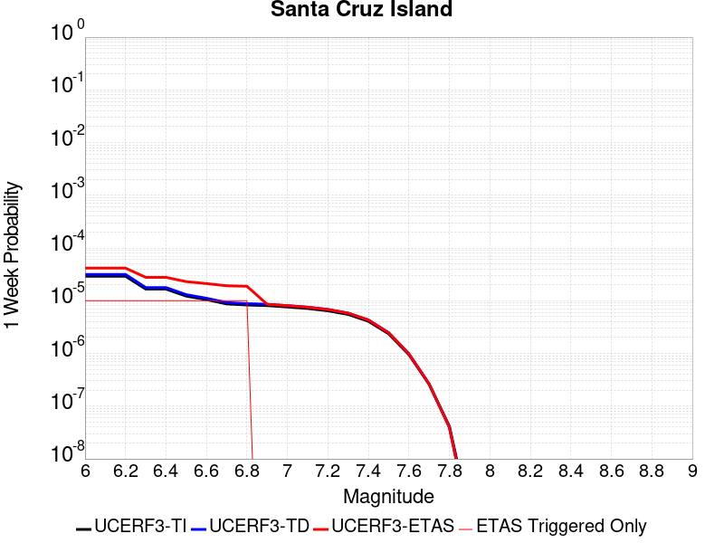 | 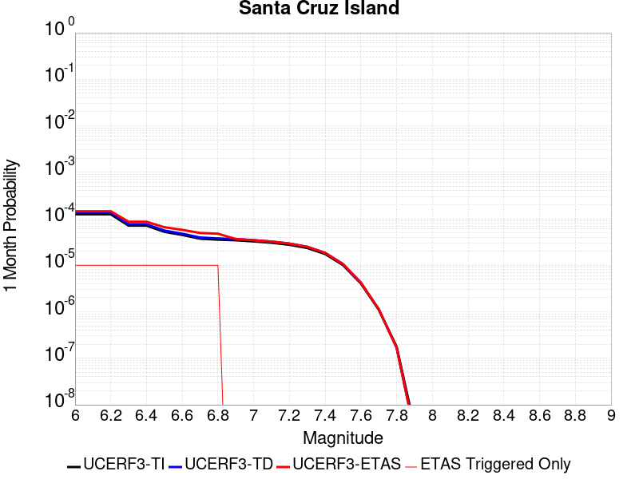 | 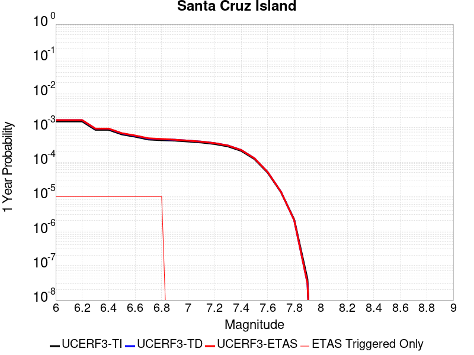 | 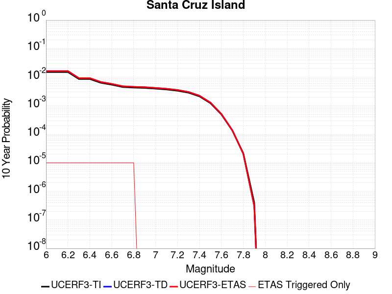 |

| Magnitude | 1 wk TI Prob | 1 wk TD Prob | 1 wk ETAS Prob | 1 wk ETAS/TD Gain | 1 wk ETAS Triggered Only | 1 mo TI Prob | 1 mo TD Prob | 1 mo ETAS Prob | 1 mo ETAS/TD Gain | 1 mo ETAS Triggered Only | 1 yr TI Prob | 1 yr TD Prob | 1 yr ETAS Prob | 1 yr ETAS/TD Gain | 1 yr ETAS Triggered Only | 10 yr TI Prob | 10 yr TD Prob | 10 yr ETAS Prob | 10 yr ETAS/TD Gain | 10 yr ETAS Triggered Only |
|-----|-----|-----|-----|-----|-----|-----|-----|-----|-----|-----|-----|-----|-----|-----|-----|-----|-----|-----|-----|-----|
| 6.0 | 2.9164563E-5 | 3.1601154E-5 | 4.1600837E-5 | 1.3164341 | 1.0E-5 | 1.2498499E-4 | 1.3542725E-4 | 1.454259E-4 | 1.0738304 | 1.0E-5 | 0.0015206301 | 0.001647716 | 0.0016576996 | 1.006059 | 1.0E-5 | 0.015102667 | 0.016368724 | 0.016378561 | 1.0006009 | 1.0E-5 |
| 6.1 | 2.9164563E-5 | 3.1601154E-5 | 4.1600837E-5 | 1.3164341 | 1.0E-5 | 1.2498499E-4 | 1.3542725E-4 | 1.454259E-4 | 1.0738304 | 1.0E-5 | 0.0015206301 | 0.001647716 | 0.0016576996 | 1.006059 | 1.0E-5 | 0.015102667 | 0.016368724 | 0.016378561 | 1.0006009 | 1.0E-5 |
| 6.2 | 2.9164563E-5 | 3.1601154E-5 | 4.1600837E-5 | 1.3164341 | 1.0E-5 | 1.2498499E-4 | 1.3542725E-4 | 1.454259E-4 | 1.0738304 | 1.0E-5 | 0.0015206301 | 0.001647716 | 0.0016576996 | 1.006059 | 1.0E-5 | 0.015102667 | 0.016368724 | 0.016378561 | 1.0006009 | 1.0E-5 |
| 6.3 | 1.6635553E-5 | 1.7805029E-5 | 2.780485E-5 | 1.561629 | 1.0E-5 | 7.1293274E-5 | 7.6305136E-5 | 8.630437E-5 | 1.1310428 | 1.0E-5 | 8.6765E-4 | 9.286373E-4 | 9.38628E-4 | 1.0107585 | 1.0E-5 | 0.008642701 | 0.009249439 | 0.009259348 | 1.0010711 | 1.0E-5 |
| 6.4 | 1.6635553E-5 | 1.7805029E-5 | 2.780485E-5 | 1.561629 | 1.0E-5 | 7.1293274E-5 | 7.6305136E-5 | 8.630437E-5 | 1.1310428 | 1.0E-5 | 8.6765E-4 | 9.286373E-4 | 9.38628E-4 | 1.0107585 | 1.0E-5 | 0.008642701 | 0.009249439 | 0.009259348 | 1.0010711 | 1.0E-5 |
| 6.5 | 1.2238748E-5 | 1.30434555E-5 | 2.3043325E-5 | 1.766658 | 1.0E-5 | 5.2450723E-5 | 5.5899345E-5 | 6.5898785E-5 | 1.178883 | 1.0E-5 | 6.3840044E-4 | 6.803657E-4 | 6.903589E-4 | 1.014688 | 1.0E-5 | 0.0063656955 | 0.006783226 | 0.0067931586 | 1.0014642 | 1.0E-5 |
| 6.6 | 1.0489767E-5 | 1.1157017E-5 | 2.1156906E-5 | 1.896287 | 1.0E-5 | 4.495537E-5 | 4.7814923E-5 | 5.7814446E-5 | 1.2091297 | 1.0E-5 | 5.4719415E-4 | 5.8199343E-4 | 5.919876E-4 | 1.0171723 | 1.0E-5 | 0.005458487 | 0.0058049336 | 0.0058148755 | 1.0017127 | 1.0E-5 |
| 6.7 | 8.699222E-6 | 9.23709E-6 | 1.9236997E-5 | 2.082582 | 1.0E-5 | 3.7281847E-5 | 3.958693E-5 | 4.9586535E-5 | 1.2525986 | 1.0E-5 | 4.5381195E-4 | 4.8186484E-4 | 4.9186003E-4 | 1.0207427 | 1.0E-5 | 0.0045288634 | 0.0048082676 | 0.0048182197 | 1.0020697 | 1.0E-5 |
| 6.8 | 8.307732E-6 | 8.8171955E-6 | 1.8817107E-5 | 2.1341374 | 1.0E-5 | 3.560408E-5 | 3.7787435E-5 | 4.778706E-5 | 1.2646282 | 1.0E-5 | 4.3339343E-4 | 4.5996535E-4 | 4.6996074E-4 | 1.0217308 | 1.0E-5 | 0.004325492 | 0.0045901868 | 0.0046001407 | 1.0021685 | 1.0E-5 |
| 6.9 | 8.073121E-6 | 8.565221E-6 | 8.565221E-6 | 1.0 | 0.0 | 3.459863E-5 | 3.6707574E-5 | 3.6707574E-5 | 1.0 | 0.0 | 4.2115687E-4 | 4.4682348E-4 | 4.4682348E-4 | 1.0 | 0.0 | 0.004203596 | 0.0044593024 | 0.0044593024 | 1.0 | 0.0 |
| 7.0 | 7.617019E-6 | 8.074926E-6 | 8.074926E-6 | 1.0 | 0.0 | 3.264396E-5 | 3.4606368E-5 | 3.4606368E-5 | 1.0 | 0.0 | 3.9736772E-4 | 4.212515E-4 | 4.212515E-4 | 1.0 | 0.0 | 0.003966579 | 0.0042045773 | 0.0042045773 | 1.0 | 0.0 |
| 7.1 | 7.1224836E-6 | 7.5460302E-6 | 7.5460302E-6 | 1.0 | 0.0 | 3.052457E-5 | 3.233973E-5 | 3.233973E-5 | 1.0 | 0.0 | 3.715733E-4 | 3.9366545E-4 | 3.9366545E-4 | 1.0 | 0.0 | 0.003709526 | 0.003929724 | 0.003929724 | 1.0 | 0.0 |
| 7.2 | 6.441115E-6 | 6.827605E-6 | 6.827605E-6 | 1.0 | 0.0 | 2.7604487E-5 | 2.9260837E-5 | 2.9260837E-5 | 1.0 | 0.0 | 3.360328E-4 | 3.5619267E-4 | 3.5619267E-4 | 1.0 | 0.0 | 0.0033552512 | 0.0035562462 | 0.0035562462 | 1.0 | 0.0 |
| 7.3 | 5.494274E-6 | 5.8201813E-6 | 5.8201813E-6 | 1.0 | 0.0 | 2.3546674E-5 | 2.4943398E-5 | 2.4943398E-5 | 1.0 | 0.0 | 2.8664304E-4 | 3.0364376E-4 | 3.0364376E-4 | 1.0 | 0.0 | 0.002862736 | 0.0030323118 | 0.0030323118 | 1.0 | 0.0 |
| 7.4 | 4.0802624E-6 | 4.31239E-6 | 4.31239E-6 | 1.0 | 0.0 | 1.7486722E-5 | 1.8481542E-5 | 1.8481542E-5 | 1.0 | 0.0 | 2.1288003E-4 | 2.249896E-4 | 2.249896E-4 | 1.0 | 0.0 | 0.0021267622 | 0.0022476274 | 0.0022476274 | 1.0 | 0.0 |
| 7.5 | 2.3584746E-6 | 2.4753783E-6 | 2.4753783E-6 | 1.0 | 0.0 | 1.0107709E-5 | 1.0608721E-5 | 1.0608721E-5 | 1.0 | 0.0 | 1.2305441E-4 | 1.2915357E-4 | 1.2915357E-4 | 1.0 | 0.0 | 0.0012298629 | 0.0012907902 | 0.0012907902 | 1.0 | 0.0 |
| 7.6 | 9.4981914E-7 | 9.861161E-7 | 9.861161E-7 | 1.0 | 0.0 | 4.0706473E-6 | 4.226205E-6 | 4.226205E-6 | 1.0 | 0.0 | 4.9559E-5 | 5.1452847E-5 | 5.1452847E-5 | 1.0 | 0.0 | 4.954795E-4 | 5.144106E-4 | 5.144106E-4 | 1.0 | 0.0 |
| 7.7 | 2.6013532E-7 | 2.6417067E-7 | 2.6417067E-7 | 1.0 | 0.0 | 1.1148652E-6 | 1.1321595E-6 | 1.1321595E-6 | 1.0 | 0.0 | 1.3573399E-5 | 1.3783956E-5 | 1.3783956E-5 | 1.0 | 0.0 | 1.357257E-4 | 1.3783107E-4 | 1.3783107E-4 | 1.0 | 0.0 |
| 7.8 | 4.1522263E-8 | 3.9657305E-8 | 3.9657305E-8 | 1.0 | 0.0 | 1.7795254E-7 | 1.6995986E-7 | 1.6995986E-7 | 1.0 | 0.0 | 2.16657E-6 | 2.0692596E-6 | 2.0692596E-6 | 1.0 | 0.0 | 2.1665488E-5 | 2.0692425E-5 | 2.0692425E-5 | 1.0 | 0.0 |
| 7.9 | 7.7242046E-10 | 5.946944E-10 | 5.946944E-10 | 1.0 | 0.0 | 3.3103735E-9 | 2.5486908E-9 | 2.5486908E-9 | 1.0 | 0.0 | 4.0303796E-8 | 3.103031E-8 | 3.103031E-8 | 1.0 | 0.0 | 4.030379E-7 | 3.1030308E-7 | 3.1030308E-7 | 1.0 | 0.0 |

## Dry Mountain
*[(top)](#table-of-contents)*

| 1 Week | 1 Month | 1 Year | 10 Year |
|-----|-----|-----|-----|
|  |  |  |  |

| Magnitude | 1 wk TI Prob | 1 wk TD Prob | 1 wk ETAS Prob | 1 wk ETAS/TD Gain | 1 wk ETAS Triggered Only | 1 mo TI Prob | 1 mo TD Prob | 1 mo ETAS Prob | 1 mo ETAS/TD Gain | 1 mo ETAS Triggered Only | 1 yr TI Prob | 1 yr TD Prob | 1 yr ETAS Prob | 1 yr ETAS/TD Gain | 1 yr ETAS Triggered Only | 10 yr TI Prob | 10 yr TD Prob | 10 yr ETAS Prob | 10 yr ETAS/TD Gain | 10 yr ETAS Triggered Only |
|-----|-----|-----|-----|-----|-----|-----|-----|-----|-----|-----|-----|-----|-----|-----|-----|-----|-----|-----|-----|-----|
| 6.0 | 6.222801E-6 | 6.4395003E-6 | 6.4395003E-6 | 1.0 | 0.0 | 2.6668875E-5 | 2.7597656E-5 | 2.7597656E-5 | 1.0 | 0.0 | 3.2464517E-4 | 3.3596557E-4 | 3.3596557E-4 | 1.0 | 0.0 | 0.0032417132 | 0.0033561387 | 0.0033661053 | 1.0029696 | 1.0E-5 |
| 6.1 | 6.222801E-6 | 6.4395003E-6 | 6.4395003E-6 | 1.0 | 0.0 | 2.6668875E-5 | 2.7597656E-5 | 2.7597656E-5 | 1.0 | 0.0 | 3.2464517E-4 | 3.3596557E-4 | 3.3596557E-4 | 1.0 | 0.0 | 0.0032417132 | 0.0033561387 | 0.0033661053 | 1.0029696 | 1.0E-5 |
| 6.2 | 6.222801E-6 | 6.4395003E-6 | 6.4395003E-6 | 1.0 | 0.0 | 2.6668875E-5 | 2.7597656E-5 | 2.7597656E-5 | 1.0 | 0.0 | 3.2464517E-4 | 3.3596557E-4 | 3.3596557E-4 | 1.0 | 0.0 | 0.0032417132 | 0.0033561387 | 0.0033661053 | 1.0029696 | 1.0E-5 |
| 6.3 | 6.222801E-6 | 6.4395003E-6 | 6.4395003E-6 | 1.0 | 0.0 | 2.6668875E-5 | 2.7597656E-5 | 2.7597656E-5 | 1.0 | 0.0 | 3.2464517E-4 | 3.3596557E-4 | 3.3596557E-4 | 1.0 | 0.0 | 0.0032417132 | 0.0033561387 | 0.0033661053 | 1.0029696 | 1.0E-5 |
| 6.4 | 6.222801E-6 | 6.4395003E-6 | 6.4395003E-6 | 1.0 | 0.0 | 2.6668875E-5 | 2.7597656E-5 | 2.7597656E-5 | 1.0 | 0.0 | 3.2464517E-4 | 3.3596557E-4 | 3.3596557E-4 | 1.0 | 0.0 | 0.0032417132 | 0.0033561387 | 0.0033661053 | 1.0029696 | 1.0E-5 |
| 6.5 | 2.8528623E-6 | 2.952223E-6 | 2.952223E-6 | 1.0 | 0.0 | 1.22264955E-5 | 1.2652372E-5 | 1.2652372E-5 | 1.0 | 0.0 | 1.4884741E-4 | 1.5404043E-4 | 1.5404043E-4 | 1.0 | 0.0 | 0.0014874774 | 0.0015401901 | 0.0015401901 | 1.0 | 0.0 |
| 6.6 | 2.8528623E-6 | 2.952223E-6 | 2.952223E-6 | 1.0 | 0.0 | 1.22264955E-5 | 1.2652372E-5 | 1.2652372E-5 | 1.0 | 0.0 | 1.4884741E-4 | 1.5404043E-4 | 1.5404043E-4 | 1.0 | 0.0 | 0.0014874774 | 0.0015401901 | 0.0015401901 | 1.0 | 0.0 |
| 6.7 | 2.541E-6 | 2.6294065E-6 | 2.6294065E-6 | 1.0 | 0.0 | 1.0889954E-5 | 1.1268885E-5 | 1.1268885E-5 | 1.0 | 0.0 | 1.3257713E-4 | 1.3719867E-4 | 1.3719867E-4 | 1.0 | 0.0 | 0.0013249806 | 0.0013719867 | 0.0013719867 | 1.0 | 0.0 |

## San Jacinto (Stepovers Combined)
*[(top)](#table-of-contents)*

| 1 Week | 1 Month | 1 Year | 10 Year |
|-----|-----|-----|-----|
| 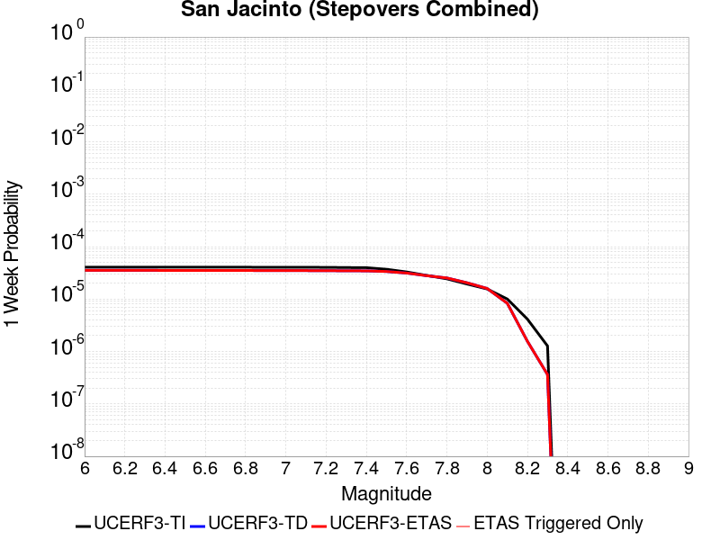 |  | 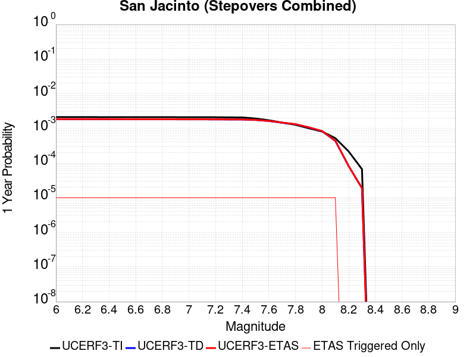 |  |

| Magnitude | 1 wk TI Prob | 1 wk TD Prob | 1 wk ETAS Prob | 1 wk ETAS/TD Gain | 1 wk ETAS Triggered Only | 1 mo TI Prob | 1 mo TD Prob | 1 mo ETAS Prob | 1 mo ETAS/TD Gain | 1 mo ETAS Triggered Only | 1 yr TI Prob | 1 yr TD Prob | 1 yr ETAS Prob | 1 yr ETAS/TD Gain | 1 yr ETAS Triggered Only | 10 yr TI Prob | 10 yr TD Prob | 10 yr ETAS Prob | 10 yr ETAS/TD Gain | 10 yr ETAS Triggered Only |
|-----|-----|-----|-----|-----|-----|-----|-----|-----|-----|-----|-----|-----|-----|-----|-----|-----|-----|-----|-----|-----|
| 6.0 | 4.0667746E-5 | 3.5336896E-5 | 3.5336896E-5 | 1.0 | 0.0 | 1.742787E-4 | 1.5143506E-4 | 1.5143506E-4 | 1.0 | 0.0 | 0.0021197782 | 0.0018421634 | 0.001852145 | 1.0054184 | 1.0E-5 | 0.020996714 | 0.019020144 | 0.019029953 | 1.0005157 | 1.0E-5 |
| 6.1 | 4.0667746E-5 | 3.5336896E-5 | 3.5336896E-5 | 1.0 | 0.0 | 1.742787E-4 | 1.5143506E-4 | 1.5143506E-4 | 1.0 | 0.0 | 0.0021197782 | 0.0018421634 | 0.001852145 | 1.0054184 | 1.0E-5 | 0.020996714 | 0.019020144 | 0.019029953 | 1.0005157 | 1.0E-5 |
| 6.2 | 4.0667746E-5 | 3.5336896E-5 | 3.5336896E-5 | 1.0 | 0.0 | 1.742787E-4 | 1.5143506E-4 | 1.5143506E-4 | 1.0 | 0.0 | 0.0021197782 | 0.0018421634 | 0.001852145 | 1.0054184 | 1.0E-5 | 0.020996714 | 0.019020144 | 0.019029953 | 1.0005157 | 1.0E-5 |
| 6.3 | 4.0667746E-5 | 3.5336896E-5 | 3.5336896E-5 | 1.0 | 0.0 | 1.742787E-4 | 1.5143506E-4 | 1.5143506E-4 | 1.0 | 0.0 | 0.0021197782 | 0.0018421634 | 0.001852145 | 1.0054184 | 1.0E-5 | 0.020996714 | 0.019020144 | 0.019029953 | 1.0005157 | 1.0E-5 |
| 6.4 | 4.0577226E-5 | 3.5208766E-5 | 3.5208766E-5 | 1.0 | 0.0 | 1.738908E-4 | 1.50886E-4 | 1.50886E-4 | 1.0 | 0.0 | 0.0021150648 | 0.0018354917 | 0.0018454734 | 1.0054381 | 1.0E-5 | 0.020950472 | 0.018954702 | 0.018964512 | 1.0005176 | 1.0E-5 |
| 6.5 | 4.0577226E-5 | 3.5208766E-5 | 3.5208766E-5 | 1.0 | 0.0 | 1.738908E-4 | 1.50886E-4 | 1.50886E-4 | 1.0 | 0.0 | 0.0021150648 | 0.0018354917 | 0.0018454734 | 1.0054381 | 1.0E-5 | 0.020950472 | 0.018954702 | 0.018964512 | 1.0005176 | 1.0E-5 |
| 6.6 | 4.053861E-5 | 3.5154102E-5 | 3.5154102E-5 | 1.0 | 0.0 | 1.7372532E-4 | 1.5065174E-4 | 1.5065174E-4 | 1.0 | 0.0 | 0.0021130538 | 0.0018326445 | 0.0018426261 | 1.0054466 | 1.0E-5 | 0.020930743 | 0.018926777 | 0.018936587 | 1.0005183 | 1.0E-5 |
| 6.7 | 4.0516545E-5 | 3.512316E-5 | 3.512316E-5 | 1.0 | 0.0 | 1.7363077E-4 | 1.5051916E-4 | 1.5051916E-4 | 1.0 | 0.0 | 0.002111905 | 0.0018310336 | 0.0018410153 | 1.0054514 | 1.0E-5 | 0.020919468 | 0.01891097 | 0.018920781 | 1.0005188 | 1.0E-5 |
| 6.8 | 4.049434E-5 | 3.509472E-5 | 3.509472E-5 | 1.0 | 0.0 | 1.7353562E-4 | 1.5039727E-4 | 1.5039727E-4 | 1.0 | 0.0 | 0.0021107488 | 0.0018295521 | 0.0018395338 | 1.0054559 | 1.0E-5 | 0.020908125 | 0.01889638 | 0.018906191 | 1.0005192 | 1.0E-5 |
| 6.9 | 4.046386E-5 | 3.505727E-5 | 3.505727E-5 | 1.0 | 0.0 | 1.73405E-4 | 1.502368E-4 | 1.502368E-4 | 1.0 | 0.0 | 0.0021091616 | 0.0018276017 | 0.0018375834 | 1.0054617 | 1.0E-5 | 0.020892553 | 0.01887715 | 0.018886961 | 1.0005198 | 1.0E-5 |
| 7.0 | 4.036382E-5 | 3.4937813E-5 | 3.4937813E-5 | 1.0 | 0.0 | 1.7297632E-4 | 1.4972492E-4 | 1.4972492E-4 | 1.0 | 0.0 | 0.0021039525 | 0.00182138 | 0.0018313618 | 1.0054803 | 1.0E-5 | 0.02084144 | 0.018815752 | 0.018825565 | 1.0005214 | 1.0E-5 |
| 7.1 | 4.0343282E-5 | 3.4916273E-5 | 3.4916273E-5 | 1.0 | 0.0 | 1.7288832E-4 | 1.496326E-4 | 1.496326E-4 | 1.0 | 0.0 | 0.002102883 | 0.0018202579 | 0.0018302397 | 1.0054837 | 1.0E-5 | 0.020830948 | 0.018804627 | 0.018814439 | 1.0005218 | 1.0E-5 |
| 7.2 | 4.0257353E-5 | 3.4820667E-5 | 3.4820667E-5 | 1.0 | 0.0 | 1.725201E-4 | 1.492229E-4 | 1.492229E-4 | 1.0 | 0.0 | 0.0020984085 | 0.0018152783 | 0.0018252601 | 1.0054988 | 1.0E-5 | 0.020787042 | 0.018755313 | 0.018765125 | 1.0005232 | 1.0E-5 |
| 7.3 | 3.9940667E-5 | 3.4648023E-5 | 3.4648023E-5 | 1.0 | 0.0 | 1.7116306E-4 | 1.4848309E-4 | 1.4848309E-4 | 1.0 | 0.0 | 0.0020819185 | 0.0018062859 | 0.001816268 | 1.0055262 | 1.0E-5 | 0.020625217 | 0.018663792 | 0.018673606 | 1.0005258 | 1.0E-5 |
| 7.4 | 3.9721202E-5 | 3.453329E-5 | 3.453329E-5 | 1.0 | 0.0 | 1.7022261E-4 | 1.4799142E-4 | 1.4799142E-4 | 1.0 | 0.0 | 0.0020704903 | 0.0018003098 | 0.0018102918 | 1.0055445 | 1.0E-5 | 0.020513052 | 0.01860285 | 0.018612664 | 1.0005275 | 1.0E-5 |
| 7.5 | 3.7036873E-5 | 3.3598866E-5 | 3.3598866E-5 | 1.0 | 0.0 | 1.5871979E-4 | 1.439872E-4 | 1.439872E-4 | 1.0 | 0.0 | 0.0019307006 | 0.0017516377 | 0.00176162 | 1.0056989 | 1.0E-5 | 0.019140124 | 0.018103454 | 0.018113274 | 1.0005424 | 1.0E-5 |
| 7.6 | 3.2940967E-5 | 3.1372547E-5 | 3.1372547E-5 | 1.0 | 0.0 | 1.4116794E-4 | 1.3444685E-4 | 1.3444685E-4 | 1.0 | 0.0 | 0.0017173645 | 0.0016356637 | 0.0016456473 | 1.0061038 | 1.0E-5 | 0.01704153 | 0.01693263 | 0.016942462 | 1.0005805 | 1.0E-5 |
| 7.7 | 2.8236149E-5 | 2.7937022E-5 | 2.7937022E-5 | 1.0 | 0.0 | 1.2100645E-4 | 1.197246E-4 | 1.197246E-4 | 1.0 | 0.0 | 0.0014722579 | 0.0014566735 | 0.0014666589 | 1.006855 | 1.0E-5 | 0.014625421 | 0.015142685 | 0.015152534 | 1.0006504 | 1.0E-5 |
| 7.8 | 2.4329287E-5 | 2.5258554E-5 | 2.5258554E-5 | 1.0 | 0.0 | 1.042642E-4 | 1.0824646E-4 | 1.0824646E-4 | 1.0 | 0.0 | 0.0012686774 | 0.0013171048 | 0.0013270916 | 1.0075824 | 1.0E-5 | 0.012614589 | 0.013738932 | 0.013748795 | 1.0007179 | 1.0E-5 |
| 7.9 | 1.9370926E-5 | 2.0467445E-5 | 2.0467445E-5 | 1.0 | 0.0 | 8.301561E-5 | 8.7714674E-5 | 8.7714674E-5 | 1.0 | 0.0 | 0.0010102465 | 0.0010674037 | 0.0010773931 | 1.0093585 | 1.0E-5 | 0.0100566605 | 0.011223499 | 0.011233387 | 1.000881 | 1.0E-5 |
| 8.0 | 1.5583017E-5 | 1.5925136E-5 | 1.5925136E-5 | 1.0 | 0.0 | 6.6782646E-5 | 6.82488E-5 | 6.82488E-5 | 1.0 | 0.0 | 8.127754E-4 | 8.306131E-4 | 8.406048E-4 | 1.0120293 | 1.0E-5 | 0.008098091 | 0.008802158 | 0.00881207 | 1.001126 | 1.0E-5 |
| 8.1 | 1.0024873E-5 | 8.314913E-6 | 8.314913E-6 | 1.0 | 0.0 | 4.2963035E-5 | 3.563486E-5 | 3.563486E-5 | 1.0 | 0.0 | 5.229494E-4 | 4.3376858E-4 | 4.4376423E-4 | 1.0230438 | 1.0E-5 | 0.0052172043 | 0.00466551 | 0.0046754633 | 1.0021334 | 1.0E-5 |
| 8.2 | 4.142796E-6 | 1.5676045E-6 | 1.5676045E-6 | 1.0 | 0.0 | 1.775472E-5 | 6.7182878E-6 | 6.7182878E-6 | 1.0 | 0.0 | 2.1614227E-4 | 8.179211E-5 | 8.179211E-5 | 1.0 | 0.0 | 0.0021593217 | 9.4923546E-4 | 9.4923546E-4 | 1.0 | 0.0 |
| 8.3 | 1.2750878E-6 | 3.6301523E-7 | 3.6301523E-7 | 1.0 | 0.0 | 5.4646503E-6 | 1.5557786E-6 | 1.5557786E-6 | 1.0 | 0.0 | 6.653009E-5 | 1.8941444E-5 | 1.8941444E-5 | 1.0 | 0.0 | 6.6510175E-4 | 2.2840123E-4 | 2.2840123E-4 | 1.0 | 0.0 |

## Cucamonga
*[(top)](#table-of-contents)*

| 1 Week | 1 Month | 1 Year | 10 Year |
|-----|-----|-----|-----|
|  | 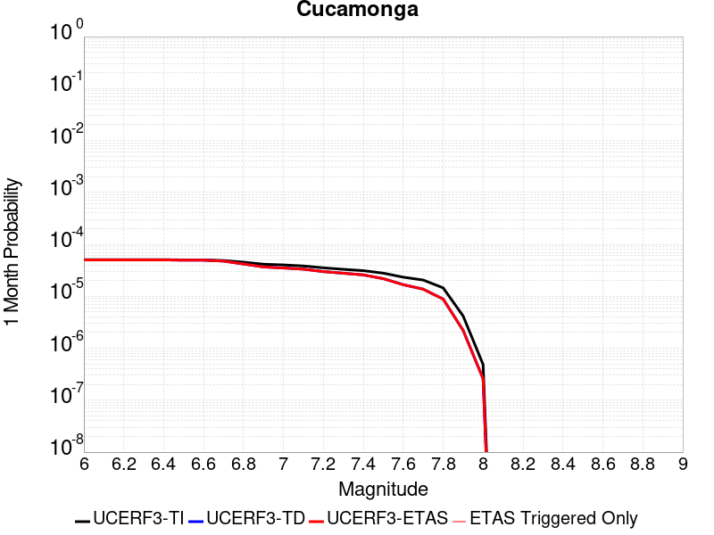 | 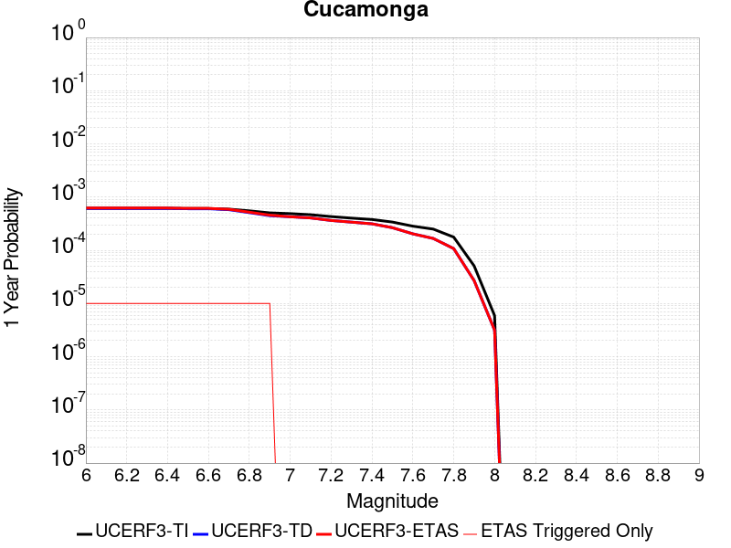 | 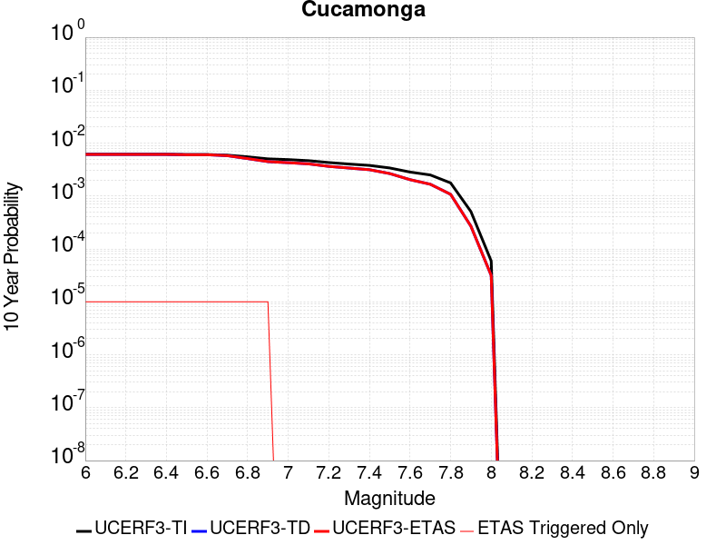 |

| Magnitude | 1 wk TI Prob | 1 wk TD Prob | 1 wk ETAS Prob | 1 wk ETAS/TD Gain | 1 wk ETAS Triggered Only | 1 mo TI Prob | 1 mo TD Prob | 1 mo ETAS Prob | 1 mo ETAS/TD Gain | 1 mo ETAS Triggered Only | 1 yr TI Prob | 1 yr TD Prob | 1 yr ETAS Prob | 1 yr ETAS/TD Gain | 1 yr ETAS Triggered Only | 10 yr TI Prob | 10 yr TD Prob | 10 yr ETAS Prob | 10 yr ETAS/TD Gain | 10 yr ETAS Triggered Only |
|-----|-----|-----|-----|-----|-----|-----|-----|-----|-----|-----|-----|-----|-----|-----|-----|-----|-----|-----|-----|-----|
| 6.0 | 1.1848348E-5 | 1.1739686E-5 | 1.1739686E-5 | 1.0 | 0.0 | 5.0777642E-5 | 5.0311985E-5 | 5.0311985E-5 | 1.0 | 0.0 | 6.180424E-4 | 6.1237894E-4 | 6.2237284E-4 | 1.0163198 | 1.0E-5 | 0.0061632637 | 0.0061080856 | 0.0061180247 | 1.0016272 | 1.0E-5 |
| 6.1 | 1.1848348E-5 | 1.1739686E-5 | 1.1739686E-5 | 1.0 | 0.0 | 5.0777642E-5 | 5.0311985E-5 | 5.0311985E-5 | 1.0 | 0.0 | 6.180424E-4 | 6.1237894E-4 | 6.2237284E-4 | 1.0163198 | 1.0E-5 | 0.0061632637 | 0.0061080856 | 0.0061180247 | 1.0016272 | 1.0E-5 |
| 6.2 | 1.1848348E-5 | 1.1739686E-5 | 1.1739686E-5 | 1.0 | 0.0 | 5.0777642E-5 | 5.0311985E-5 | 5.0311985E-5 | 1.0 | 0.0 | 6.180424E-4 | 6.1237894E-4 | 6.2237284E-4 | 1.0163198 | 1.0E-5 | 0.0061632637 | 0.0061080856 | 0.0061180247 | 1.0016272 | 1.0E-5 |
| 6.3 | 1.1848348E-5 | 1.1739686E-5 | 1.1739686E-5 | 1.0 | 0.0 | 5.0777642E-5 | 5.0311985E-5 | 5.0311985E-5 | 1.0 | 0.0 | 6.180424E-4 | 6.1237894E-4 | 6.2237284E-4 | 1.0163198 | 1.0E-5 | 0.0061632637 | 0.0061080856 | 0.0061180247 | 1.0016272 | 1.0E-5 |
| 6.4 | 1.1848348E-5 | 1.1739686E-5 | 1.1739686E-5 | 1.0 | 0.0 | 5.0777642E-5 | 5.0311985E-5 | 5.0311985E-5 | 1.0 | 0.0 | 6.180424E-4 | 6.1237894E-4 | 6.2237284E-4 | 1.0163198 | 1.0E-5 | 0.0061632637 | 0.0061080856 | 0.0061180247 | 1.0016272 | 1.0E-5 |
| 6.5 | 1.16988695E-5 | 1.157871E-5 | 1.157871E-5 | 1.0 | 0.0 | 5.013705E-5 | 4.9622115E-5 | 4.9622115E-5 | 1.0 | 0.0 | 6.102476E-4 | 6.0398446E-4 | 6.139784E-4 | 1.0165467 | 1.0E-5 | 0.006085745 | 0.0060245967 | 0.0060345363 | 1.0016499 | 1.0E-5 |
| 6.6 | 1.16988695E-5 | 1.157871E-5 | 1.157871E-5 | 1.0 | 0.0 | 5.013705E-5 | 4.9622115E-5 | 4.9622115E-5 | 1.0 | 0.0 | 6.102476E-4 | 6.0398446E-4 | 6.139784E-4 | 1.0165467 | 1.0E-5 | 0.006085745 | 0.0060245967 | 0.0060345363 | 1.0016499 | 1.0E-5 |
| 6.7 | 1.1397107E-5 | 1.111755E-5 | 1.111755E-5 | 1.0 | 0.0 | 4.884383E-5 | 4.7645786E-5 | 4.7645786E-5 | 1.0 | 0.0 | 5.9451134E-4 | 5.7993556E-4 | 5.8992975E-4 | 1.0172333 | 1.0E-5 | 0.005929234 | 0.005785368 | 0.0057953103 | 1.0017185 | 1.0E-5 |
| 6.8 | 1.058387E-5 | 9.787276E-6 | 9.787276E-6 | 1.0 | 0.0 | 4.5358654E-5 | 4.19448E-5 | 4.19448E-5 | 1.0 | 0.0 | 5.521017E-4 | 5.105594E-4 | 5.205543E-4 | 1.0195763 | 1.0E-5 | 0.00550732 | 0.005094869 | 0.005104818 | 1.0019528 | 1.0E-5 |
| 6.9 | 9.690046E-6 | 8.581557E-6 | 8.581557E-6 | 1.0 | 0.0 | 4.1528107E-5 | 3.6777587E-5 | 3.6777587E-5 | 1.0 | 0.0 | 5.054874E-4 | 4.4767553E-4 | 4.5767103E-4 | 1.0223277 | 1.0E-5 | 0.005043391 | 0.0044686683 | 0.0044786236 | 1.0022278 | 1.0E-5 |
| 7.0 | 9.381461E-6 | 8.189123E-6 | 8.189123E-6 | 1.0 | 0.0 | 4.020564E-5 | 3.509577E-5 | 3.509577E-5 | 1.0 | 0.0 | 4.893937E-4 | 4.272076E-4 | 4.272076E-4 | 1.0 | 0.0 | 0.0048831734 | 0.004264793 | 0.004264793 | 1.0 | 0.0 |
| 7.1 | 8.946492E-6 | 7.783867E-6 | 7.783867E-6 | 1.0 | 0.0 | 3.8341543E-5 | 3.3359003E-5 | 3.3359003E-5 | 1.0 | 0.0 | 4.667083E-4 | 4.060705E-4 | 4.060705E-4 | 1.0 | 0.0 | 0.0046572937 | 0.0040542167 | 0.0040542167 | 1.0 | 0.0 |
| 7.2 | 8.251016E-6 | 6.977125E-6 | 6.977125E-6 | 1.0 | 0.0 | 3.5361016E-5 | 2.9901623E-5 | 2.9901623E-5 | 1.0 | 0.0 | 4.3043532E-4 | 3.6399168E-4 | 3.6399168E-4 | 1.0 | 0.0 | 0.0042960253 | 0.0036348838 | 0.0036348838 | 1.0 | 0.0 |
| 7.3 | 7.717881E-6 | 6.4881356E-6 | 6.4881356E-6 | 1.0 | 0.0 | 3.3076216E-5 | 2.7806E-5 | 2.7806E-5 | 1.0 | 0.0 | 4.026285E-4 | 3.3848567E-4 | 3.3848567E-4 | 1.0 | 0.0 | 0.004018998 | 0.0033806337 | 0.0033806337 | 1.0 | 0.0 |
| 7.4 | 7.275623E-6 | 6.0337097E-6 | 6.0337097E-6 | 1.0 | 0.0 | 3.118087E-5 | 2.58585E-5 | 2.58585E-5 | 1.0 | 0.0 | 3.7956095E-4 | 3.14782E-4 | 3.14782E-4 | 1.0 | 0.0 | 0.0037891332 | 0.0031442924 | 0.0031442924 | 1.0 | 0.0 |
| 7.5 | 6.5109502E-6 | 5.102118E-6 | 5.102118E-6 | 1.0 | 0.0 | 2.7903774E-5 | 2.1866037E-5 | 2.1866037E-5 | 1.0 | 0.0 | 3.3967546E-4 | 2.6618663E-4 | 2.6618663E-4 | 1.0 | 0.0 | 0.0033915674 | 0.002659598 | 0.002659598 | 1.0 | 0.0 |
| 7.6 | 5.4495326E-6 | 3.909914E-6 | 3.909914E-6 | 1.0 | 0.0 | 2.335493E-5 | 1.6756667E-5 | 1.6756667E-5 | 1.0 | 0.0 | 2.8430918E-4 | 2.0399339E-4 | 2.0399339E-4 | 1.0 | 0.0 | 0.0028394572 | 0.0020389776 | 0.0020389776 | 1.0 | 0.0 |
| 7.7 | 4.7997164E-6 | 3.201463E-6 | 3.201463E-6 | 1.0 | 0.0 | 2.057005E-5 | 1.3720483E-5 | 1.3720483E-5 | 1.0 | 0.0 | 2.504116E-4 | 1.6703412E-4 | 1.6703412E-4 | 1.0 | 0.0 | 0.002501296 | 0.0016700128 | 0.0016700128 | 1.0 | 0.0 |
| 7.8 | 3.3941733E-6 | 2.0648838E-6 | 2.0648838E-6 | 1.0 | 0.0 | 1.4546376E-5 | 8.849473E-6 | 8.849473E-6 | 1.0 | 0.0 | 1.7708774E-4 | 1.0773702E-4 | 1.0773702E-4 | 1.0 | 0.0 | 0.0017694668 | 0.0010770849 | 0.0010770849 | 1.0 | 0.0 |
| 7.9 | 9.750552E-7 | 5.1576814E-7 | 5.1576814E-7 | 1.0 | 0.0 | 4.178801E-6 | 2.210433E-6 | 2.210433E-6 | 1.0 | 0.0 | 5.0875715E-5 | 2.6911694E-5 | 2.6911694E-5 | 1.0 | 0.0 | 5.086407E-4 | 2.6908476E-4 | 2.6908476E-4 | 1.0 | 0.0 |
| 8.0 | 1.133857E-7 | 6.055087E-8 | 6.055087E-8 | 1.0 | 0.0 | 4.8593864E-7 | 2.595037E-7 | 2.595037E-7 | 1.0 | 0.0 | 5.9162867E-6 | 3.1594532E-6 | 3.1594532E-6 | 1.0 | 0.0 | 5.916129E-5 | 3.15941E-5 | 3.15941E-5 | 1.0 | 0.0 |

## Raymond
*[(top)](#table-of-contents)*

| 1 Week | 1 Month | 1 Year | 10 Year |
|-----|-----|-----|-----|
| 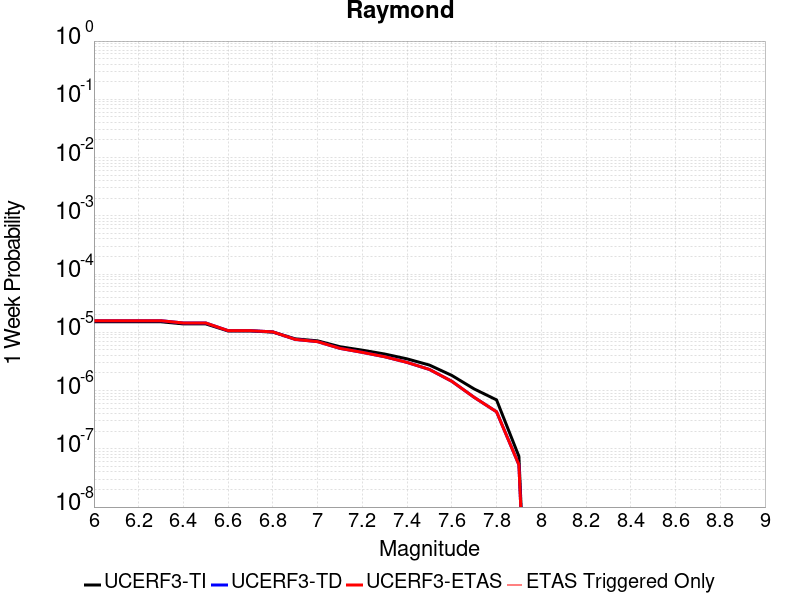 | 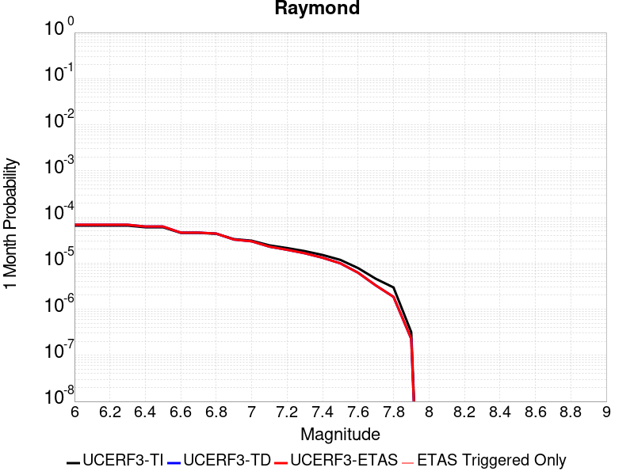 | 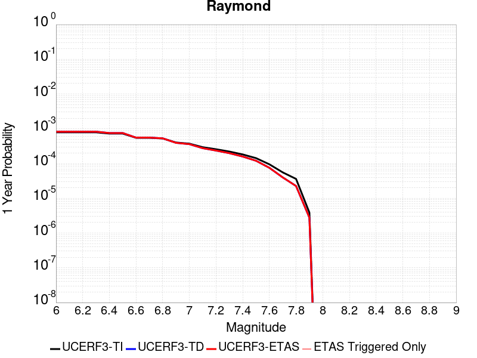 | 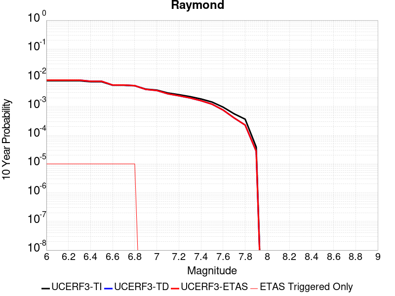 |

| Magnitude | 1 wk TI Prob | 1 wk TD Prob | 1 wk ETAS Prob | 1 wk ETAS/TD Gain | 1 wk ETAS Triggered Only | 1 mo TI Prob | 1 mo TD Prob | 1 mo ETAS Prob | 1 mo ETAS/TD Gain | 1 mo ETAS Triggered Only | 1 yr TI Prob | 1 yr TD Prob | 1 yr ETAS Prob | 1 yr ETAS/TD Gain | 1 yr ETAS Triggered Only | 10 yr TI Prob | 10 yr TD Prob | 10 yr ETAS Prob | 10 yr ETAS/TD Gain | 10 yr ETAS Triggered Only |
|-----|-----|-----|-----|-----|-----|-----|-----|-----|-----|-----|-----|-----|-----|-----|-----|-----|-----|-----|-----|-----|
| 6.0 | 1.5157413E-5 | 1.5811214E-5 | 1.5811214E-5 | 1.0 | 0.0 | 6.4958724E-5 | 6.776073E-5 | 6.776073E-5 | 1.0 | 0.0 | 7.905855E-4 | 8.246997E-4 | 8.246997E-4 | 1.0 | 0.0 | 0.007877788 | 0.008218911 | 0.008228828 | 1.0012068 | 1.0E-5 |
| 6.1 | 1.5157413E-5 | 1.5811214E-5 | 1.5811214E-5 | 1.0 | 0.0 | 6.4958724E-5 | 6.776073E-5 | 6.776073E-5 | 1.0 | 0.0 | 7.905855E-4 | 8.246997E-4 | 8.246997E-4 | 1.0 | 0.0 | 0.007877788 | 0.008218911 | 0.008228828 | 1.0012068 | 1.0E-5 |
| 6.2 | 1.5157413E-5 | 1.5811214E-5 | 1.5811214E-5 | 1.0 | 0.0 | 6.4958724E-5 | 6.776073E-5 | 6.776073E-5 | 1.0 | 0.0 | 7.905855E-4 | 8.246997E-4 | 8.246997E-4 | 1.0 | 0.0 | 0.007877788 | 0.008218911 | 0.008228828 | 1.0012068 | 1.0E-5 |
| 6.3 | 1.5157413E-5 | 1.5811214E-5 | 1.5811214E-5 | 1.0 | 0.0 | 6.4958724E-5 | 6.776073E-5 | 6.776073E-5 | 1.0 | 0.0 | 7.905855E-4 | 8.246997E-4 | 8.246997E-4 | 1.0 | 0.0 | 0.007877788 | 0.008218911 | 0.008228828 | 1.0012068 | 1.0E-5 |
| 6.4 | 1.3941944E-5 | 1.4455694E-5 | 1.4455694E-5 | 1.0 | 0.0 | 5.9749822E-5 | 6.1951636E-5 | 6.1951636E-5 | 1.0 | 0.0 | 7.2721124E-4 | 7.5402344E-4 | 7.5402344E-4 | 1.0 | 0.0 | 0.007248361 | 0.007516985 | 0.0075269095 | 1.0013204 | 1.0E-5 |
| 6.5 | 1.3941944E-5 | 1.4455694E-5 | 1.4455694E-5 | 1.0 | 0.0 | 5.9749822E-5 | 6.1951636E-5 | 6.1951636E-5 | 1.0 | 0.0 | 7.2721124E-4 | 7.5402344E-4 | 7.5402344E-4 | 1.0 | 0.0 | 0.007248361 | 0.007516985 | 0.0075269095 | 1.0013204 | 1.0E-5 |
| 6.6 | 1.0542609E-5 | 1.0671889E-5 | 1.0671889E-5 | 1.0 | 0.0 | 4.5181827E-5 | 4.57359E-5 | 4.57359E-5 | 1.0 | 0.0 | 5.499499E-4 | 5.566977E-4 | 5.566977E-4 | 1.0 | 0.0 | 0.005485909 | 0.0055535934 | 0.0055635376 | 1.0017906 | 1.0E-5 |
| 6.7 | 1.0542609E-5 | 1.0671889E-5 | 1.0671889E-5 | 1.0 | 0.0 | 4.5181827E-5 | 4.57359E-5 | 4.57359E-5 | 1.0 | 0.0 | 5.499499E-4 | 5.566977E-4 | 5.566977E-4 | 1.0 | 0.0 | 0.005485909 | 0.0055535934 | 0.0055635376 | 1.0017906 | 1.0E-5 |
| 6.8 | 1.0079132E-5 | 1.0177405E-5 | 1.0177405E-5 | 1.0 | 0.0 | 4.3195567E-5 | 4.361675E-5 | 4.361675E-5 | 1.0 | 0.0 | 5.257791E-4 | 5.309099E-4 | 5.309099E-4 | 1.0 | 0.0 | 0.0052453685 | 0.005296965 | 0.005306912 | 1.0018779 | 1.0E-5 |
| 6.9 | 7.721598E-6 | 7.549502E-6 | 7.549502E-6 | 1.0 | 0.0 | 3.3092143E-5 | 3.2354612E-5 | 3.2354612E-5 | 1.0 | 0.0 | 4.0282236E-4 | 3.9384744E-4 | 3.9384744E-4 | 1.0 | 0.0 | 0.0040209293 | 0.003931628 | 0.003931628 | 1.0 | 0.0 |
| 7.0 | 7.137566E-6 | 6.9118714E-6 | 6.9118714E-6 | 1.0 | 0.0 | 3.058921E-5 | 2.9621975E-5 | 2.9621975E-5 | 1.0 | 0.0 | 3.7236E-4 | 3.6058895E-4 | 3.6058895E-4 | 1.0 | 0.0 | 0.0037173668 | 0.0036001569 | 0.0036001569 | 1.0 | 0.0 |
| 7.1 | 5.654976E-6 | 5.3000313E-6 | 5.3000313E-6 | 1.0 | 0.0 | 2.4235387E-5 | 2.2714223E-5 | 2.2714223E-5 | 1.0 | 0.0 | 2.9502588E-4 | 2.7651078E-4 | 2.7651078E-4 | 1.0 | 0.0 | 0.0029463451 | 0.0027616983 | 0.0027616983 | 1.0 | 0.0 |
| 7.2 | 4.9358455E-6 | 4.5271145E-6 | 4.5271145E-6 | 1.0 | 0.0 | 2.1153453E-5 | 1.9401774E-5 | 1.9401774E-5 | 1.0 | 0.0 | 2.5751285E-4 | 2.3619113E-4 | 2.3619113E-4 | 1.0 | 0.0 | 0.0025721465 | 0.0023594233 | 0.0023594233 | 1.0 | 0.0 |
| 7.3 | 4.2368597E-6 | 3.8060439E-6 | 3.8060439E-6 | 1.0 | 0.0 | 1.8157843E-5 | 1.6311516E-5 | 1.6311516E-5 | 1.0 | 0.0 | 2.2104931E-4 | 1.9857471E-4 | 1.9857471E-4 | 1.0 | 0.0 | 0.0022082955 | 0.0019839914 | 0.0019839914 | 1.0 | 0.0 |
| 7.4 | 3.4999923E-6 | 3.0441354E-6 | 3.0441354E-6 | 1.0 | 0.0 | 1.49998805E-5 | 1.30462295E-5 | 1.30462295E-5 | 1.0 | 0.0 | 1.8260824E-4 | 1.5882634E-4 | 1.5882634E-4 | 1.0 | 0.0 | 0.0018245826 | 0.001587144 | 0.001587144 | 1.0 | 0.0 |
| 7.5 | 2.738017E-6 | 2.3023013E-6 | 2.3023013E-6 | 1.0 | 0.0 | 1.1734306E-5 | 9.866968E-6 | 9.866968E-6 | 1.0 | 0.0 | 1.428558E-4 | 1.2012378E-4 | 1.2012378E-4 | 1.0 | 0.0 | 0.0014276401 | 0.0012006029 | 0.0012006029 | 1.0 | 0.0 |
| 7.6 | 1.8186392E-6 | 1.4424903E-6 | 1.4424903E-6 | 1.0 | 0.0 | 7.794145E-6 | 6.1820865E-6 | 6.1820865E-6 | 1.0 | 0.0 | 9.488958E-5 | 7.526435E-5 | 7.526435E-5 | 1.0 | 0.0 | 9.4849075E-4 | 7.524001E-4 | 7.524001E-4 | 1.0 | 0.0 |
| 7.7 | 1.0660348E-6 | 7.6452443E-7 | 7.6452443E-7 | 1.0 | 0.0 | 4.5687125E-6 | 3.2765292E-6 | 3.2765292E-6 | 1.0 | 0.0 | 5.5622655E-5 | 3.989103E-5 | 3.989103E-5 | 1.0 | 0.0 | 5.5608735E-4 | 3.9884783E-4 | 3.9884783E-4 | 1.0 | 0.0 |
| 7.8 | 6.913602E-7 | 4.3216164E-7 | 4.3216164E-7 | 1.0 | 0.0 | 2.962969E-6 | 1.85212E-6 | 1.85212E-6 | 1.0 | 0.0 | 3.607355E-5 | 2.2549335E-5 | 2.2549335E-5 | 1.0 | 0.0 | 3.6067693E-4 | 2.2547832E-4 | 2.2547832E-4 | 1.0 | 0.0 |
| 7.9 | 7.425201E-8 | 5.3234306E-8 | 5.3234306E-8 | 1.0 | 0.0 | 3.1822285E-7 | 2.28147E-7 | 2.28147E-7 | 1.0 | 0.0 | 3.874356E-6 | 2.7776875E-6 | 2.7776875E-6 | 1.0 | 0.0 | 3.8742884E-5 | 2.777666E-5 | 2.777666E-5 | 1.0 | 0.0 |

## Great Valley 06 (Midland) 2011 CFM alt1
*[(top)](#table-of-contents)*

| 1 Week | 1 Month | 1 Year | 10 Year |
|-----|-----|-----|-----|
|  |  |  |  |

| Magnitude | 1 wk TI Prob | 1 wk TD Prob | 1 wk ETAS Prob | 1 wk ETAS/TD Gain | 1 wk ETAS Triggered Only | 1 mo TI Prob | 1 mo TD Prob | 1 mo ETAS Prob | 1 mo ETAS/TD Gain | 1 mo ETAS Triggered Only | 1 yr TI Prob | 1 yr TD Prob | 1 yr ETAS Prob | 1 yr ETAS/TD Gain | 1 yr ETAS Triggered Only | 10 yr TI Prob | 10 yr TD Prob | 10 yr ETAS Prob | 10 yr ETAS/TD Gain | 10 yr ETAS Triggered Only |
|-----|-----|-----|-----|-----|-----|-----|-----|-----|-----|-----|-----|-----|-----|-----|-----|-----|-----|-----|-----|-----|
| 6.0 | 1.2712525E-5 | 1.3210851E-5 | 1.3210851E-5 | 1.0 | 0.0 | 5.4481112E-5 | 5.6616846E-5 | 5.6616846E-5 | 1.0 | 0.0 | 6.6310563E-4 | 6.8911747E-4 | 6.8911747E-4 | 1.0 | 0.0 | 0.0066113044 | 0.0068723215 | 0.0068822526 | 1.001445 | 1.0E-5 |
| 6.1 | 1.2712525E-5 | 1.3210851E-5 | 1.3210851E-5 | 1.0 | 0.0 | 5.4481112E-5 | 5.6616846E-5 | 5.6616846E-5 | 1.0 | 0.0 | 6.6310563E-4 | 6.8911747E-4 | 6.8911747E-4 | 1.0 | 0.0 | 0.0066113044 | 0.0068723215 | 0.0068822526 | 1.001445 | 1.0E-5 |
| 6.2 | 1.2712525E-5 | 1.3210851E-5 | 1.3210851E-5 | 1.0 | 0.0 | 5.4481112E-5 | 5.6616846E-5 | 5.6616846E-5 | 1.0 | 0.0 | 6.6310563E-4 | 6.8911747E-4 | 6.8911747E-4 | 1.0 | 0.0 | 0.0066113044 | 0.0068723215 | 0.0068822526 | 1.001445 | 1.0E-5 |
| 6.3 | 1.2712525E-5 | 1.3210851E-5 | 1.3210851E-5 | 1.0 | 0.0 | 5.4481112E-5 | 5.6616846E-5 | 5.6616846E-5 | 1.0 | 0.0 | 6.6310563E-4 | 6.8911747E-4 | 6.8911747E-4 | 1.0 | 0.0 | 0.0066113044 | 0.0068723215 | 0.0068822526 | 1.001445 | 1.0E-5 |
| 6.4 | 1.2712525E-5 | 1.3210851E-5 | 1.3210851E-5 | 1.0 | 0.0 | 5.4481112E-5 | 5.6616846E-5 | 5.6616846E-5 | 1.0 | 0.0 | 6.6310563E-4 | 6.8911747E-4 | 6.8911747E-4 | 1.0 | 0.0 | 0.0066113044 | 0.0068723215 | 0.0068822526 | 1.001445 | 1.0E-5 |
| 6.5 | 1.2712525E-5 | 1.3210851E-5 | 1.3210851E-5 | 1.0 | 0.0 | 5.4481112E-5 | 5.6616846E-5 | 5.6616846E-5 | 1.0 | 0.0 | 6.6310563E-4 | 6.8911747E-4 | 6.8911747E-4 | 1.0 | 0.0 | 0.0066113044 | 0.0068723215 | 0.0068822526 | 1.001445 | 1.0E-5 |
| 6.6 | 5.7574384E-6 | 5.9707636E-6 | 5.9707636E-6 | 1.0 | 0.0 | 2.4674504E-5 | 2.5588757E-5 | 2.5588757E-5 | 1.0 | 0.0 | 3.0037065E-4 | 3.1150252E-4 | 3.1150252E-4 | 1.0 | 0.0 | 0.0029996498 | 0.0031110453 | 0.0031110453 | 1.0 | 0.0 |
| 6.7 | 5.7574384E-6 | 5.9707636E-6 | 5.9707636E-6 | 1.0 | 0.0 | 2.4674504E-5 | 2.5588757E-5 | 2.5588757E-5 | 1.0 | 0.0 | 3.0037065E-4 | 3.1150252E-4 | 3.1150252E-4 | 1.0 | 0.0 | 0.0029996498 | 0.0031110453 | 0.0031110453 | 1.0 | 0.0 |
| 6.8 | 3.3474828E-6 | 3.4694517E-6 | 3.4694517E-6 | 1.0 | 0.0 | 1.4346277E-5 | 1.4869002E-5 | 1.4869002E-5 | 1.0 | 0.0 | 1.7465191E-4 | 1.8101657E-4 | 1.8101657E-4 | 1.0 | 0.0 | 0.0017451472 | 0.0018088382 | 0.0018088382 | 1.0 | 0.0 |
| 6.9 | 2.035106E-6 | 2.1090761E-6 | 2.1090761E-6 | 1.0 | 0.0 | 8.721853E-6 | 9.038871E-6 | 9.038871E-6 | 1.0 | 0.0 | 1.0618339E-4 | 1.1004343E-4 | 1.1004343E-4 | 1.0 | 0.0 | 0.0010613267 | 0.0010999617 | 0.0010999617 | 1.0 | 0.0 |
| 7.0 | 1.2424716E-6 | 1.2879011E-6 | 1.2879011E-6 | 1.0 | 0.0 | 5.3248673E-6 | 5.5195674E-6 | 5.5195674E-6 | 1.0 | 0.0 | 6.482833E-5 | 6.719911E-5 | 6.719911E-5 | 1.0 | 0.0 | 6.480942E-4 | 6.7183224E-4 | 6.7183224E-4 | 1.0 | 0.0 |
| 7.1 | 6.6904556E-7 | 6.939171E-7 | 6.939171E-7 | 1.0 | 0.0 | 2.867335E-6 | 2.9739288E-6 | 2.9739288E-6 | 1.0 | 0.0 | 3.4909244E-5 | 3.620724E-5 | 3.620724E-5 | 1.0 | 0.0 | 3.490376E-4 | 3.620389E-4 | 3.620389E-4 | 1.0 | 0.0 |
| 7.2 | 3.948168E-7 | 4.095786E-7 | 4.095786E-7 | 1.0 | 0.0 | 1.6920709E-6 | 1.7553369E-6 | 1.7553369E-6 | 1.0 | 0.0 | 2.0600768E-5 | 2.1371226E-5 | 2.1371226E-5 | 1.0 | 0.0 | 2.0598859E-4 | 2.1371226E-4 | 2.1371226E-4 | 1.0 | 0.0 |

## Big Pine (East)
*[(top)](#table-of-contents)*

| 1 Week | 1 Month | 1 Year | 10 Year |
|-----|-----|-----|-----|
|  |  | 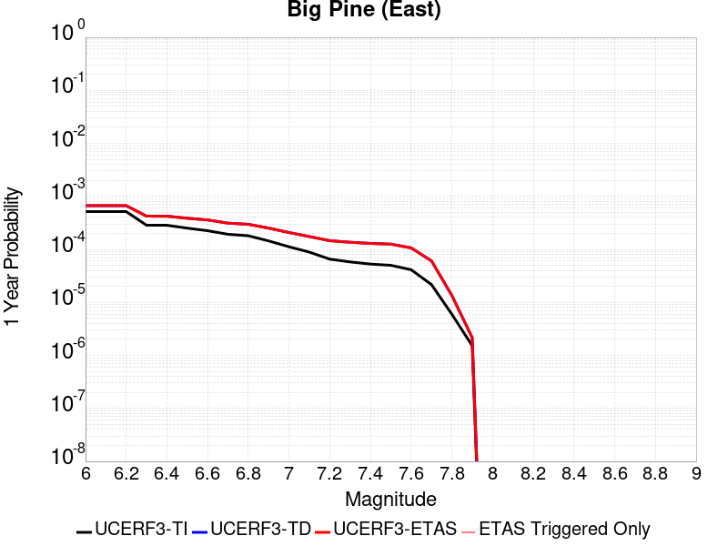 |  |

| Magnitude | 1 wk TI Prob | 1 wk TD Prob | 1 wk ETAS Prob | 1 wk ETAS/TD Gain | 1 wk ETAS Triggered Only | 1 mo TI Prob | 1 mo TD Prob | 1 mo ETAS Prob | 1 mo ETAS/TD Gain | 1 mo ETAS Triggered Only | 1 yr TI Prob | 1 yr TD Prob | 1 yr ETAS Prob | 1 yr ETAS/TD Gain | 1 yr ETAS Triggered Only | 10 yr TI Prob | 10 yr TD Prob | 10 yr ETAS Prob | 10 yr ETAS/TD Gain | 10 yr ETAS Triggered Only |
|-----|-----|-----|-----|-----|-----|-----|-----|-----|-----|-----|-----|-----|-----|-----|-----|-----|-----|-----|-----|-----|
| 6.0 | 9.916913E-6 | 1.282197E-5 | 1.282197E-5 | 1.0 | 0.0 | 4.250036E-5 | 5.495027E-5 | 5.495027E-5 | 1.0 | 0.0 | 5.173191E-4 | 6.6883623E-4 | 6.6883623E-4 | 1.0 | 0.0 | 0.0051611643 | 0.0066729826 | 0.006682916 | 1.0014886 | 1.0E-5 |
| 6.1 | 9.916913E-6 | 1.282197E-5 | 1.282197E-5 | 1.0 | 0.0 | 4.250036E-5 | 5.495027E-5 | 5.495027E-5 | 1.0 | 0.0 | 5.173191E-4 | 6.6883623E-4 | 6.6883623E-4 | 1.0 | 0.0 | 0.0051611643 | 0.0066729826 | 0.006682916 | 1.0014886 | 1.0E-5 |
| 6.2 | 9.916913E-6 | 1.282197E-5 | 1.282197E-5 | 1.0 | 0.0 | 4.250036E-5 | 5.495027E-5 | 5.495027E-5 | 1.0 | 0.0 | 5.173191E-4 | 6.6883623E-4 | 6.6883623E-4 | 1.0 | 0.0 | 0.0051611643 | 0.0066729826 | 0.006682916 | 1.0014886 | 1.0E-5 |
| 6.3 | 5.479711E-6 | 8.117787E-6 | 8.117787E-6 | 1.0 | 0.0 | 2.3484265E-5 | 3.4790068E-5 | 3.4790068E-5 | 1.0 | 0.0 | 2.858834E-4 | 4.2348995E-4 | 4.2348995E-4 | 1.0 | 0.0 | 0.0028551589 | 0.004229713 | 0.004229713 | 1.0 | 0.0 |
| 6.4 | 5.465009E-6 | 8.10208E-6 | 8.10208E-6 | 1.0 | 0.0 | 2.3421257E-5 | 3.4722754E-5 | 3.4722754E-5 | 1.0 | 0.0 | 2.851165E-4 | 4.2267074E-4 | 4.2267074E-4 | 1.0 | 0.0 | 0.0028475097 | 0.004221552 | 0.004221552 | 1.0 | 0.0 |
| 6.5 | 4.826767E-6 | 7.4271156E-6 | 7.4271156E-6 | 1.0 | 0.0 | 2.068598E-5 | 3.183012E-5 | 3.183012E-5 | 1.0 | 0.0 | 2.518227E-4 | 3.874656E-4 | 3.874656E-4 | 1.0 | 0.0 | 0.0025153751 | 0.0038707424 | 0.0038707424 | 1.0 | 0.0 |
| 6.6 | 4.3146847E-6 | 6.887036E-6 | 6.887036E-6 | 1.0 | 0.0 | 1.8491375E-5 | 2.9515548E-5 | 2.9515548E-5 | 1.0 | 0.0 | 2.2510924E-4 | 3.59295E-4 | 3.59295E-4 | 1.0 | 0.0 | 0.0022488134 | 0.0035899505 | 0.0035899505 | 1.0 | 0.0 |
| 6.7 | 3.6968106E-6 | 5.9999884E-6 | 5.9999884E-6 | 1.0 | 0.0 | 1.5843378E-5 | 2.571399E-5 | 2.571399E-5 | 1.0 | 0.0 | 1.9287605E-4 | 3.130244E-4 | 3.130244E-4 | 1.0 | 0.0 | 0.0019270873 | 0.0031285542 | 0.0031285542 | 1.0 | 0.0 |
| 6.8 | 3.4671132E-6 | 5.7065704E-6 | 5.7065704E-6 | 1.0 | 0.0 | 1.4858972E-5 | 2.4456509E-5 | 2.4456509E-5 | 1.0 | 0.0 | 1.8089297E-4 | 2.9771877E-4 | 2.9771877E-4 | 1.0 | 0.0 | 0.0018074579 | 0.0029759097 | 0.0029759097 | 1.0 | 0.0 |
| 6.9 | 2.7686972E-6 | 4.829279E-6 | 4.829279E-6 | 1.0 | 0.0 | 1.1865792E-5 | 2.069675E-5 | 2.069675E-5 | 1.0 | 0.0 | 1.4445644E-4 | 2.5195457E-4 | 2.5195457E-4 | 1.0 | 0.0 | 0.0014436257 | 0.0025193316 | 0.0025193316 | 1.0 | 0.0 |
| 7.0 | 2.1472624E-6 | 3.988725E-6 | 3.988725E-6 | 1.0 | 0.0 | 9.20252E-6 | 1.7094428E-5 | 1.7094428E-5 | 1.0 | 0.0 | 1.12034926E-4 | 2.0810531E-4 | 2.0810531E-4 | 1.0 | 0.0 | 0.0011197845 | 0.002081715 | 0.002081715 | 1.0 | 0.0 |
| 7.1 | 1.7018335E-6 | 3.348229E-6 | 3.348229E-6 | 1.0 | 0.0 | 7.293552E-6 | 1.4349476E-5 | 1.4349476E-5 | 1.0 | 0.0 | 8.879537E-5 | 1.7469123E-4 | 1.7469123E-4 | 1.0 | 0.0 | 8.87599E-4 | 0.0017481181 | 0.0017481181 | 1.0 | 0.0 |
| 7.2 | 1.25603E-6 | 2.7976516E-6 | 2.7976516E-6 | 1.0 | 0.0 | 5.3829745E-6 | 1.1989882E-5 | 1.1989882E-5 | 1.0 | 0.0 | 6.553574E-5 | 1.4596726E-4 | 1.4596726E-4 | 1.0 | 0.0 | 6.551642E-4 | 0.0014612685 | 0.0014612685 | 1.0 | 0.0 |
| 7.3 | 1.112297E-6 | 2.613323E-6 | 2.613323E-6 | 1.0 | 0.0 | 4.7669787E-6 | 1.1199909E-5 | 1.1199909E-5 | 1.0 | 0.0 | 5.803642E-5 | 1.3635057E-4 | 1.3635057E-4 | 1.0 | 0.0 | 5.802127E-4 | 0.0013650558 | 0.0013650558 | 1.0 | 0.0 |
| 7.4 | 1.0137181E-6 | 2.4863546E-6 | 2.4863546E-6 | 1.0 | 0.0 | 4.3444993E-6 | 1.0655763E-5 | 1.0655763E-5 | 1.0 | 0.0 | 5.2892992E-5 | 1.297264E-4 | 1.297264E-4 | 1.0 | 0.0 | 5.288041E-4 | 0.0012986774 | 0.0012986774 | 1.0 | 0.0 |
| 7.5 | 9.598608E-7 | 2.4099256E-6 | 2.4099256E-6 | 1.0 | 0.0 | 4.1136827E-6 | 1.0328214E-5 | 1.0328214E-5 | 1.0 | 0.0 | 5.0082934E-5 | 1.2573895E-4 | 1.2573895E-4 | 1.0 | 0.0 | 5.007165E-4 | 0.0012586572 | 0.0012586572 | 1.0 | 0.0 |
| 7.6 | 7.929459E-7 | 2.047312E-6 | 2.047312E-6 | 1.0 | 0.0 | 3.3983351E-6 | 8.7741655E-6 | 8.7741655E-6 | 1.0 | 0.0 | 4.1373947E-5 | 1.0682041E-4 | 1.0682041E-4 | 1.0 | 0.0 | 4.1366243E-4 | 0.0010697625 | 0.0010697625 | 1.0 | 0.0 |
| 7.7 | 4.155788E-7 | 1.162298E-6 | 1.162298E-6 | 1.0 | 0.0 | 1.7810507E-6 | 4.981268E-6 | 4.981268E-6 | 1.0 | 0.0 | 2.1684076E-5 | 6.064529E-5 | 6.064529E-5 | 1.0 | 0.0 | 2.1681961E-4 | 6.09451E-4 | 6.09451E-4 | 1.0 | 0.0 |
| 7.8 | 1.14666925E-7 | 2.5959213E-7 | 2.5959213E-7 | 1.0 | 0.0 | 4.914296E-7 | 1.1125372E-6 | 1.1125372E-6 | 1.0 | 0.0 | 5.9831386E-6 | 1.354506E-5 | 1.354506E-5 | 1.0 | 0.0 | 5.9829777E-5 | 1.3654139E-4 | 1.3654139E-4 | 1.0 | 0.0 |
| 7.9 | 2.9231824E-8 | 4.15291E-8 | 4.15291E-8 | 1.0 | 0.0 | 1.2527924E-7 | 1.7798183E-7 | 1.7798183E-7 | 1.0 | 0.0 | 1.5252737E-6 | 2.1669268E-6 | 2.1669268E-6 | 1.0 | 0.0 | 1.5252632E-5 | 2.2001832E-5 | 2.2001832E-5 | 1.0 | 0.0 |

## San Jacinto (Borrego)
*[(top)](#table-of-contents)*

| 1 Week | 1 Month | 1 Year | 10 Year |
|-----|-----|-----|-----|
| 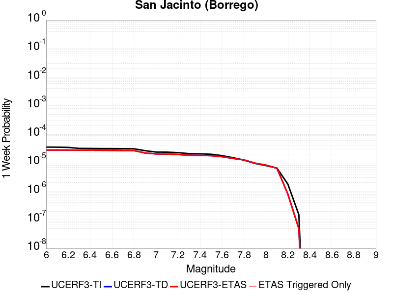 |  |  |  |

| Magnitude | 1 wk TI Prob | 1 wk TD Prob | 1 wk ETAS Prob | 1 wk ETAS/TD Gain | 1 wk ETAS Triggered Only | 1 mo TI Prob | 1 mo TD Prob | 1 mo ETAS Prob | 1 mo ETAS/TD Gain | 1 mo ETAS Triggered Only | 1 yr TI Prob | 1 yr TD Prob | 1 yr ETAS Prob | 1 yr ETAS/TD Gain | 1 yr ETAS Triggered Only | 10 yr TI Prob | 10 yr TD Prob | 10 yr ETAS Prob | 10 yr ETAS/TD Gain | 10 yr ETAS Triggered Only |
|-----|-----|-----|-----|-----|-----|-----|-----|-----|-----|-----|-----|-----|-----|-----|-----|-----|-----|-----|-----|-----|
| 6.0 | 3.543992E-5 | 2.7956603E-5 | 2.7956603E-5 | 1.0 | 0.0 | 1.5187653E-4 | 1.1980858E-4 | 1.1980858E-4 | 1.0 | 0.0 | 0.0018475284 | 0.0014577056 | 0.0014676912 | 1.0068501 | 1.0E-5 | 0.018322436 | 0.014885285 | 0.014895136 | 1.0006618 | 1.0E-5 |
| 6.1 | 3.542281E-5 | 2.7956603E-5 | 2.7956603E-5 | 1.0 | 0.0 | 1.5180321E-4 | 1.1980858E-4 | 1.1980858E-4 | 1.0 | 0.0 | 0.0018466372 | 0.0014577056 | 0.0014676912 | 1.0068501 | 1.0E-5 | 0.018313672 | 0.014885285 | 0.014895136 | 1.0006618 | 1.0E-5 |
| 6.2 | 3.4688688E-5 | 2.7956603E-5 | 2.7956603E-5 | 1.0 | 0.0 | 1.4865733E-4 | 1.19808574E-4 | 1.19808574E-4 | 1.0 | 0.0 | 0.0018084005 | 0.0014577056 | 0.001467691 | 1.0068501 | 1.0E-5 | 0.017937548 | 0.014885284 | 0.014895136 | 1.0006618 | 1.0E-5 |
| 6.3 | 3.2087122E-5 | 2.7801936E-5 | 2.7801936E-5 | 1.0 | 0.0 | 1.3750899E-4 | 1.19145785E-4 | 1.19145785E-4 | 1.0 | 0.0 | 0.0016728862 | 0.0014496469 | 0.0014596324 | 1.0068883 | 1.0E-5 | 0.016603488 | 0.014806312 | 0.014816164 | 1.0006654 | 1.0E-5 |
| 6.4 | 3.1828724E-5 | 2.7768916E-5 | 2.7768916E-5 | 1.0 | 0.0 | 1.364017E-4 | 1.1900428E-4 | 1.1900428E-4 | 1.0 | 0.0 | 0.0016594254 | 0.0014479264 | 0.0014579119 | 1.0068964 | 1.0E-5 | 0.016470885 | 0.014789388 | 0.014799239 | 1.0006661 | 1.0E-5 |
| 6.5 | 3.1563577E-5 | 2.7508588E-5 | 2.7508588E-5 | 1.0 | 0.0 | 1.3526545E-4 | 1.1788869E-4 | 1.1788869E-4 | 1.0 | 0.0 | 0.0016456128 | 0.0014343619 | 0.0014443476 | 1.0069617 | 1.0E-5 | 0.0163348 | 0.014655951 | 0.014665805 | 1.0006723 | 1.0E-5 |
| 6.6 | 3.1467625E-5 | 2.735279E-5 | 2.735279E-5 | 1.0 | 0.0 | 1.3485427E-4 | 1.1722104E-4 | 1.1722104E-4 | 1.0 | 0.0 | 0.0016406142 | 0.001426244 | 0.0014362298 | 1.0070014 | 1.0E-5 | 0.016285548 | 0.014576187 | 0.014586042 | 1.000676 | 1.0E-5 |
| 6.7 | 3.1223695E-5 | 2.6970763E-5 | 2.6970763E-5 | 1.0 | 0.0 | 1.3380898E-4 | 1.15583935E-4 | 1.15583935E-4 | 1.0 | 0.0 | 0.0016279068 | 0.0014063381 | 0.001416324 | 1.0071007 | 1.0E-5 | 0.01616033 | 0.01438054 | 0.014390396 | 1.0006853 | 1.0E-5 |
| 6.8 | 3.1015585E-5 | 2.6791718E-5 | 2.6791718E-5 | 1.0 | 0.0 | 1.3291716E-4 | 1.1481666E-4 | 1.1481666E-4 | 1.0 | 0.0 | 0.001617065 | 0.0013970085 | 0.0014069946 | 1.0071481 | 1.0E-5 | 0.016053487 | 0.014287795 | 0.014297652 | 1.0006899 | 1.0E-5 |
| 6.9 | 2.6641965E-5 | 2.2212334E-5 | 2.2212334E-5 | 1.0 | 0.0 | 1.1417485E-4 | 9.519226E-5 | 9.519226E-5 | 1.0 | 0.0 | 0.0013891924 | 0.0011583535 | 0.001168342 | 1.0086229 | 1.0E-5 | 0.0138054015 | 0.011897102 | 0.011906983 | 1.0008305 | 1.0E-5 |
| 7.0 | 2.3854353E-5 | 2.0506088E-5 | 2.0506088E-5 | 1.0 | 0.0 | 1.02228936E-4 | 8.788029E-5 | 8.788029E-5 | 1.0 | 0.0 | 0.0012439266 | 0.0010694199 | 0.0010794093 | 1.0093409 | 1.0E-5 | 0.012369866 | 0.010996936 | 0.011006827 | 1.0008993 | 1.0E-5 |
| 7.1 | 2.3672901E-5 | 2.0342548E-5 | 2.0342548E-5 | 1.0 | 0.0 | 1.0145135E-4 | 8.717945E-5 | 8.717945E-5 | 1.0 | 0.0 | 0.0012344702 | 0.0010608955 | 0.0010708849 | 1.009416 | 1.0E-5 | 0.0122763505 | 0.010912099 | 0.01092199 | 1.0009065 | 1.0E-5 |
| 7.2 | 2.2717244E-5 | 1.9569701E-5 | 1.9569701E-5 | 1.0 | 0.0 | 9.735599E-5 | 8.386746E-5 | 8.386746E-5 | 1.0 | 0.0 | 0.0011846646 | 0.0010206103 | 0.0010306002 | 1.009788 | 1.0E-5 | 0.01178369 | 0.010509352 | 0.010519247 | 1.0009415 | 1.0E-5 |
| 7.3 | 2.1016205E-5 | 1.8410952E-5 | 1.8410952E-5 | 1.0 | 0.0 | 9.006634E-5 | 7.890171E-5 | 7.890171E-5 | 1.0 | 0.0 | 0.001096006 | 9.6020696E-4 | 9.701974E-4 | 1.0104045 | 1.0E-5 | 0.010906163 | 0.009904788 | 0.009914689 | 1.0009996 | 1.0E-5 |
| 7.4 | 2.0683625E-5 | 1.8213394E-5 | 1.8213394E-5 | 1.0 | 0.0 | 8.86411E-5 | 7.805508E-5 | 7.805508E-5 | 1.0 | 0.0 | 0.001078671 | 9.4990834E-4 | 9.598988E-4 | 1.0105174 | 1.0E-5 | 0.010734501 | 0.009801473 | 0.009811375 | 1.0010103 | 1.0E-5 |
| 7.5 | 1.9993966E-5 | 1.7808186E-5 | 1.7808186E-5 | 1.0 | 0.0 | 8.568561E-5 | 7.631858E-5 | 7.631858E-5 | 1.0 | 0.0 | 0.001042723 | 9.287846E-4 | 9.387753E-4 | 1.0107567 | 1.0E-5 | 0.010378438 | 0.009588276 | 0.00959818 | 1.001033 | 1.0E-5 |
| 7.6 | 1.788966E-5 | 1.6460734E-5 | 1.6460734E-5 | 1.0 | 0.0 | 7.666772E-5 | 7.0544105E-5 | 7.0544105E-5 | 1.0 | 0.0 | 9.3302975E-4 | 8.585378E-4 | 8.685292E-4 | 1.0116377 | 1.0E-5 | 0.00929122 | 0.008879809 | 0.00888972 | 1.0011162 | 1.0E-5 |
| 7.7 | 1.5125781E-5 | 1.4262029E-5 | 1.4262029E-5 | 1.0 | 0.0 | 6.4823165E-5 | 6.112155E-5 | 6.112155E-5 | 1.0 | 0.0 | 7.889362E-4 | 7.4390165E-4 | 7.538942E-4 | 1.0134326 | 1.0E-5 | 0.007861412 | 0.007727129 | 0.0077370517 | 1.0012841 | 1.0E-5 |
| 7.8 | 1.250089E-5 | 1.2654241E-5 | 1.2654241E-5 | 1.0 | 0.0 | 5.3574146E-5 | 5.423134E-5 | 5.423134E-5 | 1.0 | 0.0 | 6.5207E-4 | 6.6006713E-4 | 6.700605E-4 | 1.0151399 | 1.0E-5 | 0.006501599 | 0.0068802256 | 0.006890157 | 1.0014434 | 1.0E-5 |
| 7.9 | 9.561E-6 | 9.775645E-6 | 9.775645E-6 | 1.0 | 0.0 | 4.0975072E-5 | 4.189495E-5 | 4.189495E-5 | 1.0 | 0.0 | 4.987573E-4 | 5.099522E-4 | 5.199471E-4 | 1.0195997 | 1.0E-5 | 0.0049763937 | 0.0053634187 | 0.005373365 | 1.0018545 | 1.0E-5 |
| 8.0 | 8.01699E-6 | 8.312629E-6 | 8.312629E-6 | 1.0 | 0.0 | 3.4358076E-5 | 3.5625068E-5 | 3.5625068E-5 | 1.0 | 0.0 | 4.1822926E-4 | 4.336494E-4 | 4.4364505E-4 | 1.0230501 | 1.0E-5 | 0.0041744304 | 0.00458347 | 0.0045934245 | 1.0021718 | 1.0E-5 |
| 8.1 | 6.541947E-6 | 6.477901E-6 | 6.477901E-6 | 1.0 | 0.0 | 2.8036617E-5 | 2.7762142E-5 | 2.7762142E-5 | 1.0 | 0.0 | 3.4129233E-4 | 3.3795217E-4 | 3.4794878E-4 | 1.02958 | 1.0E-5 | 0.0034076865 | 0.003588998 | 0.003598962 | 1.0027763 | 1.0E-5 |
| 8.2 | 1.7968189E-6 | 8.0012404E-7 | 8.0012404E-7 | 1.0 | 0.0 | 7.70063E-6 | 3.4290986E-6 | 3.4290986E-6 | 1.0 | 0.0 | 9.3751136E-5 | 4.17485E-5 | 4.17485E-5 | 1.0 | 0.0 | 9.371159E-4 | 4.7288055E-4 | 4.7288055E-4 | 1.0 | 0.0 |
| 8.3 | 1.5167889E-7 | 4.9190945E-8 | 4.9190945E-8 | 1.0 | 0.0 | 6.500522E-7 | 2.1081833E-7 | 2.1081833E-7 | 1.0 | 0.0 | 7.9143565E-6 | 2.5667105E-6 | 2.5667105E-6 | 1.0 | 0.0 | 7.914075E-5 | 2.9817646E-5 | 2.9817646E-5 | 1.0 | 0.0 |

## San Jacinto (Anza) rev
*[(top)](#table-of-contents)*

| 1 Week | 1 Month | 1 Year | 10 Year |
|-----|-----|-----|-----|
|  |  |  |  |

| Magnitude | 1 wk TI Prob | 1 wk TD Prob | 1 wk ETAS Prob | 1 wk ETAS/TD Gain | 1 wk ETAS Triggered Only | 1 mo TI Prob | 1 mo TD Prob | 1 mo ETAS Prob | 1 mo ETAS/TD Gain | 1 mo ETAS Triggered Only | 1 yr TI Prob | 1 yr TD Prob | 1 yr ETAS Prob | 1 yr ETAS/TD Gain | 1 yr ETAS Triggered Only | 10 yr TI Prob | 10 yr TD Prob | 10 yr ETAS Prob | 10 yr ETAS/TD Gain | 10 yr ETAS Triggered Only |
|-----|-----|-----|-----|-----|-----|-----|-----|-----|-----|-----|-----|-----|-----|-----|-----|-----|-----|-----|-----|-----|
| 6.0 | 6.3015636E-5 | 4.337693E-5 | 4.337693E-5 | 1.0 | 0.0 | 2.7003905E-4 | 1.8588796E-4 | 1.8588796E-4 | 1.0 | 0.0 | 0.0032827691 | 0.0022608489 | 0.0022708261 | 1.0044131 | 1.0E-5 | 0.032346968 | 0.023334619 | 0.023344386 | 1.0004185 | 1.0E-5 |
| 6.1 | 6.3015636E-5 | 4.337693E-5 | 4.337693E-5 | 1.0 | 0.0 | 2.7003905E-4 | 1.8588796E-4 | 1.8588796E-4 | 1.0 | 0.0 | 0.0032827691 | 0.0022608489 | 0.0022708261 | 1.0044131 | 1.0E-5 | 0.032346968 | 0.023334619 | 0.023344386 | 1.0004185 | 1.0E-5 |
| 6.2 | 6.3015636E-5 | 4.337693E-5 | 4.337693E-5 | 1.0 | 0.0 | 2.7003905E-4 | 1.8588796E-4 | 1.8588796E-4 | 1.0 | 0.0 | 0.0032827691 | 0.0022608489 | 0.0022708261 | 1.0044131 | 1.0E-5 | 0.032346968 | 0.023334619 | 0.023344386 | 1.0004185 | 1.0E-5 |
| 6.3 | 6.3015636E-5 | 4.337693E-5 | 4.337693E-5 | 1.0 | 0.0 | 2.7003905E-4 | 1.8588796E-4 | 1.8588796E-4 | 1.0 | 0.0 | 0.0032827691 | 0.0022608489 | 0.0022708261 | 1.0044131 | 1.0E-5 | 0.032346968 | 0.023334619 | 0.023344386 | 1.0004185 | 1.0E-5 |
| 6.4 | 6.3015636E-5 | 4.337693E-5 | 4.337693E-5 | 1.0 | 0.0 | 2.7003905E-4 | 1.8588796E-4 | 1.8588796E-4 | 1.0 | 0.0 | 0.0032827691 | 0.0022608489 | 0.0022708261 | 1.0044131 | 1.0E-5 | 0.032346968 | 0.023334619 | 0.023344386 | 1.0004185 | 1.0E-5 |
| 6.5 | 5.811017E-5 | 4.015336E-5 | 4.015336E-5 | 1.0 | 0.0 | 2.4901982E-4 | 1.7207452E-4 | 1.7207452E-4 | 1.0 | 0.0 | 0.0030276014 | 0.0020929999 | 0.002102979 | 1.0047678 | 1.0E-5 | 0.02986684 | 0.021630494 | 0.021640278 | 1.0004523 | 1.0E-5 |
| 6.6 | 5.811017E-5 | 4.015336E-5 | 4.015336E-5 | 1.0 | 0.0 | 2.4901982E-4 | 1.7207452E-4 | 1.7207452E-4 | 1.0 | 0.0 | 0.0030276014 | 0.0020929999 | 0.002102979 | 1.0047678 | 1.0E-5 | 0.02986684 | 0.021630494 | 0.021640278 | 1.0004523 | 1.0E-5 |
| 6.7 | 5.712442E-5 | 3.957534E-5 | 3.957534E-5 | 1.0 | 0.0 | 2.4479596E-4 | 1.6959761E-4 | 1.6959761E-4 | 1.0 | 0.0 | 0.0029763177 | 0.002062901 | 0.0020728803 | 1.0048375 | 1.0E-5 | 0.029367693 | 0.021321962 | 0.02133175 | 1.000459 | 1.0E-5 |
| 6.8 | 5.6967532E-5 | 3.9431634E-5 | 3.9431634E-5 | 1.0 | 0.0 | 2.4412372E-4 | 1.689818E-4 | 1.689818E-4 | 1.0 | 0.0 | 0.0029681553 | 0.0020554175 | 0.002065397 | 1.0048552 | 1.0E-5 | 0.029288229 | 0.021246629 | 0.021256417 | 1.0004606 | 1.0E-5 |
| 6.9 | 5.6211324E-5 | 3.9135975E-5 | 3.9135975E-5 | 1.0 | 0.0 | 2.4088343E-4 | 1.6771485E-4 | 1.6771485E-4 | 1.0 | 0.0 | 0.0029288116 | 0.0020400216 | 0.0020500012 | 1.0048919 | 1.0E-5 | 0.028905109 | 0.021085827 | 0.021095617 | 1.0004642 | 1.0E-5 |
| 7.0 | 5.4383527E-5 | 3.7995007E-5 | 3.7995007E-5 | 1.0 | 0.0 | 2.3305144E-4 | 1.6282561E-4 | 1.6282561E-4 | 1.0 | 0.0 | 0.0028337094 | 0.0019806041 | 0.0019905844 | 1.005039 | 1.0E-5 | 0.027978465 | 0.020476038 | 0.020485833 | 1.0004784 | 1.0E-5 |
| 7.1 | 5.1393665E-5 | 3.6455618E-5 | 3.6455618E-5 | 1.0 | 0.0 | 2.2023996E-4 | 1.5622903E-4 | 1.5622903E-4 | 1.0 | 0.0 | 0.0026781242 | 0.0019004333 | 0.0019104143 | 1.005252 | 1.0E-5 | 0.026460782 | 0.019648531 | 0.019658335 | 1.0004989 | 1.0E-5 |
| 7.2 | 4.785222E-5 | 3.480494E-5 | 3.480494E-5 | 1.0 | 0.0 | 2.0506482E-4 | 1.4915552E-4 | 1.4915552E-4 | 1.0 | 0.0 | 0.0024938055 | 0.0018144595 | 0.0018244412 | 1.0055013 | 1.0E-5 | 0.024660049 | 0.018761909 | 0.018771721 | 1.000523 | 1.0E-5 |
| 7.3 | 4.2143256E-5 | 3.389763E-5 | 3.389763E-5 | 1.0 | 0.0 | 1.8060145E-4 | 1.4526749E-4 | 1.4526749E-4 | 1.0 | 0.0 | 0.002196605 | 0.0017672004 | 0.0017771827 | 1.0056486 | 1.0E-5 | 0.02175019 | 0.018269178 | 0.018278994 | 1.0005374 | 1.0E-5 |
| 7.4 | 4.0264713E-5 | 3.3535252E-5 | 3.3535252E-5 | 1.0 | 0.0 | 1.7255165E-4 | 1.4371461E-4 | 1.4371461E-4 | 1.0 | 0.0 | 0.002098792 | 0.0017483246 | 0.0017583071 | 1.0057098 | 1.0E-5 | 0.020790804 | 0.018073453 | 0.018083273 | 1.0005434 | 1.0E-5 |
| 7.5 | 3.694492E-5 | 3.2247204E-5 | 3.2247204E-5 | 1.0 | 0.0 | 1.5832575E-4 | 1.38195E-4 | 1.38195E-4 | 1.0 | 0.0 | 0.0019259118 | 0.0016812286 | 0.0016912118 | 1.005938 | 1.0E-5 | 0.01909306 | 0.017388845 | 0.01739867 | 1.000565 | 1.0E-5 |
| 7.6 | 3.200565E-5 | 2.9555436E-5 | 2.9555436E-5 | 1.0 | 0.0 | 1.3715986E-4 | 1.2666002E-4 | 1.2666002E-4 | 1.0 | 0.0 | 0.001668642 | 0.0015409971 | 0.0015509817 | 1.0064793 | 1.0E-5 | 0.01656168 | 0.015973015 | 0.015982855 | 1.0006161 | 1.0E-5 |
| 7.7 | 2.731642E-5 | 2.6142696E-5 | 2.6142696E-5 | 1.0 | 0.0 | 1.1706512E-4 | 1.1203532E-4 | 1.1203532E-4 | 1.0 | 0.0 | 0.001424336 | 0.0013631776 | 0.0013731639 | 1.0073258 | 1.0E-5 | 0.014152412 | 0.01419303 | 0.014202888 | 1.0006945 | 1.0E-5 |
| 7.8 | 2.3466424E-5 | 2.3552704E-5 | 2.3552704E-5 | 1.0 | 0.0 | 1.0056651E-4 | 1.0093625E-4 | 1.0093625E-4 | 1.0 | 0.0 | 0.0012237094 | 0.0012282069 | 0.0012381946 | 1.008132 | 1.0E-5 | 0.012169928 | 0.012833906 | 0.012843778 | 1.0007691 | 1.0E-5 |
| 7.9 | 1.8611925E-5 | 1.8951272E-5 | 1.8951272E-5 | 1.0 | 0.0 | 7.9762955E-5 | 8.1217215E-5 | 8.1217215E-5 | 1.0 | 0.0 | 9.7068126E-4 | 9.883717E-4 | 9.983619E-4 | 1.0101076 | 1.0E-5 | 0.0096645225 | 0.010416457 | 0.010426353 | 1.00095 | 1.0E-5 |
| 8.0 | 1.5460775E-5 | 1.5779307E-5 | 1.5779307E-5 | 1.0 | 0.0 | 6.6258784E-5 | 6.762385E-5 | 6.762385E-5 | 1.0 | 0.0 | 8.0640207E-4 | 8.2301005E-4 | 8.3300186E-4 | 1.0121405 | 1.0E-5 | 0.008034821 | 0.008723064 | 0.008732976 | 1.0011364 | 1.0E-5 |
| 8.1 | 9.983884E-6 | 8.292369E-6 | 8.292369E-6 | 1.0 | 0.0 | 4.2787375E-5 | 3.5538244E-5 | 3.5538244E-5 | 1.0 | 0.0 | 5.2081177E-4 | 4.3259273E-4 | 4.425884E-4 | 1.0231065 | 1.0E-5 | 0.0051959283 | 0.00465207 | 0.0046620234 | 1.0021396 | 1.0E-5 |
| 8.2 | 4.1226E-6 | 1.5595413E-6 | 1.5595413E-6 | 1.0 | 0.0 | 1.7668166E-5 | 6.683731E-6 | 6.683731E-6 | 1.0 | 0.0 | 2.1508869E-4 | 8.137142E-5 | 8.137142E-5 | 1.0 | 0.0 | 0.0021488064 | 9.4425044E-4 | 9.4425044E-4 | 1.0 | 0.0 |
| 8.3 | 1.2750878E-6 | 3.6301523E-7 | 3.6301523E-7 | 1.0 | 0.0 | 5.4646503E-6 | 1.5557786E-6 | 1.5557786E-6 | 1.0 | 0.0 | 6.653009E-5 | 1.8941444E-5 | 1.8941444E-5 | 1.0 | 0.0 | 6.6510175E-4 | 2.2840123E-4 | 2.2840123E-4 | 1.0 | 0.0 |

## Cedar Mtn-Mahogany Mtn
*[(top)](#table-of-contents)*

| 1 Week | 1 Month | 1 Year | 10 Year |
|-----|-----|-----|-----|
|  |  |  |  |

| Magnitude | 1 wk TI Prob | 1 wk TD Prob | 1 wk ETAS Prob | 1 wk ETAS/TD Gain | 1 wk ETAS Triggered Only | 1 mo TI Prob | 1 mo TD Prob | 1 mo ETAS Prob | 1 mo ETAS/TD Gain | 1 mo ETAS Triggered Only | 1 yr TI Prob | 1 yr TD Prob | 1 yr ETAS Prob | 1 yr ETAS/TD Gain | 1 yr ETAS Triggered Only | 10 yr TI Prob | 10 yr TD Prob | 10 yr ETAS Prob | 10 yr ETAS/TD Gain | 10 yr ETAS Triggered Only |
|-----|-----|-----|-----|-----|-----|-----|-----|-----|-----|-----|-----|-----|-----|-----|-----|-----|-----|-----|-----|-----|
| 6.0 | 2.7763876E-5 | 2.9589899E-5 | 2.9589899E-5 | 1.0 | 0.0 | 1.1898261E-4 | 1.2680808E-4 | 1.2680808E-4 | 1.0 | 0.0 | 0.0014476506 | 0.0015428651 | 0.0015428651 | 1.0 | 0.0 | 0.0143825635 | 0.015328757 | 0.015338603 | 1.0006424 | 1.0E-5 |
| 6.1 | 1.6162443E-5 | 1.7143519E-5 | 1.7143519E-5 | 1.0 | 0.0 | 6.926578E-5 | 7.347025E-5 | 7.347025E-5 | 1.0 | 0.0 | 8.4298453E-4 | 8.9415093E-4 | 8.9415093E-4 | 1.0 | 0.0 | 0.008397939 | 0.008907345 | 0.008917255 | 1.0011127 | 1.0E-5 |
| 6.2 | 1.6162443E-5 | 1.7143519E-5 | 1.7143519E-5 | 1.0 | 0.0 | 6.926578E-5 | 7.347025E-5 | 7.347025E-5 | 1.0 | 0.0 | 8.4298453E-4 | 8.9415093E-4 | 8.9415093E-4 | 1.0 | 0.0 | 0.008397939 | 0.008907345 | 0.008917255 | 1.0011127 | 1.0E-5 |
| 6.3 | 9.746053E-6 | 1.03034645E-5 | 1.03034645E-5 | 1.0 | 0.0 | 4.1768133E-5 | 4.415698E-5 | 4.415698E-5 | 1.0 | 0.0 | 5.0840835E-4 | 5.3748273E-4 | 5.3748273E-4 | 1.0 | 0.0 | 0.0050724675 | 0.0053622467 | 0.005372193 | 1.0018549 | 1.0E-5 |
| 6.4 | 9.746053E-6 | 1.03034645E-5 | 1.03034645E-5 | 1.0 | 0.0 | 4.1768133E-5 | 4.415698E-5 | 4.415698E-5 | 1.0 | 0.0 | 5.0840835E-4 | 5.3748273E-4 | 5.3748273E-4 | 1.0 | 0.0 | 0.0050724675 | 0.0053622467 | 0.005372193 | 1.0018549 | 1.0E-5 |
| 6.5 | 7.290083E-6 | 7.695551E-6 | 7.695551E-6 | 1.0 | 0.0 | 3.124284E-5 | 3.298053E-5 | 3.298053E-5 | 1.0 | 0.0 | 3.8031515E-4 | 4.0146615E-4 | 4.0146615E-4 | 1.0 | 0.0 | 0.0037966494 | 0.004007629 | 0.004017589 | 1.0024853 | 1.0E-5 |
| 6.6 | 5.67907E-6 | 5.9893264E-6 | 5.9893264E-6 | 1.0 | 0.0 | 2.4338644E-5 | 2.5668296E-5 | 2.5668296E-5 | 1.0 | 0.0 | 2.962827E-4 | 3.1246804E-4 | 3.1246804E-4 | 1.0 | 0.0 | 0.0029588798 | 0.003120423 | 0.003130392 | 1.0031947 | 1.0E-5 |
| 6.7 | 3.4853963E-6 | 3.6727356E-6 | 3.6727356E-6 | 1.0 | 0.0 | 1.4937327E-5 | 1.5740205E-5 | 1.5740205E-5 | 1.0 | 0.0 | 1.8184677E-4 | 1.9162075E-4 | 1.9162075E-4 | 1.0 | 0.0 | 0.0018169804 | 0.0019146174 | 0.0019146174 | 1.0 | 0.0 |
| 6.8 | 2.7535168E-6 | 2.9016592E-6 | 2.9016592E-6 | 1.0 | 0.0 | 1.1800733E-5 | 1.2435626E-5 | 1.2435626E-5 | 1.0 | 0.0 | 1.4366445E-4 | 1.513937E-4 | 1.513937E-4 | 1.0 | 0.0 | 0.0014357162 | 0.0015129528 | 0.0015129528 | 1.0 | 0.0 |
| 6.9 | 1.6594106E-6 | 1.7497491E-6 | 1.7497491E-6 | 1.0 | 0.0 | 7.1117406E-6 | 7.498905E-6 | 7.498905E-6 | 1.0 | 0.0 | 8.6582E-5 | 9.129565E-5 | 9.129565E-5 | 1.0 | 0.0 | 8.654827E-4 | 9.126119E-4 | 9.126119E-4 | 1.0 | 0.0 |
| 7.0 | 5.10215E-7 | 5.389415E-7 | 5.389415E-7 | 1.0 | 0.0 | 2.186634E-6 | 2.3097477E-6 | 2.3097477E-6 | 1.0 | 0.0 | 2.6621943E-5 | 2.8120945E-5 | 2.8120945E-5 | 1.0 | 0.0 | 2.6618753E-4 | 2.8118643E-4 | 2.8118643E-4 | 1.0 | 0.0 |

## Oak Ridge (Onshore)
*[(top)](#table-of-contents)*

| 1 Week | 1 Month | 1 Year | 10 Year |
|-----|-----|-----|-----|
|  |  | 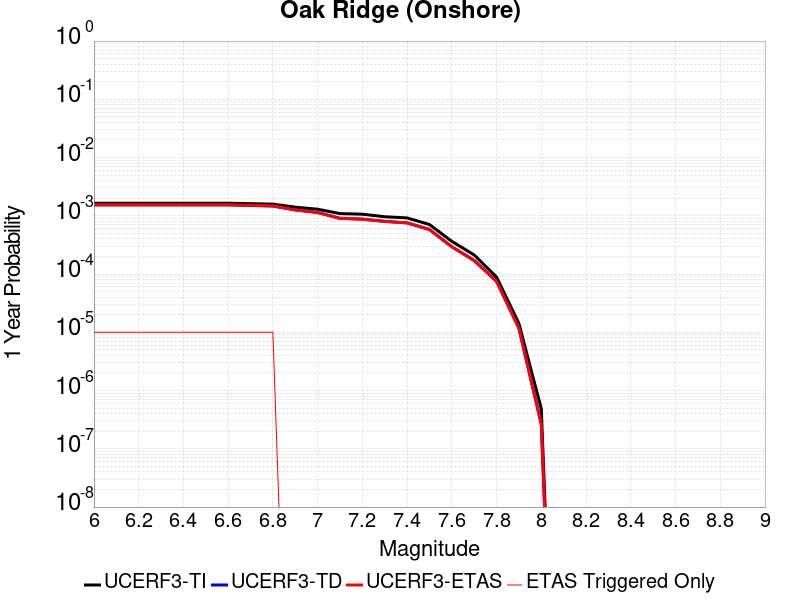 |  |

| Magnitude | 1 wk TI Prob | 1 wk TD Prob | 1 wk ETAS Prob | 1 wk ETAS/TD Gain | 1 wk ETAS Triggered Only | 1 mo TI Prob | 1 mo TD Prob | 1 mo ETAS Prob | 1 mo ETAS/TD Gain | 1 mo ETAS Triggered Only | 1 yr TI Prob | 1 yr TD Prob | 1 yr ETAS Prob | 1 yr ETAS/TD Gain | 1 yr ETAS Triggered Only | 10 yr TI Prob | 10 yr TD Prob | 10 yr ETAS Prob | 10 yr ETAS/TD Gain | 10 yr ETAS Triggered Only |
|-----|-----|-----|-----|-----|-----|-----|-----|-----|-----|-----|-----|-----|-----|-----|-----|-----|-----|-----|-----|-----|
| 6.0 | 3.155064E-5 | 2.9529447E-5 | 2.9529447E-5 | 1.0 | 0.0 | 1.3521002E-4 | 1.2654884E-4 | 1.2654884E-4 | 1.0 | 0.0 | 0.001644939 | 0.0015396813 | 0.0015496659 | 1.0064849 | 1.0E-5 | 0.01632816 | 0.015294643 | 0.015304491 | 1.0006438 | 1.0E-5 |
| 6.1 | 3.155064E-5 | 2.9529447E-5 | 2.9529447E-5 | 1.0 | 0.0 | 1.3521002E-4 | 1.2654884E-4 | 1.2654884E-4 | 1.0 | 0.0 | 0.001644939 | 0.0015396813 | 0.0015496659 | 1.0064849 | 1.0E-5 | 0.01632816 | 0.015294643 | 0.015304491 | 1.0006438 | 1.0E-5 |
| 6.2 | 3.155064E-5 | 2.9529447E-5 | 2.9529447E-5 | 1.0 | 0.0 | 1.3521002E-4 | 1.2654884E-4 | 1.2654884E-4 | 1.0 | 0.0 | 0.001644939 | 0.0015396813 | 0.0015496659 | 1.0064849 | 1.0E-5 | 0.01632816 | 0.015294643 | 0.015304491 | 1.0006438 | 1.0E-5 |
| 6.3 | 3.155064E-5 | 2.9529447E-5 | 2.9529447E-5 | 1.0 | 0.0 | 1.3521002E-4 | 1.2654884E-4 | 1.2654884E-4 | 1.0 | 0.0 | 0.001644939 | 0.0015396813 | 0.0015496659 | 1.0064849 | 1.0E-5 | 0.01632816 | 0.015294643 | 0.015304491 | 1.0006438 | 1.0E-5 |
| 6.4 | 3.155064E-5 | 2.9529447E-5 | 2.9529447E-5 | 1.0 | 0.0 | 1.3521002E-4 | 1.2654884E-4 | 1.2654884E-4 | 1.0 | 0.0 | 0.001644939 | 0.0015396813 | 0.0015496659 | 1.0064849 | 1.0E-5 | 0.01632816 | 0.015294643 | 0.015304491 | 1.0006438 | 1.0E-5 |
| 6.5 | 3.155064E-5 | 2.9529447E-5 | 2.9529447E-5 | 1.0 | 0.0 | 1.3521002E-4 | 1.2654884E-4 | 1.2654884E-4 | 1.0 | 0.0 | 0.001644939 | 0.0015396813 | 0.0015496659 | 1.0064849 | 1.0E-5 | 0.01632816 | 0.015294643 | 0.015304491 | 1.0006438 | 1.0E-5 |
| 6.6 | 3.155064E-5 | 2.9529447E-5 | 2.9529447E-5 | 1.0 | 0.0 | 1.3521002E-4 | 1.2654884E-4 | 1.2654884E-4 | 1.0 | 0.0 | 0.001644939 | 0.0015396813 | 0.0015496659 | 1.0064849 | 1.0E-5 | 0.01632816 | 0.015294643 | 0.015304491 | 1.0006438 | 1.0E-5 |
| 6.7 | 3.098897E-5 | 2.8867584E-5 | 2.8867584E-5 | 1.0 | 0.0 | 1.328031E-4 | 1.2371257E-4 | 1.2371257E-4 | 1.0 | 0.0 | 0.0016156785 | 0.0015051975 | 0.0015151824 | 1.0066336 | 1.0E-5 | 0.016039822 | 0.014954466 | 0.014964317 | 1.0006588 | 1.0E-5 |
| 6.8 | 3.0449872E-5 | 2.824273E-5 | 2.824273E-5 | 1.0 | 0.0 | 1.3049292E-4 | 1.21034864E-4 | 1.21034864E-4 | 1.0 | 0.0 | 0.0015875935 | 0.0014726405 | 0.0014826258 | 1.0067805 | 1.0E-5 | 0.015762992 | 0.014633188 | 0.014643042 | 1.0006734 | 1.0E-5 |
| 6.9 | 2.697928E-5 | 2.4222792E-5 | 2.4222792E-5 | 1.0 | 0.0 | 1.15620365E-4 | 1.0380796E-4 | 1.0380796E-4 | 1.0 | 0.0 | 0.0014067689 | 0.0012631506 | 0.0012631506 | 1.0 | 0.0 | 0.0139789665 | 0.012562426 | 0.012562426 | 1.0 | 0.0 |
| 7.0 | 2.4893961E-5 | 2.1864875E-5 | 2.1864875E-5 | 1.0 | 0.0 | 1.0668404E-4 | 9.370334E-5 | 9.370334E-5 | 1.0 | 0.0 | 0.0012981043 | 0.0011402589 | 0.0011402589 | 1.0 | 0.0 | 0.012905477 | 0.011346367 | 0.011346367 | 1.0 | 0.0 |
| 7.1 | 2.0945363E-5 | 1.7356973E-5 | 1.7356973E-5 | 1.0 | 0.0 | 8.976275E-5 | 7.438494E-5 | 7.438494E-5 | 1.0 | 0.0 | 0.0010923136 | 9.0526504E-4 | 9.0526504E-4 | 1.0 | 0.0 | 0.0108696 | 0.009016709 | 0.009016709 | 1.0 | 0.0 |
| 7.2 | 2.0439404E-5 | 1.6811871E-5 | 1.6811871E-5 | 1.0 | 0.0 | 8.7594504E-5 | 7.204891E-5 | 7.204891E-5 | 1.0 | 0.0 | 0.0010659413 | 8.768472E-4 | 8.768472E-4 | 1.0 | 0.0 | 0.010608427 | 0.0087347925 | 0.0087347925 | 1.0 | 0.0 |
| 7.3 | 1.8463334E-5 | 1.538278E-5 | 1.538278E-5 | 1.0 | 0.0 | 7.912617E-5 | 6.5924556E-5 | 6.5924556E-5 | 1.0 | 0.0 | 9.6293533E-4 | 8.023403E-4 | 8.023403E-4 | 1.0 | 0.0 | 0.009587734 | 0.007995299 | 0.007995299 | 1.0 | 0.0 |
| 7.4 | 1.763139E-5 | 1.4517647E-5 | 1.4517647E-5 | 1.0 | 0.0 | 7.556091E-5 | 6.221703E-5 | 6.221703E-5 | 1.0 | 0.0 | 9.1956573E-4 | 7.57233E-4 | 7.57233E-4 | 1.0 | 0.0 | 0.009157699 | 0.007547332 | 0.007547332 | 1.0 | 0.0 |
| 7.5 | 1.3594944E-5 | 1.116386E-5 | 1.116386E-5 | 1.0 | 0.0 | 5.8262744E-5 | 4.784425E-5 | 4.784425E-5 | 1.0 | 0.0 | 7.0911803E-4 | 5.823506E-4 | 5.823506E-4 | 1.0 | 0.0 | 0.007068595 | 0.005808517 | 0.005808517 | 1.0 | 0.0 |
| 7.6 | 6.9889534E-6 | 5.6369217E-6 | 5.6369217E-6 | 1.0 | 0.0 | 2.9952313E-5 | 2.4158015E-5 | 2.4158015E-5 | 1.0 | 0.0 | 3.646084E-4 | 2.9408454E-4 | 2.9408454E-4 | 1.0 | 0.0 | 0.0036401073 | 0.0029369977 | 0.0029369977 | 1.0 | 0.0 |
| 7.7 | 4.0824193E-6 | 3.2833782E-6 | 3.2833782E-6 | 1.0 | 0.0 | 1.7495966E-5 | 1.40715465E-5 | 1.40715465E-5 | 1.0 | 0.0 | 2.1299256E-4 | 1.7130774E-4 | 1.7130774E-4 | 1.0 | 0.0 | 0.0021278851 | 0.0017117702 | 0.0017117702 | 1.0 | 0.0 |
| 7.8 | 1.7023609E-6 | 1.4370928E-6 | 1.4370928E-6 | 1.0 | 0.0 | 7.295812E-6 | 6.158955E-6 | 6.158955E-6 | 1.0 | 0.0 | 8.882289E-5 | 7.498272E-5 | 7.498272E-5 | 1.0 | 0.0 | 8.8787393E-4 | 7.49577E-4 | 7.49577E-4 | 1.0 | 0.0 |
| 7.9 | 2.721225E-7 | 2.2617367E-7 | 2.2617367E-7 | 1.0 | 0.0 | 1.1662388E-6 | 9.693154E-7 | 9.693154E-7 | 1.0 | 0.0 | 1.4198865E-5 | 1.1801353E-5 | 1.1801353E-5 | 1.0 | 0.0 | 1.4197957E-4 | 1.1800755E-4 | 1.1800755E-4 | 1.0 | 0.0 |
| 8.0 | 9.364255E-9 | 5.1216933E-9 | 5.1216933E-9 | 1.0 | 0.0 | 4.0132523E-8 | 2.1950115E-8 | 2.1950115E-8 | 1.0 | 0.0 | 4.8861335E-7 | 2.6724263E-7 | 2.6724263E-7 | 1.0 | 0.0 | 4.8861225E-6 | 2.6724233E-6 | 2.6724233E-6 | 1.0 | 0.0 |

## Great Valley 03a Dunnigan Hills
*[(top)](#table-of-contents)*

| 1 Week | 1 Month | 1 Year | 10 Year |
|-----|-----|-----|-----|
|  |  |  |  |

| Magnitude | 1 wk TI Prob | 1 wk TD Prob | 1 wk ETAS Prob | 1 wk ETAS/TD Gain | 1 wk ETAS Triggered Only | 1 mo TI Prob | 1 mo TD Prob | 1 mo ETAS Prob | 1 mo ETAS/TD Gain | 1 mo ETAS Triggered Only | 1 yr TI Prob | 1 yr TD Prob | 1 yr ETAS Prob | 1 yr ETAS/TD Gain | 1 yr ETAS Triggered Only | 10 yr TI Prob | 10 yr TD Prob | 10 yr ETAS Prob | 10 yr ETAS/TD Gain | 10 yr ETAS Triggered Only |
|-----|-----|-----|-----|-----|-----|-----|-----|-----|-----|-----|-----|-----|-----|-----|-----|-----|-----|-----|-----|-----|
| 6.0 | 1.6591328E-5 | 1.8108833E-5 | 1.8108833E-5 | 1.0 | 0.0 | 7.110376E-5 | 7.7607365E-5 | 7.7607365E-5 | 1.0 | 0.0 | 8.6534437E-4 | 9.445292E-4 | 9.545197E-4 | 1.0105773 | 1.0E-5 | 0.008619824 | 0.0094119795 | 0.009421886 | 1.0010525 | 1.0E-5 |
| 6.1 | 8.041125E-6 | 8.770148E-6 | 8.770148E-6 | 1.0 | 0.0 | 3.4461507E-5 | 3.7585924E-5 | 3.7585924E-5 | 1.0 | 0.0 | 4.194881E-4 | 4.5753285E-4 | 4.5753285E-4 | 1.0 | 0.0 | 0.004186971 | 0.0045679063 | 0.0045679063 | 1.0 | 0.0 |
| 6.2 | 3.2807004E-6 | 3.5797418E-6 | 3.5797418E-6 | 1.0 | 0.0 | 1.4060069E-5 | 1.5341684E-5 | 1.5341684E-5 | 1.0 | 0.0 | 1.7116789E-4 | 1.8677315E-4 | 1.8677315E-4 | 1.0 | 0.0 | 0.0017103611 | 0.0018665699 | 0.0018665699 | 1.0 | 0.0 |
| 6.3 | 1.9339366E-6 | 2.110483E-6 | 2.110483E-6 | 1.0 | 0.0 | 8.288273E-6 | 9.044911E-6 | 9.044911E-6 | 1.0 | 0.0 | 1.00905054E-4 | 1.1011909E-4 | 1.1011909E-4 | 1.0 | 0.0 | 0.0010085925 | 0.0011009251 | 0.0011009251 | 1.0 | 0.0 |
| 6.4 | 1.3142635E-6 | 1.4340559E-6 | 1.4340559E-6 | 1.0 | 0.0 | 5.6325457E-6 | 6.145954E-6 | 6.145954E-6 | 1.0 | 0.0 | 6.857408E-5 | 7.482699E-5 | 7.482699E-5 | 1.0 | 0.0 | 6.8552926E-4 | 7.482699E-4 | 7.482699E-4 | 1.0 | 0.0 |

## Ludlow
*[(top)](#table-of-contents)*

| 1 Week | 1 Month | 1 Year | 10 Year |
|-----|-----|-----|-----|
|  |  |  |  |

| Magnitude | 1 wk TI Prob | 1 wk TD Prob | 1 wk ETAS Prob | 1 wk ETAS/TD Gain | 1 wk ETAS Triggered Only | 1 mo TI Prob | 1 mo TD Prob | 1 mo ETAS Prob | 1 mo ETAS/TD Gain | 1 mo ETAS Triggered Only | 1 yr TI Prob | 1 yr TD Prob | 1 yr ETAS Prob | 1 yr ETAS/TD Gain | 1 yr ETAS Triggered Only | 10 yr TI Prob | 10 yr TD Prob | 10 yr ETAS Prob | 10 yr ETAS/TD Gain | 10 yr ETAS Triggered Only |
|-----|-----|-----|-----|-----|-----|-----|-----|-----|-----|-----|-----|-----|-----|-----|-----|-----|-----|-----|-----|-----|
| 6.0 | 2.2407607E-5 | 2.3657954E-5 | 2.3657954E-5 | 1.0 | 0.0 | 9.602906E-5 | 1.0138754E-4 | 1.0138754E-4 | 1.0 | 0.0 | 0.0011685267 | 0.0012337384 | 0.0012437261 | 1.0080955 | 1.0E-5 | 0.011624013 | 0.012273403 | 0.0122832805 | 1.0008048 | 1.0E-5 |
| 6.1 | 2.2407607E-5 | 2.3657954E-5 | 2.3657954E-5 | 1.0 | 0.0 | 9.602906E-5 | 1.0138754E-4 | 1.0138754E-4 | 1.0 | 0.0 | 0.0011685267 | 0.0012337384 | 0.0012437261 | 1.0080955 | 1.0E-5 | 0.011624013 | 0.012273403 | 0.0122832805 | 1.0008048 | 1.0E-5 |
| 6.2 | 1.0781252E-5 | 1.1365991E-5 | 1.1365991E-5 | 1.0 | 0.0 | 4.620455E-5 | 4.8710503E-5 | 4.8710503E-5 | 1.0 | 0.0 | 5.623952E-4 | 5.92893E-4 | 6.0288707E-4 | 1.0168564 | 1.0E-5 | 0.00560974 | 0.005913531 | 0.005923472 | 1.0016811 | 1.0E-5 |
| 6.3 | 1.0781252E-5 | 1.1365991E-5 | 1.1365991E-5 | 1.0 | 0.0 | 4.620455E-5 | 4.8710503E-5 | 4.8710503E-5 | 1.0 | 0.0 | 5.623952E-4 | 5.92893E-4 | 6.0288707E-4 | 1.0168564 | 1.0E-5 | 0.00560974 | 0.005913531 | 0.005923472 | 1.0016811 | 1.0E-5 |
| 6.4 | 7.814439E-6 | 8.237966E-6 | 8.237966E-6 | 1.0 | 0.0 | 3.3490025E-5 | 3.5305096E-5 | 3.5305096E-5 | 1.0 | 0.0 | 4.0766477E-4 | 4.2975618E-4 | 4.397519E-4 | 1.023259 | 1.0E-5 | 0.0040691774 | 0.0042893975 | 0.0042993547 | 1.0023214 | 1.0E-5 |
| 6.5 | 6.4986366E-6 | 6.8511167E-6 | 6.8511167E-6 | 1.0 | 0.0 | 2.7851002E-5 | 2.9361603E-5 | 2.9361603E-5 | 1.0 | 0.0 | 3.390332E-4 | 3.574198E-4 | 3.6741624E-4 | 1.0279683 | 1.0E-5 | 0.003385164 | 0.003568546 | 0.0035785101 | 1.0027922 | 1.0E-5 |
| 6.6 | 5.582177E-6 | 5.8861756E-6 | 5.8861756E-6 | 1.0 | 0.0 | 2.3923398E-5 | 2.5226227E-5 | 2.5226227E-5 | 1.0 | 0.0 | 2.9122844E-4 | 3.0708674E-4 | 3.1708367E-4 | 1.032554 | 1.0E-5 | 0.0029084706 | 0.0030666974 | 0.0030766667 | 1.0032508 | 1.0E-5 |
| 6.7 | 4.6858763E-6 | 4.94057E-6 | 4.94057E-6 | 1.0 | 0.0 | 2.0082172E-5 | 2.1173702E-5 | 2.1173702E-5 | 1.0 | 0.0 | 2.4447302E-4 | 2.5775988E-4 | 2.677573E-4 | 1.0387858 | 1.0E-5 | 0.0024420423 | 0.0025746655 | 0.0025846397 | 1.003874 | 1.0E-5 |
| 6.8 | 3.5584908E-6 | 3.7521265E-6 | 3.7521265E-6 | 1.0 | 0.0 | 1.5250586E-5 | 1.6080447E-5 | 1.6080447E-5 | 1.0 | 0.0 | 1.8566006E-4 | 1.9576224E-4 | 2.057603E-4 | 1.0510724 | 1.0E-5 | 0.0018550502 | 0.0019559392 | 0.0019659195 | 1.0051026 | 1.0E-5 |
| 6.9 | 2.532834E-6 | 2.6710807E-6 | 2.6710807E-6 | 1.0 | 0.0 | 1.0854958E-5 | 1.1447441E-5 | 1.1447441E-5 | 1.0 | 0.0 | 1.3215111E-4 | 1.3936395E-4 | 1.4936256E-4 | 1.0717446 | 1.0E-5 | 0.0013207254 | 0.0013927931 | 0.0014027792 | 1.0071698 | 1.0E-5 |
| 7.0 | 1.7083285E-6 | 1.8019963E-6 | 1.8019963E-6 | 1.0 | 0.0 | 7.3213873E-6 | 7.722819E-6 | 7.722819E-6 | 1.0 | 0.0 | 8.913424E-5 | 9.402143E-5 | 9.402143E-5 | 1.0 | 0.0 | 8.9098496E-4 | 9.3983306E-4 | 9.3983306E-4 | 1.0 | 0.0 |
| 7.1 | 1.0905424E-6 | 1.1497951E-6 | 1.1497951E-6 | 1.0 | 0.0 | 4.6737446E-6 | 4.9276846E-6 | 4.9276846E-6 | 1.0 | 0.0 | 5.6901354E-5 | 5.9993006E-5 | 5.9993006E-5 | 1.0 | 0.0 | 5.6886784E-4 | 5.997779E-4 | 5.997779E-4 | 1.0 | 0.0 |
| 7.2 | 6.06668E-7 | 6.387457E-7 | 6.387457E-7 | 1.0 | 0.0 | 2.600003E-6 | 2.737479E-6 | 2.737479E-6 | 1.0 | 0.0 | 3.1654577E-5 | 3.3328364E-5 | 3.3328364E-5 | 1.0 | 0.0 | 3.1650066E-4 | 3.3324052E-4 | 3.3324052E-4 | 1.0 | 0.0 |

## San Andreas (North Branch Mill Creek)
*[(top)](#table-of-contents)*

| 1 Week | 1 Month | 1 Year | 10 Year |
|-----|-----|-----|-----|
| 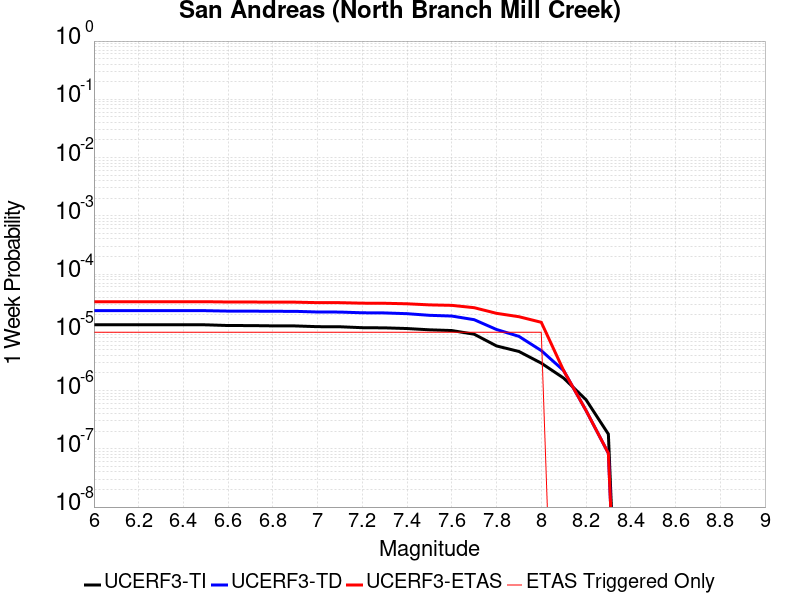 | 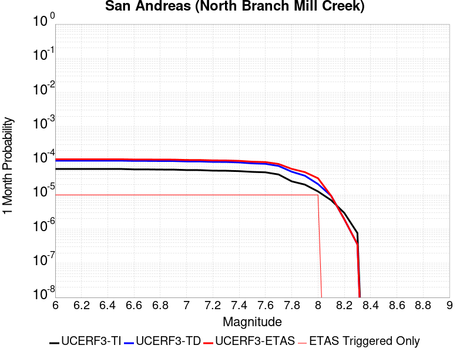 | 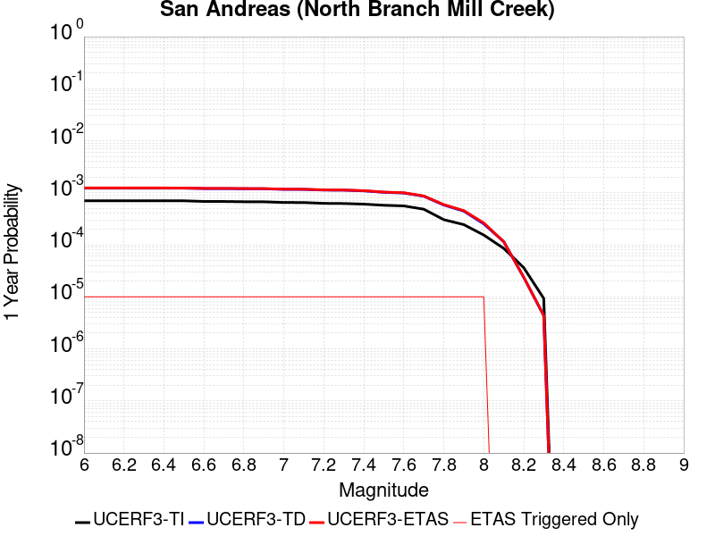 | 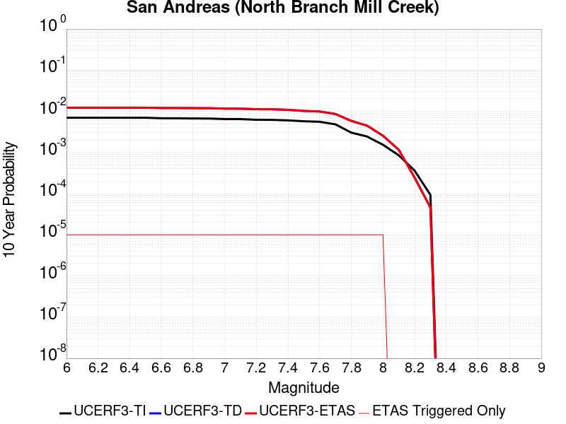 |

| Magnitude | 1 wk TI Prob | 1 wk TD Prob | 1 wk ETAS Prob | 1 wk ETAS/TD Gain | 1 wk ETAS Triggered Only | 1 mo TI Prob | 1 mo TD Prob | 1 mo ETAS Prob | 1 mo ETAS/TD Gain | 1 mo ETAS Triggered Only | 1 yr TI Prob | 1 yr TD Prob | 1 yr ETAS Prob | 1 yr ETAS/TD Gain | 1 yr ETAS Triggered Only | 10 yr TI Prob | 10 yr TD Prob | 10 yr ETAS Prob | 10 yr ETAS/TD Gain | 10 yr ETAS Triggered Only |
|-----|-----|-----|-----|-----|-----|-----|-----|-----|-----|-----|-----|-----|-----|-----|-----|-----|-----|-----|-----|-----|
| 6.0 | 1.3461156E-5 | 2.3527407E-5 | 3.3527172E-5 | 1.4250262 | 1.0E-5 | 5.7689394E-5 | 1.0082787E-4 | 1.1082686E-4 | 1.0991689 | 1.0E-5 | 7.02142E-4 | 0.0012268913 | 0.001236879 | 1.0081407 | 1.0E-5 | 0.0069992766 | 0.012243656 | 0.012253534 | 1.0008068 | 1.0E-5 |
| 6.1 | 1.3461156E-5 | 2.3527407E-5 | 3.3527172E-5 | 1.4250262 | 1.0E-5 | 5.7689394E-5 | 1.0082787E-4 | 1.1082686E-4 | 1.0991689 | 1.0E-5 | 7.02142E-4 | 0.0012268913 | 0.001236879 | 1.0081407 | 1.0E-5 | 0.0069992766 | 0.012243656 | 0.012253534 | 1.0008068 | 1.0E-5 |
| 6.2 | 1.3461156E-5 | 2.3527407E-5 | 3.3527172E-5 | 1.4250262 | 1.0E-5 | 5.7689394E-5 | 1.0082787E-4 | 1.1082686E-4 | 1.0991689 | 1.0E-5 | 7.02142E-4 | 0.0012268913 | 0.001236879 | 1.0081407 | 1.0E-5 | 0.0069992766 | 0.012243656 | 0.012253534 | 1.0008068 | 1.0E-5 |
| 6.3 | 1.3461156E-5 | 2.3527407E-5 | 3.3527172E-5 | 1.4250262 | 1.0E-5 | 5.7689394E-5 | 1.0082787E-4 | 1.1082686E-4 | 1.0991689 | 1.0E-5 | 7.02142E-4 | 0.0012268913 | 0.001236879 | 1.0081407 | 1.0E-5 | 0.0069992766 | 0.012243656 | 0.012253534 | 1.0008068 | 1.0E-5 |
| 6.4 | 1.3461156E-5 | 2.3527407E-5 | 3.3527172E-5 | 1.4250262 | 1.0E-5 | 5.7689394E-5 | 1.0082787E-4 | 1.1082686E-4 | 1.0991689 | 1.0E-5 | 7.02142E-4 | 0.0012268913 | 0.001236879 | 1.0081407 | 1.0E-5 | 0.0069992766 | 0.012243656 | 0.012253534 | 1.0008068 | 1.0E-5 |
| 6.5 | 1.3450706E-5 | 2.3516368E-5 | 3.351613E-5 | 1.4252257 | 1.0E-5 | 5.764461E-5 | 1.00780555E-4 | 1.1077955E-4 | 1.0992155 | 1.0E-5 | 7.0159714E-4 | 0.001226316 | 0.0012363037 | 1.0081445 | 1.0E-5 | 0.006993862 | 0.012237966 | 0.012247844 | 1.0008072 | 1.0E-5 |
| 6.6 | 1.3074523E-5 | 2.313064E-5 | 3.313041E-5 | 1.432317 | 1.0E-5 | 5.6032466E-5 | 9.912757E-5 | 1.0912657E-4 | 1.1008701 | 1.0E-5 | 6.8198174E-4 | 0.0012062131 | 0.0012162011 | 1.0082804 | 1.0E-5 | 0.006798926 | 0.012039129 | 0.012049009 | 1.0008206 | 1.0E-5 |
| 6.7 | 1.3050216E-5 | 2.3105935E-5 | 3.3105705E-5 | 1.4327792 | 1.0E-5 | 5.59283E-5 | 9.9021694E-5 | 1.0902071E-4 | 1.100978 | 1.0E-5 | 6.8071426E-4 | 0.0012049256 | 0.0012149136 | 1.0082892 | 1.0E-5 | 0.0067863287 | 0.012026393 | 0.012036272 | 1.0008215 | 1.0E-5 |
| 6.8 | 1.29049395E-5 | 2.2954338E-5 | 3.2954107E-5 | 1.4356375 | 1.0E-5 | 5.530571E-5 | 9.8372046E-5 | 1.0837106E-4 | 1.1016449 | 1.0E-5 | 6.73139E-4 | 0.0011970248 | 0.0012070128 | 1.008344 | 1.0E-5 | 0.0067110364 | 0.011948236 | 0.011958117 | 1.000827 | 1.0E-5 |
| 6.9 | 1.2867369E-5 | 2.2913739E-5 | 3.2913507E-5 | 1.4364095 | 1.0E-5 | 5.51447E-5 | 9.8198056E-5 | 1.0819707E-4 | 1.101825 | 1.0E-5 | 6.711799E-4 | 0.0011949089 | 0.0012048968 | 1.0083588 | 1.0E-5 | 0.006691564 | 0.011927304 | 0.011937184 | 1.0008284 | 1.0E-5 |
| 7.0 | 1.2495996E-5 | 2.2313627E-5 | 3.2313405E-5 | 1.4481466 | 1.0E-5 | 5.3553173E-5 | 9.562634E-5 | 1.0562539E-4 | 1.1045637 | 1.0E-5 | 6.518148E-4 | 0.0011636318 | 0.0011736201 | 1.0085838 | 1.0E-5 | 0.0064990623 | 0.011617814 | 0.011627698 | 1.0008508 | 1.0E-5 |
| 7.1 | 1.2452067E-5 | 2.2258691E-5 | 3.225847E-5 | 1.4492527 | 1.0E-5 | 5.3364907E-5 | 9.539092E-5 | 1.0538997E-4 | 1.1048218 | 1.0E-5 | 6.4952404E-4 | 0.0011607686 | 0.001170757 | 1.008605 | 1.0E-5 | 0.0064762887 | 0.011589482 | 0.011599366 | 1.0008528 | 1.0E-5 |
| 7.2 | 1.2002777E-5 | 2.163711E-5 | 3.1636893E-5 | 1.4621589 | 1.0E-5 | 5.143946E-5 | 9.272719E-5 | 1.0272626E-4 | 1.1078333 | 1.0E-5 | 6.2609545E-4 | 0.0011283715 | 0.0011383602 | 1.0088524 | 1.0E-5 | 0.006243344 | 0.011268834 | 0.0112787215 | 1.0008774 | 1.0E-5 |
| 7.3 | 1.1923425E-5 | 2.150691E-5 | 3.1506694E-5 | 1.4649569 | 1.0E-5 | 5.109939E-5 | 9.216923E-5 | 1.02168306E-4 | 1.108486 | 1.0E-5 | 6.219575E-4 | 0.0011215854 | 0.0011315742 | 1.008906 | 1.0E-5 | 0.0062021962 | 0.011201685 | 0.011211573 | 1.0008827 | 1.0E-5 |
| 7.4 | 1.16105175E-5 | 2.0880623E-5 | 3.0880416E-5 | 1.4789029 | 1.0E-5 | 4.975841E-5 | 8.948533E-5 | 9.948444E-5 | 1.1117401 | 1.0E-5 | 6.0564023E-4 | 0.0010889419 | 0.0010989311 | 1.0091733 | 1.0E-5 | 0.006039923 | 0.010879163 | 0.010889054 | 1.0009092 | 1.0E-5 |
| 7.5 | 1.1037265E-5 | 1.9579818E-5 | 2.9579624E-5 | 1.5107199 | 1.0E-5 | 4.7301706E-5 | 8.3910825E-5 | 9.3909985E-5 | 1.1191641 | 1.0E-5 | 5.757461E-4 | 0.0010211377 | 0.0010311274 | 1.009783 | 1.0E-5 | 0.005742567 | 0.010208193 | 0.010218091 | 1.0009696 | 1.0E-5 |
| 7.6 | 1.0720915E-5 | 1.9021407E-5 | 2.9021216E-5 | 1.5257134 | 1.0E-5 | 4.5945973E-5 | 8.151778E-5 | 9.1516966E-5 | 1.1226627 | 1.0E-5 | 5.592486E-4 | 9.920292E-4 | 0.0010020193 | 1.0100703 | 1.0E-5 | 0.005578433 | 0.009919754 | 0.009929655 | 1.0009981 | 1.0E-5 |
| 7.7 | 9.276279E-6 | 1.6466016E-5 | 2.646585E-5 | 1.6073015 | 1.0E-5 | 3.9754876E-5 | 7.056674E-5 | 8.056603E-5 | 1.1416998 | 1.0E-5 | 4.839081E-4 | 8.5881306E-4 | 8.6880446E-4 | 1.011634 | 1.0E-5 | 0.0048285574 | 0.008598559 | 0.0086084725 | 1.001153 | 1.0E-5 |
| 7.8 | 5.8346777E-6 | 1.11748E-5 | 2.1174688E-5 | 1.8948605 | 1.0E-5 | 2.5005522E-5 | 4.7891124E-5 | 5.7890644E-5 | 1.208797 | 1.0E-5 | 3.043997E-4 | 5.829186E-4 | 5.929127E-4 | 1.017145 | 1.0E-5 | 0.0030398308 | 0.005857104 | 0.0058670454 | 1.0016973 | 1.0E-5 |
| 7.9 | 4.690204E-6 | 8.525594E-6 | 1.8525508E-5 | 2.1729288 | 1.0E-5 | 2.0100719E-5 | 3.653775E-5 | 4.653738E-5 | 1.2736796 | 1.0E-5 | 2.4469878E-4 | 4.4475638E-4 | 4.5475192E-4 | 1.0224742 | 1.0E-5 | 0.002444295 | 0.004479242 | 0.0044891974 | 1.0022225 | 1.0E-5 |
| 8.0 | 2.9570454E-6 | 4.857035E-6 | 1.4856986E-5 | 3.058859 | 1.0E-5 | 1.267299E-5 | 2.0815698E-5 | 3.081549E-5 | 1.4803966 | 1.0E-5 | 1.5428272E-4 | 2.534017E-4 | 2.6339915E-4 | 1.039453 | 1.0E-5 | 0.0015417566 | 0.002554891 | 0.0025648654 | 1.0039041 | 1.0E-5 |
| 8.1 | 1.6376824E-6 | 2.2021889E-6 | 2.2021889E-6 | 1.0 | 0.0 | 7.01862E-6 | 9.437918E-6 | 9.437918E-6 | 1.0 | 0.0 | 8.544835E-5 | 1.14900606E-4 | 1.14900606E-4 | 1.0 | 0.0 | 8.54155E-4 | 0.0011634289 | 0.0011634289 | 1.0 | 0.0 |
| 8.2 | 6.9631557E-7 | 4.5525482E-7 | 4.5525482E-7 | 1.0 | 0.0 | 2.984206E-6 | 1.9510906E-6 | 1.9510906E-6 | 1.0 | 0.0 | 3.63321E-5 | 2.3754272E-5 | 2.3754272E-5 | 1.0 | 0.0 | 3.6326164E-4 | 2.4603383E-4 | 2.4603383E-4 | 1.0 | 0.0 |
| 8.3 | 1.7876137E-7 | 8.3938964E-8 | 8.3938964E-8 | 1.0 | 0.0 | 7.661199E-7 | 3.5973835E-7 | 3.5973835E-7 | 1.0 | 0.0 | 9.32747E-6 | 4.3798063E-6 | 4.3798063E-6 | 1.0 | 0.0 | 9.3270784E-5 | 4.599691E-5 | 4.599691E-5 | 1.0 | 0.0 |

## Independence rev 2011
*[(top)](#table-of-contents)*

| 1 Week | 1 Month | 1 Year | 10 Year |
|-----|-----|-----|-----|
| 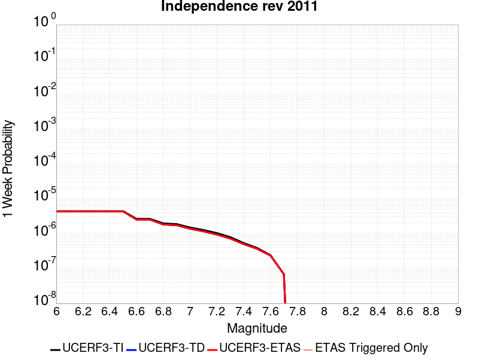 |  |  |  |

| Magnitude | 1 wk TI Prob | 1 wk TD Prob | 1 wk ETAS Prob | 1 wk ETAS/TD Gain | 1 wk ETAS Triggered Only | 1 mo TI Prob | 1 mo TD Prob | 1 mo ETAS Prob | 1 mo ETAS/TD Gain | 1 mo ETAS Triggered Only | 1 yr TI Prob | 1 yr TD Prob | 1 yr ETAS Prob | 1 yr ETAS/TD Gain | 1 yr ETAS Triggered Only | 10 yr TI Prob | 10 yr TD Prob | 10 yr ETAS Prob | 10 yr ETAS/TD Gain | 10 yr ETAS Triggered Only |
|-----|-----|-----|-----|-----|-----|-----|-----|-----|-----|-----|-----|-----|-----|-----|-----|-----|-----|-----|-----|-----|
| 6.0 | 4.422171E-6 | 4.3263003E-6 | 4.3263003E-6 | 1.0 | 0.0 | 1.8952025E-5 | 1.8541172E-5 | 1.8541172E-5 | 1.0 | 0.0 | 2.3071647E-4 | 2.2571837E-4 | 2.2571837E-4 | 1.0 | 0.0 | 0.0023047708 | 0.0022551846 | 0.002265162 | 1.0044242 | 1.0E-5 |
| 6.1 | 4.422171E-6 | 4.3263003E-6 | 4.3263003E-6 | 1.0 | 0.0 | 1.8952025E-5 | 1.8541172E-5 | 1.8541172E-5 | 1.0 | 0.0 | 2.3071647E-4 | 2.2571837E-4 | 2.2571837E-4 | 1.0 | 0.0 | 0.0023047708 | 0.0022551846 | 0.002265162 | 1.0044242 | 1.0E-5 |
| 6.2 | 4.422171E-6 | 4.3263003E-6 | 4.3263003E-6 | 1.0 | 0.0 | 1.8952025E-5 | 1.8541172E-5 | 1.8541172E-5 | 1.0 | 0.0 | 2.3071647E-4 | 2.2571837E-4 | 2.2571837E-4 | 1.0 | 0.0 | 0.0023047708 | 0.0022551846 | 0.002265162 | 1.0044242 | 1.0E-5 |
| 6.3 | 4.422171E-6 | 4.3263003E-6 | 4.3263003E-6 | 1.0 | 0.0 | 1.8952025E-5 | 1.8541172E-5 | 1.8541172E-5 | 1.0 | 0.0 | 2.3071647E-4 | 2.2571837E-4 | 2.2571837E-4 | 1.0 | 0.0 | 0.0023047708 | 0.0022551846 | 0.002265162 | 1.0044242 | 1.0E-5 |
| 6.4 | 4.422171E-6 | 4.3263003E-6 | 4.3263003E-6 | 1.0 | 0.0 | 1.8952025E-5 | 1.8541172E-5 | 1.8541172E-5 | 1.0 | 0.0 | 2.3071647E-4 | 2.2571837E-4 | 2.2571837E-4 | 1.0 | 0.0 | 0.0023047708 | 0.0022551846 | 0.002265162 | 1.0044242 | 1.0E-5 |
| 6.5 | 4.422171E-6 | 4.3263003E-6 | 4.3263003E-6 | 1.0 | 0.0 | 1.8952025E-5 | 1.8541172E-5 | 1.8541172E-5 | 1.0 | 0.0 | 2.3071647E-4 | 2.2571837E-4 | 2.2571837E-4 | 1.0 | 0.0 | 0.0023047708 | 0.0022551846 | 0.002265162 | 1.0044242 | 1.0E-5 |
| 6.6 | 2.663744E-6 | 2.53204E-6 | 2.53204E-6 | 1.0 | 0.0 | 1.1415996E-5 | 1.0851558E-5 | 1.0851558E-5 | 1.0 | 0.0 | 1.3898089E-4 | 1.3211019E-4 | 1.3211019E-4 | 1.0 | 0.0 | 0.0013889399 | 0.0013203648 | 0.0013303516 | 1.0075637 | 1.0E-5 |
| 6.7 | 2.663744E-6 | 2.53204E-6 | 2.53204E-6 | 1.0 | 0.0 | 1.1415996E-5 | 1.0851558E-5 | 1.0851558E-5 | 1.0 | 0.0 | 1.3898089E-4 | 1.3211019E-4 | 1.3211019E-4 | 1.0 | 0.0 | 0.0013889399 | 0.0013203648 | 0.0013303516 | 1.0075637 | 1.0E-5 |
| 6.8 | 1.9716529E-6 | 1.8323044E-6 | 1.8323044E-6 | 1.0 | 0.0 | 8.449913E-6 | 7.85271E-6 | 7.85271E-6 | 1.0 | 0.0 | 1.0287284E-4 | 9.5602685E-5 | 9.5602685E-5 | 1.0 | 0.0 | 0.0010282523 | 9.5562846E-4 | 9.6561894E-4 | 1.0104543 | 1.0E-5 |
| 6.9 | 1.8788617E-6 | 1.7430435E-6 | 1.7430435E-6 | 1.0 | 0.0 | 8.0522395E-6 | 7.470166E-6 | 7.470166E-6 | 1.0 | 0.0 | 9.80316E-5 | 9.09456E-5 | 9.09456E-5 | 1.0 | 0.0 | 9.798837E-4 | 9.090958E-4 | 9.190867E-4 | 1.0109899 | 1.0E-5 |
| 7.0 | 1.5045488E-6 | 1.384987E-6 | 1.384987E-6 | 1.0 | 0.0 | 6.44805E-6 | 5.9356453E-6 | 5.9356453E-6 | 1.0 | 0.0 | 7.8502184E-5 | 7.2264134E-5 | 7.2264134E-5 | 1.0 | 0.0 | 7.8474457E-4 | 7.224115E-4 | 7.324043E-4 | 1.0138326 | 1.0E-5 |
| 7.1 | 1.272341E-6 | 1.1625416E-6 | 1.1625416E-6 | 1.0 | 0.0 | 5.4528787E-6 | 4.9823116E-6 | 4.9823116E-6 | 1.0 | 0.0 | 6.6386776E-5 | 6.065799E-5 | 6.065799E-5 | 1.0 | 0.0 | 6.636695E-4 | 6.0641754E-4 | 6.1641145E-4 | 1.0164803 | 1.0E-5 |
| 7.2 | 1.0416892E-6 | 9.410155E-7 | 9.410155E-7 | 1.0 | 0.0 | 4.464375E-6 | 4.032918E-6 | 4.032918E-6 | 1.0 | 0.0 | 5.4352407E-5 | 4.9099683E-5 | 4.9099683E-5 | 1.0 | 0.0 | 5.4339116E-4 | 4.9089023E-4 | 5.008853E-4 | 1.0203612 | 1.0E-5 |
| 7.3 | 7.9450155E-7 | 7.2352077E-7 | 7.2352077E-7 | 1.0 | 0.0 | 3.4050022E-6 | 3.1007996E-6 | 3.1007996E-6 | 1.0 | 0.0 | 4.1455114E-5 | 3.7751593E-5 | 3.7751593E-5 | 1.0 | 0.0 | 4.144738E-4 | 3.774529E-4 | 3.8744914E-4 | 1.0264834 | 1.0E-5 |
| 7.4 | 5.3893444E-7 | 5.01964E-7 | 5.01964E-7 | 1.0 | 0.0 | 2.309717E-6 | 2.1512726E-6 | 2.1512726E-6 | 1.0 | 0.0 | 2.8120441E-5 | 2.6191434E-5 | 2.6191434E-5 | 1.0 | 0.0 | 2.8116882E-4 | 2.6188392E-4 | 2.7188132E-4 | 1.0381749 | 1.0E-5 |
| 7.5 | 3.8852085E-7 | 3.6826376E-7 | 3.6826376E-7 | 1.0 | 0.0 | 1.6650882E-6 | 1.5782723E-6 | 1.5782723E-6 | 1.0 | 0.0 | 2.027226E-5 | 1.9215298E-5 | 1.9215298E-5 | 1.0 | 0.0 | 2.0270412E-4 | 1.9213658E-4 | 2.0213466E-4 | 1.0520363 | 1.0E-5 |
| 7.6 | 2.414929E-7 | 2.3457987E-7 | 2.3457987E-7 | 1.0 | 0.0 | 1.0349692E-6 | 1.0053419E-6 | 1.0053419E-6 | 1.0 | 0.0 | 1.2600677E-5 | 1.2239971E-5 | 1.2239971E-5 | 1.0 | 0.0 | 1.2599962E-4 | 1.2239309E-4 | 1.3239187E-4 | 1.081694 | 1.0E-5 |
| 7.7 | 6.8298014E-8 | 6.8590616E-8 | 6.8590616E-8 | 1.0 | 0.0 | 2.9270575E-7 | 2.9395974E-7 | 2.9395974E-7 | 1.0 | 0.0 | 3.5636867E-6 | 3.5789546E-6 | 3.5789546E-6 | 1.0 | 0.0 | 3.5636294E-5 | 3.5789017E-5 | 3.5789017E-5 | 1.0 | 0.0 |

## Verdugo
*[(top)](#table-of-contents)*

| 1 Week | 1 Month | 1 Year | 10 Year |
|-----|-----|-----|-----|
| 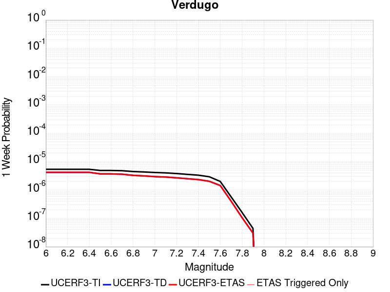 | 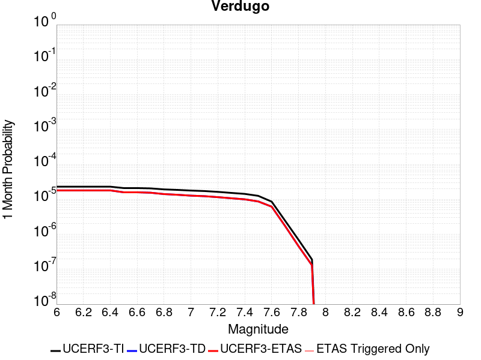 | 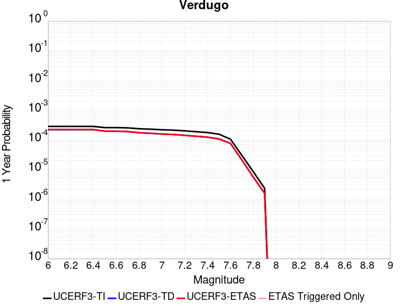 | 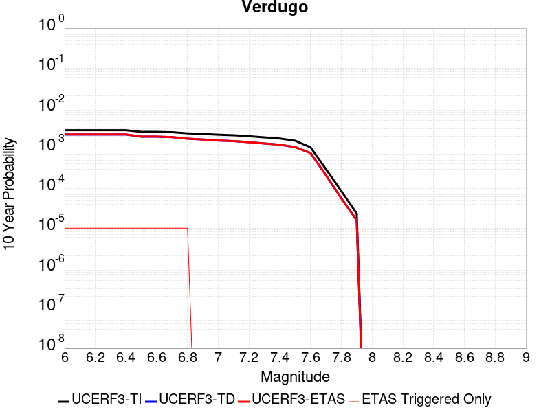 |

| Magnitude | 1 wk TI Prob | 1 wk TD Prob | 1 wk ETAS Prob | 1 wk ETAS/TD Gain | 1 wk ETAS Triggered Only | 1 mo TI Prob | 1 mo TD Prob | 1 mo ETAS Prob | 1 mo ETAS/TD Gain | 1 mo ETAS Triggered Only | 1 yr TI Prob | 1 yr TD Prob | 1 yr ETAS Prob | 1 yr ETAS/TD Gain | 1 yr ETAS Triggered Only | 10 yr TI Prob | 10 yr TD Prob | 10 yr ETAS Prob | 10 yr ETAS/TD Gain | 10 yr ETAS Triggered Only |
|-----|-----|-----|-----|-----|-----|-----|-----|-----|-----|-----|-----|-----|-----|-----|-----|-----|-----|-----|-----|-----|
| 6.0 | 5.392987E-6 | 4.2168244E-6 | 4.2168244E-6 | 1.0 | 0.0 | 2.3112598E-5 | 1.8071984E-5 | 1.8071984E-5 | 1.0 | 0.0 | 2.8135953E-4 | 2.2000464E-4 | 2.2000464E-4 | 1.0 | 0.0 | 0.0028100356 | 0.0021979162 | 0.0022078943 | 1.0045397 | 1.0E-5 |
| 6.1 | 5.392987E-6 | 4.2168244E-6 | 4.2168244E-6 | 1.0 | 0.0 | 2.3112598E-5 | 1.8071984E-5 | 1.8071984E-5 | 1.0 | 0.0 | 2.8135953E-4 | 2.2000464E-4 | 2.2000464E-4 | 1.0 | 0.0 | 0.0028100356 | 0.0021979162 | 0.0022078943 | 1.0045397 | 1.0E-5 |
| 6.2 | 5.392987E-6 | 4.2168244E-6 | 4.2168244E-6 | 1.0 | 0.0 | 2.3112598E-5 | 1.8071984E-5 | 1.8071984E-5 | 1.0 | 0.0 | 2.8135953E-4 | 2.2000464E-4 | 2.2000464E-4 | 1.0 | 0.0 | 0.0028100356 | 0.0021979162 | 0.0022078943 | 1.0045397 | 1.0E-5 |
| 6.3 | 5.392987E-6 | 4.2168244E-6 | 4.2168244E-6 | 1.0 | 0.0 | 2.3112598E-5 | 1.8071984E-5 | 1.8071984E-5 | 1.0 | 0.0 | 2.8135953E-4 | 2.2000464E-4 | 2.2000464E-4 | 1.0 | 0.0 | 0.0028100356 | 0.0021979162 | 0.0022078943 | 1.0045397 | 1.0E-5 |
| 6.4 | 5.392987E-6 | 4.2168244E-6 | 4.2168244E-6 | 1.0 | 0.0 | 2.3112598E-5 | 1.8071984E-5 | 1.8071984E-5 | 1.0 | 0.0 | 2.8135953E-4 | 2.2000464E-4 | 2.2000464E-4 | 1.0 | 0.0 | 0.0028100356 | 0.0021979162 | 0.0022078943 | 1.0045397 | 1.0E-5 |
| 6.5 | 4.9154837E-6 | 3.7227633E-6 | 3.7227633E-6 | 1.0 | 0.0 | 2.1066187E-5 | 1.5954603E-5 | 1.5954603E-5 | 1.0 | 0.0 | 2.5645064E-4 | 1.9423019E-4 | 1.9423019E-4 | 1.0 | 0.0 | 0.002561549 | 0.0019406251 | 0.0019506058 | 1.0051429 | 1.0E-5 |
| 6.6 | 4.9154837E-6 | 3.7227633E-6 | 3.7227633E-6 | 1.0 | 0.0 | 2.1066187E-5 | 1.5954603E-5 | 1.5954603E-5 | 1.0 | 0.0 | 2.5645064E-4 | 1.9423019E-4 | 1.9423019E-4 | 1.0 | 0.0 | 0.002561549 | 0.0019406251 | 0.0019506058 | 1.0051429 | 1.0E-5 |
| 6.7 | 4.817006E-6 | 3.6209483E-6 | 3.6209483E-6 | 1.0 | 0.0 | 2.0644147E-5 | 1.5518259E-5 | 1.5518259E-5 | 1.0 | 0.0 | 2.513135E-4 | 1.8891861E-4 | 1.8891861E-4 | 1.0 | 0.0 | 0.0025102948 | 0.0018875997 | 0.0018975808 | 1.0052878 | 1.0E-5 |
| 6.8 | 4.507407E-6 | 3.3073918E-6 | 3.3073918E-6 | 1.0 | 0.0 | 1.9317316E-5 | 1.417446E-5 | 1.417446E-5 | 1.0 | 0.0 | 2.3516294E-4 | 1.7256053E-4 | 1.7256053E-4 | 1.0 | 0.0 | 0.0023491425 | 0.0017242797 | 0.0017342624 | 1.0057895 | 1.0E-5 |
| 6.9 | 4.3573054E-6 | 3.1612947E-6 | 3.1612947E-6 | 1.0 | 0.0 | 1.8674033E-5 | 1.3548336E-5 | 1.3548336E-5 | 1.0 | 0.0 | 2.2733262E-4 | 1.6493862E-4 | 1.6493862E-4 | 1.0 | 0.0 | 0.0022710022 | 0.0016481745 | 0.0016481745 | 1.0 | 0.0 |
| 7.0 | 4.171527E-6 | 2.9839493E-6 | 2.9839493E-6 | 1.0 | 0.0 | 1.787785E-5 | 1.2788292E-5 | 1.2788292E-5 | 1.0 | 0.0 | 2.1764109E-4 | 1.5568644E-4 | 1.5568644E-4 | 1.0 | 0.0 | 0.0021742806 | 0.0015557851 | 0.0015557851 | 1.0 | 0.0 |
| 7.1 | 4.0405484E-6 | 2.8825361E-6 | 2.8825361E-6 | 1.0 | 0.0 | 1.731652E-5 | 1.2353669E-5 | 1.2353669E-5 | 1.0 | 0.0 | 2.1080824E-4 | 1.5039564E-4 | 1.5039564E-4 | 1.0 | 0.0 | 0.0021060838 | 0.0015029497 | 0.0015029497 | 1.0 | 0.0 |
| 7.2 | 3.8306007E-6 | 2.7021142E-6 | 2.7021142E-6 | 1.0 | 0.0 | 1.6416758E-5 | 1.1580439E-5 | 1.1580439E-5 | 1.0 | 0.0 | 1.9985568E-4 | 1.4098283E-4 | 1.4098283E-4 | 1.0 | 0.0 | 0.0019967605 | 0.0014089446 | 0.0014089446 | 1.0 | 0.0 |
| 7.3 | 3.5750938E-6 | 2.5124377E-6 | 2.5124377E-6 | 1.0 | 0.0 | 1.532174E-5 | 1.0767546E-5 | 1.0767546E-5 | 1.0 | 0.0 | 1.8652623E-4 | 1.310871E-4 | 1.310871E-4 | 1.0 | 0.0 | 0.0018636974 | 0.0013101082 | 0.0013101082 | 1.0 | 0.0 |
| 7.4 | 3.3510041E-6 | 2.341114E-6 | 2.341114E-6 | 1.0 | 0.0 | 1.4361368E-5 | 1.0033307E-5 | 1.0033307E-5 | 1.0 | 0.0 | 1.7483562E-4 | 1.2214878E-4 | 1.2214878E-4 | 1.0 | 0.0 | 0.0017469813 | 0.0012208268 | 0.0012208268 | 1.0 | 0.0 |
| 7.5 | 2.948287E-6 | 2.0392326E-6 | 2.0392326E-6 | 1.0 | 0.0 | 1.2635454E-5 | 8.73954E-6 | 8.73954E-6 | 1.0 | 0.0 | 1.538258E-4 | 1.0639881E-4 | 1.0639881E-4 | 1.0 | 0.0 | 0.0015371935 | 0.0010634889 | 0.0010634889 | 1.0 | 0.0 |
| 7.6 | 2.0134323E-6 | 1.4472091E-6 | 1.4472091E-6 | 1.0 | 0.0 | 8.628967E-6 | 6.2023105E-6 | 6.2023105E-6 | 1.0 | 0.0 | 1.05052604E-4 | 7.551061E-5 | 7.551061E-5 | 1.0 | 0.0 | 0.0010500296 | 7.548583E-4 | 7.548583E-4 | 1.0 | 0.0 |
| 7.7 | 5.726436E-7 | 4.0454935E-7 | 4.0454935E-7 | 1.0 | 0.0 | 2.4541846E-6 | 1.733782E-6 | 1.733782E-6 | 1.0 | 0.0 | 2.9879287E-5 | 2.1108617E-5 | 2.1108617E-5 | 1.0 | 0.0 | 2.987527E-4 | 2.1106866E-4 | 2.1106866E-4 | 1.0 | 0.0 |
| 7.8 | 1.6248204E-7 | 1.0689272E-7 | 1.0689272E-7 | 1.0 | 0.0 | 6.963514E-7 | 4.581116E-7 | 4.581116E-7 | 1.0 | 0.0 | 8.478045E-6 | 5.5774944E-6 | 5.5774944E-6 | 1.0 | 0.0 | 8.477722E-5 | 5.577358E-5 | 5.577358E-5 | 1.0 | 0.0 |
| 7.9 | 4.4475744E-8 | 3.037644E-8 | 3.037644E-8 | 1.0 | 0.0 | 1.9061031E-7 | 1.3018474E-7 | 1.3018474E-7 | 1.0 | 0.0 | 2.320678E-6 | 1.5849984E-6 | 1.5849984E-6 | 1.0 | 0.0 | 2.3206538E-5 | 1.5849884E-5 | 1.5849884E-5 | 1.0 | 0.0 |

