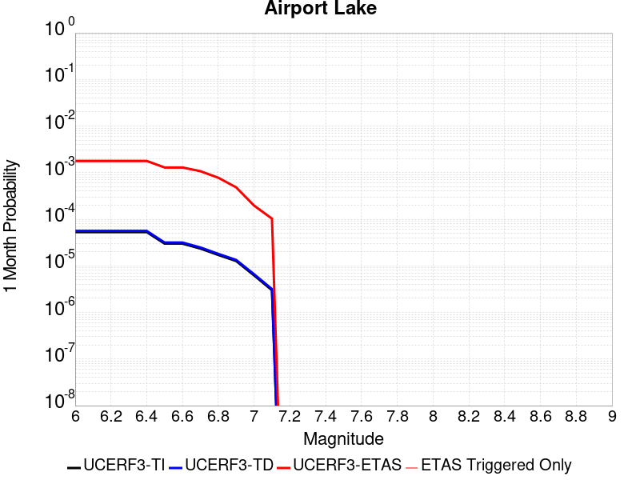
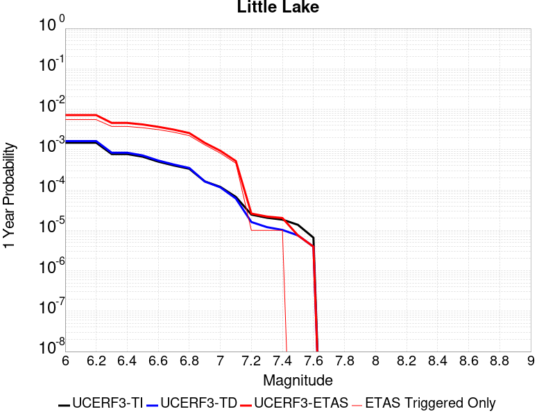
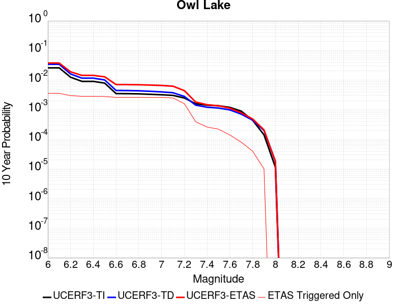
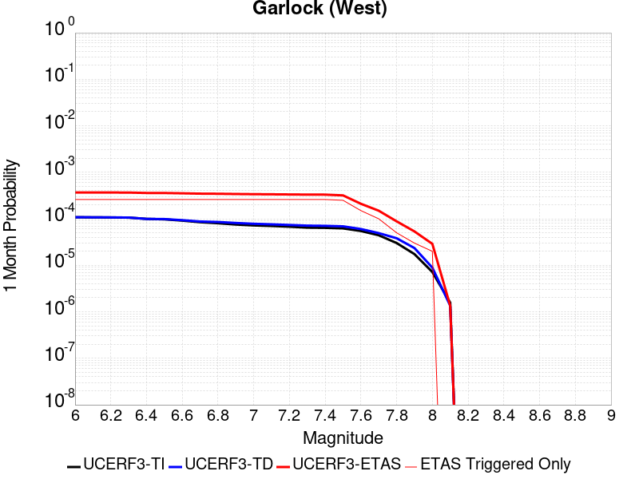
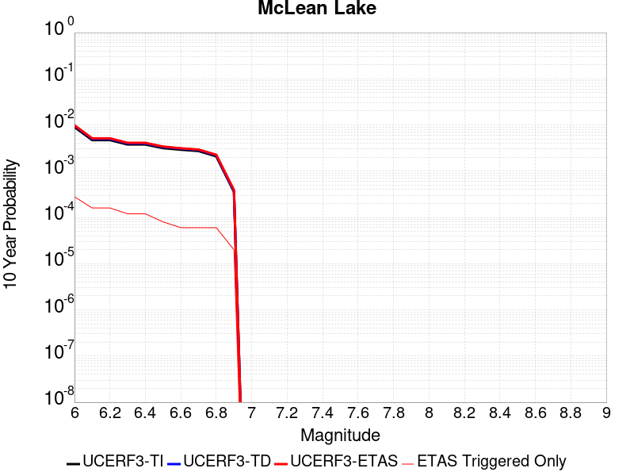

# Parent Section Magnitude-Probability Distributions

Only fault sections with at least one triggered aftershock are plotted. Sections are sorted by total supraseismogenic trigger rate (decreasing)

## Table Of Contents

* [Garlock (Central)](#garlock-central)
* [Airport Lake](#airport-lake)
* [Tank Canyon](#tank-canyon)
* [Little Lake](#little-lake)
* [Garlock (East)](#garlock-east)
* [Owl Lake](#owl-lake)
* [Garlock (West)](#garlock-west)
* [San Andreas (Mojave S)](#san-andreas-mojave-s)
* [McLean Lake](#mclean-lake)
* [San Andreas (Mojave N)](#san-andreas-mojave-n)
* [Paradise](#paradise)
* [Panamint Valley](#panamint-valley)

## Garlock (Central)
*[(top)](#table-of-contents)*

| 1 Week | 1 Month | 1 Year | 10 Year |
|-----|-----|-----|-----|
|  |  |  |  |

| Magnitude | 1 wk TI Prob | 1 wk TD Prob | 1 wk ETAS Prob | 1 wk ETAS/TD Gain | 1 wk ETAS Triggered Only | 1 mo TI Prob | 1 mo TD Prob | 1 mo ETAS Prob | 1 mo ETAS/TD Gain | 1 mo ETAS Triggered Only | 1 yr TI Prob | 1 yr TD Prob | 1 yr ETAS Prob | 1 yr ETAS/TD Gain | 1 yr ETAS Triggered Only | 10 yr TI Prob | 10 yr TD Prob | 10 yr ETAS Prob | 10 yr ETAS/TD Gain | 10 yr ETAS Triggered Only |
|-----|-----|-----|-----|-----|-----|-----|-----|-----|-----|-----|-----|-----|-----|-----|-----|-----|-----|-----|-----|-----|
| 6.0 | 5.5131142E-5 | 7.027124E-5 | 7.027124E-5 | 1.0 | 0.0 | 2.3625491E-4 | 3.0112805E-4 | 0.006088097 | 20.217634 | 0.005788712 | 0.0028726095 | 0.0036601364 | 0.013753304 | 3.7575934 | 0.010130246 | 0.028357591 | 0.036092084 | 0.054226387 | 1.5024453 | 0.018813314 |
| 6.1 | 5.5131142E-5 | 7.027124E-5 | 7.027124E-5 | 1.0 | 0.0 | 2.3625491E-4 | 3.0112805E-4 | 0.006088097 | 20.217634 | 0.005788712 | 0.0028726095 | 0.0036601364 | 0.013753304 | 3.7575934 | 0.010130246 | 0.028357591 | 0.036092084 | 0.054226387 | 1.5024453 | 0.018813314 |
| 6.2 | 4.216245E-5 | 5.1683597E-5 | 5.1683597E-5 | 1.0 | 0.0 | 1.806837E-4 | 2.214825E-4 | 0.0031151974 | 14.065208 | 0.002894356 | 0.0021976046 | 0.0026932466 | 0.0070230877 | 2.607666 | 0.004341534 | 0.021759989 | 0.026701005 | 0.035152227 | 1.3165132 | 0.008683068 |
| 6.3 | 4.216245E-5 | 5.1683597E-5 | 5.1683597E-5 | 1.0 | 0.0 | 1.806837E-4 | 2.214825E-4 | 0.0031151974 | 14.065208 | 0.002894356 | 0.0021976046 | 0.0026932466 | 0.0070230877 | 2.607666 | 0.004341534 | 0.021759989 | 0.026701005 | 0.035152227 | 1.3165132 | 0.008683068 |
| 6.4 | 3.6858168E-5 | 4.4131746E-5 | 4.4131746E-5 | 1.0 | 0.0 | 1.5795401E-4 | 1.8912248E-4 | 0.0016360268 | 8.65062 | 0.001447178 | 0.0019213937 | 0.00230016 | 0.0051878584 | 2.2554338 | 0.002894356 | 0.019048655 | 0.022859743 | 0.029930223 | 1.3092983 | 0.00723589 |
| 6.5 | 3.39199E-5 | 4.0038896E-5 | 4.0038896E-5 | 1.0 | 0.0 | 1.453629E-4 | 1.715841E-4 | 0.0016185138 | 9.432773 | 0.001447178 | 0.0017683565 | 0.0020870569 | 0.004975372 | 2.383918 | 0.002894356 | 0.017543508 | 0.020770492 | 0.02785609 | 1.3411376 | 0.00723589 |
| 6.6 | 3.3571985E-5 | 3.9493032E-5 | 3.9493032E-5 | 1.0 | 0.0 | 1.4387199E-4 | 1.6924499E-4 | 1.6924499E-4 | 1.0 | 0.0 | 0.0017502342 | 0.0020586322 | 0.0035028309 | 1.7015332 | 0.001447178 | 0.017365133 | 0.020491783 | 0.026161874 | 1.2767007 | 0.005788712 |
| 6.7 | 3.2580007E-5 | 3.8109323E-5 | 3.8109323E-5 | 1.0 | 0.0 | 1.3962112E-4 | 1.6331558E-4 | 1.6331558E-4 | 1.0 | 0.0 | 0.0016985617 | 0.0019865753 | 0.0034308783 | 1.7270316 | 0.001447178 | 0.016856372 | 0.019784356 | 0.02545854 | 1.2868017 | 0.005788712 |
| 6.8 | 3.2185937E-5 | 3.7536465E-5 | 3.7536465E-5 | 1.0 | 0.0 | 1.3793244E-4 | 1.6086077E-4 | 1.6086077E-4 | 1.0 | 0.0 | 0.0016780337 | 0.001956742 | 0.0034010883 | 1.7381383 | 0.001447178 | 0.016654192 | 0.01949112 | 0.025167003 | 1.2912036 | 0.005788712 |
| 6.9 | 3.165394E-5 | 3.6740938E-5 | 3.6740938E-5 | 1.0 | 0.0 | 1.3565269E-4 | 1.5745178E-4 | 1.5745178E-4 | 1.0 | 0.0 | 0.0016503202 | 0.0019153113 | 0.0033597175 | 1.7541366 | 0.001447178 | 0.01638118 | 0.0190837 | 0.024761941 | 1.2975441 | 0.005788712 |
| 7.0 | 3.0903822E-5 | 3.564605E-5 | 3.564605E-5 | 1.0 | 0.0 | 1.3243823E-4 | 1.5275997E-4 | 1.5275997E-4 | 1.0 | 0.0 | 0.0016112428 | 0.0018582871 | 0.003302776 | 1.7773226 | 0.001447178 | 0.015996104 | 0.018522795 | 0.024204286 | 1.3067296 | 0.005788712 |
| 7.1 | 3.0069863E-5 | 3.441218E-5 | 3.441218E-5 | 1.0 | 0.0 | 1.2886449E-4 | 1.4747256E-4 | 1.4747256E-4 | 1.0 | 0.0 | 0.0015677959 | 0.0017940209 | 0.0032386025 | 1.8052201 | 0.001447178 | 0.01556781 | 0.017890377 | 0.023575526 | 1.317777 | 0.005788712 |
| 7.2 | 2.7957109E-5 | 3.1301115E-5 | 3.1301115E-5 | 1.0 | 0.0 | 1.1981068E-4 | 1.3414085E-4 | 1.3414085E-4 | 1.0 | 0.0 | 0.0014577188 | 0.0016319609 | 0.003076777 | 1.8853253 | 0.001447178 | 0.014481937 | 0.016293783 | 0.021988176 | 1.3494825 | 0.005788712 |
| 7.3 | 2.4519275E-5 | 2.6733265E-5 | 2.6733265E-5 | 1.0 | 0.0 | 1.0507837E-4 | 1.1456619E-4 | 1.1456619E-4 | 1.0 | 0.0 | 0.0012785783 | 0.0013939656 | 0.0013939656 | 1.0 | 0.0 | 0.012712469 | 0.013937555 | 0.018218579 | 1.3071574 | 0.004341534 |
| 7.4 | 2.3225532E-5 | 2.5217494E-5 | 2.5217494E-5 | 1.0 | 0.0 | 9.95342E-5 | 1.0807058E-4 | 1.0807058E-4 | 1.0 | 0.0 | 0.0012111551 | 0.0013149795 | 0.0013149795 | 1.0 | 0.0 | 0.012045753 | 0.01315504 | 0.016011322 | 1.2171245 | 0.002894356 |
| 7.5 | 2.097765E-5 | 2.250088E-5 | 2.250088E-5 | 1.0 | 0.0 | 8.9901114E-5 | 9.6428856E-5 | 9.6428856E-5 | 1.0 | 0.0 | 0.0010939965 | 0.0011734008 | 0.0011734008 | 1.0 | 0.0 | 0.010886264 | 0.01174923 | 0.01460958 | 1.2434499 | 0.002894356 |
| 7.6 | 1.511254E-5 | 1.6007341E-5 | 1.6007341E-5 | 1.0 | 0.0 | 6.476642E-5 | 6.860113E-5 | 6.860113E-5 | 1.0 | 0.0 | 7.882459E-4 | 8.3490653E-4 | 8.3490653E-4 | 1.0 | 0.0 | 0.007854558 | 0.00839184 | 0.009826874 | 1.1710035 | 0.001447178 |
| 7.7 | 9.934069E-6 | 1.0693656E-5 | 1.0693656E-5 | 1.0 | 0.0 | 4.2573887E-5 | 4.582915E-5 | 4.582915E-5 | 1.0 | 0.0 | 5.182138E-4 | 5.578274E-4 | 5.578274E-4 | 1.0 | 0.0 | 0.00517007 | 0.005635394 | 0.0070744166 | 1.2553544 | 0.001447178 |
| 7.8 | 6.7562896E-6 | 8.440562E-6 | 8.440562E-6 | 1.0 | 0.0 | 2.8955206E-5 | 3.6173336E-5 | 3.6173336E-5 | 1.0 | 0.0 | 3.5247262E-4 | 4.4032154E-4 | 4.4032154E-4 | 1.0 | 0.0 | 0.0035191406 | 0.0044529405 | 0.0058936747 | 1.3235466 | 0.001447178 |
| 7.9 | 3.975453E-6 | 5.3784297E-6 | 5.3784297E-6 | 1.0 | 0.0 | 1.7037546E-5 | 2.305021E-5 | 2.305021E-5 | 1.0 | 0.0 | 2.0741238E-4 | 2.8060027E-4 | 2.8060027E-4 | 1.0 | 0.0 | 0.002072189 | 0.0028374717 | 0.0028374717 | 1.0 | 0.0 |
| 8.0 | 1.6729537E-6 | 2.0800776E-6 | 2.0800776E-6 | 1.0 | 0.0 | 7.169782E-6 | 8.914588E-6 | 8.914588E-6 | 1.0 | 0.0 | 8.7288594E-5 | 1.0852974E-4 | 1.0852974E-4 | 1.0 | 0.0 | 8.7254314E-4 | 0.0010982669 | 0.0010982669 | 1.0 | 0.0 |
| 8.1 | 3.6733252E-7 | 3.1526864E-7 | 3.1526864E-7 | 1.0 | 0.0 | 1.5742813E-6 | 1.3511507E-6 | 1.3511507E-6 | 1.0 | 0.0 | 1.9166706E-5 | 1.645015E-5 | 1.645015E-5 | 1.0 | 0.0 | 1.9165053E-4 | 1.6658098E-4 | 1.6658098E-4 | 1.0 | 0.0 |

## Airport Lake
*[(top)](#table-of-contents)*

| 1 Week | 1 Month | 1 Year | 10 Year |
|-----|-----|-----|-----|
|  |  |  |  |

| Magnitude | 1 wk TI Prob | 1 wk TD Prob | 1 wk ETAS Prob | 1 wk ETAS/TD Gain | 1 wk ETAS Triggered Only | 1 mo TI Prob | 1 mo TD Prob | 1 mo ETAS Prob | 1 mo ETAS/TD Gain | 1 mo ETAS Triggered Only | 1 yr TI Prob | 1 yr TD Prob | 1 yr ETAS Prob | 1 yr ETAS/TD Gain | 1 yr ETAS Triggered Only | 10 yr TI Prob | 10 yr TD Prob | 10 yr ETAS Prob | 10 yr ETAS/TD Gain | 10 yr ETAS Triggered Only |
|-----|-----|-----|-----|-----|-----|-----|-----|-----|-----|-----|-----|-----|-----|-----|-----|-----|-----|-----|-----|-----|
| 6.0 | 1.2387061E-5 | 1.3103559E-5 | 0.0014602626 | 111.440155 | 0.001447178 | 5.3086325E-5 | 5.615706E-5 | 0.0015032538 | 26.76874 | 0.001447178 | 6.461343E-4 | 6.8352616E-4 | 0.009360659 | 13.694661 | 0.008683068 | 0.0064425888 | 0.006817048 | 0.016878236 | 2.4758863 | 0.010130246 |
| 6.1 | 1.2387061E-5 | 1.3103559E-5 | 0.0014602626 | 111.440155 | 0.001447178 | 5.3086325E-5 | 5.615706E-5 | 0.0015032538 | 26.76874 | 0.001447178 | 6.461343E-4 | 6.8352616E-4 | 0.009360659 | 13.694661 | 0.008683068 | 0.0064425888 | 0.006817048 | 0.016878236 | 2.4758863 | 0.010130246 |
| 6.2 | 1.2387061E-5 | 1.3103559E-5 | 0.0014602626 | 111.440155 | 0.001447178 | 5.3086325E-5 | 5.615706E-5 | 0.0015032538 | 26.76874 | 0.001447178 | 6.461343E-4 | 6.8352616E-4 | 0.009360659 | 13.694661 | 0.008683068 | 0.0064425888 | 0.006817048 | 0.016878236 | 2.4758863 | 0.010130246 |
| 6.3 | 1.2387061E-5 | 1.3103559E-5 | 0.0014602626 | 111.440155 | 0.001447178 | 5.3086325E-5 | 5.615706E-5 | 0.0015032538 | 26.76874 | 0.001447178 | 6.461343E-4 | 6.8352616E-4 | 0.009360659 | 13.694661 | 0.008683068 | 0.0064425888 | 0.006817048 | 0.016878236 | 2.4758863 | 0.010130246 |
| 6.4 | 1.2387061E-5 | 1.3103559E-5 | 0.0014602626 | 111.440155 | 0.001447178 | 5.3086325E-5 | 5.615706E-5 | 0.0015032538 | 26.76874 | 0.001447178 | 6.461343E-4 | 6.8352616E-4 | 0.009360659 | 13.694661 | 0.008683068 | 0.0064425888 | 0.006817048 | 0.016878236 | 2.4758863 | 0.010130246 |
| 6.5 | 6.9922594E-6 | 7.385145E-6 | 0.0014545524 | 196.95651 | 0.001447178 | 2.996648E-5 | 3.165027E-5 | 0.0014787825 | 46.722588 | 0.001447178 | 3.6478083E-4 | 3.8527933E-4 | 0.009065002 | 23.528389 | 0.008683068 | 0.003641826 | 0.003846651 | 0.01393793 | 3.6233933 | 0.010130246 |
| 6.6 | 6.9922594E-6 | 7.385145E-6 | 0.0014545524 | 196.95651 | 0.001447178 | 2.996648E-5 | 3.165027E-5 | 0.0014787825 | 46.722588 | 0.001447178 | 3.6478083E-4 | 3.8527933E-4 | 0.009065002 | 23.528389 | 0.008683068 | 0.003641826 | 0.003846651 | 0.01393793 | 3.6233933 | 0.010130246 |
| 6.7 | 5.477277E-6 | 5.7862417E-6 | 0.0014529559 | 251.10529 | 0.001447178 | 2.3473833E-5 | 2.4797964E-5 | 0.0014719401 | 59.357296 | 0.001447178 | 2.8575645E-4 | 3.0187727E-4 | 0.007535583 | 24.962406 | 0.00723589 | 0.0028538927 | 0.003015056 | 0.010229129 | 3.392683 | 0.00723589 |
| 6.8 | 3.9950432E-6 | 4.2192128E-6 | 0.0014513911 | 343.99573 | 0.001447178 | 1.7121502E-5 | 1.808223E-5 | 0.0014652341 | 81.031715 | 0.001447178 | 2.0843433E-4 | 2.2013167E-4 | 0.007454429 | 33.863503 | 0.00723589 | 0.0020823893 | 0.0021994072 | 0.009419383 | 4.2826915 | 0.00723589 |
| 6.9 | 2.95695E-6 | 3.1231173E-6 | 3.1231173E-6 | 1.0 | 0.0 | 1.2672582E-5 | 1.33847325E-5 | 1.33847325E-5 | 1.0 | 0.0 | 1.5427776E-4 | 1.629492E-4 | 0.0059507177 | 36.518852 | 0.005788712 | 0.001541707 | 0.0016285196 | 0.0074078045 | 4.5487967 | 0.005788712 |
| 7.0 | 1.456072E-6 | 1.5408596E-6 | 1.5408596E-6 | 1.0 | 0.0 | 6.2402937E-6 | 6.603673E-6 | 6.603673E-6 | 1.0 | 0.0 | 7.597293E-5 | 8.039776E-5 | 0.0029745211 | 36.997562 | 0.002894356 | 7.594696E-4 | 8.0378563E-4 | 0.003695815 | 4.598011 | 0.002894356 |
| 7.1 | 6.995192E-7 | 7.409207E-7 | 7.409207E-7 | 1.0 | 0.0 | 2.997936E-6 | 3.1753743E-6 | 3.1753743E-6 | 1.0 | 0.0 | 3.649926E-5 | 3.8660182E-5 | 0.0014857822 | 38.431847 | 0.001447178 | 3.6493264E-4 | 3.8660184E-4 | 0.0018332204 | 4.7418823 | 0.001447178 |

## Tank Canyon
*[(top)](#table-of-contents)*

| 1 Week | 1 Month | 1 Year | 10 Year |
|-----|-----|-----|-----|
|  |  |  |  |

| Magnitude | 1 wk TI Prob | 1 wk TD Prob | 1 wk ETAS Prob | 1 wk ETAS/TD Gain | 1 wk ETAS Triggered Only | 1 mo TI Prob | 1 mo TD Prob | 1 mo ETAS Prob | 1 mo ETAS/TD Gain | 1 mo ETAS Triggered Only | 1 yr TI Prob | 1 yr TD Prob | 1 yr ETAS Prob | 1 yr ETAS/TD Gain | 1 yr ETAS Triggered Only | 10 yr TI Prob | 10 yr TD Prob | 10 yr ETAS Prob | 10 yr ETAS/TD Gain | 10 yr ETAS Triggered Only |
|-----|-----|-----|-----|-----|-----|-----|-----|-----|-----|-----|-----|-----|-----|-----|-----|-----|-----|-----|-----|-----|
| 6.0 | 4.8284557E-5 | 5.7970923E-5 | 0.0029521591 | 50.924824 | 0.002894356 | 2.0691741E-4 | 2.48427E-4 | 0.003142064 | 12.647836 | 0.002894356 | 0.0025163088 | 0.0030210684 | 0.0073494865 | 2.432744 | 0.004341534 | 0.02488006 | 0.029866708 | 0.03829044 | 1.2820443 | 0.008683068 |
| 6.1 | 1.7796336E-5 | 2.0875108E-5 | 2.0875108E-5 | 1.0 | 0.0 | 7.626778E-5 | 8.946191E-5 | 8.946191E-5 | 1.0 | 0.0 | 9.281647E-4 | 0.0010886913 | 0.0010886913 | 1.0 | 0.0 | 0.009242975 | 0.010837668 | 0.012269162 | 1.1320851 | 0.001447178 |
| 6.2 | 1.7796336E-5 | 2.0875108E-5 | 2.0875108E-5 | 1.0 | 0.0 | 7.626778E-5 | 8.946191E-5 | 8.946191E-5 | 1.0 | 0.0 | 9.281647E-4 | 0.0010886913 | 0.0010886913 | 1.0 | 0.0 | 0.009242975 | 0.010837668 | 0.012269162 | 1.1320851 | 0.001447178 |
| 6.3 | 1.3515912E-5 | 1.5760828E-5 | 1.5760828E-5 | 1.0 | 0.0 | 5.792405E-5 | 6.7544795E-5 | 6.7544795E-5 | 1.0 | 0.0 | 7.049971E-4 | 8.220716E-4 | 8.220716E-4 | 1.0 | 0.0 | 0.007027647 | 0.008192917 | 0.009628239 | 1.1751904 | 0.001447178 |
| 6.4 | 1.0870146E-5 | 1.2618972E-5 | 1.2618972E-5 | 1.0 | 0.0 | 4.658551E-5 | 5.4080287E-5 | 5.4080287E-5 | 1.0 | 0.0 | 5.67031E-4 | 6.582465E-4 | 6.582465E-4 | 1.0 | 0.0 | 0.005655863 | 0.006564983 | 0.00800266 | 1.2189918 | 0.001447178 |
| 6.5 | 7.964826E-6 | 9.196723E-6 | 9.196723E-6 | 1.0 | 0.0 | 3.4134522E-5 | 3.9413993E-5 | 3.9413993E-5 | 1.0 | 0.0 | 4.1550855E-4 | 4.797704E-4 | 4.797704E-4 | 1.0 | 0.0 | 0.0041473247 | 0.0047886474 | 0.0062288954 | 1.300763 | 0.001447178 |
| 6.6 | 6.6317E-6 | 7.612777E-6 | 7.612777E-6 | 1.0 | 0.0 | 2.8421264E-5 | 3.262583E-5 | 3.262583E-5 | 1.0 | 0.0 | 3.4597394E-4 | 3.9715623E-4 | 3.9715623E-4 | 1.0 | 0.0 | 0.0034543579 | 0.003965616 | 0.0054070554 | 1.3634843 | 0.001447178 |
| 6.7 | 4.793663E-6 | 5.4310603E-6 | 5.4310603E-6 | 1.0 | 0.0 | 2.0544108E-5 | 2.327579E-5 | 2.327579E-5 | 1.0 | 0.0 | 2.500958E-4 | 2.8335027E-4 | 2.8335027E-4 | 1.0 | 0.0 | 0.0024981452 | 0.0028305824 | 0.0028305824 | 1.0 | 0.0 |
| 6.8 | 4.382823E-6 | 4.9694927E-6 | 4.9694927E-6 | 1.0 | 0.0 | 1.8783392E-5 | 2.1297676E-5 | 2.1297676E-5 | 1.0 | 0.0 | 2.286638E-4 | 2.592726E-4 | 2.592726E-4 | 1.0 | 0.0 | 0.0022842865 | 0.0025903755 | 0.0025903755 | 1.0 | 0.0 |
| 6.9 | 2.729601E-6 | 3.0736521E-6 | 3.0736521E-6 | 1.0 | 0.0 | 1.1698237E-5 | 1.3172735E-5 | 1.3172735E-5 | 1.0 | 0.0 | 1.4241673E-4 | 1.6036748E-4 | 1.6036748E-4 | 1.0 | 0.0 | 0.001423255 | 0.0016026833 | 0.0016026833 | 1.0 | 0.0 |
| 7.0 | 1.8987357E-6 | 2.1269989E-6 | 2.1269989E-6 | 1.0 | 0.0 | 8.137413E-6 | 9.115682E-6 | 9.115682E-6 | 1.0 | 0.0 | 9.90685E-5 | 1.1097847E-4 | 1.1097847E-4 | 1.0 | 0.0 | 9.902435E-4 | 0.0011092991 | 0.0011092991 | 1.0 | 0.0 |
| 7.1 | 1.4928986E-6 | 1.6641684E-6 | 1.6641684E-6 | 1.0 | 0.0 | 6.398121E-6 | 7.1321338E-6 | 7.1321338E-6 | 1.0 | 0.0 | 7.789434E-5 | 8.683086E-5 | 8.683086E-5 | 1.0 | 0.0 | 7.786704E-4 | 8.680272E-4 | 8.680272E-4 | 1.0 | 0.0 |
| 7.2 | 1.069082E-6 | 1.1828834E-6 | 1.1828834E-6 | 1.0 | 0.0 | 4.581772E-6 | 5.0694935E-6 | 5.0694935E-6 | 1.0 | 0.0 | 5.5781646E-5 | 6.171987E-5 | 6.171987E-5 | 1.0 | 0.0 | 5.576765E-4 | 6.170795E-4 | 6.170795E-4 | 1.0 | 0.0 |
| 7.3 | 8.776551E-7 | 9.770195E-7 | 9.770195E-7 | 1.0 | 0.0 | 3.7613736E-6 | 4.1872227E-6 | 4.1872227E-6 | 1.0 | 0.0 | 4.579376E-5 | 5.0978764E-5 | 5.0978764E-5 | 1.0 | 0.0 | 4.5784327E-4 | 5.097217E-4 | 5.097217E-4 | 1.0 | 0.0 |
| 7.4 | 7.55721E-7 | 8.510402E-7 | 8.510402E-7 | 1.0 | 0.0 | 3.2388E-6 | 3.647313E-6 | 3.647313E-6 | 1.0 | 0.0 | 3.9431678E-5 | 4.440565E-5 | 4.440565E-5 | 1.0 | 0.0 | 3.942468E-4 | 4.440186E-4 | 4.440186E-4 | 1.0 | 0.0 |
| 7.5 | 5.587665E-7 | 6.305733E-7 | 6.305733E-7 | 1.0 | 0.0 | 2.3947114E-6 | 2.702457E-6 | 2.702457E-6 | 1.0 | 0.0 | 2.915522E-5 | 3.2902415E-5 | 3.2902415E-5 | 1.0 | 0.0 | 2.9151395E-4 | 3.2902416E-4 | 3.2902416E-4 | 1.0 | 0.0 |

## Little Lake
*[(top)](#table-of-contents)*

| 1 Week | 1 Month | 1 Year | 10 Year |
|-----|-----|-----|-----|
|  |  |  |  |

| Magnitude | 1 wk TI Prob | 1 wk TD Prob | 1 wk ETAS Prob | 1 wk ETAS/TD Gain | 1 wk ETAS Triggered Only | 1 mo TI Prob | 1 mo TD Prob | 1 mo ETAS Prob | 1 mo ETAS/TD Gain | 1 mo ETAS Triggered Only | 1 yr TI Prob | 1 yr TD Prob | 1 yr ETAS Prob | 1 yr ETAS/TD Gain | 1 yr ETAS Triggered Only | 10 yr TI Prob | 10 yr TD Prob | 10 yr ETAS Prob | 10 yr ETAS/TD Gain | 10 yr ETAS Triggered Only |
|-----|-----|-----|-----|-----|-----|-----|-----|-----|-----|-----|-----|-----|-----|-----|-----|-----|-----|-----|-----|-----|
| 6.0 | 2.8424427E-5 | 3.1207477E-5 | 0.0014783404 | 47.37135 | 0.001447178 | 1.2181328E-4 | 1.3374022E-4 | 0.0015807247 | 11.819366 | 0.001447178 | 0.0014820677 | 0.0016272042 | 0.007406497 | 4.55167 | 0.005788712 | 0.014722223 | 0.016166303 | 0.023285216 | 1.440355 | 0.00723589 |
| 6.1 | 2.8424427E-5 | 3.1207477E-5 | 0.0014783404 | 47.37135 | 0.001447178 | 1.2181328E-4 | 1.3374022E-4 | 0.0015807247 | 11.819366 | 0.001447178 | 0.0014820677 | 0.0016272042 | 0.007406497 | 4.55167 | 0.005788712 | 0.014722223 | 0.016166303 | 0.023285216 | 1.440355 | 0.00723589 |
| 6.2 | 2.8424427E-5 | 3.1207477E-5 | 0.0014783404 | 47.37135 | 0.001447178 | 1.2181328E-4 | 1.3374022E-4 | 0.0015807247 | 11.819366 | 0.001447178 | 0.0014820677 | 0.0016272042 | 0.007406497 | 4.55167 | 0.005788712 | 0.014722223 | 0.016166303 | 0.023285216 | 1.440355 | 0.00723589 |
| 6.3 | 1.48860645E-5 | 1.6082206E-5 | 0.001463237 | 90.98484 | 0.001447178 | 6.379586E-5 | 6.8922076E-5 | 0.0015160004 | 21.995861 | 0.001447178 | 7.7643775E-4 | 8.388314E-4 | 0.0051767235 | 6.1713514 | 0.004341534 | 0.007737305 | 0.00835947 | 0.012664711 | 1.5150136 | 0.004341534 |
| 6.4 | 1.48860645E-5 | 1.6082206E-5 | 0.001463237 | 90.98484 | 0.001447178 | 6.379586E-5 | 6.8922076E-5 | 0.0015160004 | 21.995861 | 0.001447178 | 7.7643775E-4 | 8.388314E-4 | 0.0051767235 | 6.1713514 | 0.004341534 | 0.007737305 | 0.00835947 | 0.012664711 | 1.5150136 | 0.004341534 |
| 6.5 | 1.2797581E-5 | 1.3766247E-5 | 0.0014609243 | 106.12365 | 0.001447178 | 5.4845623E-5 | 5.899701E-5 | 0.0015060896 | 25.528236 | 0.001447178 | 6.675408E-4 | 7.180776E-4 | 0.005056494 | 7.04171 | 0.004341534 | 0.006655392 | 0.007160124 | 0.011470572 | 1.6020075 | 0.004341534 |
| 6.6 | 9.661896E-6 | 1.0289519E-5 | 0.0014574527 | 141.64438 | 0.001447178 | 4.1407468E-5 | 4.4097287E-5 | 0.0014912115 | 33.8164 | 0.001447178 | 5.040193E-4 | 5.3676846E-4 | 0.004875972 | 9.08394 | 0.004341534 | 0.005028777 | 0.0053563244 | 0.009674604 | 1.8062019 | 0.004341534 |
| 6.7 | 7.767871E-6 | 8.200053E-6 | 0.0014553661 | 177.48251 | 0.001447178 | 3.329045E-5 | 3.514269E-5 | 0.0014822698 | 42.178608 | 0.001447178 | 4.0523586E-4 | 4.27792E-4 | 0.0047674687 | 11.1443615 | 0.004341534 | 0.004044977 | 0.004271037 | 0.008594028 | 2.0121644 | 0.004341534 |
| 6.8 | 6.4235196E-6 | 6.736042E-6 | 0.0014539043 | 215.83955 | 0.001447178 | 2.752908E-5 | 2.8868506E-5 | 0.0014760047 | 51.128548 | 0.001447178 | 3.35115E-4 | 3.514302E-4 | 0.0046914383 | 13.34956 | 0.004341534 | 0.003346101 | 0.0035100048 | 0.0078363 | 2.232561 | 0.004341534 |
| 6.9 | 3.1283696E-6 | 3.1122859E-6 | 3.1122859E-6 | 1.0 | 0.0 | 1.3407229E-5 | 1.3338308E-5 | 1.3338308E-5 | 1.0 | 0.0 | 1.6322079E-4 | 1.6238331E-4 | 0.0030562694 | 18.821327 | 0.002894356 | 0.0016310095 | 0.0016227949 | 0.004512454 | 2.780668 | 0.002894356 |
| 7.0 | 2.290603E-6 | 2.2287613E-6 | 2.2287613E-6 | 1.0 | 0.0 | 9.816834E-6 | 9.551805E-6 | 9.551805E-6 | 1.0 | 0.0 | 1.19513395E-4 | 1.1628806E-4 | 0.0030103074 | 25.886642 | 0.002894356 | 0.0011944914 | 0.0011623743 | 0.004053366 | 3.4871435 | 0.002894356 |
| 7.1 | 1.293693E-6 | 1.1777322E-6 | 1.1777322E-6 | 1.0 | 0.0 | 5.5443866E-6 | 5.0474177E-6 | 5.0474177E-6 | 1.0 | 0.0 | 6.750081E-5 | 6.1451276E-5 | 0.0015085404 | 24.54856 | 0.001447178 | 6.7480316E-4 | 6.144114E-4 | 0.0020607002 | 3.3539424 | 0.001447178 |
| 7.2 | 4.715842E-7 | 3.09202E-7 | 3.09202E-7 | 1.0 | 0.0 | 2.0210737E-6 | 1.3251507E-6 | 1.3251507E-6 | 1.0 | 0.0 | 2.4606294E-5 | 1.6133596E-5 | 1.6133596E-5 | 1.0 | 0.0 | 2.460357E-4 | 1.6132479E-4 | 1.6132479E-4 | 1.0 | 0.0 |
| 7.3 | 3.9430947E-7 | 2.3099639E-7 | 2.3099639E-7 | 1.0 | 0.0 | 1.6898966E-6 | 9.899842E-7 | 9.899842E-7 | 1.0 | 0.0 | 2.0574296E-5 | 1.2052991E-5 | 1.2052991E-5 | 1.0 | 0.0 | 2.0572392E-4 | 1.20523444E-4 | 1.20523444E-4 | 1.0 | 0.0 |
| 7.4 | 3.547123E-7 | 1.9681133E-7 | 1.9681133E-7 | 1.0 | 0.0 | 1.5201948E-6 | 8.4347687E-7 | 8.4347687E-7 | 1.0 | 0.0 | 1.8508214E-5 | 1.0269283E-5 | 1.0269283E-5 | 1.0 | 0.0 | 1.8506673E-4 | 1.02688144E-4 | 1.02688144E-4 | 1.0 | 0.0 |
| 7.5 | 2.6354266E-7 | 1.4424535E-7 | 1.4424535E-7 | 1.0 | 0.0 | 1.129468E-6 | 6.1819424E-7 | 6.1819424E-7 | 1.0 | 0.0 | 1.3751187E-5 | 7.5264893E-6 | 7.5264893E-6 | 1.0 | 0.0 | 1.3750336E-4 | 7.52624E-5 | 7.52624E-5 | 1.0 | 0.0 |
| 7.6 | 1.269913E-7 | 7.573149E-8 | 7.573149E-8 | 1.0 | 0.0 | 5.4424834E-7 | 3.245635E-7 | 3.245635E-7 | 1.0 | 0.0 | 6.6262032E-6 | 3.951554E-6 | 3.951554E-6 | 1.0 | 0.0 | 6.626006E-5 | 3.951487E-5 | 3.951487E-5 | 1.0 | 0.0 |

## Garlock (East)
*[(top)](#table-of-contents)*

| 1 Week | 1 Month | 1 Year | 10 Year |
|-----|-----|-----|-----|
|  |  |  |  |

| Magnitude | 1 wk TI Prob | 1 wk TD Prob | 1 wk ETAS Prob | 1 wk ETAS/TD Gain | 1 wk ETAS Triggered Only | 1 mo TI Prob | 1 mo TD Prob | 1 mo ETAS Prob | 1 mo ETAS/TD Gain | 1 mo ETAS Triggered Only | 1 yr TI Prob | 1 yr TD Prob | 1 yr ETAS Prob | 1 yr ETAS/TD Gain | 1 yr ETAS Triggered Only | 10 yr TI Prob | 10 yr TD Prob | 10 yr ETAS Prob | 10 yr ETAS/TD Gain | 10 yr ETAS Triggered Only |
|-----|-----|-----|-----|-----|-----|-----|-----|-----|-----|-----|-----|-----|-----|-----|-----|-----|-----|-----|-----|-----|
| 6.0 | 4.5092507E-5 | 6.2917425E-5 | 6.2917425E-5 | 1.0 | 0.0 | 1.9323928E-4 | 2.6962077E-4 | 2.6962077E-4 | 1.0 | 0.0 | 0.0023501497 | 0.0032781374 | 0.0047205715 | 1.4400163 | 0.001447178 | 0.023254504 | 0.03235903 | 0.037960425 | 1.1731014 | 0.005788712 |
| 6.1 | 4.5092507E-5 | 6.2917425E-5 | 6.2917425E-5 | 1.0 | 0.0 | 1.9323928E-4 | 2.6962077E-4 | 2.6962077E-4 | 1.0 | 0.0 | 0.0023501497 | 0.0032781374 | 0.0047205715 | 1.4400163 | 0.001447178 | 0.023254504 | 0.03235903 | 0.037960425 | 1.1731014 | 0.005788712 |
| 6.2 | 2.6674514E-5 | 3.452091E-5 | 3.452091E-5 | 1.0 | 0.0 | 1.1431433E-4 | 1.4793854E-4 | 1.4793854E-4 | 1.0 | 0.0 | 0.0013908884 | 0.0017996968 | 0.0017996968 | 1.0 | 0.0 | 0.01382215 | 0.017896036 | 0.020738594 | 1.1588373 | 0.002894356 |
| 6.3 | 2.6674514E-5 | 3.452091E-5 | 3.452091E-5 | 1.0 | 0.0 | 1.1431433E-4 | 1.4793854E-4 | 1.4793854E-4 | 1.0 | 0.0 | 0.0013908884 | 0.0017996968 | 0.0017996968 | 1.0 | 0.0 | 0.01382215 | 0.017896036 | 0.020738594 | 1.1588373 | 0.002894356 |
| 6.4 | 2.5312667E-5 | 3.234991E-5 | 3.234991E-5 | 1.0 | 0.0 | 1.0847834E-4 | 1.3863528E-4 | 1.3863528E-4 | 1.0 | 0.0 | 0.0013199237 | 0.0016866071 | 0.0016866071 | 1.0 | 0.0 | 0.013121112 | 0.016783953 | 0.01962973 | 1.1695535 | 0.002894356 |
| 6.5 | 2.5312667E-5 | 3.234991E-5 | 3.234991E-5 | 1.0 | 0.0 | 1.0847834E-4 | 1.3863528E-4 | 1.3863528E-4 | 1.0 | 0.0 | 0.0013199237 | 0.0016866071 | 0.0016866071 | 1.0 | 0.0 | 0.013121112 | 0.016783953 | 0.01962973 | 1.1695535 | 0.002894356 |
| 6.6 | 2.246556E-5 | 2.8144346E-5 | 2.8144346E-5 | 1.0 | 0.0 | 9.627742E-5 | 1.20613186E-4 | 1.20613186E-4 | 1.0 | 0.0 | 0.0011715472 | 0.0014674999 | 0.0014674999 | 1.0 | 0.0 | 0.011653901 | 0.0146240825 | 0.017476112 | 1.1950227 | 0.002894356 |
| 6.7 | 2.2241198E-5 | 2.781406E-5 | 2.781406E-5 | 1.0 | 0.0 | 9.531594E-5 | 1.1919779E-4 | 1.1919779E-4 | 1.0 | 0.0 | 0.0011598538 | 0.0014502906 | 0.0014502906 | 1.0 | 0.0 | 0.011538187 | 0.014454261 | 0.01730678 | 1.197348 | 0.002894356 |
| 6.8 | 1.9528685E-5 | 2.3908038E-5 | 2.3908038E-5 | 1.0 | 0.0 | 8.369167E-5 | 1.0245911E-4 | 1.0245911E-4 | 1.0 | 0.0 | 0.0010184698 | 0.0012467455 | 0.0012467455 | 1.0 | 0.0 | 0.010138147 | 0.012441495 | 0.015299841 | 1.229743 | 0.002894356 |
| 6.9 | 1.3318621E-5 | 1.5207374E-5 | 1.5207374E-5 | 1.0 | 0.0 | 5.7078556E-5 | 6.517287E-5 | 6.517287E-5 | 1.0 | 0.0 | 6.9470983E-4 | 7.931965E-4 | 7.931965E-4 | 1.0 | 0.0 | 0.0069254204 | 0.007944281 | 0.010815644 | 1.3614377 | 0.002894356 |
| 7.0 | 1.1760853E-5 | 1.3115987E-5 | 1.3115987E-5 | 1.0 | 0.0 | 5.0402683E-5 | 5.621019E-5 | 5.621019E-5 | 1.0 | 0.0 | 6.134799E-4 | 6.841492E-4 | 6.841492E-4 | 1.0 | 0.0 | 0.0061178906 | 0.006860767 | 0.009735266 | 1.4189763 | 0.002894356 |
| 7.1 | 1.0064758E-5 | 1.0910848E-5 | 1.0910848E-5 | 1.0 | 0.0 | 4.3133965E-5 | 4.675996E-5 | 4.675996E-5 | 1.0 | 0.0 | 5.2502943E-4 | 5.691573E-4 | 5.691573E-4 | 1.0 | 0.0 | 0.005237907 | 0.005717105 | 0.008594913 | 1.5033681 | 0.002894356 |
| 7.2 | 9.768808E-6 | 1.0506669E-5 | 1.0506669E-5 | 1.0 | 0.0 | 4.186565E-5 | 4.5027828E-5 | 4.5027828E-5 | 1.0 | 0.0 | 5.095951E-4 | 5.480794E-4 | 5.480794E-4 | 1.0 | 0.0 | 0.0050842804 | 0.0055073434 | 0.008385759 | 1.5226505 | 0.002894356 |
| 7.3 | 9.344516E-6 | 9.95218E-6 | 9.95218E-6 | 1.0 | 0.0 | 4.004731E-5 | 4.2651525E-5 | 4.2651525E-5 | 1.0 | 0.0 | 4.8746695E-4 | 5.1916204E-4 | 5.1916204E-4 | 1.0 | 0.0 | 0.0048639905 | 0.0052189473 | 0.008098198 | 1.5516918 | 0.002894356 |
| 7.4 | 9.023491E-6 | 9.498219E-6 | 9.498219E-6 | 1.0 | 0.0 | 3.867153E-5 | 4.0706036E-5 | 4.0706036E-5 | 1.0 | 0.0 | 4.7072413E-4 | 4.9548666E-4 | 4.9548666E-4 | 1.0 | 0.0 | 0.004697283 | 0.004982321 | 0.0064222887 | 1.2890154 | 0.001447178 |
| 7.5 | 7.081253E-6 | 7.0943947E-6 | 7.0943947E-6 | 1.0 | 0.0 | 3.0347876E-5 | 3.0404199E-5 | 3.0404199E-5 | 1.0 | 0.0 | 3.6942272E-4 | 3.70109E-4 | 3.70109E-4 | 1.0 | 0.0 | 0.003688092 | 0.00372781 | 0.0051695933 | 1.3867642 | 0.001447178 |
| 7.6 | 6.116396E-6 | 5.9656345E-6 | 5.9656345E-6 | 1.0 | 0.0 | 2.6212863E-5 | 2.5566756E-5 | 2.5566756E-5 | 1.0 | 0.0 | 3.1909486E-4 | 3.1123104E-4 | 3.1123104E-4 | 1.0 | 0.0 | 0.0031863707 | 0.0031390795 | 0.004581715 | 1.4595727 | 0.001447178 |
| 7.7 | 4.797145E-6 | 4.763327E-6 | 4.763327E-6 | 1.0 | 0.0 | 2.055903E-5 | 2.04141E-5 | 2.04141E-5 | 1.0 | 0.0 | 2.5027743E-4 | 2.4851345E-4 | 2.4851345E-4 | 1.0 | 0.0 | 0.0024999576 | 0.0025124948 | 0.0039560366 | 1.5745453 | 0.001447178 |
| 7.8 | 3.4028885E-6 | 3.9838537E-6 | 3.9838537E-6 | 1.0 | 0.0 | 1.4583726E-5 | 1.7073547E-5 | 1.7073547E-5 | 1.0 | 0.0 | 1.775424E-4 | 2.0785068E-4 | 2.0785068E-4 | 1.0 | 0.0 | 0.0017740062 | 0.0021040295 | 0.0035481625 | 1.6863654 | 0.001447178 |
| 7.9 | 2.5928412E-6 | 3.3770064E-6 | 3.3770064E-6 | 1.0 | 0.0 | 1.1112129E-5 | 1.4472805E-5 | 1.4472805E-5 | 1.0 | 0.0 | 1.3528178E-4 | 1.7619222E-4 | 1.7619222E-4 | 1.0 | 0.0 | 0.0013519945 | 0.0017836117 | 0.0017836117 | 1.0 | 0.0 |
| 8.0 | 1.3743648E-6 | 1.6755408E-6 | 1.6755408E-6 | 1.0 | 0.0 | 5.8901214E-6 | 7.1808695E-6 | 7.1808695E-6 | 1.0 | 0.0 | 7.1709874E-5 | 8.742361E-5 | 8.742361E-5 | 1.0 | 0.0 | 7.1686733E-4 | 8.847989E-4 | 8.847989E-4 | 1.0 | 0.0 |
| 8.1 | 3.6733252E-7 | 3.1526864E-7 | 3.1526864E-7 | 1.0 | 0.0 | 1.5742813E-6 | 1.3511507E-6 | 1.3511507E-6 | 1.0 | 0.0 | 1.9166706E-5 | 1.645015E-5 | 1.645015E-5 | 1.0 | 0.0 | 1.9165053E-4 | 1.6658098E-4 | 1.6658098E-4 | 1.0 | 0.0 |

## Owl Lake
*[(top)](#table-of-contents)*

| 1 Week | 1 Month | 1 Year | 10 Year |
|-----|-----|-----|-----|
|  |  |  |  |

| Magnitude | 1 wk TI Prob | 1 wk TD Prob | 1 wk ETAS Prob | 1 wk ETAS/TD Gain | 1 wk ETAS Triggered Only | 1 mo TI Prob | 1 mo TD Prob | 1 mo ETAS Prob | 1 mo ETAS/TD Gain | 1 mo ETAS Triggered Only | 1 yr TI Prob | 1 yr TD Prob | 1 yr ETAS Prob | 1 yr ETAS/TD Gain | 1 yr ETAS Triggered Only | 10 yr TI Prob | 10 yr TD Prob | 10 yr ETAS Prob | 10 yr ETAS/TD Gain | 10 yr ETAS Triggered Only |
|-----|-----|-----|-----|-----|-----|-----|-----|-----|-----|-----|-----|-----|-----|-----|-----|-----|-----|-----|-----|-----|
| 6.0 | 5.0320643E-5 | 6.637151E-5 | 6.637151E-5 | 1.0 | 0.0 | 2.1564208E-4 | 2.844246E-4 | 2.844246E-4 | 1.0 | 0.0 | 0.0026222812 | 0.0034584238 | 0.0034584238 | 1.0 | 0.0 | 0.02591553 | 0.034147043 | 0.036942568 | 1.0818672 | 0.002894356 |
| 6.1 | 5.0320643E-5 | 6.637151E-5 | 6.637151E-5 | 1.0 | 0.0 | 2.1564208E-4 | 2.844246E-4 | 2.844246E-4 | 1.0 | 0.0 | 0.0026222812 | 0.0034584238 | 0.0034584238 | 1.0 | 0.0 | 0.02591553 | 0.034147043 | 0.036942568 | 1.0818672 | 0.002894356 |
| 6.2 | 2.4125871E-5 | 3.098766E-5 | 3.098766E-5 | 1.0 | 0.0 | 1.0339249E-4 | 1.3279865E-4 | 1.3279865E-4 | 1.0 | 0.0 | 0.0012580766 | 0.0016157742 | 0.0016157742 | 1.0 | 0.0 | 0.012509781 | 0.016073797 | 0.017497713 | 1.0885862 | 0.001447178 |
| 6.3 | 1.7433485E-5 | 2.2360802E-5 | 2.2360802E-5 | 1.0 | 0.0 | 7.471279E-5 | 9.582938E-5 | 9.582938E-5 | 1.0 | 0.0 | 9.0924866E-4 | 0.0011662478 | 0.0011662478 | 1.0 | 0.0 | 0.009055373 | 0.01163159 | 0.013061935 | 1.1229707 | 0.001447178 |
| 6.4 | 1.7433485E-5 | 2.2360802E-5 | 2.2360802E-5 | 1.0 | 0.0 | 7.471279E-5 | 9.582938E-5 | 9.582938E-5 | 1.0 | 0.0 | 9.0924866E-4 | 0.0011662478 | 0.0011662478 | 1.0 | 0.0 | 0.009055373 | 0.01163159 | 0.013061935 | 1.1229707 | 0.001447178 |
| 6.5 | 1.5182742E-5 | 1.9433977E-5 | 1.9433977E-5 | 1.0 | 0.0 | 6.506727E-5 | 8.3286664E-5 | 8.3286664E-5 | 1.0 | 0.0 | 7.919061E-4 | 0.0010136948 | 0.0010136948 | 1.0 | 0.0 | 0.0078909 | 0.0101209 | 0.011553432 | 1.1415418 | 0.001447178 |
| 6.6 | 6.7271576E-6 | 8.550545E-6 | 8.550545E-6 | 1.0 | 0.0 | 2.8830356E-5 | 3.6644713E-5 | 3.6644713E-5 | 1.0 | 0.0 | 3.5095305E-4 | 4.460637E-4 | 4.460637E-4 | 1.0 | 0.0 | 0.0035039932 | 0.0044694655 | 0.0059101754 | 1.322345 | 0.001447178 |
| 6.7 | 6.682835E-6 | 8.482986E-6 | 8.482986E-6 | 1.0 | 0.0 | 2.8640408E-5 | 3.635518E-5 | 3.635518E-5 | 1.0 | 0.0 | 3.4864116E-4 | 4.4254007E-4 | 4.4254007E-4 | 1.0 | 0.0 | 0.003480947 | 0.004434389 | 0.0058751497 | 1.3249062 | 0.001447178 |
| 6.8 | 6.5774975E-6 | 8.329444E-6 | 8.329444E-6 | 1.0 | 0.0 | 2.8188972E-5 | 3.569716E-5 | 3.569716E-5 | 1.0 | 0.0 | 3.4314668E-4 | 4.3453192E-4 | 4.3453192E-4 | 1.0 | 0.0 | 0.0034261728 | 0.004354527 | 0.0057954034 | 1.3308915 | 0.001447178 |
| 6.9 | 6.363419E-6 | 8.002579E-6 | 8.002579E-6 | 1.0 | 0.0 | 2.727151E-5 | 3.429635E-5 | 3.429635E-5 | 1.0 | 0.0 | 3.3198006E-4 | 4.1748365E-4 | 4.1748365E-4 | 1.0 | 0.0 | 0.0033148455 | 0.0041844994 | 0.0056256214 | 1.3443954 | 0.001447178 |
| 7.0 | 6.1342453E-6 | 7.63473E-6 | 7.63473E-6 | 1.0 | 0.0 | 2.6289357E-5 | 3.271989E-5 | 3.271989E-5 | 1.0 | 0.0 | 3.2002592E-4 | 3.9829736E-4 | 3.9829736E-4 | 1.0 | 0.0 | 0.0031956544 | 0.0039931675 | 0.0054345666 | 1.3609663 | 0.001447178 |
| 7.1 | 5.842926E-6 | 7.14521E-6 | 7.14521E-6 | 1.0 | 0.0 | 2.504087E-5 | 3.0622E-5 | 3.0622E-5 | 1.0 | 0.0 | 3.0482994E-4 | 3.7276448E-4 | 3.7276448E-4 | 1.0 | 0.0 | 0.0030441214 | 0.0037385917 | 0.0051803594 | 1.3856446 | 0.001447178 |
| 7.2 | 4.77173E-6 | 5.361204E-6 | 5.361204E-6 | 1.0 | 0.0 | 2.045011E-5 | 2.297641E-5 | 2.297641E-5 | 1.0 | 0.0 | 2.4895166E-4 | 2.7970594E-4 | 2.7970594E-4 | 1.0 | 0.0 | 0.0024867293 | 0.0028100624 | 0.0042531737 | 1.5135514 | 0.001447178 |
| 7.3 | 3.0494948E-6 | 2.7124704E-6 | 2.7124704E-6 | 1.0 | 0.0 | 1.3069198E-5 | 1.1624823E-5 | 1.1624823E-5 | 1.0 | 0.0 | 1.5910587E-4 | 1.4152318E-4 | 1.4152318E-4 | 1.0 | 0.0 | 0.0015899199 | 0.0014242887 | 0.0028694056 | 2.0146234 | 0.001447178 |
| 7.4 | 2.7263884E-6 | 2.3075613E-6 | 2.3075613E-6 | 1.0 | 0.0 | 1.1684469E-5 | 9.889511E-6 | 9.889511E-6 | 1.0 | 0.0 | 1.4224913E-4 | 1.2039825E-4 | 1.2039825E-4 | 1.0 | 0.0 | 0.0014215811 | 0.0012122075 | 0.0026576312 | 2.1923897 | 0.001447178 |
| 7.5 | 2.6090431E-6 | 2.1674637E-6 | 2.1674637E-6 | 1.0 | 0.0 | 1.1181565E-5 | 9.289097E-6 | 9.289097E-6 | 1.0 | 0.0 | 1.3612706E-4 | 1.1308899E-4 | 1.1308899E-4 | 1.0 | 0.0 | 0.001360437 | 0.0011389464 | 0.002584476 | 2.2691815 | 0.001447178 |
| 7.6 | 2.3008756E-6 | 1.8745708E-6 | 1.8745708E-6 | 1.0 | 0.0 | 9.860858E-6 | 8.0338505E-6 | 8.0338505E-6 | 1.0 | 0.0 | 1.20049335E-4 | 9.7807824E-5 | 9.7807824E-5 | 1.0 | 0.0 | 0.001199845 | 9.85921E-4 | 9.85921E-4 | 1.0 | 0.0 |
| 7.7 | 1.7184348E-6 | 1.343562E-6 | 1.343562E-6 | 1.0 | 0.0 | 7.3646997E-6 | 5.7581105E-6 | 5.7581105E-6 | 1.0 | 0.0 | 8.966153E-5 | 7.010278E-5 | 7.010278E-5 | 1.0 | 0.0 | 8.962536E-4 | 7.086945E-4 | 7.086945E-4 | 1.0 | 0.0 |
| 7.8 | 8.4612907E-7 | 8.4176E-7 | 8.4176E-7 | 1.0 | 0.0 | 3.6262625E-6 | 3.607538E-6 | 3.607538E-6 | 1.0 | 0.0 | 4.4148852E-5 | 4.392091E-5 | 4.392091E-5 | 1.0 | 0.0 | 4.414008E-4 | 4.4459777E-4 | 4.4459777E-4 | 1.0 | 0.0 |
| 7.9 | 2.716738E-7 | 3.7732943E-7 | 3.7732943E-7 | 1.0 | 0.0 | 1.1643157E-6 | 1.6171252E-6 | 1.6171252E-6 | 1.0 | 0.0 | 1.4175452E-5 | 1.9688332E-5 | 1.9688332E-5 | 1.0 | 0.0 | 1.4174548E-4 | 1.9863734E-4 | 1.9863734E-4 | 1.0 | 0.0 |
| 8.0 | 2.1995428E-8 | 3.389418E-8 | 3.389418E-8 | 1.0 | 0.0 | 9.426611E-8 | 1.4526077E-7 | 1.4526077E-7 | 1.0 | 0.0 | 1.1476893E-6 | 1.768549E-6 | 1.768549E-6 | 1.0 | 0.0 | 1.14768345E-5 | 1.798665E-5 | 1.798665E-5 | 1.0 | 0.0 |

## Garlock (West)
*[(top)](#table-of-contents)*

| 1 Week | 1 Month | 1 Year | 10 Year |
|-----|-----|-----|-----|
|  |  |  |  |

| Magnitude | 1 wk TI Prob | 1 wk TD Prob | 1 wk ETAS Prob | 1 wk ETAS/TD Gain | 1 wk ETAS Triggered Only | 1 mo TI Prob | 1 mo TD Prob | 1 mo ETAS Prob | 1 mo ETAS/TD Gain | 1 mo ETAS Triggered Only | 1 yr TI Prob | 1 yr TD Prob | 1 yr ETAS Prob | 1 yr ETAS/TD Gain | 1 yr ETAS Triggered Only | 10 yr TI Prob | 10 yr TD Prob | 10 yr ETAS Prob | 10 yr ETAS/TD Gain | 10 yr ETAS Triggered Only |
|-----|-----|-----|-----|-----|-----|-----|-----|-----|-----|-----|-----|-----|-----|-----|-----|-----|-----|-----|-----|-----|
| 6.0 | 2.5181727E-5 | 2.5216661E-5 | 2.5216661E-5 | 1.0 | 0.0 | 1.0791722E-4 | 1.08066946E-4 | 1.08066946E-4 | 1.0 | 0.0 | 0.0013131002 | 0.0013149243 | 0.0013149243 | 1.0 | 0.0 | 0.013053683 | 0.013151911 | 0.0160082 | 1.2171768 | 0.002894356 |
| 6.1 | 2.5077732E-5 | 2.5117724E-5 | 2.5117724E-5 | 1.0 | 0.0 | 1.0747157E-4 | 1.0764297E-4 | 1.0764297E-4 | 1.0 | 0.0 | 0.001307681 | 0.0013097686 | 0.0013097686 | 1.0 | 0.0 | 0.013000126 | 0.013100963 | 0.0159574 | 1.2180326 | 0.002894356 |
| 6.2 | 2.494612E-5 | 2.4999388E-5 | 2.4999388E-5 | 1.0 | 0.0 | 1.0690756E-4 | 1.0713586E-4 | 1.0713586E-4 | 1.0 | 0.0 | 0.0013008224 | 0.001303602 | 0.001303602 | 1.0 | 0.0 | 0.012932341 | 0.013040021 | 0.015896635 | 1.2190651 | 0.002894356 |
| 6.3 | 2.4733758E-5 | 2.4818735E-5 | 2.4818735E-5 | 1.0 | 0.0 | 1.0599751E-4 | 1.0636169E-4 | 1.0636169E-4 | 1.0 | 0.0 | 0.0012897556 | 0.0012941877 | 0.0012941877 | 1.0 | 0.0 | 0.012822957 | 0.01294698 | 0.015803862 | 1.2206602 | 0.002894356 |
| 6.4 | 2.3237335E-5 | 2.3197908E-5 | 2.3197908E-5 | 1.0 | 0.0 | 9.958477E-5 | 9.941583E-5 | 9.941583E-5 | 1.0 | 0.0 | 0.0012117702 | 0.0012097185 | 0.0012097185 | 1.0 | 0.0 | 0.012051838 | 0.012111766 | 0.014971066 | 1.2360762 | 0.002894356 |
| 6.5 | 2.2732203E-5 | 2.3012379E-5 | 2.3012379E-5 | 1.0 | 0.0 | 9.742009E-5 | 9.862077E-5 | 9.862077E-5 | 1.0 | 0.0 | 0.0011854442 | 0.0012000492 | 0.0012000492 | 1.0 | 0.0 | 0.011791403 | 0.012016123 | 0.014875701 | 1.2379783 | 0.002894356 |
| 6.6 | 2.1319436E-5 | 2.1792415E-5 | 2.1792415E-5 | 1.0 | 0.0 | 9.136581E-5 | 9.339274E-5 | 9.339274E-5 | 1.0 | 0.0 | 0.001111811 | 0.0011364657 | 0.0011364657 | 1.0 | 0.0 | 0.011062649 | 0.011386949 | 0.014248347 | 1.2512875 | 0.002894356 |
| 6.7 | 1.970802E-5 | 2.0412112E-5 | 2.0412112E-5 | 1.0 | 0.0 | 8.446021E-5 | 8.747755E-5 | 8.747755E-5 | 1.0 | 0.0 | 0.001027818 | 0.0010645206 | 0.0010645206 | 1.0 | 0.0 | 0.010230771 | 0.01067459 | 0.01353805 | 1.2682501 | 0.002894356 |
| 6.8 | 1.8744462E-5 | 1.9919653E-5 | 1.9919653E-5 | 1.0 | 0.0 | 8.033094E-5 | 8.536715E-5 | 8.536715E-5 | 1.0 | 0.0 | 9.775903E-4 | 0.0010388512 | 0.0010388512 | 1.0 | 0.0 | 0.009733009 | 0.010420324 | 0.013284519 | 1.2748663 | 0.002894356 |
| 6.9 | 1.7559682E-5 | 1.8971898E-5 | 1.8971898E-5 | 1.0 | 0.0 | 7.5253614E-5 | 8.13056E-5 | 8.13056E-5 | 1.0 | 0.0 | 9.158276E-4 | 9.894476E-4 | 9.894476E-4 | 1.0 | 0.0 | 0.0091206245 | 0.009930745 | 0.012796357 | 1.2885597 | 0.002894356 |
| 7.0 | 1.6794445E-5 | 1.8234585E-5 | 1.8234585E-5 | 1.0 | 0.0 | 7.197421E-5 | 7.814589E-5 | 7.814589E-5 | 1.0 | 0.0 | 8.759337E-4 | 9.5101225E-4 | 9.5101225E-4 | 1.0 | 0.0 | 0.008724891 | 0.009549588 | 0.012416304 | 1.3001926 | 0.002894356 |
| 7.1 | 1.6337795E-5 | 1.7735292E-5 | 1.7735292E-5 | 1.0 | 0.0 | 7.0017246E-5 | 7.600619E-5 | 7.600619E-5 | 1.0 | 0.0 | 8.521265E-4 | 9.249838E-4 | 9.249838E-4 | 1.0 | 0.0 | 0.008488664 | 0.009291395 | 0.012158858 | 1.308615 | 0.002894356 |
| 7.2 | 1.5780008E-5 | 1.7183862E-5 | 1.7183862E-5 | 1.0 | 0.0 | 6.762685E-5 | 7.364305E-5 | 7.364305E-5 | 1.0 | 0.0 | 8.2304585E-4 | 8.962366E-4 | 8.962366E-4 | 1.0 | 0.0 | 0.008200042 | 0.009006202 | 0.011874491 | 1.3184793 | 0.002894356 |
| 7.3 | 1.5058865E-5 | 1.6636799E-5 | 1.6636799E-5 | 1.0 | 0.0 | 6.45364E-5 | 7.129862E-5 | 7.129862E-5 | 1.0 | 0.0 | 7.854473E-4 | 8.6771627E-4 | 8.6771627E-4 | 1.0 | 0.0 | 0.00782677 | 0.008722834 | 0.011591943 | 1.3289194 | 0.002894356 |
| 7.4 | 1.4887923E-5 | 1.647271E-5 | 1.647271E-5 | 1.0 | 0.0 | 6.380382E-5 | 7.059543E-5 | 7.059543E-5 | 1.0 | 0.0 | 7.7653467E-4 | 8.591616E-4 | 8.591616E-4 | 1.0 | 0.0 | 0.0077382675 | 0.008637666 | 0.011507021 | 1.3321911 | 0.002894356 |
| 7.5 | 1.4509299E-5 | 1.6064607E-5 | 1.6064607E-5 | 1.0 | 0.0 | 6.218123E-5 | 6.884651E-5 | 6.884651E-5 | 1.0 | 0.0 | 7.567935E-4 | 8.37885E-4 | 8.37885E-4 | 1.0 | 0.0 | 0.0075422134 | 0.008425911 | 0.011295879 | 1.3406123 | 0.002894356 |
| 7.6 | 1.2756717E-5 | 1.4067994E-5 | 1.4067994E-5 | 1.0 | 0.0 | 5.4670498E-5 | 6.029001E-5 | 6.029001E-5 | 1.0 | 0.0 | 6.6541E-4 | 7.3378434E-4 | 7.3378434E-4 | 1.0 | 0.0 | 0.006634211 | 0.0073905406 | 0.008827023 | 1.1943678 | 0.001447178 |
| 7.7 | 1.0328985E-5 | 1.147664E-5 | 1.147664E-5 | 1.0 | 0.0 | 4.4266326E-5 | 4.9184677E-5 | 4.9184677E-5 | 1.0 | 0.0 | 5.388092E-4 | 5.986593E-4 | 5.986593E-4 | 1.0 | 0.0 | 0.0053750467 | 0.006046838 | 0.0074852654 | 1.2378808 | 0.001447178 |
| 7.8 | 7.0306583E-6 | 8.912468E-6 | 8.912468E-6 | 1.0 | 0.0 | 3.0131043E-5 | 3.8195732E-5 | 3.8195732E-5 | 1.0 | 0.0 | 3.667837E-4 | 4.6493395E-4 | 4.6493395E-4 | 1.0 | 0.0 | 0.003661789 | 0.0047019436 | 0.0061423173 | 1.3063358 | 0.001447178 |
| 7.9 | 4.060633E-6 | 5.4729326E-6 | 5.4729326E-6 | 1.0 | 0.0 | 1.7402595E-5 | 2.3455215E-5 | 2.3455215E-5 | 1.0 | 0.0 | 2.11856E-4 | 2.8552994E-4 | 2.8552994E-4 | 1.0 | 0.0 | 0.0021165414 | 0.0028881172 | 0.0028881172 | 1.0 | 0.0 |
| 8.0 | 1.6729537E-6 | 2.0800776E-6 | 2.0800776E-6 | 1.0 | 0.0 | 7.169782E-6 | 8.914588E-6 | 8.914588E-6 | 1.0 | 0.0 | 8.7288594E-5 | 1.0852974E-4 | 1.0852974E-4 | 1.0 | 0.0 | 8.7254314E-4 | 0.0010982669 | 0.0010982669 | 1.0 | 0.0 |
| 8.1 | 3.6733252E-7 | 3.1526864E-7 | 3.1526864E-7 | 1.0 | 0.0 | 1.5742813E-6 | 1.3511507E-6 | 1.3511507E-6 | 1.0 | 0.0 | 1.9166706E-5 | 1.645015E-5 | 1.645015E-5 | 1.0 | 0.0 | 1.9165053E-4 | 1.6658098E-4 | 1.6658098E-4 | 1.0 | 0.0 |

## San Andreas (Mojave S)
*[(top)](#table-of-contents)*

| 1 Week | 1 Month | 1 Year | 10 Year |
|-----|-----|-----|-----|
|  |  |  |  |

| Magnitude | 1 wk TI Prob | 1 wk TD Prob | 1 wk ETAS Prob | 1 wk ETAS/TD Gain | 1 wk ETAS Triggered Only | 1 mo TI Prob | 1 mo TD Prob | 1 mo ETAS Prob | 1 mo ETAS/TD Gain | 1 mo ETAS Triggered Only | 1 yr TI Prob | 1 yr TD Prob | 1 yr ETAS Prob | 1 yr ETAS/TD Gain | 1 yr ETAS Triggered Only | 10 yr TI Prob | 10 yr TD Prob | 10 yr ETAS Prob | 10 yr ETAS/TD Gain | 10 yr ETAS Triggered Only |
|-----|-----|-----|-----|-----|-----|-----|-----|-----|-----|-----|-----|-----|-----|-----|-----|-----|-----|-----|-----|-----|
| 6.0 | 3.1064058E-4 | 6.7499664E-4 | 6.7499664E-4 | 1.0 | 0.0 | 0.0013306376 | 0.0028897638 | 0.0028897638 | 1.0 | 0.0 | 0.016080605 | 0.034641396 | 0.034641396 | 1.0 | 0.0 | 0.1496549 | 0.2867374 | 0.28776962 | 1.0035999 | 0.001447178 |
| 6.1 | 3.1064058E-4 | 6.7499664E-4 | 6.7499664E-4 | 1.0 | 0.0 | 0.0013306376 | 0.0028897638 | 0.0028897638 | 1.0 | 0.0 | 0.016080605 | 0.034641396 | 0.034641396 | 1.0 | 0.0 | 0.1496549 | 0.2867374 | 0.28776962 | 1.0035999 | 0.001447178 |
| 6.2 | 3.1064058E-4 | 6.7499664E-4 | 6.7499664E-4 | 1.0 | 0.0 | 0.0013306376 | 0.0028897638 | 0.0028897638 | 1.0 | 0.0 | 0.016080605 | 0.034641396 | 0.034641396 | 1.0 | 0.0 | 0.1496549 | 0.2867374 | 0.28776962 | 1.0035999 | 0.001447178 |
| 6.3 | 3.1064058E-4 | 6.7499664E-4 | 6.7499664E-4 | 1.0 | 0.0 | 0.0013306376 | 0.0028897638 | 0.0028897638 | 1.0 | 0.0 | 0.016080605 | 0.034641396 | 0.034641396 | 1.0 | 0.0 | 0.1496549 | 0.2867374 | 0.28776962 | 1.0035999 | 0.001447178 |
| 6.4 | 1.9872203E-4 | 4.3216298E-4 | 4.3216298E-4 | 1.0 | 0.0 | 8.5138786E-4 | 0.0018508406 | 0.0018508406 | 1.0 | 0.0 | 0.010316478 | 0.022307295 | 0.022307295 | 1.0 | 0.0 | 0.098504856 | 0.19713911 | 0.198301 | 1.0058937 | 0.001447178 |
| 6.5 | 1.291105E-4 | 2.8787713E-4 | 2.8787713E-4 | 1.0 | 0.0 | 5.5321335E-4 | 0.0012331787 | 0.0012331787 | 1.0 | 0.0 | 0.006714592 | 0.014911419 | 0.014911419 | 1.0 | 0.0 | 0.065152965 | 0.13817947 | 0.13942668 | 1.009026 | 0.001447178 |
| 6.6 | 1.291105E-4 | 2.8787713E-4 | 2.8787713E-4 | 1.0 | 0.0 | 5.5321335E-4 | 0.0012331787 | 0.0012331787 | 1.0 | 0.0 | 0.006714592 | 0.014911419 | 0.014911419 | 1.0 | 0.0 | 0.065152965 | 0.13817947 | 0.13942668 | 1.009026 | 0.001447178 |
| 6.7 | 1.08001186E-4 | 2.4368397E-4 | 2.4368397E-4 | 1.0 | 0.0 | 4.6278012E-4 | 0.0010439424 | 0.0010439424 | 1.0 | 0.0 | 0.0056198016 | 0.012636229 | 0.012636229 | 1.0 | 0.0 | 0.054797906 | 0.119323194 | 0.12059769 | 1.010681 | 0.001447178 |
| 6.8 | 1.0624356E-4 | 2.3885963E-4 | 2.3885963E-4 | 1.0 | 0.0 | 4.5525006E-4 | 0.001023283 | 0.001023283 | 1.0 | 0.0 | 0.0055285925 | 0.012387579 | 0.012387579 | 1.0 | 0.0 | 0.053930566 | 0.11727233 | 0.118549794 | 1.0108931 | 0.001447178 |
| 6.9 | 1.0393785E-4 | 2.3256175E-4 | 2.3256175E-4 | 1.0 | 0.0 | 4.4537184E-4 | 9.963129E-4 | 9.963129E-4 | 1.0 | 0.0 | 0.0054089287 | 0.012062895 | 0.012062895 | 1.0 | 0.0 | 0.05279156 | 0.114569746 | 0.11585113 | 1.0111842 | 0.001447178 |
| 7.0 | 1.0155622E-4 | 2.262555E-4 | 2.262555E-4 | 1.0 | 0.0 | 4.3516833E-4 | 9.693065E-4 | 9.693065E-4 | 1.0 | 0.0 | 0.005285311 | 0.011737675 | 0.011737675 | 1.0 | 0.0 | 0.05161361 | 0.11182977 | 0.11311511 | 1.0114937 | 0.001447178 |
| 7.1 | 9.885595E-5 | 2.191377E-4 | 2.191377E-4 | 1.0 | 0.0 | 4.2359953E-4 | 9.388239E-4 | 9.388239E-4 | 1.0 | 0.0 | 0.0051451353 | 0.011370476 | 0.011370476 | 1.0 | 0.0 | 0.05027629 | 0.10871404 | 0.11000388 | 1.0118647 | 0.001447178 |
| 7.2 | 9.6411415E-5 | 2.1276584E-4 | 2.1276584E-4 | 1.0 | 0.0 | 4.1312634E-4 | 9.115353E-4 | 9.115353E-4 | 1.0 | 0.0 | 0.005018219 | 0.0110416515 | 0.0110416515 | 1.0 | 0.0 | 0.049064007 | 0.10590357 | 0.107197486 | 1.0122179 | 0.001447178 |
| 7.3 | 9.1180635E-5 | 1.950402E-4 | 1.950402E-4 | 1.0 | 0.0 | 3.907156E-4 | 8.356189E-4 | 8.356189E-4 | 1.0 | 0.0 | 0.004746591 | 0.010126315 | 0.010126315 | 1.0 | 0.0 | 0.046464786 | 0.09809433 | 0.09939955 | 1.0133058 | 0.001447178 |
| 7.4 | 8.887388E-5 | 1.8752231E-4 | 1.8752231E-4 | 1.0 | 0.0 | 3.8083247E-4 | 8.0341956E-4 | 8.0341956E-4 | 1.0 | 0.0 | 0.0046267817 | 0.00973786 | 0.00973786 | 1.0 | 0.0 | 0.045316286 | 0.09472819 | 0.096038274 | 1.01383 | 0.001447178 |
| 7.5 | 8.6750515E-5 | 1.8083451E-4 | 1.8083451E-4 | 1.0 | 0.0 | 3.7173493E-4 | 7.7477493E-4 | 7.7477493E-4 | 1.0 | 0.0 | 0.004516484 | 0.009392173 | 0.009392173 | 1.0 | 0.0 | 0.04425787 | 0.09169095 | 0.09300544 | 1.014336 | 0.001447178 |
| 7.6 | 8.453092E-5 | 1.747065E-4 | 1.747065E-4 | 1.0 | 0.0 | 3.6222505E-4 | 7.485273E-4 | 7.485273E-4 | 1.0 | 0.0 | 0.0044011753 | 0.009075315 | 0.009075315 | 1.0 | 0.0 | 0.04315024 | 0.08884873 | 0.09016733 | 1.014841 | 0.001447178 |
| 7.7 | 8.259102E-5 | 1.6992437E-4 | 1.6992437E-4 | 1.0 | 0.0 | 3.539135E-4 | 7.280441E-4 | 7.280441E-4 | 1.0 | 0.0 | 0.004300386 | 0.008827981 | 0.008827981 | 1.0 | 0.0 | 0.042181134 | 0.08659836 | 0.08792021 | 1.0152642 | 0.001447178 |
| 7.8 | 7.444844E-5 | 1.531194E-4 | 1.531194E-4 | 1.0 | 0.0 | 3.1902574E-4 | 6.56061E-4 | 6.56061E-4 | 1.0 | 0.0 | 0.0038772223 | 0.007958339 | 0.007958339 | 1.0 | 0.0 | 0.03810269 | 0.07841811 | 0.079751804 | 1.0170075 | 0.001447178 |
| 7.9 | 5.2586525E-5 | 1.0025827E-4 | 1.0025827E-4 | 1.0 | 0.0 | 2.2535135E-4 | 4.2960755E-4 | 4.2960755E-4 | 1.0 | 0.0 | 0.0027402006 | 0.005217939 | 0.005217939 | 1.0 | 0.0 | 0.027066574 | 0.052290585 | 0.052290585 | 1.0 | 0.0 |
| 8.0 | 3.379877E-5 | 5.418614E-5 | 5.418614E-5 | 1.0 | 0.0 | 1.4484383E-4 | 2.3220567E-4 | 2.3220567E-4 | 1.0 | 0.0 | 0.0017620471 | 0.0028234406 | 0.0028234406 | 1.0 | 0.0 | 0.017481409 | 0.028889727 | 0.028889727 | 1.0 | 0.0 |
| 8.1 | 1.8668277E-5 | 1.936222E-5 | 1.936222E-5 | 1.0 | 0.0 | 8.000444E-5 | 8.29783E-5 | 8.29783E-5 | 1.0 | 0.0 | 9.736188E-4 | 0.0010097933 | 0.0010097933 | 1.0 | 0.0 | 0.009693642 | 0.010826511 | 0.010826511 | 1.0 | 0.0 |
| 8.2 | 8.541571E-6 | 5.4811067E-6 | 5.4811067E-6 | 1.0 | 0.0 | 3.660622E-5 | 2.3490245E-5 | 2.3490245E-5 | 1.0 | 0.0 | 4.455896E-4 | 2.8595628E-4 | 2.8595628E-4 | 1.0 | 0.0 | 0.0044469717 | 0.0032518986 | 0.0032518986 | 1.0 | 0.0 |
| 8.3 | 1.983087E-6 | 7.693574E-7 | 7.693574E-7 | 1.0 | 0.0 | 8.498917E-6 | 3.297242E-6 | 3.297242E-6 | 1.0 | 0.0 | 1.034694E-4 | 4.01432E-5 | 4.01432E-5 | 1.0 | 0.0 | 0.0010342124 | 4.7390026E-4 | 4.7390026E-4 | 1.0 | 0.0 |

## McLean Lake
*[(top)](#table-of-contents)*

| 1 Week | 1 Month | 1 Year | 10 Year |
|-----|-----|-----|-----|
|  |  |  |  |

| Magnitude | 1 wk TI Prob | 1 wk TD Prob | 1 wk ETAS Prob | 1 wk ETAS/TD Gain | 1 wk ETAS Triggered Only | 1 mo TI Prob | 1 mo TD Prob | 1 mo ETAS Prob | 1 mo ETAS/TD Gain | 1 mo ETAS Triggered Only | 1 yr TI Prob | 1 yr TD Prob | 1 yr ETAS Prob | 1 yr ETAS/TD Gain | 1 yr ETAS Triggered Only | 10 yr TI Prob | 10 yr TD Prob | 10 yr ETAS Prob | 10 yr ETAS/TD Gain | 10 yr ETAS Triggered Only |
|-----|-----|-----|-----|-----|-----|-----|-----|-----|-----|-----|-----|-----|-----|-----|-----|-----|-----|-----|-----|-----|
| 6.0 | 1.7360222E-5 | 1.8502275E-5 | 1.8502275E-5 | 1.0 | 0.0 | 7.439883E-5 | 7.929332E-5 | 7.929332E-5 | 1.0 | 0.0 | 9.0542925E-4 | 9.6501724E-4 | 9.6501724E-4 | 1.0 | 0.0 | 0.009017491 | 0.009613109 | 0.011046375 | 1.1490949 | 0.001447178 |
| 6.1 | 9.062689E-6 | 9.592492E-6 | 9.592492E-6 | 1.0 | 0.0 | 3.8839516E-5 | 4.1110077E-5 | 4.1110077E-5 | 1.0 | 0.0 | 4.727685E-4 | 5.0040917E-4 | 5.0040917E-4 | 1.0 | 0.0 | 0.0047176396 | 0.0049937065 | 0.0064336574 | 1.2883532 | 0.001447178 |
| 6.2 | 9.062689E-6 | 9.592492E-6 | 9.592492E-6 | 1.0 | 0.0 | 3.8839516E-5 | 4.1110077E-5 | 4.1110077E-5 | 1.0 | 0.0 | 4.727685E-4 | 5.0040917E-4 | 5.0040917E-4 | 1.0 | 0.0 | 0.0047176396 | 0.0049937065 | 0.0064336574 | 1.2883532 | 0.001447178 |
| 6.3 | 7.2575485E-6 | 7.66794E-6 | 7.66794E-6 | 1.0 | 0.0 | 3.110341E-5 | 3.2862223E-5 | 3.2862223E-5 | 1.0 | 0.0 | 3.786182E-4 | 4.0003125E-4 | 4.0003125E-4 | 1.0 | 0.0 | 0.0037797375 | 0.003993816 | 0.005435215 | 1.3609074 | 0.001447178 |
| 6.4 | 7.2575485E-6 | 7.66794E-6 | 7.66794E-6 | 1.0 | 0.0 | 3.110341E-5 | 3.2862223E-5 | 3.2862223E-5 | 1.0 | 0.0 | 3.786182E-4 | 4.0003125E-4 | 4.0003125E-4 | 1.0 | 0.0 | 0.0037797375 | 0.003993816 | 0.005435215 | 1.3609074 | 0.001447178 |
| 6.5 | 6.06582E-6 | 6.4040664E-6 | 6.4040664E-6 | 1.0 | 0.0 | 2.5996113E-5 | 2.7445747E-5 | 2.7445747E-5 | 1.0 | 0.0 | 3.164567E-4 | 3.3410723E-4 | 3.3410723E-4 | 1.0 | 0.0 | 0.0031600643 | 0.0033366878 | 0.0033366878 | 1.0 | 0.0 |
| 6.6 | 5.598744E-6 | 5.910437E-6 | 5.910437E-6 | 1.0 | 0.0 | 2.3994397E-5 | 2.5330233E-5 | 2.5330233E-5 | 1.0 | 0.0 | 2.9209262E-4 | 3.0835834E-4 | 3.0835834E-4 | 1.0 | 0.0 | 0.0029170897 | 0.003079934 | 0.003079934 | 1.0 | 0.0 |
| 6.7 | 5.246996E-6 | 5.5393257E-6 | 5.5393257E-6 | 1.0 | 0.0 | 2.2486933E-5 | 2.3739787E-5 | 2.3739787E-5 | 1.0 | 0.0 | 2.73744E-4 | 2.8899993E-4 | 2.8899993E-4 | 1.0 | 0.0 | 0.0027340704 | 0.0028868648 | 0.0028868648 | 1.0 | 0.0 |
| 6.8 | 4.02324E-6 | 4.2470297E-6 | 4.2470297E-6 | 1.0 | 0.0 | 1.7242342E-5 | 1.8201463E-5 | 1.8201463E-5 | 1.0 | 0.0 | 2.099053E-4 | 2.2158623E-4 | 2.2158623E-4 | 1.0 | 0.0 | 0.0020970714 | 0.0022142373 | 0.0022142373 | 1.0 | 0.0 |
| 6.9 | 6.835972E-7 | 7.140097E-7 | 7.140097E-7 | 1.0 | 0.0 | 2.9296991E-6 | 3.0600397E-6 | 3.0600397E-6 | 1.0 | 0.0 | 3.56685E-5 | 3.7255664E-5 | 3.7255664E-5 | 1.0 | 0.0 | 3.5662777E-4 | 3.7252545E-4 | 3.7252545E-4 | 1.0 | 0.0 |

## San Andreas (Mojave N)
*[(top)](#table-of-contents)*

| 1 Week | 1 Month | 1 Year | 10 Year |
|-----|-----|-----|-----|
|  |  |  |  |

| Magnitude | 1 wk TI Prob | 1 wk TD Prob | 1 wk ETAS Prob | 1 wk ETAS/TD Gain | 1 wk ETAS Triggered Only | 1 mo TI Prob | 1 mo TD Prob | 1 mo ETAS Prob | 1 mo ETAS/TD Gain | 1 mo ETAS Triggered Only | 1 yr TI Prob | 1 yr TD Prob | 1 yr ETAS Prob | 1 yr ETAS/TD Gain | 1 yr ETAS Triggered Only | 10 yr TI Prob | 10 yr TD Prob | 10 yr ETAS Prob | 10 yr ETAS/TD Gain | 10 yr ETAS Triggered Only |
|-----|-----|-----|-----|-----|-----|-----|-----|-----|-----|-----|-----|-----|-----|-----|-----|-----|-----|-----|-----|-----|
| 6.0 | 9.877682E-5 | 1.9435467E-4 | 1.9435467E-4 | 1.0 | 0.0 | 4.2326056E-4 | 8.326828E-4 | 8.326828E-4 | 1.0 | 0.0 | 0.0051410277 | 0.010090916 | 0.010090916 | 1.0 | 0.0 | 0.05023708 | 0.09846656 | 0.09977124 | 1.01325 | 0.001447178 |
| 6.1 | 9.877682E-5 | 1.9435467E-4 | 1.9435467E-4 | 1.0 | 0.0 | 4.2326056E-4 | 8.326828E-4 | 8.326828E-4 | 1.0 | 0.0 | 0.0051410277 | 0.010090916 | 0.010090916 | 1.0 | 0.0 | 0.05023708 | 0.09846656 | 0.09977124 | 1.01325 | 0.001447178 |
| 6.2 | 9.877682E-5 | 1.9435467E-4 | 1.9435467E-4 | 1.0 | 0.0 | 4.2326056E-4 | 8.326828E-4 | 8.326828E-4 | 1.0 | 0.0 | 0.0051410277 | 0.010090916 | 0.010090916 | 1.0 | 0.0 | 0.05023708 | 0.09846656 | 0.09977124 | 1.01325 | 0.001447178 |
| 6.3 | 9.877682E-5 | 1.9435467E-4 | 1.9435467E-4 | 1.0 | 0.0 | 4.2326056E-4 | 8.326828E-4 | 8.326828E-4 | 1.0 | 0.0 | 0.0051410277 | 0.010090916 | 0.010090916 | 1.0 | 0.0 | 0.05023708 | 0.09846656 | 0.09977124 | 1.01325 | 0.001447178 |
| 6.4 | 9.877682E-5 | 1.9435467E-4 | 1.9435467E-4 | 1.0 | 0.0 | 4.2326056E-4 | 8.326828E-4 | 8.326828E-4 | 1.0 | 0.0 | 0.0051410277 | 0.010090916 | 0.010090916 | 1.0 | 0.0 | 0.05023708 | 0.09846656 | 0.09977124 | 1.01325 | 0.001447178 |
| 6.5 | 9.861474E-5 | 1.9409222E-4 | 1.9409222E-4 | 1.0 | 0.0 | 4.2256617E-4 | 8.3155883E-4 | 8.3155883E-4 | 1.0 | 0.0 | 0.0051326132 | 0.010077358 | 0.010077358 | 1.0 | 0.0 | 0.050156746 | 0.09834433 | 0.09964918 | 1.0132682 | 0.001447178 |
| 6.6 | 9.861474E-5 | 1.9409222E-4 | 1.9409222E-4 | 1.0 | 0.0 | 4.2256617E-4 | 8.3155883E-4 | 8.3155883E-4 | 1.0 | 0.0 | 0.0051326132 | 0.010077358 | 0.010077358 | 1.0 | 0.0 | 0.050156746 | 0.09834433 | 0.09964918 | 1.0132682 | 0.001447178 |
| 6.7 | 9.8552715E-5 | 1.9399171E-4 | 1.9399171E-4 | 1.0 | 0.0 | 4.223004E-4 | 8.3112833E-4 | 8.3112833E-4 | 1.0 | 0.0 | 0.0051293927 | 0.010072165 | 0.010072165 | 1.0 | 0.0 | 0.050125998 | 0.09829751 | 0.09960243 | 1.0132753 | 0.001447178 |
| 6.8 | 9.8464974E-5 | 1.9384324E-4 | 1.9384324E-4 | 1.0 | 0.0 | 4.219245E-4 | 8.304924E-4 | 8.304924E-4 | 1.0 | 0.0 | 0.0051248376 | 0.010064495 | 0.010064495 | 1.0 | 0.0 | 0.05008251 | 0.0982275 | 0.09953253 | 1.0132858 | 0.001447178 |
| 6.9 | 9.825824E-5 | 1.9352314E-4 | 1.9352314E-4 | 1.0 | 0.0 | 4.2103877E-4 | 8.2912145E-4 | 8.2912145E-4 | 1.0 | 0.0 | 0.0051141046 | 0.010047957 | 0.010047957 | 1.0 | 0.0 | 0.049980022 | 0.098076545 | 0.09938178 | 1.0133084 | 0.001447178 |
| 7.0 | 9.781462E-5 | 1.928364E-4 | 1.928364E-4 | 1.0 | 0.0 | 4.1913814E-4 | 8.2618016E-4 | 8.2618016E-4 | 1.0 | 0.0 | 0.005091073 | 0.010012477 | 0.010012477 | 1.0 | 0.0 | 0.04976007 | 0.0977528 | 0.09905852 | 1.0133573 | 0.001447178 |
| 7.1 | 9.7121134E-5 | 1.9185297E-4 | 1.9185297E-4 | 1.0 | 0.0 | 4.1616702E-4 | 8.2196813E-4 | 8.2196813E-4 | 1.0 | 0.0 | 0.005055068 | 0.009961666 | 0.009961666 | 1.0 | 0.0 | 0.04941613 | 0.09728914 | 0.09859552 | 1.0134279 | 0.001447178 |
| 7.2 | 9.663819E-5 | 1.9116043E-4 | 1.9116043E-4 | 1.0 | 0.0 | 4.1409794E-4 | 8.19002E-4 | 8.19002E-4 | 1.0 | 0.0 | 0.0050299936 | 0.009925882 | 0.009925882 | 1.0 | 0.0 | 0.049176537 | 0.09696228 | 0.098269135 | 1.013478 | 0.001447178 |
| 7.3 | 9.6277574E-5 | 1.9068507E-4 | 1.9068507E-4 | 1.0 | 0.0 | 4.125529E-4 | 8.16966E-4 | 8.16966E-4 | 1.0 | 0.0 | 0.0050112694 | 0.00990132 | 0.00990132 | 1.0 | 0.0 | 0.04899759 | 0.09673555 | 0.098042734 | 1.013513 | 0.001447178 |
| 7.4 | 9.593308E-5 | 1.9008234E-4 | 1.9008234E-4 | 1.0 | 0.0 | 4.1107697E-4 | 8.1438443E-4 | 8.1438443E-4 | 1.0 | 0.0 | 0.0049933824 | 0.009870174 | 0.009870174 | 1.0 | 0.0 | 0.04882661 | 0.09645354 | 0.09776114 | 1.0135567 | 0.001447178 |
| 7.5 | 9.561707E-5 | 1.8954265E-4 | 1.8954265E-4 | 1.0 | 0.0 | 4.0972308E-4 | 8.12073E-4 | 8.12073E-4 | 1.0 | 0.0 | 0.0049769743 | 0.009842287 | 0.009842287 | 1.0 | 0.0 | 0.048669744 | 0.09619955 | 0.09750751 | 1.0135963 | 0.001447178 |
| 7.6 | 9.418194E-5 | 1.8606246E-4 | 1.8606246E-4 | 1.0 | 0.0 | 4.0357444E-4 | 7.97167E-4 | 7.97167E-4 | 1.0 | 0.0 | 0.004902454 | 0.00966243 | 0.00966243 | 1.0 | 0.0 | 0.047957025 | 0.09458092 | 0.09589122 | 1.0138538 | 0.001447178 |
| 7.7 | 8.202141E-5 | 1.6052493E-4 | 1.6052493E-4 | 1.0 | 0.0 | 3.51473E-4 | 6.877826E-4 | 6.877826E-4 | 1.0 | 0.0 | 0.00427079 | 0.00834166 | 0.00834166 | 1.0 | 0.0 | 0.04189639 | 0.082371704 | 0.08369968 | 1.0161217 | 0.001447178 |
| 7.8 | 7.2859846E-5 | 1.4544492E-4 | 1.4544492E-4 | 1.0 | 0.0 | 3.1221908E-4 | 6.231865E-4 | 6.231865E-4 | 1.0 | 0.0 | 0.003794643 | 0.0075609423 | 0.0075609423 | 1.0 | 0.0 | 0.037304975 | 0.07485102 | 0.076189876 | 1.0178869 | 0.001447178 |
| 7.9 | 5.3874453E-5 | 1.0065284E-4 | 1.0065284E-4 | 1.0 | 0.0 | 2.3087008E-4 | 4.3129802E-4 | 4.3129802E-4 | 1.0 | 0.0 | 0.0028072202 | 0.0052384217 | 0.0052384217 | 1.0 | 0.0 | 0.02772022 | 0.05251603 | 0.05251603 | 1.0 | 0.0 |
| 8.0 | 3.468538E-5 | 5.4373286E-5 | 5.4373286E-5 | 1.0 | 0.0 | 1.4864317E-4 | 2.3300757E-4 | 2.3300757E-4 | 1.0 | 0.0 | 0.0018082283 | 0.0028331785 | 0.0028331785 | 1.0 | 0.0 | 0.017935853 | 0.02900292 | 0.02900292 | 1.0 | 0.0 |
| 8.1 | 1.9152367E-5 | 1.9455974E-5 | 1.9455974E-5 | 1.0 | 0.0 | 8.207899E-5 | 8.338009E-5 | 8.338009E-5 | 1.0 | 0.0 | 9.988535E-4 | 0.0010146805 | 0.0010146805 | 1.0 | 0.0 | 0.009943757 | 0.010884172 | 0.010884172 | 1.0 | 0.0 |
| 8.2 | 8.643924E-6 | 5.49522E-6 | 5.49522E-6 | 1.0 | 0.0 | 3.704486E-5 | 2.355073E-5 | 2.355073E-5 | 1.0 | 0.0 | 4.5092785E-4 | 2.866925E-4 | 2.866925E-4 | 1.0 | 0.0 | 0.0045001395 | 0.0032598388 | 0.0032598388 | 1.0 | 0.0 |
| 8.3 | 1.983087E-6 | 7.693574E-7 | 7.693574E-7 | 1.0 | 0.0 | 8.498917E-6 | 3.297242E-6 | 3.297242E-6 | 1.0 | 0.0 | 1.034694E-4 | 4.01432E-5 | 4.01432E-5 | 1.0 | 0.0 | 0.0010342124 | 4.7390026E-4 | 4.7390026E-4 | 1.0 | 0.0 |

## Paradise
*[(top)](#table-of-contents)*

| 1 Week | 1 Month | 1 Year | 10 Year |
|-----|-----|-----|-----|
|  |  |  |  |

| Magnitude | 1 wk TI Prob | 1 wk TD Prob | 1 wk ETAS Prob | 1 wk ETAS/TD Gain | 1 wk ETAS Triggered Only | 1 mo TI Prob | 1 mo TD Prob | 1 mo ETAS Prob | 1 mo ETAS/TD Gain | 1 mo ETAS Triggered Only | 1 yr TI Prob | 1 yr TD Prob | 1 yr ETAS Prob | 1 yr ETAS/TD Gain | 1 yr ETAS Triggered Only | 10 yr TI Prob | 10 yr TD Prob | 10 yr ETAS Prob | 10 yr ETAS/TD Gain | 10 yr ETAS Triggered Only |
|-----|-----|-----|-----|-----|-----|-----|-----|-----|-----|-----|-----|-----|-----|-----|-----|-----|-----|-----|-----|-----|
| 6.0 | 1.4851273E-5 | 1.6695341E-5 | 1.6695341E-5 | 1.0 | 0.0 | 6.364676E-5 | 7.154963E-5 | 7.154963E-5 | 1.0 | 0.0 | 7.7462377E-4 | 8.707922E-4 | 0.00231671 | 2.6604624 | 0.001447178 | 0.0077192914 | 0.008676181 | 0.010110803 | 1.1653517 | 0.001447178 |
| 6.1 | 1.4851273E-5 | 1.6695341E-5 | 1.6695341E-5 | 1.0 | 0.0 | 6.364676E-5 | 7.154963E-5 | 7.154963E-5 | 1.0 | 0.0 | 7.7462377E-4 | 8.707922E-4 | 0.00231671 | 2.6604624 | 0.001447178 | 0.0077192914 | 0.008676181 | 0.010110803 | 1.1653517 | 0.001447178 |
| 6.2 | 1.4851273E-5 | 1.6695341E-5 | 1.6695341E-5 | 1.0 | 0.0 | 6.364676E-5 | 7.154963E-5 | 7.154963E-5 | 1.0 | 0.0 | 7.7462377E-4 | 8.707922E-4 | 0.00231671 | 2.6604624 | 0.001447178 | 0.0077192914 | 0.008676181 | 0.010110803 | 1.1653517 | 0.001447178 |
| 6.3 | 1.0426831E-5 | 1.1889049E-5 | 1.1889049E-5 | 1.0 | 0.0 | 4.4685654E-5 | 5.095211E-5 | 5.095211E-5 | 1.0 | 0.0 | 5.43912E-4 | 6.2017125E-4 | 6.2017125E-4 | 1.0 | 0.0 | 0.0054258266 | 0.0061850143 | 0.0061850143 | 1.0 | 0.0 |
| 6.4 | 1.0426831E-5 | 1.1889049E-5 | 1.1889049E-5 | 1.0 | 0.0 | 4.4685654E-5 | 5.095211E-5 | 5.095211E-5 | 1.0 | 0.0 | 5.43912E-4 | 6.2017125E-4 | 6.2017125E-4 | 1.0 | 0.0 | 0.0054258266 | 0.0061850143 | 0.0061850143 | 1.0 | 0.0 |
| 6.5 | 9.25027E-6 | 1.0620336E-5 | 1.0620336E-5 | 1.0 | 0.0 | 3.964341E-5 | 4.551496E-5 | 4.551496E-5 | 1.0 | 0.0 | 4.8255164E-4 | 5.5400864E-4 | 5.5400864E-4 | 1.0 | 0.0 | 0.0048150513 | 0.0055267746 | 0.0055267746 | 1.0 | 0.0 |
| 6.6 | 7.904275E-6 | 9.159836E-6 | 9.159836E-6 | 1.0 | 0.0 | 3.3875025E-5 | 3.925587E-5 | 3.925587E-5 | 1.0 | 0.0 | 4.1235037E-4 | 4.7783932E-4 | 4.7783932E-4 | 1.0 | 0.0 | 0.0041158604 | 0.0047685155 | 0.0047685155 | 1.0 | 0.0 |
| 6.7 | 7.2061953E-6 | 8.407527E-6 | 8.407527E-6 | 1.0 | 0.0 | 3.088333E-5 | 3.6031786E-5 | 3.6031786E-5 | 1.0 | 0.0 | 3.7593965E-4 | 4.3860235E-4 | 4.3860235E-4 | 1.0 | 0.0 | 0.003753043 | 0.0043777362 | 0.0043777362 | 1.0 | 0.0 |
| 6.8 | 6.6948724E-6 | 7.842423E-6 | 7.842423E-6 | 1.0 | 0.0 | 2.8691995E-5 | 3.3609973E-5 | 3.3609973E-5 | 1.0 | 0.0 | 3.4926904E-4 | 4.0912814E-4 | 4.0912814E-4 | 1.0 | 0.0 | 0.003487206 | 0.004084107 | 0.004084107 | 1.0 | 0.0 |
| 6.9 | 6.0421025E-6 | 7.1308505E-6 | 7.1308505E-6 | 1.0 | 0.0 | 2.5894467E-5 | 3.0560448E-5 | 3.0560448E-5 | 1.0 | 0.0 | 3.1521954E-4 | 3.7201334E-4 | 3.7201334E-4 | 1.0 | 0.0 | 0.0031477278 | 0.003714244 | 0.003714244 | 1.0 | 0.0 |
| 7.0 | 4.134091E-6 | 5.080469E-6 | 5.080469E-6 | 1.0 | 0.0 | 1.7717413E-5 | 2.1773263E-5 | 2.1773263E-5 | 1.0 | 0.0 | 2.1568815E-4 | 2.6505877E-4 | 2.6505877E-4 | 1.0 | 0.0 | 0.0021547892 | 0.0026475794 | 0.0026475794 | 1.0 | 0.0 |
| 7.1 | 3.7674888E-6 | 4.6320133E-6 | 4.6320133E-6 | 1.0 | 0.0 | 1.6146281E-5 | 1.9851343E-5 | 1.9851343E-5 | 1.0 | 0.0 | 1.9656324E-4 | 2.4166482E-4 | 2.4166482E-4 | 1.0 | 0.0 | 0.0019638946 | 0.002414171 | 0.002414171 | 1.0 | 0.0 |
| 7.2 | 3.4065345E-6 | 4.1568514E-6 | 4.1568514E-6 | 1.0 | 0.0 | 1.4599351E-5 | 1.7814966E-5 | 1.7814966E-5 | 1.0 | 0.0 | 1.777326E-4 | 2.1687712E-4 | 2.1687712E-4 | 1.0 | 0.0 | 0.0017759053 | 0.0021668028 | 0.0021668028 | 1.0 | 0.0 |
| 7.3 | 2.9934936E-6 | 3.629423E-6 | 3.629423E-6 | 1.0 | 0.0 | 1.2829195E-5 | 1.5554586E-5 | 1.5554586E-5 | 1.0 | 0.0 | 1.5618425E-4 | 1.893621E-4 | 1.893621E-4 | 1.0 | 0.0 | 0.0015607453 | 0.0018921527 | 0.0018921527 | 1.0 | 0.0 |
| 7.4 | 2.4049796E-6 | 2.889062E-6 | 2.889062E-6 | 1.0 | 0.0 | 1.0307015E-5 | 1.23816435E-5 | 1.23816435E-5 | 1.0 | 0.0 | 1.2548068E-4 | 1.5073753E-4 | 1.5073753E-4 | 1.0 | 0.0 | 0.0012540985 | 0.0015064942 | 0.0015064942 | 1.0 | 0.0 |
| 7.5 | 1.2710091E-6 | 1.5135054E-6 | 1.5135054E-6 | 1.0 | 0.0 | 5.44717E-6 | 6.4864425E-6 | 6.4864425E-6 | 1.0 | 0.0 | 6.631728E-5 | 7.897083E-5 | 7.897083E-5 | 1.0 | 0.0 | 6.6297496E-4 | 7.8955025E-4 | 7.8955025E-4 | 1.0 | 0.0 |
| 7.6 | 2.21172E-7 | 2.6040124E-7 | 2.6040124E-7 | 1.0 | 0.0 | 9.478797E-7 | 1.116005E-6 | 1.116005E-6 | 1.0 | 0.0 | 1.1540374E-5 | 1.3587305E-5 | 1.3587305E-5 | 1.0 | 0.0 | 1.1539775E-4 | 1.3586757E-4 | 1.3586757E-4 | 1.0 | 0.0 |

## Panamint Valley
*[(top)](#table-of-contents)*

| 1 Week | 1 Month | 1 Year | 10 Year |
|-----|-----|-----|-----|
|  |  |  |  |

| Magnitude | 1 wk TI Prob | 1 wk TD Prob | 1 wk ETAS Prob | 1 wk ETAS/TD Gain | 1 wk ETAS Triggered Only | 1 mo TI Prob | 1 mo TD Prob | 1 mo ETAS Prob | 1 mo ETAS/TD Gain | 1 mo ETAS Triggered Only | 1 yr TI Prob | 1 yr TD Prob | 1 yr ETAS Prob | 1 yr ETAS/TD Gain | 1 yr ETAS Triggered Only | 10 yr TI Prob | 10 yr TD Prob | 10 yr ETAS Prob | 10 yr ETAS/TD Gain | 10 yr ETAS Triggered Only |
|-----|-----|-----|-----|-----|-----|-----|-----|-----|-----|-----|-----|-----|-----|-----|-----|-----|-----|-----|-----|-----|
| 6.0 | 3.0211835E-5 | 3.39879E-5 | 3.39879E-5 | 1.0 | 0.0 | 1.2947287E-4 | 1.4565447E-4 | 1.4565447E-4 | 1.0 | 0.0 | 0.0015751923 | 0.0017719301 | 0.003216544 | 1.8152769 | 0.001447178 | 0.015640736 | 0.017584875 | 0.019006604 | 1.0808495 | 0.001447178 |
| 6.1 | 3.0211835E-5 | 3.39879E-5 | 3.39879E-5 | 1.0 | 0.0 | 1.2947287E-4 | 1.4565447E-4 | 1.4565447E-4 | 1.0 | 0.0 | 0.0015751923 | 0.0017719301 | 0.003216544 | 1.8152769 | 0.001447178 | 0.015640736 | 0.017584875 | 0.019006604 | 1.0808495 | 0.001447178 |
| 6.2 | 3.0211835E-5 | 3.39879E-5 | 3.39879E-5 | 1.0 | 0.0 | 1.2947287E-4 | 1.4565447E-4 | 1.4565447E-4 | 1.0 | 0.0 | 0.0015751923 | 0.0017719301 | 0.003216544 | 1.8152769 | 0.001447178 | 0.015640736 | 0.017584875 | 0.019006604 | 1.0808495 | 0.001447178 |
| 6.3 | 2.8573924E-5 | 3.210589E-5 | 3.210589E-5 | 1.0 | 0.0 | 1.2245393E-4 | 1.3758958E-4 | 1.3758958E-4 | 1.0 | 0.0 | 0.001489857 | 0.0016738938 | 0.0031186494 | 1.8631107 | 0.001447178 | 0.01479908 | 0.01661945 | 0.018042576 | 1.0856302 | 0.001447178 |
| 6.4 | 2.8573924E-5 | 3.210589E-5 | 3.210589E-5 | 1.0 | 0.0 | 1.2245393E-4 | 1.3758958E-4 | 1.3758958E-4 | 1.0 | 0.0 | 0.001489857 | 0.0016738938 | 0.0031186494 | 1.8631107 | 0.001447178 | 0.01479908 | 0.01661945 | 0.018042576 | 1.0856302 | 0.001447178 |
| 6.5 | 2.7468774E-5 | 3.0831525E-5 | 3.0831525E-5 | 1.0 | 0.0 | 1.1771801E-4 | 1.3212857E-4 | 1.3212857E-4 | 1.0 | 0.0 | 0.0014322745 | 0.0016075056 | 0.0030523574 | 1.898816 | 0.001447178 | 0.014230782 | 0.015965264 | 0.017389337 | 1.0891982 | 0.001447178 |
| 6.6 | 2.6135967E-5 | 2.9255436E-5 | 2.9255436E-5 | 1.0 | 0.0 | 1.1200648E-4 | 1.2537456E-4 | 1.2537456E-4 | 1.0 | 0.0 | 0.0013628257 | 0.001525393 | 0.0029703635 | 1.9472775 | 0.001447178 | 0.013544982 | 0.015155562 | 0.016580807 | 1.0940411 | 0.001447178 |
| 6.7 | 2.4498746E-5 | 2.7344193E-5 | 2.7344193E-5 | 1.0 | 0.0 | 1.04990395E-4 | 1.17184274E-4 | 1.17184274E-4 | 1.0 | 0.0 | 0.0012775084 | 0.0014258098 | 0.0028709245 | 2.0135396 | 0.001447178 | 0.012701893 | 0.014172745 | 0.015599413 | 1.1006627 | 0.001447178 |
| 6.8 | 2.2244329E-5 | 2.4938103E-5 | 2.4938103E-5 | 1.0 | 0.0 | 9.532935E-5 | 1.06873325E-4 | 1.06873325E-4 | 1.0 | 0.0 | 0.0011600169 | 0.0013004278 | 0.0027457238 | 2.1114004 | 0.001447178 | 0.011539802 | 0.012933899 | 0.0143623585 | 1.1104431 | 0.001447178 |
| 6.9 | 1.9902658E-5 | 2.2292743E-5 | 2.2292743E-5 | 1.0 | 0.0 | 8.529431E-5 | 9.553693E-5 | 9.553693E-5 | 1.0 | 0.0 | 0.0010379635 | 0.00116256 | 0.0026080555 | 2.243373 | 0.001447178 | 0.010331288 | 0.011569886 | 0.01300032 | 1.1236342 | 0.001447178 |
| 7.0 | 1.8353881E-5 | 2.0568525E-5 | 2.0568525E-5 | 1.0 | 0.0 | 7.865712E-5 | 8.814794E-5 | 8.814794E-5 | 1.0 | 0.0 | 9.5722964E-4 | 0.0010726905 | 0.002518316 | 2.3476634 | 0.001447178 | 0.009531168 | 0.010680057 | 0.012111778 | 1.1340556 | 0.001447178 |
| 7.1 | 1.7667631E-5 | 1.9774876E-5 | 1.9774876E-5 | 1.0 | 0.0 | 7.571623E-5 | 8.474681E-5 | 8.474681E-5 | 1.0 | 0.0 | 9.2145515E-4 | 0.0010313216 | 0.0024770072 | 2.4017794 | 0.001447178 | 0.009176437 | 0.010270242 | 0.011702557 | 1.1394626 | 0.001447178 |
| 7.2 | 1.6381597E-5 | 1.8160366E-5 | 1.8160366E-5 | 1.0 | 0.0 | 7.020495E-5 | 7.782792E-5 | 7.782792E-5 | 1.0 | 0.0 | 8.544101E-4 | 9.471603E-4 | 0.0023929675 | 2.5264654 | 0.001447178 | 0.008511325 | 0.0094358865 | 0.010869409 | 1.1519223 | 0.001447178 |
| 7.3 | 1.4520491E-5 | 1.5968182E-5 | 1.5968182E-5 | 1.0 | 0.0 | 6.222919E-5 | 6.8433365E-5 | 6.8433365E-5 | 1.0 | 0.0 | 7.57377E-4 | 8.328739E-4 | 8.328739E-4 | 1.0 | 0.0 | 0.0075480095 | 0.008300635 | 0.008300635 | 1.0 | 0.0 |
| 7.4 | 1.2852287E-5 | 1.4146948E-5 | 1.4146948E-5 | 1.0 | 0.0 | 5.5080065E-5 | 6.0628456E-5 | 6.0628456E-5 | 1.0 | 0.0 | 6.7039346E-4 | 7.379173E-4 | 7.379173E-4 | 1.0 | 0.0 | 0.0066837464 | 0.0073575918 | 0.0073575918 | 1.0 | 0.0 |
| 7.5 | 1.1637851E-5 | 1.2838205E-5 | 1.2838205E-5 | 1.0 | 0.0 | 4.987555E-5 | 5.5019806E-5 | 5.5019806E-5 | 1.0 | 0.0 | 6.070656E-4 | 6.6967594E-4 | 6.6967594E-4 | 1.0 | 0.0 | 0.006054099 | 0.006679477 | 0.006679477 | 1.0 | 0.0 |
| 7.6 | 3.0068115E-6 | 3.3335807E-6 | 3.3335807E-6 | 1.0 | 0.0 | 1.2886271E-5 | 1.4286737E-5 | 1.4286737E-5 | 1.0 | 0.0 | 1.5687906E-4 | 1.7393442E-4 | 1.7393442E-4 | 1.0 | 0.0 | 0.0015676835 | 0.0017394236 | 0.0017394236 | 1.0 | 0.0 |

