# Parent Section Magnitude-Probability Distributions

Only fault sections with at least one triggered aftershock are plotted. Sections are sorted by total supraseismogenic trigger rate (decreasing)

## Table Of Contents

* [Garlock (Central)](#garlock-central)
* [Little Lake](#little-lake)
* [Airport Lake](#airport-lake)
* [Tank Canyon](#tank-canyon)
* [Owl Lake](#owl-lake)
* [Panamint Valley](#panamint-valley)
* [Garlock (East)](#garlock-east)
* [Hunter Mountain-Saline Valley](#hunter-mountain-saline-valley)
* [Garlock (West)](#garlock-west)
* [San Andreas (Mojave S)](#san-andreas-mojave-s)
* [Blackwater](#blackwater)
* [San Andreas (Mojave N)](#san-andreas-mojave-n)
* [McLean Lake](#mclean-lake)
* [Gravel Hills-Harper Lk](#gravel-hills-harper-lk)
* [Ash Hill](#ash-hill)
* [So Sierra Nevada](#so-sierra-nevada)
* [Goldstone Lake](#goldstone-lake)
* [Death Valley (So)](#death-valley-so)
* [Sierra Nevada  (No Extension)](#sierra-nevada--no-extension)
* [Nelson Lake](#nelson-lake)
* [Towne Pass](#towne-pass)
* [San Andreas (San Bernardino S)](#san-andreas-san-bernardino-s)
* [San Andreas (San Bernardino N)](#san-andreas-san-bernardino-n)
* [Paradise](#paradise)
* [Ludlow](#ludlow)
* [San Andreas (Peninsula) 2011 CFM](#san-andreas-peninsula-2011-cfm)
* [Lenwood-Lockhart-Old Woman Springs](#lenwood-lockhart-old-woman-springs)
* [Death Valley (Black Mtns Frontal)](#death-valley-black-mtns-frontal)
* [San Andreas (Carrizo) rev](#san-andreas-carrizo-rev)
* [San Andreas (Santa Cruz Mts) 2011 CFM](#san-andreas-santa-cruz-mts-2011-cfm)
* [San Andreas (Big Bend)](#san-andreas-big-bend)
* [Owens Valley](#owens-valley)
* [Coyote Canyon](#coyote-canyon)
* [Manix-Afton Hills](#manix-afton-hills)
* [San Andreas (Cholame) rev](#san-andreas-cholame-rev)
* [San Andreas (Parkfield)](#san-andreas-parkfield)
* [Red Pass](#red-pass)
* [Garlic Springs](#garlic-springs)
* [San Andreas (Creeping Section) 2011 CFM](#san-andreas-creeping-section-2011-cfm)

## Garlock (Central)
*[(top)](#table-of-contents)*

| 1 Week | 1 Month | 1 Year | 10 Year |
|-----|-----|-----|-----|
|  |  |  |  |

| Magnitude | 1 wk TI Prob | 1 wk TD Prob | 1 wk ETAS Prob | 1 wk ETAS/TD Gain | 1 wk ETAS Triggered Only | 1 mo TI Prob | 1 mo TD Prob | 1 mo ETAS Prob | 1 mo ETAS/TD Gain | 1 mo ETAS Triggered Only | 1 yr TI Prob | 1 yr TD Prob | 1 yr ETAS Prob | 1 yr ETAS/TD Gain | 1 yr ETAS Triggered Only | 10 yr TI Prob | 10 yr TD Prob | 10 yr ETAS Prob | 10 yr ETAS/TD Gain | 10 yr ETAS Triggered Only |
|-----|-----|-----|-----|-----|-----|-----|-----|-----|-----|-----|-----|-----|-----|-----|-----|-----|-----|-----|-----|-----|
| 6.0 | 5.5131142E-5 | 7.027124E-5 | 0.0012426026 | 17.682947 | 0.0011724138 | 2.3625491E-4 | 3.0112805E-4 | 0.0039552 | 13.13461 | 0.0036551724 | 0.0028726095 | 0.0036601364 | 0.015753642 | 4.304113 | 0.012137931 | 0.028357591 | 0.036092084 | 0.054107193 | 1.4991429 | 0.018689655 |
| 6.1 | 5.5131142E-5 | 7.027124E-5 | 0.0012426026 | 17.682947 | 0.0011724138 | 2.3625491E-4 | 3.0112805E-4 | 0.0039552 | 13.13461 | 0.0036551724 | 0.0028726095 | 0.0036601364 | 0.015753642 | 4.304113 | 0.012137931 | 0.028357591 | 0.036092084 | 0.054107193 | 1.4991429 | 0.018689655 |
| 6.2 | 4.216245E-5 | 5.1683597E-5 | 8.102651E-4 | 15.677413 | 7.586207E-4 | 1.806837E-4 | 2.214825E-4 | 0.0022899897 | 10.339371 | 0.0020689655 | 0.0021976046 | 0.0026932466 | 0.009777564 | 3.6304004 | 0.0071034483 | 0.021759989 | 0.026701005 | 0.03750798 | 1.4047403 | 0.011103448 |
| 6.3 | 4.216245E-5 | 5.1683597E-5 | 8.102651E-4 | 15.677413 | 7.586207E-4 | 1.806837E-4 | 2.214825E-4 | 0.0022899897 | 10.339371 | 0.0020689655 | 0.0021976046 | 0.0026932466 | 0.009777564 | 3.6304004 | 0.0071034483 | 0.021759989 | 0.026701005 | 0.03750798 | 1.4047403 | 0.011103448 |
| 6.4 | 3.6858168E-5 | 4.4131746E-5 | 5.268691E-4 | 11.93855 | 4.8275862E-4 | 1.5795401E-4 | 1.8912248E-4 | 0.001568172 | 8.291833 | 0.0013793104 | 0.0019213937 | 0.00230016 | 0.0072542555 | 3.153805 | 0.004965517 | 0.019048655 | 0.022859743 | 0.03094642 | 1.3537519 | 0.008275862 |
| 6.5 | 3.39199E-5 | 4.0038896E-5 | 5.227782E-4 | 13.056758 | 4.8275862E-4 | 1.453629E-4 | 1.715841E-4 | 0.0014817041 | 8.635439 | 0.0013103448 | 0.0017683565 | 0.0020870569 | 0.006216352 | 2.9785254 | 0.004137931 | 0.017543508 | 0.020770492 | 0.027726399 | 1.3348937 | 0.0071034483 |
| 6.6 | 3.3571985E-5 | 3.9493032E-5 | 5.222326E-4 | 13.223411 | 4.8275862E-4 | 1.4387199E-4 | 1.6924499E-4 | 0.0014104142 | 8.333566 | 0.0012413793 | 0.0017502342 | 0.0020586322 | 0.006119221 | 2.9724693 | 0.0040689656 | 0.017365133 | 0.020491783 | 0.027382115 | 1.3362486 | 0.007034483 |
| 6.7 | 3.2580007E-5 | 3.8109323E-5 | 5.2084954E-4 | 13.667247 | 4.8275862E-4 | 1.3962112E-4 | 1.6331558E-4 | 0.0014044922 | 8.599867 | 0.0012413793 | 0.0016985617 | 0.0019865753 | 0.0059098005 | 2.9748685 | 0.0039310344 | 0.016856372 | 0.019784356 | 0.026476862 | 1.3382727 | 0.0068275863 |
| 6.8 | 3.2185937E-5 | 3.7536465E-5 | 5.2027695E-4 | 13.860574 | 4.8275862E-4 | 1.3793244E-4 | 1.6086077E-4 | 0.0014020404 | 8.715863 | 0.0012413793 | 0.0016780337 | 0.001956742 | 0.005673593 | 2.89951 | 0.003724138 | 0.016654192 | 0.01949112 | 0.025982765 | 1.3330566 | 0.0066206898 |
| 6.9 | 3.165394E-5 | 3.6740938E-5 | 4.5051883E-4 | 12.262039 | 4.137931E-4 | 1.3565269E-4 | 1.5745178E-4 | 0.001329681 | 8.445004 | 0.0011724138 | 0.0016503202 | 0.0019153113 | 0.005425816 | 2.8328638 | 0.0035172415 | 0.01638118 | 0.0190837 | 0.025375092 | 1.3296738 | 0.006413793 |
| 7.0 | 3.0903822E-5 | 3.564605E-5 | 4.494244E-4 | 12.607972 | 4.137931E-4 | 1.3243823E-4 | 1.5275997E-4 | 0.0013249946 | 8.673704 | 0.0011724138 | 0.0016112428 | 0.0018582871 | 0.0053689927 | 2.8892157 | 0.0035172415 | 0.015996104 | 0.018522795 | 0.024817787 | 1.339851 | 0.006413793 |
| 7.1 | 3.0069863E-5 | 3.441218E-5 | 3.792279E-4 | 11.0201645 | 3.448276E-4 | 1.2886449E-4 | 1.4747256E-4 | 0.0011128474 | 7.546132 | 9.6551725E-4 | 0.0015677959 | 0.0017940209 | 0.0049607432 | 2.7651536 | 0.0031724137 | 0.01556781 | 0.017890377 | 0.023783034 | 1.3293759 | 0.006 |
| 7.2 | 2.7957109E-5 | 3.1301115E-5 | 3.761179E-4 | 12.016119 | 3.448276E-4 | 1.1981068E-4 | 1.3414085E-4 | 9.6161605E-4 | 7.168704 | 8.275862E-4 | 0.0014577188 | 0.0016319609 | 0.0044549326 | 2.7298036 | 0.0028275861 | 0.014481937 | 0.016293783 | 0.021449761 | 1.3164383 | 0.005241379 |
| 7.3 | 2.4519275E-5 | 2.6733265E-5 | 2.3362429E-4 | 8.739085 | 2.0689656E-4 | 1.0507837E-4 | 1.1456619E-4 | 5.972695E-4 | 5.213314 | 4.8275862E-4 | 0.0012785783 | 0.0013939656 | 0.0033223082 | 2.3833504 | 0.0019310345 | 0.012712469 | 0.013937555 | 0.0178138 | 1.2781152 | 0.0039310344 |
| 7.4 | 2.3225532E-5 | 2.5217494E-5 | 9.418127E-5 | 3.7347593 | 6.896552E-5 | 9.95342E-5 | 1.0807058E-4 | 3.8390284E-4 | 3.5523345 | 2.7586208E-4 | 0.0012111551 | 0.0013149795 | 0.0030368501 | 2.3094277 | 0.0017241379 | 0.012045753 | 0.01315504 | 0.016626012 | 1.263851 | 0.0035172415 |
| 7.5 | 2.097765E-5 | 2.250088E-5 | 2.250088E-5 | 1.0 | 0.0 | 8.9901114E-5 | 9.6428856E-5 | 3.0330545E-4 | 3.1453807 | 2.0689656E-4 | 0.0010939965 | 0.0011734008 | 0.0026199773 | 2.2328067 | 0.0014482759 | 0.010886264 | 0.01174923 | 0.014543595 | 1.2378339 | 0.0028275861 |
| 7.6 | 1.511254E-5 | 1.6007341E-5 | 1.6007341E-5 | 1.0 | 0.0 | 6.476642E-5 | 6.860113E-5 | 1.3756192E-4 | 2.0052428 | 6.896552E-5 | 7.882459E-4 | 8.3490653E-4 | 0.001455078 | 1.7428035 | 6.2068965E-4 | 0.007854558 | 0.00839184 | 0.009759576 | 1.1629839 | 0.0013793104 |
| 7.7 | 9.934069E-6 | 1.0693656E-5 | 1.0693656E-5 | 1.0 | 0.0 | 4.2573887E-5 | 4.582915E-5 | 4.582915E-5 | 1.0 | 0.0 | 5.182138E-4 | 5.578274E-4 | 7.6460856E-4 | 1.3706901 | 2.0689656E-4 | 0.00517007 | 0.005635394 | 0.006115432 | 1.0851827 | 4.8275862E-4 |
| 7.8 | 6.7562896E-6 | 8.440562E-6 | 8.440562E-6 | 1.0 | 0.0 | 2.8955206E-5 | 3.6173336E-5 | 3.6173336E-5 | 1.0 | 0.0 | 3.5247262E-4 | 4.4032154E-4 | 5.7819183E-4 | 1.3131127 | 1.3793104E-4 | 0.0035191406 | 0.0044529405 | 0.0047962326 | 1.0770934 | 3.448276E-4 |
| 7.9 | 3.975453E-6 | 5.3784297E-6 | 5.3784297E-6 | 1.0 | 0.0 | 1.7037546E-5 | 2.305021E-5 | 2.305021E-5 | 1.0 | 0.0 | 2.0741238E-4 | 2.8060027E-4 | 3.4954643E-4 | 1.2457095 | 6.896552E-5 | 0.002072189 | 0.0028374717 | 0.0029062415 | 1.0242363 | 6.896552E-5 |
| 8.0 | 1.6729537E-6 | 2.0800776E-6 | 2.0800776E-6 | 1.0 | 0.0 | 7.169782E-6 | 8.914588E-6 | 8.914588E-6 | 1.0 | 0.0 | 8.7288594E-5 | 1.0852974E-4 | 1.0852974E-4 | 1.0 | 0.0 | 8.7254314E-4 | 0.0010982669 | 0.0010982669 | 1.0 | 0.0 |
| 8.1 | 3.6733252E-7 | 3.1526864E-7 | 3.1526864E-7 | 1.0 | 0.0 | 1.5742813E-6 | 1.3511507E-6 | 1.3511507E-6 | 1.0 | 0.0 | 1.9166706E-5 | 1.645015E-5 | 1.645015E-5 | 1.0 | 0.0 | 1.9165053E-4 | 1.6658098E-4 | 1.6658098E-4 | 1.0 | 0.0 |

## Little Lake
*[(top)](#table-of-contents)*

| 1 Week | 1 Month | 1 Year | 10 Year |
|-----|-----|-----|-----|
|  |  |  |  |

| Magnitude | 1 wk TI Prob | 1 wk TD Prob | 1 wk ETAS Prob | 1 wk ETAS/TD Gain | 1 wk ETAS Triggered Only | 1 mo TI Prob | 1 mo TD Prob | 1 mo ETAS Prob | 1 mo ETAS/TD Gain | 1 mo ETAS Triggered Only | 1 yr TI Prob | 1 yr TD Prob | 1 yr ETAS Prob | 1 yr ETAS/TD Gain | 1 yr ETAS Triggered Only | 10 yr TI Prob | 10 yr TD Prob | 10 yr ETAS Prob | 10 yr ETAS/TD Gain | 10 yr ETAS Triggered Only |
|-----|-----|-----|-----|-----|-----|-----|-----|-----|-----|-----|-----|-----|-----|-----|-----|-----|-----|-----|-----|-----|
| 6.0 | 2.8424427E-5 | 3.1207477E-5 | 3.0706092E-4 | 9.839338 | 2.7586208E-4 | 1.2181328E-4 | 1.3374022E-4 | 0.001719735 | 12.858771 | 0.0015862068 | 0.0014820677 | 0.0016272042 | 0.007961707 | 4.892875 | 0.0063448274 | 0.014722223 | 0.016166303 | 0.02586894 | 1.6001765 | 0.009862069 |
| 6.1 | 2.8424427E-5 | 3.1207477E-5 | 3.0706092E-4 | 9.839338 | 2.7586208E-4 | 1.2181328E-4 | 1.3374022E-4 | 0.001719735 | 12.858771 | 0.0015862068 | 0.0014820677 | 0.0016272042 | 0.007961707 | 4.892875 | 0.0063448274 | 0.014722223 | 0.016166303 | 0.02586894 | 1.6001765 | 0.009862069 |
| 6.2 | 2.8424427E-5 | 3.1207477E-5 | 3.0706092E-4 | 9.839338 | 2.7586208E-4 | 1.2181328E-4 | 1.3374022E-4 | 0.001719735 | 12.858771 | 0.0015862068 | 0.0014820677 | 0.0016272042 | 0.007961707 | 4.892875 | 0.0063448274 | 0.014722223 | 0.016166303 | 0.02586894 | 1.6001765 | 0.009862069 |
| 6.3 | 1.48860645E-5 | 1.6082206E-5 | 2.2297543E-4 | 13.86473 | 2.0689656E-4 | 6.379586E-5 | 6.8922076E-5 | 0.0011722943 | 17.008982 | 0.0011034483 | 7.7643775E-4 | 8.388314E-4 | 0.0058001834 | 6.9145994 | 0.004965517 | 0.007737305 | 0.00835947 | 0.015471927 | 1.8508261 | 0.0071724136 |
| 6.4 | 1.48860645E-5 | 1.6082206E-5 | 2.2297543E-4 | 13.86473 | 2.0689656E-4 | 6.379586E-5 | 6.8922076E-5 | 0.0011722943 | 17.008982 | 0.0011034483 | 7.7643775E-4 | 8.388314E-4 | 0.0058001834 | 6.9145994 | 0.004965517 | 0.007737305 | 0.00835947 | 0.015471927 | 1.8508261 | 0.0071724136 |
| 6.5 | 1.2797581E-5 | 1.3766247E-5 | 1.5169538E-4 | 11.019371 | 1.3793104E-4 | 5.4845623E-5 | 5.899701E-5 | 0.0010934187 | 18.53346 | 0.0010344827 | 6.675408E-4 | 7.180776E-4 | 0.0053354492 | 7.430185 | 0.0046206894 | 0.006655392 | 0.007160124 | 0.013870352 | 1.9371665 | 0.0067586205 |
| 6.6 | 9.661896E-6 | 1.0289519E-5 | 1.4821913E-4 | 14.404865 | 1.3793104E-4 | 4.1407468E-5 | 4.4097287E-5 | 9.406095E-4 | 21.330326 | 8.965517E-4 | 5.040193E-4 | 5.3676846E-4 | 0.004741407 | 8.833244 | 0.0042068968 | 0.005028777 | 0.0053563244 | 0.011461379 | 2.1397843 | 0.0061379313 |
| 6.7 | 7.767871E-6 | 8.200053E-6 | 1.4612995E-4 | 17.82061 | 1.3793104E-4 | 3.329045E-5 | 3.514269E-5 | 8.626998E-4 | 24.548485 | 8.275862E-4 | 4.0523586E-4 | 4.27792E-4 | 0.0039435285 | 9.218332 | 0.0035172415 | 0.004044977 | 0.004271037 | 0.009558701 | 2.2380283 | 0.005310345 |
| 6.8 | 6.4235196E-6 | 6.736042E-6 | 1.4466615E-4 | 21.47643 | 1.3793104E-4 | 2.752908E-5 | 2.8868506E-5 | 7.874673E-4 | 27.27773 | 7.586207E-4 | 3.35115E-4 | 3.514302E-4 | 0.0034537879 | 9.827806 | 0.0031034483 | 0.003346101 | 0.0035100048 | 0.007495965 | 2.1355996 | 0.004 |
| 6.9 | 3.1283696E-6 | 3.1122859E-6 | 7.2077586E-5 | 23.159052 | 6.896552E-5 | 1.3407229E-5 | 1.3338308E-5 | 3.5816128E-4 | 26.85208 | 3.448276E-4 | 1.6322079E-4 | 1.6238331E-4 | 0.0020931042 | 12.889898 | 0.0019310345 | 0.0016310095 | 0.0016227949 | 0.004170378 | 2.5698738 | 0.0025517242 |
| 7.0 | 2.290603E-6 | 2.2287613E-6 | 7.1194125E-5 | 31.943361 | 6.896552E-5 | 9.816834E-6 | 9.551805E-6 | 2.8541122E-4 | 29.880346 | 2.7586208E-4 | 1.19513395E-4 | 1.1628806E-4 | 0.001495438 | 12.859773 | 0.0013793104 | 0.0011944914 | 0.0011623743 | 0.0028156228 | 2.4223032 | 0.0016551724 |
| 7.1 | 1.293693E-6 | 1.1777322E-6 | 1.1777322E-6 | 1.0 | 0.0 | 5.5443866E-6 | 5.0474177E-6 | 1.4297776E-4 | 28.32691 | 1.3793104E-4 | 6.750081E-5 | 6.1451276E-5 | 9.579479E-4 | 15.588738 | 8.965517E-4 | 6.7480316E-4 | 6.144114E-4 | 0.0015793353 | 2.5704854 | 9.6551725E-4 |
| 7.2 | 4.715842E-7 | 3.09202E-7 | 3.09202E-7 | 1.0 | 0.0 | 2.0210737E-6 | 1.3251507E-6 | 1.3251507E-6 | 1.0 | 0.0 | 2.4606294E-5 | 1.6133596E-5 | 8.5098E-5 | 5.2745833 | 6.896552E-5 | 2.460357E-4 | 1.6132479E-4 | 2.3027918E-4 | 1.4274259 | 6.896552E-5 |
| 7.3 | 3.9430947E-7 | 2.3099639E-7 | 2.3099639E-7 | 1.0 | 0.0 | 1.6898966E-6 | 9.899842E-7 | 9.899842E-7 | 1.0 | 0.0 | 2.0574296E-5 | 1.2052991E-5 | 8.101768E-5 | 6.7217903 | 6.896552E-5 | 2.0572392E-4 | 1.20523444E-4 | 1.8948065E-4 | 1.5721476 | 6.896552E-5 |
| 7.4 | 3.547123E-7 | 1.9681133E-7 | 1.9681133E-7 | 1.0 | 0.0 | 1.5201948E-6 | 8.4347687E-7 | 8.4347687E-7 | 1.0 | 0.0 | 1.8508214E-5 | 1.0269283E-5 | 7.9234094E-5 | 7.71564 | 6.896552E-5 | 1.8506673E-4 | 1.02688144E-4 | 1.7164658E-4 | 1.6715325 | 6.896552E-5 |
| 7.5 | 2.6354266E-7 | 1.4424535E-7 | 1.4424535E-7 | 1.0 | 0.0 | 1.129468E-6 | 6.1819424E-7 | 6.1819424E-7 | 1.0 | 0.0 | 1.3751187E-5 | 7.5264893E-6 | 7.5264893E-6 | 1.0 | 0.0 | 1.3750336E-4 | 7.52624E-5 | 7.52624E-5 | 1.0 | 0.0 |
| 7.6 | 1.269913E-7 | 7.573149E-8 | 7.573149E-8 | 1.0 | 0.0 | 5.4424834E-7 | 3.245635E-7 | 3.245635E-7 | 1.0 | 0.0 | 6.6262032E-6 | 3.951554E-6 | 3.951554E-6 | 1.0 | 0.0 | 6.626006E-5 | 3.951487E-5 | 3.951487E-5 | 1.0 | 0.0 |

## Airport Lake
*[(top)](#table-of-contents)*

| 1 Week | 1 Month | 1 Year | 10 Year |
|-----|-----|-----|-----|
|  |  |  |  |

| Magnitude | 1 wk TI Prob | 1 wk TD Prob | 1 wk ETAS Prob | 1 wk ETAS/TD Gain | 1 wk ETAS Triggered Only | 1 mo TI Prob | 1 mo TD Prob | 1 mo ETAS Prob | 1 mo ETAS/TD Gain | 1 mo ETAS Triggered Only | 1 yr TI Prob | 1 yr TD Prob | 1 yr ETAS Prob | 1 yr ETAS/TD Gain | 1 yr ETAS Triggered Only | 10 yr TI Prob | 10 yr TD Prob | 10 yr ETAS Prob | 10 yr ETAS/TD Gain | 10 yr ETAS Triggered Only |
|-----|-----|-----|-----|-----|-----|-----|-----|-----|-----|-----|-----|-----|-----|-----|-----|-----|-----|-----|-----|-----|
| 6.0 | 1.2387061E-5 | 1.3103559E-5 | 4.2689123E-4 | 32.578266 | 4.137931E-4 | 5.3086325E-5 | 5.615706E-5 | 0.0019181215 | 34.156372 | 0.001862069 | 6.461343E-4 | 6.8352616E-4 | 0.0066105067 | 9.671184 | 0.0059310347 | 0.0064425888 | 0.006817048 | 0.016063923 | 2.356434 | 0.009310345 |
| 6.1 | 1.2387061E-5 | 1.3103559E-5 | 4.2689123E-4 | 32.578266 | 4.137931E-4 | 5.3086325E-5 | 5.615706E-5 | 0.0019181215 | 34.156372 | 0.001862069 | 6.461343E-4 | 6.8352616E-4 | 0.0066105067 | 9.671184 | 0.0059310347 | 0.0064425888 | 0.006817048 | 0.016063923 | 2.356434 | 0.009310345 |
| 6.2 | 1.2387061E-5 | 1.3103559E-5 | 4.2689123E-4 | 32.578266 | 4.137931E-4 | 5.3086325E-5 | 5.615706E-5 | 0.0019181215 | 34.156372 | 0.001862069 | 6.461343E-4 | 6.8352616E-4 | 0.0066105067 | 9.671184 | 0.0059310347 | 0.0064425888 | 0.006817048 | 0.016063923 | 2.356434 | 0.009310345 |
| 6.3 | 1.2387061E-5 | 1.3103559E-5 | 4.2689123E-4 | 32.578266 | 4.137931E-4 | 5.3086325E-5 | 5.615706E-5 | 0.0019181215 | 34.156372 | 0.001862069 | 6.461343E-4 | 6.8352616E-4 | 0.0066105067 | 9.671184 | 0.0059310347 | 0.0064425888 | 0.006817048 | 0.016063923 | 2.356434 | 0.009310345 |
| 6.4 | 1.2387061E-5 | 1.3103559E-5 | 4.2689123E-4 | 32.578266 | 4.137931E-4 | 5.3086325E-5 | 5.615706E-5 | 0.0019181215 | 34.156372 | 0.001862069 | 6.461343E-4 | 6.8352616E-4 | 0.0066105067 | 9.671184 | 0.0059310347 | 0.0064425888 | 0.006817048 | 0.016063923 | 2.356434 | 0.009310345 |
| 6.5 | 6.9922594E-6 | 7.385145E-6 | 3.522102E-4 | 47.691708 | 3.448276E-4 | 2.996648E-5 | 3.165027E-5 | 0.0013419536 | 42.399437 | 0.0013103448 | 3.6478083E-4 | 3.8527933E-4 | 0.004866311 | 12.630605 | 0.0044827587 | 0.003641826 | 0.003846651 | 0.010991475 | 2.8574142 | 0.0071724136 |
| 6.6 | 6.9922594E-6 | 7.385145E-6 | 3.522102E-4 | 47.691708 | 3.448276E-4 | 2.996648E-5 | 3.165027E-5 | 0.0013419536 | 42.399437 | 0.0013103448 | 3.6478083E-4 | 3.8527933E-4 | 0.004866311 | 12.630605 | 0.0044827587 | 0.003641826 | 0.003846651 | 0.010991475 | 2.8574142 | 0.0071724136 |
| 6.7 | 5.477277E-6 | 5.7862417E-6 | 2.126816E-4 | 36.75643 | 2.0689656E-4 | 2.3473833E-5 | 2.4797964E-5 | 9.902912E-4 | 39.934376 | 9.6551725E-4 | 2.8575645E-4 | 3.0187727E-4 | 0.0039559463 | 13.1044855 | 0.0036551724 | 0.0028538927 | 0.003015056 | 0.008928208 | 2.961208 | 0.0059310347 |
| 6.8 | 3.9950432E-6 | 4.2192128E-6 | 2.111149E-4 | 50.03656 | 2.0689656E-4 | 1.7121502E-5 | 1.808223E-5 | 7.766892E-4 | 42.953175 | 7.586207E-4 | 2.0843433E-4 | 2.2013167E-4 | 0.0031160458 | 14.155373 | 0.0028965517 | 0.0020823893 | 0.0021994072 | 0.006465865 | 2.9398217 | 0.004275862 |
| 6.9 | 2.95695E-6 | 3.1231173E-6 | 1.4105372E-4 | 45.1644 | 1.3793104E-4 | 1.2672582E-5 | 1.33847325E-5 | 4.271723E-4 | 31.914892 | 4.137931E-4 | 1.5427776E-4 | 1.629492E-4 | 0.0025073946 | 15.387585 | 0.0023448276 | 0.001541707 | 0.0016285196 | 0.00507118 | 3.1139815 | 0.0034482758 |
| 7.0 | 1.456072E-6 | 1.5408596E-6 | 7.050627E-5 | 45.75775 | 6.896552E-5 | 6.2402937E-6 | 6.603673E-6 | 2.824639E-4 | 42.77376 | 2.7586208E-4 | 7.597293E-5 | 8.039776E-5 | 0.0013906372 | 17.296965 | 0.0013103448 | 7.594696E-4 | 8.0378563E-4 | 0.0023887176 | 2.9718342 | 0.0015862068 |
| 7.1 | 6.995192E-7 | 7.409207E-7 | 7.409207E-7 | 1.0 | 0.0 | 2.997936E-6 | 3.1753743E-6 | 1.4110596E-4 | 44.437584 | 1.3793104E-4 | 3.649926E-5 | 3.8660182E-5 | 8.662144E-4 | 22.405853 | 8.275862E-4 | 3.6493264E-4 | 3.8660184E-4 | 0.001282807 | 3.3181605 | 8.965517E-4 |

## Tank Canyon
*[(top)](#table-of-contents)*

| 1 Week | 1 Month | 1 Year | 10 Year |
|-----|-----|-----|-----|
|  |  |  |  |

| Magnitude | 1 wk TI Prob | 1 wk TD Prob | 1 wk ETAS Prob | 1 wk ETAS/TD Gain | 1 wk ETAS Triggered Only | 1 mo TI Prob | 1 mo TD Prob | 1 mo ETAS Prob | 1 mo ETAS/TD Gain | 1 mo ETAS Triggered Only | 1 yr TI Prob | 1 yr TD Prob | 1 yr ETAS Prob | 1 yr ETAS/TD Gain | 1 yr ETAS Triggered Only | 10 yr TI Prob | 10 yr TD Prob | 10 yr ETAS Prob | 10 yr ETAS/TD Gain | 10 yr ETAS Triggered Only |
|-----|-----|-----|-----|-----|-----|-----|-----|-----|-----|-----|-----|-----|-----|-----|-----|-----|-----|-----|-----|-----|
| 6.0 | 4.8284557E-5 | 5.7970923E-5 | 4.7174003E-4 | 8.137528 | 4.137931E-4 | 2.0691741E-4 | 2.48427E-4 | 0.0013516011 | 5.440637 | 0.0011034483 | 0.0025163088 | 0.0030210684 | 0.0067339553 | 2.228998 | 0.003724138 | 0.02488006 | 0.029866708 | 0.036222752 | 1.2128137 | 0.006551724 |
| 6.1 | 1.7796336E-5 | 2.0875108E-5 | 8.983919E-5 | 4.3036513 | 6.896552E-5 | 7.626778E-5 | 8.946191E-5 | 5.03218E-4 | 5.6249413 | 4.137931E-4 | 9.281647E-4 | 0.0010886913 | 0.0022598288 | 2.0757296 | 0.0011724138 | 0.009242975 | 0.010837668 | 0.013088865 | 1.2077197 | 0.002275862 |
| 6.2 | 1.7796336E-5 | 2.0875108E-5 | 8.983919E-5 | 4.3036513 | 6.896552E-5 | 7.626778E-5 | 8.946191E-5 | 5.03218E-4 | 5.6249413 | 4.137931E-4 | 9.281647E-4 | 0.0010886913 | 0.0022598288 | 2.0757296 | 0.0011724138 | 0.009242975 | 0.010837668 | 0.013088865 | 1.2077197 | 0.002275862 |
| 6.3 | 1.3515912E-5 | 1.5760828E-5 | 8.472526E-5 | 5.3756857 | 6.896552E-5 | 5.792405E-5 | 6.7544795E-5 | 4.8130995E-4 | 7.1257887 | 4.137931E-4 | 7.049971E-4 | 8.220716E-4 | 0.0016489775 | 2.0058806 | 8.275862E-4 | 0.007027647 | 0.008192917 | 0.00990293 | 1.2087183 | 0.0017241379 |
| 6.4 | 1.0870146E-5 | 1.2618972E-5 | 8.158362E-5 | 6.465156 | 6.896552E-5 | 4.658551E-5 | 5.4080287E-5 | 2.6096564E-4 | 4.825523 | 2.0689656E-4 | 5.67031E-4 | 6.582465E-4 | 0.0012096075 | 1.8376209 | 5.5172417E-4 | 0.005655863 | 0.006564983 | 0.007935238 | 1.2087219 | 0.0013793104 |
| 6.5 | 7.964826E-6 | 9.196723E-6 | 7.81616E-5 | 8.498854 | 6.896552E-5 | 3.4134522E-5 | 3.9413993E-5 | 1.7733959E-4 | 4.499407 | 1.3793104E-4 | 4.1550855E-4 | 4.797704E-4 | 8.244325E-4 | 1.7183897 | 3.448276E-4 | 0.0041473247 | 0.0047886474 | 0.005406365 | 1.1289963 | 6.2068965E-4 |
| 6.6 | 6.6317E-6 | 7.612777E-6 | 7.6577766E-5 | 10.059111 | 6.896552E-5 | 2.8421264E-5 | 3.262583E-5 | 1.01589096E-4 | 3.1137629 | 6.896552E-5 | 3.4597394E-4 | 3.9715623E-4 | 6.039706E-4 | 1.5207381 | 2.0689656E-4 | 0.0034543579 | 0.003965616 | 0.0044464604 | 1.1212534 | 4.8275862E-4 |
| 6.7 | 4.793663E-6 | 5.4310603E-6 | 5.4310603E-6 | 1.0 | 0.0 | 2.0544108E-5 | 2.327579E-5 | 2.327579E-5 | 1.0 | 0.0 | 2.500958E-4 | 2.8335027E-4 | 4.2124224E-4 | 1.4866483 | 1.3793104E-4 | 0.0024981452 | 0.0028305824 | 0.0031056637 | 1.0971818 | 2.7586208E-4 |
| 6.8 | 4.382823E-6 | 4.9694927E-6 | 4.9694927E-6 | 1.0 | 0.0 | 1.8783392E-5 | 2.1297676E-5 | 2.1297676E-5 | 1.0 | 0.0 | 2.286638E-4 | 2.592726E-4 | 3.971679E-4 | 1.5318544 | 1.3793104E-4 | 0.0022842865 | 0.0025903755 | 0.002796736 | 1.0796643 | 2.0689656E-4 |
| 6.9 | 2.729601E-6 | 3.0736521E-6 | 3.0736521E-6 | 1.0 | 0.0 | 1.1698237E-5 | 1.3172735E-5 | 1.3172735E-5 | 1.0 | 0.0 | 1.4241673E-4 | 1.6036748E-4 | 2.2932193E-4 | 1.4299778 | 6.896552E-5 | 0.001423255 | 0.0016026833 | 0.0017403932 | 1.0859246 | 1.3793104E-4 |
| 7.0 | 1.8987357E-6 | 2.1269989E-6 | 2.1269989E-6 | 1.0 | 0.0 | 8.137413E-6 | 9.115682E-6 | 9.115682E-6 | 1.0 | 0.0 | 9.90685E-5 | 1.1097847E-4 | 1.1097847E-4 | 1.0 | 0.0 | 9.902435E-4 | 0.0011092991 | 0.0011092991 | 1.0 | 0.0 |
| 7.1 | 1.4928986E-6 | 1.6641684E-6 | 1.6641684E-6 | 1.0 | 0.0 | 6.398121E-6 | 7.1321338E-6 | 7.1321338E-6 | 1.0 | 0.0 | 7.789434E-5 | 8.683086E-5 | 8.683086E-5 | 1.0 | 0.0 | 7.786704E-4 | 8.680272E-4 | 8.680272E-4 | 1.0 | 0.0 |
| 7.2 | 1.069082E-6 | 1.1828834E-6 | 1.1828834E-6 | 1.0 | 0.0 | 4.581772E-6 | 5.0694935E-6 | 5.0694935E-6 | 1.0 | 0.0 | 5.5781646E-5 | 6.171987E-5 | 6.171987E-5 | 1.0 | 0.0 | 5.576765E-4 | 6.170795E-4 | 6.170795E-4 | 1.0 | 0.0 |
| 7.3 | 8.776551E-7 | 9.770195E-7 | 9.770195E-7 | 1.0 | 0.0 | 3.7613736E-6 | 4.1872227E-6 | 4.1872227E-6 | 1.0 | 0.0 | 4.579376E-5 | 5.0978764E-5 | 5.0978764E-5 | 1.0 | 0.0 | 4.5784327E-4 | 5.097217E-4 | 5.097217E-4 | 1.0 | 0.0 |
| 7.4 | 7.55721E-7 | 8.510402E-7 | 8.510402E-7 | 1.0 | 0.0 | 3.2388E-6 | 3.647313E-6 | 3.647313E-6 | 1.0 | 0.0 | 3.9431678E-5 | 4.440565E-5 | 4.440565E-5 | 1.0 | 0.0 | 3.942468E-4 | 4.440186E-4 | 4.440186E-4 | 1.0 | 0.0 |
| 7.5 | 5.587665E-7 | 6.305733E-7 | 6.305733E-7 | 1.0 | 0.0 | 2.3947114E-6 | 2.702457E-6 | 2.702457E-6 | 1.0 | 0.0 | 2.915522E-5 | 3.2902415E-5 | 3.2902415E-5 | 1.0 | 0.0 | 2.9151395E-4 | 3.2902416E-4 | 3.2902416E-4 | 1.0 | 0.0 |

## Owl Lake
*[(top)](#table-of-contents)*

| 1 Week | 1 Month | 1 Year | 10 Year |
|-----|-----|-----|-----|
|  |  |  |  |

| Magnitude | 1 wk TI Prob | 1 wk TD Prob | 1 wk ETAS Prob | 1 wk ETAS/TD Gain | 1 wk ETAS Triggered Only | 1 mo TI Prob | 1 mo TD Prob | 1 mo ETAS Prob | 1 mo ETAS/TD Gain | 1 mo ETAS Triggered Only | 1 yr TI Prob | 1 yr TD Prob | 1 yr ETAS Prob | 1 yr ETAS/TD Gain | 1 yr ETAS Triggered Only | 10 yr TI Prob | 10 yr TD Prob | 10 yr ETAS Prob | 10 yr ETAS/TD Gain | 10 yr ETAS Triggered Only |
|-----|-----|-----|-----|-----|-----|-----|-----|-----|-----|-----|-----|-----|-----|-----|-----|-----|-----|-----|-----|-----|
| 6.0 | 5.0320643E-5 | 6.637151E-5 | 2.0429339E-4 | 3.0780282 | 1.3793104E-4 | 2.1564208E-4 | 2.844246E-4 | 8.359918E-4 | 2.9392388 | 5.5172417E-4 | 0.0026222812 | 0.0034584238 | 0.0051078717 | 1.4769363 | 0.0016551724 | 0.02591553 | 0.034147043 | 0.03734435 | 1.0936334 | 0.0033103449 |
| 6.1 | 5.0320643E-5 | 6.637151E-5 | 2.0429339E-4 | 3.0780282 | 1.3793104E-4 | 2.1564208E-4 | 2.844246E-4 | 8.359918E-4 | 2.9392388 | 5.5172417E-4 | 0.0026222812 | 0.0034584238 | 0.0051078717 | 1.4769363 | 0.0016551724 | 0.02591553 | 0.034147043 | 0.03734435 | 1.0936334 | 0.0033103449 |
| 6.2 | 2.4125871E-5 | 3.098766E-5 | 1.6891441E-4 | 5.4510226 | 1.3793104E-4 | 1.0339249E-4 | 1.3279865E-4 | 6.1549316E-4 | 4.6347847 | 4.8275862E-4 | 0.0012580766 | 0.0016157742 | 0.002992856 | 1.8522736 | 0.0013793104 | 0.012509781 | 0.016073797 | 0.018516649 | 1.1519772 | 0.0024827586 |
| 6.3 | 1.7433485E-5 | 2.2360802E-5 | 1.6028875E-4 | 7.1682916 | 1.3793104E-4 | 7.471279E-5 | 9.582938E-5 | 5.785417E-4 | 6.037206 | 4.8275862E-4 | 9.0924866E-4 | 0.0011662478 | 0.0024750645 | 2.1222458 | 0.0013103448 | 0.009055373 | 0.01163159 | 0.01388098 | 1.1933863 | 0.002275862 |
| 6.4 | 1.7433485E-5 | 2.2360802E-5 | 1.6028875E-4 | 7.1682916 | 1.3793104E-4 | 7.471279E-5 | 9.582938E-5 | 5.785417E-4 | 6.037206 | 4.8275862E-4 | 9.0924866E-4 | 0.0011662478 | 0.0024750645 | 2.1222458 | 0.0013103448 | 0.009055373 | 0.01163159 | 0.01388098 | 1.1933863 | 0.002275862 |
| 6.5 | 1.5182742E-5 | 1.9433977E-5 | 1.5736233E-4 | 8.097279 | 1.3793104E-4 | 6.506727E-5 | 8.3286664E-5 | 5.6600507E-4 | 6.795867 | 4.8275862E-4 | 7.919061E-4 | 0.0010136948 | 0.0023227113 | 2.291332 | 0.0013103448 | 0.0078909 | 0.0101209 | 0.012373729 | 1.2225916 | 0.002275862 |
| 6.6 | 6.7271576E-6 | 8.550545E-6 | 1.464804E-4 | 17.131119 | 1.3793104E-4 | 2.8830356E-5 | 3.6644713E-5 | 5.193856E-4 | 14.17355 | 4.8275862E-4 | 3.5095305E-4 | 4.460637E-4 | 0.0016868892 | 3.7817228 | 0.0012413793 | 0.0035039932 | 0.0044694655 | 0.006529184 | 1.4608423 | 0.0020689655 |
| 6.7 | 6.682835E-6 | 8.482986E-6 | 1.4641284E-4 | 17.259588 | 1.3793104E-4 | 2.8640408E-5 | 3.635518E-5 | 5.1909627E-4 | 14.278467 | 4.8275862E-4 | 3.4864116E-4 | 4.4254007E-4 | 0.00168337 | 3.8038814 | 0.0012413793 | 0.003480947 | 0.004434389 | 0.0064941803 | 1.4645039 | 0.0020689655 |
| 6.8 | 6.5774975E-6 | 8.329444E-6 | 1.4625934E-4 | 17.559315 | 1.3793104E-4 | 2.8188972E-5 | 3.569716E-5 | 5.184385E-4 | 14.523243 | 4.8275862E-4 | 3.4314668E-4 | 4.3453192E-4 | 0.0016753718 | 3.8555782 | 0.0012413793 | 0.0034261728 | 0.004354527 | 0.0064144833 | 1.4730608 | 0.0020689655 |
| 6.9 | 6.363419E-6 | 8.002579E-6 | 1.4593251E-4 | 18.235683 | 1.3793104E-4 | 2.727151E-5 | 3.429635E-5 | 5.170384E-4 | 15.075611 | 4.8275862E-4 | 3.3198006E-4 | 4.1748365E-4 | 0.0016583446 | 3.9722388 | 0.0012413793 | 0.0033148455 | 0.0041844994 | 0.006244807 | 1.4923667 | 0.0020689655 |
| 7.0 | 6.1342453E-6 | 7.63473E-6 | 1.4556471E-4 | 19.066126 | 1.3793104E-4 | 2.6289357E-5 | 3.271989E-5 | 5.154627E-4 | 15.753803 | 4.8275862E-4 | 3.2002592E-4 | 3.9829736E-4 | 0.0016391822 | 4.1154737 | 0.0012413793 | 0.0031956544 | 0.0039931675 | 0.0060538715 | 1.5160574 | 0.0020689655 |
| 7.1 | 5.842926E-6 | 7.14521E-6 | 1.4507526E-4 | 20.303848 | 1.3793104E-4 | 2.504087E-5 | 3.0622E-5 | 5.1336584E-4 | 16.764608 | 4.8275862E-4 | 3.0482994E-4 | 3.7276448E-4 | 0.0014758015 | 3.9590719 | 0.0011034483 | 0.0030441214 | 0.0037385917 | 0.0055936994 | 1.4962049 | 0.001862069 |
| 7.2 | 4.77173E-6 | 5.361204E-6 | 1.432915E-4 | 26.727486 | 1.3793104E-4 | 2.045011E-5 | 2.297641E-5 | 3.6779608E-4 | 16.007553 | 3.448276E-4 | 2.4895166E-4 | 2.7970594E-4 | 0.0011070607 | 3.9579449 | 8.275862E-4 | 0.0024867293 | 0.0028100624 | 0.0040479535 | 1.4405208 | 0.0012413793 |
| 7.3 | 3.0494948E-6 | 2.7124704E-6 | 2.7124704E-6 | 1.0 | 0.0 | 1.3069198E-5 | 1.1624823E-5 | 8.058954E-5 | 6.932539 | 6.896552E-5 | 1.5910587E-4 | 1.4152318E-4 | 3.4839046E-4 | 2.46172 | 2.0689656E-4 | 0.0015899199 | 0.0014242887 | 0.0018374925 | 1.2901124 | 4.137931E-4 |
| 7.4 | 2.7263884E-6 | 2.3075613E-6 | 2.3075613E-6 | 1.0 | 0.0 | 1.1684469E-5 | 9.889511E-6 | 9.889511E-6 | 1.0 | 0.0 | 1.4224913E-4 | 1.2039825E-4 | 2.5831268E-4 | 2.1454854 | 1.3793104E-4 | 0.0014215811 | 0.0012122075 | 0.0014877352 | 1.2272941 | 2.7586208E-4 |
| 7.5 | 2.6090431E-6 | 2.1674637E-6 | 2.1674637E-6 | 1.0 | 0.0 | 1.1181565E-5 | 9.289097E-6 | 9.289097E-6 | 1.0 | 0.0 | 1.3612706E-4 | 1.1308899E-4 | 2.510044E-4 | 2.2195303 | 1.3793104E-4 | 0.001360437 | 0.0011389464 | 0.0013456072 | 1.1814492 | 2.0689656E-4 |
| 7.6 | 2.3008756E-6 | 1.8745708E-6 | 1.8745708E-6 | 1.0 | 0.0 | 9.860858E-6 | 8.0338505E-6 | 8.0338505E-6 | 1.0 | 0.0 | 1.20049335E-4 | 9.7807824E-5 | 2.3572537E-4 | 2.410087 | 1.3793104E-4 | 0.001199845 | 9.85921E-4 | 0.001123716 | 1.1397628 | 1.3793104E-4 |
| 7.7 | 1.7184348E-6 | 1.343562E-6 | 1.343562E-6 | 1.0 | 0.0 | 7.3646997E-6 | 5.7581105E-6 | 5.7581105E-6 | 1.0 | 0.0 | 8.966153E-5 | 7.010278E-5 | 1.3906346E-4 | 1.9837083 | 6.896552E-5 | 8.962536E-4 | 7.086945E-4 | 7.7761116E-4 | 1.0972445 | 6.896552E-5 |
| 7.8 | 8.4612907E-7 | 8.4176E-7 | 8.4176E-7 | 1.0 | 0.0 | 3.6262625E-6 | 3.607538E-6 | 3.607538E-6 | 1.0 | 0.0 | 4.4148852E-5 | 4.392091E-5 | 1.128834E-4 | 2.5701516 | 6.896552E-5 | 4.414008E-4 | 4.4459777E-4 | 5.135326E-4 | 1.1550499 | 6.896552E-5 |
| 7.9 | 2.716738E-7 | 3.7732943E-7 | 3.7732943E-7 | 1.0 | 0.0 | 1.1643157E-6 | 1.6171252E-6 | 1.6171252E-6 | 1.0 | 0.0 | 1.4175452E-5 | 1.9688332E-5 | 1.9688332E-5 | 1.0 | 0.0 | 1.4174548E-4 | 1.9863734E-4 | 1.9863734E-4 | 1.0 | 0.0 |
| 8.0 | 2.1995428E-8 | 3.389418E-8 | 3.389418E-8 | 1.0 | 0.0 | 9.426611E-8 | 1.4526077E-7 | 1.4526077E-7 | 1.0 | 0.0 | 1.1476893E-6 | 1.768549E-6 | 1.768549E-6 | 1.0 | 0.0 | 1.14768345E-5 | 1.798665E-5 | 1.798665E-5 | 1.0 | 0.0 |

## Panamint Valley
*[(top)](#table-of-contents)*

| 1 Week | 1 Month | 1 Year | 10 Year |
|-----|-----|-----|-----|
|  | 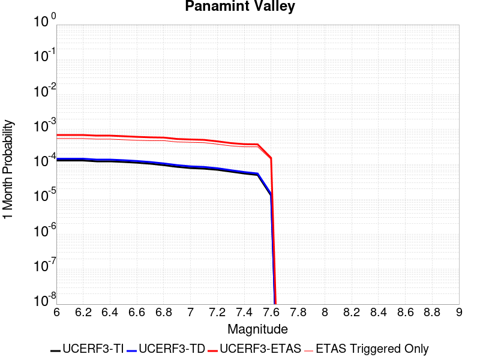 |  | 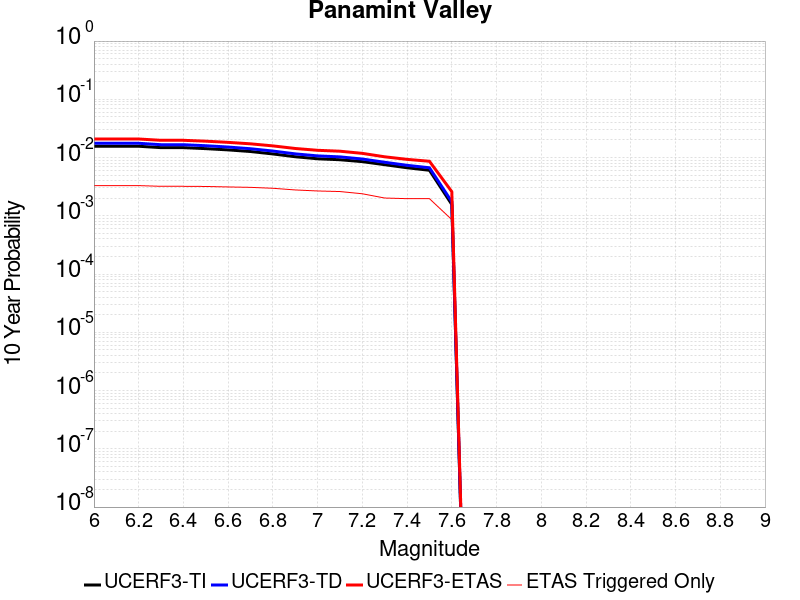 |

| Magnitude | 1 wk TI Prob | 1 wk TD Prob | 1 wk ETAS Prob | 1 wk ETAS/TD Gain | 1 wk ETAS Triggered Only | 1 mo TI Prob | 1 mo TD Prob | 1 mo ETAS Prob | 1 mo ETAS/TD Gain | 1 mo ETAS Triggered Only | 1 yr TI Prob | 1 yr TD Prob | 1 yr ETAS Prob | 1 yr ETAS/TD Gain | 1 yr ETAS Triggered Only | 10 yr TI Prob | 10 yr TD Prob | 10 yr ETAS Prob | 10 yr ETAS/TD Gain | 10 yr ETAS Triggered Only |
|-----|-----|-----|-----|-----|-----|-----|-----|-----|-----|-----|-----|-----|-----|-----|-----|-----|-----|-----|-----|-----|
| 6.0 | 3.0211835E-5 | 3.39879E-5 | 3.39879E-5 | 1.0 | 0.0 | 1.2947287E-4 | 1.4565447E-4 | 4.2147635E-4 | 2.8936727 | 2.7586208E-4 | 0.0015751923 | 0.0017719301 | 0.0033553264 | 1.8935996 | 0.0015862068 | 0.015640736 | 0.017584875 | 0.020498244 | 1.1656747 | 0.0029655173 |
| 6.1 | 3.0211835E-5 | 3.39879E-5 | 3.39879E-5 | 1.0 | 0.0 | 1.2947287E-4 | 1.4565447E-4 | 4.2147635E-4 | 2.8936727 | 2.7586208E-4 | 0.0015751923 | 0.0017719301 | 0.0033553264 | 1.8935996 | 0.0015862068 | 0.015640736 | 0.017584875 | 0.020498244 | 1.1656747 | 0.0029655173 |
| 6.2 | 3.0211835E-5 | 3.39879E-5 | 3.39879E-5 | 1.0 | 0.0 | 1.2947287E-4 | 1.4565447E-4 | 4.2147635E-4 | 2.8936727 | 2.7586208E-4 | 0.0015751923 | 0.0017719301 | 0.0033553264 | 1.8935996 | 0.0015862068 | 0.015640736 | 0.017584875 | 0.020498244 | 1.1656747 | 0.0029655173 |
| 6.3 | 2.8573924E-5 | 3.210589E-5 | 3.210589E-5 | 1.0 | 0.0 | 1.2245393E-4 | 1.3758958E-4 | 4.1341368E-4 | 3.0046875 | 2.7586208E-4 | 0.001489857 | 0.0016738938 | 0.0032574455 | 1.9460288 | 0.0015862068 | 0.01479908 | 0.01661945 | 0.019535681 | 1.1754711 | 0.0029655173 |
| 6.4 | 2.8573924E-5 | 3.210589E-5 | 3.210589E-5 | 1.0 | 0.0 | 1.2245393E-4 | 1.3758958E-4 | 4.1341368E-4 | 3.0046875 | 2.7586208E-4 | 0.001489857 | 0.0016738938 | 0.0032574455 | 1.9460288 | 0.0015862068 | 0.01479908 | 0.01661945 | 0.019535681 | 1.1754711 | 0.0029655173 |
| 6.5 | 2.7468774E-5 | 3.0831525E-5 | 3.0831525E-5 | 1.0 | 0.0 | 1.1771801E-4 | 1.3212857E-4 | 4.0795418E-4 | 3.0875547 | 2.7586208E-4 | 0.0014322745 | 0.0016075056 | 0.0031911626 | 1.9851643 | 0.0015862068 | 0.014230782 | 0.015965264 | 0.018883435 | 1.1827825 | 0.0029655173 |
| 6.6 | 2.6135967E-5 | 2.9255436E-5 | 2.9255436E-5 | 1.0 | 0.0 | 1.1200648E-4 | 1.2537456E-4 | 4.0120204E-4 | 3.2000275 | 2.7586208E-4 | 0.0013628257 | 0.001525393 | 0.0029714596 | 1.9479961 | 0.0014482759 | 0.013544982 | 0.015155562 | 0.017940294 | 1.1837432 | 0.0028275861 |
| 6.7 | 2.4498746E-5 | 2.7344193E-5 | 2.7344193E-5 | 1.0 | 0.0 | 1.04990395E-4 | 1.17184274E-4 | 3.9301402E-4 | 3.353812 | 2.7586208E-4 | 0.0012775084 | 0.0014258098 | 0.0028720207 | 2.0143085 | 0.0014482759 | 0.012701893 | 0.014172745 | 0.016960256 | 1.1966811 | 0.0028275861 |
| 6.8 | 2.2244329E-5 | 2.4938103E-5 | 2.4938103E-5 | 1.0 | 0.0 | 9.532935E-5 | 1.06873325E-4 | 3.827059E-4 | 3.5809302 | 2.7586208E-4 | 0.0011600169 | 0.0013004278 | 0.0027468204 | 2.1122434 | 0.0014482759 | 0.011539802 | 0.012933899 | 0.015452619 | 1.1947379 | 0.0025517242 |
| 6.9 | 1.9902658E-5 | 2.2292743E-5 | 2.2292743E-5 | 1.0 | 0.0 | 8.529431E-5 | 9.553693E-5 | 3.7137265E-4 | 3.8872154 | 2.7586208E-4 | 0.0010379635 | 0.00116256 | 0.0025402668 | 2.185063 | 0.0013793104 | 0.010331288 | 0.011569886 | 0.014023919 | 1.2121053 | 0.0024827586 |
| 7.0 | 1.8353881E-5 | 2.0568525E-5 | 2.0568525E-5 | 1.0 | 0.0 | 7.865712E-5 | 8.814794E-5 | 3.639857E-4 | 4.129259 | 2.7586208E-4 | 9.5722964E-4 | 0.0010726905 | 0.0023816298 | 2.2202394 | 0.0013103448 | 0.009531168 | 0.010680057 | 0.012999841 | 1.2172072 | 0.0023448276 |
| 7.1 | 1.7667631E-5 | 1.9774876E-5 | 1.9774876E-5 | 1.0 | 0.0 | 7.571623E-5 | 8.474681E-5 | 2.9162582E-4 | 3.441142 | 2.0689656E-4 | 9.2145515E-4 | 0.0010313216 | 0.0022714208 | 2.2024367 | 0.0012413793 | 0.009176437 | 0.010270242 | 0.01252273 | 1.2193218 | 0.002275862 |
| 7.2 | 1.6381597E-5 | 1.8160366E-5 | 1.8160366E-5 | 1.0 | 0.0 | 7.020495E-5 | 7.782792E-5 | 2.8470837E-4 | 3.6581779 | 2.0689656E-4 | 8.544101E-4 | 9.471603E-4 | 0.0021184636 | 2.2366474 | 0.0011724138 | 0.008511325 | 0.0094358865 | 0.011553644 | 1.2244365 | 0.002137931 |
| 7.3 | 1.4520491E-5 | 1.5968182E-5 | 1.5968182E-5 | 1.0 | 0.0 | 6.222919E-5 | 6.8433365E-5 | 2.0635496E-4 | 3.0154145 | 1.3793104E-4 | 7.57377E-4 | 8.328739E-4 | 0.001797587 | 2.1582942 | 9.6551725E-4 | 0.0075480095 | 0.008300635 | 0.010010461 | 1.2059875 | 0.0017241379 |
| 7.4 | 1.2852287E-5 | 1.4146948E-5 | 1.4146948E-5 | 1.0 | 0.0 | 5.5080065E-5 | 6.0628456E-5 | 1.9855113E-4 | 3.2748835 | 1.3793104E-4 | 6.7039346E-4 | 7.379173E-4 | 0.001702722 | 2.30747 | 9.6551725E-4 | 0.0066837464 | 0.0073575918 | 0.009069044 | 1.2326103 | 0.0017241379 |
| 7.5 | 1.1637851E-5 | 1.2838205E-5 | 1.2838205E-5 | 1.0 | 0.0 | 4.987555E-5 | 5.5019806E-5 | 1.9294325E-4 | 3.5067961 | 1.3793104E-4 | 6.070656E-4 | 6.6967594E-4 | 0.0016345466 | 2.4408023 | 9.6551725E-4 | 0.006054099 | 0.006679477 | 0.008392098 | 1.2564006 | 0.0017241379 |
| 7.6 | 3.0068115E-6 | 3.3335807E-6 | 3.3335807E-6 | 1.0 | 0.0 | 1.2886271E-5 | 1.4286737E-5 | 1.4286737E-5 | 1.0 | 0.0 | 1.5687906E-4 | 1.7393442E-4 | 4.497485E-4 | 2.585736 | 2.7586208E-4 | 0.0015676835 | 0.0017394236 | 0.0023590336 | 1.3562157 | 6.2068965E-4 |

## Garlock (East)
*[(top)](#table-of-contents)*

| 1 Week | 1 Month | 1 Year | 10 Year |
|-----|-----|-----|-----|
|  |  |  |  |

| Magnitude | 1 wk TI Prob | 1 wk TD Prob | 1 wk ETAS Prob | 1 wk ETAS/TD Gain | 1 wk ETAS Triggered Only | 1 mo TI Prob | 1 mo TD Prob | 1 mo ETAS Prob | 1 mo ETAS/TD Gain | 1 mo ETAS Triggered Only | 1 yr TI Prob | 1 yr TD Prob | 1 yr ETAS Prob | 1 yr ETAS/TD Gain | 1 yr ETAS Triggered Only | 10 yr TI Prob | 10 yr TD Prob | 10 yr ETAS Prob | 10 yr ETAS/TD Gain | 10 yr ETAS Triggered Only |
|-----|-----|-----|-----|-----|-----|-----|-----|-----|-----|-----|-----|-----|-----|-----|-----|-----|-----|-----|-----|-----|
| 6.0 | 4.5092507E-5 | 6.2917425E-5 | 2.6980095E-4 | 4.2881756 | 2.0689656E-4 | 1.9323928E-4 | 2.6962077E-4 | 5.4540846E-4 | 2.0228727 | 2.7586208E-4 | 0.0023501497 | 0.0032781374 | 0.0044467077 | 1.3564739 | 0.0011724138 | 0.023254504 | 0.03235903 | 0.03462798 | 1.0701181 | 0.0023448276 |
| 6.1 | 4.5092507E-5 | 6.2917425E-5 | 2.6980095E-4 | 4.2881756 | 2.0689656E-4 | 1.9323928E-4 | 2.6962077E-4 | 5.4540846E-4 | 2.0228727 | 2.7586208E-4 | 0.0023501497 | 0.0032781374 | 0.0044467077 | 1.3564739 | 0.0011724138 | 0.023254504 | 0.03235903 | 0.03462798 | 1.0701181 | 0.0023448276 |
| 6.2 | 2.6674514E-5 | 3.452091E-5 | 2.4141032E-4 | 6.9931626 | 2.0689656E-4 | 1.1431433E-4 | 1.4793854E-4 | 4.237598E-4 | 2.8644314 | 2.7586208E-4 | 0.0013908884 | 0.0017996968 | 0.002694635 | 1.4972717 | 8.965517E-4 | 0.01382215 | 0.017896036 | 0.01965705 | 1.0984025 | 0.0017931034 |
| 6.3 | 2.6674514E-5 | 3.452091E-5 | 2.4141032E-4 | 6.9931626 | 2.0689656E-4 | 1.1431433E-4 | 1.4793854E-4 | 4.237598E-4 | 2.8644314 | 2.7586208E-4 | 0.0013908884 | 0.0017996968 | 0.002694635 | 1.4972717 | 8.965517E-4 | 0.01382215 | 0.017896036 | 0.01965705 | 1.0984025 | 0.0017931034 |
| 6.4 | 2.5312667E-5 | 3.234991E-5 | 2.3923977E-4 | 7.395376 | 2.0689656E-4 | 1.0847834E-4 | 1.3863528E-4 | 4.144591E-4 | 2.9895644 | 2.7586208E-4 | 0.0013199237 | 0.0016866071 | 0.0025816467 | 1.5306746 | 8.965517E-4 | 0.013121112 | 0.016783953 | 0.01854696 | 1.1050413 | 0.0017931034 |
| 6.5 | 2.5312667E-5 | 3.234991E-5 | 2.3923977E-4 | 7.395376 | 2.0689656E-4 | 1.0847834E-4 | 1.3863528E-4 | 4.144591E-4 | 2.9895644 | 2.7586208E-4 | 0.0013199237 | 0.0016866071 | 0.0025816467 | 1.5306746 | 8.965517E-4 | 0.013121112 | 0.016783953 | 0.01854696 | 1.1050413 | 0.0017931034 |
| 6.6 | 2.246556E-5 | 2.8144346E-5 | 2.3503507E-4 | 8.351058 | 2.0689656E-4 | 9.627742E-5 | 1.20613186E-4 | 3.96442E-4 | 3.2868876 | 2.7586208E-4 | 0.0011715472 | 0.0014674999 | 0.002362736 | 1.6100416 | 8.965517E-4 | 0.011653901 | 0.0146240825 | 0.016390964 | 1.1208199 | 0.0017931034 |
| 6.7 | 2.2241198E-5 | 2.781406E-5 | 2.3470486E-4 | 8.438354 | 2.0689656E-4 | 9.531594E-5 | 1.1919779E-4 | 3.95027E-4 | 3.314046 | 2.7586208E-4 | 0.0011598538 | 0.0014502906 | 0.002345542 | 1.6172911 | 8.965517E-4 | 0.011538187 | 0.014454261 | 0.016221447 | 1.1222606 | 0.0017931034 |
| 6.8 | 1.9528685E-5 | 2.3908038E-5 | 2.3079965E-4 | 9.653642 | 2.0689656E-4 | 8.369167E-5 | 1.0245911E-4 | 3.7829293E-4 | 3.6921356 | 2.7586208E-4 | 0.0010184698 | 0.0012467455 | 0.0021421795 | 1.7182171 | 8.965517E-4 | 0.010138147 | 0.012441495 | 0.01421229 | 1.1423297 | 0.0017931034 |
| 6.9 | 1.3318621E-5 | 1.5207374E-5 | 2.2210077E-4 | 14.604808 | 2.0689656E-4 | 5.7078556E-5 | 6.517287E-5 | 3.4101694E-4 | 5.232499 | 2.7586208E-4 | 6.9470983E-4 | 7.931965E-4 | 0.0016201263 | 2.0425282 | 8.275862E-4 | 0.0069254204 | 0.007944281 | 0.009654722 | 1.2153047 | 0.0017241379 |
| 7.0 | 1.1760853E-5 | 1.3115987E-5 | 2.2000982E-4 | 16.774172 | 2.0689656E-4 | 5.0402683E-5 | 5.621019E-5 | 3.3205675E-4 | 5.907412 | 2.7586208E-4 | 6.134799E-4 | 6.841492E-4 | 0.0015111692 | 2.2088299 | 8.275862E-4 | 0.0061178906 | 0.006860767 | 0.008573076 | 1.2495798 | 0.0017241379 |
| 7.1 | 1.0064758E-5 | 1.0910848E-5 | 1.4884038E-4 | 13.641504 | 1.3793104E-4 | 4.3133965E-5 | 4.675996E-5 | 2.5364684E-4 | 5.424445 | 2.0689656E-4 | 5.2502943E-4 | 5.691573E-4 | 0.0013273462 | 2.3321254 | 7.586207E-4 | 0.005237907 | 0.005717105 | 0.0073628146 | 1.2878572 | 0.0016551724 |
| 7.2 | 9.768808E-6 | 1.0506669E-5 | 1.4843626E-4 | 14.127812 | 1.3793104E-4 | 4.186565E-5 | 4.5027828E-5 | 2.5191507E-4 | 5.594653 | 2.0689656E-4 | 5.095951E-4 | 5.480794E-4 | 0.0013062843 | 2.3833852 | 7.586207E-4 | 0.0050842804 | 0.0055073434 | 0.0071534 | 1.298884 | 0.0016551724 |
| 7.3 | 9.344516E-6 | 9.95218E-6 | 1.4788184E-4 | 14.85924 | 1.3793104E-4 | 4.004731E-5 | 4.2651525E-5 | 2.4953924E-4 | 5.8506527 | 2.0689656E-4 | 4.8746695E-4 | 5.1916204E-4 | 0.0012084591 | 2.3277109 | 6.896552E-4 | 0.0048639905 | 0.0052189473 | 0.006796876 | 1.3023461 | 0.0015862068 |
| 7.4 | 9.023491E-6 | 9.498219E-6 | 7.846308E-5 | 8.26082 | 6.896552E-5 | 3.867153E-5 | 4.0706036E-5 | 1.7863145E-4 | 4.3883286 | 1.3793104E-4 | 4.7072413E-4 | 4.9548666E-4 | 0.0011158688 | 2.2520664 | 6.2068965E-4 | 0.004697283 | 0.004982321 | 0.006354759 | 1.2754617 | 0.0013793104 |
| 7.5 | 7.081253E-6 | 7.0943947E-6 | 7.0943947E-6 | 1.0 | 0.0 | 3.0347876E-5 | 3.0404199E-5 | 9.936762E-5 | 3.2682202 | 6.896552E-5 | 3.6942272E-4 | 3.70109E-4 | 7.1480894E-4 | 1.9313471 | 3.448276E-4 | 0.003688092 | 0.00372781 | 0.0044836025 | 1.2027445 | 7.586207E-4 |
| 7.6 | 6.116396E-6 | 5.9656345E-6 | 5.9656345E-6 | 1.0 | 0.0 | 2.6212863E-5 | 2.5566756E-5 | 9.453051E-5 | 3.6973996 | 6.896552E-5 | 3.1909486E-4 | 3.1123104E-4 | 5.180632E-4 | 1.6645615 | 2.0689656E-4 | 0.0031863707 | 0.0031390795 | 0.0036203228 | 1.1533071 | 4.8275862E-4 |
| 7.7 | 4.797145E-6 | 4.763327E-6 | 4.763327E-6 | 1.0 | 0.0 | 2.055903E-5 | 2.04141E-5 | 2.04141E-5 | 1.0 | 0.0 | 2.5027743E-4 | 2.4851345E-4 | 3.864102E-4 | 1.5548865 | 1.3793104E-4 | 0.0024999576 | 0.0025124948 | 0.0027876638 | 1.1095202 | 2.7586208E-4 |
| 7.8 | 3.4028885E-6 | 3.9838537E-6 | 3.9838537E-6 | 1.0 | 0.0 | 1.4583726E-5 | 1.7073547E-5 | 1.7073547E-5 | 1.0 | 0.0 | 1.775424E-4 | 2.0785068E-4 | 2.7680187E-4 | 1.3317342 | 6.896552E-5 | 0.0017740062 | 0.0021040295 | 0.0022416704 | 1.0654178 | 1.3793104E-4 |
| 7.9 | 2.5928412E-6 | 3.3770064E-6 | 3.3770064E-6 | 1.0 | 0.0 | 1.1112129E-5 | 1.4472805E-5 | 1.4472805E-5 | 1.0 | 0.0 | 1.3528178E-4 | 1.7619222E-4 | 2.4514558E-4 | 1.3913531 | 6.896552E-5 | 0.0013519945 | 0.0017836117 | 0.0018524543 | 1.0385972 | 6.896552E-5 |
| 8.0 | 1.3743648E-6 | 1.6755408E-6 | 1.6755408E-6 | 1.0 | 0.0 | 5.8901214E-6 | 7.1808695E-6 | 7.1808695E-6 | 1.0 | 0.0 | 7.1709874E-5 | 8.742361E-5 | 8.742361E-5 | 1.0 | 0.0 | 7.1686733E-4 | 8.847989E-4 | 8.847989E-4 | 1.0 | 0.0 |
| 8.1 | 3.6733252E-7 | 3.1526864E-7 | 3.1526864E-7 | 1.0 | 0.0 | 1.5742813E-6 | 1.3511507E-6 | 1.3511507E-6 | 1.0 | 0.0 | 1.9166706E-5 | 1.645015E-5 | 1.645015E-5 | 1.0 | 0.0 | 1.9165053E-4 | 1.6658098E-4 | 1.6658098E-4 | 1.0 | 0.0 |

## Hunter Mountain-Saline Valley
*[(top)](#table-of-contents)*

| 1 Week | 1 Month | 1 Year | 10 Year |
|-----|-----|-----|-----|
|  |  |  | 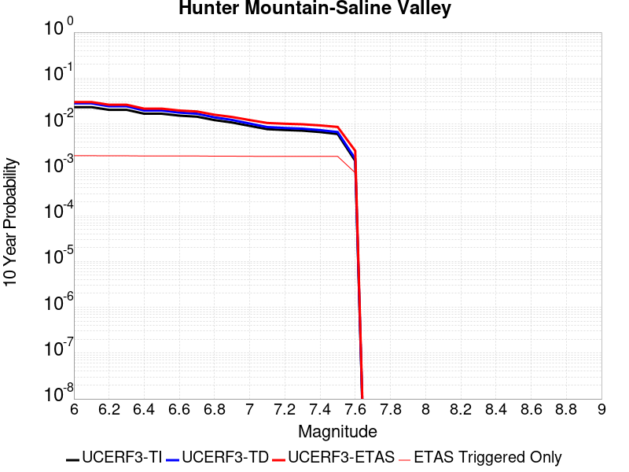 |

| Magnitude | 1 wk TI Prob | 1 wk TD Prob | 1 wk ETAS Prob | 1 wk ETAS/TD Gain | 1 wk ETAS Triggered Only | 1 mo TI Prob | 1 mo TD Prob | 1 mo ETAS Prob | 1 mo ETAS/TD Gain | 1 mo ETAS Triggered Only | 1 yr TI Prob | 1 yr TD Prob | 1 yr ETAS Prob | 1 yr ETAS/TD Gain | 1 yr ETAS Triggered Only | 10 yr TI Prob | 10 yr TD Prob | 10 yr ETAS Prob | 10 yr ETAS/TD Gain | 10 yr ETAS Triggered Only |
|-----|-----|-----|-----|-----|-----|-----|-----|-----|-----|-----|-----|-----|-----|-----|-----|-----|-----|-----|-----|-----|
| 6.0 | 4.5103672E-5 | 5.4576634E-5 | 5.4576634E-5 | 1.0 | 0.0 | 1.9328714E-4 | 2.3387549E-4 | 3.7177425E-4 | 1.5896248 | 1.3793104E-4 | 0.002350731 | 0.002843864 | 0.0038066355 | 1.3385434 | 9.6551725E-4 | 0.023260195 | 0.028095365 | 0.029771063 | 1.0596431 | 0.0017241379 |
| 6.1 | 4.5103672E-5 | 5.4576634E-5 | 5.4576634E-5 | 1.0 | 0.0 | 1.9328714E-4 | 2.3387549E-4 | 3.7177425E-4 | 1.5896248 | 1.3793104E-4 | 0.002350731 | 0.002843864 | 0.0038066355 | 1.3385434 | 9.6551725E-4 | 0.023260195 | 0.028095365 | 0.029771063 | 1.0596431 | 0.0017241379 |
| 6.2 | 3.9363465E-5 | 4.706859E-5 | 4.706859E-5 | 1.0 | 0.0 | 1.6868966E-4 | 2.017032E-4 | 3.396064E-4 | 1.6836938 | 1.3793104E-4 | 0.002051862 | 0.0024531104 | 0.0034162593 | 1.3926234 | 9.6551725E-4 | 0.020330196 | 0.024276383 | 0.025958665 | 1.0692971 | 0.0017241379 |
| 6.3 | 3.9363465E-5 | 4.706859E-5 | 4.706859E-5 | 1.0 | 0.0 | 1.6868966E-4 | 2.017032E-4 | 3.396064E-4 | 1.6836938 | 1.3793104E-4 | 0.002051862 | 0.0024531104 | 0.0034162593 | 1.3926234 | 9.6551725E-4 | 0.020330196 | 0.024276383 | 0.025958665 | 1.0692971 | 0.0017241379 |
| 6.4 | 3.2311684E-5 | 3.7955346E-5 | 3.7955346E-5 | 1.0 | 0.0 | 1.384713E-4 | 1.6265604E-4 | 3.0056463E-4 | 1.8478541 | 1.3793104E-4 | 0.0016845843 | 0.0019786113 | 0.0029422182 | 1.4870117 | 9.6551725E-4 | 0.016718714 | 0.019618697 | 0.02130901 | 1.0861583 | 0.0017241379 |
| 6.5 | 3.2311684E-5 | 3.7955346E-5 | 3.7955346E-5 | 1.0 | 0.0 | 1.384713E-4 | 1.6265604E-4 | 3.0056463E-4 | 1.8478541 | 1.3793104E-4 | 0.0016845843 | 0.0019786113 | 0.0029422182 | 1.4870117 | 9.6551725E-4 | 0.016718714 | 0.019618697 | 0.02130901 | 1.0861583 | 0.0017241379 |
| 6.6 | 2.9305844E-5 | 3.4185676E-5 | 3.4185676E-5 | 1.0 | 0.0 | 1.2559042E-4 | 1.4650216E-4 | 2.84413E-4 | 1.9413569 | 1.3793104E-4 | 0.0015279909 | 0.0017822674 | 0.0027460638 | 1.5407698 | 9.6551725E-4 | 0.015175272 | 0.017687662 | 0.019381305 | 1.0957527 | 0.0017241379 |
| 6.7 | 2.7826512E-5 | 3.234788E-5 | 3.234788E-5 | 1.0 | 0.0 | 1.19251024E-4 | 1.3862675E-4 | 2.7653866E-4 | 1.9948434 | 1.3793104E-4 | 0.0014509142 | 0.0016865344 | 0.0026504232 | 1.5715204 | 9.6551725E-4 | 0.014414776 | 0.01674504 | 0.018440306 | 1.1012399 | 0.0017241379 |
| 6.8 | 2.3389874E-5 | 2.686964E-5 | 2.686964E-5 | 1.0 | 0.0 | 1.0023846E-4 | 1.1515078E-4 | 2.5306593E-4 | 2.197692 | 1.3793104E-4 | 0.00121972 | 0.0014011064 | 0.0023652709 | 1.688145 | 9.6551725E-4 | 0.01213047 | 0.013928941 | 0.015629064 | 1.1220568 | 0.0017241379 |
| 6.9 | 2.069209E-5 | 2.3572567E-5 | 2.3572567E-5 | 1.0 | 0.0 | 8.867737E-5 | 1.01021586E-4 | 2.3893868E-4 | 2.3652241 | 1.3793104E-4 | 0.0010791123 | 0.00122928 | 0.0021936104 | 1.7844676 | 9.6551725E-4 | 0.010738871 | 0.012229833 | 0.013932885 | 1.1392539 | 0.0017241379 |
| 7.0 | 1.7462342E-5 | 1.9635625E-5 | 1.9635625E-5 | 1.0 | 0.0 | 7.483646E-5 | 8.4150095E-5 | 2.2206952E-4 | 2.6389694 | 1.3793104E-4 | 9.1075303E-4 | 0.0010240684 | 0.001988597 | 1.9418594 | 9.6551725E-4 | 0.009070295 | 0.010197128 | 0.011903685 | 1.1673566 | 0.0017241379 |
| 7.1 | 1.4807709E-5 | 1.6443486E-5 | 1.6443486E-5 | 1.0 | 0.0 | 6.3460066E-5 | 7.0470276E-5 | 2.0839159E-4 | 2.957156 | 1.3793104E-4 | 7.723524E-4 | 8.576544E-4 | 0.0018223436 | 2.1247995 | 9.6551725E-4 | 0.007696735 | 0.008546432 | 0.010255834 | 1.2000136 | 0.0017241379 |
| 7.2 | 1.4180048E-5 | 1.5700001E-5 | 1.5700001E-5 | 1.0 | 0.0 | 6.077022E-5 | 6.7284076E-5 | 2.0520583E-4 | 3.0498426 | 1.3793104E-4 | 7.396263E-4 | 8.188919E-4 | 0.0017836185 | 2.1780877 | 9.6551725E-4 | 0.0073716943 | 0.008161696 | 0.009871762 | 1.2095233 | 0.0017241379 |
| 7.3 | 1.3730402E-5 | 1.5173691E-5 | 1.5173691E-5 | 1.0 | 0.0 | 5.8843252E-5 | 6.502858E-5 | 2.0295064E-4 | 3.1209455 | 1.3793104E-4 | 7.161811E-4 | 7.914514E-4 | 0.0017562045 | 2.218967 | 9.6551725E-4 | 0.007138774 | 0.007889261 | 0.0095997965 | 1.2168182 | 0.0017241379 |
| 7.4 | 1.2810095E-5 | 1.4110805E-5 | 1.4110805E-5 | 1.0 | 0.0 | 5.489925E-5 | 6.0473565E-5 | 1.9839626E-4 | 3.2807105 | 1.3793104E-4 | 6.681934E-4 | 7.360327E-4 | 0.0017008394 | 2.31082 | 9.6551725E-4 | 0.006661878 | 0.0073388456 | 0.00905033 | 1.233209 | 0.0017241379 |
| 7.5 | 1.1595659E-5 | 1.2802062E-5 | 1.2802062E-5 | 1.0 | 0.0 | 4.9694736E-5 | 5.486491E-5 | 1.9278839E-4 | 3.5138738 | 1.3793104E-4 | 6.0486543E-4 | 6.677913E-4 | 0.0016326638 | 2.4448714 | 9.6551725E-4 | 0.006032217 | 0.006660718 | 0.008373372 | 1.2571275 | 0.0017241379 |
| 7.6 | 2.997694E-6 | 3.325705E-6 | 3.325705E-6 | 1.0 | 0.0 | 1.28471975E-5 | 1.4252984E-5 | 1.4252984E-5 | 1.0 | 0.0 | 1.564034E-4 | 1.7352356E-4 | 4.4933776E-4 | 2.5894914 | 2.7586208E-4 | 0.0015629337 | 0.0017353174 | 0.00235493 | 1.3570601 | 6.2068965E-4 |

## Garlock (West)
*[(top)](#table-of-contents)*

| 1 Week | 1 Month | 1 Year | 10 Year |
|-----|-----|-----|-----|
|  |  |  |  |

| Magnitude | 1 wk TI Prob | 1 wk TD Prob | 1 wk ETAS Prob | 1 wk ETAS/TD Gain | 1 wk ETAS Triggered Only | 1 mo TI Prob | 1 mo TD Prob | 1 mo ETAS Prob | 1 mo ETAS/TD Gain | 1 mo ETAS Triggered Only | 1 yr TI Prob | 1 yr TD Prob | 1 yr ETAS Prob | 1 yr ETAS/TD Gain | 1 yr ETAS Triggered Only | 10 yr TI Prob | 10 yr TD Prob | 10 yr ETAS Prob | 10 yr ETAS/TD Gain | 10 yr ETAS Triggered Only |
|-----|-----|-----|-----|-----|-----|-----|-----|-----|-----|-----|-----|-----|-----|-----|-----|-----|-----|-----|-----|-----|
| 6.0 | 2.5181727E-5 | 2.5216661E-5 | 9.418044E-5 | 3.7348497 | 6.896552E-5 | 1.0791722E-4 | 1.08066946E-4 | 2.4598307E-4 | 2.27621 | 1.3793104E-4 | 0.0013131002 | 0.0013149243 | 0.001865923 | 1.4190345 | 5.5172417E-4 | 0.013053683 | 0.013151911 | 0.0143769635 | 1.0931463 | 0.0012413793 |
| 6.1 | 2.5077732E-5 | 2.5117724E-5 | 9.408151E-5 | 3.7456224 | 6.896552E-5 | 1.0747157E-4 | 1.0764297E-4 | 2.4555915E-4 | 2.2812374 | 1.3793104E-4 | 0.001307681 | 0.0013097686 | 0.0018607702 | 1.4206861 | 5.5172417E-4 | 0.013000126 | 0.013100963 | 0.014326079 | 1.0935135 | 0.0012413793 |
| 6.2 | 2.494612E-5 | 2.4999388E-5 | 9.396318E-5 | 3.758619 | 6.896552E-5 | 1.0690756E-4 | 1.0713586E-4 | 2.4505213E-4 | 2.2873025 | 1.3793104E-4 | 0.0013008224 | 0.001303602 | 0.0018546069 | 1.4226788 | 5.5172417E-4 | 0.012932341 | 0.013040021 | 0.014265213 | 1.0939562 | 0.0012413793 |
| 6.3 | 2.4733758E-5 | 2.4818735E-5 | 9.378254E-5 | 3.7786994 | 6.896552E-5 | 1.0599751E-4 | 1.0636169E-4 | 2.4427805E-4 | 2.2966733 | 1.3793104E-4 | 0.0012897556 | 0.0012941877 | 0.0018451979 | 1.4257575 | 5.5172417E-4 | 0.012822957 | 0.01294698 | 0.014172287 | 1.0946404 | 0.0012413793 |
| 6.4 | 2.3237335E-5 | 2.3197908E-5 | 9.216183E-5 | 3.9728508 | 6.896552E-5 | 9.958477E-5 | 9.941583E-5 | 2.3733315E-4 | 2.3872774 | 1.3793104E-4 | 0.0012117702 | 0.0012097185 | 0.0017607752 | 1.4555248 | 5.5172417E-4 | 0.012051838 | 0.012111766 | 0.01333811 | 1.1012523 | 0.0012413793 |
| 6.5 | 2.2732203E-5 | 2.3012379E-5 | 9.197631E-5 | 3.996819 | 6.896552E-5 | 9.742009E-5 | 9.862077E-5 | 2.365382E-4 | 2.3984623 | 1.3793104E-4 | 0.0011854442 | 0.0012000492 | 0.0017511112 | 1.4591995 | 5.5172417E-4 | 0.011791403 | 0.012016123 | 0.0132425865 | 1.1020681 | 0.0012413793 |
| 6.6 | 2.1319436E-5 | 2.1792415E-5 | 9.075643E-5 | 4.164588 | 6.896552E-5 | 9.136581E-5 | 9.339274E-5 | 2.3131089E-4 | 2.4767547 | 1.3793104E-4 | 0.001111811 | 0.0011364657 | 0.0016875629 | 1.4849219 | 5.5172417E-4 | 0.011062649 | 0.011386949 | 0.012614192 | 1.1077764 | 0.0012413793 |
| 6.7 | 1.970802E-5 | 2.0412112E-5 | 8.937622E-5 | 4.3785877 | 6.896552E-5 | 8.446021E-5 | 8.747755E-5 | 2.2539652E-4 | 2.5766213 | 1.3793104E-4 | 0.001027818 | 0.0010645206 | 0.0016156574 | 1.5177324 | 5.5172417E-4 | 0.010230771 | 0.01067459 | 0.011902719 | 1.1150515 | 0.0012413793 |
| 6.8 | 1.8744462E-5 | 1.9919653E-5 | 8.88838E-5 | 4.462116 | 6.896552E-5 | 8.033094E-5 | 8.536715E-5 | 2.2328642E-4 | 2.615601 | 1.3793104E-4 | 9.775903E-4 | 0.0010388512 | 0.0015900022 | 1.5305389 | 5.5172417E-4 | 0.009733009 | 0.010420324 | 0.011648768 | 1.1178892 | 0.0012413793 |
| 6.9 | 1.7559682E-5 | 1.8971898E-5 | 8.79361E-5 | 4.6350718 | 6.896552E-5 | 7.5253614E-5 | 8.13056E-5 | 2.1922542E-4 | 2.6963139 | 1.3793104E-4 | 9.158276E-4 | 9.894476E-4 | 0.0015406258 | 1.5570565 | 5.5172417E-4 | 0.0091206245 | 0.009930745 | 0.011159796 | 1.1237622 | 0.0012413793 |
| 7.0 | 1.6794445E-5 | 1.8234585E-5 | 8.7198845E-5 | 4.7820582 | 6.896552E-5 | 7.197421E-5 | 7.814589E-5 | 2.1606614E-4 | 2.7649074 | 1.3793104E-4 | 8.759337E-4 | 9.5101225E-4 | 0.0015022117 | 1.5795923 | 5.5172417E-4 | 0.008724891 | 0.009549588 | 0.010779113 | 1.1287516 | 0.0012413793 |
| 7.1 | 1.6337795E-5 | 1.7735292E-5 | 8.669958E-5 | 4.8885345 | 6.896552E-5 | 7.0017246E-5 | 7.600619E-5 | 2.1392675E-4 | 2.8145964 | 1.3793104E-4 | 8.521265E-4 | 9.249838E-4 | 0.0014761976 | 1.5959172 | 5.5172417E-4 | 0.008488664 | 0.009291395 | 0.01052124 | 1.1323639 | 0.0012413793 |
| 7.2 | 1.5780008E-5 | 1.7183862E-5 | 8.61482E-5 | 5.01332 | 6.896552E-5 | 6.762685E-5 | 7.364305E-5 | 2.1156392E-4 | 2.8728294 | 1.3793104E-4 | 8.2304585E-4 | 8.962366E-4 | 0.0014474663 | 1.6150492 | 5.5172417E-4 | 0.008200042 | 0.009006202 | 0.010236401 | 1.1365947 | 0.0012413793 |
| 7.3 | 1.5058865E-5 | 1.6636799E-5 | 8.560117E-5 | 5.145291 | 6.896552E-5 | 6.45364E-5 | 7.129862E-5 | 2.0921983E-4 | 2.934416 | 1.3793104E-4 | 7.854473E-4 | 8.6771627E-4 | 0.0014189617 | 1.635283 | 5.5172417E-4 | 0.00782677 | 0.008722834 | 0.009953385 | 1.1410724 | 0.0012413793 |
| 7.4 | 1.4887923E-5 | 1.647271E-5 | 8.543709E-5 | 5.1865835 | 6.896552E-5 | 6.380382E-5 | 7.059543E-5 | 2.0851672E-4 | 2.953686 | 1.3793104E-4 | 7.7653467E-4 | 8.591616E-4 | 0.0014104117 | 1.641614 | 5.5172417E-4 | 0.0077382675 | 0.008637666 | 0.009868322 | 1.1424756 | 0.0012413793 |
| 7.5 | 1.4509299E-5 | 1.6064607E-5 | 1.6064607E-5 | 1.0 | 0.0 | 6.218123E-5 | 6.884651E-5 | 1.3780728E-4 | 2.0016596 | 6.896552E-5 | 7.567935E-4 | 8.37885E-4 | 0.0013202392 | 1.5756806 | 4.8275862E-4 | 0.0075422134 | 0.008425911 | 0.009520061 | 1.1298555 | 0.0011034483 |
| 7.6 | 1.2756717E-5 | 1.4067994E-5 | 1.4067994E-5 | 1.0 | 0.0 | 5.4670498E-5 | 6.029001E-5 | 1.2925138E-4 | 2.1438272 | 6.896552E-5 | 6.6541E-4 | 7.3378434E-4 | 0.001078359 | 1.4695855 | 3.448276E-4 | 0.006634211 | 0.0073905406 | 0.008143554 | 1.1018889 | 7.586207E-4 |
| 7.7 | 1.0328985E-5 | 1.147664E-5 | 1.147664E-5 | 1.0 | 0.0 | 4.4266326E-5 | 4.9184677E-5 | 4.9184677E-5 | 1.0 | 0.0 | 5.388092E-4 | 5.986593E-4 | 8.05432E-4 | 1.345393 | 2.0689656E-4 | 0.0053750467 | 0.006046838 | 0.0065266774 | 1.0793538 | 4.8275862E-4 |
| 7.8 | 7.0306583E-6 | 8.912468E-6 | 8.912468E-6 | 1.0 | 0.0 | 3.0131043E-5 | 3.8195732E-5 | 3.8195732E-5 | 1.0 | 0.0 | 3.667837E-4 | 4.6493395E-4 | 6.0280086E-4 | 1.2965301 | 1.3793104E-4 | 0.003661789 | 0.0047019436 | 0.00504515 | 1.0729924 | 3.448276E-4 |
| 7.9 | 4.060633E-6 | 5.4729326E-6 | 5.4729326E-6 | 1.0 | 0.0 | 1.7402595E-5 | 2.3455215E-5 | 2.3455215E-5 | 1.0 | 0.0 | 2.11856E-4 | 2.8552994E-4 | 3.5447575E-4 | 1.2414662 | 6.896552E-5 | 0.0021165414 | 0.0028881172 | 0.0029568835 | 1.0238101 | 6.896552E-5 |
| 8.0 | 1.6729537E-6 | 2.0800776E-6 | 2.0800776E-6 | 1.0 | 0.0 | 7.169782E-6 | 8.914588E-6 | 8.914588E-6 | 1.0 | 0.0 | 8.7288594E-5 | 1.0852974E-4 | 1.0852974E-4 | 1.0 | 0.0 | 8.7254314E-4 | 0.0010982669 | 0.0010982669 | 1.0 | 0.0 |
| 8.1 | 3.6733252E-7 | 3.1526864E-7 | 3.1526864E-7 | 1.0 | 0.0 | 1.5742813E-6 | 1.3511507E-6 | 1.3511507E-6 | 1.0 | 0.0 | 1.9166706E-5 | 1.645015E-5 | 1.645015E-5 | 1.0 | 0.0 | 1.9165053E-4 | 1.6658098E-4 | 1.6658098E-4 | 1.0 | 0.0 |

## San Andreas (Mojave S)
*[(top)](#table-of-contents)*

| 1 Week | 1 Month | 1 Year | 10 Year |
|-----|-----|-----|-----|
|  |  |  |  |

| Magnitude | 1 wk TI Prob | 1 wk TD Prob | 1 wk ETAS Prob | 1 wk ETAS/TD Gain | 1 wk ETAS Triggered Only | 1 mo TI Prob | 1 mo TD Prob | 1 mo ETAS Prob | 1 mo ETAS/TD Gain | 1 mo ETAS Triggered Only | 1 yr TI Prob | 1 yr TD Prob | 1 yr ETAS Prob | 1 yr ETAS/TD Gain | 1 yr ETAS Triggered Only | 10 yr TI Prob | 10 yr TD Prob | 10 yr ETAS Prob | 10 yr ETAS/TD Gain | 10 yr ETAS Triggered Only |
|-----|-----|-----|-----|-----|-----|-----|-----|-----|-----|-----|-----|-----|-----|-----|-----|-----|-----|-----|-----|-----|
| 6.0 | 3.1064058E-4 | 6.7499664E-4 | 8.1283454E-4 | 1.2042054 | 1.3793104E-4 | 0.0013306376 | 0.0028897638 | 0.0030272962 | 1.047593 | 1.3793104E-4 | 0.016080605 | 0.034641396 | 0.035040855 | 1.0115312 | 4.137931E-4 | 0.1496549 | 0.2867374 | 0.2872785 | 1.0018871 | 7.586207E-4 |
| 6.1 | 3.1064058E-4 | 6.7499664E-4 | 8.1283454E-4 | 1.2042054 | 1.3793104E-4 | 0.0013306376 | 0.0028897638 | 0.0030272962 | 1.047593 | 1.3793104E-4 | 0.016080605 | 0.034641396 | 0.035040855 | 1.0115312 | 4.137931E-4 | 0.1496549 | 0.2867374 | 0.2872785 | 1.0018871 | 7.586207E-4 |
| 6.2 | 3.1064058E-4 | 6.7499664E-4 | 8.1283454E-4 | 1.2042054 | 1.3793104E-4 | 0.0013306376 | 0.0028897638 | 0.0030272962 | 1.047593 | 1.3793104E-4 | 0.016080605 | 0.034641396 | 0.035040855 | 1.0115312 | 4.137931E-4 | 0.1496549 | 0.2867374 | 0.2872785 | 1.0018871 | 7.586207E-4 |
| 6.3 | 3.1064058E-4 | 6.7499664E-4 | 8.1283454E-4 | 1.2042054 | 1.3793104E-4 | 0.0013306376 | 0.0028897638 | 0.0030272962 | 1.047593 | 1.3793104E-4 | 0.016080605 | 0.034641396 | 0.035040855 | 1.0115312 | 4.137931E-4 | 0.1496549 | 0.2867374 | 0.2872785 | 1.0018871 | 7.586207E-4 |
| 6.4 | 1.9872203E-4 | 4.3216298E-4 | 5.010987E-4 | 1.1595132 | 6.896552E-5 | 8.5138786E-4 | 0.0018508406 | 0.0019196785 | 1.0371927 | 6.896552E-5 | 0.010316478 | 0.022307295 | 0.022577003 | 1.0120906 | 2.7586208E-4 | 0.098504856 | 0.19713911 | 0.19758208 | 1.002247 | 5.5172417E-4 |
| 6.5 | 1.291105E-4 | 2.8787713E-4 | 2.8787713E-4 | 1.0 | 0.0 | 5.5321335E-4 | 0.0012331787 | 0.0012331787 | 1.0 | 0.0 | 0.006714592 | 0.014911419 | 0.01511523 | 1.0136682 | 2.0689656E-4 | 0.065152965 | 0.13817947 | 0.13853608 | 1.0025808 | 4.137931E-4 |
| 6.6 | 1.291105E-4 | 2.8787713E-4 | 2.8787713E-4 | 1.0 | 0.0 | 5.5321335E-4 | 0.0012331787 | 0.0012331787 | 1.0 | 0.0 | 0.006714592 | 0.014911419 | 0.01511523 | 1.0136682 | 2.0689656E-4 | 0.065152965 | 0.13817947 | 0.13853608 | 1.0025808 | 4.137931E-4 |
| 6.7 | 1.08001186E-4 | 2.4368397E-4 | 2.4368397E-4 | 1.0 | 0.0 | 4.6278012E-4 | 0.0010439424 | 0.0010439424 | 1.0 | 0.0 | 0.0056198016 | 0.012636229 | 0.012840511 | 1.0161663 | 2.0689656E-4 | 0.054797906 | 0.119323194 | 0.11968761 | 1.003054 | 4.137931E-4 |
| 6.8 | 1.0624356E-4 | 2.3885963E-4 | 2.3885963E-4 | 1.0 | 0.0 | 4.5525006E-4 | 0.001023283 | 0.001023283 | 1.0 | 0.0 | 0.0055285925 | 0.012387579 | 0.012591912 | 1.016495 | 2.0689656E-4 | 0.053930566 | 0.11727233 | 0.1176376 | 1.0031147 | 4.137931E-4 |
| 6.9 | 1.0393785E-4 | 2.3256175E-4 | 2.3256175E-4 | 1.0 | 0.0 | 4.4537184E-4 | 9.963129E-4 | 9.963129E-4 | 1.0 | 0.0 | 0.0054089287 | 0.012062895 | 0.012267295 | 1.0169446 | 2.0689656E-4 | 0.05279156 | 0.114569746 | 0.114936136 | 1.0031979 | 4.137931E-4 |
| 7.0 | 1.0155622E-4 | 2.262555E-4 | 2.262555E-4 | 1.0 | 0.0 | 4.3516833E-4 | 9.693065E-4 | 9.693065E-4 | 1.0 | 0.0 | 0.005285311 | 0.011737675 | 0.011942144 | 1.0174198 | 2.0689656E-4 | 0.05161361 | 0.11182977 | 0.112197295 | 1.0032864 | 4.137931E-4 |
| 7.1 | 9.885595E-5 | 2.191377E-4 | 2.191377E-4 | 1.0 | 0.0 | 4.2359953E-4 | 9.388239E-4 | 9.388239E-4 | 1.0 | 0.0 | 0.0051451353 | 0.011370476 | 0.01157502 | 1.017989 | 2.0689656E-4 | 0.05027629 | 0.10871404 | 0.10908284 | 1.0033925 | 4.137931E-4 |
| 7.2 | 9.6411415E-5 | 2.1276584E-4 | 2.1276584E-4 | 1.0 | 0.0 | 4.1312634E-4 | 9.115353E-4 | 9.115353E-4 | 1.0 | 0.0 | 0.005018219 | 0.0110416515 | 0.011246264 | 1.018531 | 2.0689656E-4 | 0.049064007 | 0.10590357 | 0.10627354 | 1.0034934 | 4.137931E-4 |
| 7.3 | 9.1180635E-5 | 1.950402E-4 | 1.950402E-4 | 1.0 | 0.0 | 3.907156E-4 | 8.356189E-4 | 8.356189E-4 | 1.0 | 0.0 | 0.004746591 | 0.010126315 | 0.010331117 | 1.0202247 | 2.0689656E-4 | 0.046464786 | 0.09809433 | 0.098467536 | 1.0038046 | 4.137931E-4 |
| 7.4 | 8.887388E-5 | 1.8752231E-4 | 1.8752231E-4 | 1.0 | 0.0 | 3.8083247E-4 | 8.0341956E-4 | 8.0341956E-4 | 1.0 | 0.0 | 0.0046267817 | 0.00973786 | 0.009942742 | 1.0210397 | 2.0689656E-4 | 0.045316286 | 0.09472819 | 0.09510278 | 1.0039544 | 4.137931E-4 |
| 7.5 | 8.6750515E-5 | 1.8083451E-4 | 1.8083451E-4 | 1.0 | 0.0 | 3.7173493E-4 | 7.7477493E-4 | 7.7477493E-4 | 1.0 | 0.0 | 0.004516484 | 0.009392173 | 0.009597126 | 1.0218217 | 2.0689656E-4 | 0.04425787 | 0.09169095 | 0.0920668 | 1.0040991 | 4.137931E-4 |
| 7.6 | 8.453092E-5 | 1.747065E-4 | 1.747065E-4 | 1.0 | 0.0 | 3.6222505E-4 | 7.485273E-4 | 7.485273E-4 | 1.0 | 0.0 | 0.0044011753 | 0.009075315 | 0.009280333 | 1.0225909 | 2.0689656E-4 | 0.04315024 | 0.08884873 | 0.08922576 | 1.0042435 | 4.137931E-4 |
| 7.7 | 8.259102E-5 | 1.6992437E-4 | 1.6992437E-4 | 1.0 | 0.0 | 3.539135E-4 | 7.280441E-4 | 7.280441E-4 | 1.0 | 0.0 | 0.004300386 | 0.008827981 | 0.00903305 | 1.0232296 | 2.0689656E-4 | 0.042181134 | 0.08659836 | 0.08697632 | 1.0043645 | 4.137931E-4 |
| 7.8 | 7.444844E-5 | 1.531194E-4 | 1.531194E-4 | 1.0 | 0.0 | 3.1902574E-4 | 6.56061E-4 | 6.56061E-4 | 1.0 | 0.0 | 0.0038772223 | 0.007958339 | 0.008163589 | 1.0257906 | 2.0689656E-4 | 0.03810269 | 0.07841811 | 0.07879946 | 1.0048629 | 4.137931E-4 |
| 7.9 | 5.2586525E-5 | 1.0025827E-4 | 1.0025827E-4 | 1.0 | 0.0 | 2.2535135E-4 | 4.2960755E-4 | 4.2960755E-4 | 1.0 | 0.0 | 0.0027402006 | 0.005217939 | 0.0053551504 | 1.026296 | 1.3793104E-4 | 0.027066574 | 0.052290585 | 0.0524213 | 1.0024998 | 1.3793104E-4 |
| 8.0 | 3.379877E-5 | 5.418614E-5 | 5.418614E-5 | 1.0 | 0.0 | 1.4484383E-4 | 2.3220567E-4 | 2.3220567E-4 | 1.0 | 0.0 | 0.0017620471 | 0.0028234406 | 0.0028922115 | 1.0243571 | 6.896552E-5 | 0.017481409 | 0.028889727 | 0.0289567 | 1.0023183 | 6.896552E-5 |
| 8.1 | 1.8668277E-5 | 1.936222E-5 | 1.936222E-5 | 1.0 | 0.0 | 8.000444E-5 | 8.29783E-5 | 8.29783E-5 | 1.0 | 0.0 | 9.736188E-4 | 0.0010097933 | 0.0010097933 | 1.0 | 0.0 | 0.009693642 | 0.010826511 | 0.010826511 | 1.0 | 0.0 |
| 8.2 | 8.541571E-6 | 5.4811067E-6 | 5.4811067E-6 | 1.0 | 0.0 | 3.660622E-5 | 2.3490245E-5 | 2.3490245E-5 | 1.0 | 0.0 | 4.455896E-4 | 2.8595628E-4 | 2.8595628E-4 | 1.0 | 0.0 | 0.0044469717 | 0.0032518986 | 0.0032518986 | 1.0 | 0.0 |
| 8.3 | 1.983087E-6 | 7.693574E-7 | 7.693574E-7 | 1.0 | 0.0 | 8.498917E-6 | 3.297242E-6 | 3.297242E-6 | 1.0 | 0.0 | 1.034694E-4 | 4.01432E-5 | 4.01432E-5 | 1.0 | 0.0 | 0.0010342124 | 4.7390026E-4 | 4.7390026E-4 | 1.0 | 0.0 |

## Blackwater
*[(top)](#table-of-contents)*

| 1 Week | 1 Month | 1 Year | 10 Year |
|-----|-----|-----|-----|
|  |  |  |  |

| Magnitude | 1 wk TI Prob | 1 wk TD Prob | 1 wk ETAS Prob | 1 wk ETAS/TD Gain | 1 wk ETAS Triggered Only | 1 mo TI Prob | 1 mo TD Prob | 1 mo ETAS Prob | 1 mo ETAS/TD Gain | 1 mo ETAS Triggered Only | 1 yr TI Prob | 1 yr TD Prob | 1 yr ETAS Prob | 1 yr ETAS/TD Gain | 1 yr ETAS Triggered Only | 10 yr TI Prob | 10 yr TD Prob | 10 yr ETAS Prob | 10 yr ETAS/TD Gain | 10 yr ETAS Triggered Only |
|-----|-----|-----|-----|-----|-----|-----|-----|-----|-----|-----|-----|-----|-----|-----|-----|-----|-----|-----|-----|-----|
| 6.0 | 3.0708583E-5 | 3.3097214E-5 | 3.3097214E-5 | 1.0 | 0.0 | 1.3160157E-4 | 1.4183826E-4 | 1.4183826E-4 | 1.0 | 0.0 | 0.0016010714 | 0.0017256497 | 0.0019321892 | 1.119688 | 2.0689656E-4 | 0.015895851 | 0.017136335 | 0.017881956 | 1.0435112 | 7.586207E-4 |
| 6.1 | 3.0708583E-5 | 3.3097214E-5 | 3.3097214E-5 | 1.0 | 0.0 | 1.3160157E-4 | 1.4183826E-4 | 1.4183826E-4 | 1.0 | 0.0 | 0.0016010714 | 0.0017256497 | 0.0019321892 | 1.119688 | 2.0689656E-4 | 0.015895851 | 0.017136335 | 0.017881956 | 1.0435112 | 7.586207E-4 |
| 6.2 | 1.1707779E-5 | 1.2545598E-5 | 1.2545598E-5 | 1.0 | 0.0 | 5.017523E-5 | 5.3765798E-5 | 5.3765798E-5 | 1.0 | 0.0 | 6.107122E-4 | 6.5441156E-4 | 7.23332E-4 | 1.1053165 | 6.896552E-5 | 0.006090366 | 0.0065258164 | 0.006936909 | 1.0629948 | 4.137931E-4 |
| 6.3 | 1.1707779E-5 | 1.2545598E-5 | 1.2545598E-5 | 1.0 | 0.0 | 5.017523E-5 | 5.3765798E-5 | 5.3765798E-5 | 1.0 | 0.0 | 6.107122E-4 | 6.5441156E-4 | 7.23332E-4 | 1.1053165 | 6.896552E-5 | 0.006090366 | 0.0065258164 | 0.006936909 | 1.0629948 | 4.137931E-4 |
| 6.4 | 7.929244E-6 | 8.4804105E-6 | 8.4804105E-6 | 1.0 | 0.0 | 3.3982033E-5 | 3.6344132E-5 | 3.6344132E-5 | 1.0 | 0.0 | 4.136527E-4 | 4.4240404E-4 | 4.4240404E-4 | 1.0 | 0.0 | 0.0041288356 | 0.0044156383 | 0.004621621 | 1.0466485 | 2.0689656E-4 |
| 6.5 | 5.8832115E-6 | 6.286219E-6 | 6.286219E-6 | 1.0 | 0.0 | 2.521352E-5 | 2.6940676E-5 | 2.6940676E-5 | 1.0 | 0.0 | 3.0693135E-4 | 3.279559E-4 | 3.279559E-4 | 1.0 | 0.0 | 0.0030650778 | 0.0032749726 | 0.0033437123 | 1.0209894 | 6.896552E-5 |
| 6.6 | 5.8832115E-6 | 6.286219E-6 | 6.286219E-6 | 1.0 | 0.0 | 2.521352E-5 | 2.6940676E-5 | 2.6940676E-5 | 1.0 | 0.0 | 3.0693135E-4 | 3.279559E-4 | 3.279559E-4 | 1.0 | 0.0 | 0.0030650778 | 0.0032749726 | 0.0033437123 | 1.0209894 | 6.896552E-5 |
| 6.7 | 3.0715053E-6 | 3.2815851E-6 | 3.2815851E-6 | 1.0 | 0.0 | 1.3163528E-5 | 1.4063868E-5 | 1.4063868E-5 | 1.0 | 0.0 | 1.6025416E-4 | 1.7121529E-4 | 1.7121529E-4 | 1.0 | 0.0 | 0.0016013865 | 0.0017109484 | 0.0017797959 | 1.0402393 | 6.896552E-5 |
| 6.8 | 2.2722281E-6 | 2.4288424E-6 | 2.4288424E-6 | 1.0 | 0.0 | 9.738084E-6 | 1.0409289E-5 | 1.0409289E-5 | 1.0 | 0.0 | 1.1855473E-4 | 1.2672663E-4 | 1.2672663E-4 | 1.0 | 0.0 | 0.001184915 | 0.0012666339 | 0.001335512 | 1.0543789 | 6.896552E-5 |
| 6.9 | 9.952399E-7 | 1.0653887E-6 | 1.0653887E-6 | 1.0 | 0.0 | 4.265307E-6 | 4.5659463E-6 | 4.5659463E-6 | 1.0 | 0.0 | 5.1928873E-5 | 5.5589495E-5 | 5.5589495E-5 | 1.0 | 0.0 | 5.191674E-4 | 5.558065E-4 | 5.558065E-4 | 1.0 | 0.0 |
| 7.0 | 4.7385504E-7 | 5.075751E-7 | 5.075751E-7 | 1.0 | 0.0 | 2.0308057E-6 | 2.175322E-6 | 2.175322E-6 | 1.0 | 0.0 | 2.4724779E-5 | 2.6484544E-5 | 2.6484544E-5 | 1.0 | 0.0 | 2.4722028E-4 | 2.6484544E-4 | 2.6484544E-4 | 1.0 | 0.0 |

## San Andreas (Mojave N)
*[(top)](#table-of-contents)*

| 1 Week | 1 Month | 1 Year | 10 Year |
|-----|-----|-----|-----|
|  |  |  |  |

| Magnitude | 1 wk TI Prob | 1 wk TD Prob | 1 wk ETAS Prob | 1 wk ETAS/TD Gain | 1 wk ETAS Triggered Only | 1 mo TI Prob | 1 mo TD Prob | 1 mo ETAS Prob | 1 mo ETAS/TD Gain | 1 mo ETAS Triggered Only | 1 yr TI Prob | 1 yr TD Prob | 1 yr ETAS Prob | 1 yr ETAS/TD Gain | 1 yr ETAS Triggered Only | 10 yr TI Prob | 10 yr TD Prob | 10 yr ETAS Prob | 10 yr ETAS/TD Gain | 10 yr ETAS Triggered Only |
|-----|-----|-----|-----|-----|-----|-----|-----|-----|-----|-----|-----|-----|-----|-----|-----|-----|-----|-----|-----|-----|
| 6.0 | 9.877682E-5 | 1.9435467E-4 | 1.9435467E-4 | 1.0 | 0.0 | 4.2326056E-4 | 8.326828E-4 | 8.326828E-4 | 1.0 | 0.0 | 0.0051410277 | 0.010090916 | 0.010363994 | 1.0270618 | 2.7586208E-4 | 0.05023708 | 0.09846656 | 0.09896396 | 1.0050515 | 5.5172417E-4 |
| 6.1 | 9.877682E-5 | 1.9435467E-4 | 1.9435467E-4 | 1.0 | 0.0 | 4.2326056E-4 | 8.326828E-4 | 8.326828E-4 | 1.0 | 0.0 | 0.0051410277 | 0.010090916 | 0.010363994 | 1.0270618 | 2.7586208E-4 | 0.05023708 | 0.09846656 | 0.09896396 | 1.0050515 | 5.5172417E-4 |
| 6.2 | 9.877682E-5 | 1.9435467E-4 | 1.9435467E-4 | 1.0 | 0.0 | 4.2326056E-4 | 8.326828E-4 | 8.326828E-4 | 1.0 | 0.0 | 0.0051410277 | 0.010090916 | 0.010363994 | 1.0270618 | 2.7586208E-4 | 0.05023708 | 0.09846656 | 0.09896396 | 1.0050515 | 5.5172417E-4 |
| 6.3 | 9.877682E-5 | 1.9435467E-4 | 1.9435467E-4 | 1.0 | 0.0 | 4.2326056E-4 | 8.326828E-4 | 8.326828E-4 | 1.0 | 0.0 | 0.0051410277 | 0.010090916 | 0.010363994 | 1.0270618 | 2.7586208E-4 | 0.05023708 | 0.09846656 | 0.09896396 | 1.0050515 | 5.5172417E-4 |
| 6.4 | 9.877682E-5 | 1.9435467E-4 | 1.9435467E-4 | 1.0 | 0.0 | 4.2326056E-4 | 8.326828E-4 | 8.326828E-4 | 1.0 | 0.0 | 0.0051410277 | 0.010090916 | 0.010363994 | 1.0270618 | 2.7586208E-4 | 0.05023708 | 0.09846656 | 0.09896396 | 1.0050515 | 5.5172417E-4 |
| 6.5 | 9.861474E-5 | 1.9409222E-4 | 1.9409222E-4 | 1.0 | 0.0 | 4.2256617E-4 | 8.3155883E-4 | 8.3155883E-4 | 1.0 | 0.0 | 0.0051326132 | 0.010077358 | 0.01035044 | 1.0270985 | 2.7586208E-4 | 0.050156746 | 0.09834433 | 0.098841794 | 1.0050584 | 5.5172417E-4 |
| 6.6 | 9.861474E-5 | 1.9409222E-4 | 1.9409222E-4 | 1.0 | 0.0 | 4.2256617E-4 | 8.3155883E-4 | 8.3155883E-4 | 1.0 | 0.0 | 0.0051326132 | 0.010077358 | 0.01035044 | 1.0270985 | 2.7586208E-4 | 0.050156746 | 0.09834433 | 0.098841794 | 1.0050584 | 5.5172417E-4 |
| 6.7 | 9.8552715E-5 | 1.9399171E-4 | 1.9399171E-4 | 1.0 | 0.0 | 4.223004E-4 | 8.3112833E-4 | 8.3112833E-4 | 1.0 | 0.0 | 0.0051293927 | 0.010072165 | 0.0103452485 | 1.0271127 | 2.7586208E-4 | 0.050125998 | 0.09829751 | 0.098795 | 1.005061 | 5.5172417E-4 |
| 6.8 | 9.8464974E-5 | 1.9384324E-4 | 1.9384324E-4 | 1.0 | 0.0 | 4.219245E-4 | 8.304924E-4 | 8.304924E-4 | 1.0 | 0.0 | 0.0051248376 | 0.010064495 | 0.01033758 | 1.0271336 | 2.7586208E-4 | 0.05008251 | 0.0982275 | 0.09872503 | 1.0050651 | 5.5172417E-4 |
| 6.9 | 9.825824E-5 | 1.9352314E-4 | 1.9352314E-4 | 1.0 | 0.0 | 4.2103877E-4 | 8.2912145E-4 | 8.2912145E-4 | 1.0 | 0.0 | 0.0051141046 | 0.010047957 | 0.010321047 | 1.0271786 | 2.7586208E-4 | 0.049980022 | 0.098076545 | 0.098574154 | 1.0050737 | 5.5172417E-4 |
| 7.0 | 9.781462E-5 | 1.928364E-4 | 1.928364E-4 | 1.0 | 0.0 | 4.1913814E-4 | 8.2618016E-4 | 8.2618016E-4 | 1.0 | 0.0 | 0.005091073 | 0.010012477 | 0.010285577 | 1.0272759 | 2.7586208E-4 | 0.04976007 | 0.0977528 | 0.0982506 | 1.0050924 | 5.5172417E-4 |
| 7.1 | 9.7121134E-5 | 1.9185297E-4 | 1.9185297E-4 | 1.0 | 0.0 | 4.1616702E-4 | 8.2196813E-4 | 8.2196813E-4 | 1.0 | 0.0 | 0.005055068 | 0.009961666 | 0.01023478 | 1.0274165 | 2.7586208E-4 | 0.04941613 | 0.09728914 | 0.09778719 | 1.0051192 | 5.5172417E-4 |
| 7.2 | 9.663819E-5 | 1.9116043E-4 | 1.9116043E-4 | 1.0 | 0.0 | 4.1409794E-4 | 8.19002E-4 | 8.19002E-4 | 1.0 | 0.0 | 0.0050299936 | 0.009925882 | 0.010199006 | 1.0275164 | 2.7586208E-4 | 0.049176537 | 0.09696228 | 0.09746051 | 1.0051384 | 5.5172417E-4 |
| 7.3 | 9.6277574E-5 | 1.9068507E-4 | 1.9068507E-4 | 1.0 | 0.0 | 4.125529E-4 | 8.16966E-4 | 8.16966E-4 | 1.0 | 0.0 | 0.0050112694 | 0.00990132 | 0.0101744495 | 1.0275853 | 2.7586208E-4 | 0.04899759 | 0.09673555 | 0.09723391 | 1.0051517 | 5.5172417E-4 |
| 7.4 | 9.593308E-5 | 1.9008234E-4 | 1.9008234E-4 | 1.0 | 0.0 | 4.1107697E-4 | 8.1438443E-4 | 8.1438443E-4 | 1.0 | 0.0 | 0.0049933824 | 0.009870174 | 0.010143314 | 1.0276732 | 2.7586208E-4 | 0.04882661 | 0.09645354 | 0.09695205 | 1.0051683 | 5.5172417E-4 |
| 7.5 | 9.561707E-5 | 1.8954265E-4 | 1.8954265E-4 | 1.0 | 0.0 | 4.0972308E-4 | 8.12073E-4 | 8.12073E-4 | 1.0 | 0.0 | 0.0049769743 | 0.009842287 | 0.010115434 | 1.0277524 | 2.7586208E-4 | 0.048669744 | 0.09619955 | 0.096698195 | 1.0051835 | 5.5172417E-4 |
| 7.6 | 9.418194E-5 | 1.8606246E-4 | 1.8606246E-4 | 1.0 | 0.0 | 4.0357444E-4 | 7.97167E-4 | 7.97167E-4 | 1.0 | 0.0 | 0.004902454 | 0.00966243 | 0.009935627 | 1.028274 | 2.7586208E-4 | 0.047957025 | 0.09458092 | 0.095080465 | 1.0052817 | 5.5172417E-4 |
| 7.7 | 8.202141E-5 | 1.6052493E-4 | 1.6052493E-4 | 1.0 | 0.0 | 3.51473E-4 | 6.877826E-4 | 6.877826E-4 | 1.0 | 0.0 | 0.00427079 | 0.00834166 | 0.00861522 | 1.0327946 | 2.7586208E-4 | 0.04189639 | 0.082371704 | 0.082877986 | 1.0061463 | 5.5172417E-4 |
| 7.8 | 7.2859846E-5 | 1.4544492E-4 | 1.4544492E-4 | 1.0 | 0.0 | 3.1221908E-4 | 6.231865E-4 | 6.231865E-4 | 1.0 | 0.0 | 0.003794643 | 0.0075609423 | 0.0077662747 | 1.027157 | 2.0689656E-4 | 0.037304975 | 0.07485102 | 0.07523384 | 1.0051144 | 4.137931E-4 |
| 7.9 | 5.3874453E-5 | 1.0065284E-4 | 1.0065284E-4 | 1.0 | 0.0 | 2.3087008E-4 | 4.3129802E-4 | 4.3129802E-4 | 1.0 | 0.0 | 0.0028072202 | 0.0052384217 | 0.00537563 | 1.0261927 | 1.3793104E-4 | 0.02772022 | 0.05251603 | 0.052646715 | 1.0024885 | 1.3793104E-4 |
| 8.0 | 3.468538E-5 | 5.4373286E-5 | 5.4373286E-5 | 1.0 | 0.0 | 1.4864317E-4 | 2.3300757E-4 | 2.3300757E-4 | 1.0 | 0.0 | 0.0018082283 | 0.0028331785 | 0.0029019485 | 1.0242732 | 6.896552E-5 | 0.017935853 | 0.02900292 | 0.029069886 | 1.002309 | 6.896552E-5 |
| 8.1 | 1.9152367E-5 | 1.9455974E-5 | 1.9455974E-5 | 1.0 | 0.0 | 8.207899E-5 | 8.338009E-5 | 8.338009E-5 | 1.0 | 0.0 | 9.988535E-4 | 0.0010146805 | 0.0010146805 | 1.0 | 0.0 | 0.009943757 | 0.010884172 | 0.010884172 | 1.0 | 0.0 |
| 8.2 | 8.643924E-6 | 5.49522E-6 | 5.49522E-6 | 1.0 | 0.0 | 3.704486E-5 | 2.355073E-5 | 2.355073E-5 | 1.0 | 0.0 | 4.5092785E-4 | 2.866925E-4 | 2.866925E-4 | 1.0 | 0.0 | 0.0045001395 | 0.0032598388 | 0.0032598388 | 1.0 | 0.0 |
| 8.3 | 1.983087E-6 | 7.693574E-7 | 7.693574E-7 | 1.0 | 0.0 | 8.498917E-6 | 3.297242E-6 | 3.297242E-6 | 1.0 | 0.0 | 1.034694E-4 | 4.01432E-5 | 4.01432E-5 | 1.0 | 0.0 | 0.0010342124 | 4.7390026E-4 | 4.7390026E-4 | 1.0 | 0.0 |

## McLean Lake
*[(top)](#table-of-contents)*

| 1 Week | 1 Month | 1 Year | 10 Year |
|-----|-----|-----|-----|
|  |  |  |  |

| Magnitude | 1 wk TI Prob | 1 wk TD Prob | 1 wk ETAS Prob | 1 wk ETAS/TD Gain | 1 wk ETAS Triggered Only | 1 mo TI Prob | 1 mo TD Prob | 1 mo ETAS Prob | 1 mo ETAS/TD Gain | 1 mo ETAS Triggered Only | 1 yr TI Prob | 1 yr TD Prob | 1 yr ETAS Prob | 1 yr ETAS/TD Gain | 1 yr ETAS Triggered Only | 10 yr TI Prob | 10 yr TD Prob | 10 yr ETAS Prob | 10 yr ETAS/TD Gain | 10 yr ETAS Triggered Only |
|-----|-----|-----|-----|-----|-----|-----|-----|-----|-----|-----|-----|-----|-----|-----|-----|-----|-----|-----|-----|-----|
| 6.0 | 1.7360222E-5 | 1.8502275E-5 | 1.8502275E-5 | 1.0 | 0.0 | 7.439883E-5 | 7.929332E-5 | 7.929332E-5 | 1.0 | 0.0 | 9.0542925E-4 | 9.6501724E-4 | 0.0011028151 | 1.1427932 | 1.3793104E-4 | 0.009017491 | 0.009613109 | 0.010022924 | 1.0426309 | 4.137931E-4 |
| 6.1 | 9.062689E-6 | 9.592492E-6 | 9.592492E-6 | 1.0 | 0.0 | 3.8839516E-5 | 4.1110077E-5 | 4.1110077E-5 | 1.0 | 0.0 | 4.727685E-4 | 5.0040917E-4 | 5.6934013E-4 | 1.1377493 | 6.896552E-5 | 0.0047176396 | 0.0049937065 | 0.005268191 | 1.0549661 | 2.7586208E-4 |
| 6.2 | 9.062689E-6 | 9.592492E-6 | 9.592492E-6 | 1.0 | 0.0 | 3.8839516E-5 | 4.1110077E-5 | 4.1110077E-5 | 1.0 | 0.0 | 4.727685E-4 | 5.0040917E-4 | 5.6934013E-4 | 1.1377493 | 6.896552E-5 | 0.0047176396 | 0.0049937065 | 0.005268191 | 1.0549661 | 2.7586208E-4 |
| 6.3 | 7.2575485E-6 | 7.66794E-6 | 7.66794E-6 | 1.0 | 0.0 | 3.110341E-5 | 3.2862223E-5 | 3.2862223E-5 | 1.0 | 0.0 | 3.786182E-4 | 4.0003125E-4 | 4.6896917E-4 | 1.1723313 | 6.896552E-5 | 0.0037797375 | 0.003993816 | 0.0041998867 | 1.0515974 | 2.0689656E-4 |
| 6.4 | 7.2575485E-6 | 7.66794E-6 | 7.66794E-6 | 1.0 | 0.0 | 3.110341E-5 | 3.2862223E-5 | 3.2862223E-5 | 1.0 | 0.0 | 3.786182E-4 | 4.0003125E-4 | 4.6896917E-4 | 1.1723313 | 6.896552E-5 | 0.0037797375 | 0.003993816 | 0.0041998867 | 1.0515974 | 2.0689656E-4 |
| 6.5 | 6.06582E-6 | 6.4040664E-6 | 6.4040664E-6 | 1.0 | 0.0 | 2.5996113E-5 | 2.7445747E-5 | 2.7445747E-5 | 1.0 | 0.0 | 3.164567E-4 | 3.3410723E-4 | 4.030497E-4 | 1.2063483 | 6.896552E-5 | 0.0031600643 | 0.0033366878 | 0.0034741587 | 1.0411998 | 1.3793104E-4 |
| 6.6 | 5.598744E-6 | 5.910437E-6 | 5.910437E-6 | 1.0 | 0.0 | 2.3994397E-5 | 2.5330233E-5 | 2.5330233E-5 | 1.0 | 0.0 | 2.9209262E-4 | 3.0835834E-4 | 3.773026E-4 | 1.2235849 | 6.896552E-5 | 0.0029170897 | 0.003079934 | 0.00321744 | 1.0446458 | 1.3793104E-4 |
| 6.7 | 5.246996E-6 | 5.5393257E-6 | 5.5393257E-6 | 1.0 | 0.0 | 2.2486933E-5 | 2.3739787E-5 | 2.3739787E-5 | 1.0 | 0.0 | 2.73744E-4 | 2.8899993E-4 | 3.579455E-4 | 1.2385662 | 6.896552E-5 | 0.0027340704 | 0.0028868648 | 0.0030243977 | 1.0476409 | 1.3793104E-4 |
| 6.8 | 4.02324E-6 | 4.2470297E-6 | 4.2470297E-6 | 1.0 | 0.0 | 1.7242342E-5 | 1.8201463E-5 | 1.8201463E-5 | 1.0 | 0.0 | 2.099053E-4 | 2.2158623E-4 | 2.9053647E-4 | 1.3111666 | 6.896552E-5 | 0.0020970714 | 0.0022142373 | 0.0023518628 | 1.0621549 | 1.3793104E-4 |
| 6.9 | 6.835972E-7 | 7.140097E-7 | 7.140097E-7 | 1.0 | 0.0 | 2.9296991E-6 | 3.0600397E-6 | 3.0600397E-6 | 1.0 | 0.0 | 3.56685E-5 | 3.7255664E-5 | 3.7255664E-5 | 1.0 | 0.0 | 3.5662777E-4 | 3.7252545E-4 | 4.4146526E-4 | 1.1850607 | 6.896552E-5 |

## Gravel Hills-Harper Lk
*[(top)](#table-of-contents)*

| 1 Week | 1 Month | 1 Year | 10 Year |
|-----|-----|-----|-----|
|  |  | 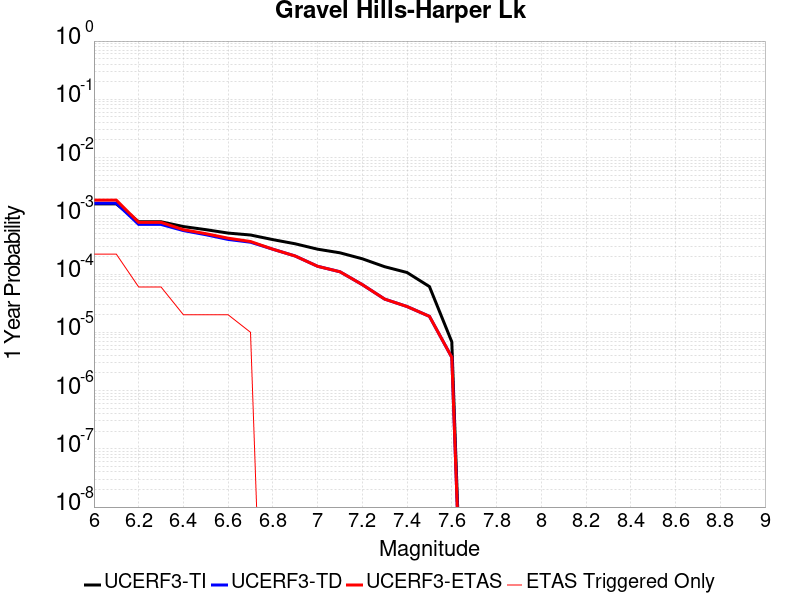 |  |

| Magnitude | 1 wk TI Prob | 1 wk TD Prob | 1 wk ETAS Prob | 1 wk ETAS/TD Gain | 1 wk ETAS Triggered Only | 1 mo TI Prob | 1 mo TD Prob | 1 mo ETAS Prob | 1 mo ETAS/TD Gain | 1 mo ETAS Triggered Only | 1 yr TI Prob | 1 yr TD Prob | 1 yr ETAS Prob | 1 yr ETAS/TD Gain | 1 yr ETAS Triggered Only | 10 yr TI Prob | 10 yr TD Prob | 10 yr ETAS Prob | 10 yr ETAS/TD Gain | 10 yr ETAS Triggered Only |
|-----|-----|-----|-----|-----|-----|-----|-----|-----|-----|-----|-----|-----|-----|-----|-----|-----|-----|-----|-----|-----|
| 6.0 | 3.0679566E-5 | 3.1466803E-5 | 3.1466803E-5 | 1.0 | 0.0 | 1.3147724E-4 | 1.3485197E-4 | 1.3485197E-4 | 1.0 | 0.0 | 0.0015995599 | 0.0016408027 | 0.0016408027 | 1.0 | 0.0 | 0.015880952 | 0.01630845 | 0.016647652 | 1.0207993 | 3.448276E-4 |
| 6.1 | 3.0679566E-5 | 3.1466803E-5 | 3.1466803E-5 | 1.0 | 0.0 | 1.3147724E-4 | 1.3485197E-4 | 1.3485197E-4 | 1.0 | 0.0 | 0.0015995599 | 0.0016408027 | 0.0016408027 | 1.0 | 0.0 | 0.015880952 | 0.01630845 | 0.016647652 | 1.0207993 | 3.448276E-4 |
| 6.2 | 1.514536E-5 | 1.363595E-5 | 1.363595E-5 | 1.0 | 0.0 | 6.490707E-5 | 5.8438545E-5 | 5.8438545E-5 | 1.0 | 0.0 | 7.8995706E-4 | 7.112689E-4 | 7.112689E-4 | 1.0 | 0.0 | 0.007871548 | 0.007091126 | 0.007228079 | 1.0193133 | 1.3793104E-4 |
| 6.3 | 1.514536E-5 | 1.363595E-5 | 1.363595E-5 | 1.0 | 0.0 | 6.490707E-5 | 5.8438545E-5 | 5.8438545E-5 | 1.0 | 0.0 | 7.8995706E-4 | 7.112689E-4 | 7.112689E-4 | 1.0 | 0.0 | 0.007871548 | 0.007091126 | 0.007228079 | 1.0193133 | 1.3793104E-4 |
| 6.4 | 1.2532521E-5 | 1.0690234E-5 | 1.0690234E-5 | 1.0 | 0.0 | 5.37097E-5 | 4.5814515E-5 | 4.5814515E-5 | 1.0 | 0.0 | 6.537194E-4 | 5.576548E-4 | 5.576548E-4 | 1.0 | 0.0 | 0.0065179965 | 0.0055631446 | 0.0057003084 | 1.0246558 | 1.3793104E-4 |
| 6.5 | 1.1094058E-5 | 9.084107E-6 | 9.084107E-6 | 1.0 | 0.0 | 4.7545094E-5 | 3.8931328E-5 | 3.8931328E-5 | 1.0 | 0.0 | 5.787078E-4 | 4.7388987E-4 | 4.7388987E-4 | 1.0 | 0.0 | 0.0057720304 | 0.004729201 | 0.0048664794 | 1.0290279 | 1.3793104E-4 |
| 6.6 | 9.688328E-6 | 7.5320527E-6 | 7.5320527E-6 | 1.0 | 0.0 | 4.1520743E-5 | 3.227984E-5 | 3.227984E-5 | 1.0 | 0.0 | 5.053978E-4 | 3.9293873E-4 | 3.9293873E-4 | 1.0 | 0.0 | 0.0050424994 | 0.003922696 | 0.0039913915 | 1.0175122 | 6.896552E-5 |
| 6.7 | 8.974824E-6 | 6.7497303E-6 | 6.7497303E-6 | 1.0 | 0.0 | 3.8462964E-5 | 2.8927108E-5 | 2.8927108E-5 | 1.0 | 0.0 | 4.6818596E-4 | 3.5213283E-4 | 3.5213283E-4 | 1.0 | 0.0 | 0.004672008 | 0.0035159695 | 0.0035846927 | 1.0195459 | 6.896552E-5 |
| 6.8 | 7.4780046E-6 | 5.1164316E-6 | 5.1164316E-6 | 1.0 | 0.0 | 3.20482E-5 | 2.1927388E-5 | 2.1927388E-5 | 1.0 | 0.0 | 3.9011694E-4 | 2.6693463E-4 | 2.6693463E-4 | 1.0 | 0.0 | 0.0038943281 | 0.0026662783 | 0.0027350597 | 1.0257969 | 6.896552E-5 |
| 6.9 | 6.3409307E-6 | 3.907683E-6 | 3.907683E-6 | 1.0 | 0.0 | 2.7175134E-5 | 1.674711E-5 | 1.674711E-5 | 1.0 | 0.0 | 3.3080703E-4 | 2.0387798E-4 | 2.0387798E-4 | 1.0 | 0.0 | 0.0033031502 | 0.0020370076 | 0.0020370076 | 1.0 | 0.0 |
| 7.0 | 5.1239335E-6 | 2.6059872E-6 | 2.6059872E-6 | 1.0 | 0.0 | 2.195953E-5 | 1.116847E-5 | 1.116847E-5 | 1.0 | 0.0 | 2.6732447E-4 | 1.3596789E-4 | 1.3596789E-4 | 1.0 | 0.0 | 0.0026700313 | 0.0013588723 | 0.0013588723 | 1.0 | 0.0 |
| 7.1 | 4.438899E-6 | 2.0985822E-6 | 2.0985822E-6 | 1.0 | 0.0 | 1.9023713E-5 | 8.993894E-6 | 8.993894E-6 | 1.0 | 0.0 | 2.315891E-4 | 1.0949538E-4 | 1.0949538E-4 | 1.0 | 0.0 | 0.002313479 | 0.0010944362 | 0.0010944362 | 1.0 | 0.0 |
| 7.2 | 3.50367E-6 | 1.2616524E-6 | 1.2616524E-6 | 1.0 | 0.0 | 1.5015643E-5 | 5.407071E-6 | 5.407071E-6 | 1.0 | 0.0 | 1.8280011E-4 | 6.582918E-5 | 6.582918E-5 | 1.0 | 0.0 | 0.0018264982 | 6.5810507E-4 | 6.5810507E-4 | 1.0 | 0.0 |
| 7.3 | 2.561638E-6 | 7.11978E-7 | 7.11978E-7 | 1.0 | 0.0 | 1.0978401E-5 | 3.0513306E-6 | 3.0513306E-6 | 1.0 | 0.0 | 1.3365384E-4 | 3.7149337E-5 | 3.7149337E-5 | 1.0 | 0.0 | 0.0013357349 | 3.7143327E-4 | 3.7143327E-4 | 1.0 | 0.0 |
| 7.4 | 2.0368864E-6 | 5.3053367E-7 | 5.3053367E-7 | 1.0 | 0.0 | 8.729483E-6 | 2.2737138E-6 | 2.2737138E-6 | 1.0 | 0.0 | 1.06276275E-4 | 2.768212E-5 | 2.768212E-5 | 1.0 | 0.0 | 0.0010622547 | 2.7678726E-4 | 2.7678726E-4 | 1.0 | 0.0 |
| 7.5 | 1.1681728E-6 | 3.6033393E-7 | 3.6033393E-7 | 1.0 | 0.0 | 5.0064455E-6 | 1.5442874E-6 | 1.5442874E-6 | 1.0 | 0.0 | 6.0951766E-5 | 1.8801542E-5 | 1.8801542E-5 | 1.0 | 0.0 | 6.093505E-4 | 1.8799998E-4 | 1.8799998E-4 | 1.0 | 0.0 |
| 7.6 | 1.3154387E-7 | 7.12009E-8 | 7.12009E-8 | 1.0 | 0.0 | 5.6375933E-7 | 3.051467E-7 | 3.051467E-7 | 1.0 | 0.0 | 6.863748E-6 | 3.7151563E-6 | 3.7151563E-6 | 1.0 | 0.0 | 6.863536E-5 | 3.7151098E-5 | 3.7151098E-5 | 1.0 | 0.0 |

## Ash Hill
*[(top)](#table-of-contents)*

| 1 Week | 1 Month | 1 Year | 10 Year |
|-----|-----|-----|-----|
|  |  |  |  |

| Magnitude | 1 wk TI Prob | 1 wk TD Prob | 1 wk ETAS Prob | 1 wk ETAS/TD Gain | 1 wk ETAS Triggered Only | 1 mo TI Prob | 1 mo TD Prob | 1 mo ETAS Prob | 1 mo ETAS/TD Gain | 1 mo ETAS Triggered Only | 1 yr TI Prob | 1 yr TD Prob | 1 yr ETAS Prob | 1 yr ETAS/TD Gain | 1 yr ETAS Triggered Only | 10 yr TI Prob | 10 yr TD Prob | 10 yr ETAS Prob | 10 yr ETAS/TD Gain | 10 yr ETAS Triggered Only |
|-----|-----|-----|-----|-----|-----|-----|-----|-----|-----|-----|-----|-----|-----|-----|-----|-----|-----|-----|-----|-----|
| 6.0 | 2.1545662E-5 | 2.3195389E-5 | 2.3195389E-5 | 1.0 | 0.0 | 9.2335285E-5 | 9.940547E-5 | 1.6836413E-4 | 1.6937109 | 6.896552E-5 | 0.0011236023 | 0.0012096697 | 0.0013474339 | 1.1138858 | 1.3793104E-4 | 0.011179381 | 0.012038835 | 0.012379511 | 1.0282981 | 3.448276E-4 |
| 6.1 | 2.1545662E-5 | 2.3195389E-5 | 2.3195389E-5 | 1.0 | 0.0 | 9.2335285E-5 | 9.940547E-5 | 1.6836413E-4 | 1.6937109 | 6.896552E-5 | 0.0011236023 | 0.0012096697 | 0.0013474339 | 1.1138858 | 1.3793104E-4 | 0.011179381 | 0.012038835 | 0.012379511 | 1.0282981 | 3.448276E-4 |
| 6.2 | 2.1545662E-5 | 2.3195389E-5 | 2.3195389E-5 | 1.0 | 0.0 | 9.2335285E-5 | 9.940547E-5 | 1.6836413E-4 | 1.6937109 | 6.896552E-5 | 0.0011236023 | 0.0012096697 | 0.0013474339 | 1.1138858 | 1.3793104E-4 | 0.011179381 | 0.012038835 | 0.012379511 | 1.0282981 | 3.448276E-4 |
| 6.3 | 1.0025529E-5 | 1.0747344E-5 | 1.0747344E-5 | 1.0 | 0.0 | 4.2965847E-5 | 4.605931E-5 | 4.605931E-5 | 1.0 | 0.0 | 5.229836E-4 | 5.6064106E-4 | 6.295679E-4 | 1.1229429 | 6.896552E-5 | 0.005217545 | 0.0055935793 | 0.005662159 | 1.0122604 | 6.896552E-5 |
| 6.4 | 1.0025529E-5 | 1.0747344E-5 | 1.0747344E-5 | 1.0 | 0.0 | 4.2965847E-5 | 4.605931E-5 | 4.605931E-5 | 1.0 | 0.0 | 5.229836E-4 | 5.6064106E-4 | 6.295679E-4 | 1.1229429 | 6.896552E-5 | 0.005217545 | 0.0055935793 | 0.005662159 | 1.0122604 | 6.896552E-5 |
| 6.5 | 6.9617327E-6 | 7.4569152E-6 | 7.4569152E-6 | 1.0 | 0.0 | 2.9835655E-5 | 3.1957865E-5 | 3.1957865E-5 | 1.0 | 0.0 | 3.6318856E-4 | 3.8902622E-4 | 3.8902622E-4 | 1.0 | 0.0 | 0.0036259557 | 0.0038843066 | 0.0038843066 | 1.0 | 0.0 |
| 6.6 | 4.9919777E-6 | 5.34689E-6 | 5.34689E-6 | 1.0 | 0.0 | 2.1394015E-5 | 2.291508E-5 | 2.291508E-5 | 1.0 | 0.0 | 2.60441E-4 | 2.7896208E-4 | 2.7896208E-4 | 1.0 | 0.0 | 0.0026013597 | 0.0027867774 | 0.0027867774 | 1.0 | 0.0 |
| 6.7 | 3.6630722E-6 | 3.9247725E-6 | 3.9247725E-6 | 1.0 | 0.0 | 1.5698786E-5 | 1.6820377E-5 | 1.6820377E-5 | 1.0 | 0.0 | 1.9111596E-4 | 2.0477458E-4 | 2.0477458E-4 | 1.0 | 0.0 | 0.0019095168 | 0.002046422 | 0.002046422 | 1.0 | 0.0 |
| 6.8 | 2.5599613E-6 | 2.7450303E-6 | 2.7450303E-6 | 1.0 | 0.0 | 1.0971216E-5 | 1.176439E-5 | 1.176439E-5 | 1.0 | 0.0 | 1.3356637E-4 | 1.4322698E-4 | 1.4322698E-4 | 1.0 | 0.0 | 0.0013348613 | 0.0014318317 | 0.0014318317 | 1.0 | 0.0 |
| 6.9 | 1.7684905E-6 | 1.8969438E-6 | 1.8969438E-6 | 1.0 | 0.0 | 7.579223E-6 | 8.129759E-6 | 8.129759E-6 | 1.0 | 0.0 | 9.2273134E-5 | 9.897981E-5 | 9.897981E-5 | 1.0 | 0.0 | 9.223483E-4 | 9.897981E-4 | 9.897981E-4 | 1.0 | 0.0 |

## So Sierra Nevada
*[(top)](#table-of-contents)*

| 1 Week | 1 Month | 1 Year | 10 Year |
|-----|-----|-----|-----|
|  |  |  |  |

| Magnitude | 1 wk TI Prob | 1 wk TD Prob | 1 wk ETAS Prob | 1 wk ETAS/TD Gain | 1 wk ETAS Triggered Only | 1 mo TI Prob | 1 mo TD Prob | 1 mo ETAS Prob | 1 mo ETAS/TD Gain | 1 mo ETAS Triggered Only | 1 yr TI Prob | 1 yr TD Prob | 1 yr ETAS Prob | 1 yr ETAS/TD Gain | 1 yr ETAS Triggered Only | 10 yr TI Prob | 10 yr TD Prob | 10 yr ETAS Prob | 10 yr ETAS/TD Gain | 10 yr ETAS Triggered Only |
|-----|-----|-----|-----|-----|-----|-----|-----|-----|-----|-----|-----|-----|-----|-----|-----|-----|-----|-----|-----|-----|
| 6.0 | 1.15488665E-5 | 1.1079958E-5 | 1.1079958E-5 | 1.0 | 0.0 | 4.9494203E-5 | 4.7484744E-5 | 4.7484744E-5 | 1.0 | 0.0 | 6.024253E-4 | 5.779862E-4 | 7.8476314E-4 | 1.3577542 | 2.0689656E-4 | 0.006007948 | 0.0057660984 | 0.0060403696 | 1.0475662 | 2.7586208E-4 |
| 6.1 | 1.15488665E-5 | 1.1079958E-5 | 1.1079958E-5 | 1.0 | 0.0 | 4.9494203E-5 | 4.7484744E-5 | 4.7484744E-5 | 1.0 | 0.0 | 6.024253E-4 | 5.779862E-4 | 7.8476314E-4 | 1.3577542 | 2.0689656E-4 | 0.006007948 | 0.0057660984 | 0.0060403696 | 1.0475662 | 2.7586208E-4 |
| 6.2 | 1.15488665E-5 | 1.1079958E-5 | 1.1079958E-5 | 1.0 | 0.0 | 4.9494203E-5 | 4.7484744E-5 | 4.7484744E-5 | 1.0 | 0.0 | 6.024253E-4 | 5.779862E-4 | 7.8476314E-4 | 1.3577542 | 2.0689656E-4 | 0.006007948 | 0.0057660984 | 0.0060403696 | 1.0475662 | 2.7586208E-4 |
| 6.3 | 1.15488665E-5 | 1.1079958E-5 | 1.1079958E-5 | 1.0 | 0.0 | 4.9494203E-5 | 4.7484744E-5 | 4.7484744E-5 | 1.0 | 0.0 | 6.024253E-4 | 5.779862E-4 | 7.8476314E-4 | 1.3577542 | 2.0689656E-4 | 0.006007948 | 0.0057660984 | 0.0060403696 | 1.0475662 | 2.7586208E-4 |
| 6.4 | 1.15488665E-5 | 1.1079958E-5 | 1.1079958E-5 | 1.0 | 0.0 | 4.9494203E-5 | 4.7484744E-5 | 4.7484744E-5 | 1.0 | 0.0 | 6.024253E-4 | 5.779862E-4 | 7.8476314E-4 | 1.3577542 | 2.0689656E-4 | 0.006007948 | 0.0057660984 | 0.0060403696 | 1.0475662 | 2.7586208E-4 |
| 6.5 | 1.15488665E-5 | 1.1079958E-5 | 1.1079958E-5 | 1.0 | 0.0 | 4.9494203E-5 | 4.7484744E-5 | 4.7484744E-5 | 1.0 | 0.0 | 6.024253E-4 | 5.779862E-4 | 7.8476314E-4 | 1.3577542 | 2.0689656E-4 | 0.006007948 | 0.0057660984 | 0.0060403696 | 1.0475662 | 2.7586208E-4 |
| 6.6 | 7.587044E-6 | 6.9358503E-6 | 6.9358503E-6 | 1.0 | 0.0 | 3.2515498E-5 | 2.972475E-5 | 2.972475E-5 | 1.0 | 0.0 | 3.9580427E-4 | 3.6184167E-4 | 4.997228E-4 | 1.3810538 | 1.3793104E-4 | 0.003951 | 0.0036128166 | 0.0038189657 | 1.0570605 | 2.0689656E-4 |
| 6.7 | 7.587044E-6 | 6.9358503E-6 | 6.9358503E-6 | 1.0 | 0.0 | 3.2515498E-5 | 2.972475E-5 | 2.972475E-5 | 1.0 | 0.0 | 3.9580427E-4 | 3.6184167E-4 | 4.997228E-4 | 1.3810538 | 1.3793104E-4 | 0.003951 | 0.0036128166 | 0.0038189657 | 1.0570605 | 2.0689656E-4 |
| 6.8 | 5.9026956E-6 | 5.179568E-6 | 5.179568E-6 | 1.0 | 0.0 | 2.5297022E-5 | 2.2197966E-5 | 2.2197966E-5 | 1.0 | 0.0 | 3.0794772E-4 | 2.7022787E-4 | 4.0812165E-4 | 1.5102869 | 1.3793104E-4 | 0.0030752132 | 0.0026991093 | 0.0029054473 | 1.0764468 | 2.0689656E-4 |
| 6.9 | 5.0118915E-6 | 4.2525808E-6 | 4.2525808E-6 | 1.0 | 0.0 | 2.1479358E-5 | 1.8225222E-5 | 1.8225222E-5 | 1.0 | 0.0 | 2.614798E-4 | 2.2187021E-4 | 3.5977064E-4 | 1.6215365 | 1.3793104E-4 | 0.0026117235 | 0.0022165596 | 0.0024229975 | 1.0931344 | 2.0689656E-4 |
| 7.0 | 4.4924795E-6 | 3.7140621E-6 | 3.7140621E-6 | 1.0 | 0.0 | 1.925334E-5 | 1.5917316E-5 | 1.5917316E-5 | 1.0 | 0.0 | 2.3438422E-4 | 1.9377672E-4 | 2.6272886E-4 | 1.355833 | 6.896552E-5 | 0.0023413717 | 0.0019361405 | 0.0020738044 | 1.0711023 | 1.3793104E-4 |
| 7.1 | 3.9118436E-6 | 3.1121094E-6 | 3.1121094E-6 | 1.0 | 0.0 | 1.6764936E-5 | 1.3337547E-5 | 1.3337547E-5 | 1.0 | 0.0 | 2.0409399E-4 | 1.6237311E-4 | 2.3132742E-4 | 1.4246659 | 6.896552E-5 | 0.0020390663 | 0.0016226007 | 0.0016914543 | 1.0424341 | 6.896552E-5 |
| 7.2 | 3.4200818E-6 | 2.605576E-6 | 2.605576E-6 | 1.0 | 0.0 | 1.4657411E-5 | 1.116671E-5 | 1.116671E-5 | 1.0 | 0.0 | 1.7843937E-4 | 1.3594671E-4 | 2.0490286E-4 | 1.5072292 | 6.896552E-5 | 0.0017829615 | 0.0013586852 | 0.001427557 | 1.05069 | 6.896552E-5 |
| 7.3 | 2.6593618E-6 | 1.8285265E-6 | 1.8285265E-6 | 1.0 | 0.0 | 1.13972155E-5 | 7.83652E-6 | 7.83652E-6 | 1.0 | 0.0 | 1.3875226E-4 | 9.5405754E-5 | 1.6436468E-4 | 1.7227964 | 6.896552E-5 | 0.0013866565 | 9.536769E-4 | 0.0010225766 | 1.0722464 | 6.896552E-5 |
| 7.4 | 2.2577992E-6 | 1.436535E-6 | 1.436535E-6 | 1.0 | 0.0 | 9.676246E-6 | 6.156565E-6 | 6.156565E-6 | 1.0 | 0.0 | 1.1780193E-4 | 7.495386E-5 | 1.439142E-4 | 1.9200374 | 6.896552E-5 | 0.001177395 | 7.493108E-4 | 8.182246E-4 | 1.0919696 | 6.896552E-5 |
| 7.5 | 1.489319E-6 | 7.354697E-7 | 7.354697E-7 | 1.0 | 0.0 | 6.3827797E-6 | 3.1520092E-6 | 3.1520092E-6 | 1.0 | 0.0 | 7.770758E-5 | 3.837504E-5 | 3.837504E-5 | 1.0 | 0.0 | 7.7680405E-4 | 3.836846E-4 | 3.836846E-4 | 1.0 | 0.0 |
| 7.6 | 1.0680322E-6 | 4.6602182E-7 | 4.6602182E-7 | 1.0 | 0.0 | 4.577273E-6 | 1.997235E-6 | 1.997235E-6 | 1.0 | 0.0 | 5.5726876E-5 | 2.4316065E-5 | 2.4316065E-5 | 1.0 | 0.0 | 5.5712904E-4 | 2.431343E-4 | 2.431343E-4 | 1.0 | 0.0 |
| 7.7 | 5.509146E-7 | 1.558334E-7 | 1.558334E-7 | 1.0 | 0.0 | 2.3610605E-6 | 6.678573E-7 | 6.678573E-7 | 1.0 | 0.0 | 2.8745531E-5 | 8.131134E-6 | 8.131134E-6 | 1.0 | 0.0 | 2.8741814E-4 | 8.130848E-5 | 8.130848E-5 | 1.0 | 0.0 |

## Goldstone Lake
*[(top)](#table-of-contents)*

| 1 Week | 1 Month | 1 Year | 10 Year |
|-----|-----|-----|-----|
|  |  |  |  |

| Magnitude | 1 wk TI Prob | 1 wk TD Prob | 1 wk ETAS Prob | 1 wk ETAS/TD Gain | 1 wk ETAS Triggered Only | 1 mo TI Prob | 1 mo TD Prob | 1 mo ETAS Prob | 1 mo ETAS/TD Gain | 1 mo ETAS Triggered Only | 1 yr TI Prob | 1 yr TD Prob | 1 yr ETAS Prob | 1 yr ETAS/TD Gain | 1 yr ETAS Triggered Only | 10 yr TI Prob | 10 yr TD Prob | 10 yr ETAS Prob | 10 yr ETAS/TD Gain | 10 yr ETAS Triggered Only |
|-----|-----|-----|-----|-----|-----|-----|-----|-----|-----|-----|-----|-----|-----|-----|-----|-----|-----|-----|-----|-----|
| 6.0 | 2.671352E-5 | 3.0378242E-5 | 9.934166E-5 | 3.2701583 | 6.896552E-5 | 1.1448149E-4 | 1.3018708E-4 | 1.9914361E-4 | 1.5296726 | 6.896552E-5 | 0.001392921 | 0.0015840717 | 0.0017217842 | 1.0869358 | 1.3793104E-4 | 0.013842222 | 0.015747305 | 0.015950942 | 1.0129316 | 2.0689656E-4 |
| 6.1 | 2.671352E-5 | 3.0378242E-5 | 9.934166E-5 | 3.2701583 | 6.896552E-5 | 1.1448149E-4 | 1.3018708E-4 | 1.9914361E-4 | 1.5296726 | 6.896552E-5 | 0.001392921 | 0.0015840717 | 0.0017217842 | 1.0869358 | 1.3793104E-4 | 0.013842222 | 0.015747305 | 0.015950942 | 1.0129316 | 2.0689656E-4 |
| 6.2 | 1.4197047E-5 | 1.6097329E-5 | 8.5061736E-5 | 5.284214 | 6.896552E-5 | 6.0843064E-5 | 6.898728E-5 | 1.3794805E-4 | 1.9996154 | 6.896552E-5 | 7.4051257E-4 | 8.396952E-4 | 9.086028E-4 | 1.0820626 | 6.896552E-5 | 0.007380498 | 0.008374922 | 0.008511698 | 1.0163316 | 1.3793104E-4 |
| 6.3 | 1.4197047E-5 | 1.6097329E-5 | 8.5061736E-5 | 5.284214 | 6.896552E-5 | 6.0843064E-5 | 6.898728E-5 | 1.3794805E-4 | 1.9996154 | 6.896552E-5 | 7.4051257E-4 | 8.396952E-4 | 9.086028E-4 | 1.0820626 | 6.896552E-5 | 0.007380498 | 0.008374922 | 0.008511698 | 1.0163316 | 1.3793104E-4 |
| 6.4 | 1.3238931E-5 | 1.5009467E-5 | 8.397395E-5 | 5.5947323 | 6.896552E-5 | 5.6737044E-5 | 6.432525E-5 | 1.3328633E-4 | 2.0720687 | 6.896552E-5 | 6.9055456E-4 | 7.829765E-4 | 8.5188803E-4 | 1.0880122 | 6.896552E-5 | 0.006884126 | 0.007811806 | 0.007948659 | 1.0175188 | 1.3793104E-4 |
| 6.5 | 1.3238931E-5 | 1.5009467E-5 | 8.397395E-5 | 5.5947323 | 6.896552E-5 | 5.6737044E-5 | 6.432525E-5 | 1.3328633E-4 | 2.0720687 | 6.896552E-5 | 6.9055456E-4 | 7.829765E-4 | 8.5188803E-4 | 1.0880122 | 6.896552E-5 | 0.006884126 | 0.007811806 | 0.007948659 | 1.0175188 | 1.3793104E-4 |
| 6.6 | 1.1328278E-5 | 1.2856027E-5 | 8.182066E-5 | 6.3643813 | 6.896552E-5 | 4.8548856E-5 | 5.5096636E-5 | 1.2405835E-4 | 2.2516503 | 6.896552E-5 | 5.90922E-4 | 6.706908E-4 | 7.3961006E-4 | 1.1027586 | 6.896552E-5 | 0.0058935313 | 0.0066960566 | 0.006833064 | 1.020461 | 1.3793104E-4 |
| 6.7 | 8.651175E-6 | 9.825214E-6 | 9.825214E-6 | 1.0 | 0.0 | 3.707594E-5 | 4.2107888E-5 | 4.2107888E-5 | 1.0 | 0.0 | 4.5130608E-4 | 5.1263353E-4 | 5.1263353E-4 | 1.0 | 0.0 | 0.0045039062 | 0.0051233894 | 0.005192002 | 1.013392 | 6.896552E-5 |
| 6.8 | 1.0215377E-6 | 1.1755062E-6 | 1.1755062E-6 | 1.0 | 0.0 | 4.378012E-6 | 5.037875E-6 | 5.037875E-6 | 1.0 | 0.0 | 5.3300988E-5 | 6.133451E-5 | 6.133451E-5 | 1.0 | 0.0 | 5.3288206E-4 | 6.131871E-4 | 6.131871E-4 | 1.0 | 0.0 |
| 6.9 | 7.9360774E-7 | 9.2836456E-7 | 9.2836456E-7 | 1.0 | 0.0 | 3.4011714E-6 | 3.9786996E-6 | 3.9786996E-6 | 1.0 | 0.0 | 4.1408475E-5 | 4.8439662E-5 | 4.8439662E-5 | 1.0 | 0.0 | 4.140076E-4 | 4.8429804E-4 | 4.8429804E-4 | 1.0 | 0.0 |
| 7.0 | 7.4382757E-7 | 8.747556E-7 | 8.747556E-7 | 1.0 | 0.0 | 3.1878285E-6 | 3.7489476E-6 | 3.7489476E-6 | 1.0 | 0.0 | 3.8811122E-5 | 4.5642548E-5 | 4.5642548E-5 | 1.0 | 0.0 | 3.8804344E-4 | 4.5633837E-4 | 4.5633837E-4 | 1.0 | 0.0 |
| 7.1 | 6.4709513E-7 | 7.7114885E-7 | 7.7114885E-7 | 1.0 | 0.0 | 2.773262E-6 | 3.3049198E-6 | 3.3049198E-6 | 1.0 | 0.0 | 3.376394E-5 | 4.0236715E-5 | 4.0236715E-5 | 1.0 | 0.0 | 3.375881E-4 | 4.0230027E-4 | 4.0230027E-4 | 1.0 | 0.0 |
| 7.2 | 6.356704E-7 | 7.588543E-7 | 7.588543E-7 | 1.0 | 0.0 | 2.7242988E-6 | 3.2522291E-6 | 3.2522291E-6 | 1.0 | 0.0 | 3.3167835E-5 | 3.959523E-5 | 3.959523E-5 | 1.0 | 0.0 | 3.3162883E-4 | 3.9588768E-4 | 3.9588768E-4 | 1.0 | 0.0 |
| 7.3 | 5.7695723E-7 | 6.8967347E-7 | 6.8967347E-7 | 1.0 | 0.0 | 2.4726714E-6 | 2.9557402E-6 | 2.9557402E-6 | 1.0 | 0.0 | 3.0104358E-5 | 3.5985602E-5 | 3.5985602E-5 | 1.0 | 0.0 | 3.0100282E-4 | 3.5980347E-4 | 3.5980347E-4 | 1.0 | 0.0 |
| 7.4 | 5.209647E-7 | 6.1936566E-7 | 6.1936566E-7 | 1.0 | 0.0 | 2.232704E-6 | 2.654422E-6 | 2.654422E-6 | 1.0 | 0.0 | 2.718283E-5 | 3.2317163E-5 | 3.2317163E-5 | 1.0 | 0.0 | 2.7179506E-4 | 3.231302E-4 | 3.231302E-4 | 1.0 | 0.0 |
| 7.5 | 4.512955E-7 | 5.3490027E-7 | 5.3490027E-7 | 1.0 | 0.0 | 1.934122E-6 | 2.292428E-6 | 2.292428E-6 | 1.0 | 0.0 | 2.3547682E-5 | 2.7910008E-5 | 2.7910008E-5 | 1.0 | 0.0 | 2.3545188E-4 | 2.7907031E-4 | 2.7907031E-4 | 1.0 | 0.0 |
| 7.6 | 2.21172E-7 | 2.6040124E-7 | 2.6040124E-7 | 1.0 | 0.0 | 9.478797E-7 | 1.116005E-6 | 1.116005E-6 | 1.0 | 0.0 | 1.1540374E-5 | 1.3587305E-5 | 1.3587305E-5 | 1.0 | 0.0 | 1.1539775E-4 | 1.3586757E-4 | 1.3586757E-4 | 1.0 | 0.0 |

## Death Valley (So)
*[(top)](#table-of-contents)*

| 1 Week | 1 Month | 1 Year | 10 Year |
|-----|-----|-----|-----|
|  |  |  |  |

| Magnitude | 1 wk TI Prob | 1 wk TD Prob | 1 wk ETAS Prob | 1 wk ETAS/TD Gain | 1 wk ETAS Triggered Only | 1 mo TI Prob | 1 mo TD Prob | 1 mo ETAS Prob | 1 mo ETAS/TD Gain | 1 mo ETAS Triggered Only | 1 yr TI Prob | 1 yr TD Prob | 1 yr ETAS Prob | 1 yr ETAS/TD Gain | 1 yr ETAS Triggered Only | 10 yr TI Prob | 10 yr TD Prob | 10 yr ETAS Prob | 10 yr ETAS/TD Gain | 10 yr ETAS Triggered Only |
|-----|-----|-----|-----|-----|-----|-----|-----|-----|-----|-----|-----|-----|-----|-----|-----|-----|-----|-----|-----|-----|
| 6.0 | 2.0684236E-5 | 2.562036E-5 | 9.458411E-5 | 3.6917555 | 6.896552E-5 | 8.864371E-5 | 1.0979702E-4 | 1.7875497E-4 | 1.6280494 | 6.896552E-5 | 0.0010787029 | 0.0013359758 | 0.0014737226 | 1.1031058 | 1.3793104E-4 | 0.010734817 | 0.013282726 | 0.013418824 | 1.0102463 | 1.3793104E-4 |
| 6.1 | 2.0684236E-5 | 2.562036E-5 | 9.458411E-5 | 3.6917555 | 6.896552E-5 | 8.864371E-5 | 1.0979702E-4 | 1.7875497E-4 | 1.6280494 | 6.896552E-5 | 0.0010787029 | 0.0013359758 | 0.0014737226 | 1.1031058 | 1.3793104E-4 | 0.010734817 | 0.013282726 | 0.013418824 | 1.0102463 | 1.3793104E-4 |
| 6.2 | 2.0684236E-5 | 2.562036E-5 | 9.458411E-5 | 3.6917555 | 6.896552E-5 | 8.864371E-5 | 1.0979702E-4 | 1.7875497E-4 | 1.6280494 | 6.896552E-5 | 0.0010787029 | 0.0013359758 | 0.0014737226 | 1.1031058 | 1.3793104E-4 | 0.010734817 | 0.013282726 | 0.013418824 | 1.0102463 | 1.3793104E-4 |
| 6.3 | 2.0240292E-5 | 2.5120411E-5 | 9.408419E-5 | 3.7453287 | 6.896552E-5 | 8.6741224E-5 | 1.0765456E-4 | 1.7661265E-4 | 1.6405497 | 6.896552E-5 | 0.0010555626 | 0.0013099229 | 0.0014476733 | 1.1051592 | 1.3793104E-4 | 0.010505628 | 0.013025268 | 0.013161402 | 1.0104516 | 1.3793104E-4 |
| 6.4 | 2.0240292E-5 | 2.5120411E-5 | 9.408419E-5 | 3.7453287 | 6.896552E-5 | 8.6741224E-5 | 1.0765456E-4 | 1.7661265E-4 | 1.6405497 | 6.896552E-5 | 0.0010555626 | 0.0013099229 | 0.0014476733 | 1.1051592 | 1.3793104E-4 | 0.010505628 | 0.013025268 | 0.013161402 | 1.0104516 | 1.3793104E-4 |
| 6.5 | 1.9962767E-5 | 2.4809646E-5 | 9.377345E-5 | 3.7797177 | 6.896552E-5 | 8.55519E-5 | 1.0632281E-4 | 1.7528099E-4 | 1.6485738 | 6.896552E-5 | 0.0010410968 | 0.0012937282 | 0.0014314809 | 1.1064773 | 1.3793104E-4 | 0.010362327 | 0.012865204 | 0.013001361 | 1.0105833 | 1.3793104E-4 |
| 6.6 | 1.8937297E-5 | 2.331338E-5 | 9.227729E-5 | 3.9581258 | 6.896552E-5 | 8.115732E-5 | 9.991074E-5 | 1.6886937E-4 | 1.6902024 | 6.896552E-5 | 9.876423E-4 | 0.0012157491 | 0.0013535124 | 1.1133156 | 1.3793104E-4 | 0.009832645 | 0.012094032 | 0.012230295 | 1.011267 | 1.3793104E-4 |
| 6.7 | 1.8621096E-5 | 2.2913995E-5 | 9.187793E-5 | 4.0096865 | 6.896552E-5 | 7.980225E-5 | 9.819922E-5 | 1.6715797E-4 | 1.7022331 | 6.896552E-5 | 9.711593E-4 | 0.0011949344 | 0.0013327005 | 1.1152918 | 1.3793104E-4 | 0.009669261 | 0.011888134 | 0.012024426 | 1.0114645 | 1.3793104E-4 |
| 6.8 | 1.7830353E-5 | 2.1807928E-5 | 9.077194E-5 | 4.162337 | 6.896552E-5 | 7.641356E-5 | 9.3459275E-5 | 1.6241835E-4 | 1.7378515 | 6.896552E-5 | 9.29938E-4 | 0.0011372868 | 0.0012750609 | 1.1211429 | 1.3793104E-4 | 0.009260561 | 0.011317508 | 0.011453878 | 1.0120494 | 1.3793104E-4 |
| 6.9 | 1.3135183E-5 | 1.530519E-5 | 8.426965E-5 | 5.5059524 | 6.896552E-5 | 5.6292425E-5 | 6.559206E-5 | 1.3455305E-4 | 2.0513618 | 6.896552E-5 | 6.8514474E-4 | 7.9829723E-4 | 8.6720765E-4 | 1.0863218 | 6.896552E-5 | 0.006830362 | 0.007955303 | 0.00802372 | 1.0086001 | 6.896552E-5 |
| 7.0 | 1.1507512E-5 | 1.3155178E-5 | 8.211979E-5 | 6.242393 | 6.896552E-5 | 4.9316975E-5 | 5.6378147E-5 | 1.2533978E-4 | 2.223198 | 6.896552E-5 | 6.002687E-4 | 6.861935E-4 | 7.5511175E-4 | 1.1004355 | 6.896552E-5 | 0.0059864987 | 0.0068414486 | 0.0069099423 | 1.0100116 | 6.896552E-5 |
| 7.1 | 9.715903E-6 | 1.08659815E-5 | 1.08659815E-5 | 1.0 | 0.0 | 4.1638916E-5 | 4.6567682E-5 | 4.6567682E-5 | 1.0 | 0.0 | 5.068359E-4 | 5.6681834E-4 | 5.6681834E-4 | 1.0 | 0.0 | 0.0050568148 | 0.0056541795 | 0.0056541795 | 1.0 | 0.0 |
| 7.2 | 9.233269E-6 | 1.0286961E-5 | 1.0286961E-5 | 1.0 | 0.0 | 3.9570554E-5 | 4.4086253E-5 | 4.4086253E-5 | 1.0 | 0.0 | 4.81665E-4 | 5.366222E-4 | 5.366222E-4 | 1.0 | 0.0 | 0.0048062233 | 0.0053536952 | 0.0053536952 | 1.0 | 0.0 |
| 7.3 | 8.8041315E-6 | 9.80876E-6 | 9.80876E-6 | 1.0 | 0.0 | 3.7731446E-5 | 4.203689E-5 | 4.203689E-5 | 1.0 | 0.0 | 4.592835E-4 | 5.116832E-4 | 5.116832E-4 | 1.0 | 0.0 | 0.0045833546 | 0.005105477 | 0.005105477 | 1.0 | 0.0 |
| 7.4 | 8.708749E-6 | 9.707768E-6 | 9.707768E-6 | 1.0 | 0.0 | 3.7322676E-5 | 4.1604082E-5 | 4.1604082E-5 | 1.0 | 0.0 | 4.5430884E-4 | 5.0641614E-4 | 5.0641614E-4 | 1.0 | 0.0 | 0.004533812 | 0.0050530476 | 0.0050530476 | 1.0 | 0.0 |
| 7.5 | 8.612678E-6 | 9.605406E-6 | 9.605406E-6 | 1.0 | 0.0 | 3.6910955E-5 | 4.1165404E-5 | 4.1165404E-5 | 1.0 | 0.0 | 4.492982E-4 | 5.0107774E-4 | 5.0107774E-4 | 1.0 | 0.0 | 0.004483909 | 0.004999905 | 0.004999905 | 1.0 | 0.0 |
| 7.6 | 8.319024E-6 | 9.28449E-6 | 9.28449E-6 | 1.0 | 0.0 | 3.5652476E-5 | 3.9790088E-5 | 3.9790088E-5 | 1.0 | 0.0 | 4.3398244E-4 | 4.8434082E-4 | 4.8434082E-4 | 1.0 | 0.0 | 0.0043313587 | 0.0048332764 | 0.0048332764 | 1.0 | 0.0 |
| 7.7 | 7.4718328E-6 | 8.345689E-6 | 8.345689E-6 | 1.0 | 0.0 | 3.2021748E-5 | 3.576677E-5 | 3.576677E-5 | 1.0 | 0.0 | 3.8979502E-4 | 4.3537747E-4 | 4.3537747E-4 | 1.0 | 0.0 | 0.00389112 | 0.0043456503 | 0.0043456503 | 1.0 | 0.0 |
| 7.8 | 3.4586725E-7 | 3.648368E-7 | 3.648368E-7 | 1.0 | 0.0 | 1.4822873E-6 | 1.5635853E-6 | 1.5635853E-6 | 1.0 | 0.0 | 1.80467E-5 | 1.903649E-5 | 1.903649E-5 | 1.0 | 0.0 | 1.8045233E-4 | 1.9034903E-4 | 1.9034903E-4 | 1.0 | 0.0 |
| 7.9 | 2.5591178E-9 | 2.6697329E-9 | 2.6697329E-9 | 1.0 | 0.0 | 1.0967647E-8 | 1.14417125E-8 | 1.14417125E-8 | 1.0 | 0.0 | 1.335311E-7 | 1.3930286E-7 | 1.3930286E-7 | 1.0 | 0.0 | 1.3353102E-6 | 1.3930285E-6 | 1.3930285E-6 | 1.0 | 0.0 |

## Sierra Nevada  (No Extension)
*[(top)](#table-of-contents)*

| 1 Week | 1 Month | 1 Year | 10 Year |
|-----|-----|-----|-----|
|  |  |  | 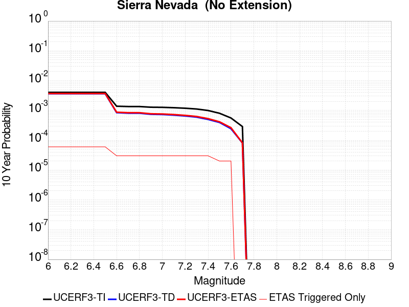 |

| Magnitude | 1 wk TI Prob | 1 wk TD Prob | 1 wk ETAS Prob | 1 wk ETAS/TD Gain | 1 wk ETAS Triggered Only | 1 mo TI Prob | 1 mo TD Prob | 1 mo ETAS Prob | 1 mo ETAS/TD Gain | 1 mo ETAS Triggered Only | 1 yr TI Prob | 1 yr TD Prob | 1 yr ETAS Prob | 1 yr ETAS/TD Gain | 1 yr ETAS Triggered Only | 10 yr TI Prob | 10 yr TD Prob | 10 yr ETAS Prob | 10 yr ETAS/TD Gain | 10 yr ETAS Triggered Only |
|-----|-----|-----|-----|-----|-----|-----|-----|-----|-----|-----|-----|-----|-----|-----|-----|-----|-----|-----|-----|-----|
| 6.0 | 7.7690465E-6 | 6.976568E-6 | 6.976568E-6 | 1.0 | 0.0 | 3.329549E-5 | 2.9899435E-5 | 9.886289E-5 | 3.3065135 | 6.896552E-5 | 4.0529718E-4 | 3.6400068E-4 | 5.0188147E-4 | 1.3787928 | 1.3793104E-4 | 0.004045588 | 0.0036375606 | 0.00377499 | 1.0377806 | 1.3793104E-4 |
| 6.1 | 7.7690465E-6 | 6.976568E-6 | 6.976568E-6 | 1.0 | 0.0 | 3.329549E-5 | 2.9899435E-5 | 9.886289E-5 | 3.3065135 | 6.896552E-5 | 4.0529718E-4 | 3.6400068E-4 | 5.0188147E-4 | 1.3787928 | 1.3793104E-4 | 0.004045588 | 0.0036375606 | 0.00377499 | 1.0377806 | 1.3793104E-4 |
| 6.2 | 7.7690465E-6 | 6.976568E-6 | 6.976568E-6 | 1.0 | 0.0 | 3.329549E-5 | 2.9899435E-5 | 9.886289E-5 | 3.3065135 | 6.896552E-5 | 4.0529718E-4 | 3.6400068E-4 | 5.0188147E-4 | 1.3787928 | 1.3793104E-4 | 0.004045588 | 0.0036375606 | 0.00377499 | 1.0377806 | 1.3793104E-4 |
| 6.3 | 7.7690465E-6 | 6.976568E-6 | 6.976568E-6 | 1.0 | 0.0 | 3.329549E-5 | 2.9899435E-5 | 9.886289E-5 | 3.3065135 | 6.896552E-5 | 4.0529718E-4 | 3.6400068E-4 | 5.0188147E-4 | 1.3787928 | 1.3793104E-4 | 0.004045588 | 0.0036375606 | 0.00377499 | 1.0377806 | 1.3793104E-4 |
| 6.4 | 7.7690465E-6 | 6.976568E-6 | 6.976568E-6 | 1.0 | 0.0 | 3.329549E-5 | 2.9899435E-5 | 9.886289E-5 | 3.3065135 | 6.896552E-5 | 4.0529718E-4 | 3.6400068E-4 | 5.0188147E-4 | 1.3787928 | 1.3793104E-4 | 0.004045588 | 0.0036375606 | 0.00377499 | 1.0377806 | 1.3793104E-4 |
| 6.5 | 7.7690465E-6 | 6.976568E-6 | 6.976568E-6 | 1.0 | 0.0 | 3.329549E-5 | 2.9899435E-5 | 9.886289E-5 | 3.3065135 | 6.896552E-5 | 4.0529718E-4 | 3.6400068E-4 | 5.0188147E-4 | 1.3787928 | 1.3793104E-4 | 0.004045588 | 0.0036375606 | 0.00377499 | 1.0377806 | 1.3793104E-4 |
| 6.6 | 2.653E-6 | 1.6149635E-6 | 1.6149635E-6 | 1.0 | 0.0 | 1.136995E-5 | 6.9212538E-6 | 6.9212538E-6 | 1.0 | 0.0 | 1.3842035E-4 | 8.426304E-5 | 1.5322275E-4 | 1.8183862 | 6.896552E-5 | 0.0013833415 | 8.4231433E-4 | 9.112218E-4 | 1.0818073 | 6.896552E-5 |
| 6.7 | 2.5902466E-6 | 1.5502959E-6 | 1.5502959E-6 | 1.0 | 0.0 | 1.11010095E-5 | 6.644109E-6 | 6.644109E-6 | 1.0 | 0.0 | 1.351464E-4 | 8.0889055E-5 | 1.4984899E-4 | 1.852525 | 6.896552E-5 | 0.0013506424 | 8.0859906E-4 | 8.7750884E-4 | 1.0852212 | 6.896552E-5 |
| 6.8 | 2.5853892E-6 | 1.5470957E-6 | 1.5470957E-6 | 1.0 | 0.0 | 1.1080193E-5 | 6.6303933E-6 | 6.6303933E-6 | 1.0 | 0.0 | 1.34893E-4 | 8.072208E-5 | 1.4968203E-4 | 1.8542886 | 6.896552E-5 | 0.0013481114 | 8.069306E-4 | 8.7584043E-4 | 1.0853975 | 6.896552E-5 |
| 6.9 | 2.458257E-6 | 1.4221675E-6 | 1.4221675E-6 | 1.0 | 0.0 | 1.0535345E-5 | 6.0949897E-6 | 6.0949897E-6 | 1.0 | 0.0 | 1.2826028E-4 | 7.420399E-5 | 1.4316439E-4 | 1.9293355 | 6.896552E-5 | 0.0012818627 | 7.4179407E-4 | 8.1070844E-4 | 1.0929023 | 6.896552E-5 |
| 7.0 | 2.4341468E-6 | 1.3991308E-6 | 1.3991308E-6 | 1.0 | 0.0 | 1.0432016E-5 | 5.9962613E-6 | 5.9962613E-6 | 1.0 | 0.0 | 1.270024E-4 | 7.3002055E-5 | 1.4196253E-4 | 1.9446375 | 6.896552E-5 | 0.0012692984 | 7.297827E-4 | 7.986979E-4 | 1.0944325 | 6.896552E-5 |
| 7.1 | 2.3652476E-6 | 1.334079E-6 | 1.334079E-6 | 1.0 | 0.0 | 1.0136736E-5 | 5.717469E-6 | 5.717469E-6 | 1.0 | 0.0 | 1.2340778E-4 | 6.960797E-5 | 1.3856869E-4 | 1.9907013 | 6.896552E-5 | 0.0012333926 | 6.9586345E-4 | 7.6478097E-4 | 1.0990388 | 6.896552E-5 |
| 7.2 | 2.272158E-6 | 1.2503832E-6 | 1.2503832E-6 | 1.0 | 0.0 | 9.737784E-6 | 5.358774E-6 | 5.358774E-6 | 1.0 | 0.0 | 1.1855107E-4 | 6.524114E-5 | 1.3420216E-4 | 2.0570173 | 6.896552E-5 | 0.0011848784 | 6.522214E-4 | 7.211419E-4 | 1.1056705 | 6.896552E-5 |
| 7.3 | 2.1382127E-6 | 1.1420682E-6 | 1.1420682E-6 | 1.0 | 0.0 | 9.163737E-6 | 4.894569E-6 | 4.894569E-6 | 1.0 | 0.0 | 1.1156279E-4 | 5.9589758E-5 | 1.2855117E-4 | 2.1572695 | 6.896552E-5 | 0.001115068 | 5.95739E-4 | 6.646634E-4 | 1.1156957 | 6.896552E-5 |
| 7.4 | 1.9048055E-6 | 9.57617E-7 | 9.57617E-7 | 1.0 | 0.0 | 8.163426E-6 | 4.104066E-6 | 4.104066E-6 | 1.0 | 0.0 | 9.9385186E-5 | 4.9965867E-5 | 1.18927936E-4 | 2.3801837 | 6.896552E-5 | 9.934074E-4 | 4.99547E-4 | 5.684781E-4 | 1.1379871 | 6.896552E-5 |
| 7.5 | 1.5373403E-6 | 7.560832E-7 | 7.560832E-7 | 1.0 | 0.0 | 6.5885843E-6 | 3.2403525E-6 | 3.2403525E-6 | 1.0 | 0.0 | 8.021306E-5 | 3.9450584E-5 | 3.9450584E-5 | 1.0 | 0.0 | 8.0184115E-4 | 3.9443627E-4 | 3.9443627E-4 | 1.0 | 0.0 |
| 7.6 | 1.0680322E-6 | 4.6602182E-7 | 4.6602182E-7 | 1.0 | 0.0 | 4.577273E-6 | 1.997235E-6 | 1.997235E-6 | 1.0 | 0.0 | 5.5726876E-5 | 2.4316065E-5 | 2.4316065E-5 | 1.0 | 0.0 | 5.5712904E-4 | 2.431343E-4 | 2.431343E-4 | 1.0 | 0.0 |
| 7.7 | 5.509146E-7 | 1.558334E-7 | 1.558334E-7 | 1.0 | 0.0 | 2.3610605E-6 | 6.678573E-7 | 6.678573E-7 | 1.0 | 0.0 | 2.8745531E-5 | 8.131134E-6 | 8.131134E-6 | 1.0 | 0.0 | 2.8741814E-4 | 8.130848E-5 | 8.130848E-5 | 1.0 | 0.0 |

## Nelson Lake
*[(top)](#table-of-contents)*

| 1 Week | 1 Month | 1 Year | 10 Year |
|-----|-----|-----|-----|
|  |  |  |  |

| Magnitude | 1 wk TI Prob | 1 wk TD Prob | 1 wk ETAS Prob | 1 wk ETAS/TD Gain | 1 wk ETAS Triggered Only | 1 mo TI Prob | 1 mo TD Prob | 1 mo ETAS Prob | 1 mo ETAS/TD Gain | 1 mo ETAS Triggered Only | 1 yr TI Prob | 1 yr TD Prob | 1 yr ETAS Prob | 1 yr ETAS/TD Gain | 1 yr ETAS Triggered Only | 10 yr TI Prob | 10 yr TD Prob | 10 yr ETAS Prob | 10 yr ETAS/TD Gain | 10 yr ETAS Triggered Only |
|-----|-----|-----|-----|-----|-----|-----|-----|-----|-----|-----|-----|-----|-----|-----|-----|-----|-----|-----|-----|-----|
| 6.0 | 9.913453E-6 | 1.0192408E-5 | 1.0192408E-5 | 1.0 | 0.0 | 4.2485535E-5 | 4.3681073E-5 | 4.3681073E-5 | 1.0 | 0.0 | 5.1713863E-4 | 5.3169765E-4 | 5.3169765E-4 | 1.0 | 0.0 | 0.0051593683 | 0.0053052832 | 0.0053738826 | 1.0129304 | 6.896552E-5 |
| 6.1 | 9.913453E-6 | 1.0192408E-5 | 1.0192408E-5 | 1.0 | 0.0 | 4.2485535E-5 | 4.3681073E-5 | 4.3681073E-5 | 1.0 | 0.0 | 5.1713863E-4 | 5.3169765E-4 | 5.3169765E-4 | 1.0 | 0.0 | 0.0051593683 | 0.0053052832 | 0.0053738826 | 1.0129304 | 6.896552E-5 |
| 6.2 | 4.5596407E-6 | 4.696388E-6 | 4.696388E-6 | 1.0 | 0.0 | 1.954117E-5 | 2.0127229E-5 | 2.0127229E-5 | 1.0 | 0.0 | 2.3788778E-4 | 2.4502273E-4 | 2.4502273E-4 | 1.0 | 0.0 | 0.0023763329 | 0.0024476517 | 0.0025164485 | 1.0281073 | 6.896552E-5 |
| 6.3 | 4.5596407E-6 | 4.696388E-6 | 4.696388E-6 | 1.0 | 0.0 | 1.954117E-5 | 2.0127229E-5 | 2.0127229E-5 | 1.0 | 0.0 | 2.3788778E-4 | 2.4502273E-4 | 2.4502273E-4 | 1.0 | 0.0 | 0.0023763329 | 0.0024476517 | 0.0025164485 | 1.0281073 | 6.896552E-5 |
| 6.4 | 3.4025713E-6 | 3.509956E-6 | 3.509956E-6 | 1.0 | 0.0 | 1.4582367E-5 | 1.5042587E-5 | 1.5042587E-5 | 1.0 | 0.0 | 1.7752586E-4 | 1.8312894E-4 | 1.8312894E-4 | 1.0 | 0.0 | 0.001773841 | 0.0018298633 | 0.0018987026 | 1.03762 | 6.896552E-5 |
| 6.5 | 2.8352947E-6 | 2.927907E-6 | 2.927907E-6 | 1.0 | 0.0 | 1.2151207E-5 | 1.25481165E-5 | 1.25481165E-5 | 1.0 | 0.0 | 1.479309E-4 | 1.5276336E-4 | 1.5276336E-4 | 1.0 | 0.0 | 0.0014783246 | 0.0015266574 | 0.0015955175 | 1.0451052 | 6.896552E-5 |
| 6.6 | 2.251518E-6 | 2.3291102E-6 | 2.3291102E-6 | 1.0 | 0.0 | 9.649328E-6 | 9.981866E-6 | 9.981866E-6 | 1.0 | 0.0 | 1.1747423E-4 | 1.2152307E-4 | 1.2152307E-4 | 1.0 | 0.0 | 0.0011741214 | 0.001214628 | 0.0012835097 | 1.0567101 | 6.896552E-5 |
| 6.7 | 1.8911853E-6 | 1.959177E-6 | 1.959177E-6 | 1.0 | 0.0 | 8.105055E-6 | 8.39645E-6 | 8.39645E-6 | 1.0 | 0.0 | 9.867457E-5 | 1.0222256E-4 | 1.0222256E-4 | 1.0 | 0.0 | 9.863076E-4 | 0.0010218129 | 0.001090708 | 1.0674243 | 6.896552E-5 |
| 6.8 | 1.4874814E-6 | 1.5438616E-6 | 1.5438616E-6 | 1.0 | 0.0 | 6.374905E-6 | 6.6165358E-6 | 6.6165358E-6 | 1.0 | 0.0 | 7.76117E-5 | 8.0553866E-5 | 8.0553866E-5 | 1.0 | 0.0 | 7.75846E-4 | 8.0529775E-4 | 8.7420776E-4 | 1.0855708 | 6.896552E-5 |
| 6.9 | 6.835972E-7 | 7.140097E-7 | 7.140097E-7 | 1.0 | 0.0 | 2.9296991E-6 | 3.0600397E-6 | 3.0600397E-6 | 1.0 | 0.0 | 3.56685E-5 | 3.7255664E-5 | 3.7255664E-5 | 1.0 | 0.0 | 3.5662777E-4 | 3.7252545E-4 | 4.4146526E-4 | 1.1850607 | 6.896552E-5 |

## Towne Pass
*[(top)](#table-of-contents)*

| 1 Week | 1 Month | 1 Year | 10 Year |
|-----|-----|-----|-----|
|  |  |  |  |

| Magnitude | 1 wk TI Prob | 1 wk TD Prob | 1 wk ETAS Prob | 1 wk ETAS/TD Gain | 1 wk ETAS Triggered Only | 1 mo TI Prob | 1 mo TD Prob | 1 mo ETAS Prob | 1 mo ETAS/TD Gain | 1 mo ETAS Triggered Only | 1 yr TI Prob | 1 yr TD Prob | 1 yr ETAS Prob | 1 yr ETAS/TD Gain | 1 yr ETAS Triggered Only | 10 yr TI Prob | 10 yr TD Prob | 10 yr ETAS Prob | 10 yr ETAS/TD Gain | 10 yr ETAS Triggered Only |
|-----|-----|-----|-----|-----|-----|-----|-----|-----|-----|-----|-----|-----|-----|-----|-----|-----|-----|-----|-----|-----|
| 6.0 | 3.849728E-6 | 3.8945745E-6 | 3.8945745E-6 | 1.0 | 0.0 | 1.649873E-5 | 1.669095E-5 | 1.669095E-5 | 1.0 | 0.0 | 2.0085352E-4 | 2.0319775E-4 | 2.7214925E-4 | 1.339332 | 6.896552E-5 | 0.0020067208 | 0.0020305486 | 0.0021681995 | 1.06779 | 1.3793104E-4 |
| 6.1 | 3.849728E-6 | 3.8945745E-6 | 3.8945745E-6 | 1.0 | 0.0 | 1.649873E-5 | 1.669095E-5 | 1.669095E-5 | 1.0 | 0.0 | 2.0085352E-4 | 2.0319775E-4 | 2.7214925E-4 | 1.339332 | 6.896552E-5 | 0.0020067208 | 0.0020305486 | 0.0021681995 | 1.06779 | 1.3793104E-4 |
| 6.2 | 3.849728E-6 | 3.8945745E-6 | 3.8945745E-6 | 1.0 | 0.0 | 1.649873E-5 | 1.669095E-5 | 1.669095E-5 | 1.0 | 0.0 | 2.0085352E-4 | 2.0319775E-4 | 2.7214925E-4 | 1.339332 | 6.896552E-5 | 0.0020067208 | 0.0020305486 | 0.0021681995 | 1.06779 | 1.3793104E-4 |
| 6.3 | 3.849728E-6 | 3.8945745E-6 | 3.8945745E-6 | 1.0 | 0.0 | 1.649873E-5 | 1.669095E-5 | 1.669095E-5 | 1.0 | 0.0 | 2.0085352E-4 | 2.0319775E-4 | 2.7214925E-4 | 1.339332 | 6.896552E-5 | 0.0020067208 | 0.0020305486 | 0.0021681995 | 1.06779 | 1.3793104E-4 |
| 6.4 | 3.849728E-6 | 3.8945745E-6 | 3.8945745E-6 | 1.0 | 0.0 | 1.649873E-5 | 1.669095E-5 | 1.669095E-5 | 1.0 | 0.0 | 2.0085352E-4 | 2.0319775E-4 | 2.7214925E-4 | 1.339332 | 6.896552E-5 | 0.0020067208 | 0.0020305486 | 0.0021681995 | 1.06779 | 1.3793104E-4 |
| 6.5 | 1.1953545E-6 | 1.203065E-6 | 1.203065E-6 | 1.0 | 0.0 | 5.1229376E-6 | 5.1559837E-6 | 5.1559837E-6 | 1.0 | 0.0 | 6.236998E-5 | 6.277241E-5 | 6.277241E-5 | 1.0 | 0.0 | 6.235248E-4 | 6.275585E-4 | 6.275585E-4 | 1.0 | 0.0 |
| 6.6 | 1.1953545E-6 | 1.203065E-6 | 1.203065E-6 | 1.0 | 0.0 | 5.1229376E-6 | 5.1559837E-6 | 5.1559837E-6 | 1.0 | 0.0 | 6.236998E-5 | 6.277241E-5 | 6.277241E-5 | 1.0 | 0.0 | 6.235248E-4 | 6.275585E-4 | 6.275585E-4 | 1.0 | 0.0 |
| 6.7 | 8.375951E-7 | 8.410778E-7 | 8.410778E-7 | 1.0 | 0.0 | 3.5896885E-6 | 3.6046144E-6 | 3.6046144E-6 | 1.0 | 0.0 | 4.370358E-5 | 4.3885353E-5 | 4.3885353E-5 | 1.0 | 0.0 | 4.3694986E-4 | 4.387726E-4 | 4.387726E-4 | 1.0 | 0.0 |
| 6.8 | 6.38041E-7 | 6.3922516E-7 | 6.3922516E-7 | 1.0 | 0.0 | 2.7344586E-6 | 2.7395338E-6 | 2.7395338E-6 | 1.0 | 0.0 | 3.3291526E-5 | 3.335335E-5 | 3.335335E-5 | 1.0 | 0.0 | 3.3286537E-4 | 3.3348726E-4 | 3.3348726E-4 | 1.0 | 0.0 |
| 6.9 | 5.3460053E-7 | 5.3454215E-7 | 5.3454215E-7 | 1.0 | 0.0 | 2.2911431E-6 | 2.290893E-6 | 2.290893E-6 | 1.0 | 0.0 | 2.789431E-5 | 2.78913E-5 | 2.78913E-5 | 1.0 | 0.0 | 2.789081E-4 | 2.788813E-4 | 2.788813E-4 | 1.0 | 0.0 |
| 7.0 | 3.557783E-7 | 3.5324976E-7 | 3.5324976E-7 | 1.0 | 0.0 | 1.5247632E-6 | 1.5139268E-6 | 1.5139268E-6 | 1.0 | 0.0 | 1.8563835E-5 | 1.843191E-5 | 1.843191E-5 | 1.0 | 0.0 | 1.8562283E-4 | 1.8430466E-4 | 1.8430466E-4 | 1.0 | 0.0 |
| 7.1 | 3.037942E-7 | 3.0002903E-7 | 3.0002903E-7 | 1.0 | 0.0 | 1.3019744E-6 | 1.285838E-6 | 1.285838E-6 | 1.0 | 0.0 | 1.5851423E-5 | 1.5654974E-5 | 1.5654974E-5 | 1.0 | 0.0 | 1.5850292E-4 | 1.5653945E-4 | 1.5653945E-4 | 1.0 | 0.0 |
| 7.2 | 2.0808248E-7 | 2.0218252E-7 | 2.0218252E-7 | 1.0 | 0.0 | 8.917818E-7 | 8.6649624E-7 | 8.6649624E-7 | 1.0 | 0.0 | 1.0857389E-5 | 1.0549546E-5 | 1.0549546E-5 | 1.0 | 0.0 | 1.0856859E-4 | 1.0549091E-4 | 1.0549091E-4 | 1.0 | 0.0 |
| 7.3 | 1.1162073E-7 | 1.0637251E-7 | 1.0637251E-7 | 1.0 | 0.0 | 4.7837443E-7 | 4.5588212E-7 | 4.5588212E-7 | 1.0 | 0.0 | 5.8241935E-6 | 5.5503524E-6 | 5.5503524E-6 | 1.0 | 0.0 | 5.8240406E-5 | 5.550234E-5 | 5.550234E-5 | 1.0 | 0.0 |

## San Andreas (San Bernardino S)
*[(top)](#table-of-contents)*

| 1 Week | 1 Month | 1 Year | 10 Year |
|-----|-----|-----|-----|
|  | 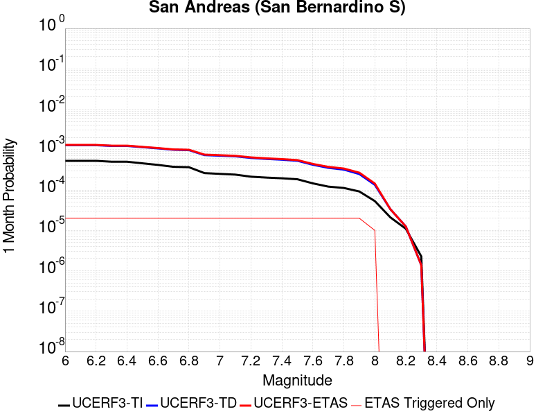 | 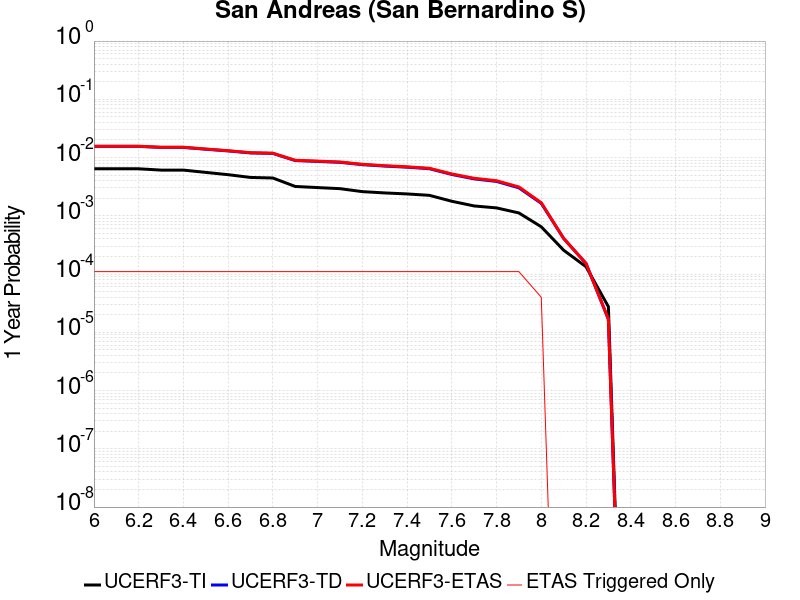 |  |

| Magnitude | 1 wk TI Prob | 1 wk TD Prob | 1 wk ETAS Prob | 1 wk ETAS/TD Gain | 1 wk ETAS Triggered Only | 1 mo TI Prob | 1 mo TD Prob | 1 mo ETAS Prob | 1 mo ETAS/TD Gain | 1 mo ETAS Triggered Only | 1 yr TI Prob | 1 yr TD Prob | 1 yr ETAS Prob | 1 yr ETAS/TD Gain | 1 yr ETAS Triggered Only | 10 yr TI Prob | 10 yr TD Prob | 10 yr ETAS Prob | 10 yr ETAS/TD Gain | 10 yr ETAS Triggered Only |
|-----|-----|-----|-----|-----|-----|-----|-----|-----|-----|-----|-----|-----|-----|-----|-----|-----|-----|-----|-----|-----|
| 6.0 | 1.2336002E-4 | 3.0023555E-4 | 3.0023555E-4 | 1.0 | 0.0 | 5.2857865E-4 | 0.0012861154 | 0.0012861154 | 1.0 | 0.0 | 0.006416472 | 0.015550992 | 0.015686778 | 1.0087317 | 1.3793104E-4 | 0.06234337 | 0.14291383 | 0.14303206 | 1.0008272 | 1.3793104E-4 |
| 6.1 | 1.2336002E-4 | 3.0023555E-4 | 3.0023555E-4 | 1.0 | 0.0 | 5.2857865E-4 | 0.0012861154 | 0.0012861154 | 1.0 | 0.0 | 0.006416472 | 0.015550992 | 0.015686778 | 1.0087317 | 1.3793104E-4 | 0.06234337 | 0.14291383 | 0.14303206 | 1.0008272 | 1.3793104E-4 |
| 6.2 | 1.2336002E-4 | 3.0023555E-4 | 3.0023555E-4 | 1.0 | 0.0 | 5.2857865E-4 | 0.0012861154 | 0.0012861154 | 1.0 | 0.0 | 0.006416472 | 0.015550992 | 0.015686778 | 1.0087317 | 1.3793104E-4 | 0.06234337 | 0.14291383 | 0.14303206 | 1.0008272 | 1.3793104E-4 |
| 6.3 | 1.1712257E-4 | 2.8811657E-4 | 2.8811657E-4 | 1.0 | 0.0 | 5.018573E-4 | 0.0012342266 | 0.0012342266 | 1.0 | 0.0 | 0.006093008 | 0.0149280215 | 0.015063894 | 1.0091019 | 1.3793104E-4 | 0.059286322 | 0.13762207 | 0.13774101 | 1.0008643 | 1.3793104E-4 |
| 6.4 | 1.1712257E-4 | 2.8811657E-4 | 2.8811657E-4 | 1.0 | 0.0 | 5.018573E-4 | 0.0012342266 | 0.0012342266 | 1.0 | 0.0 | 0.006093008 | 0.0149280215 | 0.015063894 | 1.0091019 | 1.3793104E-4 | 0.059286322 | 0.13762207 | 0.13774101 | 1.0008643 | 1.3793104E-4 |
| 6.5 | 1.0689076E-4 | 2.682418E-4 | 2.682418E-4 | 1.0 | 0.0 | 4.5802278E-4 | 0.001149126 | 0.001149126 | 1.0 | 0.0 | 0.0055621783 | 0.013905481 | 0.014041494 | 1.0097812 | 1.3793104E-4 | 0.05425003 | 0.12886871 | 0.12898888 | 1.0009323 | 1.3793104E-4 |
| 6.6 | 9.7648895E-5 | 2.506867E-4 | 2.506867E-4 | 1.0 | 0.0 | 4.1842813E-4 | 0.0010739529 | 0.0010739529 | 1.0 | 0.0 | 0.005082469 | 0.0130013535 | 0.013137491 | 1.010471 | 1.3793104E-4 | 0.049677886 | 0.12102797 | 0.121149205 | 1.0010017 | 1.3793104E-4 |
| 6.7 | 8.757013E-5 | 2.3139146E-4 | 2.3139146E-4 | 1.0 | 0.0 | 3.7524657E-4 | 9.913231E-4 | 9.913231E-4 | 1.0 | 0.0 | 0.00455906 | 0.012006655 | 0.01214293 | 1.0113499 | 1.3793104E-4 | 0.04466656 | 0.112335846 | 0.11245828 | 1.0010899 | 1.3793104E-4 |
| 6.8 | 8.562978E-5 | 2.2698891E-4 | 2.2698891E-4 | 1.0 | 0.0 | 3.6693315E-4 | 9.7246916E-4 | 9.7246916E-4 | 1.0 | 0.0 | 0.004458263 | 0.011779605 | 0.011915912 | 1.0115714 | 1.3793104E-4 | 0.043698758 | 0.11034572 | 0.11046843 | 1.0011121 | 1.3793104E-4 |
| 6.9 | 6.124075E-5 | 1.7082063E-4 | 1.7082063E-4 | 1.0 | 0.0 | 2.6243398E-4 | 7.318838E-4 | 7.318838E-4 | 1.0 | 0.0 | 0.0031904527 | 0.008874487 | 0.009011194 | 1.0154045 | 1.3793104E-4 | 0.031450346 | 0.08425208 | 0.08437839 | 1.0014992 | 1.3793104E-4 |
| 7.0 | 5.8598747E-5 | 1.6510907E-4 | 1.6510907E-4 | 1.0 | 0.0 | 2.5111332E-4 | 7.0741924E-4 | 7.0741924E-4 | 1.0 | 0.0 | 0.0030530186 | 0.008579012 | 0.00871576 | 1.0159398 | 1.3793104E-4 | 0.03011414 | 0.08156926 | 0.081695944 | 1.001553 | 1.3793104E-4 |
| 7.1 | 5.613814E-5 | 1.5929298E-4 | 1.5929298E-4 | 1.0 | 0.0 | 2.4056983E-4 | 6.825063E-4 | 6.825063E-4 | 1.0 | 0.0 | 0.0029250039 | 0.0082780365 | 0.008414825 | 1.0165243 | 1.3793104E-4 | 0.028868021 | 0.078867756 | 0.07899481 | 1.001611 | 1.3793104E-4 |
| 7.2 | 4.991222E-5 | 1.4535384E-4 | 1.4535384E-4 | 1.0 | 0.0 | 2.1389198E-4 | 6.227967E-4 | 6.227967E-4 | 1.0 | 0.0 | 0.002601025 | 0.0075562913 | 0.00769318 | 1.0181159 | 1.3793104E-4 | 0.025707912 | 0.072320335 | 0.07244828 | 1.0017693 | 1.3793104E-4 |
| 7.3 | 4.7410045E-5 | 1.3729246E-4 | 1.3729246E-4 | 1.0 | 0.0 | 2.0317009E-4 | 5.882639E-4 | 5.882639E-4 | 1.0 | 0.0 | 0.0024707897 | 0.0071386793 | 0.0072756256 | 1.0191838 | 1.3793104E-4 | 0.024434982 | 0.06860168 | 0.06873015 | 1.0018727 | 1.3793104E-4 |
| 7.4 | 4.5556746E-5 | 1.313689E-4 | 1.313689E-4 | 1.0 | 0.0 | 1.952286E-4 | 5.628884E-4 | 5.628884E-4 | 1.0 | 0.0 | 0.002374317 | 0.006831711 | 0.0069687 | 1.0200518 | 1.3793104E-4 | 0.023491086 | 0.06585319 | 0.065982044 | 1.0019566 | 1.3793104E-4 |
| 7.5 | 4.3084514E-5 | 1.2371907E-4 | 1.2371907E-4 | 1.0 | 0.0 | 1.8463485E-4 | 5.3011713E-4 | 5.3011713E-4 | 1.0 | 0.0 | 0.0022456115 | 0.0064351484 | 0.0065721916 | 1.021296 | 1.3793104E-4 | 0.022230545 | 0.062252887 | 0.062382232 | 1.0020777 | 1.3793104E-4 |
| 7.6 | 3.408608E-5 | 9.8489814E-5 | 9.8489814E-5 | 1.0 | 0.0 | 1.4607502E-4 | 4.2203104E-4 | 4.2203104E-4 | 1.0 | 0.0 | 0.0017770125 | 0.005126148 | 0.005263372 | 1.0267694 | 1.3793104E-4 | 0.017628696 | 0.050079897 | 0.05021092 | 1.0026163 | 1.3793104E-4 |
| 7.7 | 2.8315713E-5 | 8.261325E-5 | 8.261325E-5 | 1.0 | 0.0 | 1.2134742E-4 | 3.5400878E-4 | 3.5400878E-4 | 1.0 | 0.0 | 0.0014764034 | 0.004301548 | 0.004438886 | 1.0319275 | 1.3793104E-4 | 0.01466633 | 0.042327844 | 0.042459935 | 1.0031207 | 1.3793104E-4 |
| 7.8 | 2.6222975E-5 | 7.4749165E-5 | 7.4749165E-5 | 1.0 | 0.0 | 1.1237934E-4 | 3.2031426E-4 | 3.2031426E-4 | 1.0 | 0.0 | 0.0013673597 | 0.0038928585 | 0.004030253 | 1.0352939 | 1.3793104E-4 | 0.013589768 | 0.038489804 | 0.038622428 | 1.0034456 | 1.3793104E-4 |
| 7.9 | 2.1469694E-5 | 5.7977377E-5 | 5.7977377E-5 | 1.0 | 0.0 | 9.200973E-5 | 2.4845081E-4 | 2.4845081E-4 | 1.0 | 0.0 | 0.0011196428 | 0.003020696 | 0.0031582103 | 1.0455241 | 1.3793104E-4 | 0.011140184 | 0.030197 | 0.030330766 | 1.0044298 | 1.3793104E-4 |
| 8.0 | 1.2420249E-5 | 3.1373827E-5 | 3.1373827E-5 | 1.0 | 0.0 | 5.322855E-5 | 1.3445233E-4 | 1.3445233E-4 | 1.0 | 0.0 | 6.478649E-4 | 0.001635729 | 0.0017045818 | 1.042093 | 6.896552E-5 | 0.0064597935 | 0.016548108 | 0.016615933 | 1.0040987 | 6.896552E-5 |
| 8.1 | 4.9197724E-6 | 7.842378E-6 | 7.842378E-6 | 1.0 | 0.0 | 2.1084568E-5 | 3.360976E-5 | 3.360976E-5 | 1.0 | 0.0 | 2.566744E-4 | 4.0912212E-4 | 4.0912212E-4 | 1.0 | 0.0 | 0.002563781 | 0.004394436 | 0.004394436 | 1.0 | 0.0 |
| 8.2 | 2.5634774E-6 | 2.9160003E-6 | 2.9160003E-6 | 1.0 | 0.0 | 1.0986286E-5 | 1.2497085E-5 | 1.2497085E-5 | 1.0 | 0.0 | 1.3374983E-4 | 1.5214144E-4 | 1.5214144E-4 | 1.0 | 0.0 | 0.0013366934 | 0.0017098442 | 0.0017098442 | 1.0 | 0.0 |
| 8.3 | 5.2850464E-7 | 3.2211614E-7 | 3.2211614E-7 | 1.0 | 0.0 | 2.2650179E-6 | 1.380497E-6 | 1.380497E-6 | 1.0 | 0.0 | 2.7576245E-5 | 1.6807435E-5 | 1.6807435E-5 | 1.0 | 0.0 | 2.7572823E-4 | 1.9939634E-4 | 1.9939634E-4 | 1.0 | 0.0 |

## San Andreas (San Bernardino N)
*[(top)](#table-of-contents)*

| 1 Week | 1 Month | 1 Year | 10 Year |
|-----|-----|-----|-----|
| 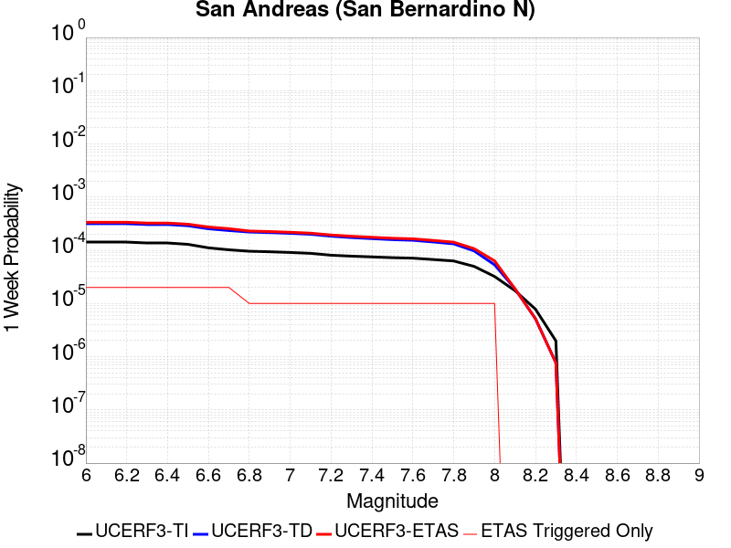 |  |  | 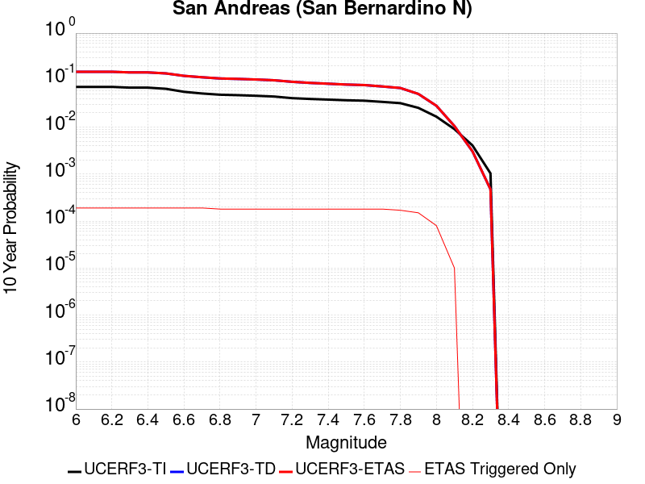 |

| Magnitude | 1 wk TI Prob | 1 wk TD Prob | 1 wk ETAS Prob | 1 wk ETAS/TD Gain | 1 wk ETAS Triggered Only | 1 mo TI Prob | 1 mo TD Prob | 1 mo ETAS Prob | 1 mo ETAS/TD Gain | 1 mo ETAS Triggered Only | 1 yr TI Prob | 1 yr TD Prob | 1 yr ETAS Prob | 1 yr ETAS/TD Gain | 1 yr ETAS Triggered Only | 10 yr TI Prob | 10 yr TD Prob | 10 yr ETAS Prob | 10 yr ETAS/TD Gain | 10 yr ETAS Triggered Only |
|-----|-----|-----|-----|-----|-----|-----|-----|-----|-----|-----|-----|-----|-----|-----|-----|-----|-----|-----|-----|-----|
| 6.0 | 1.4273766E-4 | 3.1635934E-4 | 3.1635934E-4 | 1.0 | 0.0 | 6.115894E-4 | 0.0013551271 | 0.0013551271 | 1.0 | 0.0 | 0.0074207084 | 0.016375363 | 0.016511034 | 1.0082852 | 1.3793104E-4 | 0.07177748 | 0.15038711 | 0.15050429 | 1.0007793 | 1.3793104E-4 |
| 6.1 | 1.4273766E-4 | 3.1635934E-4 | 3.1635934E-4 | 1.0 | 0.0 | 6.115894E-4 | 0.0013551271 | 0.0013551271 | 1.0 | 0.0 | 0.0074207084 | 0.016375363 | 0.016511034 | 1.0082852 | 1.3793104E-4 | 0.07177748 | 0.15038711 | 0.15050429 | 1.0007793 | 1.3793104E-4 |
| 6.2 | 1.4273766E-4 | 3.1635934E-4 | 3.1635934E-4 | 1.0 | 0.0 | 6.115894E-4 | 0.0013551271 | 0.0013551271 | 1.0 | 0.0 | 0.0074207084 | 0.016375363 | 0.016511034 | 1.0082852 | 1.3793104E-4 | 0.07177748 | 0.15038711 | 0.15050429 | 1.0007793 | 1.3793104E-4 |
| 6.3 | 1.3730655E-4 | 3.0540637E-4 | 3.0540637E-4 | 1.0 | 0.0 | 5.883239E-4 | 0.0013082335 | 0.0013082335 | 1.0 | 0.0 | 0.0071393442 | 0.015812824 | 0.015948573 | 1.0085849 | 1.3793104E-4 | 0.06914291 | 0.14568701 | 0.14580485 | 1.0008088 | 1.3793104E-4 |
| 6.4 | 1.3730655E-4 | 3.0540637E-4 | 3.0540637E-4 | 1.0 | 0.0 | 5.883239E-4 | 0.0013082335 | 0.0013082335 | 1.0 | 0.0 | 0.0071393442 | 0.015812824 | 0.015948573 | 1.0085849 | 1.3793104E-4 | 0.06914291 | 0.14568701 | 0.14580485 | 1.0008088 | 1.3793104E-4 |
| 6.5 | 1.2942807E-4 | 2.8954886E-4 | 2.8954886E-4 | 1.0 | 0.0 | 5.545738E-4 | 0.0012403387 | 0.0012403387 | 1.0 | 0.0 | 0.0067310524 | 0.014997809 | 0.015133672 | 1.0090588 | 1.3793104E-4 | 0.06530788 | 0.13882978 | 0.13894857 | 1.0008556 | 1.3793104E-4 |
| 6.6 | 1.1125901E-4 | 2.5393223E-4 | 2.5393223E-4 | 1.0 | 0.0 | 4.767372E-4 | 0.0010878295 | 0.0010878295 | 1.0 | 0.0 | 0.005788839 | 0.013164529 | 0.013300643 | 1.0103395 | 1.3793104E-4 | 0.056403454 | 0.12311955 | 0.12324049 | 1.0009824 | 1.3793104E-4 |
| 6.7 | 1.02209575E-4 | 2.3527986E-4 | 2.3527986E-4 | 1.0 | 0.0 | 4.3796748E-4 | 0.001007954 | 0.001007954 | 1.0 | 0.0 | 0.0053192247 | 0.012203212 | 0.01233946 | 1.0111649 | 1.3793104E-4 | 0.051936906 | 0.11491149 | 0.11503357 | 1.0010624 | 1.3793104E-4 |
| 6.8 | 9.610582E-5 | 2.2053412E-4 | 2.2053412E-4 | 1.0 | 0.0 | 4.1181705E-4 | 9.448046E-4 | 9.448046E-4 | 1.0 | 0.0 | 0.0050023515 | 0.011442591 | 0.0115789445 | 1.0119163 | 1.3793104E-4 | 0.048912346 | 0.10831282 | 0.10843582 | 1.0011355 | 1.3793104E-4 |
| 6.9 | 9.3877505E-5 | 2.150883E-4 | 2.150883E-4 | 1.0 | 0.0 | 4.0227012E-4 | 9.2148193E-4 | 9.2148193E-4 | 1.0 | 0.0 | 0.0048866454 | 0.011161577 | 0.011297969 | 1.0122198 | 1.3793104E-4 | 0.04780577 | 0.1059029 | 0.106026225 | 1.0011646 | 1.3793104E-4 |
| 7.0 | 9.1019785E-5 | 2.0835544E-4 | 2.0835544E-4 | 1.0 | 0.0 | 3.900265E-4 | 8.926469E-4 | 8.926469E-4 | 1.0 | 0.0 | 0.0047382377 | 0.010814046 | 0.010950485 | 1.0126169 | 1.3793104E-4 | 0.046384744 | 0.10287278 | 0.10299652 | 1.0012028 | 1.3793104E-4 |
| 7.1 | 8.771155E-5 | 2.0009889E-4 | 2.0009889E-4 | 1.0 | 0.0 | 3.758525E-4 | 8.5728534E-4 | 8.5728534E-4 | 1.0 | 0.0 | 0.0045664064 | 0.010387696 | 0.010524195 | 1.0131403 | 1.3793104E-4 | 0.044737056 | 0.09918398 | 0.09930823 | 1.0012528 | 1.3793104E-4 |
| 7.2 | 8.0830236E-5 | 1.8415037E-4 | 1.8415037E-4 | 1.0 | 0.0 | 3.4636928E-4 | 7.8897737E-4 | 7.8897737E-4 | 1.0 | 0.0 | 0.0042088944 | 0.009563598 | 0.00970021 | 1.0142846 | 1.3793104E-4 | 0.041300658 | 0.09191379 | 0.09203904 | 1.0013627 | 1.3793104E-4 |
| 7.3 | 7.7668235E-5 | 1.7358093E-4 | 1.7358093E-4 | 1.0 | 0.0 | 3.328214E-4 | 7.437063E-4 | 7.437063E-4 | 1.0 | 0.0 | 0.0040445733 | 0.009017113 | 0.009153799 | 1.0151587 | 1.3793104E-4 | 0.03971748 | 0.08717959 | 0.08730549 | 1.0014442 | 1.3793104E-4 |
| 7.4 | 7.520177E-5 | 1.657783E-4 | 1.657783E-4 | 1.0 | 0.0 | 3.2225347E-4 | 7.1028504E-4 | 7.1028504E-4 | 1.0 | 0.0 | 0.0039163795 | 0.008613498 | 0.008750241 | 1.0158755 | 1.3793104E-4 | 0.038480744 | 0.08363466 | 0.08376106 | 1.0015113 | 1.3793104E-4 |
| 7.5 | 7.274697E-5 | 1.5865144E-4 | 1.5865144E-4 | 1.0 | 0.0 | 3.1173544E-4 | 6.797576E-4 | 6.797576E-4 | 1.0 | 0.0 | 0.003788775 | 0.008244702 | 0.008381495 | 1.0165917 | 1.3793104E-4 | 0.03724827 | 0.08035038 | 0.08047722 | 1.0015787 | 1.3793104E-4 |
| 7.6 | 7.1185845E-5 | 1.5434787E-4 | 1.5434787E-4 | 1.0 | 0.0 | 3.0504653E-4 | 6.6132325E-4 | 6.6132325E-4 | 1.0 | 0.0 | 0.0037076178 | 0.008021939 | 0.008158763 | 1.0170563 | 1.3793104E-4 | 0.036463667 | 0.078339346 | 0.078466475 | 1.0016228 | 1.3793104E-4 |
| 7.7 | 6.709961E-5 | 1.4343053E-4 | 1.4343053E-4 | 1.0 | 0.0 | 2.8753807E-4 | 6.1455753E-4 | 6.1455753E-4 | 1.0 | 0.0 | 0.003495157 | 0.007456607 | 0.0075935097 | 1.0183599 | 1.3793104E-4 | 0.034406938 | 0.07316601 | 0.07329385 | 1.0017473 | 1.3793104E-4 |
| 7.8 | 6.300812E-5 | 1.3225875E-4 | 1.3225875E-4 | 1.0 | 0.0 | 2.7000686E-4 | 5.6670007E-4 | 5.6670007E-4 | 1.0 | 0.0 | 0.0032823787 | 0.0068777753 | 0.0070147575 | 1.0199167 | 1.3793104E-4 | 0.032343175 | 0.06781986 | 0.06794844 | 1.0018959 | 1.3793104E-4 |
| 7.9 | 4.983037E-5 | 9.7419856E-5 | 9.7419856E-5 | 1.0 | 0.0 | 2.1354125E-4 | 4.1744686E-4 | 4.1744686E-4 | 1.0 | 0.0 | 0.0025967648 | 0.005070582 | 0.0052078133 | 1.0270643 | 1.3793104E-4 | 0.025666296 | 0.050735 | 0.050865933 | 1.0025808 | 1.3793104E-4 |
| 8.0 | 3.2211527E-5 | 5.341288E-5 | 5.341288E-5 | 1.0 | 0.0 | 1.380421E-4 | 2.2889227E-4 | 2.2889227E-4 | 1.0 | 0.0 | 0.0016793669 | 0.002783204 | 0.0028519775 | 1.0247102 | 6.896552E-5 | 0.016667323 | 0.028414162 | 0.028481169 | 1.0023582 | 6.896552E-5 |
| 8.1 | 1.743376E-5 | 1.8874636E-5 | 1.8874636E-5 | 1.0 | 0.0 | 7.471398E-5 | 8.088879E-5 | 8.088879E-5 | 1.0 | 0.0 | 9.0926304E-4 | 9.843768E-4 | 9.843768E-4 | 1.0 | 0.0 | 0.009055517 | 0.010510205 | 0.010510205 | 1.0 | 0.0 |
| 8.2 | 7.831616E-6 | 5.1737816E-6 | 5.1737816E-6 | 1.0 | 0.0 | 3.3563636E-5 | 2.217316E-5 | 2.217316E-5 | 1.0 | 0.0 | 4.0856065E-4 | 2.6992487E-4 | 2.6992487E-4 | 1.0 | 0.0 | 0.004078103 | 0.0030519657 | 0.0030519657 | 1.0 | 0.0 |
| 8.3 | 1.983087E-6 | 7.693574E-7 | 7.693574E-7 | 1.0 | 0.0 | 8.498917E-6 | 3.297242E-6 | 3.297242E-6 | 1.0 | 0.0 | 1.034694E-4 | 4.01432E-5 | 4.01432E-5 | 1.0 | 0.0 | 0.0010342124 | 4.7390026E-4 | 4.7390026E-4 | 1.0 | 0.0 |

## Paradise
*[(top)](#table-of-contents)*

| 1 Week | 1 Month | 1 Year | 10 Year |
|-----|-----|-----|-----|
|  |  |  |  |

| Magnitude | 1 wk TI Prob | 1 wk TD Prob | 1 wk ETAS Prob | 1 wk ETAS/TD Gain | 1 wk ETAS Triggered Only | 1 mo TI Prob | 1 mo TD Prob | 1 mo ETAS Prob | 1 mo ETAS/TD Gain | 1 mo ETAS Triggered Only | 1 yr TI Prob | 1 yr TD Prob | 1 yr ETAS Prob | 1 yr ETAS/TD Gain | 1 yr ETAS Triggered Only | 10 yr TI Prob | 10 yr TD Prob | 10 yr ETAS Prob | 10 yr ETAS/TD Gain | 10 yr ETAS Triggered Only |
|-----|-----|-----|-----|-----|-----|-----|-----|-----|-----|-----|-----|-----|-----|-----|-----|-----|-----|-----|-----|-----|
| 6.0 | 1.4851273E-5 | 1.6695341E-5 | 1.6695341E-5 | 1.0 | 0.0 | 6.364676E-5 | 7.154963E-5 | 7.154963E-5 | 1.0 | 0.0 | 7.7462377E-4 | 8.707922E-4 | 9.3969767E-4 | 1.0791296 | 6.896552E-5 | 0.0077192914 | 0.008676181 | 0.008744548 | 1.0078799 | 6.896552E-5 |
| 6.1 | 1.4851273E-5 | 1.6695341E-5 | 1.6695341E-5 | 1.0 | 0.0 | 6.364676E-5 | 7.154963E-5 | 7.154963E-5 | 1.0 | 0.0 | 7.7462377E-4 | 8.707922E-4 | 9.3969767E-4 | 1.0791296 | 6.896552E-5 | 0.0077192914 | 0.008676181 | 0.008744548 | 1.0078799 | 6.896552E-5 |
| 6.2 | 1.4851273E-5 | 1.6695341E-5 | 1.6695341E-5 | 1.0 | 0.0 | 6.364676E-5 | 7.154963E-5 | 7.154963E-5 | 1.0 | 0.0 | 7.7462377E-4 | 8.707922E-4 | 9.3969767E-4 | 1.0791296 | 6.896552E-5 | 0.0077192914 | 0.008676181 | 0.008744548 | 1.0078799 | 6.896552E-5 |
| 6.3 | 1.0426831E-5 | 1.1889049E-5 | 1.1889049E-5 | 1.0 | 0.0 | 4.4685654E-5 | 5.095211E-5 | 5.095211E-5 | 1.0 | 0.0 | 5.43912E-4 | 6.2017125E-4 | 6.2017125E-4 | 1.0 | 0.0 | 0.0054258266 | 0.0061850143 | 0.0061850143 | 1.0 | 0.0 |
| 6.4 | 1.0426831E-5 | 1.1889049E-5 | 1.1889049E-5 | 1.0 | 0.0 | 4.4685654E-5 | 5.095211E-5 | 5.095211E-5 | 1.0 | 0.0 | 5.43912E-4 | 6.2017125E-4 | 6.2017125E-4 | 1.0 | 0.0 | 0.0054258266 | 0.0061850143 | 0.0061850143 | 1.0 | 0.0 |
| 6.5 | 9.25027E-6 | 1.0620336E-5 | 1.0620336E-5 | 1.0 | 0.0 | 3.964341E-5 | 4.551496E-5 | 4.551496E-5 | 1.0 | 0.0 | 4.8255164E-4 | 5.5400864E-4 | 5.5400864E-4 | 1.0 | 0.0 | 0.0048150513 | 0.0055267746 | 0.0055267746 | 1.0 | 0.0 |
| 6.6 | 7.904275E-6 | 9.159836E-6 | 9.159836E-6 | 1.0 | 0.0 | 3.3875025E-5 | 3.925587E-5 | 3.925587E-5 | 1.0 | 0.0 | 4.1235037E-4 | 4.7783932E-4 | 4.7783932E-4 | 1.0 | 0.0 | 0.0041158604 | 0.0047685155 | 0.0047685155 | 1.0 | 0.0 |
| 6.7 | 7.2061953E-6 | 8.407527E-6 | 8.407527E-6 | 1.0 | 0.0 | 3.088333E-5 | 3.6031786E-5 | 3.6031786E-5 | 1.0 | 0.0 | 3.7593965E-4 | 4.3860235E-4 | 4.3860235E-4 | 1.0 | 0.0 | 0.003753043 | 0.0043777362 | 0.0043777362 | 1.0 | 0.0 |
| 6.8 | 6.6948724E-6 | 7.842423E-6 | 7.842423E-6 | 1.0 | 0.0 | 2.8691995E-5 | 3.3609973E-5 | 3.3609973E-5 | 1.0 | 0.0 | 3.4926904E-4 | 4.0912814E-4 | 4.0912814E-4 | 1.0 | 0.0 | 0.003487206 | 0.004084107 | 0.004084107 | 1.0 | 0.0 |
| 6.9 | 6.0421025E-6 | 7.1308505E-6 | 7.1308505E-6 | 1.0 | 0.0 | 2.5894467E-5 | 3.0560448E-5 | 3.0560448E-5 | 1.0 | 0.0 | 3.1521954E-4 | 3.7201334E-4 | 3.7201334E-4 | 1.0 | 0.0 | 0.0031477278 | 0.003714244 | 0.003714244 | 1.0 | 0.0 |
| 7.0 | 4.134091E-6 | 5.080469E-6 | 5.080469E-6 | 1.0 | 0.0 | 1.7717413E-5 | 2.1773263E-5 | 2.1773263E-5 | 1.0 | 0.0 | 2.1568815E-4 | 2.6505877E-4 | 2.6505877E-4 | 1.0 | 0.0 | 0.0021547892 | 0.0026475794 | 0.0026475794 | 1.0 | 0.0 |
| 7.1 | 3.7674888E-6 | 4.6320133E-6 | 4.6320133E-6 | 1.0 | 0.0 | 1.6146281E-5 | 1.9851343E-5 | 1.9851343E-5 | 1.0 | 0.0 | 1.9656324E-4 | 2.4166482E-4 | 2.4166482E-4 | 1.0 | 0.0 | 0.0019638946 | 0.002414171 | 0.002414171 | 1.0 | 0.0 |
| 7.2 | 3.4065345E-6 | 4.1568514E-6 | 4.1568514E-6 | 1.0 | 0.0 | 1.4599351E-5 | 1.7814966E-5 | 1.7814966E-5 | 1.0 | 0.0 | 1.777326E-4 | 2.1687712E-4 | 2.1687712E-4 | 1.0 | 0.0 | 0.0017759053 | 0.0021668028 | 0.0021668028 | 1.0 | 0.0 |
| 7.3 | 2.9934936E-6 | 3.629423E-6 | 3.629423E-6 | 1.0 | 0.0 | 1.2829195E-5 | 1.5554586E-5 | 1.5554586E-5 | 1.0 | 0.0 | 1.5618425E-4 | 1.893621E-4 | 1.893621E-4 | 1.0 | 0.0 | 0.0015607453 | 0.0018921527 | 0.0018921527 | 1.0 | 0.0 |
| 7.4 | 2.4049796E-6 | 2.889062E-6 | 2.889062E-6 | 1.0 | 0.0 | 1.0307015E-5 | 1.23816435E-5 | 1.23816435E-5 | 1.0 | 0.0 | 1.2548068E-4 | 1.5073753E-4 | 1.5073753E-4 | 1.0 | 0.0 | 0.0012540985 | 0.0015064942 | 0.0015064942 | 1.0 | 0.0 |
| 7.5 | 1.2710091E-6 | 1.5135054E-6 | 1.5135054E-6 | 1.0 | 0.0 | 5.44717E-6 | 6.4864425E-6 | 6.4864425E-6 | 1.0 | 0.0 | 6.631728E-5 | 7.897083E-5 | 7.897083E-5 | 1.0 | 0.0 | 6.6297496E-4 | 7.8955025E-4 | 7.8955025E-4 | 1.0 | 0.0 |
| 7.6 | 2.21172E-7 | 2.6040124E-7 | 2.6040124E-7 | 1.0 | 0.0 | 9.478797E-7 | 1.116005E-6 | 1.116005E-6 | 1.0 | 0.0 | 1.1540374E-5 | 1.3587305E-5 | 1.3587305E-5 | 1.0 | 0.0 | 1.1539775E-4 | 1.3586757E-4 | 1.3586757E-4 | 1.0 | 0.0 |

## Ludlow
*[(top)](#table-of-contents)*

| 1 Week | 1 Month | 1 Year | 10 Year |
|-----|-----|-----|-----|
|  |  |  |  |

| Magnitude | 1 wk TI Prob | 1 wk TD Prob | 1 wk ETAS Prob | 1 wk ETAS/TD Gain | 1 wk ETAS Triggered Only | 1 mo TI Prob | 1 mo TD Prob | 1 mo ETAS Prob | 1 mo ETAS/TD Gain | 1 mo ETAS Triggered Only | 1 yr TI Prob | 1 yr TD Prob | 1 yr ETAS Prob | 1 yr ETAS/TD Gain | 1 yr ETAS Triggered Only | 10 yr TI Prob | 10 yr TD Prob | 10 yr ETAS Prob | 10 yr ETAS/TD Gain | 10 yr ETAS Triggered Only |
|-----|-----|-----|-----|-----|-----|-----|-----|-----|-----|-----|-----|-----|-----|-----|-----|-----|-----|-----|-----|-----|
| 6.0 | 2.2407607E-5 | 2.3657954E-5 | 2.3657954E-5 | 1.0 | 0.0 | 9.602906E-5 | 1.0138754E-4 | 1.0138754E-4 | 1.0 | 0.0 | 0.0011685267 | 0.0012337384 | 0.0013026189 | 1.0558307 | 6.896552E-5 | 0.011624013 | 0.012273403 | 0.012341523 | 1.0055501 | 6.896552E-5 |
| 6.1 | 2.2407607E-5 | 2.3657954E-5 | 2.3657954E-5 | 1.0 | 0.0 | 9.602906E-5 | 1.0138754E-4 | 1.0138754E-4 | 1.0 | 0.0 | 0.0011685267 | 0.0012337384 | 0.0013026189 | 1.0558307 | 6.896552E-5 | 0.011624013 | 0.012273403 | 0.012341523 | 1.0055501 | 6.896552E-5 |
| 6.2 | 1.0781252E-5 | 1.1365991E-5 | 1.1365991E-5 | 1.0 | 0.0 | 4.620455E-5 | 4.8710503E-5 | 4.8710503E-5 | 1.0 | 0.0 | 5.623952E-4 | 5.92893E-4 | 6.6181767E-4 | 1.1162513 | 6.896552E-5 | 0.00560974 | 0.005913531 | 0.0059820884 | 1.0115933 | 6.896552E-5 |
| 6.3 | 1.0781252E-5 | 1.1365991E-5 | 1.1365991E-5 | 1.0 | 0.0 | 4.620455E-5 | 4.8710503E-5 | 4.8710503E-5 | 1.0 | 0.0 | 5.623952E-4 | 5.92893E-4 | 6.6181767E-4 | 1.1162513 | 6.896552E-5 | 0.00560974 | 0.005913531 | 0.0059820884 | 1.0115933 | 6.896552E-5 |
| 6.4 | 7.814439E-6 | 8.237966E-6 | 8.237966E-6 | 1.0 | 0.0 | 3.3490025E-5 | 3.5305096E-5 | 3.5305096E-5 | 1.0 | 0.0 | 4.0766477E-4 | 4.2975618E-4 | 4.9869204E-4 | 1.160407 | 6.896552E-5 | 0.0040691774 | 0.0042893975 | 0.004358067 | 1.0160092 | 6.896552E-5 |
| 6.5 | 6.4986366E-6 | 6.8511167E-6 | 6.8511167E-6 | 1.0 | 0.0 | 2.7851002E-5 | 2.9361603E-5 | 2.9361603E-5 | 1.0 | 0.0 | 3.390332E-4 | 3.574198E-4 | 4.263607E-4 | 1.1928848 | 6.896552E-5 | 0.003385164 | 0.003568546 | 0.0036372652 | 1.019257 | 6.896552E-5 |
| 6.6 | 5.582177E-6 | 5.8861756E-6 | 5.8861756E-6 | 1.0 | 0.0 | 2.3923398E-5 | 2.5226227E-5 | 2.5226227E-5 | 1.0 | 0.0 | 2.9122844E-4 | 3.0708674E-4 | 3.760311E-4 | 1.2245109 | 6.896552E-5 | 0.0029084706 | 0.0030666974 | 0.0031354513 | 1.0224196 | 6.896552E-5 |
| 6.7 | 4.6858763E-6 | 4.94057E-6 | 4.94057E-6 | 1.0 | 0.0 | 2.0082172E-5 | 2.1173702E-5 | 2.1173702E-5 | 1.0 | 0.0 | 2.4447302E-4 | 2.5775988E-4 | 3.267076E-4 | 1.2674882 | 6.896552E-5 | 0.0024420423 | 0.0025746655 | 0.0026434534 | 1.0267172 | 6.896552E-5 |
| 6.8 | 3.5584908E-6 | 3.7521265E-6 | 3.7521265E-6 | 1.0 | 0.0 | 1.5250586E-5 | 1.6080447E-5 | 1.6080447E-5 | 1.0 | 0.0 | 1.8566006E-4 | 1.9576224E-4 | 2.6471427E-4 | 1.3522233 | 6.896552E-5 | 0.0018550502 | 0.0019559392 | 0.0020247698 | 1.0351906 | 6.896552E-5 |
| 6.9 | 2.532834E-6 | 2.6710807E-6 | 2.6710807E-6 | 1.0 | 0.0 | 1.0854958E-5 | 1.1447441E-5 | 1.1447441E-5 | 1.0 | 0.0 | 1.3215111E-4 | 1.3936395E-4 | 2.0831986E-4 | 1.4947901 | 6.896552E-5 | 0.0013207254 | 0.0013927931 | 0.0014616626 | 1.0494471 | 6.896552E-5 |
| 7.0 | 1.7083285E-6 | 1.8019963E-6 | 1.8019963E-6 | 1.0 | 0.0 | 7.3213873E-6 | 7.722819E-6 | 7.722819E-6 | 1.0 | 0.0 | 8.913424E-5 | 9.402143E-5 | 9.402143E-5 | 1.0 | 0.0 | 8.9098496E-4 | 9.3983306E-4 | 9.3983306E-4 | 1.0 | 0.0 |
| 7.1 | 1.0905424E-6 | 1.1497951E-6 | 1.1497951E-6 | 1.0 | 0.0 | 4.6737446E-6 | 4.9276846E-6 | 4.9276846E-6 | 1.0 | 0.0 | 5.6901354E-5 | 5.9993006E-5 | 5.9993006E-5 | 1.0 | 0.0 | 5.6886784E-4 | 5.997779E-4 | 5.997779E-4 | 1.0 | 0.0 |
| 7.2 | 6.06668E-7 | 6.387457E-7 | 6.387457E-7 | 1.0 | 0.0 | 2.600003E-6 | 2.737479E-6 | 2.737479E-6 | 1.0 | 0.0 | 3.1654577E-5 | 3.3328364E-5 | 3.3328364E-5 | 1.0 | 0.0 | 3.1650066E-4 | 3.3324052E-4 | 3.3324052E-4 | 1.0 | 0.0 |

## San Andreas (Peninsula) 2011 CFM
*[(top)](#table-of-contents)*

| 1 Week | 1 Month | 1 Year | 10 Year |
|-----|-----|-----|-----|
| 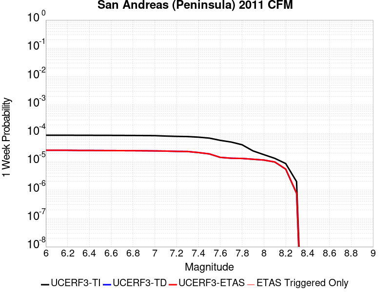 | 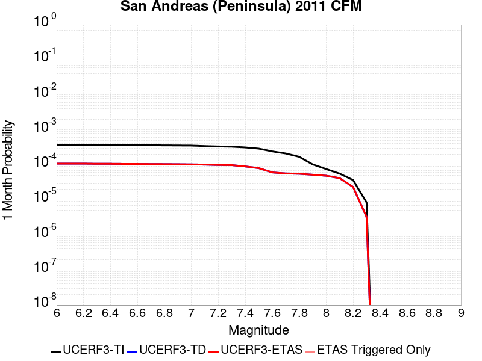 | 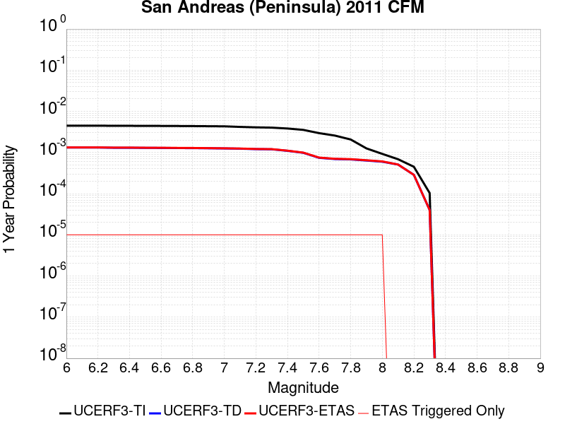 |  |

| Magnitude | 1 wk TI Prob | 1 wk TD Prob | 1 wk ETAS Prob | 1 wk ETAS/TD Gain | 1 wk ETAS Triggered Only | 1 mo TI Prob | 1 mo TD Prob | 1 mo ETAS Prob | 1 mo ETAS/TD Gain | 1 mo ETAS Triggered Only | 1 yr TI Prob | 1 yr TD Prob | 1 yr ETAS Prob | 1 yr ETAS/TD Gain | 1 yr ETAS Triggered Only | 10 yr TI Prob | 10 yr TD Prob | 10 yr ETAS Prob | 10 yr ETAS/TD Gain | 10 yr ETAS Triggered Only |
|-----|-----|-----|-----|-----|-----|-----|-----|-----|-----|-----|-----|-----|-----|-----|-----|-----|-----|-----|-----|-----|
| 6.0 | 8.6200685E-5 | 2.5333706E-5 | 2.5333706E-5 | 1.0 | 0.0 | 3.6937918E-4 | 1.08568514E-4 | 1.08568514E-4 | 1.0 | 0.0 | 0.0044879215 | 0.0013210218 | 0.0013898963 | 1.0521373 | 6.896552E-5 | 0.043983612 | 0.014838956 | 0.014906898 | 1.0045786 | 6.896552E-5 |
| 6.1 | 8.6200685E-5 | 2.5333706E-5 | 2.5333706E-5 | 1.0 | 0.0 | 3.6937918E-4 | 1.08568514E-4 | 1.08568514E-4 | 1.0 | 0.0 | 0.0044879215 | 0.0013210218 | 0.0013898963 | 1.0521373 | 6.896552E-5 | 0.043983612 | 0.014838956 | 0.014906898 | 1.0045786 | 6.896552E-5 |
| 6.2 | 8.6200685E-5 | 2.5333706E-5 | 2.5333706E-5 | 1.0 | 0.0 | 3.6937918E-4 | 1.08568514E-4 | 1.08568514E-4 | 1.0 | 0.0 | 0.0044879215 | 0.0013210218 | 0.0013898963 | 1.0521373 | 6.896552E-5 | 0.043983612 | 0.014838956 | 0.014906898 | 1.0045786 | 6.896552E-5 |
| 6.3 | 8.551163E-5 | 2.5024961E-5 | 2.5024961E-5 | 1.0 | 0.0 | 3.6642692E-4 | 1.0724543E-4 | 1.0724543E-4 | 1.0 | 0.0 | 0.004452125 | 0.0013049326 | 0.0013738082 | 1.0527809 | 6.896552E-5 | 0.043639794 | 0.014665611 | 0.014733565 | 1.0046335 | 6.896552E-5 |
| 6.4 | 8.551163E-5 | 2.5024961E-5 | 2.5024961E-5 | 1.0 | 0.0 | 3.6642692E-4 | 1.0724543E-4 | 1.0724543E-4 | 1.0 | 0.0 | 0.004452125 | 0.0013049326 | 0.0013738082 | 1.0527809 | 6.896552E-5 | 0.043639794 | 0.014665611 | 0.014733565 | 1.0046335 | 6.896552E-5 |
| 6.5 | 8.511146E-5 | 2.4846031E-5 | 2.4846031E-5 | 1.0 | 0.0 | 3.647124E-4 | 1.0647865E-4 | 1.0647865E-4 | 1.0 | 0.0 | 0.004431336 | 0.0012956082 | 0.0013644844 | 1.0531613 | 6.896552E-5 | 0.04344007 | 0.014565198 | 0.014633158 | 1.004666 | 6.896552E-5 |
| 6.6 | 8.4985084E-5 | 2.477655E-5 | 2.477655E-5 | 1.0 | 0.0 | 3.6417096E-4 | 1.061809E-4 | 1.061809E-4 | 1.0 | 0.0 | 0.0044247704 | 0.0012919875 | 0.0013608639 | 1.0533104 | 6.896552E-5 | 0.043376986 | 0.014527207 | 0.0145951705 | 1.0046784 | 6.896552E-5 |
| 6.7 | 8.462618E-5 | 2.4604726E-5 | 2.4604726E-5 | 1.0 | 0.0 | 3.6263323E-4 | 1.05444575E-4 | 1.05444575E-4 | 1.0 | 0.0 | 0.004406125 | 0.0012830333 | 0.0013519103 | 1.0536829 | 6.896552E-5 | 0.043197807 | 0.01443185 | 0.01449982 | 1.0047097 | 6.896552E-5 |
| 6.8 | 8.42337E-5 | 2.4500272E-5 | 2.4500272E-5 | 1.0 | 0.0 | 3.6095164E-4 | 1.0499695E-4 | 1.0499695E-4 | 1.0 | 0.0 | 0.004385734 | 0.0012775898 | 0.0013464672 | 1.053912 | 6.896552E-5 | 0.043001823 | 0.014372395 | 0.01444037 | 1.0047295 | 6.896552E-5 |
| 6.9 | 8.365989E-5 | 2.4304522E-5 | 2.4304522E-5 | 1.0 | 0.0 | 3.5849313E-4 | 1.0415808E-4 | 1.0415808E-4 | 1.0 | 0.0 | 0.004355922 | 0.0012673886 | 0.0013362666 | 1.0543464 | 6.896552E-5 | 0.04271523 | 0.014264696 | 0.014332678 | 1.0047657 | 6.896552E-5 |
| 7.0 | 8.30936E-5 | 2.4065685E-5 | 2.4065685E-5 | 1.0 | 0.0 | 3.560668E-4 | 1.0313458E-4 | 1.0313458E-4 | 1.0 | 0.0 | 0.004326499 | 0.0012549418 | 0.0013238208 | 1.0548862 | 6.896552E-5 | 0.042432297 | 0.0141355125 | 0.014203504 | 1.00481 | 6.896552E-5 |
| 7.1 | 8.041264E-5 | 2.3751329E-5 | 2.3751329E-5 | 1.0 | 0.0 | 3.4458007E-4 | 1.01787446E-4 | 1.01787446E-4 | 1.0 | 0.0 | 0.0041871946 | 0.0012385593 | 0.0013074393 | 1.055613 | 6.896552E-5 | 0.041091725 | 0.013957874 | 0.014025877 | 1.004872 | 6.896552E-5 |
| 7.2 | 7.8427016E-5 | 2.3174005E-5 | 2.3174005E-5 | 1.0 | 0.0 | 3.3607247E-4 | 9.931339E-5 | 9.931339E-5 | 1.0 | 0.0 | 0.004084008 | 0.0012084715 | 0.0012773536 | 1.0569994 | 6.896552E-5 | 0.040097635 | 0.013641416 | 0.013709441 | 1.0049866 | 6.896552E-5 |
| 7.3 | 7.721087E-5 | 2.2958477E-5 | 2.2958477E-5 | 1.0 | 0.0 | 3.3086175E-4 | 9.838976E-5 | 9.838976E-5 | 1.0 | 0.0 | 0.004020803 | 0.0011972387 | 0.0012661216 | 1.0575348 | 6.896552E-5 | 0.03948827 | 0.013524936 | 0.013592969 | 1.0050302 | 6.896552E-5 |
| 7.4 | 7.3536525E-5 | 2.1064485E-5 | 2.1064485E-5 | 1.0 | 0.0 | 3.1511846E-4 | 9.027325E-5 | 9.027325E-5 | 1.0 | 0.0 | 0.0038298194 | 0.001098524 | 0.0011674137 | 1.0627112 | 6.896552E-5 | 0.037644852 | 0.01247618 | 0.012544285 | 1.0054588 | 6.896552E-5 |
| 7.5 | 6.806207E-5 | 1.8855704E-5 | 1.8855704E-5 | 1.0 | 0.0 | 2.9166197E-4 | 8.080766E-5 | 8.080766E-5 | 1.0 | 0.0 | 0.0035452035 | 9.833903E-4 | 0.001052288 | 1.0700614 | 6.896552E-5 | 0.034891766 | 0.011221583 | 0.011289775 | 1.0060768 | 6.896552E-5 |
| 7.6 | 5.6731416E-5 | 1.4235568E-5 | 1.4235568E-5 | 1.0 | 0.0 | 2.43112E-4 | 6.100815E-5 | 6.100815E-5 | 1.0 | 0.0 | 0.0029558712 | 7.4252125E-4 | 8.114356E-4 | 1.0928112 | 6.896552E-5 | 0.02916862 | 0.008518306 | 0.008586684 | 1.0080272 | 6.896552E-5 |
| 7.7 | 4.946994E-5 | 1.3298509E-5 | 1.3298509E-5 | 1.0 | 0.0 | 2.1199681E-4 | 5.6992365E-5 | 5.6992365E-5 | 1.0 | 0.0 | 0.002578006 | 6.936613E-4 | 7.62579E-4 | 1.0993536 | 6.896552E-5 | 0.02548303 | 0.007937518 | 0.008005937 | 1.0086195 | 6.896552E-5 |
| 7.8 | 3.9718198E-5 | 1.3032537E-5 | 1.3032537E-5 | 1.0 | 0.0 | 1.7020974E-4 | 5.585253E-5 | 5.585253E-5 | 1.0 | 0.0 | 0.0020703338 | 6.7979255E-4 | 7.4871123E-4 | 1.1013819 | 6.896552E-5 | 0.020511515 | 0.007746509 | 0.00781494 | 1.0088338 | 6.896552E-5 |
| 7.9 | 2.4115114E-5 | 1.2229653E-5 | 1.2229653E-5 | 1.0 | 0.0 | 1.0334639E-4 | 5.2411746E-5 | 5.2411746E-5 | 1.0 | 0.0 | 0.001257516 | 6.3792634E-4 | 7.068478E-4 | 1.10804 | 6.896552E-5 | 0.012504238 | 0.0071830763 | 0.0072515467 | 1.0095321 | 6.896552E-5 |
| 8.0 | 1.7756569E-5 | 1.144976E-5 | 1.144976E-5 | 1.0 | 0.0 | 7.6097356E-5 | 4.9069477E-5 | 4.9069477E-5 | 1.0 | 0.0 | 9.260915E-4 | 5.972573E-4 | 6.661816E-4 | 1.1154014 | 6.896552E-5 | 0.009222416 | 0.006680902 | 0.006749407 | 1.0102538 | 6.896552E-5 |
| 8.1 | 1.3159258E-5 | 9.77991E-6 | 9.77991E-6 | 1.0 | 0.0 | 5.6395602E-5 | 4.1913227E-5 | 4.1913227E-5 | 1.0 | 0.0 | 6.864001E-4 | 5.101742E-4 | 5.101742E-4 | 1.0 | 0.0 | 0.0068428386 | 0.0057076924 | 0.0057076924 | 1.0 | 0.0 |
| 8.2 | 8.635426E-6 | 5.4872503E-6 | 5.4872503E-6 | 1.0 | 0.0 | 3.700844E-5 | 2.3516575E-5 | 2.3516575E-5 | 1.0 | 0.0 | 4.5048463E-4 | 2.8627677E-4 | 2.8627677E-4 | 1.0 | 0.0 | 0.004495725 | 0.0032556232 | 0.0032556232 | 1.0 | 0.0 |
| 8.3 | 1.983087E-6 | 7.693574E-7 | 7.693574E-7 | 1.0 | 0.0 | 8.498917E-6 | 3.297242E-6 | 3.297242E-6 | 1.0 | 0.0 | 1.034694E-4 | 4.01432E-5 | 4.01432E-5 | 1.0 | 0.0 | 0.0010342124 | 4.7390026E-4 | 4.7390026E-4 | 1.0 | 0.0 |

## Lenwood-Lockhart-Old Woman Springs
*[(top)](#table-of-contents)*

| 1 Week | 1 Month | 1 Year | 10 Year |
|-----|-----|-----|-----|
|  |  |  |  |

| Magnitude | 1 wk TI Prob | 1 wk TD Prob | 1 wk ETAS Prob | 1 wk ETAS/TD Gain | 1 wk ETAS Triggered Only | 1 mo TI Prob | 1 mo TD Prob | 1 mo ETAS Prob | 1 mo ETAS/TD Gain | 1 mo ETAS Triggered Only | 1 yr TI Prob | 1 yr TD Prob | 1 yr ETAS Prob | 1 yr ETAS/TD Gain | 1 yr ETAS Triggered Only | 10 yr TI Prob | 10 yr TD Prob | 10 yr ETAS Prob | 10 yr ETAS/TD Gain | 10 yr ETAS Triggered Only |
|-----|-----|-----|-----|-----|-----|-----|-----|-----|-----|-----|-----|-----|-----|-----|-----|-----|-----|-----|-----|-----|
| 6.0 | 3.744542E-5 | 4.3964304E-5 | 4.3964304E-5 | 1.0 | 0.0 | 1.604705E-4 | 1.8840581E-4 | 1.8840581E-4 | 1.0 | 0.0 | 0.0019519776 | 0.0022915998 | 0.0023604073 | 1.030026 | 6.896552E-5 | 0.019349206 | 0.0226977 | 0.0227651 | 1.0029695 | 6.896552E-5 |
| 6.1 | 3.744542E-5 | 4.3964304E-5 | 4.3964304E-5 | 1.0 | 0.0 | 1.604705E-4 | 1.8840581E-4 | 1.8840581E-4 | 1.0 | 0.0 | 0.0019519776 | 0.0022915998 | 0.0023604073 | 1.030026 | 6.896552E-5 | 0.019349206 | 0.0226977 | 0.0227651 | 1.0029695 | 6.896552E-5 |
| 6.2 | 3.744542E-5 | 4.3964304E-5 | 4.3964304E-5 | 1.0 | 0.0 | 1.604705E-4 | 1.8840581E-4 | 1.8840581E-4 | 1.0 | 0.0 | 0.0019519776 | 0.0022915998 | 0.0023604073 | 1.030026 | 6.896552E-5 | 0.019349206 | 0.0226977 | 0.0227651 | 1.0029695 | 6.896552E-5 |
| 6.3 | 2.1079984E-5 | 2.5354084E-5 | 2.5354084E-5 | 1.0 | 0.0 | 9.0339665E-5 | 1.0865595E-4 | 1.0865595E-4 | 1.0 | 0.0 | 0.0010993304 | 0.0013221033 | 0.0013221033 | 1.0 | 0.0 | 0.010939079 | 0.013144593 | 0.013144593 | 1.0 | 0.0 |
| 6.4 | 2.1079984E-5 | 2.5354084E-5 | 2.5354084E-5 | 1.0 | 0.0 | 9.0339665E-5 | 1.0865595E-4 | 1.0865595E-4 | 1.0 | 0.0 | 0.0010993304 | 0.0013221033 | 0.0013221033 | 1.0 | 0.0 | 0.010939079 | 0.013144593 | 0.013144593 | 1.0 | 0.0 |
| 6.5 | 1.7397282E-5 | 2.0662914E-5 | 2.0662914E-5 | 1.0 | 0.0 | 7.455765E-5 | 8.8552406E-5 | 8.8552406E-5 | 1.0 | 0.0 | 9.073613E-4 | 0.001077604 | 0.001077604 | 1.0 | 0.0 | 0.009036654 | 0.010725081 | 0.010725081 | 1.0 | 0.0 |
| 6.6 | 1.52050325E-5 | 1.7680117E-5 | 1.7680117E-5 | 1.0 | 0.0 | 6.51628E-5 | 7.576977E-5 | 7.576977E-5 | 1.0 | 0.0 | 7.9306826E-4 | 9.221144E-4 | 9.221144E-4 | 1.0 | 0.0 | 0.007902439 | 0.009183745 | 0.009183745 | 1.0 | 0.0 |
| 6.7 | 1.332523E-5 | 1.5264359E-5 | 1.5264359E-5 | 1.0 | 0.0 | 5.7106878E-5 | 6.541707E-5 | 6.541707E-5 | 1.0 | 0.0 | 6.950544E-4 | 7.9616765E-4 | 7.9616765E-4 | 1.0 | 0.0 | 0.006928845 | 0.007933783 | 0.007933783 | 1.0 | 0.0 |
| 6.8 | 1.1525329E-5 | 1.3031262E-5 | 1.3031262E-5 | 1.0 | 0.0 | 4.9393333E-5 | 5.5847093E-5 | 5.5847093E-5 | 1.0 | 0.0 | 6.011979E-4 | 6.797305E-4 | 6.797305E-4 | 1.0 | 0.0 | 0.00599574 | 0.0067769657 | 0.0067769657 | 1.0 | 0.0 |
| 6.9 | 1.0253909E-5 | 1.1514676E-5 | 1.1514676E-5 | 1.0 | 0.0 | 4.3944583E-5 | 4.93477E-5 | 4.93477E-5 | 1.0 | 0.0 | 5.3489394E-4 | 6.006462E-4 | 6.006462E-4 | 1.0 | 0.0 | 0.0053360825 | 0.005990607 | 0.005990607 | 1.0 | 0.0 |
| 7.0 | 8.104563E-6 | 8.991446E-6 | 8.991446E-6 | 1.0 | 0.0 | 3.4733377E-5 | 3.8534214E-5 | 3.8534214E-5 | 1.0 | 0.0 | 4.2279682E-4 | 4.6905546E-4 | 4.6905546E-4 | 1.0 | 0.0 | 0.0042199334 | 0.004680902 | 0.004680902 | 1.0 | 0.0 |
| 7.1 | 6.7986157E-6 | 7.515946E-6 | 7.515946E-6 | 1.0 | 0.0 | 2.91366E-5 | 3.221081E-5 | 3.221081E-5 | 1.0 | 0.0 | 3.5468035E-4 | 3.9209818E-4 | 3.9209818E-4 | 1.0 | 0.0 | 0.003541148 | 0.0039142803 | 0.0039142803 | 1.0 | 0.0 |
| 7.2 | 5.6893327E-6 | 6.280115E-6 | 6.280115E-6 | 1.0 | 0.0 | 2.4382627E-5 | 2.6914513E-5 | 2.6914513E-5 | 1.0 | 0.0 | 2.9681803E-4 | 3.2763692E-4 | 3.2763692E-4 | 1.0 | 0.0 | 0.002964219 | 0.0032717374 | 0.0032717374 | 1.0 | 0.0 |
| 7.3 | 4.253348E-6 | 4.7069766E-6 | 4.7069766E-6 | 1.0 | 0.0 | 1.8228506E-5 | 2.0172612E-5 | 2.0172612E-5 | 1.0 | 0.0 | 2.2190946E-4 | 2.455757E-4 | 2.455757E-4 | 1.0 | 0.0 | 0.00221688 | 0.0024532243 | 0.0024532243 | 1.0 | 0.0 |
| 7.4 | 2.5448119E-6 | 2.8520785E-6 | 2.8520785E-6 | 1.0 | 0.0 | 1.0906291E-5 | 1.2223146E-5 | 1.2223146E-5 | 1.0 | 0.0 | 1.3277601E-4 | 1.4880829E-4 | 1.4880829E-4 | 1.0 | 0.0 | 0.001326967 | 0.0014872487 | 0.0014872487 | 1.0 | 0.0 |
| 7.5 | 4.3706837E-8 | 4.5630156E-8 | 4.5630156E-8 | 1.0 | 0.0 | 1.8731501E-7 | 1.955578E-7 | 1.955578E-7 | 1.0 | 0.0 | 2.2805577E-6 | 2.380914E-6 | 2.380914E-6 | 1.0 | 0.0 | 2.2805343E-5 | 2.3808941E-5 | 2.3808941E-5 | 1.0 | 0.0 |

## Death Valley (Black Mtns Frontal)
*[(top)](#table-of-contents)*

| 1 Week | 1 Month | 1 Year | 10 Year |
|-----|-----|-----|-----|
| 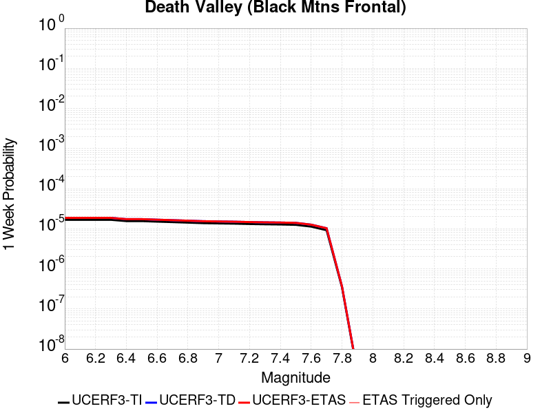 |  |  |  |

| Magnitude | 1 wk TI Prob | 1 wk TD Prob | 1 wk ETAS Prob | 1 wk ETAS/TD Gain | 1 wk ETAS Triggered Only | 1 mo TI Prob | 1 mo TD Prob | 1 mo ETAS Prob | 1 mo ETAS/TD Gain | 1 mo ETAS Triggered Only | 1 yr TI Prob | 1 yr TD Prob | 1 yr ETAS Prob | 1 yr ETAS/TD Gain | 1 yr ETAS Triggered Only | 10 yr TI Prob | 10 yr TD Prob | 10 yr ETAS Prob | 10 yr ETAS/TD Gain | 10 yr ETAS Triggered Only |
|-----|-----|-----|-----|-----|-----|-----|-----|-----|-----|-----|-----|-----|-----|-----|-----|-----|-----|-----|-----|-----|
| 6.0 | 1.6707214E-5 | 1.8671435E-5 | 1.8671435E-5 | 1.0 | 0.0 | 7.160038E-5 | 8.001803E-5 | 8.001803E-5 | 1.0 | 0.0 | 8.71386E-4 | 9.737917E-4 | 0.00104269 | 1.0707526 | 6.896552E-5 | 0.00867977 | 0.0096961 | 0.009764397 | 1.0070437 | 6.896552E-5 |
| 6.1 | 1.6707214E-5 | 1.8671435E-5 | 1.8671435E-5 | 1.0 | 0.0 | 7.160038E-5 | 8.001803E-5 | 8.001803E-5 | 1.0 | 0.0 | 8.71386E-4 | 9.737917E-4 | 0.00104269 | 1.0707526 | 6.896552E-5 | 0.00867977 | 0.0096961 | 0.009764397 | 1.0070437 | 6.896552E-5 |
| 6.2 | 1.6707214E-5 | 1.8671435E-5 | 1.8671435E-5 | 1.0 | 0.0 | 7.160038E-5 | 8.001803E-5 | 8.001803E-5 | 1.0 | 0.0 | 8.71386E-4 | 9.737917E-4 | 0.00104269 | 1.0707526 | 6.896552E-5 | 0.00867977 | 0.0096961 | 0.009764397 | 1.0070437 | 6.896552E-5 |
| 6.3 | 1.6707214E-5 | 1.8671435E-5 | 1.8671435E-5 | 1.0 | 0.0 | 7.160038E-5 | 8.001803E-5 | 8.001803E-5 | 1.0 | 0.0 | 8.71386E-4 | 9.737917E-4 | 0.00104269 | 1.0707526 | 6.896552E-5 | 0.00867977 | 0.0096961 | 0.009764397 | 1.0070437 | 6.896552E-5 |
| 6.4 | 1.5515609E-5 | 1.7339296E-5 | 1.7339296E-5 | 1.0 | 0.0 | 6.649377E-5 | 7.430919E-5 | 7.430919E-5 | 1.0 | 0.0 | 8.0926094E-4 | 9.04345E-4 | 9.7324816E-4 | 1.0761912 | 6.896552E-5 | 0.008063202 | 0.009007333 | 0.009075678 | 1.0075877 | 6.896552E-5 |
| 6.5 | 1.5515609E-5 | 1.7339296E-5 | 1.7339296E-5 | 1.0 | 0.0 | 6.649377E-5 | 7.430919E-5 | 7.430919E-5 | 1.0 | 0.0 | 8.0926094E-4 | 9.04345E-4 | 9.7324816E-4 | 1.0761912 | 6.896552E-5 | 0.008063202 | 0.009007333 | 0.009075678 | 1.0075877 | 6.896552E-5 |
| 6.6 | 1.5041828E-5 | 1.6810196E-5 | 1.6810196E-5 | 1.0 | 0.0 | 6.4463384E-5 | 7.204174E-5 | 7.204174E-5 | 1.0 | 0.0 | 7.8455906E-4 | 8.767611E-4 | 9.4566616E-4 | 1.0785904 | 6.896552E-5 | 0.00781795 | 0.008733676 | 0.00880204 | 1.0078275 | 6.896552E-5 |
| 6.7 | 1.4634985E-5 | 1.635704E-5 | 1.635704E-5 | 1.0 | 0.0 | 6.271985E-5 | 7.009975E-5 | 7.009975E-5 | 1.0 | 0.0 | 7.6334673E-4 | 8.53136E-4 | 8.53136E-4 | 1.0 | 0.0 | 0.007607299 | 0.008499245 | 0.008499245 | 1.0 | 0.0 |
| 6.8 | 1.4209158E-5 | 1.5883043E-5 | 1.5883043E-5 | 1.0 | 0.0 | 6.089497E-5 | 6.806844E-5 | 6.806844E-5 | 1.0 | 0.0 | 7.4114406E-4 | 8.2842377E-4 | 8.2842377E-4 | 1.0 | 0.0 | 0.007386771 | 0.008253971 | 0.008253971 | 1.0 | 0.0 |
| 6.9 | 1.3780098E-5 | 1.540556E-5 | 1.540556E-5 | 1.0 | 0.0 | 5.9056227E-5 | 6.6022185E-5 | 6.6022185E-5 | 1.0 | 0.0 | 7.1877235E-4 | 8.0352917E-4 | 8.0352917E-4 | 1.0 | 0.0 | 0.0071645193 | 0.0080068335 | 0.0080068335 | 1.0 | 0.0 |
| 7.0 | 1.3585064E-5 | 1.5189109E-5 | 1.5189109E-5 | 1.0 | 0.0 | 5.8220405E-5 | 6.509459E-5 | 6.509459E-5 | 1.0 | 0.0 | 7.086029E-4 | 7.922439E-4 | 7.922439E-4 | 1.0 | 0.0 | 0.007063476 | 0.007894788 | 0.007894788 | 1.0 | 0.0 |
| 7.1 | 1.3398601E-5 | 1.4982282E-5 | 1.4982282E-5 | 1.0 | 0.0 | 5.742131E-5 | 6.420823E-5 | 6.420823E-5 | 1.0 | 0.0 | 6.9888023E-4 | 7.8146026E-4 | 7.8146026E-4 | 1.0 | 0.0 | 0.0069668638 | 0.007787712 | 0.007787712 | 1.0 | 0.0 |
| 7.2 | 1.3126312E-5 | 1.4680485E-5 | 1.4680485E-5 | 1.0 | 0.0 | 5.6254412E-5 | 6.291488E-5 | 6.291488E-5 | 1.0 | 0.0 | 6.846822E-4 | 7.6572486E-4 | 7.6572486E-4 | 1.0 | 0.0 | 0.006825765 | 0.007631449 | 0.007631449 | 1.0 | 0.0 |
| 7.3 | 1.2922429E-5 | 1.4454699E-5 | 1.4454699E-5 | 1.0 | 0.0 | 5.5380664E-5 | 6.194727E-5 | 6.194727E-5 | 1.0 | 0.0 | 6.74051E-4 | 7.539525E-4 | 7.539525E-4 | 1.0 | 0.0 | 0.006720101 | 0.007514527 | 0.007514527 | 1.0 | 0.0 |
| 7.4 | 1.2768878E-5 | 1.4284673E-5 | 1.4284673E-5 | 1.0 | 0.0 | 5.4722615E-5 | 6.121862E-5 | 6.121862E-5 | 1.0 | 0.0 | 6.660441E-4 | 7.450873E-4 | 7.450873E-4 | 1.0 | 0.0 | 0.0066405144 | 0.007426471 | 0.007426471 | 1.0 | 0.0 |
| 7.5 | 1.2521929E-5 | 1.4012902E-5 | 1.4012902E-5 | 1.0 | 0.0 | 5.366431E-5 | 6.0053942E-5 | 6.0053942E-5 | 1.0 | 0.0 | 6.531671E-4 | 7.309169E-4 | 7.309169E-4 | 1.0 | 0.0 | 0.006512506 | 0.0072857053 | 0.0072857053 | 1.0 | 0.0 |
| 7.6 | 1.1301089E-5 | 1.2648951E-5 | 1.2648951E-5 | 1.0 | 0.0 | 4.8432343E-5 | 5.4208693E-5 | 5.4208693E-5 | 1.0 | 0.0 | 5.895042E-4 | 6.597963E-4 | 6.597963E-4 | 1.0 | 0.0 | 0.0058794282 | 0.006578926 | 0.006578926 | 1.0 | 0.0 |
| 7.7 | 9.189108E-6 | 1.02840095E-5 | 1.02840095E-5 | 1.0 | 0.0 | 3.93813E-5 | 4.407361E-5 | 4.407361E-5 | 1.0 | 0.0 | 4.7936183E-4 | 5.3646916E-4 | 5.3646916E-4 | 1.0 | 0.0 | 0.004783291 | 0.005352252 | 0.005352252 | 1.0 | 0.0 |
| 7.8 | 3.4586725E-7 | 3.648368E-7 | 3.648368E-7 | 1.0 | 0.0 | 1.4822873E-6 | 1.5635853E-6 | 1.5635853E-6 | 1.0 | 0.0 | 1.80467E-5 | 1.903649E-5 | 1.903649E-5 | 1.0 | 0.0 | 1.8045233E-4 | 1.9034903E-4 | 1.9034903E-4 | 1.0 | 0.0 |
| 7.9 | 2.5591178E-9 | 2.6697329E-9 | 2.6697329E-9 | 1.0 | 0.0 | 1.0967647E-8 | 1.14417125E-8 | 1.14417125E-8 | 1.0 | 0.0 | 1.335311E-7 | 1.3930286E-7 | 1.3930286E-7 | 1.0 | 0.0 | 1.3353102E-6 | 1.3930285E-6 | 1.3930285E-6 | 1.0 | 0.0 |

## San Andreas (Carrizo) rev
*[(top)](#table-of-contents)*

| 1 Week | 1 Month | 1 Year | 10 Year |
|-----|-----|-----|-----|
|  |  | 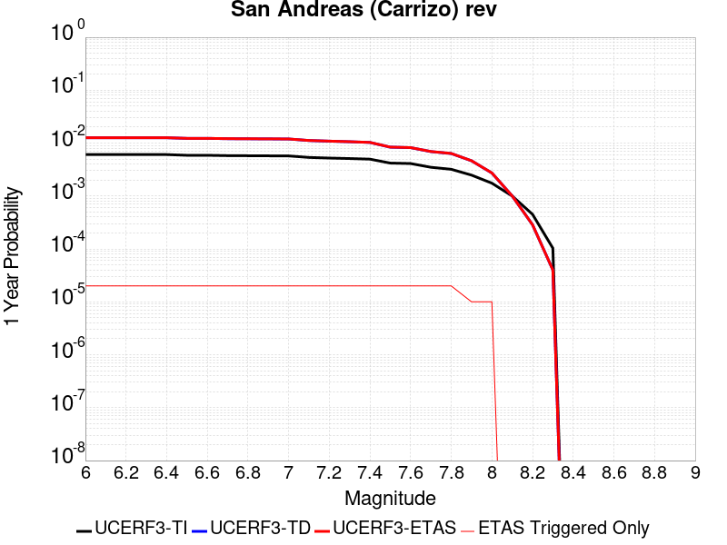 |  |

| Magnitude | 1 wk TI Prob | 1 wk TD Prob | 1 wk ETAS Prob | 1 wk ETAS/TD Gain | 1 wk ETAS Triggered Only | 1 mo TI Prob | 1 mo TD Prob | 1 mo ETAS Prob | 1 mo ETAS/TD Gain | 1 mo ETAS Triggered Only | 1 yr TI Prob | 1 yr TD Prob | 1 yr ETAS Prob | 1 yr ETAS/TD Gain | 1 yr ETAS Triggered Only | 10 yr TI Prob | 10 yr TD Prob | 10 yr ETAS Prob | 10 yr ETAS/TD Gain | 10 yr ETAS Triggered Only |
|-----|-----|-----|-----|-----|-----|-----|-----|-----|-----|-----|-----|-----|-----|-----|-----|-----|-----|-----|-----|-----|
| 6.0 | 1.1674632E-4 | 2.4361293E-4 | 2.4361293E-4 | 1.0 | 0.0 | 5.002454E-4 | 0.0010436393 | 0.0010436393 | 1.0 | 0.0 | 0.006073493 | 0.012632766 | 0.012700859 | 1.0053903 | 6.896552E-5 | 0.0591016 | 0.12077509 | 0.12083573 | 1.0005021 | 6.896552E-5 |
| 6.1 | 1.1674632E-4 | 2.4361293E-4 | 2.4361293E-4 | 1.0 | 0.0 | 5.002454E-4 | 0.0010436393 | 0.0010436393 | 1.0 | 0.0 | 0.006073493 | 0.012632766 | 0.012700859 | 1.0053903 | 6.896552E-5 | 0.0591016 | 0.12077509 | 0.12083573 | 1.0005021 | 6.896552E-5 |
| 6.2 | 1.1674632E-4 | 2.4361293E-4 | 2.4361293E-4 | 1.0 | 0.0 | 5.002454E-4 | 0.0010436393 | 0.0010436393 | 1.0 | 0.0 | 0.006073493 | 0.012632766 | 0.012700859 | 1.0053903 | 6.896552E-5 | 0.0591016 | 0.12077509 | 0.12083573 | 1.0005021 | 6.896552E-5 |
| 6.3 | 1.1674632E-4 | 2.4361293E-4 | 2.4361293E-4 | 1.0 | 0.0 | 5.002454E-4 | 0.0010436393 | 0.0010436393 | 1.0 | 0.0 | 0.006073493 | 0.012632766 | 0.012700859 | 1.0053903 | 6.896552E-5 | 0.0591016 | 0.12077509 | 0.12083573 | 1.0005021 | 6.896552E-5 |
| 6.4 | 1.1674632E-4 | 2.4361293E-4 | 2.4361293E-4 | 1.0 | 0.0 | 5.002454E-4 | 0.0010436393 | 0.0010436393 | 1.0 | 0.0 | 0.006073493 | 0.012632766 | 0.012700859 | 1.0053903 | 6.896552E-5 | 0.0591016 | 0.12077509 | 0.12083573 | 1.0005021 | 6.896552E-5 |
| 6.5 | 1.13136164E-4 | 2.3681132E-4 | 2.3681132E-4 | 1.0 | 0.0 | 4.847792E-4 | 0.0010145125 | 0.0010145125 | 1.0 | 0.0 | 0.0058862255 | 0.012282185 | 0.012350304 | 1.0055461 | 6.896552E-5 | 0.057327334 | 0.1177463 | 0.11780714 | 1.0005168 | 6.896552E-5 |
| 6.6 | 1.13136164E-4 | 2.3681132E-4 | 2.3681132E-4 | 1.0 | 0.0 | 4.847792E-4 | 0.0010145125 | 0.0010145125 | 1.0 | 0.0 | 0.0058862255 | 0.012282185 | 0.012350304 | 1.0055461 | 6.896552E-5 | 0.057327334 | 0.1177463 | 0.11780714 | 1.0005168 | 6.896552E-5 |
| 6.7 | 1.1149675E-4 | 2.3372276E-4 | 2.3372276E-4 | 1.0 | 0.0 | 4.777557E-4 | 0.001001286 | 0.001001286 | 1.0 | 0.0 | 0.0058011734 | 0.012122953 | 0.012191083 | 1.0056199 | 6.896552E-5 | 0.05652051 | 0.116367765 | 0.1164287 | 1.0005237 | 6.896552E-5 |
| 6.8 | 1.1103589E-4 | 2.3274389E-4 | 2.3274389E-4 | 1.0 | 0.0 | 4.7578133E-4 | 9.97094E-4 | 9.97094E-4 | 1.0 | 0.0 | 0.005777263 | 0.012072483 | 0.012140616 | 1.0056436 | 6.896552E-5 | 0.056293584 | 0.115927964 | 0.11598893 | 1.000526 | 6.896552E-5 |
| 6.9 | 1.1053259E-4 | 2.316672E-4 | 2.316672E-4 | 1.0 | 0.0 | 4.7362508E-4 | 9.924831E-4 | 9.924831E-4 | 1.0 | 0.0 | 0.0057511497 | 0.012016967 | 0.012085103 | 1.0056701 | 6.896552E-5 | 0.05604569 | 0.11544405 | 0.11550505 | 1.0005285 | 6.896552E-5 |
| 7.0 | 1.1005377E-4 | 2.3067516E-4 | 2.3067516E-4 | 1.0 | 0.0 | 4.7157376E-4 | 9.882348E-4 | 9.882348E-4 | 1.0 | 0.0 | 0.0057263062 | 0.011965811 | 0.0120339515 | 1.0056946 | 6.896552E-5 | 0.055809796 | 0.11499625 | 0.11505728 | 1.0005307 | 6.896552E-5 |
| 7.1 | 1.0308142E-4 | 2.1576507E-4 | 2.1576507E-4 | 1.0 | 0.0 | 4.417027E-4 | 9.2438085E-4 | 9.2438085E-4 | 1.0 | 0.0 | 0.0053644776 | 0.011196577 | 0.01126477 | 1.0060905 | 6.896552E-5 | 0.052368138 | 0.10825095 | 0.10831245 | 1.0005682 | 6.896552E-5 |
| 7.2 | 1.0027479E-4 | 2.098411E-4 | 2.098411E-4 | 1.0 | 0.0 | 4.296783E-4 | 8.9901005E-4 | 8.9901005E-4 | 1.0 | 0.0 | 0.0052187922 | 0.010890815 | 0.01095903 | 1.0062635 | 6.896552E-5 | 0.050979212 | 0.105554216 | 0.10561591 | 1.0005844 | 6.896552E-5 |
| 7.3 | 9.816942E-5 | 2.0458816E-4 | 2.0458816E-4 | 1.0 | 0.0 | 4.2065824E-4 | 8.765127E-4 | 8.765127E-4 | 1.0 | 0.0 | 0.005109493 | 0.010619612 | 0.010687846 | 1.0064251 | 6.896552E-5 | 0.049935985 | 0.10313633 | 0.103198186 | 1.0005997 | 6.896552E-5 |
| 7.4 | 9.5634205E-5 | 1.9827684E-4 | 1.9827684E-4 | 1.0 | 0.0 | 4.0979648E-4 | 8.494821E-4 | 8.494821E-4 | 1.0 | 0.0 | 0.0049778637 | 0.010293663 | 0.010361918 | 1.0066309 | 6.896552E-5 | 0.048678253 | 0.100220494 | 0.10028255 | 1.0006192 | 6.896552E-5 |
| 7.5 | 8.052417E-5 | 1.6143978E-4 | 1.6143978E-4 | 1.0 | 0.0 | 3.4505792E-4 | 6.917014E-4 | 6.917014E-4 | 1.0 | 0.0 | 0.0041929903 | 0.008389029 | 0.008457416 | 1.008152 | 6.896552E-5 | 0.04114753 | 0.08295002 | 0.08301327 | 1.0007625 | 6.896552E-5 |
| 7.6 | 7.897024E-5 | 1.579682E-4 | 1.579682E-4 | 1.0 | 0.0 | 3.384E-4 | 6.768311E-4 | 6.768311E-4 | 1.0 | 0.0 | 0.0041122385 | 0.00820936 | 0.00827776 | 1.0083319 | 6.896552E-5 | 0.040369697 | 0.081289805 | 0.081353165 | 1.0007794 | 6.896552E-5 |
| 7.7 | 6.707427E-5 | 1.3303987E-4 | 1.3303987E-4 | 1.0 | 0.0 | 2.8742946E-4 | 5.700463E-4 | 5.700463E-4 | 1.0 | 0.0 | 0.003493839 | 0.0069182604 | 0.006986749 | 1.0098996 | 6.896552E-5 | 0.034394164 | 0.06917457 | 0.06923877 | 1.000928 | 6.896552E-5 |
| 7.8 | 6.147705E-5 | 1.2222702E-4 | 1.2222702E-4 | 1.0 | 0.0 | 2.6344648E-4 | 5.23725E-4 | 5.23725E-4 | 1.0 | 0.0 | 0.0032027436 | 0.0063577346 | 0.0064262617 | 1.0107785 | 6.896552E-5 | 0.031569764 | 0.06362964 | 0.063694224 | 1.001015 | 6.896552E-5 |
| 7.9 | 4.7636717E-5 | 8.8979046E-5 | 8.8979046E-5 | 1.0 | 0.0 | 2.0414138E-4 | 3.8128305E-4 | 3.8128305E-4 | 1.0 | 0.0 | 0.0024825884 | 0.004632248 | 0.004700894 | 1.0148191 | 6.896552E-5 | 0.024550365 | 0.046713326 | 0.04677907 | 1.0014074 | 6.896552E-5 |
| 8.0 | 3.3554235E-5 | 5.224805E-5 | 5.224805E-5 | 1.0 | 0.0 | 1.4379594E-4 | 2.23901E-4 | 2.23901E-4 | 1.0 | 0.0 | 0.0017493097 | 0.0027225888 | 0.0027913665 | 1.0252619 | 6.896552E-5 | 0.017356034 | 0.027935574 | 0.028002612 | 1.0023998 | 6.896552E-5 |
| 8.1 | 1.9175432E-5 | 1.9238541E-5 | 1.9238541E-5 | 1.0 | 0.0 | 8.217783E-5 | 8.244829E-5 | 8.244829E-5 | 1.0 | 0.0 | 0.0010000558 | 0.0010033463 | 0.0010033463 | 1.0 | 0.0 | 0.009955673 | 0.010786123 | 0.010786123 | 1.0 | 0.0 |
| 8.2 | 8.643924E-6 | 5.49522E-6 | 5.49522E-6 | 1.0 | 0.0 | 3.704486E-5 | 2.355073E-5 | 2.355073E-5 | 1.0 | 0.0 | 4.5092785E-4 | 2.866925E-4 | 2.866925E-4 | 1.0 | 0.0 | 0.0045001395 | 0.0032598388 | 0.0032598388 | 1.0 | 0.0 |
| 8.3 | 1.983087E-6 | 7.693574E-7 | 7.693574E-7 | 1.0 | 0.0 | 8.498917E-6 | 3.297242E-6 | 3.297242E-6 | 1.0 | 0.0 | 1.034694E-4 | 4.01432E-5 | 4.01432E-5 | 1.0 | 0.0 | 0.0010342124 | 4.7390026E-4 | 4.7390026E-4 | 1.0 | 0.0 |

## San Andreas (Santa Cruz Mts) 2011 CFM
*[(top)](#table-of-contents)*

| 1 Week | 1 Month | 1 Year | 10 Year |
|-----|-----|-----|-----|
|  |  |  | 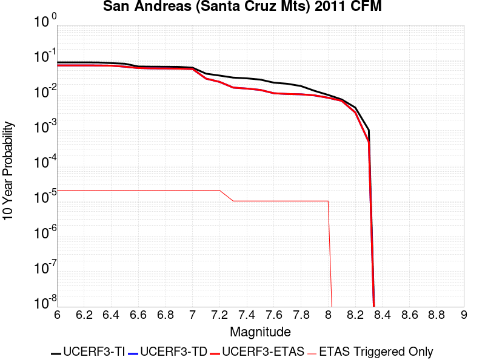 |

| Magnitude | 1 wk TI Prob | 1 wk TD Prob | 1 wk ETAS Prob | 1 wk ETAS/TD Gain | 1 wk ETAS Triggered Only | 1 mo TI Prob | 1 mo TD Prob | 1 mo ETAS Prob | 1 mo ETAS/TD Gain | 1 mo ETAS Triggered Only | 1 yr TI Prob | 1 yr TD Prob | 1 yr ETAS Prob | 1 yr ETAS/TD Gain | 1 yr ETAS Triggered Only | 10 yr TI Prob | 10 yr TD Prob | 10 yr ETAS Prob | 10 yr ETAS/TD Gain | 10 yr ETAS Triggered Only |
|-----|-----|-----|-----|-----|-----|-----|-----|-----|-----|-----|-----|-----|-----|-----|-----|-----|-----|-----|-----|-----|
| 6.0 | 1.7221631E-4 | 1.3823692E-4 | 1.3823692E-4 | 1.0 | 0.0 | 7.378611E-4 | 5.923115E-4 | 5.923115E-4 | 1.0 | 0.0 | 0.008946515 | 0.0071879383 | 0.007256408 | 1.0095257 | 6.896552E-5 | 0.08594794 | 0.070697196 | 0.070761286 | 1.0009066 | 6.896552E-5 |
| 6.1 | 1.7221631E-4 | 1.3823692E-4 | 1.3823692E-4 | 1.0 | 0.0 | 7.378611E-4 | 5.923115E-4 | 5.923115E-4 | 1.0 | 0.0 | 0.008946515 | 0.0071879383 | 0.007256408 | 1.0095257 | 6.896552E-5 | 0.08594794 | 0.070697196 | 0.070761286 | 1.0009066 | 6.896552E-5 |
| 6.2 | 1.7221631E-4 | 1.3823692E-4 | 1.3823692E-4 | 1.0 | 0.0 | 7.378611E-4 | 5.923115E-4 | 5.923115E-4 | 1.0 | 0.0 | 0.008946515 | 0.0071879383 | 0.007256408 | 1.0095257 | 6.896552E-5 | 0.08594794 | 0.070697196 | 0.070761286 | 1.0009066 | 6.896552E-5 |
| 6.3 | 1.716926E-4 | 1.3743078E-4 | 1.3743078E-4 | 1.0 | 0.0 | 7.3561794E-4 | 5.888581E-4 | 5.888581E-4 | 1.0 | 0.0 | 0.008919428 | 0.0071461694 | 0.007214642 | 1.0095817 | 6.896552E-5 | 0.08569809 | 0.0703092 | 0.07037332 | 1.000912 | 6.896552E-5 |
| 6.4 | 1.6392978E-4 | 1.3618424E-4 | 1.3618424E-4 | 1.0 | 0.0 | 7.02367E-4 | 5.8351824E-4 | 5.8351824E-4 | 1.0 | 0.0 | 0.008517839 | 0.0070815794 | 0.007150057 | 1.0096698 | 6.896552E-5 | 0.08198654 | 0.06954003 | 0.0696042 | 1.0009228 | 6.896552E-5 |
| 6.5 | 1.5742714E-4 | 1.26776E-4 | 1.26776E-4 | 1.0 | 0.0 | 6.745133E-4 | 5.4321426E-4 | 5.4321426E-4 | 1.0 | 0.0 | 0.00818132 | 0.006593904 | 0.006662415 | 1.01039 | 6.896552E-5 | 0.078865945 | 0.0649993 | 0.06506378 | 1.0009921 | 6.896552E-5 |
| 6.6 | 1.3038084E-4 | 1.161551E-4 | 1.161551E-4 | 1.0 | 0.0 | 5.5865536E-4 | 4.9771386E-4 | 4.9771386E-4 | 1.0 | 0.0 | 0.006780438 | 0.0060430723 | 0.0061116214 | 1.0113434 | 6.896552E-5 | 0.0657725 | 0.059452567 | 0.059517436 | 1.001091 | 6.896552E-5 |
| 6.7 | 1.2867592E-4 | 1.13418515E-4 | 1.13418515E-4 | 1.0 | 0.0 | 5.5135164E-4 | 4.8599008E-4 | 4.8599008E-4 | 1.0 | 0.0 | 0.0066920654 | 0.005901116 | 0.005969675 | 1.0116179 | 6.896552E-5 | 0.06494093 | 0.05816314 | 0.058228094 | 1.0011168 | 6.896552E-5 |
| 6.8 | 1.2801298E-4 | 1.1279377E-4 | 1.1279377E-4 | 1.0 | 0.0 | 5.485117E-4 | 4.833136E-4 | 4.833136E-4 | 1.0 | 0.0 | 0.0066577005 | 0.0058687064 | 0.0059372676 | 1.0116824 | 6.896552E-5 | 0.06461738 | 0.05787688 | 0.057941854 | 1.0011226 | 6.896552E-5 |
| 6.9 | 1.269149E-4 | 1.11214715E-4 | 1.11214715E-4 | 1.0 | 0.0 | 5.4380763E-4 | 4.765487E-4 | 4.765487E-4 | 1.0 | 0.0 | 0.006600777 | 0.005786784 | 0.0058553503 | 1.0118488 | 6.896552E-5 | 0.06408122 | 0.057148356 | 0.05721338 | 1.0011379 | 6.896552E-5 |
| 7.0 | 1.2030331E-4 | 1.0851204E-4 | 1.0851204E-4 | 1.0 | 0.0 | 5.154837E-4 | 4.6496998E-4 | 4.6496998E-4 | 1.0 | 0.0 | 0.006257969 | 0.005646552 | 0.005715128 | 1.0121448 | 6.896552E-5 | 0.06084648 | 0.055819258 | 0.055884372 | 1.0011666 | 6.896552E-5 |
| 7.1 | 8.049617E-5 | 5.4114953E-5 | 5.4114953E-5 | 1.0 | 0.0 | 3.4493793E-4 | 2.319008E-4 | 2.319008E-4 | 1.0 | 0.0 | 0.0041915346 | 0.0028197719 | 0.002888543 | 1.0243889 | 6.896552E-5 | 0.041133516 | 0.02971132 | 0.029778235 | 1.0022522 | 6.896552E-5 |
| 7.2 | 7.093979E-5 | 4.310381E-5 | 4.310381E-5 | 1.0 | 0.0 | 3.0399222E-4 | 1.8471766E-4 | 1.8471766E-4 | 1.0 | 0.0 | 0.0036948253 | 0.0022466409 | 0.0023154516 | 1.0306282 | 6.896552E-5 | 0.03633994 | 0.024024088 | 0.024091398 | 1.0028018 | 6.896552E-5 |
| 7.3 | 6.193693E-5 | 2.9018376E-5 | 2.9018376E-5 | 1.0 | 0.0 | 2.6541698E-4 | 1.2435856E-4 | 1.2435856E-4 | 1.0 | 0.0 | 0.0032266637 | 0.0015130156 | 0.0015818768 | 1.0455126 | 6.896552E-5 | 0.031802133 | 0.016564084 | 0.016631907 | 1.0040946 | 6.896552E-5 |
| 7.4 | 5.906492E-5 | 2.7136244E-5 | 2.7136244E-5 | 1.0 | 0.0 | 2.5311083E-4 | 1.16293006E-4 | 1.16293006E-4 | 1.0 | 0.0 | 0.0030772698 | 0.0014149492 | 0.0014838171 | 1.0486717 | 6.896552E-5 | 0.030350044 | 0.015530545 | 0.01559844 | 1.0043716 | 6.896552E-5 |
| 7.5 | 5.424296E-5 | 2.4776109E-5 | 2.4776109E-5 | 1.0 | 0.0 | 2.324491E-4 | 1.0617901E-4 | 1.0617901E-4 | 1.0 | 0.0 | 0.002826395 | 0.0012919641 | 0.0013608405 | 1.0533113 | 6.896552E-5 | 0.027907165 | 0.014215293 | 0.014283278 | 1.0047826 | 6.896552E-5 |
| 7.6 | 4.43084E-5 | 1.9971396E-5 | 1.9971396E-5 | 1.0 | 0.0 | 1.8987931E-4 | 8.558889E-5 | 8.558889E-5 | 1.0 | 0.0 | 0.0023093296 | 0.0010415468 | 0.0011104405 | 1.0661455 | 6.896552E-5 | 0.022854783 | 0.011448878 | 0.011517054 | 1.0059549 | 6.896552E-5 |
| 7.7 | 4.118098E-5 | 1.8999577E-5 | 1.8999577E-5 | 1.0 | 0.0 | 1.7647797E-4 | 8.1424216E-5 | 8.1424216E-5 | 1.0 | 0.0 | 0.002146502 | 9.908893E-4 | 0.0010597864 | 1.0695306 | 6.896552E-5 | 0.021258866 | 0.010904559 | 0.010972773 | 1.0062555 | 6.896552E-5 |
| 7.8 | 3.5408906E-5 | 1.8625631E-5 | 1.8625631E-5 | 1.0 | 0.0 | 1.5174363E-4 | 7.982169E-5 | 7.982169E-5 | 1.0 | 0.0 | 0.0018459131 | 9.7139605E-4 | 0.0010402945 | 1.0709274 | 6.896552E-5 | 0.018306552 | 0.0106848935 | 0.010753122 | 1.0063856 | 6.896552E-5 |
| 7.9 | 2.5860836E-5 | 1.7371205E-5 | 1.7371205E-5 | 1.0 | 0.0 | 1.10827445E-4 | 7.4445896E-5 | 7.4445896E-5 | 1.0 | 0.0 | 0.001348489 | 9.060022E-4 | 9.749052E-4 | 1.0760517 | 6.896552E-5 | 0.013403354 | 0.009936898 | 0.010005178 | 1.0068713 | 6.896552E-5 |
| 8.0 | 1.9777332E-5 | 1.4886952E-5 | 1.4886952E-5 | 1.0 | 0.0 | 8.4757245E-5 | 6.379966E-5 | 6.379966E-5 | 1.0 | 0.0 | 0.0010314309 | 7.7648426E-4 | 8.4539625E-4 | 1.0887487 | 6.896552E-5 | 0.010266567 | 0.008534084 | 0.008602461 | 1.0080122 | 6.896552E-5 |
| 8.1 | 1.468494E-5 | 1.2146339E-5 | 1.2146339E-5 | 1.0 | 0.0 | 6.293394E-5 | 5.20547E-5 | 5.20547E-5 | 1.0 | 0.0 | 7.6595135E-4 | 6.3358183E-4 | 6.3358183E-4 | 1.0 | 0.0 | 0.0076331664 | 0.0069899 | 0.0069899 | 1.0 | 0.0 |
| 8.2 | 8.63836E-6 | 5.489407E-6 | 5.489407E-6 | 1.0 | 0.0 | 3.7021015E-5 | 2.3525818E-5 | 2.3525818E-5 | 1.0 | 0.0 | 4.5063766E-4 | 2.863893E-4 | 2.863893E-4 | 1.0 | 0.0 | 0.004497249 | 0.0032568157 | 0.0032568157 | 1.0 | 0.0 |
| 8.3 | 1.983087E-6 | 7.693574E-7 | 7.693574E-7 | 1.0 | 0.0 | 8.498917E-6 | 3.297242E-6 | 3.297242E-6 | 1.0 | 0.0 | 1.034694E-4 | 4.01432E-5 | 4.01432E-5 | 1.0 | 0.0 | 0.0010342124 | 4.7390026E-4 | 4.7390026E-4 | 1.0 | 0.0 |

## San Andreas (Big Bend)
*[(top)](#table-of-contents)*

| 1 Week | 1 Month | 1 Year | 10 Year |
|-----|-----|-----|-----|
|  |  |  |  |

| Magnitude | 1 wk TI Prob | 1 wk TD Prob | 1 wk ETAS Prob | 1 wk ETAS/TD Gain | 1 wk ETAS Triggered Only | 1 mo TI Prob | 1 mo TD Prob | 1 mo ETAS Prob | 1 mo ETAS/TD Gain | 1 mo ETAS Triggered Only | 1 yr TI Prob | 1 yr TD Prob | 1 yr ETAS Prob | 1 yr ETAS/TD Gain | 1 yr ETAS Triggered Only | 10 yr TI Prob | 10 yr TD Prob | 10 yr ETAS Prob | 10 yr ETAS/TD Gain | 10 yr ETAS Triggered Only |
|-----|-----|-----|-----|-----|-----|-----|-----|-----|-----|-----|-----|-----|-----|-----|-----|-----|-----|-----|-----|-----|
| 6.0 | 1.0179969E-4 | 2.0106303E-4 | 2.0106303E-4 | 1.0 | 0.0 | 4.362114E-4 | 8.614151E-4 | 8.614151E-4 | 1.0 | 0.0 | 0.0052979486 | 0.010437581 | 0.010505826 | 1.0065385 | 6.896552E-5 | 0.051734097 | 0.10159716 | 0.10165912 | 1.0006099 | 6.896552E-5 |
| 6.1 | 1.0179969E-4 | 2.0106303E-4 | 2.0106303E-4 | 1.0 | 0.0 | 4.362114E-4 | 8.614151E-4 | 8.614151E-4 | 1.0 | 0.0 | 0.0052979486 | 0.010437581 | 0.010505826 | 1.0065385 | 6.896552E-5 | 0.051734097 | 0.10159716 | 0.10165912 | 1.0006099 | 6.896552E-5 |
| 6.2 | 1.0179969E-4 | 2.0106303E-4 | 2.0106303E-4 | 1.0 | 0.0 | 4.362114E-4 | 8.614151E-4 | 8.614151E-4 | 1.0 | 0.0 | 0.0052979486 | 0.010437581 | 0.010505826 | 1.0065385 | 6.896552E-5 | 0.051734097 | 0.10159716 | 0.10165912 | 1.0006099 | 6.896552E-5 |
| 6.3 | 1.0179969E-4 | 2.0106303E-4 | 2.0106303E-4 | 1.0 | 0.0 | 4.362114E-4 | 8.614151E-4 | 8.614151E-4 | 1.0 | 0.0 | 0.0052979486 | 0.010437581 | 0.010505826 | 1.0065385 | 6.896552E-5 | 0.051734097 | 0.10159716 | 0.10165912 | 1.0006099 | 6.896552E-5 |
| 6.4 | 9.1639464E-5 | 1.8462905E-4 | 1.8462905E-4 | 1.0 | 0.0 | 3.9268145E-4 | 7.910276E-4 | 7.910276E-4 | 1.0 | 0.0 | 0.0047704205 | 0.009588352 | 0.0096566565 | 1.0071237 | 6.896552E-5 | 0.046693064 | 0.093921766 | 0.09398425 | 1.0006653 | 6.896552E-5 |
| 6.5 | 9.1639464E-5 | 1.8462905E-4 | 1.8462905E-4 | 1.0 | 0.0 | 3.9268145E-4 | 7.910276E-4 | 7.910276E-4 | 1.0 | 0.0 | 0.0047704205 | 0.009588352 | 0.0096566565 | 1.0071237 | 6.896552E-5 | 0.046693064 | 0.093921766 | 0.09398425 | 1.0006653 | 6.896552E-5 |
| 6.6 | 9.042622E-5 | 1.826988E-4 | 1.826988E-4 | 1.0 | 0.0 | 3.8748336E-4 | 7.827601E-4 | 7.827601E-4 | 1.0 | 0.0 | 0.0047074095 | 0.009488574 | 0.009556885 | 1.0071993 | 6.896552E-5 | 0.046089325 | 0.093015574 | 0.09307812 | 1.0006725 | 6.896552E-5 |
| 6.7 | 8.9836685E-5 | 1.8184188E-4 | 1.8184188E-4 | 1.0 | 0.0 | 3.8495753E-4 | 7.790898E-4 | 7.790898E-4 | 1.0 | 0.0 | 0.00467679 | 0.009444275 | 0.009512589 | 1.0072334 | 6.896552E-5 | 0.045795817 | 0.09260978 | 0.092672355 | 1.0006757 | 6.896552E-5 |
| 6.8 | 8.9471854E-5 | 1.8130938E-4 | 1.8130938E-4 | 1.0 | 0.0 | 3.8339442E-4 | 7.7680906E-4 | 7.7680906E-4 | 1.0 | 0.0 | 0.004657841 | 0.009416748 | 0.009485063 | 1.0072547 | 6.896552E-5 | 0.04561414 | 0.09235688 | 0.092419475 | 1.0006777 | 6.896552E-5 |
| 6.9 | 8.858234E-5 | 1.8012857E-4 | 1.8012857E-4 | 1.0 | 0.0 | 3.7958333E-4 | 7.717514E-4 | 7.717514E-4 | 1.0 | 0.0 | 0.004611638 | 0.009355701 | 0.009424021 | 1.0073025 | 6.896552E-5 | 0.04517103 | 0.09179684 | 0.091859475 | 1.0006824 | 6.896552E-5 |
| 7.0 | 8.7433385E-5 | 1.7851574E-4 | 1.7851574E-4 | 1.0 | 0.0 | 3.746607E-4 | 7.648433E-4 | 7.648433E-4 | 1.0 | 0.0 | 0.004551957 | 0.009272313 | 0.009340639 | 1.0073688 | 6.896552E-5 | 0.044598386 | 0.091031015 | 0.091093704 | 1.0006887 | 6.896552E-5 |
| 7.1 | 8.684964E-5 | 1.7763473E-4 | 1.7763473E-4 | 1.0 | 0.0 | 3.7215967E-4 | 7.610698E-4 | 7.610698E-4 | 1.0 | 0.0 | 0.0045216335 | 0.009226761 | 0.00929509 | 1.0074055 | 6.896552E-5 | 0.04430731 | 0.09061238 | 0.0906751 | 1.0006921 | 6.896552E-5 |
| 7.2 | 8.606521E-5 | 1.7654036E-4 | 1.7654036E-4 | 1.0 | 0.0 | 3.6879873E-4 | 7.5638236E-4 | 7.5638236E-4 | 1.0 | 0.0 | 0.0044808835 | 0.009170174 | 0.009238507 | 1.0074517 | 6.896552E-5 | 0.043916024 | 0.09009273 | 0.09015548 | 1.0006965 | 6.896552E-5 |
| 7.3 | 8.568266E-5 | 1.7595981E-4 | 1.7595981E-4 | 1.0 | 0.0 | 3.6715972E-4 | 7.5389567E-4 | 7.5389567E-4 | 1.0 | 0.0 | 0.0044610105 | 0.0091401525 | 0.009208487 | 1.0074763 | 6.896552E-5 | 0.043725148 | 0.08981366 | 0.08987643 | 1.0006989 | 6.896552E-5 |
| 7.4 | 8.5432206E-5 | 1.7558529E-4 | 1.7558529E-4 | 1.0 | 0.0 | 3.6608664E-4 | 7.522915E-4 | 7.522915E-4 | 1.0 | 0.0 | 0.004447999 | 0.009120786 | 0.009189122 | 1.0074924 | 6.896552E-5 | 0.043600157 | 0.08963369 | 0.08969647 | 1.0007005 | 6.896552E-5 |
| 7.5 | 8.4791965E-5 | 1.742772E-4 | 1.742772E-4 | 1.0 | 0.0 | 3.633435E-4 | 7.466887E-4 | 7.466887E-4 | 1.0 | 0.0 | 0.0044147377 | 0.00905314 | 0.009121481 | 1.0075489 | 6.896552E-5 | 0.043280575 | 0.08901084 | 0.08907367 | 1.0007058 | 6.896552E-5 |
| 7.6 | 8.241105E-5 | 1.6872598E-4 | 1.6872598E-4 | 1.0 | 0.0 | 3.531424E-4 | 7.229111E-4 | 7.229111E-4 | 1.0 | 0.0 | 0.0042910352 | 0.008766012 | 0.008834373 | 1.0077984 | 6.896552E-5 | 0.042091176 | 0.086385906 | 0.086448915 | 1.0007293 | 6.896552E-5 |
| 7.7 | 7.00432E-5 | 1.4233537E-4 | 1.4233537E-4 | 1.0 | 0.0 | 3.001506E-4 | 6.0986617E-4 | 6.0986617E-4 | 1.0 | 0.0 | 0.0036482112 | 0.0073998813 | 0.0074683363 | 1.0092509 | 6.896552E-5 | 0.035888977 | 0.07364825 | 0.07371214 | 1.0008675 | 6.896552E-5 |
| 7.8 | 6.415362E-5 | 1.2995097E-4 | 1.2995097E-4 | 1.0 | 0.0 | 2.749151E-4 | 5.568139E-4 | 5.568139E-4 | 1.0 | 0.0 | 0.0033419547 | 0.006758167 | 0.0068266666 | 1.0101358 | 6.896552E-5 | 0.03292141 | 0.06737108 | 0.06743539 | 1.0009547 | 6.896552E-5 |
| 7.9 | 4.939911E-5 | 9.359872E-5 | 9.359872E-5 | 1.0 | 0.0 | 2.116933E-4 | 4.0107573E-4 | 4.0107573E-4 | 1.0 | 0.0 | 0.0025743195 | 0.0048721726 | 0.004940802 | 1.014086 | 6.896552E-5 | 0.025447013 | 0.04900208 | 0.049067665 | 1.0013385 | 6.896552E-5 |
| 8.0 | 3.344983E-5 | 5.2337946E-5 | 5.2337946E-5 | 1.0 | 0.0 | 1.4334853E-4 | 2.2428621E-4 | 2.2428621E-4 | 1.0 | 0.0 | 0.0017438711 | 0.0027272669 | 0.0027960443 | 1.0252185 | 6.896552E-5 | 0.017302496 | 0.027976755 | 0.02804379 | 1.0023961 | 6.896552E-5 |
| 8.1 | 1.9104898E-5 | 1.9226556E-5 | 1.9226556E-5 | 1.0 | 0.0 | 8.1875565E-5 | 8.2396924E-5 | 8.2396924E-5 | 1.0 | 0.0 | 9.963791E-4 | 0.0010027215 | 0.0010027215 | 1.0 | 0.0 | 0.009919235 | 0.01077785 | 0.01077785 | 1.0 | 0.0 |
| 8.2 | 8.643924E-6 | 5.49522E-6 | 5.49522E-6 | 1.0 | 0.0 | 3.704486E-5 | 2.355073E-5 | 2.355073E-5 | 1.0 | 0.0 | 4.5092785E-4 | 2.866925E-4 | 2.866925E-4 | 1.0 | 0.0 | 0.0045001395 | 0.0032598388 | 0.0032598388 | 1.0 | 0.0 |
| 8.3 | 1.983087E-6 | 7.693574E-7 | 7.693574E-7 | 1.0 | 0.0 | 8.498917E-6 | 3.297242E-6 | 3.297242E-6 | 1.0 | 0.0 | 1.034694E-4 | 4.01432E-5 | 4.01432E-5 | 1.0 | 0.0 | 0.0010342124 | 4.7390026E-4 | 4.7390026E-4 | 1.0 | 0.0 |

## Owens Valley
*[(top)](#table-of-contents)*

| 1 Week | 1 Month | 1 Year | 10 Year |
|-----|-----|-----|-----|
|  |  |  |  |

| Magnitude | 1 wk TI Prob | 1 wk TD Prob | 1 wk ETAS Prob | 1 wk ETAS/TD Gain | 1 wk ETAS Triggered Only | 1 mo TI Prob | 1 mo TD Prob | 1 mo ETAS Prob | 1 mo ETAS/TD Gain | 1 mo ETAS Triggered Only | 1 yr TI Prob | 1 yr TD Prob | 1 yr ETAS Prob | 1 yr ETAS/TD Gain | 1 yr ETAS Triggered Only | 10 yr TI Prob | 10 yr TD Prob | 10 yr ETAS Prob | 10 yr ETAS/TD Gain | 10 yr ETAS Triggered Only |
|-----|-----|-----|-----|-----|-----|-----|-----|-----|-----|-----|-----|-----|-----|-----|-----|-----|-----|-----|-----|-----|
| 6.0 | 4.83821E-5 | 3.6298834E-6 | 3.6298834E-6 | 1.0 | 0.0 | 2.0733538E-4 | 1.5556556E-5 | 1.5556556E-5 | 1.0 | 0.0 | 0.002521386 | 1.893856E-4 | 2.5833806E-4 | 1.364085 | 6.896552E-5 | 0.024929691 | 0.0019267192 | 0.0019955519 | 1.0357254 | 6.896552E-5 |
| 6.1 | 4.83821E-5 | 3.6298834E-6 | 3.6298834E-6 | 1.0 | 0.0 | 2.0733538E-4 | 1.5556556E-5 | 1.5556556E-5 | 1.0 | 0.0 | 0.002521386 | 1.893856E-4 | 2.5833806E-4 | 1.364085 | 6.896552E-5 | 0.024929691 | 0.0019267192 | 0.0019955519 | 1.0357254 | 6.896552E-5 |
| 6.2 | 4.83821E-5 | 3.6298834E-6 | 3.6298834E-6 | 1.0 | 0.0 | 2.0733538E-4 | 1.5556556E-5 | 1.5556556E-5 | 1.0 | 0.0 | 0.002521386 | 1.893856E-4 | 2.5833806E-4 | 1.364085 | 6.896552E-5 | 0.024929691 | 0.0019267192 | 0.0019955519 | 1.0357254 | 6.896552E-5 |
| 6.3 | 3.953008E-5 | 3.1571942E-6 | 3.1571942E-6 | 1.0 | 0.0 | 1.6940363E-4 | 1.3530766E-5 | 1.3530766E-5 | 1.0 | 0.0 | 0.002060538 | 1.6472537E-4 | 2.3367953E-4 | 1.4186007 | 6.896552E-5 | 0.020415364 | 0.0016601578 | 0.0017290087 | 1.0414726 | 6.896552E-5 |
| 6.4 | 3.953008E-5 | 3.1571942E-6 | 3.1571942E-6 | 1.0 | 0.0 | 1.6940363E-4 | 1.3530766E-5 | 1.3530766E-5 | 1.0 | 0.0 | 0.002060538 | 1.6472537E-4 | 2.3367953E-4 | 1.4186007 | 6.896552E-5 | 0.020415364 | 0.0016601578 | 0.0017290087 | 1.0414726 | 6.896552E-5 |
| 6.5 | 3.457342E-5 | 2.9727623E-6 | 2.9727623E-6 | 1.0 | 0.0 | 1.4816338E-4 | 1.2740352E-5 | 1.2740352E-5 | 1.0 | 0.0 | 0.0018023965 | 1.5510344E-4 | 2.2405825E-4 | 1.4445732 | 6.896552E-5 | 0.017878477 | 0.0015563503 | 0.0016252084 | 1.0442433 | 6.896552E-5 |
| 6.6 | 3.1127765E-5 | 2.8753116E-6 | 2.8753116E-6 | 1.0 | 0.0 | 1.3339789E-4 | 1.232271E-5 | 1.232271E-5 | 1.0 | 0.0 | 0.0016229092 | 1.5001935E-4 | 2.1897453E-4 | 1.4596418 | 6.896552E-5 | 0.016111081 | 0.0015016922 | 0.0015705541 | 1.0458562 | 6.896552E-5 |
| 6.7 | 2.806885E-5 | 2.8110242E-6 | 2.8110242E-6 | 1.0 | 0.0 | 1.2028952E-4 | 1.2047194E-5 | 1.2047194E-5 | 1.0 | 0.0 | 0.001463541 | 1.466654E-4 | 2.156208E-4 | 1.4701545 | 6.896552E-5 | 0.014539397 | 0.0014660707 | 0.0015349351 | 1.046972 | 6.896552E-5 |
| 6.8 | 2.524524E-5 | 2.2358972E-6 | 2.2358972E-6 | 1.0 | 0.0 | 1.0818939E-4 | 9.582383E-6 | 9.582383E-6 | 1.0 | 0.0 | 0.0013164099 | 1.16659576E-4 | 1.8561704E-4 | 1.5911 | 6.896552E-5 | 0.01308639 | 0.001166257 | 0.001235142 | 1.0590651 | 6.896552E-5 |
| 6.9 | 2.2704568E-5 | 1.6085578E-6 | 1.6085578E-6 | 1.0 | 0.0 | 9.730166E-5 | 6.893801E-6 | 6.893801E-6 | 1.0 | 0.0 | 0.0011840039 | 8.392881E-5 | 1.5288855E-4 | 1.8216455 | 6.896552E-5 | 0.011777153 | 8.391837E-4 | 9.080913E-4 | 1.0821127 | 6.896552E-5 |
| 7.0 | 2.0871712E-5 | 1.5399135E-6 | 1.5399135E-6 | 1.0 | 0.0 | 8.944713E-5 | 6.5996123E-6 | 6.5996123E-6 | 1.0 | 0.0 | 0.0010884746 | 8.034734E-5 | 1.493073E-4 | 1.8582734 | 6.896552E-5 | 0.010831586 | 8.0335594E-4 | 8.72266E-4 | 1.0857778 | 6.896552E-5 |
| 7.1 | 1.944928E-5 | 1.3867325E-6 | 1.3867325E-6 | 1.0 | 0.0 | 8.335139E-5 | 5.943126E-6 | 5.943126E-6 | 1.0 | 0.0 | 0.0010143308 | 7.2355164E-5 | 1.4131569E-4 | 1.9530838 | 6.896552E-5 | 0.010097133 | 7.23475E-4 | 7.923906E-4 | 1.0952564 | 6.896552E-5 |
| 7.2 | 1.7876306E-5 | 1.249191E-6 | 1.249191E-6 | 1.0 | 0.0 | 7.6610486E-5 | 5.3536646E-6 | 5.3536646E-6 | 1.0 | 0.0 | 9.3233347E-4 | 6.517892E-5 | 1.3413995E-4 | 2.0580263 | 6.896552E-5 | 0.009284316 | 6.517364E-4 | 7.20657E-4 | 1.1057491 | 6.896552E-5 |
| 7.3 | 1.2618672E-5 | 1.1117779E-6 | 1.1117779E-6 | 1.0 | 0.0 | 5.40789E-5 | 4.764754E-6 | 4.764754E-6 | 1.0 | 0.0 | 6.582117E-4 | 5.8009344E-5 | 1.2697086E-4 | 2.1888 | 6.896552E-5 | 0.0065626553 | 5.800754E-4 | 6.490009E-4 | 1.1188216 | 6.896552E-5 |
| 7.4 | 7.4874442E-6 | 8.550806E-7 | 8.550806E-7 | 1.0 | 0.0 | 3.208865E-5 | 3.6646259E-6 | 3.6646259E-6 | 1.0 | 0.0 | 3.906093E-4 | 4.461591E-5 | 1.1357835E-4 | 2.5456917 | 6.896552E-5 | 0.003899234 | 4.461625E-4 | 5.150973E-4 | 1.154506 | 6.896552E-5 |
| 7.5 | 2.4734156E-6 | 6.0700546E-7 | 6.0700546E-7 | 1.0 | 0.0 | 1.060031E-5 | 2.6014495E-6 | 2.6014495E-6 | 1.0 | 0.0 | 1.2905113E-4 | 3.167219E-5 | 3.167219E-5 | 1.0 | 0.0 | 0.0012897621 | 3.166771E-4 | 3.166771E-4 | 1.0 | 0.0 |
| 7.6 | 1.1328841E-6 | 3.1972448E-7 | 3.1972448E-7 | 1.0 | 0.0 | 4.8552088E-6 | 1.3702471E-6 | 1.3702471E-6 | 1.0 | 0.0 | 5.9110564E-5 | 1.6682632E-5 | 1.6682632E-5 | 1.0 | 0.0 | 5.9094845E-4 | 1.6681399E-4 | 1.6681399E-4 | 1.0 | 0.0 |
| 7.7 | 4.8613185E-7 | 8.967469E-8 | 8.967469E-8 | 1.0 | 0.0 | 2.0834207E-6 | 3.8432006E-7 | 3.8432006E-7 | 1.0 | 0.0 | 2.536535E-5 | 4.6790874E-6 | 4.6790874E-6 | 1.0 | 0.0 | 2.5362454E-4 | 4.678996E-5 | 4.678996E-5 | 1.0 | 0.0 |

## Coyote Canyon
*[(top)](#table-of-contents)*

| 1 Week | 1 Month | 1 Year | 10 Year |
|-----|-----|-----|-----|
| 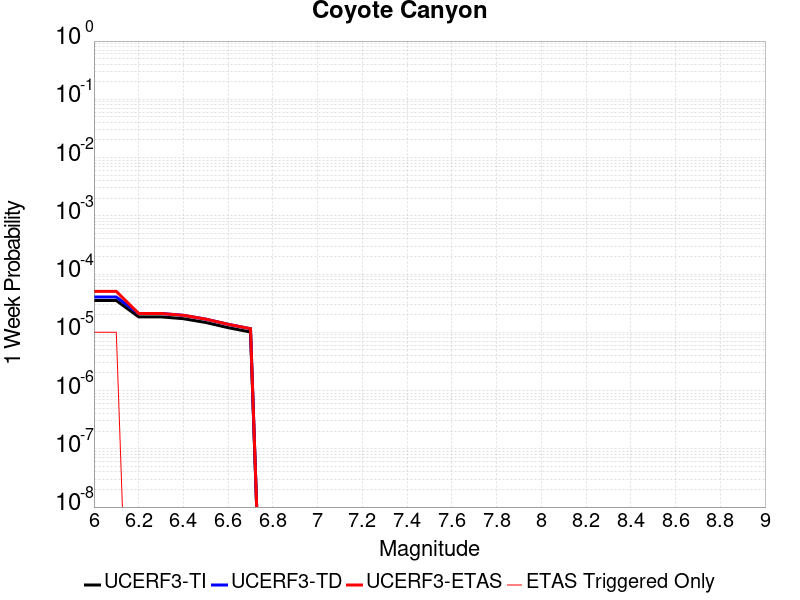 |  |  |  |

| Magnitude | 1 wk TI Prob | 1 wk TD Prob | 1 wk ETAS Prob | 1 wk ETAS/TD Gain | 1 wk ETAS Triggered Only | 1 mo TI Prob | 1 mo TD Prob | 1 mo ETAS Prob | 1 mo ETAS/TD Gain | 1 mo ETAS Triggered Only | 1 yr TI Prob | 1 yr TD Prob | 1 yr ETAS Prob | 1 yr ETAS/TD Gain | 1 yr ETAS Triggered Only | 10 yr TI Prob | 10 yr TD Prob | 10 yr ETAS Prob | 10 yr ETAS/TD Gain | 10 yr ETAS Triggered Only |
|-----|-----|-----|-----|-----|-----|-----|-----|-----|-----|-----|-----|-----|-----|-----|-----|-----|-----|-----|-----|-----|
| 6.0 | 3.5090034E-5 | 4.0367544E-5 | 4.0367544E-5 | 1.0 | 0.0 | 1.503772E-4 | 1.7299375E-4 | 1.7299375E-4 | 1.0 | 0.0 | 0.0018293047 | 0.0021044204 | 0.0021044204 | 1.0 | 0.0 | 0.018143194 | 0.020870851 | 0.020938378 | 1.0032355 | 6.896552E-5 |
| 6.1 | 3.5090034E-5 | 4.0367544E-5 | 4.0367544E-5 | 1.0 | 0.0 | 1.503772E-4 | 1.7299375E-4 | 1.7299375E-4 | 1.0 | 0.0 | 0.0018293047 | 0.0021044204 | 0.0021044204 | 1.0 | 0.0 | 0.018143194 | 0.020870851 | 0.020938378 | 1.0032355 | 6.896552E-5 |
| 6.2 | 1.841879E-5 | 2.1061396E-5 | 2.1061396E-5 | 1.0 | 0.0 | 7.8935285E-5 | 9.026058E-5 | 9.026058E-5 | 1.0 | 0.0 | 9.606133E-4 | 0.0010984705 | 0.0010984705 | 1.0 | 0.0 | 0.0095647145 | 0.010940496 | 0.010940496 | 1.0 | 0.0 |
| 6.3 | 1.841879E-5 | 2.1061396E-5 | 2.1061396E-5 | 1.0 | 0.0 | 7.8935285E-5 | 9.026058E-5 | 9.026058E-5 | 1.0 | 0.0 | 9.606133E-4 | 0.0010984705 | 0.0010984705 | 1.0 | 0.0 | 0.0095647145 | 0.010940496 | 0.010940496 | 1.0 | 0.0 |
| 6.4 | 1.712201E-5 | 1.9566693E-5 | 1.9566693E-5 | 1.0 | 0.0 | 7.337798E-5 | 8.385513E-5 | 8.385513E-5 | 1.0 | 0.0 | 8.930107E-4 | 0.0010205585 | 0.0010205585 | 1.0 | 0.0 | 0.008894307 | 0.010168637 | 0.010168637 | 1.0 | 0.0 |
| 6.5 | 1.4744935E-5 | 1.683824E-5 | 1.683824E-5 | 1.0 | 0.0 | 6.3191044E-5 | 7.216242E-5 | 7.216242E-5 | 1.0 | 0.0 | 7.6907943E-4 | 8.7831676E-4 | 8.7831676E-4 | 1.0 | 0.0 | 0.007664232 | 0.008757652 | 0.008757652 | 1.0 | 0.0 |
| 6.6 | 1.2017839E-5 | 1.3725124E-5 | 1.3725124E-5 | 1.0 | 0.0 | 5.150401E-5 | 5.882113E-5 | 5.882113E-5 | 1.0 | 0.0 | 6.268809E-4 | 7.1600056E-4 | 7.1600056E-4 | 1.0 | 0.0 | 0.0062511545 | 0.007145631 | 0.007145631 | 1.0 | 0.0 |
| 6.7 | 1.00956095E-5 | 1.1534388E-5 | 1.1534388E-5 | 1.0 | 0.0 | 4.326618E-5 | 4.943265E-5 | 4.943265E-5 | 1.0 | 0.0 | 5.266384E-4 | 6.0176325E-4 | 6.0176325E-4 | 1.0 | 0.0 | 0.005253921 | 0.006009866 | 0.006009866 | 1.0 | 0.0 |

## Manix-Afton Hills
*[(top)](#table-of-contents)*

| 1 Week | 1 Month | 1 Year | 10 Year |
|-----|-----|-----|-----|
|  |  |  |  |

| Magnitude | 1 wk TI Prob | 1 wk TD Prob | 1 wk ETAS Prob | 1 wk ETAS/TD Gain | 1 wk ETAS Triggered Only | 1 mo TI Prob | 1 mo TD Prob | 1 mo ETAS Prob | 1 mo ETAS/TD Gain | 1 mo ETAS Triggered Only | 1 yr TI Prob | 1 yr TD Prob | 1 yr ETAS Prob | 1 yr ETAS/TD Gain | 1 yr ETAS Triggered Only | 10 yr TI Prob | 10 yr TD Prob | 10 yr ETAS Prob | 10 yr ETAS/TD Gain | 10 yr ETAS Triggered Only |
|-----|-----|-----|-----|-----|-----|-----|-----|-----|-----|-----|-----|-----|-----|-----|-----|-----|-----|-----|-----|-----|
| 6.0 | 1.3783202E-5 | 1.4711616E-5 | 1.4711616E-5 | 1.0 | 0.0 | 5.906953E-5 | 6.3048356E-5 | 6.3048356E-5 | 1.0 | 0.0 | 7.189342E-4 | 7.673609E-4 | 8.362735E-4 | 1.0898046 | 6.896552E-5 | 0.0071661277 | 0.0076488685 | 0.0077173067 | 1.0089475 | 6.896552E-5 |
| 6.1 | 1.3783202E-5 | 1.4711616E-5 | 1.4711616E-5 | 1.0 | 0.0 | 5.906953E-5 | 6.3048356E-5 | 6.3048356E-5 | 1.0 | 0.0 | 7.189342E-4 | 7.673609E-4 | 8.362735E-4 | 1.0898046 | 6.896552E-5 | 0.0071661277 | 0.0076488685 | 0.0077173067 | 1.0089475 | 6.896552E-5 |
| 6.2 | 1.3783202E-5 | 1.4711616E-5 | 1.4711616E-5 | 1.0 | 0.0 | 5.906953E-5 | 6.3048356E-5 | 6.3048356E-5 | 1.0 | 0.0 | 7.189342E-4 | 7.673609E-4 | 8.362735E-4 | 1.0898046 | 6.896552E-5 | 0.0071661277 | 0.0076488685 | 0.0077173067 | 1.0089475 | 6.896552E-5 |
| 6.3 | 1.10494875E-5 | 1.1793558E-5 | 1.1793558E-5 | 1.0 | 0.0 | 4.7354086E-5 | 5.0542898E-5 | 5.0542898E-5 | 1.0 | 0.0 | 5.763835E-4 | 6.151964E-4 | 6.151964E-4 | 1.0 | 0.0 | 0.005748908 | 0.0061359745 | 0.0061359745 | 1.0 | 0.0 |
| 6.4 | 1.10494875E-5 | 1.1793558E-5 | 1.1793558E-5 | 1.0 | 0.0 | 4.7354086E-5 | 5.0542898E-5 | 5.0542898E-5 | 1.0 | 0.0 | 5.763835E-4 | 6.151964E-4 | 6.151964E-4 | 1.0 | 0.0 | 0.005748908 | 0.0061359745 | 0.0061359745 | 1.0 | 0.0 |
| 6.5 | 9.788949E-6 | 1.0454697E-5 | 1.0454697E-5 | 1.0 | 0.0 | 4.1951964E-5 | 4.480513E-5 | 4.480513E-5 | 1.0 | 0.0 | 5.1064545E-4 | 5.453752E-4 | 5.453752E-4 | 1.0 | 0.0 | 0.0050947363 | 0.005441295 | 0.005441295 | 1.0 | 0.0 |
| 6.6 | 8.810006E-6 | 9.413971E-6 | 9.413971E-6 | 1.0 | 0.0 | 3.775662E-5 | 4.0345018E-5 | 4.0345018E-5 | 1.0 | 0.0 | 4.5958988E-4 | 4.9109873E-4 | 4.9109873E-4 | 1.0 | 0.0 | 0.0045864056 | 0.0049010175 | 0.0049010175 | 1.0 | 0.0 |
| 6.7 | 8.80128E-6 | 9.404451E-6 | 9.404451E-6 | 1.0 | 0.0 | 3.7719226E-5 | 4.0304214E-5 | 4.0304214E-5 | 1.0 | 0.0 | 4.591348E-4 | 4.906022E-4 | 4.906022E-4 | 1.0 | 0.0 | 0.004581874 | 0.004896074 | 0.004896074 | 1.0 | 0.0 |
| 6.8 | 6.8994877E-6 | 7.3803494E-6 | 7.3803494E-6 | 1.0 | 0.0 | 2.9568899E-5 | 3.162973E-5 | 3.162973E-5 | 1.0 | 0.0 | 3.5994186E-4 | 3.850321E-4 | 3.850321E-4 | 1.0 | 0.0 | 0.003593594 | 0.0038444551 | 0.0038444551 | 1.0 | 0.0 |
| 6.9 | 4.9328037E-6 | 5.271154E-6 | 5.271154E-6 | 1.0 | 0.0 | 2.1140417E-5 | 2.2590497E-5 | 2.2590497E-5 | 1.0 | 0.0 | 2.5735417E-4 | 2.7501077E-4 | 2.7501077E-4 | 1.0 | 0.0 | 0.0025705635 | 0.0027473096 | 0.0027473096 | 1.0 | 0.0 |
| 7.0 | 3.347973E-6 | 3.590168E-6 | 3.590168E-6 | 1.0 | 0.0 | 1.4348378E-5 | 1.5386368E-5 | 1.5386368E-5 | 1.0 | 0.0 | 1.746775E-4 | 1.8731703E-4 | 1.8731703E-4 | 1.0 | 0.0 | 0.0017454025 | 0.0018719939 | 0.0018719939 | 1.0 | 0.0 |
| 7.1 | 1.2073567E-6 | 1.293531E-6 | 1.293531E-6 | 1.0 | 0.0 | 5.1743755E-6 | 5.5437017E-6 | 5.5437017E-6 | 1.0 | 0.0 | 6.29962E-5 | 6.749411E-5 | 6.749411E-5 | 1.0 | 0.0 | 6.297835E-4 | 6.748963E-4 | 6.748963E-4 | 1.0 | 0.0 |

## San Andreas (Cholame) rev
*[(top)](#table-of-contents)*

| 1 Week | 1 Month | 1 Year | 10 Year |
|-----|-----|-----|-----|
|  |  |  |  |

| Magnitude | 1 wk TI Prob | 1 wk TD Prob | 1 wk ETAS Prob | 1 wk ETAS/TD Gain | 1 wk ETAS Triggered Only | 1 mo TI Prob | 1 mo TD Prob | 1 mo ETAS Prob | 1 mo ETAS/TD Gain | 1 mo ETAS Triggered Only | 1 yr TI Prob | 1 yr TD Prob | 1 yr ETAS Prob | 1 yr ETAS/TD Gain | 1 yr ETAS Triggered Only | 10 yr TI Prob | 10 yr TD Prob | 10 yr ETAS Prob | 10 yr ETAS/TD Gain | 10 yr ETAS Triggered Only |
|-----|-----|-----|-----|-----|-----|-----|-----|-----|-----|-----|-----|-----|-----|-----|-----|-----|-----|-----|-----|-----|
| 6.0 | 1.2302514E-4 | 2.5242948E-4 | 2.5242948E-4 | 1.0 | 0.0 | 5.27144E-4 | 0.0010813937 | 0.0010813937 | 1.0 | 0.0 | 0.0063991086 | 0.013086997 | 0.01315506 | 1.0052009 | 6.896552E-5 | 0.06217949 | 0.1245517 | 0.12461207 | 1.0004847 | 6.896552E-5 |
| 6.1 | 1.2302514E-4 | 2.5242948E-4 | 2.5242948E-4 | 1.0 | 0.0 | 5.27144E-4 | 0.0010813937 | 0.0010813937 | 1.0 | 0.0 | 0.0063991086 | 0.013086997 | 0.01315506 | 1.0052009 | 6.896552E-5 | 0.06217949 | 0.1245517 | 0.12461207 | 1.0004847 | 6.896552E-5 |
| 6.2 | 1.2203569E-4 | 2.5059693E-4 | 2.5059693E-4 | 1.0 | 0.0 | 5.2290526E-4 | 0.0010735465 | 0.0010735465 | 1.0 | 0.0 | 0.006347804 | 0.0129926 | 0.013060669 | 1.0052391 | 6.896552E-5 | 0.061695136 | 0.12373783 | 0.12379826 | 1.0004884 | 6.896552E-5 |
| 6.3 | 1.2142645E-4 | 2.4945638E-4 | 2.4945638E-4 | 1.0 | 0.0 | 5.202953E-4 | 0.0010686623 | 0.0010686623 | 1.0 | 0.0 | 0.006316212 | 0.012933843 | 0.013001917 | 1.0052632 | 6.896552E-5 | 0.06139677 | 0.123231925 | 0.123292394 | 1.0004907 | 6.896552E-5 |
| 6.4 | 1.1865206E-4 | 2.4450937E-4 | 2.4450937E-4 | 1.0 | 0.0 | 5.0840975E-4 | 0.001047478 | 0.001047478 | 1.0 | 0.0 | 0.006172335 | 0.012678952 | 0.012747043 | 1.0053704 | 6.896552E-5 | 0.060036868 | 0.121024184 | 0.1210848 | 1.0005009 | 6.896552E-5 |
| 6.5 | 1.17443946E-4 | 2.4244092E-4 | 2.4244092E-4 | 1.0 | 0.0 | 5.032341E-4 | 0.0010386204 | 0.0010386204 | 1.0 | 0.0 | 0.006109677 | 0.012572356 | 0.012640454 | 1.0054165 | 6.896552E-5 | 0.059444077 | 0.12009794 | 0.12015863 | 1.0005053 | 6.896552E-5 |
| 6.6 | 1.13579066E-4 | 2.3552658E-4 | 2.3552658E-4 | 1.0 | 0.0 | 4.866766E-4 | 0.0010090107 | 0.0010090107 | 1.0 | 0.0 | 0.0059092017 | 0.012215953 | 0.012284076 | 1.0055766 | 6.896552E-5 | 0.057545185 | 0.11701085 | 0.11707175 | 1.0005205 | 6.896552E-5 |
| 6.7 | 1.1271412E-4 | 2.339688E-4 | 2.339688E-4 | 1.0 | 0.0 | 4.829711E-4 | 0.0010023396 | 0.0010023396 | 1.0 | 0.0 | 0.005864331 | 0.012135641 | 0.01220377 | 1.0056139 | 6.896552E-5 | 0.057119697 | 0.116314195 | 0.11637513 | 1.0005239 | 6.896552E-5 |
| 6.8 | 1.1217975E-4 | 2.3285215E-4 | 2.3285215E-4 | 1.0 | 0.0 | 4.8068175E-4 | 9.975577E-4 | 9.975577E-4 | 1.0 | 0.0 | 0.005836608 | 0.012078067 | 0.0121462 | 1.005641 | 6.896552E-5 | 0.056856725 | 0.11581219 | 0.115873165 | 1.0005265 | 6.896552E-5 |
| 6.9 | 1.1146753E-4 | 2.3133864E-4 | 2.3133864E-4 | 1.0 | 0.0 | 4.7763053E-4 | 9.910761E-4 | 9.910761E-4 | 1.0 | 0.0 | 0.0057996577 | 0.012000027 | 0.012068165 | 1.0056782 | 6.896552E-5 | 0.056506127 | 0.11513234 | 0.11519336 | 1.00053 | 6.896552E-5 |
| 7.0 | 1.0965793E-4 | 2.2756905E-4 | 2.2756905E-4 | 1.0 | 0.0 | 4.698779E-4 | 9.7493286E-4 | 9.7493286E-4 | 1.0 | 0.0 | 0.005705768 | 0.01180563 | 0.011873781 | 1.0057728 | 6.896552E-5 | 0.055614736 | 0.11343304 | 0.11349418 | 1.0005391 | 6.896552E-5 |
| 7.1 | 9.927982E-5 | 2.0574623E-4 | 2.0574623E-4 | 1.0 | 0.0 | 4.2541555E-4 | 8.814726E-4 | 8.814726E-4 | 1.0 | 0.0 | 0.0051671406 | 0.0106794145 | 0.010747643 | 1.0063888 | 6.896552E-5 | 0.05048634 | 0.10352388 | 0.103585705 | 1.0005972 | 6.896552E-5 |
| 7.2 | 9.696786E-5 | 2.0078626E-4 | 2.0078626E-4 | 1.0 | 0.0 | 4.1551032E-4 | 8.602298E-4 | 8.602298E-4 | 1.0 | 0.0 | 0.00504711 | 0.010423285 | 0.010491532 | 1.0065476 | 6.896552E-5 | 0.04934009 | 0.10126121 | 0.101323195 | 1.0006121 | 6.896552E-5 |
| 7.3 | 9.4727984E-5 | 1.9507346E-4 | 1.9507346E-4 | 1.0 | 0.0 | 4.0591392E-4 | 8.357622E-4 | 8.357622E-4 | 1.0 | 0.0 | 0.0049308087 | 0.010128201 | 0.010196468 | 1.0067403 | 6.896552E-5 | 0.048228268 | 0.09863034 | 0.0986925 | 1.0006303 | 6.896552E-5 |
| 7.4 | 9.220358E-5 | 1.8877286E-4 | 1.8877286E-4 | 1.0 | 0.0 | 3.9509835E-4 | 8.0877665E-4 | 8.0877665E-4 | 1.0 | 0.0 | 0.004799717 | 0.009802646 | 0.009870935 | 1.0069665 | 6.896552E-5 | 0.046973653 | 0.09570612 | 0.09576849 | 1.0006516 | 6.896552E-5 |
| 7.5 | 7.71631E-5 | 1.520787E-4 | 1.520787E-4 | 1.0 | 0.0 | 3.306571E-4 | 6.516032E-4 | 6.516032E-4 | 1.0 | 0.0 | 0.0040183207 | 0.007904484 | 0.0079729045 | 1.0086559 | 6.896552E-5 | 0.03946433 | 0.078419134 | 0.078482695 | 1.0008105 | 6.896552E-5 |
| 7.6 | 7.5634416E-5 | 1.4866945E-4 | 1.4866945E-4 | 1.0 | 0.0 | 3.241072E-4 | 6.369994E-4 | 6.369994E-4 | 1.0 | 0.0 | 0.0039388672 | 0.007727957 | 0.0077963895 | 1.0088552 | 6.896552E-5 | 0.038697794 | 0.07678112 | 0.07684478 | 1.0008292 | 6.896552E-5 |
| 7.7 | 6.3783E-5 | 1.2385153E-4 | 1.2385153E-4 | 1.0 | 0.0 | 2.7332708E-4 | 5.3068437E-4 | 5.3068437E-4 | 1.0 | 0.0 | 0.0033226798 | 0.0064419676 | 0.006510489 | 1.0106367 | 6.896552E-5 | 0.032734364 | 0.064660996 | 0.0647255 | 1.0009977 | 6.896552E-5 |
| 7.8 | 5.863422E-5 | 1.1440121E-4 | 1.1440121E-4 | 1.0 | 0.0 | 2.512653E-4 | 4.9019884E-4 | 4.9019884E-4 | 1.0 | 0.0 | 0.003054864 | 0.00595186 | 0.0060204146 | 1.0115182 | 6.896552E-5 | 0.030132094 | 0.059769355 | 0.059834197 | 1.0010849 | 6.896552E-5 |
| 7.9 | 4.595283E-5 | 8.443828E-5 | 8.443828E-5 | 1.0 | 0.0 | 1.9692584E-4 | 3.6182816E-4 | 3.6182816E-4 | 1.0 | 0.0 | 0.0023949358 | 0.0043963664 | 0.0044650286 | 1.015618 | 6.896552E-5 | 0.023692891 | 0.04444455 | 0.04451045 | 1.0014827 | 6.896552E-5 |
| 8.0 | 3.2950178E-5 | 5.0881976E-5 | 5.0881976E-5 | 1.0 | 0.0 | 1.412074E-4 | 2.180474E-4 | 2.180474E-4 | 1.0 | 0.0 | 0.0017178444 | 0.0026514968 | 0.0027202794 | 1.025941 | 6.896552E-5 | 0.017046256 | 0.027233804 | 0.02730089 | 1.0024633 | 6.896552E-5 |
| 8.1 | 1.9177472E-5 | 1.9238712E-5 | 1.9238712E-5 | 1.0 | 0.0 | 8.218658E-5 | 8.244903E-5 | 8.244903E-5 | 1.0 | 0.0 | 0.0010001622 | 0.0010033553 | 0.0010033553 | 1.0 | 0.0 | 0.009956728 | 0.010786239 | 0.010786239 | 1.0 | 0.0 |
| 8.2 | 8.643924E-6 | 5.49522E-6 | 5.49522E-6 | 1.0 | 0.0 | 3.704486E-5 | 2.355073E-5 | 2.355073E-5 | 1.0 | 0.0 | 4.5092785E-4 | 2.866925E-4 | 2.866925E-4 | 1.0 | 0.0 | 0.0045001395 | 0.0032598388 | 0.0032598388 | 1.0 | 0.0 |
| 8.3 | 1.983087E-6 | 7.693574E-7 | 7.693574E-7 | 1.0 | 0.0 | 8.498917E-6 | 3.297242E-6 | 3.297242E-6 | 1.0 | 0.0 | 1.034694E-4 | 4.01432E-5 | 4.01432E-5 | 1.0 | 0.0 | 0.0010342124 | 4.7390026E-4 | 4.7390026E-4 | 1.0 | 0.0 |

## San Andreas (Parkfield)
*[(top)](#table-of-contents)*

| 1 Week | 1 Month | 1 Year | 10 Year |
|-----|-----|-----|-----|
|  |  |  |  |

| Magnitude | 1 wk TI Prob | 1 wk TD Prob | 1 wk ETAS Prob | 1 wk ETAS/TD Gain | 1 wk ETAS Triggered Only | 1 mo TI Prob | 1 mo TD Prob | 1 mo ETAS Prob | 1 mo ETAS/TD Gain | 1 mo ETAS Triggered Only | 1 yr TI Prob | 1 yr TD Prob | 1 yr ETAS Prob | 1 yr ETAS/TD Gain | 1 yr ETAS Triggered Only | 10 yr TI Prob | 10 yr TD Prob | 10 yr ETAS Prob | 10 yr ETAS/TD Gain | 10 yr ETAS Triggered Only |
|-----|-----|-----|-----|-----|-----|-----|-----|-----|-----|-----|-----|-----|-----|-----|-----|-----|-----|-----|-----|-----|
| 6.0 | 5.556969E-4 | 7.819087E-4 | 7.819087E-4 | 1.0 | 0.0 | 0.0023793848 | 0.0033472886 | 0.0033472886 | 1.0 | 0.0 | 0.028586963 | 0.040385824 | 0.040452003 | 1.0016387 | 6.896552E-5 | 0.25176284 | 0.33777508 | 0.33782077 | 1.0001352 | 6.896552E-5 |
| 6.1 | 1.925858E-4 | 3.0390357E-4 | 3.0390357E-4 | 1.0 | 0.0 | 8.2510663E-4 | 0.0013018888 | 0.0013018888 | 1.0 | 0.0 | 0.0099994885 | 0.015834767 | 0.01590264 | 1.0042864 | 6.896552E-5 | 0.095613256 | 0.14999957 | 0.1500582 | 1.0003908 | 6.896552E-5 |
| 6.2 | 9.4306815E-5 | 1.8273306E-4 | 1.8273306E-4 | 1.0 | 0.0 | 4.0410945E-4 | 7.829079E-4 | 7.829079E-4 | 1.0 | 0.0 | 0.0049089384 | 0.009490452 | 0.009558763 | 1.0071979 | 6.896552E-5 | 0.048019063 | 0.09198628 | 0.092048906 | 1.0006808 | 6.896552E-5 |
| 6.3 | 9.283051E-5 | 1.7969737E-4 | 1.7969737E-4 | 1.0 | 0.0 | 3.9778434E-4 | 7.6990545E-4 | 7.6990545E-4 | 1.0 | 0.0 | 0.0048322747 | 0.009333515 | 0.009401836 | 1.00732 | 6.896552E-5 | 0.047285385 | 0.09063911 | 0.09070182 | 1.0006919 | 6.896552E-5 |
| 6.4 | 9.138826E-5 | 1.7731739E-4 | 1.7731739E-4 | 1.0 | 0.0 | 3.916052E-4 | 7.5971155E-4 | 7.5971155E-4 | 1.0 | 0.0 | 0.0047573745 | 0.00921046 | 0.00927879 | 1.0074188 | 6.896552E-5 | 0.046568092 | 0.0895407 | 0.08960349 | 1.0007013 | 6.896552E-5 |
| 6.5 | 9.000255E-5 | 1.7489606E-4 | 1.7489606E-4 | 1.0 | 0.0 | 3.8566816E-4 | 7.493404E-4 | 7.493404E-4 | 1.0 | 0.0 | 0.0046854047 | 0.009085262 | 0.009153601 | 1.007522 | 6.896552E-5 | 0.045878403 | 0.08842592 | 0.08848879 | 1.000711 | 6.896552E-5 |
| 6.6 | 8.8109264E-5 | 1.7170387E-4 | 1.7170387E-4 | 1.0 | 0.0 | 3.7755648E-4 | 7.3566736E-4 | 7.3566736E-4 | 1.0 | 0.0 | 0.0045870654 | 0.0089201825 | 0.008988532 | 1.0076624 | 6.896552E-5 | 0.04493529 | 0.08695624 | 0.08701921 | 1.0007242 | 6.896552E-5 |
| 6.7 | 8.738073E-5 | 1.7037381E-4 | 1.7037381E-4 | 1.0 | 0.0 | 3.7443507E-4 | 7.2997034E-4 | 7.2997034E-4 | 1.0 | 0.0 | 0.0045492216 | 0.0088514285 | 0.008919783 | 1.0077225 | 6.896552E-5 | 0.04457213 | 0.08635636 | 0.08641937 | 1.0007297 | 6.896552E-5 |
| 6.8 | 8.710195E-5 | 1.6982816E-4 | 1.6982816E-4 | 1.0 | 0.0 | 3.7324068E-4 | 7.2763313E-4 | 7.2763313E-4 | 1.0 | 0.0 | 0.0045347405 | 0.008823211 | 0.0088915685 | 1.0077474 | 6.896552E-5 | 0.04443313 | 0.08610373 | 0.08616676 | 1.000732 | 6.896552E-5 |
| 6.9 | 8.6801556E-5 | 1.6923707E-4 | 1.6923707E-4 | 1.0 | 0.0 | 3.7195362E-4 | 7.251013E-4 | 7.251013E-4 | 1.0 | 0.0 | 0.0045191357 | 0.008792636 | 0.008860995 | 1.0077746 | 6.896552E-5 | 0.044283327 | 0.08582957 | 0.08589262 | 1.0007346 | 6.896552E-5 |
| 7.0 | 8.5571606E-5 | 1.6676294E-4 | 1.6676294E-4 | 1.0 | 0.0 | 3.6668387E-4 | 7.145037E-4 | 7.145037E-4 | 1.0 | 0.0 | 0.004455241 | 0.008664643 | 0.008733011 | 1.0078905 | 6.896552E-5 | 0.043669727 | 0.08467713 | 0.08474026 | 1.0007455 | 6.896552E-5 |
| 7.1 | 7.82589E-5 | 1.5156237E-4 | 1.5156237E-4 | 1.0 | 0.0 | 3.3535215E-4 | 6.493921E-4 | 6.493921E-4 | 1.0 | 0.0 | 0.0040752706 | 0.007877857 | 0.00794628 | 1.0086854 | 6.896552E-5 | 0.040013418 | 0.077585794 | 0.077649415 | 1.0008199 | 6.896552E-5 |
| 7.2 | 7.690929E-5 | 1.489332E-4 | 1.489332E-4 | 1.0 | 0.0 | 3.2956956E-4 | 6.381298E-4 | 6.381298E-4 | 1.0 | 0.0 | 0.004005129 | 0.007741721 | 0.0078101526 | 1.0088394 | 6.896552E-5 | 0.0393371 | 0.076358445 | 0.07642215 | 1.0008342 | 6.896552E-5 |
| 7.3 | 7.5543794E-5 | 1.4589565E-4 | 1.4589565E-4 | 1.0 | 0.0 | 3.2371894E-4 | 6.25118E-4 | 6.25118E-4 | 1.0 | 0.0 | 0.003934157 | 0.0075844154 | 0.007652858 | 1.0090241 | 6.896552E-5 | 0.038652334 | 0.07492032 | 0.07498412 | 1.0008515 | 6.896552E-5 |
| 7.4 | 7.4214564E-5 | 1.4290171E-4 | 1.4290171E-4 | 1.0 | 0.0 | 3.1802364E-4 | 6.122929E-4 | 6.122929E-4 | 1.0 | 0.0 | 0.003865065 | 0.007429345 | 0.007497798 | 1.0092139 | 6.896552E-5 | 0.03798529 | 0.07349284 | 0.073556736 | 1.0008694 | 6.896552E-5 |
| 7.5 | 6.149578E-5 | 1.1214155E-4 | 1.1214155E-4 | 1.0 | 0.0 | 2.6352672E-4 | 4.8051824E-4 | 4.8051824E-4 | 1.0 | 0.0 | 0.0032037178 | 0.005834648 | 0.0059032114 | 1.011751 | 6.896552E-5 | 0.03157923 | 0.058665328 | 0.05873025 | 1.0011066 | 6.896552E-5 |
| 7.6 | 6.0643448E-5 | 1.10425855E-4 | 1.10425855E-4 | 1.0 | 0.0 | 2.598746E-4 | 4.7316792E-4 | 4.7316792E-4 | 1.0 | 0.0 | 0.0031593828 | 0.0057456335 | 0.005814203 | 1.0119342 | 6.896552E-5 | 0.031148417 | 0.05782546 | 0.057890438 | 1.0011237 | 6.896552E-5 |
| 7.7 | 5.1652263E-5 | 9.1955124E-5 | 9.1955124E-5 | 1.0 | 0.0 | 2.2134806E-4 | 3.9403388E-4 | 3.9403388E-4 | 1.0 | 0.0 | 0.002691582 | 0.00478682 | 0.0048554554 | 1.0143384 | 6.896552E-5 | 0.026592141 | 0.048633553 | 0.048699163 | 1.0013491 | 6.896552E-5 |
| 7.8 | 4.8090482E-5 | 8.578783E-5 | 8.578783E-5 | 1.0 | 0.0 | 2.060858E-4 | 3.6761034E-4 | 3.6761034E-4 | 1.0 | 0.0 | 0.0025062072 | 0.004466479 | 0.0045351367 | 1.0153717 | 6.896552E-5 | 0.024781305 | 0.045392275 | 0.04545811 | 1.0014503 | 6.896552E-5 |
| 7.9 | 3.970278E-5 | 6.7652974E-5 | 6.7652974E-5 | 1.0 | 0.0 | 1.7014367E-4 | 2.899091E-4 | 2.899091E-4 | 1.0 | 0.0 | 0.002069531 | 0.0035239344 | 0.003592657 | 1.0195017 | 6.896552E-5 | 0.020503636 | 0.035952512 | 0.036018997 | 1.0018493 | 6.896552E-5 |
| 8.0 | 2.8982335E-5 | 4.079188E-5 | 4.079188E-5 | 1.0 | 0.0 | 1.2420409E-4 | 1.7481064E-4 | 1.7481064E-4 | 1.0 | 0.0 | 0.0015111357 | 0.0021262432 | 0.002195062 | 1.0323664 | 6.896552E-5 | 0.015009012 | 0.022057572 | 0.022125017 | 1.0030576 | 6.896552E-5 |
| 8.1 | 1.8836186E-5 | 1.8733741E-5 | 1.8733741E-5 | 1.0 | 0.0 | 8.0724014E-5 | 8.028499E-5 | 8.028499E-5 | 1.0 | 0.0 | 9.823717E-4 | 9.77032E-4 | 9.77032E-4 | 1.0 | 0.0 | 0.009780403 | 0.010515724 | 0.010515724 | 1.0 | 0.0 |
| 8.2 | 8.643924E-6 | 5.49522E-6 | 5.49522E-6 | 1.0 | 0.0 | 3.704486E-5 | 2.355073E-5 | 2.355073E-5 | 1.0 | 0.0 | 4.5092785E-4 | 2.866925E-4 | 2.866925E-4 | 1.0 | 0.0 | 0.0045001395 | 0.0032598388 | 0.0032598388 | 1.0 | 0.0 |
| 8.3 | 1.983087E-6 | 7.693574E-7 | 7.693574E-7 | 1.0 | 0.0 | 8.498917E-6 | 3.297242E-6 | 3.297242E-6 | 1.0 | 0.0 | 1.034694E-4 | 4.01432E-5 | 4.01432E-5 | 1.0 | 0.0 | 0.0010342124 | 4.7390026E-4 | 4.7390026E-4 | 1.0 | 0.0 |

## Red Pass
*[(top)](#table-of-contents)*

| 1 Week | 1 Month | 1 Year | 10 Year |
|-----|-----|-----|-----|
|  |  |  |  |

| Magnitude | 1 wk TI Prob | 1 wk TD Prob | 1 wk ETAS Prob | 1 wk ETAS/TD Gain | 1 wk ETAS Triggered Only | 1 mo TI Prob | 1 mo TD Prob | 1 mo ETAS Prob | 1 mo ETAS/TD Gain | 1 mo ETAS Triggered Only | 1 yr TI Prob | 1 yr TD Prob | 1 yr ETAS Prob | 1 yr ETAS/TD Gain | 1 yr ETAS Triggered Only | 10 yr TI Prob | 10 yr TD Prob | 10 yr ETAS Prob | 10 yr ETAS/TD Gain | 10 yr ETAS Triggered Only |
|-----|-----|-----|-----|-----|-----|-----|-----|-----|-----|-----|-----|-----|-----|-----|-----|-----|-----|-----|-----|-----|
| 6.0 | 8.258278E-6 | 8.551426E-6 | 8.551426E-6 | 1.0 | 0.0 | 3.539214E-5 | 3.6648555E-5 | 3.6648555E-5 | 1.0 | 0.0 | 4.308141E-4 | 4.4612266E-4 | 4.4612266E-4 | 1.0 | 0.0 | 0.0042997985 | 0.0044540283 | 0.004522687 | 1.0154148 | 6.896552E-5 |
| 6.1 | 3.649988E-6 | 3.7753848E-6 | 3.7753848E-6 | 1.0 | 0.0 | 1.5642712E-5 | 1.6180147E-5 | 1.6180147E-5 | 1.0 | 0.0 | 1.9043336E-4 | 1.9698025E-4 | 1.9698025E-4 | 1.0 | 0.0 | 0.0019027026 | 0.0019685237 | 0.0020373536 | 1.0349652 | 6.896552E-5 |
| 6.2 | 3.649988E-6 | 3.7753848E-6 | 3.7753848E-6 | 1.0 | 0.0 | 1.5642712E-5 | 1.6180147E-5 | 1.6180147E-5 | 1.0 | 0.0 | 1.9043336E-4 | 1.9698025E-4 | 1.9698025E-4 | 1.0 | 0.0 | 0.0019027026 | 0.0019685237 | 0.0020373536 | 1.0349652 | 6.896552E-5 |
| 6.3 | 1.3924937E-6 | 1.4411434E-6 | 1.4411434E-6 | 1.0 | 0.0 | 5.9678164E-6 | 6.1763217E-6 | 6.1763217E-6 | 1.0 | 0.0 | 7.265574E-5 | 7.519554E-5 | 7.519554E-5 | 1.0 | 0.0 | 7.263199E-4 | 7.518397E-4 | 8.207534E-4 | 1.09166 | 6.896552E-5 |
| 6.4 | 1.3924937E-6 | 1.4411434E-6 | 1.4411434E-6 | 1.0 | 0.0 | 5.9678164E-6 | 6.1763217E-6 | 6.1763217E-6 | 1.0 | 0.0 | 7.265574E-5 | 7.519554E-5 | 7.519554E-5 | 1.0 | 0.0 | 7.263199E-4 | 7.518397E-4 | 8.207534E-4 | 1.09166 | 6.896552E-5 |
| 6.5 | 9.876812E-7 | 1.0222102E-6 | 1.0222102E-6 | 1.0 | 0.0 | 4.2329125E-6 | 4.3809005E-6 | 4.3809005E-6 | 1.0 | 0.0 | 5.153449E-5 | 5.3337466E-5 | 5.3337466E-5 | 1.0 | 0.0 | 5.1522546E-4 | 5.3337467E-4 | 6.0230336E-4 | 1.1292313 | 6.896552E-5 |

## Garlic Springs
*[(top)](#table-of-contents)*

| 1 Week | 1 Month | 1 Year | 10 Year |
|-----|-----|-----|-----|
|  |  |  |  |

| Magnitude | 1 wk TI Prob | 1 wk TD Prob | 1 wk ETAS Prob | 1 wk ETAS/TD Gain | 1 wk ETAS Triggered Only | 1 mo TI Prob | 1 mo TD Prob | 1 mo ETAS Prob | 1 mo ETAS/TD Gain | 1 mo ETAS Triggered Only | 1 yr TI Prob | 1 yr TD Prob | 1 yr ETAS Prob | 1 yr ETAS/TD Gain | 1 yr ETAS Triggered Only | 10 yr TI Prob | 10 yr TD Prob | 10 yr ETAS Prob | 10 yr ETAS/TD Gain | 10 yr ETAS Triggered Only |
|-----|-----|-----|-----|-----|-----|-----|-----|-----|-----|-----|-----|-----|-----|-----|-----|-----|-----|-----|-----|-----|
| 6.0 | 1.6760017E-5 | 1.8778032E-5 | 1.8778032E-5 | 1.0 | 0.0 | 7.182667E-5 | 8.047546E-5 | 8.047546E-5 | 1.0 | 0.0 | 8.7413884E-4 | 9.794658E-4 | 9.794658E-4 | 1.0 | 0.0 | 0.008707083 | 0.009763034 | 0.009831326 | 1.006995 | 6.896552E-5 |
| 6.1 | 9.852767E-6 | 1.097425E-5 | 1.097425E-5 | 1.0 | 0.0 | 4.222546E-5 | 4.703205E-5 | 4.703205E-5 | 1.0 | 0.0 | 5.139737E-4 | 5.7253573E-4 | 5.7253573E-4 | 1.0 | 0.0 | 0.005127866 | 0.005717566 | 0.005717566 | 1.0 | 0.0 |
| 6.2 | 9.852767E-6 | 1.097425E-5 | 1.097425E-5 | 1.0 | 0.0 | 4.222546E-5 | 4.703205E-5 | 4.703205E-5 | 1.0 | 0.0 | 5.139737E-4 | 5.7253573E-4 | 5.7253573E-4 | 1.0 | 0.0 | 0.005127866 | 0.005717566 | 0.005717566 | 1.0 | 0.0 |
| 6.3 | 4.3167724E-6 | 4.7782996E-6 | 4.7782996E-6 | 1.0 | 0.0 | 1.8500323E-5 | 2.0478396E-5 | 2.0478396E-5 | 1.0 | 0.0 | 2.2521814E-4 | 2.4931898E-4 | 2.4931898E-4 | 1.0 | 0.0 | 0.0022499003 | 0.002492651 | 0.002492651 | 1.0 | 0.0 |
| 6.4 | 4.3167724E-6 | 4.7782996E-6 | 4.7782996E-6 | 1.0 | 0.0 | 1.8500323E-5 | 2.0478396E-5 | 2.0478396E-5 | 1.0 | 0.0 | 2.2521814E-4 | 2.4931898E-4 | 2.4931898E-4 | 1.0 | 0.0 | 0.0022499003 | 0.002492651 | 0.002492651 | 1.0 | 0.0 |
| 6.5 | 4.3167724E-6 | 4.7782996E-6 | 4.7782996E-6 | 1.0 | 0.0 | 1.8500323E-5 | 2.0478396E-5 | 2.0478396E-5 | 1.0 | 0.0 | 2.2521814E-4 | 2.4931898E-4 | 2.4931898E-4 | 1.0 | 0.0 | 0.0022499003 | 0.002492651 | 0.002492651 | 1.0 | 0.0 |
| 6.6 | 4.301311E-6 | 4.761167E-6 | 4.761167E-6 | 1.0 | 0.0 | 1.8434059E-5 | 2.0404972E-5 | 2.0404972E-5 | 1.0 | 0.0 | 2.2441156E-4 | 2.4842523E-4 | 2.4842523E-4 | 1.0 | 0.0 | 0.0022418506 | 0.002483734 | 0.002483734 | 1.0 | 0.0 |
| 6.7 | 3.8599724E-6 | 4.2713013E-6 | 4.2713013E-6 | 1.0 | 0.0 | 1.6542634E-5 | 1.8305576E-5 | 1.8305576E-5 | 1.0 | 0.0 | 2.0138794E-4 | 2.228704E-4 | 2.228704E-4 | 1.0 | 0.0 | 0.0020120554 | 0.0022287038 | 0.0022287038 | 1.0 | 0.0 |

## San Andreas (Creeping Section) 2011 CFM
*[(top)](#table-of-contents)*

| 1 Week | 1 Month | 1 Year | 10 Year |
|-----|-----|-----|-----|
|  |  |  |  |

| Magnitude | 1 wk TI Prob | 1 wk TD Prob | 1 wk ETAS Prob | 1 wk ETAS/TD Gain | 1 wk ETAS Triggered Only | 1 mo TI Prob | 1 mo TD Prob | 1 mo ETAS Prob | 1 mo ETAS/TD Gain | 1 mo ETAS Triggered Only | 1 yr TI Prob | 1 yr TD Prob | 1 yr ETAS Prob | 1 yr ETAS/TD Gain | 1 yr ETAS Triggered Only | 10 yr TI Prob | 10 yr TD Prob | 10 yr ETAS Prob | 10 yr ETAS/TD Gain | 10 yr ETAS Triggered Only |
|-----|-----|-----|-----|-----|-----|-----|-----|-----|-----|-----|-----|-----|-----|-----|-----|-----|-----|-----|-----|-----|
| 6.0 | 5.986481E-4 | 0.0012277901 | 0.0012277901 | 1.0 | 0.0 | 0.0025631124 | 0.0052455855 | 0.0052455855 | 1.0 | 0.0 | 0.030762846 | 0.061229862 | 0.061294608 | 1.0010574 | 6.896552E-5 | 0.26835477 | 0.42607152 | 0.4261111 | 1.0000929 | 6.896552E-5 |
| 6.1 | 5.015945E-4 | 0.0010218644 | 0.0010218644 | 1.0 | 0.0 | 0.00214792 | 0.0043676887 | 0.0043676887 | 1.0 | 0.0 | 0.025839351 | 0.051269703 | 0.051335134 | 1.0012761 | 6.896552E-5 | 0.23032776 | 0.37298882 | 0.37303206 | 1.000116 | 6.896552E-5 |
| 6.2 | 4.073338E-4 | 8.109829E-4 | 8.109829E-4 | 1.0 | 0.0 | 0.0017445484 | 0.0034675654 | 0.0034675654 | 1.0 | 0.0 | 0.021034058 | 0.040954083 | 0.041020226 | 1.001615 | 6.896552E-5 | 0.19150782 | 0.31317768 | 0.31322506 | 1.0001513 | 6.896552E-5 |
| 6.3 | 3.464099E-4 | 6.7405414E-4 | 6.7405414E-4 | 1.0 | 0.0 | 0.0014837692 | 0.0028840431 | 0.0028840431 | 1.0 | 0.0 | 0.017915873 | 0.034210727 | 0.03427733 | 1.0019469 | 6.896552E-5 | 0.16538359 | 0.27146977 | 0.27152002 | 1.0001851 | 6.896552E-5 |
| 6.4 | 2.935057E-4 | 5.543318E-4 | 5.543318E-4 | 1.0 | 0.0 | 0.0012572751 | 0.0023728115 | 0.0023728115 | 1.0 | 0.0 | 0.015200248 | 0.028285956 | 0.02835297 | 1.0023692 | 6.896552E-5 | 0.14201577 | 0.23314685 | 0.23319973 | 1.0002269 | 6.896552E-5 |
| 6.5 | 2.3409708E-4 | 4.2106997E-4 | 4.2106997E-4 | 1.0 | 0.0 | 0.0010028875 | 0.001803265 | 0.001803265 | 1.0 | 0.0 | 0.012141965 | 0.02160988 | 0.021677356 | 1.0031224 | 6.896552E-5 | 0.11499573 | 0.18699536 | 0.18705142 | 1.0002998 | 6.896552E-5 |
| 6.6 | 1.5842178E-4 | 2.5115322E-4 | 2.5115322E-4 | 1.0 | 0.0 | 6.7877385E-4 | 0.0010759257 | 0.0010759257 | 1.0 | 0.0 | 0.0082328 | 0.013019121 | 0.01308719 | 1.0052283 | 6.896552E-5 | 0.07934396 | 0.12333139 | 0.12339185 | 1.0004902 | 6.896552E-5 |
| 6.7 | 1.5616413E-4 | 2.4651614E-4 | 2.4651614E-4 | 1.0 | 0.0 | 6.691031E-4 | 0.0010560687 | 0.0010560687 | 1.0 | 0.0 | 0.0081159435 | 0.012780937 | 0.012849021 | 1.005327 | 6.896552E-5 | 0.0782586 | 0.12135857 | 0.12141917 | 1.0004994 | 6.896552E-5 |
| 6.8 | 1.5538467E-4 | 2.4475376E-4 | 2.4475376E-4 | 1.0 | 0.0 | 6.6576427E-4 | 0.0010485224 | 0.0010485224 | 1.0 | 0.0 | 0.008075596 | 0.0126902815 | 0.012758371 | 1.0053655 | 6.896552E-5 | 0.07788358 | 0.12058931 | 0.120649956 | 1.000503 | 6.896552E-5 |
| 6.9 | 1.5153569E-4 | 2.3584193E-4 | 2.3584193E-4 | 1.0 | 0.0 | 6.49277E-4 | 0.0010103616 | 0.0010103616 | 1.0 | 0.0 | 0.007876333 | 0.0122323 | 0.012300422 | 1.005569 | 6.896552E-5 | 0.07602952 | 0.11665895 | 0.11671987 | 1.0005223 | 6.896552E-5 |
| 7.0 | 1.4588932E-4 | 2.2441045E-4 | 2.2441045E-4 | 1.0 | 0.0 | 6.250901E-4 | 9.6140656E-4 | 9.6140656E-4 | 1.0 | 0.0 | 0.0075839474 | 0.011642803 | 0.011710966 | 1.0058545 | 6.896552E-5 | 0.073302895 | 0.11150479 | 0.11156607 | 1.0005496 | 6.896552E-5 |
| 7.1 | 1.1565079E-4 | 1.6318668E-4 | 1.6318668E-4 | 1.0 | 0.0 | 4.955521E-4 | 6.991849E-4 | 6.991849E-4 | 1.0 | 0.0 | 0.006016669 | 0.008479553 | 0.008547934 | 1.0080642 | 6.896552E-5 | 0.058563538 | 0.08383247 | 0.08389565 | 1.0007536 | 6.896552E-5 |
| 7.2 | 1.0393792E-4 | 1.4650424E-4 | 1.4650424E-4 | 1.0 | 0.0 | 4.4537216E-4 | 6.2772504E-4 | 6.2772504E-4 | 1.0 | 0.0 | 0.005408933 | 0.007615941 | 0.0076843817 | 1.0089865 | 6.896552E-5 | 0.052791595 | 0.075774014 | 0.07583775 | 1.0008411 | 6.896552E-5 |
| 7.3 | 9.332884E-5 | 1.2811116E-4 | 1.2811116E-4 | 1.0 | 0.0 | 3.999194E-4 | 5.4893293E-4 | 5.4893293E-4 | 1.0 | 0.0 | 0.0048581534 | 0.006662914 | 0.00673142 | 1.0102817 | 6.896552E-5 | 0.047533102 | 0.06662133 | 0.06668571 | 1.0009662 | 6.896552E-5 |
| 7.4 | 8.670252E-5 | 1.17293064E-4 | 1.17293064E-4 | 1.0 | 0.0 | 3.715293E-4 | 5.0258834E-4 | 5.0258834E-4 | 1.0 | 0.0 | 0.004513991 | 0.006101966 | 0.006170511 | 1.0112332 | 6.896552E-5 | 0.044233937 | 0.06127167 | 0.061336413 | 1.0010566 | 6.896552E-5 |
| 7.5 | 7.3036405E-5 | 9.027501E-5 | 9.027501E-5 | 1.0 | 0.0 | 3.129756E-4 | 3.8683563E-4 | 3.8683563E-4 | 1.0 | 0.0 | 0.0038038217 | 0.0046995743 | 0.0047682156 | 1.0146059 | 6.896552E-5 | 0.03739367 | 0.047980286 | 0.048045944 | 1.0013684 | 6.896552E-5 |
| 7.6 | 6.3935775E-5 | 8.298733E-5 | 8.298733E-5 | 1.0 | 0.0 | 2.7398168E-4 | 3.5561158E-4 | 3.5561158E-4 | 1.0 | 0.0 | 0.0033306254 | 0.0043209945 | 0.0043896623 | 1.0158916 | 6.896552E-5 | 0.032811474 | 0.04407886 | 0.044144787 | 1.0014956 | 6.896552E-5 |
| 7.7 | 5.5050095E-5 | 6.6780485E-5 | 6.6780485E-5 | 1.0 | 0.0 | 2.3590765E-4 | 2.861707E-4 | 2.861707E-4 | 1.0 | 0.0 | 0.0028683927 | 0.003478566 | 0.0035472917 | 1.0197569 | 6.896552E-5 | 0.0283165 | 0.035874426 | 0.03594092 | 1.0018535 | 6.896552E-5 |
| 7.8 | 5.027131E-5 | 6.177649E-5 | 6.177649E-5 | 1.0 | 0.0 | 2.1543067E-4 | 2.6472952E-4 | 2.6472952E-4 | 1.0 | 0.0 | 0.0026197135 | 0.0032183218 | 0.0032870653 | 1.02136 | 6.896552E-5 | 0.025890453 | 0.033198178 | 0.033264857 | 1.0020084 | 6.896552E-5 |
| 7.9 | 3.7271806E-5 | 5.034326E-5 | 5.034326E-5 | 1.0 | 0.0 | 1.5972654E-4 | 2.15739E-4 | 2.15739E-4 | 1.0 | 0.0 | 0.0019429359 | 0.0026234603 | 0.002692245 | 1.026219 | 6.896552E-5 | 0.019260362 | 0.027125074 | 0.027192168 | 1.0024736 | 6.896552E-5 |
| 8.0 | 2.7310243E-5 | 3.1506686E-5 | 3.1506686E-5 | 1.0 | 0.0 | 1.17038646E-4 | 1.3502168E-4 | 1.3502168E-4 | 1.0 | 0.0 | 0.0014240141 | 0.0016426502 | 0.0017115024 | 1.0419153 | 6.896552E-5 | 0.014149235 | 0.017253635 | 0.01732141 | 1.0039282 | 6.896552E-5 |
| 8.1 | 1.7940547E-5 | 1.7450684E-5 | 1.7450684E-5 | 1.0 | 0.0 | 7.688579E-5 | 7.4786505E-5 | 7.4786505E-5 | 1.0 | 0.0 | 9.3568244E-4 | 9.1014587E-4 | 9.1014587E-4 | 1.0 | 0.0 | 0.009317525 | 0.009825298 | 0.009825298 | 1.0 | 0.0 |
| 8.2 | 8.643924E-6 | 5.49522E-6 | 5.49522E-6 | 1.0 | 0.0 | 3.704486E-5 | 2.355073E-5 | 2.355073E-5 | 1.0 | 0.0 | 4.5092785E-4 | 2.866925E-4 | 2.866925E-4 | 1.0 | 0.0 | 0.0045001395 | 0.0032598388 | 0.0032598388 | 1.0 | 0.0 |
| 8.3 | 1.983087E-6 | 7.693574E-7 | 7.693574E-7 | 1.0 | 0.0 | 8.498917E-6 | 3.297242E-6 | 3.297242E-6 | 1.0 | 0.0 | 1.034694E-4 | 4.01432E-5 | 4.01432E-5 | 1.0 | 0.0 | 0.0010342124 | 4.7390026E-4 | 4.7390026E-4 | 1.0 | 0.0 |

