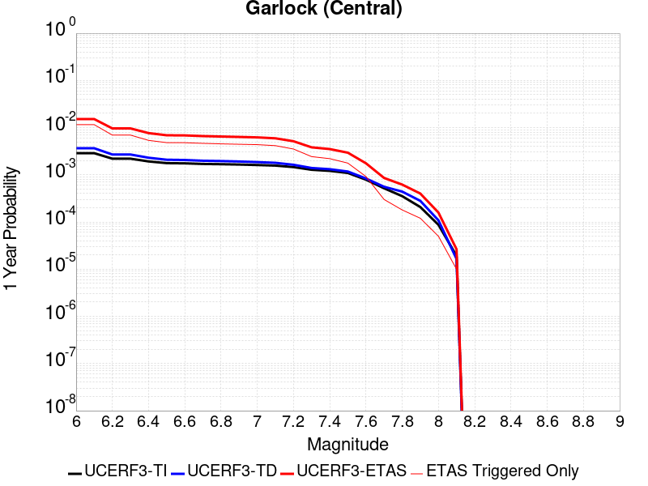
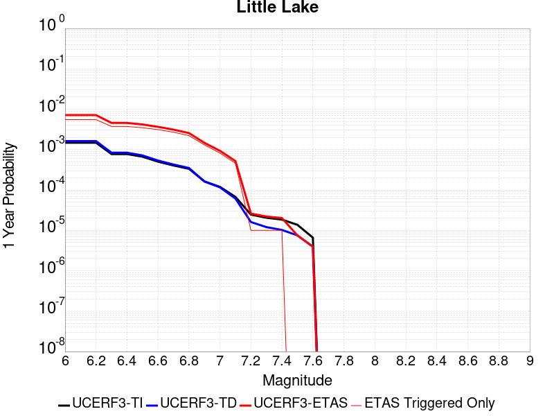
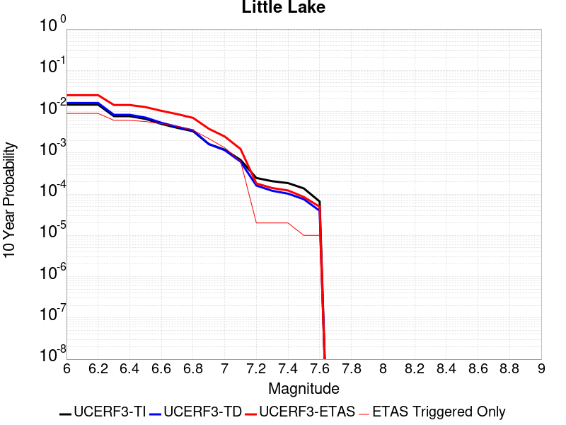
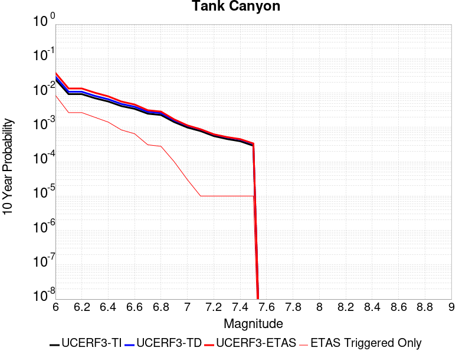
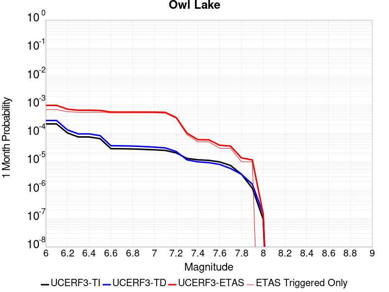
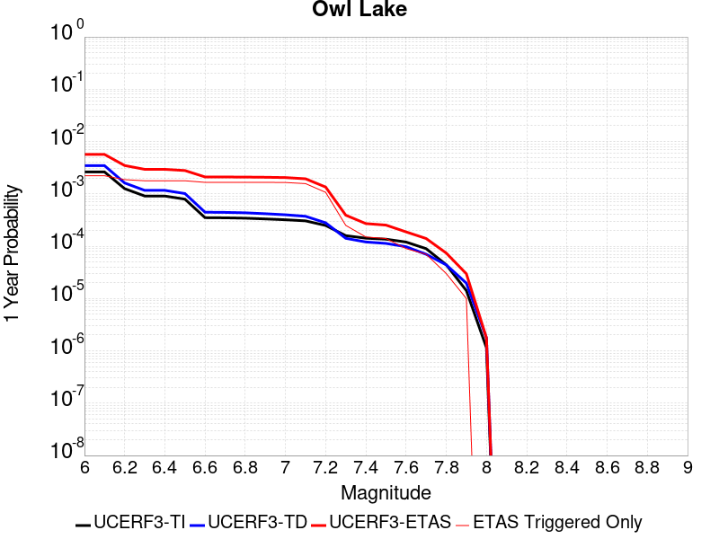
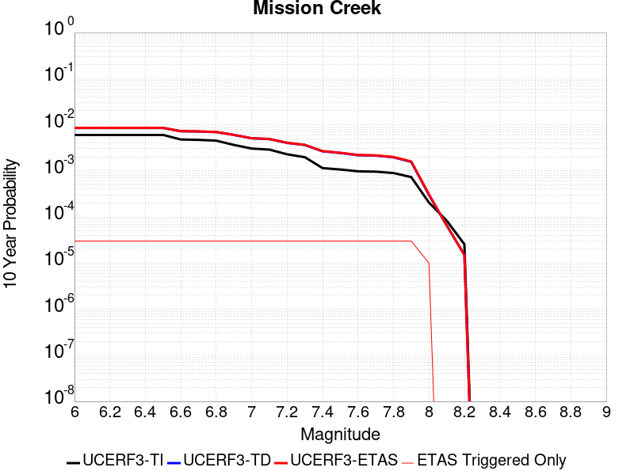
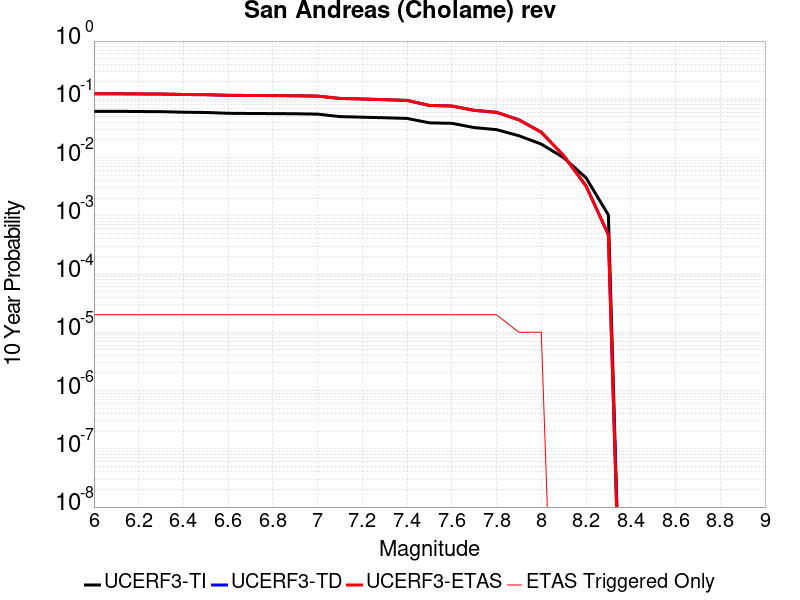
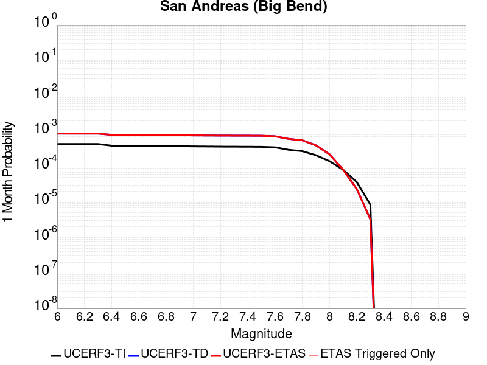

# Parent Section Magnitude-Probability Distributions

Only fault sections with at least one triggered aftershock are plotted. Sections are sorted by total supraseismogenic trigger rate (decreasing)

## Table Of Contents

* [Garlock (Central)](#garlock-central)
* [Little Lake](#little-lake)
* [Airport Lake](#airport-lake)
* [Tank Canyon](#tank-canyon)
* [Owl Lake](#owl-lake)
* [Panamint Valley](#panamint-valley)
* [Garlock (East)](#garlock-east)
* [Hunter Mountain-Saline Valley](#hunter-mountain-saline-valley)
* [Garlock (West)](#garlock-west)
* [Blackwater](#blackwater)
* [Ash Hill](#ash-hill)
* [San Andreas (Mojave S)](#san-andreas-mojave-s)
* [San Andreas (Mojave N)](#san-andreas-mojave-n)
* [Gravel Hills-Harper Lk](#gravel-hills-harper-lk)
* [McLean Lake](#mclean-lake)
* [So Sierra Nevada](#so-sierra-nevada)
* [Goldstone Lake](#goldstone-lake)
* [San Andreas (San Bernardino N)](#san-andreas-san-bernardino-n)
* [San Andreas (San Bernardino S)](#san-andreas-san-bernardino-s)
* [Lenwood-Lockhart-Old Woman Springs](#lenwood-lockhart-old-woman-springs)
* [Paradise](#paradise)
* [Death Valley (So)](#death-valley-so)
* [Coyote Canyon](#coyote-canyon)
* [Nelson Lake](#nelson-lake)
* [Towne Pass](#towne-pass)
* [Scodie Lineament](#scodie-lineament)
* [San Andreas (San Gorgonio Pass-Garnet HIll)](#san-andreas-san-gorgonio-pass-garnet-hill)
* [San Andreas (Coachella) rev](#san-andreas-coachella-rev)
* [Sierra Nevada  (No Extension)](#sierra-nevada--no-extension)
* [White Wolf (Extension)](#white-wolf-extension)
* [Helendale-So Lockhart](#helendale-so-lockhart)
* [San Andreas (Parkfield)](#san-andreas-parkfield)
* [Garlic Springs](#garlic-springs)
* [Mission Creek](#mission-creek)
* [Bicycle Lake](#bicycle-lake)
* [Death Valley (Black Mtns Frontal)](#death-valley-black-mtns-frontal)
* [Cleghorn Pass](#cleghorn-pass)
* [Cady](#cady)
* [Coyote Lake](#coyote-lake)
* [Brawley (Seismic Zone) alt 1](#brawley-seismic-zone-alt-1)
* [Imperial](#imperial)
* [Tin Mountain](#tin-mountain)
* [Owens Valley](#owens-valley)
* [Hosgri](#hosgri)
* [San Andreas (Cholame) rev](#san-andreas-cholame-rev)
* [Manix-Afton Hills](#manix-afton-hills)
* [San Andreas (Creeping Section) 2011 CFM](#san-andreas-creeping-section-2011-cfm)
* [San Andreas (Santa Cruz Mts) 2011 CFM](#san-andreas-santa-cruz-mts-2011-cfm)
* [San Andreas (Carrizo) rev](#san-andreas-carrizo-rev)
* [Rose Canyon](#rose-canyon)
* [San Andreas (Big Bend)](#san-andreas-big-bend)
* [San Luis Range 2011 CFM](#san-luis-range-2011-cfm)
* [Calaveras (So) 2011 CFM](#calaveras-so-2011-cfm)
* [Mission Ridge-Arroyo Parida-Santa Ana](#mission-ridge-arroyo-parida-santa-ana)
* [Verdugo](#verdugo)
* [Ortigalita (North)](#ortigalita-north)
* [San Jacinto (San Bernardino)](#san-jacinto-san-bernardino)
* [Death Valley (Fish Lake Valley)](#death-valley-fish-lake-valley)
* [Hayward (So) 2011 CFM](#hayward-so-2011-cfm)
* [San Gorgonio Pass](#san-gorgonio-pass)
* [San Jacinto (Anza) rev](#san-jacinto-anza-rev)
* [Independence rev 2011](#independence-rev-2011)
* [San Jacinto (Borrego)](#san-jacinto-borrego)
* [Cucamonga](#cucamonga)
* [Pleito](#pleito)
* [San Jacinto (Lytle Creek connector)](#san-jacinto-lytle-creek-connector)
* [Ludlow](#ludlow)
* [Santa Ynez (East)](#santa-ynez-east)
* [Dry Mountain](#dry-mountain)
* [Santa Cruz Island](#santa-cruz-island)
* [San Jacinto (Stepovers Combined)](#san-jacinto-stepovers-combined)
* [San Andreas (Peninsula) 2011 CFM](#san-andreas-peninsula-2011-cfm)
* [Cedar Mtn-Mahogany Mtn](#cedar-mtn-mahogany-mtn)
* [San Diego Trough south](#san-diego-trough-south)
* [Kern Canyon (South Kern) 2011](#kern-canyon-south-kern-2011)
* [Big Pine (East)](#big-pine-east)
* [Ortigalita (South)](#ortigalita-south)
* [Death Valley (No)](#death-valley-no)
* [San Cayetano](#san-cayetano)
* [Lake Isabella (Seismicity)](#lake-isabella-seismicity)
* [Oceanic - West Huasna](#oceanic---west-huasna)
* [Elsinore (Glen Ivy) rev](#elsinore-glen-ivy-rev)
* [San Andreas (North Branch Mill Creek)](#san-andreas-north-branch-mill-creek)
* [Red Pass](#red-pass)
* [San Jose](#san-jose)
* [San Jacinto (Coyote Creek)](#san-jacinto-coyote-creek)
* [Oak Ridge (Onshore)](#oak-ridge-onshore)
* [Coronado Bank alt1](#coronado-bank-alt1)
* [Great Valley 06 (Midland) 2011 CFM alt1](#great-valley-06-midland-2011-cfm-alt1)
* [Great Valley 03a Dunnigan Hills](#great-valley-03a-dunnigan-hills)
* [San Jacinto (San Jacinto Valley) rev](#san-jacinto-san-jacinto-valley-rev)
* [Raymond](#raymond)
* [Elmore Ranch](#elmore-ranch)
* [White Mountains](#white-mountains)

## Garlock (Central)
*[(top)](#table-of-contents)*

| 1 Week | 1 Month | 1 Year | 10 Year |
|-----|-----|-----|-----|
|  |  |  |  |

| Magnitude | 1 wk TI Prob | 1 wk TD Prob | 1 wk ETAS Prob | 1 wk ETAS/TD Gain | 1 wk ETAS Triggered Only | 1 mo TI Prob | 1 mo TD Prob | 1 mo ETAS Prob | 1 mo ETAS/TD Gain | 1 mo ETAS Triggered Only | 1 yr TI Prob | 1 yr TD Prob | 1 yr ETAS Prob | 1 yr ETAS/TD Gain | 1 yr ETAS Triggered Only | 10 yr TI Prob | 10 yr TD Prob | 10 yr ETAS Prob | 10 yr ETAS/TD Gain | 10 yr ETAS Triggered Only |
|-----|-----|-----|-----|-----|-----|-----|-----|-----|-----|-----|-----|-----|-----|-----|-----|-----|-----|-----|-----|-----|
| 6.0 | 5.5131142E-5 | 7.0271424E-5 | 0.0011501955 | 16.367899 | 0.00108 | 2.3625491E-4 | 3.0112884E-4 | 0.003700105 | 12.287448 | 0.0034 | 0.0028726095 | 0.0036601445 | 0.015177833 | 4.1467853 | 0.01156 | 0.028357591 | 0.03610883 | 0.0540854 | 1.4978442 | 0.01865 |
| 6.1 | 5.5131142E-5 | 7.0271424E-5 | 0.0011501955 | 16.367899 | 0.00108 | 2.3625491E-4 | 3.0112884E-4 | 0.003700105 | 12.287448 | 0.0034 | 0.0028726095 | 0.0036601445 | 0.015177833 | 4.1467853 | 0.01156 | 0.028357591 | 0.03610883 | 0.0540854 | 1.4978442 | 0.01865 |
| 6.2 | 4.216245E-5 | 5.1684234E-5 | 7.016506E-4 | 13.575719 | 6.5E-4 | 1.806837E-4 | 2.2148523E-4 | 0.0022010468 | 9.937668 | 0.00198 | 0.0021976046 | 0.0026932796 | 0.009624561 | 3.5735471 | 0.00695 | 0.021759989 | 0.026699346 | 0.037444584 | 1.4024533 | 0.01104 |
| 6.3 | 4.216245E-5 | 5.1684234E-5 | 7.016506E-4 | 13.575719 | 6.5E-4 | 1.806837E-4 | 2.2148523E-4 | 0.0022010468 | 9.937668 | 0.00198 | 0.0021976046 | 0.0026932796 | 0.009624561 | 3.5735471 | 0.00695 | 0.021759989 | 0.026699346 | 0.037444584 | 1.4024533 | 0.01104 |
| 6.4 | 3.6858168E-5 | 4.4131644E-5 | 5.541091E-4 | 12.555823 | 5.1E-4 | 1.5795401E-4 | 1.8912205E-4 | 0.0018088156 | 9.564277 | 0.00162 | 0.0019213937 | 0.0023001547 | 0.0076578027 | 3.3292556 | 0.00537 | 0.019048655 | 0.022866493 | 0.031289384 | 1.3683507 | 0.00862 |
| 6.5 | 3.39199E-5 | 4.0038954E-5 | 4.8002135E-4 | 11.988857 | 4.4E-4 | 1.453629E-4 | 1.7158437E-4 | 0.0016613287 | 9.682285 | 0.00149 | 0.0017683565 | 0.00208706 | 0.006887021 | 3.2998676 | 0.00481 | 0.017543508 | 0.020775849 | 0.028355043 | 1.364808 | 0.00774 |
| 6.6 | 3.3571985E-5 | 3.9493098E-5 | 4.794757E-4 | 12.140747 | 4.4E-4 | 1.4387199E-4 | 1.6924528E-4 | 0.0016489947 | 9.743225 | 0.00148 | 0.0017502342 | 0.0020586357 | 0.006838775 | 3.3219938 | 0.00479 | 0.017365133 | 0.02049695 | 0.028058711 | 1.3689214 | 0.00772 |
| 6.7 | 3.2580007E-5 | 3.8109458E-5 | 4.5809345E-4 | 12.020467 | 4.2E-4 | 1.3962112E-4 | 1.6331614E-4 | 0.001603081 | 9.815815 | 0.00144 | 0.0016985617 | 0.001986582 | 0.0066173645 | 3.33103 | 0.00464 | 0.016856372 | 0.019786576 | 0.027167583 | 1.373031 | 0.00753 |
| 6.8 | 3.2185937E-5 | 3.7536578E-5 | 4.475212E-4 | 11.92227 | 4.1E-4 | 1.3793244E-4 | 1.6086125E-4 | 0.0015806329 | 9.826063 | 0.00142 | 0.0016780337 | 0.0019567478 | 0.006477884 | 3.3105357 | 0.00453 | 0.016654192 | 0.019493341 | 0.026719676 | 1.3707079 | 0.00737 |
| 6.9 | 3.165394E-5 | 3.6741036E-5 | 4.1672707E-4 | 11.342279 | 3.8E-4 | 1.3565269E-4 | 1.5745219E-4 | 0.0015372349 | 9.763185 | 0.00138 | 0.0016503202 | 0.0019153163 | 0.0063468125 | 3.313715 | 0.00444 | 0.01638118 | 0.019086242 | 0.026188059 | 1.3720908 | 0.00724 |
| 7.0 | 3.0903822E-5 | 3.5646088E-5 | 4.056329E-4 | 11.379451 | 3.7E-4 | 1.3243823E-4 | 1.5276013E-4 | 0.0015225508 | 9.966939 | 0.00137 | 0.0016112428 | 0.0018582892 | 0.006210187 | 3.3418841 | 0.00436 | 0.015996104 | 0.01852385 | 0.025502145 | 1.3767195 | 0.00711 |
| 7.1 | 3.0069863E-5 | 3.4412176E-5 | 3.8440013E-4 | 11.170469 | 3.5E-4 | 1.2886449E-4 | 1.4747253E-4 | 0.0014472809 | 9.813901 | 0.0013 | 0.0015677959 | 0.0017940205 | 0.005936575 | 3.30909 | 0.00415 | 0.01556781 | 0.017891437 | 0.024550134 | 1.3721722 | 0.00678 |
| 7.2 | 2.7957109E-5 | 3.1300966E-5 | 3.0129252E-4 | 9.625662 | 2.7E-4 | 1.1981068E-4 | 1.3414022E-4 | 0.001193998 | 8.901119 | 0.00106 | 0.0014577188 | 0.0016319532 | 0.0051462087 | 3.1534045 | 0.00352 | 0.014481937 | 0.016294453 | 0.021872064 | 1.3423011 | 0.00567 |
| 7.3 | 2.4519275E-5 | 2.6732969E-5 | 2.1672789E-4 | 8.107139 | 1.9E-4 | 1.0507837E-4 | 1.14564915E-4 | 8.64479E-4 | 7.545757 | 7.5E-4 | 0.0012785783 | 0.0013939501 | 0.0038205627 | 2.7408175 | 0.00243 | 0.012712469 | 0.013937883 | 0.017901853 | 1.2844026 | 0.00402 |
| 7.4 | 2.3225532E-5 | 2.5217167E-5 | 1.6521364E-4 | 6.5516334 | 1.4E-4 | 9.95342E-5 | 1.0806918E-4 | 7.679979E-4 | 7.1065392 | 6.6E-4 | 0.0012111551 | 0.0013149625 | 0.0035120696 | 2.6708515 | 0.0022 | 0.012045753 | 0.013155304 | 0.016777024 | 1.2753049 | 0.00367 |
| 7.5 | 2.097765E-5 | 2.2500466E-5 | 1.32498E-4 | 5.8886776 | 1.1E-4 | 8.9901114E-5 | 9.642707E-5 | 6.46374E-4 | 6.7032423 | 5.5E-4 | 0.0010939965 | 0.0011733791 | 0.0029413023 | 2.5066938 | 0.00177 | 0.010886264 | 0.011749807 | 0.014675027 | 1.2489591 | 0.00296 |
| 7.6 | 1.511254E-5 | 1.6006861E-5 | 9.6005584E-5 | 5.9977765 | 8.0E-5 | 6.476642E-5 | 6.8599074E-5 | 3.585792E-4 | 5.2271724 | 2.9E-4 | 7.882459E-4 | 8.3488156E-4 | 0.0017541135 | 2.1010327 | 9.2E-4 | 0.007854558 | 0.008392387 | 0.009899631 | 1.1795965 | 0.00152 |
| 7.7 | 9.934069E-6 | 1.0693293E-5 | 6.0692757E-5 | 5.675778 | 5.0E-5 | 4.2573887E-5 | 4.5827597E-5 | 1.4582301E-4 | 3.1819913 | 1.0E-4 | 5.182138E-4 | 5.5780855E-4 | 8.5764116E-4 | 1.537519 | 3.0E-4 | 0.00517007 | 0.005635492 | 0.006033238 | 1.0705787 | 4.0E-4 |
| 7.8 | 6.7562896E-6 | 8.440426E-6 | 3.8440172E-5 | 4.5542927 | 3.0E-5 | 2.8955206E-5 | 3.6172754E-5 | 8.617095E-5 | 2.3822057 | 5.0E-5 | 3.5247262E-4 | 4.4031447E-4 | 6.202352E-4 | 1.4086187 | 1.8E-4 | 0.0035191406 | 0.004453119 | 0.0047119614 | 1.0581261 | 2.6E-4 |
| 7.9 | 3.975453E-6 | 5.378374E-6 | 1.537832E-5 | 2.859288 | 1.0E-5 | 1.7037546E-5 | 2.3049972E-5 | 5.304928E-5 | 2.30149 | 3.0E-5 | 2.0741238E-4 | 2.8059736E-4 | 4.005637E-4 | 1.427539 | 1.2E-4 | 0.002072189 | 0.0028377224 | 0.002977325 | 1.0491953 | 1.4E-4 |
| 8.0 | 1.6729537E-6 | 2.080019E-6 | 1.2079999E-5 | 5.807638 | 1.0E-5 | 7.169782E-6 | 8.914337E-6 | 2.8914159E-5 | 3.2435567 | 2.0E-5 | 8.7288594E-5 | 1.08526685E-4 | 1.5852126E-4 | 1.4606662 | 5.0E-5 | 8.7254314E-4 | 0.0010985459 | 0.001168469 | 1.0636506 | 7.0E-5 |
| 8.1 | 3.6733252E-7 | 3.1523513E-7 | 3.1523513E-7 | 1.0 | 0.0 | 1.5742813E-6 | 1.3510071E-6 | 1.3510071E-6 | 1.0 | 0.0 | 1.9166706E-5 | 1.6448403E-5 | 2.6448239E-5 | 1.6079518 | 1.0E-5 | 1.9165053E-4 | 1.6662726E-4 | 1.766256E-4 | 1.0600042 | 1.0E-5 |

## Little Lake
*[(top)](#table-of-contents)*

| 1 Week | 1 Month | 1 Year | 10 Year |
|-----|-----|-----|-----|
|  |  |  |  |

| Magnitude | 1 wk TI Prob | 1 wk TD Prob | 1 wk ETAS Prob | 1 wk ETAS/TD Gain | 1 wk ETAS Triggered Only | 1 mo TI Prob | 1 mo TD Prob | 1 mo ETAS Prob | 1 mo ETAS/TD Gain | 1 mo ETAS Triggered Only | 1 yr TI Prob | 1 yr TD Prob | 1 yr ETAS Prob | 1 yr ETAS/TD Gain | 1 yr ETAS Triggered Only | 10 yr TI Prob | 10 yr TD Prob | 10 yr ETAS Prob | 10 yr ETAS/TD Gain | 10 yr ETAS Triggered Only |
|-----|-----|-----|-----|-----|-----|-----|-----|-----|-----|-----|-----|-----|-----|-----|-----|-----|-----|-----|-----|-----|
| 6.0 | 2.8424427E-5 | 3.1207474E-5 | 5.511912E-4 | 17.662155 | 5.2E-4 | 1.2181328E-4 | 1.337402E-4 | 0.0018235142 | 13.634749 | 0.00169 | 0.0014820677 | 0.001627204 | 0.007148206 | 4.3929377 | 0.00553 | 0.014722223 | 0.016166301 | 0.025060158 | 1.5501479 | 0.00904 |
| 6.1 | 2.8424427E-5 | 3.1207474E-5 | 5.511912E-4 | 17.662155 | 5.2E-4 | 1.2181328E-4 | 1.337402E-4 | 0.0018235142 | 13.634749 | 0.00169 | 0.0014820677 | 0.001627204 | 0.007148206 | 4.3929377 | 0.00553 | 0.014722223 | 0.016166301 | 0.025060158 | 1.5501479 | 0.00904 |
| 6.2 | 2.8424427E-5 | 3.1207474E-5 | 5.511912E-4 | 17.662155 | 5.2E-4 | 1.2181328E-4 | 1.337402E-4 | 0.0018235142 | 13.634749 | 0.00169 | 0.0014820677 | 0.001627204 | 0.007148206 | 4.3929377 | 0.00553 | 0.014722223 | 0.016166301 | 0.025060158 | 1.5501479 | 0.00904 |
| 6.3 | 1.48860645E-5 | 1.60822E-5 | 3.1607738E-4 | 19.653864 | 3.0E-4 | 6.379586E-5 | 6.8922054E-5 | 0.0011688463 | 16.958958 | 0.0011 | 7.7643775E-4 | 8.388312E-4 | 0.0045856857 | 5.4667563 | 0.00375 | 0.007737305 | 0.008359468 | 0.0144580575 | 1.7295427 | 0.00615 |
| 6.4 | 1.48860645E-5 | 1.60822E-5 | 3.1607738E-4 | 19.653864 | 3.0E-4 | 6.379586E-5 | 6.8922054E-5 | 0.0011688463 | 16.958958 | 0.0011 | 7.7643775E-4 | 8.388312E-4 | 0.0045856857 | 5.4667563 | 0.00375 | 0.007737305 | 0.008359468 | 0.0144580575 | 1.7295427 | 0.00615 |
| 6.5 | 1.2797581E-5 | 1.3766243E-5 | 2.637628E-4 | 19.160116 | 2.5E-4 | 5.4845623E-5 | 5.8996993E-5 | 0.0010889362 | 18.457487 | 0.00103 | 6.675408E-4 | 7.1807735E-4 | 0.0041955784 | 5.8427944 | 0.00348 | 0.006655392 | 0.007160121 | 0.012859022 | 1.7959224 | 0.00574 |
| 6.6 | 9.661896E-6 | 1.0289515E-5 | 2.4028715E-4 | 23.352623 | 2.3E-4 | 4.1407468E-5 | 4.4097265E-5 | 9.5405715E-4 | 21.63529 | 9.1E-4 | 5.040193E-4 | 5.367682E-4 | 0.0036650882 | 6.828065 | 0.00313 | 0.005028777 | 0.005356322 | 0.010438952 | 1.9489028 | 0.00511 |
| 6.7 | 7.767871E-6 | 8.200049E-6 | 2.1819833E-4 | 26.609392 | 2.1E-4 | 3.329045E-5 | 3.514267E-5 | 8.5511385E-4 | 24.332636 | 8.2E-4 | 4.0523586E-4 | 4.2779176E-4 | 0.0031266366 | 7.308782 | 0.0027 | 0.004044977 | 0.0042710346 | 0.008702029 | 2.0374522 | 0.00445 |
| 6.8 | 6.4235196E-6 | 6.7360374E-6 | 1.6673496E-4 | 24.752676 | 1.6E-4 | 2.752908E-5 | 2.8868486E-5 | 6.588503E-4 | 22.822475 | 6.3E-4 | 3.35115E-4 | 3.5142995E-4 | 0.0025706498 | 7.3148284 | 0.00222 | 0.003346101 | 0.0035100025 | 0.007047542 | 2.0078452 | 0.00355 |
| 6.9 | 3.1283696E-6 | 3.1122813E-6 | 1.1311194E-4 | 36.34374 | 1.1E-4 | 1.3407229E-5 | 1.3338288E-5 | 3.5333374E-4 | 26.490187 | 3.4E-4 | 1.6322079E-4 | 1.6238306E-4 | 0.0014721703 | 9.066033 | 0.00131 | 0.0016310095 | 0.0016227924 | 0.003829206 | 2.3596401 | 0.00221 |
| 7.0 | 2.290603E-6 | 2.2287568E-6 | 7.22286E-5 | 32.407574 | 7.0E-5 | 9.816834E-6 | 9.551785E-6 | 1.9954998E-4 | 20.891378 | 1.9E-4 | 1.19513395E-4 | 1.16287825E-4 | 9.3619246E-4 | 8.05065 | 8.2E-4 | 0.0011944914 | 0.0011623718 | 0.002490826 | 2.142882 | 0.00133 |
| 7.1 | 1.293693E-6 | 1.1777277E-6 | 4.1177682E-5 | 34.96367 | 4.0E-5 | 5.5443866E-6 | 5.0473986E-6 | 1.0504689E-4 | 20.812086 | 1.0E-4 | 6.750081E-5 | 6.145104E-5 | 5.214228E-4 | 8.485174 | 4.6E-4 | 6.7480316E-4 | 6.14409E-4 | 0.0012440219 | 2.0247457 | 6.3E-4 |
| 7.2 | 4.715842E-7 | 3.0919745E-7 | 3.0919745E-7 | 1.0 | 0.0 | 2.0210737E-6 | 1.3251313E-6 | 1.3251313E-6 | 1.0 | 0.0 | 2.4606294E-5 | 1.613336E-5 | 2.6133197E-5 | 1.6198237 | 1.0E-5 | 2.460357E-4 | 1.6132242E-4 | 1.8131919E-4 | 1.1239554 | 2.0E-5 |
| 7.3 | 3.9430947E-7 | 2.3099179E-7 | 2.3099179E-7 | 1.0 | 0.0 | 1.6898966E-6 | 9.899644E-7 | 9.899644E-7 | 1.0 | 0.0 | 2.0574296E-5 | 1.2052751E-5 | 2.205263E-5 | 1.829676 | 1.0E-5 | 2.0572392E-4 | 1.2052105E-4 | 1.4051863E-4 | 1.1659261 | 2.0E-5 |
| 7.4 | 3.547123E-7 | 1.9680678E-7 | 1.9680678E-7 | 1.0 | 0.0 | 1.5201948E-6 | 8.434573E-7 | 8.434573E-7 | 1.0 | 0.0 | 1.8508214E-5 | 1.0269046E-5 | 2.0268943E-5 | 1.9737904 | 1.0E-5 | 1.8506673E-4 | 1.0268577E-4 | 1.2268372E-4 | 1.194749 | 2.0E-5 |
| 7.5 | 2.6354266E-7 | 1.4424151E-7 | 1.4424151E-7 | 1.0 | 0.0 | 1.129468E-6 | 6.1817775E-7 | 6.1817775E-7 | 1.0 | 0.0 | 1.3751187E-5 | 7.5262888E-6 | 7.5262888E-6 | 1.0 | 0.0 | 1.3750336E-4 | 7.526039E-5 | 8.5259635E-5 | 1.132862 | 1.0E-5 |
| 7.6 | 1.269913E-7 | 7.572964E-8 | 7.572964E-8 | 1.0 | 0.0 | 5.4424834E-7 | 3.2455554E-7 | 3.2455554E-7 | 1.0 | 0.0 | 6.6262032E-6 | 3.951457E-6 | 3.951457E-6 | 1.0 | 0.0 | 6.626006E-5 | 3.9513903E-5 | 4.9513506E-5 | 1.2530655 | 1.0E-5 |

## Airport Lake
*[(top)](#table-of-contents)*

| 1 Week | 1 Month | 1 Year | 10 Year |
|-----|-----|-----|-----|
|  |  |  |  |

| Magnitude | 1 wk TI Prob | 1 wk TD Prob | 1 wk ETAS Prob | 1 wk ETAS/TD Gain | 1 wk ETAS Triggered Only | 1 mo TI Prob | 1 mo TD Prob | 1 mo ETAS Prob | 1 mo ETAS/TD Gain | 1 mo ETAS Triggered Only | 1 yr TI Prob | 1 yr TD Prob | 1 yr ETAS Prob | 1 yr ETAS/TD Gain | 1 yr ETAS Triggered Only | 10 yr TI Prob | 10 yr TD Prob | 10 yr ETAS Prob | 10 yr ETAS/TD Gain | 10 yr ETAS Triggered Only |
|-----|-----|-----|-----|-----|-----|-----|-----|-----|-----|-----|-----|-----|-----|-----|-----|-----|-----|-----|-----|-----|
| 6.0 | 1.2387061E-5 | 1.3103559E-5 | 4.530978E-4 | 34.578224 | 4.4E-4 | 5.3086325E-5 | 5.615706E-5 | 0.0017860599 | 31.804726 | 0.00173 | 6.461343E-4 | 6.8352616E-4 | 0.0062896917 | 9.20183 | 0.00561 | 0.0064425888 | 0.006817048 | 0.015765626 | 2.3126764 | 0.00901 |
| 6.1 | 1.2387061E-5 | 1.3103559E-5 | 4.530978E-4 | 34.578224 | 4.4E-4 | 5.3086325E-5 | 5.615706E-5 | 0.0017860599 | 31.804726 | 0.00173 | 6.461343E-4 | 6.8352616E-4 | 0.0062896917 | 9.20183 | 0.00561 | 0.0064425888 | 0.006817048 | 0.015765626 | 2.3126764 | 0.00901 |
| 6.2 | 1.2387061E-5 | 1.3103559E-5 | 4.530978E-4 | 34.578224 | 4.4E-4 | 5.3086325E-5 | 5.615706E-5 | 0.0017860599 | 31.804726 | 0.00173 | 6.461343E-4 | 6.8352616E-4 | 0.0062896917 | 9.20183 | 0.00561 | 0.0064425888 | 0.006817048 | 0.015765626 | 2.3126764 | 0.00901 |
| 6.3 | 1.2387061E-5 | 1.3103559E-5 | 4.530978E-4 | 34.578224 | 4.4E-4 | 5.3086325E-5 | 5.615706E-5 | 0.0017860599 | 31.804726 | 0.00173 | 6.461343E-4 | 6.8352616E-4 | 0.0062896917 | 9.20183 | 0.00561 | 0.0064425888 | 0.006817048 | 0.015765626 | 2.3126764 | 0.00901 |
| 6.4 | 1.2387061E-5 | 1.3103559E-5 | 4.530978E-4 | 34.578224 | 4.4E-4 | 5.3086325E-5 | 5.615706E-5 | 0.0017860599 | 31.804726 | 0.00173 | 6.461343E-4 | 6.8352616E-4 | 0.0062896917 | 9.20183 | 0.00561 | 0.0064425888 | 0.006817048 | 0.015765626 | 2.3126764 | 0.00901 |
| 6.5 | 6.9922594E-6 | 7.385145E-6 | 3.5738255E-4 | 48.392082 | 3.5E-4 | 2.996648E-5 | 3.165027E-5 | 0.0012916104 | 40.808826 | 0.00126 | 3.6478083E-4 | 3.8527933E-4 | 0.0045636687 | 11.845092 | 0.00418 | 0.003641826 | 0.003846651 | 0.010520878 | 2.7350748 | 0.0067 |
| 6.6 | 6.9922594E-6 | 7.385145E-6 | 3.5738255E-4 | 48.392082 | 3.5E-4 | 2.996648E-5 | 3.165027E-5 | 0.0012916104 | 40.808826 | 0.00126 | 3.6478083E-4 | 3.8527933E-4 | 0.0045636687 | 11.845092 | 0.00418 | 0.003641826 | 0.003846651 | 0.010520878 | 2.7350748 | 0.0067 |
| 6.7 | 5.477277E-6 | 5.7862417E-6 | 2.8578463E-4 | 49.390373 | 2.8E-4 | 2.3473833E-5 | 2.4797964E-5 | 0.001074772 | 43.341137 | 0.00105 | 2.8575645E-4 | 3.0187727E-4 | 0.003690854 | 12.226339 | 0.00339 | 0.0028538927 | 0.003015056 | 0.008508443 | 2.821985 | 0.00551 |
| 6.8 | 3.9950432E-6 | 4.2192128E-6 | 2.442182E-4 | 57.882412 | 2.4E-4 | 1.7121502E-5 | 1.808223E-5 | 7.780685E-4 | 43.029453 | 7.6E-4 | 2.0843433E-4 | 2.2013167E-4 | 0.0027895658 | 12.672261 | 0.00257 | 0.0020823893 | 0.0021994072 | 0.006320324 | 2.873649 | 0.00413 |
| 6.9 | 2.95695E-6 | 3.1231173E-6 | 1.731226E-4 | 55.43262 | 1.7E-4 | 1.2672582E-5 | 1.33847325E-5 | 4.8337845E-4 | 36.114162 | 4.7E-4 | 1.5427776E-4 | 1.629492E-4 | 0.0020026495 | 12.290023 | 0.00184 | 0.001541707 | 0.0016285196 | 0.0046236343 | 2.8391638 | 0.003 |
| 7.0 | 1.456072E-6 | 1.5408596E-6 | 7.154075E-5 | 46.42912 | 7.0E-5 | 6.2402937E-6 | 6.603673E-6 | 1.9660241E-4 | 29.771677 | 1.9E-4 | 7.597293E-5 | 8.039776E-5 | 8.803334E-4 | 10.949726 | 8.0E-4 | 7.594696E-4 | 8.0378563E-4 | 0.0020927486 | 2.6036155 | 0.00129 |
| 7.1 | 6.995192E-7 | 7.409207E-7 | 4.074089E-5 | 54.986843 | 4.0E-5 | 2.997936E-6 | 3.1753743E-6 | 1.0317506E-4 | 32.49225 | 1.0E-4 | 3.649926E-5 | 3.8660182E-5 | 4.886428E-4 | 12.639433 | 4.5E-4 | 3.6493264E-4 | 3.8660184E-4 | 9.96366E-4 | 2.5772407 | 6.1E-4 |

## Tank Canyon
*[(top)](#table-of-contents)*

| 1 Week | 1 Month | 1 Year | 10 Year |
|-----|-----|-----|-----|
|  |  |  |  |

| Magnitude | 1 wk TI Prob | 1 wk TD Prob | 1 wk ETAS Prob | 1 wk ETAS/TD Gain | 1 wk ETAS Triggered Only | 1 mo TI Prob | 1 mo TD Prob | 1 mo ETAS Prob | 1 mo ETAS/TD Gain | 1 mo ETAS Triggered Only | 1 yr TI Prob | 1 yr TD Prob | 1 yr ETAS Prob | 1 yr ETAS/TD Gain | 1 yr ETAS Triggered Only | 10 yr TI Prob | 10 yr TD Prob | 10 yr ETAS Prob | 10 yr ETAS/TD Gain | 10 yr ETAS Triggered Only |
|-----|-----|-----|-----|-----|-----|-----|-----|-----|-----|-----|-----|-----|-----|-----|-----|-----|-----|-----|-----|-----|
| 6.0 | 4.8284557E-5 | 5.797054E-5 | 6.279375E-4 | 10.83201 | 5.7E-4 | 2.0691741E-4 | 2.4842535E-4 | 0.0018580254 | 7.47921 | 0.00161 | 0.0025163088 | 0.003021048 | 0.008334946 | 2.7589583 | 0.00533 | 0.02488006 | 0.02986708 | 0.038152013 | 1.2773936 | 0.00854 |
| 6.1 | 1.7796336E-5 | 2.0875163E-5 | 1.6087224E-4 | 7.7063947 | 1.4E-4 | 7.626778E-5 | 8.946213E-5 | 5.694192E-4 | 6.364918 | 4.8E-4 | 9.281647E-4 | 0.0010886953 | 0.0027169208 | 2.495575 | 0.00163 | 0.009242975 | 0.010837966 | 0.0134889195 | 1.2445989 | 0.00268 |
| 6.2 | 1.7796336E-5 | 2.0875163E-5 | 1.6087224E-4 | 7.7063947 | 1.4E-4 | 7.626778E-5 | 8.946213E-5 | 5.694192E-4 | 6.364918 | 4.8E-4 | 9.281647E-4 | 0.0010886953 | 0.0027169208 | 2.495575 | 0.00163 | 0.009242975 | 0.010837966 | 0.0134889195 | 1.2445989 | 0.00268 |
| 6.3 | 1.3515912E-5 | 1.5760907E-5 | 1.05759485E-4 | 6.7102413 | 9.0E-5 | 5.792405E-5 | 6.754513E-5 | 3.9752285E-4 | 5.8852925 | 3.3E-4 | 7.049971E-4 | 8.220753E-4 | 0.0020011053 | 2.4342115 | 0.00118 | 0.007027647 | 0.00819321 | 0.010127233 | 1.2360519 | 0.00195 |
| 6.4 | 1.0870146E-5 | 1.2619056E-5 | 6.261843E-5 | 4.9622116 | 5.0E-5 | 4.658551E-5 | 5.4080647E-5 | 2.9406766E-4 | 5.437577 | 2.4E-4 | 5.67031E-4 | 6.582507E-4 | 0.0014477307 | 2.1993606 | 7.9E-4 | 0.005655863 | 0.0065652747 | 0.007975952 | 1.2148695 | 0.00142 |
| 6.5 | 7.964826E-6 | 9.196807E-6 | 3.919653E-5 | 4.261972 | 3.0E-5 | 3.4134522E-5 | 3.941435E-5 | 1.9940804E-4 | 5.059275 | 1.6E-4 | 4.1550855E-4 | 4.7977458E-4 | 9.795347E-4 | 2.041656 | 5.0E-4 | 0.0041473247 | 0.004788939 | 0.0056249164 | 1.1745642 | 8.4E-4 |
| 6.6 | 6.6317E-6 | 7.6128526E-6 | 2.7612701E-5 | 3.6271162 | 2.0E-5 | 2.8421264E-5 | 3.2626154E-5 | 1.326229E-4 | 4.0649257 | 1.0E-4 | 3.4597394E-4 | 3.971601E-4 | 7.770092E-4 | 1.956413 | 3.8E-4 | 0.0034543579 | 0.003965905 | 0.0046133273 | 1.163247 | 6.5E-4 |
| 6.7 | 4.793663E-6 | 5.431129E-6 | 5.431129E-6 | 1.0 | 0.0 | 2.0544108E-5 | 2.3276085E-5 | 7.327492E-5 | 3.1480777 | 5.0E-5 | 2.500958E-4 | 2.8335385E-4 | 4.7330002E-4 | 1.6703497 | 1.9E-4 | 0.0024981452 | 0.0028308667 | 0.0031399892 | 1.1091971 | 3.1E-4 |
| 6.8 | 4.382823E-6 | 4.96956E-6 | 4.96956E-6 | 1.0 | 0.0 | 1.8783392E-5 | 2.1297965E-5 | 7.12969E-5 | 3.347592 | 5.0E-5 | 2.286638E-4 | 2.5927613E-4 | 4.4922688E-4 | 1.7326194 | 1.9E-4 | 0.0022842865 | 0.0025906577 | 0.0028699322 | 1.1078007 | 2.8E-4 |
| 6.9 | 2.729601E-6 | 3.073687E-6 | 3.073687E-6 | 1.0 | 0.0 | 1.1698237E-5 | 1.3172884E-5 | 2.3172752E-5 | 1.7591252 | 1.0E-5 | 1.4241673E-4 | 1.6036928E-4 | 2.3035805E-4 | 1.4364226 | 7.0E-5 | 0.001423255 | 0.0016027665 | 0.0017026062 | 1.0622921 | 1.0E-4 |
| 7.0 | 1.8987357E-6 | 2.1270264E-6 | 2.1270264E-6 | 1.0 | 0.0 | 8.137413E-6 | 9.1158E-6 | 9.1158E-6 | 1.0 | 0.0 | 9.90685E-5 | 1.10979905E-4 | 1.3097769E-4 | 1.1801928 | 2.0E-5 | 9.902435E-4 | 0.0011093135 | 0.0011392803 | 1.0270138 | 3.0E-5 |
| 7.1 | 1.4928986E-6 | 1.66419E-6 | 1.66419E-6 | 1.0 | 0.0 | 6.398121E-6 | 7.1322265E-6 | 7.1322265E-6 | 1.0 | 0.0 | 7.789434E-5 | 8.683199E-5 | 9.683112E-5 | 1.115155 | 1.0E-5 | 7.786704E-4 | 8.680385E-4 | 8.780298E-4 | 1.0115103 | 1.0E-5 |
| 7.2 | 1.069082E-6 | 1.1829021E-6 | 1.1829021E-6 | 1.0 | 0.0 | 4.581772E-6 | 5.069574E-6 | 5.069574E-6 | 1.0 | 0.0 | 5.5781646E-5 | 6.172085E-5 | 7.172023E-5 | 1.1620098 | 1.0E-5 | 5.576765E-4 | 6.1708933E-4 | 6.270831E-4 | 1.016195 | 1.0E-5 |
| 7.3 | 8.776551E-7 | 9.770343E-7 | 9.770343E-7 | 1.0 | 0.0 | 3.7613736E-6 | 4.1872863E-6 | 4.1872863E-6 | 1.0 | 0.0 | 4.579376E-5 | 5.097954E-5 | 6.097903E-5 | 1.1961471 | 1.0E-5 | 4.5784327E-4 | 5.0972943E-4 | 5.197244E-4 | 1.0196083 | 1.0E-5 |
| 7.4 | 7.55721E-7 | 8.5105546E-7 | 8.5105546E-7 | 1.0 | 0.0 | 3.2388E-6 | 3.6473784E-6 | 3.6473784E-6 | 1.0 | 0.0 | 3.9431678E-5 | 4.4406446E-5 | 5.4406002E-5 | 1.2251825 | 1.0E-5 | 3.942468E-4 | 4.4402658E-4 | 4.5402214E-4 | 1.0225111 | 1.0E-5 |
| 7.5 | 5.587665E-7 | 6.3058303E-7 | 6.3058303E-7 | 1.0 | 0.0 | 2.3947114E-6 | 2.7024987E-6 | 2.7024987E-6 | 1.0 | 0.0 | 2.915522E-5 | 3.290292E-5 | 4.2902593E-5 | 1.3039144 | 1.0E-5 | 2.9151395E-4 | 3.2902922E-4 | 3.3902592E-4 | 1.0303824 | 1.0E-5 |

## Owl Lake
*[(top)](#table-of-contents)*

| 1 Week | 1 Month | 1 Year | 10 Year |
|-----|-----|-----|-----|
|  |  |  |  |

| Magnitude | 1 wk TI Prob | 1 wk TD Prob | 1 wk ETAS Prob | 1 wk ETAS/TD Gain | 1 wk ETAS Triggered Only | 1 mo TI Prob | 1 mo TD Prob | 1 mo ETAS Prob | 1 mo ETAS/TD Gain | 1 mo ETAS Triggered Only | 1 yr TI Prob | 1 yr TD Prob | 1 yr ETAS Prob | 1 yr ETAS/TD Gain | 1 yr ETAS Triggered Only | 10 yr TI Prob | 10 yr TD Prob | 10 yr ETAS Prob | 10 yr ETAS/TD Gain | 10 yr ETAS Triggered Only |
|-----|-----|-----|-----|-----|-----|-----|-----|-----|-----|-----|-----|-----|-----|-----|-----|-----|-----|-----|-----|-----|
| 6.0 | 5.0320643E-5 | 6.637038E-5 | 2.6635712E-4 | 4.013192 | 2.0E-4 | 2.1564208E-4 | 2.8441957E-4 | 9.742233E-4 | 3.4253035 | 6.9E-4 | 0.0026222812 | 0.0034582033 | 0.005670526 | 1.6397319 | 0.00222 | 0.02591553 | 0.034148198 | 0.03759629 | 1.1009743 | 0.00357 |
| 6.1 | 5.0320643E-5 | 6.637038E-5 | 2.6635712E-4 | 4.013192 | 2.0E-4 | 2.1564208E-4 | 2.8441957E-4 | 9.742233E-4 | 3.4253035 | 6.9E-4 | 0.0026222812 | 0.0034582033 | 0.005670526 | 1.6397319 | 0.00222 | 0.02591553 | 0.034148198 | 0.03759629 | 1.1009743 | 0.00357 |
| 6.2 | 2.4125871E-5 | 3.09871E-5 | 2.2098121E-4 | 7.131394 | 1.9E-4 | 1.0339249E-4 | 1.3279608E-4 | 7.1271905E-4 | 5.367019 | 5.8E-4 | 0.0012580766 | 0.0016157634 | 0.003482742 | 2.1554775 | 0.00187 | 0.012509781 | 0.016074665 | 0.019026441 | 1.183629 | 0.003 |
| 6.3 | 1.7433485E-5 | 2.2360797E-5 | 2.1235655E-4 | 9.496824 | 1.9E-4 | 7.471279E-5 | 9.582917E-5 | 6.557755E-4 | 6.843172 | 5.6E-4 | 9.0924866E-4 | 0.0011662331 | 0.0029441572 | 2.5245016 | 0.00178 | 0.009055373 | 0.011632415 | 0.014419612 | 1.239606 | 0.00282 |
| 6.4 | 1.7433485E-5 | 2.2360797E-5 | 2.1235655E-4 | 9.496824 | 1.9E-4 | 7.471279E-5 | 9.582917E-5 | 6.557755E-4 | 6.843172 | 5.6E-4 | 9.0924866E-4 | 0.0011662331 | 0.0029441572 | 2.5245016 | 0.00178 | 0.009055373 | 0.011632415 | 0.014419612 | 1.239606 | 0.00282 |
| 6.5 | 1.5182742E-5 | 1.9434077E-5 | 2.0943038E-4 | 10.776451 | 1.9E-4 | 6.506727E-5 | 8.328693E-5 | 6.432403E-4 | 7.7231846 | 5.6E-4 | 7.919061E-4 | 0.0010136823 | 0.002791878 | 2.754194 | 0.00178 | 0.0078909 | 0.010121727 | 0.012883488 | 1.2728547 | 0.00279 |
| 6.6 | 6.7271576E-6 | 8.550671E-6 | 1.8854914E-4 | 22.050798 | 1.8E-4 | 2.8830356E-5 | 3.664525E-5 | 5.6662585E-4 | 15.462463 | 5.3E-4 | 3.5095305E-4 | 4.4607025E-4 | 0.00210533 | 4.719727 | 0.00166 | 0.0035039932 | 0.0044702506 | 0.0070785386 | 1.5834769 | 0.00262 |
| 6.7 | 6.682835E-6 | 8.48311E-6 | 1.8848159E-4 | 22.218454 | 1.8E-4 | 2.8640408E-5 | 3.635571E-5 | 5.6633644E-4 | 15.577648 | 5.3E-4 | 3.4864116E-4 | 4.4254653E-4 | 0.0021018118 | 4.749358 | 0.00166 | 0.003480947 | 0.0044352226 | 0.0070436024 | 1.5881057 | 0.00262 |
| 6.8 | 6.5774975E-6 | 8.32956E-6 | 1.8832806E-4 | 22.609604 | 1.8E-4 | 2.8188972E-5 | 3.569766E-5 | 5.6567875E-4 | 15.846382 | 5.3E-4 | 3.4314668E-4 | 4.3453797E-4 | 0.0020938166 | 4.8184896 | 0.00166 | 0.0034261728 | 0.0043553766 | 0.0069639655 | 1.5989354 | 0.00262 |
| 6.9 | 6.363419E-6 | 8.002683E-6 | 1.8800124E-4 | 23.492277 | 1.8E-4 | 2.727151E-5 | 3.429679E-5 | 5.642786E-4 | 16.45281 | 5.3E-4 | 3.3198006E-4 | 4.1748903E-4 | 0.002076796 | 4.9744925 | 0.00166 | 0.0033148455 | 0.0041853474 | 0.006794382 | 1.6233734 | 0.00262 |
| 7.0 | 6.1342453E-6 | 7.634817E-6 | 1.8763344E-4 | 24.576025 | 1.8E-4 | 2.6289357E-5 | 3.272026E-5 | 5.6270295E-4 | 17.197384 | 5.3E-4 | 3.2002592E-4 | 3.983019E-4 | 0.0020476447 | 5.1409364 | 0.00165 | 0.0031956544 | 0.003994015 | 0.0065935906 | 1.6508677 | 0.00261 |
| 7.1 | 5.842926E-6 | 7.1452696E-6 | 1.8714399E-4 | 26.191313 | 1.8E-4 | 2.504087E-5 | 3.0622254E-5 | 5.5060635E-4 | 17.980595 | 5.2E-4 | 3.0482994E-4 | 3.727676E-4 | 0.0019421823 | 5.21017 | 0.00157 | 0.0030441214 | 0.0037395519 | 0.00622024 | 1.6633652 | 0.00249 |
| 7.2 | 4.77173E-6 | 5.3611675E-6 | 1.2536053E-4 | 23.383064 | 1.2E-4 | 2.045011E-5 | 2.2976252E-5 | 3.6296845E-4 | 15.797548 | 3.4E-4 | 2.4895166E-4 | 2.7970402E-4 | 0.0013494047 | 4.8244023 | 0.00107 | 0.0024867293 | 0.0028107075 | 0.0044062105 | 1.5676516 | 0.0016 |
| 7.3 | 3.0494948E-6 | 2.712334E-6 | 5.27122E-5 | 19.434258 | 5.0E-5 | 1.3069198E-5 | 1.1624238E-5 | 1.0162319E-4 | 8.742353 | 9.0E-5 | 1.5910587E-4 | 1.4151607E-4 | 3.914807E-4 | 2.7663338 | 2.5E-4 | 0.0015899199 | 0.0014246284 | 0.0018140728 | 1.2733656 | 3.9E-4 |
| 7.4 | 2.7263884E-6 | 2.307415E-6 | 3.2307347E-5 | 14.001533 | 3.0E-5 | 1.1684469E-5 | 9.888884E-6 | 5.988839E-5 | 6.0561323 | 5.0E-5 | 1.4224913E-4 | 1.20390614E-4 | 2.7037255E-4 | 2.2457943 | 1.5E-4 | 0.0014215811 | 0.0012125135 | 0.0014721983 | 1.2141706 | 2.6E-4 |
| 7.5 | 2.6090431E-6 | 2.1673172E-6 | 3.2167252E-5 | 14.841969 | 3.0E-5 | 1.1181565E-5 | 9.288469E-6 | 5.9288006E-5 | 6.382968 | 5.0E-5 | 1.3612706E-4 | 1.1308135E-4 | 2.5306552E-4 | 2.237907 | 1.4E-4 | 0.001360437 | 0.0011392768 | 0.0013590261 | 1.1928849 | 2.2E-4 |
| 7.6 | 2.3008756E-6 | 1.8744257E-6 | 2.1874388E-5 | 11.669915 | 2.0E-5 | 9.860858E-6 | 8.033228E-6 | 3.8032988E-5 | 4.7344584 | 3.0E-5 | 1.20049335E-4 | 9.780025E-5 | 1.8779145E-4 | 1.920153 | 9.0E-5 | 0.001199845 | 9.862278E-4 | 0.0011260897 | 1.1418151 | 1.4E-4 |
| 7.7 | 1.7184348E-6 | 1.3434202E-6 | 2.1343394E-5 | 15.887356 | 2.0E-5 | 7.3646997E-6 | 5.7575025E-6 | 3.575733E-5 | 6.2105627 | 3.0E-5 | 8.966153E-5 | 7.0095375E-5 | 1.4009047E-4 | 1.9985693 | 7.0E-5 | 8.962536E-4 | 7.0897903E-4 | 7.8892236E-4 | 1.1127583 | 8.0E-5 |
| 7.8 | 8.4612907E-7 | 8.416933E-7 | 8.416933E-7 | 1.0 | 0.0 | 3.6262625E-6 | 3.6072522E-6 | 1.3607216E-5 | 3.7721832 | 1.0E-5 | 4.4148852E-5 | 4.391743E-5 | 7.391611E-5 | 1.6830701 | 3.0E-5 | 4.414008E-4 | 4.4484966E-4 | 4.8483186E-4 | 1.089878 | 4.0E-5 |
| 7.9 | 2.716738E-7 | 3.773008E-7 | 3.773008E-7 | 1.0 | 0.0 | 1.1643157E-6 | 1.6170025E-6 | 1.1616987E-5 | 7.1842723 | 1.0E-5 | 1.4175452E-5 | 1.9686839E-5 | 2.9686642E-5 | 1.5079436 | 1.0E-5 | 1.4174548E-4 | 1.9892666E-4 | 2.0892467E-4 | 1.0502598 | 1.0E-5 |
| 8.0 | 2.1995428E-8 | 3.3868776E-8 | 3.3868776E-8 | 1.0 | 0.0 | 9.426611E-8 | 1.4515189E-7 | 1.4515189E-7 | 1.0 | 0.0 | 1.1476893E-6 | 1.7672235E-6 | 1.7672235E-6 | 1.0 | 0.0 | 1.14768345E-5 | 1.8218208E-5 | 1.8218208E-5 | 1.0 | 0.0 |

## Panamint Valley
*[(top)](#table-of-contents)*

| 1 Week | 1 Month | 1 Year | 10 Year |
|-----|-----|-----|-----|
|  |  |  |  |

| Magnitude | 1 wk TI Prob | 1 wk TD Prob | 1 wk ETAS Prob | 1 wk ETAS/TD Gain | 1 wk ETAS Triggered Only | 1 mo TI Prob | 1 mo TD Prob | 1 mo ETAS Prob | 1 mo ETAS/TD Gain | 1 mo ETAS Triggered Only | 1 yr TI Prob | 1 yr TD Prob | 1 yr ETAS Prob | 1 yr ETAS/TD Gain | 1 yr ETAS Triggered Only | 10 yr TI Prob | 10 yr TD Prob | 10 yr ETAS Prob | 10 yr ETAS/TD Gain | 10 yr ETAS Triggered Only |
|-----|-----|-----|-----|-----|-----|-----|-----|-----|-----|-----|-----|-----|-----|-----|-----|-----|-----|-----|-----|-----|
| 6.0 | 3.0211835E-5 | 3.3987795E-5 | 1.0398542E-4 | 3.0594928 | 7.0E-5 | 1.2947287E-4 | 1.4565402E-4 | 6.955739E-4 | 4.7755218 | 5.5E-4 | 0.0015751923 | 0.0017719247 | 0.0037484162 | 2.115449 | 0.00198 | 0.015640736 | 0.017584749 | 0.02082672 | 1.1843626 | 0.0033 |
| 6.1 | 3.0211835E-5 | 3.3987795E-5 | 1.0398542E-4 | 3.0594928 | 7.0E-5 | 1.2947287E-4 | 1.4565402E-4 | 6.955739E-4 | 4.7755218 | 5.5E-4 | 0.0015751923 | 0.0017719247 | 0.0037484162 | 2.115449 | 0.00198 | 0.015640736 | 0.017584749 | 0.02082672 | 1.1843626 | 0.0033 |
| 6.2 | 3.0211835E-5 | 3.3987795E-5 | 1.0398542E-4 | 3.0594928 | 7.0E-5 | 1.2947287E-4 | 1.4565402E-4 | 6.955739E-4 | 4.7755218 | 5.5E-4 | 0.0015751923 | 0.0017719247 | 0.0037484162 | 2.115449 | 0.00198 | 0.015640736 | 0.017584749 | 0.02082672 | 1.1843626 | 0.0033 |
| 6.3 | 2.8573924E-5 | 3.2105843E-5 | 1.0210359E-4 | 3.1802185 | 7.0E-5 | 1.2245393E-4 | 1.3758938E-4 | 6.6751643E-4 | 4.851512 | 5.3E-4 | 0.001489857 | 0.0016738913 | 0.0035906774 | 2.145108 | 0.00192 | 0.01479908 | 0.016619716 | 0.019776367 | 1.1899341 | 0.00321 |
| 6.4 | 2.8573924E-5 | 3.2105843E-5 | 1.0210359E-4 | 3.1802185 | 7.0E-5 | 1.2245393E-4 | 1.3758938E-4 | 6.6751643E-4 | 4.851512 | 5.3E-4 | 0.001489857 | 0.0016738913 | 0.0035906774 | 2.145108 | 0.00192 | 0.01479908 | 0.016619716 | 0.019776367 | 1.1899341 | 0.00321 |
| 6.5 | 2.7468774E-5 | 3.0831467E-5 | 1.00829304E-4 | 3.2703378 | 7.0E-5 | 1.1771801E-4 | 1.321283E-4 | 6.4206094E-4 | 4.8593745 | 5.1E-4 | 0.0014322745 | 0.0016075026 | 0.0035044483 | 2.1800578 | 0.0019 | 0.014230782 | 0.015965527 | 0.019104596 | 1.1966155 | 0.00319 |
| 6.6 | 2.6135967E-5 | 2.9255378E-5 | 8.9253626E-5 | 3.050845 | 6.0E-5 | 1.1200648E-4 | 1.2537432E-4 | 6.153129E-4 | 4.9078064 | 4.9E-4 | 0.0013628257 | 0.0015253901 | 0.0033725682 | 2.2109547 | 0.00185 | 0.013544982 | 0.015155784 | 0.018238347 | 1.2033918 | 0.00313 |
| 6.7 | 2.4498746E-5 | 2.7344215E-5 | 8.7342574E-5 | 3.1941886 | 6.0E-5 | 1.04990395E-4 | 1.1718437E-4 | 5.971281E-4 | 5.0956297 | 4.8E-4 | 0.0012775084 | 0.001425811 | 0.0032332302 | 2.267643 | 0.00181 | 0.012701893 | 0.014173006 | 0.017209353 | 1.2142345 | 0.00308 |
| 6.8 | 2.2244329E-5 | 2.4938487E-5 | 8.493699E-5 | 3.4058597 | 6.0E-5 | 9.532935E-5 | 1.0687498E-4 | 5.868237E-4 | 5.490749 | 4.8E-4 | 0.0011600169 | 0.001300448 | 0.0030581593 | 2.3516197 | 0.00176 | 0.011539802 | 0.012934348 | 0.015865933 | 1.2266512 | 0.00297 |
| 6.9 | 1.9902658E-5 | 2.229314E-5 | 8.22918E-5 | 3.691351 | 6.0E-5 | 8.529431E-5 | 9.5538635E-5 | 5.354966E-4 | 5.6050267 | 4.4E-4 | 0.0010379635 | 0.0011625807 | 0.0027906857 | 2.4004233 | 0.00163 | 0.010331288 | 0.01157016 | 0.014317995 | 1.2374933 | 0.00278 |
| 7.0 | 1.8353881E-5 | 2.0568947E-5 | 8.056771E-5 | 3.9169586 | 6.0E-5 | 7.865712E-5 | 8.814975E-5 | 5.1811186E-4 | 5.8776326 | 4.3E-4 | 9.5722964E-4 | 0.0010727125 | 0.0026110606 | 2.434073 | 0.00154 | 0.009531168 | 0.010680287 | 0.01332177 | 1.2473233 | 0.00267 |
| 7.1 | 1.7667631E-5 | 1.9775267E-5 | 7.977408E-5 | 4.034033 | 6.0E-5 | 7.571623E-5 | 8.474849E-5 | 5.047129E-4 | 5.9554205 | 4.2E-4 | 9.2145515E-4 | 0.0010313421 | 0.002529795 | 2.4529157 | 0.0015 | 0.009176437 | 0.010270455 | 0.0128536485 | 1.251517 | 0.00261 |
| 7.2 | 1.6381597E-5 | 1.8160737E-5 | 6.815983E-5 | 3.753142 | 5.0E-5 | 7.020495E-5 | 7.782951E-5 | 4.5779994E-4 | 5.8820868 | 3.8E-4 | 8.544101E-4 | 9.471797E-4 | 0.0023158821 | 2.4450293 | 0.00137 | 0.008511325 | 0.009436136 | 0.011803583 | 1.2508917 | 0.00239 |
| 7.3 | 1.4520491E-5 | 1.5968153E-5 | 5.5967514E-5 | 3.504946 | 4.0E-5 | 6.222919E-5 | 6.843323E-5 | 4.0840998E-4 | 5.968006 | 3.4E-4 | 7.57377E-4 | 8.3287235E-4 | 0.002001898 | 2.4036071 | 0.00117 | 0.0075480095 | 0.0083006555 | 0.0103038885 | 1.2413343 | 0.00202 |
| 7.4 | 1.2852287E-5 | 1.41469245E-5 | 4.41465E-5 | 3.1205723 | 3.0E-5 | 5.5080065E-5 | 6.0628357E-5 | 3.8060895E-4 | 6.277738 | 3.2E-4 | 6.7039346E-4 | 7.379161E-4 | 0.0018570896 | 2.5166678 | 0.00112 | 0.0066837464 | 0.007357609 | 0.009313114 | 1.26578 | 0.00197 |
| 7.5 | 1.1637851E-5 | 1.2838173E-5 | 4.2837786E-5 | 3.3367512 | 3.0E-5 | 4.987555E-5 | 5.5019667E-5 | 3.7500207E-4 | 6.815782 | 3.2E-4 | 6.070656E-4 | 6.6967425E-4 | 0.0017889242 | 2.671335 | 0.00112 | 0.006054099 | 0.006679489 | 0.00863633 | 1.2929628 | 0.00197 |
| 7.6 | 3.0068115E-6 | 3.333561E-6 | 3.333346E-5 | 9.999355 | 3.0E-5 | 1.2886271E-5 | 1.4286652E-5 | 1.5428466E-4 | 10.799216 | 1.4E-4 | 1.5687906E-4 | 1.739334E-4 | 6.238551E-4 | 3.5867474 | 4.5E-4 | 0.0015676835 | 0.0017394735 | 0.0025979776 | 1.4935424 | 8.6E-4 |

## Garlock (East)
*[(top)](#table-of-contents)*

| 1 Week | 1 Month | 1 Year | 10 Year |
|-----|-----|-----|-----|
|  |  |  |  |

| Magnitude | 1 wk TI Prob | 1 wk TD Prob | 1 wk ETAS Prob | 1 wk ETAS/TD Gain | 1 wk ETAS Triggered Only | 1 mo TI Prob | 1 mo TD Prob | 1 mo ETAS Prob | 1 mo ETAS/TD Gain | 1 mo ETAS Triggered Only | 1 yr TI Prob | 1 yr TD Prob | 1 yr ETAS Prob | 1 yr ETAS/TD Gain | 1 yr ETAS Triggered Only | 10 yr TI Prob | 10 yr TD Prob | 10 yr ETAS Prob | 10 yr ETAS/TD Gain | 10 yr ETAS Triggered Only |
|-----|-----|-----|-----|-----|-----|-----|-----|-----|-----|-----|-----|-----|-----|-----|-----|-----|-----|-----|-----|-----|
| 6.0 | 4.5092507E-5 | 6.291901E-5 | 1.5291334E-4 | 2.4303203 | 9.0E-5 | 1.9323928E-4 | 2.6962755E-4 | 6.79517E-4 | 2.5202062 | 4.1E-4 | 0.0023501497 | 0.0032782198 | 0.0045739585 | 1.3952566 | 0.0013 | 0.023254504 | 0.032287683 | 0.034329556 | 1.06324 | 0.00211 |
| 6.1 | 4.5092507E-5 | 6.291901E-5 | 1.5291334E-4 | 2.4303203 | 9.0E-5 | 1.9323928E-4 | 2.6962755E-4 | 6.79517E-4 | 2.5202062 | 4.1E-4 | 0.0023501497 | 0.0032782198 | 0.0045739585 | 1.3952566 | 0.0013 | 0.023254504 | 0.032287683 | 0.034329556 | 1.06324 | 0.00211 |
| 6.2 | 2.6674514E-5 | 3.4522156E-5 | 1.2451905E-4 | 3.6069314 | 9.0E-5 | 1.1431433E-4 | 1.4794388E-4 | 5.1788916E-4 | 3.5005782 | 3.7E-4 | 0.0013908884 | 0.0017997618 | 0.0029377101 | 1.6322771 | 0.00114 | 0.01382215 | 0.01787814 | 0.019626316 | 1.097783 | 0.00178 |
| 6.3 | 2.6674514E-5 | 3.4522156E-5 | 1.2451905E-4 | 3.6069314 | 9.0E-5 | 1.1431433E-4 | 1.4794388E-4 | 5.1788916E-4 | 3.5005782 | 3.7E-4 | 0.0013908884 | 0.0017997618 | 0.0029377101 | 1.6322771 | 0.00114 | 0.01382215 | 0.01787814 | 0.019626316 | 1.097783 | 0.00178 |
| 6.4 | 2.5312667E-5 | 3.2350978E-5 | 1.2234806E-4 | 3.781897 | 9.0E-5 | 1.0847834E-4 | 1.3863985E-4 | 5.0858856E-4 | 3.6684153 | 3.7E-4 | 0.0013199237 | 0.0016866627 | 0.0028247398 | 1.6747509 | 0.00114 | 0.013121112 | 0.016778192 | 0.018518493 | 1.1037241 | 0.00177 |
| 6.5 | 2.5312667E-5 | 3.2350978E-5 | 1.2234806E-4 | 3.781897 | 9.0E-5 | 1.0847834E-4 | 1.3863985E-4 | 5.0858856E-4 | 3.6684153 | 3.7E-4 | 0.0013199237 | 0.0016866627 | 0.0028247398 | 1.6747509 | 0.00114 | 0.013121112 | 0.016778192 | 0.018518493 | 1.1037241 | 0.00177 |
| 6.6 | 2.246556E-5 | 2.8145088E-5 | 1.18142554E-4 | 4.197626 | 9.0E-5 | 9.627742E-5 | 1.20616365E-4 | 4.905717E-4 | 4.0672073 | 3.7E-4 | 0.0011715472 | 0.0014675385 | 0.0025958803 | 1.7688668 | 0.00113 | 0.011653901 | 0.014618727 | 0.016343145 | 1.1179595 | 0.00175 |
| 6.7 | 2.2241198E-5 | 2.7814802E-5 | 1.178123E-4 | 4.235597 | 9.0E-5 | 9.531594E-5 | 1.1920098E-4 | 4.8915687E-4 | 4.1036315 | 3.7E-4 | 0.0011598538 | 0.0014503293 | 0.0025786904 | 1.7780035 | 0.00113 | 0.011538187 | 0.014448618 | 0.016173333 | 1.1193689 | 0.00175 |
| 6.8 | 1.9528685E-5 | 2.3908464E-5 | 1.1390631E-4 | 4.7642674 | 9.0E-5 | 8.369167E-5 | 1.0246093E-4 | 4.72423E-4 | 4.6107626 | 3.7E-4 | 0.0010184698 | 0.0012467676 | 0.0023553837 | 1.8891922 | 0.00111 | 0.010138147 | 0.012441509 | 0.014149986 | 1.1373206 | 0.00173 |
| 6.9 | 1.3318621E-5 | 1.5207378E-5 | 1.0520601E-4 | 6.91809 | 9.0E-5 | 5.7078556E-5 | 6.5172884E-5 | 4.1515008E-4 | 6.369982 | 3.5E-4 | 6.9470983E-4 | 7.9319667E-4 | 0.0018423639 | 2.3227074 | 0.00105 | 0.0069254204 | 0.007945063 | 0.009572033 | 1.2047775 | 0.00164 |
| 7.0 | 1.1760853E-5 | 1.3115919E-5 | 1.0311474E-4 | 7.8618007 | 9.0E-5 | 5.0402683E-5 | 5.6209898E-5 | 4.0619023E-4 | 7.2263117 | 3.5E-4 | 6.134799E-4 | 6.8414566E-4 | 0.0017334273 | 2.533711 | 0.00105 | 0.0061178906 | 0.006861606 | 0.008480421 | 1.2359238 | 0.00163 |
| 7.1 | 1.0064758E-5 | 1.09107295E-5 | 9.090986E-5 | 8.332152 | 8.0E-5 | 4.3133965E-5 | 4.675945E-5 | 3.7674402E-4 | 8.057067 | 3.3E-4 | 5.2502943E-4 | 5.6915113E-4 | 0.0015785763 | 2.7735627 | 0.00101 | 0.005237907 | 0.005717425 | 0.0072983345 | 1.2765073 | 0.00159 |
| 7.2 | 9.768808E-6 | 1.0506538E-5 | 8.05058E-5 | 7.662448 | 7.0E-5 | 4.186565E-5 | 4.5027264E-5 | 3.6501285E-4 | 8.106485 | 3.2E-4 | 5.095951E-4 | 5.480725E-4 | 0.0015475245 | 2.823576 | 0.001 | 0.0050842804 | 0.0055075847 | 0.0070689376 | 1.2834915 | 0.00157 |
| 7.3 | 9.344516E-6 | 9.952032E-6 | 6.9951435E-5 | 7.0288596 | 6.0E-5 | 4.004731E-5 | 4.2650885E-5 | 3.326385E-4 | 7.7991 | 2.9E-4 | 4.8746695E-4 | 5.191543E-4 | 0.0014386766 | 2.7711928 | 9.2E-4 | 0.0048639905 | 0.0052191834 | 0.006691459 | 1.2820892 | 0.00148 |
| 7.4 | 9.023491E-6 | 9.498046E-6 | 5.949757E-5 | 6.2641907 | 5.0E-5 | 3.867153E-5 | 4.0705298E-5 | 3.106943E-4 | 7.6327734 | 2.7E-4 | 4.7072413E-4 | 4.9547764E-4 | 0.0013450565 | 2.7146664 | 8.5E-4 | 0.004697283 | 0.0049825576 | 0.0062959804 | 1.2636042 | 0.00132 |
| 7.5 | 7.081253E-6 | 7.0941337E-6 | 2.709399E-5 | 3.8192108 | 2.0E-5 | 3.0347876E-5 | 3.040308E-5 | 1.9039822E-4 | 6.262465 | 1.6E-4 | 3.6942272E-4 | 3.7009537E-4 | 8.199288E-4 | 2.215453 | 4.5E-4 | 0.003688092 | 0.0037283404 | 0.0043958426 | 1.1790346 | 6.7E-4 |
| 7.6 | 6.116396E-6 | 5.9653516E-6 | 1.5965292E-5 | 2.676337 | 1.0E-5 | 2.6212863E-5 | 2.5565543E-5 | 1.1556324E-4 | 4.520273 | 9.0E-5 | 3.1909486E-4 | 3.112163E-4 | 5.911292E-4 | 1.8994159 | 2.8E-4 | 0.0031863707 | 0.0031395783 | 0.003528354 | 1.1238306 | 3.9E-4 |
| 7.7 | 4.797145E-6 | 4.7631393E-6 | 1.4763092E-5 | 3.0994458 | 1.0E-5 | 2.055903E-5 | 2.0413294E-5 | 6.0412476E-5 | 2.9594674 | 4.0E-5 | 2.5027743E-4 | 2.4850364E-4 | 3.9846636E-4 | 1.6034629 | 1.5E-4 | 0.0024999576 | 0.0025124259 | 0.0027218983 | 1.0833745 | 2.1E-4 |
| 7.8 | 3.4028885E-6 | 3.9837723E-6 | 1.3983733E-5 | 3.5101736 | 1.0E-5 | 1.4583726E-5 | 1.70732E-5 | 3.707286E-5 | 2.1714065 | 2.0E-5 | 1.775424E-4 | 2.0784645E-4 | 2.878298E-4 | 1.3848195 | 8.0E-5 | 0.0017740062 | 0.0021040265 | 0.0022237739 | 1.0569135 | 1.2E-4 |
| 7.9 | 2.5928412E-6 | 3.3769782E-6 | 1.33769445E-5 | 3.9612172 | 1.0E-5 | 1.1112129E-5 | 1.4472684E-5 | 3.4472396E-5 | 2.3818936 | 2.0E-5 | 1.3528178E-4 | 1.7619075E-4 | 2.5617666E-4 | 1.4539734 | 8.0E-5 | 0.0013519945 | 0.0017837033 | 0.0018835249 | 1.0559632 | 1.0E-4 |
| 8.0 | 1.3743648E-6 | 1.6755052E-6 | 1.1675488E-5 | 6.968339 | 1.0E-5 | 5.8901214E-6 | 7.180717E-6 | 2.7180573E-5 | 3.785217 | 2.0E-5 | 7.1709874E-5 | 8.742175E-5 | 1.3741739E-4 | 1.57189 | 5.0E-5 | 7.1686733E-4 | 8.849517E-4 | 9.548897E-4 | 1.0790304 | 7.0E-5 |
| 8.1 | 3.6733252E-7 | 3.1523513E-7 | 3.1523513E-7 | 1.0 | 0.0 | 1.5742813E-6 | 1.3510071E-6 | 1.3510071E-6 | 1.0 | 0.0 | 1.9166706E-5 | 1.6448403E-5 | 2.6448239E-5 | 1.6079518 | 1.0E-5 | 1.9165053E-4 | 1.6662726E-4 | 1.766256E-4 | 1.0600042 | 1.0E-5 |

## Hunter Mountain-Saline Valley
*[(top)](#table-of-contents)*

| 1 Week | 1 Month | 1 Year | 10 Year |
|-----|-----|-----|-----|
|  |  |  |  |

| Magnitude | 1 wk TI Prob | 1 wk TD Prob | 1 wk ETAS Prob | 1 wk ETAS/TD Gain | 1 wk ETAS Triggered Only | 1 mo TI Prob | 1 mo TD Prob | 1 mo ETAS Prob | 1 mo ETAS/TD Gain | 1 mo ETAS Triggered Only | 1 yr TI Prob | 1 yr TD Prob | 1 yr ETAS Prob | 1 yr ETAS/TD Gain | 1 yr ETAS Triggered Only | 10 yr TI Prob | 10 yr TD Prob | 10 yr ETAS Prob | 10 yr ETAS/TD Gain | 10 yr ETAS Triggered Only |
|-----|-----|-----|-----|-----|-----|-----|-----|-----|-----|-----|-----|-----|-----|-----|-----|-----|-----|-----|-----|-----|
| 6.0 | 4.5103672E-5 | 5.4575703E-5 | 9.4573516E-5 | 1.7328869 | 4.0E-5 | 1.9328714E-4 | 2.3387565E-4 | 5.737961E-4 | 2.453424 | 3.4E-4 | 0.002350731 | 0.0028438994 | 0.003990629 | 1.4032243 | 0.00115 | 0.023260195 | 0.028095502 | 0.030068468 | 1.0702236 | 0.00203 |
| 6.1 | 4.5103672E-5 | 5.4575703E-5 | 9.4573516E-5 | 1.7328869 | 4.0E-5 | 1.9328714E-4 | 2.3387565E-4 | 5.737961E-4 | 2.453424 | 3.4E-4 | 0.002350731 | 0.0028438994 | 0.003990629 | 1.4032243 | 0.00115 | 0.023260195 | 0.028095502 | 0.030068468 | 1.0702236 | 0.00203 |
| 6.2 | 3.9363465E-5 | 4.7068323E-5 | 8.706644E-5 | 1.8497884 | 4.0E-5 | 1.6868966E-4 | 2.017062E-4 | 5.4163765E-4 | 2.6852798 | 3.4E-4 | 0.002051862 | 0.0024531453 | 0.0035903489 | 1.4635695 | 0.00114 | 0.020330196 | 0.02427648 | 0.026247442 | 1.0811881 | 0.00202 |
| 6.3 | 3.9363465E-5 | 4.7068323E-5 | 8.706644E-5 | 1.8497884 | 4.0E-5 | 1.6868966E-4 | 2.017062E-4 | 5.4163765E-4 | 2.6852798 | 3.4E-4 | 0.002051862 | 0.0024531453 | 0.0035903489 | 1.4635695 | 0.00114 | 0.020330196 | 0.02427648 | 0.026247442 | 1.0811881 | 0.00202 |
| 6.4 | 3.2311684E-5 | 3.7955364E-5 | 6.795423E-5 | 1.7903721 | 3.0E-5 | 1.384713E-4 | 1.6265611E-4 | 4.8260405E-4 | 2.9670208 | 3.2E-4 | 0.0016845843 | 0.001978608 | 0.0030963921 | 1.5649345 | 0.00112 | 0.016718714 | 0.019618724 | 0.021579485 | 1.0999434 | 0.002 |
| 6.5 | 3.2311684E-5 | 3.7955364E-5 | 6.795423E-5 | 1.7903721 | 3.0E-5 | 1.384713E-4 | 1.6265611E-4 | 4.8260405E-4 | 2.9670208 | 3.2E-4 | 0.0016845843 | 0.001978608 | 0.0030963921 | 1.5649345 | 0.00112 | 0.016718714 | 0.019618724 | 0.021579485 | 1.0999434 | 0.002 |
| 6.6 | 2.9305844E-5 | 3.4185698E-5 | 6.418467E-5 | 1.87753 | 3.0E-5 | 1.2559042E-4 | 1.4650227E-4 | 4.6645539E-4 | 3.1839466 | 3.2E-4 | 0.0015279909 | 0.0017822677 | 0.0029002717 | 1.6272929 | 0.00112 | 0.015175272 | 0.017687676 | 0.019652301 | 1.1110731 | 0.002 |
| 6.7 | 2.7826512E-5 | 3.2347863E-5 | 6.2346895E-5 | 1.9273883 | 3.0E-5 | 1.19251024E-4 | 1.3862668E-4 | 4.585823E-4 | 3.308038 | 3.2E-4 | 0.0014509142 | 0.0016865334 | 0.0028046444 | 1.6629641 | 0.00112 | 0.014414776 | 0.016745051 | 0.018711561 | 1.1174383 | 0.002 |
| 6.8 | 2.3389874E-5 | 2.686962E-5 | 5.6868812E-5 | 2.1164725 | 3.0E-5 | 1.0023846E-4 | 1.15150695E-4 | 4.3511385E-4 | 3.7786472 | 3.2E-4 | 0.00121972 | 0.0014011054 | 0.0025195363 | 1.7982488 | 0.00112 | 0.01213047 | 0.013928953 | 0.015881373 | 1.14017 | 0.00198 |
| 6.9 | 2.069209E-5 | 2.357255E-5 | 5.3571843E-5 | 2.2726367 | 3.0E-5 | 8.867737E-5 | 1.01021506E-4 | 4.2098918E-4 | 4.1673226 | 3.2E-4 | 0.0010791123 | 0.001229279 | 0.0023479022 | 1.9099832 | 0.00112 | 0.010738871 | 0.012229844 | 0.014185629 | 1.159919 | 0.00198 |
| 7.0 | 1.7462342E-5 | 1.9635605E-5 | 4.963502E-5 | 2.5278068 | 3.0E-5 | 7.483646E-5 | 8.415001E-5 | 4.0412307E-4 | 4.802413 | 3.2E-4 | 9.1075303E-4 | 0.0010240674 | 0.0021429204 | 2.092558 | 0.00112 | 0.009070295 | 0.010197138 | 0.01214705 | 1.1912215 | 0.00197 |
| 7.1 | 1.4807709E-5 | 1.6443466E-5 | 4.6442972E-5 | 2.8244028 | 3.0E-5 | 6.3460066E-5 | 7.047019E-5 | 3.9044765E-4 | 5.5406075 | 3.2E-4 | 7.723524E-4 | 8.5765333E-4 | 0.0019667014 | 2.2931192 | 0.00111 | 0.007696735 | 0.008546443 | 0.010489691 | 1.2273751 | 0.00196 |
| 7.2 | 1.4180048E-5 | 1.5699981E-5 | 4.569951E-5 | 2.9108005 | 3.0E-5 | 6.077022E-5 | 6.728399E-5 | 3.8726247E-4 | 5.7556405 | 3.2E-4 | 7.396263E-4 | 8.1889087E-4 | 0.001927982 | 2.354382 | 0.00111 | 0.0073716943 | 0.008161707 | 0.01010571 | 1.2381859 | 0.00196 |
| 7.3 | 1.3730402E-5 | 1.517367E-5 | 4.5173216E-5 | 2.977079 | 3.0E-5 | 5.8843252E-5 | 6.5028486E-5 | 3.8500768E-4 | 5.9206004 | 3.2E-4 | 7.161811E-4 | 7.914503E-4 | 0.0019005717 | 2.4013786 | 0.00111 | 0.007138774 | 0.007889271 | 0.009833808 | 1.2464787 | 0.00196 |
| 7.4 | 1.2810095E-5 | 1.4110783E-5 | 4.411036E-5 | 3.1260037 | 3.0E-5 | 5.489925E-5 | 6.047347E-5 | 3.8045412E-4 | 6.2912564 | 3.2E-4 | 6.681934E-4 | 7.360316E-4 | 0.0018452146 | 2.5069773 | 0.00111 | 0.006661878 | 0.0073388554 | 0.009284471 | 1.2651116 | 0.00196 |
| 7.5 | 1.1595659E-5 | 1.280203E-5 | 4.2801646E-5 | 3.3433483 | 3.0E-5 | 4.9694736E-5 | 5.486478E-5 | 3.748472E-4 | 6.8322015 | 3.2E-4 | 6.0486543E-4 | 6.6778966E-4 | 0.0017770483 | 2.6610901 | 0.00111 | 0.006032217 | 0.0066607227 | 0.008607668 | 1.2923024 | 0.00196 |
| 7.6 | 2.997694E-6 | 3.325686E-6 | 3.3325585E-5 | 10.020665 | 3.0E-5 | 1.28471975E-5 | 1.4252903E-5 | 1.5425091E-4 | 10.82242 | 1.4E-4 | 1.564034E-4 | 1.7352257E-4 | 6.234445E-4 | 3.5928726 | 4.5E-4 | 0.0015629337 | 0.0017353615 | 0.002593869 | 1.4947139 | 8.6E-4 |

## Garlock (West)
*[(top)](#table-of-contents)*

| 1 Week | 1 Month | 1 Year | 10 Year |
|-----|-----|-----|-----|
|  |  |  |  |

| Magnitude | 1 wk TI Prob | 1 wk TD Prob | 1 wk ETAS Prob | 1 wk ETAS/TD Gain | 1 wk ETAS Triggered Only | 1 mo TI Prob | 1 mo TD Prob | 1 mo ETAS Prob | 1 mo ETAS/TD Gain | 1 mo ETAS Triggered Only | 1 yr TI Prob | 1 yr TD Prob | 1 yr ETAS Prob | 1 yr ETAS/TD Gain | 1 yr ETAS Triggered Only | 10 yr TI Prob | 10 yr TD Prob | 10 yr ETAS Prob | 10 yr ETAS/TD Gain | 10 yr ETAS Triggered Only |
|-----|-----|-----|-----|-----|-----|-----|-----|-----|-----|-----|-----|-----|-----|-----|-----|-----|-----|-----|-----|-----|
| 6.0 | 2.5181727E-5 | 2.5216248E-5 | 1.1521398E-4 | 4.5690374 | 9.0E-5 | 1.0791722E-4 | 1.0806518E-4 | 3.680371E-4 | 3.4056954 | 2.6E-4 | 0.0013131002 | 0.0013149029 | 0.0021038642 | 1.6000148 | 7.9E-4 | 0.013053683 | 0.013152735 | 0.014307347 | 1.0877849 | 0.00117 |
| 6.1 | 2.5077732E-5 | 2.5117288E-5 | 1.1511503E-4 | 4.5830994 | 9.0E-5 | 1.0747157E-4 | 1.0764109E-4 | 3.676131E-4 | 3.4151745 | 2.6E-4 | 0.001307681 | 0.001309746 | 0.0020987112 | 1.6023804 | 7.9E-4 | 0.013000126 | 0.013101775 | 0.014256446 | 1.0881308 | 0.00117 |
| 6.2 | 2.494612E-5 | 2.4998972E-5 | 1.1499672E-4 | 4.600058 | 9.0E-5 | 1.0690756E-4 | 1.0713407E-4 | 3.671062E-4 | 3.4266057 | 2.6E-4 | 0.0013008224 | 0.0013035802 | 0.0020925503 | 1.6052333 | 7.9E-4 | 0.012932341 | 0.0130408425 | 0.014195585 | 1.0885482 | 0.00117 |
| 6.3 | 2.4733758E-5 | 2.4818324E-5 | 1.1481609E-4 | 4.6262627 | 9.0E-5 | 1.0599751E-4 | 1.0635993E-4 | 3.6633227E-4 | 3.4442697 | 2.6E-4 | 0.0012897556 | 0.0012941663 | 0.002083144 | 1.6096416 | 7.9E-4 | 0.012822957 | 0.012947805 | 0.014102656 | 1.0891927 | 0.00117 |
| 6.4 | 2.3237335E-5 | 2.3197525E-5 | 1.13195434E-4 | 4.8796344 | 9.0E-5 | 9.958477E-5 | 9.9414196E-5 | 3.5938836E-4 | 3.6150608 | 2.6E-4 | 0.0012117702 | 0.0012096985 | 0.001978767 | 1.6357522 | 7.7E-4 | 0.012051838 | 0.012112607 | 0.013248677 | 1.0937924 | 0.00115 |
| 6.5 | 2.2732203E-5 | 2.3011888E-5 | 1.1300982E-4 | 4.910932 | 9.0E-5 | 9.742009E-5 | 9.8618664E-5 | 3.58593E-4 | 3.6361578 | 2.6E-4 | 0.0011854442 | 0.0012000237 | 0.0019690997 | 1.640884 | 7.7E-4 | 0.011791403 | 0.012016909 | 0.013153089 | 1.0945485 | 0.00115 |
| 6.6 | 2.1319436E-5 | 2.179202E-5 | 1.1179006E-4 | 5.129862 | 9.0E-5 | 9.136581E-5 | 9.339105E-5 | 3.5336678E-4 | 3.783733 | 2.6E-4 | 0.001111811 | 0.0011364452 | 0.0019055702 | 1.6767813 | 7.7E-4 | 0.011062649 | 0.011387785 | 0.012524689 | 1.0998354 | 0.00115 |
| 6.7 | 1.970802E-5 | 2.0411735E-5 | 1.104099E-4 | 5.409138 | 9.0E-5 | 8.446021E-5 | 8.747594E-5 | 3.474532E-4 | 3.9719858 | 2.6E-4 | 0.001027818 | 0.0010645009 | 0.0018336812 | 1.7225736 | 7.7E-4 | 0.010230771 | 0.010675436 | 0.011813159 | 1.1065739 | 0.00115 |
| 6.8 | 1.8744462E-5 | 1.9919305E-5 | 1.0991751E-4 | 5.51814 | 9.0E-5 | 8.033094E-5 | 8.536567E-5 | 3.4534346E-4 | 4.0454607 | 2.6E-4 | 9.775903E-4 | 0.0010388332 | 0.0018080332 | 1.7404462 | 7.7E-4 | 0.009733009 | 0.0104211895 | 0.011559205 | 1.109202 | 0.00115 |
| 6.9 | 1.7559682E-5 | 1.8971561E-5 | 1.08969856E-4 | 5.743853 | 9.0E-5 | 7.5253614E-5 | 8.130416E-5 | 3.41283E-4 | 4.1976085 | 2.6E-4 | 9.158276E-4 | 9.894301E-4 | 0.0017586682 | 1.7774558 | 7.7E-4 | 0.0091206245 | 0.009931459 | 0.011070037 | 1.1146437 | 0.00115 |
| 7.0 | 1.6794445E-5 | 1.823424E-5 | 1.082326E-4 | 5.9356794 | 9.0E-5 | 7.197421E-5 | 7.81444E-5 | 3.3812408E-4 | 4.326914 | 2.6E-4 | 8.759337E-4 | 9.509942E-4 | 0.0017102715 | 1.7984036 | 7.6E-4 | 0.008724891 | 0.009550322 | 0.010679435 | 1.1182277 | 0.00114 |
| 7.1 | 1.6337795E-5 | 1.7734945E-5 | 1.0773335E-4 | 6.074637 | 9.0E-5 | 7.0017246E-5 | 7.60047E-5 | 3.3598495E-4 | 4.4205813 | 2.6E-4 | 8.521265E-4 | 9.249657E-4 | 0.0016842628 | 1.8208921 | 7.6E-4 | 0.008488664 | 0.00929198 | 0.010421388 | 1.1215464 | 0.00114 |
| 7.2 | 1.5780008E-5 | 1.7183505E-5 | 1.0718196E-4 | 6.2374907 | 9.0E-5 | 6.762685E-5 | 7.3641524E-5 | 3.336224E-4 | 4.530357 | 2.6E-4 | 8.2304585E-4 | 8.9621806E-4 | 0.0016555369 | 1.847248 | 7.6E-4 | 0.008200042 | 0.009006796 | 0.010136529 | 1.1254311 | 0.00114 |
| 7.3 | 1.5058865E-5 | 1.6636446E-5 | 1.0663495E-4 | 6.4097195 | 9.0E-5 | 6.45364E-5 | 7.129711E-5 | 3.3127857E-4 | 4.6464515 | 2.6E-4 | 7.854473E-4 | 8.676978E-4 | 0.0016270383 | 1.875121 | 7.6E-4 | 0.00782677 | 0.00872343 | 0.009853486 | 1.1295426 | 0.00114 |
| 7.4 | 1.4887923E-5 | 1.6472359E-5 | 1.0647088E-4 | 6.4636083 | 9.0E-5 | 6.380382E-5 | 7.0593924E-5 | 3.3057557E-4 | 4.6827765 | 2.6E-4 | 7.7653467E-4 | 8.591433E-4 | 0.0016184903 | 1.8838421 | 7.6E-4 | 0.0077382675 | 0.008638229 | 0.009768382 | 1.1308315 | 0.00114 |
| 7.5 | 1.4509299E-5 | 1.6064254E-5 | 9.606297E-5 | 5.979921 | 8.0E-5 | 6.218123E-5 | 6.8844995E-5 | 3.1882778E-4 | 4.6310964 | 2.5E-4 | 7.567935E-4 | 8.378666E-4 | 0.0015572633 | 1.8586053 | 7.2E-4 | 0.0075422134 | 0.008426482 | 0.009487466 | 1.1259106 | 0.00107 |
| 7.6 | 1.2756717E-5 | 1.4067613E-5 | 6.406691E-5 | 4.554213 | 5.0E-5 | 5.4670498E-5 | 6.028838E-5 | 2.1027934E-4 | 3.4878917 | 1.5E-4 | 6.6541E-4 | 7.337645E-4 | 0.0012034196 | 1.6400625 | 4.7E-4 | 0.006634211 | 0.0073910584 | 0.00804618 | 1.0886371 | 6.6E-4 |
| 7.7 | 1.0328985E-5 | 1.1476324E-5 | 6.147575E-5 | 5.3567457 | 5.0E-5 | 4.4266326E-5 | 4.9183323E-5 | 1.491784E-4 | 3.0331097 | 1.0E-4 | 5.388092E-4 | 5.986428E-4 | 8.9846324E-4 | 1.5008335 | 3.0E-4 | 0.0053750467 | 0.006046964 | 0.006444545 | 1.0657489 | 4.0E-4 |
| 7.8 | 7.0306583E-6 | 8.912348E-6 | 3.891208E-5 | 4.3660865 | 3.0E-5 | 3.0131043E-5 | 3.819522E-5 | 8.819331E-5 | 2.3090143 | 5.0E-5 | 3.667837E-4 | 4.6492773E-4 | 6.44844E-4 | 1.386977 | 1.8E-4 | 0.003661789 | 0.004702143 | 0.0049609207 | 1.0550339 | 2.6E-4 |
| 7.9 | 4.060633E-6 | 5.472873E-6 | 1.5472819E-5 | 2.827184 | 1.0E-5 | 1.7402595E-5 | 2.3454959E-5 | 5.3454256E-5 | 2.2790172 | 3.0E-5 | 2.11856E-4 | 2.8552682E-4 | 4.0549255E-4 | 1.4201558 | 1.2E-4 | 0.0021165414 | 0.0028883645 | 0.00302796 | 1.0483303 | 1.4E-4 |
| 8.0 | 1.6729537E-6 | 2.080019E-6 | 1.2079999E-5 | 5.807638 | 1.0E-5 | 7.169782E-6 | 8.914337E-6 | 2.8914159E-5 | 3.2435567 | 2.0E-5 | 8.7288594E-5 | 1.08526685E-4 | 1.5852126E-4 | 1.4606662 | 5.0E-5 | 8.7254314E-4 | 0.0010985459 | 0.001168469 | 1.0636506 | 7.0E-5 |
| 8.1 | 3.6733252E-7 | 3.1523513E-7 | 3.1523513E-7 | 1.0 | 0.0 | 1.5742813E-6 | 1.3510071E-6 | 1.3510071E-6 | 1.0 | 0.0 | 1.9166706E-5 | 1.6448403E-5 | 2.6448239E-5 | 1.6079518 | 1.0E-5 | 1.9165053E-4 | 1.6662726E-4 | 1.766256E-4 | 1.0600042 | 1.0E-5 |

## Blackwater
*[(top)](#table-of-contents)*

| 1 Week | 1 Month | 1 Year | 10 Year |
|-----|-----|-----|-----|
|  |  |  |  |

| Magnitude | 1 wk TI Prob | 1 wk TD Prob | 1 wk ETAS Prob | 1 wk ETAS/TD Gain | 1 wk ETAS Triggered Only | 1 mo TI Prob | 1 mo TD Prob | 1 mo ETAS Prob | 1 mo ETAS/TD Gain | 1 mo ETAS Triggered Only | 1 yr TI Prob | 1 yr TD Prob | 1 yr ETAS Prob | 1 yr ETAS/TD Gain | 1 yr ETAS Triggered Only | 10 yr TI Prob | 10 yr TD Prob | 10 yr ETAS Prob | 10 yr ETAS/TD Gain | 10 yr ETAS Triggered Only |
|-----|-----|-----|-----|-----|-----|-----|-----|-----|-----|-----|-----|-----|-----|-----|-----|-----|-----|-----|-----|-----|
| 6.0 | 3.0708583E-5 | 3.3097214E-5 | 8.309556E-5 | 2.510651 | 5.0E-5 | 1.3160157E-4 | 1.4183826E-4 | 2.6182126E-4 | 1.845914 | 1.2E-4 | 0.0016010714 | 0.0017256497 | 0.0020950113 | 1.214042 | 3.7E-4 | 0.015895851 | 0.017136335 | 0.017794855 | 1.0384282 | 6.7E-4 |
| 6.1 | 3.0708583E-5 | 3.3097214E-5 | 8.309556E-5 | 2.510651 | 5.0E-5 | 1.3160157E-4 | 1.4183826E-4 | 2.6182126E-4 | 1.845914 | 1.2E-4 | 0.0016010714 | 0.0017256497 | 0.0020950113 | 1.214042 | 3.7E-4 | 0.015895851 | 0.017136335 | 0.017794855 | 1.0384282 | 6.7E-4 |
| 6.2 | 1.1707779E-5 | 1.2545598E-5 | 3.2545347E-5 | 2.5941646 | 2.0E-5 | 5.017523E-5 | 5.3765798E-5 | 1.0376311E-4 | 1.9299092 | 5.0E-5 | 6.107122E-4 | 6.5441156E-4 | 7.843265E-4 | 1.1985217 | 1.3E-4 | 0.006090366 | 0.0065258164 | 0.0067940545 | 1.0411041 | 2.7E-4 |
| 6.3 | 1.1707779E-5 | 1.2545598E-5 | 3.2545347E-5 | 2.5941646 | 2.0E-5 | 5.017523E-5 | 5.3765798E-5 | 1.0376311E-4 | 1.9299092 | 5.0E-5 | 6.107122E-4 | 6.5441156E-4 | 7.843265E-4 | 1.1985217 | 1.3E-4 | 0.006090366 | 0.0065258164 | 0.0067940545 | 1.0411041 | 2.7E-4 |
| 6.4 | 7.929244E-6 | 8.4804105E-6 | 1.8480327E-5 | 2.1791782 | 1.0E-5 | 3.3982033E-5 | 3.6344132E-5 | 5.6343408E-5 | 1.5502751 | 2.0E-5 | 4.136527E-4 | 4.4240404E-4 | 5.0237746E-4 | 1.1355627 | 6.0E-5 | 0.0041288356 | 0.0044156383 | 0.00455502 | 1.0315655 | 1.4E-4 |
| 6.5 | 5.8832115E-6 | 6.286219E-6 | 6.286219E-6 | 1.0 | 0.0 | 2.521352E-5 | 2.6940676E-5 | 2.6940676E-5 | 1.0 | 0.0 | 3.0693135E-4 | 3.279559E-4 | 3.679428E-4 | 1.1219276 | 4.0E-5 | 0.0030650778 | 0.0032749726 | 0.0033547105 | 1.0243477 | 8.0E-5 |
| 6.6 | 5.8832115E-6 | 6.286219E-6 | 6.286219E-6 | 1.0 | 0.0 | 2.521352E-5 | 2.6940676E-5 | 2.6940676E-5 | 1.0 | 0.0 | 3.0693135E-4 | 3.279559E-4 | 3.679428E-4 | 1.1219276 | 4.0E-5 | 0.0030650778 | 0.0032749726 | 0.0033547105 | 1.0243477 | 8.0E-5 |
| 6.7 | 3.0715053E-6 | 3.2815851E-6 | 3.2815851E-6 | 1.0 | 0.0 | 1.3163528E-5 | 1.4063868E-5 | 1.4063868E-5 | 1.0 | 0.0 | 1.6025416E-4 | 1.7121529E-4 | 1.8121357E-4 | 1.058396 | 1.0E-5 | 0.0016013865 | 0.0017109484 | 0.0017408971 | 1.0175041 | 3.0E-5 |
| 6.8 | 2.2722281E-6 | 2.4288424E-6 | 2.4288424E-6 | 1.0 | 0.0 | 9.738084E-6 | 1.0409289E-5 | 1.0409289E-5 | 1.0 | 0.0 | 1.1855473E-4 | 1.2672663E-4 | 1.3672537E-4 | 1.0789 | 1.0E-5 | 0.001184915 | 0.0012666339 | 0.0012965959 | 1.0236548 | 3.0E-5 |
| 6.9 | 9.952399E-7 | 1.0653887E-6 | 1.0653887E-6 | 1.0 | 0.0 | 4.265307E-6 | 4.5659463E-6 | 4.5659463E-6 | 1.0 | 0.0 | 5.1928873E-5 | 5.5589495E-5 | 6.558894E-5 | 1.1798801 | 1.0E-5 | 5.191674E-4 | 5.558065E-4 | 5.757954E-4 | 1.0359638 | 2.0E-5 |
| 7.0 | 4.7385504E-7 | 5.075751E-7 | 5.075751E-7 | 1.0 | 0.0 | 2.0308057E-6 | 2.175322E-6 | 2.175322E-6 | 1.0 | 0.0 | 2.4724779E-5 | 2.6484544E-5 | 2.6484544E-5 | 1.0 | 0.0 | 2.4722028E-4 | 2.6484544E-4 | 2.6484544E-4 | 1.0 | 0.0 |

## Ash Hill
*[(top)](#table-of-contents)*

| 1 Week | 1 Month | 1 Year | 10 Year |
|-----|-----|-----|-----|
|  |  |  |  |

| Magnitude | 1 wk TI Prob | 1 wk TD Prob | 1 wk ETAS Prob | 1 wk ETAS/TD Gain | 1 wk ETAS Triggered Only | 1 mo TI Prob | 1 mo TD Prob | 1 mo ETAS Prob | 1 mo ETAS/TD Gain | 1 mo ETAS Triggered Only | 1 yr TI Prob | 1 yr TD Prob | 1 yr ETAS Prob | 1 yr ETAS/TD Gain | 1 yr ETAS Triggered Only | 10 yr TI Prob | 10 yr TD Prob | 10 yr ETAS Prob | 10 yr ETAS/TD Gain | 10 yr ETAS Triggered Only |
|-----|-----|-----|-----|-----|-----|-----|-----|-----|-----|-----|-----|-----|-----|-----|-----|-----|-----|-----|-----|-----|
| 6.0 | 2.1545662E-5 | 2.3195389E-5 | 5.3194693E-5 | 2.2933304 | 3.0E-5 | 9.2335285E-5 | 9.940547E-5 | 1.9939554E-4 | 2.0058808 | 1.0E-4 | 0.0011236023 | 0.0012096697 | 0.0015592463 | 1.2889851 | 3.5E-4 | 0.011179381 | 0.012038835 | 0.012621732 | 1.048418 | 5.9E-4 |
| 6.1 | 2.1545662E-5 | 2.3195389E-5 | 5.3194693E-5 | 2.2933304 | 3.0E-5 | 9.2335285E-5 | 9.940547E-5 | 1.9939554E-4 | 2.0058808 | 1.0E-4 | 0.0011236023 | 0.0012096697 | 0.0015592463 | 1.2889851 | 3.5E-4 | 0.011179381 | 0.012038835 | 0.012621732 | 1.048418 | 5.9E-4 |
| 6.2 | 2.1545662E-5 | 2.3195389E-5 | 5.3194693E-5 | 2.2933304 | 3.0E-5 | 9.2335285E-5 | 9.940547E-5 | 1.9939554E-4 | 2.0058808 | 1.0E-4 | 0.0011236023 | 0.0012096697 | 0.0015592463 | 1.2889851 | 3.5E-4 | 0.011179381 | 0.012038835 | 0.012621732 | 1.048418 | 5.9E-4 |
| 6.3 | 1.0025529E-5 | 1.0747344E-5 | 4.074702E-5 | 3.7913573 | 3.0E-5 | 4.2965847E-5 | 4.605931E-5 | 1.16056086E-4 | 2.5197096 | 7.0E-5 | 5.229836E-4 | 5.6064106E-4 | 7.905121E-4 | 1.4100146 | 2.3E-4 | 0.005217545 | 0.0055935793 | 0.0059515657 | 1.0639995 | 3.6E-4 |
| 6.4 | 1.0025529E-5 | 1.0747344E-5 | 4.074702E-5 | 3.7913573 | 3.0E-5 | 4.2965847E-5 | 4.605931E-5 | 1.16056086E-4 | 2.5197096 | 7.0E-5 | 5.229836E-4 | 5.6064106E-4 | 7.905121E-4 | 1.4100146 | 2.3E-4 | 0.005217545 | 0.0055935793 | 0.0059515657 | 1.0639995 | 3.6E-4 |
| 6.5 | 6.9617327E-6 | 7.4569152E-6 | 3.745669E-5 | 5.0230813 | 3.0E-5 | 2.9835655E-5 | 3.1957865E-5 | 1.0195563E-4 | 3.190314 | 7.0E-5 | 3.6318856E-4 | 3.8902622E-4 | 5.689562E-4 | 1.4625138 | 1.8E-4 | 0.0036259557 | 0.0038843066 | 0.0041532577 | 1.0692405 | 2.7E-4 |
| 6.6 | 4.9919777E-6 | 5.34689E-6 | 2.5346782E-5 | 4.7404723 | 2.0E-5 | 2.1394015E-5 | 2.291508E-5 | 7.2913936E-5 | 3.1819193 | 5.0E-5 | 2.60441E-4 | 2.7896208E-4 | 3.989286E-4 | 1.430046 | 1.2E-4 | 0.0026013597 | 0.0027867774 | 0.002976248 | 1.0679891 | 1.9E-4 |
| 6.7 | 3.6630722E-6 | 3.9247725E-6 | 1.3924733E-5 | 3.5479085 | 1.0E-5 | 1.5698786E-5 | 1.6820377E-5 | 4.681987E-5 | 2.783521 | 3.0E-5 | 1.9111596E-4 | 2.0477458E-4 | 2.847582E-4 | 1.3905935 | 8.0E-5 | 0.0019095168 | 0.002046422 | 0.0021661764 | 1.0585189 | 1.2E-4 |
| 6.8 | 2.5599613E-6 | 2.7450303E-6 | 1.2745003E-5 | 4.642937 | 1.0E-5 | 1.0971216E-5 | 1.176439E-5 | 3.1764153E-5 | 2.7000256 | 2.0E-5 | 1.3356637E-4 | 1.4322698E-4 | 2.032184E-4 | 1.4188554 | 6.0E-5 | 0.0013348613 | 0.0014318317 | 0.0015217029 | 1.0627666 | 9.0E-5 |
| 6.9 | 1.7684905E-6 | 1.8969438E-6 | 1.1896925E-5 | 6.2716274 | 1.0E-5 | 7.579223E-6 | 8.129759E-6 | 1.8129678E-5 | 2.2300386 | 1.0E-5 | 9.2273134E-5 | 9.897981E-5 | 1.4897487E-4 | 1.5051035 | 5.0E-5 | 9.223483E-4 | 9.897981E-4 | 0.0010497387 | 1.0605584 | 6.0E-5 |

## San Andreas (Mojave S)
*[(top)](#table-of-contents)*

| 1 Week | 1 Month | 1 Year | 10 Year |
|-----|-----|-----|-----|
|  |  |  |  |

| Magnitude | 1 wk TI Prob | 1 wk TD Prob | 1 wk ETAS Prob | 1 wk ETAS/TD Gain | 1 wk ETAS Triggered Only | 1 mo TI Prob | 1 mo TD Prob | 1 mo ETAS Prob | 1 mo ETAS/TD Gain | 1 mo ETAS Triggered Only | 1 yr TI Prob | 1 yr TD Prob | 1 yr ETAS Prob | 1 yr ETAS/TD Gain | 1 yr ETAS Triggered Only | 10 yr TI Prob | 10 yr TD Prob | 10 yr ETAS Prob | 10 yr ETAS/TD Gain | 10 yr ETAS Triggered Only |
|-----|-----|-----|-----|-----|-----|-----|-----|-----|-----|-----|-----|-----|-----|-----|-----|-----|-----|-----|-----|-----|
| 6.0 | 3.1064058E-4 | 6.7501515E-4 | 7.5496116E-4 | 1.1184359 | 8.0E-5 | 0.0013306376 | 0.002889843 | 0.0030094963 | 1.0414047 | 1.2E-4 | 0.016080605 | 0.034743454 | 0.035100598 | 1.0102795 | 3.7E-4 | 0.1496549 | 0.28684503 | 0.28719446 | 1.0012182 | 4.9E-4 |
| 6.1 | 3.1064058E-4 | 6.7501515E-4 | 7.5496116E-4 | 1.1184359 | 8.0E-5 | 0.0013306376 | 0.002889843 | 0.0030094963 | 1.0414047 | 1.2E-4 | 0.016080605 | 0.034743454 | 0.035100598 | 1.0102795 | 3.7E-4 | 0.1496549 | 0.28684503 | 0.28719446 | 1.0012182 | 4.9E-4 |
| 6.2 | 3.1064058E-4 | 6.7501515E-4 | 7.5496116E-4 | 1.1184359 | 8.0E-5 | 0.0013306376 | 0.002889843 | 0.0030094963 | 1.0414047 | 1.2E-4 | 0.016080605 | 0.034743454 | 0.035100598 | 1.0102795 | 3.7E-4 | 0.1496549 | 0.28684503 | 0.28719446 | 1.0012182 | 4.9E-4 |
| 6.3 | 3.1064058E-4 | 6.7501515E-4 | 7.5496116E-4 | 1.1184359 | 8.0E-5 | 0.0013306376 | 0.002889843 | 0.0030094963 | 1.0414047 | 1.2E-4 | 0.016080605 | 0.034743454 | 0.035100598 | 1.0102795 | 3.7E-4 | 0.1496549 | 0.28684503 | 0.28719446 | 1.0012182 | 4.9E-4 |
| 6.4 | 1.9872203E-4 | 4.3217847E-4 | 5.0214824E-4 | 1.1619002 | 7.0E-5 | 8.5138786E-4 | 0.0018509069 | 0.0019607032 | 1.0593203 | 1.1E-4 | 0.010316478 | 0.022308085 | 0.0226405 | 1.0149012 | 3.4E-4 | 0.098504856 | 0.19718863 | 0.19754991 | 1.0018321 | 4.5E-4 |
| 6.5 | 1.291105E-4 | 2.878896E-4 | 3.3787522E-4 | 1.1736277 | 5.0E-5 | 5.5321335E-4 | 0.001233232 | 0.0013131333 | 1.0647902 | 8.0E-5 | 0.006714592 | 0.0149120595 | 0.015178033 | 1.0178361 | 2.7E-4 | 0.065152965 | 0.13821197 | 0.13852221 | 1.0022447 | 3.6E-4 |
| 6.6 | 1.291105E-4 | 2.878896E-4 | 3.3787522E-4 | 1.1736277 | 5.0E-5 | 5.5321335E-4 | 0.001233232 | 0.0013131333 | 1.0647902 | 8.0E-5 | 0.006714592 | 0.0149120595 | 0.015178033 | 1.0178361 | 2.7E-4 | 0.065152965 | 0.13821197 | 0.13852221 | 1.0022447 | 3.6E-4 |
| 6.7 | 1.08001186E-4 | 2.4369665E-4 | 2.9368445E-4 | 1.2051231 | 5.0E-5 | 4.6278012E-4 | 0.0010439967 | 0.0011239132 | 1.0765486 | 8.0E-5 | 0.0056198016 | 0.012636882 | 0.012903471 | 1.021096 | 2.7E-4 | 0.054797906 | 0.11933387 | 0.11965091 | 1.0026567 | 3.6E-4 |
| 6.8 | 1.0624356E-4 | 2.3887234E-4 | 2.888604E-4 | 1.2092668 | 5.0E-5 | 4.5525006E-4 | 0.0010233375 | 0.0011032555 | 1.0780956 | 8.0E-5 | 0.0055285925 | 0.012388234 | 0.012654889 | 1.0215249 | 2.7E-4 | 0.053930566 | 0.117277905 | 0.11759569 | 1.0027096 | 3.6E-4 |
| 6.9 | 1.0393785E-4 | 2.3257434E-4 | 2.8256272E-4 | 1.2149351 | 5.0E-5 | 4.4537184E-4 | 9.963668E-4 | 0.0010762871 | 1.0802118 | 8.0E-5 | 0.0054089287 | 0.012063543 | 0.012330286 | 1.0221115 | 2.7E-4 | 0.05279156 | 0.11457736 | 0.11489611 | 1.002782 | 3.6E-4 |
| 7.0 | 1.0155622E-4 | 2.2626782E-4 | 2.762565E-4 | 1.2209271 | 5.0E-5 | 4.3516833E-4 | 9.693592E-4 | 0.0010492817 | 1.0824487 | 8.0E-5 | 0.005285311 | 0.01173831 | 0.01200514 | 1.0227317 | 2.7E-4 | 0.05161361 | 0.111840434 | 0.112160176 | 1.0028589 | 3.6E-4 |
| 7.1 | 9.885595E-5 | 2.1914982E-4 | 2.6913887E-4 | 1.2281045 | 5.0E-5 | 4.2359953E-4 | 9.388758E-4 | 0.0010188007 | 1.0851283 | 8.0E-5 | 0.0051451353 | 0.011371101 | 0.011638031 | 1.0234745 | 2.7E-4 | 0.05027629 | 0.10872063 | 0.10904149 | 1.0029513 | 3.6E-4 |
| 7.2 | 9.6411415E-5 | 2.1277768E-4 | 2.6276705E-4 | 1.2349371 | 5.0E-5 | 4.1312634E-4 | 9.11586E-4 | 9.91513E-4 | 1.0876791 | 8.0E-5 | 0.005018219 | 0.011042262 | 0.011309281 | 1.0241815 | 2.7E-4 | 0.049064007 | 0.105914876 | 0.10623674 | 1.003039 | 3.6E-4 |
| 7.3 | 9.1180635E-5 | 1.9505205E-4 | 2.450423E-4 | 1.2562919 | 5.0E-5 | 3.907156E-4 | 8.3566963E-4 | 9.156028E-4 | 1.0956516 | 8.0E-5 | 0.004746591 | 0.010126927 | 0.010394193 | 1.0263916 | 2.7E-4 | 0.046464786 | 0.09810342 | 0.0984281 | 1.0033096 | 3.6E-4 |
| 7.4 | 8.887388E-5 | 1.875339E-4 | 2.3752452E-4 | 1.2665684 | 5.0E-5 | 3.8083247E-4 | 8.034692E-4 | 8.834049E-4 | 1.0994883 | 8.0E-5 | 0.0046267817 | 0.009738459 | 0.01000583 | 1.0274551 | 2.7E-4 | 0.045316286 | 0.094735 | 0.09506089 | 1.00344 | 3.6E-4 |
| 7.5 | 8.6750515E-5 | 1.8084598E-4 | 2.3083694E-4 | 1.2764283 | 5.0E-5 | 3.7173493E-4 | 7.7482406E-4 | 8.547621E-4 | 1.1031692 | 8.0E-5 | 0.004516484 | 0.009392765 | 0.009660229 | 1.0284755 | 2.7E-4 | 0.04425787 | 0.091696784 | 0.092023775 | 1.003566 | 3.6E-4 |
| 7.6 | 8.453092E-5 | 1.7471766E-4 | 2.2470891E-4 | 1.286126 | 5.0E-5 | 3.6222505E-4 | 7.485751E-4 | 8.285152E-4 | 1.1067897 | 8.0E-5 | 0.0044011753 | 0.009075891 | 0.009343441 | 1.0294791 | 2.7E-4 | 0.04315024 | 0.08885263 | 0.08918064 | 1.0036917 | 3.6E-4 |
| 7.7 | 8.259102E-5 | 1.6993514E-4 | 2.1992665E-4 | 1.2941799 | 5.0E-5 | 3.539135E-4 | 7.280903E-4 | 8.08032E-4 | 1.1097965 | 8.0E-5 | 0.004300386 | 0.0088285385 | 0.009096154 | 1.0303127 | 2.7E-4 | 0.042181134 | 0.086603284 | 0.08693211 | 1.0037969 | 3.6E-4 |
| 7.8 | 7.444844E-5 | 1.531286E-4 | 1.8312401E-4 | 1.1958838 | 3.0E-5 | 3.1902574E-4 | 6.561004E-4 | 7.060676E-4 | 1.0761578 | 5.0E-5 | 0.0038772223 | 0.0079588145 | 0.008157223 | 1.0249294 | 2.0E-4 | 0.03810269 | 0.07842231 | 0.07868035 | 1.0032904 | 2.8E-4 |
| 7.9 | 5.2586525E-5 | 1.0026347E-4 | 1.1026247E-4 | 1.0997273 | 1.0E-5 | 2.2535135E-4 | 4.2962984E-4 | 4.5961695E-4 | 1.0697975 | 3.0E-5 | 0.0027402006 | 0.0052182092 | 0.005347531 | 1.0247828 | 1.3E-4 | 0.027066574 | 0.052295044 | 0.0524372 | 1.0027183 | 1.5E-4 |
| 8.0 | 3.379877E-5 | 5.418741E-5 | 6.418687E-5 | 1.1845347 | 1.0E-5 | 1.4484383E-4 | 2.322111E-4 | 2.5220646E-4 | 1.0861086 | 2.0E-5 | 0.0017620471 | 0.0028235065 | 0.0028833372 | 1.0211902 | 6.0E-5 | 0.017481409 | 0.0288912 | 0.02896889 | 1.002689 | 8.0E-5 |
| 8.1 | 1.8668277E-5 | 1.9360978E-5 | 1.9360978E-5 | 1.0 | 0.0 | 8.000444E-5 | 8.2972976E-5 | 8.2972976E-5 | 1.0 | 0.0 | 9.736188E-4 | 0.0010097285 | 0.0010197184 | 1.0098937 | 1.0E-5 | 0.009693642 | 0.010826115 | 0.010836006 | 1.0009137 | 1.0E-5 |
| 8.2 | 8.541571E-6 | 5.4799148E-6 | 5.4799148E-6 | 1.0 | 0.0 | 3.660622E-5 | 2.3485138E-5 | 2.3485138E-5 | 1.0 | 0.0 | 4.455896E-4 | 2.8589412E-4 | 2.8589412E-4 | 1.0 | 0.0 | 0.0044469717 | 0.0032512886 | 0.0032512886 | 1.0 | 0.0 |
| 8.3 | 1.983087E-6 | 7.690063E-7 | 7.690063E-7 | 1.0 | 0.0 | 8.498917E-6 | 3.295737E-6 | 3.295737E-6 | 1.0 | 0.0 | 1.034694E-4 | 4.012488E-5 | 4.012488E-5 | 1.0 | 0.0 | 0.0010342124 | 4.737206E-4 | 4.737206E-4 | 1.0 | 0.0 |

## San Andreas (Mojave N)
*[(top)](#table-of-contents)*

| 1 Week | 1 Month | 1 Year | 10 Year |
|-----|-----|-----|-----|
|  |  |  |  |

| Magnitude | 1 wk TI Prob | 1 wk TD Prob | 1 wk ETAS Prob | 1 wk ETAS/TD Gain | 1 wk ETAS Triggered Only | 1 mo TI Prob | 1 mo TD Prob | 1 mo ETAS Prob | 1 mo ETAS/TD Gain | 1 mo ETAS Triggered Only | 1 yr TI Prob | 1 yr TD Prob | 1 yr ETAS Prob | 1 yr ETAS/TD Gain | 1 yr ETAS Triggered Only | 10 yr TI Prob | 10 yr TD Prob | 10 yr ETAS Prob | 10 yr ETAS/TD Gain | 10 yr ETAS Triggered Only |
|-----|-----|-----|-----|-----|-----|-----|-----|-----|-----|-----|-----|-----|-----|-----|-----|-----|-----|-----|-----|-----|
| 6.0 | 9.877682E-5 | 1.9436594E-4 | 2.4435623E-4 | 1.2571967 | 5.0E-5 | 4.2326056E-4 | 8.3273114E-4 | 9.326479E-4 | 1.1199868 | 1.0E-4 | 0.0051410277 | 0.0100914985 | 0.010428068 | 1.0333518 | 3.4E-4 | 0.05023708 | 0.09847636 | 0.09889106 | 1.0042112 | 4.6E-4 |
| 6.1 | 9.877682E-5 | 1.9436594E-4 | 2.4435623E-4 | 1.2571967 | 5.0E-5 | 4.2326056E-4 | 8.3273114E-4 | 9.326479E-4 | 1.1199868 | 1.0E-4 | 0.0051410277 | 0.0100914985 | 0.010428068 | 1.0333518 | 3.4E-4 | 0.05023708 | 0.09847636 | 0.09889106 | 1.0042112 | 4.6E-4 |
| 6.2 | 9.877682E-5 | 1.9436594E-4 | 2.4435623E-4 | 1.2571967 | 5.0E-5 | 4.2326056E-4 | 8.3273114E-4 | 9.326479E-4 | 1.1199868 | 1.0E-4 | 0.0051410277 | 0.0100914985 | 0.010428068 | 1.0333518 | 3.4E-4 | 0.05023708 | 0.09847636 | 0.09889106 | 1.0042112 | 4.6E-4 |
| 6.3 | 9.877682E-5 | 1.9436594E-4 | 2.4435623E-4 | 1.2571967 | 5.0E-5 | 4.2326056E-4 | 8.3273114E-4 | 9.326479E-4 | 1.1199868 | 1.0E-4 | 0.0051410277 | 0.0100914985 | 0.010428068 | 1.0333518 | 3.4E-4 | 0.05023708 | 0.09847636 | 0.09889106 | 1.0042112 | 4.6E-4 |
| 6.4 | 9.877682E-5 | 1.9436594E-4 | 2.4435623E-4 | 1.2571967 | 5.0E-5 | 4.2326056E-4 | 8.3273114E-4 | 9.326479E-4 | 1.1199868 | 1.0E-4 | 0.0051410277 | 0.0100914985 | 0.010428068 | 1.0333518 | 3.4E-4 | 0.05023708 | 0.09847636 | 0.09889106 | 1.0042112 | 4.6E-4 |
| 6.5 | 9.861474E-5 | 1.9410347E-4 | 2.4409377E-4 | 1.2575445 | 5.0E-5 | 4.2256617E-4 | 8.3160703E-4 | 9.3152386E-4 | 1.1201491 | 1.0E-4 | 0.0051326132 | 0.010077939 | 0.010414513 | 1.0333971 | 3.4E-4 | 0.050156746 | 0.098354205 | 0.098768964 | 1.004217 | 4.6E-4 |
| 6.6 | 9.861474E-5 | 1.9410347E-4 | 2.4409377E-4 | 1.2575445 | 5.0E-5 | 4.2256617E-4 | 8.3160703E-4 | 9.3152386E-4 | 1.1201491 | 1.0E-4 | 0.0051326132 | 0.010077939 | 0.010414513 | 1.0333971 | 3.4E-4 | 0.050156746 | 0.098354205 | 0.098768964 | 1.004217 | 4.6E-4 |
| 6.7 | 9.8552715E-5 | 1.9400296E-4 | 2.4399326E-4 | 1.257678 | 5.0E-5 | 4.223004E-4 | 8.311765E-4 | 9.310934E-4 | 1.1202114 | 1.0E-4 | 0.0051293927 | 0.010072746 | 0.010409322 | 1.0334145 | 3.4E-4 | 0.050125998 | 0.09830724 | 0.09872202 | 1.0042192 | 4.6E-4 |
| 6.8 | 9.8464974E-5 | 1.9385452E-4 | 2.4384483E-4 | 1.2578753 | 5.0E-5 | 4.219245E-4 | 8.305407E-4 | 9.3045767E-4 | 1.1203035 | 1.0E-4 | 0.0051248376 | 0.010065078 | 0.010401655 | 1.0334401 | 3.4E-4 | 0.05008251 | 0.098237 | 0.09865181 | 1.0042225 | 4.6E-4 |
| 6.9 | 9.825824E-5 | 1.935344E-4 | 2.4352473E-4 | 1.258302 | 5.0E-5 | 4.2103877E-4 | 8.291697E-4 | 9.2908676E-4 | 1.1205026 | 1.0E-4 | 0.0051141046 | 0.010048538 | 0.010385122 | 1.0334958 | 3.4E-4 | 0.049980022 | 0.09808606 | 0.09850094 | 1.0042298 | 4.6E-4 |
| 7.0 | 9.781462E-5 | 1.9284763E-4 | 2.4283798E-4 | 1.259222 | 5.0E-5 | 4.1913814E-4 | 8.2622824E-4 | 9.261456E-4 | 1.120932 | 1.0E-4 | 0.005091073 | 0.010013057 | 0.010349652 | 1.0336157 | 3.4E-4 | 0.04976007 | 0.09776237 | 0.0981774 | 1.0042453 | 4.6E-4 |
| 7.1 | 9.7121134E-5 | 1.9186416E-4 | 2.4185456E-4 | 1.2605511 | 5.0E-5 | 4.1616702E-4 | 8.2201604E-4 | 9.2193385E-4 | 1.1215521 | 1.0E-4 | 0.005055068 | 0.009962243 | 0.010298856 | 1.0337888 | 3.4E-4 | 0.04941613 | 0.09729878 | 0.09771402 | 1.0042677 | 4.6E-4 |
| 7.2 | 9.663819E-5 | 1.9117158E-4 | 2.4116202E-4 | 1.2614951 | 5.0E-5 | 4.1409794E-4 | 8.1904966E-4 | 9.1896777E-4 | 1.1219927 | 1.0E-4 | 0.0050299936 | 0.009926458 | 0.010263083 | 1.033912 | 3.4E-4 | 0.049176537 | 0.09697204 | 0.09738743 | 1.0042837 | 4.6E-4 |
| 7.3 | 9.6277574E-5 | 1.906962E-4 | 2.4068666E-4 | 1.2621472 | 5.0E-5 | 4.125529E-4 | 8.170136E-4 | 9.169319E-4 | 1.1222969 | 1.0E-4 | 0.0050112694 | 0.009901894 | 0.010238527 | 1.0339968 | 3.4E-4 | 0.04899759 | 0.09674529 | 0.09716079 | 1.0042948 | 4.6E-4 |
| 7.4 | 9.593308E-5 | 1.9009347E-4 | 2.4008397E-4 | 1.2629784 | 5.0E-5 | 4.1107697E-4 | 8.1443216E-4 | 9.1435073E-4 | 1.122685 | 1.0E-4 | 0.0049933824 | 0.00987075 | 0.010207394 | 1.0341052 | 3.4E-4 | 0.04882661 | 0.09646287 | 0.0968785 | 1.0043087 | 4.6E-4 |
| 7.5 | 9.561707E-5 | 1.8955376E-4 | 2.3954427E-4 | 1.2637274 | 5.0E-5 | 4.0972308E-4 | 8.121205E-4 | 9.1203925E-4 | 1.1230345 | 1.0E-4 | 0.0049769743 | 0.0098428605 | 0.010179513 | 1.0342028 | 3.4E-4 | 0.048669744 | 0.09620883 | 0.09662458 | 1.0043212 | 4.6E-4 |
| 7.6 | 9.418194E-5 | 1.8607336E-4 | 2.3606405E-4 | 1.2686613 | 5.0E-5 | 4.0357444E-4 | 7.972137E-4 | 8.9713396E-4 | 1.1253369 | 1.0E-4 | 0.004902454 | 0.009662993 | 0.009999708 | 1.0348458 | 3.4E-4 | 0.047957025 | 0.09458842 | 0.09500491 | 1.0044032 | 4.6E-4 |
| 7.7 | 8.202141E-5 | 1.6053455E-4 | 2.1052652E-4 | 1.3114095 | 5.0E-5 | 3.51473E-4 | 6.878238E-4 | 7.87755E-4 | 1.1452861 | 1.0E-4 | 0.00427079 | 0.008342157 | 0.008659488 | 1.0380393 | 3.2E-4 | 0.04189639 | 0.08237585 | 0.08276125 | 1.0046786 | 4.2E-4 |
| 7.8 | 7.2859846E-5 | 1.4545326E-4 | 1.7544889E-4 | 1.2062218 | 3.0E-5 | 3.1221908E-4 | 6.232222E-4 | 6.7319104E-4 | 1.0801783 | 5.0E-5 | 0.003794643 | 0.0075613735 | 0.007759861 | 1.0262502 | 2.0E-4 | 0.037304975 | 0.074854724 | 0.07511376 | 1.0034605 | 2.8E-4 |
| 7.9 | 5.3874453E-5 | 1.0065783E-4 | 1.1065682E-4 | 1.0993365 | 1.0E-5 | 2.3087008E-4 | 4.313194E-4 | 4.6130645E-4 | 1.069524 | 3.0E-5 | 0.0028072202 | 0.0052386806 | 0.005368 | 1.0246854 | 1.3E-4 | 0.02772022 | 0.052520394 | 0.052662518 | 1.002706 | 1.5E-4 |
| 8.0 | 3.468538E-5 | 5.4374406E-5 | 6.437386E-5 | 1.1839001 | 1.0E-5 | 1.4864317E-4 | 2.3301235E-4 | 2.530077E-4 | 1.0858123 | 2.0E-5 | 0.0018082283 | 0.0028332367 | 0.0028930667 | 1.0211172 | 6.0E-5 | 0.017935853 | 0.02900434 | 0.029082019 | 1.0026782 | 8.0E-5 |
| 8.1 | 1.9152367E-5 | 1.9454663E-5 | 1.9454663E-5 | 1.0 | 0.0 | 8.207899E-5 | 8.337447E-5 | 8.337447E-5 | 1.0 | 0.0 | 9.988535E-4 | 0.001014612 | 0.001024602 | 1.009846 | 1.0E-5 | 0.009943757 | 0.010883738 | 0.01089363 | 1.0009089 | 1.0E-5 |
| 8.2 | 8.643924E-6 | 5.494016E-6 | 5.494016E-6 | 1.0 | 0.0 | 3.704486E-5 | 2.3545572E-5 | 2.3545572E-5 | 1.0 | 0.0 | 4.5092785E-4 | 2.866297E-4 | 2.866297E-4 | 1.0 | 0.0 | 0.0045001395 | 0.0032592218 | 0.0032592218 | 1.0 | 0.0 |
| 8.3 | 1.983087E-6 | 7.690063E-7 | 7.690063E-7 | 1.0 | 0.0 | 8.498917E-6 | 3.295737E-6 | 3.295737E-6 | 1.0 | 0.0 | 1.034694E-4 | 4.012488E-5 | 4.012488E-5 | 1.0 | 0.0 | 0.0010342124 | 4.737206E-4 | 4.737206E-4 | 1.0 | 0.0 |

## Gravel Hills-Harper Lk
*[(top)](#table-of-contents)*

| 1 Week | 1 Month | 1 Year | 10 Year |
|-----|-----|-----|-----|
|  |  |  |  |

| Magnitude | 1 wk TI Prob | 1 wk TD Prob | 1 wk ETAS Prob | 1 wk ETAS/TD Gain | 1 wk ETAS Triggered Only | 1 mo TI Prob | 1 mo TD Prob | 1 mo ETAS Prob | 1 mo ETAS/TD Gain | 1 mo ETAS Triggered Only | 1 yr TI Prob | 1 yr TD Prob | 1 yr ETAS Prob | 1 yr ETAS/TD Gain | 1 yr ETAS Triggered Only | 10 yr TI Prob | 10 yr TD Prob | 10 yr ETAS Prob | 10 yr ETAS/TD Gain | 10 yr ETAS Triggered Only |
|-----|-----|-----|-----|-----|-----|-----|-----|-----|-----|-----|-----|-----|-----|-----|-----|-----|-----|-----|-----|-----|
| 6.0 | 3.0679566E-5 | 3.146678E-5 | 5.146615E-5 | 1.6355709 | 2.0E-5 | 1.3147724E-4 | 1.3485189E-4 | 1.7484649E-4 | 1.2965817 | 4.0E-5 | 0.0015995599 | 0.0016408021 | 0.0018604412 | 1.1338607 | 2.2E-4 | 0.015880952 | 0.016308447 | 0.01668225 | 1.0229208 | 3.8E-4 |
| 6.1 | 3.0679566E-5 | 3.146678E-5 | 5.146615E-5 | 1.6355709 | 2.0E-5 | 1.3147724E-4 | 1.3485189E-4 | 1.7484649E-4 | 1.2965817 | 4.0E-5 | 0.0015995599 | 0.0016408021 | 0.0018604412 | 1.1338607 | 2.2E-4 | 0.015880952 | 0.016308447 | 0.01668225 | 1.0229208 | 3.8E-4 |
| 6.2 | 1.514536E-5 | 1.3635941E-5 | 1.3635941E-5 | 1.0 | 0.0 | 6.490707E-5 | 5.843851E-5 | 6.843793E-5 | 1.17111 | 1.0E-5 | 7.8995706E-4 | 7.1126845E-4 | 7.712258E-4 | 1.0842963 | 6.0E-5 | 0.007871548 | 0.0070911213 | 0.007190412 | 1.0140021 | 1.0E-4 |
| 6.3 | 1.514536E-5 | 1.3635941E-5 | 1.3635941E-5 | 1.0 | 0.0 | 6.490707E-5 | 5.843851E-5 | 6.843793E-5 | 1.17111 | 1.0E-5 | 7.8995706E-4 | 7.1126845E-4 | 7.712258E-4 | 1.0842963 | 6.0E-5 | 0.007871548 | 0.0070911213 | 0.007190412 | 1.0140021 | 1.0E-4 |
| 6.4 | 1.2532521E-5 | 1.0690225E-5 | 1.0690225E-5 | 1.0 | 0.0 | 5.37097E-5 | 4.581448E-5 | 5.581402E-5 | 1.2182616 | 1.0E-5 | 6.537194E-4 | 5.5765436E-4 | 5.776432E-4 | 1.0358446 | 2.0E-5 | 0.0065179965 | 0.00556314 | 0.0056228065 | 1.0107253 | 6.0E-5 |
| 6.5 | 1.1094058E-5 | 9.084098E-6 | 9.084098E-6 | 1.0 | 0.0 | 4.7545094E-5 | 3.8931288E-5 | 4.8930902E-5 | 1.2568527 | 1.0E-5 | 5.787078E-4 | 4.738894E-4 | 4.9387995E-4 | 1.042184 | 2.0E-5 | 0.0057720304 | 0.004729196 | 0.00477896 | 1.0105226 | 5.0E-5 |
| 6.6 | 9.688328E-6 | 7.5320436E-6 | 7.5320436E-6 | 1.0 | 0.0 | 4.1520743E-5 | 3.22798E-5 | 4.227948E-5 | 1.3097812 | 1.0E-5 | 5.053978E-4 | 3.9293827E-4 | 4.129304E-4 | 1.0508785 | 2.0E-5 | 0.0050424994 | 0.0039226916 | 0.003952574 | 1.0076178 | 3.0E-5 |
| 6.7 | 8.974824E-6 | 6.7497213E-6 | 6.7497213E-6 | 1.0 | 0.0 | 3.8462964E-5 | 2.8927068E-5 | 3.892678E-5 | 1.3456869 | 1.0E-5 | 4.6818596E-4 | 3.5213237E-4 | 3.6212883E-4 | 1.0283884 | 1.0E-5 | 0.004672008 | 0.0035159648 | 0.0035358944 | 1.0056683 | 2.0E-5 |
| 6.8 | 7.4780046E-6 | 5.1164225E-6 | 5.1164225E-6 | 1.0 | 0.0 | 3.20482E-5 | 2.1927348E-5 | 2.1927348E-5 | 1.0 | 0.0 | 3.9011694E-4 | 2.6693416E-4 | 2.6693416E-4 | 1.0 | 0.0 | 0.0038943281 | 0.0026662734 | 0.002676247 | 1.0037405 | 1.0E-5 |
| 6.9 | 6.3409307E-6 | 3.9076735E-6 | 3.9076735E-6 | 1.0 | 0.0 | 2.7175134E-5 | 1.674707E-5 | 1.674707E-5 | 1.0 | 0.0 | 3.3080703E-4 | 2.038775E-4 | 2.038775E-4 | 1.0 | 0.0 | 0.0033031502 | 0.0020370027 | 0.0020370027 | 1.0 | 0.0 |
| 7.0 | 5.1239335E-6 | 2.605978E-6 | 2.605978E-6 | 1.0 | 0.0 | 2.195953E-5 | 1.116843E-5 | 1.116843E-5 | 1.0 | 0.0 | 2.6732447E-4 | 1.359674E-4 | 1.359674E-4 | 1.0 | 0.0 | 0.0026700313 | 0.0013588674 | 0.0013588674 | 1.0 | 0.0 |
| 7.1 | 4.438899E-6 | 2.0985767E-6 | 2.0985767E-6 | 1.0 | 0.0 | 1.9023713E-5 | 8.99387E-6 | 8.99387E-6 | 1.0 | 0.0 | 2.315891E-4 | 1.0949509E-4 | 1.0949509E-4 | 1.0 | 0.0 | 0.002313479 | 0.0010944332 | 0.0010944332 | 1.0 | 0.0 |
| 7.2 | 3.50367E-6 | 1.2616476E-6 | 1.2616476E-6 | 1.0 | 0.0 | 1.5015643E-5 | 5.4070506E-6 | 5.4070506E-6 | 1.0 | 0.0 | 1.8280011E-4 | 6.5828935E-5 | 6.5828935E-5 | 1.0 | 0.0 | 0.0018264982 | 6.5810257E-4 | 6.5810257E-4 | 1.0 | 0.0 |
| 7.3 | 2.561638E-6 | 7.1193233E-7 | 7.1193233E-7 | 1.0 | 0.0 | 1.0978401E-5 | 3.051135E-6 | 3.051135E-6 | 1.0 | 0.0 | 1.3365384E-4 | 3.7146954E-5 | 3.7146954E-5 | 1.0 | 0.0 | 0.0013357349 | 3.7140946E-4 | 3.7140946E-4 | 1.0 | 0.0 |
| 7.4 | 2.0368864E-6 | 5.304974E-7 | 5.304974E-7 | 1.0 | 0.0 | 8.729483E-6 | 2.2735583E-6 | 2.2735583E-6 | 1.0 | 0.0 | 1.06276275E-4 | 2.7680228E-5 | 2.7680228E-5 | 1.0 | 0.0 | 0.0010622547 | 2.7676832E-4 | 2.7676832E-4 | 1.0 | 0.0 |
| 7.5 | 1.1681728E-6 | 3.6031344E-7 | 3.6031344E-7 | 1.0 | 0.0 | 5.0064455E-6 | 1.5441996E-6 | 1.5441996E-6 | 1.0 | 0.0 | 6.0951766E-5 | 1.8800472E-5 | 1.8800472E-5 | 1.0 | 0.0 | 6.093505E-4 | 1.8798928E-4 | 1.8798928E-4 | 1.0 | 0.0 |
| 7.6 | 1.3154387E-7 | 7.119929E-8 | 7.119929E-8 | 1.0 | 0.0 | 5.6375933E-7 | 3.0513976E-7 | 3.0513976E-7 | 1.0 | 0.0 | 6.863748E-6 | 3.715072E-6 | 3.715072E-6 | 1.0 | 0.0 | 6.863536E-5 | 3.7150257E-5 | 3.7150257E-5 | 1.0 | 0.0 |

## McLean Lake
*[(top)](#table-of-contents)*

| 1 Week | 1 Month | 1 Year | 10 Year |
|-----|-----|-----|-----|
|  |  |  |  |

| Magnitude | 1 wk TI Prob | 1 wk TD Prob | 1 wk ETAS Prob | 1 wk ETAS/TD Gain | 1 wk ETAS Triggered Only | 1 mo TI Prob | 1 mo TD Prob | 1 mo ETAS Prob | 1 mo ETAS/TD Gain | 1 mo ETAS Triggered Only | 1 yr TI Prob | 1 yr TD Prob | 1 yr ETAS Prob | 1 yr ETAS/TD Gain | 1 yr ETAS Triggered Only | 10 yr TI Prob | 10 yr TD Prob | 10 yr ETAS Prob | 10 yr ETAS/TD Gain | 10 yr ETAS Triggered Only |
|-----|-----|-----|-----|-----|-----|-----|-----|-----|-----|-----|-----|-----|-----|-----|-----|-----|-----|-----|-----|-----|
| 6.0 | 1.7360222E-5 | 1.8502275E-5 | 2.8502089E-5 | 1.5404642 | 1.0E-5 | 7.439883E-5 | 7.929332E-5 | 1.2928936E-4 | 1.6305201 | 5.0E-5 | 9.0542925E-4 | 9.6501724E-4 | 0.0010948918 | 1.1345826 | 1.3E-4 | 0.009017491 | 0.009613109 | 0.009890418 | 1.0288469 | 2.8E-4 |
| 6.1 | 9.062689E-6 | 9.592492E-6 | 9.592492E-6 | 1.0 | 0.0 | 3.8839516E-5 | 4.1110077E-5 | 7.110884E-5 | 1.7297181 | 3.0E-5 | 4.727685E-4 | 5.0040917E-4 | 5.803691E-4 | 1.1597892 | 8.0E-5 | 0.0047176396 | 0.0049937065 | 0.005152907 | 1.0318804 | 1.6E-4 |
| 6.2 | 9.062689E-6 | 9.592492E-6 | 9.592492E-6 | 1.0 | 0.0 | 3.8839516E-5 | 4.1110077E-5 | 7.110884E-5 | 1.7297181 | 3.0E-5 | 4.727685E-4 | 5.0040917E-4 | 5.803691E-4 | 1.1597892 | 8.0E-5 | 0.0047176396 | 0.0049937065 | 0.005152907 | 1.0318804 | 1.6E-4 |
| 6.3 | 7.2575485E-6 | 7.66794E-6 | 7.66794E-6 | 1.0 | 0.0 | 3.110341E-5 | 3.2862223E-5 | 6.286124E-5 | 1.9128723 | 3.0E-5 | 3.786182E-4 | 4.0003125E-4 | 4.7000326E-4 | 1.1749164 | 7.0E-5 | 0.0037797375 | 0.003993816 | 0.004113337 | 1.0299264 | 1.2E-4 |
| 6.4 | 7.2575485E-6 | 7.66794E-6 | 7.66794E-6 | 1.0 | 0.0 | 3.110341E-5 | 3.2862223E-5 | 6.286124E-5 | 1.9128723 | 3.0E-5 | 3.786182E-4 | 4.0003125E-4 | 4.7000326E-4 | 1.1749164 | 7.0E-5 | 0.0037797375 | 0.003993816 | 0.004113337 | 1.0299264 | 1.2E-4 |
| 6.5 | 6.06582E-6 | 6.4040664E-6 | 6.4040664E-6 | 1.0 | 0.0 | 2.5996113E-5 | 2.7445747E-5 | 5.7444926E-5 | 2.0930355 | 3.0E-5 | 3.164567E-4 | 3.3410723E-4 | 3.9408717E-4 | 1.1795231 | 6.0E-5 | 0.0031600643 | 0.0033366878 | 0.003416421 | 1.0238959 | 8.0E-5 |
| 6.6 | 5.598744E-6 | 5.910437E-6 | 5.910437E-6 | 1.0 | 0.0 | 2.3994397E-5 | 2.5330233E-5 | 5.5329474E-5 | 2.1843255 | 3.0E-5 | 2.9209262E-4 | 3.0835834E-4 | 3.5834292E-4 | 1.162099 | 5.0E-5 | 0.0029170897 | 0.003079934 | 0.0031397492 | 1.019421 | 6.0E-5 |
| 6.7 | 5.246996E-6 | 5.5393257E-6 | 5.5393257E-6 | 1.0 | 0.0 | 2.2486933E-5 | 2.3739787E-5 | 5.3739077E-5 | 2.2636714 | 3.0E-5 | 2.73744E-4 | 2.8899993E-4 | 3.3898547E-4 | 1.1729604 | 5.0E-5 | 0.0027340704 | 0.0028868648 | 0.0029466916 | 1.0207238 | 6.0E-5 |
| 6.8 | 4.02324E-6 | 4.2470297E-6 | 4.2470297E-6 | 1.0 | 0.0 | 1.7242342E-5 | 1.8201463E-5 | 4.8200916E-5 | 2.648189 | 3.0E-5 | 2.099053E-4 | 2.2158623E-4 | 2.7157515E-4 | 1.2255958 | 5.0E-5 | 0.0020970714 | 0.0022142373 | 0.0022741044 | 1.0270374 | 6.0E-5 |
| 6.9 | 6.835972E-7 | 7.140097E-7 | 7.140097E-7 | 1.0 | 0.0 | 2.9296991E-6 | 3.0600397E-6 | 1.3060009E-5 | 4.2679214 | 1.0E-5 | 3.56685E-5 | 3.7255664E-5 | 4.7255293E-5 | 1.2684056 | 1.0E-5 | 3.5662777E-4 | 3.7252545E-4 | 3.92518E-4 | 1.0536677 | 2.0E-5 |

## So Sierra Nevada
*[(top)](#table-of-contents)*

| 1 Week | 1 Month | 1 Year | 10 Year |
|-----|-----|-----|-----|
|  |  |  |  |

| Magnitude | 1 wk TI Prob | 1 wk TD Prob | 1 wk ETAS Prob | 1 wk ETAS/TD Gain | 1 wk ETAS Triggered Only | 1 mo TI Prob | 1 mo TD Prob | 1 mo ETAS Prob | 1 mo ETAS/TD Gain | 1 mo ETAS Triggered Only | 1 yr TI Prob | 1 yr TD Prob | 1 yr ETAS Prob | 1 yr ETAS/TD Gain | 1 yr ETAS Triggered Only | 10 yr TI Prob | 10 yr TD Prob | 10 yr ETAS Prob | 10 yr ETAS/TD Gain | 10 yr ETAS Triggered Only |
|-----|-----|-----|-----|-----|-----|-----|-----|-----|-----|-----|-----|-----|-----|-----|-----|-----|-----|-----|-----|-----|
| 6.0 | 1.15488665E-5 | 1.1079929E-5 | 2.1079819E-5 | 1.9025229 | 1.0E-5 | 4.9494203E-5 | 4.7484617E-5 | 7.748319E-5 | 1.6317536 | 3.0E-5 | 6.024253E-4 | 5.779846E-4 | 7.0790946E-4 | 1.2247895 | 1.3E-4 | 0.006007948 | 0.0057660826 | 0.006004699 | 1.0413827 | 2.4E-4 |
| 6.1 | 1.15488665E-5 | 1.1079929E-5 | 2.1079819E-5 | 1.9025229 | 1.0E-5 | 4.9494203E-5 | 4.7484617E-5 | 7.748319E-5 | 1.6317536 | 3.0E-5 | 6.024253E-4 | 5.779846E-4 | 7.0790946E-4 | 1.2247895 | 1.3E-4 | 0.006007948 | 0.0057660826 | 0.006004699 | 1.0413827 | 2.4E-4 |
| 6.2 | 1.15488665E-5 | 1.1079929E-5 | 2.1079819E-5 | 1.9025229 | 1.0E-5 | 4.9494203E-5 | 4.7484617E-5 | 7.748319E-5 | 1.6317536 | 3.0E-5 | 6.024253E-4 | 5.779846E-4 | 7.0790946E-4 | 1.2247895 | 1.3E-4 | 0.006007948 | 0.0057660826 | 0.006004699 | 1.0413827 | 2.4E-4 |
| 6.3 | 1.15488665E-5 | 1.1079929E-5 | 2.1079819E-5 | 1.9025229 | 1.0E-5 | 4.9494203E-5 | 4.7484617E-5 | 7.748319E-5 | 1.6317536 | 3.0E-5 | 6.024253E-4 | 5.779846E-4 | 7.0790946E-4 | 1.2247895 | 1.3E-4 | 0.006007948 | 0.0057660826 | 0.006004699 | 1.0413827 | 2.4E-4 |
| 6.4 | 1.15488665E-5 | 1.1079929E-5 | 2.1079819E-5 | 1.9025229 | 1.0E-5 | 4.9494203E-5 | 4.7484617E-5 | 7.748319E-5 | 1.6317536 | 3.0E-5 | 6.024253E-4 | 5.779846E-4 | 7.0790946E-4 | 1.2247895 | 1.3E-4 | 0.006007948 | 0.0057660826 | 0.006004699 | 1.0413827 | 2.4E-4 |
| 6.5 | 1.15488665E-5 | 1.1079929E-5 | 2.1079819E-5 | 1.9025229 | 1.0E-5 | 4.9494203E-5 | 4.7484617E-5 | 7.748319E-5 | 1.6317536 | 3.0E-5 | 6.024253E-4 | 5.779846E-4 | 7.0790946E-4 | 1.2247895 | 1.3E-4 | 0.006007948 | 0.0057660826 | 0.006004699 | 1.0413827 | 2.4E-4 |
| 6.6 | 7.587044E-6 | 6.9358202E-6 | 6.9358202E-6 | 1.0 | 0.0 | 3.2515498E-5 | 2.9724622E-5 | 2.9724622E-5 | 1.0 | 0.0 | 3.9580427E-4 | 3.618401E-4 | 4.3181475E-4 | 1.1933856 | 7.0E-5 | 0.003951 | 0.003612801 | 0.0037722231 | 1.044127 | 1.6E-4 |
| 6.7 | 7.587044E-6 | 6.9358202E-6 | 6.9358202E-6 | 1.0 | 0.0 | 3.2515498E-5 | 2.9724622E-5 | 2.9724622E-5 | 1.0 | 0.0 | 3.9580427E-4 | 3.618401E-4 | 4.3181475E-4 | 1.1933856 | 7.0E-5 | 0.003951 | 0.003612801 | 0.0037722231 | 1.044127 | 1.6E-4 |
| 6.8 | 5.9026956E-6 | 5.179538E-6 | 5.179538E-6 | 1.0 | 0.0 | 2.5297022E-5 | 2.2197837E-5 | 2.2197837E-5 | 1.0 | 0.0 | 3.0794772E-4 | 2.7022633E-4 | 3.302101E-4 | 1.2219762 | 6.0E-5 | 0.0030752132 | 0.0026990937 | 0.0028287426 | 1.0480343 | 1.3E-4 |
| 6.9 | 5.0118915E-6 | 4.2525508E-6 | 4.2525508E-6 | 1.0 | 0.0 | 2.1479358E-5 | 1.8225093E-5 | 1.8225093E-5 | 1.0 | 0.0 | 2.614798E-4 | 2.2186866E-4 | 2.8185535E-4 | 1.2703702 | 6.0E-5 | 0.0026117235 | 0.002216544 | 0.0023462558 | 1.0585198 | 1.3E-4 |
| 7.0 | 4.4924795E-6 | 3.7140323E-6 | 3.7140323E-6 | 1.0 | 0.0 | 1.925334E-5 | 1.5917189E-5 | 1.5917189E-5 | 1.0 | 0.0 | 2.3438422E-4 | 1.9377517E-4 | 2.2376936E-4 | 1.1547886 | 3.0E-5 | 0.0023413717 | 0.0019361249 | 0.0020059894 | 1.0360847 | 7.0E-5 |
| 7.1 | 3.9118436E-6 | 3.1120794E-6 | 3.1120794E-6 | 1.0 | 0.0 | 1.6764936E-5 | 1.3337418E-5 | 1.3337418E-5 | 1.0 | 0.0 | 2.0409399E-4 | 1.6237154E-4 | 1.8236828E-4 | 1.1231543 | 2.0E-5 | 0.0020390663 | 0.001622585 | 0.0016625201 | 1.0246121 | 4.0E-5 |
| 7.2 | 3.4200818E-6 | 2.605546E-6 | 2.605546E-6 | 1.0 | 0.0 | 1.4657411E-5 | 1.116658E-5 | 1.116658E-5 | 1.0 | 0.0 | 1.7843937E-4 | 1.3594514E-4 | 1.5594241E-4 | 1.1470982 | 2.0E-5 | 0.0017829615 | 0.0013586695 | 0.0013986152 | 1.0294006 | 4.0E-5 |
| 7.3 | 2.6593618E-6 | 1.8284966E-6 | 1.8284966E-6 | 1.0 | 0.0 | 1.13972155E-5 | 7.836392E-6 | 7.836392E-6 | 1.0 | 0.0 | 1.3875226E-4 | 9.540419E-5 | 1.1540228E-4 | 1.2096144 | 2.0E-5 | 0.0013866565 | 9.536612E-4 | 9.836326E-4 | 1.0314277 | 3.0E-5 |
| 7.4 | 2.2577992E-6 | 1.4365053E-6 | 1.4365053E-6 | 1.0 | 0.0 | 9.676246E-6 | 6.156438E-6 | 6.156438E-6 | 1.0 | 0.0 | 1.1780193E-4 | 7.495231E-5 | 9.495081E-5 | 1.2668164 | 2.0E-5 | 0.001177395 | 7.4929534E-4 | 7.792729E-4 | 1.0400076 | 3.0E-5 |
| 7.5 | 1.489319E-6 | 7.354422E-7 | 7.354422E-7 | 1.0 | 0.0 | 6.3827797E-6 | 3.1518912E-6 | 3.1518912E-6 | 1.0 | 0.0 | 7.770758E-5 | 3.8373604E-5 | 4.8373222E-5 | 1.2605858 | 1.0E-5 | 7.7680405E-4 | 3.836702E-4 | 4.0366253E-4 | 1.052108 | 2.0E-5 |
| 7.6 | 1.0680322E-6 | 4.659972E-7 | 4.659972E-7 | 1.0 | 0.0 | 4.577273E-6 | 1.9971294E-6 | 1.9971294E-6 | 1.0 | 0.0 | 5.5726876E-5 | 2.431478E-5 | 3.4314537E-5 | 1.4112625 | 1.0E-5 | 5.5712904E-4 | 2.4312147E-4 | 2.631166E-4 | 1.0822434 | 2.0E-5 |
| 7.7 | 5.509146E-7 | 1.5581371E-7 | 1.5581371E-7 | 1.0 | 0.0 | 2.3610605E-6 | 6.677729E-7 | 6.677729E-7 | 1.0 | 0.0 | 2.8745531E-5 | 8.130106E-6 | 8.130106E-6 | 1.0 | 0.0 | 2.8741814E-4 | 8.1298196E-5 | 8.1298196E-5 | 1.0 | 0.0 |

## Goldstone Lake
*[(top)](#table-of-contents)*

| 1 Week | 1 Month | 1 Year | 10 Year |
|-----|-----|-----|-----|
|  |  |  |  |

| Magnitude | 1 wk TI Prob | 1 wk TD Prob | 1 wk ETAS Prob | 1 wk ETAS/TD Gain | 1 wk ETAS Triggered Only | 1 mo TI Prob | 1 mo TD Prob | 1 mo ETAS Prob | 1 mo ETAS/TD Gain | 1 mo ETAS Triggered Only | 1 yr TI Prob | 1 yr TD Prob | 1 yr ETAS Prob | 1 yr ETAS/TD Gain | 1 yr ETAS Triggered Only | 10 yr TI Prob | 10 yr TD Prob | 10 yr ETAS Prob | 10 yr ETAS/TD Gain | 10 yr ETAS Triggered Only |
|-----|-----|-----|-----|-----|-----|-----|-----|-----|-----|-----|-----|-----|-----|-----|-----|-----|-----|-----|-----|-----|
| 6.0 | 2.671352E-5 | 3.0378256E-5 | 4.0377952E-5 | 1.3291728 | 1.0E-5 | 1.1448149E-4 | 1.3018714E-4 | 1.6018323E-4 | 1.2304075 | 3.0E-5 | 0.001392921 | 0.0015840722 | 0.0016839139 | 1.0630285 | 1.0E-4 | 0.013842222 | 0.01574731 | 0.01594416 | 1.0125005 | 2.0E-4 |
| 6.1 | 2.671352E-5 | 3.0378256E-5 | 4.0377952E-5 | 1.3291728 | 1.0E-5 | 1.1448149E-4 | 1.3018714E-4 | 1.6018323E-4 | 1.2304075 | 3.0E-5 | 0.001392921 | 0.0015840722 | 0.0016839139 | 1.0630285 | 1.0E-4 | 0.013842222 | 0.01574731 | 0.01594416 | 1.0125005 | 2.0E-4 |
| 6.2 | 1.4197047E-5 | 1.609734E-5 | 2.6097177E-5 | 1.6212107 | 1.0E-5 | 6.0843064E-5 | 6.898733E-5 | 7.898664E-5 | 1.1449442 | 1.0E-5 | 7.4051257E-4 | 8.396957E-4 | 8.896537E-4 | 1.0594953 | 5.0E-5 | 0.007380498 | 0.008374927 | 0.008484006 | 1.0130244 | 1.1E-4 |
| 6.3 | 1.4197047E-5 | 1.609734E-5 | 2.6097177E-5 | 1.6212107 | 1.0E-5 | 6.0843064E-5 | 6.898733E-5 | 7.898664E-5 | 1.1449442 | 1.0E-5 | 7.4051257E-4 | 8.396957E-4 | 8.896537E-4 | 1.0594953 | 5.0E-5 | 0.007380498 | 0.008374927 | 0.008484006 | 1.0130244 | 1.1E-4 |
| 6.4 | 1.3238931E-5 | 1.5009476E-5 | 2.5009325E-5 | 1.6662358 | 1.0E-5 | 5.6737044E-5 | 6.432529E-5 | 7.432465E-5 | 1.1554499 | 1.0E-5 | 6.9055456E-4 | 7.8297703E-4 | 8.329379E-4 | 1.0638088 | 5.0E-5 | 0.006884126 | 0.0078118113 | 0.007920952 | 1.0139712 | 1.1E-4 |
| 6.5 | 1.3238931E-5 | 1.5009476E-5 | 2.5009325E-5 | 1.6662358 | 1.0E-5 | 5.6737044E-5 | 6.432529E-5 | 7.432465E-5 | 1.1554499 | 1.0E-5 | 6.9055456E-4 | 7.8297703E-4 | 8.329379E-4 | 1.0638088 | 5.0E-5 | 0.006884126 | 0.0078118113 | 0.007920952 | 1.0139712 | 1.1E-4 |
| 6.6 | 1.1328278E-5 | 1.2856037E-5 | 2.2855907E-5 | 1.7778347 | 1.0E-5 | 4.8548856E-5 | 5.5096676E-5 | 6.509612E-5 | 1.1814891 | 1.0E-5 | 5.90922E-4 | 6.7069125E-4 | 7.2065776E-4 | 1.0745 | 5.0E-5 | 0.0058935313 | 0.0066960617 | 0.006795392 | 1.0148342 | 1.0E-4 |
| 6.7 | 8.651175E-6 | 9.825223E-6 | 9.825223E-6 | 1.0 | 0.0 | 3.707594E-5 | 4.210793E-5 | 4.210793E-5 | 1.0 | 0.0 | 4.5130608E-4 | 5.12634E-4 | 5.426186E-4 | 1.0584912 | 3.0E-5 | 0.0045039062 | 0.0051233945 | 0.005193036 | 1.0135928 | 7.0E-5 |
| 6.8 | 1.0215377E-6 | 1.1755159E-6 | 1.1755159E-6 | 1.0 | 0.0 | 4.378012E-6 | 5.0379163E-6 | 5.0379163E-6 | 1.0 | 0.0 | 5.3300988E-5 | 6.133502E-5 | 6.133502E-5 | 1.0 | 0.0 | 5.3288206E-4 | 6.1319215E-4 | 6.1319215E-4 | 1.0 | 0.0 |
| 6.9 | 7.9360774E-7 | 9.283743E-7 | 9.283743E-7 | 1.0 | 0.0 | 3.4011714E-6 | 3.978741E-6 | 3.978741E-6 | 1.0 | 0.0 | 4.1408475E-5 | 4.8440168E-5 | 4.8440168E-5 | 1.0 | 0.0 | 4.140076E-4 | 4.8430308E-4 | 4.8430308E-4 | 1.0 | 0.0 |
| 7.0 | 7.4382757E-7 | 8.7476525E-7 | 8.7476525E-7 | 1.0 | 0.0 | 3.1878285E-6 | 3.748989E-6 | 3.748989E-6 | 1.0 | 0.0 | 3.8811122E-5 | 4.5643053E-5 | 4.5643053E-5 | 1.0 | 0.0 | 3.8804344E-4 | 4.5634343E-4 | 4.5634343E-4 | 1.0 | 0.0 |
| 7.1 | 6.4709513E-7 | 7.711585E-7 | 7.711585E-7 | 1.0 | 0.0 | 2.773262E-6 | 3.3049612E-6 | 3.3049612E-6 | 1.0 | 0.0 | 3.376394E-5 | 4.023722E-5 | 4.023722E-5 | 1.0 | 0.0 | 3.375881E-4 | 4.023053E-4 | 4.023053E-4 | 1.0 | 0.0 |
| 7.2 | 6.356704E-7 | 7.5886396E-7 | 7.5886396E-7 | 1.0 | 0.0 | 2.7242988E-6 | 3.2522705E-6 | 3.2522705E-6 | 1.0 | 0.0 | 3.3167835E-5 | 3.9595736E-5 | 3.9595736E-5 | 1.0 | 0.0 | 3.3162883E-4 | 3.9589274E-4 | 3.9589274E-4 | 1.0 | 0.0 |
| 7.3 | 5.7695723E-7 | 6.8968285E-7 | 6.8968285E-7 | 1.0 | 0.0 | 2.4726714E-6 | 2.9557807E-6 | 2.9557807E-6 | 1.0 | 0.0 | 3.0104358E-5 | 3.5986093E-5 | 3.5986093E-5 | 1.0 | 0.0 | 3.0100282E-4 | 3.598084E-4 | 3.598084E-4 | 1.0 | 0.0 |
| 7.4 | 5.209647E-7 | 6.1937425E-7 | 6.1937425E-7 | 1.0 | 0.0 | 2.232704E-6 | 2.6544587E-6 | 2.6544587E-6 | 1.0 | 0.0 | 2.718283E-5 | 3.231761E-5 | 3.231761E-5 | 1.0 | 0.0 | 2.7179506E-4 | 3.2313468E-4 | 3.2313468E-4 | 1.0 | 0.0 |
| 7.5 | 4.512955E-7 | 5.3490703E-7 | 5.3490703E-7 | 1.0 | 0.0 | 1.934122E-6 | 2.292457E-6 | 2.292457E-6 | 1.0 | 0.0 | 2.3547682E-5 | 2.791036E-5 | 2.791036E-5 | 1.0 | 0.0 | 2.3545188E-4 | 2.7907387E-4 | 2.7907387E-4 | 1.0 | 0.0 |
| 7.6 | 2.21172E-7 | 2.6040448E-7 | 2.6040448E-7 | 1.0 | 0.0 | 9.478797E-7 | 1.1160189E-6 | 1.1160189E-6 | 1.0 | 0.0 | 1.1540374E-5 | 1.3587473E-5 | 1.3587473E-5 | 1.0 | 0.0 | 1.1539775E-4 | 1.3586924E-4 | 1.3586924E-4 | 1.0 | 0.0 |

## San Andreas (San Bernardino N)
*[(top)](#table-of-contents)*

| 1 Week | 1 Month | 1 Year | 10 Year |
|-----|-----|-----|-----|
|  |  |  |  |

| Magnitude | 1 wk TI Prob | 1 wk TD Prob | 1 wk ETAS Prob | 1 wk ETAS/TD Gain | 1 wk ETAS Triggered Only | 1 mo TI Prob | 1 mo TD Prob | 1 mo ETAS Prob | 1 mo ETAS/TD Gain | 1 mo ETAS Triggered Only | 1 yr TI Prob | 1 yr TD Prob | 1 yr ETAS Prob | 1 yr ETAS/TD Gain | 1 yr ETAS Triggered Only | 10 yr TI Prob | 10 yr TD Prob | 10 yr ETAS Prob | 10 yr ETAS/TD Gain | 10 yr ETAS Triggered Only |
|-----|-----|-----|-----|-----|-----|-----|-----|-----|-----|-----|-----|-----|-----|-----|-----|-----|-----|-----|-----|-----|
| 6.0 | 1.4273766E-4 | 3.1637165E-4 | 3.363653E-4 | 1.0631968 | 2.0E-5 | 6.115894E-4 | 0.0013551798 | 0.0014051121 | 1.0368454 | 5.0E-5 | 0.0074207084 | 0.016375994 | 0.016533375 | 1.0096104 | 1.6E-4 | 0.07177748 | 0.15046582 | 0.15062723 | 1.0010728 | 1.9E-4 |
| 6.1 | 1.4273766E-4 | 3.1637165E-4 | 3.363653E-4 | 1.0631968 | 2.0E-5 | 6.115894E-4 | 0.0013551798 | 0.0014051121 | 1.0368454 | 5.0E-5 | 0.0074207084 | 0.016375994 | 0.016533375 | 1.0096104 | 1.6E-4 | 0.07177748 | 0.15046582 | 0.15062723 | 1.0010728 | 1.9E-4 |
| 6.2 | 1.4273766E-4 | 3.1637165E-4 | 3.363653E-4 | 1.0631968 | 2.0E-5 | 6.115894E-4 | 0.0013551798 | 0.0014051121 | 1.0368454 | 5.0E-5 | 0.0074207084 | 0.016375994 | 0.016533375 | 1.0096104 | 1.6E-4 | 0.07177748 | 0.15046582 | 0.15062723 | 1.0010728 | 1.9E-4 |
| 6.3 | 1.3730655E-4 | 3.0541886E-4 | 3.2541272E-4 | 1.0654639 | 2.0E-5 | 5.883239E-4 | 0.0013082869 | 0.0013582215 | 1.038168 | 5.0E-5 | 0.0071393442 | 0.015813464 | 0.015970934 | 1.0099579 | 1.6E-4 | 0.06914291 | 0.14575101 | 0.14591332 | 1.0011135 | 1.9E-4 |
| 6.4 | 1.3730655E-4 | 3.0541886E-4 | 3.2541272E-4 | 1.0654639 | 2.0E-5 | 5.883239E-4 | 0.0013082869 | 0.0013582215 | 1.038168 | 5.0E-5 | 0.0071393442 | 0.015813464 | 0.015970934 | 1.0099579 | 1.6E-4 | 0.06914291 | 0.14575101 | 0.14591332 | 1.0011135 | 1.9E-4 |
| 6.5 | 1.2942807E-4 | 2.895608E-4 | 3.09555E-4 | 1.0690501 | 2.0E-5 | 5.545738E-4 | 0.0012403899 | 0.0012903278 | 1.04026 | 5.0E-5 | 0.0067310524 | 0.014998424 | 0.015156024 | 1.0105078 | 1.6E-4 | 0.06530788 | 0.1388892 | 0.1390528 | 1.001178 | 1.9E-4 |
| 6.6 | 1.1125901E-4 | 2.5394472E-4 | 2.7393963E-4 | 1.0787373 | 2.0E-5 | 4.767372E-4 | 0.0010878829 | 0.0011378285 | 1.0459108 | 5.0E-5 | 0.005788839 | 0.013165171 | 0.013323065 | 1.0119933 | 1.6E-4 | 0.056403454 | 0.123156786 | 0.12332339 | 1.0013528 | 1.9E-4 |
| 6.7 | 1.02209575E-4 | 2.3529287E-4 | 2.5528818E-4 | 1.0849805 | 2.0E-5 | 4.3796748E-4 | 0.0010080098 | 0.0010579593 | 1.0495527 | 5.0E-5 | 0.0053192247 | 0.012203882 | 0.01236193 | 1.0129505 | 1.6E-4 | 0.051936906 | 0.1149152 | 0.11508337 | 1.0014634 | 1.9E-4 |
| 6.8 | 9.610582E-5 | 2.2054653E-4 | 2.3054432E-4 | 1.045332 | 1.0E-5 | 4.1181705E-4 | 9.448577E-4 | 9.8482E-4 | 1.0422944 | 4.0E-5 | 0.0050023515 | 0.011443232 | 0.0115915155 | 1.0129582 | 1.5E-4 | 0.048912346 | 0.10832591 | 0.108486414 | 1.0014817 | 1.8E-4 |
| 6.9 | 9.3877505E-5 | 2.1510055E-4 | 2.250984E-4 | 1.04648 | 1.0E-5 | 4.0227012E-4 | 9.2153443E-4 | 9.614976E-4 | 1.0433658 | 4.0E-5 | 0.0048866454 | 0.01116221 | 0.0113105355 | 1.0132881 | 1.5E-4 | 0.04780577 | 0.10591924 | 0.106080174 | 1.0015194 | 1.8E-4 |
| 7.0 | 9.1019785E-5 | 2.0836767E-4 | 2.1836557E-4 | 1.0479821 | 1.0E-5 | 3.900265E-4 | 8.926993E-4 | 9.3266356E-4 | 1.044768 | 4.0E-5 | 0.0047382377 | 0.010814676 | 0.010963054 | 1.01372 | 1.5E-4 | 0.046384744 | 0.10288831 | 0.103049785 | 1.0015695 | 1.8E-4 |
| 7.1 | 8.771155E-5 | 2.0011076E-4 | 2.1010876E-4 | 1.0499623 | 1.0E-5 | 3.758525E-4 | 8.573362E-4 | 8.9730194E-4 | 1.0466162 | 4.0E-5 | 0.0045664064 | 0.010388309 | 0.010536752 | 1.0142893 | 1.5E-4 | 0.044737056 | 0.099199384 | 0.099361524 | 1.0016345 | 1.8E-4 |
| 7.2 | 8.0830236E-5 | 1.8416144E-4 | 1.941596E-4 | 1.0542902 | 1.0E-5 | 3.4636928E-4 | 7.890247E-4 | 8.2899316E-4 | 1.0506555 | 4.0E-5 | 0.0042088944 | 0.00956417 | 0.009712735 | 1.0155336 | 1.5E-4 | 0.041300658 | 0.09192752 | 0.09209097 | 1.001778 | 1.8E-4 |
| 7.3 | 7.7668235E-5 | 1.7359214E-4 | 1.835904E-4 | 1.0575963 | 1.0E-5 | 3.328214E-4 | 7.4375427E-4 | 7.8372454E-4 | 1.0537412 | 4.0E-5 | 0.0040445733 | 0.009017691 | 0.0091663385 | 1.016484 | 1.5E-4 | 0.03971748 | 0.087187394 | 0.0873517 | 1.0018845 | 1.8E-4 |
| 7.4 | 7.520177E-5 | 1.6578918E-4 | 1.7578751E-4 | 1.0603076 | 1.0E-5 | 3.2225347E-4 | 7.1033166E-4 | 7.503032E-4 | 1.0562717 | 4.0E-5 | 0.0039163795 | 0.008614061 | 0.008762769 | 1.0172634 | 1.5E-4 | 0.038480744 | 0.08364062 | 0.08380557 | 1.0019721 | 1.8E-4 |
| 7.5 | 7.274697E-5 | 1.5866217E-4 | 1.6866057E-4 | 1.063017 | 1.0E-5 | 3.1173544E-4 | 6.7980355E-4 | 7.197764E-4 | 1.0588006 | 4.0E-5 | 0.003788775 | 0.008245256 | 0.00839402 | 1.0180423 | 1.5E-4 | 0.03724827 | 0.080355436 | 0.080520965 | 1.00206 | 1.8E-4 |
| 7.6 | 7.1185845E-5 | 1.5435848E-4 | 1.6435693E-4 | 1.0647743 | 1.0E-5 | 3.0504653E-4 | 6.6136866E-4 | 7.013422E-4 | 1.0604407 | 4.0E-5 | 0.0037076178 | 0.008022487 | 0.008171284 | 1.0185474 | 1.5E-4 | 0.036463667 | 0.07834393 | 0.07850982 | 1.0021175 | 1.8E-4 |
| 7.7 | 6.709961E-5 | 1.4344044E-4 | 1.53439E-4 | 1.0697054 | 1.0E-5 | 2.8753807E-4 | 6.1459997E-4 | 6.5457536E-4 | 1.065043 | 4.0E-5 | 0.003495157 | 0.0074571203 | 0.007606002 | 1.019965 | 1.5E-4 | 0.034406938 | 0.07317166 | 0.073338486 | 1.00228 | 1.8E-4 |
| 7.8 | 6.300812E-5 | 1.3226763E-4 | 1.422663E-4 | 1.0755943 | 1.0E-5 | 2.7000686E-4 | 5.6673813E-4 | 5.9672113E-4 | 1.0529045 | 3.0E-5 | 0.0032823787 | 0.0068782354 | 0.0070172725 | 1.0202141 | 1.4E-4 | 0.032343175 | 0.06782526 | 0.067983724 | 1.0023364 | 1.7E-4 |
| 7.9 | 4.983037E-5 | 9.7425276E-5 | 1.074243E-4 | 1.1026328 | 1.0E-5 | 2.1354125E-4 | 4.174701E-4 | 4.4745757E-4 | 1.0718315 | 3.0E-5 | 0.0025967648 | 0.0050708633 | 0.005200204 | 1.0255066 | 1.3E-4 | 0.025666296 | 0.050739504 | 0.050881896 | 1.0028063 | 1.5E-4 |
| 8.0 | 3.2211527E-5 | 5.3414442E-5 | 6.341391E-5 | 1.1872053 | 1.0E-5 | 1.380421E-4 | 2.2889896E-4 | 2.488944E-4 | 1.0873548 | 2.0E-5 | 0.0016793669 | 0.0027832852 | 0.002843118 | 1.0214972 | 6.0E-5 | 0.016667323 | 0.028415749 | 0.028493475 | 1.0027354 | 8.0E-5 |
| 8.1 | 1.743376E-5 | 1.8873632E-5 | 1.8873632E-5 | 1.0 | 0.0 | 7.471398E-5 | 8.0884485E-5 | 8.0884485E-5 | 1.0 | 0.0 | 9.0926304E-4 | 9.843244E-4 | 9.943146E-4 | 1.0101492 | 1.0E-5 | 0.009055517 | 0.010509953 | 0.010519848 | 1.0009415 | 1.0E-5 |
| 8.2 | 7.831616E-6 | 5.1727284E-6 | 5.1727284E-6 | 1.0 | 0.0 | 3.3563636E-5 | 2.2168648E-5 | 2.2168648E-5 | 1.0 | 0.0 | 4.0856065E-4 | 2.6986995E-4 | 2.6986995E-4 | 1.0 | 0.0 | 0.004078103 | 0.003051444 | 0.003051444 | 1.0 | 0.0 |
| 8.3 | 1.983087E-6 | 7.690063E-7 | 7.690063E-7 | 1.0 | 0.0 | 8.498917E-6 | 3.295737E-6 | 3.295737E-6 | 1.0 | 0.0 | 1.034694E-4 | 4.012488E-5 | 4.012488E-5 | 1.0 | 0.0 | 0.0010342124 | 4.737206E-4 | 4.737206E-4 | 1.0 | 0.0 |

## San Andreas (San Bernardino S)
*[(top)](#table-of-contents)*

| 1 Week | 1 Month | 1 Year | 10 Year |
|-----|-----|-----|-----|
|  |  |  |  |

| Magnitude | 1 wk TI Prob | 1 wk TD Prob | 1 wk ETAS Prob | 1 wk ETAS/TD Gain | 1 wk ETAS Triggered Only | 1 mo TI Prob | 1 mo TD Prob | 1 mo ETAS Prob | 1 mo ETAS/TD Gain | 1 mo ETAS Triggered Only | 1 yr TI Prob | 1 yr TD Prob | 1 yr ETAS Prob | 1 yr ETAS/TD Gain | 1 yr ETAS Triggered Only | 10 yr TI Prob | 10 yr TD Prob | 10 yr ETAS Prob | 10 yr ETAS/TD Gain | 10 yr ETAS Triggered Only |
|-----|-----|-----|-----|-----|-----|-----|-----|-----|-----|-----|-----|-----|-----|-----|-----|-----|-----|-----|-----|-----|
| 6.0 | 1.2336002E-4 | 3.0025674E-4 | 3.0025674E-4 | 1.0 | 0.0 | 5.2857865E-4 | 0.0012862061 | 0.0013061804 | 1.0155296 | 2.0E-5 | 0.006416472 | 0.015552082 | 0.015660372 | 1.006963 | 1.1E-4 | 0.06234337 | 0.14278531 | 0.14290531 | 1.0008405 | 1.4E-4 |
| 6.1 | 1.2336002E-4 | 3.0025674E-4 | 3.0025674E-4 | 1.0 | 0.0 | 5.2857865E-4 | 0.0012862061 | 0.0013061804 | 1.0155296 | 2.0E-5 | 0.006416472 | 0.015552082 | 0.015660372 | 1.006963 | 1.1E-4 | 0.06234337 | 0.14278531 | 0.14290531 | 1.0008405 | 1.4E-4 |
| 6.2 | 1.2336002E-4 | 3.0025674E-4 | 3.0025674E-4 | 1.0 | 0.0 | 5.2857865E-4 | 0.0012862061 | 0.0013061804 | 1.0155296 | 2.0E-5 | 0.006416472 | 0.015552082 | 0.015660372 | 1.006963 | 1.1E-4 | 0.06234337 | 0.14278531 | 0.14290531 | 1.0008405 | 1.4E-4 |
| 6.3 | 1.1712257E-4 | 2.8813703E-4 | 2.8813703E-4 | 1.0 | 0.0 | 5.018573E-4 | 0.0012343143 | 0.0012542896 | 1.0161834 | 2.0E-5 | 0.006093008 | 0.014929076 | 0.015037433 | 1.0072582 | 1.1E-4 | 0.059286322 | 0.13748851 | 0.13760926 | 1.0008782 | 1.4E-4 |
| 6.4 | 1.1712257E-4 | 2.8813703E-4 | 2.8813703E-4 | 1.0 | 0.0 | 5.018573E-4 | 0.0012343143 | 0.0012542896 | 1.0161834 | 2.0E-5 | 0.006093008 | 0.014929076 | 0.015037433 | 1.0072582 | 1.1E-4 | 0.059286322 | 0.13748851 | 0.13760926 | 1.0008782 | 1.4E-4 |
| 6.5 | 1.0689076E-4 | 2.6826185E-4 | 2.6826185E-4 | 1.0 | 0.0 | 4.5802278E-4 | 0.0011492119 | 0.0011691889 | 1.0173832 | 2.0E-5 | 0.0055621783 | 0.013906514 | 0.0140149845 | 1.0078 | 1.1E-4 | 0.05425003 | 0.12872604 | 0.128848 | 1.0009476 | 1.4E-4 |
| 6.6 | 9.7648895E-5 | 2.5070578E-4 | 2.5070578E-4 | 1.0 | 0.0 | 4.1842813E-4 | 0.0010740346 | 0.0010940131 | 1.0186014 | 2.0E-5 | 0.005082469 | 0.013002338 | 0.013110908 | 1.00835 | 1.1E-4 | 0.049677886 | 0.120901346 | 0.12102442 | 1.0010179 | 1.4E-4 |
| 6.7 | 8.757013E-5 | 2.3141113E-4 | 2.3141113E-4 | 1.0 | 0.0 | 3.7524657E-4 | 9.914073E-4 | 0.0010113874 | 1.0201533 | 2.0E-5 | 0.00455906 | 0.0120076705 | 0.012116349 | 1.0090508 | 1.1E-4 | 0.04466656 | 0.11218169 | 0.11229711 | 1.0010288 | 1.3E-4 |
| 6.8 | 8.562978E-5 | 2.270081E-4 | 2.270081E-4 | 1.0 | 0.0 | 3.6693315E-4 | 9.7255135E-4 | 9.925319E-4 | 1.0205444 | 2.0E-5 | 0.004458263 | 0.011780596 | 0.011889301 | 1.0092274 | 1.1E-4 | 0.043698758 | 0.1101955 | 0.11031117 | 1.0010498 | 1.3E-4 |
| 6.9 | 6.124075E-5 | 1.7083176E-4 | 1.7083176E-4 | 1.0 | 0.0 | 2.6243398E-4 | 7.319315E-4 | 7.5191684E-4 | 1.027305 | 2.0E-5 | 0.0031904527 | 0.008875063 | 0.008984086 | 1.0122843 | 1.1E-4 | 0.031450346 | 0.084271915 | 0.08439096 | 1.0014126 | 1.3E-4 |
| 7.0 | 5.8598747E-5 | 1.6512029E-4 | 1.6512029E-4 | 1.0 | 0.0 | 2.5111332E-4 | 7.0746726E-4 | 7.274531E-4 | 1.0282499 | 2.0E-5 | 0.0030530186 | 0.008579592 | 0.008688648 | 1.0127112 | 1.1E-4 | 0.03011414 | 0.08158445 | 0.08170385 | 1.0014634 | 1.3E-4 |
| 7.1 | 5.613814E-5 | 1.5930375E-4 | 1.5930375E-4 | 1.0 | 0.0 | 2.4056983E-4 | 6.8255246E-4 | 7.0253876E-4 | 1.0292817 | 2.0E-5 | 0.0029250039 | 0.008278593 | 0.008387683 | 1.0131773 | 1.1E-4 | 0.028868021 | 0.07888606 | 0.07900581 | 1.0015179 | 1.3E-4 |
| 7.2 | 4.991222E-5 | 1.4536385E-4 | 1.4536385E-4 | 1.0 | 0.0 | 2.1389198E-4 | 6.2283955E-4 | 6.4282713E-4 | 1.032091 | 2.0E-5 | 0.002601025 | 0.007556809 | 0.0076659783 | 1.0144464 | 1.1E-4 | 0.025707912 | 0.07233381 | 0.07245441 | 1.0016673 | 1.3E-4 |
| 7.3 | 4.7410045E-5 | 1.373025E-4 | 1.373025E-4 | 1.0 | 0.0 | 2.0317009E-4 | 5.883069E-4 | 6.082952E-4 | 1.0339758 | 2.0E-5 | 0.0024707897 | 0.0071392 | 0.007248414 | 1.0152979 | 1.1E-4 | 0.024434982 | 0.06861141 | 0.06873249 | 1.0017648 | 1.3E-4 |
| 7.4 | 4.5556746E-5 | 1.3137884E-4 | 1.3137884E-4 | 1.0 | 0.0 | 1.952286E-4 | 5.62931E-4 | 5.8291975E-4 | 1.0355083 | 2.0E-5 | 0.002374317 | 0.006832226 | 0.0069414745 | 1.0159901 | 1.1E-4 | 0.023491086 | 0.06586029 | 0.06598172 | 1.0018439 | 1.3E-4 |
| 7.5 | 4.3084514E-5 | 1.2372872E-4 | 1.2372872E-4 | 1.0 | 0.0 | 1.8463485E-4 | 5.3015846E-4 | 5.5014784E-4 | 1.0377046 | 2.0E-5 | 0.0022456115 | 0.006435648 | 0.00654494 | 1.0169823 | 1.1E-4 | 0.022230545 | 0.06225957 | 0.062381476 | 1.001958 | 1.3E-4 |
| 7.6 | 3.408608E-5 | 9.849839E-5 | 9.849839E-5 | 1.0 | 0.0 | 1.4607502E-4 | 4.2206777E-4 | 4.4205933E-4 | 1.0473658 | 2.0E-5 | 0.0017770125 | 0.005126593 | 0.0052360296 | 1.0213467 | 1.1E-4 | 0.017628696 | 0.050086122 | 0.05020961 | 1.0024655 | 1.3E-4 |
| 7.7 | 2.8315713E-5 | 8.262102E-5 | 8.262102E-5 | 1.0 | 0.0 | 1.2134742E-4 | 3.5404207E-4 | 3.7403498E-4 | 1.0564705 | 2.0E-5 | 0.0014764034 | 0.0043019517 | 0.0044114785 | 1.0254598 | 1.1E-4 | 0.01466633 | 0.042333513 | 0.04245801 | 1.0029409 | 1.3E-4 |
| 7.8 | 2.6222975E-5 | 7.4756E-5 | 7.4756E-5 | 1.0 | 0.0 | 1.1237934E-4 | 3.203435E-4 | 3.403371E-4 | 1.062413 | 2.0E-5 | 0.0013673597 | 0.0038932136 | 0.0040027853 | 1.0281442 | 1.1E-4 | 0.013589768 | 0.038495146 | 0.03862014 | 1.003247 | 1.3E-4 |
| 7.9 | 2.1469694E-5 | 5.7982703E-5 | 5.7982703E-5 | 1.0 | 0.0 | 9.200973E-5 | 2.4847363E-4 | 2.6846866E-4 | 1.0804714 | 2.0E-5 | 0.0011196428 | 0.003020973 | 0.0031306408 | 1.0363021 | 1.1E-4 | 0.011140184 | 0.030201301 | 0.030327374 | 1.0041745 | 1.3E-4 |
| 8.0 | 1.2420249E-5 | 3.1376432E-5 | 3.1376432E-5 | 1.0 | 0.0 | 5.322855E-5 | 1.344635E-4 | 1.4446214E-4 | 1.0743597 | 1.0E-5 | 6.478649E-4 | 0.0016358647 | 0.0016757993 | 1.0244119 | 4.0E-5 | 0.0064597935 | 0.016549915 | 0.016608922 | 1.0035654 | 6.0E-5 |
| 8.1 | 4.9197724E-6 | 7.842547E-6 | 7.842547E-6 | 1.0 | 0.0 | 2.1084568E-5 | 3.3610482E-5 | 3.3610482E-5 | 1.0 | 0.0 | 2.566744E-4 | 4.0913094E-4 | 4.0913094E-4 | 1.0 | 0.0 | 0.002563781 | 0.0043946104 | 0.0043946104 | 1.0 | 0.0 |
| 8.2 | 2.5634774E-6 | 2.915849E-6 | 2.915849E-6 | 1.0 | 0.0 | 1.0986286E-5 | 1.2496436E-5 | 1.2496436E-5 | 1.0 | 0.0 | 1.3374983E-4 | 1.5213354E-4 | 1.5213354E-4 | 1.0 | 0.0 | 0.0013366934 | 0.0017097751 | 0.0017097751 | 1.0 | 0.0 |
| 8.3 | 5.2850464E-7 | 3.2203224E-7 | 3.2203224E-7 | 1.0 | 0.0 | 2.2650179E-6 | 1.3801375E-6 | 1.3801375E-6 | 1.0 | 0.0 | 2.7576245E-5 | 1.6803056E-5 | 1.6803056E-5 | 1.0 | 0.0 | 2.7572823E-4 | 1.9934843E-4 | 1.9934843E-4 | 1.0 | 0.0 |

## Lenwood-Lockhart-Old Woman Springs
*[(top)](#table-of-contents)*

| 1 Week | 1 Month | 1 Year | 10 Year |
|-----|-----|-----|-----|
|  |  |  |  |

| Magnitude | 1 wk TI Prob | 1 wk TD Prob | 1 wk ETAS Prob | 1 wk ETAS/TD Gain | 1 wk ETAS Triggered Only | 1 mo TI Prob | 1 mo TD Prob | 1 mo ETAS Prob | 1 mo ETAS/TD Gain | 1 mo ETAS Triggered Only | 1 yr TI Prob | 1 yr TD Prob | 1 yr ETAS Prob | 1 yr ETAS/TD Gain | 1 yr ETAS Triggered Only | 10 yr TI Prob | 10 yr TD Prob | 10 yr ETAS Prob | 10 yr ETAS/TD Gain | 10 yr ETAS Triggered Only |
|-----|-----|-----|-----|-----|-----|-----|-----|-----|-----|-----|-----|-----|-----|-----|-----|-----|-----|-----|-----|-----|
| 6.0 | 3.744542E-5 | 4.3965032E-5 | 5.396459E-5 | 1.2274435 | 1.0E-5 | 1.604705E-4 | 1.8840893E-4 | 1.9840704E-4 | 1.053066 | 1.0E-5 | 0.0019519776 | 0.0022916375 | 0.0023714541 | 1.0348295 | 8.0E-5 | 0.019349206 | 0.02269807 | 0.02282512 | 1.0055974 | 1.3E-4 |
| 6.1 | 3.744542E-5 | 4.3965032E-5 | 5.396459E-5 | 1.2274435 | 1.0E-5 | 1.604705E-4 | 1.8840893E-4 | 1.9840704E-4 | 1.053066 | 1.0E-5 | 0.0019519776 | 0.0022916375 | 0.0023714541 | 1.0348295 | 8.0E-5 | 0.019349206 | 0.02269807 | 0.02282512 | 1.0055974 | 1.3E-4 |
| 6.2 | 3.744542E-5 | 4.3965032E-5 | 5.396459E-5 | 1.2274435 | 1.0E-5 | 1.604705E-4 | 1.8840893E-4 | 1.9840704E-4 | 1.053066 | 1.0E-5 | 0.0019519776 | 0.0022916375 | 0.0023714541 | 1.0348295 | 8.0E-5 | 0.019349206 | 0.02269807 | 0.02282512 | 1.0055974 | 1.3E-4 |
| 6.3 | 2.1079984E-5 | 2.5354779E-5 | 2.5354779E-5 | 1.0 | 0.0 | 9.0339665E-5 | 1.0865892E-4 | 1.0865892E-4 | 1.0 | 0.0 | 0.0010993304 | 0.0013221395 | 0.001342113 | 1.015107 | 2.0E-5 | 0.010939079 | 0.01314495 | 0.0131844245 | 1.003003 | 4.0E-5 |
| 6.4 | 2.1079984E-5 | 2.5354779E-5 | 2.5354779E-5 | 1.0 | 0.0 | 9.0339665E-5 | 1.0865892E-4 | 1.0865892E-4 | 1.0 | 0.0 | 0.0010993304 | 0.0013221395 | 0.001342113 | 1.015107 | 2.0E-5 | 0.010939079 | 0.01314495 | 0.0131844245 | 1.003003 | 4.0E-5 |
| 6.5 | 1.7397282E-5 | 2.0663578E-5 | 2.0663578E-5 | 1.0 | 0.0 | 7.455765E-5 | 8.855525E-5 | 8.855525E-5 | 1.0 | 0.0 | 9.073613E-4 | 0.0010776386 | 0.0010976171 | 1.0185391 | 2.0E-5 | 0.009036654 | 0.010725424 | 0.010755102 | 1.0027671 | 3.0E-5 |
| 6.6 | 1.52050325E-5 | 1.7680335E-5 | 1.7680335E-5 | 1.0 | 0.0 | 6.51628E-5 | 7.577071E-5 | 7.577071E-5 | 1.0 | 0.0 | 7.9306826E-4 | 9.221258E-4 | 9.4210735E-4 | 1.021669 | 2.0E-5 | 0.007902439 | 0.009183858 | 0.009213583 | 1.0032367 | 3.0E-5 |
| 6.7 | 1.332523E-5 | 1.526459E-5 | 1.526459E-5 | 1.0 | 0.0 | 5.7106878E-5 | 6.541806E-5 | 6.541806E-5 | 1.0 | 0.0 | 6.950544E-4 | 7.9617975E-4 | 8.1616384E-4 | 1.0251 | 2.0E-5 | 0.006928845 | 0.0079339035 | 0.007963665 | 1.0037513 | 3.0E-5 |
| 6.8 | 1.1525329E-5 | 1.30315375E-5 | 1.30315375E-5 | 1.0 | 0.0 | 4.9393333E-5 | 5.584827E-5 | 5.584827E-5 | 1.0 | 0.0 | 6.011979E-4 | 6.797448E-4 | 6.89738E-4 | 1.0147014 | 1.0E-5 | 0.00599574 | 0.0067771086 | 0.006796973 | 1.0029311 | 2.0E-5 |
| 6.9 | 1.0253909E-5 | 1.151498E-5 | 1.151498E-5 | 1.0 | 0.0 | 4.3944583E-5 | 4.9349E-5 | 4.9349E-5 | 1.0 | 0.0 | 5.3489394E-4 | 6.006621E-4 | 6.006621E-4 | 1.0 | 0.0 | 0.0053360825 | 0.005990765 | 0.006000705 | 1.0016593 | 1.0E-5 |
| 7.0 | 8.104563E-6 | 8.991533E-6 | 8.991533E-6 | 1.0 | 0.0 | 3.4733377E-5 | 3.8534585E-5 | 3.8534585E-5 | 1.0 | 0.0 | 4.2279682E-4 | 4.6906E-4 | 4.6906E-4 | 1.0 | 0.0 | 0.0042199334 | 0.0046809474 | 0.004690901 | 1.0021263 | 1.0E-5 |
| 7.1 | 6.7986157E-6 | 7.516056E-6 | 7.516056E-6 | 1.0 | 0.0 | 2.91366E-5 | 3.2211283E-5 | 3.2211283E-5 | 1.0 | 0.0 | 3.5468035E-4 | 3.9210395E-4 | 3.9210395E-4 | 1.0 | 0.0 | 0.003541148 | 0.0039143376 | 0.0039242986 | 1.0025448 | 1.0E-5 |
| 7.2 | 5.6893327E-6 | 6.280187E-6 | 6.280187E-6 | 1.0 | 0.0 | 2.4382627E-5 | 2.691482E-5 | 2.691482E-5 | 1.0 | 0.0 | 2.9681803E-4 | 3.2764065E-4 | 3.2764065E-4 | 1.0 | 0.0 | 0.002964219 | 0.0032717746 | 0.0032817419 | 1.0030464 | 1.0E-5 |
| 7.3 | 4.253348E-6 | 4.707105E-6 | 4.707105E-6 | 1.0 | 0.0 | 1.8228506E-5 | 2.017316E-5 | 2.017316E-5 | 1.0 | 0.0 | 2.2190946E-4 | 2.4558237E-4 | 2.4558237E-4 | 1.0 | 0.0 | 0.00221688 | 0.0024532909 | 0.0024632663 | 1.0040661 | 1.0E-5 |
| 7.4 | 2.5448119E-6 | 2.8520674E-6 | 2.8520674E-6 | 1.0 | 0.0 | 1.0906291E-5 | 1.2223099E-5 | 1.2223099E-5 | 1.0 | 0.0 | 1.3277601E-4 | 1.4880771E-4 | 1.4880771E-4 | 1.0 | 0.0 | 0.001326967 | 0.0014872429 | 0.0014872429 | 1.0 | 0.0 |
| 7.5 | 4.3706837E-8 | 4.5630156E-8 | 4.5630156E-8 | 1.0 | 0.0 | 1.8731501E-7 | 1.955578E-7 | 1.955578E-7 | 1.0 | 0.0 | 2.2805577E-6 | 2.380914E-6 | 2.380914E-6 | 1.0 | 0.0 | 2.2805343E-5 | 2.3808941E-5 | 2.3808941E-5 | 1.0 | 0.0 |

## Paradise
*[(top)](#table-of-contents)*

| 1 Week | 1 Month | 1 Year | 10 Year |
|-----|-----|-----|-----|
|  |  |  |  |

| Magnitude | 1 wk TI Prob | 1 wk TD Prob | 1 wk ETAS Prob | 1 wk ETAS/TD Gain | 1 wk ETAS Triggered Only | 1 mo TI Prob | 1 mo TD Prob | 1 mo ETAS Prob | 1 mo ETAS/TD Gain | 1 mo ETAS Triggered Only | 1 yr TI Prob | 1 yr TD Prob | 1 yr ETAS Prob | 1 yr ETAS/TD Gain | 1 yr ETAS Triggered Only | 10 yr TI Prob | 10 yr TD Prob | 10 yr ETAS Prob | 10 yr ETAS/TD Gain | 10 yr ETAS Triggered Only |
|-----|-----|-----|-----|-----|-----|-----|-----|-----|-----|-----|-----|-----|-----|-----|-----|-----|-----|-----|-----|-----|
| 6.0 | 1.4851273E-5 | 1.6695423E-5 | 2.6695256E-5 | 1.5989566 | 1.0E-5 | 6.364676E-5 | 7.1549985E-5 | 1.11547124E-4 | 1.5590098 | 4.0E-5 | 7.7462377E-4 | 8.707965E-4 | 9.307443E-4 | 1.0688424 | 6.0E-5 | 0.0077192914 | 0.008676223 | 0.008795182 | 1.0137109 | 1.2E-4 |
| 6.1 | 1.4851273E-5 | 1.6695423E-5 | 2.6695256E-5 | 1.5989566 | 1.0E-5 | 6.364676E-5 | 7.1549985E-5 | 1.11547124E-4 | 1.5590098 | 4.0E-5 | 7.7462377E-4 | 8.707965E-4 | 9.307443E-4 | 1.0688424 | 6.0E-5 | 0.0077192914 | 0.008676223 | 0.008795182 | 1.0137109 | 1.2E-4 |
| 6.2 | 1.4851273E-5 | 1.6695423E-5 | 2.6695256E-5 | 1.5989566 | 1.0E-5 | 6.364676E-5 | 7.1549985E-5 | 1.11547124E-4 | 1.5590098 | 4.0E-5 | 7.7462377E-4 | 8.707965E-4 | 9.307443E-4 | 1.0688424 | 6.0E-5 | 0.0077192914 | 0.008676223 | 0.008795182 | 1.0137109 | 1.2E-4 |
| 6.3 | 1.0426831E-5 | 1.1889131E-5 | 2.1889013E-5 | 1.8410944 | 1.0E-5 | 4.4685654E-5 | 5.0952458E-5 | 6.095195E-5 | 1.1962514 | 1.0E-5 | 5.43912E-4 | 6.2017556E-4 | 6.4016314E-4 | 1.032229 | 2.0E-5 | 0.0054258266 | 0.0061850566 | 0.0062347474 | 1.008034 | 5.0E-5 |
| 6.4 | 1.0426831E-5 | 1.1889131E-5 | 2.1889013E-5 | 1.8410944 | 1.0E-5 | 4.4685654E-5 | 5.0952458E-5 | 6.095195E-5 | 1.1962514 | 1.0E-5 | 5.43912E-4 | 6.2017556E-4 | 6.4016314E-4 | 1.032229 | 2.0E-5 | 0.0054258266 | 0.0061850566 | 0.0062347474 | 1.008034 | 5.0E-5 |
| 6.5 | 9.25027E-6 | 1.0620418E-5 | 2.0620311E-5 | 1.9415725 | 1.0E-5 | 3.964341E-5 | 4.5515313E-5 | 5.5514858E-5 | 1.2196963 | 1.0E-5 | 4.8255164E-4 | 5.5401295E-4 | 5.7400187E-4 | 1.0360802 | 2.0E-5 | 0.0048150513 | 0.0055268174 | 0.0055566514 | 1.005398 | 3.0E-5 |
| 6.6 | 7.904275E-6 | 9.159918E-6 | 9.159918E-6 | 1.0 | 0.0 | 3.3875025E-5 | 3.925622E-5 | 3.925622E-5 | 1.0 | 0.0 | 4.1235037E-4 | 4.778436E-4 | 4.778436E-4 | 1.0 | 0.0 | 0.0041158604 | 0.0047685583 | 0.0047685583 | 1.0 | 0.0 |
| 6.7 | 7.2061953E-6 | 8.40761E-6 | 8.40761E-6 | 1.0 | 0.0 | 3.088333E-5 | 3.6032136E-5 | 3.6032136E-5 | 1.0 | 0.0 | 3.7593965E-4 | 4.3860663E-4 | 4.3860663E-4 | 1.0 | 0.0 | 0.003753043 | 0.0043777786 | 0.0043777786 | 1.0 | 0.0 |
| 6.8 | 6.6948724E-6 | 7.842504E-6 | 7.842504E-6 | 1.0 | 0.0 | 2.8691995E-5 | 3.361032E-5 | 3.361032E-5 | 1.0 | 0.0 | 3.4926904E-4 | 4.0913236E-4 | 4.0913236E-4 | 1.0 | 0.0 | 0.003487206 | 0.004084149 | 0.004084149 | 1.0 | 0.0 |
| 6.9 | 6.0421025E-6 | 7.13093E-6 | 7.13093E-6 | 1.0 | 0.0 | 2.5894467E-5 | 3.056079E-5 | 3.056079E-5 | 1.0 | 0.0 | 3.1521954E-4 | 3.720175E-4 | 3.720175E-4 | 1.0 | 0.0 | 0.0031477278 | 0.0037142856 | 0.0037142856 | 1.0 | 0.0 |
| 7.0 | 4.134091E-6 | 5.080546E-6 | 5.080546E-6 | 1.0 | 0.0 | 1.7717413E-5 | 2.1773596E-5 | 2.1773596E-5 | 1.0 | 0.0 | 2.1568815E-4 | 2.6506282E-4 | 2.6506282E-4 | 1.0 | 0.0 | 0.0021547892 | 0.00264762 | 0.00264762 | 1.0 | 0.0 |
| 7.1 | 3.7674888E-6 | 4.6320843E-6 | 4.6320843E-6 | 1.0 | 0.0 | 1.6146281E-5 | 1.9851648E-5 | 1.9851648E-5 | 1.0 | 0.0 | 1.9656324E-4 | 2.4166853E-4 | 2.4166853E-4 | 1.0 | 0.0 | 0.0019638946 | 0.002414208 | 0.002414208 | 1.0 | 0.0 |
| 7.2 | 3.4065345E-6 | 4.1569137E-6 | 4.1569137E-6 | 1.0 | 0.0 | 1.4599351E-5 | 1.7815231E-5 | 1.7815231E-5 | 1.0 | 0.0 | 1.777326E-4 | 2.1688035E-4 | 2.1688035E-4 | 1.0 | 0.0 | 0.0017759053 | 0.0021668351 | 0.0021668351 | 1.0 | 0.0 |
| 7.3 | 2.9934936E-6 | 3.629477E-6 | 3.629477E-6 | 1.0 | 0.0 | 1.2829195E-5 | 1.5554817E-5 | 1.5554817E-5 | 1.0 | 0.0 | 1.5618425E-4 | 1.8936492E-4 | 1.8936492E-4 | 1.0 | 0.0 | 0.0015607453 | 0.001892181 | 0.001892181 | 1.0 | 0.0 |
| 7.4 | 2.4049796E-6 | 2.889102E-6 | 2.889102E-6 | 1.0 | 0.0 | 1.0307015E-5 | 1.2381815E-5 | 1.2381815E-5 | 1.0 | 0.0 | 1.2548068E-4 | 1.5073961E-4 | 1.5073961E-4 | 1.0 | 0.0 | 0.0012540985 | 0.0015065151 | 0.0015065151 | 1.0 | 0.0 |
| 7.5 | 1.2710091E-6 | 1.5135334E-6 | 1.5135334E-6 | 1.0 | 0.0 | 5.44717E-6 | 6.4865626E-6 | 6.4865626E-6 | 1.0 | 0.0 | 6.631728E-5 | 7.897229E-5 | 7.897229E-5 | 1.0 | 0.0 | 6.6297496E-4 | 7.895649E-4 | 7.895649E-4 | 1.0 | 0.0 |
| 7.6 | 2.21172E-7 | 2.6040448E-7 | 2.6040448E-7 | 1.0 | 0.0 | 9.478797E-7 | 1.1160189E-6 | 1.1160189E-6 | 1.0 | 0.0 | 1.1540374E-5 | 1.3587473E-5 | 1.3587473E-5 | 1.0 | 0.0 | 1.1539775E-4 | 1.3586924E-4 | 1.3586924E-4 | 1.0 | 0.0 |

## Death Valley (So)
*[(top)](#table-of-contents)*

| 1 Week | 1 Month | 1 Year | 10 Year |
|-----|-----|-----|-----|
|  |  |  |  |

| Magnitude | 1 wk TI Prob | 1 wk TD Prob | 1 wk ETAS Prob | 1 wk ETAS/TD Gain | 1 wk ETAS Triggered Only | 1 mo TI Prob | 1 mo TD Prob | 1 mo ETAS Prob | 1 mo ETAS/TD Gain | 1 mo ETAS Triggered Only | 1 yr TI Prob | 1 yr TD Prob | 1 yr ETAS Prob | 1 yr ETAS/TD Gain | 1 yr ETAS Triggered Only | 10 yr TI Prob | 10 yr TD Prob | 10 yr ETAS Prob | 10 yr ETAS/TD Gain | 10 yr ETAS Triggered Only |
|-----|-----|-----|-----|-----|-----|-----|-----|-----|-----|-----|-----|-----|-----|-----|-----|-----|-----|-----|-----|-----|
| 6.0 | 2.0684236E-5 | 2.5620835E-5 | 3.562058E-5 | 1.3902974 | 1.0E-5 | 8.864371E-5 | 1.09799046E-4 | 1.2979686E-4 | 1.1821309 | 2.0E-5 | 0.0010787029 | 0.0013360005 | 0.0014158937 | 1.0598003 | 8.0E-5 | 0.010734817 | 0.013282978 | 0.0134013835 | 1.0089141 | 1.2E-4 |
| 6.1 | 2.0684236E-5 | 2.5620835E-5 | 3.562058E-5 | 1.3902974 | 1.0E-5 | 8.864371E-5 | 1.09799046E-4 | 1.2979686E-4 | 1.1821309 | 2.0E-5 | 0.0010787029 | 0.0013360005 | 0.0014158937 | 1.0598003 | 8.0E-5 | 0.010734817 | 0.013282978 | 0.0134013835 | 1.0089141 | 1.2E-4 |
| 6.2 | 2.0684236E-5 | 2.5620835E-5 | 3.562058E-5 | 1.3902974 | 1.0E-5 | 8.864371E-5 | 1.09799046E-4 | 1.2979686E-4 | 1.1821309 | 2.0E-5 | 0.0010787029 | 0.0013360005 | 0.0014158937 | 1.0598003 | 8.0E-5 | 0.010734817 | 0.013282978 | 0.0134013835 | 1.0089141 | 1.2E-4 |
| 6.3 | 2.0240292E-5 | 2.5120886E-5 | 3.5120633E-5 | 1.3980651 | 1.0E-5 | 8.6741224E-5 | 1.0765659E-4 | 1.2765444E-4 | 1.1857558 | 2.0E-5 | 0.0010555626 | 0.0013099476 | 0.0013898428 | 1.0609912 | 8.0E-5 | 0.010505628 | 0.01302552 | 0.013134087 | 1.008335 | 1.1E-4 |
| 6.4 | 2.0240292E-5 | 2.5120886E-5 | 3.5120633E-5 | 1.3980651 | 1.0E-5 | 8.6741224E-5 | 1.0765659E-4 | 1.2765444E-4 | 1.1857558 | 2.0E-5 | 0.0010555626 | 0.0013099476 | 0.0013898428 | 1.0609912 | 8.0E-5 | 0.010505628 | 0.01302552 | 0.013134087 | 1.008335 | 1.1E-4 |
| 6.5 | 1.9962767E-5 | 2.4810119E-5 | 3.480987E-5 | 1.4030514 | 1.0E-5 | 8.55519E-5 | 1.0632484E-4 | 1.2632272E-4 | 1.1880828 | 2.0E-5 | 0.0010410968 | 0.0012937529 | 0.0013736493 | 1.0617557 | 8.0E-5 | 0.010362327 | 0.012865457 | 0.0129740415 | 1.00844 | 1.1E-4 |
| 6.6 | 1.8937297E-5 | 2.3313813E-5 | 3.331358E-5 | 1.4289203 | 1.0E-5 | 8.115732E-5 | 9.99126E-5 | 1.199106E-4 | 1.200155 | 2.0E-5 | 9.876423E-4 | 0.0012157715 | 0.0012956744 | 1.0657219 | 8.0E-5 | 0.009832645 | 0.01209411 | 0.01220278 | 1.0089853 | 1.1E-4 |
| 6.7 | 1.8621096E-5 | 2.291442E-5 | 3.291419E-5 | 1.4363964 | 1.0E-5 | 7.980225E-5 | 9.8201046E-5 | 1.1819908E-4 | 1.2036438 | 2.0E-5 | 9.711593E-4 | 0.0011949565 | 0.0012748609 | 1.0668681 | 8.0E-5 | 0.009669261 | 0.011888204 | 0.011996896 | 1.0091429 | 1.1E-4 |
| 6.8 | 1.7830353E-5 | 2.1808304E-5 | 3.1808086E-5 | 1.4585309 | 1.0E-5 | 7.641356E-5 | 9.34609E-5 | 1.1345903E-4 | 1.2139733 | 2.0E-5 | 9.29938E-4 | 0.0011373064 | 0.0012172154 | 1.0702616 | 8.0E-5 | 0.009260561 | 0.011317262 | 0.011426018 | 1.0096097 | 1.1E-4 |
| 6.9 | 1.3135183E-5 | 1.5305317E-5 | 2.5305164E-5 | 1.6533577 | 1.0E-5 | 5.6292425E-5 | 6.5592605E-5 | 7.5591954E-5 | 1.1524462 | 1.0E-5 | 6.8514474E-4 | 7.9830387E-4 | 8.482639E-4 | 1.0625829 | 5.0E-5 | 0.006830362 | 0.007955869 | 0.008015391 | 1.0074816 | 6.0E-5 |
| 7.0 | 1.1507512E-5 | 1.3155236E-5 | 2.3155104E-5 | 1.7601436 | 1.0E-5 | 4.9316975E-5 | 5.6378398E-5 | 6.6377834E-5 | 1.1773629 | 1.0E-5 | 6.002687E-4 | 6.861966E-4 | 7.2616915E-4 | 1.0582523 | 4.0E-5 | 0.0059864987 | 0.0068420726 | 0.0068817986 | 1.0058062 | 4.0E-5 |
| 7.1 | 9.715903E-6 | 1.0865992E-5 | 1.0865992E-5 | 1.0 | 0.0 | 4.1638916E-5 | 4.6567733E-5 | 4.6567733E-5 | 1.0 | 0.0 | 5.068359E-4 | 5.668189E-4 | 5.7681324E-4 | 1.0176324 | 1.0E-5 | 0.0050568148 | 0.0056542754 | 0.0056642187 | 1.0017586 | 1.0E-5 |
| 7.2 | 9.233269E-6 | 1.02869635E-5 | 1.02869635E-5 | 1.0 | 0.0 | 3.9570554E-5 | 4.4086264E-5 | 4.4086264E-5 | 1.0 | 0.0 | 4.81665E-4 | 5.366223E-4 | 5.466169E-4 | 1.0186251 | 1.0E-5 | 0.0048062233 | 0.0053536966 | 0.005363643 | 1.0018579 | 1.0E-5 |
| 7.3 | 8.8041315E-6 | 9.80876E-6 | 9.80876E-6 | 1.0 | 0.0 | 3.7731446E-5 | 4.203689E-5 | 4.203689E-5 | 1.0 | 0.0 | 4.592835E-4 | 5.116832E-4 | 5.116832E-4 | 1.0 | 0.0 | 0.0045833546 | 0.005105477 | 0.005105477 | 1.0 | 0.0 |
| 7.4 | 8.708749E-6 | 9.707768E-6 | 9.707768E-6 | 1.0 | 0.0 | 3.7322676E-5 | 4.1604082E-5 | 4.1604082E-5 | 1.0 | 0.0 | 4.5430884E-4 | 5.0641614E-4 | 5.0641614E-4 | 1.0 | 0.0 | 0.004533812 | 0.0050530476 | 0.0050530476 | 1.0 | 0.0 |
| 7.5 | 8.612678E-6 | 9.605406E-6 | 9.605406E-6 | 1.0 | 0.0 | 3.6910955E-5 | 4.1165404E-5 | 4.1165404E-5 | 1.0 | 0.0 | 4.492982E-4 | 5.0107774E-4 | 5.0107774E-4 | 1.0 | 0.0 | 0.004483909 | 0.004999905 | 0.004999905 | 1.0 | 0.0 |
| 7.6 | 8.319024E-6 | 9.28449E-6 | 9.28449E-6 | 1.0 | 0.0 | 3.5652476E-5 | 3.9790088E-5 | 3.9790088E-5 | 1.0 | 0.0 | 4.3398244E-4 | 4.8434082E-4 | 4.8434082E-4 | 1.0 | 0.0 | 0.0043313587 | 0.0048332764 | 0.0048332764 | 1.0 | 0.0 |
| 7.7 | 7.4718328E-6 | 8.345689E-6 | 8.345689E-6 | 1.0 | 0.0 | 3.2021748E-5 | 3.576677E-5 | 3.576677E-5 | 1.0 | 0.0 | 3.8979502E-4 | 4.3537747E-4 | 4.3537747E-4 | 1.0 | 0.0 | 0.00389112 | 0.0043456503 | 0.0043456503 | 1.0 | 0.0 |
| 7.8 | 3.4586725E-7 | 3.648368E-7 | 3.648368E-7 | 1.0 | 0.0 | 1.4822873E-6 | 1.5635853E-6 | 1.5635853E-6 | 1.0 | 0.0 | 1.80467E-5 | 1.903649E-5 | 1.903649E-5 | 1.0 | 0.0 | 1.8045233E-4 | 1.9034903E-4 | 1.9034903E-4 | 1.0 | 0.0 |
| 7.9 | 2.5591178E-9 | 2.6697329E-9 | 2.6697329E-9 | 1.0 | 0.0 | 1.0967647E-8 | 1.14417125E-8 | 1.14417125E-8 | 1.0 | 0.0 | 1.335311E-7 | 1.3930286E-7 | 1.3930286E-7 | 1.0 | 0.0 | 1.3353102E-6 | 1.3930285E-6 | 1.3930285E-6 | 1.0 | 0.0 |

## Coyote Canyon
*[(top)](#table-of-contents)*

| 1 Week | 1 Month | 1 Year | 10 Year |
|-----|-----|-----|-----|
|  |  |  |  |

| Magnitude | 1 wk TI Prob | 1 wk TD Prob | 1 wk ETAS Prob | 1 wk ETAS/TD Gain | 1 wk ETAS Triggered Only | 1 mo TI Prob | 1 mo TD Prob | 1 mo ETAS Prob | 1 mo ETAS/TD Gain | 1 mo ETAS Triggered Only | 1 yr TI Prob | 1 yr TD Prob | 1 yr ETAS Prob | 1 yr ETAS/TD Gain | 1 yr ETAS Triggered Only | 10 yr TI Prob | 10 yr TD Prob | 10 yr ETAS Prob | 10 yr ETAS/TD Gain | 10 yr ETAS Triggered Only |
|-----|-----|-----|-----|-----|-----|-----|-----|-----|-----|-----|-----|-----|-----|-----|-----|-----|-----|-----|-----|-----|
| 6.0 | 3.5090034E-5 | 4.0367537E-5 | 5.0367136E-5 | 1.2477138 | 1.0E-5 | 1.503772E-4 | 1.729937E-4 | 1.8299198E-4 | 1.0577955 | 1.0E-5 | 0.0018293047 | 0.0021044211 | 0.0021543158 | 1.0237095 | 5.0E-5 | 0.018143194 | 0.020870855 | 0.020968769 | 1.0046914 | 1.0E-4 |
| 6.1 | 3.5090034E-5 | 4.0367537E-5 | 5.0367136E-5 | 1.2477138 | 1.0E-5 | 1.503772E-4 | 1.729937E-4 | 1.8299198E-4 | 1.0577955 | 1.0E-5 | 0.0018293047 | 0.0021044211 | 0.0021543158 | 1.0237095 | 5.0E-5 | 0.018143194 | 0.020870855 | 0.020968769 | 1.0046914 | 1.0E-4 |
| 6.2 | 1.841879E-5 | 2.1061396E-5 | 2.1061396E-5 | 1.0 | 0.0 | 7.8935285E-5 | 9.0260575E-5 | 9.0260575E-5 | 1.0 | 0.0 | 9.606133E-4 | 0.0010984705 | 0.0011184486 | 1.0181872 | 2.0E-5 | 0.0095647145 | 0.010940497 | 0.010989949 | 1.0045202 | 5.0E-5 |
| 6.3 | 1.841879E-5 | 2.1061396E-5 | 2.1061396E-5 | 1.0 | 0.0 | 7.8935285E-5 | 9.0260575E-5 | 9.0260575E-5 | 1.0 | 0.0 | 9.606133E-4 | 0.0010984705 | 0.0011184486 | 1.0181872 | 2.0E-5 | 0.0095647145 | 0.010940497 | 0.010989949 | 1.0045202 | 5.0E-5 |
| 6.4 | 1.712201E-5 | 1.9566693E-5 | 1.9566693E-5 | 1.0 | 0.0 | 7.337798E-5 | 8.385513E-5 | 8.385513E-5 | 1.0 | 0.0 | 8.930107E-4 | 0.0010205586 | 0.0010405382 | 1.0195771 | 2.0E-5 | 0.008894307 | 0.010168638 | 0.010208231 | 1.0038936 | 4.0E-5 |
| 6.5 | 1.4744935E-5 | 1.683824E-5 | 1.683824E-5 | 1.0 | 0.0 | 6.3191044E-5 | 7.216242E-5 | 7.216242E-5 | 1.0 | 0.0 | 7.6907943E-4 | 8.7831676E-4 | 8.982992E-4 | 1.0227509 | 2.0E-5 | 0.007664232 | 0.008757652 | 0.008797302 | 1.0045274 | 4.0E-5 |
| 6.6 | 1.2017839E-5 | 1.3725124E-5 | 1.3725124E-5 | 1.0 | 0.0 | 5.150401E-5 | 5.882113E-5 | 5.882113E-5 | 1.0 | 0.0 | 6.268809E-4 | 7.1600056E-4 | 7.359862E-4 | 1.027913 | 2.0E-5 | 0.0062511545 | 0.007145631 | 0.007185345 | 1.0055578 | 4.0E-5 |
| 6.7 | 1.00956095E-5 | 1.1534388E-5 | 1.1534388E-5 | 1.0 | 0.0 | 4.326618E-5 | 4.943265E-5 | 4.943265E-5 | 1.0 | 0.0 | 5.266384E-4 | 6.0176325E-4 | 6.2175124E-4 | 1.0332156 | 2.0E-5 | 0.005253921 | 0.006009866 | 0.0060496256 | 1.0066158 | 4.0E-5 |

## Nelson Lake
*[(top)](#table-of-contents)*

| 1 Week | 1 Month | 1 Year | 10 Year |
|-----|-----|-----|-----|
|  |  |  |  |

| Magnitude | 1 wk TI Prob | 1 wk TD Prob | 1 wk ETAS Prob | 1 wk ETAS/TD Gain | 1 wk ETAS Triggered Only | 1 mo TI Prob | 1 mo TD Prob | 1 mo ETAS Prob | 1 mo ETAS/TD Gain | 1 mo ETAS Triggered Only | 1 yr TI Prob | 1 yr TD Prob | 1 yr ETAS Prob | 1 yr ETAS/TD Gain | 1 yr ETAS Triggered Only | 10 yr TI Prob | 10 yr TD Prob | 10 yr ETAS Prob | 10 yr ETAS/TD Gain | 10 yr ETAS Triggered Only |
|-----|-----|-----|-----|-----|-----|-----|-----|-----|-----|-----|-----|-----|-----|-----|-----|-----|-----|-----|-----|-----|
| 6.0 | 9.913453E-6 | 1.0192408E-5 | 2.0192305E-5 | 1.9811125 | 1.0E-5 | 4.2485535E-5 | 4.3681073E-5 | 6.36802E-5 | 1.4578443 | 2.0E-5 | 5.1713863E-4 | 5.3169765E-4 | 5.5168703E-4 | 1.0375954 | 2.0E-5 | 0.0051593683 | 0.0053052832 | 0.0053550177 | 1.0093746 | 5.0E-5 |
| 6.1 | 9.913453E-6 | 1.0192408E-5 | 2.0192305E-5 | 1.9811125 | 1.0E-5 | 4.2485535E-5 | 4.3681073E-5 | 6.36802E-5 | 1.4578443 | 2.0E-5 | 5.1713863E-4 | 5.3169765E-4 | 5.5168703E-4 | 1.0375954 | 2.0E-5 | 0.0051593683 | 0.0053052832 | 0.0053550177 | 1.0093746 | 5.0E-5 |
| 6.2 | 4.5596407E-6 | 4.696388E-6 | 4.696388E-6 | 1.0 | 0.0 | 1.954117E-5 | 2.0127229E-5 | 3.0127027E-5 | 1.4968294 | 1.0E-5 | 2.3788778E-4 | 2.4502273E-4 | 2.5502028E-4 | 1.0408026 | 1.0E-5 | 0.0023763329 | 0.0024476517 | 0.0024676027 | 1.008151 | 2.0E-5 |
| 6.3 | 4.5596407E-6 | 4.696388E-6 | 4.696388E-6 | 1.0 | 0.0 | 1.954117E-5 | 2.0127229E-5 | 3.0127027E-5 | 1.4968294 | 1.0E-5 | 2.3788778E-4 | 2.4502273E-4 | 2.5502028E-4 | 1.0408026 | 1.0E-5 | 0.0023763329 | 0.0024476517 | 0.0024676027 | 1.008151 | 2.0E-5 |
| 6.4 | 3.4025713E-6 | 3.509956E-6 | 3.509956E-6 | 1.0 | 0.0 | 1.4582367E-5 | 1.5042587E-5 | 2.5042436E-5 | 1.6647693 | 1.0E-5 | 1.7752586E-4 | 1.8312894E-4 | 1.9312711E-4 | 1.0545963 | 1.0E-5 | 0.001773841 | 0.0018298633 | 0.0018498268 | 1.0109098 | 2.0E-5 |
| 6.5 | 2.8352947E-6 | 2.927907E-6 | 2.927907E-6 | 1.0 | 0.0 | 1.2151207E-5 | 1.25481165E-5 | 2.254799E-5 | 1.7969223 | 1.0E-5 | 1.479309E-4 | 1.5276336E-4 | 1.6276183E-4 | 1.0654507 | 1.0E-5 | 0.0014783246 | 0.0015266574 | 0.0015466268 | 1.0130805 | 2.0E-5 |
| 6.6 | 2.251518E-6 | 2.3291102E-6 | 2.3291102E-6 | 1.0 | 0.0 | 9.649328E-6 | 9.981866E-6 | 1.9981766E-5 | 2.0018067 | 1.0E-5 | 1.1747423E-4 | 1.2152307E-4 | 1.3152185E-4 | 1.0822788 | 1.0E-5 | 0.0011741214 | 0.001214628 | 0.0012346037 | 1.016446 | 2.0E-5 |
| 6.7 | 1.8911853E-6 | 1.959177E-6 | 1.959177E-6 | 1.0 | 0.0 | 8.105055E-6 | 8.39645E-6 | 1.8396366E-5 | 2.1909695 | 1.0E-5 | 9.867457E-5 | 1.0222256E-4 | 1.1222154E-4 | 1.0978158 | 1.0E-5 | 9.863076E-4 | 0.0010218129 | 0.0010417924 | 1.0195531 | 2.0E-5 |
| 6.8 | 1.4874814E-6 | 1.5438616E-6 | 1.5438616E-6 | 1.0 | 0.0 | 6.374905E-6 | 6.6165358E-6 | 1.661647E-5 | 2.511355 | 1.0E-5 | 7.76117E-5 | 8.0553866E-5 | 9.055306E-5 | 1.1241305 | 1.0E-5 | 7.75846E-4 | 8.0529775E-4 | 8.2528166E-4 | 1.0248156 | 2.0E-5 |
| 6.9 | 6.835972E-7 | 7.140097E-7 | 7.140097E-7 | 1.0 | 0.0 | 2.9296991E-6 | 3.0600397E-6 | 1.3060009E-5 | 4.2679214 | 1.0E-5 | 3.56685E-5 | 3.7255664E-5 | 4.7255293E-5 | 1.2684056 | 1.0E-5 | 3.5662777E-4 | 3.7252545E-4 | 3.92518E-4 | 1.0536677 | 2.0E-5 |

## Towne Pass
*[(top)](#table-of-contents)*

| 1 Week | 1 Month | 1 Year | 10 Year |
|-----|-----|-----|-----|
|  |  |  |  |

| Magnitude | 1 wk TI Prob | 1 wk TD Prob | 1 wk ETAS Prob | 1 wk ETAS/TD Gain | 1 wk ETAS Triggered Only | 1 mo TI Prob | 1 mo TD Prob | 1 mo ETAS Prob | 1 mo ETAS/TD Gain | 1 mo ETAS Triggered Only | 1 yr TI Prob | 1 yr TD Prob | 1 yr ETAS Prob | 1 yr ETAS/TD Gain | 1 yr ETAS Triggered Only | 10 yr TI Prob | 10 yr TD Prob | 10 yr ETAS Prob | 10 yr ETAS/TD Gain | 10 yr ETAS Triggered Only |
|-----|-----|-----|-----|-----|-----|-----|-----|-----|-----|-----|-----|-----|-----|-----|-----|-----|-----|-----|-----|-----|
| 6.0 | 3.849728E-6 | 3.894574E-6 | 3.894574E-6 | 1.0 | 0.0 | 1.649873E-5 | 1.669095E-5 | 1.669095E-5 | 1.0 | 0.0 | 2.0085352E-4 | 2.0319773E-4 | 2.2319368E-4 | 1.0984063 | 2.0E-5 | 0.0020067208 | 0.0020305486 | 0.0020904266 | 1.0294887 | 6.0E-5 |
| 6.1 | 3.849728E-6 | 3.894574E-6 | 3.894574E-6 | 1.0 | 0.0 | 1.649873E-5 | 1.669095E-5 | 1.669095E-5 | 1.0 | 0.0 | 2.0085352E-4 | 2.0319773E-4 | 2.2319368E-4 | 1.0984063 | 2.0E-5 | 0.0020067208 | 0.0020305486 | 0.0020904266 | 1.0294887 | 6.0E-5 |
| 6.2 | 3.849728E-6 | 3.894574E-6 | 3.894574E-6 | 1.0 | 0.0 | 1.649873E-5 | 1.669095E-5 | 1.669095E-5 | 1.0 | 0.0 | 2.0085352E-4 | 2.0319773E-4 | 2.2319368E-4 | 1.0984063 | 2.0E-5 | 0.0020067208 | 0.0020305486 | 0.0020904266 | 1.0294887 | 6.0E-5 |
| 6.3 | 3.849728E-6 | 3.894574E-6 | 3.894574E-6 | 1.0 | 0.0 | 1.649873E-5 | 1.669095E-5 | 1.669095E-5 | 1.0 | 0.0 | 2.0085352E-4 | 2.0319773E-4 | 2.2319368E-4 | 1.0984063 | 2.0E-5 | 0.0020067208 | 0.0020305486 | 0.0020904266 | 1.0294887 | 6.0E-5 |
| 6.4 | 3.849728E-6 | 3.894574E-6 | 3.894574E-6 | 1.0 | 0.0 | 1.649873E-5 | 1.669095E-5 | 1.669095E-5 | 1.0 | 0.0 | 2.0085352E-4 | 2.0319773E-4 | 2.2319368E-4 | 1.0984063 | 2.0E-5 | 0.0020067208 | 0.0020305486 | 0.0020904266 | 1.0294887 | 6.0E-5 |
| 6.5 | 1.1953545E-6 | 1.2030648E-6 | 1.2030648E-6 | 1.0 | 0.0 | 5.1229376E-6 | 5.1559828E-6 | 5.1559828E-6 | 1.0 | 0.0 | 6.236998E-5 | 6.27724E-5 | 7.277177E-5 | 1.1592957 | 1.0E-5 | 6.235248E-4 | 6.275584E-4 | 6.375521E-4 | 1.0159248 | 1.0E-5 |
| 6.6 | 1.1953545E-6 | 1.2030648E-6 | 1.2030648E-6 | 1.0 | 0.0 | 5.1229376E-6 | 5.1559828E-6 | 5.1559828E-6 | 1.0 | 0.0 | 6.236998E-5 | 6.27724E-5 | 7.277177E-5 | 1.1592957 | 1.0E-5 | 6.235248E-4 | 6.275584E-4 | 6.375521E-4 | 1.0159248 | 1.0E-5 |
| 6.7 | 8.375951E-7 | 8.410776E-7 | 8.410776E-7 | 1.0 | 0.0 | 3.5896885E-6 | 3.6046138E-6 | 3.6046138E-6 | 1.0 | 0.0 | 4.370358E-5 | 4.3885346E-5 | 5.3884905E-5 | 1.2278565 | 1.0E-5 | 4.3694986E-4 | 4.3877252E-4 | 4.487681E-4 | 1.0227809 | 1.0E-5 |
| 6.8 | 6.38041E-7 | 6.39225E-7 | 6.39225E-7 | 1.0 | 0.0 | 2.7344586E-6 | 2.7395329E-6 | 2.7395329E-6 | 1.0 | 0.0 | 3.3291526E-5 | 3.3353343E-5 | 3.3353343E-5 | 1.0 | 0.0 | 3.3286537E-4 | 3.3348717E-4 | 3.3348717E-4 | 1.0 | 0.0 |
| 6.9 | 5.3460053E-7 | 5.34542E-7 | 5.34542E-7 | 1.0 | 0.0 | 2.2911431E-6 | 2.2908923E-6 | 2.2908923E-6 | 1.0 | 0.0 | 2.789431E-5 | 2.7891292E-5 | 2.7891292E-5 | 1.0 | 0.0 | 2.789081E-4 | 2.7888123E-4 | 2.7888123E-4 | 1.0 | 0.0 |
| 7.0 | 3.557783E-7 | 3.532496E-7 | 3.532496E-7 | 1.0 | 0.0 | 1.5247632E-6 | 1.513926E-6 | 1.513926E-6 | 1.0 | 0.0 | 1.8563835E-5 | 1.8431901E-5 | 1.8431901E-5 | 1.0 | 0.0 | 1.8562283E-4 | 1.8430458E-4 | 1.8430458E-4 | 1.0 | 0.0 |
| 7.1 | 3.037942E-7 | 3.0002886E-7 | 3.0002886E-7 | 1.0 | 0.0 | 1.3019744E-6 | 1.2858374E-6 | 1.2858374E-6 | 1.0 | 0.0 | 1.5851423E-5 | 1.5654965E-5 | 1.5654965E-5 | 1.0 | 0.0 | 1.5850292E-4 | 1.5653936E-4 | 1.5653936E-4 | 1.0 | 0.0 |
| 7.2 | 2.0808248E-7 | 2.0218206E-7 | 2.0218206E-7 | 1.0 | 0.0 | 8.917818E-7 | 8.664943E-7 | 8.664943E-7 | 1.0 | 0.0 | 1.0857389E-5 | 1.0549522E-5 | 1.0549522E-5 | 1.0 | 0.0 | 1.0856859E-4 | 1.05490675E-4 | 1.05490675E-4 | 1.0 | 0.0 |
| 7.3 | 1.1162073E-7 | 1.06371445E-7 | 1.06371445E-7 | 1.0 | 0.0 | 4.7837443E-7 | 4.5587754E-7 | 4.5587754E-7 | 1.0 | 0.0 | 5.8241935E-6 | 5.550297E-6 | 5.550297E-6 | 1.0 | 0.0 | 5.8240406E-5 | 5.5501783E-5 | 5.5501783E-5 | 1.0 | 0.0 |

## Scodie Lineament
*[(top)](#table-of-contents)*

| 1 Week | 1 Month | 1 Year | 10 Year |
|-----|-----|-----|-----|
|  |  |  |  |

| Magnitude | 1 wk TI Prob | 1 wk TD Prob | 1 wk ETAS Prob | 1 wk ETAS/TD Gain | 1 wk ETAS Triggered Only | 1 mo TI Prob | 1 mo TD Prob | 1 mo ETAS Prob | 1 mo ETAS/TD Gain | 1 mo ETAS Triggered Only | 1 yr TI Prob | 1 yr TD Prob | 1 yr ETAS Prob | 1 yr ETAS/TD Gain | 1 yr ETAS Triggered Only | 10 yr TI Prob | 10 yr TD Prob | 10 yr ETAS Prob | 10 yr ETAS/TD Gain | 10 yr ETAS Triggered Only |
|-----|-----|-----|-----|-----|-----|-----|-----|-----|-----|-----|-----|-----|-----|-----|-----|-----|-----|-----|-----|-----|
| 6.0 | 3.2919327E-6 | 3.0133872E-6 | 3.0133872E-6 | 1.0 | 0.0 | 1.4108206E-5 | 1.2914471E-5 | 2.291434E-5 | 1.7743152 | 1.0E-5 | 1.7175387E-4 | 1.5722551E-4 | 1.7722236E-4 | 1.1271858 | 2.0E-5 | 0.0017162118 | 0.0015714543 | 0.00163136 | 1.0381212 | 6.0E-5 |
| 6.1 | 1.8663811E-6 | 1.5490738E-6 | 1.5490738E-6 | 1.0 | 0.0 | 7.998751E-6 | 6.638874E-6 | 1.6638807E-5 | 2.5062697 | 1.0E-5 | 9.738045E-5 | 8.082579E-5 | 9.082498E-5 | 1.1237129 | 1.0E-5 | 9.7337784E-4 | 8.0801273E-4 | 8.479804E-4 | 1.0494642 | 4.0E-5 |
| 6.2 | 1.8663811E-6 | 1.5490738E-6 | 1.5490738E-6 | 1.0 | 0.0 | 7.998751E-6 | 6.638874E-6 | 1.6638807E-5 | 2.5062697 | 1.0E-5 | 9.738045E-5 | 8.082579E-5 | 9.082498E-5 | 1.1237129 | 1.0E-5 | 9.7337784E-4 | 8.0801273E-4 | 8.479804E-4 | 1.0494642 | 4.0E-5 |
| 6.3 | 1.8663811E-6 | 1.5490738E-6 | 1.5490738E-6 | 1.0 | 0.0 | 7.998751E-6 | 6.638874E-6 | 1.6638807E-5 | 2.5062697 | 1.0E-5 | 9.738045E-5 | 8.082579E-5 | 9.082498E-5 | 1.1237129 | 1.0E-5 | 9.7337784E-4 | 8.0801273E-4 | 8.479804E-4 | 1.0494642 | 4.0E-5 |
| 6.4 | 1.8663811E-6 | 1.5490738E-6 | 1.5490738E-6 | 1.0 | 0.0 | 7.998751E-6 | 6.638874E-6 | 1.6638807E-5 | 2.5062697 | 1.0E-5 | 9.738045E-5 | 8.082579E-5 | 9.082498E-5 | 1.1237129 | 1.0E-5 | 9.7337784E-4 | 8.0801273E-4 | 8.479804E-4 | 1.0494642 | 4.0E-5 |
| 6.5 | 1.8106311E-6 | 1.4910065E-6 | 1.4910065E-6 | 1.0 | 0.0 | 7.759824E-6 | 6.390015E-6 | 1.6389951E-5 | 2.5649314 | 1.0E-5 | 9.447177E-5 | 7.7796154E-5 | 8.779538E-5 | 1.1285311 | 1.0E-5 | 9.4431615E-4 | 7.777379E-4 | 8.1770675E-4 | 1.0513912 | 4.0E-5 |
| 6.6 | 1.2414679E-6 | 8.9976623E-7 | 8.9976623E-7 | 1.0 | 0.0 | 5.320566E-6 | 3.8561357E-6 | 3.8561357E-6 | 1.0 | 0.0 | 6.477596E-5 | 4.694753E-5 | 4.694753E-5 | 1.0 | 0.0 | 6.475708E-4 | 4.6938477E-4 | 4.7938008E-4 | 1.0212945 | 1.0E-5 |
| 6.7 | 1.1062215E-6 | 7.5943876E-7 | 7.5943876E-7 | 1.0 | 0.0 | 4.7409408E-6 | 3.2547339E-6 | 3.2547339E-6 | 1.0 | 0.0 | 5.7719422E-5 | 3.9625735E-5 | 3.9625735E-5 | 1.0 | 0.0 | 5.770443E-4 | 3.9619367E-4 | 4.0618973E-4 | 1.0252302 | 1.0E-5 |
| 6.8 | 1.0006736E-6 | 6.500452E-7 | 6.500452E-7 | 1.0 | 0.0 | 4.288594E-6 | 2.7859055E-6 | 2.7859055E-6 | 1.0 | 0.0 | 5.221238E-5 | 3.391793E-5 | 3.391793E-5 | 1.0 | 0.0 | 5.220012E-4 | 3.3913364E-4 | 3.3913364E-4 | 1.0 | 0.0 |
| 6.9 | 9.167364E-7 | 5.631664E-7 | 5.631664E-7 | 1.0 | 0.0 | 3.9288643E-6 | 2.4135684E-6 | 2.4135684E-6 | 1.0 | 0.0 | 4.7832873E-5 | 2.9384857E-5 | 2.9384857E-5 | 1.0 | 0.0 | 4.782258E-4 | 2.938154E-4 | 2.938154E-4 | 1.0 | 0.0 |
| 7.0 | 7.6987664E-7 | 4.113395E-7 | 4.113395E-7 | 1.0 | 0.0 | 3.2994672E-6 | 1.7628826E-6 | 1.7628826E-6 | 1.0 | 0.0 | 4.0170275E-5 | 2.1462924E-5 | 2.1462924E-5 | 1.0 | 0.0 | 4.0163012E-4 | 2.1461236E-4 | 2.1461236E-4 | 1.0 | 0.0 |
| 7.1 | 7.1038727E-7 | 3.521151E-7 | 3.521151E-7 | 1.0 | 0.0 | 3.0445133E-6 | 1.5090641E-6 | 1.5090641E-6 | 1.0 | 0.0 | 3.706632E-5 | 1.8372735E-5 | 1.8372735E-5 | 1.0 | 0.0 | 3.7060137E-4 | 1.8371566E-4 | 1.8371566E-4 | 1.0 | 0.0 |
| 7.2 | 2.0799602E-7 | 3.118087E-8 | 3.118087E-8 | 1.0 | 0.0 | 8.914113E-7 | 1.336323E-7 | 1.336323E-7 | 1.0 | 0.0 | 1.0852878E-5 | 1.6269721E-6 | 1.6269721E-6 | 1.0 | 0.0 | 1.08523476E-4 | 1.6269609E-5 | 1.6269609E-5 | 1.0 | 0.0 |
| 7.3 | 1.5048182E-7 | 1.5940762E-8 | 1.5940762E-8 | 1.0 | 0.0 | 6.449219E-7 | 6.831755E-8 | 6.831755E-8 | 1.0 | 0.0 | 7.851896E-6 | 8.317658E-7 | 8.317658E-7 | 1.0 | 0.0 | 7.851618E-5 | 8.31763E-6 | 8.31763E-6 | 1.0 | 0.0 |
| 7.4 | 5.9334678E-8 | 4.864214E-9 | 4.864214E-9 | 1.0 | 0.0 | 2.5429145E-7 | 2.0846631E-8 | 2.0846631E-8 | 1.0 | 0.0 | 3.095994E-6 | 2.5380774E-7 | 2.5380774E-7 | 1.0 | 0.0 | 3.095951E-5 | 2.5380755E-6 | 2.5380755E-6 | 1.0 | 0.0 |

## San Andreas (San Gorgonio Pass-Garnet HIll)
*[(top)](#table-of-contents)*

| 1 Week | 1 Month | 1 Year | 10 Year |
|-----|-----|-----|-----|
|  |  |  |  |

| Magnitude | 1 wk TI Prob | 1 wk TD Prob | 1 wk ETAS Prob | 1 wk ETAS/TD Gain | 1 wk ETAS Triggered Only | 1 mo TI Prob | 1 mo TD Prob | 1 mo ETAS Prob | 1 mo ETAS/TD Gain | 1 mo ETAS Triggered Only | 1 yr TI Prob | 1 yr TD Prob | 1 yr ETAS Prob | 1 yr ETAS/TD Gain | 1 yr ETAS Triggered Only | 10 yr TI Prob | 10 yr TD Prob | 10 yr ETAS Prob | 10 yr ETAS/TD Gain | 10 yr ETAS Triggered Only |
|-----|-----|-----|-----|-----|-----|-----|-----|-----|-----|-----|-----|-----|-----|-----|-----|-----|-----|-----|-----|-----|
| 6.0 | 8.31567E-5 | 2.3400006E-4 | 2.3400006E-4 | 1.0 | 0.0 | 3.5633717E-4 | 0.0010024677 | 0.0010124577 | 1.0099654 | 1.0E-5 | 0.004329778 | 0.012136659 | 0.012186052 | 1.0040698 | 5.0E-5 | 0.042463828 | 0.112651974 | 0.112705216 | 1.0004727 | 6.0E-5 |
| 6.1 | 8.31567E-5 | 2.3400006E-4 | 2.3400006E-4 | 1.0 | 0.0 | 3.5633717E-4 | 0.0010024677 | 0.0010124577 | 1.0099654 | 1.0E-5 | 0.004329778 | 0.012136659 | 0.012186052 | 1.0040698 | 5.0E-5 | 0.042463828 | 0.112651974 | 0.112705216 | 1.0004727 | 6.0E-5 |
| 6.2 | 8.31567E-5 | 2.3400006E-4 | 2.3400006E-4 | 1.0 | 0.0 | 3.5633717E-4 | 0.0010024677 | 0.0010124577 | 1.0099654 | 1.0E-5 | 0.004329778 | 0.012136659 | 0.012186052 | 1.0040698 | 5.0E-5 | 0.042463828 | 0.112651974 | 0.112705216 | 1.0004727 | 6.0E-5 |
| 6.3 | 8.31567E-5 | 2.3400006E-4 | 2.3400006E-4 | 1.0 | 0.0 | 3.5633717E-4 | 0.0010024677 | 0.0010124577 | 1.0099654 | 1.0E-5 | 0.004329778 | 0.012136659 | 0.012186052 | 1.0040698 | 5.0E-5 | 0.042463828 | 0.112651974 | 0.112705216 | 1.0004727 | 6.0E-5 |
| 6.4 | 8.059055E-5 | 2.2957478E-4 | 2.2957478E-4 | 1.0 | 0.0 | 3.4534236E-4 | 9.835173E-4 | 9.935073E-4 | 1.0101576 | 1.0E-5 | 0.0041964394 | 0.0119088115 | 0.011958216 | 1.0041486 | 5.0E-5 | 0.041180745 | 0.11063283 | 0.11068619 | 1.0004823 | 6.0E-5 |
| 6.5 | 8.059055E-5 | 2.2957478E-4 | 2.2957478E-4 | 1.0 | 0.0 | 3.4534236E-4 | 9.835173E-4 | 9.935073E-4 | 1.0101576 | 1.0E-5 | 0.0041964394 | 0.0119088115 | 0.011958216 | 1.0041486 | 5.0E-5 | 0.041180745 | 0.11063283 | 0.11068619 | 1.0004823 | 6.0E-5 |
| 6.6 | 7.619237E-5 | 2.2201831E-4 | 2.2201831E-4 | 1.0 | 0.0 | 3.2649786E-4 | 9.5116236E-4 | 9.6115284E-4 | 1.0105034 | 1.0E-5 | 0.0039678677 | 0.011519459 | 0.011568883 | 1.0042905 | 5.0E-5 | 0.03897764 | 0.10716916 | 0.10722273 | 1.0004998 | 6.0E-5 |
| 6.7 | 7.440636E-5 | 2.187761E-4 | 2.187761E-4 | 1.0 | 0.0 | 3.188454E-4 | 9.3727716E-4 | 9.472678E-4 | 1.0106592 | 1.0E-5 | 0.0038750346 | 0.011352178 | 0.0114016095 | 1.0043545 | 5.0E-5 | 0.038081564 | 0.10567762 | 0.10573128 | 1.0005077 | 6.0E-5 |
| 6.8 | 7.3735864E-5 | 2.1724754E-4 | 2.1724754E-4 | 1.0 | 0.0 | 3.1597257E-4 | 9.307309E-4 | 9.407216E-4 | 1.0107342 | 1.0E-5 | 0.0038401815 | 0.011273306 | 0.011322742 | 1.0043852 | 5.0E-5 | 0.03774495 | 0.10497911 | 0.10503281 | 1.0005115 | 6.0E-5 |
| 6.9 | 7.27575E-5 | 2.1493697E-4 | 2.1493697E-4 | 1.0 | 0.0 | 3.117806E-4 | 9.208355E-4 | 9.308263E-4 | 1.0108497 | 1.0E-5 | 0.003789323 | 0.01115407 | 0.011203512 | 1.0044327 | 5.0E-5 | 0.037253562 | 0.10392705 | 0.10398082 | 1.0005174 | 6.0E-5 |
| 7.0 | 7.102591E-5 | 2.1077669E-4 | 2.1077669E-4 | 1.0 | 0.0 | 3.0436125E-4 | 9.0301817E-4 | 9.1300916E-4 | 1.0110639 | 1.0E-5 | 0.003699303 | 0.01093934 | 0.010988792 | 1.0045207 | 5.0E-5 | 0.03638325 | 0.10202858 | 0.10208246 | 1.0005281 | 6.0E-5 |
| 7.1 | 7.028513E-5 | 2.0913279E-4 | 2.0913279E-4 | 1.0 | 0.0 | 3.0118722E-4 | 8.959777E-4 | 9.059688E-4 | 1.011151 | 1.0E-5 | 0.0036607897 | 0.01085448 | 0.010903938 | 1.0045564 | 5.0E-5 | 0.036010686 | 0.10127171 | 0.10132564 | 1.0005325 | 6.0E-5 |
| 7.2 | 6.8498244E-5 | 2.0521069E-4 | 2.0521069E-4 | 1.0 | 0.0 | 2.9353087E-4 | 8.7918015E-4 | 8.891713E-4 | 1.0113642 | 1.0E-5 | 0.003567883 | 0.010651984 | 0.010701452 | 1.0046439 | 5.0E-5 | 0.035111405 | 0.09946359 | 0.09951762 | 1.0005432 | 6.0E-5 |
| 7.3 | 6.622592E-5 | 1.9748145E-4 | 1.9748145E-4 | 1.0 | 0.0 | 2.8379448E-4 | 8.4607676E-4 | 8.560683E-4 | 1.0118092 | 1.0E-5 | 0.0034497243 | 0.010252813 | 0.0103023 | 1.0048267 | 5.0E-5 | 0.033966612 | 0.095959775 | 0.09601402 | 1.0005653 | 6.0E-5 |
| 7.4 | 5.1050705E-5 | 1.4702928E-4 | 1.4702928E-4 | 1.0 | 0.0 | 2.1877038E-4 | 6.299742E-4 | 6.399679E-4 | 1.0158637 | 1.0E-5 | 0.002660276 | 0.0076431558 | 0.0076927734 | 1.0064918 | 5.0E-5 | 0.02628654 | 0.07292454 | 0.07298016 | 1.0007628 | 6.0E-5 |
| 7.5 | 3.9302922E-5 | 1.1141936E-4 | 1.1141936E-4 | 1.0 | 0.0 | 1.6843023E-4 | 4.7742447E-4 | 4.874197E-4 | 1.0209358 | 1.0E-5 | 0.0020487092 | 0.005797221 | 0.005846931 | 1.0085748 | 5.0E-5 | 0.020299247 | 0.056063596 | 0.05612023 | 1.0010102 | 6.0E-5 |
| 7.6 | 2.9851626E-5 | 8.50571E-5 | 8.50571E-5 | 1.0 | 0.0 | 1.2792926E-4 | 3.644796E-4 | 3.74476E-4 | 1.0274264 | 1.0E-5 | 0.0015564259 | 0.0044285357 | 0.0044783144 | 1.0112404 | 5.0E-5 | 0.0154556995 | 0.0432426 | 0.043300007 | 1.0013275 | 6.0E-5 |
| 7.7 | 2.1135214E-5 | 6.362411E-5 | 6.362411E-5 | 1.0 | 0.0 | 9.0576345E-5 | 2.7264628E-4 | 2.8264357E-4 | 1.0366676 | 1.0E-5 | 0.0011022091 | 0.0033144215 | 0.0033642557 | 1.0150356 | 5.0E-5 | 0.010967582 | 0.032626197 | 0.032684237 | 1.001779 | 6.0E-5 |
| 7.8 | 1.883379E-5 | 5.5727225E-5 | 5.5727225E-5 | 1.0 | 0.0 | 8.0713755E-5 | 2.3880912E-4 | 2.4880673E-4 | 1.0418644 | 1.0E-5 | 9.822468E-4 | 0.0029036277 | 0.0029534826 | 1.0171698 | 5.0E-5 | 0.0097791655 | 0.028735327 | 0.028793603 | 1.002028 | 6.0E-5 |
| 7.9 | 1.5156185E-5 | 4.172945E-5 | 4.172945E-5 | 1.0 | 0.0 | 6.495346E-5 | 1.7882824E-4 | 1.8882645E-4 | 1.0559096 | 1.0E-5 | 7.9052144E-4 | 0.0021750613 | 0.0022249524 | 1.0229379 | 5.0E-5 | 0.007877152 | 0.021792497 | 0.02185119 | 1.0026933 | 6.0E-5 |
| 8.0 | 1.1405907E-5 | 3.0027531E-5 | 3.0027531E-5 | 1.0 | 0.0 | 4.8881542E-5 | 1.2868308E-4 | 1.3868179E-4 | 1.0777003 | 1.0E-5 | 5.9497025E-4 | 0.0015655915 | 0.0015955445 | 1.0191321 | 3.0E-5 | 0.005933798 | 0.01579799 | 0.015837356 | 1.002492 | 4.0E-5 |
| 8.1 | 4.3511436E-6 | 7.3876467E-6 | 7.3876467E-6 | 1.0 | 0.0 | 1.8647626E-5 | 3.166096E-5 | 3.166096E-5 | 1.0 | 0.0 | 2.2701119E-4 | 3.8540413E-4 | 3.8540413E-4 | 1.0 | 0.0 | 0.0022677942 | 0.004125591 | 0.004125591 | 1.0 | 0.0 |
| 8.2 | 2.3042528E-6 | 2.741309E-6 | 2.741309E-6 | 1.0 | 0.0 | 9.875332E-6 | 1.1748414E-5 | 1.1748414E-5 | 1.0 | 0.0 | 1.2022553E-4 | 1.430276E-4 | 1.430276E-4 | 1.0 | 0.0 | 0.0012016051 | 0.0016023441 | 0.0016023441 | 1.0 | 0.0 |
| 8.3 | 5.202968E-7 | 3.1710775E-7 | 3.1710775E-7 | 1.0 | 0.0 | 2.2298414E-6 | 1.3590326E-6 | 1.3590326E-6 | 1.0 | 0.0 | 2.714798E-5 | 1.6546108E-5 | 1.6546108E-5 | 1.0 | 0.0 | 2.7144665E-4 | 1.9627038E-4 | 1.9627038E-4 | 1.0 | 0.0 |

## San Andreas (Coachella) rev
*[(top)](#table-of-contents)*

| 1 Week | 1 Month | 1 Year | 10 Year |
|-----|-----|-----|-----|
|  |  |  |  |

| Magnitude | 1 wk TI Prob | 1 wk TD Prob | 1 wk ETAS Prob | 1 wk ETAS/TD Gain | 1 wk ETAS Triggered Only | 1 mo TI Prob | 1 mo TD Prob | 1 mo ETAS Prob | 1 mo ETAS/TD Gain | 1 mo ETAS Triggered Only | 1 yr TI Prob | 1 yr TD Prob | 1 yr ETAS Prob | 1 yr ETAS/TD Gain | 1 yr ETAS Triggered Only | 10 yr TI Prob | 10 yr TD Prob | 10 yr ETAS Prob | 10 yr ETAS/TD Gain | 10 yr ETAS Triggered Only |
|-----|-----|-----|-----|-----|-----|-----|-----|-----|-----|-----|-----|-----|-----|-----|-----|-----|-----|-----|-----|-----|
| 6.0 | 1.1925945E-4 | 3.2748378E-4 | 3.374805E-4 | 1.0305258 | 1.0E-5 | 5.110118E-4 | 0.0014027518 | 0.0014127378 | 1.0071188 | 1.0E-5 | 0.0062038354 | 0.016946103 | 0.016985426 | 1.0023204 | 4.0E-5 | 0.060334753 | 0.15272254 | 0.1527649 | 1.0002774 | 5.0E-5 |
| 6.1 | 1.1925945E-4 | 3.2748378E-4 | 3.374805E-4 | 1.0305258 | 1.0E-5 | 5.110118E-4 | 0.0014027518 | 0.0014127378 | 1.0071188 | 1.0E-5 | 0.0062038354 | 0.016946103 | 0.016985426 | 1.0023204 | 4.0E-5 | 0.060334753 | 0.15272254 | 0.1527649 | 1.0002774 | 5.0E-5 |
| 6.2 | 1.07432395E-4 | 3.0248926E-4 | 3.1248626E-4 | 1.033049 | 1.0E-5 | 4.603433E-4 | 0.0012957426 | 0.0013057296 | 1.0077076 | 1.0E-5 | 0.005590286 | 0.015662653 | 0.015702028 | 1.0025139 | 4.0E-5 | 0.05451731 | 0.14190318 | 0.14194609 | 1.0003023 | 5.0E-5 |
| 6.3 | 1.0718766E-4 | 3.0194232E-4 | 3.119393E-4 | 1.033109 | 1.0E-5 | 4.592948E-4 | 0.0012934008 | 0.0013033879 | 1.0077215 | 1.0E-5 | 0.005577586 | 0.015634552 | 0.015673926 | 1.0025184 | 4.0E-5 | 0.054396555 | 0.14167143 | 0.14171435 | 1.0003029 | 5.0E-5 |
| 6.4 | 1.0355944E-4 | 2.94023E-4 | 3.0402004E-4 | 1.034001 | 1.0E-5 | 4.4375064E-4 | 0.001259494 | 0.0012694814 | 1.0079297 | 1.0E-5 | 0.0053892885 | 0.015227578 | 0.015266969 | 1.0025868 | 4.0E-5 | 0.052604496 | 0.13822651 | 0.1382696 | 1.0003117 | 5.0E-5 |
| 6.5 | 1.0227914E-4 | 2.9121726E-4 | 3.0121434E-4 | 1.0343286 | 1.0E-5 | 4.382655E-4 | 0.001247481 | 0.0012574685 | 1.0080061 | 1.0E-5 | 0.0053228354 | 0.015083354 | 0.015122751 | 1.0026119 | 4.0E-5 | 0.051971316 | 0.13700029 | 0.13704345 | 1.000315 | 5.0E-5 |
| 6.6 | 1.0116757E-4 | 2.8887467E-4 | 2.988718E-4 | 1.034607 | 1.0E-5 | 4.3350324E-4 | 0.0012374509 | 0.0012474385 | 1.0080712 | 1.0E-5 | 0.0052651367 | 0.014962921 | 0.015002322 | 1.0026333 | 4.0E-5 | 0.051421247 | 0.13597916 | 0.13602236 | 1.0003177 | 5.0E-5 |
| 6.7 | 1.0050676E-4 | 2.8746025E-4 | 2.974574E-4 | 1.0347774 | 1.0E-5 | 4.3067214E-4 | 0.0012313948 | 0.0012413824 | 1.0081109 | 1.0E-5 | 0.005230834 | 0.014890198 | 0.014929603 | 1.0026463 | 4.0E-5 | 0.051094085 | 0.13536453 | 0.13540776 | 1.0003194 | 5.0E-5 |
| 6.8 | 9.976819E-5 | 2.854966E-4 | 2.9549372E-4 | 1.0350167 | 1.0E-5 | 4.2750788E-4 | 0.001222987 | 0.0012329748 | 1.0081667 | 1.0E-5 | 0.0051924936 | 0.014789228 | 0.014828636 | 1.0026647 | 4.0E-5 | 0.050728295 | 0.13451625 | 0.13455954 | 1.0003217 | 5.0E-5 |
| 6.9 | 9.77719E-5 | 2.8046442E-4 | 2.904616E-4 | 1.0356451 | 1.0E-5 | 4.1895514E-4 | 0.0012014406 | 0.0012114285 | 1.0083133 | 1.0E-5 | 0.0050888555 | 0.014530429 | 0.014569848 | 1.0027128 | 4.0E-5 | 0.049738888 | 0.13234438 | 0.13238776 | 1.0003278 | 5.0E-5 |
| 7.0 | 8.500761E-5 | 2.4780032E-4 | 2.5779786E-4 | 1.0403451 | 1.0E-5 | 3.6426744E-4 | 0.0010615723 | 0.0010715618 | 1.00941 | 1.0E-5 | 0.0044259406 | 0.012848827 | 0.012878441 | 1.0023048 | 3.0E-5 | 0.04338823 | 0.11821055 | 0.11824582 | 1.0002984 | 4.0E-5 |
| 7.1 | 8.319876E-5 | 2.4382581E-4 | 2.5382335E-4 | 1.0410029 | 1.0E-5 | 3.5651738E-4 | 0.0010445524 | 0.001054542 | 1.0095634 | 1.0E-5 | 0.004331963 | 0.012644033 | 0.012673654 | 1.0023427 | 3.0E-5 | 0.042484846 | 0.116430394 | 0.11646573 | 1.0003035 | 4.0E-5 |
| 7.2 | 7.563917E-5 | 2.2430507E-4 | 2.3430282E-4 | 1.0445721 | 1.0E-5 | 3.2412758E-4 | 9.609563E-4 | 9.7094674E-4 | 1.0103962 | 1.0E-5 | 0.0039391145 | 0.011637572 | 0.011667223 | 1.0025479 | 3.0E-5 | 0.03870018 | 0.10783492 | 0.10787061 | 1.0003309 | 4.0E-5 |
| 7.3 | 7.082985E-5 | 2.074602E-4 | 2.1745812E-4 | 1.048192 | 1.0E-5 | 3.0352117E-4 | 8.888151E-4 | 8.988062E-4 | 1.011241 | 1.0E-5 | 0.0036891096 | 0.010768257 | 0.010797934 | 1.002756 | 3.0E-5 | 0.03628465 | 0.100355 | 0.10039098 | 1.0003586 | 4.0E-5 |
| 7.4 | 5.146215E-5 | 1.4286964E-4 | 1.5286822E-4 | 1.0699838 | 1.0E-5 | 2.2053342E-4 | 6.1215565E-4 | 6.2214956E-4 | 1.0163257 | 1.0E-5 | 0.0026816884 | 0.0074277157 | 0.007457493 | 1.0040089 | 3.0E-5 | 0.02649557 | 0.07090832 | 0.07094549 | 1.0005242 | 4.0E-5 |
| 7.5 | 4.0285166E-5 | 1.0953038E-4 | 1.19529286E-4 | 1.0912889 | 1.0E-5 | 1.7263928E-4 | 4.6933178E-4 | 4.7932708E-4 | 1.0212969 | 1.0E-5 | 0.002099857 | 0.005699213 | 0.005729042 | 1.0052339 | 3.0E-5 | 0.020801254 | 0.055062566 | 0.055100363 | 1.0006864 | 4.0E-5 |
| 7.6 | 3.1168736E-5 | 8.4490566E-5 | 9.448972E-5 | 1.1183465 | 1.0E-5 | 1.3357346E-4 | 3.620523E-4 | 3.7204867E-4 | 1.0276103 | 1.0E-5 | 0.0016250437 | 0.004399104 | 0.004428972 | 1.0067896 | 3.0E-5 | 0.016132116 | 0.04285644 | 0.042894725 | 1.0008934 | 4.0E-5 |
| 7.7 | 2.2100989E-5 | 6.247655E-5 | 7.247592E-5 | 1.16005 | 1.0E-5 | 9.4715084E-5 | 2.677292E-4 | 2.7772653E-4 | 1.0373411 | 1.0E-5 | 0.001152546 | 0.0032547372 | 0.0032846397 | 1.0091873 | 3.0E-5 | 0.011465867 | 0.031941194 | 0.031979915 | 1.0012124 | 4.0E-5 |
| 7.8 | 1.7484861E-5 | 5.1874897E-5 | 6.187438E-5 | 1.1927614 | 1.0E-5 | 7.493296E-5 | 2.2230206E-4 | 2.3229983E-4 | 1.0449739 | 1.0E-5 | 9.1192697E-4 | 0.0027031712 | 0.0027330902 | 1.0110681 | 3.0E-5 | 0.009081938 | 0.026676701 | 0.026715634 | 1.0014595 | 4.0E-5 |
| 7.9 | 1.3967285E-5 | 3.8286966E-5 | 4.828658E-5 | 1.2611755 | 1.0E-5 | 5.985842E-5 | 1.6407667E-4 | 1.7407503E-4 | 1.0609372 | 1.0E-5 | 7.2853256E-4 | 0.0019958045 | 0.0020257446 | 1.0150015 | 3.0E-5 | 0.0072614877 | 0.019939471 | 0.019978674 | 1.0019661 | 4.0E-5 |
| 8.0 | 1.1887396E-5 | 3.1120293E-5 | 4.1119984E-5 | 1.3213238 | 1.0E-5 | 5.094499E-5 | 1.3336587E-4 | 1.4336454E-4 | 1.0749717 | 1.0E-5 | 6.200787E-4 | 0.0016225212 | 0.0016524725 | 1.0184598 | 3.0E-5 | 0.006183513 | 0.016305106 | 0.016344454 | 1.0024133 | 4.0E-5 |
| 8.1 | 5.100864E-6 | 8.995033E-6 | 8.995033E-6 | 1.0 | 0.0 | 2.1860664E-5 | 3.8549573E-5 | 3.8549573E-5 | 1.0 | 0.0 | 2.6612106E-4 | 4.692401E-4 | 4.692401E-4 | 1.0 | 0.0 | 0.002658026 | 0.0049286583 | 0.0049286583 | 1.0 | 0.0 |
| 8.2 | 2.3004484E-6 | 2.7949095E-6 | 2.7949095E-6 | 1.0 | 0.0 | 9.859027E-6 | 1.1978128E-5 | 1.1978128E-5 | 1.0 | 0.0 | 1.2002704E-4 | 1.4582399E-4 | 1.4582399E-4 | 1.0 | 0.0 | 0.0011996223 | 0.001601765 | 0.001601765 | 1.0 | 0.0 |
| 8.3 | 1.0424446E-7 | 5.837541E-8 | 5.837541E-8 | 1.0 | 0.0 | 4.4676187E-7 | 2.501803E-7 | 2.501803E-7 | 1.0 | 0.0 | 5.439312E-6 | 3.0459412E-6 | 3.0459412E-6 | 1.0 | 0.0 | 5.4391792E-5 | 3.2025855E-5 | 3.2025855E-5 | 1.0 | 0.0 |

## Sierra Nevada  (No Extension)
*[(top)](#table-of-contents)*

| 1 Week | 1 Month | 1 Year | 10 Year |
|-----|-----|-----|-----|
|  |  |  |  |

| Magnitude | 1 wk TI Prob | 1 wk TD Prob | 1 wk ETAS Prob | 1 wk ETAS/TD Gain | 1 wk ETAS Triggered Only | 1 mo TI Prob | 1 mo TD Prob | 1 mo ETAS Prob | 1 mo ETAS/TD Gain | 1 mo ETAS Triggered Only | 1 yr TI Prob | 1 yr TD Prob | 1 yr ETAS Prob | 1 yr ETAS/TD Gain | 1 yr ETAS Triggered Only | 10 yr TI Prob | 10 yr TD Prob | 10 yr ETAS Prob | 10 yr ETAS/TD Gain | 10 yr ETAS Triggered Only |
|-----|-----|-----|-----|-----|-----|-----|-----|-----|-----|-----|-----|-----|-----|-----|-----|-----|-----|-----|-----|-----|
| 6.0 | 7.7690465E-6 | 6.9765347E-6 | 6.9765347E-6 | 1.0 | 0.0 | 3.329549E-5 | 2.9899295E-5 | 3.9898994E-5 | 1.3344461 | 1.0E-5 | 4.0529718E-4 | 3.6399896E-4 | 4.039844E-4 | 1.1098504 | 4.0E-5 | 0.004045588 | 0.0036375436 | 0.0036973255 | 1.0164347 | 6.0E-5 |
| 6.1 | 7.7690465E-6 | 6.9765347E-6 | 6.9765347E-6 | 1.0 | 0.0 | 3.329549E-5 | 2.9899295E-5 | 3.9898994E-5 | 1.3344461 | 1.0E-5 | 4.0529718E-4 | 3.6399896E-4 | 4.039844E-4 | 1.1098504 | 4.0E-5 | 0.004045588 | 0.0036375436 | 0.0036973255 | 1.0164347 | 6.0E-5 |
| 6.2 | 7.7690465E-6 | 6.9765347E-6 | 6.9765347E-6 | 1.0 | 0.0 | 3.329549E-5 | 2.9899295E-5 | 3.9898994E-5 | 1.3344461 | 1.0E-5 | 4.0529718E-4 | 3.6399896E-4 | 4.039844E-4 | 1.1098504 | 4.0E-5 | 0.004045588 | 0.0036375436 | 0.0036973255 | 1.0164347 | 6.0E-5 |
| 6.3 | 7.7690465E-6 | 6.9765347E-6 | 6.9765347E-6 | 1.0 | 0.0 | 3.329549E-5 | 2.9899295E-5 | 3.9898994E-5 | 1.3344461 | 1.0E-5 | 4.0529718E-4 | 3.6399896E-4 | 4.039844E-4 | 1.1098504 | 4.0E-5 | 0.004045588 | 0.0036375436 | 0.0036973255 | 1.0164347 | 6.0E-5 |
| 6.4 | 7.7690465E-6 | 6.9765347E-6 | 6.9765347E-6 | 1.0 | 0.0 | 3.329549E-5 | 2.9899295E-5 | 3.9898994E-5 | 1.3344461 | 1.0E-5 | 4.0529718E-4 | 3.6399896E-4 | 4.039844E-4 | 1.1098504 | 4.0E-5 | 0.004045588 | 0.0036375436 | 0.0036973255 | 1.0164347 | 6.0E-5 |
| 6.5 | 7.7690465E-6 | 6.9765347E-6 | 6.9765347E-6 | 1.0 | 0.0 | 3.329549E-5 | 2.9899295E-5 | 3.9898994E-5 | 1.3344461 | 1.0E-5 | 4.0529718E-4 | 3.6399896E-4 | 4.039844E-4 | 1.1098504 | 4.0E-5 | 0.004045588 | 0.0036375436 | 0.0036973255 | 1.0164347 | 6.0E-5 |
| 6.6 | 2.653E-6 | 1.6149307E-6 | 1.6149307E-6 | 1.0 | 0.0 | 1.136995E-5 | 6.9211133E-6 | 6.9211133E-6 | 1.0 | 0.0 | 1.3842035E-4 | 8.426133E-5 | 1.0425965E-4 | 1.2373368 | 2.0E-5 | 0.0013833415 | 8.422973E-4 | 8.72272E-4 | 1.0355868 | 3.0E-5 |
| 6.7 | 2.5902466E-6 | 1.5502632E-6 | 1.5502632E-6 | 1.0 | 0.0 | 1.11010095E-5 | 6.6439684E-6 | 6.6439684E-6 | 1.0 | 0.0 | 1.351464E-4 | 8.0887345E-5 | 1.0088572E-4 | 1.2472374 | 2.0E-5 | 0.0013506424 | 8.08582E-4 | 8.385577E-4 | 1.037072 | 3.0E-5 |
| 6.8 | 2.5853892E-6 | 1.547063E-6 | 1.547063E-6 | 1.0 | 0.0 | 1.1080193E-5 | 6.630253E-6 | 6.630253E-6 | 1.0 | 0.0 | 1.34893E-4 | 8.072037E-5 | 1.0071876E-4 | 1.247749 | 2.0E-5 | 0.0013481114 | 8.069135E-4 | 8.3688926E-4 | 1.0371487 | 3.0E-5 |
| 6.9 | 2.458257E-6 | 1.4221347E-6 | 1.4221347E-6 | 1.0 | 0.0 | 1.0535345E-5 | 6.094849E-6 | 6.094849E-6 | 1.0 | 0.0 | 1.2826028E-4 | 7.4202275E-5 | 9.42008E-5 | 1.2695135 | 2.0E-5 | 0.0012818627 | 7.41777E-4 | 7.717547E-4 | 1.0404134 | 3.0E-5 |
| 7.0 | 2.4341468E-6 | 1.3990981E-6 | 1.3990981E-6 | 1.0 | 0.0 | 1.0432016E-5 | 5.9961208E-6 | 5.9961208E-6 | 1.0 | 0.0 | 1.270024E-4 | 7.3000345E-5 | 9.299888E-5 | 1.2739513 | 2.0E-5 | 0.0012692984 | 7.2976557E-4 | 7.597437E-4 | 1.041079 | 3.0E-5 |
| 7.1 | 2.3652476E-6 | 1.3340461E-6 | 1.3340461E-6 | 1.0 | 0.0 | 1.0136736E-5 | 5.717328E-6 | 5.717328E-6 | 1.0 | 0.0 | 1.2340778E-4 | 6.960626E-5 | 8.960487E-5 | 1.2873105 | 2.0E-5 | 0.0012333926 | 6.958463E-4 | 7.2582543E-4 | 1.043083 | 3.0E-5 |
| 7.2 | 2.272158E-6 | 1.2503509E-6 | 1.2503509E-6 | 1.0 | 0.0 | 9.737784E-6 | 5.3586355E-6 | 5.3586355E-6 | 1.0 | 0.0 | 1.1855107E-4 | 6.523945E-5 | 8.523815E-5 | 1.306543 | 2.0E-5 | 0.0011848784 | 6.522045E-4 | 6.8218494E-4 | 1.0459678 | 3.0E-5 |
| 7.3 | 2.1382127E-6 | 1.1420364E-6 | 1.1420364E-6 | 1.0 | 0.0 | 9.163737E-6 | 4.894432E-6 | 4.894432E-6 | 1.0 | 0.0 | 1.1156279E-4 | 5.9588092E-5 | 7.9586905E-5 | 1.3356175 | 2.0E-5 | 0.001115068 | 5.9572235E-4 | 6.257045E-4 | 1.0503291 | 3.0E-5 |
| 7.4 | 1.9048055E-6 | 9.575857E-7 | 9.575857E-7 | 1.0 | 0.0 | 8.163426E-6 | 4.103932E-6 | 4.103932E-6 | 1.0 | 0.0 | 9.9385186E-5 | 4.9964237E-5 | 6.996324E-5 | 1.4002663 | 2.0E-5 | 9.934074E-4 | 4.995307E-4 | 5.2951573E-4 | 1.0600264 | 3.0E-5 |
| 7.5 | 1.5373403E-6 | 7.5605493E-7 | 7.5605493E-7 | 1.0 | 0.0 | 6.5885843E-6 | 3.2402313E-6 | 3.2402313E-6 | 1.0 | 0.0 | 8.021306E-5 | 3.9449107E-5 | 4.9448714E-5 | 1.2534811 | 1.0E-5 | 8.0184115E-4 | 3.944215E-4 | 4.1441363E-4 | 1.0506872 | 2.0E-5 |
| 7.6 | 1.0680322E-6 | 4.659972E-7 | 4.659972E-7 | 1.0 | 0.0 | 4.577273E-6 | 1.9971294E-6 | 1.9971294E-6 | 1.0 | 0.0 | 5.5726876E-5 | 2.431478E-5 | 3.4314537E-5 | 1.4112625 | 1.0E-5 | 5.5712904E-4 | 2.4312147E-4 | 2.631166E-4 | 1.0822434 | 2.0E-5 |
| 7.7 | 5.509146E-7 | 1.5581371E-7 | 1.5581371E-7 | 1.0 | 0.0 | 2.3610605E-6 | 6.677729E-7 | 6.677729E-7 | 1.0 | 0.0 | 2.8745531E-5 | 8.130106E-6 | 8.130106E-6 | 1.0 | 0.0 | 2.8741814E-4 | 8.1298196E-5 | 8.1298196E-5 | 1.0 | 0.0 |

## White Wolf (Extension)
*[(top)](#table-of-contents)*

| 1 Week | 1 Month | 1 Year | 10 Year |
|-----|-----|-----|-----|
|  |  |  |  |

| Magnitude | 1 wk TI Prob | 1 wk TD Prob | 1 wk ETAS Prob | 1 wk ETAS/TD Gain | 1 wk ETAS Triggered Only | 1 mo TI Prob | 1 mo TD Prob | 1 mo ETAS Prob | 1 mo ETAS/TD Gain | 1 mo ETAS Triggered Only | 1 yr TI Prob | 1 yr TD Prob | 1 yr ETAS Prob | 1 yr ETAS/TD Gain | 1 yr ETAS Triggered Only | 10 yr TI Prob | 10 yr TD Prob | 10 yr ETAS Prob | 10 yr ETAS/TD Gain | 10 yr ETAS Triggered Only |
|-----|-----|-----|-----|-----|-----|-----|-----|-----|-----|-----|-----|-----|-----|-----|-----|-----|-----|-----|-----|-----|
| 6.0 | 8.222555E-6 | 6.066774E-6 | 1.6066713E-5 | 2.6483123 | 1.0E-5 | 3.5239045E-5 | 2.600024E-5 | 4.5999717E-5 | 1.7692037 | 2.0E-5 | 4.289509E-4 | 3.1651356E-4 | 3.3650722E-4 | 1.0631684 | 2.0E-5 | 0.0042812387 | 0.0031612795 | 0.0032111213 | 1.0157664 | 5.0E-5 |
| 6.1 | 8.222555E-6 | 6.066774E-6 | 1.6066713E-5 | 2.6483123 | 1.0E-5 | 3.5239045E-5 | 2.600024E-5 | 4.5999717E-5 | 1.7692037 | 2.0E-5 | 4.289509E-4 | 3.1651356E-4 | 3.3650722E-4 | 1.0631684 | 2.0E-5 | 0.0042812387 | 0.0031612795 | 0.0032111213 | 1.0157664 | 5.0E-5 |
| 6.2 | 8.222555E-6 | 6.066774E-6 | 1.6066713E-5 | 2.6483123 | 1.0E-5 | 3.5239045E-5 | 2.600024E-5 | 4.5999717E-5 | 1.7692037 | 2.0E-5 | 4.289509E-4 | 3.1651356E-4 | 3.3650722E-4 | 1.0631684 | 2.0E-5 | 0.0042812387 | 0.0031612795 | 0.0032111213 | 1.0157664 | 5.0E-5 |
| 6.3 | 8.222555E-6 | 6.066774E-6 | 1.6066713E-5 | 2.6483123 | 1.0E-5 | 3.5239045E-5 | 2.600024E-5 | 4.5999717E-5 | 1.7692037 | 2.0E-5 | 4.289509E-4 | 3.1651356E-4 | 3.3650722E-4 | 1.0631684 | 2.0E-5 | 0.0042812387 | 0.0031612795 | 0.0032111213 | 1.0157664 | 5.0E-5 |
| 6.4 | 5.821773E-6 | 3.5572245E-6 | 3.5572245E-6 | 1.0 | 0.0 | 2.4950215E-5 | 1.5245166E-5 | 2.5245014E-5 | 1.6559356 | 1.0E-5 | 3.0372653E-4 | 1.8559519E-4 | 1.9559333E-4 | 1.0538707 | 1.0E-5 | 0.0030331176 | 0.0018545102 | 0.001894436 | 1.0215291 | 4.0E-5 |
| 6.5 | 5.766023E-6 | 3.4991574E-6 | 3.4991574E-6 | 1.0 | 0.0 | 2.4711293E-5 | 1.4996309E-5 | 2.499616E-5 | 1.6668208 | 1.0E-5 | 3.0081844E-4 | 1.8256587E-4 | 1.9256404E-4 | 1.0547647 | 1.0E-5 | 0.0030041158 | 0.001824267 | 0.001864194 | 1.0218866 | 4.0E-5 |
| 6.6 | 4.643576E-6 | 2.3326468E-6 | 2.3326468E-6 | 1.0 | 0.0 | 1.9900888E-5 | 9.997021E-6 | 9.997021E-6 | 1.0 | 0.0 | 2.4226638E-4 | 1.21707366E-4 | 1.21707366E-4 | 1.0 | 0.0 | 0.0024200242 | 0.0012164495 | 0.0012264374 | 1.0082107 | 1.0E-5 |
| 6.7 | 3.9529173E-6 | 1.6483561E-6 | 1.6483561E-6 | 1.0 | 0.0 | 1.6940963E-5 | 7.064365E-6 | 7.064365E-6 | 1.0 | 0.0 | 2.0623671E-4 | 8.600544E-5 | 8.600544E-5 | 1.0 | 0.0 | 0.002060454 | 8.597401E-4 | 8.697315E-4 | 1.0116215 | 1.0E-5 |
| 6.8 | 3.4377522E-6 | 1.2245247E-6 | 1.2245247E-6 | 1.0 | 0.0 | 1.473314E-5 | 5.247953E-6 | 5.247953E-6 | 1.0 | 0.0 | 1.7936122E-4 | 6.389205E-5 | 6.389205E-5 | 1.0 | 0.0 | 0.0017921652 | 6.387459E-4 | 6.387459E-4 | 1.0 | 0.0 |
| 6.9 | 3.1367306E-6 | 1.0033741E-6 | 1.0033741E-6 | 1.0 | 0.0 | 1.3443062E-5 | 4.300168E-6 | 4.300168E-6 | 1.0 | 0.0 | 1.63657E-4 | 5.2353364E-5 | 5.2353364E-5 | 1.0 | 0.0 | 0.0016353652 | 5.2341796E-4 | 5.2341796E-4 | 1.0 | 0.0 |
| 7.0 | 2.8298145E-6 | 7.428598E-7 | 7.428598E-7 | 1.0 | 0.0 | 1.2127721E-5 | 3.1836814E-6 | 3.1836814E-6 | 1.0 | 0.0 | 1.47645E-4 | 3.876068E-5 | 3.876068E-5 | 1.0 | 0.0 | 0.0014754693 | 3.8754422E-4 | 3.8754422E-4 | 1.0 | 0.0 |
| 7.1 | 2.4091064E-6 | 5.422674E-7 | 5.422674E-7 | 1.0 | 0.0 | 1.03247E-5 | 2.3240013E-6 | 2.3240013E-6 | 1.0 | 0.0 | 1.2569598E-4 | 2.829439E-5 | 2.829439E-5 | 1.0 | 0.0 | 0.001256249 | 2.829119E-4 | 2.829119E-4 | 1.0 | 0.0 |
| 7.2 | 1.3875518E-6 | 1.0741592E-7 | 1.0741592E-7 | 1.0 | 0.0 | 5.9466374E-6 | 4.6035387E-7 | 4.6035387E-7 | 1.0 | 0.0 | 7.23979E-5 | 5.604795E-6 | 5.604795E-6 | 1.0 | 0.0 | 7.2374323E-4 | 5.6046654E-5 | 5.6046654E-5 | 1.0 | 0.0 |
| 7.3 | 7.056077E-7 | 5.001199E-8 | 5.001199E-8 | 1.0 | 0.0 | 3.0240296E-6 | 2.1433708E-7 | 2.1433708E-7 | 1.0 | 0.0 | 3.681694E-5 | 2.6095513E-6 | 2.6095513E-6 | 1.0 | 0.0 | 3.681084E-4 | 2.6095253E-5 | 2.6095253E-5 | 1.0 | 0.0 |
| 7.4 | 5.9334678E-8 | 4.864214E-9 | 4.864214E-9 | 1.0 | 0.0 | 2.5429145E-7 | 2.0846631E-8 | 2.0846631E-8 | 1.0 | 0.0 | 3.095994E-6 | 2.5380774E-7 | 2.5380774E-7 | 1.0 | 0.0 | 3.095951E-5 | 2.5380755E-6 | 2.5380755E-6 | 1.0 | 0.0 |

## Helendale-So Lockhart
*[(top)](#table-of-contents)*

| 1 Week | 1 Month | 1 Year | 10 Year |
|-----|-----|-----|-----|
|  |  |  |  |

| Magnitude | 1 wk TI Prob | 1 wk TD Prob | 1 wk ETAS Prob | 1 wk ETAS/TD Gain | 1 wk ETAS Triggered Only | 1 mo TI Prob | 1 mo TD Prob | 1 mo ETAS Prob | 1 mo ETAS/TD Gain | 1 mo ETAS Triggered Only | 1 yr TI Prob | 1 yr TD Prob | 1 yr ETAS Prob | 1 yr ETAS/TD Gain | 1 yr ETAS Triggered Only | 10 yr TI Prob | 10 yr TD Prob | 10 yr ETAS Prob | 10 yr ETAS/TD Gain | 10 yr ETAS Triggered Only |
|-----|-----|-----|-----|-----|-----|-----|-----|-----|-----|-----|-----|-----|-----|-----|-----|-----|-----|-----|-----|-----|
| 6.0 | 1.7296055E-5 | 1.810418E-5 | 2.8103997E-5 | 1.5523486 | 1.0E-5 | 7.412385E-5 | 7.7587145E-5 | 9.7585595E-5 | 1.2577547 | 2.0E-5 | 9.0208417E-4 | 9.442349E-4 | 9.941877E-4 | 1.0529029 | 5.0E-5 | 0.008984311 | 0.009404349 | 0.009453879 | 1.0052667 | 5.0E-5 |
| 6.1 | 1.7296055E-5 | 1.810418E-5 | 2.8103997E-5 | 1.5523486 | 1.0E-5 | 7.412385E-5 | 7.7587145E-5 | 9.7585595E-5 | 1.2577547 | 2.0E-5 | 9.0208417E-4 | 9.442349E-4 | 9.941877E-4 | 1.0529029 | 5.0E-5 | 0.008984311 | 0.009404349 | 0.009453879 | 1.0052667 | 5.0E-5 |
| 6.2 | 1.7296055E-5 | 1.810418E-5 | 2.8103997E-5 | 1.5523486 | 1.0E-5 | 7.412385E-5 | 7.7587145E-5 | 9.7585595E-5 | 1.2577547 | 2.0E-5 | 9.0208417E-4 | 9.442349E-4 | 9.941877E-4 | 1.0529029 | 5.0E-5 | 0.008984311 | 0.009404349 | 0.009453879 | 1.0052667 | 5.0E-5 |
| 6.3 | 1.0669118E-5 | 1.1135683E-5 | 2.1135571E-5 | 1.898004 | 1.0E-5 | 4.5723988E-5 | 4.7723497E-5 | 6.772255E-5 | 1.4190607 | 2.0E-5 | 5.5654737E-4 | 5.808815E-4 | 6.308524E-4 | 1.0860261 | 5.0E-5 | 0.0055515557 | 0.0057939277 | 0.005843638 | 1.0085797 | 5.0E-5 |
| 6.4 | 1.0669118E-5 | 1.1135683E-5 | 2.1135571E-5 | 1.898004 | 1.0E-5 | 4.5723988E-5 | 4.7723497E-5 | 6.772255E-5 | 1.4190607 | 2.0E-5 | 5.5654737E-4 | 5.808815E-4 | 6.308524E-4 | 1.0860261 | 5.0E-5 | 0.0055515557 | 0.0057939277 | 0.005843638 | 1.0085797 | 5.0E-5 |
| 6.5 | 8.790038E-6 | 9.170408E-6 | 1.9170317E-5 | 2.090454 | 1.0E-5 | 3.767105E-5 | 3.930116E-5 | 5.930038E-5 | 1.5088708 | 2.0E-5 | 4.585485E-4 | 4.7838816E-4 | 5.283642E-4 | 1.1044676 | 5.0E-5 | 0.0045760344 | 0.0047737476 | 0.004823509 | 1.0104239 | 5.0E-5 |
| 6.6 | 7.396949E-6 | 7.715714E-6 | 1.7715636E-5 | 2.2960465 | 1.0E-5 | 3.1700827E-5 | 3.306693E-5 | 5.306627E-5 | 1.6048139 | 2.0E-5 | 3.858892E-4 | 4.025165E-4 | 4.524964E-4 | 1.1241685 | 5.0E-5 | 0.003852198 | 0.0040179817 | 0.0040677804 | 1.0123941 | 5.0E-5 |
| 6.7 | 6.4600285E-6 | 6.738185E-6 | 1.6738119E-5 | 2.484069 | 1.0E-5 | 2.7685543E-5 | 2.8877621E-5 | 4.8877042E-5 | 1.6925578 | 2.0E-5 | 3.3701936E-4 | 3.515291E-4 | 3.9151503E-4 | 1.1137486 | 4.0E-5 | 0.0033650869 | 0.003509812 | 0.0035496717 | 1.0113566 | 4.0E-5 |
| 6.8 | 5.600104E-6 | 5.8361397E-6 | 5.8361397E-6 | 1.0 | 0.0 | 2.4000226E-5 | 2.5011792E-5 | 3.501154E-5 | 1.3998014 | 1.0E-5 | 2.9216358E-4 | 3.0447662E-4 | 3.2447051E-4 | 1.0656664 | 2.0E-5 | 0.0029177975 | 0.003040656 | 0.0030605951 | 1.0065576 | 2.0E-5 |
| 6.9 | 4.839122E-6 | 5.03962E-6 | 5.03962E-6 | 1.0 | 0.0 | 2.0738931E-5 | 2.1598196E-5 | 3.1597978E-5 | 1.4629916 | 1.0E-5 | 2.5246723E-4 | 2.6292677E-4 | 2.7292414E-4 | 1.0380234 | 1.0E-5 | 0.002521806 | 0.0026262044 | 0.0026361782 | 1.0037978 | 1.0E-5 |
| 7.0 | 3.6937633E-6 | 3.8452918E-6 | 3.8452918E-6 | 1.0 | 0.0 | 1.5830317E-5 | 1.6479718E-5 | 2.6479554E-5 | 1.6067965 | 1.0E-5 | 1.9271708E-4 | 2.0062242E-4 | 2.1062042E-4 | 1.0498348 | 1.0E-5 | 0.0019255003 | 0.0020044446 | 0.0020144244 | 1.0049789 | 1.0E-5 |
| 7.1 | 2.7858857E-6 | 2.8979157E-6 | 2.8979157E-6 | 1.0 | 0.0 | 1.1939455E-5 | 1.241958E-5 | 2.2419455E-5 | 1.8051702 | 1.0E-5 | 1.4535317E-4 | 1.5119811E-4 | 1.611966E-4 | 1.0661284 | 1.0E-5 | 0.0014525814 | 0.0015109739 | 0.0015209588 | 1.0066082 | 1.0E-5 |
| 7.2 | 2.1672065E-6 | 2.2540607E-6 | 2.2540607E-6 | 1.0 | 0.0 | 9.2879945E-6 | 9.660225E-6 | 9.660225E-6 | 1.0 | 0.0 | 1.1307546E-4 | 1.1760708E-4 | 1.1760708E-4 | 1.0 | 0.0 | 0.0011301794 | 0.0011754666 | 0.0011754666 | 1.0 | 0.0 |
| 7.3 | 1.4823496E-6 | 1.5422432E-6 | 1.5422432E-6 | 1.0 | 0.0 | 6.3529114E-6 | 6.609598E-6 | 6.609598E-6 | 1.0 | 0.0 | 7.734395E-5 | 8.0469035E-5 | 8.0469035E-5 | 1.0 | 0.0 | 7.731704E-4 | 8.044141E-4 | 8.044141E-4 | 1.0 | 0.0 |
| 7.4 | 4.2321457E-7 | 4.4109754E-7 | 4.4109754E-7 | 1.0 | 0.0 | 1.8137755E-6 | 1.8904169E-6 | 1.8904169E-6 | 1.0 | 0.0 | 2.2082493E-5 | 2.301563E-5 | 2.301563E-5 | 1.0 | 0.0 | 2.2080299E-4 | 2.3013698E-4 | 2.3013698E-4 | 1.0 | 0.0 |
| 7.5 | 5.6942316E-8 | 5.9417015E-8 | 5.9417015E-8 | 1.0 | 0.0 | 2.440385E-7 | 2.5464433E-7 | 2.5464433E-7 | 1.0 | 0.0 | 2.9711643E-6 | 3.100291E-6 | 3.100291E-6 | 1.0 | 0.0 | 2.9711247E-5 | 3.1002557E-5 | 3.1002557E-5 | 1.0 | 0.0 |

## San Andreas (Parkfield)
*[(top)](#table-of-contents)*

| 1 Week | 1 Month | 1 Year | 10 Year |
|-----|-----|-----|-----|
|  |  |  |  |

| Magnitude | 1 wk TI Prob | 1 wk TD Prob | 1 wk ETAS Prob | 1 wk ETAS/TD Gain | 1 wk ETAS Triggered Only | 1 mo TI Prob | 1 mo TD Prob | 1 mo ETAS Prob | 1 mo ETAS/TD Gain | 1 mo ETAS Triggered Only | 1 yr TI Prob | 1 yr TD Prob | 1 yr ETAS Prob | 1 yr ETAS/TD Gain | 1 yr ETAS Triggered Only | 10 yr TI Prob | 10 yr TD Prob | 10 yr ETAS Prob | 10 yr ETAS/TD Gain | 10 yr ETAS Triggered Only |
|-----|-----|-----|-----|-----|-----|-----|-----|-----|-----|-----|-----|-----|-----|-----|-----|-----|-----|-----|-----|-----|
| 6.0 | 5.556969E-4 | 7.8200514E-4 | 7.919973E-4 | 1.0127777 | 1.0E-5 | 0.0023793848 | 0.003347701 | 0.0033576675 | 1.0029771 | 1.0E-5 | 0.028586963 | 0.040345885 | 0.040374674 | 1.0007136 | 3.0E-5 | 0.25176284 | 0.3377101 | 0.3377366 | 1.0000784 | 4.0E-5 |
| 6.1 | 1.925858E-4 | 3.0395915E-4 | 3.0395915E-4 | 1.0 | 0.0 | 8.2510663E-4 | 0.0013021269 | 0.0013021269 | 1.0 | 0.0 | 0.0099994885 | 0.015831968 | 0.01584181 | 1.0006217 | 1.0E-5 | 0.095613256 | 0.14996985 | 0.14998685 | 1.0001134 | 2.0E-5 |
| 6.2 | 9.4306815E-5 | 1.8274323E-4 | 1.8274323E-4 | 1.0 | 0.0 | 4.0410945E-4 | 7.829515E-4 | 7.829515E-4 | 1.0 | 0.0 | 0.0049089384 | 0.009490968 | 0.009500872 | 1.0010437 | 1.0E-5 | 0.048019063 | 0.09199097 | 0.092000045 | 1.0000987 | 1.0E-5 |
| 6.3 | 9.283051E-5 | 1.7970752E-4 | 1.7970752E-4 | 1.0 | 0.0 | 3.9778434E-4 | 7.69949E-4 | 7.69949E-4 | 1.0 | 0.0 | 0.0048322747 | 0.009334031 | 0.009343937 | 1.0010613 | 1.0E-5 | 0.047285385 | 0.090643644 | 0.090652734 | 1.0001004 | 1.0E-5 |
| 6.4 | 9.138826E-5 | 1.7732776E-4 | 1.7732776E-4 | 1.0 | 0.0 | 3.916052E-4 | 7.5975596E-4 | 7.5975596E-4 | 1.0 | 0.0 | 0.0047573745 | 0.009210981 | 0.00922089 | 1.0010756 | 1.0E-5 | 0.046568092 | 0.08954158 | 0.08955068 | 1.0001017 | 1.0E-5 |
| 6.5 | 9.000255E-5 | 1.749061E-4 | 1.749061E-4 | 1.0 | 0.0 | 3.8566816E-4 | 7.493834E-4 | 7.493834E-4 | 1.0 | 0.0 | 0.0046854047 | 0.009085771 | 0.00909568 | 1.0010906 | 1.0E-5 | 0.045878403 | 0.08842976 | 0.08843887 | 1.0001031 | 1.0E-5 |
| 6.6 | 8.8109264E-5 | 1.7171387E-4 | 1.7171387E-4 | 1.0 | 0.0 | 3.7755648E-4 | 7.3571014E-4 | 7.3571014E-4 | 1.0 | 0.0 | 0.0045870654 | 0.008920688 | 0.008930598 | 1.001111 | 1.0E-5 | 0.04493529 | 0.08695953 | 0.08696866 | 1.000105 | 1.0E-5 |
| 6.7 | 8.738073E-5 | 1.7038376E-4 | 1.7038376E-4 | 1.0 | 0.0 | 3.7443507E-4 | 7.3001295E-4 | 7.3001295E-4 | 1.0 | 0.0 | 0.0045492216 | 0.0088519445 | 0.008861856 | 1.0011197 | 1.0E-5 | 0.04457213 | 0.086359605 | 0.08636875 | 1.0001057 | 1.0E-5 |
| 6.8 | 8.710195E-5 | 1.698381E-4 | 1.698381E-4 | 1.0 | 0.0 | 3.7324068E-4 | 7.276757E-4 | 7.276757E-4 | 1.0 | 0.0 | 0.0045347405 | 0.008823725 | 0.008833637 | 1.0011233 | 1.0E-5 | 0.04443313 | 0.08610701 | 0.08611614 | 1.0001061 | 1.0E-5 |
| 6.9 | 8.6801556E-5 | 1.6924697E-4 | 1.6924697E-4 | 1.0 | 0.0 | 3.7195362E-4 | 7.251437E-4 | 7.251437E-4 | 1.0 | 0.0 | 0.0045191357 | 0.008793148 | 0.00880306 | 1.0011272 | 1.0E-5 | 0.044283327 | 0.085832745 | 0.08584189 | 1.0001065 | 1.0E-5 |
| 7.0 | 8.5571606E-5 | 1.6677282E-4 | 1.6677282E-4 | 1.0 | 0.0 | 3.6668387E-4 | 7.14546E-4 | 7.14546E-4 | 1.0 | 0.0 | 0.004455241 | 0.008665155 | 0.008675068 | 1.001144 | 1.0E-5 | 0.043669727 | 0.084680066 | 0.084689215 | 1.0001081 | 1.0E-5 |
| 7.1 | 7.82589E-5 | 1.5156982E-4 | 1.5156982E-4 | 1.0 | 0.0 | 3.3535215E-4 | 6.4942404E-4 | 6.4942404E-4 | 1.0 | 0.0 | 0.0040752706 | 0.007878244 | 0.007888164 | 1.0012593 | 1.0E-5 | 0.040013418 | 0.07759189 | 0.07760111 | 1.0001189 | 1.0E-5 |
| 7.2 | 7.690929E-5 | 1.4894054E-4 | 1.4894054E-4 | 1.0 | 0.0 | 3.2956956E-4 | 6.381612E-4 | 6.381612E-4 | 1.0 | 0.0 | 0.004005129 | 0.007742101 | 0.0077520236 | 1.0012816 | 1.0E-5 | 0.0393371 | 0.07636437 | 0.07637361 | 1.000121 | 1.0E-5 |
| 7.3 | 7.5543794E-5 | 1.4590233E-4 | 1.4590233E-4 | 1.0 | 0.0 | 3.2371894E-4 | 6.251466E-4 | 6.251466E-4 | 1.0 | 0.0 | 0.003934157 | 0.0075847614 | 0.0075946855 | 1.0013084 | 1.0E-5 | 0.038652334 | 0.07492845 | 0.074937694 | 1.0001235 | 1.0E-5 |
| 7.4 | 7.4214564E-5 | 1.4290822E-4 | 1.4290822E-4 | 1.0 | 0.0 | 3.1802364E-4 | 6.123207E-4 | 6.123207E-4 | 1.0 | 0.0 | 0.003865065 | 0.0074296813 | 0.007439607 | 1.001336 | 1.0E-5 | 0.03798529 | 0.07350102 | 0.07351029 | 1.000126 | 1.0E-5 |
| 7.5 | 6.149578E-5 | 1.1214689E-4 | 1.1214689E-4 | 1.0 | 0.0 | 2.6352672E-4 | 4.805411E-4 | 4.805411E-4 | 1.0 | 0.0 | 0.0032037178 | 0.005834925 | 0.005844867 | 1.0017039 | 1.0E-5 | 0.03157923 | 0.058674183 | 0.058683597 | 1.0001605 | 1.0E-5 |
| 7.6 | 6.0643448E-5 | 1.1043109E-4 | 1.1043109E-4 | 1.0 | 0.0 | 2.598746E-4 | 4.7319033E-4 | 4.7319033E-4 | 1.0 | 0.0 | 0.0031593828 | 0.0057459055 | 0.005755848 | 1.0017303 | 1.0E-5 | 0.031148417 | 0.057834256 | 0.057843678 | 1.000163 | 1.0E-5 |
| 7.7 | 5.1652263E-5 | 9.1959046E-5 | 9.1959046E-5 | 1.0 | 0.0 | 2.2134806E-4 | 3.940507E-4 | 3.940507E-4 | 1.0 | 0.0 | 0.002691582 | 0.0047870236 | 0.0047969758 | 1.002079 | 1.0E-5 | 0.026592141 | 0.04863762 | 0.048647135 | 1.0001956 | 1.0E-5 |
| 7.8 | 4.8090482E-5 | 8.5791486E-5 | 8.5791486E-5 | 1.0 | 0.0 | 2.060858E-4 | 3.67626E-4 | 3.67626E-4 | 1.0 | 0.0 | 0.0025062072 | 0.004466669 | 0.0044766245 | 1.0022289 | 1.0E-5 | 0.024781305 | 0.045395855 | 0.045405403 | 1.0002103 | 1.0E-5 |
| 7.9 | 3.970278E-5 | 6.765535E-5 | 6.765535E-5 | 1.0 | 0.0 | 1.7014367E-4 | 2.899193E-4 | 2.899193E-4 | 1.0 | 0.0 | 0.002069531 | 0.003524058 | 0.0035340227 | 1.0028276 | 1.0E-5 | 0.020503636 | 0.035954855 | 0.035964496 | 1.0002681 | 1.0E-5 |
| 8.0 | 2.8982335E-5 | 4.0792085E-5 | 4.0792085E-5 | 1.0 | 0.0 | 1.2420409E-4 | 1.748115E-4 | 1.748115E-4 | 1.0 | 0.0 | 0.0015111357 | 0.002126254 | 0.0021362326 | 1.0046932 | 1.0E-5 | 0.015009012 | 0.022058146 | 0.022067925 | 1.0004433 | 1.0E-5 |
| 8.1 | 1.8836186E-5 | 1.8732435E-5 | 1.8732435E-5 | 1.0 | 0.0 | 8.0724014E-5 | 8.02794E-5 | 8.02794E-5 | 1.0 | 0.0 | 9.823717E-4 | 9.76964E-4 | 9.76964E-4 | 1.0 | 0.0 | 0.009780403 | 0.010515128 | 0.010515128 | 1.0 | 0.0 |
| 8.2 | 8.643924E-6 | 5.494016E-6 | 5.494016E-6 | 1.0 | 0.0 | 3.704486E-5 | 2.3545572E-5 | 2.3545572E-5 | 1.0 | 0.0 | 4.5092785E-4 | 2.866297E-4 | 2.866297E-4 | 1.0 | 0.0 | 0.0045001395 | 0.0032592218 | 0.0032592218 | 1.0 | 0.0 |
| 8.3 | 1.983087E-6 | 7.690063E-7 | 7.690063E-7 | 1.0 | 0.0 | 8.498917E-6 | 3.295737E-6 | 3.295737E-6 | 1.0 | 0.0 | 1.034694E-4 | 4.012488E-5 | 4.012488E-5 | 1.0 | 0.0 | 0.0010342124 | 4.737206E-4 | 4.737206E-4 | 1.0 | 0.0 |

## Garlic Springs
*[(top)](#table-of-contents)*

| 1 Week | 1 Month | 1 Year | 10 Year |
|-----|-----|-----|-----|
|  |  |  |  |

| Magnitude | 1 wk TI Prob | 1 wk TD Prob | 1 wk ETAS Prob | 1 wk ETAS/TD Gain | 1 wk ETAS Triggered Only | 1 mo TI Prob | 1 mo TD Prob | 1 mo ETAS Prob | 1 mo ETAS/TD Gain | 1 mo ETAS Triggered Only | 1 yr TI Prob | 1 yr TD Prob | 1 yr ETAS Prob | 1 yr ETAS/TD Gain | 1 yr ETAS Triggered Only | 10 yr TI Prob | 10 yr TD Prob | 10 yr ETAS Prob | 10 yr ETAS/TD Gain | 10 yr ETAS Triggered Only |
|-----|-----|-----|-----|-----|-----|-----|-----|-----|-----|-----|-----|-----|-----|-----|-----|-----|-----|-----|-----|-----|
| 6.0 | 1.6760017E-5 | 1.8778032E-5 | 1.8778032E-5 | 1.0 | 0.0 | 7.182667E-5 | 8.047546E-5 | 8.047546E-5 | 1.0 | 0.0 | 8.7413884E-4 | 9.794657E-4 | 9.89456E-4 | 1.0101997 | 1.0E-5 | 0.008707083 | 0.009763035 | 0.009792741 | 1.0030428 | 3.0E-5 |
| 6.1 | 9.852767E-6 | 1.097425E-5 | 1.097425E-5 | 1.0 | 0.0 | 4.222546E-5 | 4.703205E-5 | 4.703205E-5 | 1.0 | 0.0 | 5.139737E-4 | 5.7253573E-4 | 5.7253573E-4 | 1.0 | 0.0 | 0.005127866 | 0.0057175662 | 0.005727509 | 1.001739 | 1.0E-5 |
| 6.2 | 9.852767E-6 | 1.097425E-5 | 1.097425E-5 | 1.0 | 0.0 | 4.222546E-5 | 4.703205E-5 | 4.703205E-5 | 1.0 | 0.0 | 5.139737E-4 | 5.7253573E-4 | 5.7253573E-4 | 1.0 | 0.0 | 0.005127866 | 0.0057175662 | 0.005727509 | 1.001739 | 1.0E-5 |
| 6.3 | 4.3167724E-6 | 4.7782996E-6 | 4.7782996E-6 | 1.0 | 0.0 | 1.8500323E-5 | 2.0478396E-5 | 2.0478396E-5 | 1.0 | 0.0 | 2.2521814E-4 | 2.4931898E-4 | 2.4931898E-4 | 1.0 | 0.0 | 0.0022499003 | 0.002492651 | 0.002492651 | 1.0 | 0.0 |
| 6.4 | 4.3167724E-6 | 4.7782996E-6 | 4.7782996E-6 | 1.0 | 0.0 | 1.8500323E-5 | 2.0478396E-5 | 2.0478396E-5 | 1.0 | 0.0 | 2.2521814E-4 | 2.4931898E-4 | 2.4931898E-4 | 1.0 | 0.0 | 0.0022499003 | 0.002492651 | 0.002492651 | 1.0 | 0.0 |
| 6.5 | 4.3167724E-6 | 4.7782996E-6 | 4.7782996E-6 | 1.0 | 0.0 | 1.8500323E-5 | 2.0478396E-5 | 2.0478396E-5 | 1.0 | 0.0 | 2.2521814E-4 | 2.4931898E-4 | 2.4931898E-4 | 1.0 | 0.0 | 0.0022499003 | 0.002492651 | 0.002492651 | 1.0 | 0.0 |
| 6.6 | 4.301311E-6 | 4.761167E-6 | 4.761167E-6 | 1.0 | 0.0 | 1.8434059E-5 | 2.0404972E-5 | 2.0404972E-5 | 1.0 | 0.0 | 2.2441156E-4 | 2.4842523E-4 | 2.4842523E-4 | 1.0 | 0.0 | 0.0022418506 | 0.002483734 | 0.002483734 | 1.0 | 0.0 |
| 6.7 | 3.8599724E-6 | 4.2713013E-6 | 4.2713013E-6 | 1.0 | 0.0 | 1.6542634E-5 | 1.8305576E-5 | 1.8305576E-5 | 1.0 | 0.0 | 2.0138794E-4 | 2.228704E-4 | 2.228704E-4 | 1.0 | 0.0 | 0.0020120554 | 0.0022287038 | 0.0022287038 | 1.0 | 0.0 |

## Mission Creek
*[(top)](#table-of-contents)*

| 1 Week | 1 Month | 1 Year | 10 Year |
|-----|-----|-----|-----|
|  |  |  |  |

| Magnitude | 1 wk TI Prob | 1 wk TD Prob | 1 wk ETAS Prob | 1 wk ETAS/TD Gain | 1 wk ETAS Triggered Only | 1 mo TI Prob | 1 mo TD Prob | 1 mo ETAS Prob | 1 mo ETAS/TD Gain | 1 mo ETAS Triggered Only | 1 yr TI Prob | 1 yr TD Prob | 1 yr ETAS Prob | 1 yr ETAS/TD Gain | 1 yr ETAS Triggered Only | 10 yr TI Prob | 10 yr TD Prob | 10 yr ETAS Prob | 10 yr ETAS/TD Gain | 10 yr ETAS Triggered Only |
|-----|-----|-----|-----|-----|-----|-----|-----|-----|-----|-----|-----|-----|-----|-----|-----|-----|-----|-----|-----|-----|
| 6.0 | 1.1549387E-5 | 1.6332237E-5 | 1.6332237E-5 | 1.0 | 0.0 | 4.9496433E-5 | 6.9993504E-5 | 7.99928E-5 | 1.1428604 | 1.0E-5 | 6.0245243E-4 | 8.5185276E-4 | 8.718357E-4 | 1.0234582 | 2.0E-5 | 0.006008218 | 0.0085145235 | 0.008544268 | 1.0034934 | 3.0E-5 |
| 6.1 | 1.1549387E-5 | 1.6332237E-5 | 1.6332237E-5 | 1.0 | 0.0 | 4.9496433E-5 | 6.9993504E-5 | 7.99928E-5 | 1.1428604 | 1.0E-5 | 6.0245243E-4 | 8.5185276E-4 | 8.718357E-4 | 1.0234582 | 2.0E-5 | 0.006008218 | 0.0085145235 | 0.008544268 | 1.0034934 | 3.0E-5 |
| 6.2 | 1.1549387E-5 | 1.6332237E-5 | 1.6332237E-5 | 1.0 | 0.0 | 4.9496433E-5 | 6.9993504E-5 | 7.99928E-5 | 1.1428604 | 1.0E-5 | 6.0245243E-4 | 8.5185276E-4 | 8.718357E-4 | 1.0234582 | 2.0E-5 | 0.006008218 | 0.0085145235 | 0.008544268 | 1.0034934 | 3.0E-5 |
| 6.3 | 1.1549387E-5 | 1.6332237E-5 | 1.6332237E-5 | 1.0 | 0.0 | 4.9496433E-5 | 6.9993504E-5 | 7.99928E-5 | 1.1428604 | 1.0E-5 | 6.0245243E-4 | 8.5185276E-4 | 8.718357E-4 | 1.0234582 | 2.0E-5 | 0.006008218 | 0.0085145235 | 0.008544268 | 1.0034934 | 3.0E-5 |
| 6.4 | 1.1549387E-5 | 1.6332237E-5 | 1.6332237E-5 | 1.0 | 0.0 | 4.9496433E-5 | 6.9993504E-5 | 7.99928E-5 | 1.1428604 | 1.0E-5 | 6.0245243E-4 | 8.5185276E-4 | 8.718357E-4 | 1.0234582 | 2.0E-5 | 0.006008218 | 0.0085145235 | 0.008544268 | 1.0034934 | 3.0E-5 |
| 6.5 | 1.1549387E-5 | 1.6332237E-5 | 1.6332237E-5 | 1.0 | 0.0 | 4.9496433E-5 | 6.9993504E-5 | 7.99928E-5 | 1.1428604 | 1.0E-5 | 6.0245243E-4 | 8.5185276E-4 | 8.718357E-4 | 1.0234582 | 2.0E-5 | 0.006008218 | 0.0085145235 | 0.008544268 | 1.0034934 | 3.0E-5 |
| 6.6 | 9.202681E-6 | 1.385544E-5 | 1.385544E-5 | 1.0 | 0.0 | 3.9439463E-5 | 5.9379156E-5 | 6.937856E-5 | 1.1683992 | 1.0E-5 | 4.800697E-4 | 7.2271045E-4 | 7.42696E-4 | 1.0276536 | 2.0E-5 | 0.004790339 | 0.0072316756 | 0.0072614583 | 1.0041184 | 3.0E-5 |
| 6.7 | 9.019164E-6 | 1.3661103E-5 | 1.3661103E-5 | 1.0 | 0.0 | 3.8652986E-5 | 5.854632E-5 | 6.8545734E-5 | 1.170795 | 1.0E-5 | 4.7049852E-4 | 7.1257737E-4 | 7.325631E-4 | 1.0280471 | 2.0E-5 | 0.004695036 | 0.0071309973 | 0.0071607833 | 1.004177 | 3.0E-5 |
| 6.8 | 8.673558E-6 | 1.3283194E-5 | 1.3283194E-5 | 1.0 | 0.0 | 3.717186E-5 | 5.692678E-5 | 6.692621E-5 | 1.1756543 | 1.0E-5 | 4.524734E-4 | 6.92872E-4 | 7.1285816E-4 | 1.0288453 | 2.0E-5 | 0.0045155324 | 0.006935176 | 0.0069649676 | 1.0042958 | 3.0E-5 |
| 6.9 | 7.002255E-6 | 1.1487351E-5 | 1.1487351E-5 | 1.0 | 0.0 | 3.000932E-5 | 4.9230614E-5 | 5.9230122E-5 | 1.2031156 | 1.0E-5 | 3.653022E-4 | 5.9922476E-4 | 6.1921275E-4 | 1.0333564 | 2.0E-5 | 0.0036470229 | 0.0060039656 | 0.0060337856 | 1.0049667 | 3.0E-5 |
| 7.0 | 5.84644E-6 | 9.68415E-6 | 9.68415E-6 | 1.0 | 0.0 | 2.5055931E-5 | 4.150287E-5 | 5.1502455E-5 | 1.2409372 | 1.0E-5 | 3.0501327E-4 | 5.051848E-4 | 5.251747E-4 | 1.0395695 | 2.0E-5 | 0.0030459496 | 0.005068033 | 0.005097881 | 1.0058894 | 3.0E-5 |
| 7.1 | 5.54703E-6 | 9.338593E-6 | 9.338593E-6 | 1.0 | 0.0 | 2.377277E-5 | 4.0021954E-5 | 5.0021554E-5 | 1.2498529 | 1.0E-5 | 2.8939504E-4 | 4.8716282E-4 | 5.0715305E-4 | 1.041034 | 2.0E-5 | 0.0028901845 | 0.0048886104 | 0.0049184635 | 1.0061067 | 3.0E-5 |
| 7.2 | 4.384709E-6 | 7.690283E-6 | 7.690283E-6 | 1.0 | 0.0 | 1.8791474E-5 | 3.295796E-5 | 4.2957632E-5 | 1.3034068 | 1.0E-5 | 2.2876218E-4 | 4.0119293E-4 | 4.2118493E-4 | 1.0498313 | 2.0E-5 | 0.0022852682 | 0.0040323576 | 0.0040622368 | 1.0074098 | 3.0E-5 |
| 7.3 | 3.7888456E-6 | 6.9239895E-6 | 6.9239895E-6 | 1.0 | 0.0 | 1.623781E-5 | 2.9673924E-5 | 3.9673625E-5 | 1.3369862 | 1.0E-5 | 1.9767738E-4 | 3.6122347E-4 | 3.8121626E-4 | 1.0553474 | 2.0E-5 | 0.0019750162 | 0.0036340314 | 0.0036639224 | 1.0082253 | 3.0E-5 |
| 7.4 | 2.1982462E-6 | 5.032061E-6 | 5.032061E-6 | 1.0 | 0.0 | 9.421021E-6 | 2.1565798E-5 | 3.156558E-5 | 1.4636872 | 1.0E-5 | 1.1469489E-4 | 2.6253215E-4 | 2.825269E-4 | 1.0761611 | 2.0E-5 | 0.0011463572 | 0.00264967 | 0.0026795904 | 1.0112922 | 3.0E-5 |
| 7.5 | 2.051923E-6 | 4.623061E-6 | 4.623061E-6 | 1.0 | 0.0 | 8.793926E-6 | 1.9812971E-5 | 2.9812772E-5 | 1.5047098 | 1.0E-5 | 1.0706078E-4 | 2.4119635E-4 | 2.6119154E-4 | 1.0829 | 2.0E-5 | 0.0010700922 | 0.0024373732 | 0.0024673 | 1.0122783 | 3.0E-5 |
| 7.6 | 1.8733427E-6 | 4.131132E-6 | 4.131132E-6 | 1.0 | 0.0 | 8.028587E-6 | 1.7704731E-5 | 2.7704553E-5 | 1.5648108 | 1.0E-5 | 9.774366E-5 | 2.1553386E-4 | 2.3552954E-4 | 1.0927728 | 2.0E-5 | 9.770069E-4 | 0.0021818897 | 0.002211824 | 1.0137196 | 3.0E-5 |
| 7.7 | 1.8411953E-6 | 4.0507525E-6 | 4.0507525E-6 | 1.0 | 0.0 | 7.890813E-6 | 1.7360253E-5 | 2.736008E-5 | 1.5760185 | 1.0E-5 | 9.606641E-5 | 2.1134067E-4 | 2.3133644E-4 | 1.0946139 | 2.0E-5 | 9.6024893E-4 | 0.0021401562 | 0.002170092 | 1.0139877 | 3.0E-5 |
| 7.8 | 1.7194251E-6 | 3.7175898E-6 | 3.7175898E-6 | 1.0 | 0.0 | 7.368944E-6 | 1.5932432E-5 | 2.5932271E-5 | 1.6276406 | 1.0E-5 | 8.97132E-5 | 1.9396016E-4 | 2.1395629E-4 | 1.103094 | 2.0E-5 | 8.967699E-4 | 0.0019658697 | 0.0019958105 | 1.0152304 | 3.0E-5 |
| 7.9 | 1.4035052E-6 | 2.9559305E-6 | 2.9559305E-6 | 1.0 | 0.0 | 6.0150082E-6 | 1.2668213E-5 | 2.2668086E-5 | 1.7893673 | 1.0E-5 | 7.3230265E-5 | 1.5422463E-4 | 1.7422154E-4 | 1.129661 | 2.0E-5 | 7.3206134E-4 | 0.001565874 | 0.001595827 | 1.0191287 | 3.0E-5 |
| 8.0 | 3.9318823E-7 | 5.5421293E-7 | 5.5421293E-7 | 1.0 | 0.0 | 1.6850913E-6 | 2.3751961E-6 | 2.3751961E-6 | 1.0 | 0.0 | 2.0515794E-5 | 2.8917633E-5 | 2.8917633E-5 | 1.0 | 0.0 | 2.0513899E-4 | 2.9980825E-4 | 3.0980524E-4 | 1.0333446 | 1.0E-5 |
| 8.1 | 1.596793E-7 | 1.1425073E-7 | 1.1425073E-7 | 1.0 | 0.0 | 6.8433974E-7 | 4.896459E-7 | 4.896459E-7 | 1.0 | 0.0 | 8.331805E-6 | 5.961423E-6 | 5.961423E-6 | 1.0 | 0.0 | 8.331492E-5 | 6.574893E-5 | 6.574893E-5 | 1.0 | 0.0 |
| 8.2 | 4.9003038E-8 | 2.5556407E-8 | 2.5556407E-8 | 1.0 | 0.0 | 2.10013E-7 | 1.09527456E-7 | 1.09527456E-7 | 1.0 | 0.0 | 2.5569052E-6 | 1.333496E-6 | 1.333496E-6 | 1.0 | 0.0 | 2.556876E-5 | 1.5019927E-5 | 1.5019927E-5 | 1.0 | 0.0 |

## Bicycle Lake
*[(top)](#table-of-contents)*

| 1 Week | 1 Month | 1 Year | 10 Year |
|-----|-----|-----|-----|
|  |  |  |  |

| Magnitude | 1 wk TI Prob | 1 wk TD Prob | 1 wk ETAS Prob | 1 wk ETAS/TD Gain | 1 wk ETAS Triggered Only | 1 mo TI Prob | 1 mo TD Prob | 1 mo ETAS Prob | 1 mo ETAS/TD Gain | 1 mo ETAS Triggered Only | 1 yr TI Prob | 1 yr TD Prob | 1 yr ETAS Prob | 1 yr ETAS/TD Gain | 1 yr ETAS Triggered Only | 10 yr TI Prob | 10 yr TD Prob | 10 yr ETAS Prob | 10 yr ETAS/TD Gain | 10 yr ETAS Triggered Only |
|-----|-----|-----|-----|-----|-----|-----|-----|-----|-----|-----|-----|-----|-----|-----|-----|-----|-----|-----|-----|-----|
| 6.0 | 1.9621975E-5 | 2.2098557E-5 | 2.2098557E-5 | 1.0 | 0.0 | 8.4091465E-5 | 9.470543E-5 | 9.470543E-5 | 1.0 | 0.0 | 0.0010233327 | 0.0011525637 | 0.0011725406 | 1.0173327 | 2.0E-5 | 0.01018633 | 0.011479174 | 0.011508829 | 1.0025834 | 3.0E-5 |
| 6.1 | 1.9621975E-5 | 2.2098557E-5 | 2.2098557E-5 | 1.0 | 0.0 | 8.4091465E-5 | 9.470543E-5 | 9.470543E-5 | 1.0 | 0.0 | 0.0010233327 | 0.0011525637 | 0.0011725406 | 1.0173327 | 2.0E-5 | 0.01018633 | 0.011479174 | 0.011508829 | 1.0025834 | 3.0E-5 |
| 6.2 | 9.9971285E-6 | 1.1256391E-5 | 1.1256391E-5 | 1.0 | 0.0 | 4.2844134E-5 | 4.824108E-5 | 4.824108E-5 | 1.0 | 0.0 | 5.2150246E-4 | 5.8722886E-4 | 6.0721714E-4 | 1.0340383 | 2.0E-5 | 0.0052028033 | 0.0058618775 | 0.0058817603 | 1.0033919 | 2.0E-5 |
| 6.3 | 9.589428E-6 | 1.0799068E-5 | 1.0799068E-5 | 1.0 | 0.0 | 4.10969E-5 | 4.6281195E-5 | 4.6281195E-5 | 1.0 | 0.0 | 5.002399E-4 | 5.633797E-4 | 5.8336847E-4 | 1.03548 | 2.0E-5 | 0.0049911533 | 0.0056246053 | 0.005644493 | 1.0035357 | 2.0E-5 |
| 6.4 | 9.589428E-6 | 1.0799068E-5 | 1.0799068E-5 | 1.0 | 0.0 | 4.10969E-5 | 4.6281195E-5 | 4.6281195E-5 | 1.0 | 0.0 | 5.002399E-4 | 5.633797E-4 | 5.8336847E-4 | 1.03548 | 2.0E-5 | 0.0049911533 | 0.0056246053 | 0.005644493 | 1.0035357 | 2.0E-5 |
| 6.5 | 5.557707E-6 | 6.286038E-6 | 6.286038E-6 | 1.0 | 0.0 | 2.3818526E-5 | 2.6940037E-5 | 2.6940037E-5 | 1.0 | 0.0 | 2.8995197E-4 | 3.2797246E-4 | 3.379692E-4 | 1.0304804 | 1.0E-5 | 0.0028957394 | 0.003277521 | 0.0032874881 | 1.003041 | 1.0E-5 |
| 6.6 | 4.8742945E-6 | 5.5136734E-6 | 5.5136734E-6 | 1.0 | 0.0 | 2.0889667E-5 | 2.3629962E-5 | 2.3629962E-5 | 1.0 | 0.0 | 2.54302E-4 | 2.87683E-4 | 2.9768012E-4 | 1.0347505 | 1.0E-5 | 0.002540112 | 0.0028756752 | 0.0028856464 | 1.0034674 | 1.0E-5 |
| 6.7 | 3.991108E-6 | 4.5162255E-6 | 4.5162255E-6 | 1.0 | 0.0 | 1.7104636E-5 | 1.9355251E-5 | 1.9355251E-5 | 1.0 | 0.0 | 2.0822904E-4 | 2.3565018E-4 | 2.4564783E-4 | 1.0424258 | 1.0E-5 | 0.0020803404 | 0.0023565018 | 0.0023664783 | 1.0042336 | 1.0E-5 |

## Death Valley (Black Mtns Frontal)
*[(top)](#table-of-contents)*

| 1 Week | 1 Month | 1 Year | 10 Year |
|-----|-----|-----|-----|
|  |  |  |  |

| Magnitude | 1 wk TI Prob | 1 wk TD Prob | 1 wk ETAS Prob | 1 wk ETAS/TD Gain | 1 wk ETAS Triggered Only | 1 mo TI Prob | 1 mo TD Prob | 1 mo ETAS Prob | 1 mo ETAS/TD Gain | 1 mo ETAS Triggered Only | 1 yr TI Prob | 1 yr TD Prob | 1 yr ETAS Prob | 1 yr ETAS/TD Gain | 1 yr ETAS Triggered Only | 10 yr TI Prob | 10 yr TD Prob | 10 yr ETAS Prob | 10 yr ETAS/TD Gain | 10 yr ETAS Triggered Only |
|-----|-----|-----|-----|-----|-----|-----|-----|-----|-----|-----|-----|-----|-----|-----|-----|-----|-----|-----|-----|-----|
| 6.0 | 1.6707214E-5 | 1.8671435E-5 | 1.8671435E-5 | 1.0 | 0.0 | 7.160038E-5 | 8.001803E-5 | 1.0001643E-4 | 1.2499237 | 2.0E-5 | 8.71386E-4 | 9.737917E-4 | 0.0010037625 | 1.0307775 | 3.0E-5 | 0.00867977 | 0.0096961 | 0.009725809 | 1.003064 | 3.0E-5 |
| 6.1 | 1.6707214E-5 | 1.8671435E-5 | 1.8671435E-5 | 1.0 | 0.0 | 7.160038E-5 | 8.001803E-5 | 1.0001643E-4 | 1.2499237 | 2.0E-5 | 8.71386E-4 | 9.737917E-4 | 0.0010037625 | 1.0307775 | 3.0E-5 | 0.00867977 | 0.0096961 | 0.009725809 | 1.003064 | 3.0E-5 |
| 6.2 | 1.6707214E-5 | 1.8671435E-5 | 1.8671435E-5 | 1.0 | 0.0 | 7.160038E-5 | 8.001803E-5 | 1.0001643E-4 | 1.2499237 | 2.0E-5 | 8.71386E-4 | 9.737917E-4 | 0.0010037625 | 1.0307775 | 3.0E-5 | 0.00867977 | 0.0096961 | 0.009725809 | 1.003064 | 3.0E-5 |
| 6.3 | 1.6707214E-5 | 1.8671435E-5 | 1.8671435E-5 | 1.0 | 0.0 | 7.160038E-5 | 8.001803E-5 | 1.0001643E-4 | 1.2499237 | 2.0E-5 | 8.71386E-4 | 9.737917E-4 | 0.0010037625 | 1.0307775 | 3.0E-5 | 0.00867977 | 0.0096961 | 0.009725809 | 1.003064 | 3.0E-5 |
| 6.4 | 1.5515609E-5 | 1.7339296E-5 | 1.7339296E-5 | 1.0 | 0.0 | 6.649377E-5 | 7.430919E-5 | 8.430845E-5 | 1.1345628 | 1.0E-5 | 8.0926094E-4 | 9.04345E-4 | 9.243269E-4 | 1.0220954 | 2.0E-5 | 0.008063202 | 0.009007333 | 0.009027153 | 1.0022004 | 2.0E-5 |
| 6.5 | 1.5515609E-5 | 1.7339296E-5 | 1.7339296E-5 | 1.0 | 0.0 | 6.649377E-5 | 7.430919E-5 | 8.430845E-5 | 1.1345628 | 1.0E-5 | 8.0926094E-4 | 9.04345E-4 | 9.243269E-4 | 1.0220954 | 2.0E-5 | 0.008063202 | 0.009007333 | 0.009027153 | 1.0022004 | 2.0E-5 |
| 6.6 | 1.5041828E-5 | 1.6810196E-5 | 1.6810196E-5 | 1.0 | 0.0 | 6.4463384E-5 | 7.204174E-5 | 8.204102E-5 | 1.1387985 | 1.0E-5 | 7.8455906E-4 | 8.767611E-4 | 8.9674356E-4 | 1.0227913 | 2.0E-5 | 0.00781795 | 0.008733676 | 0.008753502 | 1.00227 | 2.0E-5 |
| 6.7 | 1.4634985E-5 | 1.635704E-5 | 1.635704E-5 | 1.0 | 0.0 | 6.271985E-5 | 7.009975E-5 | 8.0099046E-5 | 1.1426438 | 1.0E-5 | 7.6334673E-4 | 8.53136E-4 | 8.6312747E-4 | 1.0117115 | 1.0E-5 | 0.007607299 | 0.008499245 | 0.00850916 | 1.0011666 | 1.0E-5 |
| 6.8 | 1.4209158E-5 | 1.5883043E-5 | 1.5883043E-5 | 1.0 | 0.0 | 6.089497E-5 | 6.806844E-5 | 7.806776E-5 | 1.146901 | 1.0E-5 | 7.4114406E-4 | 8.2842377E-4 | 8.3841546E-4 | 1.0120611 | 1.0E-5 | 0.007386771 | 0.008253971 | 0.008263889 | 1.0012015 | 1.0E-5 |
| 6.9 | 1.3780098E-5 | 1.540556E-5 | 1.540556E-5 | 1.0 | 0.0 | 5.9056227E-5 | 6.6022185E-5 | 6.6022185E-5 | 1.0 | 0.0 | 7.1877235E-4 | 8.0352917E-4 | 8.0352917E-4 | 1.0 | 0.0 | 0.0071645193 | 0.0080068335 | 0.0080068335 | 1.0 | 0.0 |
| 7.0 | 1.3585064E-5 | 1.5189109E-5 | 1.5189109E-5 | 1.0 | 0.0 | 5.8220405E-5 | 6.509459E-5 | 6.509459E-5 | 1.0 | 0.0 | 7.086029E-4 | 7.922439E-4 | 7.922439E-4 | 1.0 | 0.0 | 0.007063476 | 0.007894788 | 0.007894788 | 1.0 | 0.0 |
| 7.1 | 1.3398601E-5 | 1.4982282E-5 | 1.4982282E-5 | 1.0 | 0.0 | 5.742131E-5 | 6.420823E-5 | 6.420823E-5 | 1.0 | 0.0 | 6.9888023E-4 | 7.8146026E-4 | 7.8146026E-4 | 1.0 | 0.0 | 0.0069668638 | 0.007787712 | 0.007787712 | 1.0 | 0.0 |
| 7.2 | 1.3126312E-5 | 1.4680485E-5 | 1.4680485E-5 | 1.0 | 0.0 | 5.6254412E-5 | 6.291488E-5 | 6.291488E-5 | 1.0 | 0.0 | 6.846822E-4 | 7.6572486E-4 | 7.6572486E-4 | 1.0 | 0.0 | 0.006825765 | 0.007631449 | 0.007631449 | 1.0 | 0.0 |
| 7.3 | 1.2922429E-5 | 1.4454699E-5 | 1.4454699E-5 | 1.0 | 0.0 | 5.5380664E-5 | 6.194727E-5 | 6.194727E-5 | 1.0 | 0.0 | 6.74051E-4 | 7.539525E-4 | 7.539525E-4 | 1.0 | 0.0 | 0.006720101 | 0.007514527 | 0.007514527 | 1.0 | 0.0 |
| 7.4 | 1.2768878E-5 | 1.4284673E-5 | 1.4284673E-5 | 1.0 | 0.0 | 5.4722615E-5 | 6.121862E-5 | 6.121862E-5 | 1.0 | 0.0 | 6.660441E-4 | 7.450873E-4 | 7.450873E-4 | 1.0 | 0.0 | 0.0066405144 | 0.007426471 | 0.007426471 | 1.0 | 0.0 |
| 7.5 | 1.2521929E-5 | 1.4012902E-5 | 1.4012902E-5 | 1.0 | 0.0 | 5.366431E-5 | 6.0053942E-5 | 6.0053942E-5 | 1.0 | 0.0 | 6.531671E-4 | 7.309169E-4 | 7.309169E-4 | 1.0 | 0.0 | 0.006512506 | 0.0072857053 | 0.0072857053 | 1.0 | 0.0 |
| 7.6 | 1.1301089E-5 | 1.2648951E-5 | 1.2648951E-5 | 1.0 | 0.0 | 4.8432343E-5 | 5.4208693E-5 | 5.4208693E-5 | 1.0 | 0.0 | 5.895042E-4 | 6.597963E-4 | 6.597963E-4 | 1.0 | 0.0 | 0.0058794282 | 0.006578926 | 0.006578926 | 1.0 | 0.0 |
| 7.7 | 9.189108E-6 | 1.02840095E-5 | 1.02840095E-5 | 1.0 | 0.0 | 3.93813E-5 | 4.407361E-5 | 4.407361E-5 | 1.0 | 0.0 | 4.7936183E-4 | 5.3646916E-4 | 5.3646916E-4 | 1.0 | 0.0 | 0.004783291 | 0.005352252 | 0.005352252 | 1.0 | 0.0 |
| 7.8 | 3.4586725E-7 | 3.648368E-7 | 3.648368E-7 | 1.0 | 0.0 | 1.4822873E-6 | 1.5635853E-6 | 1.5635853E-6 | 1.0 | 0.0 | 1.80467E-5 | 1.903649E-5 | 1.903649E-5 | 1.0 | 0.0 | 1.8045233E-4 | 1.9034903E-4 | 1.9034903E-4 | 1.0 | 0.0 |
| 7.9 | 2.5591178E-9 | 2.6697329E-9 | 2.6697329E-9 | 1.0 | 0.0 | 1.0967647E-8 | 1.14417125E-8 | 1.14417125E-8 | 1.0 | 0.0 | 1.335311E-7 | 1.3930286E-7 | 1.3930286E-7 | 1.0 | 0.0 | 1.3353102E-6 | 1.3930285E-6 | 1.3930285E-6 | 1.0 | 0.0 |

## Cleghorn Pass
*[(top)](#table-of-contents)*

| 1 Week | 1 Month | 1 Year | 10 Year |
|-----|-----|-----|-----|
|  |  |  |  |

| Magnitude | 1 wk TI Prob | 1 wk TD Prob | 1 wk ETAS Prob | 1 wk ETAS/TD Gain | 1 wk ETAS Triggered Only | 1 mo TI Prob | 1 mo TD Prob | 1 mo ETAS Prob | 1 mo ETAS/TD Gain | 1 mo ETAS Triggered Only | 1 yr TI Prob | 1 yr TD Prob | 1 yr ETAS Prob | 1 yr ETAS/TD Gain | 1 yr ETAS Triggered Only | 10 yr TI Prob | 10 yr TD Prob | 10 yr ETAS Prob | 10 yr ETAS/TD Gain | 10 yr ETAS Triggered Only |
|-----|-----|-----|-----|-----|-----|-----|-----|-----|-----|-----|-----|-----|-----|-----|-----|-----|-----|-----|-----|-----|
| 6.0 | 1.0522846E-5 | 1.104093E-5 | 1.104093E-5 | 1.0 | 0.0 | 4.509713E-5 | 4.731771E-5 | 5.7317236E-5 | 1.2113273 | 1.0E-5 | 5.4891926E-4 | 5.759935E-4 | 5.9598195E-4 | 1.0347027 | 2.0E-5 | 0.0054756533 | 0.005750172 | 0.0057700565 | 1.0034581 | 2.0E-5 |
| 6.1 | 1.0522846E-5 | 1.104093E-5 | 1.104093E-5 | 1.0 | 0.0 | 4.509713E-5 | 4.731771E-5 | 5.7317236E-5 | 1.2113273 | 1.0E-5 | 5.4891926E-4 | 5.759935E-4 | 5.9598195E-4 | 1.0347027 | 2.0E-5 | 0.0054756533 | 0.005750172 | 0.0057700565 | 1.0034581 | 2.0E-5 |
| 6.2 | 2.1045846E-6 | 2.2082602E-6 | 2.2082602E-6 | 1.0 | 0.0 | 9.019617E-6 | 9.463961E-6 | 9.463961E-6 | 1.0 | 0.0 | 1.098083E-4 | 1.1522183E-4 | 1.1522183E-4 | 1.0 | 0.0 | 0.0010975406 | 0.0011520323 | 0.0011520323 | 1.0 | 0.0 |
| 6.3 | 2.1045846E-6 | 2.2082602E-6 | 2.2082602E-6 | 1.0 | 0.0 | 9.019617E-6 | 9.463961E-6 | 9.463961E-6 | 1.0 | 0.0 | 1.098083E-4 | 1.1522183E-4 | 1.1522183E-4 | 1.0 | 0.0 | 0.0010975406 | 0.0011520323 | 0.0011520323 | 1.0 | 0.0 |
| 6.4 | 1.7259927E-6 | 1.8109243E-6 | 1.8109243E-6 | 1.0 | 0.0 | 7.3970905E-6 | 7.761104E-6 | 7.761104E-6 | 1.0 | 0.0 | 9.005586E-5 | 9.449144E-5 | 9.449144E-5 | 1.0 | 0.0 | 9.001937E-4 | 9.4491447E-4 | 9.4491447E-4 | 1.0 | 0.0 |

## Cady
*[(top)](#table-of-contents)*

| 1 Week | 1 Month | 1 Year | 10 Year |
|-----|-----|-----|-----|
|  |  |  |  |

| Magnitude | 1 wk TI Prob | 1 wk TD Prob | 1 wk ETAS Prob | 1 wk ETAS/TD Gain | 1 wk ETAS Triggered Only | 1 mo TI Prob | 1 mo TD Prob | 1 mo ETAS Prob | 1 mo ETAS/TD Gain | 1 mo ETAS Triggered Only | 1 yr TI Prob | 1 yr TD Prob | 1 yr ETAS Prob | 1 yr ETAS/TD Gain | 1 yr ETAS Triggered Only | 10 yr TI Prob | 10 yr TD Prob | 10 yr ETAS Prob | 10 yr ETAS/TD Gain | 10 yr ETAS Triggered Only |
|-----|-----|-----|-----|-----|-----|-----|-----|-----|-----|-----|-----|-----|-----|-----|-----|-----|-----|-----|-----|-----|
| 6.0 | 1.9892565E-5 | 2.1859876E-5 | 2.1859876E-5 | 1.0 | 0.0 | 8.525106E-5 | 9.3682334E-5 | 9.3682334E-5 | 1.0 | 0.0 | 0.0010374374 | 0.0011400766 | 0.0011500651 | 1.0087613 | 1.0E-5 | 0.010326075 | 0.011351293 | 0.011371066 | 1.0017419 | 2.0E-5 |
| 6.1 | 1.9892565E-5 | 2.1859876E-5 | 2.1859876E-5 | 1.0 | 0.0 | 8.525106E-5 | 9.3682334E-5 | 9.3682334E-5 | 1.0 | 0.0 | 0.0010374374 | 0.0011400766 | 0.0011500651 | 1.0087613 | 1.0E-5 | 0.010326075 | 0.011351293 | 0.011371066 | 1.0017419 | 2.0E-5 |
| 6.2 | 1.9892565E-5 | 2.1859876E-5 | 2.1859876E-5 | 1.0 | 0.0 | 8.525106E-5 | 9.3682334E-5 | 9.3682334E-5 | 1.0 | 0.0 | 0.0010374374 | 0.0011400766 | 0.0011500651 | 1.0087613 | 1.0E-5 | 0.010326075 | 0.011351293 | 0.011371066 | 1.0017419 | 2.0E-5 |
| 6.3 | 1.1117327E-5 | 1.2177199E-5 | 1.2177199E-5 | 1.0 | 0.0 | 4.764482E-5 | 5.218713E-5 | 5.218713E-5 | 1.0 | 0.0 | 5.7992124E-4 | 6.352246E-4 | 6.4521824E-4 | 1.0157324 | 1.0E-5 | 0.0057841022 | 0.006337195 | 0.006347132 | 1.001568 | 1.0E-5 |
| 6.4 | 1.1117327E-5 | 1.2177199E-5 | 1.2177199E-5 | 1.0 | 0.0 | 4.764482E-5 | 5.218713E-5 | 5.218713E-5 | 1.0 | 0.0 | 5.7992124E-4 | 6.352246E-4 | 6.4521824E-4 | 1.0157324 | 1.0E-5 | 0.0057841022 | 0.006337195 | 0.006347132 | 1.001568 | 1.0E-5 |
| 6.5 | 6.103093E-6 | 6.672351E-6 | 6.672351E-6 | 1.0 | 0.0 | 2.615585E-5 | 2.8595547E-5 | 2.8595547E-5 | 1.0 | 0.0 | 3.1840094E-4 | 3.4810771E-4 | 3.4810771E-4 | 1.0 | 0.0 | 0.0031794512 | 0.0034768586 | 0.0034768586 | 1.0 | 0.0 |
| 6.6 | 5.817237E-6 | 6.3659772E-6 | 6.3659772E-6 | 1.0 | 0.0 | 2.4930776E-5 | 2.7282544E-5 | 2.7282544E-5 | 1.0 | 0.0 | 3.034899E-4 | 3.321268E-4 | 3.321268E-4 | 1.0 | 0.0 | 0.0030307577 | 0.0033175263 | 0.0033175263 | 1.0 | 0.0 |
| 6.7 | 4.8846314E-6 | 5.340833E-6 | 5.340833E-6 | 1.0 | 0.0 | 2.0933967E-5 | 2.288915E-5 | 2.288915E-5 | 1.0 | 0.0 | 2.5484123E-4 | 2.7865154E-4 | 2.7865154E-4 | 1.0 | 0.0 | 0.0025454918 | 0.002784177 | 0.002784177 | 1.0 | 0.0 |
| 6.8 | 1.7788773E-6 | 1.940001E-6 | 1.940001E-6 | 1.0 | 0.0 | 7.6237375E-6 | 8.314273E-6 | 8.314273E-6 | 1.0 | 0.0 | 9.281505E-5 | 1.0122315E-4 | 1.0122315E-4 | 1.0 | 0.0 | 9.2776294E-4 | 0.001011925 | 0.001011925 | 1.0 | 0.0 |
| 6.9 | 7.5455404E-7 | 8.2975305E-7 | 8.2975305E-7 | 1.0 | 0.0 | 3.233799E-6 | 3.5560815E-6 | 3.5560815E-6 | 1.0 | 0.0 | 3.937079E-5 | 4.329477E-5 | 4.329477E-5 | 1.0 | 0.0 | 3.9363815E-4 | 4.3289628E-4 | 4.3289628E-4 | 1.0 | 0.0 |
| 7.0 | 6.8578805E-7 | 7.542215E-7 | 7.542215E-7 | 1.0 | 0.0 | 2.9390883E-6 | 3.2323758E-6 | 3.2323758E-6 | 1.0 | 0.0 | 3.578281E-5 | 3.9353796E-5 | 3.9353796E-5 | 1.0 | 0.0 | 3.577705E-4 | 3.9350073E-4 | 3.9350073E-4 | 1.0 | 0.0 |

## Coyote Lake
*[(top)](#table-of-contents)*

| 1 Week | 1 Month | 1 Year | 10 Year |
|-----|-----|-----|-----|
|  |  |  |  |

| Magnitude | 1 wk TI Prob | 1 wk TD Prob | 1 wk ETAS Prob | 1 wk ETAS/TD Gain | 1 wk ETAS Triggered Only | 1 mo TI Prob | 1 mo TD Prob | 1 mo ETAS Prob | 1 mo ETAS/TD Gain | 1 mo ETAS Triggered Only | 1 yr TI Prob | 1 yr TD Prob | 1 yr ETAS Prob | 1 yr ETAS/TD Gain | 1 yr ETAS Triggered Only | 10 yr TI Prob | 10 yr TD Prob | 10 yr ETAS Prob | 10 yr ETAS/TD Gain | 10 yr ETAS Triggered Only |
|-----|-----|-----|-----|-----|-----|-----|-----|-----|-----|-----|-----|-----|-----|-----|-----|-----|-----|-----|-----|-----|
| 6.0 | 1.980352E-5 | 2.1707852E-5 | 2.1707852E-5 | 1.0 | 0.0 | 8.486947E-5 | 9.303074E-5 | 9.303074E-5 | 1.0 | 0.0 | 0.0010327959 | 0.0011321327 | 0.0011421215 | 1.0088229 | 1.0E-5 | 0.010280091 | 0.01127083 | 0.011290604 | 1.0017545 | 2.0E-5 |
| 6.1 | 1.980352E-5 | 2.1707852E-5 | 2.1707852E-5 | 1.0 | 0.0 | 8.486947E-5 | 9.303074E-5 | 9.303074E-5 | 1.0 | 0.0 | 0.0010327959 | 0.0011321327 | 0.0011421215 | 1.0088229 | 1.0E-5 | 0.010280091 | 0.01127083 | 0.011290604 | 1.0017545 | 2.0E-5 |
| 6.2 | 1.980352E-5 | 2.1707852E-5 | 2.1707852E-5 | 1.0 | 0.0 | 8.486947E-5 | 9.303074E-5 | 9.303074E-5 | 1.0 | 0.0 | 0.0010327959 | 0.0011321327 | 0.0011421215 | 1.0088229 | 1.0E-5 | 0.010280091 | 0.01127083 | 0.011290604 | 1.0017545 | 2.0E-5 |
| 6.3 | 1.5344787E-5 | 1.6821528E-5 | 1.6821528E-5 | 1.0 | 0.0 | 6.576172E-5 | 7.209062E-5 | 7.209062E-5 | 1.0 | 0.0 | 8.003548E-4 | 8.7741105E-4 | 8.874023E-4 | 1.0113871 | 1.0E-5 | 0.007974784 | 0.008745514 | 0.008765339 | 1.0022669 | 2.0E-5 |
| 6.4 | 1.5344787E-5 | 1.6821528E-5 | 1.6821528E-5 | 1.0 | 0.0 | 6.576172E-5 | 7.209062E-5 | 7.209062E-5 | 1.0 | 0.0 | 8.003548E-4 | 8.7741105E-4 | 8.874023E-4 | 1.0113871 | 1.0E-5 | 0.007974784 | 0.008745514 | 0.008765339 | 1.0022669 | 2.0E-5 |
| 6.5 | 1.4189697E-5 | 1.5558782E-5 | 1.5558782E-5 | 1.0 | 0.0 | 6.081157E-5 | 6.667913E-5 | 6.667913E-5 | 1.0 | 0.0 | 7.401293E-4 | 8.115764E-4 | 8.215683E-4 | 1.0123117 | 1.0E-5 | 0.0073766913 | 0.008092069 | 0.008111907 | 1.0024515 | 2.0E-5 |
| 6.6 | 1.3469301E-5 | 1.4772335E-5 | 1.4772335E-5 | 1.0 | 0.0 | 5.7724297E-5 | 6.330881E-5 | 6.330881E-5 | 1.0 | 0.0 | 7.025667E-4 | 7.7057217E-4 | 7.8056444E-4 | 1.0129673 | 1.0E-5 | 0.0070034964 | 0.0076849074 | 0.007704754 | 1.0025826 | 2.0E-5 |
| 6.7 | 1.3027966E-5 | 1.4282475E-5 | 1.4282475E-5 | 1.0 | 0.0 | 5.5832945E-5 | 6.12095E-5 | 6.12095E-5 | 1.0 | 0.0 | 6.7955407E-4 | 7.450307E-4 | 7.550232E-4 | 1.0134122 | 1.0E-5 | 0.006774798 | 0.007431207 | 0.0074510584 | 1.0026714 | 2.0E-5 |
| 6.8 | 5.695434E-6 | 6.2247245E-6 | 6.2247245E-6 | 1.0 | 0.0 | 2.4408775E-5 | 2.6677288E-5 | 2.6677288E-5 | 1.0 | 0.0 | 2.971363E-4 | 3.2477756E-4 | 3.3477432E-4 | 1.0307803 | 1.0E-5 | 0.0029673933 | 0.0032459702 | 0.0032659054 | 1.0061415 | 2.0E-5 |
| 6.9 | 4.385688E-6 | 4.7932917E-6 | 4.7932917E-6 | 1.0 | 0.0 | 1.879567E-5 | 2.0542679E-5 | 2.0542679E-5 | 1.0 | 0.0 | 2.2881327E-4 | 2.501071E-4 | 2.601046E-4 | 1.0399729 | 1.0E-5 | 0.002285778 | 0.002501071 | 0.002521021 | 1.0079765 | 2.0E-5 |

## Brawley (Seismic Zone) alt 1
*[(top)](#table-of-contents)*

| 1 Week | 1 Month | 1 Year | 10 Year |
|-----|-----|-----|-----|
|  |  |  |  |

| Magnitude | 1 wk TI Prob | 1 wk TD Prob | 1 wk ETAS Prob | 1 wk ETAS/TD Gain | 1 wk ETAS Triggered Only | 1 mo TI Prob | 1 mo TD Prob | 1 mo ETAS Prob | 1 mo ETAS/TD Gain | 1 mo ETAS Triggered Only | 1 yr TI Prob | 1 yr TD Prob | 1 yr ETAS Prob | 1 yr ETAS/TD Gain | 1 yr ETAS Triggered Only | 10 yr TI Prob | 10 yr TD Prob | 10 yr ETAS Prob | 10 yr ETAS/TD Gain | 10 yr ETAS Triggered Only |
|-----|-----|-----|-----|-----|-----|-----|-----|-----|-----|-----|-----|-----|-----|-----|-----|-----|-----|-----|-----|-----|
| 6.0 | 2.2521618E-4 | 4.76691E-4 | 4.76691E-4 | 1.0 | 0.0 | 9.6485513E-4 | 0.002041399 | 0.002041399 | 1.0 | 0.0 | 0.011683988 | 0.024565222 | 0.02458473 | 1.0007942 | 2.0E-5 | 0.11088423 | 0.21363127 | 0.213647 | 1.0000737 | 2.0E-5 |
| 6.1 | 2.2521618E-4 | 4.76691E-4 | 4.76691E-4 | 1.0 | 0.0 | 9.6485513E-4 | 0.002041399 | 0.002041399 | 1.0 | 0.0 | 0.011683988 | 0.024565222 | 0.02458473 | 1.0007942 | 2.0E-5 | 0.11088423 | 0.21363127 | 0.213647 | 1.0000737 | 2.0E-5 |
| 6.2 | 2.198148E-4 | 4.6752882E-4 | 4.6752882E-4 | 1.0 | 0.0 | 9.417233E-4 | 0.0020021931 | 0.0020021931 | 1.0 | 0.0 | 0.011405343 | 0.02409898 | 0.024118498 | 1.0008099 | 2.0E-5 | 0.10837428 | 0.21006602 | 0.21008182 | 1.0000752 | 2.0E-5 |
| 6.3 | 2.1704129E-4 | 4.618843E-4 | 4.618843E-4 | 1.0 | 0.0 | 9.298453E-4 | 0.001978039 | 0.001978039 | 1.0 | 0.0 | 0.011262234 | 0.02381224 | 0.023831764 | 1.0008199 | 2.0E-5 | 0.107082725 | 0.20795701 | 0.20797285 | 1.0000762 | 2.0E-5 |
| 6.4 | 1.876142E-4 | 4.0079502E-4 | 4.0079502E-4 | 1.0 | 0.0 | 8.038131E-4 | 0.0017165765 | 0.0017165765 | 1.0 | 0.0 | 0.00974259 | 0.020700144 | 0.02071973 | 1.0009462 | 2.0E-5 | 0.093263686 | 0.18470816 | 0.18472447 | 1.0000883 | 2.0E-5 |
| 6.5 | 1.7390939E-4 | 3.7510466E-4 | 3.7510466E-4 | 1.0 | 0.0 | 7.45113E-4 | 0.0016066132 | 0.0016066132 | 1.0 | 0.0 | 0.009034078 | 0.019388033 | 0.019407645 | 1.0010116 | 2.0E-5 | 0.086755216 | 0.17452815 | 0.17454466 | 1.0000947 | 2.0E-5 |
| 6.6 | 1.591791E-4 | 3.4923697E-4 | 3.4923697E-4 | 1.0 | 0.0 | 6.8201777E-4 | 0.0014958814 | 0.0014958814 | 1.0 | 0.0 | 0.008271996 | 0.018062927 | 0.018082565 | 1.0010872 | 2.0E-5 | 0.07970774 | 0.16393267 | 0.16394939 | 1.000102 | 2.0E-5 |
| 6.7 | 1.4268003E-4 | 3.208802E-4 | 3.208802E-4 | 1.0 | 0.0 | 6.1134255E-4 | 0.0013744844 | 0.0013744844 | 1.0 | 0.0 | 0.007417723 | 0.01660808 | 0.016627748 | 1.0011842 | 2.0E-5 | 0.07174956 | 0.15205671 | 0.15207367 | 1.0001116 | 2.0E-5 |
| 6.8 | 1.239713E-4 | 2.9079075E-4 | 2.9079075E-4 | 1.0 | 0.0 | 5.3119735E-4 | 0.001245657 | 0.001245657 | 1.0 | 0.0 | 0.0064481674 | 0.015061846 | 0.015081545 | 1.0013078 | 2.0E-5 | 0.06264243 | 0.13848521 | 0.13850243 | 1.0001245 | 2.0E-5 |
| 6.9 | 1.0180238E-4 | 2.6274272E-4 | 2.6274272E-4 | 1.0 | 0.0 | 4.3622297E-4 | 0.0011255586 | 0.0011255586 | 1.0 | 0.0 | 0.005298089 | 0.013618573 | 0.013638301 | 1.0014486 | 2.0E-5 | 0.05173543 | 0.12504812 | 0.12506561 | 1.00014 | 2.0E-5 |
| 7.0 | 7.6619996E-5 | 2.241466E-4 | 2.241466E-4 | 1.0 | 0.0 | 3.283301E-4 | 9.602778E-4 | 9.602778E-4 | 1.0 | 0.0 | 0.0039900932 | 0.011629419 | 0.011639303 | 1.0008498 | 1.0E-5 | 0.039192066 | 0.10733641 | 0.10734534 | 1.0000832 | 1.0E-5 |
| 7.1 | 7.5127435E-5 | 2.2097632E-4 | 2.2097632E-4 | 1.0 | 0.0 | 3.2193496E-4 | 9.4670086E-4 | 9.4670086E-4 | 1.0 | 0.0 | 0.0039125155 | 0.011465871 | 0.011475756 | 1.0008621 | 1.0E-5 | 0.038443442 | 0.10589979 | 0.10590873 | 1.0000844 | 1.0E-5 |
| 7.2 | 6.788582E-5 | 2.0224846E-4 | 2.0224846E-4 | 1.0 | 0.0 | 2.9090676E-4 | 8.664942E-4 | 8.664942E-4 | 1.0 | 0.0 | 0.0035360386 | 0.0104991775 | 0.010509073 | 1.0009425 | 1.0E-5 | 0.034803 | 0.097568415 | 0.09757744 | 1.0000925 | 1.0E-5 |
| 7.3 | 6.399602E-5 | 1.8855186E-4 | 1.8855186E-4 | 1.0 | 0.0 | 2.7423984E-4 | 8.0783205E-4 | 8.0783205E-4 | 1.0 | 0.0 | 0.0033337586 | 0.009791592 | 0.009791592 | 1.0 | 0.0 | 0.03284188 | 0.091460384 | 0.091460384 | 1.0 | 0.0 |
| 7.4 | 4.506759E-5 | 1.2540306E-4 | 1.2540306E-4 | 1.0 | 0.0 | 1.9313251E-4 | 5.373319E-4 | 5.373319E-4 | 1.0 | 0.0 | 0.0023488526 | 0.0065225675 | 0.0065225675 | 1.0 | 0.0 | 0.023241805 | 0.06241342 | 0.06241342 | 1.0 | 0.0 |
| 7.5 | 3.43289E-5 | 9.3448114E-5 | 9.3448114E-5 | 1.0 | 0.0 | 1.4711556E-4 | 4.0043076E-4 | 4.0043076E-4 | 1.0 | 0.0 | 0.0017896603 | 0.0048644086 | 0.0048644086 | 1.0 | 0.0 | 0.01775316 | 0.04709746 | 0.04709746 | 1.0 | 0.0 |
| 7.6 | 2.5980507E-5 | 7.061279E-5 | 7.061279E-5 | 1.0 | 0.0 | 1.1134028E-4 | 3.0259127E-4 | 3.0259127E-4 | 1.0 | 0.0 | 0.001354725 | 0.0036778497 | 0.0036778497 | 1.0 | 0.0 | 0.013464959 | 0.03587832 | 0.03587832 | 1.0 | 0.0 |
| 7.7 | 1.7292105E-5 | 4.9476897E-5 | 4.9476897E-5 | 1.0 | 0.0 | 7.4106916E-5 | 2.1202664E-4 | 2.1202664E-4 | 1.0 | 0.0 | 9.018782E-4 | 0.0025783742 | 0.0025783742 | 1.0 | 0.0 | 0.008982267 | 0.025322445 | 0.025322445 | 1.0 | 0.0 |
| 7.8 | 1.2927471E-5 | 3.9753748E-5 | 3.9753748E-5 | 1.0 | 0.0 | 5.5402274E-5 | 1.703621E-4 | 1.703621E-4 | 1.0 | 0.0 | 6.743139E-4 | 0.0020721878 | 0.0020721878 | 1.0 | 0.0 | 0.0067227143 | 0.02045964 | 0.02045964 | 1.0 | 0.0 |
| 7.9 | 1.0200774E-5 | 2.879426E-5 | 2.879426E-5 | 1.0 | 0.0 | 4.371687E-5 | 1.2339813E-4 | 1.2339813E-4 | 1.0 | 0.0 | 5.321229E-4 | 0.0015013381 | 0.0015013381 | 1.0 | 0.0 | 0.005308505 | 0.015014351 | 0.015014351 | 1.0 | 0.0 |
| 8.0 | 8.650396E-6 | 2.331885E-5 | 2.331885E-5 | 1.0 | 0.0 | 3.70726E-5 | 9.99341E-5 | 9.99341E-5 | 1.0 | 0.0 | 4.5126543E-4 | 0.0012160194 | 0.0012160194 | 1.0 | 0.0 | 0.0045035016 | 0.012230608 | 0.012230608 | 1.0 | 0.0 |
| 8.1 | 3.9368224E-6 | 7.3453502E-6 | 7.3453502E-6 | 1.0 | 0.0 | 1.6871985E-5 | 3.1479693E-5 | 3.1479693E-5 | 1.0 | 0.0 | 2.0539707E-4 | 3.83198E-4 | 3.83198E-4 | 1.0 | 0.0 | 0.0020520731 | 0.004009915 | 0.004009915 | 1.0 | 0.0 |
| 8.2 | 1.7101195E-6 | 2.2244978E-6 | 2.2244978E-6 | 1.0 | 0.0 | 7.329063E-6 | 9.533527E-6 | 9.533527E-6 | 1.0 | 0.0 | 8.922769E-5 | 1.1606455E-4 | 1.1606455E-4 | 1.0 | 0.0 | 8.9191867E-4 | 0.0012700894 | 0.0012700894 | 1.0 | 0.0 |
| 8.3 | 3.0346666E-8 | 1.7278948E-8 | 1.7278948E-8 | 1.0 | 0.0 | 1.3005713E-7 | 7.405263E-8 | 7.405263E-8 | 1.0 | 0.0 | 1.5834444E-6 | 9.015907E-7 | 9.015907E-7 | 1.0 | 0.0 | 1.5834332E-5 | 9.403383E-6 | 9.403383E-6 | 1.0 | 0.0 |

## Imperial
*[(top)](#table-of-contents)*

| 1 Week | 1 Month | 1 Year | 10 Year |
|-----|-----|-----|-----|
|  |  |  |  |

| Magnitude | 1 wk TI Prob | 1 wk TD Prob | 1 wk ETAS Prob | 1 wk ETAS/TD Gain | 1 wk ETAS Triggered Only | 1 mo TI Prob | 1 mo TD Prob | 1 mo ETAS Prob | 1 mo ETAS/TD Gain | 1 mo ETAS Triggered Only | 1 yr TI Prob | 1 yr TD Prob | 1 yr ETAS Prob | 1 yr ETAS/TD Gain | 1 yr ETAS Triggered Only | 10 yr TI Prob | 10 yr TD Prob | 10 yr ETAS Prob | 10 yr ETAS/TD Gain | 10 yr ETAS Triggered Only |
|-----|-----|-----|-----|-----|-----|-----|-----|-----|-----|-----|-----|-----|-----|-----|-----|-----|-----|-----|-----|-----|
| 6.0 | 2.7496446E-4 | 5.060534E-4 | 5.060534E-4 | 1.0 | 0.0 | 0.0011778869 | 0.002167037 | 0.002167037 | 1.0 | 0.0 | 0.0142467655 | 0.026063008 | 0.026082486 | 1.0007473 | 2.0E-5 | 0.13367249 | 0.22823441 | 0.22824985 | 1.0000676 | 2.0E-5 |
| 6.1 | 2.5356023E-4 | 4.8701253E-4 | 4.8701253E-4 | 1.0 | 0.0 | 0.001086234 | 0.0020855654 | 0.0020855654 | 1.0 | 0.0 | 0.013144928 | 0.025100723 | 0.025120221 | 1.0007768 | 2.0E-5 | 0.123940155 | 0.21965367 | 0.21966928 | 1.000071 | 2.0E-5 |
| 6.2 | 2.4820742E-4 | 4.7795853E-4 | 4.7795853E-4 | 1.0 | 0.0 | 0.0010633124 | 0.0020468235 | 0.0020468235 | 1.0 | 0.0 | 0.01286919 | 0.02464024 | 0.024659747 | 1.0007917 | 2.0E-5 | 0.12148927 | 0.21615778 | 0.21617346 | 1.0000725 | 2.0E-5 |
| 6.3 | 2.3205351E-4 | 4.5930318E-4 | 4.5930318E-4 | 1.0 | 0.0 | 9.94136E-4 | 0.001966994 | 0.001966994 | 1.0 | 0.0 | 0.012036599 | 0.023685131 | 0.023704657 | 1.0008245 | 2.0E-5 | 0.11405133 | 0.20807824 | 0.20809406 | 1.0000762 | 2.0E-5 |
| 6.4 | 2.0304754E-4 | 3.9915304E-4 | 3.9915304E-4 | 1.0 | 0.0 | 8.6991355E-4 | 0.001709549 | 0.001709549 | 1.0 | 0.0 | 0.010539869 | 0.02062065 | 0.020640237 | 1.0009499 | 2.0E-5 | 0.100537635 | 0.1852114 | 0.18522769 | 1.000088 | 2.0E-5 |
| 6.5 | 1.854992E-4 | 3.7025133E-4 | 3.7025133E-4 | 1.0 | 0.0 | 7.9475436E-4 | 0.0015858389 | 0.0015858389 | 1.0 | 0.0 | 0.009633281 | 0.019145777 | 0.019165395 | 1.0010246 | 2.0E-5 | 0.0922623 | 0.17343764 | 0.17345417 | 1.0000954 | 2.0E-5 |
| 6.6 | 1.6586106E-4 | 3.406821E-4 | 3.406821E-4 | 1.0 | 0.0 | 7.106394E-4 | 0.0014592593 | 0.0014592593 | 1.0 | 0.0 | 0.008617763 | 0.01762655 | 0.0176462 | 1.0011146 | 2.0E-5 | 0.08291132 | 0.16090786 | 0.16092464 | 1.0001043 | 2.0E-5 |
| 6.7 | 1.4224656E-4 | 3.0796128E-4 | 3.0796128E-4 | 1.0 | 0.0 | 6.094856E-4 | 0.0013191747 | 0.0013191747 | 1.0 | 0.0 | 0.0073952693 | 0.015944751 | 0.015964434 | 1.0012343 | 2.0E-5 | 0.07153955 | 0.14660648 | 0.14662355 | 1.0001165 | 2.0E-5 |
| 6.8 | 1.2317259E-4 | 2.7815934E-4 | 2.7815934E-4 | 1.0 | 0.0 | 5.2777573E-4 | 0.0011915729 | 0.0011915729 | 1.0 | 0.0 | 0.0064067547 | 0.014412285 | 0.014431997 | 1.0013677 | 2.0E-5 | 0.06225166 | 0.13304241 | 0.13305975 | 1.0001303 | 2.0E-5 |
| 6.9 | 9.859898E-5 | 2.503297E-4 | 2.503297E-4 | 1.0 | 0.0 | 4.2249862E-4 | 0.0010724048 | 0.0010724048 | 1.0 | 0.0 | 0.0051317946 | 0.012979328 | 0.012999069 | 1.0015209 | 2.0E-5 | 0.05014893 | 0.11948839 | 0.119506 | 1.0001473 | 2.0E-5 |
| 7.0 | 7.3191884E-5 | 2.1280872E-4 | 2.1280872E-4 | 1.0 | 0.0 | 3.136418E-4 | 9.117218E-4 | 9.117218E-4 | 1.0 | 0.0 | 0.003811904 | 0.011044404 | 0.011054293 | 1.0008954 | 1.0E-5 | 0.037471764 | 0.10212967 | 0.102138646 | 1.0000879 | 1.0E-5 |
| 7.1 | 7.1760296E-5 | 2.0982049E-4 | 2.0982049E-4 | 1.0 | 0.0 | 3.0750787E-4 | 8.9892396E-4 | 8.9892396E-4 | 1.0 | 0.0 | 0.003737482 | 0.010890158 | 0.010900049 | 1.0009083 | 1.0E-5 | 0.03675245 | 0.10076556 | 0.10077456 | 1.0000893 | 1.0E-5 |
| 7.2 | 6.46614E-5 | 1.9150079E-4 | 1.9150079E-4 | 1.0 | 0.0 | 2.7709085E-4 | 8.204626E-4 | 8.204626E-4 | 1.0 | 0.0 | 0.0033683628 | 0.009944002 | 0.009953903 | 1.0009956 | 1.0E-5 | 0.033177625 | 0.09257121 | 0.09258028 | 1.000098 | 1.0E-5 |
| 7.3 | 6.088115E-5 | 1.7821198E-4 | 1.7821198E-4 | 1.0 | 0.0 | 2.6089314E-4 | 7.6354493E-4 | 7.6354493E-4 | 1.0 | 0.0 | 0.0031717476 | 0.009257112 | 0.009257112 | 1.0 | 0.0 | 0.031268585 | 0.086619206 | 0.086619206 | 1.0 | 0.0 |
| 7.4 | 4.199346E-5 | 1.1520217E-4 | 1.1520217E-4 | 1.0 | 0.0 | 1.7995955E-4 | 4.9363106E-4 | 4.9363106E-4 | 1.0 | 0.0 | 0.0021888057 | 0.0059935665 | 0.0059935665 | 1.0 | 0.0 | 0.02167372 | 0.05748436 | 0.05748436 | 1.0 | 0.0 |
| 7.5 | 3.130448E-5 | 8.341438E-5 | 8.341438E-5 | 1.0 | 0.0 | 1.3415517E-4 | 3.5744155E-4 | 3.5744155E-4 | 1.0 | 0.0 | 0.0016321153 | 0.004343227 | 0.004343227 | 1.0 | 0.0 | 0.016201803 | 0.042169005 | 0.042169005 | 1.0 | 0.0 |
| 7.6 | 2.3074248E-5 | 6.0914088E-5 | 6.0914088E-5 | 1.0 | 0.0 | 9.888588E-5 | 2.6103438E-4 | 2.6103438E-4 | 1.0 | 0.0 | 0.0012032706 | 0.0031734854 | 0.0031734854 | 1.0 | 0.0 | 0.011967761 | 0.031058539 | 0.031058539 | 1.0 | 0.0 |
| 7.7 | 1.45864815E-5 | 4.018208E-5 | 4.018208E-5 | 1.0 | 0.0 | 6.2511994E-5 | 1.7219759E-4 | 1.7219759E-4 | 1.0 | 0.0 | 7.608177E-4 | 0.002094495 | 0.002094495 | 1.0 | 0.0 | 0.007582182 | 0.020654438 | 0.020654438 | 1.0 | 0.0 |
| 7.8 | 1.0352979E-5 | 3.100957E-5 | 3.100957E-5 | 1.0 | 0.0 | 4.4369157E-5 | 1.3289141E-4 | 1.3289141E-4 | 1.0 | 0.0 | 5.400606E-4 | 0.0016167545 | 0.0016167545 | 1.0 | 0.0 | 0.0053875 | 0.016039513 | 0.016039513 | 1.0 | 0.0 |
| 7.9 | 8.137906E-6 | 2.2187884E-5 | 2.2187884E-5 | 1.0 | 0.0 | 3.4876273E-5 | 9.5087475E-5 | 9.5087475E-5 | 1.0 | 0.0 | 4.2453592E-4 | 0.0011570761 | 0.0011570761 | 1.0 | 0.0 | 0.004237258 | 0.011636249 | 0.011636249 | 1.0 | 0.0 |
| 8.0 | 6.93792E-6 | 1.8041985E-5 | 1.8041985E-5 | 1.0 | 0.0 | 2.9733603E-5 | 7.73205E-5 | 7.73205E-5 | 1.0 | 0.0 | 3.6194647E-4 | 9.409713E-4 | 9.409713E-4 | 1.0 | 0.0 | 0.0036135751 | 0.009517279 | 0.009517279 | 1.0 | 0.0 |
| 8.1 | 3.4286315E-6 | 6.394906E-6 | 6.394906E-6 | 1.0 | 0.0 | 1.4694053E-5 | 2.7406453E-5 | 2.7406453E-5 | 1.0 | 0.0 | 1.7888541E-4 | 3.336226E-4 | 3.336226E-4 | 1.0 | 0.0 | 0.0017874148 | 0.003493592 | 0.003493592 | 1.0 | 0.0 |
| 8.2 | 1.4906886E-6 | 1.9423765E-6 | 1.9423765E-6 | 1.0 | 0.0 | 6.3886496E-6 | 8.324444E-6 | 8.324444E-6 | 1.0 | 0.0 | 7.7779034E-5 | 1.01345424E-4 | 1.01345424E-4 | 1.0 | 0.0 | 7.775182E-4 | 0.0011104718 | 0.0011104718 | 1.0 | 0.0 |
| 8.3 | 2.5758007E-8 | 1.4553524E-8 | 1.4553524E-8 | 1.0 | 0.0 | 1.10391454E-7 | 6.2372244E-8 | 6.2372244E-8 | 1.0 | 0.0 | 1.3440151E-6 | 7.593821E-7 | 7.593821E-7 | 1.0 | 0.0 | 1.344007E-5 | 7.9182655E-6 | 7.9182655E-6 | 1.0 | 0.0 |

## Tin Mountain
*[(top)](#table-of-contents)*

| 1 Week | 1 Month | 1 Year | 10 Year |
|-----|-----|-----|-----|
|  |  |  |  |

| Magnitude | 1 wk TI Prob | 1 wk TD Prob | 1 wk ETAS Prob | 1 wk ETAS/TD Gain | 1 wk ETAS Triggered Only | 1 mo TI Prob | 1 mo TD Prob | 1 mo ETAS Prob | 1 mo ETAS/TD Gain | 1 mo ETAS Triggered Only | 1 yr TI Prob | 1 yr TD Prob | 1 yr ETAS Prob | 1 yr ETAS/TD Gain | 1 yr ETAS Triggered Only | 10 yr TI Prob | 10 yr TD Prob | 10 yr ETAS Prob | 10 yr ETAS/TD Gain | 10 yr ETAS Triggered Only |
|-----|-----|-----|-----|-----|-----|-----|-----|-----|-----|-----|-----|-----|-----|-----|-----|-----|-----|-----|-----|-----|
| 6.0 | 4.083776E-6 | 4.18159E-6 | 4.18159E-6 | 1.0 | 0.0 | 1.750178E-5 | 1.7920998E-5 | 1.7920998E-5 | 1.0 | 0.0 | 2.1306332E-4 | 2.1817003E-4 | 2.2816785E-4 | 1.0458258 | 1.0E-5 | 0.0021285915 | 0.0021799242 | 0.0021998805 | 1.0091547 | 2.0E-5 |
| 6.1 | 4.083776E-6 | 4.18159E-6 | 4.18159E-6 | 1.0 | 0.0 | 1.750178E-5 | 1.7920998E-5 | 1.7920998E-5 | 1.0 | 0.0 | 2.1306332E-4 | 2.1817003E-4 | 2.2816785E-4 | 1.0458258 | 1.0E-5 | 0.0021285915 | 0.0021799242 | 0.0021998805 | 1.0091547 | 2.0E-5 |
| 6.2 | 4.083776E-6 | 4.18159E-6 | 4.18159E-6 | 1.0 | 0.0 | 1.750178E-5 | 1.7920998E-5 | 1.7920998E-5 | 1.0 | 0.0 | 2.1306332E-4 | 2.1817003E-4 | 2.2816785E-4 | 1.0458258 | 1.0E-5 | 0.0021285915 | 0.0021799242 | 0.0021998805 | 1.0091547 | 2.0E-5 |
| 6.3 | 4.083776E-6 | 4.18159E-6 | 4.18159E-6 | 1.0 | 0.0 | 1.750178E-5 | 1.7920998E-5 | 1.7920998E-5 | 1.0 | 0.0 | 2.1306332E-4 | 2.1817003E-4 | 2.2816785E-4 | 1.0458258 | 1.0E-5 | 0.0021285915 | 0.0021799242 | 0.0021998805 | 1.0091547 | 2.0E-5 |
| 6.4 | 4.083776E-6 | 4.18159E-6 | 4.18159E-6 | 1.0 | 0.0 | 1.750178E-5 | 1.7920998E-5 | 1.7920998E-5 | 1.0 | 0.0 | 2.1306332E-4 | 2.1817003E-4 | 2.2816785E-4 | 1.0458258 | 1.0E-5 | 0.0021285915 | 0.0021799242 | 0.0021998805 | 1.0091547 | 2.0E-5 |
| 6.5 | 2.3143427E-6 | 2.3731893E-6 | 2.3731893E-6 | 1.0 | 0.0 | 9.9185745E-6 | 1.01707765E-5 | 1.01707765E-5 | 1.0 | 0.0 | 1.2075195E-4 | 1.2382293E-4 | 1.2382293E-4 | 1.0 | 0.0 | 0.0012068636 | 0.0012376154 | 0.0012376154 | 1.0 | 0.0 |
| 6.6 | 2.3143427E-6 | 2.3731893E-6 | 2.3731893E-6 | 1.0 | 0.0 | 9.9185745E-6 | 1.01707765E-5 | 1.01707765E-5 | 1.0 | 0.0 | 1.2075195E-4 | 1.2382293E-4 | 1.2382293E-4 | 1.0 | 0.0 | 0.0012068636 | 0.0012376154 | 0.0012376154 | 1.0 | 0.0 |
| 6.7 | 1.7029532E-6 | 1.7498172E-6 | 1.7498172E-6 | 1.0 | 0.0 | 7.2983503E-6 | 7.499198E-6 | 7.499198E-6 | 1.0 | 0.0 | 8.885379E-5 | 9.1299444E-5 | 9.1299444E-5 | 1.0 | 0.0 | 8.881827E-4 | 9.12672E-4 | 9.12672E-4 | 1.0 | 0.0 |
| 6.8 | 1.2914646E-6 | 1.329959E-6 | 1.329959E-6 | 1.0 | 0.0 | 5.534837E-6 | 5.699814E-6 | 5.699814E-6 | 1.0 | 0.0 | 6.738455E-5 | 6.939347E-5 | 6.939347E-5 | 1.0 | 0.0 | 6.736412E-4 | 6.937614E-4 | 6.937614E-4 | 1.0 | 0.0 |
| 6.9 | 5.8708974E-7 | 6.11713E-7 | 6.11713E-7 | 1.0 | 0.0 | 2.5160964E-6 | 2.6216248E-6 | 2.6216248E-6 | 1.0 | 0.0 | 3.0633044E-5 | 3.1917854E-5 | 3.1917854E-5 | 1.0 | 0.0 | 3.0628822E-4 | 3.1913683E-4 | 3.1913683E-4 | 1.0 | 0.0 |
| 7.0 | 4.6248786E-7 | 4.8321306E-7 | 4.8321306E-7 | 1.0 | 0.0 | 1.9820893E-6 | 2.0709115E-6 | 2.0709115E-6 | 1.0 | 0.0 | 2.413167E-5 | 2.5213094E-5 | 2.5213094E-5 | 1.0 | 0.0 | 2.412905E-4 | 2.5210602E-4 | 2.5210602E-4 | 1.0 | 0.0 |
| 7.1 | 3.804606E-7 | 3.9872486E-7 | 3.9872486E-7 | 1.0 | 0.0 | 1.6305444E-6 | 1.7088199E-6 | 1.7088199E-6 | 1.0 | 0.0 | 1.9851697E-5 | 2.0804719E-5 | 2.0804719E-5 | 1.0 | 0.0 | 1.9849923E-4 | 2.0803107E-4 | 2.0803107E-4 | 1.0 | 0.0 |
| 7.2 | 3.5864858E-7 | 3.7617838E-7 | 3.7617838E-7 | 1.0 | 0.0 | 1.5370645E-6 | 1.6121922E-6 | 1.6121922E-6 | 1.0 | 0.0 | 1.87136E-5 | 1.9628298E-5 | 1.9628298E-5 | 1.0 | 0.0 | 1.8712023E-4 | 1.9626896E-4 | 1.9626896E-4 | 1.0 | 0.0 |
| 7.3 | 3.342063E-7 | 3.5064386E-7 | 3.5064386E-7 | 1.0 | 0.0 | 1.4323119E-6 | 1.5027588E-6 | 1.5027588E-6 | 1.0 | 0.0 | 1.7438259E-5 | 1.8295968E-5 | 1.8295968E-5 | 1.0 | 0.0 | 1.743689E-4 | 1.8294792E-4 | 1.8294792E-4 | 1.0 | 0.0 |
| 7.4 | 2.971242E-7 | 3.1166627E-7 | 3.1166627E-7 | 1.0 | 0.0 | 1.2733886E-6 | 1.3357121E-6 | 1.3357121E-6 | 1.0 | 0.0 | 1.5503398E-5 | 1.6262207E-5 | 1.6262207E-5 | 1.0 | 0.0 | 1.5502315E-4 | 1.6261345E-4 | 1.6261345E-4 | 1.0 | 0.0 |
| 7.5 | 1.4326713E-7 | 1.5012905E-7 | 1.5012905E-7 | 1.0 | 0.0 | 6.140018E-7 | 6.434102E-7 | 6.434102E-7 | 1.0 | 0.0 | 7.4754466E-6 | 7.83352E-6 | 7.83352E-6 | 1.0 | 0.0 | 7.475195E-5 | 7.833519E-5 | 7.833519E-5 | 1.0 | 0.0 |

## Owens Valley
*[(top)](#table-of-contents)*

| 1 Week | 1 Month | 1 Year | 10 Year |
|-----|-----|-----|-----|
|  |  |  |  |

| Magnitude | 1 wk TI Prob | 1 wk TD Prob | 1 wk ETAS Prob | 1 wk ETAS/TD Gain | 1 wk ETAS Triggered Only | 1 mo TI Prob | 1 mo TD Prob | 1 mo ETAS Prob | 1 mo ETAS/TD Gain | 1 mo ETAS Triggered Only | 1 yr TI Prob | 1 yr TD Prob | 1 yr ETAS Prob | 1 yr ETAS/TD Gain | 1 yr ETAS Triggered Only | 10 yr TI Prob | 10 yr TD Prob | 10 yr ETAS Prob | 10 yr ETAS/TD Gain | 10 yr ETAS Triggered Only |
|-----|-----|-----|-----|-----|-----|-----|-----|-----|-----|-----|-----|-----|-----|-----|-----|-----|-----|-----|-----|-----|
| 6.0 | 4.83821E-5 | 3.6305946E-6 | 3.6305946E-6 | 1.0 | 0.0 | 2.0733538E-4 | 1.5559604E-5 | 1.5559604E-5 | 1.0 | 0.0 | 0.002521386 | 1.8942272E-4 | 2.0941893E-4 | 1.105564 | 2.0E-5 | 0.024929691 | 0.0019204353 | 0.001940397 | 1.0103943 | 2.0E-5 |
| 6.1 | 4.83821E-5 | 3.6305946E-6 | 3.6305946E-6 | 1.0 | 0.0 | 2.0733538E-4 | 1.5559604E-5 | 1.5559604E-5 | 1.0 | 0.0 | 0.002521386 | 1.8942272E-4 | 2.0941893E-4 | 1.105564 | 2.0E-5 | 0.024929691 | 0.0019204353 | 0.001940397 | 1.0103943 | 2.0E-5 |
| 6.2 | 4.83821E-5 | 3.6305946E-6 | 3.6305946E-6 | 1.0 | 0.0 | 2.0733538E-4 | 1.5559604E-5 | 1.5559604E-5 | 1.0 | 0.0 | 0.002521386 | 1.8942272E-4 | 2.0941893E-4 | 1.105564 | 2.0E-5 | 0.024929691 | 0.0019204353 | 0.001940397 | 1.0103943 | 2.0E-5 |
| 6.3 | 3.953008E-5 | 3.1569743E-6 | 3.1569743E-6 | 1.0 | 0.0 | 1.6940363E-4 | 1.3529823E-5 | 1.3529823E-5 | 1.0 | 0.0 | 0.002060538 | 1.6471389E-4 | 1.8471059E-4 | 1.1214026 | 2.0E-5 | 0.020415364 | 0.0016592429 | 0.0016792098 | 1.0120337 | 2.0E-5 |
| 6.4 | 3.953008E-5 | 3.1569743E-6 | 3.1569743E-6 | 1.0 | 0.0 | 1.6940363E-4 | 1.3529823E-5 | 1.3529823E-5 | 1.0 | 0.0 | 0.002060538 | 1.6471389E-4 | 1.8471059E-4 | 1.1214026 | 2.0E-5 | 0.020415364 | 0.0016592429 | 0.0016792098 | 1.0120337 | 2.0E-5 |
| 6.5 | 3.457342E-5 | 2.9722537E-6 | 2.9722537E-6 | 1.0 | 0.0 | 1.4816338E-4 | 1.2738172E-5 | 1.2738172E-5 | 1.0 | 0.0 | 0.0018023965 | 1.5507691E-4 | 1.750738E-4 | 1.1289483 | 2.0E-5 | 0.017878477 | 0.0015558794 | 0.0015758482 | 1.0128344 | 2.0E-5 |
| 6.6 | 3.1127765E-5 | 2.8751224E-6 | 2.8751224E-6 | 1.0 | 0.0 | 1.3339789E-4 | 1.2321899E-5 | 1.2321899E-5 | 1.0 | 0.0 | 0.0016229092 | 1.5000948E-4 | 1.7000647E-4 | 1.133305 | 2.0E-5 | 0.016111081 | 0.0015009856 | 0.0015209556 | 1.0133046 | 2.0E-5 |
| 6.7 | 2.806885E-5 | 2.8107588E-6 | 2.8107588E-6 | 1.0 | 0.0 | 1.2028952E-4 | 1.2046057E-5 | 1.2046057E-5 | 1.0 | 0.0 | 0.001463541 | 1.4665157E-4 | 1.6664864E-4 | 1.1363577 | 2.0E-5 | 0.014539397 | 0.0014659754 | 0.001485946 | 1.0136228 | 2.0E-5 |
| 6.8 | 2.524524E-5 | 2.2356737E-6 | 2.2356737E-6 | 1.0 | 0.0 | 1.0818939E-4 | 9.581425E-6 | 9.581425E-6 | 1.0 | 0.0 | 0.0013164099 | 1.1664791E-4 | 1.3664558E-4 | 1.1714362 | 2.0E-5 | 0.01308639 | 0.0011661606 | 0.0011861372 | 1.0171303 | 2.0E-5 |
| 6.9 | 2.2704568E-5 | 1.6083629E-6 | 1.6083629E-6 | 1.0 | 0.0 | 9.730166E-5 | 6.8929658E-6 | 6.8929658E-6 | 1.0 | 0.0 | 0.0011840039 | 8.391865E-5 | 1.03916966E-4 | 1.238306 | 2.0E-5 | 0.011777153 | 8.3909626E-4 | 8.590795E-4 | 1.0238152 | 2.0E-5 |
| 7.0 | 2.0871712E-5 | 1.539734E-6 | 1.539734E-6 | 1.0 | 0.0 | 8.944713E-5 | 6.5988434E-6 | 6.5988434E-6 | 1.0 | 0.0 | 0.0010884746 | 8.033797E-5 | 1.00336365E-4 | 1.2489283 | 2.0E-5 | 0.010831586 | 8.0327404E-4 | 8.2325796E-4 | 1.0248781 | 2.0E-5 |
| 7.1 | 1.944928E-5 | 1.386575E-6 | 1.386575E-6 | 1.0 | 0.0 | 8.335139E-5 | 5.942451E-6 | 5.942451E-6 | 1.0 | 0.0 | 0.0010143308 | 7.234695E-5 | 9.23455E-5 | 1.2764256 | 2.0E-5 | 0.010097133 | 7.2340504E-4 | 7.433906E-4 | 1.027627 | 2.0E-5 |
| 7.2 | 1.7876306E-5 | 1.24905E-6 | 1.24905E-6 | 1.0 | 0.0 | 7.6610486E-5 | 5.3530603E-6 | 5.3530603E-6 | 1.0 | 0.0 | 9.3233347E-4 | 6.517157E-5 | 8.5170264E-5 | 1.3068622 | 2.0E-5 | 0.009284316 | 6.5168424E-4 | 6.7167124E-4 | 1.0306697 | 2.0E-5 |
| 7.3 | 1.2618672E-5 | 1.1116437E-6 | 1.1116437E-6 | 1.0 | 0.0 | 5.40789E-5 | 4.7641784E-6 | 4.7641784E-6 | 1.0 | 0.0 | 6.582117E-4 | 5.8002333E-5 | 7.8001176E-5 | 1.3447937 | 2.0E-5 | 0.0065626553 | 5.8002654E-4 | 6.0001493E-4 | 1.0344611 | 2.0E-5 |
| 7.4 | 7.4874442E-6 | 8.5496856E-7 | 8.5496856E-7 | 1.0 | 0.0 | 3.208865E-5 | 3.6641459E-6 | 3.6641459E-6 | 1.0 | 0.0 | 3.906093E-4 | 4.4610068E-5 | 6.460917E-5 | 1.4483093 | 2.0E-5 | 0.003899234 | 4.4612345E-4 | 4.6611452E-4 | 1.0448107 | 2.0E-5 |
| 7.5 | 2.4734156E-6 | 6.0694214E-7 | 6.0694214E-7 | 1.0 | 0.0 | 1.060031E-5 | 2.601178E-6 | 2.601178E-6 | 1.0 | 0.0 | 1.2905113E-4 | 3.1668886E-5 | 4.166857E-5 | 1.3157574 | 1.0E-5 | 0.0012897621 | 3.1664406E-4 | 3.2664087E-4 | 1.0315711 | 1.0E-5 |
| 7.6 | 1.1328841E-6 | 3.196907E-7 | 3.196907E-7 | 1.0 | 0.0 | 4.8552088E-6 | 1.3701024E-6 | 1.3701024E-6 | 1.0 | 0.0 | 5.9110564E-5 | 1.668087E-5 | 2.6680704E-5 | 1.5994791 | 1.0E-5 | 5.9094845E-4 | 1.6679637E-4 | 1.767947E-4 | 1.0599433 | 1.0E-5 |
| 7.7 | 4.8613185E-7 | 8.9654996E-8 | 8.9654996E-8 | 1.0 | 0.0 | 2.0834207E-6 | 3.8423565E-7 | 3.8423565E-7 | 1.0 | 0.0 | 2.536535E-5 | 4.6780597E-6 | 4.6780597E-6 | 1.0 | 0.0 | 2.5362454E-4 | 4.677968E-5 | 4.677968E-5 | 1.0 | 0.0 |

## Hosgri
*[(top)](#table-of-contents)*

| 1 Week | 1 Month | 1 Year | 10 Year |
|-----|-----|-----|-----|
|  |  |  |  |

| Magnitude | 1 wk TI Prob | 1 wk TD Prob | 1 wk ETAS Prob | 1 wk ETAS/TD Gain | 1 wk ETAS Triggered Only | 1 mo TI Prob | 1 mo TD Prob | 1 mo ETAS Prob | 1 mo ETAS/TD Gain | 1 mo ETAS Triggered Only | 1 yr TI Prob | 1 yr TD Prob | 1 yr ETAS Prob | 1 yr ETAS/TD Gain | 1 yr ETAS Triggered Only | 10 yr TI Prob | 10 yr TD Prob | 10 yr ETAS Prob | 10 yr ETAS/TD Gain | 10 yr ETAS Triggered Only |
|-----|-----|-----|-----|-----|-----|-----|-----|-----|-----|-----|-----|-----|-----|-----|-----|-----|-----|-----|-----|-----|
| 6.0 | 2.883978E-5 | 2.9130044E-5 | 2.9130044E-5 | 1.0 | 0.0 | 1.235932E-4 | 1.2483723E-4 | 1.3483598E-4 | 1.0800943 | 1.0E-5 | 0.0015037085 | 0.0015188608 | 0.0015388305 | 1.0131477 | 2.0E-5 | 0.01493574 | 0.015088583 | 0.015108282 | 1.0013055 | 2.0E-5 |
| 6.1 | 2.883978E-5 | 2.9130044E-5 | 2.9130044E-5 | 1.0 | 0.0 | 1.235932E-4 | 1.2483723E-4 | 1.3483598E-4 | 1.0800943 | 1.0E-5 | 0.0015037085 | 0.0015188608 | 0.0015388305 | 1.0131477 | 2.0E-5 | 0.01493574 | 0.015088583 | 0.015108282 | 1.0013055 | 2.0E-5 |
| 6.2 | 2.883978E-5 | 2.9130044E-5 | 2.9130044E-5 | 1.0 | 0.0 | 1.235932E-4 | 1.2483723E-4 | 1.3483598E-4 | 1.0800943 | 1.0E-5 | 0.0015037085 | 0.0015188608 | 0.0015388305 | 1.0131477 | 2.0E-5 | 0.01493574 | 0.015088583 | 0.015108282 | 1.0013055 | 2.0E-5 |
| 6.3 | 2.2914428E-5 | 2.2643271E-5 | 2.2643271E-5 | 1.0 | 0.0 | 9.8200995E-5 | 9.703901E-5 | 1.0703804E-4 | 1.1030413 | 1.0E-5 | 0.0011949413 | 0.0011808145 | 0.0011908027 | 1.0084587 | 1.0E-5 | 0.011885363 | 0.011746811 | 0.011756693 | 1.0008413 | 1.0E-5 |
| 6.4 | 2.0195741E-5 | 1.969773E-5 | 1.969773E-5 | 1.0 | 0.0 | 8.65503E-5 | 8.4416126E-5 | 9.4415285E-5 | 1.1184508 | 1.0E-5 | 0.0010532405 | 0.0010272837 | 0.0010372734 | 1.0097244 | 1.0E-5 | 0.010482626 | 0.010226403 | 0.010236301 | 1.0009679 | 1.0E-5 |
| 6.5 | 1.9924333E-5 | 1.9410143E-5 | 1.9410143E-5 | 1.0 | 0.0 | 8.53872E-5 | 8.318368E-5 | 9.318285E-5 | 1.1202059 | 1.0E-5 | 0.0010390934 | 0.0010122927 | 0.0010222826 | 1.0098686 | 1.0E-5 | 0.010342481 | 0.010077859 | 0.010087758 | 1.0009823 | 1.0E-5 |
| 6.6 | 1.809694E-5 | 1.7459386E-5 | 1.7459386E-5 | 1.0 | 0.0 | 7.7556004E-5 | 7.48238E-5 | 8.4823056E-5 | 1.1336373 | 1.0E-5 | 9.438353E-4 | 9.106004E-4 | 9.205913E-4 | 1.0109718 | 1.0E-5 | 0.009398366 | 0.009069641 | 0.00907955 | 1.0010926 | 1.0E-5 |
| 6.7 | 1.675989E-5 | 1.6043801E-5 | 1.6043801E-5 | 1.0 | 0.0 | 7.182612E-5 | 6.875734E-5 | 7.875665E-5 | 1.145429 | 1.0E-5 | 8.7413215E-4 | 8.3680026E-4 | 8.467919E-4 | 1.0119402 | 1.0E-5 | 0.008707017 | 0.0083374055 | 0.008347322 | 1.0011895 | 1.0E-5 |
| 6.8 | 1.5401129E-5 | 1.4615068E-5 | 1.4615068E-5 | 1.0 | 0.0 | 6.6003166E-5 | 6.2634506E-5 | 7.2633884E-5 | 1.1596464 | 1.0E-5 | 8.032922E-4 | 7.623092E-4 | 7.723016E-4 | 1.013108 | 1.0E-5 | 0.008003947 | 0.0075978134 | 0.007607737 | 1.0013062 | 1.0E-5 |
| 6.9 | 1.356559E-5 | 1.2690886E-5 | 1.2690886E-5 | 1.0 | 0.0 | 5.8136946E-5 | 5.4388383E-5 | 6.438784E-5 | 1.1838528 | 1.0E-5 | 7.0758746E-4 | 6.619778E-4 | 6.719712E-4 | 1.0150962 | 1.0E-5 | 0.007053386 | 0.0066008708 | 0.0066108047 | 1.0015049 | 1.0E-5 |
| 7.0 | 1.2030819E-5 | 1.1096827E-5 | 1.1096827E-5 | 1.0 | 0.0 | 5.155963E-5 | 4.7556965E-5 | 5.7556488E-5 | 1.2102642 | 1.0E-5 | 6.275577E-4 | 5.788523E-4 | 5.888465E-4 | 1.0172656 | 1.0E-5 | 0.006257884 | 0.0057742125 | 0.005784155 | 1.0017219 | 1.0E-5 |
| 7.1 | 1.0972698E-5 | 1.0023014E-5 | 1.0023014E-5 | 1.0 | 0.0 | 4.7025E-5 | 4.2955064E-5 | 4.2955064E-5 | 1.0 | 0.0 | 5.72379E-4 | 5.2285247E-4 | 5.2285247E-4 | 1.0 | 0.0 | 0.0057090693 | 0.0052169817 | 0.0052169817 | 1.0 | 0.0 |
| 7.2 | 9.961926E-6 | 9.035552E-6 | 9.035552E-6 | 1.0 | 0.0 | 4.2693267E-5 | 3.8723218E-5 | 3.8723218E-5 | 1.0 | 0.0 | 5.1966653E-4 | 4.713532E-4 | 4.713532E-4 | 1.0 | 0.0 | 0.00518453 | 0.0047042873 | 0.0047042873 | 1.0 | 0.0 |
| 7.3 | 8.700929E-6 | 7.828873E-6 | 7.828873E-6 | 1.0 | 0.0 | 3.7289166E-5 | 3.3551885E-5 | 3.3551885E-5 | 1.0 | 0.0 | 4.53901E-4 | 4.0841763E-4 | 4.0841763E-4 | 1.0 | 0.0 | 0.00452975 | 0.0040774164 | 0.0040774164 | 1.0 | 0.0 |
| 7.4 | 7.866285E-6 | 6.9994917E-6 | 6.9994917E-6 | 1.0 | 0.0 | 3.3712215E-5 | 2.9997478E-5 | 2.9997478E-5 | 1.0 | 0.0 | 4.103689E-4 | 3.651581E-4 | 3.651581E-4 | 1.0 | 0.0 | 0.004096119 | 0.0036463244 | 0.0036463244 | 1.0 | 0.0 |
| 7.5 | 6.8381305E-6 | 5.9604217E-6 | 5.9604217E-6 | 1.0 | 0.0 | 2.9305946E-5 | 2.5544414E-5 | 2.5544414E-5 | 1.0 | 0.0 | 3.5674145E-4 | 3.109589E-4 | 3.109589E-4 | 1.0 | 0.0 | 0.0035616932 | 0.003105979 | 0.003105979 | 1.0 | 0.0 |
| 7.6 | 5.503376E-6 | 4.595932E-6 | 4.595932E-6 | 1.0 | 0.0 | 2.3585684E-5 | 1.9696703E-5 | 1.9696703E-5 | 1.0 | 0.0 | 2.8711787E-4 | 2.3978099E-4 | 2.3978099E-4 | 1.0 | 0.0 | 0.002867472 | 0.002395962 | 0.002395962 | 1.0 | 0.0 |
| 7.7 | 3.6144982E-6 | 2.6528419E-6 | 2.6528419E-6 | 1.0 | 0.0 | 1.5490614E-5 | 1.1369272E-5 | 1.1369272E-5 | 1.0 | 0.0 | 1.8858191E-4 | 1.384121E-4 | 1.384121E-4 | 1.0 | 0.0 | 0.0018842196 | 0.0013839965 | 0.0013839965 | 1.0 | 0.0 |
| 7.8 | 1.9853494E-6 | 1.1366267E-6 | 1.1366267E-6 | 1.0 | 0.0 | 8.508612E-6 | 4.8712477E-6 | 4.8712477E-6 | 1.0 | 0.0 | 1.0358743E-4 | 5.930583E-5 | 5.930583E-5 | 1.0 | 0.0 | 0.0010353916 | 5.936362E-4 | 5.936362E-4 | 1.0 | 0.0 |
| 7.9 | 1.1818757E-6 | 5.299053E-7 | 5.299053E-7 | 1.0 | 0.0 | 5.0651715E-6 | 2.2710205E-6 | 2.2710205E-6 | 1.0 | 0.0 | 6.1666724E-5 | 2.7649327E-5 | 2.7649327E-5 | 1.0 | 0.0 | 6.1649614E-4 | 2.7715892E-4 | 2.7715892E-4 | 1.0 | 0.0 |
| 8.0 | 6.962958E-7 | 2.7166053E-7 | 2.7166053E-7 | 1.0 | 0.0 | 2.9841215E-6 | 1.1642588E-6 | 1.1642588E-6 | 1.0 | 0.0 | 3.6331072E-5 | 1.4174759E-5 | 1.4174759E-5 | 1.0 | 0.0 | 3.6325134E-4 | 1.423126E-4 | 1.423126E-4 | 1.0 | 0.0 |
| 8.1 | 1.5033264E-7 | 6.5333694E-8 | 6.5333694E-8 | 1.0 | 0.0 | 6.442826E-7 | 2.800015E-7 | 2.800015E-7 | 1.0 | 0.0 | 7.844113E-6 | 3.409013E-6 | 3.409013E-6 | 1.0 | 0.0 | 7.843835E-5 | 3.410907E-5 | 3.410907E-5 | 1.0 | 0.0 |

## San Andreas (Cholame) rev
*[(top)](#table-of-contents)*

| 1 Week | 1 Month | 1 Year | 10 Year |
|-----|-----|-----|-----|
|  |  |  |  |

| Magnitude | 1 wk TI Prob | 1 wk TD Prob | 1 wk ETAS Prob | 1 wk ETAS/TD Gain | 1 wk ETAS Triggered Only | 1 mo TI Prob | 1 mo TD Prob | 1 mo ETAS Prob | 1 mo ETAS/TD Gain | 1 mo ETAS Triggered Only | 1 yr TI Prob | 1 yr TD Prob | 1 yr ETAS Prob | 1 yr ETAS/TD Gain | 1 yr ETAS Triggered Only | 10 yr TI Prob | 10 yr TD Prob | 10 yr ETAS Prob | 10 yr ETAS/TD Gain | 10 yr ETAS Triggered Only |
|-----|-----|-----|-----|-----|-----|-----|-----|-----|-----|-----|-----|-----|-----|-----|-----|-----|-----|-----|-----|-----|
| 6.0 | 1.2302514E-4 | 2.5244427E-4 | 2.5244427E-4 | 1.0 | 0.0 | 5.27144E-4 | 0.0010814571 | 0.0010814571 | 1.0 | 0.0 | 0.0063991086 | 0.01308776 | 0.013107497 | 1.0015081 | 2.0E-5 | 0.06217949 | 0.124556385 | 0.124573894 | 1.0001405 | 2.0E-5 |
| 6.1 | 1.2302514E-4 | 2.5244427E-4 | 2.5244427E-4 | 1.0 | 0.0 | 5.27144E-4 | 0.0010814571 | 0.0010814571 | 1.0 | 0.0 | 0.0063991086 | 0.01308776 | 0.013107497 | 1.0015081 | 2.0E-5 | 0.06217949 | 0.124556385 | 0.124573894 | 1.0001405 | 2.0E-5 |
| 6.2 | 1.2203569E-4 | 2.5061177E-4 | 2.5061177E-4 | 1.0 | 0.0 | 5.2290526E-4 | 0.00107361 | 0.00107361 | 1.0 | 0.0 | 0.006347804 | 0.0129933655 | 0.013013105 | 1.0015192 | 2.0E-5 | 0.061695136 | 0.123740464 | 0.12375799 | 1.0001416 | 2.0E-5 |
| 6.3 | 1.2142645E-4 | 2.494712E-4 | 2.494712E-4 | 1.0 | 0.0 | 5.202953E-4 | 0.0010687258 | 0.0010687258 | 1.0 | 0.0 | 0.006316212 | 0.012934607 | 0.012954349 | 1.0015262 | 2.0E-5 | 0.06139677 | 0.12323469 | 0.12325223 | 1.0001423 | 2.0E-5 |
| 6.4 | 1.1865206E-4 | 2.4452424E-4 | 2.4452424E-4 | 1.0 | 0.0 | 5.0840975E-4 | 0.0010475417 | 0.0010475417 | 1.0 | 0.0 | 0.006172335 | 0.012679719 | 0.012699465 | 1.0015574 | 2.0E-5 | 0.060036868 | 0.12102321 | 0.12104079 | 1.0001453 | 2.0E-5 |
| 6.5 | 1.17443946E-4 | 2.4245547E-4 | 2.4245547E-4 | 1.0 | 0.0 | 5.032341E-4 | 0.0010386826 | 0.0010386826 | 1.0 | 0.0 | 0.006109677 | 0.012573105 | 0.012592854 | 1.0015707 | 2.0E-5 | 0.059444077 | 0.12009983 | 0.120117426 | 1.0001465 | 2.0E-5 |
| 6.6 | 1.13579066E-4 | 2.3554098E-4 | 2.3554098E-4 | 1.0 | 0.0 | 4.866766E-4 | 0.0010090723 | 0.0010090723 | 1.0 | 0.0 | 0.0059092017 | 0.012216696 | 0.012236452 | 1.0016171 | 2.0E-5 | 0.057545185 | 0.11701165 | 0.11702931 | 1.0001509 | 2.0E-5 |
| 6.7 | 1.1271412E-4 | 2.3398313E-4 | 2.3398313E-4 | 1.0 | 0.0 | 4.829711E-4 | 0.001002401 | 0.001002401 | 1.0 | 0.0 | 0.005864331 | 0.01213638 | 0.012156137 | 1.0016279 | 2.0E-5 | 0.057119697 | 0.11631538 | 0.11633305 | 1.000152 | 2.0E-5 |
| 6.8 | 1.1217975E-4 | 2.3286647E-4 | 2.3286647E-4 | 1.0 | 0.0 | 4.8068175E-4 | 9.97619E-4 | 9.97619E-4 | 1.0 | 0.0 | 0.005836608 | 0.012078806 | 0.012098565 | 1.0016358 | 2.0E-5 | 0.056856725 | 0.11581328 | 0.115830965 | 1.0001527 | 2.0E-5 |
| 6.9 | 1.1146753E-4 | 2.3135285E-4 | 2.3135285E-4 | 1.0 | 0.0 | 4.7763053E-4 | 9.91137E-4 | 9.91137E-4 | 1.0 | 0.0 | 0.0057996577 | 0.01200076 | 0.01202052 | 1.0016465 | 2.0E-5 | 0.056506127 | 0.11513366 | 0.11515136 | 1.0001537 | 2.0E-5 |
| 7.0 | 1.0965793E-4 | 2.2758332E-4 | 2.2758332E-4 | 1.0 | 0.0 | 4.698779E-4 | 9.7499404E-4 | 9.7499404E-4 | 1.0 | 0.0 | 0.005705768 | 0.011806366 | 0.01182613 | 1.001674 | 2.0E-5 | 0.055614736 | 0.11343388 | 0.113451615 | 1.0001563 | 2.0E-5 |
| 7.1 | 9.927982E-5 | 2.0575813E-4 | 2.0575813E-4 | 1.0 | 0.0 | 4.2541555E-4 | 8.8152353E-4 | 8.8152353E-4 | 1.0 | 0.0 | 0.0051671406 | 0.010680028 | 0.010699815 | 1.0018526 | 2.0E-5 | 0.05048634 | 0.10352613 | 0.10354406 | 1.0001732 | 2.0E-5 |
| 7.2 | 9.696786E-5 | 2.0079788E-4 | 2.0079788E-4 | 1.0 | 0.0 | 4.1551032E-4 | 8.6027954E-4 | 8.6027954E-4 | 1.0 | 0.0 | 0.00504711 | 0.010423886 | 0.010443677 | 1.0018986 | 2.0E-5 | 0.04934009 | 0.10126456 | 0.10128254 | 1.0001775 | 2.0E-5 |
| 7.3 | 9.4727984E-5 | 1.9508426E-4 | 1.9508426E-4 | 1.0 | 0.0 | 4.0591392E-4 | 8.3580846E-4 | 8.3580846E-4 | 1.0 | 0.0 | 0.0049308087 | 0.010128759 | 0.010148556 | 1.0019546 | 2.0E-5 | 0.048228268 | 0.09863298 | 0.09865101 | 1.0001827 | 2.0E-5 |
| 7.4 | 9.220358E-5 | 1.8878204E-4 | 1.8878204E-4 | 1.0 | 0.0 | 3.9509835E-4 | 8.0881594E-4 | 8.0881594E-4 | 1.0 | 0.0 | 0.004799717 | 0.009803121 | 0.009822925 | 1.0020201 | 2.0E-5 | 0.046973653 | 0.09571529 | 0.09573338 | 1.000189 | 2.0E-5 |
| 7.5 | 7.71631E-5 | 1.520862E-4 | 1.520862E-4 | 1.0 | 0.0 | 3.306571E-4 | 6.5163535E-4 | 6.5163535E-4 | 1.0 | 0.0 | 0.0040183207 | 0.007904872 | 0.007924714 | 1.0025101 | 2.0E-5 | 0.03946433 | 0.078431815 | 0.07845025 | 1.000235 | 2.0E-5 |
| 7.6 | 7.5634416E-5 | 1.4867744E-4 | 1.4867744E-4 | 1.0 | 0.0 | 3.241072E-4 | 6.370336E-4 | 6.370336E-4 | 1.0 | 0.0 | 0.0039388672 | 0.00772837 | 0.0077482155 | 1.0025679 | 2.0E-5 | 0.038697794 | 0.07679068 | 0.076809146 | 1.0002404 | 2.0E-5 |
| 7.7 | 6.3783E-5 | 1.2385847E-4 | 1.2385847E-4 | 1.0 | 0.0 | 2.7332708E-4 | 5.30714E-4 | 5.30714E-4 | 1.0 | 0.0 | 0.0033226798 | 0.006442327 | 0.006462198 | 1.0030844 | 2.0E-5 | 0.032734364 | 0.06466551 | 0.06468422 | 1.0002893 | 2.0E-5 |
| 7.8 | 5.863422E-5 | 1.1440734E-4 | 1.1440734E-4 | 1.0 | 0.0 | 2.512653E-4 | 4.9022504E-4 | 4.9022504E-4 | 1.0 | 0.0 | 0.003054864 | 0.0059521776 | 0.0059720585 | 1.0033401 | 2.0E-5 | 0.030132094 | 0.059772514 | 0.05979132 | 1.0003146 | 2.0E-5 |
| 7.9 | 4.595283E-5 | 8.44424E-5 | 8.44424E-5 | 1.0 | 0.0 | 1.9692584E-4 | 3.618458E-4 | 3.618458E-4 | 1.0 | 0.0 | 0.0023949358 | 0.00439658 | 0.0044065365 | 1.0022645 | 1.0E-5 | 0.023692891 | 0.044448342 | 0.044457898 | 1.0002149 | 1.0E-5 |
| 8.0 | 3.2950178E-5 | 5.0882958E-5 | 5.0882958E-5 | 1.0 | 0.0 | 1.412074E-4 | 2.180516E-4 | 2.180516E-4 | 1.0 | 0.0 | 0.0017178444 | 0.002651548 | 0.0026615215 | 1.0037614 | 1.0E-5 | 0.017046256 | 0.027234862 | 0.027244588 | 1.0003572 | 1.0E-5 |
| 8.1 | 1.9177472E-5 | 1.9237392E-5 | 1.9237392E-5 | 1.0 | 0.0 | 8.218658E-5 | 8.244337E-5 | 8.244337E-5 | 1.0 | 0.0 | 0.0010001622 | 0.0010032863 | 0.0010032863 | 1.0 | 0.0 | 0.009956728 | 0.010785722 | 0.010785722 | 1.0 | 0.0 |
| 8.2 | 8.643924E-6 | 5.494016E-6 | 5.494016E-6 | 1.0 | 0.0 | 3.704486E-5 | 2.3545572E-5 | 2.3545572E-5 | 1.0 | 0.0 | 4.5092785E-4 | 2.866297E-4 | 2.866297E-4 | 1.0 | 0.0 | 0.0045001395 | 0.0032592218 | 0.0032592218 | 1.0 | 0.0 |
| 8.3 | 1.983087E-6 | 7.690063E-7 | 7.690063E-7 | 1.0 | 0.0 | 8.498917E-6 | 3.295737E-6 | 3.295737E-6 | 1.0 | 0.0 | 1.034694E-4 | 4.012488E-5 | 4.012488E-5 | 1.0 | 0.0 | 0.0010342124 | 4.737206E-4 | 4.737206E-4 | 1.0 | 0.0 |

## Manix-Afton Hills
*[(top)](#table-of-contents)*

| 1 Week | 1 Month | 1 Year | 10 Year |
|-----|-----|-----|-----|
|  |  |  |  |

| Magnitude | 1 wk TI Prob | 1 wk TD Prob | 1 wk ETAS Prob | 1 wk ETAS/TD Gain | 1 wk ETAS Triggered Only | 1 mo TI Prob | 1 mo TD Prob | 1 mo ETAS Prob | 1 mo ETAS/TD Gain | 1 mo ETAS Triggered Only | 1 yr TI Prob | 1 yr TD Prob | 1 yr ETAS Prob | 1 yr ETAS/TD Gain | 1 yr ETAS Triggered Only | 10 yr TI Prob | 10 yr TD Prob | 10 yr ETAS Prob | 10 yr ETAS/TD Gain | 10 yr ETAS Triggered Only |
|-----|-----|-----|-----|-----|-----|-----|-----|-----|-----|-----|-----|-----|-----|-----|-----|-----|-----|-----|-----|-----|
| 6.0 | 1.3783202E-5 | 1.4711616E-5 | 2.471147E-5 | 1.6797249 | 1.0E-5 | 5.906953E-5 | 6.3048356E-5 | 7.3047726E-5 | 1.1585984 | 1.0E-5 | 7.189342E-4 | 7.673609E-4 | 7.873456E-4 | 1.0260434 | 2.0E-5 | 0.0071661277 | 0.0076488685 | 0.0076687154 | 1.0025947 | 2.0E-5 |
| 6.1 | 1.3783202E-5 | 1.4711616E-5 | 2.471147E-5 | 1.6797249 | 1.0E-5 | 5.906953E-5 | 6.3048356E-5 | 7.3047726E-5 | 1.1585984 | 1.0E-5 | 7.189342E-4 | 7.673609E-4 | 7.873456E-4 | 1.0260434 | 2.0E-5 | 0.0071661277 | 0.0076488685 | 0.0076687154 | 1.0025947 | 2.0E-5 |
| 6.2 | 1.3783202E-5 | 1.4711616E-5 | 2.471147E-5 | 1.6797249 | 1.0E-5 | 5.906953E-5 | 6.3048356E-5 | 7.3047726E-5 | 1.1585984 | 1.0E-5 | 7.189342E-4 | 7.673609E-4 | 7.873456E-4 | 1.0260434 | 2.0E-5 | 0.0071661277 | 0.0076488685 | 0.0076687154 | 1.0025947 | 2.0E-5 |
| 6.3 | 1.10494875E-5 | 1.1793558E-5 | 1.1793558E-5 | 1.0 | 0.0 | 4.7354086E-5 | 5.0542898E-5 | 5.0542898E-5 | 1.0 | 0.0 | 5.763835E-4 | 6.151964E-4 | 6.151964E-4 | 1.0 | 0.0 | 0.005748908 | 0.0061359745 | 0.0061359745 | 1.0 | 0.0 |
| 6.4 | 1.10494875E-5 | 1.1793558E-5 | 1.1793558E-5 | 1.0 | 0.0 | 4.7354086E-5 | 5.0542898E-5 | 5.0542898E-5 | 1.0 | 0.0 | 5.763835E-4 | 6.151964E-4 | 6.151964E-4 | 1.0 | 0.0 | 0.005748908 | 0.0061359745 | 0.0061359745 | 1.0 | 0.0 |
| 6.5 | 9.788949E-6 | 1.0454697E-5 | 1.0454697E-5 | 1.0 | 0.0 | 4.1951964E-5 | 4.480513E-5 | 4.480513E-5 | 1.0 | 0.0 | 5.1064545E-4 | 5.453752E-4 | 5.453752E-4 | 1.0 | 0.0 | 0.0050947363 | 0.005441295 | 0.005441295 | 1.0 | 0.0 |
| 6.6 | 8.810006E-6 | 9.413971E-6 | 9.413971E-6 | 1.0 | 0.0 | 3.775662E-5 | 4.0345018E-5 | 4.0345018E-5 | 1.0 | 0.0 | 4.5958988E-4 | 4.9109873E-4 | 4.9109873E-4 | 1.0 | 0.0 | 0.0045864056 | 0.0049010175 | 0.0049010175 | 1.0 | 0.0 |
| 6.7 | 8.80128E-6 | 9.404451E-6 | 9.404451E-6 | 1.0 | 0.0 | 3.7719226E-5 | 4.0304214E-5 | 4.0304214E-5 | 1.0 | 0.0 | 4.591348E-4 | 4.906022E-4 | 4.906022E-4 | 1.0 | 0.0 | 0.004581874 | 0.004896074 | 0.004896074 | 1.0 | 0.0 |
| 6.8 | 6.8994877E-6 | 7.3803494E-6 | 7.3803494E-6 | 1.0 | 0.0 | 2.9568899E-5 | 3.162973E-5 | 3.162973E-5 | 1.0 | 0.0 | 3.5994186E-4 | 3.850321E-4 | 3.850321E-4 | 1.0 | 0.0 | 0.003593594 | 0.0038444551 | 0.0038444551 | 1.0 | 0.0 |
| 6.9 | 4.9328037E-6 | 5.271154E-6 | 5.271154E-6 | 1.0 | 0.0 | 2.1140417E-5 | 2.2590497E-5 | 2.2590497E-5 | 1.0 | 0.0 | 2.5735417E-4 | 2.7501077E-4 | 2.7501077E-4 | 1.0 | 0.0 | 0.0025705635 | 0.0027473096 | 0.0027473096 | 1.0 | 0.0 |
| 7.0 | 3.347973E-6 | 3.590168E-6 | 3.590168E-6 | 1.0 | 0.0 | 1.4348378E-5 | 1.5386368E-5 | 1.5386368E-5 | 1.0 | 0.0 | 1.746775E-4 | 1.8731703E-4 | 1.8731703E-4 | 1.0 | 0.0 | 0.0017454025 | 0.0018719939 | 0.0018719939 | 1.0 | 0.0 |
| 7.1 | 1.2073567E-6 | 1.293531E-6 | 1.293531E-6 | 1.0 | 0.0 | 5.1743755E-6 | 5.5437017E-6 | 5.5437017E-6 | 1.0 | 0.0 | 6.29962E-5 | 6.749411E-5 | 6.749411E-5 | 1.0 | 0.0 | 6.297835E-4 | 6.748963E-4 | 6.748963E-4 | 1.0 | 0.0 |

## San Andreas (Creeping Section) 2011 CFM
*[(top)](#table-of-contents)*

| 1 Week | 1 Month | 1 Year | 10 Year |
|-----|-----|-----|-----|
|  |  |  |  |

| Magnitude | 1 wk TI Prob | 1 wk TD Prob | 1 wk ETAS Prob | 1 wk ETAS/TD Gain | 1 wk ETAS Triggered Only | 1 mo TI Prob | 1 mo TD Prob | 1 mo ETAS Prob | 1 mo ETAS/TD Gain | 1 mo ETAS Triggered Only | 1 yr TI Prob | 1 yr TD Prob | 1 yr ETAS Prob | 1 yr ETAS/TD Gain | 1 yr ETAS Triggered Only | 10 yr TI Prob | 10 yr TD Prob | 10 yr ETAS Prob | 10 yr ETAS/TD Gain | 10 yr ETAS Triggered Only |
|-----|-----|-----|-----|-----|-----|-----|-----|-----|-----|-----|-----|-----|-----|-----|-----|-----|-----|-----|-----|-----|
| 6.0 | 5.986481E-4 | 0.0012281181 | 0.0012281181 | 1.0 | 0.0 | 0.0025631124 | 0.0052478816 | 0.0052478816 | 1.0 | 0.0 | 0.030762846 | 0.061232176 | 0.061241563 | 1.0001533 | 1.0E-5 | 0.26835477 | 0.42607728 | 0.42608875 | 1.000027 | 2.0E-5 |
| 6.1 | 5.015945E-4 | 0.0010222462 | 0.0010222462 | 1.0 | 0.0 | 0.00214792 | 0.004369848 | 0.004369848 | 1.0 | 0.0 | 0.025839351 | 0.051271588 | 0.051281072 | 1.000185 | 1.0E-5 | 0.23032776 | 0.3729949 | 0.37300745 | 1.0000336 | 2.0E-5 |
| 6.2 | 4.073338E-4 | 8.1118365E-4 | 8.1118365E-4 | 1.0 | 0.0 | 0.0017445484 | 0.0034691135 | 0.0034691135 | 1.0 | 0.0 | 0.021034058 | 0.040956367 | 0.04096596 | 1.0002341 | 1.0E-5 | 0.19150782 | 0.3131846 | 0.31319833 | 1.0000439 | 2.0E-5 |
| 6.3 | 3.464099E-4 | 6.743695E-4 | 6.743695E-4 | 1.0 | 0.0 | 0.0014837692 | 0.0028849328 | 0.0028849328 | 1.0 | 0.0 | 0.017915873 | 0.03421296 | 0.03422262 | 1.0002823 | 1.0E-5 | 0.16538359 | 0.27147684 | 0.2714914 | 1.0000536 | 2.0E-5 |
| 6.4 | 2.935057E-4 | 5.5487157E-4 | 5.5487157E-4 | 1.0 | 0.0 | 0.0012572751 | 0.0023745096 | 0.0023745096 | 1.0 | 0.0 | 0.015200248 | 0.028288092 | 0.02829781 | 1.0003436 | 1.0E-5 | 0.14201577 | 0.23315436 | 0.23316969 | 1.0000658 | 2.0E-5 |
| 6.5 | 2.3409708E-4 | 4.2138255E-4 | 4.2138255E-4 | 1.0 | 0.0 | 0.0010028875 | 0.0018039518 | 0.0018039518 | 1.0 | 0.0 | 0.012141965 | 0.02161123 | 0.021621015 | 1.0004528 | 1.0E-5 | 0.11499573 | 0.18700314 | 0.1870194 | 1.0000869 | 2.0E-5 |
| 6.6 | 1.5842178E-4 | 2.511574E-4 | 2.511574E-4 | 1.0 | 0.0 | 6.7877385E-4 | 0.0010759344 | 0.0010759344 | 1.0 | 0.0 | 0.0082328 | 0.013019429 | 0.013029298 | 1.000758 | 1.0E-5 | 0.07934396 | 0.12333928 | 0.12335682 | 1.0001421 | 2.0E-5 |
| 6.7 | 1.5616413E-4 | 2.46522E-4 | 2.46522E-4 | 1.0 | 0.0 | 6.691031E-4 | 0.0010560873 | 0.0010560873 | 1.0 | 0.0 | 0.0081159435 | 0.0127812615 | 0.0127911335 | 1.0007724 | 1.0E-5 | 0.0782586 | 0.12136643 | 0.121384 | 1.0001448 | 2.0E-5 |
| 6.8 | 1.5538467E-4 | 2.4475955E-4 | 2.4475955E-4 | 1.0 | 0.0 | 6.6576427E-4 | 0.0010485414 | 0.0010485414 | 1.0 | 0.0 | 0.008075596 | 0.01269062 | 0.0127004925 | 1.000778 | 1.0E-5 | 0.07788358 | 0.120597176 | 0.12061477 | 1.0001458 | 2.0E-5 |
| 6.9 | 1.5153569E-4 | 2.3584829E-4 | 2.3584829E-4 | 1.0 | 0.0 | 6.49277E-4 | 0.0010103888 | 0.0010103888 | 1.0 | 0.0 | 0.007876333 | 0.012232622 | 0.0122425 | 1.0008075 | 1.0E-5 | 0.07602952 | 0.116666704 | 0.11668437 | 1.0001514 | 2.0E-5 |
| 7.0 | 1.4588932E-4 | 2.2441633E-4 | 2.2441633E-4 | 1.0 | 0.0 | 6.250901E-4 | 9.6143177E-4 | 9.6143177E-4 | 1.0 | 0.0 | 0.0075839474 | 0.011643107 | 0.01165299 | 1.0008489 | 1.0E-5 | 0.073302895 | 0.1115123 | 0.11153007 | 1.0001594 | 2.0E-5 |
| 7.1 | 1.1565079E-4 | 1.631913E-4 | 1.631913E-4 | 1.0 | 0.0 | 4.955521E-4 | 6.992047E-4 | 6.992047E-4 | 1.0 | 0.0 | 0.006016669 | 0.008479793 | 0.0084897075 | 1.0011693 | 1.0E-5 | 0.058563538 | 0.08384011 | 0.08385843 | 1.0002185 | 2.0E-5 |
| 7.2 | 1.0393792E-4 | 1.4650873E-4 | 1.4650873E-4 | 1.0 | 0.0 | 4.4537216E-4 | 6.277442E-4 | 6.277442E-4 | 1.0 | 0.0 | 0.005408933 | 0.007616173 | 0.007626097 | 1.001303 | 1.0E-5 | 0.052791595 | 0.07578092 | 0.075799406 | 1.0002439 | 2.0E-5 |
| 7.3 | 9.332884E-5 | 1.2811464E-4 | 1.2811464E-4 | 1.0 | 0.0 | 3.999194E-4 | 5.4894784E-4 | 5.4894784E-4 | 1.0 | 0.0 | 0.0048581534 | 0.006663094 | 0.0066730273 | 1.0014908 | 1.0E-5 | 0.047533102 | 0.06662787 | 0.066637196 | 1.0001401 | 1.0E-5 |
| 7.4 | 8.670252E-5 | 1.1729612E-4 | 1.1729612E-4 | 1.0 | 0.0 | 3.715293E-4 | 5.026014E-4 | 5.026014E-4 | 1.0 | 0.0 | 0.004513991 | 0.006102124 | 0.0061120633 | 1.0016288 | 1.0E-5 | 0.044233937 | 0.061277855 | 0.06128724 | 1.0001532 | 1.0E-5 |
| 7.5 | 7.3036405E-5 | 9.0276684E-5 | 9.0276684E-5 | 1.0 | 0.0 | 3.129756E-4 | 3.868428E-4 | 3.868428E-4 | 1.0 | 0.0 | 0.0038038217 | 0.0046996614 | 0.0047096144 | 1.0021179 | 1.0E-5 | 0.03739367 | 0.047983047 | 0.047992565 | 1.0001984 | 1.0E-5 |
| 7.6 | 6.3935775E-5 | 8.298909E-5 | 8.298909E-5 | 1.0 | 0.0 | 2.7398168E-4 | 3.5561912E-4 | 3.5561912E-4 | 1.0 | 0.0 | 0.0033306254 | 0.004321086 | 0.004331043 | 1.0023042 | 1.0E-5 | 0.032811474 | 0.044081833 | 0.044091392 | 1.0002168 | 1.0E-5 |
| 7.7 | 5.5050095E-5 | 6.678156E-5 | 6.678156E-5 | 1.0 | 0.0 | 2.3590765E-4 | 2.8617532E-4 | 2.8617532E-4 | 1.0 | 0.0 | 0.0028683927 | 0.0034786223 | 0.0034885874 | 1.0028647 | 1.0E-5 | 0.0283165 | 0.035876084 | 0.035885725 | 1.0002687 | 1.0E-5 |
| 7.8 | 5.027131E-5 | 6.177745E-5 | 6.177745E-5 | 1.0 | 0.0 | 2.1543067E-4 | 2.6473365E-4 | 2.6473365E-4 | 1.0 | 0.0 | 0.0026197135 | 0.003218372 | 0.0032283398 | 1.0030972 | 1.0E-5 | 0.025890453 | 0.033199526 | 0.033209193 | 1.0002912 | 1.0E-5 |
| 7.9 | 3.7271806E-5 | 5.0343926E-5 | 5.0343926E-5 | 1.0 | 0.0 | 1.5972654E-4 | 2.1574185E-4 | 2.1574185E-4 | 1.0 | 0.0 | 0.0019429359 | 0.0026234952 | 0.002633469 | 1.0038017 | 1.0E-5 | 0.019260362 | 0.027125923 | 0.027135652 | 1.0003587 | 1.0E-5 |
| 8.0 | 2.7310243E-5 | 3.1506035E-5 | 3.1506035E-5 | 1.0 | 0.0 | 1.17038646E-4 | 1.3501888E-4 | 1.3501888E-4 | 1.0 | 0.0 | 0.0014240141 | 0.0016426162 | 0.0016525998 | 1.0060779 | 1.0E-5 | 0.014149235 | 0.01725378 | 0.017263608 | 1.0005696 | 1.0E-5 |
| 8.1 | 1.7940547E-5 | 1.7449367E-5 | 1.7449367E-5 | 1.0 | 0.0 | 7.688579E-5 | 7.478086E-5 | 7.478086E-5 | 1.0 | 0.0 | 9.3568244E-4 | 9.1007724E-4 | 9.1007724E-4 | 1.0 | 0.0 | 0.009317525 | 0.009824635 | 0.009824635 | 1.0 | 0.0 |
| 8.2 | 8.643924E-6 | 5.494016E-6 | 5.494016E-6 | 1.0 | 0.0 | 3.704486E-5 | 2.3545572E-5 | 2.3545572E-5 | 1.0 | 0.0 | 4.5092785E-4 | 2.866297E-4 | 2.866297E-4 | 1.0 | 0.0 | 0.0045001395 | 0.0032592218 | 0.0032592218 | 1.0 | 0.0 |
| 8.3 | 1.983087E-6 | 7.690063E-7 | 7.690063E-7 | 1.0 | 0.0 | 8.498917E-6 | 3.295737E-6 | 3.295737E-6 | 1.0 | 0.0 | 1.034694E-4 | 4.012488E-5 | 4.012488E-5 | 1.0 | 0.0 | 0.0010342124 | 4.737206E-4 | 4.737206E-4 | 1.0 | 0.0 |

## San Andreas (Santa Cruz Mts) 2011 CFM
*[(top)](#table-of-contents)*

| 1 Week | 1 Month | 1 Year | 10 Year |
|-----|-----|-----|-----|
|  |  |  |  |

| Magnitude | 1 wk TI Prob | 1 wk TD Prob | 1 wk ETAS Prob | 1 wk ETAS/TD Gain | 1 wk ETAS Triggered Only | 1 mo TI Prob | 1 mo TD Prob | 1 mo ETAS Prob | 1 mo ETAS/TD Gain | 1 mo ETAS Triggered Only | 1 yr TI Prob | 1 yr TD Prob | 1 yr ETAS Prob | 1 yr ETAS/TD Gain | 1 yr ETAS Triggered Only | 10 yr TI Prob | 10 yr TD Prob | 10 yr ETAS Prob | 10 yr ETAS/TD Gain | 10 yr ETAS Triggered Only |
|-----|-----|-----|-----|-----|-----|-----|-----|-----|-----|-----|-----|-----|-----|-----|-----|-----|-----|-----|-----|-----|
| 6.0 | 1.7221631E-4 | 1.3823033E-4 | 1.3823033E-4 | 1.0 | 0.0 | 7.378611E-4 | 5.922832E-4 | 5.922832E-4 | 1.0 | 0.0 | 0.008946515 | 0.0071875807 | 0.007197509 | 1.0013813 | 1.0E-5 | 0.08594794 | 0.07068555 | 0.07070414 | 1.000263 | 2.0E-5 |
| 6.1 | 1.7221631E-4 | 1.3823033E-4 | 1.3823033E-4 | 1.0 | 0.0 | 7.378611E-4 | 5.922832E-4 | 5.922832E-4 | 1.0 | 0.0 | 0.008946515 | 0.0071875807 | 0.007197509 | 1.0013813 | 1.0E-5 | 0.08594794 | 0.07068555 | 0.07070414 | 1.000263 | 2.0E-5 |
| 6.2 | 1.7221631E-4 | 1.3823033E-4 | 1.3823033E-4 | 1.0 | 0.0 | 7.378611E-4 | 5.922832E-4 | 5.922832E-4 | 1.0 | 0.0 | 0.008946515 | 0.0071875807 | 0.007197509 | 1.0013813 | 1.0E-5 | 0.08594794 | 0.07068555 | 0.07070414 | 1.000263 | 2.0E-5 |
| 6.3 | 1.716926E-4 | 1.374243E-4 | 1.374243E-4 | 1.0 | 0.0 | 7.3561794E-4 | 5.888304E-4 | 5.888304E-4 | 1.0 | 0.0 | 0.008919428 | 0.0071458183 | 0.0071557467 | 1.0013894 | 1.0E-5 | 0.08569809 | 0.070297346 | 0.07031594 | 1.0002645 | 2.0E-5 |
| 6.4 | 1.6392978E-4 | 1.361796E-4 | 1.361796E-4 | 1.0 | 0.0 | 7.02367E-4 | 5.8349833E-4 | 5.8349833E-4 | 1.0 | 0.0 | 0.008517839 | 0.0070813233 | 0.007091252 | 1.0014021 | 1.0E-5 | 0.08198654 | 0.06952924 | 0.069547854 | 1.0002676 | 2.0E-5 |
| 6.5 | 1.5742714E-4 | 1.2677119E-4 | 1.2677119E-4 | 1.0 | 0.0 | 6.745133E-4 | 5.4319366E-4 | 5.4319366E-4 | 1.0 | 0.0 | 0.00818132 | 0.006593639 | 0.006603573 | 1.0015066 | 1.0E-5 | 0.078865945 | 0.06499287 | 0.06501156 | 1.0002878 | 2.0E-5 |
| 6.6 | 1.3038084E-4 | 1.1615326E-4 | 1.1615326E-4 | 1.0 | 0.0 | 5.5865536E-4 | 4.97706E-4 | 4.97706E-4 | 1.0 | 0.0 | 0.006780438 | 0.0060429615 | 0.006052901 | 1.0016448 | 1.0E-5 | 0.0657725 | 0.059452403 | 0.059471212 | 1.0003164 | 2.0E-5 |
| 6.7 | 1.2867592E-4 | 1.1341684E-4 | 1.1341684E-4 | 1.0 | 0.0 | 5.5135164E-4 | 4.859829E-4 | 4.859829E-4 | 1.0 | 0.0 | 0.0066920654 | 0.005901013 | 0.005910954 | 1.0016847 | 1.0E-5 | 0.06494093 | 0.058162734 | 0.058181573 | 1.0003239 | 2.0E-5 |
| 6.8 | 1.2801298E-4 | 1.1279208E-4 | 1.1279208E-4 | 1.0 | 0.0 | 5.485117E-4 | 4.8330633E-4 | 4.8330633E-4 | 1.0 | 0.0 | 0.0066577005 | 0.0058686184 | 0.00587856 | 1.001694 | 1.0E-5 | 0.06461738 | 0.057876524 | 0.057895366 | 1.0003256 | 2.0E-5 |
| 6.9 | 1.269149E-4 | 1.11213E-4 | 1.11213E-4 | 1.0 | 0.0 | 5.4380763E-4 | 4.7654135E-4 | 4.7654135E-4 | 1.0 | 0.0 | 0.006600777 | 0.005786695 | 0.0057966374 | 1.001718 | 1.0E-5 | 0.06408122 | 0.05714789 | 0.057166748 | 1.00033 | 2.0E-5 |
| 7.0 | 1.2030331E-4 | 1.085109E-4 | 1.085109E-4 | 1.0 | 0.0 | 5.154837E-4 | 4.649651E-4 | 4.649651E-4 | 1.0 | 0.0 | 0.006257969 | 0.005646493 | 0.0056564366 | 1.001761 | 1.0E-5 | 0.06084648 | 0.05581902 | 0.055837903 | 1.0003383 | 2.0E-5 |
| 7.1 | 8.049617E-5 | 5.4112494E-5 | 5.4112494E-5 | 1.0 | 0.0 | 3.4493793E-4 | 2.3189027E-4 | 2.3189027E-4 | 1.0 | 0.0 | 0.0041915346 | 0.0028196438 | 0.0028296157 | 1.0035366 | 1.0E-5 | 0.041133516 | 0.029710831 | 0.029730238 | 1.0006531 | 2.0E-5 |
| 7.2 | 7.093979E-5 | 4.3101376E-5 | 4.3101376E-5 | 1.0 | 0.0 | 3.0399222E-4 | 1.8470723E-4 | 1.8470723E-4 | 1.0 | 0.0 | 0.0036948253 | 0.0022465142 | 0.0022564917 | 1.0044414 | 1.0E-5 | 0.03633994 | 0.024023062 | 0.02404258 | 1.0008125 | 2.0E-5 |
| 7.3 | 6.193693E-5 | 2.9015144E-5 | 2.9015144E-5 | 1.0 | 0.0 | 2.6541698E-4 | 1.2434469E-4 | 1.2434469E-4 | 1.0 | 0.0 | 0.0032266637 | 0.0015128471 | 0.001522832 | 1.0066 | 1.0E-5 | 0.031802133 | 0.016562603 | 0.016572438 | 1.0005938 | 1.0E-5 |
| 7.4 | 5.906492E-5 | 2.7132985E-5 | 2.7132985E-5 | 1.0 | 0.0 | 2.5311083E-4 | 1.1627904E-4 | 1.1627904E-4 | 1.0 | 0.0 | 0.0030772698 | 0.0014147795 | 0.0014247653 | 1.0070583 | 1.0E-5 | 0.030350044 | 0.015529016 | 0.01553886 | 1.000634 | 1.0E-5 |
| 7.5 | 5.424296E-5 | 2.4772991E-5 | 2.4772991E-5 | 1.0 | 0.0 | 2.324491E-4 | 1.0616565E-4 | 1.0616565E-4 | 1.0 | 0.0 | 0.002826395 | 0.0012918016 | 0.0013017886 | 1.0077311 | 1.0E-5 | 0.027907165 | 0.014213656 | 0.014223514 | 1.0006936 | 1.0E-5 |
| 7.6 | 4.43084E-5 | 1.9968573E-5 | 1.9968573E-5 | 1.0 | 0.0 | 1.8987931E-4 | 8.557679E-5 | 8.557679E-5 | 1.0 | 0.0 | 0.0023093296 | 0.0010413997 | 0.0010513893 | 1.0095924 | 1.0E-5 | 0.022854783 | 0.011447506 | 0.011457391 | 1.0008636 | 1.0E-5 |
| 7.7 | 4.118098E-5 | 1.8996907E-5 | 1.8996907E-5 | 1.0 | 0.0 | 1.7647797E-4 | 8.141278E-5 | 8.141278E-5 | 1.0 | 0.0 | 0.002146502 | 9.9075E-4 | 0.0010007402 | 1.0100833 | 1.0E-5 | 0.021258866 | 0.010903266 | 0.010913158 | 1.0009072 | 1.0E-5 |
| 7.8 | 3.5408906E-5 | 1.8623094E-5 | 1.8623094E-5 | 1.0 | 0.0 | 1.5174363E-4 | 7.9810816E-5 | 7.9810816E-5 | 1.0 | 0.0 | 0.0018459131 | 9.712638E-4 | 9.81254E-4 | 1.0102859 | 1.0E-5 | 0.018306552 | 0.010683734 | 0.010693627 | 1.000926 | 1.0E-5 |
| 7.9 | 2.5860836E-5 | 1.7369108E-5 | 1.7369108E-5 | 1.0 | 0.0 | 1.10827445E-4 | 7.443691E-5 | 7.443691E-5 | 1.0 | 0.0 | 0.001348489 | 9.058928E-4 | 9.1588375E-4 | 1.0110289 | 1.0E-5 | 0.013403354 | 0.009936054 | 0.009945955 | 1.0009965 | 1.0E-5 |
| 8.0 | 1.9777332E-5 | 1.48851705E-5 | 1.48851705E-5 | 1.0 | 0.0 | 8.4757245E-5 | 6.379203E-5 | 6.379203E-5 | 1.0 | 0.0 | 0.0010314309 | 7.763914E-4 | 7.8638364E-4 | 1.0128701 | 1.0E-5 | 0.010266567 | 0.008533524 | 0.008543439 | 1.0011618 | 1.0E-5 |
| 8.1 | 1.468494E-5 | 1.2144859E-5 | 1.2144859E-5 | 1.0 | 0.0 | 6.293394E-5 | 5.204836E-5 | 5.204836E-5 | 1.0 | 0.0 | 7.6595135E-4 | 6.335047E-4 | 6.335047E-4 | 1.0 | 0.0 | 0.0076331664 | 0.006989243 | 0.006989243 | 1.0 | 0.0 |
| 8.2 | 8.63836E-6 | 5.4882034E-6 | 5.4882034E-6 | 1.0 | 0.0 | 3.7021015E-5 | 2.352066E-5 | 2.352066E-5 | 1.0 | 0.0 | 4.5063766E-4 | 2.8632648E-4 | 2.8632648E-4 | 1.0 | 0.0 | 0.004497249 | 0.0032561985 | 0.0032561985 | 1.0 | 0.0 |
| 8.3 | 1.983087E-6 | 7.690063E-7 | 7.690063E-7 | 1.0 | 0.0 | 8.498917E-6 | 3.295737E-6 | 3.295737E-6 | 1.0 | 0.0 | 1.034694E-4 | 4.012488E-5 | 4.012488E-5 | 1.0 | 0.0 | 0.0010342124 | 4.737206E-4 | 4.737206E-4 | 1.0 | 0.0 |

## San Andreas (Carrizo) rev
*[(top)](#table-of-contents)*

| 1 Week | 1 Month | 1 Year | 10 Year |
|-----|-----|-----|-----|
|  |  |  |  |

| Magnitude | 1 wk TI Prob | 1 wk TD Prob | 1 wk ETAS Prob | 1 wk ETAS/TD Gain | 1 wk ETAS Triggered Only | 1 mo TI Prob | 1 mo TD Prob | 1 mo ETAS Prob | 1 mo ETAS/TD Gain | 1 mo ETAS Triggered Only | 1 yr TI Prob | 1 yr TD Prob | 1 yr ETAS Prob | 1 yr ETAS/TD Gain | 1 yr ETAS Triggered Only | 10 yr TI Prob | 10 yr TD Prob | 10 yr ETAS Prob | 10 yr ETAS/TD Gain | 10 yr ETAS Triggered Only |
|-----|-----|-----|-----|-----|-----|-----|-----|-----|-----|-----|-----|-----|-----|-----|-----|-----|-----|-----|-----|-----|
| 6.0 | 1.1674632E-4 | 2.4362565E-4 | 2.4362565E-4 | 1.0 | 0.0 | 5.002454E-4 | 0.0010436937 | 0.0010436937 | 1.0 | 0.0 | 0.006073493 | 0.012633421 | 0.012653168 | 1.0015631 | 2.0E-5 | 0.0591016 | 0.12077793 | 0.12079551 | 1.0001456 | 2.0E-5 |
| 6.1 | 1.1674632E-4 | 2.4362565E-4 | 2.4362565E-4 | 1.0 | 0.0 | 5.002454E-4 | 0.0010436937 | 0.0010436937 | 1.0 | 0.0 | 0.006073493 | 0.012633421 | 0.012653168 | 1.0015631 | 2.0E-5 | 0.0591016 | 0.12077793 | 0.12079551 | 1.0001456 | 2.0E-5 |
| 6.2 | 1.1674632E-4 | 2.4362565E-4 | 2.4362565E-4 | 1.0 | 0.0 | 5.002454E-4 | 0.0010436937 | 0.0010436937 | 1.0 | 0.0 | 0.006073493 | 0.012633421 | 0.012653168 | 1.0015631 | 2.0E-5 | 0.0591016 | 0.12077793 | 0.12079551 | 1.0001456 | 2.0E-5 |
| 6.3 | 1.1674632E-4 | 2.4362565E-4 | 2.4362565E-4 | 1.0 | 0.0 | 5.002454E-4 | 0.0010436937 | 0.0010436937 | 1.0 | 0.0 | 0.006073493 | 0.012633421 | 0.012653168 | 1.0015631 | 2.0E-5 | 0.0591016 | 0.12077793 | 0.12079551 | 1.0001456 | 2.0E-5 |
| 6.4 | 1.1674632E-4 | 2.4362565E-4 | 2.4362565E-4 | 1.0 | 0.0 | 5.002454E-4 | 0.0010436937 | 0.0010436937 | 1.0 | 0.0 | 0.006073493 | 0.012633421 | 0.012653168 | 1.0015631 | 2.0E-5 | 0.0591016 | 0.12077793 | 0.12079551 | 1.0001456 | 2.0E-5 |
| 6.5 | 1.13136164E-4 | 2.368245E-4 | 2.368245E-4 | 1.0 | 0.0 | 4.847792E-4 | 0.001014569 | 0.001014569 | 1.0 | 0.0 | 0.0058862255 | 0.012282865 | 0.012302619 | 1.0016083 | 2.0E-5 | 0.057327334 | 0.11774252 | 0.11776017 | 1.0001498 | 2.0E-5 |
| 6.6 | 1.13136164E-4 | 2.368245E-4 | 2.368245E-4 | 1.0 | 0.0 | 4.847792E-4 | 0.001014569 | 0.001014569 | 1.0 | 0.0 | 0.0058862255 | 0.012282865 | 0.012302619 | 1.0016083 | 2.0E-5 | 0.057327334 | 0.11774252 | 0.11776017 | 1.0001498 | 2.0E-5 |
| 6.7 | 1.1149675E-4 | 2.3373615E-4 | 2.3373615E-4 | 1.0 | 0.0 | 4.777557E-4 | 0.0010013434 | 0.0010013434 | 1.0 | 0.0 | 0.0058011734 | 0.012123644 | 0.012143401 | 1.0016297 | 2.0E-5 | 0.05652051 | 0.11636054 | 0.11637821 | 1.0001519 | 2.0E-5 |
| 6.8 | 1.1103589E-4 | 2.3275726E-4 | 2.3275726E-4 | 1.0 | 0.0 | 4.7578133E-4 | 9.971512E-4 | 9.971512E-4 | 1.0 | 0.0 | 0.005777263 | 0.012073172 | 0.012092931 | 1.0016366 | 2.0E-5 | 0.056293584 | 0.11592107 | 0.11593875 | 1.0001526 | 2.0E-5 |
| 6.9 | 1.1053259E-4 | 2.3168049E-4 | 2.3168049E-4 | 1.0 | 0.0 | 4.7362508E-4 | 9.9254E-4 | 9.9254E-4 | 1.0 | 0.0 | 0.0057511497 | 0.012017651 | 0.012037411 | 1.0016443 | 2.0E-5 | 0.05604569 | 0.11543746 | 0.11545516 | 1.0001533 | 2.0E-5 |
| 7.0 | 1.1005377E-4 | 2.306884E-4 | 2.306884E-4 | 1.0 | 0.0 | 4.7157376E-4 | 9.882915E-4 | 9.882915E-4 | 1.0 | 0.0 | 0.0057263062 | 0.011966494 | 0.011986255 | 1.0016513 | 2.0E-5 | 0.055809796 | 0.114989534 | 0.11500724 | 1.0001539 | 2.0E-5 |
| 7.1 | 1.0308142E-4 | 2.157785E-4 | 2.157785E-4 | 1.0 | 0.0 | 4.417027E-4 | 9.2443835E-4 | 9.2443835E-4 | 1.0 | 0.0 | 0.0053644776 | 0.01119727 | 0.011217046 | 1.0017662 | 2.0E-5 | 0.052368138 | 0.108249314 | 0.10826715 | 1.0001647 | 2.0E-5 |
| 7.2 | 1.0027479E-4 | 2.0985417E-4 | 2.0985417E-4 | 1.0 | 0.0 | 4.296783E-4 | 8.9906604E-4 | 8.9906604E-4 | 1.0 | 0.0 | 0.0052187922 | 0.01089149 | 0.010911272 | 1.0018163 | 2.0E-5 | 0.050979212 | 0.105556235 | 0.10557412 | 1.0001695 | 2.0E-5 |
| 7.3 | 9.816942E-5 | 2.0460035E-4 | 2.0460035E-4 | 1.0 | 0.0 | 4.2065824E-4 | 8.76565E-4 | 8.76565E-4 | 1.0 | 0.0 | 0.005109493 | 0.010620243 | 0.01064003 | 1.0018632 | 2.0E-5 | 0.049935985 | 0.103138015 | 0.10315595 | 1.0001739 | 2.0E-5 |
| 7.4 | 9.5634205E-5 | 1.9828742E-4 | 1.9828742E-4 | 1.0 | 0.0 | 4.0979648E-4 | 8.4952737E-4 | 8.4952737E-4 | 1.0 | 0.0 | 0.0049778637 | 0.010294209 | 0.010314004 | 1.0019228 | 2.0E-5 | 0.048678253 | 0.10022864 | 0.10024664 | 1.0001795 | 2.0E-5 |
| 7.5 | 8.052417E-5 | 1.6144858E-4 | 1.6144858E-4 | 1.0 | 0.0 | 3.4505792E-4 | 6.917392E-4 | 6.917392E-4 | 1.0 | 0.0 | 0.0041929903 | 0.008389484 | 0.008409317 | 1.0023639 | 2.0E-5 | 0.04114753 | 0.082961716 | 0.08298006 | 1.0002211 | 2.0E-5 |
| 7.6 | 7.897024E-5 | 1.5797748E-4 | 1.5797748E-4 | 1.0 | 0.0 | 3.384E-4 | 6.7687087E-4 | 6.7687087E-4 | 1.0 | 0.0 | 0.0041122385 | 0.00820984 | 0.008229677 | 1.0024161 | 2.0E-5 | 0.040369697 | 0.08129846 | 0.081316836 | 1.000226 | 2.0E-5 |
| 7.7 | 6.707427E-5 | 1.3304809E-4 | 1.3304809E-4 | 1.0 | 0.0 | 2.8742946E-4 | 5.700815E-4 | 5.700815E-4 | 1.0 | 0.0 | 0.003493839 | 0.006918687 | 0.0069385483 | 1.0028707 | 2.0E-5 | 0.034394164 | 0.06917808 | 0.06919669 | 1.000269 | 2.0E-5 |
| 7.8 | 6.147705E-5 | 1.2223405E-4 | 1.2223405E-4 | 1.0 | 0.0 | 2.6344648E-4 | 5.2375504E-4 | 5.2375504E-4 | 1.0 | 0.0 | 0.0032027436 | 0.0063580987 | 0.0063779713 | 1.0031255 | 2.0E-5 | 0.031569764 | 0.06363271 | 0.06365144 | 1.0002943 | 2.0E-5 |
| 7.9 | 4.7636717E-5 | 8.898354E-5 | 8.898354E-5 | 1.0 | 0.0 | 2.0414138E-4 | 3.8130232E-4 | 3.8130232E-4 | 1.0 | 0.0 | 0.0024825884 | 0.004632482 | 0.0046424353 | 1.0021486 | 1.0E-5 | 0.024550365 | 0.046717253 | 0.046726786 | 1.0002041 | 1.0E-5 |
| 8.0 | 3.3554235E-5 | 5.224913E-5 | 5.224913E-5 | 1.0 | 0.0 | 1.4379594E-4 | 2.2390562E-4 | 2.2390562E-4 | 1.0 | 0.0 | 0.0017493097 | 0.002722645 | 0.0027326175 | 1.003663 | 1.0E-5 | 0.017356034 | 0.02793666 | 0.02794638 | 1.000348 | 1.0E-5 |
| 8.1 | 1.9175432E-5 | 1.923722E-5 | 1.923722E-5 | 1.0 | 0.0 | 8.217783E-5 | 8.244263E-5 | 8.244263E-5 | 1.0 | 0.0 | 0.0010000558 | 0.0010032775 | 0.0010032775 | 1.0 | 0.0 | 0.009955673 | 0.010785607 | 0.010785607 | 1.0 | 0.0 |
| 8.2 | 8.643924E-6 | 5.494016E-6 | 5.494016E-6 | 1.0 | 0.0 | 3.704486E-5 | 2.3545572E-5 | 2.3545572E-5 | 1.0 | 0.0 | 4.5092785E-4 | 2.866297E-4 | 2.866297E-4 | 1.0 | 0.0 | 0.0045001395 | 0.0032592218 | 0.0032592218 | 1.0 | 0.0 |
| 8.3 | 1.983087E-6 | 7.690063E-7 | 7.690063E-7 | 1.0 | 0.0 | 8.498917E-6 | 3.295737E-6 | 3.295737E-6 | 1.0 | 0.0 | 1.034694E-4 | 4.012488E-5 | 4.012488E-5 | 1.0 | 0.0 | 0.0010342124 | 4.737206E-4 | 4.737206E-4 | 1.0 | 0.0 |

## Rose Canyon
*[(top)](#table-of-contents)*

| 1 Week | 1 Month | 1 Year | 10 Year |
|-----|-----|-----|-----|
|  |  |  |  |

| Magnitude | 1 wk TI Prob | 1 wk TD Prob | 1 wk ETAS Prob | 1 wk ETAS/TD Gain | 1 wk ETAS Triggered Only | 1 mo TI Prob | 1 mo TD Prob | 1 mo ETAS Prob | 1 mo ETAS/TD Gain | 1 mo ETAS Triggered Only | 1 yr TI Prob | 1 yr TD Prob | 1 yr ETAS Prob | 1 yr ETAS/TD Gain | 1 yr ETAS Triggered Only | 10 yr TI Prob | 10 yr TD Prob | 10 yr ETAS Prob | 10 yr ETAS/TD Gain | 10 yr ETAS Triggered Only |
|-----|-----|-----|-----|-----|-----|-----|-----|-----|-----|-----|-----|-----|-----|-----|-----|-----|-----|-----|-----|-----|
| 6.0 | 4.5923203E-5 | 4.9721333E-5 | 4.9721333E-5 | 1.0 | 0.0 | 1.9679888E-4 | 2.130744E-4 | 2.130744E-4 | 1.0 | 0.0 | 0.0023933933 | 0.002591291 | 0.0026112392 | 1.0076982 | 2.0E-5 | 0.023677798 | 0.02562449 | 0.025643978 | 1.0007606 | 2.0E-5 |
| 6.1 | 4.5923203E-5 | 4.9721333E-5 | 4.9721333E-5 | 1.0 | 0.0 | 1.9679888E-4 | 2.130744E-4 | 2.130744E-4 | 1.0 | 0.0 | 0.0023933933 | 0.002591291 | 0.0026012652 | 1.003849 | 1.0E-5 | 0.023677798 | 0.02562449 | 0.025634233 | 1.0003803 | 1.0E-5 |
| 6.2 | 2.8844734E-5 | 2.9672712E-5 | 2.9672712E-5 | 1.0 | 0.0 | 1.2361443E-4 | 1.2716257E-4 | 1.2716257E-4 | 1.0 | 0.0 | 0.0015039665 | 0.0015471342 | 0.0015571187 | 1.0064535 | 1.0E-5 | 0.0149382865 | 0.015362789 | 0.015372636 | 1.0006409 | 1.0E-5 |
| 6.3 | 2.3171577E-5 | 2.316474E-5 | 2.316474E-5 | 1.0 | 0.0 | 9.9302975E-5 | 9.9273755E-5 | 9.9273755E-5 | 1.0 | 0.0 | 0.0012083431 | 0.001208001 | 0.001217989 | 1.0082681 | 1.0E-5 | 0.012017938 | 0.012007657 | 0.012017538 | 1.0008228 | 1.0E-5 |
| 6.4 | 2.0066604E-5 | 1.9670135E-5 | 1.9670135E-5 | 1.0 | 0.0 | 8.599689E-5 | 8.4297906E-5 | 8.4297906E-5 | 1.0 | 0.0 | 0.0010465092 | 0.0010258538 | 0.0010358435 | 1.009738 | 1.0E-5 | 0.010415946 | 0.010209216 | 0.010219113 | 1.0009695 | 1.0E-5 |
| 6.5 | 1.776989E-5 | 1.7116565E-5 | 1.7116565E-5 | 1.0 | 0.0 | 7.615444E-5 | 7.3354684E-5 | 7.3354684E-5 | 1.0 | 0.0 | 9.267859E-4 | 8.9273433E-4 | 9.027254E-4 | 1.0111915 | 1.0E-5 | 0.009229303 | 0.008885121 | 0.008895032 | 1.0011154 | 1.0E-5 |
| 6.6 | 1.5227364E-5 | 1.4341523E-5 | 1.4341523E-5 | 1.0 | 0.0 | 6.52585E-5 | 6.146225E-5 | 6.146225E-5 | 1.0 | 0.0 | 7.942326E-4 | 7.4805116E-4 | 7.4805116E-4 | 1.0 | 0.0 | 0.007914 | 0.007443273 | 0.007443273 | 1.0 | 0.0 |
| 6.7 | 1.2703898E-5 | 1.1674748E-5 | 1.1674748E-5 | 1.0 | 0.0 | 5.4444143E-5 | 5.0033697E-5 | 5.0033697E-5 | 1.0 | 0.0 | 6.626558E-4 | 6.089942E-4 | 6.089942E-4 | 1.0 | 0.0 | 0.006606833 | 0.0060647707 | 0.0060647707 | 1.0 | 0.0 |
| 6.8 | 1.1554917E-5 | 1.0610774E-5 | 1.0610774E-5 | 1.0 | 0.0 | 4.9520135E-5 | 4.5473975E-5 | 4.5473975E-5 | 1.0 | 0.0 | 6.0274085E-4 | 5.5350905E-4 | 5.5350905E-4 | 1.0 | 0.0 | 0.0060110865 | 0.0055070627 | 0.0055070627 | 1.0 | 0.0 |
| 6.9 | 8.732078E-6 | 7.882542E-6 | 7.882542E-6 | 1.0 | 0.0 | 3.7422655E-5 | 3.3781904E-5 | 3.3781904E-5 | 1.0 | 0.0 | 4.5552556E-4 | 4.1121998E-4 | 4.1121998E-4 | 1.0 | 0.0 | 0.0045459294 | 0.0040896484 | 0.0040896484 | 1.0 | 0.0 |
| 7.0 | 5.9337494E-6 | 5.1076154E-6 | 5.1076154E-6 | 1.0 | 0.0 | 2.5430107E-5 | 2.1889597E-5 | 2.1889597E-5 | 1.0 | 0.0 | 3.0956755E-4 | 2.664734E-4 | 2.664734E-4 | 1.0 | 0.0 | 0.0030913667 | 0.0026615544 | 0.0026615544 | 1.0 | 0.0 |
| 7.1 | 5.013409E-6 | 4.1774833E-6 | 4.1774833E-6 | 1.0 | 0.0 | 2.1485863E-5 | 1.7903378E-5 | 1.7903378E-5 | 1.0 | 0.0 | 2.6155898E-4 | 2.1795194E-4 | 2.1795194E-4 | 1.0 | 0.0 | 0.0026125133 | 0.0021773935 | 0.0021773935 | 1.0 | 0.0 |
| 7.2 | 4.120763E-6 | 3.2822081E-6 | 3.2822081E-6 | 1.0 | 0.0 | 1.7660293E-5 | 1.4066532E-5 | 1.4066532E-5 | 1.0 | 0.0 | 2.1499286E-4 | 1.7124665E-4 | 1.7124665E-4 | 1.0 | 0.0 | 0.0021478499 | 0.0017111565 | 0.0017111565 | 1.0 | 0.0 |
| 7.3 | 3.2081239E-6 | 2.4405792E-6 | 2.4405792E-6 | 1.0 | 0.0 | 1.374903E-5 | 1.0459584E-5 | 1.0459584E-5 | 1.0 | 0.0 | 1.6738157E-4 | 1.2733806E-4 | 1.2733806E-4 | 1.0 | 0.0 | 0.0016725556 | 0.001272658 | 0.001272658 | 1.0 | 0.0 |
| 7.4 | 2.4194755E-6 | 1.7680943E-6 | 1.7680943E-6 | 1.0 | 0.0 | 1.0369139E-5 | 7.577525E-6 | 7.577525E-6 | 1.0 | 0.0 | 1.2623696E-4 | 9.225252E-5 | 9.225252E-5 | 1.0 | 0.0 | 0.0012616527 | 9.221476E-4 | 9.221476E-4 | 1.0 | 0.0 |
| 7.5 | 1.3842889E-6 | 9.378659E-7 | 9.378659E-7 | 1.0 | 0.0 | 5.9326535E-6 | 4.019419E-6 | 4.019419E-6 | 1.0 | 0.0 | 7.222766E-5 | 4.8935366E-5 | 4.8935366E-5 | 1.0 | 0.0 | 7.220419E-4 | 4.892494E-4 | 4.892494E-4 | 1.0 | 0.0 |
| 7.6 | 1.0021575E-6 | 6.4116585E-7 | 6.4116585E-7 | 1.0 | 0.0 | 4.2949537E-6 | 2.7478509E-6 | 2.7478509E-6 | 1.0 | 0.0 | 5.2289808E-5 | 3.345459E-5 | 3.345459E-5 | 1.0 | 0.0 | 5.2277505E-4 | 3.3449772E-4 | 3.3449772E-4 | 1.0 | 0.0 |
| 7.7 | 8.7620116E-8 | 6.449451E-8 | 6.449451E-8 | 1.0 | 0.0 | 3.7551473E-7 | 2.7640502E-7 | 2.7640502E-7 | 1.0 | 0.0 | 4.5718825E-6 | 3.3652261E-6 | 3.3652261E-6 | 1.0 | 0.0 | 4.5717883E-5 | 3.365178E-5 | 3.365178E-5 | 1.0 | 0.0 |

## San Andreas (Big Bend)
*[(top)](#table-of-contents)*

| 1 Week | 1 Month | 1 Year | 10 Year |
|-----|-----|-----|-----|
|  |  |  |  |

| Magnitude | 1 wk TI Prob | 1 wk TD Prob | 1 wk ETAS Prob | 1 wk ETAS/TD Gain | 1 wk ETAS Triggered Only | 1 mo TI Prob | 1 mo TD Prob | 1 mo ETAS Prob | 1 mo ETAS/TD Gain | 1 mo ETAS Triggered Only | 1 yr TI Prob | 1 yr TD Prob | 1 yr ETAS Prob | 1 yr ETAS/TD Gain | 1 yr ETAS Triggered Only | 10 yr TI Prob | 10 yr TD Prob | 10 yr ETAS Prob | 10 yr ETAS/TD Gain | 10 yr ETAS Triggered Only |
|-----|-----|-----|-----|-----|-----|-----|-----|-----|-----|-----|-----|-----|-----|-----|-----|-----|-----|-----|-----|-----|
| 6.0 | 1.0179969E-4 | 2.0107176E-4 | 2.0107176E-4 | 1.0 | 0.0 | 4.362114E-4 | 8.6145254E-4 | 8.6145254E-4 | 1.0 | 0.0 | 0.0052979486 | 0.0104380315 | 0.010457823 | 1.001896 | 2.0E-5 | 0.051734097 | 0.10163772 | 0.101655684 | 1.0001768 | 2.0E-5 |
| 6.1 | 1.0179969E-4 | 2.0107176E-4 | 2.0107176E-4 | 1.0 | 0.0 | 4.362114E-4 | 8.6145254E-4 | 8.6145254E-4 | 1.0 | 0.0 | 0.0052979486 | 0.0104380315 | 0.010457823 | 1.001896 | 2.0E-5 | 0.051734097 | 0.10163772 | 0.101655684 | 1.0001768 | 2.0E-5 |
| 6.2 | 1.0179969E-4 | 2.0107176E-4 | 2.0107176E-4 | 1.0 | 0.0 | 4.362114E-4 | 8.6145254E-4 | 8.6145254E-4 | 1.0 | 0.0 | 0.0052979486 | 0.0104380315 | 0.010457823 | 1.001896 | 2.0E-5 | 0.051734097 | 0.10163772 | 0.101655684 | 1.0001768 | 2.0E-5 |
| 6.3 | 1.0179969E-4 | 2.0107176E-4 | 2.0107176E-4 | 1.0 | 0.0 | 4.362114E-4 | 8.6145254E-4 | 8.6145254E-4 | 1.0 | 0.0 | 0.0052979486 | 0.0104380315 | 0.010457823 | 1.001896 | 2.0E-5 | 0.051734097 | 0.10163772 | 0.101655684 | 1.0001768 | 2.0E-5 |
| 6.4 | 9.1639464E-5 | 1.8463937E-4 | 1.8463937E-4 | 1.0 | 0.0 | 3.9268145E-4 | 7.9107186E-4 | 7.9107186E-4 | 1.0 | 0.0 | 0.0047704205 | 0.009588886 | 0.009608693 | 1.0020658 | 2.0E-5 | 0.046693064 | 0.093937874 | 0.09395599 | 1.0001929 | 2.0E-5 |
| 6.5 | 9.1639464E-5 | 1.8463937E-4 | 1.8463937E-4 | 1.0 | 0.0 | 3.9268145E-4 | 7.9107186E-4 | 7.9107186E-4 | 1.0 | 0.0 | 0.0047704205 | 0.009588886 | 0.009608693 | 1.0020658 | 2.0E-5 | 0.046693064 | 0.093937874 | 0.09395599 | 1.0001929 | 2.0E-5 |
| 6.6 | 9.042622E-5 | 1.827092E-4 | 1.827092E-4 | 1.0 | 0.0 | 3.8748336E-4 | 7.828047E-4 | 7.828047E-4 | 1.0 | 0.0 | 0.0047074095 | 0.009489112 | 0.009508923 | 1.0020877 | 2.0E-5 | 0.046089325 | 0.09302715 | 0.09304529 | 1.000195 | 2.0E-5 |
| 6.7 | 8.9836685E-5 | 1.8185233E-4 | 1.8185233E-4 | 1.0 | 0.0 | 3.8495753E-4 | 7.791345E-4 | 7.791345E-4 | 1.0 | 0.0 | 0.00467679 | 0.009444815 | 0.009464626 | 1.0020976 | 2.0E-5 | 0.045795817 | 0.09262138 | 0.09263953 | 1.000196 | 2.0E-5 |
| 6.8 | 8.9471854E-5 | 1.8131983E-4 | 1.8131983E-4 | 1.0 | 0.0 | 3.8339442E-4 | 7.7685376E-4 | 7.7685376E-4 | 1.0 | 0.0 | 0.004657841 | 0.009417287 | 0.009437099 | 1.0021038 | 2.0E-5 | 0.04561414 | 0.092368215 | 0.09238637 | 1.0001966 | 2.0E-5 |
| 6.9 | 8.858234E-5 | 1.8013896E-4 | 1.8013896E-4 | 1.0 | 0.0 | 3.7958333E-4 | 7.717959E-4 | 7.717959E-4 | 1.0 | 0.0 | 0.004611638 | 0.009356238 | 0.009376051 | 1.0021176 | 2.0E-5 | 0.04517103 | 0.09180844 | 0.091826595 | 1.0001979 | 2.0E-5 |
| 7.0 | 8.7433385E-5 | 1.7852607E-4 | 1.7852607E-4 | 1.0 | 0.0 | 3.746607E-4 | 7.6488755E-4 | 7.6488755E-4 | 1.0 | 0.0 | 0.004551957 | 0.009272847 | 0.009292662 | 1.0021368 | 2.0E-5 | 0.044598386 | 0.0910425 | 0.09106068 | 1.0001997 | 2.0E-5 |
| 7.1 | 8.684964E-5 | 1.7764501E-4 | 1.7764501E-4 | 1.0 | 0.0 | 3.7215967E-4 | 7.6111377E-4 | 7.6111377E-4 | 1.0 | 0.0 | 0.0045216335 | 0.009227292 | 0.009247107 | 1.0021474 | 2.0E-5 | 0.04430731 | 0.09062394 | 0.090642124 | 1.0002007 | 2.0E-5 |
| 7.2 | 8.606521E-5 | 1.7655063E-4 | 1.7655063E-4 | 1.0 | 0.0 | 3.6879873E-4 | 7.5642637E-4 | 7.5642637E-4 | 1.0 | 0.0 | 0.0044808835 | 0.0091707045 | 0.009190521 | 1.0021609 | 2.0E-5 | 0.043916024 | 0.09010384 | 0.09012204 | 1.000202 | 2.0E-5 |
| 7.3 | 8.568266E-5 | 1.7596998E-4 | 1.7596998E-4 | 1.0 | 0.0 | 3.6715972E-4 | 7.5393927E-4 | 7.5393927E-4 | 1.0 | 0.0 | 0.0044610105 | 0.009140679 | 0.009160496 | 1.002168 | 2.0E-5 | 0.043725148 | 0.08982521 | 0.08984342 | 1.0002027 | 2.0E-5 |
| 7.4 | 8.5432206E-5 | 1.7559543E-4 | 1.7559543E-4 | 1.0 | 0.0 | 3.6608664E-4 | 7.5233495E-4 | 7.5233495E-4 | 1.0 | 0.0 | 0.004447999 | 0.00912131 | 0.009141128 | 1.0021727 | 2.0E-5 | 0.043600157 | 0.08964524 | 0.089663446 | 1.0002031 | 2.0E-5 |
| 7.5 | 8.4791965E-5 | 1.7428731E-4 | 1.7428731E-4 | 1.0 | 0.0 | 3.633435E-4 | 7.46732E-4 | 7.46732E-4 | 1.0 | 0.0 | 0.0044147377 | 0.009053662 | 0.009073482 | 1.002189 | 2.0E-5 | 0.043280575 | 0.08902357 | 0.089041784 | 1.0002047 | 2.0E-5 |
| 7.6 | 8.241105E-5 | 1.6873641E-4 | 1.6873641E-4 | 1.0 | 0.0 | 3.531424E-4 | 7.229558E-4 | 7.229558E-4 | 1.0 | 0.0 | 0.0042910352 | 0.008766552 | 0.0087863775 | 1.0022614 | 2.0E-5 | 0.042091176 | 0.08639386 | 0.08641213 | 1.0002115 | 2.0E-5 |
| 7.7 | 7.00432E-5 | 1.4234452E-4 | 1.4234452E-4 | 1.0 | 0.0 | 3.001506E-4 | 6.099054E-4 | 6.099054E-4 | 1.0 | 0.0 | 0.0036482112 | 0.007400356 | 0.0074202074 | 1.0026826 | 2.0E-5 | 0.035888977 | 0.07365227 | 0.07367079 | 1.0002515 | 2.0E-5 |
| 7.8 | 6.415362E-5 | 1.2995867E-4 | 1.2995867E-4 | 1.0 | 0.0 | 2.749151E-4 | 5.568469E-4 | 5.568469E-4 | 1.0 | 0.0 | 0.0033419547 | 0.006758566 | 0.006778431 | 1.0029392 | 2.0E-5 | 0.03292141 | 0.06737457 | 0.06739322 | 1.0002768 | 2.0E-5 |
| 7.9 | 4.939911E-5 | 9.36036E-5 | 9.36036E-5 | 1.0 | 0.0 | 2.116933E-4 | 4.0109662E-4 | 4.0109662E-4 | 1.0 | 0.0 | 0.0025743195 | 0.0048724264 | 0.0048823776 | 1.0020424 | 1.0E-5 | 0.025447013 | 0.049006134 | 0.049015645 | 1.0001941 | 1.0E-5 |
| 8.0 | 3.344983E-5 | 5.233905E-5 | 5.233905E-5 | 1.0 | 0.0 | 1.4334853E-4 | 2.2429094E-4 | 2.2429094E-4 | 1.0 | 0.0 | 0.0017438711 | 0.0027273244 | 0.0027372972 | 1.0036566 | 1.0E-5 | 0.017302496 | 0.027977858 | 0.027987579 | 1.0003474 | 1.0E-5 |
| 8.1 | 1.9104898E-5 | 1.9225243E-5 | 1.9225243E-5 | 1.0 | 0.0 | 8.1875565E-5 | 8.23913E-5 | 8.23913E-5 | 1.0 | 0.0 | 9.963791E-4 | 0.001002653 | 0.001002653 | 1.0 | 0.0 | 0.009919235 | 0.010777342 | 0.010777342 | 1.0 | 0.0 |
| 8.2 | 8.643924E-6 | 5.494016E-6 | 5.494016E-6 | 1.0 | 0.0 | 3.704486E-5 | 2.3545572E-5 | 2.3545572E-5 | 1.0 | 0.0 | 4.5092785E-4 | 2.866297E-4 | 2.866297E-4 | 1.0 | 0.0 | 0.0045001395 | 0.0032592218 | 0.0032592218 | 1.0 | 0.0 |
| 8.3 | 1.983087E-6 | 7.690063E-7 | 7.690063E-7 | 1.0 | 0.0 | 8.498917E-6 | 3.295737E-6 | 3.295737E-6 | 1.0 | 0.0 | 1.034694E-4 | 4.012488E-5 | 4.012488E-5 | 1.0 | 0.0 | 0.0010342124 | 4.737206E-4 | 4.737206E-4 | 1.0 | 0.0 |

## San Luis Range 2011 CFM
*[(top)](#table-of-contents)*

| 1 Week | 1 Month | 1 Year | 10 Year |
|-----|-----|-----|-----|
|  |  |  |  |

| Magnitude | 1 wk TI Prob | 1 wk TD Prob | 1 wk ETAS Prob | 1 wk ETAS/TD Gain | 1 wk ETAS Triggered Only | 1 mo TI Prob | 1 mo TD Prob | 1 mo ETAS Prob | 1 mo ETAS/TD Gain | 1 mo ETAS Triggered Only | 1 yr TI Prob | 1 yr TD Prob | 1 yr ETAS Prob | 1 yr ETAS/TD Gain | 1 yr ETAS Triggered Only | 10 yr TI Prob | 10 yr TD Prob | 10 yr ETAS Prob | 10 yr ETAS/TD Gain | 10 yr ETAS Triggered Only |
|-----|-----|-----|-----|-----|-----|-----|-----|-----|-----|-----|-----|-----|-----|-----|-----|-----|-----|-----|-----|-----|
| 6.0 | 8.8368415E-6 | 8.965549E-6 | 8.965549E-6 | 1.0 | 0.0 | 3.787163E-5 | 3.842326E-5 | 3.842326E-5 | 1.0 | 0.0 | 4.609895E-4 | 4.6771066E-4 | 4.6771066E-4 | 1.0 | 0.0 | 0.0046003438 | 0.004668046 | 0.0046779993 | 1.0021322 | 1.0E-5 |
| 6.1 | 8.8368415E-6 | 8.965549E-6 | 8.965549E-6 | 1.0 | 0.0 | 3.787163E-5 | 3.842326E-5 | 3.842326E-5 | 1.0 | 0.0 | 4.609895E-4 | 4.6771066E-4 | 4.6771066E-4 | 1.0 | 0.0 | 0.0046003438 | 0.004668046 | 0.0046779993 | 1.0021322 | 1.0E-5 |
| 6.2 | 8.8368415E-6 | 8.965549E-6 | 8.965549E-6 | 1.0 | 0.0 | 3.787163E-5 | 3.842326E-5 | 3.842326E-5 | 1.0 | 0.0 | 4.609895E-4 | 4.6771066E-4 | 4.6771066E-4 | 1.0 | 0.0 | 0.0046003438 | 0.004668046 | 0.0046779993 | 1.0021322 | 1.0E-5 |
| 6.3 | 8.8368415E-6 | 8.965549E-6 | 8.965549E-6 | 1.0 | 0.0 | 3.787163E-5 | 3.842326E-5 | 3.842326E-5 | 1.0 | 0.0 | 4.609895E-4 | 4.6771066E-4 | 4.6771066E-4 | 1.0 | 0.0 | 0.0046003438 | 0.004668046 | 0.0046779993 | 1.0021322 | 1.0E-5 |
| 6.4 | 3.9094193E-6 | 3.9412457E-6 | 3.9412457E-6 | 1.0 | 0.0 | 1.6754546E-5 | 1.6890945E-5 | 1.6890945E-5 | 1.0 | 0.0 | 2.039675E-4 | 2.0562814E-4 | 2.0562814E-4 | 1.0 | 0.0 | 0.0020378039 | 0.0020544075 | 0.0020544075 | 1.0 | 0.0 |
| 6.5 | 3.9094193E-6 | 3.9412457E-6 | 3.9412457E-6 | 1.0 | 0.0 | 1.6754546E-5 | 1.6890945E-5 | 1.6890945E-5 | 1.0 | 0.0 | 2.039675E-4 | 2.0562814E-4 | 2.0562814E-4 | 1.0 | 0.0 | 0.0020378039 | 0.0020544075 | 0.0020544075 | 1.0 | 0.0 |
| 6.6 | 3.0587726E-6 | 3.0754231E-6 | 3.0754231E-6 | 1.0 | 0.0 | 1.3108959E-5 | 1.3180319E-5 | 1.3180319E-5 | 1.0 | 0.0 | 1.595899E-4 | 1.6045867E-4 | 1.6045867E-4 | 1.0 | 0.0 | 0.0015947534 | 0.0016034401 | 0.0016034401 | 1.0 | 0.0 |
| 6.7 | 2.6160574E-6 | 2.625158E-6 | 2.625158E-6 | 1.0 | 0.0 | 1.1211626E-5 | 1.1250629E-5 | 1.1250629E-5 | 1.0 | 0.0 | 1.3649299E-4 | 1.3696786E-4 | 1.3696786E-4 | 1.0 | 0.0 | 0.0013640919 | 0.0013688406 | 0.0013688406 | 1.0 | 0.0 |
| 6.8 | 2.5110312E-6 | 2.5181698E-6 | 2.5181698E-6 | 1.0 | 0.0 | 1.0761518E-5 | 1.0792112E-5 | 1.0792112E-5 | 1.0 | 0.0 | 1.310136E-4 | 1.313861E-4 | 1.313861E-4 | 1.0 | 0.0 | 0.0013093639 | 0.0013130901 | 0.0013130901 | 1.0 | 0.0 |
| 6.9 | 1.8564405E-6 | 1.8525106E-6 | 1.8525106E-6 | 1.0 | 0.0 | 7.95615E-6 | 7.939308E-6 | 7.939308E-6 | 1.0 | 0.0 | 9.686181E-5 | 9.66568E-5 | 9.66568E-5 | 1.0 | 0.0 | 9.68196E-4 | 9.661496E-4 | 9.661496E-4 | 1.0 | 0.0 |
| 7.0 | 1.546127E-6 | 1.5369747E-6 | 1.5369747E-6 | 1.0 | 0.0 | 6.626242E-6 | 6.5870177E-6 | 6.5870177E-6 | 1.0 | 0.0 | 8.06715E-5 | 8.019399E-5 | 8.019399E-5 | 1.0 | 0.0 | 8.0642226E-4 | 8.016513E-4 | 8.016513E-4 | 1.0 | 0.0 |
| 7.1 | 1.3368208E-6 | 1.3235513E-6 | 1.3235513E-6 | 1.0 | 0.0 | 5.7292195E-6 | 5.67235E-6 | 5.67235E-6 | 1.0 | 0.0 | 6.975101E-5 | 6.9058675E-5 | 6.9058675E-5 | 1.0 | 0.0 | 6.972912E-4 | 6.9037266E-4 | 6.9037266E-4 | 1.0 | 0.0 |
| 7.2 | 1.0623363E-6 | 1.0454524E-6 | 1.0454524E-6 | 1.0 | 0.0 | 4.5528623E-6 | 4.480503E-6 | 4.480503E-6 | 1.0 | 0.0 | 5.5429686E-5 | 5.4548756E-5 | 5.4548756E-5 | 1.0 | 0.0 | 5.5415864E-4 | 5.453539E-4 | 5.453539E-4 | 1.0 | 0.0 |
| 7.3 | 7.831679E-7 | 7.727519E-7 | 7.727519E-7 | 1.0 | 0.0 | 3.3564295E-6 | 3.3117897E-6 | 3.3117897E-6 | 1.0 | 0.0 | 4.086376E-5 | 4.0320294E-5 | 4.0320294E-5 | 1.0 | 0.0 | 4.0856248E-4 | 4.0312993E-4 | 4.0312993E-4 | 1.0 | 0.0 |
| 7.4 | 5.9558846E-7 | 5.9107464E-7 | 5.9107464E-7 | 1.0 | 0.0 | 2.5525194E-6 | 2.5331744E-6 | 2.5331744E-6 | 1.0 | 0.0 | 3.107648E-5 | 3.084096E-5 | 3.084096E-5 | 1.0 | 0.0 | 3.1072134E-4 | 3.0836693E-4 | 3.0836693E-4 | 1.0 | 0.0 |
| 7.5 | 4.1616502E-7 | 4.119723E-7 | 4.119723E-7 | 1.0 | 0.0 | 1.7835631E-6 | 1.7655943E-6 | 1.7655943E-6 | 1.0 | 0.0 | 2.1714664E-5 | 2.14959E-5 | 2.14959E-5 | 1.0 | 0.0 | 2.1712543E-4 | 2.1493825E-4 | 2.1493825E-4 | 1.0 | 0.0 |
| 7.6 | 2.3816014E-7 | 2.3377252E-7 | 2.3377252E-7 | 1.0 | 0.0 | 1.0206859E-6 | 1.0018819E-6 | 1.0018819E-6 | 1.0 | 0.0 | 1.242678E-5 | 1.2197844E-5 | 1.2197844E-5 | 1.0 | 0.0 | 1.2426086E-4 | 1.2197176E-4 | 1.2197176E-4 | 1.0 | 0.0 |
| 7.7 | 9.918777E-8 | 9.387299E-8 | 9.387299E-8 | 1.0 | 0.0 | 4.2509038E-7 | 4.0231276E-7 | 4.0231276E-7 | 1.0 | 0.0 | 5.1754632E-6 | 4.898147E-6 | 4.898147E-6 | 1.0 | 0.0 | 5.1753424E-5 | 4.8980393E-5 | 4.8980393E-5 | 1.0 | 0.0 |
| 7.8 | 3.4982556E-8 | 2.9690755E-8 | 2.9690755E-8 | 1.0 | 0.0 | 1.4992524E-7 | 1.272461E-7 | 1.272461E-7 | 1.0 | 0.0 | 1.8253382E-6 | 1.54922E-6 | 1.54922E-6 | 1.0 | 0.0 | 1.8253233E-5 | 1.5492093E-5 | 1.5492093E-5 | 1.0 | 0.0 |
| 7.9 | 1.6624908E-8 | 1.14806715E-8 | 1.14806715E-8 | 1.0 | 0.0 | 7.12496E-8 | 4.9202875E-8 | 4.9202875E-8 | 1.0 | 0.0 | 8.6746354E-7 | 5.990448E-7 | 5.990448E-7 | 1.0 | 0.0 | 8.674601E-6 | 5.9904323E-6 | 5.9904323E-6 | 1.0 | 0.0 |
| 8.0 | 6.3352315E-9 | 3.0906608E-9 | 3.0906608E-9 | 1.0 | 0.0 | 2.715099E-8 | 1.3245688E-8 | 1.3245688E-8 | 1.0 | 0.0 | 3.3056327E-7 | 1.6126624E-7 | 1.6126624E-7 | 1.0 | 0.0 | 3.3056278E-6 | 1.6126613E-6 | 1.6126613E-6 | 1.0 | 0.0 |

## Calaveras (So) 2011 CFM
*[(top)](#table-of-contents)*

| 1 Week | 1 Month | 1 Year | 10 Year |
|-----|-----|-----|-----|
|  |  |  |  |

| Magnitude | 1 wk TI Prob | 1 wk TD Prob | 1 wk ETAS Prob | 1 wk ETAS/TD Gain | 1 wk ETAS Triggered Only | 1 mo TI Prob | 1 mo TD Prob | 1 mo ETAS Prob | 1 mo ETAS/TD Gain | 1 mo ETAS Triggered Only | 1 yr TI Prob | 1 yr TD Prob | 1 yr ETAS Prob | 1 yr ETAS/TD Gain | 1 yr ETAS Triggered Only | 10 yr TI Prob | 10 yr TD Prob | 10 yr ETAS Prob | 10 yr ETAS/TD Gain | 10 yr ETAS Triggered Only |
|-----|-----|-----|-----|-----|-----|-----|-----|-----|-----|-----|-----|-----|-----|-----|-----|-----|-----|-----|-----|-----|
| 6.0 | 1.5950744E-4 | 3.072718E-4 | 3.072718E-4 | 1.0 | 0.0 | 6.834242E-4 | 0.0013160399 | 0.0013260267 | 1.0075885 | 1.0E-5 | 0.00828899 | 0.015865648 | 0.01587549 | 1.0006202 | 1.0E-5 | 0.079865426 | 0.14446959 | 0.14447814 | 1.0000592 | 1.0E-5 |
| 6.1 | 1.3584697E-4 | 2.604938E-4 | 2.604938E-4 | 1.0 | 0.0 | 5.8207137E-4 | 0.0011157675 | 0.0011257564 | 1.0089525 | 1.0E-5 | 0.007063716 | 0.01346837 | 0.013478235 | 1.0007324 | 1.0E-5 | 0.06843361 | 0.12409648 | 0.124105245 | 1.0000706 | 1.0E-5 |
| 6.2 | 1.14676266E-4 | 2.1727956E-4 | 2.1727956E-4 | 1.0 | 0.0 | 4.9137714E-4 | 9.307831E-4 | 9.4077375E-4 | 1.0107336 | 1.0E-5 | 0.0059661185 | 0.011251759 | 0.011261647 | 1.0008787 | 1.0E-5 | 0.058084648 | 0.10508624 | 0.105095185 | 1.0000851 | 1.0E-5 |
| 6.3 | 8.691518E-5 | 1.6000312E-4 | 1.6000312E-4 | 1.0 | 0.0 | 3.7244044E-4 | 6.8550813E-4 | 6.8550813E-4 | 1.0 | 0.0 | 0.004525038 | 0.008307494 | 0.008307494 | 1.0 | 0.0 | 0.044339992 | 0.07940137 | 0.07940137 | 1.0 | 0.0 |
| 6.4 | 8.50982E-5 | 1.5706658E-4 | 1.5706658E-4 | 1.0 | 0.0 | 3.646556E-4 | 6.7292945E-4 | 6.7292945E-4 | 1.0 | 0.0 | 0.0044306475 | 0.008155502 | 0.008155502 | 1.0 | 0.0 | 0.04343345 | 0.078007154 | 0.078007154 | 1.0 | 0.0 |
| 6.5 | 8.4062965E-5 | 1.5531052E-4 | 1.5531052E-4 | 1.0 | 0.0 | 3.602201E-4 | 6.6540745E-4 | 6.6540745E-4 | 1.0 | 0.0 | 0.004376863 | 0.008064697 | 0.008064697 | 1.0 | 0.0 | 0.042916555 | 0.07717834 | 0.07717834 | 1.0 | 0.0 |
| 6.6 | 8.194716E-5 | 1.5166824E-4 | 1.5166824E-4 | 1.0 | 0.0 | 3.5115483E-4 | 6.498056E-4 | 6.498056E-4 | 1.0 | 0.0 | 0.0042669317 | 0.007876504 | 0.007876504 | 1.0 | 0.0 | 0.04185927 | 0.07546313 | 0.07546313 | 1.0 | 0.0 |
| 6.7 | 8.012326E-5 | 1.4834652E-4 | 1.4834652E-4 | 1.0 | 0.0 | 3.433402E-4 | 6.355799E-4 | 6.355799E-4 | 1.0 | 0.0 | 0.004172157 | 0.0077049676 | 0.0077049676 | 1.0 | 0.0 | 0.040946912 | 0.073905125 | 0.073905125 | 1.0 | 0.0 |
| 6.8 | 7.119773E-5 | 1.2893327E-4 | 1.2893327E-4 | 1.0 | 0.0 | 3.0509746E-4 | 5.5243546E-4 | 5.5243546E-4 | 1.0 | 0.0 | 0.0037082357 | 0.0067019444 | 0.0067019444 | 1.0 | 0.0 | 0.036469642 | 0.06474684 | 0.06474684 | 1.0 | 0.0 |
| 6.9 | 5.7343088E-5 | 9.929162E-5 | 9.929162E-5 | 1.0 | 0.0 | 2.4573295E-4 | 4.2546654E-4 | 4.2546654E-4 | 1.0 | 0.0 | 0.0029876942 | 0.005167826 | 0.005167826 | 1.0 | 0.0 | 0.02947844 | 0.050557766 | 0.050557766 | 1.0 | 0.0 |
| 7.0 | 4.8746577E-5 | 8.294708E-5 | 8.294708E-5 | 1.0 | 0.0 | 2.0889717E-4 | 3.5543944E-4 | 3.5543944E-4 | 1.0 | 0.0 | 0.0025403565 | 0.0043189544 | 0.0043189544 | 1.0 | 0.0 | 0.025115121 | 0.042532407 | 0.042532407 | 1.0 | 0.0 |
| 7.1 | 4.2998014E-5 | 7.272609E-5 | 7.272609E-5 | 1.0 | 0.0 | 1.8426418E-4 | 3.1164635E-4 | 3.1164635E-4 | 1.0 | 0.0 | 0.002241108 | 0.0037877534 | 0.0037877534 | 1.0 | 0.0 | 0.022186412 | 0.03746113 | 0.03746113 | 1.0 | 0.0 |
| 7.2 | 3.221292E-5 | 5.397899E-5 | 5.397899E-5 | 1.0 | 0.0 | 1.3804805E-4 | 2.3131818E-4 | 2.3131818E-4 | 1.0 | 0.0 | 0.0016794393 | 0.0028126896 | 0.0028126896 | 1.0 | 0.0 | 0.016668037 | 0.028072093 | 0.028072093 | 1.0 | 0.0 |
| 7.3 | 2.3756531E-5 | 3.9535546E-5 | 3.9535546E-5 | 1.0 | 0.0 | 1.0180973E-4 | 1.6942713E-4 | 1.6942713E-4 | 1.0 | 0.0 | 0.0012388286 | 0.0020608408 | 0.0020608408 | 1.0 | 0.0 | 0.012319452 | 0.020675438 | 0.020675438 | 1.0 | 0.0 |
| 7.4 | 1.5997684E-5 | 2.7374297E-5 | 2.7374297E-5 | 1.0 | 0.0 | 6.8559704E-5 | 1.1731315E-4 | 1.1731315E-4 | 1.0 | 0.0 | 8.343947E-4 | 0.0014273543 | 0.0014273543 | 1.0 | 0.0 | 0.008312687 | 0.0143935755 | 0.0143935755 | 1.0 | 0.0 |
| 7.5 | 1.3814293E-5 | 2.4815101E-5 | 2.4815101E-5 | 1.0 | 0.0 | 5.9202768E-5 | 1.0634611E-4 | 1.0634611E-4 | 1.0 | 0.0 | 7.205553E-4 | 0.0012939973 | 0.0012939973 | 1.0 | 0.0 | 0.007182234 | 0.013072435 | 0.013072435 | 1.0 | 0.0 |
| 7.6 | 8.817309E-6 | 1.6457496E-5 | 1.6457496E-5 | 1.0 | 0.0 | 3.7787922E-5 | 7.053022E-5 | 7.053022E-5 | 1.0 | 0.0 | 4.5997082E-4 | 8.583685E-4 | 8.583685E-4 | 1.0 | 0.0 | 0.004590199 | 0.008734633 | 0.008734633 | 1.0 | 0.0 |
| 7.7 | 4.0352206E-6 | 7.724459E-6 | 7.724459E-6 | 1.0 | 0.0 | 1.7293689E-5 | 3.3104403E-5 | 3.3104403E-5 | 1.0 | 0.0 | 2.1053031E-4 | 4.0297164E-4 | 4.0297164E-4 | 1.0 | 0.0 | 0.0021033096 | 0.0041737603 | 0.0041737603 | 1.0 | 0.0 |
| 7.8 | 3.413169E-6 | 6.802247E-6 | 6.802247E-6 | 1.0 | 0.0 | 1.4627784E-5 | 2.9152161E-5 | 2.9152161E-5 | 1.0 | 0.0 | 1.7807873E-4 | 3.5486982E-4 | 3.5486982E-4 | 1.0 | 0.0 | 0.0017793609 | 0.003673909 | 0.003673909 | 1.0 | 0.0 |
| 7.9 | 2.4740732E-6 | 5.290168E-6 | 5.290168E-6 | 1.0 | 0.0 | 1.06031275E-5 | 2.2671951E-5 | 2.2671951E-5 | 1.0 | 0.0 | 1.2908543E-4 | 2.7599608E-4 | 2.7599608E-4 | 1.0 | 0.0 | 0.0012901047 | 0.0028401602 | 0.0028401602 | 1.0 | 0.0 |
| 8.0 | 1.5231818E-6 | 3.295294E-6 | 3.295294E-6 | 1.0 | 0.0 | 6.527906E-6 | 1.4122612E-5 | 1.4122612E-5 | 1.0 | 0.0 | 7.9474354E-5 | 1.7192928E-4 | 1.7192928E-4 | 1.0 | 0.0 | 7.944594E-4 | 0.0017596188 | 0.0017596188 | 1.0 | 0.0 |
| 8.1 | 1.0104524E-6 | 2.0496998E-6 | 2.0496998E-6 | 1.0 | 0.0 | 4.330503E-6 | 8.784398E-6 | 8.784398E-6 | 1.0 | 0.0 | 5.2722597E-5 | 1.0694483E-4 | 1.0694483E-4 | 1.0 | 0.0 | 5.271009E-4 | 0.0010949362 | 0.0010949362 | 1.0 | 0.0 |

## Mission Ridge-Arroyo Parida-Santa Ana
*[(top)](#table-of-contents)*

| 1 Week | 1 Month | 1 Year | 10 Year |
|-----|-----|-----|-----|
|  |  |  |  |

| Magnitude | 1 wk TI Prob | 1 wk TD Prob | 1 wk ETAS Prob | 1 wk ETAS/TD Gain | 1 wk ETAS Triggered Only | 1 mo TI Prob | 1 mo TD Prob | 1 mo ETAS Prob | 1 mo ETAS/TD Gain | 1 mo ETAS Triggered Only | 1 yr TI Prob | 1 yr TD Prob | 1 yr ETAS Prob | 1 yr ETAS/TD Gain | 1 yr ETAS Triggered Only | 10 yr TI Prob | 10 yr TD Prob | 10 yr ETAS Prob | 10 yr ETAS/TD Gain | 10 yr ETAS Triggered Only |
|-----|-----|-----|-----|-----|-----|-----|-----|-----|-----|-----|-----|-----|-----|-----|-----|-----|-----|-----|-----|-----|
| 6.0 | 4.169034E-5 | 4.7142308E-5 | 4.7142308E-5 | 1.0 | 0.0 | 1.7866064E-4 | 2.0202712E-4 | 2.0202712E-4 | 1.0 | 0.0 | 0.0021730233 | 0.0024577351 | 0.0024677105 | 1.0040588 | 1.0E-5 | 0.021518968 | 0.024387209 | 0.024396965 | 1.0004001 | 1.0E-5 |
| 6.1 | 1.73813E-5 | 1.6855429E-5 | 1.6855429E-5 | 1.0 | 0.0 | 7.4489166E-5 | 7.223561E-5 | 7.223561E-5 | 1.0 | 0.0 | 9.065282E-4 | 8.791244E-4 | 8.891156E-4 | 1.0113649 | 1.0E-5 | 0.009028391 | 0.008757493 | 0.0087674055 | 1.0011319 | 1.0E-5 |
| 6.2 | 1.4622182E-5 | 1.36742265E-5 | 1.36742265E-5 | 1.0 | 0.0 | 6.2664985E-5 | 5.8602534E-5 | 5.8602534E-5 | 1.0 | 0.0 | 7.6267915E-4 | 7.132562E-4 | 7.2324905E-4 | 1.0140102 | 1.0E-5 | 0.007600669 | 0.0071099964 | 0.0071199257 | 1.0013964 | 1.0E-5 |
| 6.3 | 1.3552434E-5 | 1.2483065E-5 | 1.2483065E-5 | 1.0 | 0.0 | 5.8080568E-5 | 5.3497773E-5 | 5.3497773E-5 | 1.0 | 0.0 | 7.069015E-4 | 6.511439E-4 | 6.6113734E-4 | 1.0153476 | 1.0E-5 | 0.00704657 | 0.006492607 | 0.006502542 | 1.0015302 | 1.0E-5 |
| 6.4 | 1.30977305E-5 | 1.19799915E-5 | 1.19799915E-5 | 1.0 | 0.0 | 5.613192E-5 | 5.1341827E-5 | 5.1341827E-5 | 1.0 | 0.0 | 6.831918E-4 | 6.249105E-4 | 6.3490425E-4 | 1.0159923 | 1.0E-5 | 0.006810953 | 0.0062317615 | 0.006241699 | 1.0015947 | 1.0E-5 |
| 6.5 | 1.225205E-5 | 1.1049589E-5 | 1.1049589E-5 | 1.0 | 0.0 | 5.2507727E-5 | 4.7354537E-5 | 4.7354537E-5 | 1.0 | 0.0 | 6.3909404E-4 | 5.763917E-4 | 5.8638596E-4 | 1.0173393 | 1.0E-5 | 0.006372592 | 0.005749161 | 0.005759103 | 1.0017294 | 1.0E-5 |
| 6.6 | 1.1352241E-5 | 1.0064272E-5 | 1.0064272E-5 | 1.0 | 0.0 | 4.8651553E-5 | 4.313189E-5 | 4.313189E-5 | 1.0 | 0.0 | 5.921717E-4 | 5.250063E-4 | 5.350011E-4 | 1.0190374 | 1.0E-5 | 0.0059059616 | 0.0052377903 | 0.0052477377 | 1.0018992 | 1.0E-5 |
| 6.7 | 1.0864116E-5 | 9.517728E-6 | 9.517728E-6 | 1.0 | 0.0 | 4.6559664E-5 | 4.078964E-5 | 4.078964E-5 | 1.0 | 0.0 | 5.667165E-4 | 4.965027E-4 | 5.0649774E-4 | 1.0201309 | 1.0E-5 | 0.005652734 | 0.0049540517 | 0.004964002 | 1.0020086 | 1.0E-5 |
| 6.8 | 1.0666365E-5 | 9.300469E-6 | 9.300469E-6 | 1.0 | 0.0 | 4.571219E-5 | 3.9858554E-5 | 3.9858554E-5 | 1.0 | 0.0 | 5.564038E-4 | 4.8517185E-4 | 4.95167E-4 | 1.0206013 | 1.0E-5 | 0.005550127 | 0.004841242 | 0.0048511936 | 1.0020556 | 1.0E-5 |
| 6.9 | 1.0038665E-5 | 8.592688E-6 | 8.592688E-6 | 1.0 | 0.0 | 4.302214E-5 | 3.6825295E-5 | 3.6825295E-5 | 1.0 | 0.0 | 5.236687E-4 | 4.4825752E-4 | 4.4825752E-4 | 1.0 | 0.0 | 0.005224364 | 0.0044736275 | 0.0044736275 | 1.0 | 0.0 |
| 7.0 | 9.5379955E-6 | 8.025673E-6 | 8.025673E-6 | 1.0 | 0.0 | 4.0876483E-5 | 3.43953E-5 | 3.43953E-5 | 1.0 | 0.0 | 4.975576E-4 | 4.18684E-4 | 4.18684E-4 | 1.0 | 0.0 | 0.00496445 | 0.004179035 | 0.004179035 | 1.0 | 0.0 |
| 7.1 | 9.207389E-6 | 7.652947E-6 | 7.652947E-6 | 1.0 | 0.0 | 3.945964E-5 | 3.279794E-5 | 3.279794E-5 | 1.0 | 0.0 | 4.803152E-4 | 3.9924344E-4 | 3.9924344E-4 | 1.0 | 0.0 | 0.004792784 | 0.0039853416 | 0.0039853416 | 1.0 | 0.0 |
| 7.2 | 7.638091E-6 | 5.9315425E-6 | 5.9315425E-6 | 1.0 | 0.0 | 3.2734264E-5 | 2.542065E-5 | 2.542065E-5 | 1.0 | 0.0 | 3.984668E-4 | 3.0945276E-4 | 3.0945276E-4 | 1.0 | 0.0 | 0.0039775306 | 0.0030901586 | 0.0030901586 | 1.0 | 0.0 |
| 7.3 | 7.2500147E-6 | 5.596552E-6 | 5.596552E-6 | 1.0 | 0.0 | 3.1071122E-5 | 2.3985005E-5 | 2.3985005E-5 | 1.0 | 0.0 | 3.7822526E-4 | 2.919786E-4 | 2.919786E-4 | 1.0 | 0.0 | 0.0037758215 | 0.0029158886 | 0.0029158886 | 1.0 | 0.0 |
| 7.4 | 6.3899715E-6 | 4.9188443E-6 | 4.9188443E-6 | 1.0 | 0.0 | 2.7385306E-5 | 2.1080592E-5 | 2.1080592E-5 | 1.0 | 0.0 | 3.3336508E-4 | 2.5662617E-4 | 2.5662617E-4 | 1.0 | 0.0 | 0.0033286542 | 0.002563226 | 0.002563226 | 1.0 | 0.0 |
| 7.5 | 5.379025E-6 | 4.0841383E-6 | 4.0841383E-6 | 1.0 | 0.0 | 2.305276E-5 | 1.7503333E-5 | 1.7503333E-5 | 1.0 | 0.0 | 2.806312E-4 | 2.1308236E-4 | 2.1308236E-4 | 1.0 | 0.0 | 0.0028027708 | 0.0021287918 | 0.0021287918 | 1.0 | 0.0 |
| 7.6 | 4.1270696E-6 | 3.0885694E-6 | 3.0885694E-6 | 1.0 | 0.0 | 1.768732E-5 | 1.32366595E-5 | 1.32366595E-5 | 1.0 | 0.0 | 2.1532185E-4 | 1.6114449E-4 | 1.6114449E-4 | 1.0 | 0.0 | 0.0021511333 | 0.0016102846 | 0.0016102846 | 1.0 | 0.0 |
| 7.7 | 2.5406805E-6 | 1.8283392E-6 | 1.8283392E-6 | 1.0 | 0.0 | 1.0888585E-5 | 7.835716E-6 | 7.835716E-6 | 1.0 | 0.0 | 1.3256045E-4 | 9.5395735E-5 | 9.5395735E-5 | 1.0 | 0.0 | 0.0013248142 | 9.53554E-4 | 9.53554E-4 | 1.0 | 0.0 |
| 7.8 | 4.8608285E-7 | 3.5100481E-7 | 3.5100481E-7 | 1.0 | 0.0 | 2.0832106E-6 | 1.5043055E-6 | 1.5043055E-6 | 1.0 | 0.0 | 2.5362791E-5 | 1.8314766E-5 | 1.8314766E-5 | 1.0 | 0.0 | 2.5359896E-4 | 1.831327E-4 | 1.831327E-4 | 1.0 | 0.0 |
| 7.9 | 2.0472514E-8 | 1.2689942E-8 | 1.2689942E-8 | 1.0 | 0.0 | 8.7739345E-8 | 5.4385467E-8 | 5.4385467E-8 | 1.0 | 0.0 | 1.068226E-6 | 6.6214284E-7 | 6.6214284E-7 | 1.0 | 0.0 | 1.0682209E-5 | 6.6214097E-6 | 6.6214097E-6 | 1.0 | 0.0 |
| 8.0 | 4.443582E-9 | 2.0326758E-9 | 2.0326758E-9 | 1.0 | 0.0 | 1.9043922E-8 | 8.711468E-9 | 8.711468E-9 | 1.0 | 0.0 | 2.3185973E-7 | 1.0606212E-7 | 1.0606212E-7 | 1.0 | 0.0 | 2.3185949E-6 | 1.0606208E-6 | 1.0606208E-6 | 1.0 | 0.0 |

## Verdugo
*[(top)](#table-of-contents)*

| 1 Week | 1 Month | 1 Year | 10 Year |
|-----|-----|-----|-----|
|  |  |  |  |

| Magnitude | 1 wk TI Prob | 1 wk TD Prob | 1 wk ETAS Prob | 1 wk ETAS/TD Gain | 1 wk ETAS Triggered Only | 1 mo TI Prob | 1 mo TD Prob | 1 mo ETAS Prob | 1 mo ETAS/TD Gain | 1 mo ETAS Triggered Only | 1 yr TI Prob | 1 yr TD Prob | 1 yr ETAS Prob | 1 yr ETAS/TD Gain | 1 yr ETAS Triggered Only | 10 yr TI Prob | 10 yr TD Prob | 10 yr ETAS Prob | 10 yr ETAS/TD Gain | 10 yr ETAS Triggered Only |
|-----|-----|-----|-----|-----|-----|-----|-----|-----|-----|-----|-----|-----|-----|-----|-----|-----|-----|-----|-----|-----|
| 6.0 | 5.392987E-6 | 4.2167994E-6 | 4.2167994E-6 | 1.0 | 0.0 | 2.3112598E-5 | 1.8071876E-5 | 1.8071876E-5 | 1.0 | 0.0 | 2.8135953E-4 | 2.2000335E-4 | 2.2000335E-4 | 1.0 | 0.0 | 0.0028100356 | 0.002197903 | 0.0022078813 | 1.0045398 | 1.0E-5 |
| 6.1 | 5.392987E-6 | 4.2167994E-6 | 4.2167994E-6 | 1.0 | 0.0 | 2.3112598E-5 | 1.8071876E-5 | 1.8071876E-5 | 1.0 | 0.0 | 2.8135953E-4 | 2.2000335E-4 | 2.2000335E-4 | 1.0 | 0.0 | 0.0028100356 | 0.002197903 | 0.0022078813 | 1.0045398 | 1.0E-5 |
| 6.2 | 5.392987E-6 | 4.2167994E-6 | 4.2167994E-6 | 1.0 | 0.0 | 2.3112598E-5 | 1.8071876E-5 | 1.8071876E-5 | 1.0 | 0.0 | 2.8135953E-4 | 2.2000335E-4 | 2.2000335E-4 | 1.0 | 0.0 | 0.0028100356 | 0.002197903 | 0.0022078813 | 1.0045398 | 1.0E-5 |
| 6.3 | 5.392987E-6 | 4.2167994E-6 | 4.2167994E-6 | 1.0 | 0.0 | 2.3112598E-5 | 1.8071876E-5 | 1.8071876E-5 | 1.0 | 0.0 | 2.8135953E-4 | 2.2000335E-4 | 2.2000335E-4 | 1.0 | 0.0 | 0.0028100356 | 0.002197903 | 0.0022078813 | 1.0045398 | 1.0E-5 |
| 6.4 | 5.392987E-6 | 4.2167994E-6 | 4.2167994E-6 | 1.0 | 0.0 | 2.3112598E-5 | 1.8071876E-5 | 1.8071876E-5 | 1.0 | 0.0 | 2.8135953E-4 | 2.2000335E-4 | 2.2000335E-4 | 1.0 | 0.0 | 0.0028100356 | 0.002197903 | 0.0022078813 | 1.0045398 | 1.0E-5 |
| 6.5 | 4.9154837E-6 | 3.7227383E-6 | 3.7227383E-6 | 1.0 | 0.0 | 2.1066187E-5 | 1.5954496E-5 | 1.5954496E-5 | 1.0 | 0.0 | 2.5645064E-4 | 1.9422888E-4 | 1.9422888E-4 | 1.0 | 0.0 | 0.002561549 | 0.0019406121 | 0.0019505927 | 1.005143 | 1.0E-5 |
| 6.6 | 4.9154837E-6 | 3.7227383E-6 | 3.7227383E-6 | 1.0 | 0.0 | 2.1066187E-5 | 1.5954496E-5 | 1.5954496E-5 | 1.0 | 0.0 | 2.5645064E-4 | 1.9422888E-4 | 1.9422888E-4 | 1.0 | 0.0 | 0.002561549 | 0.0019406121 | 0.0019505927 | 1.005143 | 1.0E-5 |
| 6.7 | 4.817006E-6 | 3.6209233E-6 | 3.6209233E-6 | 1.0 | 0.0 | 2.0644147E-5 | 1.5518151E-5 | 1.5518151E-5 | 1.0 | 0.0 | 2.513135E-4 | 1.889173E-4 | 1.889173E-4 | 1.0 | 0.0 | 0.0025102948 | 0.0018875867 | 0.0018975678 | 1.0052878 | 1.0E-5 |
| 6.8 | 4.507407E-6 | 3.307367E-6 | 3.307367E-6 | 1.0 | 0.0 | 1.9317316E-5 | 1.4174354E-5 | 1.4174354E-5 | 1.0 | 0.0 | 2.3516294E-4 | 1.7255923E-4 | 1.7255923E-4 | 1.0 | 0.0 | 0.0023491425 | 0.0017242668 | 0.0017342495 | 1.0057895 | 1.0E-5 |
| 6.9 | 4.3573054E-6 | 3.1612701E-6 | 3.1612701E-6 | 1.0 | 0.0 | 1.8674033E-5 | 1.35482305E-5 | 1.35482305E-5 | 1.0 | 0.0 | 2.2733262E-4 | 1.6493734E-4 | 1.6493734E-4 | 1.0 | 0.0 | 0.0022710022 | 0.0016481617 | 0.0016481617 | 1.0 | 0.0 |
| 7.0 | 4.171527E-6 | 2.9839243E-6 | 2.9839243E-6 | 1.0 | 0.0 | 1.787785E-5 | 1.2788185E-5 | 1.2788185E-5 | 1.0 | 0.0 | 2.1764109E-4 | 1.5568513E-4 | 1.5568513E-4 | 1.0 | 0.0 | 0.0021742806 | 0.001555772 | 0.001555772 | 1.0 | 0.0 |
| 7.1 | 4.0405484E-6 | 2.882512E-6 | 2.882512E-6 | 1.0 | 0.0 | 1.731652E-5 | 1.2353565E-5 | 1.2353565E-5 | 1.0 | 0.0 | 2.1080824E-4 | 1.5039438E-4 | 1.5039438E-4 | 1.0 | 0.0 | 0.0021060838 | 0.001502937 | 0.001502937 | 1.0 | 0.0 |
| 7.2 | 3.8306007E-6 | 2.7020908E-6 | 2.7020908E-6 | 1.0 | 0.0 | 1.6416758E-5 | 1.1580339E-5 | 1.1580339E-5 | 1.0 | 0.0 | 1.9985568E-4 | 1.409816E-4 | 1.409816E-4 | 1.0 | 0.0 | 0.0019967605 | 0.0014089324 | 0.0014089324 | 1.0 | 0.0 |
| 7.3 | 3.5750938E-6 | 2.5124139E-6 | 2.5124139E-6 | 1.0 | 0.0 | 1.532174E-5 | 1.0767444E-5 | 1.0767444E-5 | 1.0 | 0.0 | 1.8652623E-4 | 1.3108585E-4 | 1.3108585E-4 | 1.0 | 0.0 | 0.0018636974 | 0.0013100959 | 0.0013100959 | 1.0 | 0.0 |
| 7.4 | 3.3510041E-6 | 2.3410917E-6 | 2.3410917E-6 | 1.0 | 0.0 | 1.4361368E-5 | 1.0033213E-5 | 1.0033213E-5 | 1.0 | 0.0 | 1.7483562E-4 | 1.2214761E-4 | 1.2214761E-4 | 1.0 | 0.0 | 0.0017469813 | 0.0012208152 | 0.0012208152 | 1.0 | 0.0 |
| 7.5 | 2.948287E-6 | 2.0392124E-6 | 2.0392124E-6 | 1.0 | 0.0 | 1.2635454E-5 | 8.739453E-6 | 8.739453E-6 | 1.0 | 0.0 | 1.538258E-4 | 1.0639775E-4 | 1.0639775E-4 | 1.0 | 0.0 | 0.0015371935 | 0.0010634783 | 0.0010634783 | 1.0 | 0.0 |
| 7.6 | 2.0134323E-6 | 1.4471917E-6 | 1.4471917E-6 | 1.0 | 0.0 | 8.628967E-6 | 6.202236E-6 | 6.202236E-6 | 1.0 | 0.0 | 1.05052604E-4 | 7.550969E-5 | 7.550969E-5 | 1.0 | 0.0 | 0.0010500296 | 7.548492E-4 | 7.548492E-4 | 1.0 | 0.0 |
| 7.7 | 5.726436E-7 | 4.0455387E-7 | 4.0455387E-7 | 1.0 | 0.0 | 2.4541846E-6 | 1.7338012E-6 | 1.7338012E-6 | 1.0 | 0.0 | 2.9879287E-5 | 2.1108852E-5 | 2.1108852E-5 | 1.0 | 0.0 | 2.987527E-4 | 2.1107102E-4 | 2.1107102E-4 | 1.0 | 0.0 |
| 7.8 | 1.6248204E-7 | 1.0689513E-7 | 1.0689513E-7 | 1.0 | 0.0 | 6.963514E-7 | 4.581219E-7 | 4.581219E-7 | 1.0 | 0.0 | 8.478045E-6 | 5.5776204E-6 | 5.5776204E-6 | 1.0 | 0.0 | 8.477722E-5 | 5.5774835E-5 | 5.5774835E-5 | 1.0 | 0.0 |
| 7.9 | 4.4475744E-8 | 3.0379837E-8 | 3.0379837E-8 | 1.0 | 0.0 | 1.9061031E-7 | 1.301993E-7 | 1.301993E-7 | 1.0 | 0.0 | 2.320678E-6 | 1.5851754E-6 | 1.5851754E-6 | 1.0 | 0.0 | 2.3206538E-5 | 1.5851654E-5 | 1.5851654E-5 | 1.0 | 0.0 |

## Ortigalita (North)
*[(top)](#table-of-contents)*

| 1 Week | 1 Month | 1 Year | 10 Year |
|-----|-----|-----|-----|
|  |  |  |  |

| Magnitude | 1 wk TI Prob | 1 wk TD Prob | 1 wk ETAS Prob | 1 wk ETAS/TD Gain | 1 wk ETAS Triggered Only | 1 mo TI Prob | 1 mo TD Prob | 1 mo ETAS Prob | 1 mo ETAS/TD Gain | 1 mo ETAS Triggered Only | 1 yr TI Prob | 1 yr TD Prob | 1 yr ETAS Prob | 1 yr ETAS/TD Gain | 1 yr ETAS Triggered Only | 10 yr TI Prob | 10 yr TD Prob | 10 yr ETAS Prob | 10 yr ETAS/TD Gain | 10 yr ETAS Triggered Only |
|-----|-----|-----|-----|-----|-----|-----|-----|-----|-----|-----|-----|-----|-----|-----|-----|-----|-----|-----|-----|-----|
| 6.0 | 7.711876E-5 | 1.0507352E-4 | 1.0507352E-4 | 1.0 | 0.0 | 3.3046713E-4 | 4.502348E-4 | 4.602303E-4 | 1.0222006 | 1.0E-5 | 0.004016016 | 0.005469011 | 0.0054789567 | 1.0018185 | 1.0E-5 | 0.039442103 | 0.05346466 | 0.053474125 | 1.000177 | 1.0E-5 |
| 6.1 | 4.607858E-5 | 6.0249444E-5 | 6.0249444E-5 | 1.0 | 0.0 | 1.9746469E-4 | 2.581888E-4 | 2.581888E-4 | 1.0 | 0.0 | 0.0024014818 | 0.003139234 | 0.003139234 | 1.0 | 0.0 | 0.023756953 | 0.030980105 | 0.030980105 | 1.0 | 0.0 |
| 6.2 | 4.607858E-5 | 6.0249444E-5 | 6.0249444E-5 | 1.0 | 0.0 | 1.9746469E-4 | 2.581888E-4 | 2.581888E-4 | 1.0 | 0.0 | 0.0024014818 | 0.003139234 | 0.003139234 | 1.0 | 0.0 | 0.023756953 | 0.030980105 | 0.030980105 | 1.0 | 0.0 |
| 6.3 | 3.327423E-5 | 4.2482494E-5 | 4.2482494E-5 | 1.0 | 0.0 | 1.4259605E-4 | 1.8205654E-4 | 1.8205654E-4 | 1.0 | 0.0 | 0.0017347244 | 0.002214531 | 0.002214531 | 1.0 | 0.0 | 0.017212452 | 0.021948911 | 0.021948911 | 1.0 | 0.0 |
| 6.4 | 2.7732503E-5 | 3.5003977E-5 | 3.5003977E-5 | 1.0 | 0.0 | 1.1884817E-4 | 1.5000958E-4 | 1.5000958E-4 | 1.0 | 0.0 | 0.001446016 | 0.0018250728 | 0.0018250728 | 1.0 | 0.0 | 0.014366428 | 0.018123824 | 0.018123824 | 1.0 | 0.0 |
| 6.5 | 2.7689714E-5 | 3.4953788E-5 | 3.4953788E-5 | 1.0 | 0.0 | 1.186648E-4 | 1.497945E-4 | 1.497945E-4 | 1.0 | 0.0 | 0.0014437864 | 0.0018224587 | 0.0018224587 | 1.0 | 0.0 | 0.014344421 | 0.018098108 | 0.018098108 | 1.0 | 0.0 |
| 6.6 | 2.2976905E-5 | 2.872225E-5 | 2.872225E-5 | 1.0 | 0.0 | 9.846873E-5 | 1.2309082E-4 | 1.2309082E-4 | 1.0 | 0.0 | 0.0011981975 | 0.0014978388 | 0.0014978388 | 1.0 | 0.0 | 0.011917574 | 0.014900749 | 0.014900749 | 1.0 | 0.0 |
| 6.7 | 1.9871539E-5 | 2.4908106E-5 | 2.4908106E-5 | 1.0 | 0.0 | 8.516096E-5 | 1.0674606E-4 | 1.0674606E-4 | 1.0 | 0.0 | 0.0010363415 | 0.0012990998 | 0.0012990998 | 1.0 | 0.0 | 0.010315218 | 0.012938719 | 0.012938719 | 1.0 | 0.0 |
| 6.8 | 6.5640475E-6 | 7.6061337E-6 | 7.6061337E-6 | 1.0 | 0.0 | 2.813133E-5 | 3.2597323E-5 | 3.2597323E-5 | 1.0 | 0.0 | 3.424451E-4 | 3.9680302E-4 | 3.9680302E-4 | 1.0 | 0.0 | 0.0034191788 | 0.0039612325 | 0.0039612325 | 1.0 | 0.0 |
| 6.9 | 5.6219683E-6 | 6.5023783E-6 | 6.5023783E-6 | 1.0 | 0.0 | 2.4093928E-5 | 2.7867052E-5 | 2.7867052E-5 | 1.0 | 0.0 | 2.933041E-4 | 3.3923113E-4 | 3.3923113E-4 | 1.0 | 0.0 | 0.0029291727 | 0.00338739 | 0.00338739 | 1.0 | 0.0 |
| 7.0 | 3.875591E-6 | 4.4851295E-6 | 4.4851295E-6 | 1.0 | 0.0 | 1.6609569E-5 | 1.9221854E-5 | 1.9221854E-5 | 1.0 | 0.0 | 2.0220275E-4 | 2.3400305E-4 | 2.3400305E-4 | 1.0 | 0.0 | 0.0020201886 | 0.0023377747 | 0.0023377747 | 1.0 | 0.0 |
| 7.1 | 1.6017933E-6 | 1.857199E-6 | 1.857199E-6 | 1.0 | 0.0 | 6.8648105E-6 | 7.959406E-6 | 7.959406E-6 | 1.0 | 0.0 | 8.357586E-5 | 9.690253E-5 | 9.690253E-5 | 1.0 | 0.0 | 8.3544437E-4 | 9.6870743E-4 | 9.6870743E-4 | 1.0 | 0.0 |

## San Jacinto (San Bernardino)
*[(top)](#table-of-contents)*

| 1 Week | 1 Month | 1 Year | 10 Year |
|-----|-----|-----|-----|
|  |  |  |  |

| Magnitude | 1 wk TI Prob | 1 wk TD Prob | 1 wk ETAS Prob | 1 wk ETAS/TD Gain | 1 wk ETAS Triggered Only | 1 mo TI Prob | 1 mo TD Prob | 1 mo ETAS Prob | 1 mo ETAS/TD Gain | 1 mo ETAS Triggered Only | 1 yr TI Prob | 1 yr TD Prob | 1 yr ETAS Prob | 1 yr ETAS/TD Gain | 1 yr ETAS Triggered Only | 10 yr TI Prob | 10 yr TD Prob | 10 yr ETAS Prob | 10 yr ETAS/TD Gain | 10 yr ETAS Triggered Only |
|-----|-----|-----|-----|-----|-----|-----|-----|-----|-----|-----|-----|-----|-----|-----|-----|-----|-----|-----|-----|-----|
| 6.0 | 3.409352E-5 | 3.604894E-5 | 3.604894E-5 | 1.0 | 0.0 | 1.461069E-4 | 1.5448632E-4 | 1.5448632E-4 | 1.0 | 0.0 | 0.0017774 | 0.0018792498 | 0.001889231 | 1.0053113 | 1.0E-5 | 0.01763251 | 0.019381514 | 0.019391319 | 1.0005059 | 1.0E-5 |
| 6.1 | 3.409352E-5 | 3.604894E-5 | 3.604894E-5 | 1.0 | 0.0 | 1.461069E-4 | 1.5448632E-4 | 1.5448632E-4 | 1.0 | 0.0 | 0.0017774 | 0.0018792498 | 0.001889231 | 1.0053113 | 1.0E-5 | 0.01763251 | 0.019381514 | 0.019391319 | 1.0005059 | 1.0E-5 |
| 6.2 | 3.409352E-5 | 3.604894E-5 | 3.604894E-5 | 1.0 | 0.0 | 1.461069E-4 | 1.5448632E-4 | 1.5448632E-4 | 1.0 | 0.0 | 0.0017774 | 0.0018792498 | 0.001889231 | 1.0053113 | 1.0E-5 | 0.01763251 | 0.019381514 | 0.019391319 | 1.0005059 | 1.0E-5 |
| 6.3 | 3.409352E-5 | 3.604894E-5 | 3.604894E-5 | 1.0 | 0.0 | 1.461069E-4 | 1.5448632E-4 | 1.5448632E-4 | 1.0 | 0.0 | 0.0017774 | 0.0018792498 | 0.001889231 | 1.0053113 | 1.0E-5 | 0.01763251 | 0.019381514 | 0.019391319 | 1.0005059 | 1.0E-5 |
| 6.4 | 3.400795E-5 | 3.594159E-5 | 3.594159E-5 | 1.0 | 0.0 | 1.4574021E-4 | 1.540263E-4 | 1.540263E-4 | 1.0 | 0.0 | 0.0017729428 | 0.0018736589 | 0.0018836402 | 1.0053271 | 1.0E-5 | 0.017588645 | 0.01932659 | 0.019336397 | 1.0005075 | 1.0E-5 |
| 6.5 | 3.341482E-5 | 3.5202123E-5 | 3.5202123E-5 | 1.0 | 0.0 | 1.4319851E-4 | 1.5085752E-4 | 1.5085752E-4 | 1.0 | 0.0 | 0.0017420477 | 0.0018351445 | 0.0018451262 | 1.0054392 | 1.0E-5 | 0.017284546 | 0.018948095 | 0.018957905 | 1.0005177 | 1.0E-5 |
| 6.6 | 3.3364955E-5 | 3.5139332E-5 | 3.5139332E-5 | 1.0 | 0.0 | 1.4298483E-4 | 1.5058846E-4 | 1.5058846E-4 | 1.0 | 0.0 | 0.0017394501 | 0.001831874 | 0.0018418557 | 1.0054489 | 1.0E-5 | 0.017258976 | 0.018915955 | 0.018925766 | 1.0005187 | 1.0E-5 |
| 6.7 | 3.335922E-5 | 3.5129106E-5 | 3.5129106E-5 | 1.0 | 0.0 | 1.4296026E-4 | 1.5054463E-4 | 1.5054463E-4 | 1.0 | 0.0 | 0.0017391514 | 0.0018313414 | 0.0018413231 | 1.0054505 | 1.0E-5 | 0.017256035 | 0.018910747 | 0.018920558 | 1.0005188 | 1.0E-5 |
| 6.8 | 3.327683E-5 | 3.5023157E-5 | 3.5023157E-5 | 1.0 | 0.0 | 1.4260718E-4 | 1.5009061E-4 | 1.5009061E-4 | 1.0 | 0.0 | 0.0017348597 | 0.001825823 | 0.0018358048 | 1.0054669 | 1.0E-5 | 0.017213784 | 0.018856514 | 0.018866325 | 1.0005203 | 1.0E-5 |
| 6.9 | 3.3235785E-5 | 3.49641E-5 | 3.49641E-5 | 1.0 | 0.0 | 1.4243131E-4 | 1.4983755E-4 | 1.4983755E-4 | 1.0 | 0.0 | 0.0017327217 | 0.001822747 | 0.0018327289 | 1.0054762 | 1.0E-5 | 0.017192734 | 0.01882638 | 0.01883619 | 1.0005212 | 1.0E-5 |
| 7.0 | 3.3197095E-5 | 3.4904017E-5 | 3.4904017E-5 | 1.0 | 0.0 | 1.422655E-4 | 1.4958008E-4 | 1.4958008E-4 | 1.0 | 0.0 | 0.0017307063 | 0.0018196177 | 0.0018295995 | 1.0054857 | 1.0E-5 | 0.017172894 | 0.018795753 | 0.018805563 | 1.000522 | 1.0E-5 |
| 7.1 | 3.3129716E-5 | 3.4784203E-5 | 3.4784203E-5 | 1.0 | 0.0 | 1.4197677E-4 | 1.4906665E-4 | 1.4906665E-4 | 1.0 | 0.0 | 0.0017271966 | 0.001813377 | 0.0018233589 | 1.0055046 | 1.0E-5 | 0.017138338 | 0.01873482 | 0.018744634 | 1.0005238 | 1.0E-5 |
| 7.2 | 3.3034008E-5 | 3.4651628E-5 | 3.4651628E-5 | 1.0 | 0.0 | 1.4156665E-4 | 1.4849853E-4 | 1.4849853E-4 | 1.0 | 0.0 | 0.0017222111 | 0.0018064718 | 0.0018164538 | 1.0055257 | 1.0E-5 | 0.017089253 | 0.018667199 | 0.018677013 | 1.0005257 | 1.0E-5 |
| 7.3 | 3.2956614E-5 | 3.4519344E-5 | 3.4519344E-5 | 1.0 | 0.0 | 1.4123498E-4 | 1.4793167E-4 | 1.4793167E-4 | 1.0 | 0.0 | 0.0017181796 | 0.0017995817 | 0.0018095636 | 1.0055468 | 1.0E-5 | 0.017049557 | 0.018599935 | 0.01860975 | 1.0005276 | 1.0E-5 |
| 7.4 | 3.2915937E-5 | 3.4441007E-5 | 3.4441007E-5 | 1.0 | 0.0 | 1.4106068E-4 | 1.4759599E-4 | 1.4759599E-4 | 1.0 | 0.0 | 0.0017160608 | 0.0017955014 | 0.0018054835 | 1.0055594 | 1.0E-5 | 0.017028693 | 0.01856018 | 0.018569995 | 1.0005288 | 1.0E-5 |
| 7.5 | 3.281791E-5 | 3.4305875E-5 | 3.4305875E-5 | 1.0 | 0.0 | 1.406406E-4 | 1.4701691E-4 | 1.4701691E-4 | 1.0 | 0.0 | 0.0017109542 | 0.0017884627 | 0.0017984449 | 1.0055814 | 1.0E-5 | 0.016978411 | 0.018491047 | 0.01850086 | 1.0005308 | 1.0E-5 |
| 7.6 | 3.2521442E-5 | 3.403071E-5 | 3.403071E-5 | 1.0 | 0.0 | 1.3937015E-4 | 1.4583775E-4 | 1.4583775E-4 | 1.0 | 0.0 | 0.0016955109 | 0.00177413 | 0.0017841123 | 1.0056266 | 1.0E-5 | 0.016826328 | 0.018348608 | 0.018358426 | 1.000535 | 1.0E-5 |
| 7.7 | 3.0287873E-5 | 3.2514057E-5 | 3.2514057E-5 | 1.0 | 0.0 | 1.297987E-4 | 1.3933852E-4 | 1.3933852E-4 | 1.0 | 0.0 | 0.0015791537 | 0.0016951276 | 0.0017051107 | 1.0058893 | 1.0E-5 | 0.01567979 | 0.017559286 | 0.017569112 | 1.0005594 | 1.0E-5 |
| 7.8 | 2.6316151E-5 | 2.9722758E-5 | 2.9722758E-5 | 1.0 | 0.0 | 1.1277862E-4 | 1.2737703E-4 | 1.2737703E-4 | 1.0 | 0.0 | 0.0013722149 | 0.0015497132 | 0.0015596977 | 1.0064428 | 1.0E-5 | 0.013637724 | 0.016099673 | 0.016109511 | 1.0006112 | 1.0E-5 |
| 7.9 | 2.0761147E-5 | 2.346946E-5 | 2.346946E-5 | 1.0 | 0.0 | 8.897331E-5 | 1.0057953E-4 | 1.0057953E-4 | 1.0 | 0.0 | 0.0010827117 | 0.0012238687 | 0.0012338564 | 1.0081608 | 1.0E-5 | 0.010774517 | 0.012819743 | 0.012829615 | 1.0007701 | 1.0E-5 |
| 8.0 | 1.5738568E-5 | 1.6071699E-5 | 1.6071699E-5 | 1.0 | 0.0 | 6.744926E-5 | 6.887689E-5 | 6.887689E-5 | 1.0 | 0.0 | 8.2088535E-4 | 8.3825423E-4 | 8.4824587E-4 | 1.0119195 | 1.0E-5 | 0.008178596 | 0.008886066 | 0.008895977 | 1.0011153 | 1.0E-5 |
| 8.1 | 1.0105832E-5 | 8.352162E-6 | 8.352162E-6 | 1.0 | 0.0 | 4.3309992E-5 | 3.5794492E-5 | 3.5794492E-5 | 1.0 | 0.0 | 5.2717153E-4 | 4.357113E-4 | 4.4570694E-4 | 1.022941 | 1.0E-5 | 0.005259227 | 0.004688983 | 0.004698936 | 1.0021226 | 1.0E-5 |
| 8.2 | 4.189207E-6 | 1.5843941E-6 | 1.5843941E-6 | 1.0 | 0.0 | 1.7953622E-5 | 6.790243E-6 | 6.790243E-6 | 1.0 | 0.0 | 2.1856341E-4 | 8.26681E-5 | 8.26681E-5 | 1.0 | 0.0 | 0.0021834858 | 9.600267E-4 | 9.600267E-4 | 1.0 | 0.0 |
| 8.3 | 1.2758221E-6 | 3.6306494E-7 | 3.6306494E-7 | 1.0 | 0.0 | 5.4677976E-6 | 1.5559917E-6 | 1.5559917E-6 | 1.0 | 0.0 | 6.65684E-5 | 1.8944038E-5 | 1.8944038E-5 | 1.0 | 0.0 | 6.6548464E-4 | 2.2845245E-4 | 2.2845245E-4 | 1.0 | 0.0 |

## Death Valley (Fish Lake Valley)
*[(top)](#table-of-contents)*

| 1 Week | 1 Month | 1 Year | 10 Year |
|-----|-----|-----|-----|
|  |  |  |  |

| Magnitude | 1 wk TI Prob | 1 wk TD Prob | 1 wk ETAS Prob | 1 wk ETAS/TD Gain | 1 wk ETAS Triggered Only | 1 mo TI Prob | 1 mo TD Prob | 1 mo ETAS Prob | 1 mo ETAS/TD Gain | 1 mo ETAS Triggered Only | 1 yr TI Prob | 1 yr TD Prob | 1 yr ETAS Prob | 1 yr ETAS/TD Gain | 1 yr ETAS Triggered Only | 10 yr TI Prob | 10 yr TD Prob | 10 yr ETAS Prob | 10 yr ETAS/TD Gain | 10 yr ETAS Triggered Only |
|-----|-----|-----|-----|-----|-----|-----|-----|-----|-----|-----|-----|-----|-----|-----|-----|-----|-----|-----|-----|-----|
| 6.0 | 3.872328E-5 | 4.7271373E-5 | 4.7271373E-5 | 1.0 | 0.0 | 1.6594635E-4 | 2.0257758E-4 | 2.0257758E-4 | 1.0 | 0.0 | 0.0020185246 | 0.0024638502 | 0.0024638502 | 1.0 | 0.0 | 0.02000288 | 0.024391154 | 0.02440091 | 1.0004 | 1.0E-5 |
| 6.1 | 3.872328E-5 | 4.7271373E-5 | 4.7271373E-5 | 1.0 | 0.0 | 1.6594635E-4 | 2.0257758E-4 | 2.0257758E-4 | 1.0 | 0.0 | 0.0020185246 | 0.0024638502 | 0.0024638502 | 1.0 | 0.0 | 0.02000288 | 0.024391154 | 0.02440091 | 1.0004 | 1.0E-5 |
| 6.2 | 3.872328E-5 | 4.7271373E-5 | 4.7271373E-5 | 1.0 | 0.0 | 1.6594635E-4 | 2.0257758E-4 | 2.0257758E-4 | 1.0 | 0.0 | 0.0020185246 | 0.0024638502 | 0.0024638502 | 1.0 | 0.0 | 0.02000288 | 0.024391154 | 0.02440091 | 1.0004 | 1.0E-5 |
| 6.3 | 2.8356371E-5 | 3.3613145E-5 | 3.3613145E-5 | 1.0 | 0.0 | 1.2152165E-4 | 1.4404883E-4 | 1.4404883E-4 | 1.0 | 0.0 | 0.0014785219 | 0.0017524528 | 0.0017524528 | 1.0 | 0.0 | 0.014687235 | 0.017393526 | 0.017403353 | 1.0005649 | 1.0E-5 |
| 6.4 | 2.8356371E-5 | 3.3613145E-5 | 3.3613145E-5 | 1.0 | 0.0 | 1.2152165E-4 | 1.4404883E-4 | 1.4404883E-4 | 1.0 | 0.0 | 0.0014785219 | 0.0017524528 | 0.0017524528 | 1.0 | 0.0 | 0.014687235 | 0.017393526 | 0.017403353 | 1.0005649 | 1.0E-5 |
| 6.5 | 2.4448687E-5 | 2.8610195E-5 | 2.8610195E-5 | 1.0 | 0.0 | 1.0477588E-4 | 1.2260964E-4 | 1.2260964E-4 | 1.0 | 0.0 | 0.0012748998 | 0.0014917979 | 0.0014917979 | 1.0 | 0.0 | 0.012676105 | 0.014822734 | 0.014832586 | 1.0006646 | 1.0E-5 |
| 6.6 | 2.1298161E-5 | 2.466216E-5 | 2.466216E-5 | 1.0 | 0.0 | 9.127464E-5 | 1.0569088E-4 | 1.0569088E-4 | 1.0 | 0.0 | 0.0011107022 | 0.0012860601 | 0.0012860601 | 1.0 | 0.0 | 0.011051672 | 0.012789606 | 0.012799478 | 1.0007719 | 1.0E-5 |
| 6.7 | 1.8959729E-5 | 2.1782764E-5 | 2.1782764E-5 | 1.0 | 0.0 | 8.125345E-5 | 9.3351504E-5 | 9.3351504E-5 | 1.0 | 0.0 | 9.888117E-4 | 0.0011359876 | 0.0011359876 | 1.0 | 0.0 | 0.009844234 | 0.011304467 | 0.011314354 | 1.0008746 | 1.0E-5 |
| 6.8 | 1.6691629E-5 | 1.901977E-5 | 1.901977E-5 | 1.0 | 0.0 | 7.153359E-5 | 8.151084E-5 | 8.151084E-5 | 1.0 | 0.0 | 8.7057345E-4 | 9.919596E-4 | 9.919596E-4 | 1.0 | 0.0 | 0.008671708 | 0.009877076 | 0.009886977 | 1.0010024 | 1.0E-5 |
| 6.9 | 1.450505E-5 | 1.6390675E-5 | 1.6390675E-5 | 1.0 | 0.0 | 6.216302E-5 | 7.024391E-5 | 7.024391E-5 | 1.0 | 0.0 | 7.5657194E-4 | 8.5489283E-4 | 8.5489283E-4 | 1.0 | 0.0 | 0.007540013 | 0.008516973 | 0.008516973 | 1.0 | 0.0 |
| 7.0 | 1.2940855E-5 | 1.4538927E-5 | 1.4538927E-5 | 1.0 | 0.0 | 5.545963E-5 | 6.230823E-5 | 6.230823E-5 | 1.0 | 0.0 | 6.750118E-4 | 7.583444E-4 | 7.583444E-4 | 1.0 | 0.0 | 0.006729651 | 0.007558184 | 0.007558184 | 1.0 | 0.0 |
| 7.1 | 1.2544658E-5 | 1.4079123E-5 | 1.4079123E-5 | 1.0 | 0.0 | 5.3761712E-5 | 6.0337734E-5 | 6.0337734E-5 | 1.0 | 0.0 | 6.5435225E-4 | 7.343699E-4 | 7.343699E-4 | 1.0 | 0.0 | 0.006524288 | 0.007320025 | 0.007320025 | 1.0 | 0.0 |
| 7.2 | 1.2489416E-5 | 1.4016585E-5 | 1.4016585E-5 | 1.0 | 0.0 | 5.3524967E-5 | 6.0069728E-5 | 6.0069728E-5 | 1.0 | 0.0 | 6.514716E-4 | 7.311091E-4 | 7.311091E-4 | 1.0 | 0.0 | 0.006495651 | 0.0072876317 | 0.0072876317 | 1.0 | 0.0 |
| 7.3 | 1.2368307E-5 | 1.38807145E-5 | 1.38807145E-5 | 1.0 | 0.0 | 5.3005948E-5 | 5.948745E-5 | 5.948745E-5 | 1.0 | 0.0 | 6.451563E-4 | 7.2402466E-4 | 7.2402466E-4 | 1.0 | 0.0 | 0.0064328653 | 0.0072172494 | 0.0072172494 | 1.0 | 0.0 |
| 7.4 | 1.2161707E-5 | 1.3648755E-5 | 1.3648755E-5 | 1.0 | 0.0 | 5.212056E-5 | 5.8493384E-5 | 5.8493384E-5 | 1.0 | 0.0 | 6.3438306E-4 | 7.1192987E-4 | 7.1192987E-4 | 1.0 | 0.0 | 0.006325751 | 0.0070970803 | 0.0070970803 | 1.0 | 0.0 |
| 7.5 | 1.1707948E-5 | 1.3146373E-5 | 1.3146373E-5 | 1.0 | 0.0 | 5.0175953E-5 | 5.6340414E-5 | 5.6340414E-5 | 1.0 | 0.0 | 6.10721E-4 | 6.857342E-4 | 6.857342E-4 | 1.0 | 0.0 | 0.0060904534 | 0.006836766 | 0.006836766 | 1.0 | 0.0 |
| 7.6 | 1.0319538E-5 | 1.1580373E-5 | 1.1580373E-5 | 1.0 | 0.0 | 4.4225842E-5 | 4.9629256E-5 | 4.9629256E-5 | 1.0 | 0.0 | 5.383166E-4 | 6.0407387E-4 | 6.0407387E-4 | 1.0 | 0.0 | 0.0053701443 | 0.00602485 | 0.00602485 | 1.0 | 0.0 |
| 7.7 | 8.937764E-6 | 1.0023426E-5 | 1.0023426E-5 | 1.0 | 0.0 | 3.830414E-5 | 4.295686E-5 | 4.295686E-5 | 1.0 | 0.0 | 4.6625308E-4 | 5.228793E-4 | 5.228793E-4 | 1.0 | 0.0 | 0.0046527605 | 0.005217 | 0.005217 | 1.0 | 0.0 |
| 7.8 | 3.108007E-7 | 3.2847535E-7 | 3.2847535E-7 | 1.0 | 0.0 | 1.3320023E-6 | 1.4077508E-6 | 1.4077508E-6 | 1.0 | 0.0 | 1.6217007E-5 | 1.7139235E-5 | 1.7139235E-5 | 1.0 | 0.0 | 1.6215823E-4 | 1.713795E-4 | 1.713795E-4 | 1.0 | 0.0 |
| 7.9 | 2.5591178E-9 | 2.6697329E-9 | 2.6697329E-9 | 1.0 | 0.0 | 1.0967647E-8 | 1.14417125E-8 | 1.14417125E-8 | 1.0 | 0.0 | 1.335311E-7 | 1.3930286E-7 | 1.3930286E-7 | 1.0 | 0.0 | 1.3353102E-6 | 1.3930285E-6 | 1.3930285E-6 | 1.0 | 0.0 |

## Hayward (So) 2011 CFM
*[(top)](#table-of-contents)*

| 1 Week | 1 Month | 1 Year | 10 Year |
|-----|-----|-----|-----|
|  |  |  |  |

| Magnitude | 1 wk TI Prob | 1 wk TD Prob | 1 wk ETAS Prob | 1 wk ETAS/TD Gain | 1 wk ETAS Triggered Only | 1 mo TI Prob | 1 mo TD Prob | 1 mo ETAS Prob | 1 mo ETAS/TD Gain | 1 mo ETAS Triggered Only | 1 yr TI Prob | 1 yr TD Prob | 1 yr ETAS Prob | 1 yr ETAS/TD Gain | 1 yr ETAS Triggered Only | 10 yr TI Prob | 10 yr TD Prob | 10 yr ETAS Prob | 10 yr ETAS/TD Gain | 10 yr ETAS Triggered Only |
|-----|-----|-----|-----|-----|-----|-----|-----|-----|-----|-----|-----|-----|-----|-----|-----|-----|-----|-----|-----|-----|
| 6.0 | 1.8091932E-4 | 3.572658E-4 | 3.572658E-4 | 1.0 | 0.0 | 7.751381E-4 | 0.0015302505 | 0.0015302505 | 1.0 | 0.0 | 0.00939654 | 0.018474055 | 0.018474055 | 1.0 | 0.0 | 0.090090066 | 0.16683507 | 0.1668434 | 1.00005 | 1.0E-5 |
| 6.1 | 1.8091932E-4 | 3.572658E-4 | 3.572658E-4 | 1.0 | 0.0 | 7.751381E-4 | 0.0015302505 | 0.0015302505 | 1.0 | 0.0 | 0.00939654 | 0.018474055 | 0.018474055 | 1.0 | 0.0 | 0.090090066 | 0.16683507 | 0.1668434 | 1.00005 | 1.0E-5 |
| 6.2 | 1.8091932E-4 | 3.572658E-4 | 3.572658E-4 | 1.0 | 0.0 | 7.751381E-4 | 0.0015302505 | 0.0015302505 | 1.0 | 0.0 | 0.00939654 | 0.018474055 | 0.018474055 | 1.0 | 0.0 | 0.090090066 | 0.16683507 | 0.1668434 | 1.00005 | 1.0E-5 |
| 6.3 | 1.7322872E-4 | 3.4283107E-4 | 3.4283107E-4 | 1.0 | 0.0 | 7.4219756E-4 | 0.0014684583 | 0.0014684583 | 1.0 | 0.0 | 0.0089988755 | 0.017734194 | 0.017734194 | 1.0 | 0.0 | 0.08643075 | 0.16077508 | 0.16077508 | 1.0 | 0.0 |
| 6.4 | 1.6334097E-4 | 3.2364417E-4 | 3.2364417E-4 | 1.0 | 0.0 | 6.998449E-4 | 0.0013863178 | 0.0013863178 | 1.0 | 0.0 | 0.008487372 | 0.016749809 | 0.016749809 | 1.0 | 0.0 | 0.081704415 | 0.1526814 | 0.1526814 | 1.0 | 0.0 |
| 6.5 | 1.5600289E-4 | 3.1038653E-4 | 3.1038653E-4 | 1.0 | 0.0 | 6.684125E-4 | 0.0013295582 | 0.0013295582 | 1.0 | 0.0 | 0.008107598 | 0.016069118 | 0.016069118 | 1.0 | 0.0 | 0.078181036 | 0.14695747 | 0.14695747 | 1.0 | 0.0 |
| 6.6 | 1.4046066E-4 | 2.8051974E-4 | 2.8051974E-4 | 1.0 | 0.0 | 6.018354E-4 | 0.0012016804 | 0.0012016804 | 1.0 | 0.0 | 0.0073027555 | 0.014533816 | 0.014533816 | 1.0 | 0.0 | 0.07067384 | 0.13404344 | 0.13404344 | 1.0 | 0.0 |
| 6.7 | 1.14696966E-4 | 2.3288836E-4 | 2.3288836E-4 | 1.0 | 0.0 | 4.914658E-4 | 9.977162E-4 | 9.977162E-4 | 1.0 | 0.0 | 0.0059671924 | 0.012080604 | 0.012080604 | 1.0 | 0.0 | 0.058094822 | 0.11285077 | 0.11285077 | 1.0 | 0.0 |
| 6.8 | 9.3874296E-5 | 1.8875783E-4 | 1.8875783E-4 | 1.0 | 0.0 | 4.0225635E-4 | 8.08715E-4 | 8.08715E-4 | 1.0 | 0.0 | 0.0048864787 | 0.00980239 | 0.00980239 | 1.0 | 0.0 | 0.047804173 | 0.092699364 | 0.092699364 | 1.0 | 0.0 |
| 6.9 | 5.551852E-5 | 1.07379914E-4 | 1.07379914E-4 | 1.0 | 0.0 | 2.3791482E-4 | 4.6011907E-4 | 4.6011907E-4 | 1.0 | 0.0 | 0.0028927654 | 0.00558768 | 0.00558768 | 1.0 | 0.0 | 0.028553981 | 0.054287255 | 0.054287255 | 1.0 | 0.0 |
| 7.0 | 4.2662363E-5 | 8.2531384E-5 | 8.2531384E-5 | 1.0 | 0.0 | 1.8282588E-4 | 3.5365837E-4 | 3.5365837E-4 | 1.0 | 0.0 | 0.0022236328 | 0.004297363 | 0.004297363 | 1.0 | 0.0 | 0.022015138 | 0.04209628 | 0.04209628 | 1.0 | 0.0 |
| 7.1 | 3.305886E-5 | 6.307517E-5 | 6.307517E-5 | 1.0 | 0.0 | 1.4167312E-4 | 2.7029423E-4 | 2.7029423E-4 | 1.0 | 0.0 | 0.0017235056 | 0.0032858853 | 0.0032858853 | 1.0 | 0.0 | 0.017101998 | 0.032479387 | 0.032479387 | 1.0 | 0.0 |
| 7.2 | 2.9856887E-5 | 5.7067366E-5 | 5.7067366E-5 | 1.0 | 0.0 | 1.2795182E-4 | 2.445516E-4 | 2.445516E-4 | 1.0 | 0.0 | 0.0015567001 | 0.0029733672 | 0.0029733672 | 1.0 | 0.0 | 0.015458403 | 0.029479273 | 0.029479273 | 1.0 | 0.0 |
| 7.3 | 2.4559737E-5 | 4.603594E-5 | 4.603594E-5 | 1.0 | 0.0 | 1.0525176E-4 | 1.9728203E-4 | 1.9728203E-4 | 1.0 | 0.0 | 0.0012806869 | 0.002399276 | 0.002399276 | 1.0 | 0.0 | 0.012733313 | 0.02387939 | 0.02387939 | 1.0 | 0.0 |
| 7.4 | 1.9002231E-5 | 3.5087567E-5 | 3.5087567E-5 | 1.0 | 0.0 | 8.143559E-5 | 1.5036669E-4 | 1.5036669E-4 | 1.0 | 0.0 | 9.910273E-4 | 0.0018291869 | 0.0018291869 | 1.0 | 0.0 | 0.009866194 | 0.018276993 | 0.018276993 | 1.0 | 0.0 |
| 7.5 | 1.2783333E-5 | 2.335991E-5 | 2.335991E-5 | 1.0 | 0.0 | 5.4784563E-5 | 1.0011009E-4 | 1.0011009E-4 | 1.0 | 0.0 | 6.667979E-4 | 0.0012181647 | 0.0012181647 | 1.0 | 0.0 | 0.006648007 | 0.012224549 | 0.012224549 | 1.0 | 0.0 |
| 7.6 | 4.8149627E-6 | 8.898817E-6 | 8.898817E-6 | 1.0 | 0.0 | 2.063539E-5 | 3.8137237E-5 | 3.8137237E-5 | 1.0 | 0.0 | 2.5120692E-4 | 4.6422318E-4 | 4.6422318E-4 | 1.0 | 0.0 | 0.0025092314 | 0.004687876 | 0.004687876 | 1.0 | 0.0 |
| 7.7 | 6.0838227E-7 | 1.2080477E-6 | 1.2080477E-6 | 1.0 | 0.0 | 2.6073499E-6 | 5.177337E-6 | 5.177337E-6 | 1.0 | 0.0 | 3.174402E-5 | 6.3032254E-5 | 6.3032254E-5 | 1.0 | 0.0 | 3.1739488E-4 | 6.5410853E-4 | 6.5410853E-4 | 1.0 | 0.0 |
| 7.8 | 4.5542808E-7 | 9.812968E-7 | 9.812968E-7 | 1.0 | 0.0 | 1.9518332E-6 | 4.2055512E-6 | 4.2055512E-6 | 1.0 | 0.0 | 2.376331E-5 | 5.1201387E-5 | 5.1201387E-5 | 1.0 | 0.0 | 2.3760769E-4 | 5.331643E-4 | 5.331643E-4 | 1.0 | 0.0 |
| 7.9 | 3.3016747E-7 | 7.401679E-7 | 7.401679E-7 | 1.0 | 0.0 | 1.4150027E-6 | 3.172144E-6 | 3.172144E-6 | 1.0 | 0.0 | 1.7227521E-5 | 3.8620172E-5 | 3.8620172E-5 | 1.0 | 0.0 | 1.7226185E-4 | 4.0006454E-4 | 4.0006454E-4 | 1.0 | 0.0 |
| 8.0 | 2.347038E-7 | 5.482229E-7 | 5.482229E-7 | 1.0 | 0.0 | 1.0058731E-6 | 2.3495245E-6 | 2.3495245E-6 | 1.0 | 0.0 | 1.2246436E-5 | 2.8605087E-5 | 2.8605087E-5 | 1.0 | 0.0 | 1.2245761E-4 | 2.9407733E-4 | 2.9407733E-4 | 1.0 | 0.0 |
| 8.1 | 1.18822804E-7 | 2.610645E-7 | 2.610645E-7 | 1.0 | 0.0 | 5.092405E-7 | 1.1188474E-6 | 1.1188474E-6 | 1.0 | 0.0 | 6.1999854E-6 | 1.3621884E-5 | 1.3621884E-5 | 1.0 | 0.0 | 6.199812E-5 | 1.3941649E-4 | 1.3941649E-4 | 1.0 | 0.0 |

## San Gorgonio Pass
*[(top)](#table-of-contents)*

| 1 Week | 1 Month | 1 Year | 10 Year |
|-----|-----|-----|-----|
|  |  |  |  |

| Magnitude | 1 wk TI Prob | 1 wk TD Prob | 1 wk ETAS Prob | 1 wk ETAS/TD Gain | 1 wk ETAS Triggered Only | 1 mo TI Prob | 1 mo TD Prob | 1 mo ETAS Prob | 1 mo ETAS/TD Gain | 1 mo ETAS Triggered Only | 1 yr TI Prob | 1 yr TD Prob | 1 yr ETAS Prob | 1 yr ETAS/TD Gain | 1 yr ETAS Triggered Only | 10 yr TI Prob | 10 yr TD Prob | 10 yr ETAS Prob | 10 yr ETAS/TD Gain | 10 yr ETAS Triggered Only |
|-----|-----|-----|-----|-----|-----|-----|-----|-----|-----|-----|-----|-----|-----|-----|-----|-----|-----|-----|-----|-----|
| 6.0 | 7.644328E-6 | 1.3322987E-5 | 1.3322987E-5 | 1.0 | 0.0 | 3.2760996E-5 | 5.7097317E-5 | 5.7097317E-5 | 1.0 | 0.0 | 3.987921E-4 | 6.949467E-4 | 6.949467E-4 | 1.0 | 0.0 | 0.003980772 | 0.0069348887 | 0.0069448194 | 1.001432 | 1.0E-5 |
| 6.1 | 7.644328E-6 | 1.3322987E-5 | 1.3322987E-5 | 1.0 | 0.0 | 3.2760996E-5 | 5.7097317E-5 | 5.7097317E-5 | 1.0 | 0.0 | 3.987921E-4 | 6.949467E-4 | 6.949467E-4 | 1.0 | 0.0 | 0.003980772 | 0.0069348887 | 0.0069448194 | 1.001432 | 1.0E-5 |
| 6.2 | 7.644328E-6 | 1.3322987E-5 | 1.3322987E-5 | 1.0 | 0.0 | 3.2760996E-5 | 5.7097317E-5 | 5.7097317E-5 | 1.0 | 0.0 | 3.987921E-4 | 6.949467E-4 | 6.949467E-4 | 1.0 | 0.0 | 0.003980772 | 0.0069348887 | 0.0069448194 | 1.001432 | 1.0E-5 |
| 6.3 | 7.644328E-6 | 1.3322987E-5 | 1.3322987E-5 | 1.0 | 0.0 | 3.2760996E-5 | 5.7097317E-5 | 5.7097317E-5 | 1.0 | 0.0 | 3.987921E-4 | 6.949467E-4 | 6.949467E-4 | 1.0 | 0.0 | 0.003980772 | 0.0069348887 | 0.0069448194 | 1.001432 | 1.0E-5 |
| 6.4 | 7.644328E-6 | 1.3322987E-5 | 1.3322987E-5 | 1.0 | 0.0 | 3.2760996E-5 | 5.7097317E-5 | 5.7097317E-5 | 1.0 | 0.0 | 3.987921E-4 | 6.949467E-4 | 6.949467E-4 | 1.0 | 0.0 | 0.003980772 | 0.0069348887 | 0.0069448194 | 1.001432 | 1.0E-5 |
| 6.5 | 7.644328E-6 | 1.3322987E-5 | 1.3322987E-5 | 1.0 | 0.0 | 3.2760996E-5 | 5.7097317E-5 | 5.7097317E-5 | 1.0 | 0.0 | 3.987921E-4 | 6.949467E-4 | 6.949467E-4 | 1.0 | 0.0 | 0.003980772 | 0.0069348887 | 0.0069448194 | 1.001432 | 1.0E-5 |
| 6.6 | 7.644328E-6 | 1.3322987E-5 | 1.3322987E-5 | 1.0 | 0.0 | 3.2760996E-5 | 5.7097317E-5 | 5.7097317E-5 | 1.0 | 0.0 | 3.987921E-4 | 6.949467E-4 | 6.949467E-4 | 1.0 | 0.0 | 0.003980772 | 0.0069348887 | 0.0069448194 | 1.001432 | 1.0E-5 |
| 6.7 | 6.987586E-6 | 1.262724E-5 | 1.262724E-5 | 1.0 | 0.0 | 2.9946454E-5 | 5.4115662E-5 | 5.4115662E-5 | 1.0 | 0.0 | 3.645371E-4 | 6.586671E-4 | 6.586671E-4 | 1.0 | 0.0 | 0.0036393967 | 0.0065742554 | 0.0065841894 | 1.0015111 | 1.0E-5 |
| 6.8 | 6.987586E-6 | 1.262724E-5 | 1.262724E-5 | 1.0 | 0.0 | 2.9946454E-5 | 5.4115662E-5 | 5.4115662E-5 | 1.0 | 0.0 | 3.645371E-4 | 6.586671E-4 | 6.586671E-4 | 1.0 | 0.0 | 0.0036393967 | 0.0065742554 | 0.0065841894 | 1.0015111 | 1.0E-5 |
| 6.9 | 5.504702E-6 | 1.1058054E-5 | 1.1058054E-5 | 1.0 | 0.0 | 2.3591367E-5 | 4.739083E-5 | 4.739083E-5 | 1.0 | 0.0 | 2.8718702E-4 | 5.7683565E-4 | 5.7683565E-4 | 1.0 | 0.0 | 0.0028681618 | 0.0057601864 | 0.0057601864 | 1.0 | 0.0 |
| 7.0 | 5.4825764E-6 | 1.1034394E-5 | 1.1034394E-5 | 1.0 | 0.0 | 2.3496545E-5 | 4.728943E-5 | 4.728943E-5 | 1.0 | 0.0 | 2.8603288E-4 | 5.756018E-4 | 5.756018E-4 | 1.0 | 0.0 | 0.00285665 | 0.005747912 | 0.005747912 | 1.0 | 0.0 |
| 7.1 | 5.4692787E-6 | 1.1020104E-5 | 1.1020104E-5 | 1.0 | 0.0 | 2.3439556E-5 | 4.722819E-5 | 4.722819E-5 | 1.0 | 0.0 | 2.8533922E-4 | 5.748566E-4 | 5.748566E-4 | 1.0 | 0.0 | 0.0028497311 | 0.005740498 | 0.005740498 | 1.0 | 0.0 |
| 7.2 | 5.453661E-6 | 1.100313E-5 | 1.100313E-5 | 1.0 | 0.0 | 2.3372622E-5 | 4.7155445E-5 | 4.7155445E-5 | 1.0 | 0.0 | 2.8452452E-4 | 5.7397137E-4 | 5.7397137E-4 | 1.0 | 0.0 | 0.002841605 | 0.0057316916 | 0.0057316916 | 1.0 | 0.0 |
| 7.3 | 5.4422303E-6 | 1.0990051E-5 | 1.0990051E-5 | 1.0 | 0.0 | 2.3323635E-5 | 4.70994E-5 | 4.70994E-5 | 1.0 | 0.0 | 2.8392827E-4 | 5.7328935E-4 | 5.7328935E-4 | 1.0 | 0.0 | 0.0028356577 | 0.005724907 | 0.005724907 | 1.0 | 0.0 |
| 7.4 | 5.398595E-6 | 1.09374105E-5 | 1.09374105E-5 | 1.0 | 0.0 | 2.313663E-5 | 4.6873804E-5 | 4.6873804E-5 | 1.0 | 0.0 | 2.8165206E-4 | 5.705442E-4 | 5.705442E-4 | 1.0 | 0.0 | 0.0028129534 | 0.0056975964 | 0.0056975964 | 1.0 | 0.0 |
| 7.5 | 5.3578788E-6 | 1.0863939E-5 | 1.0863939E-5 | 1.0 | 0.0 | 2.2962136E-5 | 4.6558936E-5 | 4.6558936E-5 | 1.0 | 0.0 | 2.7952815E-4 | 5.667127E-4 | 5.667127E-4 | 1.0 | 0.0 | 0.002791768 | 0.005659496 | 0.005659496 | 1.0 | 0.0 |
| 7.6 | 4.8091474E-6 | 9.611825E-6 | 9.611825E-6 | 1.0 | 0.0 | 2.0610469E-5 | 4.119291E-5 | 4.119291E-5 | 1.0 | 0.0 | 2.5090357E-4 | 5.0141313E-4 | 5.0141313E-4 | 1.0 | 0.0 | 0.0025062046 | 0.0050099147 | 0.0050099147 | 1.0 | 0.0 |
| 7.7 | 1.5991155E-6 | 3.3572317E-6 | 3.3572317E-6 | 1.0 | 0.0 | 6.853334E-6 | 1.4388058E-5 | 1.4388058E-5 | 1.0 | 0.0 | 8.343615E-5 | 1.7516078E-4 | 1.7516078E-4 | 1.0 | 0.0 | 8.340483E-4 | 0.0017558819 | 0.0017558819 | 1.0 | 0.0 |
| 7.8 | 9.258398E-7 | 2.0612295E-6 | 2.0612295E-6 | 1.0 | 0.0 | 3.967879E-6 | 8.83381E-6 | 8.83381E-6 | 1.0 | 0.0 | 4.8307855E-5 | 1.0754635E-4 | 1.0754635E-4 | 1.0 | 0.0 | 4.8297356E-4 | 0.0010805464 | 0.0010805464 | 1.0 | 0.0 |
| 7.9 | 5.975575E-7 | 1.2314991E-6 | 1.2314991E-6 | 1.0 | 0.0 | 2.5609581E-6 | 5.277843E-6 | 5.277843E-6 | 1.0 | 0.0 | 3.117922E-5 | 6.425585E-5 | 6.425585E-5 | 1.0 | 0.0 | 3.1174847E-4 | 6.475944E-4 | 6.475944E-4 | 1.0 | 0.0 |
| 8.0 | 3.4413725E-7 | 6.728574E-7 | 6.728574E-7 | 1.0 | 0.0 | 1.4748731E-6 | 2.8836716E-6 | 2.8836716E-6 | 1.0 | 0.0 | 1.7956432E-5 | 3.510814E-5 | 3.510814E-5 | 1.0 | 0.0 | 1.7954981E-4 | 3.545684E-4 | 3.545684E-4 | 1.0 | 0.0 |
| 8.1 | 1.1787731E-8 | 9.667631E-9 | 9.667631E-9 | 1.0 | 0.0 | 5.0518846E-8 | 4.1432703E-8 | 4.1432703E-8 | 1.0 | 0.0 | 6.1506677E-7 | 5.0444305E-7 | 5.0444305E-7 | 1.0 | 0.0 | 6.1506507E-6 | 5.260288E-6 | 5.260288E-6 | 1.0 | 0.0 |

## San Jacinto (Anza) rev
*[(top)](#table-of-contents)*

| 1 Week | 1 Month | 1 Year | 10 Year |
|-----|-----|-----|-----|
|  |  |  |  |

| Magnitude | 1 wk TI Prob | 1 wk TD Prob | 1 wk ETAS Prob | 1 wk ETAS/TD Gain | 1 wk ETAS Triggered Only | 1 mo TI Prob | 1 mo TD Prob | 1 mo ETAS Prob | 1 mo ETAS/TD Gain | 1 mo ETAS Triggered Only | 1 yr TI Prob | 1 yr TD Prob | 1 yr ETAS Prob | 1 yr ETAS/TD Gain | 1 yr ETAS Triggered Only | 10 yr TI Prob | 10 yr TD Prob | 10 yr ETAS Prob | 10 yr ETAS/TD Gain | 10 yr ETAS Triggered Only |
|-----|-----|-----|-----|-----|-----|-----|-----|-----|-----|-----|-----|-----|-----|-----|-----|-----|-----|-----|-----|-----|
| 6.0 | 6.3015636E-5 | 4.33769E-5 | 4.33769E-5 | 1.0 | 0.0 | 2.7003905E-4 | 1.8588782E-4 | 1.8588782E-4 | 1.0 | 0.0 | 0.0032827691 | 0.002260847 | 0.0022708245 | 1.0044131 | 1.0E-5 | 0.032346968 | 0.023336569 | 0.023346335 | 1.0004185 | 1.0E-5 |
| 6.1 | 6.3015636E-5 | 4.33769E-5 | 4.33769E-5 | 1.0 | 0.0 | 2.7003905E-4 | 1.8588782E-4 | 1.8588782E-4 | 1.0 | 0.0 | 0.0032827691 | 0.002260847 | 0.0022708245 | 1.0044131 | 1.0E-5 | 0.032346968 | 0.023336569 | 0.023346335 | 1.0004185 | 1.0E-5 |
| 6.2 | 6.3015636E-5 | 4.33769E-5 | 4.33769E-5 | 1.0 | 0.0 | 2.7003905E-4 | 1.8588782E-4 | 1.8588782E-4 | 1.0 | 0.0 | 0.0032827691 | 0.002260847 | 0.0022708245 | 1.0044131 | 1.0E-5 | 0.032346968 | 0.023336569 | 0.023346335 | 1.0004185 | 1.0E-5 |
| 6.3 | 6.3015636E-5 | 4.33769E-5 | 4.33769E-5 | 1.0 | 0.0 | 2.7003905E-4 | 1.8588782E-4 | 1.8588782E-4 | 1.0 | 0.0 | 0.0032827691 | 0.002260847 | 0.0022708245 | 1.0044131 | 1.0E-5 | 0.032346968 | 0.023336569 | 0.023346335 | 1.0004185 | 1.0E-5 |
| 6.4 | 6.3015636E-5 | 4.33769E-5 | 4.33769E-5 | 1.0 | 0.0 | 2.7003905E-4 | 1.8588782E-4 | 1.8588782E-4 | 1.0 | 0.0 | 0.0032827691 | 0.002260847 | 0.0022708245 | 1.0044131 | 1.0E-5 | 0.032346968 | 0.023336569 | 0.023346335 | 1.0004185 | 1.0E-5 |
| 6.5 | 5.811017E-5 | 4.0152172E-5 | 4.0152172E-5 | 1.0 | 0.0 | 2.4901982E-4 | 1.7206941E-4 | 1.7206941E-4 | 1.0 | 0.0 | 0.0030276014 | 0.002092938 | 0.002102917 | 1.004768 | 1.0E-5 | 0.02986684 | 0.02163211 | 0.021641895 | 1.0004523 | 1.0E-5 |
| 6.6 | 5.811017E-5 | 4.0152172E-5 | 4.0152172E-5 | 1.0 | 0.0 | 2.4901982E-4 | 1.7206941E-4 | 1.7206941E-4 | 1.0 | 0.0 | 0.0030276014 | 0.002092938 | 0.002102917 | 1.004768 | 1.0E-5 | 0.02986684 | 0.02163211 | 0.021641895 | 1.0004523 | 1.0E-5 |
| 6.7 | 5.712442E-5 | 3.9574043E-5 | 3.9574043E-5 | 1.0 | 0.0 | 2.4479596E-4 | 1.6959205E-4 | 1.6959205E-4 | 1.0 | 0.0 | 0.0029763177 | 0.0020628334 | 0.0020728128 | 1.0048378 | 1.0E-5 | 0.029367693 | 0.021324372 | 0.02133416 | 1.000459 | 1.0E-5 |
| 6.8 | 5.6967532E-5 | 3.9430324E-5 | 3.9430324E-5 | 1.0 | 0.0 | 2.4412372E-4 | 1.689762E-4 | 1.689762E-4 | 1.0 | 0.0 | 0.0029681553 | 0.0020553495 | 0.0020653289 | 1.0048554 | 1.0E-5 | 0.029288229 | 0.021248532 | 0.021258319 | 1.0004606 | 1.0E-5 |
| 6.9 | 5.6211324E-5 | 3.9134367E-5 | 3.9134367E-5 | 1.0 | 0.0 | 2.4088343E-4 | 1.6770797E-4 | 1.6770797E-4 | 1.0 | 0.0 | 0.0029288116 | 0.0020399378 | 0.0020499174 | 1.0048921 | 1.0E-5 | 0.028905109 | 0.021088846 | 0.021098636 | 1.0004642 | 1.0E-5 |
| 7.0 | 5.4383527E-5 | 3.7993592E-5 | 3.7993592E-5 | 1.0 | 0.0 | 2.3305144E-4 | 1.6281955E-4 | 1.6281955E-4 | 1.0 | 0.0 | 0.0028337094 | 0.0019805306 | 0.0019905108 | 1.0050391 | 1.0E-5 | 0.027978465 | 0.020475477 | 0.020485273 | 1.0004784 | 1.0E-5 |
| 7.1 | 5.1393665E-5 | 3.6453963E-5 | 3.6453963E-5 | 1.0 | 0.0 | 2.2023996E-4 | 1.5622194E-4 | 1.5622194E-4 | 1.0 | 0.0 | 0.0026781242 | 0.0019003471 | 0.001910328 | 1.0052522 | 1.0E-5 | 0.026460782 | 0.019646611 | 0.019656414 | 1.000499 | 1.0E-5 |
| 7.2 | 4.785222E-5 | 3.480354E-5 | 3.480354E-5 | 1.0 | 0.0 | 2.0506482E-4 | 1.4914952E-4 | 1.4914952E-4 | 1.0 | 0.0 | 0.0024938055 | 0.0018143865 | 0.0018243684 | 1.0055015 | 1.0E-5 | 0.024660049 | 0.018758623 | 0.018768435 | 1.0005231 | 1.0E-5 |
| 7.3 | 4.2143256E-5 | 3.3895747E-5 | 3.3895747E-5 | 1.0 | 0.0 | 1.8060145E-4 | 1.4525942E-4 | 1.4525942E-4 | 1.0 | 0.0 | 0.002196605 | 0.0017671023 | 0.0017770847 | 1.005649 | 1.0E-5 | 0.02175019 | 0.018267985 | 0.018277803 | 1.0005374 | 1.0E-5 |
| 7.4 | 4.0264713E-5 | 3.35335E-5 | 3.35335E-5 | 1.0 | 0.0 | 1.7255165E-4 | 1.4370709E-4 | 1.4370709E-4 | 1.0 | 0.0 | 0.002098792 | 0.0017482331 | 0.0017582157 | 1.00571 | 1.0E-5 | 0.020790804 | 0.018072372 | 0.018082192 | 1.0005434 | 1.0E-5 |
| 7.5 | 3.694492E-5 | 3.2245665E-5 | 3.2245665E-5 | 1.0 | 0.0 | 1.5832575E-4 | 1.381884E-4 | 1.381884E-4 | 1.0 | 0.0 | 0.0019259118 | 0.0016811487 | 0.0016911319 | 1.0059383 | 1.0E-5 | 0.01909306 | 0.017387826 | 0.017397651 | 1.0005652 | 1.0E-5 |
| 7.6 | 3.200565E-5 | 2.9554123E-5 | 2.9554123E-5 | 1.0 | 0.0 | 1.3715986E-4 | 1.2665438E-4 | 1.2665438E-4 | 1.0 | 0.0 | 0.001668642 | 0.0015409287 | 0.0015509133 | 1.0064796 | 1.0E-5 | 0.01656168 | 0.015972013 | 0.015981853 | 1.0006161 | 1.0E-5 |
| 7.7 | 2.731642E-5 | 2.6141446E-5 | 2.6141446E-5 | 1.0 | 0.0 | 1.1706512E-4 | 1.12029964E-4 | 1.12029964E-4 | 1.0 | 0.0 | 0.001424336 | 0.0013631124 | 0.0013730987 | 1.0073261 | 1.0E-5 | 0.014152412 | 0.014192118 | 0.014201976 | 1.0006946 | 1.0E-5 |
| 7.8 | 2.3466424E-5 | 2.3551616E-5 | 2.3551616E-5 | 1.0 | 0.0 | 1.0056651E-4 | 1.009316E-4 | 1.009316E-4 | 1.0 | 0.0 | 0.0012237094 | 0.0012281502 | 0.001238138 | 1.0081323 | 1.0E-5 | 0.012169928 | 0.012832963 | 0.012842834 | 1.0007693 | 1.0E-5 |
| 7.9 | 1.8611925E-5 | 1.8950184E-5 | 1.8950184E-5 | 1.0 | 0.0 | 7.9762955E-5 | 8.121255E-5 | 8.121255E-5 | 1.0 | 0.0 | 9.7068126E-4 | 9.883151E-4 | 9.983052E-4 | 1.0101082 | 1.0E-5 | 0.0096645225 | 0.010415917 | 0.0104258135 | 1.0009501 | 1.0E-5 |
| 8.0 | 1.5460775E-5 | 1.5778292E-5 | 1.5778292E-5 | 1.0 | 0.0 | 6.6258784E-5 | 6.7619505E-5 | 6.7619505E-5 | 1.0 | 0.0 | 8.0640207E-4 | 8.229572E-4 | 8.3294895E-4 | 1.0121413 | 1.0E-5 | 0.008034821 | 0.008722612 | 0.008732525 | 1.0011364 | 1.0E-5 |
| 8.1 | 9.983884E-6 | 8.29136E-6 | 8.29136E-6 | 1.0 | 0.0 | 4.2787375E-5 | 3.553392E-5 | 3.553392E-5 | 1.0 | 0.0 | 5.2081177E-4 | 4.3254014E-4 | 4.425358E-4 | 1.0231092 | 1.0E-5 | 0.0051959283 | 0.004651628 | 0.0046615815 | 1.0021398 | 1.0E-5 |
| 8.2 | 4.1226E-6 | 1.5588215E-6 | 1.5588215E-6 | 1.0 | 0.0 | 1.7668166E-5 | 6.6806465E-6 | 6.6806465E-6 | 1.0 | 0.0 | 2.1508869E-4 | 8.133386E-5 | 8.133386E-5 | 1.0 | 0.0 | 0.0021488064 | 9.43875E-4 | 9.43875E-4 | 1.0 | 0.0 |
| 8.3 | 1.2750878E-6 | 3.6277774E-7 | 3.6277774E-7 | 1.0 | 0.0 | 5.4646503E-6 | 1.5547608E-6 | 1.5547608E-6 | 1.0 | 0.0 | 6.653009E-5 | 1.8929053E-5 | 1.8929053E-5 | 1.0 | 0.0 | 6.6510175E-4 | 2.2828147E-4 | 2.2828147E-4 | 1.0 | 0.0 |

## Independence rev 2011
*[(top)](#table-of-contents)*

| 1 Week | 1 Month | 1 Year | 10 Year |
|-----|-----|-----|-----|
|  |  |  |  |

| Magnitude | 1 wk TI Prob | 1 wk TD Prob | 1 wk ETAS Prob | 1 wk ETAS/TD Gain | 1 wk ETAS Triggered Only | 1 mo TI Prob | 1 mo TD Prob | 1 mo ETAS Prob | 1 mo ETAS/TD Gain | 1 mo ETAS Triggered Only | 1 yr TI Prob | 1 yr TD Prob | 1 yr ETAS Prob | 1 yr ETAS/TD Gain | 1 yr ETAS Triggered Only | 10 yr TI Prob | 10 yr TD Prob | 10 yr ETAS Prob | 10 yr ETAS/TD Gain | 10 yr ETAS Triggered Only |
|-----|-----|-----|-----|-----|-----|-----|-----|-----|-----|-----|-----|-----|-----|-----|-----|-----|-----|-----|-----|-----|
| 6.0 | 4.422171E-6 | 4.3263026E-6 | 4.3263026E-6 | 1.0 | 0.0 | 1.8952025E-5 | 1.854118E-5 | 1.854118E-5 | 1.0 | 0.0 | 2.3071647E-4 | 2.2571848E-4 | 2.2571848E-4 | 1.0 | 0.0 | 0.0023047708 | 0.002255186 | 0.0022651632 | 1.0044242 | 1.0E-5 |
| 6.1 | 4.422171E-6 | 4.3263026E-6 | 4.3263026E-6 | 1.0 | 0.0 | 1.8952025E-5 | 1.854118E-5 | 1.854118E-5 | 1.0 | 0.0 | 2.3071647E-4 | 2.2571848E-4 | 2.2571848E-4 | 1.0 | 0.0 | 0.0023047708 | 0.002255186 | 0.0022651632 | 1.0044242 | 1.0E-5 |
| 6.2 | 4.422171E-6 | 4.3263026E-6 | 4.3263026E-6 | 1.0 | 0.0 | 1.8952025E-5 | 1.854118E-5 | 1.854118E-5 | 1.0 | 0.0 | 2.3071647E-4 | 2.2571848E-4 | 2.2571848E-4 | 1.0 | 0.0 | 0.0023047708 | 0.002255186 | 0.0022651632 | 1.0044242 | 1.0E-5 |
| 6.3 | 4.422171E-6 | 4.3263026E-6 | 4.3263026E-6 | 1.0 | 0.0 | 1.8952025E-5 | 1.854118E-5 | 1.854118E-5 | 1.0 | 0.0 | 2.3071647E-4 | 2.2571848E-4 | 2.2571848E-4 | 1.0 | 0.0 | 0.0023047708 | 0.002255186 | 0.0022651632 | 1.0044242 | 1.0E-5 |
| 6.4 | 4.422171E-6 | 4.3263026E-6 | 4.3263026E-6 | 1.0 | 0.0 | 1.8952025E-5 | 1.854118E-5 | 1.854118E-5 | 1.0 | 0.0 | 2.3071647E-4 | 2.2571848E-4 | 2.2571848E-4 | 1.0 | 0.0 | 0.0023047708 | 0.002255186 | 0.0022651632 | 1.0044242 | 1.0E-5 |
| 6.5 | 4.422171E-6 | 4.3263026E-6 | 4.3263026E-6 | 1.0 | 0.0 | 1.8952025E-5 | 1.854118E-5 | 1.854118E-5 | 1.0 | 0.0 | 2.3071647E-4 | 2.2571848E-4 | 2.2571848E-4 | 1.0 | 0.0 | 0.0023047708 | 0.002255186 | 0.0022651632 | 1.0044242 | 1.0E-5 |
| 6.6 | 2.663744E-6 | 2.5320423E-6 | 2.5320423E-6 | 1.0 | 0.0 | 1.1415996E-5 | 1.0851568E-5 | 1.0851568E-5 | 1.0 | 0.0 | 1.3898089E-4 | 1.3211032E-4 | 1.3211032E-4 | 1.0 | 0.0 | 0.0013889399 | 0.001320366 | 0.0013303529 | 1.0075637 | 1.0E-5 |
| 6.7 | 2.663744E-6 | 2.5320423E-6 | 2.5320423E-6 | 1.0 | 0.0 | 1.1415996E-5 | 1.0851568E-5 | 1.0851568E-5 | 1.0 | 0.0 | 1.3898089E-4 | 1.3211032E-4 | 1.3211032E-4 | 1.0 | 0.0 | 0.0013889399 | 0.001320366 | 0.0013303529 | 1.0075637 | 1.0E-5 |
| 6.8 | 1.9716529E-6 | 1.8323069E-6 | 1.8323069E-6 | 1.0 | 0.0 | 8.449913E-6 | 7.852721E-6 | 7.852721E-6 | 1.0 | 0.0 | 1.0287284E-4 | 9.560281E-5 | 9.560281E-5 | 1.0 | 0.0 | 0.0010282523 | 9.5562974E-4 | 9.6562016E-4 | 1.0104543 | 1.0E-5 |
| 6.9 | 1.8788617E-6 | 1.7430461E-6 | 1.7430461E-6 | 1.0 | 0.0 | 8.0522395E-6 | 7.470177E-6 | 7.470177E-6 | 1.0 | 0.0 | 9.80316E-5 | 9.094573E-5 | 9.094573E-5 | 1.0 | 0.0 | 9.798837E-4 | 9.0909714E-4 | 9.190881E-4 | 1.0109899 | 1.0E-5 |
| 7.0 | 1.5045488E-6 | 1.3849901E-6 | 1.3849901E-6 | 1.0 | 0.0 | 6.44805E-6 | 5.935659E-6 | 5.935659E-6 | 1.0 | 0.0 | 7.8502184E-5 | 7.22643E-5 | 7.22643E-5 | 1.0 | 0.0 | 7.8474457E-4 | 7.224132E-4 | 7.324059E-4 | 1.0138324 | 1.0E-5 |
| 7.1 | 1.272341E-6 | 1.1625449E-6 | 1.1625449E-6 | 1.0 | 0.0 | 5.4528787E-6 | 4.982326E-6 | 4.982326E-6 | 1.0 | 0.0 | 6.6386776E-5 | 6.0658163E-5 | 6.0658163E-5 | 1.0 | 0.0 | 6.636695E-4 | 6.064193E-4 | 6.164132E-4 | 1.0164802 | 1.0E-5 |
| 7.2 | 1.0416892E-6 | 9.4101864E-7 | 9.4101864E-7 | 1.0 | 0.0 | 4.464375E-6 | 4.032931E-6 | 4.032931E-6 | 1.0 | 0.0 | 5.4352407E-5 | 4.9099846E-5 | 4.9099846E-5 | 1.0 | 0.0 | 5.4339116E-4 | 4.9089186E-4 | 5.0088693E-4 | 1.0203611 | 1.0E-5 |
| 7.3 | 7.9450155E-7 | 7.2352304E-7 | 7.2352304E-7 | 1.0 | 0.0 | 3.4050022E-6 | 3.1008094E-6 | 3.1008094E-6 | 1.0 | 0.0 | 4.1455114E-5 | 3.775171E-5 | 3.775171E-5 | 1.0 | 0.0 | 4.144738E-4 | 3.774541E-4 | 3.8745033E-4 | 1.0264833 | 1.0E-5 |
| 7.4 | 5.3893444E-7 | 5.019647E-7 | 5.019647E-7 | 1.0 | 0.0 | 2.309717E-6 | 2.1512753E-6 | 2.1512753E-6 | 1.0 | 0.0 | 2.8120441E-5 | 2.6191468E-5 | 2.6191468E-5 | 1.0 | 0.0 | 2.8116882E-4 | 2.6188427E-4 | 2.7188164E-4 | 1.0381747 | 1.0E-5 |
| 7.5 | 3.8852085E-7 | 3.682647E-7 | 3.682647E-7 | 1.0 | 0.0 | 1.6650882E-6 | 1.5782763E-6 | 1.5782763E-6 | 1.0 | 0.0 | 2.027226E-5 | 1.9215347E-5 | 1.9215347E-5 | 1.0 | 0.0 | 2.0270412E-4 | 1.9213707E-4 | 2.0213515E-4 | 1.0520362 | 1.0E-5 |
| 7.6 | 2.414929E-7 | 2.345808E-7 | 2.345808E-7 | 1.0 | 0.0 | 1.0349692E-6 | 1.0053459E-6 | 1.0053459E-6 | 1.0 | 0.0 | 1.2600677E-5 | 1.2240019E-5 | 1.2240019E-5 | 1.0 | 0.0 | 1.2599962E-4 | 1.2239357E-4 | 1.3239235E-4 | 1.0816936 | 1.0E-5 |
| 7.7 | 6.8298014E-8 | 6.859071E-8 | 6.859071E-8 | 1.0 | 0.0 | 2.9270575E-7 | 2.9396014E-7 | 2.9396014E-7 | 1.0 | 0.0 | 3.5636867E-6 | 3.5789594E-6 | 3.5789594E-6 | 1.0 | 0.0 | 3.5636294E-5 | 3.5789068E-5 | 3.5789068E-5 | 1.0 | 0.0 |

## San Jacinto (Borrego)
*[(top)](#table-of-contents)*

| 1 Week | 1 Month | 1 Year | 10 Year |
|-----|-----|-----|-----|
|  |  |  |  |

| Magnitude | 1 wk TI Prob | 1 wk TD Prob | 1 wk ETAS Prob | 1 wk ETAS/TD Gain | 1 wk ETAS Triggered Only | 1 mo TI Prob | 1 mo TD Prob | 1 mo ETAS Prob | 1 mo ETAS/TD Gain | 1 mo ETAS Triggered Only | 1 yr TI Prob | 1 yr TD Prob | 1 yr ETAS Prob | 1 yr ETAS/TD Gain | 1 yr ETAS Triggered Only | 10 yr TI Prob | 10 yr TD Prob | 10 yr ETAS Prob | 10 yr ETAS/TD Gain | 10 yr ETAS Triggered Only |
|-----|-----|-----|-----|-----|-----|-----|-----|-----|-----|-----|-----|-----|-----|-----|-----|-----|-----|-----|-----|-----|
| 6.0 | 3.543992E-5 | 2.7955874E-5 | 2.7955874E-5 | 1.0 | 0.0 | 1.5187653E-4 | 1.1980545E-4 | 1.1980545E-4 | 1.0 | 0.0 | 0.0018475284 | 0.0014576677 | 0.0014676531 | 1.0068502 | 1.0E-5 | 0.018322436 | 0.01488493 | 0.014894782 | 1.0006618 | 1.0E-5 |
| 6.1 | 3.542281E-5 | 2.7955874E-5 | 2.7955874E-5 | 1.0 | 0.0 | 1.5180321E-4 | 1.1980545E-4 | 1.1980545E-4 | 1.0 | 0.0 | 0.0018466372 | 0.0014576677 | 0.0014676531 | 1.0068502 | 1.0E-5 | 0.018313672 | 0.01488493 | 0.014894782 | 1.0006618 | 1.0E-5 |
| 6.2 | 3.4688688E-5 | 2.7955874E-5 | 2.7955874E-5 | 1.0 | 0.0 | 1.4865733E-4 | 1.1980545E-4 | 1.1980545E-4 | 1.0 | 0.0 | 0.0018084005 | 0.0014576677 | 0.0014676531 | 1.0068502 | 1.0E-5 | 0.017937548 | 0.01488493 | 0.014894782 | 1.0006618 | 1.0E-5 |
| 6.3 | 3.2087122E-5 | 2.7801223E-5 | 2.7801223E-5 | 1.0 | 0.0 | 1.3750899E-4 | 1.1914273E-4 | 1.1914273E-4 | 1.0 | 0.0 | 0.0016728862 | 0.0014496098 | 0.0014595953 | 1.0068884 | 1.0E-5 | 0.016603488 | 0.014806089 | 0.0148159405 | 1.0006654 | 1.0E-5 |
| 6.4 | 3.1828724E-5 | 2.77682E-5 | 2.77682E-5 | 1.0 | 0.0 | 1.364017E-4 | 1.1900121E-4 | 1.1900121E-4 | 1.0 | 0.0 | 0.0016594254 | 0.001447889 | 0.0014578745 | 1.0068966 | 1.0E-5 | 0.016470885 | 0.014789282 | 0.014799135 | 1.0006661 | 1.0E-5 |
| 6.5 | 3.1563577E-5 | 2.750787E-5 | 2.750787E-5 | 1.0 | 0.0 | 1.3526545E-4 | 1.17885604E-4 | 1.17885604E-4 | 1.0 | 0.0 | 0.0016456128 | 0.0014343245 | 0.0014443102 | 1.006962 | 1.0E-5 | 0.0163348 | 0.014655326 | 0.014665179 | 1.0006723 | 1.0E-5 |
| 6.6 | 3.1467625E-5 | 2.7352073E-5 | 2.7352073E-5 | 1.0 | 0.0 | 1.3485427E-4 | 1.1721797E-4 | 1.1721797E-4 | 1.0 | 0.0 | 0.0016406142 | 0.0014262067 | 0.0014361924 | 1.0070016 | 1.0E-5 | 0.016285548 | 0.014575482 | 0.014585337 | 1.000676 | 1.0E-5 |
| 6.7 | 3.1223695E-5 | 2.6970027E-5 | 2.6970027E-5 | 1.0 | 0.0 | 1.3380898E-4 | 1.1558078E-4 | 1.1558078E-4 | 1.0 | 0.0 | 0.0016279068 | 0.0014062996 | 0.0014162856 | 1.0071008 | 1.0E-5 | 0.01616033 | 0.014379977 | 0.014389833 | 1.0006855 | 1.0E-5 |
| 6.8 | 3.1015585E-5 | 2.679098E-5 | 2.679098E-5 | 1.0 | 0.0 | 1.3291716E-4 | 1.14813505E-4 | 1.14813505E-4 | 1.0 | 0.0 | 0.001617065 | 0.0013969702 | 0.0014069562 | 1.0071484 | 1.0E-5 | 0.016053487 | 0.014287205 | 0.0142970625 | 1.00069 | 1.0E-5 |
| 6.9 | 2.6641965E-5 | 2.2211414E-5 | 2.2211414E-5 | 1.0 | 0.0 | 1.1417485E-4 | 9.518833E-5 | 9.518833E-5 | 1.0 | 0.0 | 0.0013891924 | 0.0011583057 | 0.0011682941 | 1.0086232 | 1.0E-5 | 0.0138054015 | 0.011896737 | 0.011906618 | 1.0008305 | 1.0E-5 |
| 7.0 | 2.3854353E-5 | 2.050528E-5 | 2.050528E-5 | 1.0 | 0.0 | 1.02228936E-4 | 8.7876826E-5 | 8.7876826E-5 | 1.0 | 0.0 | 0.0012439266 | 0.0010693778 | 0.0010793671 | 1.0093412 | 1.0E-5 | 0.012369866 | 0.010996556 | 0.011006446 | 1.0008994 | 1.0E-5 |
| 7.1 | 2.3672901E-5 | 2.0341751E-5 | 2.0341751E-5 | 1.0 | 0.0 | 1.0145135E-4 | 8.7176035E-5 | 8.7176035E-5 | 1.0 | 0.0 | 0.0012344702 | 0.001060854 | 0.0010708433 | 1.0094163 | 1.0E-5 | 0.0122763505 | 0.010911736 | 0.010921627 | 1.0009065 | 1.0E-5 |
| 7.2 | 2.2717244E-5 | 1.9568899E-5 | 1.9568899E-5 | 1.0 | 0.0 | 9.735599E-5 | 8.3864026E-5 | 8.3864026E-5 | 1.0 | 0.0 | 0.0011846646 | 0.0010205687 | 0.0010305584 | 1.0097885 | 1.0E-5 | 0.01178369 | 0.010509028 | 0.0105189225 | 1.0009415 | 1.0E-5 |
| 7.3 | 2.1016205E-5 | 1.8410172E-5 | 1.8410172E-5 | 1.0 | 0.0 | 9.006634E-5 | 7.889837E-5 | 7.889837E-5 | 1.0 | 0.0 | 0.001096006 | 9.6016633E-4 | 9.7015675E-4 | 1.0104048 | 1.0E-5 | 0.010906163 | 0.0099044405 | 0.009914341 | 1.0009997 | 1.0E-5 |
| 7.4 | 2.0683625E-5 | 1.8212622E-5 | 1.8212622E-5 | 1.0 | 0.0 | 8.86411E-5 | 7.805177E-5 | 7.805177E-5 | 1.0 | 0.0 | 0.001078671 | 9.4986806E-4 | 9.598586E-4 | 1.0105178 | 1.0E-5 | 0.010734501 | 0.00980115 | 0.009811052 | 1.0010103 | 1.0E-5 |
| 7.5 | 1.9993966E-5 | 1.7807442E-5 | 1.7807442E-5 | 1.0 | 0.0 | 8.568561E-5 | 7.6315395E-5 | 7.6315395E-5 | 1.0 | 0.0 | 0.001042723 | 9.2874584E-4 | 9.3873654E-4 | 1.0107572 | 1.0E-5 | 0.010378438 | 0.009587968 | 0.009597872 | 1.001033 | 1.0E-5 |
| 7.6 | 1.788966E-5 | 1.6460064E-5 | 1.6460064E-5 | 1.0 | 0.0 | 7.666772E-5 | 7.054124E-5 | 7.054124E-5 | 1.0 | 0.0 | 9.3302975E-4 | 8.585029E-4 | 8.6849433E-4 | 1.0116382 | 1.0E-5 | 0.00929122 | 0.008879389 | 0.0088893 | 1.0011162 | 1.0E-5 |
| 7.7 | 1.5125781E-5 | 1.4261374E-5 | 1.4261374E-5 | 1.0 | 0.0 | 6.4823165E-5 | 6.111875E-5 | 6.111875E-5 | 1.0 | 0.0 | 7.889362E-4 | 7.4386754E-4 | 7.538601E-4 | 1.0134332 | 1.0E-5 | 0.007861412 | 0.007726649 | 0.0077365716 | 1.0012842 | 1.0E-5 |
| 7.8 | 1.250089E-5 | 1.26536925E-5 | 1.26536925E-5 | 1.0 | 0.0 | 5.3574146E-5 | 5.4228985E-5 | 5.4228985E-5 | 1.0 | 0.0 | 6.5207E-4 | 6.600385E-4 | 6.7003194E-4 | 1.0151407 | 1.0E-5 | 0.006501599 | 0.0068797027 | 0.006889634 | 1.0014435 | 1.0E-5 |
| 7.9 | 9.561E-6 | 9.775099E-6 | 9.775099E-6 | 1.0 | 0.0 | 4.0975072E-5 | 4.189261E-5 | 4.189261E-5 | 1.0 | 0.0 | 4.987573E-4 | 5.0992373E-4 | 5.199186E-4 | 1.0196007 | 1.0E-5 | 0.0049763937 | 0.005363107 | 0.0053730533 | 1.0018545 | 1.0E-5 |
| 8.0 | 8.01699E-6 | 8.3121295E-6 | 8.3121295E-6 | 1.0 | 0.0 | 3.4358076E-5 | 3.562293E-5 | 3.562293E-5 | 1.0 | 0.0 | 4.1822926E-4 | 4.3362338E-4 | 4.4361904E-4 | 1.0230515 | 1.0E-5 | 0.0041744304 | 0.0045832046 | 0.004593159 | 1.0021719 | 1.0E-5 |
| 8.1 | 6.541947E-6 | 6.477423E-6 | 6.477423E-6 | 1.0 | 0.0 | 2.8036617E-5 | 2.7760092E-5 | 2.7760092E-5 | 1.0 | 0.0 | 3.4129233E-4 | 3.3792722E-4 | 3.4792384E-4 | 1.0295821 | 1.0E-5 | 0.0034076865 | 0.003588821 | 0.0035987853 | 1.0027764 | 1.0E-5 |
| 8.2 | 1.7968189E-6 | 7.9984034E-7 | 7.9984034E-7 | 1.0 | 0.0 | 7.70063E-6 | 3.4278826E-6 | 3.4278826E-6 | 1.0 | 0.0 | 9.3751136E-5 | 4.1733696E-5 | 4.1733696E-5 | 1.0 | 0.0 | 9.371159E-4 | 4.727189E-4 | 4.727189E-4 | 1.0 | 0.0 |
| 8.3 | 1.5167889E-7 | 4.916523E-8 | 4.916523E-8 | 1.0 | 0.0 | 6.500522E-7 | 2.1070811E-7 | 2.1070811E-7 | 1.0 | 0.0 | 7.9143565E-6 | 2.5653687E-6 | 2.5653687E-6 | 1.0 | 0.0 | 7.914075E-5 | 2.9806817E-5 | 2.9806817E-5 | 1.0 | 0.0 |

## Cucamonga
*[(top)](#table-of-contents)*

| 1 Week | 1 Month | 1 Year | 10 Year |
|-----|-----|-----|-----|
|  |  |  |  |

| Magnitude | 1 wk TI Prob | 1 wk TD Prob | 1 wk ETAS Prob | 1 wk ETAS/TD Gain | 1 wk ETAS Triggered Only | 1 mo TI Prob | 1 mo TD Prob | 1 mo ETAS Prob | 1 mo ETAS/TD Gain | 1 mo ETAS Triggered Only | 1 yr TI Prob | 1 yr TD Prob | 1 yr ETAS Prob | 1 yr ETAS/TD Gain | 1 yr ETAS Triggered Only | 10 yr TI Prob | 10 yr TD Prob | 10 yr ETAS Prob | 10 yr ETAS/TD Gain | 10 yr ETAS Triggered Only |
|-----|-----|-----|-----|-----|-----|-----|-----|-----|-----|-----|-----|-----|-----|-----|-----|-----|-----|-----|-----|-----|
| 6.0 | 1.1848348E-5 | 1.1739775E-5 | 1.1739775E-5 | 1.0 | 0.0 | 5.0777642E-5 | 5.0312367E-5 | 5.0312367E-5 | 1.0 | 0.0 | 6.180424E-4 | 6.123836E-4 | 6.223775E-4 | 1.0163196 | 1.0E-5 | 0.0061632637 | 0.0061081476 | 0.0061180866 | 1.0016272 | 1.0E-5 |
| 6.1 | 1.1848348E-5 | 1.1739775E-5 | 1.1739775E-5 | 1.0 | 0.0 | 5.0777642E-5 | 5.0312367E-5 | 5.0312367E-5 | 1.0 | 0.0 | 6.180424E-4 | 6.123836E-4 | 6.223775E-4 | 1.0163196 | 1.0E-5 | 0.0061632637 | 0.0061081476 | 0.0061180866 | 1.0016272 | 1.0E-5 |
| 6.2 | 1.1848348E-5 | 1.1739775E-5 | 1.1739775E-5 | 1.0 | 0.0 | 5.0777642E-5 | 5.0312367E-5 | 5.0312367E-5 | 1.0 | 0.0 | 6.180424E-4 | 6.123836E-4 | 6.223775E-4 | 1.0163196 | 1.0E-5 | 0.0061632637 | 0.0061081476 | 0.0061180866 | 1.0016272 | 1.0E-5 |
| 6.3 | 1.1848348E-5 | 1.1739775E-5 | 1.1739775E-5 | 1.0 | 0.0 | 5.0777642E-5 | 5.0312367E-5 | 5.0312367E-5 | 1.0 | 0.0 | 6.180424E-4 | 6.123836E-4 | 6.223775E-4 | 1.0163196 | 1.0E-5 | 0.0061632637 | 0.0061081476 | 0.0061180866 | 1.0016272 | 1.0E-5 |
| 6.4 | 1.1848348E-5 | 1.1739775E-5 | 1.1739775E-5 | 1.0 | 0.0 | 5.0777642E-5 | 5.0312367E-5 | 5.0312367E-5 | 1.0 | 0.0 | 6.180424E-4 | 6.123836E-4 | 6.223775E-4 | 1.0163196 | 1.0E-5 | 0.0061632637 | 0.0061081476 | 0.0061180866 | 1.0016272 | 1.0E-5 |
| 6.5 | 1.16988695E-5 | 1.15788E-5 | 1.15788E-5 | 1.0 | 0.0 | 5.013705E-5 | 4.9622497E-5 | 4.9622497E-5 | 1.0 | 0.0 | 6.102476E-4 | 6.039891E-4 | 6.139831E-4 | 1.0165466 | 1.0E-5 | 0.006085745 | 0.0060246587 | 0.006034598 | 1.0016499 | 1.0E-5 |
| 6.6 | 1.16988695E-5 | 1.15788E-5 | 1.15788E-5 | 1.0 | 0.0 | 5.013705E-5 | 4.9622497E-5 | 4.9622497E-5 | 1.0 | 0.0 | 6.102476E-4 | 6.039891E-4 | 6.139831E-4 | 1.0165466 | 1.0E-5 | 0.006085745 | 0.0060246587 | 0.006034598 | 1.0016499 | 1.0E-5 |
| 6.7 | 1.1397107E-5 | 1.11176305E-5 | 1.11176305E-5 | 1.0 | 0.0 | 4.884383E-5 | 4.7646132E-5 | 4.7646132E-5 | 1.0 | 0.0 | 5.9451134E-4 | 5.7993975E-4 | 5.8993394E-4 | 1.0172331 | 1.0E-5 | 0.005929234 | 0.005785425 | 0.0057953675 | 1.0017185 | 1.0E-5 |
| 6.8 | 1.058387E-5 | 9.787316E-6 | 9.787316E-6 | 1.0 | 0.0 | 4.5358654E-5 | 4.1944975E-5 | 4.1944975E-5 | 1.0 | 0.0 | 5.521017E-4 | 5.105615E-4 | 5.205564E-4 | 1.0195763 | 1.0E-5 | 0.00550732 | 0.0050949054 | 0.0051048547 | 1.0019528 | 1.0E-5 |
| 6.9 | 9.690046E-6 | 8.581577E-6 | 8.581577E-6 | 1.0 | 0.0 | 4.1528107E-5 | 3.6777674E-5 | 3.6777674E-5 | 1.0 | 0.0 | 5.054874E-4 | 4.4767658E-4 | 4.5767208E-4 | 1.0223275 | 1.0E-5 | 0.005043391 | 0.004468694 | 0.0044786492 | 1.0022278 | 1.0E-5 |
| 7.0 | 9.381461E-6 | 8.189138E-6 | 8.189138E-6 | 1.0 | 0.0 | 4.020564E-5 | 3.5095833E-5 | 3.5095833E-5 | 1.0 | 0.0 | 4.893937E-4 | 4.2720835E-4 | 4.2720835E-4 | 1.0 | 0.0 | 0.0048831734 | 0.004264814 | 0.004264814 | 1.0 | 0.0 |
| 7.1 | 8.946492E-6 | 7.783881E-6 | 7.783881E-6 | 1.0 | 0.0 | 3.8341543E-5 | 3.335907E-5 | 3.335907E-5 | 1.0 | 0.0 | 4.667083E-4 | 4.0607128E-4 | 4.0607128E-4 | 1.0 | 0.0 | 0.0046572937 | 0.004054238 | 0.004054238 | 1.0 | 0.0 |
| 7.2 | 8.251016E-6 | 6.977128E-6 | 6.977128E-6 | 1.0 | 0.0 | 3.5361016E-5 | 2.9901637E-5 | 2.9901637E-5 | 1.0 | 0.0 | 4.3043532E-4 | 3.6399186E-4 | 3.6399186E-4 | 1.0 | 0.0 | 0.0042960253 | 0.0036348994 | 0.0036348994 | 1.0 | 0.0 |
| 7.3 | 7.717881E-6 | 6.4881388E-6 | 6.4881388E-6 | 1.0 | 0.0 | 3.3076216E-5 | 2.7806014E-5 | 2.7806014E-5 | 1.0 | 0.0 | 4.026285E-4 | 3.3848584E-4 | 3.3848584E-4 | 1.0 | 0.0 | 0.004018998 | 0.0033806541 | 0.0033806541 | 1.0 | 0.0 |
| 7.4 | 7.275623E-6 | 6.033712E-6 | 6.033712E-6 | 1.0 | 0.0 | 3.118087E-5 | 2.585851E-5 | 2.585851E-5 | 1.0 | 0.0 | 3.7956095E-4 | 3.1478208E-4 | 3.1478208E-4 | 1.0 | 0.0 | 0.0037891332 | 0.0031443113 | 0.0031443113 | 1.0 | 0.0 |
| 7.5 | 6.5109502E-6 | 5.1021066E-6 | 5.1021066E-6 | 1.0 | 0.0 | 2.7903774E-5 | 2.1865988E-5 | 2.1865988E-5 | 1.0 | 0.0 | 3.3967546E-4 | 2.6618605E-4 | 2.6618605E-4 | 1.0 | 0.0 | 0.0033915674 | 0.0026596072 | 0.0026596072 | 1.0 | 0.0 |
| 7.6 | 5.4495326E-6 | 3.9098873E-6 | 3.9098873E-6 | 1.0 | 0.0 | 2.335493E-5 | 1.6756552E-5 | 1.6756552E-5 | 1.0 | 0.0 | 2.8430918E-4 | 2.03992E-4 | 2.03992E-4 | 1.0 | 0.0 | 0.0028394572 | 0.0020389801 | 0.0020389801 | 1.0 | 0.0 |
| 7.7 | 4.7997164E-6 | 3.2014277E-6 | 3.2014277E-6 | 1.0 | 0.0 | 2.057005E-5 | 1.3720333E-5 | 1.3720333E-5 | 1.0 | 0.0 | 2.504116E-4 | 1.6703228E-4 | 1.6703228E-4 | 1.0 | 0.0 | 0.002501296 | 0.001670011 | 0.001670011 | 1.0 | 0.0 |
| 7.8 | 3.3941733E-6 | 2.0648565E-6 | 2.0648565E-6 | 1.0 | 0.0 | 1.4546376E-5 | 8.849355E-6 | 8.849355E-6 | 1.0 | 0.0 | 1.7708774E-4 | 1.0773559E-4 | 1.0773559E-4 | 1.0 | 0.0 | 0.0017694668 | 0.0010770098 | 0.0010770098 | 1.0 | 0.0 |
| 7.9 | 9.750552E-7 | 5.157492E-7 | 5.157492E-7 | 1.0 | 0.0 | 4.178801E-6 | 2.2103518E-6 | 2.2103518E-6 | 1.0 | 0.0 | 5.0875715E-5 | 2.6910706E-5 | 2.6910706E-5 | 1.0 | 0.0 | 5.086407E-4 | 2.6907487E-4 | 2.6907487E-4 | 1.0 | 0.0 |
| 8.0 | 1.133857E-7 | 6.055065E-8 | 6.055065E-8 | 1.0 | 0.0 | 4.8593864E-7 | 2.5950274E-7 | 2.5950274E-7 | 1.0 | 0.0 | 5.9162867E-6 | 3.1594416E-6 | 3.1594416E-6 | 1.0 | 0.0 | 5.916129E-5 | 3.1593983E-5 | 3.1593983E-5 | 1.0 | 0.0 |

## Pleito
*[(top)](#table-of-contents)*

| 1 Week | 1 Month | 1 Year | 10 Year |
|-----|-----|-----|-----|
|  |  |  |  |

| Magnitude | 1 wk TI Prob | 1 wk TD Prob | 1 wk ETAS Prob | 1 wk ETAS/TD Gain | 1 wk ETAS Triggered Only | 1 mo TI Prob | 1 mo TD Prob | 1 mo ETAS Prob | 1 mo ETAS/TD Gain | 1 mo ETAS Triggered Only | 1 yr TI Prob | 1 yr TD Prob | 1 yr ETAS Prob | 1 yr ETAS/TD Gain | 1 yr ETAS Triggered Only | 10 yr TI Prob | 10 yr TD Prob | 10 yr ETAS Prob | 10 yr ETAS/TD Gain | 10 yr ETAS Triggered Only |
|-----|-----|-----|-----|-----|-----|-----|-----|-----|-----|-----|-----|-----|-----|-----|-----|-----|-----|-----|-----|-----|
| 6.0 | 1.6763008E-5 | 2.479146E-5 | 2.479146E-5 | 1.0 | 0.0 | 7.183948E-5 | 1.0624519E-4 | 1.0624519E-4 | 1.0 | 0.0 | 8.742947E-4 | 0.0012928396 | 0.0013028268 | 1.0077249 | 1.0E-5 | 0.00870863 | 0.012967767 | 0.012977638 | 1.0007612 | 1.0E-5 |
| 6.1 | 1.6763008E-5 | 2.479146E-5 | 2.479146E-5 | 1.0 | 0.0 | 7.183948E-5 | 1.0624519E-4 | 1.0624519E-4 | 1.0 | 0.0 | 8.742947E-4 | 0.0012928396 | 0.0013028268 | 1.0077249 | 1.0E-5 | 0.00870863 | 0.012967767 | 0.012977638 | 1.0007612 | 1.0E-5 |
| 6.2 | 1.6763008E-5 | 2.479146E-5 | 2.479146E-5 | 1.0 | 0.0 | 7.183948E-5 | 1.0624519E-4 | 1.0624519E-4 | 1.0 | 0.0 | 8.742947E-4 | 0.0012928396 | 0.0013028268 | 1.0077249 | 1.0E-5 | 0.00870863 | 0.012967767 | 0.012977638 | 1.0007612 | 1.0E-5 |
| 6.3 | 1.6763008E-5 | 2.479146E-5 | 2.479146E-5 | 1.0 | 0.0 | 7.183948E-5 | 1.0624519E-4 | 1.0624519E-4 | 1.0 | 0.0 | 8.742947E-4 | 0.0012928396 | 0.0013028268 | 1.0077249 | 1.0E-5 | 0.00870863 | 0.012967767 | 0.012977638 | 1.0007612 | 1.0E-5 |
| 6.4 | 1.6763008E-5 | 2.479146E-5 | 2.479146E-5 | 1.0 | 0.0 | 7.183948E-5 | 1.0624519E-4 | 1.0624519E-4 | 1.0 | 0.0 | 8.742947E-4 | 0.0012928396 | 0.0013028268 | 1.0077249 | 1.0E-5 | 0.00870863 | 0.012967767 | 0.012977638 | 1.0007612 | 1.0E-5 |
| 6.5 | 1.6763008E-5 | 2.479146E-5 | 2.479146E-5 | 1.0 | 0.0 | 7.183948E-5 | 1.0624519E-4 | 1.0624519E-4 | 1.0 | 0.0 | 8.742947E-4 | 0.0012928396 | 0.0013028268 | 1.0077249 | 1.0E-5 | 0.00870863 | 0.012967767 | 0.012977638 | 1.0007612 | 1.0E-5 |
| 6.6 | 9.910213E-6 | 1.7241837E-5 | 1.7241837E-5 | 1.0 | 0.0 | 4.247165E-5 | 7.389152E-5 | 7.389152E-5 | 1.0 | 0.0 | 5.169696E-4 | 8.992616E-4 | 9.092526E-4 | 1.0111102 | 1.0E-5 | 0.0051576863 | 0.009064423 | 0.009074332 | 1.0010933 | 1.0E-5 |
| 6.7 | 9.910213E-6 | 1.7241837E-5 | 1.7241837E-5 | 1.0 | 0.0 | 4.247165E-5 | 7.389152E-5 | 7.389152E-5 | 1.0 | 0.0 | 5.169696E-4 | 8.992616E-4 | 9.092526E-4 | 1.0111102 | 1.0E-5 | 0.0051576863 | 0.009064423 | 0.009074332 | 1.0010933 | 1.0E-5 |
| 6.8 | 8.300162E-6 | 1.5501371E-5 | 1.5501371E-5 | 1.0 | 0.0 | 3.557164E-5 | 6.643277E-5 | 6.643277E-5 | 1.0 | 0.0 | 4.3299864E-4 | 8.0852024E-4 | 8.185121E-4 | 1.0123583 | 1.0E-5 | 0.004321559 | 0.008163834 | 0.008173752 | 1.0012149 | 1.0E-5 |
| 6.9 | 8.183114E-6 | 1.5372574E-5 | 1.5372574E-5 | 1.0 | 0.0 | 3.5070017E-5 | 6.5880806E-5 | 6.5880806E-5 | 1.0 | 0.0 | 4.2689382E-4 | 8.0180506E-4 | 8.1179704E-4 | 1.0124619 | 1.0E-5 | 0.0042607468 | 0.008097173 | 0.008107092 | 1.001225 | 1.0E-5 |
| 7.0 | 7.1748823E-6 | 1.4159216E-5 | 1.4159216E-5 | 1.0 | 0.0 | 3.0749135E-5 | 6.0680948E-5 | 6.0680948E-5 | 1.0 | 0.0 | 3.743064E-4 | 7.385406E-4 | 7.4853323E-4 | 1.0135303 | 1.0E-5 | 0.0037367654 | 0.007468599 | 0.0074785245 | 1.001329 | 1.0E-5 |
| 7.1 | 7.1671807E-6 | 1.4149584E-5 | 1.4149584E-5 | 1.0 | 0.0 | 3.0716128E-5 | 6.0639664E-5 | 6.0639664E-5 | 1.0 | 0.0 | 3.7390468E-4 | 7.380384E-4 | 7.48031E-4 | 1.0135394 | 1.0E-5 | 0.0037327618 | 0.0074636103 | 0.0074735354 | 1.0013298 | 1.0E-5 |
| 7.2 | 7.0649667E-6 | 1.3996784E-5 | 1.3996784E-5 | 1.0 | 0.0 | 3.0278077E-5 | 5.998484E-5 | 5.998484E-5 | 1.0 | 0.0 | 3.6857324E-4 | 7.300712E-4 | 7.4006396E-4 | 1.0136873 | 1.0E-5 | 0.0036796255 | 0.007384318 | 0.007394244 | 1.0013442 | 1.0E-5 |
| 7.3 | 7.02082E-6 | 1.3940186E-5 | 1.3940186E-5 | 1.0 | 0.0 | 3.008888E-5 | 5.974229E-5 | 5.974229E-5 | 1.0 | 0.0 | 3.6627054E-4 | 7.2712015E-4 | 7.371129E-4 | 1.0137429 | 1.0E-5 | 0.0036566744 | 0.007354794 | 0.0073647206 | 1.0013497 | 1.0E-5 |
| 7.4 | 6.987146E-6 | 1.3899719E-5 | 1.3899719E-5 | 1.0 | 0.0 | 2.9944567E-5 | 5.956887E-5 | 5.956887E-5 | 1.0 | 0.0 | 3.6451413E-4 | 7.250101E-4 | 7.350029E-4 | 1.0137829 | 1.0E-5 | 0.0036391679 | 0.007333714 | 0.007343641 | 1.0013536 | 1.0E-5 |
| 7.5 | 6.9494554E-6 | 1.3856602E-5 | 1.3856602E-5 | 1.0 | 0.0 | 2.9783041E-5 | 5.938409E-5 | 5.938409E-5 | 1.0 | 0.0 | 3.625482E-4 | 7.2276196E-4 | 7.327547E-4 | 1.0138258 | 1.0E-5 | 0.0036195726 | 0.0073113306 | 0.0073212576 | 1.0013578 | 1.0E-5 |
| 7.6 | 6.92694E-6 | 1.3815674E-5 | 1.3815674E-5 | 1.0 | 0.0 | 2.9686547E-5 | 5.920869E-5 | 5.920869E-5 | 1.0 | 0.0 | 3.6137376E-4 | 7.206279E-4 | 7.306207E-4 | 1.0138668 | 1.0E-5 | 0.0036078666 | 0.0072900616 | 0.0072999885 | 1.0013617 | 1.0E-5 |
| 7.7 | 6.395867E-6 | 1.2693605E-5 | 1.2693605E-5 | 1.0 | 0.0 | 2.741057E-5 | 5.440003E-5 | 5.440003E-5 | 1.0 | 0.0 | 3.336726E-4 | 6.621194E-4 | 6.721128E-4 | 1.015093 | 1.0E-5 | 0.0033317201 | 0.0067081 | 0.006718033 | 1.0014807 | 1.0E-5 |
| 7.8 | 5.8664327E-6 | 1.1559044E-5 | 1.1559044E-5 | 1.0 | 0.0 | 2.5141611E-5 | 4.953782E-5 | 4.953782E-5 | 1.0 | 0.0 | 3.060561E-4 | 6.029563E-4 | 6.1295024E-4 | 1.016575 | 1.0E-5 | 0.0030563495 | 0.006112456 | 0.006122395 | 1.001626 | 1.0E-5 |
| 7.9 | 3.7167474E-6 | 7.128102E-6 | 7.128102E-6 | 1.0 | 0.0 | 1.592882E-5 | 3.054865E-5 | 3.054865E-5 | 1.0 | 0.0 | 1.9391612E-4 | 3.718665E-4 | 3.718665E-4 | 1.0 | 0.0 | 0.0019374699 | 0.0037745768 | 0.0037745768 | 1.0 | 0.0 |
| 8.0 | 1.0903841E-6 | 1.2908959E-6 | 1.2908959E-6 | 1.0 | 0.0 | 4.6730665E-6 | 5.532399E-6 | 5.532399E-6 | 1.0 | 0.0 | 5.68931E-5 | 6.7354886E-5 | 6.7354886E-5 | 1.0 | 0.0 | 5.6878536E-4 | 6.957491E-4 | 6.957491E-4 | 1.0 | 0.0 |
| 8.1 | 2.6894583E-7 | 1.1106567E-7 | 1.1106567E-7 | 1.0 | 0.0 | 1.1526245E-6 | 4.7599562E-7 | 4.7599562E-7 | 1.0 | 0.0 | 1.4033113E-5 | 5.7952316E-6 | 5.7952316E-6 | 1.0 | 0.0 | 1.4032227E-4 | 6.482664E-5 | 6.482664E-5 | 1.0 | 0.0 |
| 8.2 | 5.2967013E-9 | 2.468831E-9 | 2.468831E-9 | 1.0 | 0.0 | 2.2700148E-8 | 1.0580704E-8 | 1.0580704E-8 | 1.0 | 0.0 | 2.7637427E-7 | 1.2882006E-7 | 1.2882006E-7 | 1.0 | 0.0 | 2.7637393E-6 | 1.4656648E-6 | 1.4656648E-6 | 1.0 | 0.0 |

## San Jacinto (Lytle Creek connector)
*[(top)](#table-of-contents)*

| 1 Week | 1 Month | 1 Year | 10 Year |
|-----|-----|-----|-----|
|  |  |  |  |

| Magnitude | 1 wk TI Prob | 1 wk TD Prob | 1 wk ETAS Prob | 1 wk ETAS/TD Gain | 1 wk ETAS Triggered Only | 1 mo TI Prob | 1 mo TD Prob | 1 mo ETAS Prob | 1 mo ETAS/TD Gain | 1 mo ETAS Triggered Only | 1 yr TI Prob | 1 yr TD Prob | 1 yr ETAS Prob | 1 yr ETAS/TD Gain | 1 yr ETAS Triggered Only | 10 yr TI Prob | 10 yr TD Prob | 10 yr ETAS Prob | 10 yr ETAS/TD Gain | 10 yr ETAS Triggered Only |
|-----|-----|-----|-----|-----|-----|-----|-----|-----|-----|-----|-----|-----|-----|-----|-----|-----|-----|-----|-----|-----|
| 6.0 | 6.693995E-6 | 6.6708703E-6 | 6.6708703E-6 | 1.0 | 0.0 | 2.8688235E-5 | 2.8589133E-5 | 2.8589133E-5 | 1.0 | 0.0 | 3.492233E-4 | 3.4801717E-4 | 3.580137E-4 | 1.0287242 | 1.0E-5 | 0.00348675 | 0.0035549798 | 0.0035649443 | 1.002803 | 1.0E-5 |
| 6.1 | 6.693995E-6 | 6.6708703E-6 | 6.6708703E-6 | 1.0 | 0.0 | 2.8688235E-5 | 2.8589133E-5 | 2.8589133E-5 | 1.0 | 0.0 | 3.492233E-4 | 3.4801717E-4 | 3.580137E-4 | 1.0287242 | 1.0E-5 | 0.00348675 | 0.0035549798 | 0.0035649443 | 1.002803 | 1.0E-5 |
| 6.2 | 6.693995E-6 | 6.6708703E-6 | 6.6708703E-6 | 1.0 | 0.0 | 2.8688235E-5 | 2.8589133E-5 | 2.8589133E-5 | 1.0 | 0.0 | 3.492233E-4 | 3.4801717E-4 | 3.580137E-4 | 1.0287242 | 1.0E-5 | 0.00348675 | 0.0035549798 | 0.0035649443 | 1.002803 | 1.0E-5 |
| 6.3 | 6.693995E-6 | 6.6708703E-6 | 6.6708703E-6 | 1.0 | 0.0 | 2.8688235E-5 | 2.8589133E-5 | 2.8589133E-5 | 1.0 | 0.0 | 3.492233E-4 | 3.4801717E-4 | 3.580137E-4 | 1.0287242 | 1.0E-5 | 0.00348675 | 0.0035549798 | 0.0035649443 | 1.002803 | 1.0E-5 |
| 6.4 | 6.693995E-6 | 6.6708703E-6 | 6.6708703E-6 | 1.0 | 0.0 | 2.8688235E-5 | 2.8589133E-5 | 2.8589133E-5 | 1.0 | 0.0 | 3.492233E-4 | 3.4801717E-4 | 3.580137E-4 | 1.0287242 | 1.0E-5 | 0.00348675 | 0.0035549798 | 0.0035649443 | 1.002803 | 1.0E-5 |
| 6.5 | 6.6561875E-6 | 6.6310877E-6 | 6.6310877E-6 | 1.0 | 0.0 | 2.8526205E-5 | 2.8418637E-5 | 2.8418637E-5 | 1.0 | 0.0 | 3.472512E-4 | 3.4594207E-4 | 3.559386E-4 | 1.0288966 | 1.0E-5 | 0.0034670907 | 0.003534295 | 0.0035442596 | 1.0028194 | 1.0E-5 |
| 6.6 | 6.6561875E-6 | 6.6310877E-6 | 6.6310877E-6 | 1.0 | 0.0 | 2.8526205E-5 | 2.8418637E-5 | 2.8418637E-5 | 1.0 | 0.0 | 3.472512E-4 | 3.4594207E-4 | 3.559386E-4 | 1.0288966 | 1.0E-5 | 0.0034670907 | 0.003534295 | 0.0035442596 | 1.0028194 | 1.0E-5 |
| 6.7 | 6.5802237E-6 | 6.550262E-6 | 6.550262E-6 | 1.0 | 0.0 | 2.8200653E-5 | 2.8072249E-5 | 2.8072249E-5 | 1.0 | 0.0 | 3.4328885E-4 | 3.417261E-4 | 3.5172267E-4 | 1.0292532 | 1.0E-5 | 0.0034275902 | 0.0034922683 | 0.0035022334 | 1.0028535 | 1.0E-5 |
| 6.8 | 6.575632E-6 | 6.5447507E-6 | 6.5447507E-6 | 1.0 | 0.0 | 2.8180975E-5 | 2.804863E-5 | 2.804863E-5 | 1.0 | 0.0 | 3.4304935E-4 | 3.4143863E-4 | 3.514352E-4 | 1.0292778 | 1.0E-5 | 0.0034252026 | 0.0034894026 | 0.0034993677 | 1.0028558 | 1.0E-5 |
| 6.9 | 6.570433E-6 | 6.5361432E-6 | 6.5361432E-6 | 1.0 | 0.0 | 2.8158694E-5 | 2.8011742E-5 | 2.8011742E-5 | 1.0 | 0.0 | 3.4277816E-4 | 3.4098965E-4 | 3.5098626E-4 | 1.0293164 | 1.0E-5 | 0.0034224992 | 0.0034849271 | 0.0034948923 | 1.0028595 | 1.0E-5 |
| 7.0 | 6.5643826E-6 | 6.526262E-6 | 6.526262E-6 | 1.0 | 0.0 | 2.8132765E-5 | 2.7969396E-5 | 2.7969396E-5 | 1.0 | 0.0 | 3.424626E-4 | 3.4047425E-4 | 3.5047086E-4 | 1.0293608 | 1.0E-5 | 0.0034193532 | 0.0034797892 | 0.0034897544 | 1.0028638 | 1.0E-5 |
| 7.1 | 6.557402E-6 | 6.514972E-6 | 6.514972E-6 | 1.0 | 0.0 | 2.8102848E-5 | 2.792101E-5 | 2.792101E-5 | 1.0 | 0.0 | 3.4209844E-4 | 3.3988536E-4 | 3.4988194E-4 | 1.0294117 | 1.0E-5 | 0.0034157229 | 0.00347392 | 0.0034838854 | 1.0028685 | 1.0E-5 |
| 7.2 | 6.546394E-6 | 6.496935E-6 | 6.496935E-6 | 1.0 | 0.0 | 2.8055672E-5 | 2.784371E-5 | 2.784371E-5 | 1.0 | 0.0 | 3.4152428E-4 | 3.3894452E-4 | 3.4894113E-4 | 1.0294933 | 1.0E-5 | 0.0034099987 | 0.0034645454 | 0.0034745107 | 1.0028764 | 1.0E-5 |
| 7.3 | 6.5364216E-6 | 6.477713E-6 | 6.477713E-6 | 1.0 | 0.0 | 2.8012933E-5 | 2.7761333E-5 | 2.7761333E-5 | 1.0 | 0.0 | 3.4100408E-4 | 3.379419E-4 | 3.479385E-4 | 1.0295808 | 1.0E-5 | 0.003404813 | 0.0034545609 | 0.0034645263 | 1.0028847 | 1.0E-5 |
| 7.4 | 6.5269523E-6 | 6.4587916E-6 | 6.4587916E-6 | 1.0 | 0.0 | 2.7972354E-5 | 2.7680242E-5 | 2.7680242E-5 | 1.0 | 0.0 | 3.4051016E-4 | 3.3695492E-4 | 3.4695154E-4 | 1.0296676 | 1.0E-5 | 0.0033998888 | 0.00344474 | 0.0034547057 | 1.002893 | 1.0E-5 |
| 7.5 | 6.5111835E-6 | 6.435057E-6 | 6.435057E-6 | 1.0 | 0.0 | 2.7904773E-5 | 2.7578524E-5 | 2.7578524E-5 | 1.0 | 0.0 | 3.3968766E-4 | 3.3571688E-4 | 3.4571352E-4 | 1.029777 | 1.0E-5 | 0.0033916887 | 0.00343241 | 0.0034423757 | 1.0029035 | 1.0E-5 |
| 7.6 | 6.4768806E-6 | 6.394153E-6 | 6.394153E-6 | 1.0 | 0.0 | 2.7757764E-5 | 2.7403225E-5 | 2.7403225E-5 | 1.0 | 0.0 | 3.3789838E-4 | 3.3358324E-4 | 3.4357992E-4 | 1.0299675 | 1.0E-5 | 0.0033738504 | 0.003411134 | 0.0034210999 | 1.0029216 | 1.0E-5 |
| 7.7 | 6.1655364E-6 | 6.18656E-6 | 6.18656E-6 | 1.0 | 0.0 | 2.642346E-5 | 2.6513559E-5 | 2.6513559E-5 | 1.0 | 0.0 | 3.2165812E-4 | 3.2275481E-4 | 3.327516E-4 | 1.0309733 | 1.0E-5 | 0.0032119295 | 0.003302697 | 0.003312664 | 1.0030178 | 1.0E-5 |
| 7.8 | 5.5043524E-6 | 5.747343E-6 | 5.747343E-6 | 1.0 | 0.0 | 2.3589868E-5 | 2.463124E-5 | 2.463124E-5 | 1.0 | 0.0 | 2.871688E-4 | 2.9984413E-4 | 3.0984113E-4 | 1.0333407 | 1.0E-5 | 0.0028679797 | 0.0030726586 | 0.003082628 | 1.0032445 | 1.0E-5 |
| 7.9 | 3.889249E-6 | 4.085056E-6 | 4.085056E-6 | 1.0 | 0.0 | 1.6668104E-5 | 1.7507266E-5 | 1.7507266E-5 | 1.0 | 0.0 | 2.0291525E-4 | 2.1313014E-4 | 2.2312802E-4 | 1.0469097 | 1.0E-5 | 0.0020273007 | 0.0021987725 | 0.0022087505 | 1.0045379 | 1.0E-5 |
| 8.0 | 2.668535E-6 | 2.5371553E-6 | 2.5371553E-6 | 1.0 | 0.0 | 1.1436528E-5 | 1.0873477E-5 | 1.0873477E-5 | 1.0 | 0.0 | 1.3923083E-4 | 1.3237656E-4 | 1.4237524E-4 | 1.0755321 | 1.0E-5 | 0.0013914363 | 0.0013788908 | 0.001388877 | 1.0072422 | 1.0E-5 |
| 8.1 | 1.5911459E-6 | 1.2216242E-6 | 1.2216242E-6 | 1.0 | 0.0 | 6.8191785E-6 | 5.2355217E-6 | 5.2355217E-6 | 1.0 | 0.0 | 8.3020335E-5 | 6.3740634E-5 | 7.374E-5 | 1.1568758 | 1.0E-5 | 8.298933E-4 | 6.709651E-4 | 6.809584E-4 | 1.0148939 | 1.0E-5 |
| 8.2 | 6.1294963E-7 | 2.1894976E-7 | 2.1894976E-7 | 1.0 | 0.0 | 2.6269242E-6 | 9.383558E-7 | 9.383558E-7 | 1.0 | 0.0 | 3.1982334E-5 | 1.1424422E-5 | 1.1424422E-5 | 1.0 | 0.0 | 3.1977732E-4 | 1.2831615E-4 | 1.2831615E-4 | 1.0 | 0.0 |
| 8.3 | 1.762871E-7 | 4.7755343E-8 | 4.7755343E-8 | 1.0 | 0.0 | 7.5551594E-7 | 2.0466574E-7 | 2.0466574E-7 | 1.0 | 0.0 | 9.1983675E-6 | 2.4918027E-6 | 2.4918027E-6 | 1.0 | 0.0 | 9.197987E-5 | 2.881044E-5 | 2.881044E-5 | 1.0 | 0.0 |

## Ludlow
*[(top)](#table-of-contents)*

| 1 Week | 1 Month | 1 Year | 10 Year |
|-----|-----|-----|-----|
|  |  |  |  |

| Magnitude | 1 wk TI Prob | 1 wk TD Prob | 1 wk ETAS Prob | 1 wk ETAS/TD Gain | 1 wk ETAS Triggered Only | 1 mo TI Prob | 1 mo TD Prob | 1 mo ETAS Prob | 1 mo ETAS/TD Gain | 1 mo ETAS Triggered Only | 1 yr TI Prob | 1 yr TD Prob | 1 yr ETAS Prob | 1 yr ETAS/TD Gain | 1 yr ETAS Triggered Only | 10 yr TI Prob | 10 yr TD Prob | 10 yr ETAS Prob | 10 yr ETAS/TD Gain | 10 yr ETAS Triggered Only |
|-----|-----|-----|-----|-----|-----|-----|-----|-----|-----|-----|-----|-----|-----|-----|-----|-----|-----|-----|-----|-----|
| 6.0 | 2.2407607E-5 | 2.3657954E-5 | 2.3657954E-5 | 1.0 | 0.0 | 9.602906E-5 | 1.0138754E-4 | 1.0138754E-4 | 1.0 | 0.0 | 0.0011685267 | 0.0012337384 | 0.0012437261 | 1.0080955 | 1.0E-5 | 0.011624013 | 0.012273403 | 0.0122832805 | 1.0008048 | 1.0E-5 |
| 6.1 | 2.2407607E-5 | 2.3657954E-5 | 2.3657954E-5 | 1.0 | 0.0 | 9.602906E-5 | 1.0138754E-4 | 1.0138754E-4 | 1.0 | 0.0 | 0.0011685267 | 0.0012337384 | 0.0012437261 | 1.0080955 | 1.0E-5 | 0.011624013 | 0.012273403 | 0.0122832805 | 1.0008048 | 1.0E-5 |
| 6.2 | 1.0781252E-5 | 1.1365991E-5 | 1.1365991E-5 | 1.0 | 0.0 | 4.620455E-5 | 4.8710503E-5 | 4.8710503E-5 | 1.0 | 0.0 | 5.623952E-4 | 5.92893E-4 | 6.0288707E-4 | 1.0168564 | 1.0E-5 | 0.00560974 | 0.005913531 | 0.005923472 | 1.0016811 | 1.0E-5 |
| 6.3 | 1.0781252E-5 | 1.1365991E-5 | 1.1365991E-5 | 1.0 | 0.0 | 4.620455E-5 | 4.8710503E-5 | 4.8710503E-5 | 1.0 | 0.0 | 5.623952E-4 | 5.92893E-4 | 6.0288707E-4 | 1.0168564 | 1.0E-5 | 0.00560974 | 0.005913531 | 0.005923472 | 1.0016811 | 1.0E-5 |
| 6.4 | 7.814439E-6 | 8.237966E-6 | 8.237966E-6 | 1.0 | 0.0 | 3.3490025E-5 | 3.5305096E-5 | 3.5305096E-5 | 1.0 | 0.0 | 4.0766477E-4 | 4.2975618E-4 | 4.397519E-4 | 1.023259 | 1.0E-5 | 0.0040691774 | 0.0042893975 | 0.0042993547 | 1.0023214 | 1.0E-5 |
| 6.5 | 6.4986366E-6 | 6.8511167E-6 | 6.8511167E-6 | 1.0 | 0.0 | 2.7851002E-5 | 2.9361603E-5 | 2.9361603E-5 | 1.0 | 0.0 | 3.390332E-4 | 3.574198E-4 | 3.6741624E-4 | 1.0279683 | 1.0E-5 | 0.003385164 | 0.003568546 | 0.0035785101 | 1.0027922 | 1.0E-5 |
| 6.6 | 5.582177E-6 | 5.8861756E-6 | 5.8861756E-6 | 1.0 | 0.0 | 2.3923398E-5 | 2.5226227E-5 | 2.5226227E-5 | 1.0 | 0.0 | 2.9122844E-4 | 3.0708674E-4 | 3.1708367E-4 | 1.032554 | 1.0E-5 | 0.0029084706 | 0.0030666974 | 0.0030766667 | 1.0032508 | 1.0E-5 |
| 6.7 | 4.6858763E-6 | 4.94057E-6 | 4.94057E-6 | 1.0 | 0.0 | 2.0082172E-5 | 2.1173702E-5 | 2.1173702E-5 | 1.0 | 0.0 | 2.4447302E-4 | 2.5775988E-4 | 2.677573E-4 | 1.0387858 | 1.0E-5 | 0.0024420423 | 0.0025746655 | 0.0025846397 | 1.003874 | 1.0E-5 |
| 6.8 | 3.5584908E-6 | 3.7521265E-6 | 3.7521265E-6 | 1.0 | 0.0 | 1.5250586E-5 | 1.6080447E-5 | 1.6080447E-5 | 1.0 | 0.0 | 1.8566006E-4 | 1.9576224E-4 | 2.057603E-4 | 1.0510724 | 1.0E-5 | 0.0018550502 | 0.0019559392 | 0.0019659195 | 1.0051026 | 1.0E-5 |
| 6.9 | 2.532834E-6 | 2.6710807E-6 | 2.6710807E-6 | 1.0 | 0.0 | 1.0854958E-5 | 1.1447441E-5 | 1.1447441E-5 | 1.0 | 0.0 | 1.3215111E-4 | 1.3936395E-4 | 1.4936256E-4 | 1.0717446 | 1.0E-5 | 0.0013207254 | 0.0013927931 | 0.0014027792 | 1.0071698 | 1.0E-5 |
| 7.0 | 1.7083285E-6 | 1.8019963E-6 | 1.8019963E-6 | 1.0 | 0.0 | 7.3213873E-6 | 7.722819E-6 | 7.722819E-6 | 1.0 | 0.0 | 8.913424E-5 | 9.402143E-5 | 9.402143E-5 | 1.0 | 0.0 | 8.9098496E-4 | 9.3983306E-4 | 9.3983306E-4 | 1.0 | 0.0 |
| 7.1 | 1.0905424E-6 | 1.1497951E-6 | 1.1497951E-6 | 1.0 | 0.0 | 4.6737446E-6 | 4.9276846E-6 | 4.9276846E-6 | 1.0 | 0.0 | 5.6901354E-5 | 5.9993006E-5 | 5.9993006E-5 | 1.0 | 0.0 | 5.6886784E-4 | 5.997779E-4 | 5.997779E-4 | 1.0 | 0.0 |
| 7.2 | 6.06668E-7 | 6.387457E-7 | 6.387457E-7 | 1.0 | 0.0 | 2.600003E-6 | 2.737479E-6 | 2.737479E-6 | 1.0 | 0.0 | 3.1654577E-5 | 3.3328364E-5 | 3.3328364E-5 | 1.0 | 0.0 | 3.1650066E-4 | 3.3324052E-4 | 3.3324052E-4 | 1.0 | 0.0 |

## Santa Ynez (East)
*[(top)](#table-of-contents)*

| 1 Week | 1 Month | 1 Year | 10 Year |
|-----|-----|-----|-----|
|  |  |  |  |

| Magnitude | 1 wk TI Prob | 1 wk TD Prob | 1 wk ETAS Prob | 1 wk ETAS/TD Gain | 1 wk ETAS Triggered Only | 1 mo TI Prob | 1 mo TD Prob | 1 mo ETAS Prob | 1 mo ETAS/TD Gain | 1 mo ETAS Triggered Only | 1 yr TI Prob | 1 yr TD Prob | 1 yr ETAS Prob | 1 yr ETAS/TD Gain | 1 yr ETAS Triggered Only | 10 yr TI Prob | 10 yr TD Prob | 10 yr ETAS Prob | 10 yr ETAS/TD Gain | 10 yr ETAS Triggered Only |
|-----|-----|-----|-----|-----|-----|-----|-----|-----|-----|-----|-----|-----|-----|-----|-----|-----|-----|-----|-----|-----|
| 6.0 | 3.2269712E-5 | 3.675413E-5 | 3.675413E-5 | 1.0 | 0.0 | 1.3829143E-4 | 1.5751152E-4 | 1.5751152E-4 | 1.0 | 0.0 | 0.0016823979 | 0.0019165992 | 0.0019265801 | 1.0052075 | 1.0E-5 | 0.016697178 | 0.01905816 | 0.01906797 | 1.0005147 | 1.0E-5 |
| 6.1 | 3.2269712E-5 | 3.675413E-5 | 3.675413E-5 | 1.0 | 0.0 | 1.3829143E-4 | 1.5751152E-4 | 1.5751152E-4 | 1.0 | 0.0 | 0.0016823979 | 0.0019165992 | 0.0019265801 | 1.0052075 | 1.0E-5 | 0.016697178 | 0.01905816 | 0.01906797 | 1.0005147 | 1.0E-5 |
| 6.2 | 3.2269712E-5 | 3.675413E-5 | 3.675413E-5 | 1.0 | 0.0 | 1.3829143E-4 | 1.5751152E-4 | 1.5751152E-4 | 1.0 | 0.0 | 0.0016823979 | 0.0019165992 | 0.0019265801 | 1.0052075 | 1.0E-5 | 0.016697178 | 0.01905816 | 0.01906797 | 1.0005147 | 1.0E-5 |
| 6.3 | 3.2269712E-5 | 3.675413E-5 | 3.675413E-5 | 1.0 | 0.0 | 1.3829143E-4 | 1.5751152E-4 | 1.5751152E-4 | 1.0 | 0.0 | 0.0016823979 | 0.0019165992 | 0.0019265801 | 1.0052075 | 1.0E-5 | 0.016697178 | 0.01905816 | 0.01906797 | 1.0005147 | 1.0E-5 |
| 6.4 | 1.4404779E-5 | 1.4850021E-5 | 1.4850021E-5 | 1.0 | 0.0 | 6.1733306E-5 | 6.3641426E-5 | 6.3641426E-5 | 1.0 | 0.0 | 7.513438E-4 | 7.74564E-4 | 7.845562E-4 | 1.0129005 | 1.0E-5 | 0.0074880854 | 0.0077191936 | 0.0077291164 | 1.0012854 | 1.0E-5 |
| 6.5 | 1.4404779E-5 | 1.4850021E-5 | 1.4850021E-5 | 1.0 | 0.0 | 6.1733306E-5 | 6.3641426E-5 | 6.3641426E-5 | 1.0 | 0.0 | 7.513438E-4 | 7.74564E-4 | 7.845562E-4 | 1.0129005 | 1.0E-5 | 0.0074880854 | 0.0077191936 | 0.0077291164 | 1.0012854 | 1.0E-5 |
| 6.6 | 1.280208E-5 | 1.3012444E-5 | 1.3012444E-5 | 1.0 | 0.0 | 5.4864904E-5 | 5.5766435E-5 | 5.5766435E-5 | 1.0 | 0.0 | 6.6777546E-4 | 6.787466E-4 | 6.887398E-4 | 1.0147231 | 1.0E-5 | 0.006657724 | 0.006766946 | 0.006776878 | 1.0014678 | 1.0E-5 |
| 6.7 | 1.2457027E-5 | 1.26289415E-5 | 1.26289415E-5 | 1.0 | 0.0 | 5.3386164E-5 | 5.412292E-5 | 5.412292E-5 | 1.0 | 0.0 | 6.497827E-4 | 6.58749E-4 | 6.687424E-4 | 1.0151703 | 1.0E-5 | 0.00647886 | 0.0065681604 | 0.006578095 | 1.0015125 | 1.0E-5 |
| 6.8 | 1.2095134E-5 | 1.2231368E-5 | 1.2231368E-5 | 1.0 | 0.0 | 5.1835254E-5 | 5.2419102E-5 | 5.2419102E-5 | 1.0 | 0.0 | 6.309115E-4 | 6.380173E-4 | 6.4801093E-4 | 1.0156635 | 1.0E-5 | 0.0062912325 | 0.006362044 | 0.0063719805 | 1.0015619 | 1.0E-5 |
| 6.9 | 1.1104036E-5 | 1.1157752E-5 | 1.1157752E-5 | 1.0 | 0.0 | 4.758786E-5 | 4.781807E-5 | 4.781807E-5 | 1.0 | 0.0 | 5.7922816E-4 | 5.8203074E-4 | 5.8203074E-4 | 1.0 | 0.0 | 0.005777207 | 0.0058052093 | 0.0058052093 | 1.0 | 0.0 |
| 7.0 | 1.0577444E-5 | 1.0582056E-5 | 1.0582056E-5 | 1.0 | 0.0 | 4.5331115E-5 | 4.535089E-5 | 4.535089E-5 | 1.0 | 0.0 | 5.5176654E-4 | 5.520084E-4 | 5.520084E-4 | 1.0 | 0.0 | 0.0055039856 | 0.005506511 | 0.005506511 | 1.0 | 0.0 |
| 7.1 | 1.0021775E-5 | 9.981338E-6 | 9.981338E-6 | 1.0 | 0.0 | 4.294976E-5 | 4.2776468E-5 | 4.2776468E-5 | 1.0 | 0.0 | 5.2278786E-4 | 5.206802E-4 | 5.206802E-4 | 1.0 | 0.0 | 0.0052155964 | 0.0051947352 | 0.0051947352 | 1.0 | 0.0 |
| 7.2 | 8.874109E-6 | 8.749089E-6 | 8.749089E-6 | 1.0 | 0.0 | 3.8031343E-5 | 3.7495563E-5 | 3.7495563E-5 | 1.0 | 0.0 | 4.629332E-4 | 4.5641392E-4 | 4.5641392E-4 | 1.0 | 0.0 | 0.0046197 | 0.0045548836 | 0.0045548836 | 1.0 | 0.0 |
| 7.3 | 7.5504267E-6 | 7.5053244E-6 | 7.5053244E-6 | 1.0 | 0.0 | 3.235857E-5 | 3.2165288E-5 | 3.2165288E-5 | 1.0 | 0.0 | 3.9389438E-4 | 3.91543E-4 | 3.91543E-4 | 1.0 | 0.0 | 0.0039319694 | 0.0039086384 | 0.0039086384 | 1.0 | 0.0 |
| 7.4 | 6.309394E-6 | 6.183301E-6 | 6.183301E-6 | 1.0 | 0.0 | 2.703998E-5 | 2.6499598E-5 | 2.6499598E-5 | 1.0 | 0.0 | 3.2916202E-4 | 3.225858E-4 | 3.225858E-4 | 1.0 | 0.0 | 0.003286749 | 0.0032212727 | 0.0032212727 | 1.0 | 0.0 |
| 7.5 | 4.6103073E-6 | 4.440954E-6 | 4.440954E-6 | 1.0 | 0.0 | 1.975831E-5 | 1.9032526E-5 | 1.9032526E-5 | 1.0 | 0.0 | 2.4053088E-4 | 2.3169705E-4 | 2.3169705E-4 | 1.0 | 0.0 | 0.002402707 | 0.0023146244 | 0.0023146244 | 1.0 | 0.0 |
| 7.6 | 1.2858658E-6 | 1.3008582E-6 | 1.3008582E-6 | 1.0 | 0.0 | 5.5108417E-6 | 5.575095E-6 | 5.575095E-6 | 1.0 | 0.0 | 6.7092435E-5 | 6.787474E-5 | 6.787474E-5 | 1.0 | 0.0 | 6.707218E-4 | 6.7854696E-4 | 6.7854696E-4 | 1.0 | 0.0 |
| 7.7 | 5.3302307E-7 | 5.612297E-7 | 5.612297E-7 | 1.0 | 0.0 | 2.2843826E-6 | 2.4052679E-6 | 2.4052679E-6 | 1.0 | 0.0 | 2.7812002E-5 | 2.9283781E-5 | 2.9283781E-5 | 1.0 | 0.0 | 2.7808524E-4 | 2.9280278E-4 | 2.9280278E-4 | 1.0 | 0.0 |
| 7.8 | 4.613933E-8 | 4.8031144E-8 | 4.8031144E-8 | 1.0 | 0.0 | 1.9773998E-7 | 2.0584774E-7 | 2.0584774E-7 | 1.0 | 0.0 | 2.4074816E-6 | 2.5061934E-6 | 2.5061934E-6 | 1.0 | 0.0 | 2.4074554E-5 | 2.5061661E-5 | 2.5061661E-5 | 1.0 | 0.0 |

## Dry Mountain
*[(top)](#table-of-contents)*

| 1 Week | 1 Month | 1 Year | 10 Year |
|-----|-----|-----|-----|
|  |  |  |  |

| Magnitude | 1 wk TI Prob | 1 wk TD Prob | 1 wk ETAS Prob | 1 wk ETAS/TD Gain | 1 wk ETAS Triggered Only | 1 mo TI Prob | 1 mo TD Prob | 1 mo ETAS Prob | 1 mo ETAS/TD Gain | 1 mo ETAS Triggered Only | 1 yr TI Prob | 1 yr TD Prob | 1 yr ETAS Prob | 1 yr ETAS/TD Gain | 1 yr ETAS Triggered Only | 10 yr TI Prob | 10 yr TD Prob | 10 yr ETAS Prob | 10 yr ETAS/TD Gain | 10 yr ETAS Triggered Only |
|-----|-----|-----|-----|-----|-----|-----|-----|-----|-----|-----|-----|-----|-----|-----|-----|-----|-----|-----|-----|-----|
| 6.0 | 6.222801E-6 | 6.4395003E-6 | 6.4395003E-6 | 1.0 | 0.0 | 2.6668875E-5 | 2.7597656E-5 | 2.7597656E-5 | 1.0 | 0.0 | 3.2464517E-4 | 3.3596557E-4 | 3.3596557E-4 | 1.0 | 0.0 | 0.0032417132 | 0.0033561387 | 0.0033661053 | 1.0029696 | 1.0E-5 |
| 6.1 | 6.222801E-6 | 6.4395003E-6 | 6.4395003E-6 | 1.0 | 0.0 | 2.6668875E-5 | 2.7597656E-5 | 2.7597656E-5 | 1.0 | 0.0 | 3.2464517E-4 | 3.3596557E-4 | 3.3596557E-4 | 1.0 | 0.0 | 0.0032417132 | 0.0033561387 | 0.0033661053 | 1.0029696 | 1.0E-5 |
| 6.2 | 6.222801E-6 | 6.4395003E-6 | 6.4395003E-6 | 1.0 | 0.0 | 2.6668875E-5 | 2.7597656E-5 | 2.7597656E-5 | 1.0 | 0.0 | 3.2464517E-4 | 3.3596557E-4 | 3.3596557E-4 | 1.0 | 0.0 | 0.0032417132 | 0.0033561387 | 0.0033661053 | 1.0029696 | 1.0E-5 |
| 6.3 | 6.222801E-6 | 6.4395003E-6 | 6.4395003E-6 | 1.0 | 0.0 | 2.6668875E-5 | 2.7597656E-5 | 2.7597656E-5 | 1.0 | 0.0 | 3.2464517E-4 | 3.3596557E-4 | 3.3596557E-4 | 1.0 | 0.0 | 0.0032417132 | 0.0033561387 | 0.0033661053 | 1.0029696 | 1.0E-5 |
| 6.4 | 6.222801E-6 | 6.4395003E-6 | 6.4395003E-6 | 1.0 | 0.0 | 2.6668875E-5 | 2.7597656E-5 | 2.7597656E-5 | 1.0 | 0.0 | 3.2464517E-4 | 3.3596557E-4 | 3.3596557E-4 | 1.0 | 0.0 | 0.0032417132 | 0.0033561387 | 0.0033661053 | 1.0029696 | 1.0E-5 |
| 6.5 | 2.8528623E-6 | 2.952223E-6 | 2.952223E-6 | 1.0 | 0.0 | 1.22264955E-5 | 1.2652372E-5 | 1.2652372E-5 | 1.0 | 0.0 | 1.4884741E-4 | 1.5404043E-4 | 1.5404043E-4 | 1.0 | 0.0 | 0.0014874774 | 0.0015401901 | 0.0015401901 | 1.0 | 0.0 |
| 6.6 | 2.8528623E-6 | 2.952223E-6 | 2.952223E-6 | 1.0 | 0.0 | 1.22264955E-5 | 1.2652372E-5 | 1.2652372E-5 | 1.0 | 0.0 | 1.4884741E-4 | 1.5404043E-4 | 1.5404043E-4 | 1.0 | 0.0 | 0.0014874774 | 0.0015401901 | 0.0015401901 | 1.0 | 0.0 |
| 6.7 | 2.541E-6 | 2.6294065E-6 | 2.6294065E-6 | 1.0 | 0.0 | 1.0889954E-5 | 1.1268885E-5 | 1.1268885E-5 | 1.0 | 0.0 | 1.3257713E-4 | 1.3719867E-4 | 1.3719867E-4 | 1.0 | 0.0 | 0.0013249806 | 0.0013719867 | 0.0013719867 | 1.0 | 0.0 |

## Santa Cruz Island
*[(top)](#table-of-contents)*

| 1 Week | 1 Month | 1 Year | 10 Year |
|-----|-----|-----|-----|
|  |  |  |  |

| Magnitude | 1 wk TI Prob | 1 wk TD Prob | 1 wk ETAS Prob | 1 wk ETAS/TD Gain | 1 wk ETAS Triggered Only | 1 mo TI Prob | 1 mo TD Prob | 1 mo ETAS Prob | 1 mo ETAS/TD Gain | 1 mo ETAS Triggered Only | 1 yr TI Prob | 1 yr TD Prob | 1 yr ETAS Prob | 1 yr ETAS/TD Gain | 1 yr ETAS Triggered Only | 10 yr TI Prob | 10 yr TD Prob | 10 yr ETAS Prob | 10 yr ETAS/TD Gain | 10 yr ETAS Triggered Only |
|-----|-----|-----|-----|-----|-----|-----|-----|-----|-----|-----|-----|-----|-----|-----|-----|-----|-----|-----|-----|-----|
| 6.0 | 2.9164563E-5 | 3.1601154E-5 | 4.1600837E-5 | 1.3164341 | 1.0E-5 | 1.2498499E-4 | 1.3542725E-4 | 1.454259E-4 | 1.0738304 | 1.0E-5 | 0.0015206301 | 0.001647716 | 0.0016576996 | 1.006059 | 1.0E-5 | 0.015102667 | 0.016368724 | 0.016378561 | 1.0006009 | 1.0E-5 |
| 6.1 | 2.9164563E-5 | 3.1601154E-5 | 4.1600837E-5 | 1.3164341 | 1.0E-5 | 1.2498499E-4 | 1.3542725E-4 | 1.454259E-4 | 1.0738304 | 1.0E-5 | 0.0015206301 | 0.001647716 | 0.0016576996 | 1.006059 | 1.0E-5 | 0.015102667 | 0.016368724 | 0.016378561 | 1.0006009 | 1.0E-5 |
| 6.2 | 2.9164563E-5 | 3.1601154E-5 | 4.1600837E-5 | 1.3164341 | 1.0E-5 | 1.2498499E-4 | 1.3542725E-4 | 1.454259E-4 | 1.0738304 | 1.0E-5 | 0.0015206301 | 0.001647716 | 0.0016576996 | 1.006059 | 1.0E-5 | 0.015102667 | 0.016368724 | 0.016378561 | 1.0006009 | 1.0E-5 |
| 6.3 | 1.6635553E-5 | 1.7805029E-5 | 2.780485E-5 | 1.561629 | 1.0E-5 | 7.1293274E-5 | 7.6305136E-5 | 8.6304375E-5 | 1.1310427 | 1.0E-5 | 8.6765E-4 | 9.286373E-4 | 9.38628E-4 | 1.0107585 | 1.0E-5 | 0.008642701 | 0.00924944 | 0.009259348 | 1.0010711 | 1.0E-5 |
| 6.4 | 1.6635553E-5 | 1.7805029E-5 | 2.780485E-5 | 1.561629 | 1.0E-5 | 7.1293274E-5 | 7.6305136E-5 | 8.6304375E-5 | 1.1310427 | 1.0E-5 | 8.6765E-4 | 9.286373E-4 | 9.38628E-4 | 1.0107585 | 1.0E-5 | 0.008642701 | 0.00924944 | 0.009259348 | 1.0010711 | 1.0E-5 |
| 6.5 | 1.2238748E-5 | 1.30434555E-5 | 2.3043325E-5 | 1.766658 | 1.0E-5 | 5.2450723E-5 | 5.589935E-5 | 6.589879E-5 | 1.178883 | 1.0E-5 | 6.3840044E-4 | 6.803657E-4 | 6.903589E-4 | 1.014688 | 1.0E-5 | 0.0063656955 | 0.0067832265 | 0.0067931586 | 1.0014642 | 1.0E-5 |
| 6.6 | 1.0489767E-5 | 1.1157017E-5 | 2.1156906E-5 | 1.8962868 | 1.0E-5 | 4.495537E-5 | 4.7814923E-5 | 5.7814446E-5 | 1.2091297 | 1.0E-5 | 5.4719415E-4 | 5.8199343E-4 | 5.919876E-4 | 1.0171723 | 1.0E-5 | 0.005458487 | 0.0058049336 | 0.0058148755 | 1.0017127 | 1.0E-5 |
| 6.7 | 8.699222E-6 | 9.23709E-6 | 1.9236997E-5 | 2.082582 | 1.0E-5 | 3.7281847E-5 | 3.9586932E-5 | 4.9586535E-5 | 1.2525986 | 1.0E-5 | 4.5381195E-4 | 4.8186484E-4 | 4.9186003E-4 | 1.0207427 | 1.0E-5 | 0.0045288634 | 0.0048082676 | 0.0048182197 | 1.0020697 | 1.0E-5 |
| 6.8 | 8.307732E-6 | 8.8171955E-6 | 1.8817107E-5 | 2.1341374 | 1.0E-5 | 3.560408E-5 | 3.778744E-5 | 4.778706E-5 | 1.2646282 | 1.0E-5 | 4.3339343E-4 | 4.5996535E-4 | 4.6996077E-4 | 1.0217308 | 1.0E-5 | 0.004325492 | 0.0045901868 | 0.0046001407 | 1.0021685 | 1.0E-5 |
| 6.9 | 8.073121E-6 | 8.565221E-6 | 8.565221E-6 | 1.0 | 0.0 | 3.459863E-5 | 3.6707574E-5 | 3.6707574E-5 | 1.0 | 0.0 | 4.2115687E-4 | 4.4682348E-4 | 4.4682348E-4 | 1.0 | 0.0 | 0.004203596 | 0.0044593024 | 0.0044593024 | 1.0 | 0.0 |
| 7.0 | 7.617019E-6 | 8.074926E-6 | 8.074926E-6 | 1.0 | 0.0 | 3.264396E-5 | 3.460637E-5 | 3.460637E-5 | 1.0 | 0.0 | 3.9736772E-4 | 4.212515E-4 | 4.212515E-4 | 1.0 | 0.0 | 0.003966579 | 0.0042045773 | 0.0042045773 | 1.0 | 0.0 |
| 7.1 | 7.1224836E-6 | 7.5460302E-6 | 7.5460302E-6 | 1.0 | 0.0 | 3.052457E-5 | 3.2339733E-5 | 3.2339733E-5 | 1.0 | 0.0 | 3.715733E-4 | 3.9366545E-4 | 3.9366545E-4 | 1.0 | 0.0 | 0.003709526 | 0.003929724 | 0.003929724 | 1.0 | 0.0 |
| 7.2 | 6.441115E-6 | 6.827605E-6 | 6.827605E-6 | 1.0 | 0.0 | 2.7604487E-5 | 2.9260838E-5 | 2.9260838E-5 | 1.0 | 0.0 | 3.360328E-4 | 3.561927E-4 | 3.561927E-4 | 1.0 | 0.0 | 0.0033552512 | 0.0035562462 | 0.0035562462 | 1.0 | 0.0 |
| 7.3 | 5.494274E-6 | 5.8201817E-6 | 5.8201817E-6 | 1.0 | 0.0 | 2.3546674E-5 | 2.4943398E-5 | 2.4943398E-5 | 1.0 | 0.0 | 2.8664304E-4 | 3.0364376E-4 | 3.0364376E-4 | 1.0 | 0.0 | 0.002862736 | 0.0030323118 | 0.0030323118 | 1.0 | 0.0 |
| 7.4 | 4.0802624E-6 | 4.3123905E-6 | 4.3123905E-6 | 1.0 | 0.0 | 1.7486722E-5 | 1.8481544E-5 | 1.8481544E-5 | 1.0 | 0.0 | 2.1288003E-4 | 2.2498962E-4 | 2.2498962E-4 | 1.0 | 0.0 | 0.0021267622 | 0.0022476274 | 0.0022476274 | 1.0 | 0.0 |
| 7.5 | 2.3584746E-6 | 2.4753786E-6 | 2.4753786E-6 | 1.0 | 0.0 | 1.0107709E-5 | 1.0608722E-5 | 1.0608722E-5 | 1.0 | 0.0 | 1.2305441E-4 | 1.2915359E-4 | 1.2915359E-4 | 1.0 | 0.0 | 0.0012298629 | 0.0012907903 | 0.0012907903 | 1.0 | 0.0 |
| 7.6 | 9.4981914E-7 | 9.861163E-7 | 9.861163E-7 | 1.0 | 0.0 | 4.0706473E-6 | 4.226206E-6 | 4.226206E-6 | 1.0 | 0.0 | 4.9559E-5 | 5.1452855E-5 | 5.1452855E-5 | 1.0 | 0.0 | 4.954795E-4 | 5.144107E-4 | 5.144107E-4 | 1.0 | 0.0 |
| 7.7 | 2.6013532E-7 | 2.6417084E-7 | 2.6417084E-7 | 1.0 | 0.0 | 1.1148652E-6 | 1.1321602E-6 | 1.1321602E-6 | 1.0 | 0.0 | 1.3573399E-5 | 1.3783963E-5 | 1.3783963E-5 | 1.0 | 0.0 | 1.357257E-4 | 1.3783116E-4 | 1.3783116E-4 | 1.0 | 0.0 |
| 7.8 | 4.1522263E-8 | 3.965741E-8 | 3.965741E-8 | 1.0 | 0.0 | 1.7795254E-7 | 1.6996033E-7 | 1.6996033E-7 | 1.0 | 0.0 | 2.16657E-6 | 2.0692653E-6 | 2.0692653E-6 | 1.0 | 0.0 | 2.1665488E-5 | 2.0692481E-5 | 2.0692481E-5 | 1.0 | 0.0 |
| 7.9 | 7.7242046E-10 | 5.947626E-10 | 5.947626E-10 | 1.0 | 0.0 | 3.3103735E-9 | 2.548983E-9 | 2.548983E-9 | 1.0 | 0.0 | 4.0303796E-8 | 3.1033867E-8 | 3.1033867E-8 | 1.0 | 0.0 | 4.030379E-7 | 3.1033863E-7 | 3.1033863E-7 | 1.0 | 0.0 |

## San Jacinto (Stepovers Combined)
*[(top)](#table-of-contents)*

| 1 Week | 1 Month | 1 Year | 10 Year |
|-----|-----|-----|-----|
|  |  |  |  |

| Magnitude | 1 wk TI Prob | 1 wk TD Prob | 1 wk ETAS Prob | 1 wk ETAS/TD Gain | 1 wk ETAS Triggered Only | 1 mo TI Prob | 1 mo TD Prob | 1 mo ETAS Prob | 1 mo ETAS/TD Gain | 1 mo ETAS Triggered Only | 1 yr TI Prob | 1 yr TD Prob | 1 yr ETAS Prob | 1 yr ETAS/TD Gain | 1 yr ETAS Triggered Only | 10 yr TI Prob | 10 yr TD Prob | 10 yr ETAS Prob | 10 yr ETAS/TD Gain | 10 yr ETAS Triggered Only |
|-----|-----|-----|-----|-----|-----|-----|-----|-----|-----|-----|-----|-----|-----|-----|-----|-----|-----|-----|-----|-----|
| 6.0 | 4.0667746E-5 | 3.5335263E-5 | 3.5335263E-5 | 1.0 | 0.0 | 1.742787E-4 | 1.5142806E-4 | 1.5142806E-4 | 1.0 | 0.0 | 0.0021197782 | 0.0018420788 | 0.0018520604 | 1.0054187 | 1.0E-5 | 0.020996714 | 0.019019177 | 0.019028986 | 1.0005158 | 1.0E-5 |
| 6.1 | 4.0667746E-5 | 3.5335263E-5 | 3.5335263E-5 | 1.0 | 0.0 | 1.742787E-4 | 1.5142806E-4 | 1.5142806E-4 | 1.0 | 0.0 | 0.0021197782 | 0.0018420788 | 0.0018520604 | 1.0054187 | 1.0E-5 | 0.020996714 | 0.019019177 | 0.019028986 | 1.0005158 | 1.0E-5 |
| 6.2 | 4.0667746E-5 | 3.5335263E-5 | 3.5335263E-5 | 1.0 | 0.0 | 1.742787E-4 | 1.5142806E-4 | 1.5142806E-4 | 1.0 | 0.0 | 0.0021197782 | 0.0018420788 | 0.0018520604 | 1.0054187 | 1.0E-5 | 0.020996714 | 0.019019177 | 0.019028986 | 1.0005158 | 1.0E-5 |
| 6.3 | 4.0667746E-5 | 3.5335263E-5 | 3.5335263E-5 | 1.0 | 0.0 | 1.742787E-4 | 1.5142806E-4 | 1.5142806E-4 | 1.0 | 0.0 | 0.0021197782 | 0.0018420788 | 0.0018520604 | 1.0054187 | 1.0E-5 | 0.020996714 | 0.019019177 | 0.019028986 | 1.0005158 | 1.0E-5 |
| 6.4 | 4.0577226E-5 | 3.5207147E-5 | 3.5207147E-5 | 1.0 | 0.0 | 1.738908E-4 | 1.5087906E-4 | 1.5087906E-4 | 1.0 | 0.0 | 0.0021150648 | 0.0018354072 | 0.0018453889 | 1.0054383 | 1.0E-5 | 0.020950472 | 0.018953735 | 0.018963544 | 1.0005176 | 1.0E-5 |
| 6.5 | 4.0577226E-5 | 3.5207147E-5 | 3.5207147E-5 | 1.0 | 0.0 | 1.738908E-4 | 1.5087906E-4 | 1.5087906E-4 | 1.0 | 0.0 | 0.0021150648 | 0.0018354072 | 0.0018453889 | 1.0054383 | 1.0E-5 | 0.020950472 | 0.018953735 | 0.018963544 | 1.0005176 | 1.0E-5 |
| 6.6 | 4.053861E-5 | 3.515248E-5 | 3.515248E-5 | 1.0 | 0.0 | 1.7372532E-4 | 1.506448E-4 | 1.506448E-4 | 1.0 | 0.0 | 0.0021130538 | 0.0018325604 | 0.0018425421 | 1.0054468 | 1.0E-5 | 0.020930743 | 0.018925807 | 0.018935619 | 1.0005183 | 1.0E-5 |
| 6.7 | 4.0516545E-5 | 3.5121546E-5 | 3.5121546E-5 | 1.0 | 0.0 | 1.7363077E-4 | 1.5051225E-4 | 1.5051225E-4 | 1.0 | 0.0 | 0.002111905 | 0.0018309496 | 0.0018409312 | 1.0054517 | 1.0E-5 | 0.020919468 | 0.018910002 | 0.018919813 | 1.0005188 | 1.0E-5 |
| 6.8 | 4.049434E-5 | 3.5093104E-5 | 3.5093104E-5 | 1.0 | 0.0 | 1.7353562E-4 | 1.5039036E-4 | 1.5039036E-4 | 1.0 | 0.0 | 0.0021107488 | 0.0018294681 | 0.0018394497 | 1.0054561 | 1.0E-5 | 0.020908125 | 0.018895412 | 0.018905224 | 1.0005193 | 1.0E-5 |
| 6.9 | 4.046386E-5 | 3.5055655E-5 | 3.5055655E-5 | 1.0 | 0.0 | 1.73405E-4 | 1.5022988E-4 | 1.5022988E-4 | 1.0 | 0.0 | 0.0021091616 | 0.0018275176 | 0.0018374993 | 1.0054619 | 1.0E-5 | 0.020892553 | 0.018876182 | 0.018885992 | 1.0005198 | 1.0E-5 |
| 7.0 | 4.036382E-5 | 3.4936198E-5 | 3.4936198E-5 | 1.0 | 0.0 | 1.7297632E-4 | 1.4971798E-4 | 1.4971798E-4 | 1.0 | 0.0 | 0.0021039525 | 0.0018212957 | 0.0018312775 | 1.0054806 | 1.0E-5 | 0.02084144 | 0.018814782 | 0.018824594 | 1.0005215 | 1.0E-5 |
| 7.1 | 4.0343282E-5 | 3.4914654E-5 | 3.4914654E-5 | 1.0 | 0.0 | 1.7288832E-4 | 1.4962567E-4 | 1.4962567E-4 | 1.0 | 0.0 | 0.002102883 | 0.0018201737 | 0.0018301555 | 1.005484 | 1.0E-5 | 0.020830948 | 0.018803652 | 0.018813463 | 1.0005218 | 1.0E-5 |
| 7.2 | 4.0257353E-5 | 3.4819048E-5 | 3.4819048E-5 | 1.0 | 0.0 | 1.725201E-4 | 1.4921598E-4 | 1.4921598E-4 | 1.0 | 0.0 | 0.0020984085 | 0.001815194 | 0.0018251758 | 1.005499 | 1.0E-5 | 0.020787042 | 0.018754339 | 0.018764151 | 1.0005232 | 1.0E-5 |
| 7.3 | 3.9940667E-5 | 3.4646426E-5 | 3.4646426E-5 | 1.0 | 0.0 | 1.7116306E-4 | 1.4847625E-4 | 1.4847625E-4 | 1.0 | 0.0 | 0.0020819185 | 0.0018062027 | 0.0018161846 | 1.0055264 | 1.0E-5 | 0.020625217 | 0.018662827 | 0.01867264 | 1.0005258 | 1.0E-5 |
| 7.4 | 3.9721202E-5 | 3.4531695E-5 | 3.4531695E-5 | 1.0 | 0.0 | 1.7022261E-4 | 1.479846E-4 | 1.479846E-4 | 1.0 | 0.0 | 0.0020704903 | 0.0018002269 | 0.0018102088 | 1.0055449 | 1.0E-5 | 0.020513052 | 0.018601885 | 0.0186117 | 1.0005276 | 1.0E-5 |
| 7.5 | 3.7036873E-5 | 3.3597462E-5 | 3.3597462E-5 | 1.0 | 0.0 | 1.5871979E-4 | 1.4398119E-4 | 1.4398119E-4 | 1.0 | 0.0 | 0.0019307006 | 0.0017515646 | 0.001761547 | 1.0056992 | 1.0E-5 | 0.019140124 | 0.018102536 | 0.018112356 | 1.0005424 | 1.0E-5 |
| 7.6 | 3.2940967E-5 | 3.1371335E-5 | 3.1371335E-5 | 1.0 | 0.0 | 1.4116794E-4 | 1.3444165E-4 | 1.3444165E-4 | 1.0 | 0.0 | 0.0017173645 | 0.0016356006 | 0.0016455841 | 1.006104 | 1.0E-5 | 0.01704153 | 0.016931716 | 0.016941547 | 1.0005805 | 1.0E-5 |
| 7.7 | 2.8236149E-5 | 2.7935872E-5 | 2.7935872E-5 | 1.0 | 0.0 | 1.2100645E-4 | 1.19719676E-4 | 1.19719676E-4 | 1.0 | 0.0 | 0.0014722579 | 0.0014566135 | 0.001466599 | 1.0068552 | 1.0E-5 | 0.014625421 | 0.015141861 | 0.015151709 | 1.0006504 | 1.0E-5 |
| 7.8 | 2.4329287E-5 | 2.5257565E-5 | 2.5257565E-5 | 1.0 | 0.0 | 1.042642E-4 | 1.08242224E-4 | 1.08242224E-4 | 1.0 | 0.0 | 0.0012686774 | 0.0013170532 | 0.00132704 | 1.0075827 | 1.0E-5 | 0.012614589 | 0.013738072 | 0.013747934 | 1.0007179 | 1.0E-5 |
| 7.9 | 1.9370926E-5 | 2.0466443E-5 | 2.0466443E-5 | 1.0 | 0.0 | 8.301561E-5 | 8.771038E-5 | 8.771038E-5 | 1.0 | 0.0 | 0.0010102465 | 0.0010673514 | 0.0010773408 | 1.009359 | 1.0E-5 | 0.0100566605 | 0.011223038 | 0.011232926 | 1.0008811 | 1.0E-5 |
| 8.0 | 1.5583017E-5 | 1.5924119E-5 | 1.5924119E-5 | 1.0 | 0.0 | 6.6782646E-5 | 6.8244444E-5 | 6.8244444E-5 | 1.0 | 0.0 | 8.127754E-4 | 8.3056005E-4 | 8.4055174E-4 | 1.0120301 | 1.0E-5 | 0.008098091 | 0.008801706 | 0.008811618 | 1.0011262 | 1.0E-5 |
| 8.1 | 1.0024873E-5 | 8.313899E-6 | 8.313899E-6 | 1.0 | 0.0 | 4.2963035E-5 | 3.5630514E-5 | 3.5630514E-5 | 1.0 | 0.0 | 5.229494E-4 | 4.3371567E-4 | 4.4371132E-4 | 1.0230466 | 1.0E-5 | 0.0052172043 | 0.004665064 | 0.0046750177 | 1.0021336 | 1.0E-5 |
| 8.2 | 4.142796E-6 | 1.5668816E-6 | 1.5668816E-6 | 1.0 | 0.0 | 1.775472E-5 | 6.7151896E-6 | 6.7151896E-6 | 1.0 | 0.0 | 2.1614227E-4 | 8.175439E-5 | 8.175439E-5 | 1.0 | 0.0 | 0.0021593217 | 9.488576E-4 | 9.488576E-4 | 1.0 | 0.0 |
| 8.3 | 1.2750878E-6 | 3.6277774E-7 | 3.6277774E-7 | 1.0 | 0.0 | 5.4646503E-6 | 1.5547608E-6 | 1.5547608E-6 | 1.0 | 0.0 | 6.653009E-5 | 1.8929053E-5 | 1.8929053E-5 | 1.0 | 0.0 | 6.6510175E-4 | 2.2828147E-4 | 2.2828147E-4 | 1.0 | 0.0 |

## San Andreas (Peninsula) 2011 CFM
*[(top)](#table-of-contents)*

| 1 Week | 1 Month | 1 Year | 10 Year |
|-----|-----|-----|-----|
|  |  |  |  |

| Magnitude | 1 wk TI Prob | 1 wk TD Prob | 1 wk ETAS Prob | 1 wk ETAS/TD Gain | 1 wk ETAS Triggered Only | 1 mo TI Prob | 1 mo TD Prob | 1 mo ETAS Prob | 1 mo ETAS/TD Gain | 1 mo ETAS Triggered Only | 1 yr TI Prob | 1 yr TD Prob | 1 yr ETAS Prob | 1 yr ETAS/TD Gain | 1 yr ETAS Triggered Only | 10 yr TI Prob | 10 yr TD Prob | 10 yr ETAS Prob | 10 yr ETAS/TD Gain | 10 yr ETAS Triggered Only |
|-----|-----|-----|-----|-----|-----|-----|-----|-----|-----|-----|-----|-----|-----|-----|-----|-----|-----|-----|-----|-----|
| 6.0 | 8.6200685E-5 | 2.5328161E-5 | 2.5328161E-5 | 1.0 | 0.0 | 3.6937918E-4 | 1.0854476E-4 | 1.0854476E-4 | 1.0 | 0.0 | 0.0044879215 | 0.0013207329 | 0.0013307197 | 1.0075616 | 1.0E-5 | 0.043983612 | 0.0148354955 | 0.014845347 | 1.0006641 | 1.0E-5 |
| 6.1 | 8.6200685E-5 | 2.5328161E-5 | 2.5328161E-5 | 1.0 | 0.0 | 3.6937918E-4 | 1.0854476E-4 | 1.0854476E-4 | 1.0 | 0.0 | 0.0044879215 | 0.0013207329 | 0.0013307197 | 1.0075616 | 1.0E-5 | 0.043983612 | 0.0148354955 | 0.014845347 | 1.0006641 | 1.0E-5 |
| 6.2 | 8.6200685E-5 | 2.5328161E-5 | 2.5328161E-5 | 1.0 | 0.0 | 3.6937918E-4 | 1.0854476E-4 | 1.0854476E-4 | 1.0 | 0.0 | 0.0044879215 | 0.0013207329 | 0.0013307197 | 1.0075616 | 1.0E-5 | 0.043983612 | 0.0148354955 | 0.014845347 | 1.0006641 | 1.0E-5 |
| 6.3 | 8.551163E-5 | 2.50194E-5 | 2.50194E-5 | 1.0 | 0.0 | 3.6642692E-4 | 1.07221604E-4 | 1.07221604E-4 | 1.0 | 0.0 | 0.004452125 | 0.001304643 | 0.0013146299 | 1.0076549 | 1.0E-5 | 0.043639794 | 0.014662212 | 0.014672065 | 1.000672 | 1.0E-5 |
| 6.4 | 8.551163E-5 | 2.50194E-5 | 2.50194E-5 | 1.0 | 0.0 | 3.6642692E-4 | 1.07221604E-4 | 1.07221604E-4 | 1.0 | 0.0 | 0.004452125 | 0.001304643 | 0.0013146299 | 1.0076549 | 1.0E-5 | 0.043639794 | 0.014662212 | 0.014672065 | 1.000672 | 1.0E-5 |
| 6.5 | 8.511146E-5 | 2.4840549E-5 | 2.4840549E-5 | 1.0 | 0.0 | 3.647124E-4 | 1.0645516E-4 | 1.0645516E-4 | 1.0 | 0.0 | 0.004431336 | 0.0012953227 | 0.0013053097 | 1.0077101 | 1.0E-5 | 0.04344007 | 0.014561708 | 0.014571562 | 1.0006768 | 1.0E-5 |
| 6.6 | 8.4985084E-5 | 2.477102E-5 | 2.477102E-5 | 1.0 | 0.0 | 3.6417096E-4 | 1.061572E-4 | 1.061572E-4 | 1.0 | 0.0 | 0.0044247704 | 0.0012916992 | 0.0013016863 | 1.0077318 | 1.0E-5 | 0.043376986 | 0.014524049 | 0.014533904 | 1.0006785 | 1.0E-5 |
| 6.7 | 8.462618E-5 | 2.4599261E-5 | 2.4599261E-5 | 1.0 | 0.0 | 3.6263323E-4 | 1.0542115E-4 | 1.0542115E-4 | 1.0 | 0.0 | 0.004406125 | 0.0012827484 | 0.0012927356 | 1.0077858 | 1.0E-5 | 0.043197807 | 0.014428631 | 0.014438488 | 1.0006831 | 1.0E-5 |
| 6.8 | 8.42337E-5 | 2.4494844E-5 | 2.4494844E-5 | 1.0 | 0.0 | 3.6095164E-4 | 1.0497369E-4 | 1.0497369E-4 | 1.0 | 0.0 | 0.004385734 | 0.001277307 | 0.0012872942 | 1.0078189 | 1.0E-5 | 0.043001823 | 0.014369269 | 0.014379125 | 1.0006859 | 1.0E-5 |
| 6.9 | 8.365989E-5 | 2.4299145E-5 | 2.4299145E-5 | 1.0 | 0.0 | 3.5849313E-4 | 1.0413504E-4 | 1.0413504E-4 | 1.0 | 0.0 | 0.004355922 | 0.0012671084 | 0.0012770958 | 1.007882 | 1.0E-5 | 0.04271523 | 0.014261526 | 0.014271384 | 1.0006912 | 1.0E-5 |
| 7.0 | 8.30936E-5 | 2.4060333E-5 | 2.4060333E-5 | 1.0 | 0.0 | 3.560668E-4 | 1.0311165E-4 | 1.0311165E-4 | 1.0 | 0.0 | 0.004326499 | 0.001254663 | 0.0012646504 | 1.0079603 | 1.0E-5 | 0.042432297 | 0.014132385 | 0.014142243 | 1.0006976 | 1.0E-5 |
| 7.1 | 8.041264E-5 | 2.3746046E-5 | 2.3746046E-5 | 1.0 | 0.0 | 3.4458007E-4 | 1.0176481E-4 | 1.0176481E-4 | 1.0 | 0.0 | 0.0041871946 | 0.0012382839 | 0.0012482716 | 1.0080657 | 1.0E-5 | 0.041091725 | 0.013954801 | 0.013964661 | 1.0007066 | 1.0E-5 |
| 7.2 | 7.8427016E-5 | 2.3168865E-5 | 2.3168865E-5 | 1.0 | 0.0 | 3.3607247E-4 | 9.9291356E-5 | 9.9291356E-5 | 1.0 | 0.0 | 0.004084008 | 0.0012082035 | 0.0012181915 | 1.0082668 | 1.0E-5 | 0.040097635 | 0.013638308 | 0.013648172 | 1.0007232 | 1.0E-5 |
| 7.3 | 7.721087E-5 | 2.2953374E-5 | 2.2953374E-5 | 1.0 | 0.0 | 3.3086175E-4 | 9.83679E-5 | 9.83679E-5 | 1.0 | 0.0 | 0.004020803 | 0.0011969728 | 0.0012069609 | 1.0083444 | 1.0E-5 | 0.03948827 | 0.013521875 | 0.013531741 | 1.0007296 | 1.0E-5 |
| 7.4 | 7.3536525E-5 | 2.1059372E-5 | 2.1059372E-5 | 1.0 | 0.0 | 3.1511846E-4 | 9.0251335E-5 | 9.0251335E-5 | 1.0 | 0.0 | 0.0038298194 | 0.0010982574 | 0.0011082464 | 1.0090953 | 1.0E-5 | 0.037644852 | 0.012473098 | 0.012482974 | 1.0007917 | 1.0E-5 |
| 7.5 | 6.806207E-5 | 1.885083E-5 | 1.885083E-5 | 1.0 | 0.0 | 2.9166197E-4 | 8.078678E-5 | 8.078678E-5 | 1.0 | 0.0 | 0.0035452035 | 9.831362E-4 | 9.931264E-4 | 1.0101615 | 1.0E-5 | 0.034891766 | 0.011218435 | 0.011228323 | 1.0008814 | 1.0E-5 |
| 7.6 | 5.6731416E-5 | 1.4231111E-5 | 1.4231111E-5 | 1.0 | 0.0 | 2.43112E-4 | 6.098905E-5 | 6.098905E-5 | 1.0 | 0.0 | 0.0029558712 | 7.4228883E-4 | 7.522814E-4 | 1.0134618 | 1.0E-5 | 0.02916862 | 0.008515661 | 0.0085255755 | 1.0011643 | 1.0E-5 |
| 7.7 | 4.946994E-5 | 1.329465E-5 | 1.329465E-5 | 1.0 | 0.0 | 2.1199681E-4 | 5.6975827E-5 | 5.6975827E-5 | 1.0 | 0.0 | 0.002578006 | 6.9346005E-4 | 7.034531E-4 | 1.0144105 | 1.0E-5 | 0.02548303 | 0.007935429 | 0.00794535 | 1.0012501 | 1.0E-5 |
| 7.8 | 3.9718198E-5 | 1.3029107E-5 | 1.3029107E-5 | 1.0 | 0.0 | 1.7020974E-4 | 5.5837834E-5 | 5.5837834E-5 | 1.0 | 0.0 | 0.0020703338 | 6.7961373E-4 | 6.8960694E-4 | 1.0147042 | 1.0E-5 | 0.020511515 | 0.0077446876 | 0.0077546104 | 1.0012813 | 1.0E-5 |
| 7.9 | 2.4115114E-5 | 1.222725E-5 | 1.222725E-5 | 1.0 | 0.0 | 1.0334639E-4 | 5.2401447E-5 | 5.2401447E-5 | 1.0 | 0.0 | 0.001257516 | 6.37801E-4 | 6.4779463E-4 | 1.0156689 | 1.0E-5 | 0.012504238 | 0.0071820016 | 0.00719193 | 1.0013824 | 1.0E-5 |
| 8.0 | 1.7756569E-5 | 1.14478835E-5 | 1.14478835E-5 | 1.0 | 0.0 | 7.6097356E-5 | 4.9061437E-5 | 4.9061437E-5 | 1.0 | 0.0 | 9.260915E-4 | 5.9715944E-4 | 6.0715346E-4 | 1.0167359 | 1.0E-5 | 0.009222416 | 0.006680186 | 0.0066901194 | 1.001487 | 1.0E-5 |
| 8.1 | 1.3159258E-5 | 9.778385E-6 | 9.778385E-6 | 1.0 | 0.0 | 5.6395602E-5 | 4.1906693E-5 | 4.1906693E-5 | 1.0 | 0.0 | 6.864001E-4 | 5.100947E-4 | 5.100947E-4 | 1.0 | 0.0 | 0.0068428386 | 0.0057069915 | 0.0057069915 | 1.0 | 0.0 |
| 8.2 | 8.635426E-6 | 5.486047E-6 | 5.486047E-6 | 1.0 | 0.0 | 3.700844E-5 | 2.3511418E-5 | 2.3511418E-5 | 1.0 | 0.0 | 4.5048463E-4 | 2.86214E-4 | 2.86214E-4 | 1.0 | 0.0 | 0.004495725 | 0.003255006 | 0.003255006 | 1.0 | 0.0 |
| 8.3 | 1.983087E-6 | 7.690063E-7 | 7.690063E-7 | 1.0 | 0.0 | 8.498917E-6 | 3.295737E-6 | 3.295737E-6 | 1.0 | 0.0 | 1.034694E-4 | 4.012488E-5 | 4.012488E-5 | 1.0 | 0.0 | 0.0010342124 | 4.737206E-4 | 4.737206E-4 | 1.0 | 0.0 |

## Cedar Mtn-Mahogany Mtn
*[(top)](#table-of-contents)*

| 1 Week | 1 Month | 1 Year | 10 Year |
|-----|-----|-----|-----|
|  |  |  |  |

| Magnitude | 1 wk TI Prob | 1 wk TD Prob | 1 wk ETAS Prob | 1 wk ETAS/TD Gain | 1 wk ETAS Triggered Only | 1 mo TI Prob | 1 mo TD Prob | 1 mo ETAS Prob | 1 mo ETAS/TD Gain | 1 mo ETAS Triggered Only | 1 yr TI Prob | 1 yr TD Prob | 1 yr ETAS Prob | 1 yr ETAS/TD Gain | 1 yr ETAS Triggered Only | 10 yr TI Prob | 10 yr TD Prob | 10 yr ETAS Prob | 10 yr ETAS/TD Gain | 10 yr ETAS Triggered Only |
|-----|-----|-----|-----|-----|-----|-----|-----|-----|-----|-----|-----|-----|-----|-----|-----|-----|-----|-----|-----|-----|
| 6.0 | 2.7763876E-5 | 2.9589899E-5 | 2.9589899E-5 | 1.0 | 0.0 | 1.1898261E-4 | 1.2680808E-4 | 1.2680808E-4 | 1.0 | 0.0 | 0.0014476506 | 0.0015428651 | 0.0015428651 | 1.0 | 0.0 | 0.0143825635 | 0.015328757 | 0.015338603 | 1.0006424 | 1.0E-5 |
| 6.1 | 1.6162443E-5 | 1.7143519E-5 | 1.7143519E-5 | 1.0 | 0.0 | 6.926578E-5 | 7.347025E-5 | 7.347025E-5 | 1.0 | 0.0 | 8.4298453E-4 | 8.9415093E-4 | 8.9415093E-4 | 1.0 | 0.0 | 0.008397939 | 0.008907345 | 0.008917255 | 1.0011127 | 1.0E-5 |
| 6.2 | 1.6162443E-5 | 1.7143519E-5 | 1.7143519E-5 | 1.0 | 0.0 | 6.926578E-5 | 7.347025E-5 | 7.347025E-5 | 1.0 | 0.0 | 8.4298453E-4 | 8.9415093E-4 | 8.9415093E-4 | 1.0 | 0.0 | 0.008397939 | 0.008907345 | 0.008917255 | 1.0011127 | 1.0E-5 |
| 6.3 | 9.746053E-6 | 1.03034645E-5 | 1.03034645E-5 | 1.0 | 0.0 | 4.1768133E-5 | 4.415698E-5 | 4.415698E-5 | 1.0 | 0.0 | 5.0840835E-4 | 5.3748273E-4 | 5.3748273E-4 | 1.0 | 0.0 | 0.0050724675 | 0.0053622467 | 0.005372193 | 1.0018549 | 1.0E-5 |
| 6.4 | 9.746053E-6 | 1.03034645E-5 | 1.03034645E-5 | 1.0 | 0.0 | 4.1768133E-5 | 4.415698E-5 | 4.415698E-5 | 1.0 | 0.0 | 5.0840835E-4 | 5.3748273E-4 | 5.3748273E-4 | 1.0 | 0.0 | 0.0050724675 | 0.0053622467 | 0.005372193 | 1.0018549 | 1.0E-5 |
| 6.5 | 7.290083E-6 | 7.695551E-6 | 7.695551E-6 | 1.0 | 0.0 | 3.124284E-5 | 3.298053E-5 | 3.298053E-5 | 1.0 | 0.0 | 3.8031515E-4 | 4.0146615E-4 | 4.0146615E-4 | 1.0 | 0.0 | 0.0037966494 | 0.004007629 | 0.004017589 | 1.0024853 | 1.0E-5 |
| 6.6 | 5.67907E-6 | 5.9893264E-6 | 5.9893264E-6 | 1.0 | 0.0 | 2.4338644E-5 | 2.5668296E-5 | 2.5668296E-5 | 1.0 | 0.0 | 2.962827E-4 | 3.1246804E-4 | 3.1246804E-4 | 1.0 | 0.0 | 0.0029588798 | 0.003120423 | 0.003130392 | 1.0031947 | 1.0E-5 |
| 6.7 | 3.4853963E-6 | 3.6727356E-6 | 3.6727356E-6 | 1.0 | 0.0 | 1.4937327E-5 | 1.5740205E-5 | 1.5740205E-5 | 1.0 | 0.0 | 1.8184677E-4 | 1.9162075E-4 | 1.9162075E-4 | 1.0 | 0.0 | 0.0018169804 | 0.0019146174 | 0.0019146174 | 1.0 | 0.0 |
| 6.8 | 2.7535168E-6 | 2.9016592E-6 | 2.9016592E-6 | 1.0 | 0.0 | 1.1800733E-5 | 1.2435626E-5 | 1.2435626E-5 | 1.0 | 0.0 | 1.4366445E-4 | 1.513937E-4 | 1.513937E-4 | 1.0 | 0.0 | 0.0014357162 | 0.0015129528 | 0.0015129528 | 1.0 | 0.0 |
| 6.9 | 1.6594106E-6 | 1.7497491E-6 | 1.7497491E-6 | 1.0 | 0.0 | 7.1117406E-6 | 7.498905E-6 | 7.498905E-6 | 1.0 | 0.0 | 8.6582E-5 | 9.129565E-5 | 9.129565E-5 | 1.0 | 0.0 | 8.654827E-4 | 9.126119E-4 | 9.126119E-4 | 1.0 | 0.0 |
| 7.0 | 5.10215E-7 | 5.389415E-7 | 5.389415E-7 | 1.0 | 0.0 | 2.186634E-6 | 2.3097477E-6 | 2.3097477E-6 | 1.0 | 0.0 | 2.6621943E-5 | 2.8120945E-5 | 2.8120945E-5 | 1.0 | 0.0 | 2.6618753E-4 | 2.8118643E-4 | 2.8118643E-4 | 1.0 | 0.0 |

## San Diego Trough south
*[(top)](#table-of-contents)*

| 1 Week | 1 Month | 1 Year | 10 Year |
|-----|-----|-----|-----|
|  |  |  |  |

| Magnitude | 1 wk TI Prob | 1 wk TD Prob | 1 wk ETAS Prob | 1 wk ETAS/TD Gain | 1 wk ETAS Triggered Only | 1 mo TI Prob | 1 mo TD Prob | 1 mo ETAS Prob | 1 mo ETAS/TD Gain | 1 mo ETAS Triggered Only | 1 yr TI Prob | 1 yr TD Prob | 1 yr ETAS Prob | 1 yr ETAS/TD Gain | 1 yr ETAS Triggered Only | 10 yr TI Prob | 10 yr TD Prob | 10 yr ETAS Prob | 10 yr ETAS/TD Gain | 10 yr ETAS Triggered Only |
|-----|-----|-----|-----|-----|-----|-----|-----|-----|-----|-----|-----|-----|-----|-----|-----|-----|-----|-----|-----|-----|
| 6.0 | 8.279495E-5 | 1.0426959E-4 | 1.0426959E-4 | 1.0 | 0.0 | 3.5478722E-4 | 4.4679717E-4 | 4.4679717E-4 | 1.0 | 0.0 | 0.004310982 | 0.0054266346 | 0.0054365806 | 1.0018327 | 1.0E-5 | 0.042283054 | 0.052999813 | 0.053009283 | 1.0001787 | 1.0E-5 |
| 6.1 | 4.6961468E-5 | 5.7736557E-5 | 5.7736557E-5 | 1.0 | 0.0 | 2.0124791E-4 | 2.4741987E-4 | 2.4741987E-4 | 1.0 | 0.0 | 0.00244744 | 0.0030082478 | 0.0030182176 | 1.0033141 | 1.0E-5 | 0.024206603 | 0.029683128 | 0.029692832 | 1.0003269 | 1.0E-5 |
| 6.2 | 3.5079658E-5 | 4.214702E-5 | 4.214702E-5 | 1.0 | 0.0 | 1.5033272E-4 | 1.8061785E-4 | 1.8061785E-4 | 1.0 | 0.0 | 0.0018287642 | 0.0021968228 | 0.0021968228 | 1.0 | 0.0 | 0.018137876 | 0.021753483 | 0.021753483 | 1.0 | 0.0 |
| 6.3 | 3.5079658E-5 | 4.214702E-5 | 4.214702E-5 | 1.0 | 0.0 | 1.5033272E-4 | 1.8061785E-4 | 1.8061785E-4 | 1.0 | 0.0 | 0.0018287642 | 0.0021968228 | 0.0021968228 | 1.0 | 0.0 | 0.018137876 | 0.021753483 | 0.021753483 | 1.0 | 0.0 |
| 6.4 | 2.7196904E-5 | 3.2090207E-5 | 3.2090207E-5 | 1.0 | 0.0 | 1.16552954E-4 | 1.375223E-4 | 1.375223E-4 | 1.0 | 0.0 | 0.0014181085 | 0.00167306 | 0.00167306 | 1.0 | 0.0 | 0.014090929 | 0.016606245 | 0.016606245 | 1.0 | 0.0 |
| 6.5 | 2.5584688E-5 | 3.0104437E-5 | 3.0104437E-5 | 1.0 | 0.0 | 1.0964406E-4 | 1.2901273E-4 | 1.2901273E-4 | 1.0 | 0.0 | 0.0013340989 | 0.0015696106 | 0.0015696106 | 1.0 | 0.0 | 0.013261181 | 0.01558679 | 0.01558679 | 1.0 | 0.0 |
| 6.6 | 2.2034688E-5 | 2.5745014E-5 | 2.5745014E-5 | 1.0 | 0.0 | 9.443096E-5 | 1.1033115E-4 | 1.1033115E-4 | 1.0 | 0.0 | 0.0011490905 | 0.0013424618 | 0.0013424618 | 1.0 | 0.0 | 0.011431668 | 0.013344516 | 0.013344516 | 1.0 | 0.0 |
| 6.7 | 1.9394853E-5 | 2.2543714E-5 | 2.2543714E-5 | 1.0 | 0.0 | 8.311815E-5 | 9.661237E-5 | 9.661237E-5 | 1.0 | 0.0 | 0.0010114936 | 0.0011756261 | 0.0011756261 | 1.0 | 0.0 | 0.01006902 | 0.011694773 | 0.011694773 | 1.0 | 0.0 |
| 6.8 | 1.7615313E-5 | 2.0404905E-5 | 2.0404905E-5 | 1.0 | 0.0 | 7.549201E-5 | 8.7446686E-5 | 8.7446686E-5 | 1.0 | 0.0 | 9.1872766E-4 | 0.0010641478 | 0.0010641478 | 1.0 | 0.0 | 0.009149387 | 0.010591088 | 0.010591088 | 1.0 | 0.0 |
| 6.9 | 1.5621423E-5 | 1.8027595E-5 | 1.8027595E-5 | 1.0 | 0.0 | 6.6947236E-5 | 7.725885E-5 | 7.725885E-5 | 1.0 | 0.0 | 8.147778E-4 | 9.402241E-4 | 9.402241E-4 | 1.0 | 0.0 | 0.008117969 | 0.009362906 | 0.009362906 | 1.0 | 0.0 |
| 7.0 | 1.3444376E-5 | 1.5449315E-5 | 1.5449315E-5 | 1.0 | 0.0 | 5.7617483E-5 | 6.6209686E-5 | 6.6209686E-5 | 1.0 | 0.0 | 7.0126704E-4 | 8.0580753E-4 | 8.0580753E-4 | 1.0 | 0.0 | 0.006990582 | 0.00802919 | 0.00802919 | 1.0 | 0.0 |
| 7.1 | 1.2268361E-5 | 1.4074132E-5 | 1.4074132E-5 | 1.0 | 0.0 | 5.2577634E-5 | 6.031633E-5 | 6.031633E-5 | 1.0 | 0.0 | 6.399447E-4 | 7.341065E-4 | 7.341065E-4 | 1.0 | 0.0 | 0.0063810493 | 0.00731712 | 0.00731712 | 1.0 | 0.0 |
| 7.2 | 1.0922655E-5 | 1.2514534E-5 | 1.2514534E-5 | 1.0 | 0.0 | 4.681054E-5 | 5.363263E-5 | 5.363263E-5 | 1.0 | 0.0 | 5.697693E-4 | 6.5278413E-4 | 6.5278413E-4 | 1.0 | 0.0 | 0.0056831064 | 0.006508947 | 0.006508947 | 1.0 | 0.0 |
| 7.3 | 6.1106753E-6 | 6.9294197E-6 | 6.9294197E-6 | 1.0 | 0.0 | 2.6188345E-5 | 2.9697178E-5 | 2.9697178E-5 | 1.0 | 0.0 | 3.1879646E-4 | 3.6150354E-4 | 3.6150354E-4 | 1.0 | 0.0 | 0.0031833951 | 0.0036092002 | 0.0036092002 | 1.0 | 0.0 |
| 7.4 | 4.933187E-6 | 5.5899495E-6 | 5.5899495E-6 | 1.0 | 0.0 | 2.114206E-5 | 2.3956709E-5 | 2.3956709E-5 | 1.0 | 0.0 | 2.5737417E-4 | 2.9163426E-4 | 2.9163426E-4 | 1.0 | 0.0 | 0.002570763 | 0.0029125568 | 0.0029125568 | 1.0 | 0.0 |
| 7.5 | 1.7489613E-6 | 1.9698116E-6 | 1.9698116E-6 | 1.0 | 0.0 | 7.495527E-6 | 8.4420235E-6 | 8.4420235E-6 | 1.0 | 0.0 | 9.125422E-5 | 1.0277701E-4 | 1.0277701E-4 | 1.0 | 0.0 | 9.1216754E-4 | 0.0010273168 | 0.0010273168 | 1.0 | 0.0 |
| 7.6 | 1.6988751E-7 | 1.7534121E-7 | 1.7534121E-7 | 1.0 | 0.0 | 7.2808916E-7 | 7.5146215E-7 | 7.5146215E-7 | 1.0 | 0.0 | 8.864449E-6 | 9.149016E-6 | 9.149016E-6 | 1.0 | 0.0 | 8.8640954E-5 | 9.148658E-5 | 9.148658E-5 | 1.0 | 0.0 |

## Kern Canyon (South Kern) 2011
*[(top)](#table-of-contents)*

| 1 Week | 1 Month | 1 Year | 10 Year |
|-----|-----|-----|-----|
|  |  |  |  |

| Magnitude | 1 wk TI Prob | 1 wk TD Prob | 1 wk ETAS Prob | 1 wk ETAS/TD Gain | 1 wk ETAS Triggered Only | 1 mo TI Prob | 1 mo TD Prob | 1 mo ETAS Prob | 1 mo ETAS/TD Gain | 1 mo ETAS Triggered Only | 1 yr TI Prob | 1 yr TD Prob | 1 yr ETAS Prob | 1 yr ETAS/TD Gain | 1 yr ETAS Triggered Only | 10 yr TI Prob | 10 yr TD Prob | 10 yr ETAS Prob | 10 yr ETAS/TD Gain | 10 yr ETAS Triggered Only |
|-----|-----|-----|-----|-----|-----|-----|-----|-----|-----|-----|-----|-----|-----|-----|-----|-----|-----|-----|-----|-----|
| 6.0 | 4.105075E-6 | 4.1137673E-6 | 4.1137673E-6 | 1.0 | 0.0 | 1.7593058E-5 | 1.7630315E-5 | 1.7630315E-5 | 1.0 | 0.0 | 2.1417443E-4 | 2.1462858E-4 | 2.2462645E-4 | 1.0465821 | 1.0E-5 | 0.0021396813 | 0.0021442769 | 0.0021542555 | 1.0046536 | 1.0E-5 |
| 6.1 | 4.105075E-6 | 4.1137673E-6 | 4.1137673E-6 | 1.0 | 0.0 | 1.7593058E-5 | 1.7630315E-5 | 1.7630315E-5 | 1.0 | 0.0 | 2.1417443E-4 | 2.1462858E-4 | 2.2462645E-4 | 1.0465821 | 1.0E-5 | 0.0021396813 | 0.0021442769 | 0.0021542555 | 1.0046536 | 1.0E-5 |
| 6.2 | 4.105075E-6 | 4.1137673E-6 | 4.1137673E-6 | 1.0 | 0.0 | 1.7593058E-5 | 1.7630315E-5 | 1.7630315E-5 | 1.0 | 0.0 | 2.1417443E-4 | 2.1462858E-4 | 2.2462645E-4 | 1.0465821 | 1.0E-5 | 0.0021396813 | 0.0021442769 | 0.0021542555 | 1.0046536 | 1.0E-5 |
| 6.3 | 4.105075E-6 | 4.1137673E-6 | 4.1137673E-6 | 1.0 | 0.0 | 1.7593058E-5 | 1.7630315E-5 | 1.7630315E-5 | 1.0 | 0.0 | 2.1417443E-4 | 2.1462858E-4 | 2.2462645E-4 | 1.0465821 | 1.0E-5 | 0.0021396813 | 0.0021442769 | 0.0021542555 | 1.0046536 | 1.0E-5 |
| 6.4 | 4.105075E-6 | 4.1137673E-6 | 4.1137673E-6 | 1.0 | 0.0 | 1.7593058E-5 | 1.7630315E-5 | 1.7630315E-5 | 1.0 | 0.0 | 2.1417443E-4 | 2.1462858E-4 | 2.2462645E-4 | 1.0465821 | 1.0E-5 | 0.0021396813 | 0.0021442769 | 0.0021542555 | 1.0046536 | 1.0E-5 |
| 6.5 | 2.9849807E-6 | 2.9731846E-6 | 2.9731846E-6 | 1.0 | 0.0 | 1.2792712E-5 | 1.2742158E-5 | 1.2742158E-5 | 1.0 | 0.0 | 1.5574014E-4 | 1.5512487E-4 | 1.6512333E-4 | 1.0644542 | 1.0E-5 | 0.0015563103 | 0.0015501811 | 0.0015601657 | 1.0064409 | 1.0E-5 |
| 6.6 | 2.9849807E-6 | 2.9731846E-6 | 2.9731846E-6 | 1.0 | 0.0 | 1.2792712E-5 | 1.2742158E-5 | 1.2742158E-5 | 1.0 | 0.0 | 1.5574014E-4 | 1.5512487E-4 | 1.6512333E-4 | 1.0644542 | 1.0E-5 | 0.0015563103 | 0.0015501811 | 0.0015601657 | 1.0064409 | 1.0E-5 |
| 6.7 | 2.6756725E-6 | 2.6582475E-6 | 2.6582475E-6 | 1.0 | 0.0 | 1.1467117E-5 | 1.139244E-5 | 1.139244E-5 | 1.0 | 0.0 | 1.396032E-4 | 1.3869423E-4 | 1.4869285E-4 | 1.0720911 | 1.0E-5 | 0.0013951553 | 0.0013860877 | 0.0013960738 | 1.0072045 | 1.0E-5 |
| 6.8 | 2.3283721E-6 | 2.3048021E-6 | 2.3048021E-6 | 1.0 | 0.0 | 9.9787E-6 | 9.877686E-6 | 9.877686E-6 | 1.0 | 0.0 | 1.214839E-4 | 1.2025428E-4 | 1.3025307E-4 | 1.0831472 | 1.0E-5 | 0.001214175 | 0.0012018995 | 0.0012118875 | 1.0083102 | 1.0E-5 |
| 6.9 | 2.0972677E-6 | 2.0696623E-6 | 2.0696623E-6 | 1.0 | 0.0 | 8.988259E-6 | 8.869952E-6 | 8.869952E-6 | 1.0 | 0.0 | 1.0942656E-4 | 1.07986365E-4 | 1.17985284E-4 | 1.0925943 | 1.0E-5 | 0.0010937268 | 0.0010793448 | 0.001089334 | 1.0092549 | 1.0E-5 |
| 7.0 | 1.7132242E-6 | 1.6787211E-6 | 1.6787211E-6 | 1.0 | 0.0 | 7.3423685E-6 | 7.194499E-6 | 7.194499E-6 | 1.0 | 0.0 | 8.938967E-5 | 8.758954E-5 | 8.758954E-5 | 1.0 | 0.0 | 8.935372E-4 | 8.7555405E-4 | 8.7555405E-4 | 1.0 | 0.0 |
| 7.1 | 1.4215541E-6 | 1.3815898E-6 | 1.3815898E-6 | 1.0 | 0.0 | 6.0923603E-6 | 5.9210856E-6 | 5.9210856E-6 | 1.0 | 0.0 | 7.417196E-5 | 7.208686E-5 | 7.208686E-5 | 1.0 | 0.0 | 7.414721E-4 | 7.2063744E-4 | 7.2063744E-4 | 1.0 | 0.0 |
| 7.2 | 9.097853E-7 | 8.60387E-7 | 8.60387E-7 | 1.0 | 0.0 | 3.899074E-6 | 3.6873678E-6 | 3.6873678E-6 | 1.0 | 0.0 | 4.7470192E-5 | 4.489279E-5 | 4.489279E-5 | 1.0 | 0.0 | 4.7460053E-4 | 4.4883828E-4 | 4.4883828E-4 | 1.0 | 0.0 |
| 7.3 | 6.144169E-7 | 5.62827E-7 | 5.62827E-7 | 1.0 | 0.0 | 2.6332125E-6 | 2.4121134E-6 | 2.4121134E-6 | 1.0 | 0.0 | 3.205889E-5 | 2.9367091E-5 | 2.9367091E-5 | 1.0 | 0.0 | 3.2054266E-4 | 2.936326E-4 | 2.936326E-4 | 1.0 | 0.0 |
| 7.4 | 4.049844E-7 | 3.5728738E-7 | 3.5728738E-7 | 1.0 | 0.0 | 1.7356463E-6 | 1.5312307E-6 | 1.5312307E-6 | 1.0 | 0.0 | 2.1131287E-5 | 1.8642577E-5 | 1.8642577E-5 | 1.0 | 0.0 | 2.1129279E-4 | 1.8641038E-4 | 1.8641038E-4 | 1.0 | 0.0 |
| 7.5 | 1.9871162E-7 | 1.5830643E-7 | 1.5830643E-7 | 1.0 | 0.0 | 8.5162094E-7 | 6.78456E-7 | 6.78456E-7 | 1.0 | 0.0 | 1.0368436E-5 | 8.260171E-6 | 8.260171E-6 | 1.0 | 0.0 | 1.0367952E-4 | 8.259873E-5 | 8.259873E-5 | 1.0 | 0.0 |
| 7.6 | 2.572245E-8 | 1.7353019E-8 | 1.7353019E-8 | 1.0 | 0.0 | 1.10239064E-7 | 7.437008E-8 | 7.437008E-8 | 1.0 | 0.0 | 1.3421597E-6 | 9.054554E-7 | 9.054554E-7 | 1.0 | 0.0 | 1.3421517E-5 | 9.054523E-6 | 9.054523E-6 | 1.0 | 0.0 |

## Big Pine (East)
*[(top)](#table-of-contents)*

| 1 Week | 1 Month | 1 Year | 10 Year |
|-----|-----|-----|-----|
|  |  |  |  |

| Magnitude | 1 wk TI Prob | 1 wk TD Prob | 1 wk ETAS Prob | 1 wk ETAS/TD Gain | 1 wk ETAS Triggered Only | 1 mo TI Prob | 1 mo TD Prob | 1 mo ETAS Prob | 1 mo ETAS/TD Gain | 1 mo ETAS Triggered Only | 1 yr TI Prob | 1 yr TD Prob | 1 yr ETAS Prob | 1 yr ETAS/TD Gain | 1 yr ETAS Triggered Only | 10 yr TI Prob | 10 yr TD Prob | 10 yr ETAS Prob | 10 yr ETAS/TD Gain | 10 yr ETAS Triggered Only |
|-----|-----|-----|-----|-----|-----|-----|-----|-----|-----|-----|-----|-----|-----|-----|-----|-----|-----|-----|-----|-----|
| 6.0 | 9.916913E-6 | 1.2822198E-5 | 1.2822198E-5 | 1.0 | 0.0 | 4.250036E-5 | 5.4951244E-5 | 5.4951244E-5 | 1.0 | 0.0 | 5.173191E-4 | 6.688481E-4 | 6.688481E-4 | 1.0 | 0.0 | 0.0051611643 | 0.006673103 | 0.0066830367 | 1.0014886 | 1.0E-5 |
| 6.1 | 9.916913E-6 | 1.2822198E-5 | 1.2822198E-5 | 1.0 | 0.0 | 4.250036E-5 | 5.4951244E-5 | 5.4951244E-5 | 1.0 | 0.0 | 5.173191E-4 | 6.688481E-4 | 6.688481E-4 | 1.0 | 0.0 | 0.0051611643 | 0.006673103 | 0.0066830367 | 1.0014886 | 1.0E-5 |
| 6.2 | 9.916913E-6 | 1.2822198E-5 | 1.2822198E-5 | 1.0 | 0.0 | 4.250036E-5 | 5.4951244E-5 | 5.4951244E-5 | 1.0 | 0.0 | 5.173191E-4 | 6.688481E-4 | 6.688481E-4 | 1.0 | 0.0 | 0.0051611643 | 0.006673103 | 0.0066830367 | 1.0014886 | 1.0E-5 |
| 6.3 | 5.479711E-6 | 8.118015E-6 | 8.118015E-6 | 1.0 | 0.0 | 2.3484265E-5 | 3.4791046E-5 | 3.4791046E-5 | 1.0 | 0.0 | 2.858834E-4 | 4.2350183E-4 | 4.2350183E-4 | 1.0 | 0.0 | 0.0028551589 | 0.0042298343 | 0.0042298343 | 1.0 | 0.0 |
| 6.4 | 5.465009E-6 | 8.102307E-6 | 8.102307E-6 | 1.0 | 0.0 | 2.3421257E-5 | 3.472373E-5 | 3.472373E-5 | 1.0 | 0.0 | 2.851165E-4 | 4.226826E-4 | 4.226826E-4 | 1.0 | 0.0 | 0.0028475097 | 0.004221673 | 0.004221673 | 1.0 | 0.0 |
| 6.5 | 4.826767E-6 | 7.427343E-6 | 7.427343E-6 | 1.0 | 0.0 | 2.068598E-5 | 3.18311E-5 | 3.18311E-5 | 1.0 | 0.0 | 2.518227E-4 | 3.8747748E-4 | 3.8747748E-4 | 1.0 | 0.0 | 0.0025153751 | 0.0038708635 | 0.0038708635 | 1.0 | 0.0 |
| 6.6 | 4.3146847E-6 | 6.8872637E-6 | 6.8872637E-6 | 1.0 | 0.0 | 1.8491375E-5 | 2.9516525E-5 | 2.9516525E-5 | 1.0 | 0.0 | 2.2510924E-4 | 3.5930687E-4 | 3.5930687E-4 | 1.0 | 0.0 | 0.0022488134 | 0.0035900716 | 0.0035900716 | 1.0 | 0.0 |
| 6.7 | 3.6968106E-6 | 6.000254E-6 | 6.000254E-6 | 1.0 | 0.0 | 1.5843378E-5 | 2.571513E-5 | 2.571513E-5 | 1.0 | 0.0 | 1.9287605E-4 | 3.1303827E-4 | 3.1303827E-4 | 1.0 | 0.0 | 0.0019270873 | 0.003128695 | 0.003128695 | 1.0 | 0.0 |
| 6.8 | 3.4671132E-6 | 5.706825E-6 | 5.706825E-6 | 1.0 | 0.0 | 1.4858972E-5 | 2.44576E-5 | 2.44576E-5 | 1.0 | 0.0 | 1.8089297E-4 | 2.9773204E-4 | 2.9773204E-4 | 1.0 | 0.0 | 0.0018074579 | 0.002976045 | 0.002976045 | 1.0 | 0.0 |
| 6.9 | 2.7686972E-6 | 4.829523E-6 | 4.829523E-6 | 1.0 | 0.0 | 1.1865792E-5 | 2.0697795E-5 | 2.0697795E-5 | 1.0 | 0.0 | 1.4445644E-4 | 2.5196726E-4 | 2.5196726E-4 | 1.0 | 0.0 | 0.0014436257 | 0.0025194613 | 0.0025194613 | 1.0 | 0.0 |
| 7.0 | 2.1472624E-6 | 3.9889437E-6 | 3.9889437E-6 | 1.0 | 0.0 | 9.20252E-6 | 1.7095364E-5 | 1.7095364E-5 | 1.0 | 0.0 | 1.12034926E-4 | 2.0811672E-4 | 2.0811672E-4 | 1.0 | 0.0 | 0.0011197845 | 0.0020818403 | 0.0020818403 | 1.0 | 0.0 |
| 7.1 | 1.7018335E-6 | 3.3484318E-6 | 3.3484318E-6 | 1.0 | 0.0 | 7.293552E-6 | 1.4350345E-5 | 1.4350345E-5 | 1.0 | 0.0 | 8.879537E-5 | 1.747018E-4 | 1.747018E-4 | 1.0 | 0.0 | 8.87599E-4 | 0.0017482359 | 0.0017482359 | 1.0 | 0.0 |
| 7.2 | 1.25603E-6 | 2.797844E-6 | 2.797844E-6 | 1.0 | 0.0 | 5.3829745E-6 | 1.1990706E-5 | 1.1990706E-5 | 1.0 | 0.0 | 6.553574E-5 | 1.459773E-4 | 1.459773E-4 | 1.0 | 0.0 | 6.551642E-4 | 0.0014613821 | 0.0014613821 | 1.0 | 0.0 |
| 7.3 | 1.112297E-6 | 2.6135112E-6 | 2.6135112E-6 | 1.0 | 0.0 | 4.7669787E-6 | 1.1200716E-5 | 1.1200716E-5 | 1.0 | 0.0 | 5.803642E-5 | 1.363604E-4 | 1.363604E-4 | 1.0 | 0.0 | 5.802127E-4 | 0.0013651794 | 0.0013651794 | 1.0 | 0.0 |
| 7.4 | 1.0137181E-6 | 2.4865376E-6 | 2.4865376E-6 | 1.0 | 0.0 | 4.3444993E-6 | 1.0656548E-5 | 1.0656548E-5 | 1.0 | 0.0 | 5.2892992E-5 | 1.2973596E-4 | 1.2973596E-4 | 1.0 | 0.0 | 5.288041E-4 | 0.0012987981 | 0.0012987981 | 1.0 | 0.0 |
| 7.5 | 9.598608E-7 | 2.410106E-6 | 2.410106E-6 | 1.0 | 0.0 | 4.1136827E-6 | 1.0328986E-5 | 1.0328986E-5 | 1.0 | 0.0 | 5.0082934E-5 | 1.2574837E-4 | 1.2574837E-4 | 1.0 | 0.0 | 5.007165E-4 | 0.001258775 | 0.001258775 | 1.0 | 0.0 |
| 7.6 | 7.929459E-7 | 2.0474768E-6 | 2.0474768E-6 | 1.0 | 0.0 | 3.3983351E-6 | 8.774872E-6 | 8.774872E-6 | 1.0 | 0.0 | 4.1373947E-5 | 1.06829E-4 | 1.06829E-4 | 1.0 | 0.0 | 4.1366243E-4 | 0.0010698074 | 0.0010698074 | 1.0 | 0.0 |
| 7.7 | 4.155788E-7 | 1.1624114E-6 | 1.1624114E-6 | 1.0 | 0.0 | 1.7810507E-6 | 4.981754E-6 | 4.981754E-6 | 1.0 | 0.0 | 2.1684076E-5 | 6.0651208E-5 | 6.0651208E-5 | 1.0 | 0.0 | 2.1681961E-4 | 6.09492E-4 | 6.09492E-4 | 1.0 | 0.0 |
| 7.8 | 1.14666925E-7 | 2.5960628E-7 | 2.5960628E-7 | 1.0 | 0.0 | 4.914296E-7 | 1.1125978E-6 | 1.1125978E-6 | 1.0 | 0.0 | 5.9831386E-6 | 1.3545799E-5 | 1.3545799E-5 | 1.0 | 0.0 | 5.9829777E-5 | 1.3656996E-4 | 1.3656996E-4 | 1.0 | 0.0 |
| 7.9 | 2.9231824E-8 | 4.1527553E-8 | 4.1527553E-8 | 1.0 | 0.0 | 1.2527924E-7 | 1.7797521E-7 | 1.7797521E-7 | 1.0 | 0.0 | 1.5252737E-6 | 2.1668463E-6 | 2.1668463E-6 | 1.0 | 0.0 | 1.5252632E-5 | 2.2004704E-5 | 2.2004704E-5 | 1.0 | 0.0 |

## Ortigalita (South)
*[(top)](#table-of-contents)*

| 1 Week | 1 Month | 1 Year | 10 Year |
|-----|-----|-----|-----|
|  |  |  |  |

| Magnitude | 1 wk TI Prob | 1 wk TD Prob | 1 wk ETAS Prob | 1 wk ETAS/TD Gain | 1 wk ETAS Triggered Only | 1 mo TI Prob | 1 mo TD Prob | 1 mo ETAS Prob | 1 mo ETAS/TD Gain | 1 mo ETAS Triggered Only | 1 yr TI Prob | 1 yr TD Prob | 1 yr ETAS Prob | 1 yr ETAS/TD Gain | 1 yr ETAS Triggered Only | 10 yr TI Prob | 10 yr TD Prob | 10 yr ETAS Prob | 10 yr ETAS/TD Gain | 10 yr ETAS Triggered Only |
|-----|-----|-----|-----|-----|-----|-----|-----|-----|-----|-----|-----|-----|-----|-----|-----|-----|-----|-----|-----|-----|
| 6.0 | 3.72394E-5 | 4.3259326E-5 | 4.3259326E-5 | 1.0 | 0.0 | 1.5958765E-4 | 1.8538482E-4 | 1.9538296E-4 | 1.0539318 | 1.0E-5 | 0.0019412481 | 0.0022548803 | 0.0022648575 | 1.0044248 | 1.0E-5 | 0.019243775 | 0.022336403 | 0.02234618 | 1.0004377 | 1.0E-5 |
| 6.1 | 2.7299884E-5 | 3.1494612E-5 | 3.1494612E-5 | 1.0 | 0.0 | 1.16994255E-4 | 1.3497024E-4 | 1.4496889E-4 | 1.0740805 | 1.0E-5 | 0.0014234743 | 0.0016420798 | 0.0016520633 | 1.0060798 | 1.0E-5 | 0.014143906 | 0.016305394 | 0.016315231 | 1.0006033 | 1.0E-5 |
| 6.2 | 2.7299884E-5 | 3.1494612E-5 | 3.1494612E-5 | 1.0 | 0.0 | 1.16994255E-4 | 1.3497024E-4 | 1.4496889E-4 | 1.0740805 | 1.0E-5 | 0.0014234743 | 0.0016420798 | 0.0016520633 | 1.0060798 | 1.0E-5 | 0.014143906 | 0.016305394 | 0.016315231 | 1.0006033 | 1.0E-5 |
| 6.3 | 2.0546433E-5 | 2.3633342E-5 | 2.3633342E-5 | 1.0 | 0.0 | 8.805317E-5 | 1.0128192E-4 | 1.1128091E-4 | 1.0987242 | 1.0E-5 | 0.00107152 | 0.0012324288 | 0.0012424164 | 1.0081041 | 1.0E-5 | 0.010663681 | 0.012258004 | 0.012267882 | 1.0008057 | 1.0E-5 |
| 6.4 | 2.0546433E-5 | 2.3633342E-5 | 2.3633342E-5 | 1.0 | 0.0 | 8.805317E-5 | 1.0128192E-4 | 1.1128091E-4 | 1.0987242 | 1.0E-5 | 0.00107152 | 0.0012324288 | 0.0012424164 | 1.0081041 | 1.0E-5 | 0.010663681 | 0.012258004 | 0.012267882 | 1.0008057 | 1.0E-5 |
| 6.5 | 1.7779594E-5 | 2.0448608E-5 | 2.0448608E-5 | 1.0 | 0.0 | 7.619603E-5 | 8.763403E-5 | 9.763315E-5 | 1.1141009 | 1.0E-5 | 9.272918E-4 | 0.0010664356 | 0.001076425 | 1.009367 | 1.0E-5 | 0.009234319 | 0.010614647 | 0.010624541 | 1.0009321 | 1.0E-5 |
| 6.6 | 1.6272212E-5 | 1.8716464E-5 | 1.8716464E-5 | 1.0 | 0.0 | 6.973618E-5 | 8.0211015E-5 | 9.021022E-5 | 1.1246612 | 1.0E-5 | 8.487073E-4 | 9.7614387E-4 | 9.86134E-4 | 1.0102344 | 1.0E-5 | 0.008454733 | 0.0097198635 | 0.009729766 | 1.0010188 | 1.0E-5 |
| 6.7 | 1.3051484E-5 | 1.5039977E-5 | 1.5039977E-5 | 1.0 | 0.0 | 5.593373E-5 | 6.4455504E-5 | 7.445486E-5 | 1.1551358 | 1.0E-5 | 6.807804E-4 | 7.8447274E-4 | 7.944649E-4 | 1.0127374 | 1.0E-5 | 0.006786986 | 0.007818019 | 0.007827941 | 1.0012691 | 1.0E-5 |
| 6.8 | 1.04277415E-5 | 1.1988189E-5 | 1.1988189E-5 | 1.0 | 0.0 | 4.4689557E-5 | 5.137698E-5 | 6.1376464E-5 | 1.1946297 | 1.0E-5 | 5.439595E-4 | 6.2534265E-4 | 6.353364E-4 | 1.0159812 | 1.0E-5 | 0.0054262993 | 0.0062365844 | 0.006246522 | 1.0015935 | 1.0E-5 |
| 6.9 | 7.639968E-6 | 8.792207E-6 | 8.792207E-6 | 1.0 | 0.0 | 3.274231E-5 | 3.7680376E-5 | 3.7680376E-5 | 1.0 | 0.0 | 3.9856473E-4 | 4.5866793E-4 | 4.5866793E-4 | 1.0 | 0.0 | 0.003978506 | 0.004577799 | 0.004577799 | 1.0 | 0.0 |
| 7.0 | 3.919831E-6 | 4.5337783E-6 | 4.5337783E-6 | 1.0 | 0.0 | 1.679917E-5 | 1.9430345E-5 | 1.9430345E-5 | 1.0 | 0.0 | 2.045107E-4 | 2.3654089E-4 | 2.3654089E-4 | 1.0 | 0.0 | 0.0020432258 | 0.0023630997 | 0.0023630997 | 1.0 | 0.0 |
| 7.1 | 1.6017933E-6 | 1.857199E-6 | 1.857199E-6 | 1.0 | 0.0 | 6.8648105E-6 | 7.959406E-6 | 7.959406E-6 | 1.0 | 0.0 | 8.357586E-5 | 9.690253E-5 | 9.690253E-5 | 1.0 | 0.0 | 8.3544437E-4 | 9.6870743E-4 | 9.6870743E-4 | 1.0 | 0.0 |

## Death Valley (No)
*[(top)](#table-of-contents)*

| 1 Week | 1 Month | 1 Year | 10 Year |
|-----|-----|-----|-----|
|  |  |  |  |

| Magnitude | 1 wk TI Prob | 1 wk TD Prob | 1 wk ETAS Prob | 1 wk ETAS/TD Gain | 1 wk ETAS Triggered Only | 1 mo TI Prob | 1 mo TD Prob | 1 mo ETAS Prob | 1 mo ETAS/TD Gain | 1 mo ETAS Triggered Only | 1 yr TI Prob | 1 yr TD Prob | 1 yr ETAS Prob | 1 yr ETAS/TD Gain | 1 yr ETAS Triggered Only | 10 yr TI Prob | 10 yr TD Prob | 10 yr ETAS Prob | 10 yr ETAS/TD Gain | 10 yr ETAS Triggered Only |
|-----|-----|-----|-----|-----|-----|-----|-----|-----|-----|-----|-----|-----|-----|-----|-----|-----|-----|-----|-----|-----|
| 6.0 | 2.0074807E-5 | 2.2501532E-5 | 2.2501532E-5 | 1.0 | 0.0 | 8.603206E-5 | 9.643161E-5 | 9.643161E-5 | 1.0 | 0.0 | 0.001046937 | 0.00117343 | 0.0011834182 | 1.008512 | 1.0E-5 | 0.010420183 | 0.011673254 | 0.011683137 | 1.0008466 | 1.0E-5 |
| 6.1 | 2.0074807E-5 | 2.2501532E-5 | 2.2501532E-5 | 1.0 | 0.0 | 8.603206E-5 | 9.643161E-5 | 9.643161E-5 | 1.0 | 0.0 | 0.001046937 | 0.00117343 | 0.0011834182 | 1.008512 | 1.0E-5 | 0.010420183 | 0.011673254 | 0.011683137 | 1.0008466 | 1.0E-5 |
| 6.2 | 2.0074807E-5 | 2.2501532E-5 | 2.2501532E-5 | 1.0 | 0.0 | 8.603206E-5 | 9.643161E-5 | 9.643161E-5 | 1.0 | 0.0 | 0.001046937 | 0.00117343 | 0.0011834182 | 1.008512 | 1.0E-5 | 0.010420183 | 0.011673254 | 0.011683137 | 1.0008466 | 1.0E-5 |
| 6.3 | 1.9050609E-5 | 2.1338312E-5 | 2.1338312E-5 | 1.0 | 0.0 | 8.164292E-5 | 9.1446746E-5 | 9.1446746E-5 | 1.0 | 0.0 | 9.935491E-4 | 0.0011128022 | 0.0011128022 | 1.0 | 0.0 | 0.009891188 | 0.011073124 | 0.011073124 | 1.0 | 0.0 |
| 6.4 | 1.9050609E-5 | 2.1338312E-5 | 2.1338312E-5 | 1.0 | 0.0 | 8.164292E-5 | 9.1446746E-5 | 9.1446746E-5 | 1.0 | 0.0 | 9.935491E-4 | 0.0011128022 | 0.0011128022 | 1.0 | 0.0 | 0.009891188 | 0.011073124 | 0.011073124 | 1.0 | 0.0 |
| 6.5 | 1.8367004E-5 | 2.0562318E-5 | 2.0562318E-5 | 1.0 | 0.0 | 7.8713354E-5 | 8.812128E-5 | 8.812128E-5 | 1.0 | 0.0 | 9.5791375E-4 | 0.0010723551 | 0.0010723551 | 1.0 | 0.0 | 0.009537951 | 0.010672592 | 0.010672592 | 1.0 | 0.0 |
| 6.6 | 1.779439E-5 | 1.9912191E-5 | 1.9912191E-5 | 1.0 | 0.0 | 7.625944E-5 | 8.53352E-5 | 8.53352E-5 | 1.0 | 0.0 | 9.280632E-4 | 0.0010384673 | 0.0010384673 | 1.0 | 0.0 | 0.009241969 | 0.010336905 | 0.010336905 | 1.0 | 0.0 |
| 6.7 | 1.7025437E-5 | 1.904463E-5 | 1.904463E-5 | 1.0 | 0.0 | 7.296412E-5 | 8.161732E-5 | 8.161732E-5 | 1.0 | 0.0 | 8.87976E-4 | 9.93244E-4 | 9.93244E-4 | 1.0 | 0.0 | 0.008844362 | 0.009888767 | 0.009888767 | 1.0 | 0.0 |
| 6.8 | 1.6545107E-5 | 1.851372E-5 | 1.851372E-5 | 1.0 | 0.0 | 7.090568E-5 | 7.934213E-5 | 7.934213E-5 | 1.0 | 0.0 | 8.629347E-4 | 9.6556847E-4 | 9.6556847E-4 | 1.0 | 0.0 | 0.008595915 | 0.009614435 | 0.009614435 | 1.0 | 0.0 |
| 6.9 | 1.615478E-5 | 1.8088747E-5 | 1.8088747E-5 | 1.0 | 0.0 | 6.9232934E-5 | 7.7520934E-5 | 7.7520934E-5 | 1.0 | 0.0 | 8.4258494E-4 | 9.4341475E-4 | 9.4341475E-4 | 1.0 | 0.0 | 0.008393973 | 0.009394792 | 0.009394792 | 1.0 | 0.0 |
| 7.0 | 1.5894311E-5 | 1.780669E-5 | 1.780669E-5 | 1.0 | 0.0 | 6.81167E-5 | 7.6312186E-5 | 7.6312186E-5 | 1.0 | 0.0 | 8.2900526E-4 | 9.287109E-4 | 9.287109E-4 | 1.0 | 0.0 | 0.008259195 | 0.009248987 | 0.009248987 | 1.0 | 0.0 |
| 7.1 | 1.5602263E-5 | 1.7484625E-5 | 1.7484625E-5 | 1.0 | 0.0 | 6.6865134E-5 | 7.493199E-5 | 7.493199E-5 | 1.0 | 0.0 | 8.137789E-4 | 9.119212E-4 | 9.119212E-4 | 1.0 | 0.0 | 0.008108052 | 0.009082474 | 0.009082474 | 1.0 | 0.0 |
| 7.2 | 1.5323829E-5 | 1.7171731E-5 | 1.7171731E-5 | 1.0 | 0.0 | 6.56719E-5 | 7.3591094E-5 | 7.3591094E-5 | 1.0 | 0.0 | 7.99262E-4 | 8.956093E-4 | 8.956093E-4 | 1.0 | 0.0 | 0.007963934 | 0.008920676 | 0.008920676 | 1.0 | 0.0 |
| 7.3 | 1.4556212E-5 | 1.6303497E-5 | 1.6303497E-5 | 1.0 | 0.0 | 6.238227E-5 | 6.9870286E-5 | 6.9870286E-5 | 1.0 | 0.0 | 7.592395E-4 | 8.503446E-4 | 8.503446E-4 | 1.0 | 0.0 | 0.0075665074 | 0.008471553 | 0.008471553 | 1.0 | 0.0 |
| 7.4 | 1.411725E-5 | 1.5808968E-5 | 1.5808968E-5 | 1.0 | 0.0 | 6.0501097E-5 | 6.775099E-5 | 6.775099E-5 | 1.0 | 0.0 | 7.363519E-4 | 8.24562E-4 | 8.24562E-4 | 1.0 | 0.0 | 0.0073391674 | 0.00821566 | 0.00821566 | 1.0 | 0.0 |
| 7.5 | 1.3503312E-5 | 1.5127256E-5 | 1.5127256E-5 | 1.0 | 0.0 | 5.7870053E-5 | 6.4829524E-5 | 6.4829524E-5 | 1.0 | 0.0 | 7.043401E-4 | 7.890194E-4 | 7.890194E-4 | 1.0 | 0.0 | 0.007021119 | 0.007862805 | 0.007862805 | 1.0 | 0.0 |
| 7.6 | 1.1279839E-5 | 1.2627129E-5 | 1.2627129E-5 | 1.0 | 0.0 | 4.834127E-5 | 5.4115175E-5 | 5.4115175E-5 | 1.0 | 0.0 | 5.88396E-4 | 6.586584E-4 | 6.586584E-4 | 1.0 | 0.0 | 0.005868405 | 0.006567614 | 0.006567614 | 1.0 | 0.0 |
| 7.7 | 9.189108E-6 | 1.02840095E-5 | 1.02840095E-5 | 1.0 | 0.0 | 3.93813E-5 | 4.407361E-5 | 4.407361E-5 | 1.0 | 0.0 | 4.7936183E-4 | 5.3646916E-4 | 5.3646916E-4 | 1.0 | 0.0 | 0.004783291 | 0.005352252 | 0.005352252 | 1.0 | 0.0 |
| 7.8 | 3.4586725E-7 | 3.648368E-7 | 3.648368E-7 | 1.0 | 0.0 | 1.4822873E-6 | 1.5635853E-6 | 1.5635853E-6 | 1.0 | 0.0 | 1.80467E-5 | 1.903649E-5 | 1.903649E-5 | 1.0 | 0.0 | 1.8045233E-4 | 1.9034903E-4 | 1.9034903E-4 | 1.0 | 0.0 |
| 7.9 | 2.5591178E-9 | 2.6697329E-9 | 2.6697329E-9 | 1.0 | 0.0 | 1.0967647E-8 | 1.14417125E-8 | 1.14417125E-8 | 1.0 | 0.0 | 1.335311E-7 | 1.3930286E-7 | 1.3930286E-7 | 1.0 | 0.0 | 1.3353102E-6 | 1.3930285E-6 | 1.3930285E-6 | 1.0 | 0.0 |

## San Cayetano
*[(top)](#table-of-contents)*

| 1 Week | 1 Month | 1 Year | 10 Year |
|-----|-----|-----|-----|
|  |  |  |  |

| Magnitude | 1 wk TI Prob | 1 wk TD Prob | 1 wk ETAS Prob | 1 wk ETAS/TD Gain | 1 wk ETAS Triggered Only | 1 mo TI Prob | 1 mo TD Prob | 1 mo ETAS Prob | 1 mo ETAS/TD Gain | 1 mo ETAS Triggered Only | 1 yr TI Prob | 1 yr TD Prob | 1 yr ETAS Prob | 1 yr ETAS/TD Gain | 1 yr ETAS Triggered Only | 10 yr TI Prob | 10 yr TD Prob | 10 yr ETAS Prob | 10 yr ETAS/TD Gain | 10 yr ETAS Triggered Only |
|-----|-----|-----|-----|-----|-----|-----|-----|-----|-----|-----|-----|-----|-----|-----|-----|-----|-----|-----|-----|-----|
| 6.0 | 2.3476267E-5 | 1.8172113E-5 | 1.8172113E-5 | 1.0 | 0.0 | 1.0060869E-4 | 7.787818E-5 | 7.787818E-5 | 1.0 | 0.0 | 0.0012242225 | 9.477581E-4 | 9.577486E-4 | 1.0105412 | 1.0E-5 | 0.012175002 | 0.009437738 | 0.0094476435 | 1.0010495 | 1.0E-5 |
| 6.1 | 2.3476267E-5 | 1.8172113E-5 | 1.8172113E-5 | 1.0 | 0.0 | 1.0060869E-4 | 7.787818E-5 | 7.787818E-5 | 1.0 | 0.0 | 0.0012242225 | 9.477581E-4 | 9.577486E-4 | 1.0105412 | 1.0E-5 | 0.012175002 | 0.009437738 | 0.0094476435 | 1.0010495 | 1.0E-5 |
| 6.2 | 2.3476267E-5 | 1.8172113E-5 | 1.8172113E-5 | 1.0 | 0.0 | 1.0060869E-4 | 7.787818E-5 | 7.787818E-5 | 1.0 | 0.0 | 0.0012242225 | 9.477581E-4 | 9.577486E-4 | 1.0105412 | 1.0E-5 | 0.012175002 | 0.009437738 | 0.0094476435 | 1.0010495 | 1.0E-5 |
| 6.3 | 2.3476267E-5 | 1.8172113E-5 | 1.8172113E-5 | 1.0 | 0.0 | 1.0060869E-4 | 7.787818E-5 | 7.787818E-5 | 1.0 | 0.0 | 0.0012242225 | 9.477581E-4 | 9.577486E-4 | 1.0105412 | 1.0E-5 | 0.012175002 | 0.009437738 | 0.0094476435 | 1.0010495 | 1.0E-5 |
| 6.4 | 2.3476267E-5 | 1.8172113E-5 | 1.8172113E-5 | 1.0 | 0.0 | 1.0060869E-4 | 7.787818E-5 | 7.787818E-5 | 1.0 | 0.0 | 0.0012242225 | 9.477581E-4 | 9.577486E-4 | 1.0105412 | 1.0E-5 | 0.012175002 | 0.009437738 | 0.0094476435 | 1.0010495 | 1.0E-5 |
| 6.5 | 2.3476267E-5 | 1.8172113E-5 | 1.8172113E-5 | 1.0 | 0.0 | 1.0060869E-4 | 7.787818E-5 | 7.787818E-5 | 1.0 | 0.0 | 0.0012242225 | 9.477581E-4 | 9.577486E-4 | 1.0105412 | 1.0E-5 | 0.012175002 | 0.009437738 | 0.0094476435 | 1.0010495 | 1.0E-5 |
| 6.6 | 2.3476267E-5 | 1.8172113E-5 | 1.8172113E-5 | 1.0 | 0.0 | 1.0060869E-4 | 7.787818E-5 | 7.787818E-5 | 1.0 | 0.0 | 0.0012242225 | 9.477581E-4 | 9.577486E-4 | 1.0105412 | 1.0E-5 | 0.012175002 | 0.009437738 | 0.0094476435 | 1.0010495 | 1.0E-5 |
| 6.7 | 2.3476267E-5 | 1.8172113E-5 | 1.8172113E-5 | 1.0 | 0.0 | 1.0060869E-4 | 7.787818E-5 | 7.787818E-5 | 1.0 | 0.0 | 0.0012242225 | 9.477581E-4 | 9.577486E-4 | 1.0105412 | 1.0E-5 | 0.012175002 | 0.009437738 | 0.0094476435 | 1.0010495 | 1.0E-5 |
| 6.8 | 2.3241924E-5 | 1.7939776E-5 | 1.7939776E-5 | 1.0 | 0.0 | 9.960445E-5 | 7.6882505E-5 | 7.6882505E-5 | 1.0 | 0.0 | 0.0012120095 | 9.356462E-4 | 9.456368E-4 | 1.0106778 | 1.0E-5 | 0.012054204 | 0.009317572 | 0.00932748 | 1.0010632 | 1.0E-5 |
| 6.9 | 2.2761007E-5 | 1.7435174E-5 | 1.7435174E-5 | 1.0 | 0.0 | 9.7543525E-5 | 7.472005E-5 | 7.472005E-5 | 1.0 | 0.0 | 0.0011869454 | 9.0934034E-4 | 9.0934034E-4 | 1.0 | 0.0 | 0.011806256 | 0.009056673 | 0.009056673 | 1.0 | 0.0 |
| 7.0 | 2.240283E-5 | 1.7068909E-5 | 1.7068909E-5 | 1.0 | 0.0 | 9.600859E-5 | 7.315043E-5 | 7.315043E-5 | 1.0 | 0.0 | 0.0011682777 | 8.9024607E-4 | 8.9024607E-4 | 1.0 | 0.0 | 0.011621549 | 0.00886726 | 0.00886726 | 1.0 | 0.0 |
| 7.1 | 2.1871154E-5 | 1.6588769E-5 | 1.6588769E-5 | 1.0 | 0.0 | 9.373015E-5 | 7.10928E-5 | 7.10928E-5 | 1.0 | 0.0 | 0.0011405671 | 8.652145E-4 | 8.652145E-4 | 1.0 | 0.0 | 0.011347309 | 0.008618908 | 0.008618908 | 1.0 | 0.0 |
| 7.2 | 2.0714133E-5 | 1.556723E-5 | 1.556723E-5 | 1.0 | 0.0 | 8.8771834E-5 | 6.671501E-5 | 6.671501E-5 | 1.0 | 0.0 | 0.0010802611 | 8.119558E-4 | 8.119558E-4 | 1.0 | 0.0 | 0.010750249 | 0.008090313 | 0.008090313 | 1.0 | 0.0 |
| 7.3 | 1.8408395E-5 | 1.3997954E-5 | 1.3997954E-5 | 1.0 | 0.0 | 7.8890735E-5 | 5.998987E-5 | 5.998987E-5 | 1.0 | 0.0 | 9.600714E-4 | 7.301349E-4 | 7.301349E-4 | 1.0 | 0.0 | 0.009559342 | 0.0072777392 | 0.0072777392 | 1.0 | 0.0 |
| 7.4 | 1.6856795E-5 | 1.2850997E-5 | 1.2850997E-5 | 1.0 | 0.0 | 7.2241404E-5 | 5.5074554E-5 | 5.5074554E-5 | 1.0 | 0.0 | 8.7918417E-4 | 6.7032926E-4 | 6.7032926E-4 | 1.0 | 0.0 | 0.00875714 | 0.0066834004 | 0.0066834004 | 1.0 | 0.0 |
| 7.5 | 1.2822778E-5 | 9.578085E-6 | 9.578085E-6 | 1.0 | 0.0 | 5.495361E-5 | 4.1048297E-5 | 4.1048297E-5 | 1.0 | 0.0 | 6.688548E-4 | 4.9965E-4 | 4.9965E-4 | 1.0 | 0.0 | 0.006668452 | 0.00498533 | 0.00498533 | 1.0 | 0.0 |
| 7.6 | 5.6272684E-6 | 3.855225E-6 | 3.855225E-6 | 1.0 | 0.0 | 2.4116642E-5 | 1.6522288E-5 | 1.6522288E-5 | 1.0 | 0.0 | 2.9358055E-4 | 2.0114038E-4 | 2.0114038E-4 | 1.0 | 0.0 | 0.0029319301 | 0.0020095943 | 0.0020095943 | 1.0 | 0.0 |
| 7.7 | 3.5261346E-6 | 2.3409038E-6 | 2.3409038E-6 | 1.0 | 0.0 | 1.5111918E-5 | 1.0032407E-5 | 1.0032407E-5 | 1.0 | 0.0 | 1.8397206E-4 | 1.2213778E-4 | 1.2213778E-4 | 1.0 | 0.0 | 0.0018381984 | 0.001220714 | 0.001220714 | 1.0 | 0.0 |
| 7.8 | 1.4826929E-6 | 1.0565171E-6 | 1.0565171E-6 | 1.0 | 0.0 | 6.354383E-6 | 4.527923E-6 | 4.527923E-6 | 1.0 | 0.0 | 7.736187E-5 | 5.5126085E-5 | 5.5126085E-5 | 1.0 | 0.0 | 7.733494E-4 | 5.5112614E-4 | 5.5112614E-4 | 1.0 | 0.0 |
| 7.9 | 2.7568166E-7 | 1.6979682E-7 | 1.6979682E-7 | 1.0 | 0.0 | 1.1814923E-6 | 7.2770047E-7 | 7.2770047E-7 | 1.0 | 0.0 | 1.4384574E-5 | 8.859717E-6 | 8.859717E-6 | 1.0 | 0.0 | 1.4383643E-4 | 8.8593675E-5 | 8.8593675E-5 | 1.0 | 0.0 |
| 8.0 | 5.407832E-8 | 2.6892753E-8 | 2.6892753E-8 | 1.0 | 0.0 | 2.3176422E-7 | 1.1525465E-7 | 1.1525465E-7 | 1.0 | 0.0 | 2.8217257E-6 | 1.4032245E-6 | 1.4032245E-6 | 1.0 | 0.0 | 2.8216898E-5 | 1.4032161E-5 | 1.4032161E-5 | 1.0 | 0.0 |

## Lake Isabella (Seismicity)
*[(top)](#table-of-contents)*

| 1 Week | 1 Month | 1 Year | 10 Year |
|-----|-----|-----|-----|
|  |  |  |  |

| Magnitude | 1 wk TI Prob | 1 wk TD Prob | 1 wk ETAS Prob | 1 wk ETAS/TD Gain | 1 wk ETAS Triggered Only | 1 mo TI Prob | 1 mo TD Prob | 1 mo ETAS Prob | 1 mo ETAS/TD Gain | 1 mo ETAS Triggered Only | 1 yr TI Prob | 1 yr TD Prob | 1 yr ETAS Prob | 1 yr ETAS/TD Gain | 1 yr ETAS Triggered Only | 10 yr TI Prob | 10 yr TD Prob | 10 yr ETAS Prob | 10 yr ETAS/TD Gain | 10 yr ETAS Triggered Only |
|-----|-----|-----|-----|-----|-----|-----|-----|-----|-----|-----|-----|-----|-----|-----|-----|-----|-----|-----|-----|-----|
| 6.0 | 9.431637E-6 | 9.7418215E-6 | 9.7418215E-6 | 1.0 | 0.0 | 4.0420677E-5 | 4.175007E-5 | 4.175007E-5 | 1.0 | 0.0 | 4.920106E-4 | 5.082016E-4 | 5.082016E-4 | 1.0 | 0.0 | 0.004909227 | 0.005071687 | 0.0050816364 | 1.0019617 | 1.0E-5 |
| 6.1 | 9.431637E-6 | 9.7418215E-6 | 9.7418215E-6 | 1.0 | 0.0 | 4.0420677E-5 | 4.175007E-5 | 4.175007E-5 | 1.0 | 0.0 | 4.920106E-4 | 5.082016E-4 | 5.082016E-4 | 1.0 | 0.0 | 0.004909227 | 0.005071687 | 0.0050816364 | 1.0019617 | 1.0E-5 |
| 6.2 | 9.431637E-6 | 9.7418215E-6 | 9.7418215E-6 | 1.0 | 0.0 | 4.0420677E-5 | 4.175007E-5 | 4.175007E-5 | 1.0 | 0.0 | 4.920106E-4 | 5.082016E-4 | 5.082016E-4 | 1.0 | 0.0 | 0.004909227 | 0.005071687 | 0.0050816364 | 1.0019617 | 1.0E-5 |
| 6.3 | 9.431637E-6 | 9.7418215E-6 | 9.7418215E-6 | 1.0 | 0.0 | 4.0420677E-5 | 4.175007E-5 | 4.175007E-5 | 1.0 | 0.0 | 4.920106E-4 | 5.082016E-4 | 5.082016E-4 | 1.0 | 0.0 | 0.004909227 | 0.005071687 | 0.0050816364 | 1.0019617 | 1.0E-5 |
| 6.4 | 5.144063E-6 | 5.3001613E-6 | 5.3001613E-6 | 1.0 | 0.0 | 2.2045799E-5 | 2.27148E-5 | 2.27148E-5 | 1.0 | 0.0 | 2.6837454E-4 | 2.7652105E-4 | 2.7652105E-4 | 1.0 | 0.0 | 0.0026805066 | 0.0027621102 | 0.0027720826 | 1.0036104 | 1.0E-5 |
| 6.5 | 5.144063E-6 | 5.3001613E-6 | 5.3001613E-6 | 1.0 | 0.0 | 2.2045799E-5 | 2.27148E-5 | 2.27148E-5 | 1.0 | 0.0 | 2.6837454E-4 | 2.7652105E-4 | 2.7652105E-4 | 1.0 | 0.0 | 0.0026805066 | 0.0027621102 | 0.0027720826 | 1.0036104 | 1.0E-5 |
| 6.6 | 3.4009804E-6 | 3.4988395E-6 | 3.4988395E-6 | 1.0 | 0.0 | 1.4575549E-5 | 1.4994949E-5 | 1.4994949E-5 | 1.0 | 0.0 | 1.7744285E-4 | 1.8254982E-4 | 1.8254982E-4 | 1.0 | 0.0 | 0.0017730123 | 0.0018241564 | 0.0018241564 | 1.0 | 0.0 |
| 6.7 | 3.3880428E-6 | 3.485706E-6 | 3.485706E-6 | 1.0 | 0.0 | 1.4520103E-5 | 1.4938664E-5 | 1.4938664E-5 | 1.0 | 0.0 | 1.767679E-4 | 1.8186466E-4 | 1.8186466E-4 | 1.0 | 0.0 | 0.0017662736 | 0.0018173159 | 0.0018173159 | 1.0 | 0.0 |
| 6.8 | 2.6582E-6 | 2.7337414E-6 | 2.7337414E-6 | 1.0 | 0.0 | 1.1392236E-5 | 1.171599E-5 | 1.171599E-5 | 1.0 | 0.0 | 1.3869164E-4 | 1.4263418E-4 | 1.4263418E-4 | 1.0 | 0.0 | 0.0013860512 | 0.0014255584 | 0.0014255584 | 1.0 | 0.0 |
| 6.9 | 2.406011E-6 | 2.474366E-6 | 2.474366E-6 | 1.0 | 0.0 | 1.0311434E-5 | 1.0604391E-5 | 1.0604391E-5 | 1.0 | 0.0 | 1.2553448E-4 | 1.2910213E-4 | 1.2910213E-4 | 1.0 | 0.0 | 0.0012546359 | 0.0012904009 | 0.0012904009 | 1.0 | 0.0 |
| 7.0 | 1.6953097E-6 | 1.7429631E-6 | 1.7429631E-6 | 1.0 | 0.0 | 7.265593E-6 | 7.469827E-6 | 7.469827E-6 | 1.0 | 0.0 | 8.8455E-5 | 9.094239E-5 | 9.094239E-5 | 1.0 | 0.0 | 8.84198E-4 | 9.0915454E-4 | 9.0915454E-4 | 1.0 | 0.0 |
| 7.1 | 3.5013824E-7 | 3.5715203E-7 | 3.5715203E-7 | 1.0 | 0.0 | 1.5005916E-6 | 1.5306507E-6 | 1.5306507E-6 | 1.0 | 0.0 | 1.826955E-5 | 1.8635516E-5 | 1.8635516E-5 | 1.0 | 0.0 | 1.8268047E-4 | 1.8633978E-4 | 1.8633978E-4 | 1.0 | 0.0 |
| 7.2 | 2.2321095E-7 | 2.2750805E-7 | 2.2750805E-7 | 1.0 | 0.0 | 9.56618E-7 | 9.750341E-7 | 9.750341E-7 | 1.0 | 0.0 | 1.1646762E-5 | 1.1870978E-5 | 1.1870978E-5 | 1.0 | 0.0 | 1.1646151E-4 | 1.1870354E-4 | 1.1870354E-4 | 1.0 | 0.0 |
| 7.3 | 1.5760406E-7 | 1.6061085E-7 | 1.6061085E-7 | 1.0 | 0.0 | 6.7544585E-7 | 6.88332E-7 | 6.88332E-7 | 1.0 | 0.0 | 8.223522E-6 | 8.380411E-6 | 8.380411E-6 | 1.0 | 0.0 | 8.2232174E-5 | 8.380101E-5 | 8.380101E-5 | 1.0 | 0.0 |
| 7.4 | 1.1216497E-7 | 1.14318226E-7 | 1.14318226E-7 | 1.0 | 0.0 | 4.8070694E-7 | 4.899352E-7 | 4.899352E-7 | 1.0 | 0.0 | 5.852591E-6 | 5.9649446E-6 | 5.9649446E-6 | 1.0 | 0.0 | 5.8524372E-5 | 5.964789E-5 | 5.964789E-5 | 1.0 | 0.0 |
| 7.5 | 4.885185E-8 | 4.9788245E-8 | 4.9788245E-8 | 1.0 | 0.0 | 2.0936506E-7 | 2.1337817E-7 | 2.1337817E-7 | 1.0 | 0.0 | 2.5490165E-6 | 2.5978763E-6 | 2.5978763E-6 | 1.0 | 0.0 | 2.5489873E-5 | 2.5978477E-5 | 2.5978477E-5 | 1.0 | 0.0 |
| 7.6 | 1.504641E-9 | 1.5318049E-9 | 1.5318049E-9 | 1.0 | 0.0 | 6.4484613E-9 | 6.5648784E-9 | 6.5648784E-9 | 1.0 | 0.0 | 7.851001E-8 | 7.9927396E-8 | 7.9927396E-8 | 1.0 | 0.0 | 7.8509987E-7 | 7.9927395E-7 | 7.9927395E-7 | 1.0 | 0.0 |

## Oceanic - West Huasna
*[(top)](#table-of-contents)*

| 1 Week | 1 Month | 1 Year | 10 Year |
|-----|-----|-----|-----|
|  |  |  |  |

| Magnitude | 1 wk TI Prob | 1 wk TD Prob | 1 wk ETAS Prob | 1 wk ETAS/TD Gain | 1 wk ETAS Triggered Only | 1 mo TI Prob | 1 mo TD Prob | 1 mo ETAS Prob | 1 mo ETAS/TD Gain | 1 mo ETAS Triggered Only | 1 yr TI Prob | 1 yr TD Prob | 1 yr ETAS Prob | 1 yr ETAS/TD Gain | 1 yr ETAS Triggered Only | 10 yr TI Prob | 10 yr TD Prob | 10 yr ETAS Prob | 10 yr ETAS/TD Gain | 10 yr ETAS Triggered Only |
|-----|-----|-----|-----|-----|-----|-----|-----|-----|-----|-----|-----|-----|-----|-----|-----|-----|-----|-----|-----|-----|
| 6.0 | 3.195567E-5 | 2.7928398E-5 | 2.7928398E-5 | 1.0 | 0.0 | 1.3694567E-4 | 1.1968789E-4 | 1.1968789E-4 | 1.0 | 0.0 | 0.0016660384 | 0.0014562691 | 0.0014662545 | 1.0068569 | 1.0E-5 | 0.016536033 | 0.014471814 | 0.014481669 | 1.000681 | 1.0E-5 |
| 6.1 | 2.1156782E-5 | 1.7574706E-5 | 1.7574706E-5 | 1.0 | 0.0 | 9.066878E-5 | 7.531805E-5 | 7.531805E-5 | 1.0 | 0.0 | 0.0011033333 | 9.166209E-4 | 9.166209E-4 | 1.0 | 0.0 | 0.010978713 | 0.009129409 | 0.009129409 | 1.0 | 0.0 |
| 6.2 | 1.6195117E-5 | 1.3327666E-5 | 1.3327666E-5 | 1.0 | 0.0 | 6.9405796E-5 | 5.7117333E-5 | 5.7117333E-5 | 1.0 | 0.0 | 8.44688E-4 | 6.951842E-4 | 6.951842E-4 | 1.0 | 0.0 | 0.008414844 | 0.006930389 | 0.006930389 | 1.0 | 0.0 |
| 6.3 | 1.3559345E-5 | 1.1179372E-5 | 1.1179372E-5 | 1.0 | 0.0 | 5.811018E-5 | 4.7910722E-5 | 4.7910722E-5 | 1.0 | 0.0 | 7.072618E-4 | 5.831579E-4 | 5.831579E-4 | 1.0 | 0.0 | 0.0070501505 | 0.005816394 | 0.005816394 | 1.0 | 0.0 |
| 6.4 | 1.2120619E-5 | 1.0001191E-5 | 1.0001191E-5 | 1.0 | 0.0 | 5.1944477E-5 | 4.2861546E-5 | 4.2861546E-5 | 1.0 | 0.0 | 6.322405E-4 | 5.2171486E-4 | 5.2171486E-4 | 1.0 | 0.0 | 0.006304447 | 0.0052049677 | 0.0052049677 | 1.0 | 0.0 |
| 6.5 | 1.13511915E-5 | 9.367664E-6 | 9.367664E-6 | 1.0 | 0.0 | 4.8647056E-5 | 4.0146515E-5 | 4.0146515E-5 | 1.0 | 0.0 | 5.9211696E-4 | 4.886746E-4 | 4.886746E-4 | 1.0 | 0.0 | 0.0059054173 | 0.004876059 | 0.004876059 | 1.0 | 0.0 |
| 6.6 | 9.850605E-6 | 8.135557E-6 | 8.135557E-6 | 1.0 | 0.0 | 4.2216197E-5 | 3.486621E-5 | 3.486621E-5 | 1.0 | 0.0 | 5.1386096E-4 | 4.2441362E-4 | 4.2441362E-4 | 1.0 | 0.0 | 0.0051267436 | 0.004236063 | 0.004236063 | 1.0 | 0.0 |
| 6.7 | 8.8558645E-6 | 7.318557E-6 | 7.318557E-6 | 1.0 | 0.0 | 3.7953152E-5 | 3.1364867E-5 | 3.1364867E-5 | 1.0 | 0.0 | 4.6198163E-4 | 3.8180055E-4 | 3.8180055E-4 | 1.0 | 0.0 | 0.004610224 | 0.0038114712 | 0.0038114712 | 1.0 | 0.0 |
| 6.8 | 7.67136E-6 | 6.3918774E-6 | 6.3918774E-6 | 1.0 | 0.0 | 3.2876844E-5 | 2.7393473E-5 | 2.7393473E-5 | 1.0 | 0.0 | 4.0020206E-4 | 3.3346465E-4 | 3.3346465E-4 | 1.0 | 0.0 | 0.003994821 | 0.0033296635 | 0.0033296635 | 1.0 | 0.0 |
| 6.9 | 6.534529E-6 | 5.458424E-6 | 5.458424E-6 | 1.0 | 0.0 | 2.8004823E-5 | 2.3393037E-5 | 2.3393037E-5 | 1.0 | 0.0 | 3.4090536E-4 | 2.8477312E-4 | 2.8477312E-4 | 1.0 | 0.0 | 0.0034038287 | 0.0028440985 | 0.0028440985 | 1.0 | 0.0 |
| 7.0 | 5.460525E-6 | 4.570061E-6 | 4.570061E-6 | 1.0 | 0.0 | 2.3402039E-5 | 1.9585828E-5 | 1.9585828E-5 | 1.0 | 0.0 | 2.8488258E-4 | 2.3843147E-4 | 2.3843147E-4 | 1.0 | 0.0 | 0.0028451765 | 0.0023817702 | 0.0023817702 | 1.0 | 0.0 |
| 7.1 | 4.4825083E-6 | 3.7525451E-6 | 3.7525451E-6 | 1.0 | 0.0 | 1.9210609E-5 | 1.6082236E-5 | 1.6082236E-5 | 1.0 | 0.0 | 2.3386406E-4 | 1.9578375E-4 | 1.9578375E-4 | 1.0 | 0.0 | 0.002336181 | 0.0019561243 | 0.0019561243 | 1.0 | 0.0 |
| 7.2 | 2.821708E-6 | 2.425045E-6 | 2.425045E-6 | 1.0 | 0.0 | 1.2092979E-5 | 1.0393009E-5 | 1.0393009E-5 | 1.0 | 0.0 | 1.4722206E-4 | 1.2652755E-4 | 1.2652755E-4 | 1.0 | 0.0 | 0.0014712457 | 0.0012645572 | 0.0012645572 | 1.0 | 0.0 |
| 7.3 | 2.0644757E-6 | 1.7688409E-6 | 1.7688409E-6 | 1.0 | 0.0 | 8.847723E-6 | 7.5807243E-6 | 7.5807243E-6 | 1.0 | 0.0 | 1.0771569E-4 | 9.229141E-5 | 9.229141E-5 | 1.0 | 0.0 | 0.001076635 | 9.2253234E-4 | 9.2253234E-4 | 1.0 | 0.0 |
| 7.4 | 1.6980367E-6 | 1.4380826E-6 | 1.4380826E-6 | 1.0 | 0.0 | 7.27728E-6 | 6.1631963E-6 | 6.1631963E-6 | 1.0 | 0.0 | 8.8597284E-5 | 7.503434E-5 | 7.503434E-5 | 1.0 | 0.0 | 8.8561967E-4 | 7.500914E-4 | 7.500914E-4 | 1.0 | 0.0 |
| 7.5 | 1.3637683E-6 | 1.1303514E-6 | 1.1303514E-6 | 1.0 | 0.0 | 5.844708E-6 | 4.844354E-6 | 4.844354E-6 | 1.0 | 0.0 | 7.1156996E-5 | 5.8978418E-5 | 5.8978418E-5 | 1.0 | 0.0 | 7.1134215E-4 | 5.8962894E-4 | 5.8962894E-4 | 1.0 | 0.0 |
| 7.6 | 9.802994E-7 | 7.6780407E-7 | 7.6780407E-7 | 1.0 | 0.0 | 4.2012766E-6 | 3.2905848E-6 | 3.2905848E-6 | 1.0 | 0.0 | 5.1149345E-5 | 4.0062132E-5 | 4.0062132E-5 | 1.0 | 0.0 | 5.113757E-4 | 4.005503E-4 | 4.005503E-4 | 1.0 | 0.0 |
| 7.7 | 5.986191E-7 | 4.0057682E-7 | 4.0057682E-7 | 1.0 | 0.0 | 2.5655079E-6 | 1.7167566E-6 | 1.7167566E-6 | 1.0 | 0.0 | 3.1234613E-5 | 2.0901312E-5 | 2.0901312E-5 | 1.0 | 0.0 | 3.123022E-4 | 2.0899458E-4 | 2.0899458E-4 | 1.0 | 0.0 |
| 7.8 | 2.9189815E-7 | 1.5291376E-7 | 1.5291376E-7 | 1.0 | 0.0 | 1.2509914E-6 | 6.553445E-7 | 6.553445E-7 | 1.0 | 0.0 | 1.5230714E-5 | 7.978791E-6 | 7.978791E-6 | 1.0 | 0.0 | 1.522967E-4 | 7.9786114E-5 | 7.9786114E-5 | 1.0 | 0.0 |
| 7.9 | 1.2057845E-7 | 4.624249E-8 | 4.624249E-8 | 1.0 | 0.0 | 5.1676466E-7 | 1.981821E-7 | 1.981821E-7 | 1.0 | 0.0 | 6.2915915E-6 | 2.4128642E-6 | 2.4128642E-6 | 1.0 | 0.0 | 6.2914136E-5 | 2.4129453E-5 | 2.4129453E-5 | 1.0 | 0.0 |
| 8.0 | 3.3806387E-9 | 9.0229946E-10 | 9.0229946E-10 | 1.0 | 0.0 | 1.4488451E-8 | 3.8669987E-9 | 3.8669987E-9 | 1.0 | 0.0 | 1.7639688E-7 | 4.7080707E-8 | 4.7080707E-8 | 1.0 | 0.0 | 1.7639674E-6 | 4.7169183E-7 | 4.7169183E-7 | 1.0 | 0.0 |

## Elsinore (Glen Ivy) rev
*[(top)](#table-of-contents)*

| 1 Week | 1 Month | 1 Year | 10 Year |
|-----|-----|-----|-----|
|  |  |  |  |

| Magnitude | 1 wk TI Prob | 1 wk TD Prob | 1 wk ETAS Prob | 1 wk ETAS/TD Gain | 1 wk ETAS Triggered Only | 1 mo TI Prob | 1 mo TD Prob | 1 mo ETAS Prob | 1 mo ETAS/TD Gain | 1 mo ETAS Triggered Only | 1 yr TI Prob | 1 yr TD Prob | 1 yr ETAS Prob | 1 yr ETAS/TD Gain | 1 yr ETAS Triggered Only | 10 yr TI Prob | 10 yr TD Prob | 10 yr ETAS Prob | 10 yr ETAS/TD Gain | 10 yr ETAS Triggered Only |
|-----|-----|-----|-----|-----|-----|-----|-----|-----|-----|-----|-----|-----|-----|-----|-----|-----|-----|-----|-----|-----|
| 6.0 | 1.6204086E-4 | 2.93772E-4 | 2.93772E-4 | 1.0 | 0.0 | 6.94276E-4 | 0.0012584875 | 0.0012584875 | 1.0 | 0.0 | 0.008420097 | 0.015235919 | 0.015235919 | 1.0 | 0.0 | 0.081081145 | 0.1398973 | 0.1399059 | 1.0000615 | 1.0E-5 |
| 6.1 | 1.6204086E-4 | 2.93772E-4 | 2.93772E-4 | 1.0 | 0.0 | 6.94276E-4 | 0.0012584875 | 0.0012584875 | 1.0 | 0.0 | 0.008420097 | 0.015235919 | 0.015235919 | 1.0 | 0.0 | 0.081081145 | 0.1398973 | 0.1399059 | 1.0000615 | 1.0E-5 |
| 6.2 | 1.6204086E-4 | 2.93772E-4 | 2.93772E-4 | 1.0 | 0.0 | 6.94276E-4 | 0.0012584875 | 0.0012584875 | 1.0 | 0.0 | 0.008420097 | 0.015235919 | 0.015235919 | 1.0 | 0.0 | 0.081081145 | 0.1398973 | 0.1399059 | 1.0000615 | 1.0E-5 |
| 6.3 | 1.0111737E-4 | 1.7704953E-4 | 1.7704953E-4 | 1.0 | 0.0 | 4.332882E-4 | 7.5867976E-4 | 7.5867976E-4 | 1.0 | 0.0 | 0.005262531 | 0.009218495 | 0.009218495 | 1.0 | 0.0 | 0.0513964 | 0.08714668 | 0.087155804 | 1.0001048 | 1.0E-5 |
| 6.4 | 1.0111737E-4 | 1.7704953E-4 | 1.7704953E-4 | 1.0 | 0.0 | 4.332882E-4 | 7.5867976E-4 | 7.5867976E-4 | 1.0 | 0.0 | 0.005262531 | 0.009218495 | 0.009218495 | 1.0 | 0.0 | 0.0513964 | 0.08714668 | 0.087155804 | 1.0001048 | 1.0E-5 |
| 6.5 | 3.6624708E-5 | 4.63993E-5 | 4.63993E-5 | 1.0 | 0.0 | 1.569536E-4 | 1.9884102E-4 | 1.9884102E-4 | 1.0 | 0.0 | 0.001909235 | 0.002418563 | 0.002418563 | 1.0 | 0.0 | 0.01892915 | 0.023771606 | 0.023781369 | 1.0004107 | 1.0E-5 |
| 6.6 | 2.5051324E-5 | 2.6153504E-5 | 2.6153504E-5 | 1.0 | 0.0 | 1.073584E-4 | 1.12081885E-4 | 1.12081885E-4 | 1.0 | 0.0 | 0.0013063047 | 0.0013637872 | 0.0013637872 | 1.0 | 0.0 | 0.012986525 | 0.013565531 | 0.013565531 | 1.0 | 0.0 |
| 6.7 | 2.2189772E-5 | 2.2077826E-5 | 2.2077826E-5 | 1.0 | 0.0 | 9.509556E-5 | 9.461602E-5 | 9.461602E-5 | 1.0 | 0.0 | 0.0011571734 | 0.0011513777 | 0.0011513777 | 1.0 | 0.0 | 0.011511663 | 0.011465822 | 0.011465822 | 1.0 | 0.0 |
| 6.8 | 1.6654378E-5 | 1.44404075E-5 | 1.44404075E-5 | 1.0 | 0.0 | 7.137396E-5 | 6.188602E-5 | 6.188602E-5 | 1.0 | 0.0 | 8.686314E-4 | 7.5320696E-4 | 7.5320696E-4 | 1.0 | 0.0 | 0.008652439 | 0.007511861 | 0.007511861 | 1.0 | 0.0 |
| 6.9 | 1.5042909E-5 | 1.2334343E-5 | 1.2334343E-5 | 1.0 | 0.0 | 6.446802E-5 | 5.2860418E-5 | 5.2860418E-5 | 1.0 | 0.0 | 7.8461546E-4 | 6.4338866E-4 | 6.4338866E-4 | 1.0 | 0.0 | 0.007818509 | 0.0064195115 | 0.0064195115 | 1.0 | 0.0 |
| 7.0 | 1.4361385E-5 | 1.1453502E-5 | 1.1453502E-5 | 1.0 | 0.0 | 6.154734E-5 | 4.908553E-5 | 4.908553E-5 | 1.0 | 0.0 | 7.490812E-4 | 5.974554E-4 | 5.974554E-4 | 1.0 | 0.0 | 0.007465612 | 0.0059625087 | 0.0059625087 | 1.0 | 0.0 |
| 7.1 | 1.3265571E-5 | 1.0246804E-5 | 1.0246804E-5 | 1.0 | 0.0 | 5.6851208E-5 | 4.391415E-5 | 4.391415E-5 | 1.0 | 0.0 | 6.919436E-4 | 5.3452613E-4 | 5.3452613E-4 | 1.0 | 0.0 | 0.006897931 | 0.0053357244 | 0.0053357244 | 1.0 | 0.0 |
| 7.2 | 1.1596403E-5 | 8.506578E-6 | 8.506578E-6 | 1.0 | 0.0 | 4.9697923E-5 | 3.6456262E-5 | 3.6456262E-5 | 1.0 | 0.0 | 6.049042E-4 | 4.4376627E-4 | 4.4376627E-4 | 1.0 | 0.0 | 0.006032603 | 0.004430235 | 0.004430235 | 1.0 | 0.0 |
| 7.3 | 1.0150827E-5 | 7.2400208E-6 | 7.2400208E-6 | 1.0 | 0.0 | 4.3502816E-5 | 3.10283E-5 | 3.10283E-5 | 1.0 | 0.0 | 5.2951806E-4 | 3.777055E-4 | 3.777055E-4 | 1.0 | 0.0 | 0.005282581 | 0.003771035 | 0.003771035 | 1.0 | 0.0 |
| 7.4 | 9.080705E-6 | 6.3536127E-6 | 6.3536127E-6 | 1.0 | 0.0 | 3.8916725E-5 | 2.7229491E-5 | 2.7229491E-5 | 1.0 | 0.0 | 4.7370812E-4 | 3.3147E-4 | 3.3147E-4 | 1.0 | 0.0 | 0.004726996 | 0.0033099046 | 0.0033099046 | 1.0 | 0.0 |
| 7.5 | 7.671649E-6 | 5.2265436E-6 | 5.2265436E-6 | 1.0 | 0.0 | 3.287808E-5 | 2.2399287E-5 | 2.2399287E-5 | 1.0 | 0.0 | 4.0021708E-4 | 2.7267844E-4 | 2.7267844E-4 | 1.0 | 0.0 | 0.0039949706 | 0.0027235637 | 0.0027235637 | 1.0 | 0.0 |
| 7.6 | 6.990086E-6 | 4.688364E-6 | 4.688364E-6 | 1.0 | 0.0 | 2.9957167E-5 | 2.0092839E-5 | 2.0092839E-5 | 1.0 | 0.0 | 3.6466747E-4 | 2.4460402E-4 | 2.4460402E-4 | 1.0 | 0.0 | 0.0036406964 | 0.0024434642 | 0.0024434642 | 1.0 | 0.0 |
| 7.7 | 4.163505E-6 | 2.3300386E-6 | 2.3300386E-6 | 1.0 | 0.0 | 1.7843471E-5 | 9.985846E-6 | 9.985846E-6 | 1.0 | 0.0 | 2.172226E-4 | 1.2157163E-4 | 1.2157163E-4 | 1.0 | 0.0 | 0.0021701038 | 0.0012151244 | 0.0012151244 | 1.0 | 0.0 |
| 7.8 | 2.2692414E-7 | 9.38645E-8 | 9.38645E-8 | 1.0 | 0.0 | 9.725317E-7 | 4.0227638E-7 | 4.0227638E-7 | 1.0 | 0.0 | 1.1840509E-5 | 4.8977076E-6 | 4.8977076E-6 | 1.0 | 0.0 | 1.1839878E-4 | 4.8976322E-5 | 4.8976322E-5 | 1.0 | 0.0 |
| 7.9 | 6.676829E-9 | 3.4402008E-9 | 3.4402008E-9 | 1.0 | 0.0 | 2.861498E-8 | 1.4743718E-8 | 1.4743718E-8 | 1.0 | 0.0 | 3.4838732E-7 | 1.7950475E-7 | 1.7950475E-7 | 1.0 | 0.0 | 3.4838679E-6 | 1.7950463E-6 | 1.7950463E-6 | 1.0 | 0.0 |

## San Andreas (North Branch Mill Creek)
*[(top)](#table-of-contents)*

| 1 Week | 1 Month | 1 Year | 10 Year |
|-----|-----|-----|-----|
|  |  |  |  |

| Magnitude | 1 wk TI Prob | 1 wk TD Prob | 1 wk ETAS Prob | 1 wk ETAS/TD Gain | 1 wk ETAS Triggered Only | 1 mo TI Prob | 1 mo TD Prob | 1 mo ETAS Prob | 1 mo ETAS/TD Gain | 1 mo ETAS Triggered Only | 1 yr TI Prob | 1 yr TD Prob | 1 yr ETAS Prob | 1 yr ETAS/TD Gain | 1 yr ETAS Triggered Only | 10 yr TI Prob | 10 yr TD Prob | 10 yr ETAS Prob | 10 yr ETAS/TD Gain | 10 yr ETAS Triggered Only |
|-----|-----|-----|-----|-----|-----|-----|-----|-----|-----|-----|-----|-----|-----|-----|-----|-----|-----|-----|-----|-----|
| 6.0 | 1.3461156E-5 | 2.3528417E-5 | 3.352818E-5 | 1.4250079 | 1.0E-5 | 5.7689394E-5 | 1.0083219E-4 | 1.10831184E-4 | 1.0991647 | 1.0E-5 | 7.02142E-4 | 0.0012269439 | 0.0012369317 | 1.0081403 | 1.0E-5 | 0.0069992766 | 0.012244128 | 0.012254005 | 1.0008067 | 1.0E-5 |
| 6.1 | 1.3461156E-5 | 2.3528417E-5 | 3.352818E-5 | 1.4250079 | 1.0E-5 | 5.7689394E-5 | 1.0083219E-4 | 1.10831184E-4 | 1.0991647 | 1.0E-5 | 7.02142E-4 | 0.0012269439 | 0.0012369317 | 1.0081403 | 1.0E-5 | 0.0069992766 | 0.012244128 | 0.012254005 | 1.0008067 | 1.0E-5 |
| 6.2 | 1.3461156E-5 | 2.3528417E-5 | 3.352818E-5 | 1.4250079 | 1.0E-5 | 5.7689394E-5 | 1.0083219E-4 | 1.10831184E-4 | 1.0991647 | 1.0E-5 | 7.02142E-4 | 0.0012269439 | 0.0012369317 | 1.0081403 | 1.0E-5 | 0.0069992766 | 0.012244128 | 0.012254005 | 1.0008067 | 1.0E-5 |
| 6.3 | 1.3461156E-5 | 2.3528417E-5 | 3.352818E-5 | 1.4250079 | 1.0E-5 | 5.7689394E-5 | 1.0083219E-4 | 1.10831184E-4 | 1.0991647 | 1.0E-5 | 7.02142E-4 | 0.0012269439 | 0.0012369317 | 1.0081403 | 1.0E-5 | 0.0069992766 | 0.012244128 | 0.012254005 | 1.0008067 | 1.0E-5 |
| 6.4 | 1.3461156E-5 | 2.3528417E-5 | 3.352818E-5 | 1.4250079 | 1.0E-5 | 5.7689394E-5 | 1.0083219E-4 | 1.10831184E-4 | 1.0991647 | 1.0E-5 | 7.02142E-4 | 0.0012269439 | 0.0012369317 | 1.0081403 | 1.0E-5 | 0.0069992766 | 0.012244128 | 0.012254005 | 1.0008067 | 1.0E-5 |
| 6.5 | 1.3450706E-5 | 2.3517377E-5 | 3.3517143E-5 | 1.4252075 | 1.0E-5 | 5.764461E-5 | 1.00784884E-4 | 1.10783876E-4 | 1.0992112 | 1.0E-5 | 7.0159714E-4 | 0.0012263686 | 0.0012363563 | 1.0081441 | 1.0E-5 | 0.006993862 | 0.012238437 | 0.012248315 | 1.000807 | 1.0E-5 |
| 6.6 | 1.3074523E-5 | 2.313165E-5 | 3.313142E-5 | 1.4322981 | 1.0E-5 | 5.6032466E-5 | 9.9131896E-5 | 1.0913091E-4 | 1.1008657 | 1.0E-5 | 6.8198174E-4 | 0.0012062659 | 0.0012162537 | 1.00828 | 1.0E-5 | 0.006798926 | 0.012039601 | 0.01204948 | 1.0008206 | 1.0E-5 |
| 6.7 | 1.3050216E-5 | 2.3106948E-5 | 3.3106717E-5 | 1.4327602 | 1.0E-5 | 5.59283E-5 | 9.902603E-5 | 1.09025044E-4 | 1.1009735 | 1.0E-5 | 6.8071426E-4 | 0.0012049783 | 0.0012149663 | 1.0082889 | 1.0E-5 | 0.0067863287 | 0.012026866 | 0.012036745 | 1.0008215 | 1.0E-5 |
| 6.8 | 1.29049395E-5 | 2.295535E-5 | 3.2955122E-5 | 1.4356183 | 1.0E-5 | 5.530571E-5 | 9.837638E-5 | 1.08375396E-4 | 1.1016405 | 1.0E-5 | 6.73139E-4 | 0.0011970776 | 0.0012070657 | 1.0083437 | 1.0E-5 | 0.0067110364 | 0.011948708 | 0.01195859 | 1.000827 | 1.0E-5 |
| 6.9 | 1.2867369E-5 | 2.2914748E-5 | 3.291452E-5 | 1.4363902 | 1.0E-5 | 5.51447E-5 | 9.8202385E-5 | 1.08201406E-4 | 1.1018205 | 1.0E-5 | 6.711799E-4 | 0.0011949615 | 0.0012049496 | 1.0083585 | 1.0E-5 | 0.006691564 | 0.011927776 | 0.011937656 | 1.0008284 | 1.0E-5 |
| 7.0 | 1.2495996E-5 | 2.2314638E-5 | 3.2314416E-5 | 1.4481263 | 1.0E-5 | 5.3553173E-5 | 9.5630676E-5 | 1.0562972E-4 | 1.104559 | 1.0E-5 | 6.518148E-4 | 0.0011636844 | 0.0011736727 | 1.0085834 | 1.0E-5 | 0.0064990623 | 0.011618286 | 0.0116281705 | 1.0008507 | 1.0E-5 |
| 7.1 | 1.2452067E-5 | 2.2259701E-5 | 3.225948E-5 | 1.4492323 | 1.0E-5 | 5.3364907E-5 | 9.539525E-5 | 1.053943E-4 | 1.104817 | 1.0E-5 | 6.4952404E-4 | 0.0011608212 | 0.0011708096 | 1.0086046 | 1.0E-5 | 0.0064762887 | 0.011589954 | 0.011599838 | 1.0008528 | 1.0E-5 |
| 7.2 | 1.2002777E-5 | 2.1638136E-5 | 3.163792E-5 | 1.462137 | 1.0E-5 | 5.143946E-5 | 9.2731585E-5 | 1.0273066E-4 | 1.1078281 | 1.0E-5 | 6.2609545E-4 | 0.001128425 | 0.0011384137 | 1.0088519 | 1.0E-5 | 0.006243344 | 0.011269332 | 0.01127922 | 1.0008774 | 1.0E-5 |
| 7.3 | 1.1923425E-5 | 2.150792E-5 | 3.1507705E-5 | 1.4649351 | 1.0E-5 | 5.109939E-5 | 9.2173555E-5 | 1.02172635E-4 | 1.1084809 | 1.0E-5 | 6.219575E-4 | 0.001121638 | 0.0011316268 | 1.0089055 | 1.0E-5 | 0.0062021962 | 0.011202184 | 0.011212071 | 1.0008826 | 1.0E-5 |
| 7.4 | 1.16105175E-5 | 2.0881596E-5 | 3.0881387E-5 | 1.4788806 | 1.0E-5 | 4.975841E-5 | 8.94895E-5 | 9.94886E-5 | 1.111735 | 1.0E-5 | 6.0564023E-4 | 0.0010889926 | 0.0010989817 | 1.0091728 | 1.0E-5 | 0.006039923 | 0.010879889 | 0.010889781 | 1.0009091 | 1.0E-5 |
| 7.5 | 1.1037265E-5 | 1.9580697E-5 | 2.95805E-5 | 1.510697 | 1.0E-5 | 4.7301706E-5 | 8.391459E-5 | 9.3913746E-5 | 1.1191587 | 1.0E-5 | 5.757461E-4 | 0.0010211834 | 0.0010311732 | 1.0097826 | 1.0E-5 | 0.005742567 | 0.010208925 | 0.010218822 | 1.0009695 | 1.0E-5 |
| 7.6 | 1.0720915E-5 | 1.9022264E-5 | 2.9022074E-5 | 1.5256898 | 1.0E-5 | 4.5945973E-5 | 8.152145E-5 | 9.152064E-5 | 1.1226571 | 1.0E-5 | 5.592486E-4 | 9.920739E-4 | 0.001002064 | 1.0100698 | 1.0E-5 | 0.005578433 | 0.009920476 | 0.009930377 | 1.000998 | 1.0E-5 |
| 7.7 | 9.276279E-6 | 1.6466776E-5 | 2.6466612E-5 | 1.6072735 | 1.0E-5 | 3.9754876E-5 | 7.057E-5 | 8.056929E-5 | 1.1416932 | 1.0E-5 | 4.839081E-4 | 8.588527E-4 | 8.688441E-4 | 1.0116334 | 1.0E-5 | 0.0048285574 | 0.008599266 | 0.008609181 | 1.0011529 | 1.0E-5 |
| 7.8 | 5.8346777E-6 | 1.1175348E-5 | 2.1175236E-5 | 1.8948168 | 1.0E-5 | 2.5005522E-5 | 4.7893467E-5 | 5.789299E-5 | 1.2087867 | 1.0E-5 | 3.043997E-4 | 5.829471E-4 | 5.9294124E-4 | 1.0171442 | 1.0E-5 | 0.0030398308 | 0.0058576525 | 0.005867594 | 1.0016972 | 1.0E-5 |
| 7.9 | 4.690204E-6 | 8.525966E-6 | 1.8525881E-5 | 2.1728776 | 1.0E-5 | 2.0100719E-5 | 3.6539343E-5 | 4.653898E-5 | 1.2736676 | 1.0E-5 | 2.4469878E-4 | 4.4477577E-4 | 4.5477133E-4 | 1.0224732 | 1.0E-5 | 0.002444295 | 0.0044796076 | 0.004489563 | 1.0022223 | 1.0E-5 |
| 8.0 | 2.9570454E-6 | 4.857161E-6 | 1.4857113E-5 | 3.0588057 | 1.0E-5 | 1.267299E-5 | 2.0816238E-5 | 3.081603E-5 | 1.4803842 | 1.0E-5 | 1.5428272E-4 | 2.5340827E-4 | 2.6340573E-4 | 1.039452 | 1.0E-5 | 0.0015417566 | 0.002555138 | 0.0025651124 | 1.0039036 | 1.0E-5 |
| 8.1 | 1.6376824E-6 | 2.2021675E-6 | 2.2021675E-6 | 1.0 | 0.0 | 7.01862E-6 | 9.4378265E-6 | 9.4378265E-6 | 1.0 | 0.0 | 8.544835E-5 | 1.1489949E-4 | 1.1489949E-4 | 1.0 | 0.0 | 8.54155E-4 | 0.0011635037 | 0.0011635037 | 1.0 | 0.0 |
| 8.2 | 6.9631557E-7 | 4.5515284E-7 | 4.5515284E-7 | 1.0 | 0.0 | 2.984206E-6 | 1.9506535E-6 | 1.9506535E-6 | 1.0 | 0.0 | 3.63321E-5 | 2.374895E-5 | 2.374895E-5 | 1.0 | 0.0 | 3.6326164E-4 | 2.4599142E-4 | 2.4599142E-4 | 1.0 | 0.0 |
| 8.3 | 1.7876137E-7 | 8.39093E-8 | 8.39093E-8 | 1.0 | 0.0 | 7.661199E-7 | 3.5961122E-7 | 3.5961122E-7 | 1.0 | 0.0 | 9.32747E-6 | 4.3782584E-6 | 4.3782584E-6 | 1.0 | 0.0 | 9.3270784E-5 | 4.598492E-5 | 4.598492E-5 | 1.0 | 0.0 |

## Red Pass
*[(top)](#table-of-contents)*

| 1 Week | 1 Month | 1 Year | 10 Year |
|-----|-----|-----|-----|
|  |  |  |  |

| Magnitude | 1 wk TI Prob | 1 wk TD Prob | 1 wk ETAS Prob | 1 wk ETAS/TD Gain | 1 wk ETAS Triggered Only | 1 mo TI Prob | 1 mo TD Prob | 1 mo ETAS Prob | 1 mo ETAS/TD Gain | 1 mo ETAS Triggered Only | 1 yr TI Prob | 1 yr TD Prob | 1 yr ETAS Prob | 1 yr ETAS/TD Gain | 1 yr ETAS Triggered Only | 10 yr TI Prob | 10 yr TD Prob | 10 yr ETAS Prob | 10 yr ETAS/TD Gain | 10 yr ETAS Triggered Only |
|-----|-----|-----|-----|-----|-----|-----|-----|-----|-----|-----|-----|-----|-----|-----|-----|-----|-----|-----|-----|-----|
| 6.0 | 8.258278E-6 | 8.551426E-6 | 8.551426E-6 | 1.0 | 0.0 | 3.539214E-5 | 3.6648555E-5 | 3.6648555E-5 | 1.0 | 0.0 | 4.308141E-4 | 4.4612266E-4 | 4.4612266E-4 | 1.0 | 0.0 | 0.0042997985 | 0.0044540283 | 0.004463984 | 1.0022352 | 1.0E-5 |
| 6.1 | 3.649988E-6 | 3.7753848E-6 | 3.7753848E-6 | 1.0 | 0.0 | 1.5642712E-5 | 1.6180147E-5 | 1.6180147E-5 | 1.0 | 0.0 | 1.9043336E-4 | 1.9698025E-4 | 1.9698025E-4 | 1.0 | 0.0 | 0.0019027026 | 0.0019685237 | 0.0019785042 | 1.00507 | 1.0E-5 |
| 6.2 | 3.649988E-6 | 3.7753848E-6 | 3.7753848E-6 | 1.0 | 0.0 | 1.5642712E-5 | 1.6180147E-5 | 1.6180147E-5 | 1.0 | 0.0 | 1.9043336E-4 | 1.9698025E-4 | 1.9698025E-4 | 1.0 | 0.0 | 0.0019027026 | 0.0019685237 | 0.0019785042 | 1.00507 | 1.0E-5 |
| 6.3 | 1.3924937E-6 | 1.4411434E-6 | 1.4411434E-6 | 1.0 | 0.0 | 5.9678164E-6 | 6.1763217E-6 | 6.1763217E-6 | 1.0 | 0.0 | 7.265574E-5 | 7.519554E-5 | 7.519554E-5 | 1.0 | 0.0 | 7.263199E-4 | 7.518397E-4 | 7.618322E-4 | 1.0132908 | 1.0E-5 |
| 6.4 | 1.3924937E-6 | 1.4411434E-6 | 1.4411434E-6 | 1.0 | 0.0 | 5.9678164E-6 | 6.1763217E-6 | 6.1763217E-6 | 1.0 | 0.0 | 7.265574E-5 | 7.519554E-5 | 7.519554E-5 | 1.0 | 0.0 | 7.263199E-4 | 7.518397E-4 | 7.618322E-4 | 1.0132908 | 1.0E-5 |
| 6.5 | 9.876812E-7 | 1.0222102E-6 | 1.0222102E-6 | 1.0 | 0.0 | 4.2329125E-6 | 4.3809005E-6 | 4.3809005E-6 | 1.0 | 0.0 | 5.153449E-5 | 5.3337466E-5 | 5.3337466E-5 | 1.0 | 0.0 | 5.1522546E-4 | 5.3337467E-4 | 5.4336933E-4 | 1.0187385 | 1.0E-5 |

## San Jose
*[(top)](#table-of-contents)*

| 1 Week | 1 Month | 1 Year | 10 Year |
|-----|-----|-----|-----|
|  |  |  |  |

| Magnitude | 1 wk TI Prob | 1 wk TD Prob | 1 wk ETAS Prob | 1 wk ETAS/TD Gain | 1 wk ETAS Triggered Only | 1 mo TI Prob | 1 mo TD Prob | 1 mo ETAS Prob | 1 mo ETAS/TD Gain | 1 mo ETAS Triggered Only | 1 yr TI Prob | 1 yr TD Prob | 1 yr ETAS Prob | 1 yr ETAS/TD Gain | 1 yr ETAS Triggered Only | 10 yr TI Prob | 10 yr TD Prob | 10 yr ETAS Prob | 10 yr ETAS/TD Gain | 10 yr ETAS Triggered Only |
|-----|-----|-----|-----|-----|-----|-----|-----|-----|-----|-----|-----|-----|-----|-----|-----|-----|-----|-----|-----|-----|
| 6.0 | 5.0851277E-6 | 4.125963E-6 | 4.125963E-6 | 1.0 | 0.0 | 2.1793223E-5 | 1.7682594E-5 | 1.7682594E-5 | 1.0 | 0.0 | 2.653002E-4 | 2.1526696E-4 | 2.252648E-4 | 1.0464439 | 1.0E-5 | 0.0026498367 | 0.002150874 | 0.0021608523 | 1.0046393 | 1.0E-5 |
| 6.1 | 5.0851277E-6 | 4.125963E-6 | 4.125963E-6 | 1.0 | 0.0 | 2.1793223E-5 | 1.7682594E-5 | 1.7682594E-5 | 1.0 | 0.0 | 2.653002E-4 | 2.1526696E-4 | 2.252648E-4 | 1.0464439 | 1.0E-5 | 0.0026498367 | 0.002150874 | 0.0021608523 | 1.0046393 | 1.0E-5 |
| 6.2 | 5.0851277E-6 | 4.125963E-6 | 4.125963E-6 | 1.0 | 0.0 | 2.1793223E-5 | 1.7682594E-5 | 1.7682594E-5 | 1.0 | 0.0 | 2.653002E-4 | 2.1526696E-4 | 2.252648E-4 | 1.0464439 | 1.0E-5 | 0.0026498367 | 0.002150874 | 0.0021608523 | 1.0046393 | 1.0E-5 |
| 6.3 | 5.0851277E-6 | 4.125963E-6 | 4.125963E-6 | 1.0 | 0.0 | 2.1793223E-5 | 1.7682594E-5 | 1.7682594E-5 | 1.0 | 0.0 | 2.653002E-4 | 2.1526696E-4 | 2.252648E-4 | 1.0464439 | 1.0E-5 | 0.0026498367 | 0.002150874 | 0.0021608523 | 1.0046393 | 1.0E-5 |
| 6.4 | 4.3115124E-6 | 3.3240583E-6 | 3.3240583E-6 | 1.0 | 0.0 | 1.8477778E-5 | 1.42458985E-5 | 1.42458985E-5 | 1.0 | 0.0 | 2.2494372E-4 | 1.7343221E-4 | 1.8343049E-4 | 1.0576494 | 1.0E-5 | 0.0022471617 | 0.0017332169 | 0.0017431995 | 1.0057596 | 1.0E-5 |
| 6.5 | 4.3115124E-6 | 3.3240583E-6 | 3.3240583E-6 | 1.0 | 0.0 | 1.8477778E-5 | 1.42458985E-5 | 1.42458985E-5 | 1.0 | 0.0 | 2.2494372E-4 | 1.7343221E-4 | 1.8343049E-4 | 1.0576494 | 1.0E-5 | 0.0022471617 | 0.0017332169 | 0.0017431995 | 1.0057596 | 1.0E-5 |
| 6.6 | 3.110396E-6 | 2.0802383E-6 | 2.0802383E-6 | 1.0 | 0.0 | 1.33302E-5 | 8.915278E-6 | 8.915278E-6 | 1.0 | 0.0 | 1.622831E-4 | 1.08538385E-4 | 1.185373E-4 | 1.0921233 | 1.0E-5 | 0.0016216465 | 0.0010849121 | 0.0010949014 | 1.0092074 | 1.0E-5 |
| 6.7 | 3.110396E-6 | 2.0802383E-6 | 2.0802383E-6 | 1.0 | 0.0 | 1.33302E-5 | 8.915278E-6 | 8.915278E-6 | 1.0 | 0.0 | 1.622831E-4 | 1.08538385E-4 | 1.185373E-4 | 1.0921233 | 1.0E-5 | 0.0016216465 | 0.0010849121 | 0.0010949014 | 1.0092074 | 1.0E-5 |
| 6.8 | 2.856651E-6 | 1.9026855E-6 | 1.9026855E-6 | 1.0 | 0.0 | 1.2242733E-5 | 8.154343E-6 | 8.154343E-6 | 1.0 | 0.0 | 1.4904508E-4 | 9.927485E-5 | 1.0927385E-4 | 1.1007204 | 1.0E-5 | 0.0014894515 | 9.923604E-4 | 0.0010023506 | 1.010067 | 1.0E-5 |
| 6.9 | 2.1618725E-6 | 1.4189015E-6 | 1.4189015E-6 | 1.0 | 0.0 | 9.265135E-6 | 6.080993E-6 | 6.080993E-6 | 1.0 | 0.0 | 1.12797185E-4 | 7.403366E-5 | 8.403292E-5 | 1.1350636 | 1.0E-5 | 0.0011273995 | 7.401296E-4 | 7.5012224E-4 | 1.0135012 | 1.0E-5 |
| 7.0 | 1.9684312E-6 | 1.3258666E-6 | 1.3258666E-6 | 1.0 | 0.0 | 8.436106E-6 | 5.6822737E-6 | 5.6822737E-6 | 1.0 | 0.0 | 1.02704755E-4 | 6.917957E-5 | 6.917957E-5 | 1.0 | 0.0 | 0.001026573 | 6.9161947E-4 | 6.9161947E-4 | 1.0 | 0.0 |
| 7.1 | 1.6070337E-6 | 1.115736E-6 | 1.115736E-6 | 1.0 | 0.0 | 6.887269E-6 | 4.7817175E-6 | 4.7817175E-6 | 1.0 | 0.0 | 8.384928E-5 | 5.821592E-5 | 5.821592E-5 | 1.0 | 0.0 | 8.3817646E-4 | 5.8204384E-4 | 5.8204384E-4 | 1.0 | 0.0 |
| 7.2 | 1.0631658E-6 | 6.405393E-7 | 6.405393E-7 | 1.0 | 0.0 | 4.556417E-6 | 2.7451656E-6 | 2.7451656E-6 | 1.0 | 0.0 | 5.5472963E-5 | 3.3421893E-5 | 3.3421893E-5 | 1.0 | 0.0 | 5.545912E-4 | 3.34201E-4 | 3.34201E-4 | 1.0 | 0.0 |
| 7.3 | 7.060711E-7 | 4.5838163E-7 | 4.5838163E-7 | 1.0 | 0.0 | 3.0260155E-6 | 1.9644913E-6 | 1.9644913E-6 | 1.0 | 0.0 | 3.6841117E-5 | 2.3917428E-5 | 2.3917428E-5 | 1.0 | 0.0 | 3.6835007E-4 | 2.3918037E-4 | 2.3918037E-4 | 1.0 | 0.0 |
| 7.4 | 3.3677085E-7 | 2.324315E-7 | 2.324315E-7 | 1.0 | 0.0 | 1.4433028E-6 | 9.961346E-7 | 9.961346E-7 | 1.0 | 0.0 | 1.757207E-5 | 1.2127875E-5 | 1.2127875E-5 | 1.0 | 0.0 | 1.7570681E-4 | 1.21303354E-4 | 1.21303354E-4 | 1.0 | 0.0 |
| 7.5 | 3.129161E-7 | 1.9538992E-7 | 1.9538992E-7 | 1.0 | 0.0 | 1.3410682E-6 | 8.373851E-7 | 8.373851E-7 | 1.0 | 0.0 | 1.6327383E-5 | 1.0195118E-5 | 1.0195118E-5 | 1.0 | 0.0 | 1.6326184E-4 | 1.0197768E-4 | 1.0197768E-4 | 1.0 | 0.0 |
| 7.6 | 2.8008668E-7 | 1.424772E-7 | 1.424772E-7 | 1.0 | 0.0 | 1.2003709E-6 | 6.106165E-7 | 6.106165E-7 | 1.0 | 0.0 | 1.46144175E-5 | 7.434232E-6 | 7.434232E-6 | 1.0 | 0.0 | 1.4613457E-4 | 7.437049E-5 | 7.437049E-5 | 1.0 | 0.0 |
| 7.7 | 2.7852005E-7 | 1.4022226E-7 | 1.4022226E-7 | 1.0 | 0.0 | 1.1936568E-6 | 6.009524E-7 | 6.009524E-7 | 1.0 | 0.0 | 1.4532674E-5 | 7.3165725E-6 | 7.3165725E-6 | 1.0 | 0.0 | 1.4531724E-4 | 7.3193965E-5 | 7.3193965E-5 | 1.0 | 0.0 |
| 7.8 | 1.1810797E-7 | 7.5212604E-8 | 7.5212604E-8 | 1.0 | 0.0 | 5.0617695E-7 | 3.2233967E-7 | 3.2233967E-7 | 1.0 | 0.0 | 6.1626865E-6 | 3.924479E-6 | 3.924479E-6 | 1.0 | 0.0 | 6.162516E-5 | 3.92484E-5 | 3.92484E-5 | 1.0 | 0.0 |

## San Jacinto (Coyote Creek)
*[(top)](#table-of-contents)*

| 1 Week | 1 Month | 1 Year | 10 Year |
|-----|-----|-----|-----|
|  |  |  |  |

| Magnitude | 1 wk TI Prob | 1 wk TD Prob | 1 wk ETAS Prob | 1 wk ETAS/TD Gain | 1 wk ETAS Triggered Only | 1 mo TI Prob | 1 mo TD Prob | 1 mo ETAS Prob | 1 mo ETAS/TD Gain | 1 mo ETAS Triggered Only | 1 yr TI Prob | 1 yr TD Prob | 1 yr ETAS Prob | 1 yr ETAS/TD Gain | 1 yr ETAS Triggered Only | 10 yr TI Prob | 10 yr TD Prob | 10 yr ETAS Prob | 10 yr ETAS/TD Gain | 10 yr ETAS Triggered Only |
|-----|-----|-----|-----|-----|-----|-----|-----|-----|-----|-----|-----|-----|-----|-----|-----|-----|-----|-----|-----|-----|
| 6.0 | 2.7374346E-5 | 2.4176177E-5 | 2.4176177E-5 | 1.0 | 0.0 | 1.1731335E-4 | 1.03608094E-4 | 1.03608094E-4 | 1.0 | 0.0 | 0.0014273542 | 0.0012607011 | 0.0012706885 | 1.007922 | 1.0E-5 | 0.01418221 | 0.012944493 | 0.012954364 | 1.0007626 | 1.0E-5 |
| 6.1 | 2.7374346E-5 | 2.4176177E-5 | 2.4176177E-5 | 1.0 | 0.0 | 1.1731335E-4 | 1.03608094E-4 | 1.03608094E-4 | 1.0 | 0.0 | 0.0014273542 | 0.0012607011 | 0.0012706885 | 1.007922 | 1.0E-5 | 0.01418221 | 0.012944493 | 0.012954364 | 1.0007626 | 1.0E-5 |
| 6.2 | 2.7374346E-5 | 2.4176177E-5 | 2.4176177E-5 | 1.0 | 0.0 | 1.1731335E-4 | 1.03608094E-4 | 1.03608094E-4 | 1.0 | 0.0 | 0.0014273542 | 0.0012607011 | 0.0012706885 | 1.007922 | 1.0E-5 | 0.01418221 | 0.012944493 | 0.012954364 | 1.0007626 | 1.0E-5 |
| 6.3 | 2.7374346E-5 | 2.4176177E-5 | 2.4176177E-5 | 1.0 | 0.0 | 1.1731335E-4 | 1.03608094E-4 | 1.03608094E-4 | 1.0 | 0.0 | 0.0014273542 | 0.0012607011 | 0.0012706885 | 1.007922 | 1.0E-5 | 0.01418221 | 0.012944493 | 0.012954364 | 1.0007626 | 1.0E-5 |
| 6.4 | 2.7374346E-5 | 2.4176177E-5 | 2.4176177E-5 | 1.0 | 0.0 | 1.1731335E-4 | 1.03608094E-4 | 1.03608094E-4 | 1.0 | 0.0 | 0.0014273542 | 0.0012607011 | 0.0012706885 | 1.007922 | 1.0E-5 | 0.01418221 | 0.012944493 | 0.012954364 | 1.0007626 | 1.0E-5 |
| 6.5 | 2.7282445E-5 | 2.4062241E-5 | 2.4062241E-5 | 1.0 | 0.0 | 1.16919524E-4 | 1.0311983E-4 | 1.0311983E-4 | 1.0 | 0.0 | 0.0014225657 | 0.0012547635 | 0.001264751 | 1.0079596 | 1.0E-5 | 0.014134934 | 0.0128858145 | 0.012895686 | 1.000766 | 1.0E-5 |
| 6.6 | 2.7282445E-5 | 2.4062241E-5 | 2.4062241E-5 | 1.0 | 0.0 | 1.16919524E-4 | 1.0311983E-4 | 1.0311983E-4 | 1.0 | 0.0 | 0.0014225657 | 0.0012547635 | 0.001264751 | 1.0079596 | 1.0E-5 | 0.014134934 | 0.0128858145 | 0.012895686 | 1.000766 | 1.0E-5 |
| 6.7 | 2.7216198E-5 | 2.3987352E-5 | 2.3987352E-5 | 1.0 | 0.0 | 1.1663563E-4 | 1.02798906E-4 | 1.02798906E-4 | 1.0 | 0.0 | 0.0014191137 | 0.0012508607 | 0.0012608483 | 1.0079845 | 1.0E-5 | 0.014100855 | 0.012847221 | 0.012857093 | 1.0007684 | 1.0E-5 |
| 6.8 | 2.7078617E-5 | 2.3904551E-5 | 2.3904551E-5 | 1.0 | 0.0 | 1.1604605E-4 | 1.0244407E-4 | 1.0244407E-4 | 1.0 | 0.0 | 0.001411945 | 0.0012465456 | 0.0012565331 | 1.0080122 | 1.0E-5 | 0.014030075 | 0.012804349 | 0.012814221 | 1.0007709 | 1.0E-5 |
| 6.9 | 2.6982952E-5 | 2.3824046E-5 | 2.3824046E-5 | 1.0 | 0.0 | 1.15636096E-4 | 1.02099075E-4 | 1.02099075E-4 | 1.0 | 0.0 | 0.0014069602 | 0.0012423501 | 0.0012523377 | 1.0080392 | 1.0E-5 | 0.013980856 | 0.012762618 | 0.012772491 | 1.0007735 | 1.0E-5 |
| 7.0 | 2.6449972E-5 | 2.3401004E-5 | 2.3401004E-5 | 1.0 | 0.0 | 1.1335209E-4 | 1.00286175E-4 | 1.00286175E-4 | 1.0 | 0.0 | 0.001379188 | 0.0012203029 | 0.0012302907 | 1.0081847 | 1.0E-5 | 0.0137065975 | 0.012543921 | 0.012553795 | 1.0007873 | 1.0E-5 |
| 7.1 | 2.6257849E-5 | 2.322702E-5 | 2.322702E-5 | 1.0 | 0.0 | 1.1252879E-4 | 9.9540586E-5 | 9.9540586E-5 | 1.0 | 0.0 | 0.0013691769 | 0.0012112354 | 0.0012212234 | 1.0082461 | 1.0E-5 | 0.013607717 | 0.012453787 | 0.012463662 | 1.000793 | 1.0E-5 |
| 7.2 | 2.5270041E-5 | 2.242154E-5 | 2.242154E-5 | 1.0 | 0.0 | 1.0829568E-4 | 9.6088785E-5 | 9.6088785E-5 | 1.0 | 0.0 | 0.0013177024 | 0.0011692555 | 0.0011792438 | 1.0085424 | 1.0E-5 | 0.013099162 | 0.012034738 | 0.012044618 | 1.0008209 | 1.0E-5 |
| 7.3 | 2.339701E-5 | 2.1152975E-5 | 2.1152975E-5 | 1.0 | 0.0 | 1.0026905E-4 | 9.0652466E-5 | 9.0652466E-5 | 1.0 | 0.0 | 0.001220092 | 0.001103137 | 0.001113126 | 1.009055 | 1.0E-5 | 0.012134149 | 0.0113734165 | 0.0113833025 | 1.0008693 | 1.0E-5 |
| 7.4 | 2.296333E-5 | 2.0883224E-5 | 2.0883224E-5 | 1.0 | 0.0 | 9.841056E-5 | 8.9496476E-5 | 8.9496476E-5 | 1.0 | 0.0 | 0.0011974899 | 0.001089077 | 0.0010990661 | 1.0091721 | 1.0E-5 | 0.011910575 | 0.011232498 | 0.011242386 | 1.0008802 | 1.0E-5 |
| 7.5 | 2.2188895E-5 | 2.0405923E-5 | 2.0405923E-5 | 1.0 | 0.0 | 9.50918E-5 | 8.745104E-5 | 8.745104E-5 | 1.0 | 0.0 | 0.0011571277 | 0.0010641983 | 0.0010741877 | 1.0093868 | 1.0E-5 | 0.011511209 | 0.010982013 | 0.010991903 | 1.0009006 | 1.0E-5 |
| 7.6 | 2.0013189E-5 | 1.899158E-5 | 1.899158E-5 | 1.0 | 0.0 | 8.5767984E-5 | 8.138996E-5 | 8.138996E-5 | 1.0 | 0.0 | 0.001043725 | 9.90474E-4 | 0.0010004642 | 1.0100862 | 1.0E-5 | 0.010388365 | 0.010239562 | 0.010249459 | 1.0009665 | 1.0E-5 |
| 7.7 | 1.7230794E-5 | 1.6772141E-5 | 1.6772141E-5 | 1.0 | 0.0 | 7.384417E-5 | 7.1878625E-5 | 7.1878625E-5 | 1.0 | 0.0 | 8.986819E-4 | 8.7477174E-4 | 8.84763E-4 | 1.0114216 | 1.0E-5 | 0.008950562 | 0.009077629 | 0.009087538 | 1.0010916 | 1.0E-5 |
| 7.8 | 1.4478809E-5 | 1.5018486E-5 | 1.5018486E-5 | 1.0 | 0.0 | 6.205057E-5 | 6.4363354E-5 | 6.4363354E-5 | 1.0 | 0.0 | 7.552038E-4 | 7.8334275E-4 | 7.933349E-4 | 1.0127558 | 1.0E-5 | 0.0075264242 | 0.008155493 | 0.008165412 | 1.0012162 | 1.0E-5 |
| 7.9 | 1.1114467E-5 | 1.1669441E-5 | 1.1669441E-5 | 1.0 | 0.0 | 4.7632562E-5 | 5.0010935E-5 | 5.0010935E-5 | 1.0 | 0.0 | 5.797721E-4 | 6.087136E-4 | 6.187075E-4 | 1.0164181 | 1.0E-5 | 0.0057826187 | 0.006393022 | 0.0064029577 | 1.0015543 | 1.0E-5 |
| 8.0 | 9.327402E-6 | 9.92126E-6 | 9.92126E-6 | 1.0 | 0.0 | 3.9973966E-5 | 4.2518997E-5 | 4.2518997E-5 | 1.0 | 0.0 | 4.8657437E-4 | 5.175464E-4 | 5.275412E-4 | 1.0193119 | 1.0E-5 | 0.0048551033 | 0.005461515 | 0.00547146 | 1.001821 | 1.0E-5 |
| 8.1 | 7.0235833E-6 | 6.8437025E-6 | 6.8437025E-6 | 1.0 | 0.0 | 3.0100724E-5 | 2.9329827E-5 | 2.9329827E-5 | 1.0 | 0.0 | 3.664147E-4 | 3.5703264E-4 | 3.6702908E-4 | 1.0279987 | 1.0E-5 | 0.003658111 | 0.003796282 | 0.003806244 | 1.0026242 | 1.0E-5 |
| 8.2 | 2.0358202E-6 | 9.025306E-7 | 9.025306E-7 | 1.0 | 0.0 | 8.724915E-6 | 3.8679827E-6 | 3.8679827E-6 | 1.0 | 0.0 | 1.06220665E-4 | 4.7091693E-5 | 4.7091693E-5 | 1.0 | 0.0 | 0.001061699 | 5.3427246E-4 | 5.3427246E-4 | 1.0 | 0.0 |
| 8.3 | 2.0051264E-7 | 6.6426736E-8 | 6.6426736E-8 | 1.0 | 0.0 | 8.5933965E-7 | 2.8468597E-7 | 2.8468597E-7 | 1.0 | 0.0 | 1.046241E-5 | 3.4660466E-6 | 3.4660466E-6 | 1.0 | 0.0 | 1.0461917E-4 | 4.028949E-5 | 4.028949E-5 | 1.0 | 0.0 |

## Oak Ridge (Onshore)
*[(top)](#table-of-contents)*

| 1 Week | 1 Month | 1 Year | 10 Year |
|-----|-----|-----|-----|
|  |  |  |  |

| Magnitude | 1 wk TI Prob | 1 wk TD Prob | 1 wk ETAS Prob | 1 wk ETAS/TD Gain | 1 wk ETAS Triggered Only | 1 mo TI Prob | 1 mo TD Prob | 1 mo ETAS Prob | 1 mo ETAS/TD Gain | 1 mo ETAS Triggered Only | 1 yr TI Prob | 1 yr TD Prob | 1 yr ETAS Prob | 1 yr ETAS/TD Gain | 1 yr ETAS Triggered Only | 10 yr TI Prob | 10 yr TD Prob | 10 yr ETAS Prob | 10 yr ETAS/TD Gain | 10 yr ETAS Triggered Only |
|-----|-----|-----|-----|-----|-----|-----|-----|-----|-----|-----|-----|-----|-----|-----|-----|-----|-----|-----|-----|-----|
| 6.0 | 3.155064E-5 | 2.9529527E-5 | 2.9529527E-5 | 1.0 | 0.0 | 1.3521002E-4 | 1.2654919E-4 | 1.2654919E-4 | 1.0 | 0.0 | 0.001644939 | 0.0015396855 | 0.0015496701 | 1.0064849 | 1.0E-5 | 0.01632816 | 0.015294337 | 0.015304184 | 1.0006438 | 1.0E-5 |
| 6.1 | 3.155064E-5 | 2.9529527E-5 | 2.9529527E-5 | 1.0 | 0.0 | 1.3521002E-4 | 1.2654919E-4 | 1.2654919E-4 | 1.0 | 0.0 | 0.001644939 | 0.0015396855 | 0.0015496701 | 1.0064849 | 1.0E-5 | 0.01632816 | 0.015294337 | 0.015304184 | 1.0006438 | 1.0E-5 |
| 6.2 | 3.155064E-5 | 2.9529527E-5 | 2.9529527E-5 | 1.0 | 0.0 | 1.3521002E-4 | 1.2654919E-4 | 1.2654919E-4 | 1.0 | 0.0 | 0.001644939 | 0.0015396855 | 0.0015496701 | 1.0064849 | 1.0E-5 | 0.01632816 | 0.015294337 | 0.015304184 | 1.0006438 | 1.0E-5 |
| 6.3 | 3.155064E-5 | 2.9529527E-5 | 2.9529527E-5 | 1.0 | 0.0 | 1.3521002E-4 | 1.2654919E-4 | 1.2654919E-4 | 1.0 | 0.0 | 0.001644939 | 0.0015396855 | 0.0015496701 | 1.0064849 | 1.0E-5 | 0.01632816 | 0.015294337 | 0.015304184 | 1.0006438 | 1.0E-5 |
| 6.4 | 3.155064E-5 | 2.9529527E-5 | 2.9529527E-5 | 1.0 | 0.0 | 1.3521002E-4 | 1.2654919E-4 | 1.2654919E-4 | 1.0 | 0.0 | 0.001644939 | 0.0015396855 | 0.0015496701 | 1.0064849 | 1.0E-5 | 0.01632816 | 0.015294337 | 0.015304184 | 1.0006438 | 1.0E-5 |
| 6.5 | 3.155064E-5 | 2.9529527E-5 | 2.9529527E-5 | 1.0 | 0.0 | 1.3521002E-4 | 1.2654919E-4 | 1.2654919E-4 | 1.0 | 0.0 | 0.001644939 | 0.0015396855 | 0.0015496701 | 1.0064849 | 1.0E-5 | 0.01632816 | 0.015294337 | 0.015304184 | 1.0006438 | 1.0E-5 |
| 6.6 | 3.155064E-5 | 2.9529527E-5 | 2.9529527E-5 | 1.0 | 0.0 | 1.3521002E-4 | 1.2654919E-4 | 1.2654919E-4 | 1.0 | 0.0 | 0.001644939 | 0.0015396855 | 0.0015496701 | 1.0064849 | 1.0E-5 | 0.01632816 | 0.015294337 | 0.015304184 | 1.0006438 | 1.0E-5 |
| 6.7 | 3.098897E-5 | 2.8867666E-5 | 2.8867666E-5 | 1.0 | 0.0 | 1.328031E-4 | 1.2371292E-4 | 1.2371292E-4 | 1.0 | 0.0 | 0.0016156785 | 0.0015052018 | 0.0015151867 | 1.0066336 | 1.0E-5 | 0.016039822 | 0.01495416 | 0.01496401 | 1.0006588 | 1.0E-5 |
| 6.8 | 3.0449872E-5 | 2.824281E-5 | 2.824281E-5 | 1.0 | 0.0 | 1.3049292E-4 | 1.2103521E-4 | 1.2103521E-4 | 1.0 | 0.0 | 0.0015875935 | 0.0014726447 | 0.00148263 | 1.0067805 | 1.0E-5 | 0.015762992 | 0.014632881 | 0.014642735 | 1.0006734 | 1.0E-5 |
| 6.9 | 2.697928E-5 | 2.4222873E-5 | 2.4222873E-5 | 1.0 | 0.0 | 1.15620365E-4 | 1.0380831E-4 | 1.0380831E-4 | 1.0 | 0.0 | 0.0014067689 | 0.0012631549 | 0.0012631549 | 1.0 | 0.0 | 0.0139789665 | 0.012562118 | 0.012562118 | 1.0 | 0.0 |
| 7.0 | 2.4893961E-5 | 2.1864958E-5 | 2.1864958E-5 | 1.0 | 0.0 | 1.0668404E-4 | 9.37037E-5 | 9.37037E-5 | 1.0 | 0.0 | 0.0012981043 | 0.0011402632 | 0.0011402632 | 1.0 | 0.0 | 0.012905477 | 0.011346059 | 0.011346059 | 1.0 | 0.0 |
| 7.1 | 2.0945363E-5 | 1.7357057E-5 | 1.7357057E-5 | 1.0 | 0.0 | 8.976275E-5 | 7.4385294E-5 | 7.4385294E-5 | 1.0 | 0.0 | 0.0010923136 | 9.052694E-4 | 9.052694E-4 | 1.0 | 0.0 | 0.0108696 | 0.0090164 | 0.0090164 | 1.0 | 0.0 |
| 7.2 | 2.0439404E-5 | 1.6811955E-5 | 1.6811955E-5 | 1.0 | 0.0 | 8.7594504E-5 | 7.2049275E-5 | 7.2049275E-5 | 1.0 | 0.0 | 0.0010659413 | 8.7685155E-4 | 8.7685155E-4 | 1.0 | 0.0 | 0.010608427 | 0.008734483 | 0.008734483 | 1.0 | 0.0 |
| 7.3 | 1.8463334E-5 | 1.5382886E-5 | 1.5382886E-5 | 1.0 | 0.0 | 7.912617E-5 | 6.5925014E-5 | 6.5925014E-5 | 1.0 | 0.0 | 9.6293533E-4 | 8.023458E-4 | 8.023458E-4 | 1.0 | 0.0 | 0.009587734 | 0.007995001 | 0.007995001 | 1.0 | 0.0 |
| 7.4 | 1.763139E-5 | 1.4517755E-5 | 1.4517755E-5 | 1.0 | 0.0 | 7.556091E-5 | 6.2217485E-5 | 6.2217485E-5 | 1.0 | 0.0 | 9.1956573E-4 | 7.572386E-4 | 7.572386E-4 | 1.0 | 0.0 | 0.009157699 | 0.007547035 | 0.007547035 | 1.0 | 0.0 |
| 7.5 | 1.3594944E-5 | 1.1163885E-5 | 1.1163885E-5 | 1.0 | 0.0 | 5.8262744E-5 | 4.7844354E-5 | 4.7844354E-5 | 1.0 | 0.0 | 7.0911803E-4 | 5.823519E-4 | 5.823519E-4 | 1.0 | 0.0 | 0.007068595 | 0.0058084223 | 0.0058084223 | 1.0 | 0.0 |
| 7.6 | 6.9889534E-6 | 5.636935E-6 | 5.636935E-6 | 1.0 | 0.0 | 2.9952313E-5 | 2.4158073E-5 | 2.4158073E-5 | 1.0 | 0.0 | 3.646084E-4 | 2.9408524E-4 | 2.9408524E-4 | 1.0 | 0.0 | 0.0036401073 | 0.0029370047 | 0.0029370047 | 1.0 | 0.0 |
| 7.7 | 4.0824193E-6 | 3.2833914E-6 | 3.2833914E-6 | 1.0 | 0.0 | 1.7495966E-5 | 1.4071602E-5 | 1.4071602E-5 | 1.0 | 0.0 | 2.1299256E-4 | 1.7130842E-4 | 1.7130842E-4 | 1.0 | 0.0 | 0.0021278851 | 0.0017117771 | 0.0017117771 | 1.0 | 0.0 |
| 7.8 | 1.7023609E-6 | 1.4371045E-6 | 1.4371045E-6 | 1.0 | 0.0 | 7.295812E-6 | 6.159005E-6 | 6.159005E-6 | 1.0 | 0.0 | 8.882289E-5 | 7.4983334E-5 | 7.4983334E-5 | 1.0 | 0.0 | 8.8787393E-4 | 7.495831E-4 | 7.495831E-4 | 1.0 | 0.0 |
| 7.9 | 2.721225E-7 | 2.2617681E-7 | 2.2617681E-7 | 1.0 | 0.0 | 1.1662388E-6 | 9.693289E-7 | 9.693289E-7 | 1.0 | 0.0 | 1.4198865E-5 | 1.1801518E-5 | 1.1801518E-5 | 1.0 | 0.0 | 1.4197957E-4 | 1.18009186E-4 | 1.18009186E-4 | 1.0 | 0.0 |
| 8.0 | 9.364255E-9 | 5.1215614E-9 | 5.1215614E-9 | 1.0 | 0.0 | 4.0132523E-8 | 2.1949548E-8 | 2.1949548E-8 | 1.0 | 0.0 | 4.8861335E-7 | 2.6723572E-7 | 2.6723572E-7 | 1.0 | 0.0 | 4.8861225E-6 | 2.6723544E-6 | 2.6723544E-6 | 1.0 | 0.0 |

## Coronado Bank alt1
*[(top)](#table-of-contents)*

| 1 Week | 1 Month | 1 Year | 10 Year |
|-----|-----|-----|-----|
|  |  |  |  |

| Magnitude | 1 wk TI Prob | 1 wk TD Prob | 1 wk ETAS Prob | 1 wk ETAS/TD Gain | 1 wk ETAS Triggered Only | 1 mo TI Prob | 1 mo TD Prob | 1 mo ETAS Prob | 1 mo ETAS/TD Gain | 1 mo ETAS Triggered Only | 1 yr TI Prob | 1 yr TD Prob | 1 yr ETAS Prob | 1 yr ETAS/TD Gain | 1 yr ETAS Triggered Only | 10 yr TI Prob | 10 yr TD Prob | 10 yr ETAS Prob | 10 yr ETAS/TD Gain | 10 yr ETAS Triggered Only |
|-----|-----|-----|-----|-----|-----|-----|-----|-----|-----|-----|-----|-----|-----|-----|-----|-----|-----|-----|-----|-----|
| 6.0 | 7.533492E-5 | 9.396308E-5 | 9.396308E-5 | 1.0 | 0.0 | 3.22824E-4 | 4.026398E-4 | 4.026398E-4 | 1.0 | 0.0 | 0.0039233007 | 0.004891753 | 0.0049017044 | 1.0020343 | 1.0E-5 | 0.03854755 | 0.047910035 | 0.047919556 | 1.0001987 | 1.0E-5 |
| 6.1 | 4.1807285E-5 | 5.0498526E-5 | 5.0498526E-5 | 1.0 | 0.0 | 1.7916178E-4 | 2.164048E-4 | 2.164048E-4 | 1.0 | 0.0 | 0.0021791123 | 0.0026316273 | 0.0026316273 | 1.0 | 0.0 | 0.021578677 | 0.026013961 | 0.026013961 | 1.0 | 0.0 |
| 6.2 | 4.1807285E-5 | 5.0498526E-5 | 5.0498526E-5 | 1.0 | 0.0 | 1.7916178E-4 | 2.164048E-4 | 2.164048E-4 | 1.0 | 0.0 | 0.0021791123 | 0.0026316273 | 0.0026316273 | 1.0 | 0.0 | 0.021578677 | 0.026013961 | 0.026013961 | 1.0 | 0.0 |
| 6.3 | 3.1793104E-5 | 3.7714883E-5 | 3.7714883E-5 | 1.0 | 0.0 | 1.3624904E-4 | 1.6162539E-4 | 1.6162539E-4 | 1.0 | 0.0 | 0.0016575698 | 0.0019660448 | 0.0019660448 | 1.0 | 0.0 | 0.016452603 | 0.019490417 | 0.019490417 | 1.0 | 0.0 |
| 6.4 | 2.9878007E-5 | 3.5339264E-5 | 3.5339264E-5 | 1.0 | 0.0 | 1.2804232E-4 | 1.5144538E-4 | 1.5144538E-4 | 1.0 | 0.0 | 0.0015578003 | 0.0018423196 | 0.0018423196 | 1.0 | 0.0 | 0.015469253 | 0.018274235 | 0.018274235 | 1.0 | 0.0 |
| 6.5 | 2.4512565E-5 | 2.8766783E-5 | 2.8766783E-5 | 1.0 | 0.0 | 1.0504962E-4 | 1.2328054E-4 | 1.2328054E-4 | 1.0 | 0.0 | 0.0012782287 | 0.0014999339 | 0.0014999339 | 1.0 | 0.0 | 0.012709012 | 0.01490107 | 0.01490107 | 1.0 | 0.0 |
| 6.6 | 2.1317413E-5 | 2.4908924E-5 | 2.4908924E-5 | 1.0 | 0.0 | 9.135714E-5 | 1.0674829E-4 | 1.0674829E-4 | 1.0 | 0.0 | 0.0011117056 | 0.0012989078 | 0.0012989078 | 1.0 | 0.0 | 0.011061605 | 0.012915568 | 0.012915568 | 1.0 | 0.0 |
| 6.7 | 1.8585655E-5 | 2.1636792E-5 | 2.1636792E-5 | 1.0 | 0.0 | 7.9650374E-5 | 9.2725924E-5 | 9.2725924E-5 | 1.0 | 0.0 | 9.6931186E-4 | 0.0011283739 | 0.0011283739 | 1.0 | 0.0 | 0.0096509475 | 0.011228609 | 0.011228609 | 1.0 | 0.0 |
| 6.8 | 1.5862879E-5 | 1.8421075E-5 | 1.8421075E-5 | 1.0 | 0.0 | 6.798199E-5 | 7.894519E-5 | 7.894519E-5 | 1.0 | 0.0 | 8.273665E-4 | 9.6075307E-4 | 9.6075307E-4 | 1.0 | 0.0 | 0.008242928 | 0.009567978 | 0.009567978 | 1.0 | 0.0 |
| 6.9 | 1.3021509E-5 | 1.5096564E-5 | 1.5096564E-5 | 1.0 | 0.0 | 5.5805274E-5 | 6.4698055E-5 | 6.4698055E-5 | 1.0 | 0.0 | 6.792174E-4 | 7.874323E-4 | 7.874323E-4 | 1.0 | 0.0 | 0.006771452 | 0.007848245 | 0.007848245 | 1.0 | 0.0 |
| 7.0 | 1.0974371E-5 | 1.2721201E-5 | 1.2721201E-5 | 1.0 | 0.0 | 4.7032172E-5 | 5.451839E-5 | 5.451839E-5 | 1.0 | 0.0 | 5.7246623E-4 | 6.635768E-4 | 6.635768E-4 | 1.0 | 0.0 | 0.0057099373 | 0.0066177035 | 0.0066177035 | 1.0 | 0.0 |
| 7.1 | 8.766221E-6 | 1.0164714E-5 | 1.0164714E-5 | 1.0 | 0.0 | 3.7568978E-5 | 4.356243E-5 | 4.356243E-5 | 1.0 | 0.0 | 4.573063E-4 | 5.3026073E-4 | 5.3026073E-4 | 1.0 | 0.0 | 0.0045636636 | 0.0052916547 | 0.0052916547 | 1.0 | 0.0 |
| 7.2 | 8.026024E-7 | 8.332067E-7 | 8.332067E-7 | 1.0 | 0.0 | 3.43972E-6 | 3.570881E-6 | 3.570881E-6 | 1.0 | 0.0 | 4.1877785E-5 | 4.3474618E-5 | 4.3474618E-5 | 1.0 | 0.0 | 4.1869894E-4 | 4.3466224E-4 | 4.3466224E-4 | 1.0 | 0.0 |
| 7.3 | 3.7293114E-7 | 3.7002025E-7 | 3.7002025E-7 | 1.0 | 0.0 | 1.5982754E-6 | 1.5858001E-6 | 1.5858001E-6 | 1.0 | 0.0 | 1.9458828E-5 | 1.9306945E-5 | 1.9306945E-5 | 1.0 | 0.0 | 1.9457124E-4 | 1.9305275E-4 | 1.9305275E-4 | 1.0 | 0.0 |
| 7.4 | 2.0557036E-7 | 1.9674852E-7 | 1.9674852E-7 | 1.0 | 0.0 | 8.810155E-7 | 8.4320766E-7 | 8.4320766E-7 | 1.0 | 0.0 | 1.0726311E-5 | 1.0266005E-5 | 1.0266005E-5 | 1.0 | 0.0 | 1.0725793E-4 | 1.0265534E-4 | 1.0265534E-4 | 1.0 | 0.0 |
| 7.5 | 6.845446E-8 | 6.2794854E-8 | 6.2794854E-8 | 1.0 | 0.0 | 2.9337625E-7 | 2.6912076E-7 | 2.6912076E-7 | 1.0 | 0.0 | 3.5718497E-6 | 3.2765404E-6 | 3.2765404E-6 | 1.0 | 0.0 | 3.5717923E-5 | 3.276493E-5 | 3.276493E-5 | 1.0 | 0.0 |
| 7.6 | 6.0975145E-9 | 5.5319385E-9 | 5.5319385E-9 | 1.0 | 0.0 | 2.6132206E-8 | 2.3708308E-8 | 2.3708308E-8 | 1.0 | 0.0 | 3.1815955E-7 | 2.8864864E-7 | 2.8864864E-7 | 1.0 | 0.0 | 3.181591E-6 | 2.8864836E-6 | 2.8864836E-6 | 1.0 | 0.0 |

## Great Valley 06 (Midland) 2011 CFM alt1
*[(top)](#table-of-contents)*

| 1 Week | 1 Month | 1 Year | 10 Year |
|-----|-----|-----|-----|
|  |  |  |  |

| Magnitude | 1 wk TI Prob | 1 wk TD Prob | 1 wk ETAS Prob | 1 wk ETAS/TD Gain | 1 wk ETAS Triggered Only | 1 mo TI Prob | 1 mo TD Prob | 1 mo ETAS Prob | 1 mo ETAS/TD Gain | 1 mo ETAS Triggered Only | 1 yr TI Prob | 1 yr TD Prob | 1 yr ETAS Prob | 1 yr ETAS/TD Gain | 1 yr ETAS Triggered Only | 10 yr TI Prob | 10 yr TD Prob | 10 yr ETAS Prob | 10 yr ETAS/TD Gain | 10 yr ETAS Triggered Only |
|-----|-----|-----|-----|-----|-----|-----|-----|-----|-----|-----|-----|-----|-----|-----|-----|-----|-----|-----|-----|-----|
| 6.0 | 1.2712525E-5 | 1.3210851E-5 | 1.3210851E-5 | 1.0 | 0.0 | 5.4481112E-5 | 5.6616846E-5 | 5.6616846E-5 | 1.0 | 0.0 | 6.6310563E-4 | 6.8911747E-4 | 6.8911747E-4 | 1.0 | 0.0 | 0.0066113044 | 0.0068723215 | 0.0068822526 | 1.001445 | 1.0E-5 |
| 6.1 | 1.2712525E-5 | 1.3210851E-5 | 1.3210851E-5 | 1.0 | 0.0 | 5.4481112E-5 | 5.6616846E-5 | 5.6616846E-5 | 1.0 | 0.0 | 6.6310563E-4 | 6.8911747E-4 | 6.8911747E-4 | 1.0 | 0.0 | 0.0066113044 | 0.0068723215 | 0.0068822526 | 1.001445 | 1.0E-5 |
| 6.2 | 1.2712525E-5 | 1.3210851E-5 | 1.3210851E-5 | 1.0 | 0.0 | 5.4481112E-5 | 5.6616846E-5 | 5.6616846E-5 | 1.0 | 0.0 | 6.6310563E-4 | 6.8911747E-4 | 6.8911747E-4 | 1.0 | 0.0 | 0.0066113044 | 0.0068723215 | 0.0068822526 | 1.001445 | 1.0E-5 |
| 6.3 | 1.2712525E-5 | 1.3210851E-5 | 1.3210851E-5 | 1.0 | 0.0 | 5.4481112E-5 | 5.6616846E-5 | 5.6616846E-5 | 1.0 | 0.0 | 6.6310563E-4 | 6.8911747E-4 | 6.8911747E-4 | 1.0 | 0.0 | 0.0066113044 | 0.0068723215 | 0.0068822526 | 1.001445 | 1.0E-5 |
| 6.4 | 1.2712525E-5 | 1.3210851E-5 | 1.3210851E-5 | 1.0 | 0.0 | 5.4481112E-5 | 5.6616846E-5 | 5.6616846E-5 | 1.0 | 0.0 | 6.6310563E-4 | 6.8911747E-4 | 6.8911747E-4 | 1.0 | 0.0 | 0.0066113044 | 0.0068723215 | 0.0068822526 | 1.001445 | 1.0E-5 |
| 6.5 | 1.2712525E-5 | 1.3210851E-5 | 1.3210851E-5 | 1.0 | 0.0 | 5.4481112E-5 | 5.6616846E-5 | 5.6616846E-5 | 1.0 | 0.0 | 6.6310563E-4 | 6.8911747E-4 | 6.8911747E-4 | 1.0 | 0.0 | 0.0066113044 | 0.0068723215 | 0.0068822526 | 1.001445 | 1.0E-5 |
| 6.6 | 5.7574384E-6 | 5.9707636E-6 | 5.9707636E-6 | 1.0 | 0.0 | 2.4674504E-5 | 2.5588757E-5 | 2.5588757E-5 | 1.0 | 0.0 | 3.0037065E-4 | 3.1150252E-4 | 3.1150252E-4 | 1.0 | 0.0 | 0.0029996498 | 0.0031110453 | 0.0031110453 | 1.0 | 0.0 |
| 6.7 | 5.7574384E-6 | 5.9707636E-6 | 5.9707636E-6 | 1.0 | 0.0 | 2.4674504E-5 | 2.5588757E-5 | 2.5588757E-5 | 1.0 | 0.0 | 3.0037065E-4 | 3.1150252E-4 | 3.1150252E-4 | 1.0 | 0.0 | 0.0029996498 | 0.0031110453 | 0.0031110453 | 1.0 | 0.0 |
| 6.8 | 3.3474828E-6 | 3.4694517E-6 | 3.4694517E-6 | 1.0 | 0.0 | 1.4346277E-5 | 1.4869002E-5 | 1.4869002E-5 | 1.0 | 0.0 | 1.7465191E-4 | 1.8101657E-4 | 1.8101657E-4 | 1.0 | 0.0 | 0.0017451472 | 0.0018088382 | 0.0018088382 | 1.0 | 0.0 |
| 6.9 | 2.035106E-6 | 2.1090761E-6 | 2.1090761E-6 | 1.0 | 0.0 | 8.721853E-6 | 9.038871E-6 | 9.038871E-6 | 1.0 | 0.0 | 1.0618339E-4 | 1.1004343E-4 | 1.1004343E-4 | 1.0 | 0.0 | 0.0010613267 | 0.0010999617 | 0.0010999617 | 1.0 | 0.0 |
| 7.0 | 1.2424716E-6 | 1.2879011E-6 | 1.2879011E-6 | 1.0 | 0.0 | 5.3248673E-6 | 5.5195674E-6 | 5.5195674E-6 | 1.0 | 0.0 | 6.482833E-5 | 6.719911E-5 | 6.719911E-5 | 1.0 | 0.0 | 6.480942E-4 | 6.7183224E-4 | 6.7183224E-4 | 1.0 | 0.0 |
| 7.1 | 6.6904556E-7 | 6.939171E-7 | 6.939171E-7 | 1.0 | 0.0 | 2.867335E-6 | 2.9739288E-6 | 2.9739288E-6 | 1.0 | 0.0 | 3.4909244E-5 | 3.620724E-5 | 3.620724E-5 | 1.0 | 0.0 | 3.490376E-4 | 3.620389E-4 | 3.620389E-4 | 1.0 | 0.0 |
| 7.2 | 3.948168E-7 | 4.095786E-7 | 4.095786E-7 | 1.0 | 0.0 | 1.6920709E-6 | 1.7553369E-6 | 1.7553369E-6 | 1.0 | 0.0 | 2.0600768E-5 | 2.1371226E-5 | 2.1371226E-5 | 1.0 | 0.0 | 2.0598859E-4 | 2.1371226E-4 | 2.1371226E-4 | 1.0 | 0.0 |

## Great Valley 03a Dunnigan Hills
*[(top)](#table-of-contents)*

| 1 Week | 1 Month | 1 Year | 10 Year |
|-----|-----|-----|-----|
|  |  |  |  |

| Magnitude | 1 wk TI Prob | 1 wk TD Prob | 1 wk ETAS Prob | 1 wk ETAS/TD Gain | 1 wk ETAS Triggered Only | 1 mo TI Prob | 1 mo TD Prob | 1 mo ETAS Prob | 1 mo ETAS/TD Gain | 1 mo ETAS Triggered Only | 1 yr TI Prob | 1 yr TD Prob | 1 yr ETAS Prob | 1 yr ETAS/TD Gain | 1 yr ETAS Triggered Only | 10 yr TI Prob | 10 yr TD Prob | 10 yr ETAS Prob | 10 yr ETAS/TD Gain | 10 yr ETAS Triggered Only |
|-----|-----|-----|-----|-----|-----|-----|-----|-----|-----|-----|-----|-----|-----|-----|-----|-----|-----|-----|-----|-----|
| 6.0 | 1.6591328E-5 | 1.8108833E-5 | 1.8108833E-5 | 1.0 | 0.0 | 7.110376E-5 | 7.7607365E-5 | 7.7607365E-5 | 1.0 | 0.0 | 8.6534437E-4 | 9.445292E-4 | 9.545197E-4 | 1.0105773 | 1.0E-5 | 0.008619824 | 0.0094119795 | 0.009421886 | 1.0010525 | 1.0E-5 |
| 6.1 | 8.041125E-6 | 8.770148E-6 | 8.770148E-6 | 1.0 | 0.0 | 3.4461507E-5 | 3.7585924E-5 | 3.7585924E-5 | 1.0 | 0.0 | 4.194881E-4 | 4.5753285E-4 | 4.5753285E-4 | 1.0 | 0.0 | 0.004186971 | 0.0045679063 | 0.0045679063 | 1.0 | 0.0 |
| 6.2 | 3.2807004E-6 | 3.5797418E-6 | 3.5797418E-6 | 1.0 | 0.0 | 1.4060069E-5 | 1.5341684E-5 | 1.5341684E-5 | 1.0 | 0.0 | 1.7116789E-4 | 1.8677315E-4 | 1.8677315E-4 | 1.0 | 0.0 | 0.0017103611 | 0.0018665699 | 0.0018665699 | 1.0 | 0.0 |
| 6.3 | 1.9339366E-6 | 2.110483E-6 | 2.110483E-6 | 1.0 | 0.0 | 8.288273E-6 | 9.044911E-6 | 9.044911E-6 | 1.0 | 0.0 | 1.00905054E-4 | 1.1011909E-4 | 1.1011909E-4 | 1.0 | 0.0 | 0.0010085925 | 0.0011009251 | 0.0011009251 | 1.0 | 0.0 |
| 6.4 | 1.3142635E-6 | 1.4340559E-6 | 1.4340559E-6 | 1.0 | 0.0 | 5.6325457E-6 | 6.145954E-6 | 6.145954E-6 | 1.0 | 0.0 | 6.857408E-5 | 7.482699E-5 | 7.482699E-5 | 1.0 | 0.0 | 6.8552926E-4 | 7.482699E-4 | 7.482699E-4 | 1.0 | 0.0 |

## San Jacinto (San Jacinto Valley) rev
*[(top)](#table-of-contents)*

| 1 Week | 1 Month | 1 Year | 10 Year |
|-----|-----|-----|-----|
|  |  |  |  |

| Magnitude | 1 wk TI Prob | 1 wk TD Prob | 1 wk ETAS Prob | 1 wk ETAS/TD Gain | 1 wk ETAS Triggered Only | 1 mo TI Prob | 1 mo TD Prob | 1 mo ETAS Prob | 1 mo ETAS/TD Gain | 1 mo ETAS Triggered Only | 1 yr TI Prob | 1 yr TD Prob | 1 yr ETAS Prob | 1 yr ETAS/TD Gain | 1 yr ETAS Triggered Only | 10 yr TI Prob | 10 yr TD Prob | 10 yr ETAS Prob | 10 yr ETAS/TD Gain | 10 yr ETAS Triggered Only |
|-----|-----|-----|-----|-----|-----|-----|-----|-----|-----|-----|-----|-----|-----|-----|-----|-----|-----|-----|-----|-----|
| 6.0 | 3.652694E-5 | 3.4466113E-5 | 3.4466113E-5 | 1.0 | 0.0 | 1.5653463E-4 | 1.4770357E-4 | 1.4770357E-4 | 1.0 | 0.0 | 0.0019041431 | 0.0017968096 | 0.0018067916 | 1.0055554 | 1.0E-5 | 0.018879099 | 0.018559378 | 0.018569192 | 1.0005288 | 1.0E-5 |
| 6.1 | 3.652694E-5 | 3.4466113E-5 | 3.4466113E-5 | 1.0 | 0.0 | 1.5653463E-4 | 1.4770357E-4 | 1.4770357E-4 | 1.0 | 0.0 | 0.0019041431 | 0.0017968096 | 0.0018067916 | 1.0055554 | 1.0E-5 | 0.018879099 | 0.018559378 | 0.018569192 | 1.0005288 | 1.0E-5 |
| 6.2 | 3.652694E-5 | 3.4466113E-5 | 3.4466113E-5 | 1.0 | 0.0 | 1.5653463E-4 | 1.4770357E-4 | 1.4770357E-4 | 1.0 | 0.0 | 0.0019041431 | 0.0017968096 | 0.0018067916 | 1.0055554 | 1.0E-5 | 0.018879099 | 0.018559378 | 0.018569192 | 1.0005288 | 1.0E-5 |
| 6.3 | 3.652694E-5 | 3.4466113E-5 | 3.4466113E-5 | 1.0 | 0.0 | 1.5653463E-4 | 1.4770357E-4 | 1.4770357E-4 | 1.0 | 0.0 | 0.0019041431 | 0.0017968096 | 0.0018067916 | 1.0055554 | 1.0E-5 | 0.018879099 | 0.018559378 | 0.018569192 | 1.0005288 | 1.0E-5 |
| 6.4 | 3.646941E-5 | 3.4387675E-5 | 3.4387675E-5 | 1.0 | 0.0 | 1.5628811E-4 | 1.4736745E-4 | 1.4736745E-4 | 1.0 | 0.0 | 0.0019011468 | 0.0017927244 | 0.0018027064 | 1.0055681 | 1.0E-5 | 0.018849645 | 0.018519253 | 0.018529067 | 1.00053 | 1.0E-5 |
| 6.5 | 3.646941E-5 | 3.4387675E-5 | 3.4387675E-5 | 1.0 | 0.0 | 1.5628811E-4 | 1.4736745E-4 | 1.4736745E-4 | 1.0 | 0.0 | 0.0019011468 | 0.0017927244 | 0.0018027064 | 1.0055681 | 1.0E-5 | 0.018849645 | 0.018519253 | 0.018529067 | 1.00053 | 1.0E-5 |
| 6.6 | 3.6442503E-5 | 3.435106E-5 | 3.435106E-5 | 1.0 | 0.0 | 1.561728E-4 | 1.4721052E-4 | 1.4721052E-4 | 1.0 | 0.0 | 0.0018997455 | 0.0017908171 | 0.0018007992 | 1.005574 | 1.0E-5 | 0.018835869 | 0.018500518 | 0.018510332 | 1.0005305 | 1.0E-5 |
| 6.7 | 3.6432113E-5 | 3.433663E-5 | 3.433663E-5 | 1.0 | 0.0 | 1.5612828E-4 | 1.4714869E-4 | 1.4714869E-4 | 1.0 | 0.0 | 0.0018992044 | 0.0017900657 | 0.0018000478 | 1.0055764 | 1.0E-5 | 0.018830549 | 0.01849314 | 0.018502956 | 1.0005307 | 1.0E-5 |
| 6.8 | 3.6409598E-5 | 3.4305678E-5 | 3.4305678E-5 | 1.0 | 0.0 | 1.560318E-4 | 1.4701606E-4 | 1.4701606E-4 | 1.0 | 0.0 | 0.0018980318 | 0.0017884537 | 0.0017984357 | 1.0055814 | 1.0E-5 | 0.018819023 | 0.018477293 | 0.018487107 | 1.0005312 | 1.0E-5 |
| 6.9 | 3.638078E-5 | 3.4266093E-5 | 3.4266093E-5 | 1.0 | 0.0 | 1.5590832E-4 | 1.4684643E-4 | 1.4684643E-4 | 1.0 | 0.0 | 0.0018965311 | 0.0017863918 | 0.001796374 | 1.0055879 | 1.0E-5 | 0.018804269 | 0.018457023 | 0.018466838 | 1.0005318 | 1.0E-5 |
| 7.0 | 3.6294874E-5 | 3.4148088E-5 | 3.4148088E-5 | 1.0 | 0.0 | 1.5554018E-4 | 1.4634077E-4 | 1.4634077E-4 | 1.0 | 0.0 | 0.0018920569 | 0.0017802453 | 0.0017902276 | 1.0056072 | 1.0E-5 | 0.018760284 | 0.018396595 | 0.018406412 | 1.0005336 | 1.0E-5 |
| 7.1 | 3.6260717E-5 | 3.4104367E-5 | 3.4104367E-5 | 1.0 | 0.0 | 1.5539382E-4 | 1.461534E-4 | 1.461534E-4 | 1.0 | 0.0 | 0.001890278 | 0.0017779679 | 0.0017879502 | 1.0056144 | 1.0E-5 | 0.018742796 | 0.018374188 | 0.018384004 | 1.0005343 | 1.0E-5 |
| 7.2 | 3.6210204E-5 | 3.4038494E-5 | 3.4038494E-5 | 1.0 | 0.0 | 1.5517735E-4 | 1.4587112E-4 | 1.4587112E-4 | 1.0 | 0.0 | 0.001887647 | 0.0017745368 | 0.0017845191 | 1.0056252 | 1.0E-5 | 0.01871693 | 0.018340416 | 0.018350232 | 1.0005352 | 1.0E-5 |
| 7.3 | 3.6119454E-5 | 3.392659E-5 | 3.392659E-5 | 1.0 | 0.0 | 1.5478847E-4 | 1.4539158E-4 | 1.4539158E-4 | 1.0 | 0.0 | 0.0018829206 | 0.0017687079 | 0.0017786903 | 1.0056438 | 1.0E-5 | 0.018670462 | 0.018282874 | 0.018292692 | 1.0005369 | 1.0E-5 |
| 7.4 | 3.607848E-5 | 3.3874043E-5 | 3.3874043E-5 | 1.0 | 0.0 | 1.5461289E-4 | 1.4516641E-4 | 1.4516641E-4 | 1.0 | 0.0 | 0.0018807866 | 0.001765971 | 0.0017759532 | 1.0056527 | 1.0E-5 | 0.018649481 | 0.018255847 | 0.018265663 | 1.0005378 | 1.0E-5 |
| 7.5 | 3.5856774E-5 | 3.368289E-5 | 3.368289E-5 | 1.0 | 0.0 | 1.5366284E-4 | 1.4434727E-4 | 1.4434727E-4 | 1.0 | 0.0 | 0.0018692396 | 0.0017560141 | 0.0017659965 | 1.0056847 | 1.0E-5 | 0.018535944 | 0.018156461 | 0.018166281 | 1.0005407 | 1.0E-5 |
| 7.6 | 3.286655E-5 | 3.219922E-5 | 3.219922E-5 | 1.0 | 0.0 | 1.4084904E-4 | 1.3798937E-4 | 1.3798937E-4 | 1.0 | 0.0 | 0.001713488 | 0.0016787279 | 0.0016887111 | 1.0059469 | 1.0E-5 | 0.017003361 | 0.017372673 | 0.0173825 | 1.0005656 | 1.0E-5 |
| 7.7 | 2.8882527E-5 | 2.9290912E-5 | 2.9290912E-5 | 1.0 | 0.0 | 1.237764E-4 | 1.2552645E-4 | 1.2552645E-4 | 1.0 | 0.0 | 0.0015059357 | 0.0015272142 | 0.0015371989 | 1.0065379 | 1.0E-5 | 0.014957713 | 0.01585857 | 0.01586841 | 1.0006206 | 1.0E-5 |
| 7.8 | 2.4950225E-5 | 2.6579837E-5 | 2.6579837E-5 | 1.0 | 0.0 | 1.0692515E-4 | 1.13908616E-4 | 1.13908616E-4 | 1.0 | 0.0 | 0.0013010362 | 0.001385956 | 0.0013959422 | 1.0072052 | 1.0E-5 | 0.012934455 | 0.014438762 | 0.014448618 | 1.0006826 | 1.0E-5 |
| 7.9 | 1.9881603E-5 | 2.1554622E-5 | 2.1554622E-5 | 1.0 | 0.0 | 8.520408E-5 | 9.237368E-5 | 9.237368E-5 | 1.0 | 0.0 | 0.001036866 | 0.0011240701 | 0.0011340589 | 1.0088862 | 1.0E-5 | 0.010320415 | 0.011801713 | 0.011811595 | 1.0008373 | 1.0E-5 |
| 8.0 | 1.563292E-5 | 1.597515E-5 | 1.597515E-5 | 1.0 | 0.0 | 6.6996516E-5 | 6.846314E-5 | 6.846314E-5 | 1.0 | 0.0 | 8.153773E-4 | 8.3322066E-4 | 8.432123E-4 | 1.0119916 | 1.0E-5 | 0.00812392 | 0.008830484 | 0.008840395 | 1.0011225 | 1.0E-5 |
| 8.1 | 1.0045313E-5 | 8.323337E-6 | 8.323337E-6 | 1.0 | 0.0 | 4.305063E-5 | 3.567096E-5 | 3.567096E-5 | 1.0 | 0.0 | 5.2401534E-4 | 4.3420793E-4 | 4.442036E-4 | 1.0230204 | 1.0E-5 | 0.0052278144 | 0.00467079 | 0.0046807434 | 1.002131 | 1.0E-5 |
| 8.2 | 4.1554413E-6 | 1.571458E-6 | 1.571458E-6 | 1.0 | 0.0 | 1.7808914E-5 | 6.734803E-6 | 6.734803E-6 | 1.0 | 0.0 | 2.1680194E-4 | 8.199317E-5 | 8.199317E-5 | 1.0 | 0.0 | 0.0021659054 | 9.5169496E-4 | 9.5169496E-4 | 1.0 | 0.0 |
| 8.3 | 1.2758221E-6 | 3.6306494E-7 | 3.6306494E-7 | 1.0 | 0.0 | 5.4677976E-6 | 1.5559917E-6 | 1.5559917E-6 | 1.0 | 0.0 | 6.65684E-5 | 1.8944038E-5 | 1.8944038E-5 | 1.0 | 0.0 | 6.6548464E-4 | 2.2845245E-4 | 2.2845245E-4 | 1.0 | 0.0 |

## Raymond
*[(top)](#table-of-contents)*

| 1 Week | 1 Month | 1 Year | 10 Year |
|-----|-----|-----|-----|
|  |  |  |  |

| Magnitude | 1 wk TI Prob | 1 wk TD Prob | 1 wk ETAS Prob | 1 wk ETAS/TD Gain | 1 wk ETAS Triggered Only | 1 mo TI Prob | 1 mo TD Prob | 1 mo ETAS Prob | 1 mo ETAS/TD Gain | 1 mo ETAS Triggered Only | 1 yr TI Prob | 1 yr TD Prob | 1 yr ETAS Prob | 1 yr ETAS/TD Gain | 1 yr ETAS Triggered Only | 10 yr TI Prob | 10 yr TD Prob | 10 yr ETAS Prob | 10 yr ETAS/TD Gain | 10 yr ETAS Triggered Only |
|-----|-----|-----|-----|-----|-----|-----|-----|-----|-----|-----|-----|-----|-----|-----|-----|-----|-----|-----|-----|-----|
| 6.0 | 1.5157413E-5 | 1.5811209E-5 | 1.5811209E-5 | 1.0 | 0.0 | 6.4958724E-5 | 6.776071E-5 | 6.776071E-5 | 1.0 | 0.0 | 7.905855E-4 | 8.2469947E-4 | 8.2469947E-4 | 1.0 | 0.0 | 0.007877788 | 0.008218907 | 0.0082288245 | 1.0012068 | 1.0E-5 |
| 6.1 | 1.5157413E-5 | 1.5811209E-5 | 1.5811209E-5 | 1.0 | 0.0 | 6.4958724E-5 | 6.776071E-5 | 6.776071E-5 | 1.0 | 0.0 | 7.905855E-4 | 8.2469947E-4 | 8.2469947E-4 | 1.0 | 0.0 | 0.007877788 | 0.008218907 | 0.0082288245 | 1.0012068 | 1.0E-5 |
| 6.2 | 1.5157413E-5 | 1.5811209E-5 | 1.5811209E-5 | 1.0 | 0.0 | 6.4958724E-5 | 6.776071E-5 | 6.776071E-5 | 1.0 | 0.0 | 7.905855E-4 | 8.2469947E-4 | 8.2469947E-4 | 1.0 | 0.0 | 0.007877788 | 0.008218907 | 0.0082288245 | 1.0012068 | 1.0E-5 |
| 6.3 | 1.5157413E-5 | 1.5811209E-5 | 1.5811209E-5 | 1.0 | 0.0 | 6.4958724E-5 | 6.776071E-5 | 6.776071E-5 | 1.0 | 0.0 | 7.905855E-4 | 8.2469947E-4 | 8.2469947E-4 | 1.0 | 0.0 | 0.007877788 | 0.008218907 | 0.0082288245 | 1.0012068 | 1.0E-5 |
| 6.4 | 1.3941944E-5 | 1.445569E-5 | 1.445569E-5 | 1.0 | 0.0 | 5.9749822E-5 | 6.1951614E-5 | 6.1951614E-5 | 1.0 | 0.0 | 7.2721124E-4 | 7.540232E-4 | 7.540232E-4 | 1.0 | 0.0 | 0.007248361 | 0.0075169806 | 0.0075269053 | 1.0013204 | 1.0E-5 |
| 6.5 | 1.3941944E-5 | 1.445569E-5 | 1.445569E-5 | 1.0 | 0.0 | 5.9749822E-5 | 6.1951614E-5 | 6.1951614E-5 | 1.0 | 0.0 | 7.2721124E-4 | 7.540232E-4 | 7.540232E-4 | 1.0 | 0.0 | 0.007248361 | 0.0075169806 | 0.0075269053 | 1.0013204 | 1.0E-5 |
| 6.6 | 1.0542609E-5 | 1.0671884E-5 | 1.0671884E-5 | 1.0 | 0.0 | 4.5181827E-5 | 4.5735876E-5 | 4.5735876E-5 | 1.0 | 0.0 | 5.499499E-4 | 5.566975E-4 | 5.566975E-4 | 1.0 | 0.0 | 0.005485909 | 0.005553589 | 0.0055635334 | 1.0017906 | 1.0E-5 |
| 6.7 | 1.0542609E-5 | 1.0671884E-5 | 1.0671884E-5 | 1.0 | 0.0 | 4.5181827E-5 | 4.5735876E-5 | 4.5735876E-5 | 1.0 | 0.0 | 5.499499E-4 | 5.566975E-4 | 5.566975E-4 | 1.0 | 0.0 | 0.005485909 | 0.005553589 | 0.0055635334 | 1.0017906 | 1.0E-5 |
| 6.8 | 1.0079132E-5 | 1.01774E-5 | 1.01774E-5 | 1.0 | 0.0 | 4.3195567E-5 | 4.361673E-5 | 4.361673E-5 | 1.0 | 0.0 | 5.257791E-4 | 5.3090963E-4 | 5.3090963E-4 | 1.0 | 0.0 | 0.0052453685 | 0.005296961 | 0.005306908 | 1.0018779 | 1.0E-5 |
| 6.9 | 7.721598E-6 | 7.5494972E-6 | 7.5494972E-6 | 1.0 | 0.0 | 3.3092143E-5 | 3.2354594E-5 | 3.2354594E-5 | 1.0 | 0.0 | 4.0282236E-4 | 3.9384718E-4 | 3.9384718E-4 | 1.0 | 0.0 | 0.0040209293 | 0.003931624 | 0.003931624 | 1.0 | 0.0 |
| 7.0 | 7.137566E-6 | 6.911867E-6 | 6.911867E-6 | 1.0 | 0.0 | 3.058921E-5 | 2.9621957E-5 | 2.9621957E-5 | 1.0 | 0.0 | 3.7236E-4 | 3.6058872E-4 | 3.6058872E-4 | 1.0 | 0.0 | 0.0037173668 | 0.0036001527 | 0.0036001527 | 1.0 | 0.0 |
| 7.1 | 5.654976E-6 | 5.3000267E-6 | 5.3000267E-6 | 1.0 | 0.0 | 2.4235387E-5 | 2.2714205E-5 | 2.2714205E-5 | 1.0 | 0.0 | 2.9502588E-4 | 2.7651055E-4 | 2.7651055E-4 | 1.0 | 0.0 | 0.0029463451 | 0.0027616941 | 0.0027616941 | 1.0 | 0.0 |
| 7.2 | 4.9358455E-6 | 4.5271095E-6 | 4.5271095E-6 | 1.0 | 0.0 | 2.1153453E-5 | 1.9401756E-5 | 1.9401756E-5 | 1.0 | 0.0 | 2.5751285E-4 | 2.361909E-4 | 2.361909E-4 | 1.0 | 0.0 | 0.0025721465 | 0.002359419 | 0.002359419 | 1.0 | 0.0 |
| 7.3 | 4.2368597E-6 | 3.806038E-6 | 3.806038E-6 | 1.0 | 0.0 | 1.8157843E-5 | 1.631149E-5 | 1.631149E-5 | 1.0 | 0.0 | 2.2104931E-4 | 1.985744E-4 | 1.985744E-4 | 1.0 | 0.0 | 0.0022082955 | 0.0019839865 | 0.0019839865 | 1.0 | 0.0 |
| 7.4 | 3.4999923E-6 | 3.0441297E-6 | 3.0441297E-6 | 1.0 | 0.0 | 1.49998805E-5 | 1.3046205E-5 | 1.3046205E-5 | 1.0 | 0.0 | 1.8260824E-4 | 1.5882605E-4 | 1.5882605E-4 | 1.0 | 0.0 | 0.0018245826 | 0.0015871392 | 0.0015871392 | 1.0 | 0.0 |
| 7.5 | 2.738017E-6 | 2.3022947E-6 | 2.3022947E-6 | 1.0 | 0.0 | 1.1734306E-5 | 9.866941E-6 | 9.866941E-6 | 1.0 | 0.0 | 1.428558E-4 | 1.2012344E-4 | 1.2012344E-4 | 1.0 | 0.0 | 0.0014276401 | 0.0012005976 | 0.0012005976 | 1.0 | 0.0 |
| 7.6 | 1.8186392E-6 | 1.4424808E-6 | 1.4424808E-6 | 1.0 | 0.0 | 7.794145E-6 | 6.182046E-6 | 6.182046E-6 | 1.0 | 0.0 | 9.488958E-5 | 7.526385E-5 | 7.526385E-5 | 1.0 | 0.0 | 9.4849075E-4 | 7.523932E-4 | 7.523932E-4 | 1.0 | 0.0 |
| 7.7 | 1.0660348E-6 | 7.64514E-7 | 7.64514E-7 | 1.0 | 0.0 | 4.5687125E-6 | 3.2764847E-6 | 3.2764847E-6 | 1.0 | 0.0 | 5.5622655E-5 | 3.989049E-5 | 3.989049E-5 | 1.0 | 0.0 | 5.5608735E-4 | 3.9884052E-4 | 3.9884052E-4 | 1.0 | 0.0 |
| 7.8 | 6.913602E-7 | 4.3215485E-7 | 4.3215485E-7 | 1.0 | 0.0 | 2.962969E-6 | 1.8520909E-6 | 1.8520909E-6 | 1.0 | 0.0 | 3.607355E-5 | 2.254898E-5 | 2.254898E-5 | 1.0 | 0.0 | 3.6067693E-4 | 2.2547293E-4 | 2.2547293E-4 | 1.0 | 0.0 |
| 7.9 | 7.425201E-8 | 5.3234693E-8 | 5.3234693E-8 | 1.0 | 0.0 | 3.1822285E-7 | 2.2814866E-7 | 2.2814866E-7 | 1.0 | 0.0 | 3.874356E-6 | 2.7777078E-6 | 2.7777078E-6 | 1.0 | 0.0 | 3.8742884E-5 | 2.7776861E-5 | 2.7776861E-5 | 1.0 | 0.0 |

## Elmore Ranch
*[(top)](#table-of-contents)*

| 1 Week | 1 Month | 1 Year | 10 Year |
|-----|-----|-----|-----|
|  |  |  |  |

| Magnitude | 1 wk TI Prob | 1 wk TD Prob | 1 wk ETAS Prob | 1 wk ETAS/TD Gain | 1 wk ETAS Triggered Only | 1 mo TI Prob | 1 mo TD Prob | 1 mo ETAS Prob | 1 mo ETAS/TD Gain | 1 mo ETAS Triggered Only | 1 yr TI Prob | 1 yr TD Prob | 1 yr ETAS Prob | 1 yr ETAS/TD Gain | 1 yr ETAS Triggered Only | 10 yr TI Prob | 10 yr TD Prob | 10 yr ETAS Prob | 10 yr ETAS/TD Gain | 10 yr ETAS Triggered Only |
|-----|-----|-----|-----|-----|-----|-----|-----|-----|-----|-----|-----|-----|-----|-----|-----|-----|-----|-----|-----|-----|
| 6.0 | 9.102099E-5 | 8.9555084E-5 | 8.9555084E-5 | 1.0 | 0.0 | 3.9003167E-4 | 3.8376293E-4 | 3.8376293E-4 | 1.0 | 0.0 | 0.0047383 | 0.004662842 | 0.0046727955 | 1.0021346 | 1.0E-5 | 0.046385348 | 0.045949984 | 0.045959525 | 1.0002077 | 1.0E-5 |
| 6.1 | 3.8306698E-5 | 4.1495587E-5 | 4.1495587E-5 | 1.0 | 0.0 | 1.6416123E-4 | 1.7783017E-4 | 1.7783017E-4 | 1.0 | 0.0 | 0.0019968306 | 0.0021633834 | 0.0021733618 | 1.0046124 | 1.0E-5 | 0.019789828 | 0.021704927 | 0.02171471 | 1.0004507 | 1.0E-5 |
| 6.2 | 3.8306698E-5 | 4.1495587E-5 | 4.1495587E-5 | 1.0 | 0.0 | 1.6416123E-4 | 1.7783017E-4 | 1.7783017E-4 | 1.0 | 0.0 | 0.0019968306 | 0.0021633834 | 0.0021733618 | 1.0046124 | 1.0E-5 | 0.019789828 | 0.021704927 | 0.02171471 | 1.0004507 | 1.0E-5 |
| 6.3 | 3.3197924E-5 | 3.6552145E-5 | 3.6552145E-5 | 1.0 | 0.0 | 1.4226905E-4 | 1.5664661E-4 | 1.5664661E-4 | 1.0 | 0.0 | 0.0017307495 | 0.001906045 | 0.001916026 | 1.0052365 | 1.0E-5 | 0.017173318 | 0.019166641 | 0.01917645 | 1.0005118 | 1.0E-5 |
| 6.4 | 2.5148964E-5 | 2.7420736E-5 | 2.7420736E-5 | 1.0 | 0.0 | 1.0777682E-4 | 1.17515796E-4 | 1.17515796E-4 | 1.0 | 0.0 | 0.0013113929 | 0.0014304637 | 0.0014404494 | 1.0069808 | 1.0E-5 | 0.01303681 | 0.014442592 | 0.014452448 | 1.0006824 | 1.0E-5 |
| 6.5 | 2.5148964E-5 | 2.7420736E-5 | 2.7420736E-5 | 1.0 | 0.0 | 1.0777682E-4 | 1.17515796E-4 | 1.17515796E-4 | 1.0 | 0.0 | 0.0013113929 | 0.0014304637 | 0.0014404494 | 1.0069808 | 1.0E-5 | 0.01303681 | 0.014442592 | 0.014452448 | 1.0006824 | 1.0E-5 |

## White Mountains
*[(top)](#table-of-contents)*

| 1 Week | 1 Month | 1 Year | 10 Year |
|-----|-----|-----|-----|
|  |  |  |  |

| Magnitude | 1 wk TI Prob | 1 wk TD Prob | 1 wk ETAS Prob | 1 wk ETAS/TD Gain | 1 wk ETAS Triggered Only | 1 mo TI Prob | 1 mo TD Prob | 1 mo ETAS Prob | 1 mo ETAS/TD Gain | 1 mo ETAS Triggered Only | 1 yr TI Prob | 1 yr TD Prob | 1 yr ETAS Prob | 1 yr ETAS/TD Gain | 1 yr ETAS Triggered Only | 10 yr TI Prob | 10 yr TD Prob | 10 yr ETAS Prob | 10 yr ETAS/TD Gain | 10 yr ETAS Triggered Only |
|-----|-----|-----|-----|-----|-----|-----|-----|-----|-----|-----|-----|-----|-----|-----|-----|-----|-----|-----|-----|-----|
| 6.0 | 3.503579E-5 | 3.378576E-5 | 3.378576E-5 | 1.0 | 0.0 | 1.5014476E-4 | 1.4478876E-4 | 1.4478876E-4 | 1.0 | 0.0 | 0.0018264796 | 0.0017614986 | 0.001771481 | 1.005667 | 1.0E-5 | 0.018115403 | 0.017487697 | 0.017497523 | 1.0005618 | 1.0E-5 |
| 6.1 | 3.503579E-5 | 3.378576E-5 | 3.378576E-5 | 1.0 | 0.0 | 1.5014476E-4 | 1.4478876E-4 | 1.4478876E-4 | 1.0 | 0.0 | 0.0018264796 | 0.0017614986 | 0.001771481 | 1.005667 | 1.0E-5 | 0.018115403 | 0.017487697 | 0.017497523 | 1.0005618 | 1.0E-5 |
| 6.2 | 3.503579E-5 | 3.378576E-5 | 3.378576E-5 | 1.0 | 0.0 | 1.5014476E-4 | 1.4478876E-4 | 1.4478876E-4 | 1.0 | 0.0 | 0.0018264796 | 0.0017614986 | 0.001771481 | 1.005667 | 1.0E-5 | 0.018115403 | 0.017487697 | 0.017497523 | 1.0005618 | 1.0E-5 |
| 6.3 | 1.7818425E-5 | 1.5916949E-5 | 1.5916949E-5 | 1.0 | 0.0 | 7.636245E-5 | 6.821379E-5 | 6.821379E-5 | 1.0 | 0.0 | 9.293162E-4 | 8.3020073E-4 | 8.401924E-4 | 1.0120353 | 1.0E-5 | 0.009254395 | 0.008272451 | 0.008282369 | 1.0011989 | 1.0E-5 |
| 6.4 | 1.7818425E-5 | 1.5916949E-5 | 1.5916949E-5 | 1.0 | 0.0 | 7.636245E-5 | 6.821379E-5 | 6.821379E-5 | 1.0 | 0.0 | 9.293162E-4 | 8.3020073E-4 | 8.401924E-4 | 1.0120353 | 1.0E-5 | 0.009254395 | 0.008272451 | 0.008282369 | 1.0011989 | 1.0E-5 |
| 6.5 | 1.3397557E-5 | 1.1336967E-5 | 1.1336967E-5 | 1.0 | 0.0 | 5.741684E-5 | 4.858614E-5 | 4.858614E-5 | 1.0 | 0.0 | 6.988258E-4 | 5.913826E-4 | 5.913826E-4 | 1.0 | 0.0 | 0.006966323 | 0.0058987946 | 0.0058987946 | 1.0 | 0.0 |
| 6.6 | 1.0818695E-5 | 8.625845E-6 | 8.625845E-6 | 1.0 | 0.0 | 4.6365014E-5 | 3.696741E-5 | 3.696741E-5 | 1.0 | 0.0 | 5.6434784E-4 | 4.499896E-4 | 4.499896E-4 | 1.0 | 0.0 | 0.005629168 | 0.0044912207 | 0.0044912207 | 1.0 | 0.0 |
| 6.7 | 9.067908E-6 | 6.802775E-6 | 6.802775E-6 | 1.0 | 0.0 | 3.8861883E-5 | 2.915444E-5 | 2.915444E-5 | 1.0 | 0.0 | 4.7304068E-4 | 3.549007E-4 | 3.549007E-4 | 1.0 | 0.0 | 0.00472035 | 0.0035436563 | 0.0035436563 | 1.0 | 0.0 |
| 6.8 | 7.295947E-6 | 4.936636E-6 | 4.936636E-6 | 1.0 | 0.0 | 3.126797E-5 | 2.1156846E-5 | 2.1156846E-5 | 1.0 | 0.0 | 3.8062103E-4 | 2.5755528E-4 | 2.5755528E-4 | 1.0 | 0.0 | 0.0037996976 | 0.0025726808 | 0.0025726808 | 1.0 | 0.0 |
| 6.9 | 6.2243444E-6 | 3.8324238E-6 | 3.8324238E-6 | 1.0 | 0.0 | 2.6675489E-5 | 1.6424572E-5 | 1.6424572E-5 | 1.0 | 0.0 | 3.2472567E-4 | 1.9995135E-4 | 1.9995135E-4 | 1.0 | 0.0 | 0.0032425157 | 0.0019977672 | 0.0019977672 | 1.0 | 0.0 |
| 7.0 | 4.9878413E-6 | 2.6796909E-6 | 2.6796909E-6 | 1.0 | 0.0 | 2.1376287E-5 | 1.1484341E-5 | 1.1484341E-5 | 1.0 | 0.0 | 2.602252E-4 | 1.3981314E-4 | 1.3981314E-4 | 1.0 | 0.0 | 0.002599207 | 0.001397278 | 0.001397278 | 1.0 | 0.0 |
| 7.1 | 4.0252844E-6 | 1.8858237E-6 | 1.8858237E-6 | 1.0 | 0.0 | 1.7251105E-5 | 8.082077E-6 | 8.082077E-6 | 1.0 | 0.0 | 2.1001195E-4 | 9.839498E-5 | 9.839498E-5 | 1.0 | 0.0 | 0.0020981359 | 9.835269E-4 | 9.835269E-4 | 1.0 | 0.0 |
| 7.2 | 3.3284066E-6 | 1.2820087E-6 | 1.2820087E-6 | 1.0 | 0.0 | 1.4264522E-5 | 5.494312E-6 | 5.494312E-6 | 1.0 | 0.0 | 1.736567E-4 | 6.68913E-5 | 6.68913E-5 | 1.0 | 0.0 | 0.0017352107 | 6.6872174E-4 | 6.6872174E-4 | 1.0 | 0.0 |
| 7.3 | 2.458226E-6 | 6.057767E-7 | 6.057767E-7 | 1.0 | 0.0 | 1.0535211E-5 | 2.5961833E-6 | 2.5961833E-6 | 1.0 | 0.0 | 1.2825865E-4 | 3.1608113E-5 | 3.1608113E-5 | 1.0 | 0.0 | 0.0012818464 | 3.1603992E-4 | 3.1603992E-4 | 1.0 | 0.0 |
| 7.4 | 1.965953E-6 | 3.1094075E-7 | 3.1094075E-7 | 1.0 | 0.0 | 8.425486E-6 | 1.3326026E-6 | 1.3326026E-6 | 1.0 | 0.0 | 1.0257547E-4 | 1.6224316E-5 | 1.6224316E-5 | 1.0 | 0.0 | 0.0010252813 | 1.6223144E-4 | 1.6223144E-4 | 1.0 | 0.0 |
| 7.5 | 1.2014192E-6 | 1.8247486E-7 | 1.8247486E-7 | 1.0 | 0.0 | 5.148929E-6 | 7.820349E-7 | 7.820349E-7 | 1.0 | 0.0 | 6.2686406E-5 | 9.521234E-6 | 9.521234E-6 | 1.0 | 0.0 | 6.266873E-4 | 9.520834E-5 | 9.520834E-5 | 1.0 | 0.0 |
| 7.6 | 2.5612175E-7 | 4.8954593E-8 | 4.8954593E-8 | 1.0 | 0.0 | 1.0976642E-6 | 2.0980538E-7 | 2.0980538E-7 | 1.0 | 0.0 | 1.3363979E-5 | 2.554378E-6 | 2.554378E-6 | 1.0 | 0.0 | 1.3363175E-4 | 2.5543522E-5 | 2.5543522E-5 | 1.0 | 0.0 |

