# Parent Section Magnitude-Probability Distributions

Only fault sections with at least one triggered aftershock are plotted. Sections are sorted by total supraseismogenic trigger rate (decreasing)

## Table Of Contents

* [Garlock (Central)](#garlock-central)
* [Tank Canyon](#tank-canyon)
* [Little Lake](#little-lake)
* [Airport Lake](#airport-lake)
* [Owl Lake](#owl-lake)
* [Panamint Valley](#panamint-valley)
* [Garlock (East)](#garlock-east)
* [Ash Hill](#ash-hill)
* [Hunter Mountain-Saline Valley](#hunter-mountain-saline-valley)
* [Blackwater](#blackwater)
* [Garlock (West)](#garlock-west)
* [McLean Lake](#mclean-lake)
* [Gravel Hills-Harper Lk](#gravel-hills-harper-lk)
* [So Sierra Nevada](#so-sierra-nevada)
* [Goldstone Lake](#goldstone-lake)
* [San Andreas (Mojave S)](#san-andreas-mojave-s)
* [Death Valley (So)](#death-valley-so)
* [Coyote Canyon](#coyote-canyon)
* [Nelson Lake](#nelson-lake)
* [San Andreas (Mojave N)](#san-andreas-mojave-n)
* [Towne Pass](#towne-pass)
* [Lenwood-Lockhart-Old Woman Springs](#lenwood-lockhart-old-woman-springs)
* [San Andreas (San Bernardino N)](#san-andreas-san-bernardino-n)
* [Paradise](#paradise)
* [Bicycle Lake](#bicycle-lake)
* [Garlic Springs](#garlic-springs)
* [San Andreas (San Bernardino S)](#san-andreas-san-bernardino-s)
* [Sierra Nevada  (No Extension)](#sierra-nevada--no-extension)
* [Death Valley (Black Mtns Frontal)](#death-valley-black-mtns-frontal)
* [Helendale-So Lockhart](#helendale-so-lockhart)
* [Coyote Lake](#coyote-lake)
* [San Andreas (Big Bend)](#san-andreas-big-bend)
* [San Andreas (San Gorgonio Pass-Garnet HIll)](#san-andreas-san-gorgonio-pass-garnet-hill)
* [Owens Valley](#owens-valley)
* [San Andreas (Parkfield)](#san-andreas-parkfield)
* [Elsinore (Glen Ivy) rev](#elsinore-glen-ivy-rev)
* [Scodie Lineament](#scodie-lineament)
* [Death Valley (No)](#death-valley-no)
* [San Andreas (Coachella) rev](#san-andreas-coachella-rev)
* [San Andreas (Cholame) rev](#san-andreas-cholame-rev)
* [Red Pass](#red-pass)
* [Calico-Hidalgo](#calico-hidalgo)
* [Cady](#cady)
* [San Andreas (Carrizo) rev](#san-andreas-carrizo-rev)
* [San Andreas (Creeping Section) 2011 CFM](#san-andreas-creeping-section-2011-cfm)
* [San Diego Trough north alt1](#san-diego-trough-north-alt1)
* [Ludlow](#ludlow)
* [White Wolf (Extension)](#white-wolf-extension)
* [San Jacinto (San Bernardino)](#san-jacinto-san-bernardino)
* [Santa Ynez (West)](#santa-ynez-west)
* [Lake Isabella (Seismicity)](#lake-isabella-seismicity)
* [Mission Ridge-Arroyo Parida-Santa Ana](#mission-ridge-arroyo-parida-santa-ana)
* [Death Valley (Fish Lake Valley)](#death-valley-fish-lake-valley)
* [Baker](#baker)
* [Red Mountain](#red-mountain)
* [Cleghorn Pass](#cleghorn-pass)
* [White Mountains](#white-mountains)
* [Manix-Afton Hills](#manix-afton-hills)
* [San Andreas (North Branch Mill Creek)](#san-andreas-north-branch-mill-creek)
* [Independence rev 2011](#independence-rev-2011)
* [Dry Mountain](#dry-mountain)
* [Camp Rock 2011](#camp-rock-2011)
* [San Jacinto (San Jacinto Valley) rev](#san-jacinto-san-jacinto-valley-rev)
* [Pisgah-Bullion Mtn-Mesquite Lk](#pisgah-bullion-mtn-mesquite-lk)
* [Ortigalita (North)](#ortigalita-north)
* [Brawley (Seismic Zone) alt 1](#brawley-seismic-zone-alt-1)
* [San Jacinto (Stepovers Combined)](#san-jacinto-stepovers-combined)
* [Great Valley 09 (Laguna Seca)](#great-valley-09-laguna-seca)
* [San Jacinto (Anza) rev](#san-jacinto-anza-rev)
* [Whittier alt 1](#whittier-alt-1)
* [Kern Canyon (North Kern) 2011](#kern-canyon-north-kern-2011)
* [San Jacinto (Coyote Creek)](#san-jacinto-coyote-creek)
* [Big Pine (East)](#big-pine-east)
* [Lost Hills](#lost-hills)
* [Big Pine (Central)](#big-pine-central)
* [Cleghorn Lake](#cleghorn-lake)
* [Oceanic - West Huasna](#oceanic---west-huasna)
* [Pinto Mtn](#pinto-mtn)
* [Mission Creek](#mission-creek)
* [Imperial](#imperial)
* [Santa Cruz Catalina Ridge alt1](#santa-cruz-catalina-ridge-alt1)
* [Pleito](#pleito)
* [Great Valley 05 Pittsburg - Kirby Hills alt1](#great-valley-05-pittsburg---kirby-hills-alt1)
* [Ventura-Pitas Point](#ventura-pitas-point)
* [San Diego Trough south](#san-diego-trough-south)
* [Deep Springs](#deep-springs)
* [San Pedro Basin](#san-pedro-basin)
* [Santa Ynez (East)](#santa-ynez-east)
* [Tin Mountain](#tin-mountain)
* [Owens Valley Keough Hot Springs](#owens-valley-keough-hot-springs)
* [Bullion Mountains](#bullion-mountains)
* [Palos Verdes](#palos-verdes)
* [Hayward (So) 2011 CFM](#hayward-so-2011-cfm)
* [San Luis Range 2011 CFM](#san-luis-range-2011-cfm)
* [Kern Canyon (South Kern) 2011](#kern-canyon-south-kern-2011)
* [Santa Ynez River](#santa-ynez-river)
* [Homestead Valley 2011](#homestead-valley-2011)
* [Rinconada 2011 CFM](#rinconada-2011-cfm)
* [Chino alt 1](#chino-alt-1)
* [San Jacinto (Borrego)](#san-jacinto-borrego)
* [Elysian Park (Upper)](#elysian-park-upper)
* [Kern Canyon (Lake Isabella) 2011](#kern-canyon-lake-isabella-2011)
* [Rose Canyon](#rose-canyon)
* [Coronado Bank alt1](#coronado-bank-alt1)
* [Santa Susana alt 1](#santa-susana-alt-1)
* [Sheephole](#sheephole)
* [Elmore Ranch](#elmore-ranch)
* [San Jacinto (Superstition Mtn)](#san-jacinto-superstition-mtn)
* [Pitas Point (Lower)-Montalvo](#pitas-point-lower-montalvo)
* [Ortigalita (South)](#ortigalita-south)
* [Swain Ravine - Spenceville](#swain-ravine---spenceville)
* [Monterey Bay-Tularcitos](#monterey-bay-tularcitos)
* [Pine Mtn](#pine-mtn)
* [Santa Rosa Island](#santa-rosa-island)
* [Shoreline](#shoreline)
* [San Gorgonio Pass](#san-gorgonio-pass)
* [Great Valley 04b Gordon Valley](#great-valley-04b-gordon-valley)
* [Calaveras (So) - Paicines extension 2011 CFM](#calaveras-so---paicines-extension-2011-cfm)
* [Pitas Point (Lower West)](#pitas-point-lower-west)
* [Great Valley 08 (Quinto)](#great-valley-08-quinto)
* [Robinson Creek](#robinson-creek)
* [Jess Valley](#jess-valley)
* [Cucamonga](#cucamonga)
* [Great Valley 07 (Orestimba)](#great-valley-07-orestimba)
* [Blue Cut](#blue-cut)
* [Earthquake Valley (No  Extension)](#earthquake-valley-no--extension)
* [Newport-Inglewood alt 1](#newport-inglewood-alt-1)
* [Davis Creek](#davis-creek)
* [San Jacinto (Lytle Creek connector)](#san-jacinto-lytle-creek-connector)
* [Cleghorn](#cleghorn)
* [Superstition Hills](#superstition-hills)
* [Mission Hills 2011](#mission-hills-2011)
* [North Frontal  (West)](#north-frontal--west)
* [San Cayetano](#san-cayetano)
* [Santa Susana East (connector)](#santa-susana-east-connector)
* [Calaveras (So) 2011 CFM](#calaveras-so-2011-cfm)
* [Mono Lake 2011 CFM](#mono-lake-2011-cfm)
* [Sargent 2011 CFM](#sargent-2011-cfm)
* [Hat Creek-McArthur-Mayfield](#hat-creek-mcarthur-mayfield)
* [Fontana (Seismicity)](#fontana-seismicity)
* [Hayward (So) extension 2011 CFM](#hayward-so-extension-2011-cfm)
* [Santa Cruz Island](#santa-cruz-island)
* [Holser alt 1](#holser-alt-1)
* [San Clemente](#san-clemente)
* [North Frontal  (East)](#north-frontal--east)
* [Malibu Coast alt 1](#malibu-coast-alt-1)
* [La Panza 2011](#la-panza-2011)

## Garlock (Central)
*[(top)](#table-of-contents)*

| 1 Week | 1 Month | 1 Year | 10 Year |
|-----|-----|-----|-----|
| 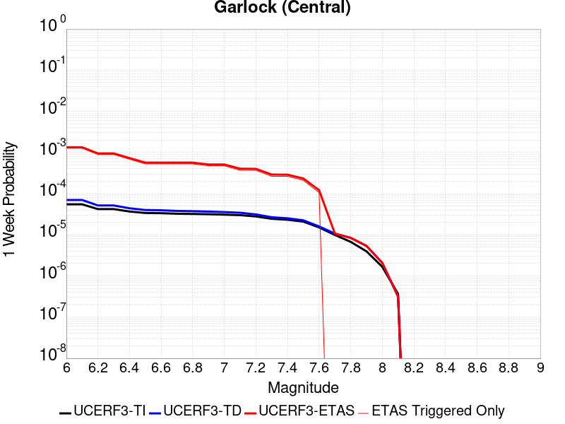 | 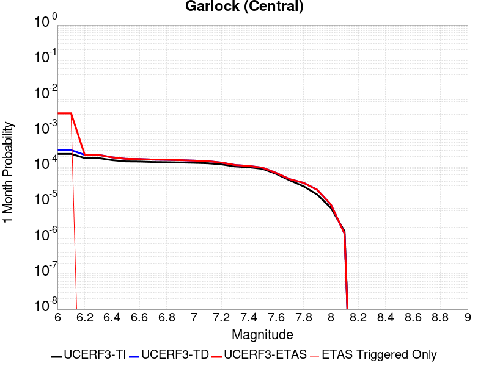 | 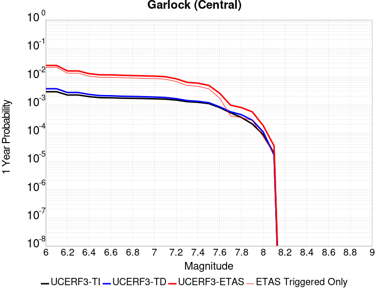 | 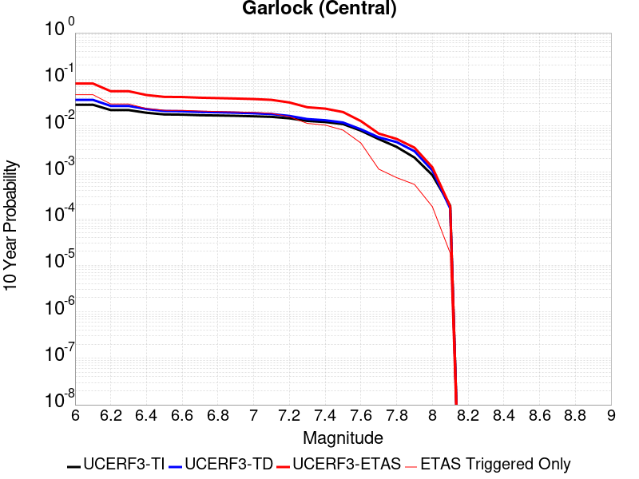 |

| Magnitude | 1 wk TI Prob | 1 wk TD Prob | 1 wk ETAS Prob | 1 wk ETAS/TD Gain | 1 wk ETAS Triggered Only | 1 mo TI Prob | 1 mo TD Prob | 1 mo ETAS Prob | 1 mo ETAS/TD Gain | 1 mo ETAS Triggered Only | 1 yr TI Prob | 1 yr TD Prob | 1 yr ETAS Prob | 1 yr ETAS/TD Gain | 1 yr ETAS Triggered Only | 10 yr TI Prob | 10 yr TD Prob | 10 yr ETAS Prob | 10 yr ETAS/TD Gain | 10 yr ETAS Triggered Only |
|-----|-----|-----|-----|-----|-----|-----|-----|-----|-----|-----|-----|-----|-----|-----|-----|-----|-----|-----|-----|-----|
| 6.0 | 5.5131142E-5 | 7.029724E-5 | 0.0013119682 | 18.663155 | 0.0012417582 | 2.3625491E-4 | 3.0123946E-4 | 0.0044208774 | 14.675625 | 0.0041208793 | 0.0028726095 | 0.0036614882 | 0.024694085 | 6.7442756 | 0.02110989 | 0.028357591 | 0.03610513 | 0.08068792 | 2.2348049 | 0.046252746 |
| 6.1 | 5.5131142E-5 | 7.029724E-5 | 0.0013119682 | 18.663155 | 0.0012417582 | 2.3625491E-4 | 3.0123946E-4 | 0.0044208774 | 14.675625 | 0.0041208793 | 0.0028726095 | 0.0036614882 | 0.024694085 | 6.7442756 | 0.02110989 | 0.028357591 | 0.03610513 | 0.08068792 | 2.2348049 | 0.046252746 |
| 6.2 | 4.216245E-5 | 5.1707266E-5 | 7.549676E-4 | 14.600802 | 7.032967E-4 | 1.806837E-4 | 2.2158393E-4 | 0.0027155366 | 12.2551155 | 0.0024945056 | 0.0021976046 | 0.0026944785 | 0.01605399 | 5.958106 | 0.013395605 | 0.021759989 | 0.026713025 | 0.055366166 | 2.072628 | 0.029439561 |
| 6.3 | 4.216245E-5 | 5.1707266E-5 | 7.549676E-4 | 14.600802 | 7.032967E-4 | 1.806837E-4 | 2.2158393E-4 | 0.0027155366 | 12.2551155 | 0.0024945056 | 0.0021976046 | 0.0026944785 | 0.01605399 | 5.958106 | 0.013395605 | 0.021759989 | 0.026713025 | 0.055366166 | 2.072628 | 0.029439561 |
| 6.4 | 3.6858168E-5 | 4.4154516E-5 | 5.7160377E-4 | 12.945533 | 5.274725E-4 | 1.5795401E-4 | 1.8922007E-4 | 0.0021119332 | 11.161254 | 0.0019230769 | 0.0019213937 | 0.0023013453 | 0.012552425 | 5.4543853 | 0.010274725 | 0.019048655 | 0.022871342 | 0.045656692 | 1.9962403 | 0.023318682 |
| 6.5 | 3.39199E-5 | 4.0061277E-5 | 4.6861553E-4 | 11.697469 | 4.2857142E-4 | 1.453629E-4 | 1.7168E-4 | 0.0018966586 | 11.047638 | 0.0017252747 | 0.0017683565 | 0.0020882222 | 0.0114642065 | 5.4899364 | 0.009395604 | 0.017543508 | 0.020781917 | 0.04154995 | 1.9993318 | 0.021208791 |
| 6.6 | 3.3571985E-5 | 3.951536E-5 | 4.6806986E-4 | 11.845264 | 4.2857142E-4 | 1.4387199E-4 | 1.6934067E-4 | 0.0018833361 | 11.121582 | 0.0017142857 | 0.0017502342 | 0.0020597947 | 0.011392181 | 5.530736 | 0.009351648 | 0.017365133 | 0.020503184 | 0.041212544 | 2.0100558 | 0.021142857 |
| 6.7 | 3.2580007E-5 | 3.8131515E-5 | 4.55698E-4 | 11.950692 | 4.1758243E-4 | 1.3962112E-4 | 1.6341066E-4 | 0.0018224801 | 11.152761 | 0.0016593407 | 0.0016985617 | 0.0019877309 | 0.010980808 | 5.5242934 | 0.009010989 | 0.016856372 | 0.019795695 | 0.03976601 | 2.0088212 | 0.020373626 |
| 6.8 | 3.2185937E-5 | 3.755858E-5 | 4.441367E-4 | 11.825173 | 4.065934E-4 | 1.3793244E-4 | 1.6095553E-4 | 0.0017870674 | 11.102864 | 0.0016263736 | 0.0016780337 | 0.0019578936 | 0.010709955 | 5.4701414 | 0.008769231 | 0.016654192 | 0.019502424 | 0.03902618 | 2.0010936 | 0.019912088 |
| 6.9 | 3.165394E-5 | 3.676294E-5 | 4.323528E-4 | 11.760561 | 3.956044E-4 | 1.3565269E-4 | 1.5754606E-4 | 0.0017507016 | 11.112316 | 0.0015934065 | 0.0016503202 | 0.0019164572 | 0.010471459 | 5.4639673 | 0.008571428 | 0.01638118 | 0.019094951 | 0.038206432 | 2.0008657 | 0.019483516 |
| 7.0 | 3.0903822E-5 | 3.56679E-5 | 4.2026956E-4 | 11.782851 | 3.8461538E-4 | 1.3243823E-4 | 1.528536E-4 | 0.0017350293 | 11.350923 | 0.0015824176 | 0.0016112428 | 0.0018594253 | 0.010217481 | 5.4949675 | 0.0083736265 | 0.015996104 | 0.018533979 | 0.037203405 | 2.007308 | 0.019021979 |
| 7.1 | 3.0069863E-5 | 3.443386E-5 | 3.9705873E-4 | 11.531055 | 3.6263737E-4 | 1.2886449E-4 | 1.4756546E-4 | 0.0016748125 | 11.349626 | 0.0015274725 | 0.0015677959 | 0.00179515 | 0.00976982 | 5.442342 | 0.007989011 | 0.01556781 | 0.017901478 | 0.03576272 | 1.9977524 | 0.018186813 |
| 7.2 | 2.7957109E-5 | 3.1322343E-5 | 3.4999367E-4 | 11.173931 | 3.1868133E-4 | 1.1981068E-4 | 1.3423181E-4 | 0.0014307611 | 10.658882 | 0.0012967034 | 0.0014577188 | 0.0016330667 | 0.008040169 | 4.923356 | 0.0064175823 | 0.014481937 | 0.016304675 | 0.031092534 | 1.9069705 | 0.015032967 |
| 7.3 | 2.4519275E-5 | 2.6753303E-5 | 2.3553893E-4 | 8.804107 | 2.0879121E-4 | 1.0507837E-4 | 1.1465206E-4 | 0.0010266354 | 8.954356 | 9.120879E-4 | 0.0012785783 | 0.0013950097 | 0.005916166 | 4.24095 | 0.0045274724 | 0.012712469 | 0.01394786 | 0.024458526 | 1.7535683 | 0.010659341 |
| 7.4 | 2.3225532E-5 | 2.5237154E-5 | 2.3402309E-4 | 9.272959 | 2.0879121E-4 | 9.95342E-5 | 1.08154825E-4 | 9.5421716E-4 | 8.822696 | 8.461538E-4 | 0.0012111551 | 0.0013160041 | 0.005475358 | 4.160594 | 0.004164835 | 0.012045753 | 0.013165161 | 0.022729868 | 1.7265165 | 0.009692308 |
| 7.5 | 2.097765E-5 | 2.2519616E-5 | 2.2031736E-4 | 9.783353 | 1.978022E-4 | 8.9901114E-5 | 9.650914E-5 | 8.107259E-4 | 8.400509 | 7.142857E-4 | 0.0010939965 | 0.0011743773 | 0.004587946 | 3.9067056 | 0.0034175825 | 0.010886264 | 0.01175889 | 0.019306445 | 1.6418595 | 0.0076373625 |
| 7.6 | 1.511254E-5 | 1.6024836E-5 | 8.195785E-5 | 5.114426 | 6.5934066E-5 | 6.476642E-5 | 6.8676105E-5 | 4.3128856E-4 | 6.280038 | 3.6263737E-4 | 7.882459E-4 | 8.358187E-4 | 0.0024937724 | 2.9836285 | 0.0016593407 | 0.007854558 | 0.008400891 | 0.012378184 | 1.4734371 | 0.004010989 |
| 7.7 | 9.934069E-6 | 1.0710005E-5 | 2.1698897E-5 | 2.02604 | 1.0989011E-5 | 4.2573887E-5 | 4.5899214E-5 | 1.5578428E-4 | 3.394051 | 1.0989011E-4 | 5.182138E-4 | 5.5868004E-4 | 9.650463E-4 | 1.7273685 | 4.065934E-4 | 0.00517007 | 0.005643875 | 0.006791209 | 1.2032883 | 0.0011538462 |
| 7.8 | 6.7562896E-6 | 8.454161E-6 | 1.9443078E-5 | 2.2998238 | 1.0989011E-5 | 2.8955206E-5 | 3.6231613E-5 | 1.4611775E-4 | 4.03288 | 1.0989011E-4 | 3.5247262E-4 | 4.4103077E-4 | 7.92524E-4 | 1.7969812 | 3.5164834E-4 | 0.0035191406 | 0.0044599986 | 0.0052476786 | 1.1766099 | 7.912088E-4 |
| 7.9 | 3.975453E-6 | 5.3865706E-6 | 1.6375523E-5 | 3.0400646 | 1.0989011E-5 | 1.7037546E-5 | 2.3085098E-5 | 8.9017645E-5 | 3.856065 | 6.5934066E-5 | 2.0741238E-4 | 2.8102493E-4 | 5.227152E-4 | 1.8600315 | 2.4175824E-4 | 0.002072189 | 0.002841702 | 0.0033786334 | 1.1889471 | 5.3846155E-4 |
| 8.0 | 1.6729537E-6 | 2.0826424E-6 | 2.0826424E-6 | 1.0 | 0.0 | 7.169782E-6 | 8.92558E-6 | 4.189232E-5 | 4.693512 | 3.2967033E-5 | 8.7288594E-5 | 1.0866355E-4 | 1.7459046E-4 | 1.6067066 | 6.5934066E-5 | 8.7254314E-4 | 0.0010996006 | 0.0012971853 | 1.1796877 | 1.978022E-4 |
| 8.1 | 3.6733252E-7 | 3.156379E-7 | 3.156379E-7 | 1.0 | 0.0 | 1.5742813E-6 | 1.3527332E-6 | 1.2341729E-5 | 9.12355 | 1.0989011E-5 | 1.9166706E-5 | 1.646942E-5 | 2.7458249E-5 | 1.6672263 | 1.0989011E-5 | 1.9165053E-4 | 1.6677451E-4 | 1.777617E-4 | 1.0658804 | 1.0989011E-5 |

## Tank Canyon
*[(top)](#table-of-contents)*

| 1 Week | 1 Month | 1 Year | 10 Year |
|-----|-----|-----|-----|
| 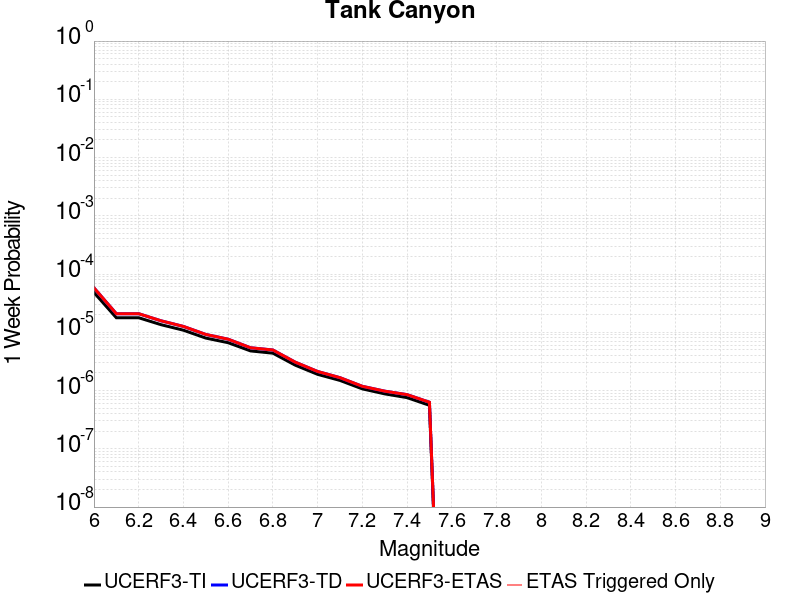 | 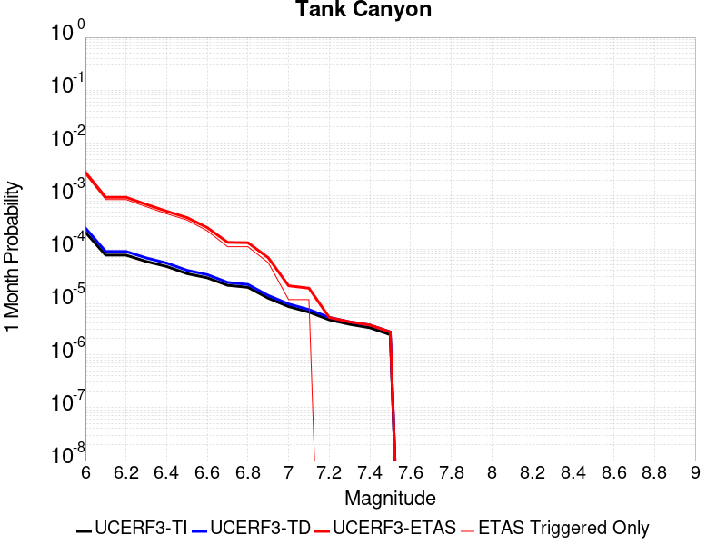 | 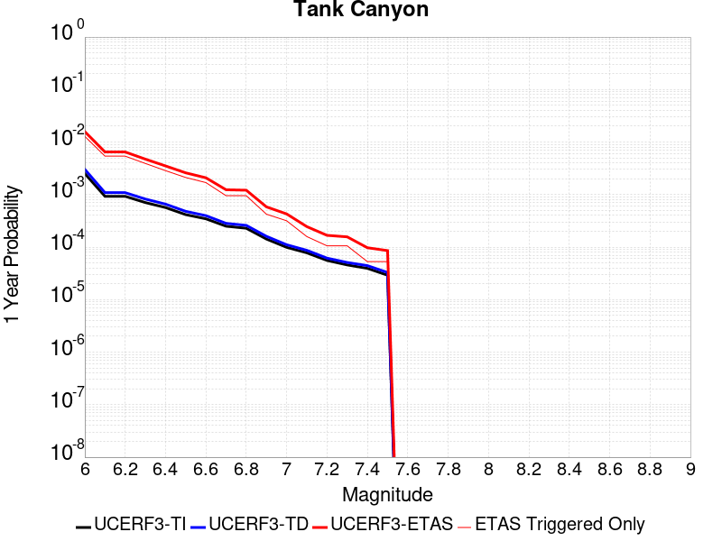 |  |

| Magnitude | 1 wk TI Prob | 1 wk TD Prob | 1 wk ETAS Prob | 1 wk ETAS/TD Gain | 1 wk ETAS Triggered Only | 1 mo TI Prob | 1 mo TD Prob | 1 mo ETAS Prob | 1 mo ETAS/TD Gain | 1 mo ETAS Triggered Only | 1 yr TI Prob | 1 yr TD Prob | 1 yr ETAS Prob | 1 yr ETAS/TD Gain | 1 yr ETAS Triggered Only | 10 yr TI Prob | 10 yr TD Prob | 10 yr ETAS Prob | 10 yr ETAS/TD Gain | 10 yr ETAS Triggered Only |
|-----|-----|-----|-----|-----|-----|-----|-----|-----|-----|-----|-----|-----|-----|-----|-----|-----|-----|-----|-----|-----|
| 6.0 | 4.8284557E-5 | 5.7977024E-5 | 7.1727944E-4 | 12.371788 | 6.5934064E-4 | 2.0691741E-4 | 2.4845314E-4 | 0.002819243 | 11.347181 | 0.0025714287 | 0.0025163088 | 0.0030213767 | 0.01723106 | 5.7030497 | 0.014252747 | 0.02488006 | 0.02986978 | 0.063237995 | 2.117123 | 0.034395605 |
| 6.1 | 1.7796336E-5 | 2.0876903E-5 | 2.4065253E-4 | 11.527214 | 2.1978022E-4 | 7.626778E-5 | 8.946959E-5 | 9.465358E-4 | 10.579412 | 8.5714285E-4 | 9.281647E-4 | 0.0010887844 | 0.0060504093 | 5.5570316 | 0.004967033 | 0.009242975 | 0.010838592 | 0.023295503 | 2.1493108 | 0.012593406 |
| 6.2 | 1.7796336E-5 | 2.0876903E-5 | 2.4065253E-4 | 11.527214 | 2.1978022E-4 | 7.626778E-5 | 8.946959E-5 | 9.465358E-4 | 10.579412 | 8.5714285E-4 | 9.281647E-4 | 0.0010887844 | 0.0060504093 | 5.5570316 | 0.004967033 | 0.009242975 | 0.010838592 | 0.023295503 | 2.1493108 | 0.012593406 |
| 6.3 | 1.3515912E-5 | 1.5762093E-5 | 1.8059465E-4 | 11.457531 | 1.6483516E-4 | 5.792405E-5 | 6.755021E-5 | 6.9388153E-4 | 10.272085 | 6.263736E-4 | 7.049971E-4 | 8.2213746E-4 | 0.0042478903 | 5.1668854 | 0.0034285714 | 0.007027647 | 0.008193571 | 0.017185222 | 2.0974033 | 0.009065934 |
| 6.4 | 1.0870146E-5 | 1.2619922E-5 | 1.3349752E-4 | 10.578316 | 1.2087912E-4 | 4.658551E-5 | 5.408436E-5 | 5.155979E-4 | 9.5332155 | 4.6153847E-4 | 5.67031E-4 | 6.5829605E-4 | 0.0032829407 | 4.9870276 | 0.0026263737 | 0.005655863 | 0.006565476 | 0.0133775985 | 2.0375671 | 0.006857143 |
| 6.5 | 7.964826E-6 | 9.197353E-6 | 8.6119726E-5 | 9.363533 | 7.6923076E-5 | 3.4134522E-5 | 3.9416693E-5 | 3.9105117E-4 | 9.920954 | 3.5164834E-4 | 4.1550855E-4 | 4.7980322E-4 | 0.0022811363 | 4.7543163 | 0.0018021978 | 0.0041473247 | 0.0047889743 | 0.009229147 | 1.9271656 | 0.0044615385 |
| 6.6 | 6.6317E-6 | 7.6132555E-6 | 7.354682E-5 | 9.660364 | 6.5934066E-5 | 2.8421264E-5 | 3.2627882E-5 | 2.5240093E-4 | 7.7357435 | 2.1978022E-4 | 3.4597394E-4 | 3.9718117E-4 | 0.0016494308 | 4.1528425 | 0.0012527473 | 0.0034543579 | 0.003965865 | 0.007194767 | 1.8141735 | 0.0032417583 |
| 6.7 | 4.793663E-6 | 5.431335E-6 | 3.839819E-5 | 7.0697513 | 3.2967033E-5 | 2.0544108E-5 | 2.3276967E-5 | 1.3316452E-4 | 5.7208705 | 1.0989011E-4 | 2.500958E-4 | 2.833646E-4 | 0.0010084339 | 3.5587854 | 7.2527473E-4 | 0.0024981452 | 0.0028307254 | 0.0045839897 | 1.6193694 | 0.0017582418 |
| 6.8 | 4.382823E-6 | 4.9697283E-6 | 3.79366E-5 | 7.6335354 | 3.2967033E-5 | 1.8783392E-5 | 2.1298685E-5 | 1.3118646E-4 | 6.1593685 | 1.0989011E-4 | 2.286638E-4 | 2.5928492E-4 | 9.4042695E-4 | 3.627002 | 6.813187E-4 | 0.0022842865 | 0.002590498 | 0.0041907374 | 1.6177343 | 0.0016043956 |
| 6.9 | 2.729601E-6 | 3.0737624E-6 | 1.406274E-5 | 4.57509 | 1.0989011E-5 | 1.1698237E-5 | 1.3173209E-5 | 6.811754E-5 | 5.170915 | 5.4945056E-5 | 1.4241673E-4 | 1.6037324E-4 | 5.009779E-4 | 3.123825 | 3.4065935E-4 | 0.001423255 | 0.0016027407 | 0.0024475385 | 1.5270957 | 8.461538E-4 |
| 7.0 | 1.8987357E-6 | 2.127059E-6 | 1.3116047E-5 | 6.166283 | 1.0989011E-5 | 8.137413E-6 | 9.115938E-6 | 2.010485E-5 | 2.2054613 | 1.0989011E-5 | 9.90685E-5 | 1.1098159E-4 | 2.9777404E-4 | 2.683094 | 1.8681318E-4 | 9.902435E-4 | 0.0011093304 | 0.0015264496 | 1.3760098 | 4.1758243E-4 |
| 7.1 | 1.4928986E-6 | 1.6642095E-6 | 1.2653202E-5 | 7.603131 | 1.0989011E-5 | 6.398121E-6 | 7.13231E-6 | 1.8121244E-5 | 2.5407255 | 1.0989011E-5 | 7.789434E-5 | 8.683301E-5 | 1.9671358E-4 | 2.265424 | 1.0989011E-4 | 7.786704E-4 | 8.6804864E-4 | 0.0010766586 | 1.2403206 | 2.0879121E-4 |
| 7.2 | 1.069082E-6 | 1.1829095E-6 | 1.1829095E-6 | 1.0 | 0.0 | 4.581772E-6 | 5.0696053E-6 | 5.0696053E-6 | 1.0 | 0.0 | 5.5781646E-5 | 6.172123E-5 | 1.2765122E-4 | 2.0681899 | 6.5934066E-5 | 5.576765E-4 | 6.170931E-4 | 7.2691543E-4 | 1.1779672 | 1.0989011E-4 |
| 7.3 | 8.776551E-7 | 9.770386E-7 | 9.770386E-7 | 1.0 | 0.0 | 3.7613736E-6 | 4.187304E-6 | 4.187304E-6 | 1.0 | 0.0 | 4.579376E-5 | 5.0979754E-5 | 1.0592201E-4 | 2.0777268 | 5.4945056E-5 | 4.5784327E-4 | 5.0973165E-4 | 5.975989E-4 | 1.1723795 | 8.7912085E-5 |
| 7.4 | 7.55721E-7 | 8.51056E-7 | 8.51056E-7 | 1.0 | 0.0 | 3.2388E-6 | 3.6473805E-6 | 3.6473805E-6 | 1.0 | 0.0 | 3.9431678E-5 | 4.440647E-5 | 8.836056E-5 | 1.9898127 | 4.3956043E-5 | 3.942468E-4 | 4.4402684E-4 | 5.0993165E-4 | 1.1484252 | 6.5934066E-5 |
| 7.5 | 5.587665E-7 | 6.3058474E-7 | 6.3058474E-7 | 1.0 | 0.0 | 2.3947114E-6 | 2.7025062E-6 | 2.7025062E-6 | 1.0 | 0.0 | 2.915522E-5 | 3.290301E-5 | 6.586896E-5 | 2.0019128 | 3.2967033E-5 | 2.9151395E-4 | 3.2903012E-4 | 3.729717E-4 | 1.1335489 | 4.3956043E-5 |

## Little Lake
*[(top)](#table-of-contents)*

| 1 Week | 1 Month | 1 Year | 10 Year |
|-----|-----|-----|-----|
| 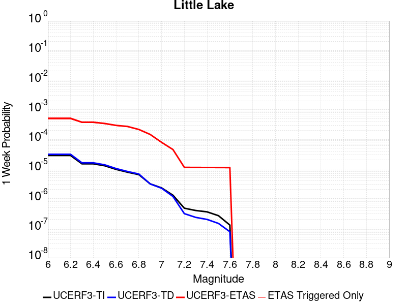 | 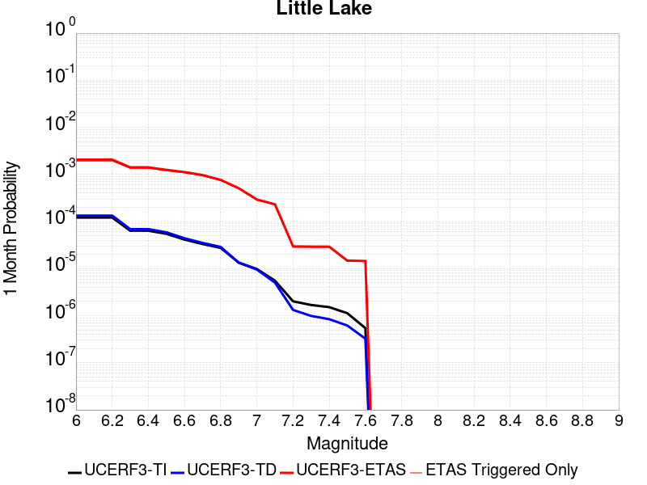 | 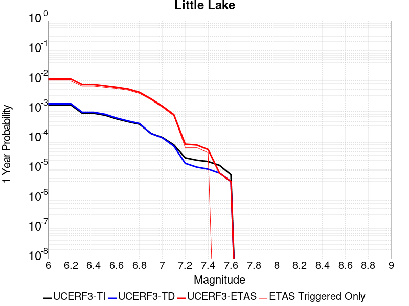 | 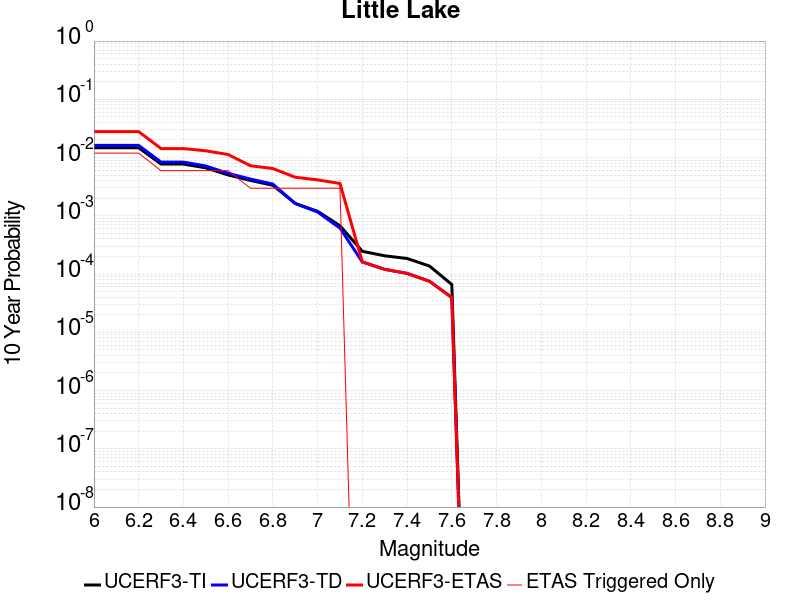 |

| Magnitude | 1 wk TI Prob | 1 wk TD Prob | 1 wk ETAS Prob | 1 wk ETAS/TD Gain | 1 wk ETAS Triggered Only | 1 mo TI Prob | 1 mo TD Prob | 1 mo ETAS Prob | 1 mo ETAS/TD Gain | 1 mo ETAS Triggered Only | 1 yr TI Prob | 1 yr TD Prob | 1 yr ETAS Prob | 1 yr ETAS/TD Gain | 1 yr ETAS Triggered Only | 10 yr TI Prob | 10 yr TD Prob | 10 yr ETAS Prob | 10 yr ETAS/TD Gain | 10 yr ETAS Triggered Only |
|-----|-----|-----|-----|-----|-----|-----|-----|-----|-----|-----|-----|-----|-----|-----|-----|-----|-----|-----|-----|-----|
| 6.0 | 2.8424427E-5 | 3.1209234E-5 | 5.147106E-4 | 16.492254 | 4.835165E-4 | 1.2181328E-4 | 1.3374774E-4 | 0.0021115053 | 15.78722 | 0.001978022 | 0.0014820677 | 0.0016272957 | 0.01158908 | 7.1216807 | 0.009978022 | 0.014722223 | 0.016167207 | 0.03709798 | 2.2946436 | 0.021274725 |
| 6.1 | 2.8424427E-5 | 3.1209234E-5 | 5.147106E-4 | 16.492254 | 4.835165E-4 | 1.2181328E-4 | 1.3374774E-4 | 0.0021115053 | 15.78722 | 0.001978022 | 0.0014820677 | 0.0016272957 | 0.01158908 | 7.1216807 | 0.009978022 | 0.014722223 | 0.016167207 | 0.03709798 | 2.2946436 | 0.021274725 |
| 6.2 | 2.8424427E-5 | 3.1209234E-5 | 5.147106E-4 | 16.492254 | 4.835165E-4 | 1.2181328E-4 | 1.3374774E-4 | 0.0021115053 | 15.78722 | 0.001978022 | 0.0014820677 | 0.0016272957 | 0.01158908 | 7.1216807 | 0.009978022 | 0.014722223 | 0.016167207 | 0.03709798 | 2.2946436 | 0.021274725 |
| 6.3 | 1.48860645E-5 | 1.608302E-5 | 3.7871455E-4 | 23.547476 | 3.6263737E-4 | 6.379586E-5 | 6.892557E-5 | 0.001431469 | 20.76833 | 0.0013626374 | 7.7643775E-4 | 8.3887397E-4 | 0.00738283 | 8.800881 | 0.0065494506 | 0.007737305 | 0.008359893 | 0.022112088 | 2.6450205 | 0.013868132 |
| 6.4 | 1.48860645E-5 | 1.608302E-5 | 3.7871455E-4 | 23.547476 | 3.6263737E-4 | 6.379586E-5 | 6.892557E-5 | 0.001431469 | 20.76833 | 0.0013626374 | 7.7643775E-4 | 8.3887397E-4 | 0.00738283 | 8.800881 | 0.0065494506 | 0.007737305 | 0.008359893 | 0.022112088 | 2.6450205 | 0.013868132 |
| 6.5 | 1.2797581E-5 | 1.3766929E-5 | 3.434327E-4 | 24.94621 | 3.2967032E-4 | 5.4845623E-5 | 5.8999936E-5 | 0.0012787082 | 21.673044 | 0.0012197802 | 6.675408E-4 | 7.1811315E-4 | 0.0066918423 | 9.3186455 | 0.005978022 | 0.006655392 | 0.0071604773 | 0.01970735 | 2.7522397 | 0.012637363 |
| 6.6 | 9.661896E-6 | 1.0290001E-5 | 2.9600135E-4 | 28.76592 | 2.8571428E-4 | 4.1407468E-5 | 4.409935E-5 | 0.001142952 | 25.917662 | 0.0010989011 | 5.040193E-4 | 5.3679355E-4 | 0.0058526197 | 10.902925 | 0.0053186812 | 0.005028777 | 0.0053565744 | 0.016232071 | 3.030308 | 0.010934066 |
| 6.7 | 7.767871E-6 | 8.200421E-6 | 2.7193452E-4 | 33.161045 | 2.6373626E-4 | 3.329045E-5 | 3.5144265E-5 | 0.0010131319 | 28.8278 | 9.78022E-4 | 4.0523586E-4 | 4.2781114E-4 | 0.0051290956 | 11.989159 | 0.004703297 | 0.004044977 | 0.004271228 | 0.01372518 | 3.213404 | 0.009494506 |
| 6.8 | 6.4235196E-6 | 6.73634E-6 | 2.1552615E-4 | 31.994547 | 2.0879121E-4 | 2.752908E-5 | 2.8869781E-5 | 8.310444E-4 | 28.785963 | 8.021978E-4 | 3.35115E-4 | 3.5144572E-4 | 0.0040644263 | 11.564876 | 0.0037142858 | 0.003346101 | 0.00351016 | 0.011175467 | 3.1837485 | 0.0076923077 |
| 6.9 | 3.1283696E-6 | 3.1123911E-6 | 1.4596908E-4 | 46.89934 | 1.4285714E-4 | 1.3407229E-5 | 1.3338759E-5 | 5.847597E-4 | 43.839138 | 5.7142857E-4 | 1.6322079E-4 | 1.623888E-4 | 0.0026235275 | 16.15584 | 0.0024615384 | 0.0016310095 | 0.0016228497 | 0.0065489085 | 4.0354376 | 0.004934066 |
| 7.0 | 2.290603E-6 | 2.228841E-6 | 7.9151745E-5 | 35.512512 | 7.6923076E-5 | 9.816834E-6 | 9.552146E-6 | 2.9526372E-4 | 30.910717 | 2.8571428E-4 | 1.19513395E-4 | 1.1629222E-4 | 0.0014897588 | 12.810477 | 0.0013736264 | 0.0011944914 | 0.0011624158 | 0.0041259998 | 3.5495043 | 0.002967033 |
| 7.1 | 1.293693E-6 | 1.1777817E-6 | 4.5133773E-5 | 38.321003 | 4.3956043E-5 | 5.5443866E-6 | 5.0476297E-6 | 2.0284882E-4 | 40.186947 | 1.978022E-4 | 6.750081E-5 | 6.145386E-5 | 8.086607E-4 | 13.158827 | 7.472527E-4 | 6.7480316E-4 | 6.144371E-4 | 0.0021409711 | 3.484443 | 0.0015274725 |
| 7.2 | 4.715842E-7 | 3.092254E-7 | 1.1298233E-5 | 36.53721 | 1.0989011E-5 | 2.0210737E-6 | 1.3252511E-6 | 2.3303244E-5 | 17.584023 | 2.1978021E-5 | 2.4606294E-5 | 1.6134818E-5 | 7.107898E-5 | 4.405317 | 5.4945056E-5 | 2.460357E-4 | 1.6133701E-4 | 2.3824767E-4 | 1.4767082 | 7.6923076E-5 |
| 7.3 | 3.9430947E-7 | 2.3101789E-7 | 1.1220026E-5 | 48.56778 | 1.0989011E-5 | 1.6898966E-6 | 9.900764E-7 | 2.2968077E-5 | 23.198288 | 2.1978021E-5 | 2.0574296E-5 | 1.20541135E-5 | 6.699851E-5 | 5.5581446 | 5.4945056E-5 | 2.0572392E-4 | 1.2053467E-4 | 1.8646079E-4 | 1.5469474 | 6.5934066E-5 |
| 7.4 | 3.547123E-7 | 1.9683131E-7 | 1.118584E-5 | 56.82958 | 1.0989011E-5 | 1.5201948E-6 | 8.435625E-7 | 2.2821567E-5 | 27.053795 | 2.1978021E-5 | 1.8508214E-5 | 1.0270325E-5 | 5.422592E-5 | 5.279864 | 4.3956043E-5 | 1.8506673E-4 | 1.0269857E-4 | 1.5763799E-4 | 1.5349579 | 5.4945056E-5 |
| 7.5 | 2.6354266E-7 | 1.4425933E-7 | 1.1133268E-5 | 77.175385 | 1.0989011E-5 | 1.129468E-6 | 6.182541E-7 | 1.1607258E-5 | 18.774252 | 1.0989011E-5 | 1.3751187E-5 | 7.5272183E-6 | 2.9505074E-5 | 3.9197848 | 2.1978021E-5 | 1.3750336E-4 | 7.526969E-5 | 1.08234235E-4 | 1.4379525 | 3.2967033E-5 |
| 7.6 | 1.269913E-7 | 7.5737425E-8 | 1.1064748E-5 | 146.09354 | 1.0989011E-5 | 5.4424834E-7 | 3.245889E-7 | 1.1313597E-5 | 34.855152 | 1.0989011E-5 | 6.6262032E-6 | 3.951863E-6 | 2.5929798E-5 | 6.561411 | 2.1978021E-5 | 6.626006E-5 | 3.9517967E-5 | 6.149512E-5 | 1.5561306 | 2.1978021E-5 |

## Airport Lake
*[(top)](#table-of-contents)*

| 1 Week | 1 Month | 1 Year | 10 Year |
|-----|-----|-----|-----|
|  | 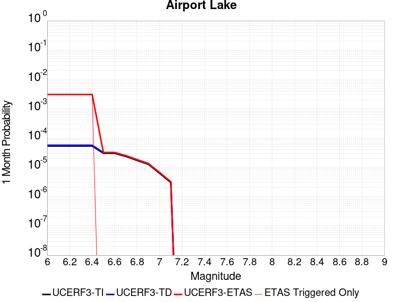 | 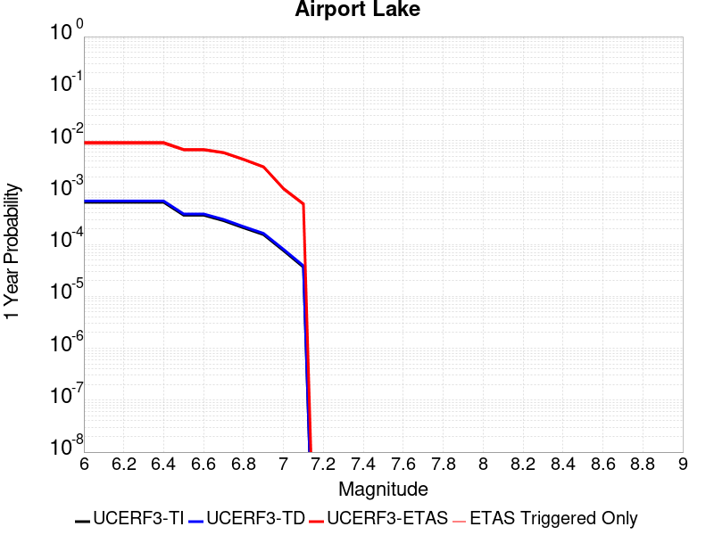 | 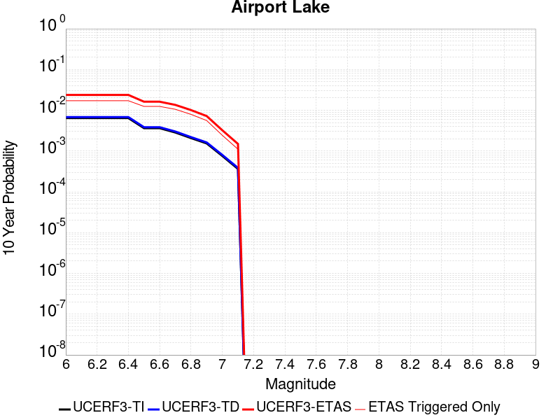 |

| Magnitude | 1 wk TI Prob | 1 wk TD Prob | 1 wk ETAS Prob | 1 wk ETAS/TD Gain | 1 wk ETAS Triggered Only | 1 mo TI Prob | 1 mo TD Prob | 1 mo ETAS Prob | 1 mo ETAS/TD Gain | 1 mo ETAS Triggered Only | 1 yr TI Prob | 1 yr TD Prob | 1 yr ETAS Prob | 1 yr ETAS/TD Gain | 1 yr ETAS Triggered Only | 10 yr TI Prob | 10 yr TD Prob | 10 yr ETAS Prob | 10 yr ETAS/TD Gain | 10 yr ETAS Triggered Only |
|-----|-----|-----|-----|-----|-----|-----|-----|-----|-----|-----|-----|-----|-----|-----|-----|-----|-----|-----|-----|-----|
| 6.0 | 1.2387061E-5 | 1.31039615E-5 | 5.07603E-4 | 38.736607 | 4.945055E-4 | 5.3086325E-5 | 5.6158784E-5 | 0.0018802321 | 33.48064 | 0.0018241758 | 6.461343E-4 | 6.835471E-4 | 0.009194209 | 13.450732 | 0.008516484 | 0.0064425888 | 0.0068172566 | 0.024006957 | 3.5214984 | 0.017307693 |
| 6.1 | 1.2387061E-5 | 1.31039615E-5 | 5.07603E-4 | 38.736607 | 4.945055E-4 | 5.3086325E-5 | 5.6158784E-5 | 0.0018802321 | 33.48064 | 0.0018241758 | 6.461343E-4 | 6.835471E-4 | 0.009194209 | 13.450732 | 0.008516484 | 0.0064425888 | 0.0068172566 | 0.024006957 | 3.5214984 | 0.017307693 |
| 6.2 | 1.2387061E-5 | 1.31039615E-5 | 5.07603E-4 | 38.736607 | 4.945055E-4 | 5.3086325E-5 | 5.6158784E-5 | 0.0018802321 | 33.48064 | 0.0018241758 | 6.461343E-4 | 6.835471E-4 | 0.009194209 | 13.450732 | 0.008516484 | 0.0064425888 | 0.0068172566 | 0.024006957 | 3.5214984 | 0.017307693 |
| 6.3 | 1.2387061E-5 | 1.31039615E-5 | 5.07603E-4 | 38.736607 | 4.945055E-4 | 5.3086325E-5 | 5.6158784E-5 | 0.0018802321 | 33.48064 | 0.0018241758 | 6.461343E-4 | 6.835471E-4 | 0.009194209 | 13.450732 | 0.008516484 | 0.0064425888 | 0.0068172566 | 0.024006957 | 3.5214984 | 0.017307693 |
| 6.4 | 1.2387061E-5 | 1.31039615E-5 | 5.07603E-4 | 38.736607 | 4.945055E-4 | 5.3086325E-5 | 5.6158784E-5 | 0.0018802321 | 33.48064 | 0.0018241758 | 6.461343E-4 | 6.835471E-4 | 0.009194209 | 13.450732 | 0.008516484 | 0.0064425888 | 0.0068172566 | 0.024006957 | 3.5214984 | 0.017307693 |
| 6.5 | 6.9922594E-6 | 7.3853653E-6 | 3.9199792E-4 | 53.07766 | 3.8461538E-4 | 2.996648E-5 | 3.1651212E-5 | 0.0014491888 | 45.7862 | 0.0014175824 | 3.6478083E-4 | 3.852908E-4 | 0.006833355 | 17.735579 | 0.0064505492 | 0.003641826 | 0.0038467655 | 0.016829597 | 4.3749995 | 0.013032967 |
| 6.6 | 6.9922594E-6 | 7.3853653E-6 | 3.9199792E-4 | 53.07766 | 3.8461538E-4 | 2.996648E-5 | 3.1651212E-5 | 0.0014491888 | 45.7862 | 0.0014175824 | 3.6478083E-4 | 3.852908E-4 | 0.006833355 | 17.735579 | 0.0064505492 | 0.003641826 | 0.0038467655 | 0.016829597 | 4.3749995 | 0.013032967 |
| 6.7 | 5.477277E-6 | 5.7864145E-6 | 3.3545482E-4 | 57.97283 | 3.2967032E-4 | 2.3473833E-5 | 2.4798706E-5 | 0.0012665262 | 51.07227 | 0.0012417582 | 2.8575645E-4 | 3.0188632E-4 | 0.0059265615 | 19.631765 | 0.0056263735 | 0.0028538927 | 0.0030151461 | 0.01411345 | 4.680851 | 0.011131868 |
| 6.8 | 3.9950432E-6 | 4.2193383E-6 | 2.4597655E-4 | 58.29743 | 2.4175824E-4 | 1.7121502E-5 | 1.8082768E-5 | 9.7410945E-4 | 53.869488 | 9.5604395E-4 | 2.0843433E-4 | 2.2013822E-4 | 0.0044829356 | 20.364187 | 0.0042637363 | 0.0020823893 | 0.0021994726 | 0.010587576 | 4.8136888 | 0.008406593 |
| 6.9 | 2.95695E-6 | 3.1232105E-6 | 1.8993582E-4 | 60.814285 | 1.8681318E-4 | 1.2672582E-5 | 1.3385132E-5 | 7.276613E-4 | 54.3634 | 7.142857E-4 | 1.5427776E-4 | 1.6295406E-4 | 0.0033162863 | 20.351051 | 0.0031538461 | 0.001541707 | 0.0016285682 | 0.007838219 | 4.812951 | 0.00621978 |
| 7.0 | 1.456072E-6 | 1.5409072E-6 | 6.747487E-5 | 43.78906 | 6.5934066E-5 | 6.2402937E-6 | 6.603877E-6 | 2.5934947E-4 | 39.272305 | 2.5274724E-4 | 7.597293E-5 | 8.040024E-5 | 0.0013220586 | 16.443466 | 0.0012417582 | 7.594696E-4 | 8.038104E-4 | 0.0035159143 | 4.374059 | 0.0027142856 |
| 7.1 | 6.995192E-7 | 7.4094396E-7 | 3.370795E-5 | 45.493256 | 3.2967033E-5 | 2.997936E-6 | 3.1754741E-6 | 1.789991E-4 | 56.36925 | 1.7582417E-4 | 3.649926E-5 | 3.8661397E-5 | 7.089652E-4 | 18.337805 | 6.7032967E-4 | 3.6493264E-4 | 3.8661397E-4 | 0.0018146331 | 4.6936564 | 0.0014285714 |

## Owl Lake
*[(top)](#table-of-contents)*

| 1 Week | 1 Month | 1 Year | 10 Year |
|-----|-----|-----|-----|
| 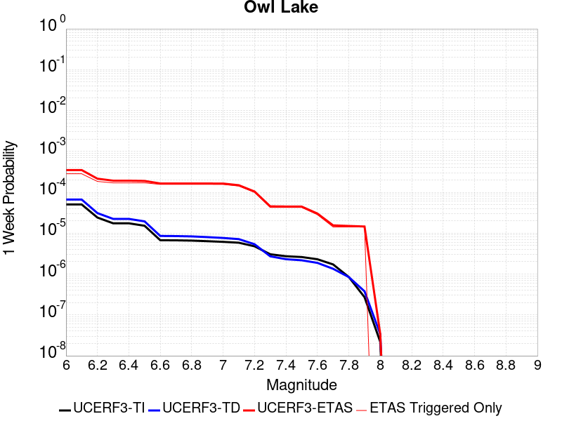 | 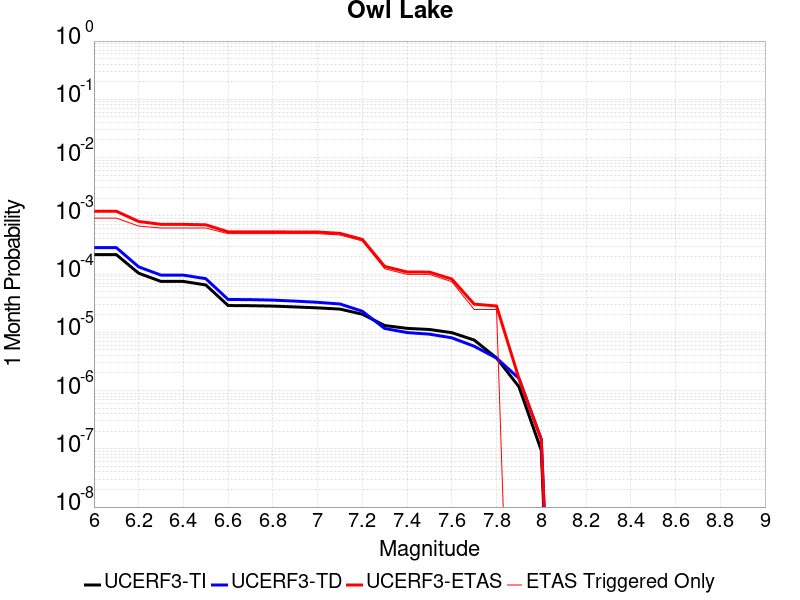 | 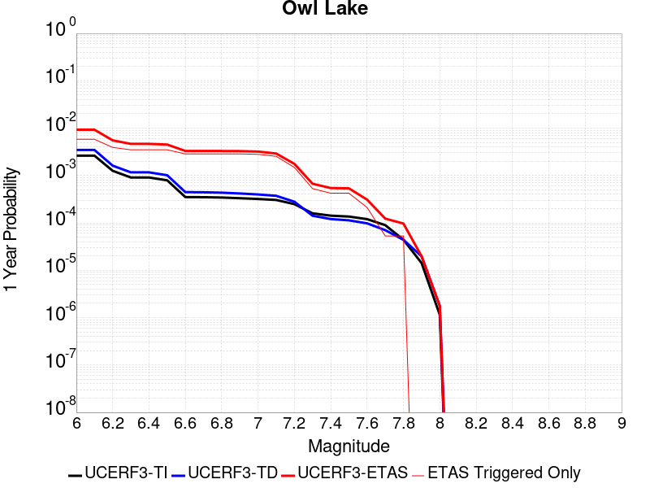 | 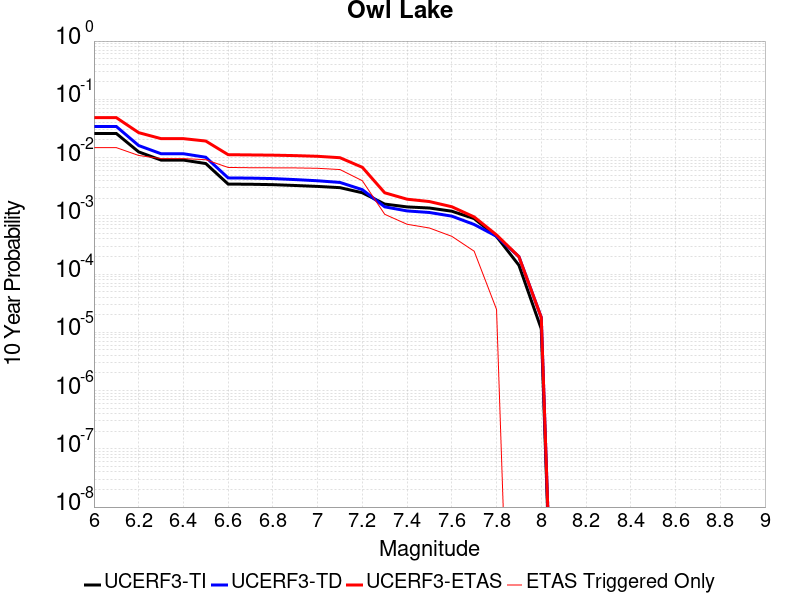 |

| Magnitude | 1 wk TI Prob | 1 wk TD Prob | 1 wk ETAS Prob | 1 wk ETAS/TD Gain | 1 wk ETAS Triggered Only | 1 mo TI Prob | 1 mo TD Prob | 1 mo ETAS Prob | 1 mo ETAS/TD Gain | 1 mo ETAS Triggered Only | 1 yr TI Prob | 1 yr TD Prob | 1 yr ETAS Prob | 1 yr ETAS/TD Gain | 1 yr ETAS Triggered Only | 10 yr TI Prob | 10 yr TD Prob | 10 yr ETAS Prob | 10 yr ETAS/TD Gain | 10 yr ETAS Triggered Only |
|-----|-----|-----|-----|-----|-----|-----|-----|-----|-----|-----|-----|-----|-----|-----|-----|-----|-----|-----|-----|-----|
| 6.0 | 5.0320643E-5 | 6.638493E-5 | 3.3010368E-4 | 4.97257 | 2.6373626E-4 | 2.1564208E-4 | 2.8448208E-4 | 0.0013061693 | 4.591394 | 0.001021978 | 0.0026222812 | 0.0034591116 | 0.009712132 | 2.8076954 | 0.0062747253 | 0.02591553 | 0.034153398 | 0.048407596 | 1.417358 | 0.014758241 |
| 6.1 | 5.0320643E-5 | 6.638493E-5 | 3.3010368E-4 | 4.97257 | 2.6373626E-4 | 2.1564208E-4 | 2.8448208E-4 | 0.0013061693 | 4.591394 | 0.001021978 | 0.0026222812 | 0.0034591116 | 0.009712132 | 2.8076954 | 0.0062747253 | 0.02591553 | 0.034153398 | 0.048407596 | 1.417358 | 0.014758241 |
| 6.2 | 2.4125871E-5 | 3.0994335E-5 | 2.0681306E-4 | 6.6726084 | 1.7582417E-4 | 1.0339249E-4 | 1.3282728E-4 | 9.2393096E-4 | 6.955883 | 7.912088E-4 | 0.0012580766 | 0.0016161125 | 0.0063666645 | 3.9394932 | 0.0047582416 | 0.012509781 | 0.016077155 | 0.02705168 | 1.682616 | 0.011153846 |
| 6.3 | 1.7433485E-5 | 2.2366148E-5 | 1.8719763E-4 | 8.369686 | 1.6483516E-4 | 7.471279E-5 | 9.585229E-5 | 7.990816E-4 | 8.336594 | 7.032967E-4 | 9.0924866E-4 | 0.0011665242 | 0.005425287 | 4.6508136 | 0.0042637363 | 0.009055373 | 0.011634311 | 0.021344189 | 1.83459 | 0.009824175 |
| 6.4 | 1.7433485E-5 | 2.2366148E-5 | 1.8719763E-4 | 8.369686 | 1.6483516E-4 | 7.471279E-5 | 9.585229E-5 | 7.990816E-4 | 8.336594 | 7.032967E-4 | 9.0924866E-4 | 0.0011665242 | 0.005425287 | 4.6508136 | 0.0042637363 | 0.009055373 | 0.011634311 | 0.021344189 | 1.83459 | 0.009824175 |
| 6.5 | 1.5182742E-5 | 1.9438865E-5 | 1.8427083E-4 | 9.479506 | 1.6483516E-4 | 6.506727E-5 | 8.330761E-5 | 7.6456956E-4 | 9.177668 | 6.813187E-4 | 7.919061E-4 | 0.0010139496 | 0.0051196725 | 5.0492377 | 0.00410989 | 0.0078909 | 0.010123401 | 0.019380378 | 1.9144138 | 0.009351648 |
| 6.6 | 6.7271576E-6 | 8.553785E-6 | 1.6239862E-4 | 18.985586 | 1.5384615E-4 | 2.8830356E-5 | 3.6658595E-5 | 5.970776E-4 | 16.28752 | 5.6043954E-4 | 3.5095305E-4 | 4.4623265E-4 | 0.0036645762 | 8.212255 | 0.0032197803 | 0.0035039932 | 0.004471147 | 0.011505488 | 2.5732744 | 0.007065934 |
| 6.7 | 6.682835E-6 | 8.48622E-6 | 1.6233107E-4 | 19.128782 | 1.5384615E-4 | 2.8640408E-5 | 3.636904E-5 | 5.9678825E-4 | 16.409237 | 5.6043954E-4 | 3.4864116E-4 | 4.4270878E-4 | 0.0036500795 | 8.244877 | 0.0032087911 | 0.003480947 | 0.004436068 | 0.011437836 | 2.5783727 | 0.007032967 |
| 6.8 | 6.5774975E-6 | 8.332664E-6 | 1.6217753E-4 | 19.462868 | 1.5384615E-4 | 2.8188972E-5 | 3.571096E-5 | 5.961305E-4 | 16.693209 | 5.6043954E-4 | 3.4314668E-4 | 4.3469985E-4 | 0.0036420962 | 8.378416 | 0.0032087911 | 0.0034261728 | 0.0043561985 | 0.011347587 | 2.604929 | 0.007021978 |
| 6.9 | 6.363419E-6 | 8.00576E-6 | 1.6185068E-4 | 20.216782 | 1.5384615E-4 | 2.727151E-5 | 3.430998E-5 | 5.837417E-4 | 17.013758 | 5.494506E-4 | 3.3198006E-4 | 4.176495E-4 | 0.0036141162 | 8.653467 | 0.0031978022 | 0.0033148455 | 0.0041861506 | 0.011134962 | 2.6599524 | 0.006978022 |
| 7.0 | 6.1342453E-6 | 7.637859E-6 | 1.6148284E-4 | 21.142422 | 1.5384615E-4 | 2.6289357E-5 | 3.27333E-5 | 5.8216584E-4 | 17.785126 | 5.494506E-4 | 3.2002592E-4 | 3.9846057E-4 | 0.0035620346 | 8.939491 | 0.0031648353 | 0.0031956544 | 0.003994793 | 0.010868323 | 2.7206225 | 0.006901099 |
| 7.1 | 5.842926E-6 | 7.1482646E-6 | 1.5000439E-4 | 20.984728 | 1.4285714E-4 | 2.504087E-5 | 3.063509E-5 | 5.690801E-4 | 18.576088 | 5.3846155E-4 | 3.0482994E-4 | 3.729238E-4 | 0.003371805 | 9.041538 | 0.003 | 0.0030441214 | 0.0037401791 | 0.010308925 | 2.7562652 | 0.0065934067 |
| 7.2 | 4.77173E-6 | 5.36398E-6 | 1.04264545E-4 | 19.437906 | 9.89011E-5 | 2.045011E-5 | 2.2988306E-5 | 4.185836E-4 | 18.208544 | 3.956044E-4 | 2.4895166E-4 | 2.7985073E-4 | 0.0020595724 | 7.3595386 | 0.0017802197 | 0.0024867293 | 0.0028115083 | 0.0070084664 | 2.492778 | 0.004208791 |
| 7.3 | 3.0494948E-6 | 2.7145331E-6 | 3.5681478E-5 | 13.1446085 | 3.2967033E-5 | 1.3069198E-5 | 1.1633663E-5 | 1.4350026E-4 | 12.334916 | 1.3186813E-4 | 1.5910587E-4 | 1.4163081E-4 | 6.690286E-4 | 4.723751 | 5.274725E-4 | 0.0015899199 | 0.001425365 | 0.0025446464 | 1.7852595 | 0.0011208791 |
| 7.4 | 2.7263884E-6 | 2.3095015E-6 | 3.527646E-5 | 15.27449 | 3.2967033E-5 | 1.1684469E-5 | 9.897826E-6 | 1.0879795E-4 | 10.992105 | 9.89011E-5 | 1.4224913E-4 | 1.2049948E-4 | 5.050685E-4 | 4.191458 | 3.8461538E-4 | 0.0014215811 | 0.0012132203 | 0.002014445 | 1.6604115 | 8.021978E-4 |
| 7.5 | 2.6090431E-6 | 2.1693693E-6 | 3.513633E-5 | 16.196566 | 3.2967033E-5 | 1.1181565E-5 | 9.297264E-6 | 1.0819744E-4 | 11.637557 | 9.89011E-5 | 1.3612706E-4 | 1.13188406E-4 | 4.4282142E-4 | 3.9122508 | 3.2967032E-4 | 0.001360437 | 0.001139941 | 0.0018204831 | 1.5969975 | 6.813187E-4 |
| 7.6 | 2.3008756E-6 | 1.8763494E-6 | 2.385433E-5 | 12.7131605 | 2.1978021E-5 | 9.860858E-6 | 8.041473E-6 | 7.397501E-5 | 9.199186 | 6.5934066E-5 | 1.20049335E-4 | 9.7900614E-5 | 3.1765932E-4 | 3.244712 | 2.1978022E-4 | 0.001199845 | 9.868495E-4 | 0.0015028233 | 1.5228496 | 5.164835E-4 |
| 7.7 | 1.7184348E-6 | 1.345208E-6 | 1.2334204E-5 | 9.168994 | 1.0989011E-5 | 7.3646997E-6 | 5.7651646E-6 | 3.8732007E-5 | 6.7182827 | 3.2967033E-5 | 8.966153E-5 | 7.018866E-5 | 1.8007106E-4 | 2.565529 | 1.0989011E-4 | 8.962536E-4 | 7.095553E-4 | 9.950668E-4 | 1.402381 | 2.8571428E-4 |
| 7.8 | 8.4612907E-7 | 8.429351E-7 | 1.1831937E-5 | 14.0365925 | 1.0989011E-5 | 3.6262625E-6 | 3.6125741E-6 | 3.6579488E-5 | 10.125602 | 3.2967033E-5 | 4.4148852E-5 | 4.3982225E-5 | 1.2090192E-4 | 2.7488813 | 7.6923076E-5 | 4.414008E-4 | 4.4521203E-4 | 5.660373E-4 | 1.2713882 | 1.2087912E-4 |
| 7.9 | 2.716738E-7 | 3.778486E-7 | 1.1366856E-5 | 30.083096 | 1.0989011E-5 | 1.1643157E-6 | 1.6193502E-6 | 1.2608343E-5 | 7.7860513 | 1.0989011E-5 | 1.4175452E-5 | 1.971542E-5 | 4.169301E-5 | 2.114741 | 2.1978021E-5 | 1.4174548E-4 | 1.9890796E-4 | 2.3186843E-4 | 1.1657072 | 3.2967033E-5 |
| 8.0 | 2.1995428E-8 | 3.3939607E-8 | 3.3939607E-8 | 1.0 | 0.0 | 9.426611E-8 | 1.4545546E-7 | 1.4545546E-7 | 1.0 | 0.0 | 1.1476893E-6 | 1.7709194E-6 | 1.7709194E-6 | 1.0 | 0.0 | 1.14768345E-5 | 1.801025E-5 | 1.801025E-5 | 1.0 | 0.0 |

## Panamint Valley
*[(top)](#table-of-contents)*

| 1 Week | 1 Month | 1 Year | 10 Year |
|-----|-----|-----|-----|
| 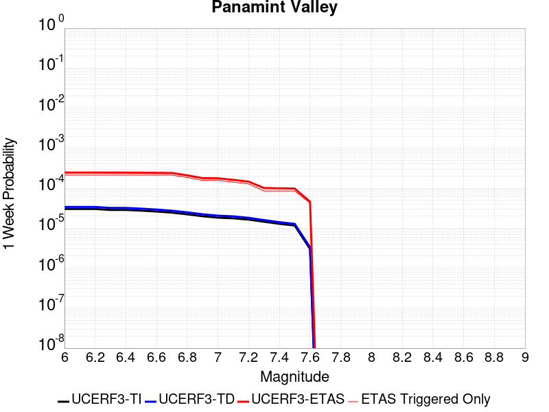 | 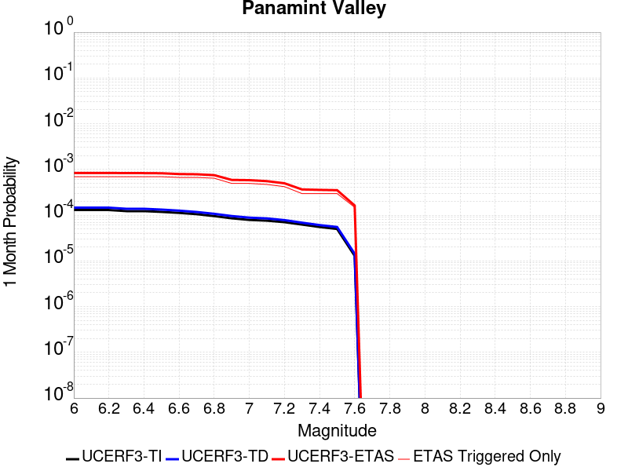 | 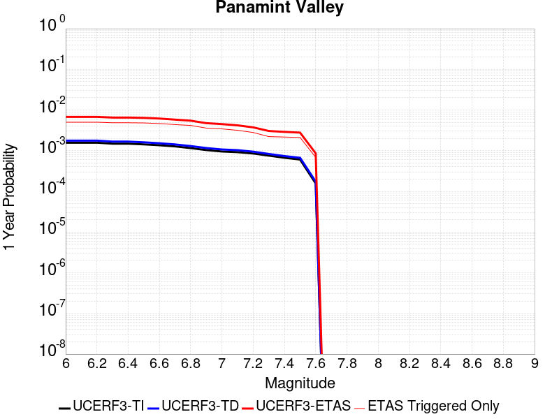 | 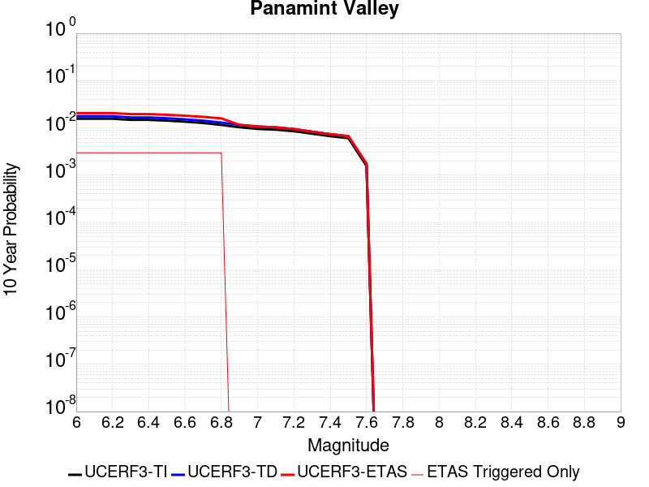 |

| Magnitude | 1 wk TI Prob | 1 wk TD Prob | 1 wk ETAS Prob | 1 wk ETAS/TD Gain | 1 wk ETAS Triggered Only | 1 mo TI Prob | 1 mo TD Prob | 1 mo ETAS Prob | 1 mo ETAS/TD Gain | 1 mo ETAS Triggered Only | 1 yr TI Prob | 1 yr TD Prob | 1 yr ETAS Prob | 1 yr ETAS/TD Gain | 1 yr ETAS Triggered Only | 10 yr TI Prob | 10 yr TD Prob | 10 yr ETAS Prob | 10 yr ETAS/TD Gain | 10 yr ETAS Triggered Only |
|-----|-----|-----|-----|-----|-----|-----|-----|-----|-----|-----|-----|-----|-----|-----|-----|-----|-----|-----|-----|-----|
| 6.0 | 3.0211835E-5 | 3.3991142E-5 | 2.6475254E-4 | 7.788868 | 2.3076923E-4 | 1.2947287E-4 | 1.4566837E-4 | 0.0010686108 | 7.3359156 | 9.2307694E-4 | 0.0015751923 | 0.001772099 | 0.006807117 | 3.8412733 | 0.005043956 | 0.015640736 | 0.017586537 | 0.028976055 | 1.6476271 | 0.011593407 |
| 6.1 | 3.0211835E-5 | 3.3991142E-5 | 2.6475254E-4 | 7.788868 | 2.3076923E-4 | 1.2947287E-4 | 1.4566837E-4 | 0.0010686108 | 7.3359156 | 9.2307694E-4 | 0.0015751923 | 0.001772099 | 0.006807117 | 3.8412733 | 0.005043956 | 0.015640736 | 0.017586537 | 0.028976055 | 1.6476271 | 0.011593407 |
| 6.2 | 3.0211835E-5 | 3.3991142E-5 | 2.6475254E-4 | 7.788868 | 2.3076923E-4 | 1.2947287E-4 | 1.4566837E-4 | 0.0010686108 | 7.3359156 | 9.2307694E-4 | 0.0015751923 | 0.001772099 | 0.006807117 | 3.8412733 | 0.005043956 | 0.015640736 | 0.017586537 | 0.028976055 | 1.6476271 | 0.011593407 |
| 6.3 | 2.8573924E-5 | 3.2108957E-5 | 2.6287077E-4 | 8.186836 | 2.3076923E-4 | 1.2245393E-4 | 1.3760272E-4 | 0.0010605527 | 7.707352 | 9.2307694E-4 | 0.001489857 | 0.0016740535 | 0.0065120948 | 3.8900158 | 0.004846154 | 0.01479908 | 0.016621023 | 0.027513836 | 1.6553636 | 0.011076923 |
| 6.4 | 2.8573924E-5 | 3.2108957E-5 | 2.6287077E-4 | 8.186836 | 2.3076923E-4 | 1.2245393E-4 | 1.3760272E-4 | 0.0010605527 | 7.707352 | 9.2307694E-4 | 0.001489857 | 0.0016740535 | 0.0065120948 | 3.8900158 | 0.004846154 | 0.01479908 | 0.016621023 | 0.027513836 | 1.6553636 | 0.011076923 |
| 6.5 | 2.7468774E-5 | 3.0834468E-5 | 2.6159658E-4 | 8.483901 | 2.3076923E-4 | 1.1771801E-4 | 1.3214118E-4 | 0.001033121 | 7.818312 | 9.010989E-4 | 0.0014322745 | 0.001607659 | 0.006303394 | 3.920853 | 0.004703297 | 0.014230782 | 0.015966775 | 0.026509989 | 1.660322 | 0.010714286 |
| 6.6 | 2.6135967E-5 | 2.9258244E-5 | 2.6002072E-4 | 8.887093 | 2.3076923E-4 | 1.1200648E-4 | 1.253866E-4 | 9.82422E-4 | 7.835143 | 8.5714285E-4 | 0.0013628257 | 0.0015255393 | 0.006079022 | 3.9848344 | 0.0045604394 | 0.013544982 | 0.015157006 | 0.025416689 | 1.6768938 | 0.0104175825 |
| 6.7 | 2.4498746E-5 | 2.7346903E-5 | 2.5810982E-4 | 9.438356 | 2.3076923E-4 | 1.04990395E-4 | 1.17195894E-4 | 9.5226284E-4 | 8.125395 | 8.3516486E-4 | 0.0012775084 | 0.0014259511 | 0.005760421 | 4.0397043 | 0.0043406594 | 0.012701893 | 0.014174139 | 0.023848234 | 1.6825172 | 0.009813187 |
| 6.8 | 2.2244329E-5 | 2.4940635E-5 | 2.227379E-4 | 8.930723 | 1.978022E-4 | 9.532935E-5 | 1.06884174E-4 | 8.7603275E-4 | 8.196094 | 7.6923077E-4 | 0.0011600169 | 0.0013005598 | 0.0053063324 | 4.080037 | 0.004010989 | 0.011539802 | 0.012935203 | 0.021786245 | 1.68426 | 0.008967033 |
| 6.9 | 1.9902658E-5 | 2.2295073E-5 | 1.9811533E-4 | 8.886059 | 1.7582417E-4 | 8.529431E-5 | 9.554692E-5 | 7.877885E-4 | 8.245043 | 6.923077E-4 | 0.0010379635 | 0.0011626815 | 0.0047738627 | 4.1059074 | 0.0036153847 | 0.010331288 | 0.011571088 | 0.019554552 | 1.6899494 | 0.008076923 |
| 7.0 | 1.8353881E-5 | 2.0570717E-5 | 1.9639128E-4 | 9.547129 | 1.7582417E-4 | 7.865712E-5 | 8.8157336E-5 | 7.254638E-4 | 8.229194 | 6.3736265E-4 | 9.5722964E-4 | 0.0010728048 | 0.004453789 | 4.1515374 | 0.0033846153 | 0.009531168 | 0.010681189 | 0.018095644 | 1.6941601 | 0.0074945055 |
| 7.1 | 1.7667631E-5 | 1.9777019E-5 | 1.8460893E-4 | 9.3345175 | 1.6483516E-4 | 7.571623E-5 | 8.4756E-5 | 6.8910036E-4 | 8.130403 | 6.043956E-4 | 9.2145515E-4 | 0.0010314333 | 0.004291803 | 4.161009 | 0.0032637364 | 0.009176437 | 0.010271349 | 0.017384345 | 1.6925083 | 0.0071868133 |
| 7.2 | 1.6381597E-5 | 1.8162364E-5 | 1.7200572E-4 | 9.4704485 | 1.5384615E-4 | 7.020495E-5 | 7.783648E-5 | 5.8329164E-4 | 7.4938083 | 5.054945E-4 | 8.544101E-4 | 9.472644E-4 | 0.0038565937 | 4.071296 | 0.0029120878 | 0.008511325 | 0.009436919 | 0.015739514 | 1.6678656 | 0.0063626375 |
| 7.3 | 1.4520491E-5 | 1.5969836E-5 | 1.2585819E-4 | 7.880995 | 1.0989011E-4 | 6.222919E-5 | 6.844045E-5 | 4.6401776E-4 | 6.779876 | 3.956044E-4 | 7.57377E-4 | 8.329601E-4 | 0.0032595086 | 3.913163 | 0.0024285715 | 0.0075480095 | 0.008301492 | 0.013543326 | 1.6314329 | 0.0052857143 |
| 7.4 | 1.2852287E-5 | 1.4148404E-5 | 1.2403696E-4 | 8.766851 | 1.0989011E-4 | 5.5080065E-5 | 6.06347E-5 | 4.5621512E-4 | 7.523994 | 3.956044E-4 | 6.7039346E-4 | 7.379932E-4 | 0.0030439824 | 4.1246753 | 0.0023076923 | 0.0066837464 | 0.007358347 | 0.012321555 | 1.6745005 | 0.005 |
| 7.5 | 1.1637851E-5 | 1.2839613E-5 | 1.227283E-4 | 9.558568 | 1.0989011E-4 | 4.987555E-5 | 5.502584E-5 | 4.5060847E-4 | 8.1890335 | 3.956044E-4 | 6.070656E-4 | 6.6974934E-4 | 0.0029319695 | 4.3777113 | 0.0022637362 | 0.006054099 | 0.006680208 | 0.011548567 | 1.7287736 | 0.004901099 |
| 7.6 | 3.0068115E-6 | 3.3341298E-6 | 4.729003E-5 | 14.1836195 | 4.3956043E-5 | 1.2886271E-5 | 1.428909E-5 | 1.791219E-4 | 12.53557 | 1.6483516E-4 | 1.5687906E-4 | 1.7396307E-4 | 0.0011188536 | 6.431558 | 9.450549E-4 | 0.0015676835 | 0.0017397105 | 0.0037801105 | 2.172839 | 0.002043956 |

## Garlock (East)
*[(top)](#table-of-contents)*

| 1 Week | 1 Month | 1 Year | 10 Year |
|-----|-----|-----|-----|
|  | 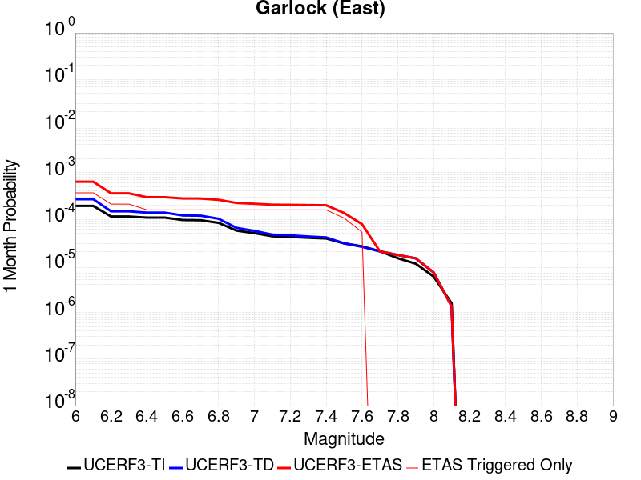 | 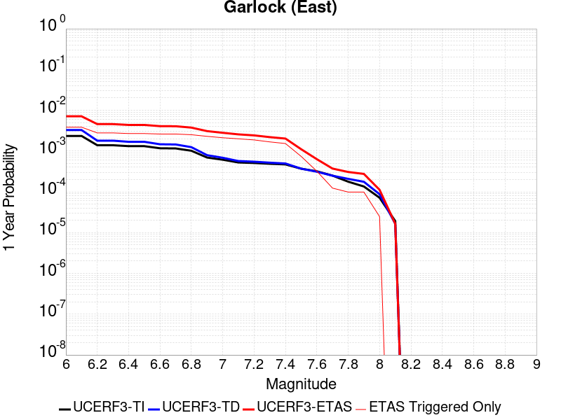 | 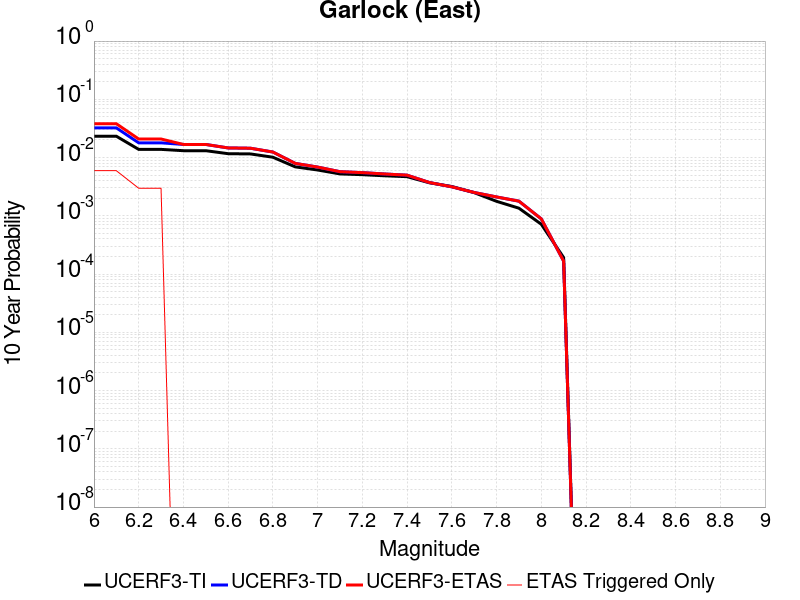 |

| Magnitude | 1 wk TI Prob | 1 wk TD Prob | 1 wk ETAS Prob | 1 wk ETAS/TD Gain | 1 wk ETAS Triggered Only | 1 mo TI Prob | 1 mo TD Prob | 1 mo ETAS Prob | 1 mo ETAS/TD Gain | 1 mo ETAS Triggered Only | 1 yr TI Prob | 1 yr TD Prob | 1 yr ETAS Prob | 1 yr ETAS/TD Gain | 1 yr ETAS Triggered Only | 10 yr TI Prob | 10 yr TD Prob | 10 yr ETAS Prob | 10 yr ETAS/TD Gain | 10 yr ETAS Triggered Only |
|-----|-----|-----|-----|-----|-----|-----|-----|-----|-----|-----|-----|-----|-----|-----|-----|-----|-----|-----|-----|-----|
| 6.0 | 4.5092507E-5 | 6.2931635E-5 | 1.9479146E-4 | 3.095287 | 1.3186813E-4 | 1.9323928E-4 | 2.6968162E-4 | 9.398305E-4 | 3.4849632 | 6.7032967E-4 | 0.0023501497 | 0.0032788762 | 0.0070795603 | 2.1591423 | 0.003813187 | 0.023254504 | 0.03236623 | 0.04185117 | 1.2930504 | 0.009802198 |
| 6.1 | 4.5092507E-5 | 6.2931635E-5 | 1.9479146E-4 | 3.095287 | 1.3186813E-4 | 1.9323928E-4 | 2.6968162E-4 | 9.398305E-4 | 3.4849632 | 6.7032967E-4 | 0.0023501497 | 0.0032788762 | 0.0070795603 | 2.1591423 | 0.003813187 | 0.023254504 | 0.03236623 | 0.04185117 | 1.2930504 | 0.009802198 |
| 6.2 | 2.6674514E-5 | 3.4532168E-5 | 1.1145259E-4 | 3.2275004 | 7.6923076E-5 | 1.1431433E-4 | 1.4798681E-4 | 6.2044436E-4 | 4.1925654 | 4.7252746E-4 | 0.0013908884 | 0.0018002834 | 0.0045096828 | 2.5049849 | 0.0027142856 | 0.01382215 | 0.017901788 | 0.02461459 | 1.3749795 | 0.006835165 |
| 6.3 | 2.6674514E-5 | 3.4532168E-5 | 1.1145259E-4 | 3.2275004 | 7.6923076E-5 | 1.1431433E-4 | 1.4798681E-4 | 6.2044436E-4 | 4.1925654 | 4.7252746E-4 | 0.0013908884 | 0.0018002834 | 0.0045096828 | 2.5049849 | 0.0027142856 | 0.01382215 | 0.017901788 | 0.02461459 | 1.3749795 | 0.006835165 |
| 6.4 | 2.5312667E-5 | 3.236092E-5 | 1.0928151E-4 | 3.376959 | 7.6923076E-5 | 1.0847834E-4 | 1.3868246E-4 | 5.7818193E-4 | 4.1691065 | 4.3956045E-4 | 0.0013199237 | 0.0016871806 | 0.0042981524 | 2.5475354 | 0.0026153845 | 0.013121112 | 0.016789583 | 0.02325068 | 1.3848277 | 0.0065714284 |
| 6.5 | 2.5312667E-5 | 3.236092E-5 | 1.0928151E-4 | 3.376959 | 7.6923076E-5 | 1.0847834E-4 | 1.3868246E-4 | 5.7818193E-4 | 4.1691065 | 4.3956045E-4 | 0.0013199237 | 0.0016871806 | 0.0042981524 | 2.5475354 | 0.0026153845 | 0.013121112 | 0.016789583 | 0.02325068 | 1.3848277 | 0.0065714284 |
| 6.6 | 2.246556E-5 | 2.8154947E-5 | 1.0507586E-4 | 3.7320566 | 7.6923076E-5 | 9.627742E-5 | 1.2065861E-4 | 5.60166E-4 | 4.6425695 | 4.3956045E-4 | 0.0011715472 | 0.0014680522 | 0.003947923 | 2.689225 | 0.0024835165 | 0.011653901 | 0.01462952 | 0.020790793 | 1.4211534 | 0.006252747 |
| 6.7 | 2.2241198E-5 | 2.7824628E-5 | 1.04745566E-4 | 3.764491 | 7.6923076E-5 | 9.531594E-5 | 1.1924309E-4 | 5.587511E-4 | 4.6858153 | 4.3956045E-4 | 0.0011598538 | 0.0014508413 | 0.0039307545 | 2.7092934 | 0.0024835165 | 0.011538187 | 0.014459683 | 0.020611187 | 1.4254246 | 0.0062417584 |
| 6.8 | 1.9528685E-5 | 2.3917915E-5 | 1.00839155E-4 | 4.216051 | 7.6923076E-5 | 8.369167E-5 | 1.02501435E-4 | 5.420168E-4 | 5.2878947 | 4.3956045E-4 | 0.0010184698 | 0.0012472603 | 0.0036289014 | 2.9094982 | 0.0023846154 | 0.010138147 | 0.012446578 | 0.01832849 | 1.4725726 | 0.005956044 |
| 6.9 | 1.3318621E-5 | 1.5215894E-5 | 9.21378E-5 | 6.0553656 | 7.6923076E-5 | 5.7078556E-5 | 6.520937E-5 | 4.7177626E-4 | 7.2347918 | 4.065934E-4 | 6.9470983E-4 | 7.936407E-4 | 0.0029567578 | 3.725562 | 0.002164835 | 0.0069254204 | 0.007948688 | 0.013116077 | 1.6500932 | 0.0052087912 |
| 7.0 | 1.1760853E-5 | 1.3124213E-5 | 9.0046284E-5 | 6.86108 | 7.6923076E-5 | 5.0402683E-5 | 5.6245444E-5 | 4.518276E-4 | 8.033141 | 3.956044E-4 | 6.134799E-4 | 6.8457815E-4 | 0.0027600795 | 4.031796 | 0.0020769231 | 0.0061178906 | 0.006865028 | 0.0118852705 | 1.7312778 | 0.005054945 |
| 7.1 | 1.0064758E-5 | 1.0918795E-5 | 8.784103E-5 | 8.044938 | 7.6923076E-5 | 4.3133965E-5 | 4.6794015E-5 | 4.423799E-4 | 9.453771 | 3.956044E-4 | 5.2502943E-4 | 5.6957174E-4 | 0.0025354843 | 4.451563 | 0.001967033 | 0.005237907 | 0.0057212254 | 0.010506875 | 1.8364727 | 0.004813187 |
| 7.2 | 9.768808E-6 | 1.0514561E-5 | 8.743683E-5 | 8.315784 | 7.6923076E-5 | 4.186565E-5 | 4.5061646E-5 | 4.296597E-4 | 9.534931 | 3.8461538E-4 | 5.095951E-4 | 5.4849096E-4 | 0.0024265812 | 4.424104 | 0.0018791208 | 0.0050842804 | 0.005511436 | 0.01019974 | 1.8506501 | 0.0047142855 |
| 7.3 | 9.344516E-6 | 9.959923E-6 | 7.589333E-5 | 7.619871 | 6.5934066E-5 | 4.004731E-5 | 4.2684707E-5 | 3.7234096E-4 | 8.723053 | 3.2967032E-4 | 4.8746695E-4 | 5.1956583E-4 | 0.0021450946 | 4.1286287 | 0.0016263736 | 0.0048639905 | 0.005222964 | 0.009530021 | 1.8246384 | 0.00432967 |
| 7.4 | 9.023491E-6 | 9.505806E-6 | 7.5439246E-5 | 7.9361234 | 6.5934066E-5 | 3.867153E-5 | 4.073855E-5 | 3.484183E-4 | 8.5525465 | 3.076923E-4 | 4.7072413E-4 | 4.958823E-4 | 0.0019896468 | 4.0123363 | 0.0014945054 | 0.004697283 | 0.004986258 | 0.008900708 | 1.7850475 | 0.003934066 |
| 7.5 | 7.081253E-6 | 7.101122E-6 | 5.1056853E-5 | 7.18997 | 4.3956043E-5 | 3.0347876E-5 | 3.0433028E-5 | 2.0625185E-4 | 6.7772374 | 1.7582417E-4 | 3.6942272E-4 | 3.7045986E-4 | 0.0011613755 | 3.1349564 | 7.912088E-4 | 0.003688092 | 0.003731307 | 0.0057347924 | 1.5369393 | 0.002010989 |
| 7.6 | 6.116396E-6 | 5.9720282E-6 | 5.9720282E-6 | 1.0 | 0.0 | 2.6212863E-5 | 2.5594158E-5 | 1.2449273E-4 | 4.864107 | 9.89011E-5 | 3.1909486E-4 | 3.1156457E-4 | 7.070457E-4 | 2.2693393 | 3.956044E-4 | 0.0031863707 | 0.0031424055 | 0.0042816713 | 1.3625457 | 0.0011428571 |
| 7.7 | 4.797145E-6 | 4.769377E-6 | 4.769377E-6 | 1.0 | 0.0 | 2.055903E-5 | 2.0440028E-5 | 6.439517E-5 | 3.1504445 | 4.3956043E-5 | 2.5027743E-4 | 2.4882905E-4 | 4.4658204E-4 | 1.7947342 | 1.978022E-4 | 0.0024999576 | 0.0025156436 | 0.0030856347 | 1.2265786 | 5.7142857E-4 |
| 7.8 | 3.4028885E-6 | 3.9892493E-6 | 3.9892493E-6 | 1.0 | 0.0 | 1.4583726E-5 | 1.7096672E-5 | 6.1051964E-5 | 3.5709853 | 4.3956043E-5 | 1.775424E-4 | 2.0813217E-4 | 3.9490647E-4 | 1.8973832 | 1.8681318E-4 | 0.0017740062 | 0.0021068375 | 0.0025564376 | 1.2134005 | 4.5054944E-4 |
| 7.9 | 2.5928412E-6 | 3.3815668E-6 | 3.3815668E-6 | 1.0 | 0.0 | 1.1112129E-5 | 1.449235E-5 | 4.7458903E-5 | 3.2747557 | 3.2967033E-5 | 1.3528178E-4 | 1.7643013E-4 | 3.3024914E-4 | 1.871841 | 1.5384615E-4 | 0.0013519945 | 0.0017859834 | 0.0021479733 | 1.2026837 | 3.6263737E-4 |
| 8.0 | 1.3743648E-6 | 1.6776083E-6 | 1.6776083E-6 | 1.0 | 0.0 | 5.8901214E-6 | 7.1897302E-6 | 1.8178662E-5 | 2.5284207 | 1.0989011E-5 | 7.1709874E-5 | 8.753148E-5 | 1.2049563E-4 | 1.3765976 | 3.2967033E-5 | 7.1686733E-4 | 8.8587485E-4 | 0.0010286054 | 1.1611183 | 1.4285714E-4 |
| 8.1 | 3.6733252E-7 | 3.156379E-7 | 3.156379E-7 | 1.0 | 0.0 | 1.5742813E-6 | 1.3527332E-6 | 1.2341729E-5 | 9.12355 | 1.0989011E-5 | 1.9166706E-5 | 1.646942E-5 | 2.7458249E-5 | 1.6672263 | 1.0989011E-5 | 1.9165053E-4 | 1.6677451E-4 | 1.777617E-4 | 1.0658804 | 1.0989011E-5 |

## Ash Hill
*[(top)](#table-of-contents)*

| 1 Week | 1 Month | 1 Year | 10 Year |
|-----|-----|-----|-----|
| 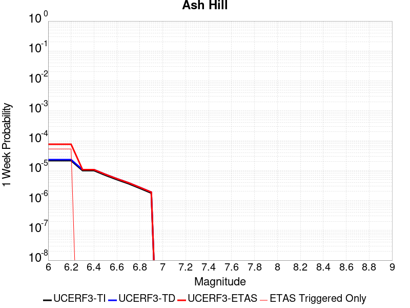 | 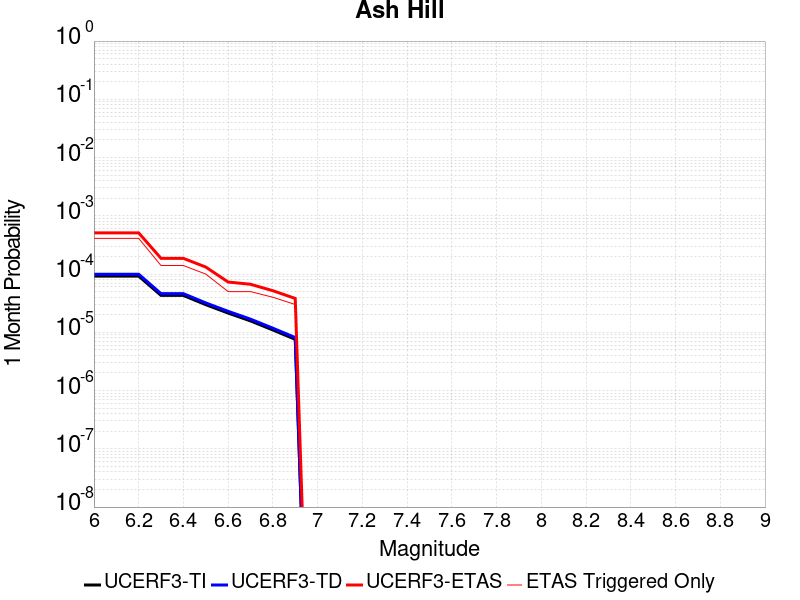 | 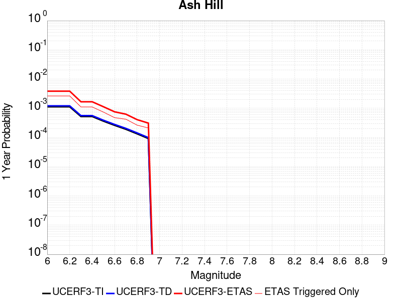 | 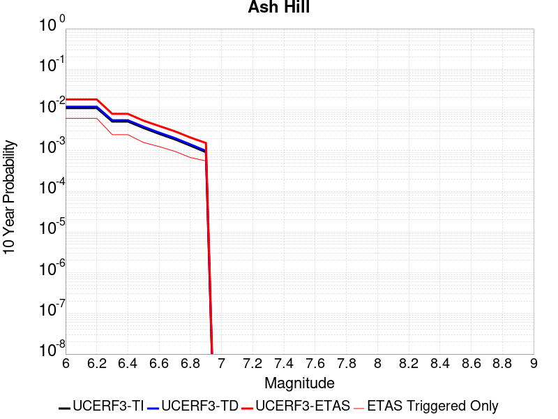 |

| Magnitude | 1 wk TI Prob | 1 wk TD Prob | 1 wk ETAS Prob | 1 wk ETAS/TD Gain | 1 wk ETAS Triggered Only | 1 mo TI Prob | 1 mo TD Prob | 1 mo ETAS Prob | 1 mo ETAS/TD Gain | 1 mo ETAS Triggered Only | 1 yr TI Prob | 1 yr TD Prob | 1 yr ETAS Prob | 1 yr ETAS/TD Gain | 1 yr ETAS Triggered Only | 10 yr TI Prob | 10 yr TD Prob | 10 yr ETAS Prob | 10 yr ETAS/TD Gain | 10 yr ETAS Triggered Only |
|-----|-----|-----|-----|-----|-----|-----|-----|-----|-----|-----|-----|-----|-----|-----|-----|-----|-----|-----|-----|-----|
| 6.0 | 2.1545662E-5 | 2.3196331E-5 | 1.8802767E-4 | 8.105923 | 1.6483516E-4 | 9.2335285E-5 | 9.940951E-5 | 5.059625E-4 | 5.089679 | 4.065934E-4 | 0.0011236023 | 0.0012097188 | 0.0035804738 | 2.959757 | 0.0023736265 | 0.011179381 | 0.0120393215 | 0.018227646 | 1.5140095 | 0.006263736 |
| 6.1 | 2.1545662E-5 | 2.3196331E-5 | 1.8802767E-4 | 8.105923 | 1.6483516E-4 | 9.2335285E-5 | 9.940951E-5 | 5.059625E-4 | 5.089679 | 4.065934E-4 | 0.0011236023 | 0.0012097188 | 0.0035804738 | 2.959757 | 0.0023736265 | 0.011179381 | 0.0120393215 | 0.018227646 | 1.5140095 | 0.006263736 |
| 6.2 | 2.1545662E-5 | 2.3196331E-5 | 1.8802767E-4 | 8.105923 | 1.6483516E-4 | 9.2335285E-5 | 9.940951E-5 | 5.059625E-4 | 5.089679 | 4.065934E-4 | 0.0011236023 | 0.0012097188 | 0.0035804738 | 2.959757 | 0.0023736265 | 0.011179381 | 0.0120393215 | 0.018227646 | 1.5140095 | 0.006263736 |
| 6.3 | 1.0025529E-5 | 1.0747755E-5 | 4.3714434E-5 | 4.0673084 | 3.2967033E-5 | 4.2965847E-5 | 4.6061068E-5 | 1.7792312E-4 | 3.862766 | 1.3186813E-4 | 5.229836E-4 | 5.606624E-4 | 0.0013294619 | 2.3712342 | 7.6923077E-4 | 0.005217545 | 0.0055937925 | 0.008052489 | 1.4395403 | 0.0024725276 |
| 6.4 | 1.0025529E-5 | 1.0747755E-5 | 4.3714434E-5 | 4.0673084 | 3.2967033E-5 | 4.2965847E-5 | 4.6061068E-5 | 1.7792312E-4 | 3.862766 | 1.3186813E-4 | 5.229836E-4 | 5.606624E-4 | 0.0013294619 | 2.3712342 | 7.6923077E-4 | 0.005217545 | 0.0055937925 | 0.008052489 | 1.4395403 | 0.0024725276 |
| 6.5 | 6.9617327E-6 | 7.4571967E-6 | 2.9435054E-5 | 3.947201 | 2.1978021E-5 | 2.9835655E-5 | 3.1959073E-5 | 1.30857E-4 | 4.0945187 | 9.89011E-5 | 3.6318856E-4 | 3.8904088E-4 | 8.6138456E-4 | 2.2141235 | 4.7252746E-4 | 0.0036259557 | 0.0038844529 | 0.00547167 | 1.4086076 | 0.0015934065 |
| 6.6 | 4.9919777E-6 | 5.3470912E-6 | 2.7324995E-5 | 5.1102543 | 2.1978021E-5 | 2.1394015E-5 | 2.2915943E-5 | 7.785974E-5 | 3.3976233 | 5.4945056E-5 | 2.60441E-4 | 2.7897258E-4 | 6.3052285E-4 | 2.2601607 | 3.5164834E-4 | 0.0026013597 | 0.0027868825 | 0.0040470967 | 1.452195 | 0.0012637363 |
| 6.7 | 3.6630722E-6 | 3.924921E-6 | 2.5902857E-5 | 6.599587 | 2.1978021E-5 | 1.5698786E-5 | 1.6821014E-5 | 7.176514E-5 | 4.2663984 | 5.4945056E-5 | 1.9111596E-4 | 2.0478234E-4 | 5.014249E-4 | 2.4485748 | 2.967033E-4 | 0.0019095168 | 0.0020464994 | 0.0030115533 | 1.4715632 | 9.67033E-4 |
| 6.8 | 2.5599613E-6 | 2.7451356E-6 | 2.4723096E-5 | 9.006148 | 2.1978021E-5 | 1.0971216E-5 | 1.17648415E-5 | 5.5720368E-5 | 4.736177 | 4.3956043E-5 | 1.3356637E-4 | 1.4323248E-4 | 3.6298123E-4 | 2.5342102 | 2.1978022E-4 | 0.0013348613 | 0.0014318867 | 0.0021122298 | 1.4751376 | 6.813187E-4 |
| 6.9 | 1.7684905E-6 | 1.8970168E-6 | 1.28860065E-5 | 6.792774 | 1.0989011E-5 | 7.579223E-6 | 8.130072E-6 | 4.109684E-5 | 5.054917 | 3.2967033E-5 | 9.2273134E-5 | 9.8983626E-5 | 2.857783E-4 | 2.8871272 | 1.8681318E-4 | 9.223483E-4 | 9.898363E-4 | 0.0015497211 | 1.5656338 | 5.6043954E-4 |

## Hunter Mountain-Saline Valley
*[(top)](#table-of-contents)*

| 1 Week | 1 Month | 1 Year | 10 Year |
|-----|-----|-----|-----|
| 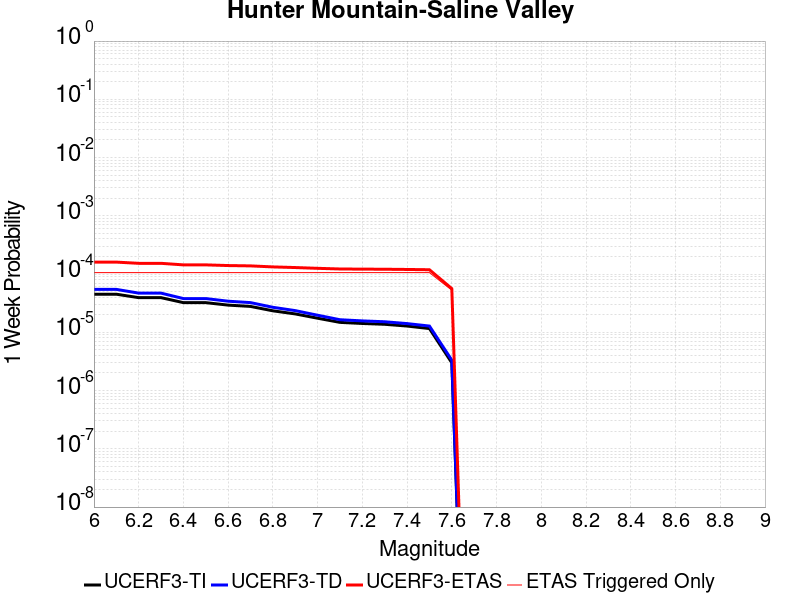 | 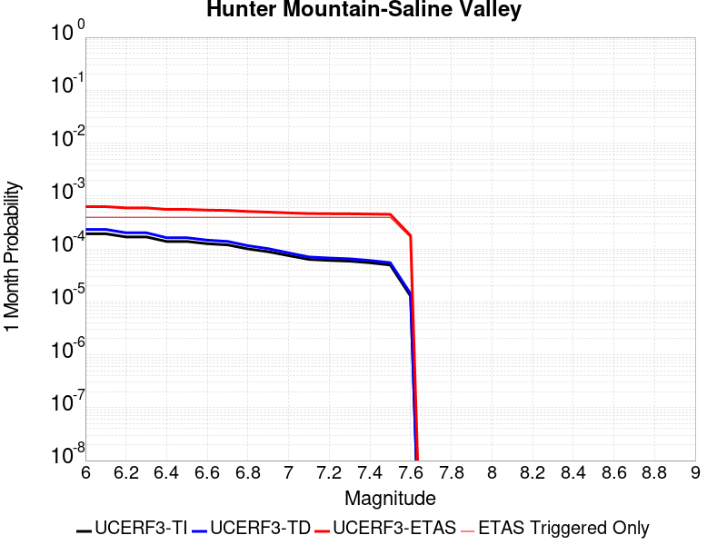 | 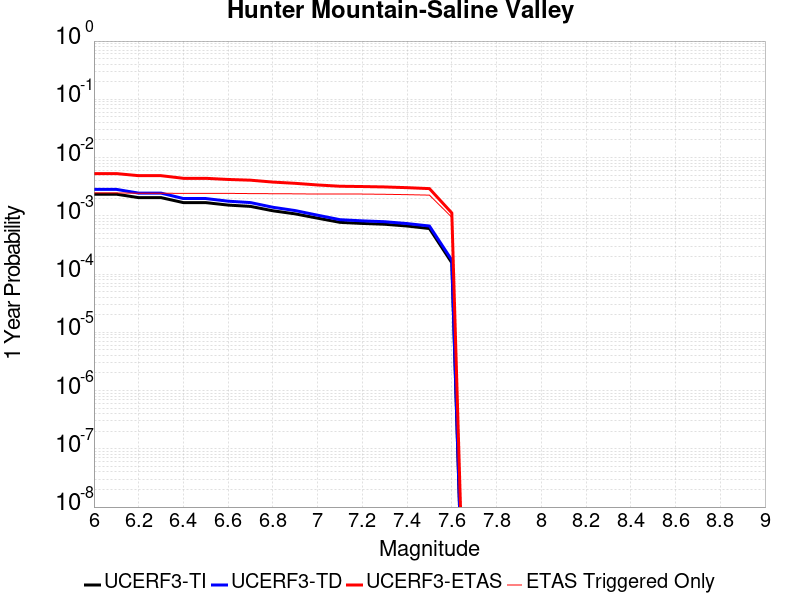 | 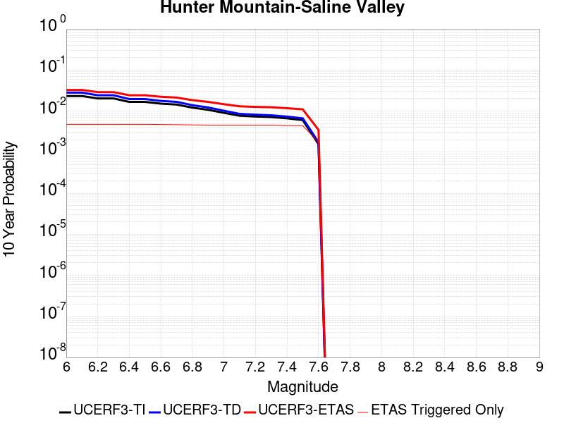 |

| Magnitude | 1 wk TI Prob | 1 wk TD Prob | 1 wk ETAS Prob | 1 wk ETAS/TD Gain | 1 wk ETAS Triggered Only | 1 mo TI Prob | 1 mo TD Prob | 1 mo ETAS Prob | 1 mo ETAS/TD Gain | 1 mo ETAS Triggered Only | 1 yr TI Prob | 1 yr TD Prob | 1 yr ETAS Prob | 1 yr ETAS/TD Gain | 1 yr ETAS Triggered Only | 10 yr TI Prob | 10 yr TD Prob | 10 yr ETAS Prob | 10 yr ETAS/TD Gain | 10 yr ETAS Triggered Only |
|-----|-----|-----|-----|-----|-----|-----|-----|-----|-----|-----|-----|-----|-----|-----|-----|-----|-----|-----|-----|-----|
| 6.0 | 4.5103672E-5 | 5.4582193E-5 | 1.644663E-4 | 3.013186 | 1.0989011E-4 | 1.9328714E-4 | 2.3390392E-4 | 6.294158E-4 | 2.6909158 | 3.956044E-4 | 0.002350731 | 0.0028442163 | 0.0053097117 | 1.8668451 | 0.0024725276 | 0.023260195 | 0.028098824 | 0.033246696 | 1.183206 | 0.0052967034 |
| 6.1 | 4.5103672E-5 | 5.4582193E-5 | 1.644663E-4 | 3.013186 | 1.0989011E-4 | 1.9328714E-4 | 2.3390392E-4 | 6.294158E-4 | 2.6909158 | 3.956044E-4 | 0.002350731 | 0.0028442163 | 0.0053097117 | 1.8668451 | 0.0024725276 | 0.023260195 | 0.028098824 | 0.033246696 | 1.183206 | 0.0052967034 |
| 6.2 | 3.9363465E-5 | 4.7072914E-5 | 1.5695785E-4 | 3.334356 | 1.0989011E-4 | 1.6868966E-4 | 2.0172633E-4 | 5.9725094E-4 | 2.9606988 | 3.956044E-4 | 0.002051862 | 0.0024534073 | 0.0048869825 | 1.9919165 | 0.0024395604 | 0.020330196 | 0.024279263 | 0.029404478 | 1.2110943 | 0.0052527473 |
| 6.3 | 3.9363465E-5 | 4.7072914E-5 | 1.5695785E-4 | 3.334356 | 1.0989011E-4 | 1.6868966E-4 | 2.0172633E-4 | 5.9725094E-4 | 2.9606988 | 3.956044E-4 | 0.002051862 | 0.0024534073 | 0.0048869825 | 1.9919165 | 0.0024395604 | 0.020330196 | 0.024279263 | 0.029404478 | 1.2110943 | 0.0052527473 |
| 6.4 | 3.2311684E-5 | 3.795965E-5 | 1.4784558E-4 | 3.894809 | 1.0989011E-4 | 1.384713E-4 | 1.6267448E-4 | 5.582145E-4 | 3.4314818 | 3.956044E-4 | 0.0016845843 | 0.0019788353 | 0.004402601 | 2.2248445 | 0.0024285715 | 0.016718714 | 0.019620894 | 0.024738256 | 1.2608119 | 0.0052197804 |
| 6.5 | 3.2311684E-5 | 3.795965E-5 | 1.4784558E-4 | 3.894809 | 1.0989011E-4 | 1.384713E-4 | 1.6267448E-4 | 5.582145E-4 | 3.4314818 | 3.956044E-4 | 0.0016845843 | 0.0019788353 | 0.004402601 | 2.2248445 | 0.0024285715 | 0.016718714 | 0.019620894 | 0.024738256 | 1.2608119 | 0.0052197804 |
| 6.6 | 2.9305844E-5 | 3.418947E-5 | 1.4407582E-4 | 4.2140408 | 1.0989011E-4 | 1.2559042E-4 | 1.4651842E-4 | 5.4206484E-4 | 3.6996362 | 3.956044E-4 | 0.0015279909 | 0.0017824649 | 0.0042067072 | 2.3600507 | 0.0024285715 | 0.015175272 | 0.017689606 | 0.022806255 | 1.2892461 | 0.0052087912 |
| 6.7 | 2.7826512E-5 | 3.235144E-5 | 1.4223799E-4 | 4.3966513 | 1.0989011E-4 | 1.19251024E-4 | 1.3864199E-4 | 5.3419155E-4 | 3.8530283 | 3.956044E-4 | 0.0014509142 | 0.0016867196 | 0.004089254 | 2.4243827 | 0.0024065934 | 0.014414776 | 0.016746866 | 0.021846816 | 1.3045317 | 0.0051868134 |
| 6.8 | 2.3389874E-5 | 2.6872513E-5 | 1.3675967E-4 | 5.089203 | 1.0989011E-4 | 1.0023846E-4 | 1.1516309E-4 | 5.1072193E-4 | 4.434771 | 3.956044E-4 | 0.00121972 | 0.0014012561 | 0.0037935036 | 2.7072165 | 0.0023956045 | 0.01213047 | 0.01393042 | 0.019001635 | 1.364039 | 0.0051428573 |
| 6.9 | 2.069209E-5 | 2.3575052E-5 | 1.3346257E-4 | 5.661178 | 1.0989011E-4 | 8.867737E-5 | 1.0103223E-4 | 4.965967E-4 | 4.9152303 | 3.956044E-4 | 0.0010791123 | 0.0012294095 | 0.0036110932 | 2.9372582 | 0.0023846154 | 0.010738871 | 0.012231114 | 0.017300215 | 1.414443 | 0.005131868 |
| 7.0 | 1.7462342E-5 | 1.9637651E-5 | 1.2952561E-4 | 6.5957785 | 1.0989011E-4 | 7.483646E-5 | 8.415878E-5 | 4.7972988E-4 | 5.700295 | 3.956044E-4 | 9.1075303E-4 | 0.0010241742 | 0.0033843918 | 3.3045082 | 0.0023626373 | 0.009070295 | 0.010198176 | 0.015255954 | 1.4959494 | 0.00510989 |
| 7.1 | 1.4807709E-5 | 1.644517E-5 | 1.2633347E-4 | 7.6821017 | 1.0989011E-4 | 6.3460066E-5 | 7.047749E-5 | 4.66054E-4 | 6.6128063 | 3.956044E-4 | 7.723524E-4 | 8.5774215E-4 | 0.003218353 | 3.7521217 | 0.0023626373 | 0.007696735 | 0.008547303 | 0.013591728 | 1.5901773 | 0.005087912 |
| 7.2 | 1.4180048E-5 | 1.5701611E-5 | 1.2559E-4 | 7.998542 | 1.0989011E-4 | 6.077022E-5 | 6.729098E-5 | 4.6286875E-4 | 6.8786154 | 3.956044E-4 | 7.396263E-4 | 8.1897597E-4 | 0.0031796785 | 3.8825052 | 0.0023626373 | 0.0073716943 | 0.008162531 | 0.013208913 | 1.6182374 | 0.005087912 |
| 7.3 | 1.3730402E-5 | 1.5175256E-5 | 1.250637E-4 | 8.241291 | 1.0989011E-4 | 5.8843252E-5 | 6.5035274E-5 | 4.6061396E-4 | 7.0825243 | 3.956044E-4 | 7.161811E-4 | 7.915329E-4 | 0.0031303396 | 3.954781 | 0.0023406593 | 0.007138774 | 0.007890071 | 0.012916034 | 1.6369985 | 0.0050659343 |
| 7.4 | 1.2810095E-5 | 1.4112251E-5 | 1.2400081E-4 | 8.786749 | 1.0989011E-4 | 5.489925E-5 | 6.0479764E-5 | 4.5606022E-4 | 7.540708 | 3.956044E-4 | 6.681934E-4 | 7.3610817E-4 | 0.0030421019 | 4.1326833 | 0.0023076923 | 0.006661878 | 0.007339596 | 0.012302898 | 1.6762364 | 0.005 |
| 7.5 | 1.1595659E-5 | 1.280346E-5 | 1.2269216E-4 | 9.582735 | 1.0989011E-4 | 4.9694736E-5 | 5.4870903E-5 | 4.504536E-4 | 8.209334 | 3.956044E-4 | 6.0486543E-4 | 6.6786417E-4 | 0.0029300887 | 4.3872523 | 0.0022637362 | 0.006032217 | 0.0066614435 | 0.011529895 | 1.7308402 | 0.004901099 |
| 7.6 | 2.997694E-6 | 3.3262522E-6 | 4.728215E-5 | 14.214842 | 4.3956043E-5 | 1.28471975E-5 | 1.425533E-5 | 1.7908815E-4 | 12.56289 | 1.6483516E-4 | 1.564034E-4 | 1.7355211E-4 | 0.0011184431 | 6.4444222 | 9.450549E-4 | 0.0015629337 | 0.0017356031 | 0.0037760118 | 2.1756194 | 0.002043956 |

## Blackwater
*[(top)](#table-of-contents)*

| 1 Week | 1 Month | 1 Year | 10 Year |
|-----|-----|-----|-----|
| 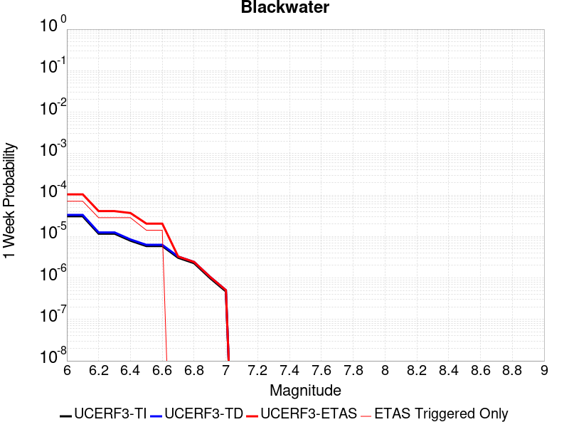 | 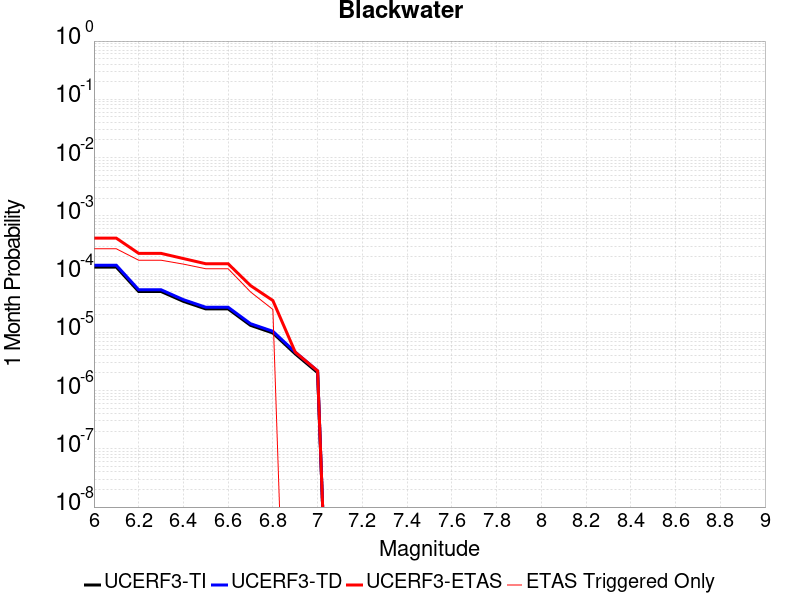 | 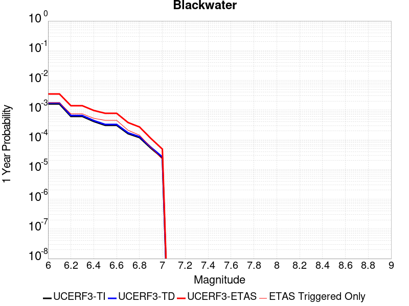 | 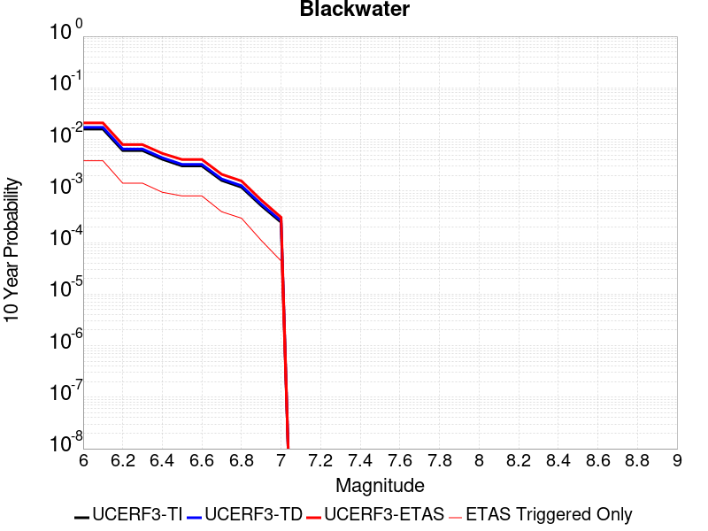 |

| Magnitude | 1 wk TI Prob | 1 wk TD Prob | 1 wk ETAS Prob | 1 wk ETAS/TD Gain | 1 wk ETAS Triggered Only | 1 mo TI Prob | 1 mo TD Prob | 1 mo ETAS Prob | 1 mo ETAS/TD Gain | 1 mo ETAS Triggered Only | 1 yr TI Prob | 1 yr TD Prob | 1 yr ETAS Prob | 1 yr ETAS/TD Gain | 1 yr ETAS Triggered Only | 10 yr TI Prob | 10 yr TD Prob | 10 yr ETAS Prob | 10 yr ETAS/TD Gain | 10 yr ETAS Triggered Only |
|-----|-----|-----|-----|-----|-----|-----|-----|-----|-----|-----|-----|-----|-----|-----|-----|-----|-----|-----|-----|-----|
| 6.0 | 3.0708583E-5 | 3.3098582E-5 | 9.903047E-5 | 2.991985 | 6.5934066E-5 | 1.3160157E-4 | 1.4184412E-4 | 3.7258063E-4 | 2.6266906 | 2.3076923E-4 | 0.0016010714 | 0.0017257209 | 0.0034809285 | 2.0170865 | 0.0017582418 | 0.015895851 | 0.017137038 | 0.020928081 | 1.2212193 | 0.0038571428 |
| 6.1 | 3.0708583E-5 | 3.3098582E-5 | 9.903047E-5 | 2.991985 | 6.5934066E-5 | 1.3160157E-4 | 1.4184412E-4 | 3.7258063E-4 | 2.6266906 | 2.3076923E-4 | 0.0016010714 | 0.0017257209 | 0.0034809285 | 2.0170865 | 0.0017582418 | 0.015895851 | 0.017137038 | 0.020928081 | 1.2212193 | 0.0038571428 |
| 6.2 | 1.1707779E-5 | 1.2546075E-5 | 4.5512694E-5 | 3.627644 | 3.2967033E-5 | 5.017523E-5 | 5.376784E-5 | 1.5266362E-4 | 2.8393111 | 9.89011E-5 | 6.107122E-4 | 6.544364E-4 | 0.0014012002 | 2.1410792 | 7.472527E-4 | 0.006090366 | 0.0065260637 | 0.007934394 | 1.215801 | 0.0014175824 |
| 6.3 | 1.1707779E-5 | 1.2546075E-5 | 4.5512694E-5 | 3.627644 | 3.2967033E-5 | 5.017523E-5 | 5.376784E-5 | 1.5266362E-4 | 2.8393111 | 9.89011E-5 | 6.107122E-4 | 6.544364E-4 | 0.0014012002 | 2.1410792 | 7.472527E-4 | 0.006090366 | 0.0065260637 | 0.007934394 | 1.215801 | 0.0014175824 |
| 6.4 | 7.929244E-6 | 8.480723E-6 | 4.1447478E-5 | 4.887257 | 3.2967033E-5 | 3.3982033E-5 | 3.6345475E-5 | 1.2425437E-4 | 3.4187026 | 8.7912085E-5 | 4.136527E-4 | 4.4242034E-4 | 9.696595E-4 | 2.1917155 | 5.274725E-4 | 0.0041288356 | 0.004415801 | 0.0053566825 | 1.2130716 | 9.450549E-4 |
| 6.5 | 5.8832115E-6 | 6.2864474E-6 | 2.8264332E-5 | 4.4960737 | 2.1978021E-5 | 2.521352E-5 | 2.6941654E-5 | 1.0386266E-4 | 3.8550959 | 7.6923076E-5 | 3.0693135E-4 | 3.279678E-4 | 7.783695E-4 | 2.3733106 | 4.5054944E-4 | 0.0030650778 | 0.0032750913 | 0.004074662 | 1.2441368 | 8.021978E-4 |
| 6.6 | 5.8832115E-6 | 6.2864474E-6 | 2.8264332E-5 | 4.4960737 | 2.1978021E-5 | 2.521352E-5 | 2.6941654E-5 | 1.0386266E-4 | 3.8550959 | 7.6923076E-5 | 3.0693135E-4 | 3.279678E-4 | 7.783695E-4 | 2.3733106 | 4.5054944E-4 | 0.0030650778 | 0.0032750913 | 0.004074662 | 1.2441368 | 8.021978E-4 |
| 6.7 | 3.0715053E-6 | 3.2817043E-6 | 1.42706795E-5 | 4.3485575 | 1.0989011E-5 | 1.3163528E-5 | 1.4064377E-5 | 4.7030946E-5 | 3.3439765 | 3.2967033E-5 | 1.6025416E-4 | 1.712215E-4 | 3.7997696E-4 | 2.2192128 | 2.0879121E-4 | 0.0016013865 | 0.0017110104 | 0.0021059378 | 1.2308154 | 3.956044E-4 |
| 6.8 | 2.2722281E-6 | 2.428931E-6 | 1.3417915E-5 | 5.5242057 | 1.0989011E-5 | 9.738084E-6 | 1.0409669E-5 | 3.2387463E-5 | 3.1112864 | 2.1978021E-5 | 1.1855473E-4 | 1.2673126E-4 | 2.695703E-4 | 2.127102 | 1.4285714E-4 | 0.001184915 | 0.0012666801 | 0.0015630076 | 1.2339402 | 2.967033E-4 |
| 6.9 | 9.952399E-7 | 1.0654285E-6 | 1.0654285E-6 | 1.0 | 0.0 | 4.265307E-6 | 4.5661172E-6 | 4.5661172E-6 | 1.0 | 0.0 | 5.1928873E-5 | 5.5591572E-5 | 1.10533576E-4 | 1.9883152 | 5.4945056E-5 | 5.191674E-4 | 5.558273E-4 | 6.656563E-4 | 1.1975956 | 1.0989011E-4 |
| 7.0 | 4.7385504E-7 | 5.075942E-7 | 5.075942E-7 | 1.0 | 0.0 | 2.0308057E-6 | 2.175404E-6 | 2.175404E-6 | 1.0 | 0.0 | 2.4724779E-5 | 2.6485543E-5 | 4.846298E-5 | 1.82979 | 2.1978021E-5 | 2.4722028E-4 | 2.6485542E-4 | 3.0879982E-4 | 1.1659185 | 4.3956043E-5 |

## Garlock (West)
*[(top)](#table-of-contents)*

| 1 Week | 1 Month | 1 Year | 10 Year |
|-----|-----|-----|-----|
| 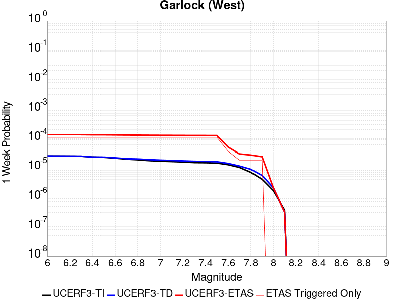 | 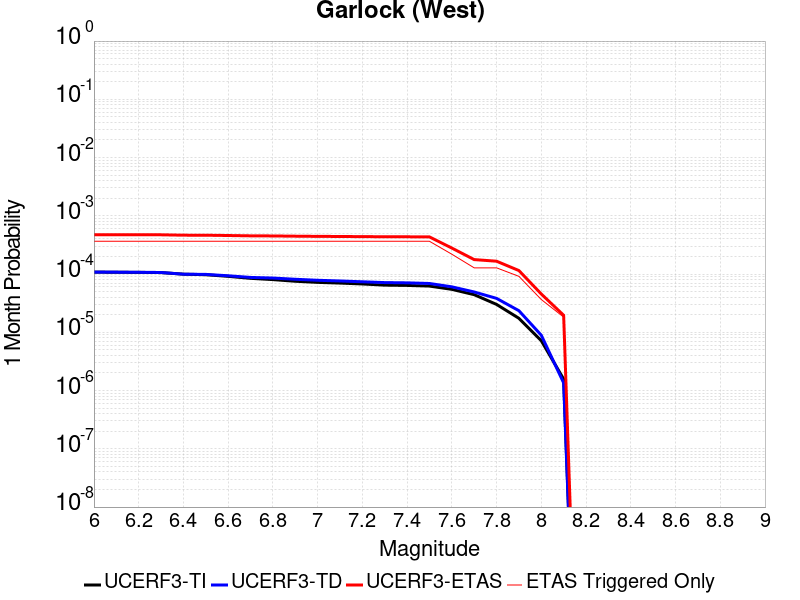 | 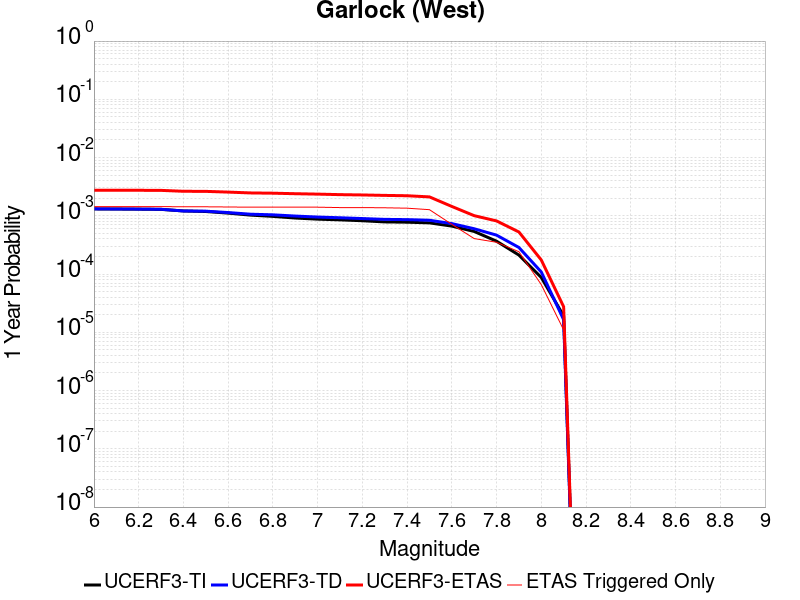 | 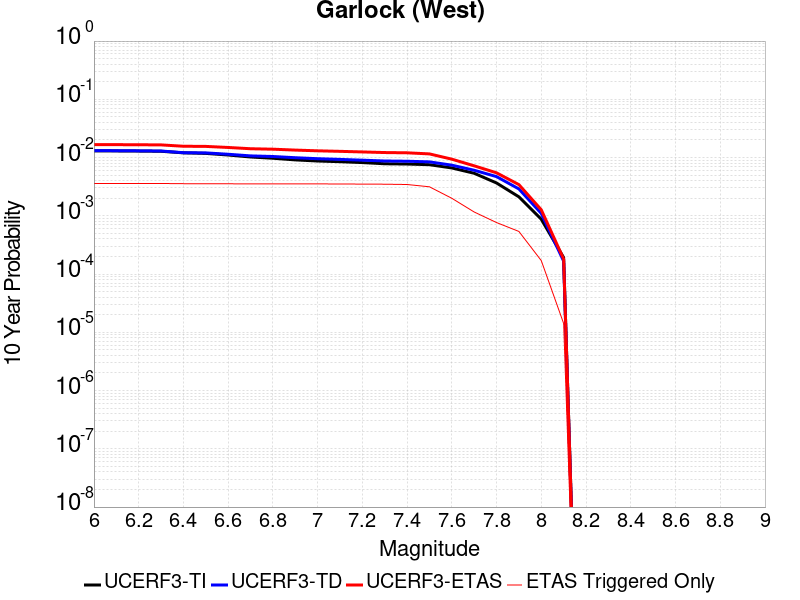 |

| Magnitude | 1 wk TI Prob | 1 wk TD Prob | 1 wk ETAS Prob | 1 wk ETAS/TD Gain | 1 wk ETAS Triggered Only | 1 mo TI Prob | 1 mo TD Prob | 1 mo ETAS Prob | 1 mo ETAS/TD Gain | 1 mo ETAS Triggered Only | 1 yr TI Prob | 1 yr TD Prob | 1 yr ETAS Prob | 1 yr ETAS/TD Gain | 1 yr ETAS Triggered Only | 10 yr TI Prob | 10 yr TD Prob | 10 yr ETAS Prob | 10 yr ETAS/TD Gain | 10 yr ETAS Triggered Only |
|-----|-----|-----|-----|-----|-----|-----|-----|-----|-----|-----|-----|-----|-----|-----|-----|-----|-----|-----|-----|-----|
| 6.0 | 2.5181727E-5 | 2.5237663E-5 | 1.1314754E-4 | 4.4832807 | 8.7912085E-5 | 1.0791722E-4 | 1.0815695E-4 | 4.5976727E-4 | 4.2509265 | 3.5164834E-4 | 0.0013131002 | 0.0013160189 | 0.0027536848 | 2.0924356 | 0.0014395604 | 0.013053683 | 0.013162692 | 0.016676266 | 1.2669344 | 0.0035604395 |
| 6.1 | 2.5077732E-5 | 2.513872E-5 | 1.130486E-4 | 4.496991 | 8.7912085E-5 | 1.0747157E-4 | 1.07732936E-4 | 4.593434E-4 | 4.263723 | 3.5164834E-4 | 0.001307681 | 0.0013108627 | 0.0027485362 | 2.0967383 | 0.0014395604 | 0.013000126 | 0.01311174 | 0.016625496 | 1.2679855 | 0.0035604395 |
| 6.2 | 2.494612E-5 | 2.502037E-5 | 1.1293026E-4 | 4.5135326 | 8.7912085E-5 | 1.0690756E-4 | 1.07225766E-4 | 4.588364E-4 | 4.279162 | 3.5164834E-4 | 0.0013008224 | 0.0013046954 | 0.0027423776 | 2.1019294 | 0.0014395604 | 0.012932341 | 0.013050792 | 0.016564764 | 1.2692536 | 0.0035604395 |
| 6.3 | 2.4733758E-5 | 2.4839694E-5 | 1.127496E-4 | 4.5390897 | 8.7912085E-5 | 1.0599751E-4 | 1.064515E-4 | 4.5806242E-4 | 4.303015 | 3.5164834E-4 | 0.0012897556 | 0.00129528 | 0.0027329756 | 2.1099498 | 0.0014395604 | 0.012822957 | 0.01295774 | 0.016472043 | 1.2712127 | 0.0035604395 |
| 6.4 | 2.3237335E-5 | 2.3218727E-5 | 1.1112877E-4 | 4.78617 | 8.7912085E-5 | 9.958477E-5 | 9.950505E-5 | 4.5111842E-4 | 4.533623 | 3.5164834E-4 | 0.0012117702 | 0.0012108035 | 0.0026376452 | 2.1784256 | 0.0014285714 | 0.012051838 | 0.012122463 | 0.015618031 | 1.2883545 | 0.0035384616 |
| 6.5 | 2.2732203E-5 | 2.30331E-5 | 1.1094316E-4 | 4.816684 | 8.7912085E-5 | 9.742009E-5 | 9.870957E-5 | 4.5032322E-4 | 4.562103 | 3.5164834E-4 | 0.0011854442 | 0.0012011293 | 0.0026279849 | 2.1879284 | 0.0014285714 | 0.011791403 | 0.012026772 | 0.015522677 | 1.290677 | 0.0035384616 |
| 6.6 | 2.1319436E-5 | 2.1812974E-5 | 1.0972314E-4 | 5.030178 | 8.7912085E-5 | 9.136581E-5 | 9.3480834E-5 | 4.3410834E-4 | 4.6438217 | 3.4065935E-4 | 0.001111811 | 0.0011375373 | 0.0025535072 | 2.244768 | 0.0014175824 | 0.011062649 | 0.01139752 | 0.014884788 | 1.3059673 | 0.0035274725 |
| 6.7 | 1.970802E-5 | 2.0432468E-5 | 1.0834276E-4 | 5.30248 | 8.7912085E-5 | 8.446021E-5 | 8.756479E-5 | 4.281943E-4 | 4.890028 | 3.4065935E-4 | 0.001027818 | 0.0010655817 | 0.0024706763 | 2.3186173 | 0.0014065934 | 0.010230771 | 0.010685065 | 0.014163975 | 1.3255862 | 0.0035164836 |
| 6.8 | 1.8744462E-5 | 1.9939902E-5 | 1.0785024E-4 | 5.4087644 | 8.7912085E-5 | 8.033094E-5 | 8.545393E-5 | 4.2608415E-4 | 4.986127 | 3.4065935E-4 | 9.775903E-4 | 0.0010399068 | 0.0024450375 | 2.3512084 | 0.0014065934 | 0.009733009 | 0.010430746 | 0.01391055 | 1.3336103 | 0.0035164836 |
| 6.9 | 1.7559682E-5 | 1.8992021E-5 | 1.0690244E-4 | 5.628808 | 8.7912085E-5 | 7.5253614E-5 | 8.1391845E-5 | 4.2202347E-4 | 5.185083 | 3.4065935E-4 | 9.158276E-4 | 9.904967E-4 | 0.002395697 | 2.4186823 | 0.0014065934 | 0.0091206245 | 0.009941107 | 0.013422633 | 1.3502151 | 0.0035164836 |
| 7.0 | 1.6794445E-5 | 1.8254574E-5 | 1.06165055E-4 | 5.815806 | 8.7912085E-5 | 7.197421E-5 | 7.823155E-5 | 4.1886425E-4 | 5.3541603 | 3.4065935E-4 | 8.759337E-4 | 9.520543E-4 | 0.0023573085 | 2.4760232 | 0.0014065934 | 0.008724891 | 0.009559885 | 0.013042751 | 1.364321 | 0.0035164836 |
| 7.1 | 1.6337795E-5 | 1.7755181E-5 | 1.05665706E-4 | 5.9512606 | 8.7912085E-5 | 7.0017246E-5 | 7.6091426E-5 | 4.1672486E-4 | 5.4766335 | 3.4065935E-4 | 8.521265E-4 | 9.260207E-4 | 0.0023093538 | 2.493847 | 0.0013846154 | 0.008488664 | 0.009301643 | 0.0127527565 | 1.371022 | 0.0034835164 |
| 7.2 | 1.5780008E-5 | 1.720368E-5 | 1.0511425E-4 | 6.109987 | 8.7912085E-5 | 6.762685E-5 | 7.372798E-5 | 4.143622E-4 | 5.6201487 | 3.4065935E-4 | 8.2304585E-4 | 8.9726975E-4 | 0.0022806427 | 2.5417583 | 0.0013846154 | 0.008200042 | 0.009016417 | 0.012457634 | 1.3816613 | 0.0034725275 |
| 7.3 | 1.5058865E-5 | 1.6656479E-5 | 1.045671E-4 | 6.2778635 | 8.7912085E-5 | 6.45364E-5 | 7.1382965E-5 | 4.1201798E-4 | 5.7719374 | 3.4065935E-4 | 7.854473E-4 | 8.6874224E-4 | 0.0022411754 | 2.5797932 | 0.0013736264 | 0.00782677 | 0.00873298 | 0.012164289 | 1.3929138 | 0.0034615383 |
| 7.4 | 1.4887923E-5 | 1.6492331E-5 | 1.0440297E-4 | 6.3303947 | 8.7912085E-5 | 6.380382E-5 | 7.067952E-5 | 4.0032653E-4 | 5.6639686 | 3.2967032E-4 | 7.7653467E-4 | 8.6018455E-4 | 0.0022106702 | 2.5699952 | 0.0013516484 | 0.0077382675 | 0.008647783 | 0.012014023 | 1.3892604 | 0.0033956044 |
| 7.5 | 1.4509299E-5 | 1.6084083E-5 | 1.0399476E-4 | 6.465694 | 8.7912085E-5 | 6.218123E-5 | 6.892997E-5 | 3.8758933E-4 | 5.6229434 | 3.1868133E-4 | 7.567935E-4 | 8.3890045E-4 | 0.0021125562 | 2.5182445 | 0.0012747253 | 0.0075422134 | 0.008435954 | 0.0115087135 | 1.3642455 | 0.0030989011 |
| 7.6 | 1.2756717E-5 | 1.4086703E-5 | 3.6064415E-5 | 2.5601742 | 2.1978021E-5 | 5.4670498E-5 | 6.0370192E-5 | 2.5816043E-4 | 4.27629 | 1.978022E-4 | 6.6541E-4 | 7.3475984E-4 | 0.0014485208 | 1.9714206 | 7.142857E-4 | 0.006634211 | 0.0074002044 | 0.009363589 | 1.2653148 | 0.001978022 |
| 7.7 | 1.0328985E-5 | 1.1494287E-5 | 2.2483171E-5 | 1.9560301 | 1.0989011E-5 | 4.4266326E-5 | 4.92603E-5 | 1.59145E-4 | 3.2306948 | 1.0989011E-4 | 5.388092E-4 | 5.9957954E-4 | 0.0010059291 | 1.6777244 | 4.065934E-4 | 0.0053750467 | 0.0060559767 | 0.0072028353 | 1.1893764 | 0.0011538462 |
| 7.8 | 7.0306583E-6 | 8.9268415E-6 | 1.9915755E-5 | 2.2309968 | 1.0989011E-5 | 3.0131043E-5 | 3.825733E-5 | 1.4814324E-4 | 3.8722837 | 1.0989011E-4 | 3.667837E-4 | 4.656836E-4 | 8.171682E-4 | 1.7547712 | 3.5164834E-4 | 0.003661789 | 0.004709399 | 0.0054968814 | 1.1672151 | 7.912088E-4 |
| 7.9 | 4.060633E-6 | 5.481252E-6 | 1.6470203E-5 | 3.0048249 | 1.0989011E-5 | 1.7402595E-5 | 2.349087E-5 | 8.942339E-5 | 3.8067296 | 6.5934066E-5 | 2.11856E-4 | 2.859639E-4 | 5.27653E-4 | 1.8451735 | 2.4175824E-4 | 0.0021165414 | 0.002892441 | 0.003429345 | 1.1856232 | 5.3846155E-4 |
| 8.0 | 1.6729537E-6 | 2.0826424E-6 | 2.0826424E-6 | 1.0 | 0.0 | 7.169782E-6 | 8.92558E-6 | 4.189232E-5 | 4.693512 | 3.2967033E-5 | 8.7288594E-5 | 1.0866355E-4 | 1.7459046E-4 | 1.6067066 | 6.5934066E-5 | 8.7254314E-4 | 0.0010996006 | 0.0012971853 | 1.1796877 | 1.978022E-4 |
| 8.1 | 3.6733252E-7 | 3.156379E-7 | 3.156379E-7 | 1.0 | 0.0 | 1.5742813E-6 | 1.3527332E-6 | 1.2341729E-5 | 9.12355 | 1.0989011E-5 | 1.9166706E-5 | 1.646942E-5 | 2.7458249E-5 | 1.6672263 | 1.0989011E-5 | 1.9165053E-4 | 1.6677451E-4 | 1.777617E-4 | 1.0658804 | 1.0989011E-5 |

## McLean Lake
*[(top)](#table-of-contents)*

| 1 Week | 1 Month | 1 Year | 10 Year |
|-----|-----|-----|-----|
| 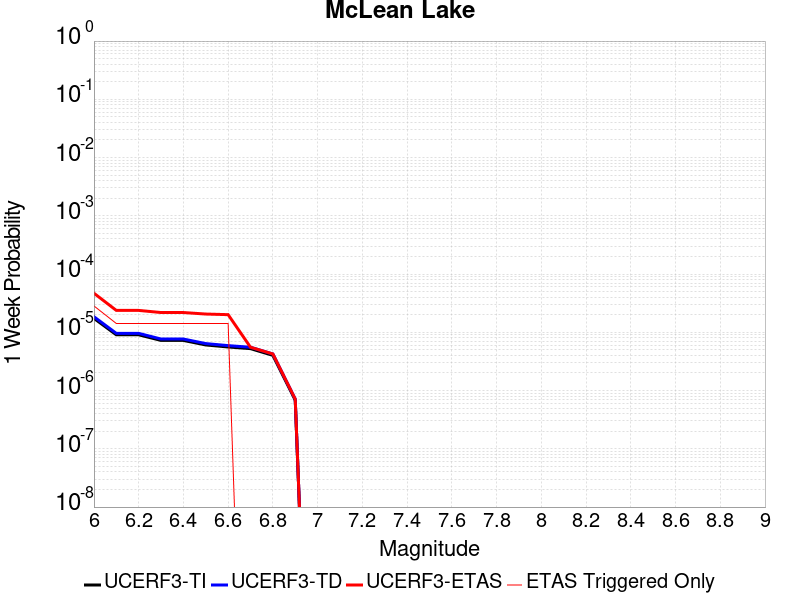 | 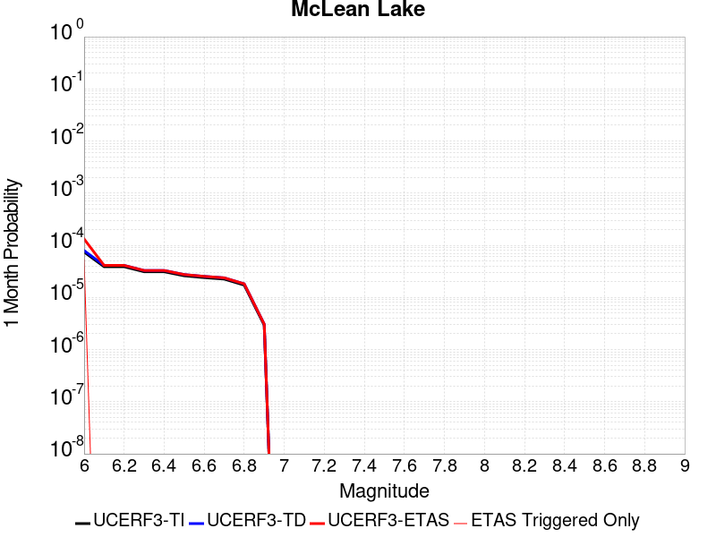 | 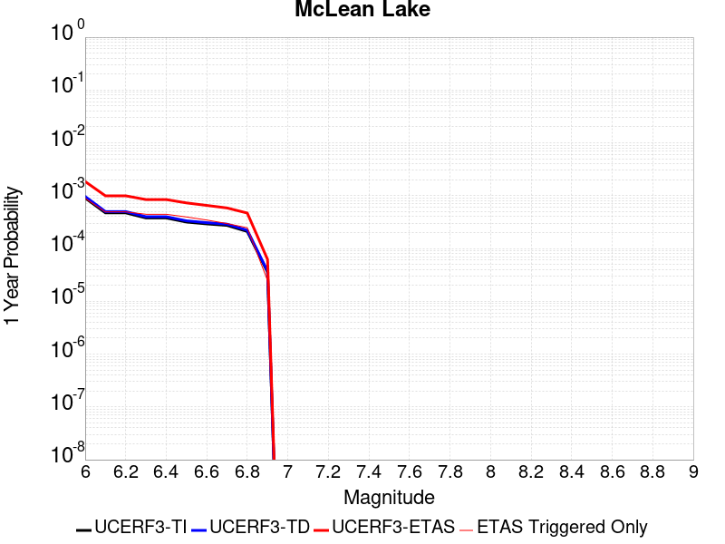 | 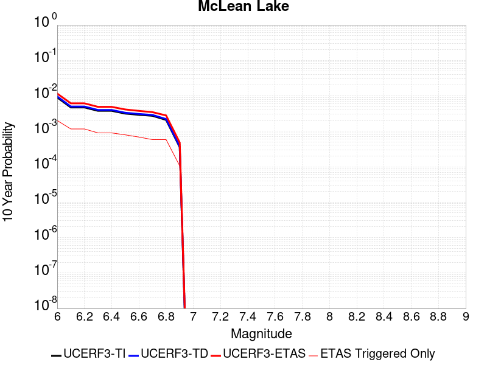 |

| Magnitude | 1 wk TI Prob | 1 wk TD Prob | 1 wk ETAS Prob | 1 wk ETAS/TD Gain | 1 wk ETAS Triggered Only | 1 mo TI Prob | 1 mo TD Prob | 1 mo ETAS Prob | 1 mo ETAS/TD Gain | 1 mo ETAS Triggered Only | 1 yr TI Prob | 1 yr TD Prob | 1 yr ETAS Prob | 1 yr ETAS/TD Gain | 1 yr ETAS Triggered Only | 10 yr TI Prob | 10 yr TD Prob | 10 yr ETAS Prob | 10 yr ETAS/TD Gain | 10 yr ETAS Triggered Only |
|-----|-----|-----|-----|-----|-----|-----|-----|-----|-----|-----|-----|-----|-----|-----|-----|-----|-----|-----|-----|-----|
| 6.0 | 1.7360222E-5 | 1.850292E-5 | 5.1469342E-5 | 2.7816875 | 3.2967033E-5 | 7.439883E-5 | 7.929609E-5 | 2.8807076E-4 | 3.6328492 | 2.0879121E-4 | 9.0542925E-4 | 9.65051E-4 | 0.002018978 | 2.0920947 | 0.001054945 | 0.009017491 | 0.009613443 | 0.012366936 | 1.2864211 | 0.0027802198 |
| 6.1 | 9.062689E-6 | 9.592789E-6 | 2.0581694E-5 | 2.145538 | 1.0989011E-5 | 3.8839516E-5 | 4.1111354E-5 | 1.2901983E-4 | 3.1383016 | 8.7912085E-5 | 4.727685E-4 | 5.0042465E-4 | 0.0011155013 | 2.2291093 | 6.153846E-4 | 0.0047176396 | 0.004993861 | 0.0066121127 | 1.3240483 | 0.0016263736 |
| 6.2 | 9.062689E-6 | 9.592789E-6 | 2.0581694E-5 | 2.145538 | 1.0989011E-5 | 3.8839516E-5 | 4.1111354E-5 | 1.2901983E-4 | 3.1383016 | 8.7912085E-5 | 4.727685E-4 | 5.0042465E-4 | 0.0011155013 | 2.2291093 | 6.153846E-4 | 0.0047176396 | 0.004993861 | 0.0066121127 | 1.3240483 | 0.0016263736 |
| 6.3 | 7.2575485E-6 | 7.66817E-6 | 1.8657096E-5 | 2.4330573 | 1.0989011E-5 | 3.110341E-5 | 3.286321E-5 | 1.0978376E-4 | 3.340628 | 7.6923076E-5 | 3.786182E-4 | 4.0004327E-4 | 9.273048E-4 | 2.3180113 | 5.274725E-4 | 0.0037797375 | 0.003993936 | 0.0053182957 | 1.3315927 | 0.0013296703 |
| 6.4 | 7.2575485E-6 | 7.66817E-6 | 1.8657096E-5 | 2.4330573 | 1.0989011E-5 | 3.110341E-5 | 3.286321E-5 | 1.0978376E-4 | 3.340628 | 7.6923076E-5 | 3.786182E-4 | 4.0004327E-4 | 9.273048E-4 | 2.3180113 | 5.274725E-4 | 0.0037797375 | 0.003993936 | 0.0053182957 | 1.3315927 | 0.0013296703 |
| 6.5 | 6.06582E-6 | 6.404256E-6 | 1.7393197E-5 | 2.7158809 | 1.0989011E-5 | 2.5996113E-5 | 2.744656E-5 | 8.239011E-5 | 3.0018373 | 5.4945056E-5 | 3.164567E-4 | 3.341171E-4 | 7.735307E-4 | 2.3151484 | 4.3956045E-4 | 0.0031600643 | 0.0033367863 | 0.004497735 | 1.3479241 | 0.0011648352 |
| 6.6 | 5.598744E-6 | 5.9106114E-6 | 1.6899558E-5 | 2.8591893 | 1.0989011E-5 | 2.3994397E-5 | 2.5330983E-5 | 8.027464E-5 | 3.1690302 | 5.4945056E-5 | 2.9209262E-4 | 3.0836745E-4 | 7.258211E-4 | 2.3537538 | 4.1758243E-4 | 0.0029170897 | 0.0030800248 | 0.0041864966 | 1.3592411 | 0.00110989 |
| 6.7 | 5.246996E-6 | 5.5394894E-6 | 5.5394894E-6 | 1.0 | 0.0 | 2.2486933E-5 | 2.374049E-5 | 6.769549E-5 | 2.8514783 | 4.3956043E-5 | 2.73744E-4 | 2.8900846E-4 | 6.625269E-4 | 2.2924132 | 3.7362636E-4 | 0.0027340704 | 0.00288695 | 0.0039059778 | 1.3529773 | 0.001021978 |
| 6.8 | 4.02324E-6 | 4.247155E-6 | 4.247155E-6 | 1.0 | 0.0 | 1.7242342E-5 | 1.8202E-5 | 6.215725E-5 | 3.4148579 | 4.3956043E-5 | 2.099053E-4 | 2.2159277E-4 | 5.292169E-4 | 2.3882408 | 3.076923E-4 | 0.0020970714 | 0.0022143025 | 0.0030037593 | 1.3565261 | 7.912088E-4 |
| 6.9 | 6.835972E-7 | 7.140265E-7 | 7.140265E-7 | 1.0 | 0.0 | 2.9296991E-6 | 3.0601118E-6 | 3.0601118E-6 | 1.0 | 0.0 | 3.56685E-5 | 3.7256545E-5 | 7.022235E-5 | 1.8848326 | 3.2967033E-5 | 3.5662777E-4 | 3.7253424E-4 | 5.1533815E-4 | 1.3833311 | 1.4285714E-4 |

## Gravel Hills-Harper Lk
*[(top)](#table-of-contents)*

| 1 Week | 1 Month | 1 Year | 10 Year |
|-----|-----|-----|-----|
| 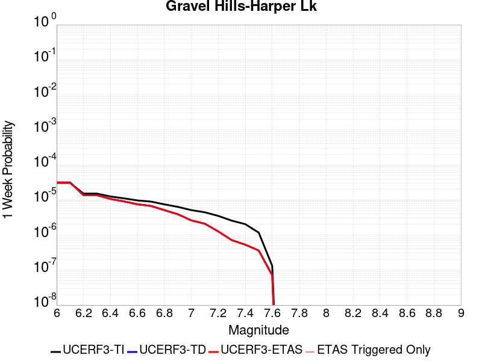 | 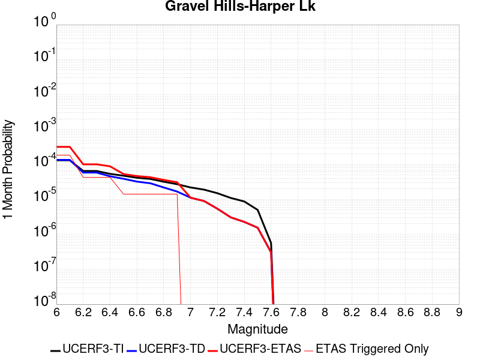 | 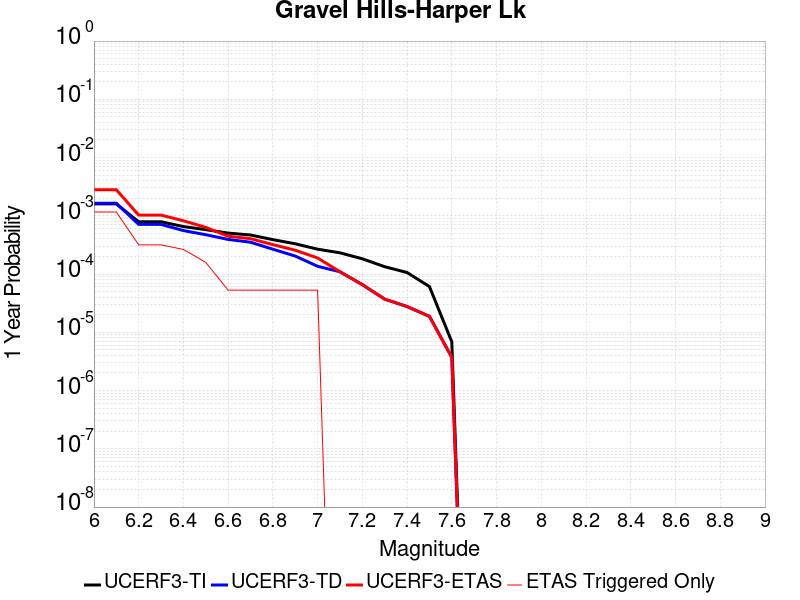 | 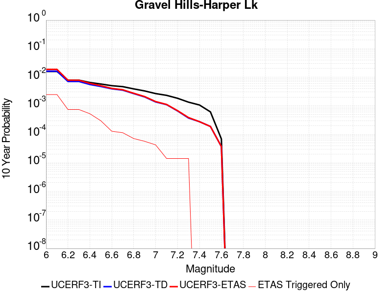 |

| Magnitude | 1 wk TI Prob | 1 wk TD Prob | 1 wk ETAS Prob | 1 wk ETAS/TD Gain | 1 wk ETAS Triggered Only | 1 mo TI Prob | 1 mo TD Prob | 1 mo ETAS Prob | 1 mo ETAS/TD Gain | 1 mo ETAS Triggered Only | 1 yr TI Prob | 1 yr TD Prob | 1 yr ETAS Prob | 1 yr ETAS/TD Gain | 1 yr ETAS Triggered Only | 10 yr TI Prob | 10 yr TD Prob | 10 yr ETAS Prob | 10 yr ETAS/TD Gain | 10 yr ETAS Triggered Only |
|-----|-----|-----|-----|-----|-----|-----|-----|-----|-----|-----|-----|-----|-----|-----|-----|-----|-----|-----|-----|-----|
| 6.0 | 3.0679566E-5 | 3.1468957E-5 | 7.542362E-5 | 2.3967626 | 4.3956043E-5 | 1.3147724E-4 | 1.348612E-4 | 3.1066168E-4 | 2.303566 | 1.7582417E-4 | 0.0015995599 | 0.0016409147 | 0.0027270417 | 1.6619033 | 0.0010879121 | 0.015880952 | 0.016309557 | 0.01873095 | 1.1484646 | 0.0024615384 |
| 6.1 | 3.0679566E-5 | 3.1468957E-5 | 7.542362E-5 | 2.3967626 | 4.3956043E-5 | 1.3147724E-4 | 1.348612E-4 | 3.1066168E-4 | 2.303566 | 1.7582417E-4 | 0.0015995599 | 0.0016409147 | 0.0027270417 | 1.6619033 | 0.0010879121 | 0.015880952 | 0.016309557 | 0.01873095 | 1.1484646 | 0.0024615384 |
| 6.2 | 1.514536E-5 | 1.3636691E-5 | 2.4625551E-5 | 1.8058305 | 1.0989011E-5 | 6.490707E-5 | 5.8441718E-5 | 1.1338356E-4 | 1.9401134 | 5.4945056E-5 | 7.8995706E-4 | 7.113075E-4 | 0.0010846681 | 1.5248934 | 3.7362636E-4 | 0.007871548 | 0.0070915096 | 0.007888019 | 1.1123186 | 8.021978E-4 |
| 6.3 | 1.514536E-5 | 1.3636691E-5 | 2.4625551E-5 | 1.8058305 | 1.0989011E-5 | 6.490707E-5 | 5.8441718E-5 | 1.1338356E-4 | 1.9401134 | 5.4945056E-5 | 7.8995706E-4 | 7.113075E-4 | 0.0010846681 | 1.5248934 | 3.7362636E-4 | 0.007871548 | 0.0070915096 | 0.007888019 | 1.1123186 | 8.021978E-4 |
| 6.4 | 1.2532521E-5 | 1.0690775E-5 | 1.0690775E-5 | 1.0 | 0.0 | 5.37097E-5 | 4.5816832E-5 | 8.977086E-5 | 1.9593424 | 4.3956043E-5 | 6.537194E-4 | 5.57683E-4 | 8.4323797E-4 | 1.5120381 | 2.8571428E-4 | 0.0065179965 | 0.0055634254 | 0.0061535304 | 1.1060687 | 5.934066E-4 |
| 6.5 | 1.1094058E-5 | 9.084548E-6 | 9.084548E-6 | 1.0 | 0.0 | 4.7545094E-5 | 3.8933216E-5 | 6.0910384E-5 | 1.5644836 | 2.1978021E-5 | 5.787078E-4 | 4.7391286E-4 | 6.3866994E-4 | 1.3476526 | 1.6483516E-4 | 0.0057720304 | 0.0047294297 | 0.005101289 | 1.0786266 | 3.7362636E-4 |
| 6.6 | 9.688328E-6 | 7.5324074E-6 | 7.5324074E-6 | 1.0 | 0.0 | 4.1520743E-5 | 3.228136E-5 | 4.3270018E-5 | 1.3404025 | 1.0989011E-5 | 5.053978E-4 | 3.9295724E-4 | 4.588654E-4 | 1.1677235 | 6.5934066E-5 | 0.0050424994 | 0.0039228806 | 0.0040980154 | 1.0446444 | 1.7582417E-4 |
| 6.7 | 8.974824E-6 | 6.750045E-6 | 6.750045E-6 | 1.0 | 0.0 | 3.8462964E-5 | 2.8928456E-5 | 3.991715E-5 | 1.3798575 | 1.0989011E-5 | 4.6818596E-4 | 3.5214925E-4 | 4.0707496E-4 | 1.1559728 | 5.4945056E-5 | 0.004672008 | 0.0035161332 | 0.0036365874 | 1.0342575 | 1.2087912E-4 |
| 6.8 | 7.4780046E-6 | 5.116667E-6 | 5.116667E-6 | 1.0 | 0.0 | 3.20482E-5 | 2.1928397E-5 | 3.2917167E-5 | 1.5011206 | 1.0989011E-5 | 3.9011694E-4 | 2.669469E-4 | 2.8891908E-4 | 1.0823091 | 2.1978021E-5 | 0.0038943281 | 0.0026664007 | 0.002732159 | 1.0246618 | 6.5934066E-5 |
| 6.9 | 6.3409307E-6 | 3.9078664E-6 | 3.9078664E-6 | 1.0 | 0.0 | 2.7175134E-5 | 1.6747896E-5 | 2.7736723E-5 | 1.6561317 | 1.0989011E-5 | 3.3080703E-4 | 2.0388755E-4 | 2.2586109E-4 | 1.1077728 | 2.1978021E-5 | 0.0033031502 | 0.002037103 | 0.0020809695 | 1.0215337 | 4.3956043E-5 |
| 7.0 | 5.1239335E-6 | 2.606115E-6 | 2.606115E-6 | 1.0 | 0.0 | 2.195953E-5 | 1.1169018E-5 | 1.1169018E-5 | 1.0 | 0.0 | 2.6732447E-4 | 1.3597457E-4 | 1.4696208E-4 | 1.0808057 | 1.0989011E-5 | 0.0026700313 | 0.001358939 | 0.0013918611 | 1.0242264 | 3.2967033E-5 |
| 7.1 | 4.438899E-6 | 2.098689E-6 | 2.098689E-6 | 1.0 | 0.0 | 1.9023713E-5 | 8.994351E-6 | 8.994351E-6 | 1.0 | 0.0 | 2.315891E-4 | 1.0950095E-4 | 1.0950095E-4 | 1.0 | 0.0 | 0.002313479 | 0.0010944918 | 0.0011054688 | 1.0100293 | 1.0989011E-5 |
| 7.2 | 3.50367E-6 | 1.2617305E-6 | 1.2617305E-6 | 1.0 | 0.0 | 1.5015643E-5 | 5.4074058E-6 | 5.4074058E-6 | 1.0 | 0.0 | 1.8280011E-4 | 6.583326E-5 | 6.583326E-5 | 1.0 | 0.0 | 0.0018264982 | 6.581458E-4 | 6.6912756E-4 | 1.016686 | 1.0989011E-5 |
| 7.3 | 2.561638E-6 | 7.120373E-7 | 7.120373E-7 | 1.0 | 0.0 | 1.0978401E-5 | 3.051585E-6 | 3.051585E-6 | 1.0 | 0.0 | 1.3365384E-4 | 3.7152437E-5 | 3.7152437E-5 | 1.0 | 0.0 | 0.0013357349 | 3.7146424E-4 | 3.824492E-4 | 1.029572 | 1.0989011E-5 |
| 7.4 | 2.0368864E-6 | 5.305809E-7 | 5.305809E-7 | 1.0 | 0.0 | 8.729483E-6 | 2.2739162E-6 | 2.2739162E-6 | 1.0 | 0.0 | 1.06276275E-4 | 2.7684584E-5 | 2.7684584E-5 | 1.0 | 0.0 | 0.0010622547 | 2.768119E-4 | 2.768119E-4 | 1.0 | 0.0 |
| 7.5 | 1.1681728E-6 | 3.60362E-7 | 3.60362E-7 | 1.0 | 0.0 | 5.0064455E-6 | 1.5444077E-6 | 1.5444077E-6 | 1.0 | 0.0 | 6.0951766E-5 | 1.8803006E-5 | 1.8803006E-5 | 1.0 | 0.0 | 6.093505E-4 | 1.8801463E-4 | 1.8801463E-4 | 1.0 | 0.0 |
| 7.6 | 1.3154387E-7 | 7.120442E-8 | 7.120442E-8 | 1.0 | 0.0 | 5.6375933E-7 | 3.0516176E-7 | 3.0516176E-7 | 1.0 | 0.0 | 6.863748E-6 | 3.7153397E-6 | 3.7153397E-6 | 1.0 | 0.0 | 6.863536E-5 | 3.7152935E-5 | 3.7152935E-5 | 1.0 | 0.0 |

## So Sierra Nevada
*[(top)](#table-of-contents)*

| 1 Week | 1 Month | 1 Year | 10 Year |
|-----|-----|-----|-----|
| 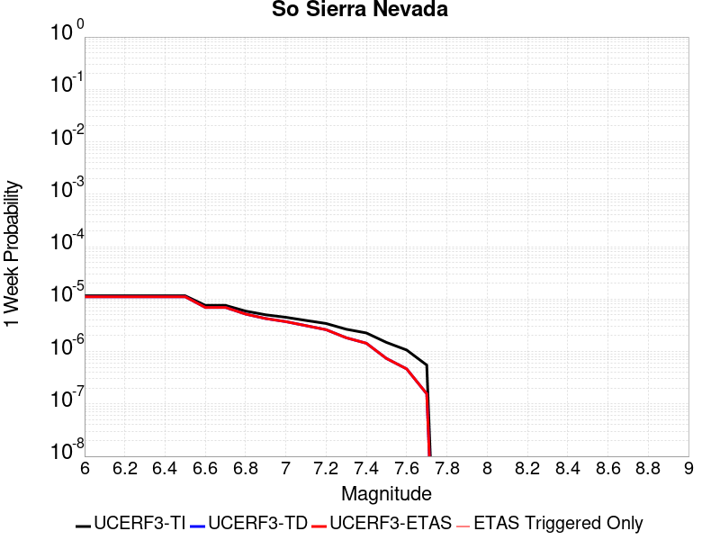 | 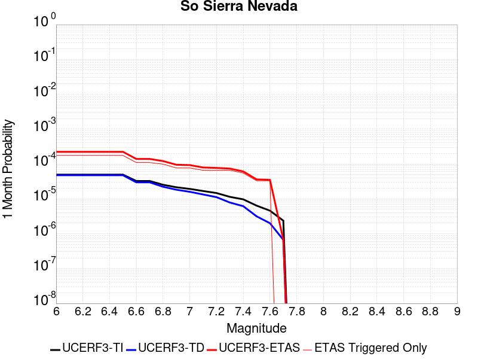 | 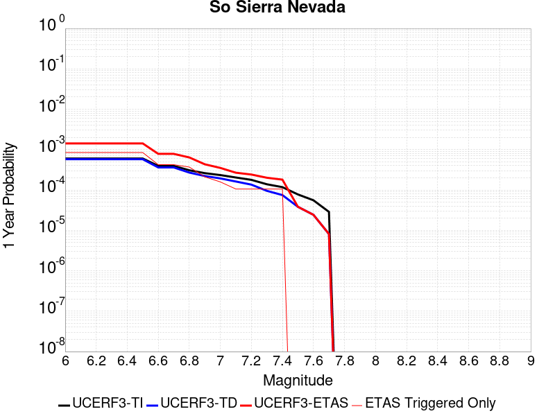 | 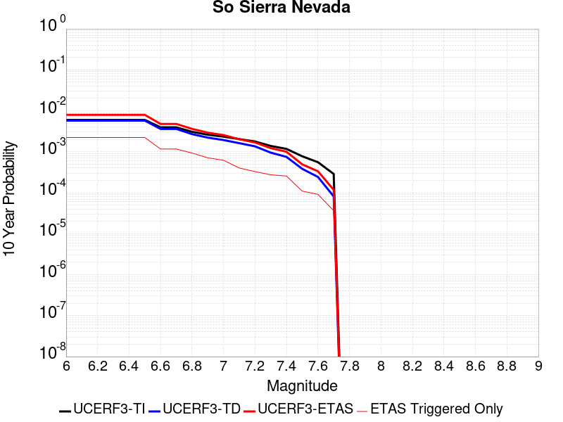 |

| Magnitude | 1 wk TI Prob | 1 wk TD Prob | 1 wk ETAS Prob | 1 wk ETAS/TD Gain | 1 wk ETAS Triggered Only | 1 mo TI Prob | 1 mo TD Prob | 1 mo ETAS Prob | 1 mo ETAS/TD Gain | 1 mo ETAS Triggered Only | 1 yr TI Prob | 1 yr TD Prob | 1 yr ETAS Prob | 1 yr ETAS/TD Gain | 1 yr ETAS Triggered Only | 10 yr TI Prob | 10 yr TD Prob | 10 yr ETAS Prob | 10 yr ETAS/TD Gain | 10 yr ETAS Triggered Only |
|-----|-----|-----|-----|-----|-----|-----|-----|-----|-----|-----|-----|-----|-----|-----|-----|-----|-----|-----|-----|-----|
| 6.0 | 1.15488665E-5 | 1.1080275E-5 | 4.404694E-5 | 3.9752572 | 3.2967033E-5 | 4.9494203E-5 | 4.74861E-5 | 2.2330193E-4 | 4.7024693 | 1.7582417E-4 | 6.024253E-4 | 5.7800265E-4 | 0.0015225114 | 2.6340904 | 9.450549E-4 | 0.006007948 | 0.0057662623 | 0.007995094 | 1.3865297 | 0.0022417582 |
| 6.1 | 1.15488665E-5 | 1.1080275E-5 | 4.404694E-5 | 3.9752572 | 3.2967033E-5 | 4.9494203E-5 | 4.74861E-5 | 2.2330193E-4 | 4.7024693 | 1.7582417E-4 | 6.024253E-4 | 5.7800265E-4 | 0.0015225114 | 2.6340904 | 9.450549E-4 | 0.006007948 | 0.0057662623 | 0.007995094 | 1.3865297 | 0.0022417582 |
| 6.2 | 1.15488665E-5 | 1.1080275E-5 | 4.404694E-5 | 3.9752572 | 3.2967033E-5 | 4.9494203E-5 | 4.74861E-5 | 2.2330193E-4 | 4.7024693 | 1.7582417E-4 | 6.024253E-4 | 5.7800265E-4 | 0.0015225114 | 2.6340904 | 9.450549E-4 | 0.006007948 | 0.0057662623 | 0.007995094 | 1.3865297 | 0.0022417582 |
| 6.3 | 1.15488665E-5 | 1.1080275E-5 | 4.404694E-5 | 3.9752572 | 3.2967033E-5 | 4.9494203E-5 | 4.74861E-5 | 2.2330193E-4 | 4.7024693 | 1.7582417E-4 | 6.024253E-4 | 5.7800265E-4 | 0.0015225114 | 2.6340904 | 9.450549E-4 | 0.006007948 | 0.0057662623 | 0.007995094 | 1.3865297 | 0.0022417582 |
| 6.4 | 1.15488665E-5 | 1.1080275E-5 | 4.404694E-5 | 3.9752572 | 3.2967033E-5 | 4.9494203E-5 | 4.74861E-5 | 2.2330193E-4 | 4.7024693 | 1.7582417E-4 | 6.024253E-4 | 5.7800265E-4 | 0.0015225114 | 2.6340904 | 9.450549E-4 | 0.006007948 | 0.0057662623 | 0.007995094 | 1.3865297 | 0.0022417582 |
| 6.5 | 1.15488665E-5 | 1.1080275E-5 | 4.404694E-5 | 3.9752572 | 3.2967033E-5 | 4.9494203E-5 | 4.74861E-5 | 2.2330193E-4 | 4.7024693 | 1.7582417E-4 | 6.024253E-4 | 5.7800265E-4 | 0.0015225114 | 2.6340904 | 9.450549E-4 | 0.006007948 | 0.0057662623 | 0.007995094 | 1.3865297 | 0.0022417582 |
| 6.6 | 7.587044E-6 | 6.9360653E-6 | 2.8913935E-5 | 4.1686363 | 2.1978021E-5 | 3.2515498E-5 | 2.9725672E-5 | 1.3961252E-4 | 4.696698 | 1.0989011E-4 | 3.9580427E-4 | 3.6185287E-4 | 9.220896E-4 | 2.5482447 | 5.6043954E-4 | 0.003951 | 0.0036129286 | 0.004839251 | 1.3394262 | 0.0012307692 |
| 6.7 | 7.587044E-6 | 6.9360653E-6 | 2.8913935E-5 | 4.1686363 | 2.1978021E-5 | 3.2515498E-5 | 2.9725672E-5 | 1.3961252E-4 | 4.696698 | 1.0989011E-4 | 3.9580427E-4 | 3.6185287E-4 | 9.220896E-4 | 2.5482447 | 5.6043954E-4 | 0.003951 | 0.0036129286 | 0.004839251 | 1.3394262 | 0.0012307692 |
| 6.8 | 5.9026956E-6 | 5.1797433E-6 | 2.7157652E-5 | 5.2430496 | 2.1978021E-5 | 2.5297022E-5 | 2.2198717E-5 | 1.2109762E-4 | 5.455163 | 9.89011E-5 | 3.0794772E-4 | 2.70237E-4 | 6.9869263E-4 | 2.5854807 | 4.2857142E-4 | 0.0030752132 | 0.0026992003 | 0.0036417043 | 1.349179 | 9.450549E-4 |
| 6.9 | 5.0118915E-6 | 4.252736E-6 | 2.6230664E-5 | 6.1679506 | 2.1978021E-5 | 2.1479358E-5 | 1.8225888E-5 | 9.514756E-5 | 5.2204623 | 7.6923076E-5 | 2.614798E-4 | 2.2187832E-4 | 5.7344866E-4 | 2.5845187 | 3.5164834E-4 | 0.0026117235 | 0.0022166404 | 0.0030060953 | 1.3561493 | 7.912088E-4 |
| 7.0 | 4.4924795E-6 | 3.7142067E-6 | 2.5692147E-5 | 6.9172635 | 2.1978021E-5 | 1.925334E-5 | 1.5917936E-5 | 9.2839786E-5 | 5.8324013 | 7.6923076E-5 | 2.3438422E-4 | 1.9378426E-4 | 5.1240384E-4 | 2.6441972 | 3.1868133E-4 | 0.0023413717 | 0.0019362158 | 0.0026052475 | 1.3455358 | 6.7032967E-4 |
| 7.1 | 3.9118436E-6 | 3.1122413E-6 | 2.5090196E-5 | 8.061777 | 2.1978021E-5 | 1.6764936E-5 | 1.3338113E-5 | 7.9271296E-5 | 5.9432173 | 6.5934066E-5 | 2.0409399E-4 | 1.6237999E-4 | 4.0409897E-4 | 2.488601 | 2.4175824E-4 | 0.0020390663 | 0.0016226694 | 0.0021054014 | 1.2974924 | 4.835165E-4 |
| 7.2 | 3.4200818E-6 | 2.6056978E-6 | 2.4583662E-5 | 9.43458 | 2.1978021E-5 | 1.4657411E-5 | 1.1167231E-5 | 7.710056E-5 | 6.904179 | 6.5934066E-5 | 1.7843937E-4 | 1.3595306E-4 | 3.1175333E-4 | 2.2930954 | 1.7582417E-4 | 0.0017829615 | 0.0013587485 | 0.0017538154 | 1.2907579 | 3.956044E-4 |
| 7.3 | 2.6593618E-6 | 1.8286328E-6 | 2.3806615E-5 | 13.0188055 | 2.1978021E-5 | 1.13972155E-5 | 7.836976E-6 | 7.377053E-5 | 9.4131365 | 6.5934066E-5 | 1.3875226E-4 | 9.54113E-5 | 2.7121868E-4 | 2.8426268 | 1.7582417E-4 | 0.0013866565 | 9.5373223E-4 | 0.0012830881 | 1.3453337 | 3.2967032E-4 |
| 7.4 | 2.2577992E-6 | 1.4366318E-6 | 2.3414623E-5 | 16.298277 | 2.1978021E-5 | 9.676246E-6 | 6.1569804E-6 | 6.1101695E-5 | 9.923971 | 5.4945056E-5 | 1.1780193E-4 | 7.4958916E-5 | 2.2879353E-4 | 3.0522525 | 1.5384615E-4 | 0.001177395 | 7.4936135E-4 | 0.0010238808 | 1.3663378 | 2.747253E-4 |
| 7.5 | 1.489319E-6 | 7.355458E-7 | 2.2713552E-5 | 30.87986 | 2.1978021E-5 | 6.3827797E-6 | 3.1523355E-6 | 3.6119265E-5 | 11.457938 | 3.2967033E-5 | 7.770758E-5 | 3.837901E-5 | 1.1529914E-4 | 3.0042238 | 7.6923076E-5 | 7.7680405E-4 | 3.8372425E-4 | 5.155418E-4 | 1.3435215 | 1.3186813E-4 |
| 7.6 | 1.0680322E-6 | 4.660781E-7 | 2.244409E-5 | 48.155212 | 2.1978021E-5 | 4.577273E-6 | 1.997476E-6 | 3.4964443E-5 | 17.504313 | 3.2967033E-5 | 5.5726876E-5 | 2.4319E-5 | 1.01240206E-4 | 4.163008 | 7.6923076E-5 | 5.5712904E-4 | 2.4316367E-4 | 3.5302705E-4 | 1.4518085 | 1.0989011E-4 |
| 7.7 | 5.509146E-7 | 1.5586197E-7 | 1.5586197E-7 | 1.0 | 0.0 | 2.3610605E-6 | 6.679797E-7 | 6.679797E-7 | 1.0 | 0.0 | 2.8745531E-5 | 8.132623E-6 | 1.9121546E-5 | 2.351215 | 1.0989011E-5 | 2.8741814E-4 | 8.132337E-5 | 1.1428773E-4 | 1.405349 | 3.2967033E-5 |

## Goldstone Lake
*[(top)](#table-of-contents)*

| 1 Week | 1 Month | 1 Year | 10 Year |
|-----|-----|-----|-----|
| 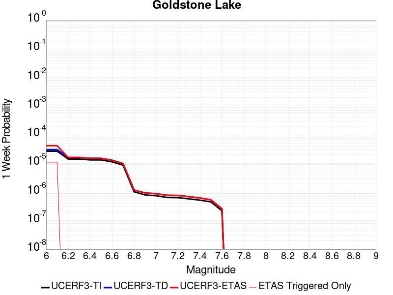 | 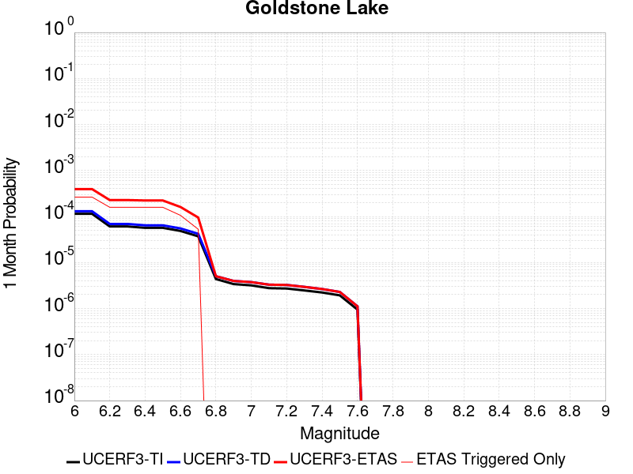 | 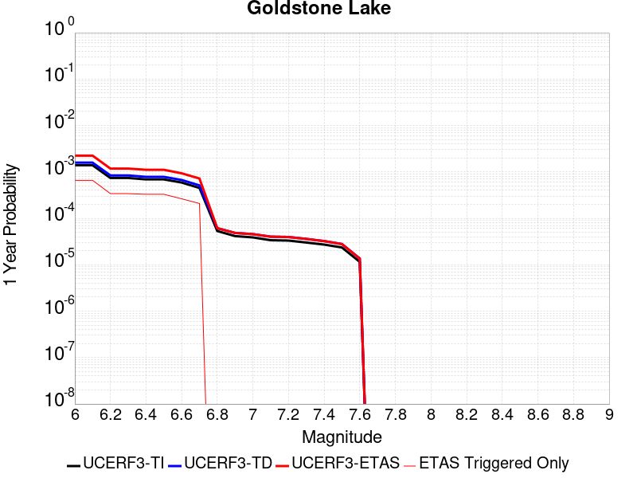 | 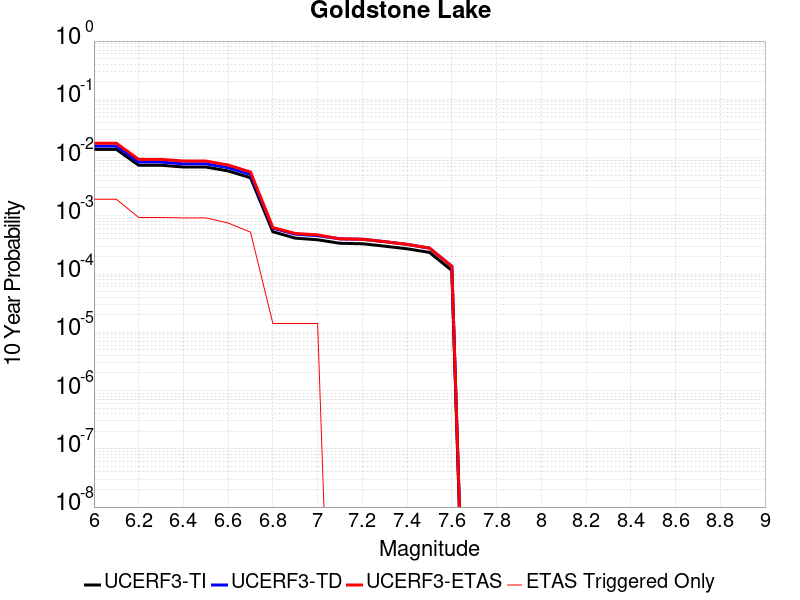 |

| Magnitude | 1 wk TI Prob | 1 wk TD Prob | 1 wk ETAS Prob | 1 wk ETAS/TD Gain | 1 wk ETAS Triggered Only | 1 mo TI Prob | 1 mo TD Prob | 1 mo ETAS Prob | 1 mo ETAS/TD Gain | 1 mo ETAS Triggered Only | 1 yr TI Prob | 1 yr TD Prob | 1 yr ETAS Prob | 1 yr ETAS/TD Gain | 1 yr ETAS Triggered Only | 10 yr TI Prob | 10 yr TD Prob | 10 yr ETAS Prob | 10 yr ETAS/TD Gain | 10 yr ETAS Triggered Only |
|-----|-----|-----|-----|-----|-----|-----|-----|-----|-----|-----|-----|-----|-----|-----|-----|-----|-----|-----|-----|-----|
| 6.0 | 2.671352E-5 | 3.0380395E-5 | 4.1369072E-5 | 1.3617029 | 1.0989011E-5 | 1.1448149E-4 | 1.301963E-4 | 2.5105968E-4 | 1.9283165 | 1.2087912E-4 | 0.001392921 | 0.0015841839 | 0.00224248 | 1.4155427 | 6.5934064E-4 | 0.013842222 | 0.015748413 | 0.017565494 | 1.1153817 | 0.0018461539 |
| 6.1 | 2.671352E-5 | 3.0380395E-5 | 4.1369072E-5 | 1.3617029 | 1.0989011E-5 | 1.1448149E-4 | 1.301963E-4 | 2.5105968E-4 | 1.9283165 | 1.2087912E-4 | 0.001392921 | 0.0015841839 | 0.00224248 | 1.4155427 | 6.5934064E-4 | 0.013842222 | 0.015748413 | 0.017565494 | 1.1153817 | 0.0018461539 |
| 6.2 | 1.4197047E-5 | 1.6098415E-5 | 1.6098415E-5 | 1.0 | 0.0 | 6.0843064E-5 | 6.899193E-5 | 1.3492146E-4 | 1.955612 | 6.5934066E-5 | 7.4051257E-4 | 8.397518E-4 | 0.001180125 | 1.405326 | 3.4065935E-4 | 0.007380498 | 0.0083754845 | 0.009312624 | 1.1118908 | 9.450549E-4 |
| 6.3 | 1.4197047E-5 | 1.6098415E-5 | 1.6098415E-5 | 1.0 | 0.0 | 6.0843064E-5 | 6.899193E-5 | 1.3492146E-4 | 1.955612 | 6.5934066E-5 | 7.4051257E-4 | 8.397518E-4 | 0.001180125 | 1.405326 | 3.4065935E-4 | 0.007380498 | 0.0083754845 | 0.009312624 | 1.1118908 | 9.450549E-4 |
| 6.4 | 1.3238931E-5 | 1.5010473E-5 | 1.5010473E-5 | 1.0 | 0.0 | 5.6737044E-5 | 6.4329564E-5 | 1.3025939E-4 | 2.0248759 | 6.5934066E-5 | 6.9055456E-4 | 7.8302907E-4 | 0.0011124412 | 1.4206896 | 3.2967032E-4 | 0.006884126 | 0.007812329 | 0.008739098 | 1.118629 | 9.3406596E-4 |
| 6.5 | 1.3238931E-5 | 1.5010473E-5 | 1.5010473E-5 | 1.0 | 0.0 | 5.6737044E-5 | 6.4329564E-5 | 1.3025939E-4 | 2.0248759 | 6.5934066E-5 | 6.9055456E-4 | 7.8302907E-4 | 0.0011124412 | 1.4206896 | 3.2967032E-4 | 0.006884126 | 0.007812329 | 0.008739098 | 1.118629 | 9.3406596E-4 |
| 6.6 | 1.1328278E-5 | 1.2856889E-5 | 1.2856889E-5 | 1.0 | 0.0 | 4.8548856E-5 | 5.510033E-5 | 9.905395E-5 | 1.7977016 | 4.3956043E-5 | 5.90922E-4 | 6.707357E-4 | 9.3429507E-4 | 1.3929408 | 2.6373626E-4 | 0.0058935313 | 0.0066965045 | 0.0074933306 | 1.1189913 | 8.021978E-4 |
| 6.7 | 8.651175E-6 | 9.825863E-6 | 9.825863E-6 | 1.0 | 0.0 | 3.707594E-5 | 4.211067E-5 | 7.5076314E-5 | 1.7828335 | 3.2967033E-5 | 4.5130608E-4 | 5.1266735E-4 | 7.2135153E-4 | 1.4070557 | 2.0879121E-4 | 0.0045039062 | 0.005123728 | 0.0057031615 | 1.1130883 | 5.824176E-4 |
| 6.8 | 1.0215377E-6 | 1.1755423E-6 | 1.1755423E-6 | 1.0 | 0.0 | 4.378012E-6 | 5.038029E-6 | 5.038029E-6 | 1.0 | 0.0 | 5.3300988E-5 | 6.133639E-5 | 6.133639E-5 | 1.0 | 0.0 | 5.3288206E-4 | 6.132059E-4 | 6.2418816E-4 | 1.0179096 | 1.0989011E-5 |
| 6.9 | 7.9360774E-7 | 9.283895E-7 | 9.283895E-7 | 1.0 | 0.0 | 3.4011714E-6 | 3.9788065E-6 | 3.9788065E-6 | 1.0 | 0.0 | 4.1408475E-5 | 4.8440965E-5 | 4.8440965E-5 | 1.0 | 0.0 | 4.140076E-4 | 4.8431105E-4 | 4.9529475E-4 | 1.022679 | 1.0989011E-5 |
| 7.0 | 7.4382757E-7 | 8.747784E-7 | 8.747784E-7 | 1.0 | 0.0 | 3.1878285E-6 | 3.7490452E-6 | 3.7490452E-6 | 1.0 | 0.0 | 3.8811122E-5 | 4.5643737E-5 | 4.5643737E-5 | 1.0 | 0.0 | 3.8804344E-4 | 4.5635024E-4 | 4.6733426E-4 | 1.0240692 | 1.0989011E-5 |
| 7.1 | 6.4709513E-7 | 7.711677E-7 | 7.711677E-7 | 1.0 | 0.0 | 2.773262E-6 | 3.3050005E-6 | 3.3050005E-6 | 1.0 | 0.0 | 3.376394E-5 | 4.02377E-5 | 4.02377E-5 | 1.0 | 0.0 | 3.375881E-4 | 4.023101E-4 | 4.023101E-4 | 1.0 | 0.0 |
| 7.2 | 6.356704E-7 | 7.5887266E-7 | 7.5887266E-7 | 1.0 | 0.0 | 2.7242988E-6 | 3.2523078E-6 | 3.2523078E-6 | 1.0 | 0.0 | 3.3167835E-5 | 3.9596187E-5 | 3.9596187E-5 | 1.0 | 0.0 | 3.3162883E-4 | 3.9589725E-4 | 3.9589725E-4 | 1.0 | 0.0 |
| 7.3 | 5.7695723E-7 | 6.8969035E-7 | 6.8969035E-7 | 1.0 | 0.0 | 2.4726714E-6 | 2.9558128E-6 | 2.9558128E-6 | 1.0 | 0.0 | 3.0104358E-5 | 3.5986486E-5 | 3.5986486E-5 | 1.0 | 0.0 | 3.0100282E-4 | 3.5981231E-4 | 3.5981231E-4 | 1.0 | 0.0 |
| 7.4 | 5.209647E-7 | 6.1937993E-7 | 6.1937993E-7 | 1.0 | 0.0 | 2.232704E-6 | 2.654483E-6 | 2.654483E-6 | 1.0 | 0.0 | 2.718283E-5 | 3.231791E-5 | 3.231791E-5 | 1.0 | 0.0 | 2.7179506E-4 | 3.2313765E-4 | 3.2313765E-4 | 1.0 | 0.0 |
| 7.5 | 4.512955E-7 | 5.3491203E-7 | 5.3491203E-7 | 1.0 | 0.0 | 1.934122E-6 | 2.2924785E-6 | 2.2924785E-6 | 1.0 | 0.0 | 2.3547682E-5 | 2.791062E-5 | 2.791062E-5 | 1.0 | 0.0 | 2.3545188E-4 | 2.7907646E-4 | 2.7907646E-4 | 1.0 | 0.0 |
| 7.6 | 2.21172E-7 | 2.604064E-7 | 2.604064E-7 | 1.0 | 0.0 | 9.478797E-7 | 1.1160272E-6 | 1.1160272E-6 | 1.0 | 0.0 | 1.1540374E-5 | 1.3587575E-5 | 1.3587575E-5 | 1.0 | 0.0 | 1.1539775E-4 | 1.3587026E-4 | 1.3587026E-4 | 1.0 | 0.0 |

## San Andreas (Mojave S)
*[(top)](#table-of-contents)*

| 1 Week | 1 Month | 1 Year | 10 Year |
|-----|-----|-----|-----|
| 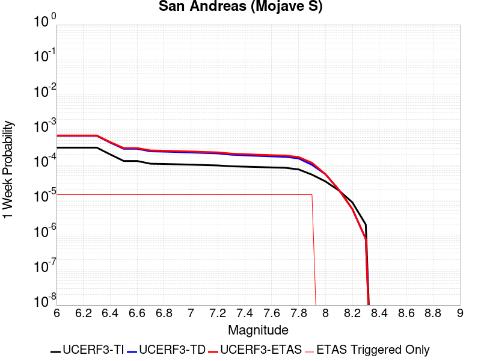 | 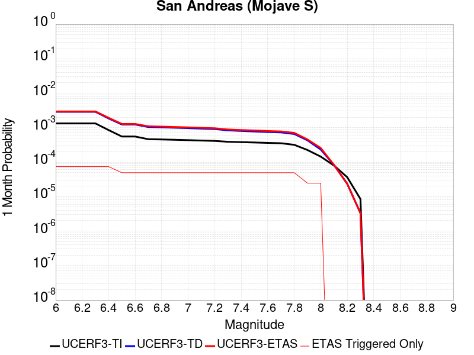 | 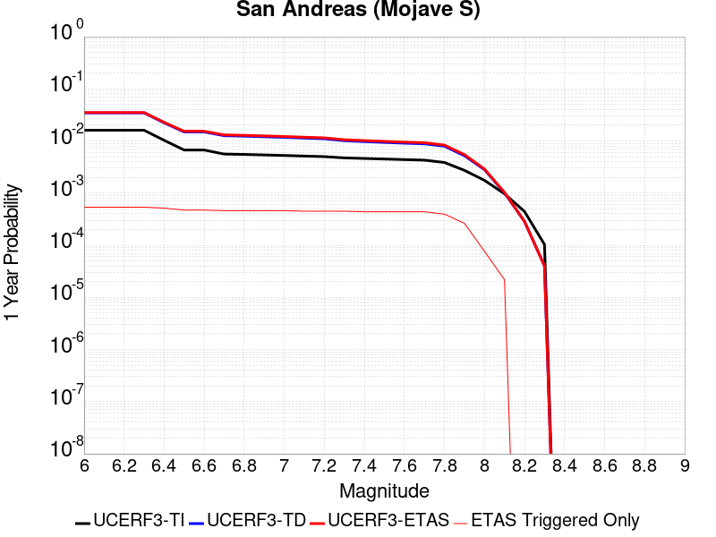 | 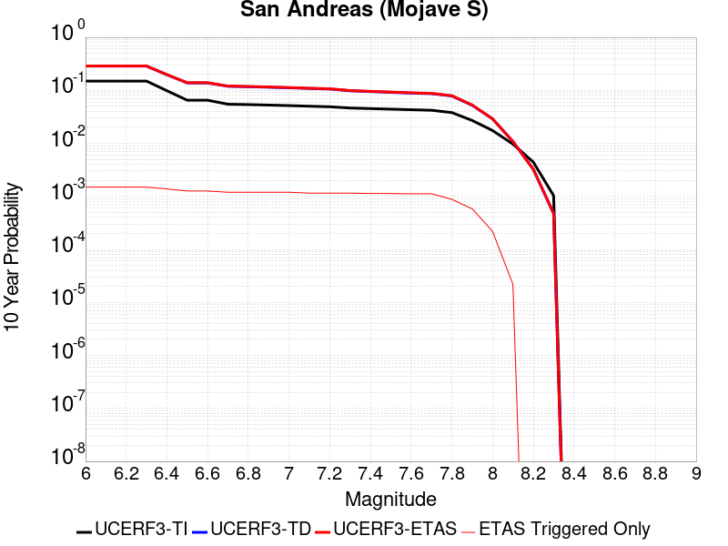 |

| Magnitude | 1 wk TI Prob | 1 wk TD Prob | 1 wk ETAS Prob | 1 wk ETAS/TD Gain | 1 wk ETAS Triggered Only | 1 mo TI Prob | 1 mo TD Prob | 1 mo ETAS Prob | 1 mo ETAS/TD Gain | 1 mo ETAS Triggered Only | 1 yr TI Prob | 1 yr TD Prob | 1 yr ETAS Prob | 1 yr ETAS/TD Gain | 1 yr ETAS Triggered Only | 10 yr TI Prob | 10 yr TD Prob | 10 yr ETAS Prob | 10 yr ETAS/TD Gain | 10 yr ETAS Triggered Only |
|-----|-----|-----|-----|-----|-----|-----|-----|-----|-----|-----|-----|-----|-----|-----|-----|-----|-----|-----|-----|-----|
| 6.0 | 3.1064058E-4 | 6.7538634E-4 | 6.863679E-4 | 1.0162597 | 1.0989011E-5 | 0.0013306376 | 0.0028914304 | 0.0030229173 | 1.0454746 | 1.3186813E-4 | 0.016080605 | 0.03466114 | 0.03518094 | 1.0149965 | 5.3846155E-4 | 0.1496549 | 0.28687167 | 0.28793746 | 1.0037152 | 0.0014945054 |
| 6.1 | 3.1064058E-4 | 6.7538634E-4 | 6.863679E-4 | 1.0162597 | 1.0989011E-5 | 0.0013306376 | 0.0028914304 | 0.0030229173 | 1.0454746 | 1.3186813E-4 | 0.016080605 | 0.03466114 | 0.03518094 | 1.0149965 | 5.3846155E-4 | 0.1496549 | 0.28687167 | 0.28793746 | 1.0037152 | 0.0014945054 |
| 6.2 | 3.1064058E-4 | 6.7538634E-4 | 6.863679E-4 | 1.0162597 | 1.0989011E-5 | 0.0013306376 | 0.0028914304 | 0.0030229173 | 1.0454746 | 1.3186813E-4 | 0.016080605 | 0.03466114 | 0.03518094 | 1.0149965 | 5.3846155E-4 | 0.1496549 | 0.28687167 | 0.28793746 | 1.0037152 | 0.0014945054 |
| 6.3 | 3.1064058E-4 | 6.7538634E-4 | 6.863679E-4 | 1.0162597 | 1.0989011E-5 | 0.0013306376 | 0.0028914304 | 0.0030229173 | 1.0454746 | 1.3186813E-4 | 0.016080605 | 0.03466114 | 0.03518094 | 1.0149965 | 5.3846155E-4 | 0.1496549 | 0.28687167 | 0.28793746 | 1.0037152 | 0.0014945054 |
| 6.4 | 1.9872203E-4 | 4.3253382E-4 | 4.435181E-4 | 1.0253952 | 1.0989011E-5 | 8.5138786E-4 | 0.0018524277 | 0.001973083 | 1.0651336 | 1.2087912E-4 | 0.010316478 | 0.022326224 | 0.022831175 | 1.022617 | 5.164835E-4 | 0.098504856 | 0.19728218 | 0.19839363 | 1.0056338 | 0.0013846154 |
| 6.5 | 1.291105E-4 | 2.8822906E-4 | 2.9921488E-4 | 1.038115 | 1.0989011E-5 | 5.5321335E-4 | 0.0012346853 | 0.0013444398 | 1.0888926 | 1.0989011E-4 | 0.006714592 | 0.014929512 | 0.015394985 | 1.031178 | 4.7252746E-4 | 0.065152965 | 0.13832536 | 0.1394143 | 1.0078722 | 0.0012637363 |
| 6.6 | 1.291105E-4 | 2.8822906E-4 | 2.9921488E-4 | 1.038115 | 1.0989011E-5 | 5.5321335E-4 | 0.0012346853 | 0.0013444398 | 1.0888926 | 1.0989011E-4 | 0.006714592 | 0.014929512 | 0.015394985 | 1.031178 | 4.7252746E-4 | 0.065152965 | 0.13832536 | 0.1394143 | 1.0078722 | 0.0012637363 |
| 6.7 | 1.08001186E-4 | 2.4403051E-4 | 2.5501684E-4 | 1.0450203 | 1.0989011E-5 | 4.6278012E-4 | 0.0010454265 | 0.0011552017 | 1.1050053 | 1.0989011E-4 | 0.0056198016 | 0.012654087 | 0.013109785 | 1.0360119 | 4.6153847E-4 | 0.054797906 | 0.11947057 | 0.12052527 | 1.0088282 | 0.0011978023 |
| 6.8 | 1.0624356E-4 | 2.3920518E-4 | 2.5019157E-4 | 1.0459287 | 1.0989011E-5 | 4.5525006E-4 | 0.0010247629 | 0.0011345403 | 1.1071248 | 1.0989011E-4 | 0.0055285925 | 0.012405391 | 0.012861203 | 1.0367432 | 4.6153847E-4 | 0.053930566 | 0.11741964 | 0.11847679 | 1.0090033 | 0.0011978023 |
| 6.9 | 1.0393785E-4 | 2.32906E-4 | 2.4389244E-4 | 1.0471712 | 1.0989011E-5 | 4.4537184E-4 | 9.977872E-4 | 0.0011075677 | 1.110024 | 1.0989011E-4 | 0.0054089287 | 0.012080644 | 0.012536608 | 1.0377432 | 4.6153847E-4 | 0.05279156 | 0.11471701 | 0.115777396 | 1.0092436 | 0.0011978023 |
| 7.0 | 1.0155622E-4 | 2.2659826E-4 | 2.3758478E-4 | 1.0484846 | 1.0989011E-5 | 4.3516833E-4 | 9.7077433E-4 | 0.0010805578 | 1.1130885 | 1.0989011E-4 | 0.005285311 | 0.011755354 | 0.012211466 | 1.0388005 | 4.6153847E-4 | 0.05161361 | 0.111976855 | 0.11304053 | 1.0094991 | 0.0011978023 |
| 7.1 | 9.885595E-5 | 2.1947875E-4 | 2.3046536E-4 | 1.0500576 | 1.0989011E-5 | 4.2359953E-4 | 9.402845E-4 | 0.0010500713 | 1.1167591 | 1.0989011E-4 | 0.0051451353 | 0.011388074 | 0.011833492 | 1.0391127 | 4.5054944E-4 | 0.05027629 | 0.10886101 | 0.10988924 | 1.0094454 | 0.0011538462 |
| 7.2 | 9.6411415E-5 | 2.131053E-4 | 2.2409197E-4 | 1.0515552 | 1.0989011E-5 | 4.1312634E-4 | 9.129891E-4 | 0.0010227788 | 1.1202531 | 1.0989011E-4 | 0.005018219 | 0.011059172 | 0.011504739 | 1.0402893 | 4.5054944E-4 | 0.049064007 | 0.10605039 | 0.10708187 | 1.0097263 | 0.0011538462 |
| 7.3 | 9.1180635E-5 | 1.9537064E-4 | 2.0635751E-4 | 1.056236 | 1.0989011E-5 | 3.907156E-4 | 8.3703414E-4 | 9.468323E-4 | 1.1311752 | 1.0989011E-4 | 0.004746591 | 0.010143385 | 0.010589365 | 1.0439675 | 4.5054944E-4 | 0.046464786 | 0.09823892 | 0.09927942 | 1.0105915 | 0.0011538462 |
| 7.4 | 8.887388E-5 | 1.8784897E-4 | 1.9883591E-4 | 1.0584882 | 1.0989011E-5 | 3.8083247E-4 | 8.048187E-4 | 9.1462035E-4 | 1.1364303 | 1.0989011E-4 | 0.0046267817 | 0.009754742 | 0.010190015 | 1.0446216 | 4.3956045E-4 | 0.045316286 | 0.09487182 | 0.0958963 | 1.0107986 | 0.0011318681 |
| 7.5 | 8.6750515E-5 | 1.8115775E-4 | 1.9214478E-4 | 1.0606489 | 1.0989011E-5 | 3.7173493E-4 | 7.7615946E-4 | 8.8596425E-4 | 1.141472 | 1.0989011E-4 | 0.004516484 | 0.009408884 | 0.009844308 | 1.046278 | 4.3956045E-4 | 0.04425787 | 0.09183367 | 0.09286159 | 1.0111933 | 0.0011318681 |
| 7.6 | 8.453092E-5 | 1.750256E-4 | 1.860127E-4 | 1.0627742 | 1.0989011E-5 | 3.6222505E-4 | 7.498942E-4 | 8.597019E-4 | 1.146431 | 1.0989011E-4 | 0.0044011753 | 0.009091817 | 0.0095273815 | 1.0479072 | 4.3956045E-4 | 0.04315024 | 0.088990174 | 0.090011306 | 1.0114746 | 0.0011208791 |
| 7.7 | 8.259102E-5 | 1.7023997E-4 | 1.8122711E-4 | 1.0645391 | 1.0989011E-5 | 3.539135E-4 | 7.2939595E-4 | 8.3920587E-4 | 1.1505492 | 1.0989011E-4 | 0.004300386 | 0.008844306 | 0.009279978 | 1.0492603 | 4.3956045E-4 | 0.042181134 | 0.08673861 | 0.08776227 | 1.0118016 | 0.0011208791 |
| 7.8 | 7.444844E-5 | 1.5340719E-4 | 1.6439451E-4 | 1.071622 | 1.0989011E-5 | 3.1902574E-4 | 6.572938E-4 | 7.6711166E-4 | 1.1670758 | 1.0989011E-4 | 0.0038772223 | 0.007973238 | 0.008365688 | 1.0492209 | 3.956044E-4 | 0.03810269 | 0.07854723 | 0.0793573 | 1.0103132 | 8.791209E-4 |
| 7.9 | 5.2586525E-5 | 1.0045548E-4 | 1.1144338E-4 | 1.1093808 | 1.0989011E-5 | 2.2535135E-4 | 4.3045246E-4 | 4.9635815E-4 | 1.1531079 | 6.5934066E-5 | 0.0027402006 | 0.0052281762 | 0.005490534 | 1.0501814 | 2.6373626E-4 | 0.027066574 | 0.052382782 | 0.05293469 | 1.0105361 | 5.824176E-4 |
| 8.0 | 3.379877E-5 | 5.430089E-5 | 5.430089E-5 | 1.0 | 0.0 | 1.4484383E-4 | 2.3269735E-4 | 2.656567E-4 | 1.1416404 | 3.2967033E-5 | 0.0017620471 | 0.0028294115 | 0.002906117 | 1.02711 | 7.6923076E-5 | 0.017481409 | 0.028946057 | 0.029159475 | 1.007373 | 2.1978022E-4 |
| 8.1 | 1.8668277E-5 | 1.941804E-5 | 1.941804E-5 | 1.0 | 0.0 | 8.000444E-5 | 8.321752E-5 | 9.4205614E-5 | 1.1320406 | 1.0989011E-5 | 9.736188E-4 | 0.001012703 | 0.0010346588 | 1.0216804 | 2.1978021E-5 | 0.009693642 | 0.010855786 | 0.010877525 | 1.0020026 | 2.1978021E-5 |
| 8.2 | 8.541571E-6 | 5.5025394E-6 | 5.5025394E-6 | 1.0 | 0.0 | 3.660622E-5 | 2.3582099E-5 | 2.3582099E-5 | 1.0 | 0.0 | 4.455896E-4 | 2.870743E-4 | 2.870743E-4 | 1.0 | 0.0 | 0.0044469717 | 0.0032636335 | 0.0032636335 | 1.0 | 0.0 |
| 8.3 | 1.983087E-6 | 7.731745E-7 | 7.731745E-7 | 1.0 | 0.0 | 8.498917E-6 | 3.313601E-6 | 3.313601E-6 | 1.0 | 0.0 | 1.034694E-4 | 4.0342362E-5 | 4.0342362E-5 | 1.0 | 0.0 | 0.0010342124 | 4.7608858E-4 | 4.7608858E-4 | 1.0 | 0.0 |

## Death Valley (So)
*[(top)](#table-of-contents)*

| 1 Week | 1 Month | 1 Year | 10 Year |
|-----|-----|-----|-----|
| 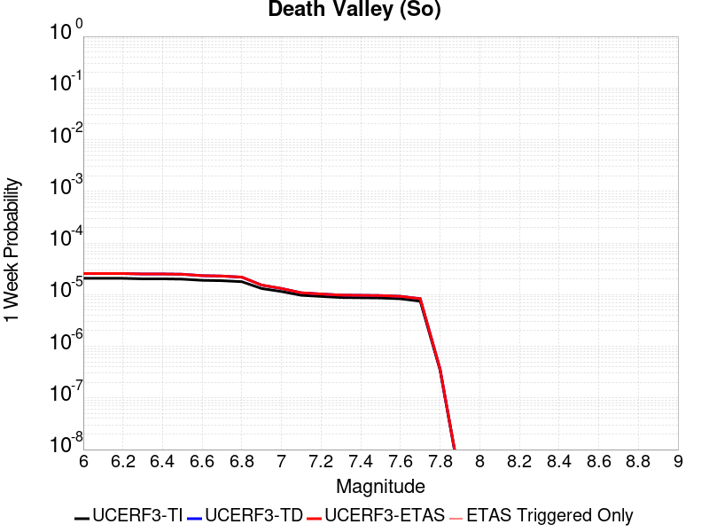 | 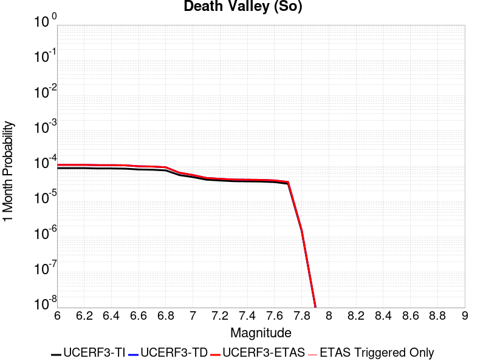 | 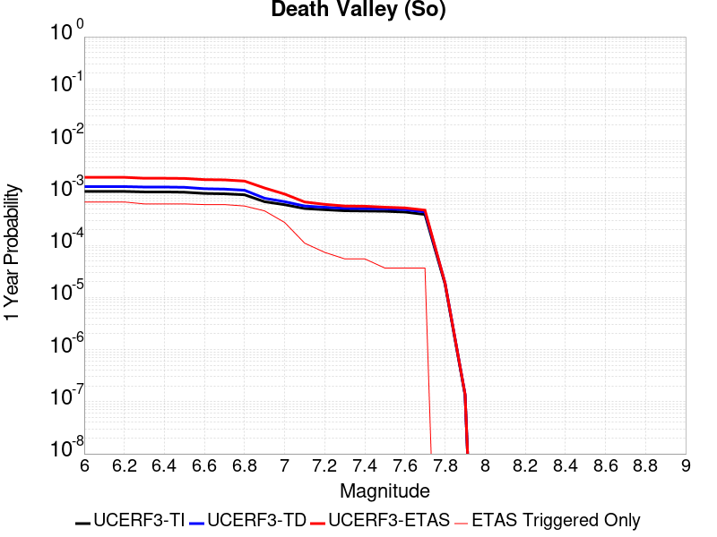 | 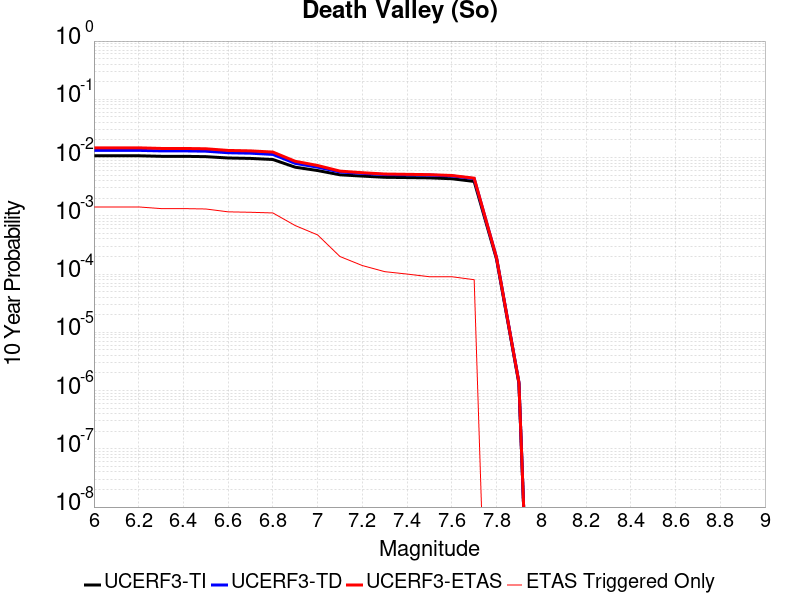 |

| Magnitude | 1 wk TI Prob | 1 wk TD Prob | 1 wk ETAS Prob | 1 wk ETAS/TD Gain | 1 wk ETAS Triggered Only | 1 mo TI Prob | 1 mo TD Prob | 1 mo ETAS Prob | 1 mo ETAS/TD Gain | 1 mo ETAS Triggered Only | 1 yr TI Prob | 1 yr TD Prob | 1 yr ETAS Prob | 1 yr ETAS/TD Gain | 1 yr ETAS Triggered Only | 10 yr TI Prob | 10 yr TD Prob | 10 yr ETAS Prob | 10 yr ETAS/TD Gain | 10 yr ETAS Triggered Only |
|-----|-----|-----|-----|-----|-----|-----|-----|-----|-----|-----|-----|-----|-----|-----|-----|-----|-----|-----|-----|-----|
| 6.0 | 2.0684236E-5 | 2.5622945E-5 | 2.5622945E-5 | 1.0 | 0.0 | 8.864371E-5 | 1.098081E-4 | 1.6474712E-4 | 1.5003185 | 5.4945056E-5 | 0.0010787029 | 0.0013361105 | 0.0019287243 | 1.4435364 | 5.934066E-4 | 0.010734817 | 0.013284055 | 0.014693649 | 1.1061118 | 0.0014285714 |
| 6.1 | 2.0684236E-5 | 2.5622945E-5 | 2.5622945E-5 | 1.0 | 0.0 | 8.864371E-5 | 1.098081E-4 | 1.6474712E-4 | 1.5003185 | 5.4945056E-5 | 0.0010787029 | 0.0013361105 | 0.0019287243 | 1.4435364 | 5.934066E-4 | 0.010734817 | 0.013284055 | 0.014693649 | 1.1061118 | 0.0014285714 |
| 6.2 | 2.0684236E-5 | 2.5622945E-5 | 2.5622945E-5 | 1.0 | 0.0 | 8.864371E-5 | 1.098081E-4 | 1.6474712E-4 | 1.5003185 | 5.4945056E-5 | 0.0010787029 | 0.0013361105 | 0.0019287243 | 1.4435364 | 5.934066E-4 | 0.010734817 | 0.013284055 | 0.014693649 | 1.1061118 | 0.0014285714 |
| 6.3 | 2.0240292E-5 | 2.5122963E-5 | 2.5122963E-5 | 1.0 | 0.0 | 8.6741224E-5 | 1.0766549E-4 | 1.6260463E-4 | 1.5102762 | 5.4945056E-5 | 0.0010555626 | 0.0013100558 | 0.001847812 | 1.4104834 | 5.3846155E-4 | 0.010505628 | 0.01302658 | 0.014360622 | 1.1024091 | 0.0013516484 |
| 6.4 | 2.0240292E-5 | 2.5122963E-5 | 2.5122963E-5 | 1.0 | 0.0 | 8.6741224E-5 | 1.0766549E-4 | 1.6260463E-4 | 1.5102762 | 5.4945056E-5 | 0.0010555626 | 0.0013100558 | 0.001847812 | 1.4104834 | 5.3846155E-4 | 0.010505628 | 0.01302658 | 0.014360622 | 1.1024091 | 0.0013516484 |
| 6.5 | 1.9962767E-5 | 2.4812176E-5 | 2.4812176E-5 | 1.0 | 0.0 | 8.55519E-5 | 1.0633366E-4 | 1.6127287E-4 | 1.5166681 | 5.4945056E-5 | 0.0010410968 | 0.0012938601 | 0.001831625 | 1.4156283 | 5.3846155E-4 | 0.010362327 | 0.012866507 | 0.014179069 | 1.1020138 | 0.0013296703 |
| 6.6 | 1.8937297E-5 | 2.3315795E-5 | 2.3315795E-5 | 1.0 | 0.0 | 8.115732E-5 | 9.992109E-5 | 1.5486065E-4 | 1.5498295 | 5.4945056E-5 | 9.876423E-4 | 0.0012158749 | 0.0017317304 | 1.4242669 | 5.164835E-4 | 0.009832645 | 0.012095276 | 0.0132785905 | 1.0978328 | 0.0011978023 |
| 6.7 | 1.8621096E-5 | 2.2916385E-5 | 2.2916385E-5 | 1.0 | 0.0 | 7.980225E-5 | 9.820946E-5 | 1.5314911E-4 | 1.5594131 | 5.4945056E-5 | 9.711593E-4 | 0.0011950588 | 0.0016999493 | 1.4224817 | 5.054945E-4 | 0.009669261 | 0.0118893655 | 0.01305121 | 1.0977213 | 0.0011758242 |
| 6.8 | 1.7830353E-5 | 2.1810167E-5 | 2.1810167E-5 | 1.0 | 0.0 | 7.641356E-5 | 9.346887E-5 | 1.484088E-4 | 1.5877885 | 5.4945056E-5 | 9.29938E-4 | 0.0011374034 | 0.00162037 | 1.4246219 | 4.835165E-4 | 0.009260561 | 0.011318663 | 0.012448585 | 1.0998281 | 0.0011428571 |
| 6.9 | 1.3135183E-5 | 1.5306456E-5 | 1.5306456E-5 | 1.0 | 0.0 | 5.6292425E-5 | 6.559749E-5 | 9.8562356E-5 | 1.5025326 | 3.2967033E-5 | 6.8514474E-4 | 7.983632E-4 | 0.0011716912 | 1.4676168 | 3.7362636E-4 | 0.006830362 | 0.007955958 | 0.008642758 | 1.0863252 | 6.923077E-4 |
| 7.0 | 1.1507512E-5 | 1.31561565E-5 | 1.31561565E-5 | 1.0 | 0.0 | 4.9316975E-5 | 5.638234E-5 | 7.8359124E-5 | 1.3897814 | 2.1978021E-5 | 6.002687E-4 | 6.862446E-4 | 9.4979984E-4 | 1.3840544 | 2.6373626E-4 | 0.0059864987 | 0.0068419557 | 0.007333078 | 1.0717809 | 4.945055E-4 |
| 7.1 | 9.715903E-6 | 1.08666845E-5 | 1.08666845E-5 | 1.0 | 0.0 | 4.1638916E-5 | 4.6570698E-5 | 6.85477E-5 | 1.4719062 | 2.1978021E-5 | 5.068359E-4 | 5.66855E-4 | 7.0963113E-4 | 1.2518742 | 1.4285714E-4 | 0.0050568148 | 0.0056545446 | 0.0058730817 | 1.0386481 | 2.1978022E-4 |
| 7.2 | 9.233269E-6 | 1.0287612E-5 | 1.0287612E-5 | 1.0 | 0.0 | 3.9570554E-5 | 4.4089044E-5 | 4.4089044E-5 | 1.0 | 0.0 | 4.81665E-4 | 5.366561E-4 | 6.3550414E-4 | 1.1841925 | 9.89011E-5 | 0.0048062233 | 0.0053540333 | 0.0055070557 | 1.0285808 | 1.5384615E-4 |
| 7.3 | 8.8041315E-6 | 9.809357E-6 | 9.809357E-6 | 1.0 | 0.0 | 3.7731446E-5 | 4.2039446E-5 | 4.2039446E-5 | 1.0 | 0.0 | 4.592835E-4 | 5.1171426E-4 | 5.8859796E-4 | 1.1502473 | 7.6923076E-5 | 0.0045833546 | 0.0051057865 | 0.0052260486 | 1.0235541 | 1.2087912E-4 |
| 7.4 | 8.708749E-6 | 9.708361E-6 | 9.708361E-6 | 1.0 | 0.0 | 3.7322676E-5 | 4.160662E-5 | 4.160662E-5 | 1.0 | 0.0 | 4.5430884E-4 | 5.064471E-4 | 5.723478E-4 | 1.1301235 | 6.5934066E-5 | 0.004533812 | 0.005053356 | 0.0051626903 | 1.0216361 | 1.0989011E-4 |
| 7.5 | 8.612678E-6 | 9.605997E-6 | 9.605997E-6 | 1.0 | 0.0 | 3.6910955E-5 | 4.116793E-5 | 4.116793E-5 | 1.0 | 0.0 | 4.492982E-4 | 5.011085E-4 | 5.56026E-4 | 1.1095921 | 5.4945056E-5 | 0.004483909 | 0.005000211 | 0.0050986176 | 1.0196805 | 9.89011E-5 |
| 7.6 | 8.319024E-6 | 9.285063E-6 | 9.285063E-6 | 1.0 | 0.0 | 3.5652476E-5 | 3.9792547E-5 | 3.9792547E-5 | 1.0 | 0.0 | 4.3398244E-4 | 4.8437074E-4 | 5.392892E-4 | 1.113381 | 5.4945056E-5 | 0.0043313587 | 0.004833574 | 0.004931997 | 1.0203624 | 9.89011E-5 |
| 7.7 | 7.4718328E-6 | 8.346208E-6 | 8.346208E-6 | 1.0 | 0.0 | 3.2021748E-5 | 3.5768997E-5 | 3.5768997E-5 | 1.0 | 0.0 | 3.8979502E-4 | 4.3540457E-4 | 4.7934148E-4 | 1.1009105 | 4.3956043E-5 | 0.00389112 | 0.0043459204 | 0.0044334503 | 1.0201408 | 8.7912085E-5 |
| 7.8 | 3.4586725E-7 | 3.6484747E-7 | 3.6484747E-7 | 1.0 | 0.0 | 1.4822873E-6 | 1.5636311E-6 | 1.5636311E-6 | 1.0 | 0.0 | 1.80467E-5 | 1.9037047E-5 | 1.9037047E-5 | 1.0 | 0.0 | 1.8045233E-4 | 1.9035459E-4 | 1.9035459E-4 | 1.0 | 0.0 |
| 7.9 | 2.5591178E-9 | 2.6697942E-9 | 2.6697942E-9 | 1.0 | 0.0 | 1.0967647E-8 | 1.14419745E-8 | 1.14419745E-8 | 1.0 | 0.0 | 1.335311E-7 | 1.3930604E-7 | 1.3930604E-7 | 1.0 | 0.0 | 1.3353102E-6 | 1.3930604E-6 | 1.3930604E-6 | 1.0 | 0.0 |

## Coyote Canyon
*[(top)](#table-of-contents)*

| 1 Week | 1 Month | 1 Year | 10 Year |
|-----|-----|-----|-----|
| 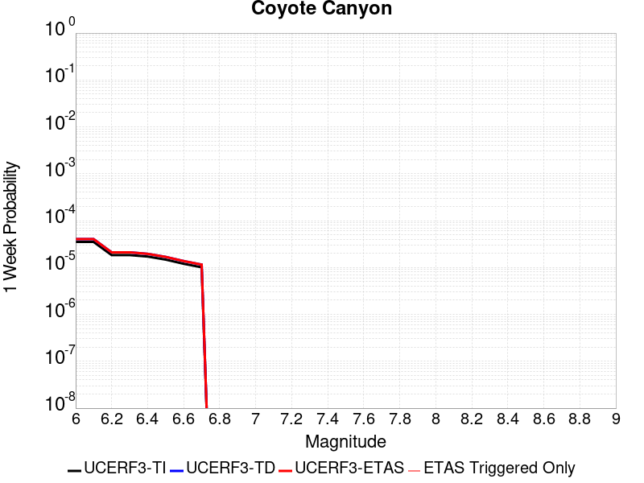 | 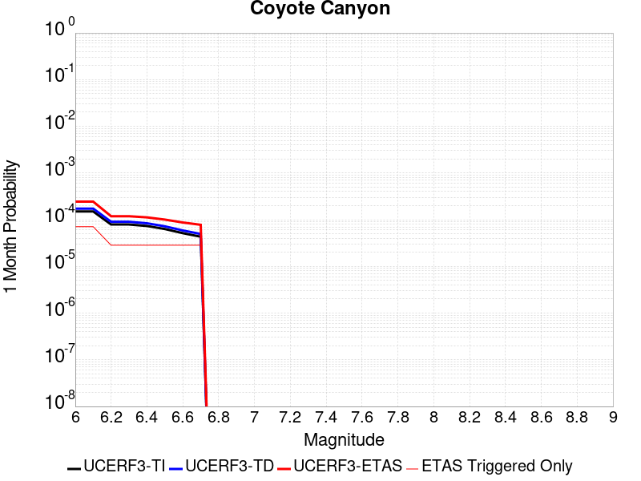 | 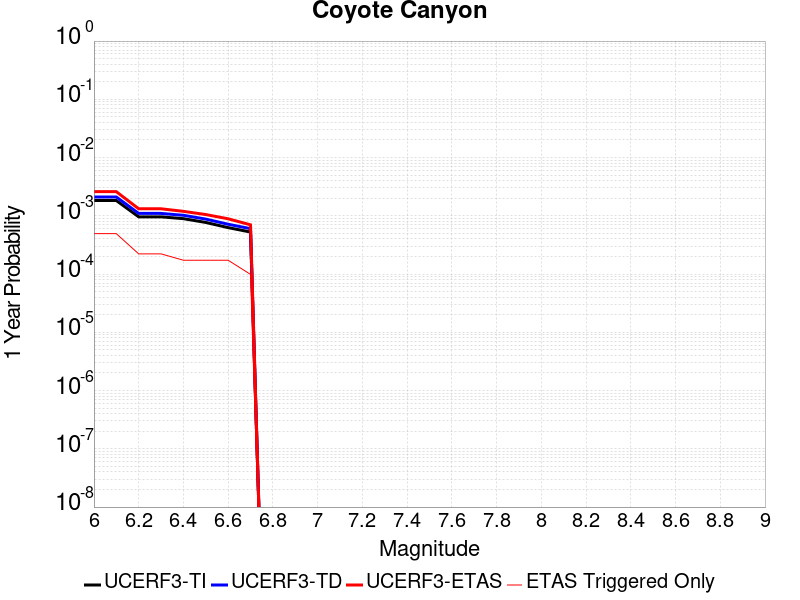 | 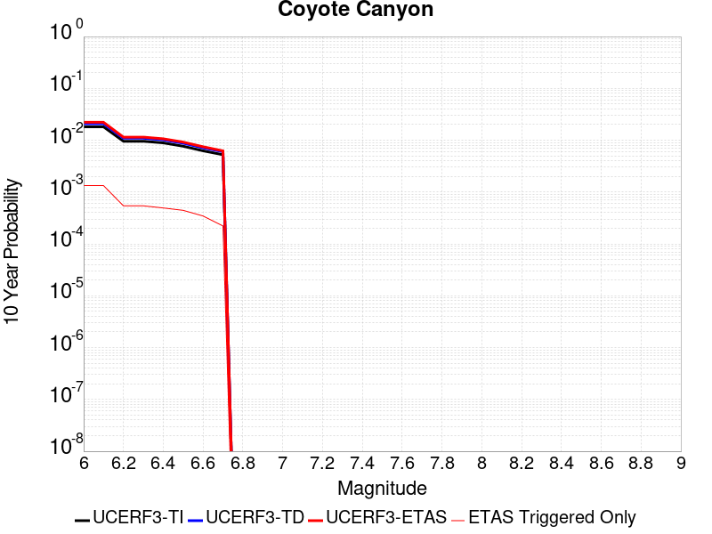 |

| Magnitude | 1 wk TI Prob | 1 wk TD Prob | 1 wk ETAS Prob | 1 wk ETAS/TD Gain | 1 wk ETAS Triggered Only | 1 mo TI Prob | 1 mo TD Prob | 1 mo ETAS Prob | 1 mo ETAS/TD Gain | 1 mo ETAS Triggered Only | 1 yr TI Prob | 1 yr TD Prob | 1 yr ETAS Prob | 1 yr ETAS/TD Gain | 1 yr ETAS Triggered Only | 10 yr TI Prob | 10 yr TD Prob | 10 yr ETAS Prob | 10 yr ETAS/TD Gain | 10 yr ETAS Triggered Only |
|-----|-----|-----|-----|-----|-----|-----|-----|-----|-----|-----|-----|-----|-----|-----|-----|-----|-----|-----|-----|-----|
| 6.0 | 3.5090034E-5 | 4.0370767E-5 | 4.0370767E-5 | 1.0 | 0.0 | 1.503772E-4 | 1.7300747E-4 | 2.2794303E-4 | 1.3175328 | 5.4945056E-5 | 0.0018293047 | 0.002104588 | 0.0025761211 | 1.22405 | 4.7252746E-4 | 0.018143194 | 0.020872502 | 0.022109862 | 1.0592818 | 0.0012637363 |
| 6.1 | 3.5090034E-5 | 4.0370767E-5 | 4.0370767E-5 | 1.0 | 0.0 | 1.503772E-4 | 1.7300747E-4 | 2.2794303E-4 | 1.3175328 | 5.4945056E-5 | 0.0018293047 | 0.002104588 | 0.0025761211 | 1.22405 | 4.7252746E-4 | 0.018143194 | 0.020872502 | 0.022109862 | 1.0592818 | 0.0012637363 |
| 6.2 | 1.841879E-5 | 2.1062999E-5 | 2.1062999E-5 | 1.0 | 0.0 | 7.8935285E-5 | 9.0267444E-5 | 1.12243484E-4 | 1.2434547 | 2.1978021E-5 | 9.606133E-4 | 0.001098554 | 0.001296139 | 1.179859 | 1.978022E-4 | 0.0095647145 | 0.010941325 | 0.01151737 | 1.0526485 | 5.824176E-4 |
| 6.3 | 1.841879E-5 | 2.1062999E-5 | 2.1062999E-5 | 1.0 | 0.0 | 7.8935285E-5 | 9.0267444E-5 | 1.12243484E-4 | 1.2434547 | 2.1978021E-5 | 9.606133E-4 | 0.001098554 | 0.001296139 | 1.179859 | 1.978022E-4 | 0.0095647145 | 0.010941325 | 0.01151737 | 1.0526485 | 5.824176E-4 |
| 6.4 | 1.712201E-5 | 1.9568175E-5 | 1.9568175E-5 | 1.0 | 0.0 | 7.337798E-5 | 8.386148E-5 | 1.0583766E-4 | 1.2620534 | 2.1978021E-5 | 8.930107E-4 | 0.0010206358 | 0.0011853027 | 1.1613376 | 1.6483516E-4 | 0.008894307 | 0.010169405 | 0.010713267 | 1.0534803 | 5.494506E-4 |
| 6.5 | 1.4744935E-5 | 1.6839507E-5 | 1.6839507E-5 | 1.0 | 0.0 | 6.3191044E-5 | 7.216785E-5 | 9.4144285E-5 | 1.3045183 | 2.1978021E-5 | 7.6907943E-4 | 8.783829E-4 | 0.0010430733 | 1.1874927 | 1.6483516E-4 | 0.007664232 | 0.008758309 | 0.009248484 | 1.0559667 | 4.945055E-4 |
| 6.6 | 1.2017839E-5 | 1.3726158E-5 | 1.3726158E-5 | 1.0 | 0.0 | 5.150401E-5 | 5.8825564E-5 | 8.0802296E-5 | 1.3735914 | 2.1978021E-5 | 6.268809E-4 | 7.1605446E-4 | 8.5880933E-4 | 1.1993631 | 1.4285714E-4 | 0.0062511545 | 0.007146168 | 0.007549856 | 1.0564901 | 4.065934E-4 |
| 6.7 | 1.00956095E-5 | 1.15352605E-5 | 1.15352605E-5 | 1.0 | 0.0 | 4.326618E-5 | 4.9436385E-5 | 7.141332E-5 | 1.4445498 | 2.1978021E-5 | 5.266384E-4 | 6.018088E-4 | 7.0065033E-4 | 1.1642408 | 9.89011E-5 | 0.005253921 | 0.00601032 | 0.0063270857 | 1.0527036 | 3.1868133E-4 |

## Nelson Lake
*[(top)](#table-of-contents)*

| 1 Week | 1 Month | 1 Year | 10 Year |
|-----|-----|-----|-----|
| 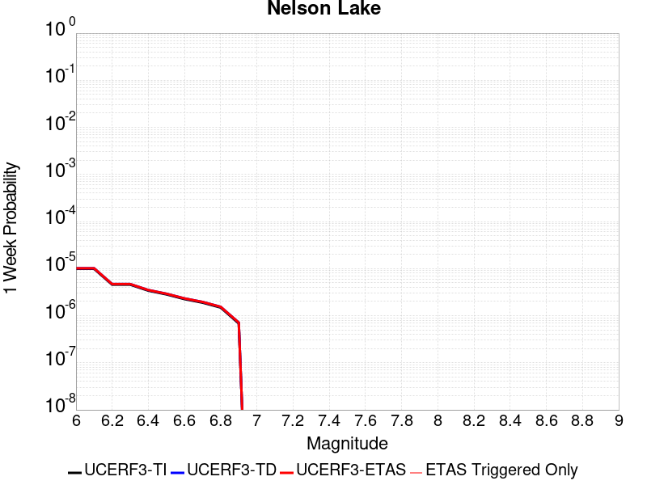 | 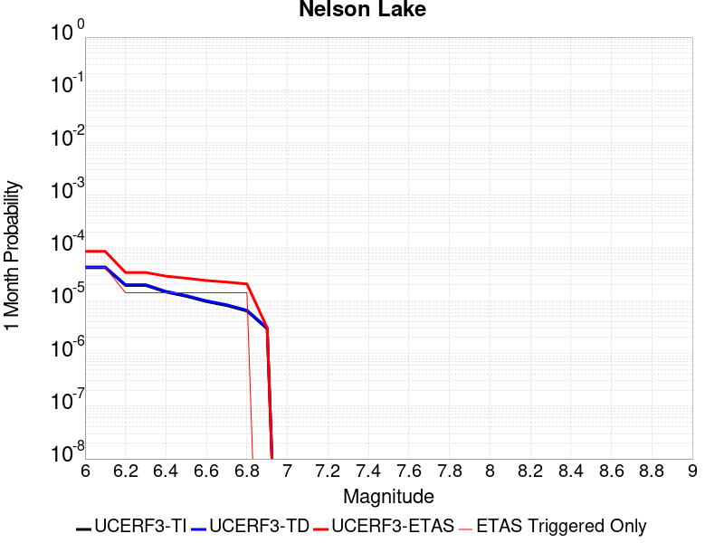 | 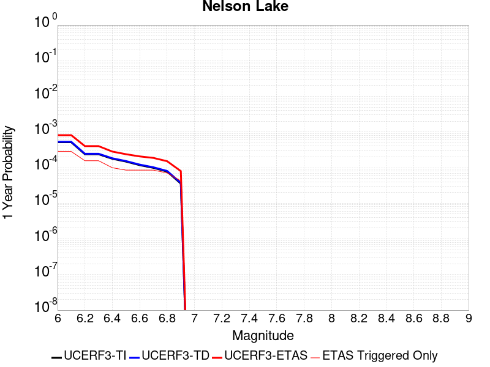 | 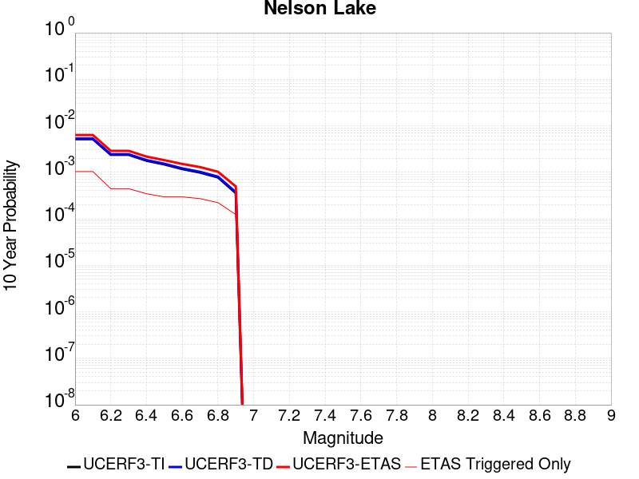 |

| Magnitude | 1 wk TI Prob | 1 wk TD Prob | 1 wk ETAS Prob | 1 wk ETAS/TD Gain | 1 wk ETAS Triggered Only | 1 mo TI Prob | 1 mo TD Prob | 1 mo ETAS Prob | 1 mo ETAS/TD Gain | 1 mo ETAS Triggered Only | 1 yr TI Prob | 1 yr TD Prob | 1 yr ETAS Prob | 1 yr ETAS/TD Gain | 1 yr ETAS Triggered Only | 10 yr TI Prob | 10 yr TD Prob | 10 yr ETAS Prob | 10 yr ETAS/TD Gain | 10 yr ETAS Triggered Only |
|-----|-----|-----|-----|-----|-----|-----|-----|-----|-----|-----|-----|-----|-----|-----|-----|-----|-----|-----|-----|-----|
| 6.0 | 9.913453E-6 | 1.019256E-5 | 2.1181459E-5 | 2.0781295 | 1.0989011E-5 | 4.2485535E-5 | 4.3681728E-5 | 9.862438E-5 | 2.2577949 | 5.4945056E-5 | 5.1713863E-4 | 5.3170556E-4 | 8.282511E-4 | 1.5577251 | 2.967033E-4 | 0.0051593683 | 0.005305362 | 0.006431225 | 1.2122123 | 0.0011318681 |
| 6.1 | 9.913453E-6 | 1.019256E-5 | 2.1181459E-5 | 2.0781295 | 1.0989011E-5 | 4.2485535E-5 | 4.3681728E-5 | 9.862438E-5 | 2.2577949 | 5.4945056E-5 | 5.1713863E-4 | 5.3170556E-4 | 8.282511E-4 | 1.5577251 | 2.967033E-4 | 0.0051593683 | 0.005305362 | 0.006431225 | 1.2122123 | 0.0011318681 |
| 6.2 | 4.5596407E-6 | 4.696463E-6 | 4.696463E-6 | 1.0 | 0.0 | 1.954117E-5 | 2.0127549E-5 | 5.3093918E-5 | 2.637873 | 3.2967033E-5 | 2.3788778E-4 | 2.4502663E-4 | 4.3179403E-4 | 1.7622331 | 1.8681318E-4 | 0.0023763329 | 0.0024476908 | 0.0030177205 | 1.2328848 | 5.7142857E-4 |
| 6.3 | 4.5596407E-6 | 4.696463E-6 | 4.696463E-6 | 1.0 | 0.0 | 1.954117E-5 | 2.0127549E-5 | 5.3093918E-5 | 2.637873 | 3.2967033E-5 | 2.3788778E-4 | 2.4502663E-4 | 4.3179403E-4 | 1.7622331 | 1.8681318E-4 | 0.0023763329 | 0.0024476908 | 0.0030177205 | 1.2328848 | 5.7142857E-4 |
| 6.4 | 3.4025713E-6 | 3.510015E-6 | 3.510015E-6 | 1.0 | 0.0 | 1.4582367E-5 | 1.504284E-5 | 3.702053E-5 | 2.4610069 | 2.1978021E-5 | 1.7752586E-4 | 1.8313201E-4 | 3.14976E-4 | 1.7199396 | 1.3186813E-4 | 0.001773841 | 0.001829894 | 0.002279619 | 1.2457656 | 4.5054944E-4 |
| 6.5 | 2.8352947E-6 | 2.9279577E-6 | 2.9279577E-6 | 1.0 | 0.0 | 1.2151207E-5 | 1.2548334E-5 | 2.3537208E-5 | 1.8757236 | 1.0989011E-5 | 1.479309E-4 | 1.52766E-4 | 2.6263934E-4 | 1.7192262 | 1.0989011E-4 | 0.0014783246 | 0.0015266838 | 0.0018997397 | 1.2443571 | 3.7362636E-4 |
| 6.6 | 2.251518E-6 | 2.329153E-6 | 2.329153E-6 | 1.0 | 0.0 | 9.649328E-6 | 9.982049E-6 | 2.097095E-5 | 2.1008663 | 1.0989011E-5 | 1.1747423E-4 | 1.215253E-4 | 2.2041438E-4 | 1.8137325 | 9.89011E-5 | 0.0011741214 | 0.0012146502 | 0.0015658714 | 1.2891542 | 3.5164834E-4 |
| 6.7 | 1.8911853E-6 | 1.9592146E-6 | 1.9592146E-6 | 1.0 | 0.0 | 8.105055E-6 | 8.39661E-6 | 1.9385529E-5 | 2.3087327 | 1.0989011E-5 | 9.867457E-5 | 1.0222452E-4 | 2.011155E-4 | 1.9673902 | 9.89011E-5 | 9.863076E-4 | 0.0010218325 | 0.0013511659 | 1.322297 | 3.2967032E-4 |
| 6.8 | 1.4874814E-6 | 1.5438926E-6 | 1.5438926E-6 | 1.0 | 0.0 | 6.374905E-6 | 6.616669E-6 | 1.7605607E-5 | 2.6607962 | 1.0989011E-5 | 7.76117E-5 | 8.055549E-5 | 1.5747237E-4 | 1.954831 | 7.6923076E-5 | 7.75846E-4 | 8.05314E-4 | 0.0010907982 | 1.3545005 | 2.8571428E-4 |
| 6.9 | 6.835972E-7 | 7.140265E-7 | 7.140265E-7 | 1.0 | 0.0 | 2.9296991E-6 | 3.0601118E-6 | 3.0601118E-6 | 1.0 | 0.0 | 3.56685E-5 | 3.7256545E-5 | 7.022235E-5 | 1.8848326 | 3.2967033E-5 | 3.5662777E-4 | 3.7253424E-4 | 5.1533815E-4 | 1.3833311 | 1.4285714E-4 |

## San Andreas (Mojave N)
*[(top)](#table-of-contents)*

| 1 Week | 1 Month | 1 Year | 10 Year |
|-----|-----|-----|-----|
| 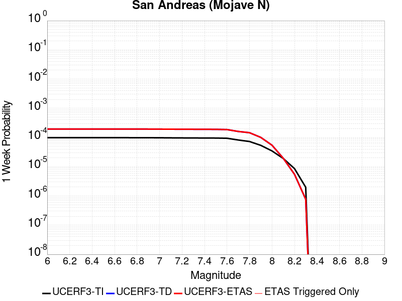 | 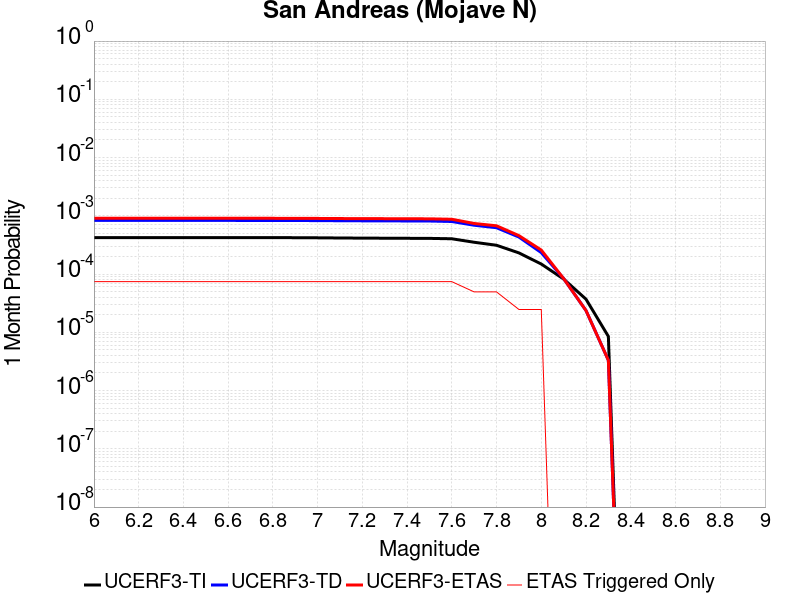 | 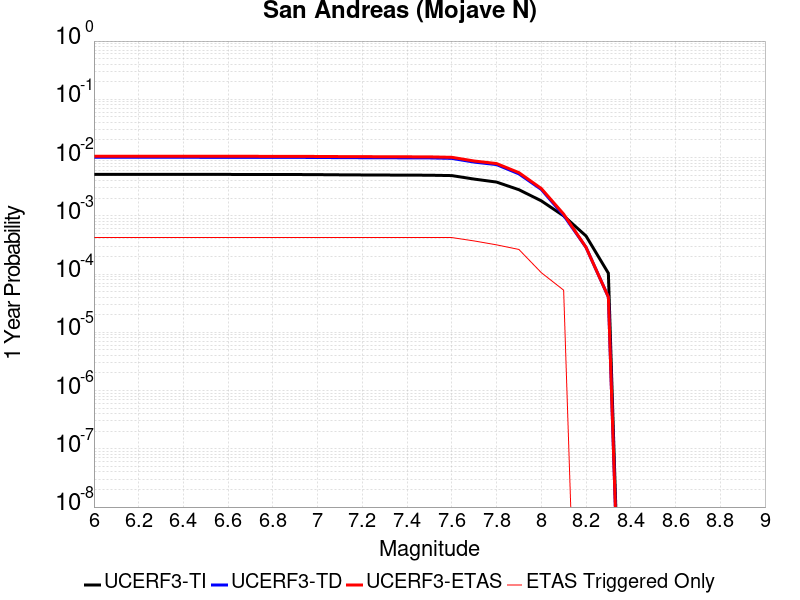 | 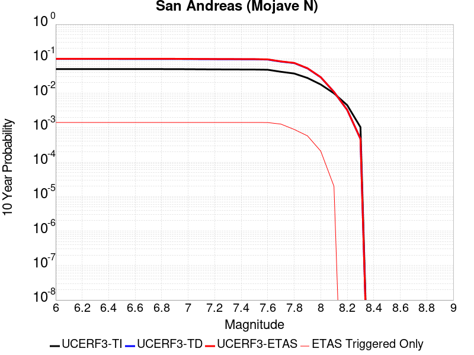 |

| Magnitude | 1 wk TI Prob | 1 wk TD Prob | 1 wk ETAS Prob | 1 wk ETAS/TD Gain | 1 wk ETAS Triggered Only | 1 mo TI Prob | 1 mo TD Prob | 1 mo ETAS Prob | 1 mo ETAS/TD Gain | 1 mo ETAS Triggered Only | 1 yr TI Prob | 1 yr TD Prob | 1 yr ETAS Prob | 1 yr ETAS/TD Gain | 1 yr ETAS Triggered Only | 10 yr TI Prob | 10 yr TD Prob | 10 yr ETAS Prob | 10 yr ETAS/TD Gain | 10 yr ETAS Triggered Only |
|-----|-----|-----|-----|-----|-----|-----|-----|-----|-----|-----|-----|-----|-----|-----|-----|-----|-----|-----|-----|-----|
| 6.0 | 9.877682E-5 | 1.9470563E-4 | 2.056925E-4 | 1.0564281 | 1.0989011E-5 | 4.2326056E-4 | 8.3418604E-4 | 9.549643E-4 | 1.1447858 | 1.2087912E-4 | 0.0051410277 | 0.010109048 | 0.010598554 | 1.0484226 | 4.945055E-4 | 0.05023708 | 0.09862055 | 0.09983889 | 1.0123539 | 0.0013516484 |
| 6.1 | 9.877682E-5 | 1.9470563E-4 | 2.056925E-4 | 1.0564281 | 1.0989011E-5 | 4.2326056E-4 | 8.3418604E-4 | 9.549643E-4 | 1.1447858 | 1.2087912E-4 | 0.0051410277 | 0.010109048 | 0.010598554 | 1.0484226 | 4.945055E-4 | 0.05023708 | 0.09862055 | 0.09983889 | 1.0123539 | 0.0013516484 |
| 6.2 | 9.877682E-5 | 1.9470563E-4 | 2.056925E-4 | 1.0564281 | 1.0989011E-5 | 4.2326056E-4 | 8.3418604E-4 | 9.549643E-4 | 1.1447858 | 1.2087912E-4 | 0.0051410277 | 0.010109048 | 0.010598554 | 1.0484226 | 4.945055E-4 | 0.05023708 | 0.09862055 | 0.09983889 | 1.0123539 | 0.0013516484 |
| 6.3 | 9.877682E-5 | 1.9470563E-4 | 2.056925E-4 | 1.0564281 | 1.0989011E-5 | 4.2326056E-4 | 8.3418604E-4 | 9.549643E-4 | 1.1447858 | 1.2087912E-4 | 0.0051410277 | 0.010109048 | 0.010598554 | 1.0484226 | 4.945055E-4 | 0.05023708 | 0.09862055 | 0.09983889 | 1.0123539 | 0.0013516484 |
| 6.4 | 9.877682E-5 | 1.9470563E-4 | 2.056925E-4 | 1.0564281 | 1.0989011E-5 | 4.2326056E-4 | 8.3418604E-4 | 9.549643E-4 | 1.1447858 | 1.2087912E-4 | 0.0051410277 | 0.010109048 | 0.010598554 | 1.0484226 | 4.945055E-4 | 0.05023708 | 0.09862055 | 0.09983889 | 1.0123539 | 0.0013516484 |
| 6.5 | 9.861474E-5 | 1.9444308E-4 | 2.0542995E-4 | 1.0565044 | 1.0989011E-5 | 4.2256617E-4 | 8.330615E-4 | 9.5384E-4 | 1.1449814 | 1.2087912E-4 | 0.0051326132 | 0.010095485 | 0.010584997 | 1.0484884 | 4.945055E-4 | 0.050156746 | 0.09849829 | 0.099716805 | 1.012371 | 0.0013516484 |
| 6.6 | 9.861474E-5 | 1.9444308E-4 | 2.0542995E-4 | 1.0565044 | 1.0989011E-5 | 4.2256617E-4 | 8.330615E-4 | 9.5384E-4 | 1.1449814 | 1.2087912E-4 | 0.0051326132 | 0.010095485 | 0.010584997 | 1.0484884 | 4.945055E-4 | 0.050156746 | 0.09849829 | 0.099716805 | 1.012371 | 0.0013516484 |
| 6.7 | 9.8552715E-5 | 1.9434253E-4 | 2.053294E-4 | 1.0565336 | 1.0989011E-5 | 4.223004E-4 | 8.326309E-4 | 9.5340936E-4 | 1.1450565 | 1.2087912E-4 | 0.0051293927 | 0.01009029 | 0.010579805 | 1.0485135 | 4.945055E-4 | 0.050125998 | 0.09845146 | 0.09967004 | 1.0123774 | 0.0013516484 |
| 6.8 | 9.8464974E-5 | 1.9419396E-4 | 2.0518083E-4 | 1.0565768 | 1.0989011E-5 | 4.219245E-4 | 8.319945E-4 | 9.527731E-4 | 1.1451675 | 1.2087912E-4 | 0.0051248376 | 0.010082614 | 0.010572134 | 1.0485508 | 4.945055E-4 | 0.05008251 | 0.09838142 | 0.09960009 | 1.0123872 | 0.0013516484 |
| 6.9 | 9.825824E-5 | 1.9387367E-4 | 2.0486055E-4 | 1.0566703 | 1.0989011E-5 | 4.2103877E-4 | 8.306228E-4 | 9.514015E-4 | 1.1454074 | 1.2087912E-4 | 0.0051141046 | 0.010066067 | 0.010555595 | 1.0486314 | 4.945055E-4 | 0.049980022 | 0.0982304 | 0.09944928 | 1.0124084 | 0.0013516484 |
| 7.0 | 9.781462E-5 | 1.9318653E-4 | 2.0417341E-4 | 1.0568719 | 1.0989011E-5 | 4.1913814E-4 | 8.2767976E-4 | 9.484588E-4 | 1.1459249 | 1.2087912E-4 | 0.005091073 | 0.010030566 | 0.010520112 | 1.0488054 | 4.945055E-4 | 0.04976007 | 0.09790654 | 0.09912585 | 1.0124538 | 0.0013516484 |
| 7.1 | 9.7121134E-5 | 1.9220255E-4 | 2.0318945E-4 | 1.0571631 | 1.0989011E-5 | 4.1616702E-4 | 8.234654E-4 | 9.4424497E-4 | 1.1466724 | 1.2087912E-4 | 0.005055068 | 0.009979728 | 0.010469298 | 1.0490565 | 4.945055E-4 | 0.04941613 | 0.0974427 | 0.09866264 | 1.0125196 | 0.0013516484 |
| 7.2 | 9.663819E-5 | 1.9150962E-4 | 2.0249654E-4 | 1.05737 | 1.0989011E-5 | 4.1409794E-4 | 8.204976E-4 | 9.412775E-4 | 1.1472033 | 1.2087912E-4 | 0.0050299936 | 0.009943925 | 0.010433513 | 1.0492349 | 4.945055E-4 | 0.049176537 | 0.09711572 | 0.0983361 | 1.0125662 | 0.0013516484 |
| 7.3 | 9.6277574E-5 | 1.9103377E-4 | 2.0202069E-4 | 1.0575129 | 1.0989011E-5 | 4.125529E-4 | 8.184595E-4 | 9.392397E-4 | 1.1475701 | 1.2087912E-4 | 0.0050112694 | 0.009919337 | 0.010408938 | 1.0493581 | 4.945055E-4 | 0.04899759 | 0.0968888 | 0.09810949 | 1.0125989 | 0.0013516484 |
| 7.4 | 9.593308E-5 | 1.9043051E-4 | 2.0141742E-4 | 1.0576952 | 1.0989011E-5 | 4.1107697E-4 | 8.1587565E-4 | 9.3665614E-4 | 1.1480379 | 1.2087912E-4 | 0.0049933824 | 0.009888166 | 0.010377781 | 1.0495154 | 4.945055E-4 | 0.04882661 | 0.096606605 | 0.09782768 | 1.0126396 | 0.0013516484 |
| 7.5 | 9.561707E-5 | 1.8989033E-4 | 2.0087726E-4 | 1.0578593 | 1.0989011E-5 | 4.0972308E-4 | 8.135621E-4 | 9.3434285E-4 | 1.1484592 | 1.2087912E-4 | 0.0049769743 | 0.009860253 | 0.010349883 | 1.0496569 | 4.945055E-4 | 0.048669744 | 0.09635244 | 0.097573854 | 1.0126765 | 0.0013516484 |
| 7.6 | 9.418194E-5 | 1.8640725E-4 | 1.9739421E-4 | 1.0589406 | 1.0989011E-5 | 4.0357444E-4 | 7.986438E-4 | 9.194264E-4 | 1.1512346 | 1.2087912E-4 | 0.004902454 | 0.00968025 | 0.010169969 | 1.0505894 | 4.945055E-4 | 0.047957025 | 0.09473289 | 0.09594654 | 1.0128113 | 0.0013406593 |
| 7.7 | 8.202141E-5 | 1.6084024E-4 | 1.7182747E-4 | 1.0683116 | 1.0989011E-5 | 3.51473E-4 | 6.8913325E-4 | 7.9894764E-4 | 1.1593515 | 1.0989011E-4 | 0.00427079 | 0.0083579775 | 0.0087938635 | 1.0521522 | 4.3956045E-4 | 0.04189639 | 0.08251305 | 0.08364227 | 1.0136853 | 0.0012307692 |
| 7.8 | 7.2859846E-5 | 1.4572877E-4 | 1.5671618E-4 | 1.0753963 | 1.0989011E-5 | 3.1221908E-4 | 6.244024E-4 | 7.342239E-4 | 1.1758826 | 1.0989011E-4 | 0.003794643 | 0.0075756432 | 0.007957345 | 1.0503854 | 3.8461538E-4 | 0.037304975 | 0.07497926 | 0.0757823 | 1.0107101 | 8.681319E-4 |
| 7.9 | 5.3874453E-5 | 1.00852405E-4 | 1.1184031E-4 | 1.1089504 | 1.0989011E-5 | 2.3087008E-4 | 4.32153E-4 | 4.9805857E-4 | 1.1525052 | 6.5934066E-5 | 0.0028072202 | 0.005248781 | 0.005511133 | 1.0499834 | 2.6373626E-4 | 0.02772022 | 0.052609485 | 0.05316126 | 1.0104882 | 5.824176E-4 |
| 8.0 | 3.468538E-5 | 5.4489446E-5 | 5.4489446E-5 | 1.0 | 0.0 | 1.4864317E-4 | 2.335053E-4 | 2.6646463E-4 | 1.1411502 | 3.2967033E-5 | 0.0018082283 | 0.0028392226 | 0.0029159272 | 1.027016 | 7.6923076E-5 | 0.017935853 | 0.02906005 | 0.029273443 | 1.0073432 | 2.1978022E-4 |
| 8.1 | 1.9152367E-5 | 1.9512683E-5 | 1.9512683E-5 | 1.0 | 0.0 | 8.207899E-5 | 8.362311E-5 | 9.4611205E-5 | 1.1314002 | 1.0989011E-5 | 9.988535E-4 | 0.0010176365 | 0.0010395922 | 1.0215751 | 2.1978021E-5 | 0.009943757 | 0.010913964 | 0.010935702 | 1.0019917 | 2.1978021E-5 |
| 8.2 | 8.643924E-6 | 5.5167247E-6 | 5.5167247E-6 | 1.0 | 0.0 | 3.704486E-5 | 2.3642891E-5 | 2.3642891E-5 | 1.0 | 0.0 | 4.5092785E-4 | 2.8781427E-4 | 2.8781427E-4 | 1.0 | 0.0 | 0.0045001395 | 0.0032716133 | 0.0032716133 | 1.0 | 0.0 |
| 8.3 | 1.983087E-6 | 7.731745E-7 | 7.731745E-7 | 1.0 | 0.0 | 8.498917E-6 | 3.313601E-6 | 3.313601E-6 | 1.0 | 0.0 | 1.034694E-4 | 4.0342362E-5 | 4.0342362E-5 | 1.0 | 0.0 | 0.0010342124 | 4.7608858E-4 | 4.7608858E-4 | 1.0 | 0.0 |

## Towne Pass
*[(top)](#table-of-contents)*

| 1 Week | 1 Month | 1 Year | 10 Year |
|-----|-----|-----|-----|
| 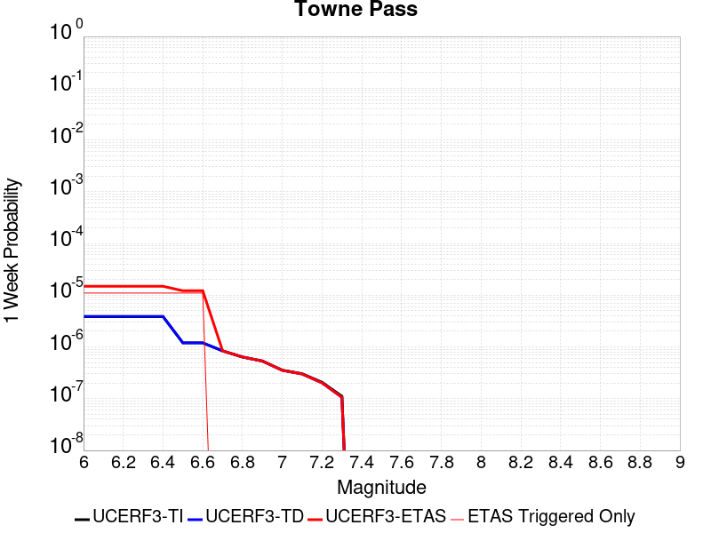 | 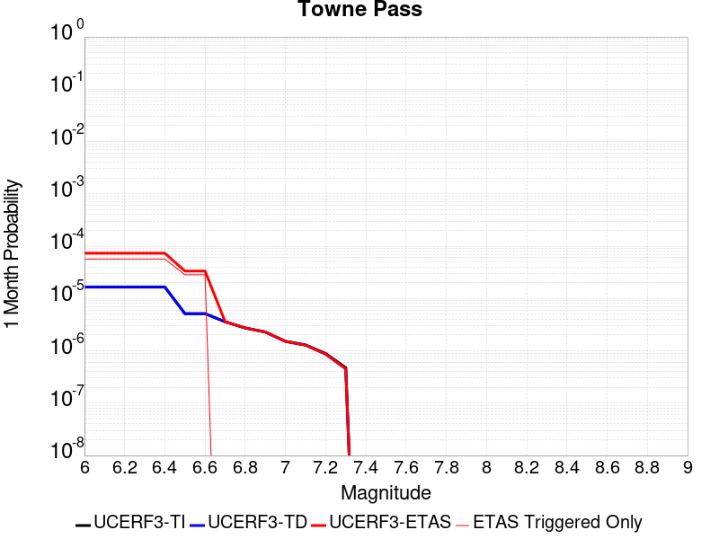 | 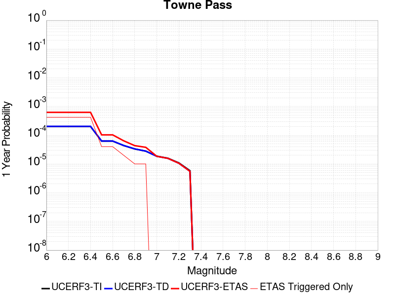 |  |

| Magnitude | 1 wk TI Prob | 1 wk TD Prob | 1 wk ETAS Prob | 1 wk ETAS/TD Gain | 1 wk ETAS Triggered Only | 1 mo TI Prob | 1 mo TD Prob | 1 mo ETAS Prob | 1 mo ETAS/TD Gain | 1 mo ETAS Triggered Only | 1 yr TI Prob | 1 yr TD Prob | 1 yr ETAS Prob | 1 yr ETAS/TD Gain | 1 yr ETAS Triggered Only | 10 yr TI Prob | 10 yr TD Prob | 10 yr ETAS Prob | 10 yr ETAS/TD Gain | 10 yr ETAS Triggered Only |
|-----|-----|-----|-----|-----|-----|-----|-----|-----|-----|-----|-----|-----|-----|-----|-----|-----|-----|-----|-----|-----|
| 6.0 | 3.849728E-6 | 3.8946073E-6 | 1.4883575E-5 | 3.8215857 | 1.0989011E-5 | 1.649873E-5 | 1.6691092E-5 | 7.163523E-5 | 4.291824 | 5.4945056E-5 | 2.0085352E-4 | 2.0319947E-4 | 6.316838E-4 | 3.1086884 | 4.2857142E-4 | 0.0020067208 | 0.0020305659 | 0.003214969 | 1.5832874 | 0.0011868132 |
| 6.1 | 3.849728E-6 | 3.8946073E-6 | 1.4883575E-5 | 3.8215857 | 1.0989011E-5 | 1.649873E-5 | 1.6691092E-5 | 7.163523E-5 | 4.291824 | 5.4945056E-5 | 2.0085352E-4 | 2.0319947E-4 | 6.316838E-4 | 3.1086884 | 4.2857142E-4 | 0.0020067208 | 0.0020305659 | 0.003214969 | 1.5832874 | 0.0011868132 |
| 6.2 | 3.849728E-6 | 3.8946073E-6 | 1.4883575E-5 | 3.8215857 | 1.0989011E-5 | 1.649873E-5 | 1.6691092E-5 | 7.163523E-5 | 4.291824 | 5.4945056E-5 | 2.0085352E-4 | 2.0319947E-4 | 6.316838E-4 | 3.1086884 | 4.2857142E-4 | 0.0020067208 | 0.0020305659 | 0.003214969 | 1.5832874 | 0.0011868132 |
| 6.3 | 3.849728E-6 | 3.8946073E-6 | 1.4883575E-5 | 3.8215857 | 1.0989011E-5 | 1.649873E-5 | 1.6691092E-5 | 7.163523E-5 | 4.291824 | 5.4945056E-5 | 2.0085352E-4 | 2.0319947E-4 | 6.316838E-4 | 3.1086884 | 4.2857142E-4 | 0.0020067208 | 0.0020305659 | 0.003214969 | 1.5832874 | 0.0011868132 |
| 6.4 | 3.849728E-6 | 3.8946073E-6 | 1.4883575E-5 | 3.8215857 | 1.0989011E-5 | 1.649873E-5 | 1.6691092E-5 | 7.163523E-5 | 4.291824 | 5.4945056E-5 | 2.0085352E-4 | 2.0319947E-4 | 6.316838E-4 | 3.1086884 | 4.2857142E-4 | 0.0020067208 | 0.0020305659 | 0.003214969 | 1.5832874 | 0.0011868132 |
| 6.5 | 1.1953545E-6 | 1.203078E-6 | 1.2192076E-5 | 10.134069 | 1.0989011E-5 | 5.1229376E-6 | 5.156039E-6 | 2.7133949E-5 | 5.2625566 | 2.1978021E-5 | 6.236998E-5 | 6.277309E-5 | 1.0672637E-4 | 1.7001932 | 4.3956043E-5 | 6.235248E-4 | 6.275653E-4 | 7.92297E-4 | 1.2624934 | 1.6483516E-4 |
| 6.6 | 1.1953545E-6 | 1.203078E-6 | 1.2192076E-5 | 10.134069 | 1.0989011E-5 | 5.1229376E-6 | 5.156039E-6 | 2.7133949E-5 | 5.2625566 | 2.1978021E-5 | 6.236998E-5 | 6.277309E-5 | 1.0672637E-4 | 1.7001932 | 4.3956043E-5 | 6.235248E-4 | 6.275653E-4 | 7.92297E-4 | 1.2624934 | 1.6483516E-4 |
| 6.7 | 8.375951E-7 | 8.4108854E-7 | 8.4108854E-7 | 1.0 | 0.0 | 3.5896885E-6 | 3.6046604E-6 | 3.6046604E-6 | 1.0 | 0.0 | 4.370358E-5 | 4.3885913E-5 | 6.586297E-5 | 1.500777 | 2.1978021E-5 | 4.3694986E-4 | 4.387782E-4 | 5.4862007E-4 | 1.2503358 | 1.0989011E-4 |
| 6.8 | 6.38041E-7 | 6.3923466E-7 | 6.3923466E-7 | 1.0 | 0.0 | 2.7344586E-6 | 2.7395745E-6 | 2.7395745E-6 | 1.0 | 0.0 | 3.3291526E-5 | 3.335385E-5 | 4.434249E-5 | 1.3294566 | 1.0989011E-5 | 3.3286537E-4 | 3.334922E-4 | 3.8841896E-4 | 1.1647017 | 5.4945056E-5 |
| 6.9 | 5.3460053E-7 | 5.3455096E-7 | 5.3455096E-7 | 1.0 | 0.0 | 2.2911431E-6 | 2.290931E-6 | 2.290931E-6 | 1.0 | 0.0 | 2.789431E-5 | 2.7891761E-5 | 3.8880466E-5 | 1.3939767 | 1.0989011E-5 | 2.789081E-4 | 2.788859E-4 | 3.228297E-4 | 1.157569 | 4.3956043E-5 |
| 7.0 | 3.557783E-7 | 3.532573E-7 | 3.532573E-7 | 1.0 | 0.0 | 1.5247632E-6 | 1.513959E-6 | 1.513959E-6 | 1.0 | 0.0 | 1.8563835E-5 | 1.8432303E-5 | 1.8432303E-5 | 1.0 | 0.0 | 1.8562283E-4 | 1.8430858E-4 | 2.1726954E-4 | 1.1788357 | 3.2967033E-5 |
| 7.1 | 3.037942E-7 | 3.0003585E-7 | 3.0003585E-7 | 1.0 | 0.0 | 1.3019744E-6 | 1.2858674E-6 | 1.2858674E-6 | 1.0 | 0.0 | 1.5851423E-5 | 1.565533E-5 | 1.565533E-5 | 1.0 | 0.0 | 1.5850292E-4 | 1.5654303E-4 | 1.8950489E-4 | 1.2105612 | 3.2967033E-5 |
| 7.2 | 2.0808248E-7 | 2.0218815E-7 | 2.0218815E-7 | 1.0 | 0.0 | 8.917818E-7 | 8.6652034E-7 | 8.6652034E-7 | 1.0 | 0.0 | 1.0857389E-5 | 1.0549839E-5 | 1.0549839E-5 | 1.0 | 0.0 | 1.0856859E-4 | 1.0549384E-4 | 1.1648169E-4 | 1.1041564 | 1.0989011E-5 |
| 7.3 | 1.1162073E-7 | 1.0637608E-7 | 1.0637608E-7 | 1.0 | 0.0 | 4.7837443E-7 | 4.558974E-7 | 4.558974E-7 | 1.0 | 0.0 | 5.8241935E-6 | 5.550539E-6 | 5.550539E-6 | 1.0 | 0.0 | 5.8240406E-5 | 5.5504202E-5 | 6.6492605E-5 | 1.1979742 | 1.0989011E-5 |

## Lenwood-Lockhart-Old Woman Springs
*[(top)](#table-of-contents)*

| 1 Week | 1 Month | 1 Year | 10 Year |
|-----|-----|-----|-----|
| 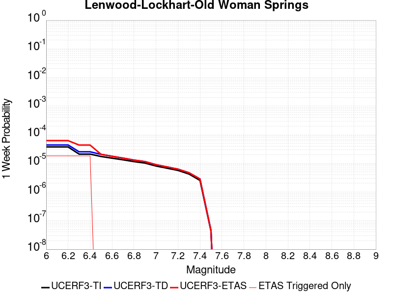 | 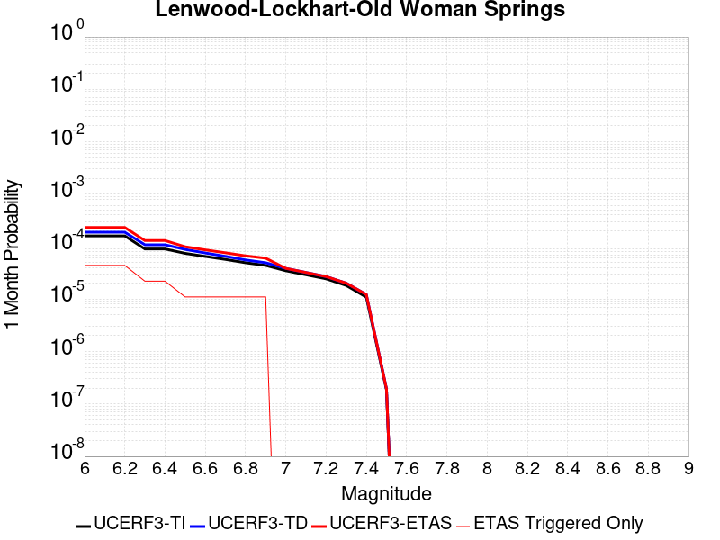 | 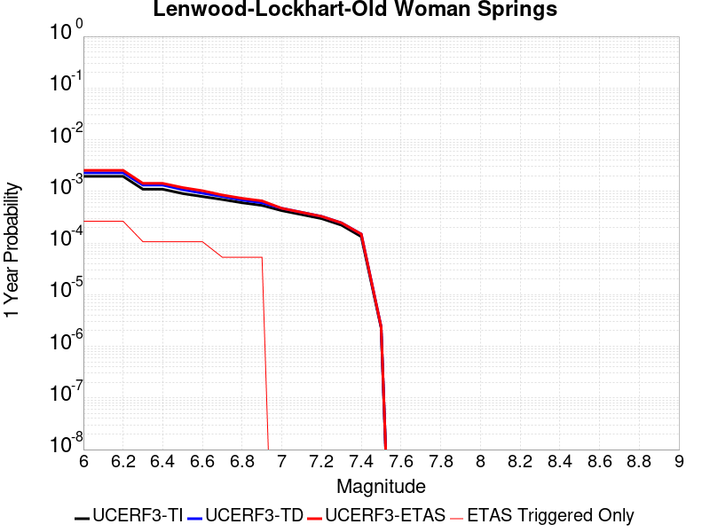 | 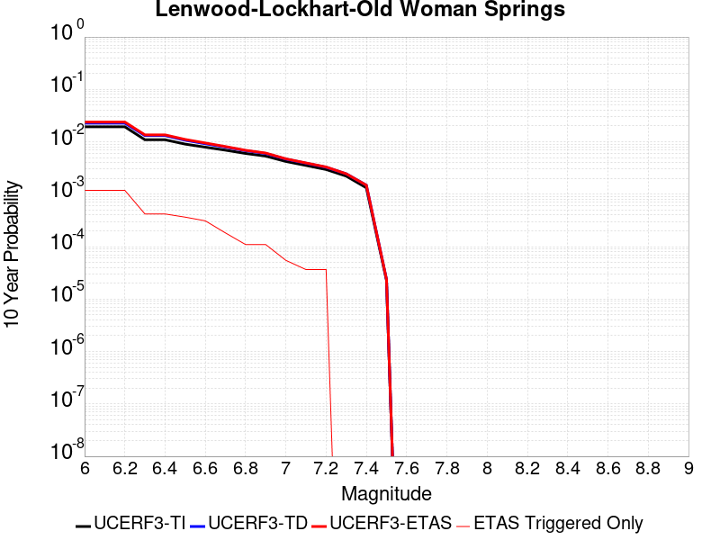 |

| Magnitude | 1 wk TI Prob | 1 wk TD Prob | 1 wk ETAS Prob | 1 wk ETAS/TD Gain | 1 wk ETAS Triggered Only | 1 mo TI Prob | 1 mo TD Prob | 1 mo ETAS Prob | 1 mo ETAS/TD Gain | 1 mo ETAS Triggered Only | 1 yr TI Prob | 1 yr TD Prob | 1 yr ETAS Prob | 1 yr ETAS/TD Gain | 1 yr ETAS Triggered Only | 10 yr TI Prob | 10 yr TD Prob | 10 yr ETAS Prob | 10 yr ETAS/TD Gain | 10 yr ETAS Triggered Only |
|-----|-----|-----|-----|-----|-----|-----|-----|-----|-----|-----|-----|-----|-----|-----|-----|-----|-----|-----|-----|-----|
| 6.0 | 3.744542E-5 | 4.396609E-5 | 5.495462E-5 | 1.2499319 | 1.0989011E-5 | 1.604705E-4 | 1.8841347E-4 | 2.3236124E-4 | 1.2332517 | 4.3956043E-5 | 0.0019519776 | 0.002291693 | 0.0027192822 | 1.1865823 | 4.2857142E-4 | 0.019349206 | 0.022698615 | 0.023794051 | 1.0482601 | 0.0011208791 |
| 6.1 | 3.744542E-5 | 4.396609E-5 | 5.495462E-5 | 1.2499319 | 1.0989011E-5 | 1.604705E-4 | 1.8841347E-4 | 2.3236124E-4 | 1.2332517 | 4.3956043E-5 | 0.0019519776 | 0.002291693 | 0.0027192822 | 1.1865823 | 4.2857142E-4 | 0.019349206 | 0.022698615 | 0.023794051 | 1.0482601 | 0.0011208791 |
| 6.2 | 3.744542E-5 | 4.396609E-5 | 5.495462E-5 | 1.2499319 | 1.0989011E-5 | 1.604705E-4 | 1.8841347E-4 | 2.3236124E-4 | 1.2332517 | 4.3956043E-5 | 0.0019519776 | 0.002291693 | 0.0027192822 | 1.1865823 | 4.2857142E-4 | 0.019349206 | 0.022698615 | 0.023794051 | 1.0482601 | 0.0011208791 |
| 6.3 | 2.1079984E-5 | 2.5354735E-5 | 3.6343466E-5 | 1.4333996 | 1.0989011E-5 | 9.0339665E-5 | 1.08658736E-4 | 1.3063438E-4 | 1.2022445 | 2.1978021E-5 | 0.0010993304 | 0.0013221373 | 0.0014538311 | 1.0996068 | 1.3186813E-4 | 0.010939079 | 0.013144928 | 0.013535332 | 1.0297 | 3.956044E-4 |
| 6.4 | 2.1079984E-5 | 2.5354735E-5 | 3.6343466E-5 | 1.4333996 | 1.0989011E-5 | 9.0339665E-5 | 1.08658736E-4 | 1.3063438E-4 | 1.2022445 | 2.1978021E-5 | 0.0010993304 | 0.0013221373 | 0.0014538311 | 1.0996068 | 1.3186813E-4 | 0.010939079 | 0.013144928 | 0.013535332 | 1.0297 | 3.956044E-4 |
| 6.5 | 1.7397282E-5 | 2.0663416E-5 | 2.0663416E-5 | 1.0 | 0.0 | 7.455765E-5 | 8.855456E-5 | 9.9542594E-5 | 1.1240821 | 1.0989011E-5 | 9.073613E-4 | 0.0010776302 | 0.0011764248 | 1.0916775 | 9.89011E-5 | 0.009036654 | 0.010725341 | 0.011040604 | 1.0293943 | 3.1868133E-4 |
| 6.6 | 1.52050325E-5 | 1.7680539E-5 | 1.7680539E-5 | 1.0 | 0.0 | 6.51628E-5 | 7.577158E-5 | 8.6759756E-5 | 1.1450171 | 1.0989011E-5 | 7.9306826E-4 | 9.221364E-4 | 9.989885E-4 | 1.0833414 | 7.6923076E-5 | 0.007902439 | 0.009183963 | 0.009445277 | 1.0284534 | 2.6373626E-4 |
| 6.7 | 1.332523E-5 | 1.5264714E-5 | 1.5264714E-5 | 1.0 | 0.0 | 5.7106878E-5 | 6.541859E-5 | 7.640688E-5 | 1.167969 | 1.0989011E-5 | 6.950544E-4 | 7.9618616E-4 | 8.510875E-4 | 1.0689554 | 5.4945056E-5 | 0.006928845 | 0.007933967 | 0.008119298 | 1.0233592 | 1.8681318E-4 |
| 6.8 | 1.1525329E-5 | 1.3031545E-5 | 1.3031545E-5 | 1.0 | 0.0 | 4.9393333E-5 | 5.5848304E-5 | 6.683671E-5 | 1.1967543 | 1.0989011E-5 | 6.011979E-4 | 6.797452E-4 | 7.236714E-4 | 1.0646216 | 4.3956043E-5 | 0.00599574 | 0.0067771124 | 0.0068971724 | 1.0177155 | 1.2087912E-4 |
| 6.9 | 1.0253909E-5 | 1.1514913E-5 | 1.1514913E-5 | 1.0 | 0.0 | 4.3944583E-5 | 4.9348713E-5 | 6.033718E-5 | 1.2226698 | 1.0989011E-5 | 5.3489394E-4 | 6.006586E-4 | 6.445882E-4 | 1.0731357 | 4.3956043E-5 | 0.0053360825 | 0.00599073 | 0.006110885 | 1.0200568 | 1.2087912E-4 |
| 7.0 | 8.104563E-6 | 8.991613E-6 | 8.991613E-6 | 1.0 | 0.0 | 3.4733377E-5 | 3.8534927E-5 | 3.8534927E-5 | 1.0 | 0.0 | 4.2279682E-4 | 4.6906417E-4 | 4.80048E-4 | 1.0234165 | 1.0989011E-5 | 0.0042199334 | 0.0046809893 | 0.0047466145 | 1.0140196 | 6.5934066E-5 |
| 7.1 | 6.7986157E-6 | 7.516076E-6 | 7.516076E-6 | 1.0 | 0.0 | 2.91366E-5 | 3.221137E-5 | 3.221137E-5 | 1.0 | 0.0 | 3.5468035E-4 | 3.92105E-4 | 4.0308968E-4 | 1.0280147 | 1.0989011E-5 | 0.003541148 | 0.003914348 | 0.003958132 | 1.0111855 | 4.3956043E-5 |
| 7.2 | 5.6893327E-6 | 6.280217E-6 | 6.280217E-6 | 1.0 | 0.0 | 2.4382627E-5 | 2.6914948E-5 | 2.6914948E-5 | 1.0 | 0.0 | 2.9681803E-4 | 3.276422E-4 | 3.276422E-4 | 1.0 | 0.0 | 0.002964219 | 0.0032717902 | 0.0033046494 | 1.0100431 | 3.2967033E-5 |
| 7.3 | 4.253348E-6 | 4.707043E-6 | 4.707043E-6 | 1.0 | 0.0 | 1.8228506E-5 | 2.0172894E-5 | 2.0172894E-5 | 1.0 | 0.0 | 2.2190946E-4 | 2.4557914E-4 | 2.4557914E-4 | 1.0 | 0.0 | 0.00221688 | 0.0024532587 | 0.0024642206 | 1.0044683 | 1.0989011E-5 |
| 7.4 | 2.5448119E-6 | 2.8521122E-6 | 2.8521122E-6 | 1.0 | 0.0 | 1.0906291E-5 | 1.22232905E-5 | 1.22232905E-5 | 1.0 | 0.0 | 1.3277601E-4 | 1.4881004E-4 | 1.4881004E-4 | 1.0 | 0.0 | 0.001326967 | 0.0014872662 | 0.0014872662 | 1.0 | 0.0 |
| 7.5 | 4.3706837E-8 | 4.563122E-8 | 4.563122E-8 | 1.0 | 0.0 | 1.8731501E-7 | 1.9556236E-7 | 1.9556236E-7 | 1.0 | 0.0 | 2.2805577E-6 | 2.3809698E-6 | 2.3809698E-6 | 1.0 | 0.0 | 2.2805343E-5 | 2.3809498E-5 | 2.3809498E-5 | 1.0 | 0.0 |

## San Andreas (San Bernardino N)
*[(top)](#table-of-contents)*

| 1 Week | 1 Month | 1 Year | 10 Year |
|-----|-----|-----|-----|
| 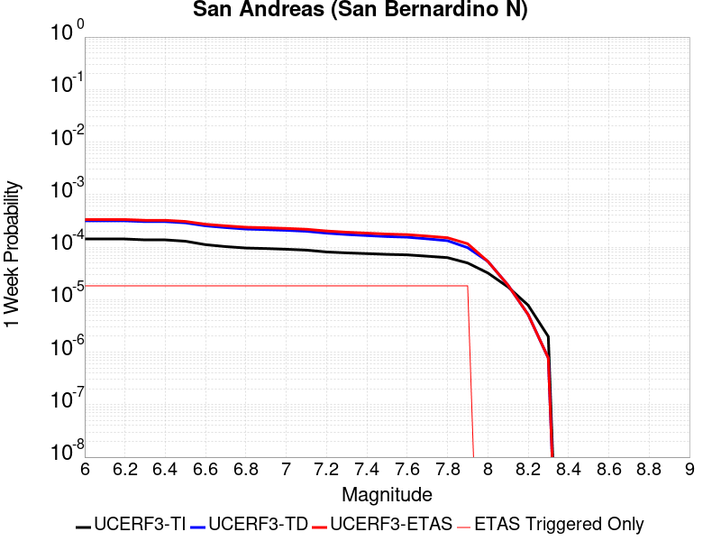 | 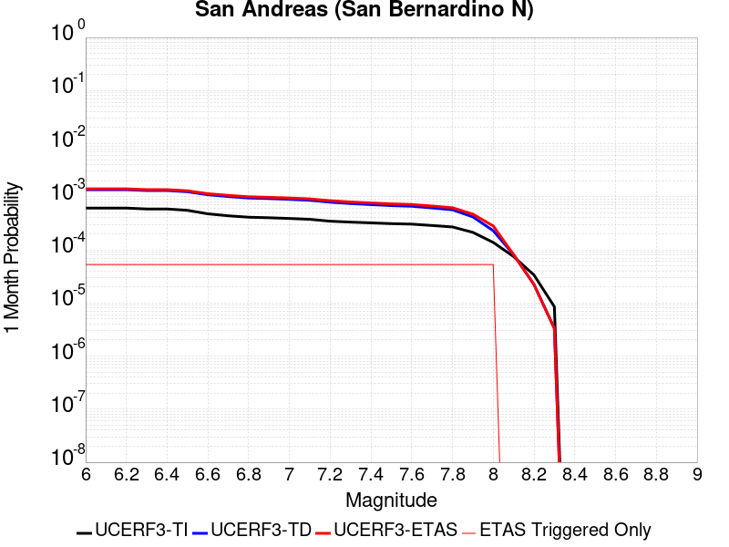 | 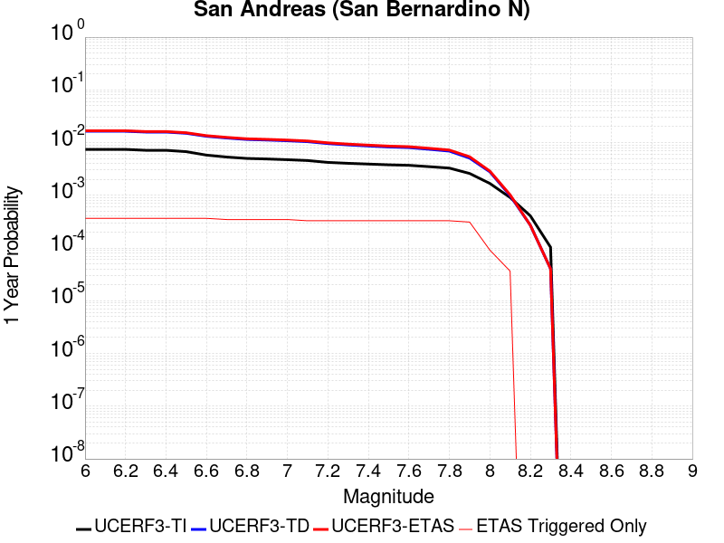 | 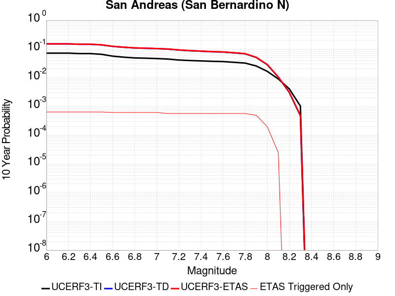 |

| Magnitude | 1 wk TI Prob | 1 wk TD Prob | 1 wk ETAS Prob | 1 wk ETAS/TD Gain | 1 wk ETAS Triggered Only | 1 mo TI Prob | 1 mo TD Prob | 1 mo ETAS Prob | 1 mo ETAS/TD Gain | 1 mo ETAS Triggered Only | 1 yr TI Prob | 1 yr TD Prob | 1 yr ETAS Prob | 1 yr ETAS/TD Gain | 1 yr ETAS Triggered Only | 10 yr TI Prob | 10 yr TD Prob | 10 yr ETAS Prob | 10 yr ETAS/TD Gain | 10 yr ETAS Triggered Only |
|-----|-----|-----|-----|-----|-----|-----|-----|-----|-----|-----|-----|-----|-----|-----|-----|-----|-----|-----|-----|-----|
| 6.0 | 1.4273766E-4 | 3.1665424E-4 | 3.2763978E-4 | 1.0346925 | 1.0989011E-5 | 6.115894E-4 | 0.0013563897 | 0.0014441826 | 1.0647254 | 8.7912085E-5 | 0.0074207084 | 0.016390502 | 0.01672558 | 1.0204433 | 3.4065935E-4 | 0.07177748 | 0.15050764 | 0.15117976 | 1.0044657 | 7.912088E-4 |
| 6.1 | 1.4273766E-4 | 3.1665424E-4 | 3.2763978E-4 | 1.0346925 | 1.0989011E-5 | 6.115894E-4 | 0.0013563897 | 0.0014441826 | 1.0647254 | 8.7912085E-5 | 0.0074207084 | 0.016390502 | 0.01672558 | 1.0204433 | 3.4065935E-4 | 0.07177748 | 0.15050764 | 0.15117976 | 1.0044657 | 7.912088E-4 |
| 6.2 | 1.4273766E-4 | 3.1665424E-4 | 3.2763978E-4 | 1.0346925 | 1.0989011E-5 | 6.115894E-4 | 0.0013563897 | 0.0014441826 | 1.0647254 | 8.7912085E-5 | 0.0074207084 | 0.016390502 | 0.01672558 | 1.0204433 | 3.4065935E-4 | 0.07177748 | 0.15050764 | 0.15117976 | 1.0044657 | 7.912088E-4 |
| 6.3 | 1.3730655E-4 | 3.0569977E-4 | 3.1668541E-4 | 1.0359361 | 1.0989011E-5 | 5.883239E-4 | 0.0013094897 | 0.0013972867 | 1.0670468 | 8.7912085E-5 | 0.0071393442 | 0.015827896 | 0.016163163 | 1.0211821 | 3.4065935E-4 | 0.06914291 | 0.14580758 | 0.14648342 | 1.0046352 | 7.912088E-4 |
| 6.4 | 1.3730655E-4 | 3.0569977E-4 | 3.1668541E-4 | 1.0359361 | 1.0989011E-5 | 5.883239E-4 | 0.0013094897 | 0.0013972867 | 1.0670468 | 8.7912085E-5 | 0.0071393442 | 0.015827896 | 0.016163163 | 1.0211821 | 3.4065935E-4 | 0.06914291 | 0.14580758 | 0.14648342 | 1.0046352 | 7.912088E-4 |
| 6.5 | 1.2942807E-4 | 2.8984004E-4 | 3.0082586E-4 | 1.0379031 | 1.0989011E-5 | 5.545738E-4 | 0.0012415855 | 0.0013293884 | 1.0707184 | 8.7912085E-5 | 0.0067310524 | 0.01501278 | 0.0153483255 | 1.0223507 | 3.4065935E-4 | 0.06530788 | 0.13895048 | 0.13963175 | 1.004903 | 7.912088E-4 |
| 6.6 | 1.1125901E-4 | 2.5421768E-4 | 2.652039E-4 | 1.0432158 | 1.0989011E-5 | 4.767372E-4 | 0.0010890518 | 0.0011768682 | 1.0806355 | 8.7912085E-5 | 0.005788839 | 0.013179231 | 0.013515401 | 1.0255076 | 3.4065935E-4 | 0.056403454 | 0.12324018 | 0.12392424 | 1.0055506 | 7.802198E-4 |
| 6.7 | 1.02209575E-4 | 2.3556314E-4 | 2.4654955E-4 | 1.046639 | 1.0989011E-5 | 4.3796748E-4 | 0.0010091672 | 0.0010860126 | 1.0761474 | 7.6923076E-5 | 0.0053192247 | 0.012217816 | 0.0125434585 | 1.026653 | 3.2967032E-4 | 0.051936906 | 0.11503242 | 0.11570344 | 1.0058333 | 7.5824175E-4 |
| 6.8 | 9.610582E-5 | 2.2081345E-4 | 2.3180003E-4 | 1.0497551 | 1.0989011E-5 | 4.1181705E-4 | 9.4600086E-4 | 0.0010228512 | 1.0812371 | 7.6923076E-5 | 0.0050023515 | 0.011457003 | 0.011782897 | 1.0284449 | 3.2967032E-4 | 0.048912346 | 0.10843303 | 0.10910905 | 1.0062345 | 7.5824175E-4 |
| 6.9 | 9.3877505E-5 | 2.1536642E-4 | 2.2635308E-4 | 1.0510137 | 1.0989011E-5 | 4.0227012E-4 | 9.2267315E-4 | 9.995252E-4 | 1.0832928 | 7.6923076E-5 | 0.0048866454 | 0.011175931 | 0.011491051 | 1.0281963 | 3.1868133E-4 | 0.04780577 | 0.10602296 | 0.10669099 | 1.0063008 | 7.472527E-4 |
| 7.0 | 9.1019785E-5 | 2.086318E-4 | 2.1961852E-4 | 1.0526608 | 1.0989011E-5 | 3.900265E-4 | 8.938305E-4 | 9.7068487E-4 | 1.0859832 | 7.6923076E-5 | 0.0047382377 | 0.0108283125 | 0.011143543 | 1.0291117 | 3.1868133E-4 | 0.046384744 | 0.10299246 | 0.10366275 | 1.0065081 | 7.472527E-4 |
| 7.1 | 8.771155E-5 | 2.0037318E-4 | 2.1135999E-4 | 1.0548317 | 1.0989011E-5 | 3.758525E-4 | 8.5846015E-4 | 9.353172E-4 | 1.0895289 | 7.6923076E-5 | 0.0045664064 | 0.010401863 | 0.010706354 | 1.0292728 | 3.076923E-4 | 0.044737056 | 0.09930337 | 0.09994673 | 1.0064787 | 7.142857E-4 |
| 7.2 | 8.0830236E-5 | 1.8442032E-4 | 1.9540731E-4 | 1.0595758 | 1.0989011E-5 | 3.4636928E-4 | 7.9013355E-4 | 8.669959E-4 | 1.0972776 | 7.6923076E-5 | 0.0042088944 | 0.009577551 | 0.009882296 | 1.0318187 | 3.076923E-4 | 0.041300658 | 0.09203222 | 0.09268077 | 1.0070469 | 7.142857E-4 |
| 7.3 | 7.7668235E-5 | 1.7384623E-4 | 1.8483333E-4 | 1.0632001 | 1.0989011E-5 | 3.328214E-4 | 7.4484263E-4 | 8.217084E-4 | 1.1031973 | 7.6923076E-5 | 0.0040445733 | 0.009030832 | 0.009335746 | 1.0337636 | 3.076923E-4 | 0.03971748 | 0.08729687 | 0.08794881 | 1.007468 | 7.142857E-4 |
| 7.4 | 7.520177E-5 | 1.660399E-4 | 1.7702709E-4 | 1.066172 | 1.0989011E-5 | 3.2225347E-4 | 7.114056E-4 | 7.8827393E-4 | 1.1080514 | 7.6923076E-5 | 0.0039163795 | 0.008627033 | 0.008921177 | 1.0340955 | 2.967033E-4 | 0.038480744 | 0.08375092 | 0.084385246 | 1.007574 | 6.923077E-4 |
| 7.5 | 7.274697E-5 | 1.5890968E-4 | 1.6989694E-4 | 1.0691416 | 1.0989011E-5 | 3.1173544E-4 | 6.8086374E-4 | 7.5773447E-4 | 1.1129017 | 7.6923076E-5 | 0.003788775 | 0.008258066 | 0.008552319 | 1.0356323 | 2.967033E-4 | 0.03724827 | 0.080465645 | 0.081102245 | 1.0079114 | 6.923077E-4 |
| 7.6 | 7.1185845E-5 | 1.5460394E-4 | 1.6559125E-4 | 1.0710675 | 1.0989011E-5 | 3.0504653E-4 | 6.624201E-4 | 7.3929224E-4 | 1.1160474 | 7.6923076E-5 | 0.0037076178 | 0.008035194 | 0.0083295135 | 1.0366287 | 2.967033E-4 | 0.036463667 | 0.07845396 | 0.07909195 | 1.0081321 | 6.923077E-4 |
| 7.7 | 6.709961E-5 | 1.4368047E-4 | 1.5466791E-4 | 1.0764713 | 1.0989011E-5 | 2.8753807E-4 | 6.156282E-4 | 6.9250393E-4 | 1.1248736 | 7.6923076E-5 | 0.003495157 | 0.0074695535 | 0.0077640405 | 1.039425 | 2.967033E-4 | 0.034406938 | 0.07327859 | 0.07392017 | 1.0087553 | 6.923077E-4 |
| 7.8 | 6.300812E-5 | 1.3249594E-4 | 1.434835E-4 | 1.0829275 | 1.0989011E-5 | 2.7000686E-4 | 5.677162E-4 | 6.4459565E-4 | 1.1354188 | 7.6923076E-5 | 0.0032823787 | 0.0068900688 | 0.0071847276 | 1.0427657 | 2.967033E-4 | 0.032343175 | 0.06792749 | 0.06857277 | 1.0094995 | 6.923077E-4 |
| 7.9 | 4.983037E-5 | 9.760703E-5 | 1.0859496E-4 | 1.1125733 | 1.0989011E-5 | 2.1354125E-4 | 4.182488E-4 | 4.8415526E-4 | 1.1575773 | 6.5934066E-5 | 0.0025967648 | 0.0050803 | 0.0053426963 | 1.0516498 | 2.6373626E-4 | 0.025666296 | 0.05082228 | 0.051375095 | 1.0108775 | 5.824176E-4 |
| 8.0 | 3.2211527E-5 | 5.3522905E-5 | 5.3522905E-5 | 1.0 | 0.0 | 1.380421E-4 | 2.2936372E-4 | 2.6232318E-4 | 1.1436995 | 3.2967033E-5 | 0.0016793669 | 0.002788929 | 0.0028656377 | 1.0275047 | 7.6923076E-5 | 0.016667323 | 0.02846787 | 0.028681394 | 1.0075005 | 2.1978022E-4 |
| 8.1 | 1.743376E-5 | 1.8926796E-5 | 1.8926796E-5 | 1.0 | 0.0 | 7.471398E-5 | 8.111232E-5 | 9.210044E-5 | 1.135468 | 1.0989011E-5 | 9.0926304E-4 | 9.870958E-4 | 0.001009052 | 1.0222434 | 2.1978021E-5 | 0.009055517 | 0.010537361 | 0.010559107 | 1.0020638 | 2.1978021E-5 |
| 8.2 | 7.831616E-6 | 5.1930783E-6 | 5.1930783E-6 | 1.0 | 0.0 | 3.3563636E-5 | 2.2255861E-5 | 2.2255861E-5 | 1.0 | 0.0 | 4.0856065E-4 | 2.709315E-4 | 2.709315E-4 | 1.0 | 0.0 | 0.004078103 | 0.0030624678 | 0.0030624678 | 1.0 | 0.0 |
| 8.3 | 1.983087E-6 | 7.731745E-7 | 7.731745E-7 | 1.0 | 0.0 | 8.498917E-6 | 3.313601E-6 | 3.313601E-6 | 1.0 | 0.0 | 1.034694E-4 | 4.0342362E-5 | 4.0342362E-5 | 1.0 | 0.0 | 0.0010342124 | 4.7608858E-4 | 4.7608858E-4 | 1.0 | 0.0 |

## Paradise
*[(top)](#table-of-contents)*

| 1 Week | 1 Month | 1 Year | 10 Year |
|-----|-----|-----|-----|
| 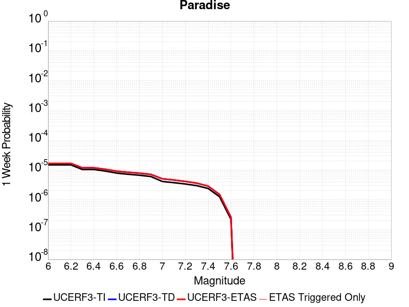 | 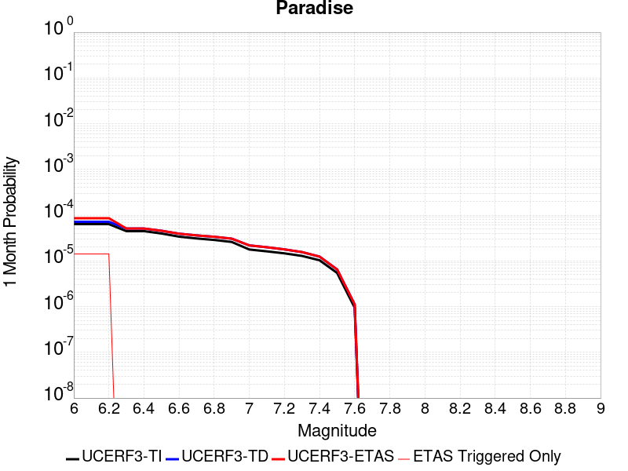 | 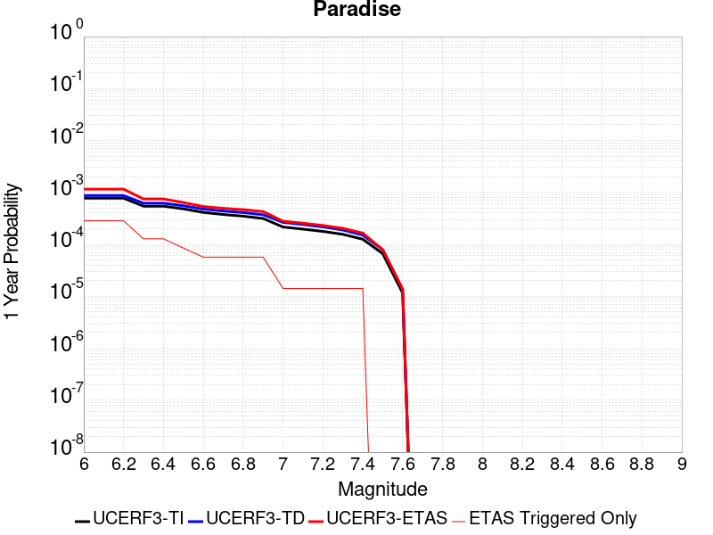 | 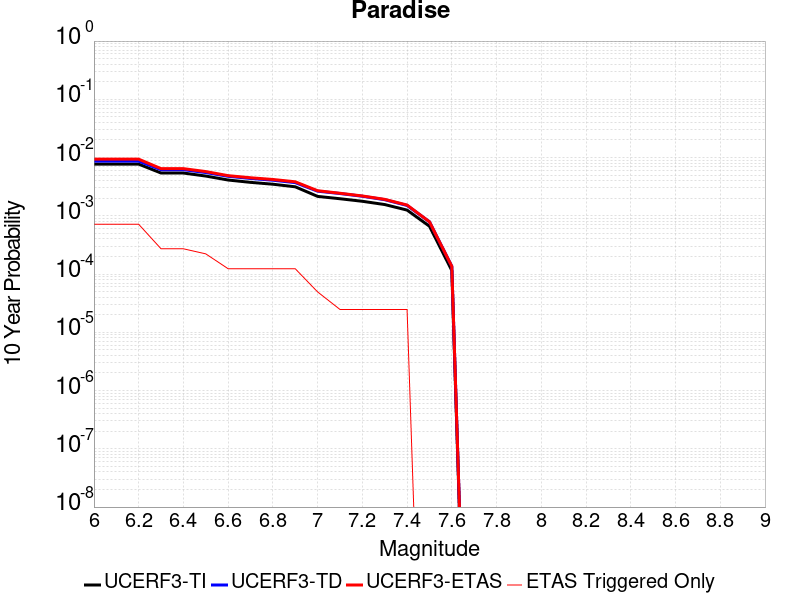 |

| Magnitude | 1 wk TI Prob | 1 wk TD Prob | 1 wk ETAS Prob | 1 wk ETAS/TD Gain | 1 wk ETAS Triggered Only | 1 mo TI Prob | 1 mo TD Prob | 1 mo ETAS Prob | 1 mo ETAS/TD Gain | 1 mo ETAS Triggered Only | 1 yr TI Prob | 1 yr TD Prob | 1 yr ETAS Prob | 1 yr ETAS/TD Gain | 1 yr ETAS Triggered Only | 10 yr TI Prob | 10 yr TD Prob | 10 yr ETAS Prob | 10 yr ETAS/TD Gain | 10 yr ETAS Triggered Only |
|-----|-----|-----|-----|-----|-----|-----|-----|-----|-----|-----|-----|-----|-----|-----|-----|-----|-----|-----|-----|-----|
| 6.0 | 1.4851273E-5 | 1.669599E-5 | 1.669599E-5 | 1.0 | 0.0 | 6.364676E-5 | 7.1552415E-5 | 8.254064E-5 | 1.1535689 | 1.0989011E-5 | 7.7462377E-4 | 8.708261E-4 | 0.0011123738 | 1.2773777 | 2.4175824E-4 | 0.0077192914 | 0.008676517 | 0.009362818 | 1.0790987 | 6.923077E-4 |
| 6.1 | 1.4851273E-5 | 1.669599E-5 | 1.669599E-5 | 1.0 | 0.0 | 6.364676E-5 | 7.1552415E-5 | 8.254064E-5 | 1.1535689 | 1.0989011E-5 | 7.7462377E-4 | 8.708261E-4 | 0.0011123738 | 1.2773777 | 2.4175824E-4 | 0.0077192914 | 0.008676517 | 0.009362818 | 1.0790987 | 6.923077E-4 |
| 6.2 | 1.4851273E-5 | 1.669599E-5 | 1.669599E-5 | 1.0 | 0.0 | 6.364676E-5 | 7.1552415E-5 | 8.254064E-5 | 1.1535689 | 1.0989011E-5 | 7.7462377E-4 | 8.708261E-4 | 0.0011123738 | 1.2773777 | 2.4175824E-4 | 0.0077192914 | 0.008676517 | 0.009362818 | 1.0790987 | 6.923077E-4 |
| 6.3 | 1.0426831E-5 | 1.1889479E-5 | 1.1889479E-5 | 1.0 | 0.0 | 4.4685654E-5 | 5.0953946E-5 | 5.0953946E-5 | 1.0 | 0.0 | 5.43912E-4 | 6.2019366E-4 | 7.4099784E-4 | 1.1947845 | 1.2087912E-4 | 0.0054258266 | 0.006185237 | 0.006501947 | 1.0512042 | 3.1868133E-4 |
| 6.4 | 1.0426831E-5 | 1.1889479E-5 | 1.1889479E-5 | 1.0 | 0.0 | 4.4685654E-5 | 5.0953946E-5 | 5.0953946E-5 | 1.0 | 0.0 | 5.43912E-4 | 6.2019366E-4 | 7.4099784E-4 | 1.1947845 | 1.2087912E-4 | 0.0054258266 | 0.006185237 | 0.006501947 | 1.0512042 | 3.1868133E-4 |
| 6.5 | 9.25027E-6 | 1.0620713E-5 | 1.0620713E-5 | 1.0 | 0.0 | 3.964341E-5 | 4.5516572E-5 | 4.5516572E-5 | 1.0 | 0.0 | 4.8255164E-4 | 5.5402826E-4 | 6.418917E-4 | 1.1585901 | 8.7912085E-5 | 0.0048150513 | 0.00552697 | 0.005767392 | 1.0434998 | 2.4175824E-4 |
| 6.6 | 7.904275E-6 | 9.160146E-6 | 9.160146E-6 | 1.0 | 0.0 | 3.3875025E-5 | 3.92572E-5 | 3.92572E-5 | 1.0 | 0.0 | 4.1235037E-4 | 4.778555E-4 | 5.327743E-4 | 1.1149276 | 5.4945056E-5 | 0.0041158604 | 0.0047686766 | 0.0048889793 | 1.0252277 | 1.2087912E-4 |
| 6.7 | 7.2061953E-6 | 8.407807E-6 | 8.407807E-6 | 1.0 | 0.0 | 3.088333E-5 | 3.6032983E-5 | 3.6032983E-5 | 1.0 | 0.0 | 3.7593965E-4 | 4.386169E-4 | 4.9353787E-4 | 1.125214 | 5.4945056E-5 | 0.003753043 | 0.004377881 | 0.00448729 | 1.0249913 | 1.0989011E-4 |
| 6.8 | 6.6948724E-6 | 7.84268E-6 | 7.84268E-6 | 1.0 | 0.0 | 2.8691995E-5 | 3.3611075E-5 | 3.3611075E-5 | 1.0 | 0.0 | 3.4926904E-4 | 4.0914156E-4 | 4.6406416E-4 | 1.1342386 | 5.4945056E-5 | 0.003487206 | 0.0040842406 | 0.0041936818 | 1.026796 | 1.0989011E-4 |
| 6.9 | 6.0421025E-6 | 7.13108E-6 | 7.13108E-6 | 1.0 | 0.0 | 2.5894467E-5 | 3.0561434E-5 | 3.0561434E-5 | 1.0 | 0.0 | 3.1521954E-4 | 3.7202533E-4 | 4.15965E-4 | 1.1181095 | 4.3956043E-5 | 0.0031477278 | 0.0037143636 | 0.003801949 | 1.0235802 | 8.7912085E-5 |
| 7.0 | 4.134091E-6 | 5.0806284E-6 | 5.0806284E-6 | 1.0 | 0.0 | 1.7717413E-5 | 2.1773949E-5 | 2.1773949E-5 | 1.0 | 0.0 | 2.1568815E-4 | 2.6506712E-4 | 2.760532E-4 | 1.0414464 | 1.0989011E-5 | 0.0021547892 | 0.0026476625 | 0.0026805424 | 1.0124184 | 3.2967033E-5 |
| 7.1 | 3.7674888E-6 | 4.632157E-6 | 4.632157E-6 | 1.0 | 0.0 | 1.6146281E-5 | 1.985196E-5 | 1.985196E-5 | 1.0 | 0.0 | 1.9656324E-4 | 2.4167231E-4 | 2.5265868E-4 | 1.0454597 | 1.0989011E-5 | 0.0019638946 | 0.0024142456 | 0.0024361706 | 1.0090815 | 2.1978021E-5 |
| 7.2 | 3.4065345E-6 | 4.15698E-6 | 4.15698E-6 | 1.0 | 0.0 | 1.4599351E-5 | 1.7815515E-5 | 1.7815515E-5 | 1.0 | 0.0 | 1.777326E-4 | 2.1688381E-4 | 2.2787043E-4 | 1.0506568 | 1.0989011E-5 | 0.0017759053 | 0.0021668696 | 0.0021888001 | 1.0101207 | 2.1978021E-5 |
| 7.3 | 2.9934936E-6 | 3.6295291E-6 | 3.6295291E-6 | 1.0 | 0.0 | 1.2829195E-5 | 1.555504E-5 | 1.555504E-5 | 1.0 | 0.0 | 1.5618425E-4 | 1.8936764E-4 | 2.0035457E-4 | 1.058019 | 1.0989011E-5 | 0.0015607453 | 0.001892208 | 0.0019141445 | 1.011593 | 2.1978021E-5 |
| 7.4 | 2.4049796E-6 | 2.88914E-6 | 2.88914E-6 | 1.0 | 0.0 | 1.0307015E-5 | 1.2381977E-5 | 1.2381977E-5 | 1.0 | 0.0 | 1.2548068E-4 | 1.5074159E-4 | 1.6172894E-4 | 1.0728887 | 1.0989011E-5 | 0.0012540985 | 0.0015065349 | 0.0015175072 | 1.0072832 | 1.0989011E-5 |
| 7.5 | 1.2710091E-6 | 1.5135425E-6 | 1.5135425E-6 | 1.0 | 0.0 | 5.44717E-6 | 6.4866017E-6 | 6.4866017E-6 | 1.0 | 0.0 | 6.631728E-5 | 7.8972764E-5 | 7.8972764E-5 | 1.0 | 0.0 | 6.6297496E-4 | 7.895697E-4 | 7.895697E-4 | 1.0 | 0.0 |
| 7.6 | 2.21172E-7 | 2.604064E-7 | 2.604064E-7 | 1.0 | 0.0 | 9.478797E-7 | 1.1160272E-6 | 1.1160272E-6 | 1.0 | 0.0 | 1.1540374E-5 | 1.3587575E-5 | 1.3587575E-5 | 1.0 | 0.0 | 1.1539775E-4 | 1.3587026E-4 | 1.3587026E-4 | 1.0 | 0.0 |

## Bicycle Lake
*[(top)](#table-of-contents)*

| 1 Week | 1 Month | 1 Year | 10 Year |
|-----|-----|-----|-----|
| 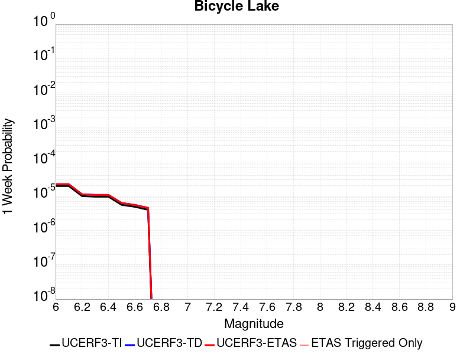 | 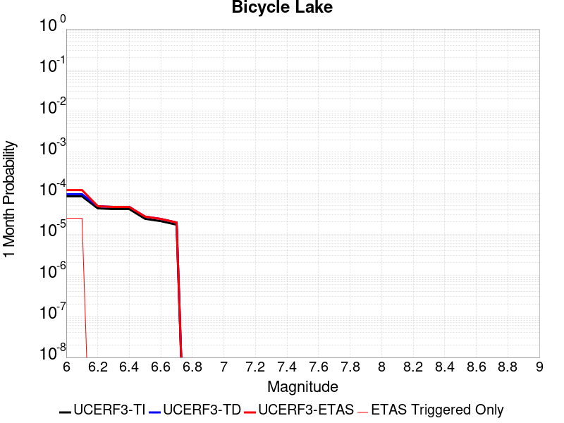 | 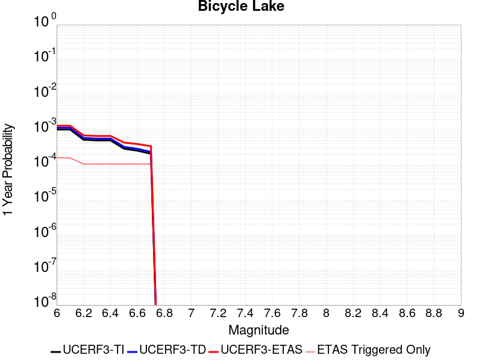 | 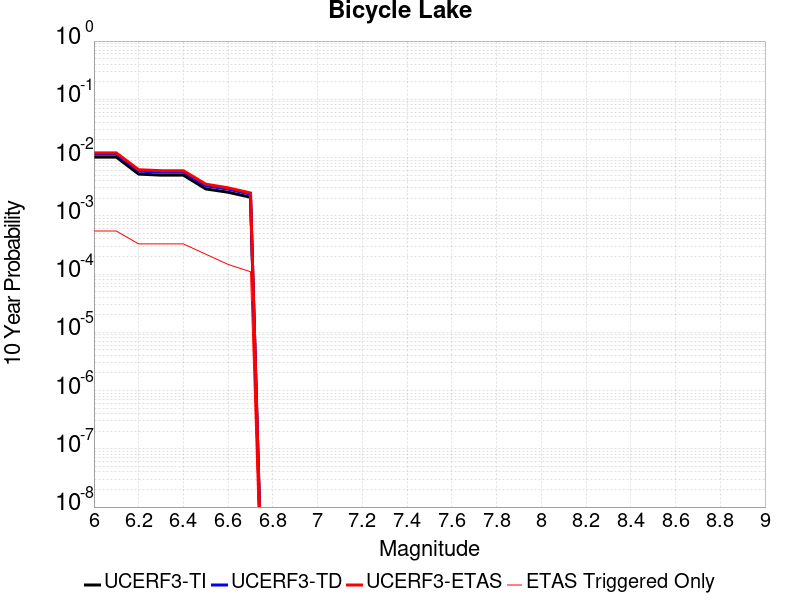 |

| Magnitude | 1 wk TI Prob | 1 wk TD Prob | 1 wk ETAS Prob | 1 wk ETAS/TD Gain | 1 wk ETAS Triggered Only | 1 mo TI Prob | 1 mo TD Prob | 1 mo ETAS Prob | 1 mo ETAS/TD Gain | 1 mo ETAS Triggered Only | 1 yr TI Prob | 1 yr TD Prob | 1 yr ETAS Prob | 1 yr ETAS/TD Gain | 1 yr ETAS Triggered Only | 10 yr TI Prob | 10 yr TD Prob | 10 yr ETAS Prob | 10 yr ETAS/TD Gain | 10 yr ETAS Triggered Only |
|-----|-----|-----|-----|-----|-----|-----|-----|-----|-----|-----|-----|-----|-----|-----|-----|-----|-----|-----|-----|-----|
| 6.0 | 1.9621975E-5 | 2.2100037E-5 | 2.2100037E-5 | 1.0 | 0.0 | 8.4091465E-5 | 9.471177E-5 | 1.2767568E-4 | 1.3480445 | 3.2967033E-5 | 0.0010233327 | 0.0011526408 | 0.0012953333 | 1.1237961 | 1.4285714E-4 | 0.01018633 | 0.011479938 | 0.012001355 | 1.0454198 | 5.274725E-4 |
| 6.1 | 1.9621975E-5 | 2.2100037E-5 | 2.2100037E-5 | 1.0 | 0.0 | 8.4091465E-5 | 9.471177E-5 | 1.2767568E-4 | 1.3480445 | 3.2967033E-5 | 0.0010233327 | 0.0011526408 | 0.0012953333 | 1.1237961 | 1.4285714E-4 | 0.01018633 | 0.011479938 | 0.012001355 | 1.0454198 | 5.274725E-4 |
| 6.2 | 9.9971285E-6 | 1.1257143E-5 | 1.1257143E-5 | 1.0 | 0.0 | 4.2844134E-5 | 4.8244303E-5 | 7.0221264E-5 | 1.4555348 | 2.1978021E-5 | 5.2150246E-4 | 5.872681E-4 | 6.531634E-4 | 1.1122066 | 6.5934066E-5 | 0.0052028033 | 0.005862268 | 0.006168157 | 1.0521792 | 3.076923E-4 |
| 6.3 | 9.589428E-6 | 1.0799791E-5 | 1.0799791E-5 | 1.0 | 0.0 | 4.10969E-5 | 4.628429E-5 | 6.8261295E-5 | 1.4748265 | 2.1978021E-5 | 5.002399E-4 | 5.634174E-4 | 6.2931434E-4 | 1.1169593 | 6.5934066E-5 | 0.0049911533 | 0.0056249807 | 0.0059309425 | 1.0543933 | 3.076923E-4 |
| 6.4 | 9.589428E-6 | 1.0799791E-5 | 1.0799791E-5 | 1.0 | 0.0 | 4.10969E-5 | 4.628429E-5 | 6.8261295E-5 | 1.4748265 | 2.1978021E-5 | 5.002399E-4 | 5.634174E-4 | 6.2931434E-4 | 1.1169593 | 6.5934066E-5 | 0.0049911533 | 0.0056249807 | 0.0059309425 | 1.0543933 | 3.076923E-4 |
| 6.5 | 5.557707E-6 | 6.286475E-6 | 6.286475E-6 | 1.0 | 0.0 | 2.3818526E-5 | 2.6941909E-5 | 4.8919337E-5 | 1.8157339 | 2.1978021E-5 | 2.8995197E-4 | 3.2799525E-4 | 3.829223E-4 | 1.167463 | 5.4945056E-5 | 0.0028957394 | 0.0032777486 | 0.0034858554 | 1.0634907 | 2.0879121E-4 |
| 6.6 | 4.8742945E-6 | 5.5140567E-6 | 5.5140567E-6 | 1.0 | 0.0 | 2.0889667E-5 | 2.3631605E-5 | 4.5609107E-5 | 1.9300046 | 2.1978021E-5 | 2.54302E-4 | 2.87703E-4 | 3.316464E-4 | 1.1527387 | 4.3956043E-5 | 0.002540112 | 0.002875875 | 0.0030183212 | 1.0495315 | 1.4285714E-4 |
| 6.7 | 3.991108E-6 | 4.5165402E-6 | 4.5165402E-6 | 1.0 | 0.0 | 1.7104636E-5 | 1.9356601E-5 | 4.13342E-5 | 2.1354058 | 2.1978021E-5 | 2.0822904E-4 | 2.3566662E-4 | 2.7961232E-4 | 1.186474 | 4.3956043E-5 | 0.0020803404 | 0.0023566664 | 0.0024772605 | 1.0511715 | 1.2087912E-4 |

## Garlic Springs
*[(top)](#table-of-contents)*

| 1 Week | 1 Month | 1 Year | 10 Year |
|-----|-----|-----|-----|
| 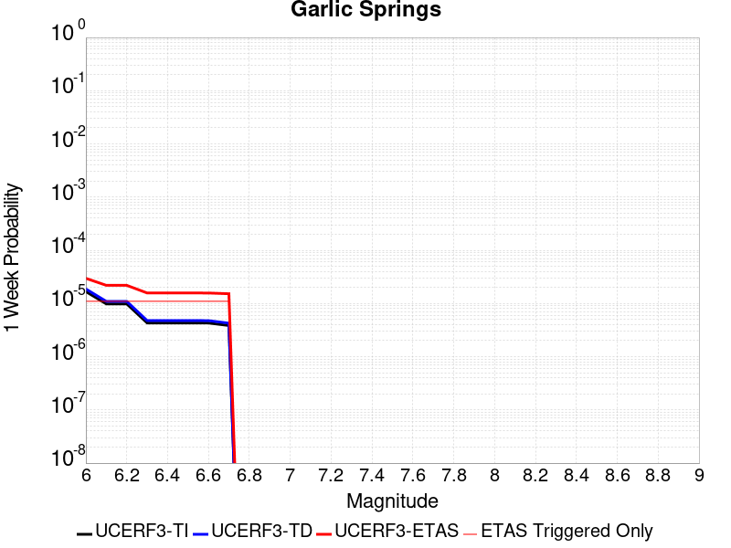 | 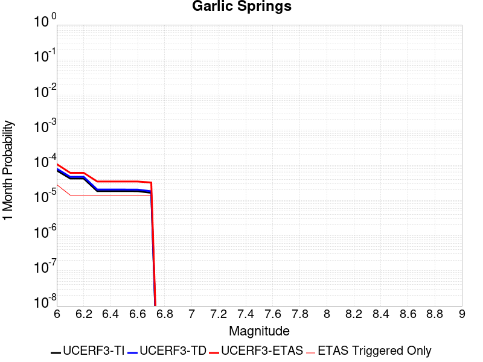 | 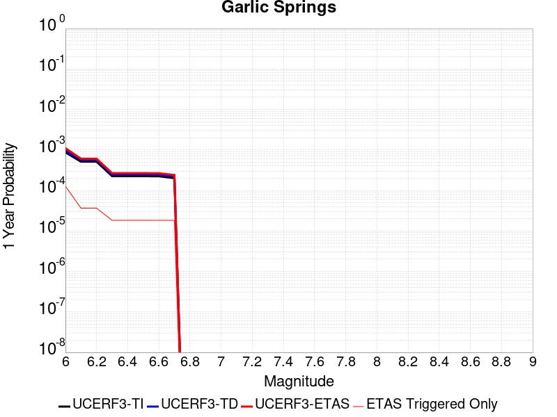 | 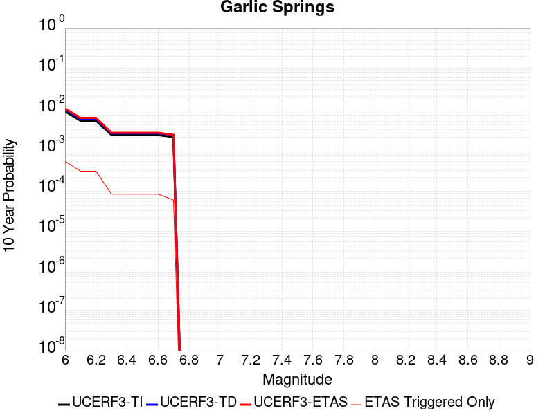 |

| Magnitude | 1 wk TI Prob | 1 wk TD Prob | 1 wk ETAS Prob | 1 wk ETAS/TD Gain | 1 wk ETAS Triggered Only | 1 mo TI Prob | 1 mo TD Prob | 1 mo ETAS Prob | 1 mo ETAS/TD Gain | 1 mo ETAS Triggered Only | 1 yr TI Prob | 1 yr TD Prob | 1 yr ETAS Prob | 1 yr ETAS/TD Gain | 1 yr ETAS Triggered Only | 10 yr TI Prob | 10 yr TD Prob | 10 yr ETAS Prob | 10 yr ETAS/TD Gain | 10 yr ETAS Triggered Only |
|-----|-----|-----|-----|-----|-----|-----|-----|-----|-----|-----|-----|-----|-----|-----|-----|-----|-----|-----|-----|-----|
| 6.0 | 1.6760017E-5 | 1.8779232E-5 | 2.9768036E-5 | 1.5851573 | 1.0989011E-5 | 7.182667E-5 | 8.0480604E-5 | 1.02456856E-4 | 1.2730627 | 2.1978021E-5 | 8.7413884E-4 | 9.795283E-4 | 0.0011222454 | 1.1457 | 1.4285714E-4 | 0.008707083 | 0.009763656 | 0.010264215 | 1.0512676 | 5.054945E-4 |
| 6.1 | 9.852767E-6 | 1.0974912E-5 | 2.1963802E-5 | 2.0012736 | 1.0989011E-5 | 4.222546E-5 | 4.703489E-5 | 5.8023383E-5 | 1.2336243 | 1.0989011E-5 | 5.139737E-4 | 5.725703E-4 | 6.384666E-4 | 1.1150886 | 6.5934066E-5 | 0.005127866 | 0.005717911 | 0.006001991 | 1.0496826 | 2.8571428E-4 |
| 6.2 | 9.852767E-6 | 1.0974912E-5 | 2.1963802E-5 | 2.0012736 | 1.0989011E-5 | 4.222546E-5 | 4.703489E-5 | 5.8023383E-5 | 1.2336243 | 1.0989011E-5 | 5.139737E-4 | 5.725703E-4 | 6.384666E-4 | 1.1150886 | 6.5934066E-5 | 0.005127866 | 0.005717911 | 0.006001991 | 1.0496826 | 2.8571428E-4 |
| 6.3 | 4.3167724E-6 | 4.77857E-6 | 1.576753E-5 | 3.299633 | 1.0989011E-5 | 1.8500323E-5 | 2.0479556E-5 | 3.1468342E-5 | 1.5365734 | 1.0989011E-5 | 2.2521814E-4 | 2.493331E-4 | 2.822919E-4 | 1.1321878 | 3.2967033E-5 | 0.0022499003 | 0.0024927924 | 0.0025695239 | 1.0307813 | 7.6923076E-5 |
| 6.4 | 4.3167724E-6 | 4.77857E-6 | 1.576753E-5 | 3.299633 | 1.0989011E-5 | 1.8500323E-5 | 2.0479556E-5 | 3.1468342E-5 | 1.5365734 | 1.0989011E-5 | 2.2521814E-4 | 2.493331E-4 | 2.822919E-4 | 1.1321878 | 3.2967033E-5 | 0.0022499003 | 0.0024927924 | 0.0025695239 | 1.0307813 | 7.6923076E-5 |
| 6.5 | 4.3167724E-6 | 4.77857E-6 | 1.576753E-5 | 3.299633 | 1.0989011E-5 | 1.8500323E-5 | 2.0479556E-5 | 3.1468342E-5 | 1.5365734 | 1.0989011E-5 | 2.2521814E-4 | 2.493331E-4 | 2.822919E-4 | 1.1321878 | 3.2967033E-5 | 0.0022499003 | 0.0024927924 | 0.0025695239 | 1.0307813 | 7.6923076E-5 |
| 6.6 | 4.301311E-6 | 4.7614367E-6 | 1.5750395E-5 | 3.307908 | 1.0989011E-5 | 1.8434059E-5 | 2.0406127E-5 | 3.1394913E-5 | 1.5385042 | 1.0989011E-5 | 2.2441156E-4 | 2.4843932E-4 | 2.8139816E-4 | 1.1326636 | 3.2967033E-5 | 0.0022418506 | 0.0024838746 | 0.0025606067 | 1.030892 | 7.6923076E-5 |
| 6.7 | 3.8599724E-6 | 4.2715424E-6 | 1.5260506E-5 | 3.5725985 | 1.0989011E-5 | 1.6542634E-5 | 1.8306611E-5 | 2.9295421E-5 | 1.6002645 | 1.0989011E-5 | 2.0138794E-4 | 2.2288298E-4 | 2.448561E-4 | 1.098586 | 2.1978021E-5 | 0.0020120554 | 0.0022288298 | 0.0022836525 | 1.024597 | 5.4945056E-5 |

## San Andreas (San Bernardino S)
*[(top)](#table-of-contents)*

| 1 Week | 1 Month | 1 Year | 10 Year |
|-----|-----|-----|-----|
| 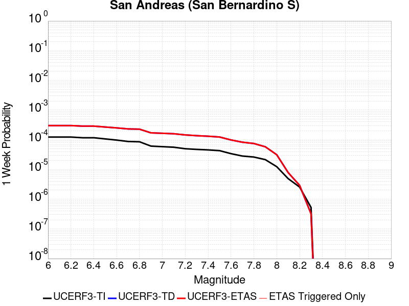 | 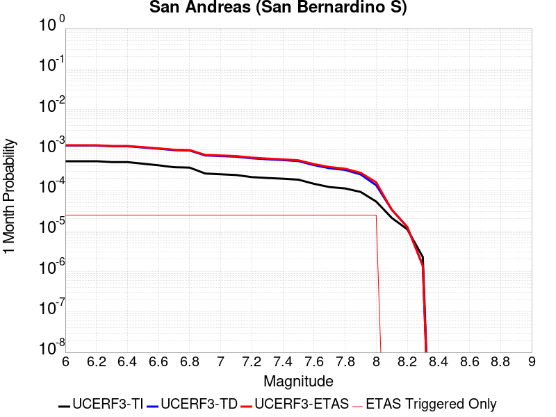 | 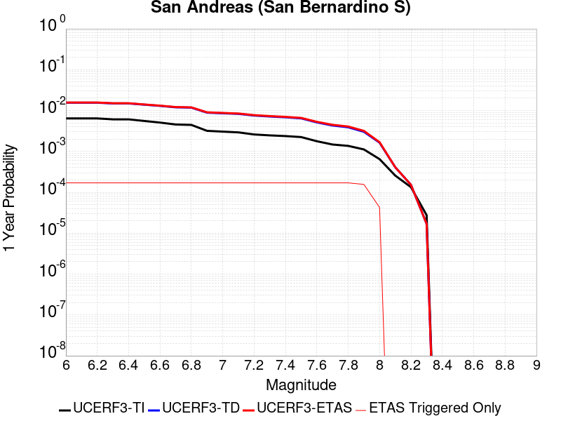 | 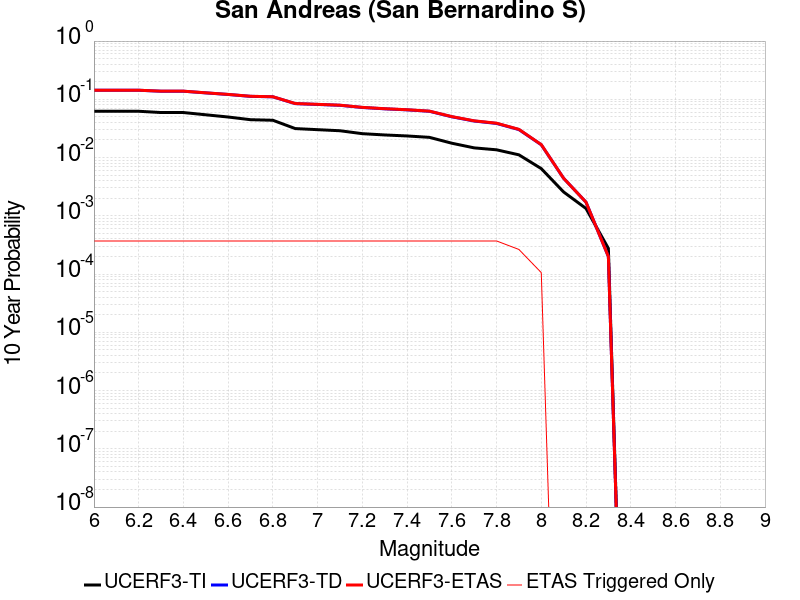 |

| Magnitude | 1 wk TI Prob | 1 wk TD Prob | 1 wk ETAS Prob | 1 wk ETAS/TD Gain | 1 wk ETAS Triggered Only | 1 mo TI Prob | 1 mo TD Prob | 1 mo ETAS Prob | 1 mo ETAS/TD Gain | 1 mo ETAS Triggered Only | 1 yr TI Prob | 1 yr TD Prob | 1 yr ETAS Prob | 1 yr ETAS/TD Gain | 1 yr ETAS Triggered Only | 10 yr TI Prob | 10 yr TD Prob | 10 yr ETAS Prob | 10 yr ETAS/TD Gain | 10 yr ETAS Triggered Only |
|-----|-----|-----|-----|-----|-----|-----|-----|-----|-----|-----|-----|-----|-----|-----|-----|-----|-----|-----|-----|-----|
| 6.0 | 1.2336002E-4 | 3.0043157E-4 | 3.0043157E-4 | 1.0 | 0.0 | 5.2857865E-4 | 0.0012869546 | 0.0013198792 | 1.0255834 | 3.2967033E-5 | 0.006416472 | 0.0155610675 | 0.015723338 | 1.010428 | 1.6483516E-4 | 0.06234337 | 0.14299136 | 0.14335866 | 1.0025686 | 4.2857142E-4 |
| 6.1 | 1.2336002E-4 | 3.0043157E-4 | 3.0043157E-4 | 1.0 | 0.0 | 5.2857865E-4 | 0.0012869546 | 0.0013198792 | 1.0255834 | 3.2967033E-5 | 0.006416472 | 0.0155610675 | 0.015723338 | 1.010428 | 1.6483516E-4 | 0.06234337 | 0.14299136 | 0.14335866 | 1.0025686 | 4.2857142E-4 |
| 6.2 | 1.2336002E-4 | 3.0043157E-4 | 3.0043157E-4 | 1.0 | 0.0 | 5.2857865E-4 | 0.0012869546 | 0.0013198792 | 1.0255834 | 3.2967033E-5 | 0.006416472 | 0.0155610675 | 0.015723338 | 1.010428 | 1.6483516E-4 | 0.06234337 | 0.14299136 | 0.14335866 | 1.0025686 | 4.2857142E-4 |
| 6.3 | 1.1712257E-4 | 2.883105E-4 | 2.883105E-4 | 1.0 | 0.0 | 5.018573E-4 | 0.001235057 | 0.0012679833 | 1.0266597 | 3.2967033E-5 | 0.006093008 | 0.014937995 | 0.015100367 | 1.0108697 | 1.6483516E-4 | 0.059286322 | 0.1376994 | 0.13806896 | 1.0026838 | 4.2857142E-4 |
| 6.4 | 1.1712257E-4 | 2.883105E-4 | 2.883105E-4 | 1.0 | 0.0 | 5.018573E-4 | 0.001235057 | 0.0012679833 | 1.0266597 | 3.2967033E-5 | 0.006093008 | 0.014937995 | 0.015100367 | 1.0108697 | 1.6483516E-4 | 0.059286322 | 0.1376994 | 0.13806896 | 1.0026838 | 4.2857142E-4 |
| 6.5 | 1.0689076E-4 | 2.6843234E-4 | 2.6843234E-4 | 1.0 | 0.0 | 4.5802278E-4 | 0.0011499418 | 0.0011828709 | 1.0286355 | 3.2967033E-5 | 0.0055621783 | 0.01391529 | 0.014077831 | 1.0116807 | 1.6483516E-4 | 0.05425003 | 0.12894526 | 0.12931857 | 1.0028951 | 4.2857142E-4 |
| 6.6 | 9.7648895E-5 | 2.5087388E-4 | 2.5087388E-4 | 1.0 | 0.0 | 4.1842813E-4 | 0.0010747545 | 0.0011076861 | 1.0306411 | 3.2967033E-5 | 0.005082469 | 0.013010999 | 0.013162844 | 1.0116705 | 1.5384615E-4 | 0.049677886 | 0.1211038 | 0.1214515 | 1.002871 | 3.956044E-4 |
| 6.7 | 8.757013E-5 | 2.3157541E-4 | 2.3157541E-4 | 1.0 | 0.0 | 3.7524657E-4 | 9.921109E-4 | 0.0010250452 | 1.0331962 | 3.2967033E-5 | 0.00455906 | 0.012016143 | 0.012168141 | 1.0126494 | 1.5384615E-4 | 0.04466656 | 0.112411246 | 0.112752624 | 1.0030369 | 3.8461538E-4 |
| 6.8 | 8.562978E-5 | 2.271715E-4 | 2.271715E-4 | 1.0 | 0.0 | 3.6693315E-4 | 9.732511E-4 | 0.0010061861 | 1.0338402 | 3.2967033E-5 | 0.004458263 | 0.011789026 | 0.011941059 | 1.0128961 | 1.5384615E-4 | 0.043698758 | 0.11042069 | 0.110762835 | 1.0030986 | 3.8461538E-4 |
| 6.9 | 6.124075E-5 | 1.7098521E-4 | 1.7098521E-4 | 1.0 | 0.0 | 2.6243398E-4 | 7.3258876E-4 | 7.655317E-4 | 1.0449678 | 3.2967033E-5 | 0.0031904527 | 0.008883 | 0.009035479 | 1.0171653 | 1.5384615E-4 | 0.031450346 | 0.08432233 | 0.08466445 | 1.0040573 | 3.7362636E-4 |
| 7.0 | 5.8598747E-5 | 1.6527194E-4 | 1.6527194E-4 | 1.0 | 0.0 | 2.5111332E-4 | 7.081168E-4 | 7.4106053E-4 | 1.046523 | 3.2967033E-5 | 0.0030530186 | 0.008587439 | 0.008739963 | 1.0177615 | 1.5384615E-4 | 0.03011414 | 0.08163893 | 0.081982054 | 1.004203 | 3.7362636E-4 |
| 7.1 | 5.613814E-5 | 1.594542E-4 | 1.594542E-4 | 1.0 | 0.0 | 2.4056983E-4 | 6.8319694E-4 | 7.161414E-4 | 1.0482211 | 3.2967033E-5 | 0.0029250039 | 0.008286381 | 0.008438952 | 1.0184124 | 1.5384615E-4 | 0.028868021 | 0.07893698 | 0.07927099 | 1.0042313 | 3.6263737E-4 |
| 7.2 | 4.991222E-5 | 1.4551122E-4 | 1.4551122E-4 | 1.0 | 0.0 | 2.1389198E-4 | 6.2347087E-4 | 6.5641734E-4 | 1.0528437 | 3.2967033E-5 | 0.002601025 | 0.0075644418 | 0.007717124 | 1.0201843 | 1.5384615E-4 | 0.025707912 | 0.07238823 | 0.07272462 | 1.004647 | 3.6263737E-4 |
| 7.3 | 4.7410045E-5 | 1.3744639E-4 | 1.3744639E-4 | 1.0 | 0.0 | 2.0317009E-4 | 5.8892334E-4 | 6.218709E-4 | 1.0559455 | 3.2967033E-5 | 0.0024707897 | 0.0071466547 | 0.0072994013 | 1.0213732 | 1.5384615E-4 | 0.024434982 | 0.06866852 | 0.06900626 | 1.0049183 | 3.6263737E-4 |
| 7.4 | 4.5556746E-5 | 1.3152018E-4 | 1.3152018E-4 | 1.0 | 0.0 | 1.952286E-4 | 5.635365E-4 | 5.964849E-4 | 1.0584673 | 3.2967033E-5 | 0.002374317 | 0.006839552 | 0.0069923457 | 1.0223397 | 1.5384615E-4 | 0.023491086 | 0.06591914 | 0.066247605 | 1.004983 | 3.5164834E-4 |
| 7.5 | 4.3084514E-5 | 1.2386718E-4 | 1.2386718E-4 | 1.0 | 0.0 | 1.8463485E-4 | 5.3075165E-4 | 5.637012E-4 | 1.0620809 | 3.2967033E-5 | 0.0022456115 | 0.0064428276 | 0.006595683 | 1.0237248 | 1.5384615E-4 | 0.022230545 | 0.06231774 | 0.06264748 | 1.0052912 | 3.5164834E-4 |
| 7.6 | 3.408608E-5 | 9.862595E-5 | 9.862595E-5 | 1.0 | 0.0 | 1.4607502E-4 | 4.2261425E-4 | 4.5556735E-4 | 1.0779744 | 3.2967033E-5 | 0.0017770125 | 0.0051332153 | 0.0052862717 | 1.0298169 | 1.5384615E-4 | 0.017628696 | 0.05014027 | 0.050474286 | 1.0066617 | 3.5164834E-4 |
| 7.7 | 2.8315713E-5 | 8.274123E-5 | 8.274123E-5 | 1.0 | 0.0 | 1.2134742E-4 | 3.545571E-4 | 3.8751244E-4 | 1.092948 | 3.2967033E-5 | 0.0014764034 | 0.0043081976 | 0.0044613807 | 1.0355562 | 1.5384615E-4 | 0.01466633 | 0.04238506 | 0.042721804 | 1.0079448 | 3.5164834E-4 |
| 7.8 | 2.6222975E-5 | 7.4868956E-5 | 7.4868956E-5 | 1.0 | 0.0 | 1.1237934E-4 | 3.2082753E-4 | 3.5378398E-4 | 1.1027232 | 3.2967033E-5 | 0.0013673597 | 0.0038990853 | 0.0040523317 | 1.0393032 | 1.5384615E-4 | 0.013589768 | 0.03854365 | 0.03888174 | 1.0087718 | 3.5164834E-4 |
| 7.9 | 2.1469694E-5 | 5.8076967E-5 | 5.8076967E-5 | 1.0 | 0.0 | 9.200973E-5 | 2.4887754E-4 | 2.8183637E-4 | 1.13243 | 3.2967033E-5 | 0.0011196428 | 0.003025877 | 0.003168302 | 1.047069 | 1.4285714E-4 | 0.011140184 | 0.030242343 | 0.030551387 | 1.0102189 | 3.1868133E-4 |
| 8.0 | 1.2420249E-5 | 3.142877E-5 | 3.142877E-5 | 1.0 | 0.0 | 5.322855E-5 | 1.3468778E-4 | 1.5666285E-4 | 1.1631556 | 2.1978021E-5 | 6.478649E-4 | 0.0016385914 | 0.0016934464 | 1.033477 | 5.4945056E-5 | 0.0064597935 | 0.01657378 | 0.01671427 | 1.0084766 | 1.4285714E-4 |
| 8.1 | 4.9197724E-6 | 7.862634E-6 | 7.862634E-6 | 1.0 | 0.0 | 2.1084568E-5 | 3.369657E-5 | 3.369657E-5 | 1.0 | 0.0 | 2.566744E-4 | 4.1017865E-4 | 4.1017865E-4 | 1.0 | 0.0 | 0.002563781 | 0.0044046436 | 0.0044046436 | 1.0 | 0.0 |
| 8.2 | 2.5634774E-6 | 2.9256641E-6 | 2.9256641E-6 | 1.0 | 0.0 | 1.0986286E-5 | 1.25385E-5 | 1.25385E-5 | 1.0 | 0.0 | 1.3374983E-4 | 1.5264559E-4 | 1.5264559E-4 | 1.0 | 0.0 | 0.0013366934 | 0.0017149353 | 0.0017149353 | 1.0 | 0.0 |
| 8.3 | 5.2850464E-7 | 3.2379515E-7 | 3.2379515E-7 | 1.0 | 0.0 | 2.2650179E-6 | 1.3876928E-6 | 1.3876928E-6 | 1.0 | 0.0 | 2.7576245E-5 | 1.6895041E-5 | 1.6895041E-5 | 1.0 | 0.0 | 2.7572823E-4 | 2.0034672E-4 | 2.0034672E-4 | 1.0 | 0.0 |

## Sierra Nevada  (No Extension)
*[(top)](#table-of-contents)*

| 1 Week | 1 Month | 1 Year | 10 Year |
|-----|-----|-----|-----|
| 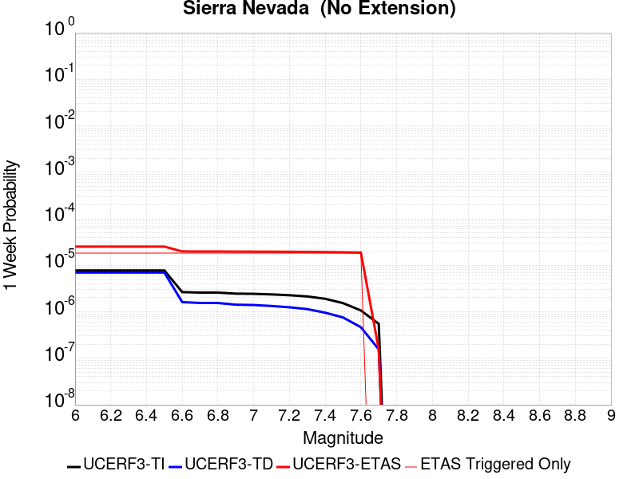 | 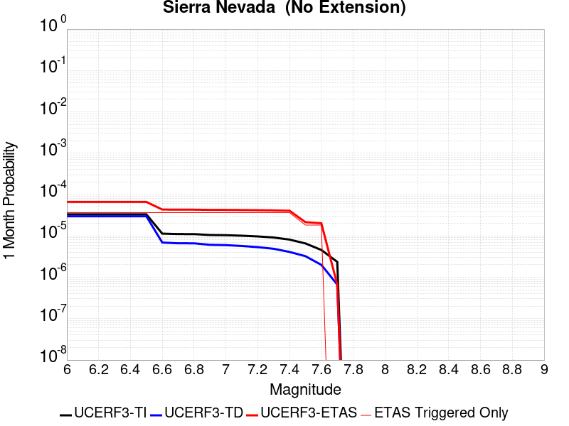 |  | 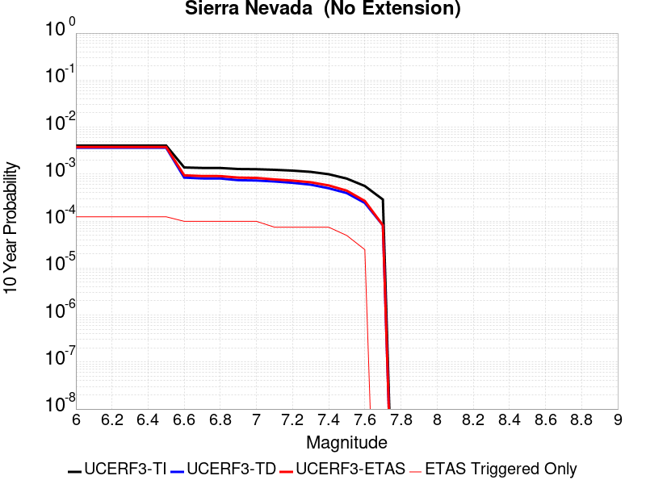 |

| Magnitude | 1 wk TI Prob | 1 wk TD Prob | 1 wk ETAS Prob | 1 wk ETAS/TD Gain | 1 wk ETAS Triggered Only | 1 mo TI Prob | 1 mo TD Prob | 1 mo ETAS Prob | 1 mo ETAS/TD Gain | 1 mo ETAS Triggered Only | 1 yr TI Prob | 1 yr TD Prob | 1 yr ETAS Prob | 1 yr ETAS/TD Gain | 1 yr ETAS Triggered Only | 10 yr TI Prob | 10 yr TD Prob | 10 yr ETAS Prob | 10 yr ETAS/TD Gain | 10 yr ETAS Triggered Only |
|-----|-----|-----|-----|-----|-----|-----|-----|-----|-----|-----|-----|-----|-----|-----|-----|-----|-----|-----|-----|-----|
| 6.0 | 7.7690465E-6 | 6.9768134E-6 | 2.8954682E-5 | 4.15013 | 2.1978021E-5 | 3.329549E-5 | 2.990049E-5 | 9.583258E-5 | 3.2050507 | 6.5934066E-5 | 4.0529718E-4 | 3.640135E-4 | 5.1780365E-4 | 1.4224848 | 1.5384615E-4 | 0.004045588 | 0.0036376887 | 0.00396616 | 1.0902966 | 3.2967032E-4 |
| 6.1 | 7.7690465E-6 | 6.9768134E-6 | 2.8954682E-5 | 4.15013 | 2.1978021E-5 | 3.329549E-5 | 2.990049E-5 | 9.583258E-5 | 3.2050507 | 6.5934066E-5 | 4.0529718E-4 | 3.640135E-4 | 5.1780365E-4 | 1.4224848 | 1.5384615E-4 | 0.004045588 | 0.0036376887 | 0.00396616 | 1.0902966 | 3.2967032E-4 |
| 6.2 | 7.7690465E-6 | 6.9768134E-6 | 2.8954682E-5 | 4.15013 | 2.1978021E-5 | 3.329549E-5 | 2.990049E-5 | 9.583258E-5 | 3.2050507 | 6.5934066E-5 | 4.0529718E-4 | 3.640135E-4 | 5.1780365E-4 | 1.4224848 | 1.5384615E-4 | 0.004045588 | 0.0036376887 | 0.00396616 | 1.0902966 | 3.2967032E-4 |
| 6.3 | 7.7690465E-6 | 6.9768134E-6 | 2.8954682E-5 | 4.15013 | 2.1978021E-5 | 3.329549E-5 | 2.990049E-5 | 9.583258E-5 | 3.2050507 | 6.5934066E-5 | 4.0529718E-4 | 3.640135E-4 | 5.1780365E-4 | 1.4224848 | 1.5384615E-4 | 0.004045588 | 0.0036376887 | 0.00396616 | 1.0902966 | 3.2967032E-4 |
| 6.4 | 7.7690465E-6 | 6.9768134E-6 | 2.8954682E-5 | 4.15013 | 2.1978021E-5 | 3.329549E-5 | 2.990049E-5 | 9.583258E-5 | 3.2050507 | 6.5934066E-5 | 4.0529718E-4 | 3.640135E-4 | 5.1780365E-4 | 1.4224848 | 1.5384615E-4 | 0.004045588 | 0.0036376887 | 0.00396616 | 1.0902966 | 3.2967032E-4 |
| 6.5 | 7.7690465E-6 | 6.9768134E-6 | 2.8954682E-5 | 4.15013 | 2.1978021E-5 | 3.329549E-5 | 2.990049E-5 | 9.583258E-5 | 3.2050507 | 6.5934066E-5 | 4.0529718E-4 | 3.640135E-4 | 5.1780365E-4 | 1.4224848 | 1.5384615E-4 | 0.004045588 | 0.0036376887 | 0.00396616 | 1.0902966 | 3.2967032E-4 |
| 6.6 | 2.653E-6 | 1.615073E-6 | 2.359306E-5 | 14.608046 | 2.1978021E-5 | 1.136995E-5 | 6.921723E-6 | 5.0877465E-5 | 7.3504043 | 4.3956043E-5 | 1.3842035E-4 | 8.426875E-5 | 2.051377E-4 | 2.434327 | 1.2087912E-4 | 0.0013833415 | 8.4237143E-4 | 0.0010509868 | 1.2476524 | 2.0879121E-4 |
| 6.7 | 2.5902466E-6 | 1.5504045E-6 | 2.3528391E-5 | 15.175649 | 2.1978021E-5 | 1.11010095E-5 | 6.6445737E-6 | 5.0600327E-5 | 7.6152854 | 4.3956043E-5 | 1.351464E-4 | 8.089471E-5 | 2.0176405E-4 | 2.4941564 | 1.2087912E-4 | 0.0013506424 | 8.0865563E-4 | 0.001017278 | 1.2579867 | 2.0879121E-4 |
| 6.8 | 2.5853892E-6 | 1.5472036E-6 | 2.3525192E-5 | 15.204974 | 2.1978021E-5 | 1.1080193E-5 | 6.630856E-6 | 5.058661E-5 | 7.628971 | 4.3956043E-5 | 1.34893E-4 | 8.072771E-5 | 2.0159708E-4 | 2.4972475 | 1.2087912E-4 | 0.0013481114 | 8.069869E-4 | 0.0010156096 | 1.2585206 | 2.0879121E-4 |
| 6.9 | 2.458257E-6 | 1.422273E-6 | 2.3400264E-5 | 16.452723 | 2.1978021E-5 | 1.0535345E-5 | 6.0954417E-6 | 5.0051218E-5 | 8.211253 | 4.3956043E-5 | 1.2826028E-4 | 7.42095E-5 | 1.9507964E-4 | 2.6287694 | 1.2087912E-4 | 0.0012818627 | 7.4184913E-4 | 9.5048547E-4 | 1.2812382 | 2.0879121E-4 |
| 7.0 | 2.4341468E-6 | 1.3992359E-6 | 2.3377228E-5 | 16.707138 | 2.1978021E-5 | 1.0432016E-5 | 5.9967115E-6 | 4.995249E-5 | 8.329981 | 4.3956043E-5 | 1.270024E-4 | 7.300753E-5 | 1.9387783E-4 | 2.6555865 | 1.2087912E-4 | 0.0012692984 | 7.298374E-4 | 9.3847624E-4 | 1.2858703 | 2.0879121E-4 |
| 7.1 | 2.3652476E-6 | 1.3341826E-6 | 2.3312175E-5 | 17.473003 | 2.1978021E-5 | 1.0136736E-5 | 5.7179127E-6 | 4.9673705E-5 | 8.687385 | 4.3956043E-5 | 1.2340778E-4 | 6.961338E-5 | 1.9048409E-4 | 2.7363143 | 1.2087912E-4 | 0.0012333926 | 6.959174E-4 | 8.9358195E-4 | 1.2840345 | 1.978022E-4 |
| 7.2 | 2.272158E-6 | 1.2504844E-6 | 2.3228478E-5 | 18.575586 | 2.1978021E-5 | 9.737784E-6 | 5.3592075E-6 | 4.9315015E-5 | 9.201923 | 4.3956043E-5 | 1.1855107E-4 | 6.5246415E-5 | 1.8611764E-4 | 2.8525345 | 1.2087912E-4 | 0.0011848784 | 6.522741E-4 | 8.499473E-4 | 1.3030523 | 1.978022E-4 |
| 7.3 | 2.1382127E-6 | 1.1421661E-6 | 2.3120163E-5 | 20.242382 | 2.1978021E-5 | 9.163737E-6 | 4.8949887E-6 | 4.8850816E-5 | 9.979761 | 4.3956043E-5 | 1.1156279E-4 | 5.9594866E-5 | 1.8046678E-4 | 3.0282269 | 1.2087912E-4 | 0.001115068 | 5.9579004E-4 | 7.934744E-4 | 1.331802 | 1.978022E-4 |
| 7.4 | 1.9048055E-6 | 9.577096E-7 | 2.293571E-5 | 23.948502 | 2.1978021E-5 | 8.163426E-6 | 4.1044636E-6 | 4.8060327E-5 | 11.709284 | 4.3956043E-5 | 9.9385186E-5 | 4.9970706E-5 | 1.5985532E-4 | 3.1989808 | 1.0989011E-4 | 9.934074E-4 | 4.9959536E-4 | 6.753317E-4 | 1.3517573 | 1.7582417E-4 |
| 7.5 | 1.5373403E-6 | 7.5616214E-7 | 2.2734168E-5 | 30.0652 | 2.1978021E-5 | 6.5885843E-6 | 3.240691E-6 | 3.6207617E-5 | 11.172808 | 3.2967033E-5 | 8.021306E-5 | 3.9454702E-5 | 1.16374744E-4 | 2.9495785 | 7.6923076E-5 | 8.0184115E-4 | 3.9447745E-4 | 5.3727825E-4 | 1.3619999 | 1.4285714E-4 |
| 7.6 | 1.0680322E-6 | 4.660781E-7 | 2.244409E-5 | 48.155212 | 2.1978021E-5 | 4.577273E-6 | 1.997476E-6 | 3.4964443E-5 | 17.504313 | 3.2967033E-5 | 5.5726876E-5 | 2.4319E-5 | 1.01240206E-4 | 4.163008 | 7.6923076E-5 | 5.5712904E-4 | 2.4316367E-4 | 3.5302705E-4 | 1.4518085 | 1.0989011E-4 |
| 7.7 | 5.509146E-7 | 1.5586197E-7 | 1.5586197E-7 | 1.0 | 0.0 | 2.3610605E-6 | 6.679797E-7 | 6.679797E-7 | 1.0 | 0.0 | 2.8745531E-5 | 8.132623E-6 | 1.9121546E-5 | 2.351215 | 1.0989011E-5 | 2.8741814E-4 | 8.132337E-5 | 1.1428773E-4 | 1.405349 | 3.2967033E-5 |

## Death Valley (Black Mtns Frontal)
*[(top)](#table-of-contents)*

| 1 Week | 1 Month | 1 Year | 10 Year |
|-----|-----|-----|-----|
| 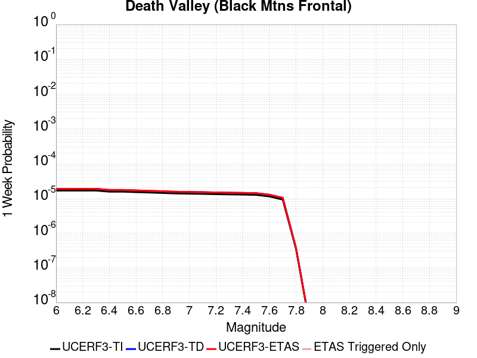 | 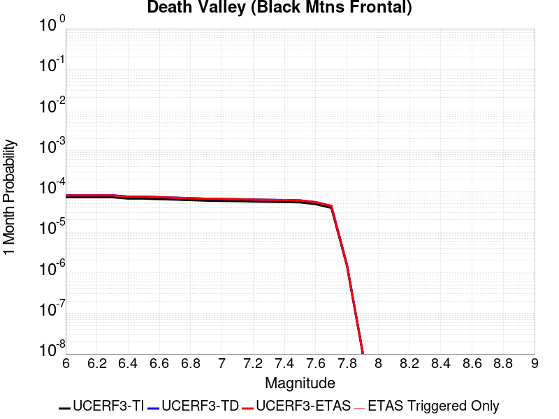 | 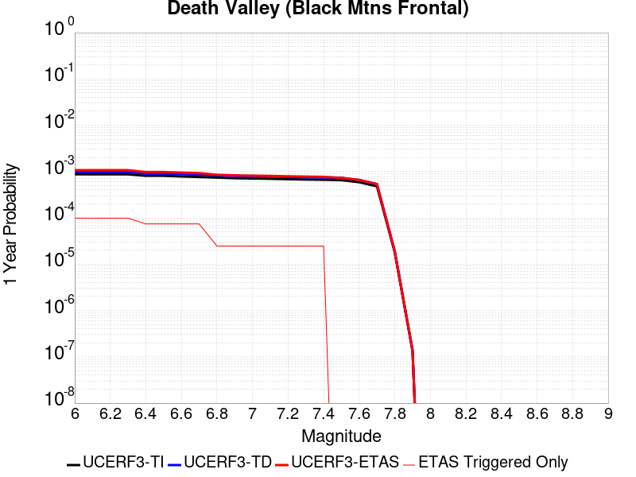 | 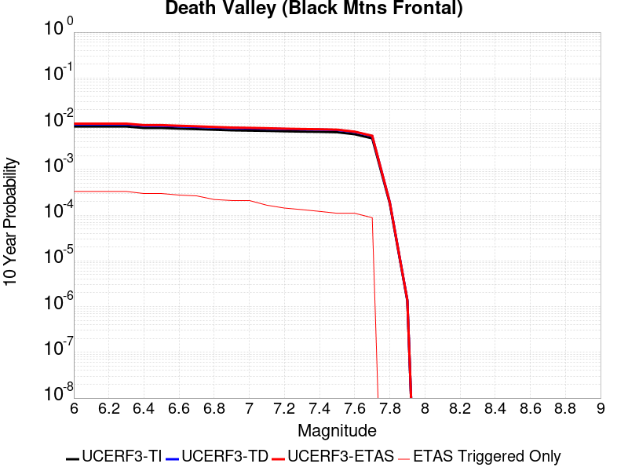 |

| Magnitude | 1 wk TI Prob | 1 wk TD Prob | 1 wk ETAS Prob | 1 wk ETAS/TD Gain | 1 wk ETAS Triggered Only | 1 mo TI Prob | 1 mo TD Prob | 1 mo ETAS Prob | 1 mo ETAS/TD Gain | 1 mo ETAS Triggered Only | 1 yr TI Prob | 1 yr TD Prob | 1 yr ETAS Prob | 1 yr ETAS/TD Gain | 1 yr ETAS Triggered Only | 10 yr TI Prob | 10 yr TD Prob | 10 yr ETAS Prob | 10 yr ETAS/TD Gain | 10 yr ETAS Triggered Only |
|-----|-----|-----|-----|-----|-----|-----|-----|-----|-----|-----|-----|-----|-----|-----|-----|-----|-----|-----|-----|-----|
| 6.0 | 1.6707214E-5 | 1.8672603E-5 | 1.8672603E-5 | 1.0 | 0.0 | 7.160038E-5 | 8.002303E-5 | 9.101116E-5 | 1.1373122 | 1.0989011E-5 | 8.71386E-4 | 9.738525E-4 | 0.0011165706 | 1.1465499 | 1.4285714E-4 | 0.00867977 | 0.009696703 | 0.010023177 | 1.0336685 | 3.2967032E-4 |
| 6.1 | 1.6707214E-5 | 1.8672603E-5 | 1.8672603E-5 | 1.0 | 0.0 | 7.160038E-5 | 8.002303E-5 | 9.101116E-5 | 1.1373122 | 1.0989011E-5 | 8.71386E-4 | 9.738525E-4 | 0.0011165706 | 1.1465499 | 1.4285714E-4 | 0.00867977 | 0.009696703 | 0.010023177 | 1.0336685 | 3.2967032E-4 |
| 6.2 | 1.6707214E-5 | 1.8672603E-5 | 1.8672603E-5 | 1.0 | 0.0 | 7.160038E-5 | 8.002303E-5 | 9.101116E-5 | 1.1373122 | 1.0989011E-5 | 8.71386E-4 | 9.738525E-4 | 0.0011165706 | 1.1465499 | 1.4285714E-4 | 0.00867977 | 0.009696703 | 0.010023177 | 1.0336685 | 3.2967032E-4 |
| 6.3 | 1.6707214E-5 | 1.8672603E-5 | 1.8672603E-5 | 1.0 | 0.0 | 7.160038E-5 | 8.002303E-5 | 9.101116E-5 | 1.1373122 | 1.0989011E-5 | 8.71386E-4 | 9.738525E-4 | 0.0011165706 | 1.1465499 | 1.4285714E-4 | 0.00867977 | 0.009696703 | 0.010023177 | 1.0336685 | 3.2967032E-4 |
| 6.4 | 1.5515609E-5 | 1.734038E-5 | 1.734038E-5 | 1.0 | 0.0 | 6.649377E-5 | 7.431384E-5 | 8.530203E-5 | 1.1478621 | 1.0989011E-5 | 8.0926094E-4 | 9.044015E-4 | 0.0010361504 | 1.1456752 | 1.3186813E-4 | 0.008063202 | 0.0090078935 | 0.009301924 | 1.0326414 | 2.967033E-4 |
| 6.5 | 1.5515609E-5 | 1.734038E-5 | 1.734038E-5 | 1.0 | 0.0 | 6.649377E-5 | 7.431384E-5 | 8.530203E-5 | 1.1478621 | 1.0989011E-5 | 8.0926094E-4 | 9.044015E-4 | 0.0010361504 | 1.1456752 | 1.3186813E-4 | 0.008063202 | 0.0090078935 | 0.009301924 | 1.0326414 | 2.967033E-4 |
| 6.6 | 1.5041828E-5 | 1.6811247E-5 | 1.6811247E-5 | 1.0 | 0.0 | 6.4463384E-5 | 7.204624E-5 | 8.3034465E-5 | 1.1525162 | 1.0989011E-5 | 7.8455906E-4 | 8.7681593E-4 | 0.0010085684 | 1.1502625 | 1.3186813E-4 | 0.00781795 | 0.00873422 | 0.009006546 | 1.0311792 | 2.747253E-4 |
| 6.7 | 1.4634985E-5 | 1.6358064E-5 | 1.6358064E-5 | 1.0 | 0.0 | 6.271985E-5 | 7.0104135E-5 | 8.1092374E-5 | 1.1567417 | 1.0989011E-5 | 7.6334673E-4 | 8.531894E-4 | 9.84945E-4 | 1.1544272 | 1.3186813E-4 | 0.007607299 | 0.008499775 | 0.00876127 | 1.0307649 | 2.6373626E-4 |
| 6.8 | 1.4209158E-5 | 1.5884038E-5 | 1.5884038E-5 | 1.0 | 0.0 | 6.089497E-5 | 6.80727E-5 | 7.906097E-5 | 1.1614195 | 1.0989011E-5 | 7.4114406E-4 | 8.2847563E-4 | 9.2729484E-4 | 1.1192783 | 9.89011E-5 | 0.007386771 | 0.008254486 | 0.008472453 | 1.0264058 | 2.1978022E-4 |
| 6.9 | 1.3780098E-5 | 1.5406526E-5 | 1.5406526E-5 | 1.0 | 0.0 | 5.9056227E-5 | 6.602633E-5 | 7.7014614E-5 | 1.1664227 | 1.0989011E-5 | 7.1877235E-4 | 8.035796E-4 | 9.0240117E-4 | 1.1229768 | 9.89011E-5 | 0.0071645193 | 0.008007334 | 0.008214453 | 1.0258662 | 2.0879121E-4 |
| 7.0 | 1.3585064E-5 | 1.5190063E-5 | 1.5190063E-5 | 1.0 | 0.0 | 5.8220405E-5 | 6.509868E-5 | 7.608697E-5 | 1.1687944 | 1.0989011E-5 | 7.086029E-4 | 7.9229363E-4 | 8.911164E-4 | 1.12473 | 9.89011E-5 | 0.007063476 | 0.007895282 | 0.008102424 | 1.0262363 | 2.0879121E-4 |
| 7.1 | 1.3398601E-5 | 1.4983223E-5 | 1.4983223E-5 | 1.0 | 0.0 | 5.742131E-5 | 6.421227E-5 | 7.520057E-5 | 1.1711247 | 1.0989011E-5 | 6.9888023E-4 | 7.815094E-4 | 8.693528E-4 | 1.1124022 | 8.7912085E-5 | 0.0069668638 | 0.0077881995 | 0.007951751 | 1.0209999 | 1.6483516E-4 |
| 7.2 | 1.3126312E-5 | 1.468141E-5 | 1.468141E-5 | 1.0 | 0.0 | 5.6254412E-5 | 6.291884E-5 | 6.291884E-5 | 1.0 | 0.0 | 6.846822E-4 | 7.657731E-4 | 8.4263727E-4 | 1.1003746 | 7.6923076E-5 | 0.006825765 | 0.0076319277 | 0.0077736946 | 1.0185755 | 1.4285714E-4 |
| 7.3 | 1.2922429E-5 | 1.4455612E-5 | 1.4455612E-5 | 1.0 | 0.0 | 5.5380664E-5 | 6.195118E-5 | 6.195118E-5 | 1.0 | 0.0 | 6.74051E-4 | 7.5400004E-4 | 8.308651E-4 | 1.101943 | 7.6923076E-5 | 0.006720101 | 0.0075149992 | 0.0076458766 | 1.0174154 | 1.3186813E-4 |
| 7.4 | 1.2768878E-5 | 1.4285575E-5 | 1.4285575E-5 | 1.0 | 0.0 | 5.4722615E-5 | 6.122249E-5 | 6.122249E-5 | 1.0 | 0.0 | 6.660441E-4 | 7.451343E-4 | 8.110193E-4 | 1.0884203 | 6.5934066E-5 | 0.0066405144 | 0.007426938 | 0.0075469194 | 1.0161549 | 1.2087912E-4 |
| 7.5 | 1.2521929E-5 | 1.401379E-5 | 1.401379E-5 | 1.0 | 0.0 | 5.366431E-5 | 6.0057748E-5 | 6.0057748E-5 | 1.0 | 0.0 | 6.531671E-4 | 7.309632E-4 | 7.858681E-4 | 1.075113 | 5.4945056E-5 | 0.006512506 | 0.0072861654 | 0.0073952544 | 1.0149721 | 1.0989011E-4 |
| 7.6 | 1.1301089E-5 | 1.2649753E-5 | 1.2649753E-5 | 1.0 | 0.0 | 4.8432343E-5 | 5.421213E-5 | 5.421213E-5 | 1.0 | 0.0 | 5.895042E-4 | 6.5983814E-4 | 7.1474694E-4 | 1.0832156 | 5.4945056E-5 | 0.0058794282 | 0.0065793423 | 0.006688509 | 1.0165924 | 1.0989011E-4 |
| 7.7 | 9.189108E-6 | 1.0284662E-5 | 1.0284662E-5 | 1.0 | 0.0 | 3.93813E-5 | 4.4076405E-5 | 4.4076405E-5 | 1.0 | 0.0 | 4.7936183E-4 | 5.3650315E-4 | 5.804356E-4 | 1.0818866 | 4.3956043E-5 | 0.004783291 | 0.0053525902 | 0.005440032 | 1.0163363 | 8.7912085E-5 |
| 7.8 | 3.4586725E-7 | 3.6484747E-7 | 3.6484747E-7 | 1.0 | 0.0 | 1.4822873E-6 | 1.5636311E-6 | 1.5636311E-6 | 1.0 | 0.0 | 1.80467E-5 | 1.9037047E-5 | 1.9037047E-5 | 1.0 | 0.0 | 1.8045233E-4 | 1.9035459E-4 | 1.9035459E-4 | 1.0 | 0.0 |
| 7.9 | 2.5591178E-9 | 2.6697942E-9 | 2.6697942E-9 | 1.0 | 0.0 | 1.0967647E-8 | 1.14419745E-8 | 1.14419745E-8 | 1.0 | 0.0 | 1.335311E-7 | 1.3930604E-7 | 1.3930604E-7 | 1.0 | 0.0 | 1.3353102E-6 | 1.3930604E-6 | 1.3930604E-6 | 1.0 | 0.0 |

## Helendale-So Lockhart
*[(top)](#table-of-contents)*

| 1 Week | 1 Month | 1 Year | 10 Year |
|-----|-----|-----|-----|
| 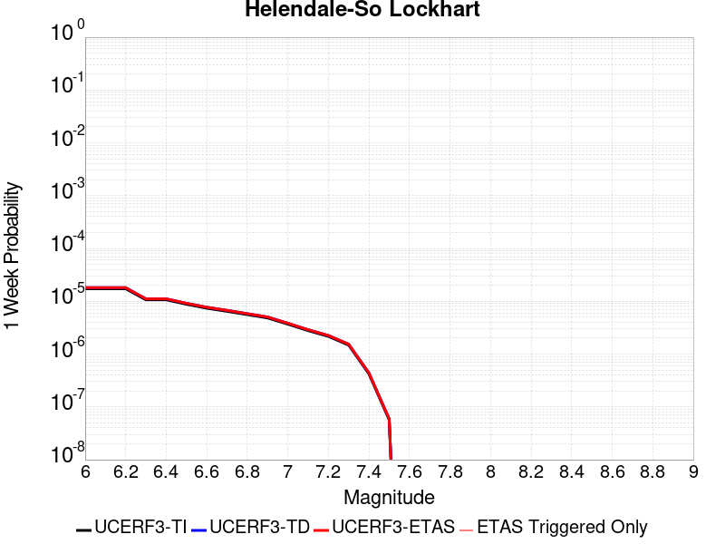 | 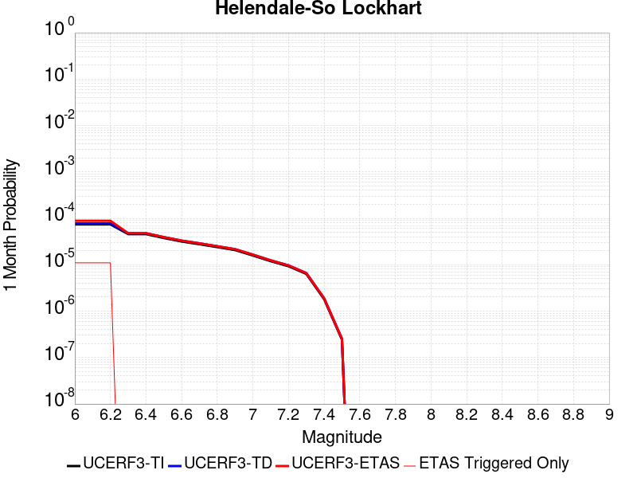 | 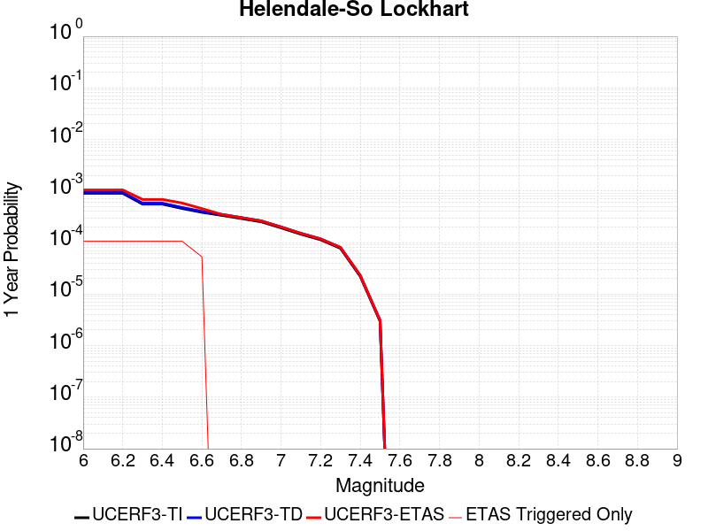 |  |

| Magnitude | 1 wk TI Prob | 1 wk TD Prob | 1 wk ETAS Prob | 1 wk ETAS/TD Gain | 1 wk ETAS Triggered Only | 1 mo TI Prob | 1 mo TD Prob | 1 mo ETAS Prob | 1 mo ETAS/TD Gain | 1 mo ETAS Triggered Only | 1 yr TI Prob | 1 yr TD Prob | 1 yr ETAS Prob | 1 yr ETAS/TD Gain | 1 yr ETAS Triggered Only | 10 yr TI Prob | 10 yr TD Prob | 10 yr ETAS Prob | 10 yr ETAS/TD Gain | 10 yr ETAS Triggered Only |
|-----|-----|-----|-----|-----|-----|-----|-----|-----|-----|-----|-----|-----|-----|-----|-----|-----|-----|-----|-----|-----|
| 6.0 | 1.7296055E-5 | 1.8104629E-5 | 1.8104629E-5 | 1.0 | 0.0 | 7.412385E-5 | 7.758907E-5 | 8.857723E-5 | 1.1416199 | 1.0989011E-5 | 9.0208417E-4 | 9.442583E-4 | 0.0010540447 | 1.1162673 | 1.0989011E-4 | 0.008984311 | 0.009404581 | 0.009720266 | 1.0335671 | 3.1868133E-4 |
| 6.1 | 1.7296055E-5 | 1.8104629E-5 | 1.8104629E-5 | 1.0 | 0.0 | 7.412385E-5 | 7.758907E-5 | 8.857723E-5 | 1.1416199 | 1.0989011E-5 | 9.0208417E-4 | 9.442583E-4 | 0.0010540447 | 1.1162673 | 1.0989011E-4 | 0.008984311 | 0.009404581 | 0.009720266 | 1.0335671 | 3.1868133E-4 |
| 6.2 | 1.7296055E-5 | 1.8104629E-5 | 1.8104629E-5 | 1.0 | 0.0 | 7.412385E-5 | 7.758907E-5 | 8.857723E-5 | 1.1416199 | 1.0989011E-5 | 9.0208417E-4 | 9.442583E-4 | 0.0010540447 | 1.1162673 | 1.0989011E-4 | 0.008984311 | 0.009404581 | 0.009720266 | 1.0335671 | 3.1868133E-4 |
| 6.3 | 1.0669118E-5 | 1.1135941E-5 | 1.1135941E-5 | 1.0 | 0.0 | 4.5723988E-5 | 4.7724607E-5 | 4.7724607E-5 | 1.0 | 0.0 | 5.5654737E-4 | 5.80895E-4 | 6.467907E-4 | 1.1134384 | 6.5934066E-5 | 0.0055515557 | 0.005794062 | 0.005990718 | 1.033941 | 1.978022E-4 |
| 6.4 | 1.0669118E-5 | 1.1135941E-5 | 1.1135941E-5 | 1.0 | 0.0 | 4.5723988E-5 | 4.7724607E-5 | 4.7724607E-5 | 1.0 | 0.0 | 5.5654737E-4 | 5.80895E-4 | 6.467907E-4 | 1.1134384 | 6.5934066E-5 | 0.0055515557 | 0.005794062 | 0.005990718 | 1.033941 | 1.978022E-4 |
| 6.5 | 8.790038E-6 | 9.170618E-6 | 9.170618E-6 | 1.0 | 0.0 | 3.767105E-5 | 3.9302067E-5 | 3.9302067E-5 | 1.0 | 0.0 | 4.585485E-4 | 4.7839913E-4 | 5.223342E-4 | 1.0918375 | 4.3956043E-5 | 0.0045760344 | 0.004773857 | 0.0049379054 | 1.0343639 | 1.6483516E-4 |
| 6.6 | 7.396949E-6 | 7.71589E-6 | 7.71589E-6 | 1.0 | 0.0 | 3.1700827E-5 | 3.306769E-5 | 3.306769E-5 | 1.0 | 0.0 | 3.858892E-4 | 4.0252574E-4 | 4.244949E-4 | 1.0545783 | 2.1978021E-5 | 0.003852198 | 0.0040180734 | 0.004149412 | 1.0326868 | 1.3186813E-4 |
| 6.7 | 6.4600285E-6 | 6.7383394E-6 | 6.7383394E-6 | 1.0 | 0.0 | 2.7685543E-5 | 2.8878281E-5 | 2.8878281E-5 | 1.0 | 0.0 | 3.3701936E-4 | 3.5153714E-4 | 3.625223E-4 | 1.0312489 | 1.0989011E-5 | 0.0033650869 | 0.0035098922 | 0.003630347 | 1.0343187 | 1.2087912E-4 |
| 6.8 | 5.600104E-6 | 5.8362707E-6 | 5.8362707E-6 | 1.0 | 0.0 | 2.4000226E-5 | 2.5012352E-5 | 2.5012352E-5 | 1.0 | 0.0 | 2.9216358E-4 | 3.0448343E-4 | 3.1546908E-4 | 1.0360796 | 1.0989011E-5 | 0.0029177975 | 0.003040724 | 0.0031393243 | 1.0324266 | 9.89011E-5 |
| 6.9 | 4.839122E-6 | 5.0397307E-6 | 5.0397307E-6 | 1.0 | 0.0 | 2.0738931E-5 | 2.1598671E-5 | 2.1598671E-5 | 1.0 | 0.0 | 2.5246723E-4 | 2.6293253E-4 | 2.7391867E-4 | 1.0417831 | 1.0989011E-5 | 0.002521806 | 0.0026262621 | 0.0027249034 | 1.0375596 | 9.89011E-5 |
| 7.0 | 3.6937633E-6 | 3.8453754E-6 | 3.8453754E-6 | 1.0 | 0.0 | 1.5830317E-5 | 1.6480079E-5 | 1.6480079E-5 | 1.0 | 0.0 | 1.9271708E-4 | 2.0062679E-4 | 2.1161359E-4 | 1.0547624 | 1.0989011E-5 | 0.0019255003 | 0.0020044881 | 0.002092224 | 1.0437697 | 8.7912085E-5 |
| 7.1 | 2.7858857E-6 | 2.8979773E-6 | 2.8979773E-6 | 1.0 | 0.0 | 1.1939455E-5 | 1.2419845E-5 | 1.2419845E-5 | 1.0 | 0.0 | 1.4535317E-4 | 1.5120134E-4 | 1.6218869E-4 | 1.072667 | 1.0989011E-5 | 0.0014525814 | 0.0015110062 | 0.0015768406 | 1.0435699 | 6.5934066E-5 |
| 7.2 | 2.1672065E-6 | 2.2541085E-6 | 2.2541085E-6 | 1.0 | 0.0 | 9.2879945E-6 | 9.660431E-6 | 9.660431E-6 | 1.0 | 0.0 | 1.1307546E-4 | 1.17609576E-4 | 1.17609576E-4 | 1.0 | 0.0 | 0.0011301794 | 0.0011754916 | 0.0012193959 | 1.0373498 | 4.3956043E-5 |
| 7.3 | 1.4823496E-6 | 1.5422763E-6 | 1.5422763E-6 | 1.0 | 0.0 | 6.3529114E-6 | 6.6097396E-6 | 6.6097396E-6 | 1.0 | 0.0 | 7.734395E-5 | 8.047076E-5 | 8.047076E-5 | 1.0 | 0.0 | 7.731704E-4 | 8.044313E-4 | 8.154115E-4 | 1.0136496 | 1.0989011E-5 |
| 7.4 | 4.2321457E-7 | 4.4110743E-7 | 4.4110743E-7 | 1.0 | 0.0 | 1.8137755E-6 | 1.8904593E-6 | 1.8904593E-6 | 1.0 | 0.0 | 2.2082493E-5 | 2.3016144E-5 | 2.3016144E-5 | 1.0 | 0.0 | 2.2080299E-4 | 2.3014213E-4 | 2.3014213E-4 | 1.0 | 0.0 |
| 7.5 | 5.6942316E-8 | 5.9418383E-8 | 5.9418383E-8 | 1.0 | 0.0 | 2.440385E-7 | 2.546502E-7 | 2.546502E-7 | 1.0 | 0.0 | 2.9711643E-6 | 3.1003626E-6 | 3.1003626E-6 | 1.0 | 0.0 | 2.9711247E-5 | 3.100327E-5 | 3.100327E-5 | 1.0 | 0.0 |

## Coyote Lake
*[(top)](#table-of-contents)*

| 1 Week | 1 Month | 1 Year | 10 Year |
|-----|-----|-----|-----|
| 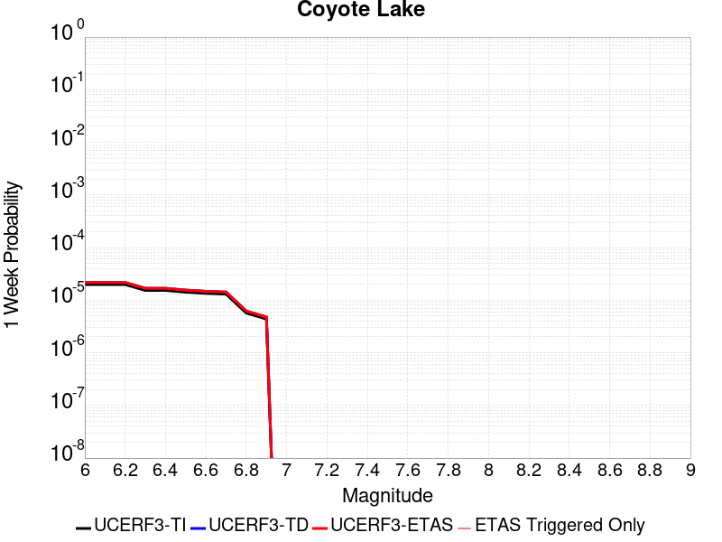 | 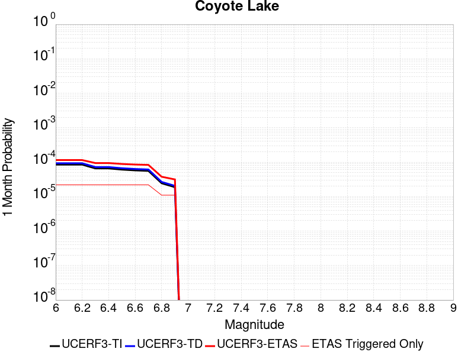 | 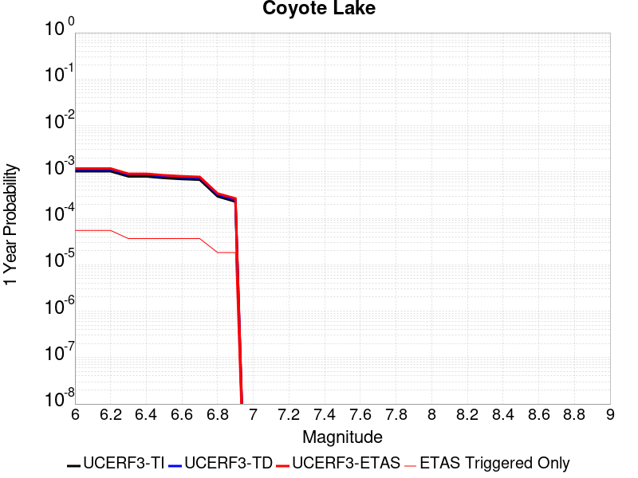 | 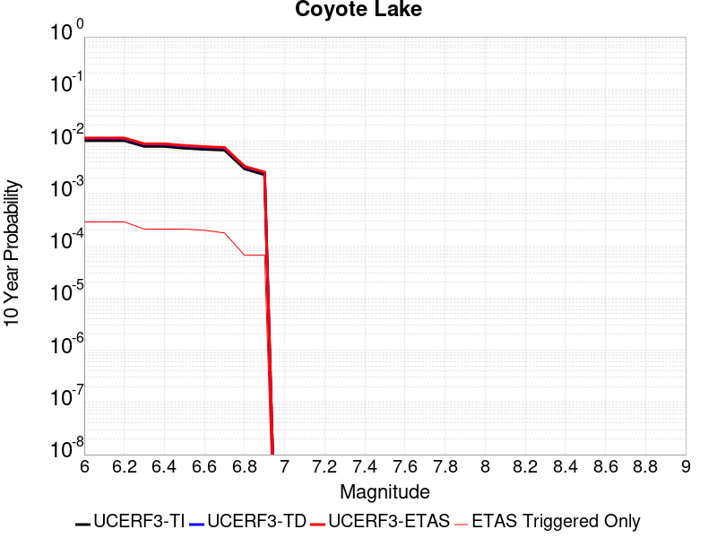 |

| Magnitude | 1 wk TI Prob | 1 wk TD Prob | 1 wk ETAS Prob | 1 wk ETAS/TD Gain | 1 wk ETAS Triggered Only | 1 mo TI Prob | 1 mo TD Prob | 1 mo ETAS Prob | 1 mo ETAS/TD Gain | 1 mo ETAS Triggered Only | 1 yr TI Prob | 1 yr TD Prob | 1 yr ETAS Prob | 1 yr ETAS/TD Gain | 1 yr ETAS Triggered Only | 10 yr TI Prob | 10 yr TD Prob | 10 yr ETAS Prob | 10 yr ETAS/TD Gain | 10 yr ETAS Triggered Only |
|-----|-----|-----|-----|-----|-----|-----|-----|-----|-----|-----|-----|-----|-----|-----|-----|-----|-----|-----|-----|-----|
| 6.0 | 1.980352E-5 | 2.170896E-5 | 4.3686505E-5 | 2.012372 | 2.1978021E-5 | 8.486947E-5 | 9.303549E-5 | 1.1501146E-4 | 1.2362107 | 2.1978021E-5 | 0.0010327959 | 0.0011321905 | 0.0012090264 | 1.0678649 | 7.6923076E-5 | 0.010280091 | 0.011271402 | 0.011553896 | 1.0250629 | 2.8571428E-4 |
| 6.1 | 1.980352E-5 | 2.170896E-5 | 4.3686505E-5 | 2.012372 | 2.1978021E-5 | 8.486947E-5 | 9.303549E-5 | 1.1501146E-4 | 1.2362107 | 2.1978021E-5 | 0.0010327959 | 0.0011321905 | 0.0012090264 | 1.0678649 | 7.6923076E-5 | 0.010280091 | 0.011271402 | 0.011553896 | 1.0250629 | 2.8571428E-4 |
| 6.2 | 1.980352E-5 | 2.170896E-5 | 4.3686505E-5 | 2.012372 | 2.1978021E-5 | 8.486947E-5 | 9.303549E-5 | 1.1501146E-4 | 1.2362107 | 2.1978021E-5 | 0.0010327959 | 0.0011321905 | 0.0012090264 | 1.0678649 | 7.6923076E-5 | 0.010280091 | 0.011271402 | 0.011553896 | 1.0250629 | 2.8571428E-4 |
| 6.3 | 1.5344787E-5 | 1.6822387E-5 | 3.8800037E-5 | 2.3064528 | 2.1978021E-5 | 6.576172E-5 | 7.209429E-5 | 9.407073E-5 | 1.3048291 | 2.1978021E-5 | 8.003548E-4 | 8.774558E-4 | 9.4333204E-4 | 1.0750763 | 6.5934066E-5 | 0.007974784 | 0.008745959 | 0.008952924 | 1.0236641 | 2.0879121E-4 |
| 6.4 | 1.5344787E-5 | 1.6822387E-5 | 3.8800037E-5 | 2.3064528 | 2.1978021E-5 | 6.576172E-5 | 7.209429E-5 | 9.407073E-5 | 1.3048291 | 2.1978021E-5 | 8.003548E-4 | 8.774558E-4 | 9.4333204E-4 | 1.0750763 | 6.5934066E-5 | 0.007974784 | 0.008745959 | 0.008952924 | 1.0236641 | 2.0879121E-4 |
| 6.5 | 1.4189697E-5 | 1.5559579E-5 | 3.753726E-5 | 2.4124854 | 2.1978021E-5 | 6.081157E-5 | 6.668255E-5 | 8.86591E-5 | 1.3295698 | 2.1978021E-5 | 7.401293E-4 | 8.1161794E-4 | 8.774985E-4 | 1.0811719 | 6.5934066E-5 | 0.0073766913 | 0.008092482 | 0.008299584 | 1.0255919 | 2.0879121E-4 |
| 6.6 | 1.3469301E-5 | 1.4773093E-5 | 3.675079E-5 | 2.4876842 | 2.1978021E-5 | 5.7724297E-5 | 6.331206E-5 | 8.528869E-5 | 1.347116 | 2.1978021E-5 | 7.025667E-4 | 7.706117E-4 | 8.3649496E-4 | 1.0854948 | 6.5934066E-5 | 0.0070034964 | 0.0076853004 | 0.007881583 | 1.0255399 | 1.978022E-4 |
| 6.7 | 1.3027966E-5 | 1.4283204E-5 | 3.6260913E-5 | 2.5387099 | 2.1978021E-5 | 5.5832945E-5 | 6.121263E-5 | 8.318931E-5 | 1.3590219 | 2.1978021E-5 | 6.7955407E-4 | 7.450687E-4 | 7.9997286E-4 | 1.07369 | 5.4945056E-5 | 0.006774798 | 0.007431586 | 0.007606103 | 1.0234832 | 1.7582417E-4 |
| 6.8 | 5.695434E-6 | 6.225031E-6 | 1.7213973E-5 | 2.765283 | 1.0989011E-5 | 2.4408775E-5 | 2.6678601E-5 | 3.766732E-5 | 1.4118925 | 1.0989011E-5 | 2.971363E-4 | 3.2479357E-4 | 3.5774987E-4 | 1.1014686 | 3.2967033E-5 | 0.0029673933 | 0.0032461302 | 0.0033118501 | 1.0202457 | 6.5934066E-5 |
| 6.9 | 4.385688E-6 | 4.7935278E-6 | 1.5782485E-5 | 3.2924573 | 1.0989011E-5 | 1.879567E-5 | 2.054369E-5 | 3.1532476E-5 | 1.5348983 | 1.0989011E-5 | 2.2881327E-4 | 2.5011942E-4 | 2.8307823E-4 | 1.1317722 | 3.2967033E-5 | 0.002285778 | 0.0025011944 | 0.0025669634 | 1.0262951 | 6.5934066E-5 |

## San Andreas (Big Bend)
*[(top)](#table-of-contents)*

| 1 Week | 1 Month | 1 Year | 10 Year |
|-----|-----|-----|-----|
| 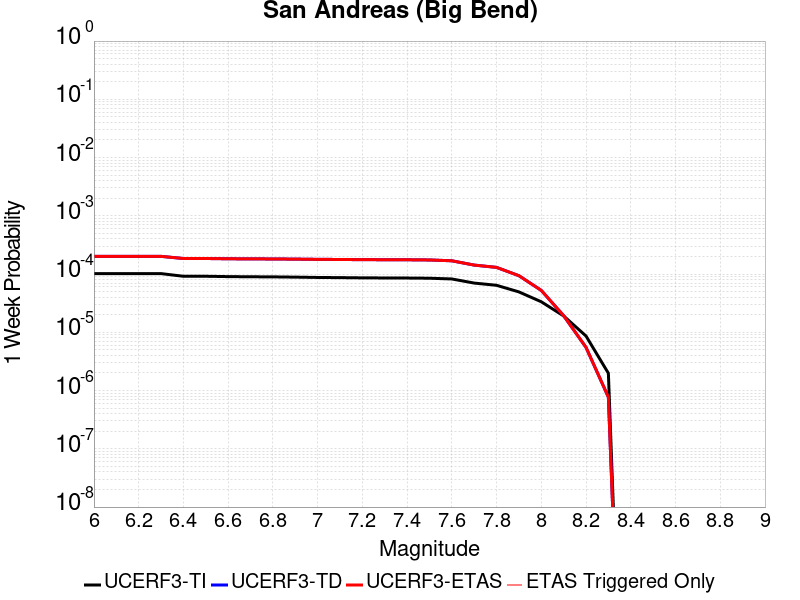 | 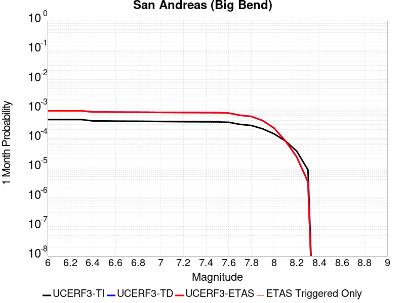 | 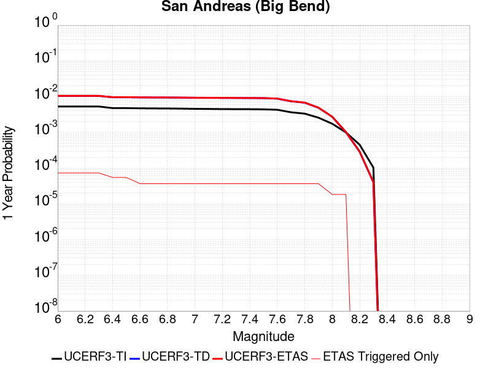 |  |

| Magnitude | 1 wk TI Prob | 1 wk TD Prob | 1 wk ETAS Prob | 1 wk ETAS/TD Gain | 1 wk ETAS Triggered Only | 1 mo TI Prob | 1 mo TD Prob | 1 mo ETAS Prob | 1 mo ETAS/TD Gain | 1 mo ETAS Triggered Only | 1 yr TI Prob | 1 yr TD Prob | 1 yr ETAS Prob | 1 yr ETAS/TD Gain | 1 yr ETAS Triggered Only | 10 yr TI Prob | 10 yr TD Prob | 10 yr ETAS Prob | 10 yr ETAS/TD Gain | 10 yr ETAS Triggered Only |
|-----|-----|-----|-----|-----|-----|-----|-----|-----|-----|-----|-----|-----|-----|-----|-----|-----|-----|-----|-----|-----|
| 6.0 | 1.0179969E-4 | 2.014058E-4 | 2.014058E-4 | 1.0 | 0.0 | 4.362114E-4 | 8.628832E-4 | 8.628832E-4 | 1.0 | 0.0 | 0.0052979486 | 0.010455282 | 0.010531401 | 1.0072805 | 7.6923076E-5 | 0.051734097 | 0.10174658 | 0.10196374 | 1.0021343 | 2.4175824E-4 |
| 6.1 | 1.0179969E-4 | 2.014058E-4 | 2.014058E-4 | 1.0 | 0.0 | 4.362114E-4 | 8.628832E-4 | 8.628832E-4 | 1.0 | 0.0 | 0.0052979486 | 0.010455282 | 0.010531401 | 1.0072805 | 7.6923076E-5 | 0.051734097 | 0.10174658 | 0.10196374 | 1.0021343 | 2.4175824E-4 |
| 6.2 | 1.0179969E-4 | 2.014058E-4 | 2.014058E-4 | 1.0 | 0.0 | 4.362114E-4 | 8.628832E-4 | 8.628832E-4 | 1.0 | 0.0 | 0.0052979486 | 0.010455282 | 0.010531401 | 1.0072805 | 7.6923076E-5 | 0.051734097 | 0.10174658 | 0.10196374 | 1.0021343 | 2.4175824E-4 |
| 6.3 | 1.0179969E-4 | 2.014058E-4 | 2.014058E-4 | 1.0 | 0.0 | 4.362114E-4 | 8.628832E-4 | 8.628832E-4 | 1.0 | 0.0 | 0.0052979486 | 0.010455282 | 0.010531401 | 1.0072805 | 7.6923076E-5 | 0.051734097 | 0.10174658 | 0.10196374 | 1.0021343 | 2.4175824E-4 |
| 6.4 | 9.1639464E-5 | 1.849651E-4 | 1.849651E-4 | 1.0 | 0.0 | 3.9268145E-4 | 7.92467E-4 | 7.92467E-4 | 1.0 | 0.0 | 0.0047704205 | 0.009605722 | 0.009649255 | 1.0045321 | 4.3956043E-5 | 0.046693064 | 0.09406955 | 0.09419897 | 1.0013758 | 1.4285714E-4 |
| 6.5 | 9.1639464E-5 | 1.849651E-4 | 1.849651E-4 | 1.0 | 0.0 | 3.9268145E-4 | 7.92467E-4 | 7.92467E-4 | 1.0 | 0.0 | 0.0047704205 | 0.009605722 | 0.009649255 | 1.0045321 | 4.3956043E-5 | 0.046693064 | 0.09406955 | 0.09419897 | 1.0013758 | 1.4285714E-4 |
| 6.6 | 9.042622E-5 | 1.8303402E-4 | 1.8303402E-4 | 1.0 | 0.0 | 3.8748336E-4 | 7.841959E-4 | 7.841959E-4 | 1.0 | 0.0 | 0.0047074095 | 0.009505902 | 0.009538556 | 1.0034351 | 3.2967033E-5 | 0.046089325 | 0.09316317 | 0.09328275 | 1.0012835 | 1.3186813E-4 |
| 6.7 | 8.9836685E-5 | 1.8217682E-4 | 1.8217682E-4 | 1.0 | 0.0 | 3.8495753E-4 | 7.805244E-4 | 7.805244E-4 | 1.0 | 0.0 | 0.00467679 | 0.00946159 | 0.009494245 | 1.0034513 | 3.2967033E-5 | 0.045795817 | 0.09275731 | 0.09286697 | 1.0011823 | 1.2087912E-4 |
| 6.8 | 8.9471854E-5 | 1.81644E-4 | 1.81644E-4 | 1.0 | 0.0 | 3.8339442E-4 | 7.7824225E-4 | 7.7824225E-4 | 1.0 | 0.0 | 0.004657841 | 0.009434046 | 0.009466702 | 1.0034615 | 3.2967033E-5 | 0.04561414 | 0.092504315 | 0.09261401 | 1.0011859 | 1.2087912E-4 |
| 6.9 | 8.858234E-5 | 1.8046265E-4 | 1.8046265E-4 | 1.0 | 0.0 | 3.7958333E-4 | 7.731823E-4 | 7.731823E-4 | 1.0 | 0.0 | 0.004611638 | 0.009372972 | 0.009405631 | 1.0034842 | 3.2967033E-5 | 0.04517103 | 0.091944106 | 0.0920439 | 1.0010853 | 1.0989011E-4 |
| 7.0 | 8.7433385E-5 | 1.7884896E-4 | 1.7884896E-4 | 1.0 | 0.0 | 3.746607E-4 | 7.662706E-4 | 7.662706E-4 | 1.0 | 0.0 | 0.004551957 | 0.009289543 | 0.009322204 | 1.0035158 | 3.2967033E-5 | 0.044598386 | 0.091178015 | 0.09127789 | 1.0010953 | 1.0989011E-4 |
| 7.1 | 8.684964E-5 | 1.7796745E-4 | 1.7796745E-4 | 1.0 | 0.0 | 3.7215967E-4 | 7.624949E-4 | 7.624949E-4 | 1.0 | 0.0 | 0.0045216335 | 0.009243964 | 0.009276627 | 1.0035334 | 3.2967033E-5 | 0.04430731 | 0.09075921 | 0.09085913 | 1.0011009 | 1.0989011E-4 |
| 7.2 | 8.606521E-5 | 1.7687255E-4 | 1.7687255E-4 | 1.0 | 0.0 | 3.6879873E-4 | 7.578052E-4 | 7.578052E-4 | 1.0 | 0.0 | 0.0044808835 | 0.00918735 | 0.009220014 | 1.0035553 | 3.2967033E-5 | 0.043916024 | 0.090239406 | 0.09033938 | 1.0011079 | 1.0989011E-4 |
| 7.3 | 8.568266E-5 | 1.7629136E-4 | 1.7629136E-4 | 1.0 | 0.0 | 3.6715972E-4 | 7.553158E-4 | 7.553158E-4 | 1.0 | 0.0 | 0.0044610105 | 0.009157297 | 0.009189962 | 1.0035671 | 3.2967033E-5 | 0.043725148 | 0.08996009 | 0.0900601 | 1.0011116 | 1.0989011E-4 |
| 7.4 | 8.5432206E-5 | 1.7591644E-4 | 1.7591644E-4 | 1.0 | 0.0 | 3.6608664E-4 | 7.5370993E-4 | 7.5370993E-4 | 1.0 | 0.0 | 0.004447999 | 0.00913791 | 0.009170576 | 1.0035747 | 3.2967033E-5 | 0.043600157 | 0.08977997 | 0.08988 | 1.0011141 | 1.0989011E-4 |
| 7.5 | 8.4791965E-5 | 1.7460699E-4 | 1.7460699E-4 | 1.0 | 0.0 | 3.633435E-4 | 7.481013E-4 | 7.481013E-4 | 1.0 | 0.0 | 0.0044147377 | 0.009070195 | 0.009102863 | 1.0036017 | 3.2967033E-5 | 0.043280575 | 0.08915666 | 0.08925675 | 1.0011227 | 1.0989011E-4 |
| 7.6 | 8.241105E-5 | 1.6905028E-4 | 1.6905028E-4 | 1.0 | 0.0 | 3.531424E-4 | 7.243002E-4 | 7.243002E-4 | 1.0 | 0.0 | 0.0042910352 | 0.008782789 | 0.008815466 | 1.0037206 | 3.2967033E-5 | 0.042091176 | 0.08652985 | 0.0866202 | 1.001044 | 9.89011E-5 |
| 7.7 | 7.00432E-5 | 1.4262824E-4 | 1.4262824E-4 | 1.0 | 0.0 | 3.001506E-4 | 6.111207E-4 | 6.111207E-4 | 1.0 | 0.0 | 0.0036482112 | 0.007415052 | 0.0074477745 | 1.004413 | 3.2967033E-5 | 0.035888977 | 0.073780596 | 0.07385184 | 1.0009657 | 7.6923076E-5 |
| 7.8 | 6.415362E-5 | 1.3021544E-4 | 1.3021544E-4 | 1.0 | 0.0 | 2.749151E-4 | 5.5794686E-4 | 5.5794686E-4 | 1.0 | 0.0 | 0.0033419547 | 0.0067718746 | 0.0068046185 | 1.0048352 | 3.2967033E-5 | 0.03292141 | 0.06749143 | 0.067563154 | 1.0010629 | 7.6923076E-5 |
| 7.9 | 4.939911E-5 | 9.378932E-5 | 9.378932E-5 | 1.0 | 0.0 | 2.116933E-4 | 4.0189232E-4 | 4.0189232E-4 | 1.0 | 0.0 | 0.0025743195 | 0.0048820707 | 0.0049039414 | 1.0044798 | 2.1978021E-5 | 0.025447013 | 0.049091615 | 0.049133413 | 1.0008514 | 4.3956043E-5 |
| 8.0 | 3.344983E-5 | 5.2452913E-5 | 5.2452913E-5 | 1.0 | 0.0 | 1.4334853E-4 | 2.2477885E-4 | 2.2477885E-4 | 1.0 | 0.0 | 0.0017438711 | 0.0027332497 | 0.0027442088 | 1.0040095 | 1.0989011E-5 | 0.017302496 | 0.028033478 | 0.02805484 | 1.000762 | 2.1978021E-5 |
| 8.1 | 1.9104898E-5 | 1.9284143E-5 | 1.9284143E-5 | 1.0 | 0.0 | 8.1875565E-5 | 8.264371E-5 | 8.264371E-5 | 1.0 | 0.0 | 9.963791E-4 | 0.0010057234 | 0.0010167013 | 1.0109155 | 1.0989011E-5 | 0.009919235 | 0.01080821 | 0.01081908 | 1.0010058 | 1.0989011E-5 |
| 8.2 | 8.643924E-6 | 5.5167247E-6 | 5.5167247E-6 | 1.0 | 0.0 | 3.704486E-5 | 2.3642891E-5 | 2.3642891E-5 | 1.0 | 0.0 | 4.5092785E-4 | 2.8781427E-4 | 2.8781427E-4 | 1.0 | 0.0 | 0.0045001395 | 0.0032716133 | 0.0032716133 | 1.0 | 0.0 |
| 8.3 | 1.983087E-6 | 7.731745E-7 | 7.731745E-7 | 1.0 | 0.0 | 8.498917E-6 | 3.313601E-6 | 3.313601E-6 | 1.0 | 0.0 | 1.034694E-4 | 4.0342362E-5 | 4.0342362E-5 | 1.0 | 0.0 | 0.0010342124 | 4.7608858E-4 | 4.7608858E-4 | 1.0 | 0.0 |

## San Andreas (San Gorgonio Pass-Garnet HIll)
*[(top)](#table-of-contents)*

| 1 Week | 1 Month | 1 Year | 10 Year |
|-----|-----|-----|-----|
| 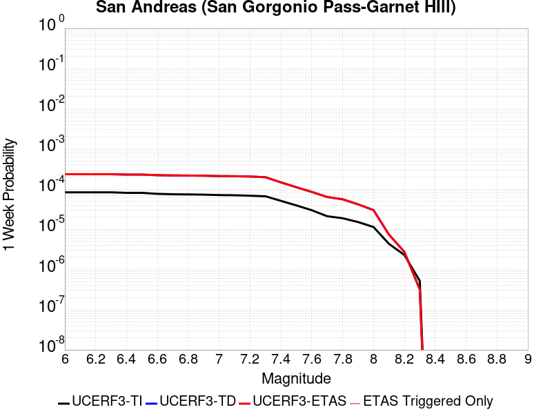 | 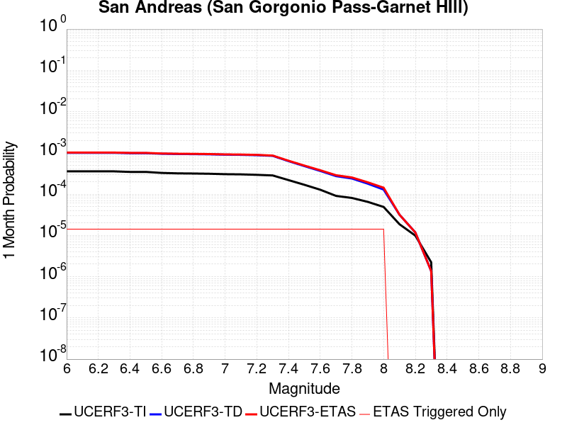 | 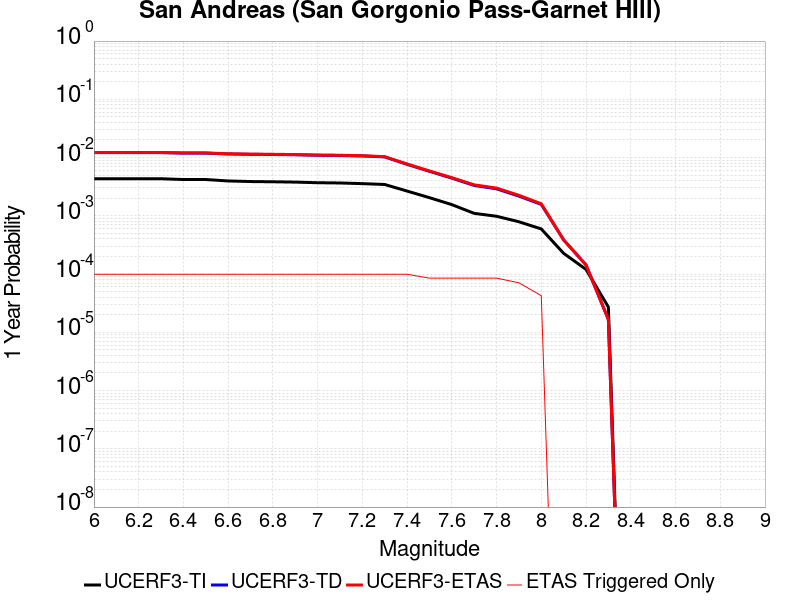 | 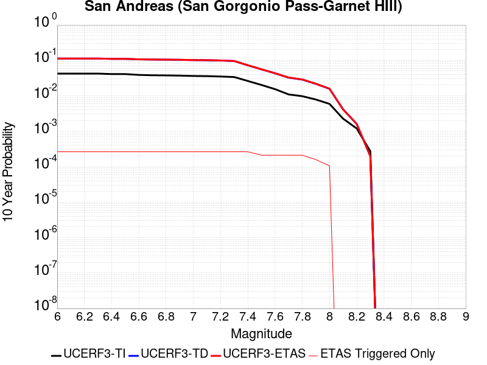 |

| Magnitude | 1 wk TI Prob | 1 wk TD Prob | 1 wk ETAS Prob | 1 wk ETAS/TD Gain | 1 wk ETAS Triggered Only | 1 mo TI Prob | 1 mo TD Prob | 1 mo ETAS Prob | 1 mo ETAS/TD Gain | 1 mo ETAS Triggered Only | 1 yr TI Prob | 1 yr TD Prob | 1 yr ETAS Prob | 1 yr ETAS/TD Gain | 1 yr ETAS Triggered Only | 10 yr TI Prob | 10 yr TD Prob | 10 yr ETAS Prob | 10 yr ETAS/TD Gain | 10 yr ETAS Triggered Only |
|-----|-----|-----|-----|-----|-----|-----|-----|-----|-----|-----|-----|-----|-----|-----|-----|-----|-----|-----|-----|-----|
| 6.0 | 8.31567E-5 | 2.3414505E-4 | 2.3414505E-4 | 1.0 | 0.0 | 3.5633717E-4 | 0.0010030948 | 0.0010250509 | 1.0218883 | 2.1978021E-5 | 0.004329778 | 0.012144244 | 0.012241945 | 1.008045 | 9.89011E-5 | 0.042463828 | 0.112708785 | 0.11289404 | 1.0016437 | 2.0879121E-4 |
| 6.1 | 8.31567E-5 | 2.3414505E-4 | 2.3414505E-4 | 1.0 | 0.0 | 3.5633717E-4 | 0.0010030948 | 0.0010250509 | 1.0218883 | 2.1978021E-5 | 0.004329778 | 0.012144244 | 0.012241945 | 1.008045 | 9.89011E-5 | 0.042463828 | 0.112708785 | 0.11289404 | 1.0016437 | 2.0879121E-4 |
| 6.2 | 8.31567E-5 | 2.3414505E-4 | 2.3414505E-4 | 1.0 | 0.0 | 3.5633717E-4 | 0.0010030948 | 0.0010250509 | 1.0218883 | 2.1978021E-5 | 0.004329778 | 0.012144244 | 0.012241945 | 1.008045 | 9.89011E-5 | 0.042463828 | 0.112708785 | 0.11289404 | 1.0016437 | 2.0879121E-4 |
| 6.3 | 8.31567E-5 | 2.3414505E-4 | 2.3414505E-4 | 1.0 | 0.0 | 3.5633717E-4 | 0.0010030948 | 0.0010250509 | 1.0218883 | 2.1978021E-5 | 0.004329778 | 0.012144244 | 0.012241945 | 1.008045 | 9.89011E-5 | 0.042463828 | 0.112708785 | 0.11289404 | 1.0016437 | 2.0879121E-4 |
| 6.4 | 8.059055E-5 | 2.2972451E-4 | 2.2972451E-4 | 1.0 | 0.0 | 3.4534236E-4 | 9.841647E-4 | 0.001006121 | 1.0223097 | 2.1978021E-5 | 0.0041964394 | 0.011916306 | 0.012014029 | 1.0082008 | 9.89011E-5 | 0.041180745 | 0.11068947 | 0.11087515 | 1.0016775 | 2.0879121E-4 |
| 6.5 | 8.059055E-5 | 2.2972451E-4 | 2.2972451E-4 | 1.0 | 0.0 | 3.4534236E-4 | 9.841647E-4 | 0.001006121 | 1.0223097 | 2.1978021E-5 | 0.0041964394 | 0.011916306 | 0.012014029 | 1.0082008 | 9.89011E-5 | 0.041180745 | 0.11068947 | 0.11087515 | 1.0016775 | 2.0879121E-4 |
| 6.6 | 7.619237E-5 | 2.2216294E-4 | 2.2216294E-4 | 1.0 | 0.0 | 3.2649786E-4 | 9.5178175E-4 | 9.7373885E-4 | 1.0230695 | 2.1978021E-5 | 0.0039678677 | 0.011526926 | 0.011624688 | 1.0084811 | 9.89011E-5 | 0.03897764 | 0.10722548 | 0.107411884 | 1.0017384 | 2.0879121E-4 |
| 6.7 | 7.440636E-5 | 2.1892048E-4 | 2.1892048E-4 | 1.0 | 0.0 | 3.188454E-4 | 9.378955E-4 | 9.5985294E-4 | 1.0234114 | 2.1978021E-5 | 0.0038750346 | 0.01135963 | 0.011457408 | 1.0086075 | 9.89011E-5 | 0.038081564 | 0.105733834 | 0.10591072 | 1.001673 | 1.978022E-4 |
| 6.8 | 7.3735864E-5 | 2.1739179E-4 | 2.1739179E-4 | 1.0 | 0.0 | 3.1597257E-4 | 9.313487E-4 | 9.533062E-4 | 1.0235761 | 2.1978021E-5 | 0.0038401815 | 0.011280751 | 0.011378536 | 1.0086683 | 9.89011E-5 | 0.03774495 | 0.10503531 | 0.10521234 | 1.0016854 | 1.978022E-4 |
| 6.9 | 7.27575E-5 | 2.1508102E-4 | 2.1508102E-4 | 1.0 | 0.0 | 3.117806E-4 | 9.214524E-4 | 9.434102E-4 | 1.0238296 | 2.1978021E-5 | 0.003789323 | 0.011161504 | 0.011259302 | 1.008762 | 9.89011E-5 | 0.037253562 | 0.103983164 | 0.1041604 | 1.0017045 | 1.978022E-4 |
| 7.0 | 7.102591E-5 | 2.109201E-4 | 2.109201E-4 | 1.0 | 0.0 | 3.0436125E-4 | 9.036324E-4 | 9.255905E-4 | 1.0242999 | 2.1978021E-5 | 0.003699303 | 0.010946743 | 0.011044562 | 1.0089358 | 9.89011E-5 | 0.03638325 | 0.10208506 | 0.10226267 | 1.0017399 | 1.978022E-4 |
| 7.1 | 7.028513E-5 | 2.0927594E-4 | 2.0927594E-4 | 1.0 | 0.0 | 3.0118722E-4 | 8.965908E-4 | 9.1854914E-4 | 1.024491 | 2.1978021E-5 | 0.0036607897 | 0.010861871 | 0.010959698 | 1.0090065 | 9.89011E-5 | 0.036010686 | 0.10132793 | 0.1015057 | 1.0017543 | 1.978022E-4 |
| 7.2 | 6.8498244E-5 | 2.0535318E-4 | 2.0535318E-4 | 1.0 | 0.0 | 2.9353087E-4 | 8.7979046E-4 | 9.017491E-4 | 1.024959 | 2.1978021E-5 | 0.003567883 | 0.010659343 | 0.010757189 | 1.0091795 | 9.89011E-5 | 0.035111405 | 0.09951958 | 0.099697694 | 1.0017898 | 1.978022E-4 |
| 7.3 | 6.622592E-5 | 1.9762218E-4 | 1.9762218E-4 | 1.0 | 0.0 | 2.8379448E-4 | 8.4667944E-4 | 8.6863886E-4 | 1.0259359 | 2.1978021E-5 | 0.0034497243 | 0.010260082 | 0.0103579685 | 1.0095406 | 9.89011E-5 | 0.033966612 | 0.0960149 | 0.09619371 | 1.0018623 | 1.978022E-4 |
| 7.4 | 5.1050705E-5 | 1.4715092E-4 | 1.4715092E-4 | 1.0 | 0.0 | 2.1877038E-4 | 6.3049525E-4 | 6.524594E-4 | 1.0348364 | 2.1978021E-5 | 0.002660276 | 0.0076494548 | 0.0077475994 | 1.0128303 | 9.89011E-5 | 0.02628654 | 0.072975665 | 0.07315903 | 1.0025127 | 1.978022E-4 |
| 7.5 | 3.9302922E-5 | 1.1152523E-4 | 1.1152523E-4 | 1.0 | 0.0 | 1.6843023E-4 | 4.7787806E-4 | 4.998456E-4 | 1.0459689 | 2.1978021E-5 | 0.0020487092 | 0.005802714 | 0.0058901156 | 1.0150622 | 8.7912085E-5 | 0.020299247 | 0.056109704 | 0.056286037 | 1.0031426 | 1.8681318E-4 |
| 7.6 | 2.9851626E-5 | 8.5151754E-5 | 8.5151754E-5 | 1.0 | 0.0 | 1.2792926E-4 | 3.6488517E-4 | 3.868552E-4 | 1.0602107 | 2.1978021E-5 | 0.0015564259 | 0.0044334535 | 0.004520976 | 1.0197413 | 8.7912085E-5 | 0.0154556995 | 0.04328418 | 0.04346291 | 1.0041292 | 1.8681318E-4 |
| 7.7 | 2.1135214E-5 | 6.3708605E-5 | 6.3708605E-5 | 1.0 | 0.0 | 9.0576345E-5 | 2.7300834E-4 | 2.9498036E-4 | 1.0804812 | 2.1978021E-5 | 0.0011022091 | 0.003318816 | 0.0034064362 | 1.026401 | 8.7912085E-5 | 0.010967582 | 0.03266356 | 0.03284427 | 1.0055325 | 1.8681318E-4 |
| 7.8 | 1.883379E-5 | 5.5805158E-5 | 5.5805158E-5 | 1.0 | 0.0 | 8.0713755E-5 | 2.3914306E-4 | 2.611158E-4 | 1.0918813 | 2.1978021E-5 | 9.822468E-4 | 0.0029076824 | 0.002995339 | 1.0301465 | 8.7912085E-5 | 0.0097791655 | 0.028769925 | 0.028951366 | 1.0063065 | 1.8681318E-4 |
| 7.9 | 1.5156185E-5 | 4.1793628E-5 | 4.1793628E-5 | 1.0 | 0.0 | 6.495346E-5 | 1.7910327E-4 | 2.0107735E-4 | 1.1226895 | 2.1978021E-5 | 7.9052144E-4 | 0.0021784029 | 0.0022551585 | 1.0352348 | 7.6923076E-5 | 0.007877152 | 0.021821551 | 0.021993538 | 1.0078815 | 1.7582417E-4 |
| 8.0 | 1.1405907E-5 | 3.007569E-5 | 3.007569E-5 | 1.0 | 0.0 | 4.8881542E-5 | 1.2888944E-4 | 1.5086464E-4 | 1.1704965 | 2.1978021E-5 | 5.9497025E-4 | 0.0015681004 | 0.0016229593 | 1.0349844 | 5.4945056E-5 | 0.005933798 | 0.015819972 | 0.015949754 | 1.0082036 | 1.3186813E-4 |
| 8.1 | 4.3511436E-6 | 7.4057634E-6 | 7.4057634E-6 | 1.0 | 0.0 | 1.8647626E-5 | 3.17386E-5 | 3.17386E-5 | 1.0 | 0.0 | 2.2701119E-4 | 3.863491E-4 | 3.863491E-4 | 1.0 | 0.0 | 0.0022677942 | 0.004134587 | 0.004134587 | 1.0 | 0.0 |
| 8.2 | 2.3042528E-6 | 2.7502406E-6 | 2.7502406E-6 | 1.0 | 0.0 | 9.875332E-6 | 1.1786692E-5 | 1.1786692E-5 | 1.0 | 0.0 | 1.2022553E-4 | 1.4349357E-4 | 1.4349357E-4 | 1.0 | 0.0 | 0.0012016051 | 0.0016070296 | 0.0016070296 | 1.0 | 0.0 |
| 8.3 | 5.202968E-7 | 3.1885122E-7 | 3.1885122E-7 | 1.0 | 0.0 | 2.2298414E-6 | 1.3665045E-6 | 1.3665045E-6 | 1.0 | 0.0 | 2.714798E-5 | 1.663708E-5 | 1.663708E-5 | 1.0 | 0.0 | 2.7144665E-4 | 1.9725217E-4 | 1.9725217E-4 | 1.0 | 0.0 |

## Owens Valley
*[(top)](#table-of-contents)*

| 1 Week | 1 Month | 1 Year | 10 Year |
|-----|-----|-----|-----|
| 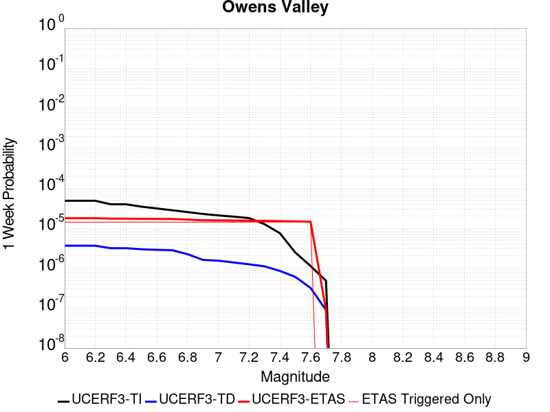 | 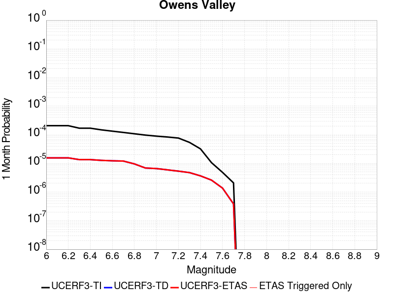 | 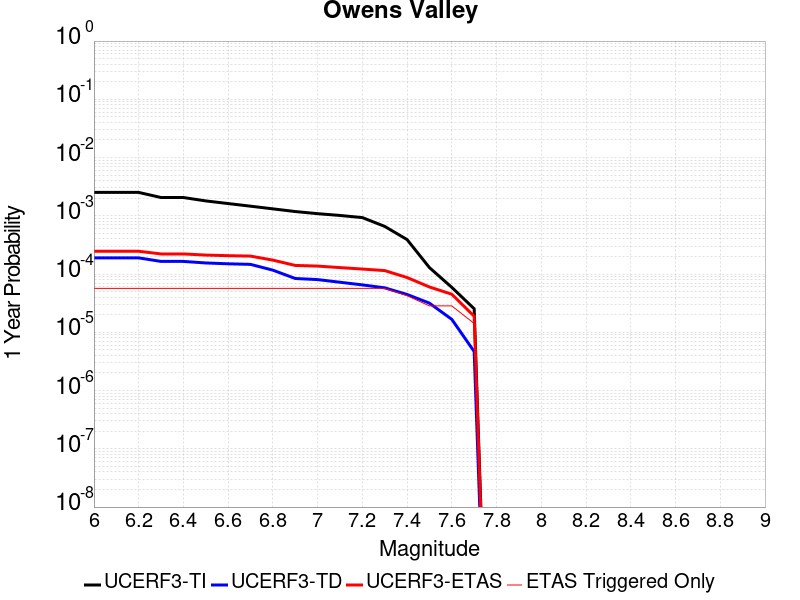 | 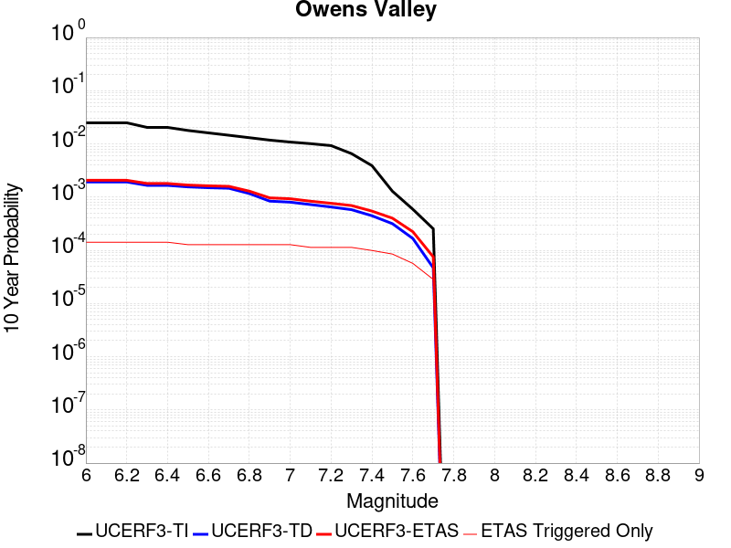 |

| Magnitude | 1 wk TI Prob | 1 wk TD Prob | 1 wk ETAS Prob | 1 wk ETAS/TD Gain | 1 wk ETAS Triggered Only | 1 mo TI Prob | 1 mo TD Prob | 1 mo ETAS Prob | 1 mo ETAS/TD Gain | 1 mo ETAS Triggered Only | 1 yr TI Prob | 1 yr TD Prob | 1 yr ETAS Prob | 1 yr ETAS/TD Gain | 1 yr ETAS Triggered Only | 10 yr TI Prob | 10 yr TD Prob | 10 yr ETAS Prob | 10 yr ETAS/TD Gain | 10 yr ETAS Triggered Only |
|-----|-----|-----|-----|-----|-----|-----|-----|-----|-----|-----|-----|-----|-----|-----|-----|-----|-----|-----|-----|-----|
| 6.0 | 4.83821E-5 | 3.6332003E-6 | 1.4622171E-5 | 4.024598 | 1.0989011E-5 | 2.0733538E-4 | 1.5570771E-5 | 7.051497E-5 | 4.5286756 | 5.4945056E-5 | 0.002521386 | 1.8955865E-4 | 2.9942792E-4 | 1.5796057 | 1.0989011E-4 | 0.024929691 | 0.0019284424 | 0.0021039275 | 1.0909984 | 1.7582417E-4 |
| 6.1 | 4.83821E-5 | 3.6332003E-6 | 1.4622171E-5 | 4.024598 | 1.0989011E-5 | 2.0733538E-4 | 1.5570771E-5 | 7.051497E-5 | 4.5286756 | 5.4945056E-5 | 0.002521386 | 1.8955865E-4 | 2.9942792E-4 | 1.5796057 | 1.0989011E-4 | 0.024929691 | 0.0019284424 | 0.0021039275 | 1.0909984 | 1.7582417E-4 |
| 6.2 | 4.83821E-5 | 3.6332003E-6 | 1.4622171E-5 | 4.024598 | 1.0989011E-5 | 2.0733538E-4 | 1.5570771E-5 | 7.051497E-5 | 4.5286756 | 5.4945056E-5 | 0.002521386 | 1.8955865E-4 | 2.9942792E-4 | 1.5796057 | 1.0989011E-4 | 0.024929691 | 0.0019284424 | 0.0021039275 | 1.0909984 | 1.7582417E-4 |
| 6.3 | 3.953008E-5 | 3.158994E-6 | 1.414797E-5 | 4.4786315 | 1.0989011E-5 | 1.6940363E-4 | 1.353848E-5 | 5.749393E-5 | 4.246705 | 4.3956043E-5 | 0.002060538 | 1.6481927E-4 | 2.6370407E-4 | 1.599959 | 9.89011E-5 | 0.020415364 | 0.0016611157 | 0.001825677 | 1.0990667 | 1.6483516E-4 |
| 6.4 | 3.953008E-5 | 3.158994E-6 | 1.414797E-5 | 4.4786315 | 1.0989011E-5 | 1.6940363E-4 | 1.353848E-5 | 5.749393E-5 | 4.246705 | 4.3956043E-5 | 0.002060538 | 1.6481927E-4 | 2.6370407E-4 | 1.599959 | 9.89011E-5 | 0.020415364 | 0.0016611157 | 0.001825677 | 1.0990667 | 1.6483516E-4 |
| 6.5 | 3.457342E-5 | 2.9739288E-6 | 1.3962907E-5 | 4.6951046 | 1.0989011E-5 | 1.4816338E-4 | 1.274535E-5 | 4.5711964E-5 | 3.58656 | 3.2967033E-5 | 0.0018023965 | 1.5516429E-4 | 2.4306274E-4 | 1.5664864 | 8.7912085E-5 | 0.017878477 | 0.0015569815 | 0.0016996162 | 1.0916097 | 1.4285714E-4 |
| 6.6 | 3.1127765E-5 | 2.87613E-6 | 1.3865109E-5 | 4.8207517 | 1.0989011E-5 | 1.3339789E-4 | 1.2326218E-5 | 4.5292843E-5 | 3.6745129 | 3.2967033E-5 | 0.0016229092 | 1.5006206E-4 | 2.3796095E-4 | 1.5857503 | 8.7912085E-5 | 0.016111081 | 0.0015021288 | 0.0016447713 | 1.0949602 | 1.4285714E-4 |
| 6.7 | 2.806885E-5 | 2.8116349E-6 | 1.3800615E-5 | 4.908395 | 1.0989011E-5 | 1.2028952E-4 | 1.20498125E-5 | 4.5016448E-5 | 3.735863 | 3.2967033E-5 | 0.001463541 | 1.4669728E-4 | 2.3459646E-4 | 1.5991876 | 8.7912085E-5 | 0.014539397 | 0.0014663904 | 0.0016090381 | 1.0972781 | 1.4285714E-4 |
| 6.8 | 2.524524E-5 | 2.2364259E-6 | 1.3225413E-5 | 5.9136376 | 1.0989011E-5 | 1.0818939E-4 | 9.584649E-6 | 4.2551364E-5 | 4.4395328 | 3.2967033E-5 | 0.0013164099 | 1.1668716E-4 | 2.0458899E-4 | 1.753312 | 8.7912085E-5 | 0.01308639 | 0.001166533 | 0.0013092235 | 1.1223202 | 1.4285714E-4 |
| 6.9 | 2.2704568E-5 | 1.6089475E-6 | 1.259794E-5 | 7.8299265 | 1.0989011E-5 | 9.730166E-5 | 6.895471E-6 | 3.9862276E-5 | 5.780936 | 3.2967033E-5 | 0.0011840039 | 8.394915E-5 | 1.7185386E-4 | 2.0471187 | 8.7912085E-5 | 0.011777153 | 8.3938777E-4 | 9.82125E-4 | 1.1700492 | 1.4285714E-4 |
| 7.0 | 2.0871712E-5 | 1.5402817E-6 | 1.2529275E-5 | 8.134405 | 1.0989011E-5 | 8.944713E-5 | 6.6011908E-6 | 3.9568007E-5 | 5.994071 | 3.2967033E-5 | 0.0010884746 | 8.036655E-5 | 1.6827158E-4 | 2.093801 | 8.7912085E-5 | 0.010831586 | 8.035493E-4 | 9.4629166E-4 | 1.1776398 | 1.4285714E-4 |
| 7.1 | 1.944928E-5 | 1.3870473E-6 | 1.2376043E-5 | 8.922582 | 1.0989011E-5 | 8.335139E-5 | 5.944475E-6 | 3.8911312E-5 | 6.5457945 | 3.2967033E-5 | 0.0010143308 | 7.237159E-5 | 1.6027731E-4 | 2.2146442 | 8.7912085E-5 | 0.010097133 | 7.236403E-4 | 8.5541303E-4 | 1.182097 | 1.3186813E-4 |
| 7.2 | 1.7876306E-5 | 1.249468E-6 | 1.2238465E-5 | 9.794941 | 1.0989011E-5 | 7.6610486E-5 | 5.354852E-6 | 3.832171E-5 | 7.156446 | 3.2967033E-5 | 9.3233347E-4 | 6.519338E-5 | 1.5309974E-4 | 2.348394 | 8.7912085E-5 | 0.009284316 | 6.5188174E-4 | 7.8366394E-4 | 1.2021565 | 1.3186813E-4 |
| 7.3 | 1.2618672E-5 | 1.1120352E-6 | 1.2101034E-5 | 10.881881 | 1.0989011E-5 | 5.40789E-5 | 4.7658564E-6 | 3.773273E-5 | 7.917304 | 3.2967033E-5 | 6.582117E-4 | 5.8022764E-5 | 1.4592975E-4 | 2.515043 | 8.7912085E-5 | 0.0065626553 | 5.802104E-4 | 7.1200205E-4 | 1.2271445 | 1.3186813E-4 |
| 7.4 | 7.4874442E-6 | 8.552969E-7 | 1.1844299E-5 | 13.848172 | 1.0989011E-5 | 3.208865E-5 | 3.6655529E-6 | 3.6632464E-5 | 9.993708 | 3.2967033E-5 | 3.906093E-4 | 4.46272E-5 | 1.21546844E-4 | 2.7236047 | 7.6923076E-5 | 0.003899234 | 4.4627616E-4 | 5.6710135E-4 | 1.2707409 | 1.2087912E-4 |
| 7.5 | 2.4734156E-6 | 6.071494E-7 | 1.1596154E-5 | 19.099342 | 1.0989011E-5 | 1.060031E-5 | 2.6020664E-6 | 2.4580031E-5 | 9.446351 | 2.1978021E-5 | 1.2905113E-4 | 3.16797E-5 | 8.662301E-5 | 2.7343383 | 5.4945056E-5 | 0.0012897621 | 3.1675215E-4 | 4.1562194E-4 | 1.312136 | 9.89011E-5 |
| 7.6 | 1.1328841E-6 | 3.1979587E-7 | 1.1308804E-5 | 35.362568 | 1.0989011E-5 | 4.8552088E-6 | 1.370553E-6 | 2.3348544E-5 | 17.035856 | 2.1978021E-5 | 5.9110564E-5 | 1.6686357E-5 | 7.163049E-5 | 4.292758 | 5.4945056E-5 | 5.9094845E-4 | 1.6685124E-4 | 2.4376147E-4 | 1.460951 | 7.6923076E-5 |
| 7.7 | 4.8613185E-7 | 8.970251E-8 | 8.970251E-8 | 1.0 | 0.0 | 2.0834207E-6 | 3.8443926E-7 | 3.8443926E-7 | 1.0 | 0.0 | 2.536535E-5 | 4.6805385E-6 | 1.5669499E-5 | 3.347798 | 1.0989011E-5 | 2.5362454E-4 | 4.6804467E-5 | 6.878146E-5 | 1.4695491 | 2.1978021E-5 |

## San Andreas (Parkfield)
*[(top)](#table-of-contents)*

| 1 Week | 1 Month | 1 Year | 10 Year |
|-----|-----|-----|-----|
| 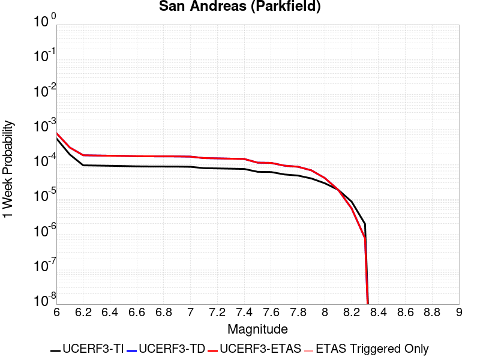 | 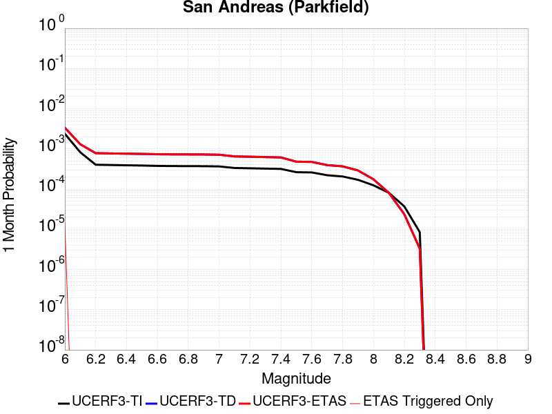 | 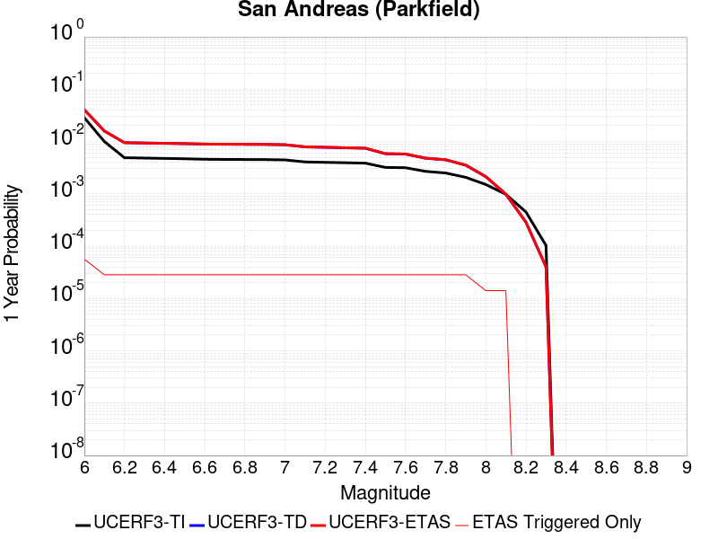 | 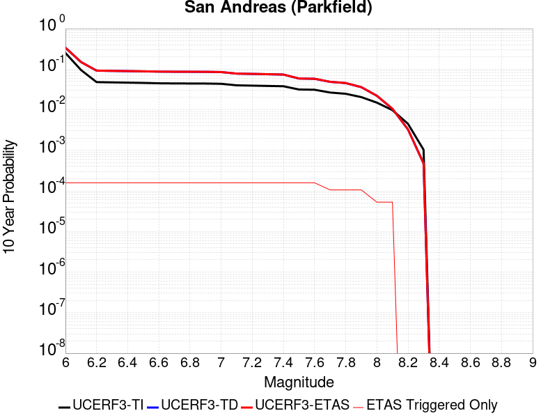 |

| Magnitude | 1 wk TI Prob | 1 wk TD Prob | 1 wk ETAS Prob | 1 wk ETAS/TD Gain | 1 wk ETAS Triggered Only | 1 mo TI Prob | 1 mo TD Prob | 1 mo ETAS Prob | 1 mo ETAS/TD Gain | 1 mo ETAS Triggered Only | 1 yr TI Prob | 1 yr TD Prob | 1 yr ETAS Prob | 1 yr ETAS/TD Gain | 1 yr ETAS Triggered Only | 10 yr TI Prob | 10 yr TD Prob | 10 yr ETAS Prob | 10 yr ETAS/TD Gain | 10 yr ETAS Triggered Only |
|-----|-----|-----|-----|-----|-----|-----|-----|-----|-----|-----|-----|-----|-----|-----|-----|-----|-----|-----|-----|-----|
| 6.0 | 5.556969E-4 | 7.859536E-4 | 7.859536E-4 | 1.0 | 0.0 | 0.0023793848 | 0.0033645865 | 0.0033755386 | 1.0032551 | 1.0989011E-5 | 0.028586963 | 0.040577162 | 0.040629875 | 1.0012991 | 5.4945056E-5 | 0.25176284 | 0.33838087 | 0.3384972 | 1.0003438 | 1.7582417E-4 |
| 6.1 | 1.925858E-4 | 3.0503818E-4 | 3.0503818E-4 | 1.0 | 0.0 | 8.2510663E-4 | 0.0013067479 | 0.0013067479 | 1.0 | 0.0 | 0.0099994885 | 0.01589046 | 0.015922904 | 1.0020417 | 3.2967033E-5 | 0.095613256 | 0.150276 | 0.15037872 | 1.0006835 | 1.2087912E-4 |
| 6.2 | 9.4306815E-5 | 1.8304172E-4 | 1.8304172E-4 | 1.0 | 0.0 | 4.0410945E-4 | 7.842299E-4 | 7.842299E-4 | 1.0 | 0.0 | 0.0049089384 | 0.009506407 | 0.00953906 | 1.0034349 | 3.2967033E-5 | 0.048019063 | 0.09212034 | 0.09223009 | 1.0011913 | 1.2087912E-4 |
| 6.3 | 9.283051E-5 | 1.8000482E-4 | 1.8000482E-4 | 1.0 | 0.0 | 3.9778434E-4 | 7.7122235E-4 | 7.7122235E-4 | 1.0 | 0.0 | 0.0048322747 | 0.00934941 | 0.009382069 | 1.0034932 | 3.2967033E-5 | 0.047285385 | 0.09077296 | 0.09088286 | 1.0012108 | 1.2087912E-4 |
| 6.4 | 9.138826E-5 | 1.7762266E-4 | 1.7762266E-4 | 1.0 | 0.0 | 3.916052E-4 | 7.6101907E-4 | 7.6101907E-4 | 1.0 | 0.0 | 0.0047573745 | 0.009226245 | 0.009258908 | 1.0035402 | 3.2967033E-5 | 0.046568092 | 0.08967384 | 0.08978388 | 1.0012271 | 1.2087912E-4 |
| 6.5 | 9.000255E-5 | 1.7519935E-4 | 1.7519935E-4 | 1.0 | 0.0 | 3.8566816E-4 | 7.506395E-4 | 7.506395E-4 | 1.0 | 0.0 | 0.0046854047 | 0.009100947 | 0.009133614 | 1.0035894 | 3.2967033E-5 | 0.045878403 | 0.08855845 | 0.08866863 | 1.0012441 | 1.2087912E-4 |
| 6.6 | 8.8109264E-5 | 1.7200313E-4 | 1.7200313E-4 | 1.0 | 0.0 | 3.7755648E-4 | 7.369492E-4 | 7.369492E-4 | 1.0 | 0.0 | 0.0045870654 | 0.008935661 | 0.008968334 | 1.0036564 | 3.2967033E-5 | 0.04493529 | 0.087087445 | 0.087197796 | 1.0012672 | 1.2087912E-4 |
| 6.7 | 8.738073E-5 | 1.7067218E-4 | 1.7067218E-4 | 1.0 | 0.0 | 3.7443507E-4 | 7.3124835E-4 | 7.3124835E-4 | 1.0 | 0.0 | 0.0045492216 | 0.008866861 | 0.008899537 | 1.003685 | 3.2967033E-5 | 0.04457213 | 0.08648729 | 0.08659772 | 1.0012767 | 1.2087912E-4 |
| 6.8 | 8.710195E-5 | 1.7012582E-4 | 1.7012582E-4 | 1.0 | 0.0 | 3.7324068E-4 | 7.2890805E-4 | 7.2890805E-4 | 1.0 | 0.0 | 0.0045347405 | 0.008838609 | 0.008871284 | 1.0036969 | 3.2967033E-5 | 0.04443313 | 0.08623441 | 0.08634487 | 1.0012809 | 1.2087912E-4 |
| 6.9 | 8.6801556E-5 | 1.6953409E-4 | 1.6953409E-4 | 1.0 | 0.0 | 3.7195362E-4 | 7.263735E-4 | 7.263735E-4 | 1.0 | 0.0 | 0.0045191357 | 0.008808001 | 0.008840677 | 1.0037099 | 3.2967033E-5 | 0.044283327 | 0.085960045 | 0.08607053 | 1.0012853 | 1.2087912E-4 |
| 7.0 | 8.5571606E-5 | 1.6705737E-4 | 1.6705737E-4 | 1.0 | 0.0 | 3.6668387E-4 | 7.157649E-4 | 7.157649E-4 | 1.0 | 0.0 | 0.004455241 | 0.008679876 | 0.008712557 | 1.0037651 | 3.2967033E-5 | 0.043669727 | 0.08480672 | 0.08491735 | 1.0013045 | 1.2087912E-4 |
| 7.1 | 7.82589E-5 | 1.5184609E-4 | 1.5184609E-4 | 1.0 | 0.0 | 3.3535215E-4 | 6.506074E-4 | 6.506074E-4 | 1.0 | 0.0 | 0.0040752706 | 0.007892547 | 0.007925254 | 1.0041441 | 3.2967033E-5 | 0.040013418 | 0.07771205 | 0.0778134 | 1.0013041 | 1.0989011E-4 |
| 7.2 | 7.690929E-5 | 1.4921518E-4 | 1.4921518E-4 | 1.0 | 0.0 | 3.2956956E-4 | 6.393376E-4 | 6.393376E-4 | 1.0 | 0.0 | 0.004005129 | 0.007756322 | 0.0077890335 | 1.0042174 | 3.2967033E-5 | 0.0393371 | 0.07648417 | 0.07658566 | 1.0013269 | 1.0989011E-4 |
| 7.3 | 7.5543794E-5 | 1.4617428E-4 | 1.4617428E-4 | 1.0 | 0.0 | 3.2371894E-4 | 6.263115E-4 | 6.263115E-4 | 1.0 | 0.0 | 0.003934157 | 0.0075988453 | 0.007631562 | 1.0043055 | 3.2967033E-5 | 0.038652334 | 0.07504487 | 0.07514652 | 1.0013545 | 1.0989011E-4 |
| 7.4 | 7.4214564E-5 | 1.431766E-4 | 1.431766E-4 | 1.0 | 0.0 | 3.1802364E-4 | 6.1347045E-4 | 6.1347045E-4 | 1.0 | 0.0 | 0.003865065 | 0.0074435836 | 0.007476305 | 1.004396 | 3.2967033E-5 | 0.03798529 | 0.07361605 | 0.07371785 | 1.0013828 | 1.0989011E-4 |
| 7.5 | 6.149578E-5 | 1.1237888E-4 | 1.1237888E-4 | 1.0 | 0.0 | 2.6352672E-4 | 4.8153498E-4 | 4.8153498E-4 | 1.0 | 0.0 | 0.0032037178 | 0.005846961 | 0.005879735 | 1.0056053 | 3.2967033E-5 | 0.03157923 | 0.0587748 | 0.058867887 | 1.0015838 | 9.89011E-5 |
| 7.6 | 6.0643448E-5 | 1.10660854E-4 | 1.10660854E-4 | 1.0 | 0.0 | 2.598746E-4 | 4.741747E-4 | 4.741747E-4 | 1.0 | 0.0 | 0.0031593828 | 0.0057578264 | 0.005790604 | 1.0056926 | 3.2967033E-5 | 0.031148417 | 0.057934027 | 0.0580272 | 1.0016083 | 9.89011E-5 |
| 7.7 | 5.1652263E-5 | 9.216647E-5 | 9.216647E-5 | 1.0 | 0.0 | 2.2134806E-4 | 3.949394E-4 | 3.949394E-4 | 1.0 | 0.0 | 0.002691582 | 0.004797796 | 0.004830605 | 1.0068383 | 3.2967033E-5 | 0.026592141 | 0.04873269 | 0.048805866 | 1.0015016 | 7.6923076E-5 |
| 7.8 | 4.8090482E-5 | 8.598273E-5 | 8.598273E-5 | 1.0 | 0.0 | 2.060858E-4 | 3.6844538E-4 | 3.6844538E-4 | 1.0 | 0.0 | 0.0025062072 | 0.004476604 | 0.0045094234 | 1.0073314 | 3.2967033E-5 | 0.024781305 | 0.04548402 | 0.045557447 | 1.0016143 | 7.6923076E-5 |
| 7.9 | 3.970278E-5 | 6.780531E-5 | 6.780531E-5 | 1.0 | 0.0 | 1.7014367E-4 | 2.9056185E-4 | 2.9056185E-4 | 1.0 | 0.0 | 0.002069531 | 0.003531856 | 0.0035537563 | 1.0062008 | 2.1978021E-5 | 0.020503636 | 0.03602571 | 0.03606808 | 1.0011761 | 4.3956043E-5 |
| 8.0 | 2.8982335E-5 | 4.08898E-5 | 4.08898E-5 | 1.0 | 0.0 | 1.2420409E-4 | 1.7523023E-4 | 1.7523023E-4 | 1.0 | 0.0 | 0.0015111357 | 0.0021313417 | 0.0021423073 | 1.005145 | 1.0989011E-5 | 0.015009012 | 0.022106694 | 0.022128187 | 1.0009722 | 2.1978021E-5 |
| 8.1 | 1.8836186E-5 | 1.8790506E-5 | 1.8790506E-5 | 1.0 | 0.0 | 8.0724014E-5 | 8.0528254E-5 | 8.0528254E-5 | 1.0 | 0.0 | 9.823717E-4 | 9.799912E-4 | 9.909694E-4 | 1.0112023 | 1.0989011E-5 | 0.009780403 | 0.010545682 | 0.010556555 | 1.001031 | 1.0989011E-5 |
| 8.2 | 8.643924E-6 | 5.5167247E-6 | 5.5167247E-6 | 1.0 | 0.0 | 3.704486E-5 | 2.3642891E-5 | 2.3642891E-5 | 1.0 | 0.0 | 4.5092785E-4 | 2.8781427E-4 | 2.8781427E-4 | 1.0 | 0.0 | 0.0045001395 | 0.0032716133 | 0.0032716133 | 1.0 | 0.0 |
| 8.3 | 1.983087E-6 | 7.731745E-7 | 7.731745E-7 | 1.0 | 0.0 | 8.498917E-6 | 3.313601E-6 | 3.313601E-6 | 1.0 | 0.0 | 1.034694E-4 | 4.0342362E-5 | 4.0342362E-5 | 1.0 | 0.0 | 0.0010342124 | 4.7608858E-4 | 4.7608858E-4 | 1.0 | 0.0 |

## Elsinore (Glen Ivy) rev
*[(top)](#table-of-contents)*

| 1 Week | 1 Month | 1 Year | 10 Year |
|-----|-----|-----|-----|
| 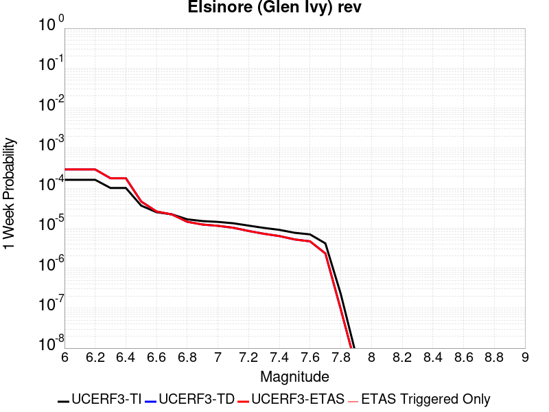 | 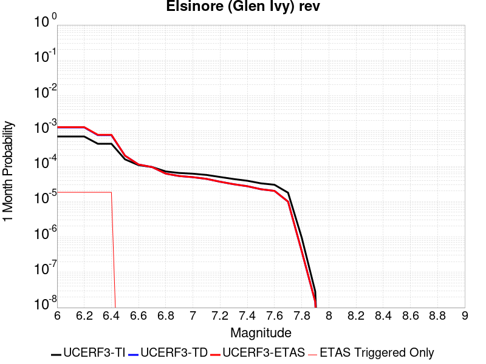 | 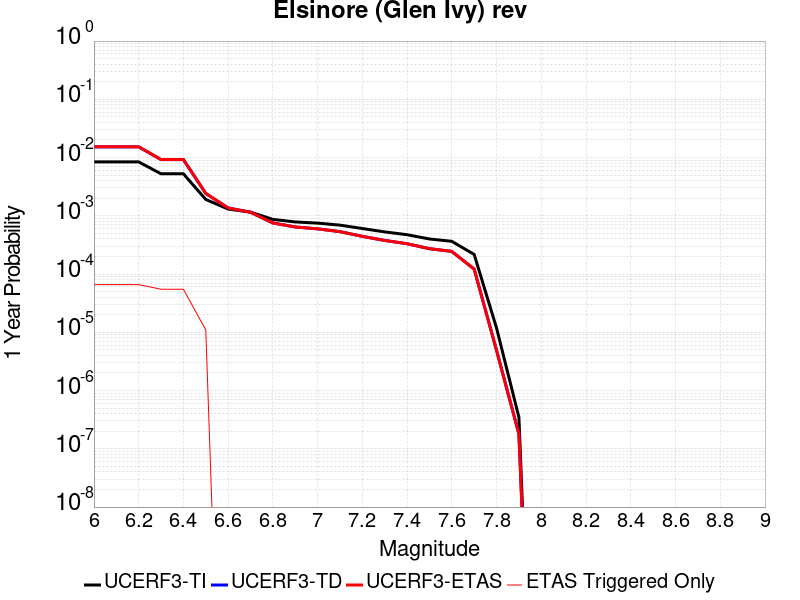 | 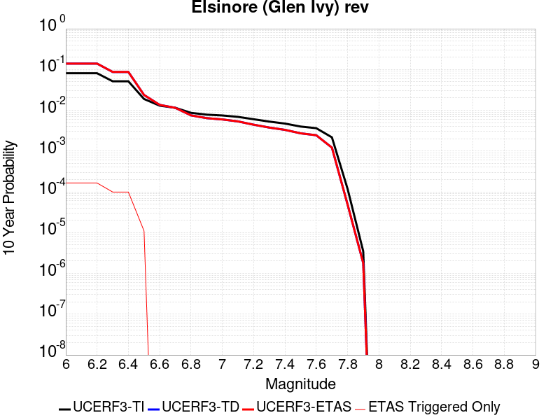 |

| Magnitude | 1 wk TI Prob | 1 wk TD Prob | 1 wk ETAS Prob | 1 wk ETAS/TD Gain | 1 wk ETAS Triggered Only | 1 mo TI Prob | 1 mo TD Prob | 1 mo ETAS Prob | 1 mo ETAS/TD Gain | 1 mo ETAS Triggered Only | 1 yr TI Prob | 1 yr TD Prob | 1 yr ETAS Prob | 1 yr ETAS/TD Gain | 1 yr ETAS Triggered Only | 10 yr TI Prob | 10 yr TD Prob | 10 yr ETAS Prob | 10 yr ETAS/TD Gain | 10 yr ETAS Triggered Only |
|-----|-----|-----|-----|-----|-----|-----|-----|-----|-----|-----|-----|-----|-----|-----|-----|-----|-----|-----|-----|-----|
| 6.0 | 1.6204086E-4 | 2.9371222E-4 | 2.9371222E-4 | 1.0 | 0.0 | 6.94276E-4 | 0.0012583141 | 0.0012692893 | 1.0087222 | 1.0989011E-5 | 0.008420097 | 0.015238959 | 0.015303889 | 1.0042608 | 6.5934066E-5 | 0.081081145 | 0.13971914 | 0.13986094 | 1.001015 | 1.6483516E-4 |
| 6.1 | 1.6204086E-4 | 2.9371222E-4 | 2.9371222E-4 | 1.0 | 0.0 | 6.94276E-4 | 0.0012583141 | 0.0012692893 | 1.0087222 | 1.0989011E-5 | 0.008420097 | 0.015238959 | 0.015303889 | 1.0042608 | 6.5934066E-5 | 0.081081145 | 0.13971914 | 0.13986094 | 1.001015 | 1.6483516E-4 |
| 6.2 | 1.6204086E-4 | 2.9371222E-4 | 2.9371222E-4 | 1.0 | 0.0 | 6.94276E-4 | 0.0012583141 | 0.0012692893 | 1.0087222 | 1.0989011E-5 | 0.008420097 | 0.015238959 | 0.015303889 | 1.0042608 | 6.5934066E-5 | 0.081081145 | 0.13971914 | 0.13986094 | 1.001015 | 1.6483516E-4 |
| 6.3 | 1.0111737E-4 | 1.7706468E-4 | 1.7706468E-4 | 1.0 | 0.0 | 4.332882E-4 | 7.5874466E-4 | 7.697253E-4 | 1.0144721 | 1.0989011E-5 | 0.005262531 | 0.009219283 | 0.009273722 | 1.0059048 | 5.4945056E-5 | 0.0513964 | 0.08703286 | 0.087123156 | 1.0010375 | 9.89011E-5 |
| 6.4 | 1.0111737E-4 | 1.7706468E-4 | 1.7706468E-4 | 1.0 | 0.0 | 4.332882E-4 | 7.5874466E-4 | 7.697253E-4 | 1.0144721 | 1.0989011E-5 | 0.005262531 | 0.009219283 | 0.009273722 | 1.0059048 | 5.4945056E-5 | 0.0513964 | 0.08703286 | 0.087123156 | 1.0010375 | 9.89011E-5 |
| 6.5 | 3.6624708E-5 | 4.640639E-5 | 4.640639E-5 | 1.0 | 0.0 | 1.569536E-4 | 1.9887142E-4 | 1.9887142E-4 | 1.0 | 0.0 | 0.001909235 | 0.002418934 | 0.0024298965 | 1.004532 | 1.0989011E-5 | 0.01892915 | 0.023747567 | 0.023758296 | 1.0004518 | 1.0989011E-5 |
| 6.6 | 2.5051324E-5 | 2.6158506E-5 | 2.6158506E-5 | 1.0 | 0.0 | 1.073584E-4 | 1.1210332E-4 | 1.1210332E-4 | 1.0 | 0.0 | 0.0013063047 | 0.0013640479 | 0.0013640479 | 1.0 | 0.0 | 0.012986525 | 0.013570136 | 0.013570136 | 1.0 | 0.0 |
| 6.7 | 2.2189772E-5 | 2.2082193E-5 | 2.2082193E-5 | 1.0 | 0.0 | 9.509556E-5 | 9.463474E-5 | 9.463474E-5 | 1.0 | 0.0 | 0.0011571734 | 0.0011516054 | 0.0011516054 | 1.0 | 0.0 | 0.011511663 | 0.011470216 | 0.011470216 | 1.0 | 0.0 |
| 6.8 | 1.6654378E-5 | 1.444352E-5 | 1.444352E-5 | 1.0 | 0.0 | 7.137396E-5 | 6.189936E-5 | 6.189936E-5 | 1.0 | 0.0 | 8.686314E-4 | 7.533693E-4 | 7.533693E-4 | 1.0 | 0.0 | 0.008652439 | 0.0075134886 | 0.0075134886 | 1.0 | 0.0 |
| 6.9 | 1.5042909E-5 | 1.2337136E-5 | 1.2337136E-5 | 1.0 | 0.0 | 6.446802E-5 | 5.2872383E-5 | 5.2872383E-5 | 1.0 | 0.0 | 7.8461546E-4 | 6.435343E-4 | 6.435343E-4 | 1.0 | 0.0 | 0.007818509 | 0.0064209295 | 0.0064209295 | 1.0 | 0.0 |
| 7.0 | 1.4361385E-5 | 1.1456173E-5 | 1.1456173E-5 | 1.0 | 0.0 | 6.154734E-5 | 4.9096976E-5 | 4.9096976E-5 | 1.0 | 0.0 | 7.490812E-4 | 5.9759466E-4 | 5.9759466E-4 | 1.0 | 0.0 | 0.007465612 | 0.005963867 | 0.005963867 | 1.0 | 0.0 |
| 7.1 | 1.3265571E-5 | 1.0249252E-5 | 1.0249252E-5 | 1.0 | 0.0 | 5.6851208E-5 | 4.3924643E-5 | 4.3924643E-5 | 1.0 | 0.0 | 6.919436E-4 | 5.3465384E-4 | 5.3465384E-4 | 1.0 | 0.0 | 0.006897931 | 0.0053370316 | 0.0053370316 | 1.0 | 0.0 |
| 7.2 | 1.1596403E-5 | 8.5087395E-6 | 8.5087395E-6 | 1.0 | 0.0 | 4.9697923E-5 | 3.6465524E-5 | 3.6465524E-5 | 1.0 | 0.0 | 6.049042E-4 | 4.4387902E-4 | 4.4387902E-4 | 1.0 | 0.0 | 0.006032603 | 0.0044313394 | 0.0044313394 | 1.0 | 0.0 |
| 7.3 | 1.0150827E-5 | 7.241924E-6 | 7.241924E-6 | 1.0 | 0.0 | 4.3502816E-5 | 3.1036456E-5 | 3.1036456E-5 | 1.0 | 0.0 | 5.2951806E-4 | 3.7780477E-4 | 3.7780477E-4 | 1.0 | 0.0 | 0.005282581 | 0.0037720115 | 0.0037720115 | 1.0 | 0.0 |
| 7.4 | 9.080705E-6 | 6.355331E-6 | 6.355331E-6 | 1.0 | 0.0 | 3.8916725E-5 | 2.7236856E-5 | 2.7236856E-5 | 1.0 | 0.0 | 4.7370812E-4 | 3.3155963E-4 | 3.3155963E-4 | 1.0 | 0.0 | 0.004726996 | 0.0033108005 | 0.0033108005 | 1.0 | 0.0 |
| 7.5 | 7.671649E-6 | 5.2280498E-6 | 5.2280498E-6 | 1.0 | 0.0 | 3.287808E-5 | 2.2405742E-5 | 2.2405742E-5 | 1.0 | 0.0 | 4.0021708E-4 | 2.7275702E-4 | 2.7275702E-4 | 1.0 | 0.0 | 0.0039949706 | 0.0027243476 | 0.0027243476 | 1.0 | 0.0 |
| 7.6 | 6.990086E-6 | 4.689783E-6 | 4.689783E-6 | 1.0 | 0.0 | 2.9957167E-5 | 2.0098922E-5 | 2.0098922E-5 | 1.0 | 0.0 | 3.6466747E-4 | 2.4467806E-4 | 2.4467806E-4 | 1.0 | 0.0 | 0.0036406964 | 0.002444203 | 0.002444203 | 1.0 | 0.0 |
| 7.7 | 4.163505E-6 | 2.3306334E-6 | 2.3306334E-6 | 1.0 | 0.0 | 1.7843471E-5 | 9.988395E-6 | 9.988395E-6 | 1.0 | 0.0 | 2.172226E-4 | 1.21602665E-4 | 1.21602665E-4 | 1.0 | 0.0 | 0.0021701038 | 0.0012154343 | 0.0012154343 | 1.0 | 0.0 |
| 7.8 | 2.2692414E-7 | 9.3892815E-8 | 9.3892815E-8 | 1.0 | 0.0 | 9.725317E-7 | 4.0239775E-7 | 4.0239775E-7 | 1.0 | 0.0 | 1.1840509E-5 | 4.899185E-6 | 4.899185E-6 | 1.0 | 0.0 | 1.1839878E-4 | 4.8991096E-5 | 4.8991096E-5 | 1.0 | 0.0 |
| 7.9 | 6.676829E-9 | 3.4408467E-9 | 3.4408467E-9 | 1.0 | 0.0 | 2.861498E-8 | 1.4746486E-8 | 1.4746486E-8 | 1.0 | 0.0 | 3.4838732E-7 | 1.7953846E-7 | 1.7953846E-7 | 1.0 | 0.0 | 3.4838679E-6 | 1.7953832E-6 | 1.7953832E-6 | 1.0 | 0.0 |

## Scodie Lineament
*[(top)](#table-of-contents)*

| 1 Week | 1 Month | 1 Year | 10 Year |
|-----|-----|-----|-----|
| 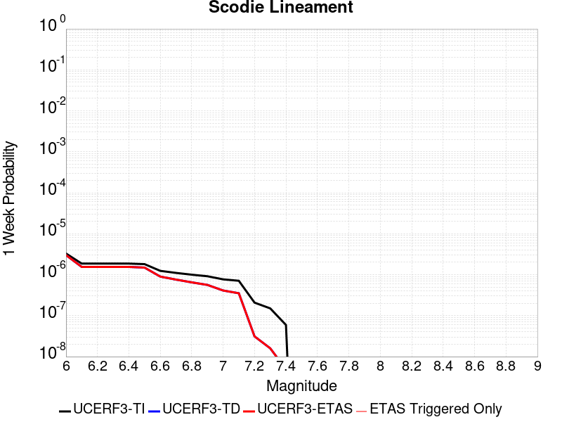 | 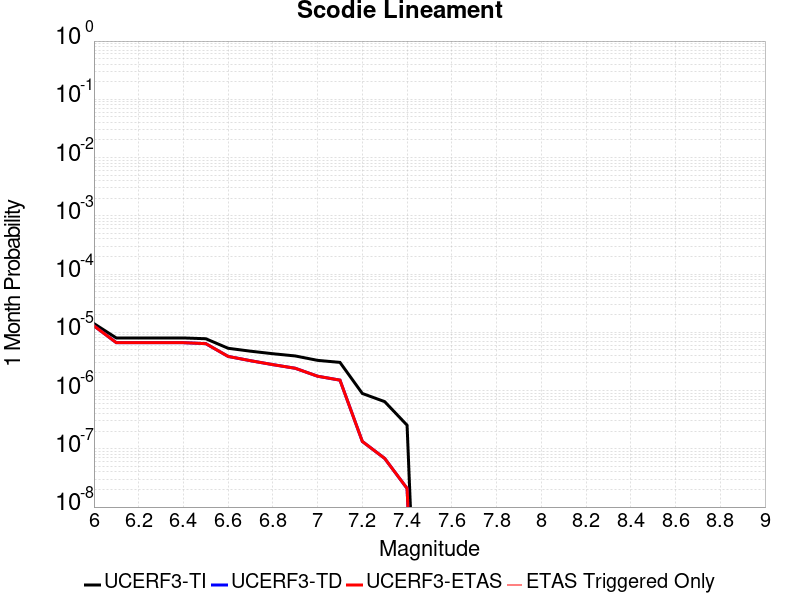 | 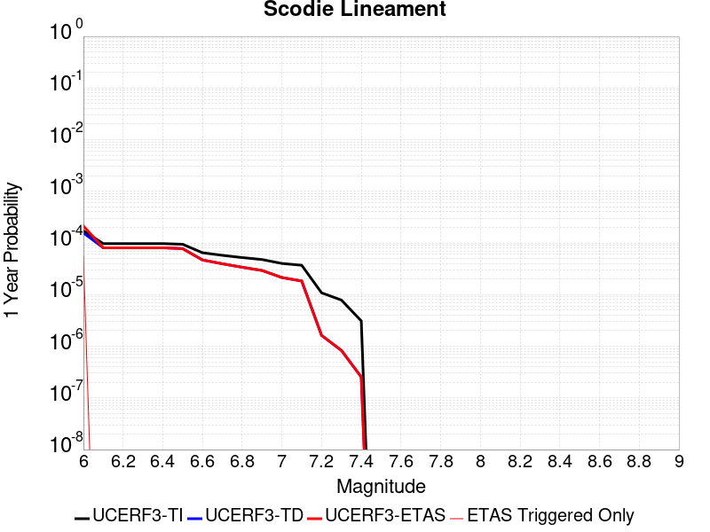 | 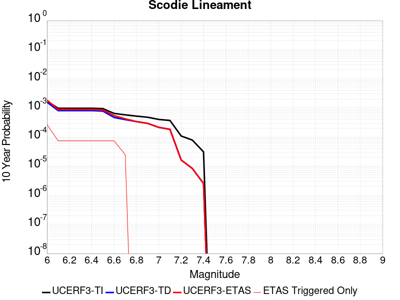 |

| Magnitude | 1 wk TI Prob | 1 wk TD Prob | 1 wk ETAS Prob | 1 wk ETAS/TD Gain | 1 wk ETAS Triggered Only | 1 mo TI Prob | 1 mo TD Prob | 1 mo ETAS Prob | 1 mo ETAS/TD Gain | 1 mo ETAS Triggered Only | 1 yr TI Prob | 1 yr TD Prob | 1 yr ETAS Prob | 1 yr ETAS/TD Gain | 1 yr ETAS Triggered Only | 10 yr TI Prob | 10 yr TD Prob | 10 yr ETAS Prob | 10 yr ETAS/TD Gain | 10 yr ETAS Triggered Only |
|-----|-----|-----|-----|-----|-----|-----|-----|-----|-----|-----|-----|-----|-----|-----|-----|-----|-----|-----|-----|-----|
| 6.0 | 3.2919327E-6 | 3.0134563E-6 | 3.0134563E-6 | 1.0 | 0.0 | 1.4108206E-5 | 1.2914767E-5 | 1.2914767E-5 | 1.0 | 0.0 | 1.7175387E-4 | 1.5722911E-4 | 2.341401E-4 | 1.4891651 | 7.6923076E-5 | 0.0017162118 | 0.0015714903 | 0.0017360664 | 1.1047262 | 1.6483516E-4 |
| 6.1 | 1.8663811E-6 | 1.5491216E-6 | 1.5491216E-6 | 1.0 | 0.0 | 7.998751E-6 | 6.639079E-6 | 6.639079E-6 | 1.0 | 0.0 | 9.738045E-5 | 8.0828286E-5 | 9.181641E-5 | 1.135944 | 1.0989011E-5 | 9.7337784E-4 | 8.0803764E-4 | 8.629383E-4 | 1.0679432 | 5.4945056E-5 |
| 6.2 | 1.8663811E-6 | 1.5491216E-6 | 1.5491216E-6 | 1.0 | 0.0 | 7.998751E-6 | 6.639079E-6 | 6.639079E-6 | 1.0 | 0.0 | 9.738045E-5 | 8.0828286E-5 | 9.181641E-5 | 1.135944 | 1.0989011E-5 | 9.7337784E-4 | 8.0803764E-4 | 8.629383E-4 | 1.0679432 | 5.4945056E-5 |
| 6.3 | 1.8663811E-6 | 1.5491216E-6 | 1.5491216E-6 | 1.0 | 0.0 | 7.998751E-6 | 6.639079E-6 | 6.639079E-6 | 1.0 | 0.0 | 9.738045E-5 | 8.0828286E-5 | 9.181641E-5 | 1.135944 | 1.0989011E-5 | 9.7337784E-4 | 8.0803764E-4 | 8.629383E-4 | 1.0679432 | 5.4945056E-5 |
| 6.4 | 1.8663811E-6 | 1.5491216E-6 | 1.5491216E-6 | 1.0 | 0.0 | 7.998751E-6 | 6.639079E-6 | 6.639079E-6 | 1.0 | 0.0 | 9.738045E-5 | 8.0828286E-5 | 9.181641E-5 | 1.135944 | 1.0989011E-5 | 9.7337784E-4 | 8.0803764E-4 | 8.629383E-4 | 1.0679432 | 5.4945056E-5 |
| 6.5 | 1.8106311E-6 | 1.4910531E-6 | 1.4910531E-6 | 1.0 | 0.0 | 7.759824E-6 | 6.390215E-6 | 6.390215E-6 | 1.0 | 0.0 | 9.447177E-5 | 7.7798584E-5 | 8.878674E-5 | 1.1412385 | 1.0989011E-5 | 9.4431615E-4 | 7.7776215E-4 | 8.326645E-4 | 1.0705901 | 5.4945056E-5 |
| 6.6 | 1.2414679E-6 | 8.998006E-7 | 8.998006E-7 | 1.0 | 0.0 | 5.320566E-6 | 3.856283E-6 | 3.856283E-6 | 1.0 | 0.0 | 6.477596E-5 | 4.6949324E-5 | 4.6949324E-5 | 1.0 | 0.0 | 6.475708E-4 | 4.694027E-4 | 5.023543E-4 | 1.0701989 | 3.2967033E-5 |
| 6.7 | 1.1062215E-6 | 7.5947037E-7 | 7.5947037E-7 | 1.0 | 0.0 | 4.7409408E-6 | 3.2548694E-6 | 3.2548694E-6 | 1.0 | 0.0 | 5.7719422E-5 | 3.9627386E-5 | 3.9627386E-5 | 1.0 | 0.0 | 5.770443E-4 | 3.9621018E-4 | 4.0719484E-4 | 1.0277243 | 1.0989011E-5 |
| 6.8 | 1.0006736E-6 | 6.500747E-7 | 6.500747E-7 | 1.0 | 0.0 | 4.288594E-6 | 2.786032E-6 | 2.786032E-6 | 1.0 | 0.0 | 5.221238E-5 | 3.391947E-5 | 3.391947E-5 | 1.0 | 0.0 | 5.220012E-4 | 3.3914903E-4 | 3.3914903E-4 | 1.0 | 0.0 |
| 6.9 | 9.167364E-7 | 5.631943E-7 | 5.631943E-7 | 1.0 | 0.0 | 3.9288643E-6 | 2.413688E-6 | 2.413688E-6 | 1.0 | 0.0 | 4.7832873E-5 | 2.9386312E-5 | 2.9386312E-5 | 1.0 | 0.0 | 4.782258E-4 | 2.9382994E-4 | 2.9382994E-4 | 1.0 | 0.0 |
| 7.0 | 7.6987664E-7 | 4.1136465E-7 | 4.1136465E-7 | 1.0 | 0.0 | 3.2994672E-6 | 1.7629905E-6 | 1.7629905E-6 | 1.0 | 0.0 | 4.0170275E-5 | 2.1464237E-5 | 2.1464237E-5 | 1.0 | 0.0 | 4.0163012E-4 | 2.146255E-4 | 2.146255E-4 | 1.0 | 0.0 |
| 7.1 | 7.1038727E-7 | 3.521392E-7 | 3.521392E-7 | 1.0 | 0.0 | 3.0445133E-6 | 1.5091673E-6 | 1.5091673E-6 | 1.0 | 0.0 | 3.706632E-5 | 1.8373992E-5 | 1.8373992E-5 | 1.0 | 0.0 | 3.7060137E-4 | 1.8372823E-4 | 1.8372823E-4 | 1.0 | 0.0 |
| 7.2 | 2.0799602E-7 | 3.1193522E-8 | 3.1193522E-8 | 1.0 | 0.0 | 8.914113E-7 | 1.3368651E-7 | 1.3368651E-7 | 1.0 | 0.0 | 1.0852878E-5 | 1.6276322E-6 | 1.6276322E-6 | 1.0 | 0.0 | 1.08523476E-4 | 1.627621E-5 | 1.627621E-5 | 1.0 | 0.0 |
| 7.3 | 1.5048182E-7 | 1.5950226E-8 | 1.5950226E-8 | 1.0 | 0.0 | 6.449219E-7 | 6.835811E-8 | 6.835811E-8 | 1.0 | 0.0 | 7.851896E-6 | 8.3225973E-7 | 8.3225973E-7 | 1.0 | 0.0 | 7.851618E-5 | 8.322569E-6 | 8.322569E-6 | 1.0 | 0.0 |
| 7.4 | 5.9334678E-8 | 4.870027E-9 | 4.870027E-9 | 1.0 | 0.0 | 2.5429145E-7 | 2.0871544E-8 | 2.0871544E-8 | 1.0 | 0.0 | 3.095994E-6 | 2.5411103E-7 | 2.5411103E-7 | 1.0 | 0.0 | 3.095951E-5 | 2.5411086E-6 | 2.5411086E-6 | 1.0 | 0.0 |

## Death Valley (No)
*[(top)](#table-of-contents)*

| 1 Week | 1 Month | 1 Year | 10 Year |
|-----|-----|-----|-----|
| 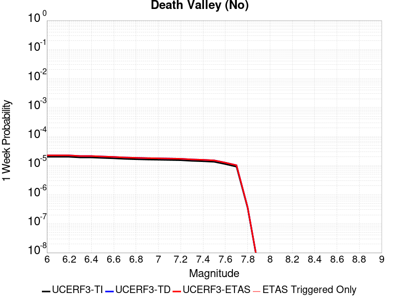 |  | 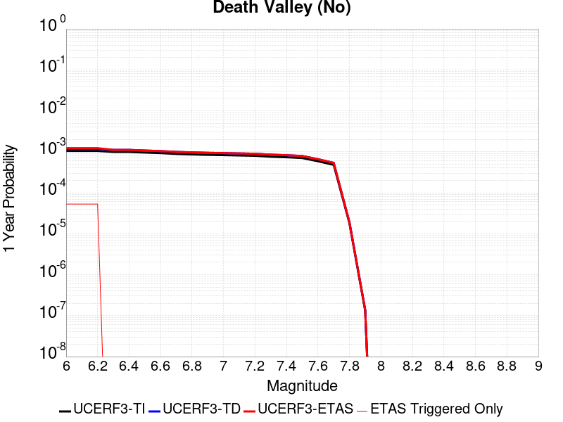 | 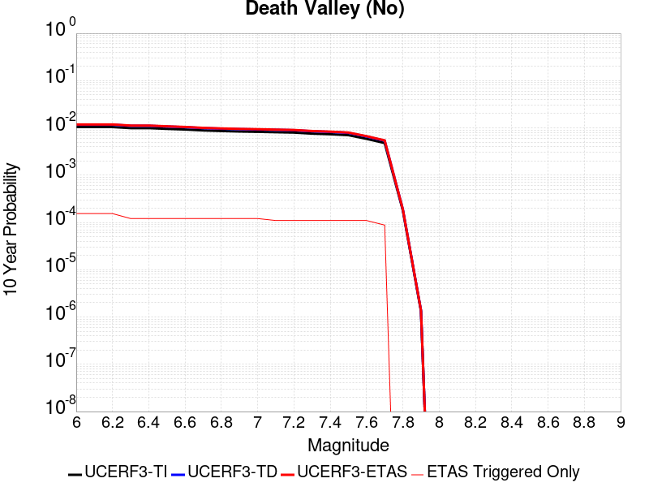 |

| Magnitude | 1 wk TI Prob | 1 wk TD Prob | 1 wk ETAS Prob | 1 wk ETAS/TD Gain | 1 wk ETAS Triggered Only | 1 mo TI Prob | 1 mo TD Prob | 1 mo ETAS Prob | 1 mo ETAS/TD Gain | 1 mo ETAS Triggered Only | 1 yr TI Prob | 1 yr TD Prob | 1 yr ETAS Prob | 1 yr ETAS/TD Gain | 1 yr ETAS Triggered Only | 10 yr TI Prob | 10 yr TD Prob | 10 yr ETAS Prob | 10 yr ETAS/TD Gain | 10 yr ETAS Triggered Only |
|-----|-----|-----|-----|-----|-----|-----|-----|-----|-----|-----|-----|-----|-----|-----|-----|-----|-----|-----|-----|-----|
| 6.0 | 2.0074807E-5 | 2.2502982E-5 | 2.2502982E-5 | 1.0 | 0.0 | 8.603206E-5 | 9.643783E-5 | 1.07425774E-4 | 1.1139382 | 1.0989011E-5 | 0.001046937 | 0.0011735056 | 0.0012393622 | 1.0561197 | 6.5934066E-5 | 0.010420183 | 0.011674001 | 0.011826051 | 1.0130247 | 1.5384615E-4 |
| 6.1 | 2.0074807E-5 | 2.2502982E-5 | 2.2502982E-5 | 1.0 | 0.0 | 8.603206E-5 | 9.643783E-5 | 1.07425774E-4 | 1.1139382 | 1.0989011E-5 | 0.001046937 | 0.0011735056 | 0.0012393622 | 1.0561197 | 6.5934066E-5 | 0.010420183 | 0.011674001 | 0.011826051 | 1.0130247 | 1.5384615E-4 |
| 6.2 | 2.0074807E-5 | 2.2502982E-5 | 2.2502982E-5 | 1.0 | 0.0 | 8.603206E-5 | 9.643783E-5 | 1.07425774E-4 | 1.1139382 | 1.0989011E-5 | 0.001046937 | 0.0011735056 | 0.0012393622 | 1.0561197 | 6.5934066E-5 | 0.010420183 | 0.011674001 | 0.011826051 | 1.0130247 | 1.5384615E-4 |
| 6.3 | 1.9050609E-5 | 2.1339678E-5 | 2.1339678E-5 | 1.0 | 0.0 | 8.164292E-5 | 9.1452595E-5 | 9.1452595E-5 | 1.0 | 0.0 | 9.935491E-4 | 0.0011128733 | 0.0011677573 | 1.0493172 | 5.4945056E-5 | 0.009891188 | 0.011073828 | 0.011193369 | 1.0107949 | 1.2087912E-4 |
| 6.4 | 1.9050609E-5 | 2.1339678E-5 | 2.1339678E-5 | 1.0 | 0.0 | 8.164292E-5 | 9.1452595E-5 | 9.1452595E-5 | 1.0 | 0.0 | 9.935491E-4 | 0.0011128733 | 0.0011677573 | 1.0493172 | 5.4945056E-5 | 0.009891188 | 0.011073828 | 0.011193369 | 1.0107949 | 1.2087912E-4 |
| 6.5 | 1.8367004E-5 | 2.0563628E-5 | 2.0563628E-5 | 1.0 | 0.0 | 7.8713354E-5 | 8.812689E-5 | 8.812689E-5 | 1.0 | 0.0 | 9.5791375E-4 | 0.0010724233 | 0.0011273095 | 1.0511795 | 5.4945056E-5 | 0.009537951 | 0.010673268 | 0.010792857 | 1.0112045 | 1.2087912E-4 |
| 6.6 | 1.779439E-5 | 1.9913454E-5 | 1.9913454E-5 | 1.0 | 0.0 | 7.625944E-5 | 8.5340616E-5 | 8.5340616E-5 | 1.0 | 0.0 | 9.280632E-4 | 0.0010385332 | 0.0010934211 | 1.0528514 | 5.4945056E-5 | 0.009241969 | 0.010337558 | 0.010457187 | 1.0115724 | 1.2087912E-4 |
| 6.7 | 1.7025437E-5 | 1.9045832E-5 | 1.9045832E-5 | 1.0 | 0.0 | 7.296412E-5 | 8.162248E-5 | 8.162248E-5 | 1.0 | 0.0 | 8.87976E-4 | 9.933067E-4 | 0.0010481973 | 1.0552603 | 5.4945056E-5 | 0.008844362 | 0.009889389 | 0.010009073 | 1.0121022 | 1.2087912E-4 |
| 6.8 | 1.6545107E-5 | 1.8514893E-5 | 1.8514893E-5 | 1.0 | 0.0 | 7.090568E-5 | 7.934716E-5 | 7.934716E-5 | 1.0 | 0.0 | 8.629347E-4 | 9.6562965E-4 | 0.0010205216 | 1.0568458 | 5.4945056E-5 | 0.008595915 | 0.009615042 | 0.009734759 | 1.012451 | 1.2087912E-4 |
| 6.9 | 1.615478E-5 | 1.80899E-5 | 1.80899E-5 | 1.0 | 0.0 | 6.9232934E-5 | 7.7525874E-5 | 7.7525874E-5 | 1.0 | 0.0 | 8.4258494E-4 | 9.434749E-4 | 9.98368E-4 | 1.058182 | 5.4945056E-5 | 0.008393973 | 0.009395388 | 0.009515131 | 1.0127449 | 1.2087912E-4 |
| 7.0 | 1.5894311E-5 | 1.780783E-5 | 1.780783E-5 | 1.0 | 0.0 | 6.81167E-5 | 7.6317076E-5 | 7.6317076E-5 | 1.0 | 0.0 | 8.2900526E-4 | 9.287704E-4 | 9.836644E-4 | 1.059104 | 5.4945056E-5 | 0.008259195 | 0.009249576 | 0.009369338 | 1.0129477 | 1.2087912E-4 |
| 7.1 | 1.5602263E-5 | 1.7485747E-5 | 1.7485747E-5 | 1.0 | 0.0 | 6.6865134E-5 | 7.49368E-5 | 7.49368E-5 | 1.0 | 0.0 | 8.137789E-4 | 9.119797E-4 | 9.6687465E-4 | 1.0601932 | 5.4945056E-5 | 0.008108052 | 0.009083055 | 0.009191946 | 1.0119885 | 1.0989011E-4 |
| 7.2 | 1.5323829E-5 | 1.7172833E-5 | 1.7172833E-5 | 1.0 | 0.0 | 6.56719E-5 | 7.359582E-5 | 7.359582E-5 | 1.0 | 0.0 | 7.99262E-4 | 8.956668E-4 | 9.505626E-4 | 1.0612905 | 5.4945056E-5 | 0.007963934 | 0.008921246 | 0.009030156 | 1.0122079 | 1.0989011E-4 |
| 7.3 | 1.4556212E-5 | 1.6304537E-5 | 1.6304537E-5 | 1.0 | 0.0 | 6.238227E-5 | 6.987475E-5 | 6.987475E-5 | 1.0 | 0.0 | 7.592395E-4 | 8.503989E-4 | 9.0529723E-4 | 1.064556 | 5.4945056E-5 | 0.0075665074 | 0.0084720915 | 0.008581051 | 1.0128609 | 1.0989011E-4 |
| 7.4 | 1.411725E-5 | 1.5809976E-5 | 1.5809976E-5 | 1.0 | 0.0 | 6.0501097E-5 | 6.775531E-5 | 6.775531E-5 | 1.0 | 0.0 | 7.363519E-4 | 8.2461454E-4 | 8.7951426E-4 | 1.0665762 | 5.4945056E-5 | 0.0073391674 | 0.008216182 | 0.008325169 | 1.0132649 | 1.0989011E-4 |
| 7.5 | 1.3503312E-5 | 1.5128224E-5 | 1.5128224E-5 | 1.0 | 0.0 | 5.7870053E-5 | 6.4833665E-5 | 6.4833665E-5 | 1.0 | 0.0 | 7.043401E-4 | 7.8906986E-4 | 8.4397156E-4 | 1.0695777 | 5.4945056E-5 | 0.007021119 | 0.007863306 | 0.007972333 | 1.0138651 | 1.0989011E-4 |
| 7.6 | 1.1279839E-5 | 1.2627931E-5 | 1.2627931E-5 | 1.0 | 0.0 | 4.834127E-5 | 5.411861E-5 | 5.411861E-5 | 1.0 | 0.0 | 5.88396E-4 | 6.587002E-4 | 7.1360904E-4 | 1.0833594 | 5.4945056E-5 | 0.005868405 | 0.00656803 | 0.0066771987 | 1.0166211 | 1.0989011E-4 |
| 7.7 | 9.189108E-6 | 1.0284662E-5 | 1.0284662E-5 | 1.0 | 0.0 | 3.93813E-5 | 4.4076405E-5 | 4.4076405E-5 | 1.0 | 0.0 | 4.7936183E-4 | 5.3650315E-4 | 5.804356E-4 | 1.0818866 | 4.3956043E-5 | 0.004783291 | 0.0053525902 | 0.005440032 | 1.0163363 | 8.7912085E-5 |
| 7.8 | 3.4586725E-7 | 3.6484747E-7 | 3.6484747E-7 | 1.0 | 0.0 | 1.4822873E-6 | 1.5636311E-6 | 1.5636311E-6 | 1.0 | 0.0 | 1.80467E-5 | 1.9037047E-5 | 1.9037047E-5 | 1.0 | 0.0 | 1.8045233E-4 | 1.9035459E-4 | 1.9035459E-4 | 1.0 | 0.0 |
| 7.9 | 2.5591178E-9 | 2.6697942E-9 | 2.6697942E-9 | 1.0 | 0.0 | 1.0967647E-8 | 1.14419745E-8 | 1.14419745E-8 | 1.0 | 0.0 | 1.335311E-7 | 1.3930604E-7 | 1.3930604E-7 | 1.0 | 0.0 | 1.3353102E-6 | 1.3930604E-6 | 1.3930604E-6 | 1.0 | 0.0 |

## San Andreas (Coachella) rev
*[(top)](#table-of-contents)*

| 1 Week | 1 Month | 1 Year | 10 Year |
|-----|-----|-----|-----|
| 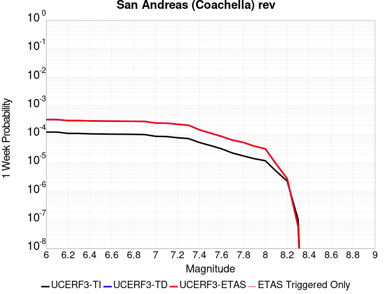 | 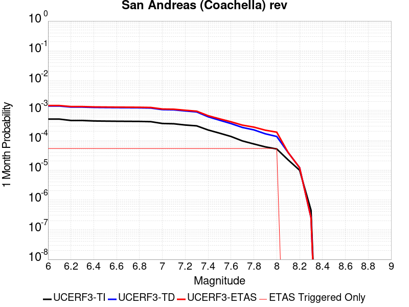 | 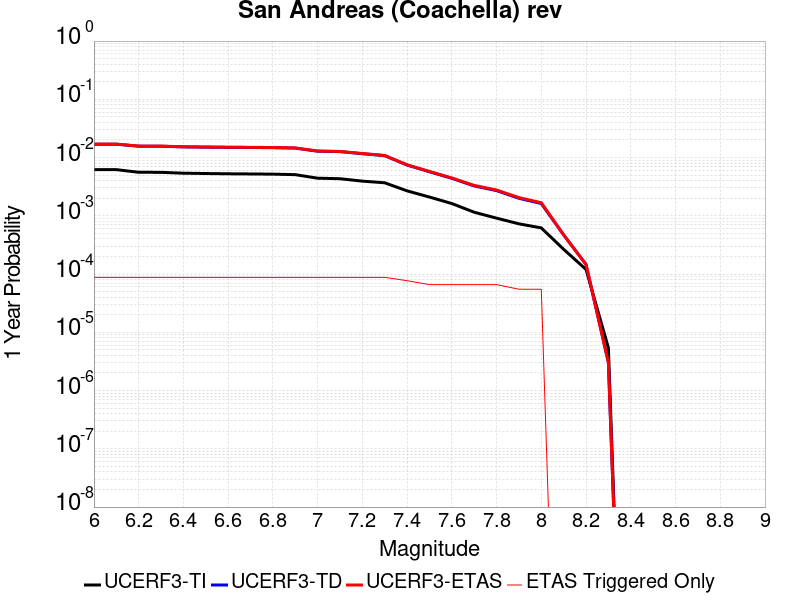 | 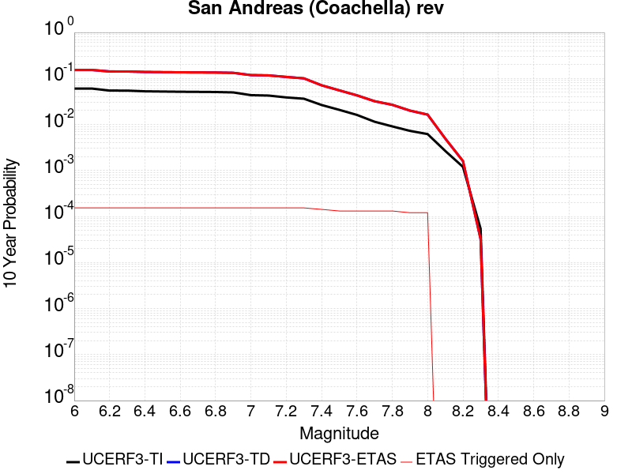 |

| Magnitude | 1 wk TI Prob | 1 wk TD Prob | 1 wk ETAS Prob | 1 wk ETAS/TD Gain | 1 wk ETAS Triggered Only | 1 mo TI Prob | 1 mo TD Prob | 1 mo ETAS Prob | 1 mo ETAS/TD Gain | 1 mo ETAS Triggered Only | 1 yr TI Prob | 1 yr TD Prob | 1 yr ETAS Prob | 1 yr ETAS/TD Gain | 1 yr ETAS Triggered Only | 10 yr TI Prob | 10 yr TD Prob | 10 yr ETAS Prob | 10 yr ETAS/TD Gain | 10 yr ETAS Triggered Only |
|-----|-----|-----|-----|-----|-----|-----|-----|-----|-----|-----|-----|-----|-----|-----|-----|-----|-----|-----|-----|-----|
| 6.0 | 1.1925945E-4 | 3.276467E-4 | 3.276467E-4 | 1.0 | 0.0 | 5.110118E-4 | 0.0014034492 | 0.0014253964 | 1.015638 | 2.1978021E-5 | 0.0062038354 | 0.016954463 | 0.017040884 | 1.0050973 | 8.7912085E-5 | 0.060334753 | 0.1527907 | 0.15292104 | 1.0008531 | 1.5384615E-4 |
| 6.1 | 1.1925945E-4 | 3.276467E-4 | 3.276467E-4 | 1.0 | 0.0 | 5.110118E-4 | 0.0014034492 | 0.0014253964 | 1.015638 | 2.1978021E-5 | 0.0062038354 | 0.016954463 | 0.017040884 | 1.0050973 | 8.7912085E-5 | 0.060334753 | 0.1527907 | 0.15292104 | 1.0008531 | 1.5384615E-4 |
| 6.2 | 1.07432395E-4 | 3.0265172E-4 | 3.0265172E-4 | 1.0 | 0.0 | 4.603433E-4 | 0.001296438 | 0.0013183876 | 1.0169307 | 2.1978021E-5 | 0.005590286 | 0.015671 | 0.015757535 | 1.0055219 | 8.7912085E-5 | 0.05451731 | 0.14196219 | 0.1420942 | 1.0009298 | 1.5384615E-4 |
| 6.3 | 1.0718766E-4 | 3.0210475E-4 | 3.0210475E-4 | 1.0 | 0.0 | 4.592948E-4 | 0.0012940962 | 0.0013160459 | 1.0169613 | 2.1978021E-5 | 0.005577586 | 0.015642898 | 0.015729435 | 1.005532 | 8.7912085E-5 | 0.054396555 | 0.14173047 | 0.14186251 | 1.0009316 | 1.5384615E-4 |
| 6.4 | 1.0355944E-4 | 2.9418513E-4 | 2.9418513E-4 | 1.0 | 0.0 | 4.4375064E-4 | 0.0012601882 | 0.0012821385 | 1.0174183 | 2.1978021E-5 | 0.0053892885 | 0.015235912 | 0.015322485 | 1.0056821 | 8.7912085E-5 | 0.052604496 | 0.13829084 | 0.1384234 | 1.0009587 | 1.5384615E-4 |
| 6.5 | 1.0227914E-4 | 2.9137929E-4 | 2.9137929E-4 | 1.0 | 0.0 | 4.382655E-4 | 0.0012481747 | 0.0012701253 | 1.0175861 | 2.1978021E-5 | 0.0053228354 | 0.015091684 | 0.01517827 | 1.0057373 | 8.7912085E-5 | 0.051971316 | 0.13707013 | 0.1372029 | 1.0009686 | 1.5384615E-4 |
| 6.6 | 1.0116757E-4 | 2.8903663E-4 | 2.8903663E-4 | 1.0 | 0.0 | 4.3350324E-4 | 0.0012381444 | 0.0012600952 | 1.0177288 | 2.1978021E-5 | 0.0052651367 | 0.014971248 | 0.015057844 | 1.0057842 | 8.7912085E-5 | 0.051421247 | 0.1360484 | 0.13618132 | 1.0009769 | 1.5384615E-4 |
| 6.7 | 1.0050676E-4 | 2.8762216E-4 | 2.8762216E-4 | 1.0 | 0.0 | 4.3067214E-4 | 0.001232088 | 0.001254039 | 1.0178161 | 2.1978021E-5 | 0.005230834 | 0.014898524 | 0.0149851255 | 1.0058128 | 8.7912085E-5 | 0.051094085 | 0.13543318 | 0.1355662 | 1.0009822 | 1.5384615E-4 |
| 6.8 | 9.976819E-5 | 2.856583E-4 | 2.856583E-4 | 1.0 | 0.0 | 4.2750788E-4 | 0.0012236794 | 0.0012456306 | 1.0179386 | 2.1978021E-5 | 0.0051924936 | 0.014797544 | 0.014884155 | 1.005853 | 8.7912085E-5 | 0.050728295 | 0.13458484 | 0.13471799 | 1.0009893 | 1.5384615E-4 |
| 6.9 | 9.77719E-5 | 2.8062498E-4 | 2.8062498E-4 | 1.0 | 0.0 | 4.1895514E-4 | 0.001202128 | 0.0012240796 | 1.0182606 | 2.1978021E-5 | 0.0050888555 | 0.014538688 | 0.014625321 | 1.0059589 | 8.7912085E-5 | 0.049738888 | 0.1324128 | 0.13254628 | 1.001008 | 1.5384615E-4 |
| 7.0 | 8.500761E-5 | 2.4795174E-4 | 2.4795174E-4 | 1.0 | 0.0 | 3.6426744E-4 | 0.0010622209 | 0.0010841755 | 1.0206686 | 2.1978021E-5 | 0.0044259406 | 0.012856629 | 0.01294341 | 1.00675 | 8.7912085E-5 | 0.04338823 | 0.1182658 | 0.11840145 | 1.001147 | 1.5384615E-4 |
| 7.1 | 8.319876E-5 | 2.4397543E-4 | 2.4397543E-4 | 1.0 | 0.0 | 3.5651738E-4 | 0.0010451933 | 0.0010671483 | 1.0210057 | 2.1978021E-5 | 0.004331963 | 0.012651744 | 0.0127385445 | 1.0068607 | 8.7912085E-5 | 0.042484846 | 0.116484836 | 0.116620764 | 1.0011669 | 1.5384615E-4 |
| 7.2 | 7.563917E-5 | 2.2444999E-4 | 2.2444999E-4 | 1.0 | 0.0 | 3.2412758E-4 | 9.61577E-4 | 9.835339E-4 | 1.0228343 | 2.1978021E-5 | 0.0039391145 | 0.011645048 | 0.011731937 | 1.0074614 | 8.7912085E-5 | 0.03870018 | 0.1078885 | 0.10802575 | 1.0012721 | 1.5384615E-4 |
| 7.3 | 7.082985E-5 | 2.0759941E-4 | 2.0759941E-4 | 1.0 | 0.0 | 3.0352117E-4 | 8.894113E-4 | 9.1136975E-4 | 1.0246887 | 2.1978021E-5 | 0.0036891096 | 0.010775445 | 0.010862409 | 1.0080706 | 8.7912085E-5 | 0.03628465 | 0.1004075 | 0.1005459 | 1.0013784 | 1.5384615E-4 |
| 7.4 | 5.146215E-5 | 1.4298319E-4 | 1.4298319E-4 | 1.0 | 0.0 | 2.2053342E-4 | 6.1264203E-4 | 6.3460664E-4 | 1.0358522 | 2.1978021E-5 | 0.0026816884 | 0.007433597 | 0.007509948 | 1.0102711 | 7.6923076E-5 | 0.02649557 | 0.070956536 | 0.07108925 | 1.0018704 | 1.4285714E-4 |
| 7.5 | 4.0285166E-5 | 1.0962878E-4 | 1.0962878E-4 | 1.0 | 0.0 | 1.7263928E-4 | 4.6975337E-4 | 4.9172103E-4 | 1.0467644 | 2.1978021E-5 | 0.002099857 | 0.005704319 | 0.0057698768 | 1.0114927 | 6.5934066E-5 | 0.020801254 | 0.055105854 | 0.055230457 | 1.0022612 | 1.3186813E-4 |
| 7.6 | 3.1168736E-5 | 8.4578256E-5 | 8.4578256E-5 | 1.0 | 0.0 | 1.3357346E-4 | 3.6242802E-4 | 3.8439807E-4 | 1.0606191 | 2.1978021E-5 | 0.0016250437 | 0.00440366 | 0.004469304 | 1.0149066 | 6.5934066E-5 | 0.016132116 | 0.04289531 | 0.043021522 | 1.0029423 | 1.3186813E-4 |
| 7.7 | 2.2100989E-5 | 6.2553896E-5 | 6.2553896E-5 | 1.0 | 0.0 | 9.4715084E-5 | 2.6806063E-4 | 2.9003277E-4 | 1.081967 | 2.1978021E-5 | 0.001152546 | 0.0032587603 | 0.0033244796 | 1.0201669 | 6.5934066E-5 | 0.011465867 | 0.03197573 | 0.032103386 | 1.0039921 | 1.3186813E-4 |
| 7.8 | 1.7484861E-5 | 5.1944033E-5 | 5.1944033E-5 | 1.0 | 0.0 | 7.493296E-5 | 2.225983E-4 | 2.4457142E-4 | 1.0987121 | 2.1978021E-5 | 9.1192697E-4 | 0.002706769 | 0.0027725247 | 1.0242931 | 6.5934066E-5 | 0.009081938 | 0.026707657 | 0.026836004 | 1.0048056 | 1.3186813E-4 |
| 7.9 | 1.3967285E-5 | 3.834408E-5 | 3.834408E-5 | 1.0 | 0.0 | 5.985842E-5 | 1.6432142E-4 | 1.8629583E-4 | 1.1337283 | 2.1978021E-5 | 7.2853256E-4 | 0.001998779 | 0.002053614 | 1.0274343 | 5.4945056E-5 | 0.0072614877 | 0.019965619 | 0.020084085 | 1.0059335 | 1.2087912E-4 |
| 8.0 | 1.1887396E-5 | 3.1169602E-5 | 3.1169602E-5 | 1.0 | 0.0 | 5.094499E-5 | 1.3357717E-4 | 1.5555226E-4 | 1.1645123 | 2.1978021E-5 | 6.200787E-4 | 0.0016250898 | 0.0016799456 | 1.0337555 | 5.4945056E-5 | 0.006183513 | 0.016327916 | 0.01644682 | 1.0072824 | 1.2087912E-4 |
| 8.1 | 5.100864E-6 | 9.015661E-6 | 9.015661E-6 | 1.0 | 0.0 | 2.1860664E-5 | 3.8637972E-5 | 3.8637972E-5 | 1.0 | 0.0 | 2.6612106E-4 | 4.7031592E-4 | 4.7031592E-4 | 1.0 | 0.0 | 0.002658026 | 0.0049387887 | 0.0049387887 | 1.0 | 0.0 |
| 8.2 | 2.3004484E-6 | 2.8034615E-6 | 2.8034615E-6 | 1.0 | 0.0 | 9.859027E-6 | 1.201478E-5 | 1.201478E-5 | 1.0 | 0.0 | 1.2002704E-4 | 1.4627016E-4 | 1.4627016E-4 | 1.0 | 0.0 | 0.0011996223 | 0.0016061745 | 0.0016061745 | 1.0 | 0.0 |
| 8.3 | 1.0424446E-7 | 5.862703E-8 | 5.862703E-8 | 1.0 | 0.0 | 4.4676187E-7 | 2.5125868E-7 | 2.5125868E-7 | 1.0 | 0.0 | 5.439312E-6 | 3.0590704E-6 | 3.0590704E-6 | 1.0 | 0.0 | 5.4391792E-5 | 3.2155825E-5 | 3.2155825E-5 | 1.0 | 0.0 |

## San Andreas (Cholame) rev
*[(top)](#table-of-contents)*

| 1 Week | 1 Month | 1 Year | 10 Year |
|-----|-----|-----|-----|
| 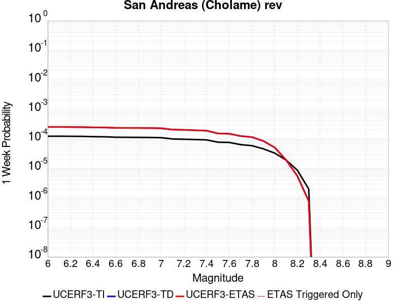 | 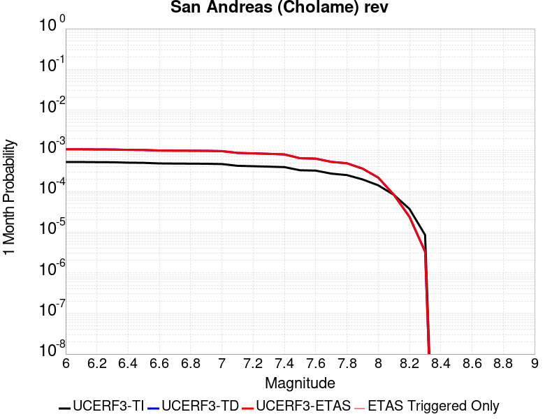 | 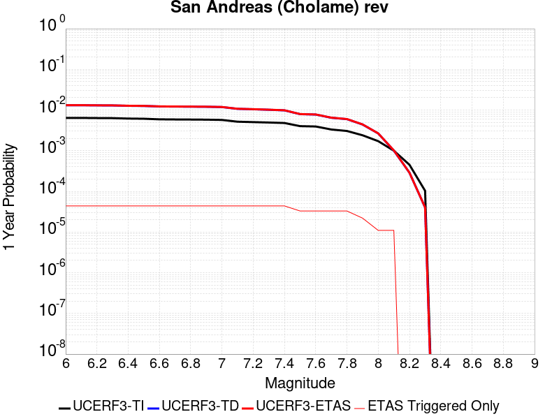 | 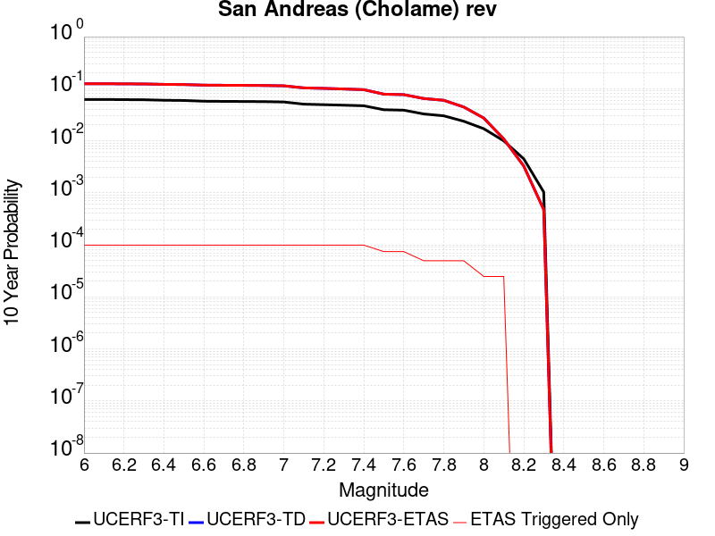 |

| Magnitude | 1 wk TI Prob | 1 wk TD Prob | 1 wk ETAS Prob | 1 wk ETAS/TD Gain | 1 wk ETAS Triggered Only | 1 mo TI Prob | 1 mo TD Prob | 1 mo ETAS Prob | 1 mo ETAS/TD Gain | 1 mo ETAS Triggered Only | 1 yr TI Prob | 1 yr TD Prob | 1 yr ETAS Prob | 1 yr ETAS/TD Gain | 1 yr ETAS Triggered Only | 10 yr TI Prob | 10 yr TD Prob | 10 yr ETAS Prob | 10 yr ETAS/TD Gain | 10 yr ETAS Triggered Only |
|-----|-----|-----|-----|-----|-----|-----|-----|-----|-----|-----|-----|-----|-----|-----|-----|-----|-----|-----|-----|-----|
| 6.0 | 1.2302514E-4 | 2.5281878E-4 | 2.5281878E-4 | 1.0 | 0.0 | 5.27144E-4 | 0.0010830607 | 0.0010830607 | 1.0 | 0.0 | 0.0063991086 | 0.01310705 | 0.01315043 | 1.0033096 | 4.3956043E-5 | 0.06217949 | 0.12471412 | 0.12484878 | 1.0010798 | 1.5384615E-4 |
| 6.1 | 1.2302514E-4 | 2.5281878E-4 | 2.5281878E-4 | 1.0 | 0.0 | 5.27144E-4 | 0.0010830607 | 0.0010830607 | 1.0 | 0.0 | 0.0063991086 | 0.01310705 | 0.01315043 | 1.0033096 | 4.3956043E-5 | 0.06217949 | 0.12471412 | 0.12484878 | 1.0010798 | 1.5384615E-4 |
| 6.2 | 1.2203569E-4 | 2.5098576E-4 | 2.5098576E-4 | 1.0 | 0.0 | 5.2290526E-4 | 0.0010752114 | 0.0010752114 | 1.0 | 0.0 | 0.006347804 | 0.01301263 | 0.013056014 | 1.003334 | 4.3956043E-5 | 0.061695136 | 0.12390022 | 0.12403501 | 1.0010879 | 1.5384615E-4 |
| 6.3 | 1.2142645E-4 | 2.498449E-4 | 2.498449E-4 | 1.0 | 0.0 | 5.202953E-4 | 0.0010703261 | 0.0010703261 | 1.0 | 0.0 | 0.006316212 | 0.012953859 | 0.012997245 | 1.0033493 | 4.3956043E-5 | 0.06139677 | 0.123394296 | 0.12352915 | 1.0010929 | 1.5384615E-4 |
| 6.4 | 1.1865206E-4 | 2.4489546E-4 | 2.4489546E-4 | 1.0 | 0.0 | 5.0840975E-4 | 0.0010491315 | 0.0010491315 | 1.0 | 0.0 | 0.006172335 | 0.012698848 | 0.012742246 | 1.0034175 | 4.3956043E-5 | 0.060036868 | 0.12118601 | 0.12132121 | 1.0011157 | 1.5384615E-4 |
| 6.5 | 1.17443946E-4 | 2.4282538E-4 | 2.4282538E-4 | 1.0 | 0.0 | 5.032341E-4 | 0.0010402667 | 0.0010402667 | 1.0 | 0.0 | 0.006109677 | 0.012592169 | 0.012635572 | 1.0034468 | 4.3956043E-5 | 0.059444077 | 0.12025932 | 0.12039467 | 1.0011255 | 1.5384615E-4 |
| 6.6 | 1.13579066E-4 | 2.3590637E-4 | 2.3590637E-4 | 1.0 | 0.0 | 4.866766E-4 | 0.001010637 | 0.001010637 | 1.0 | 0.0 | 0.0059092017 | 0.0122355325 | 0.012278951 | 1.0035485 | 4.3956043E-5 | 0.057545185 | 0.11717106 | 0.11729718 | 1.0010763 | 1.4285714E-4 |
| 6.7 | 1.1271412E-4 | 2.3434764E-4 | 2.3434764E-4 | 1.0 | 0.0 | 4.829711E-4 | 0.001003962 | 0.001003962 | 1.0 | 0.0 | 0.005864331 | 0.012155173 | 0.012198595 | 1.0035723 | 4.3956043E-5 | 0.057119697 | 0.11647417 | 0.11660039 | 1.0010836 | 1.4285714E-4 |
| 6.8 | 1.1217975E-4 | 2.3323E-4 | 2.3323E-4 | 1.0 | 0.0 | 4.8068175E-4 | 9.991758E-4 | 9.991758E-4 | 1.0 | 0.0 | 0.005836608 | 0.012097551 | 0.012140974 | 1.0035895 | 4.3956043E-5 | 0.056856725 | 0.115971886 | 0.11609817 | 1.001089 | 1.4285714E-4 |
| 6.9 | 1.1146753E-4 | 2.3171544E-4 | 2.3171544E-4 | 1.0 | 0.0 | 4.7763053E-4 | 9.926897E-4 | 9.926897E-4 | 1.0 | 0.0 | 0.0057996577 | 0.012019457 | 0.012062885 | 1.0036131 | 4.3956043E-5 | 0.056506127 | 0.11529175 | 0.115418136 | 1.0010962 | 1.4285714E-4 |
| 7.0 | 1.0965793E-4 | 2.279428E-4 | 2.279428E-4 | 1.0 | 0.0 | 4.698779E-4 | 9.765335E-4 | 9.765335E-4 | 1.0 | 0.0 | 0.005705768 | 0.011824906 | 0.011868343 | 1.0036733 | 4.3956043E-5 | 0.055614736 | 0.11359157 | 0.1137182 | 1.0011147 | 1.4285714E-4 |
| 7.1 | 9.927982E-5 | 2.0610577E-4 | 2.0610577E-4 | 1.0 | 0.0 | 4.2541555E-4 | 8.830125E-4 | 8.830125E-4 | 1.0 | 0.0 | 0.0051671406 | 0.010697979 | 0.010741464 | 1.0040649 | 4.3956043E-5 | 0.05048634 | 0.10367857 | 0.103796765 | 1.00114 | 1.3186813E-4 |
| 7.2 | 9.696786E-5 | 2.0114318E-4 | 2.0114318E-4 | 1.0 | 0.0 | 4.1551032E-4 | 8.617584E-4 | 8.617584E-4 | 1.0 | 0.0 | 0.00504711 | 0.010441719 | 0.010485216 | 1.0041656 | 4.3956043E-5 | 0.04934009 | 0.101415254 | 0.10153375 | 1.0011684 | 1.3186813E-4 |
| 7.3 | 9.4727984E-5 | 1.9542476E-4 | 1.9542476E-4 | 1.0 | 0.0 | 4.0591392E-4 | 8.372668E-4 | 8.372668E-4 | 1.0 | 0.0 | 0.0049308087 | 0.010146349 | 0.010189859 | 1.0042882 | 4.3956043E-5 | 0.048228268 | 0.09878259 | 0.098891534 | 1.0011028 | 1.2087912E-4 |
| 7.4 | 9.220358E-5 | 1.8911749E-4 | 1.8911749E-4 | 1.0 | 0.0 | 3.9509835E-4 | 8.1025274E-4 | 8.1025274E-4 | 1.0 | 0.0 | 0.004799717 | 0.009820456 | 0.00986398 | 1.004432 | 4.3956043E-5 | 0.046973653 | 0.09585619 | 0.09596548 | 1.0011401 | 1.2087912E-4 |
| 7.5 | 7.71631E-5 | 1.5238045E-4 | 1.5238045E-4 | 1.0 | 0.0 | 3.306571E-4 | 6.5289583E-4 | 6.5289583E-4 | 1.0 | 0.0 | 0.0040183207 | 0.007920107 | 0.007952813 | 1.0041295 | 3.2967033E-5 | 0.03946433 | 0.07855449 | 0.078645624 | 1.0011601 | 9.89011E-5 |
| 7.6 | 7.5634416E-5 | 1.4896717E-4 | 1.4896717E-4 | 1.0 | 0.0 | 3.241072E-4 | 6.3827465E-4 | 6.3827465E-4 | 1.0 | 0.0 | 0.0039388672 | 0.0077433735 | 0.0077760853 | 1.0042245 | 3.2967033E-5 | 0.038697794 | 0.07691501 | 0.07700631 | 1.001187 | 9.89011E-5 |
| 7.7 | 6.3783E-5 | 1.2411876E-4 | 1.2411876E-4 | 1.0 | 0.0 | 2.7332708E-4 | 5.3182914E-4 | 5.3182914E-4 | 1.0 | 0.0 | 0.0033226798 | 0.006455823 | 0.0064885775 | 1.0050735 | 3.2967033E-5 | 0.032734364 | 0.064783335 | 0.06485527 | 1.0011104 | 7.6923076E-5 |
| 7.8 | 5.863422E-5 | 1.1464447E-4 | 1.1464447E-4 | 1.0 | 0.0 | 2.512653E-4 | 4.9124093E-4 | 4.9124093E-4 | 1.0 | 0.0 | 0.003054864 | 0.0059644785 | 0.005997249 | 1.0054942 | 3.2967033E-5 | 0.030132094 | 0.059881274 | 0.05995359 | 1.0012077 | 7.6923076E-5 |
| 7.9 | 4.595283E-5 | 8.461681E-5 | 8.461681E-5 | 1.0 | 0.0 | 1.9692584E-4 | 3.6259307E-4 | 3.6259307E-4 | 1.0 | 0.0 | 0.0023949358 | 0.0044056415 | 0.004427523 | 1.0049666 | 2.1978021E-5 | 0.023692891 | 0.044529073 | 0.044571072 | 1.0009432 | 4.3956043E-5 |
| 8.0 | 3.2950178E-5 | 5.099502E-5 | 5.099502E-5 | 1.0 | 0.0 | 1.412074E-4 | 2.1853177E-4 | 2.1853177E-4 | 1.0 | 0.0 | 0.0017178444 | 0.0026573797 | 0.0026683395 | 1.0041243 | 1.0989011E-5 | 0.017046256 | 0.027289711 | 0.027311089 | 1.0007833 | 2.1978021E-5 |
| 8.1 | 1.9177472E-5 | 1.929644E-5 | 1.929644E-5 | 1.0 | 0.0 | 8.218658E-5 | 8.269641E-5 | 8.269641E-5 | 1.0 | 0.0 | 0.0010001622 | 0.0010063645 | 0.0010173423 | 1.0109085 | 1.0989011E-5 | 0.009956728 | 0.010816686 | 0.010827556 | 1.0010049 | 1.0989011E-5 |
| 8.2 | 8.643924E-6 | 5.5167247E-6 | 5.5167247E-6 | 1.0 | 0.0 | 3.704486E-5 | 2.3642891E-5 | 2.3642891E-5 | 1.0 | 0.0 | 4.5092785E-4 | 2.8781427E-4 | 2.8781427E-4 | 1.0 | 0.0 | 0.0045001395 | 0.0032716133 | 0.0032716133 | 1.0 | 0.0 |
| 8.3 | 1.983087E-6 | 7.731745E-7 | 7.731745E-7 | 1.0 | 0.0 | 8.498917E-6 | 3.313601E-6 | 3.313601E-6 | 1.0 | 0.0 | 1.034694E-4 | 4.0342362E-5 | 4.0342362E-5 | 1.0 | 0.0 | 0.0010342124 | 4.7608858E-4 | 4.7608858E-4 | 1.0 | 0.0 |

## Red Pass
*[(top)](#table-of-contents)*

| 1 Week | 1 Month | 1 Year | 10 Year |
|-----|-----|-----|-----|
|  | 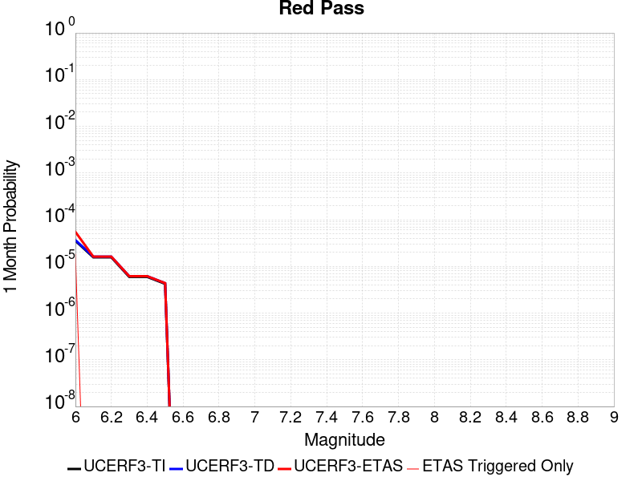 | 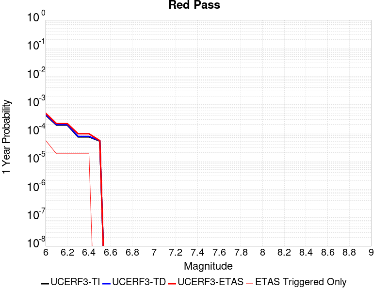 | 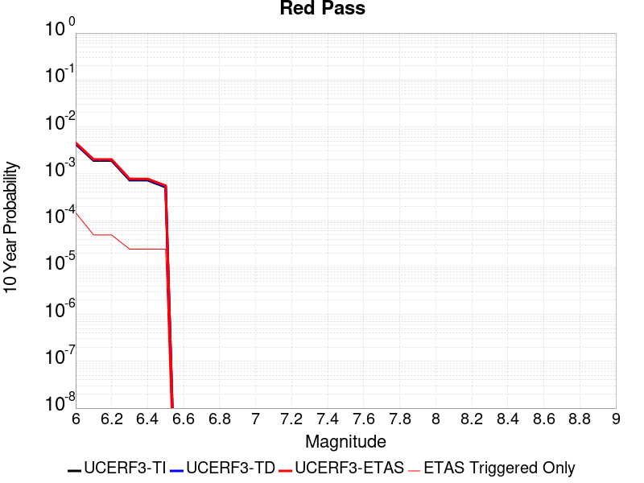 |

| Magnitude | 1 wk TI Prob | 1 wk TD Prob | 1 wk ETAS Prob | 1 wk ETAS/TD Gain | 1 wk ETAS Triggered Only | 1 mo TI Prob | 1 mo TD Prob | 1 mo ETAS Prob | 1 mo ETAS/TD Gain | 1 mo ETAS Triggered Only | 1 yr TI Prob | 1 yr TD Prob | 1 yr ETAS Prob | 1 yr ETAS/TD Gain | 1 yr ETAS Triggered Only | 10 yr TI Prob | 10 yr TD Prob | 10 yr ETAS Prob | 10 yr ETAS/TD Gain | 10 yr ETAS Triggered Only |
|-----|-----|-----|-----|-----|-----|-----|-----|-----|-----|-----|-----|-----|-----|-----|-----|-----|-----|-----|-----|-----|
| 6.0 | 8.258278E-6 | 8.551587E-6 | 8.551587E-6 | 1.0 | 0.0 | 3.539214E-5 | 3.6649242E-5 | 4.7637852E-5 | 1.2998317 | 1.0989011E-5 | 4.308141E-4 | 4.4613107E-4 | 4.9006747E-4 | 1.0984832 | 4.3956043E-5 | 0.0042997985 | 0.004454112 | 0.004596333 | 1.0319302 | 1.4285714E-4 |
| 6.1 | 3.649988E-6 | 3.7754537E-6 | 3.7754537E-6 | 1.0 | 0.0 | 1.5642712E-5 | 1.6180442E-5 | 1.6180442E-5 | 1.0 | 0.0 | 1.9043336E-4 | 1.9698383E-4 | 2.0797069E-4 | 1.0557754 | 1.0989011E-5 | 0.0019027026 | 0.0019685596 | 0.0020014618 | 1.0167139 | 3.2967033E-5 |
| 6.2 | 3.649988E-6 | 3.7754537E-6 | 3.7754537E-6 | 1.0 | 0.0 | 1.5642712E-5 | 1.6180442E-5 | 1.6180442E-5 | 1.0 | 0.0 | 1.9043336E-4 | 1.9698383E-4 | 2.0797069E-4 | 1.0557754 | 1.0989011E-5 | 0.0019027026 | 0.0019685596 | 0.0020014618 | 1.0167139 | 3.2967033E-5 |
| 6.3 | 1.3924937E-6 | 1.4411701E-6 | 1.4411701E-6 | 1.0 | 0.0 | 5.9678164E-6 | 6.1764363E-6 | 6.1764363E-6 | 1.0 | 0.0 | 7.265574E-5 | 7.5196935E-5 | 8.6185115E-5 | 1.1461254 | 1.0989011E-5 | 7.263199E-4 | 7.5185363E-4 | 7.7381515E-4 | 1.0292099 | 2.1978021E-5 |
| 6.4 | 1.3924937E-6 | 1.4411701E-6 | 1.4411701E-6 | 1.0 | 0.0 | 5.9678164E-6 | 6.1764363E-6 | 6.1764363E-6 | 1.0 | 0.0 | 7.265574E-5 | 7.5196935E-5 | 8.6185115E-5 | 1.1461254 | 1.0989011E-5 | 7.263199E-4 | 7.5185363E-4 | 7.7381515E-4 | 1.0292099 | 2.1978021E-5 |
| 6.5 | 9.876812E-7 | 1.0222291E-6 | 1.0222291E-6 | 1.0 | 0.0 | 4.2329125E-6 | 4.380982E-6 | 4.380982E-6 | 1.0 | 0.0 | 5.153449E-5 | 5.3338455E-5 | 5.3338455E-5 | 1.0 | 0.0 | 5.1522546E-4 | 5.3338456E-4 | 5.443677E-4 | 1.0205914 | 1.0989011E-5 |

## Calico-Hidalgo
*[(top)](#table-of-contents)*

| 1 Week | 1 Month | 1 Year | 10 Year |
|-----|-----|-----|-----|
| 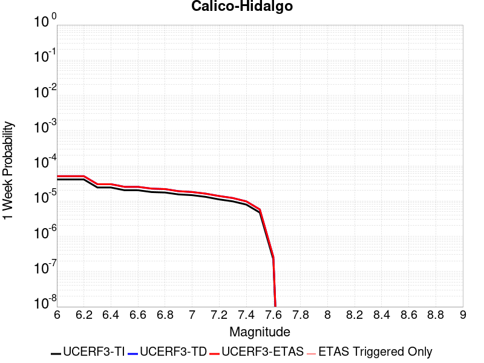 | 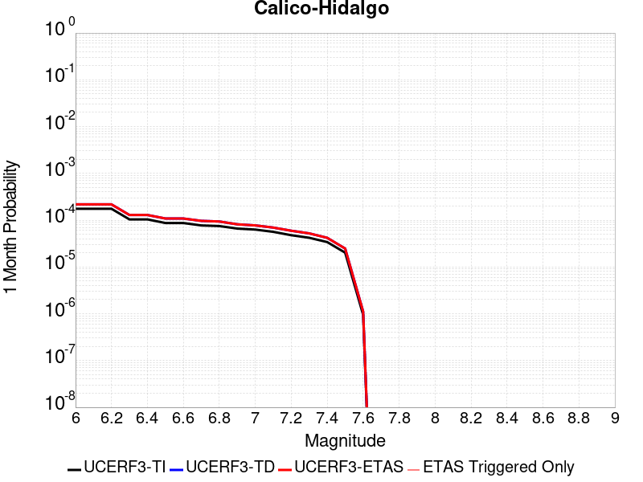 | 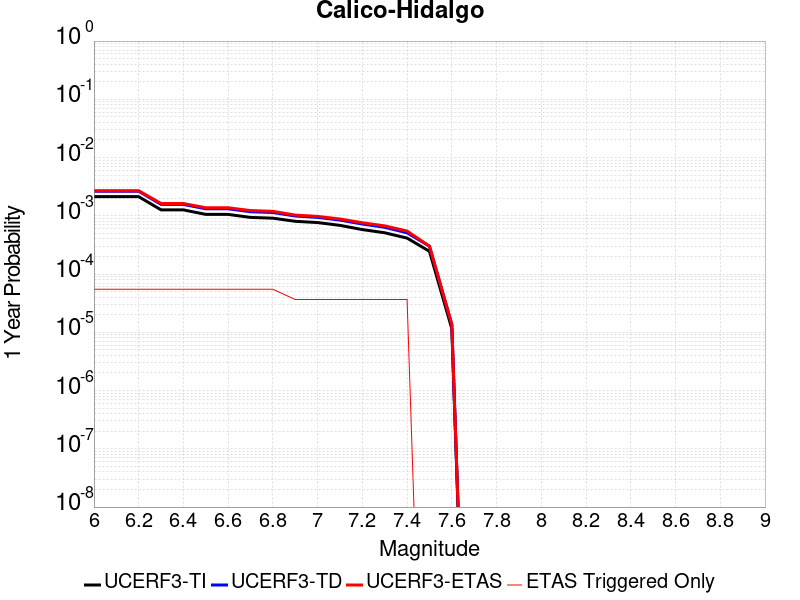 | 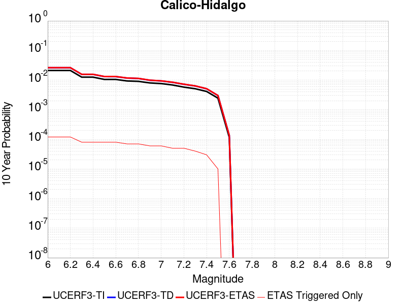 |

| Magnitude | 1 wk TI Prob | 1 wk TD Prob | 1 wk ETAS Prob | 1 wk ETAS/TD Gain | 1 wk ETAS Triggered Only | 1 mo TI Prob | 1 mo TD Prob | 1 mo ETAS Prob | 1 mo ETAS/TD Gain | 1 mo ETAS Triggered Only | 1 yr TI Prob | 1 yr TD Prob | 1 yr ETAS Prob | 1 yr ETAS/TD Gain | 1 yr ETAS Triggered Only | 10 yr TI Prob | 10 yr TD Prob | 10 yr ETAS Prob | 10 yr ETAS/TD Gain | 10 yr ETAS Triggered Only |
|-----|-----|-----|-----|-----|-----|-----|-----|-----|-----|-----|-----|-----|-----|-----|-----|-----|-----|-----|-----|-----|
| 6.0 | 4.0906612E-5 | 5.0711405E-5 | 5.0711405E-5 | 1.0 | 0.0 | 1.7530227E-4 | 2.1731878E-4 | 2.1731878E-4 | 1.0 | 0.0 | 0.0021322158 | 0.0026430492 | 0.0026978492 | 1.0207336 | 5.4945056E-5 | 0.02111873 | 0.026156526 | 0.026274243 | 1.0045005 | 1.2087912E-4 |
| 6.1 | 4.0906612E-5 | 5.0711405E-5 | 5.0711405E-5 | 1.0 | 0.0 | 1.7530227E-4 | 2.1731878E-4 | 2.1731878E-4 | 1.0 | 0.0 | 0.0021322158 | 0.0026430492 | 0.0026978492 | 1.0207336 | 5.4945056E-5 | 0.02111873 | 0.026156526 | 0.026274243 | 1.0045005 | 1.2087912E-4 |
| 6.2 | 4.0906612E-5 | 5.0711405E-5 | 5.0711405E-5 | 1.0 | 0.0 | 1.7530227E-4 | 2.1731878E-4 | 2.1731878E-4 | 1.0 | 0.0 | 0.0021322158 | 0.0026430492 | 0.0026978492 | 1.0207336 | 5.4945056E-5 | 0.02111873 | 0.026156526 | 0.026274243 | 1.0045005 | 1.2087912E-4 |
| 6.3 | 2.4242801E-5 | 3.0093575E-5 | 3.0093575E-5 | 1.0 | 0.0 | 1.0389358E-4 | 1.2896628E-4 | 1.2896628E-4 | 1.0 | 0.0 | 0.0012641704 | 0.001569066 | 0.0016019812 | 1.0209776 | 3.2967033E-5 | 0.01257003 | 0.015583552 | 0.015659276 | 1.0048592 | 7.6923076E-5 |
| 6.4 | 2.4242801E-5 | 3.0093575E-5 | 3.0093575E-5 | 1.0 | 0.0 | 1.0389358E-4 | 1.2896628E-4 | 1.2896628E-4 | 1.0 | 0.0 | 0.0012641704 | 0.001569066 | 0.0016019812 | 1.0209776 | 3.2967033E-5 | 0.01257003 | 0.015583552 | 0.015659276 | 1.0048592 | 7.6923076E-5 |
| 6.5 | 2.0286952E-5 | 2.5317715E-5 | 2.5317715E-5 | 1.0 | 0.0 | 8.694118E-5 | 1.0850008E-4 | 1.0850008E-4 | 1.0 | 0.0 | 0.0010579949 | 0.0013202052 | 0.0013531286 | 1.0249382 | 3.2967033E-5 | 0.010529719 | 0.0131255565 | 0.01320147 | 1.0057837 | 7.6923076E-5 |
| 6.6 | 2.0269223E-5 | 2.5298665E-5 | 2.5298665E-5 | 1.0 | 0.0 | 8.6865206E-5 | 1.0841843E-4 | 1.0841843E-4 | 1.0 | 0.0 | 0.0010570707 | 0.0013192123 | 0.0013521358 | 1.024957 | 3.2967033E-5 | 0.010520565 | 0.013115745 | 0.01319166 | 1.005788 | 7.6923076E-5 |
| 6.7 | 1.799852E-5 | 2.2542203E-5 | 2.2542203E-5 | 1.0 | 0.0 | 7.713423E-5 | 9.660594E-5 | 9.660594E-5 | 1.0 | 0.0 | 9.3870464E-4 | 0.0011755573 | 0.0012084856 | 1.0280107 | 3.2967033E-5 | 0.009347493 | 0.011694999 | 0.011760162 | 1.0055718 | 6.5934066E-5 |
| 6.8 | 1.7458793E-5 | 2.1843663E-5 | 2.1843663E-5 | 1.0 | 0.0 | 7.4821255E-5 | 9.361243E-5 | 9.361243E-5 | 1.0 | 0.0 | 9.10568E-4 | 0.0011391499 | 0.0011720794 | 1.0289071 | 3.2967033E-5 | 0.009068459 | 0.01133469 | 0.011399877 | 1.0057511 | 6.5934066E-5 |
| 6.9 | 1.542884E-5 | 1.9027206E-5 | 1.9027206E-5 | 1.0 | 0.0 | 6.612192E-5 | 8.15427E-5 | 8.15427E-5 | 1.0 | 0.0 | 8.04737E-4 | 9.923433E-4 | 0.0010142995 | 1.0221256 | 2.1978021E-5 | 0.008018291 | 0.009880519 | 0.009934921 | 1.005506 | 5.4945056E-5 |
| 7.0 | 1.468253E-5 | 1.8031784E-5 | 1.8031784E-5 | 1.0 | 0.0 | 6.292361E-5 | 7.7276854E-5 | 7.7276854E-5 | 1.0 | 0.0 | 7.658257E-4 | 9.404526E-4 | 9.6240995E-4 | 1.0233476 | 2.1978021E-5 | 0.0076319184 | 0.009366093 | 0.009420524 | 1.0058115 | 5.4945056E-5 |
| 7.1 | 1.3139281E-5 | 1.6201957E-5 | 1.6201957E-5 | 1.0 | 0.0 | 5.6309986E-5 | 6.9435184E-5 | 6.9435184E-5 | 1.0 | 0.0 | 6.853584E-4 | 8.4505806E-4 | 8.670175E-4 | 1.0259857 | 2.1978021E-5 | 0.0068324856 | 0.008419744 | 0.00846333 | 1.0051767 | 4.3956043E-5 |
| 7.2 | 1.1127404E-5 | 1.3867441E-5 | 1.3867441E-5 | 1.0 | 0.0 | 4.7688E-5 | 5.94306E-5 | 5.94306E-5 | 1.0 | 0.0 | 5.8044674E-4 | 7.233382E-4 | 7.453003E-4 | 1.0303621 | 2.1978021E-5 | 0.0057893298 | 0.0072109457 | 0.0072545847 | 1.0060518 | 4.3956043E-5 |
| 7.3 | 9.808154E-6 | 1.2176904E-5 | 1.2176904E-5 | 1.0 | 0.0 | 4.2034266E-5 | 5.2185747E-5 | 5.2185747E-5 | 1.0 | 0.0 | 5.11647E-4 | 6.3518697E-4 | 6.5715105E-4 | 1.0345789 | 2.1978021E-5 | 0.0051047057 | 0.0063347905 | 0.006367549 | 1.0051712 | 3.2967033E-5 |
| 7.4 | 7.942452E-6 | 9.792658E-6 | 9.792658E-6 | 1.0 | 0.0 | 3.4038632E-5 | 4.1967913E-5 | 4.1967913E-5 | 1.0 | 0.0 | 4.1434157E-4 | 5.10849E-4 | 5.328158E-4 | 1.0430006 | 2.1978021E-5 | 0.0041356985 | 0.005097688 | 0.005119554 | 1.0042894 | 2.1978021E-5 |
| 7.5 | 4.7121216E-6 | 5.773115E-6 | 5.773115E-6 | 1.0 | 0.0 | 2.019465E-5 | 2.474173E-5 | 2.474173E-5 | 1.0 | 0.0 | 2.4584212E-4 | 3.011966E-4 | 3.011966E-4 | 1.0 | 0.0 | 0.0024557032 | 0.0030086362 | 0.0030086362 | 1.0 | 0.0 |
| 7.6 | 2.21172E-7 | 2.604064E-7 | 2.604064E-7 | 1.0 | 0.0 | 9.478797E-7 | 1.1160272E-6 | 1.1160272E-6 | 1.0 | 0.0 | 1.1540374E-5 | 1.3587575E-5 | 1.3587575E-5 | 1.0 | 0.0 | 1.1539775E-4 | 1.3587026E-4 | 1.3587026E-4 | 1.0 | 0.0 |

## Cady
*[(top)](#table-of-contents)*

| 1 Week | 1 Month | 1 Year | 10 Year |
|-----|-----|-----|-----|
| 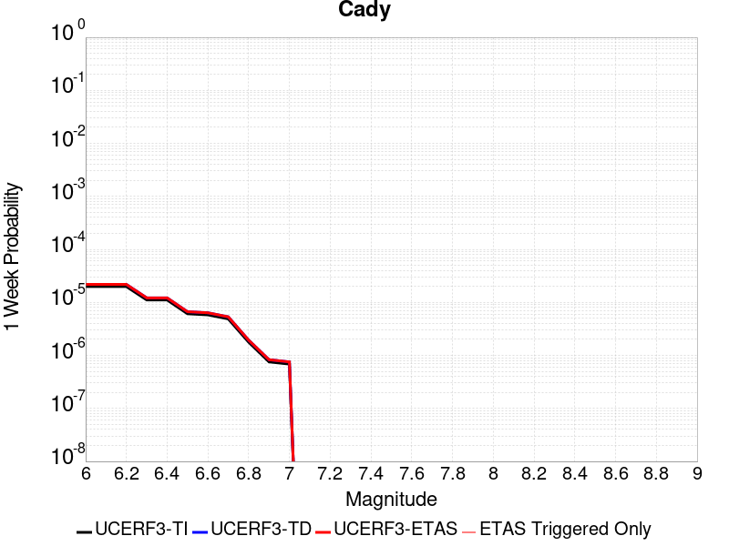 | 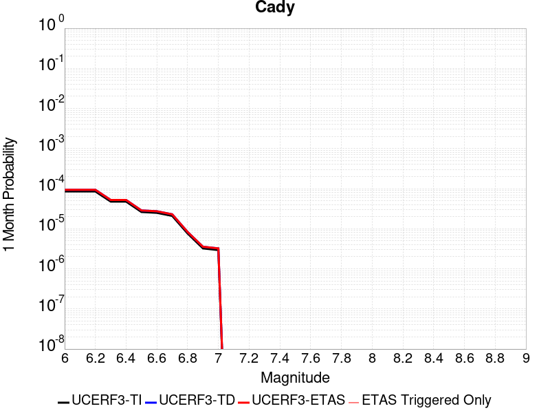 | 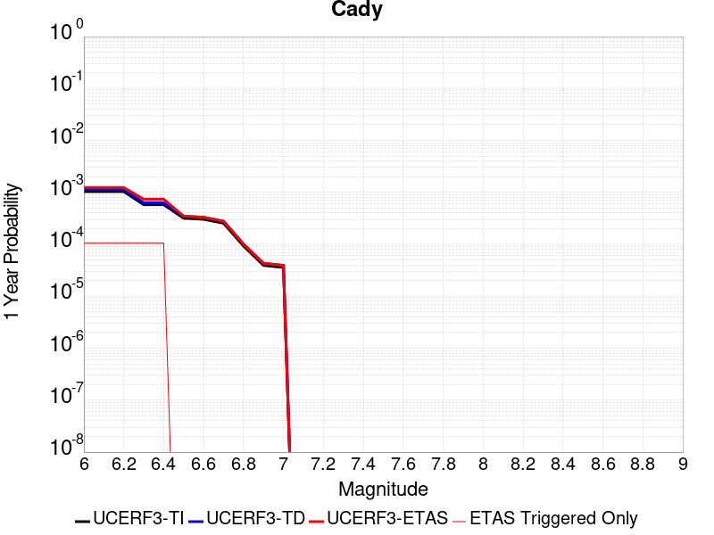 | 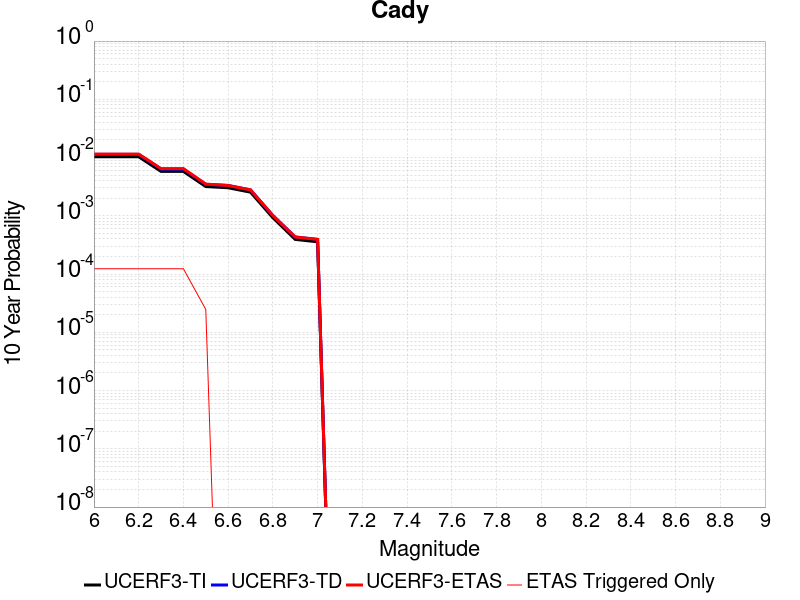 |

| Magnitude | 1 wk TI Prob | 1 wk TD Prob | 1 wk ETAS Prob | 1 wk ETAS/TD Gain | 1 wk ETAS Triggered Only | 1 mo TI Prob | 1 mo TD Prob | 1 mo ETAS Prob | 1 mo ETAS/TD Gain | 1 mo ETAS Triggered Only | 1 yr TI Prob | 1 yr TD Prob | 1 yr ETAS Prob | 1 yr ETAS/TD Gain | 1 yr ETAS Triggered Only | 10 yr TI Prob | 10 yr TD Prob | 10 yr ETAS Prob | 10 yr ETAS/TD Gain | 10 yr ETAS Triggered Only |
|-----|-----|-----|-----|-----|-----|-----|-----|-----|-----|-----|-----|-----|-----|-----|-----|-----|-----|-----|-----|-----|
| 6.0 | 1.9892565E-5 | 2.1861024E-5 | 2.1861024E-5 | 1.0 | 0.0 | 8.525106E-5 | 9.3687246E-5 | 9.3687246E-5 | 1.0 | 0.0 | 0.0010374374 | 0.0011401363 | 0.0011620893 | 1.0192547 | 2.1978021E-5 | 0.010326075 | 0.011351886 | 0.011471393 | 1.0105275 | 1.2087912E-4 |
| 6.1 | 1.9892565E-5 | 2.1861024E-5 | 2.1861024E-5 | 1.0 | 0.0 | 8.525106E-5 | 9.3687246E-5 | 9.3687246E-5 | 1.0 | 0.0 | 0.0010374374 | 0.0011401363 | 0.0011620893 | 1.0192547 | 2.1978021E-5 | 0.010326075 | 0.011351886 | 0.011471393 | 1.0105275 | 1.2087912E-4 |
| 6.2 | 1.9892565E-5 | 2.1861024E-5 | 2.1861024E-5 | 1.0 | 0.0 | 8.525106E-5 | 9.3687246E-5 | 9.3687246E-5 | 1.0 | 0.0 | 0.0010374374 | 0.0011401363 | 0.0011620893 | 1.0192547 | 2.1978021E-5 | 0.010326075 | 0.011351886 | 0.011471393 | 1.0105275 | 1.2087912E-4 |
| 6.3 | 1.1117327E-5 | 1.2177816E-5 | 1.2177816E-5 | 1.0 | 0.0 | 4.764482E-5 | 5.218977E-5 | 5.218977E-5 | 1.0 | 0.0 | 5.7992124E-4 | 6.352567E-4 | 6.572208E-4 | 1.0345751 | 2.1978021E-5 | 0.0057841022 | 0.0063375146 | 0.00641395 | 1.0120608 | 7.6923076E-5 |
| 6.4 | 1.1117327E-5 | 1.2177816E-5 | 1.2177816E-5 | 1.0 | 0.0 | 4.764482E-5 | 5.218977E-5 | 5.218977E-5 | 1.0 | 0.0 | 5.7992124E-4 | 6.352567E-4 | 6.572208E-4 | 1.0345751 | 2.1978021E-5 | 0.0057841022 | 0.0063375146 | 0.00641395 | 1.0120608 | 7.6923076E-5 |
| 6.5 | 6.103093E-6 | 6.672681E-6 | 6.672681E-6 | 1.0 | 0.0 | 2.615585E-5 | 2.8596962E-5 | 2.8596962E-5 | 1.0 | 0.0 | 3.1840094E-4 | 3.4812494E-4 | 3.4812494E-4 | 1.0 | 0.0 | 0.0031794512 | 0.0034770304 | 0.0035098828 | 1.0094484 | 3.2967033E-5 |
| 6.6 | 5.817237E-6 | 6.3662956E-6 | 6.3662956E-6 | 1.0 | 0.0 | 2.4930776E-5 | 2.728391E-5 | 2.728391E-5 | 1.0 | 0.0 | 3.034899E-4 | 3.3214342E-4 | 3.3214342E-4 | 1.0 | 0.0 | 0.0030307577 | 0.0033176923 | 0.0033395973 | 1.0066025 | 2.1978021E-5 |
| 6.7 | 4.8846314E-6 | 5.3410977E-6 | 5.3410977E-6 | 1.0 | 0.0 | 2.0933967E-5 | 2.2890283E-5 | 2.2890283E-5 | 1.0 | 0.0 | 2.5484123E-4 | 2.7866533E-4 | 2.7866533E-4 | 1.0 | 0.0 | 0.0025454918 | 0.0027843148 | 0.0028062316 | 1.0078715 | 2.1978021E-5 |
| 6.8 | 1.7788773E-6 | 1.9400945E-6 | 1.9400945E-6 | 1.0 | 0.0 | 7.6237375E-6 | 8.314672E-6 | 8.314672E-6 | 1.0 | 0.0 | 9.281505E-5 | 1.0122802E-4 | 1.0122802E-4 | 1.0 | 0.0 | 9.2776294E-4 | 0.0010119737 | 0.0010229516 | 1.010848 | 1.0989011E-5 |
| 6.9 | 7.5455404E-7 | 8.2979693E-7 | 8.2979693E-7 | 1.0 | 0.0 | 3.233799E-6 | 3.5562696E-6 | 3.5562696E-6 | 1.0 | 0.0 | 3.937079E-5 | 4.3297056E-5 | 4.3297056E-5 | 1.0 | 0.0 | 3.9363815E-4 | 4.3291916E-4 | 4.4390344E-4 | 1.0253725 | 1.0989011E-5 |
| 7.0 | 6.8578805E-7 | 7.542614E-7 | 7.542614E-7 | 1.0 | 0.0 | 2.9390883E-6 | 3.2325468E-6 | 3.2325468E-6 | 1.0 | 0.0 | 3.578281E-5 | 3.9355877E-5 | 3.9355877E-5 | 1.0 | 0.0 | 3.577705E-4 | 3.9352156E-4 | 4.0450625E-4 | 1.0279138 | 1.0989011E-5 |

## San Andreas (Carrizo) rev
*[(top)](#table-of-contents)*

| 1 Week | 1 Month | 1 Year | 10 Year |
|-----|-----|-----|-----|
| 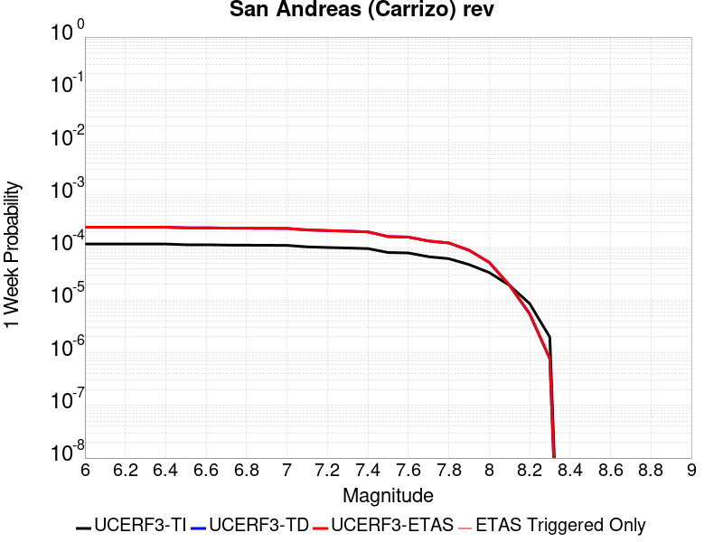 | 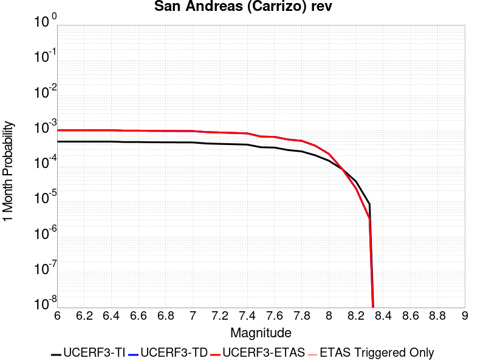 |  | 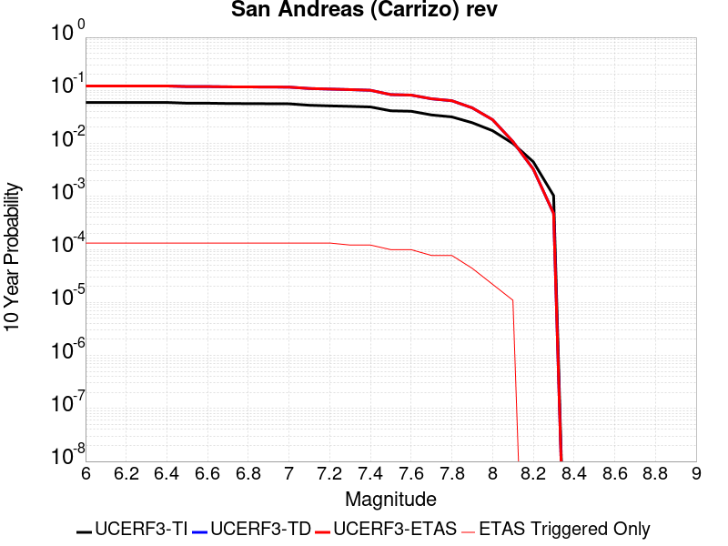 |

| Magnitude | 1 wk TI Prob | 1 wk TD Prob | 1 wk ETAS Prob | 1 wk ETAS/TD Gain | 1 wk ETAS Triggered Only | 1 mo TI Prob | 1 mo TD Prob | 1 mo ETAS Prob | 1 mo ETAS/TD Gain | 1 mo ETAS Triggered Only | 1 yr TI Prob | 1 yr TD Prob | 1 yr ETAS Prob | 1 yr ETAS/TD Gain | 1 yr ETAS Triggered Only | 10 yr TI Prob | 10 yr TD Prob | 10 yr ETAS Prob | 10 yr ETAS/TD Gain | 10 yr ETAS Triggered Only |
|-----|-----|-----|-----|-----|-----|-----|-----|-----|-----|-----|-----|-----|-----|-----|-----|-----|-----|-----|-----|-----|
| 6.0 | 1.1674632E-4 | 2.4399806E-4 | 2.4399806E-4 | 1.0 | 0.0 | 5.002454E-4 | 0.0010452885 | 0.0010452885 | 1.0 | 0.0 | 0.006073493 | 0.012652613 | 0.012696013 | 1.0034301 | 4.3956043E-5 | 0.0591016 | 0.12093733 | 0.12105325 | 1.0009586 | 1.3186813E-4 |
| 6.1 | 1.1674632E-4 | 2.4399806E-4 | 2.4399806E-4 | 1.0 | 0.0 | 5.002454E-4 | 0.0010452885 | 0.0010452885 | 1.0 | 0.0 | 0.006073493 | 0.012652613 | 0.012696013 | 1.0034301 | 4.3956043E-5 | 0.0591016 | 0.12093733 | 0.12105325 | 1.0009586 | 1.3186813E-4 |
| 6.2 | 1.1674632E-4 | 2.4399806E-4 | 2.4399806E-4 | 1.0 | 0.0 | 5.002454E-4 | 0.0010452885 | 0.0010452885 | 1.0 | 0.0 | 0.006073493 | 0.012652613 | 0.012696013 | 1.0034301 | 4.3956043E-5 | 0.0591016 | 0.12093733 | 0.12105325 | 1.0009586 | 1.3186813E-4 |
| 6.3 | 1.1674632E-4 | 2.4399806E-4 | 2.4399806E-4 | 1.0 | 0.0 | 5.002454E-4 | 0.0010452885 | 0.0010452885 | 1.0 | 0.0 | 0.006073493 | 0.012652613 | 0.012696013 | 1.0034301 | 4.3956043E-5 | 0.0591016 | 0.12093733 | 0.12105325 | 1.0009586 | 1.3186813E-4 |
| 6.4 | 1.1674632E-4 | 2.4399806E-4 | 2.4399806E-4 | 1.0 | 0.0 | 5.002454E-4 | 0.0010452885 | 0.0010452885 | 1.0 | 0.0 | 0.006073493 | 0.012652613 | 0.012696013 | 1.0034301 | 4.3956043E-5 | 0.0591016 | 0.12093733 | 0.12105325 | 1.0009586 | 1.3186813E-4 |
| 6.5 | 1.13136164E-4 | 2.3719473E-4 | 2.3719473E-4 | 1.0 | 0.0 | 4.847792E-4 | 0.0010161544 | 0.0010161544 | 1.0 | 0.0 | 0.0058862255 | 0.012301951 | 0.012345366 | 1.0035292 | 4.3956043E-5 | 0.057327334 | 0.11790838 | 0.1180247 | 1.0009866 | 1.3186813E-4 |
| 6.6 | 1.13136164E-4 | 2.3719473E-4 | 2.3719473E-4 | 1.0 | 0.0 | 4.847792E-4 | 0.0010161544 | 0.0010161544 | 1.0 | 0.0 | 0.0058862255 | 0.012301951 | 0.012345366 | 1.0035292 | 4.3956043E-5 | 0.057327334 | 0.11790838 | 0.1180247 | 1.0009866 | 1.3186813E-4 |
| 6.7 | 1.1149675E-4 | 2.341054E-4 | 2.341054E-4 | 1.0 | 0.0 | 4.777557E-4 | 0.0010029246 | 0.0010029246 | 1.0 | 0.0 | 0.0058011734 | 0.012142682 | 0.012186104 | 1.003576 | 4.3956043E-5 | 0.05652051 | 0.116529755 | 0.11664626 | 1.0009998 | 1.3186813E-4 |
| 6.8 | 1.1103589E-4 | 2.3312606E-4 | 2.3312606E-4 | 1.0 | 0.0 | 4.7578133E-4 | 9.987307E-4 | 9.987307E-4 | 1.0 | 0.0 | 0.005777263 | 0.012092189 | 0.012135614 | 1.0035912 | 4.3956043E-5 | 0.056293584 | 0.11608986 | 0.116206415 | 1.0010041 | 1.3186813E-4 |
| 6.9 | 1.1053259E-4 | 2.3204887E-4 | 2.3204887E-4 | 1.0 | 0.0 | 4.7362508E-4 | 9.941176E-4 | 9.941176E-4 | 1.0 | 0.0 | 0.0057511497 | 0.012036647 | 0.012080074 | 1.0036079 | 4.3956043E-5 | 0.05604569 | 0.11560583 | 0.11572245 | 1.0010087 | 1.3186813E-4 |
| 7.0 | 1.1005377E-4 | 2.3105634E-4 | 2.3105634E-4 | 1.0 | 0.0 | 4.7157376E-4 | 9.898671E-4 | 9.898671E-4 | 1.0 | 0.0 | 0.0057263062 | 0.011985469 | 0.012028898 | 1.0036235 | 4.3956043E-5 | 0.055809796 | 0.11515792 | 0.1152746 | 1.0010133 | 1.3186813E-4 |
| 7.1 | 1.0308142E-4 | 2.1613913E-4 | 2.1613913E-4 | 1.0 | 0.0 | 4.417027E-4 | 9.259828E-4 | 9.259828E-4 | 1.0 | 0.0 | 0.0053644776 | 0.0112158805 | 0.0112593435 | 1.0038751 | 4.3956043E-5 | 0.052368138 | 0.108410984 | 0.108528554 | 1.0010844 | 1.3186813E-4 |
| 7.2 | 1.0027479E-4 | 2.1021221E-4 | 2.1021221E-4 | 1.0 | 0.0 | 4.296783E-4 | 9.005994E-4 | 9.005994E-4 | 1.0 | 0.0 | 0.0052187922 | 0.010909973 | 0.010953449 | 1.003985 | 4.3956043E-5 | 0.050979212 | 0.10571356 | 0.10583149 | 1.0011156 | 1.3186813E-4 |
| 7.3 | 9.816942E-5 | 2.0495409E-4 | 2.0495409E-4 | 1.0 | 0.0 | 4.2065824E-4 | 8.7808E-4 | 8.7808E-4 | 1.0 | 0.0 | 0.005109493 | 0.010638508 | 0.010681997 | 1.0040878 | 4.3956043E-5 | 0.049935985 | 0.10329403 | 0.10340243 | 1.0010494 | 1.2087912E-4 |
| 7.4 | 9.5634205E-5 | 1.9863612E-4 | 1.9863612E-4 | 1.0 | 0.0 | 4.0979648E-4 | 8.510208E-4 | 8.510208E-4 | 1.0 | 0.0 | 0.0049778637 | 0.01031222 | 0.010355722 | 1.0042186 | 4.3956043E-5 | 0.048678253 | 0.10037603 | 0.10048478 | 1.0010834 | 1.2087912E-4 |
| 7.5 | 8.052417E-5 | 1.61756E-4 | 1.61756E-4 | 1.0 | 0.0 | 3.4505792E-4 | 6.9305603E-4 | 6.9305603E-4 | 1.0 | 0.0 | 0.0041929903 | 0.008405393 | 0.008438083 | 1.0038892 | 3.2967033E-5 | 0.04114753 | 0.08309098 | 0.083181664 | 1.0010914 | 9.89011E-5 |
| 7.6 | 7.897024E-5 | 1.5828035E-4 | 1.5828035E-4 | 1.0 | 0.0 | 3.384E-4 | 6.7816814E-4 | 6.7816814E-4 | 1.0 | 0.0 | 0.0041122385 | 0.008225516 | 0.008258212 | 1.0039749 | 3.2967033E-5 | 0.040369697 | 0.08142932 | 0.08152016 | 1.0011157 | 9.89011E-5 |
| 7.7 | 6.707427E-5 | 1.333214E-4 | 1.333214E-4 | 1.0 | 0.0 | 2.8742946E-4 | 5.7125237E-4 | 5.7125237E-4 | 1.0 | 0.0 | 0.003493839 | 0.0069328514 | 0.0069655897 | 1.0047222 | 3.2967033E-5 | 0.034394164 | 0.06930262 | 0.0693742 | 1.0010331 | 7.6923076E-5 |
| 7.8 | 6.147705E-5 | 1.2248219E-4 | 1.2248219E-4 | 1.0 | 0.0 | 2.6344648E-4 | 5.2481814E-4 | 5.2481814E-4 | 1.0 | 0.0 | 0.0032027436 | 0.006370966 | 0.006403723 | 1.0051416 | 3.2967033E-5 | 0.031569764 | 0.063746415 | 0.06381843 | 1.0011297 | 7.6923076E-5 |
| 7.9 | 4.7636717E-5 | 8.916394E-5 | 8.916394E-5 | 1.0 | 0.0 | 2.0414138E-4 | 3.8207523E-4 | 3.8207523E-4 | 1.0 | 0.0 | 0.0024825884 | 0.004641852 | 0.0046637277 | 1.0047128 | 2.1978021E-5 | 0.024550365 | 0.04680053 | 0.04684243 | 1.0008953 | 4.3956043E-5 |
| 8.0 | 3.3554235E-5 | 5.2363197E-5 | 5.2363197E-5 | 1.0 | 0.0 | 1.4379594E-4 | 2.243944E-4 | 2.243944E-4 | 1.0 | 0.0 | 0.0017493097 | 0.002728581 | 0.0027395398 | 1.0040164 | 1.0989011E-5 | 0.017356034 | 0.02799243 | 0.028013792 | 1.0007632 | 2.1978021E-5 |
| 8.1 | 1.9175432E-5 | 1.9296269E-5 | 1.9296269E-5 | 1.0 | 0.0 | 8.217783E-5 | 8.2695675E-5 | 8.2695675E-5 | 1.0 | 0.0 | 0.0010000558 | 0.0010063554 | 0.0010173334 | 1.0109086 | 1.0989011E-5 | 0.009955673 | 0.0108165685 | 0.010827439 | 1.0010049 | 1.0989011E-5 |
| 8.2 | 8.643924E-6 | 5.5167247E-6 | 5.5167247E-6 | 1.0 | 0.0 | 3.704486E-5 | 2.3642891E-5 | 2.3642891E-5 | 1.0 | 0.0 | 4.5092785E-4 | 2.8781427E-4 | 2.8781427E-4 | 1.0 | 0.0 | 0.0045001395 | 0.0032716133 | 0.0032716133 | 1.0 | 0.0 |
| 8.3 | 1.983087E-6 | 7.731745E-7 | 7.731745E-7 | 1.0 | 0.0 | 8.498917E-6 | 3.313601E-6 | 3.313601E-6 | 1.0 | 0.0 | 1.034694E-4 | 4.0342362E-5 | 4.0342362E-5 | 1.0 | 0.0 | 0.0010342124 | 4.7608858E-4 | 4.7608858E-4 | 1.0 | 0.0 |

## San Andreas (Creeping Section) 2011 CFM
*[(top)](#table-of-contents)*

| 1 Week | 1 Month | 1 Year | 10 Year |
|-----|-----|-----|-----|
| 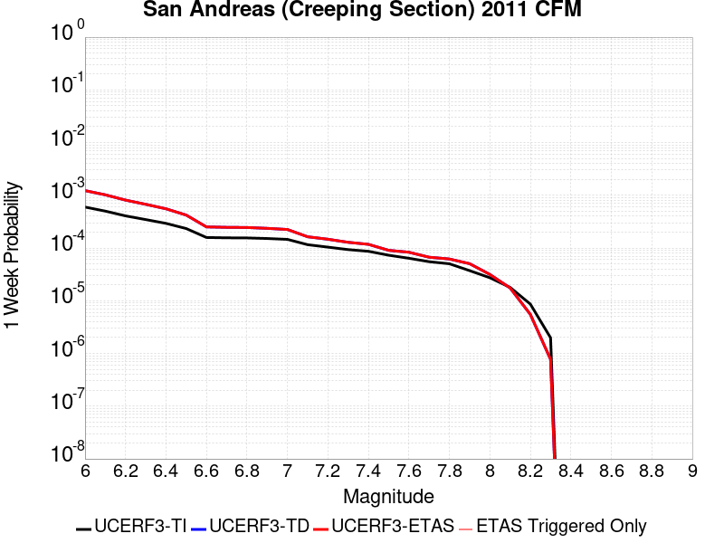 | 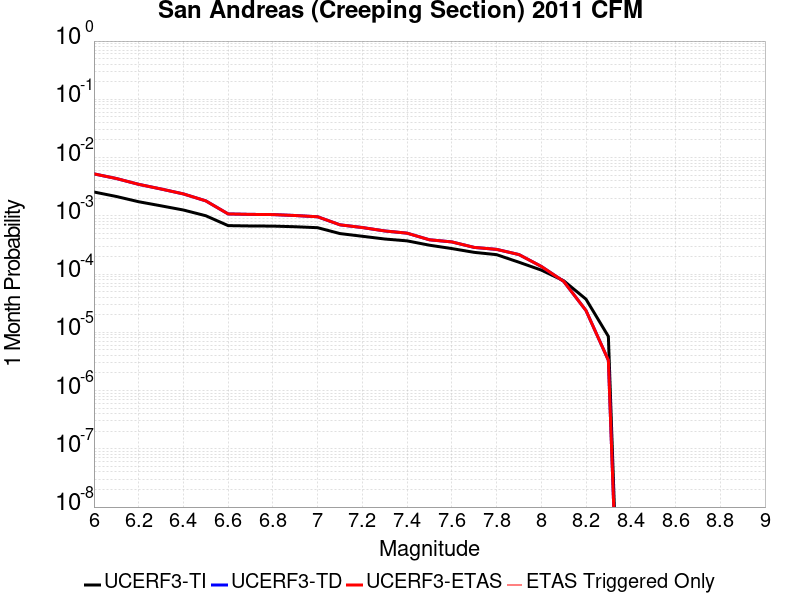 | 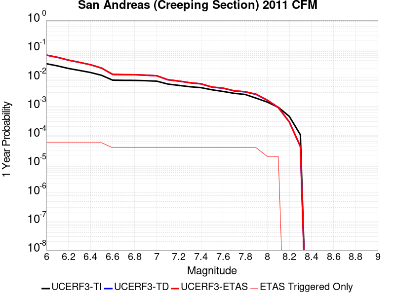 | 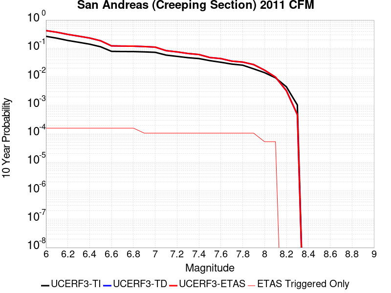 |

| Magnitude | 1 wk TI Prob | 1 wk TD Prob | 1 wk ETAS Prob | 1 wk ETAS/TD Gain | 1 wk ETAS Triggered Only | 1 mo TI Prob | 1 mo TD Prob | 1 mo ETAS Prob | 1 mo ETAS/TD Gain | 1 mo ETAS Triggered Only | 1 yr TI Prob | 1 yr TD Prob | 1 yr ETAS Prob | 1 yr ETAS/TD Gain | 1 yr ETAS Triggered Only | 10 yr TI Prob | 10 yr TD Prob | 10 yr ETAS Prob | 10 yr ETAS/TD Gain | 10 yr ETAS Triggered Only |
|-----|-----|-----|-----|-----|-----|-----|-----|-----|-----|-----|-----|-----|-----|-----|-----|-----|-----|-----|-----|-----|
| 6.0 | 5.986481E-4 | 0.0012277128 | 0.0012277128 | 1.0 | 0.0 | 0.0025631124 | 0.005248843 | 0.005248843 | 1.0 | 0.0 | 0.030762846 | 0.061255742 | 0.061307322 | 1.000842 | 5.4945056E-5 | 0.26835477 | 0.42618826 | 0.42625132 | 1.0001479 | 1.0989011E-4 |
| 6.1 | 5.015945E-4 | 0.001021834 | 0.001021834 | 1.0 | 0.0 | 0.00214792 | 0.004370119 | 0.004370119 | 1.0 | 0.0 | 0.025839351 | 0.05129081 | 0.05133251 | 1.000813 | 4.3956043E-5 | 0.23032776 | 0.37310076 | 0.37316278 | 1.0001662 | 9.89011E-5 |
| 6.2 | 4.073338E-4 | 8.113091E-4 | 8.113091E-4 | 1.0 | 0.0 | 0.0017445484 | 0.0034705189 | 0.0034705189 | 1.0 | 0.0 | 0.021034058 | 0.040975556 | 0.04101771 | 1.0010288 | 4.3956043E-5 | 0.19150782 | 0.31329766 | 0.31336558 | 1.0002167 | 9.89011E-5 |
| 6.3 | 3.464099E-4 | 6.7463954E-4 | 6.7463954E-4 | 1.0 | 0.0 | 0.0014837692 | 0.002886507 | 0.002886507 | 1.0 | 0.0 | 0.017915873 | 0.034232542 | 0.034264382 | 1.0009301 | 3.2967033E-5 | 0.16538359 | 0.27159676 | 0.2716608 | 1.0002358 | 8.7912085E-5 |
| 6.4 | 2.935057E-4 | 5.552036E-4 | 5.552036E-4 | 1.0 | 0.0 | 0.0012572751 | 0.0023767343 | 0.0023767343 | 1.0 | 0.0 | 0.015200248 | 0.028307864 | 0.028339898 | 1.0011317 | 3.2967033E-5 | 0.14201577 | 0.23328128 | 0.23334868 | 1.000289 | 8.7912085E-5 |
| 6.5 | 2.3409708E-4 | 4.2183863E-4 | 4.2183863E-4 | 1.0 | 0.0 | 0.0010028875 | 0.0018061183 | 0.0018061183 | 1.0 | 0.0 | 0.012141965 | 0.021630099 | 0.021662353 | 1.0014912 | 3.2967033E-5 | 0.11499573 | 0.18713719 | 0.18719971 | 1.0003341 | 7.6923076E-5 |
| 6.6 | 1.5842178E-4 | 2.515069E-4 | 2.515069E-4 | 1.0 | 0.0 | 6.7877385E-4 | 0.0010774364 | 0.0010774364 | 1.0 | 0.0 | 0.0082328 | 0.013037458 | 0.0130591495 | 1.0016638 | 2.1978021E-5 | 0.07934396 | 0.12348219 | 0.123539984 | 1.000468 | 6.5934066E-5 |
| 6.7 | 1.5616413E-4 | 2.4686698E-4 | 2.4686698E-4 | 1.0 | 0.0 | 6.691031E-4 | 0.0010575674 | 0.0010575674 | 1.0 | 0.0 | 0.0081159435 | 0.012799217 | 0.012820914 | 1.0016952 | 2.1978021E-5 | 0.0782586 | 0.12150933 | 0.12156725 | 1.0004767 | 6.5934066E-5 |
| 6.8 | 1.5538467E-4 | 2.4510472E-4 | 2.4510472E-4 | 1.0 | 0.0 | 6.6576427E-4 | 0.0010500209 | 0.0010500209 | 1.0 | 0.0 | 0.008075596 | 0.012708522 | 0.01273022 | 1.0017074 | 2.1978021E-5 | 0.07788358 | 0.12073988 | 0.12079785 | 1.0004802 | 6.5934066E-5 |
| 6.9 | 1.5153569E-4 | 2.3619262E-4 | 2.3619262E-4 | 1.0 | 0.0 | 6.49277E-4 | 0.0010118634 | 0.0010118634 | 1.0 | 0.0 | 0.007876333 | 0.012250378 | 0.012272087 | 1.001772 | 2.1978021E-5 | 0.07602952 | 0.11680886 | 0.11685739 | 1.0004154 | 5.4945056E-5 |
| 7.0 | 1.4588932E-4 | 2.2475704E-4 | 2.2475704E-4 | 1.0 | 0.0 | 6.250901E-4 | 9.6289086E-4 | 9.6289086E-4 | 1.0 | 0.0 | 0.0075839474 | 0.011660682 | 0.011682403 | 1.0018628 | 2.1978021E-5 | 0.073302895 | 0.11165398 | 0.1117028 | 1.0004371 | 5.4945056E-5 |
| 7.1 | 1.1565079E-4 | 1.6348856E-4 | 1.6348856E-4 | 1.0 | 0.0 | 4.955521E-4 | 7.00478E-4 | 7.00478E-4 | 1.0 | 0.0 | 0.006016669 | 0.008495174 | 0.008516965 | 1.0025651 | 2.1978021E-5 | 0.058563538 | 0.083968416 | 0.08401875 | 1.0005994 | 5.4945056E-5 |
| 7.2 | 1.0393792E-4 | 1.467928E-4 | 1.467928E-4 | 1.0 | 0.0 | 4.4537216E-4 | 6.289611E-4 | 6.289611E-4 | 1.0 | 0.0 | 0.005408933 | 0.0076308856 | 0.0076526958 | 1.0028582 | 2.1978021E-5 | 0.052791595 | 0.075905204 | 0.07595598 | 1.0006689 | 5.4945056E-5 |
| 7.3 | 9.332884E-5 | 1.2835828E-4 | 1.2835828E-4 | 1.0 | 0.0 | 3.999194E-4 | 5.499916E-4 | 5.499916E-4 | 1.0 | 0.0 | 0.0048581534 | 0.0066757244 | 0.0066975555 | 1.0032703 | 2.1978021E-5 | 0.047533102 | 0.066735476 | 0.06678675 | 1.0007684 | 5.4945056E-5 |
| 7.4 | 8.670252E-5 | 1.1753194E-4 | 1.1753194E-4 | 1.0 | 0.0 | 3.715293E-4 | 5.0361163E-4 | 5.0361163E-4 | 1.0 | 0.0 | 0.004513991 | 0.0061143558 | 0.0061361995 | 1.0035725 | 2.1978021E-5 | 0.044233937 | 0.0613828 | 0.061434373 | 1.0008402 | 5.4945056E-5 |
| 7.5 | 7.3036405E-5 | 9.047752E-5 | 9.047752E-5 | 1.0 | 0.0 | 3.129756E-4 | 3.8770327E-4 | 3.8770327E-4 | 1.0 | 0.0 | 0.0038038217 | 0.0047100927 | 0.004731967 | 1.0046442 | 2.1978021E-5 | 0.03739367 | 0.04807722 | 0.04811906 | 1.0008703 | 4.3956043E-5 |
| 7.6 | 6.3935775E-5 | 8.3173174E-5 | 8.3173174E-5 | 1.0 | 0.0 | 2.7398168E-4 | 3.5640784E-4 | 3.5640784E-4 | 1.0 | 0.0 | 0.0033306254 | 0.004330651 | 0.0043525337 | 1.005053 | 2.1978021E-5 | 0.032811474 | 0.04416785 | 0.044209864 | 1.0009513 | 4.3956043E-5 |
| 7.7 | 5.5050095E-5 | 6.6946064E-5 | 6.6946064E-5 | 1.0 | 0.0 | 2.3590765E-4 | 2.8688018E-4 | 2.8688018E-4 | 1.0 | 0.0 | 0.0028683927 | 0.0034871765 | 0.003509078 | 1.0062805 | 2.1978021E-5 | 0.0283165 | 0.035954945 | 0.03599732 | 1.0011786 | 4.3956043E-5 |
| 7.8 | 5.027131E-5 | 6.192842E-5 | 6.192842E-5 | 1.0 | 0.0 | 2.1543067E-4 | 2.653805E-4 | 2.653805E-4 | 1.0 | 0.0 | 0.0026197135 | 0.0032262243 | 0.0032481314 | 1.0067903 | 2.1978021E-5 | 0.025890453 | 0.03327231 | 0.033314805 | 1.0012771 | 4.3956043E-5 |
| 7.9 | 3.7271806E-5 | 5.046638E-5 | 5.046638E-5 | 1.0 | 0.0 | 1.5972654E-4 | 2.1626656E-4 | 2.1626656E-4 | 1.0 | 0.0 | 0.0019429359 | 0.002629868 | 0.0026517883 | 1.0083351 | 2.1978021E-5 | 0.019260362 | 0.027185883 | 0.027207265 | 1.0007864 | 2.1978021E-5 |
| 8.0 | 2.7310243E-5 | 3.1588967E-5 | 3.1588967E-5 | 1.0 | 0.0 | 1.17038646E-4 | 1.3537427E-4 | 1.3537427E-4 | 1.0 | 0.0 | 0.0014240141 | 0.0016469365 | 0.0016579074 | 1.0066614 | 1.0989011E-5 | 0.014149235 | 0.017295659 | 0.017306458 | 1.0006244 | 1.0989011E-5 |
| 8.1 | 1.7940547E-5 | 1.7504728E-5 | 1.7504728E-5 | 1.0 | 0.0 | 7.688579E-5 | 7.5018106E-5 | 7.5018106E-5 | 1.0 | 0.0 | 9.3568244E-4 | 9.129633E-4 | 9.2394225E-4 | 1.0120256 | 1.0989011E-5 | 0.009317525 | 0.009853872 | 0.009864752 | 1.0011042 | 1.0989011E-5 |
| 8.2 | 8.643924E-6 | 5.5167247E-6 | 5.5167247E-6 | 1.0 | 0.0 | 3.704486E-5 | 2.3642891E-5 | 2.3642891E-5 | 1.0 | 0.0 | 4.5092785E-4 | 2.8781427E-4 | 2.8781427E-4 | 1.0 | 0.0 | 0.0045001395 | 0.0032716133 | 0.0032716133 | 1.0 | 0.0 |
| 8.3 | 1.983087E-6 | 7.731745E-7 | 7.731745E-7 | 1.0 | 0.0 | 8.498917E-6 | 3.313601E-6 | 3.313601E-6 | 1.0 | 0.0 | 1.034694E-4 | 4.0342362E-5 | 4.0342362E-5 | 1.0 | 0.0 | 0.0010342124 | 4.7608858E-4 | 4.7608858E-4 | 1.0 | 0.0 |

## San Diego Trough north alt1
*[(top)](#table-of-contents)*

| 1 Week | 1 Month | 1 Year | 10 Year |
|-----|-----|-----|-----|
| 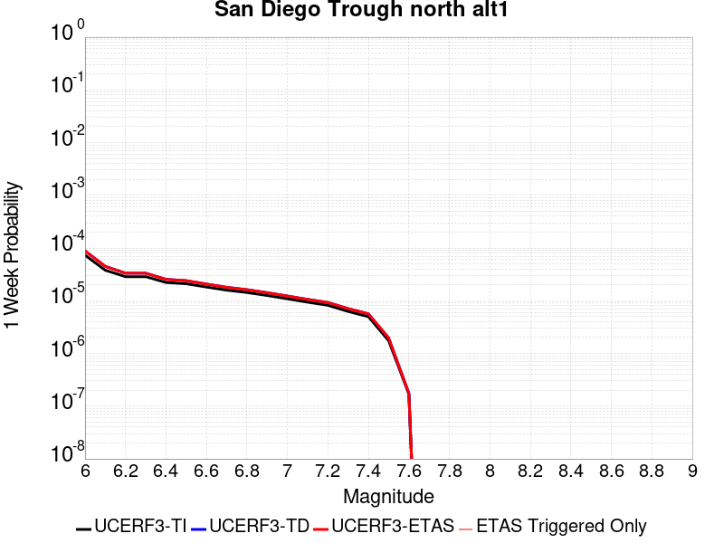 | 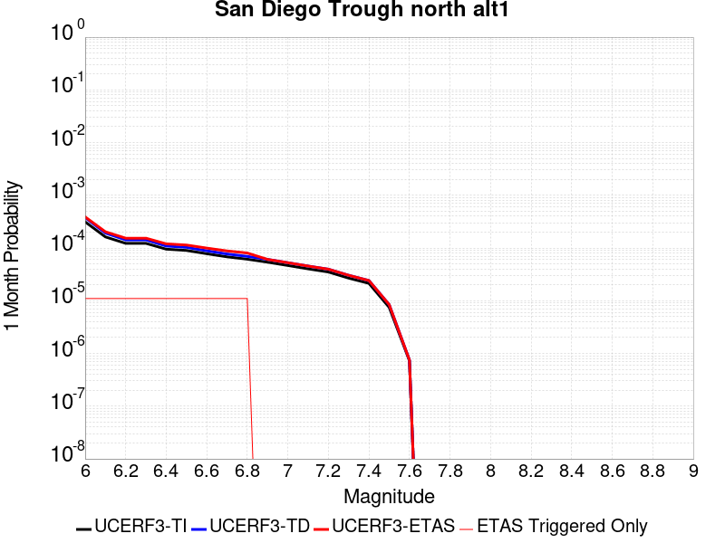 | 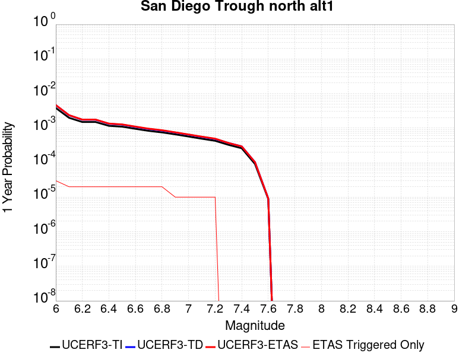 | 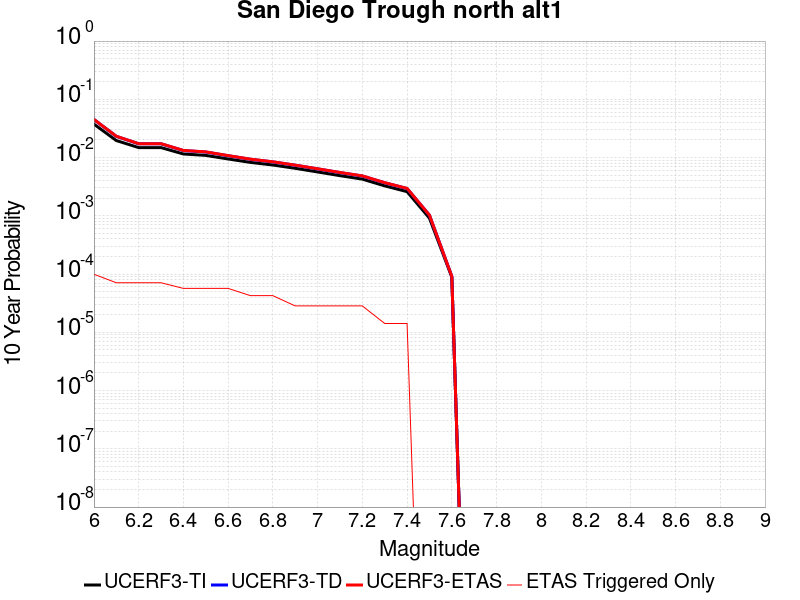 |

| Magnitude | 1 wk TI Prob | 1 wk TD Prob | 1 wk ETAS Prob | 1 wk ETAS/TD Gain | 1 wk ETAS Triggered Only | 1 mo TI Prob | 1 mo TD Prob | 1 mo ETAS Prob | 1 mo ETAS/TD Gain | 1 mo ETAS Triggered Only | 1 yr TI Prob | 1 yr TD Prob | 1 yr ETAS Prob | 1 yr ETAS/TD Gain | 1 yr ETAS Triggered Only | 10 yr TI Prob | 10 yr TD Prob | 10 yr ETAS Prob | 10 yr ETAS/TD Gain | 10 yr ETAS Triggered Only |
|-----|-----|-----|-----|-----|-----|-----|-----|-----|-----|-----|-----|-----|-----|-----|-----|-----|-----|-----|-----|-----|
| 6.0 | 7.329252E-5 | 8.823061E-5 | 8.823061E-5 | 1.0 | 0.0 | 3.14073E-4 | 3.7808003E-4 | 3.890649E-4 | 1.0290543 | 1.0989011E-5 | 0.0038171355 | 0.004594045 | 0.004626861 | 1.007143 | 3.2967033E-5 | 0.03752231 | 0.045054566 | 0.045128025 | 1.0016304 | 7.6923076E-5 |
| 6.1 | 3.7940346E-5 | 4.489396E-5 | 4.489396E-5 | 1.0 | 0.0 | 1.6259136E-4 | 1.9238905E-4 | 2.0337595E-4 | 1.0571077 | 1.0989011E-5 | 0.0019777524 | 0.0023399056 | 0.0023618322 | 1.0093707 | 2.1978021E-5 | 0.019602431 | 0.023161182 | 0.023214854 | 1.0023173 | 5.4945056E-5 |
| 6.2 | 2.8645263E-5 | 3.330263E-5 | 3.330263E-5 | 1.0 | 0.0 | 1.2275964E-4 | 1.4271791E-4 | 1.5370535E-4 | 1.0769871 | 1.0989011E-5 | 0.0014935739 | 0.0017362196 | 0.0017581595 | 1.0126365 | 2.1978021E-5 | 0.0148357535 | 0.017229227 | 0.017283225 | 1.0031341 | 5.4945056E-5 |
| 6.3 | 2.8645263E-5 | 3.330263E-5 | 3.330263E-5 | 1.0 | 0.0 | 1.2275964E-4 | 1.4271791E-4 | 1.5370535E-4 | 1.0769871 | 1.0989011E-5 | 0.0014935739 | 0.0017362196 | 0.0017581595 | 1.0126365 | 2.1978021E-5 | 0.0148357535 | 0.017229227 | 0.017283225 | 1.0031341 | 5.4945056E-5 |
| 6.4 | 2.2204576E-5 | 2.5452311E-5 | 2.5452311E-5 | 1.0 | 0.0 | 9.5159E-5 | 1.0907683E-4 | 1.20064644E-4 | 1.1007346 | 1.0989011E-5 | 0.001157945 | 0.0013272114 | 0.0013491602 | 1.0165375 | 2.1978021E-5 | 0.011519298 | 0.013194007 | 0.013237383 | 1.0032876 | 4.3956043E-5 |
| 6.5 | 2.1004838E-5 | 2.40284E-5 | 2.40284E-5 | 1.0 | 0.0 | 9.0017624E-5 | 1.0297485E-4 | 1.1396273E-4 | 1.1067045 | 1.0989011E-5 | 0.0010954136 | 0.001253007 | 0.0012749574 | 1.0175183 | 2.1978021E-5 | 0.010900296 | 0.012460496 | 0.012503905 | 1.0034837 | 4.3956043E-5 |
| 6.6 | 1.820557E-5 | 2.0707832E-5 | 2.0707832E-5 | 1.0 | 0.0 | 7.802154E-5 | 8.874486E-5 | 9.97329E-5 | 1.123816 | 1.0989011E-5 | 9.4949827E-4 | 0.0010799386 | 0.0011018929 | 1.0203292 | 2.1978021E-5 | 0.009454516 | 0.010747575 | 0.01079106 | 1.0040458 | 4.3956043E-5 |
| 6.7 | 1.5884485E-5 | 1.798619E-5 | 1.798619E-5 | 1.0 | 0.0 | 6.807459E-5 | 7.708141E-5 | 8.806957E-5 | 1.1425527 | 1.0989011E-5 | 8.284929E-4 | 9.380649E-4 | 9.6002227E-4 | 1.0234071 | 2.1978021E-5 | 0.008254109 | 0.009341419 | 0.009374077 | 1.0034962 | 3.2967033E-5 |
| 6.8 | 1.4331171E-5 | 1.6203325E-5 | 1.6203325E-5 | 1.0 | 0.0 | 6.141786E-5 | 6.944098E-5 | 8.0429236E-5 | 1.1582386 | 1.0989011E-5 | 7.4750587E-4 | 8.451181E-4 | 8.670775E-4 | 1.0259839 | 2.1978021E-5 | 0.0074499645 | 0.008419309 | 0.008451998 | 1.0038826 | 3.2967033E-5 |
| 6.9 | 1.2574203E-5 | 1.4207804E-5 | 1.4207804E-5 | 1.0 | 0.0 | 5.3888325E-5 | 6.088918E-5 | 6.088918E-5 | 1.0 | 0.0 | 6.558929E-4 | 7.4107497E-4 | 7.5205584E-4 | 1.0148175 | 1.0989011E-5 | 0.0065396037 | 0.0073862234 | 0.007408039 | 1.0029535 | 2.1978021E-5 |
| 7.0 | 1.0883844E-5 | 1.2290957E-5 | 1.2290957E-5 | 1.0 | 0.0 | 4.664421E-5 | 5.2674473E-5 | 5.2674473E-5 | 1.0 | 0.0 | 5.677453E-4 | 6.41124E-4 | 6.5210595E-4 | 1.0171292 | 1.0989011E-5 | 0.00566297 | 0.006392872 | 0.006414709 | 1.003416 | 2.1978021E-5 |
| 7.1 | 9.393088E-6 | 1.0608485E-5 | 1.0608485E-5 | 1.0 | 0.0 | 4.025547E-5 | 4.546415E-5 | 4.546415E-5 | 1.0 | 0.0 | 4.900001E-4 | 5.533862E-4 | 5.6436914E-4 | 1.0198468 | 1.0989011E-5 | 0.0048892107 | 0.0055201785 | 0.005542035 | 1.0039594 | 2.1978021E-5 |
| 7.2 | 8.190791E-6 | 9.259917E-6 | 9.259917E-6 | 1.0 | 0.0 | 3.510292E-5 | 3.9684757E-5 | 3.9684757E-5 | 1.0 | 0.0 | 4.2729423E-4 | 4.8305548E-4 | 4.940392E-4 | 1.022738 | 1.0989011E-5 | 0.0042647356 | 0.004820135 | 0.004842007 | 1.0045377 | 2.1978021E-5 |
| 7.3 | 6.268162E-6 | 7.0907086E-6 | 7.0907086E-6 | 1.0 | 0.0 | 2.6863276E-5 | 3.03884E-5 | 3.03884E-5 | 1.0 | 0.0 | 3.2701128E-4 | 3.6991638E-4 | 3.6991638E-4 | 1.0 | 0.0 | 0.003265305 | 0.003693052 | 0.0037040007 | 1.0029646 | 1.0989011E-5 |
| 7.4 | 4.985186E-6 | 5.6434765E-6 | 5.6434765E-6 | 1.0 | 0.0 | 2.1364907E-5 | 2.4186105E-5 | 2.4186105E-5 | 1.0 | 0.0 | 2.600867E-4 | 2.9442646E-4 | 2.9442646E-4 | 1.0 | 0.0 | 0.002597825 | 0.0029404052 | 0.0029513617 | 1.0037262 | 1.0989011E-5 |
| 7.5 | 1.7489613E-6 | 1.969945E-6 | 1.969945E-6 | 1.0 | 0.0 | 7.495527E-6 | 8.4425965E-6 | 8.4425965E-6 | 1.0 | 0.0 | 9.125422E-5 | 1.0278398E-4 | 1.0278398E-4 | 1.0 | 0.0 | 9.1216754E-4 | 0.0010273864 | 0.0010273864 | 1.0 | 0.0 |
| 7.6 | 1.6988751E-7 | 1.753442E-7 | 1.753442E-7 | 1.0 | 0.0 | 7.2808916E-7 | 7.5147494E-7 | 7.5147494E-7 | 1.0 | 0.0 | 8.864449E-6 | 9.149171E-6 | 9.149171E-6 | 1.0 | 0.0 | 8.8640954E-5 | 9.148814E-5 | 9.148814E-5 | 1.0 | 0.0 |

## Ludlow
*[(top)](#table-of-contents)*

| 1 Week | 1 Month | 1 Year | 10 Year |
|-----|-----|-----|-----|
| 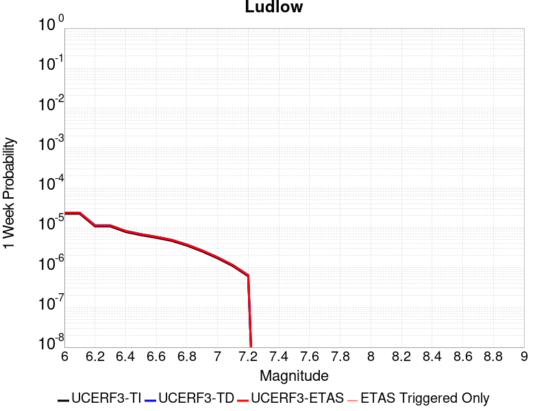 | 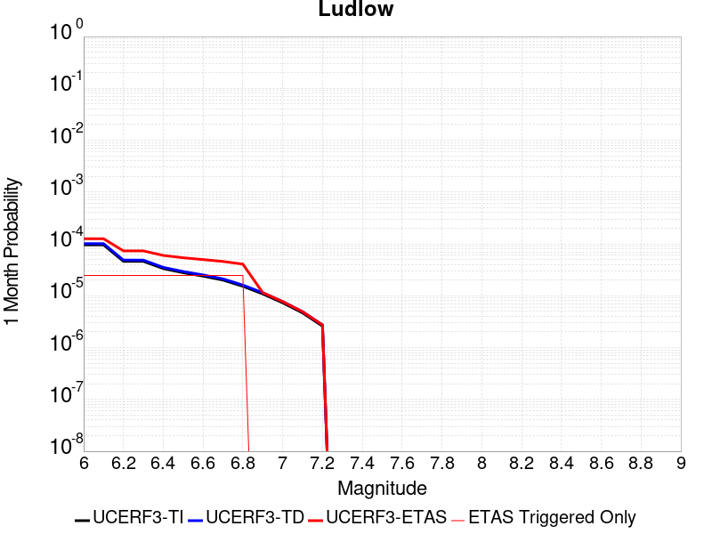 | 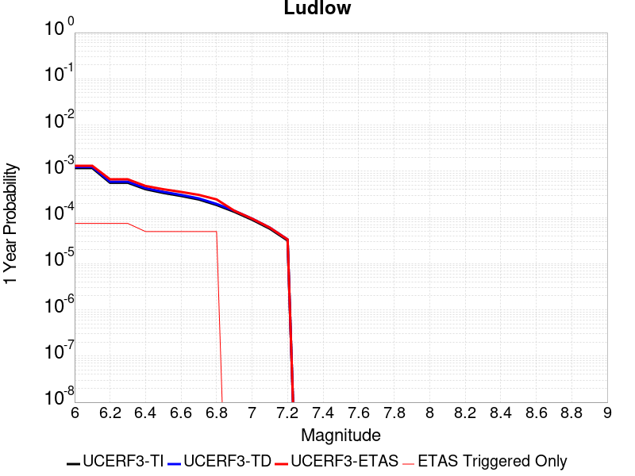 | 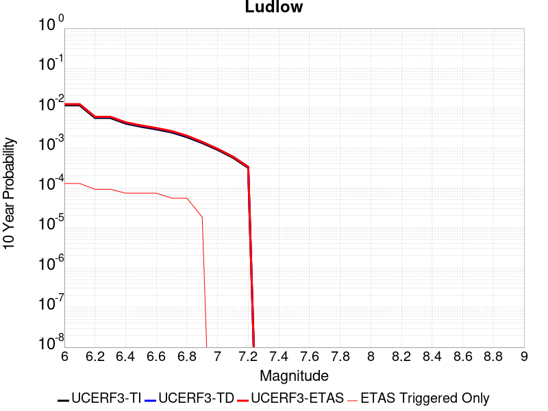 |

| Magnitude | 1 wk TI Prob | 1 wk TD Prob | 1 wk ETAS Prob | 1 wk ETAS/TD Gain | 1 wk ETAS Triggered Only | 1 mo TI Prob | 1 mo TD Prob | 1 mo ETAS Prob | 1 mo ETAS/TD Gain | 1 mo ETAS Triggered Only | 1 yr TI Prob | 1 yr TD Prob | 1 yr ETAS Prob | 1 yr ETAS/TD Gain | 1 yr ETAS Triggered Only | 10 yr TI Prob | 10 yr TD Prob | 10 yr ETAS Prob | 10 yr ETAS/TD Gain | 10 yr ETAS Triggered Only |
|-----|-----|-----|-----|-----|-----|-----|-----|-----|-----|-----|-----|-----|-----|-----|-----|-----|-----|-----|-----|-----|
| 6.0 | 2.2407607E-5 | 2.3658655E-5 | 2.3658655E-5 | 1.0 | 0.0 | 9.602906E-5 | 1.0139054E-4 | 1.1237844E-4 | 1.108372 | 1.0989011E-5 | 0.0011685267 | 0.0012337749 | 0.0012667013 | 1.0266875 | 3.2967033E-5 | 0.011624013 | 0.012273764 | 0.012371452 | 1.007959 | 9.89011E-5 |
| 6.1 | 2.2407607E-5 | 2.3658655E-5 | 2.3658655E-5 | 1.0 | 0.0 | 9.602906E-5 | 1.0139054E-4 | 1.1237844E-4 | 1.108372 | 1.0989011E-5 | 0.0011685267 | 0.0012337749 | 0.0012667013 | 1.0266875 | 3.2967033E-5 | 0.011624013 | 0.012273764 | 0.012371452 | 1.007959 | 9.89011E-5 |
| 6.2 | 1.0781252E-5 | 1.1366317E-5 | 1.1366317E-5 | 1.0 | 0.0 | 4.620455E-5 | 4.8711903E-5 | 5.970038E-5 | 1.2255809 | 1.0989011E-5 | 5.623952E-4 | 5.9291004E-4 | 6.2585756E-4 | 1.0555692 | 3.2967033E-5 | 0.00560974 | 0.0059137004 | 0.0059683206 | 1.0092362 | 5.4945056E-5 |
| 6.3 | 1.0781252E-5 | 1.1366317E-5 | 1.1366317E-5 | 1.0 | 0.0 | 4.620455E-5 | 4.8711903E-5 | 5.970038E-5 | 1.2255809 | 1.0989011E-5 | 5.623952E-4 | 5.9291004E-4 | 6.2585756E-4 | 1.0555692 | 3.2967033E-5 | 0.00560974 | 0.0059137004 | 0.0059683206 | 1.0092362 | 5.4945056E-5 |
| 6.4 | 7.814439E-6 | 8.238203E-6 | 8.238203E-6 | 1.0 | 0.0 | 3.3490025E-5 | 3.530611E-5 | 4.6294736E-5 | 1.3112385 | 1.0989011E-5 | 4.0766477E-4 | 4.2976855E-4 | 4.517371E-4 | 1.0511172 | 2.1978021E-5 | 0.0040691774 | 0.004289521 | 0.0043332884 | 1.0102034 | 4.3956043E-5 |
| 6.5 | 6.4986366E-6 | 6.851314E-6 | 6.851314E-6 | 1.0 | 0.0 | 2.7851002E-5 | 2.9362449E-5 | 4.0351137E-5 | 1.3742429 | 1.0989011E-5 | 3.390332E-4 | 3.574301E-4 | 3.7940027E-4 | 1.061467 | 2.1978021E-5 | 0.003385164 | 0.0035686484 | 0.0036124475 | 1.0122733 | 4.3956043E-5 |
| 6.6 | 5.582177E-6 | 5.8863457E-6 | 5.8863457E-6 | 1.0 | 0.0 | 2.3923398E-5 | 2.5226956E-5 | 3.621569E-5 | 1.4355949 | 1.0989011E-5 | 2.9122844E-4 | 3.0709562E-4 | 3.2906688E-4 | 1.0715454 | 2.1978021E-5 | 0.0029084706 | 0.0030667859 | 0.0031106072 | 1.014289 | 4.3956043E-5 |
| 6.7 | 4.6858763E-6 | 4.940712E-6 | 4.940712E-6 | 1.0 | 0.0 | 2.0082172E-5 | 2.1174312E-5 | 3.216309E-5 | 1.5189674 | 1.0989011E-5 | 2.4447302E-4 | 2.577673E-4 | 2.7973967E-4 | 1.0852411 | 2.1978021E-5 | 0.0024420423 | 0.0025747395 | 0.0026076217 | 1.012771 | 3.2967033E-5 |
| 6.8 | 3.5584908E-6 | 3.752235E-6 | 3.752235E-6 | 1.0 | 0.0 | 1.5250586E-5 | 1.608091E-5 | 2.7069744E-5 | 1.6833465 | 1.0989011E-5 | 1.8566006E-4 | 1.957679E-4 | 2.1774162E-4 | 1.1122438 | 2.1978021E-5 | 0.0018550502 | 0.0019559956 | 0.001988898 | 1.0168214 | 3.2967033E-5 |
| 6.9 | 2.532834E-6 | 2.6711582E-6 | 2.6711582E-6 | 1.0 | 0.0 | 1.0854958E-5 | 1.1447772E-5 | 1.1447772E-5 | 1.0 | 0.0 | 1.3215111E-4 | 1.3936798E-4 | 1.3936798E-4 | 1.0 | 0.0 | 0.0013207254 | 0.0013928334 | 0.0014038071 | 1.0078787 | 1.0989011E-5 |
| 7.0 | 1.7083285E-6 | 1.8020486E-6 | 1.8020486E-6 | 1.0 | 0.0 | 7.3213873E-6 | 7.723043E-6 | 7.723043E-6 | 1.0 | 0.0 | 8.913424E-5 | 9.4024166E-5 | 9.4024166E-5 | 1.0 | 0.0 | 8.9098496E-4 | 9.3986036E-4 | 9.3986036E-4 | 1.0 | 0.0 |
| 7.1 | 1.0905424E-6 | 1.1498282E-6 | 1.1498282E-6 | 1.0 | 0.0 | 4.6737446E-6 | 4.9278265E-6 | 4.9278265E-6 | 1.0 | 0.0 | 5.6901354E-5 | 5.9994734E-5 | 5.9994734E-5 | 1.0 | 0.0 | 5.6886784E-4 | 5.997952E-4 | 5.997952E-4 | 1.0 | 0.0 |
| 7.2 | 6.06668E-7 | 6.387636E-7 | 6.387636E-7 | 1.0 | 0.0 | 2.600003E-6 | 2.7375556E-6 | 2.7375556E-6 | 1.0 | 0.0 | 3.1654577E-5 | 3.33293E-5 | 3.33293E-5 | 1.0 | 0.0 | 3.1650066E-4 | 3.3324986E-4 | 3.3324986E-4 | 1.0 | 0.0 |

## White Wolf (Extension)
*[(top)](#table-of-contents)*

| 1 Week | 1 Month | 1 Year | 10 Year |
|-----|-----|-----|-----|
|  | 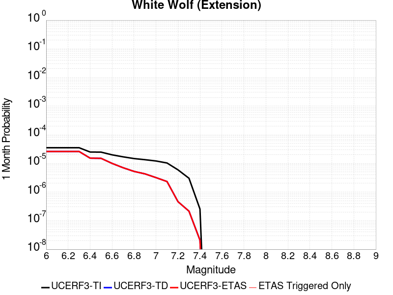 | 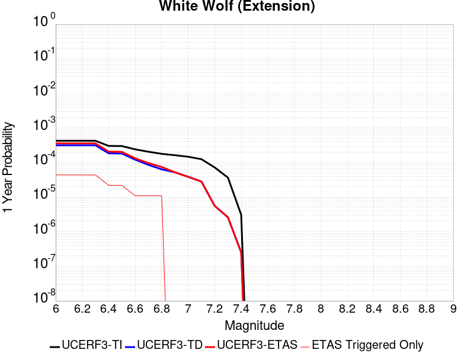 | 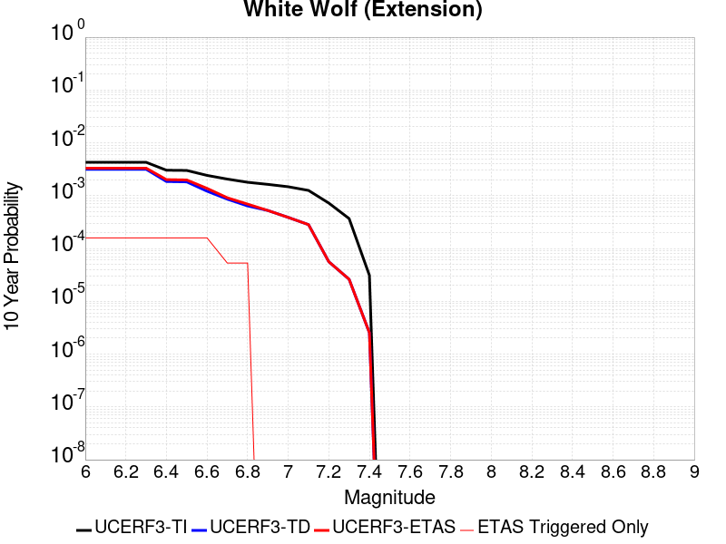 |

| Magnitude | 1 wk TI Prob | 1 wk TD Prob | 1 wk ETAS Prob | 1 wk ETAS/TD Gain | 1 wk ETAS Triggered Only | 1 mo TI Prob | 1 mo TD Prob | 1 mo ETAS Prob | 1 mo ETAS/TD Gain | 1 mo ETAS Triggered Only | 1 yr TI Prob | 1 yr TD Prob | 1 yr ETAS Prob | 1 yr ETAS/TD Gain | 1 yr ETAS Triggered Only | 10 yr TI Prob | 10 yr TD Prob | 10 yr ETAS Prob | 10 yr ETAS/TD Gain | 10 yr ETAS Triggered Only |
|-----|-----|-----|-----|-----|-----|-----|-----|-----|-----|-----|-----|-----|-----|-----|-----|-----|-----|-----|-----|-----|
| 6.0 | 8.222555E-6 | 6.066987E-6 | 6.066987E-6 | 1.0 | 0.0 | 3.5239045E-5 | 2.6001153E-5 | 2.6001153E-5 | 1.0 | 0.0 | 4.289509E-4 | 3.1652467E-4 | 3.604668E-4 | 1.1388268 | 4.3956043E-5 | 0.0042812387 | 0.0031613903 | 0.0032599787 | 1.0311852 | 9.89011E-5 |
| 6.1 | 8.222555E-6 | 6.066987E-6 | 6.066987E-6 | 1.0 | 0.0 | 3.5239045E-5 | 2.6001153E-5 | 2.6001153E-5 | 1.0 | 0.0 | 4.289509E-4 | 3.1652467E-4 | 3.604668E-4 | 1.1388268 | 4.3956043E-5 | 0.0042812387 | 0.0031613903 | 0.0032599787 | 1.0311852 | 9.89011E-5 |
| 6.2 | 8.222555E-6 | 6.066987E-6 | 6.066987E-6 | 1.0 | 0.0 | 3.5239045E-5 | 2.6001153E-5 | 2.6001153E-5 | 1.0 | 0.0 | 4.289509E-4 | 3.1652467E-4 | 3.604668E-4 | 1.1388268 | 4.3956043E-5 | 0.0042812387 | 0.0031613903 | 0.0032599787 | 1.0311852 | 9.89011E-5 |
| 6.3 | 8.222555E-6 | 6.066987E-6 | 6.066987E-6 | 1.0 | 0.0 | 3.5239045E-5 | 2.6001153E-5 | 2.6001153E-5 | 1.0 | 0.0 | 4.289509E-4 | 3.1652467E-4 | 3.604668E-4 | 1.1388268 | 4.3956043E-5 | 0.0042812387 | 0.0031613903 | 0.0032599787 | 1.0311852 | 9.89011E-5 |
| 6.4 | 5.821773E-6 | 3.5573776E-6 | 3.5573776E-6 | 1.0 | 0.0 | 2.4950215E-5 | 1.5245821E-5 | 1.5245821E-5 | 1.0 | 0.0 | 3.0372653E-4 | 1.8560316E-4 | 2.0757709E-4 | 1.1183921 | 2.1978021E-5 | 0.0030331176 | 0.0018545898 | 0.0019313701 | 1.0414002 | 7.6923076E-5 |
| 6.5 | 5.766023E-6 | 3.499309E-6 | 3.499309E-6 | 1.0 | 0.0 | 2.4711293E-5 | 1.4996958E-5 | 1.4996958E-5 | 1.0 | 0.0 | 3.0081844E-4 | 1.8257377E-4 | 2.0454777E-4 | 1.1203569 | 2.1978021E-5 | 0.0030041158 | 0.0018243459 | 0.0019011287 | 1.0420878 | 7.6923076E-5 |
| 6.6 | 4.643576E-6 | 2.3327739E-6 | 2.3327739E-6 | 1.0 | 0.0 | 1.9900888E-5 | 9.997567E-6 | 9.997567E-6 | 1.0 | 0.0 | 2.4226638E-4 | 1.2171401E-4 | 1.3270168E-4 | 1.0902746 | 1.0989011E-5 | 0.0024200242 | 0.0012165159 | 0.0012713941 | 1.045111 | 5.4945056E-5 |
| 6.7 | 3.9529173E-6 | 1.6484681E-6 | 1.6484681E-6 | 1.0 | 0.0 | 1.6940963E-5 | 7.0648457E-6 | 7.0648457E-6 | 1.0 | 0.0 | 2.0623671E-4 | 8.6011285E-5 | 9.6999356E-5 | 1.1277515 | 1.0989011E-5 | 0.002060454 | 8.597985E-4 | 8.927372E-4 | 1.0383098 | 3.2967033E-5 |
| 6.8 | 3.4377522E-6 | 1.2246234E-6 | 1.2246234E-6 | 1.0 | 0.0 | 1.473314E-5 | 5.2483756E-6 | 5.2483756E-6 | 1.0 | 0.0 | 1.7936122E-4 | 6.389719E-5 | 7.48855E-5 | 1.1719686 | 1.0989011E-5 | 0.0017921652 | 6.387973E-4 | 6.4977934E-4 | 1.0171916 | 1.0989011E-5 |
| 6.9 | 3.1367306E-6 | 1.003466E-6 | 1.003466E-6 | 1.0 | 0.0 | 1.3443062E-5 | 4.3005616E-6 | 4.3005616E-6 | 1.0 | 0.0 | 1.63657E-4 | 5.235816E-5 | 5.235816E-5 | 1.0 | 0.0 | 0.0016353652 | 5.2346586E-4 | 5.2346586E-4 | 1.0 | 0.0 |
| 7.0 | 2.8298145E-6 | 7.429425E-7 | 7.429425E-7 | 1.0 | 0.0 | 1.2127721E-5 | 3.184036E-6 | 3.184036E-6 | 1.0 | 0.0 | 1.47645E-4 | 3.8764996E-5 | 3.8764996E-5 | 1.0 | 0.0 | 0.0014754693 | 3.8758735E-4 | 3.8758735E-4 | 1.0 | 0.0 |
| 7.1 | 2.4091064E-6 | 5.4233635E-7 | 5.4233635E-7 | 1.0 | 0.0 | 1.03247E-5 | 2.3242967E-6 | 2.3242967E-6 | 1.0 | 0.0 | 1.2569598E-4 | 2.8297985E-5 | 2.8297985E-5 | 1.0 | 0.0 | 0.001256249 | 2.8294788E-4 | 2.8294788E-4 | 1.0 | 0.0 |
| 7.2 | 1.3875518E-6 | 1.07460636E-7 | 1.07460636E-7 | 1.0 | 0.0 | 5.9466374E-6 | 4.6054552E-7 | 4.6054552E-7 | 1.0 | 0.0 | 7.23979E-5 | 5.6071285E-6 | 5.6071285E-6 | 1.0 | 0.0 | 7.2374323E-4 | 5.6069985E-5 | 5.6069985E-5 | 1.0 | 0.0 |
| 7.3 | 7.056077E-7 | 5.0037578E-8 | 5.0037578E-8 | 1.0 | 0.0 | 3.0240296E-6 | 2.1444674E-7 | 2.1444674E-7 | 1.0 | 0.0 | 3.681694E-5 | 2.6108864E-6 | 2.6108864E-6 | 1.0 | 0.0 | 3.681084E-4 | 2.6108604E-5 | 2.6108604E-5 | 1.0 | 0.0 |
| 7.4 | 5.9334678E-8 | 4.870027E-9 | 4.870027E-9 | 1.0 | 0.0 | 2.5429145E-7 | 2.0871544E-8 | 2.0871544E-8 | 1.0 | 0.0 | 3.095994E-6 | 2.5411103E-7 | 2.5411103E-7 | 1.0 | 0.0 | 3.095951E-5 | 2.5411086E-6 | 2.5411086E-6 | 1.0 | 0.0 |

## San Jacinto (San Bernardino)
*[(top)](#table-of-contents)*

| 1 Week | 1 Month | 1 Year | 10 Year |
|-----|-----|-----|-----|
| 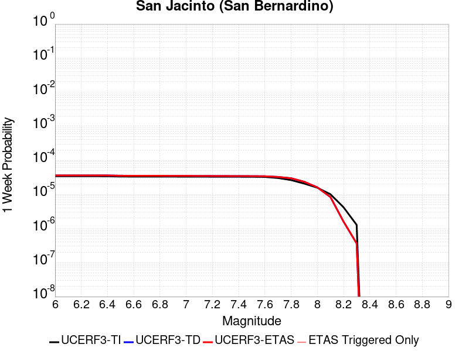 | 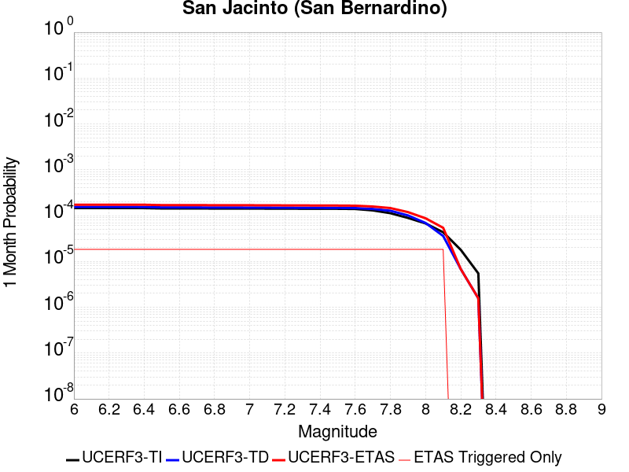 | 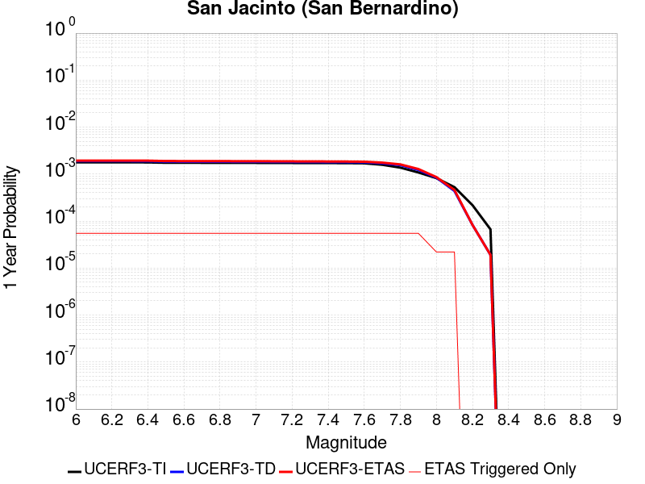 | 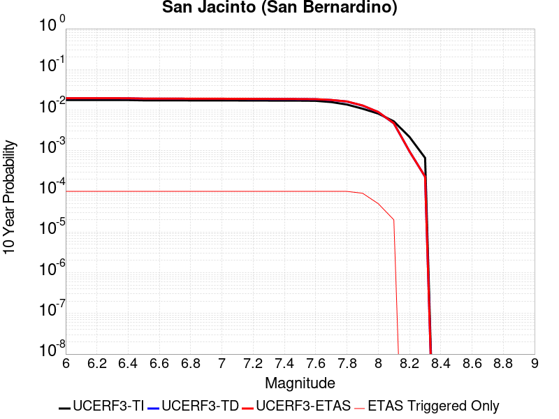 |

| Magnitude | 1 wk TI Prob | 1 wk TD Prob | 1 wk ETAS Prob | 1 wk ETAS/TD Gain | 1 wk ETAS Triggered Only | 1 mo TI Prob | 1 mo TD Prob | 1 mo ETAS Prob | 1 mo ETAS/TD Gain | 1 mo ETAS Triggered Only | 1 yr TI Prob | 1 yr TD Prob | 1 yr ETAS Prob | 1 yr ETAS/TD Gain | 1 yr ETAS Triggered Only | 10 yr TI Prob | 10 yr TD Prob | 10 yr ETAS Prob | 10 yr ETAS/TD Gain | 10 yr ETAS Triggered Only |
|-----|-----|-----|-----|-----|-----|-----|-----|-----|-----|-----|-----|-----|-----|-----|-----|-----|-----|-----|-----|-----|
| 6.0 | 3.409352E-5 | 3.611458E-5 | 3.611458E-5 | 1.0 | 0.0 | 1.461069E-4 | 1.5476761E-4 | 1.6575491E-4 | 1.0709924 | 1.0989011E-5 | 0.0017774 | 0.0018826688 | 0.0019375104 | 1.0291297 | 5.4945056E-5 | 0.01763251 | 0.01941539 | 0.019512372 | 1.0049951 | 9.89011E-5 |
| 6.1 | 3.409352E-5 | 3.611458E-5 | 3.611458E-5 | 1.0 | 0.0 | 1.461069E-4 | 1.5476761E-4 | 1.6575491E-4 | 1.0709924 | 1.0989011E-5 | 0.0017774 | 0.0018826688 | 0.0019375104 | 1.0291297 | 5.4945056E-5 | 0.01763251 | 0.01941539 | 0.019512372 | 1.0049951 | 9.89011E-5 |
| 6.2 | 3.409352E-5 | 3.611458E-5 | 3.611458E-5 | 1.0 | 0.0 | 1.461069E-4 | 1.5476761E-4 | 1.6575491E-4 | 1.0709924 | 1.0989011E-5 | 0.0017774 | 0.0018826688 | 0.0019375104 | 1.0291297 | 5.4945056E-5 | 0.01763251 | 0.01941539 | 0.019512372 | 1.0049951 | 9.89011E-5 |
| 6.3 | 3.409352E-5 | 3.611458E-5 | 3.611458E-5 | 1.0 | 0.0 | 1.461069E-4 | 1.5476761E-4 | 1.6575491E-4 | 1.0709924 | 1.0989011E-5 | 0.0017774 | 0.0018826688 | 0.0019375104 | 1.0291297 | 5.4945056E-5 | 0.01763251 | 0.01941539 | 0.019512372 | 1.0049951 | 9.89011E-5 |
| 6.4 | 3.400795E-5 | 3.6007215E-5 | 3.6007215E-5 | 1.0 | 0.0 | 1.4574021E-4 | 1.5430752E-4 | 1.6529483E-4 | 1.0712041 | 1.0989011E-5 | 0.0017729428 | 0.0018770772 | 0.001931919 | 1.0292166 | 5.4945056E-5 | 0.017588645 | 0.019360462 | 0.019457448 | 1.0050095 | 9.89011E-5 |
| 6.5 | 3.341482E-5 | 3.5267658E-5 | 3.5267658E-5 | 1.0 | 0.0 | 1.4319851E-4 | 1.5113836E-4 | 1.6212571E-4 | 1.0726973 | 1.0989011E-5 | 0.0017420477 | 0.0018385579 | 0.001893402 | 1.02983 | 5.4945056E-5 | 0.017284546 | 0.018981932 | 0.019078955 | 1.0051113 | 9.89011E-5 |
| 6.6 | 3.3364955E-5 | 3.5204863E-5 | 3.5204863E-5 | 1.0 | 0.0 | 1.4298483E-4 | 1.5086925E-4 | 1.6185662E-4 | 1.072827 | 1.0989011E-5 | 0.0017394501 | 0.0018352871 | 0.0018901313 | 1.0298831 | 5.4945056E-5 | 0.017258976 | 0.01894979 | 0.019046817 | 1.0051202 | 9.89011E-5 |
| 6.7 | 3.335922E-5 | 3.5194633E-5 | 3.5194633E-5 | 1.0 | 0.0 | 1.4296026E-4 | 1.5082542E-4 | 1.6181279E-4 | 1.0728482 | 1.0989011E-5 | 0.0017391514 | 0.0018347544 | 0.0018895986 | 1.0298918 | 5.4945056E-5 | 0.017256035 | 0.01894458 | 0.019041607 | 1.0051216 | 9.89011E-5 |
| 6.8 | 3.327683E-5 | 3.508867E-5 | 3.508867E-5 | 1.0 | 0.0 | 1.4260718E-4 | 1.5037134E-4 | 1.6135871E-4 | 1.0730681 | 1.0989011E-5 | 0.0017348597 | 0.0018292352 | 0.0018840798 | 1.0299822 | 5.4945056E-5 | 0.017213784 | 0.01889034 | 0.018987373 | 1.0051366 | 9.89011E-5 |
| 6.9 | 3.3235785E-5 | 3.5029603E-5 | 3.5029603E-5 | 1.0 | 0.0 | 1.4243131E-4 | 1.5011824E-4 | 1.6110559E-4 | 1.0731914 | 1.0989011E-5 | 0.0017327217 | 0.0018261588 | 0.0018810035 | 1.0300329 | 5.4945056E-5 | 0.017192734 | 0.0188602 | 0.018957237 | 1.005145 | 9.89011E-5 |
| 7.0 | 3.3197095E-5 | 3.496951E-5 | 3.496951E-5 | 1.0 | 0.0 | 1.422655E-4 | 1.4986073E-4 | 1.608481E-4 | 1.0733172 | 1.0989011E-5 | 0.0017307063 | 0.0018230289 | 0.0018778738 | 1.0300845 | 5.4945056E-5 | 0.017172894 | 0.01882957 | 0.018926607 | 1.0051535 | 9.89011E-5 |
| 7.1 | 3.3129716E-5 | 3.4849672E-5 | 3.4849672E-5 | 1.0 | 0.0 | 1.4197677E-4 | 1.493472E-4 | 1.6033456E-4 | 1.0735693 | 1.0989011E-5 | 0.0017271966 | 0.0018167871 | 0.0018716323 | 1.0301881 | 5.4945056E-5 | 0.017138338 | 0.018768627 | 0.018865673 | 1.0051706 | 9.89011E-5 |
| 7.2 | 3.3034008E-5 | 3.471708E-5 | 3.471708E-5 | 1.0 | 0.0 | 1.4156665E-4 | 1.48779E-4 | 1.5976638E-4 | 1.0738503 | 1.0989011E-5 | 0.0017222111 | 0.0018098808 | 0.0018647264 | 1.0303035 | 5.4945056E-5 | 0.017089253 | 0.018701006 | 0.018798057 | 1.0051897 | 9.89011E-5 |
| 7.3 | 3.2956614E-5 | 3.4584762E-5 | 3.4584762E-5 | 1.0 | 0.0 | 1.4123498E-4 | 1.48212E-4 | 1.5919938E-4 | 1.0741329 | 1.0989011E-5 | 0.0017181796 | 0.0018029889 | 0.001857835 | 1.0304195 | 5.4945056E-5 | 0.017049557 | 0.018633721 | 0.018730778 | 1.0052087 | 9.89011E-5 |
| 7.4 | 3.2915937E-5 | 3.45064E-5 | 3.45064E-5 | 1.0 | 0.0 | 1.4106068E-4 | 1.478762E-4 | 1.5886358E-4 | 1.0743012 | 1.0989011E-5 | 0.0017160608 | 0.0017989073 | 0.0018537536 | 1.0304886 | 5.4945056E-5 | 0.017028693 | 0.018593961 | 0.018691024 | 1.00522 | 9.89011E-5 |
| 7.5 | 3.281791E-5 | 3.4371224E-5 | 3.4371224E-5 | 1.0 | 0.0 | 1.406406E-4 | 1.4729693E-4 | 1.5828433E-4 | 1.0745935 | 1.0989011E-5 | 0.0017109542 | 0.0017918665 | 0.001846713 | 1.0306087 | 5.4945056E-5 | 0.016978411 | 0.018524809 | 0.018621877 | 1.00524 | 9.89011E-5 |
| 7.6 | 3.2521442E-5 | 3.409593E-5 | 3.409593E-5 | 1.0 | 0.0 | 1.3937015E-4 | 1.4611724E-4 | 1.5710465E-4 | 1.0751958 | 1.0989011E-5 | 0.0016955109 | 0.0017775272 | 0.0018323746 | 1.030856 | 5.4945056E-5 | 0.016826328 | 0.018382322 | 0.018479405 | 1.0052813 | 9.89011E-5 |
| 7.7 | 3.0287873E-5 | 3.2578493E-5 | 3.2578493E-5 | 1.0 | 0.0 | 1.297987E-4 | 1.3961464E-4 | 1.5060212E-4 | 1.0786986 | 1.0989011E-5 | 0.0015791537 | 0.0016984841 | 0.0017533358 | 1.0322945 | 5.4945056E-5 | 0.01567979 | 0.017592473 | 0.017689634 | 1.0055228 | 9.89011E-5 |
| 7.8 | 2.6316151E-5 | 2.9784747E-5 | 2.9784747E-5 | 1.0 | 0.0 | 1.1277862E-4 | 1.2764268E-4 | 1.3863029E-4 | 1.086081 | 1.0989011E-5 | 0.0013722149 | 0.0015529428 | 0.0016078025 | 1.0353264 | 5.4945056E-5 | 0.013637724 | 0.016131766 | 0.016229073 | 1.0060319 | 9.89011E-5 |
| 7.9 | 2.0761147E-5 | 2.3523955E-5 | 2.3523955E-5 | 1.0 | 0.0 | 8.897331E-5 | 1.00813064E-4 | 1.1180097E-4 | 1.1089928 | 1.0989011E-5 | 0.0010827117 | 0.0012267088 | 0.0012815865 | 1.0447357 | 5.4945056E-5 | 0.010774517 | 0.012847875 | 0.012945506 | 1.007599 | 9.89011E-5 |
| 8.0 | 1.5738568E-5 | 1.6113308E-5 | 1.6113308E-5 | 1.0 | 0.0 | 6.744926E-5 | 6.905521E-5 | 8.0043465E-5 | 1.1591227 | 1.0989011E-5 | 8.2088535E-4 | 8.4042357E-4 | 8.623831E-4 | 1.0261291 | 2.1978021E-5 | 0.008178596 | 0.008907886 | 0.0089623425 | 1.0061132 | 5.4945056E-5 |
| 8.1 | 1.0105832E-5 | 8.377391E-6 | 8.377391E-6 | 1.0 | 0.0 | 4.3309992E-5 | 3.5902613E-5 | 4.689123E-5 | 1.3060673 | 1.0989011E-5 | 5.2717153E-4 | 4.3702716E-4 | 4.5899558E-4 | 1.0502678 | 2.1978021E-5 | 0.005259227 | 0.004702442 | 0.0047243163 | 1.0046518 | 2.1978021E-5 |
| 8.2 | 4.189207E-6 | 1.5918251E-6 | 1.5918251E-6 | 1.0 | 0.0 | 1.7953622E-5 | 6.8220897E-6 | 6.8220897E-6 | 1.0 | 0.0 | 2.1856341E-4 | 8.3055806E-5 | 8.3055806E-5 | 1.0 | 0.0 | 0.0021834858 | 9.642388E-4 | 9.642388E-4 | 1.0 | 0.0 |
| 8.3 | 1.2758221E-6 | 3.6510448E-7 | 3.6510448E-7 | 1.0 | 0.0 | 5.4677976E-6 | 1.5647327E-6 | 1.5647327E-6 | 1.0 | 0.0 | 6.65684E-5 | 1.9050458E-5 | 1.9050458E-5 | 1.0 | 0.0 | 6.6548464E-4 | 2.296306E-4 | 2.296306E-4 | 1.0 | 0.0 |

## Santa Ynez (West)
*[(top)](#table-of-contents)*

| 1 Week | 1 Month | 1 Year | 10 Year |
|-----|-----|-----|-----|
| 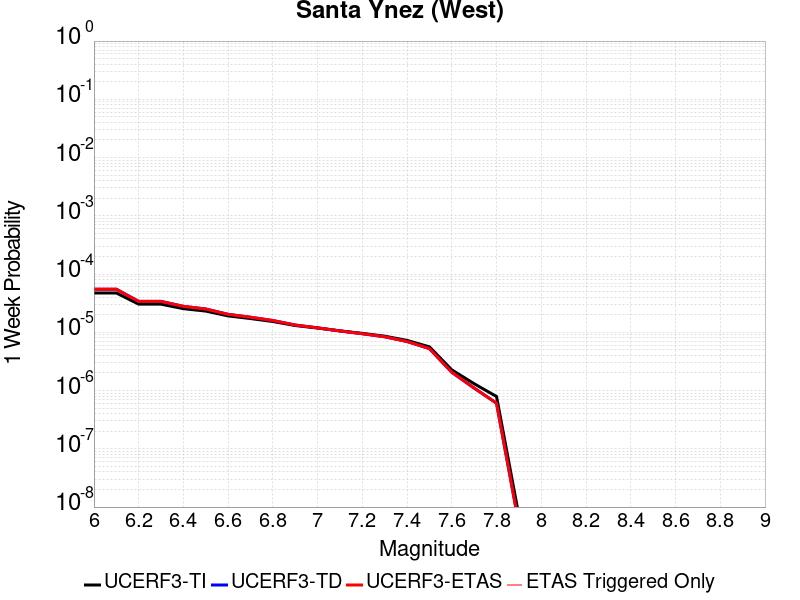 |  | 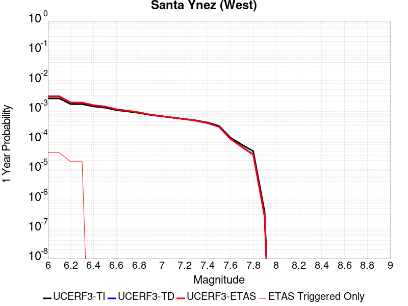 | 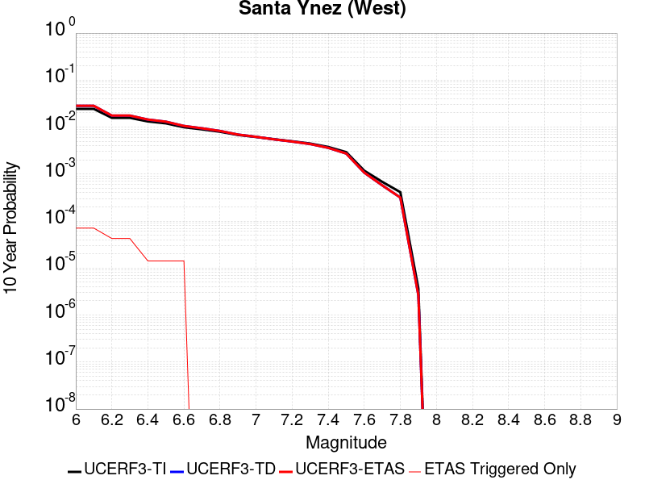 |

| Magnitude | 1 wk TI Prob | 1 wk TD Prob | 1 wk ETAS Prob | 1 wk ETAS/TD Gain | 1 wk ETAS Triggered Only | 1 mo TI Prob | 1 mo TD Prob | 1 mo ETAS Prob | 1 mo ETAS/TD Gain | 1 mo ETAS Triggered Only | 1 yr TI Prob | 1 yr TD Prob | 1 yr ETAS Prob | 1 yr ETAS/TD Gain | 1 yr ETAS Triggered Only | 10 yr TI Prob | 10 yr TD Prob | 10 yr ETAS Prob | 10 yr ETAS/TD Gain | 10 yr ETAS Triggered Only |
|-----|-----|-----|-----|-----|-----|-----|-----|-----|-----|-----|-----|-----|-----|-----|-----|-----|-----|-----|-----|-----|
| 6.0 | 4.7352758E-5 | 5.4983077E-5 | 5.4983077E-5 | 1.0 | 0.0 | 2.0292461E-4 | 2.3562026E-4 | 2.3562026E-4 | 1.0 | 0.0 | 0.0024678076 | 0.0028650744 | 0.0028979469 | 1.0114735 | 3.2967033E-5 | 0.024405818 | 0.028309857 | 0.028384604 | 1.0026402 | 7.6923076E-5 |
| 6.1 | 4.7352758E-5 | 5.4983077E-5 | 5.4983077E-5 | 1.0 | 0.0 | 2.0292461E-4 | 2.3562026E-4 | 2.3562026E-4 | 1.0 | 0.0 | 0.0024678076 | 0.0028650744 | 0.0028979469 | 1.0114735 | 3.2967033E-5 | 0.024405818 | 0.028309857 | 0.028384604 | 1.0026402 | 7.6923076E-5 |
| 6.2 | 3.0415853E-5 | 3.3930526E-5 | 3.3930526E-5 | 1.0 | 0.0 | 1.3034715E-4 | 1.4540862E-4 | 1.4540862E-4 | 1.0 | 0.0 | 0.0015858212 | 0.0017689478 | 0.001790887 | 1.0124024 | 2.1978021E-5 | 0.015745522 | 0.017552571 | 0.017595755 | 1.0024602 | 4.3956043E-5 |
| 6.3 | 3.0415853E-5 | 3.3930526E-5 | 3.3930526E-5 | 1.0 | 0.0 | 1.3034715E-4 | 1.4540862E-4 | 1.4540862E-4 | 1.0 | 0.0 | 0.0015858212 | 0.0017689478 | 0.001790887 | 1.0124024 | 2.1978021E-5 | 0.015745522 | 0.017552571 | 0.017595755 | 1.0024602 | 4.3956043E-5 |
| 6.4 | 2.5452082E-5 | 2.7916465E-5 | 2.7916465E-5 | 1.0 | 0.0 | 1.09075794E-4 | 1.1963659E-4 | 1.1963659E-4 | 1.0 | 0.0 | 0.0013271887 | 0.0014556192 | 0.0014665922 | 1.0075384 | 1.0989011E-5 | 0.013192902 | 0.01446303 | 0.01448469 | 1.0014976 | 2.1978021E-5 |
| 6.5 | 2.3143784E-5 | 2.5131685E-5 | 2.5131685E-5 | 1.0 | 0.0 | 9.9183875E-5 | 1.07702836E-4 | 1.07702836E-4 | 1.0 | 0.0 | 0.0012068948 | 0.0013105051 | 0.0013214798 | 1.0083743 | 1.0989011E-5 | 0.012003611 | 0.013029447 | 0.013051139 | 1.0016649 | 2.1978021E-5 |
| 6.6 | 1.9118515E-5 | 2.0356825E-5 | 2.0356825E-5 | 1.0 | 0.0 | 8.193392E-5 | 8.724067E-5 | 8.724067E-5 | 1.0 | 0.0 | 9.97089E-4 | 0.0010616456 | 0.0010726228 | 1.01034 | 1.0989011E-5 | 0.00992627 | 0.010566648 | 0.010588394 | 1.0020579 | 2.1978021E-5 |
| 6.7 | 1.722807E-5 | 1.8148436E-5 | 1.8148436E-5 | 1.0 | 0.0 | 7.3832496E-5 | 7.777672E-5 | 7.777672E-5 | 1.0 | 0.0 | 8.985399E-4 | 9.4652583E-4 | 9.5750444E-4 | 1.0115988 | 1.0989011E-5 | 0.008949154 | 0.00942559 | 0.009436475 | 1.0011549 | 1.0989011E-5 |
| 6.8 | 1.5317364E-5 | 1.592819E-5 | 1.592819E-5 | 1.0 | 0.0 | 6.56442E-5 | 6.826191E-5 | 6.826191E-5 | 1.0 | 0.0 | 7.98925E-4 | 8.307761E-4 | 8.41756E-4 | 1.0132164 | 1.0989011E-5 | 0.007960589 | 0.008277192 | 0.00828809 | 1.0013167 | 1.0989011E-5 |
| 6.9 | 1.3071226E-5 | 1.3330895E-5 | 1.3330895E-5 | 1.0 | 0.0 | 5.6018336E-5 | 5.713117E-5 | 5.713117E-5 | 1.0 | 0.0 | 6.8180985E-4 | 6.9535227E-4 | 7.063336E-4 | 1.0157925 | 1.0989011E-5 | 0.0067972173 | 0.006932026 | 0.0069429385 | 1.0015743 | 1.0989011E-5 |
| 7.0 | 1.1836986E-5 | 1.1933856E-5 | 1.1933856E-5 | 1.0 | 0.0 | 5.0728955E-5 | 5.1144103E-5 | 5.1144103E-5 | 1.0 | 0.0 | 6.1745E-4 | 6.225032E-4 | 6.334854E-4 | 1.0176419 | 1.0989011E-5 | 0.006157372 | 0.0062077884 | 0.006218709 | 1.0017592 | 1.0989011E-5 |
| 7.1 | 1.0597169E-5 | 1.0543094E-5 | 1.0543094E-5 | 1.0 | 0.0 | 4.541565E-5 | 4.518391E-5 | 4.518391E-5 | 1.0 | 0.0 | 5.5279525E-4 | 5.499764E-4 | 5.609594E-4 | 1.0199699 | 1.0989011E-5 | 0.0055142213 | 0.0054862844 | 0.005497213 | 1.001992 | 1.0989011E-5 |
| 7.2 | 9.59113E-6 | 9.459948E-6 | 9.459948E-6 | 1.0 | 0.0 | 4.11042E-5 | 4.054201E-5 | 4.054201E-5 | 1.0 | 0.0 | 5.0032866E-4 | 4.934882E-4 | 5.044718E-4 | 1.0222571 | 1.0989011E-5 | 0.004992037 | 0.0049240426 | 0.0049349777 | 1.0022207 | 1.0989011E-5 |
| 7.3 | 8.586084E-6 | 8.380302E-6 | 8.380302E-6 | 1.0 | 0.0 | 3.679698E-5 | 3.591509E-5 | 3.591509E-5 | 1.0 | 0.0 | 4.4791115E-4 | 4.3717952E-4 | 4.4816372E-4 | 1.0251251 | 1.0989011E-5 | 0.004470094 | 0.004363306 | 0.004374247 | 1.0025076 | 1.0989011E-5 |
| 7.4 | 7.2622997E-6 | 6.952138E-6 | 6.952138E-6 | 1.0 | 0.0 | 3.112377E-5 | 2.9794543E-5 | 2.9794543E-5 | 1.0 | 0.0 | 3.78866E-4 | 3.6268914E-4 | 3.6268914E-4 | 1.0 | 0.0 | 0.0037822074 | 0.0036210723 | 0.0036210723 | 1.0 | 0.0 |
| 7.5 | 5.627296E-6 | 5.252027E-6 | 5.252027E-6 | 1.0 | 0.0 | 2.411676E-5 | 2.2508497E-5 | 2.2508497E-5 | 1.0 | 0.0 | 2.9358198E-4 | 2.740072E-4 | 2.740072E-4 | 1.0 | 0.0 | 0.0029319443 | 0.0027367657 | 0.0027367657 | 1.0 | 0.0 |
| 7.6 | 2.265244E-6 | 2.0610207E-6 | 2.0610207E-6 | 1.0 | 0.0 | 9.708152E-6 | 8.832917E-6 | 8.832917E-6 | 1.0 | 0.0 | 1.18190335E-4 | 1.0753554E-4 | 1.0753554E-4 | 1.0 | 0.0 | 0.001181275 | 0.0010748437 | 0.0010748437 | 1.0 | 0.0 |
| 7.7 | 1.3099874E-6 | 1.101704E-6 | 1.101704E-6 | 1.0 | 0.0 | 5.61422E-6 | 4.7215804E-6 | 4.7215804E-6 | 1.0 | 0.0 | 6.8350986E-5 | 5.7483747E-5 | 5.7483747E-5 | 1.0 | 0.0 | 6.832996E-4 | 5.7469116E-4 | 5.7469116E-4 | 1.0 | 0.0 |
| 7.8 | 7.903951E-7 | 6.071534E-7 | 6.071534E-7 | 1.0 | 0.0 | 3.3874032E-6 | 2.6020837E-6 | 2.6020837E-6 | 1.0 | 0.0 | 4.1240855E-5 | 3.1679923E-5 | 3.1679923E-5 | 1.0 | 0.0 | 4.12332E-4 | 3.1675538E-4 | 3.1675538E-4 | 1.0 | 0.0 |
| 7.9 | 7.0753297E-9 | 5.090195E-9 | 5.090195E-9 | 1.0 | 0.0 | 3.032284E-8 | 2.1815122E-8 | 2.1815122E-8 | 1.0 | 0.0 | 3.6918053E-7 | 2.6559908E-7 | 2.6559908E-7 | 1.0 | 0.0 | 3.691799E-6 | 2.6559887E-6 | 2.6559887E-6 | 1.0 | 0.0 |

## Lake Isabella (Seismicity)
*[(top)](#table-of-contents)*

| 1 Week | 1 Month | 1 Year | 10 Year |
|-----|-----|-----|-----|
| 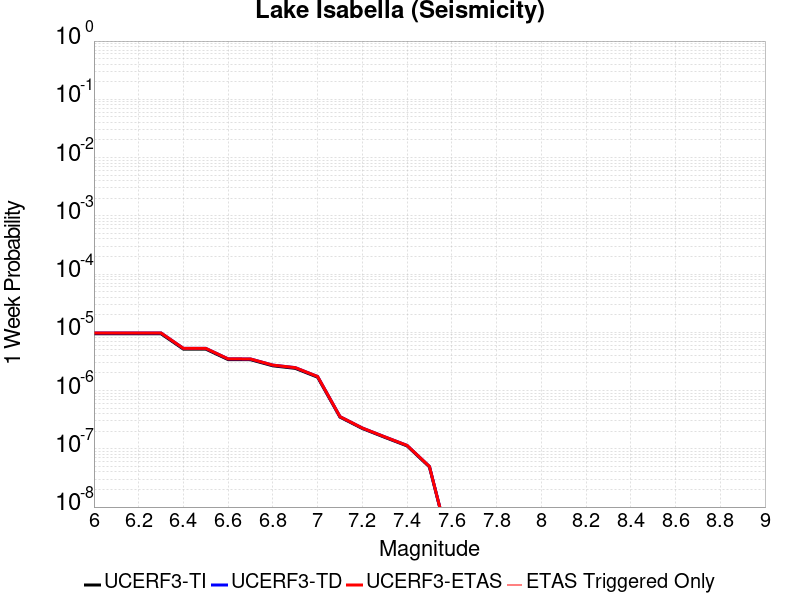 | 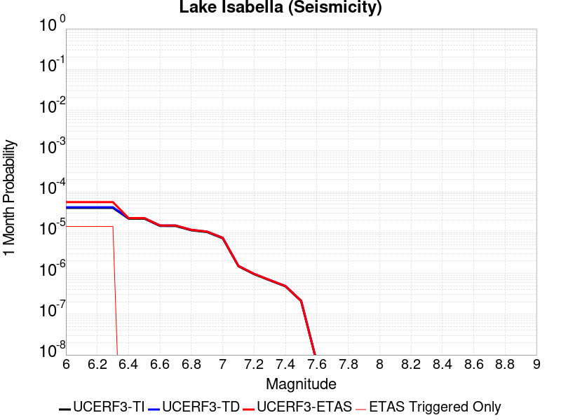 | 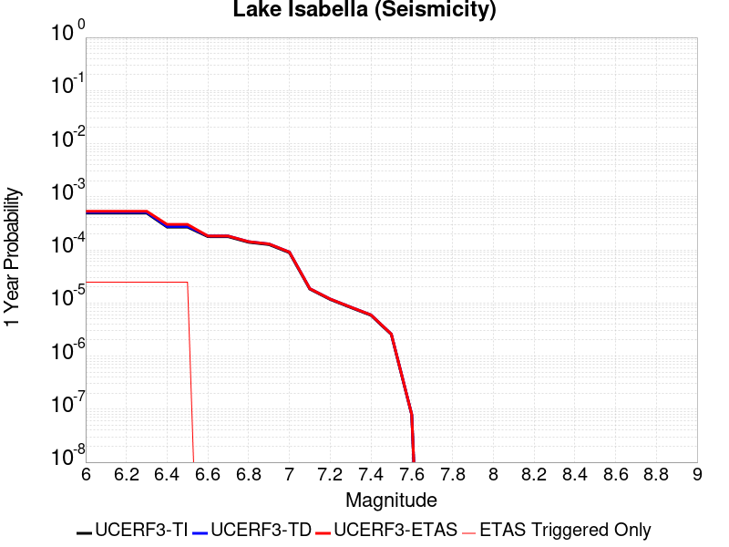 | 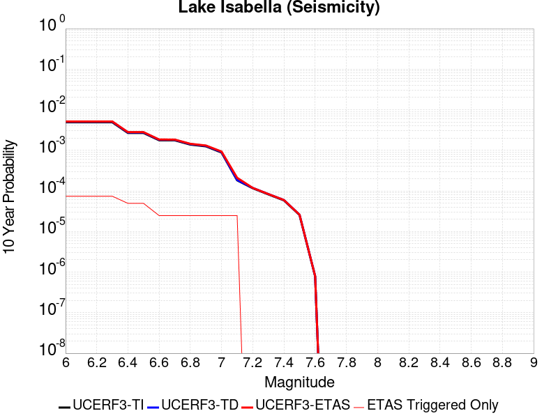 |

| Magnitude | 1 wk TI Prob | 1 wk TD Prob | 1 wk ETAS Prob | 1 wk ETAS/TD Gain | 1 wk ETAS Triggered Only | 1 mo TI Prob | 1 mo TD Prob | 1 mo ETAS Prob | 1 mo ETAS/TD Gain | 1 mo ETAS Triggered Only | 1 yr TI Prob | 1 yr TD Prob | 1 yr ETAS Prob | 1 yr ETAS/TD Gain | 1 yr ETAS Triggered Only | 10 yr TI Prob | 10 yr TD Prob | 10 yr ETAS Prob | 10 yr ETAS/TD Gain | 10 yr ETAS Triggered Only |
|-----|-----|-----|-----|-----|-----|-----|-----|-----|-----|-----|-----|-----|-----|-----|-----|-----|-----|-----|-----|-----|
| 6.0 | 9.431637E-6 | 9.741992E-6 | 9.741992E-6 | 1.0 | 0.0 | 4.0420677E-5 | 4.1750798E-5 | 5.273935E-5 | 1.2631938 | 1.0989011E-5 | 4.920106E-4 | 5.082105E-4 | 5.521442E-4 | 1.0864478 | 4.3956043E-5 | 0.004909227 | 0.0050717755 | 0.005170175 | 1.0194014 | 9.89011E-5 |
| 6.1 | 9.431637E-6 | 9.741992E-6 | 9.741992E-6 | 1.0 | 0.0 | 4.0420677E-5 | 4.1750798E-5 | 5.273935E-5 | 1.2631938 | 1.0989011E-5 | 4.920106E-4 | 5.082105E-4 | 5.521442E-4 | 1.0864478 | 4.3956043E-5 | 0.004909227 | 0.0050717755 | 0.005170175 | 1.0194014 | 9.89011E-5 |
| 6.2 | 9.431637E-6 | 9.741992E-6 | 9.741992E-6 | 1.0 | 0.0 | 4.0420677E-5 | 4.1750798E-5 | 5.273935E-5 | 1.2631938 | 1.0989011E-5 | 4.920106E-4 | 5.082105E-4 | 5.521442E-4 | 1.0864478 | 4.3956043E-5 | 0.004909227 | 0.0050717755 | 0.005170175 | 1.0194014 | 9.89011E-5 |
| 6.3 | 9.431637E-6 | 9.741992E-6 | 9.741992E-6 | 1.0 | 0.0 | 4.0420677E-5 | 4.1750798E-5 | 5.273935E-5 | 1.2631938 | 1.0989011E-5 | 4.920106E-4 | 5.082105E-4 | 5.521442E-4 | 1.0864478 | 4.3956043E-5 | 0.004909227 | 0.0050717755 | 0.005170175 | 1.0194014 | 9.89011E-5 |
| 6.4 | 5.144063E-6 | 5.300247E-6 | 5.300247E-6 | 1.0 | 0.0 | 2.2045799E-5 | 2.2715165E-5 | 2.2715165E-5 | 1.0 | 0.0 | 2.6837454E-4 | 2.765255E-4 | 2.8751147E-4 | 1.0397286 | 1.0989011E-5 | 0.0026805066 | 0.0027621544 | 0.0027950306 | 1.0119023 | 3.2967033E-5 |
| 6.5 | 5.144063E-6 | 5.300247E-6 | 5.300247E-6 | 1.0 | 0.0 | 2.2045799E-5 | 2.2715165E-5 | 2.2715165E-5 | 1.0 | 0.0 | 2.6837454E-4 | 2.765255E-4 | 2.8751147E-4 | 1.0397286 | 1.0989011E-5 | 0.0026805066 | 0.0027621544 | 0.0027950306 | 1.0119023 | 3.2967033E-5 |
| 6.6 | 3.4009804E-6 | 3.498893E-6 | 3.498893E-6 | 1.0 | 0.0 | 1.4575549E-5 | 1.4995178E-5 | 1.4995178E-5 | 1.0 | 0.0 | 1.7744285E-4 | 1.8255261E-4 | 1.8255261E-4 | 1.0 | 0.0 | 0.0017730123 | 0.0018241842 | 0.0018461222 | 1.0120262 | 2.1978021E-5 |
| 6.7 | 3.3880428E-6 | 3.4857594E-6 | 3.4857594E-6 | 1.0 | 0.0 | 1.4520103E-5 | 1.49388925E-5 | 1.49388925E-5 | 1.0 | 0.0 | 1.767679E-4 | 1.8186744E-4 | 1.8186744E-4 | 1.0 | 0.0 | 0.0017662736 | 0.0018173438 | 0.0018392819 | 1.0120715 | 2.1978021E-5 |
| 6.8 | 2.6582E-6 | 2.7337826E-6 | 2.7337826E-6 | 1.0 | 0.0 | 1.1392236E-5 | 1.1716166E-5 | 1.1716166E-5 | 1.0 | 0.0 | 1.3869164E-4 | 1.4263633E-4 | 1.4263633E-4 | 1.0 | 0.0 | 0.0013860512 | 0.0014255799 | 0.0014475266 | 1.0153949 | 2.1978021E-5 |
| 6.9 | 2.406011E-6 | 2.4744033E-6 | 2.4744033E-6 | 1.0 | 0.0 | 1.0311434E-5 | 1.0604551E-5 | 1.0604551E-5 | 1.0 | 0.0 | 1.2553448E-4 | 1.2910407E-4 | 1.2910407E-4 | 1.0 | 0.0 | 0.0012546359 | 0.0012904203 | 0.00131237 | 1.0170097 | 2.1978021E-5 |
| 7.0 | 1.6953097E-6 | 1.7429892E-6 | 1.7429892E-6 | 1.0 | 0.0 | 7.265593E-6 | 7.4699383E-6 | 7.4699383E-6 | 1.0 | 0.0 | 8.8455E-5 | 9.094375E-5 | 9.094375E-5 | 1.0 | 0.0 | 8.84198E-4 | 9.0916804E-4 | 9.311261E-4 | 1.0241518 | 2.1978021E-5 |
| 7.1 | 3.5013824E-7 | 3.571558E-7 | 3.571558E-7 | 1.0 | 0.0 | 1.5005916E-6 | 1.530667E-6 | 1.530667E-6 | 1.0 | 0.0 | 1.826955E-5 | 1.8635712E-5 | 1.8635712E-5 | 1.0 | 0.0 | 1.8268047E-4 | 1.8634176E-4 | 1.9732871E-4 | 1.0589614 | 1.0989011E-5 |
| 7.2 | 2.2321095E-7 | 2.2751038E-7 | 2.2751038E-7 | 1.0 | 0.0 | 9.56618E-7 | 9.750441E-7 | 9.750441E-7 | 1.0 | 0.0 | 1.1646762E-5 | 1.1871099E-5 | 1.1871099E-5 | 1.0 | 0.0 | 1.1646151E-4 | 1.18704746E-4 | 1.18704746E-4 | 1.0 | 0.0 |
| 7.3 | 1.5760406E-7 | 1.6061247E-7 | 1.6061247E-7 | 1.0 | 0.0 | 6.7544585E-7 | 6.8833896E-7 | 6.8833896E-7 | 1.0 | 0.0 | 8.223522E-6 | 8.380495E-6 | 8.380495E-6 | 1.0 | 0.0 | 8.2232174E-5 | 8.380186E-5 | 8.380186E-5 | 1.0 | 0.0 |
| 7.4 | 1.1216497E-7 | 1.1431939E-7 | 1.1431939E-7 | 1.0 | 0.0 | 4.8070694E-7 | 4.8994013E-7 | 4.8994013E-7 | 1.0 | 0.0 | 5.852591E-6 | 5.9650056E-6 | 5.9650056E-6 | 1.0 | 0.0 | 5.8524372E-5 | 5.9648497E-5 | 5.9648497E-5 | 1.0 | 0.0 |
| 7.5 | 4.885185E-8 | 4.978875E-8 | 4.978875E-8 | 1.0 | 0.0 | 2.0936506E-7 | 2.1338033E-7 | 2.1338033E-7 | 1.0 | 0.0 | 2.5490165E-6 | 2.5979027E-6 | 2.5979027E-6 | 1.0 | 0.0 | 2.5489873E-5 | 2.5978741E-5 | 2.5978741E-5 | 1.0 | 0.0 |
| 7.6 | 1.504641E-9 | 1.5318196E-9 | 1.5318196E-9 | 1.0 | 0.0 | 6.4484613E-9 | 6.564941E-9 | 6.564941E-9 | 1.0 | 0.0 | 7.851001E-8 | 7.992816E-8 | 7.992816E-8 | 1.0 | 0.0 | 7.8509987E-7 | 7.9928157E-7 | 7.9928157E-7 | 1.0 | 0.0 |

## Mission Ridge-Arroyo Parida-Santa Ana
*[(top)](#table-of-contents)*

| 1 Week | 1 Month | 1 Year | 10 Year |
|-----|-----|-----|-----|
| 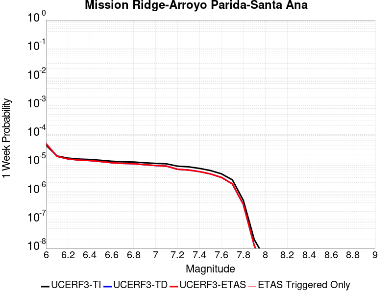 | 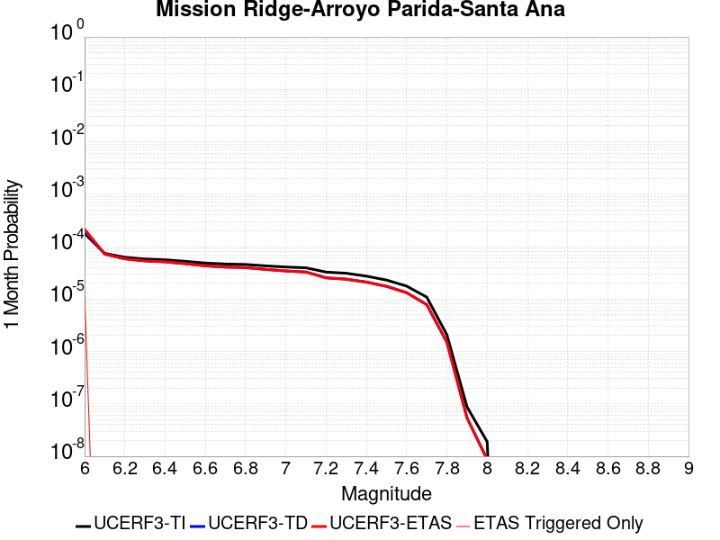 | 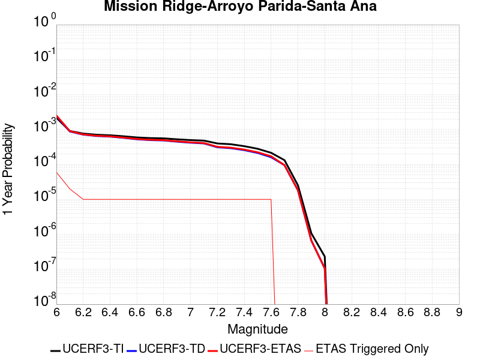 | 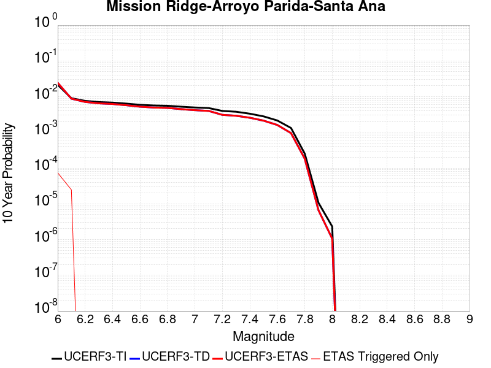 |

| Magnitude | 1 wk TI Prob | 1 wk TD Prob | 1 wk ETAS Prob | 1 wk ETAS/TD Gain | 1 wk ETAS Triggered Only | 1 mo TI Prob | 1 mo TD Prob | 1 mo ETAS Prob | 1 mo ETAS/TD Gain | 1 mo ETAS Triggered Only | 1 yr TI Prob | 1 yr TD Prob | 1 yr ETAS Prob | 1 yr ETAS/TD Gain | 1 yr ETAS Triggered Only | 10 yr TI Prob | 10 yr TD Prob | 10 yr ETAS Prob | 10 yr ETAS/TD Gain | 10 yr ETAS Triggered Only |
|-----|-----|-----|-----|-----|-----|-----|-----|-----|-----|-----|-----|-----|-----|-----|-----|-----|-----|-----|-----|-----|
| 6.0 | 4.169034E-5 | 4.7148882E-5 | 5.8137375E-5 | 1.2330594 | 1.0989011E-5 | 1.7866064E-4 | 2.0205585E-4 | 2.1304264E-4 | 1.054375 | 1.0989011E-5 | 0.0021730233 | 0.0024579712 | 0.002523743 | 1.0267587 | 6.5934066E-5 | 0.021518968 | 0.024389962 | 0.02447573 | 1.0035166 | 8.7912085E-5 |
| 6.1 | 1.73813E-5 | 1.6856771E-5 | 1.6856771E-5 | 1.0 | 0.0 | 7.4489166E-5 | 7.224136E-5 | 7.224136E-5 | 1.0 | 0.0 | 9.065282E-4 | 8.791945E-4 | 9.011532E-4 | 1.0249759 | 2.1978021E-5 | 0.009028391 | 0.008758304 | 0.008780089 | 1.0024874 | 2.1978021E-5 |
| 6.2 | 1.4622182E-5 | 1.3675311E-5 | 1.3675311E-5 | 1.0 | 0.0 | 6.2664985E-5 | 5.8607176E-5 | 5.8607176E-5 | 1.0 | 0.0 | 7.6267915E-4 | 7.1331265E-4 | 7.242938E-4 | 1.0153946 | 1.0989011E-5 | 0.007600669 | 0.0071106744 | 0.007121585 | 1.0015345 | 1.0989011E-5 |
| 6.3 | 1.3552434E-5 | 1.2484076E-5 | 1.2484076E-5 | 1.0 | 0.0 | 5.8080568E-5 | 5.3502106E-5 | 5.3502106E-5 | 1.0 | 0.0 | 7.069015E-4 | 6.511966E-4 | 6.6217844E-4 | 1.0168641 | 1.0989011E-5 | 0.00704657 | 0.0064932476 | 0.006504165 | 1.0016813 | 1.0989011E-5 |
| 6.4 | 1.30977305E-5 | 1.1980975E-5 | 1.1980975E-5 | 1.0 | 0.0 | 5.613192E-5 | 5.134604E-5 | 5.134604E-5 | 1.0 | 0.0 | 6.831918E-4 | 6.2496174E-4 | 6.3594384E-4 | 1.0175725 | 1.0989011E-5 | 0.006810953 | 0.0062323874 | 0.006243308 | 1.0017523 | 1.0989011E-5 |
| 6.5 | 1.225205E-5 | 1.10505225E-5 | 1.10505225E-5 | 1.0 | 0.0 | 5.2507727E-5 | 4.7358535E-5 | 4.7358535E-5 | 1.0 | 0.0 | 6.3909404E-4 | 5.7644036E-4 | 5.8742304E-4 | 1.0190526 | 1.0989011E-5 | 0.006372592 | 0.005749761 | 0.005760687 | 1.0019002 | 1.0989011E-5 |
| 6.6 | 1.1352241E-5 | 1.0065155E-5 | 1.0065155E-5 | 1.0 | 0.0 | 4.8651553E-5 | 4.3135675E-5 | 4.3135675E-5 | 1.0 | 0.0 | 5.921717E-4 | 5.250524E-4 | 5.3603563E-4 | 1.0209184 | 1.0989011E-5 | 0.0059059616 | 0.0052383654 | 0.005249297 | 1.0020868 | 1.0989011E-5 |
| 6.7 | 1.0864116E-5 | 9.518576E-6 | 9.518576E-6 | 1.0 | 0.0 | 4.6559664E-5 | 4.079327E-5 | 4.079327E-5 | 1.0 | 0.0 | 5.667165E-4 | 4.965469E-4 | 5.0753047E-4 | 1.0221199 | 1.0989011E-5 | 0.005652734 | 0.004954608 | 0.004965543 | 1.0022069 | 1.0989011E-5 |
| 6.8 | 1.0666365E-5 | 9.301305E-6 | 9.301305E-6 | 1.0 | 0.0 | 4.571219E-5 | 3.9862138E-5 | 3.9862138E-5 | 1.0 | 0.0 | 5.564038E-4 | 4.8521545E-4 | 4.961991E-4 | 1.0226367 | 1.0989011E-5 | 0.005550127 | 0.004841793 | 0.0048527285 | 1.0022587 | 1.0989011E-5 |
| 6.9 | 1.0038665E-5 | 8.593475E-6 | 8.593475E-6 | 1.0 | 0.0 | 4.302214E-5 | 3.682867E-5 | 3.682867E-5 | 1.0 | 0.0 | 5.236687E-4 | 4.4829864E-4 | 4.5928272E-4 | 1.0245017 | 1.0989011E-5 | 0.005224364 | 0.0044741537 | 0.0044850935 | 1.0024451 | 1.0989011E-5 |
| 7.0 | 9.5379955E-6 | 8.02642E-6 | 8.02642E-6 | 1.0 | 0.0 | 4.0876483E-5 | 3.4398498E-5 | 3.4398498E-5 | 1.0 | 0.0 | 4.975576E-4 | 4.1872295E-4 | 4.2970735E-4 | 1.0262331 | 1.0989011E-5 | 0.00496445 | 0.0041795396 | 0.0041904827 | 1.0026182 | 1.0989011E-5 |
| 7.1 | 9.207389E-6 | 7.653664E-6 | 7.653664E-6 | 1.0 | 0.0 | 3.945964E-5 | 3.2801017E-5 | 3.2801017E-5 | 1.0 | 0.0 | 4.803152E-4 | 3.992809E-4 | 4.1026552E-4 | 1.027511 | 1.0989011E-5 | 0.004792784 | 0.0039858315 | 0.0039967764 | 1.002746 | 1.0989011E-5 |
| 7.2 | 7.638091E-6 | 5.9321133E-6 | 5.9321133E-6 | 1.0 | 0.0 | 3.2734264E-5 | 2.5423096E-5 | 2.5423096E-5 | 1.0 | 0.0 | 3.984668E-4 | 3.0948254E-4 | 3.2046816E-4 | 1.0354967 | 1.0989011E-5 | 0.0039775306 | 0.0030905723 | 0.0031015275 | 1.0035447 | 1.0989011E-5 |
| 7.3 | 7.2500147E-6 | 5.5970927E-6 | 5.5970927E-6 | 1.0 | 0.0 | 3.1071122E-5 | 2.398732E-5 | 2.398732E-5 | 1.0 | 0.0 | 3.7822526E-4 | 2.920068E-4 | 3.0299262E-4 | 1.0376217 | 1.0989011E-5 | 0.0037758215 | 0.0029162865 | 0.0029272435 | 1.0037571 | 1.0989011E-5 |
| 7.4 | 6.3899715E-6 | 4.91932E-6 | 4.91932E-6 | 1.0 | 0.0 | 2.7385306E-5 | 2.1082631E-5 | 2.1082631E-5 | 1.0 | 0.0 | 3.3336508E-4 | 2.56651E-4 | 2.6763717E-4 | 1.0428059 | 1.0989011E-5 | 0.0033286542 | 0.0025635904 | 0.0025745512 | 1.0042756 | 1.0989011E-5 |
| 7.5 | 5.379025E-6 | 4.0845157E-6 | 4.0845157E-6 | 1.0 | 0.0 | 2.305276E-5 | 1.7504952E-5 | 1.7504952E-5 | 1.0 | 0.0 | 2.806312E-4 | 2.1310204E-4 | 2.2408871E-4 | 1.0515559 | 1.0989011E-5 | 0.0028027708 | 0.0021289883 | 0.002139954 | 1.0051507 | 1.0989011E-5 |
| 7.6 | 4.1270696E-6 | 3.0887934E-6 | 3.0887934E-6 | 1.0 | 0.0 | 1.768732E-5 | 1.3237619E-5 | 1.3237619E-5 | 1.0 | 0.0 | 2.1532185E-4 | 1.6115617E-4 | 1.7214341E-4 | 1.0681776 | 1.0989011E-5 | 0.0021511333 | 0.0016104012 | 0.0016213724 | 1.0068128 | 1.0989011E-5 |
| 7.7 | 2.5406805E-6 | 1.8284644E-6 | 1.8284644E-6 | 1.0 | 0.0 | 1.0888585E-5 | 7.836253E-6 | 7.836253E-6 | 1.0 | 0.0 | 1.3256045E-4 | 9.540227E-5 | 9.540227E-5 | 1.0 | 0.0 | 0.0013248142 | 9.5361925E-4 | 9.5361925E-4 | 1.0 | 0.0 |
| 7.8 | 4.8608285E-7 | 3.510238E-7 | 3.510238E-7 | 1.0 | 0.0 | 2.0832106E-6 | 1.5043869E-6 | 1.5043869E-6 | 1.0 | 0.0 | 2.5362791E-5 | 1.8315757E-5 | 1.8315757E-5 | 1.0 | 0.0 | 2.5359896E-4 | 1.831426E-4 | 1.831426E-4 | 1.0 | 0.0 |
| 7.9 | 2.0472514E-8 | 1.2691265E-8 | 1.2691265E-8 | 1.0 | 0.0 | 8.7739345E-8 | 5.4391137E-8 | 5.4391137E-8 | 1.0 | 0.0 | 1.068226E-6 | 6.622119E-7 | 6.622119E-7 | 1.0 | 0.0 | 1.0682209E-5 | 6.6221E-6 | 6.6221E-6 | 1.0 | 0.0 |
| 8.0 | 4.443582E-9 | 2.0332402E-9 | 2.0332402E-9 | 1.0 | 0.0 | 1.9043922E-8 | 8.7138865E-9 | 8.7138865E-9 | 1.0 | 0.0 | 2.3185973E-7 | 1.0609157E-7 | 1.0609157E-7 | 1.0 | 0.0 | 2.3185949E-6 | 1.0609152E-6 | 1.0609152E-6 | 1.0 | 0.0 |

## Death Valley (Fish Lake Valley)
*[(top)](#table-of-contents)*

| 1 Week | 1 Month | 1 Year | 10 Year |
|-----|-----|-----|-----|
| 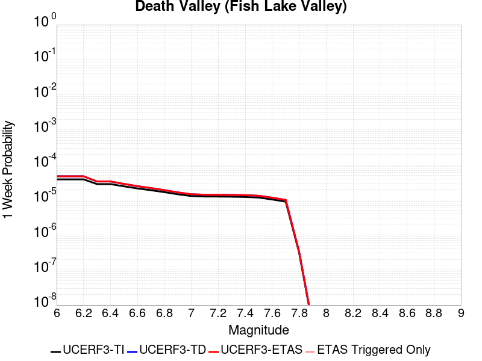 | 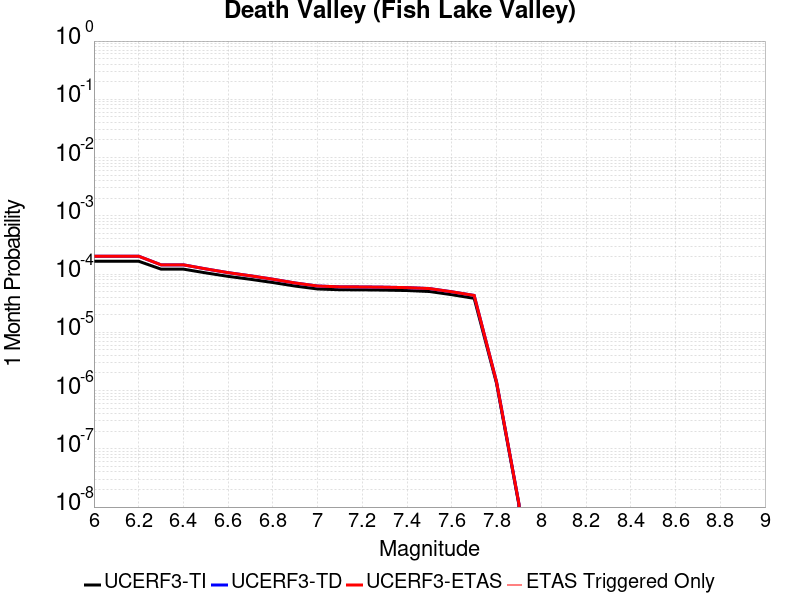 | 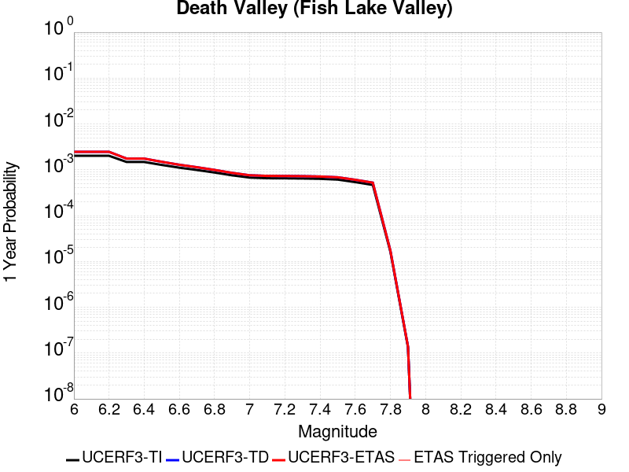 | 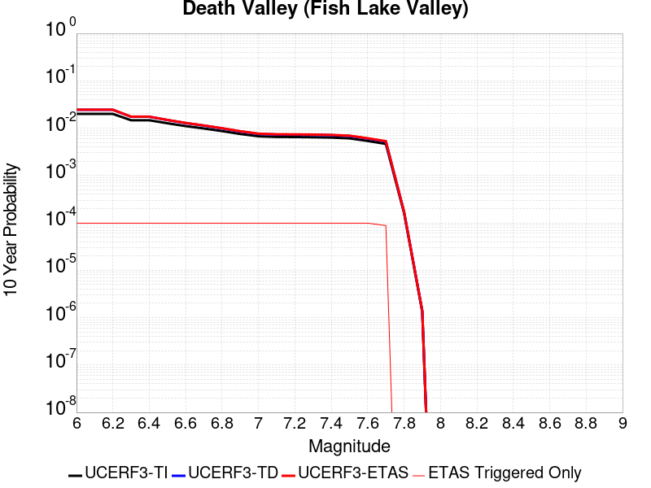 |

| Magnitude | 1 wk TI Prob | 1 wk TD Prob | 1 wk ETAS Prob | 1 wk ETAS/TD Gain | 1 wk ETAS Triggered Only | 1 mo TI Prob | 1 mo TD Prob | 1 mo ETAS Prob | 1 mo ETAS/TD Gain | 1 mo ETAS Triggered Only | 1 yr TI Prob | 1 yr TD Prob | 1 yr ETAS Prob | 1 yr ETAS/TD Gain | 1 yr ETAS Triggered Only | 10 yr TI Prob | 10 yr TD Prob | 10 yr ETAS Prob | 10 yr ETAS/TD Gain | 10 yr ETAS Triggered Only |
|-----|-----|-----|-----|-----|-----|-----|-----|-----|-----|-----|-----|-----|-----|-----|-----|-----|-----|-----|-----|-----|
| 6.0 | 3.872328E-5 | 4.727885E-5 | 4.727885E-5 | 1.0 | 0.0 | 1.6594635E-4 | 2.0260959E-4 | 2.0260959E-4 | 1.0 | 0.0 | 0.0020185246 | 0.0024640928 | 0.0025079404 | 1.0177947 | 4.3956043E-5 | 0.02000288 | 0.024393791 | 0.02449028 | 1.0039555 | 9.89011E-5 |
| 6.1 | 3.872328E-5 | 4.727885E-5 | 4.727885E-5 | 1.0 | 0.0 | 1.6594635E-4 | 2.0260959E-4 | 2.0260959E-4 | 1.0 | 0.0 | 0.0020185246 | 0.0024640928 | 0.0025079404 | 1.0177947 | 4.3956043E-5 | 0.02000288 | 0.024393791 | 0.02449028 | 1.0039555 | 9.89011E-5 |
| 6.2 | 3.872328E-5 | 4.727885E-5 | 4.727885E-5 | 1.0 | 0.0 | 1.6594635E-4 | 2.0260959E-4 | 2.0260959E-4 | 1.0 | 0.0 | 0.0020185246 | 0.0024640928 | 0.0025079404 | 1.0177947 | 4.3956043E-5 | 0.02000288 | 0.024393791 | 0.02449028 | 1.0039555 | 9.89011E-5 |
| 6.3 | 2.8356371E-5 | 3.3616594E-5 | 3.3616594E-5 | 1.0 | 0.0 | 1.2152165E-4 | 1.440636E-4 | 1.440636E-4 | 1.0 | 0.0 | 0.0014785219 | 0.0017526423 | 0.0017965212 | 1.0250359 | 4.3956043E-5 | 0.014687235 | 0.017395204 | 0.017492384 | 1.0055866 | 9.89011E-5 |
| 6.4 | 2.8356371E-5 | 3.3616594E-5 | 3.3616594E-5 | 1.0 | 0.0 | 1.2152165E-4 | 1.440636E-4 | 1.440636E-4 | 1.0 | 0.0 | 0.0014785219 | 0.0017526423 | 0.0017965212 | 1.0250359 | 4.3956043E-5 | 0.014687235 | 0.017395204 | 0.017492384 | 1.0055866 | 9.89011E-5 |
| 6.5 | 2.4448687E-5 | 2.86128E-5 | 2.86128E-5 | 1.0 | 0.0 | 1.0477588E-4 | 1.2262081E-4 | 1.2262081E-4 | 1.0 | 0.0 | 0.0012748998 | 0.0014919365 | 0.001535827 | 1.0294185 | 4.3956043E-5 | 0.012676105 | 0.01482406 | 0.014921495 | 1.0065727 | 9.89011E-5 |
| 6.6 | 2.1298161E-5 | 2.4664267E-5 | 2.4664267E-5 | 1.0 | 0.0 | 9.127464E-5 | 1.0569991E-4 | 1.0569991E-4 | 1.0 | 0.0 | 0.0011107022 | 0.0012861706 | 0.0013300701 | 1.034132 | 4.3956043E-5 | 0.011051672 | 0.012790677 | 0.012888313 | 1.0076333 | 9.89011E-5 |
| 6.7 | 1.8959729E-5 | 2.17845E-5 | 2.17845E-5 | 1.0 | 0.0 | 8.125345E-5 | 9.335895E-5 | 9.335895E-5 | 1.0 | 0.0 | 9.888117E-4 | 0.001136078 | 0.0011799842 | 1.038647 | 4.3956043E-5 | 0.009844234 | 0.011305364 | 0.011403146 | 1.0086492 | 9.89011E-5 |
| 6.8 | 1.6691629E-5 | 1.9021187E-5 | 1.9021187E-5 | 1.0 | 0.0 | 7.153359E-5 | 8.151692E-5 | 8.151692E-5 | 1.0 | 0.0 | 8.7057345E-4 | 9.920335E-4 | 0.001035946 | 1.044265 | 4.3956043E-5 | 0.008671708 | 0.009877808 | 0.009975733 | 1.0099136 | 9.89011E-5 |
| 6.9 | 1.450505E-5 | 1.639181E-5 | 1.639181E-5 | 1.0 | 0.0 | 6.216302E-5 | 7.0248774E-5 | 7.0248774E-5 | 1.0 | 0.0 | 7.5657194E-4 | 8.5495197E-4 | 8.9887046E-4 | 1.0513695 | 4.3956043E-5 | 0.007540013 | 0.008517561 | 0.0086156195 | 1.0115125 | 9.89011E-5 |
| 7.0 | 1.2940855E-5 | 1.4539881E-5 | 1.4539881E-5 | 1.0 | 0.0 | 5.545963E-5 | 6.231232E-5 | 6.231232E-5 | 1.0 | 0.0 | 6.750118E-4 | 7.5839425E-4 | 8.0231694E-4 | 1.0579154 | 4.3956043E-5 | 0.006729651 | 0.0075586787 | 0.007656832 | 1.0129856 | 9.89011E-5 |
| 7.1 | 1.2544658E-5 | 1.4080038E-5 | 1.4080038E-5 | 1.0 | 0.0 | 5.3761712E-5 | 6.034166E-5 | 6.034166E-5 | 1.0 | 0.0 | 6.5435225E-4 | 7.3441764E-4 | 7.7834143E-4 | 1.0598077 | 4.3956043E-5 | 0.006524288 | 0.0073204995 | 0.0074186767 | 1.0134113 | 9.89011E-5 |
| 7.2 | 1.2489416E-5 | 1.4017496E-5 | 1.4017496E-5 | 1.0 | 0.0 | 5.3524967E-5 | 6.007363E-5 | 6.007363E-5 | 1.0 | 0.0 | 6.514716E-4 | 7.311566E-4 | 7.750805E-4 | 1.0600746 | 4.3956043E-5 | 0.006495651 | 0.0072881035 | 0.007386284 | 1.0134714 | 9.89011E-5 |
| 7.3 | 1.2368307E-5 | 1.3881617E-5 | 1.3881617E-5 | 1.0 | 0.0 | 5.3005948E-5 | 5.9491318E-5 | 5.9491318E-5 | 1.0 | 0.0 | 6.451563E-4 | 7.240717E-4 | 7.679959E-4 | 1.0606627 | 4.3956043E-5 | 0.0064328653 | 0.007217717 | 0.007315904 | 1.0136037 | 9.89011E-5 |
| 7.4 | 1.2161707E-5 | 1.3649642E-5 | 1.3649642E-5 | 1.0 | 0.0 | 5.212056E-5 | 5.8497186E-5 | 5.8497186E-5 | 1.0 | 0.0 | 6.3438306E-4 | 7.119761E-4 | 7.5590087E-4 | 1.0616941 | 4.3956043E-5 | 0.006325751 | 0.00709754 | 0.007195739 | 1.0138357 | 9.89011E-5 |
| 7.5 | 1.1707948E-5 | 1.3147231E-5 | 1.3147231E-5 | 1.0 | 0.0 | 5.0175953E-5 | 5.634409E-5 | 5.634409E-5 | 1.0 | 0.0 | 6.10721E-4 | 6.8577897E-4 | 7.2970486E-4 | 1.0640526 | 4.3956043E-5 | 0.0060904534 | 0.0068372106 | 0.0069354353 | 1.0143663 | 9.89011E-5 |
| 7.6 | 1.0319538E-5 | 1.1581124E-5 | 1.1581124E-5 | 1.0 | 0.0 | 4.4225842E-5 | 4.9632476E-5 | 4.9632476E-5 | 1.0 | 0.0 | 5.383166E-4 | 6.0411304E-4 | 6.4804254E-4 | 1.0727173 | 4.3956043E-5 | 0.0053701443 | 0.00602524 | 0.006123545 | 1.0163156 | 9.89011E-5 |
| 7.7 | 8.937764E-6 | 1.0024072E-5 | 1.0024072E-5 | 1.0 | 0.0 | 3.830414E-5 | 4.295963E-5 | 4.295963E-5 | 1.0 | 0.0 | 4.6625308E-4 | 5.22913E-4 | 5.668461E-4 | 1.084016 | 4.3956043E-5 | 0.0046527605 | 0.0052173357 | 0.005304789 | 1.0167621 | 8.7912085E-5 |
| 7.8 | 3.108007E-7 | 3.284853E-7 | 3.284853E-7 | 1.0 | 0.0 | 1.3320023E-6 | 1.4077934E-6 | 1.4077934E-6 | 1.0 | 0.0 | 1.6217007E-5 | 1.7139753E-5 | 1.7139753E-5 | 1.0 | 0.0 | 1.6215823E-4 | 1.713847E-4 | 1.713847E-4 | 1.0 | 0.0 |
| 7.9 | 2.5591178E-9 | 2.6697942E-9 | 2.6697942E-9 | 1.0 | 0.0 | 1.0967647E-8 | 1.14419745E-8 | 1.14419745E-8 | 1.0 | 0.0 | 1.335311E-7 | 1.3930604E-7 | 1.3930604E-7 | 1.0 | 0.0 | 1.3353102E-6 | 1.3930604E-6 | 1.3930604E-6 | 1.0 | 0.0 |

## Baker
*[(top)](#table-of-contents)*

| 1 Week | 1 Month | 1 Year | 10 Year |
|-----|-----|-----|-----|
| 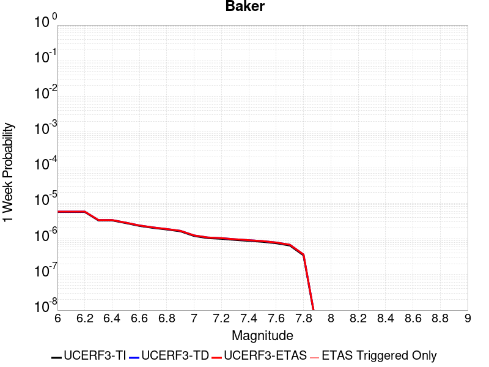 | 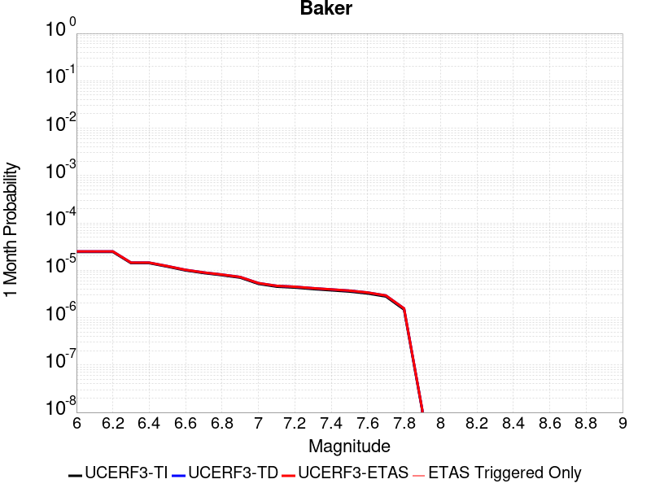 | 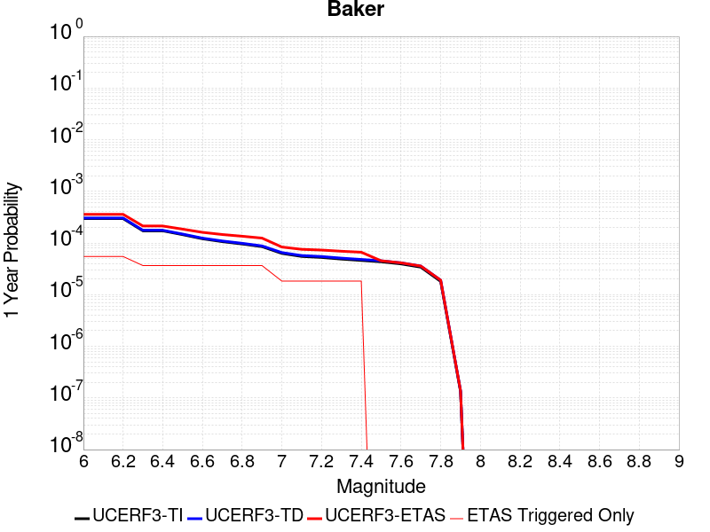 | 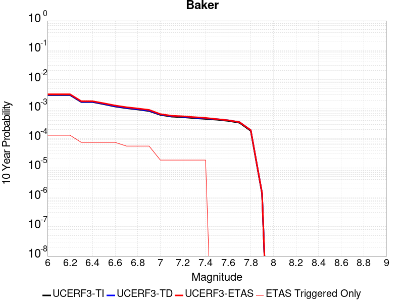 |

| Magnitude | 1 wk TI Prob | 1 wk TD Prob | 1 wk ETAS Prob | 1 wk ETAS/TD Gain | 1 wk ETAS Triggered Only | 1 mo TI Prob | 1 mo TD Prob | 1 mo ETAS Prob | 1 mo ETAS/TD Gain | 1 mo ETAS Triggered Only | 1 yr TI Prob | 1 yr TD Prob | 1 yr ETAS Prob | 1 yr ETAS/TD Gain | 1 yr ETAS Triggered Only | 10 yr TI Prob | 10 yr TD Prob | 10 yr ETAS Prob | 10 yr ETAS/TD Gain | 10 yr ETAS Triggered Only |
|-----|-----|-----|-----|-----|-----|-----|-----|-----|-----|-----|-----|-----|-----|-----|-----|-----|-----|-----|-----|-----|
| 6.0 | 5.695525E-6 | 5.8349897E-6 | 5.8349897E-6 | 1.0 | 0.0 | 2.4409164E-5 | 2.500688E-5 | 3.5995618E-5 | 1.4394284 | 1.0989011E-5 | 2.9714106E-4 | 3.0442025E-4 | 3.483629E-4 | 1.1443487 | 4.3956043E-5 | 0.0029674405 | 0.003040428 | 0.0031390283 | 1.0324298 | 9.89011E-5 |
| 6.1 | 5.695525E-6 | 5.8349897E-6 | 5.8349897E-6 | 1.0 | 0.0 | 2.4409164E-5 | 2.500688E-5 | 3.5995618E-5 | 1.4394284 | 1.0989011E-5 | 2.9714106E-4 | 3.0442025E-4 | 3.483629E-4 | 1.1443487 | 4.3956043E-5 | 0.0029674405 | 0.003040428 | 0.0031390283 | 1.0324298 | 9.89011E-5 |
| 6.2 | 5.695525E-6 | 5.8349897E-6 | 5.8349897E-6 | 1.0 | 0.0 | 2.4409164E-5 | 2.500688E-5 | 3.5995618E-5 | 1.4394284 | 1.0989011E-5 | 2.9714106E-4 | 3.0442025E-4 | 3.483629E-4 | 1.1443487 | 4.3956043E-5 | 0.0029674405 | 0.003040428 | 0.0031390283 | 1.0324298 | 9.89011E-5 |
| 6.3 | 3.2995713E-6 | 3.3837593E-6 | 3.3837593E-6 | 1.0 | 0.0 | 1.4140943E-5 | 1.4501748E-5 | 1.4501748E-5 | 1.0 | 0.0 | 1.7215237E-4 | 1.7654496E-4 | 1.9851909E-4 | 1.1244677 | 2.1978021E-5 | 0.0017201907 | 0.0017640941 | 0.0018189423 | 1.0310913 | 5.4945056E-5 |
| 6.4 | 3.2995713E-6 | 3.3837593E-6 | 3.3837593E-6 | 1.0 | 0.0 | 1.4140943E-5 | 1.4501748E-5 | 1.4501748E-5 | 1.0 | 0.0 | 1.7215237E-4 | 1.7654496E-4 | 1.9851909E-4 | 1.1244677 | 2.1978021E-5 | 0.0017201907 | 0.0017640941 | 0.0018189423 | 1.0310913 | 5.4945056E-5 |
| 6.5 | 2.782202E-6 | 2.8559214E-6 | 2.8559214E-6 | 1.0 | 0.0 | 1.1923668E-5 | 1.2239608E-5 | 1.2239608E-5 | 1.0 | 0.0 | 1.4516099E-4 | 1.4900736E-4 | 1.7098211E-4 | 1.1474743 | 2.1978021E-5 | 0.001450662 | 0.0014891073 | 0.0015439705 | 1.0368431 | 5.4945056E-5 |
| 6.6 | 2.3163404E-6 | 2.3809912E-6 | 2.3809912E-6 | 1.0 | 0.0 | 9.927136E-6 | 1.0204209E-5 | 1.0204209E-5 | 1.0 | 0.0 | 1.20856166E-4 | 1.2422937E-4 | 1.4620466E-4 | 1.1768929 | 2.1978021E-5 | 0.0012079047 | 0.0012416195 | 0.0012855208 | 1.0353582 | 4.3956043E-5 |
| 6.7 | 2.037056E-6 | 2.096566E-6 | 2.096566E-6 | 1.0 | 0.0 | 8.7302105E-6 | 8.985253E-6 | 8.985253E-6 | 1.0 | 0.0 | 1.0628513E-4 | 1.0939013E-4 | 1.3136574E-4 | 1.2008921 | 2.1978021E-5 | 0.0010623431 | 0.001093379 | 0.00112631 | 1.0301186 | 3.2967033E-5 |
| 6.8 | 1.8356744E-6 | 1.8915904E-6 | 1.8915904E-6 | 1.0 | 0.0 | 7.867153E-6 | 8.106792E-6 | 8.106792E-6 | 1.0 | 0.0 | 9.577837E-5 | 9.869586E-5 | 1.2067171E-4 | 1.2226623 | 2.1978021E-5 | 9.57371E-4 | 9.865343E-4 | 0.0010194688 | 1.0333841 | 3.2967033E-5 |
| 6.9 | 1.6310546E-6 | 1.6832649E-6 | 1.6832649E-6 | 1.0 | 0.0 | 6.9902153E-6 | 7.2139733E-6 | 7.2139733E-6 | 1.0 | 0.0 | 8.510255E-5 | 8.78267E-5 | 1.0980279E-4 | 1.2502211 | 2.1978021E-5 | 8.5069967E-4 | 8.779312E-4 | 9.108693E-4 | 1.0375179 | 3.2967033E-5 |
| 7.0 | 1.2058036E-6 | 1.2509166E-6 | 1.2509166E-6 | 1.0 | 0.0 | 5.1677193E-6 | 5.3610606E-6 | 5.3610606E-6 | 1.0 | 0.0 | 6.291517E-5 | 6.526898E-5 | 7.6257274E-5 | 1.168354 | 1.0989011E-5 | 6.289736E-4 | 6.525004E-4 | 6.6348223E-4 | 1.0168304 | 1.0989011E-5 |
| 7.1 | 1.052382E-6 | 1.0952085E-6 | 1.0952085E-6 | 1.0 | 0.0 | 4.5102006E-6 | 4.6937425E-6 | 4.6937425E-6 | 1.0 | 0.0 | 5.491031E-5 | 5.714482E-5 | 6.813321E-5 | 1.1922901 | 1.0989011E-5 | 5.4896745E-4 | 5.713022E-4 | 5.822849E-4 | 1.019224 | 1.0989011E-5 |
| 7.2 | 1.0067454E-6 | 1.0488179E-6 | 1.0488179E-6 | 1.0 | 0.0 | 4.3146156E-6 | 4.494926E-6 | 4.494926E-6 | 1.0 | 0.0 | 5.252918E-5 | 5.4724358E-5 | 6.571277E-5 | 1.2007955 | 1.0989011E-5 | 5.251676E-4 | 5.471097E-4 | 5.580927E-4 | 1.0200746 | 1.0989011E-5 |
| 7.3 | 9.3596316E-7 | 9.768179E-7 | 9.768179E-7 | 1.0 | 0.0 | 4.0112645E-6 | 4.1863555E-6 | 4.1863555E-6 | 1.0 | 0.0 | 4.8836053E-5 | 5.0967694E-5 | 6.195615E-5 | 1.2155964 | 1.0989011E-5 | 4.8825322E-4 | 5.0956086E-4 | 5.2054424E-4 | 1.0215547 | 1.0989011E-5 |
| 7.4 | 8.8117395E-7 | 9.208105E-7 | 9.208105E-7 | 1.0 | 0.0 | 3.7764542E-6 | 3.946325E-6 | 3.946325E-6 | 1.0 | 0.0 | 4.5977362E-5 | 4.8045455E-5 | 5.9033937E-5 | 1.2287102 | 1.0989011E-5 | 4.596785E-4 | 4.8035142E-4 | 4.913352E-4 | 1.022866 | 1.0989011E-5 |
| 7.5 | 8.292386E-7 | 8.6750225E-7 | 8.6750225E-7 | 1.0 | 0.0 | 3.5538749E-6 | 3.7178615E-6 | 3.7178615E-6 | 1.0 | 0.0 | 4.326757E-5 | 4.526403E-5 | 4.526403E-5 | 1.0 | 0.0 | 4.3259145E-4 | 4.5254885E-4 | 4.5254885E-4 | 1.0 | 0.0 |
| 7.6 | 7.553842E-7 | 7.9148737E-7 | 7.9148737E-7 | 1.0 | 0.0 | 3.2373566E-6 | 3.3920844E-6 | 3.3920844E-6 | 1.0 | 0.0 | 3.9414106E-5 | 4.129785E-5 | 4.129785E-5 | 1.0 | 0.0 | 3.9407116E-4 | 4.1290247E-4 | 4.1290247E-4 | 1.0 | 0.0 |
| 7.7 | 6.5285366E-7 | 6.8531597E-7 | 6.8531597E-7 | 1.0 | 0.0 | 2.797941E-6 | 2.9370653E-6 | 2.9370653E-6 | 1.0 | 0.0 | 3.40644E-5 | 3.575819E-5 | 3.575819E-5 | 1.0 | 0.0 | 3.405918E-4 | 3.5752502E-4 | 3.5752502E-4 | 1.0 | 0.0 |
| 7.8 | 3.4586725E-7 | 3.6484747E-7 | 3.6484747E-7 | 1.0 | 0.0 | 1.4822873E-6 | 1.5636311E-6 | 1.5636311E-6 | 1.0 | 0.0 | 1.80467E-5 | 1.9037047E-5 | 1.9037047E-5 | 1.0 | 0.0 | 1.8045233E-4 | 1.9035459E-4 | 1.9035459E-4 | 1.0 | 0.0 |
| 7.9 | 2.5591178E-9 | 2.6697942E-9 | 2.6697942E-9 | 1.0 | 0.0 | 1.0967647E-8 | 1.14419745E-8 | 1.14419745E-8 | 1.0 | 0.0 | 1.335311E-7 | 1.3930604E-7 | 1.3930604E-7 | 1.0 | 0.0 | 1.3353102E-6 | 1.3930604E-6 | 1.3930604E-6 | 1.0 | 0.0 |

## Red Mountain
*[(top)](#table-of-contents)*

| 1 Week | 1 Month | 1 Year | 10 Year |
|-----|-----|-----|-----|
| 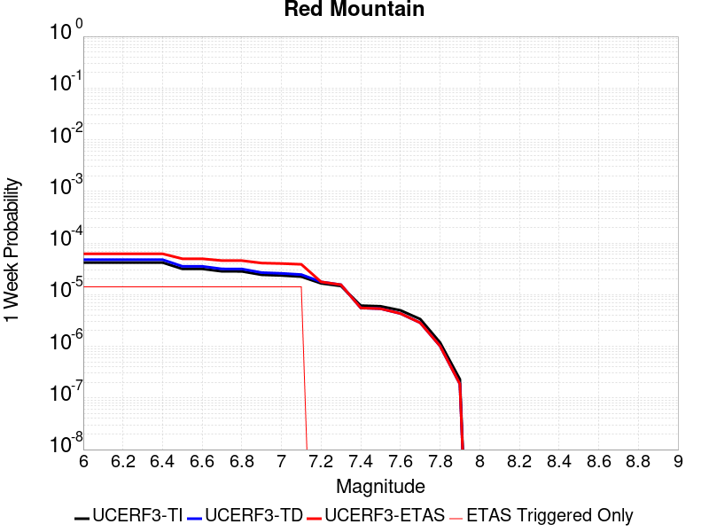 | 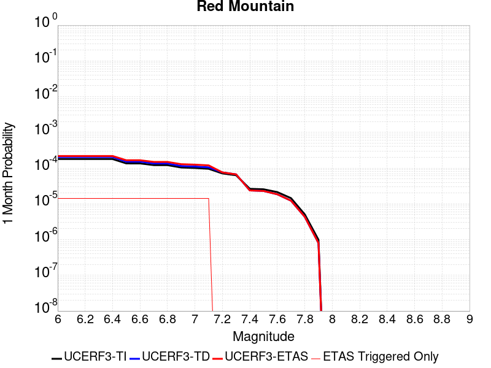 | 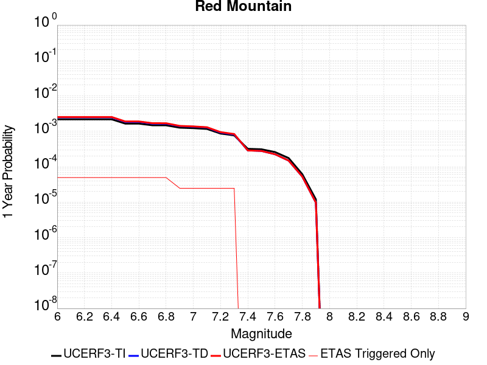 | 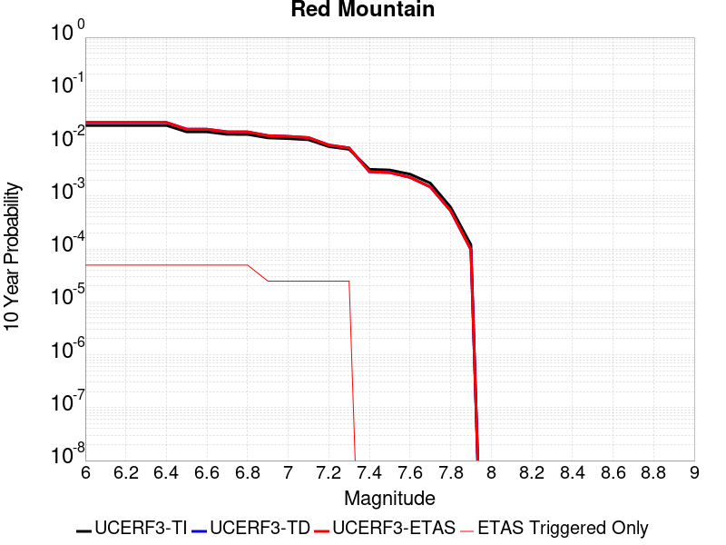 |

| Magnitude | 1 wk TI Prob | 1 wk TD Prob | 1 wk ETAS Prob | 1 wk ETAS/TD Gain | 1 wk ETAS Triggered Only | 1 mo TI Prob | 1 mo TD Prob | 1 mo ETAS Prob | 1 mo ETAS/TD Gain | 1 mo ETAS Triggered Only | 1 yr TI Prob | 1 yr TD Prob | 1 yr ETAS Prob | 1 yr ETAS/TD Gain | 1 yr ETAS Triggered Only | 10 yr TI Prob | 10 yr TD Prob | 10 yr ETAS Prob | 10 yr ETAS/TD Gain | 10 yr ETAS Triggered Only |
|-----|-----|-----|-----|-----|-----|-----|-----|-----|-----|-----|-----|-----|-----|-----|-----|-----|-----|-----|-----|-----|
| 6.0 | 4.1810763E-5 | 4.7598434E-5 | 5.8586924E-5 | 1.2308582 | 1.0989011E-5 | 1.7917668E-4 | 2.0397828E-4 | 2.1496505E-4 | 1.0538625 | 1.0989011E-5 | 0.0021792934 | 0.0024807728 | 0.0025355816 | 1.0220934 | 5.4945056E-5 | 0.021580452 | 0.024548419 | 0.024612734 | 1.00262 | 6.5934066E-5 |
| 6.1 | 4.1810763E-5 | 4.7598434E-5 | 5.8586924E-5 | 1.2308582 | 1.0989011E-5 | 1.7917668E-4 | 2.0397828E-4 | 2.1496505E-4 | 1.0538625 | 1.0989011E-5 | 0.0021792934 | 0.0024807728 | 0.0025355816 | 1.0220934 | 5.4945056E-5 | 0.021580452 | 0.024548419 | 0.024612734 | 1.00262 | 6.5934066E-5 |
| 6.2 | 4.1810763E-5 | 4.7598434E-5 | 5.8586924E-5 | 1.2308582 | 1.0989011E-5 | 1.7917668E-4 | 2.0397828E-4 | 2.1496505E-4 | 1.0538625 | 1.0989011E-5 | 0.0021792934 | 0.0024807728 | 0.0025355816 | 1.0220934 | 5.4945056E-5 | 0.021580452 | 0.024548419 | 0.024612734 | 1.00262 | 6.5934066E-5 |
| 6.3 | 4.1810763E-5 | 4.7598434E-5 | 5.8586924E-5 | 1.2308582 | 1.0989011E-5 | 1.7917668E-4 | 2.0397828E-4 | 2.1496505E-4 | 1.0538625 | 1.0989011E-5 | 0.0021792934 | 0.0024807728 | 0.0025355816 | 1.0220934 | 5.4945056E-5 | 0.021580452 | 0.024548419 | 0.024612734 | 1.00262 | 6.5934066E-5 |
| 6.4 | 4.1810763E-5 | 4.7598434E-5 | 5.8586924E-5 | 1.2308582 | 1.0989011E-5 | 1.7917668E-4 | 2.0397828E-4 | 2.1496505E-4 | 1.0538625 | 1.0989011E-5 | 0.0021792934 | 0.0024807728 | 0.0025355816 | 1.0220934 | 5.4945056E-5 | 0.021580452 | 0.024548419 | 0.024612734 | 1.00262 | 6.5934066E-5 |
| 6.5 | 3.154503E-5 | 3.536573E-5 | 4.6354355E-5 | 1.3107139 | 1.0989011E-5 | 1.3518598E-4 | 1.5155913E-4 | 1.6254648E-4 | 1.0724955 | 1.0989011E-5 | 0.0016446467 | 0.001843763 | 0.0018986068 | 1.0297456 | 5.4945056E-5 | 0.01632528 | 0.018294314 | 0.018359043 | 1.0035381 | 6.5934066E-5 |
| 6.6 | 3.1535834E-5 | 3.535511E-5 | 4.6343735E-5 | 1.3108072 | 1.0989011E-5 | 1.3514658E-4 | 1.5151362E-4 | 1.6250098E-4 | 1.0725172 | 1.0989011E-5 | 0.0016441676 | 0.00184321 | 0.0018980537 | 1.0297545 | 5.4945056E-5 | 0.01632056 | 0.018288875 | 0.018353602 | 1.0035392 | 6.5934066E-5 |
| 6.7 | 2.8267326E-5 | 3.1474574E-5 | 4.246324E-5 | 1.3491282 | 1.0989011E-5 | 1.2114006E-4 | 1.3488454E-4 | 1.4587207E-4 | 1.0814588 | 1.0989011E-5 | 0.0014738824 | 0.0016410673 | 0.0016959222 | 1.0334264 | 5.4945056E-5 | 0.014641452 | 0.016298255 | 0.016363114 | 1.0039796 | 6.5934066E-5 |
| 6.8 | 2.8212884E-5 | 3.141245E-5 | 4.2401116E-5 | 1.3498188 | 1.0989011E-5 | 1.20906756E-4 | 1.3461833E-4 | 1.4560585E-4 | 1.0816199 | 1.0989011E-5 | 0.0014710457 | 0.0016378311 | 0.0016926861 | 1.0334924 | 5.4945056E-5 | 0.014613459 | 0.016266366 | 0.016331227 | 1.0039874 | 6.5934066E-5 |
| 6.9 | 2.4227871E-5 | 2.6711308E-5 | 3.7700025E-5 | 1.4113882 | 1.0989011E-5 | 1.03829596E-4 | 1.14472445E-4 | 1.254602E-4 | 1.095986 | 1.0989011E-5 | 0.0012633923 | 0.0013928869 | 0.0014367817 | 1.0315136 | 4.3956043E-5 | 0.012562336 | 0.0138492575 | 0.013903442 | 1.0039124 | 5.4945056E-5 |
| 7.0 | 2.348524E-5 | 2.5839934E-5 | 3.682866E-5 | 1.4252614 | 1.0989011E-5 | 1.0064714E-4 | 1.107383E-4 | 1.21726094E-4 | 1.099223 | 1.0989011E-5 | 0.0012246901 | 0.0013474806 | 0.0013913774 | 1.0325769 | 4.3956043E-5 | 0.012179627 | 0.01340074 | 0.013454949 | 1.0040452 | 5.4945056E-5 |
| 7.1 | 2.2311642E-5 | 2.4466752E-5 | 3.5455494E-5 | 1.4491296 | 1.0989011E-5 | 9.561782E-5 | 1.0485371E-4 | 1.1584157E-4 | 1.1047922 | 1.0989011E-5 | 0.0011635252 | 0.0012759211 | 0.0013198211 | 1.0344064 | 4.3956043E-5 | 0.01157452 | 0.012693475 | 0.012747723 | 1.0042737 | 5.4945056E-5 |
| 7.2 | 1.6533986E-5 | 1.7673001E-5 | 1.7673001E-5 | 1.0 | 0.0 | 7.085802E-5 | 7.57396E-5 | 7.57396E-5 | 1.0 | 0.0 | 8.623549E-4 | 9.2180294E-4 | 9.547396E-4 | 1.0357307 | 3.2967033E-5 | 0.008590161 | 0.009186074 | 0.0092296265 | 1.0047411 | 4.3956043E-5 |
| 7.3 | 1.4703092E-5 | 1.556183E-5 | 1.556183E-5 | 1.0 | 0.0 | 6.301173E-5 | 6.66922E-5 | 6.66922E-5 | 1.0 | 0.0 | 7.668978E-4 | 8.117367E-4 | 8.44677E-4 | 1.04058 | 3.2967033E-5 | 0.0076425658 | 0.008093794 | 0.008137394 | 1.0053868 | 4.3956043E-5 |
| 7.4 | 6.1331984E-6 | 5.5293617E-6 | 5.5293617E-6 | 1.0 | 0.0 | 2.6284872E-5 | 2.3697052E-5 | 2.3697052E-5 | 1.0 | 0.0 | 3.199713E-4 | 2.8847394E-4 | 2.9945976E-4 | 1.0380826 | 1.0989011E-5 | 0.0031951098 | 0.0028810492 | 0.002902964 | 1.0076065 | 2.1978021E-5 |
| 7.5 | 5.954766E-6 | 5.338974E-6 | 5.338974E-6 | 1.0 | 0.0 | 2.5520176E-5 | 2.2881119E-5 | 2.2881119E-5 | 1.0 | 0.0 | 3.1066386E-4 | 2.7854255E-4 | 2.8952849E-4 | 1.0394409 | 1.0989011E-5 | 0.003102299 | 0.0027819881 | 0.002803905 | 1.0078782 | 2.1978021E-5 |
| 7.6 | 4.9726646E-6 | 4.3156824E-6 | 4.3156824E-6 | 1.0 | 0.0 | 2.1311245E-5 | 1.8495653E-5 | 1.8495653E-5 | 1.0 | 0.0 | 2.5943352E-4 | 2.2516165E-4 | 2.3614819E-4 | 1.048794 | 1.0989011E-5 | 0.0025913084 | 0.0022493699 | 0.002260334 | 1.0048743 | 1.0989011E-5 |
| 7.7 | 3.3613894E-6 | 2.852926E-6 | 2.852926E-6 | 1.0 | 0.0 | 1.4405875E-5 | 1.222677E-5 | 1.222677E-5 | 1.0 | 0.0 | 1.7537741E-4 | 1.4885102E-4 | 1.4885102E-4 | 1.0 | 0.0 | 0.0017523908 | 0.0014875395 | 0.0014875395 | 1.0 | 0.0 |
| 7.8 | 1.1828961E-6 | 1.0123466E-6 | 1.0123466E-6 | 1.0 | 0.0 | 5.069545E-6 | 4.3386217E-6 | 4.3386217E-6 | 1.0 | 0.0 | 6.171996E-5 | 5.2821466E-5 | 5.2821466E-5 | 1.0 | 0.0 | 6.170282E-4 | 5.2809203E-4 | 5.2809203E-4 | 1.0 | 0.0 |
| 7.9 | 2.2967266E-7 | 1.8620278E-7 | 1.8620278E-7 | 1.0 | 0.0 | 9.843111E-7 | 7.980117E-7 | 7.980117E-7 | 1.0 | 0.0 | 1.19839215E-5 | 9.715752E-6 | 9.715752E-6 | 1.0 | 0.0 | 1.1983275E-4 | 9.715356E-5 | 9.715356E-5 | 1.0 | 0.0 |

## Cleghorn Pass
*[(top)](#table-of-contents)*

| 1 Week | 1 Month | 1 Year | 10 Year |
|-----|-----|-----|-----|
| 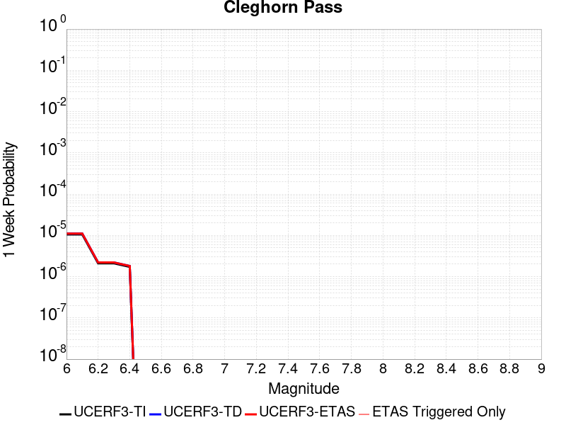 | 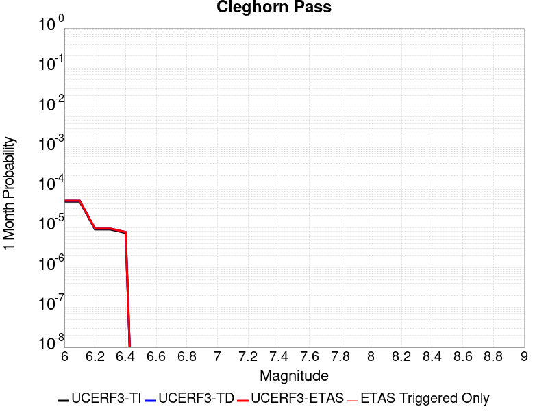 | 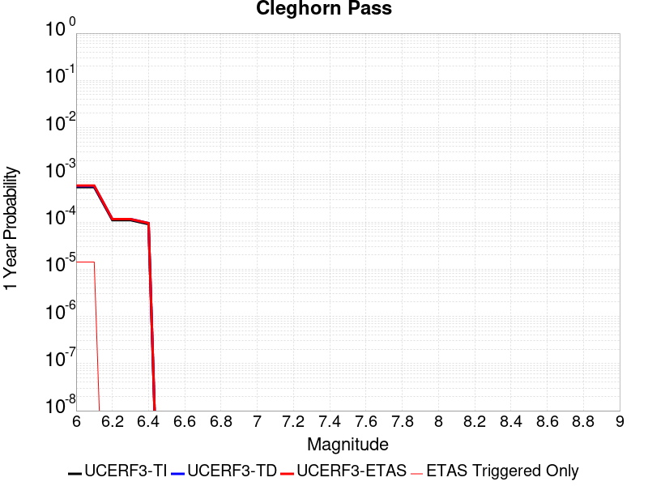 | 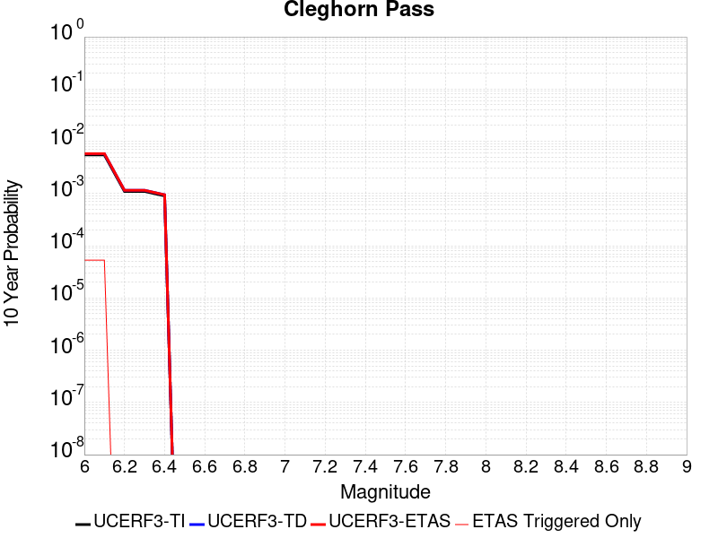 |

| Magnitude | 1 wk TI Prob | 1 wk TD Prob | 1 wk ETAS Prob | 1 wk ETAS/TD Gain | 1 wk ETAS Triggered Only | 1 mo TI Prob | 1 mo TD Prob | 1 mo ETAS Prob | 1 mo ETAS/TD Gain | 1 mo ETAS Triggered Only | 1 yr TI Prob | 1 yr TD Prob | 1 yr ETAS Prob | 1 yr ETAS/TD Gain | 1 yr ETAS Triggered Only | 10 yr TI Prob | 10 yr TD Prob | 10 yr ETAS Prob | 10 yr ETAS/TD Gain | 10 yr ETAS Triggered Only |
|-----|-----|-----|-----|-----|-----|-----|-----|-----|-----|-----|-----|-----|-----|-----|-----|-----|-----|-----|-----|-----|
| 6.0 | 1.0522846E-5 | 1.1041218E-5 | 1.1041218E-5 | 1.0 | 0.0 | 4.509713E-5 | 4.7318943E-5 | 4.7318943E-5 | 1.0 | 0.0 | 5.4891926E-4 | 5.760085E-4 | 5.979739E-4 | 1.0381337 | 2.1978021E-5 | 0.0054756533 | 0.0057503213 | 0.005837728 | 1.0152003 | 8.7912085E-5 |
| 6.1 | 1.0522846E-5 | 1.1041218E-5 | 1.1041218E-5 | 1.0 | 0.0 | 4.509713E-5 | 4.7318943E-5 | 4.7318943E-5 | 1.0 | 0.0 | 5.4891926E-4 | 5.760085E-4 | 5.979739E-4 | 1.0381337 | 2.1978021E-5 | 0.0054756533 | 0.0057503213 | 0.005837728 | 1.0152003 | 8.7912085E-5 |
| 6.2 | 2.1045846E-6 | 2.2083177E-6 | 2.2083177E-6 | 1.0 | 0.0 | 9.019617E-6 | 9.464208E-6 | 9.464208E-6 | 1.0 | 0.0 | 1.098083E-4 | 1.15224844E-4 | 1.15224844E-4 | 1.0 | 0.0 | 0.0010975406 | 0.0011520624 | 0.0011630388 | 1.0095276 | 1.0989011E-5 |
| 6.3 | 2.1045846E-6 | 2.2083177E-6 | 2.2083177E-6 | 1.0 | 0.0 | 9.019617E-6 | 9.464208E-6 | 9.464208E-6 | 1.0 | 0.0 | 1.098083E-4 | 1.15224844E-4 | 1.15224844E-4 | 1.0 | 0.0 | 0.0010975406 | 0.0011520624 | 0.0011630388 | 1.0095276 | 1.0989011E-5 |
| 6.4 | 1.7259927E-6 | 1.8109715E-6 | 1.8109715E-6 | 1.0 | 0.0 | 7.3970905E-6 | 7.761307E-6 | 7.761307E-6 | 1.0 | 0.0 | 9.005586E-5 | 9.449391E-5 | 9.449391E-5 | 1.0 | 0.0 | 9.001937E-4 | 9.449391E-4 | 9.559177E-4 | 1.0116184 | 1.0989011E-5 |

## White Mountains
*[(top)](#table-of-contents)*

| 1 Week | 1 Month | 1 Year | 10 Year |
|-----|-----|-----|-----|
| 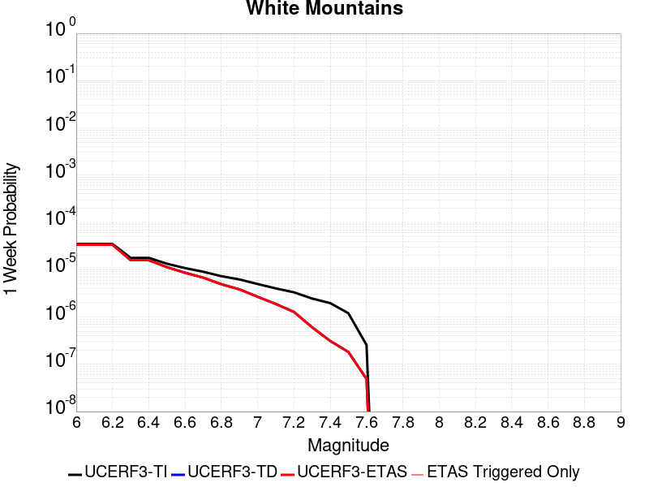 |  | 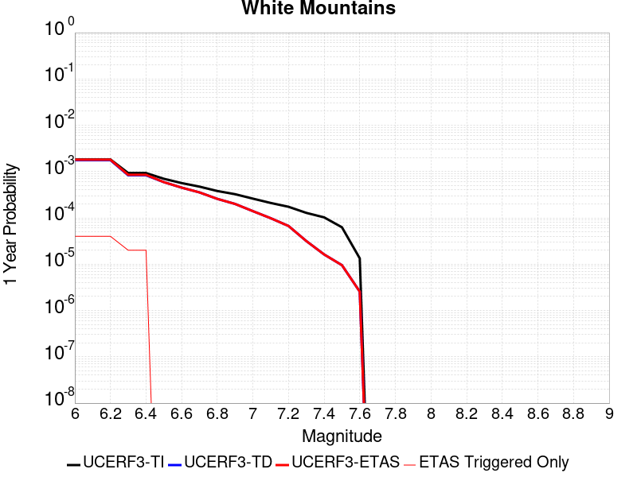 | 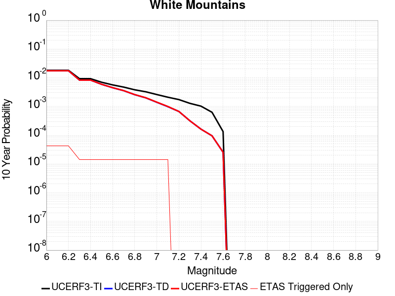 |

| Magnitude | 1 wk TI Prob | 1 wk TD Prob | 1 wk ETAS Prob | 1 wk ETAS/TD Gain | 1 wk ETAS Triggered Only | 1 mo TI Prob | 1 mo TD Prob | 1 mo ETAS Prob | 1 mo ETAS/TD Gain | 1 mo ETAS Triggered Only | 1 yr TI Prob | 1 yr TD Prob | 1 yr ETAS Prob | 1 yr ETAS/TD Gain | 1 yr ETAS Triggered Only | 10 yr TI Prob | 10 yr TD Prob | 10 yr ETAS Prob | 10 yr ETAS/TD Gain | 10 yr ETAS Triggered Only |
|-----|-----|-----|-----|-----|-----|-----|-----|-----|-----|-----|-----|-----|-----|-----|-----|-----|-----|-----|-----|-----|
| 6.0 | 3.503579E-5 | 3.3787193E-5 | 3.3787193E-5 | 1.0 | 0.0 | 1.5014476E-4 | 1.447949E-4 | 1.6676974E-4 | 1.1517653 | 2.1978021E-5 | 0.0018264796 | 0.0017615733 | 0.0017944822 | 1.0186815 | 3.2967033E-5 | 0.018115403 | 0.017488431 | 0.01756401 | 1.0043216 | 7.6923076E-5 |
| 6.1 | 3.503579E-5 | 3.3787193E-5 | 3.3787193E-5 | 1.0 | 0.0 | 1.5014476E-4 | 1.447949E-4 | 1.6676974E-4 | 1.1517653 | 2.1978021E-5 | 0.0018264796 | 0.0017615733 | 0.0017944822 | 1.0186815 | 3.2967033E-5 | 0.018115403 | 0.017488431 | 0.01756401 | 1.0043216 | 7.6923076E-5 |
| 6.2 | 3.503579E-5 | 3.3787193E-5 | 3.3787193E-5 | 1.0 | 0.0 | 1.5014476E-4 | 1.447949E-4 | 1.6676974E-4 | 1.1517653 | 2.1978021E-5 | 0.0018264796 | 0.0017615733 | 0.0017944822 | 1.0186815 | 3.2967033E-5 | 0.018115403 | 0.017488431 | 0.01756401 | 1.0043216 | 7.6923076E-5 |
| 6.3 | 1.7818425E-5 | 1.591752E-5 | 1.591752E-5 | 1.0 | 0.0 | 7.636245E-5 | 6.8216235E-5 | 6.8216235E-5 | 1.0 | 0.0 | 9.293162E-4 | 8.302305E-4 | 8.4121036E-4 | 1.0132251 | 1.0989011E-5 | 0.009254395 | 0.008272747 | 0.008305441 | 1.003952 | 3.2967033E-5 |
| 6.4 | 1.7818425E-5 | 1.591752E-5 | 1.591752E-5 | 1.0 | 0.0 | 7.636245E-5 | 6.8216235E-5 | 6.8216235E-5 | 1.0 | 0.0 | 9.293162E-4 | 8.302305E-4 | 8.4121036E-4 | 1.0132251 | 1.0989011E-5 | 0.009254395 | 0.008272747 | 0.008305441 | 1.003952 | 3.2967033E-5 |
| 6.5 | 1.3397557E-5 | 1.1337316E-5 | 1.1337316E-5 | 1.0 | 0.0 | 5.741684E-5 | 4.858763E-5 | 4.858763E-5 | 1.0 | 0.0 | 6.988258E-4 | 5.9140084E-4 | 5.9140084E-4 | 1.0 | 0.0 | 0.006966323 | 0.0058989753 | 0.0059098997 | 1.0018519 | 1.0989011E-5 |
| 6.6 | 1.0818695E-5 | 8.626119E-6 | 8.626119E-6 | 1.0 | 0.0 | 4.6365014E-5 | 3.6968584E-5 | 3.6968584E-5 | 1.0 | 0.0 | 5.6434784E-4 | 4.500039E-4 | 4.500039E-4 | 1.0 | 0.0 | 0.005629168 | 0.004491363 | 0.004502303 | 1.0024357 | 1.0989011E-5 |
| 6.7 | 9.067908E-6 | 6.8030126E-6 | 6.8030126E-6 | 1.0 | 0.0 | 3.8861883E-5 | 2.915546E-5 | 2.915546E-5 | 1.0 | 0.0 | 4.7304068E-4 | 3.549131E-4 | 3.549131E-4 | 1.0 | 0.0 | 0.00472035 | 0.0035437802 | 0.0035547302 | 1.0030899 | 1.0989011E-5 |
| 6.8 | 7.295947E-6 | 4.9367977E-6 | 4.9367977E-6 | 1.0 | 0.0 | 3.126797E-5 | 2.1157539E-5 | 2.1157539E-5 | 1.0 | 0.0 | 3.8062103E-4 | 2.5756372E-4 | 2.5756372E-4 | 1.0 | 0.0 | 0.0037996976 | 0.002572765 | 0.0025837258 | 1.0042603 | 1.0989011E-5 |
| 6.9 | 6.2243444E-6 | 3.8325466E-6 | 3.8325466E-6 | 1.0 | 0.0 | 2.6675489E-5 | 1.64251E-5 | 1.64251E-5 | 1.0 | 0.0 | 3.2472567E-4 | 1.9995777E-4 | 1.9995777E-4 | 1.0 | 0.0 | 0.0032425157 | 0.0019978313 | 0.0020087983 | 1.0054895 | 1.0989011E-5 |
| 7.0 | 4.9878413E-6 | 2.6798186E-6 | 2.6798186E-6 | 1.0 | 0.0 | 2.1376287E-5 | 1.1484888E-5 | 1.1484888E-5 | 1.0 | 0.0 | 2.602252E-4 | 1.3981981E-4 | 1.3981981E-4 | 1.0 | 0.0 | 0.002599207 | 0.0013973446 | 0.0014083183 | 1.0078533 | 1.0989011E-5 |
| 7.1 | 4.0252844E-6 | 1.8860183E-6 | 1.8860183E-6 | 1.0 | 0.0 | 1.7251105E-5 | 8.082911E-6 | 8.082911E-6 | 1.0 | 0.0 | 2.1001195E-4 | 9.840512E-5 | 9.840512E-5 | 1.0 | 0.0 | 0.0020981359 | 9.836283E-4 | 9.946065E-4 | 1.011161 | 1.0989011E-5 |
| 7.2 | 3.3284066E-6 | 1.2822063E-6 | 1.2822063E-6 | 1.0 | 0.0 | 1.4264522E-5 | 5.495159E-6 | 5.495159E-6 | 1.0 | 0.0 | 1.736567E-4 | 6.690161E-5 | 6.690161E-5 | 1.0 | 0.0 | 0.0017352107 | 6.688247E-4 | 6.688247E-4 | 1.0 | 0.0 |
| 7.3 | 2.458226E-6 | 6.059402E-7 | 6.059402E-7 | 1.0 | 0.0 | 1.0535211E-5 | 2.5968843E-6 | 2.5968843E-6 | 1.0 | 0.0 | 1.2825865E-4 | 3.1616648E-5 | 3.1616648E-5 | 1.0 | 0.0 | 0.0012818464 | 3.1612522E-4 | 3.1612522E-4 | 1.0 | 0.0 |
| 7.4 | 1.965953E-6 | 3.1108226E-7 | 3.1108226E-7 | 1.0 | 0.0 | 8.425486E-6 | 1.3332091E-6 | 1.3332091E-6 | 1.0 | 0.0 | 1.0257547E-4 | 1.6231701E-5 | 1.6231701E-5 | 1.0 | 0.0 | 0.0010252813 | 1.6230528E-4 | 1.6230528E-4 | 1.0 | 0.0 |
| 7.5 | 1.2014192E-6 | 1.825735E-7 | 1.825735E-7 | 1.0 | 0.0 | 5.148929E-6 | 7.824576E-7 | 7.824576E-7 | 1.0 | 0.0 | 6.2686406E-5 | 9.526381E-6 | 9.526381E-6 | 1.0 | 0.0 | 6.266873E-4 | 9.5259806E-5 | 9.5259806E-5 | 1.0 | 0.0 |
| 7.6 | 2.5612175E-7 | 4.8981033E-8 | 4.8981033E-8 | 1.0 | 0.0 | 1.0976642E-6 | 2.0991871E-7 | 2.0991871E-7 | 1.0 | 0.0 | 1.3363979E-5 | 2.5557576E-6 | 2.5557576E-6 | 1.0 | 0.0 | 1.3363175E-4 | 2.5557318E-5 | 2.5557318E-5 | 1.0 | 0.0 |

## Manix-Afton Hills
*[(top)](#table-of-contents)*

| 1 Week | 1 Month | 1 Year | 10 Year |
|-----|-----|-----|-----|
| 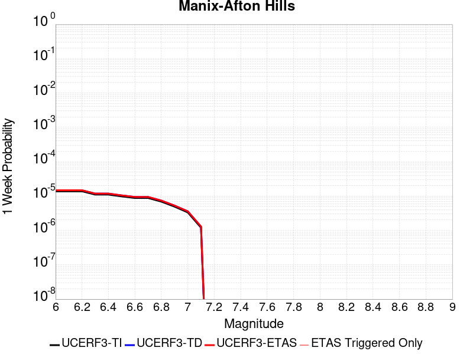 | 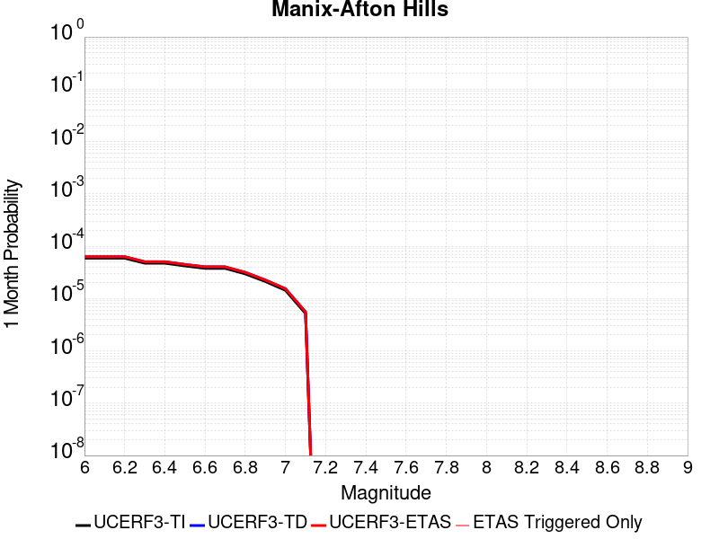 | 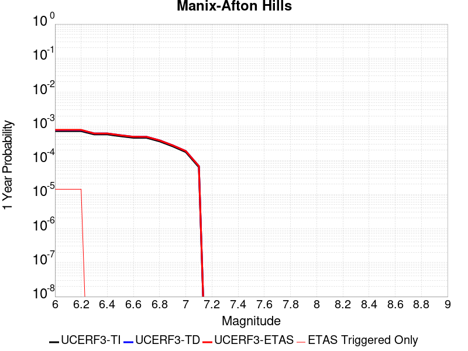 | 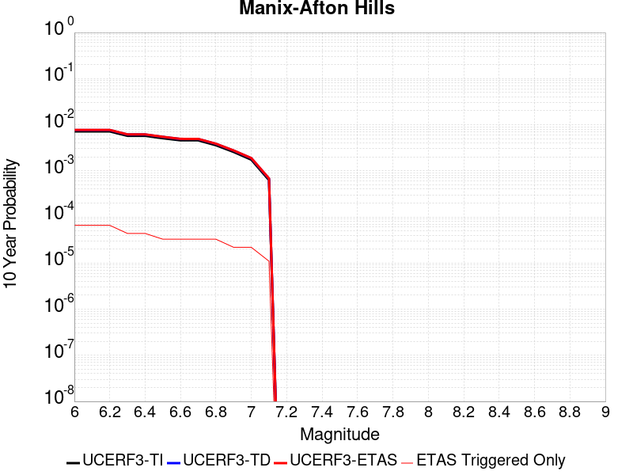 |

| Magnitude | 1 wk TI Prob | 1 wk TD Prob | 1 wk ETAS Prob | 1 wk ETAS/TD Gain | 1 wk ETAS Triggered Only | 1 mo TI Prob | 1 mo TD Prob | 1 mo ETAS Prob | 1 mo ETAS/TD Gain | 1 mo ETAS Triggered Only | 1 yr TI Prob | 1 yr TD Prob | 1 yr ETAS Prob | 1 yr ETAS/TD Gain | 1 yr ETAS Triggered Only | 10 yr TI Prob | 10 yr TD Prob | 10 yr ETAS Prob | 10 yr ETAS/TD Gain | 10 yr ETAS Triggered Only |
|-----|-----|-----|-----|-----|-----|-----|-----|-----|-----|-----|-----|-----|-----|-----|-----|-----|-----|-----|-----|-----|
| 6.0 | 1.3783202E-5 | 1.4712143E-5 | 1.4712143E-5 | 1.0 | 0.0 | 5.906953E-5 | 6.305062E-5 | 6.305062E-5 | 1.0 | 0.0 | 7.189342E-4 | 7.673883E-4 | 7.783689E-4 | 1.014309 | 1.0989011E-5 | 0.0071661277 | 0.0076491414 | 0.007714571 | 1.0085539 | 6.5934066E-5 |
| 6.1 | 1.3783202E-5 | 1.4712143E-5 | 1.4712143E-5 | 1.0 | 0.0 | 5.906953E-5 | 6.305062E-5 | 6.305062E-5 | 1.0 | 0.0 | 7.189342E-4 | 7.673883E-4 | 7.783689E-4 | 1.014309 | 1.0989011E-5 | 0.0071661277 | 0.0076491414 | 0.007714571 | 1.0085539 | 6.5934066E-5 |
| 6.2 | 1.3783202E-5 | 1.4712143E-5 | 1.4712143E-5 | 1.0 | 0.0 | 5.906953E-5 | 6.305062E-5 | 6.305062E-5 | 1.0 | 0.0 | 7.189342E-4 | 7.673883E-4 | 7.783689E-4 | 1.014309 | 1.0989011E-5 | 0.0071661277 | 0.0076491414 | 0.007714571 | 1.0085539 | 6.5934066E-5 |
| 6.3 | 1.10494875E-5 | 1.179398E-5 | 1.179398E-5 | 1.0 | 0.0 | 4.7354086E-5 | 5.0544706E-5 | 5.0544706E-5 | 1.0 | 0.0 | 5.763835E-4 | 6.152184E-4 | 6.152184E-4 | 1.0 | 0.0 | 0.005748908 | 0.0061361934 | 0.00617988 | 1.0071194 | 4.3956043E-5 |
| 6.4 | 1.10494875E-5 | 1.179398E-5 | 1.179398E-5 | 1.0 | 0.0 | 4.7354086E-5 | 5.0544706E-5 | 5.0544706E-5 | 1.0 | 0.0 | 5.763835E-4 | 6.152184E-4 | 6.152184E-4 | 1.0 | 0.0 | 0.005748908 | 0.0061361934 | 0.00617988 | 1.0071194 | 4.3956043E-5 |
| 6.5 | 9.788949E-6 | 1.0455075E-5 | 1.0455075E-5 | 1.0 | 0.0 | 4.1951964E-5 | 4.4806748E-5 | 4.4806748E-5 | 1.0 | 0.0 | 5.1064545E-4 | 5.453949E-4 | 5.453949E-4 | 1.0 | 0.0 | 0.0050947363 | 0.005441491 | 0.0054742787 | 1.0060254 | 3.2967033E-5 |
| 6.6 | 8.810006E-6 | 9.414314E-6 | 9.414314E-6 | 1.0 | 0.0 | 3.775662E-5 | 4.0346487E-5 | 4.0346487E-5 | 1.0 | 0.0 | 4.5958988E-4 | 4.9111666E-4 | 4.9111666E-4 | 1.0 | 0.0 | 0.0045864056 | 0.0049011954 | 0.004934001 | 1.0066934 | 3.2967033E-5 |
| 6.7 | 8.80128E-6 | 9.404793E-6 | 9.404793E-6 | 1.0 | 0.0 | 3.7719226E-5 | 4.0305684E-5 | 4.0305684E-5 | 1.0 | 0.0 | 4.591348E-4 | 4.906201E-4 | 4.906201E-4 | 1.0 | 0.0 | 0.004581874 | 0.004896252 | 0.0049290573 | 1.0067002 | 3.2967033E-5 |
| 6.8 | 6.8994877E-6 | 7.3806227E-6 | 7.3806227E-6 | 1.0 | 0.0 | 2.9568899E-5 | 3.1630905E-5 | 3.1630905E-5 | 1.0 | 0.0 | 3.5994186E-4 | 3.8504635E-4 | 3.8504635E-4 | 1.0 | 0.0 | 0.003593594 | 0.0038445974 | 0.0038774377 | 1.008542 | 3.2967033E-5 |
| 6.9 | 4.9328037E-6 | 5.271346E-6 | 5.271346E-6 | 1.0 | 0.0 | 2.1140417E-5 | 2.259132E-5 | 2.259132E-5 | 1.0 | 0.0 | 2.5735417E-4 | 2.7502078E-4 | 2.7502078E-4 | 1.0 | 0.0 | 0.0025705635 | 0.0027474095 | 0.0027693273 | 1.0079776 | 2.1978021E-5 |
| 7.0 | 3.347973E-6 | 3.5903063E-6 | 3.5903063E-6 | 1.0 | 0.0 | 1.4348378E-5 | 1.5386959E-5 | 1.5386959E-5 | 1.0 | 0.0 | 1.746775E-4 | 1.8732423E-4 | 1.8732423E-4 | 1.0 | 0.0 | 0.0017454025 | 0.001872066 | 0.0018940028 | 1.011718 | 2.1978021E-5 |
| 7.1 | 1.2073567E-6 | 1.29358E-6 | 1.29358E-6 | 1.0 | 0.0 | 5.1743755E-6 | 5.5439114E-6 | 5.5439114E-6 | 1.0 | 0.0 | 6.29962E-5 | 6.7496665E-5 | 6.7496665E-5 | 1.0 | 0.0 | 6.297835E-4 | 6.7492184E-4 | 6.859034E-4 | 1.0162709 | 1.0989011E-5 |

## San Andreas (North Branch Mill Creek)
*[(top)](#table-of-contents)*

| 1 Week | 1 Month | 1 Year | 10 Year |
|-----|-----|-----|-----|
| 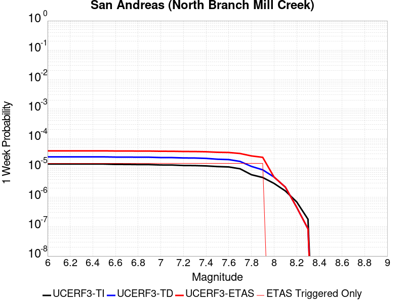 | 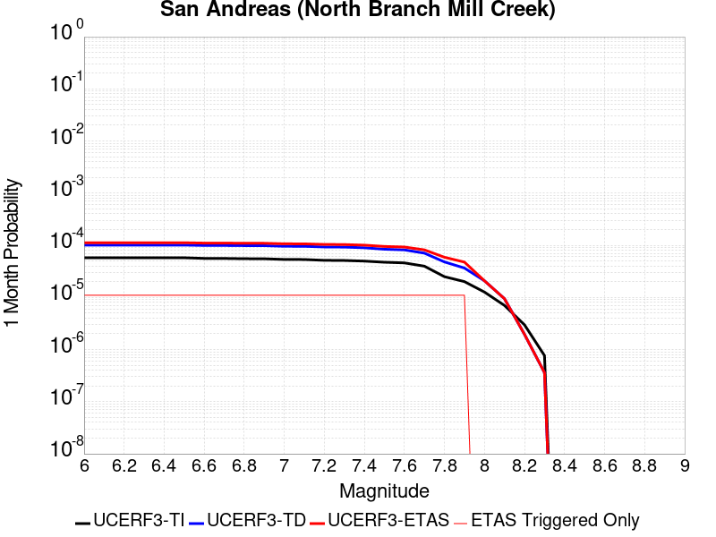 | 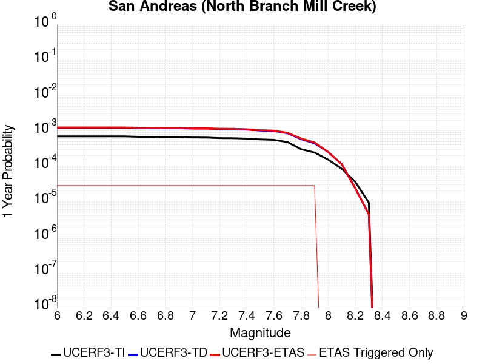 | 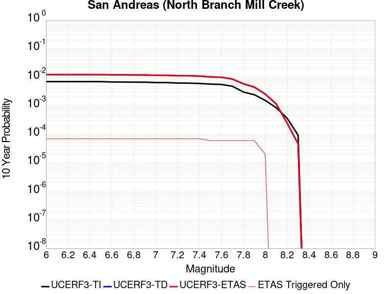 |

| Magnitude | 1 wk TI Prob | 1 wk TD Prob | 1 wk ETAS Prob | 1 wk ETAS/TD Gain | 1 wk ETAS Triggered Only | 1 mo TI Prob | 1 mo TD Prob | 1 mo ETAS Prob | 1 mo ETAS/TD Gain | 1 mo ETAS Triggered Only | 1 yr TI Prob | 1 yr TD Prob | 1 yr ETAS Prob | 1 yr ETAS/TD Gain | 1 yr ETAS Triggered Only | 10 yr TI Prob | 10 yr TD Prob | 10 yr ETAS Prob | 10 yr ETAS/TD Gain | 10 yr ETAS Triggered Only |
|-----|-----|-----|-----|-----|-----|-----|-----|-----|-----|-----|-----|-----|-----|-----|-----|-----|-----|-----|-----|-----|
| 6.0 | 1.3461156E-5 | 2.3555003E-5 | 3.4543755E-5 | 1.4665146 | 1.0989011E-5 | 5.7689394E-5 | 1.0094613E-4 | 1.1193403E-4 | 1.1088492 | 1.0989011E-5 | 7.02142E-4 | 0.0012283295 | 0.001261256 | 1.026806 | 3.2967033E-5 | 0.0069992766 | 0.012257786 | 0.012333766 | 1.0061985 | 7.6923076E-5 |
| 6.1 | 1.3461156E-5 | 2.3555003E-5 | 3.4543755E-5 | 1.4665146 | 1.0989011E-5 | 5.7689394E-5 | 1.0094613E-4 | 1.1193403E-4 | 1.1088492 | 1.0989011E-5 | 7.02142E-4 | 0.0012283295 | 0.001261256 | 1.026806 | 3.2967033E-5 | 0.0069992766 | 0.012257786 | 0.012333766 | 1.0061985 | 7.6923076E-5 |
| 6.2 | 1.3461156E-5 | 2.3555003E-5 | 3.4543755E-5 | 1.4665146 | 1.0989011E-5 | 5.7689394E-5 | 1.0094613E-4 | 1.1193403E-4 | 1.1088492 | 1.0989011E-5 | 7.02142E-4 | 0.0012283295 | 0.001261256 | 1.026806 | 3.2967033E-5 | 0.0069992766 | 0.012257786 | 0.012333766 | 1.0061985 | 7.6923076E-5 |
| 6.3 | 1.3461156E-5 | 2.3555003E-5 | 3.4543755E-5 | 1.4665146 | 1.0989011E-5 | 5.7689394E-5 | 1.0094613E-4 | 1.1193403E-4 | 1.1088492 | 1.0989011E-5 | 7.02142E-4 | 0.0012283295 | 0.001261256 | 1.026806 | 3.2967033E-5 | 0.0069992766 | 0.012257786 | 0.012333766 | 1.0061985 | 7.6923076E-5 |
| 6.4 | 1.3461156E-5 | 2.3555003E-5 | 3.4543755E-5 | 1.4665146 | 1.0989011E-5 | 5.7689394E-5 | 1.0094613E-4 | 1.1193403E-4 | 1.1088492 | 1.0989011E-5 | 7.02142E-4 | 0.0012283295 | 0.001261256 | 1.026806 | 3.2967033E-5 | 0.0069992766 | 0.012257786 | 0.012333766 | 1.0061985 | 7.6923076E-5 |
| 6.5 | 1.3450706E-5 | 2.3543962E-5 | 3.4532713E-5 | 1.4667333 | 1.0989011E-5 | 5.764461E-5 | 1.0089881E-4 | 1.11886715E-4 | 1.1089002 | 1.0989011E-5 | 7.0159714E-4 | 0.001227754 | 0.0012606806 | 1.0268185 | 3.2967033E-5 | 0.006993862 | 0.012252095 | 0.012328075 | 1.0062014 | 7.6923076E-5 |
| 6.6 | 1.3074523E-5 | 2.3158225E-5 | 3.4146982E-5 | 1.4745077 | 1.0989011E-5 | 5.6032466E-5 | 9.924578E-5 | 1.102337E-4 | 1.1107142 | 1.0989011E-5 | 6.8198174E-4 | 0.0012076509 | 0.001240578 | 1.0272655 | 3.2967033E-5 | 0.006798926 | 0.012053255 | 0.012129251 | 1.006305 | 7.6923076E-5 |
| 6.7 | 1.3050216E-5 | 2.3133518E-5 | 3.4122277E-5 | 1.4750146 | 1.0989011E-5 | 5.59283E-5 | 9.91399E-5 | 1.10127825E-4 | 1.1108325 | 1.0989011E-5 | 6.8071426E-4 | 0.0012063632 | 0.0012392905 | 1.0272946 | 3.2967033E-5 | 0.0067863287 | 0.012040518 | 0.012116515 | 1.0063118 | 7.6923076E-5 |
| 6.8 | 1.29049395E-5 | 2.2981916E-5 | 3.3970675E-5 | 1.4781481 | 1.0989011E-5 | 5.530571E-5 | 9.849022E-5 | 1.09478155E-4 | 1.1115637 | 1.0989011E-5 | 6.73139E-4 | 0.0011984621 | 0.0012313896 | 1.0274748 | 3.2967033E-5 | 0.0067110364 | 0.01196236 | 0.012038362 | 1.0063535 | 7.6923076E-5 |
| 6.9 | 1.2867369E-5 | 2.294131E-5 | 3.393007E-5 | 1.4789944 | 1.0989011E-5 | 5.51447E-5 | 9.831622E-5 | 1.0930415E-4 | 1.1117611 | 1.0989011E-5 | 6.711799E-4 | 0.0011963459 | 0.0012292735 | 1.0275235 | 3.2967033E-5 | 0.006691564 | 0.0119414255 | 0.01201743 | 1.0063648 | 7.6923076E-5 |
| 7.0 | 1.2495996E-5 | 2.234101E-5 | 3.3329776E-5 | 1.4918652 | 1.0989011E-5 | 5.3553173E-5 | 9.5743686E-5 | 1.0673165E-4 | 1.1147643 | 1.0989011E-5 | 6.518148E-4 | 0.0011650589 | 0.0011979875 | 1.0282634 | 3.2967033E-5 | 0.0064990623 | 0.011631842 | 0.01170787 | 1.0065362 | 7.6923076E-5 |
| 7.1 | 1.2452067E-5 | 2.2286065E-5 | 3.327483E-5 | 1.4930779 | 1.0989011E-5 | 5.3364907E-5 | 9.550823E-5 | 1.0649619E-4 | 1.1150472 | 1.0989011E-5 | 6.4952404E-4 | 0.0011621952 | 0.001195124 | 1.0283332 | 3.2967033E-5 | 0.0064762887 | 0.011603505 | 0.011679536 | 1.0065523 | 7.6923076E-5 |
| 7.2 | 1.2002777E-5 | 2.1664337E-5 | 3.2653108E-5 | 1.5072287 | 1.0989011E-5 | 5.143946E-5 | 9.284387E-5 | 1.0383186E-4 | 1.1183491 | 1.0989011E-5 | 6.2609545E-4 | 0.0011297906 | 0.0011627204 | 1.0291468 | 3.2967033E-5 | 0.006243344 | 0.011282786 | 0.011358841 | 1.0067408 | 7.6923076E-5 |
| 7.3 | 1.1923425E-5 | 2.1534106E-5 | 3.2522883E-5 | 1.5102962 | 1.0989011E-5 | 5.109939E-5 | 9.228578E-5 | 1.0327378E-4 | 1.1190649 | 1.0989011E-5 | 6.219575E-4 | 0.0011230028 | 0.0011559329 | 1.0293232 | 3.2967033E-5 | 0.0062021962 | 0.0112156235 | 0.011291684 | 1.0067817 | 7.6923076E-5 |
| 7.4 | 1.16105175E-5 | 2.0907555E-5 | 3.1896336E-5 | 1.525589 | 1.0989011E-5 | 4.975841E-5 | 8.960075E-5 | 1.0058877E-4 | 1.1226332 | 1.0989011E-5 | 6.0564023E-4 | 0.0010903457 | 0.0011232768 | 1.0302024 | 3.2967033E-5 | 0.006039923 | 0.0108929705 | 0.010969056 | 1.0069848 | 7.6923076E-5 |
| 7.5 | 1.1037265E-5 | 1.960581E-5 | 3.0594605E-5 | 1.5604867 | 1.0989011E-5 | 4.7301706E-5 | 8.4022206E-5 | 9.50103E-5 | 1.130776 | 1.0989011E-5 | 5.757461E-4 | 0.0010224925 | 0.0010554258 | 1.0322089 | 3.2967033E-5 | 0.005742567 | 0.010221531 | 0.01028679 | 1.0063846 | 6.5934066E-5 |
| 7.6 | 1.0720915E-5 | 1.9047075E-5 | 3.0035875E-5 | 1.5769286 | 1.0989011E-5 | 4.5945973E-5 | 8.1627775E-5 | 9.261589E-5 | 1.1346124 | 1.0989011E-5 | 5.592486E-4 | 9.933673E-4 | 0.0010263015 | 1.0331541 | 3.2967033E-5 | 0.005578433 | 0.009932928 | 0.009998207 | 1.006572 | 6.5934066E-5 |
| 7.7 | 9.276279E-6 | 1.6490461E-5 | 2.7479291E-5 | 1.6663749 | 1.0989011E-5 | 3.9754876E-5 | 7.06715E-5 | 8.165974E-5 | 1.1554832 | 1.0989011E-5 | 4.839081E-4 | 8.600875E-4 | 8.930262E-4 | 1.0382969 | 3.2967033E-5 | 0.0048285574 | 0.0086111175 | 0.008676484 | 1.0075909 | 6.5934066E-5 |
| 7.8 | 5.8346777E-6 | 1.1194611E-5 | 2.2183498E-5 | 1.981623 | 1.0989011E-5 | 2.5005522E-5 | 4.7976024E-5 | 5.8964506E-5 | 1.2290412 | 1.0989011E-5 | 3.043997E-4 | 5.8395165E-4 | 6.168994E-4 | 1.0564221 | 3.2967033E-5 | 0.0030398308 | 0.005867293 | 0.0059328405 | 1.0111716 | 6.5934066E-5 |
| 7.9 | 4.690204E-6 | 8.542101E-6 | 1.9531019E-5 | 2.286442 | 1.0989011E-5 | 2.0100719E-5 | 3.660849E-5 | 4.75971E-5 | 1.3001655 | 1.0989011E-5 | 2.4469878E-4 | 4.456173E-4 | 4.7856965E-4 | 1.0739477 | 3.2967033E-5 | 0.002444295 | 0.0044877403 | 0.004553378 | 1.0146261 | 6.5934066E-5 |
| 8.0 | 2.9570454E-6 | 4.8671277E-6 | 4.8671277E-6 | 1.0 | 0.0 | 1.267299E-5 | 2.0858952E-5 | 2.0858952E-5 | 1.0 | 0.0 | 1.5428272E-4 | 2.5392818E-4 | 2.5392818E-4 | 1.0 | 0.0 | 0.0015417566 | 0.00256014 | 0.002582062 | 1.0085627 | 2.1978021E-5 |
| 8.1 | 1.6376824E-6 | 2.2074744E-6 | 2.2074744E-6 | 1.0 | 0.0 | 7.01862E-6 | 9.460569E-6 | 9.460569E-6 | 1.0 | 0.0 | 8.544835E-5 | 1.15176364E-4 | 1.15176364E-4 | 1.0 | 0.0 | 8.54155E-4 | 0.0011661941 | 0.0011661941 | 1.0 | 0.0 |
| 8.2 | 6.9631557E-7 | 4.569111E-7 | 4.569111E-7 | 1.0 | 0.0 | 2.984206E-6 | 1.958189E-6 | 1.958189E-6 | 1.0 | 0.0 | 3.63321E-5 | 2.384069E-5 | 2.384069E-5 | 1.0 | 0.0 | 3.6326164E-4 | 2.469133E-4 | 2.469133E-4 | 1.0 | 0.0 |
| 8.3 | 1.7876137E-7 | 8.4275065E-8 | 8.4275065E-8 | 1.0 | 0.0 | 7.661199E-7 | 3.611788E-7 | 3.611788E-7 | 1.0 | 0.0 | 9.32747E-6 | 4.397343E-6 | 4.397343E-6 | 1.0 | 0.0 | 9.3270784E-5 | 4.617711E-5 | 4.617711E-5 | 1.0 | 0.0 |

## Independence rev 2011
*[(top)](#table-of-contents)*

| 1 Week | 1 Month | 1 Year | 10 Year |
|-----|-----|-----|-----|
| 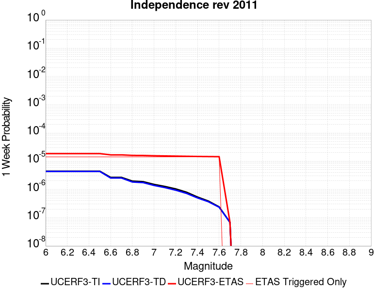 | 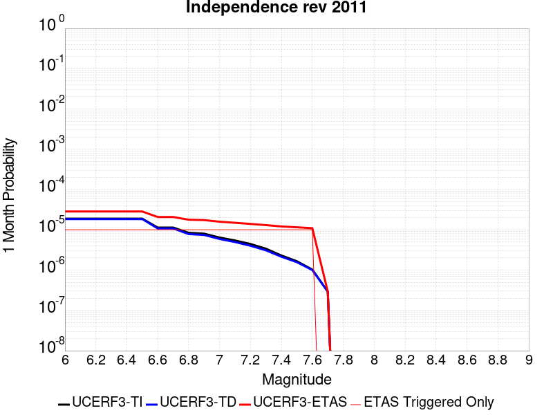 | 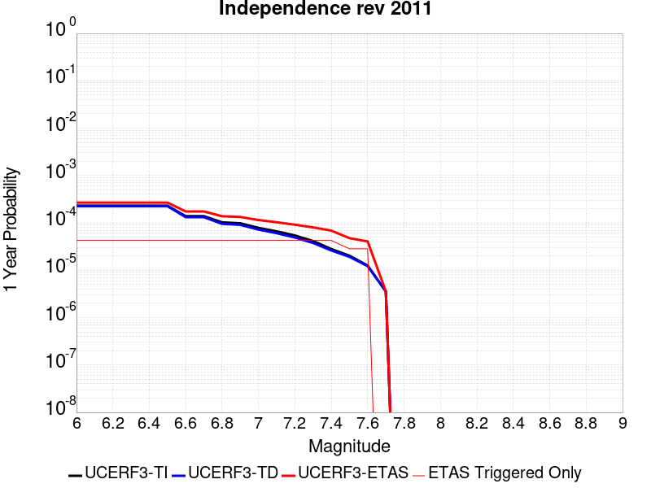 | 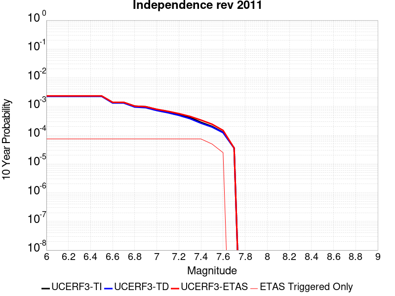 |

| Magnitude | 1 wk TI Prob | 1 wk TD Prob | 1 wk ETAS Prob | 1 wk ETAS/TD Gain | 1 wk ETAS Triggered Only | 1 mo TI Prob | 1 mo TD Prob | 1 mo ETAS Prob | 1 mo ETAS/TD Gain | 1 mo ETAS Triggered Only | 1 yr TI Prob | 1 yr TD Prob | 1 yr ETAS Prob | 1 yr ETAS/TD Gain | 1 yr ETAS Triggered Only | 10 yr TI Prob | 10 yr TD Prob | 10 yr ETAS Prob | 10 yr ETAS/TD Gain | 10 yr ETAS Triggered Only |
|-----|-----|-----|-----|-----|-----|-----|-----|-----|-----|-----|-----|-----|-----|-----|-----|-----|-----|-----|-----|-----|
| 6.0 | 4.422171E-6 | 4.3263735E-6 | 1.5315336E-5 | 3.5399942 | 1.0989011E-5 | 1.8952025E-5 | 1.8541485E-5 | 2.9530293E-5 | 1.5926605 | 1.0989011E-5 | 2.3071647E-4 | 2.2572218E-4 | 2.696683E-4 | 1.1946912 | 4.3956043E-5 | 0.0023047708 | 0.0022552228 | 0.0023319724 | 1.034032 | 7.6923076E-5 |
| 6.1 | 4.422171E-6 | 4.3263735E-6 | 1.5315336E-5 | 3.5399942 | 1.0989011E-5 | 1.8952025E-5 | 1.8541485E-5 | 2.9530293E-5 | 1.5926605 | 1.0989011E-5 | 2.3071647E-4 | 2.2572218E-4 | 2.696683E-4 | 1.1946912 | 4.3956043E-5 | 0.0023047708 | 0.0022552228 | 0.0023319724 | 1.034032 | 7.6923076E-5 |
| 6.2 | 4.422171E-6 | 4.3263735E-6 | 1.5315336E-5 | 3.5399942 | 1.0989011E-5 | 1.8952025E-5 | 1.8541485E-5 | 2.9530293E-5 | 1.5926605 | 1.0989011E-5 | 2.3071647E-4 | 2.2572218E-4 | 2.696683E-4 | 1.1946912 | 4.3956043E-5 | 0.0023047708 | 0.0022552228 | 0.0023319724 | 1.034032 | 7.6923076E-5 |
| 6.3 | 4.422171E-6 | 4.3263735E-6 | 1.5315336E-5 | 3.5399942 | 1.0989011E-5 | 1.8952025E-5 | 1.8541485E-5 | 2.9530293E-5 | 1.5926605 | 1.0989011E-5 | 2.3071647E-4 | 2.2572218E-4 | 2.696683E-4 | 1.1946912 | 4.3956043E-5 | 0.0023047708 | 0.0022552228 | 0.0023319724 | 1.034032 | 7.6923076E-5 |
| 6.4 | 4.422171E-6 | 4.3263735E-6 | 1.5315336E-5 | 3.5399942 | 1.0989011E-5 | 1.8952025E-5 | 1.8541485E-5 | 2.9530293E-5 | 1.5926605 | 1.0989011E-5 | 2.3071647E-4 | 2.2572218E-4 | 2.696683E-4 | 1.1946912 | 4.3956043E-5 | 0.0023047708 | 0.0022552228 | 0.0023319724 | 1.034032 | 7.6923076E-5 |
| 6.5 | 4.422171E-6 | 4.3263735E-6 | 1.5315336E-5 | 3.5399942 | 1.0989011E-5 | 1.8952025E-5 | 1.8541485E-5 | 2.9530293E-5 | 1.5926605 | 1.0989011E-5 | 2.3071647E-4 | 2.2572218E-4 | 2.696683E-4 | 1.1946912 | 4.3956043E-5 | 0.0023047708 | 0.0022552228 | 0.0023319724 | 1.034032 | 7.6923076E-5 |
| 6.6 | 2.663744E-6 | 2.5320937E-6 | 1.3521077E-5 | 5.33988 | 1.0989011E-5 | 1.1415996E-5 | 1.0851788E-5 | 2.184068E-5 | 2.0126343 | 1.0989011E-5 | 1.3898089E-4 | 1.32113E-4 | 1.7606323E-4 | 1.3326715 | 4.3956043E-5 | 0.0013889399 | 0.0013203928 | 0.0013972144 | 1.0581808 | 7.6923076E-5 |
| 6.7 | 2.663744E-6 | 2.5320937E-6 | 1.3521077E-5 | 5.33988 | 1.0989011E-5 | 1.1415996E-5 | 1.0851788E-5 | 2.184068E-5 | 2.0126343 | 1.0989011E-5 | 1.3898089E-4 | 1.32113E-4 | 1.7606323E-4 | 1.3326715 | 4.3956043E-5 | 0.0013889399 | 0.0013203928 | 0.0013972144 | 1.0581808 | 7.6923076E-5 |
| 6.8 | 1.9716529E-6 | 1.8323504E-6 | 1.2821341E-5 | 6.99721 | 1.0989011E-5 | 8.449913E-6 | 7.852907E-6 | 1.8841833E-5 | 2.3993447 | 1.0989011E-5 | 1.0287284E-4 | 9.5605086E-5 | 1.3955693E-4 | 1.4597229 | 4.3956043E-5 | 0.0010282523 | 9.5565245E-4 | 0.001032502 | 1.0804158 | 7.6923076E-5 |
| 6.9 | 1.8788617E-6 | 1.7430878E-6 | 1.273208E-5 | 7.304325 | 1.0989011E-5 | 8.0522395E-6 | 7.4703557E-6 | 1.8459285E-5 | 2.4710047 | 1.0989011E-5 | 9.80316E-5 | 9.0947906E-5 | 1.3489995E-4 | 1.4832662 | 4.3956043E-5 | 9.798837E-4 | 9.0911885E-4 | 9.85972E-4 | 1.0845358 | 7.6923076E-5 |
| 7.0 | 1.5045488E-6 | 1.3850236E-6 | 1.2374019E-5 | 8.934158 | 1.0989011E-5 | 6.44805E-6 | 5.935802E-6 | 1.6924749E-5 | 2.8512993 | 1.0989011E-5 | 7.8502184E-5 | 7.226605E-5 | 1.16218915E-4 | 1.6082091 | 4.3956043E-5 | 7.8474457E-4 | 7.224306E-4 | 7.992981E-4 | 1.1064012 | 7.6923076E-5 |
| 7.1 | 1.272341E-6 | 1.1625735E-6 | 1.2151571E-5 | 10.452304 | 1.0989011E-5 | 5.4528787E-6 | 4.9824484E-6 | 1.5971405E-5 | 3.2055333 | 1.0989011E-5 | 6.6386776E-5 | 6.0659655E-5 | 1.04613035E-4 | 1.72459 | 4.3956043E-5 | 6.636695E-4 | 6.064342E-4 | 6.833106E-4 | 1.126768 | 7.6923076E-5 |
| 7.2 | 1.0416892E-6 | 9.41043E-7 | 1.1930044E-5 | 12.677469 | 1.0989011E-5 | 4.464375E-6 | 4.0330356E-6 | 1.5022002E-5 | 3.7247384 | 1.0989011E-5 | 5.4352407E-5 | 4.910112E-5 | 9.3055E-5 | 1.8951708 | 4.3956043E-5 | 5.4339116E-4 | 4.9090455E-4 | 5.677899E-4 | 1.1566197 | 7.6923076E-5 |
| 7.3 | 7.9450155E-7 | 7.2354135E-7 | 1.1712545E-5 | 16.187803 | 1.0989011E-5 | 3.4050022E-6 | 3.1008879E-6 | 1.4089865E-5 | 4.543816 | 1.0989011E-5 | 4.1455114E-5 | 3.7752667E-5 | 8.1707054E-5 | 2.1642723 | 4.3956043E-5 | 4.144738E-4 | 3.7746364E-4 | 4.5435768E-4 | 1.2037125 | 7.6923076E-5 |
| 7.4 | 5.3893444E-7 | 5.0197684E-7 | 1.1490983E-5 | 22.89146 | 1.0989011E-5 | 2.309717E-6 | 2.1513274E-6 | 1.3140315E-5 | 6.108003 | 1.0989011E-5 | 2.8120441E-5 | 2.6192101E-5 | 7.0147E-5 | 2.6781735 | 4.3956043E-5 | 2.8116882E-4 | 2.6189061E-4 | 3.3879353E-4 | 1.2936453 | 7.6923076E-5 |
| 7.5 | 3.8852085E-7 | 3.682721E-7 | 1.1357279E-5 | 30.839367 | 1.0989011E-5 | 1.6650882E-6 | 1.5783081E-6 | 1.2567301E-5 | 7.962515 | 1.0989011E-5 | 2.027226E-5 | 1.9215735E-5 | 5.2182135E-5 | 2.715594 | 3.2967033E-5 | 2.0270412E-4 | 1.9214094E-4 | 2.5806235E-4 | 1.3430887 | 6.5934066E-5 |
| 7.6 | 2.414929E-7 | 2.3458423E-7 | 1.1223593E-5 | 47.844616 | 1.0989011E-5 | 1.0349692E-6 | 1.0053607E-6 | 1.1994361E-5 | 11.930406 | 1.0989011E-5 | 1.2600677E-5 | 1.2240199E-5 | 4.5206827E-5 | 3.6933084 | 3.2967033E-5 | 1.2599962E-4 | 1.2239537E-4 | 1.6634603E-4 | 1.3590876 | 4.3956043E-5 |
| 7.7 | 6.8298014E-8 | 6.859153E-8 | 6.859153E-8 | 1.0 | 0.0 | 2.9270575E-7 | 2.939637E-7 | 2.939637E-7 | 1.0 | 0.0 | 3.5636867E-6 | 3.5790026E-6 | 3.5790026E-6 | 1.0 | 0.0 | 3.5636294E-5 | 3.5789497E-5 | 4.6778114E-5 | 1.3070347 | 1.0989011E-5 |

## Dry Mountain
*[(top)](#table-of-contents)*

| 1 Week | 1 Month | 1 Year | 10 Year |
|-----|-----|-----|-----|
|  |  | 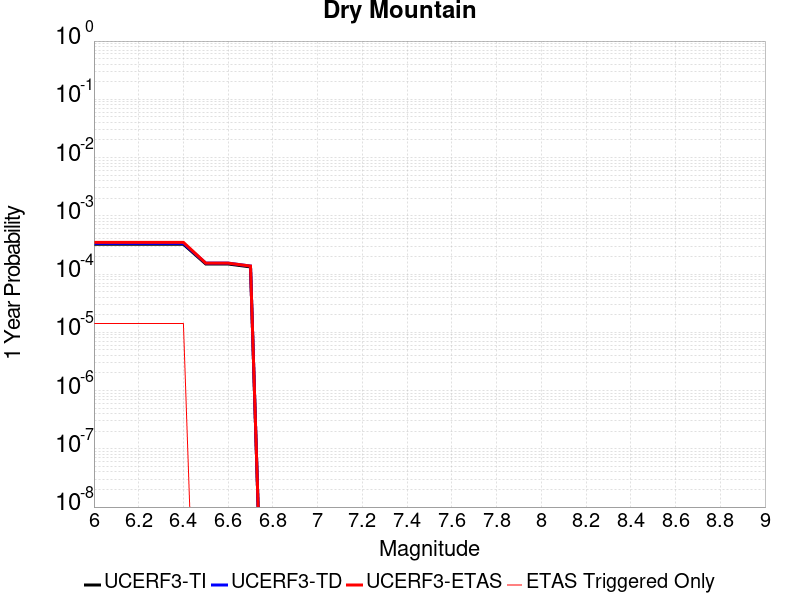 | 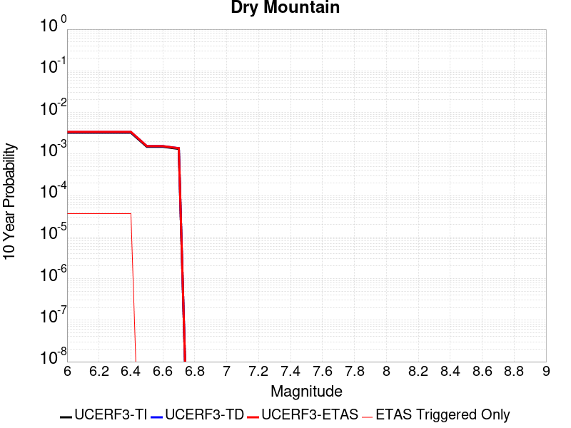 |

| Magnitude | 1 wk TI Prob | 1 wk TD Prob | 1 wk ETAS Prob | 1 wk ETAS/TD Gain | 1 wk ETAS Triggered Only | 1 mo TI Prob | 1 mo TD Prob | 1 mo ETAS Prob | 1 mo ETAS/TD Gain | 1 mo ETAS Triggered Only | 1 yr TI Prob | 1 yr TD Prob | 1 yr ETAS Prob | 1 yr ETAS/TD Gain | 1 yr ETAS Triggered Only | 10 yr TI Prob | 10 yr TD Prob | 10 yr ETAS Prob | 10 yr ETAS/TD Gain | 10 yr ETAS Triggered Only |
|-----|-----|-----|-----|-----|-----|-----|-----|-----|-----|-----|-----|-----|-----|-----|-----|-----|-----|-----|-----|-----|
| 6.0 | 6.222801E-6 | 6.439619E-6 | 6.439619E-6 | 1.0 | 0.0 | 2.6668875E-5 | 2.7598166E-5 | 2.7598166E-5 | 1.0 | 0.0 | 3.2464517E-4 | 3.3597177E-4 | 3.6892772E-4 | 1.0980915 | 3.2967033E-5 | 0.0032417132 | 0.0033562006 | 0.0034219134 | 1.0195795 | 6.5934066E-5 |
| 6.1 | 6.222801E-6 | 6.439619E-6 | 6.439619E-6 | 1.0 | 0.0 | 2.6668875E-5 | 2.7598166E-5 | 2.7598166E-5 | 1.0 | 0.0 | 3.2464517E-4 | 3.3597177E-4 | 3.6892772E-4 | 1.0980915 | 3.2967033E-5 | 0.0032417132 | 0.0033562006 | 0.0034219134 | 1.0195795 | 6.5934066E-5 |
| 6.2 | 6.222801E-6 | 6.439619E-6 | 6.439619E-6 | 1.0 | 0.0 | 2.6668875E-5 | 2.7598166E-5 | 2.7598166E-5 | 1.0 | 0.0 | 3.2464517E-4 | 3.3597177E-4 | 3.6892772E-4 | 1.0980915 | 3.2967033E-5 | 0.0032417132 | 0.0033562006 | 0.0034219134 | 1.0195795 | 6.5934066E-5 |
| 6.3 | 6.222801E-6 | 6.439619E-6 | 6.439619E-6 | 1.0 | 0.0 | 2.6668875E-5 | 2.7598166E-5 | 2.7598166E-5 | 1.0 | 0.0 | 3.2464517E-4 | 3.3597177E-4 | 3.6892772E-4 | 1.0980915 | 3.2967033E-5 | 0.0032417132 | 0.0033562006 | 0.0034219134 | 1.0195795 | 6.5934066E-5 |
| 6.4 | 6.222801E-6 | 6.439619E-6 | 6.439619E-6 | 1.0 | 0.0 | 2.6668875E-5 | 2.7598166E-5 | 2.7598166E-5 | 1.0 | 0.0 | 3.2464517E-4 | 3.3597177E-4 | 3.6892772E-4 | 1.0980915 | 3.2967033E-5 | 0.0032417132 | 0.0033562006 | 0.0034219134 | 1.0195795 | 6.5934066E-5 |
| 6.5 | 2.8528623E-6 | 2.9522773E-6 | 2.9522773E-6 | 1.0 | 0.0 | 1.22264955E-5 | 1.2652606E-5 | 1.2652606E-5 | 1.0 | 0.0 | 1.4884741E-4 | 1.5404329E-4 | 1.650306E-4 | 1.0713261 | 1.0989011E-5 | 0.0014874774 | 0.0015402185 | 0.0015731348 | 1.0213711 | 3.2967033E-5 |
| 6.6 | 2.8528623E-6 | 2.9522773E-6 | 2.9522773E-6 | 1.0 | 0.0 | 1.22264955E-5 | 1.2652606E-5 | 1.2652606E-5 | 1.0 | 0.0 | 1.4884741E-4 | 1.5404329E-4 | 1.650306E-4 | 1.0713261 | 1.0989011E-5 | 0.0014874774 | 0.0015402185 | 0.0015731348 | 1.0213711 | 3.2967033E-5 |
| 6.7 | 2.541E-6 | 2.629455E-6 | 2.629455E-6 | 1.0 | 0.0 | 1.0889954E-5 | 1.1269092E-5 | 1.1269092E-5 | 1.0 | 0.0 | 1.3257713E-4 | 1.372012E-4 | 1.372012E-4 | 1.0 | 0.0 | 0.0013249806 | 0.001372012 | 0.0013939599 | 1.0159968 | 2.1978021E-5 |

## Camp Rock 2011
*[(top)](#table-of-contents)*

| 1 Week | 1 Month | 1 Year | 10 Year |
|-----|-----|-----|-----|
| 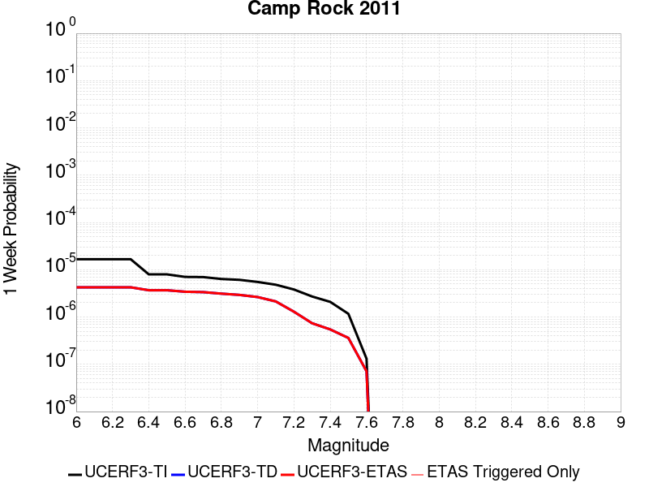 | 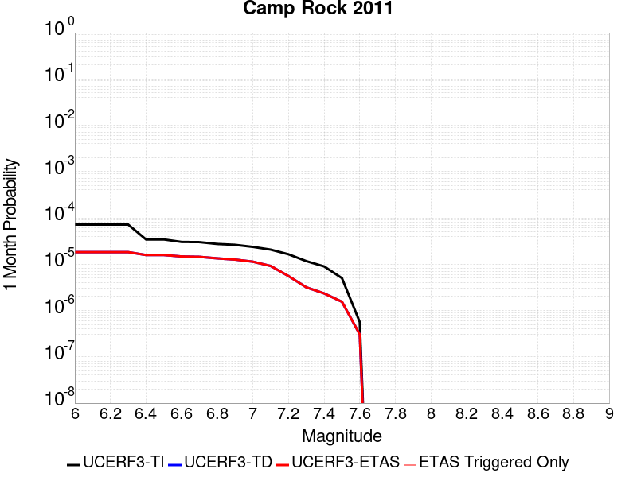 | 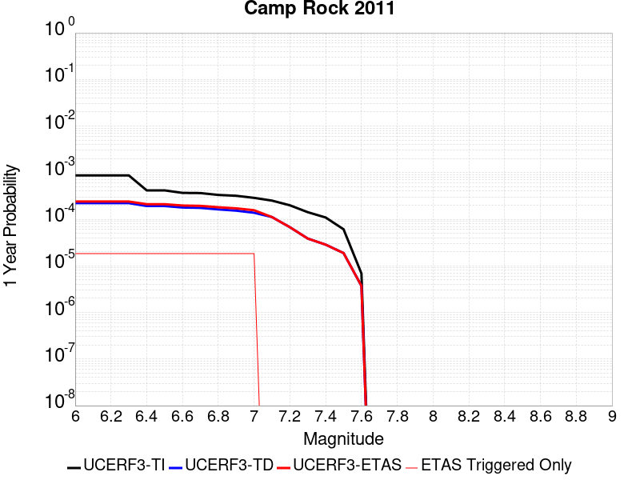 | 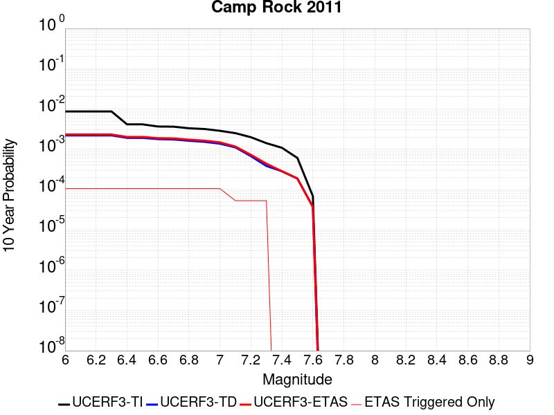 |

| Magnitude | 1 wk TI Prob | 1 wk TD Prob | 1 wk ETAS Prob | 1 wk ETAS/TD Gain | 1 wk ETAS Triggered Only | 1 mo TI Prob | 1 mo TD Prob | 1 mo ETAS Prob | 1 mo ETAS/TD Gain | 1 mo ETAS Triggered Only | 1 yr TI Prob | 1 yr TD Prob | 1 yr ETAS Prob | 1 yr ETAS/TD Gain | 1 yr ETAS Triggered Only | 10 yr TI Prob | 10 yr TD Prob | 10 yr ETAS Prob | 10 yr ETAS/TD Gain | 10 yr ETAS Triggered Only |
|-----|-----|-----|-----|-----|-----|-----|-----|-----|-----|-----|-----|-----|-----|-----|-----|-----|-----|-----|-----|-----|
| 6.0 | 1.6710783E-5 | 4.250666E-6 | 4.250666E-6 | 1.0 | 0.0 | 7.161568E-5 | 1.8217015E-5 | 1.8217015E-5 | 1.0 | 0.0 | 8.7157206E-4 | 2.2177011E-4 | 2.3275669E-4 | 1.0495404 | 1.0989011E-5 | 0.008681616 | 0.002215541 | 0.002281329 | 1.0296938 | 6.5934066E-5 |
| 6.1 | 1.6710783E-5 | 4.250666E-6 | 4.250666E-6 | 1.0 | 0.0 | 7.161568E-5 | 1.8217015E-5 | 1.8217015E-5 | 1.0 | 0.0 | 8.7157206E-4 | 2.2177011E-4 | 2.3275669E-4 | 1.0495404 | 1.0989011E-5 | 0.008681616 | 0.002215541 | 0.002281329 | 1.0296938 | 6.5934066E-5 |
| 6.2 | 1.6710783E-5 | 4.250666E-6 | 4.250666E-6 | 1.0 | 0.0 | 7.161568E-5 | 1.8217015E-5 | 1.8217015E-5 | 1.0 | 0.0 | 8.7157206E-4 | 2.2177011E-4 | 2.3275669E-4 | 1.0495404 | 1.0989011E-5 | 0.008681616 | 0.002215541 | 0.002281329 | 1.0296938 | 6.5934066E-5 |
| 6.3 | 1.6710783E-5 | 4.250666E-6 | 4.250666E-6 | 1.0 | 0.0 | 7.161568E-5 | 1.8217015E-5 | 1.8217015E-5 | 1.0 | 0.0 | 8.7157206E-4 | 2.2177011E-4 | 2.3275669E-4 | 1.0495404 | 1.0989011E-5 | 0.008681616 | 0.002215541 | 0.002281329 | 1.0296938 | 6.5934066E-5 |
| 6.4 | 7.982846E-6 | 3.6824456E-6 | 3.6824456E-6 | 1.0 | 0.0 | 3.421175E-5 | 1.5781816E-5 | 1.5781816E-5 | 1.0 | 0.0 | 4.1644843E-4 | 1.9212702E-4 | 2.0311392E-4 | 1.0571856 | 1.0989011E-5 | 0.0041566887 | 0.0019196441 | 0.0019744837 | 1.0285676 | 5.4945056E-5 |
| 6.5 | 7.982846E-6 | 3.6824456E-6 | 3.6824456E-6 | 1.0 | 0.0 | 3.421175E-5 | 1.5781816E-5 | 1.5781816E-5 | 1.0 | 0.0 | 4.1644843E-4 | 1.9212702E-4 | 2.0311392E-4 | 1.0571856 | 1.0989011E-5 | 0.0041566887 | 0.0019196441 | 0.0019744837 | 1.0285676 | 5.4945056E-5 |
| 6.6 | 7.048869E-6 | 3.4246991E-6 | 3.4246991E-6 | 1.0 | 0.0 | 3.0209088E-5 | 1.4677201E-5 | 1.4677201E-5 | 1.0 | 0.0 | 3.677336E-4 | 1.7868058E-4 | 1.8966763E-4 | 1.0614898 | 1.0989011E-5 | 0.0036712566 | 0.0017854008 | 0.0018402478 | 1.0307196 | 5.4945056E-5 |
| 6.7 | 6.987307E-6 | 3.3626727E-6 | 3.3626727E-6 | 1.0 | 0.0 | 2.9945259E-5 | 1.44113765E-5 | 1.44113765E-5 | 1.0 | 0.0 | 3.6452254E-4 | 1.754447E-4 | 1.8643177E-4 | 1.0626242 | 1.0989011E-5 | 0.0036392517 | 0.001753093 | 0.0018079417 | 1.0312868 | 5.4945056E-5 |
| 6.8 | 6.3737602E-6 | 3.1182262E-6 | 3.1182262E-6 | 1.0 | 0.0 | 2.731583E-5 | 1.33637595E-5 | 1.33637595E-5 | 1.0 | 0.0 | 3.3251947E-4 | 1.6269191E-4 | 1.7367913E-4 | 1.067534 | 1.0989011E-5 | 0.0033202237 | 0.0016257567 | 0.0016696412 | 1.0269933 | 4.3956043E-5 |
| 6.9 | 6.112211E-6 | 2.933421E-6 | 2.933421E-6 | 1.0 | 0.0 | 2.6194928E-5 | 1.2571745E-5 | 1.2571745E-5 | 1.0 | 0.0 | 3.1887658E-4 | 1.5305053E-4 | 1.6403786E-4 | 1.0717889 | 1.0989011E-5 | 0.003184194 | 0.001529479 | 0.0015623956 | 1.0215214 | 3.2967033E-5 |
| 7.0 | 5.5140117E-6 | 2.6421922E-6 | 2.6421922E-6 | 1.0 | 0.0 | 2.3631264E-5 | 1.1323633E-5 | 1.1323633E-5 | 1.0 | 0.0 | 2.8767265E-4 | 1.3785677E-4 | 1.4884426E-4 | 1.0797023 | 1.0989011E-5 | 0.0028730053 | 0.0013777377 | 0.0014106594 | 1.0238954 | 3.2967033E-5 |
| 7.1 | 4.8151105E-6 | 2.134497E-6 | 2.134497E-6 | 1.0 | 0.0 | 2.0636026E-5 | 9.147813E-6 | 9.147813E-6 | 1.0 | 0.0 | 2.5121463E-4 | 1.1136916E-4 | 1.1136916E-4 | 1.0 | 0.0 | 0.0025093083 | 0.0011131554 | 0.0011241322 | 1.009861 | 1.0989011E-5 |
| 7.2 | 3.818335E-6 | 1.29391E-6 | 1.29391E-6 | 1.0 | 0.0 | 1.6364189E-5 | 5.5453174E-6 | 5.5453174E-6 | 1.0 | 0.0 | 1.9921579E-4 | 6.7512236E-5 | 6.7512236E-5 | 1.0 | 0.0 | 0.0019903728 | 6.7492545E-4 | 6.85907E-4 | 1.0162709 | 1.0989011E-5 |
| 7.3 | 2.7166698E-6 | 7.384855E-7 | 7.384855E-7 | 1.0 | 0.0 | 1.1642818E-5 | 3.1649342E-6 | 3.1649342E-6 | 1.0 | 0.0 | 1.4174209E-4 | 3.8532413E-5 | 3.8532413E-5 | 1.0 | 0.0 | 0.0014165172 | 3.852593E-4 | 3.9624408E-4 | 1.0285127 | 1.0989011E-5 |
| 7.4 | 2.0893426E-6 | 5.462842E-7 | 5.462842E-7 | 1.0 | 0.0 | 8.954295E-6 | 2.341216E-6 | 2.341216E-6 | 1.0 | 0.0 | 1.0901308E-4 | 2.8503937E-5 | 2.8503937E-5 | 1.0 | 0.0 | 0.0010895962 | 2.8500336E-4 | 2.8500336E-4 | 1.0 | 0.0 |
| 7.5 | 1.1681728E-6 | 3.60362E-7 | 3.60362E-7 | 1.0 | 0.0 | 5.0064455E-6 | 1.5444077E-6 | 1.5444077E-6 | 1.0 | 0.0 | 6.0951766E-5 | 1.8803006E-5 | 1.8803006E-5 | 1.0 | 0.0 | 6.093505E-4 | 1.8801463E-4 | 1.8801463E-4 | 1.0 | 0.0 |
| 7.6 | 1.3154387E-7 | 7.120442E-8 | 7.120442E-8 | 1.0 | 0.0 | 5.6375933E-7 | 3.0516176E-7 | 3.0516176E-7 | 1.0 | 0.0 | 6.863748E-6 | 3.7153397E-6 | 3.7153397E-6 | 1.0 | 0.0 | 6.863536E-5 | 3.7152935E-5 | 3.7152935E-5 | 1.0 | 0.0 |

## San Jacinto (San Jacinto Valley) rev
*[(top)](#table-of-contents)*

| 1 Week | 1 Month | 1 Year | 10 Year |
|-----|-----|-----|-----|
| 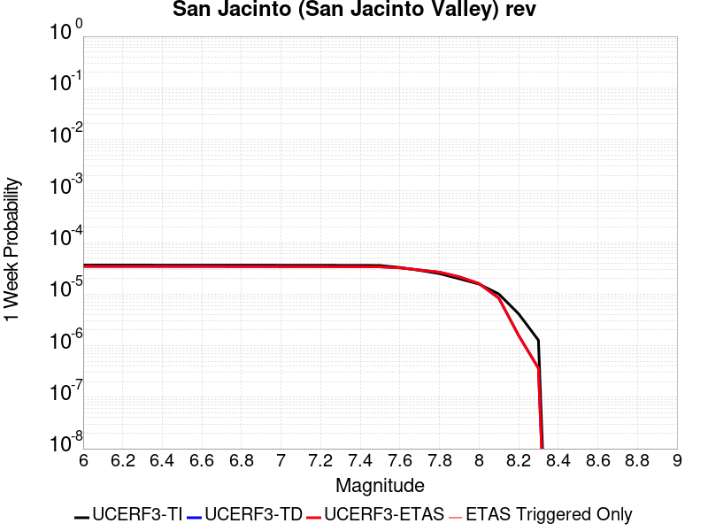 | 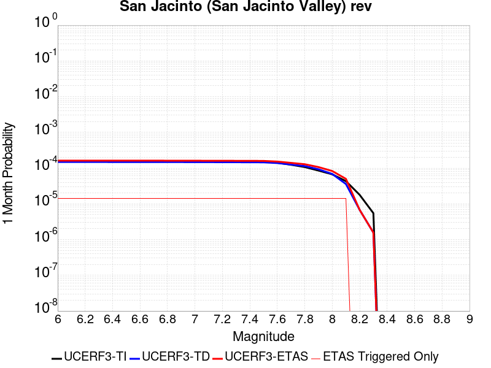 | 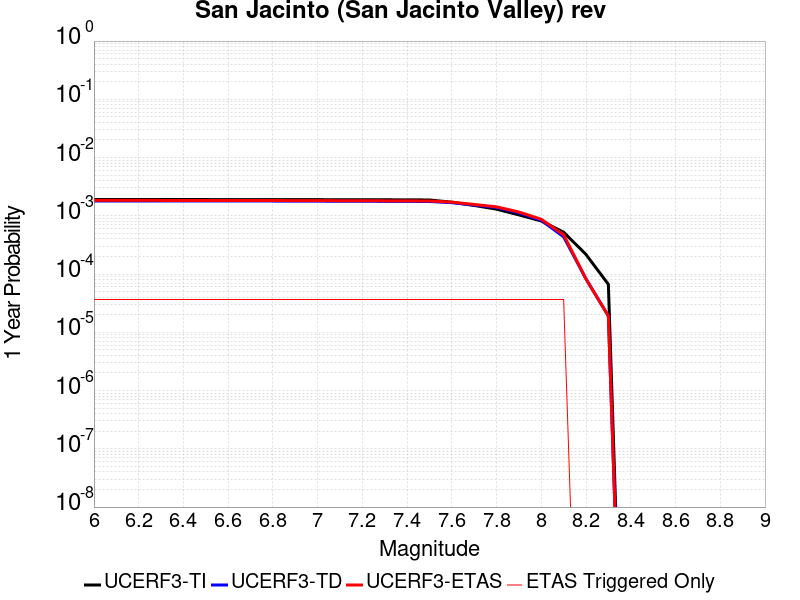 | 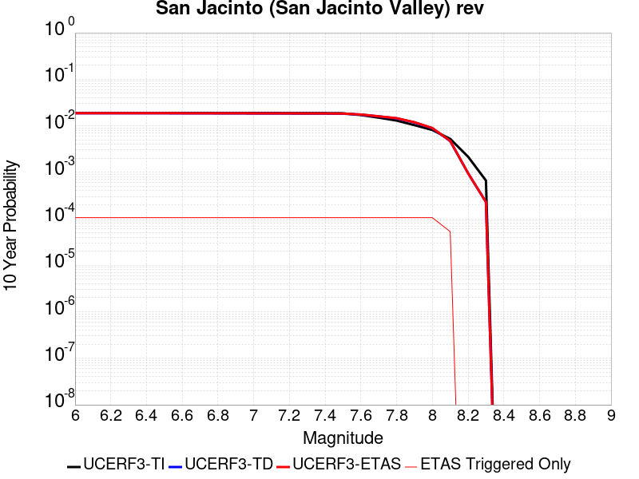 |

| Magnitude | 1 wk TI Prob | 1 wk TD Prob | 1 wk ETAS Prob | 1 wk ETAS/TD Gain | 1 wk ETAS Triggered Only | 1 mo TI Prob | 1 mo TD Prob | 1 mo ETAS Prob | 1 mo ETAS/TD Gain | 1 mo ETAS Triggered Only | 1 yr TI Prob | 1 yr TD Prob | 1 yr ETAS Prob | 1 yr ETAS/TD Gain | 1 yr ETAS Triggered Only | 10 yr TI Prob | 10 yr TD Prob | 10 yr ETAS Prob | 10 yr ETAS/TD Gain | 10 yr ETAS Triggered Only |
|-----|-----|-----|-----|-----|-----|-----|-----|-----|-----|-----|-----|-----|-----|-----|-----|-----|-----|-----|-----|-----|
| 6.0 | 3.652694E-5 | 3.452745E-5 | 3.452745E-5 | 1.0 | 0.0 | 1.5653463E-4 | 1.4796639E-4 | 1.5895379E-4 | 1.074256 | 1.0989011E-5 | 0.0019041431 | 0.0018000039 | 0.0018329116 | 1.018282 | 3.2967033E-5 | 0.018879099 | 0.018591218 | 0.018655926 | 1.0034806 | 6.5934066E-5 |
| 6.1 | 3.652694E-5 | 3.452745E-5 | 3.452745E-5 | 1.0 | 0.0 | 1.5653463E-4 | 1.4796639E-4 | 1.5895379E-4 | 1.074256 | 1.0989011E-5 | 0.0019041431 | 0.0018000039 | 0.0018329116 | 1.018282 | 3.2967033E-5 | 0.018879099 | 0.018591218 | 0.018655926 | 1.0034806 | 6.5934066E-5 |
| 6.2 | 3.652694E-5 | 3.452745E-5 | 3.452745E-5 | 1.0 | 0.0 | 1.5653463E-4 | 1.4796639E-4 | 1.5895379E-4 | 1.074256 | 1.0989011E-5 | 0.0019041431 | 0.0018000039 | 0.0018329116 | 1.018282 | 3.2967033E-5 | 0.018879099 | 0.018591218 | 0.018655926 | 1.0034806 | 6.5934066E-5 |
| 6.3 | 3.652694E-5 | 3.452745E-5 | 3.452745E-5 | 1.0 | 0.0 | 1.5653463E-4 | 1.4796639E-4 | 1.5895379E-4 | 1.074256 | 1.0989011E-5 | 0.0019041431 | 0.0018000039 | 0.0018329116 | 1.018282 | 3.2967033E-5 | 0.018879099 | 0.018591218 | 0.018655926 | 1.0034806 | 6.5934066E-5 |
| 6.4 | 3.646941E-5 | 3.4448993E-5 | 3.4448993E-5 | 1.0 | 0.0 | 1.5628811E-4 | 1.4763021E-4 | 1.586176E-4 | 1.0744251 | 1.0989011E-5 | 0.0019011468 | 0.0017959181 | 0.0018288259 | 1.0183237 | 3.2967033E-5 | 0.018849645 | 0.018551087 | 0.018615799 | 1.0034883 | 6.5934066E-5 |
| 6.5 | 3.646941E-5 | 3.4448993E-5 | 3.4448993E-5 | 1.0 | 0.0 | 1.5628811E-4 | 1.4763021E-4 | 1.586176E-4 | 1.0744251 | 1.0989011E-5 | 0.0019011468 | 0.0017959181 | 0.0018288259 | 1.0183237 | 3.2967033E-5 | 0.018849645 | 0.018551087 | 0.018615799 | 1.0034883 | 6.5934066E-5 |
| 6.6 | 3.6442503E-5 | 3.4412365E-5 | 3.4412365E-5 | 1.0 | 0.0 | 1.561728E-4 | 1.4747324E-4 | 1.5846064E-4 | 1.0745043 | 1.0989011E-5 | 0.0018997455 | 0.0017940103 | 0.0018269182 | 1.0183432 | 3.2967033E-5 | 0.018835869 | 0.018532353 | 0.018597065 | 1.0034919 | 6.5934066E-5 |
| 6.7 | 3.6432113E-5 | 3.439793E-5 | 3.439793E-5 | 1.0 | 0.0 | 1.5612828E-4 | 1.474114E-4 | 1.5839878E-4 | 1.0745356 | 1.0989011E-5 | 0.0018992044 | 0.0017932588 | 0.0018261668 | 1.018351 | 3.2967033E-5 | 0.018830549 | 0.018524973 | 0.018589687 | 1.0034933 | 6.5934066E-5 |
| 6.8 | 3.6409598E-5 | 3.4366974E-5 | 3.4366974E-5 | 1.0 | 0.0 | 1.560318E-4 | 1.4727873E-4 | 1.5826612E-4 | 1.0746027 | 1.0989011E-5 | 0.0018980318 | 0.0017916465 | 0.0018245544 | 1.0183674 | 3.2967033E-5 | 0.018819023 | 0.018509122 | 0.018573835 | 1.0034963 | 6.5934066E-5 |
| 6.9 | 3.638078E-5 | 3.4327382E-5 | 3.4327382E-5 | 1.0 | 0.0 | 1.5590832E-4 | 1.4710908E-4 | 1.5809647E-4 | 1.0746888 | 1.0989011E-5 | 0.0018965311 | 0.0017895843 | 0.0018224923 | 1.0183886 | 3.2967033E-5 | 0.018804269 | 0.01848885 | 0.018553564 | 1.0035002 | 6.5934066E-5 |
| 7.0 | 3.6294874E-5 | 3.420936E-5 | 3.420936E-5 | 1.0 | 0.0 | 1.5554018E-4 | 1.4660333E-4 | 1.5759072E-4 | 1.0749464 | 1.0989011E-5 | 0.0018920569 | 0.0017834369 | 0.001816345 | 1.0184522 | 3.2967033E-5 | 0.018760284 | 0.018428413 | 0.01849313 | 1.0035119 | 6.5934066E-5 |
| 7.1 | 3.6260717E-5 | 3.416563E-5 | 3.416563E-5 | 1.0 | 0.0 | 1.5539382E-4 | 1.4641593E-4 | 1.5740332E-4 | 1.0750424 | 1.0989011E-5 | 0.001890278 | 0.0017811591 | 0.0018140674 | 1.0184758 | 3.2967033E-5 | 0.018742796 | 0.018406007 | 0.018470729 | 1.0035163 | 6.5934066E-5 |
| 7.2 | 3.6210204E-5 | 3.4099747E-5 | 3.4099747E-5 | 1.0 | 0.0 | 1.5517735E-4 | 1.461336E-4 | 1.5712102E-4 | 1.0751874 | 1.0989011E-5 | 0.001887647 | 0.0017777274 | 0.0018106358 | 1.0185115 | 3.2967033E-5 | 0.01871693 | 0.018372238 | 0.01843696 | 1.0035229 | 6.5934066E-5 |
| 7.3 | 3.6119454E-5 | 3.3987813E-5 | 3.3987813E-5 | 1.0 | 0.0 | 1.5478847E-4 | 1.4565395E-4 | 1.5664136E-4 | 1.075435 | 1.0989011E-5 | 0.0018829206 | 0.001771897 | 0.0018048056 | 1.0185726 | 3.2967033E-5 | 0.018670462 | 0.01831468 | 0.018379407 | 1.0035341 | 6.5934066E-5 |
| 7.4 | 3.607848E-5 | 3.393525E-5 | 3.393525E-5 | 1.0 | 0.0 | 1.5461289E-4 | 1.454287E-4 | 1.564161E-4 | 1.0755519 | 1.0989011E-5 | 0.0018807866 | 0.001769159 | 0.0018020677 | 1.0186013 | 3.2967033E-5 | 0.018649481 | 0.018287646 | 0.018352373 | 1.0035394 | 6.5934066E-5 |
| 7.5 | 3.5856774E-5 | 3.3744E-5 | 3.3744E-5 | 1.0 | 0.0 | 1.5366284E-4 | 1.4460915E-4 | 1.5559657E-4 | 1.0759802 | 1.0989011E-5 | 0.0018692396 | 0.0017591972 | 0.0017921063 | 1.0187068 | 3.2967033E-5 | 0.018535944 | 0.018188216 | 0.01825295 | 1.0035591 | 6.5934066E-5 |
| 7.6 | 3.286655E-5 | 3.2259064E-5 | 3.2259064E-5 | 1.0 | 0.0 | 1.4084904E-4 | 1.3824581E-4 | 1.492333E-4 | 1.0794779 | 1.0989011E-5 | 0.001713488 | 0.0016818454 | 0.001714757 | 1.0195687 | 3.2967033E-5 | 0.017003361 | 0.017403768 | 0.017468555 | 1.0037225 | 6.5934066E-5 |
| 7.7 | 2.8882527E-5 | 2.9349278E-5 | 2.9349278E-5 | 1.0 | 0.0 | 1.237764E-4 | 1.2577657E-4 | 1.367642E-4 | 1.0873584 | 1.0989011E-5 | 0.0015059357 | 0.0015302551 | 0.0015631716 | 1.0215105 | 3.2967033E-5 | 0.014957713 | 0.01588893 | 0.015953816 | 1.0040838 | 6.5934066E-5 |
| 7.8 | 2.4950225E-5 | 2.6635882E-5 | 2.6635882E-5 | 1.0 | 0.0 | 1.0692515E-4 | 1.1414879E-4 | 1.2513655E-4 | 1.0962582 | 1.0989011E-5 | 0.0013010362 | 0.0013888765 | 0.0014217977 | 1.0237035 | 3.2967033E-5 | 0.012934455 | 0.014468086 | 0.014533066 | 1.0044913 | 6.5934066E-5 |
| 7.9 | 1.9881603E-5 | 2.1605314E-5 | 2.1605314E-5 | 1.0 | 0.0 | 8.520408E-5 | 9.259092E-5 | 1.0357891E-4 | 1.1186725 | 1.0989011E-5 | 0.001036866 | 0.0011267122 | 0.0011596421 | 1.0292265 | 3.2967033E-5 | 0.010320415 | 0.011827964 | 0.011893119 | 1.0055085 | 6.5934066E-5 |
| 8.0 | 1.563292E-5 | 1.6016422E-5 | 1.6016422E-5 | 1.0 | 0.0 | 6.6996516E-5 | 6.864E-5 | 7.962826E-5 | 1.1600853 | 1.0989011E-5 | 8.153773E-4 | 8.353723E-4 | 8.5733196E-4 | 1.0262873 | 2.1978021E-5 | 0.00812392 | 0.008852122 | 0.0089065805 | 1.006152 | 5.4945056E-5 |
| 8.1 | 1.0045313E-5 | 8.348415E-6 | 8.348415E-6 | 1.0 | 0.0 | 4.305063E-5 | 3.5778434E-5 | 4.676705E-5 | 1.3071296 | 1.0989011E-5 | 5.2401534E-4 | 4.355159E-4 | 4.5748433E-4 | 1.0504423 | 2.1978021E-5 | 0.0052278144 | 0.0046841633 | 0.004706038 | 1.00467 | 2.1978021E-5 |
| 8.2 | 4.1554413E-6 | 1.5788169E-6 | 1.5788169E-6 | 1.0 | 0.0 | 1.7808914E-5 | 6.7663404E-6 | 6.7663404E-6 | 1.0 | 0.0 | 2.1680194E-4 | 8.237711E-5 | 8.237711E-5 | 1.0 | 0.0 | 0.0021659054 | 9.5586455E-4 | 9.5586455E-4 | 1.0 | 0.0 |
| 8.3 | 1.2758221E-6 | 3.6510448E-7 | 3.6510448E-7 | 1.0 | 0.0 | 5.4677976E-6 | 1.5647327E-6 | 1.5647327E-6 | 1.0 | 0.0 | 6.65684E-5 | 1.9050458E-5 | 1.9050458E-5 | 1.0 | 0.0 | 6.6548464E-4 | 2.296306E-4 | 2.296306E-4 | 1.0 | 0.0 |

## Pisgah-Bullion Mtn-Mesquite Lk
*[(top)](#table-of-contents)*

| 1 Week | 1 Month | 1 Year | 10 Year |
|-----|-----|-----|-----|
| 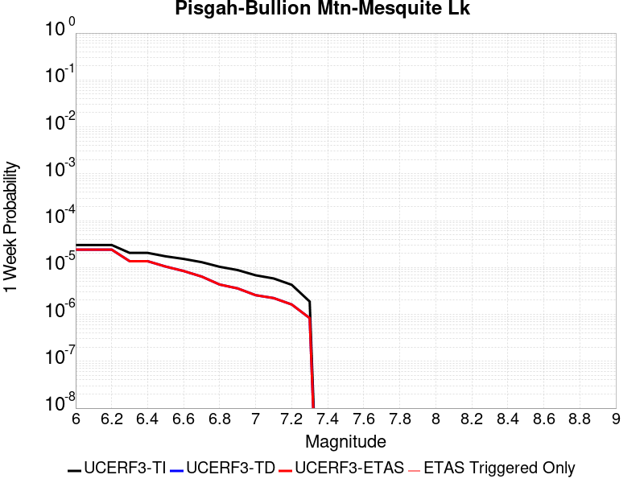 | 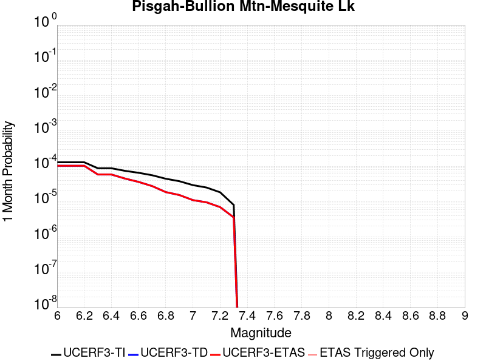 | 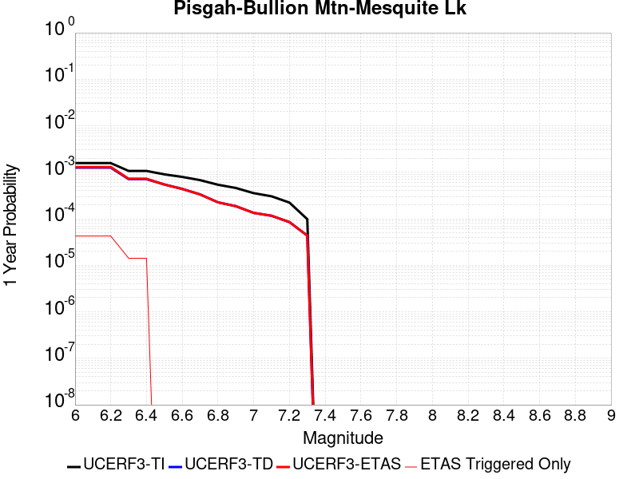 | 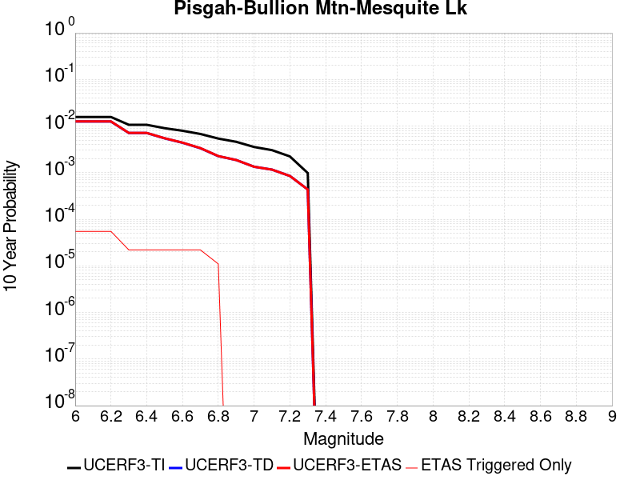 |

| Magnitude | 1 wk TI Prob | 1 wk TD Prob | 1 wk ETAS Prob | 1 wk ETAS/TD Gain | 1 wk ETAS Triggered Only | 1 mo TI Prob | 1 mo TD Prob | 1 mo ETAS Prob | 1 mo ETAS/TD Gain | 1 mo ETAS Triggered Only | 1 yr TI Prob | 1 yr TD Prob | 1 yr ETAS Prob | 1 yr ETAS/TD Gain | 1 yr ETAS Triggered Only | 10 yr TI Prob | 10 yr TD Prob | 10 yr ETAS Prob | 10 yr ETAS/TD Gain | 10 yr ETAS Triggered Only |
|-----|-----|-----|-----|-----|-----|-----|-----|-----|-----|-----|-----|-----|-----|-----|-----|-----|-----|-----|-----|-----|
| 6.0 | 3.0240792E-5 | 2.4094168E-5 | 2.4094168E-5 | 1.0 | 0.0 | 1.2959696E-4 | 1.032572E-4 | 1.032572E-4 | 1.0 | 0.0 | 0.0015767008 | 0.0012565318 | 0.0012894574 | 1.0262035 | 3.2967033E-5 | 0.015655609 | 0.012504297 | 0.012558555 | 1.0043391 | 5.4945056E-5 |
| 6.1 | 3.0240792E-5 | 2.4094168E-5 | 2.4094168E-5 | 1.0 | 0.0 | 1.2959696E-4 | 1.032572E-4 | 1.032572E-4 | 1.0 | 0.0 | 0.0015767008 | 0.0012565318 | 0.0012894574 | 1.0262035 | 3.2967033E-5 | 0.015655609 | 0.012504297 | 0.012558555 | 1.0043391 | 5.4945056E-5 |
| 6.2 | 3.0240792E-5 | 2.4094168E-5 | 2.4094168E-5 | 1.0 | 0.0 | 1.2959696E-4 | 1.032572E-4 | 1.032572E-4 | 1.0 | 0.0 | 0.0015767008 | 0.0012565318 | 0.0012894574 | 1.0262035 | 3.2967033E-5 | 0.015655609 | 0.012504297 | 0.012558555 | 1.0043391 | 5.4945056E-5 |
| 6.3 | 2.0498217E-5 | 1.3639548E-5 | 1.3639548E-5 | 1.0 | 0.0 | 8.784654E-5 | 5.845399E-5 | 5.845399E-5 | 1.0 | 0.0 | 0.0010690069 | 7.114611E-4 | 7.2244235E-4 | 1.0154347 | 1.0989011E-5 | 0.01063879 | 0.0070934608 | 0.007115283 | 1.0030763 | 2.1978021E-5 |
| 6.4 | 2.0498217E-5 | 1.3639548E-5 | 1.3639548E-5 | 1.0 | 0.0 | 8.784654E-5 | 5.845399E-5 | 5.845399E-5 | 1.0 | 0.0 | 0.0010690069 | 7.114611E-4 | 7.2244235E-4 | 1.0154347 | 1.0989011E-5 | 0.01063879 | 0.0070934608 | 0.007115283 | 1.0030763 | 2.1978021E-5 |
| 6.5 | 1.7316182E-5 | 1.0478121E-5 | 1.0478121E-5 | 1.0 | 0.0 | 7.42101E-5 | 4.490552E-5 | 4.490552E-5 | 1.0 | 0.0 | 9.0313336E-4 | 5.465975E-4 | 5.465975E-4 | 1.0 | 0.0 | 0.008994718 | 0.005453527 | 0.005475385 | 1.004008 | 2.1978021E-5 |
| 6.6 | 1.5251077E-5 | 8.415111E-6 | 8.415111E-6 | 1.0 | 0.0 | 6.536012E-5 | 3.6064303E-5 | 3.6064303E-5 | 1.0 | 0.0 | 7.9546886E-4 | 4.3900165E-4 | 4.3900165E-4 | 1.0 | 0.0 | 0.007926274 | 0.004382062 | 0.0044039437 | 1.0049934 | 2.1978021E-5 |
| 6.7 | 1.2997425E-5 | 6.4121105E-6 | 6.4121105E-6 | 1.0 | 0.0 | 5.570206E-5 | 2.748021E-5 | 2.748021E-5 | 1.0 | 0.0 | 6.7796157E-4 | 3.3452484E-4 | 3.3452484E-4 | 1.0 | 0.0 | 0.0067589693 | 0.003340673 | 0.0033625776 | 1.006557 | 2.1978021E-5 |
| 6.8 | 1.035386E-5 | 4.3337277E-6 | 4.3337277E-6 | 1.0 | 0.0 | 4.437293E-5 | 1.8572991E-5 | 1.8572991E-5 | 1.0 | 0.0 | 5.401065E-4 | 2.2610357E-4 | 2.2610357E-4 | 1.0 | 0.0 | 0.0053879567 | 0.002258822 | 0.0022697863 | 1.004854 | 1.0989011E-5 |
| 6.9 | 8.816252E-6 | 3.5810722E-6 | 3.5810722E-6 | 1.0 | 0.0 | 3.778339E-5 | 1.5347365E-5 | 1.5347365E-5 | 1.0 | 0.0 | 4.5991567E-4 | 1.8683873E-4 | 1.8683873E-4 | 1.0 | 0.0 | 0.00458965 | 0.001866875 | 0.001866875 | 1.0 | 0.0 |
| 7.0 | 6.8232207E-6 | 2.567915E-6 | 2.567915E-6 | 1.0 | 0.0 | 2.9242048E-5 | 1.1005306E-5 | 1.1005306E-5 | 1.0 | 0.0 | 3.5596377E-4 | 1.3398168E-4 | 1.3398168E-4 | 1.0 | 0.0 | 0.0035539411 | 0.0013390401 | 0.0013390401 | 1.0 | 0.0 |
| 7.1 | 5.837013E-6 | 2.227665E-6 | 2.227665E-6 | 1.0 | 0.0 | 2.501553E-5 | 9.547102E-6 | 9.547102E-6 | 1.0 | 0.0 | 3.045215E-4 | 1.1623006E-4 | 1.1623006E-4 | 1.0 | 0.0 | 0.0030410455 | 0.0011617218 | 0.0011617218 | 1.0 | 0.0 |
| 7.2 | 4.278052E-6 | 1.6277744E-6 | 1.6277744E-6 | 1.0 | 0.0 | 1.833438E-5 | 6.9761586E-6 | 6.9761586E-6 | 1.0 | 0.0 | 2.231982E-4 | 8.493166E-5 | 8.493166E-5 | 1.0 | 0.0 | 0.0022297418 | 8.490152E-4 | 8.490152E-4 | 1.0 | 0.0 |
| 7.3 | 1.8803692E-6 | 8.345828E-7 | 8.345828E-7 | 1.0 | 0.0 | 8.0587E-6 | 3.5767794E-6 | 3.5767794E-6 | 1.0 | 0.0 | 9.811026E-5 | 4.3546566E-5 | 4.3546566E-5 | 1.0 | 0.0 | 9.806695E-4 | 4.353948E-4 | 4.353948E-4 | 1.0 | 0.0 |

## Ortigalita (North)
*[(top)](#table-of-contents)*

| 1 Week | 1 Month | 1 Year | 10 Year |
|-----|-----|-----|-----|
| 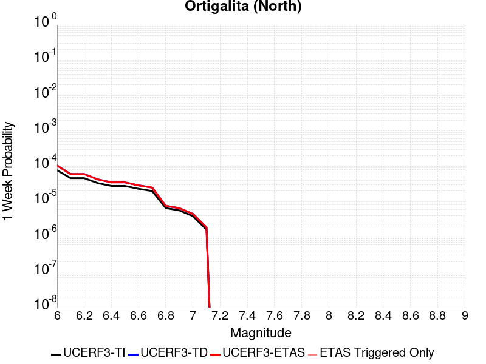 | 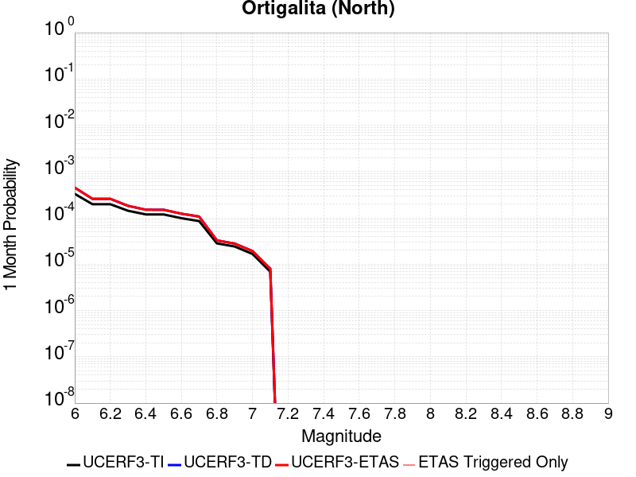 | 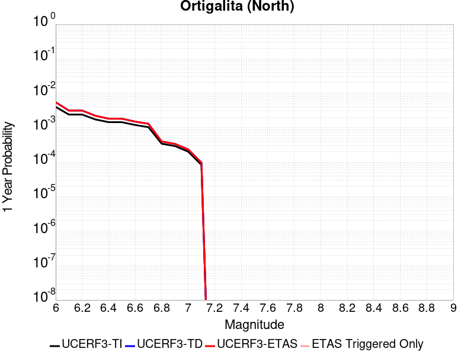 | 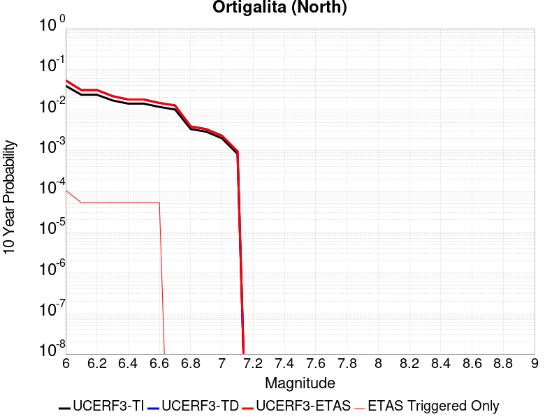 |

| Magnitude | 1 wk TI Prob | 1 wk TD Prob | 1 wk ETAS Prob | 1 wk ETAS/TD Gain | 1 wk ETAS Triggered Only | 1 mo TI Prob | 1 mo TD Prob | 1 mo ETAS Prob | 1 mo ETAS/TD Gain | 1 mo ETAS Triggered Only | 1 yr TI Prob | 1 yr TD Prob | 1 yr ETAS Prob | 1 yr ETAS/TD Gain | 1 yr ETAS Triggered Only | 10 yr TI Prob | 10 yr TD Prob | 10 yr ETAS Prob | 10 yr ETAS/TD Gain | 10 yr ETAS Triggered Only |
|-----|-----|-----|-----|-----|-----|-----|-----|-----|-----|-----|-----|-----|-----|-----|-----|-----|-----|-----|-----|-----|
| 6.0 | 7.711876E-5 | 1.05107065E-4 | 1.05107065E-4 | 1.0 | 0.0 | 3.3046713E-4 | 4.5039196E-4 | 4.5039196E-4 | 1.0 | 0.0 | 0.004016016 | 0.0054697967 | 0.0054697967 | 1.0 | 0.0 | 0.039442103 | 0.05347275 | 0.053524755 | 1.0009726 | 5.4945056E-5 |
| 6.1 | 4.607858E-5 | 6.0259496E-5 | 6.0259496E-5 | 1.0 | 0.0 | 1.9746469E-4 | 2.582322E-4 | 2.582322E-4 | 1.0 | 0.0 | 0.0024014818 | 0.0031397445 | 0.0031397445 | 1.0 | 0.0 | 0.023756953 | 0.030984651 | 0.031016598 | 1.001031 | 3.2967033E-5 |
| 6.2 | 4.607858E-5 | 6.0259496E-5 | 6.0259496E-5 | 1.0 | 0.0 | 1.9746469E-4 | 2.582322E-4 | 2.582322E-4 | 1.0 | 0.0 | 0.0024014818 | 0.0031397445 | 0.0031397445 | 1.0 | 0.0 | 0.023756953 | 0.030984651 | 0.031016598 | 1.001031 | 3.2967033E-5 |
| 6.3 | 3.327423E-5 | 4.2487998E-5 | 4.2487998E-5 | 1.0 | 0.0 | 1.4259605E-4 | 1.8208046E-4 | 1.8208046E-4 | 1.0 | 0.0 | 0.0017347244 | 0.0022148585 | 0.0022148585 | 1.0 | 0.0 | 0.017212452 | 0.02195199 | 0.021973487 | 1.0009792 | 2.1978021E-5 |
| 6.4 | 2.7732503E-5 | 3.5008667E-5 | 3.5008667E-5 | 1.0 | 0.0 | 1.1884817E-4 | 1.5003003E-4 | 1.5003003E-4 | 1.0 | 0.0 | 0.001446016 | 0.0018253255 | 0.0018253255 | 1.0 | 0.0 | 0.014366428 | 0.018126285 | 0.018147865 | 1.0011905 | 2.1978021E-5 |
| 6.5 | 2.7689714E-5 | 3.4958473E-5 | 3.4958473E-5 | 1.0 | 0.0 | 1.186648E-4 | 1.4981494E-4 | 1.4981494E-4 | 1.0 | 0.0 | 0.0014437864 | 0.0018227111 | 0.0018227111 | 1.0 | 0.0 | 0.014344421 | 0.018100567 | 0.018122148 | 1.0011922 | 2.1978021E-5 |
| 6.6 | 2.2976905E-5 | 2.8726188E-5 | 2.8726188E-5 | 1.0 | 0.0 | 9.846873E-5 | 1.2310786E-4 | 1.2310786E-4 | 1.0 | 0.0 | 0.0011981975 | 0.0014980417 | 0.0014980417 | 1.0 | 0.0 | 0.011917574 | 0.014902728 | 0.014924379 | 1.0014528 | 2.1978021E-5 |
| 6.7 | 1.9871539E-5 | 2.4911353E-5 | 2.4911353E-5 | 1.0 | 0.0 | 8.516096E-5 | 1.0675997E-4 | 1.0675997E-4 | 1.0 | 0.0 | 0.0010363415 | 0.0012992765 | 0.0012992765 | 1.0 | 0.0 | 0.010315218 | 0.012940488 | 0.012951335 | 1.0008382 | 1.0989011E-5 |
| 6.8 | 6.5640475E-6 | 7.6067754E-6 | 7.6067754E-6 | 1.0 | 0.0 | 2.813133E-5 | 3.2600074E-5 | 3.2600074E-5 | 1.0 | 0.0 | 3.424451E-4 | 3.968365E-4 | 3.968365E-4 | 1.0 | 0.0 | 0.0034191788 | 0.003961566 | 0.0039725113 | 1.0027629 | 1.0989011E-5 |
| 6.9 | 5.6219683E-6 | 6.502919E-6 | 6.502919E-6 | 1.0 | 0.0 | 2.4093928E-5 | 2.786937E-5 | 2.786937E-5 | 1.0 | 0.0 | 2.933041E-4 | 3.3925934E-4 | 3.3925934E-4 | 1.0 | 0.0 | 0.0029291727 | 0.0033876712 | 0.003398623 | 1.0032328 | 1.0989011E-5 |
| 7.0 | 3.875591E-6 | 4.4855037E-6 | 4.4855037E-6 | 1.0 | 0.0 | 1.6609569E-5 | 1.9223458E-5 | 1.9223458E-5 | 1.0 | 0.0 | 2.0220275E-4 | 2.3402258E-4 | 2.3402258E-4 | 1.0 | 0.0 | 0.0020201886 | 0.0023379698 | 0.0023489331 | 1.0046892 | 1.0989011E-5 |
| 7.1 | 1.6017933E-6 | 1.8573562E-6 | 1.8573562E-6 | 1.0 | 0.0 | 6.8648105E-6 | 7.9600795E-6 | 7.9600795E-6 | 1.0 | 0.0 | 8.357586E-5 | 9.691073E-5 | 9.691073E-5 | 1.0 | 0.0 | 8.3544437E-4 | 9.687894E-4 | 9.797678E-4 | 1.011332 | 1.0989011E-5 |

## Brawley (Seismic Zone) alt 1
*[(top)](#table-of-contents)*

| 1 Week | 1 Month | 1 Year | 10 Year |
|-----|-----|-----|-----|
| 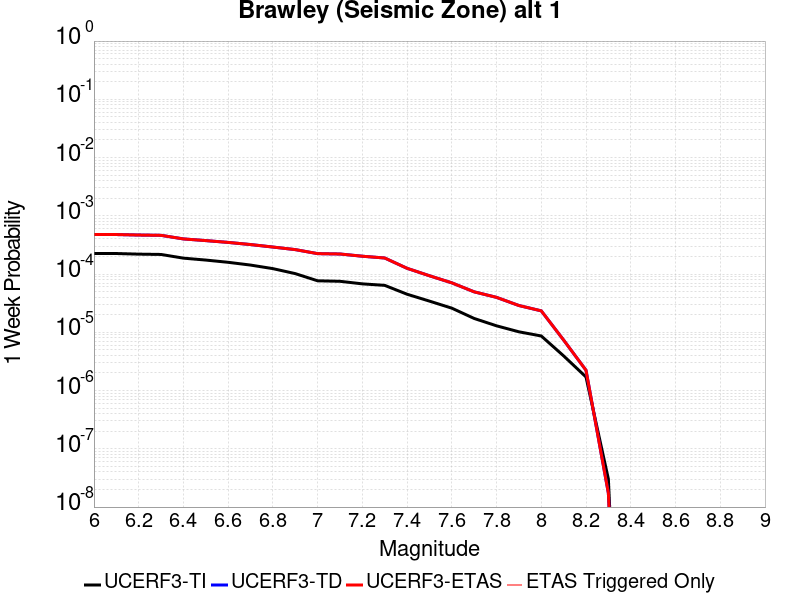 | 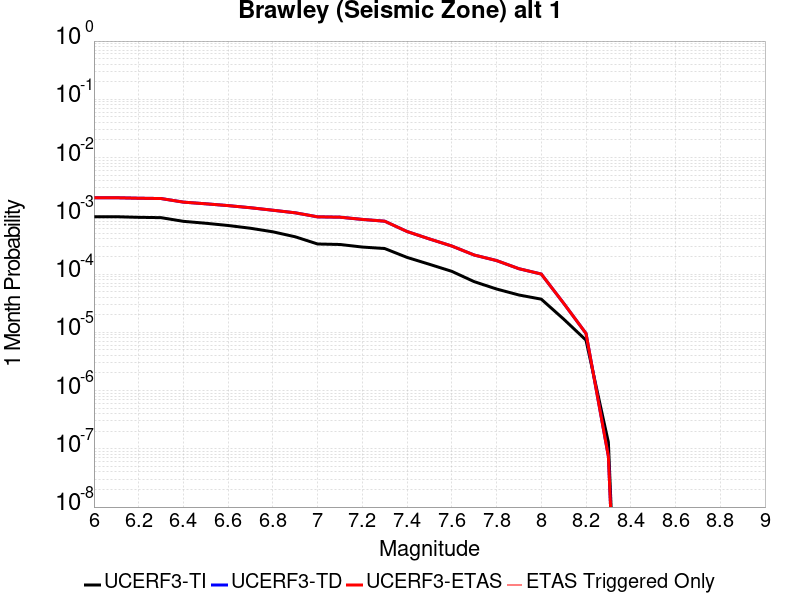 | 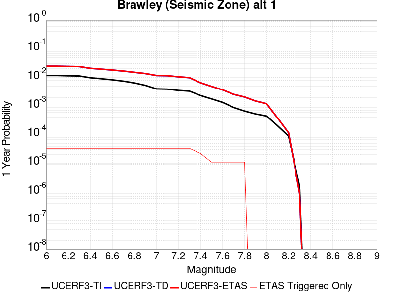 | 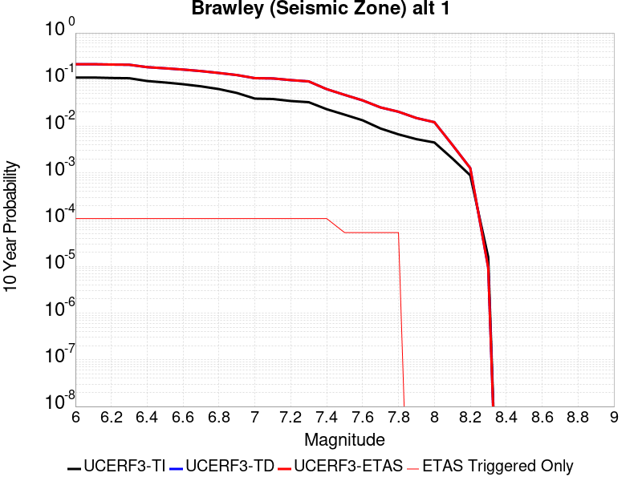 |

| Magnitude | 1 wk TI Prob | 1 wk TD Prob | 1 wk ETAS Prob | 1 wk ETAS/TD Gain | 1 wk ETAS Triggered Only | 1 mo TI Prob | 1 mo TD Prob | 1 mo ETAS Prob | 1 mo ETAS/TD Gain | 1 mo ETAS Triggered Only | 1 yr TI Prob | 1 yr TD Prob | 1 yr ETAS Prob | 1 yr ETAS/TD Gain | 1 yr ETAS Triggered Only | 10 yr TI Prob | 10 yr TD Prob | 10 yr ETAS Prob | 10 yr ETAS/TD Gain | 10 yr ETAS Triggered Only |
|-----|-----|-----|-----|-----|-----|-----|-----|-----|-----|-----|-----|-----|-----|-----|-----|-----|-----|-----|-----|-----|
| 6.0 | 2.2521618E-4 | 4.770347E-4 | 4.770347E-4 | 1.0 | 0.0 | 9.6485513E-4 | 0.0020428698 | 0.0020428698 | 1.0 | 0.0 | 0.011683988 | 0.024582325 | 0.024614481 | 1.0013081 | 3.2967033E-5 | 0.11088423 | 0.21374372 | 0.21378691 | 1.0002021 | 5.4945056E-5 |
| 6.1 | 2.2521618E-4 | 4.770347E-4 | 4.770347E-4 | 1.0 | 0.0 | 9.6485513E-4 | 0.0020428698 | 0.0020428698 | 1.0 | 0.0 | 0.011683988 | 0.024582325 | 0.024614481 | 1.0013081 | 3.2967033E-5 | 0.11088423 | 0.21374372 | 0.21378691 | 1.0002021 | 5.4945056E-5 |
| 6.2 | 2.198148E-4 | 4.6786256E-4 | 4.6786256E-4 | 1.0 | 0.0 | 9.417233E-4 | 0.002003621 | 0.002003621 | 1.0 | 0.0 | 0.011405343 | 0.024115691 | 0.024147863 | 1.0013341 | 3.2967033E-5 | 0.10837428 | 0.21017633 | 0.21021973 | 1.0002065 | 5.4945056E-5 |
| 6.3 | 2.1704129E-4 | 4.6221682E-4 | 4.6221682E-4 | 1.0 | 0.0 | 9.298453E-4 | 0.001979462 | 0.001979462 | 1.0 | 0.0 | 0.011262234 | 0.023828728 | 0.023860909 | 1.0013505 | 3.2967033E-5 | 0.107082725 | 0.20806724 | 0.20811075 | 1.0002091 | 5.4945056E-5 |
| 6.4 | 1.876142E-4 | 4.0111726E-4 | 4.0111726E-4 | 1.0 | 0.0 | 8.038131E-4 | 0.0017179557 | 0.0017179557 | 1.0 | 0.0 | 0.00974259 | 0.02071454 | 0.020746825 | 1.0015585 | 3.2967033E-5 | 0.093263686 | 0.18481886 | 0.18486366 | 1.0002424 | 5.4945056E-5 |
| 6.5 | 1.7390939E-4 | 3.7541363E-4 | 3.7541363E-4 | 1.0 | 0.0 | 7.45113E-4 | 0.0016079358 | 0.0016079358 | 1.0 | 0.0 | 0.009034078 | 0.019401617 | 0.019433944 | 1.0016662 | 3.2967033E-5 | 0.086755216 | 0.1746364 | 0.17468175 | 1.0002596 | 5.4945056E-5 |
| 6.6 | 1.591791E-4 | 3.4952888E-4 | 3.4952888E-4 | 1.0 | 0.0 | 6.8201777E-4 | 0.0014971311 | 0.0014971311 | 1.0 | 0.0 | 0.008271996 | 0.018076792 | 0.018109163 | 1.0017908 | 3.2967033E-5 | 0.07970774 | 0.16403708 | 0.16407382 | 1.000224 | 4.3956043E-5 |
| 6.7 | 1.4268003E-4 | 3.2115442E-4 | 3.2115442E-4 | 1.0 | 0.0 | 6.1134255E-4 | 0.0013756583 | 0.0013756583 | 1.0 | 0.0 | 0.007417723 | 0.016621986 | 0.016654406 | 1.0019504 | 3.2967033E-5 | 0.07174956 | 0.15215302 | 0.15219028 | 1.000245 | 4.3956043E-5 |
| 6.8 | 1.239713E-4 | 2.910217E-4 | 2.910217E-4 | 1.0 | 0.0 | 5.3119735E-4 | 0.0012466458 | 0.0012466458 | 1.0 | 0.0 | 0.0064481674 | 0.01507372 | 0.015106191 | 1.0021541 | 3.2967033E-5 | 0.06264243 | 0.13857023 | 0.1386081 | 1.0002732 | 4.3956043E-5 |
| 6.9 | 1.0180238E-4 | 2.6291964E-4 | 2.6291964E-4 | 1.0 | 0.0 | 4.3622297E-4 | 0.0011263161 | 0.0011263161 | 1.0 | 0.0 | 0.005298089 | 0.013627682 | 0.0136602 | 1.0023862 | 3.2967033E-5 | 0.05173543 | 0.12511405 | 0.12515251 | 1.0003073 | 4.3956043E-5 |
| 7.0 | 7.6619996E-5 | 2.2427912E-4 | 2.2427912E-4 | 1.0 | 0.0 | 3.283301E-4 | 9.608453E-4 | 9.608453E-4 | 1.0 | 0.0 | 0.0039900932 | 0.011636255 | 0.011668839 | 1.0028001 | 3.2967033E-5 | 0.039192066 | 0.10738418 | 0.10742342 | 1.0003654 | 4.3956043E-5 |
| 7.1 | 7.5127435E-5 | 2.2110711E-4 | 2.2110711E-4 | 1.0 | 0.0 | 3.2193496E-4 | 9.4726094E-4 | 9.4726094E-4 | 1.0 | 0.0 | 0.0039125155 | 0.011472619 | 0.011505208 | 1.0028405 | 3.2967033E-5 | 0.038443442 | 0.10594688 | 0.105986185 | 1.000371 | 4.3956043E-5 |
| 7.2 | 6.788582E-5 | 2.023746E-4 | 2.023746E-4 | 1.0 | 0.0 | 2.9090676E-4 | 8.670345E-4 | 8.670345E-4 | 1.0 | 0.0 | 0.0035360386 | 0.010505693 | 0.010538314 | 1.003105 | 3.2967033E-5 | 0.034803 | 0.09761459 | 0.09765425 | 1.0004064 | 4.3956043E-5 |
| 7.3 | 6.399602E-5 | 1.8867273E-4 | 1.8867273E-4 | 1.0 | 0.0 | 2.7423984E-4 | 8.083497E-4 | 8.083497E-4 | 1.0 | 0.0 | 0.0033337586 | 0.0097978385 | 0.009830482 | 1.0033318 | 3.2967033E-5 | 0.03284188 | 0.09150581 | 0.091545746 | 1.0004364 | 4.3956043E-5 |
| 7.4 | 4.506759E-5 | 1.2549848E-4 | 1.2549848E-4 | 1.0 | 0.0 | 1.9313251E-4 | 5.3774065E-4 | 5.3774065E-4 | 1.0 | 0.0 | 0.0023488526 | 0.0065275137 | 0.0065493486 | 1.003345 | 2.1978021E-5 | 0.023241805 | 0.06245424 | 0.062485147 | 1.0004948 | 3.2967033E-5 |
| 7.5 | 3.43289E-5 | 9.352864E-5 | 9.352864E-5 | 1.0 | 0.0 | 1.4711556E-4 | 4.0077575E-4 | 4.0077575E-4 | 1.0 | 0.0 | 0.0017896603 | 0.0048685903 | 0.004879526 | 1.0022461 | 1.0989011E-5 | 0.01775316 | 0.04713329 | 0.047154233 | 1.0004443 | 2.1978021E-5 |
| 7.6 | 2.5980507E-5 | 7.068311E-5 | 7.068311E-5 | 1.0 | 0.0 | 1.1134028E-4 | 3.028926E-4 | 3.028926E-4 | 1.0 | 0.0 | 0.001354725 | 0.0036815058 | 0.0036924544 | 1.0029739 | 1.0989011E-5 | 0.013464959 | 0.03590966 | 0.03593085 | 1.0005901 | 2.1978021E-5 |
| 7.7 | 1.7292105E-5 | 4.953711E-5 | 4.953711E-5 | 1.0 | 0.0 | 7.4106916E-5 | 2.1228465E-4 | 2.1228465E-4 | 1.0 | 0.0 | 9.018782E-4 | 0.002581508 | 0.0025924686 | 1.0042459 | 1.0989011E-5 | 0.008982267 | 0.025349455 | 0.025370875 | 1.0008451 | 2.1978021E-5 |
| 7.8 | 1.2927471E-5 | 3.9806302E-5 | 3.9806302E-5 | 1.0 | 0.0 | 5.5402274E-5 | 1.705873E-4 | 1.705873E-4 | 1.0 | 0.0 | 6.743139E-4 | 0.0020749245 | 0.0020858909 | 1.0052851 | 1.0989011E-5 | 0.0067227143 | 0.020483209 | 0.020504737 | 1.001051 | 2.1978021E-5 |
| 7.9 | 1.0200774E-5 | 2.8837148E-5 | 2.8837148E-5 | 1.0 | 0.0 | 4.371687E-5 | 1.2358194E-4 | 1.2358194E-4 | 1.0 | 0.0 | 5.321229E-4 | 0.0015035727 | 0.0015035727 | 1.0 | 0.0 | 0.005308505 | 0.015033948 | 0.015044772 | 1.0007199 | 1.0989011E-5 |
| 8.0 | 8.650396E-6 | 2.3355835E-5 | 2.3355835E-5 | 1.0 | 0.0 | 3.70726E-5 | 1.000926E-4 | 1.000926E-4 | 1.0 | 0.0 | 4.5126543E-4 | 0.001217947 | 0.001217947 | 1.0 | 0.0 | 0.0045035016 | 0.012247655 | 0.012258509 | 1.0008862 | 1.0989011E-5 |
| 8.1 | 3.9368224E-6 | 7.361708E-6 | 7.361708E-6 | 1.0 | 0.0 | 1.6871985E-5 | 3.1549796E-5 | 3.1549796E-5 | 1.0 | 0.0 | 2.0539707E-4 | 3.840512E-4 | 3.840512E-4 | 1.0 | 0.0 | 0.0020520731 | 0.0040179132 | 0.0040179132 | 1.0 | 0.0 |
| 8.2 | 1.7101195E-6 | 2.2310942E-6 | 2.2310942E-6 | 1.0 | 0.0 | 7.329063E-6 | 9.561797E-6 | 9.561797E-6 | 1.0 | 0.0 | 8.922769E-5 | 1.1640869E-4 | 1.1640869E-4 | 1.0 | 0.0 | 8.9191867E-4 | 0.0012734552 | 0.0012734552 | 1.0 | 0.0 |
| 8.3 | 3.0346666E-8 | 1.7353964E-8 | 1.7353964E-8 | 1.0 | 0.0 | 1.3005713E-7 | 7.437413E-8 | 7.437413E-8 | 1.0 | 0.0 | 1.5834444E-6 | 9.055049E-7 | 9.055049E-7 | 1.0 | 0.0 | 1.5834332E-5 | 9.441365E-6 | 9.441365E-6 | 1.0 | 0.0 |

## San Jacinto (Stepovers Combined)
*[(top)](#table-of-contents)*

| 1 Week | 1 Month | 1 Year | 10 Year |
|-----|-----|-----|-----|
| 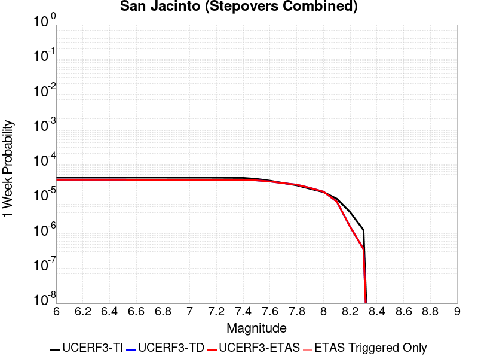 | 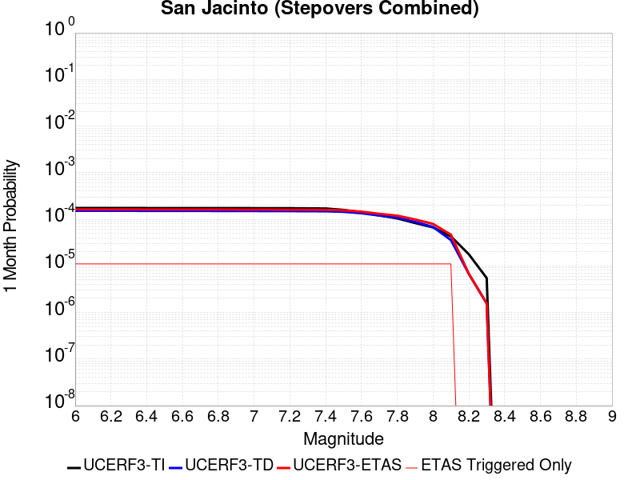 | 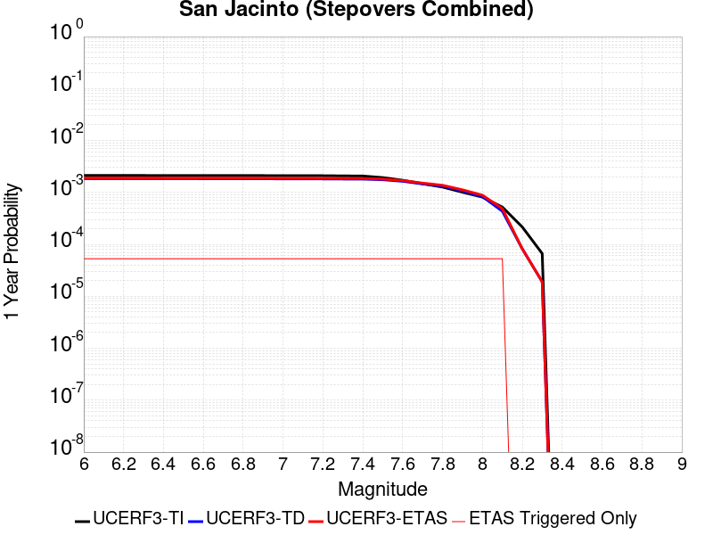 | 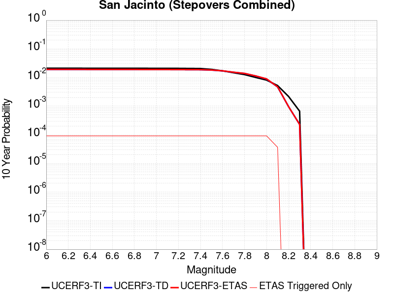 |

| Magnitude | 1 wk TI Prob | 1 wk TD Prob | 1 wk ETAS Prob | 1 wk ETAS/TD Gain | 1 wk ETAS Triggered Only | 1 mo TI Prob | 1 mo TD Prob | 1 mo ETAS Prob | 1 mo ETAS/TD Gain | 1 mo ETAS Triggered Only | 1 yr TI Prob | 1 yr TD Prob | 1 yr ETAS Prob | 1 yr ETAS/TD Gain | 1 yr ETAS Triggered Only | 10 yr TI Prob | 10 yr TD Prob | 10 yr ETAS Prob | 10 yr ETAS/TD Gain | 10 yr ETAS Triggered Only |
|-----|-----|-----|-----|-----|-----|-----|-----|-----|-----|-----|-----|-----|-----|-----|-----|-----|-----|-----|-----|-----|
| 6.0 | 4.0667746E-5 | 3.539606E-5 | 3.539606E-5 | 1.0 | 0.0 | 1.742787E-4 | 1.5168848E-4 | 1.6267582E-4 | 1.0724336 | 1.0989011E-5 | 0.0021197782 | 0.0018452448 | 0.0018671822 | 1.0118886 | 2.1978021E-5 | 0.020996714 | 0.019050766 | 0.019104665 | 1.0028292 | 5.4945056E-5 |
| 6.1 | 4.0667746E-5 | 3.539606E-5 | 3.539606E-5 | 1.0 | 0.0 | 1.742787E-4 | 1.5168848E-4 | 1.6267582E-4 | 1.0724336 | 1.0989011E-5 | 0.0021197782 | 0.0018452448 | 0.0018671822 | 1.0118886 | 2.1978021E-5 | 0.020996714 | 0.019050766 | 0.019104665 | 1.0028292 | 5.4945056E-5 |
| 6.2 | 4.0667746E-5 | 3.539606E-5 | 3.539606E-5 | 1.0 | 0.0 | 1.742787E-4 | 1.5168848E-4 | 1.6267582E-4 | 1.0724336 | 1.0989011E-5 | 0.0021197782 | 0.0018452448 | 0.0018671822 | 1.0118886 | 2.1978021E-5 | 0.020996714 | 0.019050766 | 0.019104665 | 1.0028292 | 5.4945056E-5 |
| 6.3 | 4.0667746E-5 | 3.539606E-5 | 3.539606E-5 | 1.0 | 0.0 | 1.742787E-4 | 1.5168848E-4 | 1.6267582E-4 | 1.0724336 | 1.0989011E-5 | 0.0021197782 | 0.0018452448 | 0.0018671822 | 1.0118886 | 2.1978021E-5 | 0.020996714 | 0.019050766 | 0.019104665 | 1.0028292 | 5.4945056E-5 |
| 6.4 | 4.0577226E-5 | 3.52679E-5 | 3.52679E-5 | 1.0 | 0.0 | 1.738908E-4 | 1.5113941E-4 | 1.6212676E-4 | 1.0726968 | 1.0989011E-5 | 0.0021150648 | 0.0018385717 | 0.0018605094 | 1.0119319 | 2.1978021E-5 | 0.020950472 | 0.018985314 | 0.019039217 | 1.0028391 | 5.4945056E-5 |
| 6.5 | 4.0577226E-5 | 3.52679E-5 | 3.52679E-5 | 1.0 | 0.0 | 1.738908E-4 | 1.5113941E-4 | 1.6212676E-4 | 1.0726968 | 1.0989011E-5 | 0.0021150648 | 0.0018385717 | 0.0018605094 | 1.0119319 | 2.1978021E-5 | 0.020950472 | 0.018985314 | 0.019039217 | 1.0028391 | 5.4945056E-5 |
| 6.6 | 4.053861E-5 | 3.5213223E-5 | 3.5213223E-5 | 1.0 | 0.0 | 1.7372532E-4 | 1.509051E-4 | 1.6189246E-4 | 1.0728097 | 1.0989011E-5 | 0.0021130538 | 0.0018357239 | 0.0018576616 | 1.0119504 | 2.1978021E-5 | 0.020930743 | 0.018957384 | 0.019011287 | 1.0028434 | 5.4945056E-5 |
| 6.7 | 4.0516545E-5 | 3.518228E-5 | 3.518228E-5 | 1.0 | 0.0 | 1.7363077E-4 | 1.507725E-4 | 1.6175985E-4 | 1.0728737 | 1.0989011E-5 | 0.002111905 | 0.0018341128 | 0.0018560506 | 1.011961 | 2.1978021E-5 | 0.020919468 | 0.018941576 | 0.01899548 | 1.0028458 | 5.4945056E-5 |
| 6.8 | 4.049434E-5 | 3.515383E-5 | 3.515383E-5 | 1.0 | 0.0 | 1.7353562E-4 | 1.5065058E-4 | 1.6163794E-4 | 1.0729327 | 1.0989011E-5 | 0.0021107488 | 0.0018326311 | 0.0018545688 | 1.0119706 | 2.1978021E-5 | 0.020908125 | 0.018926984 | 0.018980889 | 1.002848 | 5.4945056E-5 |
| 6.9 | 4.046386E-5 | 3.5116373E-5 | 3.5116373E-5 | 1.0 | 0.0 | 1.73405E-4 | 1.5049007E-4 | 1.6147744E-4 | 1.0730106 | 1.0989011E-5 | 0.0021091616 | 0.0018306803 | 0.0018526181 | 1.0119834 | 2.1978021E-5 | 0.020892553 | 0.01890775 | 0.018961657 | 1.002851 | 5.4945056E-5 |
| 7.0 | 4.036382E-5 | 3.499689E-5 | 3.499689E-5 | 1.0 | 0.0 | 1.7297632E-4 | 1.4997806E-4 | 1.6096543E-4 | 1.0732598 | 1.0989011E-5 | 0.0021039525 | 0.001824457 | 0.0018463949 | 1.0120244 | 2.1978021E-5 | 0.02084144 | 0.018846339 | 0.01890025 | 1.0028604 | 5.4945056E-5 |
| 7.1 | 4.0343282E-5 | 3.4975343E-5 | 3.4975343E-5 | 1.0 | 0.0 | 1.7288832E-4 | 1.4988573E-4 | 1.608731E-4 | 1.0733049 | 1.0989011E-5 | 0.002102883 | 0.0018233346 | 0.0018452726 | 1.0120318 | 2.1978021E-5 | 0.020830948 | 0.018835211 | 0.018889122 | 1.0028622 | 5.4945056E-5 |
| 7.2 | 4.0257353E-5 | 3.487971E-5 | 3.487971E-5 | 1.0 | 0.0 | 1.725201E-4 | 1.4947593E-4 | 1.604633E-4 | 1.0735059 | 1.0989011E-5 | 0.0020984085 | 0.0018183537 | 0.0018402917 | 1.0120648 | 2.1978021E-5 | 0.020787042 | 0.018785886 | 0.018839799 | 1.0028698 | 5.4945056E-5 |
| 7.3 | 3.9940667E-5 | 3.470693E-5 | 3.470693E-5 | 1.0 | 0.0 | 1.7116306E-4 | 1.4873552E-4 | 1.597229E-4 | 1.0738719 | 1.0989011E-5 | 0.0020819185 | 0.0018093542 | 0.0018312924 | 1.0121249 | 2.1978021E-5 | 0.020625217 | 0.018694295 | 0.018748213 | 1.0028841 | 5.4945056E-5 |
| 7.4 | 3.9721202E-5 | 3.4592093E-5 | 3.4592093E-5 | 1.0 | 0.0 | 1.7022261E-4 | 1.4824342E-4 | 1.5923081E-4 | 1.0741172 | 1.0989011E-5 | 0.0020704903 | 0.0018033729 | 0.0018253112 | 1.0121652 | 2.1978021E-5 | 0.020513052 | 0.018633302 | 0.018687224 | 1.0028938 | 5.4945056E-5 |
| 7.5 | 3.7036873E-5 | 3.365667E-5 | 3.365667E-5 | 1.0 | 0.0 | 1.5871979E-4 | 1.4423492E-4 | 1.5522234E-4 | 1.0761772 | 1.0989011E-5 | 0.0019307006 | 0.0017546486 | 0.001776588 | 1.0125036 | 2.1978021E-5 | 0.019140124 | 0.018133393 | 0.018187342 | 1.0029751 | 5.4945056E-5 |
| 7.6 | 3.2940967E-5 | 3.1428903E-5 | 3.1428903E-5 | 1.0 | 0.0 | 1.4116794E-4 | 1.3468837E-4 | 1.4567589E-4 | 1.0815774 | 1.0989011E-5 | 0.0017173645 | 0.0016385997 | 0.0016605416 | 1.0133907 | 2.1978021E-5 | 0.01704153 | 0.01696185 | 0.017015863 | 1.0031844 | 5.4945056E-5 |
| 7.7 | 2.8236149E-5 | 2.7991733E-5 | 2.7991733E-5 | 1.0 | 0.0 | 1.2100645E-4 | 1.1995906E-4 | 1.3094675E-4 | 1.0915954 | 1.0989011E-5 | 0.0014722579 | 0.0014595242 | 0.0014814701 | 1.0150363 | 2.1978021E-5 | 0.014625421 | 0.015171104 | 0.015225215 | 1.0035667 | 5.4945056E-5 |
| 7.8 | 2.4329287E-5 | 2.5311134E-5 | 2.5311134E-5 | 1.0 | 0.0 | 1.042642E-4 | 1.0847179E-4 | 1.19459604E-4 | 1.1012965 | 1.0989011E-5 | 0.0012686774 | 0.0013198447 | 0.0013417938 | 1.01663 | 2.1978021E-5 | 0.012614589 | 0.01376629 | 0.013820478 | 1.0039363 | 5.4945056E-5 |
| 7.9 | 1.9370926E-5 | 2.0515045E-5 | 2.0515045E-5 | 1.0 | 0.0 | 8.301561E-5 | 8.791866E-5 | 9.8906705E-5 | 1.1249796 | 1.0989011E-5 | 0.0010102465 | 0.0010698849 | 0.0010918394 | 1.0205204 | 2.1978021E-5 | 0.0100566605 | 0.011248362 | 0.011302689 | 1.0048298 | 5.4945056E-5 |
| 8.0 | 1.5583017E-5 | 1.5965226E-5 | 1.5965226E-5 | 1.0 | 0.0 | 6.6782646E-5 | 6.842061E-5 | 7.940887E-5 | 1.1605986 | 1.0989011E-5 | 8.127754E-4 | 8.327032E-4 | 8.5466297E-4 | 1.0263716 | 2.1978021E-5 | 0.008098091 | 0.00882326 | 0.00887772 | 1.0061723 | 5.4945056E-5 |
| 8.1 | 1.0024873E-5 | 8.3389305E-6 | 8.3389305E-6 | 1.0 | 0.0 | 4.2963035E-5 | 3.5737787E-5 | 4.6726404E-5 | 1.307479 | 1.0989011E-5 | 5.229494E-4 | 4.3502118E-4 | 4.5698966E-4 | 1.0504998 | 2.1978021E-5 | 0.0052172043 | 0.0046784114 | 0.004700287 | 1.0046757 | 2.1978021E-5 |
| 8.2 | 4.142796E-6 | 1.5742155E-6 | 1.5742155E-6 | 1.0 | 0.0 | 1.775472E-5 | 6.746621E-6 | 6.746621E-6 | 1.0 | 0.0 | 2.1614227E-4 | 8.213704E-5 | 8.213704E-5 | 1.0 | 0.0 | 0.0021593217 | 9.530129E-4 | 9.530129E-4 | 1.0 | 0.0 |
| 8.3 | 1.2750878E-6 | 3.6481603E-7 | 3.6481603E-7 | 1.0 | 0.0 | 5.4646503E-6 | 1.5634963E-6 | 1.5634963E-6 | 1.0 | 0.0 | 6.653009E-5 | 1.9035406E-5 | 1.9035406E-5 | 1.0 | 0.0 | 6.6510175E-4 | 2.2945888E-4 | 2.2945888E-4 | 1.0 | 0.0 |

## Great Valley 09 (Laguna Seca)
*[(top)](#table-of-contents)*

| 1 Week | 1 Month | 1 Year | 10 Year |
|-----|-----|-----|-----|
| 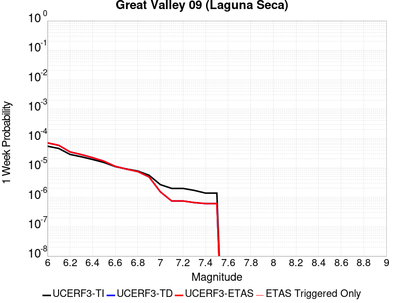 | 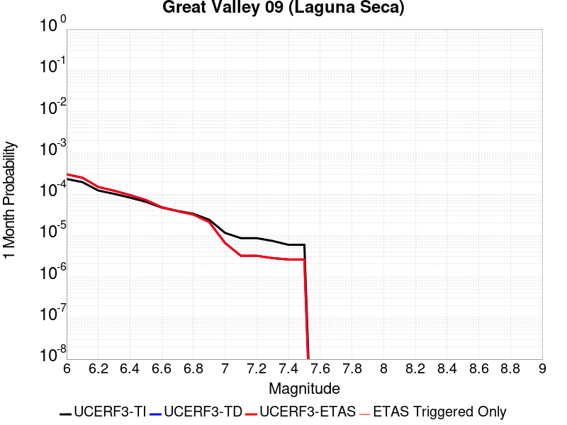 | 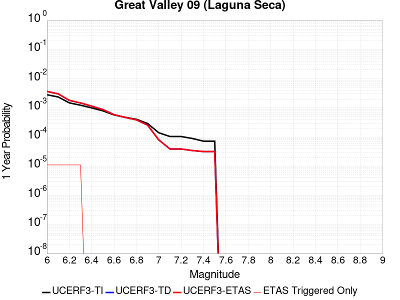 | 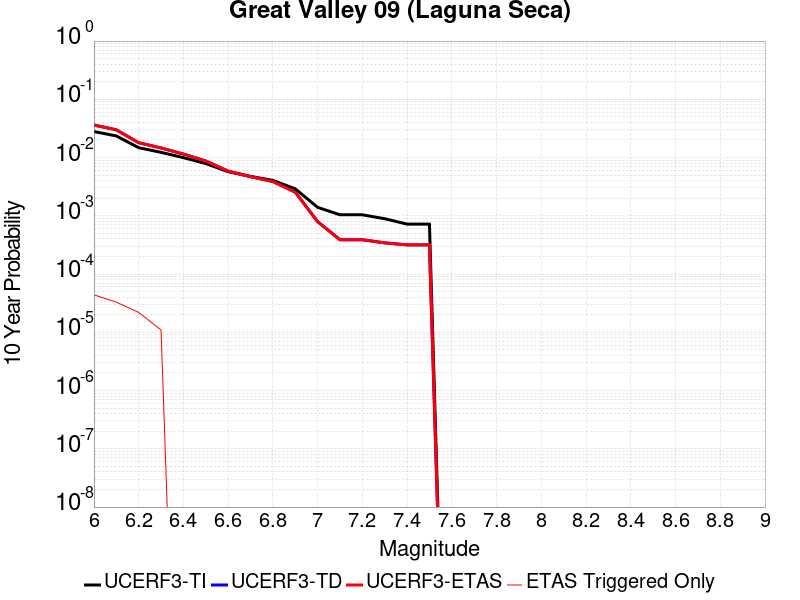 |

| Magnitude | 1 wk TI Prob | 1 wk TD Prob | 1 wk ETAS Prob | 1 wk ETAS/TD Gain | 1 wk ETAS Triggered Only | 1 mo TI Prob | 1 mo TD Prob | 1 mo ETAS Prob | 1 mo ETAS/TD Gain | 1 mo ETAS Triggered Only | 1 yr TI Prob | 1 yr TD Prob | 1 yr ETAS Prob | 1 yr ETAS/TD Gain | 1 yr ETAS Triggered Only | 10 yr TI Prob | 10 yr TD Prob | 10 yr ETAS Prob | 10 yr ETAS/TD Gain | 10 yr ETAS Triggered Only |
|-----|-----|-----|-----|-----|-----|-----|-----|-----|-----|-----|-----|-----|-----|-----|-----|-----|-----|-----|-----|-----|
| 6.0 | 5.4353277E-5 | 7.0525646E-5 | 7.0525646E-5 | 1.0 | 0.0 | 2.3292181E-4 | 3.0221994E-4 | 3.0221994E-4 | 1.0 | 0.0 | 0.0028321352 | 0.0036733362 | 0.0036842849 | 1.0029806 | 1.0989011E-5 | 0.02796312 | 0.036127005 | 0.036169372 | 1.0011728 | 4.3956043E-5 |
| 6.1 | 4.5578287E-5 | 5.8239293E-5 | 5.8239293E-5 | 1.0 | 0.0 | 1.953209E-4 | 2.4957463E-4 | 2.4957463E-4 | 1.0 | 0.0 | 0.0023754383 | 0.0030343828 | 0.0030453384 | 1.0036105 | 1.0989011E-5 | 0.023502063 | 0.029928818 | 0.0299608 | 1.0010686 | 3.2967033E-5 |
| 6.2 | 2.8536782E-5 | 3.474574E-5 | 3.474574E-5 | 1.0 | 0.0 | 1.2229476E-4 | 1.4890228E-4 | 1.4890228E-4 | 1.0 | 0.0 | 0.0014879217 | 0.0018113338 | 0.0018223029 | 1.0060558 | 1.0989011E-5 | 0.014779986 | 0.017963162 | 0.017984744 | 1.0012015 | 2.1978021E-5 |
| 6.3 | 2.3698774E-5 | 2.8219289E-5 | 2.8219289E-5 | 1.0 | 0.0 | 1.01562226E-4 | 1.20934536E-4 | 1.20934536E-4 | 1.0 | 0.0 | 0.0012358186 | 0.0014714394 | 0.0014824122 | 1.0074573 | 1.0989011E-5 | 0.012289686 | 0.014615262 | 0.01462609 | 1.0007409 | 1.0989011E-5 |
| 6.4 | 1.9191197E-5 | 2.2126858E-5 | 2.2126858E-5 | 1.0 | 0.0 | 8.2245395E-5 | 9.4826195E-5 | 9.4826195E-5 | 1.0 | 0.0 | 0.0010008777 | 0.0011539406 | 0.0011539406 | 1.0 | 0.0 | 0.009963818 | 0.01147981 | 0.01147981 | 1.0 | 0.0 |
| 6.5 | 1.5203241E-5 | 1.6803955E-5 | 1.6803955E-5 | 1.0 | 0.0 | 6.5155116E-5 | 7.2015144E-5 | 7.2015144E-5 | 1.0 | 0.0 | 7.9297484E-4 | 8.7646366E-4 | 8.7646366E-4 | 1.0 | 0.0 | 0.007901512 | 0.008731467 | 0.008731467 | 1.0 | 0.0 |
| 6.6 | 1.0984925E-5 | 1.12445505E-5 | 1.12445505E-5 | 1.0 | 0.0 | 4.70774E-5 | 4.8190064E-5 | 4.8190064E-5 | 1.0 | 0.0 | 5.730166E-4 | 5.8656017E-4 | 5.8656017E-4 | 1.0 | 0.0 | 0.005715413 | 0.005850517 | 0.005850517 | 1.0 | 0.0 |
| 6.7 | 9.134616E-6 | 9.021409E-6 | 9.021409E-6 | 1.0 | 0.0 | 3.9147766E-5 | 3.8662623E-5 | 3.8662623E-5 | 1.0 | 0.0 | 4.7651984E-4 | 4.7061814E-4 | 4.7061814E-4 | 1.0 | 0.0 | 0.004754993 | 0.00469646 | 0.00469646 | 1.0 | 0.0 |
| 6.8 | 7.785589E-6 | 7.453189E-6 | 7.453189E-6 | 1.0 | 0.0 | 3.3366385E-5 | 3.1941858E-5 | 3.1941858E-5 | 1.0 | 0.0 | 4.0616E-4 | 3.8882476E-4 | 3.8882476E-4 | 1.0 | 0.0 | 0.0040541845 | 0.0038816484 | 0.0038816484 | 1.0 | 0.0 |
| 6.9 | 5.579095E-6 | 4.8993106E-6 | 4.8993106E-6 | 1.0 | 0.0 | 2.3910188E-5 | 2.0996884E-5 | 2.0996884E-5 | 1.0 | 0.0 | 2.9106764E-4 | 2.5560847E-4 | 2.5560847E-4 | 1.0 | 0.0 | 0.002906867 | 0.002553282 | 0.002553282 | 1.0 | 0.0 |
| 7.0 | 2.6816688E-6 | 1.521837E-6 | 1.521837E-6 | 1.0 | 0.0 | 1.1492816E-5 | 6.522143E-6 | 6.522143E-6 | 1.0 | 0.0 | 1.3991605E-4 | 7.9404286E-5 | 7.9404286E-5 | 1.0 | 0.0 | 0.0013982799 | 7.9376786E-4 | 7.9376786E-4 | 1.0 | 0.0 |
| 7.1 | 1.9951021E-6 | 7.4549945E-7 | 7.4549945E-7 | 1.0 | 0.0 | 8.55041E-6 | 3.194994E-6 | 3.194994E-6 | 1.0 | 0.0 | 1.0409627E-4 | 3.8898397E-5 | 3.8898397E-5 | 1.0 | 0.0 | 0.0010404752 | 3.8892005E-4 | 3.8892005E-4 | 1.0 | 0.0 |
| 7.2 | 1.9951021E-6 | 7.4549945E-7 | 7.4549945E-7 | 1.0 | 0.0 | 8.55041E-6 | 3.194994E-6 | 3.194994E-6 | 1.0 | 0.0 | 1.0409627E-4 | 3.8898397E-5 | 3.8898397E-5 | 1.0 | 0.0 | 0.0010404752 | 3.8892005E-4 | 3.8892005E-4 | 1.0 | 0.0 |
| 7.3 | 1.7087556E-6 | 6.5798565E-7 | 6.5798565E-7 | 1.0 | 0.0 | 7.3232177E-6 | 2.8199356E-6 | 2.8199356E-6 | 1.0 | 0.0 | 8.915652E-5 | 3.4332217E-5 | 3.4332217E-5 | 1.0 | 0.0 | 8.9120766E-4 | 3.432732E-4 | 3.432732E-4 | 1.0 | 0.0 |
| 7.4 | 1.3804846E-6 | 6.074658E-7 | 6.074658E-7 | 1.0 | 0.0 | 5.916349E-6 | 2.6034222E-6 | 2.6034222E-6 | 1.0 | 0.0 | 7.2029165E-5 | 3.1696247E-5 | 3.1696247E-5 | 1.0 | 0.0 | 7.200583E-4 | 3.1692127E-4 | 3.1692127E-4 | 1.0 | 0.0 |
| 7.5 | 1.3804846E-6 | 6.074658E-7 | 6.074658E-7 | 1.0 | 0.0 | 5.916349E-6 | 2.6034222E-6 | 2.6034222E-6 | 1.0 | 0.0 | 7.2029165E-5 | 3.1696247E-5 | 3.1696247E-5 | 1.0 | 0.0 | 7.200583E-4 | 3.1692127E-4 | 3.1692127E-4 | 1.0 | 0.0 |

## San Jacinto (Anza) rev
*[(top)](#table-of-contents)*

| 1 Week | 1 Month | 1 Year | 10 Year |
|-----|-----|-----|-----|
| 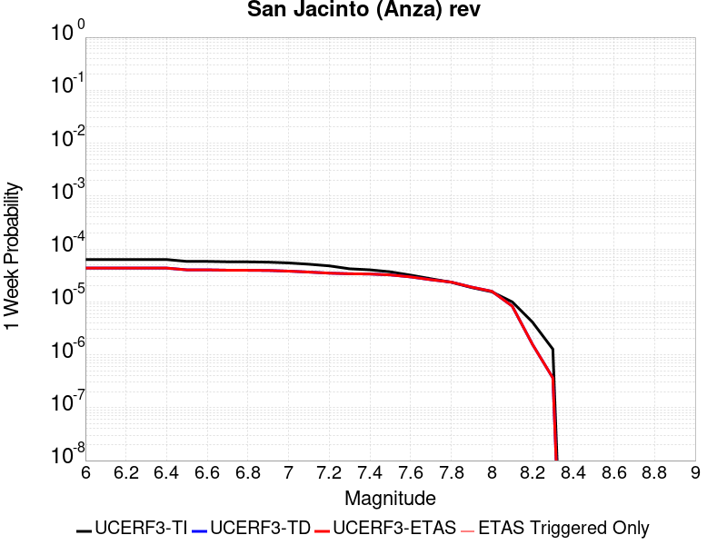 | 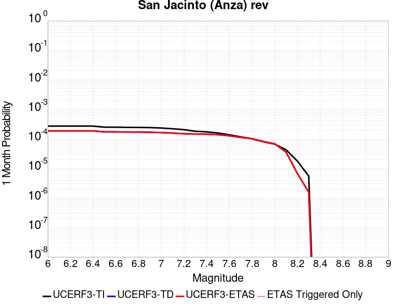 | 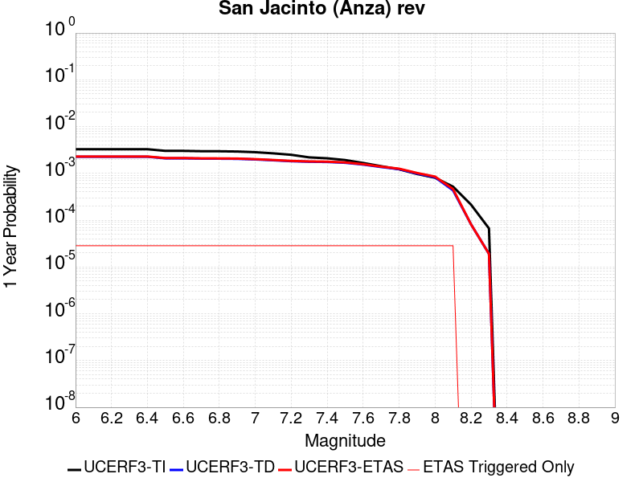 | 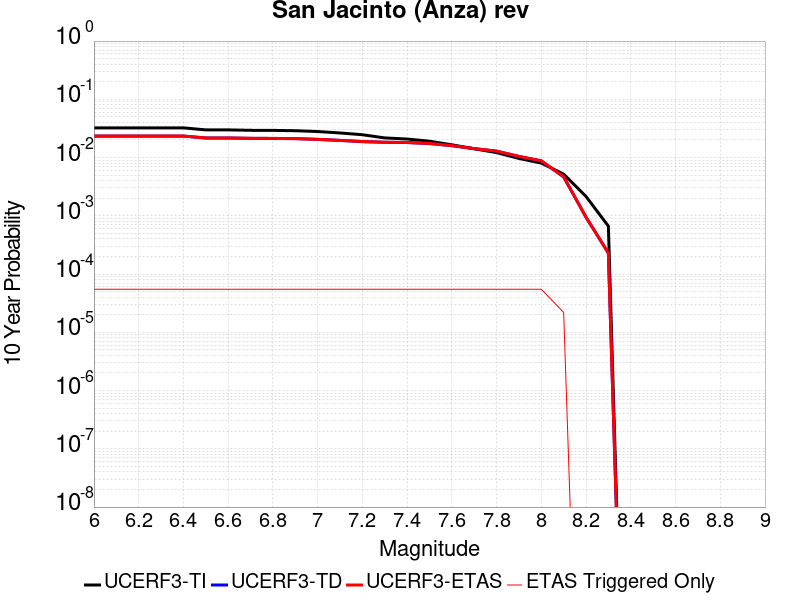 |

| Magnitude | 1 wk TI Prob | 1 wk TD Prob | 1 wk ETAS Prob | 1 wk ETAS/TD Gain | 1 wk ETAS Triggered Only | 1 mo TI Prob | 1 mo TD Prob | 1 mo ETAS Prob | 1 mo ETAS/TD Gain | 1 mo ETAS Triggered Only | 1 yr TI Prob | 1 yr TD Prob | 1 yr ETAS Prob | 1 yr ETAS/TD Gain | 1 yr ETAS Triggered Only | 10 yr TI Prob | 10 yr TD Prob | 10 yr ETAS Prob | 10 yr ETAS/TD Gain | 10 yr ETAS Triggered Only |
|-----|-----|-----|-----|-----|-----|-----|-----|-----|-----|-----|-----|-----|-----|-----|-----|-----|-----|-----|-----|-----|
| 6.0 | 6.3015636E-5 | 4.3446253E-5 | 4.3446253E-5 | 1.0 | 0.0 | 2.7003905E-4 | 1.86185E-4 | 1.9717196E-4 | 1.059011 | 1.0989011E-5 | 0.0032827691 | 0.0022644578 | 0.002286386 | 1.0096836 | 2.1978021E-5 | 0.032346968 | 0.023370424 | 0.023424085 | 1.0022961 | 5.4945056E-5 |
| 6.1 | 6.3015636E-5 | 4.3446253E-5 | 4.3446253E-5 | 1.0 | 0.0 | 2.7003905E-4 | 1.86185E-4 | 1.9717196E-4 | 1.059011 | 1.0989011E-5 | 0.0032827691 | 0.0022644578 | 0.002286386 | 1.0096836 | 2.1978021E-5 | 0.032346968 | 0.023370424 | 0.023424085 | 1.0022961 | 5.4945056E-5 |
| 6.2 | 6.3015636E-5 | 4.3446253E-5 | 4.3446253E-5 | 1.0 | 0.0 | 2.7003905E-4 | 1.86185E-4 | 1.9717196E-4 | 1.059011 | 1.0989011E-5 | 0.0032827691 | 0.0022644578 | 0.002286386 | 1.0096836 | 2.1978021E-5 | 0.032346968 | 0.023370424 | 0.023424085 | 1.0022961 | 5.4945056E-5 |
| 6.3 | 6.3015636E-5 | 4.3446253E-5 | 4.3446253E-5 | 1.0 | 0.0 | 2.7003905E-4 | 1.86185E-4 | 1.9717196E-4 | 1.059011 | 1.0989011E-5 | 0.0032827691 | 0.0022644578 | 0.002286386 | 1.0096836 | 2.1978021E-5 | 0.032346968 | 0.023370424 | 0.023424085 | 1.0022961 | 5.4945056E-5 |
| 6.4 | 6.3015636E-5 | 4.3446253E-5 | 4.3446253E-5 | 1.0 | 0.0 | 2.7003905E-4 | 1.86185E-4 | 1.9717196E-4 | 1.059011 | 1.0989011E-5 | 0.0032827691 | 0.0022644578 | 0.002286386 | 1.0096836 | 2.1978021E-5 | 0.032346968 | 0.023370424 | 0.023424085 | 1.0022961 | 5.4945056E-5 |
| 6.5 | 5.811017E-5 | 4.021924E-5 | 4.021924E-5 | 1.0 | 0.0 | 2.4901982E-4 | 1.7235681E-4 | 1.8334393E-4 | 1.0637463 | 1.0989011E-5 | 0.0030276014 | 0.0020964304 | 0.0021183623 | 1.0104616 | 2.1978021E-5 | 0.02986684 | 0.021664625 | 0.02171838 | 1.0024812 | 5.4945056E-5 |
| 6.6 | 5.811017E-5 | 4.021924E-5 | 4.021924E-5 | 1.0 | 0.0 | 2.4901982E-4 | 1.7235681E-4 | 1.8334393E-4 | 1.0637463 | 1.0989011E-5 | 0.0030276014 | 0.0020964304 | 0.0021183623 | 1.0104616 | 2.1978021E-5 | 0.02986684 | 0.021664625 | 0.02171838 | 1.0024812 | 5.4945056E-5 |
| 6.7 | 5.712442E-5 | 3.964049E-5 | 3.964049E-5 | 1.0 | 0.0 | 2.4479596E-4 | 1.6987679E-4 | 1.8086394E-4 | 1.0646771 | 1.0989011E-5 | 0.0029763177 | 0.0020662935 | 0.0020882261 | 1.0106145 | 2.1978021E-5 | 0.029367693 | 0.021355735 | 0.021409506 | 1.0025179 | 5.4945056E-5 |
| 6.8 | 5.6967532E-5 | 3.9496656E-5 | 3.9496656E-5 | 1.0 | 0.0 | 2.4412372E-4 | 1.6926043E-4 | 1.8024759E-4 | 1.0649127 | 1.0989011E-5 | 0.0029681553 | 0.0020588036 | 0.0020807364 | 1.0106531 | 2.1978021E-5 | 0.029288229 | 0.021280348 | 0.021334123 | 1.002527 | 5.4945056E-5 |
| 6.9 | 5.6211324E-5 | 3.9200542E-5 | 3.9200542E-5 | 1.0 | 0.0 | 2.4088343E-4 | 1.6799154E-4 | 1.789787E-4 | 1.0654031 | 1.0989011E-5 | 0.0029288116 | 0.002043384 | 0.002065317 | 1.0107337 | 2.1978021E-5 | 0.028905109 | 0.02111932 | 0.021173107 | 1.0025467 | 5.4945056E-5 |
| 7.0 | 5.4383527E-5 | 3.8058075E-5 | 3.8058075E-5 | 1.0 | 0.0 | 2.3305144E-4 | 1.6309587E-4 | 1.7408308E-4 | 1.0673666 | 1.0989011E-5 | 0.0028337094 | 0.0019838887 | 0.002005823 | 1.0110563 | 2.1978021E-5 | 0.027978465 | 0.020508781 | 0.020562598 | 1.0026242 | 5.4945056E-5 |
| 7.1 | 5.1393665E-5 | 3.6516354E-5 | 3.6516354E-5 | 1.0 | 0.0 | 2.2023996E-4 | 1.564893E-4 | 1.674766E-4 | 1.0702112 | 1.0989011E-5 | 0.0026781242 | 0.0019035965 | 0.0019255327 | 1.0115236 | 2.1978021E-5 | 0.026460782 | 0.019680155 | 0.01973402 | 1.0027369 | 5.4945056E-5 |
| 7.2 | 4.785222E-5 | 3.486319E-5 | 3.486319E-5 | 1.0 | 0.0 | 2.0506482E-4 | 1.4940514E-4 | 1.6039252E-4 | 1.0735408 | 1.0989011E-5 | 0.0024938055 | 0.0018174936 | 0.0018394316 | 1.0120705 | 2.1978021E-5 | 0.024660049 | 0.018792244 | 0.018846156 | 1.0028689 | 5.4945056E-5 |
| 7.3 | 4.2143256E-5 | 3.395425E-5 | 3.395425E-5 | 1.0 | 0.0 | 1.8060145E-4 | 1.4551012E-4 | 1.5649754E-4 | 1.0755095 | 1.0989011E-5 | 0.002196605 | 0.0017701496 | 0.0017920887 | 1.012394 | 2.1978021E-5 | 0.02175019 | 0.018298613 | 0.018352551 | 1.0029477 | 5.4945056E-5 |
| 7.4 | 4.0264713E-5 | 3.3591336E-5 | 3.3591336E-5 | 1.0 | 0.0 | 1.7255165E-4 | 1.4395494E-4 | 1.5494238E-4 | 1.0763254 | 1.0989011E-5 | 0.002098792 | 0.0017512459 | 0.0017731854 | 1.012528 | 2.1978021E-5 | 0.020790804 | 0.018102597 | 0.018156549 | 1.0029802 | 5.4945056E-5 |
| 7.5 | 3.694492E-5 | 3.2302072E-5 | 3.2302072E-5 | 1.0 | 0.0 | 1.5832575E-4 | 1.3843011E-4 | 1.4941761E-4 | 1.079372 | 1.0989011E-5 | 0.0019259118 | 0.0016840869 | 0.0017060279 | 1.0130284 | 2.1978021E-5 | 0.01909306 | 0.01741737 | 0.017471356 | 1.0030997 | 5.4945056E-5 |
| 7.6 | 3.200565E-5 | 2.960857E-5 | 2.960857E-5 | 1.0 | 0.0 | 1.3715986E-4 | 1.2688771E-4 | 1.3787532E-4 | 1.0865933 | 1.0989011E-5 | 0.001668642 | 0.0015437653 | 0.0015657094 | 1.0142146 | 2.1978021E-5 | 0.01656168 | 0.016000675 | 0.01605474 | 1.003379 | 5.4945056E-5 |
| 7.7 | 2.731642E-5 | 2.619419E-5 | 2.619419E-5 | 1.0 | 0.0 | 1.1706512E-4 | 1.1225599E-4 | 1.2324376E-4 | 1.0978814 | 1.0989011E-5 | 0.001424336 | 0.0013658608 | 0.0013878088 | 1.0160689 | 2.1978021E-5 | 0.014152412 | 0.014219889 | 0.014274053 | 1.003809 | 5.4945056E-5 |
| 7.8 | 2.3466424E-5 | 2.3602157E-5 | 2.3602157E-5 | 1.0 | 0.0 | 1.0056651E-4 | 1.0114819E-4 | 1.12136084E-4 | 1.1086317 | 1.0989011E-5 | 0.0012237094 | 0.0012307843 | 0.0012527353 | 1.0178349 | 2.1978021E-5 | 0.012169928 | 0.012859747 | 0.012913985 | 1.0042177 | 5.4945056E-5 |
| 7.9 | 1.8611925E-5 | 1.8996041E-5 | 1.8996041E-5 | 1.0 | 0.0 | 7.9762955E-5 | 8.1409074E-5 | 9.239719E-5 | 1.1349741 | 1.0989011E-5 | 9.7068126E-4 | 9.907054E-4 | 0.0010126617 | 1.0221622 | 2.1978021E-5 | 0.0096645225 | 0.010439943 | 0.010494314 | 1.005208 | 5.4945056E-5 |
| 8.0 | 1.5460775E-5 | 1.581908E-5 | 1.581908E-5 | 1.0 | 0.0 | 6.6258784E-5 | 6.7794295E-5 | 7.878256E-5 | 1.1620824 | 1.0989011E-5 | 8.0640207E-4 | 8.250837E-4 | 8.470436E-4 | 1.0266154 | 2.1978021E-5 | 0.008034821 | 0.008744002 | 0.008798467 | 1.0062288 | 5.4945056E-5 |
| 8.1 | 9.983884E-6 | 8.316292E-6 | 8.316292E-6 | 1.0 | 0.0 | 4.2787375E-5 | 3.564077E-5 | 4.662939E-5 | 1.308316 | 1.0989011E-5 | 5.2081177E-4 | 4.338405E-4 | 4.5580897E-4 | 1.0506372 | 2.1978021E-5 | 0.0051959283 | 0.00466492 | 0.004686795 | 1.0046893 | 2.1978021E-5 |
| 8.2 | 4.1226E-6 | 1.5661137E-6 | 1.5661137E-6 | 1.0 | 0.0 | 1.7668166E-5 | 6.711899E-6 | 6.711899E-6 | 1.0 | 0.0 | 2.1508869E-4 | 8.171434E-5 | 8.171434E-5 | 1.0 | 0.0 | 0.0021488064 | 9.480058E-4 | 9.480058E-4 | 1.0 | 0.0 |
| 8.3 | 1.2750878E-6 | 3.6481603E-7 | 3.6481603E-7 | 1.0 | 0.0 | 5.4646503E-6 | 1.5634963E-6 | 1.5634963E-6 | 1.0 | 0.0 | 6.653009E-5 | 1.9035406E-5 | 1.9035406E-5 | 1.0 | 0.0 | 6.6510175E-4 | 2.2945888E-4 | 2.2945888E-4 | 1.0 | 0.0 |

## Whittier alt 1
*[(top)](#table-of-contents)*

| 1 Week | 1 Month | 1 Year | 10 Year |
|-----|-----|-----|-----|
| 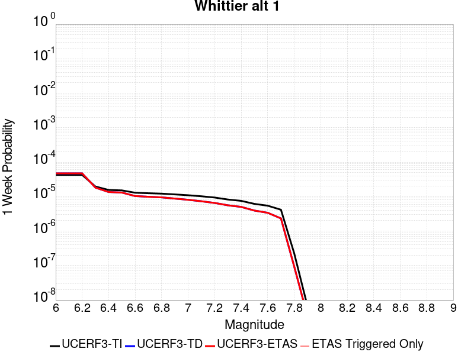 | 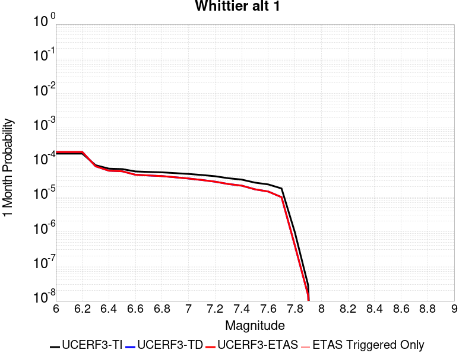 | 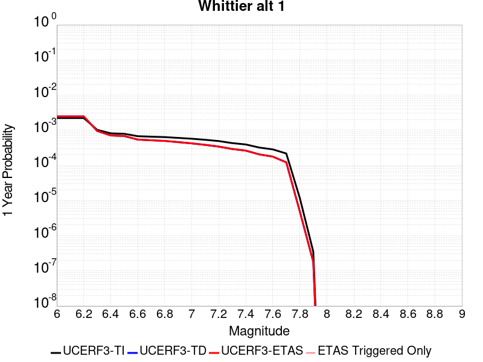 | 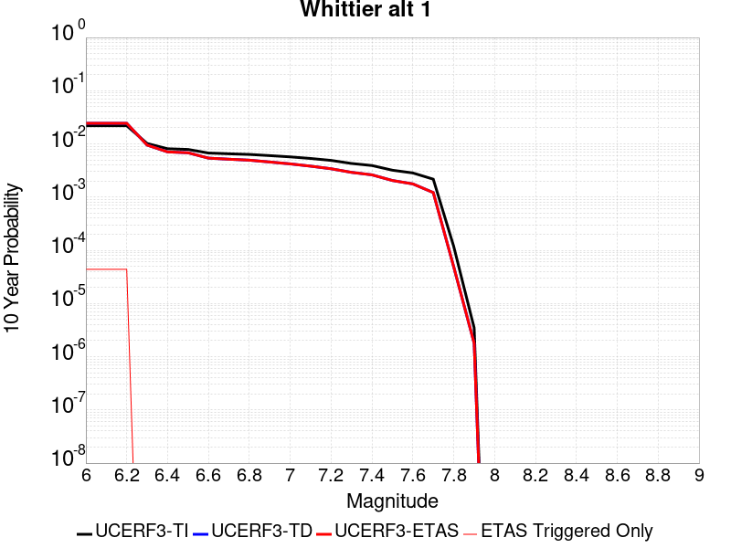 |

| Magnitude | 1 wk TI Prob | 1 wk TD Prob | 1 wk ETAS Prob | 1 wk ETAS/TD Gain | 1 wk ETAS Triggered Only | 1 mo TI Prob | 1 mo TD Prob | 1 mo ETAS Prob | 1 mo ETAS/TD Gain | 1 mo ETAS Triggered Only | 1 yr TI Prob | 1 yr TD Prob | 1 yr ETAS Prob | 1 yr ETAS/TD Gain | 1 yr ETAS Triggered Only | 10 yr TI Prob | 10 yr TD Prob | 10 yr ETAS Prob | 10 yr ETAS/TD Gain | 10 yr ETAS Triggered Only |
|-----|-----|-----|-----|-----|-----|-----|-----|-----|-----|-----|-----|-----|-----|-----|-----|-----|-----|-----|-----|-----|
| 6.0 | 4.2554693E-5 | 4.726187E-5 | 4.726187E-5 | 1.0 | 0.0 | 1.8236451E-4 | 2.0253698E-4 | 2.0253698E-4 | 1.0 | 0.0 | 0.002218027 | 0.0024634195 | 0.0024853433 | 1.0088998 | 2.1978021E-5 | 0.02196019 | 0.024395173 | 0.024438057 | 1.0017579 | 4.3956043E-5 |
| 6.1 | 4.2554693E-5 | 4.726187E-5 | 4.726187E-5 | 1.0 | 0.0 | 1.8236451E-4 | 2.0253698E-4 | 2.0253698E-4 | 1.0 | 0.0 | 0.002218027 | 0.0024634195 | 0.0024853433 | 1.0088998 | 2.1978021E-5 | 0.02196019 | 0.024395173 | 0.024438057 | 1.0017579 | 4.3956043E-5 |
| 6.2 | 4.2554693E-5 | 4.726187E-5 | 4.726187E-5 | 1.0 | 0.0 | 1.8236451E-4 | 2.0253698E-4 | 2.0253698E-4 | 1.0 | 0.0 | 0.002218027 | 0.0024634195 | 0.0024853433 | 1.0088998 | 2.1978021E-5 | 0.02196019 | 0.024395173 | 0.024438057 | 1.0017579 | 4.3956043E-5 |
| 6.3 | 1.9617712E-5 | 1.827379E-5 | 1.827379E-5 | 1.0 | 0.0 | 8.40732E-5 | 7.831399E-5 | 7.831399E-5 | 1.0 | 0.0 | 0.0010231105 | 9.5307484E-4 | 9.5307484E-4 | 1.0 | 0.0 | 0.01018413 | 0.009493156 | 0.009493156 | 1.0 | 0.0 |
| 6.4 | 1.5611336E-5 | 1.3608673E-5 | 1.3608673E-5 | 1.0 | 0.0 | 6.690401E-5 | 5.8321613E-5 | 5.8321613E-5 | 1.0 | 0.0 | 8.142519E-4 | 7.0984033E-4 | 7.0984033E-4 | 1.0 | 0.0 | 0.008112748 | 0.007077691 | 0.007077691 | 1.0 | 0.0 |
| 6.5 | 1.5150166E-5 | 1.3105277E-5 | 1.3105277E-5 | 1.0 | 0.0 | 6.492767E-5 | 5.6164296E-5 | 5.6164296E-5 | 1.0 | 0.0 | 7.9020765E-4 | 6.8359164E-4 | 6.8359164E-4 | 1.0 | 0.0 | 0.007874036 | 0.0068168356 | 0.0068168356 | 1.0 | 0.0 |
| 6.6 | 1.295588E-5 | 1.0384338E-5 | 1.0384338E-5 | 1.0 | 0.0 | 5.552402E-5 | 4.450356E-5 | 4.450356E-5 | 1.0 | 0.0 | 6.7579525E-4 | 5.416981E-4 | 5.416981E-4 | 1.0 | 0.0 | 0.006737438 | 0.0054052095 | 0.0054052095 | 1.0 | 0.0 |
| 6.7 | 1.2542085E-5 | 9.902893E-6 | 9.902893E-6 | 1.0 | 0.0 | 5.3750682E-5 | 4.244029E-5 | 4.244029E-5 | 1.0 | 0.0 | 6.542181E-4 | 5.165899E-4 | 5.165899E-4 | 1.0 | 0.0 | 0.006522954 | 0.005155308 | 0.005155308 | 1.0 | 0.0 |
| 6.8 | 1.2195878E-5 | 9.498821E-6 | 9.498821E-6 | 1.0 | 0.0 | 5.2267E-5 | 4.0708608E-5 | 4.0708608E-5 | 1.0 | 0.0 | 6.36165E-4 | 4.9551646E-4 | 4.9551646E-4 | 1.0 | 0.0 | 0.0063434686 | 0.0049454565 | 0.0049454565 | 1.0 | 0.0 |
| 6.9 | 1.1580298E-5 | 8.776116E-6 | 8.776116E-6 | 1.0 | 0.0 | 4.9628903E-5 | 3.7611393E-5 | 3.7611393E-5 | 1.0 | 0.0 | 6.040644E-4 | 4.5782415E-4 | 4.5782415E-4 | 1.0 | 0.0 | 0.00602425 | 0.004570069 | 0.004570069 | 1.0 | 0.0 |
| 7.0 | 1.0964795E-5 | 8.087017E-6 | 8.087017E-6 | 1.0 | 0.0 | 4.6991136E-5 | 3.465819E-5 | 3.465819E-5 | 1.0 | 0.0 | 5.7196687E-4 | 4.218833E-4 | 4.218833E-4 | 1.0 | 0.0 | 0.0057049696 | 0.0042120325 | 0.0042120325 | 1.0 | 0.0 |
| 7.1 | 1.0230601E-5 | 7.3293468E-6 | 7.3293468E-6 | 1.0 | 0.0 | 4.3844695E-5 | 3.1411113E-5 | 3.1411113E-5 | 1.0 | 0.0 | 5.336784E-4 | 3.8236452E-4 | 3.8236452E-4 | 1.0 | 0.0 | 0.005323986 | 0.0038182298 | 0.0038182298 | 1.0 | 0.0 |
| 7.2 | 9.40865E-6 | 6.545733E-6 | 6.545733E-6 | 1.0 | 0.0 | 4.032216E-5 | 2.8052847E-5 | 2.8052847E-5 | 1.0 | 0.0 | 4.908117E-4 | 3.414911E-4 | 3.414911E-4 | 1.0 | 0.0 | 0.0048972913 | 0.0034107561 | 0.0034107561 | 1.0 | 0.0 |
| 7.3 | 8.237384E-6 | 5.5998653E-6 | 5.5998653E-6 | 1.0 | 0.0 | 3.5302593E-5 | 2.3999208E-5 | 2.3999208E-5 | 1.0 | 0.0 | 4.2972428E-4 | 2.9215222E-4 | 2.9215222E-4 | 1.0 | 0.0 | 0.0042889426 | 0.0029180027 | 0.0029180027 | 1.0 | 0.0 |
| 7.4 | 7.5316966E-6 | 5.0297463E-6 | 5.0297463E-6 | 1.0 | 0.0 | 3.2278298E-5 | 2.1555883E-5 | 2.1555883E-5 | 1.0 | 0.0 | 3.9291743E-4 | 2.6241227E-4 | 2.6241227E-4 | 1.0 | 0.0 | 0.0039222343 | 0.0026211361 | 0.0026211361 | 1.0 | 0.0 |
| 7.5 | 6.149649E-6 | 3.935392E-6 | 3.935392E-6 | 1.0 | 0.0 | 2.6355372E-5 | 1.6865863E-5 | 1.6865863E-5 | 1.0 | 0.0 | 3.208294E-4 | 2.0532343E-4 | 2.0532343E-4 | 1.0 | 0.0 | 0.003203666 | 0.0020514266 | 0.0020514266 | 1.0 | 0.0 |
| 7.6 | 5.457711E-6 | 3.3967556E-6 | 3.3967556E-6 | 1.0 | 0.0 | 2.338998E-5 | 1.4557448E-5 | 1.4557448E-5 | 1.0 | 0.0 | 2.8473578E-4 | 1.7722332E-4 | 1.7722332E-4 | 1.0 | 0.0 | 0.0028437122 | 0.0017709008 | 0.0017709008 | 1.0 | 0.0 |
| 7.7 | 4.1676276E-6 | 2.3342945E-6 | 2.3342945E-6 | 1.0 | 0.0 | 1.7861139E-5 | 1.0004085E-5 | 1.0004085E-5 | 1.0 | 0.0 | 2.1743766E-4 | 1.2179367E-4 | 1.2179367E-4 | 1.0 | 0.0 | 0.0021722503 | 0.0012173423 | 0.0012173423 | 1.0 | 0.0 |
| 7.8 | 2.2692414E-7 | 9.3892815E-8 | 9.3892815E-8 | 1.0 | 0.0 | 9.725317E-7 | 4.0239775E-7 | 4.0239775E-7 | 1.0 | 0.0 | 1.1840509E-5 | 4.899185E-6 | 4.899185E-6 | 1.0 | 0.0 | 1.1839878E-4 | 4.8991096E-5 | 4.8991096E-5 | 1.0 | 0.0 |
| 7.9 | 6.676829E-9 | 3.4408467E-9 | 3.4408467E-9 | 1.0 | 0.0 | 2.861498E-8 | 1.4746486E-8 | 1.4746486E-8 | 1.0 | 0.0 | 3.4838732E-7 | 1.7953846E-7 | 1.7953846E-7 | 1.0 | 0.0 | 3.4838679E-6 | 1.7953832E-6 | 1.7953832E-6 | 1.0 | 0.0 |

## Kern Canyon (North Kern) 2011
*[(top)](#table-of-contents)*

| 1 Week | 1 Month | 1 Year | 10 Year |
|-----|-----|-----|-----|
| 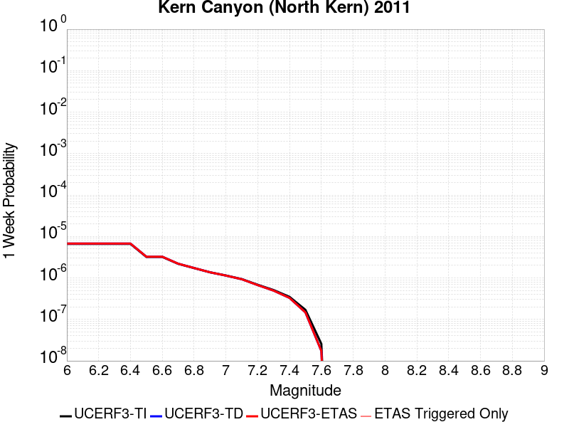 | 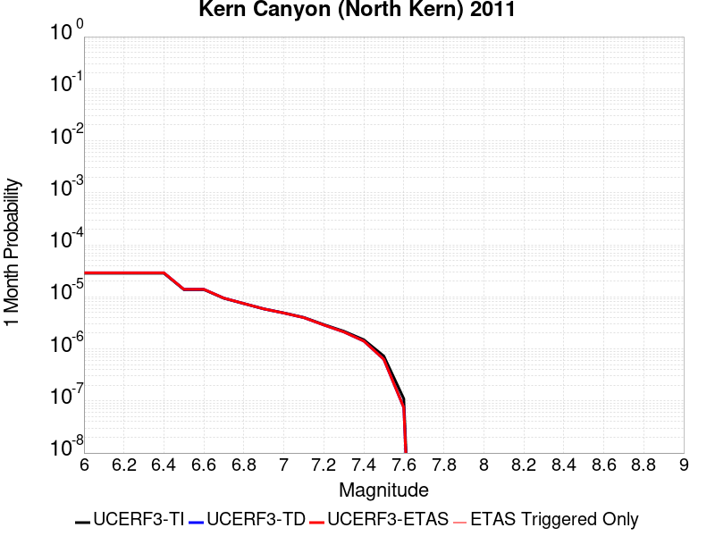 | 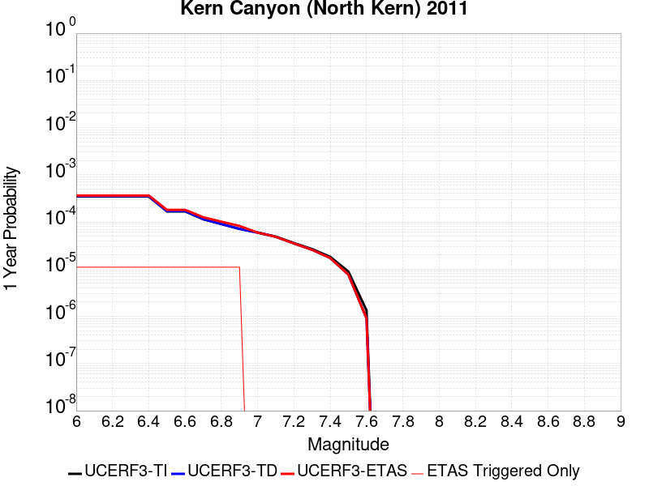 | 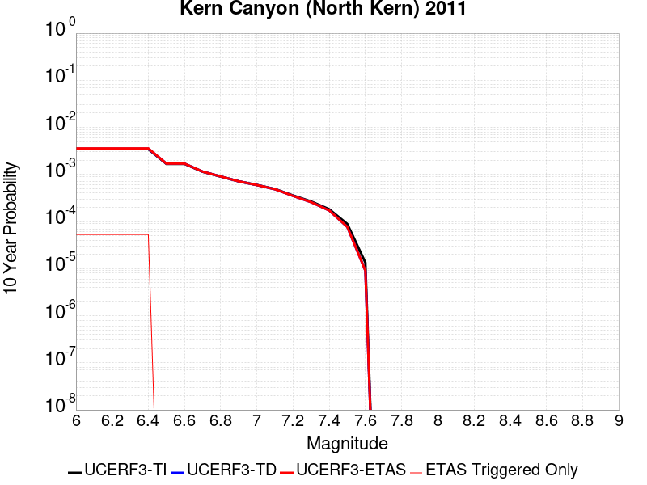 |

| Magnitude | 1 wk TI Prob | 1 wk TD Prob | 1 wk ETAS Prob | 1 wk ETAS/TD Gain | 1 wk ETAS Triggered Only | 1 mo TI Prob | 1 mo TD Prob | 1 mo ETAS Prob | 1 mo ETAS/TD Gain | 1 mo ETAS Triggered Only | 1 yr TI Prob | 1 yr TD Prob | 1 yr ETAS Prob | 1 yr ETAS/TD Gain | 1 yr ETAS Triggered Only | 10 yr TI Prob | 10 yr TD Prob | 10 yr ETAS Prob | 10 yr ETAS/TD Gain | 10 yr ETAS Triggered Only |
|-----|-----|-----|-----|-----|-----|-----|-----|-----|-----|-----|-----|-----|-----|-----|-----|-----|-----|-----|-----|-----|
| 6.0 | 6.6264497E-6 | 6.7575015E-6 | 6.7575015E-6 | 1.0 | 0.0 | 2.8398761E-5 | 2.8960445E-5 | 2.8960445E-5 | 1.0 | 0.0 | 3.4570007E-4 | 3.5254436E-4 | 3.635295E-4 | 1.0311596 | 1.0989011E-5 | 0.0034516277 | 0.0035206394 | 0.0035753911 | 1.0155516 | 5.4945056E-5 |
| 6.1 | 6.6264497E-6 | 6.7575015E-6 | 6.7575015E-6 | 1.0 | 0.0 | 2.8398761E-5 | 2.8960445E-5 | 2.8960445E-5 | 1.0 | 0.0 | 3.4570007E-4 | 3.5254436E-4 | 3.635295E-4 | 1.0311596 | 1.0989011E-5 | 0.0034516277 | 0.0035206394 | 0.0035753911 | 1.0155516 | 5.4945056E-5 |
| 6.2 | 6.6264497E-6 | 6.7575015E-6 | 6.7575015E-6 | 1.0 | 0.0 | 2.8398761E-5 | 2.8960445E-5 | 2.8960445E-5 | 1.0 | 0.0 | 3.4570007E-4 | 3.5254436E-4 | 3.635295E-4 | 1.0311596 | 1.0989011E-5 | 0.0034516277 | 0.0035206394 | 0.0035753911 | 1.0155516 | 5.4945056E-5 |
| 6.3 | 6.6264497E-6 | 6.7575015E-6 | 6.7575015E-6 | 1.0 | 0.0 | 2.8398761E-5 | 2.8960445E-5 | 2.8960445E-5 | 1.0 | 0.0 | 3.4570007E-4 | 3.5254436E-4 | 3.635295E-4 | 1.0311596 | 1.0989011E-5 | 0.0034516277 | 0.0035206394 | 0.0035753911 | 1.0155516 | 5.4945056E-5 |
| 6.4 | 6.6264497E-6 | 6.7575015E-6 | 6.7575015E-6 | 1.0 | 0.0 | 2.8398761E-5 | 2.8960445E-5 | 2.8960445E-5 | 1.0 | 0.0 | 3.4570007E-4 | 3.5254436E-4 | 3.635295E-4 | 1.0311596 | 1.0989011E-5 | 0.0034516277 | 0.0035206394 | 0.0035753911 | 1.0155516 | 5.4945056E-5 |
| 6.5 | 3.2162225E-6 | 3.2571647E-6 | 3.2571647E-6 | 1.0 | 0.0 | 1.3783738E-5 | 1.39592075E-5 | 1.39592075E-5 | 1.0 | 0.0 | 1.6780409E-4 | 1.699409E-4 | 1.8092805E-4 | 1.0646527 | 1.0989011E-5 | 0.0016767744 | 0.0016981892 | 0.0017311003 | 1.0193801 | 3.2967033E-5 |
| 6.6 | 3.2162225E-6 | 3.2571647E-6 | 3.2571647E-6 | 1.0 | 0.0 | 1.3783738E-5 | 1.39592075E-5 | 1.39592075E-5 | 1.0 | 0.0 | 1.6780409E-4 | 1.699409E-4 | 1.8092805E-4 | 1.0646527 | 1.0989011E-5 | 0.0016767744 | 0.0016981892 | 0.0017311003 | 1.0193801 | 3.2967033E-5 |
| 6.7 | 2.1908265E-6 | 2.2071688E-6 | 2.2071688E-6 | 1.0 | 0.0 | 9.389223E-6 | 9.4592615E-6 | 9.4592615E-6 | 1.0 | 0.0 | 1.1430779E-4 | 1.1516062E-4 | 1.2614837E-4 | 1.0954124 | 1.0989011E-5 | 0.0011424901 | 0.0011510288 | 0.0011839579 | 1.0286084 | 3.2967033E-5 |
| 6.8 | 1.7303895E-6 | 1.7365885E-6 | 1.7365885E-6 | 1.0 | 0.0 | 7.415934E-6 | 7.4425016E-6 | 7.4425016E-6 | 1.0 | 0.0 | 9.028525E-5 | 9.060879E-5 | 1.015968E-4 | 1.1212687 | 1.0989011E-5 | 9.024858E-4 | 9.0572814E-4 | 9.3866535E-4 | 1.0363654 | 3.2967033E-5 |
| 6.9 | 1.3700314E-6 | 1.3688899E-6 | 1.3688899E-6 | 1.0 | 0.0 | 5.87155E-6 | 5.8666583E-6 | 5.8666583E-6 | 1.0 | 0.0 | 7.148377E-5 | 7.142427E-5 | 8.2412495E-5 | 1.1538445 | 1.0989011E-5 | 7.146078E-4 | 7.1401766E-4 | 7.4696116E-4 | 1.0461382 | 3.2967033E-5 |
| 7.0 | 1.1467797E-6 | 1.1414036E-6 | 1.1414036E-6 | 1.0 | 0.0 | 4.9147607E-6 | 4.8917204E-6 | 4.8917204E-6 | 1.0 | 0.0 | 5.983557E-5 | 5.95551E-5 | 5.95551E-5 | 1.0 | 0.0 | 5.981946E-4 | 5.953946E-4 | 6.06377E-4 | 1.0184457 | 1.0989011E-5 |
| 7.1 | 9.3952065E-7 | 9.3028797E-7 | 9.3028797E-7 | 1.0 | 0.0 | 4.026511E-6 | 3.9869424E-6 | 3.9869424E-6 | 1.0 | 0.0 | 4.9021666E-5 | 4.853996E-5 | 4.853996E-5 | 1.0 | 0.0 | 4.901085E-4 | 4.8529537E-4 | 4.9627904E-4 | 1.022633 | 1.0989011E-5 |
| 7.2 | 6.858055E-7 | 6.71944E-7 | 6.71944E-7 | 1.0 | 0.0 | 2.939163E-6 | 2.879757E-6 | 2.879757E-6 | 1.0 | 0.0 | 3.5783723E-5 | 3.5060486E-5 | 3.5060486E-5 | 1.0 | 0.0 | 3.5777962E-4 | 3.505504E-4 | 3.505504E-4 | 1.0 | 0.0 |
| 7.3 | 5.1101983E-7 | 4.9394043E-7 | 4.9394043E-7 | 1.0 | 0.0 | 2.1900833E-6 | 2.116886E-6 | 2.116886E-6 | 1.0 | 0.0 | 2.6663936E-5 | 2.5772786E-5 | 2.5772786E-5 | 1.0 | 0.0 | 2.6660739E-4 | 2.5769844E-4 | 2.5769844E-4 | 1.0 | 0.0 |
| 7.4 | 3.4999414E-7 | 3.2996635E-7 | 3.2996635E-7 | 1.0 | 0.0 | 1.499974E-6 | 1.4141407E-6 | 1.4141407E-6 | 1.0 | 0.0 | 1.8262032E-5 | 1.721703E-5 | 1.721703E-5 | 1.0 | 0.0 | 1.826053E-4 | 1.721572E-4 | 1.721572E-4 | 1.0 | 0.0 |
| 7.5 | 1.7021522E-7 | 1.4750415E-7 | 1.4750415E-7 | 1.0 | 0.0 | 7.2949354E-7 | 6.3216055E-7 | 6.3216055E-7 | 1.0 | 0.0 | 8.881548E-6 | 7.696528E-6 | 7.696528E-6 | 1.0 | 0.0 | 8.8811925E-5 | 7.69627E-5 | 7.69627E-5 | 1.0 | 0.0 |
| 7.6 | 2.572245E-8 | 1.7353212E-8 | 1.7353212E-8 | 1.0 | 0.0 | 1.10239064E-7 | 7.437091E-8 | 7.437091E-8 | 1.0 | 0.0 | 1.3421597E-6 | 9.0546547E-7 | 9.0546547E-7 | 1.0 | 0.0 | 1.3421517E-5 | 9.054624E-6 | 9.054624E-6 | 1.0 | 0.0 |

## San Jacinto (Coyote Creek)
*[(top)](#table-of-contents)*

| 1 Week | 1 Month | 1 Year | 10 Year |
|-----|-----|-----|-----|
| 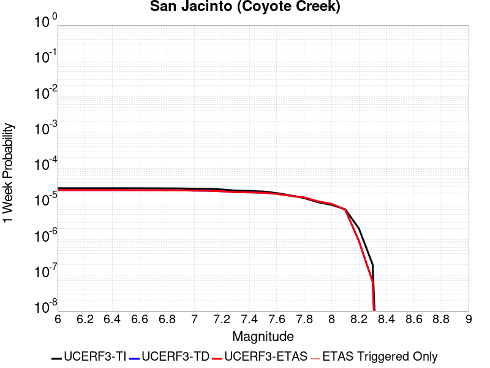 | 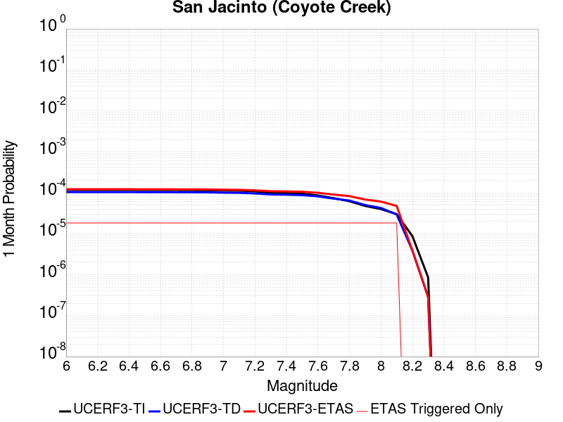 | 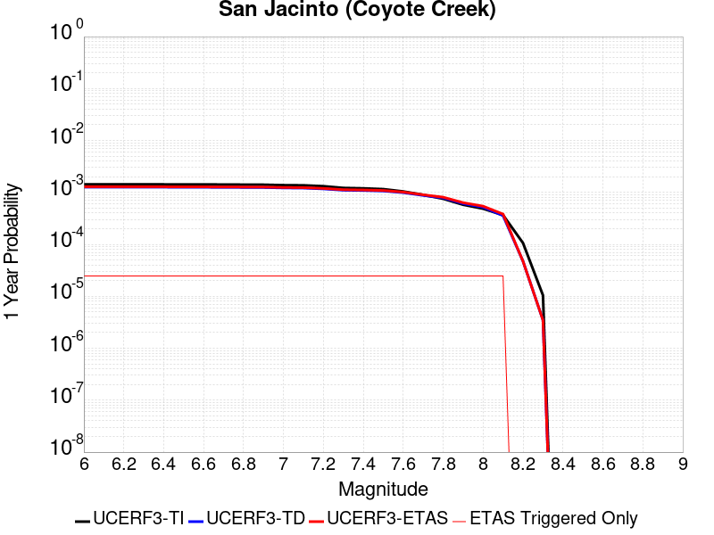 | 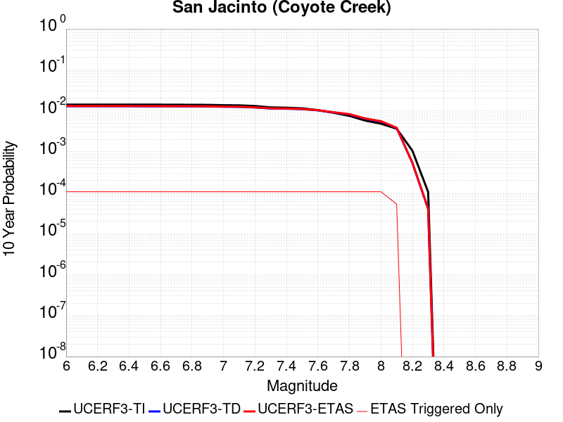 |

| Magnitude | 1 wk TI Prob | 1 wk TD Prob | 1 wk ETAS Prob | 1 wk ETAS/TD Gain | 1 wk ETAS Triggered Only | 1 mo TI Prob | 1 mo TD Prob | 1 mo ETAS Prob | 1 mo ETAS/TD Gain | 1 mo ETAS Triggered Only | 1 yr TI Prob | 1 yr TD Prob | 1 yr ETAS Prob | 1 yr ETAS/TD Gain | 1 yr ETAS Triggered Only | 10 yr TI Prob | 10 yr TD Prob | 10 yr ETAS Prob | 10 yr ETAS/TD Gain | 10 yr ETAS Triggered Only |
|-----|-----|-----|-----|-----|-----|-----|-----|-----|-----|-----|-----|-----|-----|-----|-----|-----|-----|-----|-----|-----|
| 6.0 | 2.7374346E-5 | 2.4210653E-5 | 2.4210653E-5 | 1.0 | 0.0 | 1.1731335E-4 | 1.03755825E-4 | 1.147437E-4 | 1.1059012 | 1.0989011E-5 | 0.0014273542 | 0.0012624977 | 0.0012844481 | 1.0173864 | 2.1978021E-5 | 0.01418221 | 0.012962389 | 0.013016622 | 1.0041839 | 5.4945056E-5 |
| 6.1 | 2.7374346E-5 | 2.4210653E-5 | 2.4210653E-5 | 1.0 | 0.0 | 1.1731335E-4 | 1.03755825E-4 | 1.147437E-4 | 1.1059012 | 1.0989011E-5 | 0.0014273542 | 0.0012624977 | 0.0012844481 | 1.0173864 | 2.1978021E-5 | 0.01418221 | 0.012962389 | 0.013016622 | 1.0041839 | 5.4945056E-5 |
| 6.2 | 2.7374346E-5 | 2.4210653E-5 | 2.4210653E-5 | 1.0 | 0.0 | 1.1731335E-4 | 1.03755825E-4 | 1.147437E-4 | 1.1059012 | 1.0989011E-5 | 0.0014273542 | 0.0012624977 | 0.0012844481 | 1.0173864 | 2.1978021E-5 | 0.01418221 | 0.012962389 | 0.013016622 | 1.0041839 | 5.4945056E-5 |
| 6.3 | 2.7374346E-5 | 2.4210653E-5 | 2.4210653E-5 | 1.0 | 0.0 | 1.1731335E-4 | 1.03755825E-4 | 1.147437E-4 | 1.1059012 | 1.0989011E-5 | 0.0014273542 | 0.0012624977 | 0.0012844481 | 1.0173864 | 2.1978021E-5 | 0.01418221 | 0.012962389 | 0.013016622 | 1.0041839 | 5.4945056E-5 |
| 6.4 | 2.7374346E-5 | 2.4210653E-5 | 2.4210653E-5 | 1.0 | 0.0 | 1.1731335E-4 | 1.03755825E-4 | 1.147437E-4 | 1.1059012 | 1.0989011E-5 | 0.0014273542 | 0.0012624977 | 0.0012844481 | 1.0173864 | 2.1978021E-5 | 0.01418221 | 0.012962389 | 0.013016622 | 1.0041839 | 5.4945056E-5 |
| 6.5 | 2.7282445E-5 | 2.4096702E-5 | 2.4096702E-5 | 1.0 | 0.0 | 1.16919524E-4 | 1.03267506E-4 | 1.1425538E-4 | 1.106402 | 1.0989011E-5 | 0.0014225657 | 0.0012565594 | 0.0012785097 | 1.0174687 | 2.1978021E-5 | 0.014134934 | 0.012903704 | 0.01295794 | 1.0042031 | 5.4945056E-5 |
| 6.6 | 2.7282445E-5 | 2.4096702E-5 | 2.4096702E-5 | 1.0 | 0.0 | 1.16919524E-4 | 1.03267506E-4 | 1.1425538E-4 | 1.106402 | 1.0989011E-5 | 0.0014225657 | 0.0012565594 | 0.0012785097 | 1.0174687 | 2.1978021E-5 | 0.014134934 | 0.012903704 | 0.01295794 | 1.0042031 | 5.4945056E-5 |
| 6.7 | 2.7216198E-5 | 2.4021803E-5 | 2.4021803E-5 | 1.0 | 0.0 | 1.1663563E-4 | 1.0294654E-4 | 1.13934424E-4 | 1.1067338 | 1.0989011E-5 | 0.0014191137 | 0.0012526561 | 0.0012746067 | 1.0175232 | 2.1978021E-5 | 0.014100855 | 0.012865107 | 0.012919345 | 1.004216 | 5.4945056E-5 |
| 6.8 | 2.7078617E-5 | 2.3938983E-5 | 2.3938983E-5 | 1.0 | 0.0 | 1.1604605E-4 | 1.0259162E-4 | 1.135795E-4 | 1.1071031 | 1.0989011E-5 | 0.001411945 | 0.00124834 | 0.0012702906 | 1.0175838 | 2.1978021E-5 | 0.014030075 | 0.01282223 | 0.012876471 | 1.0042301 | 5.4945056E-5 |
| 6.9 | 2.6982952E-5 | 2.3858454E-5 | 2.3858454E-5 | 1.0 | 0.0 | 1.15636096E-4 | 1.0224652E-4 | 1.1323441E-4 | 1.1074647 | 1.0989011E-5 | 0.0014069602 | 0.0012441432 | 0.0012660939 | 1.0176432 | 2.1978021E-5 | 0.013980856 | 0.012780527 | 0.01283477 | 1.0042442 | 5.4945056E-5 |
| 7.0 | 2.6449972E-5 | 2.3435334E-5 | 2.3435334E-5 | 1.0 | 0.0 | 1.1335209E-4 | 1.00433295E-4 | 1.114212E-4 | 1.109405 | 1.0989011E-5 | 0.001379188 | 0.0012220921 | 0.0012440432 | 1.017962 | 2.1978021E-5 | 0.0137065975 | 0.012561822 | 0.012616077 | 1.0043191 | 5.4945056E-5 |
| 7.1 | 2.6257849E-5 | 2.3261304E-5 | 2.3261304E-5 | 1.0 | 0.0 | 1.1252879E-4 | 9.968751E-5 | 1.1067543E-4 | 1.1102237 | 1.0989011E-5 | 0.0013691769 | 0.0012130223 | 0.0012349737 | 1.0180964 | 2.1978021E-5 | 0.013607717 | 0.012471657 | 0.012525917 | 1.0043507 | 5.4945056E-5 |
| 7.2 | 2.5270041E-5 | 2.2455588E-5 | 2.2455588E-5 | 1.0 | 0.0 | 1.0829568E-4 | 9.62347E-5 | 1.0722265E-4 | 1.1141787 | 1.0989011E-5 | 0.0013177024 | 0.0011710301 | 0.0011929824 | 1.0187461 | 2.1978021E-5 | 0.013099162 | 0.01205246 | 0.012106742 | 1.0045038 | 5.4945056E-5 |
| 7.3 | 2.339701E-5 | 2.1186537E-5 | 2.1186537E-5 | 1.0 | 0.0 | 1.0026905E-4 | 9.07963E-5 | 1.0178431E-4 | 1.1210183 | 1.0989011E-5 | 0.001220092 | 0.0011048864 | 0.0011268401 | 1.0198697 | 2.1978021E-5 | 0.012134149 | 0.011390935 | 0.011445253 | 1.0047686 | 5.4945056E-5 |
| 7.4 | 2.296333E-5 | 2.0916665E-5 | 2.0916665E-5 | 1.0 | 0.0 | 9.841056E-5 | 8.963978E-5 | 1.006278E-4 | 1.1225798 | 1.0989011E-5 | 0.0011974899 | 0.00109082 | 0.001112774 | 1.0201262 | 2.1978021E-5 | 0.011910575 | 0.011249933 | 0.01130426 | 1.004829 | 5.4945056E-5 |
| 7.5 | 2.2188895E-5 | 2.043907E-5 | 2.043907E-5 | 1.0 | 0.0 | 9.50918E-5 | 8.759309E-5 | 9.858114E-5 | 1.1254443 | 1.0989011E-5 | 0.0011571277 | 0.0010659262 | 0.0010878808 | 1.0205967 | 2.1978021E-5 | 0.011511209 | 0.010999291 | 0.011053632 | 1.0049404 | 5.4945056E-5 |
| 7.6 | 2.0013189E-5 | 1.9023963E-5 | 1.9023963E-5 | 1.0 | 0.0 | 8.5767984E-5 | 8.152873E-5 | 9.251684E-5 | 1.134776 | 1.0989011E-5 | 0.001043725 | 9.92162E-4 | 0.0010141182 | 1.0221297 | 2.1978021E-5 | 0.010388365 | 0.0102566015 | 0.010310983 | 1.0053021 | 5.4945056E-5 |
| 7.7 | 1.7230794E-5 | 1.6803497E-5 | 1.6803497E-5 | 1.0 | 0.0 | 7.384417E-5 | 7.2013005E-5 | 8.300123E-5 | 1.1525866 | 1.0989011E-5 | 8.986819E-4 | 8.764065E-4 | 8.983653E-4 | 1.0250554 | 2.1978021E-5 | 0.008950562 | 0.00909422 | 0.009148666 | 1.0059868 | 5.4945056E-5 |
| 7.8 | 1.4478809E-5 | 1.5048704E-5 | 1.5048704E-5 | 1.0 | 0.0 | 6.205057E-5 | 6.449286E-5 | 7.5481155E-5 | 1.1703801 | 1.0989011E-5 | 7.552038E-4 | 7.849183E-4 | 8.068791E-4 | 1.0279784 | 2.1978021E-5 | 0.0075264242 | 0.008171609 | 0.008226105 | 1.0066689 | 5.4945056E-5 |
| 7.9 | 1.1114467E-5 | 1.1696539E-5 | 1.1696539E-5 | 1.0 | 0.0 | 4.7632562E-5 | 5.0127066E-5 | 6.111553E-5 | 1.2192122 | 1.0989011E-5 | 5.797721E-4 | 6.101267E-4 | 6.320913E-4 | 1.0360001 | 2.1978021E-5 | 0.0057826187 | 0.0064073433 | 0.006461936 | 1.0085204 | 5.4945056E-5 |
| 8.0 | 9.327402E-6 | 9.945905E-6 | 9.945905E-6 | 1.0 | 0.0 | 3.9973966E-5 | 4.2624615E-5 | 5.3613156E-5 | 1.2577981 | 1.0989011E-5 | 4.8657437E-4 | 5.1883166E-4 | 5.4079824E-4 | 1.0423386 | 2.1978021E-5 | 0.0048551033 | 0.005474554 | 0.005529198 | 1.0099815 | 5.4945056E-5 |
| 8.1 | 7.0235833E-6 | 6.8624786E-6 | 6.8624786E-6 | 1.0 | 0.0 | 3.0100724E-5 | 2.9410294E-5 | 4.0398983E-5 | 1.3736341 | 1.0989011E-5 | 3.664147E-4 | 3.58012E-4 | 3.7998217E-4 | 1.061367 | 2.1978021E-5 | 0.003658111 | 0.0038061605 | 0.0038280548 | 1.0057523 | 2.1978021E-5 |
| 8.2 | 2.0358202E-6 | 9.0626554E-7 | 9.0626554E-7 | 1.0 | 0.0 | 8.724915E-6 | 3.8839894E-6 | 3.8839894E-6 | 1.0 | 0.0 | 1.06220665E-4 | 4.728657E-5 | 4.728657E-5 | 1.0 | 0.0 | 0.001061699 | 5.3636427E-4 | 5.3636427E-4 | 1.0 | 0.0 |
| 8.3 | 2.0051264E-7 | 6.67511E-8 | 6.67511E-8 | 1.0 | 0.0 | 8.5933965E-7 | 2.860761E-7 | 2.860761E-7 | 1.0 | 0.0 | 1.046241E-5 | 3.4829714E-6 | 3.4829714E-6 | 1.0 | 0.0 | 1.0461917E-4 | 4.047031E-5 | 4.047031E-5 | 1.0 | 0.0 |

## Big Pine (East)
*[(top)](#table-of-contents)*

| 1 Week | 1 Month | 1 Year | 10 Year |
|-----|-----|-----|-----|
| 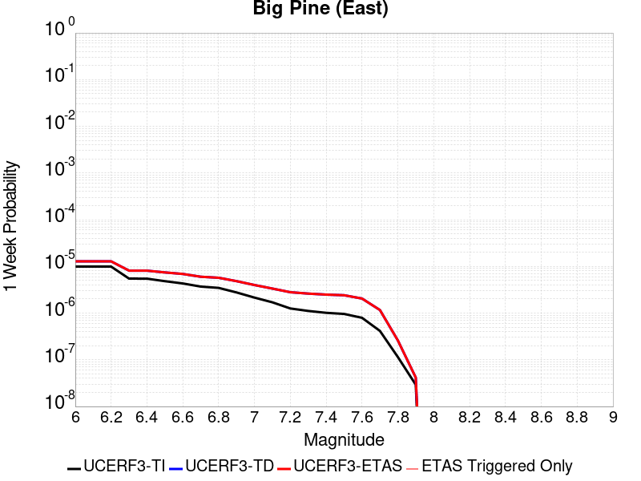 | 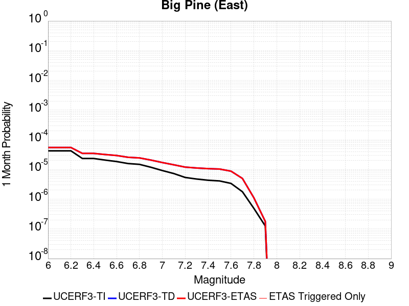 | 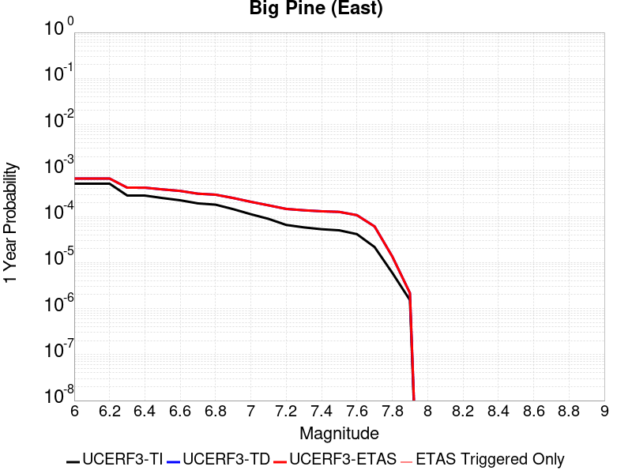 | 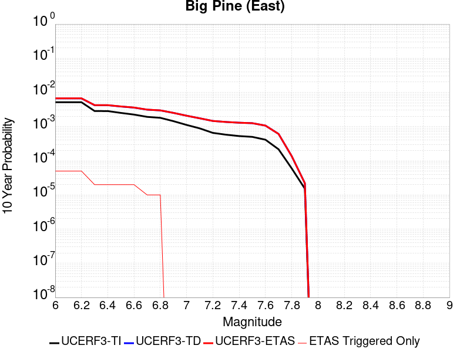 |

| Magnitude | 1 wk TI Prob | 1 wk TD Prob | 1 wk ETAS Prob | 1 wk ETAS/TD Gain | 1 wk ETAS Triggered Only | 1 mo TI Prob | 1 mo TD Prob | 1 mo ETAS Prob | 1 mo ETAS/TD Gain | 1 mo ETAS Triggered Only | 1 yr TI Prob | 1 yr TD Prob | 1 yr ETAS Prob | 1 yr ETAS/TD Gain | 1 yr ETAS Triggered Only | 10 yr TI Prob | 10 yr TD Prob | 10 yr ETAS Prob | 10 yr ETAS/TD Gain | 10 yr ETAS Triggered Only |
|-----|-----|-----|-----|-----|-----|-----|-----|-----|-----|-----|-----|-----|-----|-----|-----|-----|-----|-----|-----|-----|
| 6.0 | 9.916913E-6 | 1.2826955E-5 | 1.2826955E-5 | 1.0 | 0.0 | 4.250036E-5 | 5.497163E-5 | 5.497163E-5 | 1.0 | 0.0 | 5.173191E-4 | 6.690962E-4 | 6.800779E-4 | 1.0164126 | 1.0989011E-5 | 0.0051611643 | 0.0066755237 | 0.006730102 | 1.0081758 | 5.4945056E-5 |
| 6.1 | 9.916913E-6 | 1.2826955E-5 | 1.2826955E-5 | 1.0 | 0.0 | 4.250036E-5 | 5.497163E-5 | 5.497163E-5 | 1.0 | 0.0 | 5.173191E-4 | 6.690962E-4 | 6.800779E-4 | 1.0164126 | 1.0989011E-5 | 0.0051611643 | 0.0066755237 | 0.006730102 | 1.0081758 | 5.4945056E-5 |
| 6.2 | 9.916913E-6 | 1.2826955E-5 | 1.2826955E-5 | 1.0 | 0.0 | 4.250036E-5 | 5.497163E-5 | 5.497163E-5 | 1.0 | 0.0 | 5.173191E-4 | 6.690962E-4 | 6.800779E-4 | 1.0164126 | 1.0989011E-5 | 0.0051611643 | 0.0066755237 | 0.006730102 | 1.0081758 | 5.4945056E-5 |
| 6.3 | 5.479711E-6 | 8.122622E-6 | 8.122622E-6 | 1.0 | 0.0 | 2.3484265E-5 | 3.481079E-5 | 3.481079E-5 | 1.0 | 0.0 | 2.858834E-4 | 4.2374214E-4 | 4.2374214E-4 | 1.0 | 0.0 | 0.0028551589 | 0.004232182 | 0.0042540673 | 1.0051711 | 2.1978021E-5 |
| 6.4 | 5.465009E-6 | 8.106914E-6 | 8.106914E-6 | 1.0 | 0.0 | 2.3421257E-5 | 3.4743472E-5 | 3.4743472E-5 | 1.0 | 0.0 | 2.851165E-4 | 4.2292287E-4 | 4.2292287E-4 | 1.0 | 0.0 | 0.0028475097 | 0.004224021 | 0.004245906 | 1.0051811 | 2.1978021E-5 |
| 6.5 | 4.826767E-6 | 7.431929E-6 | 7.431929E-6 | 1.0 | 0.0 | 2.068598E-5 | 3.1850752E-5 | 3.1850752E-5 | 1.0 | 0.0 | 2.518227E-4 | 3.877167E-4 | 3.877167E-4 | 1.0 | 0.0 | 0.0025153751 | 0.0038732016 | 0.0038950944 | 1.0056524 | 2.1978021E-5 |
| 6.6 | 4.3146847E-6 | 6.891834E-6 | 6.891834E-6 | 1.0 | 0.0 | 1.8491375E-5 | 2.953611E-5 | 2.953611E-5 | 1.0 | 0.0 | 2.2510924E-4 | 3.5954526E-4 | 3.5954526E-4 | 1.0 | 0.0 | 0.0022488134 | 0.0035924022 | 0.003614301 | 1.0060959 | 2.1978021E-5 |
| 6.7 | 3.6968106E-6 | 6.0045036E-6 | 6.0045036E-6 | 1.0 | 0.0 | 1.5843378E-5 | 2.5733341E-5 | 2.5733341E-5 | 1.0 | 0.0 | 1.9287605E-4 | 3.1325992E-4 | 3.1325992E-4 | 1.0 | 0.0 | 0.0019270873 | 0.0031308597 | 0.0031418141 | 1.0034989 | 1.0989011E-5 |
| 6.8 | 3.4671132E-6 | 5.710963E-6 | 5.710963E-6 | 1.0 | 0.0 | 1.4858972E-5 | 2.4475334E-5 | 2.4475334E-5 | 1.0 | 0.0 | 1.8089297E-4 | 2.979479E-4 | 2.979479E-4 | 1.0 | 0.0 | 0.0018074579 | 0.002978152 | 0.0029891082 | 1.0036789 | 1.0989011E-5 |
| 6.9 | 2.7686972E-6 | 4.8333345E-6 | 4.8333345E-6 | 1.0 | 0.0 | 1.1865792E-5 | 2.0714131E-5 | 2.0714131E-5 | 1.0 | 0.0 | 1.4445644E-4 | 2.5216612E-4 | 2.5216612E-4 | 1.0 | 0.0 | 0.0014436257 | 0.0025213994 | 0.0025213994 | 1.0 | 0.0 |
| 7.0 | 2.1472624E-6 | 3.9924093E-6 | 3.9924093E-6 | 1.0 | 0.0 | 9.20252E-6 | 1.7110217E-5 | 1.7110217E-5 | 1.0 | 0.0 | 1.12034926E-4 | 2.0829751E-4 | 2.0829751E-4 | 1.0 | 0.0 | 0.0011197845 | 0.0020835903 | 0.0020835903 | 1.0 | 0.0 |
| 7.1 | 1.7018335E-6 | 3.3515819E-6 | 3.3515819E-6 | 1.0 | 0.0 | 7.293552E-6 | 1.4363845E-5 | 1.4363845E-5 | 1.0 | 0.0 | 8.879537E-5 | 1.7486615E-4 | 1.7486615E-4 | 1.0 | 0.0 | 8.87599E-4 | 0.0017498214 | 0.0017498214 | 1.0 | 0.0 |
| 7.2 | 1.25603E-6 | 2.800819E-6 | 2.800819E-6 | 1.0 | 0.0 | 5.3829745E-6 | 1.20034565E-5 | 1.20034565E-5 | 1.0 | 0.0 | 6.553574E-5 | 1.461325E-4 | 1.461325E-4 | 1.0 | 0.0 | 6.551642E-4 | 0.0014628756 | 0.0014628756 | 1.0 | 0.0 |
| 7.3 | 1.112297E-6 | 2.6163139E-6 | 2.6163139E-6 | 1.0 | 0.0 | 4.7669787E-6 | 1.1212726E-5 | 1.1212726E-5 | 1.0 | 0.0 | 5.803642E-5 | 1.3650661E-4 | 1.3650661E-4 | 1.0 | 0.0 | 5.802127E-4 | 0.0013665707 | 0.0013665707 | 1.0 | 0.0 |
| 7.4 | 1.0137181E-6 | 2.489217E-6 | 2.489217E-6 | 1.0 | 0.0 | 4.3444993E-6 | 1.066803E-5 | 1.066803E-5 | 1.0 | 0.0 | 5.2892992E-5 | 1.2987574E-4 | 1.2987574E-4 | 1.0 | 0.0 | 5.288041E-4 | 0.0013001257 | 0.0013001257 | 1.0 | 0.0 |
| 7.5 | 9.598608E-7 | 2.412703E-6 | 2.412703E-6 | 1.0 | 0.0 | 4.1136827E-6 | 1.0340116E-5 | 1.0340116E-5 | 1.0 | 0.0 | 5.0082934E-5 | 1.2588386E-4 | 1.2588386E-4 | 1.0 | 0.0 | 5.007165E-4 | 0.0012600615 | 0.0012600615 | 1.0 | 0.0 |
| 7.6 | 7.929459E-7 | 2.049765E-6 | 2.049765E-6 | 1.0 | 0.0 | 3.3983351E-6 | 8.784678E-6 | 8.784678E-6 | 1.0 | 0.0 | 4.1373947E-5 | 1.0694839E-4 | 1.0694839E-4 | 1.0 | 0.0 | 4.1366243E-4 | 0.0010710025 | 0.0010710025 | 1.0 | 0.0 |
| 7.7 | 4.155788E-7 | 1.1640374E-6 | 1.1640374E-6 | 1.0 | 0.0 | 1.7810507E-6 | 4.988722E-6 | 4.988722E-6 | 1.0 | 0.0 | 2.1684076E-5 | 6.073604E-5 | 6.073604E-5 | 1.0 | 0.0 | 2.1681961E-4 | 6.103289E-4 | 6.103289E-4 | 1.0 | 0.0 |
| 7.8 | 1.14666925E-7 | 2.5998284E-7 | 2.5998284E-7 | 1.0 | 0.0 | 4.914296E-7 | 1.1142117E-6 | 1.1142117E-6 | 1.0 | 0.0 | 5.9831386E-6 | 1.3565448E-5 | 1.3565448E-5 | 1.0 | 0.0 | 5.9829777E-5 | 1.3674163E-4 | 1.3674163E-4 | 1.0 | 0.0 |
| 7.9 | 2.9231824E-8 | 4.1594287E-8 | 4.1594287E-8 | 1.0 | 0.0 | 1.2527924E-7 | 1.7826122E-7 | 1.7826122E-7 | 1.0 | 0.0 | 1.5252737E-6 | 2.1703283E-6 | 2.1703283E-6 | 1.0 | 0.0 | 1.5252632E-5 | 2.2035945E-5 | 2.2035945E-5 | 1.0 | 0.0 |

## Lost Hills
*[(top)](#table-of-contents)*

| 1 Week | 1 Month | 1 Year | 10 Year |
|-----|-----|-----|-----|
| 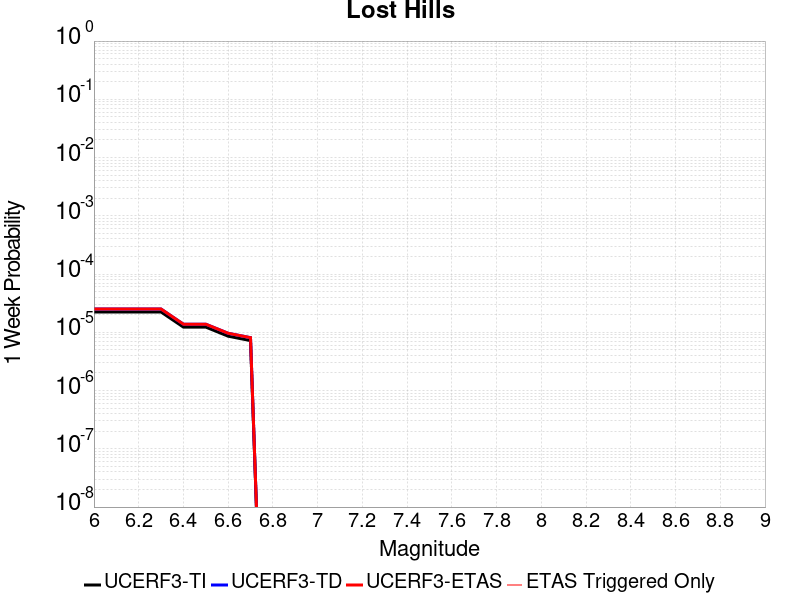 | 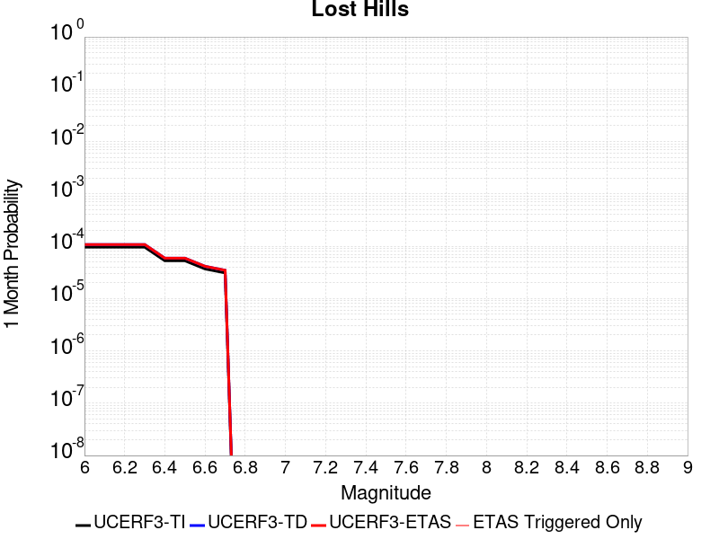 | 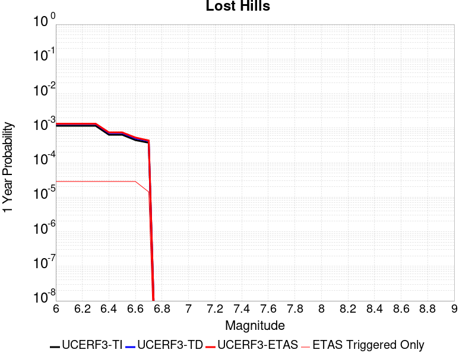 |  |

| Magnitude | 1 wk TI Prob | 1 wk TD Prob | 1 wk ETAS Prob | 1 wk ETAS/TD Gain | 1 wk ETAS Triggered Only | 1 mo TI Prob | 1 mo TD Prob | 1 mo ETAS Prob | 1 mo ETAS/TD Gain | 1 mo ETAS Triggered Only | 1 yr TI Prob | 1 yr TD Prob | 1 yr ETAS Prob | 1 yr ETAS/TD Gain | 1 yr ETAS Triggered Only | 10 yr TI Prob | 10 yr TD Prob | 10 yr ETAS Prob | 10 yr ETAS/TD Gain | 10 yr ETAS Triggered Only |
|-----|-----|-----|-----|-----|-----|-----|-----|-----|-----|-----|-----|-----|-----|-----|-----|-----|-----|-----|-----|-----|
| 6.0 | 2.233523E-5 | 2.5109888E-5 | 2.5109888E-5 | 1.0 | 0.0 | 9.571891E-5 | 1.07610314E-4 | 1.07610314E-4 | 1.0 | 0.0 | 0.0011647546 | 0.0013095363 | 0.0013314856 | 1.0167611 | 2.1978021E-5 | 0.011586686 | 0.013034798 | 0.013089027 | 1.0041603 | 5.4945056E-5 |
| 6.1 | 2.233523E-5 | 2.5109888E-5 | 2.5109888E-5 | 1.0 | 0.0 | 9.571891E-5 | 1.07610314E-4 | 1.07610314E-4 | 1.0 | 0.0 | 0.0011647546 | 0.0013095363 | 0.0013314856 | 1.0167611 | 2.1978021E-5 | 0.011586686 | 0.013034798 | 0.013089027 | 1.0041603 | 5.4945056E-5 |
| 6.2 | 2.233523E-5 | 2.5109888E-5 | 2.5109888E-5 | 1.0 | 0.0 | 9.571891E-5 | 1.07610314E-4 | 1.07610314E-4 | 1.0 | 0.0 | 0.0011647546 | 0.0013095363 | 0.0013314856 | 1.0167611 | 2.1978021E-5 | 0.011586686 | 0.013034798 | 0.013089027 | 1.0041603 | 5.4945056E-5 |
| 6.3 | 2.233523E-5 | 2.5109888E-5 | 2.5109888E-5 | 1.0 | 0.0 | 9.571891E-5 | 1.07610314E-4 | 1.07610314E-4 | 1.0 | 0.0 | 0.0011647546 | 0.0013095363 | 0.0013314856 | 1.0167611 | 2.1978021E-5 | 0.011586686 | 0.013034798 | 0.013089027 | 1.0041603 | 5.4945056E-5 |
| 6.4 | 1.2288092E-5 | 1.3782884E-5 | 1.3782884E-5 | 1.0 | 0.0 | 5.2662188E-5 | 5.9068694E-5 | 5.9068694E-5 | 1.0 | 0.0 | 6.409735E-4 | 7.190179E-4 | 7.409801E-4 | 1.0305448 | 2.1978021E-5 | 0.006391279 | 0.007176124 | 0.0072197644 | 1.0060813 | 4.3956043E-5 |
| 6.5 | 1.2288092E-5 | 1.3782884E-5 | 1.3782884E-5 | 1.0 | 0.0 | 5.2662188E-5 | 5.9068694E-5 | 5.9068694E-5 | 1.0 | 0.0 | 6.409735E-4 | 7.190179E-4 | 7.409801E-4 | 1.0305448 | 2.1978021E-5 | 0.006391279 | 0.007176124 | 0.0072197644 | 1.0060813 | 4.3956043E-5 |
| 6.6 | 8.58281E-6 | 9.635021E-6 | 9.635021E-6 | 1.0 | 0.0 | 3.6782953E-5 | 4.1292766E-5 | 4.1292766E-5 | 1.0 | 0.0 | 4.4774043E-4 | 5.027067E-4 | 5.2467367E-4 | 1.0436974 | 2.1978021E-5 | 0.0044683935 | 0.005023857 | 0.0050566588 | 1.0065291 | 3.2967033E-5 |
| 6.7 | 7.205685E-6 | 8.089353E-6 | 8.089353E-6 | 1.0 | 0.0 | 3.088114E-5 | 3.4668654E-5 | 3.4668654E-5 | 1.0 | 0.0 | 3.7591302E-4 | 4.2209087E-4 | 4.3307524E-4 | 1.0260237 | 1.0989011E-5 | 0.0037527776 | 0.004220909 | 0.004242794 | 1.005185 | 2.1978021E-5 |

## Big Pine (Central)
*[(top)](#table-of-contents)*

| 1 Week | 1 Month | 1 Year | 10 Year |
|-----|-----|-----|-----|
| 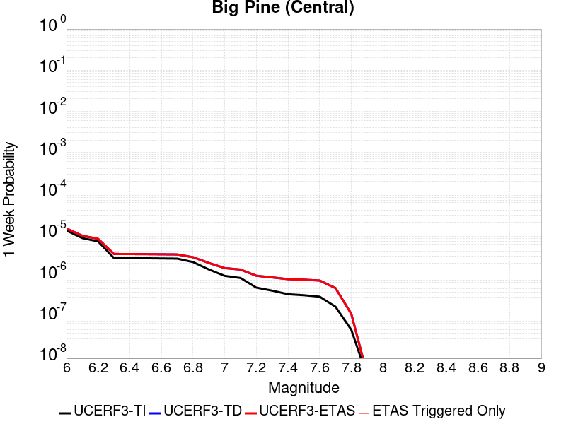 | 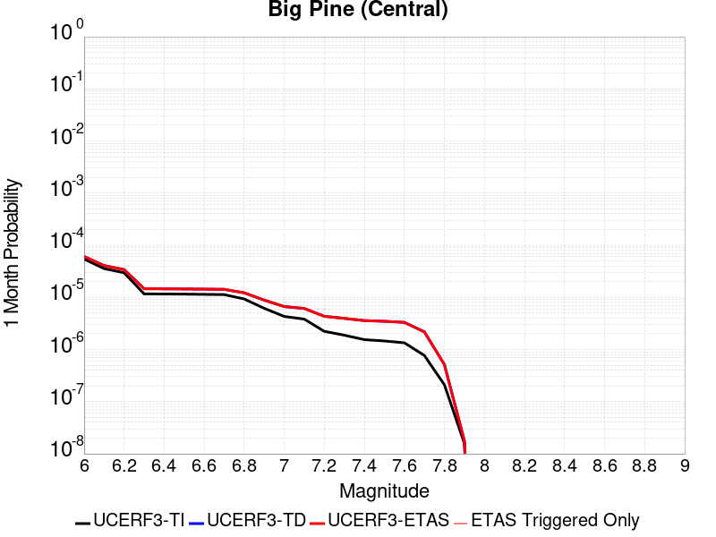 | 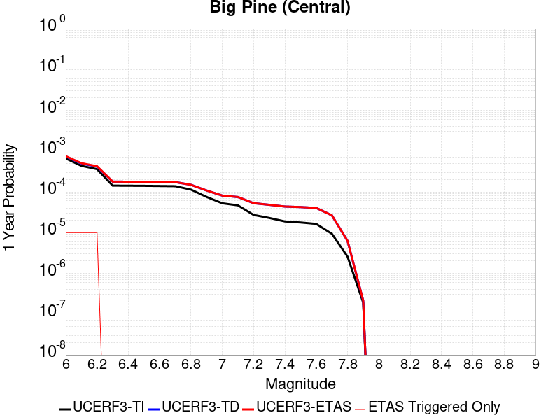 | 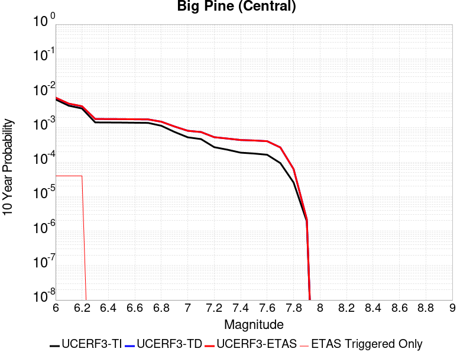 |

| Magnitude | 1 wk TI Prob | 1 wk TD Prob | 1 wk ETAS Prob | 1 wk ETAS/TD Gain | 1 wk ETAS Triggered Only | 1 mo TI Prob | 1 mo TD Prob | 1 mo ETAS Prob | 1 mo ETAS/TD Gain | 1 mo ETAS Triggered Only | 1 yr TI Prob | 1 yr TD Prob | 1 yr ETAS Prob | 1 yr ETAS/TD Gain | 1 yr ETAS Triggered Only | 10 yr TI Prob | 10 yr TD Prob | 10 yr ETAS Prob | 10 yr ETAS/TD Gain | 10 yr ETAS Triggered Only |
|-----|-----|-----|-----|-----|-----|-----|-----|-----|-----|-----|-----|-----|-----|-----|-----|-----|-----|-----|-----|-----|
| 6.0 | 1.2706755E-5 | 1.4254399E-5 | 1.4254399E-5 | 1.0 | 0.0 | 5.4456385E-5 | 6.108906E-5 | 6.108906E-5 | 1.0 | 0.0 | 6.628048E-4 | 7.4354204E-4 | 7.5452286E-4 | 1.0147682 | 1.0989011E-5 | 0.006608314 | 0.0074155475 | 0.007459177 | 1.0058836 | 4.3956043E-5 |
| 6.1 | 8.342579E-6 | 9.5141995E-6 | 9.5141995E-6 | 1.0 | 0.0 | 3.5753423E-5 | 4.0774623E-5 | 4.0774623E-5 | 1.0 | 0.0 | 4.3521097E-4 | 4.963397E-4 | 5.0732325E-4 | 1.022129 | 1.0989011E-5 | 0.0043435963 | 0.0049558426 | 0.004999581 | 1.0088255 | 4.3956043E-5 |
| 6.2 | 6.923899E-6 | 7.9704405E-6 | 7.9704405E-6 | 1.0 | 0.0 | 2.9673516E-5 | 3.4158693E-5 | 3.4158693E-5 | 1.0 | 0.0 | 3.6121515E-4 | 4.1582197E-4 | 4.268064E-4 | 1.0264162 | 1.0989011E-5 | 0.003606286 | 0.0041537234 | 0.004197497 | 1.0105383 | 4.3956043E-5 |
| 6.3 | 2.728396E-6 | 3.427185E-6 | 3.427185E-6 | 1.0 | 0.0 | 1.1693074E-5 | 1.4687857E-5 | 1.4687857E-5 | 1.0 | 0.0 | 1.4235388E-4 | 1.7881086E-4 | 1.7881086E-4 | 1.0 | 0.0 | 0.0014226272 | 0.001788153 | 0.001788153 | 1.0 | 0.0 |
| 6.4 | 2.7136944E-6 | 3.411477E-6 | 3.411477E-6 | 1.0 | 0.0 | 1.1630066E-5 | 1.4620539E-5 | 1.4620539E-5 | 1.0 | 0.0 | 1.4158686E-4 | 1.779914E-4 | 1.779914E-4 | 1.0 | 0.0 | 0.0014149669 | 0.0017799714 | 0.0017799714 | 1.0 | 0.0 |
| 6.5 | 2.6971882E-6 | 3.3938209E-6 | 3.3938209E-6 | 1.0 | 0.0 | 1.1559327E-5 | 1.454487E-5 | 1.454487E-5 | 1.0 | 0.0 | 1.4072572E-4 | 1.7707028E-4 | 1.7707028E-4 | 1.0 | 0.0 | 0.0014063664 | 0.001770775 | 0.001770775 | 1.0 | 0.0 |
| 6.6 | 2.669092E-6 | 3.3638391E-6 | 3.3638391E-6 | 1.0 | 0.0 | 1.1438916E-5 | 1.441638E-5 | 1.441638E-5 | 1.0 | 0.0 | 1.3925991E-4 | 1.7550615E-4 | 1.7550615E-4 | 1.0 | 0.0 | 0.0013917267 | 0.0017551584 | 0.0017551584 | 1.0 | 0.0 |
| 6.7 | 2.6408059E-6 | 3.3338629E-6 | 3.3338629E-6 | 1.0 | 0.0 | 1.1317691E-5 | 1.4287911E-5 | 1.4287911E-5 | 1.0 | 0.0 | 1.3778417E-4 | 1.739423E-4 | 1.739423E-4 | 1.0 | 0.0 | 0.0013769877 | 0.0017395444 | 0.0017395444 | 1.0 | 0.0 |
| 6.8 | 2.1786943E-6 | 2.8573045E-6 | 2.8573045E-6 | 1.0 | 0.0 | 9.337228E-6 | 1.2245538E-5 | 1.2245538E-5 | 1.0 | 0.0 | 1.1367482E-4 | 1.4907995E-4 | 1.4907995E-4 | 1.0 | 0.0 | 0.0011361669 | 0.0014912689 | 0.0014912689 | 1.0 | 0.0 |
| 6.9 | 1.4411696E-6 | 2.0712434E-6 | 2.0712434E-6 | 1.0 | 0.0 | 6.1764263E-6 | 8.876729E-6 | 8.876729E-6 | 1.0 | 0.0 | 7.51954E-5 | 1.0806909E-4 | 1.0806909E-4 | 1.0 | 0.0 | 7.5169955E-4 | 0.0010815903 | 0.0010815903 | 1.0 | 0.0 |
| 7.0 | 1.0073411E-6 | 1.5567118E-6 | 1.5567118E-6 | 1.0 | 0.0 | 4.317169E-6 | 6.6716057E-6 | 6.6716057E-6 | 1.0 | 0.0 | 5.2560266E-5 | 8.122392E-5 | 8.122392E-5 | 1.0 | 0.0 | 5.2547833E-4 | 8.1335596E-4 | 8.1335596E-4 | 1.0 | 0.0 |
| 7.1 | 8.947104E-7 | 1.4326654E-6 | 1.4326654E-6 | 1.0 | 0.0 | 3.834468E-6 | 6.139981E-6 | 6.139981E-6 | 1.0 | 0.0 | 4.6683643E-5 | 7.475185E-5 | 7.475185E-5 | 1.0 | 0.0 | 4.6673836E-4 | 7.4868044E-4 | 7.4868044E-4 | 1.0 | 0.0 |
| 7.2 | 5.215166E-7 | 1.0134224E-6 | 1.0134224E-6 | 1.0 | 0.0 | 2.2350691E-6 | 4.3432324E-6 | 4.3432324E-6 | 1.0 | 0.0 | 2.7211627E-5 | 5.2877615E-5 | 5.2877615E-5 | 1.0 | 0.0 | 2.7208295E-4 | 5.300535E-4 | 5.300535E-4 | 1.0 | 0.0 |
| 7.3 | 4.4024807E-7 | 9.2414655E-7 | 9.2414655E-7 | 1.0 | 0.0 | 1.8867761E-6 | 3.9606225E-6 | 3.9606225E-6 | 1.0 | 0.0 | 2.2971257E-5 | 4.821955E-5 | 4.821955E-5 | 1.0 | 0.0 | 2.2968883E-4 | 4.8349393E-4 | 4.8349393E-4 | 1.0 | 0.0 |
| 7.4 | 3.6130905E-7 | 8.3797204E-7 | 8.3797204E-7 | 1.0 | 0.0 | 1.5484665E-6 | 3.591304E-6 | 3.591304E-6 | 1.0 | 0.0 | 1.8852415E-5 | 4.372329E-5 | 4.372329E-5 | 1.0 | 0.0 | 1.8850817E-4 | 4.3854036E-4 | 4.3854036E-4 | 1.0 | 0.0 |
| 7.5 | 3.408184E-7 | 8.128881E-7 | 8.128881E-7 | 1.0 | 0.0 | 1.4606494E-6 | 3.4838017E-6 | 3.4838017E-6 | 1.0 | 0.0 | 1.7783263E-5 | 4.24145E-5 | 4.24145E-5 | 1.0 | 0.0 | 1.778184E-4 | 4.2543613E-4 | 4.2543613E-4 | 1.0 | 0.0 |
| 7.6 | 3.1428627E-7 | 7.7515983E-7 | 7.7515983E-7 | 1.0 | 0.0 | 1.3469405E-6 | 3.3221097E-6 | 3.3221097E-6 | 1.0 | 0.0 | 1.6398877E-5 | 4.044597E-5 | 4.044597E-5 | 1.0 | 0.0 | 1.6397667E-4 | 4.0572946E-4 | 4.0572946E-4 | 1.0 | 0.0 |
| 7.7 | 1.7972785E-7 | 5.093037E-7 | 5.093037E-7 | 1.0 | 0.0 | 7.70262E-7 | 2.1827282E-6 | 2.1827282E-6 | 1.0 | 0.0 | 9.377899E-6 | 2.6574404E-5 | 2.6574404E-5 | 1.0 | 0.0 | 9.377503E-5 | 2.6706362E-4 | 2.6706362E-4 | 1.0 | 0.0 |
| 7.8 | 4.9230927E-8 | 1.2016858E-7 | 1.2016858E-7 | 1.0 | 0.0 | 2.1098968E-7 | 5.1500814E-7 | 5.1500814E-7 | 1.0 | 0.0 | 2.5687964E-6 | 6.2702075E-6 | 6.2702075E-6 | 1.0 | 0.0 | 2.5687666E-5 | 6.313871E-5 | 6.313871E-5 | 1.0 | 0.0 |
| 7.9 | 3.6805972E-9 | 4.1195065E-9 | 4.1195065E-9 | 1.0 | 0.0 | 1.5773987E-8 | 1.7655028E-8 | 1.7655028E-8 | 1.0 | 0.0 | 1.9204828E-7 | 2.1494995E-7 | 2.1494995E-7 | 1.0 | 0.0 | 1.920481E-6 | 2.197511E-6 | 2.197511E-6 | 1.0 | 0.0 |

## Cleghorn Lake
*[(top)](#table-of-contents)*

| 1 Week | 1 Month | 1 Year | 10 Year |
|-----|-----|-----|-----|
| 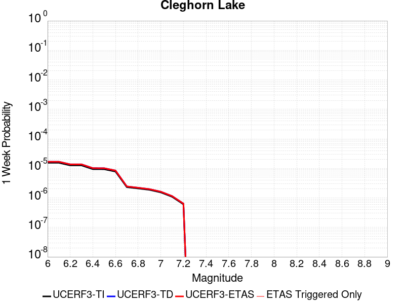 | 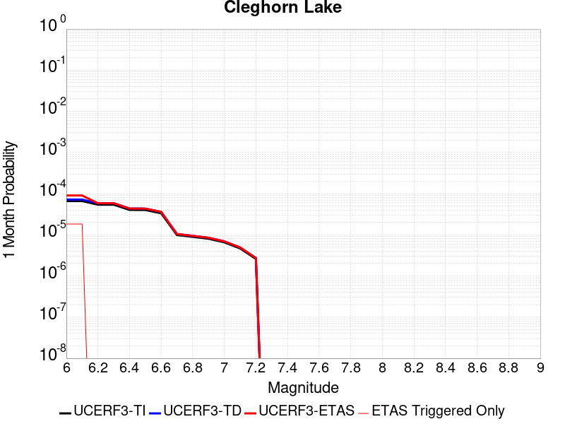 | 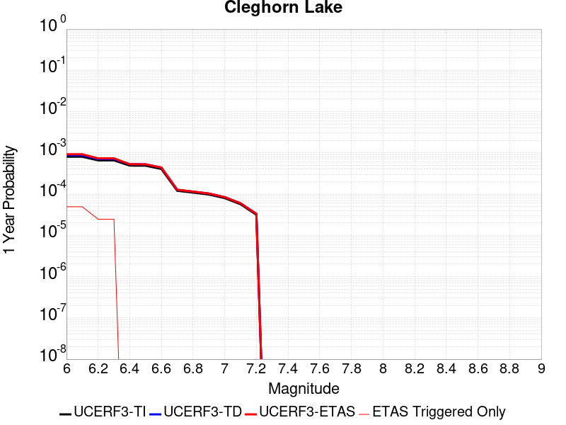 | 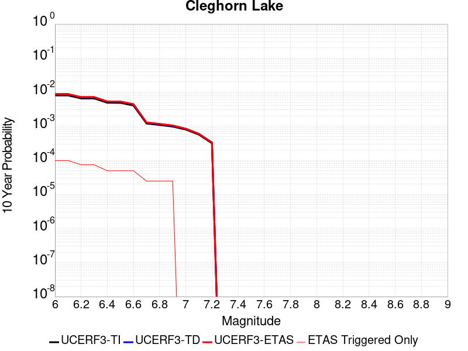 |

| Magnitude | 1 wk TI Prob | 1 wk TD Prob | 1 wk ETAS Prob | 1 wk ETAS/TD Gain | 1 wk ETAS Triggered Only | 1 mo TI Prob | 1 mo TD Prob | 1 mo ETAS Prob | 1 mo ETAS/TD Gain | 1 mo ETAS Triggered Only | 1 yr TI Prob | 1 yr TD Prob | 1 yr ETAS Prob | 1 yr ETAS/TD Gain | 1 yr ETAS Triggered Only | 10 yr TI Prob | 10 yr TD Prob | 10 yr ETAS Prob | 10 yr ETAS/TD Gain | 10 yr ETAS Triggered Only |
|-----|-----|-----|-----|-----|-----|-----|-----|-----|-----|-----|-----|-----|-----|-----|-----|-----|-----|-----|-----|-----|
| 6.0 | 1.5467183E-5 | 1.6795737E-5 | 1.6795737E-5 | 1.0 | 0.0 | 6.6286244E-5 | 7.198006E-5 | 8.2968276E-5 | 1.1526564 | 1.0989011E-5 | 8.067362E-4 | 8.760597E-4 | 8.980185E-4 | 1.0250654 | 2.1978021E-5 | 0.008038137 | 0.00873149 | 0.008775062 | 1.0049902 | 4.3956043E-5 |
| 6.1 | 1.5467183E-5 | 1.6795737E-5 | 1.6795737E-5 | 1.0 | 0.0 | 6.6286244E-5 | 7.198006E-5 | 8.2968276E-5 | 1.1526564 | 1.0989011E-5 | 8.067362E-4 | 8.760597E-4 | 8.980185E-4 | 1.0250654 | 2.1978021E-5 | 0.008038137 | 0.00873149 | 0.008775062 | 1.0049902 | 4.3956043E-5 |
| 6.2 | 1.2624631E-5 | 1.3682765E-5 | 1.3682765E-5 | 1.0 | 0.0 | 5.410444E-5 | 5.8639376E-5 | 5.8639376E-5 | 1.0 | 0.0 | 6.585225E-4 | 7.1374926E-4 | 7.2473043E-4 | 1.0153852 | 1.0989011E-5 | 0.0065657445 | 0.007119365 | 0.0071520973 | 1.0045977 | 3.2967033E-5 |
| 6.3 | 1.2624631E-5 | 1.3682765E-5 | 1.3682765E-5 | 1.0 | 0.0 | 5.410444E-5 | 5.8639376E-5 | 5.8639376E-5 | 1.0 | 0.0 | 6.585225E-4 | 7.1374926E-4 | 7.2473043E-4 | 1.0153852 | 1.0989011E-5 | 0.0065657445 | 0.007119365 | 0.0071520973 | 1.0045977 | 3.2967033E-5 |
| 6.4 | 9.417684E-6 | 1.0170984E-5 | 1.0170984E-5 | 1.0 | 0.0 | 4.036088E-5 | 4.3589433E-5 | 4.3589433E-5 | 1.0 | 0.0 | 4.912829E-4 | 5.3061324E-4 | 5.3061324E-4 | 1.0 | 0.0 | 0.004901982 | 0.0052974997 | 0.005319361 | 1.0041268 | 2.1978021E-5 |
| 6.5 | 9.368219E-6 | 1.0118407E-5 | 1.0118407E-5 | 1.0 | 0.0 | 4.014889E-5 | 4.336411E-5 | 4.336411E-5 | 1.0 | 0.0 | 4.8870314E-4 | 5.2787125E-4 | 5.2787125E-4 | 1.0 | 0.0 | 0.004876298 | 0.00527021 | 0.0052920724 | 1.0041482 | 2.1978021E-5 |
| 6.6 | 7.803798E-6 | 8.4425665E-6 | 8.4425665E-6 | 1.0 | 0.0 | 3.3444423E-5 | 3.6182148E-5 | 3.6182148E-5 | 1.0 | 0.0 | 4.0710976E-4 | 4.4046855E-4 | 4.4046855E-4 | 1.0 | 0.0 | 0.0040636472 | 0.0043998733 | 0.0044217543 | 1.0049732 | 2.1978021E-5 |
| 6.7 | 2.3108669E-6 | 2.443983E-6 | 2.443983E-6 | 1.0 | 0.0 | 9.903678E-6 | 1.0474172E-5 | 1.0474172E-5 | 1.0 | 0.0 | 1.205706E-4 | 1.2751577E-4 | 1.2751577E-4 | 1.0 | 0.0 | 0.001205052 | 0.0012744446 | 0.0012854197 | 1.0086116 | 1.0989011E-5 |
| 6.8 | 2.0882828E-6 | 2.2064146E-6 | 2.2064146E-6 | 1.0 | 0.0 | 8.949753E-6 | 9.456029E-6 | 9.456029E-6 | 1.0 | 0.0 | 1.08957785E-4 | 1.1512124E-4 | 1.1512124E-4 | 1.0 | 0.0 | 0.0010890438 | 0.0011506329 | 0.0011616093 | 1.0095394 | 1.0989011E-5 |
| 6.9 | 1.876935E-6 | 1.9811675E-6 | 1.9811675E-6 | 1.0 | 0.0 | 8.043982E-6 | 8.4906915E-6 | 8.4906915E-6 | 1.0 | 0.0 | 9.7931086E-5 | 1.0336943E-4 | 1.0336943E-4 | 1.0 | 0.0 | 9.788794E-4 | 0.0010332294 | 0.0010442071 | 1.0106246 | 1.0989011E-5 |
| 7.0 | 1.5357559E-6 | 1.6203753E-6 | 1.6203753E-6 | 1.0 | 0.0 | 6.5817944E-6 | 6.944448E-6 | 6.944448E-6 | 1.0 | 0.0 | 8.01304E-5 | 8.45455E-5 | 8.45455E-5 | 1.0 | 0.0 | 8.010151E-4 | 8.4514584E-4 | 8.4514584E-4 | 1.0 | 0.0 |
| 7.1 | 1.0905424E-6 | 1.1498282E-6 | 1.1498282E-6 | 1.0 | 0.0 | 4.6737446E-6 | 4.9278265E-6 | 4.9278265E-6 | 1.0 | 0.0 | 5.6901354E-5 | 5.9994734E-5 | 5.9994734E-5 | 1.0 | 0.0 | 5.6886784E-4 | 5.997952E-4 | 5.997952E-4 | 1.0 | 0.0 |
| 7.2 | 6.06668E-7 | 6.387636E-7 | 6.387636E-7 | 1.0 | 0.0 | 2.600003E-6 | 2.7375556E-6 | 2.7375556E-6 | 1.0 | 0.0 | 3.1654577E-5 | 3.33293E-5 | 3.33293E-5 | 1.0 | 0.0 | 3.1650066E-4 | 3.3324986E-4 | 3.3324986E-4 | 1.0 | 0.0 |

## Oceanic - West Huasna
*[(top)](#table-of-contents)*

| 1 Week | 1 Month | 1 Year | 10 Year |
|-----|-----|-----|-----|
| 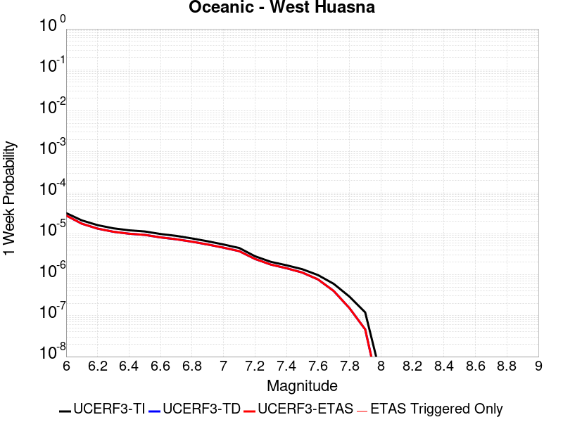 | 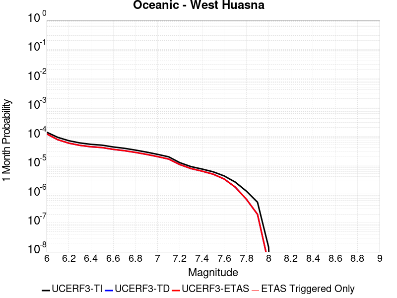 | 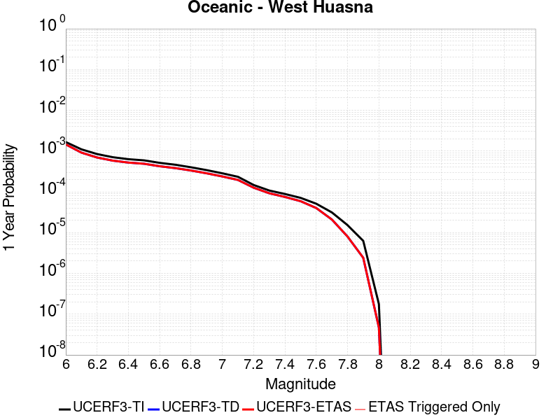 | 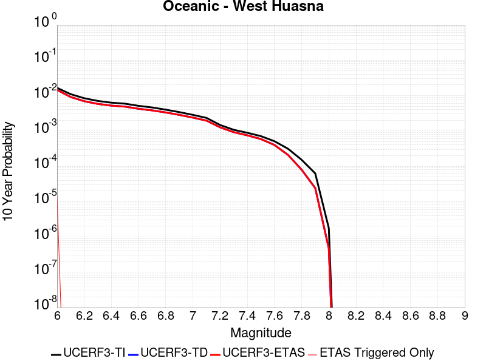 |

| Magnitude | 1 wk TI Prob | 1 wk TD Prob | 1 wk ETAS Prob | 1 wk ETAS/TD Gain | 1 wk ETAS Triggered Only | 1 mo TI Prob | 1 mo TD Prob | 1 mo ETAS Prob | 1 mo ETAS/TD Gain | 1 mo ETAS Triggered Only | 1 yr TI Prob | 1 yr TD Prob | 1 yr ETAS Prob | 1 yr ETAS/TD Gain | 1 yr ETAS Triggered Only | 10 yr TI Prob | 10 yr TD Prob | 10 yr ETAS Prob | 10 yr ETAS/TD Gain | 10 yr ETAS Triggered Only |
|-----|-----|-----|-----|-----|-----|-----|-----|-----|-----|-----|-----|-----|-----|-----|-----|-----|-----|-----|-----|-----|
| 6.0 | 3.195567E-5 | 2.7929187E-5 | 2.7929187E-5 | 1.0 | 0.0 | 1.3694567E-4 | 1.1969127E-4 | 1.1969127E-4 | 1.0 | 0.0 | 0.0016660384 | 0.0014563103 | 0.0014563103 | 1.0 | 0.0 | 0.016536033 | 0.014472221 | 0.014504711 | 1.002245 | 3.2967033E-5 |
| 6.1 | 2.1156782E-5 | 1.7574865E-5 | 1.7574865E-5 | 1.0 | 0.0 | 9.066878E-5 | 7.531873E-5 | 7.531873E-5 | 1.0 | 0.0 | 0.0011033333 | 9.1662904E-4 | 9.1662904E-4 | 1.0 | 0.0 | 0.010978713 | 0.009129491 | 0.009140379 | 1.0011927 | 1.0989011E-5 |
| 6.2 | 1.6195117E-5 | 1.3328121E-5 | 1.3328121E-5 | 1.0 | 0.0 | 6.9405796E-5 | 5.7119283E-5 | 5.7119283E-5 | 1.0 | 0.0 | 8.44688E-4 | 6.95208E-4 | 6.95208E-4 | 1.0 | 0.0 | 0.008414844 | 0.006930625 | 0.006941538 | 1.0015746 | 1.0989011E-5 |
| 6.3 | 1.3559345E-5 | 1.1179909E-5 | 1.1179909E-5 | 1.0 | 0.0 | 5.811018E-5 | 4.791302E-5 | 4.791302E-5 | 1.0 | 0.0 | 7.072618E-4 | 5.831859E-4 | 5.831859E-4 | 1.0 | 0.0 | 0.0070501505 | 0.0058166725 | 0.005827598 | 1.0018783 | 1.0989011E-5 |
| 6.4 | 1.2120619E-5 | 1.0001641E-5 | 1.0001641E-5 | 1.0 | 0.0 | 5.1944477E-5 | 4.2863474E-5 | 4.2863474E-5 | 1.0 | 0.0 | 6.322405E-4 | 5.217383E-4 | 5.217383E-4 | 1.0 | 0.0 | 0.006304447 | 0.005205202 | 0.005216134 | 1.0021002 | 1.0989011E-5 |
| 6.5 | 1.13511915E-5 | 9.36809E-6 | 9.36809E-6 | 1.0 | 0.0 | 4.8647056E-5 | 4.014834E-5 | 4.014834E-5 | 1.0 | 0.0 | 5.9211696E-4 | 4.8869685E-4 | 4.8869685E-4 | 1.0 | 0.0 | 0.0059054173 | 0.004876281 | 0.0048872163 | 1.0022426 | 1.0989011E-5 |
| 6.6 | 9.850605E-6 | 8.135947E-6 | 8.135947E-6 | 1.0 | 0.0 | 4.2216197E-5 | 3.4867877E-5 | 3.4867877E-5 | 1.0 | 0.0 | 5.1386096E-4 | 4.2443394E-4 | 4.2443394E-4 | 1.0 | 0.0 | 0.0051267436 | 0.0042362656 | 0.004247208 | 1.002583 | 1.0989011E-5 |
| 6.7 | 8.8558645E-6 | 7.318908E-6 | 7.318908E-6 | 1.0 | 0.0 | 3.7953152E-5 | 3.1366373E-5 | 3.1366373E-5 | 1.0 | 0.0 | 4.6198163E-4 | 3.8181886E-4 | 3.8181886E-4 | 1.0 | 0.0 | 0.004610224 | 0.003811654 | 0.003822601 | 1.002872 | 1.0989011E-5 |
| 6.8 | 7.67136E-6 | 6.392175E-6 | 6.392175E-6 | 1.0 | 0.0 | 3.2876844E-5 | 2.7394748E-5 | 2.7394748E-5 | 1.0 | 0.0 | 4.0020206E-4 | 3.3348016E-4 | 3.3348016E-4 | 1.0 | 0.0 | 0.003994821 | 0.0033298184 | 0.003340771 | 1.0032892 | 1.0989011E-5 |
| 6.9 | 6.534529E-6 | 5.458695E-6 | 5.458695E-6 | 1.0 | 0.0 | 2.8004823E-5 | 2.3394197E-5 | 2.3394197E-5 | 1.0 | 0.0 | 3.4090536E-4 | 2.8478727E-4 | 2.8478727E-4 | 1.0 | 0.0 | 0.0034038287 | 0.0028442398 | 0.0028551975 | 1.0038526 | 1.0989011E-5 |
| 7.0 | 5.460525E-6 | 4.5702723E-6 | 4.5702723E-6 | 1.0 | 0.0 | 2.3402039E-5 | 1.9586736E-5 | 1.9586736E-5 | 1.0 | 0.0 | 2.8488258E-4 | 2.3844252E-4 | 2.3844252E-4 | 1.0 | 0.0 | 0.0028451765 | 0.0023818808 | 0.0023928436 | 1.0046026 | 1.0989011E-5 |
| 7.1 | 4.4825083E-6 | 3.7527343E-6 | 3.7527343E-6 | 1.0 | 0.0 | 1.9210609E-5 | 1.6083048E-5 | 1.6083048E-5 | 1.0 | 0.0 | 2.3386406E-4 | 1.9579362E-4 | 1.9579362E-4 | 1.0 | 0.0 | 0.002336181 | 0.001956223 | 0.0019671905 | 1.0056065 | 1.0989011E-5 |
| 7.2 | 2.821708E-6 | 2.4251733E-6 | 2.4251733E-6 | 1.0 | 0.0 | 1.2092979E-5 | 1.0393559E-5 | 1.0393559E-5 | 1.0 | 0.0 | 1.4722206E-4 | 1.2653424E-4 | 1.2653424E-4 | 1.0 | 0.0 | 0.0014712457 | 0.0012646244 | 0.0012646244 | 1.0 | 0.0 |
| 7.3 | 2.0644757E-6 | 1.7689581E-6 | 1.7689581E-6 | 1.0 | 0.0 | 8.847723E-6 | 7.5812272E-6 | 7.5812272E-6 | 1.0 | 0.0 | 1.0771569E-4 | 9.229753E-5 | 9.229753E-5 | 1.0 | 0.0 | 0.001076635 | 9.2259375E-4 | 9.2259375E-4 | 1.0 | 0.0 |
| 7.4 | 1.6980367E-6 | 1.4381878E-6 | 1.4381878E-6 | 1.0 | 0.0 | 7.27728E-6 | 6.1636474E-6 | 6.1636474E-6 | 1.0 | 0.0 | 8.8597284E-5 | 7.5039825E-5 | 7.5039825E-5 | 1.0 | 0.0 | 8.8561967E-4 | 7.5014646E-4 | 7.5014646E-4 | 1.0 | 0.0 |
| 7.5 | 1.3637683E-6 | 1.130454E-6 | 1.130454E-6 | 1.0 | 0.0 | 5.844708E-6 | 4.844794E-6 | 4.844794E-6 | 1.0 | 0.0 | 7.1156996E-5 | 5.8983773E-5 | 5.8983773E-5 | 1.0 | 0.0 | 7.1134215E-4 | 5.8968266E-4 | 5.8968266E-4 | 1.0 | 0.0 |
| 7.6 | 9.802994E-7 | 7.6790457E-7 | 7.6790457E-7 | 1.0 | 0.0 | 4.2012766E-6 | 3.2910154E-6 | 3.2910154E-6 | 1.0 | 0.0 | 5.1149345E-5 | 4.0067378E-5 | 4.0067378E-5 | 1.0 | 0.0 | 5.113757E-4 | 4.0060296E-4 | 4.0060296E-4 | 1.0 | 0.0 |
| 7.7 | 5.986191E-7 | 4.0065055E-7 | 4.0065055E-7 | 1.0 | 0.0 | 2.5655079E-6 | 1.7170726E-6 | 1.7170726E-6 | 1.0 | 0.0 | 3.1234613E-5 | 2.0905158E-5 | 2.0905158E-5 | 1.0 | 0.0 | 3.123022E-4 | 2.0903327E-4 | 2.0903327E-4 | 1.0 | 0.0 |
| 7.8 | 2.9189815E-7 | 1.5298312E-7 | 1.5298312E-7 | 1.0 | 0.0 | 1.2509914E-6 | 6.5564177E-7 | 6.5564177E-7 | 1.0 | 0.0 | 1.5230714E-5 | 7.982409E-6 | 7.982409E-6 | 1.0 | 0.0 | 1.522967E-4 | 7.982254E-5 | 7.982254E-5 | 1.0 | 0.0 |
| 7.9 | 1.2057845E-7 | 4.6281986E-8 | 4.6281986E-8 | 1.0 | 0.0 | 5.1676466E-7 | 1.9835136E-7 | 1.9835136E-7 | 1.0 | 0.0 | 6.2915915E-6 | 2.4149251E-6 | 2.4149251E-6 | 1.0 | 0.0 | 6.2914136E-5 | 2.4150293E-5 | 2.4150293E-5 | 1.0 | 0.0 |
| 8.0 | 3.3806387E-9 | 9.038257E-10 | 9.038257E-10 | 1.0 | 0.0 | 1.4488451E-8 | 3.873538E-9 | 3.873538E-9 | 1.0 | 0.0 | 1.7639688E-7 | 4.7160324E-8 | 4.7160324E-8 | 1.0 | 0.0 | 1.7639674E-6 | 4.726973E-7 | 4.726973E-7 | 1.0 | 0.0 |

## Pinto Mtn
*[(top)](#table-of-contents)*

| 1 Week | 1 Month | 1 Year | 10 Year |
|-----|-----|-----|-----|
| 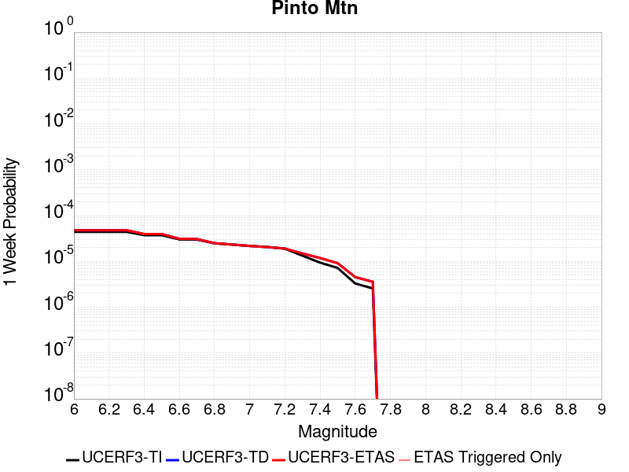 | 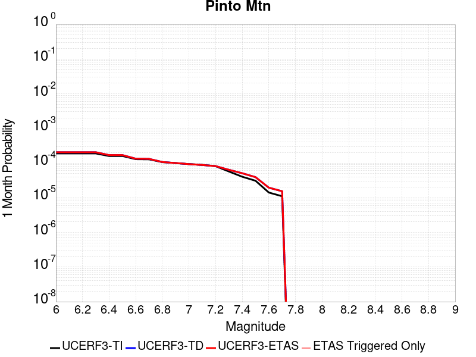 | 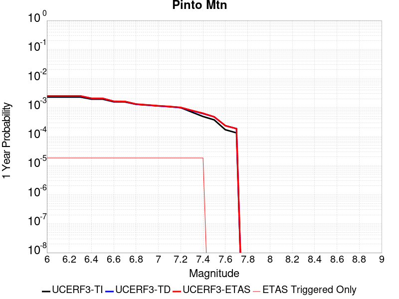 | 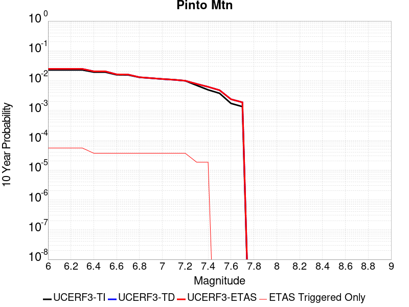 |

| Magnitude | 1 wk TI Prob | 1 wk TD Prob | 1 wk ETAS Prob | 1 wk ETAS/TD Gain | 1 wk ETAS Triggered Only | 1 mo TI Prob | 1 mo TD Prob | 1 mo ETAS Prob | 1 mo ETAS/TD Gain | 1 mo ETAS Triggered Only | 1 yr TI Prob | 1 yr TD Prob | 1 yr ETAS Prob | 1 yr ETAS/TD Gain | 1 yr ETAS Triggered Only | 10 yr TI Prob | 10 yr TD Prob | 10 yr ETAS Prob | 10 yr ETAS/TD Gain | 10 yr ETAS Triggered Only |
|-----|-----|-----|-----|-----|-----|-----|-----|-----|-----|-----|-----|-----|-----|-----|-----|-----|-----|-----|-----|-----|
| 6.0 | 4.4194956E-5 | 4.78665E-5 | 4.78665E-5 | 1.0 | 0.0 | 1.893932E-4 | 2.0512694E-4 | 2.0512694E-4 | 1.0 | 0.0 | 0.0023034236 | 0.0024947247 | 0.0025056864 | 1.0043939 | 1.0989011E-5 | 0.022796938 | 0.024684703 | 0.024727574 | 1.0017368 | 4.3956043E-5 |
| 6.1 | 4.4194956E-5 | 4.78665E-5 | 4.78665E-5 | 1.0 | 0.0 | 1.893932E-4 | 2.0512694E-4 | 2.0512694E-4 | 1.0 | 0.0 | 0.0023034236 | 0.0024947247 | 0.0025056864 | 1.0043939 | 1.0989011E-5 | 0.022796938 | 0.024684703 | 0.024727574 | 1.0017368 | 4.3956043E-5 |
| 6.2 | 4.4194956E-5 | 4.78665E-5 | 4.78665E-5 | 1.0 | 0.0 | 1.893932E-4 | 2.0512694E-4 | 2.0512694E-4 | 1.0 | 0.0 | 0.0023034236 | 0.0024947247 | 0.0025056864 | 1.0043939 | 1.0989011E-5 | 0.022796938 | 0.024684703 | 0.024727574 | 1.0017368 | 4.3956043E-5 |
| 6.3 | 4.4194956E-5 | 4.78665E-5 | 4.78665E-5 | 1.0 | 0.0 | 1.893932E-4 | 2.0512694E-4 | 2.0512694E-4 | 1.0 | 0.0 | 0.0023034236 | 0.0024947247 | 0.0025056864 | 1.0043939 | 1.0989011E-5 | 0.022796938 | 0.024684703 | 0.024727574 | 1.0017368 | 4.3956043E-5 |
| 6.4 | 3.729929E-5 | 3.9614344E-5 | 3.9614344E-5 | 1.0 | 0.0 | 1.5984432E-4 | 1.6976523E-4 | 1.6976523E-4 | 1.0 | 0.0 | 0.0019443673 | 0.0020650262 | 0.0020759925 | 1.0053105 | 1.0989011E-5 | 0.019274427 | 0.020468395 | 0.020500688 | 1.0015776 | 3.2967033E-5 |
| 6.5 | 3.729929E-5 | 3.9614344E-5 | 3.9614344E-5 | 1.0 | 0.0 | 1.5984432E-4 | 1.6976523E-4 | 1.6976523E-4 | 1.0 | 0.0 | 0.0019443673 | 0.0020650262 | 0.0020759925 | 1.0053105 | 1.0989011E-5 | 0.019274427 | 0.020468395 | 0.020500688 | 1.0015776 | 3.2967033E-5 |
| 6.6 | 3.0204548E-5 | 3.1214815E-5 | 3.1214815E-5 | 1.0 | 0.0 | 1.2944164E-4 | 1.3377111E-4 | 1.3377111E-4 | 1.0 | 0.0 | 0.0015748127 | 0.0016274813 | 0.0016384524 | 1.0067412 | 1.0989011E-5 | 0.015636992 | 0.016159497 | 0.016191931 | 1.0020071 | 3.2967033E-5 |
| 6.7 | 2.9857754E-5 | 3.0824147E-5 | 3.0824147E-5 | 1.0 | 0.0 | 1.2795553E-4 | 1.32097E-4 | 1.32097E-4 | 1.0 | 0.0 | 0.0015567453 | 0.0016071291 | 0.0016181004 | 1.0068266 | 1.0989011E-5 | 0.015458848 | 0.01595891 | 0.01599135 | 1.0020328 | 3.2967033E-5 |
| 6.8 | 2.4819734E-5 | 2.5017885E-5 | 2.5017885E-5 | 1.0 | 0.0 | 1.0636595E-4 | 1.0721523E-4 | 1.0721523E-4 | 1.0 | 0.0 | 0.0012942362 | 0.0013045854 | 0.0013155601 | 1.0084124 | 1.0989011E-5 | 0.012867244 | 0.012971638 | 0.013004177 | 1.0025085 | 3.2967033E-5 |
| 6.9 | 2.331124E-5 | 2.3345972E-5 | 2.3345972E-5 | 1.0 | 0.0 | 9.990149E-5 | 1.0005045E-4 | 1.0005045E-4 | 1.0 | 0.0 | 0.001215622 | 0.0012174539 | 0.0012284295 | 1.0090152 | 1.0989011E-5 | 0.012089936 | 0.012110036 | 0.012131748 | 1.0017929 | 2.1978021E-5 |
| 7.0 | 2.1818534E-5 | 2.1768941E-5 | 2.1768941E-5 | 1.0 | 0.0 | 9.3504656E-5 | 9.329224E-5 | 9.329224E-5 | 1.0 | 0.0 | 0.0011378246 | 0.001135261 | 0.0011462376 | 1.0096687 | 1.0989011E-5 | 0.011320163 | 0.011296719 | 0.011318449 | 1.0019236 | 2.1978021E-5 |
| 7.1 | 2.066081E-5 | 2.0548434E-5 | 2.0548434E-5 | 1.0 | 0.0 | 8.854332E-5 | 8.806185E-5 | 8.806185E-5 | 1.0 | 0.0 | 0.0010774818 | 0.0010716453 | 0.0010826226 | 1.0102433 | 1.0989011E-5 | 0.010722724 | 0.010666828 | 0.010688571 | 1.0020385 | 2.1978021E-5 |
| 7.2 | 1.8990233E-5 | 1.9061563E-5 | 1.9061563E-5 | 1.0 | 0.0 | 8.138417E-5 | 8.168996E-5 | 8.168996E-5 | 1.0 | 0.0 | 9.904018E-4 | 9.941409E-4 | 0.001005119 | 1.0110428 | 1.0989011E-5 | 0.009859995 | 0.009898936 | 0.009920697 | 1.0021982 | 2.1978021E-5 |
| 7.3 | 1.3335872E-5 | 1.4913608E-5 | 1.4913608E-5 | 1.0 | 0.0 | 5.7152483E-5 | 6.391397E-5 | 6.391397E-5 | 1.0 | 0.0 | 6.956093E-4 | 7.778875E-4 | 7.8886794E-4 | 1.0141157 | 1.0989011E-5 | 0.006934359 | 0.007752946 | 0.00776385 | 1.0014064 | 1.0989011E-5 |
| 7.4 | 9.414066E-6 | 1.186749E-5 | 1.186749E-5 | 1.0 | 0.0 | 4.0345374E-5 | 5.085973E-5 | 5.085973E-5 | 1.0 | 0.0 | 4.910942E-4 | 6.1905076E-4 | 6.300329E-4 | 1.0177404 | 1.0989011E-5 | 0.0049001034 | 0.006174212 | 0.006185133 | 1.0017688 | 1.0989011E-5 |
| 7.5 | 7.2101157E-6 | 9.164608E-6 | 9.164608E-6 | 1.0 | 0.0 | 3.090013E-5 | 3.9276343E-5 | 3.9276343E-5 | 1.0 | 0.0 | 3.7614413E-4 | 4.7809238E-4 | 4.7809238E-4 | 1.0 | 0.0 | 0.0037550807 | 0.004771414 | 0.004771414 | 1.0 | 0.0 |
| 7.6 | 3.296375E-6 | 4.551753E-6 | 4.551753E-6 | 1.0 | 0.0 | 1.4127245E-5 | 1.9507375E-5 | 1.9507375E-5 | 1.0 | 0.0 | 1.7198564E-4 | 2.3747781E-4 | 2.3747781E-4 | 1.0 | 0.0 | 0.0017185259 | 0.0023723783 | 0.0023723783 | 1.0 | 0.0 |
| 7.7 | 2.5741092E-6 | 3.590314E-6 | 3.590314E-6 | 1.0 | 0.0 | 1.103185E-5 | 1.5386977E-5 | 1.5386977E-5 | 1.0 | 0.0 | 1.3430449E-4 | 1.8732167E-4 | 1.8732167E-4 | 1.0 | 0.0 | 0.0013422335 | 0.0018717679 | 0.0018717679 | 1.0 | 0.0 |

## Mission Creek
*[(top)](#table-of-contents)*

| 1 Week | 1 Month | 1 Year | 10 Year |
|-----|-----|-----|-----|
| 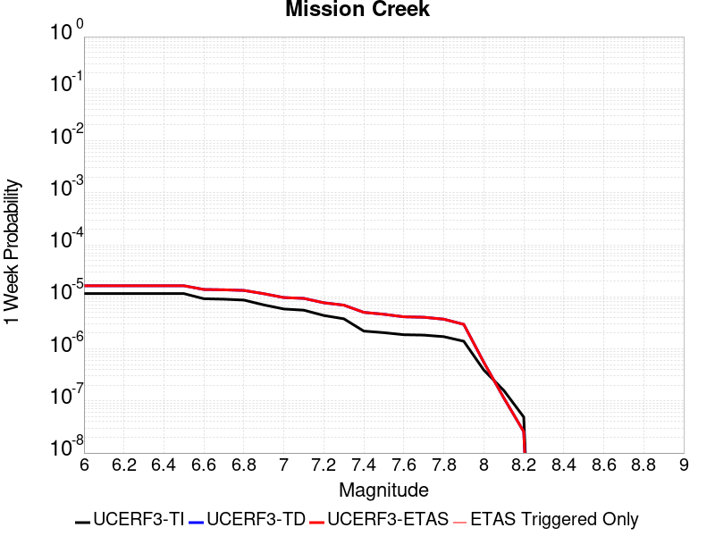 | 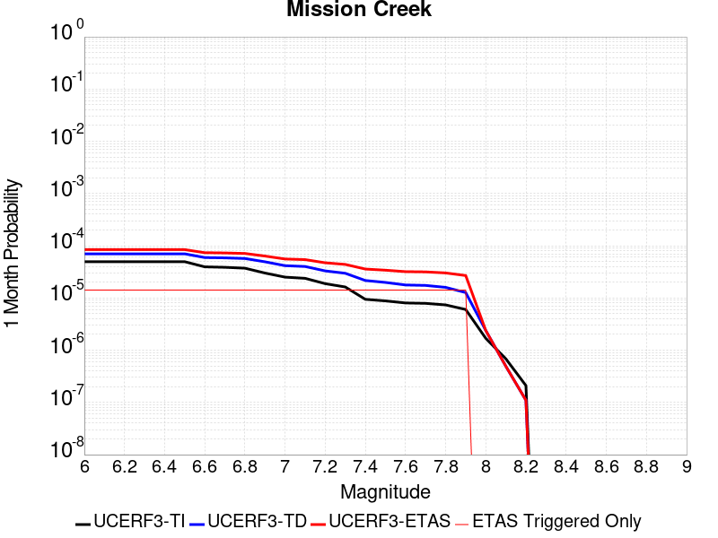 | 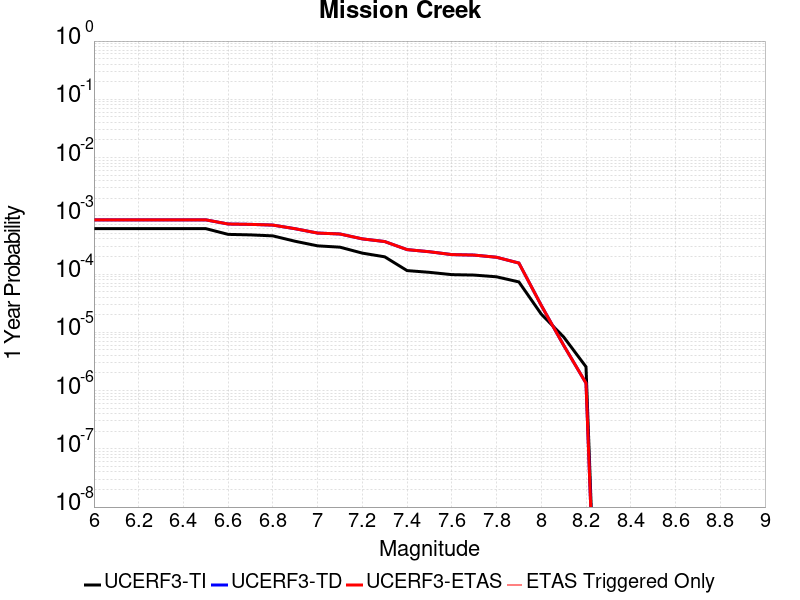 | 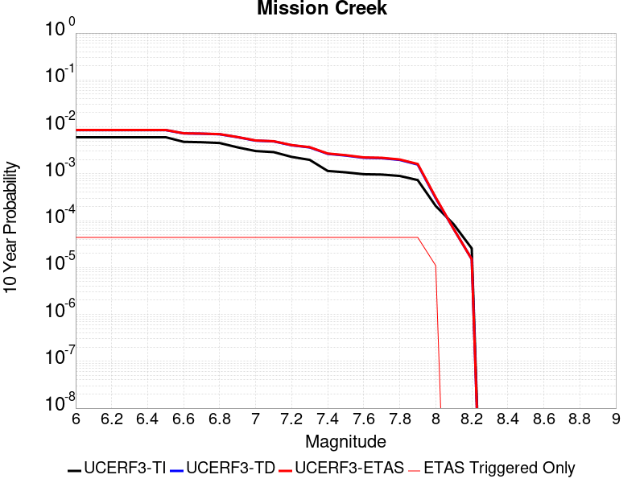 |

| Magnitude | 1 wk TI Prob | 1 wk TD Prob | 1 wk ETAS Prob | 1 wk ETAS/TD Gain | 1 wk ETAS Triggered Only | 1 mo TI Prob | 1 mo TD Prob | 1 mo ETAS Prob | 1 mo ETAS/TD Gain | 1 mo ETAS Triggered Only | 1 yr TI Prob | 1 yr TD Prob | 1 yr ETAS Prob | 1 yr ETAS/TD Gain | 1 yr ETAS Triggered Only | 10 yr TI Prob | 10 yr TD Prob | 10 yr ETAS Prob | 10 yr ETAS/TD Gain | 10 yr ETAS Triggered Only |
|-----|-----|-----|-----|-----|-----|-----|-----|-----|-----|-----|-----|-----|-----|-----|-----|-----|-----|-----|-----|-----|
| 6.0 | 1.1549387E-5 | 1.6341111E-5 | 1.6341111E-5 | 1.0 | 0.0 | 4.9496433E-5 | 7.0031536E-5 | 8.101978E-5 | 1.1569042 | 1.0989011E-5 | 6.0245243E-4 | 8.5231545E-4 | 8.7427476E-4 | 1.0257642 | 2.1978021E-5 | 0.006008218 | 0.008519485 | 0.008563067 | 1.0051155 | 4.3956043E-5 |
| 6.1 | 1.1549387E-5 | 1.6341111E-5 | 1.6341111E-5 | 1.0 | 0.0 | 4.9496433E-5 | 7.0031536E-5 | 8.101978E-5 | 1.1569042 | 1.0989011E-5 | 6.0245243E-4 | 8.5231545E-4 | 8.7427476E-4 | 1.0257642 | 2.1978021E-5 | 0.006008218 | 0.008519485 | 0.008563067 | 1.0051155 | 4.3956043E-5 |
| 6.2 | 1.1549387E-5 | 1.6341111E-5 | 1.6341111E-5 | 1.0 | 0.0 | 4.9496433E-5 | 7.0031536E-5 | 8.101978E-5 | 1.1569042 | 1.0989011E-5 | 6.0245243E-4 | 8.5231545E-4 | 8.7427476E-4 | 1.0257642 | 2.1978021E-5 | 0.006008218 | 0.008519485 | 0.008563067 | 1.0051155 | 4.3956043E-5 |
| 6.3 | 1.1549387E-5 | 1.6341111E-5 | 1.6341111E-5 | 1.0 | 0.0 | 4.9496433E-5 | 7.0031536E-5 | 8.101978E-5 | 1.1569042 | 1.0989011E-5 | 6.0245243E-4 | 8.5231545E-4 | 8.7427476E-4 | 1.0257642 | 2.1978021E-5 | 0.006008218 | 0.008519485 | 0.008563067 | 1.0051155 | 4.3956043E-5 |
| 6.4 | 1.1549387E-5 | 1.6341111E-5 | 1.6341111E-5 | 1.0 | 0.0 | 4.9496433E-5 | 7.0031536E-5 | 8.101978E-5 | 1.1569042 | 1.0989011E-5 | 6.0245243E-4 | 8.5231545E-4 | 8.7427476E-4 | 1.0257642 | 2.1978021E-5 | 0.006008218 | 0.008519485 | 0.008563067 | 1.0051155 | 4.3956043E-5 |
| 6.5 | 1.1549387E-5 | 1.6341111E-5 | 1.6341111E-5 | 1.0 | 0.0 | 4.9496433E-5 | 7.0031536E-5 | 8.101978E-5 | 1.1569042 | 1.0989011E-5 | 6.0245243E-4 | 8.5231545E-4 | 8.7427476E-4 | 1.0257642 | 2.1978021E-5 | 0.006008218 | 0.008519485 | 0.008563067 | 1.0051155 | 4.3956043E-5 |
| 6.6 | 9.202681E-6 | 1.3864242E-5 | 1.3864242E-5 | 1.0 | 0.0 | 3.9439463E-5 | 5.9416878E-5 | 7.0405236E-5 | 1.1849366 | 1.0989011E-5 | 4.800697E-4 | 7.231694E-4 | 7.451315E-4 | 1.0303693 | 2.1978021E-5 | 0.004790339 | 0.007236605 | 0.007280243 | 1.0060302 | 4.3956043E-5 |
| 6.7 | 9.019164E-6 | 1.3669899E-5 | 1.3669899E-5 | 1.0 | 0.0 | 3.8652986E-5 | 5.8584017E-5 | 6.957239E-5 | 1.1875659 | 1.0989011E-5 | 4.7049852E-4 | 7.13036E-4 | 7.349984E-4 | 1.0308012 | 2.1978021E-5 | 0.004695036 | 0.0071359244 | 0.0071795667 | 1.0061159 | 4.3956043E-5 |
| 6.8 | 8.673558E-6 | 1.329197E-5 | 1.329197E-5 | 1.0 | 0.0 | 3.717186E-5 | 5.6964393E-5 | 6.795278E-5 | 1.1928992 | 1.0989011E-5 | 4.524734E-4 | 6.9332967E-4 | 7.152924E-4 | 1.0316772 | 2.1978021E-5 | 0.0045155324 | 0.006940094 | 0.006983745 | 1.0062897 | 4.3956043E-5 |
| 6.9 | 7.002255E-6 | 1.1496057E-5 | 1.1496057E-5 | 1.0 | 0.0 | 3.000932E-5 | 4.926792E-5 | 6.0256392E-5 | 1.223035 | 1.0989011E-5 | 3.653022E-4 | 5.996787E-4 | 6.2164356E-4 | 1.0366277 | 2.1978021E-5 | 0.0036470229 | 0.0060088513 | 0.0060525434 | 1.0072713 | 4.3956043E-5 |
| 7.0 | 5.84644E-6 | 9.692441E-6 | 9.692441E-6 | 1.0 | 0.0 | 2.5055931E-5 | 4.15384E-5 | 5.2526953E-5 | 1.2645397 | 1.0989011E-5 | 3.0501327E-4 | 5.0561724E-4 | 5.275841E-4 | 1.0434457 | 2.1978021E-5 | 0.0030459496 | 0.005072708 | 0.005116441 | 1.0086212 | 4.3956043E-5 |
| 7.1 | 5.54703E-6 | 9.346854E-6 | 9.346854E-6 | 1.0 | 0.0 | 2.377277E-5 | 4.0057355E-5 | 5.104593E-5 | 1.274321 | 1.0989011E-5 | 2.8939504E-4 | 4.8759364E-4 | 5.095609E-4 | 1.0450525 | 2.1978021E-5 | 0.0028901845 | 0.0048932703 | 0.0049370113 | 1.008939 | 4.3956043E-5 |
| 7.2 | 4.384709E-6 | 7.698194E-6 | 7.698194E-6 | 1.0 | 0.0 | 1.8791474E-5 | 3.2991862E-5 | 4.398051E-5 | 1.3330715 | 1.0989011E-5 | 2.2876218E-4 | 4.0160556E-4 | 4.2357473E-4 | 1.0547035 | 2.1978021E-5 | 0.0022852682 | 0.0040367944 | 0.004080573 | 1.010845 | 4.3956043E-5 |
| 7.3 | 3.7888456E-6 | 6.931747E-6 | 6.931747E-6 | 1.0 | 0.0 | 1.623781E-5 | 2.970717E-5 | 4.0695853E-5 | 1.3699001 | 1.0989011E-5 | 1.9767738E-4 | 3.616281E-4 | 3.8359818E-4 | 1.0607532 | 2.1978021E-5 | 0.0019750162 | 0.0036383772 | 0.003682173 | 1.0120373 | 4.3956043E-5 |
| 7.4 | 2.1982462E-6 | 5.039589E-6 | 5.039589E-6 | 1.0 | 0.0 | 9.421021E-6 | 2.159806E-5 | 3.258683E-5 | 1.5087852 | 1.0989011E-5 | 1.1469489E-4 | 2.6292482E-4 | 2.8489708E-4 | 1.0835686 | 2.1978021E-5 | 0.0011463572 | 0.0026539033 | 0.0026977428 | 1.0165188 | 4.3956043E-5 |
| 7.5 | 2.051923E-6 | 4.6303985E-6 | 4.6303985E-6 | 1.0 | 0.0 | 8.793926E-6 | 1.9844414E-5 | 3.0833206E-5 | 1.5537474 | 1.0989011E-5 | 1.0706078E-4 | 2.415791E-4 | 2.635518E-4 | 1.0909545 | 2.1978021E-5 | 0.0010700922 | 0.0024413404 | 0.0024851891 | 1.0179609 | 4.3956043E-5 |
| 7.6 | 1.8733427E-6 | 4.138231E-6 | 4.138231E-6 | 1.0 | 0.0 | 8.028587E-6 | 1.7735156E-5 | 2.872397E-5 | 1.6196064 | 1.0989011E-5 | 9.774366E-5 | 2.159042E-4 | 2.3787748E-4 | 1.1017733 | 2.1978021E-5 | 9.770069E-4 | 0.0021856092 | 0.0022294691 | 1.0200676 | 4.3956043E-5 |
| 7.7 | 1.8411953E-6 | 4.0578066E-6 | 4.0578066E-6 | 1.0 | 0.0 | 7.890813E-6 | 1.7390485E-5 | 2.8379303E-5 | 1.631887 | 1.0989011E-5 | 9.606641E-5 | 2.1170866E-4 | 2.3368202E-4 | 1.1037906 | 2.1978021E-5 | 9.6024893E-4 | 0.0021438438 | 0.0021877058 | 1.0204594 | 4.3956043E-5 |
| 7.8 | 1.7194251E-6 | 3.7241725E-6 | 3.7241725E-6 | 1.0 | 0.0 | 7.368944E-6 | 1.5960642E-5 | 2.6949478E-5 | 1.6884959 | 1.0989011E-5 | 8.97132E-5 | 1.9430356E-4 | 2.1627732E-4 | 1.1130898 | 2.1978021E-5 | 8.967699E-4 | 0.0019693163 | 0.0020131858 | 1.0222765 | 4.3956043E-5 |
| 7.9 | 1.4035052E-6 | 2.9613316E-6 | 2.9613316E-6 | 1.0 | 0.0 | 6.0150082E-6 | 1.269136E-5 | 2.3680232E-5 | 1.8658545 | 1.0989011E-5 | 7.3230265E-5 | 1.5450642E-4 | 1.7648104E-4 | 1.1422247 | 2.1978021E-5 | 7.3206134E-4 | 0.0015688159 | 0.001612703 | 1.0279746 | 4.3956043E-5 |
| 8.0 | 3.9318823E-7 | 5.5560014E-7 | 5.5560014E-7 | 1.0 | 0.0 | 1.6850913E-6 | 2.3811413E-6 | 2.3811413E-6 | 1.0 | 0.0 | 2.0515794E-5 | 2.8990016E-5 | 2.8990016E-5 | 1.0 | 0.0 | 2.0513899E-4 | 3.004275E-4 | 3.114132E-4 | 1.036567 | 1.0989011E-5 |
| 8.1 | 1.596793E-7 | 1.1475386E-7 | 1.1475386E-7 | 1.0 | 0.0 | 6.8433974E-7 | 4.9180215E-7 | 4.9180215E-7 | 1.0 | 0.0 | 8.331805E-6 | 5.987675E-6 | 5.987675E-6 | 1.0 | 0.0 | 8.331492E-5 | 6.601783E-5 | 6.601783E-5 | 1.0 | 0.0 |
| 8.2 | 4.9003038E-8 | 2.5686987E-8 | 2.5686987E-8 | 1.0 | 0.0 | 2.10013E-7 | 1.1008708E-7 | 1.1008708E-7 | 1.0 | 0.0 | 2.5569052E-6 | 1.3403094E-6 | 1.3403094E-6 | 1.0 | 0.0 | 2.556876E-5 | 1.5090479E-5 | 1.5090479E-5 | 1.0 | 0.0 |

## Imperial
*[(top)](#table-of-contents)*

| 1 Week | 1 Month | 1 Year | 10 Year |
|-----|-----|-----|-----|
| 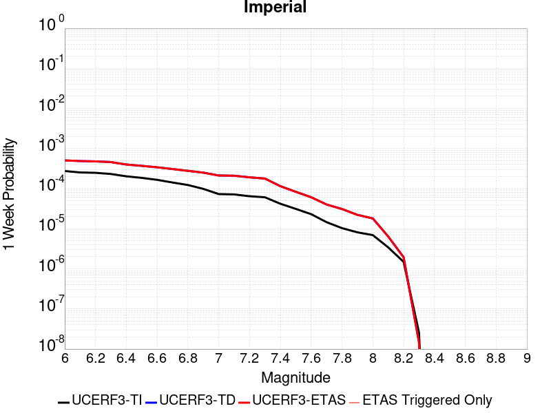 | 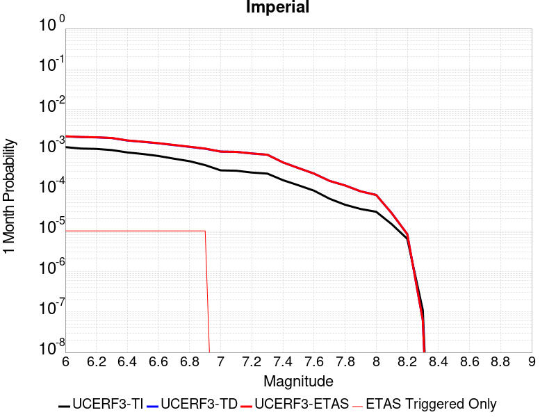 | 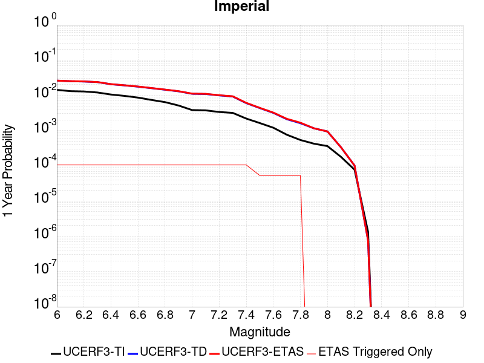 | 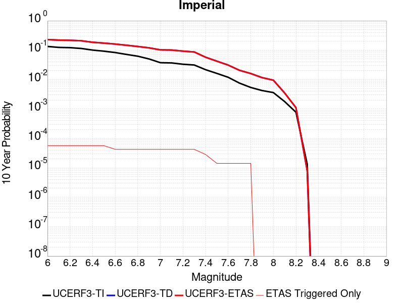 |

| Magnitude | 1 wk TI Prob | 1 wk TD Prob | 1 wk ETAS Prob | 1 wk ETAS/TD Gain | 1 wk ETAS Triggered Only | 1 mo TI Prob | 1 mo TD Prob | 1 mo ETAS Prob | 1 mo ETAS/TD Gain | 1 mo ETAS Triggered Only | 1 yr TI Prob | 1 yr TD Prob | 1 yr ETAS Prob | 1 yr ETAS/TD Gain | 1 yr ETAS Triggered Only | 10 yr TI Prob | 10 yr TD Prob | 10 yr ETAS Prob | 10 yr ETAS/TD Gain | 10 yr ETAS Triggered Only |
|-----|-----|-----|-----|-----|-----|-----|-----|-----|-----|-----|-----|-----|-----|-----|-----|-----|-----|-----|-----|-----|
| 6.0 | 2.7496446E-4 | 5.0655607E-4 | 5.0655607E-4 | 1.0 | 0.0 | 0.0011778869 | 0.0021691876 | 0.0021691876 | 1.0 | 0.0 | 0.0142467655 | 0.026090976 | 0.026123084 | 1.0012306 | 3.2967033E-5 | 0.13367249 | 0.22838686 | 0.2284208 | 1.0001485 | 4.3956043E-5 |
| 6.1 | 2.5356023E-4 | 4.8746416E-4 | 4.8746416E-4 | 1.0 | 0.0 | 0.001086234 | 0.0020874979 | 0.0020874979 | 1.0 | 0.0 | 0.013144928 | 0.025116863 | 0.025149003 | 1.0012796 | 3.2967033E-5 | 0.123940155 | 0.21978436 | 0.21981867 | 1.000156 | 4.3956043E-5 |
| 6.2 | 2.4820742E-4 | 4.7840018E-4 | 4.7840018E-4 | 1.0 | 0.0 | 0.0010633124 | 0.0020487134 | 0.0020487134 | 1.0 | 0.0 | 0.01286919 | 0.024655988 | 0.024688141 | 1.0013041 | 3.2967033E-5 | 0.12148927 | 0.21628645 | 0.2163209 | 1.0001593 | 4.3956043E-5 |
| 6.3 | 2.3205351E-4 | 4.5968866E-4 | 4.5968866E-4 | 1.0 | 0.0 | 9.94136E-4 | 0.0019686439 | 0.0019686439 | 1.0 | 0.0 | 0.012036599 | 0.023700953 | 0.023733139 | 1.001358 | 3.2967033E-5 | 0.11405133 | 0.20820886 | 0.20824367 | 1.0001671 | 4.3956043E-5 |
| 6.4 | 2.0304754E-4 | 3.9952828E-4 | 3.9952828E-4 | 1.0 | 0.0 | 8.6991355E-4 | 0.001711155 | 0.001711155 | 1.0 | 0.0 | 0.010539869 | 0.02063438 | 0.020666666 | 1.0015647 | 3.2967033E-5 | 0.100537635 | 0.18534306 | 0.18537886 | 1.0001932 | 4.3956043E-5 |
| 6.5 | 1.854992E-4 | 3.705993E-4 | 3.705993E-4 | 1.0 | 0.0 | 7.9475436E-4 | 0.0015873283 | 0.0015873283 | 1.0 | 0.0 | 0.009633281 | 0.019155664 | 0.019188 | 1.001688 | 3.2967033E-5 | 0.0922623 | 0.1735613 | 0.17359763 | 1.0002093 | 4.3956043E-5 |
| 6.6 | 1.6586106E-4 | 3.4099398E-4 | 3.4099398E-4 | 1.0 | 0.0 | 7.106394E-4 | 0.0014605945 | 0.0014605945 | 1.0 | 0.0 | 0.008617763 | 0.017639361 | 0.017671747 | 1.001836 | 3.2967033E-5 | 0.08291132 | 0.16101992 | 0.16104758 | 1.0001718 | 3.2967033E-5 |
| 6.7 | 1.4224656E-4 | 3.0823098E-4 | 3.0823098E-4 | 1.0 | 0.0 | 6.094856E-4 | 0.0013203294 | 0.0013203294 | 1.0 | 0.0 | 0.0073952693 | 0.015958436 | 0.015990876 | 1.0020329 | 3.2967033E-5 | 0.07153955 | 0.14670318 | 0.14673132 | 1.0001918 | 3.2967033E-5 |
| 6.8 | 1.2317259E-4 | 2.7838477E-4 | 2.7838477E-4 | 1.0 | 0.0 | 5.2777573E-4 | 0.0011925383 | 0.0011925383 | 1.0 | 0.0 | 0.0064067547 | 0.014423885 | 0.014456376 | 1.0022526 | 3.2967033E-5 | 0.06225166 | 0.13312724 | 0.13315582 | 1.0002147 | 3.2967033E-5 |
| 6.9 | 9.859898E-5 | 2.504968E-4 | 2.504968E-4 | 1.0 | 0.0 | 4.2249862E-4 | 0.0010731203 | 0.0010731203 | 1.0 | 0.0 | 0.0051317946 | 0.012987937 | 0.013020476 | 1.0025053 | 3.2967033E-5 | 0.05014893 | 0.11955091 | 0.11957994 | 1.0002428 | 3.2967033E-5 |
| 7.0 | 7.3191884E-5 | 2.1293074E-4 | 2.1293074E-4 | 1.0 | 0.0 | 3.136418E-4 | 9.122444E-4 | 9.122444E-4 | 1.0 | 0.0 | 0.003811904 | 0.011050702 | 0.011083305 | 1.0029503 | 3.2967033E-5 | 0.037471764 | 0.102173366 | 0.10220297 | 1.0002897 | 3.2967033E-5 |
| 7.1 | 7.1760296E-5 | 2.0994079E-4 | 2.0994079E-4 | 1.0 | 0.0 | 3.0750787E-4 | 8.9943915E-4 | 8.9943915E-4 | 1.0 | 0.0 | 0.003737482 | 0.010896368 | 0.010928975 | 1.0029925 | 3.2967033E-5 | 0.03675245 | 0.10080859 | 0.10083824 | 1.0002941 | 3.2967033E-5 |
| 7.2 | 6.46614E-5 | 1.9161648E-4 | 1.9161648E-4 | 1.0 | 0.0 | 2.7709085E-4 | 8.2095806E-4 | 8.2095806E-4 | 1.0 | 0.0 | 0.0033683628 | 0.00994998 | 0.009982619 | 1.0032803 | 3.2967033E-5 | 0.033177625 | 0.09261325 | 0.092643164 | 1.0003229 | 3.2967033E-5 |
| 7.3 | 6.088115E-5 | 1.7832244E-4 | 1.7832244E-4 | 1.0 | 0.0 | 2.6089314E-4 | 7.6401804E-4 | 7.6401804E-4 | 1.0 | 0.0 | 0.0031717476 | 0.0092628235 | 0.009295485 | 1.0035261 | 3.2967033E-5 | 0.031268585 | 0.08666049 | 0.086690605 | 1.0003475 | 3.2967033E-5 |
| 7.4 | 4.199346E-5 | 1.152872E-4 | 1.152872E-4 | 1.0 | 0.0 | 1.7995955E-4 | 4.939953E-4 | 4.939953E-4 | 1.0 | 0.0 | 0.0021888057 | 0.0059979768 | 0.0060198233 | 1.0036423 | 2.1978021E-5 | 0.02167372 | 0.057520892 | 0.057541605 | 1.0003601 | 2.1978021E-5 |
| 7.5 | 3.130448E-5 | 8.348455E-5 | 8.348455E-5 | 1.0 | 0.0 | 1.3415517E-4 | 3.577422E-4 | 3.577422E-4 | 1.0 | 0.0 | 0.0016321153 | 0.0043468727 | 0.004357814 | 1.002517 | 1.0989011E-5 | 0.016201803 | 0.04220047 | 0.042210996 | 1.0002494 | 1.0989011E-5 |
| 7.6 | 2.3074248E-5 | 6.0974122E-5 | 6.0974122E-5 | 1.0 | 0.0 | 9.888588E-5 | 2.6129163E-4 | 2.6129163E-4 | 1.0 | 0.0 | 0.0012032706 | 0.0031766081 | 0.003187562 | 1.0034484 | 1.0989011E-5 | 0.011967761 | 0.03108548 | 0.031096129 | 1.0003425 | 1.0989011E-5 |
| 7.7 | 1.45864815E-5 | 4.023209E-5 | 4.023209E-5 | 1.0 | 0.0 | 6.2511994E-5 | 1.7241189E-4 | 1.7241189E-4 | 1.0 | 0.0 | 7.608177E-4 | 0.0020970993 | 0.0021080652 | 1.0052291 | 1.0989011E-5 | 0.007582182 | 0.020677015 | 0.020687776 | 1.0005205 | 1.0989011E-5 |
| 7.8 | 1.0352979E-5 | 3.1052245E-5 | 3.1052245E-5 | 1.0 | 0.0 | 4.4369157E-5 | 1.3307428E-4 | 1.3307428E-4 | 1.0 | 0.0 | 5.400606E-4 | 0.0016189776 | 0.0016299488 | 1.0067767 | 1.0989011E-5 | 0.0053875 | 0.016058734 | 0.016069546 | 1.0006733 | 1.0989011E-5 |
| 7.9 | 8.137906E-6 | 2.222251E-5 | 2.222251E-5 | 1.0 | 0.0 | 3.4876273E-5 | 9.523586E-5 | 9.523586E-5 | 1.0 | 0.0 | 4.2453592E-4 | 0.0011588808 | 0.0011588808 | 1.0 | 0.0 | 0.004237258 | 0.011652105 | 0.011652105 | 1.0 | 0.0 |
| 8.0 | 6.93792E-6 | 1.8071916E-5 | 1.8071916E-5 | 1.0 | 0.0 | 2.9733603E-5 | 7.744877E-5 | 7.744877E-5 | 1.0 | 0.0 | 3.6194647E-4 | 9.425316E-4 | 9.425316E-4 | 1.0 | 0.0 | 0.0036135751 | 0.009531174 | 0.009531174 | 1.0 | 0.0 |
| 8.1 | 3.4286315E-6 | 6.40925E-6 | 6.40925E-6 | 1.0 | 0.0 | 1.4694053E-5 | 2.7467926E-5 | 2.7467926E-5 | 1.0 | 0.0 | 1.7888541E-4 | 3.343708E-4 | 3.343708E-4 | 1.0 | 0.0 | 0.0017874148 | 0.003500617 | 0.003500617 | 1.0 | 0.0 |
| 8.2 | 1.4906886E-6 | 1.9481654E-6 | 1.9481654E-6 | 1.0 | 0.0 | 6.3886496E-6 | 8.349253E-6 | 8.349253E-6 | 1.0 | 0.0 | 7.7779034E-5 | 1.0164745E-4 | 1.0164745E-4 | 1.0 | 0.0 | 7.775182E-4 | 0.0011134304 | 0.0011134304 | 1.0 | 0.0 |
| 8.3 | 2.5758007E-8 | 1.4617111E-8 | 1.4617111E-8 | 1.0 | 0.0 | 1.10391454E-7 | 6.264476E-8 | 6.264476E-8 | 1.0 | 0.0 | 1.3440151E-6 | 7.626999E-7 | 7.626999E-7 | 1.0 | 0.0 | 1.344007E-5 | 7.950145E-6 | 7.950145E-6 | 1.0 | 0.0 |

## Santa Cruz Catalina Ridge alt1
*[(top)](#table-of-contents)*

| 1 Week | 1 Month | 1 Year | 10 Year |
|-----|-----|-----|-----|
|  | 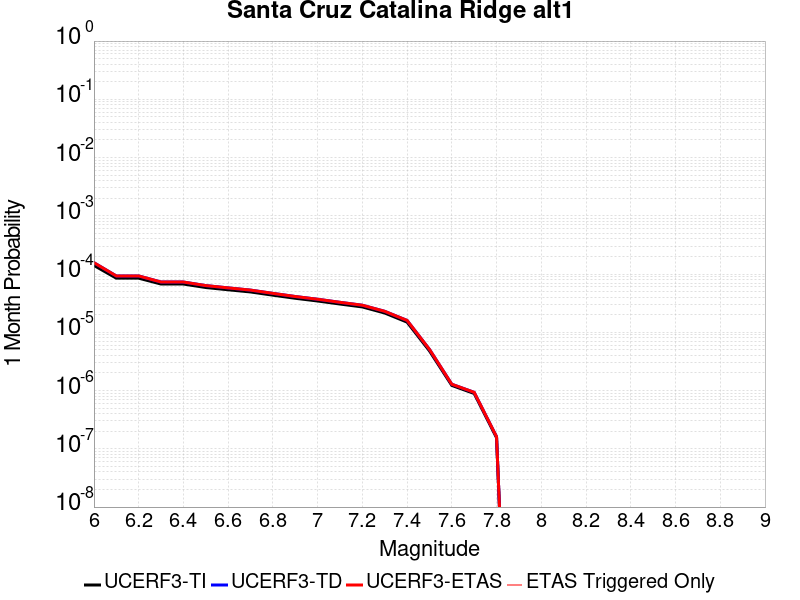 | 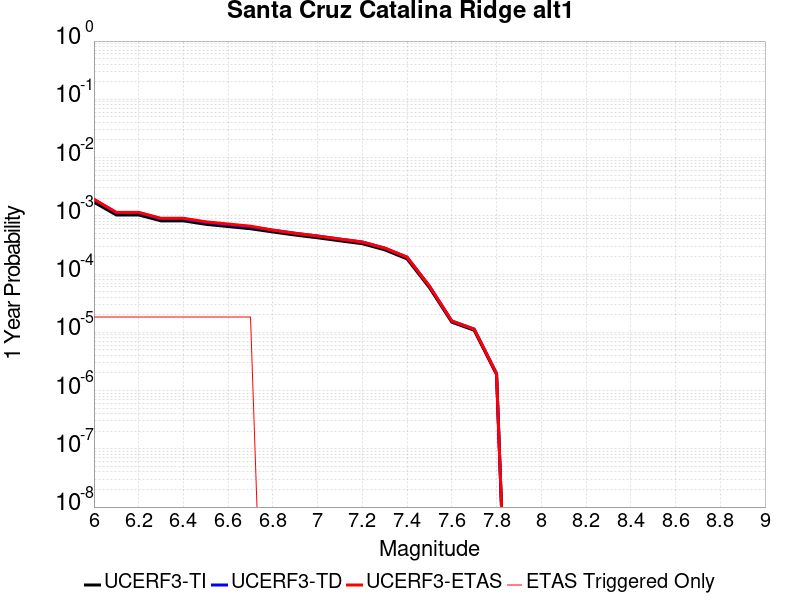 | 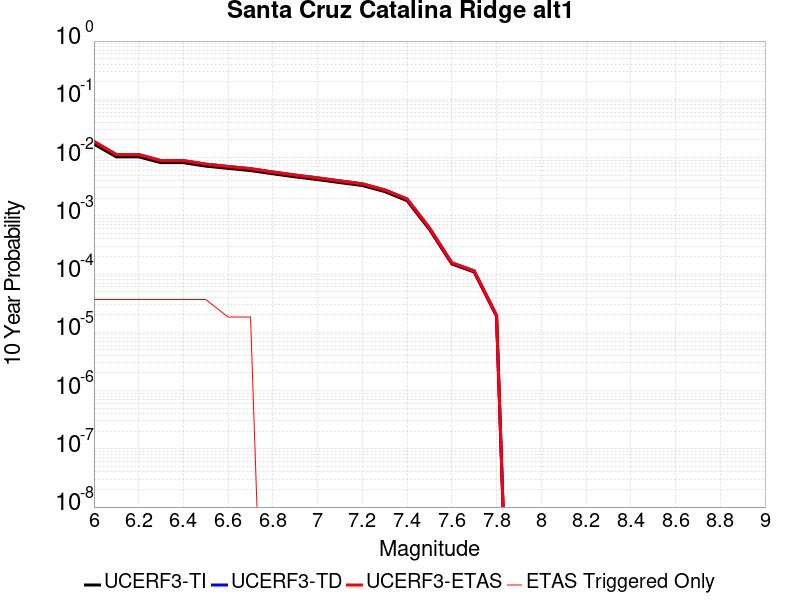 |

| Magnitude | 1 wk TI Prob | 1 wk TD Prob | 1 wk ETAS Prob | 1 wk ETAS/TD Gain | 1 wk ETAS Triggered Only | 1 mo TI Prob | 1 mo TD Prob | 1 mo ETAS Prob | 1 mo ETAS/TD Gain | 1 mo ETAS Triggered Only | 1 yr TI Prob | 1 yr TD Prob | 1 yr ETAS Prob | 1 yr ETAS/TD Gain | 1 yr ETAS Triggered Only | 10 yr TI Prob | 10 yr TD Prob | 10 yr ETAS Prob | 10 yr ETAS/TD Gain | 10 yr ETAS Triggered Only |
|-----|-----|-----|-----|-----|-----|-----|-----|-----|-----|-----|-----|-----|-----|-----|-----|-----|-----|-----|-----|-----|
| 6.0 | 3.2833184E-5 | 3.6562866E-5 | 3.6562866E-5 | 1.0 | 0.0 | 1.4070606E-4 | 1.5668952E-4 | 1.5668952E-4 | 1.0 | 0.0 | 0.00171175 | 0.0019061924 | 0.0019281284 | 1.0115079 | 2.1978021E-5 | 0.016986247 | 0.018915322 | 0.018947667 | 1.0017099 | 3.2967033E-5 |
| 6.1 | 1.9835548E-5 | 2.1661635E-5 | 2.1661635E-5 | 1.0 | 0.0 | 8.500672E-5 | 9.283239E-5 | 9.283239E-5 | 1.0 | 0.0 | 0.0010344655 | 0.0011296686 | 0.0011406451 | 1.0097166 | 1.0989011E-5 | 0.010296632 | 0.011241395 | 0.0112631265 | 1.0019331 | 2.1978021E-5 |
| 6.2 | 1.9835548E-5 | 2.1661635E-5 | 2.1661635E-5 | 1.0 | 0.0 | 8.500672E-5 | 9.283239E-5 | 9.283239E-5 | 1.0 | 0.0 | 0.0010344655 | 0.0011296686 | 0.0011406451 | 1.0097166 | 1.0989011E-5 | 0.010296632 | 0.011241395 | 0.0112631265 | 1.0019331 | 2.1978021E-5 |
| 6.3 | 1.5728183E-5 | 1.7035456E-5 | 1.7035456E-5 | 1.0 | 0.0 | 6.7404755E-5 | 7.300709E-5 | 7.300709E-5 | 1.0 | 0.0 | 8.2034385E-4 | 8.8850496E-4 | 8.994842E-4 | 1.012357 | 1.0989011E-5 | 0.008173222 | 0.008850207 | 0.00887199 | 1.0024613 | 2.1978021E-5 |
| 6.4 | 1.5728183E-5 | 1.7035456E-5 | 1.7035456E-5 | 1.0 | 0.0 | 6.7404755E-5 | 7.300709E-5 | 7.300709E-5 | 1.0 | 0.0 | 8.2034385E-4 | 8.8850496E-4 | 8.994842E-4 | 1.012357 | 1.0989011E-5 | 0.008173222 | 0.008850207 | 0.00887199 | 1.0024613 | 2.1978021E-5 |
| 6.5 | 1.3707734E-5 | 1.4795771E-5 | 1.4795771E-5 | 1.0 | 0.0 | 5.8746107E-5 | 6.340892E-5 | 6.340892E-5 | 1.0 | 0.0 | 7.1499916E-4 | 7.717337E-4 | 7.827142E-4 | 1.0142283 | 1.0989011E-5 | 0.0071270303 | 0.0076909363 | 0.007712745 | 1.0028356 | 2.1978021E-5 |
| 6.6 | 1.2539813E-5 | 1.3511331E-5 | 1.3511331E-5 | 1.0 | 0.0 | 5.3740947E-5 | 5.7904435E-5 | 5.7904435E-5 | 1.0 | 0.0 | 6.540996E-4 | 7.047612E-4 | 7.157424E-4 | 1.0155815 | 1.0989011E-5 | 0.0065217763 | 0.007025565 | 0.0070364764 | 1.0015532 | 1.0989011E-5 |
| 6.7 | 1.1504083E-5 | 1.2378374E-5 | 1.2378374E-5 | 1.0 | 0.0 | 4.930228E-5 | 5.304911E-5 | 5.304911E-5 | 1.0 | 0.0 | 6.0008996E-4 | 6.456835E-4 | 6.566654E-4 | 1.0170082 | 1.0989011E-5 | 0.005984721 | 0.006438304 | 0.0064492226 | 1.0016959 | 1.0989011E-5 |
| 6.8 | 1.012739E-5 | 1.0877928E-5 | 1.0877928E-5 | 1.0 | 0.0 | 4.340238E-5 | 4.6618865E-5 | 4.6618865E-5 | 1.0 | 0.0 | 5.282958E-4 | 5.674384E-4 | 5.674384E-4 | 1.0 | 0.0 | 0.0052704164 | 0.0056600636 | 0.0056600636 | 1.0 | 0.0 |
| 6.9 | 8.9607865E-6 | 9.6098565E-6 | 9.6098565E-6 | 1.0 | 0.0 | 3.8402806E-5 | 4.1184456E-5 | 4.1184456E-5 | 1.0 | 0.0 | 4.6745385E-4 | 5.0130644E-4 | 5.0130644E-4 | 1.0 | 0.0 | 0.0046647177 | 0.0050018756 | 0.0050018756 | 1.0 | 0.0 |
| 7.0 | 8.046829E-6 | 8.620398E-6 | 8.620398E-6 | 1.0 | 0.0 | 3.4485955E-5 | 3.6944046E-5 | 3.6944046E-5 | 1.0 | 0.0 | 4.1978562E-4 | 4.4970174E-4 | 4.4970174E-4 | 1.0 | 0.0 | 0.004189935 | 0.0044880076 | 0.0044880076 | 1.0 | 0.0 |
| 7.1 | 7.136131E-6 | 7.638227E-6 | 7.638227E-6 | 1.0 | 0.0 | 3.0583058E-5 | 3.273485E-5 | 3.273485E-5 | 1.0 | 0.0 | 3.7228514E-4 | 3.9847463E-4 | 3.9847463E-4 | 1.0 | 0.0 | 0.0037166206 | 0.003977678 | 0.003977678 | 1.0 | 0.0 |
| 7.2 | 6.362014E-6 | 6.8054624E-6 | 6.8054624E-6 | 1.0 | 0.0 | 2.726549E-5 | 2.9165943E-5 | 2.9165943E-5 | 1.0 | 0.0 | 3.3190678E-4 | 3.5503815E-4 | 3.5503815E-4 | 1.0 | 0.0 | 0.0033141149 | 0.0035447779 | 0.0035447779 | 1.0 | 0.0 |
| 7.3 | 5.004101E-6 | 5.3521103E-6 | 5.3521103E-6 | 1.0 | 0.0 | 2.1445969E-5 | 2.2937416E-5 | 2.2937416E-5 | 1.0 | 0.0 | 2.6107338E-4 | 2.792278E-4 | 2.792278E-4 | 1.0 | 0.0 | 0.002607669 | 0.0027888243 | 0.0027888243 | 1.0 | 0.0 |
| 7.4 | 3.4901443E-6 | 3.7323275E-6 | 3.7323275E-6 | 1.0 | 0.0 | 1.4957676E-5 | 1.5995594E-5 | 1.5995594E-5 | 1.0 | 0.0 | 1.8209449E-4 | 1.9472933E-4 | 1.9472933E-4 | 1.0 | 0.0 | 0.0018194534 | 0.0019456256 | 0.0019456256 | 1.0 | 0.0 |
| 7.5 | 1.1215045E-6 | 1.1894638E-6 | 1.1894638E-6 | 1.0 | 0.0 | 4.806439E-6 | 5.097692E-6 | 5.097692E-6 | 1.0 | 0.0 | 5.851682E-5 | 6.206266E-5 | 6.206266E-5 | 1.0 | 0.0 | 5.850142E-4 | 6.2045635E-4 | 6.2045635E-4 | 1.0 | 0.0 |
| 7.6 | 2.8599047E-7 | 2.9953497E-7 | 2.9953497E-7 | 1.0 | 0.0 | 1.2256729E-6 | 1.2837207E-6 | 1.2837207E-6 | 1.0 | 0.0 | 1.4922465E-5 | 1.5629188E-5 | 1.5629188E-5 | 1.0 | 0.0 | 1.4921463E-4 | 1.5628104E-4 | 1.5628104E-4 | 1.0 | 0.0 |
| 7.7 | 2.0781519E-7 | 2.1745393E-7 | 2.1745393E-7 | 1.0 | 0.0 | 8.906362E-7 | 9.3194507E-7 | 9.3194507E-7 | 1.0 | 0.0 | 1.08434415E-5 | 1.1346373E-5 | 1.1346373E-5 | 1.0 | 0.0 | 1.0842913E-4 | 1.1345803E-4 | 1.1345803E-4 | 1.0 | 0.0 |
| 7.8 | 3.614776E-8 | 3.7642668E-8 | 3.7642668E-8 | 1.0 | 0.0 | 1.5491896E-7 | 1.6132572E-7 | 1.6132572E-7 | 1.0 | 0.0 | 1.8861368E-6 | 1.9641388E-6 | 1.9641388E-6 | 1.0 | 0.0 | 1.8861208E-5 | 1.9641227E-5 | 1.9641227E-5 | 1.0 | 0.0 |

## Pleito
*[(top)](#table-of-contents)*

| 1 Week | 1 Month | 1 Year | 10 Year |
|-----|-----|-----|-----|
| 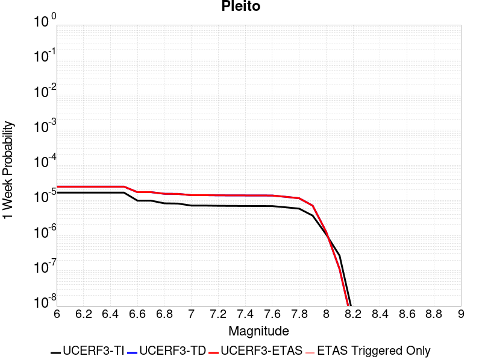 | 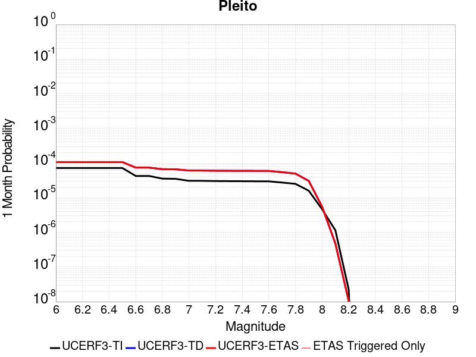 | 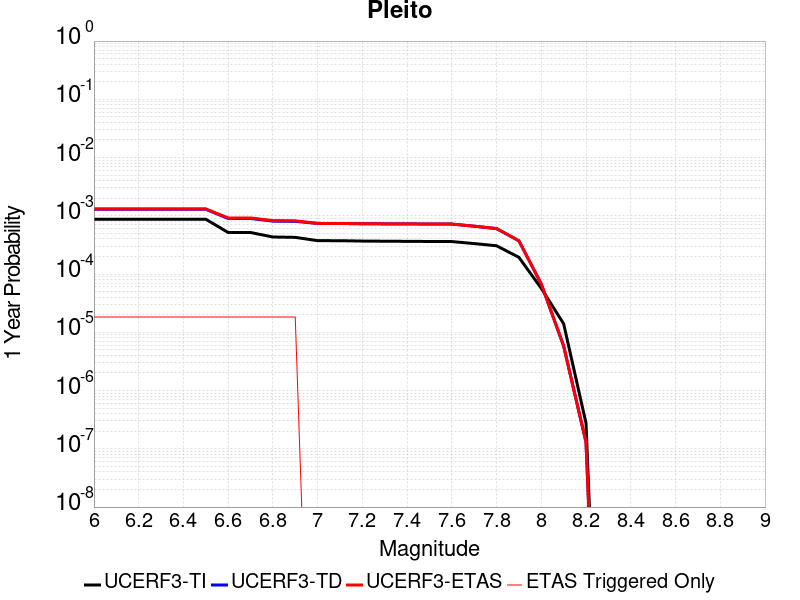 | 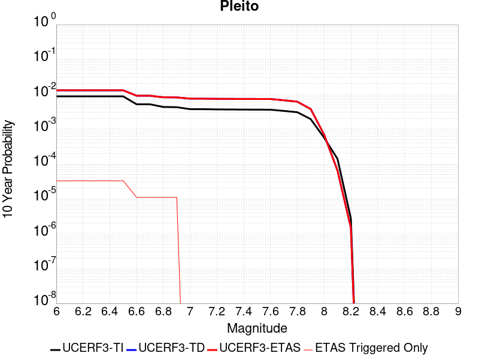 |

| Magnitude | 1 wk TI Prob | 1 wk TD Prob | 1 wk ETAS Prob | 1 wk ETAS/TD Gain | 1 wk ETAS Triggered Only | 1 mo TI Prob | 1 mo TD Prob | 1 mo ETAS Prob | 1 mo ETAS/TD Gain | 1 mo ETAS Triggered Only | 1 yr TI Prob | 1 yr TD Prob | 1 yr ETAS Prob | 1 yr ETAS/TD Gain | 1 yr ETAS Triggered Only | 10 yr TI Prob | 10 yr TD Prob | 10 yr ETAS Prob | 10 yr ETAS/TD Gain | 10 yr ETAS Triggered Only |
|-----|-----|-----|-----|-----|-----|-----|-----|-----|-----|-----|-----|-----|-----|-----|-----|-----|-----|-----|-----|-----|
| 6.0 | 1.6763008E-5 | 2.4817215E-5 | 2.4817215E-5 | 1.0 | 0.0 | 7.183948E-5 | 1.0635556E-4 | 1.0635556E-4 | 1.0 | 0.0 | 8.742947E-4 | 0.0012941818 | 0.0013161314 | 1.0169601 | 2.1978021E-5 | 0.00870863 | 0.012980835 | 0.013013374 | 1.0025067 | 3.2967033E-5 |
| 6.1 | 1.6763008E-5 | 2.4817215E-5 | 2.4817215E-5 | 1.0 | 0.0 | 7.183948E-5 | 1.0635556E-4 | 1.0635556E-4 | 1.0 | 0.0 | 8.742947E-4 | 0.0012941818 | 0.0013161314 | 1.0169601 | 2.1978021E-5 | 0.00870863 | 0.012980835 | 0.013013374 | 1.0025067 | 3.2967033E-5 |
| 6.2 | 1.6763008E-5 | 2.4817215E-5 | 2.4817215E-5 | 1.0 | 0.0 | 7.183948E-5 | 1.0635556E-4 | 1.0635556E-4 | 1.0 | 0.0 | 8.742947E-4 | 0.0012941818 | 0.0013161314 | 1.0169601 | 2.1978021E-5 | 0.00870863 | 0.012980835 | 0.013013374 | 1.0025067 | 3.2967033E-5 |
| 6.3 | 1.6763008E-5 | 2.4817215E-5 | 2.4817215E-5 | 1.0 | 0.0 | 7.183948E-5 | 1.0635556E-4 | 1.0635556E-4 | 1.0 | 0.0 | 8.742947E-4 | 0.0012941818 | 0.0013161314 | 1.0169601 | 2.1978021E-5 | 0.00870863 | 0.012980835 | 0.013013374 | 1.0025067 | 3.2967033E-5 |
| 6.4 | 1.6763008E-5 | 2.4817215E-5 | 2.4817215E-5 | 1.0 | 0.0 | 7.183948E-5 | 1.0635556E-4 | 1.0635556E-4 | 1.0 | 0.0 | 8.742947E-4 | 0.0012941818 | 0.0013161314 | 1.0169601 | 2.1978021E-5 | 0.00870863 | 0.012980835 | 0.013013374 | 1.0025067 | 3.2967033E-5 |
| 6.5 | 1.6763008E-5 | 2.4817215E-5 | 2.4817215E-5 | 1.0 | 0.0 | 7.183948E-5 | 1.0635556E-4 | 1.0635556E-4 | 1.0 | 0.0 | 8.742947E-4 | 0.0012941818 | 0.0013161314 | 1.0169601 | 2.1978021E-5 | 0.00870863 | 0.012980835 | 0.013013374 | 1.0025067 | 3.2967033E-5 |
| 6.6 | 9.910213E-6 | 1.7267184E-5 | 1.7267184E-5 | 1.0 | 0.0 | 4.247165E-5 | 7.400014E-5 | 7.400014E-5 | 1.0 | 0.0 | 5.169696E-4 | 9.0058305E-4 | 9.115622E-4 | 1.0121912 | 1.0989011E-5 | 0.0051576863 | 0.00907733 | 0.00908822 | 1.0011996 | 1.0989011E-5 |
| 6.7 | 9.910213E-6 | 1.7267184E-5 | 1.7267184E-5 | 1.0 | 0.0 | 4.247165E-5 | 7.400014E-5 | 7.400014E-5 | 1.0 | 0.0 | 5.169696E-4 | 9.0058305E-4 | 9.115622E-4 | 1.0121912 | 1.0989011E-5 | 0.0051576863 | 0.00907733 | 0.00908822 | 1.0011996 | 1.0989011E-5 |
| 6.8 | 8.300162E-6 | 1.5526644E-5 | 1.5526644E-5 | 1.0 | 0.0 | 3.557164E-5 | 6.654107E-5 | 6.654107E-5 | 1.0 | 0.0 | 4.3299864E-4 | 8.098379E-4 | 8.20818E-4 | 1.0135584 | 1.0989011E-5 | 0.004321559 | 0.008176714 | 0.008187613 | 1.001333 | 1.0989011E-5 |
| 6.9 | 8.183114E-6 | 1.5397836E-5 | 1.5397836E-5 | 1.0 | 0.0 | 3.5070017E-5 | 6.5989065E-5 | 6.5989065E-5 | 1.0 | 0.0 | 4.2689382E-4 | 8.031221E-4 | 8.141023E-4 | 1.0136719 | 1.0989011E-5 | 0.0042607468 | 0.008110048 | 0.008120948 | 1.001344 | 1.0989011E-5 |
| 7.0 | 7.1748823E-6 | 1.4184168E-5 | 1.4184168E-5 | 1.0 | 0.0 | 3.0749135E-5 | 6.078788E-5 | 6.078788E-5 | 1.0 | 0.0 | 3.743064E-4 | 7.3984166E-4 | 7.3984166E-4 | 1.0 | 0.0 | 0.0037367654 | 0.0074811797 | 0.0074811797 | 1.0 | 0.0 |
| 7.1 | 7.1671807E-6 | 1.4174532E-5 | 1.4174532E-5 | 1.0 | 0.0 | 3.0716128E-5 | 6.074658E-5 | 6.074658E-5 | 1.0 | 0.0 | 3.7390468E-4 | 7.393392E-4 | 7.393392E-4 | 1.0 | 0.0 | 0.0037327618 | 0.0074761887 | 0.0074761887 | 1.0 | 0.0 |
| 7.2 | 7.0649667E-6 | 1.4021652E-5 | 1.4021652E-5 | 1.0 | 0.0 | 3.0278077E-5 | 6.009141E-5 | 6.009141E-5 | 1.0 | 0.0 | 3.6857324E-4 | 7.3136785E-4 | 7.3136785E-4 | 1.0 | 0.0 | 0.0036796255 | 0.0073968605 | 0.0073968605 | 1.0 | 0.0 |
| 7.3 | 7.02082E-6 | 1.39650065E-5 | 1.39650065E-5 | 1.0 | 0.0 | 3.008888E-5 | 5.984866E-5 | 5.984866E-5 | 1.0 | 0.0 | 3.6627054E-4 | 7.2841434E-4 | 7.2841434E-4 | 1.0 | 0.0 | 0.0036566744 | 0.007367309 | 0.007367309 | 1.0 | 0.0 |
| 7.4 | 6.987146E-6 | 1.3924511E-5 | 1.3924511E-5 | 1.0 | 0.0 | 2.9944567E-5 | 5.9675116E-5 | 5.9675116E-5 | 1.0 | 0.0 | 3.6451413E-4 | 7.2630285E-4 | 7.2630285E-4 | 1.0 | 0.0 | 0.0036391679 | 0.007346216 | 0.007346216 | 1.0 | 0.0 |
| 7.5 | 6.9494554E-6 | 1.3881374E-5 | 1.3881374E-5 | 1.0 | 0.0 | 2.9783041E-5 | 5.949025E-5 | 5.949025E-5 | 1.0 | 0.0 | 3.625482E-4 | 7.240536E-4 | 7.240536E-4 | 1.0 | 0.0 | 0.0036195726 | 0.007323823 | 0.007323823 | 1.0 | 0.0 |
| 7.6 | 6.92694E-6 | 1.3840408E-5 | 1.3840408E-5 | 1.0 | 0.0 | 2.9686547E-5 | 5.931469E-5 | 5.931469E-5 | 1.0 | 0.0 | 3.6137376E-4 | 7.219176E-4 | 7.219176E-4 | 1.0 | 0.0 | 0.0036078666 | 0.007302536 | 0.007302536 | 1.0 | 0.0 |
| 7.7 | 6.395867E-6 | 1.2717309E-5 | 1.2717309E-5 | 1.0 | 0.0 | 2.741057E-5 | 5.4501616E-5 | 5.4501616E-5 | 1.0 | 0.0 | 3.336726E-4 | 6.6335546E-4 | 6.6335546E-4 | 1.0 | 0.0 | 0.0033317201 | 0.006720112 | 0.006720112 | 1.0 | 0.0 |
| 7.8 | 5.8664327E-6 | 1.1580689E-5 | 1.1580689E-5 | 1.0 | 0.0 | 2.5141611E-5 | 4.963058E-5 | 4.963058E-5 | 1.0 | 0.0 | 3.060561E-4 | 6.04085E-4 | 6.04085E-4 | 1.0 | 0.0 | 0.0030563495 | 0.0061234487 | 0.0061234487 | 1.0 | 0.0 |
| 7.9 | 3.7167474E-6 | 7.1412105E-6 | 7.1412105E-6 | 1.0 | 0.0 | 1.592882E-5 | 3.0604828E-5 | 3.0604828E-5 | 1.0 | 0.0 | 1.9391612E-4 | 3.7255025E-4 | 3.7255025E-4 | 1.0 | 0.0 | 0.0019374699 | 0.0037812905 | 0.0037812905 | 1.0 | 0.0 |
| 8.0 | 1.0903841E-6 | 1.2938989E-6 | 1.2938989E-6 | 1.0 | 0.0 | 4.6730665E-6 | 5.5452692E-6 | 5.5452692E-6 | 1.0 | 0.0 | 5.68931E-5 | 6.751157E-5 | 6.751157E-5 | 1.0 | 0.0 | 5.6878536E-4 | 6.973253E-4 | 6.973253E-4 | 1.0 | 0.0 |
| 8.1 | 2.6894583E-7 | 1.1161137E-7 | 1.1161137E-7 | 1.0 | 0.0 | 1.1526245E-6 | 4.7833436E-7 | 4.7833436E-7 | 1.0 | 0.0 | 1.4033113E-5 | 5.8237056E-6 | 5.8237056E-6 | 1.0 | 0.0 | 1.4032227E-4 | 6.513194E-5 | 6.513194E-5 | 1.0 | 0.0 |
| 8.2 | 5.2967013E-9 | 2.481935E-9 | 2.481935E-9 | 1.0 | 0.0 | 2.2700148E-8 | 1.0636864E-8 | 1.0636864E-8 | 1.0 | 0.0 | 2.7637427E-7 | 1.2950382E-7 | 1.2950382E-7 | 1.0 | 0.0 | 2.7637393E-6 | 1.4727569E-6 | 1.4727569E-6 | 1.0 | 0.0 |

## Great Valley 05 Pittsburg - Kirby Hills alt1
*[(top)](#table-of-contents)*

| 1 Week | 1 Month | 1 Year | 10 Year |
|-----|-----|-----|-----|
| 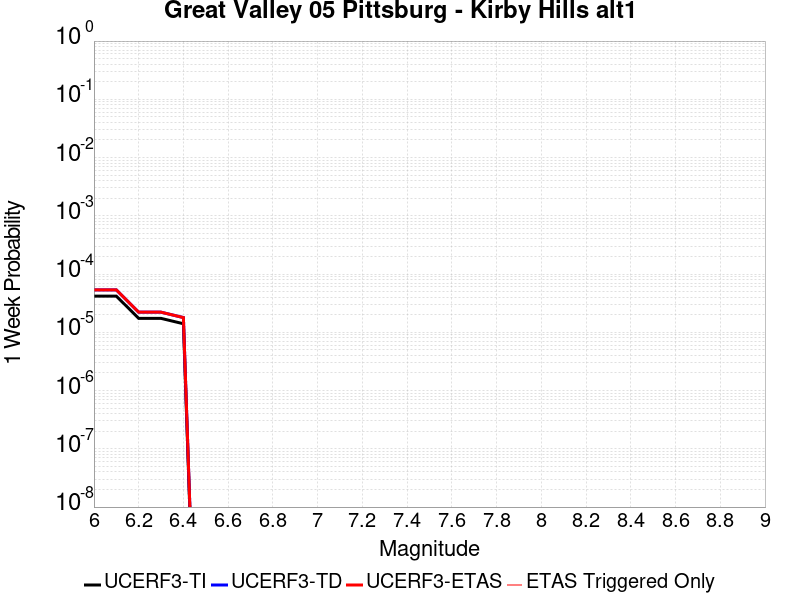 | 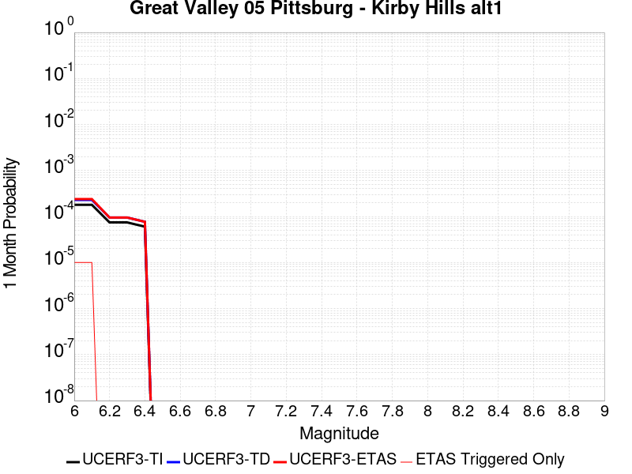 | 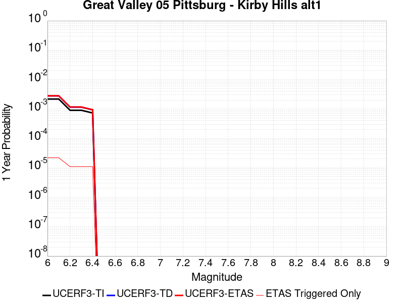 | 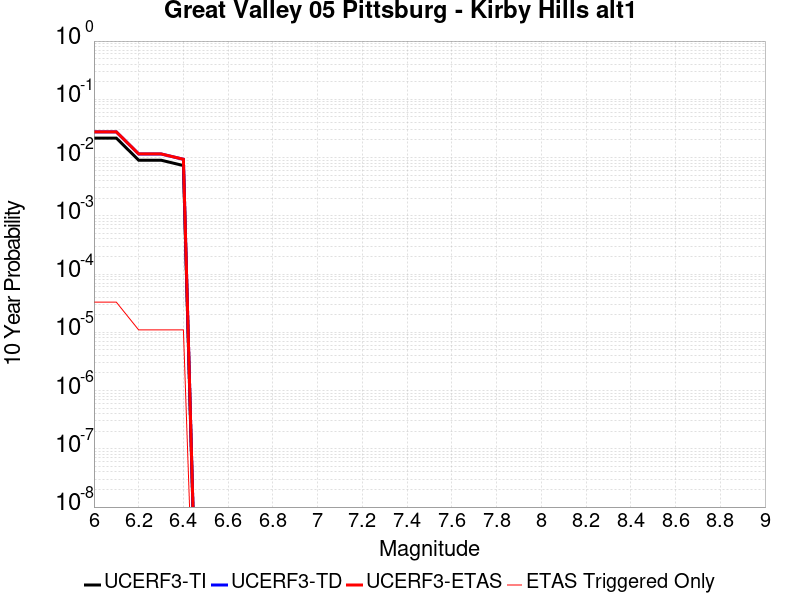 |

| Magnitude | 1 wk TI Prob | 1 wk TD Prob | 1 wk ETAS Prob | 1 wk ETAS/TD Gain | 1 wk ETAS Triggered Only | 1 mo TI Prob | 1 mo TD Prob | 1 mo ETAS Prob | 1 mo ETAS/TD Gain | 1 mo ETAS Triggered Only | 1 yr TI Prob | 1 yr TD Prob | 1 yr ETAS Prob | 1 yr ETAS/TD Gain | 1 yr ETAS Triggered Only | 10 yr TI Prob | 10 yr TD Prob | 10 yr ETAS Prob | 10 yr ETAS/TD Gain | 10 yr ETAS Triggered Only |
|-----|-----|-----|-----|-----|-----|-----|-----|-----|-----|-----|-----|-----|-----|-----|-----|-----|-----|-----|-----|-----|
| 6.0 | 4.187212E-5 | 5.345778E-5 | 5.345778E-5 | 1.0 | 0.0 | 1.794396E-4 | 2.2909002E-4 | 2.4007651E-4 | 1.0479571 | 1.0989011E-5 | 0.002182488 | 0.0027865837 | 0.0028085005 | 1.0078651 | 2.1978021E-5 | 0.021611776 | 0.027610846 | 0.027642904 | 1.001161 | 3.2967033E-5 |
| 6.1 | 4.187212E-5 | 5.345778E-5 | 5.345778E-5 | 1.0 | 0.0 | 1.794396E-4 | 2.2909002E-4 | 2.4007651E-4 | 1.0479571 | 1.0989011E-5 | 0.002182488 | 0.0027865837 | 0.0028085005 | 1.0078651 | 2.1978021E-5 | 0.021611776 | 0.027610846 | 0.027642904 | 1.001161 | 3.2967033E-5 |
| 6.2 | 1.7353306E-5 | 2.2160895E-5 | 2.2160895E-5 | 1.0 | 0.0 | 7.436919E-5 | 9.497372E-5 | 9.497372E-5 | 1.0 | 0.0 | 9.050688E-4 | 0.0011560915 | 0.0011670678 | 1.0094943 | 1.0989011E-5 | 0.009013915 | 0.011538404 | 0.011549266 | 1.0009414 | 1.0989011E-5 |
| 6.3 | 1.7353306E-5 | 2.2160895E-5 | 2.2160895E-5 | 1.0 | 0.0 | 7.436919E-5 | 9.497372E-5 | 9.497372E-5 | 1.0 | 0.0 | 9.050688E-4 | 0.0011560915 | 0.0011670678 | 1.0094943 | 1.0989011E-5 | 0.009013915 | 0.011538404 | 0.011549266 | 1.0009414 | 1.0989011E-5 |
| 6.4 | 1.4028824E-5 | 1.7905852E-5 | 1.7905852E-5 | 1.0 | 0.0 | 6.0122147E-5 | 7.6739365E-5 | 7.6739365E-5 | 1.0 | 0.0 | 7.3174125E-4 | 9.3430176E-4 | 9.452805E-4 | 1.0117507 | 1.0989011E-5 | 0.0072933645 | 0.009340801 | 0.0093516875 | 1.0011655 | 1.0989011E-5 |

## Ventura-Pitas Point
*[(top)](#table-of-contents)*

| 1 Week | 1 Month | 1 Year | 10 Year |
|-----|-----|-----|-----|
| 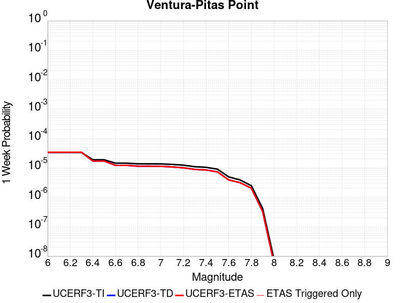 | 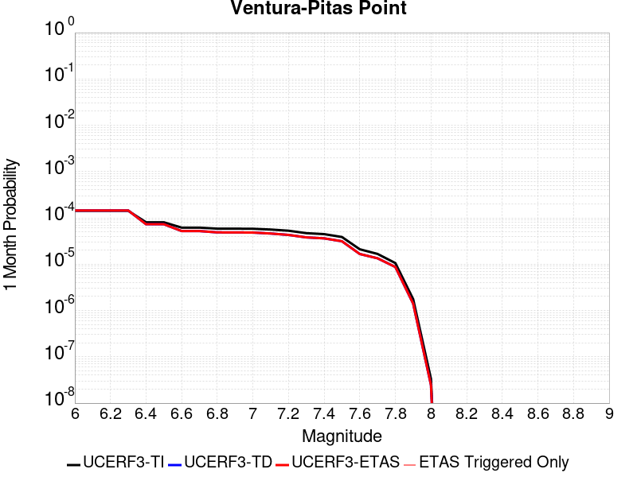 |  | 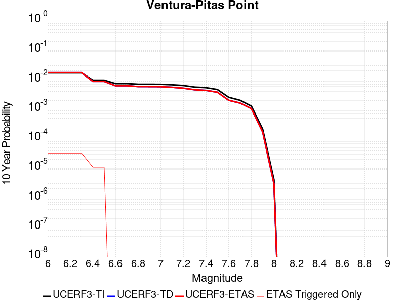 |

| Magnitude | 1 wk TI Prob | 1 wk TD Prob | 1 wk ETAS Prob | 1 wk ETAS/TD Gain | 1 wk ETAS Triggered Only | 1 mo TI Prob | 1 mo TD Prob | 1 mo ETAS Prob | 1 mo ETAS/TD Gain | 1 mo ETAS Triggered Only | 1 yr TI Prob | 1 yr TD Prob | 1 yr ETAS Prob | 1 yr ETAS/TD Gain | 1 yr ETAS Triggered Only | 10 yr TI Prob | 10 yr TD Prob | 10 yr ETAS Prob | 10 yr ETAS/TD Gain | 10 yr ETAS Triggered Only |
|-----|-----|-----|-----|-----|-----|-----|-----|-----|-----|-----|-----|-----|-----|-----|-----|-----|-----|-----|-----|-----|
| 6.0 | 3.3179622E-5 | 3.3741548E-5 | 3.3741548E-5 | 1.0 | 0.0 | 1.4219063E-4 | 1.4460007E-4 | 1.4460007E-4 | 1.0 | 0.0 | 0.0017297962 | 0.0017593412 | 0.0017703109 | 1.0062351 | 1.0989011E-5 | 0.017163932 | 0.017479673 | 0.017512063 | 1.0018531 | 3.2967033E-5 |
| 6.1 | 3.3179622E-5 | 3.3741548E-5 | 3.3741548E-5 | 1.0 | 0.0 | 1.4219063E-4 | 1.4460007E-4 | 1.4460007E-4 | 1.0 | 0.0 | 0.0017297962 | 0.0017593412 | 0.0017703109 | 1.0062351 | 1.0989011E-5 | 0.017163932 | 0.017479673 | 0.017512063 | 1.0018531 | 3.2967033E-5 |
| 6.2 | 3.3179622E-5 | 3.3741548E-5 | 3.3741548E-5 | 1.0 | 0.0 | 1.4219063E-4 | 1.4460007E-4 | 1.4460007E-4 | 1.0 | 0.0 | 0.0017297962 | 0.0017593412 | 0.0017703109 | 1.0062351 | 1.0989011E-5 | 0.017163932 | 0.017479673 | 0.017512063 | 1.0018531 | 3.2967033E-5 |
| 6.3 | 3.3179622E-5 | 3.3741548E-5 | 3.3741548E-5 | 1.0 | 0.0 | 1.4219063E-4 | 1.4460007E-4 | 1.4460007E-4 | 1.0 | 0.0 | 0.0017297962 | 0.0017593412 | 0.0017703109 | 1.0062351 | 1.0989011E-5 | 0.017163932 | 0.017479673 | 0.017512063 | 1.0018531 | 3.2967033E-5 |
| 6.4 | 1.8754668E-5 | 1.702315E-5 | 1.702315E-5 | 1.0 | 0.0 | 8.037467E-5 | 7.295445E-5 | 7.295445E-5 | 1.0 | 0.0 | 9.781223E-4 | 8.8788156E-4 | 8.8788156E-4 | 1.0 | 0.0 | 0.009738282 | 0.008845679 | 0.008856571 | 1.0012313 | 1.0989011E-5 |
| 6.5 | 1.8754668E-5 | 1.702315E-5 | 1.702315E-5 | 1.0 | 0.0 | 8.037467E-5 | 7.295445E-5 | 7.295445E-5 | 1.0 | 0.0 | 9.781223E-4 | 8.8788156E-4 | 8.8788156E-4 | 1.0 | 0.0 | 0.009738282 | 0.008845679 | 0.008856571 | 1.0012313 | 1.0989011E-5 |
| 6.6 | 1.4361558E-5 | 1.2125218E-5 | 1.2125218E-5 | 1.0 | 0.0 | 6.154808E-5 | 5.1964198E-5 | 5.1964198E-5 | 1.0 | 0.0 | 7.490902E-4 | 6.3248276E-4 | 6.3248276E-4 | 1.0 | 0.0 | 0.0074657016 | 0.0063070836 | 0.0063070836 | 1.0 | 0.0 |
| 6.7 | 1.4361558E-5 | 1.2125218E-5 | 1.2125218E-5 | 1.0 | 0.0 | 6.154808E-5 | 5.1964198E-5 | 5.1964198E-5 | 1.0 | 0.0 | 7.490902E-4 | 6.3248276E-4 | 6.3248276E-4 | 1.0 | 0.0 | 0.0074657016 | 0.0063070836 | 0.0063070836 | 1.0 | 0.0 |
| 6.8 | 1.3663846E-5 | 1.1347266E-5 | 1.1347266E-5 | 1.0 | 0.0 | 5.8558027E-5 | 4.8630245E-5 | 4.8630245E-5 | 1.0 | 0.0 | 7.127108E-4 | 5.9191434E-4 | 5.9191434E-4 | 1.0 | 0.0 | 0.007104293 | 0.0059035937 | 0.0059035937 | 1.0 | 0.0 |
| 6.9 | 1.3644157E-5 | 1.13253645E-5 | 1.13253645E-5 | 1.0 | 0.0 | 5.8473648E-5 | 4.853638E-5 | 4.853638E-5 | 1.0 | 0.0 | 7.116841E-4 | 5.907722E-4 | 5.907722E-4 | 1.0 | 0.0 | 0.007094092 | 0.0058922325 | 0.0058922325 | 1.0 | 0.0 |
| 7.0 | 1.3568845E-5 | 1.1244919E-5 | 1.1244919E-5 | 1.0 | 0.0 | 5.8150898E-5 | 4.8191632E-5 | 4.8191632E-5 | 1.0 | 0.0 | 7.077572E-4 | 5.865771E-4 | 5.865771E-4 | 1.0 | 0.0 | 0.007055073 | 0.0058505037 | 0.0058505037 | 1.0 | 0.0 |
| 7.1 | 1.306572E-5 | 1.07233E-5 | 1.07233E-5 | 1.0 | 0.0 | 5.599474E-5 | 4.59562E-5 | 4.59562E-5 | 1.0 | 0.0 | 6.815227E-4 | 5.59375E-4 | 5.59375E-4 | 1.0 | 0.0 | 0.0067943637 | 0.005579875 | 0.005579875 | 1.0 | 0.0 |
| 7.2 | 1.232604E-5 | 9.997771E-6 | 9.997771E-6 | 1.0 | 0.0 | 5.2824813E-5 | 4.2846896E-5 | 4.2846896E-5 | 1.0 | 0.0 | 6.429523E-4 | 5.2153785E-4 | 5.2153785E-4 | 1.0 | 0.0 | 0.0064109527 | 0.005203331 | 0.005203331 | 1.0 | 0.0 |
| 7.3 | 1.0917261E-5 | 8.844931E-6 | 8.844931E-6 | 1.0 | 0.0 | 4.678742E-5 | 3.7906306E-5 | 3.7906306E-5 | 1.0 | 0.0 | 5.69488E-4 | 4.614131E-4 | 4.614131E-4 | 1.0 | 0.0 | 0.0056803077 | 0.0046047163 | 0.0046047163 | 1.0 | 0.0 |
| 7.4 | 1.039959E-5 | 8.424578E-6 | 8.424578E-6 | 1.0 | 0.0 | 4.456891E-5 | 3.610484E-5 | 3.610484E-5 | 1.0 | 0.0 | 5.424914E-4 | 4.3948932E-4 | 4.3948932E-4 | 1.0 | 0.0 | 0.0054116896 | 0.0043863636 | 0.0043863636 | 1.0 | 0.0 |
| 7.5 | 9.015877E-6 | 7.2983166E-6 | 7.2983166E-6 | 1.0 | 0.0 | 3.86389E-5 | 3.1278134E-5 | 3.1278134E-5 | 1.0 | 0.0 | 4.7032707E-4 | 3.8074612E-4 | 3.8074612E-4 | 1.0 | 0.0 | 0.004693329 | 0.0038010832 | 0.0038010832 | 1.0 | 0.0 |
| 7.6 | 4.900162E-6 | 3.8744192E-6 | 3.8744192E-6 | 1.0 | 0.0 | 2.1000526E-5 | 1.6604548E-5 | 1.6604548E-5 | 1.0 | 0.0 | 2.556514E-4 | 2.0214175E-4 | 2.0214175E-4 | 1.0 | 0.0 | 0.0025535747 | 0.0020195926 | 0.0020195926 | 1.0 | 0.0 |
| 7.7 | 3.8850626E-6 | 3.1269603E-6 | 3.1269603E-6 | 1.0 | 0.0 | 1.6650163E-5 | 1.3401191E-5 | 1.3401191E-5 | 1.0 | 0.0 | 2.0269687E-4 | 1.6314737E-4 | 1.6314737E-4 | 1.0 | 0.0 | 0.002025121 | 0.0016302853 | 0.0016302853 | 1.0 | 0.0 |
| 7.8 | 2.4654719E-6 | 2.0300135E-6 | 2.0300135E-6 | 1.0 | 0.0 | 1.0566265E-5 | 8.700029E-6 | 8.700029E-6 | 1.0 | 0.0 | 1.2863669E-4 | 1.0591775E-4 | 1.0591775E-4 | 1.0 | 0.0 | 0.0012856225 | 0.0010586774 | 0.0010586774 | 1.0 | 0.0 |
| 7.9 | 4.095894E-7 | 3.2767406E-7 | 3.2767406E-7 | 1.0 | 0.0 | 1.7553821E-6 | 1.4043167E-6 | 1.4043167E-6 | 1.0 | 0.0 | 2.1371567E-5 | 1.7097424E-5 | 1.7097424E-5 | 1.0 | 0.0 | 2.1369511E-4 | 1.709614E-4 | 1.709614E-4 | 1.0 | 0.0 |
| 8.0 | 7.791402E-9 | 5.683946E-9 | 5.683946E-9 | 1.0 | 0.0 | 3.3391725E-8 | 2.435977E-8 | 2.435977E-8 | 1.0 | 0.0 | 4.0654416E-7 | 2.9658017E-7 | 2.9658017E-7 | 1.0 | 0.0 | 4.065434E-6 | 2.9657997E-6 | 2.9657997E-6 | 1.0 | 0.0 |

## San Diego Trough south
*[(top)](#table-of-contents)*

| 1 Week | 1 Month | 1 Year | 10 Year |
|-----|-----|-----|-----|
| 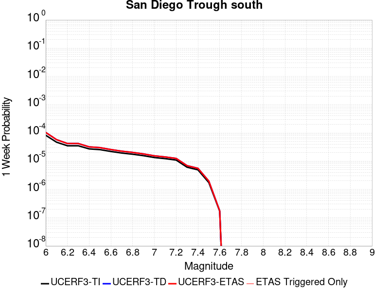 | 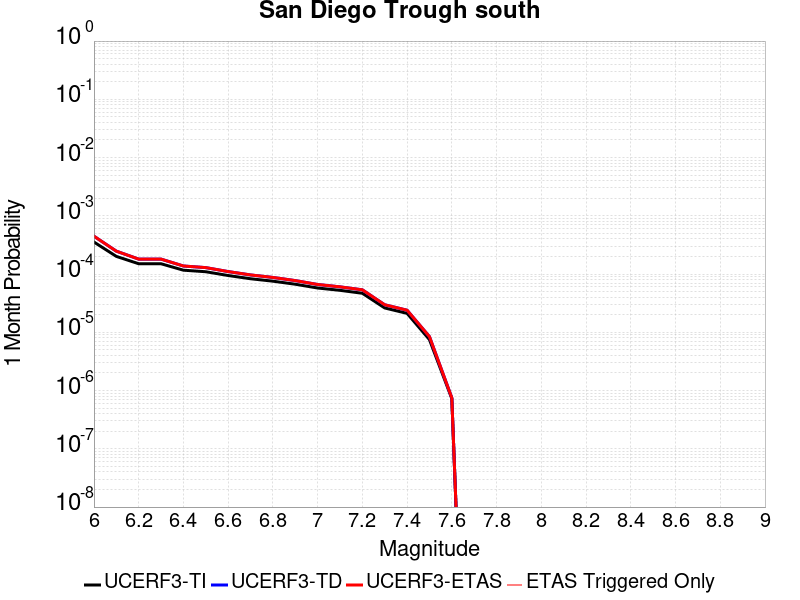 | 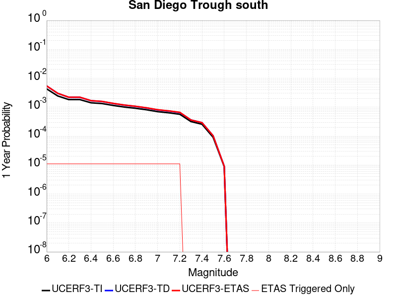 | 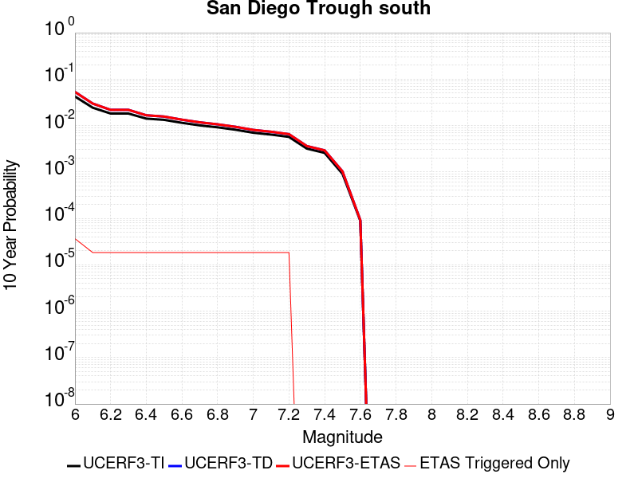 |

| Magnitude | 1 wk TI Prob | 1 wk TD Prob | 1 wk ETAS Prob | 1 wk ETAS/TD Gain | 1 wk ETAS Triggered Only | 1 mo TI Prob | 1 mo TD Prob | 1 mo ETAS Prob | 1 mo ETAS/TD Gain | 1 mo ETAS Triggered Only | 1 yr TI Prob | 1 yr TD Prob | 1 yr ETAS Prob | 1 yr ETAS/TD Gain | 1 yr ETAS Triggered Only | 10 yr TI Prob | 10 yr TD Prob | 10 yr ETAS Prob | 10 yr ETAS/TD Gain | 10 yr ETAS Triggered Only |
|-----|-----|-----|-----|-----|-----|-----|-----|-----|-----|-----|-----|-----|-----|-----|-----|-----|-----|-----|-----|-----|
| 6.0 | 8.279495E-5 | 1.0427164E-4 | 1.0427164E-4 | 1.0 | 0.0 | 3.5478722E-4 | 4.468069E-4 | 4.468069E-4 | 1.0 | 0.0 | 0.004310982 | 0.0054271356 | 0.0054380647 | 1.0020138 | 1.0989011E-5 | 0.042283054 | 0.053005878 | 0.053037096 | 1.000589 | 3.2967033E-5 |
| 6.1 | 4.6961468E-5 | 5.7744055E-5 | 5.7744055E-5 | 1.0 | 0.0 | 2.0124791E-4 | 2.4745203E-4 | 2.4745203E-4 | 1.0 | 0.0 | 0.00244744 | 0.00300868 | 0.003019636 | 1.0036415 | 1.0989011E-5 | 0.024206603 | 0.029686471 | 0.029707797 | 1.0007184 | 2.1978021E-5 |
| 6.2 | 3.5079658E-5 | 4.2150765E-5 | 4.2150765E-5 | 1.0 | 0.0 | 1.5033272E-4 | 1.8063388E-4 | 1.8063388E-4 | 1.0 | 0.0 | 0.0018287642 | 0.0021970419 | 0.0022080068 | 1.0049907 | 1.0989011E-5 | 0.018137876 | 0.021755725 | 0.021777226 | 1.0009882 | 2.1978021E-5 |
| 6.3 | 3.5079658E-5 | 4.2150765E-5 | 4.2150765E-5 | 1.0 | 0.0 | 1.5033272E-4 | 1.8063388E-4 | 1.8063388E-4 | 1.0 | 0.0 | 0.0018287642 | 0.0021970419 | 0.0022080068 | 1.0049907 | 1.0989011E-5 | 0.018137876 | 0.021755725 | 0.021777226 | 1.0009882 | 2.1978021E-5 |
| 6.4 | 2.7196904E-5 | 3.2093365E-5 | 3.2093365E-5 | 1.0 | 0.0 | 1.16552954E-4 | 1.3753583E-4 | 1.3753583E-4 | 1.0 | 0.0 | 0.0014181085 | 0.0016732255 | 0.0016841962 | 1.0065566 | 1.0989011E-5 | 0.014090929 | 0.016607802 | 0.016629416 | 1.0013014 | 2.1978021E-5 |
| 6.5 | 2.5584688E-5 | 3.0107343E-5 | 3.0107343E-5 | 1.0 | 0.0 | 1.0964406E-4 | 1.2902518E-4 | 1.2902518E-4 | 1.0 | 0.0 | 0.0013340989 | 0.0015697611 | 0.0015807329 | 1.0069895 | 1.0989011E-5 | 0.013261181 | 0.015588229 | 0.015609864 | 1.001388 | 2.1978021E-5 |
| 6.6 | 2.2034688E-5 | 2.5747375E-5 | 2.5747375E-5 | 1.0 | 0.0 | 9.443096E-5 | 1.1034127E-4 | 1.1034127E-4 | 1.0 | 0.0 | 0.0011490905 | 0.0013425826 | 0.0013535569 | 1.008174 | 1.0989011E-5 | 0.011431668 | 0.0133457 | 0.013367385 | 1.0016248 | 2.1978021E-5 |
| 6.7 | 1.9394853E-5 | 2.2545668E-5 | 2.2545668E-5 | 1.0 | 0.0 | 8.311815E-5 | 9.662074E-5 | 9.662074E-5 | 1.0 | 0.0 | 0.0010114936 | 0.0011757279 | 0.001186704 | 1.0093355 | 1.0989011E-5 | 0.01006902 | 0.011695781 | 0.011717502 | 1.0018572 | 2.1978021E-5 |
| 6.8 | 1.7615313E-5 | 2.0406627E-5 | 2.0406627E-5 | 1.0 | 0.0 | 7.549201E-5 | 8.745407E-5 | 8.745407E-5 | 1.0 | 0.0 | 9.1872766E-4 | 0.0010642376 | 0.0010752148 | 1.0103147 | 1.0989011E-5 | 0.009149387 | 0.010591977 | 0.010613723 | 1.002053 | 2.1978021E-5 |
| 6.9 | 1.5621423E-5 | 1.8029074E-5 | 1.8029074E-5 | 1.0 | 0.0 | 6.6947236E-5 | 7.7265184E-5 | 7.7265184E-5 | 1.0 | 0.0 | 8.147778E-4 | 9.403012E-4 | 9.512799E-4 | 1.0116757 | 1.0989011E-5 | 0.008117969 | 0.009363671 | 0.009385443 | 1.0023252 | 2.1978021E-5 |
| 7.0 | 1.3444376E-5 | 1.5450541E-5 | 1.5450541E-5 | 1.0 | 0.0 | 5.7617483E-5 | 6.621494E-5 | 6.621494E-5 | 1.0 | 0.0 | 7.0126704E-4 | 8.058715E-4 | 8.168517E-4 | 1.0136251 | 1.0989011E-5 | 0.006990582 | 0.008029825 | 0.008051626 | 1.0027151 | 2.1978021E-5 |
| 7.1 | 1.2268361E-5 | 1.4075235E-5 | 1.4075235E-5 | 1.0 | 0.0 | 5.2577634E-5 | 6.0321057E-5 | 6.0321057E-5 | 1.0 | 0.0 | 6.399447E-4 | 7.3416403E-4 | 7.4514496E-4 | 1.0149571 | 1.0989011E-5 | 0.0063810493 | 0.0073176916 | 0.0073395087 | 1.0029814 | 2.1978021E-5 |
| 7.2 | 1.0922655E-5 | 1.2515505E-5 | 1.2515505E-5 | 1.0 | 0.0 | 4.681054E-5 | 5.3636788E-5 | 5.3636788E-5 | 1.0 | 0.0 | 5.697693E-4 | 6.528348E-4 | 6.6381664E-4 | 1.0168217 | 1.0989011E-5 | 0.0056831064 | 0.0065094507 | 0.0065312856 | 1.0033543 | 2.1978021E-5 |
| 7.3 | 6.1106753E-6 | 6.9299144E-6 | 6.9299144E-6 | 1.0 | 0.0 | 2.6188345E-5 | 2.9699297E-5 | 2.9699297E-5 | 1.0 | 0.0 | 3.1879646E-4 | 3.6152935E-4 | 3.6152935E-4 | 1.0 | 0.0 | 0.0031833951 | 0.0036094575 | 0.0036204068 | 1.0030335 | 1.0989011E-5 |
| 7.4 | 4.933187E-6 | 5.5903465E-6 | 5.5903465E-6 | 1.0 | 0.0 | 2.114206E-5 | 2.395841E-5 | 2.395841E-5 | 1.0 | 0.0 | 2.5737417E-4 | 2.91655E-4 | 2.91655E-4 | 1.0 | 0.0 | 0.002570763 | 0.0029127633 | 0.0029237203 | 1.0037618 | 1.0989011E-5 |
| 7.5 | 1.7489613E-6 | 1.969945E-6 | 1.969945E-6 | 1.0 | 0.0 | 7.495527E-6 | 8.4425965E-6 | 8.4425965E-6 | 1.0 | 0.0 | 9.125422E-5 | 1.0278398E-4 | 1.0278398E-4 | 1.0 | 0.0 | 9.1216754E-4 | 0.0010273864 | 0.0010273864 | 1.0 | 0.0 |
| 7.6 | 1.6988751E-7 | 1.753442E-7 | 1.753442E-7 | 1.0 | 0.0 | 7.2808916E-7 | 7.5147494E-7 | 7.5147494E-7 | 1.0 | 0.0 | 8.864449E-6 | 9.149171E-6 | 9.149171E-6 | 1.0 | 0.0 | 8.8640954E-5 | 9.148814E-5 | 9.148814E-5 | 1.0 | 0.0 |

## Deep Springs
*[(top)](#table-of-contents)*

| 1 Week | 1 Month | 1 Year | 10 Year |
|-----|-----|-----|-----|
| 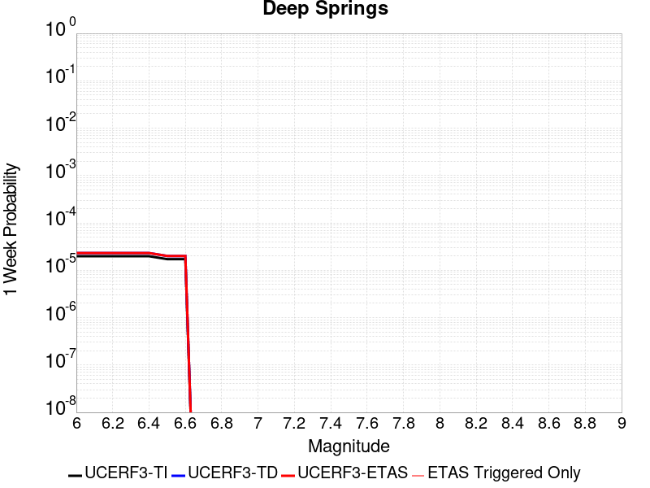 | 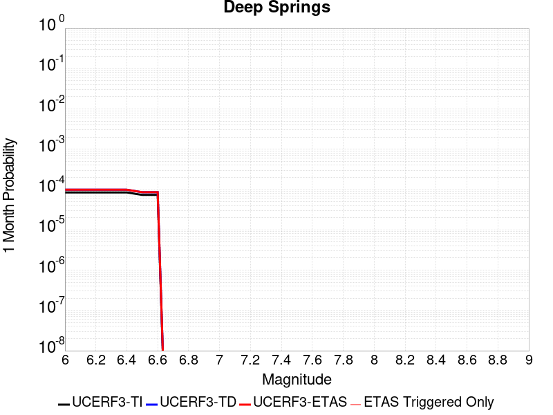 | 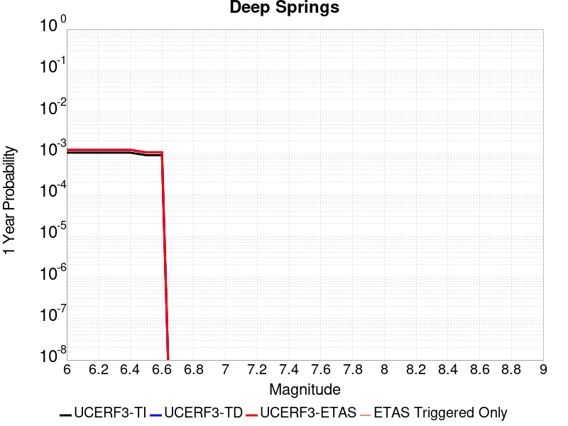 | 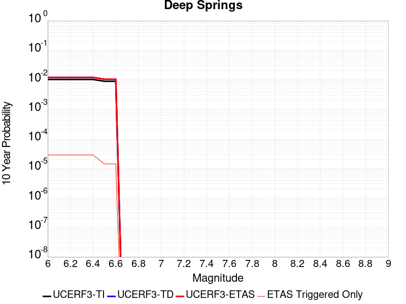 |

| Magnitude | 1 wk TI Prob | 1 wk TD Prob | 1 wk ETAS Prob | 1 wk ETAS/TD Gain | 1 wk ETAS Triggered Only | 1 mo TI Prob | 1 mo TD Prob | 1 mo ETAS Prob | 1 mo ETAS/TD Gain | 1 mo ETAS Triggered Only | 1 yr TI Prob | 1 yr TD Prob | 1 yr ETAS Prob | 1 yr ETAS/TD Gain | 1 yr ETAS Triggered Only | 10 yr TI Prob | 10 yr TD Prob | 10 yr ETAS Prob | 10 yr ETAS/TD Gain | 10 yr ETAS Triggered Only |
|-----|-----|-----|-----|-----|-----|-----|-----|-----|-----|-----|-----|-----|-----|-----|-----|-----|-----|-----|-----|-----|
| 6.0 | 1.9810619E-5 | 2.3116607E-5 | 2.3116607E-5 | 1.0 | 0.0 | 8.489989E-5 | 9.9070276E-5 | 9.9070276E-5 | 1.0 | 0.0 | 0.001033166 | 0.001206021 | 0.001206021 | 1.0 | 0.0 | 0.010283757 | 0.01204455 | 0.01207712 | 1.0027041 | 3.2967033E-5 |
| 6.1 | 1.9810619E-5 | 2.3116607E-5 | 2.3116607E-5 | 1.0 | 0.0 | 8.489989E-5 | 9.9070276E-5 | 9.9070276E-5 | 1.0 | 0.0 | 0.001033166 | 0.001206021 | 0.001206021 | 1.0 | 0.0 | 0.010283757 | 0.01204455 | 0.01207712 | 1.0027041 | 3.2967033E-5 |
| 6.2 | 1.9810619E-5 | 2.3116607E-5 | 2.3116607E-5 | 1.0 | 0.0 | 8.489989E-5 | 9.9070276E-5 | 9.9070276E-5 | 1.0 | 0.0 | 0.001033166 | 0.001206021 | 0.001206021 | 1.0 | 0.0 | 0.010283757 | 0.01204455 | 0.01207712 | 1.0027041 | 3.2967033E-5 |
| 6.3 | 1.9810619E-5 | 2.3116607E-5 | 2.3116607E-5 | 1.0 | 0.0 | 8.489989E-5 | 9.9070276E-5 | 9.9070276E-5 | 1.0 | 0.0 | 0.001033166 | 0.001206021 | 0.001206021 | 1.0 | 0.0 | 0.010283757 | 0.01204455 | 0.01207712 | 1.0027041 | 3.2967033E-5 |
| 6.4 | 1.9810619E-5 | 2.3116607E-5 | 2.3116607E-5 | 1.0 | 0.0 | 8.489989E-5 | 9.9070276E-5 | 9.9070276E-5 | 1.0 | 0.0 | 0.001033166 | 0.001206021 | 0.001206021 | 1.0 | 0.0 | 0.010283757 | 0.01204455 | 0.01207712 | 1.0027041 | 3.2967033E-5 |
| 6.5 | 1.7190405E-5 | 2.0054096E-5 | 2.0054096E-5 | 1.0 | 0.0 | 7.367108E-5 | 8.594612E-5 | 8.594612E-5 | 1.0 | 0.0 | 8.9657627E-4 | 0.001046394 | 0.001046394 | 1.0 | 0.0 | 0.008929676 | 0.010463902 | 0.01048565 | 1.0020784 | 2.1978021E-5 |
| 6.6 | 1.7190405E-5 | 2.0054096E-5 | 2.0054096E-5 | 1.0 | 0.0 | 7.367108E-5 | 8.594612E-5 | 8.594612E-5 | 1.0 | 0.0 | 8.9657627E-4 | 0.001046394 | 0.001046394 | 1.0 | 0.0 | 0.008929676 | 0.010463902 | 0.01048565 | 1.0020784 | 2.1978021E-5 |

## San Pedro Basin
*[(top)](#table-of-contents)*

| 1 Week | 1 Month | 1 Year | 10 Year |
|-----|-----|-----|-----|
| 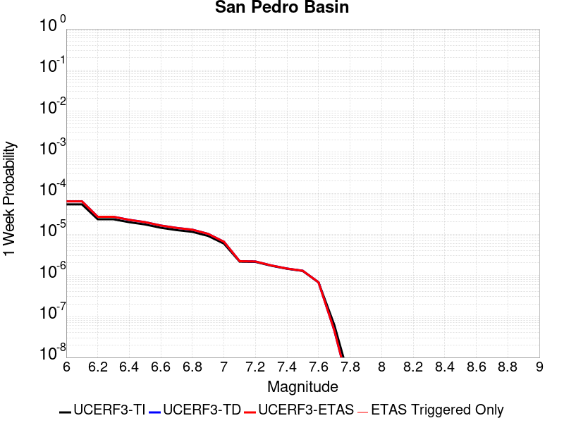 | 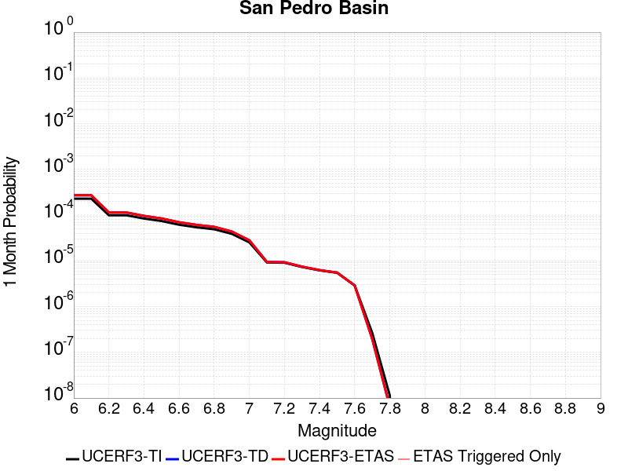 | 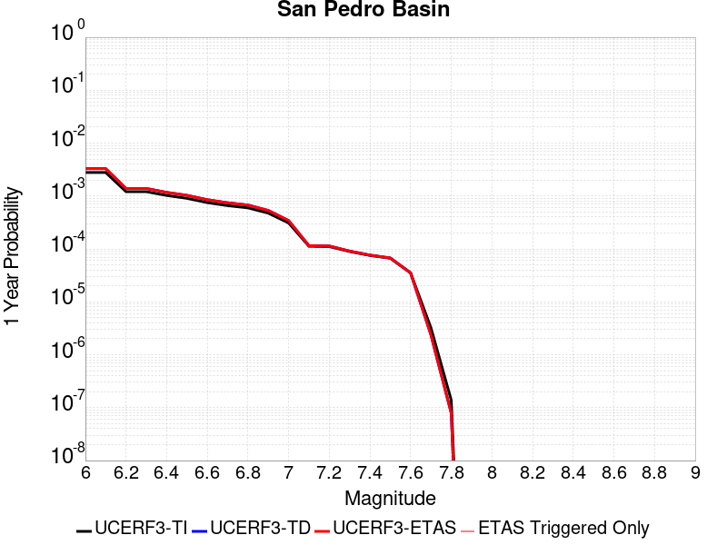 | 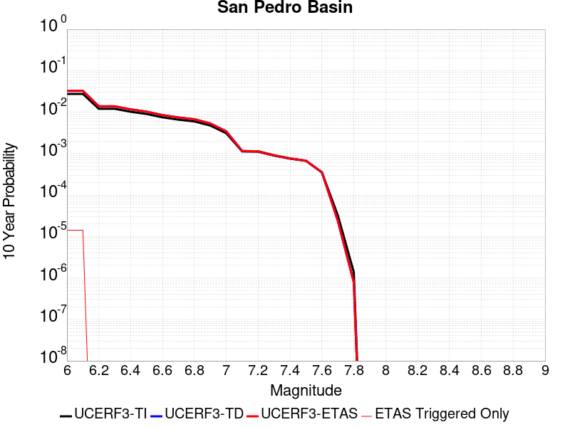 |

| Magnitude | 1 wk TI Prob | 1 wk TD Prob | 1 wk ETAS Prob | 1 wk ETAS/TD Gain | 1 wk ETAS Triggered Only | 1 mo TI Prob | 1 mo TD Prob | 1 mo ETAS Prob | 1 mo ETAS/TD Gain | 1 mo ETAS Triggered Only | 1 yr TI Prob | 1 yr TD Prob | 1 yr ETAS Prob | 1 yr ETAS/TD Gain | 1 yr ETAS Triggered Only | 10 yr TI Prob | 10 yr TD Prob | 10 yr ETAS Prob | 10 yr ETAS/TD Gain | 10 yr ETAS Triggered Only |
|-----|-----|-----|-----|-----|-----|-----|-----|-----|-----|-----|-----|-----|-----|-----|-----|-----|-----|-----|-----|-----|
| 6.0 | 5.3449043E-5 | 6.3382184E-5 | 6.3382184E-5 | 1.0 | 0.0 | 2.2904722E-4 | 2.7161284E-4 | 2.7161284E-4 | 1.0 | 0.0 | 0.0027850836 | 0.0033024854 | 0.0033024854 | 1.0 | 0.0 | 0.027504366 | 0.03259584 | 0.03262773 | 1.0009785 | 3.2967033E-5 |
| 6.1 | 5.3449043E-5 | 6.3382184E-5 | 6.3382184E-5 | 1.0 | 0.0 | 2.2904722E-4 | 2.7161284E-4 | 2.7161284E-4 | 1.0 | 0.0 | 0.0027850836 | 0.0033024854 | 0.0033024854 | 1.0 | 0.0 | 0.027504366 | 0.03259584 | 0.03262773 | 1.0009785 | 3.2967033E-5 |
| 6.2 | 2.3189454E-5 | 2.66471E-5 | 2.66471E-5 | 1.0 | 0.0 | 9.9379584E-5 | 1.1419712E-4 | 1.1419712E-4 | 1.0 | 0.0 | 0.0012092749 | 0.0013895106 | 0.0013895106 | 1.0 | 0.0 | 0.012027155 | 0.013813098 | 0.013813098 | 1.0 | 0.0 |
| 6.3 | 2.3189454E-5 | 2.66471E-5 | 2.66471E-5 | 1.0 | 0.0 | 9.9379584E-5 | 1.1419712E-4 | 1.1419712E-4 | 1.0 | 0.0 | 0.0012092749 | 0.0013895106 | 0.0013895106 | 1.0 | 0.0 | 0.012027155 | 0.013813098 | 0.013813098 | 1.0 | 0.0 |
| 6.4 | 1.966056E-5 | 2.2466895E-5 | 2.2466895E-5 | 1.0 | 0.0 | 8.425682E-5 | 9.6283366E-5 | 9.6283366E-5 | 1.0 | 0.0 | 0.001025344 | 0.0011716598 | 0.0011716598 | 1.0 | 0.0 | 0.010206259 | 0.0116589125 | 0.0116589125 | 1.0 | 0.0 |
| 6.5 | 1.7342953E-5 | 1.9748131E-5 | 1.9748131E-5 | 1.0 | 0.0 | 7.4324824E-5 | 8.463231E-5 | 8.463231E-5 | 1.0 | 0.0 | 9.04529E-4 | 0.0010299482 | 0.0010299482 | 1.0 | 0.0 | 0.009008561 | 0.010255472 | 0.010255472 | 1.0 | 0.0 |
| 6.6 | 1.439804E-5 | 1.6325108E-5 | 1.6325108E-5 | 1.0 | 0.0 | 6.170443E-5 | 6.9963055E-5 | 6.9963055E-5 | 1.0 | 0.0 | 7.509924E-4 | 8.5149944E-4 | 8.5149944E-4 | 1.0 | 0.0 | 0.0074845953 | 0.008485571 | 0.008485571 | 1.0 | 0.0 |
| 6.7 | 1.2634884E-5 | 1.4287352E-5 | 1.4287352E-5 | 1.0 | 0.0 | 5.414838E-5 | 6.123025E-5 | 6.123025E-5 | 1.0 | 0.0 | 6.590571E-4 | 7.4525375E-4 | 7.4525375E-4 | 1.0 | 0.0 | 0.006571059 | 0.007430567 | 0.007430567 | 1.0 | 0.0 |
| 6.8 | 1.146091E-5 | 1.293503E-5 | 1.293503E-5 | 1.0 | 0.0 | 4.911726E-5 | 5.543483E-5 | 5.543483E-5 | 1.0 | 0.0 | 5.9783855E-4 | 6.7473983E-4 | 6.7473983E-4 | 1.0 | 0.0 | 0.0059623276 | 0.006729853 | 0.006729853 | 1.0 | 0.0 |
| 6.9 | 9.109035E-6 | 1.0236427E-5 | 1.0236427E-5 | 1.0 | 0.0 | 3.9038136E-5 | 4.3869823E-5 | 4.3869823E-5 | 1.0 | 0.0 | 4.7518566E-4 | 5.340122E-4 | 5.340122E-4 | 1.0 | 0.0 | 0.0047417083 | 0.005330045 | 0.005330045 | 1.0 | 0.0 |
| 7.0 | 5.9351028E-6 | 6.5847967E-6 | 6.5847967E-6 | 1.0 | 0.0 | 2.5435906E-5 | 2.8220386E-5 | 2.8220386E-5 | 1.0 | 0.0 | 3.0963816E-4 | 3.4355265E-4 | 3.4355265E-4 | 1.0 | 0.0 | 0.0030920706 | 0.003432533 | 0.003432533 | 1.0 | 0.0 |
| 7.1 | 2.1557585E-6 | 2.2097495E-6 | 2.2097495E-6 | 1.0 | 0.0 | 9.238933E-6 | 9.470322E-6 | 9.470322E-6 | 1.0 | 0.0 | 1.1247819E-4 | 1.15295225E-4 | 1.15295225E-4 | 1.0 | 0.0 | 0.0011242128 | 0.0011523694 | 0.0011523694 | 1.0 | 0.0 |
| 7.2 | 2.1251979E-6 | 2.1780945E-6 | 2.1780945E-6 | 1.0 | 0.0 | 9.107958E-6 | 9.334659E-6 | 9.334659E-6 | 1.0 | 0.0 | 1.1088375E-4 | 1.136437E-4 | 1.136437E-4 | 1.0 | 0.0 | 0.0011082845 | 0.0011358712 | 0.0011358712 | 1.0 | 0.0 |
| 7.3 | 1.7145798E-6 | 1.7443617E-6 | 1.7443617E-6 | 1.0 | 0.0 | 7.3481783E-6 | 7.475815E-6 | 7.475815E-6 | 1.0 | 0.0 | 8.94604E-5 | 9.101434E-5 | 9.101434E-5 | 1.0 | 0.0 | 8.9424395E-4 | 9.0977974E-4 | 9.0977974E-4 | 1.0 | 0.0 |
| 7.4 | 1.4467993E-6 | 1.4642474E-6 | 1.4642474E-6 | 1.0 | 0.0 | 6.200554E-6 | 6.275331E-6 | 6.275331E-6 | 1.0 | 0.0 | 7.548913E-5 | 7.639955E-5 | 7.639955E-5 | 1.0 | 0.0 | 7.546349E-4 | 7.6374016E-4 | 7.6374016E-4 | 1.0 | 0.0 |
| 7.5 | 1.2803735E-6 | 1.2932031E-6 | 1.2932031E-6 | 1.0 | 0.0 | 5.487303E-6 | 5.542288E-6 | 5.542288E-6 | 1.0 | 0.0 | 6.680587E-5 | 6.747534E-5 | 6.747534E-5 | 1.0 | 0.0 | 6.678579E-4 | 6.745556E-4 | 6.745556E-4 | 1.0 | 0.0 |
| 7.6 | 6.755009E-7 | 6.769748E-7 | 6.769748E-7 | 1.0 | 0.0 | 2.8950008E-6 | 2.9013177E-6 | 2.9013177E-6 | 1.0 | 0.0 | 3.5246063E-5 | 3.5323028E-5 | 3.5323028E-5 | 1.0 | 0.0 | 3.5240475E-4 | 3.5317987E-4 | 3.5317987E-4 | 1.0 | 0.0 |
| 7.7 | 6.211885E-8 | 4.5702183E-8 | 4.5702183E-8 | 1.0 | 0.0 | 2.6622362E-7 | 1.9586649E-7 | 1.9586649E-7 | 1.0 | 0.0 | 3.2412677E-6 | 2.3846721E-6 | 2.3846721E-6 | 1.0 | 0.0 | 3.2412205E-5 | 2.3846485E-5 | 2.3846485E-5 | 1.0 | 0.0 |
| 7.8 | 2.6580573E-9 | 1.5142311E-9 | 1.5142311E-9 | 1.0 | 0.0 | 1.1391674E-8 | 6.4895618E-9 | 6.4895618E-9 | 1.0 | 0.0 | 1.3869362E-7 | 7.901041E-8 | 7.901041E-8 | 1.0 | 0.0 | 1.3869354E-6 | 7.9010414E-7 | 7.9010414E-7 | 1.0 | 0.0 |

## Santa Ynez (East)
*[(top)](#table-of-contents)*

| 1 Week | 1 Month | 1 Year | 10 Year |
|-----|-----|-----|-----|
| 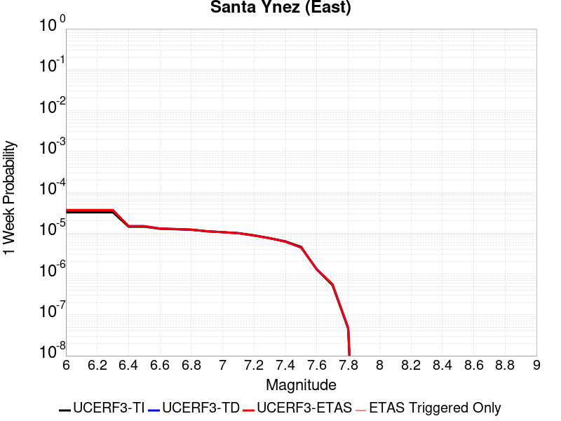 | 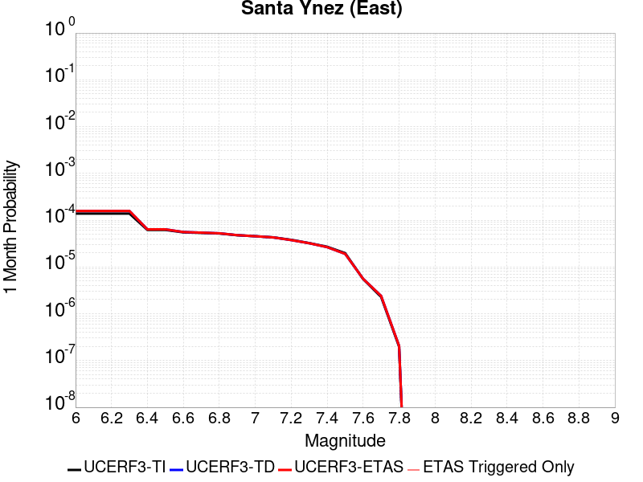 | 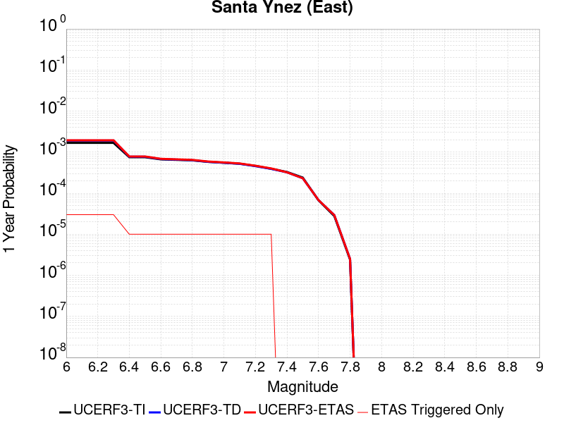 | 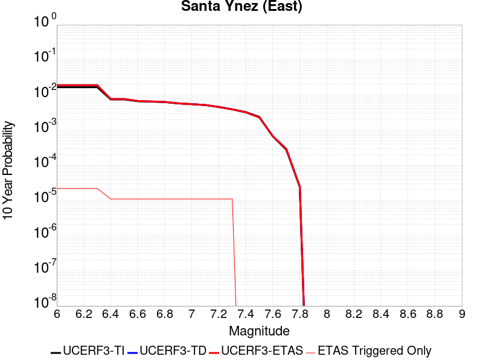 |

| Magnitude | 1 wk TI Prob | 1 wk TD Prob | 1 wk ETAS Prob | 1 wk ETAS/TD Gain | 1 wk ETAS Triggered Only | 1 mo TI Prob | 1 mo TD Prob | 1 mo ETAS Prob | 1 mo ETAS/TD Gain | 1 mo ETAS Triggered Only | 1 yr TI Prob | 1 yr TD Prob | 1 yr ETAS Prob | 1 yr ETAS/TD Gain | 1 yr ETAS Triggered Only | 10 yr TI Prob | 10 yr TD Prob | 10 yr ETAS Prob | 10 yr ETAS/TD Gain | 10 yr ETAS Triggered Only |
|-----|-----|-----|-----|-----|-----|-----|-----|-----|-----|-----|-----|-----|-----|-----|-----|-----|-----|-----|-----|-----|
| 6.0 | 3.2269712E-5 | 3.6757257E-5 | 3.6757257E-5 | 1.0 | 0.0 | 1.3829143E-4 | 1.5752493E-4 | 1.5752493E-4 | 1.0 | 0.0 | 0.0016823979 | 0.0019167687 | 0.0019387046 | 1.0114442 | 2.1978021E-5 | 0.016697178 | 0.019059911 | 0.019081471 | 1.0011312 | 2.1978021E-5 |
| 6.1 | 3.2269712E-5 | 3.6757257E-5 | 3.6757257E-5 | 1.0 | 0.0 | 1.3829143E-4 | 1.5752493E-4 | 1.5752493E-4 | 1.0 | 0.0 | 0.0016823979 | 0.0019167687 | 0.0019387046 | 1.0114442 | 2.1978021E-5 | 0.016697178 | 0.019059911 | 0.019081471 | 1.0011312 | 2.1978021E-5 |
| 6.2 | 3.2269712E-5 | 3.6757257E-5 | 3.6757257E-5 | 1.0 | 0.0 | 1.3829143E-4 | 1.5752493E-4 | 1.5752493E-4 | 1.0 | 0.0 | 0.0016823979 | 0.0019167687 | 0.0019387046 | 1.0114442 | 2.1978021E-5 | 0.016697178 | 0.019059911 | 0.019081471 | 1.0011312 | 2.1978021E-5 |
| 6.3 | 3.2269712E-5 | 3.6757257E-5 | 3.6757257E-5 | 1.0 | 0.0 | 1.3829143E-4 | 1.5752493E-4 | 1.5752493E-4 | 1.0 | 0.0 | 0.0016823979 | 0.0019167687 | 0.0019387046 | 1.0114442 | 2.1978021E-5 | 0.016697178 | 0.019059911 | 0.019081471 | 1.0011312 | 2.1978021E-5 |
| 6.4 | 1.4404779E-5 | 1.4850879E-5 | 1.4850879E-5 | 1.0 | 0.0 | 6.1733306E-5 | 6.36451E-5 | 6.36451E-5 | 1.0 | 0.0 | 7.513438E-4 | 7.7460863E-4 | 7.855891E-4 | 1.0141755 | 1.0989011E-5 | 0.0074880854 | 0.007719637 | 0.007730541 | 1.0014125 | 1.0989011E-5 |
| 6.5 | 1.4404779E-5 | 1.4850879E-5 | 1.4850879E-5 | 1.0 | 0.0 | 6.1733306E-5 | 6.36451E-5 | 6.36451E-5 | 1.0 | 0.0 | 7.513438E-4 | 7.7460863E-4 | 7.855891E-4 | 1.0141755 | 1.0989011E-5 | 0.0074880854 | 0.007719637 | 0.007730541 | 1.0014125 | 1.0989011E-5 |
| 6.6 | 1.280208E-5 | 1.3013157E-5 | 1.3013157E-5 | 1.0 | 0.0 | 5.4864904E-5 | 5.576949E-5 | 5.576949E-5 | 1.0 | 0.0 | 6.6777546E-4 | 6.787838E-4 | 6.897653E-4 | 1.0161783 | 1.0989011E-5 | 0.006657724 | 0.006767316 | 0.0067782304 | 1.0016129 | 1.0989011E-5 |
| 6.7 | 1.2457027E-5 | 1.2629632E-5 | 1.2629632E-5 | 1.0 | 0.0 | 5.3386164E-5 | 5.412588E-5 | 5.412588E-5 | 1.0 | 0.0 | 6.497827E-4 | 6.58785E-4 | 6.697668E-4 | 1.0166698 | 1.0989011E-5 | 0.00647886 | 0.0065685185 | 0.0065794354 | 1.001662 | 1.0989011E-5 |
| 6.8 | 1.2095134E-5 | 1.2232037E-5 | 1.2232037E-5 | 1.0 | 0.0 | 5.1835254E-5 | 5.2421972E-5 | 5.2421972E-5 | 1.0 | 0.0 | 6.309115E-4 | 6.3805224E-4 | 6.490342E-4 | 1.0172118 | 1.0989011E-5 | 0.0062912325 | 0.006362391 | 0.0063733105 | 1.0017161 | 1.0989011E-5 |
| 6.9 | 1.1104036E-5 | 1.1158374E-5 | 1.1158374E-5 | 1.0 | 0.0 | 4.758786E-5 | 4.7820733E-5 | 4.7820733E-5 | 1.0 | 0.0 | 5.7922816E-4 | 5.820631E-4 | 5.930457E-4 | 1.0188684 | 1.0989011E-5 | 0.005777207 | 0.0058055315 | 0.005816457 | 1.0018818 | 1.0989011E-5 |
| 7.0 | 1.0577444E-5 | 1.0582649E-5 | 1.0582649E-5 | 1.0 | 0.0 | 4.5331115E-5 | 4.535343E-5 | 4.535343E-5 | 1.0 | 0.0 | 5.5176654E-4 | 5.5203936E-4 | 5.630223E-4 | 1.0198952 | 1.0989011E-5 | 0.0055039856 | 0.0055068186 | 0.0055177473 | 1.0019846 | 1.0989011E-5 |
| 7.1 | 1.0021775E-5 | 9.981904E-6 | 9.981904E-6 | 1.0 | 0.0 | 4.294976E-5 | 4.2778895E-5 | 4.2778895E-5 | 1.0 | 0.0 | 5.2278786E-4 | 5.207098E-4 | 5.3169305E-4 | 1.0210929 | 1.0989011E-5 | 0.0052155964 | 0.0051950295 | 0.0052059614 | 1.0021043 | 1.0989011E-5 |
| 7.2 | 8.874109E-6 | 8.749601E-6 | 8.749601E-6 | 1.0 | 0.0 | 3.8031343E-5 | 3.7497757E-5 | 3.7497757E-5 | 1.0 | 0.0 | 4.629332E-4 | 4.5644064E-4 | 4.6742463E-4 | 1.0240644 | 1.0989011E-5 | 0.0046197 | 0.0045551495 | 0.004566089 | 1.0024015 | 1.0989011E-5 |
| 7.3 | 7.5504267E-6 | 7.5057687E-6 | 7.5057687E-6 | 1.0 | 0.0 | 3.235857E-5 | 3.216719E-5 | 3.216719E-5 | 1.0 | 0.0 | 3.9389438E-4 | 3.9156617E-4 | 4.0255088E-4 | 1.0280533 | 1.0989011E-5 | 0.0039319694 | 0.0039088693 | 0.0039198156 | 1.0028003 | 1.0989011E-5 |
| 7.4 | 6.309394E-6 | 6.183682E-6 | 6.183682E-6 | 1.0 | 0.0 | 2.703998E-5 | 2.6501231E-5 | 2.6501231E-5 | 1.0 | 0.0 | 3.2916202E-4 | 3.226057E-4 | 3.226057E-4 | 1.0 | 0.0 | 0.003286749 | 0.0032214709 | 0.0032214709 | 1.0 | 0.0 |
| 7.5 | 4.6103073E-6 | 4.4412473E-6 | 4.4412473E-6 | 1.0 | 0.0 | 1.975831E-5 | 1.9033781E-5 | 1.9033781E-5 | 1.0 | 0.0 | 2.4053088E-4 | 2.3171234E-4 | 2.3171234E-4 | 1.0 | 0.0 | 0.002402707 | 0.0023147769 | 0.0023147769 | 1.0 | 0.0 |
| 7.6 | 1.2858658E-6 | 1.3008935E-6 | 1.3008935E-6 | 1.0 | 0.0 | 5.5108417E-6 | 5.575246E-6 | 5.575246E-6 | 1.0 | 0.0 | 6.7092435E-5 | 6.787658E-5 | 6.787658E-5 | 1.0 | 0.0 | 6.707218E-4 | 6.7856535E-4 | 6.7856535E-4 | 1.0 | 0.0 |
| 7.7 | 5.3302307E-7 | 5.612455E-7 | 5.612455E-7 | 1.0 | 0.0 | 2.2843826E-6 | 2.4053359E-6 | 2.4053359E-6 | 1.0 | 0.0 | 2.7812002E-5 | 2.9284607E-5 | 2.9284607E-5 | 1.0 | 0.0 | 2.7808524E-4 | 2.9281105E-4 | 2.9281105E-4 | 1.0 | 0.0 |
| 7.8 | 4.613933E-8 | 4.8032188E-8 | 4.8032188E-8 | 1.0 | 0.0 | 1.9773998E-7 | 2.0585222E-7 | 2.0585222E-7 | 1.0 | 0.0 | 2.4074816E-6 | 2.506248E-6 | 2.506248E-6 | 1.0 | 0.0 | 2.4074554E-5 | 2.5062207E-5 | 2.5062207E-5 | 1.0 | 0.0 |

## Tin Mountain
*[(top)](#table-of-contents)*

| 1 Week | 1 Month | 1 Year | 10 Year |
|-----|-----|-----|-----|
| 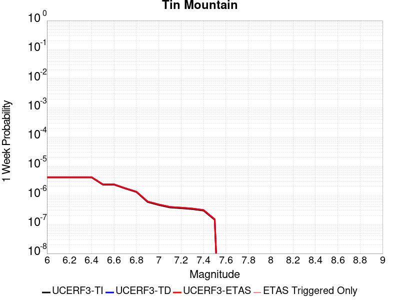 | 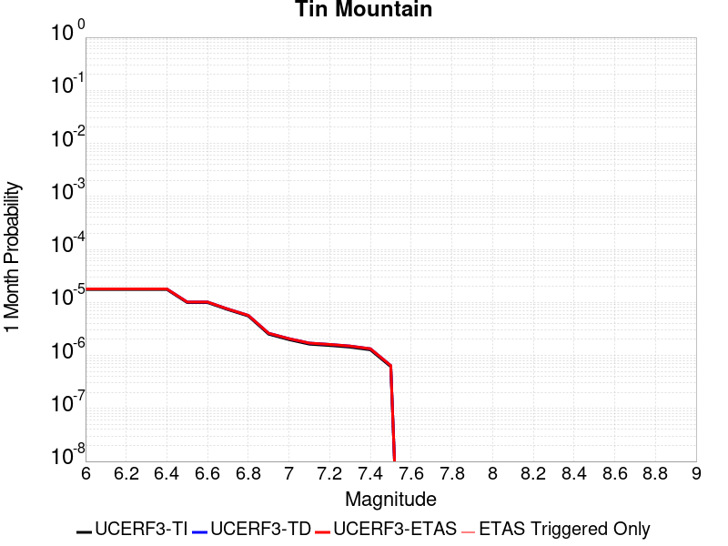 | 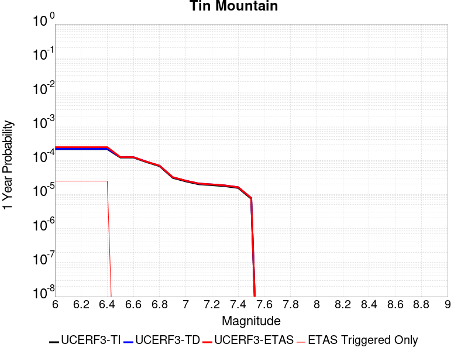 | 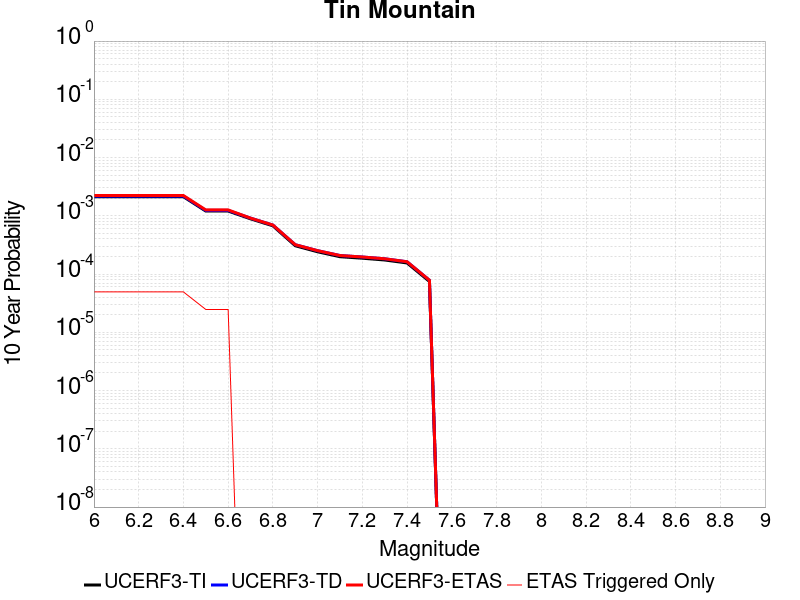 |

| Magnitude | 1 wk TI Prob | 1 wk TD Prob | 1 wk ETAS Prob | 1 wk ETAS/TD Gain | 1 wk ETAS Triggered Only | 1 mo TI Prob | 1 mo TD Prob | 1 mo ETAS Prob | 1 mo ETAS/TD Gain | 1 mo ETAS Triggered Only | 1 yr TI Prob | 1 yr TD Prob | 1 yr ETAS Prob | 1 yr ETAS/TD Gain | 1 yr ETAS Triggered Only | 10 yr TI Prob | 10 yr TD Prob | 10 yr ETAS Prob | 10 yr ETAS/TD Gain | 10 yr ETAS Triggered Only |
|-----|-----|-----|-----|-----|-----|-----|-----|-----|-----|-----|-----|-----|-----|-----|-----|-----|-----|-----|-----|-----|
| 6.0 | 4.083776E-6 | 4.1816434E-6 | 4.1816434E-6 | 1.0 | 0.0 | 1.750178E-5 | 1.7921226E-5 | 1.7921226E-5 | 1.0 | 0.0 | 2.1306332E-4 | 2.181728E-4 | 2.2915941E-4 | 1.0503573 | 1.0989011E-5 | 0.0021285915 | 0.0021799519 | 0.0022128471 | 1.0150899 | 3.2967033E-5 |
| 6.1 | 4.083776E-6 | 4.1816434E-6 | 4.1816434E-6 | 1.0 | 0.0 | 1.750178E-5 | 1.7921226E-5 | 1.7921226E-5 | 1.0 | 0.0 | 2.1306332E-4 | 2.181728E-4 | 2.2915941E-4 | 1.0503573 | 1.0989011E-5 | 0.0021285915 | 0.0021799519 | 0.0022128471 | 1.0150899 | 3.2967033E-5 |
| 6.2 | 4.083776E-6 | 4.1816434E-6 | 4.1816434E-6 | 1.0 | 0.0 | 1.750178E-5 | 1.7921226E-5 | 1.7921226E-5 | 1.0 | 0.0 | 2.1306332E-4 | 2.181728E-4 | 2.2915941E-4 | 1.0503573 | 1.0989011E-5 | 0.0021285915 | 0.0021799519 | 0.0022128471 | 1.0150899 | 3.2967033E-5 |
| 6.3 | 4.083776E-6 | 4.1816434E-6 | 4.1816434E-6 | 1.0 | 0.0 | 1.750178E-5 | 1.7921226E-5 | 1.7921226E-5 | 1.0 | 0.0 | 2.1306332E-4 | 2.181728E-4 | 2.2915941E-4 | 1.0503573 | 1.0989011E-5 | 0.0021285915 | 0.0021799519 | 0.0022128471 | 1.0150899 | 3.2967033E-5 |
| 6.4 | 4.083776E-6 | 4.1816434E-6 | 4.1816434E-6 | 1.0 | 0.0 | 1.750178E-5 | 1.7921226E-5 | 1.7921226E-5 | 1.0 | 0.0 | 2.1306332E-4 | 2.181728E-4 | 2.2915941E-4 | 1.0503573 | 1.0989011E-5 | 0.0021285915 | 0.0021799519 | 0.0022128471 | 1.0150899 | 3.2967033E-5 |
| 6.5 | 2.3143427E-6 | 2.3732214E-6 | 2.3732214E-6 | 1.0 | 0.0 | 9.9185745E-6 | 1.0170914E-5 | 1.0170914E-5 | 1.0 | 0.0 | 1.2075195E-4 | 1.2382462E-4 | 1.2382462E-4 | 1.0 | 0.0 | 0.0012068636 | 0.0012376321 | 0.0012486075 | 1.0088681 | 1.0989011E-5 |
| 6.6 | 2.3143427E-6 | 2.3732214E-6 | 2.3732214E-6 | 1.0 | 0.0 | 9.9185745E-6 | 1.0170914E-5 | 1.0170914E-5 | 1.0 | 0.0 | 1.2075195E-4 | 1.2382462E-4 | 1.2382462E-4 | 1.0 | 0.0 | 0.0012068636 | 0.0012376321 | 0.0012486075 | 1.0088681 | 1.0989011E-5 |
| 6.7 | 1.7029532E-6 | 1.7498428E-6 | 1.7498428E-6 | 1.0 | 0.0 | 7.2983503E-6 | 7.4993077E-6 | 7.4993077E-6 | 1.0 | 0.0 | 8.885379E-5 | 9.130078E-5 | 9.130078E-5 | 1.0 | 0.0 | 8.881827E-4 | 9.1268535E-4 | 9.1268535E-4 | 1.0 | 0.0 |
| 6.8 | 1.2914646E-6 | 1.3299801E-6 | 1.3299801E-6 | 1.0 | 0.0 | 5.534837E-6 | 5.699905E-6 | 5.699905E-6 | 1.0 | 0.0 | 6.738455E-5 | 6.939458E-5 | 6.939458E-5 | 1.0 | 0.0 | 6.736412E-4 | 6.937724E-4 | 6.937724E-4 | 1.0 | 0.0 |
| 6.9 | 5.8708974E-7 | 6.1172665E-7 | 6.1172665E-7 | 1.0 | 0.0 | 2.5160964E-6 | 2.6216833E-6 | 2.6216833E-6 | 1.0 | 0.0 | 3.0633044E-5 | 3.1918567E-5 | 3.1918567E-5 | 1.0 | 0.0 | 3.0628822E-4 | 3.1914393E-4 | 3.1914393E-4 | 1.0 | 0.0 |
| 7.0 | 4.6248786E-7 | 4.8322454E-7 | 4.8322454E-7 | 1.0 | 0.0 | 1.9820893E-6 | 2.0709608E-6 | 2.0709608E-6 | 1.0 | 0.0 | 2.413167E-5 | 2.5213694E-5 | 2.5213694E-5 | 1.0 | 0.0 | 2.412905E-4 | 2.5211202E-4 | 2.5211202E-4 | 1.0 | 0.0 |
| 7.1 | 3.804606E-7 | 3.98735E-7 | 3.98735E-7 | 1.0 | 0.0 | 1.6305444E-6 | 1.7088635E-6 | 1.7088635E-6 | 1.0 | 0.0 | 1.9851697E-5 | 2.0805248E-5 | 2.0805248E-5 | 1.0 | 0.0 | 1.9849923E-4 | 2.0803636E-4 | 2.0803636E-4 | 1.0 | 0.0 |
| 7.2 | 3.5864858E-7 | 3.7618813E-7 | 3.7618813E-7 | 1.0 | 0.0 | 1.5370645E-6 | 1.6122341E-6 | 1.6122341E-6 | 1.0 | 0.0 | 1.87136E-5 | 1.9628807E-5 | 1.9628807E-5 | 1.0 | 0.0 | 1.8712023E-4 | 1.9627405E-4 | 1.9627405E-4 | 1.0 | 0.0 |
| 7.3 | 3.342063E-7 | 3.50653E-7 | 3.50653E-7 | 1.0 | 0.0 | 1.4323119E-6 | 1.502798E-6 | 1.502798E-6 | 1.0 | 0.0 | 1.7438259E-5 | 1.8296445E-5 | 1.8296445E-5 | 1.0 | 0.0 | 1.743689E-4 | 1.8295269E-4 | 1.8295269E-4 | 1.0 | 0.0 |
| 7.4 | 2.971242E-7 | 3.1167437E-7 | 3.1167437E-7 | 1.0 | 0.0 | 1.2733886E-6 | 1.3357468E-6 | 1.3357468E-6 | 1.0 | 0.0 | 1.5503398E-5 | 1.626263E-5 | 1.626263E-5 | 1.0 | 0.0 | 1.5502315E-4 | 1.6261767E-4 | 1.6261767E-4 | 1.0 | 0.0 |
| 7.5 | 1.4326713E-7 | 1.5013286E-7 | 1.5013286E-7 | 1.0 | 0.0 | 6.140018E-7 | 6.434266E-7 | 6.434266E-7 | 1.0 | 0.0 | 7.4754466E-6 | 7.833718E-6 | 7.833718E-6 | 1.0 | 0.0 | 7.475195E-5 | 7.833719E-5 | 7.833719E-5 | 1.0 | 0.0 |

## Owens Valley Keough Hot Springs
*[(top)](#table-of-contents)*

| 1 Week | 1 Month | 1 Year | 10 Year |
|-----|-----|-----|-----|
| 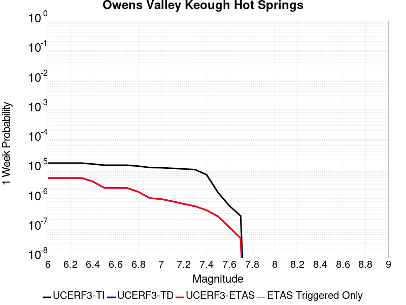 | 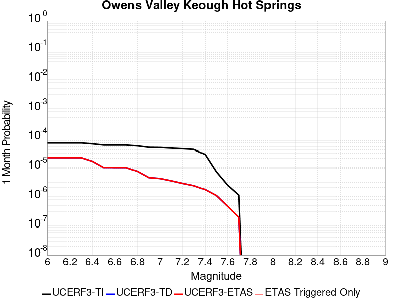 | 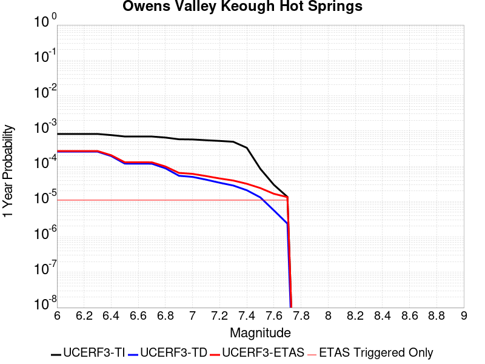 | 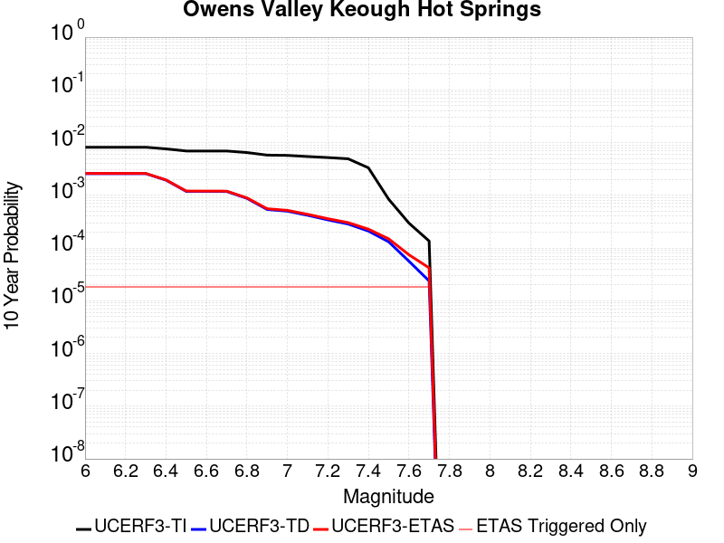 |

| Magnitude | 1 wk TI Prob | 1 wk TD Prob | 1 wk ETAS Prob | 1 wk ETAS/TD Gain | 1 wk ETAS Triggered Only | 1 mo TI Prob | 1 mo TD Prob | 1 mo ETAS Prob | 1 mo ETAS/TD Gain | 1 mo ETAS Triggered Only | 1 yr TI Prob | 1 yr TD Prob | 1 yr ETAS Prob | 1 yr ETAS/TD Gain | 1 yr ETAS Triggered Only | 10 yr TI Prob | 10 yr TD Prob | 10 yr ETAS Prob | 10 yr ETAS/TD Gain | 10 yr ETAS Triggered Only |
|-----|-----|-----|-----|-----|-----|-----|-----|-----|-----|-----|-----|-----|-----|-----|-----|-----|-----|-----|-----|-----|
| 6.0 | 1.5708529E-5 | 4.9520045E-6 | 4.9520045E-6 | 1.0 | 0.0 | 6.7320536E-5 | 2.1222733E-5 | 2.1222733E-5 | 1.0 | 0.0 | 8.193192E-4 | 2.5836125E-4 | 2.6934742E-4 | 1.0425225 | 1.0989011E-5 | 0.008163051 | 0.002581269 | 0.0026031903 | 1.0084925 | 2.1978021E-5 |
| 6.1 | 1.5708529E-5 | 4.9520045E-6 | 4.9520045E-6 | 1.0 | 0.0 | 6.7320536E-5 | 2.1222733E-5 | 2.1222733E-5 | 1.0 | 0.0 | 8.193192E-4 | 2.5836125E-4 | 2.6934742E-4 | 1.0425225 | 1.0989011E-5 | 0.008163051 | 0.002581269 | 0.0026031903 | 1.0084925 | 2.1978021E-5 |
| 6.2 | 1.5708529E-5 | 4.9520045E-6 | 4.9520045E-6 | 1.0 | 0.0 | 6.7320536E-5 | 2.1222733E-5 | 2.1222733E-5 | 1.0 | 0.0 | 8.193192E-4 | 2.5836125E-4 | 2.6934742E-4 | 1.0425225 | 1.0989011E-5 | 0.008163051 | 0.002581269 | 0.0026031903 | 1.0084925 | 2.1978021E-5 |
| 6.3 | 1.5708529E-5 | 4.9520045E-6 | 4.9520045E-6 | 1.0 | 0.0 | 6.7320536E-5 | 2.1222733E-5 | 2.1222733E-5 | 1.0 | 0.0 | 8.193192E-4 | 2.5836125E-4 | 2.6934742E-4 | 1.0425225 | 1.0989011E-5 | 0.008163051 | 0.002581269 | 0.0026031903 | 1.0084925 | 2.1978021E-5 |
| 6.4 | 1.4622509E-5 | 3.7277039E-6 | 3.7277039E-6 | 1.0 | 0.0 | 6.266639E-5 | 1.5975795E-5 | 1.5975795E-5 | 1.0 | 0.0 | 7.626962E-4 | 1.9449124E-4 | 2.0547812E-4 | 1.0564903 | 1.0989011E-5 | 0.007600839 | 0.0019436914 | 0.0019656266 | 1.0112854 | 2.1978021E-5 |
| 6.5 | 1.3335527E-5 | 2.2787071E-6 | 2.2787071E-6 | 1.0 | 0.0 | 5.7151006E-5 | 9.765855E-6 | 9.765855E-6 | 1.0 | 0.0 | 6.955913E-4 | 1.18893484E-4 | 1.2988118E-4 | 1.0924164 | 1.0989011E-5 | 0.0069341804 | 0.0011885226 | 0.0012104745 | 1.0184699 | 2.1978021E-5 |
| 6.6 | 1.3332855E-5 | 2.275856E-6 | 2.275856E-6 | 1.0 | 0.0 | 5.7139558E-5 | 9.753637E-6 | 9.753637E-6 | 1.0 | 0.0 | 6.9545204E-4 | 1.1874474E-4 | 1.2973245E-4 | 1.0925322 | 1.0989011E-5 | 0.0069327964 | 0.0011870367 | 0.0012089887 | 1.018493 | 2.1978021E-5 |
| 6.7 | 1.3318214E-5 | 2.2650838E-6 | 2.2650838E-6 | 1.0 | 0.0 | 5.707681E-5 | 9.70747E-6 | 9.70747E-6 | 1.0 | 0.0 | 6.946886E-4 | 1.1818272E-4 | 1.2917042E-4 | 1.0929723 | 1.0989011E-5 | 0.0069252094 | 0.0011814225 | 0.0012033746 | 1.018581 | 2.1978021E-5 |
| 6.8 | 1.2441338E-5 | 1.6786275E-6 | 1.6786275E-6 | 1.0 | 0.0 | 5.331893E-5 | 7.1941E-6 | 7.1941E-6 | 1.0 | 0.0 | 6.489646E-4 | 8.7584944E-5 | 9.857299E-5 | 1.1254559 | 1.0989011E-5 | 0.0064707273 | 8.7569037E-4 | 8.9764915E-4 | 1.0250759 | 2.1978021E-5 |
| 6.9 | 1.1130476E-5 | 1.0309606E-6 | 1.0309606E-6 | 1.0 | 0.0 | 4.7701167E-5 | 4.418395E-6 | 4.418395E-6 | 1.0 | 0.0 | 5.806069E-4 | 5.3792646E-5 | 6.478107E-5 | 1.2042737 | 1.0989011E-5 | 0.0057909233 | 5.379521E-4 | 5.5991835E-4 | 1.040833 | 2.1978021E-5 |
| 7.0 | 1.0986073E-5 | 9.584916E-7 | 9.584916E-7 | 1.0 | 0.0 | 4.7082318E-5 | 4.1078147E-6 | 4.1078147E-6 | 1.0 | 0.0 | 5.730765E-4 | 5.001151E-5 | 6.099997E-5 | 1.2197187 | 1.0989011E-5 | 0.0057160086 | 5.001574E-4 | 5.2212446E-4 | 1.0439203 | 2.1978021E-5 |
| 7.1 | 1.0451338E-5 | 8.0047914E-7 | 8.0047914E-7 | 1.0 | 0.0 | 4.4790682E-5 | 3.4306206E-6 | 3.4306206E-6 | 1.0 | 0.0 | 5.451901E-4 | 4.176701E-5 | 5.275556E-5 | 1.2630917 | 1.0989011E-5 | 0.005438545 | 4.1774256E-4 | 4.397114E-4 | 1.0525894 | 2.1978021E-5 |
| 7.2 | 9.989061E-6 | 6.548821E-7 | 6.548821E-7 | 1.0 | 0.0 | 4.280956E-5 | 2.8066345E-6 | 2.8066345E-6 | 1.0 | 0.0 | 5.2108173E-4 | 3.4170243E-5 | 4.515888E-5 | 1.3215849 | 1.0989011E-5 | 0.0051986156 | 3.4178863E-4 | 3.6375914E-4 | 1.064281 | 2.1978021E-5 |
| 7.3 | 9.465365E-6 | 5.463649E-7 | 5.463649E-7 | 1.0 | 0.0 | 4.056522E-5 | 2.3415619E-6 | 2.3415619E-6 | 1.0 | 0.0 | 4.937696E-4 | 2.8508144E-5 | 3.949684E-5 | 1.3854582 | 1.0989011E-5 | 0.0049267393 | 2.8517874E-4 | 3.071505E-4 | 1.0770456 | 2.1978021E-5 |
| 7.4 | 6.3824805E-6 | 4.0193112E-7 | 4.0193112E-7 | 1.0 | 0.0 | 2.73532E-5 | 1.7225609E-6 | 1.7225609E-6 | 1.0 | 0.0 | 3.3297433E-4 | 2.0971978E-5 | 3.196076E-5 | 1.5239744 | 1.0989011E-5 | 0.0033247585 | 2.0979355E-4 | 2.3176696E-4 | 1.1047382 | 2.1978021E-5 |
| 7.5 | 1.6192645E-6 | 2.5179273E-7 | 2.5179273E-7 | 1.0 | 0.0 | 6.9396865E-6 | 1.0791111E-6 | 1.0791111E-6 | 1.0 | 0.0 | 8.448741E-5 | 1.3138101E-5 | 2.4126968E-5 | 1.8364121 | 1.0989011E-5 | 8.4455294E-4 | 1.3137337E-4 | 1.533485E-4 | 1.1672723 | 2.1978021E-5 |
| 7.6 | 5.7062545E-7 | 1.0799648E-7 | 1.0799648E-7 | 1.0 | 0.0 | 2.4455355E-6 | 4.6284197E-7 | 4.6284197E-7 | 1.0 | 0.0 | 2.9773988E-5 | 5.6350873E-6 | 1.6624037E-5 | 2.9500937 | 1.0989011E-5 | 2.977E-4 | 5.6349527E-5 | 7.832631E-5 | 1.3900083 | 2.1978021E-5 |
| 7.7 | 2.5988817E-7 | 4.5487504E-8 | 4.5487504E-8 | 1.0 | 0.0 | 1.113806E-6 | 1.9494644E-7 | 1.9494644E-7 | 1.0 | 0.0 | 1.3560503E-5 | 2.3734706E-6 | 1.3362455E-5 | 5.6299224 | 1.0989011E-5 | 1.3559677E-4 | 2.3734498E-5 | 4.5711997E-5 | 1.9259728 | 2.1978021E-5 |

## Bullion Mountains
*[(top)](#table-of-contents)*

| 1 Week | 1 Month | 1 Year | 10 Year |
|-----|-----|-----|-----|
| 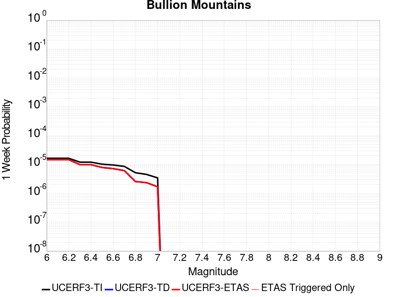 | 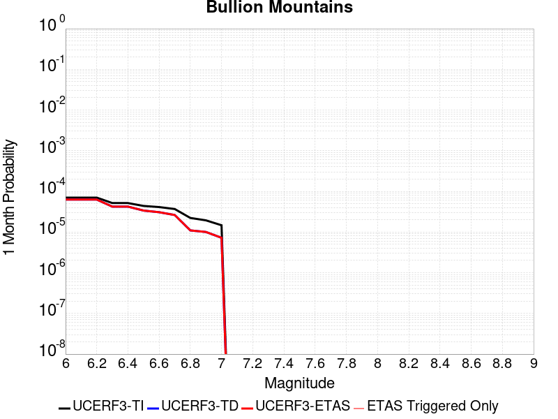 | 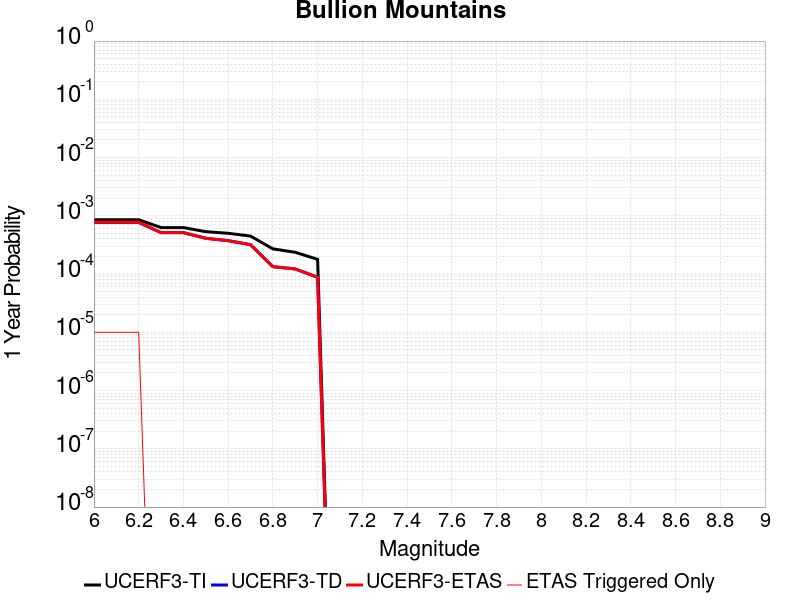 | 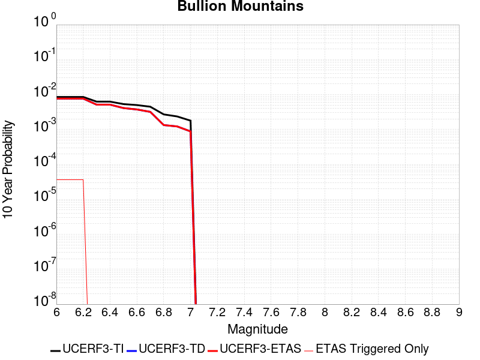 |

| Magnitude | 1 wk TI Prob | 1 wk TD Prob | 1 wk ETAS Prob | 1 wk ETAS/TD Gain | 1 wk ETAS Triggered Only | 1 mo TI Prob | 1 mo TD Prob | 1 mo ETAS Prob | 1 mo ETAS/TD Gain | 1 mo ETAS Triggered Only | 1 yr TI Prob | 1 yr TD Prob | 1 yr ETAS Prob | 1 yr ETAS/TD Gain | 1 yr ETAS Triggered Only | 10 yr TI Prob | 10 yr TD Prob | 10 yr ETAS Prob | 10 yr ETAS/TD Gain | 10 yr ETAS Triggered Only |
|-----|-----|-----|-----|-----|-----|-----|-----|-----|-----|-----|-----|-----|-----|-----|-----|-----|-----|-----|-----|-----|
| 6.0 | 1.6420427E-5 | 1.4693821E-5 | 1.4693821E-5 | 1.0 | 0.0 | 7.037136E-5 | 6.297221E-5 | 6.297221E-5 | 1.0 | 0.0 | 8.5643446E-4 | 7.664554E-4 | 7.77436E-4 | 1.0143265 | 1.0989011E-5 | 0.008531413 | 0.007641914 | 0.007663724 | 1.002854 | 2.1978021E-5 |
| 6.1 | 1.6420427E-5 | 1.4693821E-5 | 1.4693821E-5 | 1.0 | 0.0 | 7.037136E-5 | 6.297221E-5 | 6.297221E-5 | 1.0 | 0.0 | 8.5643446E-4 | 7.664554E-4 | 7.77436E-4 | 1.0143265 | 1.0989011E-5 | 0.008531413 | 0.007641914 | 0.007663724 | 1.002854 | 2.1978021E-5 |
| 6.2 | 1.6420427E-5 | 1.4693821E-5 | 1.4693821E-5 | 1.0 | 0.0 | 7.037136E-5 | 6.297221E-5 | 6.297221E-5 | 1.0 | 0.0 | 8.5643446E-4 | 7.664554E-4 | 7.77436E-4 | 1.0143265 | 1.0989011E-5 | 0.008531413 | 0.007641914 | 0.007663724 | 1.002854 | 2.1978021E-5 |
| 6.3 | 1.2046778E-5 | 9.863532E-6 | 9.863532E-6 | 1.0 | 0.0 | 5.1628023E-5 | 4.2271728E-5 | 4.2271728E-5 | 1.0 | 0.0 | 6.283899E-4 | 5.145599E-4 | 5.145599E-4 | 1.0 | 0.0 | 0.0062661595 | 0.005135967 | 0.005135967 | 1.0 | 0.0 |
| 6.4 | 1.2046778E-5 | 9.863532E-6 | 9.863532E-6 | 1.0 | 0.0 | 5.1628023E-5 | 4.2271728E-5 | 4.2271728E-5 | 1.0 | 0.0 | 6.283899E-4 | 5.145599E-4 | 5.145599E-4 | 1.0 | 0.0 | 0.0062661595 | 0.005135967 | 0.005135967 | 1.0 | 0.0 |
| 6.5 | 1.0244343E-5 | 7.880444E-6 | 7.880444E-6 | 1.0 | 0.0 | 4.390359E-5 | 3.3773013E-5 | 3.3773013E-5 | 1.0 | 0.0 | 5.343951E-4 | 4.1112956E-4 | 4.1112956E-4 | 1.0 | 0.0 | 0.005331118 | 0.004105721 | 0.004105721 | 1.0 | 0.0 |
| 6.6 | 9.605408E-6 | 7.1784093E-6 | 7.1784093E-6 | 1.0 | 0.0 | 4.1165385E-5 | 3.0764364E-5 | 3.0764364E-5 | 1.0 | 0.0 | 5.010733E-4 | 3.745121E-4 | 3.745121E-4 | 1.0 | 0.0 | 0.00499945 | 0.003740807 | 0.003740807 | 1.0 | 0.0 |
| 6.7 | 8.60418E-6 | 6.1248024E-6 | 6.1248024E-6 | 1.0 | 0.0 | 3.687454E-5 | 2.6249E-5 | 2.6249E-5 | 1.0 | 0.0 | 4.48855E-4 | 3.195542E-4 | 3.195542E-4 | 1.0 | 0.0 | 0.004479495 | 0.0031928592 | 0.0031928592 | 1.0 | 0.0 |
| 6.8 | 5.187994E-6 | 2.5635889E-6 | 2.5635889E-6 | 1.0 | 0.0 | 2.223407E-5 | 1.0986785E-5 | 1.0986785E-5 | 1.0 | 0.0 | 2.7066618E-4 | 1.337599E-4 | 1.337599E-4 | 1.0 | 0.0 | 0.0027033675 | 0.0013371855 | 0.0013371855 | 1.0 | 0.0 |
| 6.9 | 4.5302368E-6 | 2.344682E-6 | 2.344682E-6 | 1.0 | 0.0 | 1.9415156E-5 | 1.004862E-5 | 1.004862E-5 | 1.0 | 0.0 | 2.3635388E-4 | 1.2233906E-4 | 1.2233906E-4 | 1.0 | 0.0 | 0.0023610266 | 0.0012231063 | 0.0012231063 | 1.0 | 0.0 |
| 7.0 | 3.431668E-6 | 1.6885238E-6 | 1.6885238E-6 | 1.0 | 0.0 | 1.4707065E-5 | 7.2365306E-6 | 7.2365306E-6 | 1.0 | 0.0 | 1.7904381E-4 | 8.810476E-5 | 8.810476E-5 | 1.0 | 0.0 | 0.0017889962 | 8.8104757E-4 | 8.8104757E-4 | 1.0 | 0.0 |

## Palos Verdes
*[(top)](#table-of-contents)*

| 1 Week | 1 Month | 1 Year | 10 Year |
|-----|-----|-----|-----|
| 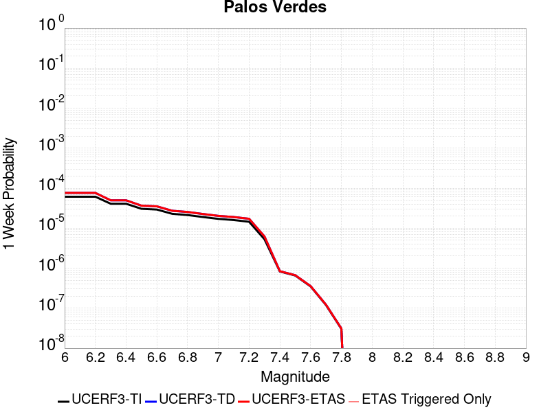 | 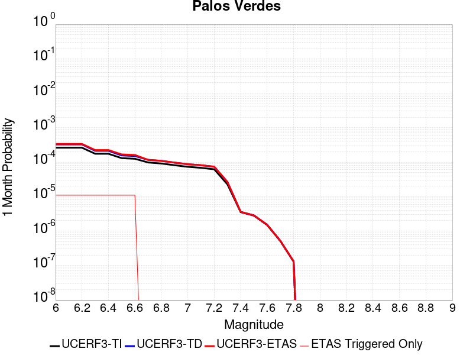 | 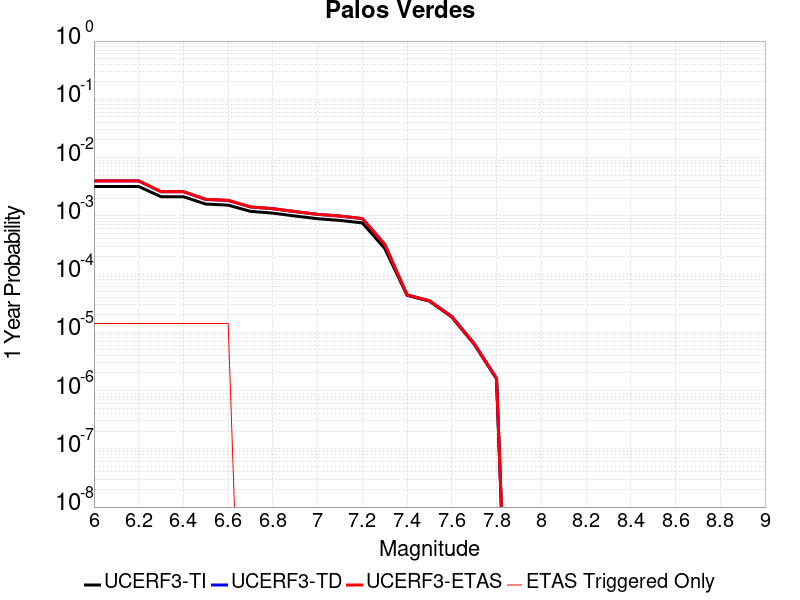 | 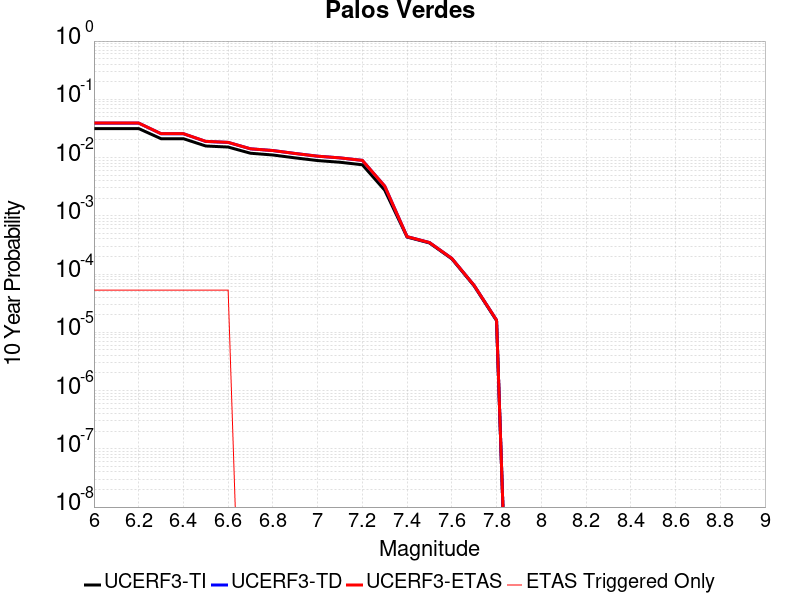 |

| Magnitude | 1 wk TI Prob | 1 wk TD Prob | 1 wk ETAS Prob | 1 wk ETAS/TD Gain | 1 wk ETAS Triggered Only | 1 mo TI Prob | 1 mo TD Prob | 1 mo ETAS Prob | 1 mo ETAS/TD Gain | 1 mo ETAS Triggered Only | 1 yr TI Prob | 1 yr TD Prob | 1 yr ETAS Prob | 1 yr ETAS/TD Gain | 1 yr ETAS Triggered Only | 10 yr TI Prob | 10 yr TD Prob | 10 yr ETAS Prob | 10 yr ETAS/TD Gain | 10 yr ETAS Triggered Only |
|-----|-----|-----|-----|-----|-----|-----|-----|-----|-----|-----|-----|-----|-----|-----|-----|-----|-----|-----|-----|-----|
| 6.0 | 6.126063E-5 | 7.6246164E-5 | 7.6246164E-5 | 1.0 | 0.0 | 2.6251914E-4 | 3.267317E-4 | 3.3771712E-4 | 1.0336221 | 1.0989011E-5 | 0.0031914865 | 0.0039711758 | 0.0039930665 | 1.0055124 | 2.1978021E-5 | 0.031460393 | 0.03905871 | 0.03907983 | 1.0005407 | 2.1978021E-5 |
| 6.1 | 6.126063E-5 | 7.6246164E-5 | 7.6246164E-5 | 1.0 | 0.0 | 2.6251914E-4 | 3.267317E-4 | 3.3771712E-4 | 1.0336221 | 1.0989011E-5 | 0.0031914865 | 0.0039711758 | 0.0039930665 | 1.0055124 | 2.1978021E-5 | 0.031460393 | 0.03905871 | 0.03907983 | 1.0005407 | 2.1978021E-5 |
| 6.2 | 6.126063E-5 | 7.6246164E-5 | 7.6246164E-5 | 1.0 | 0.0 | 2.6251914E-4 | 3.267317E-4 | 3.3771712E-4 | 1.0336221 | 1.0989011E-5 | 0.0031914865 | 0.0039711758 | 0.0039930665 | 1.0055124 | 2.1978021E-5 | 0.031460393 | 0.03905871 | 0.03907983 | 1.0005407 | 2.1978021E-5 |
| 6.3 | 4.0838047E-5 | 4.9761093E-5 | 4.9761093E-5 | 1.0 | 0.0 | 1.7500846E-4 | 2.1324566E-4 | 2.2423232E-4 | 1.0515212 | 1.0989011E-5 | 0.0021286458 | 0.0025933706 | 0.0026043311 | 1.0042263 | 1.0989011E-5 | 0.021083709 | 0.025652548 | 0.025663255 | 1.0004174 | 1.0989011E-5 |
| 6.4 | 4.0838047E-5 | 4.9761093E-5 | 4.9761093E-5 | 1.0 | 0.0 | 1.7500846E-4 | 2.1324566E-4 | 2.2423232E-4 | 1.0515212 | 1.0989011E-5 | 0.0021286458 | 0.0025933706 | 0.0026043311 | 1.0042263 | 1.0989011E-5 | 0.021083709 | 0.025652548 | 0.025663255 | 1.0004174 | 1.0989011E-5 |
| 6.5 | 3.0512005E-5 | 3.656939E-5 | 3.656939E-5 | 1.0 | 0.0 | 1.3075917E-4 | 1.5671721E-4 | 1.6770451E-4 | 1.070109 | 1.0989011E-5 | 0.0015908304 | 0.001906479 | 0.0019174471 | 1.005753 | 1.0989011E-5 | 0.015794903 | 0.01891312 | 0.018923901 | 1.00057 | 1.0989011E-5 |
| 6.6 | 2.9255087E-5 | 3.5162007E-5 | 3.5162007E-5 | 1.0 | 0.0 | 1.2537291E-4 | 1.5068628E-4 | 1.6167363E-4 | 1.0729154 | 1.0989011E-5 | 0.0015253464 | 0.0018331759 | 0.0018441448 | 1.0059836 | 1.0989011E-5 | 0.015149189 | 0.018192101 | 0.018202892 | 1.0005931 | 1.0989011E-5 |
| 6.7 | 2.287198E-5 | 2.7253858E-5 | 2.7253858E-5 | 1.0 | 0.0 | 9.801909E-5 | 1.16797535E-4 | 1.16797535E-4 | 1.0 | 0.0 | 0.001192729 | 0.001421174 | 0.001421174 | 1.0 | 0.0 | 0.011863477 | 0.014130091 | 0.014130091 | 1.0 | 0.0 |
| 6.8 | 2.1325764E-5 | 2.5437115E-5 | 2.5437115E-5 | 1.0 | 0.0 | 9.139293E-5 | 1.0901216E-4 | 1.0901216E-4 | 1.0 | 0.0 | 0.001112141 | 0.0013265052 | 0.0013265052 | 1.0 | 0.0 | 0.011065915 | 0.013194912 | 0.013194912 | 1.0 | 0.0 |
| 6.9 | 1.9009392E-5 | 2.2618136E-5 | 2.2618136E-5 | 1.0 | 0.0 | 8.1466285E-5 | 9.693176E-5 | 9.693176E-5 | 1.0 | 0.0 | 9.914007E-4 | 0.0011795927 | 0.0011795927 | 1.0 | 0.0 | 0.009869894 | 0.011742003 | 0.011742003 | 1.0 | 0.0 |
| 7.0 | 1.7098473E-5 | 2.0323456E-5 | 2.0323456E-5 | 1.0 | 0.0 | 7.3277115E-5 | 8.70981E-5 | 8.70981E-5 | 1.0 | 0.0 | 8.917837E-4 | 0.0010599887 | 0.0010599887 | 1.0 | 0.0 | 0.008882134 | 0.010557768 | 0.010557768 | 1.0 | 0.0 |
| 7.1 | 1.5982785E-5 | 1.8998595E-5 | 1.8998595E-5 | 1.0 | 0.0 | 6.849585E-5 | 8.142049E-5 | 8.142049E-5 | 1.0 | 0.0 | 8.336179E-4 | 9.909284E-4 | 9.909284E-4 | 1.0 | 0.0 | 0.008304977 | 0.009873465 | 0.009873465 | 1.0 | 0.0 |
| 7.2 | 1.4468002E-5 | 1.7200713E-5 | 1.7200713E-5 | 1.0 | 0.0 | 6.200425E-5 | 7.371573E-5 | 7.371573E-5 | 1.0 | 0.0 | 7.546402E-4 | 8.972036E-4 | 8.972036E-4 | 1.0 | 0.0 | 0.007520827 | 0.008944086 | 0.008944086 | 1.0 | 0.0 |
| 7.3 | 5.288233E-6 | 6.2048434E-6 | 6.2048434E-6 | 1.0 | 0.0 | 2.2663658E-5 | 2.6592112E-5 | 2.6592112E-5 | 1.0 | 0.0 | 2.7589512E-4 | 3.2374577E-4 | 3.2374577E-4 | 1.0 | 0.0 | 0.0027555283 | 0.0032361657 | 0.0032361657 | 1.0 | 0.0 |
| 7.4 | 8.279556E-7 | 8.4084854E-7 | 8.4084854E-7 | 1.0 | 0.0 | 3.5483763E-6 | 3.603632E-6 | 3.603632E-6 | 1.0 | 0.0 | 4.3200624E-5 | 4.387341E-5 | 4.387341E-5 | 1.0 | 0.0 | 4.3192226E-4 | 4.386547E-4 | 4.386547E-4 | 1.0 | 0.0 |
| 7.5 | 6.559831E-7 | 6.667345E-7 | 6.667345E-7 | 1.0 | 0.0 | 2.8113532E-6 | 2.8574307E-6 | 2.8574307E-6 | 1.0 | 0.0 | 3.4227687E-5 | 3.478873E-5 | 3.478873E-5 | 1.0 | 0.0 | 3.4222414E-4 | 3.4783946E-4 | 3.4783946E-4 | 1.0 | 0.0 |
| 7.6 | 3.5018968E-7 | 3.5620678E-7 | 3.5620678E-7 | 1.0 | 0.0 | 1.500812E-6 | 1.5265998E-6 | 1.5265998E-6 | 1.0 | 0.0 | 1.8272232E-5 | 1.8586241E-5 | 1.8586241E-5 | 1.0 | 0.0 | 1.8270731E-4 | 1.8585146E-4 | 1.8585146E-4 | 1.0 | 0.0 |
| 7.7 | 1.1986104E-7 | 1.2198606E-7 | 1.2198606E-7 | 1.0 | 0.0 | 5.1369005E-7 | 5.227973E-7 | 5.227973E-7 | 1.0 | 0.0 | 6.2541585E-6 | 6.3650386E-6 | 6.3650386E-6 | 1.0 | 0.0 | 6.2539824E-5 | 6.364861E-5 | 6.364861E-5 | 1.0 | 0.0 |
| 7.8 | 3.0445005E-8 | 3.1028215E-8 | 3.1028215E-8 | 1.0 | 0.0 | 1.3047858E-7 | 1.3297806E-7 | 1.3297806E-7 | 1.0 | 0.0 | 1.5885756E-6 | 1.6190069E-6 | 1.6190069E-6 | 1.0 | 0.0 | 1.5885644E-5 | 1.6189972E-5 | 1.6189972E-5 | 1.0 | 0.0 |

## Hayward (So) 2011 CFM
*[(top)](#table-of-contents)*

| 1 Week | 1 Month | 1 Year | 10 Year |
|-----|-----|-----|-----|
| 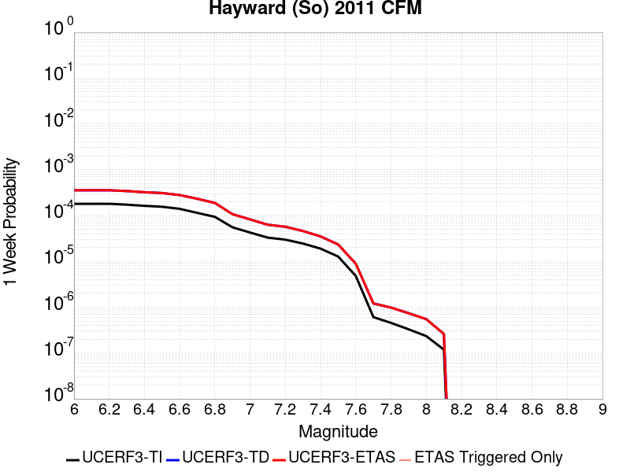 | 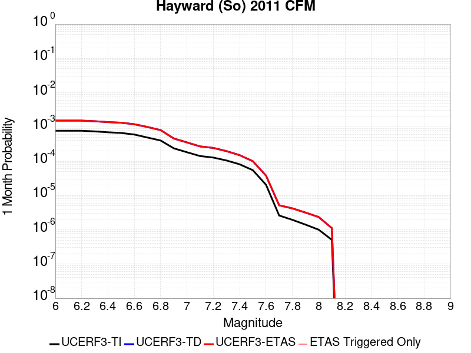 | 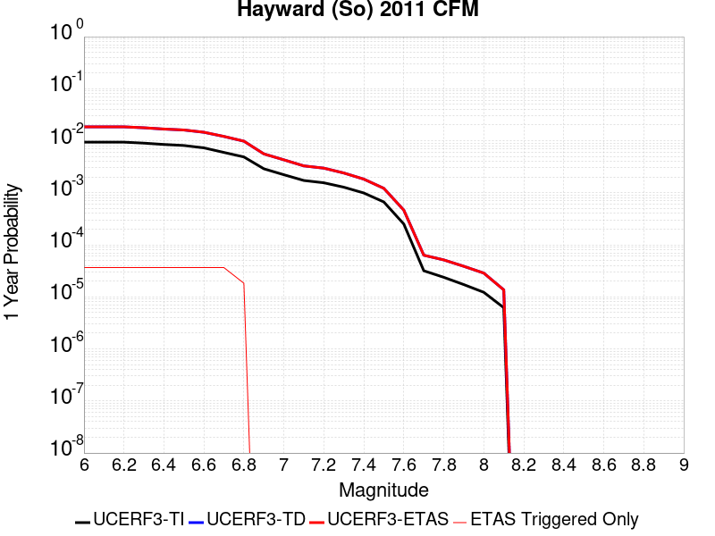 | 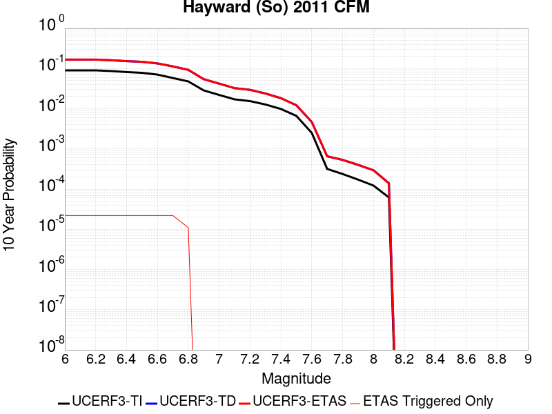 |

| Magnitude | 1 wk TI Prob | 1 wk TD Prob | 1 wk ETAS Prob | 1 wk ETAS/TD Gain | 1 wk ETAS Triggered Only | 1 mo TI Prob | 1 mo TD Prob | 1 mo ETAS Prob | 1 mo ETAS/TD Gain | 1 mo ETAS Triggered Only | 1 yr TI Prob | 1 yr TD Prob | 1 yr ETAS Prob | 1 yr ETAS/TD Gain | 1 yr ETAS Triggered Only | 10 yr TI Prob | 10 yr TD Prob | 10 yr ETAS Prob | 10 yr ETAS/TD Gain | 10 yr ETAS Triggered Only |
|-----|-----|-----|-----|-----|-----|-----|-----|-----|-----|-----|-----|-----|-----|-----|-----|-----|-----|-----|-----|-----|
| 6.0 | 1.8091932E-4 | 3.5739838E-4 | 3.5739838E-4 | 1.0 | 0.0 | 7.751381E-4 | 0.0015308182 | 0.0015308182 | 1.0 | 0.0 | 0.00939654 | 0.01848085 | 0.018502422 | 1.0011673 | 2.1978021E-5 | 0.090090066 | 0.16686414 | 0.16688246 | 1.0001098 | 2.1978021E-5 |
| 6.1 | 1.8091932E-4 | 3.5739838E-4 | 3.5739838E-4 | 1.0 | 0.0 | 7.751381E-4 | 0.0015308182 | 0.0015308182 | 1.0 | 0.0 | 0.00939654 | 0.01848085 | 0.018502422 | 1.0011673 | 2.1978021E-5 | 0.090090066 | 0.16686414 | 0.16688246 | 1.0001098 | 2.1978021E-5 |
| 6.2 | 1.8091932E-4 | 3.5739838E-4 | 3.5739838E-4 | 1.0 | 0.0 | 7.751381E-4 | 0.0015308182 | 0.0015308182 | 1.0 | 0.0 | 0.00939654 | 0.01848085 | 0.018502422 | 1.0011673 | 2.1978021E-5 | 0.090090066 | 0.16686414 | 0.16688246 | 1.0001098 | 2.1978021E-5 |
| 6.3 | 1.7322872E-4 | 3.4295986E-4 | 3.4295986E-4 | 1.0 | 0.0 | 7.4219756E-4 | 0.0014690097 | 0.0014690097 | 1.0 | 0.0 | 0.0089988755 | 0.0177408 | 0.017762387 | 1.0012169 | 2.1978021E-5 | 0.08643075 | 0.16079806 | 0.1608165 | 1.0001147 | 2.1978021E-5 |
| 6.4 | 1.6334097E-4 | 3.2376873E-4 | 3.2376873E-4 | 1.0 | 0.0 | 6.998449E-4 | 0.0013868511 | 0.0013868511 | 1.0 | 0.0 | 0.008487372 | 0.016756203 | 0.016777812 | 1.0012896 | 2.1978021E-5 | 0.081704415 | 0.15268466 | 0.15270329 | 1.000122 | 2.1978021E-5 |
| 6.5 | 1.5600289E-4 | 3.10508E-4 | 3.10508E-4 | 1.0 | 0.0 | 6.684125E-4 | 0.0013300782 | 0.0013300782 | 1.0 | 0.0 | 0.008107598 | 0.016075358 | 0.016096981 | 1.0013452 | 2.1978021E-5 | 0.078181036 | 0.14695926 | 0.146978 | 1.0001276 | 2.1978021E-5 |
| 6.6 | 1.4046066E-4 | 2.8063325E-4 | 2.8063325E-4 | 1.0 | 0.0 | 6.018354E-4 | 0.0012021664 | 0.0012021664 | 1.0 | 0.0 | 0.0073027555 | 0.014539654 | 0.014561313 | 1.0014896 | 2.1978021E-5 | 0.07067384 | 0.13404244 | 0.13406147 | 1.000142 | 2.1978021E-5 |
| 6.7 | 1.14696966E-4 | 2.3298878E-4 | 2.3298878E-4 | 1.0 | 0.0 | 4.914658E-4 | 9.981462E-4 | 9.981462E-4 | 1.0 | 0.0 | 0.0059671924 | 0.012085782 | 0.012107495 | 1.0017965 | 2.1978021E-5 | 0.058094822 | 0.1128602 | 0.1128797 | 1.0001727 | 2.1978021E-5 |
| 6.8 | 9.3874296E-5 | 1.88841E-4 | 1.88841E-4 | 1.0 | 0.0 | 4.0225635E-4 | 8.0907124E-4 | 8.0907124E-4 | 1.0 | 0.0 | 0.0048864787 | 0.009806689 | 0.0098175695 | 1.0011096 | 1.0989011E-5 | 0.047804173 | 0.092695124 | 0.09270509 | 1.0001075 | 1.0989011E-5 |
| 6.9 | 5.551852E-5 | 1.07430125E-4 | 1.07430125E-4 | 1.0 | 0.0 | 2.3791482E-4 | 4.6033418E-4 | 4.6033418E-4 | 1.0 | 0.0 | 0.0028927654 | 0.005590285 | 0.005590285 | 1.0 | 0.0 | 0.028553981 | 0.054307207 | 0.054307207 | 1.0 | 0.0 |
| 7.0 | 4.2662363E-5 | 8.257139E-5 | 8.257139E-5 | 1.0 | 0.0 | 1.8282588E-4 | 3.538298E-4 | 3.538298E-4 | 1.0 | 0.0 | 0.0022236328 | 0.004299442 | 0.004299442 | 1.0 | 0.0 | 0.022015138 | 0.042114418 | 0.042114418 | 1.0 | 0.0 |
| 7.1 | 3.305886E-5 | 6.3107094E-5 | 6.3107094E-5 | 1.0 | 0.0 | 1.4167312E-4 | 2.7043105E-4 | 2.7043105E-4 | 1.0 | 0.0 | 0.0017235056 | 0.0032875459 | 0.0032875459 | 1.0 | 0.0 | 0.017101998 | 0.032494824 | 0.032494824 | 1.0 | 0.0 |
| 7.2 | 2.9856887E-5 | 5.7097644E-5 | 5.7097644E-5 | 1.0 | 0.0 | 1.2795182E-4 | 2.4468135E-4 | 2.4468135E-4 | 1.0 | 0.0 | 0.0015567001 | 0.0029749426 | 0.0029749426 | 1.0 | 0.0 | 0.015458403 | 0.029493812 | 0.029493812 | 1.0 | 0.0 |
| 7.3 | 2.4559737E-5 | 4.606128E-5 | 4.606128E-5 | 1.0 | 0.0 | 1.0525176E-4 | 1.9739062E-4 | 1.9739062E-4 | 1.0 | 0.0 | 0.0012806869 | 0.002400595 | 0.002400595 | 1.0 | 0.0 | 0.012733313 | 0.023891633 | 0.023891633 | 1.0 | 0.0 |
| 7.4 | 1.9002231E-5 | 3.5108595E-5 | 3.5108595E-5 | 1.0 | 0.0 | 8.143559E-5 | 1.5045679E-4 | 1.5045679E-4 | 1.0 | 0.0 | 9.910273E-4 | 0.0018302822 | 0.0018302822 | 1.0 | 0.0 | 0.009866194 | 0.018287336 | 0.018287336 | 1.0 | 0.0 |
| 7.5 | 1.2783333E-5 | 2.3375651E-5 | 2.3375651E-5 | 1.0 | 0.0 | 5.4784563E-5 | 1.0017755E-4 | 1.0017755E-4 | 1.0 | 0.0 | 6.667979E-4 | 0.0012189851 | 0.0012189851 | 1.0 | 0.0 | 0.006648007 | 0.012232077 | 0.012232077 | 1.0 | 0.0 |
| 7.6 | 4.8149627E-6 | 8.905551E-6 | 8.905551E-6 | 1.0 | 0.0 | 2.063539E-5 | 3.8166094E-5 | 3.8166094E-5 | 1.0 | 0.0 | 2.5120692E-4 | 4.6457438E-4 | 4.6457438E-4 | 1.0 | 0.0 | 0.0025092314 | 0.0046901 | 0.0046901 | 1.0 | 0.0 |
| 7.7 | 6.0838227E-7 | 1.2101614E-6 | 1.2101614E-6 | 1.0 | 0.0 | 2.6073499E-6 | 5.186396E-6 | 5.186396E-6 | 1.0 | 0.0 | 3.174402E-5 | 6.314254E-5 | 6.314254E-5 | 1.0 | 0.0 | 3.1739488E-4 | 6.551135E-4 | 6.551135E-4 | 1.0 | 0.0 |
| 7.8 | 4.5542808E-7 | 9.831491E-7 | 9.831491E-7 | 1.0 | 0.0 | 1.9518332E-6 | 4.2134893E-6 | 4.2134893E-6 | 1.0 | 0.0 | 2.376331E-5 | 5.129803E-5 | 5.129803E-5 | 1.0 | 0.0 | 2.3760769E-4 | 5.340395E-4 | 5.340395E-4 | 1.0 | 0.0 |
| 7.9 | 3.3016747E-7 | 7.415275E-7 | 7.415275E-7 | 1.0 | 0.0 | 1.4150027E-6 | 3.177971E-6 | 3.177971E-6 | 1.0 | 0.0 | 1.7227521E-5 | 3.8691112E-5 | 3.8691112E-5 | 1.0 | 0.0 | 1.7226185E-4 | 4.00703E-4 | 4.00703E-4 | 1.0 | 0.0 |
| 8.0 | 2.347038E-7 | 5.491746E-7 | 5.491746E-7 | 1.0 | 0.0 | 1.0058731E-6 | 2.3536031E-6 | 2.3536031E-6 | 1.0 | 0.0 | 1.2246436E-5 | 2.8654744E-5 | 2.8654744E-5 | 1.0 | 0.0 | 1.2245761E-4 | 2.945264E-4 | 2.945264E-4 | 1.0 | 0.0 |
| 8.1 | 1.18822804E-7 | 2.6149542E-7 | 2.6149542E-7 | 1.0 | 0.0 | 5.092405E-7 | 1.120694E-6 | 1.120694E-6 | 1.0 | 0.0 | 6.1999854E-6 | 1.3644366E-5 | 1.3644366E-5 | 1.0 | 0.0 | 6.199812E-5 | 1.3962139E-4 | 1.3962139E-4 | 1.0 | 0.0 |

## San Luis Range 2011 CFM
*[(top)](#table-of-contents)*

| 1 Week | 1 Month | 1 Year | 10 Year |
|-----|-----|-----|-----|
| 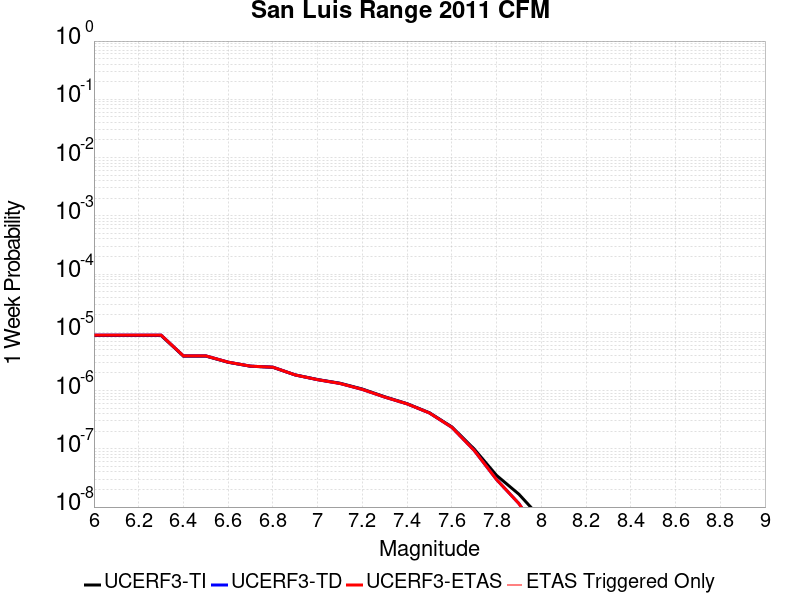 | 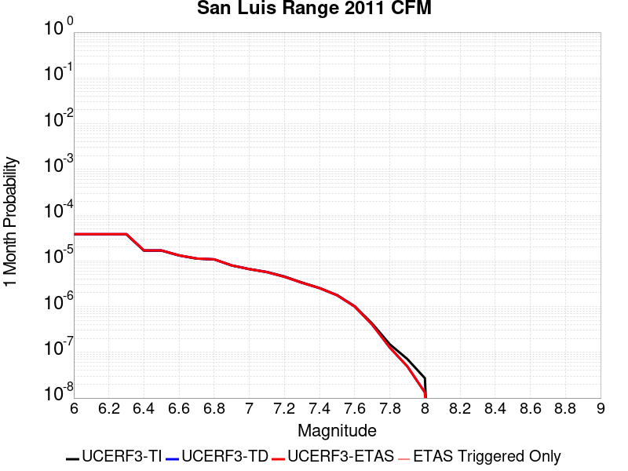 | 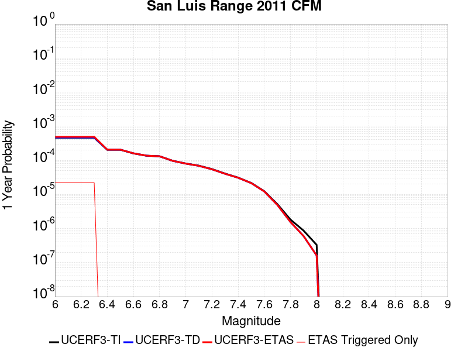 | 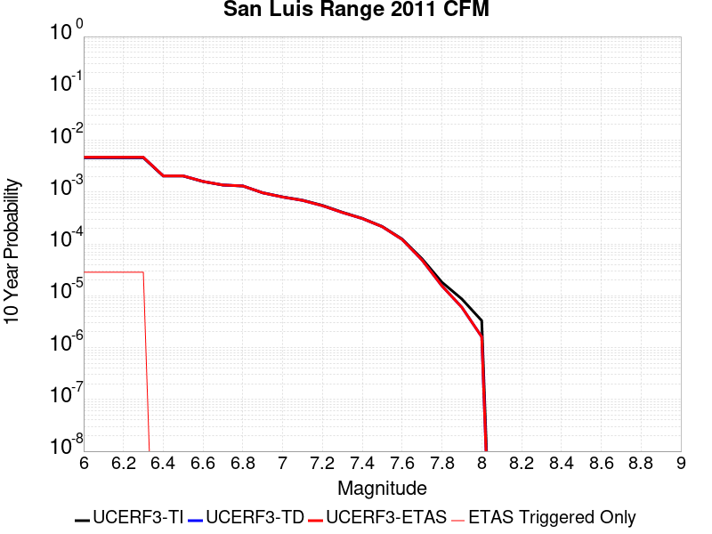 |

| Magnitude | 1 wk TI Prob | 1 wk TD Prob | 1 wk ETAS Prob | 1 wk ETAS/TD Gain | 1 wk ETAS Triggered Only | 1 mo TI Prob | 1 mo TD Prob | 1 mo ETAS Prob | 1 mo ETAS/TD Gain | 1 mo ETAS Triggered Only | 1 yr TI Prob | 1 yr TD Prob | 1 yr ETAS Prob | 1 yr ETAS/TD Gain | 1 yr ETAS Triggered Only | 10 yr TI Prob | 10 yr TD Prob | 10 yr ETAS Prob | 10 yr ETAS/TD Gain | 10 yr ETAS Triggered Only |
|-----|-----|-----|-----|-----|-----|-----|-----|-----|-----|-----|-----|-----|-----|-----|-----|-----|-----|-----|-----|-----|
| 6.0 | 8.8368415E-6 | 8.965642E-6 | 8.965642E-6 | 1.0 | 0.0 | 3.787163E-5 | 3.842366E-5 | 3.842366E-5 | 1.0 | 0.0 | 4.609895E-4 | 4.6771552E-4 | 4.8968324E-4 | 1.0469682 | 2.1978021E-5 | 0.0046003438 | 0.004668094 | 0.0046899696 | 1.0046861 | 2.1978021E-5 |
| 6.1 | 8.8368415E-6 | 8.965642E-6 | 8.965642E-6 | 1.0 | 0.0 | 3.787163E-5 | 3.842366E-5 | 3.842366E-5 | 1.0 | 0.0 | 4.609895E-4 | 4.6771552E-4 | 4.8968324E-4 | 1.0469682 | 2.1978021E-5 | 0.0046003438 | 0.004668094 | 0.0046899696 | 1.0046861 | 2.1978021E-5 |
| 6.2 | 8.8368415E-6 | 8.965642E-6 | 8.965642E-6 | 1.0 | 0.0 | 3.787163E-5 | 3.842366E-5 | 3.842366E-5 | 1.0 | 0.0 | 4.609895E-4 | 4.6771552E-4 | 4.8968324E-4 | 1.0469682 | 2.1978021E-5 | 0.0046003438 | 0.004668094 | 0.0046899696 | 1.0046861 | 2.1978021E-5 |
| 6.3 | 8.8368415E-6 | 8.965642E-6 | 8.965642E-6 | 1.0 | 0.0 | 3.787163E-5 | 3.842366E-5 | 3.842366E-5 | 1.0 | 0.0 | 4.609895E-4 | 4.6771552E-4 | 4.8968324E-4 | 1.0469682 | 2.1978021E-5 | 0.0046003438 | 0.004668094 | 0.0046899696 | 1.0046861 | 2.1978021E-5 |
| 6.4 | 3.9094193E-6 | 3.941286E-6 | 3.941286E-6 | 1.0 | 0.0 | 1.6754546E-5 | 1.689112E-5 | 1.689112E-5 | 1.0 | 0.0 | 2.039675E-4 | 2.0563026E-4 | 2.0563026E-4 | 1.0 | 0.0 | 0.0020378039 | 0.0020544287 | 0.0020544287 | 1.0 | 0.0 |
| 6.5 | 3.9094193E-6 | 3.941286E-6 | 3.941286E-6 | 1.0 | 0.0 | 1.6754546E-5 | 1.689112E-5 | 1.689112E-5 | 1.0 | 0.0 | 2.039675E-4 | 2.0563026E-4 | 2.0563026E-4 | 1.0 | 0.0 | 0.0020378039 | 0.0020544287 | 0.0020544287 | 1.0 | 0.0 |
| 6.6 | 3.0587726E-6 | 3.0754557E-6 | 3.0754557E-6 | 1.0 | 0.0 | 1.3108959E-5 | 1.3180458E-5 | 1.3180458E-5 | 1.0 | 0.0 | 1.595899E-4 | 1.6046037E-4 | 1.6046037E-4 | 1.0 | 0.0 | 0.0015947534 | 0.0016034571 | 0.0016034571 | 1.0 | 0.0 |
| 6.7 | 2.6160574E-6 | 2.6251864E-6 | 2.6251864E-6 | 1.0 | 0.0 | 1.1211626E-5 | 1.12507505E-5 | 1.12507505E-5 | 1.0 | 0.0 | 1.3649299E-4 | 1.3696935E-4 | 1.3696935E-4 | 1.0 | 0.0 | 0.0013640919 | 0.0013688554 | 0.0013688554 | 1.0 | 0.0 |
| 6.8 | 2.5110312E-6 | 2.518197E-6 | 2.518197E-6 | 1.0 | 0.0 | 1.0761518E-5 | 1.079223E-5 | 1.079223E-5 | 1.0 | 0.0 | 1.310136E-4 | 1.3138753E-4 | 1.3138753E-4 | 1.0 | 0.0 | 0.0013093639 | 0.0013131043 | 0.0013131043 | 1.0 | 0.0 |
| 6.9 | 1.8564405E-6 | 1.852532E-6 | 1.852532E-6 | 1.0 | 0.0 | 7.95615E-6 | 7.939399E-6 | 7.939399E-6 | 1.0 | 0.0 | 9.686181E-5 | 9.665792E-5 | 9.665792E-5 | 1.0 | 0.0 | 9.68196E-4 | 9.661608E-4 | 9.661608E-4 | 1.0 | 0.0 |
| 7.0 | 1.546127E-6 | 1.5369932E-6 | 1.5369932E-6 | 1.0 | 0.0 | 6.626242E-6 | 6.5870972E-6 | 6.5870972E-6 | 1.0 | 0.0 | 8.06715E-5 | 8.0194965E-5 | 8.0194965E-5 | 1.0 | 0.0 | 8.0642226E-4 | 8.0166094E-4 | 8.0166094E-4 | 1.0 | 0.0 |
| 7.1 | 1.3368208E-6 | 1.3235676E-6 | 1.3235676E-6 | 1.0 | 0.0 | 5.7292195E-6 | 5.6724202E-6 | 5.6724202E-6 | 1.0 | 0.0 | 6.975101E-5 | 6.905953E-5 | 6.905953E-5 | 1.0 | 0.0 | 6.972912E-4 | 6.9038116E-4 | 6.9038116E-4 | 1.0 | 0.0 |
| 7.2 | 1.0623363E-6 | 1.045466E-6 | 1.045466E-6 | 1.0 | 0.0 | 4.5528623E-6 | 4.4805606E-6 | 4.4805606E-6 | 1.0 | 0.0 | 5.5429686E-5 | 5.4549462E-5 | 5.4549462E-5 | 1.0 | 0.0 | 5.5415864E-4 | 5.45361E-4 | 5.45361E-4 | 1.0 | 0.0 |
| 7.3 | 7.831679E-7 | 7.727625E-7 | 7.727625E-7 | 1.0 | 0.0 | 3.3564295E-6 | 3.3118351E-6 | 3.3118351E-6 | 1.0 | 0.0 | 4.086376E-5 | 4.0320847E-5 | 4.0320847E-5 | 1.0 | 0.0 | 4.0856248E-4 | 4.0313543E-4 | 4.0313543E-4 | 1.0 | 0.0 |
| 7.4 | 5.9558846E-7 | 5.9108316E-7 | 5.9108316E-7 | 1.0 | 0.0 | 2.5525194E-6 | 2.5332113E-6 | 2.5332113E-6 | 1.0 | 0.0 | 3.107648E-5 | 3.084141E-5 | 3.084141E-5 | 1.0 | 0.0 | 3.1072134E-4 | 3.0837138E-4 | 3.0837138E-4 | 1.0 | 0.0 |
| 7.5 | 4.1616502E-7 | 4.1197907E-7 | 4.1197907E-7 | 1.0 | 0.0 | 1.7835631E-6 | 1.7656233E-6 | 1.7656233E-6 | 1.0 | 0.0 | 2.1714664E-5 | 2.1496253E-5 | 2.1496253E-5 | 1.0 | 0.0 | 2.1712543E-4 | 2.1494179E-4 | 2.1494179E-4 | 1.0 | 0.0 |
| 7.6 | 2.3816014E-7 | 2.3377777E-7 | 2.3377777E-7 | 1.0 | 0.0 | 1.0206859E-6 | 1.0019043E-6 | 1.0019043E-6 | 1.0 | 0.0 | 1.242678E-5 | 1.2198117E-5 | 1.2198117E-5 | 1.0 | 0.0 | 1.2426086E-4 | 1.21974495E-4 | 1.21974495E-4 | 1.0 | 0.0 |
| 7.7 | 9.918777E-8 | 9.387684E-8 | 9.387684E-8 | 1.0 | 0.0 | 4.2509038E-7 | 4.0232925E-7 | 4.0232925E-7 | 1.0 | 0.0 | 5.1754632E-6 | 4.8983475E-6 | 4.8983475E-6 | 1.0 | 0.0 | 5.1753424E-5 | 4.89824E-5 | 4.89824E-5 | 1.0 | 0.0 |
| 7.8 | 3.4982556E-8 | 2.9694167E-8 | 2.9694167E-8 | 1.0 | 0.0 | 1.4992524E-7 | 1.272607E-7 | 1.272607E-7 | 1.0 | 0.0 | 1.8253382E-6 | 1.5493979E-6 | 1.5493979E-6 | 1.0 | 0.0 | 1.8253233E-5 | 1.5493872E-5 | 1.5493872E-5 | 1.0 | 0.0 |
| 7.9 | 1.6624908E-8 | 1.1483989E-8 | 1.1483989E-8 | 1.0 | 0.0 | 7.12496E-8 | 4.921709E-8 | 4.921709E-8 | 1.0 | 0.0 | 8.6746354E-7 | 5.9921786E-7 | 5.9921786E-7 | 1.0 | 0.0 | 8.674601E-6 | 5.9921626E-6 | 5.9921626E-6 | 1.0 | 0.0 |
| 8.0 | 6.3352315E-9 | 3.0928995E-9 | 3.0928995E-9 | 1.0 | 0.0 | 2.715099E-8 | 1.3255282E-8 | 1.3255282E-8 | 1.0 | 0.0 | 3.3056327E-7 | 1.6138304E-7 | 1.6138304E-7 | 1.0 | 0.0 | 3.3056278E-6 | 1.6138293E-6 | 1.6138293E-6 | 1.0 | 0.0 |

## Kern Canyon (South Kern) 2011
*[(top)](#table-of-contents)*

| 1 Week | 1 Month | 1 Year | 10 Year |
|-----|-----|-----|-----|
| 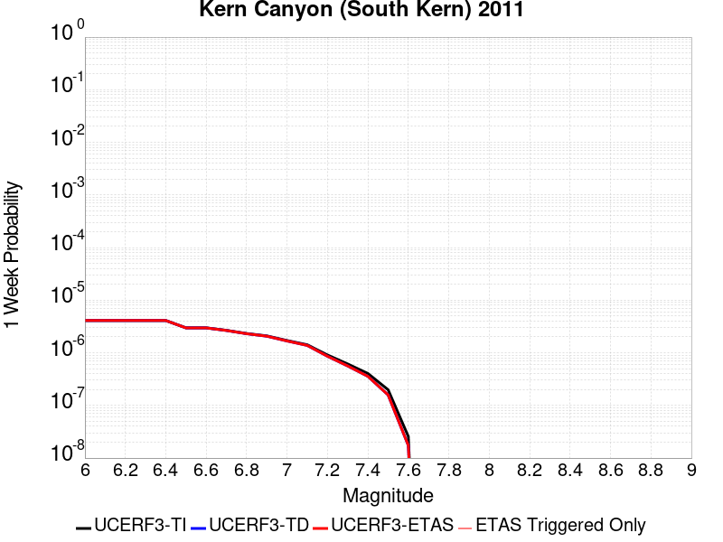 | 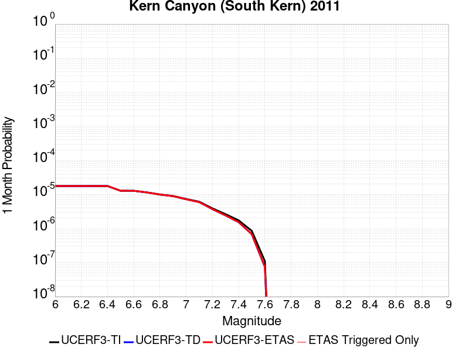 | 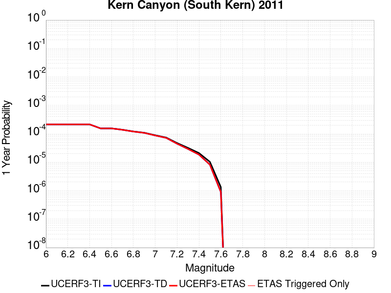 | 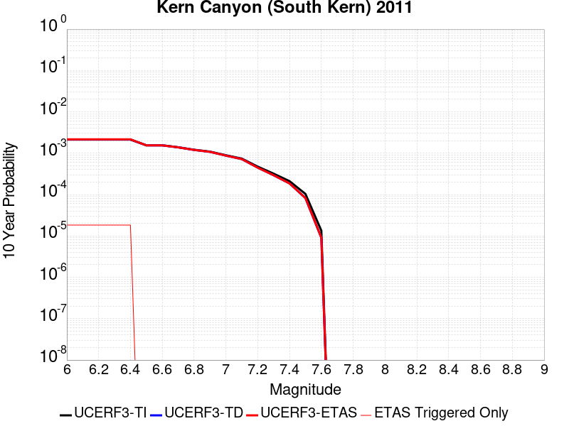 |

| Magnitude | 1 wk TI Prob | 1 wk TD Prob | 1 wk ETAS Prob | 1 wk ETAS/TD Gain | 1 wk ETAS Triggered Only | 1 mo TI Prob | 1 mo TD Prob | 1 mo ETAS Prob | 1 mo ETAS/TD Gain | 1 mo ETAS Triggered Only | 1 yr TI Prob | 1 yr TD Prob | 1 yr ETAS Prob | 1 yr ETAS/TD Gain | 1 yr ETAS Triggered Only | 10 yr TI Prob | 10 yr TD Prob | 10 yr ETAS Prob | 10 yr ETAS/TD Gain | 10 yr ETAS Triggered Only |
|-----|-----|-----|-----|-----|-----|-----|-----|-----|-----|-----|-----|-----|-----|-----|-----|-----|-----|-----|-----|-----|
| 6.0 | 4.105075E-6 | 4.1138087E-6 | 4.1138087E-6 | 1.0 | 0.0 | 1.7593058E-5 | 1.7630493E-5 | 1.7630493E-5 | 1.0 | 0.0 | 2.1417443E-4 | 2.1463075E-4 | 2.1463075E-4 | 1.0 | 0.0 | 0.0021396813 | 0.0021442985 | 0.0021662293 | 1.0102276 | 2.1978021E-5 |
| 6.1 | 4.105075E-6 | 4.1138087E-6 | 4.1138087E-6 | 1.0 | 0.0 | 1.7593058E-5 | 1.7630493E-5 | 1.7630493E-5 | 1.0 | 0.0 | 2.1417443E-4 | 2.1463075E-4 | 2.1463075E-4 | 1.0 | 0.0 | 0.0021396813 | 0.0021442985 | 0.0021662293 | 1.0102276 | 2.1978021E-5 |
| 6.2 | 4.105075E-6 | 4.1138087E-6 | 4.1138087E-6 | 1.0 | 0.0 | 1.7593058E-5 | 1.7630493E-5 | 1.7630493E-5 | 1.0 | 0.0 | 2.1417443E-4 | 2.1463075E-4 | 2.1463075E-4 | 1.0 | 0.0 | 0.0021396813 | 0.0021442985 | 0.0021662293 | 1.0102276 | 2.1978021E-5 |
| 6.3 | 4.105075E-6 | 4.1138087E-6 | 4.1138087E-6 | 1.0 | 0.0 | 1.7593058E-5 | 1.7630493E-5 | 1.7630493E-5 | 1.0 | 0.0 | 2.1417443E-4 | 2.1463075E-4 | 2.1463075E-4 | 1.0 | 0.0 | 0.0021396813 | 0.0021442985 | 0.0021662293 | 1.0102276 | 2.1978021E-5 |
| 6.4 | 4.105075E-6 | 4.1138087E-6 | 4.1138087E-6 | 1.0 | 0.0 | 1.7593058E-5 | 1.7630493E-5 | 1.7630493E-5 | 1.0 | 0.0 | 2.1417443E-4 | 2.1463075E-4 | 2.1463075E-4 | 1.0 | 0.0 | 0.0021396813 | 0.0021442985 | 0.0021662293 | 1.0102276 | 2.1978021E-5 |
| 6.5 | 2.9849807E-6 | 2.9732148E-6 | 2.9732148E-6 | 1.0 | 0.0 | 1.2792712E-5 | 1.2742287E-5 | 1.2742287E-5 | 1.0 | 0.0 | 1.5574014E-4 | 1.5512646E-4 | 1.5512646E-4 | 1.0 | 0.0 | 0.0015563103 | 0.0015501969 | 0.0015611688 | 1.0070778 | 1.0989011E-5 |
| 6.6 | 2.9849807E-6 | 2.9732148E-6 | 2.9732148E-6 | 1.0 | 0.0 | 1.2792712E-5 | 1.2742287E-5 | 1.2742287E-5 | 1.0 | 0.0 | 1.5574014E-4 | 1.5512646E-4 | 1.5512646E-4 | 1.0 | 0.0 | 0.0015563103 | 0.0015501969 | 0.0015611688 | 1.0070778 | 1.0989011E-5 |
| 6.7 | 2.6756725E-6 | 2.6582748E-6 | 2.6582748E-6 | 1.0 | 0.0 | 1.1467117E-5 | 1.1392556E-5 | 1.1392556E-5 | 1.0 | 0.0 | 1.396032E-4 | 1.3869566E-4 | 1.3869566E-4 | 1.0 | 0.0 | 0.0013951553 | 0.0013861019 | 0.0013970757 | 1.007917 | 1.0989011E-5 |
| 6.8 | 2.3283721E-6 | 2.304826E-6 | 2.304826E-6 | 1.0 | 0.0 | 9.9787E-6 | 9.877789E-6 | 9.877789E-6 | 1.0 | 0.0 | 1.214839E-4 | 1.2025552E-4 | 1.2025552E-4 | 1.0 | 0.0 | 0.001214175 | 0.001201912 | 0.0012128877 | 1.0091319 | 1.0989011E-5 |
| 6.9 | 2.0972677E-6 | 2.0696841E-6 | 2.0696841E-6 | 1.0 | 0.0 | 8.988259E-6 | 8.870044E-6 | 8.870044E-6 | 1.0 | 0.0 | 1.0942656E-4 | 1.079875E-4 | 1.079875E-4 | 1.0 | 0.0 | 0.0010937268 | 0.0010793561 | 0.0010903332 | 1.0101701 | 1.0989011E-5 |
| 7.0 | 1.7132242E-6 | 1.6787391E-6 | 1.6787391E-6 | 1.0 | 0.0 | 7.3423685E-6 | 7.1945765E-6 | 7.1945765E-6 | 1.0 | 0.0 | 8.938967E-5 | 8.759048E-5 | 8.759048E-5 | 1.0 | 0.0 | 8.935372E-4 | 8.755635E-4 | 8.8654284E-4 | 1.0125397 | 1.0989011E-5 |
| 7.1 | 1.4215541E-6 | 1.3816048E-6 | 1.3816048E-6 | 1.0 | 0.0 | 6.0923603E-6 | 5.92115E-6 | 5.92115E-6 | 1.0 | 0.0 | 7.417196E-5 | 7.208765E-5 | 7.208765E-5 | 1.0 | 0.0 | 7.414721E-4 | 7.206453E-4 | 7.316264E-4 | 1.0152378 | 1.0989011E-5 |
| 7.2 | 9.097853E-7 | 8.60397E-7 | 8.60397E-7 | 1.0 | 0.0 | 3.899074E-6 | 3.6874105E-6 | 3.6874105E-6 | 1.0 | 0.0 | 4.7470192E-5 | 4.489331E-5 | 4.489331E-5 | 1.0 | 0.0 | 4.7460053E-4 | 4.4884346E-4 | 4.4884346E-4 | 1.0 | 0.0 |
| 7.3 | 6.144169E-7 | 5.6283403E-7 | 5.6283403E-7 | 1.0 | 0.0 | 2.6332125E-6 | 2.4121437E-6 | 2.4121437E-6 | 1.0 | 0.0 | 3.205889E-5 | 2.9367458E-5 | 2.9367458E-5 | 1.0 | 0.0 | 3.2054266E-4 | 2.936363E-4 | 2.936363E-4 | 1.0 | 0.0 |
| 7.4 | 4.049844E-7 | 3.572923E-7 | 3.572923E-7 | 1.0 | 0.0 | 1.7356463E-6 | 1.5312518E-6 | 1.5312518E-6 | 1.0 | 0.0 | 2.1131287E-5 | 1.8642833E-5 | 1.8642833E-5 | 1.0 | 0.0 | 2.1129279E-4 | 1.8641294E-4 | 1.8641294E-4 | 1.0 | 0.0 |
| 7.5 | 1.9871162E-7 | 1.5830923E-7 | 1.5830923E-7 | 1.0 | 0.0 | 8.5162094E-7 | 6.78468E-7 | 6.78468E-7 | 1.0 | 0.0 | 1.0368436E-5 | 8.260317E-6 | 8.260317E-6 | 1.0 | 0.0 | 1.0367952E-4 | 8.2600185E-5 | 8.2600185E-5 | 1.0 | 0.0 |
| 7.6 | 2.572245E-8 | 1.7353212E-8 | 1.7353212E-8 | 1.0 | 0.0 | 1.10239064E-7 | 7.437091E-8 | 7.437091E-8 | 1.0 | 0.0 | 1.3421597E-6 | 9.0546547E-7 | 9.0546547E-7 | 1.0 | 0.0 | 1.3421517E-5 | 9.054624E-6 | 9.054624E-6 | 1.0 | 0.0 |

## Santa Ynez River
*[(top)](#table-of-contents)*

| 1 Week | 1 Month | 1 Year | 10 Year |
|-----|-----|-----|-----|
| 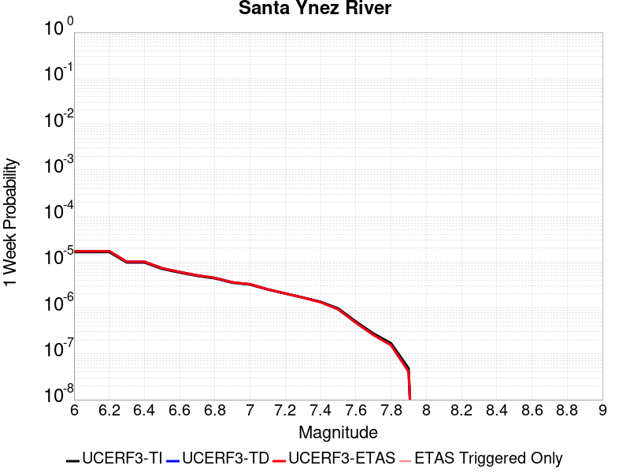 |  | 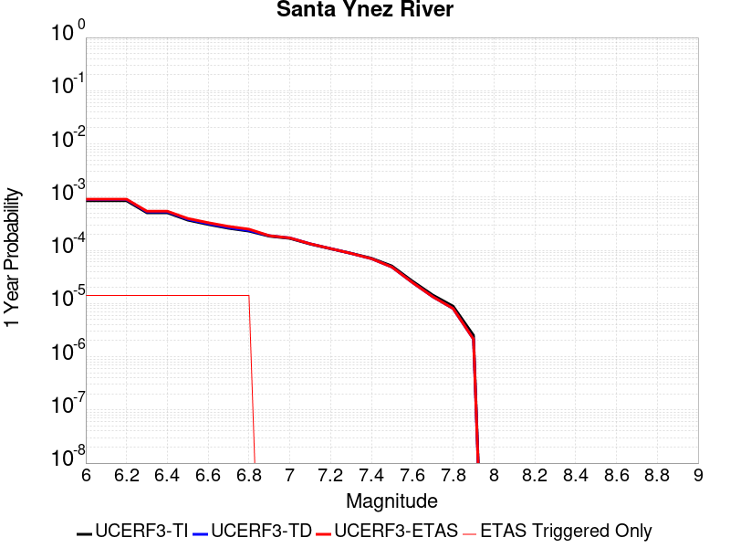 | 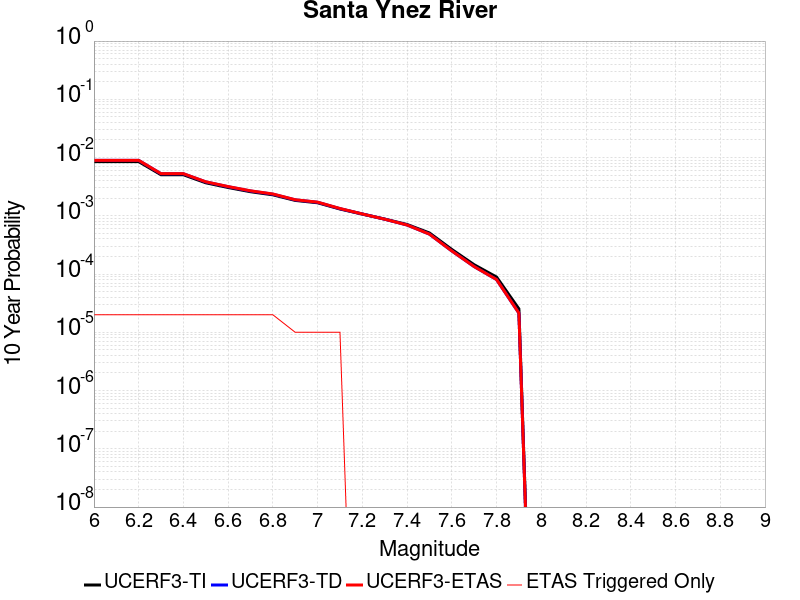 |

| Magnitude | 1 wk TI Prob | 1 wk TD Prob | 1 wk ETAS Prob | 1 wk ETAS/TD Gain | 1 wk ETAS Triggered Only | 1 mo TI Prob | 1 mo TD Prob | 1 mo ETAS Prob | 1 mo ETAS/TD Gain | 1 mo ETAS Triggered Only | 1 yr TI Prob | 1 yr TD Prob | 1 yr ETAS Prob | 1 yr ETAS/TD Gain | 1 yr ETAS Triggered Only | 10 yr TI Prob | 10 yr TD Prob | 10 yr ETAS Prob | 10 yr ETAS/TD Gain | 10 yr ETAS Triggered Only |
|-----|-----|-----|-----|-----|-----|-----|-----|-----|-----|-----|-----|-----|-----|-----|-----|-----|-----|-----|-----|-----|
| 6.0 | 1.6396456E-5 | 1.7210468E-5 | 1.7210468E-5 | 1.0 | 0.0 | 7.026863E-5 | 7.375726E-5 | 7.375726E-5 | 1.0 | 0.0 | 8.551848E-4 | 8.9766027E-4 | 9.196186E-4 | 1.0244617 | 2.1978021E-5 | 0.0085190125 | 0.008943893 | 0.008965674 | 1.0024353 | 2.1978021E-5 |
| 6.1 | 1.6396456E-5 | 1.7210468E-5 | 1.7210468E-5 | 1.0 | 0.0 | 7.026863E-5 | 7.375726E-5 | 7.375726E-5 | 1.0 | 0.0 | 8.551848E-4 | 8.9766027E-4 | 9.196186E-4 | 1.0244617 | 2.1978021E-5 | 0.0085190125 | 0.008943893 | 0.008965674 | 1.0024353 | 2.1978021E-5 |
| 6.2 | 1.6396456E-5 | 1.7210468E-5 | 1.7210468E-5 | 1.0 | 0.0 | 7.026863E-5 | 7.375726E-5 | 7.375726E-5 | 1.0 | 0.0 | 8.551848E-4 | 8.9766027E-4 | 9.196186E-4 | 1.0244617 | 2.1978021E-5 | 0.0085190125 | 0.008943893 | 0.008965674 | 1.0024353 | 2.1978021E-5 |
| 6.3 | 9.736976E-6 | 1.0122879E-5 | 1.0122879E-5 | 1.0 | 0.0 | 4.172923E-5 | 4.3383072E-5 | 4.3383072E-5 | 1.0 | 0.0 | 5.0793495E-4 | 5.280659E-4 | 5.500323E-4 | 1.0415978 | 2.1978021E-5 | 0.005067755 | 0.0052686166 | 0.005290479 | 1.0041496 | 2.1978021E-5 |
| 6.4 | 9.736976E-6 | 1.0122879E-5 | 1.0122879E-5 | 1.0 | 0.0 | 4.172923E-5 | 4.3383072E-5 | 4.3383072E-5 | 1.0 | 0.0 | 5.0793495E-4 | 5.280659E-4 | 5.500323E-4 | 1.0415978 | 2.1978021E-5 | 0.005067755 | 0.0052686166 | 0.005290479 | 1.0041496 | 2.1978021E-5 |
| 6.5 | 7.081964E-6 | 7.330291E-6 | 7.330291E-6 | 1.0 | 0.0 | 3.035092E-5 | 3.1415162E-5 | 3.1415162E-5 | 1.0 | 0.0 | 3.694598E-4 | 3.8241406E-4 | 4.043837E-4 | 1.0574498 | 2.1978021E-5 | 0.0036884616 | 0.0038177217 | 0.003839616 | 1.0057349 | 2.1978021E-5 |
| 6.6 | 5.873247E-6 | 6.0600687E-6 | 6.0600687E-6 | 1.0 | 0.0 | 2.5170815E-5 | 2.597147E-5 | 2.597147E-5 | 1.0 | 0.0 | 3.064116E-4 | 3.1615762E-4 | 3.381287E-4 | 1.069494 | 2.1978021E-5 | 0.0030598943 | 0.0031571658 | 0.0031790745 | 1.0069393 | 2.1978021E-5 |
| 6.7 | 4.973277E-6 | 5.116178E-6 | 5.116178E-6 | 1.0 | 0.0 | 2.1313872E-5 | 2.1926295E-5 | 2.1926295E-5 | 1.0 | 0.0 | 2.5946548E-4 | 2.6692043E-4 | 2.8889257E-4 | 1.0823172 | 2.1978021E-5 | 0.0025916274 | 0.0026660473 | 0.0026879667 | 1.0082217 | 2.1978021E-5 |
| 6.8 | 4.396492E-6 | 4.5112233E-6 | 4.5112233E-6 | 1.0 | 0.0 | 1.884197E-5 | 1.9333673E-5 | 1.9333673E-5 | 1.0 | 0.0 | 2.2937685E-4 | 2.3536239E-4 | 2.5733525E-4 | 1.0933576 | 2.1978021E-5 | 0.0022914023 | 0.0023511667 | 0.002373093 | 1.0093257 | 2.1978021E-5 |
| 6.9 | 3.5255632E-6 | 3.601536E-6 | 3.601536E-6 | 1.0 | 0.0 | 1.5109469E-5 | 1.5435064E-5 | 1.5435064E-5 | 1.0 | 0.0 | 1.8394225E-4 | 1.8790585E-4 | 1.988928E-4 | 1.0584705 | 1.0989011E-5 | 0.0018379007 | 0.0018774859 | 0.0018884543 | 1.0058421 | 1.0989011E-5 |
| 7.0 | 3.211603E-6 | 3.2738415E-6 | 3.2738415E-6 | 1.0 | 0.0 | 1.376394E-5 | 1.4030675E-5 | 1.4030675E-5 | 1.0 | 0.0 | 1.6756308E-4 | 1.7081022E-4 | 1.8179735E-4 | 1.0643237 | 1.0989011E-5 | 0.0016743679 | 0.0017068035 | 0.0017177737 | 1.0064274 | 1.0989011E-5 |
| 7.1 | 2.5094619E-6 | 2.541074E-6 | 2.541074E-6 | 1.0 | 0.0 | 1.0754793E-5 | 1.0890272E-5 | 1.0890272E-5 | 1.0 | 0.0 | 1.3093173E-4 | 1.3258106E-4 | 1.4356861E-4 | 1.0828743 | 1.0989011E-5 | 0.0013085462 | 0.0013250256 | 0.001336 | 1.0082824 | 1.0989011E-5 |
| 7.2 | 2.0515774E-6 | 2.0620678E-6 | 2.0620678E-6 | 1.0 | 0.0 | 8.792445E-6 | 8.837404E-6 | 8.837404E-6 | 1.0 | 0.0 | 1.0704277E-4 | 1.0759012E-4 | 1.0759012E-4 | 1.0 | 0.0 | 0.0010699122 | 0.0010753846 | 0.0010753846 | 1.0 | 0.0 |
| 7.3 | 1.6845745E-6 | 1.6775012E-6 | 1.6775012E-6 | 1.0 | 0.0 | 7.219585E-6 | 7.1892714E-6 | 7.1892714E-6 | 1.0 | 0.0 | 8.78949E-5 | 8.752589E-5 | 8.752589E-5 | 1.0 | 0.0 | 8.7860145E-4 | 8.749171E-4 | 8.749171E-4 | 1.0 | 0.0 |
| 7.4 | 1.3600285E-6 | 1.3334243E-6 | 1.3334243E-6 | 1.0 | 0.0 | 5.82868E-6 | 5.714663E-6 | 5.714663E-6 | 1.0 | 0.0 | 7.096187E-5 | 6.957383E-5 | 6.957383E-5 | 1.0 | 0.0 | 7.0939213E-4 | 6.9552264E-4 | 6.9552264E-4 | 1.0 | 0.0 |
| 7.5 | 9.735342E-7 | 9.2907436E-7 | 9.2907436E-7 | 1.0 | 0.0 | 4.172283E-6 | 3.9817414E-6 | 3.9817414E-6 | 1.0 | 0.0 | 5.079636E-5 | 4.847664E-5 | 4.847664E-5 | 1.0 | 0.0 | 5.0784746E-4 | 4.8466233E-4 | 4.8466233E-4 | 1.0 | 0.0 |
| 7.6 | 5.067187E-7 | 4.7788643E-7 | 4.7788643E-7 | 1.0 | 0.0 | 2.1716498E-6 | 2.0480832E-6 | 2.0480832E-6 | 1.0 | 0.0 | 2.6439517E-5 | 2.4935134E-5 | 2.4935134E-5 | 1.0 | 0.0 | 2.643637E-4 | 2.493241E-4 | 2.493241E-4 | 1.0 | 0.0 |
| 7.7 | 2.769089E-7 | 2.5760605E-7 | 2.5760605E-7 | 1.0 | 0.0 | 1.1867519E-6 | 1.1040254E-6 | 1.1040254E-6 | 1.0 | 0.0 | 1.4448608E-5 | 1.3441428E-5 | 1.3441428E-5 | 1.0 | 0.0 | 1.444767E-4 | 1.3440617E-4 | 1.3440617E-4 | 1.0 | 0.0 |
| 7.8 | 1.7044663E-7 | 1.5449906E-7 | 1.5449906E-7 | 1.0 | 0.0 | 7.3048534E-7 | 6.621387E-7 | 6.621387E-7 | 1.0 | 0.0 | 8.893623E-6 | 8.061509E-6 | 8.061509E-6 | 1.0 | 0.0 | 8.893267E-5 | 8.061218E-5 | 8.061218E-5 | 1.0 | 0.0 |
| 7.9 | 4.8344287E-8 | 4.0913434E-8 | 4.0913434E-8 | 1.0 | 0.0 | 2.0718979E-7 | 1.7534327E-7 | 1.7534327E-7 | 1.0 | 0.0 | 2.5225327E-6 | 2.1348023E-6 | 2.1348023E-6 | 1.0 | 0.0 | 2.5225041E-5 | 2.1347822E-5 | 2.1347822E-5 | 1.0 | 0.0 |

## Homestead Valley 2011
*[(top)](#table-of-contents)*

| 1 Week | 1 Month | 1 Year | 10 Year |
|-----|-----|-----|-----|
| 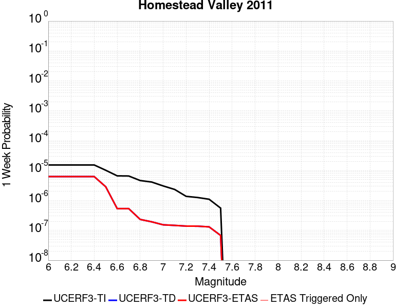 | 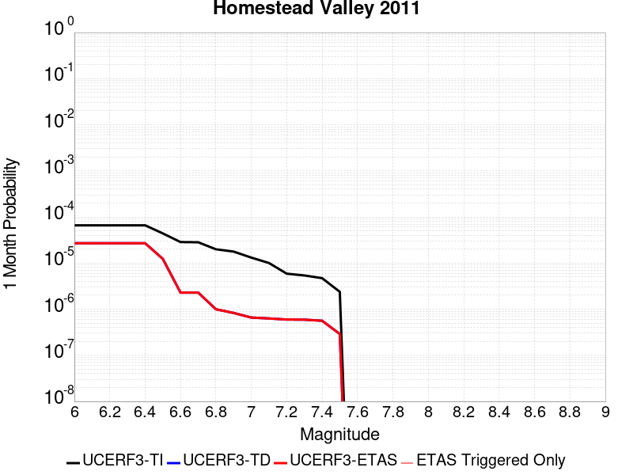 | 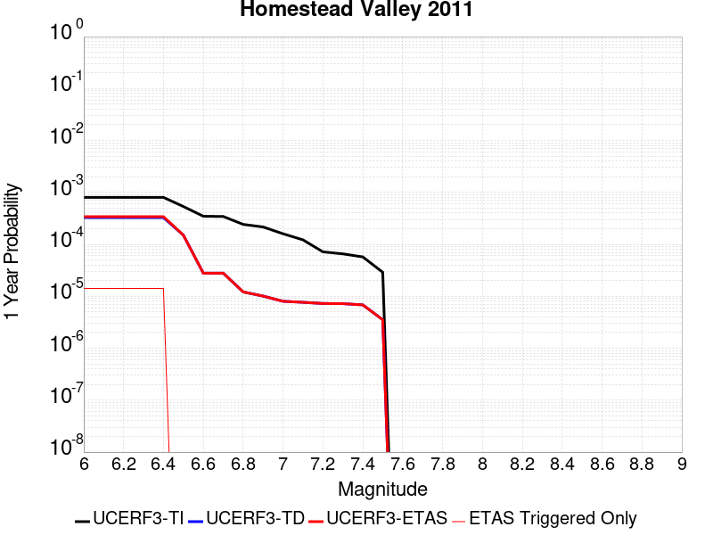 | 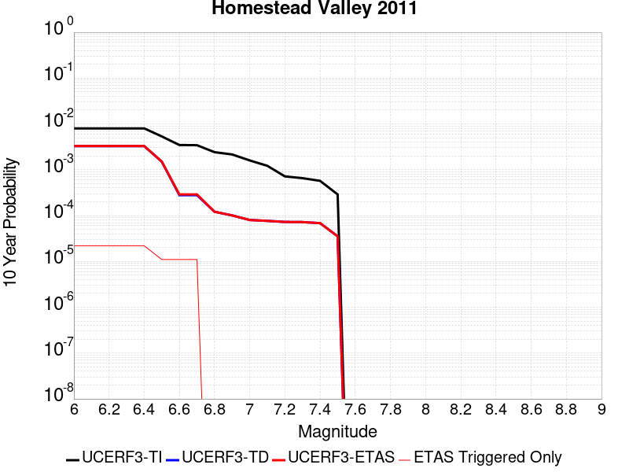 |

| Magnitude | 1 wk TI Prob | 1 wk TD Prob | 1 wk ETAS Prob | 1 wk ETAS/TD Gain | 1 wk ETAS Triggered Only | 1 mo TI Prob | 1 mo TD Prob | 1 mo ETAS Prob | 1 mo ETAS/TD Gain | 1 mo ETAS Triggered Only | 1 yr TI Prob | 1 yr TD Prob | 1 yr ETAS Prob | 1 yr ETAS/TD Gain | 1 yr ETAS Triggered Only | 10 yr TI Prob | 10 yr TD Prob | 10 yr ETAS Prob | 10 yr ETAS/TD Gain | 10 yr ETAS Triggered Only |
|-----|-----|-----|-----|-----|-----|-----|-----|-----|-----|-----|-----|-----|-----|-----|-----|-----|-----|-----|-----|-----|
| 6.0 | 1.539795E-5 | 6.28714E-6 | 6.28714E-6 | 1.0 | 0.0 | 6.5989545E-5 | 2.6944725E-5 | 2.6944725E-5 | 1.0 | 0.0 | 8.0312655E-4 | 3.2802325E-4 | 3.3900866E-4 | 1.0334897 | 1.0989011E-5 | 0.008002302 | 0.003277412 | 0.0032993178 | 1.006684 | 2.1978021E-5 |
| 6.1 | 1.539795E-5 | 6.28714E-6 | 6.28714E-6 | 1.0 | 0.0 | 6.5989545E-5 | 2.6944725E-5 | 2.6944725E-5 | 1.0 | 0.0 | 8.0312655E-4 | 3.2802325E-4 | 3.3900866E-4 | 1.0334897 | 1.0989011E-5 | 0.008002302 | 0.003277412 | 0.0032993178 | 1.006684 | 2.1978021E-5 |
| 6.2 | 1.539795E-5 | 6.28714E-6 | 6.28714E-6 | 1.0 | 0.0 | 6.5989545E-5 | 2.6944725E-5 | 2.6944725E-5 | 1.0 | 0.0 | 8.0312655E-4 | 3.2802325E-4 | 3.3900866E-4 | 1.0334897 | 1.0989011E-5 | 0.008002302 | 0.003277412 | 0.0032993178 | 1.006684 | 2.1978021E-5 |
| 6.3 | 1.539795E-5 | 6.28714E-6 | 6.28714E-6 | 1.0 | 0.0 | 6.5989545E-5 | 2.6944725E-5 | 2.6944725E-5 | 1.0 | 0.0 | 8.0312655E-4 | 3.2802325E-4 | 3.3900866E-4 | 1.0334897 | 1.0989011E-5 | 0.008002302 | 0.003277412 | 0.0032993178 | 1.006684 | 2.1978021E-5 |
| 6.4 | 1.539795E-5 | 6.28714E-6 | 6.28714E-6 | 1.0 | 0.0 | 6.5989545E-5 | 2.6944725E-5 | 2.6944725E-5 | 1.0 | 0.0 | 8.0312655E-4 | 3.2802325E-4 | 3.3900866E-4 | 1.0334897 | 1.0989011E-5 | 0.008002302 | 0.003277412 | 0.0032993178 | 1.006684 | 2.1978021E-5 |
| 6.5 | 1.0265258E-5 | 2.8791078E-6 | 2.8791078E-6 | 1.0 | 0.0 | 4.3993223E-5 | 1.2339014E-5 | 1.2339014E-5 | 1.0 | 0.0 | 5.3548586E-4 | 1.5022409E-4 | 1.5022409E-4 | 1.0 | 0.0 | 0.005341973 | 0.0015019074 | 0.0015128799 | 1.0073057 | 1.0989011E-5 |
| 6.6 | 6.664671E-6 | 5.3494557E-7 | 5.3494557E-7 | 1.0 | 0.0 | 2.8562565E-5 | 2.2926226E-6 | 2.2926226E-6 | 1.0 | 0.0 | 3.476937E-4 | 2.7912442E-5 | 2.7912442E-5 | 1.0 | 0.0 | 0.003471502 | 2.79101E-4 | 2.9008696E-4 | 1.0393618 | 1.0989011E-5 |
| 6.7 | 6.5954046E-6 | 5.3494557E-7 | 5.3494557E-7 | 1.0 | 0.0 | 2.8265715E-5 | 2.2926226E-6 | 2.2926226E-6 | 1.0 | 0.0 | 3.4408073E-4 | 2.7912442E-5 | 2.7912442E-5 | 1.0 | 0.0 | 0.0034354846 | 2.79101E-4 | 2.9008696E-4 | 1.0393618 | 1.0989011E-5 |
| 6.8 | 4.648189E-6 | 2.3273472E-7 | 2.3273472E-7 | 1.0 | 0.0 | 1.9920659E-5 | 9.974342E-7 | 9.974342E-7 | 1.0 | 0.0 | 2.4250703E-4 | 1.2143698E-5 | 1.2143698E-5 | 1.0 | 0.0 | 0.0024224254 | 1.2143083E-4 | 1.2143083E-4 | 1.0 | 0.0 |
| 6.9 | 4.1428534E-6 | 1.9351485E-7 | 1.9351485E-7 | 1.0 | 0.0 | 1.7754966E-5 | 8.293491E-7 | 8.293491E-7 | 1.0 | 0.0 | 2.1614527E-4 | 1.0097282E-5 | 1.0097282E-5 | 1.0 | 0.0 | 0.0021593515 | 1.0096853E-4 | 1.0096853E-4 | 1.0 | 0.0 |
| 7.0 | 3.0673707E-6 | 1.5373227E-7 | 1.5373227E-7 | 1.0 | 0.0 | 1.3145808E-5 | 6.5885246E-7 | 6.5885246E-7 | 1.0 | 0.0 | 1.6003846E-4 | 8.0215E-6 | 8.0215E-6 | 1.0 | 0.0 | 0.0015992324 | 8.021221E-5 | 8.021221E-5 | 1.0 | 0.0 |
| 7.1 | 2.340854E-6 | 1.4692894E-7 | 1.4692894E-7 | 1.0 | 0.0 | 1.0032193E-5 | 6.296953E-7 | 6.296953E-7 | 1.0 | 0.0 | 1.221351E-4 | 7.666515E-6 | 7.666515E-6 | 1.0 | 0.0 | 0.00122068 | 7.6662596E-5 | 7.6662596E-5 | 1.0 | 0.0 |
| 7.2 | 1.3754182E-6 | 1.3927345E-7 | 1.3927345E-7 | 1.0 | 0.0 | 5.8946357E-6 | 5.968861E-7 | 5.968861E-7 | 1.0 | 0.0 | 7.176483E-5 | 7.267065E-6 | 7.267065E-6 | 1.0 | 0.0 | 7.174166E-4 | 7.2668365E-5 | 7.2668365E-5 | 1.0 | 0.0 |
| 7.3 | 1.2573237E-6 | 1.3831806E-7 | 1.3831806E-7 | 1.0 | 0.0 | 5.388519E-6 | 5.9279154E-7 | 5.9279154E-7 | 1.0 | 0.0 | 6.560324E-5 | 7.2172143E-6 | 7.2172143E-6 | 1.0 | 0.0 | 6.558388E-4 | 7.216989E-5 | 7.216989E-5 | 1.0 | 0.0 |
| 7.4 | 1.0994207E-6 | 1.3110466E-7 | 1.3110466E-7 | 1.0 | 0.0 | 4.7117946E-6 | 5.6187696E-7 | 5.6187696E-7 | 1.0 | 0.0 | 5.736459E-5 | 6.8408317E-6 | 6.8408317E-6 | 1.0 | 0.0 | 5.734978E-4 | 6.84063E-5 | 6.84063E-5 | 1.0 | 0.0 |
| 7.5 | 5.5569126E-7 | 6.775161E-8 | 6.775161E-8 | 1.0 | 0.0 | 2.3815317E-6 | 2.90364E-7 | 2.90364E-7 | 1.0 | 0.0 | 2.8994764E-5 | 3.5351766E-6 | 3.5351766E-6 | 1.0 | 0.0 | 2.899098E-4 | 3.5351266E-5 | 3.5351266E-5 | 1.0 | 0.0 |

## Rinconada 2011 CFM
*[(top)](#table-of-contents)*

| 1 Week | 1 Month | 1 Year | 10 Year |
|-----|-----|-----|-----|
| 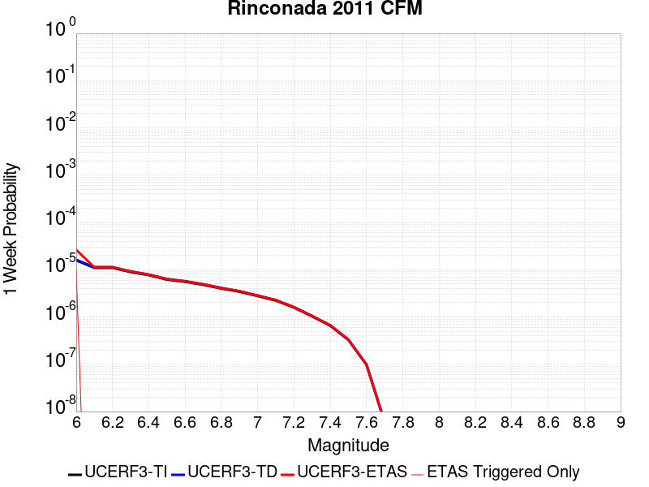 | 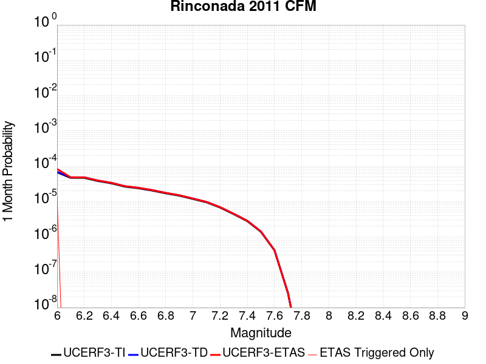 | 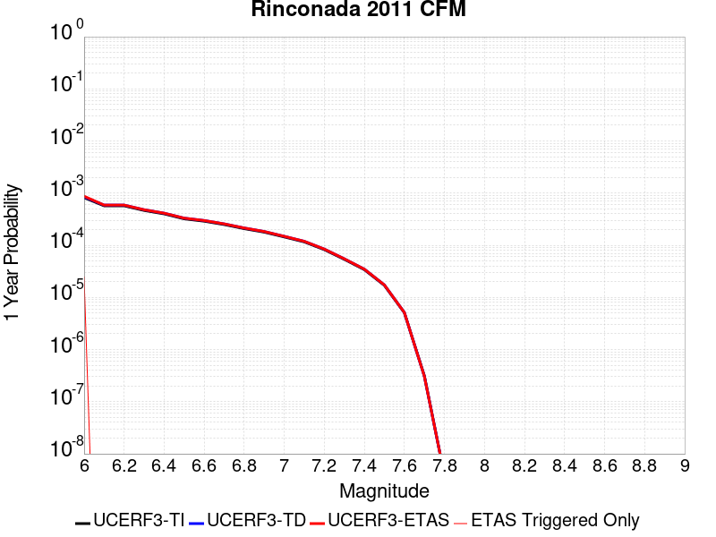 | 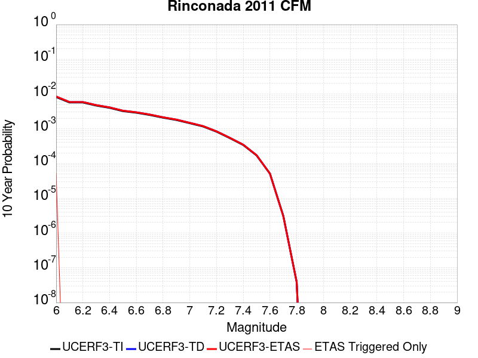 |

| Magnitude | 1 wk TI Prob | 1 wk TD Prob | 1 wk ETAS Prob | 1 wk ETAS/TD Gain | 1 wk ETAS Triggered Only | 1 mo TI Prob | 1 mo TD Prob | 1 mo ETAS Prob | 1 mo ETAS/TD Gain | 1 mo ETAS Triggered Only | 1 yr TI Prob | 1 yr TD Prob | 1 yr ETAS Prob | 1 yr ETAS/TD Gain | 1 yr ETAS Triggered Only | 10 yr TI Prob | 10 yr TD Prob | 10 yr ETAS Prob | 10 yr ETAS/TD Gain | 10 yr ETAS Triggered Only |
|-----|-----|-----|-----|-----|-----|-----|-----|-----|-----|-----|-----|-----|-----|-----|-----|-----|-----|-----|-----|-----|
| 6.0 | 1.5752368E-5 | 1.6275291E-5 | 2.7264123E-5 | 1.675185 | 1.0989011E-5 | 6.75084E-5 | 6.9749396E-5 | 8.073764E-5 | 1.1575389 | 1.0989011E-5 | 8.2160486E-4 | 8.4887125E-4 | 8.598509E-4 | 1.0129344 | 1.0989011E-5 | 0.008185739 | 0.008456668 | 0.00847846 | 1.002577 | 2.1978021E-5 |
| 6.1 | 1.0966133E-5 | 1.1323423E-5 | 1.1323423E-5 | 1.0 | 0.0 | 4.6996865E-5 | 4.8528054E-5 | 4.8528054E-5 | 1.0 | 0.0 | 5.720366E-4 | 5.9066963E-4 | 5.9066963E-4 | 1.0 | 0.0 | 0.0057056635 | 0.005891093 | 0.0059020175 | 1.0018544 | 1.0989011E-5 |
| 6.2 | 1.0966133E-5 | 1.1323423E-5 | 1.1323423E-5 | 1.0 | 0.0 | 4.6996865E-5 | 4.8528054E-5 | 4.8528054E-5 | 1.0 | 0.0 | 5.720366E-4 | 5.9066963E-4 | 5.9066963E-4 | 1.0 | 0.0 | 0.0057056635 | 0.005891093 | 0.0059020175 | 1.0018544 | 1.0989011E-5 |
| 6.3 | 8.926149E-6 | 9.213088E-6 | 9.213088E-6 | 1.0 | 0.0 | 3.8254362E-5 | 3.9484068E-5 | 3.9484068E-5 | 1.0 | 0.0 | 4.6564735E-4 | 4.806128E-4 | 4.806128E-4 | 1.0 | 0.0 | 0.0046467283 | 0.004795779 | 0.004806715 | 1.0022804 | 1.0989011E-5 |
| 6.4 | 7.676955E-6 | 7.920459E-6 | 7.920459E-6 | 1.0 | 0.0 | 3.290082E-5 | 3.3944387E-5 | 3.3944387E-5 | 1.0 | 0.0 | 4.0049385E-4 | 4.131947E-4 | 4.131947E-4 | 1.0 | 0.0 | 0.0039977287 | 0.004124291 | 0.0041352343 | 1.0026535 | 1.0989011E-5 |
| 6.5 | 6.1671026E-6 | 6.3591674E-6 | 6.3591674E-6 | 1.0 | 0.0 | 2.6430173E-5 | 2.7253289E-5 | 2.7253289E-5 | 1.0 | 0.0 | 3.2173982E-4 | 3.3175835E-4 | 3.3175835E-4 | 1.0 | 0.0 | 0.003212744 | 0.003312643 | 0.0033235955 | 1.0033063 | 1.0989011E-5 |
| 6.6 | 5.553456E-6 | 5.725002E-6 | 5.725002E-6 | 1.0 | 0.0 | 2.3800309E-5 | 2.4535495E-5 | 2.4535495E-5 | 1.0 | 0.0 | 2.897302E-4 | 2.9867876E-4 | 2.9867876E-4 | 1.0 | 0.0 | 0.0028935277 | 0.002982782 | 0.002993738 | 1.0036732 | 1.0989011E-5 |
| 6.7 | 4.787857E-6 | 4.933471E-6 | 4.933471E-6 | 1.0 | 0.0 | 2.0519226E-5 | 2.1143276E-5 | 2.1143276E-5 | 1.0 | 0.0 | 2.4979294E-4 | 2.57389E-4 | 2.57389E-4 | 1.0 | 0.0 | 0.0024951235 | 0.0025709148 | 0.0025818755 | 1.0042634 | 1.0989011E-5 |
| 6.8 | 3.9955166E-6 | 4.1136072E-6 | 4.1136072E-6 | 1.0 | 0.0 | 1.7123532E-5 | 1.7629627E-5 | 1.7629627E-5 | 1.0 | 0.0 | 2.0845905E-4 | 2.1461959E-4 | 2.1461959E-4 | 1.0 | 0.0 | 0.002082636 | 0.0021441267 | 0.0021550923 | 1.0051142 | 1.0989011E-5 |
| 6.9 | 3.4250072E-6 | 3.5225548E-6 | 3.5225548E-6 | 1.0 | 0.0 | 1.46785205E-5 | 1.5096576E-5 | 1.5096576E-5 | 1.0 | 0.0 | 1.7869633E-4 | 1.8378533E-4 | 1.8378533E-4 | 1.0 | 0.0 | 0.001785527 | 0.0018363359 | 0.0018473048 | 1.0059732 | 1.0989011E-5 |
| 7.0 | 2.7712713E-6 | 2.8467844E-6 | 2.8467844E-6 | 1.0 | 0.0 | 1.1876823E-5 | 1.2200447E-5 | 1.2200447E-5 | 1.0 | 0.0 | 1.4459073E-4 | 1.4853034E-4 | 1.4853034E-4 | 1.0 | 0.0 | 0.0014449668 | 0.0014843121 | 0.0014952848 | 1.0073924 | 1.0989011E-5 |
| 7.1 | 2.227358E-6 | 2.2857641E-6 | 2.2857641E-6 | 1.0 | 0.0 | 9.545785E-6 | 9.796095E-6 | 9.796095E-6 | 1.0 | 0.0 | 1.16213734E-4 | 1.19260934E-4 | 1.19260934E-4 | 1.0 | 0.0 | 0.0011615298 | 0.0011919704 | 0.0012029463 | 1.0092082 | 1.0989011E-5 |
| 7.2 | 1.581796E-6 | 1.6209457E-6 | 1.6209457E-6 | 1.0 | 0.0 | 6.779108E-6 | 6.9468915E-6 | 6.9468915E-6 | 1.0 | 0.0 | 8.253252E-5 | 8.457513E-5 | 8.457513E-5 | 1.0 | 0.0 | 8.250187E-4 | 8.4542995E-4 | 8.4542995E-4 | 1.0 | 0.0 |
| 7.3 | 1.0306567E-6 | 1.0546756E-6 | 1.0546756E-6 | 1.0 | 0.0 | 4.4170924E-6 | 4.520031E-6 | 4.520031E-6 | 1.0 | 0.0 | 5.3776774E-5 | 5.502999E-5 | 5.502999E-5 | 1.0 | 0.0 | 5.376376E-4 | 5.5016385E-4 | 5.5016385E-4 | 1.0 | 0.0 |
| 7.4 | 6.535541E-7 | 6.6829205E-7 | 6.6829205E-7 | 1.0 | 0.0 | 2.800943E-6 | 2.8641057E-6 | 2.8641057E-6 | 1.0 | 0.0 | 3.4100947E-5 | 3.486993E-5 | 3.486993E-5 | 1.0 | 0.0 | 3.4095717E-4 | 3.486447E-4 | 3.486447E-4 | 1.0 | 0.0 |
| 7.5 | 3.2656962E-7 | 3.331759E-7 | 3.331759E-7 | 1.0 | 0.0 | 1.3995833E-6 | 1.4278959E-6 | 1.4278959E-6 | 1.0 | 0.0 | 1.7039794E-5 | 1.7384495E-5 | 1.7384495E-5 | 1.0 | 0.0 | 1.7038487E-4 | 1.7383139E-4 | 1.7383139E-4 | 1.0 | 0.0 |
| 7.6 | 9.754343E-8 | 9.8212475E-8 | 9.8212475E-8 | 1.0 | 0.0 | 4.180432E-7 | 4.209105E-7 | 4.209105E-7 | 1.0 | 0.0 | 5.089664E-6 | 5.124574E-6 | 5.124574E-6 | 1.0 | 0.0 | 5.0895473E-5 | 5.1244562E-5 | 5.1244562E-5 | 1.0 | 0.0 |
| 7.7 | 6.0001453E-9 | 5.8492495E-9 | 5.8492495E-9 | 1.0 | 0.0 | 2.5714908E-8 | 2.5068214E-8 | 2.5068214E-8 | 1.0 | 0.0 | 3.1307894E-7 | 3.0520545E-7 | 3.0520545E-7 | 1.0 | 0.0 | 3.1307852E-6 | 3.0520505E-6 | 3.0520505E-6 | 1.0 | 0.0 |
| 7.8 | 7.400003E-11 | 7.465517E-11 | 7.465517E-11 | 1.0 | 0.0 | 3.171432E-10 | 3.1995073E-10 | 3.1995073E-10 | 1.0 | 0.0 | 3.861218E-9 | 3.8953996E-9 | 3.8953996E-9 | 1.0 | 0.0 | 3.861218E-8 | 3.8953996E-8 | 3.8953996E-8 | 1.0 | 0.0 |

## Chino alt 1
*[(top)](#table-of-contents)*

| 1 Week | 1 Month | 1 Year | 10 Year |
|-----|-----|-----|-----|
| 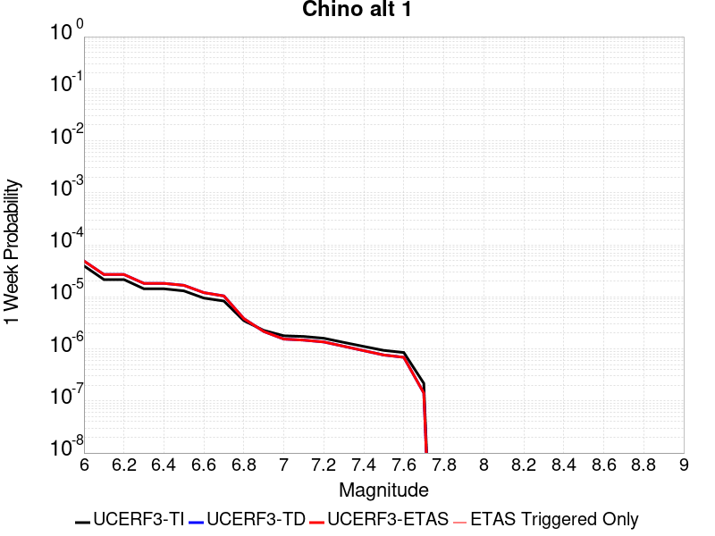 | 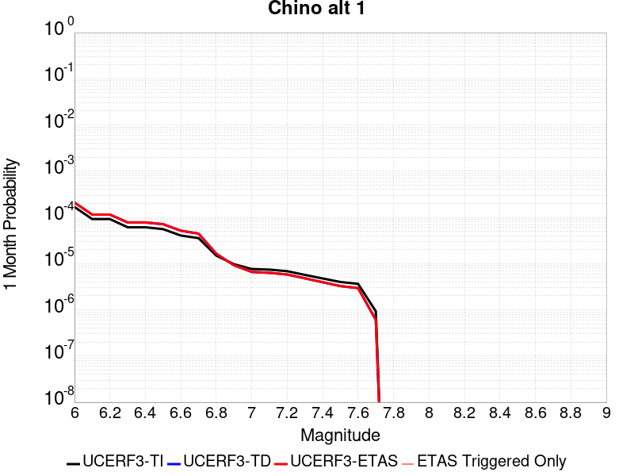 | 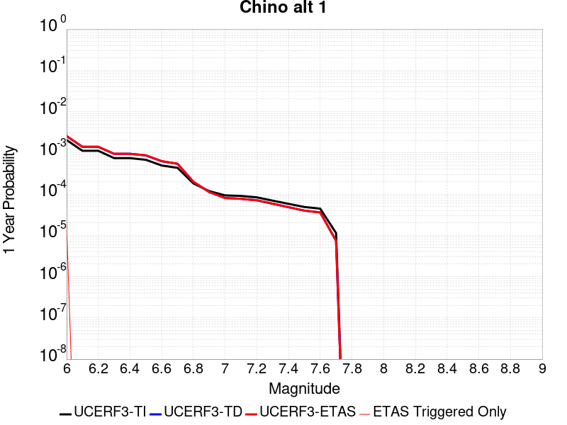 | 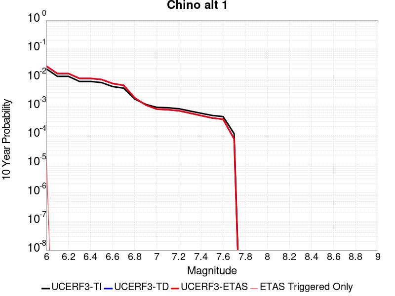 |

| Magnitude | 1 wk TI Prob | 1 wk TD Prob | 1 wk ETAS Prob | 1 wk ETAS/TD Gain | 1 wk ETAS Triggered Only | 1 mo TI Prob | 1 mo TD Prob | 1 mo ETAS Prob | 1 mo ETAS/TD Gain | 1 mo ETAS Triggered Only | 1 yr TI Prob | 1 yr TD Prob | 1 yr ETAS Prob | 1 yr ETAS/TD Gain | 1 yr ETAS Triggered Only | 10 yr TI Prob | 10 yr TD Prob | 10 yr ETAS Prob | 10 yr ETAS/TD Gain | 10 yr ETAS Triggered Only |
|-----|-----|-----|-----|-----|-----|-----|-----|-----|-----|-----|-----|-----|-----|-----|-----|-----|-----|-----|-----|-----|
| 6.0 | 3.939946E-5 | 4.896364E-5 | 4.896364E-5 | 1.0 | 0.0 | 1.6884391E-4 | 2.0983024E-4 | 2.0983024E-4 | 1.0 | 0.0 | 0.0020537362 | 0.0025521694 | 0.0025631303 | 1.0042948 | 1.0989011E-5 | 0.020348595 | 0.025285466 | 0.025306888 | 1.0008472 | 2.1978021E-5 |
| 6.1 | 2.1505624E-5 | 2.688862E-5 | 2.688862E-5 | 1.0 | 0.0 | 9.2163704E-5 | 1.1523248E-4 | 1.1523248E-4 | 1.0 | 0.0 | 0.0011215154 | 0.0014021639 | 0.0014021639 | 1.0 | 0.0 | 0.011158722 | 0.013950041 | 0.013950041 | 1.0 | 0.0 |
| 6.2 | 2.1505624E-5 | 2.688862E-5 | 2.688862E-5 | 1.0 | 0.0 | 9.2163704E-5 | 1.1523248E-4 | 1.1523248E-4 | 1.0 | 0.0 | 0.0011215154 | 0.0014021639 | 0.0014021639 | 1.0 | 0.0 | 0.011158722 | 0.013950041 | 0.013950041 | 1.0 | 0.0 |
| 6.3 | 1.4290785E-5 | 1.8172794E-5 | 1.8172794E-5 | 1.0 | 0.0 | 6.1244784E-5 | 7.7881334E-5 | 7.7881334E-5 | 1.0 | 0.0 | 7.454001E-4 | 9.478382E-4 | 9.478382E-4 | 1.0 | 0.0 | 0.007429048 | 0.009448385 | 0.009448385 | 1.0 | 0.0 |
| 6.4 | 1.4290785E-5 | 1.8172794E-5 | 1.8172794E-5 | 1.0 | 0.0 | 6.1244784E-5 | 7.7881334E-5 | 7.7881334E-5 | 1.0 | 0.0 | 7.454001E-4 | 9.478382E-4 | 9.478382E-4 | 1.0 | 0.0 | 0.007429048 | 0.009448385 | 0.009448385 | 1.0 | 0.0 |
| 6.5 | 1.3017944E-5 | 1.6659451E-5 | 1.6659451E-5 | 1.0 | 0.0 | 5.5789995E-5 | 7.139594E-5 | 7.139594E-5 | 1.0 | 0.0 | 6.790315E-4 | 8.689427E-4 | 8.689427E-4 | 1.0 | 0.0 | 0.0067696036 | 0.008665723 | 0.008665723 | 1.0 | 0.0 |
| 6.6 | 9.470016E-6 | 1.2045054E-5 | 1.2045054E-5 | 1.0 | 0.0 | 4.058515E-5 | 5.1620827E-5 | 5.1620827E-5 | 1.0 | 0.0 | 4.940122E-4 | 6.2833633E-4 | 6.2833633E-4 | 1.0 | 0.0 | 0.004929154 | 0.0062747966 | 0.0062747966 | 1.0 | 0.0 |
| 6.7 | 8.314155E-6 | 1.0412757E-5 | 1.0412757E-5 | 1.0 | 0.0 | 3.5631605E-5 | 4.462552E-5 | 4.462552E-5 | 1.0 | 0.0 | 4.3372845E-4 | 5.432125E-4 | 5.432125E-4 | 1.0 | 0.0 | 0.004328829 | 0.0054283654 | 0.0054283654 | 1.0 | 0.0 |
| 6.8 | 3.4856364E-6 | 3.815271E-6 | 3.815271E-6 | 1.0 | 0.0 | 1.4938357E-5 | 1.6351072E-5 | 1.6351072E-5 | 1.0 | 0.0 | 1.8185932E-4 | 1.990582E-4 | 1.990582E-4 | 1.0 | 0.0 | 0.0018171056 | 0.0019904745 | 0.0019904745 | 1.0 | 0.0 |
| 6.9 | 2.2645952E-6 | 2.154245E-6 | 2.154245E-6 | 1.0 | 0.0 | 9.705372E-6 | 9.232447E-6 | 9.232447E-6 | 1.0 | 0.0 | 1.18156495E-4 | 1.12399466E-4 | 1.12399466E-4 | 1.0 | 0.0 | 0.0011809369 | 0.0011240423 | 0.0011240423 | 1.0 | 0.0 |
| 7.0 | 1.7864003E-6 | 1.544279E-6 | 1.544279E-6 | 1.0 | 0.0 | 7.655979E-6 | 6.6183225E-6 | 6.6183225E-6 | 1.0 | 0.0 | 9.3207556E-5 | 8.0575155E-5 | 8.0575155E-5 | 1.0 | 0.0 | 9.316847E-4 | 8.0590666E-4 | 8.0590666E-4 | 1.0 | 0.0 |
| 7.1 | 1.7315456E-6 | 1.4745343E-6 | 1.4745343E-6 | 1.0 | 0.0 | 7.420889E-6 | 6.319418E-6 | 6.319418E-6 | 1.0 | 0.0 | 9.034557E-5 | 7.693625E-5 | 7.693625E-5 | 1.0 | 0.0 | 9.0308854E-4 | 7.6953415E-4 | 7.6953415E-4 | 1.0 | 0.0 |
| 7.2 | 1.6008337E-6 | 1.3585526E-6 | 1.3585526E-6 | 1.0 | 0.0 | 6.860698E-6 | 5.8223554E-6 | 5.8223554E-6 | 1.0 | 0.0 | 8.352579E-5 | 7.0884926E-5 | 7.0884926E-5 | 1.0 | 0.0 | 8.34944E-4 | 7.090475E-4 | 7.090475E-4 | 1.0 | 0.0 |
| 7.3 | 1.3320939E-6 | 1.1228274E-6 | 1.1228274E-6 | 1.0 | 0.0 | 5.7089615E-6 | 4.8121087E-6 | 4.8121087E-6 | 1.0 | 0.0 | 6.9504385E-5 | 5.8585894E-5 | 5.8585894E-5 | 1.0 | 0.0 | 6.9482654E-4 | 5.858491E-4 | 5.858491E-4 | 1.0 | 0.0 |
| 7.4 | 1.114294E-6 | 9.2468474E-7 | 9.2468474E-7 | 1.0 | 0.0 | 4.775537E-6 | 3.962929E-6 | 3.962929E-6 | 1.0 | 0.0 | 5.8140613E-5 | 4.8247628E-5 | 4.8247628E-5 | 1.0 | 0.0 | 5.81254E-4 | 4.8238834E-4 | 4.8238834E-4 | 1.0 | 0.0 |
| 7.5 | 9.354081E-7 | 7.632593E-7 | 7.632593E-7 | 1.0 | 0.0 | 4.0088858E-6 | 3.2711075E-6 | 3.2711075E-6 | 1.0 | 0.0 | 4.8807087E-5 | 3.982504E-5 | 3.982504E-5 | 1.0 | 0.0 | 4.879637E-4 | 3.9818246E-4 | 3.9818246E-4 | 1.0 | 0.0 |
| 7.6 | 8.521771E-7 | 6.889629E-7 | 6.889629E-7 | 1.0 | 0.0 | 3.6521824E-6 | 2.9526952E-6 | 2.9526952E-6 | 1.0 | 0.0 | 4.4464414E-5 | 3.5948502E-5 | 3.5948502E-5 | 1.0 | 0.0 | 4.4455516E-4 | 3.5943007E-4 | 3.5943007E-4 | 1.0 | 0.0 |
| 7.7 | 2.1803626E-7 | 1.4211004E-7 | 1.4211004E-7 | 1.0 | 0.0 | 9.344408E-7 | 6.0904296E-7 | 6.0904296E-7 | 1.0 | 0.0 | 1.1376757E-5 | 7.4150826E-6 | 7.4150826E-6 | 1.0 | 0.0 | 1.13761744E-4 | 7.414931E-5 | 7.414931E-5 | 1.0 | 0.0 |

## San Jacinto (Borrego)
*[(top)](#table-of-contents)*

| 1 Week | 1 Month | 1 Year | 10 Year |
|-----|-----|-----|-----|
| 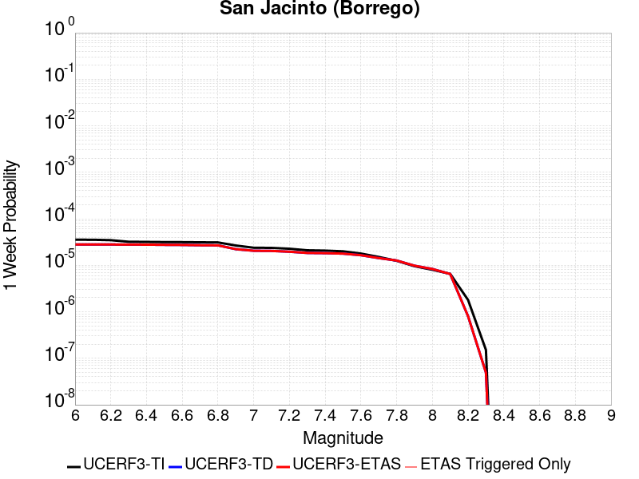 | 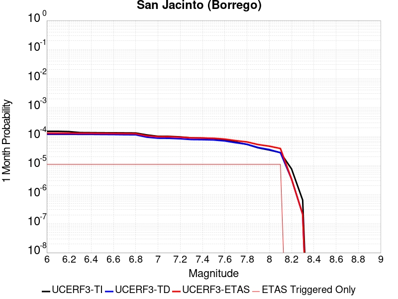 | 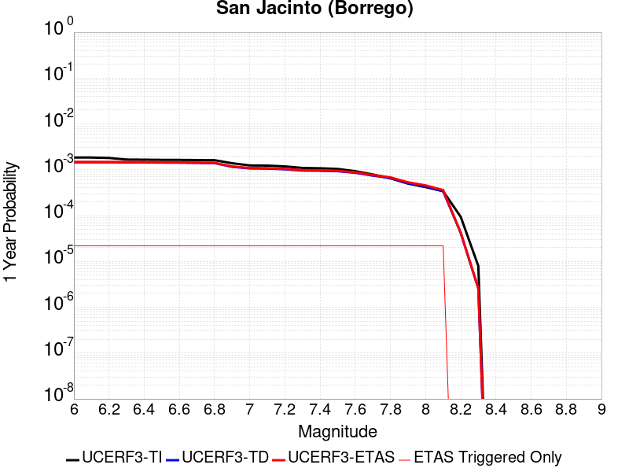 |  |

| Magnitude | 1 wk TI Prob | 1 wk TD Prob | 1 wk ETAS Prob | 1 wk ETAS/TD Gain | 1 wk ETAS Triggered Only | 1 mo TI Prob | 1 mo TD Prob | 1 mo ETAS Prob | 1 mo ETAS/TD Gain | 1 mo ETAS Triggered Only | 1 yr TI Prob | 1 yr TD Prob | 1 yr ETAS Prob | 1 yr ETAS/TD Gain | 1 yr ETAS Triggered Only | 10 yr TI Prob | 10 yr TD Prob | 10 yr ETAS Prob | 10 yr ETAS/TD Gain | 10 yr ETAS Triggered Only |
|-----|-----|-----|-----|-----|-----|-----|-----|-----|-----|-----|-----|-----|-----|-----|-----|-----|-----|-----|-----|-----|
| 6.0 | 3.543992E-5 | 2.7988392E-5 | 2.7988392E-5 | 1.0 | 0.0 | 1.5187653E-4 | 1.1994481E-4 | 1.309325E-4 | 1.0916063 | 1.0989011E-5 | 0.0018475284 | 0.001459362 | 0.001481308 | 1.015038 | 2.1978021E-5 | 0.018322436 | 0.014901815 | 0.014923465 | 1.0014529 | 2.1978021E-5 |
| 6.1 | 3.542281E-5 | 2.7988392E-5 | 2.7988392E-5 | 1.0 | 0.0 | 1.5180321E-4 | 1.1994481E-4 | 1.309325E-4 | 1.0916063 | 1.0989011E-5 | 0.0018466372 | 0.001459362 | 0.001481308 | 1.015038 | 2.1978021E-5 | 0.018313672 | 0.014901815 | 0.014923465 | 1.0014529 | 2.1978021E-5 |
| 6.2 | 3.4688688E-5 | 2.7988392E-5 | 2.7988392E-5 | 1.0 | 0.0 | 1.4865733E-4 | 1.199448E-4 | 1.309325E-4 | 1.0916063 | 1.0989011E-5 | 0.0018084005 | 0.001459362 | 0.001481308 | 1.015038 | 2.1978021E-5 | 0.017937548 | 0.014901815 | 0.014923465 | 1.0014529 | 2.1978021E-5 |
| 6.3 | 3.2087122E-5 | 2.7833707E-5 | 2.7833707E-5 | 1.0 | 0.0 | 1.3750899E-4 | 1.1928193E-4 | 1.3026963E-4 | 1.0921154 | 1.0989011E-5 | 0.0016728862 | 0.0014513023 | 0.0014732485 | 1.0151217 | 2.1978021E-5 | 0.016603488 | 0.014822833 | 0.014844486 | 1.0014608 | 2.1978021E-5 |
| 6.4 | 3.1828724E-5 | 2.7800681E-5 | 2.7800681E-5 | 1.0 | 0.0 | 1.364017E-4 | 1.1914041E-4 | 1.3012812E-4 | 1.0922248 | 1.0989011E-5 | 0.0016594254 | 0.0014495815 | 0.0014715277 | 1.0151397 | 2.1978021E-5 | 0.016470885 | 0.014805906 | 0.014827559 | 1.0014625 | 2.1978021E-5 |
| 6.5 | 3.1563577E-5 | 2.7540304E-5 | 2.7540304E-5 | 1.0 | 0.0 | 1.3526545E-4 | 1.18024596E-4 | 1.2901232E-4 | 1.0930969 | 1.0989011E-5 | 0.0016456128 | 0.0014360145 | 0.0014579609 | 1.0152829 | 2.1978021E-5 | 0.0163348 | 0.014672448 | 0.014694103 | 1.0014759 | 2.1978021E-5 |
| 6.6 | 3.1467625E-5 | 2.7384483E-5 | 2.7384483E-5 | 1.0 | 0.0 | 1.3485427E-4 | 1.1735686E-4 | 1.2834457E-4 | 1.0936266 | 1.0989011E-5 | 0.0016406142 | 0.0014278955 | 0.0014498421 | 1.0153699 | 2.1978021E-5 | 0.016285548 | 0.014592675 | 0.014614332 | 1.0014842 | 2.1978021E-5 |
| 6.7 | 3.1223695E-5 | 2.700241E-5 | 2.700241E-5 | 1.0 | 0.0 | 1.3380898E-4 | 1.1571955E-4 | 1.267073E-4 | 1.0949515 | 1.0989011E-5 | 0.0016279068 | 0.0014079871 | 0.0014299342 | 1.0155876 | 2.1978021E-5 | 0.01616033 | 0.014397007 | 0.014418669 | 1.0015045 | 2.1978021E-5 |
| 6.8 | 3.1015585E-5 | 2.6823313E-5 | 2.6823313E-5 | 1.0 | 0.0 | 1.3291716E-4 | 1.1495206E-4 | 1.2593981E-4 | 1.0955855 | 1.0989011E-5 | 0.001617065 | 0.0013986549 | 0.0014206022 | 1.0156918 | 2.1978021E-5 | 0.016053487 | 0.014304237 | 0.014325901 | 1.0015144 | 2.1978021E-5 |
| 6.9 | 2.6641965E-5 | 2.224212E-5 | 2.224212E-5 | 1.0 | 0.0 | 1.1417485E-4 | 9.531991E-5 | 1.06307874E-4 | 1.1152745 | 1.0989011E-5 | 0.0013891924 | 0.001159906 | 0.0011818585 | 1.0189261 | 2.1978021E-5 | 0.0138054015 | 0.011912661 | 0.011934377 | 1.001823 | 2.1978021E-5 |
| 7.0 | 2.3854353E-5 | 2.0534853E-5 | 2.0534853E-5 | 1.0 | 0.0 | 1.02228936E-4 | 8.800356E-5 | 9.89916E-5 | 1.1248591 | 1.0989011E-5 | 0.0012439266 | 0.0010709192 | 0.0010928737 | 1.0205005 | 2.1978021E-5 | 0.012369866 | 0.011011972 | 0.011033707 | 1.0019739 | 2.1978021E-5 |
| 7.1 | 2.3672901E-5 | 2.0371283E-5 | 2.0371283E-5 | 1.0 | 0.0 | 1.0145135E-4 | 8.730259E-5 | 9.829064E-5 | 1.1258616 | 1.0989011E-5 | 0.0012344702 | 0.0010623933 | 0.001084348 | 1.0206653 | 2.1978021E-5 | 0.0122763505 | 0.010927122 | 0.010948859 | 1.0019894 | 2.1978021E-5 |
| 7.2 | 2.2717244E-5 | 1.9598208E-5 | 1.9598208E-5 | 1.0 | 0.0 | 9.735599E-5 | 8.398963E-5 | 9.497772E-5 | 1.1308267 | 1.0989011E-5 | 0.0011846646 | 0.0010220964 | 0.001044052 | 1.0214809 | 2.1978021E-5 | 0.01178369 | 0.010524263 | 0.010546009 | 1.0020664 | 2.1978021E-5 |
| 7.3 | 2.1016205E-5 | 1.8439077E-5 | 1.8439077E-5 | 1.0 | 0.0 | 9.006634E-5 | 7.902224E-5 | 9.0010384E-5 | 1.1390513 | 1.0989011E-5 | 0.001096006 | 9.6167315E-4 | 9.836301E-4 | 1.0228319 | 2.1978021E-5 | 0.010906163 | 0.009919509 | 0.00994127 | 1.0021937 | 2.1978021E-5 |
| 7.4 | 2.0683625E-5 | 1.824144E-5 | 1.824144E-5 | 1.0 | 0.0 | 8.86411E-5 | 7.8175275E-5 | 8.9163426E-5 | 1.1405579 | 1.0989011E-5 | 0.001078671 | 9.513704E-4 | 9.7332755E-4 | 1.0230795 | 2.1978021E-5 | 0.010734501 | 0.009816155 | 0.009837917 | 1.0022169 | 2.1978021E-5 |
| 7.5 | 1.9993966E-5 | 1.7835999E-5 | 1.7835999E-5 | 1.0 | 0.0 | 8.568561E-5 | 7.643777E-5 | 8.7425935E-5 | 1.1437532 | 1.0989011E-5 | 0.001042723 | 9.302345E-4 | 9.5219206E-4 | 1.0236044 | 2.1978021E-5 | 0.010378438 | 0.009602838 | 0.009624605 | 1.0022668 | 2.1978021E-5 |
| 7.6 | 1.788966E-5 | 1.6487877E-5 | 1.6487877E-5 | 1.0 | 0.0 | 7.666772E-5 | 7.066042E-5 | 8.164866E-5 | 1.1555077 | 1.0989011E-5 | 9.3302975E-4 | 8.599528E-4 | 8.8191195E-4 | 1.0255352 | 2.1978021E-5 | 0.00929122 | 0.008894032 | 0.008915815 | 1.0024492 | 2.1978021E-5 |
| 7.7 | 1.5125781E-5 | 1.4288167E-5 | 1.4288167E-5 | 1.0 | 0.0 | 6.4823165E-5 | 6.123357E-5 | 7.222191E-5 | 1.1794496 | 1.0989011E-5 | 7.889362E-4 | 7.452645E-4 | 7.6722616E-4 | 1.0294683 | 2.1978021E-5 | 0.007861412 | 0.007740845 | 0.007762653 | 1.0028173 | 2.1978021E-5 |
| 7.8 | 1.250089E-5 | 1.267947E-5 | 1.267947E-5 | 1.0 | 0.0 | 5.3574146E-5 | 5.4339456E-5 | 6.532787E-5 | 1.2022179 | 1.0989011E-5 | 6.5207E-4 | 6.613827E-4 | 6.833462E-4 | 1.0332085 | 2.1978021E-5 | 0.006501599 | 0.0068934793 | 0.0069153057 | 1.0031662 | 2.1978021E-5 |
| 7.9 | 9.561E-6 | 9.7982065E-6 | 9.7982065E-6 | 1.0 | 0.0 | 4.0975072E-5 | 4.1991643E-5 | 5.298019E-5 | 1.2616842 | 1.0989011E-5 | 4.987573E-4 | 5.1112886E-4 | 5.330957E-4 | 1.042977 | 2.1978021E-5 | 0.0049763937 | 0.005375308 | 0.005397168 | 1.0040667 | 2.1978021E-5 |
| 8.0 | 8.01699E-6 | 8.333213E-6 | 8.333213E-6 | 1.0 | 0.0 | 3.4358076E-5 | 3.5713285E-5 | 4.6701905E-5 | 1.3076899 | 1.0989011E-5 | 4.1822926E-4 | 4.3472304E-4 | 4.566915E-4 | 1.0505344 | 2.1978021E-5 | 0.0041744304 | 0.0045943363 | 0.004616213 | 1.0047617 | 2.1978021E-5 |
| 8.1 | 6.541947E-6 | 6.4949995E-6 | 6.4949995E-6 | 1.0 | 0.0 | 2.8036617E-5 | 2.7835418E-5 | 3.8824124E-5 | 1.3947742 | 1.0989011E-5 | 3.4129233E-4 | 3.3884402E-4 | 3.608146E-4 | 1.0648398 | 2.1978021E-5 | 0.0034076865 | 0.0035980614 | 0.0036199603 | 1.0060863 | 2.1978021E-5 |
| 8.2 | 1.7968189E-6 | 8.031198E-7 | 8.031198E-7 | 1.0 | 0.0 | 7.70063E-6 | 3.4419375E-6 | 3.4419375E-6 | 1.0 | 0.0 | 9.3751136E-5 | 4.190481E-5 | 4.190481E-5 | 1.0 | 0.0 | 9.371159E-4 | 4.7456074E-4 | 4.7456074E-4 | 1.0 | 0.0 |
| 8.3 | 1.5167889E-7 | 4.9405415E-8 | 4.9405415E-8 | 1.0 | 0.0 | 6.500522E-7 | 2.1173749E-7 | 2.1173749E-7 | 1.0 | 0.0 | 7.9143565E-6 | 2.5779011E-6 | 2.5779011E-6 | 1.0 | 0.0 | 7.914075E-5 | 2.9940562E-5 | 2.9940562E-5 | 1.0 | 0.0 |

## Elysian Park (Upper)
*[(top)](#table-of-contents)*

| 1 Week | 1 Month | 1 Year | 10 Year |
|-----|-----|-----|-----|
| 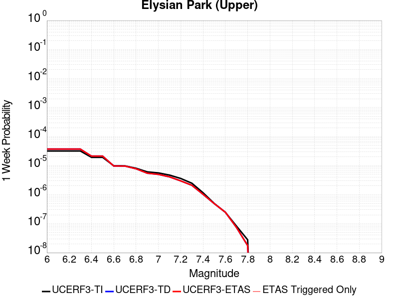 | 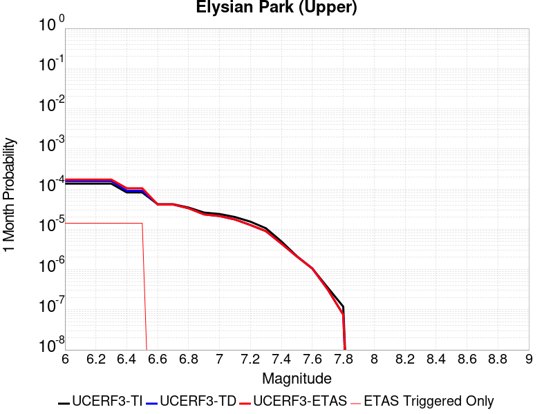 | 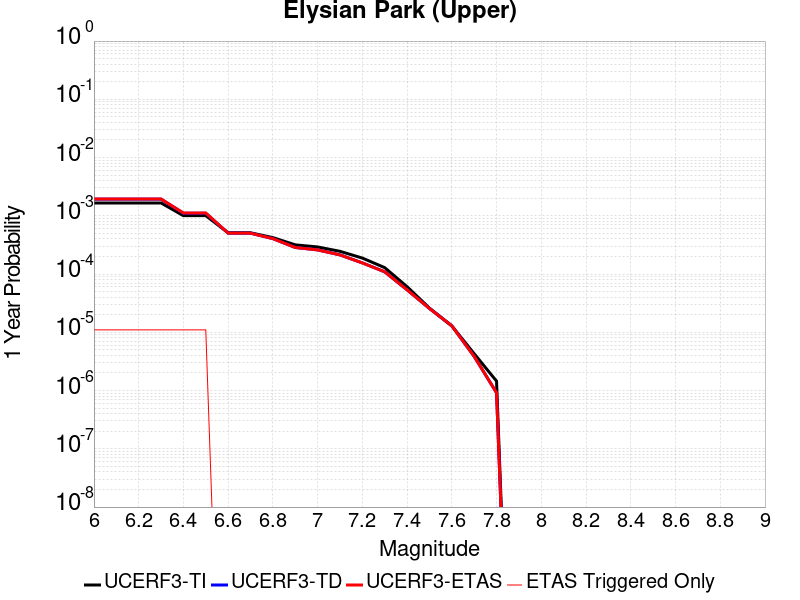 | 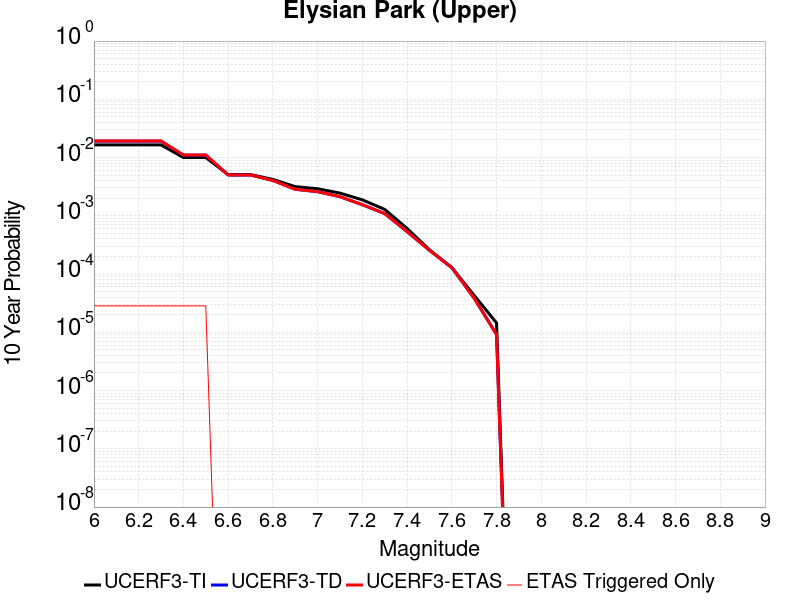 |

| Magnitude | 1 wk TI Prob | 1 wk TD Prob | 1 wk ETAS Prob | 1 wk ETAS/TD Gain | 1 wk ETAS Triggered Only | 1 mo TI Prob | 1 mo TD Prob | 1 mo ETAS Prob | 1 mo ETAS/TD Gain | 1 mo ETAS Triggered Only | 1 yr TI Prob | 1 yr TD Prob | 1 yr ETAS Prob | 1 yr ETAS/TD Gain | 1 yr ETAS Triggered Only | 10 yr TI Prob | 10 yr TD Prob | 10 yr ETAS Prob | 10 yr ETAS/TD Gain | 10 yr ETAS Triggered Only |
|-----|-----|-----|-----|-----|-----|-----|-----|-----|-----|-----|-----|-----|-----|-----|-----|-----|-----|-----|-----|-----|
| 6.0 | 3.1876025E-5 | 3.704355E-5 | 3.704355E-5 | 1.0 | 0.0 | 1.3660437E-4 | 1.5875115E-4 | 1.6973841E-4 | 1.0692106 | 1.0989011E-5 | 0.0016618895 | 0.0019315147 | 0.0019424825 | 1.0056783 | 1.0989011E-5 | 0.016495159 | 0.019193873 | 0.01921543 | 1.0011231 | 2.1978021E-5 |
| 6.1 | 3.1876025E-5 | 3.704355E-5 | 3.704355E-5 | 1.0 | 0.0 | 1.3660437E-4 | 1.5875115E-4 | 1.6973841E-4 | 1.0692106 | 1.0989011E-5 | 0.0016618895 | 0.0019315147 | 0.0019424825 | 1.0056783 | 1.0989011E-5 | 0.016495159 | 0.019193873 | 0.01921543 | 1.0011231 | 2.1978021E-5 |
| 6.2 | 3.1876025E-5 | 3.704355E-5 | 3.704355E-5 | 1.0 | 0.0 | 1.3660437E-4 | 1.5875115E-4 | 1.6973841E-4 | 1.0692106 | 1.0989011E-5 | 0.0016618895 | 0.0019315147 | 0.0019424825 | 1.0056783 | 1.0989011E-5 | 0.016495159 | 0.019193873 | 0.01921543 | 1.0011231 | 2.1978021E-5 |
| 6.3 | 3.1876025E-5 | 3.704355E-5 | 3.704355E-5 | 1.0 | 0.0 | 1.3660437E-4 | 1.5875115E-4 | 1.6973841E-4 | 1.0692106 | 1.0989011E-5 | 0.0016618895 | 0.0019315147 | 0.0019424825 | 1.0056783 | 1.0989011E-5 | 0.016495159 | 0.019193873 | 0.01921543 | 1.0011231 | 2.1978021E-5 |
| 6.4 | 1.9273462E-5 | 2.1205988E-5 | 2.1205988E-5 | 1.0 | 0.0 | 8.259794E-5 | 9.088062E-5 | 1.0186863E-4 | 1.120906 | 1.0989011E-5 | 0.001005166 | 0.0011060834 | 0.0011170602 | 1.009924 | 1.0989011E-5 | 0.010006315 | 0.011022645 | 0.011044381 | 1.001972 | 2.1978021E-5 |
| 6.5 | 1.9273462E-5 | 2.1205988E-5 | 2.1205988E-5 | 1.0 | 0.0 | 8.259794E-5 | 9.088062E-5 | 1.0186863E-4 | 1.120906 | 1.0989011E-5 | 0.001005166 | 0.0011060834 | 0.0011170602 | 1.009924 | 1.0989011E-5 | 0.010006315 | 0.011022645 | 0.011044381 | 1.001972 | 2.1978021E-5 |
| 6.6 | 9.813258E-6 | 9.666633E-6 | 9.666633E-6 | 1.0 | 0.0 | 4.205614E-5 | 4.142781E-5 | 4.142781E-5 | 1.0 | 0.0 | 5.119132E-4 | 5.042741E-4 | 5.042741E-4 | 1.0 | 0.0 | 0.005107356 | 0.005032022 | 0.005032022 | 1.0 | 0.0 |
| 6.7 | 9.801478E-6 | 9.654202E-6 | 9.654202E-6 | 1.0 | 0.0 | 4.2005657E-5 | 4.1374533E-5 | 4.1374533E-5 | 1.0 | 0.0 | 5.112989E-4 | 5.036258E-4 | 5.036258E-4 | 1.0 | 0.0 | 0.0051012407 | 0.005025568 | 0.005025568 | 1.0 | 0.0 |
| 6.8 | 8.102489E-6 | 7.773824E-6 | 7.773824E-6 | 1.0 | 0.0 | 3.4724493E-5 | 3.331599E-5 | 3.331599E-5 | 1.0 | 0.0 | 4.2268867E-4 | 4.0555166E-4 | 4.0555166E-4 | 1.0 | 0.0 | 0.004218856 | 0.0040486096 | 0.0040486096 | 1.0 | 0.0 |
| 6.9 | 6.08275E-6 | 5.481944E-6 | 5.481944E-6 | 1.0 | 0.0 | 2.6068668E-5 | 2.3493838E-5 | 2.3493838E-5 | 1.0 | 0.0 | 3.173398E-4 | 2.860007E-4 | 2.860007E-4 | 1.0 | 0.0 | 0.0031688702 | 0.0028564038 | 0.0028564038 | 1.0 | 0.0 |
| 7.0 | 5.5995934E-6 | 4.983225E-6 | 4.983225E-6 | 1.0 | 0.0 | 2.3998036E-5 | 2.1356509E-5 | 2.1356509E-5 | 1.0 | 0.0 | 2.9213692E-4 | 2.5998513E-4 | 2.5998513E-4 | 1.0 | 0.0 | 0.0029175316 | 0.002596877 | 0.002596877 | 1.0 | 0.0 |
| 7.1 | 4.709881E-6 | 4.0877635E-6 | 4.0877635E-6 | 1.0 | 0.0 | 2.0185047E-5 | 1.751887E-5 | 1.751887E-5 | 1.0 | 0.0 | 2.4572524E-4 | 2.132718E-4 | 2.132718E-4 | 1.0 | 0.0 | 0.002454537 | 0.0021307126 | 0.0021307126 | 1.0 | 0.0 |
| 7.2 | 3.6063436E-6 | 2.9782116E-6 | 2.9782116E-6 | 1.0 | 0.0 | 1.5455667E-5 | 1.2763701E-5 | 1.2763701E-5 | 1.0 | 0.0 | 1.881565E-4 | 1.553871E-4 | 1.553871E-4 | 1.0 | 0.0 | 0.0018799726 | 0.0015527956 | 0.0015527956 | 1.0 | 0.0 |
| 7.3 | 2.471135E-6 | 2.0956425E-6 | 2.0956425E-6 | 1.0 | 0.0 | 1.0590536E-5 | 8.981294E-6 | 8.981294E-6 | 1.0 | 0.0 | 1.2893214E-4 | 1.0934184E-4 | 1.0934184E-4 | 1.0 | 0.0 | 0.0012885736 | 0.0010928876 | 0.0010928876 | 1.0 | 0.0 |
| 7.4 | 1.163943E-6 | 1.0276057E-6 | 1.0276057E-6 | 1.0 | 0.0 | 4.988318E-6 | 4.404017E-6 | 4.404017E-6 | 1.0 | 0.0 | 6.0731076E-5 | 5.361762E-5 | 5.361762E-5 | 1.0 | 0.0 | 6.071448E-4 | 5.3604983E-4 | 5.3604983E-4 | 1.0 | 0.0 |
| 7.5 | 4.99459E-7 | 4.9180574E-7 | 4.9180574E-7 | 1.0 | 0.0 | 2.140537E-6 | 2.1077374E-6 | 2.1077374E-6 | 1.0 | 0.0 | 2.6060725E-5 | 2.5661417E-5 | 2.5661417E-5 | 1.0 | 0.0 | 2.605767E-4 | 2.565861E-4 | 2.565861E-4 | 1.0 | 0.0 |
| 7.6 | 2.4667852E-7 | 2.4781048E-7 | 2.4781048E-7 | 1.0 | 0.0 | 1.0571932E-6 | 1.0620445E-6 | 1.0620445E-6 | 1.0 | 0.0 | 1.2871251E-5 | 1.2930318E-5 | 1.2930318E-5 | 1.0 | 0.0 | 1.2870505E-4 | 1.2929602E-4 | 1.2929602E-4 | 1.0 | 0.0 |
| 7.7 | 8.2312795E-8 | 7.387916E-8 | 7.387916E-8 | 1.0 | 0.0 | 3.527691E-7 | 3.1662492E-7 | 3.1662492E-7 | 1.0 | 0.0 | 4.294955E-6 | 3.854903E-6 | 3.854903E-6 | 1.0 | 0.0 | 4.2948723E-5 | 3.8548475E-5 | 3.8548475E-5 | 1.0 | 0.0 |
| 7.8 | 2.7819295E-8 | 1.7576415E-8 | 1.7576415E-8 | 1.0 | 0.0 | 1.1922555E-7 | 7.532749E-8 | 7.532749E-8 | 1.0 | 0.0 | 1.45157E-6 | 9.1711195E-7 | 9.1711195E-7 | 1.0 | 0.0 | 1.45156055E-5 | 9.171096E-6 | 9.171096E-6 | 1.0 | 0.0 |

## Kern Canyon (Lake Isabella) 2011
*[(top)](#table-of-contents)*

| 1 Week | 1 Month | 1 Year | 10 Year |
|-----|-----|-----|-----|
| 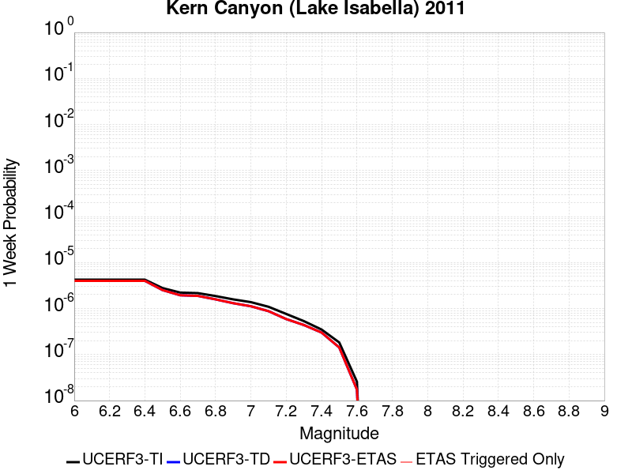 | 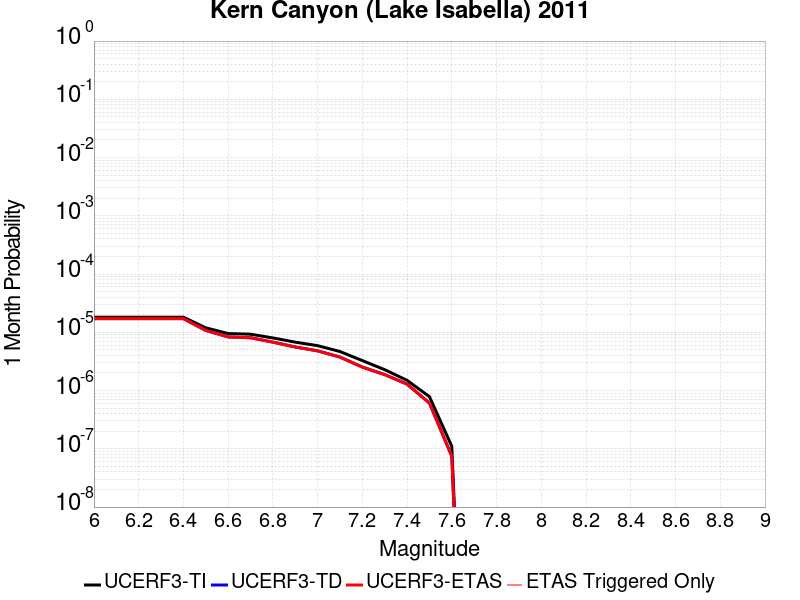 | 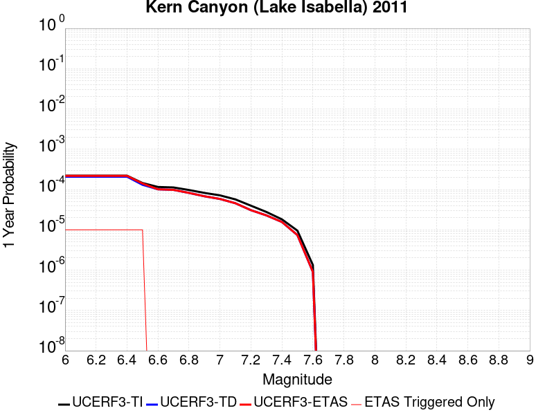 | 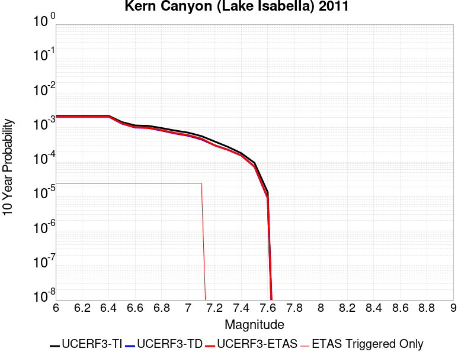 |

| Magnitude | 1 wk TI Prob | 1 wk TD Prob | 1 wk ETAS Prob | 1 wk ETAS/TD Gain | 1 wk ETAS Triggered Only | 1 mo TI Prob | 1 mo TD Prob | 1 mo ETAS Prob | 1 mo ETAS/TD Gain | 1 mo ETAS Triggered Only | 1 yr TI Prob | 1 yr TD Prob | 1 yr ETAS Prob | 1 yr ETAS/TD Gain | 1 yr ETAS Triggered Only | 10 yr TI Prob | 10 yr TD Prob | 10 yr ETAS Prob | 10 yr ETAS/TD Gain | 10 yr ETAS Triggered Only |
|-----|-----|-----|-----|-----|-----|-----|-----|-----|-----|-----|-----|-----|-----|-----|-----|-----|-----|-----|-----|-----|
| 6.0 | 4.2387383E-6 | 4.001735E-6 | 4.001735E-6 | 1.0 | 0.0 | 1.8165894E-5 | 1.715019E-5 | 1.715019E-5 | 1.0 | 0.0 | 2.2114732E-4 | 2.0878542E-4 | 2.1977213E-4 | 1.0526221 | 1.0989011E-5 | 0.0022092736 | 0.0020860767 | 0.0021080088 | 1.0105135 | 2.1978021E-5 |
| 6.1 | 4.2387383E-6 | 4.001735E-6 | 4.001735E-6 | 1.0 | 0.0 | 1.8165894E-5 | 1.715019E-5 | 1.715019E-5 | 1.0 | 0.0 | 2.2114732E-4 | 2.0878542E-4 | 2.1977213E-4 | 1.0526221 | 1.0989011E-5 | 0.0022092736 | 0.0020860767 | 0.0021080088 | 1.0105135 | 2.1978021E-5 |
| 6.2 | 4.2387383E-6 | 4.001735E-6 | 4.001735E-6 | 1.0 | 0.0 | 1.8165894E-5 | 1.715019E-5 | 1.715019E-5 | 1.0 | 0.0 | 2.2114732E-4 | 2.0878542E-4 | 2.1977213E-4 | 1.0526221 | 1.0989011E-5 | 0.0022092736 | 0.0020860767 | 0.0021080088 | 1.0105135 | 2.1978021E-5 |
| 6.3 | 4.2387383E-6 | 4.001735E-6 | 4.001735E-6 | 1.0 | 0.0 | 1.8165894E-5 | 1.715019E-5 | 1.715019E-5 | 1.0 | 0.0 | 2.2114732E-4 | 2.0878542E-4 | 2.1977213E-4 | 1.0526221 | 1.0989011E-5 | 0.0022092736 | 0.0020860767 | 0.0021080088 | 1.0105135 | 2.1978021E-5 |
| 6.4 | 4.2387383E-6 | 4.001735E-6 | 4.001735E-6 | 1.0 | 0.0 | 1.8165894E-5 | 1.715019E-5 | 1.715019E-5 | 1.0 | 0.0 | 2.2114732E-4 | 2.0878542E-4 | 2.1977213E-4 | 1.0526221 | 1.0989011E-5 | 0.0022092736 | 0.0020860767 | 0.0021080088 | 1.0105135 | 2.1978021E-5 |
| 6.5 | 2.7857532E-6 | 2.5179297E-6 | 2.5179297E-6 | 1.0 | 0.0 | 1.1938888E-5 | 1.0791085E-5 | 1.0791085E-5 | 1.0 | 0.0 | 1.4534626E-4 | 1.3137386E-4 | 1.4236143E-4 | 1.0836359 | 1.0989011E-5 | 0.0014525123 | 0.0013129947 | 0.0013349439 | 1.0167168 | 2.1978021E-5 |
| 6.6 | 2.2233348E-6 | 1.944174E-6 | 1.944174E-6 | 1.0 | 0.0 | 9.528543E-6 | 8.332148E-6 | 8.332148E-6 | 1.0 | 0.0 | 1.1600384E-4 | 1.0143928E-4 | 1.0143928E-4 | 1.0 | 0.0 | 0.001159433 | 0.0010139383 | 0.0010249162 | 1.010827 | 1.0989011E-5 |
| 6.7 | 2.1635126E-6 | 1.8835532E-6 | 1.8835532E-6 | 1.0 | 0.0 | 9.272164E-6 | 8.072347E-6 | 8.072347E-6 | 1.0 | 0.0 | 1.1288274E-4 | 9.827647E-5 | 9.827647E-5 | 1.0 | 0.0 | 0.0011282542 | 9.823382E-4 | 9.933164E-4 | 1.0111756 | 1.0989011E-5 |
| 6.8 | 1.8685711E-6 | 1.5831863E-6 | 1.5831863E-6 | 1.0 | 0.0 | 8.008137E-6 | 6.785067E-6 | 6.785067E-6 | 1.0 | 0.0 | 9.74947E-5 | 8.2605104E-5 | 8.2605104E-5 | 1.0 | 0.0 | 9.745194E-4 | 8.2574895E-4 | 8.367289E-4 | 1.013297 | 1.0989011E-5 |
| 6.9 | 1.5815071E-6 | 1.3065303E-6 | 1.3065303E-6 | 1.0 | 0.0 | 6.77787E-6 | 5.5994037E-6 | 5.5994037E-6 | 1.0 | 0.0 | 8.251744E-5 | 6.817063E-5 | 6.817063E-5 | 1.0 | 0.0 | 8.248681E-4 | 6.814999E-4 | 6.924814E-4 | 1.0161138 | 1.0989011E-5 |
| 7.0 | 1.3772564E-6 | 1.1211043E-6 | 1.1211043E-6 | 1.0 | 0.0 | 5.9025137E-6 | 4.804724E-6 | 4.804724E-6 | 1.0 | 0.0 | 7.186073E-5 | 5.8495963E-5 | 5.8495963E-5 | 1.0 | 0.0 | 7.18375E-4 | 5.848077E-4 | 5.957903E-4 | 1.0187799 | 1.0989011E-5 |
| 7.1 | 1.0916998E-6 | 8.764025E-7 | 8.764025E-7 | 1.0 | 0.0 | 4.678705E-6 | 3.7560053E-6 | 3.7560053E-6 | 1.0 | 0.0 | 5.6961744E-5 | 4.572842E-5 | 4.572842E-5 | 1.0 | 0.0 | 5.6947145E-4 | 4.5719143E-4 | 4.6817542E-4 | 1.024025 | 1.0989011E-5 |
| 7.2 | 7.6277024E-7 | 5.901622E-7 | 5.901622E-7 | 1.0 | 0.0 | 3.2690114E-6 | 2.529264E-6 | 2.529264E-6 | 1.0 | 0.0 | 3.9799485E-5 | 3.079336E-5 | 3.079336E-5 | 1.0 | 0.0 | 3.9792358E-4 | 3.0789155E-4 | 3.0789155E-4 | 1.0 | 0.0 |
| 7.3 | 5.3265916E-7 | 4.38256E-7 | 4.38256E-7 | 1.0 | 0.0 | 2.282823E-6 | 1.8782387E-6 | 1.8782387E-6 | 1.0 | 0.0 | 2.7793016E-5 | 2.286732E-5 | 2.286732E-5 | 1.0 | 0.0 | 2.778954E-4 | 2.2865004E-4 | 2.2865004E-4 | 1.0 | 0.0 |
| 7.4 | 3.4946007E-7 | 3.0066505E-7 | 3.0066505E-7 | 1.0 | 0.0 | 1.497685E-6 | 1.2885639E-6 | 1.2885639E-6 | 1.0 | 0.0 | 1.8234163E-5 | 1.5688154E-5 | 1.5688154E-5 | 1.0 | 0.0 | 1.8232666E-4 | 1.568707E-4 | 1.568707E-4 | 1.0 | 0.0 |
| 7.5 | 1.8317026E-7 | 1.4245262E-7 | 1.4245262E-7 | 1.0 | 0.0 | 7.850152E-7 | 6.1051105E-7 | 6.1051105E-7 | 1.0 | 0.0 | 9.557518E-6 | 7.4329478E-6 | 7.4329478E-6 | 1.0 | 0.0 | 9.5571064E-5 | 7.4327065E-5 | 7.4327065E-5 | 1.0 | 0.0 |
| 7.6 | 2.572245E-8 | 1.7353212E-8 | 1.7353212E-8 | 1.0 | 0.0 | 1.10239064E-7 | 7.437091E-8 | 7.437091E-8 | 1.0 | 0.0 | 1.3421597E-6 | 9.0546547E-7 | 9.0546547E-7 | 1.0 | 0.0 | 1.3421517E-5 | 9.054624E-6 | 9.054624E-6 | 1.0 | 0.0 |

## Rose Canyon
*[(top)](#table-of-contents)*

| 1 Week | 1 Month | 1 Year | 10 Year |
|-----|-----|-----|-----|
|  | 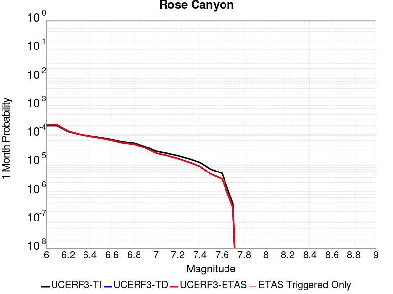 | 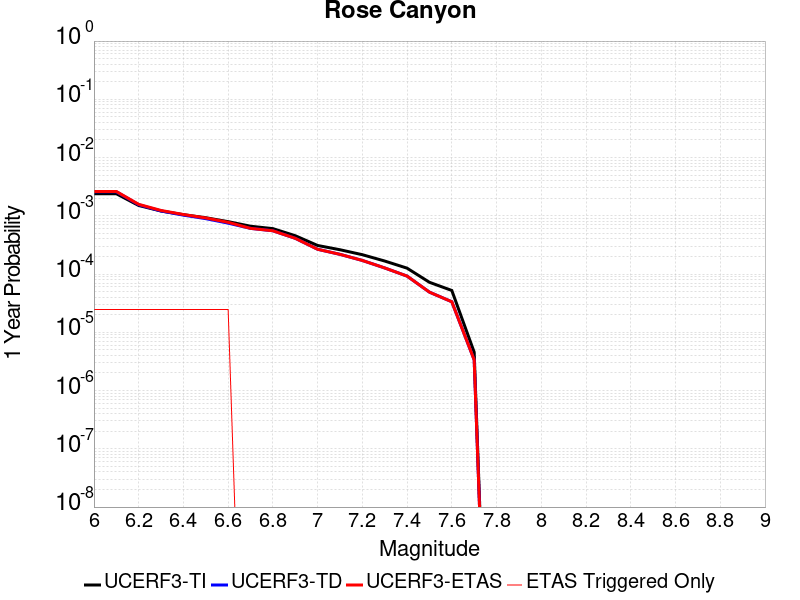 | 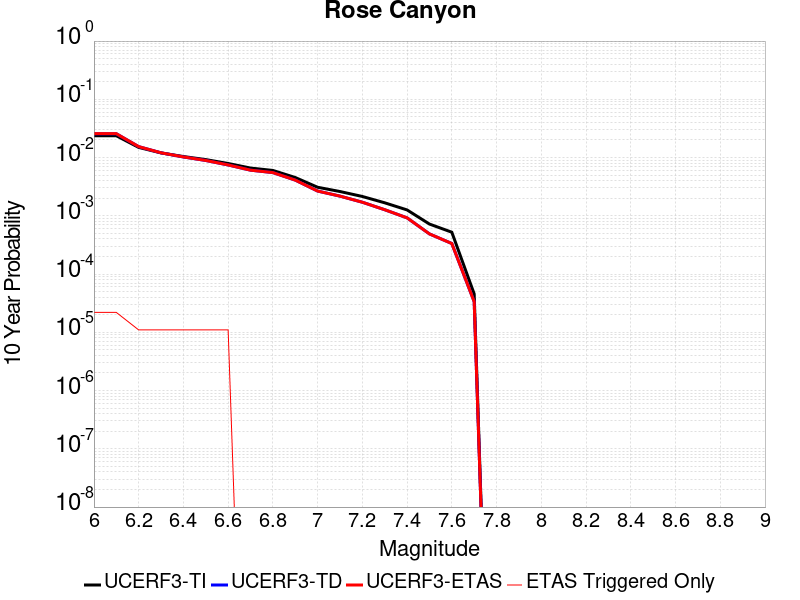 |

| Magnitude | 1 wk TI Prob | 1 wk TD Prob | 1 wk ETAS Prob | 1 wk ETAS/TD Gain | 1 wk ETAS Triggered Only | 1 mo TI Prob | 1 mo TD Prob | 1 mo ETAS Prob | 1 mo ETAS/TD Gain | 1 mo ETAS Triggered Only | 1 yr TI Prob | 1 yr TD Prob | 1 yr ETAS Prob | 1 yr ETAS/TD Gain | 1 yr ETAS Triggered Only | 10 yr TI Prob | 10 yr TD Prob | 10 yr ETAS Prob | 10 yr ETAS/TD Gain | 10 yr ETAS Triggered Only |
|-----|-----|-----|-----|-----|-----|-----|-----|-----|-----|-----|-----|-----|-----|-----|-----|-----|-----|-----|-----|-----|
| 6.0 | 4.5923203E-5 | 4.9789614E-5 | 4.9789614E-5 | 1.0 | 0.0 | 1.9679888E-4 | 2.1336795E-4 | 2.1336795E-4 | 1.0 | 0.0 | 0.0023933933 | 0.0025948633 | 0.0026058238 | 1.004224 | 1.0989011E-5 | 0.023677798 | 0.02567839 | 0.025699804 | 1.0008339 | 2.1978021E-5 |
| 6.1 | 4.5923203E-5 | 4.9789614E-5 | 4.9789614E-5 | 1.0 | 0.0 | 1.9679888E-4 | 2.1336795E-4 | 2.1336795E-4 | 1.0 | 0.0 | 0.0023933933 | 0.0025948633 | 0.0026058238 | 1.004224 | 1.0989011E-5 | 0.023677798 | 0.02567839 | 0.025699804 | 1.0008339 | 2.1978021E-5 |
| 6.2 | 2.8844734E-5 | 2.9737104E-5 | 2.9737104E-5 | 1.0 | 0.0 | 1.2361443E-4 | 1.274387E-4 | 1.274387E-4 | 1.0 | 0.0 | 0.0015039665 | 0.001550497 | 0.0015614689 | 1.0070764 | 1.0989011E-5 | 0.0149382865 | 0.01540967 | 0.015420489 | 1.0007021 | 1.0989011E-5 |
| 6.3 | 2.3171577E-5 | 2.3228296E-5 | 2.3228296E-5 | 1.0 | 0.0 | 9.9302975E-5 | 9.954612E-5 | 9.954612E-5 | 1.0 | 0.0 | 0.0012083431 | 0.0012113136 | 0.0012222894 | 1.009061 | 1.0989011E-5 | 0.012017938 | 0.012056878 | 0.012067734 | 1.0009004 | 1.0989011E-5 |
| 6.4 | 2.0066604E-5 | 1.970763E-5 | 1.970763E-5 | 1.0 | 0.0 | 8.599689E-5 | 8.445859E-5 | 8.445859E-5 | 1.0 | 0.0 | 0.0010465092 | 0.0010278084 | 0.0010387861 | 1.0106807 | 1.0989011E-5 | 0.010415946 | 0.01023846 | 0.010249337 | 1.0010623 | 1.0989011E-5 |
| 6.5 | 1.776989E-5 | 1.713778E-5 | 1.713778E-5 | 1.0 | 0.0 | 7.615444E-5 | 7.34456E-5 | 7.34456E-5 | 1.0 | 0.0 | 9.267859E-4 | 8.9384033E-4 | 9.048195E-4 | 1.0122832 | 1.0989011E-5 | 0.009229303 | 0.008908576 | 0.008919467 | 1.0012225 | 1.0989011E-5 |
| 6.6 | 1.5227364E-5 | 1.4346897E-5 | 1.4346897E-5 | 1.0 | 0.0 | 6.52585E-5 | 6.148528E-5 | 6.148528E-5 | 1.0 | 0.0 | 7.942326E-4 | 7.483314E-4 | 7.593122E-4 | 1.0146737 | 1.0989011E-5 | 0.007914 | 0.00746231 | 0.0074732173 | 1.0014616 | 1.0989011E-5 |
| 6.7 | 1.2703898E-5 | 1.1674687E-5 | 1.1674687E-5 | 1.0 | 0.0 | 5.4444143E-5 | 5.0033435E-5 | 5.0033435E-5 | 1.0 | 0.0 | 6.626558E-4 | 6.089911E-4 | 6.089911E-4 | 1.0 | 0.0 | 0.006606833 | 0.006075816 | 0.006075816 | 1.0 | 0.0 |
| 6.8 | 1.1554917E-5 | 1.0610523E-5 | 1.0610523E-5 | 1.0 | 0.0 | 4.9520135E-5 | 4.5472898E-5 | 4.5472898E-5 | 1.0 | 0.0 | 6.0274085E-4 | 5.5349595E-4 | 5.5349595E-4 | 1.0 | 0.0 | 0.0060110865 | 0.0055231815 | 0.0055231815 | 1.0 | 0.0 |
| 6.9 | 8.732078E-6 | 7.882083E-6 | 7.882083E-6 | 1.0 | 0.0 | 3.7422655E-5 | 3.3779936E-5 | 3.3779936E-5 | 1.0 | 0.0 | 4.5552556E-4 | 4.1119603E-4 | 4.1119603E-4 | 1.0 | 0.0 | 0.0045459294 | 0.004105184 | 0.004105184 | 1.0 | 0.0 |
| 7.0 | 5.9337494E-6 | 5.10785E-6 | 5.10785E-6 | 1.0 | 0.0 | 2.5430107E-5 | 2.1890603E-5 | 2.1890603E-5 | 1.0 | 0.0 | 3.0956755E-4 | 2.6648561E-4 | 2.6648561E-4 | 1.0 | 0.0 | 0.0030913667 | 0.0026616764 | 0.0026616764 | 1.0 | 0.0 |
| 7.1 | 5.013409E-6 | 4.1776725E-6 | 4.1776725E-6 | 1.0 | 0.0 | 2.1485863E-5 | 1.7904189E-5 | 1.7904189E-5 | 1.0 | 0.0 | 2.6155898E-4 | 2.179618E-4 | 2.179618E-4 | 1.0 | 0.0 | 0.0026125133 | 0.002177492 | 0.002177492 | 1.0 | 0.0 |
| 7.2 | 4.120763E-6 | 3.282373E-6 | 3.282373E-6 | 1.0 | 0.0 | 1.7660293E-5 | 1.4067237E-5 | 1.4067237E-5 | 1.0 | 0.0 | 2.1499286E-4 | 1.7125525E-4 | 1.7125525E-4 | 1.0 | 0.0 | 0.0021478499 | 0.0017112423 | 0.0017112423 | 1.0 | 0.0 |
| 7.3 | 3.2081239E-6 | 2.4407161E-6 | 2.4407161E-6 | 1.0 | 0.0 | 1.374903E-5 | 1.046017E-5 | 1.046017E-5 | 1.0 | 0.0 | 1.6738157E-4 | 1.2734519E-4 | 1.2734519E-4 | 1.0 | 0.0 | 0.0016725556 | 0.0012727292 | 0.0012727292 | 1.0 | 0.0 |
| 7.4 | 2.4194755E-6 | 1.7681992E-6 | 1.7681992E-6 | 1.0 | 0.0 | 1.0369139E-5 | 7.5779753E-6 | 7.5779753E-6 | 1.0 | 0.0 | 1.2623696E-4 | 9.225799E-5 | 9.225799E-5 | 1.0 | 0.0 | 0.0012616527 | 9.222023E-4 | 9.222023E-4 | 1.0 | 0.0 |
| 7.5 | 1.3842889E-6 | 9.3795074E-7 | 9.3795074E-7 | 1.0 | 0.0 | 5.9326535E-6 | 4.019783E-6 | 4.019783E-6 | 1.0 | 0.0 | 7.222766E-5 | 4.8939793E-5 | 4.8939793E-5 | 1.0 | 0.0 | 7.220419E-4 | 4.8929366E-4 | 4.8929366E-4 | 1.0 | 0.0 |
| 7.6 | 1.0021575E-6 | 6.412146E-7 | 6.412146E-7 | 1.0 | 0.0 | 4.2949537E-6 | 2.74806E-6 | 2.74806E-6 | 1.0 | 0.0 | 5.2289808E-5 | 3.3457138E-5 | 3.3457138E-5 | 1.0 | 0.0 | 5.2277505E-4 | 3.3452315E-4 | 3.3452315E-4 | 1.0 | 0.0 |
| 7.7 | 8.7620116E-8 | 6.449588E-8 | 6.449588E-8 | 1.0 | 0.0 | 3.7551473E-7 | 2.7641087E-7 | 2.7641087E-7 | 1.0 | 0.0 | 4.5718825E-6 | 3.3652977E-6 | 3.3652977E-6 | 1.0 | 0.0 | 4.5717883E-5 | 3.3652497E-5 | 3.3652497E-5 | 1.0 | 0.0 |

## Coronado Bank alt1
*[(top)](#table-of-contents)*

| 1 Week | 1 Month | 1 Year | 10 Year |
|-----|-----|-----|-----|
| 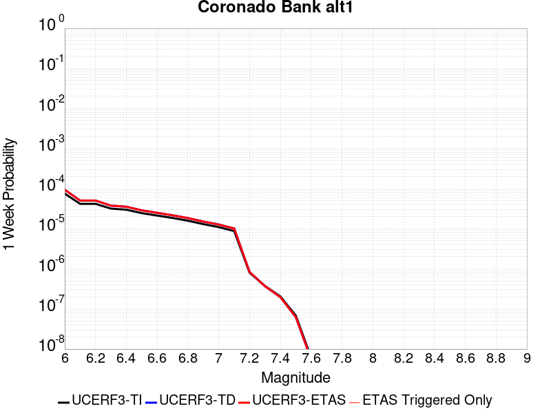 | 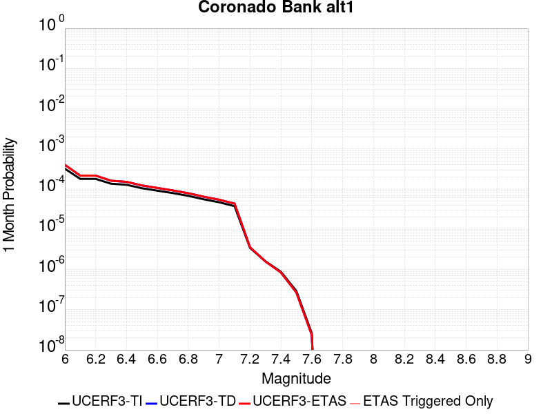 | 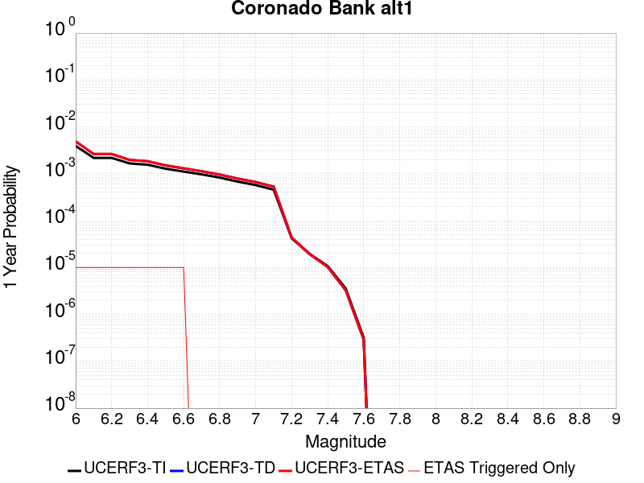 | 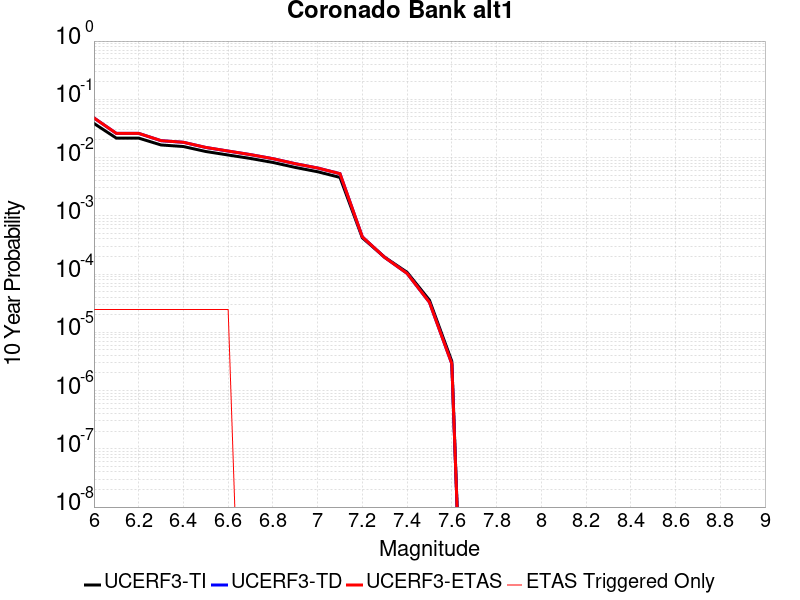 |

| Magnitude | 1 wk TI Prob | 1 wk TD Prob | 1 wk ETAS Prob | 1 wk ETAS/TD Gain | 1 wk ETAS Triggered Only | 1 mo TI Prob | 1 mo TD Prob | 1 mo ETAS Prob | 1 mo ETAS/TD Gain | 1 mo ETAS Triggered Only | 1 yr TI Prob | 1 yr TD Prob | 1 yr ETAS Prob | 1 yr ETAS/TD Gain | 1 yr ETAS Triggered Only | 10 yr TI Prob | 10 yr TD Prob | 10 yr ETAS Prob | 10 yr ETAS/TD Gain | 10 yr ETAS Triggered Only |
|-----|-----|-----|-----|-----|-----|-----|-----|-----|-----|-----|-----|-----|-----|-----|-----|-----|-----|-----|-----|-----|
| 6.0 | 7.533492E-5 | 9.397445E-5 | 9.397445E-5 | 1.0 | 0.0 | 3.22824E-4 | 4.0268974E-4 | 4.0268974E-4 | 1.0 | 0.0 | 0.0039233007 | 0.004892234 | 0.0049031693 | 1.0022352 | 1.0989011E-5 | 0.03854755 | 0.047915664 | 0.04793659 | 1.0004367 | 2.1978021E-5 |
| 6.1 | 4.1807285E-5 | 5.050419E-5 | 5.050419E-5 | 1.0 | 0.0 | 1.7916178E-4 | 2.1642915E-4 | 2.1642915E-4 | 1.0 | 0.0 | 0.0021791123 | 0.0026319358 | 0.0026428958 | 1.0041642 | 1.0989011E-5 | 0.021578677 | 0.026016729 | 0.026038134 | 1.0008228 | 2.1978021E-5 |
| 6.2 | 4.1807285E-5 | 5.050419E-5 | 5.050419E-5 | 1.0 | 0.0 | 1.7916178E-4 | 2.1642915E-4 | 2.1642915E-4 | 1.0 | 0.0 | 0.0021791123 | 0.0026319358 | 0.0026428958 | 1.0041642 | 1.0989011E-5 | 0.021578677 | 0.026016729 | 0.026038134 | 1.0008228 | 2.1978021E-5 |
| 6.3 | 3.1793104E-5 | 3.7718673E-5 | 3.7718673E-5 | 1.0 | 0.0 | 1.3624904E-4 | 1.6164166E-4 | 1.6164166E-4 | 1.0 | 0.0 | 0.0016575698 | 0.0019662387 | 0.0019772062 | 1.0055778 | 1.0989011E-5 | 0.016452603 | 0.01949231 | 0.019503085 | 1.0005528 | 1.0989011E-5 |
| 6.4 | 2.9878007E-5 | 3.534274E-5 | 3.534274E-5 | 1.0 | 0.0 | 1.2804232E-4 | 1.5146029E-4 | 1.5146029E-4 | 1.0 | 0.0 | 0.0015578003 | 0.0018424982 | 0.001853467 | 1.0059532 | 1.0989011E-5 | 0.015469253 | 0.018275984 | 0.018286772 | 1.0005903 | 1.0989011E-5 |
| 6.5 | 2.4512565E-5 | 2.8769407E-5 | 2.8769407E-5 | 1.0 | 0.0 | 1.0504962E-4 | 1.2329179E-4 | 1.2329179E-4 | 1.0 | 0.0 | 0.0012782287 | 0.0015000715 | 0.001511044 | 1.0073147 | 1.0989011E-5 | 0.012709012 | 0.014902437 | 0.014913262 | 1.0007265 | 1.0989011E-5 |
| 6.6 | 2.1317413E-5 | 2.491118E-5 | 2.491118E-5 | 1.0 | 0.0 | 9.135714E-5 | 1.0675796E-4 | 1.0675796E-4 | 1.0 | 0.0 | 0.0011117056 | 0.0012990254 | 0.0013100001 | 1.0084485 | 1.0989011E-5 | 0.011061605 | 0.012916726 | 0.012927573 | 1.0008397 | 1.0989011E-5 |
| 6.7 | 1.8585655E-5 | 2.16387E-5 | 2.16387E-5 | 1.0 | 0.0 | 7.9650374E-5 | 9.27341E-5 | 9.27341E-5 | 1.0 | 0.0 | 9.6931186E-4 | 0.0011284734 | 0.0011284734 | 1.0 | 0.0 | 0.0096509475 | 0.011229593 | 0.011229593 | 1.0 | 0.0 |
| 6.8 | 1.5862879E-5 | 1.8422674E-5 | 1.8422674E-5 | 1.0 | 0.0 | 6.798199E-5 | 7.8952035E-5 | 7.8952035E-5 | 1.0 | 0.0 | 8.273665E-4 | 9.608364E-4 | 9.608364E-4 | 1.0 | 0.0 | 0.008242928 | 0.009568804 | 0.009568804 | 1.0 | 0.0 |
| 6.9 | 1.3021509E-5 | 1.5097861E-5 | 1.5097861E-5 | 1.0 | 0.0 | 5.5805274E-5 | 6.4703614E-5 | 6.4703614E-5 | 1.0 | 0.0 | 6.792174E-4 | 7.8749994E-4 | 7.8749994E-4 | 1.0 | 0.0 | 0.006771452 | 0.0078489175 | 0.0078489175 | 1.0 | 0.0 |
| 7.0 | 1.0974371E-5 | 1.2722295E-5 | 1.2722295E-5 | 1.0 | 0.0 | 4.7032172E-5 | 5.452308E-5 | 5.452308E-5 | 1.0 | 0.0 | 5.7246623E-4 | 6.636339E-4 | 6.636339E-4 | 1.0 | 0.0 | 0.0057099373 | 0.006618271 | 0.006618271 | 1.0 | 0.0 |
| 7.1 | 8.766221E-6 | 1.0165593E-5 | 1.0165593E-5 | 1.0 | 0.0 | 3.7568978E-5 | 4.35662E-5 | 4.35662E-5 | 1.0 | 0.0 | 4.573063E-4 | 5.303066E-4 | 5.303066E-4 | 1.0 | 0.0 | 0.0045636636 | 0.0052921115 | 0.0052921115 | 1.0 | 0.0 |
| 7.2 | 8.026024E-7 | 8.332343E-7 | 8.332343E-7 | 1.0 | 0.0 | 3.43972E-6 | 3.5709993E-6 | 3.5709993E-6 | 1.0 | 0.0 | 4.1877785E-5 | 4.347606E-5 | 4.347606E-5 | 1.0 | 0.0 | 4.1869894E-4 | 4.3467662E-4 | 4.3467662E-4 | 1.0 | 0.0 |
| 7.3 | 3.7293114E-7 | 3.7002837E-7 | 3.7002837E-7 | 1.0 | 0.0 | 1.5982754E-6 | 1.5858349E-6 | 1.5858349E-6 | 1.0 | 0.0 | 1.9458828E-5 | 1.9307368E-5 | 1.9307368E-5 | 1.0 | 0.0 | 1.9457124E-4 | 1.9305699E-4 | 1.9305699E-4 | 1.0 | 0.0 |
| 7.4 | 2.0557036E-7 | 1.967517E-7 | 1.967517E-7 | 1.0 | 0.0 | 8.810155E-7 | 8.432213E-7 | 8.432213E-7 | 1.0 | 0.0 | 1.0726311E-5 | 1.0266171E-5 | 1.0266171E-5 | 1.0 | 0.0 | 1.0725793E-4 | 1.02657E-4 | 1.02657E-4 | 1.0 | 0.0 |
| 7.5 | 6.845446E-8 | 6.279522E-8 | 6.279522E-8 | 1.0 | 0.0 | 2.9337625E-7 | 2.6912235E-7 | 2.6912235E-7 | 1.0 | 0.0 | 3.5718497E-6 | 3.2765597E-6 | 3.2765597E-6 | 1.0 | 0.0 | 3.5717923E-5 | 3.2765125E-5 | 3.2765125E-5 | 1.0 | 0.0 |
| 7.6 | 6.0975145E-9 | 5.5319367E-9 | 5.5319367E-9 | 1.0 | 0.0 | 2.6132206E-8 | 2.3708301E-8 | 2.3708301E-8 | 1.0 | 0.0 | 3.1815955E-7 | 2.8864855E-7 | 2.8864855E-7 | 1.0 | 0.0 | 3.181591E-6 | 2.8864827E-6 | 2.8864827E-6 | 1.0 | 0.0 |

## Santa Susana alt 1
*[(top)](#table-of-contents)*

| 1 Week | 1 Month | 1 Year | 10 Year |
|-----|-----|-----|-----|
| 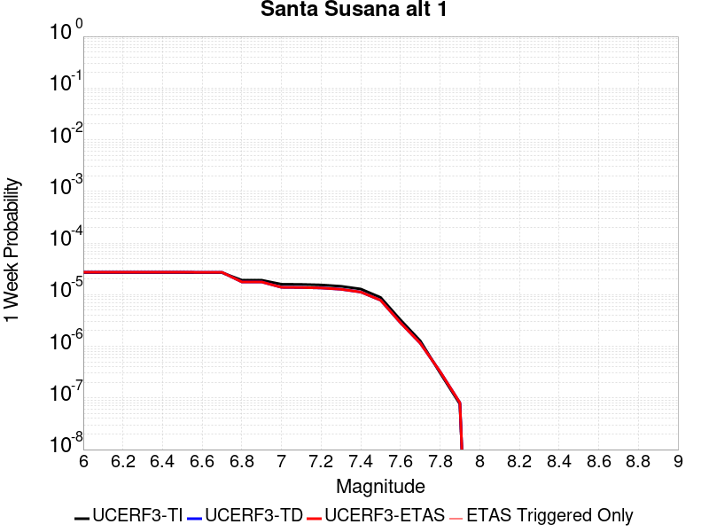 | 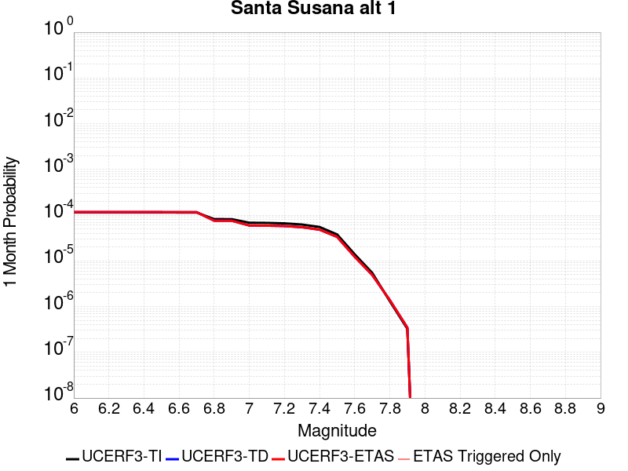 | 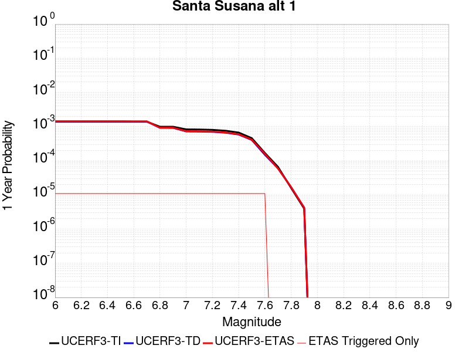 | 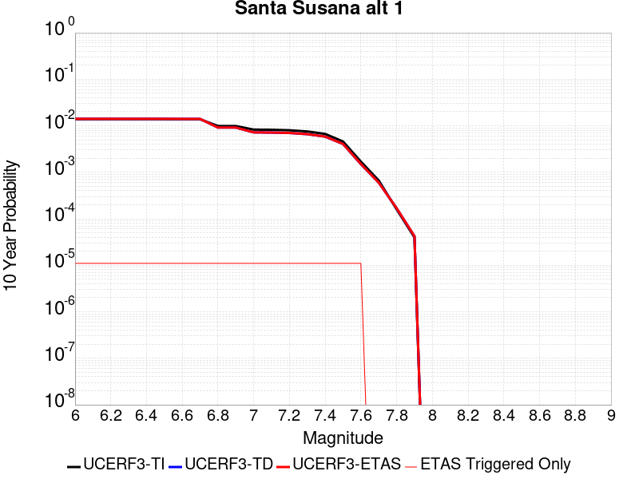 |

| Magnitude | 1 wk TI Prob | 1 wk TD Prob | 1 wk ETAS Prob | 1 wk ETAS/TD Gain | 1 wk ETAS Triggered Only | 1 mo TI Prob | 1 mo TD Prob | 1 mo ETAS Prob | 1 mo ETAS/TD Gain | 1 mo ETAS Triggered Only | 1 yr TI Prob | 1 yr TD Prob | 1 yr ETAS Prob | 1 yr ETAS/TD Gain | 1 yr ETAS Triggered Only | 10 yr TI Prob | 10 yr TD Prob | 10 yr ETAS Prob | 10 yr ETAS/TD Gain | 10 yr ETAS Triggered Only |
|-----|-----|-----|-----|-----|-----|-----|-----|-----|-----|-----|-----|-----|-----|-----|-----|-----|-----|-----|-----|-----|
| 6.0 | 2.674877E-5 | 2.7203165E-5 | 2.7203165E-5 | 1.0 | 0.0 | 1.1463255E-4 | 1.1658043E-4 | 1.1658043E-4 | 1.0 | 0.0 | 0.0013947578 | 0.0014185562 | 0.0014295296 | 1.0077356 | 1.0989011E-5 | 0.013860362 | 0.014106779 | 0.014117613 | 1.000768 | 1.0989011E-5 |
| 6.1 | 2.674877E-5 | 2.7203165E-5 | 2.7203165E-5 | 1.0 | 0.0 | 1.1463255E-4 | 1.1658043E-4 | 1.1658043E-4 | 1.0 | 0.0 | 0.0013947578 | 0.0014185562 | 0.0014295296 | 1.0077356 | 1.0989011E-5 | 0.013860362 | 0.014106779 | 0.014117613 | 1.000768 | 1.0989011E-5 |
| 6.2 | 2.674877E-5 | 2.7203165E-5 | 2.7203165E-5 | 1.0 | 0.0 | 1.1463255E-4 | 1.1658043E-4 | 1.1658043E-4 | 1.0 | 0.0 | 0.0013947578 | 0.0014185562 | 0.0014295296 | 1.0077356 | 1.0989011E-5 | 0.013860362 | 0.014106779 | 0.014117613 | 1.000768 | 1.0989011E-5 |
| 6.3 | 2.674877E-5 | 2.7203165E-5 | 2.7203165E-5 | 1.0 | 0.0 | 1.1463255E-4 | 1.1658043E-4 | 1.1658043E-4 | 1.0 | 0.0 | 0.0013947578 | 0.0014185562 | 0.0014295296 | 1.0077356 | 1.0989011E-5 | 0.013860362 | 0.014106779 | 0.014117613 | 1.000768 | 1.0989011E-5 |
| 6.4 | 2.674877E-5 | 2.7203165E-5 | 2.7203165E-5 | 1.0 | 0.0 | 1.1463255E-4 | 1.1658043E-4 | 1.1658043E-4 | 1.0 | 0.0 | 0.0013947578 | 0.0014185562 | 0.0014295296 | 1.0077356 | 1.0989011E-5 | 0.013860362 | 0.014106779 | 0.014117613 | 1.000768 | 1.0989011E-5 |
| 6.5 | 2.674877E-5 | 2.7203165E-5 | 2.7203165E-5 | 1.0 | 0.0 | 1.1463255E-4 | 1.1658043E-4 | 1.1658043E-4 | 1.0 | 0.0 | 0.0013947578 | 0.0014185562 | 0.0014295296 | 1.0077356 | 1.0989011E-5 | 0.013860362 | 0.014106779 | 0.014117613 | 1.000768 | 1.0989011E-5 |
| 6.6 | 2.6647976E-5 | 2.7079474E-5 | 2.7079474E-5 | 1.0 | 0.0 | 1.14200615E-4 | 1.1605037E-4 | 1.1605037E-4 | 1.0 | 0.0 | 0.0013895056 | 0.0014121113 | 0.0014230848 | 1.007771 | 1.0989011E-5 | 0.013808494 | 0.01404315 | 0.014053985 | 1.0007715 | 1.0989011E-5 |
| 6.7 | 2.6647976E-5 | 2.7079474E-5 | 2.7079474E-5 | 1.0 | 0.0 | 1.14200615E-4 | 1.1605037E-4 | 1.1605037E-4 | 1.0 | 0.0 | 0.0013895056 | 0.0014121113 | 0.0014230848 | 1.007771 | 1.0989011E-5 | 0.013808494 | 0.01404315 | 0.014053985 | 1.0007715 | 1.0989011E-5 |
| 6.8 | 1.9073179E-5 | 1.7639932E-5 | 1.7639932E-5 | 1.0 | 0.0 | 8.1739636E-5 | 7.559762E-5 | 7.559762E-5 | 1.0 | 0.0 | 9.947256E-4 | 9.200305E-4 | 9.310094E-4 | 1.0119332 | 1.0989011E-5 | 0.009902848 | 0.009164471 | 0.009175359 | 1.0011882 | 1.0989011E-5 |
| 6.9 | 1.9041876E-5 | 1.762206E-5 | 1.762206E-5 | 1.0 | 0.0 | 8.160549E-5 | 7.552103E-5 | 7.552103E-5 | 1.0 | 0.0 | 9.930939E-4 | 9.1909885E-4 | 9.3007775E-4 | 1.0119452 | 1.0989011E-5 | 0.0098866755 | 0.009155231 | 0.00916612 | 1.0011894 | 1.0989011E-5 |
| 7.0 | 1.5917482E-5 | 1.3865653E-5 | 1.3865653E-5 | 1.0 | 0.0 | 6.8215995E-5 | 5.94229E-5 | 5.94229E-5 | 1.0 | 0.0 | 8.302132E-4 | 7.232383E-4 | 7.342194E-4 | 1.0151832 | 1.0989011E-5 | 0.008271185 | 0.007209741 | 0.0072206506 | 1.0015132 | 1.0989011E-5 |
| 7.1 | 1.577788E-5 | 1.3745644E-5 | 1.3745644E-5 | 1.0 | 0.0 | 6.761774E-5 | 5.8908598E-5 | 5.8908598E-5 | 1.0 | 0.0 | 8.2293496E-4 | 7.1698084E-4 | 7.2796195E-4 | 1.0153158 | 1.0989011E-5 | 0.008198941 | 0.00714757 | 0.0071584806 | 1.0015265 | 1.0989011E-5 |
| 7.2 | 1.5416446E-5 | 1.34716765E-5 | 1.34716765E-5 | 1.0 | 0.0 | 6.606882E-5 | 5.77345E-5 | 5.77345E-5 | 1.0 | 0.0 | 8.0409093E-4 | 7.026955E-4 | 7.136768E-4 | 1.0156274 | 1.0989011E-5 | 0.008011877 | 0.0070056207 | 0.007016533 | 1.0015576 | 1.0989011E-5 |
| 7.3 | 1.4534083E-5 | 1.2719466E-5 | 1.2719466E-5 | 1.0 | 0.0 | 6.228744E-5 | 5.4510885E-5 | 5.4510885E-5 | 1.0 | 0.0 | 7.580857E-4 | 6.634724E-4 | 6.744541E-4 | 1.0165519 | 1.0989011E-5 | 0.007555048 | 0.0066157673 | 0.0066266838 | 1.0016501 | 1.0989011E-5 |
| 7.4 | 1.2858995E-5 | 1.1230965E-5 | 1.1230965E-5 | 1.0 | 0.0 | 5.5108816E-5 | 4.8131842E-5 | 4.8131842E-5 | 1.0 | 0.0 | 6.7074323E-4 | 5.8585155E-4 | 5.968342E-4 | 1.0187464 | 1.0989011E-5 | 0.0066872234 | 0.0058438466 | 0.005854771 | 1.0018694 | 1.0989011E-5 |
| 7.5 | 8.827668E-6 | 7.806206E-6 | 7.806206E-6 | 1.0 | 0.0 | 3.7832317E-5 | 3.345475E-5 | 3.345475E-5 | 1.0 | 0.0 | 4.605111E-4 | 4.0723794E-4 | 4.1822248E-4 | 1.0269732 | 1.0989011E-5 | 0.0045955796 | 0.0040651658 | 0.0040761097 | 1.0026922 | 1.0989011E-5 |
| 7.6 | 3.2533426E-6 | 2.8721674E-6 | 2.8721674E-6 | 1.0 | 0.0 | 1.3942822E-5 | 1.2309233E-5 | 1.2309233E-5 | 1.0 | 0.0 | 1.6974064E-4 | 1.4985498E-4 | 1.6084235E-4 | 1.07332 | 1.0989011E-5 | 0.0016961104 | 0.0014975761 | 0.0015085487 | 1.0073268 | 1.0989011E-5 |
| 7.7 | 1.2751709E-6 | 1.149196E-6 | 1.149196E-6 | 1.0 | 0.0 | 5.4650063E-6 | 4.9251166E-6 | 4.9251166E-6 | 1.0 | 0.0 | 6.653442E-5 | 5.9961738E-5 | 5.9961738E-5 | 1.0 | 0.0 | 6.6514505E-4 | 5.994645E-4 | 5.994645E-4 | 1.0 | 0.0 |
| 7.8 | 3.067544E-7 | 3.2402698E-7 | 3.2402698E-7 | 1.0 | 0.0 | 1.3146611E-6 | 1.3886864E-6 | 1.3886864E-6 | 1.0 | 0.0 | 1.600588E-5 | 1.6907137E-5 | 1.6907137E-5 | 1.0 | 0.0 | 1.6004729E-4 | 1.6905954E-4 | 1.6905954E-4 | 1.0 | 0.0 |
| 7.9 | 7.622999E-8 | 8.088511E-8 | 8.088511E-8 | 1.0 | 0.0 | 3.2669993E-7 | 3.4665044E-7 | 3.4665044E-7 | 1.0 | 0.0 | 3.977564E-6 | 4.220463E-6 | 4.220463E-6 | 1.0 | 0.0 | 3.977493E-5 | 4.2204036E-5 | 4.2204036E-5 | 1.0 | 0.0 |

## Sheephole
*[(top)](#table-of-contents)*

| 1 Week | 1 Month | 1 Year | 10 Year |
|-----|-----|-----|-----|
| 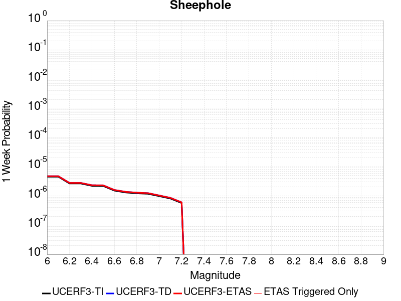 | 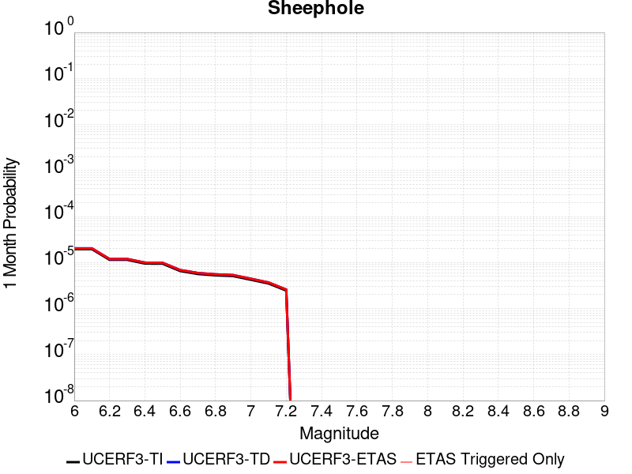 | 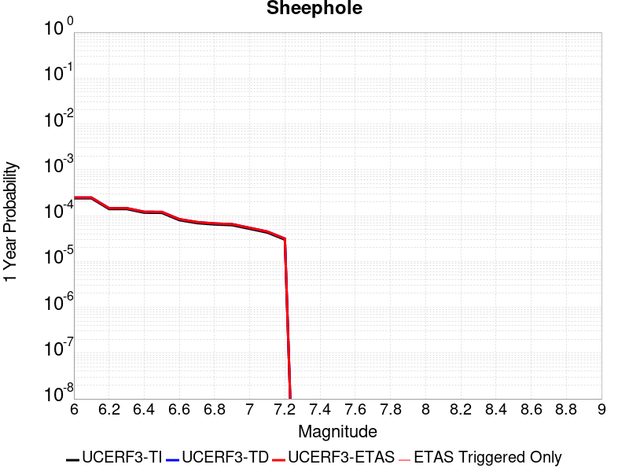 | 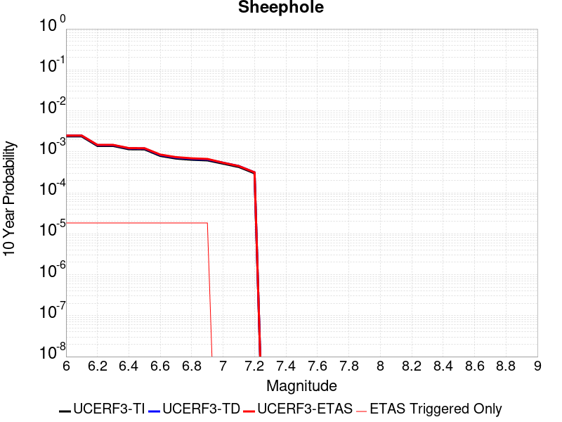 |

| Magnitude | 1 wk TI Prob | 1 wk TD Prob | 1 wk ETAS Prob | 1 wk ETAS/TD Gain | 1 wk ETAS Triggered Only | 1 mo TI Prob | 1 mo TD Prob | 1 mo ETAS Prob | 1 mo ETAS/TD Gain | 1 mo ETAS Triggered Only | 1 yr TI Prob | 1 yr TD Prob | 1 yr ETAS Prob | 1 yr ETAS/TD Gain | 1 yr ETAS Triggered Only | 10 yr TI Prob | 10 yr TD Prob | 10 yr ETAS Prob | 10 yr ETAS/TD Gain | 10 yr ETAS Triggered Only |
|-----|-----|-----|-----|-----|-----|-----|-----|-----|-----|-----|-----|-----|-----|-----|-----|-----|-----|-----|-----|-----|
| 6.0 | 4.5579695E-6 | 4.741465E-6 | 4.741465E-6 | 1.0 | 0.0 | 1.9534009E-5 | 2.0320438E-5 | 2.0320438E-5 | 1.0 | 0.0 | 2.3780059E-4 | 2.473788E-4 | 2.473788E-4 | 1.0 | 0.0 | 0.0023754628 | 0.0024715788 | 0.0024825404 | 1.0044352 | 1.0989011E-5 |
| 6.1 | 4.5579695E-6 | 4.741465E-6 | 4.741465E-6 | 1.0 | 0.0 | 1.9534009E-5 | 2.0320438E-5 | 2.0320438E-5 | 1.0 | 0.0 | 2.3780059E-4 | 2.473788E-4 | 2.473788E-4 | 1.0 | 0.0 | 0.0023754628 | 0.0024715788 | 0.0024825404 | 1.0044352 | 1.0989011E-5 |
| 6.2 | 2.6677674E-6 | 2.7875271E-6 | 2.7875271E-6 | 1.0 | 0.0 | 1.1433239E-5 | 1.1946496E-5 | 1.1946496E-5 | 1.0 | 0.0 | 1.3919079E-4 | 1.4543996E-4 | 1.4543996E-4 | 1.0 | 0.0 | 0.0013910364 | 0.0014535537 | 0.0014645266 | 1.0075492 | 1.0989011E-5 |
| 6.3 | 2.6677674E-6 | 2.7875271E-6 | 2.7875271E-6 | 1.0 | 0.0 | 1.1433239E-5 | 1.1946496E-5 | 1.1946496E-5 | 1.0 | 0.0 | 1.3919079E-4 | 1.4543996E-4 | 1.4543996E-4 | 1.0 | 0.0 | 0.0013910364 | 0.0014535537 | 0.0014645266 | 1.0075492 | 1.0989011E-5 |
| 6.4 | 2.2159759E-6 | 2.3229977E-6 | 2.3229977E-6 | 1.0 | 0.0 | 9.497005E-6 | 9.955671E-6 | 9.955671E-6 | 1.0 | 0.0 | 1.156199E-4 | 1.2120436E-4 | 1.2120436E-4 | 1.0 | 0.0 | 0.0011555976 | 0.001211462 | 0.0012224376 | 1.0090599 | 1.0989011E-5 |
| 6.5 | 2.1986082E-6 | 2.3048772E-6 | 2.3048772E-6 | 1.0 | 0.0 | 9.4225725E-6 | 9.878012E-6 | 9.878012E-6 | 1.0 | 0.0 | 1.1471378E-4 | 1.2025897E-4 | 1.2025897E-4 | 1.0 | 0.0 | 0.0011465458 | 0.0012020182 | 0.001212994 | 1.0091312 | 1.0989011E-5 |
| 6.6 | 1.5232331E-6 | 1.6019796E-6 | 1.6019796E-6 | 1.0 | 0.0 | 6.5281256E-6 | 6.86561E-6 | 6.86561E-6 | 1.0 | 0.0 | 7.947703E-5 | 8.3585786E-5 | 8.3585786E-5 | 1.0 | 0.0 | 7.9448614E-4 | 8.355622E-4 | 8.46542E-4 | 1.0131407 | 1.0989011E-5 |
| 6.7 | 1.3137362E-6 | 1.3828962E-6 | 1.3828962E-6 | 1.0 | 0.0 | 5.6302856E-6 | 5.9266854E-6 | 5.9266854E-6 | 1.0 | 0.0 | 6.854657E-5 | 7.215515E-5 | 7.215515E-5 | 1.0 | 0.0 | 6.8525434E-4 | 7.213311E-4 | 7.3231215E-4 | 1.0152234 | 1.0989011E-5 |
| 6.8 | 1.2275751E-6 | 1.292357E-6 | 1.292357E-6 | 1.0 | 0.0 | 5.2610258E-6 | 5.5386618E-6 | 5.5386618E-6 | 1.0 | 0.0 | 6.4051106E-5 | 6.7431254E-5 | 6.7431254E-5 | 1.0 | 0.0 | 6.4032647E-4 | 6.7412126E-4 | 6.851029E-4 | 1.0162903 | 1.0989011E-5 |
| 6.9 | 1.1837088E-6 | 1.2461717E-6 | 1.2461717E-6 | 1.0 | 0.0 | 5.0730278E-6 | 5.3407257E-6 | 5.3407257E-6 | 1.0 | 0.0 | 6.176237E-5 | 6.502153E-5 | 6.502153E-5 | 1.0 | 0.0 | 6.17452E-4 | 6.500382E-4 | 6.6102005E-4 | 1.0168942 | 1.0989011E-5 |
| 7.0 | 9.849371E-7 | 1.0366865E-6 | 1.0366865E-6 | 1.0 | 0.0 | 4.2211523E-6 | 4.4429353E-6 | 4.4429353E-6 | 1.0 | 0.0 | 5.1391315E-5 | 5.40915E-5 | 5.40915E-5 | 1.0 | 0.0 | 5.137943E-4 | 5.407934E-4 | 5.407934E-4 | 1.0 | 0.0 |
| 7.1 | 8.1643645E-7 | 8.592146E-7 | 8.592146E-7 | 1.0 | 0.0 | 3.4990085E-6 | 3.6823437E-6 | 3.6823437E-6 | 1.0 | 0.0 | 4.2599597E-5 | 4.48317E-5 | 4.48317E-5 | 1.0 | 0.0 | 4.259143E-4 | 4.4823517E-4 | 4.4823517E-4 | 1.0 | 0.0 |
| 7.2 | 5.7295756E-7 | 6.029837E-7 | 6.029837E-7 | 1.0 | 0.0 | 2.45553E-6 | 2.5842137E-6 | 2.5842137E-6 | 1.0 | 0.0 | 2.9895667E-5 | 3.1462416E-5 | 3.1462416E-5 | 1.0 | 0.0 | 2.9891645E-4 | 3.145863E-4 | 3.145863E-4 | 1.0 | 0.0 |

## Elmore Ranch
*[(top)](#table-of-contents)*

| 1 Week | 1 Month | 1 Year | 10 Year |
|-----|-----|-----|-----|
| 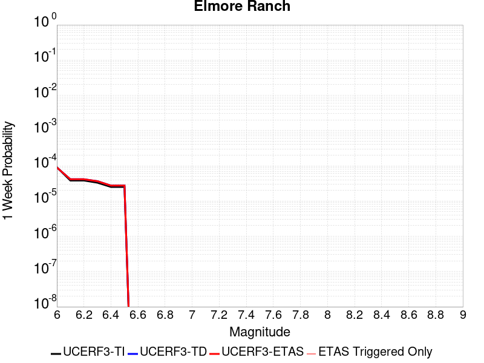 | 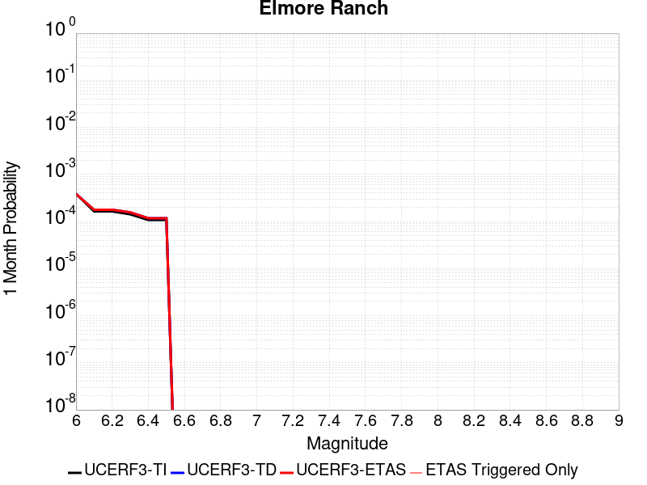 | 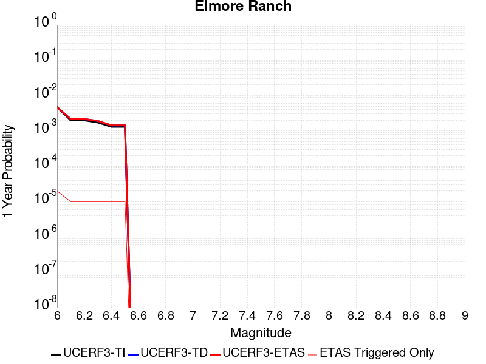 | 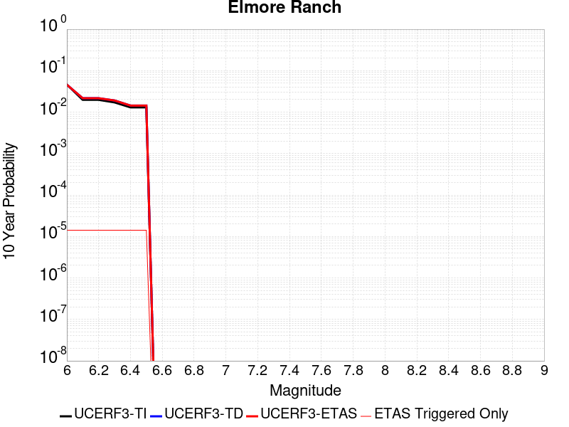 |

| Magnitude | 1 wk TI Prob | 1 wk TD Prob | 1 wk ETAS Prob | 1 wk ETAS/TD Gain | 1 wk ETAS Triggered Only | 1 mo TI Prob | 1 mo TD Prob | 1 mo ETAS Prob | 1 mo ETAS/TD Gain | 1 mo ETAS Triggered Only | 1 yr TI Prob | 1 yr TD Prob | 1 yr ETAS Prob | 1 yr ETAS/TD Gain | 1 yr ETAS Triggered Only | 10 yr TI Prob | 10 yr TD Prob | 10 yr ETAS Prob | 10 yr ETAS/TD Gain | 10 yr ETAS Triggered Only |
|-----|-----|-----|-----|-----|-----|-----|-----|-----|-----|-----|-----|-----|-----|-----|-----|-----|-----|-----|-----|-----|
| 6.0 | 9.102099E-5 | 8.956844E-5 | 8.956844E-5 | 1.0 | 0.0 | 3.9003167E-4 | 3.8381395E-4 | 3.8381395E-4 | 1.0 | 0.0 | 0.0047383 | 0.0046644 | 0.004675338 | 1.002345 | 1.0989011E-5 | 0.046385348 | 0.04589023 | 0.045900717 | 1.0002285 | 1.0989011E-5 |
| 6.1 | 3.8306698E-5 | 4.1517887E-5 | 4.1517887E-5 | 1.0 | 0.0 | 1.6416123E-4 | 1.7792576E-4 | 1.7792576E-4 | 1.0 | 0.0 | 0.0019968306 | 0.0021639827 | 0.0021749479 | 1.0050671 | 1.0989011E-5 | 0.019789828 | 0.02163723 | 0.02164798 | 1.0004969 | 1.0989011E-5 |
| 6.2 | 3.8306698E-5 | 4.1517887E-5 | 4.1517887E-5 | 1.0 | 0.0 | 1.6416123E-4 | 1.7792576E-4 | 1.7792576E-4 | 1.0 | 0.0 | 0.0019968306 | 0.0021639827 | 0.0021749479 | 1.0050671 | 1.0989011E-5 | 0.019789828 | 0.02163723 | 0.02164798 | 1.0004969 | 1.0989011E-5 |
| 6.3 | 3.3197924E-5 | 3.656958E-5 | 3.656958E-5 | 1.0 | 0.0 | 1.4226905E-4 | 1.5672133E-4 | 1.5672133E-4 | 1.0 | 0.0 | 0.0017307495 | 0.0019066149 | 0.0019175829 | 1.0057527 | 1.0989011E-5 | 0.017173318 | 0.019097272 | 0.019108051 | 1.0005645 | 1.0989011E-5 |
| 6.4 | 2.5148964E-5 | 2.7429849E-5 | 2.7429849E-5 | 1.0 | 0.0 | 1.0777682E-4 | 1.1755485E-4 | 1.1755485E-4 | 1.0 | 0.0 | 0.0013113929 | 0.0014309391 | 0.0014419124 | 1.0076686 | 1.0989011E-5 | 0.01303681 | 0.014392035 | 0.014402865 | 1.0007526 | 1.0989011E-5 |
| 6.5 | 2.5148964E-5 | 2.7429849E-5 | 2.7429849E-5 | 1.0 | 0.0 | 1.0777682E-4 | 1.1755485E-4 | 1.1755485E-4 | 1.0 | 0.0 | 0.0013113929 | 0.0014309391 | 0.0014419124 | 1.0076686 | 1.0989011E-5 | 0.01303681 | 0.014392035 | 0.014402865 | 1.0007526 | 1.0989011E-5 |

## San Jacinto (Superstition Mtn)
*[(top)](#table-of-contents)*

| 1 Week | 1 Month | 1 Year | 10 Year |
|-----|-----|-----|-----|
| 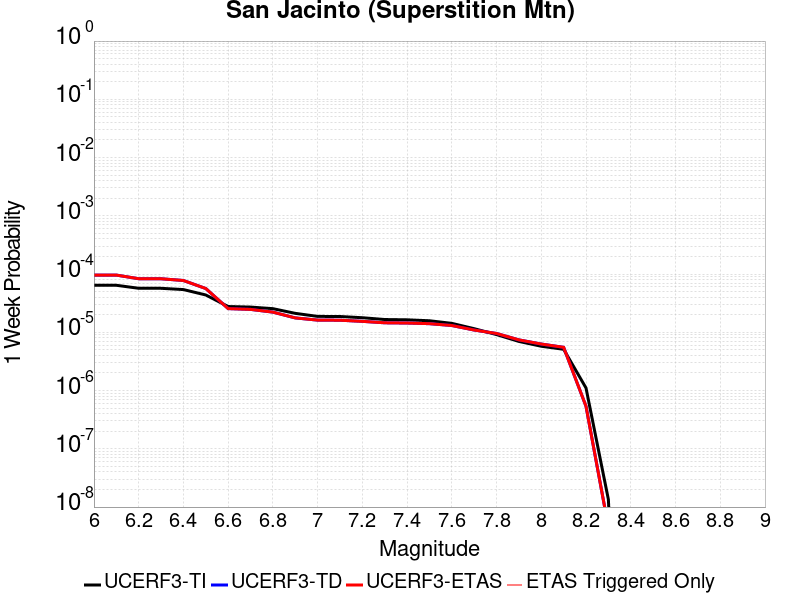 | 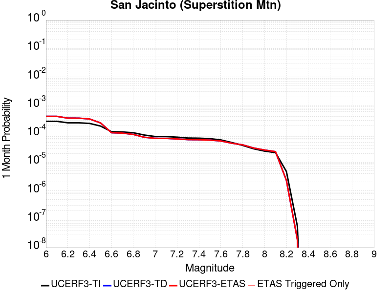 | 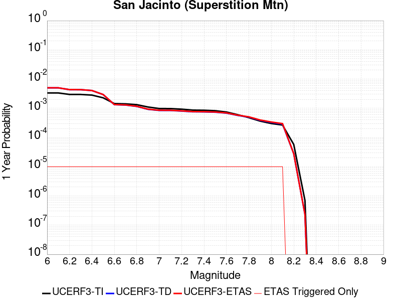 |  |

| Magnitude | 1 wk TI Prob | 1 wk TD Prob | 1 wk ETAS Prob | 1 wk ETAS/TD Gain | 1 wk ETAS Triggered Only | 1 mo TI Prob | 1 mo TD Prob | 1 mo ETAS Prob | 1 mo ETAS/TD Gain | 1 mo ETAS Triggered Only | 1 yr TI Prob | 1 yr TD Prob | 1 yr ETAS Prob | 1 yr ETAS/TD Gain | 1 yr ETAS Triggered Only | 10 yr TI Prob | 10 yr TD Prob | 10 yr ETAS Prob | 10 yr ETAS/TD Gain | 10 yr ETAS Triggered Only |
|-----|-----|-----|-----|-----|-----|-----|-----|-----|-----|-----|-----|-----|-----|-----|-----|-----|-----|-----|-----|-----|
| 6.0 | 6.4193904E-5 | 9.60538E-5 | 9.60538E-5 | 1.0 | 0.0 | 2.7508775E-4 | 4.11604E-4 | 4.11604E-4 | 1.0 | 0.0 | 0.0033440501 | 0.005001081 | 0.005012015 | 1.0021863 | 1.0989011E-5 | 0.03294174 | 0.048852775 | 0.04886323 | 1.000214 | 1.0989011E-5 |
| 6.1 | 6.4193904E-5 | 9.60538E-5 | 9.60538E-5 | 1.0 | 0.0 | 2.7508775E-4 | 4.11604E-4 | 4.11604E-4 | 1.0 | 0.0 | 0.0033440501 | 0.005001081 | 0.005012015 | 1.0021863 | 1.0989011E-5 | 0.03294174 | 0.048852775 | 0.04886323 | 1.000214 | 1.0989011E-5 |
| 6.2 | 5.7023593E-5 | 8.319899E-5 | 8.319899E-5 | 1.0 | 0.0 | 2.4436394E-4 | 3.565278E-4 | 3.565278E-4 | 1.0 | 0.0 | 0.002971072 | 0.0043337136 | 0.004344655 | 1.0025247 | 1.0989011E-5 | 0.029316625 | 0.042531293 | 0.042541817 | 1.0002474 | 1.0989011E-5 |
| 6.3 | 5.6940098E-5 | 8.304432E-5 | 8.304432E-5 | 1.0 | 0.0 | 2.4400617E-4 | 3.5586508E-4 | 3.5586508E-4 | 1.0 | 0.0 | 0.002966728 | 0.004325677 | 0.004336619 | 1.0025294 | 1.0989011E-5 | 0.029274331 | 0.04245453 | 0.042465053 | 1.0002478 | 1.0989011E-5 |
| 6.4 | 5.4171585E-5 | 7.753727E-5 | 7.753727E-5 | 1.0 | 0.0 | 2.3214328E-4 | 3.3226956E-4 | 3.3226956E-4 | 1.0 | 0.0 | 0.0028226813 | 0.0040395265 | 0.0040504714 | 1.0027094 | 1.0989011E-5 | 0.02787096 | 0.039743558 | 0.03975411 | 1.0002655 | 1.0989011E-5 |
| 6.5 | 4.375144E-5 | 5.6473516E-5 | 5.6473516E-5 | 1.0 | 0.0 | 1.874927E-4 | 2.4201353E-4 | 2.4201353E-4 | 1.0 | 0.0 | 0.0022803338 | 0.0029437093 | 0.002954666 | 1.0037221 | 1.0989011E-5 | 0.022570757 | 0.0292634 | 0.029274067 | 1.0003645 | 1.0989011E-5 |
| 6.6 | 2.772192E-5 | 2.5538078E-5 | 2.5538078E-5 | 1.0 | 0.0 | 1.1880282E-4 | 1.0944443E-4 | 1.0944443E-4 | 1.0 | 0.0 | 0.0014454646 | 0.0013316908 | 0.0013426652 | 1.0082409 | 1.0989011E-5 | 0.014360986 | 0.01356631 | 0.013577149 | 1.0007991 | 1.0989011E-5 |
| 6.7 | 2.7124124E-5 | 2.4748882E-5 | 2.4748882E-5 | 1.0 | 0.0 | 1.1624106E-4 | 1.06062434E-4 | 1.06062434E-4 | 1.0 | 0.0 | 0.0014143161 | 0.0012905644 | 0.0013015392 | 1.0085039 | 1.0989011E-5 | 0.014053487 | 0.013159662 | 0.013170506 | 1.0008241 | 1.0989011E-5 |
| 6.8 | 2.5475807E-5 | 2.2212787E-5 | 2.2212787E-5 | 1.0 | 0.0 | 1.0917746E-4 | 9.519425E-5 | 9.519425E-5 | 1.0 | 0.0 | 0.001328425 | 0.0011583858 | 0.0011693621 | 1.0094755 | 1.0989011E-5 | 0.0132051185 | 0.011847346 | 0.011858205 | 1.0009166 | 1.0989011E-5 |
| 6.9 | 2.1162023E-5 | 1.7670965E-5 | 1.7670965E-5 | 1.0 | 0.0 | 9.069123E-5 | 7.573053E-5 | 7.573053E-5 | 1.0 | 0.0 | 0.0011036064 | 9.2163304E-4 | 9.326119E-4 | 1.0119125 | 1.0989011E-5 | 0.010981417 | 0.009470261 | 0.009481145 | 1.0011494 | 1.0989011E-5 |
| 7.0 | 1.8754288E-5 | 1.6204316E-5 | 1.6204316E-5 | 1.0 | 0.0 | 8.037304E-5 | 6.944524E-5 | 6.944524E-5 | 1.0 | 0.0 | 9.781026E-4 | 8.4517023E-4 | 8.5615E-4 | 1.0129912 | 1.0989011E-5 | 0.009738087 | 0.008692401 | 0.008703295 | 1.0012532 | 1.0989011E-5 |
| 7.1 | 1.8678527E-5 | 1.612942E-5 | 1.612942E-5 | 1.0 | 0.0 | 8.0048376E-5 | 6.912426E-5 | 6.912426E-5 | 1.0 | 0.0 | 9.7415317E-4 | 8.412654E-4 | 8.522452E-4 | 1.0130515 | 1.0989011E-5 | 0.009698939 | 0.008653339 | 0.008664233 | 1.001259 | 1.0989011E-5 |
| 7.2 | 1.7804578E-5 | 1.5423555E-5 | 1.5423555E-5 | 1.0 | 0.0 | 7.6303106E-5 | 6.609929E-5 | 6.609929E-5 | 1.0 | 0.0 | 9.285943E-4 | 8.04464E-4 | 8.1544416E-4 | 1.0136491 | 1.0989011E-5 | 0.009247236 | 0.008284431 | 0.008295329 | 1.0013155 | 1.0989011E-5 |
| 7.3 | 1.6583685E-5 | 1.457218E-5 | 1.457218E-5 | 1.0 | 0.0 | 7.1070994E-5 | 6.2450716E-5 | 6.2450716E-5 | 1.0 | 0.0 | 8.649459E-4 | 7.6007424E-4 | 7.710549E-4 | 1.0144469 | 1.0989011E-5 | 0.00861587 | 0.007839502 | 0.007850405 | 1.0013908 | 1.0989011E-5 |
| 7.4 | 1.6387552E-5 | 1.4436985E-5 | 1.4436985E-5 | 1.0 | 0.0 | 7.023047E-5 | 6.187134E-5 | 6.187134E-5 | 1.0 | 0.0 | 8.5472054E-4 | 7.5302523E-4 | 7.6400593E-4 | 1.0145822 | 1.0989011E-5 | 0.008514405 | 0.0077688443 | 0.0077797477 | 1.0014035 | 1.0989011E-5 |
| 7.5 | 1.5790754E-5 | 1.4077255E-5 | 1.4077255E-5 | 1.0 | 0.0 | 6.767291E-5 | 6.0329712E-5 | 6.0329712E-5 | 1.0 | 0.0 | 8.236062E-4 | 7.342687E-4 | 7.452496E-4 | 1.0149549 | 1.0989011E-5 | 0.008205604 | 0.0075791935 | 0.0075900992 | 1.0014389 | 1.0989011E-5 |
| 7.6 | 1.4248672E-5 | 1.3095178E-5 | 1.3095178E-5 | 1.0 | 0.0 | 6.106431E-5 | 5.612099E-5 | 5.612099E-5 | 1.0 | 0.0 | 7.432043E-4 | 6.830606E-4 | 6.940421E-4 | 1.0160769 | 1.0989011E-5 | 0.007407237 | 0.007061244 | 0.0070721554 | 1.0015453 | 1.0989011E-5 |
| 7.7 | 1.15449975E-5 | 1.0942154E-5 | 1.0942154E-5 | 1.0 | 0.0 | 4.947762E-5 | 4.689411E-5 | 4.689411E-5 | 1.0 | 0.0 | 6.022235E-4 | 5.70787E-4 | 5.8176974E-4 | 1.0192415 | 1.0989011E-5 | 0.006005941 | 0.005930368 | 0.0059412913 | 1.001842 | 1.0989011E-5 |
| 7.8 | 9.1391985E-6 | 9.551328E-6 | 9.551328E-6 | 1.0 | 0.0 | 3.9167408E-5 | 4.0933624E-5 | 4.0933624E-5 | 1.0 | 0.0 | 4.767588E-4 | 4.982535E-4 | 5.0923706E-4 | 1.0220441 | 1.0989011E-5 | 0.0047573727 | 0.005196131 | 0.0052070627 | 1.0021038 | 1.0989011E-5 |
| 7.9 | 6.973017E-6 | 7.415277E-6 | 7.415277E-6 | 1.0 | 0.0 | 2.9884017E-5 | 3.1779375E-5 | 3.1779375E-5 | 1.0 | 0.0 | 3.6377716E-4 | 3.8684573E-4 | 3.9783047E-4 | 1.0283957 | 1.0989011E-5 | 0.0036318225 | 0.0040692138 | 0.004080158 | 1.0026895 | 1.0989011E-5 |
| 8.0 | 5.7638235E-6 | 6.2902063E-6 | 6.2902063E-6 | 1.0 | 0.0 | 2.4701867E-5 | 2.6957752E-5 | 2.6957752E-5 | 1.0 | 0.0 | 3.0070372E-4 | 3.281617E-4 | 3.391471E-4 | 1.0334756 | 1.0989011E-5 | 0.0030029714 | 0.0034693817 | 0.0034803327 | 1.0031564 | 1.0989011E-5 |
| 8.1 | 5.1124434E-6 | 5.523319E-6 | 5.523319E-6 | 1.0 | 0.0 | 2.1910288E-5 | 2.3671157E-5 | 2.3671157E-5 | 1.0 | 0.0 | 2.6672508E-4 | 2.881587E-4 | 2.9914454E-4 | 1.0381243 | 1.0989011E-5 | 0.0026640517 | 0.0030549255 | 0.0030658809 | 1.0035862 | 1.0989011E-5 |
| 8.2 | 1.1075938E-6 | 5.3750637E-7 | 5.3750637E-7 | 1.0 | 0.0 | 4.7468216E-6 | 2.3035968E-6 | 2.3035968E-6 | 1.0 | 0.0 | 5.779102E-5 | 2.8045952E-5 | 2.8045952E-5 | 1.0 | 0.0 | 5.777599E-4 | 3.1561012E-4 | 3.1561012E-4 | 1.0 | 0.0 |
| 8.3 | 1.3584393E-8 | 4.5106323E-9 | 4.5106323E-9 | 1.0 | 0.0 | 5.8218827E-8 | 1.9331281E-8 | 1.9331281E-8 | 1.0 | 0.0 | 7.0881396E-7 | 2.3535836E-7 | 2.3535836E-7 | 1.0 | 0.0 | 7.0881174E-6 | 2.6369387E-6 | 2.6369387E-6 | 1.0 | 0.0 |

## Pitas Point (Lower)-Montalvo
*[(top)](#table-of-contents)*

| 1 Week | 1 Month | 1 Year | 10 Year |
|-----|-----|-----|-----|
| 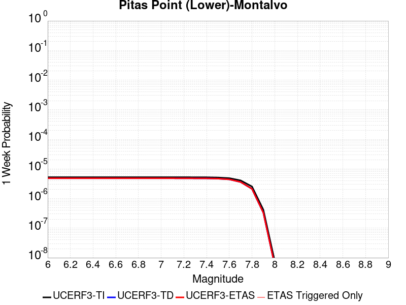 | 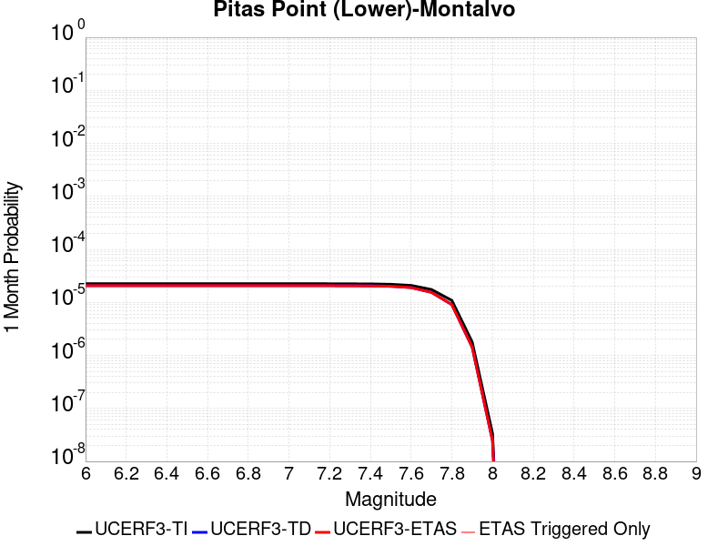 | 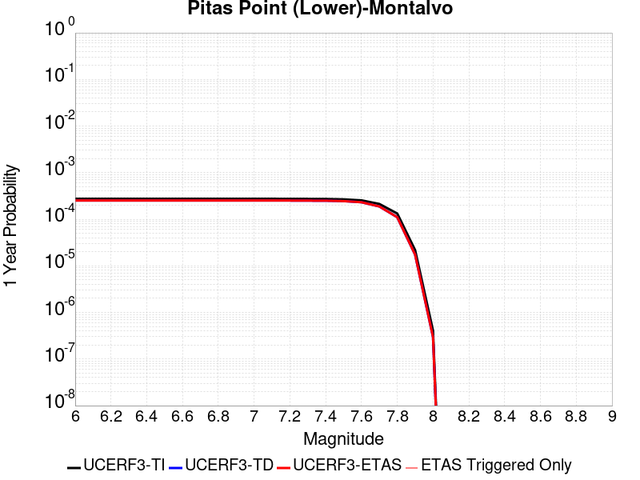 | 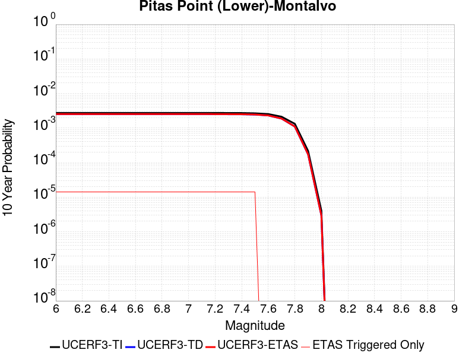 |

| Magnitude | 1 wk TI Prob | 1 wk TD Prob | 1 wk ETAS Prob | 1 wk ETAS/TD Gain | 1 wk ETAS Triggered Only | 1 mo TI Prob | 1 mo TD Prob | 1 mo ETAS Prob | 1 mo ETAS/TD Gain | 1 mo ETAS Triggered Only | 1 yr TI Prob | 1 yr TD Prob | 1 yr ETAS Prob | 1 yr ETAS/TD Gain | 1 yr ETAS Triggered Only | 10 yr TI Prob | 10 yr TD Prob | 10 yr ETAS Prob | 10 yr ETAS/TD Gain | 10 yr ETAS Triggered Only |
|-----|-----|-----|-----|-----|-----|-----|-----|-----|-----|-----|-----|-----|-----|-----|-----|-----|-----|-----|-----|-----|
| 6.0 | 5.2543637E-6 | 4.8381894E-6 | 4.8381894E-6 | 1.0 | 0.0 | 2.2518509E-5 | 2.0734935E-5 | 2.0734935E-5 | 1.0 | 0.0 | 2.7412834E-4 | 2.524189E-4 | 2.524189E-4 | 1.0 | 0.0 | 0.0027379042 | 0.0025213545 | 0.0025323157 | 1.0043474 | 1.0989011E-5 |
| 6.1 | 5.2543637E-6 | 4.8381894E-6 | 4.8381894E-6 | 1.0 | 0.0 | 2.2518509E-5 | 2.0734935E-5 | 2.0734935E-5 | 1.0 | 0.0 | 2.7412834E-4 | 2.524189E-4 | 2.524189E-4 | 1.0 | 0.0 | 0.0027379042 | 0.0025213545 | 0.0025323157 | 1.0043474 | 1.0989011E-5 |
| 6.2 | 5.2543637E-6 | 4.8381894E-6 | 4.8381894E-6 | 1.0 | 0.0 | 2.2518509E-5 | 2.0734935E-5 | 2.0734935E-5 | 1.0 | 0.0 | 2.7412834E-4 | 2.524189E-4 | 2.524189E-4 | 1.0 | 0.0 | 0.0027379042 | 0.0025213545 | 0.0025323157 | 1.0043474 | 1.0989011E-5 |
| 6.3 | 5.2543637E-6 | 4.8381894E-6 | 4.8381894E-6 | 1.0 | 0.0 | 2.2518509E-5 | 2.0734935E-5 | 2.0734935E-5 | 1.0 | 0.0 | 2.7412834E-4 | 2.524189E-4 | 2.524189E-4 | 1.0 | 0.0 | 0.0027379042 | 0.0025213545 | 0.0025323157 | 1.0043474 | 1.0989011E-5 |
| 6.4 | 5.2543637E-6 | 4.8381894E-6 | 4.8381894E-6 | 1.0 | 0.0 | 2.2518509E-5 | 2.0734935E-5 | 2.0734935E-5 | 1.0 | 0.0 | 2.7412834E-4 | 2.524189E-4 | 2.524189E-4 | 1.0 | 0.0 | 0.0027379042 | 0.0025213545 | 0.0025323157 | 1.0043474 | 1.0989011E-5 |
| 6.5 | 5.2543637E-6 | 4.8381894E-6 | 4.8381894E-6 | 1.0 | 0.0 | 2.2518509E-5 | 2.0734935E-5 | 2.0734935E-5 | 1.0 | 0.0 | 2.7412834E-4 | 2.524189E-4 | 2.524189E-4 | 1.0 | 0.0 | 0.0027379042 | 0.0025213545 | 0.0025323157 | 1.0043474 | 1.0989011E-5 |
| 6.6 | 5.2543637E-6 | 4.8381894E-6 | 4.8381894E-6 | 1.0 | 0.0 | 2.2518509E-5 | 2.0734935E-5 | 2.0734935E-5 | 1.0 | 0.0 | 2.7412834E-4 | 2.524189E-4 | 2.524189E-4 | 1.0 | 0.0 | 0.0027379042 | 0.0025213545 | 0.0025323157 | 1.0043474 | 1.0989011E-5 |
| 6.7 | 5.2543637E-6 | 4.8381894E-6 | 4.8381894E-6 | 1.0 | 0.0 | 2.2518509E-5 | 2.0734935E-5 | 2.0734935E-5 | 1.0 | 0.0 | 2.7412834E-4 | 2.524189E-4 | 2.524189E-4 | 1.0 | 0.0 | 0.0027379042 | 0.0025213545 | 0.0025323157 | 1.0043474 | 1.0989011E-5 |
| 6.8 | 5.2543637E-6 | 4.8381894E-6 | 4.8381894E-6 | 1.0 | 0.0 | 2.2518509E-5 | 2.0734935E-5 | 2.0734935E-5 | 1.0 | 0.0 | 2.7412834E-4 | 2.524189E-4 | 2.524189E-4 | 1.0 | 0.0 | 0.0027379042 | 0.0025213545 | 0.0025323157 | 1.0043474 | 1.0989011E-5 |
| 6.9 | 5.2543637E-6 | 4.8381894E-6 | 4.8381894E-6 | 1.0 | 0.0 | 2.2518509E-5 | 2.0734935E-5 | 2.0734935E-5 | 1.0 | 0.0 | 2.7412834E-4 | 2.524189E-4 | 2.524189E-4 | 1.0 | 0.0 | 0.0027379042 | 0.0025213545 | 0.0025323157 | 1.0043474 | 1.0989011E-5 |
| 7.0 | 5.2543637E-6 | 4.8381894E-6 | 4.8381894E-6 | 1.0 | 0.0 | 2.2518509E-5 | 2.0734935E-5 | 2.0734935E-5 | 1.0 | 0.0 | 2.7412834E-4 | 2.524189E-4 | 2.524189E-4 | 1.0 | 0.0 | 0.0027379042 | 0.0025213545 | 0.0025323157 | 1.0043474 | 1.0989011E-5 |
| 7.1 | 5.2543637E-6 | 4.8381894E-6 | 4.8381894E-6 | 1.0 | 0.0 | 2.2518509E-5 | 2.0734935E-5 | 2.0734935E-5 | 1.0 | 0.0 | 2.7412834E-4 | 2.524189E-4 | 2.524189E-4 | 1.0 | 0.0 | 0.0027379042 | 0.0025213545 | 0.0025323157 | 1.0043474 | 1.0989011E-5 |
| 7.2 | 5.2458695E-6 | 4.8293427E-6 | 4.8293427E-6 | 1.0 | 0.0 | 2.2482105E-5 | 2.0697022E-5 | 2.0697022E-5 | 1.0 | 0.0 | 2.7368523E-4 | 2.5195742E-4 | 2.5195742E-4 | 1.0 | 0.0 | 0.0027334841 | 0.00251675 | 0.0025277114 | 1.0043553 | 1.0989011E-5 |
| 7.3 | 5.22665E-6 | 4.8092593E-6 | 4.8092593E-6 | 1.0 | 0.0 | 2.2399736E-5 | 2.061095E-5 | 2.061095E-5 | 1.0 | 0.0 | 2.7268266E-4 | 2.5090974E-4 | 2.5090974E-4 | 1.0 | 0.0 | 0.002723483 | 0.0025062968 | 0.0025172583 | 1.0043736 | 1.0989011E-5 |
| 7.4 | 5.210642E-6 | 4.792471E-6 | 4.792471E-6 | 1.0 | 0.0 | 2.233113E-5 | 2.0539E-5 | 2.0539E-5 | 1.0 | 0.0 | 2.718476E-4 | 2.5003395E-4 | 2.5003395E-4 | 1.0 | 0.0 | 0.002715153 | 0.0024975587 | 0.0025085204 | 1.0043889 | 1.0989011E-5 |
| 7.5 | 5.1226016E-6 | 4.7003527E-6 | 4.7003527E-6 | 1.0 | 0.0 | 2.1953823E-5 | 2.0144216E-5 | 2.0144216E-5 | 1.0 | 0.0 | 2.67255E-4 | 2.4522853E-4 | 2.4522853E-4 | 1.0 | 0.0 | 0.0026693381 | 0.002449611 | 0.0024605729 | 1.004475 | 1.0989011E-5 |
| 7.6 | 4.8796987E-6 | 4.4452386E-6 | 4.4452386E-6 | 1.0 | 0.0 | 2.0912828E-5 | 1.9050885E-5 | 1.9050885E-5 | 1.0 | 0.0 | 2.5458392E-4 | 2.3192014E-4 | 2.3192014E-4 | 1.0 | 0.0 | 0.0025429246 | 0.0023168118 | 0.0023168118 | 1.0 | 0.0 |
| 7.7 | 4.0834398E-6 | 3.6093606E-6 | 3.6093606E-6 | 1.0 | 0.0 | 1.7500339E-5 | 1.5468599E-5 | 1.5468599E-5 | 1.0 | 0.0 | 2.1304579E-4 | 1.8831414E-4 | 1.8831414E-4 | 1.0 | 0.0 | 0.0021284167 | 0.0018815694 | 0.0018815694 | 1.0 | 0.0 |
| 7.8 | 2.5445438E-6 | 2.1213705E-6 | 2.1213705E-6 | 1.0 | 0.0 | 1.0905142E-5 | 9.091556E-6 | 9.091556E-6 | 1.0 | 0.0 | 1.3276201E-4 | 1.10684115E-4 | 1.10684115E-4 | 1.0 | 0.0 | 0.0013268272 | 0.0011062946 | 0.0011062946 | 1.0 | 0.0 |
| 7.9 | 4.1677114E-7 | 3.329637E-7 | 3.329637E-7 | 1.0 | 0.0 | 1.7861609E-6 | 1.4269865E-6 | 1.4269865E-6 | 1.0 | 0.0 | 2.1746291E-5 | 1.7373426E-5 | 1.7373426E-5 | 1.0 | 0.0 | 2.1744163E-4 | 1.7372098E-4 | 1.7372098E-4 | 1.0 | 0.0 |
| 8.0 | 7.791402E-9 | 5.683946E-9 | 5.683946E-9 | 1.0 | 0.0 | 3.3391725E-8 | 2.435977E-8 | 2.435977E-8 | 1.0 | 0.0 | 4.0654416E-7 | 2.9658017E-7 | 2.9658017E-7 | 1.0 | 0.0 | 4.065434E-6 | 2.9657997E-6 | 2.9657997E-6 | 1.0 | 0.0 |

## Ortigalita (South)
*[(top)](#table-of-contents)*

| 1 Week | 1 Month | 1 Year | 10 Year |
|-----|-----|-----|-----|
| 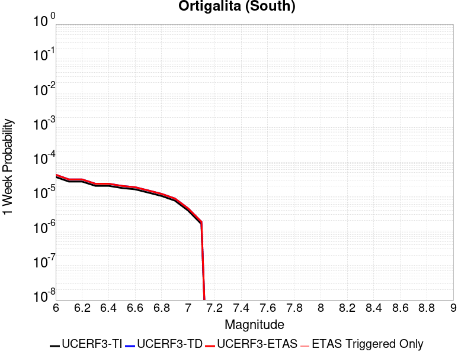 | 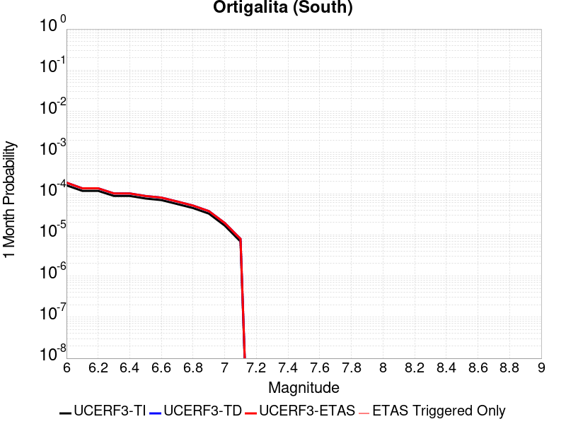 | 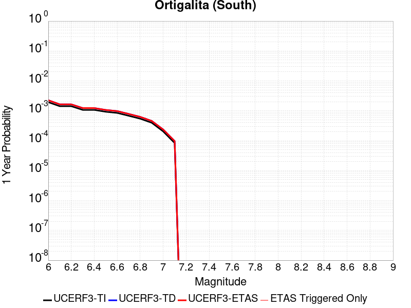 | 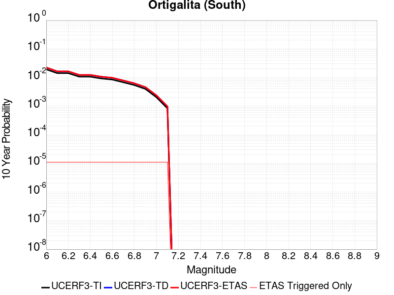 |

| Magnitude | 1 wk TI Prob | 1 wk TD Prob | 1 wk ETAS Prob | 1 wk ETAS/TD Gain | 1 wk ETAS Triggered Only | 1 mo TI Prob | 1 mo TD Prob | 1 mo ETAS Prob | 1 mo ETAS/TD Gain | 1 mo ETAS Triggered Only | 1 yr TI Prob | 1 yr TD Prob | 1 yr ETAS Prob | 1 yr ETAS/TD Gain | 1 yr ETAS Triggered Only | 10 yr TI Prob | 10 yr TD Prob | 10 yr ETAS Prob | 10 yr ETAS/TD Gain | 10 yr ETAS Triggered Only |
|-----|-----|-----|-----|-----|-----|-----|-----|-----|-----|-----|-----|-----|-----|-----|-----|-----|-----|-----|-----|-----|
| 6.0 | 3.72394E-5 | 4.326307E-5 | 4.326307E-5 | 1.0 | 0.0 | 1.5958765E-4 | 1.8540086E-4 | 1.8540086E-4 | 1.0 | 0.0 | 0.0019412481 | 0.0022550751 | 0.0022550751 | 1.0 | 0.0 | 0.019243775 | 0.022338301 | 0.022349045 | 1.0004809 | 1.0989011E-5 |
| 6.1 | 2.7299884E-5 | 3.149719E-5 | 3.149719E-5 | 1.0 | 0.0 | 1.16994255E-4 | 1.349813E-4 | 1.349813E-4 | 1.0 | 0.0 | 0.0014234743 | 0.0016422137 | 0.0016422137 | 1.0 | 0.0 | 0.014143906 | 0.016306715 | 0.016317524 | 1.0006629 | 1.0989011E-5 |
| 6.2 | 2.7299884E-5 | 3.149719E-5 | 3.149719E-5 | 1.0 | 0.0 | 1.16994255E-4 | 1.349813E-4 | 1.349813E-4 | 1.0 | 0.0 | 0.0014234743 | 0.0016422137 | 0.0016422137 | 1.0 | 0.0 | 0.014143906 | 0.016306715 | 0.016317524 | 1.0006629 | 1.0989011E-5 |
| 6.3 | 2.0546433E-5 | 2.3635228E-5 | 2.3635228E-5 | 1.0 | 0.0 | 8.805317E-5 | 1.0129001E-4 | 1.0129001E-4 | 1.0 | 0.0 | 0.00107152 | 0.0012325272 | 0.0012325272 | 1.0 | 0.0 | 0.010663681 | 0.012258978 | 0.012269832 | 1.0008854 | 1.0989011E-5 |
| 6.4 | 2.0546433E-5 | 2.3635228E-5 | 2.3635228E-5 | 1.0 | 0.0 | 8.805317E-5 | 1.0129001E-4 | 1.0129001E-4 | 1.0 | 0.0 | 0.00107152 | 0.0012325272 | 0.0012325272 | 1.0 | 0.0 | 0.010663681 | 0.012258978 | 0.012269832 | 1.0008854 | 1.0989011E-5 |
| 6.5 | 1.7779594E-5 | 2.045024E-5 | 2.045024E-5 | 1.0 | 0.0 | 7.619603E-5 | 8.764102E-5 | 8.764102E-5 | 1.0 | 0.0 | 9.272918E-4 | 0.0010665207 | 0.0010665207 | 1.0 | 0.0 | 0.009234319 | 0.010615489 | 0.010626363 | 1.0010242 | 1.0989011E-5 |
| 6.6 | 1.6272212E-5 | 1.871796E-5 | 1.871796E-5 | 1.0 | 0.0 | 6.973618E-5 | 8.0217425E-5 | 8.0217425E-5 | 1.0 | 0.0 | 8.487073E-4 | 9.762218E-4 | 9.762218E-4 | 1.0 | 0.0 | 0.008454733 | 0.0097206365 | 0.009731519 | 1.0011195 | 1.0989011E-5 |
| 6.7 | 1.3051484E-5 | 1.5041197E-5 | 1.5041197E-5 | 1.0 | 0.0 | 5.593373E-5 | 6.4460735E-5 | 6.4460735E-5 | 1.0 | 0.0 | 6.807804E-4 | 7.8453636E-4 | 7.8453636E-4 | 1.0 | 0.0 | 0.006786986 | 0.00781865 | 0.007829553 | 1.0013945 | 1.0989011E-5 |
| 6.8 | 1.04277415E-5 | 1.1989142E-5 | 1.1989142E-5 | 1.0 | 0.0 | 4.4689557E-5 | 5.1381066E-5 | 5.1381066E-5 | 1.0 | 0.0 | 5.439595E-4 | 6.2539236E-4 | 6.2539236E-4 | 1.0 | 0.0 | 0.0054262993 | 0.006237079 | 0.006247999 | 1.001751 | 1.0989011E-5 |
| 6.9 | 7.639968E-6 | 8.792912E-6 | 8.792912E-6 | 1.0 | 0.0 | 3.274231E-5 | 3.7683396E-5 | 3.7683396E-5 | 1.0 | 0.0 | 3.9856473E-4 | 4.5870466E-4 | 4.5870466E-4 | 1.0 | 0.0 | 0.003978506 | 0.004578165 | 0.0045891036 | 1.0023893 | 1.0989011E-5 |
| 7.0 | 3.919831E-6 | 4.5341553E-6 | 4.5341553E-6 | 1.0 | 0.0 | 1.679917E-5 | 1.9431962E-5 | 1.9431962E-5 | 1.0 | 0.0 | 2.045107E-4 | 2.3656056E-4 | 2.3656056E-4 | 1.0 | 0.0 | 0.0020432258 | 0.002363296 | 0.002374259 | 1.0046389 | 1.0989011E-5 |
| 7.1 | 1.6017933E-6 | 1.8573562E-6 | 1.8573562E-6 | 1.0 | 0.0 | 6.8648105E-6 | 7.9600795E-6 | 7.9600795E-6 | 1.0 | 0.0 | 8.357586E-5 | 9.691073E-5 | 9.691073E-5 | 1.0 | 0.0 | 8.3544437E-4 | 9.687894E-4 | 9.797678E-4 | 1.011332 | 1.0989011E-5 |

## Swain Ravine - Spenceville
*[(top)](#table-of-contents)*

| 1 Week | 1 Month | 1 Year | 10 Year |
|-----|-----|-----|-----|
| 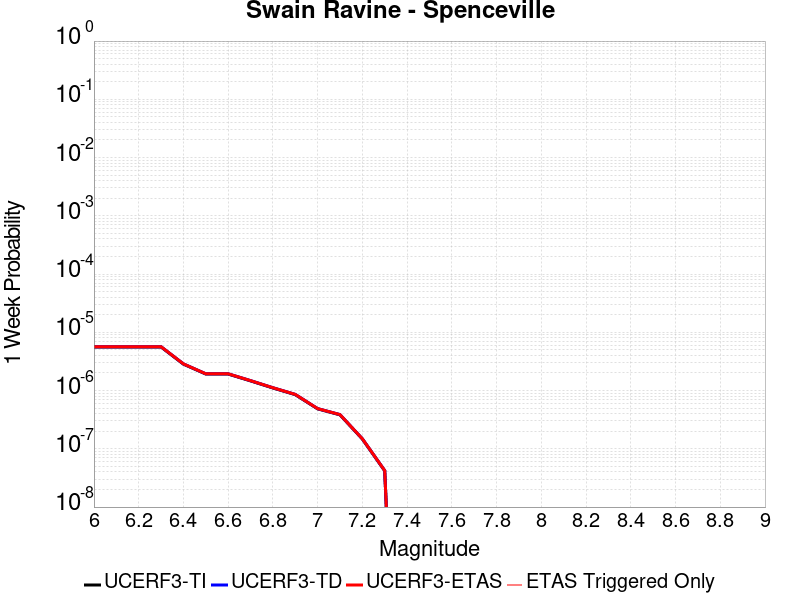 | 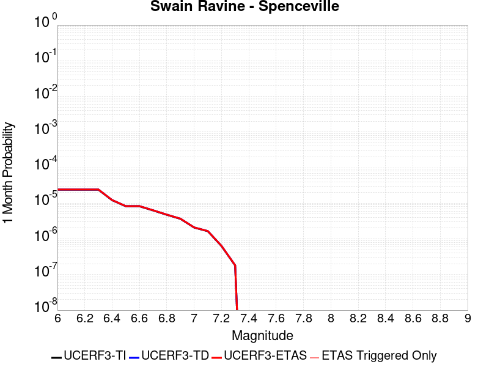 | 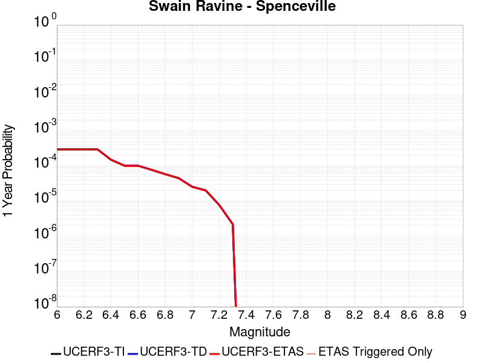 | 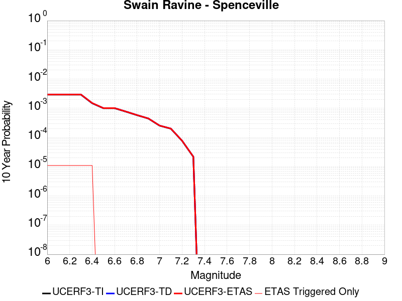 |

| Magnitude | 1 wk TI Prob | 1 wk TD Prob | 1 wk ETAS Prob | 1 wk ETAS/TD Gain | 1 wk ETAS Triggered Only | 1 mo TI Prob | 1 mo TD Prob | 1 mo ETAS Prob | 1 mo ETAS/TD Gain | 1 mo ETAS Triggered Only | 1 yr TI Prob | 1 yr TD Prob | 1 yr ETAS Prob | 1 yr ETAS/TD Gain | 1 yr ETAS Triggered Only | 10 yr TI Prob | 10 yr TD Prob | 10 yr ETAS Prob | 10 yr ETAS/TD Gain | 10 yr ETAS Triggered Only |
|-----|-----|-----|-----|-----|-----|-----|-----|-----|-----|-----|-----|-----|-----|-----|-----|-----|-----|-----|-----|-----|
| 6.0 | 5.596169E-6 | 5.663867E-6 | 5.663867E-6 | 1.0 | 0.0 | 2.398336E-5 | 2.4273506E-5 | 2.4273506E-5 | 1.0 | 0.0 | 2.9195828E-4 | 2.9549256E-4 | 2.9549256E-4 | 1.0 | 0.0 | 0.00291575 | 0.0029512658 | 0.0029622223 | 1.0037125 | 1.0989011E-5 |
| 6.1 | 5.596169E-6 | 5.663867E-6 | 5.663867E-6 | 1.0 | 0.0 | 2.398336E-5 | 2.4273506E-5 | 2.4273506E-5 | 1.0 | 0.0 | 2.9195828E-4 | 2.9549256E-4 | 2.9549256E-4 | 1.0 | 0.0 | 0.00291575 | 0.0029512658 | 0.0029622223 | 1.0037125 | 1.0989011E-5 |
| 6.2 | 5.596169E-6 | 5.663867E-6 | 5.663867E-6 | 1.0 | 0.0 | 2.398336E-5 | 2.4273506E-5 | 2.4273506E-5 | 1.0 | 0.0 | 2.9195828E-4 | 2.9549256E-4 | 2.9549256E-4 | 1.0 | 0.0 | 0.00291575 | 0.0029512658 | 0.0029622223 | 1.0037125 | 1.0989011E-5 |
| 6.3 | 5.596169E-6 | 5.663867E-6 | 5.663867E-6 | 1.0 | 0.0 | 2.398336E-5 | 2.4273506E-5 | 2.4273506E-5 | 1.0 | 0.0 | 2.9195828E-4 | 2.9549256E-4 | 2.9549256E-4 | 1.0 | 0.0 | 0.00291575 | 0.0029512658 | 0.0029622223 | 1.0037125 | 1.0989011E-5 |
| 6.4 | 2.8426775E-6 | 2.8741777E-6 | 2.8741777E-6 | 1.0 | 0.0 | 1.2182847E-5 | 1.2317849E-5 | 1.2317849E-5 | 1.0 | 0.0 | 1.4831607E-4 | 1.4995987E-4 | 1.4995987E-4 | 1.0 | 0.0 | 0.0014821711 | 0.0014986253 | 0.0015095978 | 1.0073217 | 1.0989011E-5 |
| 6.5 | 1.9210793E-6 | 1.9414365E-6 | 1.9414365E-6 | 1.0 | 0.0 | 8.233172E-6 | 8.320417E-6 | 8.320417E-6 | 1.0 | 0.0 | 1.0023425E-4 | 1.0129649E-4 | 1.0129649E-4 | 1.0 | 0.0 | 0.0010018905 | 0.0010125167 | 0.0010125167 | 1.0 | 0.0 |
| 6.6 | 1.9210793E-6 | 1.9414365E-6 | 1.9414365E-6 | 1.0 | 0.0 | 8.233172E-6 | 8.320417E-6 | 8.320417E-6 | 1.0 | 0.0 | 1.0023425E-4 | 1.0129649E-4 | 1.0129649E-4 | 1.0 | 0.0 | 0.0010018905 | 0.0010125167 | 0.0010125167 | 1.0 | 0.0 |
| 6.7 | 1.4667394E-6 | 1.4819096E-6 | 1.4819096E-6 | 1.0 | 0.0 | 6.286011E-6 | 6.351026E-6 | 6.351026E-6 | 1.0 | 0.0 | 7.65295E-5 | 7.732108E-5 | 7.732108E-5 | 1.0 | 0.0 | 7.6503144E-4 | 7.729495E-4 | 7.729495E-4 | 1.0 | 0.0 |
| 6.8 | 1.1076943E-6 | 1.1189655E-6 | 1.1189655E-6 | 1.0 | 0.0 | 4.747252E-6 | 4.795558E-6 | 4.795558E-6 | 1.0 | 0.0 | 5.7796264E-5 | 5.8384398E-5 | 5.8384398E-5 | 1.0 | 0.0 | 5.778124E-4 | 5.83695E-4 | 5.83695E-4 | 1.0 | 0.0 |
| 6.9 | 8.514296E-7 | 8.6001864E-7 | 8.6001864E-7 | 1.0 | 0.0 | 3.648979E-6 | 3.6857894E-6 | 3.6857894E-6 | 1.0 | 0.0 | 4.442541E-5 | 4.487359E-5 | 4.487359E-5 | 1.0 | 0.0 | 4.441653E-4 | 4.4864815E-4 | 4.4864815E-4 | 1.0 | 0.0 |
| 7.0 | 4.8544706E-7 | 4.9033525E-7 | 4.9033525E-7 | 1.0 | 0.0 | 2.0804857E-6 | 2.1014353E-6 | 2.1014353E-6 | 1.0 | 0.0 | 2.532962E-5 | 2.5584686E-5 | 2.5584686E-5 | 1.0 | 0.0 | 2.5326732E-4 | 2.558187E-4 | 2.558187E-4 | 1.0 | 0.0 |
| 7.1 | 3.829186E-7 | 3.8679198E-7 | 3.8679198E-7 | 1.0 | 0.0 | 1.6410787E-6 | 1.6576789E-6 | 1.6576789E-6 | 1.0 | 0.0 | 1.997995E-5 | 2.0182064E-5 | 2.0182064E-5 | 1.0 | 0.0 | 1.9978154E-4 | 2.0180338E-4 | 2.0180338E-4 | 1.0 | 0.0 |
| 7.2 | 1.4726595E-7 | 1.4879602E-7 | 1.4879602E-7 | 1.0 | 0.0 | 6.3113964E-7 | 6.376971E-7 | 6.376971E-7 | 1.0 | 0.0 | 7.684098E-6 | 7.76394E-6 | 7.76394E-6 | 1.0 | 0.0 | 7.6838325E-5 | 7.763722E-5 | 7.763722E-5 | 1.0 | 0.0 |
| 7.3 | 4.1880604E-8 | 4.2324782E-8 | 4.2324782E-8 | 1.0 | 0.0 | 1.7948828E-7 | 1.8139193E-7 | 1.8139193E-7 | 1.0 | 0.0 | 2.1852677E-6 | 2.2084466E-6 | 2.2084466E-6 | 1.0 | 0.0 | 2.1852462E-5 | 2.2084467E-5 | 2.2084467E-5 | 1.0 | 0.0 |

## Monterey Bay-Tularcitos
*[(top)](#table-of-contents)*

| 1 Week | 1 Month | 1 Year | 10 Year |
|-----|-----|-----|-----|
| 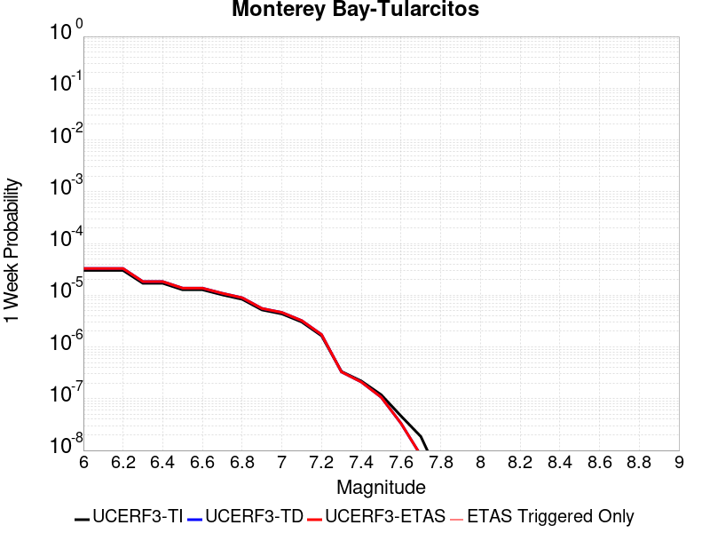 | 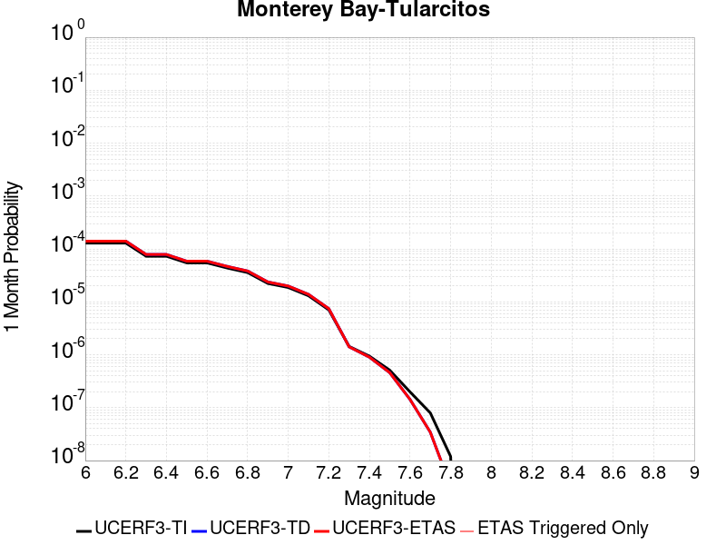 | 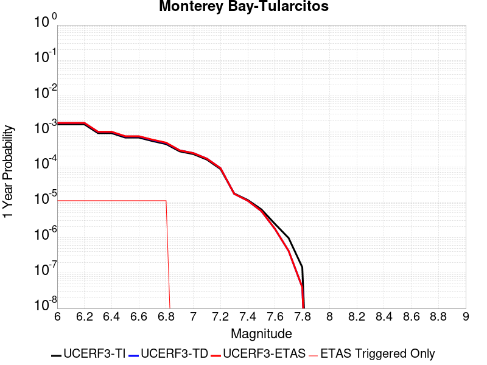 | 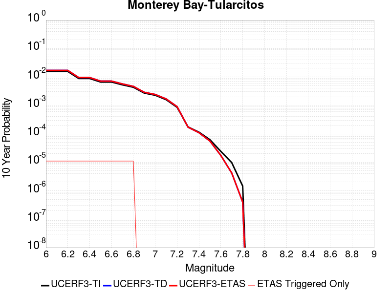 |

| Magnitude | 1 wk TI Prob | 1 wk TD Prob | 1 wk ETAS Prob | 1 wk ETAS/TD Gain | 1 wk ETAS Triggered Only | 1 mo TI Prob | 1 mo TD Prob | 1 mo ETAS Prob | 1 mo ETAS/TD Gain | 1 mo ETAS Triggered Only | 1 yr TI Prob | 1 yr TD Prob | 1 yr ETAS Prob | 1 yr ETAS/TD Gain | 1 yr ETAS Triggered Only | 10 yr TI Prob | 10 yr TD Prob | 10 yr ETAS Prob | 10 yr ETAS/TD Gain | 10 yr ETAS Triggered Only |
|-----|-----|-----|-----|-----|-----|-----|-----|-----|-----|-----|-----|-----|-----|-----|-----|-----|-----|-----|-----|-----|
| 6.0 | 3.0131365E-5 | 3.280195E-5 | 3.280195E-5 | 1.0 | 0.0 | 1.2912804E-4 | 1.4057281E-4 | 1.4057281E-4 | 1.0 | 0.0 | 0.001571 | 0.0017102358 | 0.0017212061 | 1.0064144 | 1.0989011E-5 | 0.015599402 | 0.01698155 | 0.016992353 | 1.0006361 | 1.0989011E-5 |
| 6.1 | 3.0131365E-5 | 3.280195E-5 | 3.280195E-5 | 1.0 | 0.0 | 1.2912804E-4 | 1.4057281E-4 | 1.4057281E-4 | 1.0 | 0.0 | 0.001571 | 0.0017102358 | 0.0017212061 | 1.0064144 | 1.0989011E-5 | 0.015599402 | 0.01698155 | 0.016992353 | 1.0006361 | 1.0989011E-5 |
| 6.2 | 3.0131365E-5 | 3.280195E-5 | 3.280195E-5 | 1.0 | 0.0 | 1.2912804E-4 | 1.4057281E-4 | 1.4057281E-4 | 1.0 | 0.0 | 0.001571 | 0.0017102358 | 0.0017212061 | 1.0064144 | 1.0989011E-5 | 0.015599402 | 0.01698155 | 0.016992353 | 1.0006361 | 1.0989011E-5 |
| 6.3 | 1.6998249E-5 | 1.8332414E-5 | 1.8332414E-5 | 1.0 | 0.0 | 7.28476E-5 | 7.856522E-5 | 7.856522E-5 | 1.0 | 0.0 | 8.865586E-4 | 9.5613056E-4 | 9.6710905E-4 | 1.0114822 | 1.0989011E-5 | 0.0088303005 | 0.009522093 | 0.009532978 | 1.0011431 | 1.0989011E-5 |
| 6.4 | 1.6998249E-5 | 1.8332414E-5 | 1.8332414E-5 | 1.0 | 0.0 | 7.28476E-5 | 7.856522E-5 | 7.856522E-5 | 1.0 | 0.0 | 8.865586E-4 | 9.5613056E-4 | 9.6710905E-4 | 1.0114822 | 1.0989011E-5 | 0.0088303005 | 0.009522093 | 0.009532978 | 1.0011431 | 1.0989011E-5 |
| 6.5 | 1.27470785E-5 | 1.3694481E-5 | 1.3694481E-5 | 1.0 | 0.0 | 5.4629192E-5 | 5.868937E-5 | 5.868937E-5 | 1.0 | 0.0 | 6.649074E-4 | 7.143192E-4 | 7.2530034E-4 | 1.0153729 | 1.0989011E-5 | 0.0066292146 | 0.0071212836 | 0.0071321945 | 1.0015321 | 1.0989011E-5 |
| 6.6 | 1.2739422E-5 | 1.3686567E-5 | 1.3686567E-5 | 1.0 | 0.0 | 5.4596385E-5 | 5.8655456E-5 | 5.8655456E-5 | 1.0 | 0.0 | 6.645082E-4 | 7.1390654E-4 | 7.248877E-4 | 1.0153818 | 1.0989011E-5 | 0.0066252467 | 0.007117184 | 0.007128095 | 1.001533 | 1.0989011E-5 |
| 6.7 | 1.0160109E-5 | 1.0886668E-5 | 1.0886668E-5 | 1.0 | 0.0 | 4.35426E-5 | 4.6656354E-5 | 4.6656354E-5 | 1.0 | 0.0 | 5.300022E-4 | 5.6790013E-4 | 5.7888293E-4 | 1.0193393 | 1.0989011E-5 | 0.005287399 | 0.0056652003 | 0.005676127 | 1.0019288 | 1.0989011E-5 |
| 6.8 | 8.349859E-6 | 8.933337E-6 | 8.933337E-6 | 1.0 | 0.0 | 3.578462E-5 | 3.8285198E-5 | 3.8285198E-5 | 1.0 | 0.0 | 4.3559066E-4 | 4.6602826E-4 | 4.7701216E-4 | 1.0235691 | 1.0989011E-5 | 0.004347378 | 0.0046510748 | 0.0046620127 | 1.0023516 | 1.0989011E-5 |
| 6.9 | 5.193639E-6 | 5.536906E-6 | 5.536906E-6 | 1.0 | 0.0 | 2.2258262E-5 | 2.3729399E-5 | 2.3729399E-5 | 1.0 | 0.0 | 2.7096065E-4 | 2.888704E-4 | 2.888704E-4 | 1.0 | 0.0 | 0.0027063051 | 0.00288527 | 0.00288527 | 1.0 | 0.0 |
| 7.0 | 4.359381E-6 | 4.643775E-6 | 4.643775E-6 | 1.0 | 0.0 | 1.8682927E-5 | 1.9901758E-5 | 1.9901758E-5 | 1.0 | 0.0 | 2.274409E-4 | 2.4227993E-4 | 2.4227993E-4 | 1.0 | 0.0 | 0.0022720827 | 0.0024204508 | 0.0024204508 | 1.0 | 0.0 |
| 7.1 | 3.0398533E-6 | 3.231346E-6 | 3.231346E-6 | 1.0 | 0.0 | 1.3027877E-5 | 1.3848567E-5 | 1.3848567E-5 | 1.0 | 0.0 | 1.5860285E-4 | 1.6859589E-4 | 1.6859589E-4 | 1.0 | 0.0 | 0.001584897 | 0.0016849374 | 0.0016849374 | 1.0 | 0.0 |
| 7.2 | 1.642335E-6 | 1.7335045E-6 | 1.7335045E-6 | 1.0 | 0.0 | 7.0385595E-6 | 7.4292957E-6 | 7.4292957E-6 | 1.0 | 0.0 | 8.569109E-5 | 9.044999E-5 | 9.044999E-5 | 1.0 | 0.0 | 8.5658056E-4 | 9.043345E-4 | 9.043345E-4 | 1.0 | 0.0 |
| 7.3 | 3.356842E-7 | 3.2960213E-7 | 3.2960213E-7 | 1.0 | 0.0 | 1.4386458E-6 | 1.4125798E-6 | 1.4125798E-6 | 1.0 | 0.0 | 1.7515373E-5 | 1.7198023E-5 | 1.7198023E-5 | 1.0 | 0.0 | 1.7513991E-4 | 1.7196703E-4 | 1.7196703E-4 | 1.0 | 0.0 |
| 7.4 | 2.1973483E-7 | 2.1013851E-7 | 2.1013851E-7 | 1.0 | 0.0 | 9.417204E-7 | 9.005933E-7 | 9.005933E-7 | 1.0 | 0.0 | 1.1465385E-5 | 1.0964669E-5 | 1.0964669E-5 | 1.0 | 0.0 | 1.1464794E-4 | 1.0964131E-4 | 1.0964131E-4 | 1.0 | 0.0 |
| 7.5 | 1.1944135E-7 | 1.0703129E-7 | 1.0703129E-7 | 1.0 | 0.0 | 5.118914E-7 | 4.5870544E-7 | 4.5870544E-7 | 1.0 | 0.0 | 6.23226E-6 | 5.584725E-6 | 5.584725E-6 | 1.0 | 0.0 | 6.2320854E-5 | 5.5845856E-5 | 5.5845856E-5 | 1.0 | 0.0 |
| 7.6 | 4.636058E-8 | 3.3410412E-8 | 3.3410412E-8 | 1.0 | 0.0 | 1.9868818E-7 | 1.4318746E-7 | 1.4318746E-7 | 1.0 | 0.0 | 2.419026E-6 | 1.743306E-6 | 1.743306E-6 | 1.0 | 0.0 | 2.4189996E-5 | 1.7432925E-5 | 1.7432925E-5 | 1.0 | 0.0 |
| 7.7 | 1.8588572E-8 | 8.024604E-9 | 8.024604E-9 | 1.0 | 0.0 | 7.9665305E-8 | 3.439116E-8 | 3.439116E-8 | 1.0 | 0.0 | 9.699246E-7 | 4.187123E-7 | 4.187123E-7 | 1.0 | 0.0 | 9.699204E-6 | 4.1871153E-6 | 4.1871153E-6 | 1.0 | 0.0 |
| 7.8 | 2.7960154E-9 | 7.6421347E-10 | 7.6421347E-10 | 1.0 | 0.0 | 1.1982923E-8 | 3.275201E-9 | 3.275201E-9 | 1.0 | 0.0 | 1.4589209E-7 | 3.987557E-8 | 3.987557E-8 | 1.0 | 0.0 | 1.4589199E-6 | 3.9875567E-7 | 3.9875567E-7 | 1.0 | 0.0 |

## Pine Mtn
*[(top)](#table-of-contents)*

| 1 Week | 1 Month | 1 Year | 10 Year |
|-----|-----|-----|-----|
| 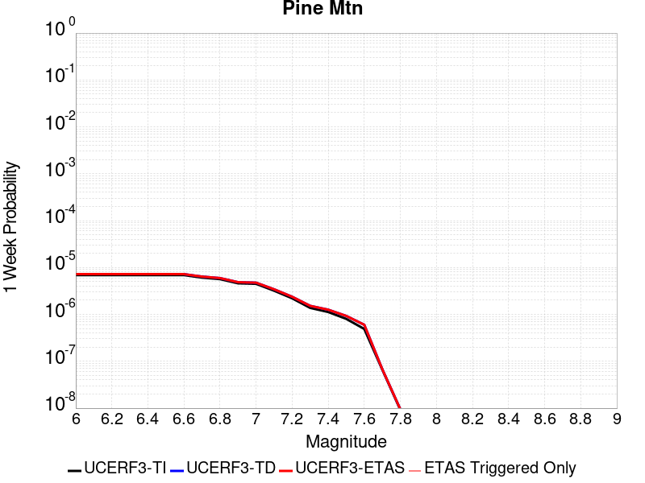 | 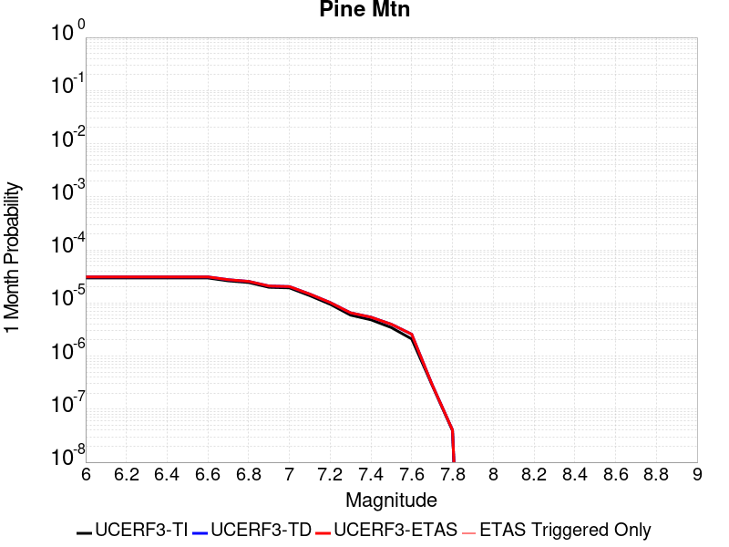 | 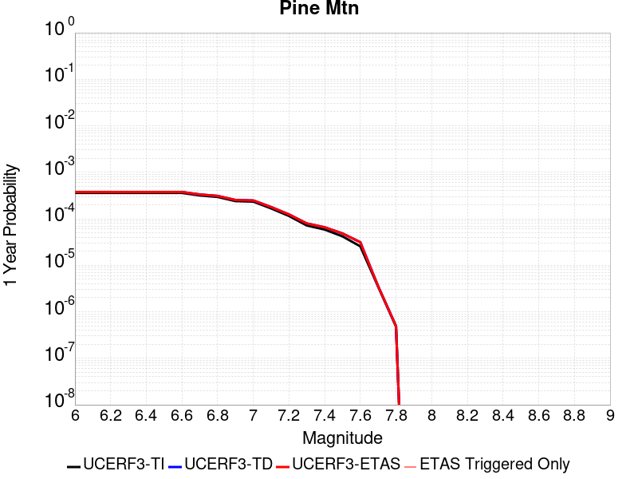 | 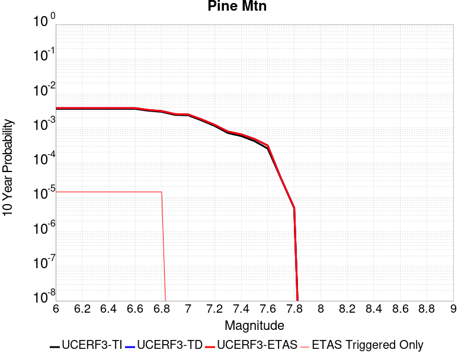 |

| Magnitude | 1 wk TI Prob | 1 wk TD Prob | 1 wk ETAS Prob | 1 wk ETAS/TD Gain | 1 wk ETAS Triggered Only | 1 mo TI Prob | 1 mo TD Prob | 1 mo ETAS Prob | 1 mo ETAS/TD Gain | 1 mo ETAS Triggered Only | 1 yr TI Prob | 1 yr TD Prob | 1 yr ETAS Prob | 1 yr ETAS/TD Gain | 1 yr ETAS Triggered Only | 10 yr TI Prob | 10 yr TD Prob | 10 yr ETAS Prob | 10 yr ETAS/TD Gain | 10 yr ETAS Triggered Only |
|-----|-----|-----|-----|-----|-----|-----|-----|-----|-----|-----|-----|-----|-----|-----|-----|-----|-----|-----|-----|-----|
| 6.0 | 6.894797E-6 | 7.226279E-6 | 7.226279E-6 | 1.0 | 0.0 | 2.9548795E-5 | 3.096942E-5 | 3.096942E-5 | 1.0 | 0.0 | 3.596972E-4 | 3.769904E-4 | 3.769904E-4 | 1.0 | 0.0 | 0.0035911554 | 0.0037638063 | 0.003774754 | 1.0029087 | 1.0989011E-5 |
| 6.1 | 6.894797E-6 | 7.226279E-6 | 7.226279E-6 | 1.0 | 0.0 | 2.9548795E-5 | 3.096942E-5 | 3.096942E-5 | 1.0 | 0.0 | 3.596972E-4 | 3.769904E-4 | 3.769904E-4 | 1.0 | 0.0 | 0.0035911554 | 0.0037638063 | 0.003774754 | 1.0029087 | 1.0989011E-5 |
| 6.2 | 6.894797E-6 | 7.226279E-6 | 7.226279E-6 | 1.0 | 0.0 | 2.9548795E-5 | 3.096942E-5 | 3.096942E-5 | 1.0 | 0.0 | 3.596972E-4 | 3.769904E-4 | 3.769904E-4 | 1.0 | 0.0 | 0.0035911554 | 0.0037638063 | 0.003774754 | 1.0029087 | 1.0989011E-5 |
| 6.3 | 6.894797E-6 | 7.226279E-6 | 7.226279E-6 | 1.0 | 0.0 | 2.9548795E-5 | 3.096942E-5 | 3.096942E-5 | 1.0 | 0.0 | 3.596972E-4 | 3.769904E-4 | 3.769904E-4 | 1.0 | 0.0 | 0.0035911554 | 0.0037638063 | 0.003774754 | 1.0029087 | 1.0989011E-5 |
| 6.4 | 6.894797E-6 | 7.226279E-6 | 7.226279E-6 | 1.0 | 0.0 | 2.9548795E-5 | 3.096942E-5 | 3.096942E-5 | 1.0 | 0.0 | 3.596972E-4 | 3.769904E-4 | 3.769904E-4 | 1.0 | 0.0 | 0.0035911554 | 0.0037638063 | 0.003774754 | 1.0029087 | 1.0989011E-5 |
| 6.5 | 6.894797E-6 | 7.226279E-6 | 7.226279E-6 | 1.0 | 0.0 | 2.9548795E-5 | 3.096942E-5 | 3.096942E-5 | 1.0 | 0.0 | 3.596972E-4 | 3.769904E-4 | 3.769904E-4 | 1.0 | 0.0 | 0.0035911554 | 0.0037638063 | 0.003774754 | 1.0029087 | 1.0989011E-5 |
| 6.6 | 6.894797E-6 | 7.226279E-6 | 7.226279E-6 | 1.0 | 0.0 | 2.9548795E-5 | 3.096942E-5 | 3.096942E-5 | 1.0 | 0.0 | 3.596972E-4 | 3.769904E-4 | 3.769904E-4 | 1.0 | 0.0 | 0.0035911554 | 0.0037638063 | 0.003774754 | 1.0029087 | 1.0989011E-5 |
| 6.7 | 6.0867933E-6 | 6.397909E-6 | 6.397909E-6 | 1.0 | 0.0 | 2.6085996E-5 | 2.7419335E-5 | 2.7419335E-5 | 1.0 | 0.0 | 3.1755073E-4 | 3.3378144E-4 | 3.3378144E-4 | 1.0 | 0.0 | 0.0031709734 | 0.0033330203 | 0.0033439726 | 1.003286 | 1.0989011E-5 |
| 6.8 | 5.6530425E-6 | 5.9513773E-6 | 5.9513773E-6 | 1.0 | 0.0 | 2.42271E-5 | 2.5505666E-5 | 2.5505666E-5 | 1.0 | 0.0 | 2.94925E-4 | 3.104893E-4 | 3.104893E-4 | 1.0 | 0.0 | 0.002945339 | 0.0031007596 | 0.0031117145 | 1.003533 | 1.0989011E-5 |
| 6.9 | 4.6015225E-6 | 4.8645775E-6 | 4.8645775E-6 | 1.0 | 0.0 | 1.9720663E-5 | 2.084803E-5 | 2.084803E-5 | 1.0 | 0.0 | 2.4007261E-4 | 2.5379666E-4 | 2.5379666E-4 | 1.0 | 0.0 | 0.0023981342 | 0.0025352123 | 0.0025352123 | 1.0 | 0.0 |
| 7.0 | 4.4875965E-6 | 4.7482135E-6 | 4.7482135E-6 | 1.0 | 0.0 | 1.9232413E-5 | 2.0349336E-5 | 2.0349336E-5 | 1.0 | 0.0 | 2.3412947E-4 | 2.4772645E-4 | 2.4772645E-4 | 1.0 | 0.0 | 0.0023388295 | 0.002474647 | 0.002474647 | 1.0 | 0.0 |
| 7.1 | 3.203907E-6 | 3.4301127E-6 | 3.4301127E-6 | 1.0 | 0.0 | 1.3730958E-5 | 1.4700404E-5 | 1.4700404E-5 | 1.0 | 0.0 | 1.6716159E-4 | 1.7896338E-4 | 1.7896338E-4 | 1.0 | 0.0 | 0.0016703589 | 0.0017882588 | 0.0017882588 | 1.0 | 0.0 |
| 7.2 | 2.2060601E-6 | 2.3790565E-6 | 2.3790565E-6 | 1.0 | 0.0 | 9.4545085E-6 | 1.01959195E-5 | 1.01959195E-5 | 1.0 | 0.0 | 1.15102564E-4 | 1.2412871E-4 | 1.2412871E-4 | 1.0 | 0.0 | 0.0011504296 | 0.0012406386 | 0.0012406386 | 1.0 | 0.0 |
| 7.3 | 1.3765207E-6 | 1.5221652E-6 | 1.5221652E-6 | 1.0 | 0.0 | 5.899361E-6 | 6.5235495E-6 | 6.5235495E-6 | 1.0 | 0.0 | 7.182235E-5 | 7.9421414E-5 | 7.9421414E-5 | 1.0 | 0.0 | 7.1799144E-4 | 7.939394E-4 | 7.939394E-4 | 1.0 | 0.0 |
| 7.4 | 1.1245983E-6 | 1.2591731E-6 | 1.2591731E-6 | 1.0 | 0.0 | 4.819698E-6 | 5.3964454E-6 | 5.3964454E-6 | 1.0 | 0.0 | 5.8678244E-5 | 6.569983E-5 | 6.569983E-5 | 1.0 | 0.0 | 5.866275E-4 | 6.568124E-4 | 6.568124E-4 | 1.0 | 0.0 |
| 7.5 | 8.031682E-7 | 9.2812996E-7 | 9.2812996E-7 | 1.0 | 0.0 | 3.4421448E-6 | 3.977694E-6 | 3.977694E-6 | 1.0 | 0.0 | 4.1907308E-5 | 4.8427417E-5 | 4.8427417E-5 | 1.0 | 0.0 | 4.1899405E-4 | 4.841754E-4 | 4.841754E-4 | 1.0 | 0.0 |
| 7.6 | 4.8953444E-7 | 6.0068675E-7 | 6.0068675E-7 | 1.0 | 0.0 | 2.098003E-6 | 2.5743693E-6 | 2.5743693E-6 | 1.0 | 0.0 | 2.5542888E-5 | 3.1342548E-5 | 3.1342548E-5 | 1.0 | 0.0 | 2.5539953E-4 | 3.1338615E-4 | 3.1338615E-4 | 1.0 | 0.0 |
| 7.7 | 6.634529E-8 | 6.788995E-8 | 6.788995E-8 | 1.0 | 0.0 | 2.843369E-7 | 2.909569E-7 | 2.909569E-7 | 1.0 | 0.0 | 3.4617963E-6 | 3.542395E-6 | 3.542395E-6 | 1.0 | 0.0 | 3.4617424E-5 | 3.5423433E-5 | 3.5423433E-5 | 1.0 | 0.0 |
| 7.8 | 9.235578E-9 | 9.488847E-9 | 9.488847E-9 | 1.0 | 0.0 | 3.9581046E-8 | 4.0666485E-8 | 4.0666485E-8 | 1.0 | 0.0 | 4.818991E-7 | 4.9511436E-7 | 4.9511436E-7 | 1.0 | 0.0 | 4.8189804E-6 | 4.951134E-6 | 4.951134E-6 | 1.0 | 0.0 |

## Santa Rosa Island
*[(top)](#table-of-contents)*

| 1 Week | 1 Month | 1 Year | 10 Year |
|-----|-----|-----|-----|
| 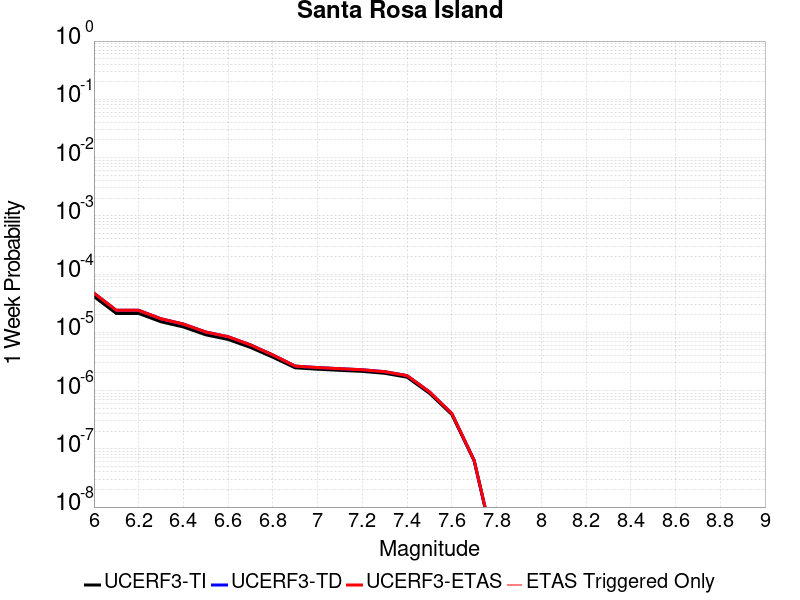 | 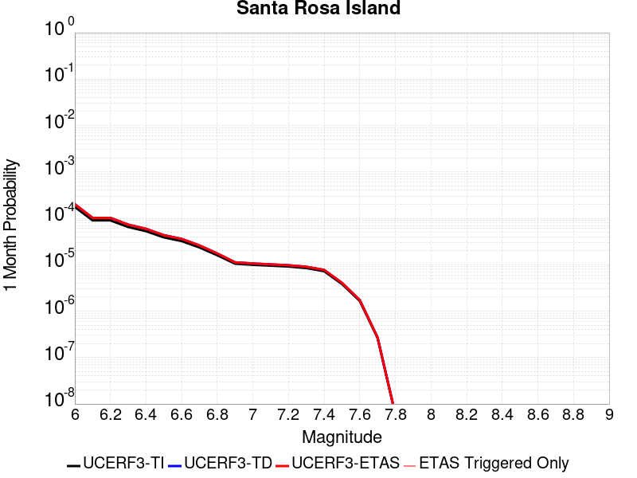 | 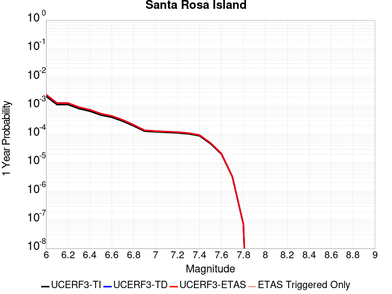 | 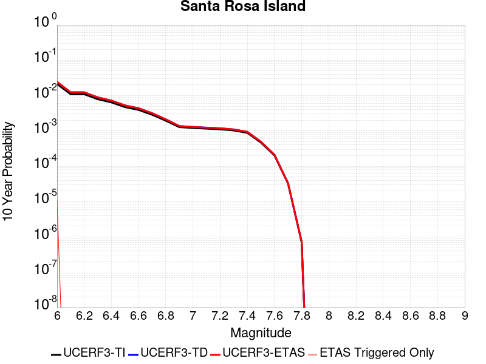 |

| Magnitude | 1 wk TI Prob | 1 wk TD Prob | 1 wk ETAS Prob | 1 wk ETAS/TD Gain | 1 wk ETAS Triggered Only | 1 mo TI Prob | 1 mo TD Prob | 1 mo ETAS Prob | 1 mo ETAS/TD Gain | 1 mo ETAS Triggered Only | 1 yr TI Prob | 1 yr TD Prob | 1 yr ETAS Prob | 1 yr ETAS/TD Gain | 1 yr ETAS Triggered Only | 10 yr TI Prob | 10 yr TD Prob | 10 yr ETAS Prob | 10 yr ETAS/TD Gain | 10 yr ETAS Triggered Only |
|-----|-----|-----|-----|-----|-----|-----|-----|-----|-----|-----|-----|-----|-----|-----|-----|-----|-----|-----|-----|-----|
| 6.0 | 4.1143165E-5 | 4.70984E-5 | 4.70984E-5 | 1.0 | 0.0 | 1.7631594E-4 | 2.0183578E-4 | 2.0183578E-4 | 1.0 | 0.0 | 0.002144533 | 0.0024547782 | 0.0024547782 | 1.0 | 0.0 | 0.021239553 | 0.024297256 | 0.024307977 | 1.0004413 | 1.0989011E-5 |
| 6.1 | 2.1061249E-5 | 2.386835E-5 | 2.386835E-5 | 1.0 | 0.0 | 9.0259375E-5 | 1.0228908E-4 | 1.0228908E-4 | 1.0 | 0.0 | 0.0010983539 | 0.001244687 | 0.001244687 | 1.0 | 0.0 | 0.01092941 | 0.012380196 | 0.012380196 | 1.0 | 0.0 |
| 6.2 | 2.1061249E-5 | 2.386835E-5 | 2.386835E-5 | 1.0 | 0.0 | 9.0259375E-5 | 1.0228908E-4 | 1.0228908E-4 | 1.0 | 0.0 | 0.0010983539 | 0.001244687 | 0.001244687 | 1.0 | 0.0 | 0.01092941 | 0.012380196 | 0.012380196 | 1.0 | 0.0 |
| 6.3 | 1.5158236E-5 | 1.7076723E-5 | 1.7076723E-5 | 1.0 | 0.0 | 6.496225E-5 | 7.3183975E-5 | 7.3183975E-5 | 1.0 | 0.0 | 7.906284E-4 | 8.9066254E-4 | 8.9066254E-4 | 1.0 | 0.0 | 0.007878214 | 0.008872181 | 0.008872181 | 1.0 | 0.0 |
| 6.4 | 1.2341918E-5 | 1.3854728E-5 | 1.3854728E-5 | 1.0 | 0.0 | 5.2892858E-5 | 5.93761E-5 | 5.93761E-5 | 1.0 | 0.0 | 6.437803E-4 | 7.226724E-4 | 7.226724E-4 | 1.0 | 0.0 | 0.006419184 | 0.00720406 | 0.00720406 | 1.0 | 0.0 |
| 6.5 | 9.061158E-6 | 1.0118292E-5 | 1.0118292E-5 | 1.0 | 0.0 | 3.883296E-5 | 4.336342E-5 | 4.336342E-5 | 1.0 | 0.0 | 4.726887E-4 | 5.2782707E-4 | 5.2782707E-4 | 1.0 | 0.0 | 0.004716845 | 0.005266272 | 0.005266272 | 1.0 | 0.0 |
| 6.6 | 7.5461685E-6 | 8.401753E-6 | 8.401753E-6 | 1.0 | 0.0 | 3.2340322E-5 | 3.6007037E-5 | 3.6007037E-5 | 1.0 | 0.0 | 3.936723E-4 | 4.383018E-4 | 4.383018E-4 | 1.0 | 0.0 | 0.003929756 | 0.004374803 | 0.004374803 | 1.0 | 0.0 |
| 6.7 | 5.5023775E-6 | 6.088076E-6 | 6.088076E-6 | 1.0 | 0.0 | 2.3581404E-5 | 2.6091511E-5 | 2.6091511E-5 | 1.0 | 0.0 | 2.8706578E-4 | 3.176211E-4 | 3.176211E-4 | 1.0 | 0.0 | 0.0028669522 | 0.0031719932 | 0.0031719932 | 1.0 | 0.0 |
| 6.8 | 3.7351679E-6 | 4.0835503E-6 | 4.0835503E-6 | 1.0 | 0.0 | 1.6007763E-5 | 1.7500826E-5 | 1.7500826E-5 | 1.0 | 0.0 | 1.948771E-4 | 2.1305423E-4 | 2.1305423E-4 | 1.0 | 0.0 | 0.0019470629 | 0.002128745 | 0.002128745 | 1.0 | 0.0 |
| 6.9 | 2.456366E-6 | 2.6294692E-6 | 2.6294692E-6 | 1.0 | 0.0 | 1.0527241E-5 | 1.1269105E-5 | 1.1269105E-5 | 1.0 | 0.0 | 1.2816161E-4 | 1.3719275E-4 | 1.3719275E-4 | 1.0 | 0.0 | 0.0012808773 | 0.0013710834 | 0.0013710834 | 1.0 | 0.0 |
| 7.0 | 2.3245157E-6 | 2.4829596E-6 | 2.4829596E-6 | 1.0 | 0.0 | 9.962172E-6 | 1.0641213E-5 | 1.0641213E-5 | 1.0 | 0.0 | 1.2128269E-4 | 1.2954908E-4 | 1.2954908E-4 | 1.0 | 0.0 | 0.0012121652 | 0.0012947378 | 0.0012947378 | 1.0 | 0.0 |
| 7.1 | 2.2248344E-6 | 2.3734199E-6 | 2.3734199E-6 | 1.0 | 0.0 | 9.53497E-6 | 1.017176E-5 | 1.017176E-5 | 1.0 | 0.0 | 1.1608207E-4 | 1.2383415E-4 | 1.2383415E-4 | 1.0 | 0.0 | 0.0011602144 | 0.0012376534 | 0.0012376534 | 1.0 | 0.0 |
| 7.2 | 2.1350402E-6 | 2.2763154E-6 | 2.2763154E-6 | 1.0 | 0.0 | 9.150141E-6 | 9.755601E-6 | 9.755601E-6 | 1.0 | 0.0 | 1.1139726E-4 | 1.1876799E-4 | 1.1876799E-4 | 1.0 | 0.0 | 0.0011134144 | 0.001187047 | 0.001187047 | 1.0 | 0.0 |
| 7.3 | 1.9793572E-6 | 2.108867E-6 | 2.108867E-6 | 1.0 | 0.0 | 8.482932E-6 | 9.037971E-6 | 9.037971E-6 | 1.0 | 0.0 | 1.032748E-4 | 1.1003175E-4 | 1.1003175E-4 | 1.0 | 0.0 | 0.0010322682 | 0.0010997745 | 0.0010997745 | 1.0 | 0.0 |
| 7.4 | 1.6951194E-6 | 1.8046987E-6 | 1.8046987E-6 | 1.0 | 0.0 | 7.264777E-6 | 7.7344E-6 | 7.7344E-6 | 1.0 | 0.0 | 8.844508E-5 | 9.416227E-5 | 9.416227E-5 | 1.0 | 0.0 | 8.840988E-4 | 9.412254E-4 | 9.412254E-4 | 1.0 | 0.0 |
| 7.5 | 8.987207E-7 | 9.5128195E-7 | 9.5128195E-7 | 1.0 | 0.0 | 3.8516546E-6 | 4.0769164E-6 | 4.0769164E-6 | 1.0 | 0.0 | 4.6892885E-5 | 4.963534E-5 | 4.963534E-5 | 1.0 | 0.0 | 4.688299E-4 | 4.962437E-4 | 4.962437E-4 | 1.0 | 0.0 |
| 7.6 | 3.8783037E-7 | 4.0531387E-7 | 4.0531387E-7 | 1.0 | 0.0 | 1.6621291E-6 | 1.7370583E-6 | 1.7370583E-6 | 1.0 | 0.0 | 2.0236233E-5 | 2.1148486E-5 | 2.1148486E-5 | 1.0 | 0.0 | 2.023439E-4 | 2.1146539E-4 | 2.1146539E-4 | 1.0 | 0.0 |
| 7.7 | 6.181804E-8 | 6.3392854E-8 | 6.3392854E-8 | 1.0 | 0.0 | 2.6493444E-7 | 2.7168363E-7 | 2.7168363E-7 | 1.0 | 0.0 | 3.225572E-6 | 3.307743E-6 | 3.307743E-6 | 1.0 | 0.0 | 3.225525E-5 | 3.3076947E-5 | 3.3076947E-5 | 1.0 | 0.0 |
| 7.8 | 1.3704449E-9 | 1.3964434E-9 | 1.3964434E-9 | 1.0 | 0.0 | 5.873335E-9 | 5.9847576E-9 | 5.9847576E-9 | 1.0 | 0.0 | 7.1507856E-8 | 7.286442E-8 | 7.286442E-8 | 1.0 | 0.0 | 7.1507833E-7 | 7.2864407E-7 | 7.2864407E-7 | 1.0 | 0.0 |

## Shoreline
*[(top)](#table-of-contents)*

| 1 Week | 1 Month | 1 Year | 10 Year |
|-----|-----|-----|-----|
| 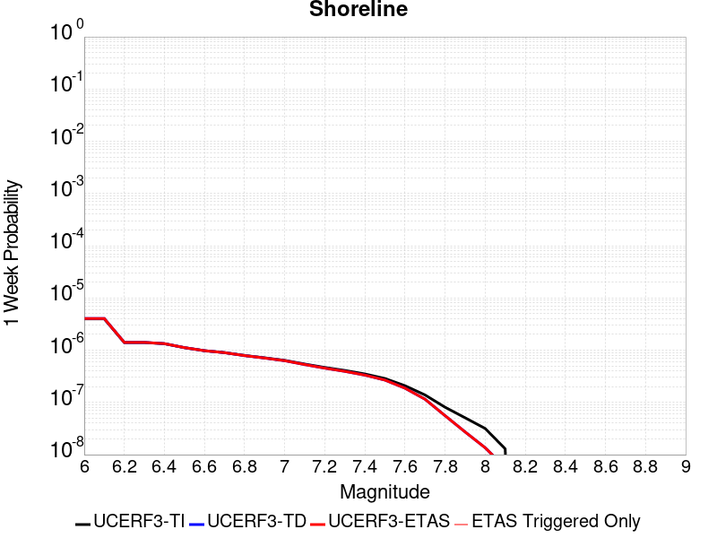 | 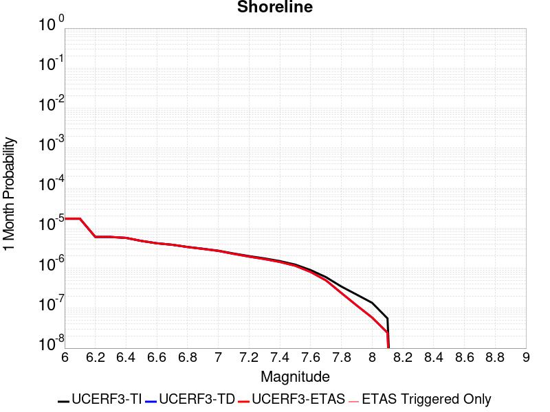 | 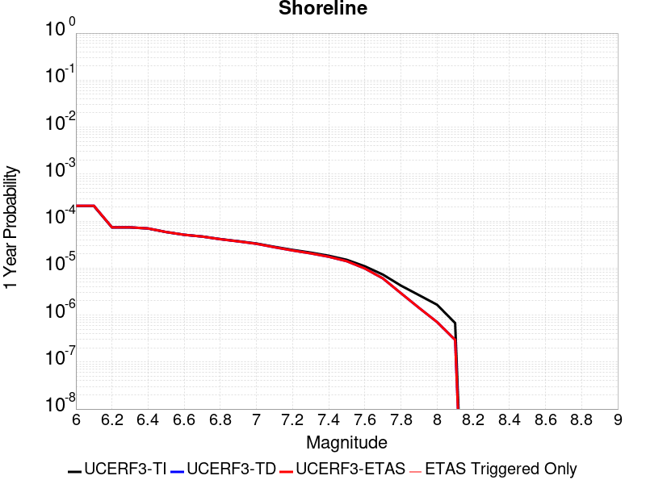 | 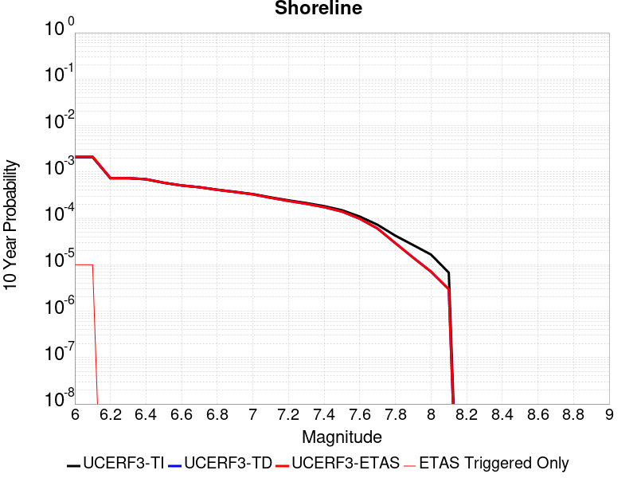 |

| Magnitude | 1 wk TI Prob | 1 wk TD Prob | 1 wk ETAS Prob | 1 wk ETAS/TD Gain | 1 wk ETAS Triggered Only | 1 mo TI Prob | 1 mo TD Prob | 1 mo ETAS Prob | 1 mo ETAS/TD Gain | 1 mo ETAS Triggered Only | 1 yr TI Prob | 1 yr TD Prob | 1 yr ETAS Prob | 1 yr ETAS/TD Gain | 1 yr ETAS Triggered Only | 10 yr TI Prob | 10 yr TD Prob | 10 yr ETAS Prob | 10 yr ETAS/TD Gain | 10 yr ETAS Triggered Only |
|-----|-----|-----|-----|-----|-----|-----|-----|-----|-----|-----|-----|-----|-----|-----|-----|-----|-----|-----|-----|-----|
| 6.0 | 3.9888673E-6 | 4.048057E-6 | 4.048057E-6 | 1.0 | 0.0 | 1.7095033E-5 | 1.7348731E-5 | 1.7348731E-5 | 1.0 | 0.0 | 2.0811215E-4 | 2.1120593E-4 | 2.1120593E-4 | 1.0 | 0.0 | 0.0020791737 | 0.0021106007 | 0.0021215666 | 1.0051956 | 1.0989011E-5 |
| 6.1 | 3.9888673E-6 | 4.048057E-6 | 4.048057E-6 | 1.0 | 0.0 | 1.7095033E-5 | 1.7348731E-5 | 1.7348731E-5 | 1.0 | 0.0 | 2.0811215E-4 | 2.1120593E-4 | 2.1120593E-4 | 1.0 | 0.0 | 0.0020791737 | 0.0021106007 | 0.0021215666 | 1.0051956 | 1.0989011E-5 |
| 6.2 | 1.4039653E-6 | 1.4101596E-6 | 1.4101596E-6 | 1.0 | 0.0 | 6.0169805E-6 | 6.0435277E-6 | 6.0435277E-6 | 1.0 | 0.0 | 7.325427E-5 | 7.3577525E-5 | 7.3577525E-5 | 1.0 | 0.0 | 7.3230127E-4 | 7.355377E-4 | 7.355377E-4 | 1.0 | 0.0 |
| 6.3 | 1.4039653E-6 | 1.4101596E-6 | 1.4101596E-6 | 1.0 | 0.0 | 6.0169805E-6 | 6.0435277E-6 | 6.0435277E-6 | 1.0 | 0.0 | 7.325427E-5 | 7.3577525E-5 | 7.3577525E-5 | 1.0 | 0.0 | 7.3230127E-4 | 7.355377E-4 | 7.355377E-4 | 1.0 | 0.0 |
| 6.4 | 1.3314152E-6 | 1.3362295E-6 | 1.3362295E-6 | 1.0 | 0.0 | 5.7060524E-6 | 5.7266857E-6 | 5.7266857E-6 | 1.0 | 0.0 | 6.946897E-5 | 6.972023E-5 | 6.972023E-5 | 1.0 | 0.0 | 6.9447263E-4 | 6.969889E-4 | 6.969889E-4 | 1.0 | 0.0 |
| 6.5 | 1.1187026E-6 | 1.1204297E-6 | 1.1204297E-6 | 1.0 | 0.0 | 4.794431E-6 | 4.801833E-6 | 4.801833E-6 | 1.0 | 0.0 | 5.8370628E-5 | 5.8460773E-5 | 5.8460773E-5 | 1.0 | 0.0 | 5.83553E-4 | 5.844565E-4 | 5.844565E-4 | 1.0 | 0.0 |
| 6.6 | 9.793089E-7 | 9.78555E-7 | 9.78555E-7 | 1.0 | 0.0 | 4.1970316E-6 | 4.1938006E-6 | 4.1938006E-6 | 1.0 | 0.0 | 5.1097657E-5 | 5.1058338E-5 | 5.1058338E-5 | 1.0 | 0.0 | 5.108591E-4 | 5.1046733E-4 | 5.1046733E-4 | 1.0 | 0.0 |
| 6.7 | 8.995986E-7 | 8.973414E-7 | 8.973414E-7 | 1.0 | 0.0 | 3.8554167E-6 | 3.8457433E-6 | 3.8457433E-6 | 1.0 | 0.0 | 4.693869E-5 | 4.682093E-5 | 4.682093E-5 | 1.0 | 0.0 | 4.6928777E-4 | 4.681116E-4 | 4.681116E-4 | 1.0 | 0.0 |
| 6.8 | 7.931612E-7 | 7.8809865E-7 | 7.8809865E-7 | 1.0 | 0.0 | 3.3992578E-6 | 3.3775614E-6 | 3.3775614E-6 | 1.0 | 0.0 | 4.1385178E-5 | 4.112104E-5 | 4.112104E-5 | 1.0 | 0.0 | 4.1377472E-4 | 4.1113482E-4 | 4.1113482E-4 | 1.0 | 0.0 |
| 6.9 | 7.1465956E-7 | 7.0785705E-7 | 7.0785705E-7 | 1.0 | 0.0 | 3.062823E-6 | 3.0336696E-6 | 3.0336696E-6 | 1.0 | 0.0 | 3.7289232E-5 | 3.6934307E-5 | 3.6934307E-5 | 1.0 | 0.0 | 3.7282976E-4 | 3.6928203E-4 | 3.6928203E-4 | 1.0 | 0.0 |
| 7.0 | 6.389046E-7 | 6.3E-7 | 6.3E-7 | 1.0 | 0.0 | 2.7381598E-6 | 2.6999971E-6 | 2.6999971E-6 | 1.0 | 0.0 | 3.3336586E-5 | 3.2871973E-5 | 3.2871973E-5 | 1.0 | 0.0 | 3.3331584E-4 | 3.2867136E-4 | 3.2867136E-4 | 1.0 | 0.0 |
| 7.1 | 5.4300875E-7 | 5.3116406E-7 | 5.3116406E-7 | 1.0 | 0.0 | 2.3271782E-6 | 2.2764154E-6 | 2.2764154E-6 | 1.0 | 0.0 | 2.8333026E-5 | 2.7715007E-5 | 2.7715007E-5 | 1.0 | 0.0 | 2.8329415E-4 | 2.771156E-4 | 2.771156E-4 | 1.0 | 0.0 |
| 7.2 | 4.6768855E-7 | 4.5353798E-7 | 4.5353798E-7 | 1.0 | 0.0 | 2.0043778E-6 | 1.9437327E-6 | 1.9437327E-6 | 1.0 | 0.0 | 2.4403027E-5 | 2.3664688E-5 | 2.3664688E-5 | 1.0 | 0.0 | 2.4400349E-4 | 2.3662174E-4 | 2.3662174E-4 | 1.0 | 0.0 |
| 7.3 | 4.0966103E-7 | 3.9390332E-7 | 3.9390332E-7 | 1.0 | 0.0 | 1.7556889E-6 | 1.688156E-6 | 1.688156E-6 | 1.0 | 0.0 | 2.1375303E-5 | 2.0553105E-5 | 2.0553105E-5 | 1.0 | 0.0 | 2.1373246E-4 | 2.0551209E-4 | 2.0551209E-4 | 1.0 | 0.0 |
| 7.4 | 3.5105785E-7 | 3.3368465E-7 | 3.3368465E-7 | 1.0 | 0.0 | 1.5045327E-6 | 1.4300763E-6 | 1.4300763E-6 | 1.0 | 0.0 | 1.8317533E-5 | 1.741104E-5 | 1.741104E-5 | 1.0 | 0.0 | 1.8316023E-4 | 1.7409679E-4 | 1.7409679E-4 | 1.0 | 0.0 |
| 7.5 | 2.8737534E-7 | 2.6824338E-7 | 2.6824338E-7 | 1.0 | 0.0 | 1.2316079E-6 | 1.1496139E-6 | 1.1496139E-6 | 1.0 | 0.0 | 1.4994724E-5 | 1.39964595E-5 | 1.39964595E-5 | 1.0 | 0.0 | 1.4993713E-4 | 1.3995581E-4 | 1.3995581E-4 | 1.0 | 0.0 |
| 7.6 | 2.0924051E-7 | 1.8783035E-7 | 1.8783035E-7 | 1.0 | 0.0 | 8.967448E-7 | 8.0498694E-7 | 8.0498694E-7 | 1.0 | 0.0 | 1.0917813E-5 | 9.800672E-6 | 9.800672E-6 | 1.0 | 0.0 | 1.0917276E-4 | 9.800241E-5 | 9.800241E-5 | 1.0 | 0.0 |
| 7.7 | 1.392265E-7 | 1.15471785E-7 | 1.15471785E-7 | 1.0 | 0.0 | 5.9668486E-7 | 4.94879E-7 | 4.94879E-7 | 1.0 | 0.0 | 7.2646135E-6 | 6.0251346E-6 | 6.0251346E-6 | 1.0 | 0.0 | 7.2643765E-5 | 6.0249717E-5 | 6.0249717E-5 | 1.0 | 0.0 |
| 7.8 | 8.1080074E-8 | 5.590278E-8 | 5.590278E-8 | 1.0 | 0.0 | 3.4748598E-7 | 2.395833E-7 | 2.395833E-7 | 1.0 | 0.0 | 4.2306337E-6 | 2.9169228E-6 | 2.9169228E-6 | 1.0 | 0.0 | 4.230553E-5 | 2.9168847E-5 | 2.9168847E-5 | 1.0 | 0.0 |
| 7.9 | 5.0859036E-8 | 2.7276966E-8 | 2.7276966E-8 | 1.0 | 0.0 | 2.1796728E-7 | 1.1690127E-7 | 1.1690127E-7 | 1.0 | 0.0 | 2.6537484E-6 | 1.423272E-6 | 1.423272E-6 | 1.0 | 0.0 | 2.6537167E-5 | 1.423263E-5 | 1.423263E-5 | 1.0 | 0.0 |
| 8.0 | 3.1760536E-8 | 1.3602188E-8 | 1.3602188E-8 | 1.0 | 0.0 | 1.3611657E-7 | 5.829509E-8 | 5.829509E-8 | 1.0 | 0.0 | 1.6572179E-6 | 7.0974244E-7 | 7.0974244E-7 | 1.0 | 0.0 | 1.6572056E-5 | 7.097402E-6 | 7.097402E-6 | 1.0 | 0.0 |
| 8.1 | 1.2947896E-8 | 5.673517E-9 | 5.673517E-9 | 1.0 | 0.0 | 5.5490982E-8 | 2.4315073E-8 | 2.4315073E-8 | 1.0 | 0.0 | 6.756025E-7 | 2.9603595E-7 | 2.9603595E-7 | 1.0 | 0.0 | 6.7560045E-6 | 2.960356E-6 | 2.960356E-6 | 1.0 | 0.0 |

## San Gorgonio Pass
*[(top)](#table-of-contents)*

| 1 Week | 1 Month | 1 Year | 10 Year |
|-----|-----|-----|-----|
| 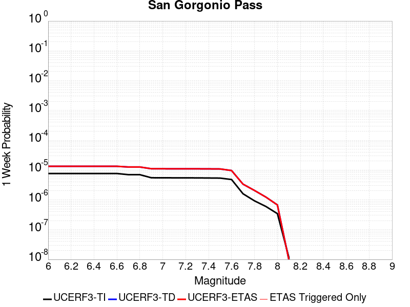 | 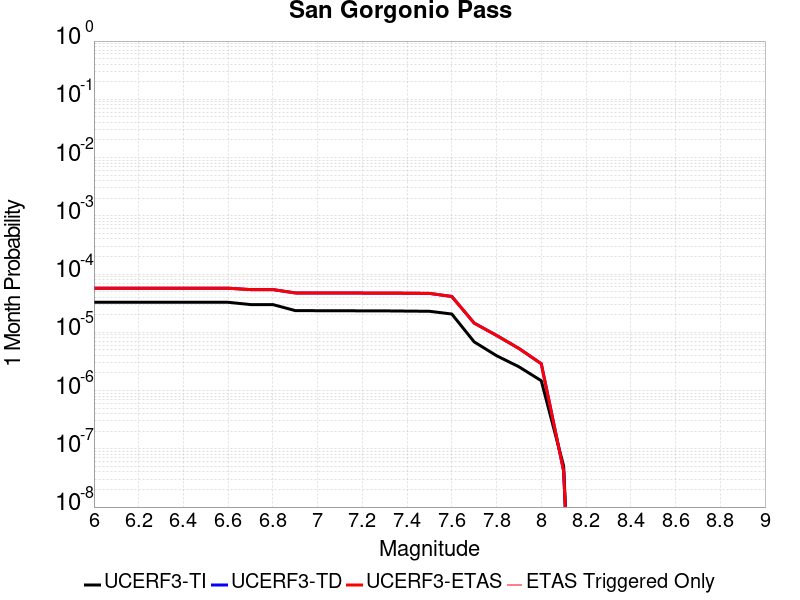 | 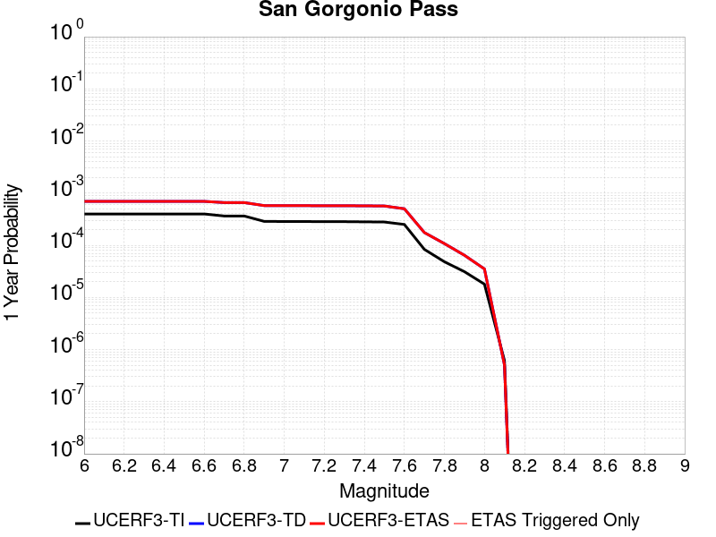 | 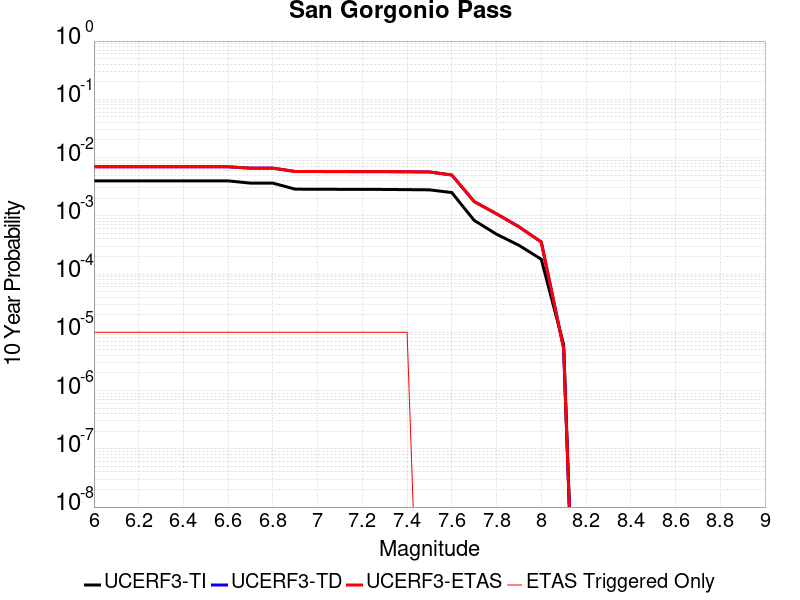 |

| Magnitude | 1 wk TI Prob | 1 wk TD Prob | 1 wk ETAS Prob | 1 wk ETAS/TD Gain | 1 wk ETAS Triggered Only | 1 mo TI Prob | 1 mo TD Prob | 1 mo ETAS Prob | 1 mo ETAS/TD Gain | 1 mo ETAS Triggered Only | 1 yr TI Prob | 1 yr TD Prob | 1 yr ETAS Prob | 1 yr ETAS/TD Gain | 1 yr ETAS Triggered Only | 10 yr TI Prob | 10 yr TD Prob | 10 yr ETAS Prob | 10 yr ETAS/TD Gain | 10 yr ETAS Triggered Only |
|-----|-----|-----|-----|-----|-----|-----|-----|-----|-----|-----|-----|-----|-----|-----|-----|-----|-----|-----|-----|-----|
| 6.0 | 7.644328E-6 | 1.3330773E-5 | 1.3330773E-5 | 1.0 | 0.0 | 3.2760996E-5 | 5.713068E-5 | 5.713068E-5 | 1.0 | 0.0 | 3.987921E-4 | 6.953527E-4 | 6.953527E-4 | 1.0 | 0.0 | 0.003980772 | 0.006938507 | 0.0069494196 | 1.0015727 | 1.0989011E-5 |
| 6.1 | 7.644328E-6 | 1.3330773E-5 | 1.3330773E-5 | 1.0 | 0.0 | 3.2760996E-5 | 5.713068E-5 | 5.713068E-5 | 1.0 | 0.0 | 3.987921E-4 | 6.953527E-4 | 6.953527E-4 | 1.0 | 0.0 | 0.003980772 | 0.006938507 | 0.0069494196 | 1.0015727 | 1.0989011E-5 |
| 6.2 | 7.644328E-6 | 1.3330773E-5 | 1.3330773E-5 | 1.0 | 0.0 | 3.2760996E-5 | 5.713068E-5 | 5.713068E-5 | 1.0 | 0.0 | 3.987921E-4 | 6.953527E-4 | 6.953527E-4 | 1.0 | 0.0 | 0.003980772 | 0.006938507 | 0.0069494196 | 1.0015727 | 1.0989011E-5 |
| 6.3 | 7.644328E-6 | 1.3330773E-5 | 1.3330773E-5 | 1.0 | 0.0 | 3.2760996E-5 | 5.713068E-5 | 5.713068E-5 | 1.0 | 0.0 | 3.987921E-4 | 6.953527E-4 | 6.953527E-4 | 1.0 | 0.0 | 0.003980772 | 0.006938507 | 0.0069494196 | 1.0015727 | 1.0989011E-5 |
| 6.4 | 7.644328E-6 | 1.3330773E-5 | 1.3330773E-5 | 1.0 | 0.0 | 3.2760996E-5 | 5.713068E-5 | 5.713068E-5 | 1.0 | 0.0 | 3.987921E-4 | 6.953527E-4 | 6.953527E-4 | 1.0 | 0.0 | 0.003980772 | 0.006938507 | 0.0069494196 | 1.0015727 | 1.0989011E-5 |
| 6.5 | 7.644328E-6 | 1.3330773E-5 | 1.3330773E-5 | 1.0 | 0.0 | 3.2760996E-5 | 5.713068E-5 | 5.713068E-5 | 1.0 | 0.0 | 3.987921E-4 | 6.953527E-4 | 6.953527E-4 | 1.0 | 0.0 | 0.003980772 | 0.006938507 | 0.0069494196 | 1.0015727 | 1.0989011E-5 |
| 6.6 | 7.644328E-6 | 1.3330773E-5 | 1.3330773E-5 | 1.0 | 0.0 | 3.2760996E-5 | 5.713068E-5 | 5.713068E-5 | 1.0 | 0.0 | 3.987921E-4 | 6.953527E-4 | 6.953527E-4 | 1.0 | 0.0 | 0.003980772 | 0.006938507 | 0.0069494196 | 1.0015727 | 1.0989011E-5 |
| 6.7 | 6.987586E-6 | 1.2635003E-5 | 1.2635003E-5 | 1.0 | 0.0 | 2.9946454E-5 | 5.4148935E-5 | 5.4148935E-5 | 1.0 | 0.0 | 3.645371E-4 | 6.59072E-4 | 6.59072E-4 | 1.0 | 0.0 | 0.0036393967 | 0.0065778634 | 0.00658878 | 1.0016596 | 1.0989011E-5 |
| 6.8 | 6.987586E-6 | 1.2635003E-5 | 1.2635003E-5 | 1.0 | 0.0 | 2.9946454E-5 | 5.4148935E-5 | 5.4148935E-5 | 1.0 | 0.0 | 3.645371E-4 | 6.59072E-4 | 6.59072E-4 | 1.0 | 0.0 | 0.0036393967 | 0.0065778634 | 0.00658878 | 1.0016596 | 1.0989011E-5 |
| 6.9 | 5.504702E-6 | 1.106577E-5 | 1.106577E-5 | 1.0 | 0.0 | 2.3591367E-5 | 4.7423895E-5 | 4.7423895E-5 | 1.0 | 0.0 | 2.8718702E-4 | 5.7723804E-4 | 5.7723804E-4 | 1.0 | 0.0 | 0.0028681618 | 0.0057637724 | 0.0057746978 | 1.0018955 | 1.0989011E-5 |
| 7.0 | 5.4825764E-6 | 1.1042109E-5 | 1.1042109E-5 | 1.0 | 0.0 | 2.3496545E-5 | 4.7322494E-5 | 4.7322494E-5 | 1.0 | 0.0 | 2.8603288E-4 | 5.7600415E-4 | 5.7600415E-4 | 1.0 | 0.0 | 0.00285665 | 0.005751497 | 0.005762423 | 1.0018996 | 1.0989011E-5 |
| 7.1 | 5.4692787E-6 | 1.1027818E-5 | 1.1027818E-5 | 1.0 | 0.0 | 2.3439556E-5 | 4.726125E-5 | 4.726125E-5 | 1.0 | 0.0 | 2.8533922E-4 | 5.7525886E-4 | 5.7525886E-4 | 1.0 | 0.0 | 0.0028497311 | 0.0057440833 | 0.005755009 | 1.0019021 | 1.0989011E-5 |
| 7.2 | 5.453661E-6 | 1.1010843E-5 | 1.1010843E-5 | 1.0 | 0.0 | 2.3372622E-5 | 4.7188503E-5 | 4.7188503E-5 | 1.0 | 0.0 | 2.8452452E-4 | 5.7437364E-4 | 5.7437364E-4 | 1.0 | 0.0 | 0.002841605 | 0.0057352767 | 0.0057462025 | 1.0019051 | 1.0989011E-5 |
| 7.3 | 5.4422303E-6 | 1.0997764E-5 | 1.0997764E-5 | 1.0 | 0.0 | 2.3323635E-5 | 4.713245E-5 | 4.713245E-5 | 1.0 | 0.0 | 2.8392827E-4 | 5.7369156E-4 | 5.7369156E-4 | 1.0 | 0.0 | 0.0028356577 | 0.005728491 | 0.005739417 | 1.0019073 | 1.0989011E-5 |
| 7.4 | 5.398595E-6 | 1.0945118E-5 | 1.0945118E-5 | 1.0 | 0.0 | 2.313663E-5 | 4.6906836E-5 | 4.6906836E-5 | 1.0 | 0.0 | 2.8165206E-4 | 5.7094614E-4 | 5.7094614E-4 | 1.0 | 0.0 | 0.0028129534 | 0.005701178 | 0.005712105 | 1.0019165 | 1.0989011E-5 |
| 7.5 | 5.3578788E-6 | 1.0871633E-5 | 1.0871633E-5 | 1.0 | 0.0 | 2.2962136E-5 | 4.659191E-5 | 4.659191E-5 | 1.0 | 0.0 | 2.7952815E-4 | 5.671139E-4 | 5.671139E-4 | 1.0 | 0.0 | 0.002791768 | 0.0056630764 | 0.0056630764 | 1.0 | 0.0 |
| 7.6 | 4.8091474E-6 | 9.619122E-6 | 9.619122E-6 | 1.0 | 0.0 | 2.0610469E-5 | 4.1224182E-5 | 4.1224182E-5 | 1.0 | 0.0 | 2.5090357E-4 | 5.017937E-4 | 5.017937E-4 | 1.0 | 0.0 | 0.0025062046 | 0.005013277 | 0.005013277 | 1.0 | 0.0 |
| 7.7 | 1.5991155E-6 | 3.3612187E-6 | 3.3612187E-6 | 1.0 | 0.0 | 6.853334E-6 | 1.4405145E-5 | 1.4405145E-5 | 1.0 | 0.0 | 8.343615E-5 | 1.7536878E-4 | 1.7536878E-4 | 1.0 | 0.0 | 8.340483E-4 | 0.0017577362 | 0.0017577362 | 1.0 | 0.0 |
| 7.8 | 9.258398E-7 | 2.0642249E-6 | 2.0642249E-6 | 1.0 | 0.0 | 3.967879E-6 | 8.846649E-6 | 8.846649E-6 | 1.0 | 0.0 | 4.8307855E-5 | 1.0770264E-4 | 1.0770264E-4 | 1.0 | 0.0 | 4.8297356E-4 | 0.0010819125 | 0.0010819125 | 1.0 | 0.0 |
| 7.9 | 5.975575E-7 | 1.2336893E-6 | 1.2336893E-6 | 1.0 | 0.0 | 2.5609581E-6 | 5.287229E-6 | 5.287229E-6 | 1.0 | 0.0 | 3.117922E-5 | 6.437012E-5 | 6.437012E-5 | 1.0 | 0.0 | 3.1174847E-4 | 6.486431E-4 | 6.486431E-4 | 1.0 | 0.0 |
| 8.0 | 3.4413725E-7 | 6.741821E-7 | 6.741821E-7 | 1.0 | 0.0 | 1.4748731E-6 | 2.8893487E-6 | 2.8893487E-6 | 1.0 | 0.0 | 1.7956432E-5 | 3.5177258E-5 | 3.5177258E-5 | 1.0 | 0.0 | 1.7954981E-4 | 3.5513582E-4 | 3.5513582E-4 | 1.0 | 0.0 |
| 8.1 | 1.1787731E-8 | 9.703559E-9 | 9.703559E-9 | 1.0 | 0.0 | 5.0518846E-8 | 4.158668E-8 | 4.158668E-8 | 1.0 | 0.0 | 6.1506677E-7 | 5.063177E-7 | 5.063177E-7 | 1.0 | 0.0 | 6.1506507E-6 | 5.279201E-6 | 5.279201E-6 | 1.0 | 0.0 |

## Great Valley 04b Gordon Valley
*[(top)](#table-of-contents)*

| 1 Week | 1 Month | 1 Year | 10 Year |
|-----|-----|-----|-----|
| 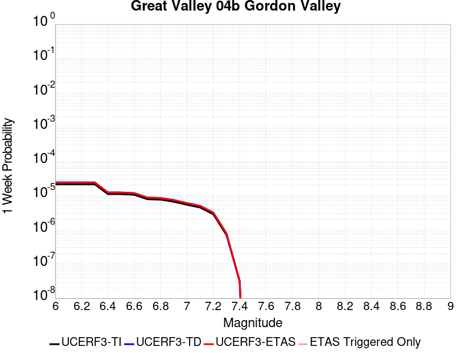 | 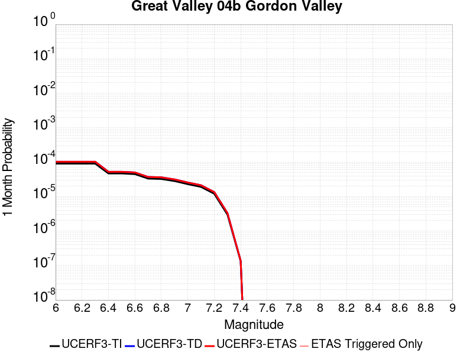 | 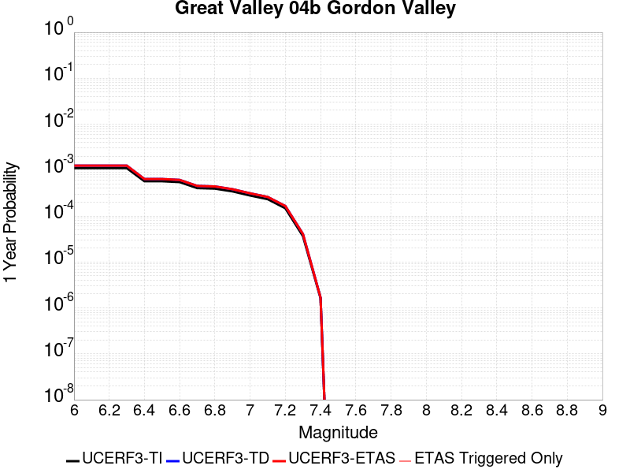 | 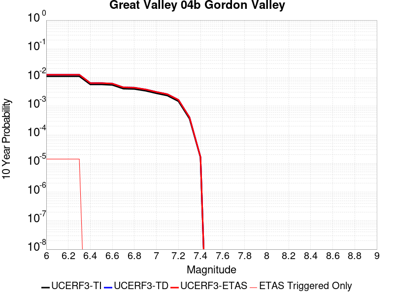 |

| Magnitude | 1 wk TI Prob | 1 wk TD Prob | 1 wk ETAS Prob | 1 wk ETAS/TD Gain | 1 wk ETAS Triggered Only | 1 mo TI Prob | 1 mo TD Prob | 1 mo ETAS Prob | 1 mo ETAS/TD Gain | 1 mo ETAS Triggered Only | 1 yr TI Prob | 1 yr TD Prob | 1 yr ETAS Prob | 1 yr ETAS/TD Gain | 1 yr ETAS Triggered Only | 10 yr TI Prob | 10 yr TD Prob | 10 yr ETAS Prob | 10 yr ETAS/TD Gain | 10 yr ETAS Triggered Only |
|-----|-----|-----|-----|-----|-----|-----|-----|-----|-----|-----|-----|-----|-----|-----|-----|-----|-----|-----|-----|-----|
| 6.0 | 2.1181217E-5 | 2.3985329E-5 | 2.3985329E-5 | 1.0 | 0.0 | 9.077348E-5 | 1.0279116E-4 | 1.0279116E-4 | 1.0 | 0.0 | 0.0011046068 | 0.0012509306 | 0.0012509306 | 1.0 | 0.0 | 0.010991322 | 0.012455343 | 0.012466196 | 1.0008713 | 1.0989011E-5 |
| 6.1 | 2.1181217E-5 | 2.3985329E-5 | 2.3985329E-5 | 1.0 | 0.0 | 9.077348E-5 | 1.0279116E-4 | 1.0279116E-4 | 1.0 | 0.0 | 0.0011046068 | 0.0012509306 | 0.0012509306 | 1.0 | 0.0 | 0.010991322 | 0.012455343 | 0.012466196 | 1.0008713 | 1.0989011E-5 |
| 6.2 | 2.1181217E-5 | 2.3985329E-5 | 2.3985329E-5 | 1.0 | 0.0 | 9.077348E-5 | 1.0279116E-4 | 1.0279116E-4 | 1.0 | 0.0 | 0.0011046068 | 0.0012509306 | 0.0012509306 | 1.0 | 0.0 | 0.010991322 | 0.012455343 | 0.012466196 | 1.0008713 | 1.0989011E-5 |
| 6.3 | 2.1181217E-5 | 2.3985329E-5 | 2.3985329E-5 | 1.0 | 0.0 | 9.077348E-5 | 1.0279116E-4 | 1.0279116E-4 | 1.0 | 0.0 | 0.0011046068 | 0.0012509306 | 0.0012509306 | 1.0 | 0.0 | 0.010991322 | 0.012455343 | 0.012466196 | 1.0008713 | 1.0989011E-5 |
| 6.4 | 1.0988268E-5 | 1.2255998E-5 | 1.2255998E-5 | 1.0 | 0.0 | 4.7091726E-5 | 5.2524738E-5 | 5.2524738E-5 | 1.0 | 0.0 | 5.731909E-4 | 6.39317E-4 | 6.39317E-4 | 1.0 | 0.0 | 0.005717147 | 0.006376365 | 0.006376365 | 1.0 | 0.0 |
| 6.5 | 1.0988268E-5 | 1.2255998E-5 | 1.2255998E-5 | 1.0 | 0.0 | 4.7091726E-5 | 5.2524738E-5 | 5.2524738E-5 | 1.0 | 0.0 | 5.731909E-4 | 6.39317E-4 | 6.39317E-4 | 1.0 | 0.0 | 0.005717147 | 0.006376365 | 0.006376365 | 1.0 | 0.0 |
| 6.6 | 1.0517822E-5 | 1.17254895E-5 | 1.17254895E-5 | 1.0 | 0.0 | 4.5075605E-5 | 5.025122E-5 | 5.025122E-5 | 1.0 | 0.0 | 5.4865726E-4 | 6.1165245E-4 | 6.1165245E-4 | 1.0 | 0.0 | 0.0054730466 | 0.006101244 | 0.006101244 | 1.0 | 0.0 |
| 6.7 | 7.789219E-6 | 8.678696E-6 | 8.678696E-6 | 1.0 | 0.0 | 3.3381937E-5 | 3.719391E-5 | 3.719391E-5 | 1.0 | 0.0 | 4.063493E-4 | 4.5274693E-4 | 4.5274693E-4 | 1.0 | 0.0 | 0.004056071 | 0.0045187627 | 0.0045187627 | 1.0 | 0.0 |
| 6.8 | 7.5850853E-6 | 8.453415E-6 | 8.453415E-6 | 1.0 | 0.0 | 3.2507105E-5 | 3.6228448E-5 | 3.6228448E-5 | 1.0 | 0.0 | 3.957021E-4 | 4.4099725E-4 | 4.4099725E-4 | 1.0 | 0.0 | 0.0039499826 | 0.0044017336 | 0.0044017336 | 1.0 | 0.0 |
| 6.9 | 6.604105E-6 | 7.359442E-6 | 7.359442E-6 | 1.0 | 0.0 | 2.8303E-5 | 3.1540105E-5 | 3.1540105E-5 | 1.0 | 0.0 | 3.4453452E-4 | 3.8393703E-4 | 3.8393703E-4 | 1.0 | 0.0 | 0.0034400085 | 0.0038331237 | 0.0038331237 | 1.0 | 0.0 |
| 7.0 | 5.3701115E-6 | 5.989151E-6 | 5.989151E-6 | 1.0 | 0.0 | 2.301456E-5 | 2.5667554E-5 | 2.5667554E-5 | 1.0 | 0.0 | 2.8016625E-4 | 3.1246056E-4 | 3.1246056E-4 | 1.0 | 0.0 | 0.0027981328 | 0.0031205008 | 0.0031205008 | 1.0 | 0.0 |
| 7.1 | 4.4685607E-6 | 4.9870923E-6 | 4.9870923E-6 | 1.0 | 0.0 | 1.9150835E-5 | 2.1373091E-5 | 2.1373091E-5 | 1.0 | 0.0 | 2.3313647E-4 | 2.601888E-4 | 2.601888E-4 | 1.0 | 0.0 | 0.0023289204 | 0.0025990864 | 0.0025990864 | 1.0 | 0.0 |
| 7.2 | 2.833378E-6 | 3.1648121E-6 | 3.1648121E-6 | 1.0 | 0.0 | 1.2142991E-5 | 1.356342E-5 | 1.356342E-5 | 1.0 | 0.0 | 1.4783088E-4 | 1.6512387E-4 | 1.6512387E-4 | 1.0 | 0.0 | 0.0014773258 | 0.0016501838 | 0.0016501838 | 1.0 | 0.0 |
| 7.3 | 7.0087293E-7 | 7.773721E-7 | 7.773721E-7 | 1.0 | 0.0 | 3.0037377E-6 | 3.3315932E-6 | 3.3315932E-6 | 1.0 | 0.0 | 3.656989E-5 | 4.0561852E-5 | 4.0561852E-5 | 1.0 | 0.0 | 3.6563876E-4 | 4.0558947E-4 | 4.0558947E-4 | 1.0 | 0.0 |
| 7.4 | 3.112171E-8 | 3.20694E-8 | 3.20694E-8 | 1.0 | 0.0 | 1.3337875E-7 | 1.3744028E-7 | 1.3744028E-7 | 1.0 | 0.0 | 1.6238852E-6 | 1.6733343E-6 | 1.6733343E-6 | 1.0 | 0.0 | 1.6238733E-5 | 1.6733225E-5 | 1.6733225E-5 | 1.0 | 0.0 |

## Calaveras (So) - Paicines extension 2011 CFM
*[(top)](#table-of-contents)*

| 1 Week | 1 Month | 1 Year | 10 Year |
|-----|-----|-----|-----|
| 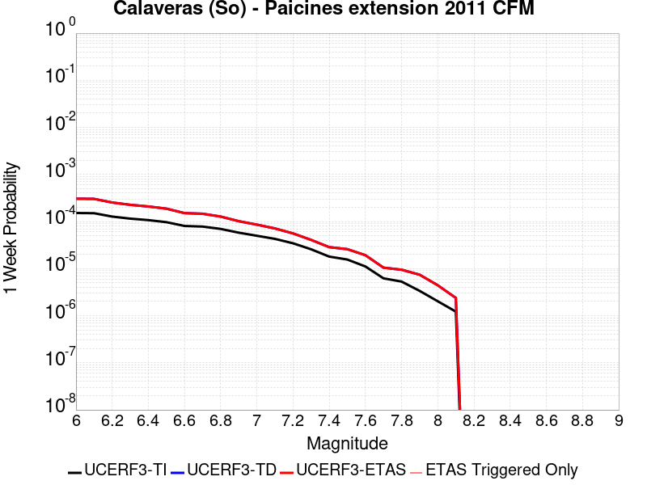 | 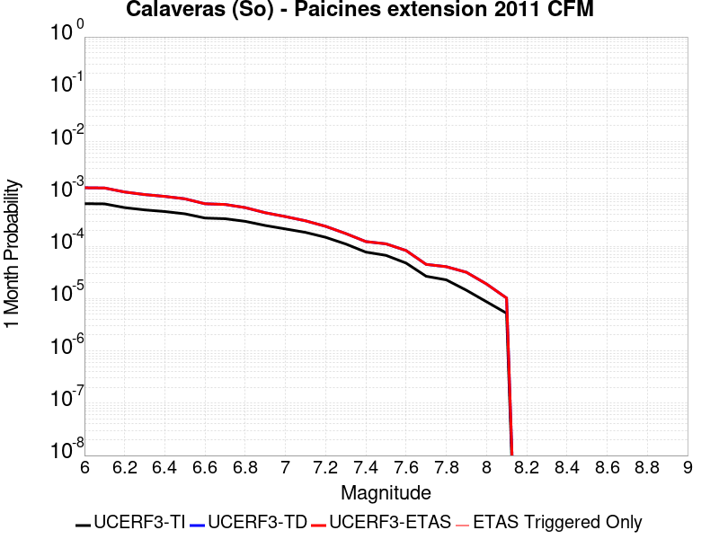 | 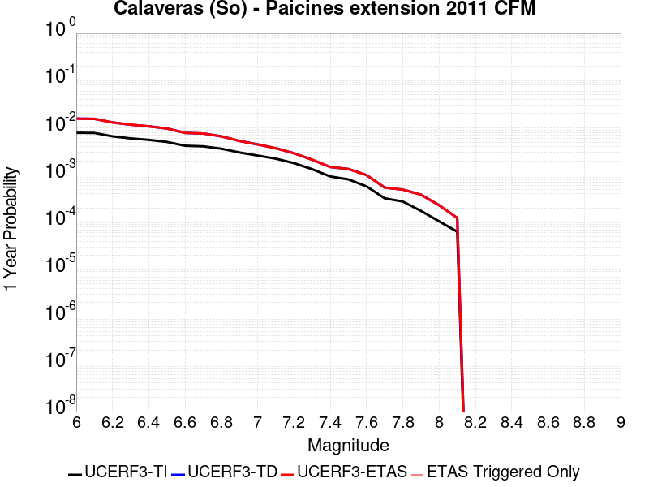 | 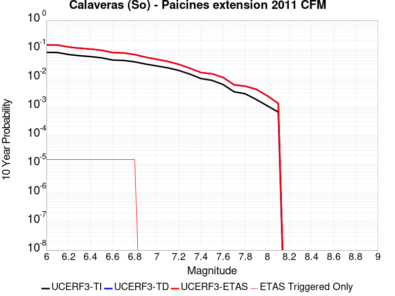 |

| Magnitude | 1 wk TI Prob | 1 wk TD Prob | 1 wk ETAS Prob | 1 wk ETAS/TD Gain | 1 wk ETAS Triggered Only | 1 mo TI Prob | 1 mo TD Prob | 1 mo ETAS Prob | 1 mo ETAS/TD Gain | 1 mo ETAS Triggered Only | 1 yr TI Prob | 1 yr TD Prob | 1 yr ETAS Prob | 1 yr ETAS/TD Gain | 1 yr ETAS Triggered Only | 10 yr TI Prob | 10 yr TD Prob | 10 yr ETAS Prob | 10 yr ETAS/TD Gain | 10 yr ETAS Triggered Only |
|-----|-----|-----|-----|-----|-----|-----|-----|-----|-----|-----|-----|-----|-----|-----|-----|-----|-----|-----|-----|-----|
| 6.0 | 1.5183659E-4 | 3.056355E-4 | 3.056355E-4 | 1.0 | 0.0 | 6.5056595E-4 | 0.0013081793 | 0.0013081793 | 1.0 | 0.0 | 0.007891912 | 0.015708106 | 0.015708106 | 1.0 | 0.0 | 0.076174594 | 0.13858913 | 0.13859859 | 1.0000683 | 1.0989011E-5 |
| 6.1 | 1.5024997E-4 | 3.0257308E-4 | 3.0257308E-4 | 1.0 | 0.0 | 6.437695E-4 | 0.0012950681 | 0.0012950681 | 1.0 | 0.0 | 0.0078097614 | 0.015551464 | 0.015551464 | 1.0 | 0.0 | 0.075409345 | 0.13725848 | 0.13726798 | 1.000069 | 1.0989011E-5 |
| 6.2 | 1.2743923E-4 | 2.5357047E-4 | 2.5357047E-4 | 1.0 | 0.0 | 5.460538E-4 | 0.0010854661 | 0.0010854661 | 1.0 | 0.0 | 0.0066279583 | 0.013058652 | 0.013058652 | 1.0 | 0.0 | 0.064337276 | 0.117356606 | 0.11736631 | 1.0000826 | 1.0989011E-5 |
| 6.3 | 1.1525114E-4 | 2.2633924E-4 | 2.2633924E-4 | 1.0 | 0.0 | 4.9383997E-4 | 9.6910214E-4 | 9.6910214E-4 | 1.0 | 0.0 | 0.0059959386 | 0.011679772 | 0.011679772 | 1.0 | 0.0 | 0.058367174 | 0.106473476 | 0.106483296 | 1.0000923 | 1.0989011E-5 |
| 6.4 | 1.07200925E-4 | 2.087327E-4 | 2.087327E-4 | 1.0 | 0.0 | 4.5935164E-4 | 8.9401874E-4 | 8.9401874E-4 | 1.0 | 0.0 | 0.0055782744 | 0.010784585 | 0.010784585 | 1.0 | 0.0 | 0.0544031 | 0.09929656 | 0.099306464 | 1.0000997 | 1.0989011E-5 |
| 6.5 | 9.69631E-5 | 1.8770303E-4 | 1.8770303E-4 | 1.0 | 0.0 | 4.1548995E-4 | 8.0394984E-4 | 8.0394984E-4 | 1.0 | 0.0 | 0.0050468626 | 0.009706348 | 0.009706348 | 1.0 | 0.0 | 0.04933773 | 0.09018788 | 0.090197876 | 1.0001109 | 1.0989011E-5 |
| 6.6 | 8.0552316E-5 | 1.5094873E-4 | 1.5094873E-4 | 1.0 | 0.0 | 3.4517853E-4 | 6.4671756E-4 | 6.4671756E-4 | 1.0 | 0.0 | 0.0041944524 | 0.007838126 | 0.007838126 | 1.0 | 0.0 | 0.04116161 | 0.07495855 | 0.07496871 | 1.0001357 | 1.0989011E-5 |
| 6.7 | 7.815757E-5 | 1.4635327E-4 | 1.4635327E-4 | 1.0 | 0.0 | 3.34918E-4 | 6.2703236E-4 | 6.2703236E-4 | 1.0 | 0.0 | 0.004070005 | 0.0076008607 | 0.0076008607 | 1.0 | 0.0 | 0.039962657 | 0.07280769 | 0.072817884 | 1.00014 | 1.0989011E-5 |
| 6.8 | 6.965264E-5 | 1.2743977E-4 | 1.2743977E-4 | 1.0 | 0.0 | 2.9847719E-4 | 5.460289E-4 | 5.460289E-4 | 1.0 | 0.0 | 0.0036279052 | 0.00662458 | 0.00662458 | 1.0 | 0.0 | 0.03569247 | 0.06389852 | 0.06390881 | 1.0001609 | 1.0989011E-5 |
| 6.9 | 5.8000453E-5 | 1.0163084E-4 | 1.0163084E-4 | 1.0 | 0.0 | 2.4854968E-4 | 4.3548862E-4 | 4.3548862E-4 | 1.0 | 0.0 | 0.0030218933 | 0.005289287 | 0.005289287 | 1.0 | 0.0 | 0.029811295 | 0.05159348 | 0.05159348 | 1.0 | 0.0 |
| 7.0 | 4.9865852E-5 | 8.586892E-5 | 8.586892E-5 | 1.0 | 0.0 | 2.1369329E-4 | 3.6795824E-4 | 3.6795824E-4 | 1.0 | 0.0 | 0.0025986114 | 0.0044707786 | 0.0044707786 | 1.0 | 0.0 | 0.025684336 | 0.043872654 | 0.043872654 | 1.0 | 0.0 |
| 7.1 | 4.283875E-5 | 7.128824E-5 | 7.128824E-5 | 1.0 | 0.0 | 1.8358172E-4 | 3.0548556E-4 | 3.0548556E-4 | 1.0 | 0.0 | 0.0022328163 | 0.0037130006 | 0.0037130006 | 1.0 | 0.0 | 0.022105146 | 0.03681606 | 0.03681606 | 1.0 | 0.0 |
| 7.2 | 3.450115E-5 | 5.593746E-5 | 5.593746E-5 | 1.0 | 0.0 | 1.478537E-4 | 2.397101E-4 | 2.397101E-4 | 1.0 | 0.0 | 0.0017986323 | 0.002914594 | 0.002914594 | 1.0 | 0.0 | 0.017841442 | 0.029157607 | 0.029157607 | 1.0 | 0.0 |
| 7.3 | 2.5709045E-5 | 4.0731633E-5 | 4.0731633E-5 | 1.0 | 0.0 | 1.1017697E-4 | 1.7455257E-4 | 1.7455257E-4 | 1.0 | 0.0 | 0.0013405791 | 0.0021231233 | 0.0021231233 | 1.0 | 0.0 | 0.013325208 | 0.021367824 | 0.021367824 | 1.0 | 0.0 |
| 7.4 | 1.8003093E-5 | 2.8584513E-5 | 2.8584513E-5 | 1.0 | 0.0 | 7.715383E-5 | 1.2249932E-4 | 1.2249932E-4 | 1.0 | 0.0 | 9.3894306E-4 | 0.0014904111 | 0.0014904111 | 1.0 | 0.0 | 0.009349857 | 0.015088451 | 0.015088451 | 1.0 | 0.0 |
| 7.5 | 1.5595824E-5 | 2.5893674E-5 | 2.5893674E-5 | 1.0 | 0.0 | 6.683753E-5 | 1.10968176E-4 | 1.10968176E-4 | 1.0 | 0.0 | 8.134431E-4 | 0.0013502025 | 0.0013502025 | 1.0 | 0.0 | 0.008104719 | 0.013686731 | 0.013686731 | 1.0 | 0.0 |
| 7.6 | 1.1110309E-5 | 1.9283274E-5 | 1.9283274E-5 | 1.0 | 0.0 | 4.761474E-5 | 8.264E-5 | 8.264E-5 | 1.0 | 0.0 | 5.795553E-4 | 0.0010056789 | 0.0010056789 | 1.0 | 0.0 | 0.0057804612 | 0.010233724 | 0.010233724 | 1.0 | 0.0 |
| 7.7 | 6.2140443E-6 | 1.048222E-5 | 1.048222E-5 | 1.0 | 0.0 | 2.6631347E-5 | 4.492303E-5 | 4.492303E-5 | 1.0 | 0.0 | 3.241884E-4 | 5.4680073E-4 | 5.4680073E-4 | 1.0 | 0.0 | 0.0032371588 | 0.0056418604 | 0.0056418604 | 1.0 | 0.0 |
| 7.8 | 5.305533E-6 | 9.473447E-6 | 9.473447E-6 | 1.0 | 0.0 | 2.27378E-5 | 4.0599854E-5 | 4.0599854E-5 | 1.0 | 0.0 | 2.7679754E-4 | 4.941912E-4 | 4.941912E-4 | 1.0 | 0.0 | 0.0027645302 | 0.0050939573 | 0.0050939573 | 1.0 | 0.0 |
| 7.9 | 3.363505E-6 | 7.414737E-6 | 7.414737E-6 | 1.0 | 0.0 | 1.4414942E-5 | 3.1777057E-5 | 3.1777057E-5 | 1.0 | 0.0 | 1.7548777E-4 | 3.8681706E-4 | 3.8681706E-4 | 1.0 | 0.0 | 0.0017534926 | 0.0039629196 | 0.0039629196 | 1.0 | 0.0 |
| 8.0 | 2.0271132E-6 | 4.430002E-6 | 4.430002E-6 | 1.0 | 0.0 | 8.687599E-6 | 1.8985584E-5 | 1.8985584E-5 | 1.0 | 0.0 | 1.05766376E-4 | 2.3112501E-4 | 2.3112501E-4 | 1.0 | 0.0 | 0.0010571606 | 0.0023593423 | 0.0023593423 | 1.0 | 0.0 |
| 8.1 | 1.2206116E-6 | 2.3844252E-6 | 2.3844252E-6 | 1.0 | 0.0 | 5.2311816E-6 | 1.0218926E-5 | 1.0218926E-5 | 1.0 | 0.0 | 6.3687774E-5 | 1.2440835E-4 | 1.2440835E-4 | 1.0 | 0.0 | 6.366953E-4 | 0.0012751735 | 0.0012751735 | 1.0 | 0.0 |

## Pitas Point (Lower West)
*[(top)](#table-of-contents)*

| 1 Week | 1 Month | 1 Year | 10 Year |
|-----|-----|-----|-----|
| 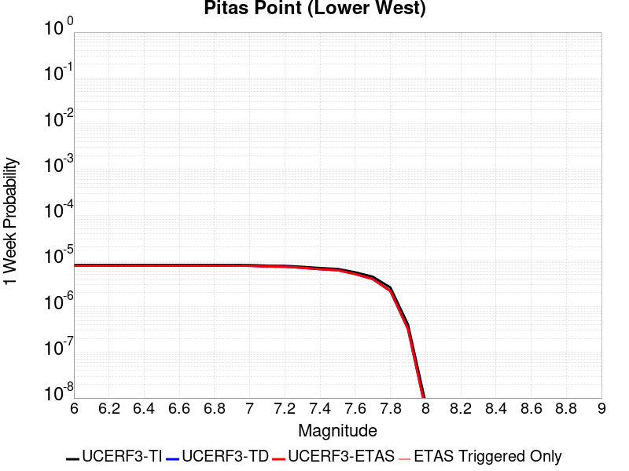 | 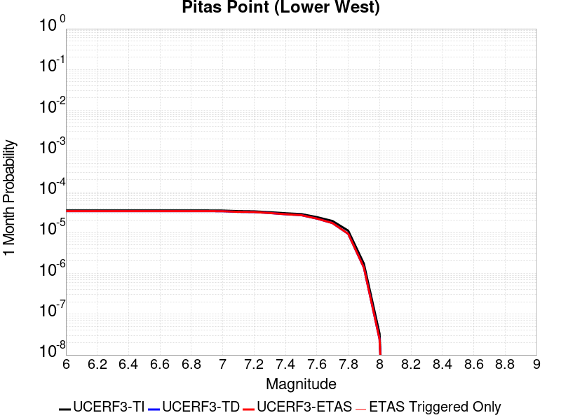 | 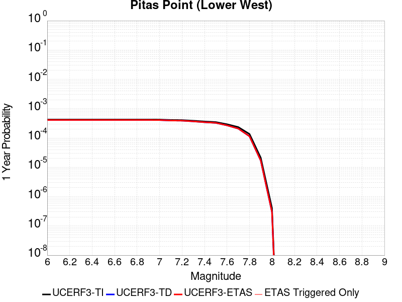 | 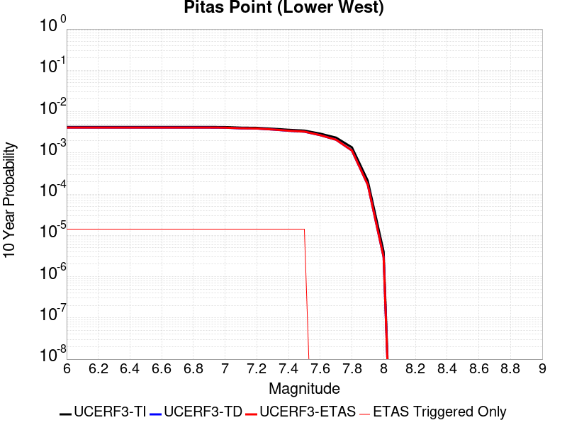 |

| Magnitude | 1 wk TI Prob | 1 wk TD Prob | 1 wk ETAS Prob | 1 wk ETAS/TD Gain | 1 wk ETAS Triggered Only | 1 mo TI Prob | 1 mo TD Prob | 1 mo ETAS Prob | 1 mo ETAS/TD Gain | 1 mo ETAS Triggered Only | 1 yr TI Prob | 1 yr TD Prob | 1 yr ETAS Prob | 1 yr ETAS/TD Gain | 1 yr ETAS Triggered Only | 10 yr TI Prob | 10 yr TD Prob | 10 yr ETAS Prob | 10 yr ETAS/TD Gain | 10 yr ETAS Triggered Only |
|-----|-----|-----|-----|-----|-----|-----|-----|-----|-----|-----|-----|-----|-----|-----|-----|-----|-----|-----|-----|-----|
| 6.0 | 8.151497E-6 | 7.856334E-6 | 7.856334E-6 | 1.0 | 0.0 | 3.493452E-5 | 3.3669574E-5 | 3.3669574E-5 | 1.0 | 0.0 | 4.252448E-4 | 4.098507E-4 | 4.098507E-4 | 1.0 | 0.0 | 0.0042443196 | 0.004091029 | 0.004101973 | 1.0026752 | 1.0989011E-5 |
| 6.1 | 8.151497E-6 | 7.856334E-6 | 7.856334E-6 | 1.0 | 0.0 | 3.493452E-5 | 3.3669574E-5 | 3.3669574E-5 | 1.0 | 0.0 | 4.252448E-4 | 4.098507E-4 | 4.098507E-4 | 1.0 | 0.0 | 0.0042443196 | 0.004091029 | 0.004101973 | 1.0026752 | 1.0989011E-5 |
| 6.2 | 8.151497E-6 | 7.856334E-6 | 7.856334E-6 | 1.0 | 0.0 | 3.493452E-5 | 3.3669574E-5 | 3.3669574E-5 | 1.0 | 0.0 | 4.252448E-4 | 4.098507E-4 | 4.098507E-4 | 1.0 | 0.0 | 0.0042443196 | 0.004091029 | 0.004101973 | 1.0026752 | 1.0989011E-5 |
| 6.3 | 8.151497E-6 | 7.856334E-6 | 7.856334E-6 | 1.0 | 0.0 | 3.493452E-5 | 3.3669574E-5 | 3.3669574E-5 | 1.0 | 0.0 | 4.252448E-4 | 4.098507E-4 | 4.098507E-4 | 1.0 | 0.0 | 0.0042443196 | 0.004091029 | 0.004101973 | 1.0026752 | 1.0989011E-5 |
| 6.4 | 8.151497E-6 | 7.856334E-6 | 7.856334E-6 | 1.0 | 0.0 | 3.493452E-5 | 3.3669574E-5 | 3.3669574E-5 | 1.0 | 0.0 | 4.252448E-4 | 4.098507E-4 | 4.098507E-4 | 1.0 | 0.0 | 0.0042443196 | 0.004091029 | 0.004101973 | 1.0026752 | 1.0989011E-5 |
| 6.5 | 8.151497E-6 | 7.856334E-6 | 7.856334E-6 | 1.0 | 0.0 | 3.493452E-5 | 3.3669574E-5 | 3.3669574E-5 | 1.0 | 0.0 | 4.252448E-4 | 4.098507E-4 | 4.098507E-4 | 1.0 | 0.0 | 0.0042443196 | 0.004091029 | 0.004101973 | 1.0026752 | 1.0989011E-5 |
| 6.6 | 8.151497E-6 | 7.856334E-6 | 7.856334E-6 | 1.0 | 0.0 | 3.493452E-5 | 3.3669574E-5 | 3.3669574E-5 | 1.0 | 0.0 | 4.252448E-4 | 4.098507E-4 | 4.098507E-4 | 1.0 | 0.0 | 0.0042443196 | 0.004091029 | 0.004101973 | 1.0026752 | 1.0989011E-5 |
| 6.7 | 8.151497E-6 | 7.856334E-6 | 7.856334E-6 | 1.0 | 0.0 | 3.493452E-5 | 3.3669574E-5 | 3.3669574E-5 | 1.0 | 0.0 | 4.252448E-4 | 4.098507E-4 | 4.098507E-4 | 1.0 | 0.0 | 0.0042443196 | 0.004091029 | 0.004101973 | 1.0026752 | 1.0989011E-5 |
| 6.8 | 8.151497E-6 | 7.856334E-6 | 7.856334E-6 | 1.0 | 0.0 | 3.493452E-5 | 3.3669574E-5 | 3.3669574E-5 | 1.0 | 0.0 | 4.252448E-4 | 4.098507E-4 | 4.098507E-4 | 1.0 | 0.0 | 0.0042443196 | 0.004091029 | 0.004101973 | 1.0026752 | 1.0989011E-5 |
| 6.9 | 8.151497E-6 | 7.856334E-6 | 7.856334E-6 | 1.0 | 0.0 | 3.493452E-5 | 3.3669574E-5 | 3.3669574E-5 | 1.0 | 0.0 | 4.252448E-4 | 4.098507E-4 | 4.098507E-4 | 1.0 | 0.0 | 0.0042443196 | 0.004091029 | 0.004101973 | 1.0026752 | 1.0989011E-5 |
| 7.0 | 8.103535E-6 | 7.805761E-6 | 7.805761E-6 | 1.0 | 0.0 | 3.4728975E-5 | 3.3452838E-5 | 3.3452838E-5 | 1.0 | 0.0 | 4.2274324E-4 | 4.0721294E-4 | 4.0721294E-4 | 1.0 | 0.0 | 0.0042193993 | 0.004064748 | 0.004075692 | 1.0026925 | 1.0989011E-5 |
| 7.1 | 7.853298E-6 | 7.541437E-6 | 7.541437E-6 | 1.0 | 0.0 | 3.3656554E-5 | 3.2320047E-5 | 3.2320047E-5 | 1.0 | 0.0 | 4.096915E-4 | 3.9342622E-4 | 3.9342622E-4 | 1.0 | 0.0 | 0.00408937 | 0.0039273733 | 0.003938319 | 1.0027871 | 1.0989011E-5 |
| 7.2 | 7.771102E-6 | 7.4537124E-6 | 7.4537124E-6 | 1.0 | 0.0 | 3.33043E-5 | 3.1944095E-5 | 3.1944095E-5 | 1.0 | 0.0 | 4.0540437E-4 | 3.8885063E-4 | 3.8885063E-4 | 1.0 | 0.0 | 0.0040466557 | 0.003881778 | 0.0038927244 | 1.0028199 | 1.0989011E-5 |
| 7.3 | 7.3945344E-6 | 7.049786E-6 | 7.049786E-6 | 1.0 | 0.0 | 3.1690477E-5 | 3.0213021E-5 | 3.0213021E-5 | 1.0 | 0.0 | 3.8576324E-4 | 3.6778208E-4 | 3.6778208E-4 | 1.0 | 0.0 | 0.0038509427 | 0.0036718016 | 0.0036827503 | 1.0029818 | 1.0989011E-5 |
| 7.4 | 6.964645E-6 | 6.5906015E-6 | 6.5906015E-6 | 1.0 | 0.0 | 2.9848137E-5 | 2.8245133E-5 | 2.8245133E-5 | 1.0 | 0.0 | 3.6334046E-4 | 3.438307E-4 | 3.438307E-4 | 1.0 | 0.0 | 0.0036274698 | 0.0034330408 | 0.003443992 | 1.0031899 | 1.0989011E-5 |
| 7.5 | 6.6525035E-6 | 6.2596137E-6 | 6.2596137E-6 | 1.0 | 0.0 | 2.851042E-5 | 2.6826641E-5 | 2.6826641E-5 | 1.0 | 0.0 | 3.4705905E-4 | 3.265659E-4 | 3.265659E-4 | 1.0 | 0.0 | 0.0034651754 | 0.0032609117 | 0.0032718647 | 1.003359 | 1.0989011E-5 |
| 7.6 | 5.613338E-6 | 5.151753E-6 | 5.151753E-6 | 1.0 | 0.0 | 2.405694E-5 | 2.2078757E-5 | 2.2078757E-5 | 1.0 | 0.0 | 2.928539E-4 | 2.68776E-4 | 2.68776E-4 | 1.0 | 0.0 | 0.0029246826 | 0.0026845408 | 0.0026845408 | 1.0 | 0.0 |
| 7.7 | 4.494704E-6 | 3.997184E-6 | 3.997184E-6 | 1.0 | 0.0 | 1.9262876E-5 | 1.7130678E-5 | 1.7130678E-5 | 1.0 | 0.0 | 2.3450027E-4 | 2.0854628E-4 | 2.0854628E-4 | 1.0 | 0.0 | 0.0023425296 | 0.0020835297 | 0.0020835297 | 1.0 | 0.0 |
| 7.8 | 2.6075882E-6 | 2.1837811E-6 | 2.1837811E-6 | 1.0 | 0.0 | 1.117533E-5 | 9.359029E-6 | 9.359029E-6 | 1.0 | 0.0 | 1.3605114E-4 | 1.1394027E-4 | 1.1394027E-4 | 1.0 | 0.0 | 0.0013596788 | 0.0011388232 | 0.0011388232 | 1.0 | 0.0 |
| 7.9 | 4.045984E-7 | 3.2425984E-7 | 3.2425984E-7 | 1.0 | 0.0 | 1.733992E-6 | 1.3896843E-6 | 1.3896843E-6 | 1.0 | 0.0 | 2.1111147E-5 | 1.6919279E-5 | 1.6919279E-5 | 1.0 | 0.0 | 2.1109142E-4 | 1.6918022E-4 | 1.6918022E-4 | 1.0 | 0.0 |
| 8.0 | 7.791402E-9 | 5.683946E-9 | 5.683946E-9 | 1.0 | 0.0 | 3.3391725E-8 | 2.435977E-8 | 2.435977E-8 | 1.0 | 0.0 | 4.0654416E-7 | 2.9658017E-7 | 2.9658017E-7 | 1.0 | 0.0 | 4.065434E-6 | 2.9657997E-6 | 2.9657997E-6 | 1.0 | 0.0 |

## Great Valley 08 (Quinto)
*[(top)](#table-of-contents)*

| 1 Week | 1 Month | 1 Year | 10 Year |
|-----|-----|-----|-----|
| 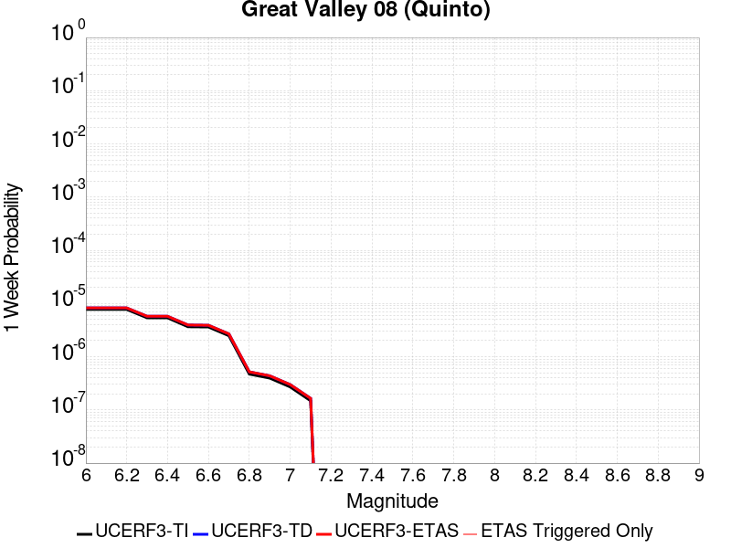 | 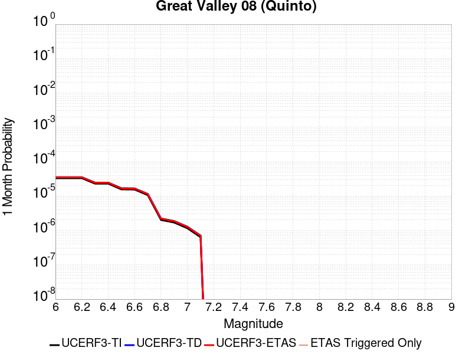 | 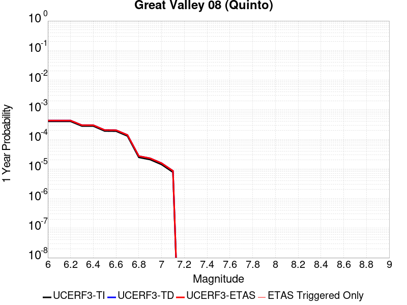 | 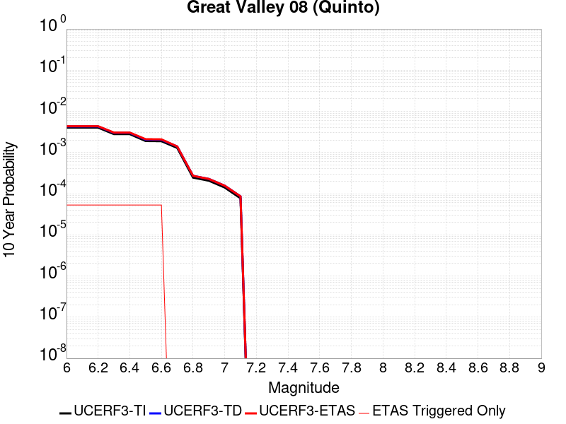 |

| Magnitude | 1 wk TI Prob | 1 wk TD Prob | 1 wk ETAS Prob | 1 wk ETAS/TD Gain | 1 wk ETAS Triggered Only | 1 mo TI Prob | 1 mo TD Prob | 1 mo ETAS Prob | 1 mo ETAS/TD Gain | 1 mo ETAS Triggered Only | 1 yr TI Prob | 1 yr TD Prob | 1 yr ETAS Prob | 1 yr ETAS/TD Gain | 1 yr ETAS Triggered Only | 10 yr TI Prob | 10 yr TD Prob | 10 yr ETAS Prob | 10 yr ETAS/TD Gain | 10 yr ETAS Triggered Only |
|-----|-----|-----|-----|-----|-----|-----|-----|-----|-----|-----|-----|-----|-----|-----|-----|-----|-----|-----|-----|-----|
| 6.0 | 7.737697E-6 | 8.253623E-6 | 8.253623E-6 | 1.0 | 0.0 | 3.3161137E-5 | 3.5372297E-5 | 3.5372297E-5 | 1.0 | 0.0 | 4.0366207E-4 | 4.3059146E-4 | 4.3059146E-4 | 1.0 | 0.0 | 0.004029296 | 0.0042994246 | 0.004310366 | 1.0025449 | 1.0989011E-5 |
| 6.1 | 7.737697E-6 | 8.253623E-6 | 8.253623E-6 | 1.0 | 0.0 | 3.3161137E-5 | 3.5372297E-5 | 3.5372297E-5 | 1.0 | 0.0 | 4.0366207E-4 | 4.3059146E-4 | 4.3059146E-4 | 1.0 | 0.0 | 0.004029296 | 0.0042994246 | 0.004310366 | 1.0025449 | 1.0989011E-5 |
| 6.2 | 7.737697E-6 | 8.253623E-6 | 8.253623E-6 | 1.0 | 0.0 | 3.3161137E-5 | 3.5372297E-5 | 3.5372297E-5 | 1.0 | 0.0 | 4.0366207E-4 | 4.3059146E-4 | 4.3059146E-4 | 1.0 | 0.0 | 0.004029296 | 0.0042994246 | 0.004310366 | 1.0025449 | 1.0989011E-5 |
| 6.3 | 5.374012E-6 | 5.7510024E-6 | 5.7510024E-6 | 1.0 | 0.0 | 2.3031276E-5 | 2.4646983E-5 | 2.4646983E-5 | 1.0 | 0.0 | 2.803697E-4 | 3.0004684E-4 | 3.0004684E-4 | 1.0 | 0.0 | 0.0028001624 | 0.0029975108 | 0.003008467 | 1.0036551 | 1.0989011E-5 |
| 6.4 | 5.374012E-6 | 5.7510024E-6 | 5.7510024E-6 | 1.0 | 0.0 | 2.3031276E-5 | 2.4646983E-5 | 2.4646983E-5 | 1.0 | 0.0 | 2.803697E-4 | 3.0004684E-4 | 3.0004684E-4 | 1.0 | 0.0 | 0.0028001624 | 0.0029975108 | 0.003008467 | 1.0036551 | 1.0989011E-5 |
| 6.5 | 3.65427E-6 | 3.9416527E-6 | 3.9416527E-6 | 1.0 | 0.0 | 1.5661062E-5 | 1.6892729E-5 | 1.6892729E-5 | 1.0 | 0.0 | 1.9065675E-4 | 2.056566E-4 | 2.056566E-4 | 1.0 | 0.0 | 0.0019049325 | 0.0020553546 | 0.0020663212 | 1.0053356 | 1.0989011E-5 |
| 6.6 | 3.6143538E-6 | 3.898836E-6 | 3.898836E-6 | 1.0 | 0.0 | 1.5489995E-5 | 1.6709231E-5 | 1.6709231E-5 | 1.0 | 0.0 | 1.8857437E-4 | 2.0342294E-4 | 2.0342294E-4 | 1.0 | 0.0 | 0.0018841444 | 0.002033059 | 0.0020440256 | 1.0053942 | 1.0989011E-5 |
| 6.7 | 2.4821015E-6 | 2.685941E-6 | 2.685941E-6 | 1.0 | 0.0 | 1.0637535E-5 | 1.1511156E-5 | 1.1511156E-5 | 1.0 | 0.0 | 1.2950429E-4 | 1.4014497E-4 | 1.4014497E-4 | 1.0 | 0.0 | 0.0012942884 | 0.0014011209 | 0.0014011209 | 1.0 | 0.0 |
| 6.8 | 4.7110538E-7 | 5.193585E-7 | 5.193585E-7 | 1.0 | 0.0 | 2.0190216E-6 | 2.2258203E-6 | 2.2258203E-6 | 1.0 | 0.0 | 2.458131E-5 | 2.7099044E-5 | 2.7099044E-5 | 1.0 | 0.0 | 2.457859E-4 | 2.709592E-4 | 2.709592E-4 | 1.0 | 0.0 |
| 6.9 | 3.958685E-7 | 4.3708278E-7 | 4.3708278E-7 | 1.0 | 0.0 | 1.6965782E-6 | 1.8732106E-6 | 1.8732106E-6 | 1.0 | 0.0 | 2.0655643E-5 | 2.2806116E-5 | 2.2806116E-5 | 1.0 | 0.0 | 2.0653724E-4 | 2.2803938E-4 | 2.2803938E-4 | 1.0 | 0.0 |
| 7.0 | 2.70294E-7 | 2.9923405E-7 | 2.9923405E-7 | 1.0 | 0.0 | 1.1584025E-6 | 1.2824311E-6 | 1.2824311E-6 | 1.0 | 0.0 | 1.4103458E-5 | 1.56135E-5 | 1.56135E-5 | 1.0 | 0.0 | 1.4102564E-4 | 1.561253E-4 | 1.561253E-4 | 1.0 | 0.0 |
| 7.1 | 1.4828602E-7 | 1.647104E-7 | 1.647104E-7 | 1.0 | 0.0 | 6.3551136E-7 | 7.059016E-7 | 7.059016E-7 | 1.0 | 0.0 | 7.737323E-6 | 8.594327E-6 | 8.594327E-6 | 1.0 | 0.0 | 7.737054E-5 | 8.594074E-5 | 8.594074E-5 | 1.0 | 0.0 |

## Robinson Creek
*[(top)](#table-of-contents)*

| 1 Week | 1 Month | 1 Year | 10 Year |
|-----|-----|-----|-----|
| 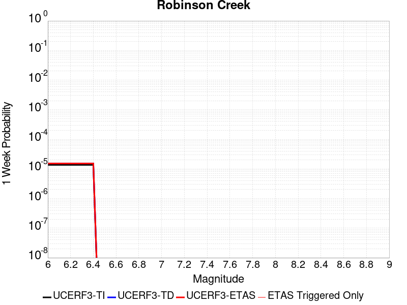 |  | 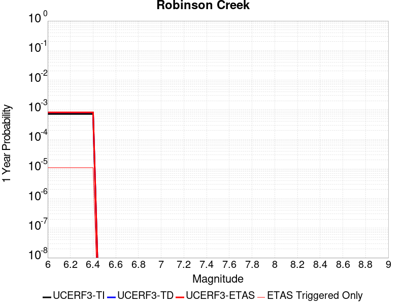 | 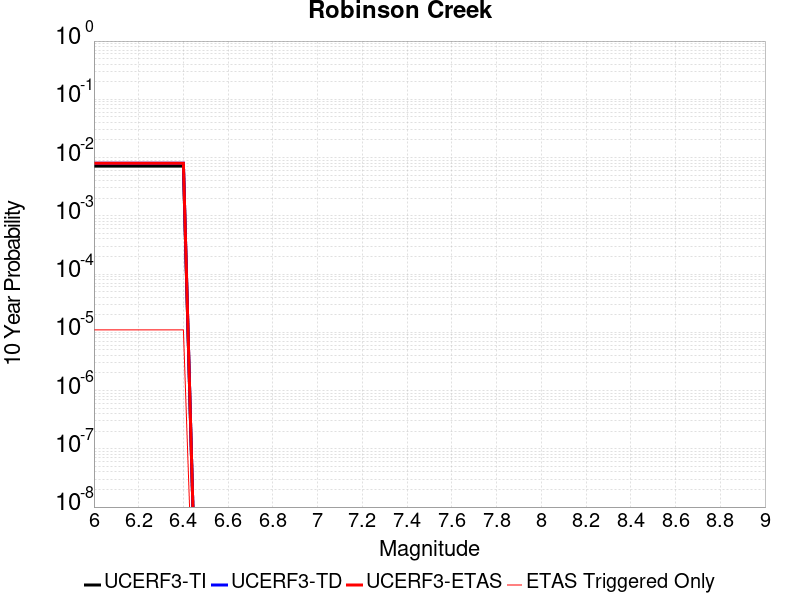 |

| Magnitude | 1 wk TI Prob | 1 wk TD Prob | 1 wk ETAS Prob | 1 wk ETAS/TD Gain | 1 wk ETAS Triggered Only | 1 mo TI Prob | 1 mo TD Prob | 1 mo ETAS Prob | 1 mo ETAS/TD Gain | 1 mo ETAS Triggered Only | 1 yr TI Prob | 1 yr TD Prob | 1 yr ETAS Prob | 1 yr ETAS/TD Gain | 1 yr ETAS Triggered Only | 10 yr TI Prob | 10 yr TD Prob | 10 yr ETAS Prob | 10 yr ETAS/TD Gain | 10 yr ETAS Triggered Only |
|-----|-----|-----|-----|-----|-----|-----|-----|-----|-----|-----|-----|-----|-----|-----|-----|-----|-----|-----|-----|-----|
| 6.0 | 1.3705327E-5 | 1.5286883E-5 | 1.5286883E-5 | 1.0 | 0.0 | 5.8735794E-5 | 6.551521E-5 | 6.551521E-5 | 1.0 | 0.0 | 7.1487366E-4 | 7.976477E-4 | 8.086279E-4 | 1.0137658 | 1.0989011E-5 | 0.0071257832 | 0.007976477 | 0.007987378 | 1.0013667 | 1.0989011E-5 |
| 6.1 | 1.3705327E-5 | 1.5286883E-5 | 1.5286883E-5 | 1.0 | 0.0 | 5.8735794E-5 | 6.551521E-5 | 6.551521E-5 | 1.0 | 0.0 | 7.1487366E-4 | 7.976477E-4 | 8.086279E-4 | 1.0137658 | 1.0989011E-5 | 0.0071257832 | 0.007976477 | 0.007987378 | 1.0013667 | 1.0989011E-5 |
| 6.2 | 1.3705327E-5 | 1.5286883E-5 | 1.5286883E-5 | 1.0 | 0.0 | 5.8735794E-5 | 6.551521E-5 | 6.551521E-5 | 1.0 | 0.0 | 7.1487366E-4 | 7.976477E-4 | 8.086279E-4 | 1.0137658 | 1.0989011E-5 | 0.0071257832 | 0.007976477 | 0.007987378 | 1.0013667 | 1.0989011E-5 |
| 6.3 | 1.3705327E-5 | 1.5286883E-5 | 1.5286883E-5 | 1.0 | 0.0 | 5.8735794E-5 | 6.551521E-5 | 6.551521E-5 | 1.0 | 0.0 | 7.1487366E-4 | 7.976477E-4 | 8.086279E-4 | 1.0137658 | 1.0989011E-5 | 0.0071257832 | 0.007976477 | 0.007987378 | 1.0013667 | 1.0989011E-5 |
| 6.4 | 1.3705327E-5 | 1.5286883E-5 | 1.5286883E-5 | 1.0 | 0.0 | 5.8735794E-5 | 6.551521E-5 | 6.551521E-5 | 1.0 | 0.0 | 7.1487366E-4 | 7.976477E-4 | 8.086279E-4 | 1.0137658 | 1.0989011E-5 | 0.0071257832 | 0.007976477 | 0.007987378 | 1.0013667 | 1.0989011E-5 |

## Jess Valley
*[(top)](#table-of-contents)*

| 1 Week | 1 Month | 1 Year | 10 Year |
|-----|-----|-----|-----|
| 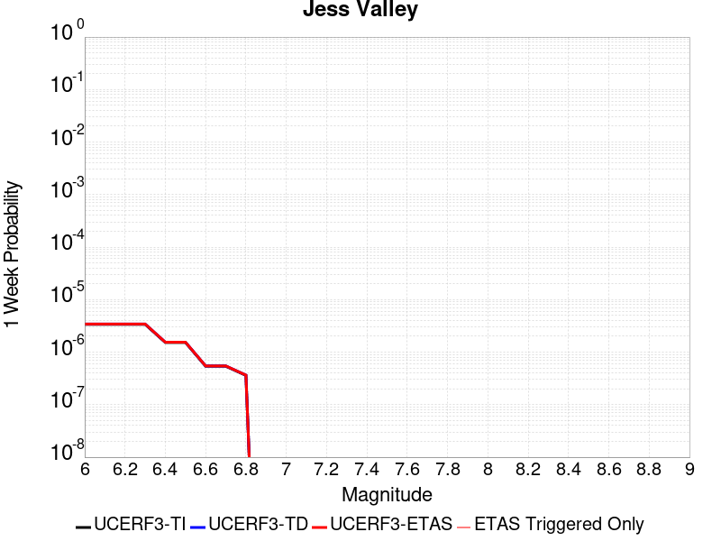 | 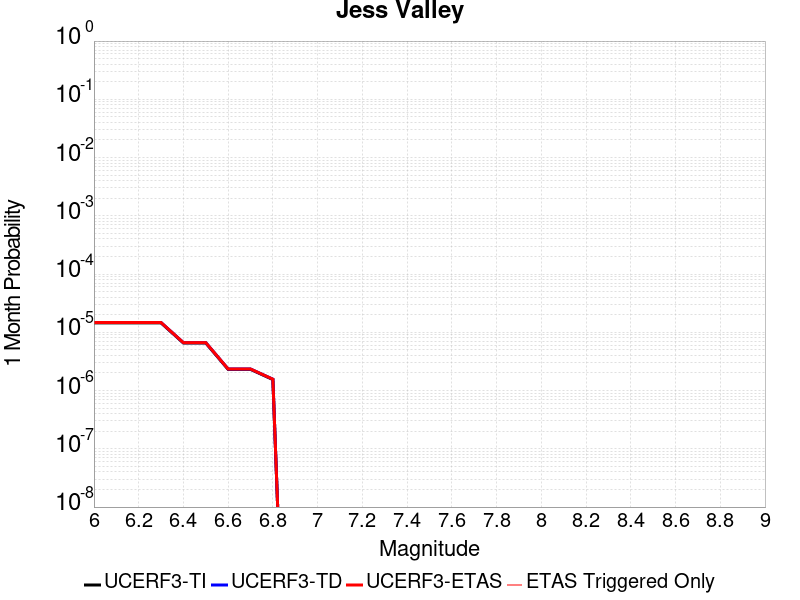 | 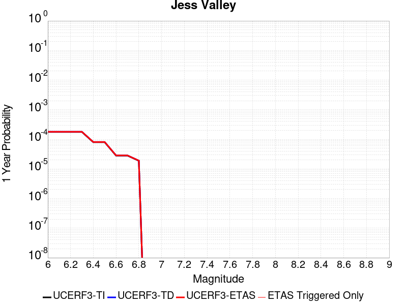 | 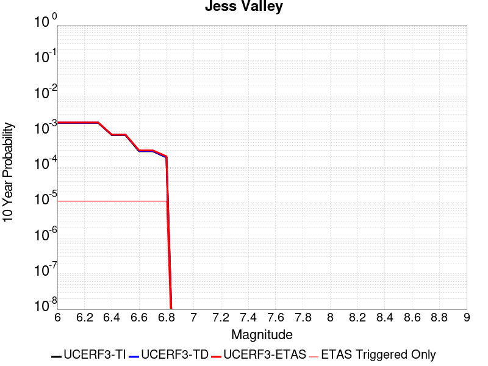 |

| Magnitude | 1 wk TI Prob | 1 wk TD Prob | 1 wk ETAS Prob | 1 wk ETAS/TD Gain | 1 wk ETAS Triggered Only | 1 mo TI Prob | 1 mo TD Prob | 1 mo ETAS Prob | 1 mo ETAS/TD Gain | 1 mo ETAS Triggered Only | 1 yr TI Prob | 1 yr TD Prob | 1 yr ETAS Prob | 1 yr ETAS/TD Gain | 1 yr ETAS Triggered Only | 10 yr TI Prob | 10 yr TD Prob | 10 yr ETAS Prob | 10 yr ETAS/TD Gain | 10 yr ETAS Triggered Only |
|-----|-----|-----|-----|-----|-----|-----|-----|-----|-----|-----|-----|-----|-----|-----|-----|-----|-----|-----|-----|-----|
| 6.0 | 3.3861274E-6 | 3.4341108E-6 | 3.4341108E-6 | 1.0 | 0.0 | 1.4511894E-5 | 1.4717551E-5 | 1.4717551E-5 | 1.0 | 0.0 | 1.7666799E-4 | 1.7917425E-4 | 1.7917425E-4 | 1.0 | 0.0 | 0.001765276 | 0.0017905745 | 0.0018015439 | 1.0061262 | 1.0989011E-5 |
| 6.1 | 3.3861274E-6 | 3.4341108E-6 | 3.4341108E-6 | 1.0 | 0.0 | 1.4511894E-5 | 1.4717551E-5 | 1.4717551E-5 | 1.0 | 0.0 | 1.7666799E-4 | 1.7917425E-4 | 1.7917425E-4 | 1.0 | 0.0 | 0.001765276 | 0.0017905745 | 0.0018015439 | 1.0061262 | 1.0989011E-5 |
| 6.2 | 3.3861274E-6 | 3.4341108E-6 | 3.4341108E-6 | 1.0 | 0.0 | 1.4511894E-5 | 1.4717551E-5 | 1.4717551E-5 | 1.0 | 0.0 | 1.7666799E-4 | 1.7917425E-4 | 1.7917425E-4 | 1.0 | 0.0 | 0.001765276 | 0.0017905745 | 0.0018015439 | 1.0061262 | 1.0989011E-5 |
| 6.3 | 3.3861274E-6 | 3.4341108E-6 | 3.4341108E-6 | 1.0 | 0.0 | 1.4511894E-5 | 1.4717551E-5 | 1.4717551E-5 | 1.0 | 0.0 | 1.7666799E-4 | 1.7917425E-4 | 1.7917425E-4 | 1.0 | 0.0 | 0.001765276 | 0.0017905745 | 0.0018015439 | 1.0061262 | 1.0989011E-5 |
| 6.4 | 1.5291708E-6 | 1.5503011E-6 | 1.5503011E-6 | 1.0 | 0.0 | 6.553573E-6 | 6.6441353E-6 | 6.6441353E-6 | 1.0 | 0.0 | 7.978683E-5 | 8.089014E-5 | 8.089014E-5 | 1.0 | 0.0 | 7.975819E-4 | 8.086852E-4 | 8.196653E-4 | 1.0135777 | 1.0989011E-5 |
| 6.5 | 1.5291708E-6 | 1.5503011E-6 | 1.5503011E-6 | 1.0 | 0.0 | 6.553573E-6 | 6.6441353E-6 | 6.6441353E-6 | 1.0 | 0.0 | 7.978683E-5 | 8.089014E-5 | 8.089014E-5 | 1.0 | 0.0 | 7.975819E-4 | 8.086852E-4 | 8.196653E-4 | 1.0135777 | 1.0989011E-5 |
| 6.6 | 5.396423E-7 | 5.4720766E-7 | 5.4720766E-7 | 1.0 | 0.0 | 2.312751E-6 | 2.3451746E-6 | 2.3451746E-6 | 1.0 | 0.0 | 2.8157378E-5 | 2.8552317E-5 | 2.8552317E-5 | 1.0 | 0.0 | 2.8153812E-4 | 2.8550488E-4 | 2.9649076E-4 | 1.0384787 | 1.0989011E-5 |
| 6.7 | 5.396423E-7 | 5.4720766E-7 | 5.4720766E-7 | 1.0 | 0.0 | 2.312751E-6 | 2.3451746E-6 | 2.3451746E-6 | 1.0 | 0.0 | 2.8157378E-5 | 2.8552317E-5 | 2.8552317E-5 | 1.0 | 0.0 | 2.8153812E-4 | 2.8550488E-4 | 2.9649076E-4 | 1.0384787 | 1.0989011E-5 |
| 6.8 | 3.6058395E-7 | 3.656361E-7 | 3.656361E-7 | 1.0 | 0.0 | 1.5453588E-6 | 1.5670119E-6 | 1.5670119E-6 | 1.0 | 0.0 | 1.8814582E-5 | 1.9078368E-5 | 1.9078368E-5 | 1.0 | 0.0 | 1.8812988E-4 | 1.907837E-4 | 2.0177061E-4 | 1.0575883 | 1.0989011E-5 |

## Cucamonga
*[(top)](#table-of-contents)*

| 1 Week | 1 Month | 1 Year | 10 Year |
|-----|-----|-----|-----|
| 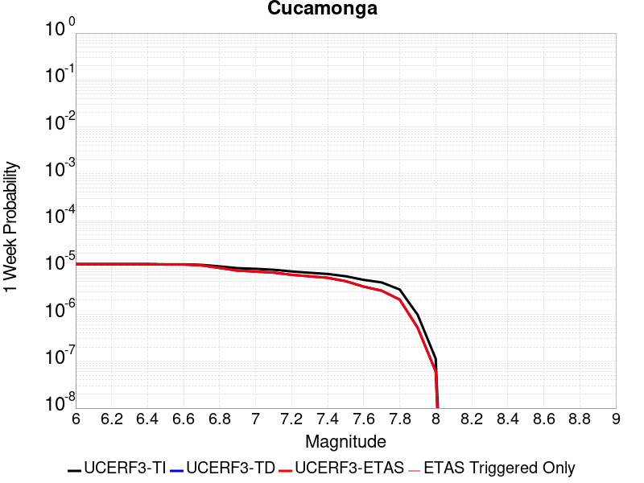 | 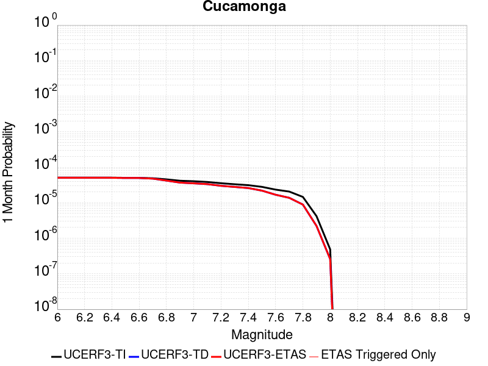 | 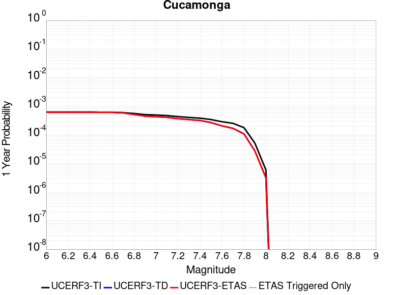 | 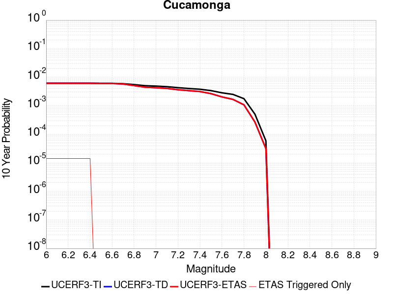 |

| Magnitude | 1 wk TI Prob | 1 wk TD Prob | 1 wk ETAS Prob | 1 wk ETAS/TD Gain | 1 wk ETAS Triggered Only | 1 mo TI Prob | 1 mo TD Prob | 1 mo ETAS Prob | 1 mo ETAS/TD Gain | 1 mo ETAS Triggered Only | 1 yr TI Prob | 1 yr TD Prob | 1 yr ETAS Prob | 1 yr ETAS/TD Gain | 1 yr ETAS Triggered Only | 10 yr TI Prob | 10 yr TD Prob | 10 yr ETAS Prob | 10 yr ETAS/TD Gain | 10 yr ETAS Triggered Only |
|-----|-----|-----|-----|-----|-----|-----|-----|-----|-----|-----|-----|-----|-----|-----|-----|-----|-----|-----|-----|-----|
| 6.0 | 1.1848348E-5 | 1.1742451E-5 | 1.1742451E-5 | 1.0 | 0.0 | 5.0777642E-5 | 5.032383E-5 | 5.032383E-5 | 1.0 | 0.0 | 6.180424E-4 | 6.125231E-4 | 6.125231E-4 | 1.0 | 0.0 | 0.0061632637 | 0.0061095147 | 0.006120437 | 1.0017877 | 1.0989011E-5 |
| 6.1 | 1.1848348E-5 | 1.1742451E-5 | 1.1742451E-5 | 1.0 | 0.0 | 5.0777642E-5 | 5.032383E-5 | 5.032383E-5 | 1.0 | 0.0 | 6.180424E-4 | 6.125231E-4 | 6.125231E-4 | 1.0 | 0.0 | 0.0061632637 | 0.0061095147 | 0.006120437 | 1.0017877 | 1.0989011E-5 |
| 6.2 | 1.1848348E-5 | 1.1742451E-5 | 1.1742451E-5 | 1.0 | 0.0 | 5.0777642E-5 | 5.032383E-5 | 5.032383E-5 | 1.0 | 0.0 | 6.180424E-4 | 6.125231E-4 | 6.125231E-4 | 1.0 | 0.0 | 0.0061632637 | 0.0061095147 | 0.006120437 | 1.0017877 | 1.0989011E-5 |
| 6.3 | 1.1848348E-5 | 1.1742451E-5 | 1.1742451E-5 | 1.0 | 0.0 | 5.0777642E-5 | 5.032383E-5 | 5.032383E-5 | 1.0 | 0.0 | 6.180424E-4 | 6.125231E-4 | 6.125231E-4 | 1.0 | 0.0 | 0.0061632637 | 0.0061095147 | 0.006120437 | 1.0017877 | 1.0989011E-5 |
| 6.4 | 1.1848348E-5 | 1.1742451E-5 | 1.1742451E-5 | 1.0 | 0.0 | 5.0777642E-5 | 5.032383E-5 | 5.032383E-5 | 1.0 | 0.0 | 6.180424E-4 | 6.125231E-4 | 6.125231E-4 | 1.0 | 0.0 | 0.0061632637 | 0.0061095147 | 0.006120437 | 1.0017877 | 1.0989011E-5 |
| 6.5 | 1.16988695E-5 | 1.1581468E-5 | 1.1581468E-5 | 1.0 | 0.0 | 5.013705E-5 | 4.9633934E-5 | 4.9633934E-5 | 1.0 | 0.0 | 6.102476E-4 | 6.041283E-4 | 6.041283E-4 | 1.0 | 0.0 | 0.006085745 | 0.0060260226 | 0.0060260226 | 1.0 | 0.0 |
| 6.6 | 1.16988695E-5 | 1.1581468E-5 | 1.1581468E-5 | 1.0 | 0.0 | 5.013705E-5 | 4.9633934E-5 | 4.9633934E-5 | 1.0 | 0.0 | 6.102476E-4 | 6.041283E-4 | 6.041283E-4 | 1.0 | 0.0 | 0.006085745 | 0.0060260226 | 0.0060260226 | 1.0 | 0.0 |
| 6.7 | 1.1397107E-5 | 1.1120239E-5 | 1.1120239E-5 | 1.0 | 0.0 | 4.884383E-5 | 4.765731E-5 | 4.765731E-5 | 1.0 | 0.0 | 5.9451134E-4 | 5.800758E-4 | 5.800758E-4 | 1.0 | 0.0 | 0.005929234 | 0.0057867584 | 0.0057867584 | 1.0 | 0.0 |
| 6.8 | 1.058387E-5 | 9.789649E-6 | 9.789649E-6 | 1.0 | 0.0 | 4.5358654E-5 | 4.195497E-5 | 4.195497E-5 | 1.0 | 0.0 | 5.521017E-4 | 5.1068317E-4 | 5.1068317E-4 | 1.0 | 0.0 | 0.00550732 | 0.005096096 | 0.005096096 | 1.0 | 0.0 |
| 6.9 | 9.690046E-6 | 8.583722E-6 | 8.583722E-6 | 1.0 | 0.0 | 4.1528107E-5 | 3.6786863E-5 | 3.6786863E-5 | 1.0 | 0.0 | 5.054874E-4 | 4.4778842E-4 | 4.4778842E-4 | 1.0 | 0.0 | 0.005043391 | 0.0044697877 | 0.0044697877 | 1.0 | 0.0 |
| 7.0 | 9.381461E-6 | 8.191231E-6 | 8.191231E-6 | 1.0 | 0.0 | 4.020564E-5 | 3.5104807E-5 | 3.5104807E-5 | 1.0 | 0.0 | 4.893937E-4 | 4.2731757E-4 | 4.2731757E-4 | 1.0 | 0.0 | 0.0048831734 | 0.004265884 | 0.004265884 | 1.0 | 0.0 |
| 7.1 | 8.946492E-6 | 7.785935E-6 | 7.785935E-6 | 1.0 | 0.0 | 3.8341543E-5 | 3.336787E-5 | 3.336787E-5 | 1.0 | 0.0 | 4.667083E-4 | 4.0617838E-4 | 4.0617838E-4 | 1.0 | 0.0 | 0.0046572937 | 0.0040552868 | 0.0040552868 | 1.0 | 0.0 |
| 7.2 | 8.251016E-6 | 6.9790576E-6 | 6.9790576E-6 | 1.0 | 0.0 | 3.5361016E-5 | 2.9909905E-5 | 2.9909905E-5 | 1.0 | 0.0 | 4.3043532E-4 | 3.6409247E-4 | 3.6409247E-4 | 1.0 | 0.0 | 0.0042960253 | 0.0036358838 | 0.0036358838 | 1.0 | 0.0 |
| 7.3 | 7.717881E-6 | 6.4900078E-6 | 6.4900078E-6 | 1.0 | 0.0 | 3.3076216E-5 | 2.7814025E-5 | 2.7814025E-5 | 1.0 | 0.0 | 4.026285E-4 | 3.3858334E-4 | 3.3858334E-4 | 1.0 | 0.0 | 0.004018998 | 0.0033816027 | 0.0033816027 | 1.0 | 0.0 |
| 7.4 | 7.275623E-6 | 6.03551E-6 | 6.03551E-6 | 1.0 | 0.0 | 3.118087E-5 | 2.5866215E-5 | 2.5866215E-5 | 1.0 | 0.0 | 3.7956095E-4 | 3.1487588E-4 | 3.1487588E-4 | 1.0 | 0.0 | 0.0037891332 | 0.0031452242 | 0.0031452242 | 1.0 | 0.0 |
| 7.5 | 6.5109502E-6 | 5.1037223E-6 | 5.1037223E-6 | 1.0 | 0.0 | 2.7903774E-5 | 2.1872913E-5 | 2.1872913E-5 | 1.0 | 0.0 | 3.3967546E-4 | 2.662703E-4 | 2.662703E-4 | 1.0 | 0.0 | 0.0033915674 | 0.002660428 | 0.002660428 | 1.0 | 0.0 |
| 7.6 | 5.4495326E-6 | 3.911345E-6 | 3.911345E-6 | 1.0 | 0.0 | 2.335493E-5 | 1.67628E-5 | 1.67628E-5 | 1.0 | 0.0 | 2.8430918E-4 | 2.0406804E-4 | 2.0406804E-4 | 1.0 | 0.0 | 0.0028394572 | 0.002039718 | 0.002039718 | 1.0 | 0.0 |
| 7.7 | 4.7997164E-6 | 3.2027551E-6 | 3.2027551E-6 | 1.0 | 0.0 | 2.057005E-5 | 1.3726021E-5 | 1.3726021E-5 | 1.0 | 0.0 | 2.504116E-4 | 1.6710153E-4 | 1.6710153E-4 | 1.0 | 0.0 | 0.002501296 | 0.0016706818 | 0.0016706818 | 1.0 | 0.0 |
| 7.8 | 3.3941733E-6 | 2.065652E-6 | 2.065652E-6 | 1.0 | 0.0 | 1.4546376E-5 | 8.852764E-6 | 8.852764E-6 | 1.0 | 0.0 | 1.7708774E-4 | 1.07777094E-4 | 1.07777094E-4 | 1.0 | 0.0 | 0.0017694668 | 0.0010774855 | 0.0010774855 | 1.0 | 0.0 |
| 7.9 | 9.750552E-7 | 5.160662E-7 | 5.160662E-7 | 1.0 | 0.0 | 4.178801E-6 | 2.2117106E-6 | 2.2117106E-6 | 1.0 | 0.0 | 5.0875715E-5 | 2.6927248E-5 | 2.6927248E-5 | 1.0 | 0.0 | 5.086407E-4 | 2.6924026E-4 | 2.6924026E-4 | 1.0 | 0.0 |
| 8.0 | 1.133857E-7 | 6.056467E-8 | 6.056467E-8 | 1.0 | 0.0 | 4.8593864E-7 | 2.5956285E-7 | 2.5956285E-7 | 1.0 | 0.0 | 5.9162867E-6 | 3.1601733E-6 | 3.1601733E-6 | 1.0 | 0.0 | 5.916129E-5 | 3.16013E-5 | 3.16013E-5 | 1.0 | 0.0 |

## Great Valley 07 (Orestimba)
*[(top)](#table-of-contents)*

| 1 Week | 1 Month | 1 Year | 10 Year |
|-----|-----|-----|-----|
| 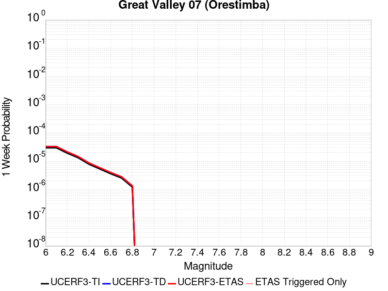 | 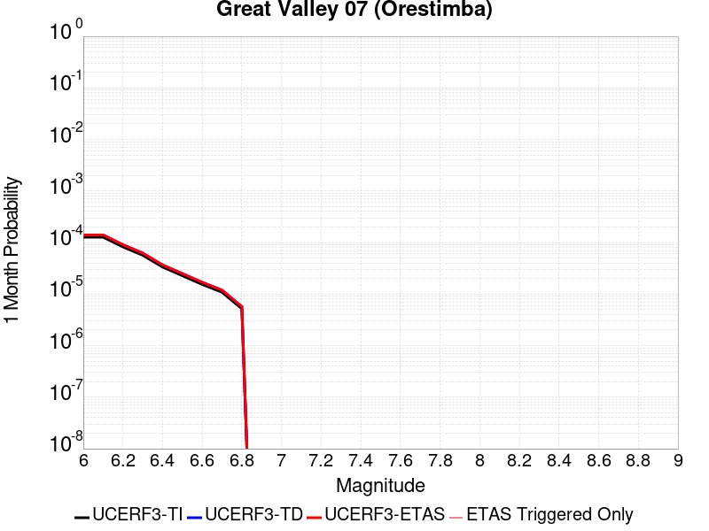 | 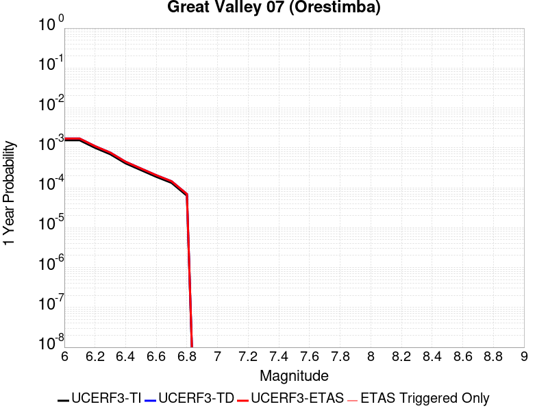 | 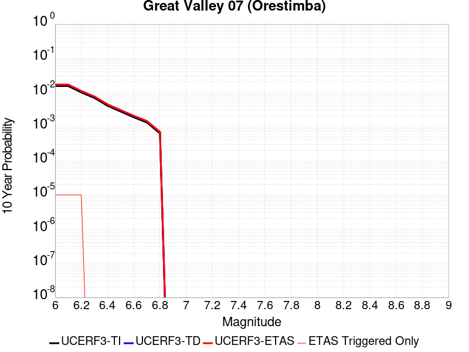 |

| Magnitude | 1 wk TI Prob | 1 wk TD Prob | 1 wk ETAS Prob | 1 wk ETAS/TD Gain | 1 wk ETAS Triggered Only | 1 mo TI Prob | 1 mo TD Prob | 1 mo ETAS Prob | 1 mo ETAS/TD Gain | 1 mo ETAS Triggered Only | 1 yr TI Prob | 1 yr TD Prob | 1 yr ETAS Prob | 1 yr ETAS/TD Gain | 1 yr ETAS Triggered Only | 10 yr TI Prob | 10 yr TD Prob | 10 yr ETAS Prob | 10 yr ETAS/TD Gain | 10 yr ETAS Triggered Only |
|-----|-----|-----|-----|-----|-----|-----|-----|-----|-----|-----|-----|-----|-----|-----|-----|-----|-----|-----|-----|-----|
| 6.0 | 2.9687902E-5 | 3.2761098E-5 | 3.2761098E-5 | 1.0 | 0.0 | 1.2722766E-4 | 1.4039755E-4 | 1.4039755E-4 | 1.0 | 0.0 | 0.0015478961 | 0.0017080718 | 0.0017080718 | 1.0 | 0.0 | 0.015371585 | 0.016956983 | 0.016967786 | 1.000637 | 1.0989011E-5 |
| 6.1 | 2.9687902E-5 | 3.2761098E-5 | 3.2761098E-5 | 1.0 | 0.0 | 1.2722766E-4 | 1.4039755E-4 | 1.4039755E-4 | 1.0 | 0.0 | 0.0015478961 | 0.0017080718 | 0.0017080718 | 1.0 | 0.0 | 0.015371585 | 0.016956983 | 0.016967786 | 1.000637 | 1.0989011E-5 |
| 6.2 | 1.9231524E-5 | 2.1161417E-5 | 2.1161417E-5 | 1.0 | 0.0 | 8.2418206E-5 | 9.0688765E-5 | 9.0688765E-5 | 1.0 | 0.0 | 0.0010029797 | 0.0011035997 | 0.0011035997 | 1.0 | 0.0 | 0.00998465 | 0.010983603 | 0.010994472 | 1.0009896 | 1.0989011E-5 |
| 6.3 | 1.324766E-5 | 1.455005E-5 | 1.455005E-5 | 1.0 | 0.0 | 5.6774446E-5 | 6.235592E-5 | 6.235592E-5 | 1.0 | 0.0 | 6.910097E-4 | 7.58928E-4 | 7.58928E-4 | 1.0 | 0.0 | 0.006888649 | 0.007564309 | 0.007564309 | 1.0 | 0.0 |
| 6.4 | 7.818645E-6 | 8.573717E-6 | 8.573717E-6 | 1.0 | 0.0 | 3.3508048E-5 | 3.6744004E-5 | 3.6744004E-5 | 1.0 | 0.0 | 4.078841E-4 | 4.4726982E-4 | 4.4726982E-4 | 1.0 | 0.0 | 0.004071363 | 0.0044640363 | 0.0044640363 | 1.0 | 0.0 |
| 6.5 | 5.3076565E-6 | 5.818394E-6 | 5.818394E-6 | 1.0 | 0.0 | 2.27469E-5 | 2.4935749E-5 | 2.4935749E-5 | 1.0 | 0.0 | 2.7690834E-4 | 3.0355254E-4 | 3.0355254E-4 | 1.0 | 0.0 | 0.0027656353 | 0.0030315886 | 0.0030315886 | 1.0 | 0.0 |
| 6.6 | 3.6003578E-6 | 3.9489005E-6 | 3.9489005E-6 | 1.0 | 0.0 | 1.5430012E-5 | 1.692376E-5 | 1.692376E-5 | 1.0 | 0.0 | 1.8784421E-4 | 2.0602884E-4 | 2.0602884E-4 | 1.0 | 0.0 | 0.0018768552 | 0.0020585323 | 0.0020585323 | 1.0 | 0.0 |
| 6.7 | 2.5361826E-6 | 2.783756E-6 | 2.783756E-6 | 1.0 | 0.0 | 1.0869308E-5 | 1.1930335E-5 | 1.1930335E-5 | 1.0 | 0.0 | 1.3232579E-4 | 1.4524347E-4 | 1.4524347E-4 | 1.0 | 0.0 | 0.0013224703 | 0.0014516154 | 0.0014516154 | 1.0 | 0.0 |
| 6.8 | 1.2115831E-6 | 1.3315195E-6 | 1.3315195E-6 | 1.0 | 0.0 | 5.1924885E-6 | 5.706505E-6 | 5.706505E-6 | 1.0 | 0.0 | 6.3216714E-5 | 6.9475456E-5 | 6.9475456E-5 | 1.0 | 0.0 | 6.3198735E-4 | 6.946325E-4 | 6.946325E-4 | 1.0 | 0.0 |

## Blue Cut
*[(top)](#table-of-contents)*

| 1 Week | 1 Month | 1 Year | 10 Year |
|-----|-----|-----|-----|
| 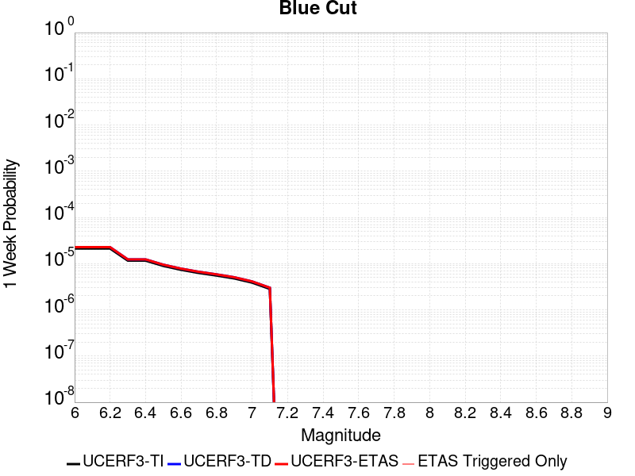 | 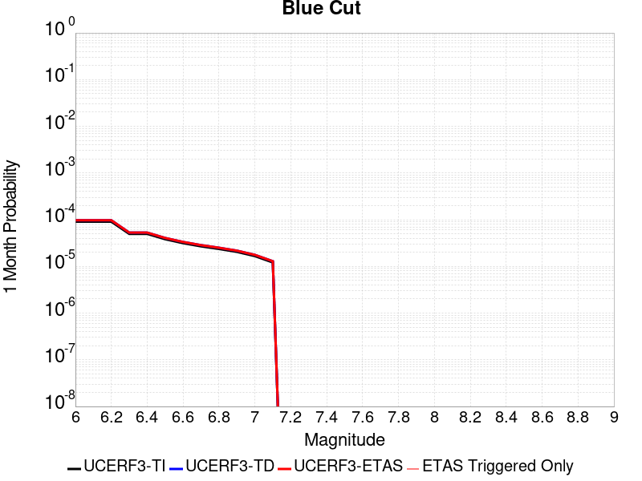 | 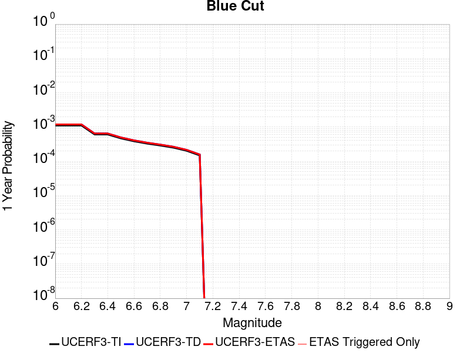 | 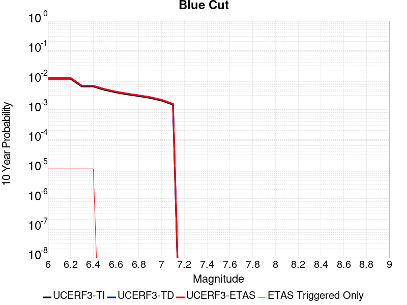 |

| Magnitude | 1 wk TI Prob | 1 wk TD Prob | 1 wk ETAS Prob | 1 wk ETAS/TD Gain | 1 wk ETAS Triggered Only | 1 mo TI Prob | 1 mo TD Prob | 1 mo ETAS Prob | 1 mo ETAS/TD Gain | 1 mo ETAS Triggered Only | 1 yr TI Prob | 1 yr TD Prob | 1 yr ETAS Prob | 1 yr ETAS/TD Gain | 1 yr ETAS Triggered Only | 10 yr TI Prob | 10 yr TD Prob | 10 yr ETAS Prob | 10 yr ETAS/TD Gain | 10 yr ETAS Triggered Only |
|-----|-----|-----|-----|-----|-----|-----|-----|-----|-----|-----|-----|-----|-----|-----|-----|-----|-----|-----|-----|-----|
| 6.0 | 2.1227985E-5 | 2.2721271E-5 | 2.2721271E-5 | 1.0 | 0.0 | 9.097391E-5 | 9.737357E-5 | 9.737357E-5 | 1.0 | 0.0 | 0.0011070445 | 0.0011849365 | 0.0011849365 | 1.0 | 0.0 | 0.011015458 | 0.011792027 | 0.011802887 | 1.0009209 | 1.0989011E-5 |
| 6.1 | 2.1227985E-5 | 2.2721271E-5 | 2.2721271E-5 | 1.0 | 0.0 | 9.097391E-5 | 9.737357E-5 | 9.737357E-5 | 1.0 | 0.0 | 0.0011070445 | 0.0011849365 | 0.0011849365 | 1.0 | 0.0 | 0.011015458 | 0.011792027 | 0.011802887 | 1.0009209 | 1.0989011E-5 |
| 6.2 | 2.1227985E-5 | 2.2721271E-5 | 2.2721271E-5 | 1.0 | 0.0 | 9.097391E-5 | 9.737357E-5 | 9.737357E-5 | 1.0 | 0.0 | 0.0011070445 | 0.0011849365 | 0.0011849365 | 1.0 | 0.0 | 0.011015458 | 0.011792027 | 0.011802887 | 1.0009209 | 1.0989011E-5 |
| 6.3 | 1.1613981E-5 | 1.2354377E-5 | 1.2354377E-5 | 1.0 | 0.0 | 4.9773254E-5 | 5.2946325E-5 | 5.2946325E-5 | 1.0 | 0.0 | 6.0582085E-4 | 6.444433E-4 | 6.444433E-4 | 1.0 | 0.0 | 0.0060417196 | 0.0064269924 | 0.0064379107 | 1.0016989 | 1.0989011E-5 |
| 6.4 | 1.1613981E-5 | 1.2354377E-5 | 1.2354377E-5 | 1.0 | 0.0 | 4.9773254E-5 | 5.2946325E-5 | 5.2946325E-5 | 1.0 | 0.0 | 6.0582085E-4 | 6.444433E-4 | 6.444433E-4 | 1.0 | 0.0 | 0.0060417196 | 0.0064269924 | 0.0064379107 | 1.0016989 | 1.0989011E-5 |
| 6.5 | 8.931326E-6 | 9.48222E-6 | 9.48222E-6 | 1.0 | 0.0 | 3.8276554E-5 | 4.0637504E-5 | 4.0637504E-5 | 1.0 | 0.0 | 4.6591737E-4 | 4.946584E-4 | 4.946584E-4 | 1.0 | 0.0 | 0.0046494175 | 0.004936483 | 0.004936483 | 1.0 | 0.0 |
| 6.6 | 7.345353E-6 | 7.79078E-6 | 7.79078E-6 | 1.0 | 0.0 | 3.1479703E-5 | 3.3388675E-5 | 3.3388675E-5 | 1.0 | 0.0 | 3.83198E-4 | 4.064393E-4 | 4.064393E-4 | 1.0 | 0.0 | 0.0038253788 | 0.004057751 | 0.004057751 | 1.0 | 0.0 |
| 6.7 | 6.2775666E-6 | 6.6555735E-6 | 6.6555735E-6 | 1.0 | 0.0 | 2.690358E-5 | 2.8523618E-5 | 2.8523618E-5 | 1.0 | 0.0 | 3.2750185E-4 | 3.4722724E-4 | 3.4722724E-4 | 1.0 | 0.0 | 0.0032701963 | 0.003467588 | 0.003467588 | 1.0 | 0.0 |
| 6.8 | 5.5234095E-6 | 5.8554842E-6 | 5.8554842E-6 | 1.0 | 0.0 | 2.367154E-5 | 2.5094732E-5 | 2.5094732E-5 | 1.0 | 0.0 | 2.8816288E-4 | 3.054928E-4 | 3.054928E-4 | 1.0 | 0.0 | 0.002877895 | 0.0030514447 | 0.0030514447 | 1.0 | 0.0 |
| 6.9 | 4.7780054E-6 | 5.0657436E-6 | 5.0657436E-6 | 1.0 | 0.0 | 2.0477004E-5 | 2.171019E-5 | 2.171019E-5 | 1.0 | 0.0 | 2.4927902E-4 | 2.6429654E-4 | 2.6429654E-4 | 1.0 | 0.0 | 0.0024899957 | 0.0026405144 | 0.0026405144 | 1.0 | 0.0 |
| 7.0 | 3.883171E-6 | 4.118752E-6 | 4.118752E-6 | 1.0 | 0.0 | 1.6642054E-5 | 1.7651713E-5 | 1.7651713E-5 | 1.0 | 0.0 | 2.0259817E-4 | 2.148953E-4 | 2.148953E-4 | 1.0 | 0.0 | 0.0020241356 | 0.0021475507 | 0.0021475507 | 1.0 | 0.0 |
| 7.1 | 2.8358215E-6 | 3.0099118E-6 | 3.0099118E-6 | 1.0 | 0.0 | 1.2153464E-5 | 1.2899595E-5 | 1.2899595E-5 | 1.0 | 0.0 | 1.4795837E-4 | 1.5704783E-4 | 1.5704783E-4 | 1.0 | 0.0 | 0.001478599 | 0.0015700137 | 0.0015700137 | 1.0 | 0.0 |

## Earthquake Valley (No  Extension)
*[(top)](#table-of-contents)*

| 1 Week | 1 Month | 1 Year | 10 Year |
|-----|-----|-----|-----|
| 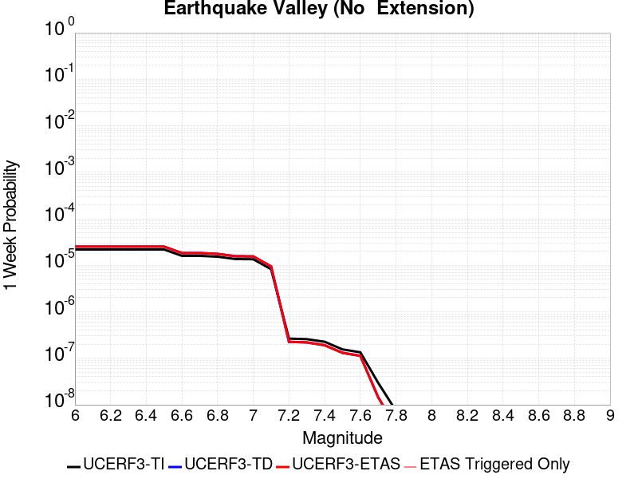 | 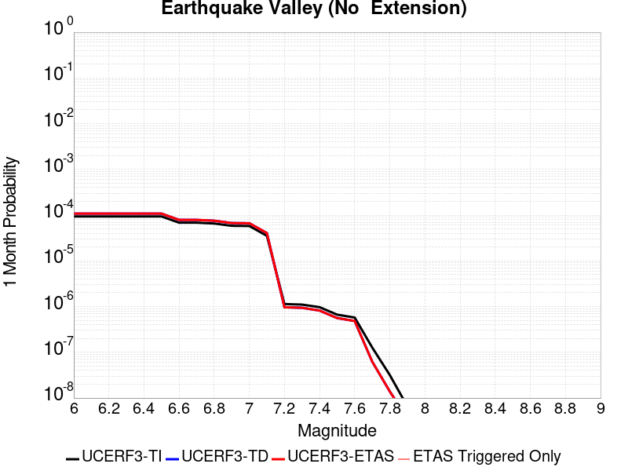 | 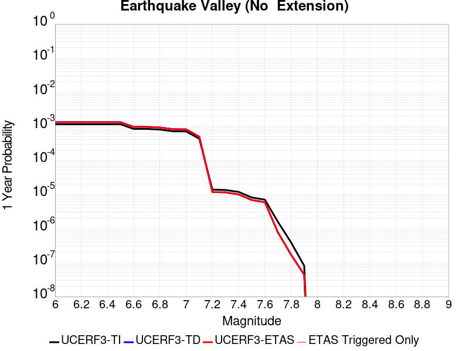 | 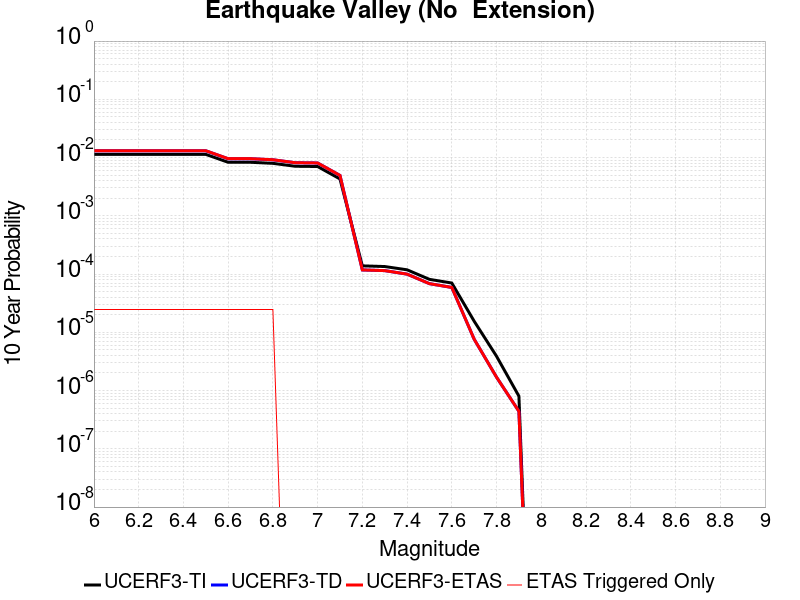 |

| Magnitude | 1 wk TI Prob | 1 wk TD Prob | 1 wk ETAS Prob | 1 wk ETAS/TD Gain | 1 wk ETAS Triggered Only | 1 mo TI Prob | 1 mo TD Prob | 1 mo ETAS Prob | 1 mo ETAS/TD Gain | 1 mo ETAS Triggered Only | 1 yr TI Prob | 1 yr TD Prob | 1 yr ETAS Prob | 1 yr ETAS/TD Gain | 1 yr ETAS Triggered Only | 10 yr TI Prob | 10 yr TD Prob | 10 yr ETAS Prob | 10 yr ETAS/TD Gain | 10 yr ETAS Triggered Only |
|-----|-----|-----|-----|-----|-----|-----|-----|-----|-----|-----|-----|-----|-----|-----|-----|-----|-----|-----|-----|-----|
| 6.0 | 2.1859703E-5 | 2.5202557E-5 | 2.5202557E-5 | 1.0 | 0.0 | 9.3681076E-5 | 1.08007305E-4 | 1.08007305E-4 | 1.0 | 0.0 | 0.0011399703 | 0.0013143406 | 0.0013143406 | 1.0 | 0.0 | 0.011341401 | 0.013080036 | 0.0130908815 | 1.0008291 | 1.0989011E-5 |
| 6.1 | 2.1859703E-5 | 2.5202557E-5 | 2.5202557E-5 | 1.0 | 0.0 | 9.3681076E-5 | 1.08007305E-4 | 1.08007305E-4 | 1.0 | 0.0 | 0.0011399703 | 0.0013143406 | 0.0013143406 | 1.0 | 0.0 | 0.011341401 | 0.013080036 | 0.0130908815 | 1.0008291 | 1.0989011E-5 |
| 6.2 | 2.1859703E-5 | 2.5202557E-5 | 2.5202557E-5 | 1.0 | 0.0 | 9.3681076E-5 | 1.08007305E-4 | 1.08007305E-4 | 1.0 | 0.0 | 0.0011399703 | 0.0013143406 | 0.0013143406 | 1.0 | 0.0 | 0.011341401 | 0.013080036 | 0.0130908815 | 1.0008291 | 1.0989011E-5 |
| 6.3 | 2.1859703E-5 | 2.5202557E-5 | 2.5202557E-5 | 1.0 | 0.0 | 9.3681076E-5 | 1.08007305E-4 | 1.08007305E-4 | 1.0 | 0.0 | 0.0011399703 | 0.0013143406 | 0.0013143406 | 1.0 | 0.0 | 0.011341401 | 0.013080036 | 0.0130908815 | 1.0008291 | 1.0989011E-5 |
| 6.4 | 2.1859703E-5 | 2.5202557E-5 | 2.5202557E-5 | 1.0 | 0.0 | 9.3681076E-5 | 1.08007305E-4 | 1.08007305E-4 | 1.0 | 0.0 | 0.0011399703 | 0.0013143406 | 0.0013143406 | 1.0 | 0.0 | 0.011341401 | 0.013080036 | 0.0130908815 | 1.0008291 | 1.0989011E-5 |
| 6.5 | 2.1859703E-5 | 2.5202557E-5 | 2.5202557E-5 | 1.0 | 0.0 | 9.3681076E-5 | 1.08007305E-4 | 1.08007305E-4 | 1.0 | 0.0 | 0.0011399703 | 0.0013143406 | 0.0013143406 | 1.0 | 0.0 | 0.011341401 | 0.013080036 | 0.0130908815 | 1.0008291 | 1.0989011E-5 |
| 6.6 | 1.597E-5 | 1.8359297E-5 | 1.8359297E-5 | 1.0 | 0.0 | 6.8441055E-5 | 7.868082E-5 | 7.868082E-5 | 1.0 | 0.0 | 8.329513E-4 | 9.576053E-4 | 9.576053E-4 | 1.0 | 0.0 | 0.008298361 | 0.0095434 | 0.009554285 | 1.0011405 | 1.0989011E-5 |
| 6.7 | 1.597E-5 | 1.8359297E-5 | 1.8359297E-5 | 1.0 | 0.0 | 6.8441055E-5 | 7.868082E-5 | 7.868082E-5 | 1.0 | 0.0 | 8.329513E-4 | 9.576053E-4 | 9.576053E-4 | 1.0 | 0.0 | 0.008298361 | 0.0095434 | 0.009554285 | 1.0011405 | 1.0989011E-5 |
| 6.8 | 1.5315149E-5 | 1.7604993E-5 | 1.7604993E-5 | 1.0 | 0.0 | 6.5634704E-5 | 7.544827E-5 | 7.544827E-5 | 1.0 | 0.0 | 7.988095E-4 | 9.182823E-4 | 9.182823E-4 | 1.0 | 0.0 | 0.007959441 | 0.009153421 | 0.00916431 | 1.0011896 | 1.0989011E-5 |
| 6.9 | 1.3634728E-5 | 1.5678423E-5 | 1.5678423E-5 | 1.0 | 0.0 | 5.8433237E-5 | 6.719197E-5 | 6.719197E-5 | 1.0 | 0.0 | 7.1119244E-4 | 8.178373E-4 | 8.178373E-4 | 1.0 | 0.0 | 0.007089207 | 0.008156349 | 0.008156349 | 1.0 | 0.0 |
| 7.0 | 1.3496271E-5 | 1.552043E-5 | 1.552043E-5 | 1.0 | 0.0 | 5.783988E-5 | 6.65149E-5 | 6.65149E-5 | 1.0 | 0.0 | 7.03973E-4 | 8.0960005E-4 | 8.0960005E-4 | 1.0 | 0.0 | 0.007017471 | 0.008074577 | 0.008074577 | 1.0 | 0.0 |
| 7.1 | 8.242798E-6 | 9.47421E-6 | 9.47421E-6 | 1.0 | 0.0 | 3.53258E-5 | 4.0603503E-5 | 4.0603503E-5 | 1.0 | 0.0 | 4.300067E-4 | 4.943026E-4 | 4.943026E-4 | 1.0 | 0.0 | 0.004291756 | 0.00493861 | 0.00493861 | 1.0 | 0.0 |
| 7.2 | 2.6506527E-7 | 2.2565123E-7 | 2.2565123E-7 | 1.0 | 0.0 | 1.1359936E-6 | 9.670764E-7 | 9.670764E-7 | 1.0 | 0.0 | 1.3830633E-5 | 1.1774096E-5 | 1.1774096E-5 | 1.0 | 0.0 | 1.3829772E-4 | 1.1773513E-4 | 1.1773513E-4 | 1.0 | 0.0 |
| 7.3 | 2.5810488E-7 | 2.196019E-7 | 2.196019E-7 | 1.0 | 0.0 | 1.1061633E-6 | 9.411507E-7 | 9.411507E-7 | 1.0 | 0.0 | 1.3467455E-5 | 1.1458454E-5 | 1.1458454E-5 | 1.0 | 0.0 | 1.3466639E-4 | 1.1457904E-4 | 1.1457904E-4 | 1.0 | 0.0 |
| 7.4 | 2.2676066E-7 | 1.9115149E-7 | 1.9115149E-7 | 1.0 | 0.0 | 9.71831E-7 | 8.192204E-7 | 8.192204E-7 | 1.0 | 0.0 | 1.1831979E-5 | 9.973967E-6 | 9.973967E-6 | 1.0 | 0.0 | 1.1831349E-4 | 9.973558E-5 | 9.973558E-5 | 1.0 | 0.0 |
| 7.5 | 1.5553917E-7 | 1.3115734E-7 | 1.3115734E-7 | 1.0 | 0.0 | 6.6659624E-7 | 5.6210274E-7 | 5.6210274E-7 | 1.0 | 0.0 | 8.115779E-6 | 6.843582E-6 | 6.843582E-6 | 1.0 | 0.0 | 8.115482E-5 | 6.843393E-5 | 6.843393E-5 | 1.0 | 0.0 |
| 7.6 | 1.3448629E-7 | 1.1291606E-7 | 1.1291606E-7 | 1.0 | 0.0 | 5.7636964E-7 | 4.839259E-7 | 4.839259E-7 | 1.0 | 0.0 | 7.017278E-6 | 5.891784E-6 | 5.891784E-6 | 1.0 | 0.0 | 7.0170565E-5 | 5.8916492E-5 | 5.8916492E-5 | 1.0 | 0.0 |
| 7.7 | 2.9719402E-8 | 1.4587915E-8 | 1.4587915E-8 | 1.0 | 0.0 | 1.2736886E-7 | 6.251963E-8 | 6.251963E-8 | 1.0 | 0.0 | 1.5507147E-6 | 7.611763E-7 | 7.611763E-7 | 1.0 | 0.0 | 1.550704E-5 | 7.611742E-6 | 7.611742E-6 | 1.0 | 0.0 |
| 7.8 | 7.4390196E-9 | 3.2514678E-9 | 3.2514678E-9 | 1.0 | 0.0 | 3.1881513E-8 | 1.3934862E-8 | 1.3934862E-8 | 1.0 | 0.0 | 3.8815733E-7 | 1.6965694E-7 | 1.6965694E-7 | 1.0 | 0.0 | 3.8815665E-6 | 1.6965683E-6 | 1.6965683E-6 | 1.0 | 0.0 |
| 7.9 | 1.5373532E-9 | 8.4424734E-10 | 8.4424734E-10 | 1.0 | 0.0 | 6.5886567E-9 | 3.618203E-9 | 3.618203E-9 | 1.0 | 0.0 | 8.021689E-8 | 4.4051625E-8 | 4.4051625E-8 | 1.0 | 0.0 | 8.0216864E-7 | 4.405162E-7 | 4.405162E-7 | 1.0 | 0.0 |

## Newport-Inglewood alt 1
*[(top)](#table-of-contents)*

| 1 Week | 1 Month | 1 Year | 10 Year |
|-----|-----|-----|-----|
| 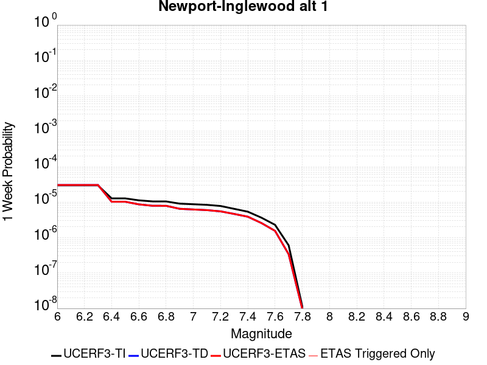 | 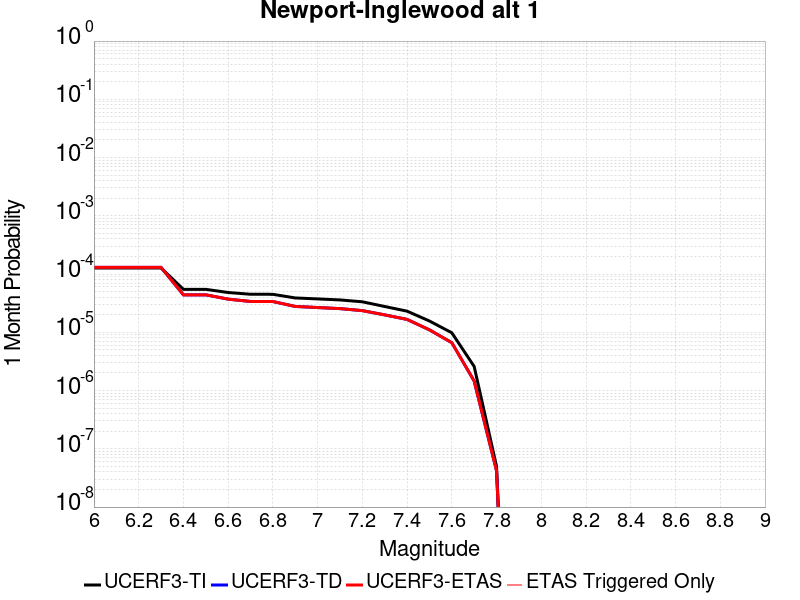 | 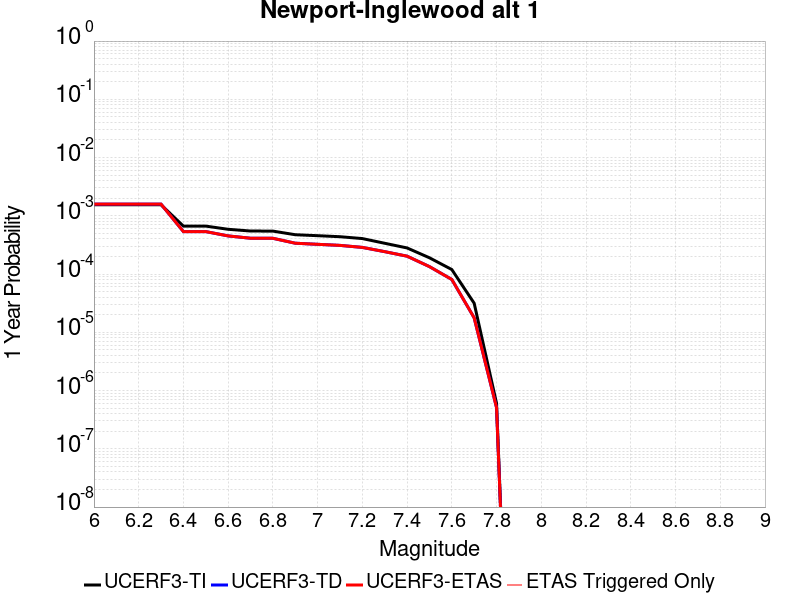 | 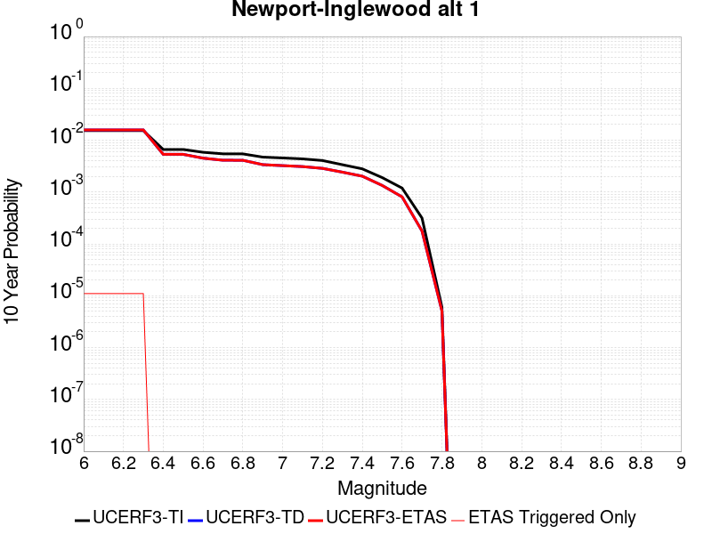 |

| Magnitude | 1 wk TI Prob | 1 wk TD Prob | 1 wk ETAS Prob | 1 wk ETAS/TD Gain | 1 wk ETAS Triggered Only | 1 mo TI Prob | 1 mo TD Prob | 1 mo ETAS Prob | 1 mo ETAS/TD Gain | 1 mo ETAS Triggered Only | 1 yr TI Prob | 1 yr TD Prob | 1 yr ETAS Prob | 1 yr ETAS/TD Gain | 1 yr ETAS Triggered Only | 10 yr TI Prob | 10 yr TD Prob | 10 yr ETAS Prob | 10 yr ETAS/TD Gain | 10 yr ETAS Triggered Only |
|-----|-----|-----|-----|-----|-----|-----|-----|-----|-----|-----|-----|-----|-----|-----|-----|-----|-----|-----|-----|-----|
| 6.0 | 2.9668912E-5 | 3.0410027E-5 | 3.0410027E-5 | 1.0 | 0.0 | 1.2714628E-4 | 1.3032492E-4 | 1.3032492E-4 | 1.0 | 0.0 | 0.0015469068 | 0.0015860314 | 0.0015860314 | 1.0 | 0.0 | 0.015361829 | 0.01579473 | 0.015805546 | 1.0006847 | 1.0989011E-5 |
| 6.1 | 2.9668912E-5 | 3.0410027E-5 | 3.0410027E-5 | 1.0 | 0.0 | 1.2714628E-4 | 1.3032492E-4 | 1.3032492E-4 | 1.0 | 0.0 | 0.0015469068 | 0.0015860314 | 0.0015860314 | 1.0 | 0.0 | 0.015361829 | 0.01579473 | 0.015805546 | 1.0006847 | 1.0989011E-5 |
| 6.2 | 2.9668912E-5 | 3.0410027E-5 | 3.0410027E-5 | 1.0 | 0.0 | 1.2714628E-4 | 1.3032492E-4 | 1.3032492E-4 | 1.0 | 0.0 | 0.0015469068 | 0.0015860314 | 0.0015860314 | 1.0 | 0.0 | 0.015361829 | 0.01579473 | 0.015805546 | 1.0006847 | 1.0989011E-5 |
| 6.3 | 2.9668912E-5 | 3.0410027E-5 | 3.0410027E-5 | 1.0 | 0.0 | 1.2714628E-4 | 1.3032492E-4 | 1.3032492E-4 | 1.0 | 0.0 | 0.0015469068 | 0.0015860314 | 0.0015860314 | 1.0 | 0.0 | 0.015361829 | 0.01579473 | 0.015805546 | 1.0006847 | 1.0989011E-5 |
| 6.4 | 1.275942E-5 | 1.0273425E-5 | 1.0273425E-5 | 1.0 | 0.0 | 5.4682085E-5 | 4.4028242E-5 | 4.4028242E-5 | 1.0 | 0.0 | 6.65551E-4 | 5.359162E-4 | 5.359162E-4 | 1.0 | 0.0 | 0.0066356123 | 0.005346663 | 0.005346663 | 1.0 | 0.0 |
| 6.5 | 1.275942E-5 | 1.0273425E-5 | 1.0273425E-5 | 1.0 | 0.0 | 5.4682085E-5 | 4.4028242E-5 | 4.4028242E-5 | 1.0 | 0.0 | 6.65551E-4 | 5.359162E-4 | 5.359162E-4 | 1.0 | 0.0 | 0.0066356123 | 0.005346663 | 0.005346663 | 1.0 | 0.0 |
| 6.6 | 1.1255358E-5 | 8.662583E-6 | 8.662583E-6 | 1.0 | 0.0 | 4.8236358E-5 | 3.712484E-5 | 3.712484E-5 | 1.0 | 0.0 | 5.871194E-4 | 4.5190286E-4 | 4.5190286E-4 | 1.0 | 0.0 | 0.005855706 | 0.004510016 | 0.004510016 | 1.0 | 0.0 |
| 6.7 | 1.0504745E-5 | 7.900412E-6 | 7.900412E-6 | 1.0 | 0.0 | 4.5019555E-5 | 3.3858476E-5 | 3.3858476E-5 | 1.0 | 0.0 | 5.4797524E-4 | 4.1215023E-4 | 4.1215023E-4 | 1.0 | 0.0 | 0.0054662596 | 0.0041139885 | 0.0041139885 | 1.0 | 0.0 |
| 6.8 | 1.0476007E-5 | 7.881792E-6 | 7.881792E-6 | 1.0 | 0.0 | 4.4896402E-5 | 3.377868E-5 | 3.377868E-5 | 1.0 | 0.0 | 5.464766E-4 | 4.1117906E-4 | 4.1117906E-4 | 1.0 | 0.0 | 0.005451347 | 0.0041043125 | 0.0041043125 | 1.0 | 0.0 |
| 6.9 | 9.076797E-6 | 6.490111E-6 | 6.490111E-6 | 1.0 | 0.0 | 3.889998E-5 | 2.7814465E-5 | 2.7814465E-5 | 1.0 | 0.0 | 4.7350433E-4 | 3.3858884E-4 | 3.3858884E-4 | 1.0 | 0.0 | 0.004724967 | 0.003380767 | 0.003380767 | 1.0 | 0.0 |
| 7.0 | 8.73795E-6 | 6.212483E-6 | 6.212483E-6 | 1.0 | 0.0 | 3.7447822E-5 | 2.6624659E-5 | 2.6624659E-5 | 1.0 | 0.0 | 4.5583185E-4 | 3.2410727E-4 | 3.2410727E-4 | 1.0 | 0.0 | 0.0045489795 | 0.0032363776 | 0.0032363776 | 1.0 | 0.0 |
| 7.1 | 8.391299E-6 | 5.956245E-6 | 5.956245E-6 | 1.0 | 0.0 | 3.5962214E-5 | 2.5526515E-5 | 2.5526515E-5 | 1.0 | 0.0 | 4.37752E-4 | 3.1074128E-4 | 3.1074128E-4 | 1.0 | 0.0 | 0.004368907 | 0.0031030972 | 0.0031030972 | 1.0 | 0.0 |
| 7.2 | 7.796882E-6 | 5.4969655E-6 | 5.4969655E-6 | 1.0 | 0.0 | 3.341478E-5 | 2.3558212E-5 | 2.3558212E-5 | 1.0 | 0.0 | 4.06749E-4 | 2.867837E-4 | 2.867837E-4 | 1.0 | 0.0 | 0.0040600533 | 0.0028641599 | 0.0028641599 | 1.0 | 0.0 |
| 7.3 | 6.4738833E-6 | 4.6481155E-6 | 4.6481155E-6 | 1.0 | 0.0 | 2.774492E-5 | 1.9920344E-5 | 1.9920344E-5 | 1.0 | 0.0 | 3.3774204E-4 | 2.4250335E-4 | 2.4250335E-4 | 1.0 | 0.0 | 0.0033722918 | 0.002422404 | 0.002422404 | 1.0 | 0.0 |
| 7.4 | 5.382145E-6 | 3.886003E-6 | 3.886003E-6 | 1.0 | 0.0 | 2.3066134E-5 | 1.6654192E-5 | 1.6654192E-5 | 1.0 | 0.0 | 2.8079396E-4 | 2.0274606E-4 | 2.0274606E-4 | 1.0 | 0.0 | 0.0028043943 | 0.0020256254 | 0.0020256254 | 1.0 | 0.0 |
| 7.5 | 3.648244E-6 | 2.5739491E-6 | 2.5739491E-6 | 1.0 | 0.0 | 1.5635238E-5 | 1.1031165E-5 | 1.1031165E-5 | 1.0 | 0.0 | 1.9034238E-4 | 1.3429625E-4 | 1.3429625E-4 | 1.0 | 0.0 | 0.0019017943 | 0.0013421614 | 0.0013421614 | 1.0 | 0.0 |
| 7.6 | 2.2906888E-6 | 1.548097E-6 | 1.548097E-6 | 1.0 | 0.0 | 9.817201E-6 | 6.634685E-6 | 6.634685E-6 | 1.0 | 0.0 | 1.1951787E-4 | 8.077436E-5 | 8.077436E-5 | 1.0 | 0.0 | 0.0011945361 | 8.074568E-4 | 8.074568E-4 | 1.0 | 0.0 |
| 7.7 | 6.0479874E-7 | 3.3977963E-7 | 3.3977963E-7 | 1.0 | 0.0 | 2.5919921E-6 | 1.4561977E-6 | 1.4561977E-6 | 1.0 | 0.0 | 3.1557047E-5 | 1.7729077E-5 | 1.7729077E-5 | 1.0 | 0.0 | 3.1552566E-4 | 1.7727801E-4 | 1.7727801E-4 | 1.0 | 0.0 |
| 7.8 | 1.16056995E-8 | 9.782525E-9 | 9.782525E-9 | 1.0 | 0.0 | 4.9738713E-8 | 4.192511E-8 | 4.192511E-8 | 1.0 | 0.0 | 6.0556863E-7 | 5.104382E-7 | 5.104382E-7 | 1.0 | 0.0 | 6.05567E-6 | 5.1043817E-6 | 5.1043817E-6 | 1.0 | 0.0 |

## Davis Creek
*[(top)](#table-of-contents)*

| 1 Week | 1 Month | 1 Year | 10 Year |
|-----|-----|-----|-----|
| 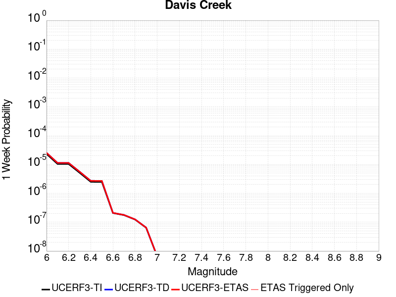 | 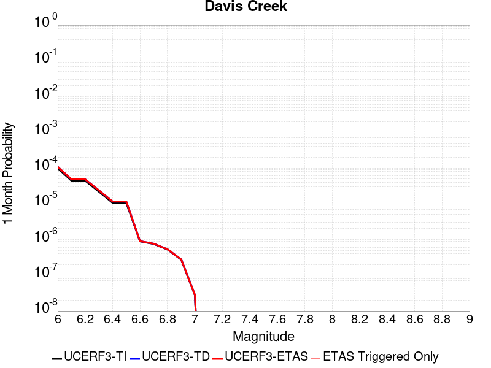 | 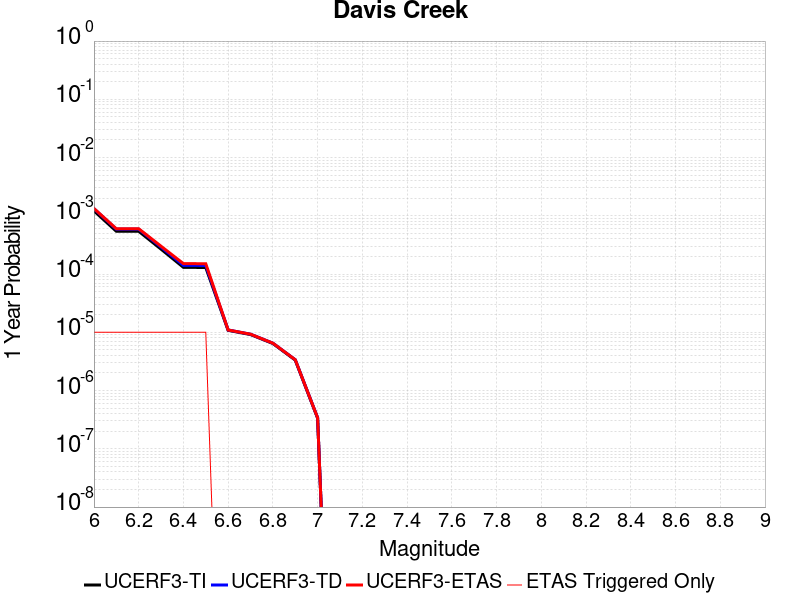 | 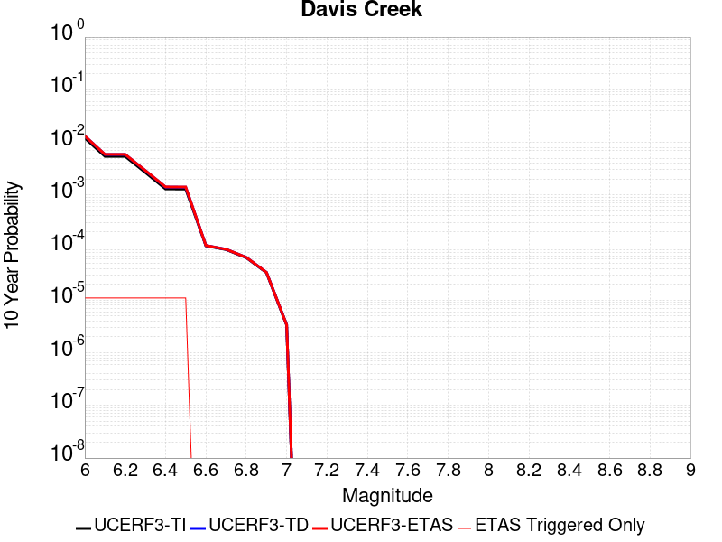 |

| Magnitude | 1 wk TI Prob | 1 wk TD Prob | 1 wk ETAS Prob | 1 wk ETAS/TD Gain | 1 wk ETAS Triggered Only | 1 mo TI Prob | 1 mo TD Prob | 1 mo ETAS Prob | 1 mo ETAS/TD Gain | 1 mo ETAS Triggered Only | 1 yr TI Prob | 1 yr TD Prob | 1 yr ETAS Prob | 1 yr ETAS/TD Gain | 1 yr ETAS Triggered Only | 10 yr TI Prob | 10 yr TD Prob | 10 yr ETAS Prob | 10 yr ETAS/TD Gain | 10 yr ETAS Triggered Only |
|-----|-----|-----|-----|-----|-----|-----|-----|-----|-----|-----|-----|-----|-----|-----|-----|-----|-----|-----|-----|-----|
| 6.0 | 2.331472E-5 | 2.5419647E-5 | 2.5419647E-5 | 1.0 | 0.0 | 9.99164E-5 | 1.08937464E-4 | 1.08937464E-4 | 1.0 | 0.0 | 0.0012158032 | 0.0013256252 | 0.0013365997 | 1.0082787 | 1.0989011E-5 | 0.01209173 | 0.01318896 | 0.013199804 | 1.0008222 | 1.0989011E-5 |
| 6.1 | 1.0407654E-5 | 1.1318038E-5 | 1.1318038E-5 | 1.0 | 0.0 | 4.4603472E-5 | 4.8505124E-5 | 4.8505124E-5 | 1.0 | 0.0 | 5.4291193E-4 | 5.90417E-4 | 6.013995E-4 | 1.0186013 | 1.0989011E-5 | 0.0054158745 | 0.005891157 | 0.005902081 | 1.0018543 | 1.0989011E-5 |
| 6.2 | 1.0407654E-5 | 1.1318038E-5 | 1.1318038E-5 | 1.0 | 0.0 | 4.4603472E-5 | 4.8505124E-5 | 4.8505124E-5 | 1.0 | 0.0 | 5.4291193E-4 | 5.90417E-4 | 6.013995E-4 | 1.0186013 | 1.0989011E-5 | 0.0054158745 | 0.005891157 | 0.005902081 | 1.0018543 | 1.0989011E-5 |
| 6.3 | 5.1323277E-6 | 5.5690593E-6 | 5.5690593E-6 | 1.0 | 0.0 | 2.1995505E-5 | 2.3867227E-5 | 2.3867227E-5 | 1.0 | 0.0 | 2.6776237E-4 | 2.9055338E-4 | 3.015392E-4 | 1.03781 | 1.0989011E-5 | 0.0026743996 | 0.0029025814 | 0.0029135384 | 1.003775 | 1.0989011E-5 |
| 6.4 | 2.4985154E-6 | 2.704776E-6 | 2.704776E-6 | 1.0 | 0.0 | 1.07078795E-5 | 1.15918665E-5 | 1.15918665E-5 | 1.0 | 0.0 | 1.3036063E-4 | 1.4112545E-4 | 1.5211292E-4 | 1.077856 | 1.0989011E-5 | 0.0013028418 | 0.0014107131 | 0.0014216866 | 1.0077786 | 1.0989011E-5 |
| 6.5 | 2.4846438E-6 | 2.69071E-6 | 2.69071E-6 | 1.0 | 0.0 | 1.064843E-5 | 1.1531583E-5 | 1.1531583E-5 | 1.0 | 0.0 | 1.2963692E-4 | 1.4039161E-4 | 1.5137908E-4 | 1.078263 | 1.0989011E-5 | 0.0012956132 | 0.0014033839 | 0.0014143575 | 1.0078194 | 1.0989011E-5 |
| 6.6 | 2.072566E-7 | 2.1018403E-7 | 2.1018403E-7 | 1.0 | 0.0 | 8.882423E-7 | 9.0078834E-7 | 9.0078834E-7 | 1.0 | 0.0 | 1.0814296E-5 | 1.0967045E-5 | 1.0967045E-5 | 1.0 | 0.0 | 1.081377E-4 | 1.0966522E-4 | 1.0966522E-4 | 1.0 | 0.0 |
| 6.7 | 1.7544528E-7 | 1.779109E-7 | 1.779109E-7 | 1.0 | 0.0 | 7.5190815E-7 | 7.624751E-7 | 7.624751E-7 | 1.0 | 0.0 | 9.154443E-6 | 9.283097E-6 | 9.283097E-6 | 1.0 | 0.0 | 9.1540656E-5 | 9.282724E-5 | 9.282724E-5 | 1.0 | 0.0 |
| 6.8 | 1.2320395E-7 | 1.248131E-7 | 1.248131E-7 | 1.0 | 0.0 | 5.280168E-7 | 5.349132E-7 | 5.349132E-7 | 1.0 | 0.0 | 6.428586E-6 | 6.51255E-6 | 6.51255E-6 | 1.0 | 0.0 | 6.4284E-5 | 6.5123706E-5 | 6.5123706E-5 | 1.0 | 0.0 |
| 6.9 | 6.399997E-8 | 6.48615E-8 | 6.48615E-8 | 1.0 | 0.0 | 2.7428555E-7 | 2.7797785E-7 | 2.7797785E-7 | 1.0 | 0.0 | 3.3394215E-6 | 3.3843758E-6 | 3.3843758E-6 | 1.0 | 0.0 | 3.3393713E-5 | 3.3843306E-5 | 3.3843306E-5 | 1.0 | 0.0 |
| 7.0 | 6.4455685E-9 | 6.5353607E-9 | 6.5353607E-9 | 1.0 | 0.0 | 2.7623864E-8 | 2.8008689E-8 | 2.8008689E-8 | 1.0 | 0.0 | 3.3632048E-7 | 3.4100577E-7 | 3.4100577E-7 | 1.0 | 0.0 | 3.3631998E-6 | 3.4100578E-6 | 3.4100578E-6 | 1.0 | 0.0 |

## San Jacinto (Lytle Creek connector)
*[(top)](#table-of-contents)*

| 1 Week | 1 Month | 1 Year | 10 Year |
|-----|-----|-----|-----|
| 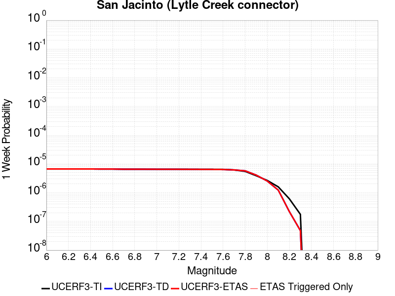 | 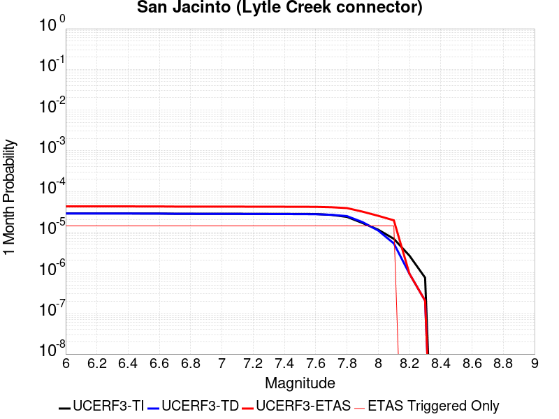 | 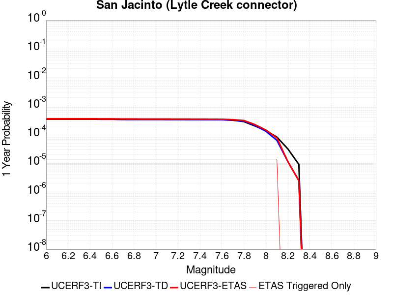 | 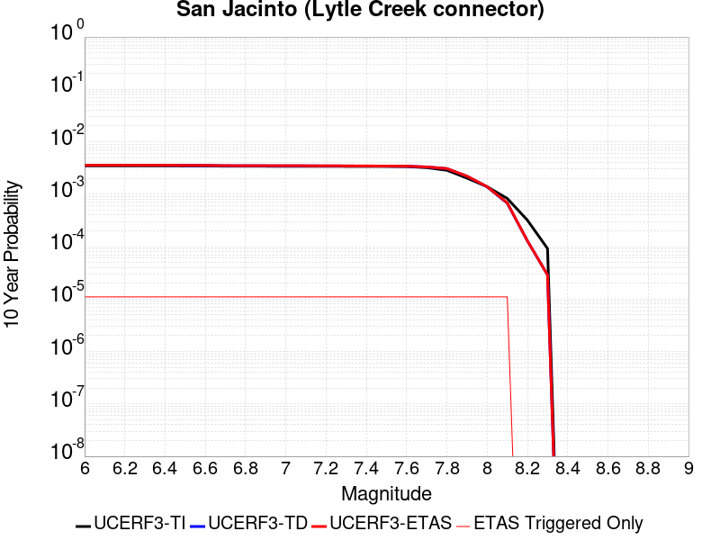 |

| Magnitude | 1 wk TI Prob | 1 wk TD Prob | 1 wk ETAS Prob | 1 wk ETAS/TD Gain | 1 wk ETAS Triggered Only | 1 mo TI Prob | 1 mo TD Prob | 1 mo ETAS Prob | 1 mo ETAS/TD Gain | 1 mo ETAS Triggered Only | 1 yr TI Prob | 1 yr TD Prob | 1 yr ETAS Prob | 1 yr ETAS/TD Gain | 1 yr ETAS Triggered Only | 10 yr TI Prob | 10 yr TD Prob | 10 yr ETAS Prob | 10 yr ETAS/TD Gain | 10 yr ETAS Triggered Only |
|-----|-----|-----|-----|-----|-----|-----|-----|-----|-----|-----|-----|-----|-----|-----|-----|-----|-----|-----|-----|-----|
| 6.0 | 6.693995E-6 | 6.681815E-6 | 6.681815E-6 | 1.0 | 0.0 | 2.8688235E-5 | 2.8636037E-5 | 3.9624734E-5 | 1.3837366 | 1.0989011E-5 | 3.492233E-4 | 3.4858804E-4 | 3.5957323E-4 | 1.0315133 | 1.0989011E-5 | 0.00348675 | 0.0035606013 | 0.003571551 | 1.0030752 | 1.0989011E-5 |
| 6.1 | 6.693995E-6 | 6.681815E-6 | 6.681815E-6 | 1.0 | 0.0 | 2.8688235E-5 | 2.8636037E-5 | 3.9624734E-5 | 1.3837366 | 1.0989011E-5 | 3.492233E-4 | 3.4858804E-4 | 3.5957323E-4 | 1.0315133 | 1.0989011E-5 | 0.00348675 | 0.0035606013 | 0.003571551 | 1.0030752 | 1.0989011E-5 |
| 6.2 | 6.693995E-6 | 6.681815E-6 | 6.681815E-6 | 1.0 | 0.0 | 2.8688235E-5 | 2.8636037E-5 | 3.9624734E-5 | 1.3837366 | 1.0989011E-5 | 3.492233E-4 | 3.4858804E-4 | 3.5957323E-4 | 1.0315133 | 1.0989011E-5 | 0.00348675 | 0.0035606013 | 0.003571551 | 1.0030752 | 1.0989011E-5 |
| 6.3 | 6.693995E-6 | 6.681815E-6 | 6.681815E-6 | 1.0 | 0.0 | 2.8688235E-5 | 2.8636037E-5 | 3.9624734E-5 | 1.3837366 | 1.0989011E-5 | 3.492233E-4 | 3.4858804E-4 | 3.5957323E-4 | 1.0315133 | 1.0989011E-5 | 0.00348675 | 0.0035606013 | 0.003571551 | 1.0030752 | 1.0989011E-5 |
| 6.4 | 6.693995E-6 | 6.681815E-6 | 6.681815E-6 | 1.0 | 0.0 | 2.8688235E-5 | 2.8636037E-5 | 3.9624734E-5 | 1.3837366 | 1.0989011E-5 | 3.492233E-4 | 3.4858804E-4 | 3.5957323E-4 | 1.0315133 | 1.0989011E-5 | 0.00348675 | 0.0035606013 | 0.003571551 | 1.0030752 | 1.0989011E-5 |
| 6.5 | 6.6561875E-6 | 6.642031E-6 | 6.642031E-6 | 1.0 | 0.0 | 2.8526205E-5 | 2.8465536E-5 | 3.9454237E-5 | 1.3860352 | 1.0989011E-5 | 3.472512E-4 | 3.4651288E-4 | 3.574981E-4 | 1.0317022 | 1.0989011E-5 | 0.0034670907 | 0.0035399157 | 0.003550866 | 1.0030934 | 1.0989011E-5 |
| 6.6 | 6.6561875E-6 | 6.642031E-6 | 6.642031E-6 | 1.0 | 0.0 | 2.8526205E-5 | 2.8465536E-5 | 3.9454237E-5 | 1.3860352 | 1.0989011E-5 | 3.472512E-4 | 3.4651288E-4 | 3.574981E-4 | 1.0317022 | 1.0989011E-5 | 0.0034670907 | 0.0035399157 | 0.003550866 | 1.0030934 | 1.0989011E-5 |
| 6.7 | 6.5802237E-6 | 6.5612026E-6 | 6.5612026E-6 | 1.0 | 0.0 | 2.8200653E-5 | 2.8119137E-5 | 3.910784E-5 | 1.3907908 | 1.0989011E-5 | 3.4328885E-4 | 3.422968E-4 | 3.5328203E-4 | 1.0320928 | 1.0989011E-5 | 0.0034275902 | 0.003497888 | 0.0035088386 | 1.0031307 | 1.0989011E-5 |
| 6.8 | 6.575632E-6 | 6.555691E-6 | 6.555691E-6 | 1.0 | 0.0 | 2.8180975E-5 | 2.8095517E-5 | 3.9084218E-5 | 1.3911195 | 1.0989011E-5 | 3.4304935E-4 | 3.420093E-4 | 3.5299454E-4 | 1.0321198 | 1.0989011E-5 | 0.0034252026 | 0.0034950222 | 0.0035059727 | 1.0031332 | 1.0989011E-5 |
| 6.9 | 6.570433E-6 | 6.547082E-6 | 6.547082E-6 | 1.0 | 0.0 | 2.8158694E-5 | 2.8058621E-5 | 3.9047325E-5 | 1.3916337 | 1.0989011E-5 | 3.4277816E-4 | 3.4156026E-4 | 3.525455E-4 | 1.032162 | 1.0989011E-5 | 0.0034224992 | 0.0034905458 | 0.0035014965 | 1.0031372 | 1.0989011E-5 |
| 7.0 | 6.5643826E-6 | 6.5371996E-6 | 6.5371996E-6 | 1.0 | 0.0 | 2.8132765E-5 | 2.801627E-5 | 3.900497E-5 | 1.3922257 | 1.0989011E-5 | 3.424626E-4 | 3.4104477E-4 | 3.5203E-4 | 1.0322106 | 1.0989011E-5 | 0.0034193532 | 0.0034854072 | 0.003496358 | 1.0031419 | 1.0989011E-5 |
| 7.1 | 6.557402E-6 | 6.525908E-6 | 6.525908E-6 | 1.0 | 0.0 | 2.8102848E-5 | 2.7967875E-5 | 3.895658E-5 | 1.3929045 | 1.0989011E-5 | 3.4209844E-4 | 3.4045576E-4 | 3.5144103E-4 | 1.0322664 | 1.0989011E-5 | 0.0034157229 | 0.0034795366 | 0.0034904873 | 1.0031472 | 1.0989011E-5 |
| 7.2 | 6.546394E-6 | 6.507867E-6 | 6.507867E-6 | 1.0 | 0.0 | 2.8055672E-5 | 2.789056E-5 | 3.8879265E-5 | 1.3939936 | 1.0989011E-5 | 3.4152428E-4 | 3.3951475E-4 | 3.5050002E-4 | 1.0323558 | 1.0989011E-5 | 0.0034099987 | 0.0034701603 | 0.0034811113 | 1.0031557 | 1.0989011E-5 |
| 7.3 | 6.5364216E-6 | 6.488639E-6 | 6.488639E-6 | 1.0 | 0.0 | 2.8012933E-5 | 2.7808157E-5 | 3.879686E-5 | 1.3951613 | 1.0989011E-5 | 3.4100408E-4 | 3.3851177E-4 | 3.4949707E-4 | 1.0324517 | 1.0989011E-5 | 0.003404813 | 0.003460175 | 0.0034711258 | 1.0031649 | 1.0989011E-5 |
| 7.4 | 6.5269523E-6 | 6.4697106E-6 | 6.4697106E-6 | 1.0 | 0.0 | 2.7972354E-5 | 2.7727036E-5 | 3.871574E-5 | 1.3963174 | 1.0989011E-5 | 3.4051016E-4 | 3.3752446E-4 | 3.4850975E-4 | 1.0325466 | 1.0989011E-5 | 0.0033998888 | 0.0034503492 | 0.0034613002 | 1.003174 | 1.0989011E-5 |
| 7.5 | 6.5111835E-6 | 6.4459678E-6 | 6.4459678E-6 | 1.0 | 0.0 | 2.7904773E-5 | 2.7625285E-5 | 3.861399E-5 | 1.3977772 | 1.0989011E-5 | 3.3968766E-4 | 3.36286E-4 | 3.4727133E-4 | 1.0326666 | 1.0989011E-5 | 0.0033916887 | 0.0034380136 | 0.003448965 | 1.0031854 | 1.0989011E-5 |
| 7.6 | 6.4768806E-6 | 6.405051E-6 | 6.405051E-6 | 1.0 | 0.0 | 2.7757764E-5 | 2.744993E-5 | 3.843864E-5 | 1.4003183 | 1.0989011E-5 | 3.3789838E-4 | 3.3415173E-4 | 3.4513706E-4 | 1.0328753 | 1.0989011E-5 | 0.0033738504 | 0.0034167327 | 0.0034276843 | 1.0032053 | 1.0989011E-5 |
| 7.7 | 6.1655364E-6 | 6.1973606E-6 | 6.1973606E-6 | 1.0 | 0.0 | 2.642346E-5 | 2.6559846E-5 | 3.7548565E-5 | 1.4137343 | 1.0989011E-5 | 3.2165812E-4 | 3.233182E-4 | 3.3430368E-4 | 1.0339773 | 1.0989011E-5 | 0.0032119295 | 0.0033082566 | 0.0033192094 | 1.0033107 | 1.0989011E-5 |
| 7.8 | 5.5043524E-6 | 5.757815E-6 | 5.757815E-6 | 1.0 | 0.0 | 2.3589868E-5 | 2.4676117E-5 | 3.5664856E-5 | 1.4453188 | 1.0989011E-5 | 2.871688E-4 | 3.0039035E-4 | 3.1137606E-4 | 1.0365715 | 1.0989011E-5 | 0.0028679797 | 0.0030780456 | 0.0030890007 | 1.0035591 | 1.0989011E-5 |
| 7.9 | 3.889249E-6 | 4.093644E-6 | 4.093644E-6 | 1.0 | 0.0 | 1.6668104E-5 | 1.7544071E-5 | 2.8532888E-5 | 1.626355 | 1.0989011E-5 | 2.0291525E-4 | 2.1357817E-4 | 2.2456482E-4 | 1.051441 | 1.0989011E-5 | 0.0020273007 | 0.0022031514 | 0.002214116 | 1.0049769 | 1.0989011E-5 |
| 8.0 | 2.668535E-6 | 2.5432325E-6 | 2.5432325E-6 | 1.0 | 0.0 | 1.1436528E-5 | 1.0899523E-5 | 2.1888414E-5 | 2.0081992 | 1.0989011E-5 | 1.3923083E-4 | 1.3269363E-4 | 1.4368119E-4 | 1.082804 | 1.0989011E-5 | 0.0013914363 | 0.0013819975 | 0.0013929713 | 1.0079405 | 1.0989011E-5 |
| 8.1 | 1.5911459E-6 | 1.2249695E-6 | 1.2249695E-6 | 1.0 | 0.0 | 6.8191785E-6 | 5.2498585E-6 | 1.6238811E-5 | 3.0931902 | 1.0989011E-5 | 8.3020335E-5 | 6.391518E-5 | 7.490349E-5 | 1.1719202 | 1.0989011E-5 | 8.298933E-4 | 6.7271094E-4 | 6.836926E-4 | 1.0163244 | 1.0989011E-5 |
| 8.2 | 6.1294963E-7 | 2.1997926E-7 | 2.1997926E-7 | 1.0 | 0.0 | 2.6269242E-6 | 9.427679E-7 | 9.427679E-7 | 1.0 | 0.0 | 3.1982334E-5 | 1.1478139E-5 | 1.1478139E-5 | 1.0 | 0.0 | 3.1977732E-4 | 1.2888854E-4 | 1.2888854E-4 | 1.0 | 0.0 |
| 8.3 | 1.762871E-7 | 4.8017917E-8 | 4.8017917E-8 | 1.0 | 0.0 | 7.5551594E-7 | 2.0579105E-7 | 2.0579105E-7 | 1.0 | 0.0 | 9.1983675E-6 | 2.5055033E-6 | 2.5055033E-6 | 1.0 | 0.0 | 9.197987E-5 | 2.895802E-5 | 2.895802E-5 | 1.0 | 0.0 |

## Cleghorn
*[(top)](#table-of-contents)*

| 1 Week | 1 Month | 1 Year | 10 Year |
|-----|-----|-----|-----|
| 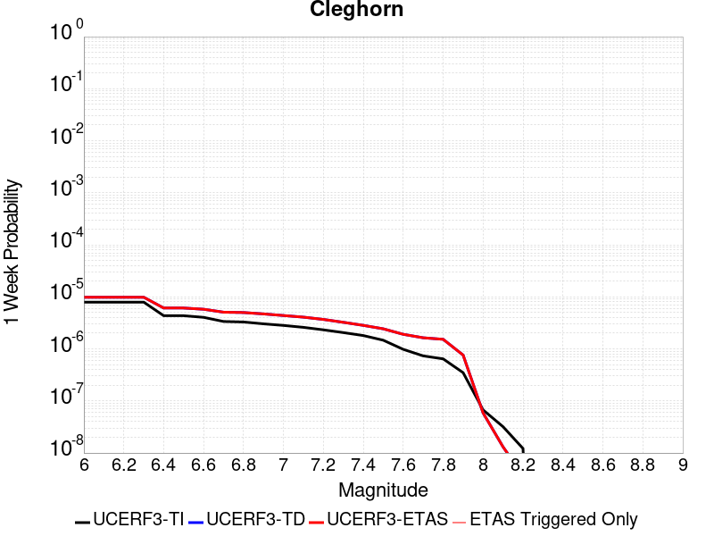 | 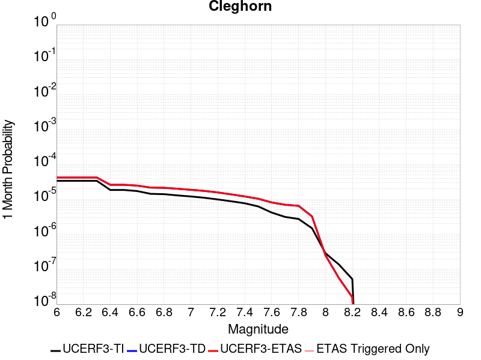 | 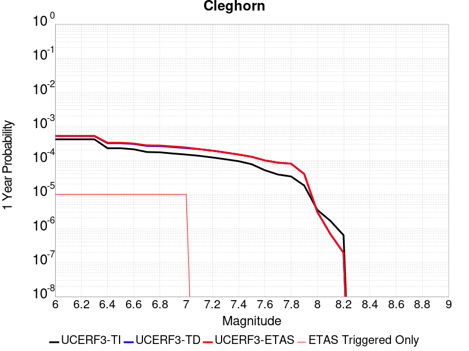 | 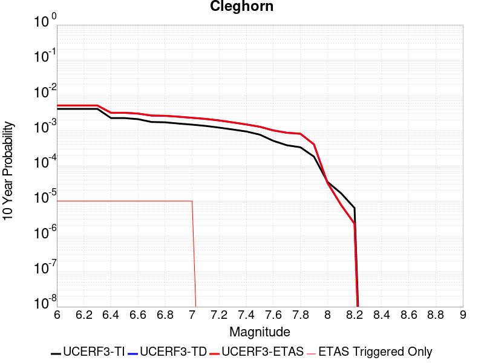 |

| Magnitude | 1 wk TI Prob | 1 wk TD Prob | 1 wk ETAS Prob | 1 wk ETAS/TD Gain | 1 wk ETAS Triggered Only | 1 mo TI Prob | 1 mo TD Prob | 1 mo ETAS Prob | 1 mo ETAS/TD Gain | 1 mo ETAS Triggered Only | 1 yr TI Prob | 1 yr TD Prob | 1 yr ETAS Prob | 1 yr ETAS/TD Gain | 1 yr ETAS Triggered Only | 10 yr TI Prob | 10 yr TD Prob | 10 yr ETAS Prob | 10 yr ETAS/TD Gain | 10 yr ETAS Triggered Only |
|-----|-----|-----|-----|-----|-----|-----|-----|-----|-----|-----|-----|-----|-----|-----|-----|-----|-----|-----|-----|-----|
| 6.0 | 7.9267165E-6 | 9.8423425E-6 | 9.8423425E-6 | 1.0 | 0.0 | 3.39712E-5 | 4.2180847E-5 | 4.2180847E-5 | 1.0 | 0.0 | 4.1352084E-4 | 5.134414E-4 | 5.244248E-4 | 1.0213916 | 1.0989011E-5 | 0.004127522 | 0.005137526 | 0.0051484588 | 1.002128 | 1.0989011E-5 |
| 6.1 | 7.9267165E-6 | 9.8423425E-6 | 9.8423425E-6 | 1.0 | 0.0 | 3.39712E-5 | 4.2180847E-5 | 4.2180847E-5 | 1.0 | 0.0 | 4.1352084E-4 | 5.134414E-4 | 5.244248E-4 | 1.0213916 | 1.0989011E-5 | 0.004127522 | 0.005137526 | 0.0051484588 | 1.002128 | 1.0989011E-5 |
| 6.2 | 7.9267165E-6 | 9.8423425E-6 | 9.8423425E-6 | 1.0 | 0.0 | 3.39712E-5 | 4.2180847E-5 | 4.2180847E-5 | 1.0 | 0.0 | 4.1352084E-4 | 5.134414E-4 | 5.244248E-4 | 1.0213916 | 1.0989011E-5 | 0.004127522 | 0.005137526 | 0.0051484588 | 1.002128 | 1.0989011E-5 |
| 6.3 | 7.9267165E-6 | 9.8423425E-6 | 9.8423425E-6 | 1.0 | 0.0 | 3.39712E-5 | 4.2180847E-5 | 4.2180847E-5 | 1.0 | 0.0 | 4.1352084E-4 | 5.134414E-4 | 5.244248E-4 | 1.0213916 | 1.0989011E-5 | 0.004127522 | 0.005137526 | 0.0051484588 | 1.002128 | 1.0989011E-5 |
| 6.4 | 4.3445207E-6 | 6.1020287E-6 | 6.1020287E-6 | 1.0 | 0.0 | 1.8619241E-5 | 2.6151294E-5 | 2.6151294E-5 | 1.0 | 0.0 | 2.2666567E-4 | 3.1834652E-4 | 3.2933202E-4 | 1.034508 | 1.0989011E-5 | 0.0022643462 | 0.0031929556 | 0.0032039096 | 1.0034306 | 1.0989011E-5 |
| 6.5 | 4.3445207E-6 | 6.1020287E-6 | 6.1020287E-6 | 1.0 | 0.0 | 1.8619241E-5 | 2.6151294E-5 | 2.6151294E-5 | 1.0 | 0.0 | 2.2666567E-4 | 3.1834652E-4 | 3.2933202E-4 | 1.034508 | 1.0989011E-5 | 0.0022643462 | 0.0031929556 | 0.0032039096 | 1.0034306 | 1.0989011E-5 |
| 6.6 | 4.040109E-6 | 5.784422E-6 | 5.784422E-6 | 1.0 | 0.0 | 1.7314638E-5 | 2.4790148E-5 | 2.4790148E-5 | 1.0 | 0.0 | 2.1078532E-4 | 3.017792E-4 | 3.127649E-4 | 1.0364031 | 1.0989011E-5 | 0.002105855 | 0.0030277388 | 0.0030386944 | 1.0036185 | 1.0989011E-5 |
| 6.7 | 3.3632055E-6 | 5.0778863E-6 | 5.0778863E-6 | 1.0 | 0.0 | 1.4413658E-5 | 2.176219E-5 | 2.176219E-5 | 1.0 | 0.0 | 1.7547216E-4 | 2.6492277E-4 | 2.7590885E-4 | 1.0414691 | 1.0989011E-5 | 0.0017533366 | 0.002660058 | 0.0026710178 | 1.0041201 | 1.0989011E-5 |
| 6.8 | 3.2902772E-6 | 4.999788E-6 | 4.999788E-6 | 1.0 | 0.0 | 1.4101111E-5 | 2.1427488E-5 | 2.1427488E-5 | 1.0 | 0.0 | 1.716675E-4 | 2.6084876E-4 | 2.718349E-4 | 1.0421169 | 1.0989011E-5 | 0.0017153495 | 0.0026194141 | 0.0026303744 | 1.0041842 | 1.0989011E-5 |
| 6.9 | 3.031547E-6 | 4.701305E-6 | 4.701305E-6 | 1.0 | 0.0 | 1.299228E-5 | 2.0148296E-5 | 2.0148296E-5 | 1.0 | 0.0 | 1.5816953E-4 | 2.4527815E-4 | 2.5626447E-4 | 1.0447912 | 1.0989011E-5 | 0.00158057 | 0.0024640607 | 0.0024750226 | 1.0044488 | 1.0989011E-5 |
| 7.0 | 2.8259715E-6 | 4.3802474E-6 | 4.3802474E-6 | 1.0 | 0.0 | 1.211125E-5 | 1.8772356E-5 | 1.8772356E-5 | 1.0 | 0.0 | 1.4744449E-4 | 2.285297E-4 | 2.395162E-4 | 1.0480747 | 1.0989011E-5 | 0.001473467 | 0.0022969318 | 0.0023078956 | 1.0047733 | 1.0989011E-5 |
| 7.1 | 2.5962665E-6 | 4.075201E-6 | 4.075201E-6 | 1.0 | 0.0 | 1.1126809E-5 | 1.7465032E-5 | 1.7465032E-5 | 1.0 | 0.0 | 1.3546048E-4 | 2.1261623E-4 | 2.1261623E-4 | 1.0 | 0.0 | 0.0013537793 | 0.002138118 | 0.002138118 | 1.0 | 0.0 |
| 7.2 | 2.3247253E-6 | 3.6854374E-6 | 3.6854374E-6 | 1.0 | 0.0 | 9.96307E-6 | 1.5794636E-5 | 1.5794636E-5 | 1.0 | 0.0 | 1.21293626E-4 | 1.9228293E-4 | 1.9228293E-4 | 1.0 | 0.0 | 0.0012122744 | 0.0019351767 | 0.0019351767 | 1.0 | 0.0 |
| 7.3 | 2.056928E-6 | 3.2435153E-6 | 3.2435153E-6 | 1.0 | 0.0 | 8.815376E-6 | 1.3900707E-5 | 1.3900707E-5 | 1.0 | 0.0 | 1.0732192E-4 | 1.6922812E-4 | 1.6922812E-4 | 1.0 | 0.0 | 0.001072701 | 0.0017050703 | 0.0017050703 | 1.0 | 0.0 |
| 7.4 | 1.8055999E-6 | 2.8333395E-6 | 2.8333395E-6 | 1.0 | 0.0 | 7.738263E-6 | 1.2142828E-5 | 1.2142828E-5 | 1.0 | 0.0 | 9.4209274E-5 | 1.4782904E-4 | 1.4782904E-4 | 1.0 | 0.0 | 9.4169343E-4 | 0.0014915228 | 0.0014915228 | 1.0 | 0.0 |
| 7.5 | 1.4683443E-6 | 2.4323233E-6 | 2.4323233E-6 | 1.0 | 0.0 | 6.292889E-6 | 1.0424202E-5 | 1.0424202E-5 | 1.0 | 0.0 | 7.661323E-5 | 1.2690737E-4 | 1.2690737E-4 | 1.0 | 0.0 | 7.658682E-4 | 0.0012826076 | 0.0012826076 | 1.0 | 0.0 |
| 7.6 | 9.804088E-7 | 1.907711E-6 | 1.907711E-6 | 1.0 | 0.0 | 4.201745E-6 | 8.175879E-6 | 8.175879E-6 | 1.0 | 0.0 | 5.1155046E-5 | 9.9536825E-5 | 9.9536825E-5 | 1.0 | 0.0 | 5.114327E-4 | 0.0010092164 | 0.0010092164 | 1.0 | 0.0 |
| 7.7 | 7.3434086E-7 | 1.6357397E-6 | 1.6357397E-6 | 1.0 | 0.0 | 3.1471714E-6 | 7.0102947E-6 | 7.0102947E-6 | 1.0 | 0.0 | 3.831614E-5 | 8.534702E-5 | 8.534702E-5 | 1.0 | 0.0 | 3.8309532E-4 | 8.6747156E-4 | 8.6747156E-4 | 1.0 | 0.0 |
| 7.8 | 6.434184E-7 | 1.5289866E-6 | 1.5289866E-6 | 1.0 | 0.0 | 2.7575045E-6 | 6.552783E-6 | 6.552783E-6 | 1.0 | 0.0 | 3.35721E-5 | 7.977724E-5 | 7.977724E-5 | 1.0 | 0.0 | 3.3567028E-4 | 8.114777E-4 | 8.114777E-4 | 1.0 | 0.0 |
| 7.9 | 3.4943926E-7 | 7.6117647E-7 | 7.6117647E-7 | 1.0 | 0.0 | 1.497596E-6 | 3.2621808E-6 | 3.2621808E-6 | 1.0 | 0.0 | 1.8233079E-5 | 3.9716335E-5 | 3.9716335E-5 | 1.0 | 0.0 | 1.8231584E-4 | 4.059001E-4 | 4.059001E-4 | 1.0 | 0.0 |
| 8.0 | 6.717524E-8 | 5.881227E-8 | 5.881227E-8 | 1.0 | 0.0 | 2.8789387E-7 | 2.5205256E-7 | 2.5205256E-7 | 1.0 | 0.0 | 3.505102E-6 | 3.0687356E-6 | 3.0687356E-6 | 1.0 | 0.0 | 3.5050467E-5 | 3.296269E-5 | 3.296269E-5 | 1.0 | 0.0 |
| 8.1 | 3.1984914E-8 | 1.3093462E-8 | 1.3093462E-8 | 1.0 | 0.0 | 1.370782E-7 | 5.611484E-8 | 5.611484E-8 | 1.0 | 0.0 | 1.6689258E-6 | 6.831979E-7 | 6.831979E-7 | 1.0 | 0.0 | 1.6689133E-5 | 7.822022E-6 | 7.822022E-6 | 1.0 | 0.0 |
| 8.2 | 1.21887656E-8 | 3.6918986E-9 | 3.6918986E-9 | 1.0 | 0.0 | 5.2237567E-8 | 1.5822422E-8 | 1.5822422E-8 | 1.0 | 0.0 | 6.359922E-7 | 1.9263798E-7 | 1.9263798E-7 | 1.0 | 0.0 | 6.3599036E-6 | 2.27156E-6 | 2.27156E-6 | 1.0 | 0.0 |

## Superstition Hills
*[(top)](#table-of-contents)*

| 1 Week | 1 Month | 1 Year | 10 Year |
|-----|-----|-----|-----|
| 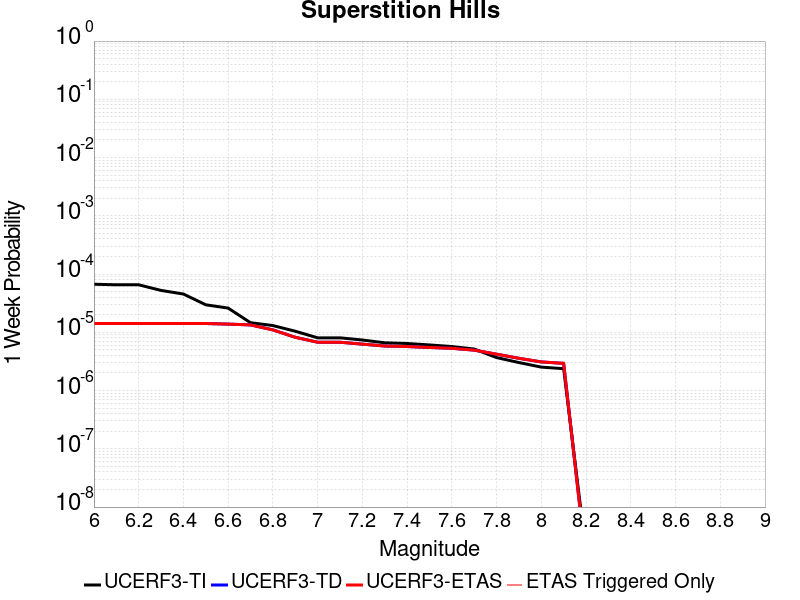 | 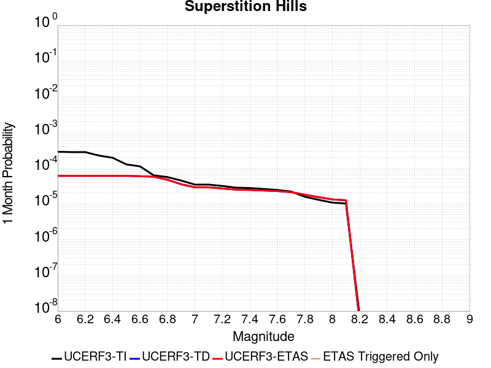 | 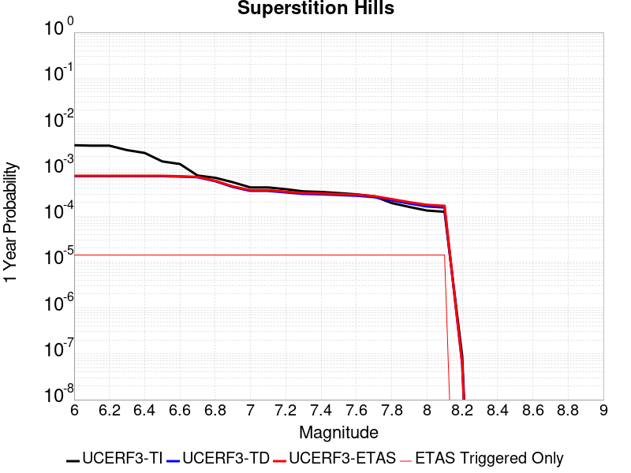 | 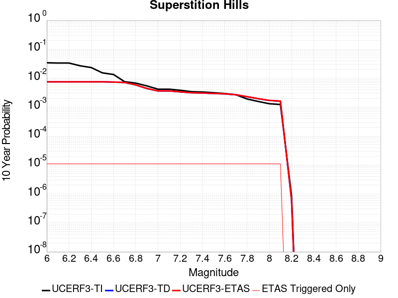 |

| Magnitude | 1 wk TI Prob | 1 wk TD Prob | 1 wk ETAS Prob | 1 wk ETAS/TD Gain | 1 wk ETAS Triggered Only | 1 mo TI Prob | 1 mo TD Prob | 1 mo ETAS Prob | 1 mo ETAS/TD Gain | 1 mo ETAS Triggered Only | 1 yr TI Prob | 1 yr TD Prob | 1 yr ETAS Prob | 1 yr ETAS/TD Gain | 1 yr ETAS Triggered Only | 10 yr TI Prob | 10 yr TD Prob | 10 yr ETAS Prob | 10 yr ETAS/TD Gain | 10 yr ETAS Triggered Only |
|-----|-----|-----|-----|-----|-----|-----|-----|-----|-----|-----|-----|-----|-----|-----|-----|-----|-----|-----|-----|-----|
| 6.0 | 6.6865185E-5 | 1.4163004E-5 | 1.4163004E-5 | 1.0 | 0.0 | 2.8653358E-4 | 6.0697268E-5 | 6.0697268E-5 | 1.0 | 0.0 | 0.0034829667 | 7.387549E-4 | 7.497358E-4 | 1.0148641 | 1.0989011E-5 | 0.03428881 | 0.0075335875 | 0.007544494 | 1.0014477 | 1.0989011E-5 |
| 6.1 | 6.544851E-5 | 1.4163004E-5 | 1.4163004E-5 | 1.0 | 0.0 | 2.8046346E-4 | 6.0697268E-5 | 6.0697268E-5 | 1.0 | 0.0 | 0.0034092965 | 7.387549E-4 | 7.497358E-4 | 1.0148641 | 1.0989011E-5 | 0.033574644 | 0.007533587 | 0.0075444933 | 1.0014477 | 1.0989011E-5 |
| 6.2 | 6.544851E-5 | 1.4163004E-5 | 1.4163004E-5 | 1.0 | 0.0 | 2.8046346E-4 | 6.0697268E-5 | 6.0697268E-5 | 1.0 | 0.0 | 0.0034092965 | 7.387549E-4 | 7.497358E-4 | 1.0148641 | 1.0989011E-5 | 0.033574644 | 0.007533587 | 0.0075444933 | 1.0014477 | 1.0989011E-5 |
| 6.3 | 5.2402065E-5 | 1.4163003E-5 | 1.4163003E-5 | 1.0 | 0.0 | 2.2456095E-4 | 6.069726E-5 | 6.069726E-5 | 1.0 | 0.0 | 0.0027306017 | 7.387548E-4 | 7.4973574E-4 | 1.0148641 | 1.0989011E-5 | 0.02697292 | 0.007533581 | 0.0075444872 | 1.0014477 | 1.0989011E-5 |
| 6.4 | 4.542238E-5 | 1.4163003E-5 | 1.4163003E-5 | 1.0 | 0.0 | 1.9465282E-4 | 6.069726E-5 | 6.069726E-5 | 1.0 | 0.0 | 0.0023673223 | 7.387548E-4 | 7.497357E-4 | 1.0148641 | 1.0989011E-5 | 0.023422617 | 0.007533578 | 0.007544484 | 1.0014477 | 1.0989011E-5 |
| 6.5 | 2.9672969E-5 | 1.4163001E-5 | 1.4163001E-5 | 1.0 | 0.0 | 1.2716366E-4 | 6.0697254E-5 | 6.0697254E-5 | 1.0 | 0.0 | 0.0015471181 | 7.3875475E-4 | 7.497356E-4 | 1.0148641 | 1.0989011E-5 | 0.015363912 | 0.007533571 | 0.0075444775 | 1.0014477 | 1.0989011E-5 |
| 6.6 | 2.6056105E-5 | 1.3828584E-5 | 1.3828584E-5 | 1.0 | 0.0 | 1.1166424E-4 | 5.9264108E-5 | 5.9264108E-5 | 1.0 | 0.0 | 0.0013586642 | 7.213177E-4 | 7.322988E-4 | 1.0152236 | 1.0989011E-5 | 0.013503874 | 0.007357917 | 0.007368825 | 1.0014825 | 1.0989011E-5 |
| 6.7 | 1.4611248E-5 | 1.3408348E-5 | 1.3408348E-5 | 1.0 | 0.0 | 6.261813E-5 | 5.7463174E-5 | 5.7463174E-5 | 1.0 | 0.0 | 7.6210906E-4 | 6.9940556E-4 | 7.103869E-4 | 1.0157009 | 1.0989011E-5 | 0.0075950073 | 0.0071390416 | 0.007149952 | 1.0015283 | 1.0989011E-5 |
| 6.8 | 1.30607E-5 | 1.100269E-5 | 1.100269E-5 | 1.0 | 0.0 | 5.597323E-5 | 4.7153586E-5 | 4.7153586E-5 | 1.0 | 0.0 | 6.8126095E-4 | 5.7395245E-4 | 5.8493513E-4 | 1.0191352 | 1.0989011E-5 | 0.006791762 | 0.0058868667 | 0.005897791 | 1.0018557 | 1.0989011E-5 |
| 6.9 | 1.0443096E-5 | 8.2170645E-6 | 8.2170645E-6 | 1.0 | 0.0 | 4.4755358E-5 | 3.521553E-5 | 3.521553E-5 | 1.0 | 0.0 | 5.447602E-4 | 4.286671E-4 | 4.3965137E-4 | 1.0256243 | 1.0989011E-5 | 0.005434267 | 0.0044208337 | 0.0044317744 | 1.0024748 | 1.0989011E-5 |
| 7.0 | 8.045912E-6 | 6.75945E-6 | 6.75945E-6 | 1.0 | 0.0 | 3.4482026E-5 | 2.8968756E-5 | 2.8968756E-5 | 1.0 | 0.0 | 4.197378E-4 | 3.5263857E-4 | 3.636237E-4 | 1.0311513 | 1.0989011E-5 | 0.0041894587 | 0.0036437588 | 0.003654708 | 1.0030049 | 1.0989011E-5 |
| 7.1 | 8.045912E-6 | 6.75945E-6 | 6.75945E-6 | 1.0 | 0.0 | 3.4482026E-5 | 2.8968756E-5 | 2.8968756E-5 | 1.0 | 0.0 | 4.197378E-4 | 3.5263857E-4 | 3.636237E-4 | 1.0311513 | 1.0989011E-5 | 0.0041894587 | 0.0036437588 | 0.003654708 | 1.0030049 | 1.0989011E-5 |
| 7.2 | 7.375506E-6 | 6.2660265E-6 | 6.2660265E-6 | 1.0 | 0.0 | 3.1608928E-5 | 2.6854126E-5 | 2.6854126E-5 | 1.0 | 0.0 | 3.8477074E-4 | 3.269008E-4 | 3.3788622E-4 | 1.0336047 | 1.0989011E-5 | 0.003841052 | 0.0033840502 | 0.003395002 | 1.0032363 | 1.0989011E-5 |
| 7.3 | 6.6063913E-6 | 5.8181363E-6 | 5.8181363E-6 | 1.0 | 0.0 | 2.8312797E-5 | 2.4934636E-5 | 2.4934636E-5 | 1.0 | 0.0 | 3.446538E-4 | 3.035376E-4 | 3.145233E-4 | 1.0361922 | 1.0989011E-5 | 0.0034411973 | 0.0031481527 | 0.0031591072 | 1.0034796 | 1.0989011E-5 |
| 7.4 | 6.4313126E-6 | 5.6994963E-6 | 5.6994963E-6 | 1.0 | 0.0 | 2.7562477E-5 | 2.4426188E-5 | 2.4426188E-5 | 1.0 | 0.0 | 3.355215E-4 | 2.9734895E-4 | 3.0833468E-4 | 1.0369456 | 1.0989011E-5 | 0.0033501536 | 0.003085882 | 0.003096837 | 1.00355 | 1.0989011E-5 |
| 7.5 | 6.0742927E-6 | 5.4950883E-6 | 5.4950883E-6 | 1.0 | 0.0 | 2.6032423E-5 | 2.355017E-5 | 2.355017E-5 | 1.0 | 0.0 | 3.1689866E-4 | 2.8668626E-4 | 2.9767214E-4 | 1.0383202 | 1.0989011E-5 | 0.0031644711 | 0.0029775994 | 0.0029885557 | 1.0036795 | 1.0989011E-5 |
| 7.6 | 5.6987187E-6 | 5.313052E-6 | 5.313052E-6 | 1.0 | 0.0 | 2.4422852E-5 | 2.2770027E-5 | 2.2770027E-5 | 1.0 | 0.0 | 2.9730765E-4 | 2.7719047E-4 | 2.8817644E-4 | 1.0396333 | 1.0989011E-5 | 0.002969102 | 0.002880725 | 0.0028916826 | 1.0038037 | 1.0989011E-5 |
| 7.7 | 5.1658035E-6 | 4.943764E-6 | 4.943764E-6 | 1.0 | 0.0 | 2.2138971E-5 | 2.1187392E-5 | 2.1187392E-5 | 1.0 | 0.0 | 2.6950863E-4 | 2.5792656E-4 | 2.6891273E-4 | 1.0425942 | 1.0989011E-5 | 0.00269182 | 0.0026856195 | 0.002696579 | 1.0040808 | 1.0989011E-5 |
| 7.8 | 3.6864697E-6 | 4.214011E-6 | 4.214011E-6 | 1.0 | 0.0 | 1.579906E-5 | 1.8059924E-5 | 1.8059924E-5 | 1.0 | 0.0 | 1.9233658E-4 | 2.1985787E-4 | 2.3084447E-4 | 1.0499713 | 1.0989011E-5 | 0.0019217018 | 0.0022984452 | 0.0023094087 | 1.00477 | 1.0989011E-5 |
| 7.9 | 3.0265903E-6 | 3.5799744E-6 | 3.5799744E-6 | 1.0 | 0.0 | 1.2971037E-5 | 1.534266E-5 | 1.534266E-5 | 1.0 | 0.0 | 1.5791094E-4 | 1.8678131E-4 | 1.9776827E-4 | 1.0588226 | 1.0989011E-5 | 0.0015779877 | 0.0019619914 | 0.001972959 | 1.00559 | 1.0989011E-5 |
| 8.0 | 2.5271493E-6 | 3.101686E-6 | 3.101686E-6 | 1.0 | 0.0 | 1.0830595E-5 | 1.3292874E-5 | 1.3292874E-5 | 1.0 | 0.0 | 1.3185451E-4 | 1.6182914E-4 | 1.7281638E-4 | 1.067894 | 1.0989011E-5 | 0.0013177631 | 0.001705195 | 0.0017161653 | 1.0064335 | 1.0989011E-5 |
| 8.1 | 2.3749135E-6 | 2.9316998E-6 | 2.9316998E-6 | 1.0 | 0.0 | 1.0178161E-5 | 1.2564369E-5 | 1.2564369E-5 | 1.0 | 0.0 | 1.2391206E-4 | 1.5296087E-4 | 1.639482E-4 | 1.071831 | 1.0989011E-5 | 0.0012384299 | 0.0016124599 | 0.0016234312 | 1.0068041 | 1.0989011E-5 |
| 8.2 | 1.7186406E-9 | 1.1510708E-9 | 1.1510708E-9 | 1.0 | 0.0 | 7.3656024E-9 | 4.9331605E-9 | 4.9331605E-9 | 1.0 | 0.0 | 8.9676206E-8 | 6.006123E-8 | 6.006123E-8 | 1.0 | 0.0 | 8.9676166E-7 | 6.426847E-7 | 6.426847E-7 | 1.0 | 0.0 |

## Mission Hills 2011
*[(top)](#table-of-contents)*

| 1 Week | 1 Month | 1 Year | 10 Year |
|-----|-----|-----|-----|
| 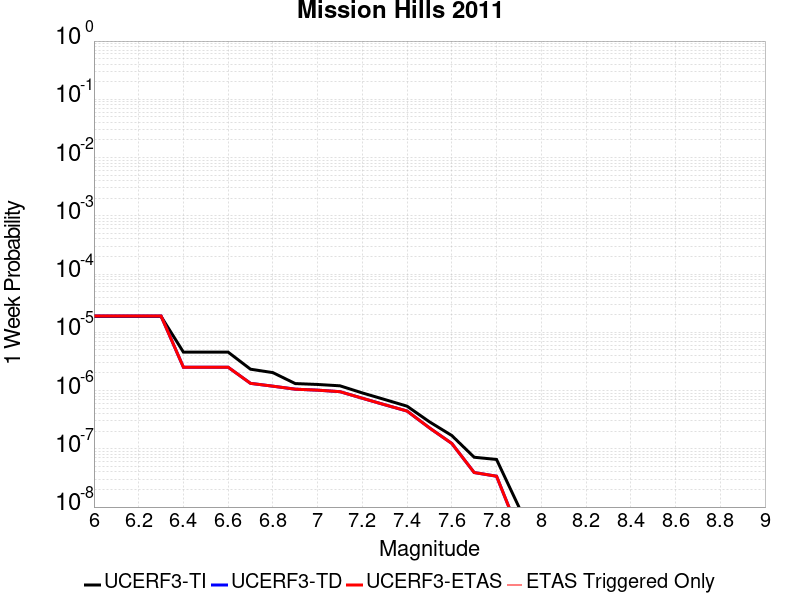 | 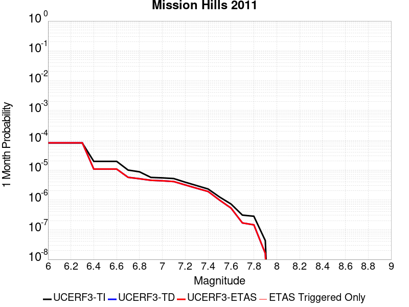 | 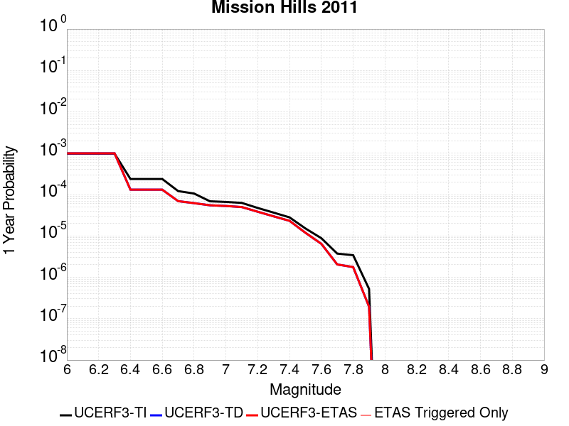 | 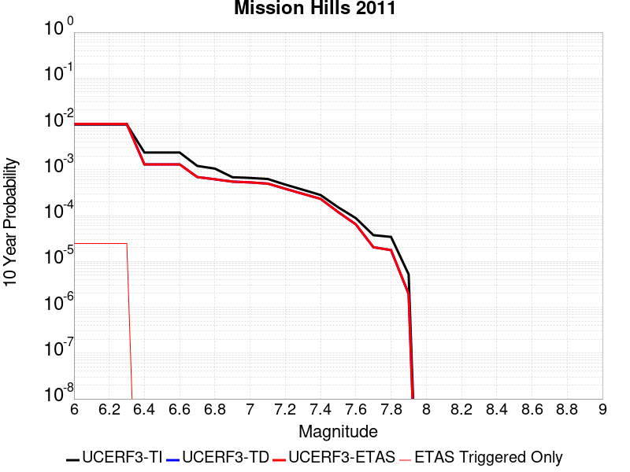 |

| Magnitude | 1 wk TI Prob | 1 wk TD Prob | 1 wk ETAS Prob | 1 wk ETAS/TD Gain | 1 wk ETAS Triggered Only | 1 mo TI Prob | 1 mo TD Prob | 1 mo ETAS Prob | 1 mo ETAS/TD Gain | 1 mo ETAS Triggered Only | 1 yr TI Prob | 1 yr TD Prob | 1 yr ETAS Prob | 1 yr ETAS/TD Gain | 1 yr ETAS Triggered Only | 10 yr TI Prob | 10 yr TD Prob | 10 yr ETAS Prob | 10 yr ETAS/TD Gain | 10 yr ETAS Triggered Only |
|-----|-----|-----|-----|-----|-----|-----|-----|-----|-----|-----|-----|-----|-----|-----|-----|-----|-----|-----|-----|-----|
| 6.0 | 1.8765717E-5 | 1.9057921E-5 | 1.9057921E-5 | 1.0 | 0.0 | 8.0422025E-5 | 8.167619E-5 | 8.167619E-5 | 1.0 | 0.0 | 9.786983E-4 | 9.942976E-4 | 9.942976E-4 | 1.0 | 0.0 | 0.009743992 | 0.009932165 | 0.009943045 | 1.0010954 | 1.0989011E-5 |
| 6.1 | 1.8765717E-5 | 1.9057921E-5 | 1.9057921E-5 | 1.0 | 0.0 | 8.0422025E-5 | 8.167619E-5 | 8.167619E-5 | 1.0 | 0.0 | 9.786983E-4 | 9.942976E-4 | 9.942976E-4 | 1.0 | 0.0 | 0.009743992 | 0.009932165 | 0.009943045 | 1.0010954 | 1.0989011E-5 |
| 6.2 | 1.8765717E-5 | 1.9057921E-5 | 1.9057921E-5 | 1.0 | 0.0 | 8.0422025E-5 | 8.167619E-5 | 8.167619E-5 | 1.0 | 0.0 | 9.786983E-4 | 9.942976E-4 | 9.942976E-4 | 1.0 | 0.0 | 0.009743992 | 0.009932165 | 0.009943045 | 1.0010954 | 1.0989011E-5 |
| 6.3 | 1.8765717E-5 | 1.9057921E-5 | 1.9057921E-5 | 1.0 | 0.0 | 8.0422025E-5 | 8.167619E-5 | 8.167619E-5 | 1.0 | 0.0 | 9.786983E-4 | 9.942976E-4 | 9.942976E-4 | 1.0 | 0.0 | 0.009743992 | 0.009932165 | 0.009943045 | 1.0010954 | 1.0989011E-5 |
| 6.4 | 4.566357E-6 | 2.5152322E-6 | 2.5152322E-6 | 1.0 | 0.0 | 1.9569954E-5 | 1.0779532E-5 | 1.0779532E-5 | 1.0 | 0.0 | 2.3823815E-4 | 1.3123472E-4 | 1.3123472E-4 | 1.0 | 0.0 | 0.002379829 | 0.0013117505 | 0.0013117505 | 1.0 | 0.0 |
| 6.5 | 4.566357E-6 | 2.5152322E-6 | 2.5152322E-6 | 1.0 | 0.0 | 1.9569954E-5 | 1.0779532E-5 | 1.0779532E-5 | 1.0 | 0.0 | 2.3823815E-4 | 1.3123472E-4 | 1.3123472E-4 | 1.0 | 0.0 | 0.002379829 | 0.0013117505 | 0.0013117505 | 1.0 | 0.0 |
| 6.6 | 4.566357E-6 | 2.5152322E-6 | 2.5152322E-6 | 1.0 | 0.0 | 1.9569954E-5 | 1.0779532E-5 | 1.0779532E-5 | 1.0 | 0.0 | 2.3823815E-4 | 1.3123472E-4 | 1.3123472E-4 | 1.0 | 0.0 | 0.002379829 | 0.0013117505 | 0.0013117505 | 1.0 | 0.0 |
| 6.7 | 2.3266773E-6 | 1.3297656E-6 | 1.3297656E-6 | 1.0 | 0.0 | 9.971435E-6 | 5.6989834E-6 | 5.6989834E-6 | 1.0 | 0.0 | 1.2139547E-4 | 6.938297E-5 | 6.938297E-5 | 1.0 | 0.0 | 0.0012132917 | 6.936192E-4 | 6.936192E-4 | 1.0 | 0.0 |
| 6.8 | 2.032735E-6 | 1.1895388E-6 | 1.1895388E-6 | 1.0 | 0.0 | 8.711692E-6 | 5.098014E-6 | 5.098014E-6 | 1.0 | 0.0 | 1.06059684E-4 | 6.2066596E-5 | 6.2066596E-5 | 1.0 | 0.0 | 0.0010600908 | 6.204975E-4 | 6.204975E-4 | 1.0 | 0.0 |
| 6.9 | 1.3186259E-6 | 1.0562633E-6 | 1.0562633E-6 | 1.0 | 0.0 | 5.6512413E-6 | 4.526835E-6 | 4.526835E-6 | 1.0 | 0.0 | 6.8801695E-5 | 5.5112854E-5 | 5.5112854E-5 | 1.0 | 0.0 | 6.8780396E-4 | 5.509948E-4 | 5.509948E-4 | 1.0 | 0.0 |
| 7.0 | 1.2726016E-6 | 1.0159918E-6 | 1.0159918E-6 | 1.0 | 0.0 | 5.4539955E-6 | 4.354243E-6 | 4.354243E-6 | 1.0 | 0.0 | 6.6400375E-5 | 5.301165E-5 | 5.301165E-5 | 1.0 | 0.0 | 6.6380535E-4 | 5.299929E-4 | 5.299929E-4 | 1.0 | 0.0 |
| 7.1 | 1.2063913E-6 | 9.570865E-7 | 9.570865E-7 | 1.0 | 0.0 | 5.170238E-6 | 4.101793E-6 | 4.101793E-6 | 1.0 | 0.0 | 6.294583E-5 | 4.993821E-5 | 4.993821E-5 | 1.0 | 0.0 | 6.2928005E-4 | 4.992724E-4 | 4.992724E-4 | 1.0 | 0.0 |
| 7.2 | 9.105806E-7 | 7.377196E-7 | 7.377196E-7 | 1.0 | 0.0 | 3.9024826E-6 | 3.1616514E-6 | 3.1616514E-6 | 1.0 | 0.0 | 4.7511687E-5 | 3.8492442E-5 | 3.8492442E-5 | 1.0 | 0.0 | 4.7501532E-4 | 3.848593E-4 | 3.848593E-4 | 1.0 | 0.0 |
| 7.3 | 7.020432E-7 | 5.7106274E-7 | 5.7106274E-7 | 1.0 | 0.0 | 3.0087533E-6 | 2.4474095E-6 | 2.4474095E-6 | 1.0 | 0.0 | 3.6630954E-5 | 2.9796818E-5 | 2.9796818E-5 | 1.0 | 0.0 | 3.6624918E-4 | 2.9792954E-4 | 2.9792954E-4 | 1.0 | 0.0 |
| 7.4 | 5.3900635E-7 | 4.4485526E-7 | 4.4485526E-7 | 1.0 | 0.0 | 2.3100251E-6 | 1.9065212E-6 | 1.9065212E-6 | 1.0 | 0.0 | 2.8124194E-5 | 2.321166E-5 | 2.321166E-5 | 1.0 | 0.0 | 2.8120633E-4 | 2.3209357E-4 | 2.3209357E-4 | 1.0 | 0.0 |
| 7.5 | 2.907075E-7 | 2.2878932E-7 | 2.2878932E-7 | 1.0 | 0.0 | 1.2458887E-6 | 9.805252E-7 | 9.805252E-7 | 1.0 | 0.0 | 1.5168589E-5 | 1.1937832E-5 | 1.1937832E-5 | 1.0 | 0.0 | 1.5167553E-4 | 1.1937208E-4 | 1.1937208E-4 | 1.0 | 0.0 |
| 7.6 | 1.6903675E-7 | 1.2356027E-7 | 1.2356027E-7 | 1.0 | 0.0 | 7.2444305E-7 | 5.295439E-7 | 5.295439E-7 | 1.0 | 0.0 | 8.820059E-6 | 6.447179E-6 | 6.447179E-6 | 1.0 | 0.0 | 8.8197085E-5 | 6.447005E-5 | 6.447005E-5 | 1.0 | 0.0 |
| 7.7 | 7.168073E-8 | 3.91532E-8 | 3.91532E-8 | 1.0 | 0.0 | 3.072031E-7 | 1.6779943E-7 | 1.6779943E-7 | 1.0 | 0.0 | 3.7401915E-6 | 2.042956E-6 | 2.042956E-6 | 1.0 | 0.0 | 3.7401285E-5 | 2.0429385E-5 | 2.0429385E-5 | 1.0 | 0.0 |
| 7.8 | 6.564101E-8 | 3.385292E-8 | 3.385292E-8 | 1.0 | 0.0 | 2.813186E-7 | 1.4508393E-7 | 1.4508393E-7 | 1.0 | 0.0 | 3.4250486E-6 | 1.7663956E-6 | 1.7663956E-6 | 1.0 | 0.0 | 3.424996E-5 | 1.7663826E-5 | 1.7663826E-5 | 1.0 | 0.0 |
| 7.9 | 1.0029074E-8 | 3.731989E-9 | 3.731989E-9 | 1.0 | 0.0 | 4.2981743E-8 | 1.5994239E-8 | 1.5994239E-8 | 1.0 | 0.0 | 5.2330256E-7 | 1.9472985E-7 | 1.9472985E-7 | 1.0 | 0.0 | 5.2330133E-6 | 1.9472977E-6 | 1.9472977E-6 | 1.0 | 0.0 |

## North Frontal  (West)
*[(top)](#table-of-contents)*

| 1 Week | 1 Month | 1 Year | 10 Year |
|-----|-----|-----|-----|
| 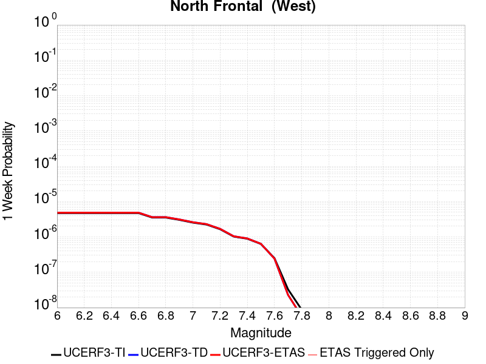 | 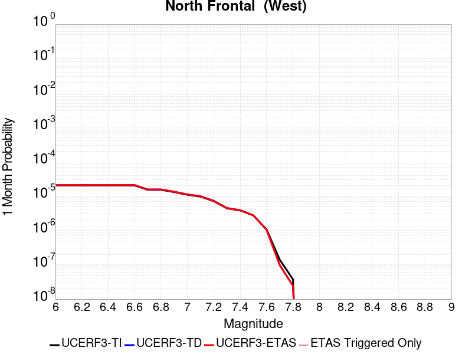 | 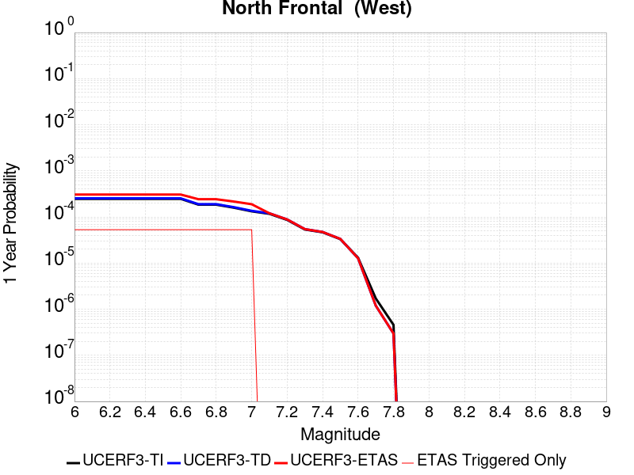 | 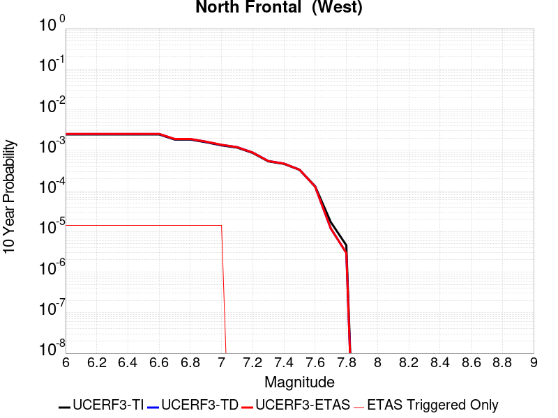 |

| Magnitude | 1 wk TI Prob | 1 wk TD Prob | 1 wk ETAS Prob | 1 wk ETAS/TD Gain | 1 wk ETAS Triggered Only | 1 mo TI Prob | 1 mo TD Prob | 1 mo ETAS Prob | 1 mo ETAS/TD Gain | 1 mo ETAS Triggered Only | 1 yr TI Prob | 1 yr TD Prob | 1 yr ETAS Prob | 1 yr ETAS/TD Gain | 1 yr ETAS Triggered Only | 10 yr TI Prob | 10 yr TD Prob | 10 yr ETAS Prob | 10 yr ETAS/TD Gain | 10 yr ETAS Triggered Only |
|-----|-----|-----|-----|-----|-----|-----|-----|-----|-----|-----|-----|-----|-----|-----|-----|-----|-----|-----|-----|-----|
| 6.0 | 4.7316266E-6 | 4.8528227E-6 | 4.8528227E-6 | 1.0 | 0.0 | 2.0278241E-5 | 2.0797654E-5 | 2.0797654E-5 | 1.0 | 0.0 | 2.4685962E-4 | 2.5318348E-4 | 2.641697E-4 | 1.0433923 | 1.0989011E-5 | 0.0024658558 | 0.0025290966 | 0.0025400578 | 1.0043341 | 1.0989011E-5 |
| 6.1 | 4.7316266E-6 | 4.8528227E-6 | 4.8528227E-6 | 1.0 | 0.0 | 2.0278241E-5 | 2.0797654E-5 | 2.0797654E-5 | 1.0 | 0.0 | 2.4685962E-4 | 2.5318348E-4 | 2.641697E-4 | 1.0433923 | 1.0989011E-5 | 0.0024658558 | 0.0025290966 | 0.0025400578 | 1.0043341 | 1.0989011E-5 |
| 6.2 | 4.7316266E-6 | 4.8528227E-6 | 4.8528227E-6 | 1.0 | 0.0 | 2.0278241E-5 | 2.0797654E-5 | 2.0797654E-5 | 1.0 | 0.0 | 2.4685962E-4 | 2.5318348E-4 | 2.641697E-4 | 1.0433923 | 1.0989011E-5 | 0.0024658558 | 0.0025290966 | 0.0025400578 | 1.0043341 | 1.0989011E-5 |
| 6.3 | 4.7316266E-6 | 4.8528227E-6 | 4.8528227E-6 | 1.0 | 0.0 | 2.0278241E-5 | 2.0797654E-5 | 2.0797654E-5 | 1.0 | 0.0 | 2.4685962E-4 | 2.5318348E-4 | 2.641697E-4 | 1.0433923 | 1.0989011E-5 | 0.0024658558 | 0.0025290966 | 0.0025400578 | 1.0043341 | 1.0989011E-5 |
| 6.4 | 4.7316266E-6 | 4.8528227E-6 | 4.8528227E-6 | 1.0 | 0.0 | 2.0278241E-5 | 2.0797654E-5 | 2.0797654E-5 | 1.0 | 0.0 | 2.4685962E-4 | 2.5318348E-4 | 2.641697E-4 | 1.0433923 | 1.0989011E-5 | 0.0024658558 | 0.0025290966 | 0.0025400578 | 1.0043341 | 1.0989011E-5 |
| 6.5 | 4.7316266E-6 | 4.8528227E-6 | 4.8528227E-6 | 1.0 | 0.0 | 2.0278241E-5 | 2.0797654E-5 | 2.0797654E-5 | 1.0 | 0.0 | 2.4685962E-4 | 2.5318348E-4 | 2.641697E-4 | 1.0433923 | 1.0989011E-5 | 0.0024658558 | 0.0025290966 | 0.0025400578 | 1.0043341 | 1.0989011E-5 |
| 6.6 | 4.7316266E-6 | 4.8528227E-6 | 4.8528227E-6 | 1.0 | 0.0 | 2.0278241E-5 | 2.0797654E-5 | 2.0797654E-5 | 1.0 | 0.0 | 2.4685962E-4 | 2.5318348E-4 | 2.641697E-4 | 1.0433923 | 1.0989011E-5 | 0.0024658558 | 0.0025290966 | 0.0025400578 | 1.0043341 | 1.0989011E-5 |
| 6.7 | 3.5382777E-6 | 3.631005E-6 | 3.631005E-6 | 1.0 | 0.0 | 1.516396E-5 | 1.5561362E-5 | 1.5561362E-5 | 1.0 | 0.0 | 1.8460557E-4 | 1.8944389E-4 | 2.0043082E-4 | 1.0579957 | 1.0989011E-5 | 0.0018445229 | 0.0018929009 | 0.0019038691 | 1.0057944 | 1.0989011E-5 |
| 6.8 | 3.5382777E-6 | 3.631005E-6 | 3.631005E-6 | 1.0 | 0.0 | 1.516396E-5 | 1.5561362E-5 | 1.5561362E-5 | 1.0 | 0.0 | 1.8460557E-4 | 1.8944389E-4 | 2.0043082E-4 | 1.0579957 | 1.0989011E-5 | 0.0018445229 | 0.0018929009 | 0.0019038691 | 1.0057944 | 1.0989011E-5 |
| 6.9 | 3.0428037E-6 | 3.122866E-6 | 3.122866E-6 | 1.0 | 0.0 | 1.30405215E-5 | 1.3383647E-5 | 1.3383647E-5 | 1.0 | 0.0 | 1.5875678E-4 | 1.6293439E-4 | 1.7392161E-4 | 1.0674334 | 1.0989011E-5 | 0.0015864341 | 0.0016282165 | 0.0016391876 | 1.0067381 | 1.0989011E-5 |
| 7.0 | 2.538778E-6 | 2.6061819E-6 | 2.6061819E-6 | 1.0 | 0.0 | 1.0880432E-5 | 1.1169306E-5 | 1.1169306E-5 | 1.0 | 0.0 | 1.324612E-4 | 1.3597829E-4 | 1.469658E-4 | 1.0808035 | 1.0989011E-5 | 0.0013238228 | 0.0013589977 | 0.0013699717 | 1.0080751 | 1.0989011E-5 |
| 7.1 | 2.2418935E-6 | 2.3012901E-6 | 2.3012901E-6 | 1.0 | 0.0 | 9.60808E-6 | 9.862637E-6 | 9.862637E-6 | 1.0 | 0.0 | 1.1697209E-4 | 1.2007144E-4 | 1.2007144E-4 | 1.0 | 0.0 | 0.0011691054 | 0.0012001096 | 0.0012001096 | 1.0 | 0.0 |
| 7.2 | 1.6526745E-6 | 1.6925466E-6 | 1.6925466E-6 | 1.0 | 0.0 | 7.082872E-6 | 7.2537523E-6 | 7.2537523E-6 | 1.0 | 0.0 | 8.623055E-5 | 8.831111E-5 | 8.831111E-5 | 1.0 | 0.0 | 8.61971E-4 | 8.8278524E-4 | 8.8278524E-4 | 1.0 | 0.0 |
| 7.3 | 1.0246019E-6 | 1.0442654E-6 | 1.0442654E-6 | 1.0 | 0.0 | 4.391144E-6 | 4.4754165E-6 | 4.4754165E-6 | 1.0 | 0.0 | 5.3460866E-5 | 5.4486947E-5 | 5.4486947E-5 | 1.0 | 0.0 | 5.344801E-4 | 5.447474E-4 | 5.447474E-4 | 1.0 | 0.0 |
| 7.4 | 8.9045164E-7 | 9.056904E-7 | 9.056904E-7 | 1.0 | 0.0 | 3.8162157E-6 | 3.881525E-6 | 3.881525E-6 | 1.0 | 0.0 | 4.646144E-5 | 4.7256653E-5 | 4.7256653E-5 | 1.0 | 0.0 | 4.6451724E-4 | 4.7247694E-4 | 4.7247694E-4 | 1.0 | 0.0 |
| 7.5 | 6.3357E-7 | 6.4029524E-7 | 6.4029524E-7 | 1.0 | 0.0 | 2.7152971E-6 | 2.74412E-6 | 2.74412E-6 | 1.0 | 0.0 | 3.305824E-5 | 3.3409215E-5 | 3.3409215E-5 | 1.0 | 0.0 | 3.3053322E-4 | 3.340485E-4 | 3.340485E-4 | 1.0 | 0.0 |
| 7.6 | 2.5087024E-7 | 2.4362083E-7 | 2.4362083E-7 | 1.0 | 0.0 | 1.0751578E-6 | 1.044089E-6 | 1.044089E-6 | 1.0 | 0.0 | 1.3089967E-5 | 1.2711731E-5 | 1.2711731E-5 | 1.0 | 0.0 | 1.3089196E-4 | 1.271121E-4 | 1.271121E-4 | 1.0 | 0.0 |
| 7.7 | 3.282987E-8 | 2.287537E-8 | 2.287537E-8 | 1.0 | 0.0 | 1.4069944E-7 | 9.803729E-8 | 9.803729E-8 | 1.0 | 0.0 | 1.7130144E-6 | 1.1936035E-6 | 1.1936035E-6 | 1.0 | 0.0 | 1.7130013E-5 | 1.1935978E-5 | 1.1935978E-5 | 1.0 | 0.0 |
| 7.8 | 8.77499E-9 | 5.682102E-9 | 5.682102E-9 | 1.0 | 0.0 | 3.7607098E-8 | 2.4351866E-8 | 2.4351866E-8 | 1.0 | 0.0 | 4.578663E-7 | 2.9648393E-7 | 2.9648393E-7 | 1.0 | 0.0 | 4.5786537E-6 | 2.9648368E-6 | 2.9648368E-6 | 1.0 | 0.0 |

## San Cayetano
*[(top)](#table-of-contents)*

| 1 Week | 1 Month | 1 Year | 10 Year |
|-----|-----|-----|-----|
| 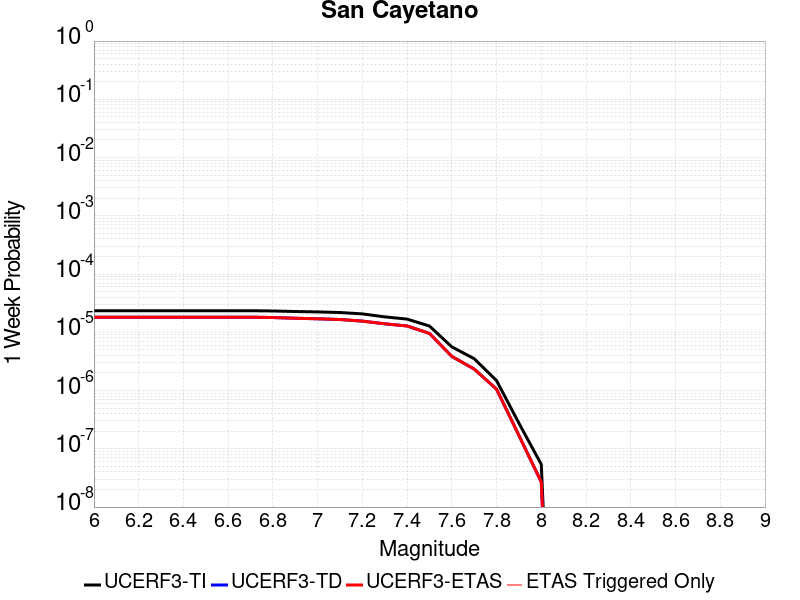 | 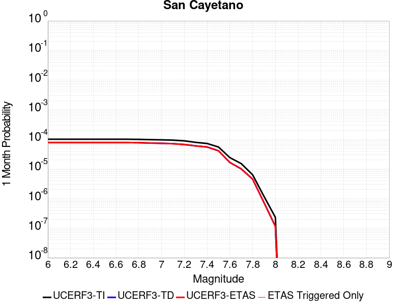 | 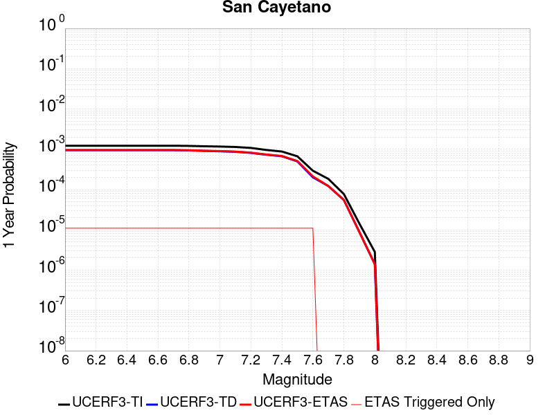 | 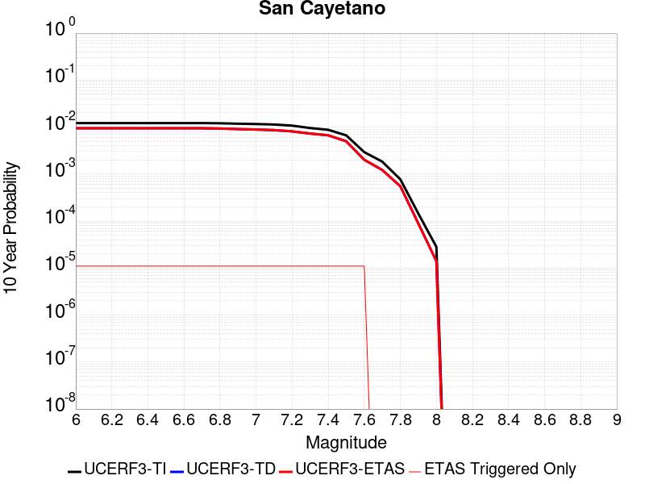 |

| Magnitude | 1 wk TI Prob | 1 wk TD Prob | 1 wk ETAS Prob | 1 wk ETAS/TD Gain | 1 wk ETAS Triggered Only | 1 mo TI Prob | 1 mo TD Prob | 1 mo ETAS Prob | 1 mo ETAS/TD Gain | 1 mo ETAS Triggered Only | 1 yr TI Prob | 1 yr TD Prob | 1 yr ETAS Prob | 1 yr ETAS/TD Gain | 1 yr ETAS Triggered Only | 10 yr TI Prob | 10 yr TD Prob | 10 yr ETAS Prob | 10 yr ETAS/TD Gain | 10 yr ETAS Triggered Only |
|-----|-----|-----|-----|-----|-----|-----|-----|-----|-----|-----|-----|-----|-----|-----|-----|-----|-----|-----|-----|-----|
| 6.0 | 2.3476267E-5 | 1.8173818E-5 | 1.8173818E-5 | 1.0 | 0.0 | 1.0060869E-4 | 7.788549E-5 | 7.788549E-5 | 1.0 | 0.0 | 0.0012242225 | 9.47847E-4 | 9.588255E-4 | 1.0115826 | 1.0989011E-5 | 0.012175002 | 0.00943893 | 0.009449815 | 1.0011532 | 1.0989011E-5 |
| 6.1 | 2.3476267E-5 | 1.8173818E-5 | 1.8173818E-5 | 1.0 | 0.0 | 1.0060869E-4 | 7.788549E-5 | 7.788549E-5 | 1.0 | 0.0 | 0.0012242225 | 9.47847E-4 | 9.588255E-4 | 1.0115826 | 1.0989011E-5 | 0.012175002 | 0.00943893 | 0.009449815 | 1.0011532 | 1.0989011E-5 |
| 6.2 | 2.3476267E-5 | 1.8173818E-5 | 1.8173818E-5 | 1.0 | 0.0 | 1.0060869E-4 | 7.788549E-5 | 7.788549E-5 | 1.0 | 0.0 | 0.0012242225 | 9.47847E-4 | 9.588255E-4 | 1.0115826 | 1.0989011E-5 | 0.012175002 | 0.00943893 | 0.009449815 | 1.0011532 | 1.0989011E-5 |
| 6.3 | 2.3476267E-5 | 1.8173818E-5 | 1.8173818E-5 | 1.0 | 0.0 | 1.0060869E-4 | 7.788549E-5 | 7.788549E-5 | 1.0 | 0.0 | 0.0012242225 | 9.47847E-4 | 9.588255E-4 | 1.0115826 | 1.0989011E-5 | 0.012175002 | 0.00943893 | 0.009449815 | 1.0011532 | 1.0989011E-5 |
| 6.4 | 2.3476267E-5 | 1.8173818E-5 | 1.8173818E-5 | 1.0 | 0.0 | 1.0060869E-4 | 7.788549E-5 | 7.788549E-5 | 1.0 | 0.0 | 0.0012242225 | 9.47847E-4 | 9.588255E-4 | 1.0115826 | 1.0989011E-5 | 0.012175002 | 0.00943893 | 0.009449815 | 1.0011532 | 1.0989011E-5 |
| 6.5 | 2.3476267E-5 | 1.8173818E-5 | 1.8173818E-5 | 1.0 | 0.0 | 1.0060869E-4 | 7.788549E-5 | 7.788549E-5 | 1.0 | 0.0 | 0.0012242225 | 9.47847E-4 | 9.588255E-4 | 1.0115826 | 1.0989011E-5 | 0.012175002 | 0.00943893 | 0.009449815 | 1.0011532 | 1.0989011E-5 |
| 6.6 | 2.3476267E-5 | 1.8173818E-5 | 1.8173818E-5 | 1.0 | 0.0 | 1.0060869E-4 | 7.788549E-5 | 7.788549E-5 | 1.0 | 0.0 | 0.0012242225 | 9.47847E-4 | 9.588255E-4 | 1.0115826 | 1.0989011E-5 | 0.012175002 | 0.00943893 | 0.009449815 | 1.0011532 | 1.0989011E-5 |
| 6.7 | 2.3476267E-5 | 1.8173818E-5 | 1.8173818E-5 | 1.0 | 0.0 | 1.0060869E-4 | 7.788549E-5 | 7.788549E-5 | 1.0 | 0.0 | 0.0012242225 | 9.47847E-4 | 9.588255E-4 | 1.0115826 | 1.0989011E-5 | 0.012175002 | 0.00943893 | 0.009449815 | 1.0011532 | 1.0989011E-5 |
| 6.8 | 2.3241924E-5 | 1.7941473E-5 | 1.7941473E-5 | 1.0 | 0.0 | 9.960445E-5 | 7.688978E-5 | 7.688978E-5 | 1.0 | 0.0 | 0.0012120095 | 9.3573466E-4 | 9.467134E-4 | 1.0117327 | 1.0989011E-5 | 0.012054204 | 0.009318802 | 0.009329688 | 1.0011683 | 1.0989011E-5 |
| 6.9 | 2.2761007E-5 | 1.7436827E-5 | 1.7436827E-5 | 1.0 | 0.0 | 9.7543525E-5 | 7.472714E-5 | 7.472714E-5 | 1.0 | 0.0 | 0.0011869454 | 9.0942666E-4 | 9.2040567E-4 | 1.0120724 | 1.0989011E-5 | 0.011806256 | 0.00905788 | 0.00906877 | 1.0012022 | 1.0989011E-5 |
| 7.0 | 2.240283E-5 | 1.7070519E-5 | 1.7070519E-5 | 1.0 | 0.0 | 9.600859E-5 | 7.315734E-5 | 7.315734E-5 | 1.0 | 0.0 | 0.0011682777 | 8.9033006E-4 | 9.0130925E-4 | 1.0123316 | 1.0989011E-5 | 0.011621549 | 0.008868446 | 0.008879337 | 1.0012281 | 1.0989011E-5 |
| 7.1 | 2.1871154E-5 | 1.659028E-5 | 1.659028E-5 | 1.0 | 0.0 | 9.373015E-5 | 7.109928E-5 | 7.109928E-5 | 1.0 | 0.0 | 0.0011405671 | 8.652933E-4 | 8.762728E-4 | 1.0126888 | 1.0989011E-5 | 0.011347309 | 0.008620043 | 0.008630938 | 1.0012639 | 1.0989011E-5 |
| 7.2 | 2.0714133E-5 | 1.5568636E-5 | 1.5568636E-5 | 1.0 | 0.0 | 8.8771834E-5 | 6.672104E-5 | 6.672104E-5 | 1.0 | 0.0 | 0.0010802611 | 8.120292E-4 | 8.2300924E-4 | 1.0135218 | 1.0989011E-5 | 0.010750249 | 0.008091395 | 0.008102295 | 1.0013471 | 1.0989011E-5 |
| 7.3 | 1.8408395E-5 | 1.3999197E-5 | 1.3999197E-5 | 1.0 | 0.0 | 7.8890735E-5 | 5.9995196E-5 | 5.9995196E-5 | 1.0 | 0.0 | 9.600714E-4 | 7.301997E-4 | 7.411807E-4 | 1.0150384 | 1.0989011E-5 | 0.009559342 | 0.0072787236 | 0.0072896327 | 1.0014987 | 1.0989011E-5 |
| 7.4 | 1.6856795E-5 | 1.2852103E-5 | 1.2852103E-5 | 1.0 | 0.0 | 7.2241404E-5 | 5.5079297E-5 | 5.5079297E-5 | 1.0 | 0.0 | 8.7918417E-4 | 6.70387E-4 | 6.8136863E-4 | 1.016381 | 1.0989011E-5 | 0.00875714 | 0.006684327 | 0.0066952426 | 1.001633 | 1.0989011E-5 |
| 7.5 | 1.2822778E-5 | 9.578951E-6 | 9.578951E-6 | 1.0 | 0.0 | 5.495361E-5 | 4.1052008E-5 | 4.1052008E-5 | 1.0 | 0.0 | 6.688548E-4 | 4.996952E-4 | 5.106787E-4 | 1.0219804 | 1.0989011E-5 | 0.006668452 | 0.004985887 | 0.0049968213 | 1.0021931 | 1.0989011E-5 |
| 7.6 | 5.6272684E-6 | 3.855496E-6 | 3.855496E-6 | 1.0 | 0.0 | 2.4116642E-5 | 1.6523449E-5 | 1.6523449E-5 | 1.0 | 0.0 | 2.9358055E-4 | 2.0115451E-4 | 2.1214133E-4 | 1.0546187 | 1.0989011E-5 | 0.0029319301 | 0.0020097352 | 0.0020207022 | 1.0054569 | 1.0989011E-5 |
| 7.7 | 3.5261346E-6 | 2.3410787E-6 | 2.3410787E-6 | 1.0 | 0.0 | 1.5111918E-5 | 1.0033156E-5 | 1.0033156E-5 | 1.0 | 0.0 | 1.8397206E-4 | 1.221469E-4 | 1.221469E-4 | 1.0 | 0.0 | 0.0018381984 | 0.001220805 | 0.001220805 | 1.0 | 0.0 |
| 7.8 | 1.4826929E-6 | 1.0565692E-6 | 1.0565692E-6 | 1.0 | 0.0 | 6.354383E-6 | 4.5281463E-6 | 4.5281463E-6 | 1.0 | 0.0 | 7.736187E-5 | 5.5128807E-5 | 5.5128807E-5 | 1.0 | 0.0 | 7.733494E-4 | 5.511533E-4 | 5.511533E-4 | 1.0 | 0.0 |
| 7.9 | 2.7568166E-7 | 1.698166E-7 | 1.698166E-7 | 1.0 | 0.0 | 1.1814923E-6 | 7.277852E-7 | 7.277852E-7 | 1.0 | 0.0 | 1.4384574E-5 | 8.860749E-6 | 8.860749E-6 | 1.0 | 0.0 | 1.4383643E-4 | 8.860399E-5 | 8.860399E-5 | 1.0 | 0.0 |
| 8.0 | 5.407832E-8 | 2.6899205E-8 | 2.6899205E-8 | 1.0 | 0.0 | 2.3176422E-7 | 1.15282305E-7 | 1.15282305E-7 | 1.0 | 0.0 | 2.8217257E-6 | 1.4035612E-6 | 1.4035612E-6 | 1.0 | 0.0 | 2.8216898E-5 | 1.4035527E-5 | 1.4035527E-5 | 1.0 | 0.0 |

## Santa Susana East (connector)
*[(top)](#table-of-contents)*

| 1 Week | 1 Month | 1 Year | 10 Year |
|-----|-----|-----|-----|
| 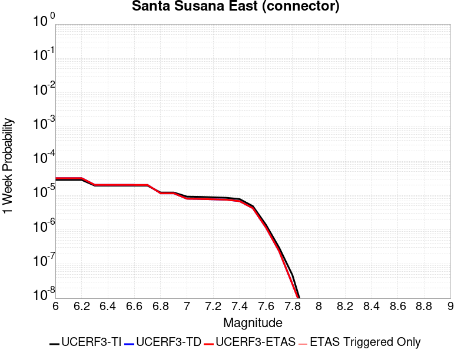 | 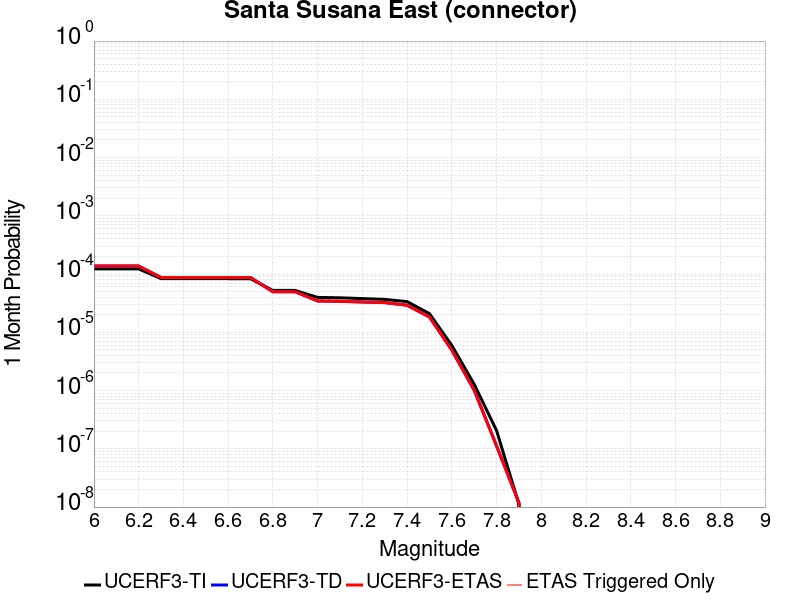 | 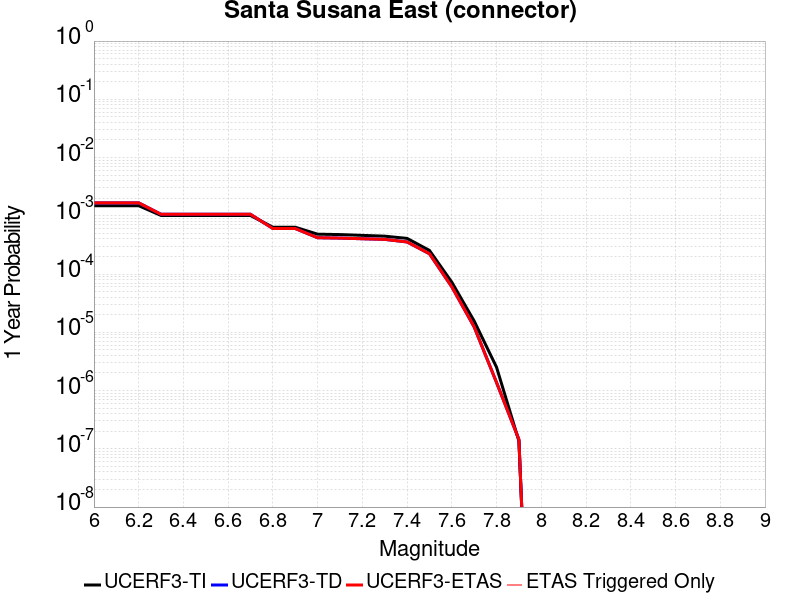 | 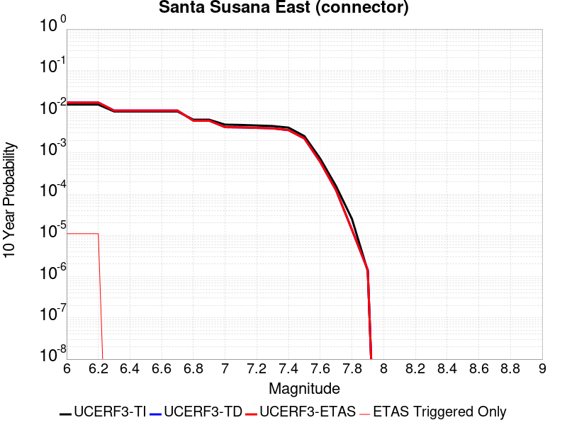 |

| Magnitude | 1 wk TI Prob | 1 wk TD Prob | 1 wk ETAS Prob | 1 wk ETAS/TD Gain | 1 wk ETAS Triggered Only | 1 mo TI Prob | 1 mo TD Prob | 1 mo ETAS Prob | 1 mo ETAS/TD Gain | 1 mo ETAS Triggered Only | 1 yr TI Prob | 1 yr TD Prob | 1 yr ETAS Prob | 1 yr ETAS/TD Gain | 1 yr ETAS Triggered Only | 10 yr TI Prob | 10 yr TD Prob | 10 yr ETAS Prob | 10 yr ETAS/TD Gain | 10 yr ETAS Triggered Only |
|-----|-----|-----|-----|-----|-----|-----|-----|-----|-----|-----|-----|-----|-----|-----|-----|-----|-----|-----|-----|-----|
| 6.0 | 2.858397E-5 | 3.2028263E-5 | 3.2028263E-5 | 1.0 | 0.0 | 1.2249697E-4 | 1.3725835E-4 | 1.3725835E-4 | 1.0 | 0.0 | 0.0014903803 | 0.0016701213 | 0.0016701213 | 1.0 | 0.0 | 0.014804244 | 0.01660279 | 0.016613597 | 1.0006509 | 1.0989011E-5 |
| 6.1 | 2.858397E-5 | 3.2028263E-5 | 3.2028263E-5 | 1.0 | 0.0 | 1.2249697E-4 | 1.3725835E-4 | 1.3725835E-4 | 1.0 | 0.0 | 0.0014903803 | 0.0016701213 | 0.0016701213 | 1.0 | 0.0 | 0.014804244 | 0.01660279 | 0.016613597 | 1.0006509 | 1.0989011E-5 |
| 6.2 | 2.858397E-5 | 3.2028263E-5 | 3.2028263E-5 | 1.0 | 0.0 | 1.2249697E-4 | 1.3725835E-4 | 1.3725835E-4 | 1.0 | 0.0 | 0.0014903803 | 0.0016701213 | 0.0016701213 | 1.0 | 0.0 | 0.014804244 | 0.01660279 | 0.016613597 | 1.0006509 | 1.0989011E-5 |
| 6.3 | 1.943582E-5 | 2.0371137E-5 | 2.0371137E-5 | 1.0 | 0.0 | 8.329371E-5 | 8.7302586E-5 | 8.7302586E-5 | 1.0 | 0.0 | 0.001013629 | 0.001062503 | 0.001062503 | 1.0 | 0.0 | 0.010090181 | 0.010585667 | 0.010585667 | 1.0 | 0.0 |
| 6.4 | 1.943582E-5 | 2.0371137E-5 | 2.0371137E-5 | 1.0 | 0.0 | 8.329371E-5 | 8.7302586E-5 | 8.7302586E-5 | 1.0 | 0.0 | 0.001013629 | 0.001062503 | 0.001062503 | 1.0 | 0.0 | 0.010090181 | 0.010585667 | 0.010585667 | 1.0 | 0.0 |
| 6.5 | 1.943582E-5 | 2.0371137E-5 | 2.0371137E-5 | 1.0 | 0.0 | 8.329371E-5 | 8.7302586E-5 | 8.7302586E-5 | 1.0 | 0.0 | 0.001013629 | 0.001062503 | 0.001062503 | 1.0 | 0.0 | 0.010090181 | 0.010585667 | 0.010585667 | 1.0 | 0.0 |
| 6.6 | 1.943582E-5 | 2.0371137E-5 | 2.0371137E-5 | 1.0 | 0.0 | 8.329371E-5 | 8.7302586E-5 | 8.7302586E-5 | 1.0 | 0.0 | 0.001013629 | 0.001062503 | 0.001062503 | 1.0 | 0.0 | 0.010090181 | 0.010585667 | 0.010585667 | 1.0 | 0.0 |
| 6.7 | 1.9404439E-5 | 2.0358555E-5 | 2.0358555E-5 | 1.0 | 0.0 | 8.3159226E-5 | 8.724866E-5 | 8.724866E-5 | 1.0 | 0.0 | 0.0010119933 | 0.0010618471 | 0.0010618471 | 1.0 | 0.0 | 0.010073971 | 0.010579172 | 0.010579172 | 1.0 | 0.0 |
| 6.8 | 1.2217526E-5 | 1.1594611E-5 | 1.1594611E-5 | 1.0 | 0.0 | 5.2359774E-5 | 4.969034E-5 | 4.969034E-5 | 1.0 | 0.0 | 6.372938E-4 | 6.048288E-4 | 6.048288E-4 | 1.0 | 0.0 | 0.0063546924 | 0.0060338746 | 0.0060338746 | 1.0 | 0.0 |
| 6.9 | 1.2217526E-5 | 1.1594611E-5 | 1.1594611E-5 | 1.0 | 0.0 | 5.2359774E-5 | 4.969034E-5 | 4.969034E-5 | 1.0 | 0.0 | 6.372938E-4 | 6.048288E-4 | 6.048288E-4 | 1.0 | 0.0 | 0.0063546924 | 0.0060338746 | 0.0060338746 | 1.0 | 0.0 |
| 7.0 | 9.276017E-6 | 8.059933E-6 | 8.059933E-6 | 1.0 | 0.0 | 3.9753755E-5 | 3.4542132E-5 | 3.4542132E-5 | 1.0 | 0.0 | 4.8389446E-4 | 4.2047276E-4 | 4.2047276E-4 | 1.0 | 0.0 | 0.0048284214 | 0.004197499 | 0.004197499 | 1.0 | 0.0 |
| 7.1 | 9.130355E-6 | 7.943092E-6 | 7.943092E-6 | 1.0 | 0.0 | 3.9129503E-5 | 3.4041397E-5 | 3.4041397E-5 | 1.0 | 0.0 | 4.7629757E-4 | 4.1437862E-4 | 4.1437862E-4 | 1.0 | 0.0 | 0.00475278 | 0.0041367854 | 0.0041367854 | 1.0 | 0.0 |
| 7.2 | 8.851015E-6 | 7.742233E-6 | 7.742233E-6 | 1.0 | 0.0 | 3.7932372E-5 | 3.3180597E-5 | 3.3180597E-5 | 1.0 | 0.0 | 4.6172875E-4 | 4.039023E-4 | 4.039023E-4 | 1.0 | 0.0 | 0.0046077054 | 0.004032405 | 0.004032405 | 1.0 | 0.0 |
| 7.3 | 8.573006E-6 | 7.550933E-6 | 7.550933E-6 | 1.0 | 0.0 | 3.6740938E-5 | 3.236076E-5 | 3.236076E-5 | 1.0 | 0.0 | 4.472291E-4 | 3.9392445E-4 | 3.9392445E-4 | 1.0 | 0.0 | 0.004463301 | 0.0039329794 | 0.0039329794 | 1.0 | 0.0 |
| 7.4 | 7.852282E-6 | 6.818327E-6 | 6.818327E-6 | 1.0 | 0.0 | 3.36522E-5 | 2.9221092E-5 | 2.9221092E-5 | 1.0 | 0.0 | 4.096385E-4 | 3.5571176E-4 | 3.5571176E-4 | 1.0 | 0.0 | 0.0040888423 | 0.0035520883 | 0.0035520883 | 1.0 | 0.0 |
| 7.5 | 4.8869324E-6 | 4.27941E-6 | 4.27941E-6 | 1.0 | 0.0 | 2.0943828E-5 | 1.8340208E-5 | 1.8340208E-5 | 1.0 | 0.0 | 2.5496128E-4 | 2.2327082E-4 | 2.2327082E-4 | 1.0 | 0.0 | 0.0025466895 | 0.0022306293 | 0.0022306293 | 1.0 | 0.0 |
| 7.6 | 1.3894544E-6 | 1.1568792E-6 | 1.1568792E-6 | 1.0 | 0.0 | 5.954791E-6 | 4.958046E-6 | 4.958046E-6 | 1.0 | 0.0 | 7.249717E-5 | 6.0362756E-5 | 6.0362756E-5 | 1.0 | 0.0 | 7.247352E-4 | 6.0348545E-4 | 6.0348545E-4 | 1.0 | 0.0 |
| 7.7 | 2.9924632E-7 | 2.3722069E-7 | 2.3722069E-7 | 1.0 | 0.0 | 1.2824837E-6 | 1.0166597E-6 | 1.0166597E-6 | 1.0 | 0.0 | 1.5614127E-5 | 1.2377769E-5 | 1.2377769E-5 | 1.0 | 0.0 | 1.5613029E-4 | 1.2377152E-4 | 1.2377152E-4 | 1.0 | 0.0 |
| 7.8 | 4.8188564E-8 | 2.633457E-8 | 2.633457E-8 | 1.0 | 0.0 | 2.065224E-7 | 1.12862445E-7 | 1.12862445E-7 | 1.0 | 0.0 | 2.5144072E-6 | 1.3740995E-6 | 1.3740995E-6 | 1.0 | 0.0 | 2.5143789E-5 | 1.3740918E-5 | 1.3740918E-5 | 1.0 | 0.0 |
| 7.9 | 2.6127251E-9 | 2.7682847E-9 | 2.7682847E-9 | 1.0 | 0.0 | 1.1197393E-8 | 1.1864078E-8 | 1.1864078E-8 | 1.0 | 0.0 | 1.3632825E-7 | 1.4444515E-7 | 1.4444515E-7 | 1.0 | 0.0 | 1.3632817E-6 | 1.4444515E-6 | 1.4444515E-6 | 1.0 | 0.0 |

## Calaveras (So) 2011 CFM
*[(top)](#table-of-contents)*

| 1 Week | 1 Month | 1 Year | 10 Year |
|-----|-----|-----|-----|
| 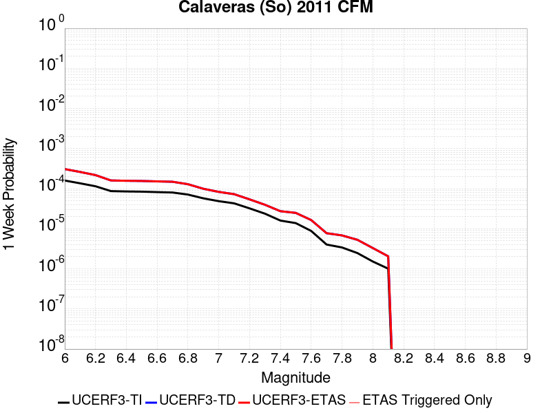 | 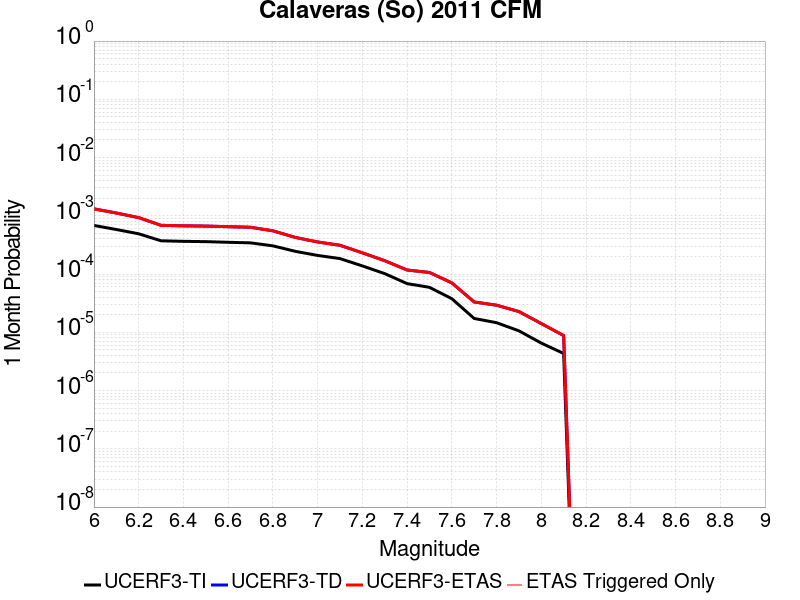 | 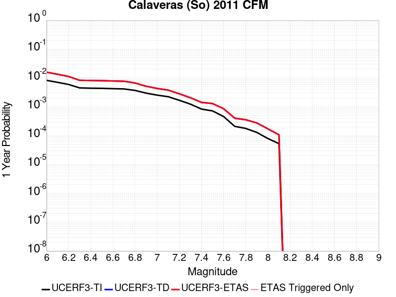 | 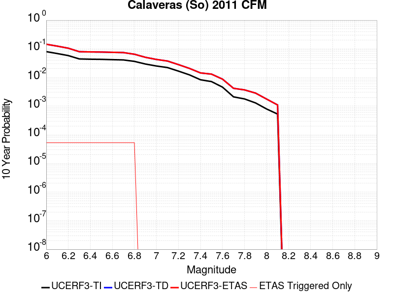 |

| Magnitude | 1 wk TI Prob | 1 wk TD Prob | 1 wk ETAS Prob | 1 wk ETAS/TD Gain | 1 wk ETAS Triggered Only | 1 mo TI Prob | 1 mo TD Prob | 1 mo ETAS Prob | 1 mo ETAS/TD Gain | 1 mo ETAS Triggered Only | 1 yr TI Prob | 1 yr TD Prob | 1 yr ETAS Prob | 1 yr ETAS/TD Gain | 1 yr ETAS Triggered Only | 10 yr TI Prob | 10 yr TD Prob | 10 yr ETAS Prob | 10 yr ETAS/TD Gain | 10 yr ETAS Triggered Only |
|-----|-----|-----|-----|-----|-----|-----|-----|-----|-----|-----|-----|-----|-----|-----|-----|-----|-----|-----|-----|-----|
| 6.0 | 1.5950744E-4 | 3.0764836E-4 | 3.0764836E-4 | 1.0 | 0.0 | 6.834242E-4 | 0.0013170127 | 0.0013170127 | 1.0 | 0.0 | 0.00828899 | 0.015870476 | 0.015870476 | 1.0 | 0.0 | 0.079865426 | 0.14450862 | 0.14451802 | 1.0000651 | 1.0989011E-5 |
| 6.1 | 1.3584697E-4 | 2.6082783E-4 | 2.6082783E-4 | 1.0 | 0.0 | 5.8207137E-4 | 0.0011165334 | 0.0011165334 | 1.0 | 0.0 | 0.007063716 | 0.0134726595 | 0.0134726595 | 1.0 | 0.0 | 0.06843361 | 0.12413266 | 0.12414229 | 1.0000775 | 1.0989011E-5 |
| 6.2 | 1.14676266E-4 | 2.176399E-4 | 2.176399E-4 | 1.0 | 0.0 | 4.9137714E-4 | 9.315841E-4 | 9.315841E-4 | 1.0 | 0.0 | 0.0059661185 | 0.011255375 | 0.011255375 | 1.0 | 0.0 | 0.058084648 | 0.10512039 | 0.105130225 | 1.0000936 | 1.0989011E-5 |
| 6.3 | 8.691518E-5 | 1.6011519E-4 | 1.6011519E-4 | 1.0 | 0.0 | 3.7244044E-4 | 6.8598235E-4 | 6.8598235E-4 | 1.0 | 0.0 | 0.004525038 | 0.008312301 | 0.008312301 | 1.0 | 0.0 | 0.044339992 | 0.07943514 | 0.07944526 | 1.0001273 | 1.0989011E-5 |
| 6.4 | 8.50982E-5 | 1.5717815E-4 | 1.5717815E-4 | 1.0 | 0.0 | 3.646556E-4 | 6.734016E-4 | 6.734016E-4 | 1.0 | 0.0 | 0.0044306475 | 0.008160284 | 0.008160284 | 1.0 | 0.0 | 0.04343345 | 0.07804097 | 0.078051105 | 1.0001298 | 1.0989011E-5 |
| 6.5 | 8.4062965E-5 | 1.5542265E-4 | 1.5542265E-4 | 1.0 | 0.0 | 3.602201E-4 | 6.6588185E-4 | 6.6588185E-4 | 1.0 | 0.0 | 0.004376863 | 0.008069461 | 0.008069461 | 1.0 | 0.0 | 0.042916555 | 0.07721209 | 0.07722223 | 1.0001314 | 1.0989011E-5 |
| 6.6 | 8.194716E-5 | 1.5177837E-4 | 1.5177837E-4 | 1.0 | 0.0 | 3.5115483E-4 | 6.5027137E-4 | 6.5027137E-4 | 1.0 | 0.0 | 0.0042669317 | 0.007881236 | 0.007881236 | 1.0 | 0.0 | 0.04185927 | 0.075496934 | 0.0755071 | 1.0001346 | 1.0989011E-5 |
| 6.7 | 8.012326E-5 | 1.4845439E-4 | 1.4845439E-4 | 1.0 | 0.0 | 3.433402E-4 | 6.360328E-4 | 6.360328E-4 | 1.0 | 0.0 | 0.004172157 | 0.007709676 | 0.007709676 | 1.0 | 0.0 | 0.040946912 | 0.07393877 | 0.07394895 | 1.0001377 | 1.0989011E-5 |
| 6.8 | 7.119773E-5 | 1.2901929E-4 | 1.2901929E-4 | 1.0 | 0.0 | 3.0509746E-4 | 5.5279536E-4 | 5.5279536E-4 | 1.0 | 0.0 | 0.0037082357 | 0.006706445 | 0.006706445 | 1.0 | 0.0 | 0.036469642 | 0.064778455 | 0.06478874 | 1.0001587 | 1.0989011E-5 |
| 6.9 | 5.7343088E-5 | 9.937131E-5 | 9.937131E-5 | 1.0 | 0.0 | 2.4573295E-4 | 4.25808E-4 | 4.25808E-4 | 1.0 | 0.0 | 0.0029876942 | 0.005171969 | 0.005171969 | 1.0 | 0.0 | 0.02947844 | 0.050595112 | 0.050595112 | 1.0 | 0.0 |
| 7.0 | 4.8746577E-5 | 8.3025414E-5 | 8.3025414E-5 | 1.0 | 0.0 | 2.0889717E-4 | 3.5577503E-4 | 3.5577503E-4 | 1.0 | 0.0 | 0.0025403565 | 0.004323025 | 0.004323025 | 1.0 | 0.0 | 0.025115121 | 0.042569794 | 0.042569794 | 1.0 | 0.0 |
| 7.1 | 4.2998014E-5 | 7.280222E-5 | 7.280222E-5 | 1.0 | 0.0 | 1.8426418E-4 | 3.1197254E-4 | 3.1197254E-4 | 1.0 | 0.0 | 0.002241108 | 0.003791711 | 0.003791711 | 1.0 | 0.0 | 0.022186412 | 0.03749704 | 0.03749704 | 1.0 | 0.0 |
| 7.2 | 3.221292E-5 | 5.4052274E-5 | 5.4052274E-5 | 1.0 | 0.0 | 1.3804805E-4 | 2.3163219E-4 | 2.3163219E-4 | 1.0 | 0.0 | 0.0016794393 | 0.0028165032 | 0.0028165032 | 1.0 | 0.0 | 0.016668037 | 0.028107438 | 0.028107438 | 1.0 | 0.0 |
| 7.3 | 2.3756531E-5 | 3.9602193E-5 | 3.9602193E-5 | 1.0 | 0.0 | 1.0180973E-4 | 1.6971274E-4 | 1.6971274E-4 | 1.0 | 0.0 | 0.0012388286 | 0.0020643119 | 0.0020643119 | 1.0 | 0.0 | 0.012319452 | 0.020707732 | 0.020707732 | 1.0 | 0.0 |
| 7.4 | 1.5997684E-5 | 2.7403032E-5 | 2.7403032E-5 | 1.0 | 0.0 | 6.8559704E-5 | 1.1743629E-4 | 1.1743629E-4 | 1.0 | 0.0 | 8.343947E-4 | 0.0014288516 | 0.0014288516 | 1.0 | 0.0 | 0.008312687 | 0.014406732 | 0.014406732 | 1.0 | 0.0 |
| 7.5 | 1.3814293E-5 | 2.4842275E-5 | 2.4842275E-5 | 1.0 | 0.0 | 5.9202768E-5 | 1.0646256E-4 | 1.0646256E-4 | 1.0 | 0.0 | 7.205553E-4 | 0.0012954134 | 0.0012954134 | 1.0 | 0.0 | 0.007182234 | 0.013084742 | 0.013084742 | 1.0 | 0.0 |
| 7.6 | 8.817309E-6 | 1.647916E-5 | 1.647916E-5 | 1.0 | 0.0 | 3.7787922E-5 | 7.0623064E-5 | 7.0623064E-5 | 1.0 | 0.0 | 4.5997082E-4 | 8.59498E-4 | 8.59498E-4 | 1.0 | 0.0 | 0.004590199 | 0.008743945 | 0.008743945 | 1.0 | 0.0 |
| 7.7 | 4.0352206E-6 | 7.7405075E-6 | 7.7405075E-6 | 1.0 | 0.0 | 1.7293689E-5 | 3.317318E-5 | 3.317318E-5 | 1.0 | 0.0 | 2.1053031E-4 | 4.038087E-4 | 4.038087E-4 | 1.0 | 0.0 | 0.0021033096 | 0.0041814526 | 0.0041814526 | 1.0 | 0.0 |
| 7.8 | 3.413169E-6 | 6.816318E-6 | 6.816318E-6 | 1.0 | 0.0 | 1.4627784E-5 | 2.9212464E-5 | 2.9212464E-5 | 1.0 | 0.0 | 1.7807873E-4 | 3.5560378E-4 | 3.5560378E-4 | 1.0 | 0.0 | 0.0017793609 | 0.0036806788 | 0.0036806788 | 1.0 | 0.0 |
| 7.9 | 2.4740732E-6 | 5.300461E-6 | 5.300461E-6 | 1.0 | 0.0 | 1.06031275E-5 | 2.2716065E-5 | 2.2716065E-5 | 1.0 | 0.0 | 1.2908543E-4 | 2.7653304E-4 | 2.7653304E-4 | 1.0 | 0.0 | 0.0012901047 | 0.0028451346 | 0.0028451346 | 1.0 | 0.0 |
| 8.0 | 1.5231818E-6 | 3.3013737E-6 | 3.3013737E-6 | 1.0 | 0.0 | 6.527906E-6 | 1.4148668E-5 | 1.4148668E-5 | 1.0 | 0.0 | 7.9474354E-5 | 1.7224645E-4 | 1.7224645E-4 | 1.0 | 0.0 | 7.944594E-4 | 0.0017625601 | 0.0017625601 | 1.0 | 0.0 |
| 8.1 | 1.0104524E-6 | 2.0535008E-6 | 2.0535008E-6 | 1.0 | 0.0 | 4.330503E-6 | 8.800688E-6 | 8.800688E-6 | 1.0 | 0.0 | 5.2722597E-5 | 1.0714315E-4 | 1.0714315E-4 | 1.0 | 0.0 | 5.271009E-4 | 0.0010968011 | 0.0010968011 | 1.0 | 0.0 |

## Mono Lake 2011 CFM
*[(top)](#table-of-contents)*

| 1 Week | 1 Month | 1 Year | 10 Year |
|-----|-----|-----|-----|
| 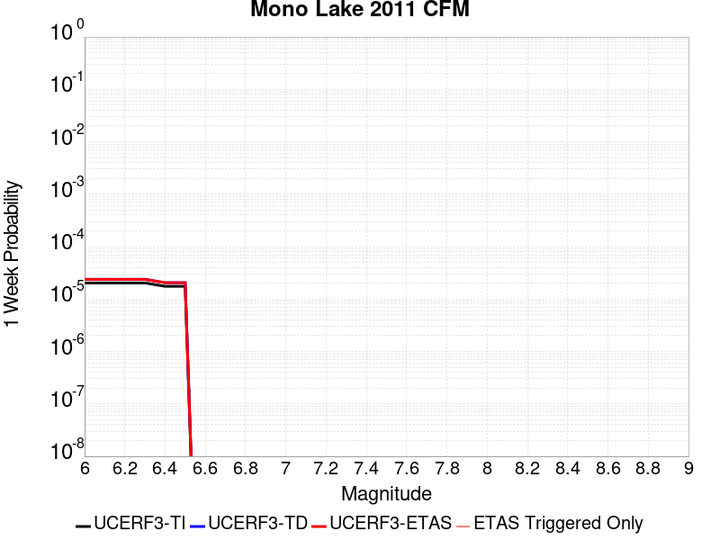 |  | 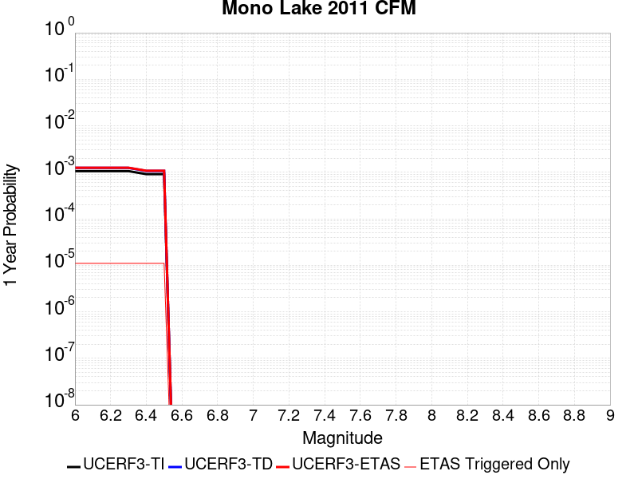 | 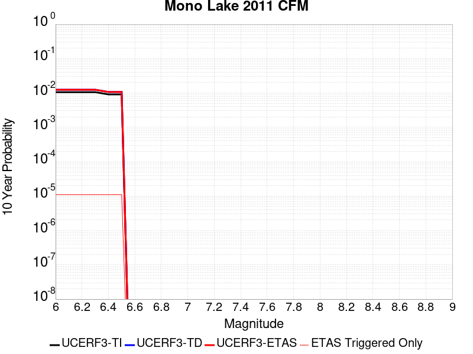 |

| Magnitude | 1 wk TI Prob | 1 wk TD Prob | 1 wk ETAS Prob | 1 wk ETAS/TD Gain | 1 wk ETAS Triggered Only | 1 mo TI Prob | 1 mo TD Prob | 1 mo ETAS Prob | 1 mo ETAS/TD Gain | 1 mo ETAS Triggered Only | 1 yr TI Prob | 1 yr TD Prob | 1 yr ETAS Prob | 1 yr ETAS/TD Gain | 1 yr ETAS Triggered Only | 10 yr TI Prob | 10 yr TD Prob | 10 yr ETAS Prob | 10 yr ETAS/TD Gain | 10 yr ETAS Triggered Only |
|-----|-----|-----|-----|-----|-----|-----|-----|-----|-----|-----|-----|-----|-----|-----|-----|-----|-----|-----|-----|-----|
| 6.0 | 2.0341662E-5 | 2.3832501E-5 | 2.3832501E-5 | 1.0 | 0.0 | 8.717564E-5 | 1.02138285E-4 | 1.02138285E-4 | 1.0 | 0.0 | 0.0010608466 | 0.0012433559 | 0.0012543312 | 1.0088272 | 1.0989011E-5 | 0.010557966 | 0.012416087 | 0.01242694 | 1.000874 | 1.0989011E-5 |
| 6.1 | 2.0341662E-5 | 2.3832501E-5 | 2.3832501E-5 | 1.0 | 0.0 | 8.717564E-5 | 1.02138285E-4 | 1.02138285E-4 | 1.0 | 0.0 | 0.0010608466 | 0.0012433559 | 0.0012543312 | 1.0088272 | 1.0989011E-5 | 0.010557966 | 0.012416087 | 0.01242694 | 1.000874 | 1.0989011E-5 |
| 6.2 | 2.0341662E-5 | 2.3832501E-5 | 2.3832501E-5 | 1.0 | 0.0 | 8.717564E-5 | 1.02138285E-4 | 1.02138285E-4 | 1.0 | 0.0 | 0.0010608466 | 0.0012433559 | 0.0012543312 | 1.0088272 | 1.0989011E-5 | 0.010557966 | 0.012416087 | 0.01242694 | 1.000874 | 1.0989011E-5 |
| 6.3 | 2.0341662E-5 | 2.3832501E-5 | 2.3832501E-5 | 1.0 | 0.0 | 8.717564E-5 | 1.02138285E-4 | 1.02138285E-4 | 1.0 | 0.0 | 0.0010608466 | 0.0012433559 | 0.0012543312 | 1.0088272 | 1.0989011E-5 | 0.010557966 | 0.012416087 | 0.01242694 | 1.000874 | 1.0989011E-5 |
| 6.4 | 1.749821E-5 | 2.0494705E-5 | 2.0494705E-5 | 1.0 | 0.0 | 7.499018E-5 | 8.783444E-5 | 8.783444E-5 | 1.0 | 0.0 | 9.1262296E-4 | 0.0010693844 | 0.0010803617 | 1.010265 | 1.0989011E-5 | 0.009088841 | 0.010693803 | 0.010704675 | 1.0010166 | 1.0989011E-5 |
| 6.5 | 1.749821E-5 | 2.0494705E-5 | 2.0494705E-5 | 1.0 | 0.0 | 7.499018E-5 | 8.783444E-5 | 8.783444E-5 | 1.0 | 0.0 | 9.1262296E-4 | 0.0010693844 | 0.0010803617 | 1.010265 | 1.0989011E-5 | 0.009088841 | 0.010693803 | 0.010704675 | 1.0010166 | 1.0989011E-5 |

## Sargent 2011 CFM
*[(top)](#table-of-contents)*

| 1 Week | 1 Month | 1 Year | 10 Year |
|-----|-----|-----|-----|
| 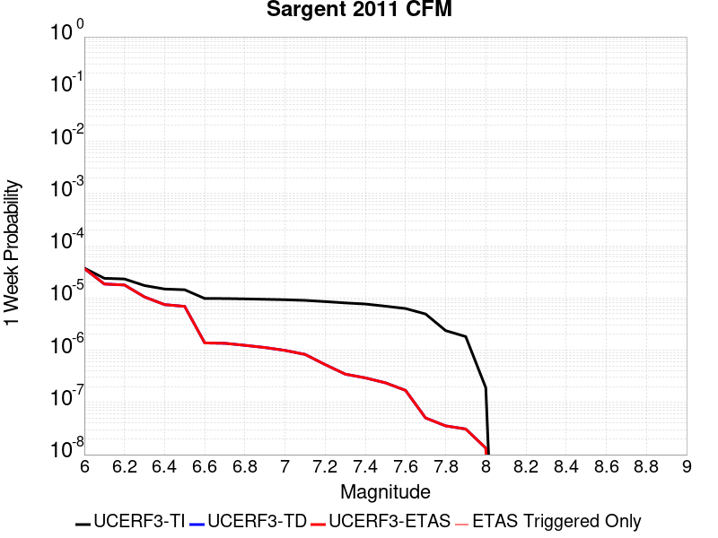 | 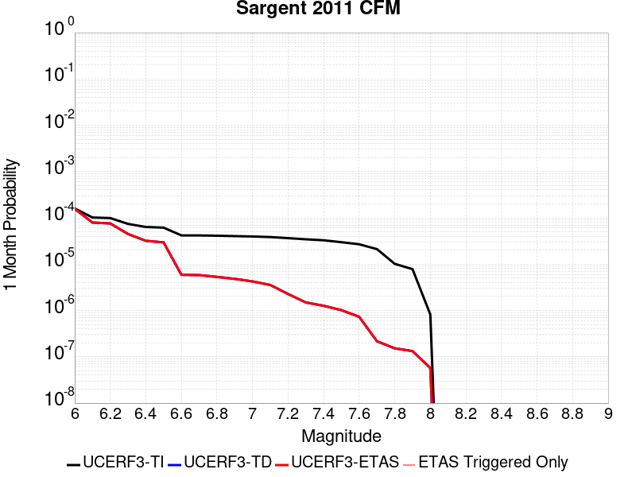 | 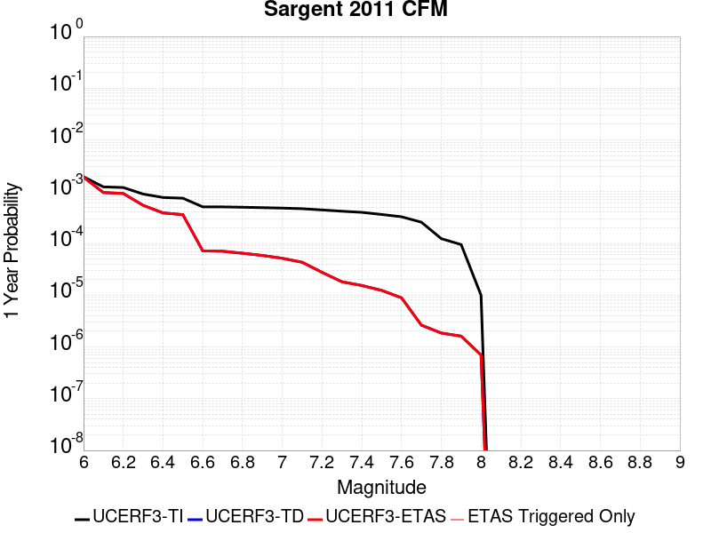 | 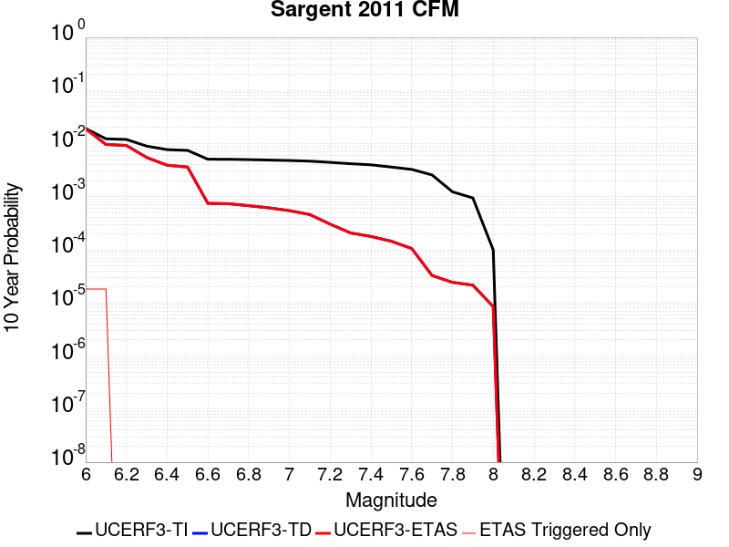 |

| Magnitude | 1 wk TI Prob | 1 wk TD Prob | 1 wk ETAS Prob | 1 wk ETAS/TD Gain | 1 wk ETAS Triggered Only | 1 mo TI Prob | 1 mo TD Prob | 1 mo ETAS Prob | 1 mo ETAS/TD Gain | 1 mo ETAS Triggered Only | 1 yr TI Prob | 1 yr TD Prob | 1 yr ETAS Prob | 1 yr ETAS/TD Gain | 1 yr ETAS Triggered Only | 10 yr TI Prob | 10 yr TD Prob | 10 yr ETAS Prob | 10 yr ETAS/TD Gain | 10 yr ETAS Triggered Only |
|-----|-----|-----|-----|-----|-----|-----|-----|-----|-----|-----|-----|-----|-----|-----|-----|-----|-----|-----|-----|-----|
| 6.0 | 3.7327867E-5 | 3.6663398E-5 | 3.6663398E-5 | 1.0 | 0.0 | 1.5996677E-4 | 1.5712218E-4 | 1.5712218E-4 | 1.0 | 0.0 | 0.0019458556 | 0.0019117607 | 0.0019117607 | 1.0 | 0.0 | 0.01928905 | 0.01902541 | 0.01903619 | 1.0005666 | 1.0989011E-5 |
| 6.1 | 2.3771476E-5 | 1.8486922E-5 | 1.8486922E-5 | 1.0 | 0.0 | 1.01873775E-4 | 7.922776E-5 | 7.922776E-5 | 1.0 | 0.0 | 0.0012396075 | 9.642417E-4 | 9.642417E-4 | 1.0 | 0.0 | 0.012327154 | 0.009640244 | 0.009651126 | 1.0011289 | 1.0989011E-5 |
| 6.2 | 2.3112721E-5 | 1.7718145E-5 | 1.7718145E-5 | 1.0 | 0.0 | 9.9050754E-5 | 7.593319E-5 | 7.593319E-5 | 1.0 | 0.0 | 0.0012052758 | 9.241645E-4 | 9.241645E-4 | 1.0 | 0.0 | 0.011987597 | 0.009242827 | 0.009242827 | 1.0 | 0.0 |
| 6.3 | 1.728509E-5 | 1.0464543E-5 | 1.0464543E-5 | 1.0 | 0.0 | 7.407686E-5 | 4.484754E-5 | 4.484754E-5 | 1.0 | 0.0 | 9.015125E-4 | 5.4592645E-4 | 5.4592645E-4 | 1.0 | 0.0 | 0.008978641 | 0.0054822545 | 0.0054822545 | 1.0 | 0.0 |
| 6.4 | 1.48395575E-5 | 7.4608706E-6 | 7.4608706E-6 | 1.0 | 0.0 | 6.3596555E-5 | 3.1974985E-5 | 3.1974985E-5 | 1.0 | 0.0 | 7.7401294E-4 | 3.8926088E-4 | 3.8926088E-4 | 1.0 | 0.0 | 0.0077132257 | 0.0039214296 | 0.0039214296 | 1.0 | 0.0 |
| 6.5 | 1.4358964E-5 | 6.8995464E-6 | 6.8995464E-6 | 1.0 | 0.0 | 6.1536964E-5 | 2.9569364E-5 | 2.9569364E-5 | 1.0 | 0.0 | 7.48955E-4 | 3.5998237E-4 | 3.5998237E-4 | 1.0 | 0.0 | 0.0074643586 | 0.0036296272 | 0.0036296272 | 1.0 | 0.0 |
| 6.6 | 9.772591E-6 | 1.3772087E-6 | 1.3772087E-6 | 1.0 | 0.0 | 4.188186E-5 | 5.90231E-6 | 5.90231E-6 | 1.0 | 0.0 | 5.097923E-4 | 7.185828E-5 | 7.185828E-5 | 1.0 | 0.0 | 0.005086244 | 7.504081E-4 | 7.504081E-4 | 1.0 | 0.0 |
| 6.7 | 9.752745E-6 | 1.3558983E-6 | 1.3558983E-6 | 1.0 | 0.0 | 4.179681E-5 | 5.8109804E-6 | 5.8109804E-6 | 1.0 | 0.0 | 5.0875737E-4 | 7.074641E-5 | 7.074641E-5 | 1.0 | 0.0 | 0.005075942 | 7.3929696E-4 | 7.3929696E-4 | 1.0 | 0.0 |
| 6.8 | 9.608213E-6 | 1.2396991E-6 | 1.2396991E-6 | 1.0 | 0.0 | 4.1177405E-5 | 5.3129856E-6 | 5.3129856E-6 | 1.0 | 0.0 | 5.012196E-4 | 6.46837E-5 | 6.46837E-5 | 1.0 | 0.0 | 0.005000906 | 6.784046E-4 | 6.784046E-4 | 1.0 | 0.0 |
| 6.9 | 9.427164E-6 | 1.1243317E-6 | 1.1243317E-6 | 1.0 | 0.0 | 4.04015E-5 | 4.8185557E-6 | 4.8185557E-6 | 1.0 | 0.0 | 4.9177726E-4 | 5.8664355E-5 | 5.8664355E-5 | 1.0 | 0.0 | 0.004906904 | 6.175609E-4 | 6.175609E-4 | 1.0 | 0.0 |
| 7.0 | 9.247601E-6 | 9.906856E-7 | 9.906856E-7 | 1.0 | 0.0 | 3.9631974E-5 | 4.2457887E-6 | 4.2457887E-6 | 1.0 | 0.0 | 4.8241246E-4 | 5.1691266E-5 | 5.1691266E-5 | 1.0 | 0.0 | 0.0048136655 | 5.4735894E-4 | 5.4735894E-4 | 1.0 | 0.0 |
| 7.1 | 8.995454E-6 | 8.301707E-7 | 8.301707E-7 | 1.0 | 0.0 | 3.8551374E-5 | 3.5578694E-6 | 3.5578694E-6 | 1.0 | 0.0 | 4.6926187E-4 | 4.3316213E-5 | 4.3316213E-5 | 1.0 | 0.0 | 0.004682722 | 4.627207E-4 | 4.627207E-4 | 1.0 | 0.0 |
| 7.2 | 8.520861E-6 | 5.303598E-7 | 5.303598E-7 | 1.0 | 0.0 | 3.6517464E-5 | 2.2729687E-6 | 2.2729687E-6 | 1.0 | 0.0 | 4.445094E-4 | 2.767305E-5 | 2.767305E-5 | 1.0 | 0.0 | 0.004436213 | 3.0459446E-4 | 3.0459446E-4 | 1.0 | 0.0 |
| 7.3 | 8.043592E-6 | 3.4809017E-7 | 3.4809017E-7 | 1.0 | 0.0 | 3.4472083E-5 | 1.4918141E-6 | 1.4918141E-6 | 1.0 | 0.0 | 4.196168E-4 | 1.8162687E-5 | 1.8162687E-5 | 1.0 | 0.0 | 0.004188253 | 2.081809E-4 | 2.081809E-4 | 1.0 | 0.0 |
| 7.4 | 7.662316E-6 | 2.9513797E-7 | 2.9513797E-7 | 1.0 | 0.0 | 3.2838085E-5 | 1.2648765E-6 | 1.2648765E-6 | 1.0 | 0.0 | 3.9973034E-4 | 1.5399763E-5 | 1.5399763E-5 | 1.0 | 0.0 | 0.0039901207 | 1.7873695E-4 | 1.7873695E-4 | 1.0 | 0.0 |
| 7.5 | 6.961638E-6 | 2.37645E-7 | 2.37645E-7 | 1.0 | 0.0 | 2.9835252E-5 | 1.0184782E-6 | 1.0184782E-6 | 1.0 | 0.0 | 3.6318362E-4 | 1.2399902E-5 | 1.2399902E-5 | 1.0 | 0.0 | 0.0036259065 | 1.4526524E-4 | 1.4526524E-4 | 1.0 | 0.0 |
| 7.6 | 6.282332E-6 | 1.704124E-7 | 1.704124E-7 | 1.0 | 0.0 | 2.6924003E-5 | 7.303387E-7 | 7.303387E-7 | 1.0 | 0.0 | 3.2775043E-4 | 8.891838E-6 | 8.891838E-6 | 1.0 | 0.0 | 0.0032726745 | 1.05977124E-4 | 1.05977124E-4 | 1.0 | 0.0 |
| 7.7 | 4.934408E-6 | 5.0514668E-8 | 5.0514668E-8 | 1.0 | 0.0 | 2.114729E-5 | 2.1649143E-7 | 2.1649143E-7 | 1.0 | 0.0 | 2.5743784E-4 | 2.63578E-6 | 2.63578E-6 | 1.0 | 0.0 | 0.0025713982 | 3.2891265E-5 | 3.2891265E-5 | 1.0 | 0.0 |
| 7.8 | 2.373212E-6 | 3.5575873E-8 | 3.5575873E-8 | 1.0 | 0.0 | 1.0170869E-5 | 1.5246802E-7 | 1.5246802E-7 | 1.0 | 0.0 | 1.238233E-4 | 1.8562965E-6 | 1.8562965E-6 | 1.0 | 0.0 | 0.0012375432 | 2.4404715E-5 | 2.4404715E-5 | 1.0 | 0.0 |
| 7.9 | 1.8227792E-6 | 3.097774E-8 | 3.097774E-8 | 1.0 | 0.0 | 7.811887E-6 | 1.3276174E-7 | 1.3276174E-7 | 1.0 | 0.0 | 9.510558E-5 | 1.6163731E-6 | 1.6163731E-6 | 1.0 | 0.0 | 9.5064886E-4 | 2.1660044E-5 | 2.1660044E-5 | 1.0 | 0.0 |
| 8.0 | 1.9095137E-7 | 1.3374076E-8 | 1.3374076E-8 | 1.0 | 0.0 | 8.1836276E-7 | 5.7317468E-8 | 5.7317468E-8 | 1.0 | 0.0 | 9.963521E-6 | 6.9783994E-7 | 6.9783994E-7 | 1.0 | 0.0 | 9.963074E-5 | 8.530848E-6 | 8.530848E-6 | 1.0 | 0.0 |

## Hat Creek-McArthur-Mayfield
*[(top)](#table-of-contents)*

| 1 Week | 1 Month | 1 Year | 10 Year |
|-----|-----|-----|-----|
| 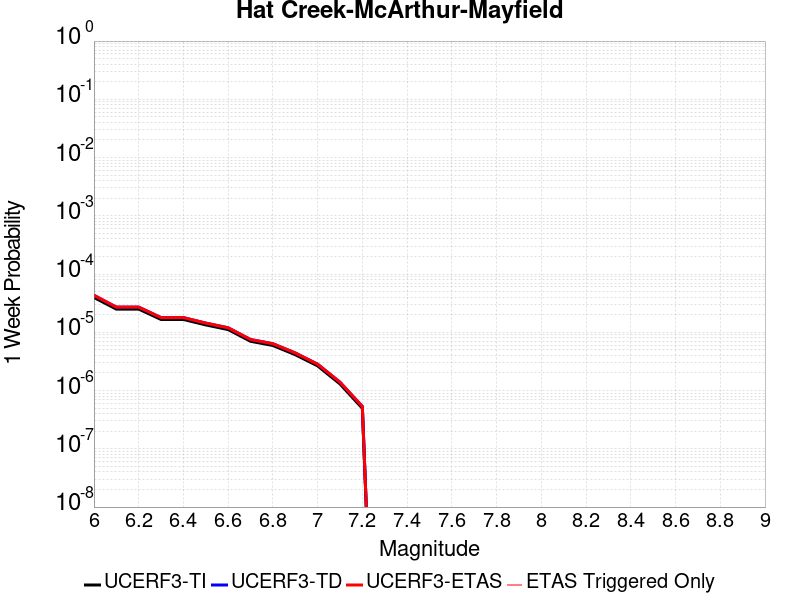 | 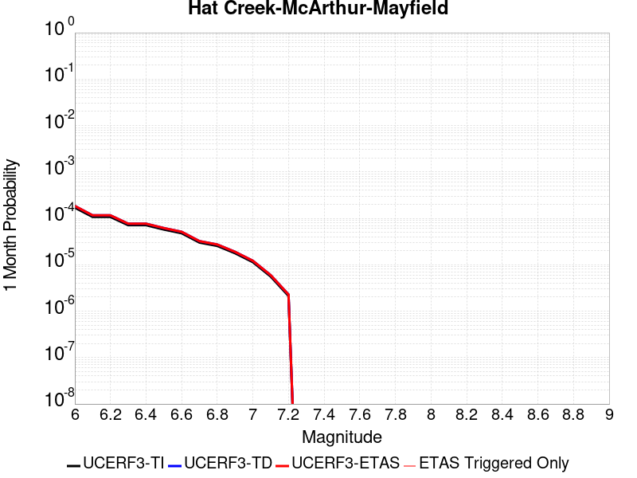 | 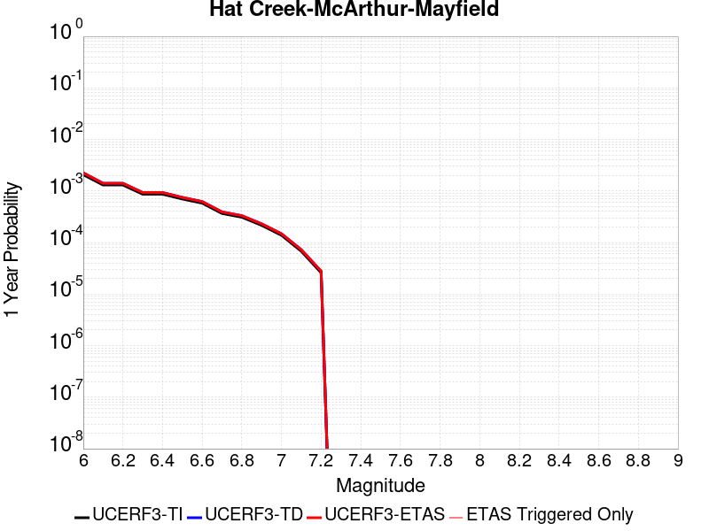 | 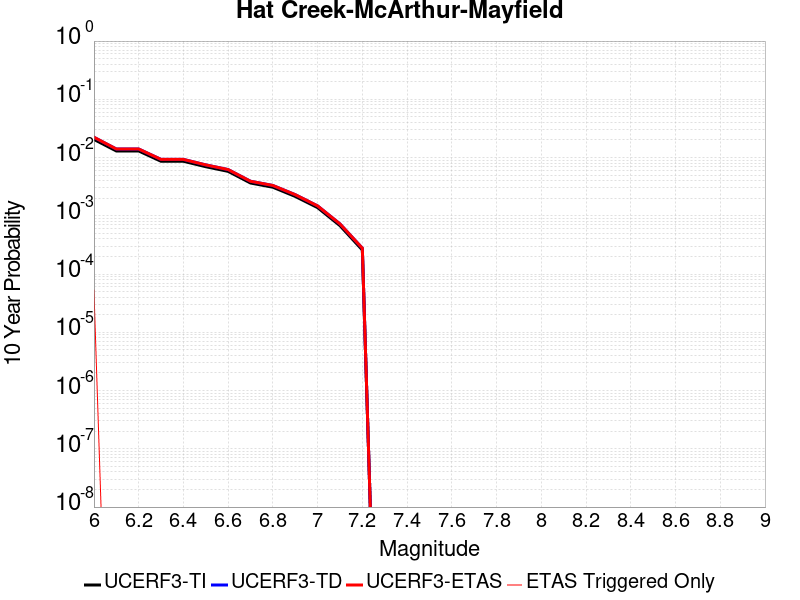 |

| Magnitude | 1 wk TI Prob | 1 wk TD Prob | 1 wk ETAS Prob | 1 wk ETAS/TD Gain | 1 wk ETAS Triggered Only | 1 mo TI Prob | 1 mo TD Prob | 1 mo ETAS Prob | 1 mo ETAS/TD Gain | 1 mo ETAS Triggered Only | 1 yr TI Prob | 1 yr TD Prob | 1 yr ETAS Prob | 1 yr ETAS/TD Gain | 1 yr ETAS Triggered Only | 10 yr TI Prob | 10 yr TD Prob | 10 yr ETAS Prob | 10 yr ETAS/TD Gain | 10 yr ETAS Triggered Only |
|-----|-----|-----|-----|-----|-----|-----|-----|-----|-----|-----|-----|-----|-----|-----|-----|-----|-----|-----|-----|-----|
| 6.0 | 3.967457E-5 | 4.316235E-5 | 4.316235E-5 | 1.0 | 0.0 | 1.7002279E-4 | 1.8496903E-4 | 1.8496903E-4 | 1.0 | 0.0 | 0.002068062 | 0.0022497862 | 0.0022497862 | 1.0 | 0.0 | 0.02048922 | 0.022282463 | 0.022293206 | 1.0004822 | 1.0989011E-5 |
| 6.1 | 2.5044013E-5 | 2.7073496E-5 | 2.7073496E-5 | 1.0 | 0.0 | 1.0732707E-4 | 1.1602429E-4 | 1.1602429E-4 | 1.0 | 0.0 | 0.0013059238 | 0.0014117121 | 0.0014117121 | 1.0 | 0.0 | 0.01298276 | 0.014030862 | 0.014030862 | 1.0 | 0.0 |
| 6.2 | 2.5044013E-5 | 2.7073496E-5 | 2.7073496E-5 | 1.0 | 0.0 | 1.0732707E-4 | 1.1602429E-4 | 1.1602429E-4 | 1.0 | 0.0 | 0.0013059238 | 0.0014117121 | 0.0014117121 | 1.0 | 0.0 | 0.01298276 | 0.014030862 | 0.014030862 | 1.0 | 0.0 |
| 6.3 | 1.6624012E-5 | 1.7892522E-5 | 1.7892522E-5 | 1.0 | 0.0 | 7.124382E-5 | 7.668003E-5 | 7.668003E-5 | 1.0 | 0.0 | 8.670483E-4 | 9.331881E-4 | 9.331881E-4 | 1.0 | 0.0 | 0.008636732 | 0.009293629 | 0.009293629 | 1.0 | 0.0 |
| 6.4 | 1.6624012E-5 | 1.7892522E-5 | 1.7892522E-5 | 1.0 | 0.0 | 7.124382E-5 | 7.668003E-5 | 7.668003E-5 | 1.0 | 0.0 | 8.670483E-4 | 9.331881E-4 | 9.331881E-4 | 1.0 | 0.0 | 0.008636732 | 0.009293629 | 0.009293629 | 1.0 | 0.0 |
| 6.5 | 1.3394842E-5 | 1.4393276E-5 | 1.4393276E-5 | 1.0 | 0.0 | 5.7405203E-5 | 6.168404E-5 | 6.168404E-5 | 1.0 | 0.0 | 6.986842E-4 | 7.5074995E-4 | 7.5074995E-4 | 1.0 | 0.0 | 0.006964916 | 0.0074827303 | 0.0074827303 | 1.0 | 0.0 |
| 6.6 | 1.1137514E-5 | 1.1955477E-5 | 1.1955477E-5 | 1.0 | 0.0 | 4.7731326E-5 | 5.1236777E-5 | 5.1236777E-5 | 1.0 | 0.0 | 5.809739E-4 | 6.236332E-4 | 6.236332E-4 | 1.0 | 0.0 | 0.005794574 | 0.0062192534 | 0.0062192534 | 1.0 | 0.0 |
| 6.7 | 7.0200663E-6 | 7.5248636E-6 | 7.5248636E-6 | 1.0 | 0.0 | 3.008565E-5 | 3.2249027E-5 | 3.2249027E-5 | 1.0 | 0.0 | 3.6623122E-4 | 3.9256274E-4 | 3.9256274E-4 | 1.0 | 0.0 | 0.0036562826 | 0.0039188555 | 0.0039188555 | 1.0 | 0.0 |
| 6.8 | 5.940172E-6 | 6.3659604E-6 | 6.3659604E-6 | 1.0 | 0.0 | 2.545763E-5 | 2.7282409E-5 | 2.7282409E-5 | 1.0 | 0.0 | 3.0990256E-4 | 3.3211397E-4 | 3.3211397E-4 | 1.0 | 0.0 | 0.0030947074 | 0.003316305 | 0.003316305 | 1.0 | 0.0 |
| 6.9 | 4.129831E-6 | 4.423881E-6 | 4.423881E-6 | 1.0 | 0.0 | 1.7699154E-5 | 1.8959357E-5 | 1.8959357E-5 | 1.0 | 0.0 | 2.154659E-4 | 2.308065E-4 | 2.308065E-4 | 1.0 | 0.0 | 0.002152571 | 0.0023057463 | 0.0023057463 | 1.0 | 0.0 |
| 7.0 | 2.6512955E-6 | 2.8376114E-6 | 2.8376114E-6 | 1.0 | 0.0 | 1.1362646E-5 | 1.2161137E-5 | 1.2161137E-5 | 1.0 | 0.0 | 1.3833142E-4 | 1.4805222E-4 | 1.4805222E-4 | 1.0 | 0.0 | 0.0013824535 | 0.0014795784 | 0.0014795784 | 1.0 | 0.0 |
| 7.1 | 1.2992575E-6 | 1.3910359E-6 | 1.3910359E-6 | 1.0 | 0.0 | 5.568235E-6 | 5.96157E-6 | 5.96157E-6 | 1.0 | 0.0 | 6.779115E-5 | 7.257992E-5 | 7.257992E-5 | 1.0 | 0.0 | 6.7770475E-4 | 7.2558376E-4 | 7.2558376E-4 | 1.0 | 0.0 |
| 7.2 | 4.968191E-7 | 5.327556E-7 | 5.327556E-7 | 1.0 | 0.0 | 2.1292228E-6 | 2.283237E-6 | 2.283237E-6 | 1.0 | 0.0 | 2.592298E-5 | 2.7798184E-5 | 2.7798184E-5 | 1.0 | 0.0 | 2.5919956E-4 | 2.7795942E-4 | 2.7795942E-4 | 1.0 | 0.0 |

## Fontana (Seismicity)
*[(top)](#table-of-contents)*

| 1 Week | 1 Month | 1 Year | 10 Year |
|-----|-----|-----|-----|
| 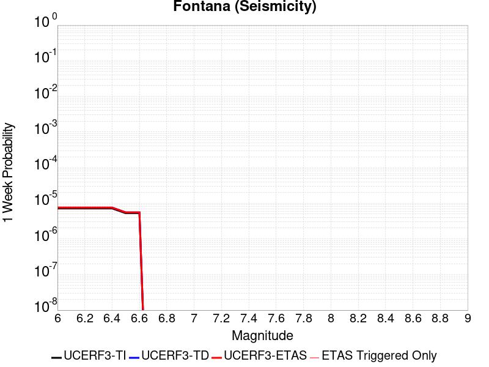 | 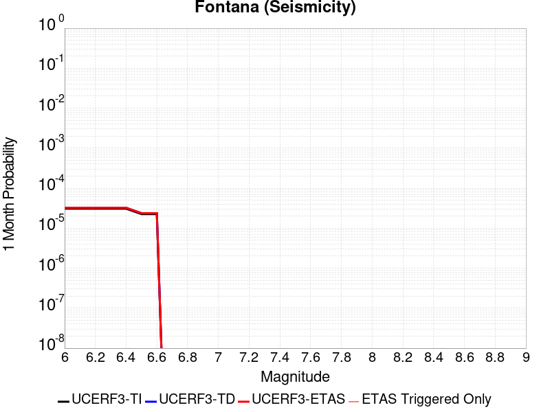 | 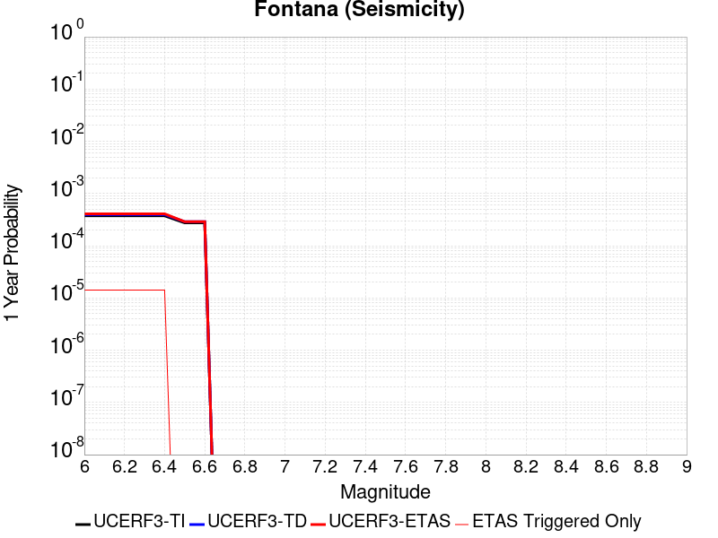 | 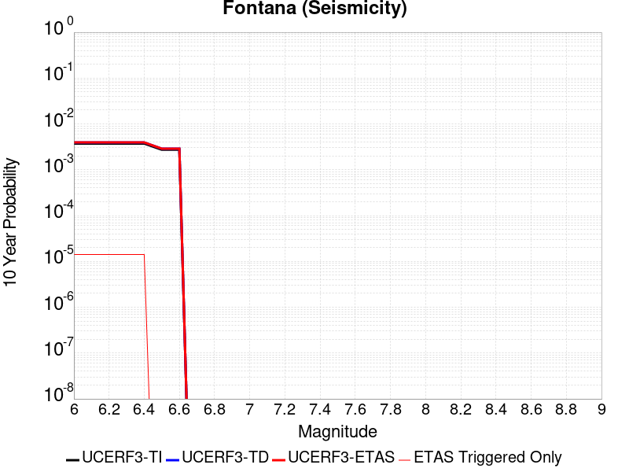 |

| Magnitude | 1 wk TI Prob | 1 wk TD Prob | 1 wk ETAS Prob | 1 wk ETAS/TD Gain | 1 wk ETAS Triggered Only | 1 mo TI Prob | 1 mo TD Prob | 1 mo ETAS Prob | 1 mo ETAS/TD Gain | 1 mo ETAS Triggered Only | 1 yr TI Prob | 1 yr TD Prob | 1 yr ETAS Prob | 1 yr ETAS/TD Gain | 1 yr ETAS Triggered Only | 10 yr TI Prob | 10 yr TD Prob | 10 yr ETAS Prob | 10 yr ETAS/TD Gain | 10 yr ETAS Triggered Only |
|-----|-----|-----|-----|-----|-----|-----|-----|-----|-----|-----|-----|-----|-----|-----|-----|-----|-----|-----|-----|-----|
| 6.0 | 7.1789214E-6 | 7.552417E-6 | 7.552417E-6 | 1.0 | 0.0 | 3.076644E-5 | 3.236733E-5 | 3.236733E-5 | 1.0 | 0.0 | 3.7451705E-4 | 3.9404177E-4 | 4.0502645E-4 | 1.027877 | 1.0989011E-5 | 0.003738865 | 0.003937431 | 0.0039483765 | 1.00278 | 1.0989011E-5 |
| 6.1 | 7.1789214E-6 | 7.552417E-6 | 7.552417E-6 | 1.0 | 0.0 | 3.076644E-5 | 3.236733E-5 | 3.236733E-5 | 1.0 | 0.0 | 3.7451705E-4 | 3.9404177E-4 | 4.0502645E-4 | 1.027877 | 1.0989011E-5 | 0.003738865 | 0.003937431 | 0.0039483765 | 1.00278 | 1.0989011E-5 |
| 6.2 | 7.1789214E-6 | 7.552417E-6 | 7.552417E-6 | 1.0 | 0.0 | 3.076644E-5 | 3.236733E-5 | 3.236733E-5 | 1.0 | 0.0 | 3.7451705E-4 | 3.9404177E-4 | 4.0502645E-4 | 1.027877 | 1.0989011E-5 | 0.003738865 | 0.003937431 | 0.0039483765 | 1.00278 | 1.0989011E-5 |
| 6.3 | 7.1789214E-6 | 7.552417E-6 | 7.552417E-6 | 1.0 | 0.0 | 3.076644E-5 | 3.236733E-5 | 3.236733E-5 | 1.0 | 0.0 | 3.7451705E-4 | 3.9404177E-4 | 4.0502645E-4 | 1.027877 | 1.0989011E-5 | 0.003738865 | 0.003937431 | 0.0039483765 | 1.00278 | 1.0989011E-5 |
| 6.4 | 7.1789214E-6 | 7.552417E-6 | 7.552417E-6 | 1.0 | 0.0 | 3.076644E-5 | 3.236733E-5 | 3.236733E-5 | 1.0 | 0.0 | 3.7451705E-4 | 3.9404177E-4 | 4.0502645E-4 | 1.027877 | 1.0989011E-5 | 0.003738865 | 0.003937431 | 0.0039483765 | 1.00278 | 1.0989011E-5 |
| 6.5 | 5.2611317E-6 | 5.533029E-6 | 5.533029E-6 | 1.0 | 0.0 | 2.2547512E-5 | 2.371298E-5 | 2.371298E-5 | 1.0 | 0.0 | 2.744814E-4 | 2.8870555E-4 | 2.8870555E-4 | 1.0 | 0.0 | 0.002741426 | 0.0028870553 | 0.0028870553 | 1.0 | 0.0 |
| 6.6 | 5.2611317E-6 | 5.533029E-6 | 5.533029E-6 | 1.0 | 0.0 | 2.2547512E-5 | 2.371298E-5 | 2.371298E-5 | 1.0 | 0.0 | 2.744814E-4 | 2.8870555E-4 | 2.8870555E-4 | 1.0 | 0.0 | 0.002741426 | 0.0028870553 | 0.0028870553 | 1.0 | 0.0 |

## Hayward (So) extension 2011 CFM
*[(top)](#table-of-contents)*

| 1 Week | 1 Month | 1 Year | 10 Year |
|-----|-----|-----|-----|
| 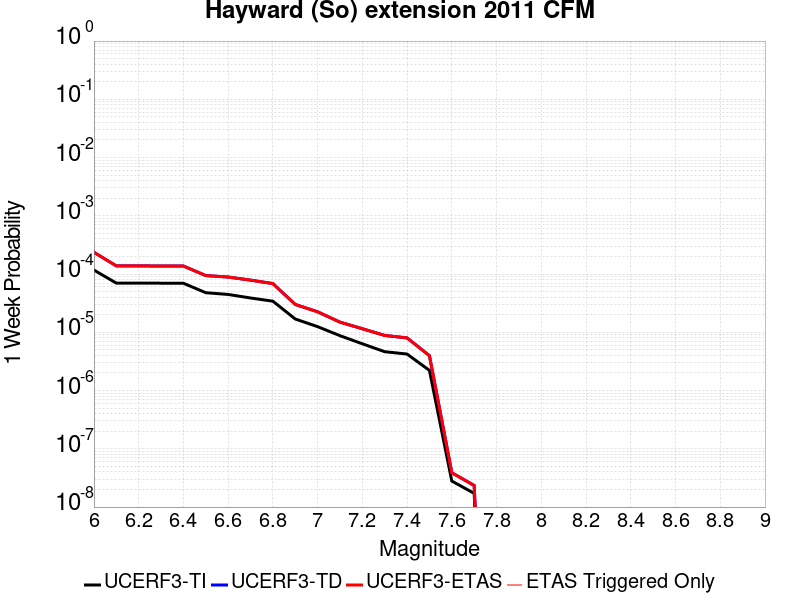 | 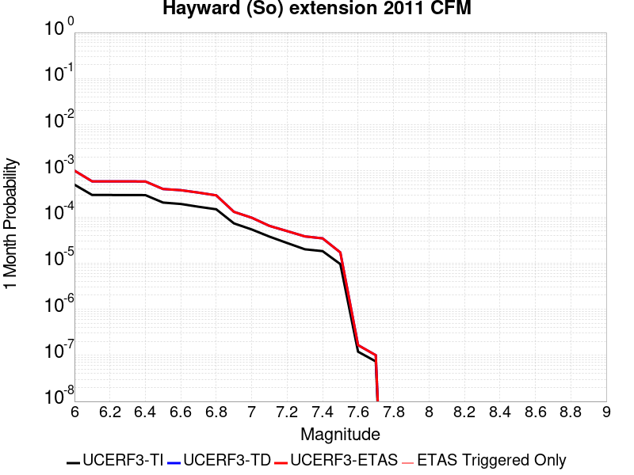 | 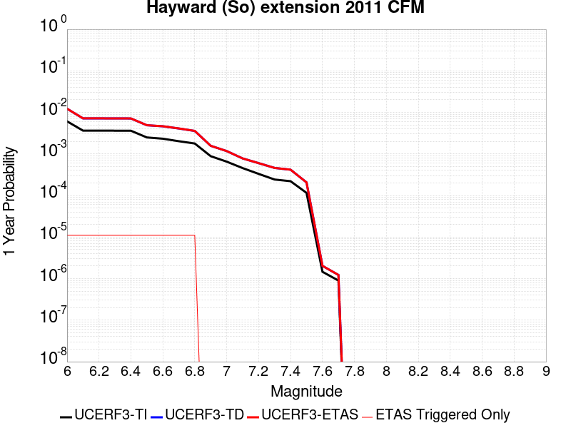 | 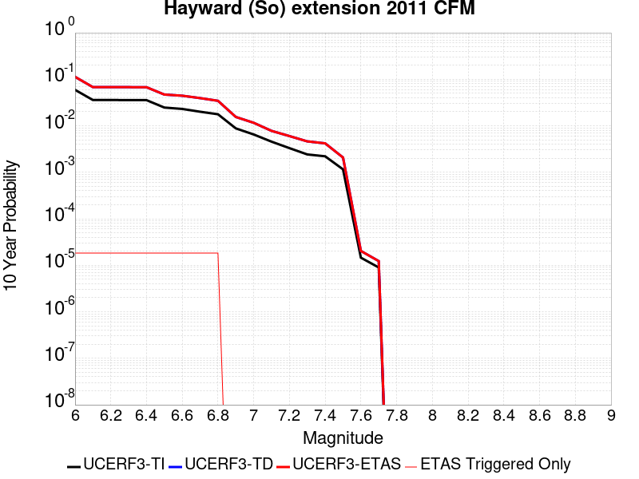 |

| Magnitude | 1 wk TI Prob | 1 wk TD Prob | 1 wk ETAS Prob | 1 wk ETAS/TD Gain | 1 wk ETAS Triggered Only | 1 mo TI Prob | 1 mo TD Prob | 1 mo ETAS Prob | 1 mo ETAS/TD Gain | 1 mo ETAS Triggered Only | 1 yr TI Prob | 1 yr TD Prob | 1 yr ETAS Prob | 1 yr ETAS/TD Gain | 1 yr ETAS Triggered Only | 10 yr TI Prob | 10 yr TD Prob | 10 yr ETAS Prob | 10 yr ETAS/TD Gain | 10 yr ETAS Triggered Only |
|-----|-----|-----|-----|-----|-----|-----|-----|-----|-----|-----|-----|-----|-----|-----|-----|-----|-----|-----|-----|-----|
| 6.0 | 1.1721256E-4 | 2.3637003E-4 | 2.3637003E-4 | 1.0 | 0.0 | 5.022428E-4 | 0.0010126781 | 0.0010126781 | 1.0 | 0.0 | 0.0060976758 | 0.012253807 | 0.012264661 | 1.0008858 | 1.0989011E-5 | 0.0593305 | 0.11289011 | 0.11289986 | 1.0000863 | 1.0989011E-5 |
| 6.1 | 6.99169E-5 | 1.3803637E-4 | 1.3803637E-4 | 1.0 | 0.0 | 2.9960944E-4 | 5.91463E-4 | 5.91463E-4 | 1.0 | 0.0 | 0.0036416445 | 0.007176423 | 0.0071873334 | 1.0015203 | 1.0989011E-5 | 0.035825435 | 0.06784292 | 0.06785317 | 1.000151 | 1.0989011E-5 |
| 6.2 | 6.99169E-5 | 1.3803637E-4 | 1.3803637E-4 | 1.0 | 0.0 | 2.9960944E-4 | 5.91463E-4 | 5.91463E-4 | 1.0 | 0.0 | 0.0036416445 | 0.007176423 | 0.0071873334 | 1.0015203 | 1.0989011E-5 | 0.035825435 | 0.06784292 | 0.06785317 | 1.000151 | 1.0989011E-5 |
| 6.3 | 6.970908E-5 | 1.3771761E-4 | 1.3771761E-4 | 1.0 | 0.0 | 2.9871898E-4 | 5.9009745E-4 | 5.9009745E-4 | 1.0 | 0.0 | 0.0036308395 | 0.0071599563 | 0.0071708662 | 1.0015239 | 1.0989011E-5 | 0.035720866 | 0.06769186 | 0.06770211 | 1.0001514 | 1.0989011E-5 |
| 6.4 | 6.9517155E-5 | 1.3738598E-4 | 1.3738598E-4 | 1.0 | 0.0 | 2.9789665E-4 | 5.8867777E-4 | 5.8867777E-4 | 1.0 | 0.0 | 0.0036208609 | 0.007142863 | 0.007153773 | 1.0015274 | 1.0989011E-5 | 0.03562429 | 0.06753588 | 0.06754612 | 1.0001518 | 1.0989011E-5 |
| 6.5 | 4.786248E-5 | 9.422551E-5 | 9.422551E-5 | 1.0 | 0.0 | 2.0510878E-4 | 4.0376306E-4 | 4.0376306E-4 | 1.0 | 0.0 | 0.0024943394 | 0.0049051465 | 0.0049160817 | 1.0022293 | 1.0989011E-5 | 0.02466527 | 0.046935335 | 0.046945807 | 1.0002232 | 1.0989011E-5 |
| 6.6 | 4.4662214E-5 | 8.88899E-5 | 8.88899E-5 | 1.0 | 0.0 | 1.9139545E-4 | 3.809037E-4 | 3.809037E-4 | 1.0 | 0.0 | 0.0023277493 | 0.004628103 | 0.004639041 | 1.0023634 | 1.0989011E-5 | 0.02303517 | 0.04432599 | 0.04433649 | 1.0002369 | 1.0989011E-5 |
| 6.7 | 3.884542E-5 | 7.8717756E-5 | 7.8717756E-5 | 1.0 | 0.0 | 1.6646975E-4 | 3.373207E-4 | 3.373207E-4 | 1.0 | 0.0 | 0.002024885 | 0.004099591 | 0.004110535 | 1.0026696 | 1.0989011E-5 | 0.020065336 | 0.039364345 | 0.0393749 | 1.0002682 | 1.0989011E-5 |
| 6.8 | 3.4221863E-5 | 6.861936E-5 | 6.861936E-5 | 1.0 | 0.0 | 1.4665688E-4 | 2.940522E-4 | 2.940522E-4 | 1.0 | 0.0 | 0.0017840851 | 0.00357463 | 0.0035855798 | 1.0030632 | 1.0989011E-5 | 0.017698295 | 0.034449436 | 0.034460045 | 1.000308 | 1.0989011E-5 |
| 6.9 | 1.6927712E-5 | 3.009656E-5 | 3.009656E-5 | 1.0 | 0.0 | 7.2545314E-5 | 1.289792E-4 | 1.289792E-4 | 1.0 | 0.0 | 8.828813E-4 | 0.0015692477 | 0.0015692477 | 1.0 | 0.0 | 0.008793819 | 0.015480095 | 0.015480095 | 1.0 | 0.0 |
| 7.0 | 1.2509653E-5 | 2.2494614E-5 | 2.2494614E-5 | 1.0 | 0.0 | 5.3611697E-5 | 9.6402175E-5 | 9.6402175E-5 | 1.0 | 0.0 | 6.525269E-4 | 0.0011731087 | 0.0011731087 | 1.0 | 0.0 | 0.0065061417 | 0.0115978485 | 0.0115978485 | 1.0 | 0.0 |
| 7.1 | 8.751583E-6 | 1.4950437E-5 | 1.4950437E-5 | 1.0 | 0.0 | 3.750624E-5 | 6.407176E-5 | 6.407176E-5 | 1.0 | 0.0 | 4.5654282E-4 | 7.7980035E-4 | 7.7980035E-4 | 1.0 | 0.0 | 0.0045560603 | 0.007775818 | 0.007775818 | 1.0 | 0.0 |
| 7.2 | 6.354379E-6 | 1.1521999E-5 | 1.1521999E-5 | 1.0 | 0.0 | 2.7232769E-5 | 4.937909E-5 | 4.937909E-5 | 1.0 | 0.0 | 3.3150852E-4 | 6.0102943E-4 | 6.0102943E-4 | 1.0 | 0.0 | 0.0033101442 | 0.0060119745 | 0.0060119745 | 1.0 | 0.0 |
| 7.3 | 4.645554E-6 | 8.839515E-6 | 8.839515E-6 | 1.0 | 0.0 | 1.9909365E-5 | 3.788311E-5 | 3.788311E-5 | 1.0 | 0.0 | 2.4236954E-4 | 4.6113323E-4 | 4.6113323E-4 | 1.0 | 0.0 | 0.0024210536 | 0.004621435 | 0.004621435 | 1.0 | 0.0 |
| 7.4 | 4.23437E-6 | 8.012998E-6 | 8.012998E-6 | 1.0 | 0.0 | 1.8147173E-5 | 3.434099E-5 | 3.434099E-5 | 1.0 | 0.0 | 2.2091944E-4 | 4.1802519E-4 | 4.1802519E-4 | 1.0 | 0.0 | 0.0022069993 | 0.0041922806 | 0.0041922806 | 1.0 | 0.0 |
| 7.5 | 2.2187417E-6 | 3.966394E-6 | 3.966394E-6 | 1.0 | 0.0 | 9.508858E-6 | 1.6998736E-5 | 1.6998736E-5 | 1.0 | 0.0 | 1.157642E-4 | 2.069426E-4 | 2.069426E-4 | 1.0 | 0.0 | 0.0011570391 | 0.0020806894 | 0.0020806894 | 1.0 | 0.0 |
| 7.6 | 2.7952495E-8 | 3.882696E-8 | 3.882696E-8 | 1.0 | 0.0 | 1.1979641E-7 | 1.6640125E-7 | 1.6640125E-7 | 1.0 | 0.0 | 1.4585203E-6 | 2.0259333E-6 | 2.0259333E-6 | 1.0 | 0.0 | 1.4585107E-5 | 2.0349831E-5 | 2.0349831E-5 | 1.0 | 0.0 |
| 7.7 | 1.7192724E-8 | 2.3465535E-8 | 2.3465535E-8 | 1.0 | 0.0 | 7.36831E-8 | 1.00566574E-7 | 1.00566574E-7 | 1.0 | 0.0 | 8.9709135E-7 | 1.2243974E-6 | 1.2243974E-6 | 1.0 | 0.0 | 8.970877E-6 | 1.2312015E-5 | 1.2312015E-5 | 1.0 | 0.0 |

## Santa Cruz Island
*[(top)](#table-of-contents)*

| 1 Week | 1 Month | 1 Year | 10 Year |
|-----|-----|-----|-----|
| 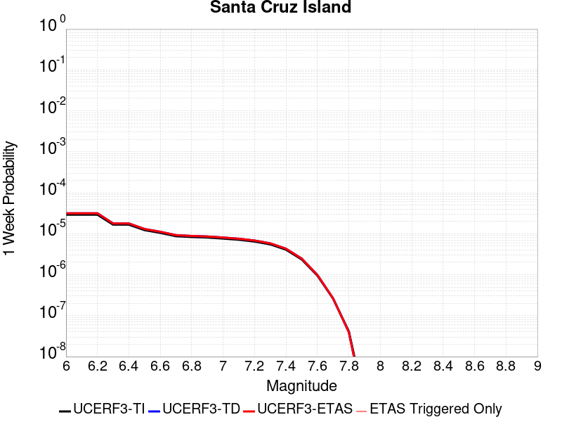 | 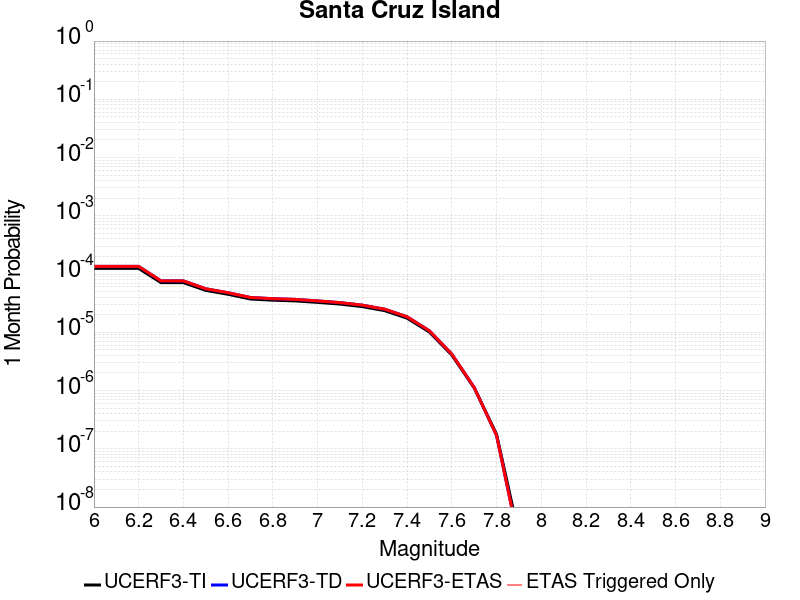 | 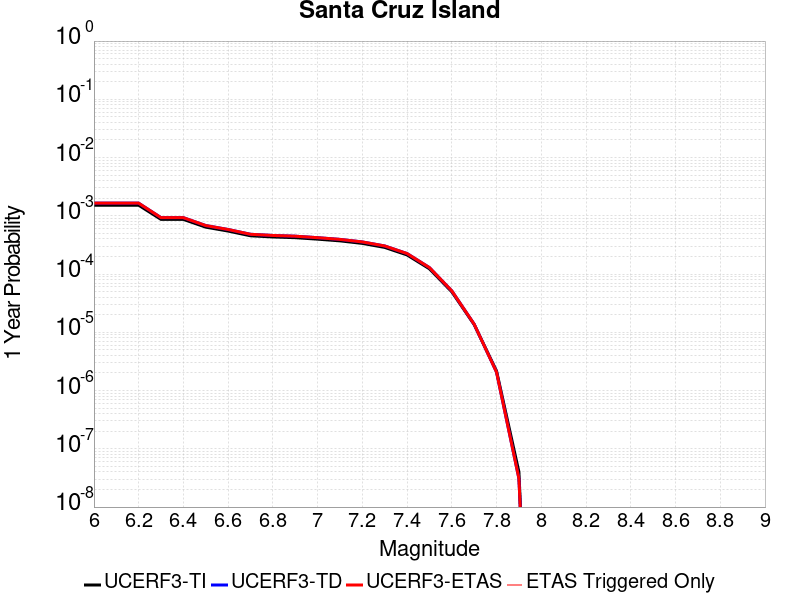 | 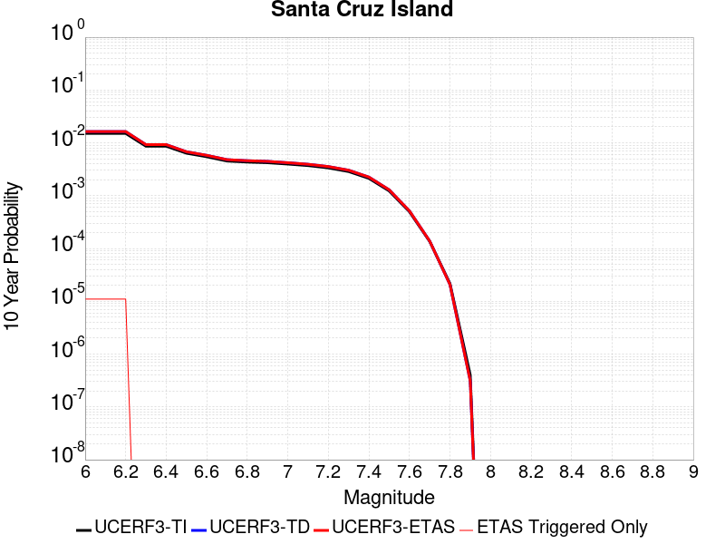 |

| Magnitude | 1 wk TI Prob | 1 wk TD Prob | 1 wk ETAS Prob | 1 wk ETAS/TD Gain | 1 wk ETAS Triggered Only | 1 mo TI Prob | 1 mo TD Prob | 1 mo ETAS Prob | 1 mo ETAS/TD Gain | 1 mo ETAS Triggered Only | 1 yr TI Prob | 1 yr TD Prob | 1 yr ETAS Prob | 1 yr ETAS/TD Gain | 1 yr ETAS Triggered Only | 10 yr TI Prob | 10 yr TD Prob | 10 yr ETAS Prob | 10 yr ETAS/TD Gain | 10 yr ETAS Triggered Only |
|-----|-----|-----|-----|-----|-----|-----|-----|-----|-----|-----|-----|-----|-----|-----|-----|-----|-----|-----|-----|-----|
| 6.0 | 2.9164563E-5 | 3.1602565E-5 | 3.1602565E-5 | 1.0 | 0.0 | 1.2498499E-4 | 1.354333E-4 | 1.354333E-4 | 1.0 | 0.0 | 0.0015206301 | 0.0016477895 | 0.0016477895 | 1.0 | 0.0 | 0.015102667 | 0.01636945 | 0.01638026 | 1.0006603 | 1.0989011E-5 |
| 6.1 | 2.9164563E-5 | 3.1602565E-5 | 3.1602565E-5 | 1.0 | 0.0 | 1.2498499E-4 | 1.354333E-4 | 1.354333E-4 | 1.0 | 0.0 | 0.0015206301 | 0.0016477895 | 0.0016477895 | 1.0 | 0.0 | 0.015102667 | 0.01636945 | 0.01638026 | 1.0006603 | 1.0989011E-5 |
| 6.2 | 2.9164563E-5 | 3.1602565E-5 | 3.1602565E-5 | 1.0 | 0.0 | 1.2498499E-4 | 1.354333E-4 | 1.354333E-4 | 1.0 | 0.0 | 0.0015206301 | 0.0016477895 | 0.0016477895 | 1.0 | 0.0 | 0.015102667 | 0.01636945 | 0.01638026 | 1.0006603 | 1.0989011E-5 |
| 6.3 | 1.6635553E-5 | 1.7805698E-5 | 1.7805698E-5 | 1.0 | 0.0 | 7.1293274E-5 | 7.6308E-5 | 7.6308E-5 | 1.0 | 0.0 | 8.6765E-4 | 9.286722E-4 | 9.286722E-4 | 1.0 | 0.0 | 0.008642701 | 0.009249786 | 0.009249786 | 1.0 | 0.0 |
| 6.4 | 1.6635553E-5 | 1.7805698E-5 | 1.7805698E-5 | 1.0 | 0.0 | 7.1293274E-5 | 7.6308E-5 | 7.6308E-5 | 1.0 | 0.0 | 8.6765E-4 | 9.286722E-4 | 9.286722E-4 | 1.0 | 0.0 | 0.008642701 | 0.009249786 | 0.009249786 | 1.0 | 0.0 |
| 6.5 | 1.2238748E-5 | 1.3043916E-5 | 1.3043916E-5 | 1.0 | 0.0 | 5.2450723E-5 | 5.5901317E-5 | 5.5901317E-5 | 1.0 | 0.0 | 6.3840044E-4 | 6.803897E-4 | 6.803897E-4 | 1.0 | 0.0 | 0.0063656955 | 0.0067834645 | 0.0067834645 | 1.0 | 0.0 |
| 6.6 | 1.0489767E-5 | 1.1157398E-5 | 1.1157398E-5 | 1.0 | 0.0 | 4.495537E-5 | 4.7816557E-5 | 4.7816557E-5 | 1.0 | 0.0 | 5.4719415E-4 | 5.8201334E-4 | 5.8201334E-4 | 1.0 | 0.0 | 0.005458487 | 0.0058051315 | 0.0058051315 | 1.0 | 0.0 |
| 6.7 | 8.699222E-6 | 9.2373975E-6 | 9.2373975E-6 | 1.0 | 0.0 | 3.7281847E-5 | 3.958825E-5 | 3.958825E-5 | 1.0 | 0.0 | 4.5381195E-4 | 4.8188088E-4 | 4.8188088E-4 | 1.0 | 0.0 | 0.0045288634 | 0.0048084273 | 0.0048084273 | 1.0 | 0.0 |
| 6.8 | 8.307732E-6 | 8.8174875E-6 | 8.8174875E-6 | 1.0 | 0.0 | 3.560408E-5 | 3.7788686E-5 | 3.7788686E-5 | 1.0 | 0.0 | 4.3339343E-4 | 4.5998057E-4 | 4.5998057E-4 | 1.0 | 0.0 | 0.004325492 | 0.004590338 | 0.004590338 | 1.0 | 0.0 |
| 6.9 | 8.073121E-6 | 8.565502E-6 | 8.565502E-6 | 1.0 | 0.0 | 3.459863E-5 | 3.670878E-5 | 3.670878E-5 | 1.0 | 0.0 | 4.2115687E-4 | 4.4683818E-4 | 4.4683818E-4 | 1.0 | 0.0 | 0.004203596 | 0.0044594486 | 0.0044594486 | 1.0 | 0.0 |
| 7.0 | 7.617019E-6 | 8.075188E-6 | 8.075188E-6 | 1.0 | 0.0 | 3.264396E-5 | 3.4607492E-5 | 3.4607492E-5 | 1.0 | 0.0 | 3.9736772E-4 | 4.2126514E-4 | 4.2126514E-4 | 1.0 | 0.0 | 0.003966579 | 0.0042047133 | 0.0042047133 | 1.0 | 0.0 |
| 7.1 | 7.1224836E-6 | 7.5462726E-6 | 7.5462726E-6 | 1.0 | 0.0 | 3.052457E-5 | 3.234077E-5 | 3.234077E-5 | 1.0 | 0.0 | 3.715733E-4 | 3.9367808E-4 | 3.9367808E-4 | 1.0 | 0.0 | 0.003709526 | 0.0039298497 | 0.0039298497 | 1.0 | 0.0 |
| 7.2 | 6.441115E-6 | 6.8278264E-6 | 6.8278264E-6 | 1.0 | 0.0 | 2.7604487E-5 | 2.9261786E-5 | 2.9261786E-5 | 1.0 | 0.0 | 3.360328E-4 | 3.5620423E-4 | 3.5620423E-4 | 1.0 | 0.0 | 0.0033552512 | 0.0035563614 | 0.0035563614 | 1.0 | 0.0 |
| 7.3 | 5.494274E-6 | 5.8203686E-6 | 5.8203686E-6 | 1.0 | 0.0 | 2.3546674E-5 | 2.49442E-5 | 2.49442E-5 | 1.0 | 0.0 | 2.8664304E-4 | 3.036535E-4 | 3.036535E-4 | 1.0 | 0.0 | 0.002862736 | 0.0030324091 | 0.0030324091 | 1.0 | 0.0 |
| 7.4 | 4.0802624E-6 | 4.312524E-6 | 4.312524E-6 | 1.0 | 0.0 | 1.7486722E-5 | 1.8482117E-5 | 1.8482117E-5 | 1.0 | 0.0 | 2.1288003E-4 | 2.249966E-4 | 2.249966E-4 | 1.0 | 0.0 | 0.0021267622 | 0.002247697 | 0.002247697 | 1.0 | 0.0 |
| 7.5 | 2.3584746E-6 | 2.475447E-6 | 2.475447E-6 | 1.0 | 0.0 | 1.0107709E-5 | 1.0609016E-5 | 1.0609016E-5 | 1.0 | 0.0 | 1.2305441E-4 | 1.2915715E-4 | 1.2915715E-4 | 1.0 | 0.0 | 0.0012298629 | 0.001290826 | 0.001290826 | 1.0 | 0.0 |
| 7.6 | 9.4981914E-7 | 9.861392E-7 | 9.861392E-7 | 1.0 | 0.0 | 4.0706473E-6 | 4.226304E-6 | 4.226304E-6 | 1.0 | 0.0 | 4.9559E-5 | 5.145405E-5 | 5.145405E-5 | 1.0 | 0.0 | 4.954795E-4 | 5.1442266E-4 | 5.1442266E-4 | 1.0 | 0.0 |
| 7.7 | 2.6013532E-7 | 2.641753E-7 | 2.641753E-7 | 1.0 | 0.0 | 1.1148652E-6 | 1.1321794E-6 | 1.1321794E-6 | 1.0 | 0.0 | 1.3573399E-5 | 1.3784197E-5 | 1.3784197E-5 | 1.0 | 0.0 | 1.357257E-4 | 1.3783349E-4 | 1.3783349E-4 | 1.0 | 0.0 |
| 7.8 | 4.1522263E-8 | 3.965782E-8 | 3.965782E-8 | 1.0 | 0.0 | 1.7795254E-7 | 1.6996208E-7 | 1.6996208E-7 | 1.0 | 0.0 | 2.16657E-6 | 2.0692867E-6 | 2.0692867E-6 | 1.0 | 0.0 | 2.1665488E-5 | 2.0692694E-5 | 2.0692694E-5 | 1.0 | 0.0 |
| 7.9 | 7.7242046E-10 | 5.947072E-10 | 5.947072E-10 | 1.0 | 0.0 | 3.3103735E-9 | 2.5487452E-9 | 2.5487452E-9 | 1.0 | 0.0 | 4.0303796E-8 | 3.1030975E-8 | 3.1030975E-8 | 1.0 | 0.0 | 4.030379E-7 | 3.103097E-7 | 3.103097E-7 | 1.0 | 0.0 |

## Holser alt 1
*[(top)](#table-of-contents)*

| 1 Week | 1 Month | 1 Year | 10 Year |
|-----|-----|-----|-----|
| 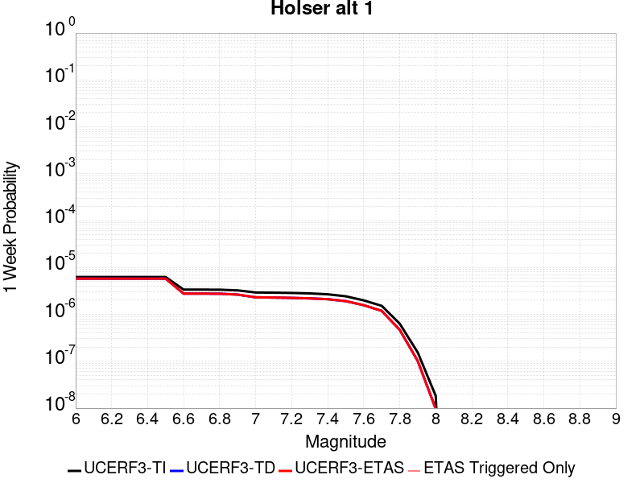 | 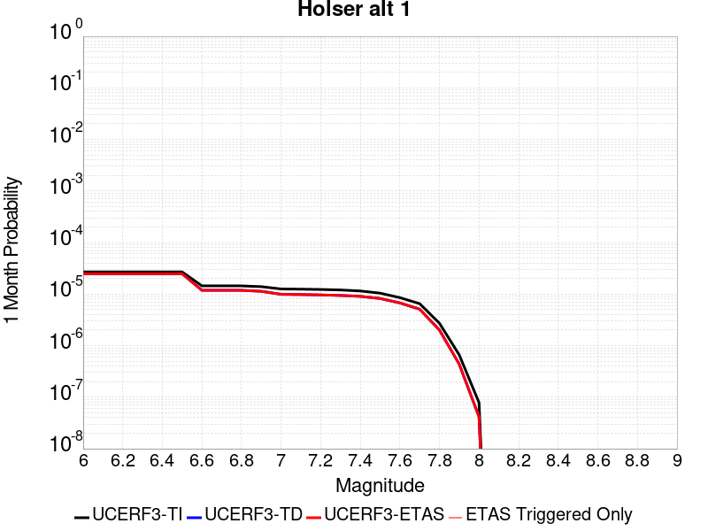 | 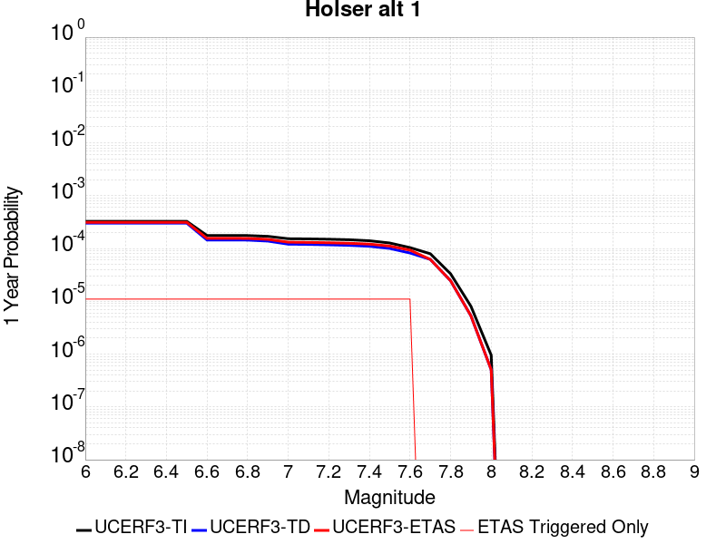 | 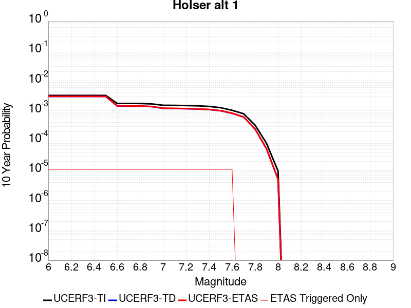 |

| Magnitude | 1 wk TI Prob | 1 wk TD Prob | 1 wk ETAS Prob | 1 wk ETAS/TD Gain | 1 wk ETAS Triggered Only | 1 mo TI Prob | 1 mo TD Prob | 1 mo ETAS Prob | 1 mo ETAS/TD Gain | 1 mo ETAS Triggered Only | 1 yr TI Prob | 1 yr TD Prob | 1 yr ETAS Prob | 1 yr ETAS/TD Gain | 1 yr ETAS Triggered Only | 10 yr TI Prob | 10 yr TD Prob | 10 yr ETAS Prob | 10 yr ETAS/TD Gain | 10 yr ETAS Triggered Only |
|-----|-----|-----|-----|-----|-----|-----|-----|-----|-----|-----|-----|-----|-----|-----|-----|-----|-----|-----|-----|-----|
| 6.0 | 6.2746653E-6 | 5.790396E-6 | 5.790396E-6 | 1.0 | 0.0 | 2.6891146E-5 | 2.481581E-5 | 2.481581E-5 | 1.0 | 0.0 | 3.273505E-4 | 3.0210215E-4 | 3.1308783E-4 | 1.0363642 | 1.0989011E-5 | 0.0032686873 | 0.0030180477 | 0.0030290035 | 1.0036302 | 1.0989011E-5 |
| 6.1 | 6.2746653E-6 | 5.790396E-6 | 5.790396E-6 | 1.0 | 0.0 | 2.6891146E-5 | 2.481581E-5 | 2.481581E-5 | 1.0 | 0.0 | 3.273505E-4 | 3.0210215E-4 | 3.1308783E-4 | 1.0363642 | 1.0989011E-5 | 0.0032686873 | 0.0030180477 | 0.0030290035 | 1.0036302 | 1.0989011E-5 |
| 6.2 | 6.2746653E-6 | 5.790396E-6 | 5.790396E-6 | 1.0 | 0.0 | 2.6891146E-5 | 2.481581E-5 | 2.481581E-5 | 1.0 | 0.0 | 3.273505E-4 | 3.0210215E-4 | 3.1308783E-4 | 1.0363642 | 1.0989011E-5 | 0.0032686873 | 0.0030180477 | 0.0030290035 | 1.0036302 | 1.0989011E-5 |
| 6.3 | 6.2746653E-6 | 5.790396E-6 | 5.790396E-6 | 1.0 | 0.0 | 2.6891146E-5 | 2.481581E-5 | 2.481581E-5 | 1.0 | 0.0 | 3.273505E-4 | 3.0210215E-4 | 3.1308783E-4 | 1.0363642 | 1.0989011E-5 | 0.0032686873 | 0.0030180477 | 0.0030290035 | 1.0036302 | 1.0989011E-5 |
| 6.4 | 6.2746653E-6 | 5.790396E-6 | 5.790396E-6 | 1.0 | 0.0 | 2.6891146E-5 | 2.481581E-5 | 2.481581E-5 | 1.0 | 0.0 | 3.273505E-4 | 3.0210215E-4 | 3.1308783E-4 | 1.0363642 | 1.0989011E-5 | 0.0032686873 | 0.0030180477 | 0.0030290035 | 1.0036302 | 1.0989011E-5 |
| 6.5 | 6.2746653E-6 | 5.790396E-6 | 5.790396E-6 | 1.0 | 0.0 | 2.6891146E-5 | 2.481581E-5 | 2.481581E-5 | 1.0 | 0.0 | 3.273505E-4 | 3.0210215E-4 | 3.1308783E-4 | 1.0363642 | 1.0989011E-5 | 0.0032686873 | 0.0030180477 | 0.0030290035 | 1.0036302 | 1.0989011E-5 |
| 6.6 | 3.375825E-6 | 2.771488E-6 | 2.771488E-6 | 1.0 | 0.0 | 1.4467741E-5 | 1.18777525E-5 | 1.18777525E-5 | 1.0 | 0.0 | 1.761305E-4 | 1.446022E-4 | 1.5558963E-4 | 1.0759838 | 1.0989011E-5 | 0.0017599097 | 0.0014450981 | 0.0014560713 | 1.0075934 | 1.0989011E-5 |
| 6.7 | 3.375825E-6 | 2.771488E-6 | 2.771488E-6 | 1.0 | 0.0 | 1.4467741E-5 | 1.18777525E-5 | 1.18777525E-5 | 1.0 | 0.0 | 1.761305E-4 | 1.446022E-4 | 1.5558963E-4 | 1.0759838 | 1.0989011E-5 | 0.0017599097 | 0.0014450981 | 0.0014560713 | 1.0075934 | 1.0989011E-5 |
| 6.8 | 3.366533E-6 | 2.7618871E-6 | 2.7618871E-6 | 1.0 | 0.0 | 1.4427919E-5 | 1.1836606E-5 | 1.1836606E-5 | 1.0 | 0.0 | 1.7564575E-4 | 1.4410132E-4 | 1.5508875E-4 | 1.0762479 | 1.0989011E-5 | 0.0017550698 | 0.0014400957 | 0.0014510689 | 1.0076197 | 1.0989011E-5 |
| 6.9 | 3.253174E-6 | 2.6441044E-6 | 2.6441044E-6 | 1.0 | 0.0 | 1.39421E-5 | 1.1331827E-5 | 1.1331827E-5 | 1.0 | 0.0 | 1.6973184E-4 | 1.3795642E-4 | 1.4894392E-4 | 1.0796447 | 1.0989011E-5 | 0.0016960226 | 0.0013787237 | 0.0013896975 | 1.0079595 | 1.0989011E-5 |
| 7.0 | 2.9336593E-6 | 2.312078E-6 | 2.312078E-6 | 1.0 | 0.0 | 1.2572766E-5 | 9.908868E-6 | 9.908868E-6 | 1.0 | 0.0 | 1.5306266E-4 | 1.2063382E-4 | 1.316215E-4 | 1.0910829 | 1.0989011E-5 | 0.0015295728 | 0.0012056859 | 0.0012166617 | 1.0091033 | 1.0989011E-5 |
| 7.1 | 2.9087812E-6 | 2.2879285E-6 | 2.2879285E-6 | 1.0 | 0.0 | 1.2466146E-5 | 9.8053715E-6 | 9.8053715E-6 | 1.0 | 0.0 | 1.5176475E-4 | 1.1937388E-4 | 1.3036157E-4 | 1.0920445 | 1.0989011E-5 | 0.0015166114 | 0.0011931 | 0.0012040759 | 1.0091995 | 1.0989011E-5 |
| 7.2 | 2.8674524E-6 | 2.2478164E-6 | 2.2478164E-6 | 1.0 | 0.0 | 1.2289024E-5 | 9.633463E-6 | 9.633463E-6 | 1.0 | 0.0 | 1.4960859E-4 | 1.17281124E-4 | 1.2826885E-4 | 1.093687 | 1.0989011E-5 | 0.0014950791 | 0.0011721946 | 0.0011831708 | 1.0093638 | 1.0989011E-5 |
| 7.3 | 2.8057775E-6 | 2.1956996E-6 | 2.1956996E-6 | 1.0 | 0.0 | 1.2024705E-5 | 9.410107E-6 | 9.410107E-6 | 1.0 | 0.0 | 1.4639096E-4 | 1.14562055E-4 | 1.255498E-4 | 1.0959109 | 1.0989011E-5 | 0.0014629456 | 0.0011450322 | 0.0011560087 | 1.0095861 | 1.0989011E-5 |
| 7.4 | 2.683666E-6 | 2.109482E-6 | 2.109482E-6 | 1.0 | 0.0 | 1.1501375E-5 | 9.040606E-6 | 9.040606E-6 | 1.0 | 0.0 | 1.4002025E-4 | 1.1006383E-4 | 1.21051635E-4 | 1.0998312 | 1.0989011E-5 | 0.0013993206 | 0.0011000955 | 0.0011110724 | 1.0099782 | 1.0989011E-5 |
| 7.5 | 2.434495E-6 | 1.9197598E-6 | 1.9197598E-6 | 1.0 | 0.0 | 1.0433508E-5 | 8.227516E-6 | 8.227516E-6 | 1.0 | 0.0 | 1.2702055E-4 | 1.00165424E-4 | 1.11153335E-4 | 1.1096976 | 1.0989011E-5 | 0.0012694797 | 0.0010012048 | 0.0010121828 | 1.0109648 | 1.0989011E-5 |
| 7.6 | 1.9914562E-6 | 1.5733231E-6 | 1.5733231E-6 | 1.0 | 0.0 | 8.534785E-6 | 6.742796E-6 | 6.742796E-6 | 1.0 | 0.0 | 1.03906044E-4 | 8.209046E-5 | 9.307857E-5 | 1.1338537 | 1.0989011E-5 | 0.0010385747 | 8.2060293E-4 | 8.3158293E-4 | 1.0133804 | 1.0989011E-5 |
| 7.7 | 1.5229501E-6 | 1.1897442E-6 | 1.1897442E-6 | 1.0 | 0.0 | 6.526913E-6 | 5.098894E-6 | 5.098894E-6 | 1.0 | 0.0 | 7.946226E-5 | 6.207728E-5 | 6.207728E-5 | 1.0 | 0.0 | 7.943385E-4 | 6.2060065E-4 | 6.2060065E-4 | 1.0 | 0.0 |
| 7.8 | 6.3489426E-7 | 4.6883747E-7 | 4.6883747E-7 | 1.0 | 0.0 | 2.7209726E-6 | 2.0093019E-6 | 2.0093019E-6 | 1.0 | 0.0 | 3.312734E-5 | 2.446298E-5 | 2.446298E-5 | 1.0 | 0.0 | 3.31224E-4 | 2.4460303E-4 | 2.4460303E-4 | 1.0 | 0.0 |
| 7.9 | 1.5459432E-7 | 1.0195698E-7 | 1.0195698E-7 | 1.0 | 0.0 | 6.6254694E-7 | 4.369584E-7 | 4.369584E-7 | 1.0 | 0.0 | 8.066479E-6 | 5.319956E-6 | 5.319956E-6 | 1.0 | 0.0 | 8.066186E-5 | 5.3198302E-5 | 5.3198302E-5 | 1.0 | 0.0 |
| 8.0 | 1.8307812E-8 | 9.69427E-9 | 9.69427E-9 | 1.0 | 0.0 | 7.846205E-8 | 4.1546873E-8 | 4.1546873E-8 | 1.0 | 0.0 | 9.55275E-7 | 5.0583304E-7 | 5.0583304E-7 | 1.0 | 0.0 | 9.552709E-6 | 5.0583194E-6 | 5.0583194E-6 | 1.0 | 0.0 |

## San Clemente
*[(top)](#table-of-contents)*

| 1 Week | 1 Month | 1 Year | 10 Year |
|-----|-----|-----|-----|
| 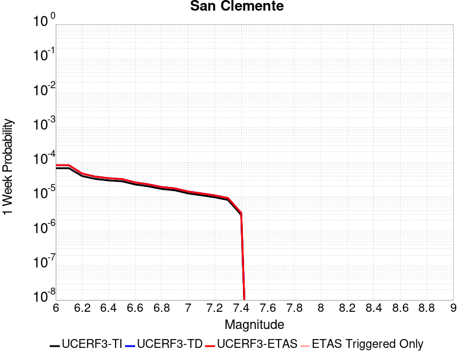 | 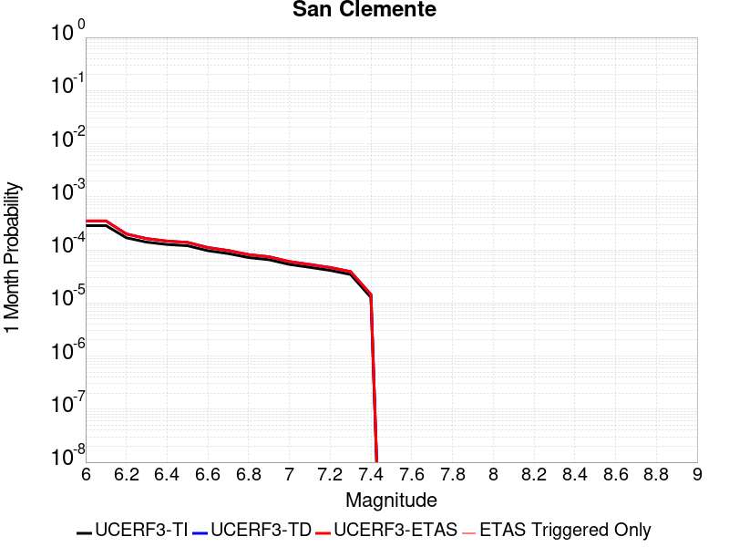 | 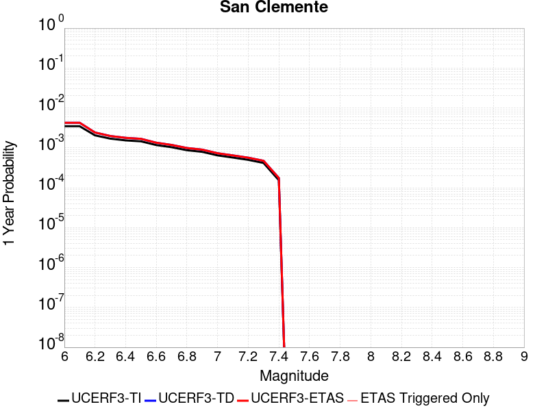 | 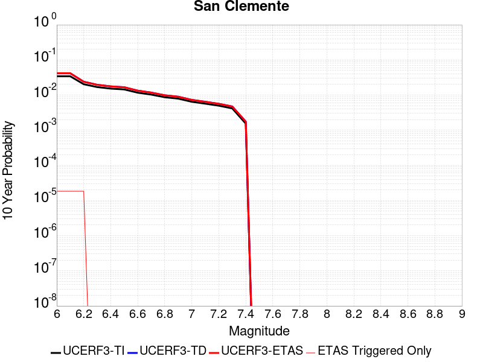 |

| Magnitude | 1 wk TI Prob | 1 wk TD Prob | 1 wk ETAS Prob | 1 wk ETAS/TD Gain | 1 wk ETAS Triggered Only | 1 mo TI Prob | 1 mo TD Prob | 1 mo ETAS Prob | 1 mo ETAS/TD Gain | 1 mo ETAS Triggered Only | 1 yr TI Prob | 1 yr TD Prob | 1 yr ETAS Prob | 1 yr ETAS/TD Gain | 1 yr ETAS Triggered Only | 10 yr TI Prob | 10 yr TD Prob | 10 yr ETAS Prob | 10 yr ETAS/TD Gain | 10 yr ETAS Triggered Only |
|-----|-----|-----|-----|-----|-----|-----|-----|-----|-----|-----|-----|-----|-----|-----|-----|-----|-----|-----|-----|-----|
| 6.0 | 6.681379E-5 | 8.165395E-5 | 8.165395E-5 | 1.0 | 0.0 | 2.8631336E-4 | 3.4990182E-4 | 3.4990182E-4 | 1.0 | 0.0 | 0.003480294 | 0.0042523127 | 0.0042523127 | 1.0 | 0.0 | 0.03426291 | 0.041765325 | 0.041775856 | 1.0002521 | 1.0989011E-5 |
| 6.1 | 6.681379E-5 | 8.165395E-5 | 8.165395E-5 | 1.0 | 0.0 | 2.8631336E-4 | 3.4990182E-4 | 3.4990182E-4 | 1.0 | 0.0 | 0.003480294 | 0.0042523127 | 0.0042523127 | 1.0 | 0.0 | 0.03426291 | 0.041765325 | 0.041775856 | 1.0002521 | 1.0989011E-5 |
| 6.2 | 3.9400576E-5 | 4.646092E-5 | 4.646092E-5 | 1.0 | 0.0 | 1.6884868E-4 | 1.991034E-4 | 1.991034E-4 | 1.0 | 0.0 | 0.0020537945 | 0.0024214499 | 0.0024214499 | 1.0 | 0.0 | 0.020349167 | 0.02395738 | 0.023968106 | 1.0004478 | 1.0989011E-5 |
| 6.3 | 3.2590255E-5 | 3.793572E-5 | 3.793572E-5 | 1.0 | 0.0 | 1.3966505E-4 | 1.625717E-4 | 1.625717E-4 | 1.0 | 0.0 | 0.0016990956 | 0.0019775438 | 0.0019775438 | 1.0 | 0.0 | 0.01686163 | 0.019603258 | 0.019603258 | 1.0 | 0.0 |
| 6.4 | 2.9454652E-5 | 3.4103497E-5 | 3.4103497E-5 | 1.0 | 0.0 | 1.2622811E-4 | 1.461498E-4 | 1.461498E-4 | 1.0 | 0.0 | 0.0015357438 | 0.0017779461 | 0.0017779461 | 1.0 | 0.0 | 0.015251739 | 0.017640395 | 0.017640395 | 1.0 | 0.0 |
| 6.5 | 2.790836E-5 | 3.2252792E-5 | 3.2252792E-5 | 1.0 | 0.0 | 1.1960178E-4 | 1.3821907E-4 | 1.3821907E-4 | 1.0 | 0.0 | 0.001455179 | 0.0016815432 | 0.0016815432 | 1.0 | 0.0 | 0.014456868 | 0.016691217 | 0.016691217 | 1.0 | 0.0 |
| 6.6 | 2.2492153E-5 | 2.5766682E-5 | 2.5766682E-5 | 1.0 | 0.0 | 9.639138E-5 | 1.1042405E-4 | 1.1042405E-4 | 1.0 | 0.0 | 0.0011729331 | 0.0013435985 | 0.0013435985 | 1.0 | 0.0 | 0.011667615 | 0.013356468 | 0.013356468 | 1.0 | 0.0 |
| 6.7 | 1.9862755E-5 | 2.2669825E-5 | 2.2669825E-5 | 1.0 | 0.0 | 8.512331E-5 | 9.7152835E-5 | 9.7152835E-5 | 1.0 | 0.0 | 0.0010358836 | 0.0011822052 | 0.0011822052 | 1.0 | 0.0 | 0.010310682 | 0.011760455 | 0.011760455 | 1.0 | 0.0 |
| 6.8 | 1.6697575E-5 | 1.8980461E-5 | 1.8980461E-5 | 1.0 | 0.0 | 7.155907E-5 | 8.1342354E-5 | 8.1342354E-5 | 1.0 | 0.0 | 8.7088346E-4 | 9.899025E-4 | 9.899025E-4 | 1.0 | 0.0 | 0.008674784 | 0.009855959 | 0.009855959 | 1.0 | 0.0 |
| 6.9 | 1.5218415E-5 | 1.7271872E-5 | 1.7271872E-5 | 1.0 | 0.0 | 6.522015E-5 | 7.402025E-5 | 7.402025E-5 | 1.0 | 0.0 | 7.93766E-4 | 9.008328E-4 | 9.008328E-4 | 1.0 | 0.0 | 0.007909367 | 0.008972758 | 0.008972758 | 1.0 | 0.0 |
| 7.0 | 1.2392958E-5 | 1.4034987E-5 | 1.4034987E-5 | 1.0 | 0.0 | 5.3111595E-5 | 6.01486E-5 | 6.01486E-5 | 1.0 | 0.0 | 6.4644177E-4 | 7.320707E-4 | 7.320707E-4 | 1.0 | 0.0 | 0.0064456454 | 0.0072973776 | 0.0072973776 | 1.0 | 0.0 |
| 7.1 | 1.0934128E-5 | 1.2376869E-5 | 1.2376869E-5 | 1.0 | 0.0 | 4.6859706E-5 | 5.3042688E-5 | 5.3042688E-5 | 1.0 | 0.0 | 5.7036756E-4 | 6.456107E-4 | 6.456107E-4 | 1.0 | 0.0 | 0.0056890585 | 0.0064380975 | 0.0064380975 | 1.0 | 0.0 |
| 7.2 | 9.5798805E-6 | 1.0846455E-5 | 1.0846455E-5 | 1.0 | 0.0 | 4.1055984E-5 | 4.648402E-5 | 4.648402E-5 | 1.0 | 0.0 | 4.9974193E-4 | 5.658032E-4 | 5.658032E-4 | 1.0 | 0.0 | 0.0049861963 | 0.0056443503 | 0.0056443503 | 1.0 | 0.0 |
| 7.3 | 8.0167365E-6 | 9.085201E-6 | 9.085201E-6 | 1.0 | 0.0 | 3.4356988E-5 | 3.8936032E-5 | 3.8936032E-5 | 1.0 | 0.0 | 4.1821605E-4 | 4.7395015E-4 | 4.7395015E-4 | 1.0 | 0.0 | 0.0041742986 | 0.0047300966 | 0.0047300966 | 1.0 | 0.0 |
| 7.4 | 2.9581017E-6 | 3.362867E-6 | 3.362867E-6 | 1.0 | 0.0 | 1.2677518E-5 | 1.4412235E-5 | 1.4412235E-5 | 1.0 | 0.0 | 1.5433785E-4 | 1.7545988E-4 | 1.7545988E-4 | 1.0 | 0.0 | 0.001542307 | 0.0017537087 | 0.0017537087 | 1.0 | 0.0 |

## North Frontal  (East)
*[(top)](#table-of-contents)*

| 1 Week | 1 Month | 1 Year | 10 Year |
|-----|-----|-----|-----|
| 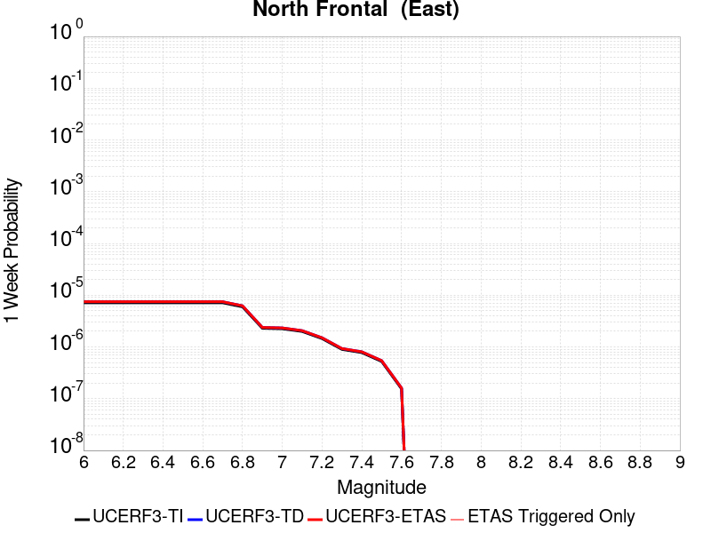 | 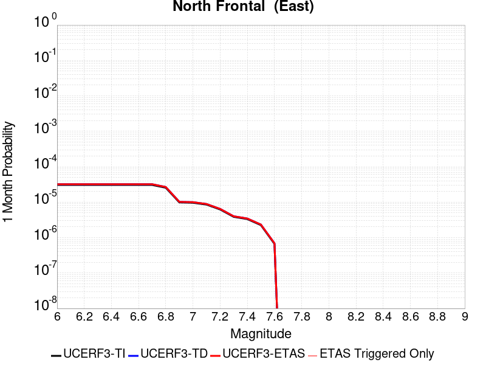 | 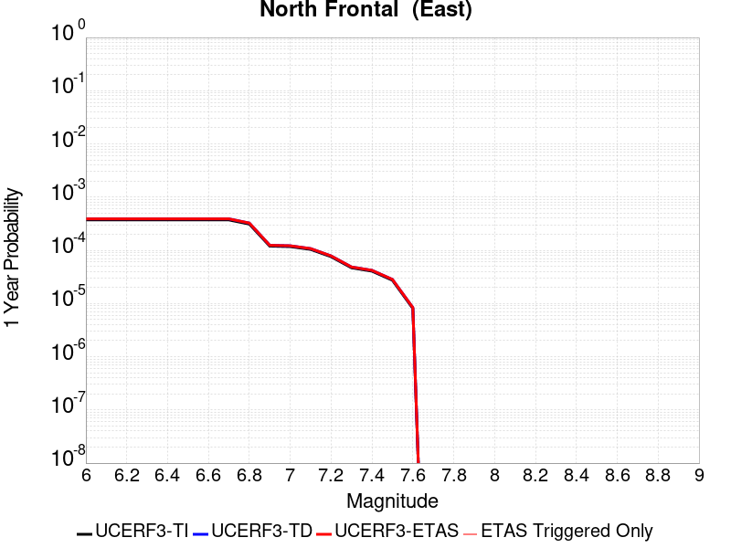 | 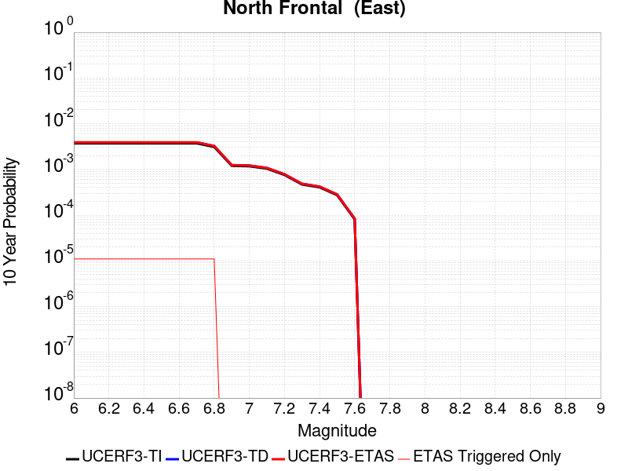 |

| Magnitude | 1 wk TI Prob | 1 wk TD Prob | 1 wk ETAS Prob | 1 wk ETAS/TD Gain | 1 wk ETAS Triggered Only | 1 mo TI Prob | 1 mo TD Prob | 1 mo ETAS Prob | 1 mo ETAS/TD Gain | 1 mo ETAS Triggered Only | 1 yr TI Prob | 1 yr TD Prob | 1 yr ETAS Prob | 1 yr ETAS/TD Gain | 1 yr ETAS Triggered Only | 10 yr TI Prob | 10 yr TD Prob | 10 yr ETAS Prob | 10 yr ETAS/TD Gain | 10 yr ETAS Triggered Only |
|-----|-----|-----|-----|-----|-----|-----|-----|-----|-----|-----|-----|-----|-----|-----|-----|-----|-----|-----|-----|-----|
| 6.0 | 7.135738E-6 | 7.4775567E-6 | 7.4775567E-6 | 1.0 | 0.0 | 3.0581377E-5 | 3.204639E-5 | 3.204639E-5 | 1.0 | 0.0 | 3.7226462E-4 | 3.9011487E-4 | 3.9011487E-4 | 1.0 | 0.0 | 0.0037164164 | 0.0038962585 | 0.0039072046 | 1.0028094 | 1.0989011E-5 |
| 6.1 | 7.135738E-6 | 7.4775567E-6 | 7.4775567E-6 | 1.0 | 0.0 | 3.0581377E-5 | 3.204639E-5 | 3.204639E-5 | 1.0 | 0.0 | 3.7226462E-4 | 3.9011487E-4 | 3.9011487E-4 | 1.0 | 0.0 | 0.0037164164 | 0.0038962585 | 0.0039072046 | 1.0028094 | 1.0989011E-5 |
| 6.2 | 7.135738E-6 | 7.4775567E-6 | 7.4775567E-6 | 1.0 | 0.0 | 3.0581377E-5 | 3.204639E-5 | 3.204639E-5 | 1.0 | 0.0 | 3.7226462E-4 | 3.9011487E-4 | 3.9011487E-4 | 1.0 | 0.0 | 0.0037164164 | 0.0038962585 | 0.0039072046 | 1.0028094 | 1.0989011E-5 |
| 6.3 | 7.135738E-6 | 7.4775567E-6 | 7.4775567E-6 | 1.0 | 0.0 | 3.0581377E-5 | 3.204639E-5 | 3.204639E-5 | 1.0 | 0.0 | 3.7226462E-4 | 3.9011487E-4 | 3.9011487E-4 | 1.0 | 0.0 | 0.0037164164 | 0.0038962585 | 0.0039072046 | 1.0028094 | 1.0989011E-5 |
| 6.4 | 7.135738E-6 | 7.4775567E-6 | 7.4775567E-6 | 1.0 | 0.0 | 3.0581377E-5 | 3.204639E-5 | 3.204639E-5 | 1.0 | 0.0 | 3.7226462E-4 | 3.9011487E-4 | 3.9011487E-4 | 1.0 | 0.0 | 0.0037164164 | 0.0038962585 | 0.0039072046 | 1.0028094 | 1.0989011E-5 |
| 6.5 | 7.135738E-6 | 7.4775567E-6 | 7.4775567E-6 | 1.0 | 0.0 | 3.0581377E-5 | 3.204639E-5 | 3.204639E-5 | 1.0 | 0.0 | 3.7226462E-4 | 3.9011487E-4 | 3.9011487E-4 | 1.0 | 0.0 | 0.0037164164 | 0.0038962585 | 0.0039072046 | 1.0028094 | 1.0989011E-5 |
| 6.6 | 7.135738E-6 | 7.4775567E-6 | 7.4775567E-6 | 1.0 | 0.0 | 3.0581377E-5 | 3.204639E-5 | 3.204639E-5 | 1.0 | 0.0 | 3.7226462E-4 | 3.9011487E-4 | 3.9011487E-4 | 1.0 | 0.0 | 0.0037164164 | 0.0038962585 | 0.0039072046 | 1.0028094 | 1.0989011E-5 |
| 6.7 | 7.135738E-6 | 7.4775567E-6 | 7.4775567E-6 | 1.0 | 0.0 | 3.0581377E-5 | 3.204639E-5 | 3.204639E-5 | 1.0 | 0.0 | 3.7226462E-4 | 3.9011487E-4 | 3.9011487E-4 | 1.0 | 0.0 | 0.0037164164 | 0.0038962585 | 0.0039072046 | 1.0028094 | 1.0989011E-5 |
| 6.8 | 5.959142E-6 | 6.2369913E-6 | 6.2369913E-6 | 1.0 | 0.0 | 2.553893E-5 | 2.6729791E-5 | 2.6729791E-5 | 1.0 | 0.0 | 3.108921E-4 | 3.254047E-4 | 3.254047E-4 | 1.0 | 0.0 | 0.0031045752 | 0.0032510555 | 0.0032620088 | 1.0033691 | 1.0989011E-5 |
| 6.9 | 2.2946929E-6 | 2.3825573E-6 | 2.3825573E-6 | 1.0 | 0.0 | 9.834361E-6 | 1.02109225E-5 | 1.02109225E-5 | 1.0 | 0.0 | 1.1972676E-4 | 1.2431137E-4 | 1.2431137E-4 | 1.0 | 0.0 | 0.0011966228 | 0.0012424648 | 0.0012424648 | 1.0 | 0.0 |
| 7.0 | 2.2468673E-6 | 2.3322477E-6 | 2.3322477E-6 | 1.0 | 0.0 | 9.629396E-6 | 9.995312E-6 | 9.995312E-6 | 1.0 | 0.0 | 1.1723159E-4 | 1.216866E-4 | 1.216866E-4 | 1.0 | 0.0 | 0.0011716976 | 0.0012162459 | 0.0012162459 | 1.0 | 0.0 |
| 7.1 | 1.9921076E-6 | 2.064683E-6 | 2.064683E-6 | 1.0 | 0.0 | 8.537577E-6 | 8.848614E-6 | 8.848614E-6 | 1.0 | 0.0 | 1.0394004E-4 | 1.07726984E-4 | 1.07726984E-4 | 1.0 | 0.0 | 0.0010389143 | 0.0010767904 | 0.0010767904 | 1.0 | 0.0 |
| 7.2 | 1.4524545E-6 | 1.5045721E-6 | 1.5045721E-6 | 1.0 | 0.0 | 6.2247905E-6 | 6.4481515E-6 | 6.4481515E-6 | 1.0 | 0.0 | 7.5784184E-5 | 7.850366E-5 | 7.850366E-5 | 1.0 | 0.0 | 7.575835E-4 | 7.847838E-4 | 7.847838E-4 | 1.0 | 0.0 |
| 7.3 | 8.9802575E-7 | 9.309089E-7 | 9.309089E-7 | 1.0 | 0.0 | 3.848676E-6 | 3.9896045E-6 | 3.9896045E-6 | 1.0 | 0.0 | 4.685662E-5 | 4.8572463E-5 | 4.8572463E-5 | 1.0 | 0.0 | 4.6846745E-4 | 4.8562977E-4 | 4.8562977E-4 | 1.0 | 0.0 |
| 7.4 | 7.776139E-7 | 8.0607873E-7 | 8.0607873E-7 | 1.0 | 0.0 | 3.3326266E-6 | 3.4546192E-6 | 3.4546192E-6 | 1.0 | 0.0 | 4.0573974E-5 | 4.2059288E-5 | 4.2059288E-5 | 1.0 | 0.0 | 4.0566566E-4 | 4.2052404E-4 | 4.2052404E-4 | 1.0 | 0.0 |
| 7.5 | 5.244417E-7 | 5.441436E-7 | 5.441436E-7 | 1.0 | 0.0 | 2.2476054E-6 | 2.3320422E-6 | 2.3320422E-6 | 1.0 | 0.0 | 2.7364253E-5 | 2.8392311E-5 | 2.8392311E-5 | 1.0 | 0.0 | 2.7360884E-4 | 2.8389334E-4 | 2.8389334E-4 | 1.0 | 0.0 |
| 7.6 | 1.5489647E-7 | 1.6090165E-7 | 1.6090165E-7 | 1.0 | 0.0 | 6.6384183E-7 | 6.895784E-7 | 6.895784E-7 | 1.0 | 0.0 | 8.082245E-6 | 8.395606E-6 | 8.395606E-6 | 1.0 | 0.0 | 8.08195E-5 | 8.395488E-5 | 8.395488E-5 | 1.0 | 0.0 |

## Malibu Coast alt 1
*[(top)](#table-of-contents)*

| 1 Week | 1 Month | 1 Year | 10 Year |
|-----|-----|-----|-----|
| 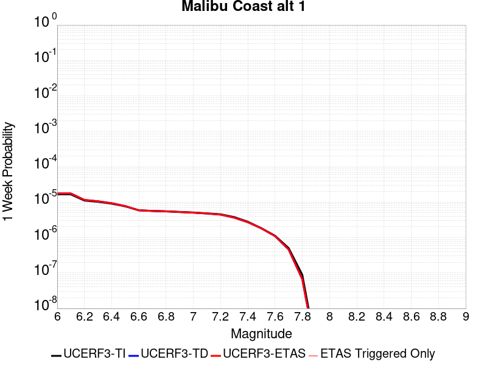 | 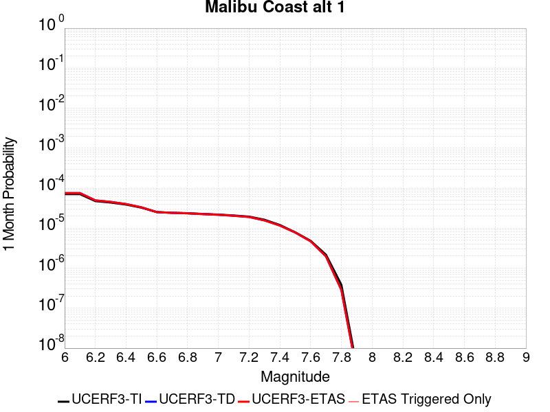 | 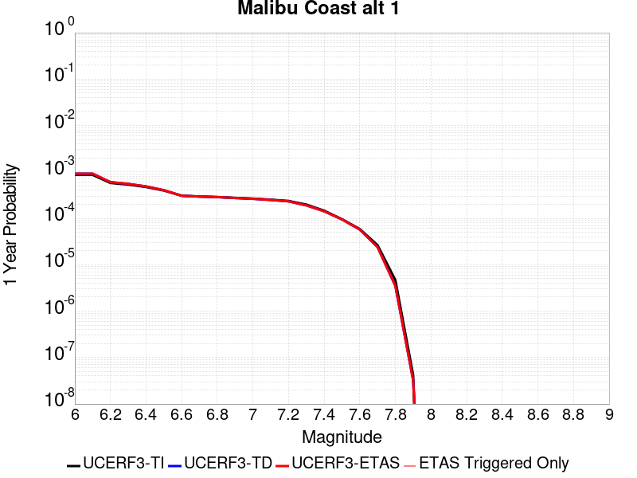 | 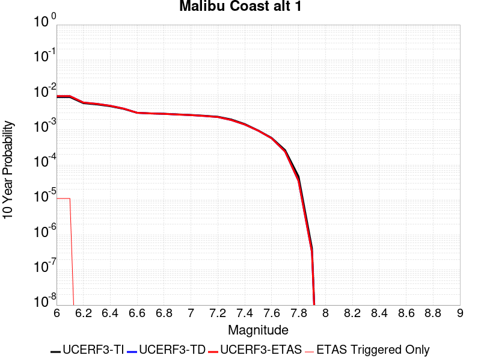 |

| Magnitude | 1 wk TI Prob | 1 wk TD Prob | 1 wk ETAS Prob | 1 wk ETAS/TD Gain | 1 wk ETAS Triggered Only | 1 mo TI Prob | 1 mo TD Prob | 1 mo ETAS Prob | 1 mo ETAS/TD Gain | 1 mo ETAS Triggered Only | 1 yr TI Prob | 1 yr TD Prob | 1 yr ETAS Prob | 1 yr ETAS/TD Gain | 1 yr ETAS Triggered Only | 10 yr TI Prob | 10 yr TD Prob | 10 yr ETAS Prob | 10 yr ETAS/TD Gain | 10 yr ETAS Triggered Only |
|-----|-----|-----|-----|-----|-----|-----|-----|-----|-----|-----|-----|-----|-----|-----|-----|-----|-----|-----|-----|-----|
| 6.0 | 1.6572556E-5 | 1.7599685E-5 | 1.7599685E-5 | 1.0 | 0.0 | 7.102331E-5 | 7.542515E-5 | 7.542515E-5 | 1.0 | 0.0 | 8.6436566E-4 | 9.1793324E-4 | 9.1793324E-4 | 1.0 | 0.0 | 0.0086101135 | 0.009143351 | 0.009154239 | 1.0011909 | 1.0989011E-5 |
| 6.1 | 1.6572556E-5 | 1.7599685E-5 | 1.7599685E-5 | 1.0 | 0.0 | 7.102331E-5 | 7.542515E-5 | 7.542515E-5 | 1.0 | 0.0 | 8.6436566E-4 | 9.1793324E-4 | 9.1793324E-4 | 1.0 | 0.0 | 0.0086101135 | 0.009143351 | 0.009154239 | 1.0011909 | 1.0989011E-5 |
| 6.2 | 1.1085717E-5 | 1.1558117E-5 | 1.1558117E-5 | 1.0 | 0.0 | 4.750935E-5 | 4.9533865E-5 | 4.9533865E-5 | 1.0 | 0.0 | 5.782728E-4 | 6.0291146E-4 | 6.0291146E-4 | 1.0 | 0.0 | 0.0057677035 | 0.006013129 | 0.006013129 | 1.0 | 0.0 |
| 6.3 | 1.0208568E-5 | 1.0593105E-5 | 1.0593105E-5 | 1.0 | 0.0 | 4.375027E-5 | 4.5398247E-5 | 4.5398247E-5 | 1.0 | 0.0 | 5.325294E-4 | 5.525864E-4 | 5.525864E-4 | 1.0 | 0.0 | 0.0053125503 | 0.0055124317 | 0.0055124317 | 1.0 | 0.0 |
| 6.4 | 9.0682315E-6 | 9.343377E-6 | 9.343377E-6 | 1.0 | 0.0 | 3.8863272E-5 | 4.004244E-5 | 4.004244E-5 | 1.0 | 0.0 | 4.730576E-4 | 4.874097E-4 | 4.874097E-4 | 1.0 | 0.0 | 0.0047205184 | 0.0048636203 | 0.0048636203 | 1.0 | 0.0 |
| 6.5 | 7.605796E-6 | 7.749174E-6 | 7.749174E-6 | 1.0 | 0.0 | 3.259586E-5 | 3.3210334E-5 | 3.3210334E-5 | 1.0 | 0.0 | 3.9678233E-4 | 4.042621E-4 | 4.042621E-4 | 1.0 | 0.0 | 0.0039607463 | 0.004035405 | 0.004035405 | 1.0 | 0.0 |
| 6.6 | 5.889873E-6 | 5.8799483E-6 | 5.8799483E-6 | 1.0 | 0.0 | 2.5242069E-5 | 2.5199535E-5 | 2.5199535E-5 | 1.0 | 0.0 | 3.0727885E-4 | 3.0676124E-4 | 3.0676124E-4 | 1.0 | 0.0 | 0.003068543 | 0.0030633907 | 0.0030633907 | 1.0 | 0.0 |
| 6.7 | 5.66586E-6 | 5.6420354E-6 | 5.6420354E-6 | 1.0 | 0.0 | 2.428203E-5 | 2.4179928E-5 | 2.4179928E-5 | 1.0 | 0.0 | 2.955936E-4 | 2.9435093E-4 | 2.9435093E-4 | 1.0 | 0.0 | 0.0029520073 | 0.0029396226 | 0.0029396226 | 1.0 | 0.0 |
| 6.8 | 5.521556E-6 | 5.489812E-6 | 5.489812E-6 | 1.0 | 0.0 | 2.3663597E-5 | 2.3527555E-5 | 2.3527555E-5 | 1.0 | 0.0 | 2.880662E-4 | 2.8641042E-4 | 2.8641042E-4 | 1.0 | 0.0 | 0.0028769306 | 0.0028604246 | 0.0028604246 | 1.0 | 0.0 |
| 6.9 | 5.29752E-6 | 5.250299E-6 | 5.250299E-6 | 1.0 | 0.0 | 2.270346E-5 | 2.2501088E-5 | 2.2501088E-5 | 1.0 | 0.0 | 2.7637955E-4 | 2.7391638E-4 | 2.7391638E-4 | 1.0 | 0.0 | 0.0027603607 | 0.002735798 | 0.002735798 | 1.0 | 0.0 |
| 7.0 | 5.106743E-6 | 5.048033E-6 | 5.048033E-6 | 1.0 | 0.0 | 2.1885859E-5 | 2.1634249E-5 | 2.1634249E-5 | 1.0 | 0.0 | 2.6642776E-4 | 2.6336522E-4 | 2.6336522E-4 | 1.0 | 0.0 | 0.0026610855 | 0.0026305406 | 0.0026305406 | 1.0 | 0.0 |
| 7.1 | 4.8469647E-6 | 4.7707076E-6 | 4.7707076E-6 | 1.0 | 0.0 | 2.0772539E-5 | 2.0445728E-5 | 2.0445728E-5 | 1.0 | 0.0 | 2.528763E-4 | 2.4889837E-4 | 2.4889837E-4 | 1.0 | 0.0 | 0.0025258875 | 0.0024862043 | 0.0024862043 | 1.0 | 0.0 |
| 7.2 | 4.545514E-6 | 4.448504E-6 | 4.448504E-6 | 1.0 | 0.0 | 1.9480629E-5 | 1.9064879E-5 | 1.9064879E-5 | 1.0 | 0.0 | 2.3715083E-4 | 2.3209024E-4 | 2.3209024E-4 | 1.0 | 0.0 | 0.0023689792 | 0.002318486 | 0.002318486 | 1.0 | 0.0 |
| 7.3 | 3.794097E-6 | 3.6521806E-6 | 3.6521806E-6 | 1.0 | 0.0 | 1.6260314E-5 | 1.565211E-5 | 1.565211E-5 | 1.0 | 0.0 | 1.9795135E-4 | 1.905478E-4 | 1.905478E-4 | 1.0 | 0.0 | 0.001977751 | 0.0019038487 | 0.0019038487 | 1.0 | 0.0 |
| 7.4 | 2.808217E-6 | 2.719262E-6 | 2.719262E-6 | 1.0 | 0.0 | 1.203516E-5 | 1.1653928E-5 | 1.1653928E-5 | 1.0 | 0.0 | 1.4651821E-4 | 1.4187736E-4 | 1.4187736E-4 | 1.0 | 0.0 | 0.0014642165 | 0.0014178705 | 0.0014178705 | 1.0 | 0.0 |
| 7.5 | 1.83809E-6 | 1.8191979E-6 | 1.8191979E-6 | 1.0 | 0.0 | 7.877505E-6 | 7.796539E-6 | 7.796539E-6 | 1.0 | 0.0 | 9.59044E-5 | 9.4918745E-5 | 9.4918745E-5 | 1.0 | 0.0 | 9.5863023E-4 | 9.4878406E-4 | 9.4878406E-4 | 1.0 | 0.0 |
| 7.6 | 1.1292672E-6 | 1.1002278E-6 | 1.1002278E-6 | 1.0 | 0.0 | 4.839708E-6 | 4.7152535E-6 | 4.7152535E-6 | 1.0 | 0.0 | 5.8921847E-5 | 5.7406713E-5 | 5.7406713E-5 | 1.0 | 0.0 | 5.890623E-4 | 5.739205E-4 | 5.739205E-4 | 1.0 | 0.0 |
| 7.7 | 5.065272E-7 | 4.6095698E-7 | 4.6095698E-7 | 1.0 | 0.0 | 2.170829E-6 | 1.9755284E-6 | 1.9755284E-6 | 1.0 | 0.0 | 2.6429525E-5 | 2.4051806E-5 | 2.4051806E-5 | 1.0 | 0.0 | 2.642638E-4 | 2.4049314E-4 | 2.4049314E-4 | 1.0 | 0.0 |
| 7.8 | 8.952991E-8 | 6.709504E-8 | 6.709504E-8 | 1.0 | 0.0 | 3.8369956E-7 | 2.8755014E-7 | 2.8755014E-7 | 1.0 | 0.0 | 4.671532E-6 | 3.5009175E-6 | 3.5009175E-6 | 1.0 | 0.0 | 4.671434E-5 | 3.500864E-5 | 3.500864E-5 | 1.0 | 0.0 |
| 7.9 | 8.007447E-10 | 6.161175E-10 | 6.161175E-10 | 1.0 | 0.0 | 3.4317629E-9 | 2.640504E-9 | 2.640504E-9 | 1.0 | 0.0 | 4.1781714E-8 | 3.2148137E-8 | 3.2148137E-8 | 1.0 | 0.0 | 4.1781706E-7 | 3.2148134E-7 | 3.2148134E-7 | 1.0 | 0.0 |

## La Panza 2011
*[(top)](#table-of-contents)*

| 1 Week | 1 Month | 1 Year | 10 Year |
|-----|-----|-----|-----|
| 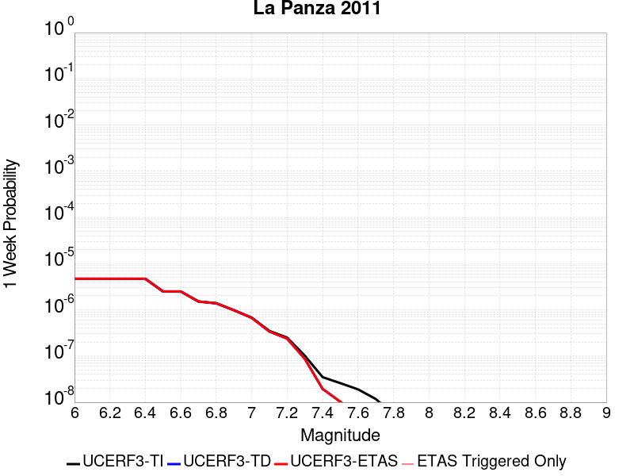 |  | 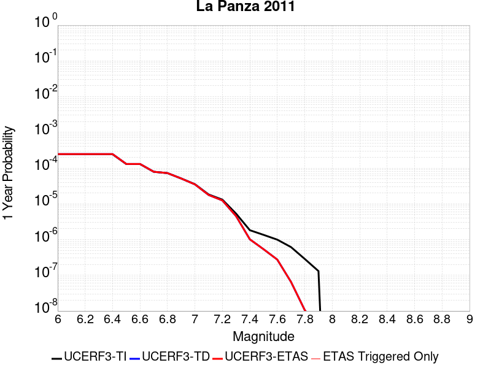 | 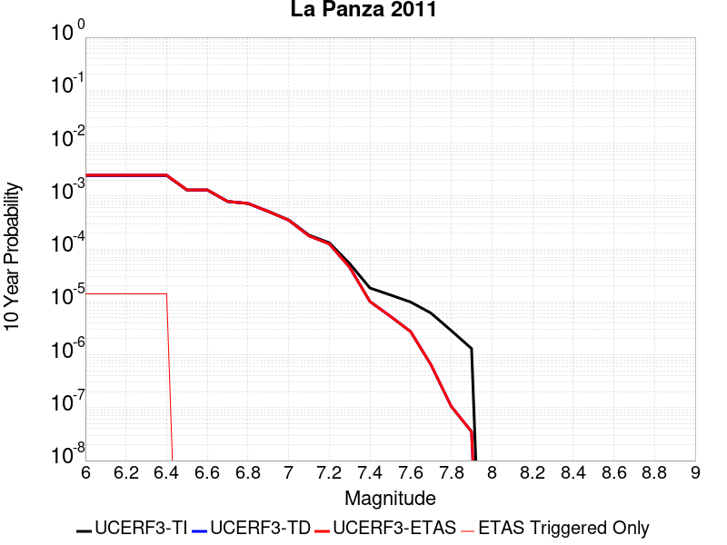 |

| Magnitude | 1 wk TI Prob | 1 wk TD Prob | 1 wk ETAS Prob | 1 wk ETAS/TD Gain | 1 wk ETAS Triggered Only | 1 mo TI Prob | 1 mo TD Prob | 1 mo ETAS Prob | 1 mo ETAS/TD Gain | 1 mo ETAS Triggered Only | 1 yr TI Prob | 1 yr TD Prob | 1 yr ETAS Prob | 1 yr ETAS/TD Gain | 1 yr ETAS Triggered Only | 10 yr TI Prob | 10 yr TD Prob | 10 yr ETAS Prob | 10 yr ETAS/TD Gain | 10 yr ETAS Triggered Only |
|-----|-----|-----|-----|-----|-----|-----|-----|-----|-----|-----|-----|-----|-----|-----|-----|-----|-----|-----|-----|-----|
| 6.0 | 4.6754544E-6 | 4.717756E-6 | 4.717756E-6 | 1.0 | 0.0 | 2.0037509E-5 | 2.0218808E-5 | 2.0218808E-5 | 1.0 | 0.0 | 2.4392935E-4 | 2.4613814E-4 | 2.4613814E-4 | 1.0 | 0.0 | 0.0024366176 | 0.00245885 | 0.0024698118 | 1.0044582 | 1.0989011E-5 |
| 6.1 | 4.6754544E-6 | 4.717756E-6 | 4.717756E-6 | 1.0 | 0.0 | 2.0037509E-5 | 2.0218808E-5 | 2.0218808E-5 | 1.0 | 0.0 | 2.4392935E-4 | 2.4613814E-4 | 2.4613814E-4 | 1.0 | 0.0 | 0.0024366176 | 0.00245885 | 0.0024698118 | 1.0044582 | 1.0989011E-5 |
| 6.2 | 4.6754544E-6 | 4.717756E-6 | 4.717756E-6 | 1.0 | 0.0 | 2.0037509E-5 | 2.0218808E-5 | 2.0218808E-5 | 1.0 | 0.0 | 2.4392935E-4 | 2.4613814E-4 | 2.4613814E-4 | 1.0 | 0.0 | 0.0024366176 | 0.00245885 | 0.0024698118 | 1.0044582 | 1.0989011E-5 |
| 6.3 | 4.6754544E-6 | 4.717756E-6 | 4.717756E-6 | 1.0 | 0.0 | 2.0037509E-5 | 2.0218808E-5 | 2.0218808E-5 | 1.0 | 0.0 | 2.4392935E-4 | 2.4613814E-4 | 2.4613814E-4 | 1.0 | 0.0 | 0.0024366176 | 0.00245885 | 0.0024698118 | 1.0044582 | 1.0989011E-5 |
| 6.4 | 4.6754544E-6 | 4.717756E-6 | 4.717756E-6 | 1.0 | 0.0 | 2.0037509E-5 | 2.0218808E-5 | 2.0218808E-5 | 1.0 | 0.0 | 2.4392935E-4 | 2.4613814E-4 | 2.4613814E-4 | 1.0 | 0.0 | 0.0024366176 | 0.00245885 | 0.0024698118 | 1.0044582 | 1.0989011E-5 |
| 6.5 | 2.485343E-6 | 2.500739E-6 | 2.500739E-6 | 1.0 | 0.0 | 1.0651426E-5 | 1.0717411E-5 | 1.0717411E-5 | 1.0 | 0.0 | 1.296734E-4 | 1.3047706E-4 | 1.3047706E-4 | 1.0 | 0.0 | 0.0012959775 | 0.0013040429 | 0.0013040429 | 1.0 | 0.0 |
| 6.6 | 2.485343E-6 | 2.500739E-6 | 2.500739E-6 | 1.0 | 0.0 | 1.0651426E-5 | 1.0717411E-5 | 1.0717411E-5 | 1.0 | 0.0 | 1.296734E-4 | 1.3047706E-4 | 1.3047706E-4 | 1.0 | 0.0 | 0.0012959775 | 0.0013040429 | 0.0013040429 | 1.0 | 0.0 |
| 6.7 | 1.5108508E-6 | 1.5147651E-6 | 1.5147651E-6 | 1.0 | 0.0 | 6.4750584E-6 | 6.491835E-6 | 6.491835E-6 | 1.0 | 0.0 | 7.8830984E-5 | 7.903534E-5 | 7.903534E-5 | 1.0 | 0.0 | 7.880303E-4 | 7.900831E-4 | 7.900831E-4 | 1.0 | 0.0 |
| 6.8 | 1.3865837E-6 | 1.3886358E-6 | 1.3886358E-6 | 1.0 | 0.0 | 5.942488E-6 | 5.9512836E-6 | 5.9512836E-6 | 1.0 | 0.0 | 7.234739E-5 | 7.245457E-5 | 7.245457E-5 | 1.0 | 0.0 | 7.232384E-4 | 7.2431925E-4 | 7.2431925E-4 | 1.0 | 0.0 |
| 6.9 | 9.826583E-7 | 9.79749E-7 | 9.79749E-7 | 1.0 | 0.0 | 4.2113857E-6 | 4.198918E-6 | 4.198918E-6 | 1.0 | 0.0 | 5.1272415E-5 | 5.112068E-5 | 5.112068E-5 | 1.0 | 0.0 | 5.126059E-4 | 5.110946E-4 | 5.110946E-4 | 1.0 | 0.0 |
| 7.0 | 6.7797646E-7 | 6.711376E-7 | 6.711376E-7 | 1.0 | 0.0 | 2.9056102E-6 | 2.876301E-6 | 2.876301E-6 | 1.0 | 0.0 | 3.537523E-5 | 3.5018435E-5 | 3.5018435E-5 | 1.0 | 0.0 | 3.5369597E-4 | 3.5013226E-4 | 3.5013226E-4 | 1.0 | 0.0 |
| 7.1 | 3.4979826E-7 | 3.3885055E-7 | 3.3885055E-7 | 1.0 | 0.0 | 1.4991346E-6 | 1.4522159E-6 | 1.4522159E-6 | 1.0 | 0.0 | 1.825181E-5 | 1.7680597E-5 | 1.7680597E-5 | 1.0 | 0.0 | 1.825031E-4 | 1.7679307E-4 | 1.7679307E-4 | 1.0 | 0.0 |
| 7.2 | 2.5088332E-7 | 2.3842912E-7 | 2.3842912E-7 | 1.0 | 0.0 | 1.0752137E-6 | 1.0218387E-6 | 1.0218387E-6 | 1.0 | 0.0 | 1.3090649E-5 | 1.2440823E-5 | 1.2440823E-5 | 1.0 | 0.0 | 1.3089878E-4 | 1.2440213E-4 | 1.2440213E-4 | 1.0 | 0.0 |
| 7.3 | 1.0159086E-7 | 8.6553534E-8 | 8.6553534E-8 | 1.0 | 0.0 | 4.3538932E-7 | 3.7094367E-7 | 3.7094367E-7 | 1.0 | 0.0 | 5.300852E-6 | 4.51623E-6 | 4.51623E-6 | 1.0 | 0.0 | 5.3007258E-5 | 4.5161425E-5 | 4.5161425E-5 | 1.0 | 0.0 |
| 7.4 | 3.5006252E-8 | 1.9438788E-8 | 1.9438788E-8 | 1.0 | 0.0 | 1.5002678E-7 | 8.330909E-8 | 8.330909E-8 | 1.0 | 0.0 | 1.8265745E-6 | 1.0142877E-6 | 1.0142877E-6 | 1.0 | 0.0 | 1.8265595E-5 | 1.0142833E-5 | 1.0142833E-5 | 1.0 | 0.0 |
| 7.5 | 2.592274E-8 | 1.0264829E-8 | 1.0264829E-8 | 1.0 | 0.0 | 1.1109746E-7 | 4.3992124E-8 | 4.3992124E-8 | 1.0 | 0.0 | 1.3526106E-6 | 5.35604E-7 | 5.35604E-7 | 1.0 | 0.0 | 1.3526024E-5 | 5.356028E-6 | 5.356028E-6 | 1.0 | 0.0 |
| 7.6 | 1.9016717E-8 | 5.261332E-9 | 5.261332E-9 | 1.0 | 0.0 | 8.150022E-8 | 2.2548566E-8 | 2.2548566E-8 | 1.0 | 0.0 | 9.922647E-7 | 2.7452873E-7 | 2.7452873E-7 | 1.0 | 0.0 | 9.922603E-6 | 2.745284E-6 | 2.745284E-6 | 1.0 | 0.0 |
| 7.7 | 1.17738495E-8 | 1.2469854E-9 | 1.2469854E-9 | 1.0 | 0.0 | 5.0459356E-8 | 5.344223E-9 | 5.344223E-9 | 1.0 | 0.0 | 6.1434247E-7 | 6.506591E-8 | 6.506591E-8 | 1.0 | 0.0 | 6.143408E-6 | 6.5065893E-7 | 6.5065893E-7 | 1.0 | 0.0 |
| 7.8 | 5.489079E-9 | 2.029984E-10 | 2.029984E-10 | 1.0 | 0.0 | 2.3524624E-8 | 8.699931E-10 | 8.699931E-10 | 1.0 | 0.0 | 2.8641225E-7 | 1.0592162E-8 | 1.0592162E-8 | 1.0 | 0.0 | 2.8641189E-6 | 1.05921615E-7 | 1.05921615E-7 | 1.0 | 0.0 |
| 7.9 | 2.5081048E-9 | 6.75523E-11 | 6.75523E-11 | 1.0 | 0.0 | 1.0749021E-8 | 2.8950986E-10 | 2.8950986E-10 | 1.0 | 0.0 | 1.3086932E-7 | 3.5247816E-9 | 3.5247816E-9 | 1.0 | 0.0 | 1.3086925E-6 | 3.5247815E-8 | 3.5247815E-8 | 1.0 | 0.0 |

