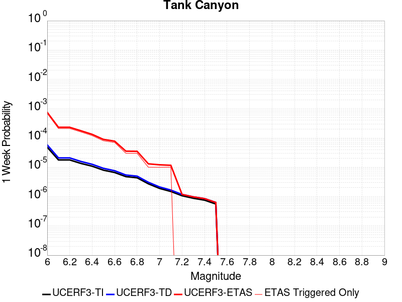
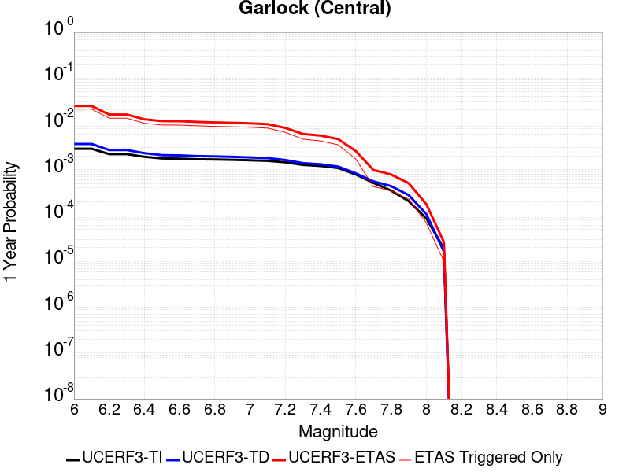

# Parent Section Magnitude-Probability Distributions

Only fault sections with at least one triggered aftershock are plotted. Sections are sorted by total supraseismogenic trigger rate (decreasing)

## Table Of Contents

* [Tank Canyon](#tank-canyon)
* [Garlock (Central)](#garlock-central)
* [Little Lake](#little-lake)
* [Airport Lake](#airport-lake)
* [Garlock (East)](#garlock-east)
* [Blackwater](#blackwater)
* [Panamint Valley](#panamint-valley)
* [Tin Mountain](#tin-mountain)

## Tank Canyon
*[(top)](#table-of-contents)*

| 1 Week | 1 Month | 1 Year | 10 Year |
|-----|-----|-----|-----|
|  |  |  |  |

| Magnitude | 1 wk TI Prob | 1 wk TD Prob | 1 wk ETAS Prob | 1 wk ETAS/TD Gain | 1 wk ETAS Triggered Only | 1 mo TI Prob | 1 mo TD Prob | 1 mo ETAS Prob | 1 mo ETAS/TD Gain | 1 mo ETAS Triggered Only | 1 yr TI Prob | 1 yr TD Prob | 1 yr ETAS Prob | 1 yr ETAS/TD Gain | 1 yr ETAS Triggered Only | 10 yr TI Prob | 10 yr TD Prob | 10 yr ETAS Prob | 10 yr ETAS/TD Gain | 10 yr ETAS Triggered Only |
|-----|-----|-----|-----|-----|-----|-----|-----|-----|-----|-----|-----|-----|-----|-----|-----|-----|-----|-----|-----|-----|
| 6.0 | 4.8284557E-5 | 5.7977024E-5 | 5.7977024E-5 | 1.0 | 0.0 | 2.0691741E-4 | 2.4845314E-4 | 2.4845314E-4 | 1.0 | 0.0 | 0.0025163088 | 0.0030213767 | 0.008955773 | 2.9641366 | 0.005952381 | 0.02488006 | 0.02986978 | 0.047193535 | 1.579976 | 0.017857144 |
| 6.1 | 1.7796336E-5 | 2.0876903E-5 | 2.0876903E-5 | 1.0 | 0.0 | 7.626778E-5 | 8.946959E-5 | 8.946959E-5 | 1.0 | 0.0 | 9.281647E-4 | 0.0010887844 | 0.0040617343 | 3.7305222 | 0.0029761905 | 0.009242975 | 0.010838592 | 0.01967039 | 1.8148474 | 0.008928572 |
| 6.2 | 1.7796336E-5 | 2.0876903E-5 | 2.0876903E-5 | 1.0 | 0.0 | 7.626778E-5 | 8.946959E-5 | 8.946959E-5 | 1.0 | 0.0 | 9.281647E-4 | 0.0010887844 | 0.0040617343 | 3.7305222 | 0.0029761905 | 0.009242975 | 0.010838592 | 0.01967039 | 1.8148474 | 0.008928572 |
| 6.3 | 1.3515912E-5 | 1.5762093E-5 | 1.5762093E-5 | 1.0 | 0.0 | 5.792405E-5 | 6.755021E-5 | 6.755021E-5 | 1.0 | 0.0 | 7.049971E-4 | 8.2213746E-4 | 8.2213746E-4 | 1.0 | 0.0 | 0.007027647 | 0.008193571 | 0.011145376 | 1.3602587 | 0.0029761905 |
| 6.4 | 1.0870146E-5 | 1.2619922E-5 | 1.2619922E-5 | 1.0 | 0.0 | 4.658551E-5 | 5.408436E-5 | 5.408436E-5 | 1.0 | 0.0 | 5.67031E-4 | 6.5829605E-4 | 6.5829605E-4 | 1.0 | 0.0 | 0.005655863 | 0.006565476 | 0.009522126 | 1.450333 | 0.0029761905 |
| 6.5 | 7.964826E-6 | 9.197353E-6 | 9.197353E-6 | 1.0 | 0.0 | 3.4134522E-5 | 3.9416693E-5 | 3.9416693E-5 | 1.0 | 0.0 | 4.1550855E-4 | 4.7980322E-4 | 4.7980322E-4 | 1.0 | 0.0 | 0.0041473247 | 0.0047889743 | 0.0077509116 | 1.618491 | 0.0029761905 |
| 6.6 | 6.6317E-6 | 7.6132555E-6 | 7.6132555E-6 | 1.0 | 0.0 | 2.8421264E-5 | 3.2627882E-5 | 3.2627882E-5 | 1.0 | 0.0 | 3.4597394E-4 | 3.9718117E-4 | 3.9718117E-4 | 1.0 | 0.0 | 0.0034543579 | 0.003965865 | 0.006930252 | 1.7474756 | 0.0029761905 |
| 6.7 | 4.793663E-6 | 5.431335E-6 | 5.431335E-6 | 1.0 | 0.0 | 2.0544108E-5 | 2.3276967E-5 | 2.3276967E-5 | 1.0 | 0.0 | 2.500958E-4 | 2.833646E-4 | 2.833646E-4 | 1.0 | 0.0 | 0.0024981452 | 0.0028307254 | 0.005798491 | 2.0484118 | 0.0029761905 |
| 6.8 | 4.382823E-6 | 4.9697283E-6 | 4.9697283E-6 | 1.0 | 0.0 | 1.8783392E-5 | 2.1298685E-5 | 2.1298685E-5 | 1.0 | 0.0 | 2.286638E-4 | 2.5928492E-4 | 2.5928492E-4 | 1.0 | 0.0 | 0.0022842865 | 0.002590498 | 0.0055589788 | 2.1459112 | 0.0029761905 |
| 6.9 | 2.729601E-6 | 3.0737624E-6 | 3.0737624E-6 | 1.0 | 0.0 | 1.1698237E-5 | 1.3173209E-5 | 1.3173209E-5 | 1.0 | 0.0 | 1.4241673E-4 | 1.6037324E-4 | 1.6037324E-4 | 1.0 | 0.0 | 0.001423255 | 0.0016027407 | 0.0016027407 | 1.0 | 0.0 |
| 7.0 | 1.8987357E-6 | 2.127059E-6 | 2.127059E-6 | 1.0 | 0.0 | 8.137413E-6 | 9.115938E-6 | 9.115938E-6 | 1.0 | 0.0 | 9.90685E-5 | 1.1098159E-4 | 1.1098159E-4 | 1.0 | 0.0 | 9.902435E-4 | 0.0011093304 | 0.0011093304 | 1.0 | 0.0 |
| 7.1 | 1.4928986E-6 | 1.6642095E-6 | 1.6642095E-6 | 1.0 | 0.0 | 6.398121E-6 | 7.13231E-6 | 7.13231E-6 | 1.0 | 0.0 | 7.789434E-5 | 8.683301E-5 | 8.683301E-5 | 1.0 | 0.0 | 7.786704E-4 | 8.6804864E-4 | 8.6804864E-4 | 1.0 | 0.0 |
| 7.2 | 1.069082E-6 | 1.1829095E-6 | 1.1829095E-6 | 1.0 | 0.0 | 4.581772E-6 | 5.0696053E-6 | 5.0696053E-6 | 1.0 | 0.0 | 5.5781646E-5 | 6.172123E-5 | 6.172123E-5 | 1.0 | 0.0 | 5.576765E-4 | 6.170931E-4 | 6.170931E-4 | 1.0 | 0.0 |
| 7.3 | 8.776551E-7 | 9.770386E-7 | 9.770386E-7 | 1.0 | 0.0 | 3.7613736E-6 | 4.187304E-6 | 4.187304E-6 | 1.0 | 0.0 | 4.579376E-5 | 5.0979754E-5 | 5.0979754E-5 | 1.0 | 0.0 | 4.5784327E-4 | 5.0973165E-4 | 5.0973165E-4 | 1.0 | 0.0 |
| 7.4 | 7.55721E-7 | 8.51056E-7 | 8.51056E-7 | 1.0 | 0.0 | 3.2388E-6 | 3.6473805E-6 | 3.6473805E-6 | 1.0 | 0.0 | 3.9431678E-5 | 4.440647E-5 | 4.440647E-5 | 1.0 | 0.0 | 3.942468E-4 | 4.4402684E-4 | 4.4402684E-4 | 1.0 | 0.0 |
| 7.5 | 5.587665E-7 | 6.3058474E-7 | 6.3058474E-7 | 1.0 | 0.0 | 2.3947114E-6 | 2.7025062E-6 | 2.7025062E-6 | 1.0 | 0.0 | 2.915522E-5 | 3.290301E-5 | 3.290301E-5 | 1.0 | 0.0 | 2.9151395E-4 | 3.2903012E-4 | 3.2903012E-4 | 1.0 | 0.0 |

## Garlock (Central)
*[(top)](#table-of-contents)*

| 1 Week | 1 Month | 1 Year | 10 Year |
|-----|-----|-----|-----|
|  |  |  |  |

| Magnitude | 1 wk TI Prob | 1 wk TD Prob | 1 wk ETAS Prob | 1 wk ETAS/TD Gain | 1 wk ETAS Triggered Only | 1 mo TI Prob | 1 mo TD Prob | 1 mo ETAS Prob | 1 mo ETAS/TD Gain | 1 mo ETAS Triggered Only | 1 yr TI Prob | 1 yr TD Prob | 1 yr ETAS Prob | 1 yr ETAS/TD Gain | 1 yr ETAS Triggered Only | 10 yr TI Prob | 10 yr TD Prob | 10 yr ETAS Prob | 10 yr ETAS/TD Gain | 10 yr ETAS Triggered Only |
|-----|-----|-----|-----|-----|-----|-----|-----|-----|-----|-----|-----|-----|-----|-----|-----|-----|-----|-----|-----|-----|
| 6.0 | 5.5131142E-5 | 7.029724E-5 | 0.0030462786 | 43.334255 | 0.0029761905 | 2.3625491E-4 | 3.0123946E-4 | 0.0032765334 | 10.876841 | 0.0029761905 | 0.0028726095 | 0.0036614882 | 0.012557368 | 3.4295805 | 0.008928572 | 0.028357591 | 0.03610513 | 0.0504488 | 1.3972752 | 0.014880952 |
| 6.1 | 5.5131142E-5 | 7.029724E-5 | 0.0030462786 | 43.334255 | 0.0029761905 | 2.3625491E-4 | 3.0123946E-4 | 0.0032765334 | 10.876841 | 0.0029761905 | 0.0028726095 | 0.0036614882 | 0.012557368 | 3.4295805 | 0.008928572 | 0.028357591 | 0.03610513 | 0.0504488 | 1.3972752 | 0.014880952 |
| 6.2 | 4.216245E-5 | 5.1707266E-5 | 5.1707266E-5 | 1.0 | 0.0 | 1.806837E-4 | 2.2158393E-4 | 2.2158393E-4 | 1.0 | 0.0 | 0.0021976046 | 0.0026944785 | 0.00566265 | 2.1015754 | 0.0029761905 | 0.021759989 | 0.026713025 | 0.0325064 | 1.2168745 | 0.005952381 |
| 6.3 | 4.216245E-5 | 5.1707266E-5 | 5.1707266E-5 | 1.0 | 0.0 | 1.806837E-4 | 2.2158393E-4 | 2.2158393E-4 | 1.0 | 0.0 | 0.0021976046 | 0.0026944785 | 0.00566265 | 2.1015754 | 0.0029761905 | 0.021759989 | 0.026713025 | 0.0325064 | 1.2168745 | 0.005952381 |
| 6.4 | 3.6858168E-5 | 4.4154516E-5 | 4.4154516E-5 | 1.0 | 0.0 | 1.5795401E-4 | 1.8922007E-4 | 1.8922007E-4 | 1.0 | 0.0 | 0.0019213937 | 0.0023013453 | 0.0023013453 | 1.0 | 0.0 | 0.019048655 | 0.022871342 | 0.022871342 | 1.0 | 0.0 |
| 6.5 | 3.39199E-5 | 4.0061277E-5 | 4.0061277E-5 | 1.0 | 0.0 | 1.453629E-4 | 1.7168E-4 | 1.7168E-4 | 1.0 | 0.0 | 0.0017683565 | 0.0020882222 | 0.0020882222 | 1.0 | 0.0 | 0.017543508 | 0.020781917 | 0.020781917 | 1.0 | 0.0 |
| 6.6 | 3.3571985E-5 | 3.951536E-5 | 3.951536E-5 | 1.0 | 0.0 | 1.4387199E-4 | 1.6934067E-4 | 1.6934067E-4 | 1.0 | 0.0 | 0.0017502342 | 0.0020597947 | 0.0020597947 | 1.0 | 0.0 | 0.017365133 | 0.020503184 | 0.020503184 | 1.0 | 0.0 |
| 6.7 | 3.2580007E-5 | 3.8131515E-5 | 3.8131515E-5 | 1.0 | 0.0 | 1.3962112E-4 | 1.6341066E-4 | 1.6341066E-4 | 1.0 | 0.0 | 0.0016985617 | 0.0019877309 | 0.0019877309 | 1.0 | 0.0 | 0.016856372 | 0.019795695 | 0.019795695 | 1.0 | 0.0 |
| 6.8 | 3.2185937E-5 | 3.755858E-5 | 3.755858E-5 | 1.0 | 0.0 | 1.3793244E-4 | 1.6095553E-4 | 1.6095553E-4 | 1.0 | 0.0 | 0.0016780337 | 0.0019578936 | 0.0019578936 | 1.0 | 0.0 | 0.016654192 | 0.019502424 | 0.019502424 | 1.0 | 0.0 |
| 6.9 | 3.165394E-5 | 3.676294E-5 | 3.676294E-5 | 1.0 | 0.0 | 1.3565269E-4 | 1.5754606E-4 | 1.5754606E-4 | 1.0 | 0.0 | 0.0016503202 | 0.0019164572 | 0.0019164572 | 1.0 | 0.0 | 0.01638118 | 0.019094951 | 0.019094951 | 1.0 | 0.0 |
| 7.0 | 3.0903822E-5 | 3.56679E-5 | 3.56679E-5 | 1.0 | 0.0 | 1.3243823E-4 | 1.528536E-4 | 1.528536E-4 | 1.0 | 0.0 | 0.0016112428 | 0.0018594253 | 0.0018594253 | 1.0 | 0.0 | 0.015996104 | 0.018533979 | 0.018533979 | 1.0 | 0.0 |
| 7.1 | 3.0069863E-5 | 3.443386E-5 | 3.443386E-5 | 1.0 | 0.0 | 1.2886449E-4 | 1.4756546E-4 | 1.4756546E-4 | 1.0 | 0.0 | 0.0015677959 | 0.00179515 | 0.00179515 | 1.0 | 0.0 | 0.01556781 | 0.017901478 | 0.017901478 | 1.0 | 0.0 |
| 7.2 | 2.7957109E-5 | 3.1322343E-5 | 3.1322343E-5 | 1.0 | 0.0 | 1.1981068E-4 | 1.3423181E-4 | 1.3423181E-4 | 1.0 | 0.0 | 0.0014577188 | 0.0016330667 | 0.0016330667 | 1.0 | 0.0 | 0.014481937 | 0.016304675 | 0.016304675 | 1.0 | 0.0 |
| 7.3 | 2.4519275E-5 | 2.6753303E-5 | 2.6753303E-5 | 1.0 | 0.0 | 1.0507837E-4 | 1.1465206E-4 | 1.1465206E-4 | 1.0 | 0.0 | 0.0012785783 | 0.0013950097 | 0.0013950097 | 1.0 | 0.0 | 0.012712469 | 0.01394786 | 0.01394786 | 1.0 | 0.0 |
| 7.4 | 2.3225532E-5 | 2.5237154E-5 | 2.5237154E-5 | 1.0 | 0.0 | 9.95342E-5 | 1.08154825E-4 | 1.08154825E-4 | 1.0 | 0.0 | 0.0012111551 | 0.0013160041 | 0.0013160041 | 1.0 | 0.0 | 0.012045753 | 0.013165161 | 0.013165161 | 1.0 | 0.0 |
| 7.5 | 2.097765E-5 | 2.2519616E-5 | 2.2519616E-5 | 1.0 | 0.0 | 8.9901114E-5 | 9.650914E-5 | 9.650914E-5 | 1.0 | 0.0 | 0.0010939965 | 0.0011743773 | 0.0011743773 | 1.0 | 0.0 | 0.010886264 | 0.01175889 | 0.01175889 | 1.0 | 0.0 |
| 7.6 | 1.511254E-5 | 1.6024836E-5 | 1.6024836E-5 | 1.0 | 0.0 | 6.476642E-5 | 6.8676105E-5 | 6.8676105E-5 | 1.0 | 0.0 | 7.882459E-4 | 8.358187E-4 | 8.358187E-4 | 1.0 | 0.0 | 0.007854558 | 0.008400891 | 0.008400891 | 1.0 | 0.0 |
| 7.7 | 9.934069E-6 | 1.0710005E-5 | 1.0710005E-5 | 1.0 | 0.0 | 4.2573887E-5 | 4.5899214E-5 | 4.5899214E-5 | 1.0 | 0.0 | 5.182138E-4 | 5.5868004E-4 | 5.5868004E-4 | 1.0 | 0.0 | 0.00517007 | 0.005643875 | 0.005643875 | 1.0 | 0.0 |
| 7.8 | 6.7562896E-6 | 8.454161E-6 | 8.454161E-6 | 1.0 | 0.0 | 2.8955206E-5 | 3.6231613E-5 | 3.6231613E-5 | 1.0 | 0.0 | 3.5247262E-4 | 4.4103077E-4 | 4.4103077E-4 | 1.0 | 0.0 | 0.0035191406 | 0.0044599986 | 0.0044599986 | 1.0 | 0.0 |
| 7.9 | 3.975453E-6 | 5.3865706E-6 | 5.3865706E-6 | 1.0 | 0.0 | 1.7037546E-5 | 2.3085098E-5 | 2.3085098E-5 | 1.0 | 0.0 | 2.0741238E-4 | 2.8102493E-4 | 2.8102493E-4 | 1.0 | 0.0 | 0.002072189 | 0.002841702 | 0.002841702 | 1.0 | 0.0 |
| 8.0 | 1.6729537E-6 | 2.0826424E-6 | 2.0826424E-6 | 1.0 | 0.0 | 7.169782E-6 | 8.92558E-6 | 8.92558E-6 | 1.0 | 0.0 | 8.7288594E-5 | 1.0866355E-4 | 1.0866355E-4 | 1.0 | 0.0 | 8.7254314E-4 | 0.0010996006 | 0.0010996006 | 1.0 | 0.0 |
| 8.1 | 3.6733252E-7 | 3.156379E-7 | 3.156379E-7 | 1.0 | 0.0 | 1.5742813E-6 | 1.3527332E-6 | 1.3527332E-6 | 1.0 | 0.0 | 1.9166706E-5 | 1.646942E-5 | 1.646942E-5 | 1.0 | 0.0 | 1.9165053E-4 | 1.6677451E-4 | 1.6677451E-4 | 1.0 | 0.0 |

## Little Lake
*[(top)](#table-of-contents)*

| 1 Week | 1 Month | 1 Year | 10 Year |
|-----|-----|-----|-----|
|  |  |  |  |

| Magnitude | 1 wk TI Prob | 1 wk TD Prob | 1 wk ETAS Prob | 1 wk ETAS/TD Gain | 1 wk ETAS Triggered Only | 1 mo TI Prob | 1 mo TD Prob | 1 mo ETAS Prob | 1 mo ETAS/TD Gain | 1 mo ETAS Triggered Only | 1 yr TI Prob | 1 yr TD Prob | 1 yr ETAS Prob | 1 yr ETAS/TD Gain | 1 yr ETAS Triggered Only | 10 yr TI Prob | 10 yr TD Prob | 10 yr ETAS Prob | 10 yr ETAS/TD Gain | 10 yr ETAS Triggered Only |
|-----|-----|-----|-----|-----|-----|-----|-----|-----|-----|-----|-----|-----|-----|-----|-----|-----|-----|-----|-----|-----|
| 6.0 | 2.8424427E-5 | 3.1209234E-5 | 3.1209234E-5 | 1.0 | 0.0 | 1.2181328E-4 | 1.3374774E-4 | 0.00310954 | 23.249289 | 0.0029761905 | 0.0014820677 | 0.0016272957 | 0.013512685 | 8.303767 | 0.011904762 | 0.014722223 | 0.016167207 | 0.027879503 | 1.7244476 | 0.011904762 |
| 6.1 | 2.8424427E-5 | 3.1209234E-5 | 3.1209234E-5 | 1.0 | 0.0 | 1.2181328E-4 | 1.3374774E-4 | 0.00310954 | 23.249289 | 0.0029761905 | 0.0014820677 | 0.0016272957 | 0.013512685 | 8.303767 | 0.011904762 | 0.014722223 | 0.016167207 | 0.027879503 | 1.7244476 | 0.011904762 |
| 6.2 | 2.8424427E-5 | 3.1209234E-5 | 3.1209234E-5 | 1.0 | 0.0 | 1.2181328E-4 | 1.3374774E-4 | 0.00310954 | 23.249289 | 0.0029761905 | 0.0014820677 | 0.0016272957 | 0.013512685 | 8.303767 | 0.011904762 | 0.014722223 | 0.016167207 | 0.027879503 | 1.7244476 | 0.011904762 |
| 6.3 | 1.48860645E-5 | 1.608302E-5 | 1.608302E-5 | 1.0 | 0.0 | 6.379586E-5 | 6.892557E-5 | 0.003044911 | 44.176796 | 0.0029761905 | 7.7643775E-4 | 8.3887397E-4 | 0.0067862617 | 8.089727 | 0.005952381 | 0.007737305 | 0.008359893 | 0.014262512 | 1.706064 | 0.005952381 |
| 6.4 | 1.48860645E-5 | 1.608302E-5 | 1.608302E-5 | 1.0 | 0.0 | 6.379586E-5 | 6.892557E-5 | 0.003044911 | 44.176796 | 0.0029761905 | 7.7643775E-4 | 8.3887397E-4 | 0.0067862617 | 8.089727 | 0.005952381 | 0.007737305 | 0.008359893 | 0.014262512 | 1.706064 | 0.005952381 |
| 6.5 | 1.2797581E-5 | 1.3766929E-5 | 1.3766929E-5 | 1.0 | 0.0 | 5.4845623E-5 | 5.8999936E-5 | 0.0030350147 | 51.440987 | 0.0029761905 | 6.675408E-4 | 7.1811315E-4 | 0.00666622 | 9.282966 | 0.005952381 | 0.006655392 | 0.0071604773 | 0.013070236 | 1.8253304 | 0.005952381 |
| 6.6 | 9.661896E-6 | 1.0290001E-5 | 1.0290001E-5 | 1.0 | 0.0 | 4.1407468E-5 | 4.409935E-5 | 0.0030201585 | 68.48533 | 0.0029761905 | 5.040193E-4 | 5.3679355E-4 | 0.0064859795 | 12.082819 | 0.005952381 | 0.005028777 | 0.0053565744 | 0.011277071 | 2.1052766 | 0.005952381 |
| 6.7 | 7.767871E-6 | 8.200421E-6 | 8.200421E-6 | 1.0 | 0.0 | 3.329045E-5 | 3.5144265E-5 | 3.5144265E-5 | 1.0 | 0.0 | 4.0523586E-4 | 4.2781114E-4 | 0.0034027284 | 7.9538093 | 0.0029761905 | 0.004044977 | 0.004271228 | 0.007234706 | 1.6938236 | 0.0029761905 |
| 6.8 | 6.4235196E-6 | 6.73634E-6 | 6.73634E-6 | 1.0 | 0.0 | 2.752908E-5 | 2.8869781E-5 | 2.8869781E-5 | 1.0 | 0.0 | 3.35115E-4 | 3.5144572E-4 | 0.0033265902 | 9.4654455 | 0.0029761905 | 0.003346101 | 0.00351016 | 0.0064759036 | 1.8449028 | 0.0029761905 |
| 6.9 | 3.1283696E-6 | 3.1123911E-6 | 3.1123911E-6 | 1.0 | 0.0 | 1.3407229E-5 | 1.3338759E-5 | 1.3338759E-5 | 1.0 | 0.0 | 1.6322079E-4 | 1.623888E-4 | 0.003138096 | 19.324583 | 0.0029761905 | 0.0016310095 | 0.0016228497 | 0.00459421 | 2.8309524 | 0.0029761905 |
| 7.0 | 2.290603E-6 | 2.228841E-6 | 2.228841E-6 | 1.0 | 0.0 | 9.816834E-6 | 9.552146E-6 | 9.552146E-6 | 1.0 | 0.0 | 1.19513395E-4 | 1.1629222E-4 | 0.0030921367 | 26.589369 | 0.0029761905 | 0.0011944914 | 0.0011624158 | 0.0041351467 | 3.557373 | 0.0029761905 |
| 7.1 | 1.293693E-6 | 1.1777817E-6 | 1.1777817E-6 | 1.0 | 0.0 | 5.5443866E-6 | 5.0476297E-6 | 5.0476297E-6 | 1.0 | 0.0 | 6.750081E-5 | 6.145386E-5 | 0.0030374615 | 49.4267 | 0.0029761905 | 6.7480316E-4 | 6.144371E-4 | 0.003588799 | 5.840791 | 0.0029761905 |
| 7.2 | 4.715842E-7 | 3.092254E-7 | 3.092254E-7 | 1.0 | 0.0 | 2.0210737E-6 | 1.3252511E-6 | 1.3252511E-6 | 1.0 | 0.0 | 2.4606294E-5 | 1.6134818E-5 | 1.6134818E-5 | 1.0 | 0.0 | 2.460357E-4 | 1.6133701E-4 | 1.6133701E-4 | 1.0 | 0.0 |
| 7.3 | 3.9430947E-7 | 2.3101789E-7 | 2.3101789E-7 | 1.0 | 0.0 | 1.6898966E-6 | 9.900764E-7 | 9.900764E-7 | 1.0 | 0.0 | 2.0574296E-5 | 1.20541135E-5 | 1.20541135E-5 | 1.0 | 0.0 | 2.0572392E-4 | 1.2053467E-4 | 1.2053467E-4 | 1.0 | 0.0 |
| 7.4 | 3.547123E-7 | 1.9683131E-7 | 1.9683131E-7 | 1.0 | 0.0 | 1.5201948E-6 | 8.435625E-7 | 8.435625E-7 | 1.0 | 0.0 | 1.8508214E-5 | 1.0270325E-5 | 1.0270325E-5 | 1.0 | 0.0 | 1.8506673E-4 | 1.0269857E-4 | 1.0269857E-4 | 1.0 | 0.0 |
| 7.5 | 2.6354266E-7 | 1.4425933E-7 | 1.4425933E-7 | 1.0 | 0.0 | 1.129468E-6 | 6.182541E-7 | 6.182541E-7 | 1.0 | 0.0 | 1.3751187E-5 | 7.5272183E-6 | 7.5272183E-6 | 1.0 | 0.0 | 1.3750336E-4 | 7.526969E-5 | 7.526969E-5 | 1.0 | 0.0 |
| 7.6 | 1.269913E-7 | 7.5737425E-8 | 7.5737425E-8 | 1.0 | 0.0 | 5.4424834E-7 | 3.245889E-7 | 3.245889E-7 | 1.0 | 0.0 | 6.6262032E-6 | 3.951863E-6 | 3.951863E-6 | 1.0 | 0.0 | 6.626006E-5 | 3.9517967E-5 | 3.9517967E-5 | 1.0 | 0.0 |

## Airport Lake
*[(top)](#table-of-contents)*

| 1 Week | 1 Month | 1 Year | 10 Year |
|-----|-----|-----|-----|
|  |  |  |  |

| Magnitude | 1 wk TI Prob | 1 wk TD Prob | 1 wk ETAS Prob | 1 wk ETAS/TD Gain | 1 wk ETAS Triggered Only | 1 mo TI Prob | 1 mo TD Prob | 1 mo ETAS Prob | 1 mo ETAS/TD Gain | 1 mo ETAS Triggered Only | 1 yr TI Prob | 1 yr TD Prob | 1 yr ETAS Prob | 1 yr ETAS/TD Gain | 1 yr ETAS Triggered Only | 10 yr TI Prob | 10 yr TD Prob | 10 yr ETAS Prob | 10 yr ETAS/TD Gain | 10 yr ETAS Triggered Only |
|-----|-----|-----|-----|-----|-----|-----|-----|-----|-----|-----|-----|-----|-----|-----|-----|-----|-----|-----|-----|-----|
| 6.0 | 1.2387061E-5 | 1.31039615E-5 | 0.0029892554 | 228.11847 | 0.0029761905 | 5.3086325E-5 | 5.6158784E-5 | 0.003032182 | 53.993015 | 0.0029761905 | 6.461343E-4 | 6.835471E-4 | 0.009606016 | 14.053187 | 0.008928572 | 0.0064425888 | 0.0068172566 | 0.01864086 | 2.734364 | 0.011904762 |
| 6.1 | 1.2387061E-5 | 1.31039615E-5 | 0.0029892554 | 228.11847 | 0.0029761905 | 5.3086325E-5 | 5.6158784E-5 | 0.003032182 | 53.993015 | 0.0029761905 | 6.461343E-4 | 6.835471E-4 | 0.009606016 | 14.053187 | 0.008928572 | 0.0064425888 | 0.0068172566 | 0.01864086 | 2.734364 | 0.011904762 |
| 6.2 | 1.2387061E-5 | 1.31039615E-5 | 0.0029892554 | 228.11847 | 0.0029761905 | 5.3086325E-5 | 5.6158784E-5 | 0.003032182 | 53.993015 | 0.0029761905 | 6.461343E-4 | 6.835471E-4 | 0.009606016 | 14.053187 | 0.008928572 | 0.0064425888 | 0.0068172566 | 0.01864086 | 2.734364 | 0.011904762 |
| 6.3 | 1.2387061E-5 | 1.31039615E-5 | 0.0029892554 | 228.11847 | 0.0029761905 | 5.3086325E-5 | 5.6158784E-5 | 0.003032182 | 53.993015 | 0.0029761905 | 6.461343E-4 | 6.835471E-4 | 0.009606016 | 14.053187 | 0.008928572 | 0.0064425888 | 0.0068172566 | 0.01864086 | 2.734364 | 0.011904762 |
| 6.4 | 1.2387061E-5 | 1.31039615E-5 | 0.0029892554 | 228.11847 | 0.0029761905 | 5.3086325E-5 | 5.6158784E-5 | 0.003032182 | 53.993015 | 0.0029761905 | 6.461343E-4 | 6.835471E-4 | 0.009606016 | 14.053187 | 0.008928572 | 0.0064425888 | 0.0068172566 | 0.01864086 | 2.734364 | 0.011904762 |
| 6.5 | 6.9922594E-6 | 7.3853653E-6 | 7.3853653E-6 | 1.0 | 0.0 | 2.996648E-5 | 3.1651212E-5 | 3.1651212E-5 | 1.0 | 0.0 | 3.6478083E-4 | 3.852908E-4 | 0.0033603346 | 8.721554 | 0.0029761905 | 0.003641826 | 0.0038467655 | 0.006811507 | 1.7707103 | 0.0029761905 |
| 6.6 | 6.9922594E-6 | 7.3853653E-6 | 7.3853653E-6 | 1.0 | 0.0 | 2.996648E-5 | 3.1651212E-5 | 3.1651212E-5 | 1.0 | 0.0 | 3.6478083E-4 | 3.852908E-4 | 0.0033603346 | 8.721554 | 0.0029761905 | 0.003641826 | 0.0038467655 | 0.006811507 | 1.7707103 | 0.0029761905 |
| 6.7 | 5.477277E-6 | 5.7864145E-6 | 5.7864145E-6 | 1.0 | 0.0 | 2.3473833E-5 | 2.4798706E-5 | 2.4798706E-5 | 1.0 | 0.0 | 2.8575645E-4 | 3.0188632E-4 | 0.0032771784 | 10.855671 | 0.0029761905 | 0.0028538927 | 0.0030151461 | 0.0059823627 | 1.9841038 | 0.0029761905 |
| 6.8 | 3.9950432E-6 | 4.2193383E-6 | 4.2193383E-6 | 1.0 | 0.0 | 1.7121502E-5 | 1.8082768E-5 | 1.8082768E-5 | 1.0 | 0.0 | 2.0843433E-4 | 2.2013822E-4 | 0.0031956735 | 14.516668 | 0.0029761905 | 0.0020823893 | 0.0021994726 | 0.005169117 | 2.350162 | 0.0029761905 |
| 6.9 | 2.95695E-6 | 3.1232105E-6 | 3.1232105E-6 | 1.0 | 0.0 | 1.2672582E-5 | 1.3385132E-5 | 1.3385132E-5 | 1.0 | 0.0 | 1.5427776E-4 | 1.6295406E-4 | 0.0031386595 | 19.26101 | 0.0029761905 | 0.001541707 | 0.0016285682 | 0.0045999116 | 2.824513 | 0.0029761905 |
| 7.0 | 1.456072E-6 | 1.5409072E-6 | 1.5409072E-6 | 1.0 | 0.0 | 6.2402937E-6 | 6.603877E-6 | 6.603877E-6 | 1.0 | 0.0 | 7.597293E-5 | 8.040024E-5 | 0.0030563513 | 38.014206 | 0.0029761905 | 7.594696E-4 | 8.038104E-4 | 0.0037776085 | 4.6996264 | 0.0029761905 |
| 7.1 | 6.995192E-7 | 7.4094396E-7 | 7.4094396E-7 | 1.0 | 0.0 | 2.997936E-6 | 3.1754741E-6 | 3.1754741E-6 | 1.0 | 0.0 | 3.649926E-5 | 3.8661397E-5 | 0.0030147368 | 77.97796 | 0.0029761905 | 3.6493264E-4 | 3.8661397E-4 | 0.0033616538 | 8.695117 | 0.0029761905 |

## Garlock (East)
*[(top)](#table-of-contents)*

| 1 Week | 1 Month | 1 Year | 10 Year |
|-----|-----|-----|-----|
|  |  |  |  |

| Magnitude | 1 wk TI Prob | 1 wk TD Prob | 1 wk ETAS Prob | 1 wk ETAS/TD Gain | 1 wk ETAS Triggered Only | 1 mo TI Prob | 1 mo TD Prob | 1 mo ETAS Prob | 1 mo ETAS/TD Gain | 1 mo ETAS Triggered Only | 1 yr TI Prob | 1 yr TD Prob | 1 yr ETAS Prob | 1 yr ETAS/TD Gain | 1 yr ETAS Triggered Only | 10 yr TI Prob | 10 yr TD Prob | 10 yr ETAS Prob | 10 yr ETAS/TD Gain | 10 yr ETAS Triggered Only |
|-----|-----|-----|-----|-----|-----|-----|-----|-----|-----|-----|-----|-----|-----|-----|-----|-----|-----|-----|-----|-----|
| 6.0 | 4.5092507E-5 | 6.2931635E-5 | 6.2931635E-5 | 1.0 | 0.0 | 1.9323928E-4 | 2.6968162E-4 | 0.0032450694 | 12.032965 | 0.0029761905 | 0.0023501497 | 0.0032788762 | 0.006245308 | 1.9047099 | 0.0029761905 | 0.023254504 | 0.03236623 | 0.038125955 | 1.1779548 | 0.005952381 |
| 6.1 | 4.5092507E-5 | 6.2931635E-5 | 6.2931635E-5 | 1.0 | 0.0 | 1.9323928E-4 | 2.6968162E-4 | 0.0032450694 | 12.032965 | 0.0029761905 | 0.0023501497 | 0.0032788762 | 0.006245308 | 1.9047099 | 0.0029761905 | 0.023254504 | 0.03236623 | 0.038125955 | 1.1779548 | 0.005952381 |
| 6.2 | 2.6674514E-5 | 3.4532168E-5 | 3.4532168E-5 | 1.0 | 0.0 | 1.1431433E-4 | 1.4798681E-4 | 0.003123737 | 21.108212 | 0.0029761905 | 0.0013908884 | 0.0018002834 | 0.0047711157 | 2.6502028 | 0.0029761905 | 0.01382215 | 0.017901788 | 0.020824699 | 1.1632749 | 0.0029761905 |
| 6.3 | 2.6674514E-5 | 3.4532168E-5 | 3.4532168E-5 | 1.0 | 0.0 | 1.1431433E-4 | 1.4798681E-4 | 0.003123737 | 21.108212 | 0.0029761905 | 0.0013908884 | 0.0018002834 | 0.0047711157 | 2.6502028 | 0.0029761905 | 0.01382215 | 0.017901788 | 0.020824699 | 1.1632749 | 0.0029761905 |
| 6.4 | 2.5312667E-5 | 3.236092E-5 | 3.236092E-5 | 1.0 | 0.0 | 1.0847834E-4 | 1.3868246E-4 | 1.3868246E-4 | 1.0 | 0.0 | 0.0013199237 | 0.0016871806 | 0.0016871806 | 1.0 | 0.0 | 0.013121112 | 0.016789583 | 0.016789583 | 1.0 | 0.0 |
| 6.5 | 2.5312667E-5 | 3.236092E-5 | 3.236092E-5 | 1.0 | 0.0 | 1.0847834E-4 | 1.3868246E-4 | 1.3868246E-4 | 1.0 | 0.0 | 0.0013199237 | 0.0016871806 | 0.0016871806 | 1.0 | 0.0 | 0.013121112 | 0.016789583 | 0.016789583 | 1.0 | 0.0 |
| 6.6 | 2.246556E-5 | 2.8154947E-5 | 2.8154947E-5 | 1.0 | 0.0 | 9.627742E-5 | 1.2065861E-4 | 1.2065861E-4 | 1.0 | 0.0 | 0.0011715472 | 0.0014680522 | 0.0014680522 | 1.0 | 0.0 | 0.011653901 | 0.01462952 | 0.01462952 | 1.0 | 0.0 |
| 6.7 | 2.2241198E-5 | 2.7824628E-5 | 2.7824628E-5 | 1.0 | 0.0 | 9.531594E-5 | 1.1924309E-4 | 1.1924309E-4 | 1.0 | 0.0 | 0.0011598538 | 0.0014508413 | 0.0014508413 | 1.0 | 0.0 | 0.011538187 | 0.014459683 | 0.014459683 | 1.0 | 0.0 |
| 6.8 | 1.9528685E-5 | 2.3917915E-5 | 2.3917915E-5 | 1.0 | 0.0 | 8.369167E-5 | 1.02501435E-4 | 1.02501435E-4 | 1.0 | 0.0 | 0.0010184698 | 0.0012472603 | 0.0012472603 | 1.0 | 0.0 | 0.010138147 | 0.012446578 | 0.012446578 | 1.0 | 0.0 |
| 6.9 | 1.3318621E-5 | 1.5215894E-5 | 1.5215894E-5 | 1.0 | 0.0 | 5.7078556E-5 | 6.520937E-5 | 6.520937E-5 | 1.0 | 0.0 | 6.9470983E-4 | 7.936407E-4 | 7.936407E-4 | 1.0 | 0.0 | 0.0069254204 | 0.007948688 | 0.007948688 | 1.0 | 0.0 |
| 7.0 | 1.1760853E-5 | 1.3124213E-5 | 1.3124213E-5 | 1.0 | 0.0 | 5.0402683E-5 | 5.6245444E-5 | 5.6245444E-5 | 1.0 | 0.0 | 6.134799E-4 | 6.8457815E-4 | 6.8457815E-4 | 1.0 | 0.0 | 0.0061178906 | 0.006865028 | 0.006865028 | 1.0 | 0.0 |
| 7.1 | 1.0064758E-5 | 1.0918795E-5 | 1.0918795E-5 | 1.0 | 0.0 | 4.3133965E-5 | 4.6794015E-5 | 4.6794015E-5 | 1.0 | 0.0 | 5.2502943E-4 | 5.6957174E-4 | 5.6957174E-4 | 1.0 | 0.0 | 0.005237907 | 0.0057212254 | 0.0057212254 | 1.0 | 0.0 |
| 7.2 | 9.768808E-6 | 1.0514561E-5 | 1.0514561E-5 | 1.0 | 0.0 | 4.186565E-5 | 4.5061646E-5 | 4.5061646E-5 | 1.0 | 0.0 | 5.095951E-4 | 5.4849096E-4 | 5.4849096E-4 | 1.0 | 0.0 | 0.0050842804 | 0.005511436 | 0.005511436 | 1.0 | 0.0 |
| 7.3 | 9.344516E-6 | 9.959923E-6 | 9.959923E-6 | 1.0 | 0.0 | 4.004731E-5 | 4.2684707E-5 | 4.2684707E-5 | 1.0 | 0.0 | 4.8746695E-4 | 5.1956583E-4 | 5.1956583E-4 | 1.0 | 0.0 | 0.0048639905 | 0.005222964 | 0.005222964 | 1.0 | 0.0 |
| 7.4 | 9.023491E-6 | 9.505806E-6 | 9.505806E-6 | 1.0 | 0.0 | 3.867153E-5 | 4.073855E-5 | 4.073855E-5 | 1.0 | 0.0 | 4.7072413E-4 | 4.958823E-4 | 4.958823E-4 | 1.0 | 0.0 | 0.004697283 | 0.004986258 | 0.004986258 | 1.0 | 0.0 |
| 7.5 | 7.081253E-6 | 7.101122E-6 | 7.101122E-6 | 1.0 | 0.0 | 3.0347876E-5 | 3.0433028E-5 | 3.0433028E-5 | 1.0 | 0.0 | 3.6942272E-4 | 3.7045986E-4 | 3.7045986E-4 | 1.0 | 0.0 | 0.003688092 | 0.003731307 | 0.003731307 | 1.0 | 0.0 |
| 7.6 | 6.116396E-6 | 5.9720282E-6 | 5.9720282E-6 | 1.0 | 0.0 | 2.6212863E-5 | 2.5594158E-5 | 2.5594158E-5 | 1.0 | 0.0 | 3.1909486E-4 | 3.1156457E-4 | 3.1156457E-4 | 1.0 | 0.0 | 0.0031863707 | 0.0031424055 | 0.0031424055 | 1.0 | 0.0 |
| 7.7 | 4.797145E-6 | 4.769377E-6 | 4.769377E-6 | 1.0 | 0.0 | 2.055903E-5 | 2.0440028E-5 | 2.0440028E-5 | 1.0 | 0.0 | 2.5027743E-4 | 2.4882905E-4 | 2.4882905E-4 | 1.0 | 0.0 | 0.0024999576 | 0.0025156436 | 0.0025156436 | 1.0 | 0.0 |
| 7.8 | 3.4028885E-6 | 3.9892493E-6 | 3.9892493E-6 | 1.0 | 0.0 | 1.4583726E-5 | 1.7096672E-5 | 1.7096672E-5 | 1.0 | 0.0 | 1.775424E-4 | 2.0813217E-4 | 2.0813217E-4 | 1.0 | 0.0 | 0.0017740062 | 0.0021068375 | 0.0021068375 | 1.0 | 0.0 |
| 7.9 | 2.5928412E-6 | 3.3815668E-6 | 3.3815668E-6 | 1.0 | 0.0 | 1.1112129E-5 | 1.449235E-5 | 1.449235E-5 | 1.0 | 0.0 | 1.3528178E-4 | 1.7643013E-4 | 1.7643013E-4 | 1.0 | 0.0 | 0.0013519945 | 0.0017859834 | 0.0017859834 | 1.0 | 0.0 |
| 8.0 | 1.3743648E-6 | 1.6776083E-6 | 1.6776083E-6 | 1.0 | 0.0 | 5.8901214E-6 | 7.1897302E-6 | 7.1897302E-6 | 1.0 | 0.0 | 7.1709874E-5 | 8.753148E-5 | 8.753148E-5 | 1.0 | 0.0 | 7.1686733E-4 | 8.8587485E-4 | 8.8587485E-4 | 1.0 | 0.0 |
| 8.1 | 3.6733252E-7 | 3.156379E-7 | 3.156379E-7 | 1.0 | 0.0 | 1.5742813E-6 | 1.3527332E-6 | 1.3527332E-6 | 1.0 | 0.0 | 1.9166706E-5 | 1.646942E-5 | 1.646942E-5 | 1.0 | 0.0 | 1.9165053E-4 | 1.6677451E-4 | 1.6677451E-4 | 1.0 | 0.0 |

## Blackwater
*[(top)](#table-of-contents)*

| 1 Week | 1 Month | 1 Year | 10 Year |
|-----|-----|-----|-----|
|  |  |  |  |

| Magnitude | 1 wk TI Prob | 1 wk TD Prob | 1 wk ETAS Prob | 1 wk ETAS/TD Gain | 1 wk ETAS Triggered Only | 1 mo TI Prob | 1 mo TD Prob | 1 mo ETAS Prob | 1 mo ETAS/TD Gain | 1 mo ETAS Triggered Only | 1 yr TI Prob | 1 yr TD Prob | 1 yr ETAS Prob | 1 yr ETAS/TD Gain | 1 yr ETAS Triggered Only | 10 yr TI Prob | 10 yr TD Prob | 10 yr ETAS Prob | 10 yr ETAS/TD Gain | 10 yr ETAS Triggered Only |
|-----|-----|-----|-----|-----|-----|-----|-----|-----|-----|-----|-----|-----|-----|-----|-----|-----|-----|-----|-----|-----|
| 6.0 | 3.0708583E-5 | 3.3098582E-5 | 3.3098582E-5 | 1.0 | 0.0 | 1.3160157E-4 | 1.4184412E-4 | 1.4184412E-4 | 1.0 | 0.0 | 0.0016010714 | 0.0017257209 | 0.004696775 | 2.7216308 | 0.0029761905 | 0.015895851 | 0.017137038 | 0.020062225 | 1.1706939 | 0.0029761905 |
| 6.1 | 3.0708583E-5 | 3.3098582E-5 | 3.3098582E-5 | 1.0 | 0.0 | 1.3160157E-4 | 1.4184412E-4 | 1.4184412E-4 | 1.0 | 0.0 | 0.0016010714 | 0.0017257209 | 0.004696775 | 2.7216308 | 0.0029761905 | 0.015895851 | 0.017137038 | 0.020062225 | 1.1706939 | 0.0029761905 |
| 6.2 | 1.1707779E-5 | 1.2546075E-5 | 1.2546075E-5 | 1.0 | 0.0 | 5.017523E-5 | 5.376784E-5 | 5.376784E-5 | 1.0 | 0.0 | 6.107122E-4 | 6.544364E-4 | 0.003628679 | 5.5447392 | 0.0029761905 | 0.006090366 | 0.0065260637 | 0.009482831 | 1.4530706 | 0.0029761905 |
| 6.3 | 1.1707779E-5 | 1.2546075E-5 | 1.2546075E-5 | 1.0 | 0.0 | 5.017523E-5 | 5.376784E-5 | 5.376784E-5 | 1.0 | 0.0 | 6.107122E-4 | 6.544364E-4 | 0.003628679 | 5.5447392 | 0.0029761905 | 0.006090366 | 0.0065260637 | 0.009482831 | 1.4530706 | 0.0029761905 |
| 6.4 | 7.929244E-6 | 8.480723E-6 | 8.480723E-6 | 1.0 | 0.0 | 3.3982033E-5 | 3.6345475E-5 | 3.6345475E-5 | 1.0 | 0.0 | 4.136527E-4 | 4.4242034E-4 | 4.4242034E-4 | 1.0 | 0.0 | 0.0041288356 | 0.004415801 | 0.004415801 | 1.0 | 0.0 |
| 6.5 | 5.8832115E-6 | 6.2864474E-6 | 6.2864474E-6 | 1.0 | 0.0 | 2.521352E-5 | 2.6941654E-5 | 2.6941654E-5 | 1.0 | 0.0 | 3.0693135E-4 | 3.279678E-4 | 3.279678E-4 | 1.0 | 0.0 | 0.0030650778 | 0.0032750913 | 0.0032750913 | 1.0 | 0.0 |
| 6.6 | 5.8832115E-6 | 6.2864474E-6 | 6.2864474E-6 | 1.0 | 0.0 | 2.521352E-5 | 2.6941654E-5 | 2.6941654E-5 | 1.0 | 0.0 | 3.0693135E-4 | 3.279678E-4 | 3.279678E-4 | 1.0 | 0.0 | 0.0030650778 | 0.0032750913 | 0.0032750913 | 1.0 | 0.0 |
| 6.7 | 3.0715053E-6 | 3.2817043E-6 | 3.2817043E-6 | 1.0 | 0.0 | 1.3163528E-5 | 1.4064377E-5 | 1.4064377E-5 | 1.0 | 0.0 | 1.6025416E-4 | 1.712215E-4 | 1.712215E-4 | 1.0 | 0.0 | 0.0016013865 | 0.0017110104 | 0.0017110104 | 1.0 | 0.0 |
| 6.8 | 2.2722281E-6 | 2.428931E-6 | 2.428931E-6 | 1.0 | 0.0 | 9.738084E-6 | 1.0409669E-5 | 1.0409669E-5 | 1.0 | 0.0 | 1.1855473E-4 | 1.2673126E-4 | 1.2673126E-4 | 1.0 | 0.0 | 0.001184915 | 0.0012666801 | 0.0012666801 | 1.0 | 0.0 |
| 6.9 | 9.952399E-7 | 1.0654285E-6 | 1.0654285E-6 | 1.0 | 0.0 | 4.265307E-6 | 4.5661172E-6 | 4.5661172E-6 | 1.0 | 0.0 | 5.1928873E-5 | 5.5591572E-5 | 5.5591572E-5 | 1.0 | 0.0 | 5.191674E-4 | 5.558273E-4 | 5.558273E-4 | 1.0 | 0.0 |
| 7.0 | 4.7385504E-7 | 5.075942E-7 | 5.075942E-7 | 1.0 | 0.0 | 2.0308057E-6 | 2.175404E-6 | 2.175404E-6 | 1.0 | 0.0 | 2.4724779E-5 | 2.6485543E-5 | 2.6485543E-5 | 1.0 | 0.0 | 2.4722028E-4 | 2.6485542E-4 | 2.6485542E-4 | 1.0 | 0.0 |

## Panamint Valley
*[(top)](#table-of-contents)*

| 1 Week | 1 Month | 1 Year | 10 Year |
|-----|-----|-----|-----|
|  |  |  |  |

| Magnitude | 1 wk TI Prob | 1 wk TD Prob | 1 wk ETAS Prob | 1 wk ETAS/TD Gain | 1 wk ETAS Triggered Only | 1 mo TI Prob | 1 mo TD Prob | 1 mo ETAS Prob | 1 mo ETAS/TD Gain | 1 mo ETAS Triggered Only | 1 yr TI Prob | 1 yr TD Prob | 1 yr ETAS Prob | 1 yr ETAS/TD Gain | 1 yr ETAS Triggered Only | 10 yr TI Prob | 10 yr TD Prob | 10 yr ETAS Prob | 10 yr ETAS/TD Gain | 10 yr ETAS Triggered Only |
|-----|-----|-----|-----|-----|-----|-----|-----|-----|-----|-----|-----|-----|-----|-----|-----|-----|-----|-----|-----|-----|
| 6.0 | 3.0211835E-5 | 3.3991142E-5 | 3.3991142E-5 | 1.0 | 0.0 | 1.2947287E-4 | 1.4566837E-4 | 1.4566837E-4 | 1.0 | 0.0 | 0.0015751923 | 0.001772099 | 0.001772099 | 1.0 | 0.0 | 0.015640736 | 0.017586537 | 0.020510387 | 1.166255 | 0.0029761905 |
| 6.1 | 3.0211835E-5 | 3.3991142E-5 | 3.3991142E-5 | 1.0 | 0.0 | 1.2947287E-4 | 1.4566837E-4 | 1.4566837E-4 | 1.0 | 0.0 | 0.0015751923 | 0.001772099 | 0.001772099 | 1.0 | 0.0 | 0.015640736 | 0.017586537 | 0.020510387 | 1.166255 | 0.0029761905 |
| 6.2 | 3.0211835E-5 | 3.3991142E-5 | 3.3991142E-5 | 1.0 | 0.0 | 1.2947287E-4 | 1.4566837E-4 | 1.4566837E-4 | 1.0 | 0.0 | 0.0015751923 | 0.001772099 | 0.001772099 | 1.0 | 0.0 | 0.015640736 | 0.017586537 | 0.020510387 | 1.166255 | 0.0029761905 |
| 6.3 | 2.8573924E-5 | 3.2108957E-5 | 3.2108957E-5 | 1.0 | 0.0 | 1.2245393E-4 | 1.3760272E-4 | 1.3760272E-4 | 1.0 | 0.0 | 0.001489857 | 0.0016740535 | 0.0016740535 | 1.0 | 0.0 | 0.01479908 | 0.016621023 | 0.019547746 | 1.1760856 | 0.0029761905 |
| 6.4 | 2.8573924E-5 | 3.2108957E-5 | 3.2108957E-5 | 1.0 | 0.0 | 1.2245393E-4 | 1.3760272E-4 | 1.3760272E-4 | 1.0 | 0.0 | 0.001489857 | 0.0016740535 | 0.0016740535 | 1.0 | 0.0 | 0.01479908 | 0.016621023 | 0.019547746 | 1.1760856 | 0.0029761905 |
| 6.5 | 2.7468774E-5 | 3.0834468E-5 | 3.0834468E-5 | 1.0 | 0.0 | 1.1771801E-4 | 1.3214118E-4 | 1.3214118E-4 | 1.0 | 0.0 | 0.0014322745 | 0.001607659 | 0.001607659 | 1.0 | 0.0 | 0.014230782 | 0.015966775 | 0.018895445 | 1.1834228 | 0.0029761905 |
| 6.6 | 2.6135967E-5 | 2.9258244E-5 | 2.9258244E-5 | 1.0 | 0.0 | 1.1200648E-4 | 1.253866E-4 | 1.253866E-4 | 1.0 | 0.0 | 0.0013628257 | 0.0015255393 | 0.0015255393 | 1.0 | 0.0 | 0.013544982 | 0.015157006 | 0.018088086 | 1.1933812 | 0.0029761905 |
| 6.7 | 2.4498746E-5 | 2.7346903E-5 | 2.7346903E-5 | 1.0 | 0.0 | 1.04990395E-4 | 1.17195894E-4 | 1.17195894E-4 | 1.0 | 0.0 | 0.0012775084 | 0.0014259511 | 0.0014259511 | 1.0 | 0.0 | 0.012701893 | 0.014174139 | 0.017108144 | 1.206997 | 0.0029761905 |
| 6.8 | 2.2244329E-5 | 2.4940635E-5 | 2.4940635E-5 | 1.0 | 0.0 | 9.532935E-5 | 1.06884174E-4 | 1.06884174E-4 | 1.0 | 0.0 | 0.0011600169 | 0.0013005598 | 0.0013005598 | 1.0 | 0.0 | 0.011539802 | 0.012935203 | 0.015872896 | 1.2271084 | 0.0029761905 |
| 6.9 | 1.9902658E-5 | 2.2295073E-5 | 2.2295073E-5 | 1.0 | 0.0 | 8.529431E-5 | 9.554692E-5 | 9.554692E-5 | 1.0 | 0.0 | 0.0010379635 | 0.0011626815 | 0.0011626815 | 1.0 | 0.0 | 0.010331288 | 0.011571088 | 0.011571088 | 1.0 | 0.0 |
| 7.0 | 1.8353881E-5 | 2.0570717E-5 | 2.0570717E-5 | 1.0 | 0.0 | 7.865712E-5 | 8.8157336E-5 | 8.8157336E-5 | 1.0 | 0.0 | 9.5722964E-4 | 0.0010728048 | 0.0010728048 | 1.0 | 0.0 | 0.009531168 | 0.010681189 | 0.010681189 | 1.0 | 0.0 |
| 7.1 | 1.7667631E-5 | 1.9777019E-5 | 1.9777019E-5 | 1.0 | 0.0 | 7.571623E-5 | 8.4756E-5 | 8.4756E-5 | 1.0 | 0.0 | 9.2145515E-4 | 0.0010314333 | 0.0010314333 | 1.0 | 0.0 | 0.009176437 | 0.010271349 | 0.010271349 | 1.0 | 0.0 |
| 7.2 | 1.6381597E-5 | 1.8162364E-5 | 1.8162364E-5 | 1.0 | 0.0 | 7.020495E-5 | 7.783648E-5 | 7.783648E-5 | 1.0 | 0.0 | 8.544101E-4 | 9.472644E-4 | 9.472644E-4 | 1.0 | 0.0 | 0.008511325 | 0.009436919 | 0.009436919 | 1.0 | 0.0 |
| 7.3 | 1.4520491E-5 | 1.5969836E-5 | 1.5969836E-5 | 1.0 | 0.0 | 6.222919E-5 | 6.844045E-5 | 6.844045E-5 | 1.0 | 0.0 | 7.57377E-4 | 8.329601E-4 | 8.329601E-4 | 1.0 | 0.0 | 0.0075480095 | 0.008301492 | 0.008301492 | 1.0 | 0.0 |
| 7.4 | 1.2852287E-5 | 1.4148404E-5 | 1.4148404E-5 | 1.0 | 0.0 | 5.5080065E-5 | 6.06347E-5 | 6.06347E-5 | 1.0 | 0.0 | 6.7039346E-4 | 7.379932E-4 | 7.379932E-4 | 1.0 | 0.0 | 0.0066837464 | 0.007358347 | 0.007358347 | 1.0 | 0.0 |
| 7.5 | 1.1637851E-5 | 1.2839613E-5 | 1.2839613E-5 | 1.0 | 0.0 | 4.987555E-5 | 5.502584E-5 | 5.502584E-5 | 1.0 | 0.0 | 6.070656E-4 | 6.6974934E-4 | 6.6974934E-4 | 1.0 | 0.0 | 0.006054099 | 0.006680208 | 0.006680208 | 1.0 | 0.0 |
| 7.6 | 3.0068115E-6 | 3.3341298E-6 | 3.3341298E-6 | 1.0 | 0.0 | 1.2886271E-5 | 1.428909E-5 | 1.428909E-5 | 1.0 | 0.0 | 1.5687906E-4 | 1.7396307E-4 | 1.7396307E-4 | 1.0 | 0.0 | 0.0015676835 | 0.0017397105 | 0.0017397105 | 1.0 | 0.0 |

## Tin Mountain
*[(top)](#table-of-contents)*

| 1 Week | 1 Month | 1 Year | 10 Year |
|-----|-----|-----|-----|
|  |  |  |  |

| Magnitude | 1 wk TI Prob | 1 wk TD Prob | 1 wk ETAS Prob | 1 wk ETAS/TD Gain | 1 wk ETAS Triggered Only | 1 mo TI Prob | 1 mo TD Prob | 1 mo ETAS Prob | 1 mo ETAS/TD Gain | 1 mo ETAS Triggered Only | 1 yr TI Prob | 1 yr TD Prob | 1 yr ETAS Prob | 1 yr ETAS/TD Gain | 1 yr ETAS Triggered Only | 10 yr TI Prob | 10 yr TD Prob | 10 yr ETAS Prob | 10 yr ETAS/TD Gain | 10 yr ETAS Triggered Only |
|-----|-----|-----|-----|-----|-----|-----|-----|-----|-----|-----|-----|-----|-----|-----|-----|-----|-----|-----|-----|-----|
| 6.0 | 4.083776E-6 | 4.1816434E-6 | 4.1816434E-6 | 1.0 | 0.0 | 1.750178E-5 | 1.7921226E-5 | 1.7921226E-5 | 1.0 | 0.0 | 2.1306332E-4 | 2.181728E-4 | 0.003193714 | 14.63846 | 0.0029761905 | 0.0021285915 | 0.0021799519 | 0.0051496546 | 2.362279 | 0.0029761905 |
| 6.1 | 4.083776E-6 | 4.1816434E-6 | 4.1816434E-6 | 1.0 | 0.0 | 1.750178E-5 | 1.7921226E-5 | 1.7921226E-5 | 1.0 | 0.0 | 2.1306332E-4 | 2.181728E-4 | 0.003193714 | 14.63846 | 0.0029761905 | 0.0021285915 | 0.0021799519 | 0.0051496546 | 2.362279 | 0.0029761905 |
| 6.2 | 4.083776E-6 | 4.1816434E-6 | 4.1816434E-6 | 1.0 | 0.0 | 1.750178E-5 | 1.7921226E-5 | 1.7921226E-5 | 1.0 | 0.0 | 2.1306332E-4 | 2.181728E-4 | 0.003193714 | 14.63846 | 0.0029761905 | 0.0021285915 | 0.0021799519 | 0.0051496546 | 2.362279 | 0.0029761905 |
| 6.3 | 4.083776E-6 | 4.1816434E-6 | 4.1816434E-6 | 1.0 | 0.0 | 1.750178E-5 | 1.7921226E-5 | 1.7921226E-5 | 1.0 | 0.0 | 2.1306332E-4 | 2.181728E-4 | 0.003193714 | 14.63846 | 0.0029761905 | 0.0021285915 | 0.0021799519 | 0.0051496546 | 2.362279 | 0.0029761905 |
| 6.4 | 4.083776E-6 | 4.1816434E-6 | 4.1816434E-6 | 1.0 | 0.0 | 1.750178E-5 | 1.7921226E-5 | 1.7921226E-5 | 1.0 | 0.0 | 2.1306332E-4 | 2.181728E-4 | 0.003193714 | 14.63846 | 0.0029761905 | 0.0021285915 | 0.0021799519 | 0.0051496546 | 2.362279 | 0.0029761905 |
| 6.5 | 2.3143427E-6 | 2.3732214E-6 | 2.3732214E-6 | 1.0 | 0.0 | 9.9185745E-6 | 1.0170914E-5 | 1.0170914E-5 | 1.0 | 0.0 | 1.2075195E-4 | 1.2382462E-4 | 1.2382462E-4 | 1.0 | 0.0 | 0.0012068636 | 0.0012376321 | 0.0012376321 | 1.0 | 0.0 |
| 6.6 | 2.3143427E-6 | 2.3732214E-6 | 2.3732214E-6 | 1.0 | 0.0 | 9.9185745E-6 | 1.0170914E-5 | 1.0170914E-5 | 1.0 | 0.0 | 1.2075195E-4 | 1.2382462E-4 | 1.2382462E-4 | 1.0 | 0.0 | 0.0012068636 | 0.0012376321 | 0.0012376321 | 1.0 | 0.0 |
| 6.7 | 1.7029532E-6 | 1.7498428E-6 | 1.7498428E-6 | 1.0 | 0.0 | 7.2983503E-6 | 7.4993077E-6 | 7.4993077E-6 | 1.0 | 0.0 | 8.885379E-5 | 9.130078E-5 | 9.130078E-5 | 1.0 | 0.0 | 8.881827E-4 | 9.1268535E-4 | 9.1268535E-4 | 1.0 | 0.0 |
| 6.8 | 1.2914646E-6 | 1.3299801E-6 | 1.3299801E-6 | 1.0 | 0.0 | 5.534837E-6 | 5.699905E-6 | 5.699905E-6 | 1.0 | 0.0 | 6.738455E-5 | 6.939458E-5 | 6.939458E-5 | 1.0 | 0.0 | 6.736412E-4 | 6.937724E-4 | 6.937724E-4 | 1.0 | 0.0 |
| 6.9 | 5.8708974E-7 | 6.1172665E-7 | 6.1172665E-7 | 1.0 | 0.0 | 2.5160964E-6 | 2.6216833E-6 | 2.6216833E-6 | 1.0 | 0.0 | 3.0633044E-5 | 3.1918567E-5 | 3.1918567E-5 | 1.0 | 0.0 | 3.0628822E-4 | 3.1914393E-4 | 3.1914393E-4 | 1.0 | 0.0 |
| 7.0 | 4.6248786E-7 | 4.8322454E-7 | 4.8322454E-7 | 1.0 | 0.0 | 1.9820893E-6 | 2.0709608E-6 | 2.0709608E-6 | 1.0 | 0.0 | 2.413167E-5 | 2.5213694E-5 | 2.5213694E-5 | 1.0 | 0.0 | 2.412905E-4 | 2.5211202E-4 | 2.5211202E-4 | 1.0 | 0.0 |
| 7.1 | 3.804606E-7 | 3.98735E-7 | 3.98735E-7 | 1.0 | 0.0 | 1.6305444E-6 | 1.7088635E-6 | 1.7088635E-6 | 1.0 | 0.0 | 1.9851697E-5 | 2.0805248E-5 | 2.0805248E-5 | 1.0 | 0.0 | 1.9849923E-4 | 2.0803636E-4 | 2.0803636E-4 | 1.0 | 0.0 |
| 7.2 | 3.5864858E-7 | 3.7618813E-7 | 3.7618813E-7 | 1.0 | 0.0 | 1.5370645E-6 | 1.6122341E-6 | 1.6122341E-6 | 1.0 | 0.0 | 1.87136E-5 | 1.9628807E-5 | 1.9628807E-5 | 1.0 | 0.0 | 1.8712023E-4 | 1.9627405E-4 | 1.9627405E-4 | 1.0 | 0.0 |
| 7.3 | 3.342063E-7 | 3.50653E-7 | 3.50653E-7 | 1.0 | 0.0 | 1.4323119E-6 | 1.502798E-6 | 1.502798E-6 | 1.0 | 0.0 | 1.7438259E-5 | 1.8296445E-5 | 1.8296445E-5 | 1.0 | 0.0 | 1.743689E-4 | 1.8295269E-4 | 1.8295269E-4 | 1.0 | 0.0 |
| 7.4 | 2.971242E-7 | 3.1167437E-7 | 3.1167437E-7 | 1.0 | 0.0 | 1.2733886E-6 | 1.3357468E-6 | 1.3357468E-6 | 1.0 | 0.0 | 1.5503398E-5 | 1.626263E-5 | 1.626263E-5 | 1.0 | 0.0 | 1.5502315E-4 | 1.6261767E-4 | 1.6261767E-4 | 1.0 | 0.0 |
| 7.5 | 1.4326713E-7 | 1.5013286E-7 | 1.5013286E-7 | 1.0 | 0.0 | 6.140018E-7 | 6.434266E-7 | 6.434266E-7 | 1.0 | 0.0 | 7.4754466E-6 | 7.833718E-6 | 7.833718E-6 | 1.0 | 0.0 | 7.475195E-5 | 7.833719E-5 | 7.833719E-5 | 1.0 | 0.0 |

