# Parent Section Magnitude-Probability Distributions

Only fault sections with at least one triggered aftershock are plotted. Sections are sorted by total supraseismogenic trigger rate (decreasing)

## Table Of Contents

* [Garlock (Central)](#garlock-central)
* [Tank Canyon](#tank-canyon)
* [Little Lake](#little-lake)
* [Airport Lake](#airport-lake)
* [Owl Lake](#owl-lake)
* [Panamint Valley](#panamint-valley)
* [Garlock (East)](#garlock-east)
* [Ash Hill](#ash-hill)
* [Hunter Mountain-Saline Valley](#hunter-mountain-saline-valley)
* [Blackwater](#blackwater)
* [Garlock (West)](#garlock-west)
* [McLean Lake](#mclean-lake)
* [Gravel Hills-Harper Lk](#gravel-hills-harper-lk)
* [Goldstone Lake](#goldstone-lake)
* [So Sierra Nevada](#so-sierra-nevada)
* [Coyote Canyon](#coyote-canyon)
* [San Andreas (Mojave S)](#san-andreas-mojave-s)
* [Death Valley (So)](#death-valley-so)
* [Lenwood-Lockhart-Old Woman Springs](#lenwood-lockhart-old-woman-springs)
* [Nelson Lake](#nelson-lake)
* [San Andreas (Mojave N)](#san-andreas-mojave-n)
* [Towne Pass](#towne-pass)
* [Paradise](#paradise)
* [San Andreas (San Bernardino N)](#san-andreas-san-bernardino-n)
* [Bicycle Lake](#bicycle-lake)
* [Garlic Springs](#garlic-springs)
* [San Andreas (San Bernardino S)](#san-andreas-san-bernardino-s)
* [Helendale-So Lockhart](#helendale-so-lockhart)
* [Death Valley (Black Mtns Frontal)](#death-valley-black-mtns-frontal)
* [Coyote Lake](#coyote-lake)
* [Scodie Lineament](#scodie-lineament)
* [San Andreas (San Gorgonio Pass-Garnet HIll)](#san-andreas-san-gorgonio-pass-garnet-hill)
* [San Andreas (Big Bend)](#san-andreas-big-bend)
* [San Andreas (Coachella) rev](#san-andreas-coachella-rev)
* [Red Pass](#red-pass)
* [Baker](#baker)
* [Ludlow](#ludlow)
* [Calico-Hidalgo](#calico-hidalgo)
* [San Andreas (Creeping Section) 2011 CFM](#san-andreas-creeping-section-2011-cfm)
* [White Wolf (Extension)](#white-wolf-extension)
* [Elsinore (Glen Ivy) rev](#elsinore-glen-ivy-rev)
* [Manix-Afton Hills](#manix-afton-hills)
* [Cady](#cady)
* [Sierra Nevada  (No Extension)](#sierra-nevada--no-extension)
* [San Andreas (Parkfield)](#san-andreas-parkfield)
* [San Andreas (Cholame) rev](#san-andreas-cholame-rev)
* [Cleghorn Lake](#cleghorn-lake)
* [Great Valley 09 (Laguna Seca)](#great-valley-09-laguna-seca)
* [San Jacinto (San Bernardino)](#san-jacinto-san-bernardino)
* [Death Valley (No)](#death-valley-no)
* [San Andreas (Carrizo) rev](#san-andreas-carrizo-rev)
* [Lake Isabella (Seismicity)](#lake-isabella-seismicity)
* [San Jacinto (San Jacinto Valley) rev](#san-jacinto-san-jacinto-valley-rev)
* [Ortigalita (North)](#ortigalita-north)
* [Camp Rock 2011](#camp-rock-2011)
* [San Jacinto (Anza) rev](#san-jacinto-anza-rev)
* [San Diego Trough north alt1](#san-diego-trough-north-alt1)
* [Big Pine (East)](#big-pine-east)
* [Independence rev 2011](#independence-rev-2011)
* [Mission Ridge-Arroyo Parida-Santa Ana](#mission-ridge-arroyo-parida-santa-ana)
* [Imperial](#imperial)
* [San Jacinto (Stepovers Combined)](#san-jacinto-stepovers-combined)
* [Cleghorn Pass](#cleghorn-pass)
* [Owens Valley](#owens-valley)
* [San Jacinto (Coyote Creek)](#san-jacinto-coyote-creek)
* [Santa Ynez (West)](#santa-ynez-west)
* [Brawley (Seismic Zone) alt 1](#brawley-seismic-zone-alt-1)
* [Pisgah-Bullion Mtn-Mesquite Lk](#pisgah-bullion-mtn-mesquite-lk)
* [Kern Canyon (North Kern) 2011](#kern-canyon-north-kern-2011)
* [Lost Hills](#lost-hills)
* [Big Pine (Central)](#big-pine-central)
* [Death Valley (Fish Lake Valley)](#death-valley-fish-lake-valley)
* [Dry Mountain](#dry-mountain)
* [Pinto Mtn](#pinto-mtn)
* [Red Mountain](#red-mountain)
* [Santa Cruz Catalina Ridge alt1](#santa-cruz-catalina-ridge-alt1)
* [Tin Mountain](#tin-mountain)
* [Deep Springs](#deep-springs)
* [Great Valley 08 (Quinto)](#great-valley-08-quinto)
* [San Clemente](#san-clemente)
* [Ventura-Pitas Point](#ventura-pitas-point)
* [North Frontal  (West)](#north-frontal--west)
* [Chino alt 1](#chino-alt-1)
* [Rose Canyon](#rose-canyon)
* [Elmore Ranch](#elmore-ranch)
* [North Frontal  (East)](#north-frontal--east)
* [Fontana (Seismicity)](#fontana-seismicity)
* [Malibu Coast alt 1](#malibu-coast-alt-1)
* [San Luis Range 2011 CFM](#san-luis-range-2011-cfm)
* [Hat Creek-McArthur-Mayfield](#hat-creek-mcarthur-mayfield)
* [Palos Verdes](#palos-verdes)
* [Sheephole](#sheephole)
* [Sargent 2011 CFM](#sargent-2011-cfm)
* [Cucamonga](#cucamonga)
* [Mission Hills 2011](#mission-hills-2011)
* [Mission Creek](#mission-creek)
* [Bullion Mountains](#bullion-mountains)
* [San Jacinto (Superstition Mtn)](#san-jacinto-superstition-mtn)
* [Ortigalita (South)](#ortigalita-south)
* [Hayward (So) 2011 CFM](#hayward-so-2011-cfm)
* [San Andreas (North Branch Mill Creek)](#san-andreas-north-branch-mill-creek)
* [Cleghorn](#cleghorn)
* [La Panza 2011](#la-panza-2011)
* [Calaveras (So) 2011 CFM](#calaveras-so-2011-cfm)
* [Superstition Hills](#superstition-hills)
* [Kern Canyon (Lake Isabella) 2011](#kern-canyon-lake-isabella-2011)
* [Swain Ravine - Spenceville](#swain-ravine---spenceville)
* [Rinconada 2011 CFM](#rinconada-2011-cfm)
* [Calaveras (So) - Paicines extension 2011 CFM](#calaveras-so---paicines-extension-2011-cfm)
* [Coronado Bank alt1](#coronado-bank-alt1)
* [Homestead Valley 2011](#homestead-valley-2011)
* [Great Valley 05 Pittsburg - Kirby Hills alt1](#great-valley-05-pittsburg---kirby-hills-alt1)
* [San Jacinto (Borrego)](#san-jacinto-borrego)
* [San Diego Trough south](#san-diego-trough-south)
* [Earthquake Valley (No  Extension)](#earthquake-valley-no--extension)

## Garlock (Central)
*[(top)](#table-of-contents)*

| 1 Week | 1 Month | 1 Year | 10 Year |
|-----|-----|-----|-----|
|  |  |  |  |

| Magnitude | 1 wk TI Prob | 1 wk TD Prob | 1 wk ETAS Prob | 1 wk ETAS/TD Gain | 1 wk ETAS Triggered Only | 1 mo TI Prob | 1 mo TD Prob | 1 mo ETAS Prob | 1 mo ETAS/TD Gain | 1 mo ETAS Triggered Only | 1 yr TI Prob | 1 yr TD Prob | 1 yr ETAS Prob | 1 yr ETAS/TD Gain | 1 yr ETAS Triggered Only | 10 yr TI Prob | 10 yr TD Prob | 10 yr ETAS Prob | 10 yr ETAS/TD Gain | 10 yr ETAS Triggered Only |
|-----|-----|-----|-----|-----|-----|-----|-----|-----|-----|-----|-----|-----|-----|-----|-----|-----|-----|-----|-----|-----|
| 6.0 | 5.5131142E-5 | 7.029724E-5 | 0.0011072614 | 15.751136 | 0.001037037 | 2.3625491E-4 | 3.0123946E-4 | 0.004102563 | 13.618943 | 0.0038024692 | 0.0028726095 | 0.0036614882 | 0.02385887 | 6.516167 | 0.020271605 | 0.028357591 | 0.03610513 | 0.080349095 | 2.2254205 | 0.045901235 |
| 6.1 | 5.5131142E-5 | 7.029724E-5 | 0.0011072614 | 15.751136 | 0.001037037 | 2.3625491E-4 | 3.0123946E-4 | 0.004102563 | 13.618943 | 0.0038024692 | 0.0028726095 | 0.0036614882 | 0.02385887 | 6.516167 | 0.020271605 | 0.028357591 | 0.03610513 | 0.080349095 | 2.2254205 | 0.045901235 |
| 6.2 | 4.216245E-5 | 5.1707266E-5 | 6.936494E-4 | 13.41493 | 6.419753E-4 | 1.806837E-4 | 2.2158393E-4 | 0.0025420573 | 11.47221 | 0.0023209876 | 0.0021976046 | 0.0026944785 | 0.0154501395 | 5.7339997 | 0.012790123 | 0.021759989 | 0.026713025 | 0.0549023 | 2.0552633 | 0.028962962 |
| 6.3 | 4.216245E-5 | 5.1707266E-5 | 6.936494E-4 | 13.41493 | 6.419753E-4 | 1.806837E-4 | 2.2158393E-4 | 0.0025420573 | 11.47221 | 0.0023209876 | 0.0021976046 | 0.0026944785 | 0.0154501395 | 5.7339997 | 0.012790123 | 0.021759989 | 0.026713025 | 0.0549023 | 2.0552633 | 0.028962962 |
| 6.4 | 3.6858168E-5 | 4.4154516E-5 | 5.132696E-4 | 11.624396 | 4.691358E-4 | 1.5795401E-4 | 1.8922007E-4 | 0.0018926014 | 10.002118 | 0.0017037037 | 0.0019213937 | 0.0023013453 | 0.012229063 | 5.3138757 | 0.009950617 | 0.019048655 | 0.022871342 | 0.045477998 | 1.9884272 | 0.023135802 |
| 6.5 | 3.39199E-5 | 4.0061277E-5 | 4.104168E-4 | 10.244726 | 3.7037037E-4 | 1.453629E-4 | 1.7168E-4 | 0.0016282201 | 9.48404 | 0.0014567901 | 0.0017683565 | 0.0020882222 | 0.011106388 | 5.3185854 | 0.009037037 | 0.017543508 | 0.020781917 | 0.041430123 | 1.9935658 | 0.021086419 |
| 6.6 | 3.3571985E-5 | 3.951536E-5 | 4.098711E-4 | 10.372451 | 3.7037037E-4 | 1.4387199E-4 | 1.6934067E-4 | 0.0016258841 | 9.601262 | 0.0014567901 | 0.0017502342 | 0.0020597947 | 0.011053577 | 5.3663487 | 0.009012345 | 0.017365133 | 0.020503184 | 0.041108895 | 2.0050006 | 0.021037037 |
| 6.7 | 3.2580007E-5 | 3.8131515E-5 | 4.0848777E-4 | 10.712603 | 3.7037037E-4 | 1.3962112E-4 | 1.6341066E-4 | 0.0015459007 | 9.460219 | 0.001382716 | 0.0016985617 | 0.0019877309 | 0.0106618125 | 5.363811 | 0.008691358 | 0.016856372 | 0.019795695 | 0.03969021 | 2.004992 | 0.020296296 |
| 6.8 | 3.2185937E-5 | 3.755858E-5 | 3.832246E-4 | 10.203384 | 3.45679E-4 | 1.3793244E-4 | 1.6095553E-4 | 0.0014940742 | 9.282528 | 0.0013333333 | 0.0016780337 | 0.0019578936 | 0.010410448 | 5.3171673 | 0.0084691355 | 0.016654192 | 0.019502424 | 0.038894486 | 1.9943411 | 0.019777779 |
| 6.9 | 3.165394E-5 | 3.676294E-5 | 3.5773878E-4 | 9.730963 | 3.2098766E-4 | 1.3565269E-4 | 1.5754606E-4 | 0.0014412944 | 9.1484 | 0.0012839506 | 0.0016503202 | 0.0019164572 | 0.010196854 | 5.320679 | 0.008296296 | 0.01638118 | 0.019094951 | 0.038107555 | 1.9956875 | 0.019382715 |
| 7.0 | 3.0903822E-5 | 3.56679E-5 | 3.566441E-4 | 9.999022 | 3.2098766E-4 | 1.3243823E-4 | 1.528536E-4 | 0.0014366079 | 9.398588 | 0.0012839506 | 0.0016112428 | 0.0018594253 | 0.009967777 | 5.3606763 | 0.0081234565 | 0.015996104 | 0.018533979 | 0.03704855 | 1.9989527 | 0.018864198 |
| 7.1 | 3.0069863E-5 | 3.443386E-5 | 3.0602945E-4 | 8.887457 | 2.7160495E-4 | 1.2886449E-4 | 1.4756546E-4 | 0.0013572634 | 9.197705 | 0.0012098765 | 0.0015677959 | 0.00179515 | 0.0094603775 | 5.269965 | 0.007679012 | 0.01556781 | 0.017901478 | 0.0355065 | 1.9834398 | 0.017925926 |
| 7.2 | 2.7957109E-5 | 3.1322343E-5 | 2.535376E-4 | 8.094465 | 2.2222222E-4 | 1.1981068E-4 | 1.3423181E-4 | 0.0011958177 | 8.908602 | 0.0010617283 | 0.0014577188 | 0.0016330667 | 0.007869779 | 4.8190184 | 0.0062469137 | 0.014481937 | 0.016304675 | 0.030975094 | 1.8997676 | 0.01491358 |
| 7.3 | 2.4519275E-5 | 2.6753303E-5 | 1.9958819E-4 | 7.4603195 | 1.728395E-4 | 1.0507837E-4 | 1.1465206E-4 | 8.059308E-4 | 7.029362 | 6.91358E-4 | 0.0012785783 | 0.0013950097 | 0.0058825677 | 4.2168655 | 0.004493827 | 0.012712469 | 0.01394786 | 0.024368363 | 1.7471039 | 0.010567902 |
| 7.4 | 2.3225532E-5 | 2.5237154E-5 | 1.980723E-4 | 7.8484406 | 1.728395E-4 | 9.95342E-5 | 1.08154825E-4 | 7.500607E-4 | 6.935065 | 6.419753E-4 | 0.0012111551 | 0.0013160041 | 0.0055080107 | 4.1854057 | 0.004197531 | 0.012045753 | 0.013165161 | 0.022716748 | 1.7255199 | 0.009679012 |
| 7.5 | 2.097765E-5 | 2.2519616E-5 | 1.7066443E-4 | 7.5784783 | 1.4814814E-4 | 8.9901114E-5 | 9.650914E-5 | 6.643556E-4 | 6.8838615 | 5.6790124E-4 | 0.0010939965 | 0.0011743773 | 0.0045531206 | 3.877051 | 0.003382716 | 0.010886264 | 0.01175889 | 0.019127997 | 1.6266838 | 0.00745679 |
| 7.6 | 1.511254E-5 | 1.6024836E-5 | 6.540676E-5 | 4.081587 | 4.9382717E-5 | 6.476642E-5 | 6.8676105E-5 | 3.402624E-4 | 4.9545965 | 2.7160495E-4 | 7.882459E-4 | 8.358187E-4 | 0.0022667204 | 2.7119763 | 0.0014320988 | 0.007854558 | 0.008400891 | 0.012171417 | 1.4488244 | 0.0038024692 |
| 7.7 | 9.934069E-6 | 1.0710005E-5 | 1.0710005E-5 | 1.0 | 0.0 | 4.2573887E-5 | 4.5899214E-5 | 9.527966E-5 | 2.0758452 | 4.9382717E-5 | 5.182138E-4 | 5.5868004E-4 | 8.0545567E-4 | 1.4417119 | 2.4691358E-4 | 0.00517007 | 0.005643875 | 0.006650507 | 1.1783583 | 0.0010123457 |
| 7.8 | 6.7562896E-6 | 8.454161E-6 | 8.454161E-6 | 1.0 | 0.0 | 2.8955206E-5 | 3.6231613E-5 | 8.561254E-5 | 2.3629236 | 4.9382717E-5 | 3.5247262E-4 | 4.4103077E-4 | 6.3847454E-4 | 1.447687 | 1.9753087E-4 | 0.0035191406 | 0.0044599986 | 0.005049948 | 1.1322757 | 5.925926E-4 |
| 7.9 | 3.975453E-6 | 5.3865706E-6 | 5.3865706E-6 | 1.0 | 0.0 | 1.7037546E-5 | 2.3085098E-5 | 4.7775888E-5 | 2.0695553 | 2.4691359E-5 | 2.0741238E-4 | 2.8102493E-4 | 4.5381585E-4 | 1.6148598 | 1.728395E-4 | 0.002072189 | 0.002841702 | 0.0032848835 | 1.1559564 | 4.4444445E-4 |
| 8.0 | 1.6729537E-6 | 2.0826424E-6 | 2.0826424E-6 | 1.0 | 0.0 | 7.169782E-6 | 8.92558E-6 | 3.3616718E-5 | 3.7663343 | 2.4691359E-5 | 8.7288594E-5 | 1.0866355E-4 | 1.580409E-4 | 1.4544058 | 4.9382717E-5 | 8.7254314E-4 | 0.0010996006 | 0.0012722501 | 1.157011 | 1.728395E-4 |
| 8.1 | 3.6733252E-7 | 3.156379E-7 | 3.156379E-7 | 1.0 | 0.0 | 1.5742813E-6 | 1.3527332E-6 | 1.3527332E-6 | 1.0 | 0.0 | 1.9166706E-5 | 1.646942E-5 | 1.646942E-5 | 1.0 | 0.0 | 1.9165053E-4 | 1.6677451E-4 | 1.6677451E-4 | 1.0 | 0.0 |

## Tank Canyon
*[(top)](#table-of-contents)*

| 1 Week | 1 Month | 1 Year | 10 Year |
|-----|-----|-----|-----|
|  |  |  |  |

| Magnitude | 1 wk TI Prob | 1 wk TD Prob | 1 wk ETAS Prob | 1 wk ETAS/TD Gain | 1 wk ETAS Triggered Only | 1 mo TI Prob | 1 mo TD Prob | 1 mo ETAS Prob | 1 mo ETAS/TD Gain | 1 mo ETAS Triggered Only | 1 yr TI Prob | 1 yr TD Prob | 1 yr ETAS Prob | 1 yr ETAS/TD Gain | 1 yr ETAS Triggered Only | 10 yr TI Prob | 10 yr TD Prob | 10 yr ETAS Prob | 10 yr ETAS/TD Gain | 10 yr ETAS Triggered Only |
|-----|-----|-----|-----|-----|-----|-----|-----|-----|-----|-----|-----|-----|-----|-----|-----|-----|-----|-----|-----|-----|
| 6.0 | 4.8284557E-5 | 5.7977024E-5 | 6.2584534E-4 | 10.794713 | 5.6790124E-4 | 2.0691741E-4 | 2.4845314E-4 | 0.0026182346 | 10.538142 | 0.0023703703 | 0.0025163088 | 0.0030213767 | 0.016265191 | 5.383371 | 0.01328395 | 0.02488006 | 0.02986978 | 0.06235118 | 2.0874333 | 0.033481482 |
| 6.1 | 1.7796336E-5 | 2.0876903E-5 | 2.1840364E-4 | 10.461496 | 1.9753087E-4 | 7.626778E-5 | 8.946959E-5 | 0.0010276573 | 11.486106 | 9.382716E-4 | 9.281647E-4 | 0.0010887844 | 0.0060710083 | 5.5759506 | 0.0049876543 | 0.009242975 | 0.010838592 | 0.023563359 | 2.174024 | 0.012864198 |
| 6.2 | 1.7796336E-5 | 2.0876903E-5 | 2.1840364E-4 | 10.461496 | 1.9753087E-4 | 7.626778E-5 | 8.946959E-5 | 0.0010276573 | 11.486106 | 9.382716E-4 | 9.281647E-4 | 0.0010887844 | 0.0060710083 | 5.5759506 | 0.0049876543 | 0.009242975 | 0.010838592 | 0.023563359 | 2.174024 | 0.012864198 |
| 6.3 | 1.3515912E-5 | 1.5762093E-5 | 1.639079E-4 | 10.398868 | 1.4814814E-4 | 5.792405E-5 | 6.755021E-5 | 7.3417183E-4 | 10.868535 | 6.6666666E-4 | 7.049971E-4 | 8.2213746E-4 | 0.00437477 | 5.3212147 | 0.0035555556 | 0.007027647 | 0.008193571 | 0.017376963 | 2.1208048 | 0.009259259 |
| 6.4 | 1.0870146E-5 | 1.2619922E-5 | 1.11384106E-4 | 8.826054 | 9.8765435E-5 | 4.658551E-5 | 5.408436E-5 | 4.985048E-4 | 9.217171 | 4.4444445E-4 | 5.67031E-4 | 6.5829605E-4 | 0.0033232074 | 5.0481954 | 0.0026666666 | 0.005655863 | 0.006565476 | 0.013458194 | 2.049843 | 0.0069382717 |
| 6.5 | 7.964826E-6 | 9.197353E-6 | 8.3270745E-5 | 9.053773 | 7.407407E-5 | 3.4134522E-5 | 3.9416693E-5 | 3.8508206E-4 | 9.769518 | 3.45679E-4 | 4.1550855E-4 | 4.7980322E-4 | 0.0022814076 | 4.7548814 | 0.0018024691 | 0.0041473247 | 0.0047889743 | 0.009285854 | 1.9390068 | 0.0045185187 |
| 6.6 | 6.6317E-6 | 7.6132555E-6 | 8.168677E-5 | 10.729545 | 7.407407E-5 | 2.8421264E-5 | 3.2627882E-5 | 2.7953341E-4 | 8.567317 | 2.4691358E-4 | 3.4597394E-4 | 3.9718117E-4 | 0.0016806219 | 4.2313733 | 0.0012839506 | 0.0034543579 | 0.003965865 | 0.007236792 | 1.8247701 | 0.0032839507 |
| 6.7 | 4.793663E-6 | 5.431335E-6 | 5.4813783E-5 | 10.092137 | 4.9382717E-5 | 2.0544108E-5 | 2.3276967E-5 | 1.220401E-4 | 5.242955 | 9.8765435E-5 | 2.500958E-4 | 2.833646E-4 | 9.498424E-4 | 3.3520148 | 6.6666666E-4 | 0.0024981452 | 0.0028307254 | 0.0045788493 | 1.6175534 | 0.0017530865 |
| 6.8 | 4.382823E-6 | 4.9697283E-6 | 5.43522E-5 | 10.936654 | 4.9382717E-5 | 1.8783392E-5 | 2.1298685E-5 | 1.2006202E-4 | 5.637062 | 9.8765435E-5 | 2.286638E-4 | 2.5928492E-4 | 9.257787E-4 | 3.5705075 | 6.6666666E-4 | 0.0022842865 | 0.002590498 | 0.0042405333 | 1.6369568 | 0.001654321 |
| 6.9 | 2.729601E-6 | 3.0737624E-6 | 3.0737624E-6 | 1.0 | 0.0 | 1.1698237E-5 | 1.3173209E-5 | 1.3173209E-5 | 1.0 | 0.0 | 1.4241673E-4 | 1.6037324E-4 | 4.813094E-4 | 3.001183 | 3.2098766E-4 | 0.001423255 | 0.0016027407 | 0.0024162496 | 1.5075736 | 8.148148E-4 |
| 7.0 | 1.8987357E-6 | 2.127059E-6 | 2.127059E-6 | 1.0 | 0.0 | 8.137413E-6 | 9.115938E-6 | 9.115938E-6 | 1.0 | 0.0 | 9.90685E-5 | 1.1098159E-4 | 2.591133E-4 | 2.334741 | 1.4814814E-4 | 9.902435E-4 | 0.0011093304 | 0.001454626 | 1.3112649 | 3.45679E-4 |
| 7.1 | 1.4928986E-6 | 1.6642095E-6 | 1.6642095E-6 | 1.0 | 0.0 | 6.398121E-6 | 7.13231E-6 | 7.13231E-6 | 1.0 | 0.0 | 7.789434E-5 | 8.683301E-5 | 1.6090064E-4 | 1.8529894 | 7.407407E-5 | 7.786704E-4 | 8.6804864E-4 | 9.667284E-4 | 1.1136799 | 9.8765435E-5 |
| 7.2 | 1.069082E-6 | 1.1829095E-6 | 1.1829095E-6 | 1.0 | 0.0 | 4.581772E-6 | 5.0696053E-6 | 5.0696053E-6 | 1.0 | 0.0 | 5.5781646E-5 | 6.172123E-5 | 1.111009E-4 | 1.8000435 | 4.9382717E-5 | 5.576765E-4 | 6.170931E-4 | 6.911215E-4 | 1.119963 | 7.407407E-5 |
| 7.3 | 8.776551E-7 | 9.770386E-7 | 9.770386E-7 | 1.0 | 0.0 | 3.7613736E-6 | 4.187304E-6 | 4.187304E-6 | 1.0 | 0.0 | 4.579376E-5 | 5.0979754E-5 | 1.00359954E-4 | 1.9686236 | 4.9382717E-5 | 4.5784327E-4 | 5.0973165E-4 | 5.8376795E-4 | 1.1452457 | 7.407407E-5 |
| 7.4 | 7.55721E-7 | 8.51056E-7 | 8.51056E-7 | 1.0 | 0.0 | 3.2388E-6 | 3.6473805E-6 | 3.6473805E-6 | 1.0 | 0.0 | 3.9431678E-5 | 4.440647E-5 | 6.9096735E-5 | 1.556006 | 2.4691359E-5 | 3.942468E-4 | 4.4402684E-4 | 4.6870724E-4 | 1.0555831 | 2.4691359E-5 |
| 7.5 | 5.587665E-7 | 6.3058474E-7 | 6.3058474E-7 | 1.0 | 0.0 | 2.3947114E-6 | 2.7025062E-6 | 2.7025062E-6 | 1.0 | 0.0 | 2.915522E-5 | 3.290301E-5 | 5.7593556E-5 | 1.7504038 | 2.4691359E-5 | 2.9151395E-4 | 3.2903012E-4 | 3.5371335E-4 | 1.0750182 | 2.4691359E-5 |

## Little Lake
*[(top)](#table-of-contents)*

| 1 Week | 1 Month | 1 Year | 10 Year |
|-----|-----|-----|-----|
|  |  |  |  |

| Magnitude | 1 wk TI Prob | 1 wk TD Prob | 1 wk ETAS Prob | 1 wk ETAS/TD Gain | 1 wk ETAS Triggered Only | 1 mo TI Prob | 1 mo TD Prob | 1 mo ETAS Prob | 1 mo ETAS/TD Gain | 1 mo ETAS Triggered Only | 1 yr TI Prob | 1 yr TD Prob | 1 yr ETAS Prob | 1 yr ETAS/TD Gain | 1 yr ETAS Triggered Only | 10 yr TI Prob | 10 yr TD Prob | 10 yr ETAS Prob | 10 yr ETAS/TD Gain | 10 yr ETAS Triggered Only |
|-----|-----|-----|-----|-----|-----|-----|-----|-----|-----|-----|-----|-----|-----|-----|-----|-----|-----|-----|-----|-----|
| 6.0 | 2.8424427E-5 | 3.1209234E-5 | 5.497116E-4 | 17.613749 | 5.185185E-4 | 1.2181328E-4 | 1.3374774E-4 | 0.001985352 | 14.844003 | 0.0018518518 | 0.0014820677 | 0.0016272957 | 0.011364511 | 6.983679 | 0.009753087 | 0.014722223 | 0.016167207 | 0.037058473 | 2.2921999 | 0.021234568 |
| 6.1 | 2.8424427E-5 | 3.1209234E-5 | 5.497116E-4 | 17.613749 | 5.185185E-4 | 1.2181328E-4 | 1.3374774E-4 | 0.001985352 | 14.844003 | 0.0018518518 | 0.0014820677 | 0.0016272957 | 0.011364511 | 6.983679 | 0.009753087 | 0.014722223 | 0.016167207 | 0.037058473 | 2.2921999 | 0.021234568 |
| 6.2 | 2.8424427E-5 | 3.1209234E-5 | 5.497116E-4 | 17.613749 | 5.185185E-4 | 1.2181328E-4 | 1.3374774E-4 | 0.001985352 | 14.844003 | 0.0018518518 | 0.0014820677 | 0.0016272957 | 0.011364511 | 6.983679 | 0.009753087 | 0.014722223 | 0.016167207 | 0.037058473 | 2.2921999 | 0.021234568 |
| 6.3 | 1.48860645E-5 | 1.608302E-5 | 3.3706552E-4 | 20.957848 | 3.2098766E-4 | 6.379586E-5 | 6.892557E-5 | 0.0013034084 | 18.910376 | 0.001234568 | 7.7643775E-4 | 8.3887397E-4 | 0.0072532417 | 8.646402 | 0.006419753 | 0.007737305 | 0.008359893 | 0.022144914 | 2.6489472 | 0.013901235 |
| 6.4 | 1.48860645E-5 | 1.608302E-5 | 3.3706552E-4 | 20.957848 | 3.2098766E-4 | 6.379586E-5 | 6.892557E-5 | 0.0013034084 | 18.910376 | 0.001234568 | 7.7643775E-4 | 8.3887397E-4 | 0.0072532417 | 8.646402 | 0.006419753 | 0.007737305 | 0.008359893 | 0.022144914 | 2.6489472 | 0.013901235 |
| 6.5 | 1.2797581E-5 | 1.3766929E-5 | 2.8536812E-4 | 20.728525 | 2.7160495E-4 | 5.4845623E-5 | 5.8999936E-5 | 0.0010959757 | 18.575882 | 0.001037037 | 6.675408E-4 | 7.1811315E-4 | 0.0065164156 | 9.074357 | 0.0058024693 | 0.006655392 | 0.0071604773 | 0.019687416 | 2.7494557 | 0.0126172835 |
| 6.6 | 9.661896E-6 | 1.0290001E-5 | 2.0781883E-4 | 20.196192 | 1.9753087E-4 | 4.1407468E-5 | 4.409935E-5 | 9.823296E-4 | 22.275375 | 9.382716E-4 | 5.040193E-4 | 5.3679355E-4 | 0.005842586 | 10.8842325 | 0.005308642 | 0.005028777 | 0.0053565744 | 0.016309932 | 3.0448437 | 0.011012346 |
| 6.7 | 7.767871E-6 | 8.200421E-6 | 1.8103851E-4 | 22.076735 | 1.728395E-4 | 3.329045E-5 | 3.5144265E-5 | 8.4993045E-4 | 24.184044 | 8.148148E-4 | 4.0523586E-4 | 4.2781114E-4 | 0.005141843 | 12.018955 | 0.0047160494 | 0.004044977 | 0.004271228 | 0.013564697 | 3.1758306 | 0.009333333 |
| 6.8 | 6.4235196E-6 | 6.73634E-6 | 1.7957468E-4 | 26.657604 | 1.728395E-4 | 2.752908E-5 | 2.8869781E-5 | 6.955172E-4 | 24.09153 | 6.6666666E-4 | 3.35115E-4 | 3.5144572E-4 | 0.004029165 | 11.464544 | 0.0036790124 | 0.003346101 | 0.00351016 | 0.011014589 | 3.1379168 | 0.0075308643 |
| 6.9 | 3.1283696E-6 | 3.1123911E-6 | 1.2656879E-4 | 40.666096 | 1.2345679E-4 | 1.3407229E-5 | 1.3338759E-5 | 4.3308624E-4 | 32.468254 | 4.1975308E-4 | 1.6322079E-4 | 1.623888E-4 | 0.0024336248 | 14.986408 | 0.002271605 | 0.0016310095 | 0.0016228497 | 0.006183338 | 3.8101728 | 0.004567901 |
| 7.0 | 2.290603E-6 | 2.228841E-6 | 7.630275E-5 | 34.234272 | 7.407407E-5 | 9.816834E-6 | 9.552146E-6 | 2.0708112E-4 | 21.679014 | 1.9753087E-4 | 1.19513395E-4 | 1.1629222E-4 | 0.0014000935 | 12.039443 | 0.0012839506 | 0.0011944914 | 0.0011624158 | 0.0039246334 | 3.3762732 | 0.002765432 |
| 7.1 | 1.293693E-6 | 1.1777817E-6 | 5.056044E-5 | 42.928535 | 4.9382717E-5 | 5.5443866E-6 | 5.0476297E-6 | 1.285038E-4 | 25.458244 | 1.2345679E-4 | 6.750081E-5 | 6.145386E-5 | 6.5401004E-4 | 10.642294 | 5.925926E-4 | 6.7480316E-4 | 6.144371E-4 | 0.0018482464 | 3.0080318 | 0.001234568 |
| 7.2 | 4.715842E-7 | 3.092254E-7 | 3.092254E-7 | 1.0 | 0.0 | 2.0210737E-6 | 1.3252511E-6 | 1.3252511E-6 | 1.0 | 0.0 | 2.4606294E-5 | 1.6134818E-5 | 4.0825777E-5 | 2.5302906 | 2.4691359E-5 | 2.460357E-4 | 1.6133701E-4 | 1.8602438E-4 | 1.1530174 | 2.4691359E-5 |
| 7.3 | 3.9430947E-7 | 2.3101789E-7 | 2.3101789E-7 | 1.0 | 0.0 | 1.6898966E-6 | 9.900764E-7 | 9.900764E-7 | 1.0 | 0.0 | 2.0574296E-5 | 1.20541135E-5 | 3.6745172E-5 | 3.0483515 | 2.4691359E-5 | 2.0572392E-4 | 1.2053467E-4 | 1.4522305E-4 | 1.2048239 | 2.4691359E-5 |
| 7.4 | 3.547123E-7 | 1.9683131E-7 | 1.9683131E-7 | 1.0 | 0.0 | 1.5201948E-6 | 8.435625E-7 | 8.435625E-7 | 1.0 | 0.0 | 1.8508214E-5 | 1.0270325E-5 | 3.496143E-5 | 3.404121 | 2.4691359E-5 | 1.8506673E-4 | 1.0269857E-4 | 1.273874E-4 | 1.2404008 | 2.4691359E-5 |
| 7.5 | 2.6354266E-7 | 1.4425933E-7 | 1.4425933E-7 | 1.0 | 0.0 | 1.129468E-6 | 6.182541E-7 | 6.182541E-7 | 1.0 | 0.0 | 1.3751187E-5 | 7.5272183E-6 | 7.5272183E-6 | 1.0 | 0.0 | 1.3750336E-4 | 7.526969E-5 | 7.526969E-5 | 1.0 | 0.0 |
| 7.6 | 1.269913E-7 | 7.5737425E-8 | 7.5737425E-8 | 1.0 | 0.0 | 5.4424834E-7 | 3.245889E-7 | 3.245889E-7 | 1.0 | 0.0 | 6.6262032E-6 | 3.951863E-6 | 3.951863E-6 | 1.0 | 0.0 | 6.626006E-5 | 3.9517967E-5 | 3.9517967E-5 | 1.0 | 0.0 |

## Airport Lake
*[(top)](#table-of-contents)*

| 1 Week | 1 Month | 1 Year | 10 Year |
|-----|-----|-----|-----|
|  |  |  |  |

| Magnitude | 1 wk TI Prob | 1 wk TD Prob | 1 wk ETAS Prob | 1 wk ETAS/TD Gain | 1 wk ETAS Triggered Only | 1 mo TI Prob | 1 mo TD Prob | 1 mo ETAS Prob | 1 mo ETAS/TD Gain | 1 mo ETAS Triggered Only | 1 yr TI Prob | 1 yr TD Prob | 1 yr ETAS Prob | 1 yr ETAS/TD Gain | 1 yr ETAS Triggered Only | 10 yr TI Prob | 10 yr TD Prob | 10 yr ETAS Prob | 10 yr ETAS/TD Gain | 10 yr ETAS Triggered Only |
|-----|-----|-----|-----|-----|-----|-----|-----|-----|-----|-----|-----|-----|-----|-----|-----|-----|-----|-----|-----|-----|
| 6.0 | 1.2387061E-5 | 1.31039615E-5 | 5.0692464E-4 | 38.68484 | 4.9382716E-4 | 5.3086325E-5 | 5.6158784E-5 | 0.0017350769 | 30.895912 | 0.0016790123 | 6.461343E-4 | 6.835471E-4 | 0.009591035 | 14.031271 | 0.00891358 | 0.0064425888 | 0.0068172566 | 0.024302177 | 3.5648031 | 0.017604938 |
| 6.1 | 1.2387061E-5 | 1.31039615E-5 | 5.0692464E-4 | 38.68484 | 4.9382716E-4 | 5.3086325E-5 | 5.6158784E-5 | 0.0017350769 | 30.895912 | 0.0016790123 | 6.461343E-4 | 6.835471E-4 | 0.009591035 | 14.031271 | 0.00891358 | 0.0064425888 | 0.0068172566 | 0.024302177 | 3.5648031 | 0.017604938 |
| 6.2 | 1.2387061E-5 | 1.31039615E-5 | 5.0692464E-4 | 38.68484 | 4.9382716E-4 | 5.3086325E-5 | 5.6158784E-5 | 0.0017350769 | 30.895912 | 0.0016790123 | 6.461343E-4 | 6.835471E-4 | 0.009591035 | 14.031271 | 0.00891358 | 0.0064425888 | 0.0068172566 | 0.024302177 | 3.5648031 | 0.017604938 |
| 6.3 | 1.2387061E-5 | 1.31039615E-5 | 5.0692464E-4 | 38.68484 | 4.9382716E-4 | 5.3086325E-5 | 5.6158784E-5 | 0.0017350769 | 30.895912 | 0.0016790123 | 6.461343E-4 | 6.835471E-4 | 0.009591035 | 14.031271 | 0.00891358 | 0.0064425888 | 0.0068172566 | 0.024302177 | 3.5648031 | 0.017604938 |
| 6.4 | 1.2387061E-5 | 1.31039615E-5 | 5.0692464E-4 | 38.68484 | 4.9382716E-4 | 5.3086325E-5 | 5.6158784E-5 | 0.0017350769 | 30.895912 | 0.0016790123 | 6.461343E-4 | 6.835471E-4 | 0.009591035 | 14.031271 | 0.00891358 | 0.0064425888 | 0.0068172566 | 0.024302177 | 3.5648031 | 0.017604938 |
| 6.5 | 6.9922594E-6 | 7.3853653E-6 | 3.77753E-4 | 51.148857 | 3.7037037E-4 | 2.996648E-5 | 3.1651212E-5 | 0.0012661801 | 40.004158 | 0.001234568 | 3.6478083E-4 | 3.852908E-4 | 0.0069012977 | 17.91192 | 0.0065185186 | 0.003641826 | 0.0038467655 | 0.016612284 | 4.318507 | 0.012814815 |
| 6.6 | 6.9922594E-6 | 7.3853653E-6 | 3.77753E-4 | 51.148857 | 3.7037037E-4 | 2.996648E-5 | 3.1651212E-5 | 0.0012661801 | 40.004158 | 0.001234568 | 3.6478083E-4 | 3.852908E-4 | 0.0069012977 | 17.91192 | 0.0065185186 | 0.003641826 | 0.0038467655 | 0.016612284 | 4.318507 | 0.012814815 |
| 6.7 | 5.477277E-6 | 5.7864145E-6 | 3.2677222E-4 | 56.472313 | 3.2098766E-4 | 2.3473833E-5 | 2.4798706E-5 | 0.001160573 | 46.79974 | 0.0011358025 | 2.8575645E-4 | 3.0188632E-4 | 0.0060779196 | 20.133142 | 0.0057777776 | 0.0028538927 | 0.0030151461 | 0.013945054 | 4.6250014 | 0.010962963 |
| 6.8 | 3.9950432E-6 | 4.2193383E-6 | 2.7582314E-4 | 65.371185 | 2.7160495E-4 | 1.7121502E-5 | 1.8082768E-5 | 9.0695557E-4 | 50.155792 | 8.888889E-4 | 2.0843433E-4 | 2.2013822E-4 | 0.004466117 | 20.287785 | 0.0042469134 | 0.0020823893 | 0.0021994726 | 0.010329699 | 4.6964436 | 0.008148148 |
| 6.9 | 2.95695E-6 | 3.1232105E-6 | 2.2534475E-4 | 72.151634 | 2.2222222E-4 | 1.2672582E-5 | 1.3385132E-5 | 6.800429E-4 | 50.80584 | 6.6666666E-4 | 1.5427776E-4 | 1.6295406E-4 | 0.0032241836 | 19.785843 | 0.0030617283 | 0.001541707 | 0.0016285682 | 0.0075694947 | 4.6479445 | 0.005950617 |
| 7.0 | 1.456072E-6 | 1.5409072E-6 | 7.5614866E-5 | 49.071655 | 7.407407E-5 | 6.2402937E-6 | 6.603877E-6 | 2.0413344E-4 | 30.911152 | 1.9753087E-4 | 7.597293E-5 | 8.040024E-5 | 0.0012654902 | 15.73988 | 0.0011851852 | 7.594696E-4 | 8.038104E-4 | 0.0033203044 | 4.130706 | 0.0025185186 |
| 7.1 | 6.995192E-7 | 7.4094396E-7 | 5.0123625E-5 | 67.64833 | 4.9382717E-5 | 2.997936E-6 | 3.1754741E-6 | 1.2663187E-4 | 39.8781 | 1.2345679E-4 | 3.649926E-5 | 3.8661397E-5 | 6.0654065E-4 | 15.688535 | 5.6790124E-4 | 3.6493264E-4 | 3.8661397E-4 | 0.0015960227 | 4.1282077 | 0.0012098765 |

## Owl Lake
*[(top)](#table-of-contents)*

| 1 Week | 1 Month | 1 Year | 10 Year |
|-----|-----|-----|-----|
| 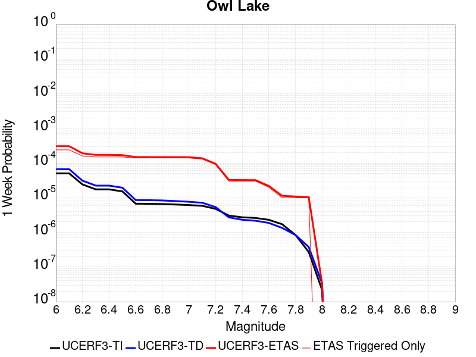 |  |  |  |

| Magnitude | 1 wk TI Prob | 1 wk TD Prob | 1 wk ETAS Prob | 1 wk ETAS/TD Gain | 1 wk ETAS Triggered Only | 1 mo TI Prob | 1 mo TD Prob | 1 mo ETAS Prob | 1 mo ETAS/TD Gain | 1 mo ETAS Triggered Only | 1 yr TI Prob | 1 yr TD Prob | 1 yr ETAS Prob | 1 yr ETAS/TD Gain | 1 yr ETAS Triggered Only | 10 yr TI Prob | 10 yr TD Prob | 10 yr ETAS Prob | 10 yr ETAS/TD Gain | 10 yr ETAS Triggered Only |
|-----|-----|-----|-----|-----|-----|-----|-----|-----|-----|-----|-----|-----|-----|-----|-----|-----|-----|-----|-----|-----|
| 6.0 | 5.0320643E-5 | 6.638493E-5 | 3.1328213E-4 | 4.7191753 | 2.4691358E-4 | 2.1564208E-4 | 2.8448208E-4 | 0.0011978025 | 4.210467 | 9.1358024E-4 | 0.0026222812 | 0.0034591116 | 0.00953678 | 2.7570028 | 0.0060987654 | 0.02591553 | 0.034153398 | 0.04846224 | 1.418958 | 0.014814815 |
| 6.1 | 5.0320643E-5 | 6.638493E-5 | 3.1328213E-4 | 4.7191753 | 2.4691358E-4 | 2.1564208E-4 | 2.8448208E-4 | 0.0011978025 | 4.210467 | 9.1358024E-4 | 0.0026222812 | 0.0034591116 | 0.00953678 | 2.7570028 | 0.0060987654 | 0.02591553 | 0.034153398 | 0.04846224 | 1.418958 | 0.014814815 |
| 6.2 | 2.4125871E-5 | 3.0994335E-5 | 1.544473E-4 | 4.9830813 | 1.2345679E-4 | 1.0339249E-4 | 1.3282728E-4 | 7.994054E-4 | 6.018383 | 6.6666666E-4 | 0.0012580766 | 0.0016161125 | 0.0059547685 | 3.684625 | 0.004345679 | 0.012509781 | 0.016077155 | 0.026766688 | 1.6648895 | 0.010864197 |
| 6.3 | 1.7433485E-5 | 2.2366148E-5 | 1.4582017E-4 | 6.5196824 | 1.2345679E-4 | 7.471279E-5 | 9.585229E-5 | 7.130771E-4 | 7.4393325 | 6.17284E-4 | 9.0924866E-4 | 0.0011665242 | 0.0050385455 | 4.3192806 | 0.0038765431 | 0.009055373 | 0.011634311 | 0.021127502 | 1.815965 | 0.009604938 |
| 6.4 | 1.7433485E-5 | 2.2366148E-5 | 1.4582017E-4 | 6.5196824 | 1.2345679E-4 | 7.471279E-5 | 9.585229E-5 | 7.130771E-4 | 7.4393325 | 6.17284E-4 | 9.0924866E-4 | 0.0011665242 | 0.0050385455 | 4.3192806 | 0.0038765431 | 0.009055373 | 0.011634311 | 0.021127502 | 1.815965 | 0.009604938 |
| 6.5 | 1.5182742E-5 | 1.9438865E-5 | 1.4289326E-4 | 7.3509054 | 1.2345679E-4 | 6.506727E-5 | 8.330761E-5 | 7.0054014E-4 | 8.409078 | 6.17284E-4 | 7.919061E-4 | 0.0010139496 | 0.0047878968 | 4.7220263 | 0.0037777778 | 0.0078909 | 0.010123401 | 0.0192156 | 1.898137 | 0.009185185 |
| 6.6 | 6.7271576E-6 | 8.553785E-6 | 1.3200952E-4 | 15.432878 | 1.2345679E-4 | 2.8830356E-5 | 3.6658595E-5 | 5.3046766E-4 | 14.470485 | 4.9382716E-4 | 3.5095305E-4 | 4.4623265E-4 | 0.003309152 | 7.4157553 | 0.0028641976 | 0.0035039932 | 0.004471147 | 0.01120633 | 2.5063658 | 0.006765432 |
| 6.7 | 6.682835E-6 | 8.48622E-6 | 1.3194197E-4 | 15.547789 | 1.2345679E-4 | 2.8640408E-5 | 3.636904E-5 | 5.3017825E-4 | 14.577735 | 4.9382716E-4 | 3.4864116E-4 | 4.4270878E-4 | 0.003280958 | 7.4110975 | 0.0028395061 | 0.003480947 | 0.004436068 | 0.011097742 | 2.501707 | 0.006691358 |
| 6.8 | 6.5774975E-6 | 8.332664E-6 | 1.3178843E-4 | 15.815882 | 1.2345679E-4 | 2.8188972E-5 | 3.571096E-5 | 5.295205E-4 | 14.827954 | 4.9382716E-4 | 3.4314668E-4 | 4.3469985E-4 | 0.0032729716 | 7.5292683 | 0.0028395061 | 0.0034261728 | 0.0043561985 | 0.010993823 | 2.5237198 | 0.006666667 |
| 6.9 | 6.363419E-6 | 8.00576E-6 | 1.3146157E-4 | 16.420874 | 1.2345679E-4 | 2.727151E-5 | 3.430998E-5 | 5.281202E-4 | 15.392612 | 4.9382716E-4 | 3.3198006E-4 | 4.176495E-4 | 0.0032559698 | 7.795938 | 0.0028395061 | 0.0033148455 | 0.0041861506 | 0.010800322 | 2.5800128 | 0.006641975 |
| 7.0 | 6.1342453E-6 | 7.637859E-6 | 1.3109371E-4 | 17.163671 | 1.2345679E-4 | 2.6289357E-5 | 3.27333E-5 | 5.265443E-4 | 16.08589 | 4.9382716E-4 | 3.2002592E-4 | 3.9846057E-4 | 0.0032121537 | 8.061409 | 0.002814815 | 0.0031956544 | 0.003994793 | 0.010511864 | 2.6313915 | 0.00654321 |
| 7.1 | 5.842926E-6 | 7.1482646E-6 | 1.0591299E-4 | 14.816602 | 9.8765435E-5 | 2.504087E-5 | 3.063509E-5 | 4.9975654E-4 | 16.313206 | 4.691358E-4 | 3.0482994E-4 | 3.729238E-4 | 0.0029892316 | 8.015663 | 0.002617284 | 0.0030441214 | 0.0037401791 | 0.009939129 | 2.657394 | 0.006222222 |
| 7.2 | 4.77173E-6 | 5.36398E-6 | 5.474643E-5 | 10.206307 | 4.9382717E-5 | 2.045011E-5 | 2.2988306E-5 | 3.9335017E-4 | 17.11088 | 3.7037037E-4 | 2.4895166E-4 | 2.7985073E-4 | 0.001834971 | 6.556963 | 0.0015555555 | 0.0024867293 | 0.0028115083 | 0.0068002623 | 2.4187238 | 0.004 |
| 7.3 | 3.0494948E-6 | 2.7145331E-6 | 5.2097115E-5 | 19.191923 | 4.9382717E-5 | 1.3069198E-5 | 1.1633663E-5 | 1.3508902E-4 | 11.611907 | 1.2345679E-4 | 1.5910587E-4 | 1.4163081E-4 | 5.3663657E-4 | 3.7889822 | 3.9506174E-4 | 0.0015899199 | 0.001425365 | 0.00248558 | 1.7438201 | 0.0010617283 |
| 7.4 | 2.7263884E-6 | 2.3095015E-6 | 5.1692103E-5 | 22.382364 | 4.9382717E-5 | 1.1684469E-5 | 9.897826E-6 | 1.0866228E-4 | 10.978398 | 9.8765435E-5 | 1.4224913E-4 | 1.2049948E-4 | 3.920717E-4 | 3.253721 | 2.7160495E-4 | 0.0014215811 | 0.0012132203 | 0.001928401 | 1.5894896 | 7.160494E-4 |
| 7.5 | 2.6090431E-6 | 2.1693693E-6 | 5.155198E-5 | 23.76358 | 4.9382717E-5 | 1.1181565E-5 | 9.297264E-6 | 1.0806178E-4 | 11.622966 | 9.8765435E-5 | 1.3612706E-4 | 1.13188406E-4 | 3.6007405E-4 | 3.181192 | 2.4691358E-4 | 0.001360437 | 0.001139941 | 0.0017565213 | 1.5408878 | 6.17284E-4 |
| 7.6 | 2.3008756E-6 | 1.8763494E-6 | 2.656766E-5 | 14.159229 | 2.4691359E-5 | 9.860858E-6 | 8.041473E-6 | 8.211495E-5 | 10.2114315 | 7.407407E-5 | 1.20049335E-4 | 9.7900614E-5 | 2.2134533E-4 | 2.2609186 | 1.2345679E-4 | 0.001199845 | 9.868495E-4 | 0.0014308554 | 1.4499226 | 4.4444445E-4 |
| 7.7 | 1.7184348E-6 | 1.345208E-6 | 1.345208E-6 | 1.0 | 0.0 | 7.3646997E-6 | 5.7651646E-6 | 3.045638E-5 | 5.2828293 | 2.4691359E-5 | 8.966153E-5 | 7.018866E-5 | 1.19567914E-4 | 1.7035217 | 4.9382717E-5 | 8.962536E-4 | 7.095553E-4 | 9.5629366E-4 | 1.3477366 | 2.4691358E-4 |
| 7.8 | 8.4612907E-7 | 8.429351E-7 | 8.429351E-7 | 1.0 | 0.0 | 3.6262625E-6 | 3.6125741E-6 | 2.8303843E-5 | 7.834813 | 2.4691359E-5 | 4.4148852E-5 | 4.3982225E-5 | 6.8672496E-5 | 1.5613693 | 2.4691359E-5 | 4.414008E-4 | 4.4521203E-4 | 4.698924E-4 | 1.0554351 | 2.4691359E-5 |
| 7.9 | 2.716738E-7 | 3.778486E-7 | 3.778486E-7 | 1.0 | 0.0 | 1.1643157E-6 | 1.6193502E-6 | 1.6193502E-6 | 1.0 | 0.0 | 1.4175452E-5 | 1.971542E-5 | 1.971542E-5 | 1.0 | 0.0 | 1.4174548E-4 | 1.9890796E-4 | 1.9890796E-4 | 1.0 | 0.0 |
| 8.0 | 2.1995428E-8 | 3.3939607E-8 | 3.3939607E-8 | 1.0 | 0.0 | 9.426611E-8 | 1.4545546E-7 | 1.4545546E-7 | 1.0 | 0.0 | 1.1476893E-6 | 1.7709194E-6 | 1.7709194E-6 | 1.0 | 0.0 | 1.14768345E-5 | 1.801025E-5 | 1.801025E-5 | 1.0 | 0.0 |

## Panamint Valley
*[(top)](#table-of-contents)*

| 1 Week | 1 Month | 1 Year | 10 Year |
|-----|-----|-----|-----|
|  |  |  |  |

| Magnitude | 1 wk TI Prob | 1 wk TD Prob | 1 wk ETAS Prob | 1 wk ETAS/TD Gain | 1 wk ETAS Triggered Only | 1 mo TI Prob | 1 mo TD Prob | 1 mo ETAS Prob | 1 mo ETAS/TD Gain | 1 mo ETAS Triggered Only | 1 yr TI Prob | 1 yr TD Prob | 1 yr ETAS Prob | 1 yr ETAS/TD Gain | 1 yr ETAS Triggered Only | 10 yr TI Prob | 10 yr TD Prob | 10 yr ETAS Prob | 10 yr ETAS/TD Gain | 10 yr ETAS Triggered Only |
|-----|-----|-----|-----|-----|-----|-----|-----|-----|-----|-----|-----|-----|-----|-----|-----|-----|-----|-----|-----|-----|
| 6.0 | 3.0211835E-5 | 3.3991142E-5 | 2.315153E-4 | 6.8110476 | 1.9753087E-4 | 1.2947287E-4 | 1.4566837E-4 | 8.369257E-4 | 5.7454185 | 6.91358E-4 | 0.0015751923 | 0.001772099 | 0.0065783816 | 3.7121973 | 0.004814815 | 0.015640736 | 0.017586537 | 0.028405214 | 1.6151681 | 0.011012346 |
| 6.1 | 3.0211835E-5 | 3.3991142E-5 | 2.315153E-4 | 6.8110476 | 1.9753087E-4 | 1.2947287E-4 | 1.4566837E-4 | 8.369257E-4 | 5.7454185 | 6.91358E-4 | 0.0015751923 | 0.001772099 | 0.0065783816 | 3.7121973 | 0.004814815 | 0.015640736 | 0.017586537 | 0.028405214 | 1.6151681 | 0.011012346 |
| 6.2 | 3.0211835E-5 | 3.3991142E-5 | 2.315153E-4 | 6.8110476 | 1.9753087E-4 | 1.2947287E-4 | 1.4566837E-4 | 8.369257E-4 | 5.7454185 | 6.91358E-4 | 0.0015751923 | 0.001772099 | 0.0065783816 | 3.7121973 | 0.004814815 | 0.015640736 | 0.017586537 | 0.028405214 | 1.6151681 | 0.011012346 |
| 6.3 | 2.8573924E-5 | 3.2108957E-5 | 2.2963349E-4 | 7.1516953 | 1.9753087E-4 | 1.2245393E-4 | 1.3760272E-4 | 8.288656E-4 | 6.0236135 | 6.91358E-4 | 0.001489857 | 0.0016740535 | 0.006308258 | 3.7682533 | 0.0046419753 | 0.01479908 | 0.016621023 | 0.026988994 | 1.6237866 | 0.0105432095 |
| 6.4 | 2.8573924E-5 | 3.2108957E-5 | 2.2963349E-4 | 7.1516953 | 1.9753087E-4 | 1.2245393E-4 | 1.3760272E-4 | 8.288656E-4 | 6.0236135 | 6.91358E-4 | 0.001489857 | 0.0016740535 | 0.006308258 | 3.7682533 | 0.0046419753 | 0.01479908 | 0.016621023 | 0.026988994 | 1.6237866 | 0.0105432095 |
| 6.5 | 2.7468774E-5 | 3.0834468E-5 | 2.2835925E-4 | 7.405973 | 1.9753087E-4 | 1.1771801E-4 | 1.3214118E-4 | 8.2340784E-4 | 6.2312737 | 6.91358E-4 | 0.0014322745 | 0.001607659 | 0.006143565 | 3.8214355 | 0.00454321 | 0.014230782 | 0.015966775 | 0.026001485 | 1.6284744 | 0.0101975305 |
| 6.6 | 2.6135967E-5 | 2.9258244E-5 | 2.2678333E-4 | 7.7510915 | 1.9753087E-4 | 1.1200648E-4 | 1.253866E-4 | 7.9196965E-4 | 6.3162227 | 6.6666666E-4 | 0.0013628257 | 0.0015255393 | 0.00593855 | 3.8927543 | 0.004419753 | 0.013544982 | 0.015157006 | 0.02488385 | 1.6417391 | 0.009876544 |
| 6.7 | 2.4498746E-5 | 2.7346903E-5 | 2.2487236E-4 | 8.222956 | 1.9753087E-4 | 1.04990395E-4 | 1.17195894E-4 | 7.8378443E-4 | 6.6878147 | 6.6666666E-4 | 0.0012775084 | 0.0014259511 | 0.0056174966 | 3.9394734 | 0.004197531 | 0.012701893 | 0.014174139 | 0.023277815 | 1.6422737 | 0.009234568 |
| 6.8 | 2.2244329E-5 | 2.4940635E-5 | 1.9777584E-4 | 7.9298635 | 1.728395E-4 | 9.532935E-5 | 1.06884174E-4 | 7.4879086E-4 | 7.0056286 | 6.419753E-4 | 0.0011600169 | 0.0013005598 | 0.0052953577 | 4.0715985 | 0.004 | 0.011539802 | 0.012935203 | 0.021465393 | 1.6594554 | 0.008641975 |
| 6.9 | 1.9902658E-5 | 2.2295073E-5 | 1.4574912E-4 | 6.5372787 | 1.2345679E-4 | 8.529431E-5 | 9.554692E-5 | 5.893269E-4 | 6.167932 | 4.9382716E-4 | 0.0010379635 | 0.0011626815 | 0.004763428 | 4.0969334 | 0.0036049383 | 0.010331288 | 0.011571088 | 0.019234462 | 1.6622865 | 0.0077530863 |
| 7.0 | 1.8353881E-5 | 2.0570717E-5 | 1.4402496E-4 | 7.001456 | 1.2345679E-4 | 7.865712E-5 | 8.8157336E-5 | 5.81941E-4 | 6.6011634 | 4.9382716E-4 | 9.5722964E-4 | 0.0010728048 | 0.004451892 | 4.149769 | 0.003382716 | 0.009531168 | 0.010681189 | 0.017789628 | 1.66551 | 0.0071851853 |
| 7.1 | 1.7667631E-5 | 1.9777019E-5 | 1.185405E-4 | 5.9938507 | 9.8765435E-5 | 7.571623E-5 | 8.4756E-5 | 5.5385206E-4 | 6.5346646 | 4.691358E-4 | 9.2145515E-4 | 0.0010314333 | 0.004287331 | 4.1566725 | 0.0032592593 | 0.009176437 | 0.010271349 | 0.017040605 | 1.6590425 | 0.0068395063 |
| 7.2 | 1.6381597E-5 | 1.8162364E-5 | 1.16926E-4 | 6.4378185 | 9.8765435E-5 | 7.020495E-5 | 7.783648E-5 | 4.975569E-4 | 6.392336 | 4.1975308E-4 | 8.544101E-4 | 9.472644E-4 | 0.0039074207 | 4.124953 | 0.002962963 | 0.008511325 | 0.009436919 | 0.015478131 | 1.6401678 | 0.0060987654 |
| 7.3 | 1.4520491E-5 | 1.5969836E-5 | 6.535176E-5 | 4.0922003 | 4.9382717E-5 | 6.222919E-5 | 6.844045E-5 | 3.6471646E-4 | 5.328961 | 2.962963E-4 | 7.57377E-4 | 8.329601E-4 | 0.00332471 | 3.9914396 | 0.0024938271 | 0.0075480095 | 0.008301492 | 0.013174281 | 1.5869777 | 0.00491358 |
| 7.4 | 1.2852287E-5 | 1.4148404E-5 | 6.3530424E-5 | 4.4902887 | 4.9382717E-5 | 5.5080065E-5 | 6.06347E-5 | 3.5691302E-4 | 5.886284 | 2.962963E-4 | 6.7039346E-4 | 7.379932E-4 | 0.0031559605 | 4.2764087 | 0.002419753 | 0.0066837464 | 0.007358347 | 0.012015184 | 1.6328646 | 0.004691358 |
| 7.5 | 1.1637851E-5 | 1.2839613E-5 | 6.22217E-5 | 4.8460727 | 4.9382717E-5 | 4.987555E-5 | 5.502584E-5 | 3.5130582E-4 | 6.3843794 | 2.962963E-4 | 6.070656E-4 | 6.6974934E-4 | 0.003063207 | 4.573662 | 0.0023950618 | 0.006054099 | 0.006680208 | 0.011291173 | 1.6902429 | 0.0046419753 |
| 7.6 | 3.0068115E-6 | 3.3341298E-6 | 2.8025406E-5 | 8.405613 | 2.4691359E-5 | 1.2886271E-5 | 1.428909E-5 | 1.6243513E-4 | 11.367772 | 1.4814814E-4 | 1.5687906E-4 | 1.7396307E-4 | 0.0010873844 | 6.2506623 | 9.1358024E-4 | 0.0015676835 | 0.0017397105 | 0.0036622859 | 2.1051123 | 0.001925926 |

## Garlock (East)
*[(top)](#table-of-contents)*

| 1 Week | 1 Month | 1 Year | 10 Year |
|-----|-----|-----|-----|
|  |  |  | 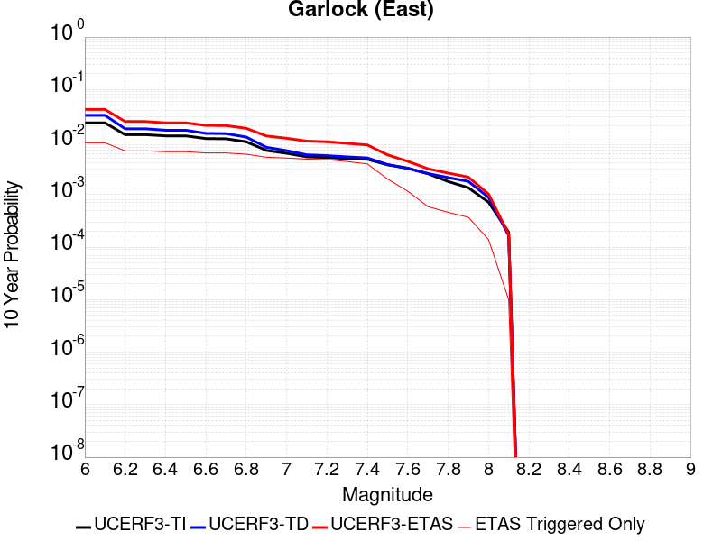 |

| Magnitude | 1 wk TI Prob | 1 wk TD Prob | 1 wk ETAS Prob | 1 wk ETAS/TD Gain | 1 wk ETAS Triggered Only | 1 mo TI Prob | 1 mo TD Prob | 1 mo ETAS Prob | 1 mo ETAS/TD Gain | 1 mo ETAS Triggered Only | 1 yr TI Prob | 1 yr TD Prob | 1 yr ETAS Prob | 1 yr ETAS/TD Gain | 1 yr ETAS Triggered Only | 10 yr TI Prob | 10 yr TD Prob | 10 yr ETAS Prob | 10 yr ETAS/TD Gain | 10 yr ETAS Triggered Only |
|-----|-----|-----|-----|-----|-----|-----|-----|-----|-----|-----|-----|-----|-----|-----|-----|-----|-----|-----|-----|-----|
| 6.0 | 4.5092507E-5 | 6.2931635E-5 | 1.8638065E-4 | 2.961637 | 1.2345679E-4 | 1.9323928E-4 | 2.6968162E-4 | 7.880603E-4 | 2.9221876 | 5.185185E-4 | 0.0023501497 | 0.0032788762 | 0.0071180984 | 2.1708956 | 0.003851852 | 0.023254504 | 0.03236623 | 0.041970894 | 1.2967495 | 0.009925926 |
| 6.1 | 4.5092507E-5 | 6.2931635E-5 | 1.8638065E-4 | 2.961637 | 1.2345679E-4 | 1.9323928E-4 | 2.6968162E-4 | 7.880603E-4 | 2.9221876 | 5.185185E-4 | 0.0023501497 | 0.0032788762 | 0.0071180984 | 2.1708956 | 0.003851852 | 0.023254504 | 0.03236623 | 0.041970894 | 1.2967495 | 0.009925926 |
| 6.2 | 2.6674514E-5 | 3.4532168E-5 | 1.0860369E-4 | 3.1450005 | 7.407407E-5 | 1.1431433E-4 | 1.4798681E-4 | 5.183024E-4 | 3.5023553 | 3.7037037E-4 | 0.0013908884 | 0.0018002834 | 0.004585384 | 2.5470345 | 0.0027901235 | 0.01382215 | 0.017901788 | 0.024837097 | 1.3874089 | 0.0070617283 |
| 6.3 | 2.6674514E-5 | 3.4532168E-5 | 1.0860369E-4 | 3.1450005 | 7.407407E-5 | 1.1431433E-4 | 1.4798681E-4 | 5.183024E-4 | 3.5023553 | 3.7037037E-4 | 0.0013908884 | 0.0018002834 | 0.004585384 | 2.5470345 | 0.0027901235 | 0.01382215 | 0.017901788 | 0.024837097 | 1.3874089 | 0.0070617283 |
| 6.4 | 2.5312667E-5 | 3.236092E-5 | 1.064326E-4 | 3.2889237 | 7.407407E-5 | 1.0847834E-4 | 1.3868246E-4 | 4.8431352E-4 | 3.492248 | 3.45679E-4 | 0.0013199237 | 0.0016871806 | 0.004373998 | 2.5924895 | 0.002691358 | 0.013121112 | 0.016789583 | 0.023538534 | 1.4019725 | 0.0068641976 |
| 6.5 | 2.5312667E-5 | 3.236092E-5 | 1.064326E-4 | 3.2889237 | 7.407407E-5 | 1.0847834E-4 | 1.3868246E-4 | 4.8431352E-4 | 3.492248 | 3.45679E-4 | 0.0013199237 | 0.0016871806 | 0.004373998 | 2.5924895 | 0.002691358 | 0.013121112 | 0.016789583 | 0.023538534 | 1.4019725 | 0.0068641976 |
| 6.6 | 2.246556E-5 | 2.8154947E-5 | 1.02226935E-4 | 3.6308694 | 7.407407E-5 | 9.627742E-5 | 1.2065861E-4 | 4.6629593E-4 | 3.8645887 | 3.45679E-4 | 0.0011715472 | 0.0014680522 | 0.0040814937 | 2.7802103 | 0.002617284 | 0.011653901 | 0.01462952 | 0.021174327 | 1.4473699 | 0.006641975 |
| 6.7 | 2.2241198E-5 | 2.7824628E-5 | 1.0189664E-4 | 3.6621025 | 7.407407E-5 | 9.531594E-5 | 1.1924309E-4 | 4.6488087E-4 | 3.8985982 | 3.45679E-4 | 0.0011598538 | 0.0014508413 | 0.004064328 | 2.8013594 | 0.002617284 | 0.011538187 | 0.014459683 | 0.020981282 | 1.4510195 | 0.006617284 |
| 6.8 | 1.9528685E-5 | 2.3917915E-5 | 9.799022E-5 | 4.096938 | 7.407407E-5 | 8.369167E-5 | 1.02501435E-4 | 4.48145E-4 | 4.372085 | 3.45679E-4 | 0.0010184698 | 0.0012472603 | 0.0037626375 | 3.0167222 | 0.0025185186 | 0.010138147 | 0.012446578 | 0.018591356 | 1.493692 | 0.006222222 |
| 6.9 | 1.3318621E-5 | 1.5215894E-5 | 8.928884E-5 | 5.8681297 | 7.407407E-5 | 5.7078556E-5 | 6.520937E-5 | 3.861761E-4 | 5.922095 | 3.2098766E-4 | 6.9470983E-4 | 7.936407E-4 | 0.0030881146 | 3.891074 | 0.0022962962 | 0.0069254204 | 0.007948688 | 0.013460084 | 1.6933718 | 0.0055555557 |
| 7.0 | 1.1760853E-5 | 1.3124213E-5 | 8.719732E-5 | 6.6440034 | 7.407407E-5 | 5.0402683E-5 | 5.6245444E-5 | 3.5252506E-4 | 6.26762 | 2.962963E-4 | 6.134799E-4 | 6.8457815E-4 | 0.0028065813 | 4.099724 | 0.0021234567 | 0.0061178906 | 0.006865028 | 0.012186269 | 1.7751231 | 0.0053580245 |
| 7.1 | 1.0064758E-5 | 1.0918795E-5 | 8.499206E-5 | 7.7840147 | 7.407407E-5 | 4.3133965E-5 | 4.6794015E-5 | 3.4307645E-4 | 7.3316307 | 2.962963E-4 | 5.2502943E-4 | 5.6957174E-4 | 0.0025684326 | 4.5094104 | 0.002 | 0.005237907 | 0.0057212254 | 0.010803095 | 1.8882484 | 0.0051111113 |
| 7.2 | 9.768808E-6 | 1.0514561E-5 | 8.458785E-5 | 8.044829 | 7.407407E-5 | 4.186565E-5 | 4.5061646E-5 | 3.413446E-4 | 7.575058 | 2.962963E-4 | 5.095951E-4 | 5.4849096E-4 | 0.002424005 | 4.4194074 | 0.0018765432 | 0.0050842804 | 0.005511436 | 0.010447046 | 1.8955215 | 0.004962963 |
| 7.3 | 9.344516E-6 | 9.959923E-6 | 8.403326E-5 | 8.4371395 | 7.407407E-5 | 4.004731E-5 | 4.2684707E-5 | 2.8958774E-4 | 6.7843447 | 2.4691358E-4 | 4.8746695E-4 | 5.1956583E-4 | 0.002197706 | 4.229889 | 0.0016790123 | 0.0048639905 | 0.005222964 | 0.009816132 | 1.8794179 | 0.004617284 |
| 7.4 | 9.023491E-6 | 9.505806E-6 | 8.357917E-5 | 8.792435 | 7.407407E-5 | 3.867153E-5 | 4.073855E-5 | 2.629517E-4 | 6.4546165 | 2.2222222E-4 | 4.7072413E-4 | 4.958823E-4 | 0.0020259875 | 4.0856214 | 0.0015308642 | 0.004697283 | 0.004986258 | 0.009162859 | 1.8376223 | 0.004197531 |
| 7.5 | 7.081253E-6 | 7.101122E-6 | 5.6483488E-5 | 7.954164 | 4.9382717E-5 | 3.0347876E-5 | 3.0433028E-5 | 1.7857667E-4 | 5.8678575 | 1.4814814E-4 | 3.6942272E-4 | 3.7045986E-4 | 0.0011109262 | 2.9987762 | 7.4074074E-4 | 0.003688092 | 0.003731307 | 0.0058222413 | 1.5603758 | 0.0020987655 |
| 7.6 | 6.116396E-6 | 5.9720282E-6 | 5.9720282E-6 | 1.0 | 0.0 | 2.6212863E-5 | 2.5594158E-5 | 5.0284885E-5 | 1.9647017 | 2.4691359E-5 | 3.1909486E-4 | 3.1156457E-4 | 6.324522E-4 | 2.0299234 | 3.2098766E-4 | 0.0031863707 | 0.0031424055 | 0.004250025 | 1.352475 | 0.0011111111 |
| 7.7 | 4.797145E-6 | 4.769377E-6 | 4.769377E-6 | 1.0 | 0.0 | 2.055903E-5 | 2.0440028E-5 | 2.0440028E-5 | 1.0 | 0.0 | 2.5027743E-4 | 2.4882905E-4 | 3.7225513E-4 | 1.4960276 | 1.2345679E-4 | 0.0024999576 | 0.0025156436 | 0.0029589701 | 1.1762278 | 4.4444445E-4 |
| 7.8 | 3.4028885E-6 | 3.9892493E-6 | 3.9892493E-6 | 1.0 | 0.0 | 1.4583726E-5 | 1.7096672E-5 | 1.7096672E-5 | 1.0 | 0.0 | 1.775424E-4 | 2.0813217E-4 | 3.0687705E-4 | 1.4744335 | 9.8765435E-5 | 0.0017740062 | 0.0021068375 | 0.0024271489 | 1.1520343 | 3.2098766E-4 |
| 7.9 | 2.5928412E-6 | 3.3815668E-6 | 3.3815668E-6 | 1.0 | 0.0 | 1.1112129E-5 | 1.449235E-5 | 1.449235E-5 | 1.0 | 0.0 | 1.3528178E-4 | 1.7643013E-4 | 2.7517814E-4 | 1.5597004 | 9.8765435E-5 | 0.0013519945 | 0.0017859834 | 0.002032456 | 1.1380038 | 2.4691358E-4 |
| 8.0 | 1.3743648E-6 | 1.6776083E-6 | 1.6776083E-6 | 1.0 | 0.0 | 5.8901214E-6 | 7.1897302E-6 | 7.1897302E-6 | 1.0 | 0.0 | 7.1709874E-5 | 8.753148E-5 | 1.12220674E-4 | 1.2820607 | 2.4691359E-5 | 7.1686733E-4 | 8.8587485E-4 | 9.845528E-4 | 1.1113904 | 9.8765435E-5 |
| 8.1 | 3.6733252E-7 | 3.156379E-7 | 3.156379E-7 | 1.0 | 0.0 | 1.5742813E-6 | 1.3527332E-6 | 1.3527332E-6 | 1.0 | 0.0 | 1.9166706E-5 | 1.646942E-5 | 1.646942E-5 | 1.0 | 0.0 | 1.9165053E-4 | 1.6677451E-4 | 1.6677451E-4 | 1.0 | 0.0 |

## Ash Hill
*[(top)](#table-of-contents)*

| 1 Week | 1 Month | 1 Year | 10 Year |
|-----|-----|-----|-----|
|  |  |  |  |

| Magnitude | 1 wk TI Prob | 1 wk TD Prob | 1 wk ETAS Prob | 1 wk ETAS/TD Gain | 1 wk ETAS Triggered Only | 1 mo TI Prob | 1 mo TD Prob | 1 mo ETAS Prob | 1 mo ETAS/TD Gain | 1 mo ETAS Triggered Only | 1 yr TI Prob | 1 yr TD Prob | 1 yr ETAS Prob | 1 yr ETAS/TD Gain | 1 yr ETAS Triggered Only | 10 yr TI Prob | 10 yr TD Prob | 10 yr ETAS Prob | 10 yr ETAS/TD Gain | 10 yr ETAS Triggered Only |
|-----|-----|-----|-----|-----|-----|-----|-----|-----|-----|-----|-----|-----|-----|-----|-----|-----|-----|-----|-----|-----|
| 6.0 | 2.1545662E-5 | 2.3196331E-5 | 1.4665026E-4 | 6.3221316 | 1.2345679E-4 | 9.2335285E-5 | 9.940951E-5 | 4.2036525E-4 | 4.228622 | 3.2098766E-4 | 0.0011236023 | 0.0012097188 | 0.0037251906 | 3.0793855 | 0.0025185186 | 0.011179381 | 0.0120393215 | 0.017771933 | 1.4761573 | 0.0058024693 |
| 6.1 | 2.1545662E-5 | 2.3196331E-5 | 1.4665026E-4 | 6.3221316 | 1.2345679E-4 | 9.2335285E-5 | 9.940951E-5 | 4.2036525E-4 | 4.228622 | 3.2098766E-4 | 0.0011236023 | 0.0012097188 | 0.0037251906 | 3.0793855 | 0.0025185186 | 0.011179381 | 0.0120393215 | 0.017771933 | 1.4761573 | 0.0058024693 |
| 6.2 | 2.1545662E-5 | 2.3196331E-5 | 1.4665026E-4 | 6.3221316 | 1.2345679E-4 | 9.2335285E-5 | 9.940951E-5 | 4.2036525E-4 | 4.228622 | 3.2098766E-4 | 0.0011236023 | 0.0012097188 | 0.0037251906 | 3.0793855 | 0.0025185186 | 0.011179381 | 0.0120393215 | 0.017771933 | 1.4761573 | 0.0058024693 |
| 6.3 | 1.0025529E-5 | 1.0747755E-5 | 3.5438847E-5 | 3.2973256 | 2.4691359E-5 | 4.2965847E-5 | 4.6061068E-5 | 1.942024E-4 | 4.2161937 | 1.4814814E-4 | 5.229836E-4 | 5.606624E-4 | 0.0015724405 | 2.804612 | 0.0010123457 | 0.005217545 | 0.0055937925 | 0.00807367 | 1.4433266 | 0.0024938271 |
| 6.4 | 1.0025529E-5 | 1.0747755E-5 | 3.5438847E-5 | 3.2973256 | 2.4691359E-5 | 4.2965847E-5 | 4.6061068E-5 | 1.942024E-4 | 4.2161937 | 1.4814814E-4 | 5.229836E-4 | 5.606624E-4 | 0.0015724405 | 2.804612 | 0.0010123457 | 0.005217545 | 0.0055937925 | 0.00807367 | 1.4433266 | 0.0024938271 |
| 6.5 | 6.9617327E-6 | 7.4571967E-6 | 3.214837E-5 | 4.3110533 | 2.4691359E-5 | 2.9835655E-5 | 3.1959073E-5 | 1.5541192E-4 | 4.862842 | 1.2345679E-4 | 3.6318856E-4 | 3.8904088E-4 | 0.0010307664 | 2.6495068 | 6.419753E-4 | 0.0036259557 | 0.0038844529 | 0.0054585612 | 1.405233 | 0.001580247 |
| 6.6 | 4.9919777E-6 | 5.3470912E-6 | 3.0038318E-5 | 5.617693 | 2.4691359E-5 | 2.1394015E-5 | 2.2915943E-5 | 1.2167911E-4 | 5.3098016 | 9.8765435E-5 | 2.60441E-4 | 2.7897258E-4 | 7.2329305E-4 | 2.5927029 | 4.4444445E-4 | 0.0026013597 | 0.0027868825 | 0.0040180096 | 1.4417579 | 0.001234568 |
| 6.7 | 3.6630722E-6 | 3.924921E-6 | 2.8616181E-5 | 7.2908936 | 2.4691359E-5 | 1.5698786E-5 | 1.6821014E-5 | 1.15584786E-4 | 6.871452 | 9.8765435E-5 | 1.9111596E-4 | 2.0478234E-4 | 5.5039057E-4 | 2.6876857 | 3.45679E-4 | 0.0019095168 | 0.0020464994 | 0.0028596467 | 1.3973356 | 8.148148E-4 |
| 6.8 | 2.5599613E-6 | 2.7451356E-6 | 2.7436427E-5 | 9.994561 | 2.4691359E-5 | 1.0971216E-5 | 1.17648415E-5 | 8.5838044E-5 | 7.2961497 | 7.407407E-5 | 1.3356637E-4 | 1.4323248E-4 | 3.6542286E-4 | 2.5512571 | 2.2222222E-4 | 0.0013348613 | 0.0014318867 | 0.0019496627 | 1.3616041 | 5.185185E-4 |
| 6.9 | 1.7684905E-6 | 1.8970168E-6 | 2.6588328E-5 | 14.015863 | 2.4691359E-5 | 7.579223E-6 | 8.130072E-6 | 8.220354E-5 | 10.111048 | 7.407407E-5 | 9.2273134E-5 | 9.8983626E-5 | 2.9649495E-4 | 2.9953938 | 1.9753087E-4 | 9.223483E-4 | 9.898363E-4 | 0.0014338408 | 1.4485636 | 4.4444445E-4 |

## Hunter Mountain-Saline Valley
*[(top)](#table-of-contents)*

| 1 Week | 1 Month | 1 Year | 10 Year |
|-----|-----|-----|-----|
| 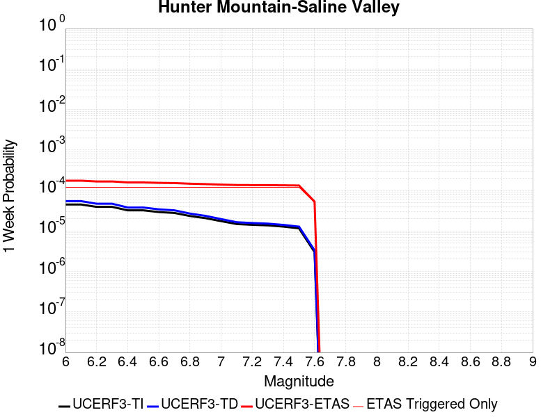 |  |  |  |

| Magnitude | 1 wk TI Prob | 1 wk TD Prob | 1 wk ETAS Prob | 1 wk ETAS/TD Gain | 1 wk ETAS Triggered Only | 1 mo TI Prob | 1 mo TD Prob | 1 mo ETAS Prob | 1 mo ETAS/TD Gain | 1 mo ETAS Triggered Only | 1 yr TI Prob | 1 yr TD Prob | 1 yr ETAS Prob | 1 yr ETAS/TD Gain | 1 yr ETAS Triggered Only | 10 yr TI Prob | 10 yr TD Prob | 10 yr ETAS Prob | 10 yr ETAS/TD Gain | 10 yr ETAS Triggered Only |
|-----|-----|-----|-----|-----|-----|-----|-----|-----|-----|-----|-----|-----|-----|-----|-----|-----|-----|-----|-----|-----|
| 6.0 | 4.5103672E-5 | 5.4582193E-5 | 1.03962215E-4 | 1.904691 | 4.9382717E-5 | 1.9328714E-4 | 2.3390392E-4 | 5.301309E-4 | 2.2664473 | 2.962963E-4 | 0.002350731 | 0.0028442163 | 0.005404814 | 1.9002823 | 0.0025679013 | 0.023260195 | 0.028098824 | 0.032994326 | 1.1742245 | 0.005037037 |
| 6.1 | 4.5103672E-5 | 5.4582193E-5 | 1.03962215E-4 | 1.904691 | 4.9382717E-5 | 1.9328714E-4 | 2.3390392E-4 | 5.301309E-4 | 2.2664473 | 2.962963E-4 | 0.002350731 | 0.0028442163 | 0.005404814 | 1.9002823 | 0.0025679013 | 0.023260195 | 0.028098824 | 0.032994326 | 1.1742245 | 0.005037037 |
| 6.2 | 3.9363465E-5 | 4.7072914E-5 | 9.64533E-5 | 2.0490193 | 4.9382717E-5 | 1.6868966E-4 | 2.0172633E-4 | 4.979629E-4 | 2.468507 | 2.962963E-4 | 0.002051862 | 0.0024534073 | 0.0049903775 | 2.03406 | 0.0025432098 | 0.020330196 | 0.024279263 | 0.029145822 | 1.2004409 | 0.0049876543 |
| 6.3 | 3.9363465E-5 | 4.7072914E-5 | 9.64533E-5 | 2.0490193 | 4.9382717E-5 | 1.6868966E-4 | 2.0172633E-4 | 4.979629E-4 | 2.468507 | 2.962963E-4 | 0.002051862 | 0.0024534073 | 0.0049903775 | 2.03406 | 0.0025432098 | 0.020330196 | 0.024279263 | 0.029145822 | 1.2004409 | 0.0049876543 |
| 6.4 | 3.2311684E-5 | 3.795965E-5 | 8.734049E-5 | 2.300877 | 4.9382717E-5 | 1.384713E-4 | 1.6267448E-4 | 4.589226E-4 | 2.8211098 | 2.962963E-4 | 0.0016845843 | 0.0019788353 | 0.0045170127 | 2.2826622 | 0.0025432098 | 0.016718714 | 0.019620894 | 0.024486478 | 1.2479798 | 0.004962963 |
| 6.5 | 3.2311684E-5 | 3.795965E-5 | 8.734049E-5 | 2.300877 | 4.9382717E-5 | 1.384713E-4 | 1.6267448E-4 | 4.589226E-4 | 2.8211098 | 2.962963E-4 | 0.0016845843 | 0.0019788353 | 0.0045170127 | 2.2826622 | 0.0025432098 | 0.016718714 | 0.019620894 | 0.024486478 | 1.2479798 | 0.004962963 |
| 6.6 | 2.9305844E-5 | 3.418947E-5 | 8.35705E-5 | 2.4443345 | 4.9382717E-5 | 1.2559042E-4 | 1.4651842E-4 | 4.427713E-4 | 3.0219498 | 2.962963E-4 | 0.0015279909 | 0.0017824649 | 0.0043211416 | 2.4242506 | 0.0025432098 | 0.015175272 | 0.017689606 | 0.02254052 | 1.274224 | 0.004938272 |
| 6.7 | 2.7826512E-5 | 3.235144E-5 | 8.1732556E-5 | 2.5263963 | 4.9382717E-5 | 1.19251024E-4 | 1.3864199E-4 | 4.348972E-4 | 3.136836 | 2.962963E-4 | 0.0014509142 | 0.0016867196 | 0.0042009903 | 2.4906275 | 0.0025185186 | 0.014414776 | 0.016746866 | 0.02157816 | 1.2884893 | 0.00491358 |
| 6.8 | 2.3389874E-5 | 2.6872513E-5 | 7.62539E-5 | 2.8376172 | 4.9382717E-5 | 1.0023846E-4 | 1.1516309E-4 | 4.1142528E-4 | 3.5725443 | 2.962963E-4 | 0.00121972 | 0.0014012561 | 0.0039162454 | 2.7948108 | 0.0025185186 | 0.01213047 | 0.01393042 | 0.01870251 | 1.3425661 | 0.004839506 |
| 6.9 | 2.069209E-5 | 2.3575052E-5 | 7.29566E-5 | 3.094653 | 4.9382717E-5 | 8.867737E-5 | 1.0103223E-4 | 3.972986E-4 | 3.9323945 | 2.962963E-4 | 0.0010791123 | 0.0012294095 | 0.0037201706 | 3.025982 | 0.0024938271 | 0.010738871 | 0.012231114 | 0.016987039 | 1.3888382 | 0.004814815 |
| 7.0 | 1.7462342E-5 | 1.9637651E-5 | 6.90194E-5 | 3.514646 | 4.9382717E-5 | 7.483646E-5 | 8.415878E-5 | 3.8043014E-4 | 4.5203857 | 2.962963E-4 | 9.1075303E-4 | 0.0010241742 | 0.0034907812 | 3.4083862 | 0.002469136 | 0.009070295 | 0.010198176 | 0.014939449 | 1.4649138 | 0.0047901236 |
| 7.1 | 1.4807709E-5 | 1.644517E-5 | 6.582707E-5 | 4.002821 | 4.9382717E-5 | 6.3460066E-5 | 7.047749E-5 | 3.667529E-4 | 5.2038302 | 2.962963E-4 | 7.723524E-4 | 8.5774215E-4 | 0.0033247601 | 3.8761766 | 0.002469136 | 0.007696735 | 0.008547303 | 0.013272004 | 1.5527709 | 0.0047654323 |
| 7.2 | 1.4180048E-5 | 1.5701611E-5 | 6.508355E-5 | 4.145024 | 4.9382717E-5 | 6.077022E-5 | 6.729098E-5 | 3.6356735E-4 | 5.4029136 | 2.962963E-4 | 7.396263E-4 | 8.1897597E-4 | 0.0032860895 | 4.0124373 | 0.002469136 | 0.0073716943 | 0.008162531 | 0.012889065 | 1.5790526 | 0.0047654323 |
| 7.3 | 1.3730402E-5 | 1.5175256E-5 | 6.455722E-5 | 4.2541113 | 4.9382717E-5 | 5.8843252E-5 | 6.5035274E-5 | 3.613123E-4 | 5.5556355 | 2.962963E-4 | 7.161811E-4 | 7.915329E-4 | 0.0032587145 | 4.1169662 | 0.002469136 | 0.007138774 | 0.007890071 | 0.012617904 | 1.5992129 | 0.0047654323 |
| 7.4 | 1.2810095E-5 | 1.4112251E-5 | 6.349427E-5 | 4.4992304 | 4.9382717E-5 | 5.489925E-5 | 6.0479764E-5 | 3.5675813E-4 | 5.898802 | 2.962963E-4 | 6.681934E-4 | 7.3610817E-4 | 0.0031540801 | 4.2848053 | 0.002419753 | 0.006661878 | 0.007339596 | 0.011996521 | 1.6344935 | 0.004691358 |
| 7.5 | 1.1595659E-5 | 1.280346E-5 | 6.218554E-5 | 4.8569326 | 4.9382717E-5 | 4.9694736E-5 | 5.4870903E-5 | 3.5115096E-4 | 6.399584 | 2.962963E-4 | 6.0486543E-4 | 6.6786417E-4 | 0.0030613262 | 4.583756 | 0.0023950618 | 0.006032217 | 0.0066614435 | 0.011272497 | 1.6922003 | 0.0046419753 |
| 7.6 | 2.997694E-6 | 3.3262522E-6 | 2.8017528E-5 | 8.423152 | 2.4691359E-5 | 1.28471975E-5 | 1.425533E-5 | 1.6240137E-4 | 11.392325 | 1.4814814E-4 | 1.564034E-4 | 1.7355211E-4 | 0.0010869738 | 6.263098 | 9.1358024E-4 | 0.0015629337 | 0.0017356031 | 0.0036581864 | 2.107732 | 0.001925926 |

## Blackwater
*[(top)](#table-of-contents)*

| 1 Week | 1 Month | 1 Year | 10 Year |
|-----|-----|-----|-----|
|  |  | 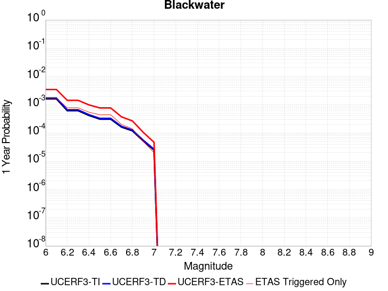 |  |

| Magnitude | 1 wk TI Prob | 1 wk TD Prob | 1 wk ETAS Prob | 1 wk ETAS/TD Gain | 1 wk ETAS Triggered Only | 1 mo TI Prob | 1 mo TD Prob | 1 mo ETAS Prob | 1 mo ETAS/TD Gain | 1 mo ETAS Triggered Only | 1 yr TI Prob | 1 yr TD Prob | 1 yr ETAS Prob | 1 yr ETAS/TD Gain | 1 yr ETAS Triggered Only | 10 yr TI Prob | 10 yr TD Prob | 10 yr ETAS Prob | 10 yr ETAS/TD Gain | 10 yr ETAS Triggered Only |
|-----|-----|-----|-----|-----|-----|-----|-----|-----|-----|-----|-----|-----|-----|-----|-----|-----|-----|-----|-----|-----|
| 6.0 | 3.0708583E-5 | 3.3098582E-5 | 8.2479666E-5 | 2.4919395 | 4.9382717E-5 | 1.3160157E-4 | 1.4184412E-4 | 4.1341054E-4 | 2.9145412 | 2.7160495E-4 | 0.0016010714 | 0.0017257209 | 0.0033278896 | 1.9284054 | 0.0016049383 | 0.015895851 | 0.017137038 | 0.020680198 | 1.2067546 | 0.0036049383 |
| 6.1 | 3.0708583E-5 | 3.3098582E-5 | 8.2479666E-5 | 2.4919395 | 4.9382717E-5 | 1.3160157E-4 | 1.4184412E-4 | 4.1341054E-4 | 2.9145412 | 2.7160495E-4 | 0.0016010714 | 0.0017257209 | 0.0033278896 | 1.9284054 | 0.0016049383 | 0.015895851 | 0.017137038 | 0.020680198 | 1.2067546 | 0.0036049383 |
| 6.2 | 1.1707779E-5 | 1.2546075E-5 | 3.723712E-5 | 2.9680297 | 2.4691359E-5 | 5.017523E-5 | 5.376784E-5 | 2.2659804E-4 | 4.214379 | 1.728395E-4 | 6.107122E-4 | 6.544364E-4 | 0.0015180684 | 2.3196576 | 8.6419756E-4 | 0.006090366 | 0.0065260637 | 0.007973347 | 1.2217697 | 0.0014567901 |
| 6.3 | 1.1707779E-5 | 1.2546075E-5 | 3.723712E-5 | 2.9680297 | 2.4691359E-5 | 5.017523E-5 | 5.376784E-5 | 2.2659804E-4 | 4.214379 | 1.728395E-4 | 6.107122E-4 | 6.544364E-4 | 0.0015180684 | 2.3196576 | 8.6419756E-4 | 0.006090366 | 0.0065260637 | 0.007973347 | 1.2217697 | 0.0014567901 |
| 6.4 | 7.929244E-6 | 8.480723E-6 | 3.3171873E-5 | 3.9114437 | 2.4691359E-5 | 3.3982033E-5 | 3.6345475E-5 | 1.8448824E-4 | 5.075962 | 1.4814814E-4 | 4.136527E-4 | 4.4242034E-4 | 9.853899E-4 | 2.2272708 | 5.432099E-4 | 0.0041288356 | 0.004415801 | 0.0053253467 | 1.2059753 | 9.1358024E-4 |
| 6.5 | 5.8832115E-6 | 6.2864474E-6 | 6.2864474E-6 | 1.0 | 0.0 | 2.521352E-5 | 2.6941654E-5 | 1.5039512E-4 | 5.5822525 | 1.2345679E-4 | 3.0693135E-4 | 3.279678E-4 | 7.229E-4 | 2.2041795 | 3.9506174E-4 | 0.0030650778 | 0.0032750913 | 0.0039887954 | 1.2179189 | 7.160494E-4 |
| 6.6 | 5.8832115E-6 | 6.2864474E-6 | 6.2864474E-6 | 1.0 | 0.0 | 2.521352E-5 | 2.6941654E-5 | 1.5039512E-4 | 5.5822525 | 1.2345679E-4 | 3.0693135E-4 | 3.279678E-4 | 7.229E-4 | 2.2041795 | 3.9506174E-4 | 0.0030650778 | 0.0032750913 | 0.0039887954 | 1.2179189 | 7.160494E-4 |
| 6.7 | 3.0715053E-6 | 3.2817043E-6 | 3.2817043E-6 | 1.0 | 0.0 | 1.3163528E-5 | 1.4064377E-5 | 6.34464E-5 | 4.511142 | 4.9382717E-5 | 1.6025416E-4 | 1.712215E-4 | 3.6871855E-4 | 2.1534593 | 1.9753087E-4 | 0.0016013865 | 0.0017110104 | 0.0020560978 | 1.2016864 | 3.45679E-4 |
| 6.8 | 2.2722281E-6 | 2.428931E-6 | 2.428931E-6 | 1.0 | 0.0 | 9.738084E-6 | 1.0409669E-5 | 3.510077E-5 | 3.3719392 | 2.4691359E-5 | 1.1855473E-4 | 1.2673126E-4 | 2.501724E-4 | 1.9740386 | 1.2345679E-4 | 0.001184915 | 0.0012666801 | 0.001537941 | 1.214151 | 2.7160495E-4 |
| 6.9 | 9.952399E-7 | 1.0654285E-6 | 1.0654285E-6 | 1.0 | 0.0 | 4.265307E-6 | 4.5661172E-6 | 4.5661172E-6 | 1.0 | 0.0 | 5.1928873E-5 | 5.5591572E-5 | 1.0497154E-4 | 1.8882636 | 4.9382717E-5 | 5.191674E-4 | 5.558273E-4 | 6.545378E-4 | 1.1775922 | 9.8765435E-5 |
| 7.0 | 4.7385504E-7 | 5.075942E-7 | 5.075942E-7 | 1.0 | 0.0 | 2.0308057E-6 | 2.175404E-6 | 2.175404E-6 | 1.0 | 0.0 | 2.4724779E-5 | 2.6485543E-5 | 5.117625E-5 | 1.9322332 | 2.4691359E-5 | 2.4722028E-4 | 2.6485542E-4 | 3.1422506E-4 | 1.1864022 | 4.9382717E-5 |

## Garlock (West)
*[(top)](#table-of-contents)*

| 1 Week | 1 Month | 1 Year | 10 Year |
|-----|-----|-----|-----|
|  |  |  |  |

| Magnitude | 1 wk TI Prob | 1 wk TD Prob | 1 wk ETAS Prob | 1 wk ETAS/TD Gain | 1 wk ETAS Triggered Only | 1 mo TI Prob | 1 mo TD Prob | 1 mo ETAS Prob | 1 mo ETAS/TD Gain | 1 mo ETAS Triggered Only | 1 yr TI Prob | 1 yr TD Prob | 1 yr ETAS Prob | 1 yr ETAS/TD Gain | 1 yr ETAS Triggered Only | 10 yr TI Prob | 10 yr TD Prob | 10 yr ETAS Prob | 10 yr ETAS/TD Gain | 10 yr ETAS Triggered Only |
|-----|-----|-----|-----|-----|-----|-----|-----|-----|-----|-----|-----|-----|-----|-----|-----|-----|-----|-----|-----|-----|
| 6.0 | 2.5181727E-5 | 2.5237663E-5 | 1.2400061E-4 | 4.9133153 | 9.8765435E-5 | 1.0791722E-4 | 1.0815695E-4 | 3.7973252E-4 | 3.5109396 | 2.7160495E-4 | 0.0013131002 | 0.0013160189 | 0.0025489621 | 1.9368734 | 0.001234568 | 0.013053683 | 0.013162692 | 0.016744547 | 1.2721217 | 0.0036296297 |
| 6.1 | 2.5077732E-5 | 2.513872E-5 | 1.2390167E-4 | 4.9287186 | 9.8765435E-5 | 1.0747157E-4 | 1.07732936E-4 | 3.7930862E-4 | 3.520823 | 2.7160495E-4 | 0.001307681 | 0.0013108627 | 0.0025438124 | 1.9405634 | 0.001234568 | 0.013000126 | 0.01311174 | 0.016693778 | 1.2731932 | 0.0036296297 |
| 6.2 | 2.494612E-5 | 2.502037E-5 | 1.2378333E-4 | 4.9473023 | 9.8765435E-5 | 1.0690756E-4 | 1.07225766E-4 | 3.7880157E-4 | 3.5327477 | 2.7160495E-4 | 0.0013008224 | 0.0013046954 | 0.0025376526 | 1.9450154 | 0.001234568 | 0.012932341 | 0.013050792 | 0.016633052 | 1.2744861 | 0.0036296297 |
| 6.3 | 2.4733758E-5 | 2.4839694E-5 | 1.2360267E-4 | 4.9760146 | 9.8765435E-5 | 1.0599751E-4 | 1.064515E-4 | 3.7802753E-4 | 3.5511713 | 2.7160495E-4 | 0.0012897556 | 0.00129528 | 0.0025282488 | 1.9518937 | 0.001234568 | 0.012822957 | 0.01295774 | 0.016540337 | 1.2764832 | 0.0036296297 |
| 6.4 | 2.3237335E-5 | 2.3218727E-5 | 1.21981866E-4 | 5.253598 | 9.8765435E-5 | 9.958477E-5 | 9.950505E-5 | 3.7108298E-4 | 3.7292876 | 2.7160495E-4 | 0.0012117702 | 0.0012108035 | 0.0024438766 | 2.0183923 | 0.001234568 | 0.012051838 | 0.012122463 | 0.015683701 | 1.2937717 | 0.0036049383 |
| 6.5 | 2.2732203E-5 | 2.30331E-5 | 1.21796256E-4 | 5.2878795 | 9.8765435E-5 | 9.742009E-5 | 9.870957E-5 | 3.702877E-4 | 3.7512846 | 2.7160495E-4 | 0.0011854442 | 0.0012011293 | 0.0024342143 | 2.026605 | 0.001234568 | 0.011791403 | 0.012026772 | 0.015588355 | 1.2961378 | 0.0036049383 |
| 6.6 | 2.1319436E-5 | 2.1812974E-5 | 1.2057625E-4 | 5.527731 | 9.8765435E-5 | 9.136581E-5 | 9.3480834E-5 | 3.6506038E-4 | 3.9051895 | 2.7160495E-4 | 0.001111811 | 0.0011375373 | 0.0023707007 | 2.0840642 | 0.001234568 | 0.011062649 | 0.01139752 | 0.01496137 | 1.3126866 | 0.0036049383 |
| 6.7 | 1.970802E-5 | 2.0432468E-5 | 1.1919588E-4 | 5.8336506 | 9.8765435E-5 | 8.446021E-5 | 8.756479E-5 | 3.5914595E-4 | 4.101488 | 2.7160495E-4 | 0.001027818 | 0.0010655817 | 0.002274169 | 2.1342044 | 0.0012098765 | 0.010230771 | 0.010685065 | 0.014227057 | 1.3314899 | 0.0035802468 |
| 6.8 | 1.8744462E-5 | 1.9939902E-5 | 1.1870336E-4 | 5.9530563 | 9.8765435E-5 | 8.033094E-5 | 8.545393E-5 | 3.5703566E-4 | 4.178107 | 2.7160495E-4 | 9.775903E-4 | 0.0010399068 | 0.0022485252 | 2.1622372 | 0.0012098765 | 0.009733009 | 0.010430746 | 0.013973648 | 1.3396596 | 0.0035802468 |
| 6.9 | 1.7559682E-5 | 1.8992021E-5 | 1.17755575E-4 | 6.2002654 | 9.8765435E-5 | 7.5253614E-5 | 8.1391845E-5 | 3.529747E-4 | 4.336733 | 2.7160495E-4 | 9.158276E-4 | 9.904967E-4 | 0.0021991748 | 2.220275 | 0.0012098765 | 0.0091206245 | 0.009941107 | 0.013485762 | 1.3565655 | 0.0035802468 |
| 7.0 | 1.6794445E-5 | 1.8254574E-5 | 1.170182E-4 | 6.41035 | 9.8765435E-5 | 7.197421E-5 | 7.823155E-5 | 3.4981524E-4 | 4.4715366 | 2.7160495E-4 | 8.759337E-4 | 9.520543E-4 | 0.002160779 | 2.2695963 | 0.0012098765 | 0.008724891 | 0.009559885 | 0.013105905 | 1.3709271 | 0.0035802468 |
| 7.1 | 1.6337795E-5 | 1.7755181E-5 | 1.1651886E-4 | 6.562527 | 9.8765435E-5 | 7.0017246E-5 | 7.6091426E-5 | 3.476757E-4 | 4.569184 | 2.7160495E-4 | 8.521265E-4 | 9.260207E-4 | 0.0021101083 | 2.278684 | 0.0011851852 | 0.008488664 | 0.009301643 | 0.012824126 | 1.3786948 | 0.0035555556 |
| 7.2 | 1.5780008E-5 | 1.720368E-5 | 1.15967414E-4 | 6.7408495 | 9.8765435E-5 | 6.762685E-5 | 7.372798E-5 | 3.453129E-4 | 4.683607 | 2.7160495E-4 | 8.2304585E-4 | 8.9726975E-4 | 0.0020813914 | 2.3196943 | 0.0011851852 | 0.008200042 | 0.009016417 | 0.012515445 | 1.3880731 | 0.0035308641 |
| 7.3 | 1.5058865E-5 | 1.6656479E-5 | 1.1542027E-4 | 6.929452 | 9.8765435E-5 | 6.45364E-5 | 7.1382965E-5 | 3.429685E-4 | 4.804627 | 2.7160495E-4 | 7.854473E-4 | 8.6874224E-4 | 0.0020282278 | 2.3346717 | 0.0011604938 | 0.00782677 | 0.00873298 | 0.0122085335 | 1.3979802 | 0.003506173 |
| 7.4 | 1.4887923E-5 | 1.6492331E-5 | 1.1525614E-4 | 6.988468 | 9.8765435E-5 | 6.380382E-5 | 7.067952E-5 | 3.4226527E-4 | 4.842496 | 2.7160495E-4 | 7.7653467E-4 | 8.6018455E-4 | 0.00201968 | 2.3479614 | 0.0011604938 | 0.0077382675 | 0.008647783 | 0.012099157 | 1.3991051 | 0.0034814815 |
| 7.5 | 1.4509299E-5 | 1.6084083E-5 | 1.1484793E-4 | 7.140471 | 9.8765435E-5 | 6.218123E-5 | 6.892997E-5 | 3.4051618E-4 | 4.940031 | 2.7160495E-4 | 7.567935E-4 | 8.3890045E-4 | 0.00197375 | 2.3527822 | 0.0011358025 | 0.0075422134 | 0.008435954 | 0.011594269 | 1.3743874 | 0.0031851851 |
| 7.6 | 1.2756717E-5 | 1.4086703E-5 | 3.8777715E-5 | 2.7527885 | 2.4691359E-5 | 5.4670498E-5 | 6.0370192E-5 | 1.8381953E-4 | 3.0448725 | 1.2345679E-4 | 6.6541E-4 | 7.3475984E-4 | 0.0012528974 | 1.7051795 | 5.185185E-4 | 0.006634211 | 0.0074002044 | 0.009287369 | 1.2550153 | 0.0019012346 |
| 7.7 | 1.0328985E-5 | 1.1494287E-5 | 1.1494287E-5 | 1.0 | 0.0 | 4.4266326E-5 | 4.92603E-5 | 9.864059E-5 | 2.0024357 | 4.9382717E-5 | 5.388092E-4 | 5.9957954E-4 | 8.4634504E-4 | 1.4115644 | 2.4691358E-4 | 0.0053750467 | 0.0060559767 | 0.0070621916 | 1.1661524 | 0.0010123457 |
| 7.8 | 7.0306583E-6 | 8.9268415E-6 | 8.9268415E-6 | 1.0 | 0.0 | 3.0131043E-5 | 3.825733E-5 | 8.763816E-5 | 2.2907546 | 4.9382717E-5 | 3.667837E-4 | 4.656836E-4 | 6.631225E-4 | 1.4239764 | 1.9753087E-4 | 0.003661789 | 0.004709399 | 0.005299201 | 1.1252393 | 5.925926E-4 |
| 7.9 | 4.060633E-6 | 5.481252E-6 | 5.481252E-6 | 1.0 | 0.0 | 1.7402595E-5 | 2.349087E-5 | 4.8181646E-5 | 2.0510798 | 2.4691359E-5 | 2.11856E-4 | 2.859639E-4 | 4.58754E-4 | 1.6042374 | 1.728395E-4 | 0.0021165414 | 0.002892441 | 0.0033356 | 1.1532128 | 4.4444445E-4 |
| 8.0 | 1.6729537E-6 | 2.0826424E-6 | 2.0826424E-6 | 1.0 | 0.0 | 7.169782E-6 | 8.92558E-6 | 3.3616718E-5 | 3.7663343 | 2.4691359E-5 | 8.7288594E-5 | 1.0866355E-4 | 1.580409E-4 | 1.4544058 | 4.9382717E-5 | 8.7254314E-4 | 0.0010996006 | 0.0012722501 | 1.157011 | 1.728395E-4 |
| 8.1 | 3.6733252E-7 | 3.156379E-7 | 3.156379E-7 | 1.0 | 0.0 | 1.5742813E-6 | 1.3527332E-6 | 1.3527332E-6 | 1.0 | 0.0 | 1.9166706E-5 | 1.646942E-5 | 1.646942E-5 | 1.0 | 0.0 | 1.9165053E-4 | 1.6677451E-4 | 1.6677451E-4 | 1.0 | 0.0 |

## McLean Lake
*[(top)](#table-of-contents)*

| 1 Week | 1 Month | 1 Year | 10 Year |
|-----|-----|-----|-----|
|  |  |  |  |

| Magnitude | 1 wk TI Prob | 1 wk TD Prob | 1 wk ETAS Prob | 1 wk ETAS/TD Gain | 1 wk ETAS Triggered Only | 1 mo TI Prob | 1 mo TD Prob | 1 mo ETAS Prob | 1 mo ETAS/TD Gain | 1 mo ETAS Triggered Only | 1 yr TI Prob | 1 yr TD Prob | 1 yr ETAS Prob | 1 yr ETAS/TD Gain | 1 yr ETAS Triggered Only | 10 yr TI Prob | 10 yr TD Prob | 10 yr ETAS Prob | 10 yr ETAS/TD Gain | 10 yr ETAS Triggered Only |
|-----|-----|-----|-----|-----|-----|-----|-----|-----|-----|-----|-----|-----|-----|-----|-----|-----|-----|-----|-----|-----|
| 6.0 | 1.7360222E-5 | 1.850292E-5 | 1.850292E-5 | 1.0 | 0.0 | 7.439883E-5 | 7.929609E-5 | 2.0274309E-4 | 2.5567853 | 1.2345679E-4 | 9.0542925E-4 | 9.65051E-4 | 0.0018530821 | 1.9201908 | 8.888889E-4 | 0.009017491 | 0.009613443 | 0.012181113 | 1.2670915 | 0.0025925925 |
| 6.1 | 9.062689E-6 | 9.592789E-6 | 9.592789E-6 | 1.0 | 0.0 | 3.8839516E-5 | 4.1111354E-5 | 6.5801694E-5 | 1.6005723 | 2.4691359E-5 | 4.727685E-4 | 5.0042465E-4 | 9.940047E-4 | 1.9863224 | 4.9382716E-4 | 0.0047176396 | 0.004993861 | 0.00651708 | 1.3050183 | 0.0015308642 |
| 6.2 | 9.062689E-6 | 9.592789E-6 | 9.592789E-6 | 1.0 | 0.0 | 3.8839516E-5 | 4.1111354E-5 | 6.5801694E-5 | 1.6005723 | 2.4691359E-5 | 4.727685E-4 | 5.0042465E-4 | 9.940047E-4 | 1.9863224 | 4.9382716E-4 | 0.0047176396 | 0.004993861 | 0.00651708 | 1.3050183 | 0.0015308642 |
| 6.3 | 7.2575485E-6 | 7.66817E-6 | 7.66817E-6 | 1.0 | 0.0 | 3.110341E-5 | 3.286321E-5 | 5.7553756E-5 | 1.7513127 | 2.4691359E-5 | 3.786182E-4 | 4.0004327E-4 | 8.443099E-4 | 2.1105466 | 4.4444445E-4 | 0.0037797375 | 0.003993936 | 0.005223573 | 1.307876 | 0.001234568 |
| 6.4 | 7.2575485E-6 | 7.66817E-6 | 7.66817E-6 | 1.0 | 0.0 | 3.110341E-5 | 3.286321E-5 | 5.7553756E-5 | 1.7513127 | 2.4691359E-5 | 3.786182E-4 | 4.0004327E-4 | 8.443099E-4 | 2.1105466 | 4.4444445E-4 | 0.0037797375 | 0.003993936 | 0.005223573 | 1.307876 | 0.001234568 |
| 6.5 | 6.06582E-6 | 6.404256E-6 | 6.404256E-6 | 1.0 | 0.0 | 2.5996113E-5 | 2.744656E-5 | 5.213724E-5 | 1.8995911 | 2.4691359E-5 | 3.164567E-4 | 3.341171E-4 | 7.290468E-4 | 2.18201 | 3.9506174E-4 | 0.0031600643 | 0.0033367863 | 0.00444419 | 1.3318772 | 0.0011111111 |
| 6.6 | 5.598744E-6 | 5.9106114E-6 | 5.9106114E-6 | 1.0 | 0.0 | 2.3994397E-5 | 2.5330983E-5 | 5.0021714E-5 | 1.9747247 | 2.4691359E-5 | 2.9209262E-4 | 3.0836745E-4 | 6.5393985E-4 | 2.1206515 | 3.45679E-4 | 0.0029170897 | 0.0030800248 | 0.0040646372 | 1.3196768 | 9.876543E-4 |
| 6.7 | 5.246996E-6 | 5.5394894E-6 | 5.5394894E-6 | 1.0 | 0.0 | 2.2486933E-5 | 2.374049E-5 | 4.8431262E-5 | 2.0400279 | 2.4691359E-5 | 2.73744E-4 | 2.8900846E-4 | 5.852191E-4 | 2.0249205 | 2.962963E-4 | 0.0027340704 | 0.00288695 | 0.003797893 | 1.3155382 | 9.1358024E-4 |
| 6.8 | 4.02324E-6 | 4.247155E-6 | 4.247155E-6 | 1.0 | 0.0 | 1.7242342E-5 | 1.8202E-5 | 4.289291E-5 | 2.3564942 | 2.4691359E-5 | 2.099053E-4 | 2.2159277E-4 | 4.6845165E-4 | 2.1140203 | 2.4691358E-4 | 0.0020970714 | 0.0022143025 | 0.0030026764 | 1.3560371 | 7.901235E-4 |
| 6.9 | 6.835972E-7 | 7.140265E-7 | 7.140265E-7 | 1.0 | 0.0 | 2.9296991E-6 | 3.0601118E-6 | 3.0601118E-6 | 1.0 | 0.0 | 3.56685E-5 | 3.7256545E-5 | 6.194698E-5 | 1.6627141 | 2.4691359E-5 | 3.5662777E-4 | 3.7253424E-4 | 4.9594505E-4 | 1.3312737 | 1.2345679E-4 |

## Gravel Hills-Harper Lk
*[(top)](#table-of-contents)*

| 1 Week | 1 Month | 1 Year | 10 Year |
|-----|-----|-----|-----|
|  |  |  |  |

| Magnitude | 1 wk TI Prob | 1 wk TD Prob | 1 wk ETAS Prob | 1 wk ETAS/TD Gain | 1 wk ETAS Triggered Only | 1 mo TI Prob | 1 mo TD Prob | 1 mo ETAS Prob | 1 mo ETAS/TD Gain | 1 mo ETAS Triggered Only | 1 yr TI Prob | 1 yr TD Prob | 1 yr ETAS Prob | 1 yr ETAS/TD Gain | 1 yr ETAS Triggered Only | 10 yr TI Prob | 10 yr TD Prob | 10 yr ETAS Prob | 10 yr ETAS/TD Gain | 10 yr ETAS Triggered Only |
|-----|-----|-----|-----|-----|-----|-----|-----|-----|-----|-----|-----|-----|-----|-----|-----|-----|-----|-----|-----|-----|
| 6.0 | 3.0679566E-5 | 3.1468957E-5 | 5.6159537E-5 | 1.7846012 | 2.4691359E-5 | 1.3147724E-4 | 1.348612E-4 | 3.817415E-4 | 2.8306248 | 2.4691358E-4 | 0.0015995599 | 0.0016409147 | 0.0027502025 | 1.676018 | 0.0011111111 | 0.015880952 | 0.016309557 | 0.018762711 | 1.1504121 | 0.0024938271 |
| 6.1 | 3.0679566E-5 | 3.1468957E-5 | 5.6159537E-5 | 1.7846012 | 2.4691359E-5 | 1.3147724E-4 | 1.348612E-4 | 3.817415E-4 | 2.8306248 | 2.4691358E-4 | 0.0015995599 | 0.0016409147 | 0.0027502025 | 1.676018 | 0.0011111111 | 0.015880952 | 0.016309557 | 0.018762711 | 1.1504121 | 0.0024938271 |
| 6.2 | 1.514536E-5 | 1.3636691E-5 | 1.3636691E-5 | 1.0 | 0.0 | 6.490707E-5 | 5.8441718E-5 | 1.3251146E-4 | 2.2674122 | 7.407407E-5 | 7.8995706E-4 | 7.113075E-4 | 0.0011060883 | 1.5550071 | 3.9506174E-4 | 0.007871548 | 0.0070915096 | 0.007826998 | 1.1037139 | 7.4074074E-4 |
| 6.3 | 1.514536E-5 | 1.3636691E-5 | 1.3636691E-5 | 1.0 | 0.0 | 6.490707E-5 | 5.8441718E-5 | 1.3251146E-4 | 2.2674122 | 7.407407E-5 | 7.8995706E-4 | 7.113075E-4 | 0.0011060883 | 1.5550071 | 3.9506174E-4 | 0.007871548 | 0.0070915096 | 0.007826998 | 1.1037139 | 7.4074074E-4 |
| 6.4 | 1.2532521E-5 | 1.0690775E-5 | 1.0690775E-5 | 1.0 | 0.0 | 5.37097E-5 | 4.5816832E-5 | 1.1988751E-4 | 2.6166697 | 7.407407E-5 | 6.537194E-4 | 5.57683E-4 | 9.031692E-4 | 1.6195029 | 3.45679E-4 | 0.0065179965 | 0.0055634254 | 0.006177275 | 1.1103367 | 6.17284E-4 |
| 6.5 | 1.1094058E-5 | 9.084548E-6 | 9.084548E-6 | 1.0 | 0.0 | 4.7545094E-5 | 3.8933216E-5 | 6.3623615E-5 | 1.634173 | 2.4691359E-5 | 5.787078E-4 | 4.7391286E-4 | 6.713501E-4 | 1.4166108 | 1.9753087E-4 | 0.0057720304 | 0.0047294297 | 0.0050980486 | 1.0779414 | 3.7037037E-4 |
| 6.6 | 9.688328E-6 | 7.5324074E-6 | 7.5324074E-6 | 1.0 | 0.0 | 4.1520743E-5 | 3.228136E-5 | 5.6971923E-5 | 1.764855 | 2.4691359E-5 | 5.053978E-4 | 3.9295724E-4 | 4.916839E-4 | 1.2512401 | 9.8765435E-5 | 0.0050424994 | 0.0039228806 | 0.0040704478 | 1.037617 | 1.4814814E-4 |
| 6.7 | 8.974824E-6 | 6.750045E-6 | 6.750045E-6 | 1.0 | 0.0 | 3.8462964E-5 | 2.8928456E-5 | 5.36191E-5 | 1.8535072 | 2.4691359E-5 | 4.6818596E-4 | 3.5214925E-4 | 4.508799E-4 | 1.280366 | 9.8765435E-5 | 0.004672008 | 0.0035161332 | 0.0036637606 | 1.0419856 | 1.4814814E-4 |
| 6.8 | 7.4780046E-6 | 5.116667E-6 | 5.116667E-6 | 1.0 | 0.0 | 3.20482E-5 | 2.1928397E-5 | 4.6619214E-5 | 2.1259744 | 2.4691359E-5 | 3.9011694E-4 | 2.669469E-4 | 3.1631647E-4 | 1.1849414 | 4.9382717E-5 | 0.0038943281 | 0.0026664007 | 0.002764903 | 1.036942 | 9.8765435E-5 |
| 6.9 | 6.3409307E-6 | 3.9078664E-6 | 3.9078664E-6 | 1.0 | 0.0 | 2.7175134E-5 | 1.6747896E-5 | 4.143884E-5 | 2.4742713 | 2.4691359E-5 | 3.3080703E-4 | 2.0388755E-4 | 2.532602E-4 | 1.2421563 | 4.9382717E-5 | 0.0033031502 | 0.002037103 | 0.0021110263 | 1.0362884 | 7.407407E-5 |
| 7.0 | 5.1239335E-6 | 2.606115E-6 | 2.606115E-6 | 1.0 | 0.0 | 2.195953E-5 | 1.1169018E-5 | 1.1169018E-5 | 1.0 | 0.0 | 2.6732447E-4 | 1.3597457E-4 | 1.6066257E-4 | 1.1815634 | 2.4691359E-5 | 0.0026700313 | 0.001358939 | 0.0014082545 | 1.0362898 | 4.9382717E-5 |
| 7.1 | 4.438899E-6 | 2.098689E-6 | 2.098689E-6 | 1.0 | 0.0 | 1.9023713E-5 | 8.994351E-6 | 8.994351E-6 | 1.0 | 0.0 | 2.315891E-4 | 1.0950095E-4 | 1.0950095E-4 | 1.0 | 0.0 | 0.002313479 | 0.0010944918 | 0.0011191561 | 1.022535 | 2.4691359E-5 |
| 7.2 | 3.50367E-6 | 1.2617305E-6 | 1.2617305E-6 | 1.0 | 0.0 | 1.5015643E-5 | 5.4074058E-6 | 5.4074058E-6 | 1.0 | 0.0 | 1.8280011E-4 | 6.583326E-5 | 6.583326E-5 | 1.0 | 0.0 | 0.0018264982 | 6.581458E-4 | 6.828209E-4 | 1.0374918 | 2.4691359E-5 |
| 7.3 | 2.561638E-6 | 7.120373E-7 | 7.120373E-7 | 1.0 | 0.0 | 1.0978401E-5 | 3.051585E-6 | 3.051585E-6 | 1.0 | 0.0 | 1.3365384E-4 | 3.7152437E-5 | 3.7152437E-5 | 1.0 | 0.0 | 0.0013357349 | 3.7146424E-4 | 3.9614644E-4 | 1.0664457 | 2.4691359E-5 |
| 7.4 | 2.0368864E-6 | 5.305809E-7 | 5.305809E-7 | 1.0 | 0.0 | 8.729483E-6 | 2.2739162E-6 | 2.2739162E-6 | 1.0 | 0.0 | 1.06276275E-4 | 2.7684584E-5 | 2.7684584E-5 | 1.0 | 0.0 | 0.0010622547 | 2.768119E-4 | 2.768119E-4 | 1.0 | 0.0 |
| 7.5 | 1.1681728E-6 | 3.60362E-7 | 3.60362E-7 | 1.0 | 0.0 | 5.0064455E-6 | 1.5444077E-6 | 1.5444077E-6 | 1.0 | 0.0 | 6.0951766E-5 | 1.8803006E-5 | 1.8803006E-5 | 1.0 | 0.0 | 6.093505E-4 | 1.8801463E-4 | 1.8801463E-4 | 1.0 | 0.0 |
| 7.6 | 1.3154387E-7 | 7.120442E-8 | 7.120442E-8 | 1.0 | 0.0 | 5.6375933E-7 | 3.0516176E-7 | 3.0516176E-7 | 1.0 | 0.0 | 6.863748E-6 | 3.7153397E-6 | 3.7153397E-6 | 1.0 | 0.0 | 6.863536E-5 | 3.7152935E-5 | 3.7152935E-5 | 1.0 | 0.0 |

## Goldstone Lake
*[(top)](#table-of-contents)*

| 1 Week | 1 Month | 1 Year | 10 Year |
|-----|-----|-----|-----|
|  |  |  | 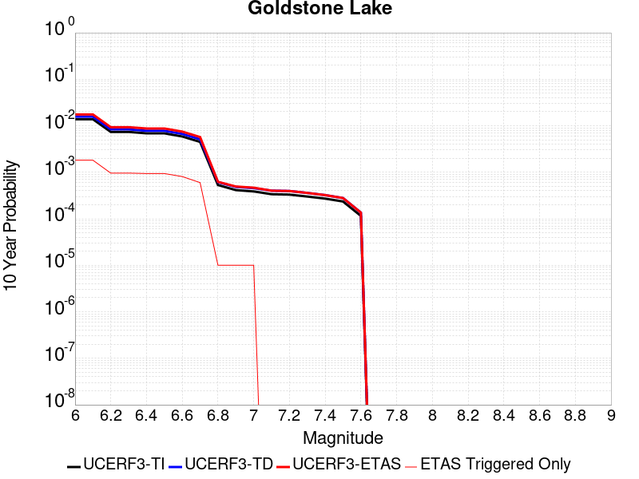 |

| Magnitude | 1 wk TI Prob | 1 wk TD Prob | 1 wk ETAS Prob | 1 wk ETAS/TD Gain | 1 wk ETAS Triggered Only | 1 mo TI Prob | 1 mo TD Prob | 1 mo ETAS Prob | 1 mo ETAS/TD Gain | 1 mo ETAS Triggered Only | 1 yr TI Prob | 1 yr TD Prob | 1 yr ETAS Prob | 1 yr ETAS/TD Gain | 1 yr ETAS Triggered Only | 10 yr TI Prob | 10 yr TD Prob | 10 yr ETAS Prob | 10 yr ETAS/TD Gain | 10 yr ETAS Triggered Only |
|-----|-----|-----|-----|-----|-----|-----|-----|-----|-----|-----|-----|-----|-----|-----|-----|-----|-----|-----|-----|-----|
| 6.0 | 2.671352E-5 | 3.0380395E-5 | 3.0380395E-5 | 1.0 | 0.0 | 1.1448149E-4 | 1.301963E-4 | 3.030133E-4 | 2.3273573 | 1.728395E-4 | 0.001392921 | 0.0015841839 | 0.0024716647 | 1.5602132 | 8.888889E-4 | 0.013842222 | 0.015748413 | 0.01774122 | 1.1265401 | 0.0020246913 |
| 6.1 | 2.671352E-5 | 3.0380395E-5 | 3.0380395E-5 | 1.0 | 0.0 | 1.1448149E-4 | 1.301963E-4 | 3.030133E-4 | 2.3273573 | 1.728395E-4 | 0.001392921 | 0.0015841839 | 0.0024716647 | 1.5602132 | 8.888889E-4 | 0.013842222 | 0.015748413 | 0.01774122 | 1.1265401 | 0.0020246913 |
| 6.2 | 1.4197047E-5 | 1.6098415E-5 | 1.6098415E-5 | 1.0 | 0.0 | 6.0843064E-5 | 6.899193E-5 | 1.6775055E-4 | 2.4314516 | 9.8765435E-5 | 7.4051257E-4 | 8.397518E-4 | 0.0013331643 | 1.5875695 | 4.9382716E-4 | 0.007380498 | 0.0083754845 | 0.009403836 | 1.1227812 | 0.001037037 |
| 6.3 | 1.4197047E-5 | 1.6098415E-5 | 1.6098415E-5 | 1.0 | 0.0 | 6.0843064E-5 | 6.899193E-5 | 1.6775055E-4 | 2.4314516 | 9.8765435E-5 | 7.4051257E-4 | 8.397518E-4 | 0.0013331643 | 1.5875695 | 4.9382716E-4 | 0.007380498 | 0.0083754845 | 0.009403836 | 1.1227812 | 0.001037037 |
| 6.4 | 1.3238931E-5 | 1.5010473E-5 | 1.5010473E-5 | 1.0 | 0.0 | 5.6737044E-5 | 6.4329564E-5 | 1.6308864E-4 | 2.5352051 | 9.8765435E-5 | 6.9055456E-4 | 7.8302907E-4 | 0.0012517975 | 1.5986603 | 4.691358E-4 | 0.006884126 | 0.007812329 | 0.008816766 | 1.1285708 | 0.0010123457 |
| 6.5 | 1.3238931E-5 | 1.5010473E-5 | 1.5010473E-5 | 1.0 | 0.0 | 5.6737044E-5 | 6.4329564E-5 | 1.6308864E-4 | 2.5352051 | 9.8765435E-5 | 6.9055456E-4 | 7.8302907E-4 | 0.0012517975 | 1.5986603 | 4.691358E-4 | 0.006884126 | 0.007812329 | 0.008816766 | 1.1285708 | 0.0010123457 |
| 6.6 | 1.1328278E-5 | 1.2856889E-5 | 1.2856889E-5 | 1.0 | 0.0 | 4.8548856E-5 | 5.510033E-5 | 1.2917032E-4 | 2.344275 | 7.407407E-5 | 5.90922E-4 | 6.707357E-4 | 0.0010161828 | 1.5150272 | 3.45679E-4 | 0.0058935313 | 0.0066965045 | 0.007530389 | 1.1245253 | 8.3950616E-4 |
| 6.7 | 8.651175E-6 | 9.825863E-6 | 9.825863E-6 | 1.0 | 0.0 | 3.707594E-5 | 4.211067E-5 | 9.149131E-5 | 2.1726394 | 4.9382717E-5 | 4.5130608E-4 | 5.1266735E-4 | 7.594544E-4 | 1.4813784 | 2.4691358E-4 | 0.0045039062 | 0.005123728 | 0.0056887195 | 1.1102695 | 5.6790124E-4 |
| 6.8 | 1.0215377E-6 | 1.1755423E-6 | 1.1755423E-6 | 1.0 | 0.0 | 4.378012E-6 | 5.038029E-6 | 5.038029E-6 | 1.0 | 0.0 | 5.3300988E-5 | 6.133639E-5 | 6.133639E-5 | 1.0 | 0.0 | 5.3288206E-4 | 6.132059E-4 | 6.378821E-4 | 1.0402414 | 2.4691359E-5 |
| 6.9 | 7.9360774E-7 | 9.283895E-7 | 9.283895E-7 | 1.0 | 0.0 | 3.4011714E-6 | 3.9788065E-6 | 3.9788065E-6 | 1.0 | 0.0 | 4.1408475E-5 | 4.8440965E-5 | 4.8440965E-5 | 1.0 | 0.0 | 4.140076E-4 | 4.8431105E-4 | 5.0899043E-4 | 1.0509578 | 2.4691359E-5 |
| 7.0 | 7.4382757E-7 | 8.747784E-7 | 8.747784E-7 | 1.0 | 0.0 | 3.1878285E-6 | 3.7490452E-6 | 3.7490452E-6 | 1.0 | 0.0 | 3.8811122E-5 | 4.5643737E-5 | 4.5643737E-5 | 1.0 | 0.0 | 3.8804344E-4 | 4.5635024E-4 | 4.8103035E-4 | 1.0540814 | 2.4691359E-5 |
| 7.1 | 6.4709513E-7 | 7.711677E-7 | 7.711677E-7 | 1.0 | 0.0 | 2.773262E-6 | 3.3050005E-6 | 3.3050005E-6 | 1.0 | 0.0 | 3.376394E-5 | 4.02377E-5 | 4.02377E-5 | 1.0 | 0.0 | 3.375881E-4 | 4.023101E-4 | 4.023101E-4 | 1.0 | 0.0 |
| 7.2 | 6.356704E-7 | 7.5887266E-7 | 7.5887266E-7 | 1.0 | 0.0 | 2.7242988E-6 | 3.2523078E-6 | 3.2523078E-6 | 1.0 | 0.0 | 3.3167835E-5 | 3.9596187E-5 | 3.9596187E-5 | 1.0 | 0.0 | 3.3162883E-4 | 3.9589725E-4 | 3.9589725E-4 | 1.0 | 0.0 |
| 7.3 | 5.7695723E-7 | 6.8969035E-7 | 6.8969035E-7 | 1.0 | 0.0 | 2.4726714E-6 | 2.9558128E-6 | 2.9558128E-6 | 1.0 | 0.0 | 3.0104358E-5 | 3.5986486E-5 | 3.5986486E-5 | 1.0 | 0.0 | 3.0100282E-4 | 3.5981231E-4 | 3.5981231E-4 | 1.0 | 0.0 |
| 7.4 | 5.209647E-7 | 6.1937993E-7 | 6.1937993E-7 | 1.0 | 0.0 | 2.232704E-6 | 2.654483E-6 | 2.654483E-6 | 1.0 | 0.0 | 2.718283E-5 | 3.231791E-5 | 3.231791E-5 | 1.0 | 0.0 | 2.7179506E-4 | 3.2313765E-4 | 3.2313765E-4 | 1.0 | 0.0 |
| 7.5 | 4.512955E-7 | 5.3491203E-7 | 5.3491203E-7 | 1.0 | 0.0 | 1.934122E-6 | 2.2924785E-6 | 2.2924785E-6 | 1.0 | 0.0 | 2.3547682E-5 | 2.791062E-5 | 2.791062E-5 | 1.0 | 0.0 | 2.3545188E-4 | 2.7907646E-4 | 2.7907646E-4 | 1.0 | 0.0 |
| 7.6 | 2.21172E-7 | 2.604064E-7 | 2.604064E-7 | 1.0 | 0.0 | 9.478797E-7 | 1.1160272E-6 | 1.1160272E-6 | 1.0 | 0.0 | 1.1540374E-5 | 1.3587575E-5 | 1.3587575E-5 | 1.0 | 0.0 | 1.1539775E-4 | 1.3587026E-4 | 1.3587026E-4 | 1.0 | 0.0 |

## So Sierra Nevada
*[(top)](#table-of-contents)*

| 1 Week | 1 Month | 1 Year | 10 Year |
|-----|-----|-----|-----|
|  |  |  |  |

| Magnitude | 1 wk TI Prob | 1 wk TD Prob | 1 wk ETAS Prob | 1 wk ETAS/TD Gain | 1 wk ETAS Triggered Only | 1 mo TI Prob | 1 mo TD Prob | 1 mo ETAS Prob | 1 mo ETAS/TD Gain | 1 mo ETAS Triggered Only | 1 yr TI Prob | 1 yr TD Prob | 1 yr ETAS Prob | 1 yr ETAS/TD Gain | 1 yr ETAS Triggered Only | 10 yr TI Prob | 10 yr TD Prob | 10 yr ETAS Prob | 10 yr ETAS/TD Gain | 10 yr ETAS Triggered Only |
|-----|-----|-----|-----|-----|-----|-----|-----|-----|-----|-----|-----|-----|-----|-----|-----|-----|-----|-----|-----|-----|
| 6.0 | 1.15488665E-5 | 1.1080275E-5 | 1.1080275E-5 | 1.0 | 0.0 | 4.9494203E-5 | 4.74861E-5 | 1.4624685E-4 | 3.079782 | 9.8765435E-5 | 6.024253E-4 | 5.7800265E-4 | 0.0013923466 | 2.4088929 | 8.148148E-4 | 0.006007948 | 0.0057662623 | 0.007803828 | 1.3533598 | 0.0020493828 |
| 6.1 | 1.15488665E-5 | 1.1080275E-5 | 1.1080275E-5 | 1.0 | 0.0 | 4.9494203E-5 | 4.74861E-5 | 1.4624685E-4 | 3.079782 | 9.8765435E-5 | 6.024253E-4 | 5.7800265E-4 | 0.0013923466 | 2.4088929 | 8.148148E-4 | 0.006007948 | 0.0057662623 | 0.007803828 | 1.3533598 | 0.0020493828 |
| 6.2 | 1.15488665E-5 | 1.1080275E-5 | 1.1080275E-5 | 1.0 | 0.0 | 4.9494203E-5 | 4.74861E-5 | 1.4624685E-4 | 3.079782 | 9.8765435E-5 | 6.024253E-4 | 5.7800265E-4 | 0.0013923466 | 2.4088929 | 8.148148E-4 | 0.006007948 | 0.0057662623 | 0.007803828 | 1.3533598 | 0.0020493828 |
| 6.3 | 1.15488665E-5 | 1.1080275E-5 | 1.1080275E-5 | 1.0 | 0.0 | 4.9494203E-5 | 4.74861E-5 | 1.4624685E-4 | 3.079782 | 9.8765435E-5 | 6.024253E-4 | 5.7800265E-4 | 0.0013923466 | 2.4088929 | 8.148148E-4 | 0.006007948 | 0.0057662623 | 0.007803828 | 1.3533598 | 0.0020493828 |
| 6.4 | 1.15488665E-5 | 1.1080275E-5 | 1.1080275E-5 | 1.0 | 0.0 | 4.9494203E-5 | 4.74861E-5 | 1.4624685E-4 | 3.079782 | 9.8765435E-5 | 6.024253E-4 | 5.7800265E-4 | 0.0013923466 | 2.4088929 | 8.148148E-4 | 0.006007948 | 0.0057662623 | 0.007803828 | 1.3533598 | 0.0020493828 |
| 6.5 | 1.15488665E-5 | 1.1080275E-5 | 1.1080275E-5 | 1.0 | 0.0 | 4.9494203E-5 | 4.74861E-5 | 1.4624685E-4 | 3.079782 | 9.8765435E-5 | 6.024253E-4 | 5.7800265E-4 | 0.0013923466 | 2.4088929 | 8.148148E-4 | 0.006007948 | 0.0057662623 | 0.007803828 | 1.3533598 | 0.0020493828 |
| 6.6 | 7.587044E-6 | 6.9360653E-6 | 6.9360653E-6 | 1.0 | 0.0 | 3.2515498E-5 | 2.9725672E-5 | 1.03797545E-4 | 3.4918485 | 7.407407E-5 | 3.9580427E-4 | 3.6185287E-4 | 8.308189E-4 | 2.296013 | 4.691358E-4 | 0.003951 | 0.0036129286 | 0.004646219 | 1.285998 | 0.001037037 |
| 6.7 | 7.587044E-6 | 6.9360653E-6 | 6.9360653E-6 | 1.0 | 0.0 | 3.2515498E-5 | 2.9725672E-5 | 1.03797545E-4 | 3.4918485 | 7.407407E-5 | 3.9580427E-4 | 3.6185287E-4 | 8.308189E-4 | 2.296013 | 4.691358E-4 | 0.003951 | 0.0036129286 | 0.004646219 | 1.285998 | 0.001037037 |
| 6.8 | 5.9026956E-6 | 5.1797433E-6 | 5.1797433E-6 | 1.0 | 0.0 | 2.5297022E-5 | 2.2198717E-5 | 9.627115E-5 | 4.3367887 | 7.407407E-5 | 3.0794772E-4 | 2.70237E-4 | 6.898767E-4 | 2.5528576 | 4.1975308E-4 | 0.0030752132 | 0.0026992003 | 0.0035610653 | 1.3193038 | 8.6419756E-4 |
| 6.9 | 5.0118915E-6 | 4.252736E-6 | 4.252736E-6 | 1.0 | 0.0 | 2.1479358E-5 | 1.8225888E-5 | 4.2916796E-5 | 2.3547163 | 2.4691359E-5 | 2.614798E-4 | 2.2187832E-4 | 5.181089E-4 | 2.3351038 | 2.962963E-4 | 0.0026117235 | 0.0022166404 | 0.0028818294 | 1.3000888 | 6.6666666E-4 |
| 7.0 | 4.4924795E-6 | 3.7142067E-6 | 3.7142067E-6 | 1.0 | 0.0 | 1.925334E-5 | 1.5917936E-5 | 4.0608902E-5 | 2.551141 | 2.4691359E-5 | 2.3438422E-4 | 1.9378426E-4 | 4.4065E-4 | 2.2739203 | 2.4691358E-4 | 0.0023413717 | 0.0019362158 | 0.0025030174 | 1.2927368 | 5.6790124E-4 |
| 7.1 | 3.9118436E-6 | 3.1122413E-6 | 3.1122413E-6 | 1.0 | 0.0 | 1.6764936E-5 | 1.3338113E-5 | 3.8029142E-5 | 2.8511636 | 2.4691359E-5 | 2.0409399E-4 | 1.6237999E-4 | 2.8581673E-4 | 1.7601721 | 1.2345679E-4 | 0.0020390663 | 0.0016226694 | 0.0018938336 | 1.16711 | 2.7160495E-4 |
| 7.2 | 3.4200818E-6 | 2.6056978E-6 | 2.6056978E-6 | 1.0 | 0.0 | 1.4657411E-5 | 1.1167231E-5 | 3.5858313E-5 | 3.21103 | 2.4691359E-5 | 1.7843937E-4 | 1.3595306E-4 | 2.3470506E-4 | 1.7263684 | 9.8765435E-5 | 0.0017829615 | 0.0013587485 | 0.0015806688 | 1.163327 | 2.2222222E-4 |
| 7.3 | 2.6593618E-6 | 1.8286328E-6 | 1.8286328E-6 | 1.0 | 0.0 | 1.13972155E-5 | 7.836976E-6 | 3.252814E-5 | 4.1505985 | 2.4691359E-5 | 1.3875226E-4 | 9.54113E-5 | 1.9416731E-4 | 2.0350556 | 9.8765435E-5 | 0.0013866565 | 9.5373223E-4 | 0.0011510748 | 1.206916 | 1.9753087E-4 |
| 7.4 | 2.2577992E-6 | 1.4366318E-6 | 1.4366318E-6 | 1.0 | 0.0 | 9.676246E-6 | 6.1569804E-6 | 3.0848187E-5 | 5.010278 | 2.4691359E-5 | 1.1780193E-4 | 7.4958916E-5 | 1.7371694E-4 | 2.3174956 | 9.8765435E-5 | 0.001177395 | 7.4936135E-4 | 9.4674417E-4 | 1.2634014 | 1.9753087E-4 |
| 7.5 | 1.489319E-6 | 7.355458E-7 | 7.355458E-7 | 1.0 | 0.0 | 6.3827797E-6 | 3.1523355E-6 | 3.1523355E-6 | 1.0 | 0.0 | 7.770758E-5 | 3.837901E-5 | 6.306942E-5 | 1.643331 | 2.4691359E-5 | 7.7680405E-4 | 3.8372425E-4 | 4.0840614E-4 | 1.0643219 | 2.4691359E-5 |
| 7.6 | 1.0680322E-6 | 4.660781E-7 | 4.660781E-7 | 1.0 | 0.0 | 4.577273E-6 | 1.997476E-6 | 1.997476E-6 | 1.0 | 0.0 | 5.5726876E-5 | 2.4319E-5 | 4.900976E-5 | 2.0152867 | 2.4691359E-5 | 5.5712904E-4 | 2.4316367E-4 | 2.67849E-4 | 1.1015174 | 2.4691359E-5 |
| 7.7 | 5.509146E-7 | 1.5586197E-7 | 1.5586197E-7 | 1.0 | 0.0 | 2.3610605E-6 | 6.679797E-7 | 6.679797E-7 | 1.0 | 0.0 | 2.8745531E-5 | 8.132623E-6 | 8.132623E-6 | 1.0 | 0.0 | 2.8741814E-4 | 8.132337E-5 | 8.132337E-5 | 1.0 | 0.0 |

## Coyote Canyon
*[(top)](#table-of-contents)*

| 1 Week | 1 Month | 1 Year | 10 Year |
|-----|-----|-----|-----|
|  |  |  |  |

| Magnitude | 1 wk TI Prob | 1 wk TD Prob | 1 wk ETAS Prob | 1 wk ETAS/TD Gain | 1 wk ETAS Triggered Only | 1 mo TI Prob | 1 mo TD Prob | 1 mo ETAS Prob | 1 mo ETAS/TD Gain | 1 mo ETAS Triggered Only | 1 yr TI Prob | 1 yr TD Prob | 1 yr ETAS Prob | 1 yr ETAS/TD Gain | 1 yr ETAS Triggered Only | 10 yr TI Prob | 10 yr TD Prob | 10 yr ETAS Prob | 10 yr ETAS/TD Gain | 10 yr ETAS Triggered Only |
|-----|-----|-----|-----|-----|-----|-----|-----|-----|-----|-----|-----|-----|-----|-----|-----|-----|-----|-----|-----|-----|
| 6.0 | 3.5090034E-5 | 4.0370767E-5 | 4.0370767E-5 | 1.0 | 0.0 | 1.503772E-4 | 1.7300747E-4 | 1.9769456E-4 | 1.1426938 | 2.4691359E-5 | 0.0018293047 | 0.002104588 | 0.002597376 | 1.2341493 | 4.9382716E-4 | 0.018143194 | 0.020872502 | 0.022178005 | 1.0625466 | 0.0013333333 |
| 6.1 | 3.5090034E-5 | 4.0370767E-5 | 4.0370767E-5 | 1.0 | 0.0 | 1.503772E-4 | 1.7300747E-4 | 1.9769456E-4 | 1.1426938 | 2.4691359E-5 | 0.0018293047 | 0.002104588 | 0.002597376 | 1.2341493 | 4.9382716E-4 | 0.018143194 | 0.020872502 | 0.022178005 | 1.0625466 | 0.0013333333 |
| 6.2 | 1.841879E-5 | 2.1062999E-5 | 2.1062999E-5 | 1.0 | 0.0 | 7.8935285E-5 | 9.0267444E-5 | 9.0267444E-5 | 1.0 | 0.0 | 9.606133E-4 | 0.001098554 | 0.0013205322 | 1.2020639 | 2.2222222E-4 | 0.0095647145 | 0.010941325 | 0.011478591 | 1.0491043 | 5.432099E-4 |
| 6.3 | 1.841879E-5 | 2.1062999E-5 | 2.1062999E-5 | 1.0 | 0.0 | 7.8935285E-5 | 9.0267444E-5 | 9.0267444E-5 | 1.0 | 0.0 | 9.606133E-4 | 0.001098554 | 0.0013205322 | 1.2020639 | 2.2222222E-4 | 0.0095647145 | 0.010941325 | 0.011478591 | 1.0491043 | 5.432099E-4 |
| 6.4 | 1.712201E-5 | 1.9568175E-5 | 1.9568175E-5 | 1.0 | 0.0 | 7.337798E-5 | 8.386148E-5 | 8.386148E-5 | 1.0 | 0.0 | 8.930107E-4 | 0.0010206358 | 0.001193299 | 1.169172 | 1.728395E-4 | 0.008894307 | 0.010169405 | 0.01065821 | 1.0480663 | 4.9382716E-4 |
| 6.5 | 1.4744935E-5 | 1.6839507E-5 | 1.6839507E-5 | 1.0 | 0.0 | 6.3191044E-5 | 7.216785E-5 | 7.216785E-5 | 1.0 | 0.0 | 7.6907943E-4 | 8.783829E-4 | 0.0010510705 | 1.1965973 | 1.728395E-4 | 0.007664232 | 0.008758309 | 0.009198861 | 1.0503011 | 4.4444445E-4 |
| 6.6 | 1.2017839E-5 | 1.3726158E-5 | 1.3726158E-5 | 1.0 | 0.0 | 5.150401E-5 | 5.8825564E-5 | 5.8825564E-5 | 1.0 | 0.0 | 6.268809E-4 | 7.1605446E-4 | 8.887702E-4 | 1.2412047 | 1.728395E-4 | 0.0062511545 | 0.007146168 | 0.007489377 | 1.0480269 | 3.45679E-4 |
| 6.7 | 1.00956095E-5 | 1.15352605E-5 | 1.15352605E-5 | 1.0 | 0.0 | 4.326618E-5 | 4.9436385E-5 | 4.9436385E-5 | 1.0 | 0.0 | 5.266384E-4 | 6.018088E-4 | 7.0051476E-4 | 1.1640155 | 9.8765435E-5 | 0.005253921 | 0.00601032 | 0.0062312065 | 1.0367513 | 2.2222222E-4 |

## San Andreas (Mojave S)
*[(top)](#table-of-contents)*

| 1 Week | 1 Month | 1 Year | 10 Year |
|-----|-----|-----|-----|
| 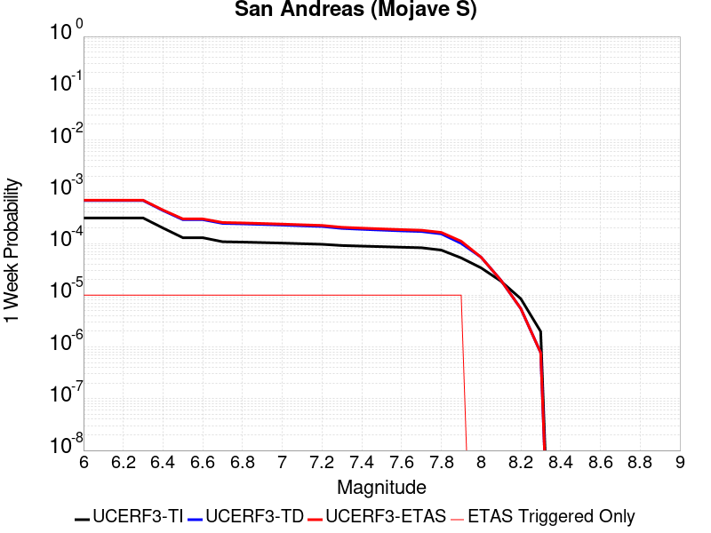 |  |  |  |

| Magnitude | 1 wk TI Prob | 1 wk TD Prob | 1 wk ETAS Prob | 1 wk ETAS/TD Gain | 1 wk ETAS Triggered Only | 1 mo TI Prob | 1 mo TD Prob | 1 mo ETAS Prob | 1 mo ETAS/TD Gain | 1 mo ETAS Triggered Only | 1 yr TI Prob | 1 yr TD Prob | 1 yr ETAS Prob | 1 yr ETAS/TD Gain | 1 yr ETAS Triggered Only | 10 yr TI Prob | 10 yr TD Prob | 10 yr ETAS Prob | 10 yr ETAS/TD Gain | 10 yr ETAS Triggered Only |
|-----|-----|-----|-----|-----|-----|-----|-----|-----|-----|-----|-----|-----|-----|-----|-----|-----|-----|-----|-----|-----|
| 6.0 | 3.1064058E-4 | 6.7538634E-4 | 6.7538634E-4 | 1.0 | 0.0 | 0.0013306376 | 0.0028914304 | 0.0029652903 | 1.0255444 | 7.407407E-5 | 0.016080605 | 0.03466114 | 0.035018675 | 1.0103151 | 3.7037037E-4 | 0.1496549 | 0.28687167 | 0.2877697 | 1.0031303 | 0.0012592593 |
| 6.1 | 3.1064058E-4 | 6.7538634E-4 | 6.7538634E-4 | 1.0 | 0.0 | 0.0013306376 | 0.0028914304 | 0.0029652903 | 1.0255444 | 7.407407E-5 | 0.016080605 | 0.03466114 | 0.035018675 | 1.0103151 | 3.7037037E-4 | 0.1496549 | 0.28687167 | 0.2877697 | 1.0031303 | 0.0012592593 |
| 6.2 | 3.1064058E-4 | 6.7538634E-4 | 6.7538634E-4 | 1.0 | 0.0 | 0.0013306376 | 0.0028914304 | 0.0029652903 | 1.0255444 | 7.407407E-5 | 0.016080605 | 0.03466114 | 0.035018675 | 1.0103151 | 3.7037037E-4 | 0.1496549 | 0.28687167 | 0.2877697 | 1.0031303 | 0.0012592593 |
| 6.3 | 3.1064058E-4 | 6.7538634E-4 | 6.7538634E-4 | 1.0 | 0.0 | 0.0013306376 | 0.0028914304 | 0.0029652903 | 1.0255444 | 7.407407E-5 | 0.016080605 | 0.03466114 | 0.035018675 | 1.0103151 | 3.7037037E-4 | 0.1496549 | 0.28687167 | 0.2877697 | 1.0031303 | 0.0012592593 |
| 6.4 | 1.9872203E-4 | 4.3253382E-4 | 4.3253382E-4 | 1.0 | 0.0 | 8.5138786E-4 | 0.0018524277 | 0.0019263646 | 1.0399135 | 7.407407E-5 | 0.010316478 | 0.022326224 | 0.022688324 | 1.0162187 | 3.7037037E-4 | 0.098504856 | 0.19728218 | 0.19819391 | 1.0046214 | 0.0011358025 |
| 6.5 | 1.291105E-4 | 2.8822906E-4 | 2.8822906E-4 | 1.0 | 0.0 | 5.5321335E-4 | 0.0012346853 | 0.0012840071 | 1.0399468 | 4.9382717E-5 | 0.006714592 | 0.014929512 | 0.01527003 | 1.0228084 | 3.45679E-4 | 0.065152965 | 0.13832536 | 0.13921896 | 1.0064601 | 0.001037037 |
| 6.6 | 1.291105E-4 | 2.8822906E-4 | 2.8822906E-4 | 1.0 | 0.0 | 5.5321335E-4 | 0.0012346853 | 0.0012840071 | 1.0399468 | 4.9382717E-5 | 0.006714592 | 0.014929512 | 0.01527003 | 1.0228084 | 3.45679E-4 | 0.065152965 | 0.13832536 | 0.13921896 | 1.0064601 | 0.001037037 |
| 6.7 | 1.08001186E-4 | 2.4403051E-4 | 2.4403051E-4 | 1.0 | 0.0 | 4.6278012E-4 | 0.0010454265 | 0.0010947576 | 1.0471876 | 4.9382717E-5 | 0.0056198016 | 0.012654087 | 0.012971013 | 1.0250453 | 3.2098766E-4 | 0.054797906 | 0.11947057 | 0.12034023 | 1.0072793 | 9.876543E-4 |
| 6.8 | 1.0624356E-4 | 2.3920518E-4 | 2.3920518E-4 | 1.0 | 0.0 | 4.5525006E-4 | 0.0010247629 | 0.0010740949 | 1.04814 | 4.9382717E-5 | 0.0055285925 | 0.012405391 | 0.012722396 | 1.0255538 | 3.2098766E-4 | 0.053930566 | 0.11741964 | 0.118291326 | 1.0074236 | 9.876543E-4 |
| 6.9 | 1.0393785E-4 | 2.32906E-4 | 2.32906E-4 | 1.0 | 0.0 | 4.4537184E-4 | 9.977872E-4 | 0.0010471207 | 1.0494429 | 4.9382717E-5 | 0.0054089287 | 0.012080644 | 0.012397754 | 1.0262494 | 3.2098766E-4 | 0.05279156 | 0.11471701 | 0.115591355 | 1.0076219 | 9.876543E-4 |
| 7.0 | 1.0155622E-4 | 2.2659826E-4 | 2.2659826E-4 | 1.0 | 0.0 | 4.3516833E-4 | 9.7077433E-4 | 0.0010201092 | 1.05082 | 4.9382717E-5 | 0.005285311 | 0.011755354 | 0.012072568 | 1.0269847 | 3.2098766E-4 | 0.05161361 | 0.111976855 | 0.112853914 | 1.0078325 | 9.876543E-4 |
| 7.1 | 9.885595E-5 | 2.1947875E-4 | 2.1947875E-4 | 1.0 | 0.0 | 4.2359953E-4 | 9.402845E-4 | 9.896208E-4 | 1.0524695 | 4.9382717E-5 | 0.0051451353 | 0.011388074 | 0.011680995 | 1.0257218 | 2.962963E-4 | 0.05027629 | 0.10886101 | 0.10969713 | 1.0076808 | 9.382716E-4 |
| 7.2 | 9.6411415E-5 | 2.131053E-4 | 2.131053E-4 | 1.0 | 0.0 | 4.1312634E-4 | 9.129891E-4 | 9.623267E-4 | 1.0540397 | 4.9382717E-5 | 0.005018219 | 0.011059172 | 0.011352192 | 1.0264956 | 2.962963E-4 | 0.049064007 | 0.10605039 | 0.10688915 | 1.0079092 | 9.382716E-4 |
| 7.3 | 9.1180635E-5 | 1.9537064E-4 | 1.9537064E-4 | 1.0 | 0.0 | 3.907156E-4 | 8.3703414E-4 | 8.8637555E-4 | 1.0589479 | 4.9382717E-5 | 0.004746591 | 0.010143385 | 0.010436676 | 1.0289145 | 2.962963E-4 | 0.046464786 | 0.09823892 | 0.09908502 | 1.0086126 | 9.382716E-4 |
| 7.4 | 8.887388E-5 | 1.8784897E-4 | 1.8784897E-4 | 1.0 | 0.0 | 3.8083247E-4 | 8.048187E-4 | 8.541617E-4 | 1.0613095 | 4.9382717E-5 | 0.0046267817 | 0.009754742 | 0.010048148 | 1.0300783 | 2.962963E-4 | 0.045316286 | 0.09487182 | 0.09572107 | 1.0089517 | 9.382716E-4 |
| 7.5 | 8.6750515E-5 | 1.8115775E-4 | 1.8115775E-4 | 1.0 | 0.0 | 3.7173493E-4 | 7.7615946E-4 | 8.2550384E-4 | 1.063575 | 4.9382717E-5 | 0.004516484 | 0.009408884 | 0.009702392 | 1.0311948 | 2.962963E-4 | 0.04425787 | 0.09183367 | 0.092685774 | 1.0092788 | 9.382716E-4 |
| 7.6 | 8.453092E-5 | 1.750256E-4 | 1.750256E-4 | 1.0 | 0.0 | 3.6222505E-4 | 7.498942E-4 | 7.9923985E-4 | 1.0658035 | 4.9382717E-5 | 0.0044011753 | 0.009091817 | 0.00938542 | 1.0322931 | 2.962963E-4 | 0.04315024 | 0.088990174 | 0.08984495 | 1.0096053 | 9.382716E-4 |
| 7.7 | 8.259102E-5 | 1.7023997E-4 | 1.7023997E-4 | 1.0 | 0.0 | 3.539135E-4 | 7.2939595E-4 | 7.787426E-4 | 1.0676543 | 4.9382717E-5 | 0.004300386 | 0.008844306 | 0.009137982 | 1.033205 | 2.962963E-4 | 0.042181134 | 0.08673861 | 0.0875955 | 1.009879 | 9.382716E-4 |
| 7.8 | 7.444844E-5 | 1.5340719E-4 | 1.5340719E-4 | 1.0 | 0.0 | 3.1902574E-4 | 6.572938E-4 | 7.0664403E-4 | 1.075081 | 4.9382717E-5 | 0.0038772223 | 0.007973238 | 0.008242677 | 1.033793 | 2.7160495E-4 | 0.03810269 | 0.07854723 | 0.07916153 | 1.0078208 | 6.6666666E-4 |
| 7.9 | 5.2586525E-5 | 1.0045548E-4 | 1.0045548E-4 | 1.0 | 0.0 | 2.2535135E-4 | 4.3045246E-4 | 4.5513318E-4 | 1.0573367 | 2.4691359E-5 | 0.0027402006 | 0.0052281762 | 0.005449237 | 1.0422825 | 2.2222222E-4 | 0.027066574 | 0.052382782 | 0.052850742 | 1.0089334 | 4.9382716E-4 |
| 8.0 | 3.379877E-5 | 5.430089E-5 | 5.430089E-5 | 1.0 | 0.0 | 1.4484383E-4 | 2.3269735E-4 | 2.5738296E-4 | 1.1060846 | 2.4691359E-5 | 0.0017620471 | 0.0028294115 | 0.002903276 | 1.026106 | 7.407407E-5 | 0.017481409 | 0.028946057 | 0.02913787 | 1.0066266 | 1.9753087E-4 |
| 8.1 | 1.8668277E-5 | 1.941804E-5 | 1.941804E-5 | 1.0 | 0.0 | 8.000444E-5 | 8.321752E-5 | 8.321752E-5 | 1.0 | 0.0 | 9.736188E-4 | 0.001012703 | 0.0010373694 | 1.024357 | 2.4691359E-5 | 0.009693642 | 0.010855786 | 0.0108802095 | 1.0022498 | 2.4691359E-5 |
| 8.2 | 8.541571E-6 | 5.5025394E-6 | 5.5025394E-6 | 1.0 | 0.0 | 3.660622E-5 | 2.3582099E-5 | 2.3582099E-5 | 1.0 | 0.0 | 4.455896E-4 | 2.870743E-4 | 2.870743E-4 | 1.0 | 0.0 | 0.0044469717 | 0.0032636335 | 0.0032636335 | 1.0 | 0.0 |
| 8.3 | 1.983087E-6 | 7.731745E-7 | 7.731745E-7 | 1.0 | 0.0 | 8.498917E-6 | 3.313601E-6 | 3.313601E-6 | 1.0 | 0.0 | 1.034694E-4 | 4.0342362E-5 | 4.0342362E-5 | 1.0 | 0.0 | 0.0010342124 | 4.7608858E-4 | 4.7608858E-4 | 1.0 | 0.0 |

## Death Valley (So)
*[(top)](#table-of-contents)*

| 1 Week | 1 Month | 1 Year | 10 Year |
|-----|-----|-----|-----|
|  |  |  |  |

| Magnitude | 1 wk TI Prob | 1 wk TD Prob | 1 wk ETAS Prob | 1 wk ETAS/TD Gain | 1 wk ETAS Triggered Only | 1 mo TI Prob | 1 mo TD Prob | 1 mo ETAS Prob | 1 mo ETAS/TD Gain | 1 mo ETAS Triggered Only | 1 yr TI Prob | 1 yr TD Prob | 1 yr ETAS Prob | 1 yr ETAS/TD Gain | 1 yr ETAS Triggered Only | 10 yr TI Prob | 10 yr TD Prob | 10 yr ETAS Prob | 10 yr ETAS/TD Gain | 10 yr ETAS Triggered Only |
|-----|-----|-----|-----|-----|-----|-----|-----|-----|-----|-----|-----|-----|-----|-----|-----|-----|-----|-----|-----|-----|
| 6.0 | 2.0684236E-5 | 2.5622945E-5 | 2.5622945E-5 | 1.0 | 0.0 | 8.864371E-5 | 1.098081E-4 | 1.3449675E-4 | 1.2248344 | 2.4691359E-5 | 0.0010787029 | 0.0013361105 | 0.0019525697 | 1.4613833 | 6.17284E-4 | 0.010734817 | 0.013284055 | 0.014526586 | 1.0935355 | 0.0012592593 |
| 6.1 | 2.0684236E-5 | 2.5622945E-5 | 2.5622945E-5 | 1.0 | 0.0 | 8.864371E-5 | 1.098081E-4 | 1.3449675E-4 | 1.2248344 | 2.4691359E-5 | 0.0010787029 | 0.0013361105 | 0.0019525697 | 1.4613833 | 6.17284E-4 | 0.010734817 | 0.013284055 | 0.014526586 | 1.0935355 | 0.0012592593 |
| 6.2 | 2.0684236E-5 | 2.5622945E-5 | 2.5622945E-5 | 1.0 | 0.0 | 8.864371E-5 | 1.098081E-4 | 1.3449675E-4 | 1.2248344 | 2.4691359E-5 | 0.0010787029 | 0.0013361105 | 0.0019525697 | 1.4613833 | 6.17284E-4 | 0.010734817 | 0.013284055 | 0.014526586 | 1.0935355 | 0.0012592593 |
| 6.3 | 2.0240292E-5 | 2.5122963E-5 | 2.5122963E-5 | 1.0 | 0.0 | 8.6741224E-5 | 1.0766549E-4 | 1.323542E-4 | 1.2293093 | 2.4691359E-5 | 0.0010555626 | 0.0013100558 | 0.0018772131 | 1.432926 | 5.6790124E-4 | 0.010505628 | 0.01302658 | 0.014196327 | 1.0897969 | 0.0011851852 |
| 6.4 | 2.0240292E-5 | 2.5122963E-5 | 2.5122963E-5 | 1.0 | 0.0 | 8.6741224E-5 | 1.0766549E-4 | 1.323542E-4 | 1.2293093 | 2.4691359E-5 | 0.0010555626 | 0.0013100558 | 0.0018772131 | 1.432926 | 5.6790124E-4 | 0.010505628 | 0.01302658 | 0.014196327 | 1.0897969 | 0.0011851852 |
| 6.5 | 1.9962767E-5 | 2.4812176E-5 | 2.4812176E-5 | 1.0 | 0.0 | 8.55519E-5 | 1.0633366E-4 | 1.3102239E-4 | 1.2321817 | 2.4691359E-5 | 0.0010410968 | 0.0012938601 | 0.0018610266 | 1.4383522 | 5.6790124E-4 | 0.010362327 | 0.012866507 | 0.014012069 | 1.0890344 | 0.0011604938 |
| 6.6 | 1.8937297E-5 | 2.3315795E-5 | 2.3315795E-5 | 1.0 | 0.0 | 8.115732E-5 | 9.992109E-5 | 1.2460999E-4 | 1.2470839 | 2.4691359E-5 | 9.876423E-4 | 0.0012158749 | 0.0017830856 | 1.4665042 | 5.6790124E-4 | 0.009832645 | 0.012095276 | 0.013168556 | 1.0887353 | 0.0010864198 |
| 6.7 | 1.8621096E-5 | 2.2916385E-5 | 2.2916385E-5 | 1.0 | 0.0 | 7.980225E-5 | 9.820946E-5 | 1.2289839E-4 | 1.2513906 | 2.4691359E-5 | 9.711593E-4 | 0.0011950588 | 0.0017622814 | 1.4746399 | 5.6790124E-4 | 0.009669261 | 0.0118893655 | 0.012962868 | 1.090291 | 0.0010864198 |
| 6.8 | 1.7830353E-5 | 2.1810167E-5 | 2.1810167E-5 | 1.0 | 0.0 | 7.641356E-5 | 9.346887E-5 | 1.1815792E-4 | 1.2641419 | 2.4691359E-5 | 9.29938E-4 | 0.0011374034 | 0.0016553323 | 1.4553607 | 5.185185E-4 | 0.009260561 | 0.011318663 | 0.01231955 | 1.088428 | 0.0010123457 |
| 6.9 | 1.3135183E-5 | 1.5306456E-5 | 1.5306456E-5 | 1.0 | 0.0 | 5.6292425E-5 | 6.559749E-5 | 9.028722E-5 | 1.3763824 | 2.4691359E-5 | 6.8514474E-4 | 7.983632E-4 | 0.0012177812 | 1.5253474 | 4.1975308E-4 | 0.006830362 | 0.007955958 | 0.008690806 | 1.0923644 | 7.4074074E-4 |
| 7.0 | 1.1507512E-5 | 1.31561565E-5 | 1.31561565E-5 | 1.0 | 0.0 | 4.9316975E-5 | 5.638234E-5 | 5.638234E-5 | 1.0 | 0.0 | 6.002687E-4 | 6.862446E-4 | 8.8363985E-4 | 1.2876457 | 1.9753087E-4 | 0.0059864987 | 0.0068419557 | 0.007307882 | 1.0680983 | 4.691358E-4 |
| 7.1 | 9.715903E-6 | 1.08666845E-5 | 1.08666845E-5 | 1.0 | 0.0 | 4.1638916E-5 | 4.6570698E-5 | 4.6570698E-5 | 1.0 | 0.0 | 5.068359E-4 | 5.66855E-4 | 6.4088707E-4 | 1.1306014 | 7.407407E-5 | 0.0050568148 | 0.0056545446 | 0.0058018547 | 1.0260516 | 1.4814814E-4 |
| 7.2 | 9.233269E-6 | 1.0287612E-5 | 1.0287612E-5 | 1.0 | 0.0 | 3.9570554E-5 | 4.4089044E-5 | 4.4089044E-5 | 1.0 | 0.0 | 4.81665E-4 | 5.366561E-4 | 5.6133425E-4 | 1.045985 | 2.4691359E-5 | 0.0048062233 | 0.0053540333 | 0.0054277107 | 1.0137612 | 7.407407E-5 |
| 7.3 | 8.8041315E-6 | 9.809357E-6 | 9.809357E-6 | 1.0 | 0.0 | 3.7731446E-5 | 4.2039446E-5 | 4.2039446E-5 | 1.0 | 0.0 | 4.592835E-4 | 5.1171426E-4 | 5.3639297E-4 | 1.0482275 | 2.4691359E-5 | 0.0045833546 | 0.0051057865 | 0.0051794825 | 1.0144337 | 7.407407E-5 |
| 7.4 | 8.708749E-6 | 9.708361E-6 | 9.708361E-6 | 1.0 | 0.0 | 3.7322676E-5 | 4.160662E-5 | 4.160662E-5 | 1.0 | 0.0 | 4.5430884E-4 | 5.064471E-4 | 5.3112593E-4 | 1.0487294 | 2.4691359E-5 | 0.004533812 | 0.005053356 | 0.0051270556 | 1.0145843 | 7.407407E-5 |
| 7.5 | 8.612678E-6 | 9.605997E-6 | 9.605997E-6 | 1.0 | 0.0 | 3.6910955E-5 | 4.116793E-5 | 4.116793E-5 | 1.0 | 0.0 | 4.492982E-4 | 5.011085E-4 | 5.011085E-4 | 1.0 | 0.0 | 0.004483909 | 0.005000211 | 0.005049347 | 1.0098268 | 4.9382717E-5 |
| 7.6 | 8.319024E-6 | 9.285063E-6 | 9.285063E-6 | 1.0 | 0.0 | 3.5652476E-5 | 3.9792547E-5 | 3.9792547E-5 | 1.0 | 0.0 | 4.3398244E-4 | 4.8437074E-4 | 4.8437074E-4 | 1.0 | 0.0 | 0.0043313587 | 0.004833574 | 0.004882718 | 1.0101672 | 4.9382717E-5 |
| 7.7 | 7.4718328E-6 | 8.346208E-6 | 8.346208E-6 | 1.0 | 0.0 | 3.2021748E-5 | 3.5768997E-5 | 3.5768997E-5 | 1.0 | 0.0 | 3.8979502E-4 | 4.3540457E-4 | 4.3540457E-4 | 1.0 | 0.0 | 0.00389112 | 0.0043459204 | 0.0043950886 | 1.0113137 | 4.9382717E-5 |
| 7.8 | 3.4586725E-7 | 3.6484747E-7 | 3.6484747E-7 | 1.0 | 0.0 | 1.4822873E-6 | 1.5636311E-6 | 1.5636311E-6 | 1.0 | 0.0 | 1.80467E-5 | 1.9037047E-5 | 1.9037047E-5 | 1.0 | 0.0 | 1.8045233E-4 | 1.9035459E-4 | 1.9035459E-4 | 1.0 | 0.0 |
| 7.9 | 2.5591178E-9 | 2.6697942E-9 | 2.6697942E-9 | 1.0 | 0.0 | 1.0967647E-8 | 1.14419745E-8 | 1.14419745E-8 | 1.0 | 0.0 | 1.335311E-7 | 1.3930604E-7 | 1.3930604E-7 | 1.0 | 0.0 | 1.3353102E-6 | 1.3930604E-6 | 1.3930604E-6 | 1.0 | 0.0 |

## Lenwood-Lockhart-Old Woman Springs
*[(top)](#table-of-contents)*

| 1 Week | 1 Month | 1 Year | 10 Year |
|-----|-----|-----|-----|
| 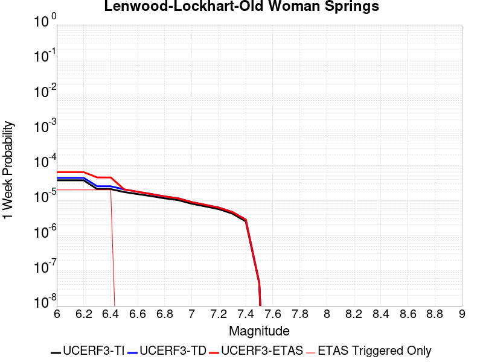 | 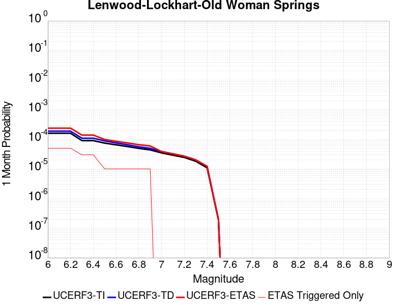 |  |  |

| Magnitude | 1 wk TI Prob | 1 wk TD Prob | 1 wk ETAS Prob | 1 wk ETAS/TD Gain | 1 wk ETAS Triggered Only | 1 mo TI Prob | 1 mo TD Prob | 1 mo ETAS Prob | 1 mo ETAS/TD Gain | 1 mo ETAS Triggered Only | 1 yr TI Prob | 1 yr TD Prob | 1 yr ETAS Prob | 1 yr ETAS/TD Gain | 1 yr ETAS Triggered Only | 10 yr TI Prob | 10 yr TD Prob | 10 yr ETAS Prob | 10 yr ETAS/TD Gain | 10 yr ETAS Triggered Only |
|-----|-----|-----|-----|-----|-----|-----|-----|-----|-----|-----|-----|-----|-----|-----|-----|-----|-----|-----|-----|-----|
| 6.0 | 3.744542E-5 | 4.396609E-5 | 6.8656365E-5 | 1.5615753 | 2.4691359E-5 | 1.604705E-4 | 1.8841347E-4 | 2.1310018E-4 | 1.1310241 | 2.4691359E-5 | 0.0019519776 | 0.002291693 | 0.0026612144 | 1.1612439 | 3.7037037E-4 | 0.019349206 | 0.022698615 | 0.023905158 | 1.053155 | 0.001234568 |
| 6.1 | 3.744542E-5 | 4.396609E-5 | 6.8656365E-5 | 1.5615753 | 2.4691359E-5 | 1.604705E-4 | 1.8841347E-4 | 2.1310018E-4 | 1.1310241 | 2.4691359E-5 | 0.0019519776 | 0.002291693 | 0.0026612144 | 1.1612439 | 3.7037037E-4 | 0.019349206 | 0.022698615 | 0.023905158 | 1.053155 | 0.001234568 |
| 6.2 | 3.744542E-5 | 4.396609E-5 | 6.8656365E-5 | 1.5615753 | 2.4691359E-5 | 1.604705E-4 | 1.8841347E-4 | 2.1310018E-4 | 1.1310241 | 2.4691359E-5 | 0.0019519776 | 0.002291693 | 0.0026612144 | 1.1612439 | 3.7037037E-4 | 0.019349206 | 0.022698615 | 0.023905158 | 1.053155 | 0.001234568 |
| 6.3 | 2.1079984E-5 | 2.5354735E-5 | 5.0045466E-5 | 1.9738115 | 2.4691359E-5 | 9.0339665E-5 | 1.08658736E-4 | 1.333474E-4 | 1.227213 | 2.4691359E-5 | 0.0010993304 | 0.0013221373 | 0.0014454308 | 1.0932533 | 1.2345679E-4 | 0.010939079 | 0.013144928 | 0.013607897 | 1.0352204 | 4.691358E-4 |
| 6.4 | 2.1079984E-5 | 2.5354735E-5 | 5.0045466E-5 | 1.9738115 | 2.4691359E-5 | 9.0339665E-5 | 1.08658736E-4 | 1.333474E-4 | 1.227213 | 2.4691359E-5 | 0.0010993304 | 0.0013221373 | 0.0014454308 | 1.0932533 | 1.2345679E-4 | 0.010939079 | 0.013144928 | 0.013607897 | 1.0352204 | 4.691358E-4 |
| 6.5 | 1.7397282E-5 | 2.0663416E-5 | 2.0663416E-5 | 1.0 | 0.0 | 7.455765E-5 | 8.855456E-5 | 8.855456E-5 | 1.0 | 0.0 | 9.073613E-4 | 0.0010776302 | 0.0011762893 | 1.0915518 | 9.8765435E-5 | 0.009036654 | 0.010725341 | 0.011140591 | 1.0387168 | 4.1975308E-4 |
| 6.6 | 1.52050325E-5 | 1.7680539E-5 | 1.7680539E-5 | 1.0 | 0.0 | 6.51628E-5 | 7.577158E-5 | 7.577158E-5 | 1.0 | 0.0 | 7.9306826E-4 | 9.221364E-4 | 0.0010208108 | 1.1070062 | 9.8765435E-5 | 0.007902439 | 0.009183963 | 0.009550932 | 1.0399575 | 3.7037037E-4 |
| 6.7 | 1.332523E-5 | 1.5264714E-5 | 1.5264714E-5 | 1.0 | 0.0 | 5.7106878E-5 | 6.541859E-5 | 6.541859E-5 | 1.0 | 0.0 | 6.950544E-4 | 7.9618616E-4 | 8.4552955E-4 | 1.0619746 | 4.9382717E-5 | 0.006928845 | 0.007933967 | 0.008129931 | 1.0246993 | 1.9753087E-4 |
| 6.8 | 1.1525329E-5 | 1.3031545E-5 | 1.3031545E-5 | 1.0 | 0.0 | 4.9393333E-5 | 5.5848304E-5 | 5.5848304E-5 | 1.0 | 0.0 | 6.011979E-4 | 6.797452E-4 | 7.044198E-4 | 1.0362997 | 2.4691359E-5 | 0.00599574 | 0.0067771124 | 0.0068752086 | 1.0144746 | 9.8765435E-5 |
| 6.9 | 1.0253909E-5 | 1.1514913E-5 | 1.1514913E-5 | 1.0 | 0.0 | 4.3944583E-5 | 4.9348713E-5 | 4.9348713E-5 | 1.0 | 0.0 | 5.3489394E-4 | 6.006586E-4 | 6.253351E-4 | 1.0410825 | 2.4691359E-5 | 0.0053360825 | 0.00599073 | 0.006088904 | 1.0163876 | 9.8765435E-5 |
| 7.0 | 8.104563E-6 | 8.991613E-6 | 8.991613E-6 | 1.0 | 0.0 | 3.4733377E-5 | 3.8534927E-5 | 3.8534927E-5 | 1.0 | 0.0 | 4.2279682E-4 | 4.6906417E-4 | 4.6906417E-4 | 1.0 | 0.0 | 0.0042199334 | 0.0046809893 | 0.004730141 | 1.0105002 | 4.9382717E-5 |
| 7.1 | 6.7986157E-6 | 7.516076E-6 | 7.516076E-6 | 1.0 | 0.0 | 2.91366E-5 | 3.221137E-5 | 3.221137E-5 | 1.0 | 0.0 | 3.5468035E-4 | 3.92105E-4 | 3.92105E-4 | 1.0 | 0.0 | 0.003541148 | 0.003914348 | 0.0039389427 | 1.0062832 | 2.4691359E-5 |
| 7.2 | 5.6893327E-6 | 6.280217E-6 | 6.280217E-6 | 1.0 | 0.0 | 2.4382627E-5 | 2.6914948E-5 | 2.6914948E-5 | 1.0 | 0.0 | 2.9681803E-4 | 3.276422E-4 | 3.276422E-4 | 1.0 | 0.0 | 0.002964219 | 0.0032717902 | 0.0032964007 | 1.0075221 | 2.4691359E-5 |
| 7.3 | 4.253348E-6 | 4.707043E-6 | 4.707043E-6 | 1.0 | 0.0 | 1.8228506E-5 | 2.0172894E-5 | 2.0172894E-5 | 1.0 | 0.0 | 2.2190946E-4 | 2.4557914E-4 | 2.4557914E-4 | 1.0 | 0.0 | 0.00221688 | 0.0024532587 | 0.0024532587 | 1.0 | 0.0 |
| 7.4 | 2.5448119E-6 | 2.8521122E-6 | 2.8521122E-6 | 1.0 | 0.0 | 1.0906291E-5 | 1.22232905E-5 | 1.22232905E-5 | 1.0 | 0.0 | 1.3277601E-4 | 1.4881004E-4 | 1.4881004E-4 | 1.0 | 0.0 | 0.001326967 | 0.0014872662 | 0.0014872662 | 1.0 | 0.0 |
| 7.5 | 4.3706837E-8 | 4.563122E-8 | 4.563122E-8 | 1.0 | 0.0 | 1.8731501E-7 | 1.9556236E-7 | 1.9556236E-7 | 1.0 | 0.0 | 2.2805577E-6 | 2.3809698E-6 | 2.3809698E-6 | 1.0 | 0.0 | 2.2805343E-5 | 2.3809498E-5 | 2.3809498E-5 | 1.0 | 0.0 |

## Nelson Lake
*[(top)](#table-of-contents)*

| 1 Week | 1 Month | 1 Year | 10 Year |
|-----|-----|-----|-----|
|  |  |  |  |

| Magnitude | 1 wk TI Prob | 1 wk TD Prob | 1 wk ETAS Prob | 1 wk ETAS/TD Gain | 1 wk ETAS Triggered Only | 1 mo TI Prob | 1 mo TD Prob | 1 mo ETAS Prob | 1 mo ETAS/TD Gain | 1 mo ETAS Triggered Only | 1 yr TI Prob | 1 yr TD Prob | 1 yr ETAS Prob | 1 yr ETAS/TD Gain | 1 yr ETAS Triggered Only | 10 yr TI Prob | 10 yr TD Prob | 10 yr ETAS Prob | 10 yr ETAS/TD Gain | 10 yr ETAS Triggered Only |
|-----|-----|-----|-----|-----|-----|-----|-----|-----|-----|-----|-----|-----|-----|-----|-----|-----|-----|-----|-----|-----|
| 6.0 | 9.913453E-6 | 1.019256E-5 | 3.4883666E-5 | 3.4224637 | 2.4691359E-5 | 4.2485535E-5 | 4.3681728E-5 | 9.3062285E-5 | 2.1304626 | 4.9382717E-5 | 5.1713863E-4 | 5.3170556E-4 | 7.784879E-4 | 1.4641334 | 2.4691358E-4 | 0.0051593683 | 0.005305362 | 0.006336897 | 1.1944326 | 0.001037037 |
| 6.1 | 9.913453E-6 | 1.019256E-5 | 3.4883666E-5 | 3.4224637 | 2.4691359E-5 | 4.2485535E-5 | 4.3681728E-5 | 9.3062285E-5 | 2.1304626 | 4.9382717E-5 | 5.1713863E-4 | 5.3170556E-4 | 7.784879E-4 | 1.4641334 | 2.4691358E-4 | 0.0051593683 | 0.005305362 | 0.006336897 | 1.1944326 | 0.001037037 |
| 6.2 | 4.5596407E-6 | 4.696463E-6 | 4.696463E-6 | 1.0 | 0.0 | 1.954117E-5 | 2.0127549E-5 | 2.0127549E-5 | 1.0 | 0.0 | 2.3788778E-4 | 2.4502663E-4 | 3.6845315E-4 | 1.5037271 | 1.2345679E-4 | 0.0023763329 | 0.0024476908 | 0.0028910474 | 1.1811326 | 4.4444445E-4 |
| 6.3 | 4.5596407E-6 | 4.696463E-6 | 4.696463E-6 | 1.0 | 0.0 | 1.954117E-5 | 2.0127549E-5 | 2.0127549E-5 | 1.0 | 0.0 | 2.3788778E-4 | 2.4502663E-4 | 3.6845315E-4 | 1.5037271 | 1.2345679E-4 | 0.0023763329 | 0.0024476908 | 0.0028910474 | 1.1811326 | 4.4444445E-4 |
| 6.4 | 3.4025713E-6 | 3.510015E-6 | 3.510015E-6 | 1.0 | 0.0 | 1.4582367E-5 | 1.504284E-5 | 1.504284E-5 | 1.0 | 0.0 | 1.7752586E-4 | 1.8313201E-4 | 2.3250568E-4 | 1.269607 | 4.9382717E-5 | 0.001773841 | 0.001829894 | 0.0021749404 | 1.1885608 | 3.45679E-4 |
| 6.5 | 2.8352947E-6 | 2.9279577E-6 | 2.9279577E-6 | 1.0 | 0.0 | 1.2151207E-5 | 1.2548334E-5 | 1.2548334E-5 | 1.0 | 0.0 | 1.479309E-4 | 1.52766E-4 | 1.7745359E-4 | 1.1616039 | 2.4691359E-5 | 0.0014783246 | 0.0015266838 | 0.0018225277 | 1.1937821 | 2.962963E-4 |
| 6.6 | 2.251518E-6 | 2.329153E-6 | 2.329153E-6 | 1.0 | 0.0 | 9.649328E-6 | 9.982049E-6 | 9.982049E-6 | 1.0 | 0.0 | 1.1747423E-4 | 1.215253E-4 | 1.4621366E-4 | 1.2031541 | 2.4691359E-5 | 0.0011741214 | 0.0012146502 | 0.0015105866 | 1.2436392 | 2.962963E-4 |
| 6.7 | 1.8911853E-6 | 1.9592146E-6 | 1.9592146E-6 | 1.0 | 0.0 | 8.105055E-6 | 8.39661E-6 | 8.39661E-6 | 1.0 | 0.0 | 9.867457E-5 | 1.0222452E-4 | 1.2691335E-4 | 1.2415158 | 2.4691359E-5 | 9.863076E-4 | 0.0010218325 | 0.0012931599 | 1.2655302 | 2.7160495E-4 |
| 6.8 | 1.4874814E-6 | 1.5438926E-6 | 1.5438926E-6 | 1.0 | 0.0 | 6.374905E-6 | 6.616669E-6 | 6.616669E-6 | 1.0 | 0.0 | 7.76117E-5 | 8.055549E-5 | 1.0524486E-4 | 1.306489 | 2.4691359E-5 | 7.75846E-4 | 8.05314E-4 | 0.0010273572 | 1.2757226 | 2.2222222E-4 |
| 6.9 | 6.835972E-7 | 7.140265E-7 | 7.140265E-7 | 1.0 | 0.0 | 2.9296991E-6 | 3.0601118E-6 | 3.0601118E-6 | 1.0 | 0.0 | 3.56685E-5 | 3.7256545E-5 | 6.194698E-5 | 1.6627141 | 2.4691359E-5 | 3.5662777E-4 | 3.7253424E-4 | 4.9594505E-4 | 1.3312737 | 1.2345679E-4 |

## San Andreas (Mojave N)
*[(top)](#table-of-contents)*

| 1 Week | 1 Month | 1 Year | 10 Year |
|-----|-----|-----|-----|
|  |  | 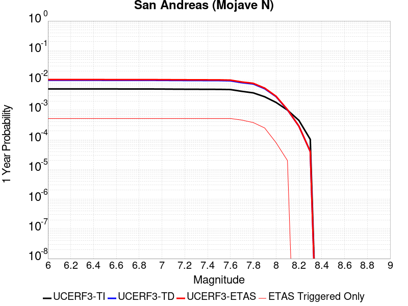 |  |

| Magnitude | 1 wk TI Prob | 1 wk TD Prob | 1 wk ETAS Prob | 1 wk ETAS/TD Gain | 1 wk ETAS Triggered Only | 1 mo TI Prob | 1 mo TD Prob | 1 mo ETAS Prob | 1 mo ETAS/TD Gain | 1 mo ETAS Triggered Only | 1 yr TI Prob | 1 yr TD Prob | 1 yr ETAS Prob | 1 yr ETAS/TD Gain | 1 yr ETAS Triggered Only | 10 yr TI Prob | 10 yr TD Prob | 10 yr ETAS Prob | 10 yr ETAS/TD Gain | 10 yr ETAS Triggered Only |
|-----|-----|-----|-----|-----|-----|-----|-----|-----|-----|-----|-----|-----|-----|-----|-----|-----|-----|-----|-----|-----|
| 6.0 | 9.877682E-5 | 1.9470563E-4 | 1.9470563E-4 | 1.0 | 0.0 | 4.2326056E-4 | 8.3418604E-4 | 9.081983E-4 | 1.0887239 | 7.407407E-5 | 0.0051410277 | 0.010109048 | 0.01042679 | 1.0314316 | 3.2098766E-4 | 0.05023708 | 0.09862055 | 0.09966659 | 1.0106068 | 0.0011604938 |
| 6.1 | 9.877682E-5 | 1.9470563E-4 | 1.9470563E-4 | 1.0 | 0.0 | 4.2326056E-4 | 8.3418604E-4 | 9.081983E-4 | 1.0887239 | 7.407407E-5 | 0.0051410277 | 0.010109048 | 0.01042679 | 1.0314316 | 3.2098766E-4 | 0.05023708 | 0.09862055 | 0.09966659 | 1.0106068 | 0.0011604938 |
| 6.2 | 9.877682E-5 | 1.9470563E-4 | 1.9470563E-4 | 1.0 | 0.0 | 4.2326056E-4 | 8.3418604E-4 | 9.081983E-4 | 1.0887239 | 7.407407E-5 | 0.0051410277 | 0.010109048 | 0.01042679 | 1.0314316 | 3.2098766E-4 | 0.05023708 | 0.09862055 | 0.09966659 | 1.0106068 | 0.0011604938 |
| 6.3 | 9.877682E-5 | 1.9470563E-4 | 1.9470563E-4 | 1.0 | 0.0 | 4.2326056E-4 | 8.3418604E-4 | 9.081983E-4 | 1.0887239 | 7.407407E-5 | 0.0051410277 | 0.010109048 | 0.01042679 | 1.0314316 | 3.2098766E-4 | 0.05023708 | 0.09862055 | 0.09966659 | 1.0106068 | 0.0011604938 |
| 6.4 | 9.877682E-5 | 1.9470563E-4 | 1.9470563E-4 | 1.0 | 0.0 | 4.2326056E-4 | 8.3418604E-4 | 9.081983E-4 | 1.0887239 | 7.407407E-5 | 0.0051410277 | 0.010109048 | 0.01042679 | 1.0314316 | 3.2098766E-4 | 0.05023708 | 0.09862055 | 0.09966659 | 1.0106068 | 0.0011604938 |
| 6.5 | 9.861474E-5 | 1.9444308E-4 | 1.9444308E-4 | 1.0 | 0.0 | 4.2256617E-4 | 8.330615E-4 | 9.070739E-4 | 1.0888438 | 7.407407E-5 | 0.0051326132 | 0.010095485 | 0.010413231 | 1.0314742 | 3.2098766E-4 | 0.050156746 | 0.09849829 | 0.09954448 | 1.0106214 | 0.0011604938 |
| 6.6 | 9.861474E-5 | 1.9444308E-4 | 1.9444308E-4 | 1.0 | 0.0 | 4.2256617E-4 | 8.330615E-4 | 9.070739E-4 | 1.0888438 | 7.407407E-5 | 0.0051326132 | 0.010095485 | 0.010413231 | 1.0314742 | 3.2098766E-4 | 0.050156746 | 0.09849829 | 0.09954448 | 1.0106214 | 0.0011604938 |
| 6.7 | 9.8552715E-5 | 1.9434253E-4 | 1.9434253E-4 | 1.0 | 0.0 | 4.223004E-4 | 8.326309E-4 | 9.066433E-4 | 1.0888898 | 7.407407E-5 | 0.0051293927 | 0.01009029 | 0.010408038 | 1.0314906 | 3.2098766E-4 | 0.050125998 | 0.09845146 | 0.0994977 | 1.010627 | 0.0011604938 |
| 6.8 | 9.8464974E-5 | 1.9419396E-4 | 1.9419396E-4 | 1.0 | 0.0 | 4.219245E-4 | 8.319945E-4 | 9.0600696E-4 | 1.0889579 | 7.407407E-5 | 0.0051248376 | 0.010082614 | 0.010400365 | 1.0315148 | 3.2098766E-4 | 0.05008251 | 0.09838142 | 0.099427745 | 1.0106354 | 0.0011604938 |
| 6.9 | 9.825824E-5 | 1.9387367E-4 | 1.9387367E-4 | 1.0 | 0.0 | 4.2103877E-4 | 8.306228E-4 | 9.046353E-4 | 1.0891049 | 7.407407E-5 | 0.0051141046 | 0.010066067 | 0.010383824 | 1.0315671 | 3.2098766E-4 | 0.049980022 | 0.0982304 | 0.0992769 | 1.0106535 | 0.0011604938 |
| 7.0 | 9.781462E-5 | 1.9318653E-4 | 1.9318653E-4 | 1.0 | 0.0 | 4.1913814E-4 | 8.2767976E-4 | 9.016925E-4 | 1.089422 | 7.407407E-5 | 0.005091073 | 0.010030566 | 0.010348334 | 1.03168 | 3.2098766E-4 | 0.04976007 | 0.09790654 | 0.09895341 | 1.0106926 | 0.0011604938 |
| 7.1 | 9.7121134E-5 | 1.9220255E-4 | 1.9220255E-4 | 1.0 | 0.0 | 4.1616702E-4 | 8.234654E-4 | 8.974785E-4 | 1.08988 | 7.407407E-5 | 0.005055068 | 0.009979728 | 0.010297512 | 1.031843 | 3.2098766E-4 | 0.04941613 | 0.0974427 | 0.09849011 | 1.010749 | 0.0011604938 |
| 7.2 | 9.663819E-5 | 1.9150962E-4 | 1.9150962E-4 | 1.0 | 0.0 | 4.1409794E-4 | 8.204976E-4 | 8.945109E-4 | 1.0902054 | 7.407407E-5 | 0.0050299936 | 0.009943925 | 0.010261721 | 1.0319588 | 3.2098766E-4 | 0.049176537 | 0.09711572 | 0.09816351 | 1.0107892 | 0.0011604938 |
| 7.3 | 9.6277574E-5 | 1.9103377E-4 | 1.9103377E-4 | 1.0 | 0.0 | 4.125529E-4 | 8.184595E-4 | 8.924729E-4 | 1.0904301 | 7.407407E-5 | 0.0050112694 | 0.009919337 | 0.010237141 | 1.0320388 | 3.2098766E-4 | 0.04899759 | 0.0968888 | 0.097936854 | 1.010817 | 0.0011604938 |
| 7.4 | 9.593308E-5 | 1.9043051E-4 | 1.9043051E-4 | 1.0 | 0.0 | 4.1107697E-4 | 8.1587565E-4 | 8.898893E-4 | 1.0907168 | 7.407407E-5 | 0.0049933824 | 0.009888166 | 0.0102059785 | 1.0321409 | 3.2098766E-4 | 0.04882661 | 0.096606605 | 0.09765499 | 1.0108521 | 0.0011604938 |
| 7.5 | 9.561707E-5 | 1.8989033E-4 | 1.8989033E-4 | 1.0 | 0.0 | 4.0972308E-4 | 8.135621E-4 | 8.875759E-4 | 1.090975 | 7.407407E-5 | 0.0049769743 | 0.009860253 | 0.010178075 | 1.0322328 | 3.2098766E-4 | 0.048669744 | 0.09635244 | 0.09740112 | 1.0108838 | 0.0011604938 |
| 7.6 | 9.418194E-5 | 1.8640725E-4 | 1.8640725E-4 | 1.0 | 0.0 | 4.0357444E-4 | 7.986438E-4 | 8.726587E-4 | 1.0926758 | 7.407407E-5 | 0.004902454 | 0.00968025 | 0.009998131 | 1.032838 | 3.2098766E-4 | 0.047957025 | 0.09473289 | 0.09578344 | 1.0110897 | 0.0011604938 |
| 7.7 | 8.202141E-5 | 1.6084024E-4 | 1.6084024E-4 | 1.0 | 0.0 | 3.51473E-4 | 6.8913325E-4 | 7.3848193E-4 | 1.0716097 | 4.9382717E-5 | 0.00427079 | 0.0083579775 | 0.008651797 | 1.0351545 | 2.962963E-4 | 0.04189639 | 0.08251305 | 0.083487175 | 1.0118057 | 0.0010617283 |
| 7.8 | 7.2859846E-5 | 1.4572877E-4 | 1.4572877E-4 | 1.0 | 0.0 | 3.1221908E-4 | 6.244024E-4 | 6.737543E-4 | 1.0790386 | 4.9382717E-5 | 0.003794643 | 0.0075756432 | 0.007820686 | 1.0323461 | 2.4691358E-4 | 0.037304975 | 0.07497926 | 0.075573094 | 1.00792 | 6.419753E-4 |
| 7.9 | 5.3874453E-5 | 1.00852405E-4 | 1.00852405E-4 | 1.0 | 0.0 | 2.3087008E-4 | 4.32153E-4 | 4.568337E-4 | 1.057111 | 2.4691359E-5 | 0.0028072202 | 0.005248781 | 0.0054698368 | 1.0421157 | 2.2222222E-4 | 0.02772022 | 0.052609485 | 0.05307733 | 1.0088928 | 4.9382716E-4 |
| 8.0 | 3.468538E-5 | 5.4489446E-5 | 5.4489446E-5 | 1.0 | 0.0 | 1.4864317E-4 | 2.335053E-4 | 2.5819088E-4 | 1.1057175 | 2.4691359E-5 | 0.0018082283 | 0.0028392226 | 0.0029130864 | 1.0260155 | 7.407407E-5 | 0.017935853 | 0.02906005 | 0.02925184 | 1.0065998 | 1.9753087E-4 |
| 8.1 | 1.9152367E-5 | 1.9512683E-5 | 1.9512683E-5 | 1.0 | 0.0 | 8.207899E-5 | 8.362311E-5 | 8.362311E-5 | 1.0 | 0.0 | 9.988535E-4 | 0.0010176365 | 0.0010423027 | 1.0242387 | 2.4691359E-5 | 0.009943757 | 0.010913964 | 0.0109383855 | 1.0022377 | 2.4691359E-5 |
| 8.2 | 8.643924E-6 | 5.5167247E-6 | 5.5167247E-6 | 1.0 | 0.0 | 3.704486E-5 | 2.3642891E-5 | 2.3642891E-5 | 1.0 | 0.0 | 4.5092785E-4 | 2.8781427E-4 | 2.8781427E-4 | 1.0 | 0.0 | 0.0045001395 | 0.0032716133 | 0.0032716133 | 1.0 | 0.0 |
| 8.3 | 1.983087E-6 | 7.731745E-7 | 7.731745E-7 | 1.0 | 0.0 | 8.498917E-6 | 3.313601E-6 | 3.313601E-6 | 1.0 | 0.0 | 1.034694E-4 | 4.0342362E-5 | 4.0342362E-5 | 1.0 | 0.0 | 0.0010342124 | 4.7608858E-4 | 4.7608858E-4 | 1.0 | 0.0 |

## Towne Pass
*[(top)](#table-of-contents)*

| 1 Week | 1 Month | 1 Year | 10 Year |
|-----|-----|-----|-----|
| 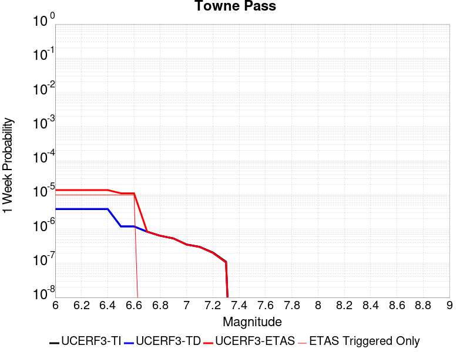 |  |  |  |

| Magnitude | 1 wk TI Prob | 1 wk TD Prob | 1 wk ETAS Prob | 1 wk ETAS/TD Gain | 1 wk ETAS Triggered Only | 1 mo TI Prob | 1 mo TD Prob | 1 mo ETAS Prob | 1 mo ETAS/TD Gain | 1 mo ETAS Triggered Only | 1 yr TI Prob | 1 yr TD Prob | 1 yr ETAS Prob | 1 yr ETAS/TD Gain | 1 yr ETAS Triggered Only | 10 yr TI Prob | 10 yr TD Prob | 10 yr ETAS Prob | 10 yr ETAS/TD Gain | 10 yr ETAS Triggered Only |
|-----|-----|-----|-----|-----|-----|-----|-----|-----|-----|-----|-----|-----|-----|-----|-----|-----|-----|-----|-----|-----|
| 6.0 | 3.849728E-6 | 3.8946073E-6 | 3.8946073E-6 | 1.0 | 0.0 | 1.649873E-5 | 1.6691092E-5 | 6.6072986E-5 | 3.9585776 | 4.9382717E-5 | 2.0085352E-4 | 2.0319947E-4 | 6.2286726E-4 | 3.0652997 | 4.1975308E-4 | 0.0020067208 | 0.0020305659 | 0.003164062 | 1.5582169 | 0.0011358025 |
| 6.1 | 3.849728E-6 | 3.8946073E-6 | 3.8946073E-6 | 1.0 | 0.0 | 1.649873E-5 | 1.6691092E-5 | 6.6072986E-5 | 3.9585776 | 4.9382717E-5 | 2.0085352E-4 | 2.0319947E-4 | 6.2286726E-4 | 3.0652997 | 4.1975308E-4 | 0.0020067208 | 0.0020305659 | 0.003164062 | 1.5582169 | 0.0011358025 |
| 6.2 | 3.849728E-6 | 3.8946073E-6 | 3.8946073E-6 | 1.0 | 0.0 | 1.649873E-5 | 1.6691092E-5 | 6.6072986E-5 | 3.9585776 | 4.9382717E-5 | 2.0085352E-4 | 2.0319947E-4 | 6.2286726E-4 | 3.0652997 | 4.1975308E-4 | 0.0020067208 | 0.0020305659 | 0.003164062 | 1.5582169 | 0.0011358025 |
| 6.3 | 3.849728E-6 | 3.8946073E-6 | 3.8946073E-6 | 1.0 | 0.0 | 1.649873E-5 | 1.6691092E-5 | 6.6072986E-5 | 3.9585776 | 4.9382717E-5 | 2.0085352E-4 | 2.0319947E-4 | 6.2286726E-4 | 3.0652997 | 4.1975308E-4 | 0.0020067208 | 0.0020305659 | 0.003164062 | 1.5582169 | 0.0011358025 |
| 6.4 | 3.849728E-6 | 3.8946073E-6 | 3.8946073E-6 | 1.0 | 0.0 | 1.649873E-5 | 1.6691092E-5 | 6.6072986E-5 | 3.9585776 | 4.9382717E-5 | 2.0085352E-4 | 2.0319947E-4 | 6.2286726E-4 | 3.0652997 | 4.1975308E-4 | 0.0020067208 | 0.0020305659 | 0.003164062 | 1.5582169 | 0.0011358025 |
| 6.5 | 1.1953545E-6 | 1.203078E-6 | 1.203078E-6 | 1.0 | 0.0 | 5.1229376E-6 | 5.156039E-6 | 2.984727E-5 | 5.7887983 | 2.4691359E-5 | 6.236998E-5 | 6.277309E-5 | 8.74629E-5 | 1.3933184 | 2.4691359E-5 | 6.235248E-4 | 6.275653E-4 | 7.2626874E-4 | 1.15728 | 9.8765435E-5 |
| 6.6 | 1.1953545E-6 | 1.203078E-6 | 1.203078E-6 | 1.0 | 0.0 | 5.1229376E-6 | 5.156039E-6 | 2.984727E-5 | 5.7887983 | 2.4691359E-5 | 6.236998E-5 | 6.277309E-5 | 8.74629E-5 | 1.3933184 | 2.4691359E-5 | 6.235248E-4 | 6.275653E-4 | 7.2626874E-4 | 1.15728 | 9.8765435E-5 |
| 6.7 | 8.375951E-7 | 8.4108854E-7 | 8.4108854E-7 | 1.0 | 0.0 | 3.5896885E-6 | 3.6046604E-6 | 3.6046604E-6 | 1.0 | 0.0 | 4.370358E-5 | 4.3885913E-5 | 4.3885913E-5 | 1.0 | 0.0 | 4.3694986E-4 | 4.387782E-4 | 5.128198E-4 | 1.1687449 | 7.407407E-5 |
| 6.8 | 6.38041E-7 | 6.3923466E-7 | 6.3923466E-7 | 1.0 | 0.0 | 2.7344586E-6 | 2.7395745E-6 | 2.7395745E-6 | 1.0 | 0.0 | 3.3291526E-5 | 3.335385E-5 | 3.335385E-5 | 1.0 | 0.0 | 3.3286537E-4 | 3.334922E-4 | 3.5817534E-4 | 1.0740141 | 2.4691359E-5 |
| 6.9 | 5.3460053E-7 | 5.3455096E-7 | 5.3455096E-7 | 1.0 | 0.0 | 2.2911431E-6 | 2.290931E-6 | 2.290931E-6 | 1.0 | 0.0 | 2.789431E-5 | 2.7891761E-5 | 2.7891761E-5 | 1.0 | 0.0 | 2.789081E-4 | 2.788859E-4 | 3.0357038E-4 | 1.088511 | 2.4691359E-5 |
| 7.0 | 3.557783E-7 | 3.532573E-7 | 3.532573E-7 | 1.0 | 0.0 | 1.5247632E-6 | 1.513959E-6 | 1.513959E-6 | 1.0 | 0.0 | 1.8563835E-5 | 1.8432303E-5 | 1.8432303E-5 | 1.0 | 0.0 | 1.8562283E-4 | 1.8430858E-4 | 2.0899539E-4 | 1.1339428 | 2.4691359E-5 |
| 7.1 | 3.037942E-7 | 3.0003585E-7 | 3.0003585E-7 | 1.0 | 0.0 | 1.3019744E-6 | 1.2858674E-6 | 1.2858674E-6 | 1.0 | 0.0 | 1.5851423E-5 | 1.565533E-5 | 1.565533E-5 | 1.0 | 0.0 | 1.5850292E-4 | 1.5654303E-4 | 1.8123051E-4 | 1.1577042 | 2.4691359E-5 |
| 7.2 | 2.0808248E-7 | 2.0218815E-7 | 2.0218815E-7 | 1.0 | 0.0 | 8.917818E-7 | 8.6652034E-7 | 8.6652034E-7 | 1.0 | 0.0 | 1.0857389E-5 | 1.0549839E-5 | 1.0549839E-5 | 1.0 | 0.0 | 1.0856859E-4 | 1.0549384E-4 | 1.301826E-4 | 1.2340302 | 2.4691359E-5 |
| 7.3 | 1.1162073E-7 | 1.0637608E-7 | 1.0637608E-7 | 1.0 | 0.0 | 4.7837443E-7 | 4.558974E-7 | 4.558974E-7 | 1.0 | 0.0 | 5.8241935E-6 | 5.550539E-6 | 5.550539E-6 | 1.0 | 0.0 | 5.8240406E-5 | 5.5504202E-5 | 8.019419E-5 | 1.4448309 | 2.4691359E-5 |

## Paradise
*[(top)](#table-of-contents)*

| 1 Week | 1 Month | 1 Year | 10 Year |
|-----|-----|-----|-----|
|  |  |  |  |

| Magnitude | 1 wk TI Prob | 1 wk TD Prob | 1 wk ETAS Prob | 1 wk ETAS/TD Gain | 1 wk ETAS Triggered Only | 1 mo TI Prob | 1 mo TD Prob | 1 mo ETAS Prob | 1 mo ETAS/TD Gain | 1 mo ETAS Triggered Only | 1 yr TI Prob | 1 yr TD Prob | 1 yr ETAS Prob | 1 yr ETAS/TD Gain | 1 yr ETAS Triggered Only | 10 yr TI Prob | 10 yr TD Prob | 10 yr ETAS Prob | 10 yr ETAS/TD Gain | 10 yr ETAS Triggered Only |
|-----|-----|-----|-----|-----|-----|-----|-----|-----|-----|-----|-----|-----|-----|-----|-----|-----|-----|-----|-----|-----|
| 6.0 | 1.4851273E-5 | 1.669599E-5 | 1.669599E-5 | 1.0 | 0.0 | 6.364676E-5 | 7.1552415E-5 | 9.624201E-5 | 1.345056 | 2.4691359E-5 | 7.7462377E-4 | 8.708261E-4 | 0.0012655437 | 1.4532682 | 3.9506174E-4 | 0.0077192914 | 0.008676517 | 0.009386353 | 1.0818112 | 7.160494E-4 |
| 6.1 | 1.4851273E-5 | 1.669599E-5 | 1.669599E-5 | 1.0 | 0.0 | 6.364676E-5 | 7.1552415E-5 | 9.624201E-5 | 1.345056 | 2.4691359E-5 | 7.7462377E-4 | 8.708261E-4 | 0.0012655437 | 1.4532682 | 3.9506174E-4 | 0.0077192914 | 0.008676517 | 0.009386353 | 1.0818112 | 7.160494E-4 |
| 6.2 | 1.4851273E-5 | 1.669599E-5 | 1.669599E-5 | 1.0 | 0.0 | 6.364676E-5 | 7.1552415E-5 | 9.624201E-5 | 1.345056 | 2.4691359E-5 | 7.7462377E-4 | 8.708261E-4 | 0.0012655437 | 1.4532682 | 3.9506174E-4 | 0.0077192914 | 0.008676517 | 0.009386353 | 1.0818112 | 7.160494E-4 |
| 6.3 | 1.0426831E-5 | 1.1889479E-5 | 1.1889479E-5 | 1.0 | 0.0 | 4.4685654E-5 | 5.0953946E-5 | 5.0953946E-5 | 1.0 | 0.0 | 5.43912E-4 | 6.2019366E-4 | 7.682499E-4 | 1.2387259 | 1.4814814E-4 | 0.0054258266 | 0.006185237 | 0.0064551616 | 1.0436403 | 2.7160495E-4 |
| 6.4 | 1.0426831E-5 | 1.1889479E-5 | 1.1889479E-5 | 1.0 | 0.0 | 4.4685654E-5 | 5.0953946E-5 | 5.0953946E-5 | 1.0 | 0.0 | 5.43912E-4 | 6.2019366E-4 | 7.682499E-4 | 1.2387259 | 1.4814814E-4 | 0.0054258266 | 0.006185237 | 0.0064551616 | 1.0436403 | 2.7160495E-4 |
| 6.5 | 9.25027E-6 | 1.0620713E-5 | 1.0620713E-5 | 1.0 | 0.0 | 3.964341E-5 | 4.5516572E-5 | 4.5516572E-5 | 1.0 | 0.0 | 4.8255164E-4 | 5.5402826E-4 | 6.5273896E-4 | 1.1781691 | 9.8765435E-5 | 0.0048150513 | 0.00552697 | 0.005747964 | 1.0399847 | 2.2222222E-4 |
| 6.6 | 7.904275E-6 | 9.160146E-6 | 9.160146E-6 | 1.0 | 0.0 | 3.3875025E-5 | 3.92572E-5 | 3.92572E-5 | 1.0 | 0.0 | 4.1235037E-4 | 4.778555E-4 | 5.272146E-4 | 1.103293 | 4.9382717E-5 | 0.0041158604 | 0.0047686766 | 0.004891545 | 1.0257657 | 1.2345679E-4 |
| 6.7 | 7.2061953E-6 | 8.407807E-6 | 8.407807E-6 | 1.0 | 0.0 | 3.088333E-5 | 3.6032983E-5 | 3.6032983E-5 | 1.0 | 0.0 | 3.7593965E-4 | 4.386169E-4 | 4.8797796E-4 | 1.112538 | 4.9382717E-5 | 0.003753043 | 0.004377881 | 0.0045007975 | 1.0280766 | 1.2345679E-4 |
| 6.8 | 6.6948724E-6 | 7.84268E-6 | 7.84268E-6 | 1.0 | 0.0 | 2.8691995E-5 | 3.3611075E-5 | 3.3611075E-5 | 1.0 | 0.0 | 3.4926904E-4 | 4.0914156E-4 | 4.5850407E-4 | 1.120649 | 4.9382717E-5 | 0.003487206 | 0.0040842406 | 0.0042071934 | 1.0301042 | 1.2345679E-4 |
| 6.9 | 6.0421025E-6 | 7.13108E-6 | 7.13108E-6 | 1.0 | 0.0 | 2.5894467E-5 | 3.0561434E-5 | 3.0561434E-5 | 1.0 | 0.0 | 3.1521954E-4 | 3.7202533E-4 | 4.2138968E-4 | 1.1326908 | 4.9382717E-5 | 0.0031477278 | 0.0037143636 | 0.0038373617 | 1.0331142 | 1.2345679E-4 |
| 7.0 | 4.134091E-6 | 5.0806284E-6 | 5.0806284E-6 | 1.0 | 0.0 | 1.7717413E-5 | 2.1773949E-5 | 2.1773949E-5 | 1.0 | 0.0 | 2.1568815E-4 | 2.6506712E-4 | 2.8975192E-4 | 1.0931267 | 2.4691359E-5 | 0.0021547892 | 0.0026476625 | 0.0026969146 | 1.018602 | 4.9382717E-5 |
| 7.1 | 3.7674888E-6 | 4.632157E-6 | 4.632157E-6 | 1.0 | 0.0 | 1.6146281E-5 | 1.985196E-5 | 1.985196E-5 | 1.0 | 0.0 | 1.9656324E-4 | 2.4167231E-4 | 2.663577E-4 | 1.102144 | 2.4691359E-5 | 0.0019638946 | 0.0024142456 | 0.0024388775 | 1.0102026 | 2.4691359E-5 |
| 7.2 | 3.4065345E-6 | 4.15698E-6 | 4.15698E-6 | 1.0 | 0.0 | 1.4599351E-5 | 1.7815515E-5 | 1.7815515E-5 | 1.0 | 0.0 | 1.777326E-4 | 2.1688381E-4 | 2.4156981E-4 | 1.1138213 | 2.4691359E-5 | 0.0017759053 | 0.0021668696 | 0.0021915075 | 1.0113703 | 2.4691359E-5 |
| 7.3 | 2.9934936E-6 | 3.6295291E-6 | 3.6295291E-6 | 1.0 | 0.0 | 1.2829195E-5 | 1.555504E-5 | 1.555504E-5 | 1.0 | 0.0 | 1.5618425E-4 | 1.8936764E-4 | 2.1405432E-4 | 1.1303638 | 2.4691359E-5 | 0.0015607453 | 0.001892208 | 0.0019168527 | 1.0130243 | 2.4691359E-5 |
| 7.4 | 2.4049796E-6 | 2.88914E-6 | 2.88914E-6 | 1.0 | 0.0 | 1.0307015E-5 | 1.2381977E-5 | 1.2381977E-5 | 1.0 | 0.0 | 1.2548068E-4 | 1.5074159E-4 | 1.7542923E-4 | 1.1637746 | 2.4691359E-5 | 0.0012540985 | 0.0015065349 | 0.001531189 | 1.0163648 | 2.4691359E-5 |
| 7.5 | 1.2710091E-6 | 1.5135425E-6 | 1.5135425E-6 | 1.0 | 0.0 | 5.44717E-6 | 6.4866017E-6 | 6.4866017E-6 | 1.0 | 0.0 | 6.631728E-5 | 7.8972764E-5 | 7.8972764E-5 | 1.0 | 0.0 | 6.6297496E-4 | 7.895697E-4 | 7.895697E-4 | 1.0 | 0.0 |
| 7.6 | 2.21172E-7 | 2.604064E-7 | 2.604064E-7 | 1.0 | 0.0 | 9.478797E-7 | 1.1160272E-6 | 1.1160272E-6 | 1.0 | 0.0 | 1.1540374E-5 | 1.3587575E-5 | 1.3587575E-5 | 1.0 | 0.0 | 1.1539775E-4 | 1.3587026E-4 | 1.3587026E-4 | 1.0 | 0.0 |

## San Andreas (San Bernardino N)
*[(top)](#table-of-contents)*

| 1 Week | 1 Month | 1 Year | 10 Year |
|-----|-----|-----|-----|
|  |  |  |  |

| Magnitude | 1 wk TI Prob | 1 wk TD Prob | 1 wk ETAS Prob | 1 wk ETAS/TD Gain | 1 wk ETAS Triggered Only | 1 mo TI Prob | 1 mo TD Prob | 1 mo ETAS Prob | 1 mo ETAS/TD Gain | 1 mo ETAS Triggered Only | 1 yr TI Prob | 1 yr TD Prob | 1 yr ETAS Prob | 1 yr ETAS/TD Gain | 1 yr ETAS Triggered Only | 10 yr TI Prob | 10 yr TD Prob | 10 yr ETAS Prob | 10 yr ETAS/TD Gain | 10 yr ETAS Triggered Only |
|-----|-----|-----|-----|-----|-----|-----|-----|-----|-----|-----|-----|-----|-----|-----|-----|-----|-----|-----|-----|-----|
| 6.0 | 1.4273766E-4 | 3.1665424E-4 | 3.1665424E-4 | 1.0 | 0.0 | 6.115894E-4 | 0.0013563897 | 0.0013810475 | 1.018179 | 2.4691359E-5 | 0.0074207084 | 0.016390502 | 0.016657656 | 1.0162992 | 2.7160495E-4 | 0.07177748 | 0.15050764 | 0.151053 | 1.0036234 | 6.419753E-4 |
| 6.1 | 1.4273766E-4 | 3.1665424E-4 | 3.1665424E-4 | 1.0 | 0.0 | 6.115894E-4 | 0.0013563897 | 0.0013810475 | 1.018179 | 2.4691359E-5 | 0.0074207084 | 0.016390502 | 0.016657656 | 1.0162992 | 2.7160495E-4 | 0.07177748 | 0.15050764 | 0.151053 | 1.0036234 | 6.419753E-4 |
| 6.2 | 1.4273766E-4 | 3.1665424E-4 | 3.1665424E-4 | 1.0 | 0.0 | 6.115894E-4 | 0.0013563897 | 0.0013810475 | 1.018179 | 2.4691359E-5 | 0.0074207084 | 0.016390502 | 0.016657656 | 1.0162992 | 2.7160495E-4 | 0.07177748 | 0.15050764 | 0.151053 | 1.0036234 | 6.419753E-4 |
| 6.3 | 1.3730655E-4 | 3.0569977E-4 | 3.0569977E-4 | 1.0 | 0.0 | 5.883239E-4 | 0.0013094897 | 0.0013341487 | 1.018831 | 2.4691359E-5 | 0.0071393442 | 0.015827896 | 0.0160952 | 1.0168883 | 2.7160495E-4 | 0.06914291 | 0.14580758 | 0.14635594 | 1.0037609 | 6.419753E-4 |
| 6.4 | 1.3730655E-4 | 3.0569977E-4 | 3.0569977E-4 | 1.0 | 0.0 | 5.883239E-4 | 0.0013094897 | 0.0013341487 | 1.018831 | 2.4691359E-5 | 0.0071393442 | 0.015827896 | 0.0160952 | 1.0168883 | 2.7160495E-4 | 0.06914291 | 0.14580758 | 0.14635594 | 1.0037609 | 6.419753E-4 |
| 6.5 | 1.2942807E-4 | 2.8984004E-4 | 2.8984004E-4 | 1.0 | 0.0 | 5.545738E-4 | 0.0012415855 | 0.0012662462 | 1.0198623 | 2.4691359E-5 | 0.0067310524 | 0.01501278 | 0.015280308 | 1.01782 | 2.7160495E-4 | 0.06530788 | 0.13895048 | 0.13950326 | 1.0039783 | 6.419753E-4 |
| 6.6 | 1.1125901E-4 | 2.5421768E-4 | 2.5421768E-4 | 1.0 | 0.0 | 4.767372E-4 | 0.0010890518 | 0.0011137163 | 1.0226476 | 2.4691359E-5 | 0.005788839 | 0.013179231 | 0.013447257 | 1.020337 | 2.7160495E-4 | 0.056403454 | 0.12324018 | 0.12378139 | 1.0043916 | 6.17284E-4 |
| 6.7 | 1.02209575E-4 | 2.3556314E-4 | 2.3556314E-4 | 1.0 | 0.0 | 4.3796748E-4 | 0.0010091672 | 0.0010338336 | 1.0244423 | 2.4691359E-5 | 0.0053192247 | 0.012217816 | 0.012486103 | 1.0219586 | 2.7160495E-4 | 0.051936906 | 0.11503242 | 0.115578696 | 1.004749 | 6.17284E-4 |
| 6.8 | 9.610582E-5 | 2.2081345E-4 | 2.2081345E-4 | 1.0 | 0.0 | 4.1181705E-4 | 9.4600086E-4 | 9.7066886E-4 | 1.0260761 | 2.4691359E-5 | 0.0050023515 | 0.011457003 | 0.0117254965 | 1.0234349 | 2.7160495E-4 | 0.048912346 | 0.10843303 | 0.10898338 | 1.0050755 | 6.17284E-4 |
| 6.9 | 9.3877505E-5 | 2.1536642E-4 | 2.1536642E-4 | 1.0 | 0.0 | 4.0227012E-4 | 9.2267315E-4 | 9.4734173E-4 | 1.026736 | 2.4691359E-5 | 0.0048866454 | 0.011175931 | 0.011444501 | 1.024031 | 2.7160495E-4 | 0.04780577 | 0.10602296 | 0.1065748 | 1.0052049 | 6.17284E-4 |
| 7.0 | 9.1019785E-5 | 2.086318E-4 | 2.086318E-4 | 1.0 | 0.0 | 3.900265E-4 | 8.938305E-4 | 9.184998E-4 | 1.0275996 | 2.4691359E-5 | 0.0047382377 | 0.0108283125 | 0.011096977 | 1.0248113 | 2.7160495E-4 | 0.046384744 | 0.10299246 | 0.10354617 | 1.0053762 | 6.17284E-4 |
| 7.1 | 8.771155E-5 | 2.0037318E-4 | 2.0037318E-4 | 1.0 | 0.0 | 3.758525E-4 | 8.5846015E-4 | 8.831303E-4 | 1.0287377 | 2.4691359E-5 | 0.0045664064 | 0.010401863 | 0.010646208 | 1.0234905 | 2.4691358E-4 | 0.044737056 | 0.09930337 | 0.099814884 | 1.0051509 | 5.6790124E-4 |
| 7.2 | 8.0830236E-5 | 1.8442032E-4 | 1.8442032E-4 | 1.0 | 0.0 | 3.4636928E-4 | 7.9013355E-4 | 8.1480545E-4 | 1.031225 | 2.4691359E-5 | 0.0042088944 | 0.009577551 | 0.0098221 | 1.0255336 | 2.4691358E-4 | 0.041300658 | 0.09203222 | 0.09254785 | 1.0056028 | 5.6790124E-4 |
| 7.3 | 7.7668235E-5 | 1.7384623E-4 | 1.7384623E-4 | 1.0 | 0.0 | 3.328214E-4 | 7.4484263E-4 | 7.695156E-4 | 1.033125 | 2.4691359E-5 | 0.0040445733 | 0.009030832 | 0.009275516 | 1.0270942 | 2.4691358E-4 | 0.03971748 | 0.08729687 | 0.0878152 | 1.0059375 | 5.6790124E-4 |
| 7.4 | 7.520177E-5 | 1.660399E-4 | 1.660399E-4 | 1.0 | 0.0 | 3.2225347E-4 | 7.114056E-4 | 7.360794E-4 | 1.0346831 | 2.4691359E-5 | 0.0039163795 | 0.008627033 | 0.008871817 | 1.028374 | 2.4691358E-4 | 0.038480744 | 0.08375092 | 0.08427126 | 1.006213 | 5.6790124E-4 |
| 7.5 | 7.274697E-5 | 1.5890968E-4 | 1.5890968E-4 | 1.0 | 0.0 | 3.1173544E-4 | 6.8086374E-4 | 7.055383E-4 | 1.0362401 | 2.4691359E-5 | 0.003788775 | 0.008258066 | 0.008502941 | 1.0296527 | 2.4691358E-4 | 0.03724827 | 0.080465645 | 0.080987856 | 1.0064898 | 5.6790124E-4 |
| 7.6 | 7.1185845E-5 | 1.5460394E-4 | 1.5460394E-4 | 1.0 | 0.0 | 3.0504653E-4 | 6.624201E-4 | 6.870951E-4 | 1.0372498 | 2.4691359E-5 | 0.0037076178 | 0.008035194 | 0.008280124 | 1.030482 | 2.4691358E-4 | 0.036463667 | 0.07845396 | 0.0789773 | 1.0066707 | 5.6790124E-4 |
| 7.7 | 6.709961E-5 | 1.4368047E-4 | 1.4368047E-4 | 1.0 | 0.0 | 2.8753807E-4 | 6.156282E-4 | 6.4030435E-4 | 1.0400829 | 2.4691359E-5 | 0.003495157 | 0.0074695535 | 0.0077146227 | 1.0328091 | 2.4691358E-4 | 0.034406938 | 0.07327859 | 0.07380488 | 1.007182 | 5.6790124E-4 |
| 7.8 | 6.300812E-5 | 1.3249594E-4 | 1.3249594E-4 | 1.0 | 0.0 | 2.7000686E-4 | 5.677162E-4 | 5.9239357E-4 | 1.0434678 | 2.4691359E-5 | 0.0032823787 | 0.0068900688 | 0.007135281 | 1.0355892 | 2.4691358E-4 | 0.032343175 | 0.06792749 | 0.068456806 | 1.0077925 | 5.6790124E-4 |
| 7.9 | 4.983037E-5 | 9.760703E-5 | 9.760703E-5 | 1.0 | 0.0 | 2.1354125E-4 | 4.182488E-4 | 4.429298E-4 | 1.0590104 | 2.4691359E-5 | 0.0025967648 | 0.0050803 | 0.005301393 | 1.0435197 | 2.2222222E-4 | 0.025666296 | 0.05082228 | 0.051291008 | 1.0092229 | 4.9382716E-4 |
| 8.0 | 3.2211527E-5 | 5.3522905E-5 | 5.3522905E-5 | 1.0 | 0.0 | 1.380421E-4 | 2.2936372E-4 | 2.5404943E-4 | 1.1076268 | 2.4691359E-5 | 0.0016793669 | 0.002788929 | 0.0028627967 | 1.0264859 | 7.407407E-5 | 0.016667323 | 0.02846787 | 0.028659778 | 1.0067412 | 1.9753087E-4 |
| 8.1 | 1.743376E-5 | 1.8926796E-5 | 1.8926796E-5 | 1.0 | 0.0 | 7.471398E-5 | 8.111232E-5 | 8.111232E-5 | 1.0 | 0.0 | 9.0926304E-4 | 9.870958E-4 | 0.0010117627 | 1.0249895 | 2.4691359E-5 | 0.009055517 | 0.010537361 | 0.010561791 | 1.0023185 | 2.4691359E-5 |
| 8.2 | 7.831616E-6 | 5.1930783E-6 | 5.1930783E-6 | 1.0 | 0.0 | 3.3563636E-5 | 2.2255861E-5 | 2.2255861E-5 | 1.0 | 0.0 | 4.0856065E-4 | 2.709315E-4 | 2.709315E-4 | 1.0 | 0.0 | 0.004078103 | 0.0030624678 | 0.0030624678 | 1.0 | 0.0 |
| 8.3 | 1.983087E-6 | 7.731745E-7 | 7.731745E-7 | 1.0 | 0.0 | 8.498917E-6 | 3.313601E-6 | 3.313601E-6 | 1.0 | 0.0 | 1.034694E-4 | 4.0342362E-5 | 4.0342362E-5 | 1.0 | 0.0 | 0.0010342124 | 4.7608858E-4 | 4.7608858E-4 | 1.0 | 0.0 |

## Bicycle Lake
*[(top)](#table-of-contents)*

| 1 Week | 1 Month | 1 Year | 10 Year |
|-----|-----|-----|-----|
|  |  |  |  |

| Magnitude | 1 wk TI Prob | 1 wk TD Prob | 1 wk ETAS Prob | 1 wk ETAS/TD Gain | 1 wk ETAS Triggered Only | 1 mo TI Prob | 1 mo TD Prob | 1 mo ETAS Prob | 1 mo ETAS/TD Gain | 1 mo ETAS Triggered Only | 1 yr TI Prob | 1 yr TD Prob | 1 yr ETAS Prob | 1 yr ETAS/TD Gain | 1 yr ETAS Triggered Only | 10 yr TI Prob | 10 yr TD Prob | 10 yr ETAS Prob | 10 yr ETAS/TD Gain | 10 yr ETAS Triggered Only |
|-----|-----|-----|-----|-----|-----|-----|-----|-----|-----|-----|-----|-----|-----|-----|-----|-----|-----|-----|-----|-----|
| 6.0 | 1.9621975E-5 | 2.2100037E-5 | 2.2100037E-5 | 1.0 | 0.0 | 8.4091465E-5 | 9.471177E-5 | 1.1940079E-4 | 1.2606753 | 2.4691359E-5 | 0.0010233327 | 0.0011526408 | 0.0012759554 | 1.1069843 | 1.2345679E-4 | 0.01018633 | 0.011479938 | 0.011968097 | 1.0425227 | 4.9382716E-4 |
| 6.1 | 1.9621975E-5 | 2.2100037E-5 | 2.2100037E-5 | 1.0 | 0.0 | 8.4091465E-5 | 9.471177E-5 | 1.1940079E-4 | 1.2606753 | 2.4691359E-5 | 0.0010233327 | 0.0011526408 | 0.0012759554 | 1.1069843 | 1.2345679E-4 | 0.01018633 | 0.011479938 | 0.011968097 | 1.0425227 | 4.9382716E-4 |
| 6.2 | 9.9971285E-6 | 1.1257143E-5 | 1.1257143E-5 | 1.0 | 0.0 | 4.2844134E-5 | 4.8244303E-5 | 4.8244303E-5 | 1.0 | 0.0 | 5.2150246E-4 | 5.872681E-4 | 6.612987E-4 | 1.1260593 | 7.407407E-5 | 0.0052028033 | 0.005862268 | 0.0062059206 | 1.058621 | 3.45679E-4 |
| 6.3 | 9.589428E-6 | 1.0799791E-5 | 1.0799791E-5 | 1.0 | 0.0 | 4.10969E-5 | 4.628429E-5 | 4.628429E-5 | 1.0 | 0.0 | 5.002399E-4 | 5.634174E-4 | 6.3744973E-4 | 1.1313988 | 7.407407E-5 | 0.0049911533 | 0.0056249807 | 0.0059687155 | 1.0611086 | 3.45679E-4 |
| 6.4 | 9.589428E-6 | 1.0799791E-5 | 1.0799791E-5 | 1.0 | 0.0 | 4.10969E-5 | 4.628429E-5 | 4.628429E-5 | 1.0 | 0.0 | 5.002399E-4 | 5.634174E-4 | 6.3744973E-4 | 1.1313988 | 7.407407E-5 | 0.0049911533 | 0.0056249807 | 0.0059687155 | 1.0611086 | 3.45679E-4 |
| 6.5 | 5.557707E-6 | 6.286475E-6 | 6.286475E-6 | 1.0 | 0.0 | 2.3818526E-5 | 2.6941909E-5 | 2.6941909E-5 | 1.0 | 0.0 | 2.8995197E-4 | 3.2799525E-4 | 3.7736178E-4 | 1.1505098 | 4.9382717E-5 | 0.0028957394 | 0.0032777486 | 0.003474632 | 1.0600667 | 1.9753087E-4 |
| 6.6 | 4.8742945E-6 | 5.5140567E-6 | 5.5140567E-6 | 1.0 | 0.0 | 2.0889667E-5 | 2.3631605E-5 | 2.3631605E-5 | 1.0 | 0.0 | 2.54302E-4 | 2.87703E-4 | 3.370715E-4 | 1.1715953 | 4.9382717E-5 | 0.002540112 | 0.002875875 | 0.0029989767 | 1.042805 | 1.2345679E-4 |
| 6.7 | 3.991108E-6 | 4.5165402E-6 | 4.5165402E-6 | 1.0 | 0.0 | 1.7104636E-5 | 1.9356601E-5 | 1.9356601E-5 | 1.0 | 0.0 | 2.0822904E-4 | 2.3566662E-4 | 2.850377E-4 | 1.2094954 | 4.9382717E-5 | 0.0020803404 | 0.0023566664 | 0.002455199 | 1.0418102 | 9.8765435E-5 |

## Garlic Springs
*[(top)](#table-of-contents)*

| 1 Week | 1 Month | 1 Year | 10 Year |
|-----|-----|-----|-----|
|  |  |  |  |

| Magnitude | 1 wk TI Prob | 1 wk TD Prob | 1 wk ETAS Prob | 1 wk ETAS/TD Gain | 1 wk ETAS Triggered Only | 1 mo TI Prob | 1 mo TD Prob | 1 mo ETAS Prob | 1 mo ETAS/TD Gain | 1 mo ETAS Triggered Only | 1 yr TI Prob | 1 yr TD Prob | 1 yr ETAS Prob | 1 yr ETAS/TD Gain | 1 yr ETAS Triggered Only | 10 yr TI Prob | 10 yr TD Prob | 10 yr ETAS Prob | 10 yr ETAS/TD Gain | 10 yr ETAS Triggered Only |
|-----|-----|-----|-----|-----|-----|-----|-----|-----|-----|-----|-----|-----|-----|-----|-----|-----|-----|-----|-----|-----|
| 6.0 | 1.6760017E-5 | 1.8779232E-5 | 1.8779232E-5 | 1.0 | 0.0 | 7.182667E-5 | 8.0480604E-5 | 1.0516997E-4 | 1.3067741 | 2.4691359E-5 | 8.7413884E-4 | 9.795283E-4 | 0.0010781969 | 1.1007308 | 9.8765435E-5 | 0.008707083 | 0.009763656 | 0.010228211 | 1.04758 | 4.691358E-4 |
| 6.1 | 9.852767E-6 | 1.0974912E-5 | 1.0974912E-5 | 1.0 | 0.0 | 4.222546E-5 | 4.703489E-5 | 4.703489E-5 | 1.0 | 0.0 | 5.139737E-4 | 5.725703E-4 | 5.972475E-4 | 1.043099 | 2.4691359E-5 | 0.005127866 | 0.005717911 | 0.0059634126 | 1.0429356 | 2.4691358E-4 |
| 6.2 | 9.852767E-6 | 1.0974912E-5 | 1.0974912E-5 | 1.0 | 0.0 | 4.222546E-5 | 4.703489E-5 | 4.703489E-5 | 1.0 | 0.0 | 5.139737E-4 | 5.725703E-4 | 5.972475E-4 | 1.043099 | 2.4691359E-5 | 0.005127866 | 0.005717911 | 0.0059634126 | 1.0429356 | 2.4691358E-4 |
| 6.3 | 4.3167724E-6 | 4.77857E-6 | 4.77857E-6 | 1.0 | 0.0 | 1.8500323E-5 | 2.0479556E-5 | 2.0479556E-5 | 1.0 | 0.0 | 2.2521814E-4 | 2.493331E-4 | 2.740183E-4 | 1.0990049 | 2.4691359E-5 | 0.0022499003 | 0.0024927924 | 0.002566682 | 1.0296413 | 7.407407E-5 |
| 6.4 | 4.3167724E-6 | 4.77857E-6 | 4.77857E-6 | 1.0 | 0.0 | 1.8500323E-5 | 2.0479556E-5 | 2.0479556E-5 | 1.0 | 0.0 | 2.2521814E-4 | 2.493331E-4 | 2.740183E-4 | 1.0990049 | 2.4691359E-5 | 0.0022499003 | 0.0024927924 | 0.002566682 | 1.0296413 | 7.407407E-5 |
| 6.5 | 4.3167724E-6 | 4.77857E-6 | 4.77857E-6 | 1.0 | 0.0 | 1.8500323E-5 | 2.0479556E-5 | 2.0479556E-5 | 1.0 | 0.0 | 2.2521814E-4 | 2.493331E-4 | 2.740183E-4 | 1.0990049 | 2.4691359E-5 | 0.0022499003 | 0.0024927924 | 0.002566682 | 1.0296413 | 7.407407E-5 |
| 6.6 | 4.301311E-6 | 4.7614367E-6 | 4.7614367E-6 | 1.0 | 0.0 | 1.8434059E-5 | 2.0406127E-5 | 2.0406127E-5 | 1.0 | 0.0 | 2.2441156E-4 | 2.4843932E-4 | 2.7312455E-4 | 1.0993612 | 2.4691359E-5 | 0.0022418506 | 0.0024838746 | 0.0025577648 | 1.029748 | 7.407407E-5 |
| 6.7 | 3.8599724E-6 | 4.2715424E-6 | 4.2715424E-6 | 1.0 | 0.0 | 1.6542634E-5 | 1.8306611E-5 | 1.8306611E-5 | 1.0 | 0.0 | 2.0138794E-4 | 2.2288298E-4 | 2.4756885E-4 | 1.110757 | 2.4691359E-5 | 0.0020120554 | 0.0022288298 | 0.0022781026 | 1.022107 | 4.9382717E-5 |

## San Andreas (San Bernardino S)
*[(top)](#table-of-contents)*

| 1 Week | 1 Month | 1 Year | 10 Year |
|-----|-----|-----|-----|
|  |  |  | 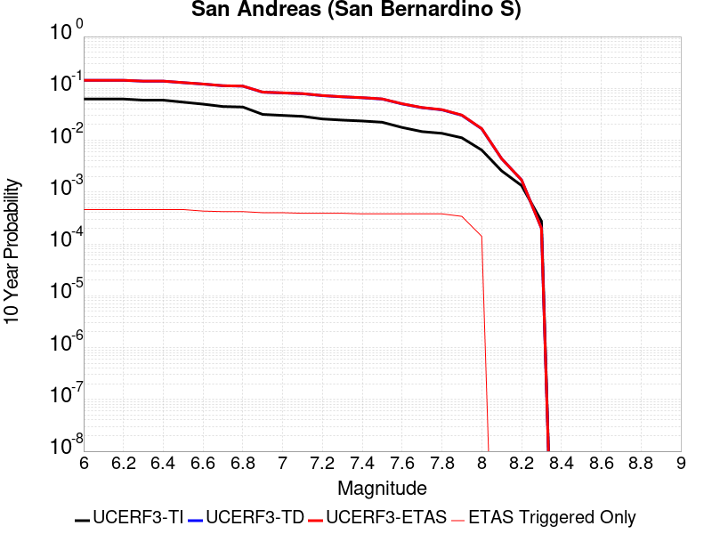 |

| Magnitude | 1 wk TI Prob | 1 wk TD Prob | 1 wk ETAS Prob | 1 wk ETAS/TD Gain | 1 wk ETAS Triggered Only | 1 mo TI Prob | 1 mo TD Prob | 1 mo ETAS Prob | 1 mo ETAS/TD Gain | 1 mo ETAS Triggered Only | 1 yr TI Prob | 1 yr TD Prob | 1 yr ETAS Prob | 1 yr ETAS/TD Gain | 1 yr ETAS Triggered Only | 10 yr TI Prob | 10 yr TD Prob | 10 yr ETAS Prob | 10 yr ETAS/TD Gain | 10 yr ETAS Triggered Only |
|-----|-----|-----|-----|-----|-----|-----|-----|-----|-----|-----|-----|-----|-----|-----|-----|-----|-----|-----|-----|-----|
| 6.0 | 1.2336002E-4 | 3.0043157E-4 | 3.0043157E-4 | 1.0 | 0.0 | 5.2857865E-4 | 0.0012869546 | 0.0013116142 | 1.0191612 | 2.4691359E-5 | 0.006416472 | 0.0155610675 | 0.015731217 | 1.0109344 | 1.728395E-4 | 0.06234337 | 0.14299136 | 0.14332995 | 1.0023677 | 3.9506174E-4 |
| 6.1 | 1.2336002E-4 | 3.0043157E-4 | 3.0043157E-4 | 1.0 | 0.0 | 5.2857865E-4 | 0.0012869546 | 0.0013116142 | 1.0191612 | 2.4691359E-5 | 0.006416472 | 0.0155610675 | 0.015731217 | 1.0109344 | 1.728395E-4 | 0.06234337 | 0.14299136 | 0.14332995 | 1.0023677 | 3.9506174E-4 |
| 6.2 | 1.2336002E-4 | 3.0043157E-4 | 3.0043157E-4 | 1.0 | 0.0 | 5.2857865E-4 | 0.0012869546 | 0.0013116142 | 1.0191612 | 2.4691359E-5 | 0.006416472 | 0.0155610675 | 0.015731217 | 1.0109344 | 1.728395E-4 | 0.06234337 | 0.14299136 | 0.14332995 | 1.0023677 | 3.9506174E-4 |
| 6.3 | 1.1712257E-4 | 2.883105E-4 | 2.883105E-4 | 1.0 | 0.0 | 5.018573E-4 | 0.001235057 | 0.0012597179 | 1.0199674 | 2.4691359E-5 | 0.006093008 | 0.014937995 | 0.015108253 | 1.0113976 | 1.728395E-4 | 0.059286322 | 0.1376994 | 0.13804005 | 1.002474 | 3.9506174E-4 |
| 6.4 | 1.1712257E-4 | 2.883105E-4 | 2.883105E-4 | 1.0 | 0.0 | 5.018573E-4 | 0.001235057 | 0.0012597179 | 1.0199674 | 2.4691359E-5 | 0.006093008 | 0.014937995 | 0.015108253 | 1.0113976 | 1.728395E-4 | 0.059286322 | 0.1376994 | 0.13804005 | 1.002474 | 3.9506174E-4 |
| 6.5 | 1.0689076E-4 | 2.6843234E-4 | 2.6843234E-4 | 1.0 | 0.0 | 4.5802278E-4 | 0.0011499418 | 0.0011746049 | 1.0214472 | 2.4691359E-5 | 0.0055621783 | 0.01391529 | 0.014085724 | 1.012248 | 1.728395E-4 | 0.05425003 | 0.12894526 | 0.12928937 | 1.0026687 | 3.9506174E-4 |
| 6.6 | 9.7648895E-5 | 2.5087388E-4 | 2.5087388E-4 | 1.0 | 0.0 | 4.1842813E-4 | 0.0010747545 | 0.0010994193 | 1.0229492 | 2.4691359E-5 | 0.005082469 | 0.013010999 | 0.0131815905 | 1.0131112 | 1.728395E-4 | 0.049677886 | 0.1211038 | 0.12142932 | 1.0026879 | 3.7037037E-4 |
| 6.7 | 8.757013E-5 | 2.3157541E-4 | 2.3157541E-4 | 1.0 | 0.0 | 3.7524657E-4 | 9.921109E-4 | 0.0010167777 | 1.024863 | 2.4691359E-5 | 0.00455906 | 0.012016143 | 0.012186905 | 1.014211 | 1.728395E-4 | 0.04466656 | 0.112411246 | 0.11271806 | 1.0027294 | 3.45679E-4 |
| 6.8 | 8.562978E-5 | 2.271715E-4 | 2.271715E-4 | 1.0 | 0.0 | 3.6693315E-4 | 9.732511E-4 | 9.979184E-4 | 1.0253453 | 2.4691359E-5 | 0.004458263 | 0.011789026 | 0.0119598275 | 1.0144882 | 1.728395E-4 | 0.043698758 | 0.11042069 | 0.1107282 | 1.0027848 | 3.45679E-4 |
| 6.9 | 6.124075E-5 | 1.7098521E-4 | 1.7098521E-4 | 1.0 | 0.0 | 2.6243398E-4 | 7.3258876E-4 | 7.5726205E-4 | 1.0336796 | 2.4691359E-5 | 0.0031904527 | 0.008883 | 0.009054304 | 1.0192845 | 1.728395E-4 | 0.031450346 | 0.08432233 | 0.084638864 | 1.0037538 | 3.45679E-4 |
| 7.0 | 5.8598747E-5 | 1.6527194E-4 | 1.6527194E-4 | 1.0 | 0.0 | 2.5111332E-4 | 7.081168E-4 | 7.327907E-4 | 1.0348444 | 2.4691359E-5 | 0.0030530186 | 0.008587439 | 0.008758794 | 1.0199542 | 1.728395E-4 | 0.03011414 | 0.08163893 | 0.081956394 | 1.0038886 | 3.45679E-4 |
| 7.1 | 5.613814E-5 | 1.594542E-4 | 1.594542E-4 | 1.0 | 0.0 | 2.4056983E-4 | 6.8319694E-4 | 7.078714E-4 | 1.0361162 | 2.4691359E-5 | 0.0029250039 | 0.008286381 | 0.008457788 | 1.0206854 | 1.728395E-4 | 0.028868021 | 0.07893698 | 0.079255365 | 1.0040334 | 3.45679E-4 |
| 7.2 | 4.991222E-5 | 1.4551122E-4 | 1.4551122E-4 | 1.0 | 0.0 | 2.1389198E-4 | 6.2347087E-4 | 6.481468E-4 | 1.0395783 | 2.4691359E-5 | 0.002601025 | 0.0075644418 | 0.0077359737 | 1.0226761 | 1.728395E-4 | 0.025707912 | 0.07238823 | 0.07270889 | 1.0044297 | 3.45679E-4 |
| 7.3 | 4.7410045E-5 | 1.3744639E-4 | 1.3744639E-4 | 1.0 | 0.0 | 2.0317009E-4 | 5.8892334E-4 | 6.1360013E-4 | 1.0419016 | 2.4691359E-5 | 0.0024707897 | 0.0071466547 | 0.007318259 | 1.0240119 | 1.728395E-4 | 0.024434982 | 0.06866852 | 0.06899046 | 1.0046884 | 3.45679E-4 |
| 7.4 | 4.5556746E-5 | 1.3152018E-4 | 1.3152018E-4 | 1.0 | 0.0 | 1.952286E-4 | 5.635365E-4 | 5.882139E-4 | 1.0437903 | 2.4691359E-5 | 0.002374317 | 0.006839552 | 0.007011209 | 1.0250977 | 1.728395E-4 | 0.023491086 | 0.06591914 | 0.06624203 | 1.0048983 | 3.45679E-4 |
| 7.5 | 4.3084514E-5 | 1.2386718E-4 | 1.2386718E-4 | 1.0 | 0.0 | 1.8463485E-4 | 5.3075165E-4 | 5.554299E-4 | 1.0464967 | 2.4691359E-5 | 0.0022456115 | 0.0064428276 | 0.0066145537 | 1.0266538 | 1.728395E-4 | 0.022230545 | 0.06231774 | 0.062641874 | 1.0052013 | 3.45679E-4 |
| 7.6 | 3.408608E-5 | 9.862595E-5 | 9.862595E-5 | 1.0 | 0.0 | 1.4607502E-4 | 4.2261425E-4 | 4.4729517E-4 | 1.0584006 | 2.4691359E-5 | 0.0017770125 | 0.0051332153 | 0.0053051678 | 1.0334979 | 1.728395E-4 | 0.017628696 | 0.05014027 | 0.050468616 | 1.0065485 | 3.45679E-4 |
| 7.7 | 2.8315713E-5 | 8.274123E-5 | 8.274123E-5 | 1.0 | 0.0 | 1.2134742E-4 | 3.545571E-4 | 3.792397E-4 | 1.0696154 | 2.4691359E-5 | 0.0014764034 | 0.0043081976 | 0.0044802926 | 1.039946 | 1.728395E-4 | 0.01466633 | 0.04238506 | 0.04271609 | 1.00781 | 3.45679E-4 |
| 7.8 | 2.6222975E-5 | 7.4868956E-5 | 7.4868956E-5 | 1.0 | 0.0 | 1.1237934E-4 | 3.2082753E-4 | 3.4551095E-4 | 1.0769367 | 2.4691359E-5 | 0.0013673597 | 0.0038990853 | 0.004071251 | 1.0441554 | 1.728395E-4 | 0.013589768 | 0.03854365 | 0.038876005 | 1.0086229 | 3.45679E-4 |
| 7.9 | 2.1469694E-5 | 5.8076967E-5 | 5.8076967E-5 | 1.0 | 0.0 | 9.200973E-5 | 2.4887754E-4 | 2.7356276E-4 | 1.0991862 | 2.4691359E-5 | 0.0011196428 | 0.003025877 | 0.003173577 | 1.0488123 | 1.4814814E-4 | 0.011140184 | 0.030242343 | 0.030529678 | 1.0095011 | 2.962963E-4 |
| 8.0 | 1.2420249E-5 | 3.142877E-5 | 3.142877E-5 | 1.0 | 0.0 | 5.322855E-5 | 1.3468778E-4 | 1.5937582E-4 | 1.1832982 | 2.4691359E-5 | 6.478649E-4 | 0.0016385914 | 0.0016878932 | 1.030088 | 4.9382717E-5 | 0.0064597935 | 0.01657378 | 0.016670909 | 1.0058603 | 9.8765435E-5 |
| 8.1 | 4.9197724E-6 | 7.862634E-6 | 7.862634E-6 | 1.0 | 0.0 | 2.1084568E-5 | 3.369657E-5 | 3.369657E-5 | 1.0 | 0.0 | 2.566744E-4 | 4.1017865E-4 | 4.1017865E-4 | 1.0 | 0.0 | 0.002563781 | 0.0044046436 | 0.0044046436 | 1.0 | 0.0 |
| 8.2 | 2.5634774E-6 | 2.9256641E-6 | 2.9256641E-6 | 1.0 | 0.0 | 1.0986286E-5 | 1.25385E-5 | 1.25385E-5 | 1.0 | 0.0 | 1.3374983E-4 | 1.5264559E-4 | 1.5264559E-4 | 1.0 | 0.0 | 0.0013366934 | 0.0017149353 | 0.0017149353 | 1.0 | 0.0 |
| 8.3 | 5.2850464E-7 | 3.2379515E-7 | 3.2379515E-7 | 1.0 | 0.0 | 2.2650179E-6 | 1.3876928E-6 | 1.3876928E-6 | 1.0 | 0.0 | 2.7576245E-5 | 1.6895041E-5 | 1.6895041E-5 | 1.0 | 0.0 | 2.7572823E-4 | 2.0034672E-4 | 2.0034672E-4 | 1.0 | 0.0 |

## Helendale-So Lockhart
*[(top)](#table-of-contents)*

| 1 Week | 1 Month | 1 Year | 10 Year |
|-----|-----|-----|-----|
|  |  |  |  |

| Magnitude | 1 wk TI Prob | 1 wk TD Prob | 1 wk ETAS Prob | 1 wk ETAS/TD Gain | 1 wk ETAS Triggered Only | 1 mo TI Prob | 1 mo TD Prob | 1 mo ETAS Prob | 1 mo ETAS/TD Gain | 1 mo ETAS Triggered Only | 1 yr TI Prob | 1 yr TD Prob | 1 yr ETAS Prob | 1 yr ETAS/TD Gain | 1 yr ETAS Triggered Only | 10 yr TI Prob | 10 yr TD Prob | 10 yr ETAS Prob | 10 yr ETAS/TD Gain | 10 yr ETAS Triggered Only |
|-----|-----|-----|-----|-----|-----|-----|-----|-----|-----|-----|-----|-----|-----|-----|-----|-----|-----|-----|-----|-----|
| 6.0 | 1.7296055E-5 | 1.8104629E-5 | 1.8104629E-5 | 1.0 | 0.0 | 7.412385E-5 | 7.758907E-5 | 7.758907E-5 | 1.0 | 0.0 | 9.0208417E-4 | 9.442583E-4 | 0.0010429305 | 1.104497 | 9.8765435E-5 | 0.008984311 | 0.009404581 | 0.009698091 | 1.0312092 | 2.962963E-4 |
| 6.1 | 1.7296055E-5 | 1.8104629E-5 | 1.8104629E-5 | 1.0 | 0.0 | 7.412385E-5 | 7.758907E-5 | 7.758907E-5 | 1.0 | 0.0 | 9.0208417E-4 | 9.442583E-4 | 0.0010429305 | 1.104497 | 9.8765435E-5 | 0.008984311 | 0.009404581 | 0.009698091 | 1.0312092 | 2.962963E-4 |
| 6.2 | 1.7296055E-5 | 1.8104629E-5 | 1.8104629E-5 | 1.0 | 0.0 | 7.412385E-5 | 7.758907E-5 | 7.758907E-5 | 1.0 | 0.0 | 9.0208417E-4 | 9.442583E-4 | 0.0010429305 | 1.104497 | 9.8765435E-5 | 0.008984311 | 0.009404581 | 0.009698091 | 1.0312092 | 2.962963E-4 |
| 6.3 | 1.0669118E-5 | 1.1135941E-5 | 1.1135941E-5 | 1.0 | 0.0 | 4.5723988E-5 | 4.7724607E-5 | 4.7724607E-5 | 1.0 | 0.0 | 5.5654737E-4 | 5.80895E-4 | 6.54926E-4 | 1.1274431 | 7.407407E-5 | 0.0055515557 | 0.005794062 | 0.005941352 | 1.0254208 | 1.4814814E-4 |
| 6.4 | 1.0669118E-5 | 1.1135941E-5 | 1.1135941E-5 | 1.0 | 0.0 | 4.5723988E-5 | 4.7724607E-5 | 4.7724607E-5 | 1.0 | 0.0 | 5.5654737E-4 | 5.80895E-4 | 6.54926E-4 | 1.1274431 | 7.407407E-5 | 0.0055515557 | 0.005794062 | 0.005941352 | 1.0254208 | 1.4814814E-4 |
| 6.5 | 8.790038E-6 | 9.170618E-6 | 9.170618E-6 | 1.0 | 0.0 | 3.767105E-5 | 3.9302067E-5 | 3.9302067E-5 | 1.0 | 0.0 | 4.585485E-4 | 4.7839913E-4 | 5.277582E-4 | 1.1031755 | 4.9382717E-5 | 0.0045760344 | 0.004773857 | 0.0048967246 | 1.0257375 | 1.2345679E-4 |
| 6.6 | 7.396949E-6 | 7.71589E-6 | 7.71589E-6 | 1.0 | 0.0 | 3.1700827E-5 | 3.306769E-5 | 3.306769E-5 | 1.0 | 0.0 | 3.858892E-4 | 4.0252574E-4 | 4.2720715E-4 | 1.0613164 | 2.4691359E-5 | 0.003852198 | 0.0040180734 | 0.004116442 | 1.0244815 | 9.8765435E-5 |
| 6.7 | 6.4600285E-6 | 6.7383394E-6 | 6.7383394E-6 | 1.0 | 0.0 | 2.7685543E-5 | 2.8878281E-5 | 2.8878281E-5 | 1.0 | 0.0 | 3.3701936E-4 | 3.5153714E-4 | 3.5153714E-4 | 1.0 | 0.0 | 0.0033650869 | 0.0035098922 | 0.0035837062 | 1.0210303 | 7.407407E-5 |
| 6.8 | 5.600104E-6 | 5.8362707E-6 | 5.8362707E-6 | 1.0 | 0.0 | 2.4000226E-5 | 2.5012352E-5 | 2.5012352E-5 | 1.0 | 0.0 | 2.9216358E-4 | 3.0448343E-4 | 3.0448343E-4 | 1.0 | 0.0 | 0.0029177975 | 0.003040724 | 0.0031145727 | 1.0242866 | 7.407407E-5 |
| 6.9 | 4.839122E-6 | 5.0397307E-6 | 5.0397307E-6 | 1.0 | 0.0 | 2.0738931E-5 | 2.1598671E-5 | 2.1598671E-5 | 1.0 | 0.0 | 2.5246723E-4 | 2.6293253E-4 | 2.6293253E-4 | 1.0 | 0.0 | 0.002521806 | 0.0026262621 | 0.0027001416 | 1.028131 | 7.407407E-5 |
| 7.0 | 3.6937633E-6 | 3.8453754E-6 | 3.8453754E-6 | 1.0 | 0.0 | 1.5830317E-5 | 1.6480079E-5 | 1.6480079E-5 | 1.0 | 0.0 | 1.9271708E-4 | 2.0062679E-4 | 2.0062679E-4 | 1.0 | 0.0 | 0.0019255003 | 0.0020044881 | 0.0020784137 | 1.03688 | 7.407407E-5 |
| 7.1 | 2.7858857E-6 | 2.8979773E-6 | 2.8979773E-6 | 1.0 | 0.0 | 1.1939455E-5 | 1.2419845E-5 | 1.2419845E-5 | 1.0 | 0.0 | 1.4535317E-4 | 1.5120134E-4 | 1.5120134E-4 | 1.0 | 0.0 | 0.0014525814 | 0.0015110062 | 0.0015603142 | 1.0326326 | 4.9382717E-5 |
| 7.2 | 2.1672065E-6 | 2.2541085E-6 | 2.2541085E-6 | 1.0 | 0.0 | 9.2879945E-6 | 9.660431E-6 | 9.660431E-6 | 1.0 | 0.0 | 1.1307546E-4 | 1.17609576E-4 | 1.17609576E-4 | 1.0 | 0.0 | 0.0011301794 | 0.0011754916 | 0.0012248162 | 1.0419608 | 4.9382717E-5 |
| 7.3 | 1.4823496E-6 | 1.5422763E-6 | 1.5422763E-6 | 1.0 | 0.0 | 6.3529114E-6 | 6.6097396E-6 | 6.6097396E-6 | 1.0 | 0.0 | 7.734395E-5 | 8.047076E-5 | 8.047076E-5 | 1.0 | 0.0 | 7.731704E-4 | 8.044313E-4 | 8.044313E-4 | 1.0 | 0.0 |
| 7.4 | 4.2321457E-7 | 4.4110743E-7 | 4.4110743E-7 | 1.0 | 0.0 | 1.8137755E-6 | 1.8904593E-6 | 1.8904593E-6 | 1.0 | 0.0 | 2.2082493E-5 | 2.3016144E-5 | 2.3016144E-5 | 1.0 | 0.0 | 2.2080299E-4 | 2.3014213E-4 | 2.3014213E-4 | 1.0 | 0.0 |
| 7.5 | 5.6942316E-8 | 5.9418383E-8 | 5.9418383E-8 | 1.0 | 0.0 | 2.440385E-7 | 2.546502E-7 | 2.546502E-7 | 1.0 | 0.0 | 2.9711643E-6 | 3.1003626E-6 | 3.1003626E-6 | 1.0 | 0.0 | 2.9711247E-5 | 3.100327E-5 | 3.100327E-5 | 1.0 | 0.0 |

## Death Valley (Black Mtns Frontal)
*[(top)](#table-of-contents)*

| 1 Week | 1 Month | 1 Year | 10 Year |
|-----|-----|-----|-----|
|  |  |  |  |

| Magnitude | 1 wk TI Prob | 1 wk TD Prob | 1 wk ETAS Prob | 1 wk ETAS/TD Gain | 1 wk ETAS Triggered Only | 1 mo TI Prob | 1 mo TD Prob | 1 mo ETAS Prob | 1 mo ETAS/TD Gain | 1 mo ETAS Triggered Only | 1 yr TI Prob | 1 yr TD Prob | 1 yr ETAS Prob | 1 yr ETAS/TD Gain | 1 yr ETAS Triggered Only | 10 yr TI Prob | 10 yr TD Prob | 10 yr ETAS Prob | 10 yr ETAS/TD Gain | 10 yr ETAS Triggered Only |
|-----|-----|-----|-----|-----|-----|-----|-----|-----|-----|-----|-----|-----|-----|-----|-----|-----|-----|-----|-----|-----|
| 6.0 | 1.6707214E-5 | 1.8672603E-5 | 1.8672603E-5 | 1.0 | 0.0 | 7.160038E-5 | 8.002303E-5 | 8.002303E-5 | 1.0 | 0.0 | 8.71386E-4 | 9.738525E-4 | 0.0010725218 | 1.1013185 | 9.8765435E-5 | 0.00867977 | 0.009696703 | 0.009990127 | 1.0302601 | 2.962963E-4 |
| 6.1 | 1.6707214E-5 | 1.8672603E-5 | 1.8672603E-5 | 1.0 | 0.0 | 7.160038E-5 | 8.002303E-5 | 8.002303E-5 | 1.0 | 0.0 | 8.71386E-4 | 9.738525E-4 | 0.0010725218 | 1.1013185 | 9.8765435E-5 | 0.00867977 | 0.009696703 | 0.009990127 | 1.0302601 | 2.962963E-4 |
| 6.2 | 1.6707214E-5 | 1.8672603E-5 | 1.8672603E-5 | 1.0 | 0.0 | 7.160038E-5 | 8.002303E-5 | 8.002303E-5 | 1.0 | 0.0 | 8.71386E-4 | 9.738525E-4 | 0.0010725218 | 1.1013185 | 9.8765435E-5 | 0.00867977 | 0.009696703 | 0.009990127 | 1.0302601 | 2.962963E-4 |
| 6.3 | 1.6707214E-5 | 1.8672603E-5 | 1.8672603E-5 | 1.0 | 0.0 | 7.160038E-5 | 8.002303E-5 | 8.002303E-5 | 1.0 | 0.0 | 8.71386E-4 | 9.738525E-4 | 0.0010725218 | 1.1013185 | 9.8765435E-5 | 0.00867977 | 0.009696703 | 0.009990127 | 1.0302601 | 2.962963E-4 |
| 6.4 | 1.5515609E-5 | 1.734038E-5 | 1.734038E-5 | 1.0 | 0.0 | 6.649377E-5 | 7.431384E-5 | 7.431384E-5 | 1.0 | 0.0 | 8.0926094E-4 | 9.044015E-4 | 9.784086E-4 | 1.0818299 | 7.407407E-5 | 0.008063202 | 0.0090078935 | 0.009228114 | 1.0244474 | 2.2222222E-4 |
| 6.5 | 1.5515609E-5 | 1.734038E-5 | 1.734038E-5 | 1.0 | 0.0 | 6.649377E-5 | 7.431384E-5 | 7.431384E-5 | 1.0 | 0.0 | 8.0926094E-4 | 9.044015E-4 | 9.784086E-4 | 1.0818299 | 7.407407E-5 | 0.008063202 | 0.0090078935 | 0.009228114 | 1.0244474 | 2.2222222E-4 |
| 6.6 | 1.5041828E-5 | 1.6811247E-5 | 1.6811247E-5 | 1.0 | 0.0 | 6.4463384E-5 | 7.204624E-5 | 7.204624E-5 | 1.0 | 0.0 | 7.8455906E-4 | 8.7681593E-4 | 9.5082505E-4 | 1.0844067 | 7.407407E-5 | 0.00781795 | 0.00873422 | 0.008930026 | 1.0224183 | 1.9753087E-4 |
| 6.7 | 1.4634985E-5 | 1.6358064E-5 | 1.6358064E-5 | 1.0 | 0.0 | 6.271985E-5 | 7.0104135E-5 | 7.0104135E-5 | 1.0 | 0.0 | 7.6334673E-4 | 8.531894E-4 | 9.2720025E-4 | 1.0867461 | 7.407407E-5 | 0.007607299 | 0.008499775 | 0.008695627 | 1.023042 | 1.9753087E-4 |
| 6.8 | 1.4209158E-5 | 1.5884038E-5 | 1.5884038E-5 | 1.0 | 0.0 | 6.089497E-5 | 6.80727E-5 | 6.80727E-5 | 1.0 | 0.0 | 7.4114406E-4 | 8.2847563E-4 | 8.5314654E-4 | 1.0297787 | 2.4691359E-5 | 0.007386771 | 0.008254486 | 0.008401412 | 1.0177995 | 1.4814814E-4 |
| 6.9 | 1.3780098E-5 | 1.5406526E-5 | 1.5406526E-5 | 1.0 | 0.0 | 5.9056227E-5 | 6.602633E-5 | 6.602633E-5 | 1.0 | 0.0 | 7.1877235E-4 | 8.035796E-4 | 8.2825107E-4 | 1.030702 | 2.4691359E-5 | 0.0071645193 | 0.008007334 | 0.008154295 | 1.0183535 | 1.4814814E-4 |
| 7.0 | 1.3585064E-5 | 1.5190063E-5 | 1.5190063E-5 | 1.0 | 0.0 | 5.8220405E-5 | 6.509868E-5 | 6.509868E-5 | 1.0 | 0.0 | 7.086029E-4 | 7.9229363E-4 | 8.169655E-4 | 1.0311397 | 2.4691359E-5 | 0.007063476 | 0.007895282 | 0.00804226 | 1.018616 | 1.4814814E-4 |
| 7.1 | 1.3398601E-5 | 1.4983223E-5 | 1.4983223E-5 | 1.0 | 0.0 | 5.742131E-5 | 6.421227E-5 | 6.421227E-5 | 1.0 | 0.0 | 6.9888023E-4 | 7.815094E-4 | 8.0618146E-4 | 1.0315697 | 2.4691359E-5 | 0.0069668638 | 0.0077881995 | 0.007861697 | 1.009437 | 7.407407E-5 |
| 7.2 | 1.3126312E-5 | 1.468141E-5 | 1.468141E-5 | 1.0 | 0.0 | 5.6254412E-5 | 6.291884E-5 | 6.291884E-5 | 1.0 | 0.0 | 6.846822E-4 | 7.657731E-4 | 7.9044554E-4 | 1.032219 | 2.4691359E-5 | 0.006825765 | 0.0076319277 | 0.0077054366 | 1.0096318 | 7.407407E-5 |
| 7.3 | 1.2922429E-5 | 1.4455612E-5 | 1.4455612E-5 | 1.0 | 0.0 | 5.5380664E-5 | 6.195118E-5 | 6.195118E-5 | 1.0 | 0.0 | 6.74051E-4 | 7.5400004E-4 | 7.786728E-4 | 1.0327225 | 2.4691359E-5 | 0.006720101 | 0.0075149992 | 0.007588517 | 1.0097828 | 7.407407E-5 |
| 7.4 | 1.2768878E-5 | 1.4285575E-5 | 1.4285575E-5 | 1.0 | 0.0 | 5.4722615E-5 | 6.122249E-5 | 6.122249E-5 | 1.0 | 0.0 | 6.660441E-4 | 7.451343E-4 | 7.6980726E-4 | 1.033112 | 2.4691359E-5 | 0.0066405144 | 0.007426938 | 0.007500462 | 1.0098996 | 7.407407E-5 |
| 7.5 | 1.2521929E-5 | 1.401379E-5 | 1.401379E-5 | 1.0 | 0.0 | 5.366431E-5 | 6.0057748E-5 | 6.0057748E-5 | 1.0 | 0.0 | 6.531671E-4 | 7.309632E-4 | 7.309632E-4 | 1.0 | 0.0 | 0.006512506 | 0.0072861654 | 0.0073351883 | 1.0067282 | 4.9382717E-5 |
| 7.6 | 1.1301089E-5 | 1.2649753E-5 | 1.2649753E-5 | 1.0 | 0.0 | 4.8432343E-5 | 5.421213E-5 | 5.421213E-5 | 1.0 | 0.0 | 5.895042E-4 | 6.5983814E-4 | 6.5983814E-4 | 1.0 | 0.0 | 0.0058794282 | 0.0065793423 | 0.0066284 | 1.0074563 | 4.9382717E-5 |
| 7.7 | 9.189108E-6 | 1.0284662E-5 | 1.0284662E-5 | 1.0 | 0.0 | 3.93813E-5 | 4.4076405E-5 | 4.4076405E-5 | 1.0 | 0.0 | 4.7936183E-4 | 5.3650315E-4 | 5.3650315E-4 | 1.0 | 0.0 | 0.004783291 | 0.0053525902 | 0.0054017087 | 1.0091766 | 4.9382717E-5 |
| 7.8 | 3.4586725E-7 | 3.6484747E-7 | 3.6484747E-7 | 1.0 | 0.0 | 1.4822873E-6 | 1.5636311E-6 | 1.5636311E-6 | 1.0 | 0.0 | 1.80467E-5 | 1.9037047E-5 | 1.9037047E-5 | 1.0 | 0.0 | 1.8045233E-4 | 1.9035459E-4 | 1.9035459E-4 | 1.0 | 0.0 |
| 7.9 | 2.5591178E-9 | 2.6697942E-9 | 2.6697942E-9 | 1.0 | 0.0 | 1.0967647E-8 | 1.14419745E-8 | 1.14419745E-8 | 1.0 | 0.0 | 1.335311E-7 | 1.3930604E-7 | 1.3930604E-7 | 1.0 | 0.0 | 1.3353102E-6 | 1.3930604E-6 | 1.3930604E-6 | 1.0 | 0.0 |

## Coyote Lake
*[(top)](#table-of-contents)*

| 1 Week | 1 Month | 1 Year | 10 Year |
|-----|-----|-----|-----|
| 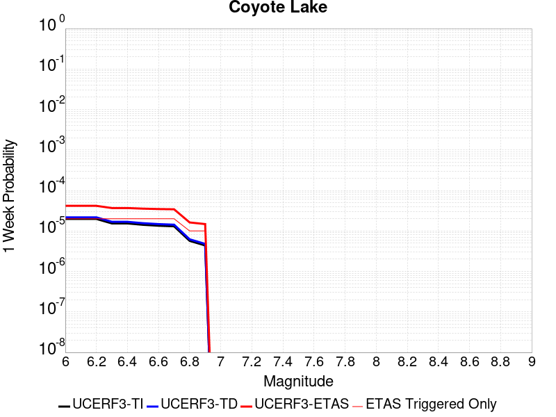 |  |  |  |

| Magnitude | 1 wk TI Prob | 1 wk TD Prob | 1 wk ETAS Prob | 1 wk ETAS/TD Gain | 1 wk ETAS Triggered Only | 1 mo TI Prob | 1 mo TD Prob | 1 mo ETAS Prob | 1 mo ETAS/TD Gain | 1 mo ETAS Triggered Only | 1 yr TI Prob | 1 yr TD Prob | 1 yr ETAS Prob | 1 yr ETAS/TD Gain | 1 yr ETAS Triggered Only | 10 yr TI Prob | 10 yr TD Prob | 10 yr ETAS Prob | 10 yr ETAS/TD Gain | 10 yr ETAS Triggered Only |
|-----|-----|-----|-----|-----|-----|-----|-----|-----|-----|-----|-----|-----|-----|-----|-----|-----|-----|-----|-----|-----|
| 6.0 | 1.980352E-5 | 2.170896E-5 | 2.170896E-5 | 1.0 | 0.0 | 8.486947E-5 | 9.303549E-5 | 9.303549E-5 | 1.0 | 0.0 | 0.0010327959 | 0.0011321905 | 0.0011815173 | 1.0435675 | 4.9382717E-5 | 0.010280091 | 0.011271402 | 0.011539945 | 1.0238252 | 2.7160495E-4 |
| 6.1 | 1.980352E-5 | 2.170896E-5 | 2.170896E-5 | 1.0 | 0.0 | 8.486947E-5 | 9.303549E-5 | 9.303549E-5 | 1.0 | 0.0 | 0.0010327959 | 0.0011321905 | 0.0011815173 | 1.0435675 | 4.9382717E-5 | 0.010280091 | 0.011271402 | 0.011539945 | 1.0238252 | 2.7160495E-4 |
| 6.2 | 1.980352E-5 | 2.170896E-5 | 2.170896E-5 | 1.0 | 0.0 | 8.486947E-5 | 9.303549E-5 | 9.303549E-5 | 1.0 | 0.0 | 0.0010327959 | 0.0011321905 | 0.0011815173 | 1.0435675 | 4.9382717E-5 | 0.010280091 | 0.011271402 | 0.011539945 | 1.0238252 | 2.7160495E-4 |
| 6.3 | 1.5344787E-5 | 1.6822387E-5 | 1.6822387E-5 | 1.0 | 0.0 | 6.576172E-5 | 7.209429E-5 | 7.209429E-5 | 1.0 | 0.0 | 8.003548E-4 | 8.774558E-4 | 9.021255E-4 | 1.028115 | 2.4691359E-5 | 0.007974784 | 0.008745959 | 0.008917287 | 1.0195894 | 1.728395E-4 |
| 6.4 | 1.5344787E-5 | 1.6822387E-5 | 1.6822387E-5 | 1.0 | 0.0 | 6.576172E-5 | 7.209429E-5 | 7.209429E-5 | 1.0 | 0.0 | 8.003548E-4 | 8.774558E-4 | 9.021255E-4 | 1.028115 | 2.4691359E-5 | 0.007974784 | 0.008745959 | 0.008917287 | 1.0195894 | 1.728395E-4 |
| 6.5 | 1.4189697E-5 | 1.5559579E-5 | 1.5559579E-5 | 1.0 | 0.0 | 6.081157E-5 | 6.668255E-5 | 6.668255E-5 | 1.0 | 0.0 | 7.401293E-4 | 8.1161794E-4 | 8.3628925E-4 | 1.0303977 | 2.4691359E-5 | 0.0073766913 | 0.008092482 | 0.008263922 | 1.0211852 | 1.728395E-4 |
| 6.6 | 1.3469301E-5 | 1.4773093E-5 | 1.4773093E-5 | 1.0 | 0.0 | 5.7724297E-5 | 6.331206E-5 | 6.331206E-5 | 1.0 | 0.0 | 7.025667E-4 | 7.706117E-4 | 7.9528405E-4 | 1.0320165 | 2.4691359E-5 | 0.0070034964 | 0.0076853004 | 0.007856811 | 1.0223168 | 1.728395E-4 |
| 6.7 | 1.3027966E-5 | 1.4283204E-5 | 1.4283204E-5 | 1.0 | 0.0 | 5.5832945E-5 | 6.121263E-5 | 6.121263E-5 | 1.0 | 0.0 | 6.7955407E-4 | 7.450687E-4 | 7.6974166E-4 | 1.033115 | 2.4691359E-5 | 0.006774798 | 0.007431586 | 0.007578633 | 1.0197868 | 1.4814814E-4 |
| 6.8 | 5.695434E-6 | 6.225031E-6 | 6.225031E-6 | 1.0 | 0.0 | 2.4408775E-5 | 2.6678601E-5 | 2.6678601E-5 | 1.0 | 0.0 | 2.971363E-4 | 3.2479357E-4 | 3.2479357E-4 | 1.0 | 0.0 | 0.0029673933 | 0.0032461302 | 0.0032707413 | 1.0075817 | 2.4691359E-5 |
| 6.9 | 4.385688E-6 | 4.7935278E-6 | 4.7935278E-6 | 1.0 | 0.0 | 1.879567E-5 | 2.054369E-5 | 2.054369E-5 | 1.0 | 0.0 | 2.2881327E-4 | 2.5011942E-4 | 2.5011942E-4 | 1.0 | 0.0 | 0.002285778 | 0.0025011944 | 0.002525824 | 1.0098472 | 2.4691359E-5 |

## Scodie Lineament
*[(top)](#table-of-contents)*

| 1 Week | 1 Month | 1 Year | 10 Year |
|-----|-----|-----|-----|
|  |  |  |  |

| Magnitude | 1 wk TI Prob | 1 wk TD Prob | 1 wk ETAS Prob | 1 wk ETAS/TD Gain | 1 wk ETAS Triggered Only | 1 mo TI Prob | 1 mo TD Prob | 1 mo ETAS Prob | 1 mo ETAS/TD Gain | 1 mo ETAS Triggered Only | 1 yr TI Prob | 1 yr TD Prob | 1 yr ETAS Prob | 1 yr ETAS/TD Gain | 1 yr ETAS Triggered Only | 10 yr TI Prob | 10 yr TD Prob | 10 yr ETAS Prob | 10 yr ETAS/TD Gain | 10 yr ETAS Triggered Only |
|-----|-----|-----|-----|-----|-----|-----|-----|-----|-----|-----|-----|-----|-----|-----|-----|-----|-----|-----|-----|-----|
| 6.0 | 3.2919327E-6 | 3.0134563E-6 | 3.0134563E-6 | 1.0 | 0.0 | 1.4108206E-5 | 1.2914767E-5 | 1.2914767E-5 | 1.0 | 0.0 | 1.7175387E-4 | 1.5722911E-4 | 2.5597902E-4 | 1.6280638 | 9.8765435E-5 | 0.0017162118 | 0.0015714903 | 0.0018426684 | 1.1725612 | 2.7160495E-4 |
| 6.1 | 1.8663811E-6 | 1.5491216E-6 | 1.5491216E-6 | 1.0 | 0.0 | 7.998751E-6 | 6.639079E-6 | 6.639079E-6 | 1.0 | 0.0 | 9.738045E-5 | 8.0828286E-5 | 8.0828286E-5 | 1.0 | 0.0 | 9.7337784E-4 | 8.0803764E-4 | 8.820519E-4 | 1.0915974 | 7.407407E-5 |
| 6.2 | 1.8663811E-6 | 1.5491216E-6 | 1.5491216E-6 | 1.0 | 0.0 | 7.998751E-6 | 6.639079E-6 | 6.639079E-6 | 1.0 | 0.0 | 9.738045E-5 | 8.0828286E-5 | 8.0828286E-5 | 1.0 | 0.0 | 9.7337784E-4 | 8.0803764E-4 | 8.820519E-4 | 1.0915974 | 7.407407E-5 |
| 6.3 | 1.8663811E-6 | 1.5491216E-6 | 1.5491216E-6 | 1.0 | 0.0 | 7.998751E-6 | 6.639079E-6 | 6.639079E-6 | 1.0 | 0.0 | 9.738045E-5 | 8.0828286E-5 | 8.0828286E-5 | 1.0 | 0.0 | 9.7337784E-4 | 8.0803764E-4 | 8.820519E-4 | 1.0915974 | 7.407407E-5 |
| 6.4 | 1.8663811E-6 | 1.5491216E-6 | 1.5491216E-6 | 1.0 | 0.0 | 7.998751E-6 | 6.639079E-6 | 6.639079E-6 | 1.0 | 0.0 | 9.738045E-5 | 8.0828286E-5 | 8.0828286E-5 | 1.0 | 0.0 | 9.7337784E-4 | 8.0803764E-4 | 8.820519E-4 | 1.0915974 | 7.407407E-5 |
| 6.5 | 1.8106311E-6 | 1.4910531E-6 | 1.4910531E-6 | 1.0 | 0.0 | 7.759824E-6 | 6.390215E-6 | 6.390215E-6 | 1.0 | 0.0 | 9.447177E-5 | 7.7798584E-5 | 7.7798584E-5 | 1.0 | 0.0 | 9.4431615E-4 | 7.7776215E-4 | 8.517786E-4 | 1.095166 | 7.407407E-5 |
| 6.6 | 1.2414679E-6 | 8.998006E-7 | 8.998006E-7 | 1.0 | 0.0 | 5.320566E-6 | 3.856283E-6 | 3.856283E-6 | 1.0 | 0.0 | 6.477596E-5 | 4.6949324E-5 | 4.6949324E-5 | 1.0 | 0.0 | 6.475708E-4 | 4.694027E-4 | 5.4344203E-4 | 1.1577309 | 7.407407E-5 |
| 6.7 | 1.1062215E-6 | 7.5947037E-7 | 7.5947037E-7 | 1.0 | 0.0 | 4.7409408E-6 | 3.2548694E-6 | 3.2548694E-6 | 1.0 | 0.0 | 5.7719422E-5 | 3.9627386E-5 | 3.9627386E-5 | 1.0 | 0.0 | 5.770443E-4 | 3.9621018E-4 | 4.2089174E-4 | 1.0622941 | 2.4691359E-5 |
| 6.8 | 1.0006736E-6 | 6.500747E-7 | 6.500747E-7 | 1.0 | 0.0 | 4.288594E-6 | 2.786032E-6 | 2.786032E-6 | 1.0 | 0.0 | 5.221238E-5 | 3.391947E-5 | 3.391947E-5 | 1.0 | 0.0 | 5.220012E-4 | 3.3914903E-4 | 3.3914903E-4 | 1.0 | 0.0 |
| 6.9 | 9.167364E-7 | 5.631943E-7 | 5.631943E-7 | 1.0 | 0.0 | 3.9288643E-6 | 2.413688E-6 | 2.413688E-6 | 1.0 | 0.0 | 4.7832873E-5 | 2.9386312E-5 | 2.9386312E-5 | 1.0 | 0.0 | 4.782258E-4 | 2.9382994E-4 | 2.9382994E-4 | 1.0 | 0.0 |
| 7.0 | 7.6987664E-7 | 4.1136465E-7 | 4.1136465E-7 | 1.0 | 0.0 | 3.2994672E-6 | 1.7629905E-6 | 1.7629905E-6 | 1.0 | 0.0 | 4.0170275E-5 | 2.1464237E-5 | 2.1464237E-5 | 1.0 | 0.0 | 4.0163012E-4 | 2.146255E-4 | 2.146255E-4 | 1.0 | 0.0 |
| 7.1 | 7.1038727E-7 | 3.521392E-7 | 3.521392E-7 | 1.0 | 0.0 | 3.0445133E-6 | 1.5091673E-6 | 1.5091673E-6 | 1.0 | 0.0 | 3.706632E-5 | 1.8373992E-5 | 1.8373992E-5 | 1.0 | 0.0 | 3.7060137E-4 | 1.8372823E-4 | 1.8372823E-4 | 1.0 | 0.0 |
| 7.2 | 2.0799602E-7 | 3.1193522E-8 | 3.1193522E-8 | 1.0 | 0.0 | 8.914113E-7 | 1.3368651E-7 | 1.3368651E-7 | 1.0 | 0.0 | 1.0852878E-5 | 1.6276322E-6 | 1.6276322E-6 | 1.0 | 0.0 | 1.08523476E-4 | 1.627621E-5 | 1.627621E-5 | 1.0 | 0.0 |
| 7.3 | 1.5048182E-7 | 1.5950226E-8 | 1.5950226E-8 | 1.0 | 0.0 | 6.449219E-7 | 6.835811E-8 | 6.835811E-8 | 1.0 | 0.0 | 7.851896E-6 | 8.3225973E-7 | 8.3225973E-7 | 1.0 | 0.0 | 7.851618E-5 | 8.322569E-6 | 8.322569E-6 | 1.0 | 0.0 |
| 7.4 | 5.9334678E-8 | 4.870027E-9 | 4.870027E-9 | 1.0 | 0.0 | 2.5429145E-7 | 2.0871544E-8 | 2.0871544E-8 | 1.0 | 0.0 | 3.095994E-6 | 2.5411103E-7 | 2.5411103E-7 | 1.0 | 0.0 | 3.095951E-5 | 2.5411086E-6 | 2.5411086E-6 | 1.0 | 0.0 |

## San Andreas (San Gorgonio Pass-Garnet HIll)
*[(top)](#table-of-contents)*

| 1 Week | 1 Month | 1 Year | 10 Year |
|-----|-----|-----|-----|
|  |  |  |  |

| Magnitude | 1 wk TI Prob | 1 wk TD Prob | 1 wk ETAS Prob | 1 wk ETAS/TD Gain | 1 wk ETAS Triggered Only | 1 mo TI Prob | 1 mo TD Prob | 1 mo ETAS Prob | 1 mo ETAS/TD Gain | 1 mo ETAS Triggered Only | 1 yr TI Prob | 1 yr TD Prob | 1 yr ETAS Prob | 1 yr ETAS/TD Gain | 1 yr ETAS Triggered Only | 10 yr TI Prob | 10 yr TD Prob | 10 yr ETAS Prob | 10 yr ETAS/TD Gain | 10 yr ETAS Triggered Only |
|-----|-----|-----|-----|-----|-----|-----|-----|-----|-----|-----|-----|-----|-----|-----|-----|-----|-----|-----|-----|-----|
| 6.0 | 8.31567E-5 | 2.3414505E-4 | 2.3414505E-4 | 1.0 | 0.0 | 3.5633717E-4 | 0.0010030948 | 0.0010277615 | 1.0245905 | 2.4691359E-5 | 0.004329778 | 0.012144244 | 0.012266202 | 1.0100424 | 1.2345679E-4 | 0.042463828 | 0.112708785 | 0.112905964 | 1.0017494 | 2.2222222E-4 |
| 6.1 | 8.31567E-5 | 2.3414505E-4 | 2.3414505E-4 | 1.0 | 0.0 | 3.5633717E-4 | 0.0010030948 | 0.0010277615 | 1.0245905 | 2.4691359E-5 | 0.004329778 | 0.012144244 | 0.012266202 | 1.0100424 | 1.2345679E-4 | 0.042463828 | 0.112708785 | 0.112905964 | 1.0017494 | 2.2222222E-4 |
| 6.2 | 8.31567E-5 | 2.3414505E-4 | 2.3414505E-4 | 1.0 | 0.0 | 3.5633717E-4 | 0.0010030948 | 0.0010277615 | 1.0245905 | 2.4691359E-5 | 0.004329778 | 0.012144244 | 0.012266202 | 1.0100424 | 1.2345679E-4 | 0.042463828 | 0.112708785 | 0.112905964 | 1.0017494 | 2.2222222E-4 |
| 6.3 | 8.31567E-5 | 2.3414505E-4 | 2.3414505E-4 | 1.0 | 0.0 | 3.5633717E-4 | 0.0010030948 | 0.0010277615 | 1.0245905 | 2.4691359E-5 | 0.004329778 | 0.012144244 | 0.012266202 | 1.0100424 | 1.2345679E-4 | 0.042463828 | 0.112708785 | 0.112905964 | 1.0017494 | 2.2222222E-4 |
| 6.4 | 8.059055E-5 | 2.2972451E-4 | 2.2972451E-4 | 1.0 | 0.0 | 3.4534236E-4 | 9.841647E-4 | 0.0010088317 | 1.025064 | 2.4691359E-5 | 0.0041964394 | 0.011916306 | 0.012038291 | 1.0102369 | 1.2345679E-4 | 0.041180745 | 0.11068947 | 0.110887095 | 1.0017854 | 2.2222222E-4 |
| 6.5 | 8.059055E-5 | 2.2972451E-4 | 2.2972451E-4 | 1.0 | 0.0 | 3.4534236E-4 | 9.841647E-4 | 0.0010088317 | 1.025064 | 2.4691359E-5 | 0.0041964394 | 0.011916306 | 0.012038291 | 1.0102369 | 1.2345679E-4 | 0.041180745 | 0.11068947 | 0.110887095 | 1.0017854 | 2.2222222E-4 |
| 6.6 | 7.619237E-5 | 2.2216294E-4 | 2.2216294E-4 | 1.0 | 0.0 | 3.2649786E-4 | 9.5178175E-4 | 9.7644964E-4 | 1.0259175 | 2.4691359E-5 | 0.0039678677 | 0.011526926 | 0.01164896 | 1.0105869 | 1.2345679E-4 | 0.03897764 | 0.10722548 | 0.10742387 | 1.0018502 | 2.2222222E-4 |
| 6.7 | 7.440636E-5 | 2.1892048E-4 | 2.1892048E-4 | 1.0 | 0.0 | 3.188454E-4 | 9.378955E-4 | 9.6256373E-4 | 1.0263016 | 2.4691359E-5 | 0.0038750346 | 0.01135963 | 0.011481685 | 1.0107446 | 1.2345679E-4 | 0.038081564 | 0.105733834 | 0.10591048 | 1.0016707 | 1.9753087E-4 |
| 6.8 | 7.3735864E-5 | 2.1739179E-4 | 2.1739179E-4 | 1.0 | 0.0 | 3.1597257E-4 | 9.313487E-4 | 9.5601706E-4 | 1.0264868 | 2.4691359E-5 | 0.0038401815 | 0.011280751 | 0.011402815 | 1.0108205 | 1.2345679E-4 | 0.03774495 | 0.10503531 | 0.10521209 | 1.0016831 | 1.9753087E-4 |
| 6.9 | 7.27575E-5 | 2.1508102E-4 | 2.1508102E-4 | 1.0 | 0.0 | 3.117806E-4 | 9.214524E-4 | 9.4612106E-4 | 1.0267714 | 2.4691359E-5 | 0.003789323 | 0.011161504 | 0.011283583 | 1.0109375 | 1.2345679E-4 | 0.037253562 | 0.103983164 | 0.10416015 | 1.0017021 | 1.9753087E-4 |
| 7.0 | 7.102591E-5 | 2.109201E-4 | 2.109201E-4 | 1.0 | 0.0 | 3.0436125E-4 | 9.036324E-4 | 9.283014E-4 | 1.0272999 | 2.4691359E-5 | 0.003699303 | 0.010946743 | 0.011068849 | 1.0111545 | 1.2345679E-4 | 0.03638325 | 0.10208506 | 0.10226242 | 1.0017375 | 1.9753087E-4 |
| 7.1 | 7.028513E-5 | 2.0927594E-4 | 2.0927594E-4 | 1.0 | 0.0 | 3.0118722E-4 | 8.965908E-4 | 9.2126004E-4 | 1.0275145 | 2.4691359E-5 | 0.0036607897 | 0.010861871 | 0.010983987 | 1.0112426 | 1.2345679E-4 | 0.036010686 | 0.10132793 | 0.10150545 | 1.0017519 | 1.9753087E-4 |
| 7.2 | 6.8498244E-5 | 2.0535318E-4 | 2.0535318E-4 | 1.0 | 0.0 | 2.9353087E-4 | 8.7979046E-4 | 9.044601E-4 | 1.0280404 | 2.4691359E-5 | 0.003567883 | 0.010659343 | 0.010781484 | 1.0114585 | 1.2345679E-4 | 0.035111405 | 0.09951958 | 0.09969745 | 1.0017873 | 1.9753087E-4 |
| 7.3 | 6.622592E-5 | 1.9762218E-4 | 1.9762218E-4 | 1.0 | 0.0 | 2.8379448E-4 | 8.4667944E-4 | 8.713499E-4 | 1.0291378 | 2.4691359E-5 | 0.0034497243 | 0.010260082 | 0.010382272 | 1.0119092 | 1.2345679E-4 | 0.033966612 | 0.0960149 | 0.09619346 | 1.0018598 | 1.9753087E-4 |
| 7.4 | 5.1050705E-5 | 1.4715092E-4 | 1.4715092E-4 | 1.0 | 0.0 | 2.1877038E-4 | 6.3049525E-4 | 6.55171E-4 | 1.0391371 | 2.4691359E-5 | 0.002660276 | 0.0076494548 | 0.007771967 | 1.0160159 | 1.2345679E-4 | 0.02628654 | 0.072975665 | 0.073158786 | 1.0025092 | 1.9753087E-4 |
| 7.5 | 3.9302922E-5 | 1.1152523E-4 | 1.1152523E-4 | 1.0 | 0.0 | 1.6843023E-4 | 4.7787806E-4 | 5.025576E-4 | 1.0516441 | 2.4691359E-5 | 0.0020487092 | 0.005802714 | 0.0059009064 | 1.0169218 | 9.8765435E-5 | 0.020299247 | 0.056109704 | 0.056272846 | 1.0029075 | 1.728395E-4 |
| 7.6 | 2.9851626E-5 | 8.5151754E-5 | 8.5151754E-5 | 1.0 | 0.0 | 1.2792926E-4 | 3.6488517E-4 | 3.8956752E-4 | 1.0676441 | 2.4691359E-5 | 0.0015564259 | 0.0044334535 | 0.004531781 | 1.0221785 | 9.8765435E-5 | 0.0154556995 | 0.04328418 | 0.04344954 | 1.0038203 | 1.728395E-4 |
| 7.7 | 2.1135214E-5 | 6.3708605E-5 | 6.3708605E-5 | 1.0 | 0.0 | 9.0576345E-5 | 2.7300834E-4 | 2.9769295E-4 | 1.090417 | 2.4691359E-5 | 0.0011022091 | 0.003318816 | 0.0034172535 | 1.0296605 | 9.8765435E-5 | 0.010967582 | 0.03266356 | 0.032830756 | 1.0051187 | 1.728395E-4 |
| 7.8 | 1.883379E-5 | 5.5805158E-5 | 5.5805158E-5 | 1.0 | 0.0 | 8.0713755E-5 | 2.3914306E-4 | 2.6382852E-4 | 1.1032246 | 2.4691359E-5 | 9.822468E-4 | 0.0029076824 | 0.0030061607 | 1.0338683 | 9.8765435E-5 | 0.0097791655 | 0.028769925 | 0.028937792 | 1.0058348 | 1.728395E-4 |
| 7.9 | 1.5156185E-5 | 4.1793628E-5 | 4.1793628E-5 | 1.0 | 0.0 | 6.495346E-5 | 1.7910327E-4 | 2.037902E-4 | 1.1378363 | 2.4691359E-5 | 7.9052144E-4 | 0.0021784029 | 0.0022523156 | 1.0339298 | 7.407407E-5 | 0.007877152 | 0.021821551 | 0.021966467 | 1.0066409 | 1.4814814E-4 |
| 8.0 | 1.1405907E-5 | 3.007569E-5 | 3.007569E-5 | 1.0 | 0.0 | 4.8881542E-5 | 1.2888944E-4 | 1.5357762E-4 | 1.1915454 | 2.4691359E-5 | 5.9497025E-4 | 0.0015681004 | 0.0016174057 | 1.0314426 | 4.9382717E-5 | 0.005933798 | 0.015819972 | 0.015917175 | 1.0061443 | 9.8765435E-5 |
| 8.1 | 4.3511436E-6 | 7.4057634E-6 | 7.4057634E-6 | 1.0 | 0.0 | 1.8647626E-5 | 3.17386E-5 | 3.17386E-5 | 1.0 | 0.0 | 2.2701119E-4 | 3.863491E-4 | 3.863491E-4 | 1.0 | 0.0 | 0.0022677942 | 0.004134587 | 0.004134587 | 1.0 | 0.0 |
| 8.2 | 2.3042528E-6 | 2.7502406E-6 | 2.7502406E-6 | 1.0 | 0.0 | 9.875332E-6 | 1.1786692E-5 | 1.1786692E-5 | 1.0 | 0.0 | 1.2022553E-4 | 1.4349357E-4 | 1.4349357E-4 | 1.0 | 0.0 | 0.0012016051 | 0.0016070296 | 0.0016070296 | 1.0 | 0.0 |
| 8.3 | 5.202968E-7 | 3.1885122E-7 | 3.1885122E-7 | 1.0 | 0.0 | 2.2298414E-6 | 1.3665045E-6 | 1.3665045E-6 | 1.0 | 0.0 | 2.714798E-5 | 1.663708E-5 | 1.663708E-5 | 1.0 | 0.0 | 2.7144665E-4 | 1.9725217E-4 | 1.9725217E-4 | 1.0 | 0.0 |

## San Andreas (Big Bend)
*[(top)](#table-of-contents)*

| 1 Week | 1 Month | 1 Year | 10 Year |
|-----|-----|-----|-----|
|  |  |  |  |

| Magnitude | 1 wk TI Prob | 1 wk TD Prob | 1 wk ETAS Prob | 1 wk ETAS/TD Gain | 1 wk ETAS Triggered Only | 1 mo TI Prob | 1 mo TD Prob | 1 mo ETAS Prob | 1 mo ETAS/TD Gain | 1 mo ETAS Triggered Only | 1 yr TI Prob | 1 yr TD Prob | 1 yr ETAS Prob | 1 yr ETAS/TD Gain | 1 yr ETAS Triggered Only | 10 yr TI Prob | 10 yr TD Prob | 10 yr ETAS Prob | 10 yr ETAS/TD Gain | 10 yr ETAS Triggered Only |
|-----|-----|-----|-----|-----|-----|-----|-----|-----|-----|-----|-----|-----|-----|-----|-----|-----|-----|-----|-----|-----|
| 6.0 | 1.0179969E-4 | 2.014058E-4 | 2.014058E-4 | 1.0 | 0.0 | 4.362114E-4 | 8.628832E-4 | 8.628832E-4 | 1.0 | 0.0 | 0.0052979486 | 0.010455282 | 0.010528582 | 1.0070108 | 7.407407E-5 | 0.051734097 | 0.10174658 | 0.10194619 | 1.0019618 | 2.2222222E-4 |
| 6.1 | 1.0179969E-4 | 2.014058E-4 | 2.014058E-4 | 1.0 | 0.0 | 4.362114E-4 | 8.628832E-4 | 8.628832E-4 | 1.0 | 0.0 | 0.0052979486 | 0.010455282 | 0.010528582 | 1.0070108 | 7.407407E-5 | 0.051734097 | 0.10174658 | 0.10194619 | 1.0019618 | 2.2222222E-4 |
| 6.2 | 1.0179969E-4 | 2.014058E-4 | 2.014058E-4 | 1.0 | 0.0 | 4.362114E-4 | 8.628832E-4 | 8.628832E-4 | 1.0 | 0.0 | 0.0052979486 | 0.010455282 | 0.010528582 | 1.0070108 | 7.407407E-5 | 0.051734097 | 0.10174658 | 0.10194619 | 1.0019618 | 2.2222222E-4 |
| 6.3 | 1.0179969E-4 | 2.014058E-4 | 2.014058E-4 | 1.0 | 0.0 | 4.362114E-4 | 8.628832E-4 | 8.628832E-4 | 1.0 | 0.0 | 0.0052979486 | 0.010455282 | 0.010528582 | 1.0070108 | 7.407407E-5 | 0.051734097 | 0.10174658 | 0.10194619 | 1.0019618 | 2.2222222E-4 |
| 6.4 | 9.1639464E-5 | 1.849651E-4 | 1.849651E-4 | 1.0 | 0.0 | 3.9268145E-4 | 7.92467E-4 | 7.92467E-4 | 1.0 | 0.0 | 0.0047704205 | 0.009605722 | 0.009679085 | 1.0076374 | 7.407407E-5 | 0.046693064 | 0.09406955 | 0.09420376 | 1.0014267 | 1.4814814E-4 |
| 6.5 | 9.1639464E-5 | 1.849651E-4 | 1.849651E-4 | 1.0 | 0.0 | 3.9268145E-4 | 7.92467E-4 | 7.92467E-4 | 1.0 | 0.0 | 0.0047704205 | 0.009605722 | 0.009679085 | 1.0076374 | 7.407407E-5 | 0.046693064 | 0.09406955 | 0.09420376 | 1.0014267 | 1.4814814E-4 |
| 6.6 | 9.042622E-5 | 1.8303402E-4 | 1.8303402E-4 | 1.0 | 0.0 | 3.8748336E-4 | 7.841959E-4 | 7.841959E-4 | 1.0 | 0.0 | 0.0047074095 | 0.009505902 | 0.0095548155 | 1.0051455 | 4.9382717E-5 | 0.046089325 | 0.09316317 | 0.09327513 | 1.0012017 | 1.2345679E-4 |
| 6.7 | 8.9836685E-5 | 1.8217682E-4 | 1.8217682E-4 | 1.0 | 0.0 | 3.8495753E-4 | 7.805244E-4 | 7.805244E-4 | 1.0 | 0.0 | 0.00467679 | 0.00946159 | 0.009510505 | 1.0051699 | 4.9382717E-5 | 0.045795817 | 0.09275731 | 0.092846915 | 1.000966 | 9.8765435E-5 |
| 6.8 | 8.9471854E-5 | 1.81644E-4 | 1.81644E-4 | 1.0 | 0.0 | 3.8339442E-4 | 7.7824225E-4 | 7.7824225E-4 | 1.0 | 0.0 | 0.004657841 | 0.009434046 | 0.009482963 | 1.0051851 | 4.9382717E-5 | 0.04561414 | 0.092504315 | 0.09259394 | 1.0009689 | 9.8765435E-5 |
| 6.9 | 8.858234E-5 | 1.8046265E-4 | 1.8046265E-4 | 1.0 | 0.0 | 3.7958333E-4 | 7.731823E-4 | 7.731823E-4 | 1.0 | 0.0 | 0.004611638 | 0.009372972 | 0.009421892 | 1.0052192 | 4.9382717E-5 | 0.04517103 | 0.091944106 | 0.09201137 | 1.0007316 | 7.407407E-5 |
| 7.0 | 8.7433385E-5 | 1.7884896E-4 | 1.7884896E-4 | 1.0 | 0.0 | 3.746607E-4 | 7.662706E-4 | 7.662706E-4 | 1.0 | 0.0 | 0.004551957 | 0.009289543 | 0.009338466 | 1.0052665 | 4.9382717E-5 | 0.044598386 | 0.091178015 | 0.09124534 | 1.0007384 | 7.407407E-5 |
| 7.1 | 8.684964E-5 | 1.7796745E-4 | 1.7796745E-4 | 1.0 | 0.0 | 3.7215967E-4 | 7.624949E-4 | 7.624949E-4 | 1.0 | 0.0 | 0.0045216335 | 0.009243964 | 0.00929289 | 1.0052928 | 4.9382717E-5 | 0.04430731 | 0.09075921 | 0.09082656 | 1.0007421 | 7.407407E-5 |
| 7.2 | 8.606521E-5 | 1.7687255E-4 | 1.7687255E-4 | 1.0 | 0.0 | 3.6879873E-4 | 7.578052E-4 | 7.578052E-4 | 1.0 | 0.0 | 0.0044808835 | 0.00918735 | 0.009236279 | 1.0053257 | 4.9382717E-5 | 0.043916024 | 0.090239406 | 0.090306796 | 1.0007468 | 7.407407E-5 |
| 7.3 | 8.568266E-5 | 1.7629136E-4 | 1.7629136E-4 | 1.0 | 0.0 | 3.6715972E-4 | 7.553158E-4 | 7.553158E-4 | 1.0 | 0.0 | 0.0044610105 | 0.009157297 | 0.009206228 | 1.0053433 | 4.9382717E-5 | 0.043725148 | 0.08996009 | 0.0900275 | 1.0007493 | 7.407407E-5 |
| 7.4 | 8.5432206E-5 | 1.7591644E-4 | 1.7591644E-4 | 1.0 | 0.0 | 3.6608664E-4 | 7.5370993E-4 | 7.5370993E-4 | 1.0 | 0.0 | 0.004447999 | 0.00913791 | 0.009186842 | 1.0053548 | 4.9382717E-5 | 0.043600157 | 0.08977997 | 0.08984739 | 1.000751 | 7.407407E-5 |
| 7.5 | 8.4791965E-5 | 1.7460699E-4 | 1.7460699E-4 | 1.0 | 0.0 | 3.633435E-4 | 7.481013E-4 | 7.481013E-4 | 1.0 | 0.0 | 0.0044147377 | 0.009070195 | 0.00911913 | 1.0053952 | 4.9382717E-5 | 0.043280575 | 0.08915666 | 0.08922412 | 1.0007567 | 7.407407E-5 |
| 7.6 | 8.241105E-5 | 1.6905028E-4 | 1.6905028E-4 | 1.0 | 0.0 | 3.531424E-4 | 7.243002E-4 | 7.243002E-4 | 1.0 | 0.0 | 0.0042910352 | 0.008782789 | 0.008831738 | 1.0055733 | 4.9382717E-5 | 0.042091176 | 0.08652985 | 0.08659752 | 1.000782 | 7.407407E-5 |
| 7.7 | 7.00432E-5 | 1.4262824E-4 | 1.4262824E-4 | 1.0 | 0.0 | 3.001506E-4 | 6.111207E-4 | 6.111207E-4 | 1.0 | 0.0 | 0.0036482112 | 0.007415052 | 0.0074640685 | 1.0066104 | 4.9382717E-5 | 0.035888977 | 0.073780596 | 0.073826335 | 1.0006199 | 4.9382717E-5 |
| 7.8 | 6.415362E-5 | 1.3021544E-4 | 1.3021544E-4 | 1.0 | 0.0 | 2.749151E-4 | 5.5794686E-4 | 5.5794686E-4 | 1.0 | 0.0 | 0.0033419547 | 0.0067718746 | 0.006820923 | 1.0072429 | 4.9382717E-5 | 0.03292141 | 0.06749143 | 0.06753747 | 1.0006824 | 4.9382717E-5 |
| 7.9 | 4.939911E-5 | 9.378932E-5 | 9.378932E-5 | 1.0 | 0.0 | 2.116933E-4 | 4.0189232E-4 | 4.0189232E-4 | 1.0 | 0.0 | 0.0025743195 | 0.0048820707 | 0.004931212 | 1.0100658 | 4.9382717E-5 | 0.025447013 | 0.049091615 | 0.049138572 | 1.0009565 | 4.9382717E-5 |
| 8.0 | 3.344983E-5 | 5.2452913E-5 | 5.2452913E-5 | 1.0 | 0.0 | 1.4334853E-4 | 2.2477885E-4 | 2.2477885E-4 | 1.0 | 0.0 | 0.0017438711 | 0.0027332497 | 0.0027578736 | 1.009009 | 2.4691359E-5 | 0.017302496 | 0.028033478 | 0.028057478 | 1.000856 | 2.4691359E-5 |
| 8.1 | 1.9104898E-5 | 1.9284143E-5 | 1.9284143E-5 | 1.0 | 0.0 | 8.1875565E-5 | 8.264371E-5 | 8.264371E-5 | 1.0 | 0.0 | 9.963791E-4 | 0.0010057234 | 0.0010303899 | 1.0245261 | 2.4691359E-5 | 0.009919235 | 0.01080821 | 0.010832635 | 1.0022599 | 2.4691359E-5 |
| 8.2 | 8.643924E-6 | 5.5167247E-6 | 5.5167247E-6 | 1.0 | 0.0 | 3.704486E-5 | 2.3642891E-5 | 2.3642891E-5 | 1.0 | 0.0 | 4.5092785E-4 | 2.8781427E-4 | 2.8781427E-4 | 1.0 | 0.0 | 0.0045001395 | 0.0032716133 | 0.0032716133 | 1.0 | 0.0 |
| 8.3 | 1.983087E-6 | 7.731745E-7 | 7.731745E-7 | 1.0 | 0.0 | 8.498917E-6 | 3.313601E-6 | 3.313601E-6 | 1.0 | 0.0 | 1.034694E-4 | 4.0342362E-5 | 4.0342362E-5 | 1.0 | 0.0 | 0.0010342124 | 4.7608858E-4 | 4.7608858E-4 | 1.0 | 0.0 |

## San Andreas (Coachella) rev
*[(top)](#table-of-contents)*

| 1 Week | 1 Month | 1 Year | 10 Year |
|-----|-----|-----|-----|
|  | 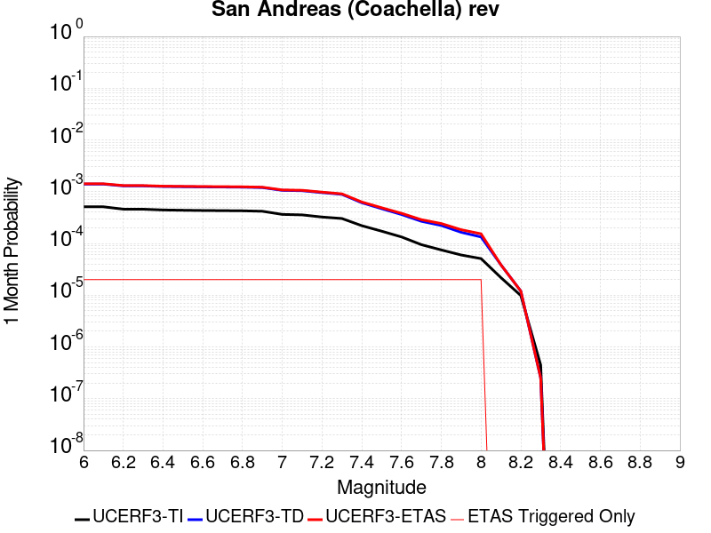 |  | 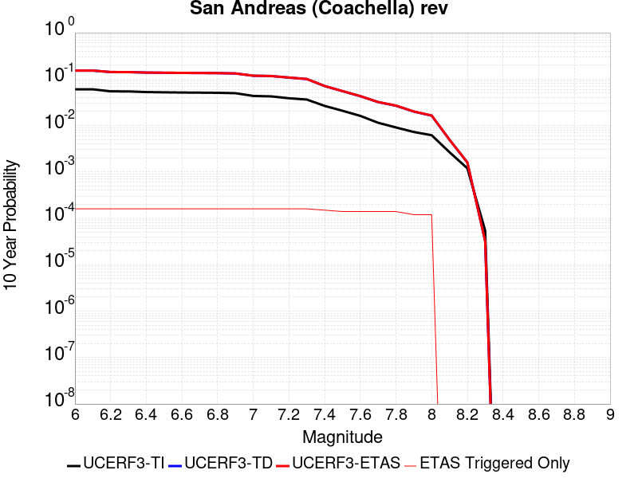 |

| Magnitude | 1 wk TI Prob | 1 wk TD Prob | 1 wk ETAS Prob | 1 wk ETAS/TD Gain | 1 wk ETAS Triggered Only | 1 mo TI Prob | 1 mo TD Prob | 1 mo ETAS Prob | 1 mo ETAS/TD Gain | 1 mo ETAS Triggered Only | 1 yr TI Prob | 1 yr TD Prob | 1 yr ETAS Prob | 1 yr ETAS/TD Gain | 1 yr ETAS Triggered Only | 10 yr TI Prob | 10 yr TD Prob | 10 yr ETAS Prob | 10 yr ETAS/TD Gain | 10 yr ETAS Triggered Only |
|-----|-----|-----|-----|-----|-----|-----|-----|-----|-----|-----|-----|-----|-----|-----|-----|-----|-----|-----|-----|-----|
| 6.0 | 1.1925945E-4 | 3.276467E-4 | 3.276467E-4 | 1.0 | 0.0 | 5.110118E-4 | 0.0014034492 | 0.001428106 | 1.0175686 | 2.4691359E-5 | 0.0062038354 | 0.016954463 | 0.017075825 | 1.0071582 | 1.2345679E-4 | 0.060334753 | 0.1527907 | 0.15293713 | 1.0009583 | 1.728395E-4 |
| 6.1 | 1.1925945E-4 | 3.276467E-4 | 3.276467E-4 | 1.0 | 0.0 | 5.110118E-4 | 0.0014034492 | 0.001428106 | 1.0175686 | 2.4691359E-5 | 0.0062038354 | 0.016954463 | 0.017075825 | 1.0071582 | 1.2345679E-4 | 0.060334753 | 0.1527907 | 0.15293713 | 1.0009583 | 1.728395E-4 |
| 6.2 | 1.07432395E-4 | 3.0265172E-4 | 3.0265172E-4 | 1.0 | 0.0 | 4.603433E-4 | 0.001296438 | 0.0013210974 | 1.0190208 | 2.4691359E-5 | 0.005590286 | 0.015671 | 0.015792523 | 1.0077546 | 1.2345679E-4 | 0.05451731 | 0.14196219 | 0.14211048 | 1.0010446 | 1.728395E-4 |
| 6.3 | 1.0718766E-4 | 3.0210475E-4 | 3.0210475E-4 | 1.0 | 0.0 | 4.592948E-4 | 0.0012940962 | 0.0013187557 | 1.0190554 | 2.4691359E-5 | 0.005577586 | 0.015642898 | 0.015764425 | 1.0077688 | 1.2345679E-4 | 0.054396555 | 0.14173047 | 0.14187881 | 1.0010467 | 1.728395E-4 |
| 6.4 | 1.0355944E-4 | 2.9418513E-4 | 2.9418513E-4 | 1.0 | 0.0 | 4.4375064E-4 | 0.0012601882 | 0.0012848484 | 1.0195687 | 2.4691359E-5 | 0.0053892885 | 0.015235912 | 0.015357488 | 1.0079795 | 1.2345679E-4 | 0.052604496 | 0.13829084 | 0.13843977 | 1.0010769 | 1.728395E-4 |
| 6.5 | 1.0227914E-4 | 2.9137929E-4 | 2.9137929E-4 | 1.0 | 0.0 | 4.382655E-4 | 0.0012481747 | 0.0012728352 | 1.0197573 | 2.4691359E-5 | 0.0053228354 | 0.015091684 | 0.015213277 | 1.008057 | 1.2345679E-4 | 0.051971316 | 0.13707013 | 0.13721928 | 1.0010881 | 1.728395E-4 |
| 6.6 | 1.0116757E-4 | 2.8903663E-4 | 2.8903663E-4 | 1.0 | 0.0 | 4.3350324E-4 | 0.0012381444 | 0.0012628051 | 1.0199175 | 2.4691359E-5 | 0.0052651367 | 0.014971248 | 0.015092856 | 1.0081228 | 1.2345679E-4 | 0.051421247 | 0.1360484 | 0.13619773 | 1.0010976 | 1.728395E-4 |
| 6.7 | 1.0050676E-4 | 2.8762216E-4 | 2.8762216E-4 | 1.0 | 0.0 | 4.3067214E-4 | 0.001232088 | 0.0012567489 | 1.0200156 | 2.4691359E-5 | 0.005230834 | 0.014898524 | 0.01502014 | 1.0081631 | 1.2345679E-4 | 0.051094085 | 0.13543318 | 0.13558263 | 1.0011034 | 1.728395E-4 |
| 6.8 | 9.976819E-5 | 2.856583E-4 | 2.856583E-4 | 1.0 | 0.0 | 4.2750788E-4 | 0.0012236794 | 0.0012483405 | 1.0201533 | 2.4691359E-5 | 0.0051924936 | 0.014797544 | 0.014919174 | 1.0082196 | 1.2345679E-4 | 0.050728295 | 0.13458484 | 0.13473442 | 1.0011114 | 1.728395E-4 |
| 6.9 | 9.77719E-5 | 2.8062498E-4 | 2.8062498E-4 | 1.0 | 0.0 | 4.1895514E-4 | 0.001202128 | 0.0012267897 | 1.020515 | 2.4691359E-5 | 0.0050888555 | 0.014538688 | 0.014660349 | 1.0083681 | 1.2345679E-4 | 0.049738888 | 0.1324128 | 0.13256276 | 1.0011325 | 1.728395E-4 |
| 7.0 | 8.500761E-5 | 2.4795174E-4 | 2.4795174E-4 | 1.0 | 0.0 | 3.6426744E-4 | 0.0010622209 | 0.0010868859 | 1.0232203 | 2.4691359E-5 | 0.0044259406 | 0.012856629 | 0.012978499 | 1.0094792 | 1.2345679E-4 | 0.04338823 | 0.1182658 | 0.1184182 | 1.0012887 | 1.728395E-4 |
| 7.1 | 8.319876E-5 | 2.4397543E-4 | 2.4397543E-4 | 1.0 | 0.0 | 3.5651738E-4 | 0.0010451933 | 0.0010698588 | 1.023599 | 2.4691359E-5 | 0.004331963 | 0.012651744 | 0.0127736395 | 1.0096346 | 1.2345679E-4 | 0.042484846 | 0.116484836 | 0.11663754 | 1.001311 | 1.728395E-4 |
| 7.2 | 7.563917E-5 | 2.2444999E-4 | 2.2444999E-4 | 1.0 | 0.0 | 3.2412758E-4 | 9.61577E-4 | 9.862446E-4 | 1.0256532 | 2.4691359E-5 | 0.0039391145 | 0.011645048 | 0.011767067 | 1.0104783 | 1.2345679E-4 | 0.03870018 | 0.1078885 | 0.108042695 | 1.0014292 | 1.728395E-4 |
| 7.3 | 7.082985E-5 | 2.0759941E-4 | 2.0759941E-4 | 1.0 | 0.0 | 3.0352117E-4 | 8.894113E-4 | 9.140807E-4 | 1.0277368 | 2.4691359E-5 | 0.0036891096 | 0.010775445 | 0.010897571 | 1.0113338 | 1.2345679E-4 | 0.03628465 | 0.1004075 | 0.10056299 | 1.0015485 | 1.728395E-4 |
| 7.4 | 5.146215E-5 | 1.4298319E-4 | 1.4298319E-4 | 1.0 | 0.0 | 2.2053342E-4 | 6.1264203E-4 | 6.373183E-4 | 1.0402784 | 2.4691359E-5 | 0.0026816884 | 0.007433597 | 0.007531628 | 1.0131876 | 9.8765435E-5 | 0.02649557 | 0.070956536 | 0.07109417 | 1.0019398 | 1.4814814E-4 |
| 7.5 | 4.0285166E-5 | 1.0962878E-4 | 1.0962878E-4 | 1.0 | 0.0 | 1.7263928E-4 | 4.6975337E-4 | 4.944331E-4 | 1.0525377 | 2.4691359E-5 | 0.002099857 | 0.005704319 | 0.0057779704 | 1.0129116 | 7.407407E-5 | 0.020801254 | 0.055105854 | 0.055222508 | 1.0021169 | 1.2345679E-4 |
| 7.6 | 3.1168736E-5 | 8.4578256E-5 | 8.4578256E-5 | 1.0 | 0.0 | 1.3357346E-4 | 3.6242802E-4 | 3.8711043E-4 | 1.068103 | 2.4691359E-5 | 0.0016250437 | 0.00440366 | 0.004477408 | 1.016747 | 7.407407E-5 | 0.016132116 | 0.04289531 | 0.043013472 | 1.0027547 | 1.2345679E-4 |
| 7.7 | 2.2100989E-5 | 6.2553896E-5 | 6.2553896E-5 | 1.0 | 0.0 | 9.4715084E-5 | 2.6806063E-4 | 2.9274536E-4 | 1.0920864 | 2.4691359E-5 | 0.001152546 | 0.0032587603 | 0.003332593 | 1.0226567 | 7.407407E-5 | 0.011465867 | 0.03197573 | 0.032095242 | 1.0037374 | 1.2345679E-4 |
| 7.8 | 1.7484861E-5 | 5.1944033E-5 | 5.1944033E-5 | 1.0 | 0.0 | 7.493296E-5 | 2.225983E-4 | 2.4728416E-4 | 1.1108987 | 2.4691359E-5 | 9.1192697E-4 | 0.002706769 | 0.0027806426 | 1.0272921 | 7.407407E-5 | 0.009081938 | 0.026707657 | 0.026827816 | 1.0044991 | 1.2345679E-4 |
| 7.9 | 1.3967285E-5 | 3.834408E-5 | 3.834408E-5 | 1.0 | 0.0 | 5.985842E-5 | 1.6432142E-4 | 1.8900872E-4 | 1.1502379 | 2.4691359E-5 | 7.2853256E-4 | 0.001998779 | 0.0020480629 | 1.024657 | 4.9382717E-5 | 0.0072614877 | 0.019965619 | 0.020062413 | 1.004848 | 9.8765435E-5 |
| 8.0 | 1.1887396E-5 | 3.1169602E-5 | 3.1169602E-5 | 1.0 | 0.0 | 5.094499E-5 | 1.3357717E-4 | 1.5826523E-4 | 1.1848224 | 2.4691359E-5 | 6.200787E-4 | 0.0016250898 | 0.0016743923 | 1.0303383 | 4.9382717E-5 | 0.006183513 | 0.016327916 | 0.016425068 | 1.0059501 | 9.8765435E-5 |
| 8.1 | 5.100864E-6 | 9.015661E-6 | 9.015661E-6 | 1.0 | 0.0 | 2.1860664E-5 | 3.8637972E-5 | 3.8637972E-5 | 1.0 | 0.0 | 2.6612106E-4 | 4.7031592E-4 | 4.7031592E-4 | 1.0 | 0.0 | 0.002658026 | 0.0049387887 | 0.0049387887 | 1.0 | 0.0 |
| 8.2 | 2.3004484E-6 | 2.8034615E-6 | 2.8034615E-6 | 1.0 | 0.0 | 9.859027E-6 | 1.201478E-5 | 1.201478E-5 | 1.0 | 0.0 | 1.2002704E-4 | 1.4627016E-4 | 1.4627016E-4 | 1.0 | 0.0 | 0.0011996223 | 0.0016061745 | 0.0016061745 | 1.0 | 0.0 |
| 8.3 | 1.0424446E-7 | 5.862703E-8 | 5.862703E-8 | 1.0 | 0.0 | 4.4676187E-7 | 2.5125868E-7 | 2.5125868E-7 | 1.0 | 0.0 | 5.439312E-6 | 3.0590704E-6 | 3.0590704E-6 | 1.0 | 0.0 | 5.4391792E-5 | 3.2155825E-5 | 3.2155825E-5 | 1.0 | 0.0 |

## Red Pass
*[(top)](#table-of-contents)*

| 1 Week | 1 Month | 1 Year | 10 Year |
|-----|-----|-----|-----|
|  |  |  |  |

| Magnitude | 1 wk TI Prob | 1 wk TD Prob | 1 wk ETAS Prob | 1 wk ETAS/TD Gain | 1 wk ETAS Triggered Only | 1 mo TI Prob | 1 mo TD Prob | 1 mo ETAS Prob | 1 mo ETAS/TD Gain | 1 mo ETAS Triggered Only | 1 yr TI Prob | 1 yr TD Prob | 1 yr ETAS Prob | 1 yr ETAS/TD Gain | 1 yr ETAS Triggered Only | 10 yr TI Prob | 10 yr TD Prob | 10 yr ETAS Prob | 10 yr ETAS/TD Gain | 10 yr ETAS Triggered Only |
|-----|-----|-----|-----|-----|-----|-----|-----|-----|-----|-----|-----|-----|-----|-----|-----|-----|-----|-----|-----|-----|
| 6.0 | 8.258278E-6 | 8.551587E-6 | 8.551587E-6 | 1.0 | 0.0 | 3.539214E-5 | 3.6649242E-5 | 6.13397E-5 | 1.6736962 | 2.4691359E-5 | 4.308141E-4 | 4.4613107E-4 | 4.708114E-4 | 1.0553209 | 2.4691359E-5 | 0.0042997985 | 0.004454112 | 0.0046016006 | 1.0331129 | 1.4814814E-4 |
| 6.1 | 3.649988E-6 | 3.7754537E-6 | 3.7754537E-6 | 1.0 | 0.0 | 1.5642712E-5 | 1.6180442E-5 | 1.6180442E-5 | 1.0 | 0.0 | 1.9043336E-4 | 1.9698383E-4 | 1.9698383E-4 | 1.0 | 0.0 | 0.0019027026 | 0.0019685596 | 0.0020178452 | 1.0250363 | 4.9382717E-5 |
| 6.2 | 3.649988E-6 | 3.7754537E-6 | 3.7754537E-6 | 1.0 | 0.0 | 1.5642712E-5 | 1.6180442E-5 | 1.6180442E-5 | 1.0 | 0.0 | 1.9043336E-4 | 1.9698383E-4 | 1.9698383E-4 | 1.0 | 0.0 | 0.0019027026 | 0.0019685596 | 0.0020178452 | 1.0250363 | 4.9382717E-5 |
| 6.3 | 1.3924937E-6 | 1.4411701E-6 | 1.4411701E-6 | 1.0 | 0.0 | 5.9678164E-6 | 6.1764363E-6 | 6.1764363E-6 | 1.0 | 0.0 | 7.265574E-5 | 7.5196935E-5 | 7.5196935E-5 | 1.0 | 0.0 | 7.263199E-4 | 7.5185363E-4 | 7.7652646E-4 | 1.0328159 | 2.4691359E-5 |
| 6.4 | 1.3924937E-6 | 1.4411701E-6 | 1.4411701E-6 | 1.0 | 0.0 | 5.9678164E-6 | 6.1764363E-6 | 6.1764363E-6 | 1.0 | 0.0 | 7.265574E-5 | 7.5196935E-5 | 7.5196935E-5 | 1.0 | 0.0 | 7.263199E-4 | 7.5185363E-4 | 7.7652646E-4 | 1.0328159 | 2.4691359E-5 |
| 6.5 | 9.876812E-7 | 1.0222291E-6 | 1.0222291E-6 | 1.0 | 0.0 | 4.2329125E-6 | 4.380982E-6 | 4.380982E-6 | 1.0 | 0.0 | 5.153449E-5 | 5.3338455E-5 | 5.3338455E-5 | 1.0 | 0.0 | 5.1522546E-4 | 5.3338456E-4 | 5.5806275E-4 | 1.0462672 | 2.4691359E-5 |

## Baker
*[(top)](#table-of-contents)*

| 1 Week | 1 Month | 1 Year | 10 Year |
|-----|-----|-----|-----|
|  |  |  |  |

| Magnitude | 1 wk TI Prob | 1 wk TD Prob | 1 wk ETAS Prob | 1 wk ETAS/TD Gain | 1 wk ETAS Triggered Only | 1 mo TI Prob | 1 mo TD Prob | 1 mo ETAS Prob | 1 mo ETAS/TD Gain | 1 mo ETAS Triggered Only | 1 yr TI Prob | 1 yr TD Prob | 1 yr ETAS Prob | 1 yr ETAS/TD Gain | 1 yr ETAS Triggered Only | 10 yr TI Prob | 10 yr TD Prob | 10 yr ETAS Prob | 10 yr ETAS/TD Gain | 10 yr ETAS Triggered Only |
|-----|-----|-----|-----|-----|-----|-----|-----|-----|-----|-----|-----|-----|-----|-----|-----|-----|-----|-----|-----|-----|
| 6.0 | 5.695525E-6 | 5.8349897E-6 | 5.8349897E-6 | 1.0 | 0.0 | 2.4409164E-5 | 2.500688E-5 | 2.500688E-5 | 1.0 | 0.0 | 2.9714106E-4 | 3.0442025E-4 | 3.7847177E-4 | 1.2432543 | 7.407407E-5 | 0.0029674405 | 0.003040428 | 0.0031881258 | 1.0485779 | 1.4814814E-4 |
| 6.1 | 5.695525E-6 | 5.8349897E-6 | 5.8349897E-6 | 1.0 | 0.0 | 2.4409164E-5 | 2.500688E-5 | 2.500688E-5 | 1.0 | 0.0 | 2.9714106E-4 | 3.0442025E-4 | 3.7847177E-4 | 1.2432543 | 7.407407E-5 | 0.0029674405 | 0.003040428 | 0.0031881258 | 1.0485779 | 1.4814814E-4 |
| 6.2 | 5.695525E-6 | 5.8349897E-6 | 5.8349897E-6 | 1.0 | 0.0 | 2.4409164E-5 | 2.500688E-5 | 2.500688E-5 | 1.0 | 0.0 | 2.9714106E-4 | 3.0442025E-4 | 3.7847177E-4 | 1.2432543 | 7.407407E-5 | 0.0029674405 | 0.003040428 | 0.0031881258 | 1.0485779 | 1.4814814E-4 |
| 6.3 | 3.2995713E-6 | 3.3837593E-6 | 3.3837593E-6 | 1.0 | 0.0 | 1.4140943E-5 | 1.4501748E-5 | 1.4501748E-5 | 1.0 | 0.0 | 1.7215237E-4 | 1.7654496E-4 | 2.2591895E-4 | 1.2796681 | 4.9382717E-5 | 0.0017201907 | 0.0017640941 | 0.0018380375 | 1.0419158 | 7.407407E-5 |
| 6.4 | 3.2995713E-6 | 3.3837593E-6 | 3.3837593E-6 | 1.0 | 0.0 | 1.4140943E-5 | 1.4501748E-5 | 1.4501748E-5 | 1.0 | 0.0 | 1.7215237E-4 | 1.7654496E-4 | 2.2591895E-4 | 1.2796681 | 4.9382717E-5 | 0.0017201907 | 0.0017640941 | 0.0018380375 | 1.0419158 | 7.407407E-5 |
| 6.5 | 2.782202E-6 | 2.8559214E-6 | 2.8559214E-6 | 1.0 | 0.0 | 1.1923668E-5 | 1.2239608E-5 | 1.2239608E-5 | 1.0 | 0.0 | 1.4516099E-4 | 1.4900736E-4 | 1.9838272E-4 | 1.3313619 | 4.9382717E-5 | 0.001450662 | 0.0014891073 | 0.001563071 | 1.0496699 | 7.407407E-5 |
| 6.6 | 2.3163404E-6 | 2.3809912E-6 | 2.3809912E-6 | 1.0 | 0.0 | 9.927136E-6 | 1.0204209E-5 | 1.0204209E-5 | 1.0 | 0.0 | 1.20856166E-4 | 1.2422937E-4 | 1.7360595E-4 | 1.3974631 | 4.9382717E-5 | 0.0012079047 | 0.0012416195 | 0.0013156015 | 1.0595852 | 7.407407E-5 |
| 6.7 | 2.037056E-6 | 2.096566E-6 | 2.096566E-6 | 1.0 | 0.0 | 8.7302105E-6 | 8.985253E-6 | 8.985253E-6 | 1.0 | 0.0 | 1.0628513E-4 | 1.0939013E-4 | 1.5876745E-4 | 1.4513873 | 4.9382717E-5 | 0.0010623431 | 0.001093379 | 0.0011427077 | 1.0451158 | 4.9382717E-5 |
| 6.8 | 1.8356744E-6 | 1.8915904E-6 | 1.8915904E-6 | 1.0 | 0.0 | 7.867153E-6 | 8.106792E-6 | 8.106792E-6 | 1.0 | 0.0 | 9.577837E-5 | 9.869586E-5 | 1.480737E-4 | 1.500303 | 4.9382717E-5 | 9.57371E-4 | 9.865343E-4 | 0.0010358682 | 1.0500073 | 4.9382717E-5 |
| 6.9 | 1.6310546E-6 | 1.6832649E-6 | 1.6832649E-6 | 1.0 | 0.0 | 6.9902153E-6 | 7.2139733E-6 | 7.2139733E-6 | 1.0 | 0.0 | 8.510255E-5 | 8.78267E-5 | 1.3720508E-4 | 1.5622251 | 4.9382717E-5 | 8.5069967E-4 | 8.779312E-4 | 9.272705E-4 | 1.0561996 | 4.9382717E-5 |
| 7.0 | 1.2058036E-6 | 1.2509166E-6 | 1.2509166E-6 | 1.0 | 0.0 | 5.1677193E-6 | 5.3610606E-6 | 5.3610606E-6 | 1.0 | 0.0 | 6.291517E-5 | 6.526898E-5 | 8.9958725E-5 | 1.378277 | 2.4691359E-5 | 6.289736E-4 | 6.525004E-4 | 6.7717565E-4 | 1.0378164 | 2.4691359E-5 |
| 7.1 | 1.052382E-6 | 1.0952085E-6 | 1.0952085E-6 | 1.0 | 0.0 | 4.5102006E-6 | 4.6937425E-6 | 4.6937425E-6 | 1.0 | 0.0 | 5.491031E-5 | 5.714482E-5 | 8.183477E-5 | 1.4320592 | 2.4691359E-5 | 5.4896745E-4 | 5.713022E-4 | 5.959794E-4 | 1.0431948 | 2.4691359E-5 |
| 7.2 | 1.0067454E-6 | 1.0488179E-6 | 1.0488179E-6 | 1.0 | 0.0 | 4.3146156E-6 | 4.494926E-6 | 4.494926E-6 | 1.0 | 0.0 | 5.252918E-5 | 5.4724358E-5 | 7.941436E-5 | 1.4511703 | 2.4691359E-5 | 5.251676E-4 | 5.471097E-4 | 5.7178753E-4 | 1.0451058 | 2.4691359E-5 |
| 7.3 | 9.3596316E-7 | 9.768179E-7 | 9.768179E-7 | 1.0 | 0.0 | 4.0112645E-6 | 4.1863555E-6 | 4.1863555E-6 | 1.0 | 0.0 | 4.8836053E-5 | 5.0967694E-5 | 7.5657794E-5 | 1.4844265 | 2.4691359E-5 | 4.8825322E-4 | 5.0956086E-4 | 5.3423963E-4 | 1.0484315 | 2.4691359E-5 |
| 7.4 | 8.8117395E-7 | 9.208105E-7 | 9.208105E-7 | 1.0 | 0.0 | 3.7764542E-6 | 3.946325E-6 | 3.946325E-6 | 1.0 | 0.0 | 4.5977362E-5 | 4.8045455E-5 | 7.2735624E-5 | 1.5138919 | 2.4691359E-5 | 4.596785E-4 | 4.8035142E-4 | 5.050309E-4 | 1.051378 | 2.4691359E-5 |
| 7.5 | 8.292386E-7 | 8.6750225E-7 | 8.6750225E-7 | 1.0 | 0.0 | 3.5538749E-6 | 3.7178615E-6 | 3.7178615E-6 | 1.0 | 0.0 | 4.326757E-5 | 4.526403E-5 | 4.526403E-5 | 1.0 | 0.0 | 4.3259145E-4 | 4.5254885E-4 | 4.5254885E-4 | 1.0 | 0.0 |
| 7.6 | 7.553842E-7 | 7.9148737E-7 | 7.9148737E-7 | 1.0 | 0.0 | 3.2373566E-6 | 3.3920844E-6 | 3.3920844E-6 | 1.0 | 0.0 | 3.9414106E-5 | 4.129785E-5 | 4.129785E-5 | 1.0 | 0.0 | 3.9407116E-4 | 4.1290247E-4 | 4.1290247E-4 | 1.0 | 0.0 |
| 7.7 | 6.5285366E-7 | 6.8531597E-7 | 6.8531597E-7 | 1.0 | 0.0 | 2.797941E-6 | 2.9370653E-6 | 2.9370653E-6 | 1.0 | 0.0 | 3.40644E-5 | 3.575819E-5 | 3.575819E-5 | 1.0 | 0.0 | 3.405918E-4 | 3.5752502E-4 | 3.5752502E-4 | 1.0 | 0.0 |
| 7.8 | 3.4586725E-7 | 3.6484747E-7 | 3.6484747E-7 | 1.0 | 0.0 | 1.4822873E-6 | 1.5636311E-6 | 1.5636311E-6 | 1.0 | 0.0 | 1.80467E-5 | 1.9037047E-5 | 1.9037047E-5 | 1.0 | 0.0 | 1.8045233E-4 | 1.9035459E-4 | 1.9035459E-4 | 1.0 | 0.0 |
| 7.9 | 2.5591178E-9 | 2.6697942E-9 | 2.6697942E-9 | 1.0 | 0.0 | 1.0967647E-8 | 1.14419745E-8 | 1.14419745E-8 | 1.0 | 0.0 | 1.335311E-7 | 1.3930604E-7 | 1.3930604E-7 | 1.0 | 0.0 | 1.3353102E-6 | 1.3930604E-6 | 1.3930604E-6 | 1.0 | 0.0 |

## Ludlow
*[(top)](#table-of-contents)*

| 1 Week | 1 Month | 1 Year | 10 Year |
|-----|-----|-----|-----|
|  |  |  |  |

| Magnitude | 1 wk TI Prob | 1 wk TD Prob | 1 wk ETAS Prob | 1 wk ETAS/TD Gain | 1 wk ETAS Triggered Only | 1 mo TI Prob | 1 mo TD Prob | 1 mo ETAS Prob | 1 mo ETAS/TD Gain | 1 mo ETAS Triggered Only | 1 yr TI Prob | 1 yr TD Prob | 1 yr ETAS Prob | 1 yr ETAS/TD Gain | 1 yr ETAS Triggered Only | 10 yr TI Prob | 10 yr TD Prob | 10 yr ETAS Prob | 10 yr ETAS/TD Gain | 10 yr ETAS Triggered Only |
|-----|-----|-----|-----|-----|-----|-----|-----|-----|-----|-----|-----|-----|-----|-----|-----|-----|-----|-----|-----|-----|
| 6.0 | 2.2407607E-5 | 2.3658655E-5 | 2.3658655E-5 | 1.0 | 0.0 | 9.602906E-5 | 1.0139054E-4 | 1.260794E-4 | 1.2435025 | 2.4691359E-5 | 0.0011685267 | 0.0012337749 | 0.0013077576 | 1.0599645 | 7.407407E-5 | 0.011624013 | 0.012273764 | 0.012420095 | 1.0119221 | 1.4814814E-4 |
| 6.1 | 2.2407607E-5 | 2.3658655E-5 | 2.3658655E-5 | 1.0 | 0.0 | 9.602906E-5 | 1.0139054E-4 | 1.260794E-4 | 1.2435025 | 2.4691359E-5 | 0.0011685267 | 0.0012337749 | 0.0013077576 | 1.0599645 | 7.407407E-5 | 0.011624013 | 0.012273764 | 0.012420095 | 1.0119221 | 1.4814814E-4 |
| 6.2 | 1.0781252E-5 | 1.1366317E-5 | 1.1366317E-5 | 1.0 | 0.0 | 4.620455E-5 | 4.8711903E-5 | 7.340206E-5 | 1.5068609 | 2.4691359E-5 | 5.623952E-4 | 5.9291004E-4 | 6.6694024E-4 | 1.124859 | 7.407407E-5 | 0.00560974 | 0.0059137004 | 0.0060364273 | 1.0207529 | 1.2345679E-4 |
| 6.3 | 1.0781252E-5 | 1.1366317E-5 | 1.1366317E-5 | 1.0 | 0.0 | 4.620455E-5 | 4.8711903E-5 | 7.340206E-5 | 1.5068609 | 2.4691359E-5 | 5.623952E-4 | 5.9291004E-4 | 6.6694024E-4 | 1.124859 | 7.407407E-5 | 0.00560974 | 0.0059137004 | 0.0060364273 | 1.0207529 | 1.2345679E-4 |
| 6.4 | 7.814439E-6 | 8.238203E-6 | 8.238203E-6 | 1.0 | 0.0 | 3.3490025E-5 | 3.530611E-5 | 5.99966E-5 | 1.6993262 | 2.4691359E-5 | 4.0766477E-4 | 4.2976855E-4 | 4.7913005E-4 | 1.114856 | 4.9382717E-5 | 0.0040691774 | 0.004289521 | 0.0043878625 | 1.0229261 | 9.8765435E-5 |
| 6.5 | 6.4986366E-6 | 6.851314E-6 | 6.851314E-6 | 1.0 | 0.0 | 2.7851002E-5 | 2.9362449E-5 | 5.4053082E-5 | 1.8408915 | 2.4691359E-5 | 3.390332E-4 | 3.574301E-4 | 4.0679515E-4 | 1.1381111 | 4.9382717E-5 | 0.003385164 | 0.0035686484 | 0.0036670612 | 1.027577 | 9.8765435E-5 |
| 6.6 | 5.582177E-6 | 5.8863457E-6 | 5.8863457E-6 | 1.0 | 0.0 | 2.3923398E-5 | 2.5226956E-5 | 4.9917693E-5 | 1.9787441 | 2.4691359E-5 | 2.9122844E-4 | 3.0709562E-4 | 3.5646316E-4 | 1.1607562 | 4.9382717E-5 | 0.0029084706 | 0.0030667859 | 0.0031652483 | 1.0321062 | 9.8765435E-5 |
| 6.7 | 4.6858763E-6 | 4.940712E-6 | 4.940712E-6 | 1.0 | 0.0 | 2.0082172E-5 | 2.1174312E-5 | 4.586515E-5 | 2.166075 | 2.4691359E-5 | 2.4447302E-4 | 2.577673E-4 | 3.071373E-4 | 1.1915293 | 4.9382717E-5 | 0.0024420423 | 0.0025747395 | 0.002648623 | 1.0286955 | 7.407407E-5 |
| 6.8 | 3.5584908E-6 | 3.752235E-6 | 3.752235E-6 | 1.0 | 0.0 | 1.5250586E-5 | 1.608091E-5 | 4.0771873E-5 | 2.5354207 | 2.4691359E-5 | 1.8566006E-4 | 1.957679E-4 | 2.4514095E-4 | 1.2522019 | 4.9382717E-5 | 0.0018550502 | 0.0019559956 | 0.0020299247 | 1.0377961 | 7.407407E-5 |
| 6.9 | 2.532834E-6 | 2.6711582E-6 | 2.6711582E-6 | 1.0 | 0.0 | 1.0854958E-5 | 1.1447772E-5 | 1.1447772E-5 | 1.0 | 0.0 | 1.3215111E-4 | 1.3936798E-4 | 1.3936798E-4 | 1.0 | 0.0 | 0.0013207254 | 0.0013928334 | 0.0014174904 | 1.0177027 | 2.4691359E-5 |
| 7.0 | 1.7083285E-6 | 1.8020486E-6 | 1.8020486E-6 | 1.0 | 0.0 | 7.3213873E-6 | 7.723043E-6 | 7.723043E-6 | 1.0 | 0.0 | 8.913424E-5 | 9.4024166E-5 | 9.4024166E-5 | 1.0 | 0.0 | 8.9098496E-4 | 9.3986036E-4 | 9.3986036E-4 | 1.0 | 0.0 |
| 7.1 | 1.0905424E-6 | 1.1498282E-6 | 1.1498282E-6 | 1.0 | 0.0 | 4.6737446E-6 | 4.9278265E-6 | 4.9278265E-6 | 1.0 | 0.0 | 5.6901354E-5 | 5.9994734E-5 | 5.9994734E-5 | 1.0 | 0.0 | 5.6886784E-4 | 5.997952E-4 | 5.997952E-4 | 1.0 | 0.0 |
| 7.2 | 6.06668E-7 | 6.387636E-7 | 6.387636E-7 | 1.0 | 0.0 | 2.600003E-6 | 2.7375556E-6 | 2.7375556E-6 | 1.0 | 0.0 | 3.1654577E-5 | 3.33293E-5 | 3.33293E-5 | 1.0 | 0.0 | 3.1650066E-4 | 3.3324986E-4 | 3.3324986E-4 | 1.0 | 0.0 |

## Calico-Hidalgo
*[(top)](#table-of-contents)*

| 1 Week | 1 Month | 1 Year | 10 Year |
|-----|-----|-----|-----|
|  |  |  | 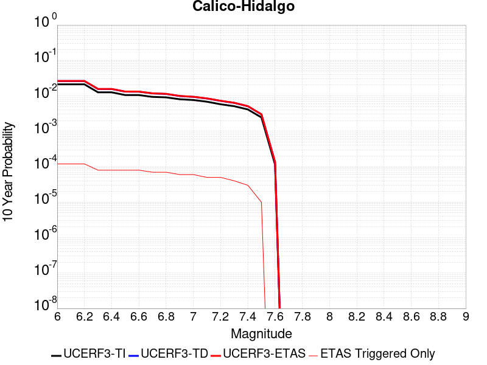 |

| Magnitude | 1 wk TI Prob | 1 wk TD Prob | 1 wk ETAS Prob | 1 wk ETAS/TD Gain | 1 wk ETAS Triggered Only | 1 mo TI Prob | 1 mo TD Prob | 1 mo ETAS Prob | 1 mo ETAS/TD Gain | 1 mo ETAS Triggered Only | 1 yr TI Prob | 1 yr TD Prob | 1 yr ETAS Prob | 1 yr ETAS/TD Gain | 1 yr ETAS Triggered Only | 10 yr TI Prob | 10 yr TD Prob | 10 yr ETAS Prob | 10 yr ETAS/TD Gain | 10 yr ETAS Triggered Only |
|-----|-----|-----|-----|-----|-----|-----|-----|-----|-----|-----|-----|-----|-----|-----|-----|-----|-----|-----|-----|-----|
| 6.0 | 4.0906612E-5 | 5.0711405E-5 | 5.0711405E-5 | 1.0 | 0.0 | 1.7530227E-4 | 2.1731878E-4 | 2.1731878E-4 | 1.0 | 0.0 | 0.0021322158 | 0.0026430492 | 0.0027169276 | 1.027952 | 7.407407E-5 | 0.02111873 | 0.026156526 | 0.026276754 | 1.0045965 | 1.2345679E-4 |
| 6.1 | 4.0906612E-5 | 5.0711405E-5 | 5.0711405E-5 | 1.0 | 0.0 | 1.7530227E-4 | 2.1731878E-4 | 2.1731878E-4 | 1.0 | 0.0 | 0.0021322158 | 0.0026430492 | 0.0027169276 | 1.027952 | 7.407407E-5 | 0.02111873 | 0.026156526 | 0.026276754 | 1.0045965 | 1.2345679E-4 |
| 6.2 | 4.0906612E-5 | 5.0711405E-5 | 5.0711405E-5 | 1.0 | 0.0 | 1.7530227E-4 | 2.1731878E-4 | 2.1731878E-4 | 1.0 | 0.0 | 0.0021322158 | 0.0026430492 | 0.0027169276 | 1.027952 | 7.407407E-5 | 0.02111873 | 0.026156526 | 0.026276754 | 1.0045965 | 1.2345679E-4 |
| 6.3 | 2.4242801E-5 | 3.0093575E-5 | 3.0093575E-5 | 1.0 | 0.0 | 1.0389358E-4 | 1.2896628E-4 | 1.2896628E-4 | 1.0 | 0.0 | 0.0012641704 | 0.001569066 | 0.0016430238 | 1.047135 | 7.407407E-5 | 0.01257003 | 0.015583552 | 0.015656471 | 1.0046793 | 7.407407E-5 |
| 6.4 | 2.4242801E-5 | 3.0093575E-5 | 3.0093575E-5 | 1.0 | 0.0 | 1.0389358E-4 | 1.2896628E-4 | 1.2896628E-4 | 1.0 | 0.0 | 0.0012641704 | 0.001569066 | 0.0016430238 | 1.047135 | 7.407407E-5 | 0.01257003 | 0.015583552 | 0.015656471 | 1.0046793 | 7.407407E-5 |
| 6.5 | 2.0286952E-5 | 2.5317715E-5 | 2.5317715E-5 | 1.0 | 0.0 | 8.694118E-5 | 1.0850008E-4 | 1.0850008E-4 | 1.0 | 0.0 | 0.0010579949 | 0.0013202052 | 0.0013941814 | 1.056034 | 7.407407E-5 | 0.010529719 | 0.0131255565 | 0.013198658 | 1.0055695 | 7.407407E-5 |
| 6.6 | 2.0269223E-5 | 2.5298665E-5 | 2.5298665E-5 | 1.0 | 0.0 | 8.6865206E-5 | 1.0841843E-4 | 1.0841843E-4 | 1.0 | 0.0 | 0.0010570707 | 0.0013192123 | 0.0013931886 | 1.0560762 | 7.407407E-5 | 0.010520565 | 0.013115745 | 0.013188848 | 1.0055736 | 7.407407E-5 |
| 6.7 | 1.799852E-5 | 2.2542203E-5 | 2.2542203E-5 | 1.0 | 0.0 | 7.713423E-5 | 9.660594E-5 | 9.660594E-5 | 1.0 | 0.0 | 9.3870464E-4 | 0.0011755573 | 0.0012495443 | 1.0629379 | 7.407407E-5 | 0.009347493 | 0.011694999 | 0.011768208 | 1.0062598 | 7.407407E-5 |
| 6.8 | 1.7458793E-5 | 2.1843663E-5 | 2.1843663E-5 | 1.0 | 0.0 | 7.4821255E-5 | 9.361243E-5 | 9.361243E-5 | 1.0 | 0.0 | 9.10568E-4 | 0.0011391499 | 0.0012131395 | 1.0649517 | 7.407407E-5 | 0.009068459 | 0.01133469 | 0.011407925 | 1.0064611 | 7.407407E-5 |
| 6.9 | 1.542884E-5 | 1.9027206E-5 | 1.9027206E-5 | 1.0 | 0.0 | 6.612192E-5 | 8.15427E-5 | 8.15427E-5 | 1.0 | 0.0 | 8.04737E-4 | 9.923433E-4 | 0.001041677 | 1.0497143 | 4.9382717E-5 | 0.008018291 | 0.009880519 | 0.009929414 | 1.0049486 | 4.9382717E-5 |
| 7.0 | 1.468253E-5 | 1.8031784E-5 | 1.8031784E-5 | 1.0 | 0.0 | 6.292361E-5 | 7.7276854E-5 | 7.7276854E-5 | 1.0 | 0.0 | 7.658257E-4 | 9.404526E-4 | 9.897889E-4 | 1.0524602 | 4.9382717E-5 | 0.0076319184 | 0.009366093 | 0.009415014 | 1.0052232 | 4.9382717E-5 |
| 7.1 | 1.3139281E-5 | 1.6201957E-5 | 1.6201957E-5 | 1.0 | 0.0 | 5.6309986E-5 | 6.9435184E-5 | 6.9435184E-5 | 1.0 | 0.0 | 6.853584E-4 | 8.4505806E-4 | 8.9439907E-4 | 1.0583876 | 4.9382717E-5 | 0.0068324856 | 0.008419744 | 0.008468711 | 1.0058157 | 4.9382717E-5 |
| 7.2 | 1.1127404E-5 | 1.3867441E-5 | 1.3867441E-5 | 1.0 | 0.0 | 4.7688E-5 | 5.94306E-5 | 5.94306E-5 | 1.0 | 0.0 | 5.8044674E-4 | 7.233382E-4 | 7.726852E-4 | 1.0682212 | 4.9382717E-5 | 0.0057893298 | 0.0072109457 | 0.0072599724 | 1.0067989 | 4.9382717E-5 |
| 7.3 | 9.808154E-6 | 1.2176904E-5 | 1.2176904E-5 | 1.0 | 0.0 | 4.2034266E-5 | 5.2185747E-5 | 5.2185747E-5 | 1.0 | 0.0 | 5.11647E-4 | 6.3518697E-4 | 6.8453833E-4 | 1.0776957 | 4.9382717E-5 | 0.0051047057 | 0.0063347905 | 0.0063838605 | 1.0077461 | 4.9382717E-5 |
| 7.4 | 7.942452E-6 | 9.792658E-6 | 9.792658E-6 | 1.0 | 0.0 | 3.4038632E-5 | 4.1967913E-5 | 4.1967913E-5 | 1.0 | 0.0 | 4.1434157E-4 | 5.10849E-4 | 5.602065E-4 | 1.0966185 | 4.9382717E-5 | 0.0041356985 | 0.005097688 | 0.005146819 | 1.009638 | 4.9382717E-5 |
| 7.5 | 4.7121216E-6 | 5.773115E-6 | 5.773115E-6 | 1.0 | 0.0 | 2.019465E-5 | 2.474173E-5 | 2.474173E-5 | 1.0 | 0.0 | 2.4584212E-4 | 3.011966E-4 | 3.011966E-4 | 1.0 | 0.0 | 0.0024557032 | 0.0030086362 | 0.0030086362 | 1.0 | 0.0 |
| 7.6 | 2.21172E-7 | 2.604064E-7 | 2.604064E-7 | 1.0 | 0.0 | 9.478797E-7 | 1.1160272E-6 | 1.1160272E-6 | 1.0 | 0.0 | 1.1540374E-5 | 1.3587575E-5 | 1.3587575E-5 | 1.0 | 0.0 | 1.1539775E-4 | 1.3587026E-4 | 1.3587026E-4 | 1.0 | 0.0 |

## San Andreas (Creeping Section) 2011 CFM
*[(top)](#table-of-contents)*

| 1 Week | 1 Month | 1 Year | 10 Year |
|-----|-----|-----|-----|
|  |  |  |  |

| Magnitude | 1 wk TI Prob | 1 wk TD Prob | 1 wk ETAS Prob | 1 wk ETAS/TD Gain | 1 wk ETAS Triggered Only | 1 mo TI Prob | 1 mo TD Prob | 1 mo ETAS Prob | 1 mo ETAS/TD Gain | 1 mo ETAS Triggered Only | 1 yr TI Prob | 1 yr TD Prob | 1 yr ETAS Prob | 1 yr ETAS/TD Gain | 1 yr ETAS Triggered Only | 10 yr TI Prob | 10 yr TD Prob | 10 yr ETAS Prob | 10 yr ETAS/TD Gain | 10 yr ETAS Triggered Only |
|-----|-----|-----|-----|-----|-----|-----|-----|-----|-----|-----|-----|-----|-----|-----|-----|-----|-----|-----|-----|-----|
| 6.0 | 5.986481E-4 | 0.0012277128 | 0.0012277128 | 1.0 | 0.0 | 0.0025631124 | 0.005248843 | 0.005248843 | 1.0 | 0.0 | 0.030762846 | 0.061255742 | 0.0613021 | 1.0007567 | 4.9382717E-5 | 0.26835477 | 0.42618826 | 0.42623076 | 1.0000998 | 7.407407E-5 |
| 6.1 | 5.015945E-4 | 0.001021834 | 0.001021834 | 1.0 | 0.0 | 0.00214792 | 0.004370119 | 0.004370119 | 1.0 | 0.0 | 0.025839351 | 0.05129081 | 0.05133766 | 1.0009134 | 4.9382717E-5 | 0.23032776 | 0.37310076 | 0.37314722 | 1.0001245 | 7.407407E-5 |
| 6.2 | 4.073338E-4 | 8.113091E-4 | 8.113091E-4 | 1.0 | 0.0 | 0.0017445484 | 0.0034705189 | 0.0034705189 | 1.0 | 0.0 | 0.021034058 | 0.040975556 | 0.041022915 | 1.0011557 | 4.9382717E-5 | 0.19150782 | 0.31329766 | 0.31334853 | 1.0001624 | 7.407407E-5 |
| 6.3 | 3.464099E-4 | 6.7463954E-4 | 6.7463954E-4 | 1.0 | 0.0 | 0.0014837692 | 0.002886507 | 0.002886507 | 1.0 | 0.0 | 0.017915873 | 0.034232542 | 0.034280233 | 1.0013932 | 4.9382717E-5 | 0.16538359 | 0.27159676 | 0.27165073 | 1.0001986 | 7.407407E-5 |
| 6.4 | 2.935057E-4 | 5.552036E-4 | 5.552036E-4 | 1.0 | 0.0 | 0.0012572751 | 0.0023767343 | 0.0023767343 | 1.0 | 0.0 | 0.015200248 | 0.028307864 | 0.02835585 | 1.0016952 | 4.9382717E-5 | 0.14201577 | 0.23328128 | 0.23333807 | 1.0002434 | 7.407407E-5 |
| 6.5 | 2.3409708E-4 | 4.2183863E-4 | 4.2183863E-4 | 1.0 | 0.0 | 0.0010028875 | 0.0018061183 | 0.0018061183 | 1.0 | 0.0 | 0.012141965 | 0.021630099 | 0.021678412 | 1.0022336 | 4.9382717E-5 | 0.11499573 | 0.18713719 | 0.1871974 | 1.0003217 | 7.407407E-5 |
| 6.6 | 1.5842178E-4 | 2.515069E-4 | 2.515069E-4 | 1.0 | 0.0 | 6.7877385E-4 | 0.0010774364 | 0.0010774364 | 1.0 | 0.0 | 0.0082328 | 0.013037458 | 0.013086197 | 1.0037384 | 4.9382717E-5 | 0.07934396 | 0.12348219 | 0.12354712 | 1.0005258 | 7.407407E-5 |
| 6.7 | 1.5616413E-4 | 2.4686698E-4 | 2.4686698E-4 | 1.0 | 0.0 | 6.691031E-4 | 0.0010575674 | 0.0010575674 | 1.0 | 0.0 | 0.0081159435 | 0.012799217 | 0.012847968 | 1.0038089 | 4.9382717E-5 | 0.0782586 | 0.12150933 | 0.1215744 | 1.0005355 | 7.407407E-5 |
| 6.8 | 1.5538467E-4 | 2.4510472E-4 | 2.4510472E-4 | 1.0 | 0.0 | 6.6576427E-4 | 0.0010500209 | 0.0010500209 | 1.0 | 0.0 | 0.008075596 | 0.012708522 | 0.012757277 | 1.0038364 | 4.9382717E-5 | 0.07788358 | 0.12073988 | 0.120805 | 1.0005394 | 7.407407E-5 |
| 6.9 | 1.5153569E-4 | 2.3619262E-4 | 2.3619262E-4 | 1.0 | 0.0 | 6.49277E-4 | 0.0010118634 | 0.0010118634 | 1.0 | 0.0 | 0.007876333 | 0.012250378 | 0.012299156 | 1.0039817 | 4.9382717E-5 | 0.07602952 | 0.11680886 | 0.11685248 | 1.0003734 | 4.9382717E-5 |
| 7.0 | 1.4588932E-4 | 2.2475704E-4 | 2.2475704E-4 | 1.0 | 0.0 | 6.250901E-4 | 9.6289086E-4 | 9.6289086E-4 | 1.0 | 0.0 | 0.0075839474 | 0.011660682 | 0.011709489 | 1.0041856 | 4.9382717E-5 | 0.073302895 | 0.11165398 | 0.11169785 | 1.0003929 | 4.9382717E-5 |
| 7.1 | 1.1565079E-4 | 1.6348856E-4 | 1.6348856E-4 | 1.0 | 0.0 | 4.955521E-4 | 7.00478E-4 | 7.00478E-4 | 1.0 | 0.0 | 0.006016669 | 0.008495174 | 0.008544137 | 1.0057636 | 4.9382717E-5 | 0.058563538 | 0.083968416 | 0.084013656 | 1.0005387 | 4.9382717E-5 |
| 7.2 | 1.0393792E-4 | 1.467928E-4 | 1.467928E-4 | 1.0 | 0.0 | 4.4537216E-4 | 6.289611E-4 | 6.289611E-4 | 1.0 | 0.0 | 0.005408933 | 0.0076308856 | 0.0076798913 | 1.006422 | 4.9382717E-5 | 0.052791595 | 0.075905204 | 0.07595084 | 1.0006012 | 4.9382717E-5 |
| 7.3 | 9.332884E-5 | 1.2835828E-4 | 1.2835828E-4 | 1.0 | 0.0 | 3.999194E-4 | 5.499916E-4 | 5.499916E-4 | 1.0 | 0.0 | 0.0048581534 | 0.0066757244 | 0.006724777 | 1.007348 | 4.9382717E-5 | 0.047533102 | 0.066735476 | 0.06678156 | 1.0006906 | 4.9382717E-5 |
| 7.4 | 8.670252E-5 | 1.1753194E-4 | 1.1753194E-4 | 1.0 | 0.0 | 3.715293E-4 | 5.0361163E-4 | 5.0361163E-4 | 1.0 | 0.0 | 0.004513991 | 0.0061143558 | 0.0061634365 | 1.0080272 | 4.9382717E-5 | 0.044233937 | 0.0613828 | 0.061429154 | 1.0007551 | 4.9382717E-5 |
| 7.5 | 7.3036405E-5 | 9.047752E-5 | 9.047752E-5 | 1.0 | 0.0 | 3.129756E-4 | 3.8770327E-4 | 3.8770327E-4 | 1.0 | 0.0 | 0.0038038217 | 0.0047100927 | 0.0047592428 | 1.0104351 | 4.9382717E-5 | 0.03739367 | 0.04807722 | 0.048124224 | 1.0009778 | 4.9382717E-5 |
| 7.6 | 6.3935775E-5 | 8.3173174E-5 | 8.3173174E-5 | 1.0 | 0.0 | 2.7398168E-4 | 3.5640784E-4 | 3.5640784E-4 | 1.0 | 0.0 | 0.0033306254 | 0.004330651 | 0.0043798196 | 1.0113537 | 4.9382717E-5 | 0.032811474 | 0.04416785 | 0.044215053 | 1.0010687 | 4.9382717E-5 |
| 7.7 | 5.5050095E-5 | 6.6946064E-5 | 6.6946064E-5 | 1.0 | 0.0 | 2.3590765E-4 | 2.8688018E-4 | 2.8688018E-4 | 1.0 | 0.0 | 0.0028683927 | 0.0034871765 | 0.003536387 | 1.0141119 | 4.9382717E-5 | 0.0283165 | 0.035954945 | 0.03600255 | 1.001324 | 4.9382717E-5 |
| 7.8 | 5.027131E-5 | 6.192842E-5 | 6.192842E-5 | 1.0 | 0.0 | 2.1543067E-4 | 2.653805E-4 | 2.653805E-4 | 1.0 | 0.0 | 0.0026197135 | 0.0032262243 | 0.0032754478 | 1.0152572 | 4.9382717E-5 | 0.025890453 | 0.03327231 | 0.03332005 | 1.0014348 | 4.9382717E-5 |
| 7.9 | 3.7271806E-5 | 5.046638E-5 | 5.046638E-5 | 1.0 | 0.0 | 1.5972654E-4 | 2.1626656E-4 | 2.1626656E-4 | 1.0 | 0.0 | 0.0019429359 | 0.002629868 | 0.002679121 | 1.0187283 | 4.9382717E-5 | 0.019260362 | 0.027185883 | 0.027233925 | 1.0017672 | 4.9382717E-5 |
| 8.0 | 2.7310243E-5 | 3.1588967E-5 | 3.1588967E-5 | 1.0 | 0.0 | 1.17038646E-4 | 1.3537427E-4 | 1.3537427E-4 | 1.0 | 0.0 | 0.0014240141 | 0.0016469365 | 0.0016715871 | 1.0149676 | 2.4691359E-5 | 0.014149235 | 0.017295659 | 0.017319923 | 1.0014029 | 2.4691359E-5 |
| 8.1 | 1.7940547E-5 | 1.7504728E-5 | 1.7504728E-5 | 1.0 | 0.0 | 7.688579E-5 | 7.5018106E-5 | 7.5018106E-5 | 1.0 | 0.0 | 9.3568244E-4 | 9.129633E-4 | 9.376321E-4 | 1.0270206 | 2.4691359E-5 | 0.009317525 | 0.009853872 | 0.00987832 | 1.0024811 | 2.4691359E-5 |
| 8.2 | 8.643924E-6 | 5.5167247E-6 | 5.5167247E-6 | 1.0 | 0.0 | 3.704486E-5 | 2.3642891E-5 | 2.3642891E-5 | 1.0 | 0.0 | 4.5092785E-4 | 2.8781427E-4 | 2.8781427E-4 | 1.0 | 0.0 | 0.0045001395 | 0.0032716133 | 0.0032716133 | 1.0 | 0.0 |
| 8.3 | 1.983087E-6 | 7.731745E-7 | 7.731745E-7 | 1.0 | 0.0 | 8.498917E-6 | 3.313601E-6 | 3.313601E-6 | 1.0 | 0.0 | 1.034694E-4 | 4.0342362E-5 | 4.0342362E-5 | 1.0 | 0.0 | 0.0010342124 | 4.7608858E-4 | 4.7608858E-4 | 1.0 | 0.0 |

## White Wolf (Extension)
*[(top)](#table-of-contents)*

| 1 Week | 1 Month | 1 Year | 10 Year |
|-----|-----|-----|-----|
|  | 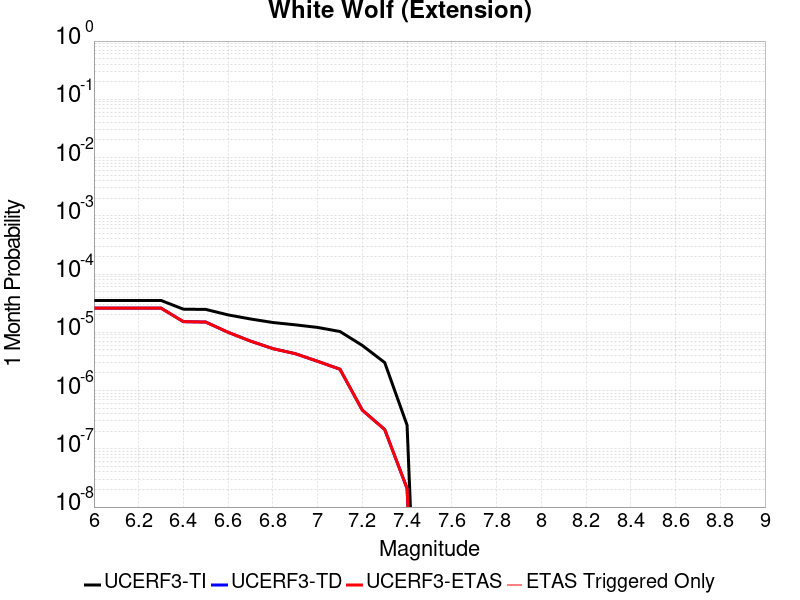 |  |  |

| Magnitude | 1 wk TI Prob | 1 wk TD Prob | 1 wk ETAS Prob | 1 wk ETAS/TD Gain | 1 wk ETAS Triggered Only | 1 mo TI Prob | 1 mo TD Prob | 1 mo ETAS Prob | 1 mo ETAS/TD Gain | 1 mo ETAS Triggered Only | 1 yr TI Prob | 1 yr TD Prob | 1 yr ETAS Prob | 1 yr ETAS/TD Gain | 1 yr ETAS Triggered Only | 10 yr TI Prob | 10 yr TD Prob | 10 yr ETAS Prob | 10 yr ETAS/TD Gain | 10 yr ETAS Triggered Only |
|-----|-----|-----|-----|-----|-----|-----|-----|-----|-----|-----|-----|-----|-----|-----|-----|-----|-----|-----|-----|-----|
| 6.0 | 8.222555E-6 | 6.066987E-6 | 6.066987E-6 | 1.0 | 0.0 | 3.5239045E-5 | 2.6001153E-5 | 2.6001153E-5 | 1.0 | 0.0 | 4.289509E-4 | 3.1652467E-4 | 3.6589176E-4 | 1.155966 | 4.9382717E-5 | 0.0042812387 | 0.0031613903 | 0.003284457 | 1.0389279 | 1.2345679E-4 |
| 6.1 | 8.222555E-6 | 6.066987E-6 | 6.066987E-6 | 1.0 | 0.0 | 3.5239045E-5 | 2.6001153E-5 | 2.6001153E-5 | 1.0 | 0.0 | 4.289509E-4 | 3.1652467E-4 | 3.6589176E-4 | 1.155966 | 4.9382717E-5 | 0.0042812387 | 0.0031613903 | 0.003284457 | 1.0389279 | 1.2345679E-4 |
| 6.2 | 8.222555E-6 | 6.066987E-6 | 6.066987E-6 | 1.0 | 0.0 | 3.5239045E-5 | 2.6001153E-5 | 2.6001153E-5 | 1.0 | 0.0 | 4.289509E-4 | 3.1652467E-4 | 3.6589176E-4 | 1.155966 | 4.9382717E-5 | 0.0042812387 | 0.0031613903 | 0.003284457 | 1.0389279 | 1.2345679E-4 |
| 6.3 | 8.222555E-6 | 6.066987E-6 | 6.066987E-6 | 1.0 | 0.0 | 3.5239045E-5 | 2.6001153E-5 | 2.6001153E-5 | 1.0 | 0.0 | 4.289509E-4 | 3.1652467E-4 | 3.6589176E-4 | 1.155966 | 4.9382717E-5 | 0.0042812387 | 0.0031613903 | 0.003284457 | 1.0389279 | 1.2345679E-4 |
| 6.4 | 5.821773E-6 | 3.5573776E-6 | 3.5573776E-6 | 1.0 | 0.0 | 2.4950215E-5 | 1.5245821E-5 | 1.5245821E-5 | 1.0 | 0.0 | 3.0372653E-4 | 1.8560316E-4 | 2.1028993E-4 | 1.1330084 | 2.4691359E-5 | 0.0030331176 | 0.0018545898 | 0.001953172 | 1.0531558 | 9.8765435E-5 |
| 6.5 | 5.766023E-6 | 3.499309E-6 | 3.499309E-6 | 1.0 | 0.0 | 2.4711293E-5 | 1.4996958E-5 | 1.4996958E-5 | 1.0 | 0.0 | 3.0081844E-4 | 1.8257377E-4 | 2.0726061E-4 | 1.1352158 | 2.4691359E-5 | 0.0030041158 | 0.0018243459 | 0.0019229312 | 1.0540386 | 9.8765435E-5 |
| 6.6 | 4.643576E-6 | 2.3327739E-6 | 2.3327739E-6 | 1.0 | 0.0 | 1.9900888E-5 | 9.997567E-6 | 9.997567E-6 | 1.0 | 0.0 | 2.4226638E-4 | 1.2171401E-4 | 1.4640235E-4 | 1.202839 | 2.4691359E-5 | 0.0024200242 | 0.0012165159 | 0.0013151611 | 1.0810884 | 9.8765435E-5 |
| 6.7 | 3.9529173E-6 | 1.6484681E-6 | 1.6484681E-6 | 1.0 | 0.0 | 1.6940963E-5 | 7.0648457E-6 | 7.0648457E-6 | 1.0 | 0.0 | 2.0623671E-4 | 8.6011285E-5 | 1.1070052E-4 | 1.2870464 | 2.4691359E-5 | 0.002060454 | 8.597985E-4 | 9.0913876E-4 | 1.0573858 | 4.9382717E-5 |
| 6.8 | 3.4377522E-6 | 1.2246234E-6 | 1.2246234E-6 | 1.0 | 0.0 | 1.473314E-5 | 5.2483756E-6 | 5.2483756E-6 | 1.0 | 0.0 | 1.7936122E-4 | 6.389719E-5 | 8.8586974E-5 | 1.3863986 | 2.4691359E-5 | 0.0017921652 | 6.387973E-4 | 6.634729E-4 | 1.0386282 | 2.4691359E-5 |
| 6.9 | 3.1367306E-6 | 1.003466E-6 | 1.003466E-6 | 1.0 | 0.0 | 1.3443062E-5 | 4.3005616E-6 | 4.3005616E-6 | 1.0 | 0.0 | 1.63657E-4 | 5.235816E-5 | 5.235816E-5 | 1.0 | 0.0 | 0.0016353652 | 5.2346586E-4 | 5.2346586E-4 | 1.0 | 0.0 |
| 7.0 | 2.8298145E-6 | 7.429425E-7 | 7.429425E-7 | 1.0 | 0.0 | 1.2127721E-5 | 3.184036E-6 | 3.184036E-6 | 1.0 | 0.0 | 1.47645E-4 | 3.8764996E-5 | 3.8764996E-5 | 1.0 | 0.0 | 0.0014754693 | 3.8758735E-4 | 3.8758735E-4 | 1.0 | 0.0 |
| 7.1 | 2.4091064E-6 | 5.4233635E-7 | 5.4233635E-7 | 1.0 | 0.0 | 1.03247E-5 | 2.3242967E-6 | 2.3242967E-6 | 1.0 | 0.0 | 1.2569598E-4 | 2.8297985E-5 | 2.8297985E-5 | 1.0 | 0.0 | 0.001256249 | 2.8294788E-4 | 2.8294788E-4 | 1.0 | 0.0 |
| 7.2 | 1.3875518E-6 | 1.07460636E-7 | 1.07460636E-7 | 1.0 | 0.0 | 5.9466374E-6 | 4.6054552E-7 | 4.6054552E-7 | 1.0 | 0.0 | 7.23979E-5 | 5.6071285E-6 | 5.6071285E-6 | 1.0 | 0.0 | 7.2374323E-4 | 5.6069985E-5 | 5.6069985E-5 | 1.0 | 0.0 |
| 7.3 | 7.056077E-7 | 5.0037578E-8 | 5.0037578E-8 | 1.0 | 0.0 | 3.0240296E-6 | 2.1444674E-7 | 2.1444674E-7 | 1.0 | 0.0 | 3.681694E-5 | 2.6108864E-6 | 2.6108864E-6 | 1.0 | 0.0 | 3.681084E-4 | 2.6108604E-5 | 2.6108604E-5 | 1.0 | 0.0 |
| 7.4 | 5.9334678E-8 | 4.870027E-9 | 4.870027E-9 | 1.0 | 0.0 | 2.5429145E-7 | 2.0871544E-8 | 2.0871544E-8 | 1.0 | 0.0 | 3.095994E-6 | 2.5411103E-7 | 2.5411103E-7 | 1.0 | 0.0 | 3.095951E-5 | 2.5411086E-6 | 2.5411086E-6 | 1.0 | 0.0 |

## Elsinore (Glen Ivy) rev
*[(top)](#table-of-contents)*

| 1 Week | 1 Month | 1 Year | 10 Year |
|-----|-----|-----|-----|
|  |  |  |  |

| Magnitude | 1 wk TI Prob | 1 wk TD Prob | 1 wk ETAS Prob | 1 wk ETAS/TD Gain | 1 wk ETAS Triggered Only | 1 mo TI Prob | 1 mo TD Prob | 1 mo ETAS Prob | 1 mo ETAS/TD Gain | 1 mo ETAS Triggered Only | 1 yr TI Prob | 1 yr TD Prob | 1 yr ETAS Prob | 1 yr ETAS/TD Gain | 1 yr ETAS Triggered Only | 10 yr TI Prob | 10 yr TD Prob | 10 yr ETAS Prob | 10 yr ETAS/TD Gain | 10 yr ETAS Triggered Only |
|-----|-----|-----|-----|-----|-----|-----|-----|-----|-----|-----|-----|-----|-----|-----|-----|-----|-----|-----|-----|-----|
| 6.0 | 1.6204086E-4 | 2.9371222E-4 | 2.9371222E-4 | 1.0 | 0.0 | 6.94276E-4 | 0.0012583141 | 0.0012829745 | 1.0195979 | 2.4691359E-5 | 0.008420097 | 0.015238959 | 0.01533622 | 1.0063823 | 9.8765435E-5 | 0.081081145 | 0.13971914 | 0.13982534 | 1.0007602 | 1.2345679E-4 |
| 6.1 | 1.6204086E-4 | 2.9371222E-4 | 2.9371222E-4 | 1.0 | 0.0 | 6.94276E-4 | 0.0012583141 | 0.0012829745 | 1.0195979 | 2.4691359E-5 | 0.008420097 | 0.015238959 | 0.01533622 | 1.0063823 | 9.8765435E-5 | 0.081081145 | 0.13971914 | 0.13982534 | 1.0007602 | 1.2345679E-4 |
| 6.2 | 1.6204086E-4 | 2.9371222E-4 | 2.9371222E-4 | 1.0 | 0.0 | 6.94276E-4 | 0.0012583141 | 0.0012829745 | 1.0195979 | 2.4691359E-5 | 0.008420097 | 0.015238959 | 0.01533622 | 1.0063823 | 9.8765435E-5 | 0.081081145 | 0.13971914 | 0.13982534 | 1.0007602 | 1.2345679E-4 |
| 6.3 | 1.0111737E-4 | 1.7706468E-4 | 1.7706468E-4 | 1.0 | 0.0 | 4.332882E-4 | 7.5874466E-4 | 7.8341726E-4 | 1.0325177 | 2.4691359E-5 | 0.005262531 | 0.009219283 | 0.009292674 | 1.0079606 | 7.407407E-5 | 0.0513964 | 0.08703286 | 0.08712303 | 1.001036 | 9.8765435E-5 |
| 6.4 | 1.0111737E-4 | 1.7706468E-4 | 1.7706468E-4 | 1.0 | 0.0 | 4.332882E-4 | 7.5874466E-4 | 7.8341726E-4 | 1.0325177 | 2.4691359E-5 | 0.005262531 | 0.009219283 | 0.009292674 | 1.0079606 | 7.407407E-5 | 0.0513964 | 0.08703286 | 0.08712303 | 1.001036 | 9.8765435E-5 |
| 6.5 | 3.6624708E-5 | 4.640639E-5 | 4.640639E-5 | 1.0 | 0.0 | 1.569536E-4 | 1.9887142E-4 | 1.9887142E-4 | 1.0 | 0.0 | 0.001909235 | 0.002418934 | 0.002418934 | 1.0 | 0.0 | 0.01892915 | 0.023747567 | 0.023747567 | 1.0 | 0.0 |
| 6.6 | 2.5051324E-5 | 2.6158506E-5 | 2.6158506E-5 | 1.0 | 0.0 | 1.073584E-4 | 1.1210332E-4 | 1.1210332E-4 | 1.0 | 0.0 | 0.0013063047 | 0.0013640479 | 0.0013640479 | 1.0 | 0.0 | 0.012986525 | 0.013570136 | 0.013570136 | 1.0 | 0.0 |
| 6.7 | 2.2189772E-5 | 2.2082193E-5 | 2.2082193E-5 | 1.0 | 0.0 | 9.509556E-5 | 9.463474E-5 | 9.463474E-5 | 1.0 | 0.0 | 0.0011571734 | 0.0011516054 | 0.0011516054 | 1.0 | 0.0 | 0.011511663 | 0.011470216 | 0.011470216 | 1.0 | 0.0 |
| 6.8 | 1.6654378E-5 | 1.444352E-5 | 1.444352E-5 | 1.0 | 0.0 | 7.137396E-5 | 6.189936E-5 | 6.189936E-5 | 1.0 | 0.0 | 8.686314E-4 | 7.533693E-4 | 7.533693E-4 | 1.0 | 0.0 | 0.008652439 | 0.0075134886 | 0.0075134886 | 1.0 | 0.0 |
| 6.9 | 1.5042909E-5 | 1.2337136E-5 | 1.2337136E-5 | 1.0 | 0.0 | 6.446802E-5 | 5.2872383E-5 | 5.2872383E-5 | 1.0 | 0.0 | 7.8461546E-4 | 6.435343E-4 | 6.435343E-4 | 1.0 | 0.0 | 0.007818509 | 0.0064209295 | 0.0064209295 | 1.0 | 0.0 |
| 7.0 | 1.4361385E-5 | 1.1456173E-5 | 1.1456173E-5 | 1.0 | 0.0 | 6.154734E-5 | 4.9096976E-5 | 4.9096976E-5 | 1.0 | 0.0 | 7.490812E-4 | 5.9759466E-4 | 5.9759466E-4 | 1.0 | 0.0 | 0.007465612 | 0.005963867 | 0.005963867 | 1.0 | 0.0 |
| 7.1 | 1.3265571E-5 | 1.0249252E-5 | 1.0249252E-5 | 1.0 | 0.0 | 5.6851208E-5 | 4.3924643E-5 | 4.3924643E-5 | 1.0 | 0.0 | 6.919436E-4 | 5.3465384E-4 | 5.3465384E-4 | 1.0 | 0.0 | 0.006897931 | 0.0053370316 | 0.0053370316 | 1.0 | 0.0 |
| 7.2 | 1.1596403E-5 | 8.5087395E-6 | 8.5087395E-6 | 1.0 | 0.0 | 4.9697923E-5 | 3.6465524E-5 | 3.6465524E-5 | 1.0 | 0.0 | 6.049042E-4 | 4.4387902E-4 | 4.4387902E-4 | 1.0 | 0.0 | 0.006032603 | 0.0044313394 | 0.0044313394 | 1.0 | 0.0 |
| 7.3 | 1.0150827E-5 | 7.241924E-6 | 7.241924E-6 | 1.0 | 0.0 | 4.3502816E-5 | 3.1036456E-5 | 3.1036456E-5 | 1.0 | 0.0 | 5.2951806E-4 | 3.7780477E-4 | 3.7780477E-4 | 1.0 | 0.0 | 0.005282581 | 0.0037720115 | 0.0037720115 | 1.0 | 0.0 |
| 7.4 | 9.080705E-6 | 6.355331E-6 | 6.355331E-6 | 1.0 | 0.0 | 3.8916725E-5 | 2.7236856E-5 | 2.7236856E-5 | 1.0 | 0.0 | 4.7370812E-4 | 3.3155963E-4 | 3.3155963E-4 | 1.0 | 0.0 | 0.004726996 | 0.0033108005 | 0.0033108005 | 1.0 | 0.0 |
| 7.5 | 7.671649E-6 | 5.2280498E-6 | 5.2280498E-6 | 1.0 | 0.0 | 3.287808E-5 | 2.2405742E-5 | 2.2405742E-5 | 1.0 | 0.0 | 4.0021708E-4 | 2.7275702E-4 | 2.7275702E-4 | 1.0 | 0.0 | 0.0039949706 | 0.0027243476 | 0.0027243476 | 1.0 | 0.0 |
| 7.6 | 6.990086E-6 | 4.689783E-6 | 4.689783E-6 | 1.0 | 0.0 | 2.9957167E-5 | 2.0098922E-5 | 2.0098922E-5 | 1.0 | 0.0 | 3.6466747E-4 | 2.4467806E-4 | 2.4467806E-4 | 1.0 | 0.0 | 0.0036406964 | 0.002444203 | 0.002444203 | 1.0 | 0.0 |
| 7.7 | 4.163505E-6 | 2.3306334E-6 | 2.3306334E-6 | 1.0 | 0.0 | 1.7843471E-5 | 9.988395E-6 | 9.988395E-6 | 1.0 | 0.0 | 2.172226E-4 | 1.21602665E-4 | 1.21602665E-4 | 1.0 | 0.0 | 0.0021701038 | 0.0012154343 | 0.0012154343 | 1.0 | 0.0 |
| 7.8 | 2.2692414E-7 | 9.3892815E-8 | 9.3892815E-8 | 1.0 | 0.0 | 9.725317E-7 | 4.0239775E-7 | 4.0239775E-7 | 1.0 | 0.0 | 1.1840509E-5 | 4.899185E-6 | 4.899185E-6 | 1.0 | 0.0 | 1.1839878E-4 | 4.8991096E-5 | 4.8991096E-5 | 1.0 | 0.0 |
| 7.9 | 6.676829E-9 | 3.4408467E-9 | 3.4408467E-9 | 1.0 | 0.0 | 2.861498E-8 | 1.4746486E-8 | 1.4746486E-8 | 1.0 | 0.0 | 3.4838732E-7 | 1.7953846E-7 | 1.7953846E-7 | 1.0 | 0.0 | 3.4838679E-6 | 1.7953832E-6 | 1.7953832E-6 | 1.0 | 0.0 |

## Manix-Afton Hills
*[(top)](#table-of-contents)*

| 1 Week | 1 Month | 1 Year | 10 Year |
|-----|-----|-----|-----|
|  |  | 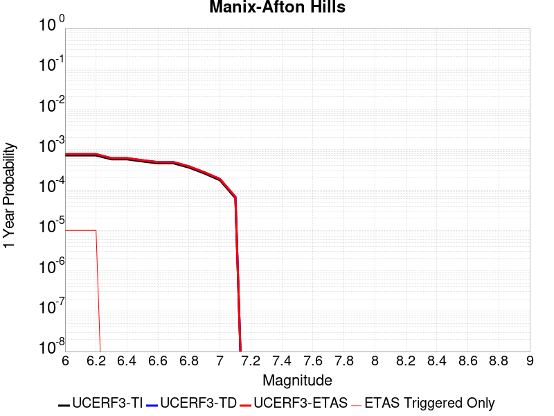 |  |

| Magnitude | 1 wk TI Prob | 1 wk TD Prob | 1 wk ETAS Prob | 1 wk ETAS/TD Gain | 1 wk ETAS Triggered Only | 1 mo TI Prob | 1 mo TD Prob | 1 mo ETAS Prob | 1 mo ETAS/TD Gain | 1 mo ETAS Triggered Only | 1 yr TI Prob | 1 yr TD Prob | 1 yr ETAS Prob | 1 yr ETAS/TD Gain | 1 yr ETAS Triggered Only | 10 yr TI Prob | 10 yr TD Prob | 10 yr ETAS Prob | 10 yr ETAS/TD Gain | 10 yr ETAS Triggered Only |
|-----|-----|-----|-----|-----|-----|-----|-----|-----|-----|-----|-----|-----|-----|-----|-----|-----|-----|-----|-----|-----|
| 6.0 | 1.3783202E-5 | 1.4712143E-5 | 1.4712143E-5 | 1.0 | 0.0 | 5.906953E-5 | 6.305062E-5 | 6.305062E-5 | 1.0 | 0.0 | 7.189342E-4 | 7.673883E-4 | 7.673883E-4 | 1.0 | 0.0 | 0.0071661277 | 0.0076491414 | 0.0077471514 | 1.0128132 | 9.8765435E-5 |
| 6.1 | 1.3783202E-5 | 1.4712143E-5 | 1.4712143E-5 | 1.0 | 0.0 | 5.906953E-5 | 6.305062E-5 | 6.305062E-5 | 1.0 | 0.0 | 7.189342E-4 | 7.673883E-4 | 7.673883E-4 | 1.0 | 0.0 | 0.0071661277 | 0.0076491414 | 0.0077471514 | 1.0128132 | 9.8765435E-5 |
| 6.2 | 1.3783202E-5 | 1.4712143E-5 | 1.4712143E-5 | 1.0 | 0.0 | 5.906953E-5 | 6.305062E-5 | 6.305062E-5 | 1.0 | 0.0 | 7.189342E-4 | 7.673883E-4 | 7.673883E-4 | 1.0 | 0.0 | 0.0071661277 | 0.0076491414 | 0.0077471514 | 1.0128132 | 9.8765435E-5 |
| 6.3 | 1.10494875E-5 | 1.179398E-5 | 1.179398E-5 | 1.0 | 0.0 | 4.7354086E-5 | 5.0544706E-5 | 5.0544706E-5 | 1.0 | 0.0 | 5.763835E-4 | 6.152184E-4 | 6.152184E-4 | 1.0 | 0.0 | 0.005748908 | 0.0061361934 | 0.006209813 | 1.0119976 | 7.407407E-5 |
| 6.4 | 1.10494875E-5 | 1.179398E-5 | 1.179398E-5 | 1.0 | 0.0 | 4.7354086E-5 | 5.0544706E-5 | 5.0544706E-5 | 1.0 | 0.0 | 5.763835E-4 | 6.152184E-4 | 6.152184E-4 | 1.0 | 0.0 | 0.005748908 | 0.0061361934 | 0.006209813 | 1.0119976 | 7.407407E-5 |
| 6.5 | 9.788949E-6 | 1.0455075E-5 | 1.0455075E-5 | 1.0 | 0.0 | 4.1951964E-5 | 4.4806748E-5 | 4.4806748E-5 | 1.0 | 0.0 | 5.1064545E-4 | 5.453949E-4 | 5.453949E-4 | 1.0 | 0.0 | 0.0050947363 | 0.005441491 | 0.005490605 | 1.0090258 | 4.9382717E-5 |
| 6.6 | 8.810006E-6 | 9.414314E-6 | 9.414314E-6 | 1.0 | 0.0 | 3.775662E-5 | 4.0346487E-5 | 4.0346487E-5 | 1.0 | 0.0 | 4.5958988E-4 | 4.9111666E-4 | 4.9111666E-4 | 1.0 | 0.0 | 0.0045864056 | 0.0049011954 | 0.004950336 | 1.0100262 | 4.9382717E-5 |
| 6.7 | 8.80128E-6 | 9.404793E-6 | 9.404793E-6 | 1.0 | 0.0 | 3.7719226E-5 | 4.0305684E-5 | 4.0305684E-5 | 1.0 | 0.0 | 4.591348E-4 | 4.906201E-4 | 4.906201E-4 | 1.0 | 0.0 | 0.004581874 | 0.004896252 | 0.0049453927 | 1.0100365 | 4.9382717E-5 |
| 6.8 | 6.8994877E-6 | 7.3806227E-6 | 7.3806227E-6 | 1.0 | 0.0 | 2.9568899E-5 | 3.1630905E-5 | 3.1630905E-5 | 1.0 | 0.0 | 3.5994186E-4 | 3.8504635E-4 | 3.8504635E-4 | 1.0 | 0.0 | 0.003593594 | 0.0038445974 | 0.00389379 | 1.0127953 | 4.9382717E-5 |
| 6.9 | 4.9328037E-6 | 5.271346E-6 | 5.271346E-6 | 1.0 | 0.0 | 2.1140417E-5 | 2.259132E-5 | 2.259132E-5 | 1.0 | 0.0 | 2.5735417E-4 | 2.7502078E-4 | 2.7502078E-4 | 1.0 | 0.0 | 0.0025705635 | 0.0027474095 | 0.0027720332 | 1.0089624 | 2.4691359E-5 |
| 7.0 | 3.347973E-6 | 3.5903063E-6 | 3.5903063E-6 | 1.0 | 0.0 | 1.4348378E-5 | 1.5386959E-5 | 1.5386959E-5 | 1.0 | 0.0 | 1.746775E-4 | 1.8732423E-4 | 1.8732423E-4 | 1.0 | 0.0 | 0.0017454025 | 0.001872066 | 0.0018967111 | 1.0131646 | 2.4691359E-5 |
| 7.1 | 1.2073567E-6 | 1.29358E-6 | 1.29358E-6 | 1.0 | 0.0 | 5.1743755E-6 | 5.5439114E-6 | 5.5439114E-6 | 1.0 | 0.0 | 6.29962E-5 | 6.7496665E-5 | 6.7496665E-5 | 1.0 | 0.0 | 6.297835E-4 | 6.7492184E-4 | 6.9959654E-4 | 1.0365593 | 2.4691359E-5 |

## Cady
*[(top)](#table-of-contents)*

| 1 Week | 1 Month | 1 Year | 10 Year |
|-----|-----|-----|-----|
|  |  |  |  |

| Magnitude | 1 wk TI Prob | 1 wk TD Prob | 1 wk ETAS Prob | 1 wk ETAS/TD Gain | 1 wk ETAS Triggered Only | 1 mo TI Prob | 1 mo TD Prob | 1 mo ETAS Prob | 1 mo ETAS/TD Gain | 1 mo ETAS Triggered Only | 1 yr TI Prob | 1 yr TD Prob | 1 yr ETAS Prob | 1 yr ETAS/TD Gain | 1 yr ETAS Triggered Only | 10 yr TI Prob | 10 yr TD Prob | 10 yr ETAS Prob | 10 yr ETAS/TD Gain | 10 yr ETAS Triggered Only |
|-----|-----|-----|-----|-----|-----|-----|-----|-----|-----|-----|-----|-----|-----|-----|-----|-----|-----|-----|-----|-----|
| 6.0 | 1.9892565E-5 | 2.1861024E-5 | 2.1861024E-5 | 1.0 | 0.0 | 8.525106E-5 | 9.3687246E-5 | 9.3687246E-5 | 1.0 | 0.0 | 0.0010374374 | 0.0011401363 | 0.0011894627 | 1.0432636 | 4.9382717E-5 | 0.010326075 | 0.011351886 | 0.011473942 | 1.010752 | 1.2345679E-4 |
| 6.1 | 1.9892565E-5 | 2.1861024E-5 | 2.1861024E-5 | 1.0 | 0.0 | 8.525106E-5 | 9.3687246E-5 | 9.3687246E-5 | 1.0 | 0.0 | 0.0010374374 | 0.0011401363 | 0.0011894627 | 1.0432636 | 4.9382717E-5 | 0.010326075 | 0.011351886 | 0.011473942 | 1.010752 | 1.2345679E-4 |
| 6.2 | 1.9892565E-5 | 2.1861024E-5 | 2.1861024E-5 | 1.0 | 0.0 | 8.525106E-5 | 9.3687246E-5 | 9.3687246E-5 | 1.0 | 0.0 | 0.0010374374 | 0.0011401363 | 0.0011894627 | 1.0432636 | 4.9382717E-5 | 0.010326075 | 0.011351886 | 0.011473942 | 1.010752 | 1.2345679E-4 |
| 6.3 | 1.1117327E-5 | 1.2177816E-5 | 1.2177816E-5 | 1.0 | 0.0 | 4.764482E-5 | 5.218977E-5 | 5.218977E-5 | 1.0 | 0.0 | 5.7992124E-4 | 6.352567E-4 | 6.8460807E-4 | 1.0776873 | 4.9382717E-5 | 0.0057841022 | 0.0063375146 | 0.0064601894 | 1.0193568 | 1.2345679E-4 |
| 6.4 | 1.1117327E-5 | 1.2177816E-5 | 1.2177816E-5 | 1.0 | 0.0 | 4.764482E-5 | 5.218977E-5 | 5.218977E-5 | 1.0 | 0.0 | 5.7992124E-4 | 6.352567E-4 | 6.8460807E-4 | 1.0776873 | 4.9382717E-5 | 0.0057841022 | 0.0063375146 | 0.0064601894 | 1.0193568 | 1.2345679E-4 |
| 6.5 | 6.103093E-6 | 6.672681E-6 | 6.672681E-6 | 1.0 | 0.0 | 2.615585E-5 | 2.8596962E-5 | 2.8596962E-5 | 1.0 | 0.0 | 3.1840094E-4 | 3.4812494E-4 | 3.4812494E-4 | 1.0 | 0.0 | 0.0031794512 | 0.0034770304 | 0.003501636 | 1.0070766 | 2.4691359E-5 |
| 6.6 | 5.817237E-6 | 6.3662956E-6 | 6.3662956E-6 | 1.0 | 0.0 | 2.4930776E-5 | 2.728391E-5 | 2.728391E-5 | 1.0 | 0.0 | 3.034899E-4 | 3.3214342E-4 | 3.3214342E-4 | 1.0 | 0.0 | 0.0030307577 | 0.0033176923 | 0.0033176923 | 1.0 | 0.0 |
| 6.7 | 4.8846314E-6 | 5.3410977E-6 | 5.3410977E-6 | 1.0 | 0.0 | 2.0933967E-5 | 2.2890283E-5 | 2.2890283E-5 | 1.0 | 0.0 | 2.5484123E-4 | 2.7866533E-4 | 2.7866533E-4 | 1.0 | 0.0 | 0.0025454918 | 0.0027843148 | 0.0027843148 | 1.0 | 0.0 |
| 6.8 | 1.7788773E-6 | 1.9400945E-6 | 1.9400945E-6 | 1.0 | 0.0 | 7.6237375E-6 | 8.314672E-6 | 8.314672E-6 | 1.0 | 0.0 | 9.281505E-5 | 1.0122802E-4 | 1.0122802E-4 | 1.0 | 0.0 | 9.2776294E-4 | 0.0010119737 | 0.0010119737 | 1.0 | 0.0 |
| 6.9 | 7.5455404E-7 | 8.2979693E-7 | 8.2979693E-7 | 1.0 | 0.0 | 3.233799E-6 | 3.5562696E-6 | 3.5562696E-6 | 1.0 | 0.0 | 3.937079E-5 | 4.3297056E-5 | 4.3297056E-5 | 1.0 | 0.0 | 3.9363815E-4 | 4.3291916E-4 | 4.3291916E-4 | 1.0 | 0.0 |
| 7.0 | 6.8578805E-7 | 7.542614E-7 | 7.542614E-7 | 1.0 | 0.0 | 2.9390883E-6 | 3.2325468E-6 | 3.2325468E-6 | 1.0 | 0.0 | 3.578281E-5 | 3.9355877E-5 | 3.9355877E-5 | 1.0 | 0.0 | 3.577705E-4 | 3.9352156E-4 | 3.9352156E-4 | 1.0 | 0.0 |

## Sierra Nevada  (No Extension)
*[(top)](#table-of-contents)*

| 1 Week | 1 Month | 1 Year | 10 Year |
|-----|-----|-----|-----|
| 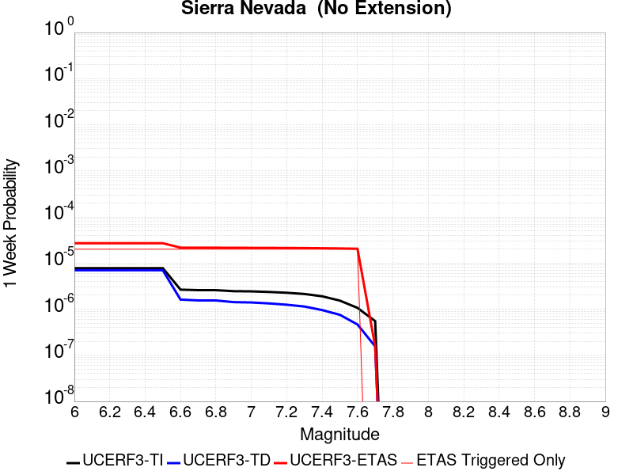 | 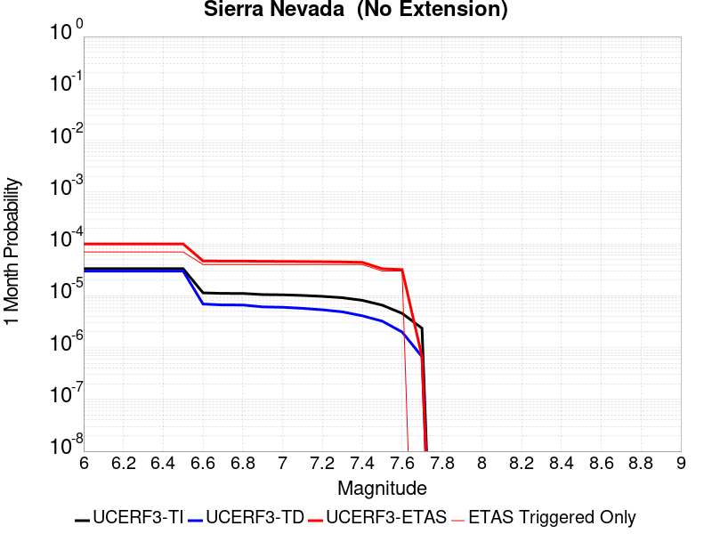 |  |  |

| Magnitude | 1 wk TI Prob | 1 wk TD Prob | 1 wk ETAS Prob | 1 wk ETAS/TD Gain | 1 wk ETAS Triggered Only | 1 mo TI Prob | 1 mo TD Prob | 1 mo ETAS Prob | 1 mo ETAS/TD Gain | 1 mo ETAS Triggered Only | 1 yr TI Prob | 1 yr TD Prob | 1 yr ETAS Prob | 1 yr ETAS/TD Gain | 1 yr ETAS Triggered Only | 10 yr TI Prob | 10 yr TD Prob | 10 yr ETAS Prob | 10 yr ETAS/TD Gain | 10 yr ETAS Triggered Only |
|-----|-----|-----|-----|-----|-----|-----|-----|-----|-----|-----|-----|-----|-----|-----|-----|-----|-----|-----|-----|-----|
| 6.0 | 7.7690465E-6 | 6.9768134E-6 | 6.9768134E-6 | 1.0 | 0.0 | 3.329549E-5 | 2.990049E-5 | 2.990049E-5 | 1.0 | 0.0 | 4.0529718E-4 | 3.640135E-4 | 4.1337823E-4 | 1.1356124 | 4.9382717E-5 | 0.004045588 | 0.0036376887 | 0.0037606964 | 1.0338148 | 1.2345679E-4 |
| 6.1 | 7.7690465E-6 | 6.9768134E-6 | 6.9768134E-6 | 1.0 | 0.0 | 3.329549E-5 | 2.990049E-5 | 2.990049E-5 | 1.0 | 0.0 | 4.0529718E-4 | 3.640135E-4 | 4.1337823E-4 | 1.1356124 | 4.9382717E-5 | 0.004045588 | 0.0036376887 | 0.0037606964 | 1.0338148 | 1.2345679E-4 |
| 6.2 | 7.7690465E-6 | 6.9768134E-6 | 6.9768134E-6 | 1.0 | 0.0 | 3.329549E-5 | 2.990049E-5 | 2.990049E-5 | 1.0 | 0.0 | 4.0529718E-4 | 3.640135E-4 | 4.1337823E-4 | 1.1356124 | 4.9382717E-5 | 0.004045588 | 0.0036376887 | 0.0037606964 | 1.0338148 | 1.2345679E-4 |
| 6.3 | 7.7690465E-6 | 6.9768134E-6 | 6.9768134E-6 | 1.0 | 0.0 | 3.329549E-5 | 2.990049E-5 | 2.990049E-5 | 1.0 | 0.0 | 4.0529718E-4 | 3.640135E-4 | 4.1337823E-4 | 1.1356124 | 4.9382717E-5 | 0.004045588 | 0.0036376887 | 0.0037606964 | 1.0338148 | 1.2345679E-4 |
| 6.4 | 7.7690465E-6 | 6.9768134E-6 | 6.9768134E-6 | 1.0 | 0.0 | 3.329549E-5 | 2.990049E-5 | 2.990049E-5 | 1.0 | 0.0 | 4.0529718E-4 | 3.640135E-4 | 4.1337823E-4 | 1.1356124 | 4.9382717E-5 | 0.004045588 | 0.0036376887 | 0.0037606964 | 1.0338148 | 1.2345679E-4 |
| 6.5 | 7.7690465E-6 | 6.9768134E-6 | 6.9768134E-6 | 1.0 | 0.0 | 3.329549E-5 | 2.990049E-5 | 2.990049E-5 | 1.0 | 0.0 | 4.0529718E-4 | 3.640135E-4 | 4.1337823E-4 | 1.1356124 | 4.9382717E-5 | 0.004045588 | 0.0036376887 | 0.0037606964 | 1.0338148 | 1.2345679E-4 |
| 6.6 | 2.653E-6 | 1.615073E-6 | 1.615073E-6 | 1.0 | 0.0 | 1.136995E-5 | 6.921723E-6 | 6.921723E-6 | 1.0 | 0.0 | 1.3842035E-4 | 8.426875E-5 | 1.336473E-4 | 1.5859652 | 4.9382717E-5 | 0.0013833415 | 8.4237143E-4 | 9.410537E-4 | 1.1171482 | 9.8765435E-5 |
| 6.7 | 2.5902466E-6 | 1.5504045E-6 | 1.5504045E-6 | 1.0 | 0.0 | 1.11010095E-5 | 6.6445737E-6 | 6.6445737E-6 | 1.0 | 0.0 | 1.351464E-4 | 8.089471E-5 | 1.3027343E-4 | 1.6104074 | 4.9382717E-5 | 0.0013506424 | 8.0865563E-4 | 9.073412E-4 | 1.1220366 | 9.8765435E-5 |
| 6.8 | 2.5853892E-6 | 1.5472036E-6 | 1.5472036E-6 | 1.0 | 0.0 | 1.1080193E-5 | 6.630856E-6 | 6.630856E-6 | 1.0 | 0.0 | 1.34893E-4 | 8.072771E-5 | 1.3010645E-4 | 1.6116701 | 4.9382717E-5 | 0.0013481114 | 8.069869E-4 | 9.0567255E-4 | 1.1222892 | 9.8765435E-5 |
| 6.9 | 2.458257E-6 | 1.422273E-6 | 1.422273E-6 | 1.0 | 0.0 | 1.0535345E-5 | 6.0954417E-6 | 6.0954417E-6 | 1.0 | 0.0 | 1.2826028E-4 | 7.42095E-5 | 1.2358854E-4 | 1.6654007 | 4.9382717E-5 | 0.0012818627 | 7.4184913E-4 | 8.4054127E-4 | 1.1330353 | 9.8765435E-5 |
| 7.0 | 2.4341468E-6 | 1.3992359E-6 | 1.3992359E-6 | 1.0 | 0.0 | 1.0432016E-5 | 5.9967115E-6 | 5.9967115E-6 | 1.0 | 0.0 | 1.270024E-4 | 7.300753E-5 | 1.2238664E-4 | 1.6763563 | 4.9382717E-5 | 0.0012692984 | 7.298374E-4 | 8.2853076E-4 | 1.1352265 | 9.8765435E-5 |
| 7.1 | 2.3652476E-6 | 1.3341826E-6 | 1.3341826E-6 | 1.0 | 0.0 | 1.0136736E-5 | 5.7179127E-6 | 5.7179127E-6 | 1.0 | 0.0 | 1.2340778E-4 | 6.961338E-5 | 1.18992655E-4 | 1.709336 | 4.9382717E-5 | 0.0012333926 | 6.959174E-4 | 7.6994E-4 | 1.1063669 | 7.407407E-5 |
| 7.2 | 2.272158E-6 | 1.2504844E-6 | 1.2504844E-6 | 1.0 | 0.0 | 9.737784E-6 | 5.3592075E-6 | 5.3592075E-6 | 1.0 | 0.0 | 1.1855107E-4 | 6.5246415E-5 | 1.1462591E-4 | 1.7568154 | 4.9382717E-5 | 0.0011848784 | 6.522741E-4 | 7.262998E-4 | 1.1134887 | 7.407407E-5 |
| 7.3 | 2.1382127E-6 | 1.1421661E-6 | 1.1421661E-6 | 1.0 | 0.0 | 9.163737E-6 | 4.8949887E-6 | 4.8949887E-6 | 1.0 | 0.0 | 1.1156279E-4 | 5.9594866E-5 | 1.08974644E-4 | 1.828591 | 4.9382717E-5 | 0.001115068 | 5.9579004E-4 | 6.6982E-4 | 1.1242551 | 7.407407E-5 |
| 7.4 | 1.9048055E-6 | 9.577096E-7 | 9.577096E-7 | 1.0 | 0.0 | 8.163426E-6 | 4.1044636E-6 | 4.1044636E-6 | 1.0 | 0.0 | 9.9385186E-5 | 4.9970706E-5 | 9.935095E-5 | 1.988184 | 4.9382717E-5 | 9.934074E-4 | 4.9959536E-4 | 5.736324E-4 | 1.1481941 | 7.407407E-5 |
| 7.5 | 1.5373403E-6 | 7.5616214E-7 | 7.5616214E-7 | 1.0 | 0.0 | 6.5885843E-6 | 3.240691E-6 | 3.240691E-6 | 1.0 | 0.0 | 8.021306E-5 | 3.9454702E-5 | 6.414509E-5 | 1.6257906 | 2.4691359E-5 | 8.0184115E-4 | 3.9447745E-4 | 4.438407E-4 | 1.1251358 | 4.9382717E-5 |
| 7.6 | 1.0680322E-6 | 4.660781E-7 | 4.660781E-7 | 1.0 | 0.0 | 4.577273E-6 | 1.997476E-6 | 1.997476E-6 | 1.0 | 0.0 | 5.5726876E-5 | 2.4319E-5 | 4.900976E-5 | 2.0152867 | 2.4691359E-5 | 5.5712904E-4 | 2.4316367E-4 | 2.67849E-4 | 1.1015174 | 2.4691359E-5 |
| 7.7 | 5.509146E-7 | 1.5586197E-7 | 1.5586197E-7 | 1.0 | 0.0 | 2.3610605E-6 | 6.679797E-7 | 6.679797E-7 | 1.0 | 0.0 | 2.8745531E-5 | 8.132623E-6 | 8.132623E-6 | 1.0 | 0.0 | 2.8741814E-4 | 8.132337E-5 | 8.132337E-5 | 1.0 | 0.0 |

## San Andreas (Parkfield)
*[(top)](#table-of-contents)*

| 1 Week | 1 Month | 1 Year | 10 Year |
|-----|-----|-----|-----|
|  |  |  |  |

| Magnitude | 1 wk TI Prob | 1 wk TD Prob | 1 wk ETAS Prob | 1 wk ETAS/TD Gain | 1 wk ETAS Triggered Only | 1 mo TI Prob | 1 mo TD Prob | 1 mo ETAS Prob | 1 mo ETAS/TD Gain | 1 mo ETAS Triggered Only | 1 yr TI Prob | 1 yr TD Prob | 1 yr ETAS Prob | 1 yr ETAS/TD Gain | 1 yr ETAS Triggered Only | 10 yr TI Prob | 10 yr TD Prob | 10 yr ETAS Prob | 10 yr ETAS/TD Gain | 10 yr ETAS Triggered Only |
|-----|-----|-----|-----|-----|-----|-----|-----|-----|-----|-----|-----|-----|-----|-----|-----|-----|-----|-----|-----|-----|
| 6.0 | 5.556969E-4 | 7.859536E-4 | 7.859536E-4 | 1.0 | 0.0 | 0.0023793848 | 0.0033645865 | 0.0033645865 | 1.0 | 0.0 | 0.028586963 | 0.040577162 | 0.04064823 | 1.0017514 | 7.407407E-5 | 0.25176284 | 0.33838087 | 0.33844623 | 1.0001931 | 9.8765435E-5 |
| 6.1 | 1.925858E-4 | 3.0503818E-4 | 3.0503818E-4 | 1.0 | 0.0 | 8.2510663E-4 | 0.0013067479 | 0.0013067479 | 1.0 | 0.0 | 0.0099994885 | 0.01589046 | 0.015939059 | 1.0030583 | 4.9382717E-5 | 0.095613256 | 0.150276 | 0.15033895 | 1.0004189 | 7.407407E-5 |
| 6.2 | 9.4306815E-5 | 1.8304172E-4 | 1.8304172E-4 | 1.0 | 0.0 | 4.0410945E-4 | 7.842299E-4 | 7.842299E-4 | 1.0 | 0.0 | 0.0049089384 | 0.009506407 | 0.00955532 | 1.0051453 | 4.9382717E-5 | 0.048019063 | 0.09212034 | 0.0921876 | 1.00073 | 7.407407E-5 |
| 6.3 | 9.283051E-5 | 1.8000482E-4 | 1.8000482E-4 | 1.0 | 0.0 | 3.9778434E-4 | 7.7122235E-4 | 7.7122235E-4 | 1.0 | 0.0 | 0.0048322747 | 0.00934941 | 0.009398332 | 1.0052326 | 4.9382717E-5 | 0.047285385 | 0.09077296 | 0.0908403 | 1.000742 | 7.407407E-5 |
| 6.4 | 9.138826E-5 | 1.7762266E-4 | 1.7762266E-4 | 1.0 | 0.0 | 3.916052E-4 | 7.6101907E-4 | 7.6101907E-4 | 1.0 | 0.0 | 0.0047573745 | 0.009226245 | 0.009275172 | 1.005303 | 4.9382717E-5 | 0.046568092 | 0.08967384 | 0.08974127 | 1.000752 | 7.407407E-5 |
| 6.5 | 9.000255E-5 | 1.7519935E-4 | 1.7519935E-4 | 1.0 | 0.0 | 3.8566816E-4 | 7.506395E-4 | 7.506395E-4 | 1.0 | 0.0 | 0.0046854047 | 0.009100947 | 0.00914988 | 1.0053767 | 4.9382717E-5 | 0.045878403 | 0.08855845 | 0.08862597 | 1.0007623 | 7.407407E-5 |
| 6.6 | 8.8109264E-5 | 1.7200313E-4 | 1.7200313E-4 | 1.0 | 0.0 | 3.7755648E-4 | 7.369492E-4 | 7.369492E-4 | 1.0 | 0.0 | 0.0045870654 | 0.008935661 | 0.008984602 | 1.0054771 | 4.9382717E-5 | 0.04493529 | 0.087087445 | 0.08715507 | 1.0007765 | 7.407407E-5 |
| 6.7 | 8.738073E-5 | 1.7067218E-4 | 1.7067218E-4 | 1.0 | 0.0 | 3.7443507E-4 | 7.3124835E-4 | 7.3124835E-4 | 1.0 | 0.0 | 0.0045492216 | 0.008866861 | 0.008915807 | 1.00552 | 4.9382717E-5 | 0.04457213 | 0.08648729 | 0.08655496 | 1.0007824 | 7.407407E-5 |
| 6.8 | 8.710195E-5 | 1.7012582E-4 | 1.7012582E-4 | 1.0 | 0.0 | 3.7324068E-4 | 7.2890805E-4 | 7.2890805E-4 | 1.0 | 0.0 | 0.0045347405 | 0.008838609 | 0.0088875545 | 1.0055377 | 4.9382717E-5 | 0.04443313 | 0.08623441 | 0.0863021 | 1.0007849 | 7.407407E-5 |
| 6.9 | 8.6801556E-5 | 1.6953409E-4 | 1.6953409E-4 | 1.0 | 0.0 | 3.7195362E-4 | 7.263735E-4 | 7.263735E-4 | 1.0 | 0.0 | 0.0045191357 | 0.008808001 | 0.008856948 | 1.0055572 | 4.9382717E-5 | 0.044283327 | 0.085960045 | 0.08602775 | 1.0007876 | 7.407407E-5 |
| 7.0 | 8.5571606E-5 | 1.6705737E-4 | 1.6705737E-4 | 1.0 | 0.0 | 3.6668387E-4 | 7.157649E-4 | 7.157649E-4 | 1.0 | 0.0 | 0.004455241 | 0.008679876 | 0.00872883 | 1.0056399 | 4.9382717E-5 | 0.043669727 | 0.08480672 | 0.08487451 | 1.0007994 | 7.407407E-5 |
| 7.1 | 7.82589E-5 | 1.5184609E-4 | 1.5184609E-4 | 1.0 | 0.0 | 3.3535215E-4 | 6.506074E-4 | 6.506074E-4 | 1.0 | 0.0 | 0.0040752706 | 0.007892547 | 0.00794154 | 1.0062075 | 4.9382717E-5 | 0.040013418 | 0.07771205 | 0.077780366 | 1.0008792 | 7.407407E-5 |
| 7.2 | 7.690929E-5 | 1.4921518E-4 | 1.4921518E-4 | 1.0 | 0.0 | 3.2956956E-4 | 6.393376E-4 | 6.393376E-4 | 1.0 | 0.0 | 0.004005129 | 0.007756322 | 0.007805322 | 1.0063174 | 4.9382717E-5 | 0.0393371 | 0.07648417 | 0.076552585 | 1.0008944 | 7.407407E-5 |
| 7.3 | 7.5543794E-5 | 1.4617428E-4 | 1.4617428E-4 | 1.0 | 0.0 | 3.2371894E-4 | 6.263115E-4 | 6.263115E-4 | 1.0 | 0.0 | 0.003934157 | 0.0075988453 | 0.007647853 | 1.0064493 | 4.9382717E-5 | 0.038652334 | 0.07504487 | 0.075113386 | 1.000913 | 7.407407E-5 |
| 7.4 | 7.4214564E-5 | 1.431766E-4 | 1.431766E-4 | 1.0 | 0.0 | 3.1802364E-4 | 6.1347045E-4 | 6.1347045E-4 | 1.0 | 0.0 | 0.003865065 | 0.0074435836 | 0.0074925986 | 1.0065849 | 4.9382717E-5 | 0.03798529 | 0.07361605 | 0.07368467 | 1.0009321 | 7.407407E-5 |
| 7.5 | 6.149578E-5 | 1.1237888E-4 | 1.1237888E-4 | 1.0 | 0.0 | 2.6352672E-4 | 4.8153498E-4 | 4.8153498E-4 | 1.0 | 0.0 | 0.0032037178 | 0.005846961 | 0.0058960547 | 1.0083965 | 4.9382717E-5 | 0.03157923 | 0.0587748 | 0.058844518 | 1.0011863 | 7.407407E-5 |
| 7.6 | 6.0643448E-5 | 1.10660854E-4 | 1.10660854E-4 | 1.0 | 0.0 | 2.598746E-4 | 4.741747E-4 | 4.741747E-4 | 1.0 | 0.0 | 0.0031593828 | 0.0057578264 | 0.005806925 | 1.0085273 | 4.9382717E-5 | 0.031148417 | 0.057934027 | 0.05800381 | 1.0012045 | 7.407407E-5 |
| 7.7 | 5.1652263E-5 | 9.216647E-5 | 9.216647E-5 | 1.0 | 0.0 | 2.2134806E-4 | 3.949394E-4 | 3.949394E-4 | 1.0 | 0.0 | 0.002691582 | 0.004797796 | 0.0048469417 | 1.0102434 | 4.9382717E-5 | 0.026592141 | 0.04873269 | 0.048779666 | 1.0009639 | 4.9382717E-5 |
| 7.8 | 4.8090482E-5 | 8.598273E-5 | 8.598273E-5 | 1.0 | 0.0 | 2.060858E-4 | 3.6844538E-4 | 3.6844538E-4 | 1.0 | 0.0 | 0.0025062072 | 0.004476604 | 0.004525766 | 1.0109819 | 4.9382717E-5 | 0.024781305 | 0.04548402 | 0.045531157 | 1.0010363 | 4.9382717E-5 |
| 7.9 | 3.970278E-5 | 6.780531E-5 | 6.780531E-5 | 1.0 | 0.0 | 1.7014367E-4 | 2.9056185E-4 | 2.9056185E-4 | 1.0 | 0.0 | 0.002069531 | 0.003531856 | 0.0035810643 | 1.0139327 | 4.9382717E-5 | 0.020503636 | 0.03602571 | 0.036073312 | 1.0013214 | 4.9382717E-5 |
| 8.0 | 2.8982335E-5 | 4.08898E-5 | 4.08898E-5 | 1.0 | 0.0 | 1.2420409E-4 | 1.7523023E-4 | 1.7523023E-4 | 1.0 | 0.0 | 0.0015111357 | 0.0021313417 | 0.0021559806 | 1.0115602 | 2.4691359E-5 | 0.015009012 | 0.022106694 | 0.02213084 | 1.0010922 | 2.4691359E-5 |
| 8.1 | 1.8836186E-5 | 1.8790506E-5 | 1.8790506E-5 | 1.0 | 0.0 | 8.0724014E-5 | 8.0528254E-5 | 8.0528254E-5 | 1.0 | 0.0 | 9.823717E-4 | 9.799912E-4 | 0.0010046583 | 1.0251708 | 2.4691359E-5 | 0.009780403 | 0.010545682 | 0.010570114 | 1.0023167 | 2.4691359E-5 |
| 8.2 | 8.643924E-6 | 5.5167247E-6 | 5.5167247E-6 | 1.0 | 0.0 | 3.704486E-5 | 2.3642891E-5 | 2.3642891E-5 | 1.0 | 0.0 | 4.5092785E-4 | 2.8781427E-4 | 2.8781427E-4 | 1.0 | 0.0 | 0.0045001395 | 0.0032716133 | 0.0032716133 | 1.0 | 0.0 |
| 8.3 | 1.983087E-6 | 7.731745E-7 | 7.731745E-7 | 1.0 | 0.0 | 8.498917E-6 | 3.313601E-6 | 3.313601E-6 | 1.0 | 0.0 | 1.034694E-4 | 4.0342362E-5 | 4.0342362E-5 | 1.0 | 0.0 | 0.0010342124 | 4.7608858E-4 | 4.7608858E-4 | 1.0 | 0.0 |

## San Andreas (Cholame) rev
*[(top)](#table-of-contents)*

| 1 Week | 1 Month | 1 Year | 10 Year |
|-----|-----|-----|-----|
|  |  |  |  |

| Magnitude | 1 wk TI Prob | 1 wk TD Prob | 1 wk ETAS Prob | 1 wk ETAS/TD Gain | 1 wk ETAS Triggered Only | 1 mo TI Prob | 1 mo TD Prob | 1 mo ETAS Prob | 1 mo ETAS/TD Gain | 1 mo ETAS Triggered Only | 1 yr TI Prob | 1 yr TD Prob | 1 yr ETAS Prob | 1 yr ETAS/TD Gain | 1 yr ETAS Triggered Only | 10 yr TI Prob | 10 yr TD Prob | 10 yr ETAS Prob | 10 yr ETAS/TD Gain | 10 yr ETAS Triggered Only |
|-----|-----|-----|-----|-----|-----|-----|-----|-----|-----|-----|-----|-----|-----|-----|-----|-----|-----|-----|-----|-----|
| 6.0 | 1.2302514E-4 | 2.5281878E-4 | 2.5281878E-4 | 1.0 | 0.0 | 5.27144E-4 | 0.0010830607 | 0.0010830607 | 1.0 | 0.0 | 0.0063991086 | 0.01310705 | 0.013180153 | 1.0055774 | 7.407407E-5 | 0.06217949 | 0.12471412 | 0.12480057 | 1.0006932 | 9.8765435E-5 |
| 6.1 | 1.2302514E-4 | 2.5281878E-4 | 2.5281878E-4 | 1.0 | 0.0 | 5.27144E-4 | 0.0010830607 | 0.0010830607 | 1.0 | 0.0 | 0.0063991086 | 0.01310705 | 0.013180153 | 1.0055774 | 7.407407E-5 | 0.06217949 | 0.12471412 | 0.12480057 | 1.0006932 | 9.8765435E-5 |
| 6.2 | 1.2203569E-4 | 2.5098576E-4 | 2.5098576E-4 | 1.0 | 0.0 | 5.2290526E-4 | 0.0010752114 | 0.0010752114 | 1.0 | 0.0 | 0.006347804 | 0.01301263 | 0.01308574 | 1.0056185 | 7.407407E-5 | 0.061695136 | 0.12390022 | 0.12398675 | 1.0006983 | 9.8765435E-5 |
| 6.3 | 1.2142645E-4 | 2.498449E-4 | 2.498449E-4 | 1.0 | 0.0 | 5.202953E-4 | 0.0010703261 | 0.0010703261 | 1.0 | 0.0 | 0.006316212 | 0.012953859 | 0.013026973 | 1.0056442 | 7.407407E-5 | 0.06139677 | 0.123394296 | 0.12348087 | 1.0007017 | 9.8765435E-5 |
| 6.4 | 1.1865206E-4 | 2.4489546E-4 | 2.4489546E-4 | 1.0 | 0.0 | 5.0840975E-4 | 0.0010491315 | 0.0010491315 | 1.0 | 0.0 | 0.006172335 | 0.012698848 | 0.012771982 | 1.005759 | 7.407407E-5 | 0.060036868 | 0.12118601 | 0.1212728 | 1.0007162 | 9.8765435E-5 |
| 6.5 | 1.17443946E-4 | 2.4282538E-4 | 2.4282538E-4 | 1.0 | 0.0 | 5.032341E-4 | 0.0010402667 | 0.0010402667 | 1.0 | 0.0 | 0.006109677 | 0.012592169 | 0.01266531 | 1.0058085 | 7.407407E-5 | 0.059444077 | 0.12025932 | 0.12034621 | 1.0007225 | 9.8765435E-5 |
| 6.6 | 1.13579066E-4 | 2.3590637E-4 | 2.3590637E-4 | 1.0 | 0.0 | 4.866766E-4 | 0.001010637 | 0.001010637 | 1.0 | 0.0 | 0.0059092017 | 0.0122355325 | 0.0123087 | 1.0059799 | 7.407407E-5 | 0.057545185 | 0.11717106 | 0.11725825 | 1.0007441 | 9.8765435E-5 |
| 6.7 | 1.1271412E-4 | 2.3434764E-4 | 2.3434764E-4 | 1.0 | 0.0 | 4.829711E-4 | 0.001003962 | 0.001003962 | 1.0 | 0.0 | 0.005864331 | 0.012155173 | 0.012228347 | 1.00602 | 7.407407E-5 | 0.057119697 | 0.11647417 | 0.11656143 | 1.0007492 | 9.8765435E-5 |
| 6.8 | 1.1217975E-4 | 2.3323E-4 | 2.3323E-4 | 1.0 | 0.0 | 4.8068175E-4 | 9.991758E-4 | 9.991758E-4 | 1.0 | 0.0 | 0.005836608 | 0.012097551 | 0.012170728 | 1.006049 | 7.407407E-5 | 0.056856725 | 0.115971886 | 0.1160592 | 1.0007529 | 9.8765435E-5 |
| 6.9 | 1.1146753E-4 | 2.3171544E-4 | 2.3171544E-4 | 1.0 | 0.0 | 4.7763053E-4 | 9.926897E-4 | 9.926897E-4 | 1.0 | 0.0 | 0.0057996577 | 0.012019457 | 0.012092641 | 1.0060887 | 7.407407E-5 | 0.056506127 | 0.11529175 | 0.11537913 | 1.0007579 | 9.8765435E-5 |
| 7.0 | 1.0965793E-4 | 2.279428E-4 | 2.279428E-4 | 1.0 | 0.0 | 4.698779E-4 | 9.765335E-4 | 9.765335E-4 | 1.0 | 0.0 | 0.005705768 | 0.011824906 | 0.011898104 | 1.0061902 | 7.407407E-5 | 0.055614736 | 0.11359157 | 0.11367911 | 1.0007707 | 9.8765435E-5 |
| 7.1 | 9.927982E-5 | 2.0610577E-4 | 2.0610577E-4 | 1.0 | 0.0 | 4.2541555E-4 | 8.830125E-4 | 8.830125E-4 | 1.0 | 0.0 | 0.0051671406 | 0.010697979 | 0.01077126 | 1.00685 | 7.407407E-5 | 0.05048634 | 0.10367857 | 0.1037671 | 1.0008539 | 9.8765435E-5 |
| 7.2 | 9.696786E-5 | 2.0114318E-4 | 2.0114318E-4 | 1.0 | 0.0 | 4.1551032E-4 | 8.617584E-4 | 8.617584E-4 | 1.0 | 0.0 | 0.00504711 | 0.010441719 | 0.010515019 | 1.00702 | 7.407407E-5 | 0.04934009 | 0.101415254 | 0.101504005 | 1.0008751 | 9.8765435E-5 |
| 7.3 | 9.4727984E-5 | 1.9542476E-4 | 1.9542476E-4 | 1.0 | 0.0 | 4.0591392E-4 | 8.372668E-4 | 8.372668E-4 | 1.0 | 0.0 | 0.0049308087 | 0.010146349 | 0.010219672 | 1.0072265 | 7.407407E-5 | 0.048228268 | 0.09878259 | 0.0988716 | 1.0009011 | 9.8765435E-5 |
| 7.4 | 9.220358E-5 | 1.8911749E-4 | 1.8911749E-4 | 1.0 | 0.0 | 3.9509835E-4 | 8.1025274E-4 | 8.1025274E-4 | 1.0 | 0.0 | 0.004799717 | 0.009820456 | 0.009893802 | 1.0074688 | 7.407407E-5 | 0.046973653 | 0.09585619 | 0.095945485 | 1.0009316 | 9.8765435E-5 |
| 7.5 | 7.71631E-5 | 1.5238045E-4 | 1.5238045E-4 | 1.0 | 0.0 | 3.306571E-4 | 6.5289583E-4 | 6.5289583E-4 | 1.0 | 0.0 | 0.0040183207 | 0.007920107 | 0.007969098 | 1.0061858 | 4.9382717E-5 | 0.03946433 | 0.07855449 | 0.07862274 | 1.0008689 | 7.407407E-5 |
| 7.6 | 7.5634416E-5 | 1.4896717E-4 | 1.4896717E-4 | 1.0 | 0.0 | 3.241072E-4 | 6.3827465E-4 | 6.3827465E-4 | 1.0 | 0.0 | 0.0039388672 | 0.0077433735 | 0.0077923737 | 1.006328 | 4.9382717E-5 | 0.038697794 | 0.07691501 | 0.07698339 | 1.000889 | 7.407407E-5 |
| 7.7 | 6.3783E-5 | 1.2411876E-4 | 1.2411876E-4 | 1.0 | 0.0 | 2.7332708E-4 | 5.3182914E-4 | 5.3182914E-4 | 1.0 | 0.0 | 0.0033226798 | 0.006455823 | 0.006504887 | 1.0076 | 4.9382717E-5 | 0.032734364 | 0.064783335 | 0.06482952 | 1.0007129 | 4.9382717E-5 |
| 7.8 | 5.863422E-5 | 1.1464447E-4 | 1.1464447E-4 | 1.0 | 0.0 | 2.512653E-4 | 4.9124093E-4 | 4.9124093E-4 | 1.0 | 0.0 | 0.003054864 | 0.0059644785 | 0.0060135666 | 1.0082301 | 4.9382717E-5 | 0.030132094 | 0.059881274 | 0.0599277 | 1.0007753 | 4.9382717E-5 |
| 7.9 | 4.595283E-5 | 8.461681E-5 | 8.461681E-5 | 1.0 | 0.0 | 1.9692584E-4 | 3.6259307E-4 | 3.6259307E-4 | 1.0 | 0.0 | 0.0023949358 | 0.0044056415 | 0.004454807 | 1.0111595 | 4.9382717E-5 | 0.023692891 | 0.044529073 | 0.044576257 | 1.0010597 | 4.9382717E-5 |
| 8.0 | 3.2950178E-5 | 5.099502E-5 | 5.099502E-5 | 1.0 | 0.0 | 1.412074E-4 | 2.1853177E-4 | 2.1853177E-4 | 1.0 | 0.0 | 0.0017178444 | 0.0026573797 | 0.0026820055 | 1.009267 | 2.4691359E-5 | 0.017046256 | 0.027289711 | 0.027313728 | 1.0008801 | 2.4691359E-5 |
| 8.1 | 1.9177472E-5 | 1.929644E-5 | 1.929644E-5 | 1.0 | 0.0 | 8.218658E-5 | 8.269641E-5 | 8.269641E-5 | 1.0 | 0.0 | 0.0010001622 | 0.0010063645 | 0.0010310309 | 1.0245105 | 2.4691359E-5 | 0.009956728 | 0.010816686 | 0.01084111 | 1.0022581 | 2.4691359E-5 |
| 8.2 | 8.643924E-6 | 5.5167247E-6 | 5.5167247E-6 | 1.0 | 0.0 | 3.704486E-5 | 2.3642891E-5 | 2.3642891E-5 | 1.0 | 0.0 | 4.5092785E-4 | 2.8781427E-4 | 2.8781427E-4 | 1.0 | 0.0 | 0.0045001395 | 0.0032716133 | 0.0032716133 | 1.0 | 0.0 |
| 8.3 | 1.983087E-6 | 7.731745E-7 | 7.731745E-7 | 1.0 | 0.0 | 8.498917E-6 | 3.313601E-6 | 3.313601E-6 | 1.0 | 0.0 | 1.034694E-4 | 4.0342362E-5 | 4.0342362E-5 | 1.0 | 0.0 | 0.0010342124 | 4.7608858E-4 | 4.7608858E-4 | 1.0 | 0.0 |

## Cleghorn Lake
*[(top)](#table-of-contents)*

| 1 Week | 1 Month | 1 Year | 10 Year |
|-----|-----|-----|-----|
|  |  |  |  |

| Magnitude | 1 wk TI Prob | 1 wk TD Prob | 1 wk ETAS Prob | 1 wk ETAS/TD Gain | 1 wk ETAS Triggered Only | 1 mo TI Prob | 1 mo TD Prob | 1 mo ETAS Prob | 1 mo ETAS/TD Gain | 1 mo ETAS Triggered Only | 1 yr TI Prob | 1 yr TD Prob | 1 yr ETAS Prob | 1 yr ETAS/TD Gain | 1 yr ETAS Triggered Only | 10 yr TI Prob | 10 yr TD Prob | 10 yr ETAS Prob | 10 yr ETAS/TD Gain | 10 yr ETAS Triggered Only |
|-----|-----|-----|-----|-----|-----|-----|-----|-----|-----|-----|-----|-----|-----|-----|-----|-----|-----|-----|-----|-----|
| 6.0 | 1.5467183E-5 | 1.6795737E-5 | 1.6795737E-5 | 1.0 | 0.0 | 6.6286244E-5 | 7.198006E-5 | 9.666964E-5 | 1.3430059 | 2.4691359E-5 | 8.067362E-4 | 8.760597E-4 | 9.253992E-4 | 1.0563197 | 4.9382717E-5 | 0.008038137 | 0.00873149 | 0.008829393 | 1.0112126 | 9.8765435E-5 |
| 6.1 | 1.5467183E-5 | 1.6795737E-5 | 1.6795737E-5 | 1.0 | 0.0 | 6.6286244E-5 | 7.198006E-5 | 9.666964E-5 | 1.3430059 | 2.4691359E-5 | 8.067362E-4 | 8.760597E-4 | 9.253992E-4 | 1.0563197 | 4.9382717E-5 | 0.008038137 | 0.00873149 | 0.008829393 | 1.0112126 | 9.8765435E-5 |
| 6.2 | 1.2624631E-5 | 1.3682765E-5 | 1.3682765E-5 | 1.0 | 0.0 | 5.410444E-5 | 5.8639376E-5 | 5.8639376E-5 | 1.0 | 0.0 | 6.585225E-4 | 7.1374926E-4 | 7.3842297E-4 | 1.0345691 | 2.4691359E-5 | 0.0065657445 | 0.007119365 | 0.0071929116 | 1.0103306 | 7.407407E-5 |
| 6.3 | 1.2624631E-5 | 1.3682765E-5 | 1.3682765E-5 | 1.0 | 0.0 | 5.410444E-5 | 5.8639376E-5 | 5.8639376E-5 | 1.0 | 0.0 | 6.585225E-4 | 7.1374926E-4 | 7.3842297E-4 | 1.0345691 | 2.4691359E-5 | 0.0065657445 | 0.007119365 | 0.0071929116 | 1.0103306 | 7.407407E-5 |
| 6.4 | 9.417684E-6 | 1.0170984E-5 | 1.0170984E-5 | 1.0 | 0.0 | 4.036088E-5 | 4.3589433E-5 | 4.3589433E-5 | 1.0 | 0.0 | 4.912829E-4 | 5.3061324E-4 | 5.3061324E-4 | 1.0 | 0.0 | 0.004901982 | 0.0052974997 | 0.0053466205 | 1.0092725 | 4.9382717E-5 |
| 6.5 | 9.368219E-6 | 1.0118407E-5 | 1.0118407E-5 | 1.0 | 0.0 | 4.014889E-5 | 4.336411E-5 | 4.336411E-5 | 1.0 | 0.0 | 4.8870314E-4 | 5.2787125E-4 | 5.2787125E-4 | 1.0 | 0.0 | 0.004876298 | 0.00527021 | 0.0053193327 | 1.0093207 | 4.9382717E-5 |
| 6.6 | 7.803798E-6 | 8.4425665E-6 | 8.4425665E-6 | 1.0 | 0.0 | 3.3444423E-5 | 3.6182148E-5 | 3.6182148E-5 | 1.0 | 0.0 | 4.0710976E-4 | 4.4046855E-4 | 4.4046855E-4 | 1.0 | 0.0 | 0.0040636472 | 0.0043998733 | 0.0044490388 | 1.0111743 | 4.9382717E-5 |
| 6.7 | 2.3108669E-6 | 2.443983E-6 | 2.443983E-6 | 1.0 | 0.0 | 9.903678E-6 | 1.0474172E-5 | 1.0474172E-5 | 1.0 | 0.0 | 1.205706E-4 | 1.2751577E-4 | 1.2751577E-4 | 1.0 | 0.0 | 0.001205052 | 0.0012744446 | 0.0012991045 | 1.0193496 | 2.4691359E-5 |
| 6.8 | 2.0882828E-6 | 2.2064146E-6 | 2.2064146E-6 | 1.0 | 0.0 | 8.949753E-6 | 9.456029E-6 | 9.456029E-6 | 1.0 | 0.0 | 1.08957785E-4 | 1.1512124E-4 | 1.1512124E-4 | 1.0 | 0.0 | 0.0010890438 | 0.0011506329 | 0.0011752959 | 1.0214342 | 2.4691359E-5 |
| 6.9 | 1.876935E-6 | 1.9811675E-6 | 1.9811675E-6 | 1.0 | 0.0 | 8.043982E-6 | 8.4906915E-6 | 8.4906915E-6 | 1.0 | 0.0 | 9.7931086E-5 | 1.0336943E-4 | 1.0336943E-4 | 1.0 | 0.0 | 9.788794E-4 | 0.0010332294 | 0.0010578952 | 1.0238726 | 2.4691359E-5 |
| 7.0 | 1.5357559E-6 | 1.6203753E-6 | 1.6203753E-6 | 1.0 | 0.0 | 6.5817944E-6 | 6.944448E-6 | 6.944448E-6 | 1.0 | 0.0 | 8.01304E-5 | 8.45455E-5 | 8.45455E-5 | 1.0 | 0.0 | 8.010151E-4 | 8.4514584E-4 | 8.4514584E-4 | 1.0 | 0.0 |
| 7.1 | 1.0905424E-6 | 1.1498282E-6 | 1.1498282E-6 | 1.0 | 0.0 | 4.6737446E-6 | 4.9278265E-6 | 4.9278265E-6 | 1.0 | 0.0 | 5.6901354E-5 | 5.9994734E-5 | 5.9994734E-5 | 1.0 | 0.0 | 5.6886784E-4 | 5.997952E-4 | 5.997952E-4 | 1.0 | 0.0 |
| 7.2 | 6.06668E-7 | 6.387636E-7 | 6.387636E-7 | 1.0 | 0.0 | 2.600003E-6 | 2.7375556E-6 | 2.7375556E-6 | 1.0 | 0.0 | 3.1654577E-5 | 3.33293E-5 | 3.33293E-5 | 1.0 | 0.0 | 3.1650066E-4 | 3.3324986E-4 | 3.3324986E-4 | 1.0 | 0.0 |

## Great Valley 09 (Laguna Seca)
*[(top)](#table-of-contents)*

| 1 Week | 1 Month | 1 Year | 10 Year |
|-----|-----|-----|-----|
|  |  |  |  |

| Magnitude | 1 wk TI Prob | 1 wk TD Prob | 1 wk ETAS Prob | 1 wk ETAS/TD Gain | 1 wk ETAS Triggered Only | 1 mo TI Prob | 1 mo TD Prob | 1 mo ETAS Prob | 1 mo ETAS/TD Gain | 1 mo ETAS Triggered Only | 1 yr TI Prob | 1 yr TD Prob | 1 yr ETAS Prob | 1 yr ETAS/TD Gain | 1 yr ETAS Triggered Only | 10 yr TI Prob | 10 yr TD Prob | 10 yr ETAS Prob | 10 yr ETAS/TD Gain | 10 yr ETAS Triggered Only |
|-----|-----|-----|-----|-----|-----|-----|-----|-----|-----|-----|-----|-----|-----|-----|-----|-----|-----|-----|-----|-----|
| 6.0 | 5.4353277E-5 | 7.0525646E-5 | 7.0525646E-5 | 1.0 | 0.0 | 2.3292181E-4 | 3.0221994E-4 | 3.0221994E-4 | 1.0 | 0.0 | 0.0028321352 | 0.0036733362 | 0.0036733362 | 1.0 | 0.0 | 0.02796312 | 0.036127005 | 0.0361984 | 1.0019763 | 7.407407E-5 |
| 6.1 | 4.5578287E-5 | 5.8239293E-5 | 5.8239293E-5 | 1.0 | 0.0 | 1.953209E-4 | 2.4957463E-4 | 2.4957463E-4 | 1.0 | 0.0 | 0.0023754383 | 0.0030343828 | 0.0030343828 | 1.0 | 0.0 | 0.023502063 | 0.029928818 | 0.029976724 | 1.0016006 | 4.9382717E-5 |
| 6.2 | 2.8536782E-5 | 3.474574E-5 | 3.474574E-5 | 1.0 | 0.0 | 1.2229476E-4 | 1.4890228E-4 | 1.4890228E-4 | 1.0 | 0.0 | 0.0014879217 | 0.0018113338 | 0.0018113338 | 1.0 | 0.0 | 0.014779986 | 0.017963162 | 0.01798741 | 1.0013498 | 2.4691359E-5 |
| 6.3 | 2.3698774E-5 | 2.8219289E-5 | 2.8219289E-5 | 1.0 | 0.0 | 1.01562226E-4 | 1.20934536E-4 | 1.20934536E-4 | 1.0 | 0.0 | 0.0012358186 | 0.0014714394 | 0.0014714394 | 1.0 | 0.0 | 0.012289686 | 0.014615262 | 0.014615262 | 1.0 | 0.0 |
| 6.4 | 1.9191197E-5 | 2.2126858E-5 | 2.2126858E-5 | 1.0 | 0.0 | 8.2245395E-5 | 9.4826195E-5 | 9.4826195E-5 | 1.0 | 0.0 | 0.0010008777 | 0.0011539406 | 0.0011539406 | 1.0 | 0.0 | 0.009963818 | 0.01147981 | 0.01147981 | 1.0 | 0.0 |
| 6.5 | 1.5203241E-5 | 1.6803955E-5 | 1.6803955E-5 | 1.0 | 0.0 | 6.5155116E-5 | 7.2015144E-5 | 7.2015144E-5 | 1.0 | 0.0 | 7.9297484E-4 | 8.7646366E-4 | 8.7646366E-4 | 1.0 | 0.0 | 0.007901512 | 0.008731467 | 0.008731467 | 1.0 | 0.0 |
| 6.6 | 1.0984925E-5 | 1.12445505E-5 | 1.12445505E-5 | 1.0 | 0.0 | 4.70774E-5 | 4.8190064E-5 | 4.8190064E-5 | 1.0 | 0.0 | 5.730166E-4 | 5.8656017E-4 | 5.8656017E-4 | 1.0 | 0.0 | 0.005715413 | 0.005850517 | 0.005850517 | 1.0 | 0.0 |
| 6.7 | 9.134616E-6 | 9.021409E-6 | 9.021409E-6 | 1.0 | 0.0 | 3.9147766E-5 | 3.8662623E-5 | 3.8662623E-5 | 1.0 | 0.0 | 4.7651984E-4 | 4.7061814E-4 | 4.7061814E-4 | 1.0 | 0.0 | 0.004754993 | 0.00469646 | 0.00469646 | 1.0 | 0.0 |
| 6.8 | 7.785589E-6 | 7.453189E-6 | 7.453189E-6 | 1.0 | 0.0 | 3.3366385E-5 | 3.1941858E-5 | 3.1941858E-5 | 1.0 | 0.0 | 4.0616E-4 | 3.8882476E-4 | 3.8882476E-4 | 1.0 | 0.0 | 0.0040541845 | 0.0038816484 | 0.0038816484 | 1.0 | 0.0 |
| 6.9 | 5.579095E-6 | 4.8993106E-6 | 4.8993106E-6 | 1.0 | 0.0 | 2.3910188E-5 | 2.0996884E-5 | 2.0996884E-5 | 1.0 | 0.0 | 2.9106764E-4 | 2.5560847E-4 | 2.5560847E-4 | 1.0 | 0.0 | 0.002906867 | 0.002553282 | 0.002553282 | 1.0 | 0.0 |
| 7.0 | 2.6816688E-6 | 1.521837E-6 | 1.521837E-6 | 1.0 | 0.0 | 1.1492816E-5 | 6.522143E-6 | 6.522143E-6 | 1.0 | 0.0 | 1.3991605E-4 | 7.9404286E-5 | 7.9404286E-5 | 1.0 | 0.0 | 0.0013982799 | 7.9376786E-4 | 7.9376786E-4 | 1.0 | 0.0 |
| 7.1 | 1.9951021E-6 | 7.4549945E-7 | 7.4549945E-7 | 1.0 | 0.0 | 8.55041E-6 | 3.194994E-6 | 3.194994E-6 | 1.0 | 0.0 | 1.0409627E-4 | 3.8898397E-5 | 3.8898397E-5 | 1.0 | 0.0 | 0.0010404752 | 3.8892005E-4 | 3.8892005E-4 | 1.0 | 0.0 |
| 7.2 | 1.9951021E-6 | 7.4549945E-7 | 7.4549945E-7 | 1.0 | 0.0 | 8.55041E-6 | 3.194994E-6 | 3.194994E-6 | 1.0 | 0.0 | 1.0409627E-4 | 3.8898397E-5 | 3.8898397E-5 | 1.0 | 0.0 | 0.0010404752 | 3.8892005E-4 | 3.8892005E-4 | 1.0 | 0.0 |
| 7.3 | 1.7087556E-6 | 6.5798565E-7 | 6.5798565E-7 | 1.0 | 0.0 | 7.3232177E-6 | 2.8199356E-6 | 2.8199356E-6 | 1.0 | 0.0 | 8.915652E-5 | 3.4332217E-5 | 3.4332217E-5 | 1.0 | 0.0 | 8.9120766E-4 | 3.432732E-4 | 3.432732E-4 | 1.0 | 0.0 |
| 7.4 | 1.3804846E-6 | 6.074658E-7 | 6.074658E-7 | 1.0 | 0.0 | 5.916349E-6 | 2.6034222E-6 | 2.6034222E-6 | 1.0 | 0.0 | 7.2029165E-5 | 3.1696247E-5 | 3.1696247E-5 | 1.0 | 0.0 | 7.200583E-4 | 3.1692127E-4 | 3.1692127E-4 | 1.0 | 0.0 |
| 7.5 | 1.3804846E-6 | 6.074658E-7 | 6.074658E-7 | 1.0 | 0.0 | 5.916349E-6 | 2.6034222E-6 | 2.6034222E-6 | 1.0 | 0.0 | 7.2029165E-5 | 3.1696247E-5 | 3.1696247E-5 | 1.0 | 0.0 | 7.200583E-4 | 3.1692127E-4 | 3.1692127E-4 | 1.0 | 0.0 |

## San Jacinto (San Bernardino)
*[(top)](#table-of-contents)*

| 1 Week | 1 Month | 1 Year | 10 Year |
|-----|-----|-----|-----|
|  |  | 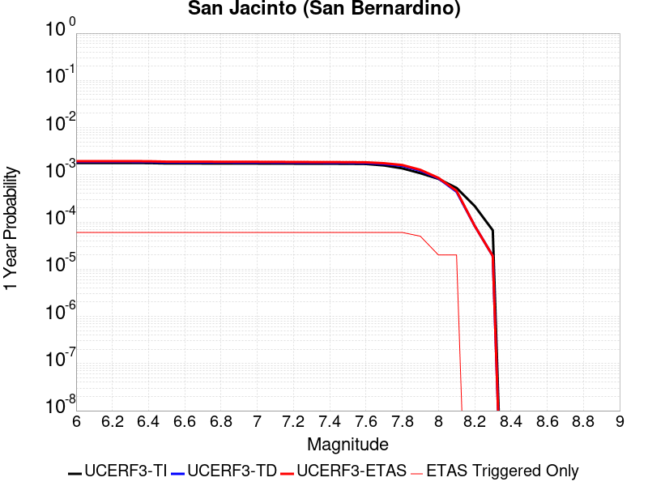 | 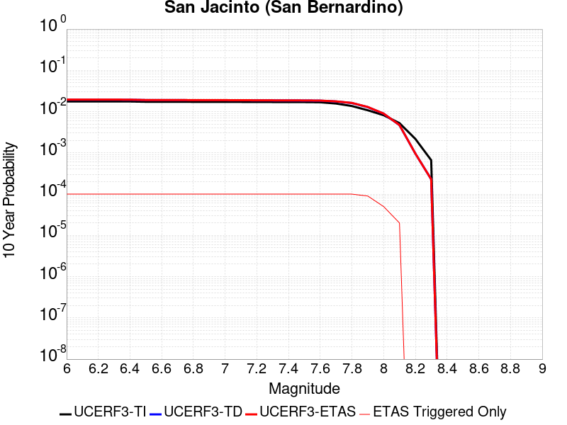 |

| Magnitude | 1 wk TI Prob | 1 wk TD Prob | 1 wk ETAS Prob | 1 wk ETAS/TD Gain | 1 wk ETAS Triggered Only | 1 mo TI Prob | 1 mo TD Prob | 1 mo ETAS Prob | 1 mo ETAS/TD Gain | 1 mo ETAS Triggered Only | 1 yr TI Prob | 1 yr TD Prob | 1 yr ETAS Prob | 1 yr ETAS/TD Gain | 1 yr ETAS Triggered Only | 10 yr TI Prob | 10 yr TD Prob | 10 yr ETAS Prob | 10 yr ETAS/TD Gain | 10 yr ETAS Triggered Only |
|-----|-----|-----|-----|-----|-----|-----|-----|-----|-----|-----|-----|-----|-----|-----|-----|-----|-----|-----|-----|-----|
| 6.0 | 3.409352E-5 | 3.611458E-5 | 3.611458E-5 | 1.0 | 0.0 | 1.461069E-4 | 1.5476761E-4 | 1.5476761E-4 | 1.0 | 0.0 | 0.0017774 | 0.0018826688 | 0.0019319586 | 1.0261807 | 4.9382717E-5 | 0.01763251 | 0.01941539 | 0.019512238 | 1.0049882 | 9.8765435E-5 |
| 6.1 | 3.409352E-5 | 3.611458E-5 | 3.611458E-5 | 1.0 | 0.0 | 1.461069E-4 | 1.5476761E-4 | 1.5476761E-4 | 1.0 | 0.0 | 0.0017774 | 0.0018826688 | 0.0019319586 | 1.0261807 | 4.9382717E-5 | 0.01763251 | 0.01941539 | 0.019512238 | 1.0049882 | 9.8765435E-5 |
| 6.2 | 3.409352E-5 | 3.611458E-5 | 3.611458E-5 | 1.0 | 0.0 | 1.461069E-4 | 1.5476761E-4 | 1.5476761E-4 | 1.0 | 0.0 | 0.0017774 | 0.0018826688 | 0.0019319586 | 1.0261807 | 4.9382717E-5 | 0.01763251 | 0.01941539 | 0.019512238 | 1.0049882 | 9.8765435E-5 |
| 6.3 | 3.409352E-5 | 3.611458E-5 | 3.611458E-5 | 1.0 | 0.0 | 1.461069E-4 | 1.5476761E-4 | 1.5476761E-4 | 1.0 | 0.0 | 0.0017774 | 0.0018826688 | 0.0019319586 | 1.0261807 | 4.9382717E-5 | 0.01763251 | 0.01941539 | 0.019512238 | 1.0049882 | 9.8765435E-5 |
| 6.4 | 3.400795E-5 | 3.6007215E-5 | 3.6007215E-5 | 1.0 | 0.0 | 1.4574021E-4 | 1.5430752E-4 | 1.5430752E-4 | 1.0 | 0.0 | 0.0017729428 | 0.0018770772 | 0.0019263672 | 1.026259 | 4.9382717E-5 | 0.017588645 | 0.019360462 | 0.019457314 | 1.0050026 | 9.8765435E-5 |
| 6.5 | 3.341482E-5 | 3.5267658E-5 | 3.5267658E-5 | 1.0 | 0.0 | 1.4319851E-4 | 1.5113836E-4 | 1.5113836E-4 | 1.0 | 0.0 | 0.0017420477 | 0.0018385579 | 0.0018878499 | 1.02681 | 4.9382717E-5 | 0.017284546 | 0.018981932 | 0.019078821 | 1.0051044 | 9.8765435E-5 |
| 6.6 | 3.3364955E-5 | 3.5204863E-5 | 3.5204863E-5 | 1.0 | 0.0 | 1.4298483E-4 | 1.5086925E-4 | 1.5086925E-4 | 1.0 | 0.0 | 0.0017394501 | 0.0018352871 | 0.0018845792 | 1.026858 | 4.9382717E-5 | 0.017258976 | 0.01894979 | 0.019046683 | 1.0051132 | 9.8765435E-5 |
| 6.7 | 3.335922E-5 | 3.5194633E-5 | 3.5194633E-5 | 1.0 | 0.0 | 1.4296026E-4 | 1.5082542E-4 | 1.5082542E-4 | 1.0 | 0.0 | 0.0017391514 | 0.0018347544 | 0.0018840465 | 1.0268658 | 4.9382717E-5 | 0.017256035 | 0.01894458 | 0.019041475 | 1.0051147 | 9.8765435E-5 |
| 6.8 | 3.327683E-5 | 3.508867E-5 | 3.508867E-5 | 1.0 | 0.0 | 1.4260718E-4 | 1.5037134E-4 | 1.5037134E-4 | 1.0 | 0.0 | 0.0017348597 | 0.0018292352 | 0.0018785276 | 1.026947 | 4.9382717E-5 | 0.017213784 | 0.01889034 | 0.018987238 | 1.0051296 | 9.8765435E-5 |
| 6.9 | 3.3235785E-5 | 3.5029603E-5 | 3.5029603E-5 | 1.0 | 0.0 | 1.4243131E-4 | 1.5011824E-4 | 1.5011824E-4 | 1.0 | 0.0 | 0.0017327217 | 0.0018261588 | 0.0018754513 | 1.0269924 | 4.9382717E-5 | 0.017192734 | 0.0188602 | 0.018957103 | 1.0051379 | 9.8765435E-5 |
| 7.0 | 3.3197095E-5 | 3.496951E-5 | 3.496951E-5 | 1.0 | 0.0 | 1.422655E-4 | 1.4986073E-4 | 1.4986073E-4 | 1.0 | 0.0 | 0.0017307063 | 0.0018230289 | 0.0018723216 | 1.0270389 | 4.9382717E-5 | 0.017172894 | 0.01882957 | 0.018926475 | 1.0051465 | 9.8765435E-5 |
| 7.1 | 3.3129716E-5 | 3.4849672E-5 | 3.4849672E-5 | 1.0 | 0.0 | 1.4197677E-4 | 1.493472E-4 | 1.493472E-4 | 1.0 | 0.0 | 0.0017271966 | 0.0018167871 | 0.00186608 | 1.0271319 | 4.9382717E-5 | 0.017138338 | 0.018768627 | 0.018865539 | 1.0051636 | 9.8765435E-5 |
| 7.2 | 3.3034008E-5 | 3.471708E-5 | 3.471708E-5 | 1.0 | 0.0 | 1.4156665E-4 | 1.48779E-4 | 1.48779E-4 | 1.0 | 0.0 | 0.0017222111 | 0.0018098808 | 0.0018591742 | 1.0272356 | 4.9382717E-5 | 0.017089253 | 0.018701006 | 0.018797923 | 1.0051825 | 9.8765435E-5 |
| 7.3 | 3.2956614E-5 | 3.4584762E-5 | 3.4584762E-5 | 1.0 | 0.0 | 1.4123498E-4 | 1.48212E-4 | 1.48212E-4 | 1.0 | 0.0 | 0.0017181796 | 0.0018029889 | 0.0018522827 | 1.0273399 | 4.9382717E-5 | 0.017049557 | 0.018633721 | 0.018730646 | 1.0052016 | 9.8765435E-5 |
| 7.4 | 3.2915937E-5 | 3.45064E-5 | 3.45064E-5 | 1.0 | 0.0 | 1.4106068E-4 | 1.478762E-4 | 1.478762E-4 | 1.0 | 0.0 | 0.0017160608 | 0.0017989073 | 0.0018482013 | 1.0274022 | 4.9382717E-5 | 0.017028693 | 0.018593961 | 0.01869089 | 1.0052129 | 9.8765435E-5 |
| 7.5 | 3.281791E-5 | 3.4371224E-5 | 3.4371224E-5 | 1.0 | 0.0 | 1.406406E-4 | 1.4729693E-4 | 1.4729693E-4 | 1.0 | 0.0 | 0.0017109542 | 0.0017918665 | 0.0018411607 | 1.02751 | 4.9382717E-5 | 0.016978411 | 0.018524809 | 0.018621745 | 1.0052328 | 9.8765435E-5 |
| 7.6 | 3.2521442E-5 | 3.409593E-5 | 3.409593E-5 | 1.0 | 0.0 | 1.3937015E-4 | 1.4611724E-4 | 1.4611724E-4 | 1.0 | 0.0 | 0.0016955109 | 0.0017775272 | 0.0018268222 | 1.0277323 | 4.9382717E-5 | 0.016826328 | 0.018382322 | 0.01847927 | 1.005274 | 9.8765435E-5 |
| 7.7 | 3.0287873E-5 | 3.2578493E-5 | 3.2578493E-5 | 1.0 | 0.0 | 1.297987E-4 | 1.3961464E-4 | 1.3961464E-4 | 1.0 | 0.0 | 0.0015791537 | 0.0016984841 | 0.0017477829 | 1.0290252 | 4.9382717E-5 | 0.01567979 | 0.017592473 | 0.017689502 | 1.0055153 | 9.8765435E-5 |
| 7.8 | 2.6316151E-5 | 2.9784747E-5 | 2.9784747E-5 | 1.0 | 0.0 | 1.1277862E-4 | 1.2764268E-4 | 1.2764268E-4 | 1.0 | 0.0 | 0.0013722149 | 0.0015529428 | 0.0016022489 | 1.0317501 | 4.9382717E-5 | 0.013637724 | 0.016131766 | 0.016228938 | 1.0060236 | 9.8765435E-5 |
| 7.9 | 2.0761147E-5 | 2.3523955E-5 | 2.3523955E-5 | 1.0 | 0.0 | 8.897331E-5 | 1.00813064E-4 | 1.00813064E-4 | 1.0 | 0.0 | 0.0010827117 | 0.0012267088 | 0.0012760309 | 1.0402069 | 4.9382717E-5 | 0.010774517 | 0.012847875 | 0.012945372 | 1.0075885 | 9.8765435E-5 |
| 8.0 | 1.5738568E-5 | 1.6113308E-5 | 1.6113308E-5 | 1.0 | 0.0 | 6.744926E-5 | 6.905521E-5 | 6.905521E-5 | 1.0 | 0.0 | 8.2088535E-4 | 8.4042357E-4 | 8.650942E-4 | 1.0293549 | 2.4691359E-5 | 0.008178596 | 0.008907886 | 0.0089813005 | 1.0082415 | 7.407407E-5 |
| 8.1 | 1.0105832E-5 | 8.377391E-6 | 8.377391E-6 | 1.0 | 0.0 | 4.3309992E-5 | 3.5902613E-5 | 3.5902613E-5 | 1.0 | 0.0 | 5.2717153E-4 | 4.3702716E-4 | 4.6170774E-4 | 1.0564737 | 2.4691359E-5 | 0.005259227 | 0.004702442 | 0.004727017 | 1.005226 | 2.4691359E-5 |
| 8.2 | 4.189207E-6 | 1.5918251E-6 | 1.5918251E-6 | 1.0 | 0.0 | 1.7953622E-5 | 6.8220897E-6 | 6.8220897E-6 | 1.0 | 0.0 | 2.1856341E-4 | 8.3055806E-5 | 8.3055806E-5 | 1.0 | 0.0 | 0.0021834858 | 9.642388E-4 | 9.642388E-4 | 1.0 | 0.0 |
| 8.3 | 1.2758221E-6 | 3.6510448E-7 | 3.6510448E-7 | 1.0 | 0.0 | 5.4677976E-6 | 1.5647327E-6 | 1.5647327E-6 | 1.0 | 0.0 | 6.65684E-5 | 1.9050458E-5 | 1.9050458E-5 | 1.0 | 0.0 | 6.6548464E-4 | 2.296306E-4 | 2.296306E-4 | 1.0 | 0.0 |

## Death Valley (No)
*[(top)](#table-of-contents)*

| 1 Week | 1 Month | 1 Year | 10 Year |
|-----|-----|-----|-----|
|  |  |  |  |

| Magnitude | 1 wk TI Prob | 1 wk TD Prob | 1 wk ETAS Prob | 1 wk ETAS/TD Gain | 1 wk ETAS Triggered Only | 1 mo TI Prob | 1 mo TD Prob | 1 mo ETAS Prob | 1 mo ETAS/TD Gain | 1 mo ETAS Triggered Only | 1 yr TI Prob | 1 yr TD Prob | 1 yr ETAS Prob | 1 yr ETAS/TD Gain | 1 yr ETAS Triggered Only | 10 yr TI Prob | 10 yr TD Prob | 10 yr ETAS Prob | 10 yr ETAS/TD Gain | 10 yr ETAS Triggered Only |
|-----|-----|-----|-----|-----|-----|-----|-----|-----|-----|-----|-----|-----|-----|-----|-----|-----|-----|-----|-----|-----|
| 6.0 | 2.0074807E-5 | 2.2502982E-5 | 2.2502982E-5 | 1.0 | 0.0 | 8.603206E-5 | 9.643783E-5 | 1.211268E-4 | 1.2560092 | 2.4691359E-5 | 0.001046937 | 0.0011735056 | 0.0011981679 | 1.021016 | 2.4691359E-5 | 0.010420183 | 0.011674001 | 0.011771614 | 1.0083616 | 9.8765435E-5 |
| 6.1 | 2.0074807E-5 | 2.2502982E-5 | 2.2502982E-5 | 1.0 | 0.0 | 8.603206E-5 | 9.643783E-5 | 1.211268E-4 | 1.2560092 | 2.4691359E-5 | 0.001046937 | 0.0011735056 | 0.0011981679 | 1.021016 | 2.4691359E-5 | 0.010420183 | 0.011674001 | 0.011771614 | 1.0083616 | 9.8765435E-5 |
| 6.2 | 2.0074807E-5 | 2.2502982E-5 | 2.2502982E-5 | 1.0 | 0.0 | 8.603206E-5 | 9.643783E-5 | 1.211268E-4 | 1.2560092 | 2.4691359E-5 | 0.001046937 | 0.0011735056 | 0.0011981679 | 1.021016 | 2.4691359E-5 | 0.010420183 | 0.011674001 | 0.011771614 | 1.0083616 | 9.8765435E-5 |
| 6.3 | 1.9050609E-5 | 2.1339678E-5 | 2.1339678E-5 | 1.0 | 0.0 | 8.164292E-5 | 9.1452595E-5 | 9.1452595E-5 | 1.0 | 0.0 | 9.935491E-4 | 0.0011128733 | 0.0011128733 | 1.0 | 0.0 | 0.009891188 | 0.011073828 | 0.0111226635 | 1.00441 | 4.9382717E-5 |
| 6.4 | 1.9050609E-5 | 2.1339678E-5 | 2.1339678E-5 | 1.0 | 0.0 | 8.164292E-5 | 9.1452595E-5 | 9.1452595E-5 | 1.0 | 0.0 | 9.935491E-4 | 0.0011128733 | 0.0011128733 | 1.0 | 0.0 | 0.009891188 | 0.011073828 | 0.0111226635 | 1.00441 | 4.9382717E-5 |
| 6.5 | 1.8367004E-5 | 2.0563628E-5 | 2.0563628E-5 | 1.0 | 0.0 | 7.8713354E-5 | 8.812689E-5 | 8.812689E-5 | 1.0 | 0.0 | 9.5791375E-4 | 0.0010724233 | 0.0010724233 | 1.0 | 0.0 | 0.009537951 | 0.010673268 | 0.010722123 | 1.0045774 | 4.9382717E-5 |
| 6.6 | 1.779439E-5 | 1.9913454E-5 | 1.9913454E-5 | 1.0 | 0.0 | 7.625944E-5 | 8.5340616E-5 | 8.5340616E-5 | 1.0 | 0.0 | 9.280632E-4 | 0.0010385332 | 0.0010385332 | 1.0 | 0.0 | 0.009241969 | 0.010337558 | 0.01038643 | 1.0047276 | 4.9382717E-5 |
| 6.7 | 1.7025437E-5 | 1.9045832E-5 | 1.9045832E-5 | 1.0 | 0.0 | 7.296412E-5 | 8.162248E-5 | 8.162248E-5 | 1.0 | 0.0 | 8.87976E-4 | 9.933067E-4 | 9.933067E-4 | 1.0 | 0.0 | 0.008844362 | 0.009889389 | 0.009938284 | 1.0049441 | 4.9382717E-5 |
| 6.8 | 1.6545107E-5 | 1.8514893E-5 | 1.8514893E-5 | 1.0 | 0.0 | 7.090568E-5 | 7.934716E-5 | 7.934716E-5 | 1.0 | 0.0 | 8.629347E-4 | 9.6562965E-4 | 9.6562965E-4 | 1.0 | 0.0 | 0.008595915 | 0.009615042 | 0.00966395 | 1.0050867 | 4.9382717E-5 |
| 6.9 | 1.615478E-5 | 1.80899E-5 | 1.80899E-5 | 1.0 | 0.0 | 6.9232934E-5 | 7.7525874E-5 | 7.7525874E-5 | 1.0 | 0.0 | 8.4258494E-4 | 9.434749E-4 | 9.434749E-4 | 1.0 | 0.0 | 0.008393973 | 0.009395388 | 0.009444307 | 1.0052067 | 4.9382717E-5 |
| 7.0 | 1.5894311E-5 | 1.780783E-5 | 1.780783E-5 | 1.0 | 0.0 | 6.81167E-5 | 7.6317076E-5 | 7.6317076E-5 | 1.0 | 0.0 | 8.2900526E-4 | 9.287704E-4 | 9.287704E-4 | 1.0 | 0.0 | 0.008259195 | 0.009249576 | 0.0092985025 | 1.0052896 | 4.9382717E-5 |
| 7.1 | 1.5602263E-5 | 1.7485747E-5 | 1.7485747E-5 | 1.0 | 0.0 | 6.6865134E-5 | 7.49368E-5 | 7.49368E-5 | 1.0 | 0.0 | 8.137789E-4 | 9.119797E-4 | 9.119797E-4 | 1.0 | 0.0 | 0.008108052 | 0.009083055 | 0.0091319885 | 1.0053874 | 4.9382717E-5 |
| 7.2 | 1.5323829E-5 | 1.7172833E-5 | 1.7172833E-5 | 1.0 | 0.0 | 6.56719E-5 | 7.359582E-5 | 7.359582E-5 | 1.0 | 0.0 | 7.99262E-4 | 8.956668E-4 | 8.956668E-4 | 1.0 | 0.0 | 0.007963934 | 0.008921246 | 0.008970188 | 1.005486 | 4.9382717E-5 |
| 7.3 | 1.4556212E-5 | 1.6304537E-5 | 1.6304537E-5 | 1.0 | 0.0 | 6.238227E-5 | 6.987475E-5 | 6.987475E-5 | 1.0 | 0.0 | 7.592395E-4 | 8.503989E-4 | 8.503989E-4 | 1.0 | 0.0 | 0.0075665074 | 0.0084720915 | 0.008521056 | 1.0057795 | 4.9382717E-5 |
| 7.4 | 1.411725E-5 | 1.5809976E-5 | 1.5809976E-5 | 1.0 | 0.0 | 6.0501097E-5 | 6.775531E-5 | 6.775531E-5 | 1.0 | 0.0 | 7.363519E-4 | 8.2461454E-4 | 8.2461454E-4 | 1.0 | 0.0 | 0.0073391674 | 0.008216182 | 0.008265158 | 1.0059611 | 4.9382717E-5 |
| 7.5 | 1.3503312E-5 | 1.5128224E-5 | 1.5128224E-5 | 1.0 | 0.0 | 5.7870053E-5 | 6.4833665E-5 | 6.4833665E-5 | 1.0 | 0.0 | 7.043401E-4 | 7.8906986E-4 | 7.8906986E-4 | 1.0 | 0.0 | 0.007021119 | 0.007863306 | 0.0079123005 | 1.0062307 | 4.9382717E-5 |
| 7.6 | 1.1279839E-5 | 1.2627931E-5 | 1.2627931E-5 | 1.0 | 0.0 | 4.834127E-5 | 5.411861E-5 | 5.411861E-5 | 1.0 | 0.0 | 5.88396E-4 | 6.587002E-4 | 6.587002E-4 | 1.0 | 0.0 | 0.005868405 | 0.00656803 | 0.0066170883 | 1.0074693 | 4.9382717E-5 |
| 7.7 | 9.189108E-6 | 1.0284662E-5 | 1.0284662E-5 | 1.0 | 0.0 | 3.93813E-5 | 4.4076405E-5 | 4.4076405E-5 | 1.0 | 0.0 | 4.7936183E-4 | 5.3650315E-4 | 5.3650315E-4 | 1.0 | 0.0 | 0.004783291 | 0.0053525902 | 0.0054017087 | 1.0091766 | 4.9382717E-5 |
| 7.8 | 3.4586725E-7 | 3.6484747E-7 | 3.6484747E-7 | 1.0 | 0.0 | 1.4822873E-6 | 1.5636311E-6 | 1.5636311E-6 | 1.0 | 0.0 | 1.80467E-5 | 1.9037047E-5 | 1.9037047E-5 | 1.0 | 0.0 | 1.8045233E-4 | 1.9035459E-4 | 1.9035459E-4 | 1.0 | 0.0 |
| 7.9 | 2.5591178E-9 | 2.6697942E-9 | 2.6697942E-9 | 1.0 | 0.0 | 1.0967647E-8 | 1.14419745E-8 | 1.14419745E-8 | 1.0 | 0.0 | 1.335311E-7 | 1.3930604E-7 | 1.3930604E-7 | 1.0 | 0.0 | 1.3353102E-6 | 1.3930604E-6 | 1.3930604E-6 | 1.0 | 0.0 |

## San Andreas (Carrizo) rev
*[(top)](#table-of-contents)*

| 1 Week | 1 Month | 1 Year | 10 Year |
|-----|-----|-----|-----|
|  |  |  |  |

| Magnitude | 1 wk TI Prob | 1 wk TD Prob | 1 wk ETAS Prob | 1 wk ETAS/TD Gain | 1 wk ETAS Triggered Only | 1 mo TI Prob | 1 mo TD Prob | 1 mo ETAS Prob | 1 mo ETAS/TD Gain | 1 mo ETAS Triggered Only | 1 yr TI Prob | 1 yr TD Prob | 1 yr ETAS Prob | 1 yr ETAS/TD Gain | 1 yr ETAS Triggered Only | 10 yr TI Prob | 10 yr TD Prob | 10 yr ETAS Prob | 10 yr ETAS/TD Gain | 10 yr ETAS Triggered Only |
|-----|-----|-----|-----|-----|-----|-----|-----|-----|-----|-----|-----|-----|-----|-----|-----|-----|-----|-----|-----|-----|
| 6.0 | 1.1674632E-4 | 2.4399806E-4 | 2.4399806E-4 | 1.0 | 0.0 | 5.002454E-4 | 0.0010452885 | 0.0010452885 | 1.0 | 0.0 | 0.006073493 | 0.012652613 | 0.01272575 | 1.0057803 | 7.407407E-5 | 0.0591016 | 0.12093733 | 0.121024154 | 1.0007179 | 9.8765435E-5 |
| 6.1 | 1.1674632E-4 | 2.4399806E-4 | 2.4399806E-4 | 1.0 | 0.0 | 5.002454E-4 | 0.0010452885 | 0.0010452885 | 1.0 | 0.0 | 0.006073493 | 0.012652613 | 0.01272575 | 1.0057803 | 7.407407E-5 | 0.0591016 | 0.12093733 | 0.121024154 | 1.0007179 | 9.8765435E-5 |
| 6.2 | 1.1674632E-4 | 2.4399806E-4 | 2.4399806E-4 | 1.0 | 0.0 | 5.002454E-4 | 0.0010452885 | 0.0010452885 | 1.0 | 0.0 | 0.006073493 | 0.012652613 | 0.01272575 | 1.0057803 | 7.407407E-5 | 0.0591016 | 0.12093733 | 0.121024154 | 1.0007179 | 9.8765435E-5 |
| 6.3 | 1.1674632E-4 | 2.4399806E-4 | 2.4399806E-4 | 1.0 | 0.0 | 5.002454E-4 | 0.0010452885 | 0.0010452885 | 1.0 | 0.0 | 0.006073493 | 0.012652613 | 0.01272575 | 1.0057803 | 7.407407E-5 | 0.0591016 | 0.12093733 | 0.121024154 | 1.0007179 | 9.8765435E-5 |
| 6.4 | 1.1674632E-4 | 2.4399806E-4 | 2.4399806E-4 | 1.0 | 0.0 | 5.002454E-4 | 0.0010452885 | 0.0010452885 | 1.0 | 0.0 | 0.006073493 | 0.012652613 | 0.01272575 | 1.0057803 | 7.407407E-5 | 0.0591016 | 0.12093733 | 0.121024154 | 1.0007179 | 9.8765435E-5 |
| 6.5 | 1.13136164E-4 | 2.3719473E-4 | 2.3719473E-4 | 1.0 | 0.0 | 4.847792E-4 | 0.0010161544 | 0.0010161544 | 1.0 | 0.0 | 0.0058862255 | 0.012301951 | 0.012375114 | 1.0059472 | 7.407407E-5 | 0.057327334 | 0.11790838 | 0.1179955 | 1.0007389 | 9.8765435E-5 |
| 6.6 | 1.13136164E-4 | 2.3719473E-4 | 2.3719473E-4 | 1.0 | 0.0 | 4.847792E-4 | 0.0010161544 | 0.0010161544 | 1.0 | 0.0 | 0.0058862255 | 0.012301951 | 0.012375114 | 1.0059472 | 7.407407E-5 | 0.057327334 | 0.11790838 | 0.1179955 | 1.0007389 | 9.8765435E-5 |
| 6.7 | 1.1149675E-4 | 2.341054E-4 | 2.341054E-4 | 1.0 | 0.0 | 4.777557E-4 | 0.0010029246 | 0.0010029246 | 1.0 | 0.0 | 0.0058011734 | 0.012142682 | 0.012215856 | 1.0060263 | 7.407407E-5 | 0.05652051 | 0.116529755 | 0.11661701 | 1.0007488 | 9.8765435E-5 |
| 6.8 | 1.1103589E-4 | 2.3312606E-4 | 2.3312606E-4 | 1.0 | 0.0 | 4.7578133E-4 | 9.987307E-4 | 9.987307E-4 | 1.0 | 0.0 | 0.005777263 | 0.012092189 | 0.012165367 | 1.0060517 | 7.407407E-5 | 0.056293584 | 0.11608986 | 0.11617716 | 1.000752 | 9.8765435E-5 |
| 6.9 | 1.1053259E-4 | 2.3204887E-4 | 2.3204887E-4 | 1.0 | 0.0 | 4.7362508E-4 | 9.941176E-4 | 9.941176E-4 | 1.0 | 0.0 | 0.0057511497 | 0.012036647 | 0.01210983 | 1.0060799 | 7.407407E-5 | 0.05604569 | 0.11560583 | 0.115693174 | 1.0007555 | 9.8765435E-5 |
| 7.0 | 1.1005377E-4 | 2.3105634E-4 | 2.3105634E-4 | 1.0 | 0.0 | 4.7157376E-4 | 9.898671E-4 | 9.898671E-4 | 1.0 | 0.0 | 0.0057263062 | 0.011985469 | 0.012058655 | 1.0061063 | 7.407407E-5 | 0.055809796 | 0.11515792 | 0.11524531 | 1.0007589 | 9.8765435E-5 |
| 7.1 | 1.0308142E-4 | 2.1613913E-4 | 2.1613913E-4 | 1.0 | 0.0 | 4.417027E-4 | 9.259828E-4 | 9.259828E-4 | 1.0 | 0.0 | 0.0053644776 | 0.0112158805 | 0.011289123 | 1.0065303 | 7.407407E-5 | 0.052368138 | 0.108410984 | 0.10849904 | 1.0008123 | 9.8765435E-5 |
| 7.2 | 1.0027479E-4 | 2.1021221E-4 | 2.1021221E-4 | 1.0 | 0.0 | 4.296783E-4 | 9.005994E-4 | 9.005994E-4 | 1.0 | 0.0 | 0.0052187922 | 0.010909973 | 0.010983238 | 1.0067155 | 7.407407E-5 | 0.050979212 | 0.10571356 | 0.10580189 | 1.0008355 | 9.8765435E-5 |
| 7.3 | 9.816942E-5 | 2.0495409E-4 | 2.0495409E-4 | 1.0 | 0.0 | 4.2065824E-4 | 8.7808E-4 | 8.7808E-4 | 1.0 | 0.0 | 0.005109493 | 0.010638508 | 0.010711795 | 1.0068887 | 7.407407E-5 | 0.049935985 | 0.10329403 | 0.103382595 | 1.0008574 | 9.8765435E-5 |
| 7.4 | 9.5634205E-5 | 1.9863612E-4 | 1.9863612E-4 | 1.0 | 0.0 | 4.0979648E-4 | 8.510208E-4 | 8.510208E-4 | 1.0 | 0.0 | 0.0049778637 | 0.01031222 | 0.01038553 | 1.007109 | 7.407407E-5 | 0.048678253 | 0.10037603 | 0.10046489 | 1.0008852 | 9.8765435E-5 |
| 7.5 | 8.052417E-5 | 1.61756E-4 | 1.61756E-4 | 1.0 | 0.0 | 3.4505792E-4 | 6.9305603E-4 | 6.9305603E-4 | 1.0 | 0.0 | 0.0041929903 | 0.008405393 | 0.008454361 | 1.0058258 | 4.9382717E-5 | 0.04114753 | 0.08309098 | 0.0831589 | 1.0008174 | 7.407407E-5 |
| 7.6 | 7.897024E-5 | 1.5828035E-4 | 1.5828035E-4 | 1.0 | 0.0 | 3.384E-4 | 6.7816814E-4 | 6.7816814E-4 | 1.0 | 0.0 | 0.0041122385 | 0.008225516 | 0.008274493 | 1.0059543 | 4.9382717E-5 | 0.040369697 | 0.08142932 | 0.08149736 | 1.0008357 | 7.407407E-5 |
| 7.7 | 6.707427E-5 | 1.333214E-4 | 1.333214E-4 | 1.0 | 0.0 | 2.8742946E-4 | 5.7125237E-4 | 5.7125237E-4 | 1.0 | 0.0 | 0.003493839 | 0.0069328514 | 0.0069818916 | 1.0070736 | 4.9382717E-5 | 0.034394164 | 0.06930262 | 0.06934857 | 1.0006632 | 4.9382717E-5 |
| 7.8 | 6.147705E-5 | 1.2248219E-4 | 1.2248219E-4 | 1.0 | 0.0 | 2.6344648E-4 | 5.2481814E-4 | 5.2481814E-4 | 1.0 | 0.0 | 0.0032027436 | 0.006370966 | 0.006420034 | 1.0077019 | 4.9382717E-5 | 0.031569764 | 0.063746415 | 0.063792646 | 1.0007253 | 4.9382717E-5 |
| 7.9 | 4.7636717E-5 | 8.916394E-5 | 8.916394E-5 | 1.0 | 0.0 | 2.0414138E-4 | 3.8207523E-4 | 3.8207523E-4 | 1.0 | 0.0 | 0.0024825884 | 0.004641852 | 0.004691005 | 1.0105892 | 4.9382717E-5 | 0.024550365 | 0.04680053 | 0.046847604 | 1.0010058 | 4.9382717E-5 |
| 8.0 | 3.3554235E-5 | 5.2363197E-5 | 5.2363197E-5 | 1.0 | 0.0 | 1.4379594E-4 | 2.243944E-4 | 2.243944E-4 | 1.0 | 0.0 | 0.0017493097 | 0.002728581 | 0.002753205 | 1.0090245 | 2.4691359E-5 | 0.017356034 | 0.02799243 | 0.02801643 | 1.0008574 | 2.4691359E-5 |
| 8.1 | 1.9175432E-5 | 1.9296269E-5 | 1.9296269E-5 | 1.0 | 0.0 | 8.217783E-5 | 8.2695675E-5 | 8.2695675E-5 | 1.0 | 0.0 | 0.0010000558 | 0.0010063554 | 0.0010310219 | 1.0245107 | 2.4691359E-5 | 0.009955673 | 0.0108165685 | 0.010840993 | 1.0022581 | 2.4691359E-5 |
| 8.2 | 8.643924E-6 | 5.5167247E-6 | 5.5167247E-6 | 1.0 | 0.0 | 3.704486E-5 | 2.3642891E-5 | 2.3642891E-5 | 1.0 | 0.0 | 4.5092785E-4 | 2.8781427E-4 | 2.8781427E-4 | 1.0 | 0.0 | 0.0045001395 | 0.0032716133 | 0.0032716133 | 1.0 | 0.0 |
| 8.3 | 1.983087E-6 | 7.731745E-7 | 7.731745E-7 | 1.0 | 0.0 | 8.498917E-6 | 3.313601E-6 | 3.313601E-6 | 1.0 | 0.0 | 1.034694E-4 | 4.0342362E-5 | 4.0342362E-5 | 1.0 | 0.0 | 0.0010342124 | 4.7608858E-4 | 4.7608858E-4 | 1.0 | 0.0 |

## Lake Isabella (Seismicity)
*[(top)](#table-of-contents)*

| 1 Week | 1 Month | 1 Year | 10 Year |
|-----|-----|-----|-----|
|  |  |  |  |

| Magnitude | 1 wk TI Prob | 1 wk TD Prob | 1 wk ETAS Prob | 1 wk ETAS/TD Gain | 1 wk ETAS Triggered Only | 1 mo TI Prob | 1 mo TD Prob | 1 mo ETAS Prob | 1 mo ETAS/TD Gain | 1 mo ETAS Triggered Only | 1 yr TI Prob | 1 yr TD Prob | 1 yr ETAS Prob | 1 yr ETAS/TD Gain | 1 yr ETAS Triggered Only | 10 yr TI Prob | 10 yr TD Prob | 10 yr ETAS Prob | 10 yr ETAS/TD Gain | 10 yr ETAS Triggered Only |
|-----|-----|-----|-----|-----|-----|-----|-----|-----|-----|-----|-----|-----|-----|-----|-----|-----|-----|-----|-----|-----|
| 6.0 | 9.431637E-6 | 9.741992E-6 | 9.741992E-6 | 1.0 | 0.0 | 4.0420677E-5 | 4.1750798E-5 | 4.1750798E-5 | 1.0 | 0.0 | 4.920106E-4 | 5.082105E-4 | 5.328893E-4 | 1.0485603 | 2.4691359E-5 | 0.004909227 | 0.0050717755 | 0.005145474 | 1.0145311 | 7.407407E-5 |
| 6.1 | 9.431637E-6 | 9.741992E-6 | 9.741992E-6 | 1.0 | 0.0 | 4.0420677E-5 | 4.1750798E-5 | 4.1750798E-5 | 1.0 | 0.0 | 4.920106E-4 | 5.082105E-4 | 5.328893E-4 | 1.0485603 | 2.4691359E-5 | 0.004909227 | 0.0050717755 | 0.005145474 | 1.0145311 | 7.407407E-5 |
| 6.2 | 9.431637E-6 | 9.741992E-6 | 9.741992E-6 | 1.0 | 0.0 | 4.0420677E-5 | 4.1750798E-5 | 4.1750798E-5 | 1.0 | 0.0 | 4.920106E-4 | 5.082105E-4 | 5.328893E-4 | 1.0485603 | 2.4691359E-5 | 0.004909227 | 0.0050717755 | 0.005145474 | 1.0145311 | 7.407407E-5 |
| 6.3 | 9.431637E-6 | 9.741992E-6 | 9.741992E-6 | 1.0 | 0.0 | 4.0420677E-5 | 4.1750798E-5 | 4.1750798E-5 | 1.0 | 0.0 | 4.920106E-4 | 5.082105E-4 | 5.328893E-4 | 1.0485603 | 2.4691359E-5 | 0.004909227 | 0.0050717755 | 0.005145474 | 1.0145311 | 7.407407E-5 |
| 6.4 | 5.144063E-6 | 5.300247E-6 | 5.300247E-6 | 1.0 | 0.0 | 2.2045799E-5 | 2.2715165E-5 | 2.2715165E-5 | 1.0 | 0.0 | 2.6837454E-4 | 2.765255E-4 | 3.0121004E-4 | 1.0892668 | 2.4691359E-5 | 0.0026805066 | 0.0027621544 | 0.002811401 | 1.017829 | 4.9382717E-5 |
| 6.5 | 5.144063E-6 | 5.300247E-6 | 5.300247E-6 | 1.0 | 0.0 | 2.2045799E-5 | 2.2715165E-5 | 2.2715165E-5 | 1.0 | 0.0 | 2.6837454E-4 | 2.765255E-4 | 3.0121004E-4 | 1.0892668 | 2.4691359E-5 | 0.0026805066 | 0.0027621544 | 0.002811401 | 1.017829 | 4.9382717E-5 |
| 6.6 | 3.4009804E-6 | 3.498893E-6 | 3.498893E-6 | 1.0 | 0.0 | 1.4575549E-5 | 1.4995178E-5 | 1.4995178E-5 | 1.0 | 0.0 | 1.7744285E-4 | 1.8255261E-4 | 1.8255261E-4 | 1.0 | 0.0 | 0.0017730123 | 0.0018241842 | 0.0018488305 | 1.0135108 | 2.4691359E-5 |
| 6.7 | 3.3880428E-6 | 3.4857594E-6 | 3.4857594E-6 | 1.0 | 0.0 | 1.4520103E-5 | 1.49388925E-5 | 1.49388925E-5 | 1.0 | 0.0 | 1.767679E-4 | 1.8186744E-4 | 1.8186744E-4 | 1.0 | 0.0 | 0.0017662736 | 0.0018173438 | 0.0018419903 | 1.0135618 | 2.4691359E-5 |
| 6.8 | 2.6582E-6 | 2.7337826E-6 | 2.7337826E-6 | 1.0 | 0.0 | 1.1392236E-5 | 1.1716166E-5 | 1.1716166E-5 | 1.0 | 0.0 | 1.3869164E-4 | 1.4263633E-4 | 1.4263633E-4 | 1.0 | 0.0 | 0.0013860512 | 0.0014255799 | 0.0014502361 | 1.0172955 | 2.4691359E-5 |
| 6.9 | 2.406011E-6 | 2.4744033E-6 | 2.4744033E-6 | 1.0 | 0.0 | 1.0311434E-5 | 1.0604551E-5 | 1.0604551E-5 | 1.0 | 0.0 | 1.2553448E-4 | 1.2910407E-4 | 1.2910407E-4 | 1.0 | 0.0 | 0.0012546359 | 0.0012904203 | 0.0013150797 | 1.0191096 | 2.4691359E-5 |
| 7.0 | 1.6953097E-6 | 1.7429892E-6 | 1.7429892E-6 | 1.0 | 0.0 | 7.265593E-6 | 7.4699383E-6 | 7.4699383E-6 | 1.0 | 0.0 | 8.8455E-5 | 9.094375E-5 | 9.094375E-5 | 1.0 | 0.0 | 8.84198E-4 | 9.0916804E-4 | 9.33837E-4 | 1.0271335 | 2.4691359E-5 |
| 7.1 | 3.5013824E-7 | 3.571558E-7 | 3.571558E-7 | 1.0 | 0.0 | 1.5005916E-6 | 1.530667E-6 | 1.530667E-6 | 1.0 | 0.0 | 1.826955E-5 | 1.8635712E-5 | 1.8635712E-5 | 1.0 | 0.0 | 1.8268047E-4 | 1.8634176E-4 | 2.1102851E-4 | 1.1324811 | 2.4691359E-5 |
| 7.2 | 2.2321095E-7 | 2.2751038E-7 | 2.2751038E-7 | 1.0 | 0.0 | 9.56618E-7 | 9.750441E-7 | 9.750441E-7 | 1.0 | 0.0 | 1.1646762E-5 | 1.1871099E-5 | 1.1871099E-5 | 1.0 | 0.0 | 1.1646151E-4 | 1.18704746E-4 | 1.18704746E-4 | 1.0 | 0.0 |
| 7.3 | 1.5760406E-7 | 1.6061247E-7 | 1.6061247E-7 | 1.0 | 0.0 | 6.7544585E-7 | 6.8833896E-7 | 6.8833896E-7 | 1.0 | 0.0 | 8.223522E-6 | 8.380495E-6 | 8.380495E-6 | 1.0 | 0.0 | 8.2232174E-5 | 8.380186E-5 | 8.380186E-5 | 1.0 | 0.0 |
| 7.4 | 1.1216497E-7 | 1.1431939E-7 | 1.1431939E-7 | 1.0 | 0.0 | 4.8070694E-7 | 4.8994013E-7 | 4.8994013E-7 | 1.0 | 0.0 | 5.852591E-6 | 5.9650056E-6 | 5.9650056E-6 | 1.0 | 0.0 | 5.8524372E-5 | 5.9648497E-5 | 5.9648497E-5 | 1.0 | 0.0 |
| 7.5 | 4.885185E-8 | 4.978875E-8 | 4.978875E-8 | 1.0 | 0.0 | 2.0936506E-7 | 2.1338033E-7 | 2.1338033E-7 | 1.0 | 0.0 | 2.5490165E-6 | 2.5979027E-6 | 2.5979027E-6 | 1.0 | 0.0 | 2.5489873E-5 | 2.5978741E-5 | 2.5978741E-5 | 1.0 | 0.0 |
| 7.6 | 1.504641E-9 | 1.5318196E-9 | 1.5318196E-9 | 1.0 | 0.0 | 6.4484613E-9 | 6.564941E-9 | 6.564941E-9 | 1.0 | 0.0 | 7.851001E-8 | 7.992816E-8 | 7.992816E-8 | 1.0 | 0.0 | 7.8509987E-7 | 7.9928157E-7 | 7.9928157E-7 | 1.0 | 0.0 |

## San Jacinto (San Jacinto Valley) rev
*[(top)](#table-of-contents)*

| 1 Week | 1 Month | 1 Year | 10 Year |
|-----|-----|-----|-----|
|  |  |  |  |

| Magnitude | 1 wk TI Prob | 1 wk TD Prob | 1 wk ETAS Prob | 1 wk ETAS/TD Gain | 1 wk ETAS Triggered Only | 1 mo TI Prob | 1 mo TD Prob | 1 mo ETAS Prob | 1 mo ETAS/TD Gain | 1 mo ETAS Triggered Only | 1 yr TI Prob | 1 yr TD Prob | 1 yr ETAS Prob | 1 yr ETAS/TD Gain | 1 yr ETAS Triggered Only | 10 yr TI Prob | 10 yr TD Prob | 10 yr ETAS Prob | 10 yr ETAS/TD Gain | 10 yr ETAS Triggered Only |
|-----|-----|-----|-----|-----|-----|-----|-----|-----|-----|-----|-----|-----|-----|-----|-----|-----|-----|-----|-----|-----|
| 6.0 | 3.652694E-5 | 3.452745E-5 | 3.452745E-5 | 1.0 | 0.0 | 1.5653463E-4 | 1.4796639E-4 | 1.4796639E-4 | 1.0 | 0.0 | 0.0019041431 | 0.0018000039 | 0.0018246508 | 1.0136927 | 2.4691359E-5 | 0.018879099 | 0.018591218 | 0.018663915 | 1.0039103 | 7.407407E-5 |
| 6.1 | 3.652694E-5 | 3.452745E-5 | 3.452745E-5 | 1.0 | 0.0 | 1.5653463E-4 | 1.4796639E-4 | 1.4796639E-4 | 1.0 | 0.0 | 0.0019041431 | 0.0018000039 | 0.0018246508 | 1.0136927 | 2.4691359E-5 | 0.018879099 | 0.018591218 | 0.018663915 | 1.0039103 | 7.407407E-5 |
| 6.2 | 3.652694E-5 | 3.452745E-5 | 3.452745E-5 | 1.0 | 0.0 | 1.5653463E-4 | 1.4796639E-4 | 1.4796639E-4 | 1.0 | 0.0 | 0.0019041431 | 0.0018000039 | 0.0018246508 | 1.0136927 | 2.4691359E-5 | 0.018879099 | 0.018591218 | 0.018663915 | 1.0039103 | 7.407407E-5 |
| 6.3 | 3.652694E-5 | 3.452745E-5 | 3.452745E-5 | 1.0 | 0.0 | 1.5653463E-4 | 1.4796639E-4 | 1.4796639E-4 | 1.0 | 0.0 | 0.0019041431 | 0.0018000039 | 0.0018246508 | 1.0136927 | 2.4691359E-5 | 0.018879099 | 0.018591218 | 0.018663915 | 1.0039103 | 7.407407E-5 |
| 6.4 | 3.646941E-5 | 3.4448993E-5 | 3.4448993E-5 | 1.0 | 0.0 | 1.5628811E-4 | 1.4763021E-4 | 1.4763021E-4 | 1.0 | 0.0 | 0.0019011468 | 0.0017959181 | 0.0018205652 | 1.0137239 | 2.4691359E-5 | 0.018849645 | 0.018551087 | 0.018623788 | 1.0039189 | 7.407407E-5 |
| 6.5 | 3.646941E-5 | 3.4448993E-5 | 3.4448993E-5 | 1.0 | 0.0 | 1.5628811E-4 | 1.4763021E-4 | 1.4763021E-4 | 1.0 | 0.0 | 0.0019011468 | 0.0017959181 | 0.0018205652 | 1.0137239 | 2.4691359E-5 | 0.018849645 | 0.018551087 | 0.018623788 | 1.0039189 | 7.407407E-5 |
| 6.6 | 3.6442503E-5 | 3.4412365E-5 | 3.4412365E-5 | 1.0 | 0.0 | 1.561728E-4 | 1.4747324E-4 | 1.4747324E-4 | 1.0 | 0.0 | 0.0018997455 | 0.0017940103 | 0.0018186574 | 1.0137385 | 2.4691359E-5 | 0.018835869 | 0.018532353 | 0.018605053 | 1.0039229 | 7.407407E-5 |
| 6.7 | 3.6432113E-5 | 3.439793E-5 | 3.439793E-5 | 1.0 | 0.0 | 1.5612828E-4 | 1.474114E-4 | 1.474114E-4 | 1.0 | 0.0 | 0.0018992044 | 0.0017932588 | 0.0018179059 | 1.0137444 | 2.4691359E-5 | 0.018830549 | 0.018524973 | 0.018597675 | 1.0039245 | 7.407407E-5 |
| 6.8 | 3.6409598E-5 | 3.4366974E-5 | 3.4366974E-5 | 1.0 | 0.0 | 1.560318E-4 | 1.4727873E-4 | 1.4727873E-4 | 1.0 | 0.0 | 0.0018980318 | 0.0017916465 | 0.0018162936 | 1.0137566 | 2.4691359E-5 | 0.018819023 | 0.018509122 | 0.018581826 | 1.003928 | 7.407407E-5 |
| 6.9 | 3.638078E-5 | 3.4327382E-5 | 3.4327382E-5 | 1.0 | 0.0 | 1.5590832E-4 | 1.4710908E-4 | 1.4710908E-4 | 1.0 | 0.0 | 0.0018965311 | 0.0017895843 | 0.0018142314 | 1.0137726 | 2.4691359E-5 | 0.018804269 | 0.01848885 | 0.018561555 | 1.0039324 | 7.407407E-5 |
| 7.0 | 3.6294874E-5 | 3.420936E-5 | 3.420936E-5 | 1.0 | 0.0 | 1.5554018E-4 | 1.4660333E-4 | 1.4660333E-4 | 1.0 | 0.0 | 0.0018920569 | 0.0017834369 | 0.0018080841 | 1.0138202 | 2.4691359E-5 | 0.018760284 | 0.018428413 | 0.018501122 | 1.0039455 | 7.407407E-5 |
| 7.1 | 3.6260717E-5 | 3.416563E-5 | 3.416563E-5 | 1.0 | 0.0 | 1.5539382E-4 | 1.4641593E-4 | 1.4641593E-4 | 1.0 | 0.0 | 0.001890278 | 0.0017811591 | 0.0018058064 | 1.0138378 | 2.4691359E-5 | 0.018742796 | 0.018406007 | 0.018478718 | 1.0039504 | 7.407407E-5 |
| 7.2 | 3.6210204E-5 | 3.4099747E-5 | 3.4099747E-5 | 1.0 | 0.0 | 1.5517735E-4 | 1.461336E-4 | 1.461336E-4 | 1.0 | 0.0 | 0.001887647 | 0.0017777274 | 0.0018023748 | 1.0138646 | 2.4691359E-5 | 0.01871693 | 0.018372238 | 0.01844495 | 1.0039577 | 7.407407E-5 |
| 7.3 | 3.6119454E-5 | 3.3987813E-5 | 3.3987813E-5 | 1.0 | 0.0 | 1.5478847E-4 | 1.4565395E-4 | 1.4565395E-4 | 1.0 | 0.0 | 0.0018829206 | 0.001771897 | 0.0017965446 | 1.0139103 | 2.4691359E-5 | 0.018670462 | 0.01831468 | 0.018387398 | 1.0039705 | 7.407407E-5 |
| 7.4 | 3.607848E-5 | 3.393525E-5 | 3.393525E-5 | 1.0 | 0.0 | 1.5461289E-4 | 1.454287E-4 | 1.454287E-4 | 1.0 | 0.0 | 0.0018807866 | 0.001769159 | 0.0017938067 | 1.0139319 | 2.4691359E-5 | 0.018649481 | 0.018287646 | 0.018360365 | 1.0039765 | 7.407407E-5 |
| 7.5 | 3.5856774E-5 | 3.3744E-5 | 3.3744E-5 | 1.0 | 0.0 | 1.5366284E-4 | 1.4460915E-4 | 1.4460915E-4 | 1.0 | 0.0 | 0.0018692396 | 0.0017591972 | 0.0017838451 | 1.0140109 | 2.4691359E-5 | 0.018535944 | 0.018188216 | 0.018260943 | 1.0039985 | 7.407407E-5 |
| 7.6 | 3.286655E-5 | 3.2259064E-5 | 3.2259064E-5 | 1.0 | 0.0 | 1.4084904E-4 | 1.3824581E-4 | 1.3824581E-4 | 1.0 | 0.0 | 0.001713488 | 0.0016818454 | 0.0017064952 | 1.0146564 | 2.4691359E-5 | 0.017003361 | 0.017403768 | 0.017476555 | 1.0041821 | 7.407407E-5 |
| 7.7 | 2.8882527E-5 | 2.9349278E-5 | 2.9349278E-5 | 1.0 | 0.0 | 1.237764E-4 | 1.2577657E-4 | 1.2577657E-4 | 1.0 | 0.0 | 0.0015059357 | 0.0015302551 | 0.0015549087 | 1.0161108 | 2.4691359E-5 | 0.014957713 | 0.01588893 | 0.015961828 | 1.0045879 | 7.407407E-5 |
| 7.8 | 2.4950225E-5 | 2.6635882E-5 | 2.6635882E-5 | 1.0 | 0.0 | 1.0692515E-4 | 1.1414879E-4 | 1.1414879E-4 | 1.0 | 0.0 | 0.0013010362 | 0.0013888765 | 0.0014135335 | 1.0177532 | 2.4691359E-5 | 0.012934455 | 0.014468086 | 0.014541088 | 1.0050458 | 7.407407E-5 |
| 7.9 | 1.9881603E-5 | 2.1605314E-5 | 2.1605314E-5 | 1.0 | 0.0 | 8.520408E-5 | 9.259092E-5 | 9.259092E-5 | 1.0 | 0.0 | 0.001036866 | 0.0011267122 | 0.0011513758 | 1.0218898 | 2.4691359E-5 | 0.010320415 | 0.011827964 | 0.011901163 | 1.0061885 | 7.407407E-5 |
| 8.0 | 1.563292E-5 | 1.6016422E-5 | 1.6016422E-5 | 1.0 | 0.0 | 6.6996516E-5 | 6.864E-5 | 6.864E-5 | 1.0 | 0.0 | 8.153773E-4 | 8.353723E-4 | 8.6004304E-4 | 1.0295327 | 2.4691359E-5 | 0.00812392 | 0.008852122 | 0.00892554 | 1.0082939 | 7.407407E-5 |
| 8.1 | 1.0045313E-5 | 8.348415E-6 | 8.348415E-6 | 1.0 | 0.0 | 4.305063E-5 | 3.5778434E-5 | 3.5778434E-5 | 1.0 | 0.0 | 5.2401534E-4 | 4.355159E-4 | 4.601965E-4 | 1.0566698 | 2.4691359E-5 | 0.0052278144 | 0.0046841633 | 0.004708739 | 1.0052465 | 2.4691359E-5 |
| 8.2 | 4.1554413E-6 | 1.5788169E-6 | 1.5788169E-6 | 1.0 | 0.0 | 1.7808914E-5 | 6.7663404E-6 | 6.7663404E-6 | 1.0 | 0.0 | 2.1680194E-4 | 8.237711E-5 | 8.237711E-5 | 1.0 | 0.0 | 0.0021659054 | 9.5586455E-4 | 9.5586455E-4 | 1.0 | 0.0 |
| 8.3 | 1.2758221E-6 | 3.6510448E-7 | 3.6510448E-7 | 1.0 | 0.0 | 5.4677976E-6 | 1.5647327E-6 | 1.5647327E-6 | 1.0 | 0.0 | 6.65684E-5 | 1.9050458E-5 | 1.9050458E-5 | 1.0 | 0.0 | 6.6548464E-4 | 2.296306E-4 | 2.296306E-4 | 1.0 | 0.0 |

## Ortigalita (North)
*[(top)](#table-of-contents)*

| 1 Week | 1 Month | 1 Year | 10 Year |
|-----|-----|-----|-----|
| 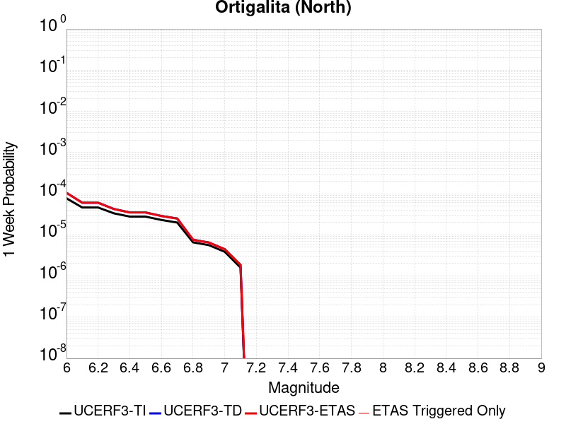 |  |  |  |

| Magnitude | 1 wk TI Prob | 1 wk TD Prob | 1 wk ETAS Prob | 1 wk ETAS/TD Gain | 1 wk ETAS Triggered Only | 1 mo TI Prob | 1 mo TD Prob | 1 mo ETAS Prob | 1 mo ETAS/TD Gain | 1 mo ETAS Triggered Only | 1 yr TI Prob | 1 yr TD Prob | 1 yr ETAS Prob | 1 yr ETAS/TD Gain | 1 yr ETAS Triggered Only | 10 yr TI Prob | 10 yr TD Prob | 10 yr ETAS Prob | 10 yr ETAS/TD Gain | 10 yr ETAS Triggered Only |
|-----|-----|-----|-----|-----|-----|-----|-----|-----|-----|-----|-----|-----|-----|-----|-----|-----|-----|-----|-----|-----|
| 6.0 | 7.711876E-5 | 1.05107065E-4 | 1.05107065E-4 | 1.0 | 0.0 | 3.3046713E-4 | 4.5039196E-4 | 4.5039196E-4 | 1.0 | 0.0 | 0.004016016 | 0.0054697967 | 0.0054697967 | 1.0 | 0.0 | 0.039442103 | 0.05347275 | 0.05354286 | 1.0013112 | 7.407407E-5 |
| 6.1 | 4.607858E-5 | 6.0259496E-5 | 6.0259496E-5 | 1.0 | 0.0 | 1.9746469E-4 | 2.582322E-4 | 2.582322E-4 | 1.0 | 0.0 | 0.0024014818 | 0.0031397445 | 0.0031397445 | 1.0 | 0.0 | 0.023756953 | 0.030984651 | 0.031032505 | 1.0015444 | 4.9382717E-5 |
| 6.2 | 4.607858E-5 | 6.0259496E-5 | 6.0259496E-5 | 1.0 | 0.0 | 1.9746469E-4 | 2.582322E-4 | 2.582322E-4 | 1.0 | 0.0 | 0.0024014818 | 0.0031397445 | 0.0031397445 | 1.0 | 0.0 | 0.023756953 | 0.030984651 | 0.031032505 | 1.0015444 | 4.9382717E-5 |
| 6.3 | 3.327423E-5 | 4.2487998E-5 | 4.2487998E-5 | 1.0 | 0.0 | 1.4259605E-4 | 1.8208046E-4 | 1.8208046E-4 | 1.0 | 0.0 | 0.0017347244 | 0.0022148585 | 0.0022148585 | 1.0 | 0.0 | 0.017212452 | 0.02195199 | 0.022000289 | 1.0022002 | 4.9382717E-5 |
| 6.4 | 2.7732503E-5 | 3.5008667E-5 | 3.5008667E-5 | 1.0 | 0.0 | 1.1884817E-4 | 1.5003003E-4 | 1.5003003E-4 | 1.0 | 0.0 | 0.001446016 | 0.0018253255 | 0.0018253255 | 1.0 | 0.0 | 0.014366428 | 0.018126285 | 0.018174773 | 1.0026749 | 4.9382717E-5 |
| 6.5 | 2.7689714E-5 | 3.4958473E-5 | 3.4958473E-5 | 1.0 | 0.0 | 1.186648E-4 | 1.4981494E-4 | 1.4981494E-4 | 1.0 | 0.0 | 0.0014437864 | 0.0018227111 | 0.0018227111 | 1.0 | 0.0 | 0.014344421 | 0.018100567 | 0.018149056 | 1.0026789 | 4.9382717E-5 |
| 6.6 | 2.2976905E-5 | 2.8726188E-5 | 2.8726188E-5 | 1.0 | 0.0 | 9.846873E-5 | 1.2310786E-4 | 1.2310786E-4 | 1.0 | 0.0 | 0.0011981975 | 0.0014980417 | 0.0014980417 | 1.0 | 0.0 | 0.011917574 | 0.014902728 | 0.014951375 | 1.0032643 | 4.9382717E-5 |
| 6.7 | 1.9871539E-5 | 2.4911353E-5 | 2.4911353E-5 | 1.0 | 0.0 | 8.516096E-5 | 1.0675997E-4 | 1.0675997E-4 | 1.0 | 0.0 | 0.0010363415 | 0.0012992765 | 0.0012992765 | 1.0 | 0.0 | 0.010315218 | 0.012940488 | 0.01296486 | 1.0018834 | 2.4691359E-5 |
| 6.8 | 6.5640475E-6 | 7.6067754E-6 | 7.6067754E-6 | 1.0 | 0.0 | 2.813133E-5 | 3.2600074E-5 | 3.2600074E-5 | 1.0 | 0.0 | 3.424451E-4 | 3.968365E-4 | 3.968365E-4 | 1.0 | 0.0 | 0.0034191788 | 0.003961566 | 0.0039861593 | 1.0062081 | 2.4691359E-5 |
| 6.9 | 5.6219683E-6 | 6.502919E-6 | 6.502919E-6 | 1.0 | 0.0 | 2.4093928E-5 | 2.786937E-5 | 2.786937E-5 | 1.0 | 0.0 | 2.933041E-4 | 3.3925934E-4 | 3.3925934E-4 | 1.0 | 0.0 | 0.0029291727 | 0.0033876712 | 0.0034122788 | 1.0072639 | 2.4691359E-5 |
| 7.0 | 3.875591E-6 | 4.4855037E-6 | 4.4855037E-6 | 1.0 | 0.0 | 1.6609569E-5 | 1.9223458E-5 | 1.9223458E-5 | 1.0 | 0.0 | 2.0220275E-4 | 2.3402258E-4 | 2.3402258E-4 | 1.0 | 0.0 | 0.0020201886 | 0.0023379698 | 0.0023626033 | 1.0105363 | 2.4691359E-5 |
| 7.1 | 1.6017933E-6 | 1.8573562E-6 | 1.8573562E-6 | 1.0 | 0.0 | 6.8648105E-6 | 7.9600795E-6 | 7.9600795E-6 | 1.0 | 0.0 | 8.357586E-5 | 9.691073E-5 | 9.691073E-5 | 1.0 | 0.0 | 8.3544437E-4 | 9.687894E-4 | 9.934568E-4 | 1.0254622 | 2.4691359E-5 |

## Camp Rock 2011
*[(top)](#table-of-contents)*

| 1 Week | 1 Month | 1 Year | 10 Year |
|-----|-----|-----|-----|
|  |  |  |  |

| Magnitude | 1 wk TI Prob | 1 wk TD Prob | 1 wk ETAS Prob | 1 wk ETAS/TD Gain | 1 wk ETAS Triggered Only | 1 mo TI Prob | 1 mo TD Prob | 1 mo ETAS Prob | 1 mo ETAS/TD Gain | 1 mo ETAS Triggered Only | 1 yr TI Prob | 1 yr TD Prob | 1 yr ETAS Prob | 1 yr ETAS/TD Gain | 1 yr ETAS Triggered Only | 10 yr TI Prob | 10 yr TD Prob | 10 yr ETAS Prob | 10 yr ETAS/TD Gain | 10 yr ETAS Triggered Only |
|-----|-----|-----|-----|-----|-----|-----|-----|-----|-----|-----|-----|-----|-----|-----|-----|-----|-----|-----|-----|-----|
| 6.0 | 1.6710783E-5 | 4.250666E-6 | 4.250666E-6 | 1.0 | 0.0 | 7.161568E-5 | 1.8217015E-5 | 1.8217015E-5 | 1.0 | 0.0 | 8.7157206E-4 | 2.2177011E-4 | 2.4645598E-4 | 1.111313 | 2.4691359E-5 | 0.008681616 | 0.002215541 | 0.0022894507 | 1.0333598 | 7.407407E-5 |
| 6.1 | 1.6710783E-5 | 4.250666E-6 | 4.250666E-6 | 1.0 | 0.0 | 7.161568E-5 | 1.8217015E-5 | 1.8217015E-5 | 1.0 | 0.0 | 8.7157206E-4 | 2.2177011E-4 | 2.4645598E-4 | 1.111313 | 2.4691359E-5 | 0.008681616 | 0.002215541 | 0.0022894507 | 1.0333598 | 7.407407E-5 |
| 6.2 | 1.6710783E-5 | 4.250666E-6 | 4.250666E-6 | 1.0 | 0.0 | 7.161568E-5 | 1.8217015E-5 | 1.8217015E-5 | 1.0 | 0.0 | 8.7157206E-4 | 2.2177011E-4 | 2.4645598E-4 | 1.111313 | 2.4691359E-5 | 0.008681616 | 0.002215541 | 0.0022894507 | 1.0333598 | 7.407407E-5 |
| 6.3 | 1.6710783E-5 | 4.250666E-6 | 4.250666E-6 | 1.0 | 0.0 | 7.161568E-5 | 1.8217015E-5 | 1.8217015E-5 | 1.0 | 0.0 | 8.7157206E-4 | 2.2177011E-4 | 2.4645598E-4 | 1.111313 | 2.4691359E-5 | 0.008681616 | 0.002215541 | 0.0022894507 | 1.0333598 | 7.407407E-5 |
| 6.4 | 7.982846E-6 | 3.6824456E-6 | 3.6824456E-6 | 1.0 | 0.0 | 3.421175E-5 | 1.5781816E-5 | 1.5781816E-5 | 1.0 | 0.0 | 4.1644843E-4 | 1.9212702E-4 | 2.1681364E-4 | 1.1284912 | 2.4691359E-5 | 0.0041566887 | 0.0019196441 | 0.0019935758 | 1.0385133 | 7.407407E-5 |
| 6.5 | 7.982846E-6 | 3.6824456E-6 | 3.6824456E-6 | 1.0 | 0.0 | 3.421175E-5 | 1.5781816E-5 | 1.5781816E-5 | 1.0 | 0.0 | 4.1644843E-4 | 1.9212702E-4 | 2.1681364E-4 | 1.1284912 | 2.4691359E-5 | 0.0041566887 | 0.0019196441 | 0.0019935758 | 1.0385133 | 7.407407E-5 |
| 6.6 | 7.048869E-6 | 3.4246991E-6 | 3.4246991E-6 | 1.0 | 0.0 | 3.0209088E-5 | 1.4677201E-5 | 1.4677201E-5 | 1.0 | 0.0 | 3.677336E-4 | 1.7868058E-4 | 2.0336753E-4 | 1.1381625 | 2.4691359E-5 | 0.0036712566 | 0.0017854008 | 0.0018593427 | 1.0414147 | 7.407407E-5 |
| 6.7 | 6.987307E-6 | 3.3626727E-6 | 3.3626727E-6 | 1.0 | 0.0 | 2.9945259E-5 | 1.44113765E-5 | 1.44113765E-5 | 1.0 | 0.0 | 3.6452254E-4 | 1.754447E-4 | 2.0013172E-4 | 1.1407112 | 2.4691359E-5 | 0.0036392517 | 0.001753093 | 0.0018270372 | 1.0421793 | 7.407407E-5 |
| 6.8 | 6.3737602E-6 | 3.1182262E-6 | 3.1182262E-6 | 1.0 | 0.0 | 2.731583E-5 | 1.33637595E-5 | 1.33637595E-5 | 1.0 | 0.0 | 3.3251947E-4 | 1.6269191E-4 | 1.8737925E-4 | 1.1517429 | 2.4691359E-5 | 0.0033202237 | 0.0016257567 | 0.0016750591 | 1.0303259 | 4.9382717E-5 |
| 6.9 | 6.112211E-6 | 2.933421E-6 | 2.933421E-6 | 1.0 | 0.0 | 2.6194928E-5 | 1.2571745E-5 | 1.2571745E-5 | 1.0 | 0.0 | 3.1887658E-4 | 1.5305053E-4 | 1.7773811E-4 | 1.1613034 | 2.4691359E-5 | 0.003184194 | 0.001529479 | 0.0015787862 | 1.0322379 | 4.9382717E-5 |
| 7.0 | 5.5140117E-6 | 2.6421922E-6 | 2.6421922E-6 | 1.0 | 0.0 | 2.3631264E-5 | 1.1323633E-5 | 1.1323633E-5 | 1.0 | 0.0 | 2.8767265E-4 | 1.3785677E-4 | 1.6254472E-4 | 1.1790841 | 2.4691359E-5 | 0.0028730053 | 0.0013777377 | 0.0014270524 | 1.0357939 | 4.9382717E-5 |
| 7.1 | 4.8151105E-6 | 2.134497E-6 | 2.134497E-6 | 1.0 | 0.0 | 2.0636026E-5 | 9.147813E-6 | 9.147813E-6 | 1.0 | 0.0 | 2.5121463E-4 | 1.1136916E-4 | 1.1136916E-4 | 1.0 | 0.0 | 0.0025093083 | 0.0011131554 | 0.0011378193 | 1.0221567 | 2.4691359E-5 |
| 7.2 | 3.818335E-6 | 1.29391E-6 | 1.29391E-6 | 1.0 | 0.0 | 1.6364189E-5 | 5.5453174E-6 | 5.5453174E-6 | 1.0 | 0.0 | 1.9921579E-4 | 6.7512236E-5 | 6.7512236E-5 | 1.0 | 0.0 | 0.0019903728 | 6.7492545E-4 | 6.9960015E-4 | 1.0365591 | 2.4691359E-5 |
| 7.3 | 2.7166698E-6 | 7.384855E-7 | 7.384855E-7 | 1.0 | 0.0 | 1.1642818E-5 | 3.1649342E-6 | 3.1649342E-6 | 1.0 | 0.0 | 1.4174209E-4 | 3.8532413E-5 | 3.8532413E-5 | 1.0 | 0.0 | 0.0014165172 | 3.852593E-4 | 4.0994116E-4 | 1.0640656 | 2.4691359E-5 |
| 7.4 | 2.0893426E-6 | 5.462842E-7 | 5.462842E-7 | 1.0 | 0.0 | 8.954295E-6 | 2.341216E-6 | 2.341216E-6 | 1.0 | 0.0 | 1.0901308E-4 | 2.8503937E-5 | 2.8503937E-5 | 1.0 | 0.0 | 0.0010895962 | 2.8500336E-4 | 2.8500336E-4 | 1.0 | 0.0 |
| 7.5 | 1.1681728E-6 | 3.60362E-7 | 3.60362E-7 | 1.0 | 0.0 | 5.0064455E-6 | 1.5444077E-6 | 1.5444077E-6 | 1.0 | 0.0 | 6.0951766E-5 | 1.8803006E-5 | 1.8803006E-5 | 1.0 | 0.0 | 6.093505E-4 | 1.8801463E-4 | 1.8801463E-4 | 1.0 | 0.0 |
| 7.6 | 1.3154387E-7 | 7.120442E-8 | 7.120442E-8 | 1.0 | 0.0 | 5.6375933E-7 | 3.0516176E-7 | 3.0516176E-7 | 1.0 | 0.0 | 6.863748E-6 | 3.7153397E-6 | 3.7153397E-6 | 1.0 | 0.0 | 6.863536E-5 | 3.7152935E-5 | 3.7152935E-5 | 1.0 | 0.0 |

## San Jacinto (Anza) rev
*[(top)](#table-of-contents)*

| 1 Week | 1 Month | 1 Year | 10 Year |
|-----|-----|-----|-----|
|  |  |  |  |

| Magnitude | 1 wk TI Prob | 1 wk TD Prob | 1 wk ETAS Prob | 1 wk ETAS/TD Gain | 1 wk ETAS Triggered Only | 1 mo TI Prob | 1 mo TD Prob | 1 mo ETAS Prob | 1 mo ETAS/TD Gain | 1 mo ETAS Triggered Only | 1 yr TI Prob | 1 yr TD Prob | 1 yr ETAS Prob | 1 yr ETAS/TD Gain | 1 yr ETAS Triggered Only | 10 yr TI Prob | 10 yr TD Prob | 10 yr ETAS Prob | 10 yr ETAS/TD Gain | 10 yr ETAS Triggered Only |
|-----|-----|-----|-----|-----|-----|-----|-----|-----|-----|-----|-----|-----|-----|-----|-----|-----|-----|-----|-----|-----|
| 6.0 | 6.3015636E-5 | 4.3446253E-5 | 4.3446253E-5 | 1.0 | 0.0 | 2.7003905E-4 | 1.86185E-4 | 1.86185E-4 | 1.0 | 0.0 | 0.0032827691 | 0.0022644578 | 0.002289093 | 1.0108792 | 2.4691359E-5 | 0.032346968 | 0.023370424 | 0.023442768 | 1.0030955 | 7.407407E-5 |
| 6.1 | 6.3015636E-5 | 4.3446253E-5 | 4.3446253E-5 | 1.0 | 0.0 | 2.7003905E-4 | 1.86185E-4 | 1.86185E-4 | 1.0 | 0.0 | 0.0032827691 | 0.0022644578 | 0.002289093 | 1.0108792 | 2.4691359E-5 | 0.032346968 | 0.023370424 | 0.023442768 | 1.0030955 | 7.407407E-5 |
| 6.2 | 6.3015636E-5 | 4.3446253E-5 | 4.3446253E-5 | 1.0 | 0.0 | 2.7003905E-4 | 1.86185E-4 | 1.86185E-4 | 1.0 | 0.0 | 0.0032827691 | 0.0022644578 | 0.002289093 | 1.0108792 | 2.4691359E-5 | 0.032346968 | 0.023370424 | 0.023442768 | 1.0030955 | 7.407407E-5 |
| 6.3 | 6.3015636E-5 | 4.3446253E-5 | 4.3446253E-5 | 1.0 | 0.0 | 2.7003905E-4 | 1.86185E-4 | 1.86185E-4 | 1.0 | 0.0 | 0.0032827691 | 0.0022644578 | 0.002289093 | 1.0108792 | 2.4691359E-5 | 0.032346968 | 0.023370424 | 0.023442768 | 1.0030955 | 7.407407E-5 |
| 6.4 | 6.3015636E-5 | 4.3446253E-5 | 4.3446253E-5 | 1.0 | 0.0 | 2.7003905E-4 | 1.86185E-4 | 1.86185E-4 | 1.0 | 0.0 | 0.0032827691 | 0.0022644578 | 0.002289093 | 1.0108792 | 2.4691359E-5 | 0.032346968 | 0.023370424 | 0.023442768 | 1.0030955 | 7.407407E-5 |
| 6.5 | 5.811017E-5 | 4.021924E-5 | 4.021924E-5 | 1.0 | 0.0 | 2.4901982E-4 | 1.7235681E-4 | 1.7235681E-4 | 1.0 | 0.0 | 0.0030276014 | 0.0020964304 | 0.00212107 | 1.0117531 | 2.4691359E-5 | 0.02986684 | 0.021664625 | 0.021737093 | 1.003345 | 7.407407E-5 |
| 6.6 | 5.811017E-5 | 4.021924E-5 | 4.021924E-5 | 1.0 | 0.0 | 2.4901982E-4 | 1.7235681E-4 | 1.7235681E-4 | 1.0 | 0.0 | 0.0030276014 | 0.0020964304 | 0.00212107 | 1.0117531 | 2.4691359E-5 | 0.02986684 | 0.021664625 | 0.021737093 | 1.003345 | 7.407407E-5 |
| 6.7 | 5.712442E-5 | 3.964049E-5 | 3.964049E-5 | 1.0 | 0.0 | 2.4479596E-4 | 1.6987679E-4 | 1.6987679E-4 | 1.0 | 0.0 | 0.0029763177 | 0.0020662935 | 0.0020909337 | 1.0119249 | 2.4691359E-5 | 0.029367693 | 0.021355735 | 0.021428227 | 1.0033945 | 7.407407E-5 |
| 6.8 | 5.6967532E-5 | 3.9496656E-5 | 3.9496656E-5 | 1.0 | 0.0 | 2.4412372E-4 | 1.6926043E-4 | 1.6926043E-4 | 1.0 | 0.0 | 0.0029681553 | 0.0020588036 | 0.002083444 | 1.0119684 | 2.4691359E-5 | 0.029288229 | 0.021280348 | 0.021352844 | 1.0034068 | 7.407407E-5 |
| 6.9 | 5.6211324E-5 | 3.9200542E-5 | 3.9200542E-5 | 1.0 | 0.0 | 2.4088343E-4 | 1.6799154E-4 | 1.6799154E-4 | 1.0 | 0.0 | 0.0029288116 | 0.002043384 | 0.0020680248 | 1.0120589 | 2.4691359E-5 | 0.028905109 | 0.02111932 | 0.02119183 | 1.0034333 | 7.407407E-5 |
| 7.0 | 5.4383527E-5 | 3.8058075E-5 | 3.8058075E-5 | 1.0 | 0.0 | 2.3305144E-4 | 1.6309587E-4 | 1.6309587E-4 | 1.0 | 0.0 | 0.0028337094 | 0.0019838887 | 0.002008531 | 1.0124213 | 2.4691359E-5 | 0.027978465 | 0.020508781 | 0.020581337 | 1.0035378 | 7.407407E-5 |
| 7.1 | 5.1393665E-5 | 3.6516354E-5 | 3.6516354E-5 | 1.0 | 0.0 | 2.2023996E-4 | 1.564893E-4 | 1.564893E-4 | 1.0 | 0.0 | 0.0026781242 | 0.0019035965 | 0.0019282409 | 1.0129462 | 2.4691359E-5 | 0.026460782 | 0.019680155 | 0.019752773 | 1.0036898 | 7.407407E-5 |
| 7.2 | 4.785222E-5 | 3.486319E-5 | 3.486319E-5 | 1.0 | 0.0 | 2.0506482E-4 | 1.4940514E-4 | 1.4940514E-4 | 1.0 | 0.0 | 0.0024938055 | 0.0018174936 | 0.00184214 | 1.0135607 | 2.4691359E-5 | 0.024660049 | 0.018792244 | 0.018864926 | 1.0038676 | 7.407407E-5 |
| 7.3 | 4.2143256E-5 | 3.395425E-5 | 3.395425E-5 | 1.0 | 0.0 | 1.8060145E-4 | 1.4551012E-4 | 1.4551012E-4 | 1.0 | 0.0 | 0.002196605 | 0.0017701496 | 0.0017947973 | 1.013924 | 2.4691359E-5 | 0.02175019 | 0.018298613 | 0.01837133 | 1.003974 | 7.407407E-5 |
| 7.4 | 4.0264713E-5 | 3.3591336E-5 | 3.3591336E-5 | 1.0 | 0.0 | 1.7255165E-4 | 1.4395494E-4 | 1.4395494E-4 | 1.0 | 0.0 | 0.002098792 | 0.0017512459 | 0.001775894 | 1.0140746 | 2.4691359E-5 | 0.020790804 | 0.018102597 | 0.01817533 | 1.0040178 | 7.407407E-5 |
| 7.5 | 3.694492E-5 | 3.2302072E-5 | 3.2302072E-5 | 1.0 | 0.0 | 1.5832575E-4 | 1.3843011E-4 | 1.3843011E-4 | 1.0 | 0.0 | 0.0019259118 | 0.0016840869 | 0.0017087366 | 1.0146369 | 2.4691359E-5 | 0.01909306 | 0.01741737 | 0.017490152 | 1.0041788 | 7.407407E-5 |
| 7.6 | 3.200565E-5 | 2.960857E-5 | 2.960857E-5 | 1.0 | 0.0 | 1.3715986E-4 | 1.2688771E-4 | 1.2688771E-4 | 1.0 | 0.0 | 0.001668642 | 0.0015437653 | 0.0015684186 | 1.0159695 | 2.4691359E-5 | 0.01656168 | 0.016000675 | 0.016073562 | 1.0045553 | 7.407407E-5 |
| 7.7 | 2.731642E-5 | 2.619419E-5 | 2.619419E-5 | 1.0 | 0.0 | 1.1706512E-4 | 1.1225599E-4 | 1.1225599E-4 | 1.0 | 0.0 | 0.001424336 | 0.0013658608 | 0.0013905185 | 1.0180528 | 2.4691359E-5 | 0.014152412 | 0.014219889 | 0.014292911 | 1.005135 | 7.407407E-5 |
| 7.8 | 2.3466424E-5 | 2.3602157E-5 | 2.3602157E-5 | 1.0 | 0.0 | 1.0056651E-4 | 1.0114819E-4 | 1.0114819E-4 | 1.0 | 0.0 | 0.0012237094 | 0.0012307843 | 0.0012554453 | 1.0200368 | 2.4691359E-5 | 0.012169928 | 0.012859747 | 0.012932869 | 1.005686 | 7.407407E-5 |
| 7.9 | 1.8611925E-5 | 1.8996041E-5 | 1.8996041E-5 | 1.0 | 0.0 | 7.9762955E-5 | 8.1409074E-5 | 8.1409074E-5 | 1.0 | 0.0 | 9.7068126E-4 | 9.907054E-4 | 0.0010153723 | 1.0248983 | 2.4691359E-5 | 0.0096645225 | 0.010439943 | 0.010513243 | 1.0070212 | 7.407407E-5 |
| 8.0 | 1.5460775E-5 | 1.581908E-5 | 1.581908E-5 | 1.0 | 0.0 | 6.6258784E-5 | 6.7794295E-5 | 6.7794295E-5 | 1.0 | 0.0 | 8.0640207E-4 | 8.250837E-4 | 8.4975467E-4 | 1.0299011 | 2.4691359E-5 | 0.008034821 | 0.008744002 | 0.008817429 | 1.0083973 | 7.407407E-5 |
| 8.1 | 9.983884E-6 | 8.316292E-6 | 8.316292E-6 | 1.0 | 0.0 | 4.2787375E-5 | 3.564077E-5 | 3.564077E-5 | 1.0 | 0.0 | 5.2081177E-4 | 4.338405E-4 | 4.5852113E-4 | 1.0568887 | 2.4691359E-5 | 0.0051959283 | 0.00466492 | 0.004689496 | 1.0052683 | 2.4691359E-5 |
| 8.2 | 4.1226E-6 | 1.5661137E-6 | 1.5661137E-6 | 1.0 | 0.0 | 1.7668166E-5 | 6.711899E-6 | 6.711899E-6 | 1.0 | 0.0 | 2.1508869E-4 | 8.171434E-5 | 8.171434E-5 | 1.0 | 0.0 | 0.0021488064 | 9.480058E-4 | 9.480058E-4 | 1.0 | 0.0 |
| 8.3 | 1.2750878E-6 | 3.6481603E-7 | 3.6481603E-7 | 1.0 | 0.0 | 5.4646503E-6 | 1.5634963E-6 | 1.5634963E-6 | 1.0 | 0.0 | 6.653009E-5 | 1.9035406E-5 | 1.9035406E-5 | 1.0 | 0.0 | 6.6510175E-4 | 2.2945888E-4 | 2.2945888E-4 | 1.0 | 0.0 |

## San Diego Trough north alt1
*[(top)](#table-of-contents)*

| 1 Week | 1 Month | 1 Year | 10 Year |
|-----|-----|-----|-----|
|  |  |  |  |

| Magnitude | 1 wk TI Prob | 1 wk TD Prob | 1 wk ETAS Prob | 1 wk ETAS/TD Gain | 1 wk ETAS Triggered Only | 1 mo TI Prob | 1 mo TD Prob | 1 mo ETAS Prob | 1 mo ETAS/TD Gain | 1 mo ETAS Triggered Only | 1 yr TI Prob | 1 yr TD Prob | 1 yr ETAS Prob | 1 yr ETAS/TD Gain | 1 yr ETAS Triggered Only | 10 yr TI Prob | 10 yr TD Prob | 10 yr ETAS Prob | 10 yr ETAS/TD Gain | 10 yr ETAS Triggered Only |
|-----|-----|-----|-----|-----|-----|-----|-----|-----|-----|-----|-----|-----|-----|-----|-----|-----|-----|-----|-----|-----|
| 6.0 | 7.329252E-5 | 8.823061E-5 | 8.823061E-5 | 1.0 | 0.0 | 3.14073E-4 | 3.7808003E-4 | 4.0276206E-4 | 1.0652826 | 2.4691359E-5 | 0.0038171355 | 0.004594045 | 0.0046432014 | 1.0106999 | 4.9382717E-5 | 0.03752231 | 0.045054566 | 0.045125306 | 1.00157 | 7.407407E-5 |
| 6.1 | 3.7940346E-5 | 4.489396E-5 | 4.489396E-5 | 1.0 | 0.0 | 1.6259136E-4 | 1.9238905E-4 | 2.1707566E-4 | 1.128316 | 2.4691359E-5 | 0.0019777524 | 0.0023399056 | 0.002364539 | 1.0105276 | 2.4691359E-5 | 0.019602431 | 0.023161182 | 0.023209421 | 1.0020827 | 4.9382717E-5 |
| 6.2 | 2.8645263E-5 | 3.330263E-5 | 3.330263E-5 | 1.0 | 0.0 | 1.2275964E-4 | 1.4271791E-4 | 1.6740574E-4 | 1.1729834 | 2.4691359E-5 | 0.0014935739 | 0.0017362196 | 0.0017608681 | 1.0141966 | 2.4691359E-5 | 0.0148357535 | 0.017229227 | 0.017277759 | 1.0028168 | 4.9382717E-5 |
| 6.3 | 2.8645263E-5 | 3.330263E-5 | 3.330263E-5 | 1.0 | 0.0 | 1.2275964E-4 | 1.4271791E-4 | 1.6740574E-4 | 1.1729834 | 2.4691359E-5 | 0.0014935739 | 0.0017362196 | 0.0017608681 | 1.0141966 | 2.4691359E-5 | 0.0148357535 | 0.017229227 | 0.017277759 | 1.0028168 | 4.9382717E-5 |
| 6.4 | 2.2204576E-5 | 2.5452311E-5 | 2.5452311E-5 | 1.0 | 0.0 | 9.5159E-5 | 1.0907683E-4 | 1.337655E-4 | 1.226342 | 2.4691359E-5 | 0.001157945 | 0.0013272114 | 0.0013518699 | 1.0185792 | 2.4691359E-5 | 0.011519298 | 0.013194007 | 0.013242738 | 1.0036935 | 4.9382717E-5 |
| 6.5 | 2.1004838E-5 | 2.40284E-5 | 2.40284E-5 | 1.0 | 0.0 | 9.0017624E-5 | 1.0297485E-4 | 1.2766366E-4 | 1.2397557 | 2.4691359E-5 | 0.0010954136 | 0.001253007 | 0.0012776674 | 1.019681 | 2.4691359E-5 | 0.010900296 | 0.012460496 | 0.012509264 | 1.0039138 | 4.9382717E-5 |
| 6.6 | 1.820557E-5 | 2.0707832E-5 | 2.0707832E-5 | 1.0 | 0.0 | 7.802154E-5 | 8.874486E-5 | 1.1343403E-4 | 1.278204 | 2.4691359E-5 | 9.4949827E-4 | 0.0010799386 | 0.0011046033 | 1.022839 | 2.4691359E-5 | 0.009454516 | 0.010747575 | 0.010796428 | 1.0045455 | 4.9382717E-5 |
| 6.7 | 1.5884485E-5 | 1.798619E-5 | 1.798619E-5 | 1.0 | 0.0 | 6.807459E-5 | 7.708141E-5 | 1.01770864E-4 | 1.3203037 | 2.4691359E-5 | 8.284929E-4 | 9.380649E-4 | 9.6273306E-4 | 1.0262969 | 2.4691359E-5 | 0.008254109 | 0.009341419 | 0.009365879 | 1.0026186 | 2.4691359E-5 |
| 6.8 | 1.4331171E-5 | 1.6203325E-5 | 1.6203325E-5 | 1.0 | 0.0 | 6.141786E-5 | 6.944098E-5 | 9.413063E-5 | 1.3555486 | 2.4691359E-5 | 7.4750587E-4 | 8.451181E-4 | 8.697885E-4 | 1.0291917 | 2.4691359E-5 | 0.0074499645 | 0.008419309 | 0.008443792 | 1.002908 | 2.4691359E-5 |
| 6.9 | 1.2574203E-5 | 1.4207804E-5 | 1.4207804E-5 | 1.0 | 0.0 | 5.3888325E-5 | 6.088918E-5 | 6.088918E-5 | 1.0 | 0.0 | 6.558929E-4 | 7.4107497E-4 | 7.4107497E-4 | 1.0 | 0.0 | 0.0065396037 | 0.0073862234 | 0.0073862234 | 1.0 | 0.0 |
| 7.0 | 1.0883844E-5 | 1.2290957E-5 | 1.2290957E-5 | 1.0 | 0.0 | 4.664421E-5 | 5.2674473E-5 | 5.2674473E-5 | 1.0 | 0.0 | 5.677453E-4 | 6.41124E-4 | 6.41124E-4 | 1.0 | 0.0 | 0.00566297 | 0.006392872 | 0.006392872 | 1.0 | 0.0 |
| 7.1 | 9.393088E-6 | 1.0608485E-5 | 1.0608485E-5 | 1.0 | 0.0 | 4.025547E-5 | 4.546415E-5 | 4.546415E-5 | 1.0 | 0.0 | 4.900001E-4 | 5.533862E-4 | 5.533862E-4 | 1.0 | 0.0 | 0.0048892107 | 0.0055201785 | 0.0055201785 | 1.0 | 0.0 |
| 7.2 | 8.190791E-6 | 9.259917E-6 | 9.259917E-6 | 1.0 | 0.0 | 3.510292E-5 | 3.9684757E-5 | 3.9684757E-5 | 1.0 | 0.0 | 4.2729423E-4 | 4.8305548E-4 | 4.8305548E-4 | 1.0 | 0.0 | 0.0042647356 | 0.004820135 | 0.004820135 | 1.0 | 0.0 |
| 7.3 | 6.268162E-6 | 7.0907086E-6 | 7.0907086E-6 | 1.0 | 0.0 | 2.6863276E-5 | 3.03884E-5 | 3.03884E-5 | 1.0 | 0.0 | 3.2701128E-4 | 3.6991638E-4 | 3.6991638E-4 | 1.0 | 0.0 | 0.003265305 | 0.003693052 | 0.003693052 | 1.0 | 0.0 |
| 7.4 | 4.985186E-6 | 5.6434765E-6 | 5.6434765E-6 | 1.0 | 0.0 | 2.1364907E-5 | 2.4186105E-5 | 2.4186105E-5 | 1.0 | 0.0 | 2.600867E-4 | 2.9442646E-4 | 2.9442646E-4 | 1.0 | 0.0 | 0.002597825 | 0.0029404052 | 0.0029404052 | 1.0 | 0.0 |
| 7.5 | 1.7489613E-6 | 1.969945E-6 | 1.969945E-6 | 1.0 | 0.0 | 7.495527E-6 | 8.4425965E-6 | 8.4425965E-6 | 1.0 | 0.0 | 9.125422E-5 | 1.0278398E-4 | 1.0278398E-4 | 1.0 | 0.0 | 9.1216754E-4 | 0.0010273864 | 0.0010273864 | 1.0 | 0.0 |
| 7.6 | 1.6988751E-7 | 1.753442E-7 | 1.753442E-7 | 1.0 | 0.0 | 7.2808916E-7 | 7.5147494E-7 | 7.5147494E-7 | 1.0 | 0.0 | 8.864449E-6 | 9.149171E-6 | 9.149171E-6 | 1.0 | 0.0 | 8.8640954E-5 | 9.148814E-5 | 9.148814E-5 | 1.0 | 0.0 |

## Big Pine (East)
*[(top)](#table-of-contents)*

| 1 Week | 1 Month | 1 Year | 10 Year |
|-----|-----|-----|-----|
|  |  | 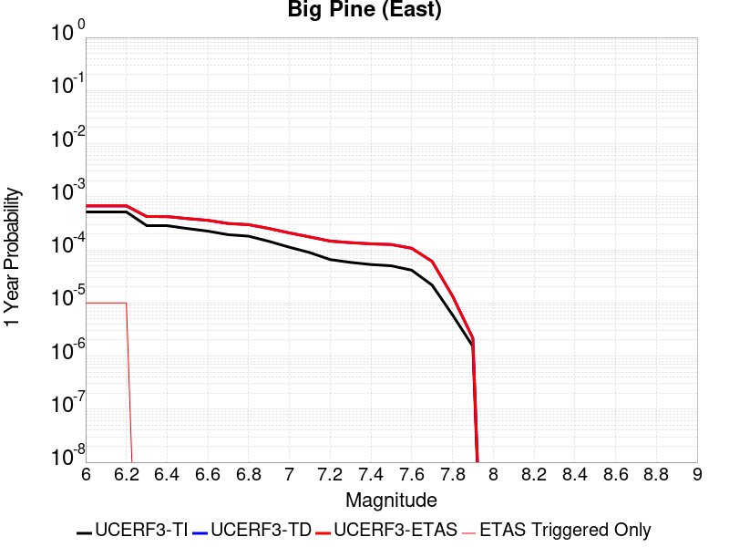 |  |

| Magnitude | 1 wk TI Prob | 1 wk TD Prob | 1 wk ETAS Prob | 1 wk ETAS/TD Gain | 1 wk ETAS Triggered Only | 1 mo TI Prob | 1 mo TD Prob | 1 mo ETAS Prob | 1 mo ETAS/TD Gain | 1 mo ETAS Triggered Only | 1 yr TI Prob | 1 yr TD Prob | 1 yr ETAS Prob | 1 yr ETAS/TD Gain | 1 yr ETAS Triggered Only | 10 yr TI Prob | 10 yr TD Prob | 10 yr ETAS Prob | 10 yr ETAS/TD Gain | 10 yr ETAS Triggered Only |
|-----|-----|-----|-----|-----|-----|-----|-----|-----|-----|-----|-----|-----|-----|-----|-----|-----|-----|-----|-----|-----|
| 6.0 | 9.916913E-6 | 1.2826955E-5 | 1.2826955E-5 | 1.0 | 0.0 | 4.250036E-5 | 5.497163E-5 | 5.497163E-5 | 1.0 | 0.0 | 5.173191E-4 | 6.690962E-4 | 6.690962E-4 | 1.0 | 0.0 | 0.0051611643 | 0.0066755237 | 0.0067491033 | 1.0110223 | 7.407407E-5 |
| 6.1 | 9.916913E-6 | 1.2826955E-5 | 1.2826955E-5 | 1.0 | 0.0 | 4.250036E-5 | 5.497163E-5 | 5.497163E-5 | 1.0 | 0.0 | 5.173191E-4 | 6.690962E-4 | 6.690962E-4 | 1.0 | 0.0 | 0.0051611643 | 0.0066755237 | 0.0067491033 | 1.0110223 | 7.407407E-5 |
| 6.2 | 9.916913E-6 | 1.2826955E-5 | 1.2826955E-5 | 1.0 | 0.0 | 4.250036E-5 | 5.497163E-5 | 5.497163E-5 | 1.0 | 0.0 | 5.173191E-4 | 6.690962E-4 | 6.690962E-4 | 1.0 | 0.0 | 0.0051611643 | 0.0066755237 | 0.0067491033 | 1.0110223 | 7.407407E-5 |
| 6.3 | 5.479711E-6 | 8.122622E-6 | 8.122622E-6 | 1.0 | 0.0 | 2.3484265E-5 | 3.481079E-5 | 3.481079E-5 | 1.0 | 0.0 | 2.858834E-4 | 4.2374214E-4 | 4.2374214E-4 | 1.0 | 0.0 | 0.0028551589 | 0.004232182 | 0.004281356 | 1.011619 | 4.9382717E-5 |
| 6.4 | 5.465009E-6 | 8.106914E-6 | 8.106914E-6 | 1.0 | 0.0 | 2.3421257E-5 | 3.4743472E-5 | 3.4743472E-5 | 1.0 | 0.0 | 2.851165E-4 | 4.2292287E-4 | 4.2292287E-4 | 1.0 | 0.0 | 0.0028475097 | 0.004224021 | 0.004273195 | 1.0116415 | 4.9382717E-5 |
| 6.5 | 4.826767E-6 | 7.431929E-6 | 7.431929E-6 | 1.0 | 0.0 | 2.068598E-5 | 3.1850752E-5 | 3.1850752E-5 | 1.0 | 0.0 | 2.518227E-4 | 3.877167E-4 | 3.877167E-4 | 1.0 | 0.0 | 0.0025153751 | 0.0038732016 | 0.003922393 | 1.0127004 | 4.9382717E-5 |
| 6.6 | 4.3146847E-6 | 6.891834E-6 | 6.891834E-6 | 1.0 | 0.0 | 1.8491375E-5 | 2.953611E-5 | 2.953611E-5 | 1.0 | 0.0 | 2.2510924E-4 | 3.5954526E-4 | 3.5954526E-4 | 1.0 | 0.0 | 0.0022488134 | 0.0035924022 | 0.0036416075 | 1.013697 | 4.9382717E-5 |
| 6.7 | 3.6968106E-6 | 6.0045036E-6 | 6.0045036E-6 | 1.0 | 0.0 | 1.5843378E-5 | 2.5733341E-5 | 2.5733341E-5 | 1.0 | 0.0 | 1.9287605E-4 | 3.1325992E-4 | 3.1325992E-4 | 1.0 | 0.0 | 0.0019270873 | 0.0031308597 | 0.0031554736 | 1.0078617 | 2.4691359E-5 |
| 6.8 | 3.4671132E-6 | 5.710963E-6 | 5.710963E-6 | 1.0 | 0.0 | 1.4858972E-5 | 2.4475334E-5 | 2.4475334E-5 | 1.0 | 0.0 | 1.8089297E-4 | 2.979479E-4 | 2.979479E-4 | 1.0 | 0.0 | 0.0018074579 | 0.002978152 | 0.0030027698 | 1.0082661 | 2.4691359E-5 |
| 6.9 | 2.7686972E-6 | 4.8333345E-6 | 4.8333345E-6 | 1.0 | 0.0 | 1.1865792E-5 | 2.0714131E-5 | 2.0714131E-5 | 1.0 | 0.0 | 1.4445644E-4 | 2.5216612E-4 | 2.5216612E-4 | 1.0 | 0.0 | 0.0014436257 | 0.0025213994 | 0.0025213994 | 1.0 | 0.0 |
| 7.0 | 2.1472624E-6 | 3.9924093E-6 | 3.9924093E-6 | 1.0 | 0.0 | 9.20252E-6 | 1.7110217E-5 | 1.7110217E-5 | 1.0 | 0.0 | 1.12034926E-4 | 2.0829751E-4 | 2.0829751E-4 | 1.0 | 0.0 | 0.0011197845 | 0.0020835903 | 0.0020835903 | 1.0 | 0.0 |
| 7.1 | 1.7018335E-6 | 3.3515819E-6 | 3.3515819E-6 | 1.0 | 0.0 | 7.293552E-6 | 1.4363845E-5 | 1.4363845E-5 | 1.0 | 0.0 | 8.879537E-5 | 1.7486615E-4 | 1.7486615E-4 | 1.0 | 0.0 | 8.87599E-4 | 0.0017498214 | 0.0017498214 | 1.0 | 0.0 |
| 7.2 | 1.25603E-6 | 2.800819E-6 | 2.800819E-6 | 1.0 | 0.0 | 5.3829745E-6 | 1.20034565E-5 | 1.20034565E-5 | 1.0 | 0.0 | 6.553574E-5 | 1.461325E-4 | 1.461325E-4 | 1.0 | 0.0 | 6.551642E-4 | 0.0014628756 | 0.0014628756 | 1.0 | 0.0 |
| 7.3 | 1.112297E-6 | 2.6163139E-6 | 2.6163139E-6 | 1.0 | 0.0 | 4.7669787E-6 | 1.1212726E-5 | 1.1212726E-5 | 1.0 | 0.0 | 5.803642E-5 | 1.3650661E-4 | 1.3650661E-4 | 1.0 | 0.0 | 5.802127E-4 | 0.0013665707 | 0.0013665707 | 1.0 | 0.0 |
| 7.4 | 1.0137181E-6 | 2.489217E-6 | 2.489217E-6 | 1.0 | 0.0 | 4.3444993E-6 | 1.066803E-5 | 1.066803E-5 | 1.0 | 0.0 | 5.2892992E-5 | 1.2987574E-4 | 1.2987574E-4 | 1.0 | 0.0 | 5.288041E-4 | 0.0013001257 | 0.0013001257 | 1.0 | 0.0 |
| 7.5 | 9.598608E-7 | 2.412703E-6 | 2.412703E-6 | 1.0 | 0.0 | 4.1136827E-6 | 1.0340116E-5 | 1.0340116E-5 | 1.0 | 0.0 | 5.0082934E-5 | 1.2588386E-4 | 1.2588386E-4 | 1.0 | 0.0 | 5.007165E-4 | 0.0012600615 | 0.0012600615 | 1.0 | 0.0 |
| 7.6 | 7.929459E-7 | 2.049765E-6 | 2.049765E-6 | 1.0 | 0.0 | 3.3983351E-6 | 8.784678E-6 | 8.784678E-6 | 1.0 | 0.0 | 4.1373947E-5 | 1.0694839E-4 | 1.0694839E-4 | 1.0 | 0.0 | 4.1366243E-4 | 0.0010710025 | 0.0010710025 | 1.0 | 0.0 |
| 7.7 | 4.155788E-7 | 1.1640374E-6 | 1.1640374E-6 | 1.0 | 0.0 | 1.7810507E-6 | 4.988722E-6 | 4.988722E-6 | 1.0 | 0.0 | 2.1684076E-5 | 6.073604E-5 | 6.073604E-5 | 1.0 | 0.0 | 2.1681961E-4 | 6.103289E-4 | 6.103289E-4 | 1.0 | 0.0 |
| 7.8 | 1.14666925E-7 | 2.5998284E-7 | 2.5998284E-7 | 1.0 | 0.0 | 4.914296E-7 | 1.1142117E-6 | 1.1142117E-6 | 1.0 | 0.0 | 5.9831386E-6 | 1.3565448E-5 | 1.3565448E-5 | 1.0 | 0.0 | 5.9829777E-5 | 1.3674163E-4 | 1.3674163E-4 | 1.0 | 0.0 |
| 7.9 | 2.9231824E-8 | 4.1594287E-8 | 4.1594287E-8 | 1.0 | 0.0 | 1.2527924E-7 | 1.7826122E-7 | 1.7826122E-7 | 1.0 | 0.0 | 1.5252737E-6 | 2.1703283E-6 | 2.1703283E-6 | 1.0 | 0.0 | 1.5252632E-5 | 2.2035945E-5 | 2.2035945E-5 | 1.0 | 0.0 |

## Independence rev 2011
*[(top)](#table-of-contents)*

| 1 Week | 1 Month | 1 Year | 10 Year |
|-----|-----|-----|-----|
|  |  |  |  |

| Magnitude | 1 wk TI Prob | 1 wk TD Prob | 1 wk ETAS Prob | 1 wk ETAS/TD Gain | 1 wk ETAS Triggered Only | 1 mo TI Prob | 1 mo TD Prob | 1 mo ETAS Prob | 1 mo ETAS/TD Gain | 1 mo ETAS Triggered Only | 1 yr TI Prob | 1 yr TD Prob | 1 yr ETAS Prob | 1 yr ETAS/TD Gain | 1 yr ETAS Triggered Only | 10 yr TI Prob | 10 yr TD Prob | 10 yr ETAS Prob | 10 yr ETAS/TD Gain | 10 yr ETAS Triggered Only |
|-----|-----|-----|-----|-----|-----|-----|-----|-----|-----|-----|-----|-----|-----|-----|-----|-----|-----|-----|-----|-----|
| 6.0 | 4.422171E-6 | 4.3263735E-6 | 4.3263735E-6 | 1.0 | 0.0 | 1.8952025E-5 | 1.8541485E-5 | 1.8541485E-5 | 1.0 | 0.0 | 2.3071647E-4 | 2.2572218E-4 | 2.7509374E-4 | 1.2187271 | 4.9382717E-5 | 0.0023047708 | 0.0022552228 | 0.0023291297 | 1.0327715 | 7.407407E-5 |
| 6.1 | 4.422171E-6 | 4.3263735E-6 | 4.3263735E-6 | 1.0 | 0.0 | 1.8952025E-5 | 1.8541485E-5 | 1.8541485E-5 | 1.0 | 0.0 | 2.3071647E-4 | 2.2572218E-4 | 2.7509374E-4 | 1.2187271 | 4.9382717E-5 | 0.0023047708 | 0.0022552228 | 0.0023291297 | 1.0327715 | 7.407407E-5 |
| 6.2 | 4.422171E-6 | 4.3263735E-6 | 4.3263735E-6 | 1.0 | 0.0 | 1.8952025E-5 | 1.8541485E-5 | 1.8541485E-5 | 1.0 | 0.0 | 2.3071647E-4 | 2.2572218E-4 | 2.7509374E-4 | 1.2187271 | 4.9382717E-5 | 0.0023047708 | 0.0022552228 | 0.0023291297 | 1.0327715 | 7.407407E-5 |
| 6.3 | 4.422171E-6 | 4.3263735E-6 | 4.3263735E-6 | 1.0 | 0.0 | 1.8952025E-5 | 1.8541485E-5 | 1.8541485E-5 | 1.0 | 0.0 | 2.3071647E-4 | 2.2572218E-4 | 2.7509374E-4 | 1.2187271 | 4.9382717E-5 | 0.0023047708 | 0.0022552228 | 0.0023291297 | 1.0327715 | 7.407407E-5 |
| 6.4 | 4.422171E-6 | 4.3263735E-6 | 4.3263735E-6 | 1.0 | 0.0 | 1.8952025E-5 | 1.8541485E-5 | 1.8541485E-5 | 1.0 | 0.0 | 2.3071647E-4 | 2.2572218E-4 | 2.7509374E-4 | 1.2187271 | 4.9382717E-5 | 0.0023047708 | 0.0022552228 | 0.0023291297 | 1.0327715 | 7.407407E-5 |
| 6.5 | 4.422171E-6 | 4.3263735E-6 | 4.3263735E-6 | 1.0 | 0.0 | 1.8952025E-5 | 1.8541485E-5 | 1.8541485E-5 | 1.0 | 0.0 | 2.3071647E-4 | 2.2572218E-4 | 2.7509374E-4 | 1.2187271 | 4.9382717E-5 | 0.0023047708 | 0.0022552228 | 0.0023291297 | 1.0327715 | 7.407407E-5 |
| 6.6 | 2.663744E-6 | 2.5320937E-6 | 2.5320937E-6 | 1.0 | 0.0 | 1.1415996E-5 | 1.0851788E-5 | 1.0851788E-5 | 1.0 | 0.0 | 1.3898089E-4 | 1.32113E-4 | 1.8148919E-4 | 1.3737421 | 4.9382717E-5 | 0.0013889399 | 0.0013203928 | 0.001394369 | 1.056026 | 7.407407E-5 |
| 6.7 | 2.663744E-6 | 2.5320937E-6 | 2.5320937E-6 | 1.0 | 0.0 | 1.1415996E-5 | 1.0851788E-5 | 1.0851788E-5 | 1.0 | 0.0 | 1.3898089E-4 | 1.32113E-4 | 1.8148919E-4 | 1.3737421 | 4.9382717E-5 | 0.0013889399 | 0.0013203928 | 0.001394369 | 1.056026 | 7.407407E-5 |
| 6.8 | 1.9716529E-6 | 1.8323504E-6 | 1.8323504E-6 | 1.0 | 0.0 | 8.449913E-6 | 7.852907E-6 | 7.852907E-6 | 1.0 | 0.0 | 1.0287284E-4 | 9.5605086E-5 | 1.4498309E-4 | 1.5164788 | 4.9382717E-5 | 0.0010282523 | 9.5565245E-4 | 0.0010296558 | 1.0774374 | 7.407407E-5 |
| 6.9 | 1.8788617E-6 | 1.7430878E-6 | 1.7430878E-6 | 1.0 | 0.0 | 8.0522395E-6 | 7.4703557E-6 | 7.4703557E-6 | 1.0 | 0.0 | 9.80316E-5 | 9.0947906E-5 | 1.4032613E-4 | 1.5429287 | 4.9382717E-5 | 9.798837E-4 | 9.0911885E-4 | 9.831256E-4 | 1.0814049 | 7.407407E-5 |
| 7.0 | 1.5045488E-6 | 1.3850236E-6 | 1.3850236E-6 | 1.0 | 0.0 | 6.44805E-6 | 5.935802E-6 | 5.935802E-6 | 1.0 | 0.0 | 7.8502184E-5 | 7.226605E-5 | 1.2164519E-4 | 1.6832967 | 4.9382717E-5 | 7.8474457E-4 | 7.224306E-4 | 7.964512E-4 | 1.1024605 | 7.407407E-5 |
| 7.1 | 1.272341E-6 | 1.1625735E-6 | 1.1625735E-6 | 1.0 | 0.0 | 5.4528787E-6 | 4.9824484E-6 | 4.9824484E-6 | 1.0 | 0.0 | 6.6386776E-5 | 6.0659655E-5 | 1.1003937E-4 | 1.8140455 | 4.9382717E-5 | 6.636695E-4 | 6.064342E-4 | 6.8046333E-4 | 1.1220728 | 7.407407E-5 |
| 7.2 | 1.0416892E-6 | 9.41043E-7 | 9.41043E-7 | 1.0 | 0.0 | 4.464375E-6 | 4.0330356E-6 | 4.0330356E-6 | 1.0 | 0.0 | 5.4352407E-5 | 4.910112E-5 | 9.848141E-5 | 2.0056856 | 4.9382717E-5 | 5.4339116E-4 | 4.9090455E-4 | 5.6494225E-4 | 1.150819 | 7.407407E-5 |
| 7.3 | 7.9450155E-7 | 7.2354135E-7 | 7.2354135E-7 | 1.0 | 0.0 | 3.4050022E-6 | 3.1008879E-6 | 3.1008879E-6 | 1.0 | 0.0 | 4.1455114E-5 | 3.7752667E-5 | 8.713352E-5 | 2.3080096 | 4.9382717E-5 | 4.144738E-4 | 3.7746364E-4 | 4.5150975E-4 | 1.1961676 | 7.407407E-5 |
| 7.4 | 5.3893444E-7 | 5.0197684E-7 | 5.0197684E-7 | 1.0 | 0.0 | 2.309717E-6 | 2.1513274E-6 | 2.1513274E-6 | 1.0 | 0.0 | 2.8120441E-5 | 2.6192101E-5 | 7.5573524E-5 | 2.8853555 | 4.9382717E-5 | 2.8116882E-4 | 2.6189061E-4 | 3.3594528E-4 | 1.2827694 | 7.407407E-5 |
| 7.5 | 3.8852085E-7 | 3.682721E-7 | 3.682721E-7 | 1.0 | 0.0 | 1.6650882E-6 | 1.5783081E-6 | 1.5783081E-6 | 1.0 | 0.0 | 2.027226E-5 | 1.9215735E-5 | 4.3906617E-5 | 2.2849305 | 2.4691359E-5 | 2.0270412E-4 | 1.9214094E-4 | 2.4151416E-4 | 1.2569636 | 4.9382717E-5 |
| 7.6 | 2.414929E-7 | 2.3458423E-7 | 2.3458423E-7 | 1.0 | 0.0 | 1.0349692E-6 | 1.0053607E-6 | 1.0053607E-6 | 1.0 | 0.0 | 1.2600677E-5 | 1.2240199E-5 | 3.6931255E-5 | 3.0172105 | 2.4691359E-5 | 1.2599962E-4 | 1.2239537E-4 | 1.470837E-4 | 1.2017097 | 2.4691359E-5 |
| 7.7 | 6.8298014E-8 | 6.859153E-8 | 6.859153E-8 | 1.0 | 0.0 | 2.9270575E-7 | 2.939637E-7 | 2.939637E-7 | 1.0 | 0.0 | 3.5636867E-6 | 3.5790026E-6 | 3.5790026E-6 | 1.0 | 0.0 | 3.5636294E-5 | 3.5789497E-5 | 3.5789497E-5 | 1.0 | 0.0 |

## Mission Ridge-Arroyo Parida-Santa Ana
*[(top)](#table-of-contents)*

| 1 Week | 1 Month | 1 Year | 10 Year |
|-----|-----|-----|-----|
|  |  |  |  |

| Magnitude | 1 wk TI Prob | 1 wk TD Prob | 1 wk ETAS Prob | 1 wk ETAS/TD Gain | 1 wk ETAS Triggered Only | 1 mo TI Prob | 1 mo TD Prob | 1 mo ETAS Prob | 1 mo ETAS/TD Gain | 1 mo ETAS Triggered Only | 1 yr TI Prob | 1 yr TD Prob | 1 yr ETAS Prob | 1 yr ETAS/TD Gain | 1 yr ETAS Triggered Only | 10 yr TI Prob | 10 yr TD Prob | 10 yr ETAS Prob | 10 yr ETAS/TD Gain | 10 yr ETAS Triggered Only |
|-----|-----|-----|-----|-----|-----|-----|-----|-----|-----|-----|-----|-----|-----|-----|-----|-----|-----|-----|-----|-----|
| 6.0 | 4.169034E-5 | 4.7148882E-5 | 4.7148882E-5 | 1.0 | 0.0 | 1.7866064E-4 | 2.0205585E-4 | 2.0205585E-4 | 1.0 | 0.0 | 0.0021730233 | 0.0024579712 | 0.0025072326 | 1.0200415 | 4.9382717E-5 | 0.021518968 | 0.024389962 | 0.024462229 | 1.002963 | 7.407407E-5 |
| 6.1 | 1.73813E-5 | 1.6856771E-5 | 1.6856771E-5 | 1.0 | 0.0 | 7.4489166E-5 | 7.224136E-5 | 7.224136E-5 | 1.0 | 0.0 | 9.065282E-4 | 8.791945E-4 | 9.038641E-4 | 1.0280594 | 2.4691359E-5 | 0.009028391 | 0.008758304 | 0.008782779 | 1.0027945 | 2.4691359E-5 |
| 6.2 | 1.4622182E-5 | 1.3675311E-5 | 1.3675311E-5 | 1.0 | 0.0 | 6.2664985E-5 | 5.8607176E-5 | 5.8607176E-5 | 1.0 | 0.0 | 7.6267915E-4 | 7.1331265E-4 | 7.1331265E-4 | 1.0 | 0.0 | 0.007600669 | 0.0071106744 | 0.0071106744 | 1.0 | 0.0 |
| 6.3 | 1.3552434E-5 | 1.2484076E-5 | 1.2484076E-5 | 1.0 | 0.0 | 5.8080568E-5 | 5.3502106E-5 | 5.3502106E-5 | 1.0 | 0.0 | 7.069015E-4 | 6.511966E-4 | 6.511966E-4 | 1.0 | 0.0 | 0.00704657 | 0.0064932476 | 0.0064932476 | 1.0 | 0.0 |
| 6.4 | 1.30977305E-5 | 1.1980975E-5 | 1.1980975E-5 | 1.0 | 0.0 | 5.613192E-5 | 5.134604E-5 | 5.134604E-5 | 1.0 | 0.0 | 6.831918E-4 | 6.2496174E-4 | 6.2496174E-4 | 1.0 | 0.0 | 0.006810953 | 0.0062323874 | 0.0062323874 | 1.0 | 0.0 |
| 6.5 | 1.225205E-5 | 1.10505225E-5 | 1.10505225E-5 | 1.0 | 0.0 | 5.2507727E-5 | 4.7358535E-5 | 4.7358535E-5 | 1.0 | 0.0 | 6.3909404E-4 | 5.7644036E-4 | 5.7644036E-4 | 1.0 | 0.0 | 0.006372592 | 0.005749761 | 0.005749761 | 1.0 | 0.0 |
| 6.6 | 1.1352241E-5 | 1.0065155E-5 | 1.0065155E-5 | 1.0 | 0.0 | 4.8651553E-5 | 4.3135675E-5 | 4.3135675E-5 | 1.0 | 0.0 | 5.921717E-4 | 5.250524E-4 | 5.250524E-4 | 1.0 | 0.0 | 0.0059059616 | 0.0052383654 | 0.0052383654 | 1.0 | 0.0 |
| 6.7 | 1.0864116E-5 | 9.518576E-6 | 9.518576E-6 | 1.0 | 0.0 | 4.6559664E-5 | 4.079327E-5 | 4.079327E-5 | 1.0 | 0.0 | 5.667165E-4 | 4.965469E-4 | 4.965469E-4 | 1.0 | 0.0 | 0.005652734 | 0.004954608 | 0.004954608 | 1.0 | 0.0 |
| 6.8 | 1.0666365E-5 | 9.301305E-6 | 9.301305E-6 | 1.0 | 0.0 | 4.571219E-5 | 3.9862138E-5 | 3.9862138E-5 | 1.0 | 0.0 | 5.564038E-4 | 4.8521545E-4 | 4.8521545E-4 | 1.0 | 0.0 | 0.005550127 | 0.004841793 | 0.004841793 | 1.0 | 0.0 |
| 6.9 | 1.0038665E-5 | 8.593475E-6 | 8.593475E-6 | 1.0 | 0.0 | 4.302214E-5 | 3.682867E-5 | 3.682867E-5 | 1.0 | 0.0 | 5.236687E-4 | 4.4829864E-4 | 4.4829864E-4 | 1.0 | 0.0 | 0.005224364 | 0.0044741537 | 0.0044741537 | 1.0 | 0.0 |
| 7.0 | 9.5379955E-6 | 8.02642E-6 | 8.02642E-6 | 1.0 | 0.0 | 4.0876483E-5 | 3.4398498E-5 | 3.4398498E-5 | 1.0 | 0.0 | 4.975576E-4 | 4.1872295E-4 | 4.1872295E-4 | 1.0 | 0.0 | 0.00496445 | 0.0041795396 | 0.0041795396 | 1.0 | 0.0 |
| 7.1 | 9.207389E-6 | 7.653664E-6 | 7.653664E-6 | 1.0 | 0.0 | 3.945964E-5 | 3.2801017E-5 | 3.2801017E-5 | 1.0 | 0.0 | 4.803152E-4 | 3.992809E-4 | 3.992809E-4 | 1.0 | 0.0 | 0.004792784 | 0.0039858315 | 0.0039858315 | 1.0 | 0.0 |
| 7.2 | 7.638091E-6 | 5.9321133E-6 | 5.9321133E-6 | 1.0 | 0.0 | 3.2734264E-5 | 2.5423096E-5 | 2.5423096E-5 | 1.0 | 0.0 | 3.984668E-4 | 3.0948254E-4 | 3.0948254E-4 | 1.0 | 0.0 | 0.0039775306 | 0.0030905723 | 0.0030905723 | 1.0 | 0.0 |
| 7.3 | 7.2500147E-6 | 5.5970927E-6 | 5.5970927E-6 | 1.0 | 0.0 | 3.1071122E-5 | 2.398732E-5 | 2.398732E-5 | 1.0 | 0.0 | 3.7822526E-4 | 2.920068E-4 | 2.920068E-4 | 1.0 | 0.0 | 0.0037758215 | 0.0029162865 | 0.0029162865 | 1.0 | 0.0 |
| 7.4 | 6.3899715E-6 | 4.91932E-6 | 4.91932E-6 | 1.0 | 0.0 | 2.7385306E-5 | 2.1082631E-5 | 2.1082631E-5 | 1.0 | 0.0 | 3.3336508E-4 | 2.56651E-4 | 2.56651E-4 | 1.0 | 0.0 | 0.0033286542 | 0.0025635904 | 0.0025635904 | 1.0 | 0.0 |
| 7.5 | 5.379025E-6 | 4.0845157E-6 | 4.0845157E-6 | 1.0 | 0.0 | 2.305276E-5 | 1.7504952E-5 | 1.7504952E-5 | 1.0 | 0.0 | 2.806312E-4 | 2.1310204E-4 | 2.1310204E-4 | 1.0 | 0.0 | 0.0028027708 | 0.0021289883 | 0.0021289883 | 1.0 | 0.0 |
| 7.6 | 4.1270696E-6 | 3.0887934E-6 | 3.0887934E-6 | 1.0 | 0.0 | 1.768732E-5 | 1.3237619E-5 | 1.3237619E-5 | 1.0 | 0.0 | 2.1532185E-4 | 1.6115617E-4 | 1.6115617E-4 | 1.0 | 0.0 | 0.0021511333 | 0.0016104012 | 0.0016104012 | 1.0 | 0.0 |
| 7.7 | 2.5406805E-6 | 1.8284644E-6 | 1.8284644E-6 | 1.0 | 0.0 | 1.0888585E-5 | 7.836253E-6 | 7.836253E-6 | 1.0 | 0.0 | 1.3256045E-4 | 9.540227E-5 | 9.540227E-5 | 1.0 | 0.0 | 0.0013248142 | 9.5361925E-4 | 9.5361925E-4 | 1.0 | 0.0 |
| 7.8 | 4.8608285E-7 | 3.510238E-7 | 3.510238E-7 | 1.0 | 0.0 | 2.0832106E-6 | 1.5043869E-6 | 1.5043869E-6 | 1.0 | 0.0 | 2.5362791E-5 | 1.8315757E-5 | 1.8315757E-5 | 1.0 | 0.0 | 2.5359896E-4 | 1.831426E-4 | 1.831426E-4 | 1.0 | 0.0 |
| 7.9 | 2.0472514E-8 | 1.2691265E-8 | 1.2691265E-8 | 1.0 | 0.0 | 8.7739345E-8 | 5.4391137E-8 | 5.4391137E-8 | 1.0 | 0.0 | 1.068226E-6 | 6.622119E-7 | 6.622119E-7 | 1.0 | 0.0 | 1.0682209E-5 | 6.6221E-6 | 6.6221E-6 | 1.0 | 0.0 |
| 8.0 | 4.443582E-9 | 2.0332402E-9 | 2.0332402E-9 | 1.0 | 0.0 | 1.9043922E-8 | 8.7138865E-9 | 8.7138865E-9 | 1.0 | 0.0 | 2.3185973E-7 | 1.0609157E-7 | 1.0609157E-7 | 1.0 | 0.0 | 2.3185949E-6 | 1.0609152E-6 | 1.0609152E-6 | 1.0 | 0.0 |

## Imperial
*[(top)](#table-of-contents)*

| 1 Week | 1 Month | 1 Year | 10 Year |
|-----|-----|-----|-----|
|  |  | 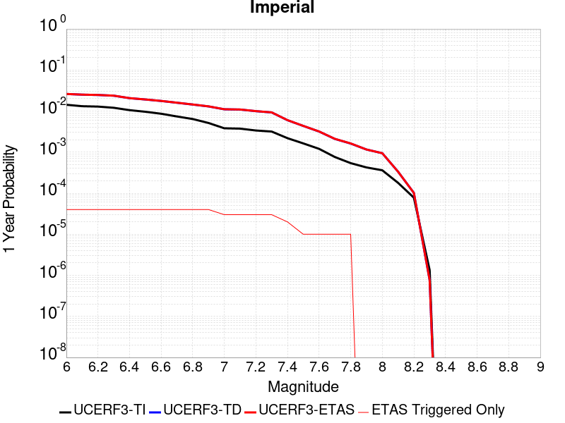 |  |

| Magnitude | 1 wk TI Prob | 1 wk TD Prob | 1 wk ETAS Prob | 1 wk ETAS/TD Gain | 1 wk ETAS Triggered Only | 1 mo TI Prob | 1 mo TD Prob | 1 mo ETAS Prob | 1 mo ETAS/TD Gain | 1 mo ETAS Triggered Only | 1 yr TI Prob | 1 yr TD Prob | 1 yr ETAS Prob | 1 yr ETAS/TD Gain | 1 yr ETAS Triggered Only | 10 yr TI Prob | 10 yr TD Prob | 10 yr ETAS Prob | 10 yr ETAS/TD Gain | 10 yr ETAS Triggered Only |
|-----|-----|-----|-----|-----|-----|-----|-----|-----|-----|-----|-----|-----|-----|-----|-----|-----|-----|-----|-----|-----|
| 6.0 | 2.7496446E-4 | 5.0655607E-4 | 5.0655607E-4 | 1.0 | 0.0 | 0.0011778869 | 0.0021691876 | 0.0021691876 | 1.0 | 0.0 | 0.0142467655 | 0.026090976 | 0.026163118 | 1.0027649 | 7.407407E-5 | 0.13367249 | 0.22838686 | 0.22844402 | 1.0002502 | 7.407407E-5 |
| 6.1 | 2.5356023E-4 | 4.8746416E-4 | 4.8746416E-4 | 1.0 | 0.0 | 0.001086234 | 0.0020874979 | 0.0020874979 | 1.0 | 0.0 | 0.013144928 | 0.025116863 | 0.025189077 | 1.0028751 | 7.407407E-5 | 0.123940155 | 0.21978436 | 0.21984217 | 1.000263 | 7.407407E-5 |
| 6.2 | 2.4820742E-4 | 4.7840018E-4 | 4.7840018E-4 | 1.0 | 0.0 | 0.0010633124 | 0.0020487134 | 0.0020487134 | 1.0 | 0.0 | 0.01286919 | 0.024655988 | 0.024728235 | 1.0029303 | 7.407407E-5 | 0.12148927 | 0.21628645 | 0.2163445 | 1.0002685 | 7.407407E-5 |
| 6.3 | 2.3205351E-4 | 4.5968866E-4 | 4.5968866E-4 | 1.0 | 0.0 | 9.94136E-4 | 0.0019686439 | 0.0019686439 | 1.0 | 0.0 | 0.012036599 | 0.023700953 | 0.023773272 | 1.0030513 | 7.407407E-5 | 0.11405133 | 0.20820886 | 0.20826751 | 1.0002817 | 7.407407E-5 |
| 6.4 | 2.0304754E-4 | 3.9952828E-4 | 3.9952828E-4 | 1.0 | 0.0 | 8.6991355E-4 | 0.001711155 | 0.001711155 | 1.0 | 0.0 | 0.010539869 | 0.02063438 | 0.020706924 | 1.0035157 | 7.407407E-5 | 0.100537635 | 0.18534306 | 0.1854034 | 1.0003256 | 7.407407E-5 |
| 6.5 | 1.854992E-4 | 3.705993E-4 | 3.705993E-4 | 1.0 | 0.0 | 7.9475436E-4 | 0.0015873283 | 0.0015873283 | 1.0 | 0.0 | 0.009633281 | 0.019155664 | 0.019228319 | 1.0037929 | 7.407407E-5 | 0.0922623 | 0.1735613 | 0.17362253 | 1.0003527 | 7.407407E-5 |
| 6.6 | 1.6586106E-4 | 3.4099398E-4 | 3.4099398E-4 | 1.0 | 0.0 | 7.106394E-4 | 0.0014605945 | 0.0014605945 | 1.0 | 0.0 | 0.008617763 | 0.017639361 | 0.01771213 | 1.0041252 | 7.407407E-5 | 0.08291132 | 0.16101992 | 0.16108207 | 1.000386 | 7.407407E-5 |
| 6.7 | 1.4224656E-4 | 3.0823098E-4 | 3.0823098E-4 | 1.0 | 0.0 | 6.094856E-4 | 0.0013203294 | 0.0013203294 | 1.0 | 0.0 | 0.0073952693 | 0.015958436 | 0.016031327 | 1.0045676 | 7.407407E-5 | 0.07153955 | 0.14670318 | 0.1467664 | 1.0004308 | 7.407407E-5 |
| 6.8 | 1.2317259E-4 | 2.7838477E-4 | 2.7838477E-4 | 1.0 | 0.0 | 5.2777573E-4 | 0.0011925383 | 0.0011925383 | 1.0 | 0.0 | 0.0064067547 | 0.014423885 | 0.014496891 | 1.0050614 | 7.407407E-5 | 0.06225166 | 0.13312724 | 0.13319147 | 1.0004823 | 7.407407E-5 |
| 6.9 | 9.859898E-5 | 2.504968E-4 | 2.504968E-4 | 1.0 | 0.0 | 4.2249862E-4 | 0.0010731203 | 0.0010731203 | 1.0 | 0.0 | 0.0051317946 | 0.012987937 | 0.013061049 | 1.0056292 | 7.407407E-5 | 0.05014893 | 0.11955091 | 0.11961613 | 1.0005455 | 7.407407E-5 |
| 7.0 | 7.3191884E-5 | 2.1293074E-4 | 2.1293074E-4 | 1.0 | 0.0 | 3.136418E-4 | 9.122444E-4 | 9.122444E-4 | 1.0 | 0.0 | 0.003811904 | 0.011050702 | 0.011123958 | 1.006629 | 7.407407E-5 | 0.037471764 | 0.102173366 | 0.10223987 | 1.0006509 | 7.407407E-5 |
| 7.1 | 7.1760296E-5 | 2.0994079E-4 | 2.0994079E-4 | 1.0 | 0.0 | 3.0750787E-4 | 8.9943915E-4 | 8.9943915E-4 | 1.0 | 0.0 | 0.003737482 | 0.010896368 | 0.010969635 | 1.006724 | 7.407407E-5 | 0.03675245 | 0.10080859 | 0.1008752 | 1.0006608 | 7.407407E-5 |
| 7.2 | 6.46614E-5 | 1.9161648E-4 | 1.9161648E-4 | 1.0 | 0.0 | 2.7709085E-4 | 8.2095806E-4 | 8.2095806E-4 | 1.0 | 0.0 | 0.0033683628 | 0.00994998 | 0.010023317 | 1.0073706 | 7.407407E-5 | 0.033177625 | 0.09261325 | 0.09268046 | 1.0007257 | 7.407407E-5 |
| 7.3 | 6.088115E-5 | 1.7832244E-4 | 1.7832244E-4 | 1.0 | 0.0 | 2.6089314E-4 | 7.6401804E-4 | 7.6401804E-4 | 1.0 | 0.0 | 0.0031717476 | 0.0092628235 | 0.009336212 | 1.0079229 | 7.407407E-5 | 0.031268585 | 0.08666049 | 0.08672815 | 1.0007807 | 7.407407E-5 |
| 7.4 | 4.199346E-5 | 1.152872E-4 | 1.152872E-4 | 1.0 | 0.0 | 1.7995955E-4 | 4.939953E-4 | 4.939953E-4 | 1.0 | 0.0 | 0.0021888057 | 0.0059979768 | 0.0060470635 | 1.0081838 | 4.9382717E-5 | 0.02167372 | 0.057520892 | 0.057567433 | 1.0008092 | 4.9382717E-5 |
| 7.5 | 3.130448E-5 | 8.348455E-5 | 8.348455E-5 | 1.0 | 0.0 | 1.3415517E-4 | 3.577422E-4 | 3.577422E-4 | 1.0 | 0.0 | 0.0016321153 | 0.0043468727 | 0.0043714563 | 1.0056555 | 2.4691359E-5 | 0.016201803 | 0.04220047 | 0.04222412 | 1.0005604 | 2.4691359E-5 |
| 7.6 | 2.3074248E-5 | 6.0974122E-5 | 6.0974122E-5 | 1.0 | 0.0 | 9.888588E-5 | 2.6129163E-4 | 2.6129163E-4 | 1.0 | 0.0 | 0.0012032706 | 0.0031766081 | 0.003201221 | 1.0077481 | 2.4691359E-5 | 0.011967761 | 0.03108548 | 0.031109404 | 1.0007696 | 2.4691359E-5 |
| 7.7 | 1.45864815E-5 | 4.023209E-5 | 4.023209E-5 | 1.0 | 0.0 | 6.2511994E-5 | 1.7241189E-4 | 1.7241189E-4 | 1.0 | 0.0 | 7.608177E-4 | 0.0020970993 | 0.0021217389 | 1.0117494 | 2.4691359E-5 | 0.007582182 | 0.020677015 | 0.020701196 | 1.0011694 | 2.4691359E-5 |
| 7.8 | 1.0352979E-5 | 3.1052245E-5 | 3.1052245E-5 | 1.0 | 0.0 | 4.4369157E-5 | 1.3307428E-4 | 1.3307428E-4 | 1.0 | 0.0 | 5.400606E-4 | 0.0016189776 | 0.001643629 | 1.0152265 | 2.4691359E-5 | 0.0053875 | 0.016058734 | 0.016083028 | 1.0015129 | 2.4691359E-5 |
| 7.9 | 8.137906E-6 | 2.222251E-5 | 2.222251E-5 | 1.0 | 0.0 | 3.4876273E-5 | 9.523586E-5 | 9.523586E-5 | 1.0 | 0.0 | 4.2453592E-4 | 0.0011588808 | 0.0011588808 | 1.0 | 0.0 | 0.004237258 | 0.011652105 | 0.011652105 | 1.0 | 0.0 |
| 8.0 | 6.93792E-6 | 1.8071916E-5 | 1.8071916E-5 | 1.0 | 0.0 | 2.9733603E-5 | 7.744877E-5 | 7.744877E-5 | 1.0 | 0.0 | 3.6194647E-4 | 9.425316E-4 | 9.425316E-4 | 1.0 | 0.0 | 0.0036135751 | 0.009531174 | 0.009531174 | 1.0 | 0.0 |
| 8.1 | 3.4286315E-6 | 6.40925E-6 | 6.40925E-6 | 1.0 | 0.0 | 1.4694053E-5 | 2.7467926E-5 | 2.7467926E-5 | 1.0 | 0.0 | 1.7888541E-4 | 3.343708E-4 | 3.343708E-4 | 1.0 | 0.0 | 0.0017874148 | 0.003500617 | 0.003500617 | 1.0 | 0.0 |
| 8.2 | 1.4906886E-6 | 1.9481654E-6 | 1.9481654E-6 | 1.0 | 0.0 | 6.3886496E-6 | 8.349253E-6 | 8.349253E-6 | 1.0 | 0.0 | 7.7779034E-5 | 1.0164745E-4 | 1.0164745E-4 | 1.0 | 0.0 | 7.775182E-4 | 0.0011134304 | 0.0011134304 | 1.0 | 0.0 |
| 8.3 | 2.5758007E-8 | 1.4617111E-8 | 1.4617111E-8 | 1.0 | 0.0 | 1.10391454E-7 | 6.264476E-8 | 6.264476E-8 | 1.0 | 0.0 | 1.3440151E-6 | 7.626999E-7 | 7.626999E-7 | 1.0 | 0.0 | 1.344007E-5 | 7.950145E-6 | 7.950145E-6 | 1.0 | 0.0 |

## San Jacinto (Stepovers Combined)
*[(top)](#table-of-contents)*

| 1 Week | 1 Month | 1 Year | 10 Year |
|-----|-----|-----|-----|
|  | 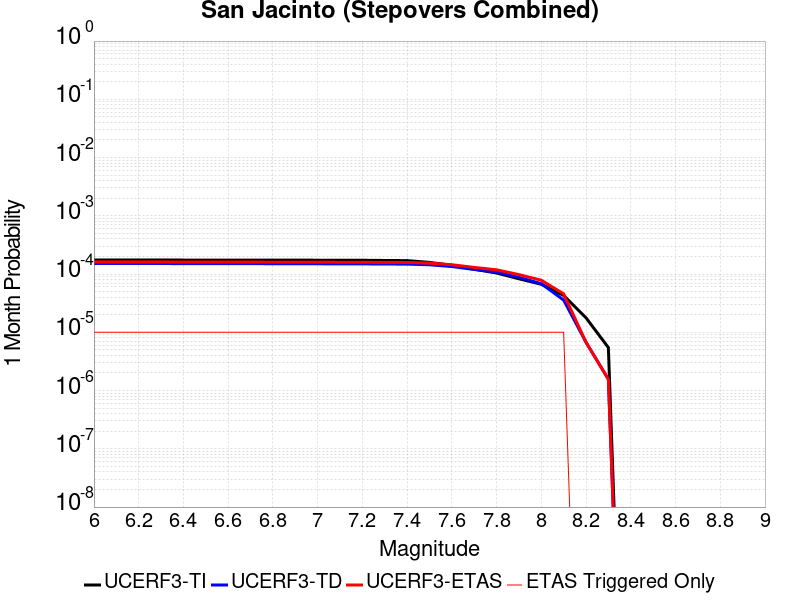 |  |  |

| Magnitude | 1 wk TI Prob | 1 wk TD Prob | 1 wk ETAS Prob | 1 wk ETAS/TD Gain | 1 wk ETAS Triggered Only | 1 mo TI Prob | 1 mo TD Prob | 1 mo ETAS Prob | 1 mo ETAS/TD Gain | 1 mo ETAS Triggered Only | 1 yr TI Prob | 1 yr TD Prob | 1 yr ETAS Prob | 1 yr ETAS/TD Gain | 1 yr ETAS Triggered Only | 10 yr TI Prob | 10 yr TD Prob | 10 yr ETAS Prob | 10 yr ETAS/TD Gain | 10 yr ETAS Triggered Only |
|-----|-----|-----|-----|-----|-----|-----|-----|-----|-----|-----|-----|-----|-----|-----|-----|-----|-----|-----|-----|-----|
| 6.0 | 4.0667746E-5 | 3.539606E-5 | 3.539606E-5 | 1.0 | 0.0 | 1.742787E-4 | 1.5168848E-4 | 1.5168848E-4 | 1.0 | 0.0 | 0.0021197782 | 0.0018452448 | 0.0018698905 | 1.0133563 | 2.4691359E-5 | 0.020996714 | 0.019050766 | 0.01912343 | 1.0038142 | 7.407407E-5 |
| 6.1 | 4.0667746E-5 | 3.539606E-5 | 3.539606E-5 | 1.0 | 0.0 | 1.742787E-4 | 1.5168848E-4 | 1.5168848E-4 | 1.0 | 0.0 | 0.0021197782 | 0.0018452448 | 0.0018698905 | 1.0133563 | 2.4691359E-5 | 0.020996714 | 0.019050766 | 0.01912343 | 1.0038142 | 7.407407E-5 |
| 6.2 | 4.0667746E-5 | 3.539606E-5 | 3.539606E-5 | 1.0 | 0.0 | 1.742787E-4 | 1.5168848E-4 | 1.5168848E-4 | 1.0 | 0.0 | 0.0021197782 | 0.0018452448 | 0.0018698905 | 1.0133563 | 2.4691359E-5 | 0.020996714 | 0.019050766 | 0.01912343 | 1.0038142 | 7.407407E-5 |
| 6.3 | 4.0667746E-5 | 3.539606E-5 | 3.539606E-5 | 1.0 | 0.0 | 1.742787E-4 | 1.5168848E-4 | 1.5168848E-4 | 1.0 | 0.0 | 0.0021197782 | 0.0018452448 | 0.0018698905 | 1.0133563 | 2.4691359E-5 | 0.020996714 | 0.019050766 | 0.01912343 | 1.0038142 | 7.407407E-5 |
| 6.4 | 4.0577226E-5 | 3.52679E-5 | 3.52679E-5 | 1.0 | 0.0 | 1.738908E-4 | 1.5113941E-4 | 1.5113941E-4 | 1.0 | 0.0 | 0.0021150648 | 0.0018385717 | 0.0018632177 | 1.013405 | 2.4691359E-5 | 0.020950472 | 0.018985314 | 0.019057984 | 1.0038276 | 7.407407E-5 |
| 6.5 | 4.0577226E-5 | 3.52679E-5 | 3.52679E-5 | 1.0 | 0.0 | 1.738908E-4 | 1.5113941E-4 | 1.5113941E-4 | 1.0 | 0.0 | 0.0021150648 | 0.0018385717 | 0.0018632177 | 1.013405 | 2.4691359E-5 | 0.020950472 | 0.018985314 | 0.019057984 | 1.0038276 | 7.407407E-5 |
| 6.6 | 4.053861E-5 | 3.5213223E-5 | 3.5213223E-5 | 1.0 | 0.0 | 1.7372532E-4 | 1.509051E-4 | 1.509051E-4 | 1.0 | 0.0 | 0.0021130538 | 0.0018357239 | 0.0018603699 | 1.0134258 | 2.4691359E-5 | 0.020930743 | 0.018957384 | 0.019030055 | 1.0038333 | 7.407407E-5 |
| 6.7 | 4.0516545E-5 | 3.518228E-5 | 3.518228E-5 | 1.0 | 0.0 | 1.7363077E-4 | 1.507725E-4 | 1.507725E-4 | 1.0 | 0.0 | 0.002111905 | 0.0018341128 | 0.0018587589 | 1.0134376 | 2.4691359E-5 | 0.020919468 | 0.018941576 | 0.019014247 | 1.0038366 | 7.407407E-5 |
| 6.8 | 4.049434E-5 | 3.515383E-5 | 3.515383E-5 | 1.0 | 0.0 | 1.7353562E-4 | 1.5065058E-4 | 1.5065058E-4 | 1.0 | 0.0 | 0.0021107488 | 0.0018326311 | 0.0018572772 | 1.0134485 | 2.4691359E-5 | 0.020908125 | 0.018926984 | 0.018999657 | 1.0038396 | 7.407407E-5 |
| 6.9 | 4.046386E-5 | 3.5116373E-5 | 3.5116373E-5 | 1.0 | 0.0 | 1.73405E-4 | 1.5049007E-4 | 1.5049007E-4 | 1.0 | 0.0 | 0.0021091616 | 0.0018306803 | 0.0018553264 | 1.0134628 | 2.4691359E-5 | 0.020892553 | 0.01890775 | 0.018980423 | 1.0038435 | 7.407407E-5 |
| 7.0 | 4.036382E-5 | 3.499689E-5 | 3.499689E-5 | 1.0 | 0.0 | 1.7297632E-4 | 1.4997806E-4 | 1.4997806E-4 | 1.0 | 0.0 | 0.0021039525 | 0.001824457 | 0.0018491033 | 1.0135088 | 2.4691359E-5 | 0.02084144 | 0.018846339 | 0.018919017 | 1.0038563 | 7.407407E-5 |
| 7.1 | 4.0343282E-5 | 3.4975343E-5 | 3.4975343E-5 | 1.0 | 0.0 | 1.7288832E-4 | 1.4988573E-4 | 1.4988573E-4 | 1.0 | 0.0 | 0.002102883 | 0.0018233346 | 0.001847981 | 1.0135171 | 2.4691359E-5 | 0.020830948 | 0.018835211 | 0.01890789 | 1.0038587 | 7.407407E-5 |
| 7.2 | 4.0257353E-5 | 3.487971E-5 | 3.487971E-5 | 1.0 | 0.0 | 1.725201E-4 | 1.4947593E-4 | 1.4947593E-4 | 1.0 | 0.0 | 0.0020984085 | 0.0018183537 | 0.0018430001 | 1.0135542 | 2.4691359E-5 | 0.020787042 | 0.018785886 | 0.018858569 | 1.0038689 | 7.407407E-5 |
| 7.3 | 3.9940667E-5 | 3.470693E-5 | 3.470693E-5 | 1.0 | 0.0 | 1.7116306E-4 | 1.4873552E-4 | 1.4873552E-4 | 1.0 | 0.0 | 0.0020819185 | 0.0018093542 | 0.0018340008 | 1.0136218 | 2.4691359E-5 | 0.020625217 | 0.018694295 | 0.018766982 | 1.0038884 | 7.407407E-5 |
| 7.4 | 3.9721202E-5 | 3.4592093E-5 | 3.4592093E-5 | 1.0 | 0.0 | 1.7022261E-4 | 1.4824342E-4 | 1.4824342E-4 | 1.0 | 0.0 | 0.0020704903 | 0.0018033729 | 0.0018280196 | 1.0136671 | 2.4691359E-5 | 0.020513052 | 0.018633302 | 0.018705996 | 1.0039012 | 7.407407E-5 |
| 7.5 | 3.7036873E-5 | 3.365667E-5 | 3.365667E-5 | 1.0 | 0.0 | 1.5871979E-4 | 1.4423492E-4 | 1.4423492E-4 | 1.0 | 0.0 | 0.0019307006 | 0.0017546486 | 0.0017792967 | 1.0140473 | 2.4691359E-5 | 0.019140124 | 0.018133393 | 0.018206123 | 1.0040109 | 7.407407E-5 |
| 7.6 | 3.2940967E-5 | 3.1428903E-5 | 3.1428903E-5 | 1.0 | 0.0 | 1.4116794E-4 | 1.3468837E-4 | 1.3468837E-4 | 1.0 | 0.0 | 0.0017173645 | 0.0016385997 | 0.0016632505 | 1.0150439 | 2.4691359E-5 | 0.01704153 | 0.01696185 | 0.017034668 | 1.0042931 | 7.407407E-5 |
| 7.7 | 2.8236149E-5 | 2.7991733E-5 | 2.7991733E-5 | 1.0 | 0.0 | 1.2100645E-4 | 1.1995906E-4 | 1.1995906E-4 | 1.0 | 0.0 | 0.0014722579 | 0.0014595242 | 0.0014841794 | 1.0168927 | 2.4691359E-5 | 0.014625421 | 0.015171104 | 0.015244054 | 1.0048085 | 7.407407E-5 |
| 7.8 | 2.4329287E-5 | 2.5311134E-5 | 2.5311134E-5 | 1.0 | 0.0 | 1.042642E-4 | 1.0847179E-4 | 1.0847179E-4 | 1.0 | 0.0 | 0.0012686774 | 0.0013198447 | 0.0013445035 | 1.0186831 | 2.4691359E-5 | 0.012614589 | 0.01376629 | 0.013839344 | 1.0053067 | 7.407407E-5 |
| 7.9 | 1.9370926E-5 | 2.0515045E-5 | 2.0515045E-5 | 1.0 | 0.0 | 8.301561E-5 | 8.791866E-5 | 8.791866E-5 | 1.0 | 0.0 | 0.0010102465 | 0.0010698849 | 0.0010945498 | 1.0230539 | 2.4691359E-5 | 0.0100566605 | 0.011248362 | 0.011321603 | 1.0065112 | 7.407407E-5 |
| 8.0 | 1.5583017E-5 | 1.5965226E-5 | 1.5965226E-5 | 1.0 | 0.0 | 6.6782646E-5 | 6.842061E-5 | 6.842061E-5 | 1.0 | 0.0 | 8.127754E-4 | 8.327032E-4 | 8.57374E-4 | 1.0296273 | 2.4691359E-5 | 0.008098091 | 0.00882326 | 0.00889668 | 1.0083213 | 7.407407E-5 |
| 8.1 | 1.0024873E-5 | 8.3389305E-6 | 8.3389305E-6 | 1.0 | 0.0 | 4.2963035E-5 | 3.5737787E-5 | 3.5737787E-5 | 1.0 | 0.0 | 5.229494E-4 | 4.3502118E-4 | 4.597018E-4 | 1.0567343 | 2.4691359E-5 | 0.0052172043 | 0.0046784114 | 0.004702987 | 1.0052531 | 2.4691359E-5 |
| 8.2 | 4.142796E-6 | 1.5742155E-6 | 1.5742155E-6 | 1.0 | 0.0 | 1.775472E-5 | 6.746621E-6 | 6.746621E-6 | 1.0 | 0.0 | 2.1614227E-4 | 8.213704E-5 | 8.213704E-5 | 1.0 | 0.0 | 0.0021593217 | 9.530129E-4 | 9.530129E-4 | 1.0 | 0.0 |
| 8.3 | 1.2750878E-6 | 3.6481603E-7 | 3.6481603E-7 | 1.0 | 0.0 | 5.4646503E-6 | 1.5634963E-6 | 1.5634963E-6 | 1.0 | 0.0 | 6.653009E-5 | 1.9035406E-5 | 1.9035406E-5 | 1.0 | 0.0 | 6.6510175E-4 | 2.2945888E-4 | 2.2945888E-4 | 1.0 | 0.0 |

## Cleghorn Pass
*[(top)](#table-of-contents)*

| 1 Week | 1 Month | 1 Year | 10 Year |
|-----|-----|-----|-----|
|  |  |  |  |

| Magnitude | 1 wk TI Prob | 1 wk TD Prob | 1 wk ETAS Prob | 1 wk ETAS/TD Gain | 1 wk ETAS Triggered Only | 1 mo TI Prob | 1 mo TD Prob | 1 mo ETAS Prob | 1 mo ETAS/TD Gain | 1 mo ETAS Triggered Only | 1 yr TI Prob | 1 yr TD Prob | 1 yr ETAS Prob | 1 yr ETAS/TD Gain | 1 yr ETAS Triggered Only | 10 yr TI Prob | 10 yr TD Prob | 10 yr ETAS Prob | 10 yr ETAS/TD Gain | 10 yr ETAS Triggered Only |
|-----|-----|-----|-----|-----|-----|-----|-----|-----|-----|-----|-----|-----|-----|-----|-----|-----|-----|-----|-----|-----|
| 6.0 | 1.0522846E-5 | 1.1041218E-5 | 1.1041218E-5 | 1.0 | 0.0 | 4.509713E-5 | 4.7318943E-5 | 4.7318943E-5 | 1.0 | 0.0 | 5.4891926E-4 | 5.760085E-4 | 5.760085E-4 | 1.0 | 0.0 | 0.0054756533 | 0.0057503213 | 0.0058239694 | 1.0128076 | 7.407407E-5 |
| 6.1 | 1.0522846E-5 | 1.1041218E-5 | 1.1041218E-5 | 1.0 | 0.0 | 4.509713E-5 | 4.7318943E-5 | 4.7318943E-5 | 1.0 | 0.0 | 5.4891926E-4 | 5.760085E-4 | 5.760085E-4 | 1.0 | 0.0 | 0.0054756533 | 0.0057503213 | 0.0058239694 | 1.0128076 | 7.407407E-5 |
| 6.2 | 2.1045846E-6 | 2.2083177E-6 | 2.2083177E-6 | 1.0 | 0.0 | 9.019617E-6 | 9.464208E-6 | 9.464208E-6 | 1.0 | 0.0 | 1.098083E-4 | 1.15224844E-4 | 1.15224844E-4 | 1.0 | 0.0 | 0.0010975406 | 0.0011520624 | 0.0011767254 | 1.0214076 | 2.4691359E-5 |
| 6.3 | 2.1045846E-6 | 2.2083177E-6 | 2.2083177E-6 | 1.0 | 0.0 | 9.019617E-6 | 9.464208E-6 | 9.464208E-6 | 1.0 | 0.0 | 1.098083E-4 | 1.15224844E-4 | 1.15224844E-4 | 1.0 | 0.0 | 0.0010975406 | 0.0011520624 | 0.0011767254 | 1.0214076 | 2.4691359E-5 |
| 6.4 | 1.7259927E-6 | 1.8109715E-6 | 1.8109715E-6 | 1.0 | 0.0 | 7.3970905E-6 | 7.761307E-6 | 7.761307E-6 | 1.0 | 0.0 | 9.005586E-5 | 9.449391E-5 | 9.449391E-5 | 1.0 | 0.0 | 9.001937E-4 | 9.449391E-4 | 9.6960715E-4 | 1.0261054 | 2.4691359E-5 |

## Owens Valley
*[(top)](#table-of-contents)*

| 1 Week | 1 Month | 1 Year | 10 Year |
|-----|-----|-----|-----|
|  |  |  |  |

| Magnitude | 1 wk TI Prob | 1 wk TD Prob | 1 wk ETAS Prob | 1 wk ETAS/TD Gain | 1 wk ETAS Triggered Only | 1 mo TI Prob | 1 mo TD Prob | 1 mo ETAS Prob | 1 mo ETAS/TD Gain | 1 mo ETAS Triggered Only | 1 yr TI Prob | 1 yr TD Prob | 1 yr ETAS Prob | 1 yr ETAS/TD Gain | 1 yr ETAS Triggered Only | 10 yr TI Prob | 10 yr TD Prob | 10 yr ETAS Prob | 10 yr ETAS/TD Gain | 10 yr ETAS Triggered Only |
|-----|-----|-----|-----|-----|-----|-----|-----|-----|-----|-----|-----|-----|-----|-----|-----|-----|-----|-----|-----|-----|
| 6.0 | 4.83821E-5 | 3.6332003E-6 | 3.6332003E-6 | 1.0 | 0.0 | 2.0733538E-4 | 1.5570771E-5 | 1.5570771E-5 | 1.0 | 0.0 | 0.002521386 | 1.8955865E-4 | 1.8955865E-4 | 1.0 | 0.0 | 0.024929691 | 0.0019284424 | 0.0020023736 | 1.0383372 | 7.407407E-5 |
| 6.1 | 4.83821E-5 | 3.6332003E-6 | 3.6332003E-6 | 1.0 | 0.0 | 2.0733538E-4 | 1.5570771E-5 | 1.5570771E-5 | 1.0 | 0.0 | 0.002521386 | 1.8955865E-4 | 1.8955865E-4 | 1.0 | 0.0 | 0.024929691 | 0.0019284424 | 0.0020023736 | 1.0383372 | 7.407407E-5 |
| 6.2 | 4.83821E-5 | 3.6332003E-6 | 3.6332003E-6 | 1.0 | 0.0 | 2.0733538E-4 | 1.5570771E-5 | 1.5570771E-5 | 1.0 | 0.0 | 0.002521386 | 1.8955865E-4 | 1.8955865E-4 | 1.0 | 0.0 | 0.024929691 | 0.0019284424 | 0.0020023736 | 1.0383372 | 7.407407E-5 |
| 6.3 | 3.953008E-5 | 3.158994E-6 | 3.158994E-6 | 1.0 | 0.0 | 1.6940363E-4 | 1.353848E-5 | 1.353848E-5 | 1.0 | 0.0 | 0.002060538 | 1.6481927E-4 | 1.6481927E-4 | 1.0 | 0.0 | 0.020415364 | 0.0016611157 | 0.0017350666 | 1.044519 | 7.407407E-5 |
| 6.4 | 3.953008E-5 | 3.158994E-6 | 3.158994E-6 | 1.0 | 0.0 | 1.6940363E-4 | 1.353848E-5 | 1.353848E-5 | 1.0 | 0.0 | 0.002060538 | 1.6481927E-4 | 1.6481927E-4 | 1.0 | 0.0 | 0.020415364 | 0.0016611157 | 0.0017350666 | 1.044519 | 7.407407E-5 |
| 6.5 | 3.457342E-5 | 2.9739288E-6 | 2.9739288E-6 | 1.0 | 0.0 | 1.4816338E-4 | 1.274535E-5 | 1.274535E-5 | 1.0 | 0.0 | 0.0018023965 | 1.5516429E-4 | 1.5516429E-4 | 1.0 | 0.0 | 0.017878477 | 0.0015569815 | 0.0016062873 | 1.0316676 | 4.9382717E-5 |
| 6.6 | 3.1127765E-5 | 2.87613E-6 | 2.87613E-6 | 1.0 | 0.0 | 1.3339789E-4 | 1.2326218E-5 | 1.2326218E-5 | 1.0 | 0.0 | 0.0016229092 | 1.5006206E-4 | 1.5006206E-4 | 1.0 | 0.0 | 0.016111081 | 0.0015021288 | 0.0015514373 | 1.0328258 | 4.9382717E-5 |
| 6.7 | 2.806885E-5 | 2.8116349E-6 | 2.8116349E-6 | 1.0 | 0.0 | 1.2028952E-4 | 1.20498125E-5 | 1.20498125E-5 | 1.0 | 0.0 | 0.001463541 | 1.4669728E-4 | 1.4669728E-4 | 1.0 | 0.0 | 0.014539397 | 0.0014663904 | 0.0015157007 | 1.033627 | 4.9382717E-5 |
| 6.8 | 2.524524E-5 | 2.2364259E-6 | 2.2364259E-6 | 1.0 | 0.0 | 1.0818939E-4 | 9.584649E-6 | 9.584649E-6 | 1.0 | 0.0 | 0.0013164099 | 1.1668716E-4 | 1.1668716E-4 | 1.0 | 0.0 | 0.01308639 | 0.001166533 | 0.0012158582 | 1.0422835 | 4.9382717E-5 |
| 6.9 | 2.2704568E-5 | 1.6089475E-6 | 1.6089475E-6 | 1.0 | 0.0 | 9.730166E-5 | 6.895471E-6 | 6.895471E-6 | 1.0 | 0.0 | 0.0011840039 | 8.394915E-5 | 8.394915E-5 | 1.0 | 0.0 | 0.011777153 | 8.3938777E-4 | 8.8872906E-4 | 1.0587825 | 4.9382717E-5 |
| 7.0 | 2.0871712E-5 | 1.5402817E-6 | 1.5402817E-6 | 1.0 | 0.0 | 8.944713E-5 | 6.6011908E-6 | 6.6011908E-6 | 1.0 | 0.0 | 0.0010884746 | 8.036655E-5 | 8.036655E-5 | 1.0 | 0.0 | 0.010831586 | 8.035493E-4 | 8.5289235E-4 | 1.0614064 | 4.9382717E-5 |
| 7.1 | 1.944928E-5 | 1.3870473E-6 | 1.3870473E-6 | 1.0 | 0.0 | 8.335139E-5 | 5.944475E-6 | 5.944475E-6 | 1.0 | 0.0 | 0.0010143308 | 7.237159E-5 | 7.237159E-5 | 1.0 | 0.0 | 0.010097133 | 7.236403E-4 | 7.4831385E-4 | 1.0340964 | 2.4691359E-5 |
| 7.2 | 1.7876306E-5 | 1.249468E-6 | 1.249468E-6 | 1.0 | 0.0 | 7.6610486E-5 | 5.354852E-6 | 5.354852E-6 | 1.0 | 0.0 | 9.3233347E-4 | 6.519338E-5 | 6.519338E-5 | 1.0 | 0.0 | 0.009284316 | 6.5188174E-4 | 6.76557E-4 | 1.0378524 | 2.4691359E-5 |
| 7.3 | 1.2618672E-5 | 1.1120352E-6 | 1.1120352E-6 | 1.0 | 0.0 | 5.40789E-5 | 4.7658564E-6 | 4.7658564E-6 | 1.0 | 0.0 | 6.582117E-4 | 5.8022764E-5 | 5.8022764E-5 | 1.0 | 0.0 | 0.0065626553 | 5.802104E-4 | 6.048875E-4 | 1.0425311 | 2.4691359E-5 |
| 7.4 | 7.4874442E-6 | 8.552969E-7 | 8.552969E-7 | 1.0 | 0.0 | 3.208865E-5 | 3.6655529E-6 | 3.6655529E-6 | 1.0 | 0.0 | 3.906093E-4 | 4.46272E-5 | 4.46272E-5 | 1.0 | 0.0 | 0.003899234 | 4.4627616E-4 | 4.709565E-4 | 1.0553029 | 2.4691359E-5 |
| 7.5 | 2.4734156E-6 | 6.071494E-7 | 6.071494E-7 | 1.0 | 0.0 | 1.060031E-5 | 2.6020664E-6 | 2.6020664E-6 | 1.0 | 0.0 | 1.2905113E-4 | 3.16797E-5 | 3.16797E-5 | 1.0 | 0.0 | 0.0012897621 | 3.1675215E-4 | 3.414357E-4 | 1.077927 | 2.4691359E-5 |
| 7.6 | 1.1328841E-6 | 3.1979587E-7 | 3.1979587E-7 | 1.0 | 0.0 | 4.8552088E-6 | 1.370553E-6 | 1.370553E-6 | 1.0 | 0.0 | 5.9110564E-5 | 1.6686357E-5 | 1.6686357E-5 | 1.0 | 0.0 | 5.9094845E-4 | 1.6685124E-4 | 1.6685124E-4 | 1.0 | 0.0 |
| 7.7 | 4.8613185E-7 | 8.970251E-8 | 8.970251E-8 | 1.0 | 0.0 | 2.0834207E-6 | 3.8443926E-7 | 3.8443926E-7 | 1.0 | 0.0 | 2.536535E-5 | 4.6805385E-6 | 4.6805385E-6 | 1.0 | 0.0 | 2.5362454E-4 | 4.6804467E-5 | 4.6804467E-5 | 1.0 | 0.0 |

## San Jacinto (Coyote Creek)
*[(top)](#table-of-contents)*

| 1 Week | 1 Month | 1 Year | 10 Year |
|-----|-----|-----|-----|
|  |  |  |  |

| Magnitude | 1 wk TI Prob | 1 wk TD Prob | 1 wk ETAS Prob | 1 wk ETAS/TD Gain | 1 wk ETAS Triggered Only | 1 mo TI Prob | 1 mo TD Prob | 1 mo ETAS Prob | 1 mo ETAS/TD Gain | 1 mo ETAS Triggered Only | 1 yr TI Prob | 1 yr TD Prob | 1 yr ETAS Prob | 1 yr ETAS/TD Gain | 1 yr ETAS Triggered Only | 10 yr TI Prob | 10 yr TD Prob | 10 yr ETAS Prob | 10 yr ETAS/TD Gain | 10 yr ETAS Triggered Only |
|-----|-----|-----|-----|-----|-----|-----|-----|-----|-----|-----|-----|-----|-----|-----|-----|-----|-----|-----|-----|-----|
| 6.0 | 2.7374346E-5 | 2.4210653E-5 | 2.4210653E-5 | 1.0 | 0.0 | 1.1731335E-4 | 1.03755825E-4 | 1.03755825E-4 | 1.0 | 0.0 | 0.0014273542 | 0.0012624977 | 0.001287158 | 1.0195328 | 2.4691359E-5 | 0.01418221 | 0.012962389 | 0.013035503 | 1.0056405 | 7.407407E-5 |
| 6.1 | 2.7374346E-5 | 2.4210653E-5 | 2.4210653E-5 | 1.0 | 0.0 | 1.1731335E-4 | 1.03755825E-4 | 1.03755825E-4 | 1.0 | 0.0 | 0.0014273542 | 0.0012624977 | 0.001287158 | 1.0195328 | 2.4691359E-5 | 0.01418221 | 0.012962389 | 0.013035503 | 1.0056405 | 7.407407E-5 |
| 6.2 | 2.7374346E-5 | 2.4210653E-5 | 2.4210653E-5 | 1.0 | 0.0 | 1.1731335E-4 | 1.03755825E-4 | 1.03755825E-4 | 1.0 | 0.0 | 0.0014273542 | 0.0012624977 | 0.001287158 | 1.0195328 | 2.4691359E-5 | 0.01418221 | 0.012962389 | 0.013035503 | 1.0056405 | 7.407407E-5 |
| 6.3 | 2.7374346E-5 | 2.4210653E-5 | 2.4210653E-5 | 1.0 | 0.0 | 1.1731335E-4 | 1.03755825E-4 | 1.03755825E-4 | 1.0 | 0.0 | 0.0014273542 | 0.0012624977 | 0.001287158 | 1.0195328 | 2.4691359E-5 | 0.01418221 | 0.012962389 | 0.013035503 | 1.0056405 | 7.407407E-5 |
| 6.4 | 2.7374346E-5 | 2.4210653E-5 | 2.4210653E-5 | 1.0 | 0.0 | 1.1731335E-4 | 1.03755825E-4 | 1.03755825E-4 | 1.0 | 0.0 | 0.0014273542 | 0.0012624977 | 0.001287158 | 1.0195328 | 2.4691359E-5 | 0.01418221 | 0.012962389 | 0.013035503 | 1.0056405 | 7.407407E-5 |
| 6.5 | 2.7282445E-5 | 2.4096702E-5 | 2.4096702E-5 | 1.0 | 0.0 | 1.16919524E-4 | 1.03267506E-4 | 1.03267506E-4 | 1.0 | 0.0 | 0.0014225657 | 0.0012565594 | 0.0012812198 | 1.0196253 | 2.4691359E-5 | 0.014134934 | 0.012903704 | 0.012976822 | 1.0056665 | 7.407407E-5 |
| 6.6 | 2.7282445E-5 | 2.4096702E-5 | 2.4096702E-5 | 1.0 | 0.0 | 1.16919524E-4 | 1.03267506E-4 | 1.03267506E-4 | 1.0 | 0.0 | 0.0014225657 | 0.0012565594 | 0.0012812198 | 1.0196253 | 2.4691359E-5 | 0.014134934 | 0.012903704 | 0.012976822 | 1.0056665 | 7.407407E-5 |
| 6.7 | 2.7216198E-5 | 2.4021803E-5 | 2.4021803E-5 | 1.0 | 0.0 | 1.1663563E-4 | 1.0294654E-4 | 1.0294654E-4 | 1.0 | 0.0 | 0.0014191137 | 0.0012526561 | 0.0012773166 | 1.0196865 | 2.4691359E-5 | 0.014100855 | 0.012865107 | 0.0129382275 | 1.0056837 | 7.407407E-5 |
| 6.8 | 2.7078617E-5 | 2.3938983E-5 | 2.3938983E-5 | 1.0 | 0.0 | 1.1604605E-4 | 1.0259162E-4 | 1.0259162E-4 | 1.0 | 0.0 | 0.001411945 | 0.00124834 | 0.0012730005 | 1.0197546 | 2.4691359E-5 | 0.014030075 | 0.01282223 | 0.012895355 | 1.005703 | 7.407407E-5 |
| 6.9 | 2.6982952E-5 | 2.3858454E-5 | 2.3858454E-5 | 1.0 | 0.0 | 1.15636096E-4 | 1.0224652E-4 | 1.0224652E-4 | 1.0 | 0.0 | 0.0014069602 | 0.0012441432 | 0.0012688038 | 1.0198214 | 2.4691359E-5 | 0.013980856 | 0.012780527 | 0.012853654 | 1.0057218 | 7.407407E-5 |
| 7.0 | 2.6449972E-5 | 2.3435334E-5 | 2.3435334E-5 | 1.0 | 0.0 | 1.1335209E-4 | 1.00433295E-4 | 1.00433295E-4 | 1.0 | 0.0 | 0.001379188 | 0.0012220921 | 0.0012467533 | 1.0201795 | 2.4691359E-5 | 0.0137065975 | 0.012561822 | 0.0126349665 | 1.0058227 | 7.407407E-5 |
| 7.1 | 2.6257849E-5 | 2.3261304E-5 | 2.3261304E-5 | 1.0 | 0.0 | 1.1252879E-4 | 9.968751E-5 | 9.968751E-5 | 1.0 | 0.0 | 0.0013691769 | 0.0012130223 | 0.0012376837 | 1.0203305 | 2.4691359E-5 | 0.013607717 | 0.012471657 | 0.012544808 | 1.0058653 | 7.407407E-5 |
| 7.2 | 2.5270041E-5 | 2.2455588E-5 | 2.2455588E-5 | 1.0 | 0.0 | 1.0829568E-4 | 9.62347E-5 | 9.62347E-5 | 1.0 | 0.0 | 0.0013177024 | 0.0011710301 | 0.0011956926 | 1.0210605 | 2.4691359E-5 | 0.013099162 | 0.01205246 | 0.012125641 | 1.0060719 | 7.407407E-5 |
| 7.3 | 2.339701E-5 | 2.1186537E-5 | 2.1186537E-5 | 1.0 | 0.0 | 1.0026905E-4 | 9.07963E-5 | 9.07963E-5 | 1.0 | 0.0 | 0.001220092 | 0.0011048864 | 0.0011295505 | 1.0223228 | 2.4691359E-5 | 0.012134149 | 0.011390935 | 0.011464165 | 1.0064288 | 7.407407E-5 |
| 7.4 | 2.296333E-5 | 2.0916665E-5 | 2.0916665E-5 | 1.0 | 0.0 | 9.841056E-5 | 8.963978E-5 | 8.963978E-5 | 1.0 | 0.0 | 0.0011974899 | 0.00109082 | 0.0011154844 | 1.0226109 | 2.4691359E-5 | 0.011910575 | 0.011249933 | 0.011323174 | 1.0065104 | 7.407407E-5 |
| 7.5 | 2.2188895E-5 | 2.043907E-5 | 2.043907E-5 | 1.0 | 0.0 | 9.50918E-5 | 8.759309E-5 | 8.759309E-5 | 1.0 | 0.0 | 0.0011571277 | 0.0010659262 | 0.0010905912 | 1.0231396 | 2.4691359E-5 | 0.011511209 | 0.010999291 | 0.01107255 | 1.0066603 | 7.407407E-5 |
| 7.6 | 2.0013189E-5 | 1.9023963E-5 | 1.9023963E-5 | 1.0 | 0.0 | 8.5767984E-5 | 8.152873E-5 | 8.152873E-5 | 1.0 | 0.0 | 0.001043725 | 9.92162E-4 | 0.0010168288 | 1.0248617 | 2.4691359E-5 | 0.010388365 | 0.0102566015 | 0.010329916 | 1.007148 | 7.407407E-5 |
| 7.7 | 1.7230794E-5 | 1.6803497E-5 | 1.6803497E-5 | 1.0 | 0.0 | 7.384417E-5 | 7.2013005E-5 | 7.2013005E-5 | 1.0 | 0.0 | 8.986819E-4 | 8.764065E-4 | 9.010762E-4 | 1.0281488 | 2.4691359E-5 | 0.008950562 | 0.00909422 | 0.00916762 | 1.0080711 | 7.407407E-5 |
| 7.8 | 1.4478809E-5 | 1.5048704E-5 | 1.5048704E-5 | 1.0 | 0.0 | 6.205057E-5 | 6.449286E-5 | 6.449286E-5 | 1.0 | 0.0 | 7.552038E-4 | 7.849183E-4 | 8.095903E-4 | 1.0314325 | 2.4691359E-5 | 0.0075264242 | 0.008171609 | 0.008245078 | 1.0089908 | 7.407407E-5 |
| 7.9 | 1.1114467E-5 | 1.1696539E-5 | 1.1696539E-5 | 1.0 | 0.0 | 4.7632562E-5 | 5.0127066E-5 | 5.0127066E-5 | 1.0 | 0.0 | 5.797721E-4 | 6.101267E-4 | 6.34803E-4 | 1.0404445 | 2.4691359E-5 | 0.0057826187 | 0.0064073433 | 0.0064809425 | 1.0114868 | 7.407407E-5 |
| 8.0 | 9.327402E-6 | 9.945905E-6 | 9.945905E-6 | 1.0 | 0.0 | 3.9973966E-5 | 4.2624615E-5 | 4.2624615E-5 | 1.0 | 0.0 | 4.8657437E-4 | 5.1883166E-4 | 5.435102E-4 | 1.0475656 | 2.4691359E-5 | 0.0048551033 | 0.005474554 | 0.0055482225 | 1.0134566 | 7.407407E-5 |
| 8.1 | 7.0235833E-6 | 6.8624786E-6 | 6.8624786E-6 | 1.0 | 0.0 | 3.0100724E-5 | 2.9410294E-5 | 2.9410294E-5 | 1.0 | 0.0 | 3.664147E-4 | 3.58012E-4 | 3.8269453E-4 | 1.0689433 | 2.4691359E-5 | 0.003658111 | 0.0038061605 | 0.003830758 | 1.0064626 | 2.4691359E-5 |
| 8.2 | 2.0358202E-6 | 9.0626554E-7 | 9.0626554E-7 | 1.0 | 0.0 | 8.724915E-6 | 3.8839894E-6 | 3.8839894E-6 | 1.0 | 0.0 | 1.06220665E-4 | 4.728657E-5 | 4.728657E-5 | 1.0 | 0.0 | 0.001061699 | 5.3636427E-4 | 5.3636427E-4 | 1.0 | 0.0 |
| 8.3 | 2.0051264E-7 | 6.67511E-8 | 6.67511E-8 | 1.0 | 0.0 | 8.5933965E-7 | 2.860761E-7 | 2.860761E-7 | 1.0 | 0.0 | 1.046241E-5 | 3.4829714E-6 | 3.4829714E-6 | 1.0 | 0.0 | 1.0461917E-4 | 4.047031E-5 | 4.047031E-5 | 1.0 | 0.0 |

## Santa Ynez (West)
*[(top)](#table-of-contents)*

| 1 Week | 1 Month | 1 Year | 10 Year |
|-----|-----|-----|-----|
|  | 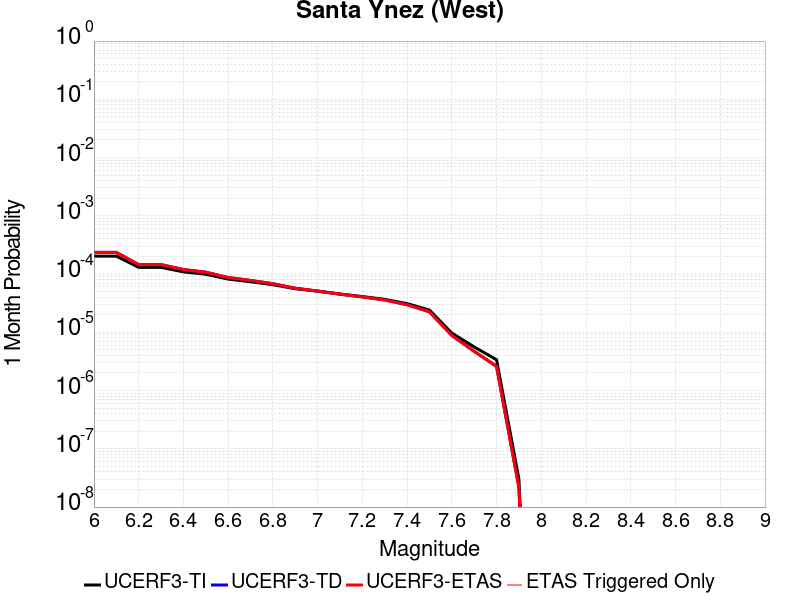 |  | 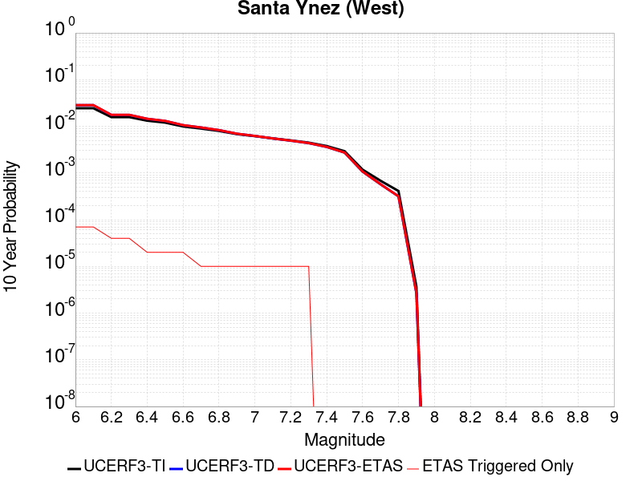 |

| Magnitude | 1 wk TI Prob | 1 wk TD Prob | 1 wk ETAS Prob | 1 wk ETAS/TD Gain | 1 wk ETAS Triggered Only | 1 mo TI Prob | 1 mo TD Prob | 1 mo ETAS Prob | 1 mo ETAS/TD Gain | 1 mo ETAS Triggered Only | 1 yr TI Prob | 1 yr TD Prob | 1 yr ETAS Prob | 1 yr ETAS/TD Gain | 1 yr ETAS Triggered Only | 10 yr TI Prob | 10 yr TD Prob | 10 yr ETAS Prob | 10 yr ETAS/TD Gain | 10 yr ETAS Triggered Only |
|-----|-----|-----|-----|-----|-----|-----|-----|-----|-----|-----|-----|-----|-----|-----|-----|-----|-----|-----|-----|-----|
| 6.0 | 4.7352758E-5 | 5.4983077E-5 | 5.4983077E-5 | 1.0 | 0.0 | 2.0292461E-4 | 2.3562026E-4 | 2.3562026E-4 | 1.0 | 0.0 | 0.0024678076 | 0.0028650744 | 0.0029143156 | 1.0171868 | 4.9382717E-5 | 0.024405818 | 0.028309857 | 0.028381836 | 1.0025425 | 7.407407E-5 |
| 6.1 | 4.7352758E-5 | 5.4983077E-5 | 5.4983077E-5 | 1.0 | 0.0 | 2.0292461E-4 | 2.3562026E-4 | 2.3562026E-4 | 1.0 | 0.0 | 0.0024678076 | 0.0028650744 | 0.0029143156 | 1.0171868 | 4.9382717E-5 | 0.024405818 | 0.028309857 | 0.028381836 | 1.0025425 | 7.407407E-5 |
| 6.2 | 3.0415853E-5 | 3.3930526E-5 | 3.3930526E-5 | 1.0 | 0.0 | 1.3034715E-4 | 1.4540862E-4 | 1.4540862E-4 | 1.0 | 0.0 | 0.0015858212 | 0.0017689478 | 0.0017935955 | 1.0139335 | 2.4691359E-5 | 0.015745522 | 0.017552571 | 0.017601088 | 1.002764 | 4.9382717E-5 |
| 6.3 | 3.0415853E-5 | 3.3930526E-5 | 3.3930526E-5 | 1.0 | 0.0 | 1.3034715E-4 | 1.4540862E-4 | 1.4540862E-4 | 1.0 | 0.0 | 0.0015858212 | 0.0017689478 | 0.0017935955 | 1.0139335 | 2.4691359E-5 | 0.015745522 | 0.017552571 | 0.017601088 | 1.002764 | 4.9382717E-5 |
| 6.4 | 2.5452082E-5 | 2.7916465E-5 | 2.7916465E-5 | 1.0 | 0.0 | 1.09075794E-4 | 1.1963659E-4 | 1.1963659E-4 | 1.0 | 0.0 | 0.0013271887 | 0.0014556192 | 0.0014556192 | 1.0 | 0.0 | 0.013192902 | 0.01446303 | 0.014487364 | 1.0016825 | 2.4691359E-5 |
| 6.5 | 2.3143784E-5 | 2.5131685E-5 | 2.5131685E-5 | 1.0 | 0.0 | 9.9183875E-5 | 1.07702836E-4 | 1.07702836E-4 | 1.0 | 0.0 | 0.0012068948 | 0.0013105051 | 0.0013105051 | 1.0 | 0.0 | 0.012003611 | 0.013029447 | 0.013053817 | 1.0018704 | 2.4691359E-5 |
| 6.6 | 1.9118515E-5 | 2.0356825E-5 | 2.0356825E-5 | 1.0 | 0.0 | 8.193392E-5 | 8.724067E-5 | 8.724067E-5 | 1.0 | 0.0 | 9.97089E-4 | 0.0010616456 | 0.0010616456 | 1.0 | 0.0 | 0.00992627 | 0.010566648 | 0.010591079 | 1.0023121 | 2.4691359E-5 |
| 6.7 | 1.722807E-5 | 1.8148436E-5 | 1.8148436E-5 | 1.0 | 0.0 | 7.3832496E-5 | 7.777672E-5 | 7.777672E-5 | 1.0 | 0.0 | 8.985399E-4 | 9.4652583E-4 | 9.4652583E-4 | 1.0 | 0.0 | 0.008949154 | 0.00942559 | 0.00942559 | 1.0 | 0.0 |
| 6.8 | 1.5317364E-5 | 1.592819E-5 | 1.592819E-5 | 1.0 | 0.0 | 6.56442E-5 | 6.826191E-5 | 6.826191E-5 | 1.0 | 0.0 | 7.98925E-4 | 8.307761E-4 | 8.307761E-4 | 1.0 | 0.0 | 0.007960589 | 0.008277192 | 0.008277192 | 1.0 | 0.0 |
| 6.9 | 1.3071226E-5 | 1.3330895E-5 | 1.3330895E-5 | 1.0 | 0.0 | 5.6018336E-5 | 5.713117E-5 | 5.713117E-5 | 1.0 | 0.0 | 6.8180985E-4 | 6.9535227E-4 | 6.9535227E-4 | 1.0 | 0.0 | 0.0067972173 | 0.006932026 | 0.006932026 | 1.0 | 0.0 |
| 7.0 | 1.1836986E-5 | 1.1933856E-5 | 1.1933856E-5 | 1.0 | 0.0 | 5.0728955E-5 | 5.1144103E-5 | 5.1144103E-5 | 1.0 | 0.0 | 6.1745E-4 | 6.225032E-4 | 6.225032E-4 | 1.0 | 0.0 | 0.006157372 | 0.0062077884 | 0.0062077884 | 1.0 | 0.0 |
| 7.1 | 1.0597169E-5 | 1.0543094E-5 | 1.0543094E-5 | 1.0 | 0.0 | 4.541565E-5 | 4.518391E-5 | 4.518391E-5 | 1.0 | 0.0 | 5.5279525E-4 | 5.499764E-4 | 5.499764E-4 | 1.0 | 0.0 | 0.0055142213 | 0.0054862844 | 0.0054862844 | 1.0 | 0.0 |
| 7.2 | 9.59113E-6 | 9.459948E-6 | 9.459948E-6 | 1.0 | 0.0 | 4.11042E-5 | 4.054201E-5 | 4.054201E-5 | 1.0 | 0.0 | 5.0032866E-4 | 4.934882E-4 | 4.934882E-4 | 1.0 | 0.0 | 0.004992037 | 0.0049240426 | 0.0049240426 | 1.0 | 0.0 |
| 7.3 | 8.586084E-6 | 8.380302E-6 | 8.380302E-6 | 1.0 | 0.0 | 3.679698E-5 | 3.591509E-5 | 3.591509E-5 | 1.0 | 0.0 | 4.4791115E-4 | 4.3717952E-4 | 4.3717952E-4 | 1.0 | 0.0 | 0.004470094 | 0.004363306 | 0.004363306 | 1.0 | 0.0 |
| 7.4 | 7.2622997E-6 | 6.952138E-6 | 6.952138E-6 | 1.0 | 0.0 | 3.112377E-5 | 2.9794543E-5 | 2.9794543E-5 | 1.0 | 0.0 | 3.78866E-4 | 3.6268914E-4 | 3.6268914E-4 | 1.0 | 0.0 | 0.0037822074 | 0.0036210723 | 0.0036210723 | 1.0 | 0.0 |
| 7.5 | 5.627296E-6 | 5.252027E-6 | 5.252027E-6 | 1.0 | 0.0 | 2.411676E-5 | 2.2508497E-5 | 2.2508497E-5 | 1.0 | 0.0 | 2.9358198E-4 | 2.740072E-4 | 2.740072E-4 | 1.0 | 0.0 | 0.0029319443 | 0.0027367657 | 0.0027367657 | 1.0 | 0.0 |
| 7.6 | 2.265244E-6 | 2.0610207E-6 | 2.0610207E-6 | 1.0 | 0.0 | 9.708152E-6 | 8.832917E-6 | 8.832917E-6 | 1.0 | 0.0 | 1.18190335E-4 | 1.0753554E-4 | 1.0753554E-4 | 1.0 | 0.0 | 0.001181275 | 0.0010748437 | 0.0010748437 | 1.0 | 0.0 |
| 7.7 | 1.3099874E-6 | 1.101704E-6 | 1.101704E-6 | 1.0 | 0.0 | 5.61422E-6 | 4.7215804E-6 | 4.7215804E-6 | 1.0 | 0.0 | 6.8350986E-5 | 5.7483747E-5 | 5.7483747E-5 | 1.0 | 0.0 | 6.832996E-4 | 5.7469116E-4 | 5.7469116E-4 | 1.0 | 0.0 |
| 7.8 | 7.903951E-7 | 6.071534E-7 | 6.071534E-7 | 1.0 | 0.0 | 3.3874032E-6 | 2.6020837E-6 | 2.6020837E-6 | 1.0 | 0.0 | 4.1240855E-5 | 3.1679923E-5 | 3.1679923E-5 | 1.0 | 0.0 | 4.12332E-4 | 3.1675538E-4 | 3.1675538E-4 | 1.0 | 0.0 |
| 7.9 | 7.0753297E-9 | 5.090195E-9 | 5.090195E-9 | 1.0 | 0.0 | 3.032284E-8 | 2.1815122E-8 | 2.1815122E-8 | 1.0 | 0.0 | 3.6918053E-7 | 2.6559908E-7 | 2.6559908E-7 | 1.0 | 0.0 | 3.691799E-6 | 2.6559887E-6 | 2.6559887E-6 | 1.0 | 0.0 |

## Brawley (Seismic Zone) alt 1
*[(top)](#table-of-contents)*

| 1 Week | 1 Month | 1 Year | 10 Year |
|-----|-----|-----|-----|
|  |  |  |  |

| Magnitude | 1 wk TI Prob | 1 wk TD Prob | 1 wk ETAS Prob | 1 wk ETAS/TD Gain | 1 wk ETAS Triggered Only | 1 mo TI Prob | 1 mo TD Prob | 1 mo ETAS Prob | 1 mo ETAS/TD Gain | 1 mo ETAS Triggered Only | 1 yr TI Prob | 1 yr TD Prob | 1 yr ETAS Prob | 1 yr ETAS/TD Gain | 1 yr ETAS Triggered Only | 10 yr TI Prob | 10 yr TD Prob | 10 yr ETAS Prob | 10 yr ETAS/TD Gain | 10 yr ETAS Triggered Only |
|-----|-----|-----|-----|-----|-----|-----|-----|-----|-----|-----|-----|-----|-----|-----|-----|-----|-----|-----|-----|-----|
| 6.0 | 2.2521618E-4 | 4.770347E-4 | 4.770347E-4 | 1.0 | 0.0 | 9.6485513E-4 | 0.0020428698 | 0.0020428698 | 1.0 | 0.0 | 0.011683988 | 0.024582325 | 0.024654578 | 1.0029392 | 7.407407E-5 | 0.11088423 | 0.21374372 | 0.21380195 | 1.0002725 | 7.407407E-5 |
| 6.1 | 2.2521618E-4 | 4.770347E-4 | 4.770347E-4 | 1.0 | 0.0 | 9.6485513E-4 | 0.0020428698 | 0.0020428698 | 1.0 | 0.0 | 0.011683988 | 0.024582325 | 0.024654578 | 1.0029392 | 7.407407E-5 | 0.11088423 | 0.21374372 | 0.21380195 | 1.0002725 | 7.407407E-5 |
| 6.2 | 2.198148E-4 | 4.6786256E-4 | 4.6786256E-4 | 1.0 | 0.0 | 9.417233E-4 | 0.002003621 | 0.002003621 | 1.0 | 0.0 | 0.011405343 | 0.024115691 | 0.024187978 | 1.0029975 | 7.407407E-5 | 0.10837428 | 0.21017633 | 0.21023484 | 1.0002784 | 7.407407E-5 |
| 6.3 | 2.1704129E-4 | 4.6221682E-4 | 4.6221682E-4 | 1.0 | 0.0 | 9.298453E-4 | 0.001979462 | 0.001979462 | 1.0 | 0.0 | 0.011262234 | 0.023828728 | 0.023901038 | 1.0030345 | 7.407407E-5 | 0.107082725 | 0.20806724 | 0.2081259 | 1.0002819 | 7.407407E-5 |
| 6.4 | 1.876142E-4 | 4.0111726E-4 | 4.0111726E-4 | 1.0 | 0.0 | 8.038131E-4 | 0.0017179557 | 0.0017179557 | 1.0 | 0.0 | 0.00974259 | 0.02071454 | 0.02078708 | 1.0035019 | 7.407407E-5 | 0.093263686 | 0.18481886 | 0.18487926 | 1.0003268 | 7.407407E-5 |
| 6.5 | 1.7390939E-4 | 3.7541363E-4 | 3.7541363E-4 | 1.0 | 0.0 | 7.45113E-4 | 0.0016079358 | 0.0016079358 | 1.0 | 0.0 | 0.009034078 | 0.019401617 | 0.019474253 | 1.0037439 | 7.407407E-5 | 0.086755216 | 0.1746364 | 0.17469753 | 1.0003501 | 7.407407E-5 |
| 6.6 | 1.591791E-4 | 3.4952888E-4 | 3.4952888E-4 | 1.0 | 0.0 | 6.8201777E-4 | 0.0014971311 | 0.0014971311 | 1.0 | 0.0 | 0.008271996 | 0.018076792 | 0.018149527 | 1.0040237 | 7.407407E-5 | 0.07970774 | 0.16403708 | 0.16409901 | 1.0003775 | 7.407407E-5 |
| 6.7 | 1.4268003E-4 | 3.2115442E-4 | 3.2115442E-4 | 1.0 | 0.0 | 6.1134255E-4 | 0.0013756583 | 0.0013756583 | 1.0 | 0.0 | 0.007417723 | 0.016621986 | 0.016694829 | 1.0043824 | 7.407407E-5 | 0.07174956 | 0.15215302 | 0.15221581 | 1.0004128 | 7.407407E-5 |
| 6.8 | 1.239713E-4 | 2.910217E-4 | 2.910217E-4 | 1.0 | 0.0 | 5.3119735E-4 | 0.0012466458 | 0.0012466458 | 1.0 | 0.0 | 0.0064481674 | 0.01507372 | 0.015146678 | 1.00484 | 7.407407E-5 | 0.06264243 | 0.13857023 | 0.13863404 | 1.0004605 | 7.407407E-5 |
| 6.9 | 1.0180238E-4 | 2.6291964E-4 | 2.6291964E-4 | 1.0 | 0.0 | 4.3622297E-4 | 0.0011263161 | 0.0011263161 | 1.0 | 0.0 | 0.005298089 | 0.013627682 | 0.013700747 | 1.0053614 | 7.407407E-5 | 0.05173543 | 0.12511405 | 0.12517886 | 1.000518 | 7.407407E-5 |
| 7.0 | 7.6619996E-5 | 2.2427912E-4 | 2.2427912E-4 | 1.0 | 0.0 | 3.283301E-4 | 9.608453E-4 | 9.608453E-4 | 1.0 | 0.0 | 0.0039900932 | 0.011636255 | 0.0117094675 | 1.0062917 | 7.407407E-5 | 0.039192066 | 0.10738418 | 0.10745031 | 1.0006157 | 7.407407E-5 |
| 7.1 | 7.5127435E-5 | 2.2110711E-4 | 2.2110711E-4 | 1.0 | 0.0 | 3.2193496E-4 | 9.4726094E-4 | 9.4726094E-4 | 1.0 | 0.0 | 0.0039125155 | 0.011472619 | 0.011545843 | 1.0063825 | 7.407407E-5 | 0.038443442 | 0.10594688 | 0.10601311 | 1.0006251 | 7.407407E-5 |
| 7.2 | 6.788582E-5 | 2.023746E-4 | 2.023746E-4 | 1.0 | 0.0 | 2.9090676E-4 | 8.670345E-4 | 8.670345E-4 | 1.0 | 0.0 | 0.0035360386 | 0.010505693 | 0.010578988 | 1.0069767 | 7.407407E-5 | 0.034803 | 0.09761459 | 0.09768143 | 1.0006847 | 7.407407E-5 |
| 7.3 | 6.399602E-5 | 1.8867273E-4 | 1.8867273E-4 | 1.0 | 0.0 | 2.7423984E-4 | 8.083497E-4 | 8.083497E-4 | 1.0 | 0.0 | 0.0033337586 | 0.0097978385 | 0.009871187 | 1.0074862 | 7.407407E-5 | 0.03284188 | 0.09150581 | 0.091573104 | 1.0007354 | 7.407407E-5 |
| 7.4 | 4.506759E-5 | 1.2549848E-4 | 1.2549848E-4 | 1.0 | 0.0 | 1.9313251E-4 | 5.3774065E-4 | 5.3774065E-4 | 1.0 | 0.0 | 0.0023488526 | 0.0065275137 | 0.0065765744 | 1.0075159 | 4.9382717E-5 | 0.023241805 | 0.06245424 | 0.06250054 | 1.0007414 | 4.9382717E-5 |
| 7.5 | 3.43289E-5 | 9.352864E-5 | 9.352864E-5 | 1.0 | 0.0 | 1.4711556E-4 | 4.0077575E-4 | 4.0077575E-4 | 1.0 | 0.0 | 0.0017896603 | 0.0048685903 | 0.0048931614 | 1.0050468 | 2.4691359E-5 | 0.01775316 | 0.04713329 | 0.04715682 | 1.0004991 | 2.4691359E-5 |
| 7.6 | 2.5980507E-5 | 7.068311E-5 | 7.068311E-5 | 1.0 | 0.0 | 1.1134028E-4 | 3.028926E-4 | 3.028926E-4 | 1.0 | 0.0 | 0.001354725 | 0.0036815058 | 0.0037061062 | 1.0066822 | 2.4691359E-5 | 0.013464959 | 0.03590966 | 0.035933465 | 1.0006629 | 2.4691359E-5 |
| 7.7 | 1.7292105E-5 | 4.953711E-5 | 4.953711E-5 | 1.0 | 0.0 | 7.4106916E-5 | 2.1228465E-4 | 2.1228465E-4 | 1.0 | 0.0 | 9.018782E-4 | 0.002581508 | 0.0026061356 | 1.00954 | 2.4691359E-5 | 0.008982267 | 0.025349455 | 0.02537352 | 1.0009494 | 2.4691359E-5 |
| 7.8 | 1.2927471E-5 | 3.9806302E-5 | 3.9806302E-5 | 1.0 | 0.0 | 5.5402274E-5 | 1.705873E-4 | 1.705873E-4 | 1.0 | 0.0 | 6.743139E-4 | 0.0020749245 | 0.0020995648 | 1.0118752 | 2.4691359E-5 | 0.0067227143 | 0.020483209 | 0.020507393 | 1.0011808 | 2.4691359E-5 |
| 7.9 | 1.0200774E-5 | 2.8837148E-5 | 2.8837148E-5 | 1.0 | 0.0 | 4.371687E-5 | 1.2358194E-4 | 1.2358194E-4 | 1.0 | 0.0 | 5.321229E-4 | 0.0015035727 | 0.0015035727 | 1.0 | 0.0 | 0.005308505 | 0.015033948 | 0.015033948 | 1.0 | 0.0 |
| 8.0 | 8.650396E-6 | 2.3355835E-5 | 2.3355835E-5 | 1.0 | 0.0 | 3.70726E-5 | 1.000926E-4 | 1.000926E-4 | 1.0 | 0.0 | 4.5126543E-4 | 0.001217947 | 0.001217947 | 1.0 | 0.0 | 0.0045035016 | 0.012247655 | 0.012247655 | 1.0 | 0.0 |
| 8.1 | 3.9368224E-6 | 7.361708E-6 | 7.361708E-6 | 1.0 | 0.0 | 1.6871985E-5 | 3.1549796E-5 | 3.1549796E-5 | 1.0 | 0.0 | 2.0539707E-4 | 3.840512E-4 | 3.840512E-4 | 1.0 | 0.0 | 0.0020520731 | 0.0040179132 | 0.0040179132 | 1.0 | 0.0 |
| 8.2 | 1.7101195E-6 | 2.2310942E-6 | 2.2310942E-6 | 1.0 | 0.0 | 7.329063E-6 | 9.561797E-6 | 9.561797E-6 | 1.0 | 0.0 | 8.922769E-5 | 1.1640869E-4 | 1.1640869E-4 | 1.0 | 0.0 | 8.9191867E-4 | 0.0012734552 | 0.0012734552 | 1.0 | 0.0 |
| 8.3 | 3.0346666E-8 | 1.7353964E-8 | 1.7353964E-8 | 1.0 | 0.0 | 1.3005713E-7 | 7.437413E-8 | 7.437413E-8 | 1.0 | 0.0 | 1.5834444E-6 | 9.055049E-7 | 9.055049E-7 | 1.0 | 0.0 | 1.5834332E-5 | 9.441365E-6 | 9.441365E-6 | 1.0 | 0.0 |

## Pisgah-Bullion Mtn-Mesquite Lk
*[(top)](#table-of-contents)*

| 1 Week | 1 Month | 1 Year | 10 Year |
|-----|-----|-----|-----|
|  |  | 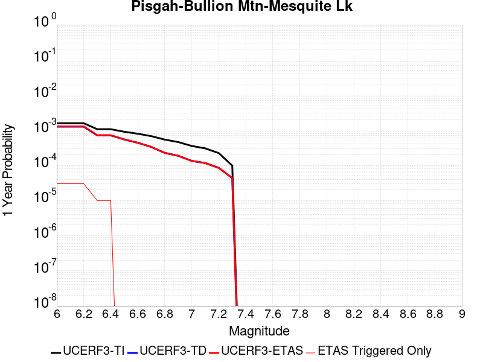 |  |

| Magnitude | 1 wk TI Prob | 1 wk TD Prob | 1 wk ETAS Prob | 1 wk ETAS/TD Gain | 1 wk ETAS Triggered Only | 1 mo TI Prob | 1 mo TD Prob | 1 mo ETAS Prob | 1 mo ETAS/TD Gain | 1 mo ETAS Triggered Only | 1 yr TI Prob | 1 yr TD Prob | 1 yr ETAS Prob | 1 yr ETAS/TD Gain | 1 yr ETAS Triggered Only | 10 yr TI Prob | 10 yr TD Prob | 10 yr ETAS Prob | 10 yr ETAS/TD Gain | 10 yr ETAS Triggered Only |
|-----|-----|-----|-----|-----|-----|-----|-----|-----|-----|-----|-----|-----|-----|-----|-----|-----|-----|-----|-----|-----|
| 6.0 | 3.0240792E-5 | 2.4094168E-5 | 2.4094168E-5 | 1.0 | 0.0 | 1.2959696E-4 | 1.032572E-4 | 1.032572E-4 | 1.0 | 0.0 | 0.0015767008 | 0.0012565318 | 0.0012811922 | 1.0196257 | 2.4691359E-5 | 0.015655609 | 0.012504297 | 0.012577445 | 1.0058498 | 7.407407E-5 |
| 6.1 | 3.0240792E-5 | 2.4094168E-5 | 2.4094168E-5 | 1.0 | 0.0 | 1.2959696E-4 | 1.032572E-4 | 1.032572E-4 | 1.0 | 0.0 | 0.0015767008 | 0.0012565318 | 0.0012811922 | 1.0196257 | 2.4691359E-5 | 0.015655609 | 0.012504297 | 0.012577445 | 1.0058498 | 7.407407E-5 |
| 6.2 | 3.0240792E-5 | 2.4094168E-5 | 2.4094168E-5 | 1.0 | 0.0 | 1.2959696E-4 | 1.032572E-4 | 1.032572E-4 | 1.0 | 0.0 | 0.0015767008 | 0.0012565318 | 0.0012811922 | 1.0196257 | 2.4691359E-5 | 0.015655609 | 0.012504297 | 0.012577445 | 1.0058498 | 7.407407E-5 |
| 6.3 | 2.0498217E-5 | 1.3639548E-5 | 1.3639548E-5 | 1.0 | 0.0 | 8.784654E-5 | 5.845399E-5 | 5.845399E-5 | 1.0 | 0.0 | 0.0010690069 | 7.114611E-4 | 7.114611E-4 | 1.0 | 0.0 | 0.01063879 | 0.0070934608 | 0.007117977 | 1.0034561 | 2.4691359E-5 |
| 6.4 | 2.0498217E-5 | 1.3639548E-5 | 1.3639548E-5 | 1.0 | 0.0 | 8.784654E-5 | 5.845399E-5 | 5.845399E-5 | 1.0 | 0.0 | 0.0010690069 | 7.114611E-4 | 7.114611E-4 | 1.0 | 0.0 | 0.01063879 | 0.0070934608 | 0.007117977 | 1.0034561 | 2.4691359E-5 |
| 6.5 | 1.7316182E-5 | 1.0478121E-5 | 1.0478121E-5 | 1.0 | 0.0 | 7.42101E-5 | 4.490552E-5 | 4.490552E-5 | 1.0 | 0.0 | 9.0313336E-4 | 5.465975E-4 | 5.465975E-4 | 1.0 | 0.0 | 0.008994718 | 0.005453527 | 0.0054780836 | 1.0045029 | 2.4691359E-5 |
| 6.6 | 1.5251077E-5 | 8.415111E-6 | 8.415111E-6 | 1.0 | 0.0 | 6.536012E-5 | 3.6064303E-5 | 3.6064303E-5 | 1.0 | 0.0 | 7.9546886E-4 | 4.3900165E-4 | 4.3900165E-4 | 1.0 | 0.0 | 0.007926274 | 0.004382062 | 0.004406645 | 1.00561 | 2.4691359E-5 |
| 6.7 | 1.2997425E-5 | 6.4121105E-6 | 6.4121105E-6 | 1.0 | 0.0 | 5.570206E-5 | 2.748021E-5 | 2.748021E-5 | 1.0 | 0.0 | 6.7796157E-4 | 3.3452484E-4 | 3.3452484E-4 | 1.0 | 0.0 | 0.0067589693 | 0.003340673 | 0.003365282 | 1.0073664 | 2.4691359E-5 |
| 6.8 | 1.035386E-5 | 4.3337277E-6 | 4.3337277E-6 | 1.0 | 0.0 | 4.437293E-5 | 1.8572991E-5 | 1.8572991E-5 | 1.0 | 0.0 | 5.401065E-4 | 2.2610357E-4 | 2.2610357E-4 | 1.0 | 0.0 | 0.0053879567 | 0.002258822 | 0.002258822 | 1.0 | 0.0 |
| 6.9 | 8.816252E-6 | 3.5810722E-6 | 3.5810722E-6 | 1.0 | 0.0 | 3.778339E-5 | 1.5347365E-5 | 1.5347365E-5 | 1.0 | 0.0 | 4.5991567E-4 | 1.8683873E-4 | 1.8683873E-4 | 1.0 | 0.0 | 0.00458965 | 0.001866875 | 0.001866875 | 1.0 | 0.0 |
| 7.0 | 6.8232207E-6 | 2.567915E-6 | 2.567915E-6 | 1.0 | 0.0 | 2.9242048E-5 | 1.1005306E-5 | 1.1005306E-5 | 1.0 | 0.0 | 3.5596377E-4 | 1.3398168E-4 | 1.3398168E-4 | 1.0 | 0.0 | 0.0035539411 | 0.0013390401 | 0.0013390401 | 1.0 | 0.0 |
| 7.1 | 5.837013E-6 | 2.227665E-6 | 2.227665E-6 | 1.0 | 0.0 | 2.501553E-5 | 9.547102E-6 | 9.547102E-6 | 1.0 | 0.0 | 3.045215E-4 | 1.1623006E-4 | 1.1623006E-4 | 1.0 | 0.0 | 0.0030410455 | 0.0011617218 | 0.0011617218 | 1.0 | 0.0 |
| 7.2 | 4.278052E-6 | 1.6277744E-6 | 1.6277744E-6 | 1.0 | 0.0 | 1.833438E-5 | 6.9761586E-6 | 6.9761586E-6 | 1.0 | 0.0 | 2.231982E-4 | 8.493166E-5 | 8.493166E-5 | 1.0 | 0.0 | 0.0022297418 | 8.490152E-4 | 8.490152E-4 | 1.0 | 0.0 |
| 7.3 | 1.8803692E-6 | 8.345828E-7 | 8.345828E-7 | 1.0 | 0.0 | 8.0587E-6 | 3.5767794E-6 | 3.5767794E-6 | 1.0 | 0.0 | 9.811026E-5 | 4.3546566E-5 | 4.3546566E-5 | 1.0 | 0.0 | 9.806695E-4 | 4.353948E-4 | 4.353948E-4 | 1.0 | 0.0 |

## Kern Canyon (North Kern) 2011
*[(top)](#table-of-contents)*

| 1 Week | 1 Month | 1 Year | 10 Year |
|-----|-----|-----|-----|
|  |  |  |  |

| Magnitude | 1 wk TI Prob | 1 wk TD Prob | 1 wk ETAS Prob | 1 wk ETAS/TD Gain | 1 wk ETAS Triggered Only | 1 mo TI Prob | 1 mo TD Prob | 1 mo ETAS Prob | 1 mo ETAS/TD Gain | 1 mo ETAS Triggered Only | 1 yr TI Prob | 1 yr TD Prob | 1 yr ETAS Prob | 1 yr ETAS/TD Gain | 1 yr ETAS Triggered Only | 10 yr TI Prob | 10 yr TD Prob | 10 yr ETAS Prob | 10 yr ETAS/TD Gain | 10 yr ETAS Triggered Only |
|-----|-----|-----|-----|-----|-----|-----|-----|-----|-----|-----|-----|-----|-----|-----|-----|-----|-----|-----|-----|-----|
| 6.0 | 6.6264497E-6 | 6.7575015E-6 | 6.7575015E-6 | 1.0 | 0.0 | 2.8398761E-5 | 2.8960445E-5 | 2.8960445E-5 | 1.0 | 0.0 | 3.4570007E-4 | 3.5254436E-4 | 3.5254436E-4 | 1.0 | 0.0 | 0.0034516277 | 0.0035206394 | 0.0035698484 | 1.0139773 | 4.9382717E-5 |
| 6.1 | 6.6264497E-6 | 6.7575015E-6 | 6.7575015E-6 | 1.0 | 0.0 | 2.8398761E-5 | 2.8960445E-5 | 2.8960445E-5 | 1.0 | 0.0 | 3.4570007E-4 | 3.5254436E-4 | 3.5254436E-4 | 1.0 | 0.0 | 0.0034516277 | 0.0035206394 | 0.0035698484 | 1.0139773 | 4.9382717E-5 |
| 6.2 | 6.6264497E-6 | 6.7575015E-6 | 6.7575015E-6 | 1.0 | 0.0 | 2.8398761E-5 | 2.8960445E-5 | 2.8960445E-5 | 1.0 | 0.0 | 3.4570007E-4 | 3.5254436E-4 | 3.5254436E-4 | 1.0 | 0.0 | 0.0034516277 | 0.0035206394 | 0.0035698484 | 1.0139773 | 4.9382717E-5 |
| 6.3 | 6.6264497E-6 | 6.7575015E-6 | 6.7575015E-6 | 1.0 | 0.0 | 2.8398761E-5 | 2.8960445E-5 | 2.8960445E-5 | 1.0 | 0.0 | 3.4570007E-4 | 3.5254436E-4 | 3.5254436E-4 | 1.0 | 0.0 | 0.0034516277 | 0.0035206394 | 0.0035698484 | 1.0139773 | 4.9382717E-5 |
| 6.4 | 6.6264497E-6 | 6.7575015E-6 | 6.7575015E-6 | 1.0 | 0.0 | 2.8398761E-5 | 2.8960445E-5 | 2.8960445E-5 | 1.0 | 0.0 | 3.4570007E-4 | 3.5254436E-4 | 3.5254436E-4 | 1.0 | 0.0 | 0.0034516277 | 0.0035206394 | 0.0035698484 | 1.0139773 | 4.9382717E-5 |
| 6.5 | 3.2162225E-6 | 3.2571647E-6 | 3.2571647E-6 | 1.0 | 0.0 | 1.3783738E-5 | 1.39592075E-5 | 1.39592075E-5 | 1.0 | 0.0 | 1.6780409E-4 | 1.699409E-4 | 1.699409E-4 | 1.0 | 0.0 | 0.0016767744 | 0.0016981892 | 0.0017228386 | 1.0145152 | 2.4691359E-5 |
| 6.6 | 3.2162225E-6 | 3.2571647E-6 | 3.2571647E-6 | 1.0 | 0.0 | 1.3783738E-5 | 1.39592075E-5 | 1.39592075E-5 | 1.0 | 0.0 | 1.6780409E-4 | 1.699409E-4 | 1.699409E-4 | 1.0 | 0.0 | 0.0016767744 | 0.0016981892 | 0.0017228386 | 1.0145152 | 2.4691359E-5 |
| 6.7 | 2.1908265E-6 | 2.2071688E-6 | 2.2071688E-6 | 1.0 | 0.0 | 9.389223E-6 | 9.4592615E-6 | 9.4592615E-6 | 1.0 | 0.0 | 1.1430779E-4 | 1.1516062E-4 | 1.1516062E-4 | 1.0 | 0.0 | 0.0011424901 | 0.0011510288 | 0.0011756917 | 1.0214269 | 2.4691359E-5 |
| 6.8 | 1.7303895E-6 | 1.7365885E-6 | 1.7365885E-6 | 1.0 | 0.0 | 7.415934E-6 | 7.4425016E-6 | 7.4425016E-6 | 1.0 | 0.0 | 9.028525E-5 | 9.060879E-5 | 9.060879E-5 | 1.0 | 0.0 | 9.024858E-4 | 9.0572814E-4 | 9.3039713E-4 | 1.0272367 | 2.4691359E-5 |
| 6.9 | 1.3700314E-6 | 1.3688899E-6 | 1.3688899E-6 | 1.0 | 0.0 | 5.87155E-6 | 5.8666583E-6 | 5.8666583E-6 | 1.0 | 0.0 | 7.148377E-5 | 7.142427E-5 | 7.142427E-5 | 1.0 | 0.0 | 7.146078E-4 | 7.1401766E-4 | 7.386914E-4 | 1.0345562 | 2.4691359E-5 |
| 7.0 | 1.1467797E-6 | 1.1414036E-6 | 1.1414036E-6 | 1.0 | 0.0 | 4.9147607E-6 | 4.8917204E-6 | 4.8917204E-6 | 1.0 | 0.0 | 5.983557E-5 | 5.95551E-5 | 5.95551E-5 | 1.0 | 0.0 | 5.981946E-4 | 5.953946E-4 | 5.953946E-4 | 1.0 | 0.0 |
| 7.1 | 9.3952065E-7 | 9.3028797E-7 | 9.3028797E-7 | 1.0 | 0.0 | 4.026511E-6 | 3.9869424E-6 | 3.9869424E-6 | 1.0 | 0.0 | 4.9021666E-5 | 4.853996E-5 | 4.853996E-5 | 1.0 | 0.0 | 4.901085E-4 | 4.8529537E-4 | 4.8529537E-4 | 1.0 | 0.0 |
| 7.2 | 6.858055E-7 | 6.71944E-7 | 6.71944E-7 | 1.0 | 0.0 | 2.939163E-6 | 2.879757E-6 | 2.879757E-6 | 1.0 | 0.0 | 3.5783723E-5 | 3.5060486E-5 | 3.5060486E-5 | 1.0 | 0.0 | 3.5777962E-4 | 3.505504E-4 | 3.505504E-4 | 1.0 | 0.0 |
| 7.3 | 5.1101983E-7 | 4.9394043E-7 | 4.9394043E-7 | 1.0 | 0.0 | 2.1900833E-6 | 2.116886E-6 | 2.116886E-6 | 1.0 | 0.0 | 2.6663936E-5 | 2.5772786E-5 | 2.5772786E-5 | 1.0 | 0.0 | 2.6660739E-4 | 2.5769844E-4 | 2.5769844E-4 | 1.0 | 0.0 |
| 7.4 | 3.4999414E-7 | 3.2996635E-7 | 3.2996635E-7 | 1.0 | 0.0 | 1.499974E-6 | 1.4141407E-6 | 1.4141407E-6 | 1.0 | 0.0 | 1.8262032E-5 | 1.721703E-5 | 1.721703E-5 | 1.0 | 0.0 | 1.826053E-4 | 1.721572E-4 | 1.721572E-4 | 1.0 | 0.0 |
| 7.5 | 1.7021522E-7 | 1.4750415E-7 | 1.4750415E-7 | 1.0 | 0.0 | 7.2949354E-7 | 6.3216055E-7 | 6.3216055E-7 | 1.0 | 0.0 | 8.881548E-6 | 7.696528E-6 | 7.696528E-6 | 1.0 | 0.0 | 8.8811925E-5 | 7.69627E-5 | 7.69627E-5 | 1.0 | 0.0 |
| 7.6 | 2.572245E-8 | 1.7353212E-8 | 1.7353212E-8 | 1.0 | 0.0 | 1.10239064E-7 | 7.437091E-8 | 7.437091E-8 | 1.0 | 0.0 | 1.3421597E-6 | 9.0546547E-7 | 9.0546547E-7 | 1.0 | 0.0 | 1.3421517E-5 | 9.054624E-6 | 9.054624E-6 | 1.0 | 0.0 |

## Lost Hills
*[(top)](#table-of-contents)*

| 1 Week | 1 Month | 1 Year | 10 Year |
|-----|-----|-----|-----|
|  |  |  |  |

| Magnitude | 1 wk TI Prob | 1 wk TD Prob | 1 wk ETAS Prob | 1 wk ETAS/TD Gain | 1 wk ETAS Triggered Only | 1 mo TI Prob | 1 mo TD Prob | 1 mo ETAS Prob | 1 mo ETAS/TD Gain | 1 mo ETAS Triggered Only | 1 yr TI Prob | 1 yr TD Prob | 1 yr ETAS Prob | 1 yr ETAS/TD Gain | 1 yr ETAS Triggered Only | 10 yr TI Prob | 10 yr TD Prob | 10 yr ETAS Prob | 10 yr ETAS/TD Gain | 10 yr ETAS Triggered Only |
|-----|-----|-----|-----|-----|-----|-----|-----|-----|-----|-----|-----|-----|-----|-----|-----|-----|-----|-----|-----|-----|
| 6.0 | 2.233523E-5 | 2.5109888E-5 | 2.5109888E-5 | 1.0 | 0.0 | 9.571891E-5 | 1.07610314E-4 | 1.07610314E-4 | 1.0 | 0.0 | 0.0011647546 | 0.0013095363 | 0.0013341954 | 1.0188303 | 2.4691359E-5 | 0.011586686 | 0.013034798 | 0.013083537 | 1.0037391 | 4.9382717E-5 |
| 6.1 | 2.233523E-5 | 2.5109888E-5 | 2.5109888E-5 | 1.0 | 0.0 | 9.571891E-5 | 1.07610314E-4 | 1.07610314E-4 | 1.0 | 0.0 | 0.0011647546 | 0.0013095363 | 0.0013341954 | 1.0188303 | 2.4691359E-5 | 0.011586686 | 0.013034798 | 0.013083537 | 1.0037391 | 4.9382717E-5 |
| 6.2 | 2.233523E-5 | 2.5109888E-5 | 2.5109888E-5 | 1.0 | 0.0 | 9.571891E-5 | 1.07610314E-4 | 1.07610314E-4 | 1.0 | 0.0 | 0.0011647546 | 0.0013095363 | 0.0013341954 | 1.0188303 | 2.4691359E-5 | 0.011586686 | 0.013034798 | 0.013083537 | 1.0037391 | 4.9382717E-5 |
| 6.3 | 2.233523E-5 | 2.5109888E-5 | 2.5109888E-5 | 1.0 | 0.0 | 9.571891E-5 | 1.07610314E-4 | 1.07610314E-4 | 1.0 | 0.0 | 0.0011647546 | 0.0013095363 | 0.0013341954 | 1.0188303 | 2.4691359E-5 | 0.011586686 | 0.013034798 | 0.013083537 | 1.0037391 | 4.9382717E-5 |
| 6.4 | 1.2288092E-5 | 1.3782884E-5 | 1.3782884E-5 | 1.0 | 0.0 | 5.2662188E-5 | 5.9068694E-5 | 5.9068694E-5 | 1.0 | 0.0 | 6.409735E-4 | 7.190179E-4 | 7.436915E-4 | 1.0343157 | 2.4691359E-5 | 0.006391279 | 0.007176124 | 0.007225152 | 1.0068321 | 4.9382717E-5 |
| 6.5 | 1.2288092E-5 | 1.3782884E-5 | 1.3782884E-5 | 1.0 | 0.0 | 5.2662188E-5 | 5.9068694E-5 | 5.9068694E-5 | 1.0 | 0.0 | 6.409735E-4 | 7.190179E-4 | 7.436915E-4 | 1.0343157 | 2.4691359E-5 | 0.006391279 | 0.007176124 | 0.007225152 | 1.0068321 | 4.9382717E-5 |
| 6.6 | 8.58281E-6 | 9.635021E-6 | 9.635021E-6 | 1.0 | 0.0 | 3.6782953E-5 | 4.1292766E-5 | 4.1292766E-5 | 1.0 | 0.0 | 4.4774043E-4 | 5.027067E-4 | 5.273856E-4 | 1.0490922 | 2.4691359E-5 | 0.0044683935 | 0.005023857 | 0.0050484245 | 1.0048901 | 2.4691359E-5 |
| 6.7 | 7.205685E-6 | 8.089353E-6 | 8.089353E-6 | 1.0 | 0.0 | 3.088114E-5 | 3.4668654E-5 | 3.4668654E-5 | 1.0 | 0.0 | 3.7591302E-4 | 4.2209087E-4 | 4.2209087E-4 | 1.0 | 0.0 | 0.0037527776 | 0.004220909 | 0.004220909 | 1.0 | 0.0 |

## Big Pine (Central)
*[(top)](#table-of-contents)*

| 1 Week | 1 Month | 1 Year | 10 Year |
|-----|-----|-----|-----|
|  |  |  |  |

| Magnitude | 1 wk TI Prob | 1 wk TD Prob | 1 wk ETAS Prob | 1 wk ETAS/TD Gain | 1 wk ETAS Triggered Only | 1 mo TI Prob | 1 mo TD Prob | 1 mo ETAS Prob | 1 mo ETAS/TD Gain | 1 mo ETAS Triggered Only | 1 yr TI Prob | 1 yr TD Prob | 1 yr ETAS Prob | 1 yr ETAS/TD Gain | 1 yr ETAS Triggered Only | 10 yr TI Prob | 10 yr TD Prob | 10 yr ETAS Prob | 10 yr ETAS/TD Gain | 10 yr ETAS Triggered Only |
|-----|-----|-----|-----|-----|-----|-----|-----|-----|-----|-----|-----|-----|-----|-----|-----|-----|-----|-----|-----|-----|
| 6.0 | 1.2706755E-5 | 1.4254399E-5 | 1.4254399E-5 | 1.0 | 0.0 | 5.4456385E-5 | 6.108906E-5 | 6.108906E-5 | 1.0 | 0.0 | 6.628048E-4 | 7.4354204E-4 | 7.4354204E-4 | 1.0 | 0.0 | 0.006608314 | 0.0074155475 | 0.007464564 | 1.0066099 | 4.9382717E-5 |
| 6.1 | 8.342579E-6 | 9.5141995E-6 | 9.5141995E-6 | 1.0 | 0.0 | 3.5753423E-5 | 4.0774623E-5 | 4.0774623E-5 | 1.0 | 0.0 | 4.3521097E-4 | 4.963397E-4 | 4.963397E-4 | 1.0 | 0.0 | 0.0043435963 | 0.0049558426 | 0.0050049806 | 1.0099151 | 4.9382717E-5 |
| 6.2 | 6.923899E-6 | 7.9704405E-6 | 7.9704405E-6 | 1.0 | 0.0 | 2.9673516E-5 | 3.4158693E-5 | 3.4158693E-5 | 1.0 | 0.0 | 3.6121515E-4 | 4.1582197E-4 | 4.1582197E-4 | 1.0 | 0.0 | 0.003606286 | 0.0041537234 | 0.004202901 | 1.0118394 | 4.9382717E-5 |
| 6.3 | 2.728396E-6 | 3.427185E-6 | 3.427185E-6 | 1.0 | 0.0 | 1.1693074E-5 | 1.4687857E-5 | 1.4687857E-5 | 1.0 | 0.0 | 1.4235388E-4 | 1.7881086E-4 | 1.7881086E-4 | 1.0 | 0.0 | 0.0014226272 | 0.001788153 | 0.001788153 | 1.0 | 0.0 |
| 6.4 | 2.7136944E-6 | 3.411477E-6 | 3.411477E-6 | 1.0 | 0.0 | 1.1630066E-5 | 1.4620539E-5 | 1.4620539E-5 | 1.0 | 0.0 | 1.4158686E-4 | 1.779914E-4 | 1.779914E-4 | 1.0 | 0.0 | 0.0014149669 | 0.0017799714 | 0.0017799714 | 1.0 | 0.0 |
| 6.5 | 2.6971882E-6 | 3.3938209E-6 | 3.3938209E-6 | 1.0 | 0.0 | 1.1559327E-5 | 1.454487E-5 | 1.454487E-5 | 1.0 | 0.0 | 1.4072572E-4 | 1.7707028E-4 | 1.7707028E-4 | 1.0 | 0.0 | 0.0014063664 | 0.001770775 | 0.001770775 | 1.0 | 0.0 |
| 6.6 | 2.669092E-6 | 3.3638391E-6 | 3.3638391E-6 | 1.0 | 0.0 | 1.1438916E-5 | 1.441638E-5 | 1.441638E-5 | 1.0 | 0.0 | 1.3925991E-4 | 1.7550615E-4 | 1.7550615E-4 | 1.0 | 0.0 | 0.0013917267 | 0.0017551584 | 0.0017551584 | 1.0 | 0.0 |
| 6.7 | 2.6408059E-6 | 3.3338629E-6 | 3.3338629E-6 | 1.0 | 0.0 | 1.1317691E-5 | 1.4287911E-5 | 1.4287911E-5 | 1.0 | 0.0 | 1.3778417E-4 | 1.739423E-4 | 1.739423E-4 | 1.0 | 0.0 | 0.0013769877 | 0.0017395444 | 0.0017395444 | 1.0 | 0.0 |
| 6.8 | 2.1786943E-6 | 2.8573045E-6 | 2.8573045E-6 | 1.0 | 0.0 | 9.337228E-6 | 1.2245538E-5 | 1.2245538E-5 | 1.0 | 0.0 | 1.1367482E-4 | 1.4907995E-4 | 1.4907995E-4 | 1.0 | 0.0 | 0.0011361669 | 0.0014912689 | 0.0014912689 | 1.0 | 0.0 |
| 6.9 | 1.4411696E-6 | 2.0712434E-6 | 2.0712434E-6 | 1.0 | 0.0 | 6.1764263E-6 | 8.876729E-6 | 8.876729E-6 | 1.0 | 0.0 | 7.51954E-5 | 1.0806909E-4 | 1.0806909E-4 | 1.0 | 0.0 | 7.5169955E-4 | 0.0010815903 | 0.0010815903 | 1.0 | 0.0 |
| 7.0 | 1.0073411E-6 | 1.5567118E-6 | 1.5567118E-6 | 1.0 | 0.0 | 4.317169E-6 | 6.6716057E-6 | 6.6716057E-6 | 1.0 | 0.0 | 5.2560266E-5 | 8.122392E-5 | 8.122392E-5 | 1.0 | 0.0 | 5.2547833E-4 | 8.1335596E-4 | 8.1335596E-4 | 1.0 | 0.0 |
| 7.1 | 8.947104E-7 | 1.4326654E-6 | 1.4326654E-6 | 1.0 | 0.0 | 3.834468E-6 | 6.139981E-6 | 6.139981E-6 | 1.0 | 0.0 | 4.6683643E-5 | 7.475185E-5 | 7.475185E-5 | 1.0 | 0.0 | 4.6673836E-4 | 7.4868044E-4 | 7.4868044E-4 | 1.0 | 0.0 |
| 7.2 | 5.215166E-7 | 1.0134224E-6 | 1.0134224E-6 | 1.0 | 0.0 | 2.2350691E-6 | 4.3432324E-6 | 4.3432324E-6 | 1.0 | 0.0 | 2.7211627E-5 | 5.2877615E-5 | 5.2877615E-5 | 1.0 | 0.0 | 2.7208295E-4 | 5.300535E-4 | 5.300535E-4 | 1.0 | 0.0 |
| 7.3 | 4.4024807E-7 | 9.2414655E-7 | 9.2414655E-7 | 1.0 | 0.0 | 1.8867761E-6 | 3.9606225E-6 | 3.9606225E-6 | 1.0 | 0.0 | 2.2971257E-5 | 4.821955E-5 | 4.821955E-5 | 1.0 | 0.0 | 2.2968883E-4 | 4.8349393E-4 | 4.8349393E-4 | 1.0 | 0.0 |
| 7.4 | 3.6130905E-7 | 8.3797204E-7 | 8.3797204E-7 | 1.0 | 0.0 | 1.5484665E-6 | 3.591304E-6 | 3.591304E-6 | 1.0 | 0.0 | 1.8852415E-5 | 4.372329E-5 | 4.372329E-5 | 1.0 | 0.0 | 1.8850817E-4 | 4.3854036E-4 | 4.3854036E-4 | 1.0 | 0.0 |
| 7.5 | 3.408184E-7 | 8.128881E-7 | 8.128881E-7 | 1.0 | 0.0 | 1.4606494E-6 | 3.4838017E-6 | 3.4838017E-6 | 1.0 | 0.0 | 1.7783263E-5 | 4.24145E-5 | 4.24145E-5 | 1.0 | 0.0 | 1.778184E-4 | 4.2543613E-4 | 4.2543613E-4 | 1.0 | 0.0 |
| 7.6 | 3.1428627E-7 | 7.7515983E-7 | 7.7515983E-7 | 1.0 | 0.0 | 1.3469405E-6 | 3.3221097E-6 | 3.3221097E-6 | 1.0 | 0.0 | 1.6398877E-5 | 4.044597E-5 | 4.044597E-5 | 1.0 | 0.0 | 1.6397667E-4 | 4.0572946E-4 | 4.0572946E-4 | 1.0 | 0.0 |
| 7.7 | 1.7972785E-7 | 5.093037E-7 | 5.093037E-7 | 1.0 | 0.0 | 7.70262E-7 | 2.1827282E-6 | 2.1827282E-6 | 1.0 | 0.0 | 9.377899E-6 | 2.6574404E-5 | 2.6574404E-5 | 1.0 | 0.0 | 9.377503E-5 | 2.6706362E-4 | 2.6706362E-4 | 1.0 | 0.0 |
| 7.8 | 4.9230927E-8 | 1.2016858E-7 | 1.2016858E-7 | 1.0 | 0.0 | 2.1098968E-7 | 5.1500814E-7 | 5.1500814E-7 | 1.0 | 0.0 | 2.5687964E-6 | 6.2702075E-6 | 6.2702075E-6 | 1.0 | 0.0 | 2.5687666E-5 | 6.313871E-5 | 6.313871E-5 | 1.0 | 0.0 |
| 7.9 | 3.6805972E-9 | 4.1195065E-9 | 4.1195065E-9 | 1.0 | 0.0 | 1.5773987E-8 | 1.7655028E-8 | 1.7655028E-8 | 1.0 | 0.0 | 1.9204828E-7 | 2.1494995E-7 | 2.1494995E-7 | 1.0 | 0.0 | 1.920481E-6 | 2.197511E-6 | 2.197511E-6 | 1.0 | 0.0 |

## Death Valley (Fish Lake Valley)
*[(top)](#table-of-contents)*

| 1 Week | 1 Month | 1 Year | 10 Year |
|-----|-----|-----|-----|
|  |  |  | 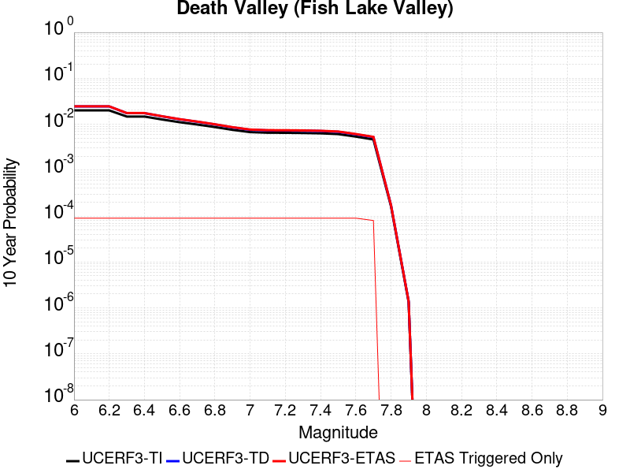 |

| Magnitude | 1 wk TI Prob | 1 wk TD Prob | 1 wk ETAS Prob | 1 wk ETAS/TD Gain | 1 wk ETAS Triggered Only | 1 mo TI Prob | 1 mo TD Prob | 1 mo ETAS Prob | 1 mo ETAS/TD Gain | 1 mo ETAS Triggered Only | 1 yr TI Prob | 1 yr TD Prob | 1 yr ETAS Prob | 1 yr ETAS/TD Gain | 1 yr ETAS Triggered Only | 10 yr TI Prob | 10 yr TD Prob | 10 yr ETAS Prob | 10 yr ETAS/TD Gain | 10 yr ETAS Triggered Only |
|-----|-----|-----|-----|-----|-----|-----|-----|-----|-----|-----|-----|-----|-----|-----|-----|-----|-----|-----|-----|-----|
| 6.0 | 3.872328E-5 | 4.727885E-5 | 4.727885E-5 | 1.0 | 0.0 | 1.6594635E-4 | 2.0260959E-4 | 2.0260959E-4 | 1.0 | 0.0 | 0.0020185246 | 0.0024640928 | 0.0024640928 | 1.0 | 0.0 | 0.02000288 | 0.024393791 | 0.024441969 | 1.001975 | 4.9382717E-5 |
| 6.1 | 3.872328E-5 | 4.727885E-5 | 4.727885E-5 | 1.0 | 0.0 | 1.6594635E-4 | 2.0260959E-4 | 2.0260959E-4 | 1.0 | 0.0 | 0.0020185246 | 0.0024640928 | 0.0024640928 | 1.0 | 0.0 | 0.02000288 | 0.024393791 | 0.024441969 | 1.001975 | 4.9382717E-5 |
| 6.2 | 3.872328E-5 | 4.727885E-5 | 4.727885E-5 | 1.0 | 0.0 | 1.6594635E-4 | 2.0260959E-4 | 2.0260959E-4 | 1.0 | 0.0 | 0.0020185246 | 0.0024640928 | 0.0024640928 | 1.0 | 0.0 | 0.02000288 | 0.024393791 | 0.024441969 | 1.001975 | 4.9382717E-5 |
| 6.3 | 2.8356371E-5 | 3.3616594E-5 | 3.3616594E-5 | 1.0 | 0.0 | 1.2152165E-4 | 1.440636E-4 | 1.440636E-4 | 1.0 | 0.0 | 0.0014785219 | 0.0017526423 | 0.0017526423 | 1.0 | 0.0 | 0.014687235 | 0.017395204 | 0.017443728 | 1.0027895 | 4.9382717E-5 |
| 6.4 | 2.8356371E-5 | 3.3616594E-5 | 3.3616594E-5 | 1.0 | 0.0 | 1.2152165E-4 | 1.440636E-4 | 1.440636E-4 | 1.0 | 0.0 | 0.0014785219 | 0.0017526423 | 0.0017526423 | 1.0 | 0.0 | 0.014687235 | 0.017395204 | 0.017443728 | 1.0027895 | 4.9382717E-5 |
| 6.5 | 2.4448687E-5 | 2.86128E-5 | 2.86128E-5 | 1.0 | 0.0 | 1.0477588E-4 | 1.2262081E-4 | 1.2262081E-4 | 1.0 | 0.0 | 0.0012748998 | 0.0014919365 | 0.0014919365 | 1.0 | 0.0 | 0.012676105 | 0.01482406 | 0.014872711 | 1.0032818 | 4.9382717E-5 |
| 6.6 | 2.1298161E-5 | 2.4664267E-5 | 2.4664267E-5 | 1.0 | 0.0 | 9.127464E-5 | 1.0569991E-4 | 1.0569991E-4 | 1.0 | 0.0 | 0.0011107022 | 0.0012861706 | 0.0012861706 | 1.0 | 0.0 | 0.011051672 | 0.012790677 | 0.012839428 | 1.0038115 | 4.9382717E-5 |
| 6.7 | 1.8959729E-5 | 2.17845E-5 | 2.17845E-5 | 1.0 | 0.0 | 8.125345E-5 | 9.335895E-5 | 9.335895E-5 | 1.0 | 0.0 | 9.888117E-4 | 0.001136078 | 0.001136078 | 1.0 | 0.0 | 0.009844234 | 0.011305364 | 0.011354188 | 1.0043187 | 4.9382717E-5 |
| 6.8 | 1.6691629E-5 | 1.9021187E-5 | 1.9021187E-5 | 1.0 | 0.0 | 7.153359E-5 | 8.151692E-5 | 8.151692E-5 | 1.0 | 0.0 | 8.7057345E-4 | 9.920335E-4 | 9.920335E-4 | 1.0 | 0.0 | 0.008671708 | 0.009877808 | 0.009926704 | 1.0049499 | 4.9382717E-5 |
| 6.9 | 1.450505E-5 | 1.639181E-5 | 1.639181E-5 | 1.0 | 0.0 | 6.216302E-5 | 7.0248774E-5 | 7.0248774E-5 | 1.0 | 0.0 | 7.5657194E-4 | 8.5495197E-4 | 8.5495197E-4 | 1.0 | 0.0 | 0.007540013 | 0.008517561 | 0.008566523 | 1.0057484 | 4.9382717E-5 |
| 7.0 | 1.2940855E-5 | 1.4539881E-5 | 1.4539881E-5 | 1.0 | 0.0 | 5.545963E-5 | 6.231232E-5 | 6.231232E-5 | 1.0 | 0.0 | 6.750118E-4 | 7.5839425E-4 | 7.5839425E-4 | 1.0 | 0.0 | 0.006729651 | 0.0075586787 | 0.007607688 | 1.0064839 | 4.9382717E-5 |
| 7.1 | 1.2544658E-5 | 1.4080038E-5 | 1.4080038E-5 | 1.0 | 0.0 | 5.3761712E-5 | 6.034166E-5 | 6.034166E-5 | 1.0 | 0.0 | 6.5435225E-4 | 7.3441764E-4 | 7.3441764E-4 | 1.0 | 0.0 | 0.006524288 | 0.0073204995 | 0.0073695206 | 1.0066965 | 4.9382717E-5 |
| 7.2 | 1.2489416E-5 | 1.4017496E-5 | 1.4017496E-5 | 1.0 | 0.0 | 5.3524967E-5 | 6.007363E-5 | 6.007363E-5 | 1.0 | 0.0 | 6.514716E-4 | 7.311566E-4 | 7.311566E-4 | 1.0 | 0.0 | 0.006495651 | 0.0072881035 | 0.0073371264 | 1.0067264 | 4.9382717E-5 |
| 7.3 | 1.2368307E-5 | 1.3881617E-5 | 1.3881617E-5 | 1.0 | 0.0 | 5.3005948E-5 | 5.9491318E-5 | 5.9491318E-5 | 1.0 | 0.0 | 6.451563E-4 | 7.240717E-4 | 7.240717E-4 | 1.0 | 0.0 | 0.0064328653 | 0.007217717 | 0.007266743 | 1.0067925 | 4.9382717E-5 |
| 7.4 | 1.2161707E-5 | 1.3649642E-5 | 1.3649642E-5 | 1.0 | 0.0 | 5.212056E-5 | 5.8497186E-5 | 5.8497186E-5 | 1.0 | 0.0 | 6.3438306E-4 | 7.119761E-4 | 7.119761E-4 | 1.0 | 0.0 | 0.006325751 | 0.00709754 | 0.0071465718 | 1.0069083 | 4.9382717E-5 |
| 7.5 | 1.1707948E-5 | 1.3147231E-5 | 1.3147231E-5 | 1.0 | 0.0 | 5.0175953E-5 | 5.634409E-5 | 5.634409E-5 | 1.0 | 0.0 | 6.10721E-4 | 6.8577897E-4 | 6.8577897E-4 | 1.0 | 0.0 | 0.0060904534 | 0.0068372106 | 0.006886256 | 1.0071733 | 4.9382717E-5 |
| 7.6 | 1.0319538E-5 | 1.1581124E-5 | 1.1581124E-5 | 1.0 | 0.0 | 4.4225842E-5 | 4.9632476E-5 | 4.9632476E-5 | 1.0 | 0.0 | 5.383166E-4 | 6.0411304E-4 | 6.0411304E-4 | 1.0 | 0.0 | 0.0053701443 | 0.00602524 | 0.0060743247 | 1.0081466 | 4.9382717E-5 |
| 7.7 | 8.937764E-6 | 1.0024072E-5 | 1.0024072E-5 | 1.0 | 0.0 | 3.830414E-5 | 4.295963E-5 | 4.295963E-5 | 1.0 | 0.0 | 4.6625308E-4 | 5.22913E-4 | 5.22913E-4 | 1.0 | 0.0 | 0.0046527605 | 0.0052173357 | 0.0052664606 | 1.0094157 | 4.9382717E-5 |
| 7.8 | 3.108007E-7 | 3.284853E-7 | 3.284853E-7 | 1.0 | 0.0 | 1.3320023E-6 | 1.4077934E-6 | 1.4077934E-6 | 1.0 | 0.0 | 1.6217007E-5 | 1.7139753E-5 | 1.7139753E-5 | 1.0 | 0.0 | 1.6215823E-4 | 1.713847E-4 | 1.713847E-4 | 1.0 | 0.0 |
| 7.9 | 2.5591178E-9 | 2.6697942E-9 | 2.6697942E-9 | 1.0 | 0.0 | 1.0967647E-8 | 1.14419745E-8 | 1.14419745E-8 | 1.0 | 0.0 | 1.335311E-7 | 1.3930604E-7 | 1.3930604E-7 | 1.0 | 0.0 | 1.3353102E-6 | 1.3930604E-6 | 1.3930604E-6 | 1.0 | 0.0 |

## Dry Mountain
*[(top)](#table-of-contents)*

| 1 Week | 1 Month | 1 Year | 10 Year |
|-----|-----|-----|-----|
| 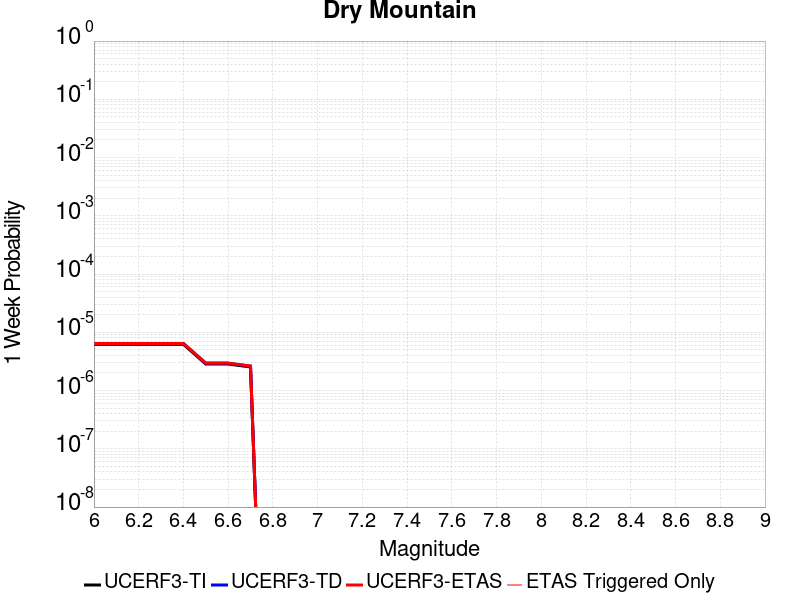 |  |  |  |

| Magnitude | 1 wk TI Prob | 1 wk TD Prob | 1 wk ETAS Prob | 1 wk ETAS/TD Gain | 1 wk ETAS Triggered Only | 1 mo TI Prob | 1 mo TD Prob | 1 mo ETAS Prob | 1 mo ETAS/TD Gain | 1 mo ETAS Triggered Only | 1 yr TI Prob | 1 yr TD Prob | 1 yr ETAS Prob | 1 yr ETAS/TD Gain | 1 yr ETAS Triggered Only | 10 yr TI Prob | 10 yr TD Prob | 10 yr ETAS Prob | 10 yr ETAS/TD Gain | 10 yr ETAS Triggered Only |
|-----|-----|-----|-----|-----|-----|-----|-----|-----|-----|-----|-----|-----|-----|-----|-----|-----|-----|-----|-----|-----|
| 6.0 | 6.222801E-6 | 6.439619E-6 | 6.439619E-6 | 1.0 | 0.0 | 2.6668875E-5 | 2.7598166E-5 | 2.7598166E-5 | 1.0 | 0.0 | 3.2464517E-4 | 3.3597177E-4 | 3.6065484E-4 | 1.0734676 | 2.4691359E-5 | 0.0032417132 | 0.0033562006 | 0.0034054175 | 1.0146645 | 4.9382717E-5 |
| 6.1 | 6.222801E-6 | 6.439619E-6 | 6.439619E-6 | 1.0 | 0.0 | 2.6668875E-5 | 2.7598166E-5 | 2.7598166E-5 | 1.0 | 0.0 | 3.2464517E-4 | 3.3597177E-4 | 3.6065484E-4 | 1.0734676 | 2.4691359E-5 | 0.0032417132 | 0.0033562006 | 0.0034054175 | 1.0146645 | 4.9382717E-5 |
| 6.2 | 6.222801E-6 | 6.439619E-6 | 6.439619E-6 | 1.0 | 0.0 | 2.6668875E-5 | 2.7598166E-5 | 2.7598166E-5 | 1.0 | 0.0 | 3.2464517E-4 | 3.3597177E-4 | 3.6065484E-4 | 1.0734676 | 2.4691359E-5 | 0.0032417132 | 0.0033562006 | 0.0034054175 | 1.0146645 | 4.9382717E-5 |
| 6.3 | 6.222801E-6 | 6.439619E-6 | 6.439619E-6 | 1.0 | 0.0 | 2.6668875E-5 | 2.7598166E-5 | 2.7598166E-5 | 1.0 | 0.0 | 3.2464517E-4 | 3.3597177E-4 | 3.6065484E-4 | 1.0734676 | 2.4691359E-5 | 0.0032417132 | 0.0033562006 | 0.0034054175 | 1.0146645 | 4.9382717E-5 |
| 6.4 | 6.222801E-6 | 6.439619E-6 | 6.439619E-6 | 1.0 | 0.0 | 2.6668875E-5 | 2.7598166E-5 | 2.7598166E-5 | 1.0 | 0.0 | 3.2464517E-4 | 3.3597177E-4 | 3.6065484E-4 | 1.0734676 | 2.4691359E-5 | 0.0032417132 | 0.0033562006 | 0.0034054175 | 1.0146645 | 4.9382717E-5 |
| 6.5 | 2.8528623E-6 | 2.9522773E-6 | 2.9522773E-6 | 1.0 | 0.0 | 1.22264955E-5 | 1.2652606E-5 | 1.2652606E-5 | 1.0 | 0.0 | 1.4884741E-4 | 1.5404329E-4 | 1.5404329E-4 | 1.0 | 0.0 | 0.0014874774 | 0.0015402185 | 0.0015402185 | 1.0 | 0.0 |
| 6.6 | 2.8528623E-6 | 2.9522773E-6 | 2.9522773E-6 | 1.0 | 0.0 | 1.22264955E-5 | 1.2652606E-5 | 1.2652606E-5 | 1.0 | 0.0 | 1.4884741E-4 | 1.5404329E-4 | 1.5404329E-4 | 1.0 | 0.0 | 0.0014874774 | 0.0015402185 | 0.0015402185 | 1.0 | 0.0 |
| 6.7 | 2.541E-6 | 2.629455E-6 | 2.629455E-6 | 1.0 | 0.0 | 1.0889954E-5 | 1.1269092E-5 | 1.1269092E-5 | 1.0 | 0.0 | 1.3257713E-4 | 1.372012E-4 | 1.372012E-4 | 1.0 | 0.0 | 0.0013249806 | 0.001372012 | 0.001372012 | 1.0 | 0.0 |

## Pinto Mtn
*[(top)](#table-of-contents)*

| 1 Week | 1 Month | 1 Year | 10 Year |
|-----|-----|-----|-----|
| 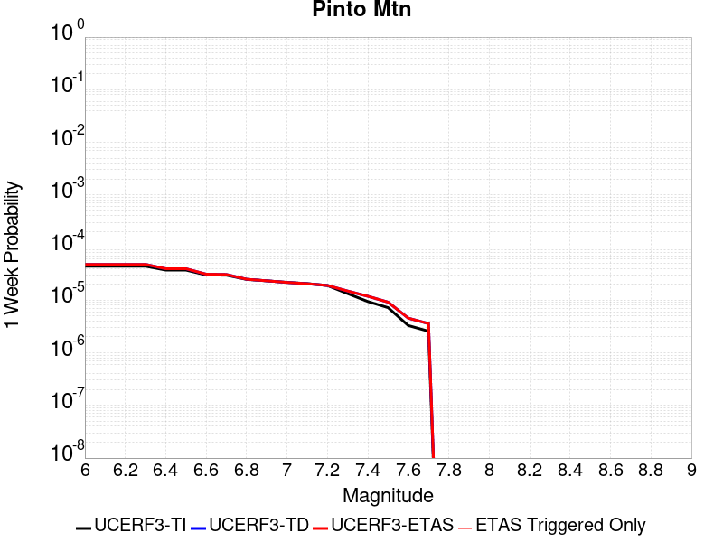 |  |  |  |

| Magnitude | 1 wk TI Prob | 1 wk TD Prob | 1 wk ETAS Prob | 1 wk ETAS/TD Gain | 1 wk ETAS Triggered Only | 1 mo TI Prob | 1 mo TD Prob | 1 mo ETAS Prob | 1 mo ETAS/TD Gain | 1 mo ETAS Triggered Only | 1 yr TI Prob | 1 yr TD Prob | 1 yr ETAS Prob | 1 yr ETAS/TD Gain | 1 yr ETAS Triggered Only | 10 yr TI Prob | 10 yr TD Prob | 10 yr ETAS Prob | 10 yr ETAS/TD Gain | 10 yr ETAS Triggered Only |
|-----|-----|-----|-----|-----|-----|-----|-----|-----|-----|-----|-----|-----|-----|-----|-----|-----|-----|-----|-----|-----|
| 6.0 | 4.4194956E-5 | 4.78665E-5 | 4.78665E-5 | 1.0 | 0.0 | 1.893932E-4 | 2.0512694E-4 | 2.0512694E-4 | 1.0 | 0.0 | 0.0023034236 | 0.0024947247 | 0.0025193545 | 1.0098728 | 2.4691359E-5 | 0.022796938 | 0.024684703 | 0.024732867 | 1.0019511 | 4.9382717E-5 |
| 6.1 | 4.4194956E-5 | 4.78665E-5 | 4.78665E-5 | 1.0 | 0.0 | 1.893932E-4 | 2.0512694E-4 | 2.0512694E-4 | 1.0 | 0.0 | 0.0023034236 | 0.0024947247 | 0.0025193545 | 1.0098728 | 2.4691359E-5 | 0.022796938 | 0.024684703 | 0.024732867 | 1.0019511 | 4.9382717E-5 |
| 6.2 | 4.4194956E-5 | 4.78665E-5 | 4.78665E-5 | 1.0 | 0.0 | 1.893932E-4 | 2.0512694E-4 | 2.0512694E-4 | 1.0 | 0.0 | 0.0023034236 | 0.0024947247 | 0.0025193545 | 1.0098728 | 2.4691359E-5 | 0.022796938 | 0.024684703 | 0.024732867 | 1.0019511 | 4.9382717E-5 |
| 6.3 | 4.4194956E-5 | 4.78665E-5 | 4.78665E-5 | 1.0 | 0.0 | 1.893932E-4 | 2.0512694E-4 | 2.0512694E-4 | 1.0 | 0.0 | 0.0023034236 | 0.0024947247 | 0.0025193545 | 1.0098728 | 2.4691359E-5 | 0.022796938 | 0.024684703 | 0.024732867 | 1.0019511 | 4.9382717E-5 |
| 6.4 | 3.729929E-5 | 3.9614344E-5 | 3.9614344E-5 | 1.0 | 0.0 | 1.5984432E-4 | 1.6976523E-4 | 1.6976523E-4 | 1.0 | 0.0 | 0.0019443673 | 0.0020650262 | 0.0020896664 | 1.0119323 | 2.4691359E-5 | 0.019274427 | 0.020468395 | 0.020516768 | 1.0023632 | 4.9382717E-5 |
| 6.5 | 3.729929E-5 | 3.9614344E-5 | 3.9614344E-5 | 1.0 | 0.0 | 1.5984432E-4 | 1.6976523E-4 | 1.6976523E-4 | 1.0 | 0.0 | 0.0019443673 | 0.0020650262 | 0.0020896664 | 1.0119323 | 2.4691359E-5 | 0.019274427 | 0.020468395 | 0.020516768 | 1.0023632 | 4.9382717E-5 |
| 6.6 | 3.0204548E-5 | 3.1214815E-5 | 3.1214815E-5 | 1.0 | 0.0 | 1.2944164E-4 | 1.3377111E-4 | 1.3377111E-4 | 1.0 | 0.0 | 0.0015748127 | 0.0016274813 | 0.0016521325 | 1.0151469 | 2.4691359E-5 | 0.015636992 | 0.016159497 | 0.01620808 | 1.0030066 | 4.9382717E-5 |
| 6.7 | 2.9857754E-5 | 3.0824147E-5 | 3.0824147E-5 | 1.0 | 0.0 | 1.2795553E-4 | 1.32097E-4 | 1.32097E-4 | 1.0 | 0.0 | 0.0015567453 | 0.0016071291 | 0.0016317808 | 1.0153389 | 2.4691359E-5 | 0.015458848 | 0.01595891 | 0.016007505 | 1.003045 | 4.9382717E-5 |
| 6.8 | 2.4819734E-5 | 2.5017885E-5 | 2.5017885E-5 | 1.0 | 0.0 | 1.0636595E-4 | 1.0721523E-4 | 1.0721523E-4 | 1.0 | 0.0 | 0.0012942362 | 0.0013045854 | 0.0013292446 | 1.018902 | 2.4691359E-5 | 0.012867244 | 0.012971638 | 0.0130203795 | 1.0037576 | 4.9382717E-5 |
| 6.9 | 2.331124E-5 | 2.3345972E-5 | 2.3345972E-5 | 1.0 | 0.0 | 9.990149E-5 | 1.0005045E-4 | 1.0005045E-4 | 1.0 | 0.0 | 0.001215622 | 0.0012174539 | 0.0012421152 | 1.0202564 | 2.4691359E-5 | 0.012089936 | 0.012110036 | 0.01215882 | 1.0040284 | 4.9382717E-5 |
| 7.0 | 2.1818534E-5 | 2.1768941E-5 | 2.1768941E-5 | 1.0 | 0.0 | 9.3504656E-5 | 9.329224E-5 | 9.329224E-5 | 1.0 | 0.0 | 0.0011378246 | 0.001135261 | 0.0011599243 | 1.0217248 | 2.4691359E-5 | 0.011320163 | 0.011296719 | 0.011345544 | 1.004322 | 4.9382717E-5 |
| 7.1 | 2.066081E-5 | 2.0548434E-5 | 2.0548434E-5 | 1.0 | 0.0 | 8.854332E-5 | 8.806185E-5 | 8.806185E-5 | 1.0 | 0.0 | 0.0010774818 | 0.0010716453 | 0.0010963102 | 1.0230159 | 2.4691359E-5 | 0.010722724 | 0.010666828 | 0.010715683 | 1.0045801 | 4.9382717E-5 |
| 7.2 | 1.8990233E-5 | 1.9061563E-5 | 1.9061563E-5 | 1.0 | 0.0 | 8.138417E-5 | 8.168996E-5 | 8.168996E-5 | 1.0 | 0.0 | 9.904018E-4 | 9.941409E-4 | 0.0010188076 | 1.0248122 | 2.4691359E-5 | 0.009859995 | 0.009898936 | 0.00994783 | 1.0049393 | 4.9382717E-5 |
| 7.3 | 1.3335872E-5 | 1.4913608E-5 | 1.4913608E-5 | 1.0 | 0.0 | 5.7152483E-5 | 6.391397E-5 | 6.391397E-5 | 1.0 | 0.0 | 6.956093E-4 | 7.778875E-4 | 8.025596E-4 | 1.0317168 | 2.4691359E-5 | 0.006934359 | 0.007752946 | 0.007777446 | 1.0031601 | 2.4691359E-5 |
| 7.4 | 9.414066E-6 | 1.186749E-5 | 1.186749E-5 | 1.0 | 0.0 | 4.0345374E-5 | 5.085973E-5 | 5.085973E-5 | 1.0 | 0.0 | 4.910942E-4 | 6.1905076E-4 | 6.437268E-4 | 1.0398612 | 2.4691359E-5 | 0.0049001034 | 0.006174212 | 0.006198751 | 1.0039744 | 2.4691359E-5 |
| 7.5 | 7.2101157E-6 | 9.164608E-6 | 9.164608E-6 | 1.0 | 0.0 | 3.090013E-5 | 3.9276343E-5 | 3.9276343E-5 | 1.0 | 0.0 | 3.7614413E-4 | 4.7809238E-4 | 4.7809238E-4 | 1.0 | 0.0 | 0.0037550807 | 0.004771414 | 0.004771414 | 1.0 | 0.0 |
| 7.6 | 3.296375E-6 | 4.551753E-6 | 4.551753E-6 | 1.0 | 0.0 | 1.4127245E-5 | 1.9507375E-5 | 1.9507375E-5 | 1.0 | 0.0 | 1.7198564E-4 | 2.3747781E-4 | 2.3747781E-4 | 1.0 | 0.0 | 0.0017185259 | 0.0023723783 | 0.0023723783 | 1.0 | 0.0 |
| 7.7 | 2.5741092E-6 | 3.590314E-6 | 3.590314E-6 | 1.0 | 0.0 | 1.103185E-5 | 1.5386977E-5 | 1.5386977E-5 | 1.0 | 0.0 | 1.3430449E-4 | 1.8732167E-4 | 1.8732167E-4 | 1.0 | 0.0 | 0.0013422335 | 0.0018717679 | 0.0018717679 | 1.0 | 0.0 |

## Red Mountain
*[(top)](#table-of-contents)*

| 1 Week | 1 Month | 1 Year | 10 Year |
|-----|-----|-----|-----|
|  | 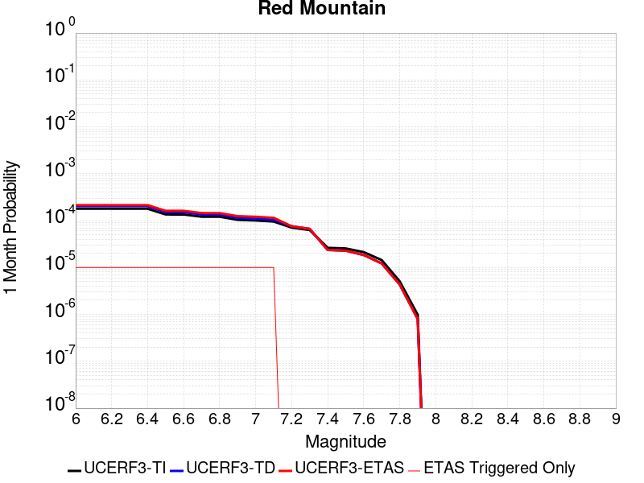 |  |  |

| Magnitude | 1 wk TI Prob | 1 wk TD Prob | 1 wk ETAS Prob | 1 wk ETAS/TD Gain | 1 wk ETAS Triggered Only | 1 mo TI Prob | 1 mo TD Prob | 1 mo ETAS Prob | 1 mo ETAS/TD Gain | 1 mo ETAS Triggered Only | 1 yr TI Prob | 1 yr TD Prob | 1 yr ETAS Prob | 1 yr ETAS/TD Gain | 1 yr ETAS Triggered Only | 10 yr TI Prob | 10 yr TD Prob | 10 yr ETAS Prob | 10 yr ETAS/TD Gain | 10 yr ETAS Triggered Only |
|-----|-----|-----|-----|-----|-----|-----|-----|-----|-----|-----|-----|-----|-----|-----|-----|-----|-----|-----|-----|-----|
| 6.0 | 4.1810763E-5 | 4.7598434E-5 | 4.7598434E-5 | 1.0 | 0.0 | 1.7917668E-4 | 2.0397828E-4 | 2.0397828E-4 | 1.0 | 0.0 | 0.0021792934 | 0.0024807728 | 0.002530033 | 1.0198568 | 4.9382717E-5 | 0.021580452 | 0.024548419 | 0.024596589 | 1.0019623 | 4.9382717E-5 |
| 6.1 | 4.1810763E-5 | 4.7598434E-5 | 4.7598434E-5 | 1.0 | 0.0 | 1.7917668E-4 | 2.0397828E-4 | 2.0397828E-4 | 1.0 | 0.0 | 0.0021792934 | 0.0024807728 | 0.002530033 | 1.0198568 | 4.9382717E-5 | 0.021580452 | 0.024548419 | 0.024596589 | 1.0019623 | 4.9382717E-5 |
| 6.2 | 4.1810763E-5 | 4.7598434E-5 | 4.7598434E-5 | 1.0 | 0.0 | 1.7917668E-4 | 2.0397828E-4 | 2.0397828E-4 | 1.0 | 0.0 | 0.0021792934 | 0.0024807728 | 0.002530033 | 1.0198568 | 4.9382717E-5 | 0.021580452 | 0.024548419 | 0.024596589 | 1.0019623 | 4.9382717E-5 |
| 6.3 | 4.1810763E-5 | 4.7598434E-5 | 4.7598434E-5 | 1.0 | 0.0 | 1.7917668E-4 | 2.0397828E-4 | 2.0397828E-4 | 1.0 | 0.0 | 0.0021792934 | 0.0024807728 | 0.002530033 | 1.0198568 | 4.9382717E-5 | 0.021580452 | 0.024548419 | 0.024596589 | 1.0019623 | 4.9382717E-5 |
| 6.4 | 4.1810763E-5 | 4.7598434E-5 | 4.7598434E-5 | 1.0 | 0.0 | 1.7917668E-4 | 2.0397828E-4 | 2.0397828E-4 | 1.0 | 0.0 | 0.0021792934 | 0.0024807728 | 0.002530033 | 1.0198568 | 4.9382717E-5 | 0.021580452 | 0.024548419 | 0.024596589 | 1.0019623 | 4.9382717E-5 |
| 6.5 | 3.154503E-5 | 3.536573E-5 | 3.536573E-5 | 1.0 | 0.0 | 1.3518598E-4 | 1.5155913E-4 | 1.5155913E-4 | 1.0 | 0.0 | 0.0016446467 | 0.001843763 | 0.0018930547 | 1.0267342 | 4.9382717E-5 | 0.01632528 | 0.018294314 | 0.018342793 | 1.00265 | 4.9382717E-5 |
| 6.6 | 3.1535834E-5 | 3.535511E-5 | 3.535511E-5 | 1.0 | 0.0 | 1.3514658E-4 | 1.5151362E-4 | 1.5151362E-4 | 1.0 | 0.0 | 0.0016441676 | 0.00184321 | 0.0018925016 | 1.0267423 | 4.9382717E-5 | 0.01632056 | 0.018288875 | 0.018337354 | 1.0026507 | 4.9382717E-5 |
| 6.7 | 2.8267326E-5 | 3.1474574E-5 | 3.1474574E-5 | 1.0 | 0.0 | 1.2114006E-4 | 1.3488454E-4 | 1.3488454E-4 | 1.0 | 0.0 | 0.0014738824 | 0.0016410673 | 0.001690369 | 1.0300424 | 4.9382717E-5 | 0.014641452 | 0.016298255 | 0.016346833 | 1.0029806 | 4.9382717E-5 |
| 6.8 | 2.8212884E-5 | 3.141245E-5 | 3.141245E-5 | 1.0 | 0.0 | 1.20906756E-4 | 1.3461833E-4 | 1.3461833E-4 | 1.0 | 0.0 | 0.0014710457 | 0.0016378311 | 0.0016871329 | 1.0301019 | 4.9382717E-5 | 0.014613459 | 0.016266366 | 0.016314946 | 1.0029866 | 4.9382717E-5 |
| 6.9 | 2.4227871E-5 | 2.6711308E-5 | 2.6711308E-5 | 1.0 | 0.0 | 1.03829596E-4 | 1.14472445E-4 | 1.14472445E-4 | 1.0 | 0.0 | 0.0012633923 | 0.0013928869 | 0.0014175439 | 1.0177021 | 2.4691359E-5 | 0.012562336 | 0.0138492575 | 0.013873607 | 1.0017582 | 2.4691359E-5 |
| 7.0 | 2.348524E-5 | 2.5839934E-5 | 2.5839934E-5 | 1.0 | 0.0 | 1.0064714E-4 | 1.107383E-4 | 1.107383E-4 | 1.0 | 0.0 | 0.0012246901 | 0.0013474806 | 0.0013721386 | 1.0182993 | 2.4691359E-5 | 0.012179627 | 0.01340074 | 0.013425101 | 1.0018178 | 2.4691359E-5 |
| 7.1 | 2.2311642E-5 | 2.4466752E-5 | 2.4466752E-5 | 1.0 | 0.0 | 9.561782E-5 | 1.0485371E-4 | 1.0485371E-4 | 1.0 | 0.0 | 0.0011635252 | 0.0012759211 | 0.001300581 | 1.019327 | 2.4691359E-5 | 0.01157452 | 0.012693475 | 0.012717852 | 1.0019205 | 2.4691359E-5 |
| 7.2 | 1.6533986E-5 | 1.7673001E-5 | 1.7673001E-5 | 1.0 | 0.0 | 7.085802E-5 | 7.57396E-5 | 7.57396E-5 | 1.0 | 0.0 | 8.623549E-4 | 9.2180294E-4 | 9.464715E-4 | 1.0267613 | 2.4691359E-5 | 0.008590161 | 0.009186074 | 0.009210538 | 1.0026633 | 2.4691359E-5 |
| 7.3 | 1.4703092E-5 | 1.556183E-5 | 1.556183E-5 | 1.0 | 0.0 | 6.301173E-5 | 6.66922E-5 | 6.66922E-5 | 1.0 | 0.0 | 7.668978E-4 | 8.117367E-4 | 8.36408E-4 | 1.0303932 | 2.4691359E-5 | 0.0076425658 | 0.008093794 | 0.008118285 | 1.003026 | 2.4691359E-5 |
| 7.4 | 6.1331984E-6 | 5.5293617E-6 | 5.5293617E-6 | 1.0 | 0.0 | 2.6284872E-5 | 2.3697052E-5 | 2.3697052E-5 | 1.0 | 0.0 | 3.199713E-4 | 2.8847394E-4 | 2.8847394E-4 | 1.0 | 0.0 | 0.0031951098 | 0.0028810492 | 0.0028810492 | 1.0 | 0.0 |
| 7.5 | 5.954766E-6 | 5.338974E-6 | 5.338974E-6 | 1.0 | 0.0 | 2.5520176E-5 | 2.2881119E-5 | 2.2881119E-5 | 1.0 | 0.0 | 3.1066386E-4 | 2.7854255E-4 | 2.7854255E-4 | 1.0 | 0.0 | 0.003102299 | 0.0027819881 | 0.0027819881 | 1.0 | 0.0 |
| 7.6 | 4.9726646E-6 | 4.3156824E-6 | 4.3156824E-6 | 1.0 | 0.0 | 2.1311245E-5 | 1.8495653E-5 | 1.8495653E-5 | 1.0 | 0.0 | 2.5943352E-4 | 2.2516165E-4 | 2.2516165E-4 | 1.0 | 0.0 | 0.0025913084 | 0.0022493699 | 0.0022493699 | 1.0 | 0.0 |
| 7.7 | 3.3613894E-6 | 2.852926E-6 | 2.852926E-6 | 1.0 | 0.0 | 1.4405875E-5 | 1.222677E-5 | 1.222677E-5 | 1.0 | 0.0 | 1.7537741E-4 | 1.4885102E-4 | 1.4885102E-4 | 1.0 | 0.0 | 0.0017523908 | 0.0014875395 | 0.0014875395 | 1.0 | 0.0 |
| 7.8 | 1.1828961E-6 | 1.0123466E-6 | 1.0123466E-6 | 1.0 | 0.0 | 5.069545E-6 | 4.3386217E-6 | 4.3386217E-6 | 1.0 | 0.0 | 6.171996E-5 | 5.2821466E-5 | 5.2821466E-5 | 1.0 | 0.0 | 6.170282E-4 | 5.2809203E-4 | 5.2809203E-4 | 1.0 | 0.0 |
| 7.9 | 2.2967266E-7 | 1.8620278E-7 | 1.8620278E-7 | 1.0 | 0.0 | 9.843111E-7 | 7.980117E-7 | 7.980117E-7 | 1.0 | 0.0 | 1.19839215E-5 | 9.715752E-6 | 9.715752E-6 | 1.0 | 0.0 | 1.1983275E-4 | 9.715356E-5 | 9.715356E-5 | 1.0 | 0.0 |

## Santa Cruz Catalina Ridge alt1
*[(top)](#table-of-contents)*

| 1 Week | 1 Month | 1 Year | 10 Year |
|-----|-----|-----|-----|
|  |  | 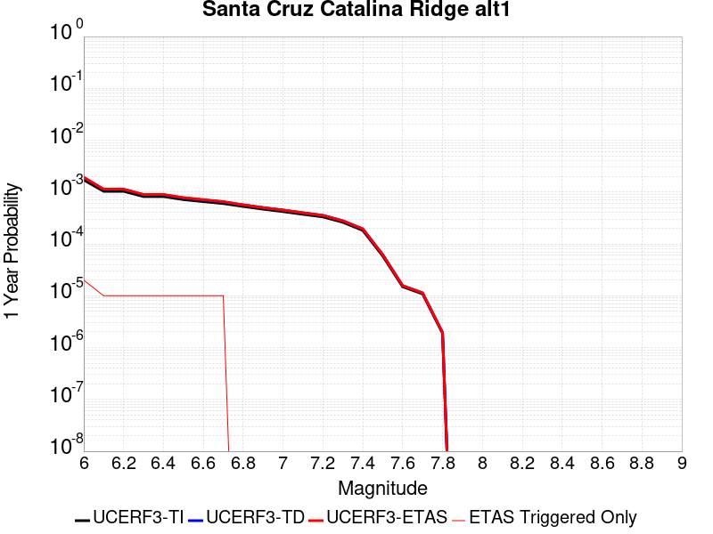 |  |

| Magnitude | 1 wk TI Prob | 1 wk TD Prob | 1 wk ETAS Prob | 1 wk ETAS/TD Gain | 1 wk ETAS Triggered Only | 1 mo TI Prob | 1 mo TD Prob | 1 mo ETAS Prob | 1 mo ETAS/TD Gain | 1 mo ETAS Triggered Only | 1 yr TI Prob | 1 yr TD Prob | 1 yr ETAS Prob | 1 yr ETAS/TD Gain | 1 yr ETAS Triggered Only | 10 yr TI Prob | 10 yr TD Prob | 10 yr ETAS Prob | 10 yr ETAS/TD Gain | 10 yr ETAS Triggered Only |
|-----|-----|-----|-----|-----|-----|-----|-----|-----|-----|-----|-----|-----|-----|-----|-----|-----|-----|-----|-----|-----|
| 6.0 | 3.2833184E-5 | 3.6562866E-5 | 3.6562866E-5 | 1.0 | 0.0 | 1.4070606E-4 | 1.5668952E-4 | 1.5668952E-4 | 1.0 | 0.0 | 0.00171175 | 0.0019061924 | 0.0019308366 | 1.0129285 | 2.4691359E-5 | 0.016986247 | 0.018915322 | 0.018963771 | 1.0025613 | 4.9382717E-5 |
| 6.1 | 1.9835548E-5 | 2.1661635E-5 | 2.1661635E-5 | 1.0 | 0.0 | 8.500672E-5 | 9.283239E-5 | 9.283239E-5 | 1.0 | 0.0 | 0.0010344655 | 0.0011296686 | 0.001154332 | 1.0218325 | 2.4691359E-5 | 0.010296632 | 0.011241395 | 0.011290223 | 1.0043435 | 4.9382717E-5 |
| 6.2 | 1.9835548E-5 | 2.1661635E-5 | 2.1661635E-5 | 1.0 | 0.0 | 8.500672E-5 | 9.283239E-5 | 9.283239E-5 | 1.0 | 0.0 | 0.0010344655 | 0.0011296686 | 0.001154332 | 1.0218325 | 2.4691359E-5 | 0.010296632 | 0.011241395 | 0.011290223 | 1.0043435 | 4.9382717E-5 |
| 6.3 | 1.5728183E-5 | 1.7035456E-5 | 1.7035456E-5 | 1.0 | 0.0 | 6.7404755E-5 | 7.300709E-5 | 7.300709E-5 | 1.0 | 0.0 | 8.2034385E-4 | 8.8850496E-4 | 9.131744E-4 | 1.027765 | 2.4691359E-5 | 0.008173222 | 0.008850207 | 0.008899152 | 1.0055305 | 4.9382717E-5 |
| 6.4 | 1.5728183E-5 | 1.7035456E-5 | 1.7035456E-5 | 1.0 | 0.0 | 6.7404755E-5 | 7.300709E-5 | 7.300709E-5 | 1.0 | 0.0 | 8.2034385E-4 | 8.8850496E-4 | 9.131744E-4 | 1.027765 | 2.4691359E-5 | 0.008173222 | 0.008850207 | 0.008899152 | 1.0055305 | 4.9382717E-5 |
| 6.5 | 1.3707734E-5 | 1.4795771E-5 | 1.4795771E-5 | 1.0 | 0.0 | 5.8746107E-5 | 6.340892E-5 | 6.340892E-5 | 1.0 | 0.0 | 7.1499916E-4 | 7.717337E-4 | 7.96406E-4 | 1.03197 | 2.4691359E-5 | 0.0071270303 | 0.0076909363 | 0.0077399393 | 1.0063715 | 4.9382717E-5 |
| 6.6 | 1.2539813E-5 | 1.3511331E-5 | 1.3511331E-5 | 1.0 | 0.0 | 5.3740947E-5 | 5.7904435E-5 | 5.7904435E-5 | 1.0 | 0.0 | 6.540996E-4 | 7.047612E-4 | 7.294351E-4 | 1.0350103 | 2.4691359E-5 | 0.0065217763 | 0.007025565 | 0.0070500826 | 1.0034899 | 2.4691359E-5 |
| 6.7 | 1.1504083E-5 | 1.2378374E-5 | 1.2378374E-5 | 1.0 | 0.0 | 4.930228E-5 | 5.304911E-5 | 5.304911E-5 | 1.0 | 0.0 | 6.0008996E-4 | 6.456835E-4 | 6.7035895E-4 | 1.038216 | 2.4691359E-5 | 0.005984721 | 0.006438304 | 0.0064628366 | 1.0038104 | 2.4691359E-5 |
| 6.8 | 1.012739E-5 | 1.0877928E-5 | 1.0877928E-5 | 1.0 | 0.0 | 4.340238E-5 | 4.6618865E-5 | 4.6618865E-5 | 1.0 | 0.0 | 5.282958E-4 | 5.674384E-4 | 5.674384E-4 | 1.0 | 0.0 | 0.0052704164 | 0.0056600636 | 0.0056600636 | 1.0 | 0.0 |
| 6.9 | 8.9607865E-6 | 9.6098565E-6 | 9.6098565E-6 | 1.0 | 0.0 | 3.8402806E-5 | 4.1184456E-5 | 4.1184456E-5 | 1.0 | 0.0 | 4.6745385E-4 | 5.0130644E-4 | 5.0130644E-4 | 1.0 | 0.0 | 0.0046647177 | 0.0050018756 | 0.0050018756 | 1.0 | 0.0 |
| 7.0 | 8.046829E-6 | 8.620398E-6 | 8.620398E-6 | 1.0 | 0.0 | 3.4485955E-5 | 3.6944046E-5 | 3.6944046E-5 | 1.0 | 0.0 | 4.1978562E-4 | 4.4970174E-4 | 4.4970174E-4 | 1.0 | 0.0 | 0.004189935 | 0.0044880076 | 0.0044880076 | 1.0 | 0.0 |
| 7.1 | 7.136131E-6 | 7.638227E-6 | 7.638227E-6 | 1.0 | 0.0 | 3.0583058E-5 | 3.273485E-5 | 3.273485E-5 | 1.0 | 0.0 | 3.7228514E-4 | 3.9847463E-4 | 3.9847463E-4 | 1.0 | 0.0 | 0.0037166206 | 0.003977678 | 0.003977678 | 1.0 | 0.0 |
| 7.2 | 6.362014E-6 | 6.8054624E-6 | 6.8054624E-6 | 1.0 | 0.0 | 2.726549E-5 | 2.9165943E-5 | 2.9165943E-5 | 1.0 | 0.0 | 3.3190678E-4 | 3.5503815E-4 | 3.5503815E-4 | 1.0 | 0.0 | 0.0033141149 | 0.0035447779 | 0.0035447779 | 1.0 | 0.0 |
| 7.3 | 5.004101E-6 | 5.3521103E-6 | 5.3521103E-6 | 1.0 | 0.0 | 2.1445969E-5 | 2.2937416E-5 | 2.2937416E-5 | 1.0 | 0.0 | 2.6107338E-4 | 2.792278E-4 | 2.792278E-4 | 1.0 | 0.0 | 0.002607669 | 0.0027888243 | 0.0027888243 | 1.0 | 0.0 |
| 7.4 | 3.4901443E-6 | 3.7323275E-6 | 3.7323275E-6 | 1.0 | 0.0 | 1.4957676E-5 | 1.5995594E-5 | 1.5995594E-5 | 1.0 | 0.0 | 1.8209449E-4 | 1.9472933E-4 | 1.9472933E-4 | 1.0 | 0.0 | 0.0018194534 | 0.0019456256 | 0.0019456256 | 1.0 | 0.0 |
| 7.5 | 1.1215045E-6 | 1.1894638E-6 | 1.1894638E-6 | 1.0 | 0.0 | 4.806439E-6 | 5.097692E-6 | 5.097692E-6 | 1.0 | 0.0 | 5.851682E-5 | 6.206266E-5 | 6.206266E-5 | 1.0 | 0.0 | 5.850142E-4 | 6.2045635E-4 | 6.2045635E-4 | 1.0 | 0.0 |
| 7.6 | 2.8599047E-7 | 2.9953497E-7 | 2.9953497E-7 | 1.0 | 0.0 | 1.2256729E-6 | 1.2837207E-6 | 1.2837207E-6 | 1.0 | 0.0 | 1.4922465E-5 | 1.5629188E-5 | 1.5629188E-5 | 1.0 | 0.0 | 1.4921463E-4 | 1.5628104E-4 | 1.5628104E-4 | 1.0 | 0.0 |
| 7.7 | 2.0781519E-7 | 2.1745393E-7 | 2.1745393E-7 | 1.0 | 0.0 | 8.906362E-7 | 9.3194507E-7 | 9.3194507E-7 | 1.0 | 0.0 | 1.08434415E-5 | 1.1346373E-5 | 1.1346373E-5 | 1.0 | 0.0 | 1.0842913E-4 | 1.1345803E-4 | 1.1345803E-4 | 1.0 | 0.0 |
| 7.8 | 3.614776E-8 | 3.7642668E-8 | 3.7642668E-8 | 1.0 | 0.0 | 1.5491896E-7 | 1.6132572E-7 | 1.6132572E-7 | 1.0 | 0.0 | 1.8861368E-6 | 1.9641388E-6 | 1.9641388E-6 | 1.0 | 0.0 | 1.8861208E-5 | 1.9641227E-5 | 1.9641227E-5 | 1.0 | 0.0 |

## Tin Mountain
*[(top)](#table-of-contents)*

| 1 Week | 1 Month | 1 Year | 10 Year |
|-----|-----|-----|-----|
|  |  |  |  |

| Magnitude | 1 wk TI Prob | 1 wk TD Prob | 1 wk ETAS Prob | 1 wk ETAS/TD Gain | 1 wk ETAS Triggered Only | 1 mo TI Prob | 1 mo TD Prob | 1 mo ETAS Prob | 1 mo ETAS/TD Gain | 1 mo ETAS Triggered Only | 1 yr TI Prob | 1 yr TD Prob | 1 yr ETAS Prob | 1 yr ETAS/TD Gain | 1 yr ETAS Triggered Only | 10 yr TI Prob | 10 yr TD Prob | 10 yr ETAS Prob | 10 yr ETAS/TD Gain | 10 yr ETAS Triggered Only |
|-----|-----|-----|-----|-----|-----|-----|-----|-----|-----|-----|-----|-----|-----|-----|-----|-----|-----|-----|-----|-----|
| 6.0 | 4.083776E-6 | 4.1816434E-6 | 4.1816434E-6 | 1.0 | 0.0 | 1.750178E-5 | 1.7921226E-5 | 1.7921226E-5 | 1.0 | 0.0 | 2.1306332E-4 | 2.181728E-4 | 2.4285878E-4 | 1.1131487 | 2.4691359E-5 | 0.0021285915 | 0.0021799519 | 0.002229227 | 1.0226038 | 4.9382717E-5 |
| 6.1 | 4.083776E-6 | 4.1816434E-6 | 4.1816434E-6 | 1.0 | 0.0 | 1.750178E-5 | 1.7921226E-5 | 1.7921226E-5 | 1.0 | 0.0 | 2.1306332E-4 | 2.181728E-4 | 2.4285878E-4 | 1.1131487 | 2.4691359E-5 | 0.0021285915 | 0.0021799519 | 0.002229227 | 1.0226038 | 4.9382717E-5 |
| 6.2 | 4.083776E-6 | 4.1816434E-6 | 4.1816434E-6 | 1.0 | 0.0 | 1.750178E-5 | 1.7921226E-5 | 1.7921226E-5 | 1.0 | 0.0 | 2.1306332E-4 | 2.181728E-4 | 2.4285878E-4 | 1.1131487 | 2.4691359E-5 | 0.0021285915 | 0.0021799519 | 0.002229227 | 1.0226038 | 4.9382717E-5 |
| 6.3 | 4.083776E-6 | 4.1816434E-6 | 4.1816434E-6 | 1.0 | 0.0 | 1.750178E-5 | 1.7921226E-5 | 1.7921226E-5 | 1.0 | 0.0 | 2.1306332E-4 | 2.181728E-4 | 2.4285878E-4 | 1.1131487 | 2.4691359E-5 | 0.0021285915 | 0.0021799519 | 0.002229227 | 1.0226038 | 4.9382717E-5 |
| 6.4 | 4.083776E-6 | 4.1816434E-6 | 4.1816434E-6 | 1.0 | 0.0 | 1.750178E-5 | 1.7921226E-5 | 1.7921226E-5 | 1.0 | 0.0 | 2.1306332E-4 | 2.181728E-4 | 2.4285878E-4 | 1.1131487 | 2.4691359E-5 | 0.0021285915 | 0.0021799519 | 0.002229227 | 1.0226038 | 4.9382717E-5 |
| 6.5 | 2.3143427E-6 | 2.3732214E-6 | 2.3732214E-6 | 1.0 | 0.0 | 9.9185745E-6 | 1.0170914E-5 | 1.0170914E-5 | 1.0 | 0.0 | 1.2075195E-4 | 1.2382462E-4 | 1.2382462E-4 | 1.0 | 0.0 | 0.0012068636 | 0.0012376321 | 0.001262293 | 1.0199258 | 2.4691359E-5 |
| 6.6 | 2.3143427E-6 | 2.3732214E-6 | 2.3732214E-6 | 1.0 | 0.0 | 9.9185745E-6 | 1.0170914E-5 | 1.0170914E-5 | 1.0 | 0.0 | 1.2075195E-4 | 1.2382462E-4 | 1.2382462E-4 | 1.0 | 0.0 | 0.0012068636 | 0.0012376321 | 0.001262293 | 1.0199258 | 2.4691359E-5 |
| 6.7 | 1.7029532E-6 | 1.7498428E-6 | 1.7498428E-6 | 1.0 | 0.0 | 7.2983503E-6 | 7.4993077E-6 | 7.4993077E-6 | 1.0 | 0.0 | 8.885379E-5 | 9.130078E-5 | 9.130078E-5 | 1.0 | 0.0 | 8.881827E-4 | 9.1268535E-4 | 9.1268535E-4 | 1.0 | 0.0 |
| 6.8 | 1.2914646E-6 | 1.3299801E-6 | 1.3299801E-6 | 1.0 | 0.0 | 5.534837E-6 | 5.699905E-6 | 5.699905E-6 | 1.0 | 0.0 | 6.738455E-5 | 6.939458E-5 | 6.939458E-5 | 1.0 | 0.0 | 6.736412E-4 | 6.937724E-4 | 6.937724E-4 | 1.0 | 0.0 |
| 6.9 | 5.8708974E-7 | 6.1172665E-7 | 6.1172665E-7 | 1.0 | 0.0 | 2.5160964E-6 | 2.6216833E-6 | 2.6216833E-6 | 1.0 | 0.0 | 3.0633044E-5 | 3.1918567E-5 | 3.1918567E-5 | 1.0 | 0.0 | 3.0628822E-4 | 3.1914393E-4 | 3.1914393E-4 | 1.0 | 0.0 |
| 7.0 | 4.6248786E-7 | 4.8322454E-7 | 4.8322454E-7 | 1.0 | 0.0 | 1.9820893E-6 | 2.0709608E-6 | 2.0709608E-6 | 1.0 | 0.0 | 2.413167E-5 | 2.5213694E-5 | 2.5213694E-5 | 1.0 | 0.0 | 2.412905E-4 | 2.5211202E-4 | 2.5211202E-4 | 1.0 | 0.0 |
| 7.1 | 3.804606E-7 | 3.98735E-7 | 3.98735E-7 | 1.0 | 0.0 | 1.6305444E-6 | 1.7088635E-6 | 1.7088635E-6 | 1.0 | 0.0 | 1.9851697E-5 | 2.0805248E-5 | 2.0805248E-5 | 1.0 | 0.0 | 1.9849923E-4 | 2.0803636E-4 | 2.0803636E-4 | 1.0 | 0.0 |
| 7.2 | 3.5864858E-7 | 3.7618813E-7 | 3.7618813E-7 | 1.0 | 0.0 | 1.5370645E-6 | 1.6122341E-6 | 1.6122341E-6 | 1.0 | 0.0 | 1.87136E-5 | 1.9628807E-5 | 1.9628807E-5 | 1.0 | 0.0 | 1.8712023E-4 | 1.9627405E-4 | 1.9627405E-4 | 1.0 | 0.0 |
| 7.3 | 3.342063E-7 | 3.50653E-7 | 3.50653E-7 | 1.0 | 0.0 | 1.4323119E-6 | 1.502798E-6 | 1.502798E-6 | 1.0 | 0.0 | 1.7438259E-5 | 1.8296445E-5 | 1.8296445E-5 | 1.0 | 0.0 | 1.743689E-4 | 1.8295269E-4 | 1.8295269E-4 | 1.0 | 0.0 |
| 7.4 | 2.971242E-7 | 3.1167437E-7 | 3.1167437E-7 | 1.0 | 0.0 | 1.2733886E-6 | 1.3357468E-6 | 1.3357468E-6 | 1.0 | 0.0 | 1.5503398E-5 | 1.626263E-5 | 1.626263E-5 | 1.0 | 0.0 | 1.5502315E-4 | 1.6261767E-4 | 1.6261767E-4 | 1.0 | 0.0 |
| 7.5 | 1.4326713E-7 | 1.5013286E-7 | 1.5013286E-7 | 1.0 | 0.0 | 6.140018E-7 | 6.434266E-7 | 6.434266E-7 | 1.0 | 0.0 | 7.4754466E-6 | 7.833718E-6 | 7.833718E-6 | 1.0 | 0.0 | 7.475195E-5 | 7.833719E-5 | 7.833719E-5 | 1.0 | 0.0 |

## Deep Springs
*[(top)](#table-of-contents)*

| 1 Week | 1 Month | 1 Year | 10 Year |
|-----|-----|-----|-----|
|  |  |  |  |

| Magnitude | 1 wk TI Prob | 1 wk TD Prob | 1 wk ETAS Prob | 1 wk ETAS/TD Gain | 1 wk ETAS Triggered Only | 1 mo TI Prob | 1 mo TD Prob | 1 mo ETAS Prob | 1 mo ETAS/TD Gain | 1 mo ETAS Triggered Only | 1 yr TI Prob | 1 yr TD Prob | 1 yr ETAS Prob | 1 yr ETAS/TD Gain | 1 yr ETAS Triggered Only | 10 yr TI Prob | 10 yr TD Prob | 10 yr ETAS Prob | 10 yr ETAS/TD Gain | 10 yr ETAS Triggered Only |
|-----|-----|-----|-----|-----|-----|-----|-----|-----|-----|-----|-----|-----|-----|-----|-----|-----|-----|-----|-----|-----|
| 6.0 | 1.9810619E-5 | 2.3116607E-5 | 2.3116607E-5 | 1.0 | 0.0 | 8.489989E-5 | 9.9070276E-5 | 9.9070276E-5 | 1.0 | 0.0 | 0.001033166 | 0.001206021 | 0.001206021 | 1.0 | 0.0 | 0.010283757 | 0.01204455 | 0.012068944 | 1.0020254 | 2.4691359E-5 |
| 6.1 | 1.9810619E-5 | 2.3116607E-5 | 2.3116607E-5 | 1.0 | 0.0 | 8.489989E-5 | 9.9070276E-5 | 9.9070276E-5 | 1.0 | 0.0 | 0.001033166 | 0.001206021 | 0.001206021 | 1.0 | 0.0 | 0.010283757 | 0.01204455 | 0.012068944 | 1.0020254 | 2.4691359E-5 |
| 6.2 | 1.9810619E-5 | 2.3116607E-5 | 2.3116607E-5 | 1.0 | 0.0 | 8.489989E-5 | 9.9070276E-5 | 9.9070276E-5 | 1.0 | 0.0 | 0.001033166 | 0.001206021 | 0.001206021 | 1.0 | 0.0 | 0.010283757 | 0.01204455 | 0.012068944 | 1.0020254 | 2.4691359E-5 |
| 6.3 | 1.9810619E-5 | 2.3116607E-5 | 2.3116607E-5 | 1.0 | 0.0 | 8.489989E-5 | 9.9070276E-5 | 9.9070276E-5 | 1.0 | 0.0 | 0.001033166 | 0.001206021 | 0.001206021 | 1.0 | 0.0 | 0.010283757 | 0.01204455 | 0.012068944 | 1.0020254 | 2.4691359E-5 |
| 6.4 | 1.9810619E-5 | 2.3116607E-5 | 2.3116607E-5 | 1.0 | 0.0 | 8.489989E-5 | 9.9070276E-5 | 9.9070276E-5 | 1.0 | 0.0 | 0.001033166 | 0.001206021 | 0.001206021 | 1.0 | 0.0 | 0.010283757 | 0.01204455 | 0.012068944 | 1.0020254 | 2.4691359E-5 |
| 6.5 | 1.7190405E-5 | 2.0054096E-5 | 2.0054096E-5 | 1.0 | 0.0 | 7.367108E-5 | 8.594612E-5 | 8.594612E-5 | 1.0 | 0.0 | 8.9657627E-4 | 0.001046394 | 0.001046394 | 1.0 | 0.0 | 0.008929676 | 0.010463902 | 0.010488335 | 1.002335 | 2.4691359E-5 |
| 6.6 | 1.7190405E-5 | 2.0054096E-5 | 2.0054096E-5 | 1.0 | 0.0 | 7.367108E-5 | 8.594612E-5 | 8.594612E-5 | 1.0 | 0.0 | 8.9657627E-4 | 0.001046394 | 0.001046394 | 1.0 | 0.0 | 0.008929676 | 0.010463902 | 0.010488335 | 1.002335 | 2.4691359E-5 |

## Great Valley 08 (Quinto)
*[(top)](#table-of-contents)*

| 1 Week | 1 Month | 1 Year | 10 Year |
|-----|-----|-----|-----|
|  |  |  |  |

| Magnitude | 1 wk TI Prob | 1 wk TD Prob | 1 wk ETAS Prob | 1 wk ETAS/TD Gain | 1 wk ETAS Triggered Only | 1 mo TI Prob | 1 mo TD Prob | 1 mo ETAS Prob | 1 mo ETAS/TD Gain | 1 mo ETAS Triggered Only | 1 yr TI Prob | 1 yr TD Prob | 1 yr ETAS Prob | 1 yr ETAS/TD Gain | 1 yr ETAS Triggered Only | 10 yr TI Prob | 10 yr TD Prob | 10 yr ETAS Prob | 10 yr ETAS/TD Gain | 10 yr ETAS Triggered Only |
|-----|-----|-----|-----|-----|-----|-----|-----|-----|-----|-----|-----|-----|-----|-----|-----|-----|-----|-----|-----|-----|
| 6.0 | 7.737697E-6 | 8.253623E-6 | 8.253623E-6 | 1.0 | 0.0 | 3.3161137E-5 | 3.5372297E-5 | 3.5372297E-5 | 1.0 | 0.0 | 4.0366207E-4 | 4.3059146E-4 | 4.3059146E-4 | 1.0 | 0.0 | 0.004029296 | 0.0042994246 | 0.0043240096 | 1.0057182 | 2.4691359E-5 |
| 6.1 | 7.737697E-6 | 8.253623E-6 | 8.253623E-6 | 1.0 | 0.0 | 3.3161137E-5 | 3.5372297E-5 | 3.5372297E-5 | 1.0 | 0.0 | 4.0366207E-4 | 4.3059146E-4 | 4.3059146E-4 | 1.0 | 0.0 | 0.004029296 | 0.0042994246 | 0.0043240096 | 1.0057182 | 2.4691359E-5 |
| 6.2 | 7.737697E-6 | 8.253623E-6 | 8.253623E-6 | 1.0 | 0.0 | 3.3161137E-5 | 3.5372297E-5 | 3.5372297E-5 | 1.0 | 0.0 | 4.0366207E-4 | 4.3059146E-4 | 4.3059146E-4 | 1.0 | 0.0 | 0.004029296 | 0.0042994246 | 0.0043240096 | 1.0057182 | 2.4691359E-5 |
| 6.3 | 5.374012E-6 | 5.7510024E-6 | 5.7510024E-6 | 1.0 | 0.0 | 2.3031276E-5 | 2.4646983E-5 | 2.4646983E-5 | 1.0 | 0.0 | 2.803697E-4 | 3.0004684E-4 | 3.0004684E-4 | 1.0 | 0.0 | 0.0028001624 | 0.0029975108 | 0.003022128 | 1.0082126 | 2.4691359E-5 |
| 6.4 | 5.374012E-6 | 5.7510024E-6 | 5.7510024E-6 | 1.0 | 0.0 | 2.3031276E-5 | 2.4646983E-5 | 2.4646983E-5 | 1.0 | 0.0 | 2.803697E-4 | 3.0004684E-4 | 3.0004684E-4 | 1.0 | 0.0 | 0.0028001624 | 0.0029975108 | 0.003022128 | 1.0082126 | 2.4691359E-5 |
| 6.5 | 3.65427E-6 | 3.9416527E-6 | 3.9416527E-6 | 1.0 | 0.0 | 1.5661062E-5 | 1.6892729E-5 | 1.6892729E-5 | 1.0 | 0.0 | 1.9065675E-4 | 2.056566E-4 | 2.056566E-4 | 1.0 | 0.0 | 0.0019049325 | 0.0020553546 | 0.0020799953 | 1.0119885 | 2.4691359E-5 |
| 6.6 | 3.6143538E-6 | 3.898836E-6 | 3.898836E-6 | 1.0 | 0.0 | 1.5489995E-5 | 1.6709231E-5 | 1.6709231E-5 | 1.0 | 0.0 | 1.8857437E-4 | 2.0342294E-4 | 2.0342294E-4 | 1.0 | 0.0 | 0.0018841444 | 0.002033059 | 0.0020577002 | 1.0121202 | 2.4691359E-5 |
| 6.7 | 2.4821015E-6 | 2.685941E-6 | 2.685941E-6 | 1.0 | 0.0 | 1.0637535E-5 | 1.1511156E-5 | 1.1511156E-5 | 1.0 | 0.0 | 1.2950429E-4 | 1.4014497E-4 | 1.4014497E-4 | 1.0 | 0.0 | 0.0012942884 | 0.0014011209 | 0.0014011209 | 1.0 | 0.0 |
| 6.8 | 4.7110538E-7 | 5.193585E-7 | 5.193585E-7 | 1.0 | 0.0 | 2.0190216E-6 | 2.2258203E-6 | 2.2258203E-6 | 1.0 | 0.0 | 2.458131E-5 | 2.7099044E-5 | 2.7099044E-5 | 1.0 | 0.0 | 2.457859E-4 | 2.709592E-4 | 2.709592E-4 | 1.0 | 0.0 |
| 6.9 | 3.958685E-7 | 4.3708278E-7 | 4.3708278E-7 | 1.0 | 0.0 | 1.6965782E-6 | 1.8732106E-6 | 1.8732106E-6 | 1.0 | 0.0 | 2.0655643E-5 | 2.2806116E-5 | 2.2806116E-5 | 1.0 | 0.0 | 2.0653724E-4 | 2.2803938E-4 | 2.2803938E-4 | 1.0 | 0.0 |
| 7.0 | 2.70294E-7 | 2.9923405E-7 | 2.9923405E-7 | 1.0 | 0.0 | 1.1584025E-6 | 1.2824311E-6 | 1.2824311E-6 | 1.0 | 0.0 | 1.4103458E-5 | 1.56135E-5 | 1.56135E-5 | 1.0 | 0.0 | 1.4102564E-4 | 1.561253E-4 | 1.561253E-4 | 1.0 | 0.0 |
| 7.1 | 1.4828602E-7 | 1.647104E-7 | 1.647104E-7 | 1.0 | 0.0 | 6.3551136E-7 | 7.059016E-7 | 7.059016E-7 | 1.0 | 0.0 | 7.737323E-6 | 8.594327E-6 | 8.594327E-6 | 1.0 | 0.0 | 7.737054E-5 | 8.594074E-5 | 8.594074E-5 | 1.0 | 0.0 |

## San Clemente
*[(top)](#table-of-contents)*

| 1 Week | 1 Month | 1 Year | 10 Year |
|-----|-----|-----|-----|
|  |  |  |  |

| Magnitude | 1 wk TI Prob | 1 wk TD Prob | 1 wk ETAS Prob | 1 wk ETAS/TD Gain | 1 wk ETAS Triggered Only | 1 mo TI Prob | 1 mo TD Prob | 1 mo ETAS Prob | 1 mo ETAS/TD Gain | 1 mo ETAS Triggered Only | 1 yr TI Prob | 1 yr TD Prob | 1 yr ETAS Prob | 1 yr ETAS/TD Gain | 1 yr ETAS Triggered Only | 10 yr TI Prob | 10 yr TD Prob | 10 yr ETAS Prob | 10 yr ETAS/TD Gain | 10 yr ETAS Triggered Only |
|-----|-----|-----|-----|-----|-----|-----|-----|-----|-----|-----|-----|-----|-----|-----|-----|-----|-----|-----|-----|-----|
| 6.0 | 6.681379E-5 | 8.165395E-5 | 8.165395E-5 | 1.0 | 0.0 | 2.8631336E-4 | 3.4990182E-4 | 3.4990182E-4 | 1.0 | 0.0 | 0.003480294 | 0.0042523127 | 0.0042523127 | 1.0 | 0.0 | 0.03426291 | 0.041765325 | 0.041788988 | 1.0005665 | 2.4691359E-5 |
| 6.1 | 6.681379E-5 | 8.165395E-5 | 8.165395E-5 | 1.0 | 0.0 | 2.8631336E-4 | 3.4990182E-4 | 3.4990182E-4 | 1.0 | 0.0 | 0.003480294 | 0.0042523127 | 0.0042523127 | 1.0 | 0.0 | 0.03426291 | 0.041765325 | 0.041788988 | 1.0005665 | 2.4691359E-5 |
| 6.2 | 3.9400576E-5 | 4.646092E-5 | 4.646092E-5 | 1.0 | 0.0 | 1.6884868E-4 | 1.991034E-4 | 1.991034E-4 | 1.0 | 0.0 | 0.0020537945 | 0.0024214499 | 0.0024214499 | 1.0 | 0.0 | 0.020349167 | 0.02395738 | 0.02398148 | 1.0010059 | 2.4691359E-5 |
| 6.3 | 3.2590255E-5 | 3.793572E-5 | 3.793572E-5 | 1.0 | 0.0 | 1.3966505E-4 | 1.625717E-4 | 1.625717E-4 | 1.0 | 0.0 | 0.0016990956 | 0.0019775438 | 0.0019775438 | 1.0 | 0.0 | 0.01686163 | 0.019603258 | 0.019603258 | 1.0 | 0.0 |
| 6.4 | 2.9454652E-5 | 3.4103497E-5 | 3.4103497E-5 | 1.0 | 0.0 | 1.2622811E-4 | 1.461498E-4 | 1.461498E-4 | 1.0 | 0.0 | 0.0015357438 | 0.0017779461 | 0.0017779461 | 1.0 | 0.0 | 0.015251739 | 0.017640395 | 0.017640395 | 1.0 | 0.0 |
| 6.5 | 2.790836E-5 | 3.2252792E-5 | 3.2252792E-5 | 1.0 | 0.0 | 1.1960178E-4 | 1.3821907E-4 | 1.3821907E-4 | 1.0 | 0.0 | 0.001455179 | 0.0016815432 | 0.0016815432 | 1.0 | 0.0 | 0.014456868 | 0.016691217 | 0.016691217 | 1.0 | 0.0 |
| 6.6 | 2.2492153E-5 | 2.5766682E-5 | 2.5766682E-5 | 1.0 | 0.0 | 9.639138E-5 | 1.1042405E-4 | 1.1042405E-4 | 1.0 | 0.0 | 0.0011729331 | 0.0013435985 | 0.0013435985 | 1.0 | 0.0 | 0.011667615 | 0.013356468 | 0.013356468 | 1.0 | 0.0 |
| 6.7 | 1.9862755E-5 | 2.2669825E-5 | 2.2669825E-5 | 1.0 | 0.0 | 8.512331E-5 | 9.7152835E-5 | 9.7152835E-5 | 1.0 | 0.0 | 0.0010358836 | 0.0011822052 | 0.0011822052 | 1.0 | 0.0 | 0.010310682 | 0.011760455 | 0.011760455 | 1.0 | 0.0 |
| 6.8 | 1.6697575E-5 | 1.8980461E-5 | 1.8980461E-5 | 1.0 | 0.0 | 7.155907E-5 | 8.1342354E-5 | 8.1342354E-5 | 1.0 | 0.0 | 8.7088346E-4 | 9.899025E-4 | 9.899025E-4 | 1.0 | 0.0 | 0.008674784 | 0.009855959 | 0.009855959 | 1.0 | 0.0 |
| 6.9 | 1.5218415E-5 | 1.7271872E-5 | 1.7271872E-5 | 1.0 | 0.0 | 6.522015E-5 | 7.402025E-5 | 7.402025E-5 | 1.0 | 0.0 | 7.93766E-4 | 9.008328E-4 | 9.008328E-4 | 1.0 | 0.0 | 0.007909367 | 0.008972758 | 0.008972758 | 1.0 | 0.0 |
| 7.0 | 1.2392958E-5 | 1.4034987E-5 | 1.4034987E-5 | 1.0 | 0.0 | 5.3111595E-5 | 6.01486E-5 | 6.01486E-5 | 1.0 | 0.0 | 6.4644177E-4 | 7.320707E-4 | 7.320707E-4 | 1.0 | 0.0 | 0.0064456454 | 0.0072973776 | 0.0072973776 | 1.0 | 0.0 |
| 7.1 | 1.0934128E-5 | 1.2376869E-5 | 1.2376869E-5 | 1.0 | 0.0 | 4.6859706E-5 | 5.3042688E-5 | 5.3042688E-5 | 1.0 | 0.0 | 5.7036756E-4 | 6.456107E-4 | 6.456107E-4 | 1.0 | 0.0 | 0.0056890585 | 0.0064380975 | 0.0064380975 | 1.0 | 0.0 |
| 7.2 | 9.5798805E-6 | 1.0846455E-5 | 1.0846455E-5 | 1.0 | 0.0 | 4.1055984E-5 | 4.648402E-5 | 4.648402E-5 | 1.0 | 0.0 | 4.9974193E-4 | 5.658032E-4 | 5.658032E-4 | 1.0 | 0.0 | 0.0049861963 | 0.0056443503 | 0.0056443503 | 1.0 | 0.0 |
| 7.3 | 8.0167365E-6 | 9.085201E-6 | 9.085201E-6 | 1.0 | 0.0 | 3.4356988E-5 | 3.8936032E-5 | 3.8936032E-5 | 1.0 | 0.0 | 4.1821605E-4 | 4.7395015E-4 | 4.7395015E-4 | 1.0 | 0.0 | 0.0041742986 | 0.0047300966 | 0.0047300966 | 1.0 | 0.0 |
| 7.4 | 2.9581017E-6 | 3.362867E-6 | 3.362867E-6 | 1.0 | 0.0 | 1.2677518E-5 | 1.4412235E-5 | 1.4412235E-5 | 1.0 | 0.0 | 1.5433785E-4 | 1.7545988E-4 | 1.7545988E-4 | 1.0 | 0.0 | 0.001542307 | 0.0017537087 | 0.0017537087 | 1.0 | 0.0 |

## Ventura-Pitas Point
*[(top)](#table-of-contents)*

| 1 Week | 1 Month | 1 Year | 10 Year |
|-----|-----|-----|-----|
|  |  |  |  |

| Magnitude | 1 wk TI Prob | 1 wk TD Prob | 1 wk ETAS Prob | 1 wk ETAS/TD Gain | 1 wk ETAS Triggered Only | 1 mo TI Prob | 1 mo TD Prob | 1 mo ETAS Prob | 1 mo ETAS/TD Gain | 1 mo ETAS Triggered Only | 1 yr TI Prob | 1 yr TD Prob | 1 yr ETAS Prob | 1 yr ETAS/TD Gain | 1 yr ETAS Triggered Only | 10 yr TI Prob | 10 yr TD Prob | 10 yr ETAS Prob | 10 yr ETAS/TD Gain | 10 yr ETAS Triggered Only |
|-----|-----|-----|-----|-----|-----|-----|-----|-----|-----|-----|-----|-----|-----|-----|-----|-----|-----|-----|-----|-----|
| 6.0 | 3.3179622E-5 | 3.3741548E-5 | 3.3741548E-5 | 1.0 | 0.0 | 1.4219063E-4 | 1.4460007E-4 | 1.4460007E-4 | 1.0 | 0.0 | 0.0017297962 | 0.0017593412 | 0.0017593412 | 1.0 | 0.0 | 0.017163932 | 0.017479673 | 0.017503932 | 1.0013878 | 2.4691359E-5 |
| 6.1 | 3.3179622E-5 | 3.3741548E-5 | 3.3741548E-5 | 1.0 | 0.0 | 1.4219063E-4 | 1.4460007E-4 | 1.4460007E-4 | 1.0 | 0.0 | 0.0017297962 | 0.0017593412 | 0.0017593412 | 1.0 | 0.0 | 0.017163932 | 0.017479673 | 0.017503932 | 1.0013878 | 2.4691359E-5 |
| 6.2 | 3.3179622E-5 | 3.3741548E-5 | 3.3741548E-5 | 1.0 | 0.0 | 1.4219063E-4 | 1.4460007E-4 | 1.4460007E-4 | 1.0 | 0.0 | 0.0017297962 | 0.0017593412 | 0.0017593412 | 1.0 | 0.0 | 0.017163932 | 0.017479673 | 0.017503932 | 1.0013878 | 2.4691359E-5 |
| 6.3 | 3.3179622E-5 | 3.3741548E-5 | 3.3741548E-5 | 1.0 | 0.0 | 1.4219063E-4 | 1.4460007E-4 | 1.4460007E-4 | 1.0 | 0.0 | 0.0017297962 | 0.0017593412 | 0.0017593412 | 1.0 | 0.0 | 0.017163932 | 0.017479673 | 0.017503932 | 1.0013878 | 2.4691359E-5 |
| 6.4 | 1.8754668E-5 | 1.702315E-5 | 1.702315E-5 | 1.0 | 0.0 | 8.037467E-5 | 7.295445E-5 | 7.295445E-5 | 1.0 | 0.0 | 9.781223E-4 | 8.8788156E-4 | 8.8788156E-4 | 1.0 | 0.0 | 0.009738282 | 0.008845679 | 0.008870152 | 1.0027666 | 2.4691359E-5 |
| 6.5 | 1.8754668E-5 | 1.702315E-5 | 1.702315E-5 | 1.0 | 0.0 | 8.037467E-5 | 7.295445E-5 | 7.295445E-5 | 1.0 | 0.0 | 9.781223E-4 | 8.8788156E-4 | 8.8788156E-4 | 1.0 | 0.0 | 0.009738282 | 0.008845679 | 0.008870152 | 1.0027666 | 2.4691359E-5 |
| 6.6 | 1.4361558E-5 | 1.2125218E-5 | 1.2125218E-5 | 1.0 | 0.0 | 6.154808E-5 | 5.1964198E-5 | 5.1964198E-5 | 1.0 | 0.0 | 7.490902E-4 | 6.3248276E-4 | 6.3248276E-4 | 1.0 | 0.0 | 0.0074657016 | 0.0063070836 | 0.0063070836 | 1.0 | 0.0 |
| 6.7 | 1.4361558E-5 | 1.2125218E-5 | 1.2125218E-5 | 1.0 | 0.0 | 6.154808E-5 | 5.1964198E-5 | 5.1964198E-5 | 1.0 | 0.0 | 7.490902E-4 | 6.3248276E-4 | 6.3248276E-4 | 1.0 | 0.0 | 0.0074657016 | 0.0063070836 | 0.0063070836 | 1.0 | 0.0 |
| 6.8 | 1.3663846E-5 | 1.1347266E-5 | 1.1347266E-5 | 1.0 | 0.0 | 5.8558027E-5 | 4.8630245E-5 | 4.8630245E-5 | 1.0 | 0.0 | 7.127108E-4 | 5.9191434E-4 | 5.9191434E-4 | 1.0 | 0.0 | 0.007104293 | 0.0059035937 | 0.0059035937 | 1.0 | 0.0 |
| 6.9 | 1.3644157E-5 | 1.13253645E-5 | 1.13253645E-5 | 1.0 | 0.0 | 5.8473648E-5 | 4.853638E-5 | 4.853638E-5 | 1.0 | 0.0 | 7.116841E-4 | 5.907722E-4 | 5.907722E-4 | 1.0 | 0.0 | 0.007094092 | 0.0058922325 | 0.0058922325 | 1.0 | 0.0 |
| 7.0 | 1.3568845E-5 | 1.1244919E-5 | 1.1244919E-5 | 1.0 | 0.0 | 5.8150898E-5 | 4.8191632E-5 | 4.8191632E-5 | 1.0 | 0.0 | 7.077572E-4 | 5.865771E-4 | 5.865771E-4 | 1.0 | 0.0 | 0.007055073 | 0.0058505037 | 0.0058505037 | 1.0 | 0.0 |
| 7.1 | 1.306572E-5 | 1.07233E-5 | 1.07233E-5 | 1.0 | 0.0 | 5.599474E-5 | 4.59562E-5 | 4.59562E-5 | 1.0 | 0.0 | 6.815227E-4 | 5.59375E-4 | 5.59375E-4 | 1.0 | 0.0 | 0.0067943637 | 0.005579875 | 0.005579875 | 1.0 | 0.0 |
| 7.2 | 1.232604E-5 | 9.997771E-6 | 9.997771E-6 | 1.0 | 0.0 | 5.2824813E-5 | 4.2846896E-5 | 4.2846896E-5 | 1.0 | 0.0 | 6.429523E-4 | 5.2153785E-4 | 5.2153785E-4 | 1.0 | 0.0 | 0.0064109527 | 0.005203331 | 0.005203331 | 1.0 | 0.0 |
| 7.3 | 1.0917261E-5 | 8.844931E-6 | 8.844931E-6 | 1.0 | 0.0 | 4.678742E-5 | 3.7906306E-5 | 3.7906306E-5 | 1.0 | 0.0 | 5.69488E-4 | 4.614131E-4 | 4.614131E-4 | 1.0 | 0.0 | 0.0056803077 | 0.0046047163 | 0.0046047163 | 1.0 | 0.0 |
| 7.4 | 1.039959E-5 | 8.424578E-6 | 8.424578E-6 | 1.0 | 0.0 | 4.456891E-5 | 3.610484E-5 | 3.610484E-5 | 1.0 | 0.0 | 5.424914E-4 | 4.3948932E-4 | 4.3948932E-4 | 1.0 | 0.0 | 0.0054116896 | 0.0043863636 | 0.0043863636 | 1.0 | 0.0 |
| 7.5 | 9.015877E-6 | 7.2983166E-6 | 7.2983166E-6 | 1.0 | 0.0 | 3.86389E-5 | 3.1278134E-5 | 3.1278134E-5 | 1.0 | 0.0 | 4.7032707E-4 | 3.8074612E-4 | 3.8074612E-4 | 1.0 | 0.0 | 0.004693329 | 0.0038010832 | 0.0038010832 | 1.0 | 0.0 |
| 7.6 | 4.900162E-6 | 3.8744192E-6 | 3.8744192E-6 | 1.0 | 0.0 | 2.1000526E-5 | 1.6604548E-5 | 1.6604548E-5 | 1.0 | 0.0 | 2.556514E-4 | 2.0214175E-4 | 2.0214175E-4 | 1.0 | 0.0 | 0.0025535747 | 0.0020195926 | 0.0020195926 | 1.0 | 0.0 |
| 7.7 | 3.8850626E-6 | 3.1269603E-6 | 3.1269603E-6 | 1.0 | 0.0 | 1.6650163E-5 | 1.3401191E-5 | 1.3401191E-5 | 1.0 | 0.0 | 2.0269687E-4 | 1.6314737E-4 | 1.6314737E-4 | 1.0 | 0.0 | 0.002025121 | 0.0016302853 | 0.0016302853 | 1.0 | 0.0 |
| 7.8 | 2.4654719E-6 | 2.0300135E-6 | 2.0300135E-6 | 1.0 | 0.0 | 1.0566265E-5 | 8.700029E-6 | 8.700029E-6 | 1.0 | 0.0 | 1.2863669E-4 | 1.0591775E-4 | 1.0591775E-4 | 1.0 | 0.0 | 0.0012856225 | 0.0010586774 | 0.0010586774 | 1.0 | 0.0 |
| 7.9 | 4.095894E-7 | 3.2767406E-7 | 3.2767406E-7 | 1.0 | 0.0 | 1.7553821E-6 | 1.4043167E-6 | 1.4043167E-6 | 1.0 | 0.0 | 2.1371567E-5 | 1.7097424E-5 | 1.7097424E-5 | 1.0 | 0.0 | 2.1369511E-4 | 1.709614E-4 | 1.709614E-4 | 1.0 | 0.0 |
| 8.0 | 7.791402E-9 | 5.683946E-9 | 5.683946E-9 | 1.0 | 0.0 | 3.3391725E-8 | 2.435977E-8 | 2.435977E-8 | 1.0 | 0.0 | 4.0654416E-7 | 2.9658017E-7 | 2.9658017E-7 | 1.0 | 0.0 | 4.065434E-6 | 2.9657997E-6 | 2.9657997E-6 | 1.0 | 0.0 |

## North Frontal  (West)
*[(top)](#table-of-contents)*

| 1 Week | 1 Month | 1 Year | 10 Year |
|-----|-----|-----|-----|
|  |  |  |  |

| Magnitude | 1 wk TI Prob | 1 wk TD Prob | 1 wk ETAS Prob | 1 wk ETAS/TD Gain | 1 wk ETAS Triggered Only | 1 mo TI Prob | 1 mo TD Prob | 1 mo ETAS Prob | 1 mo ETAS/TD Gain | 1 mo ETAS Triggered Only | 1 yr TI Prob | 1 yr TD Prob | 1 yr ETAS Prob | 1 yr ETAS/TD Gain | 1 yr ETAS Triggered Only | 10 yr TI Prob | 10 yr TD Prob | 10 yr ETAS Prob | 10 yr ETAS/TD Gain | 10 yr ETAS Triggered Only |
|-----|-----|-----|-----|-----|-----|-----|-----|-----|-----|-----|-----|-----|-----|-----|-----|-----|-----|-----|-----|-----|
| 6.0 | 4.7316266E-6 | 4.8528227E-6 | 4.8528227E-6 | 1.0 | 0.0 | 2.0278241E-5 | 2.0797654E-5 | 2.0797654E-5 | 1.0 | 0.0 | 2.4685962E-4 | 2.5318348E-4 | 2.778686E-4 | 1.0974989 | 2.4691359E-5 | 0.0024658558 | 0.0025290966 | 0.0025537254 | 1.0097382 | 2.4691359E-5 |
| 6.1 | 4.7316266E-6 | 4.8528227E-6 | 4.8528227E-6 | 1.0 | 0.0 | 2.0278241E-5 | 2.0797654E-5 | 2.0797654E-5 | 1.0 | 0.0 | 2.4685962E-4 | 2.5318348E-4 | 2.778686E-4 | 1.0974989 | 2.4691359E-5 | 0.0024658558 | 0.0025290966 | 0.0025537254 | 1.0097382 | 2.4691359E-5 |
| 6.2 | 4.7316266E-6 | 4.8528227E-6 | 4.8528227E-6 | 1.0 | 0.0 | 2.0278241E-5 | 2.0797654E-5 | 2.0797654E-5 | 1.0 | 0.0 | 2.4685962E-4 | 2.5318348E-4 | 2.778686E-4 | 1.0974989 | 2.4691359E-5 | 0.0024658558 | 0.0025290966 | 0.0025537254 | 1.0097382 | 2.4691359E-5 |
| 6.3 | 4.7316266E-6 | 4.8528227E-6 | 4.8528227E-6 | 1.0 | 0.0 | 2.0278241E-5 | 2.0797654E-5 | 2.0797654E-5 | 1.0 | 0.0 | 2.4685962E-4 | 2.5318348E-4 | 2.778686E-4 | 1.0974989 | 2.4691359E-5 | 0.0024658558 | 0.0025290966 | 0.0025537254 | 1.0097382 | 2.4691359E-5 |
| 6.4 | 4.7316266E-6 | 4.8528227E-6 | 4.8528227E-6 | 1.0 | 0.0 | 2.0278241E-5 | 2.0797654E-5 | 2.0797654E-5 | 1.0 | 0.0 | 2.4685962E-4 | 2.5318348E-4 | 2.778686E-4 | 1.0974989 | 2.4691359E-5 | 0.0024658558 | 0.0025290966 | 0.0025537254 | 1.0097382 | 2.4691359E-5 |
| 6.5 | 4.7316266E-6 | 4.8528227E-6 | 4.8528227E-6 | 1.0 | 0.0 | 2.0278241E-5 | 2.0797654E-5 | 2.0797654E-5 | 1.0 | 0.0 | 2.4685962E-4 | 2.5318348E-4 | 2.778686E-4 | 1.0974989 | 2.4691359E-5 | 0.0024658558 | 0.0025290966 | 0.0025537254 | 1.0097382 | 2.4691359E-5 |
| 6.6 | 4.7316266E-6 | 4.8528227E-6 | 4.8528227E-6 | 1.0 | 0.0 | 2.0278241E-5 | 2.0797654E-5 | 2.0797654E-5 | 1.0 | 0.0 | 2.4685962E-4 | 2.5318348E-4 | 2.778686E-4 | 1.0974989 | 2.4691359E-5 | 0.0024658558 | 0.0025290966 | 0.0025537254 | 1.0097382 | 2.4691359E-5 |
| 6.7 | 3.5382777E-6 | 3.631005E-6 | 3.631005E-6 | 1.0 | 0.0 | 1.516396E-5 | 1.5561362E-5 | 1.5561362E-5 | 1.0 | 0.0 | 1.8460557E-4 | 1.8944389E-4 | 2.1413057E-4 | 1.1303113 | 2.4691359E-5 | 0.0018445229 | 0.0018929009 | 0.0019175456 | 1.0130194 | 2.4691359E-5 |
| 6.8 | 3.5382777E-6 | 3.631005E-6 | 3.631005E-6 | 1.0 | 0.0 | 1.516396E-5 | 1.5561362E-5 | 1.5561362E-5 | 1.0 | 0.0 | 1.8460557E-4 | 1.8944389E-4 | 2.1413057E-4 | 1.1303113 | 2.4691359E-5 | 0.0018445229 | 0.0018929009 | 0.0019175456 | 1.0130194 | 2.4691359E-5 |
| 6.9 | 3.0428037E-6 | 3.122866E-6 | 3.122866E-6 | 1.0 | 0.0 | 1.30405215E-5 | 1.3383647E-5 | 1.3383647E-5 | 1.0 | 0.0 | 1.5875678E-4 | 1.6293439E-4 | 1.8762173E-4 | 1.151517 | 2.4691359E-5 | 0.0015864341 | 0.0016282165 | 0.0016528676 | 1.0151399 | 2.4691359E-5 |
| 7.0 | 2.538778E-6 | 2.6061819E-6 | 2.6061819E-6 | 1.0 | 0.0 | 1.0880432E-5 | 1.1169306E-5 | 1.1169306E-5 | 1.0 | 0.0 | 1.324612E-4 | 1.3597829E-4 | 1.6066628E-4 | 1.1815584 | 2.4691359E-5 | 0.0013238228 | 0.0013589977 | 0.0013836555 | 1.0181441 | 2.4691359E-5 |
| 7.1 | 2.2418935E-6 | 2.3012901E-6 | 2.3012901E-6 | 1.0 | 0.0 | 9.60808E-6 | 9.862637E-6 | 9.862637E-6 | 1.0 | 0.0 | 1.1697209E-4 | 1.2007144E-4 | 1.2007144E-4 | 1.0 | 0.0 | 0.0011691054 | 0.0012001096 | 0.0012001096 | 1.0 | 0.0 |
| 7.2 | 1.6526745E-6 | 1.6925466E-6 | 1.6925466E-6 | 1.0 | 0.0 | 7.082872E-6 | 7.2537523E-6 | 7.2537523E-6 | 1.0 | 0.0 | 8.623055E-5 | 8.831111E-5 | 8.831111E-5 | 1.0 | 0.0 | 8.61971E-4 | 8.8278524E-4 | 8.8278524E-4 | 1.0 | 0.0 |
| 7.3 | 1.0246019E-6 | 1.0442654E-6 | 1.0442654E-6 | 1.0 | 0.0 | 4.391144E-6 | 4.4754165E-6 | 4.4754165E-6 | 1.0 | 0.0 | 5.3460866E-5 | 5.4486947E-5 | 5.4486947E-5 | 1.0 | 0.0 | 5.344801E-4 | 5.447474E-4 | 5.447474E-4 | 1.0 | 0.0 |
| 7.4 | 8.9045164E-7 | 9.056904E-7 | 9.056904E-7 | 1.0 | 0.0 | 3.8162157E-6 | 3.881525E-6 | 3.881525E-6 | 1.0 | 0.0 | 4.646144E-5 | 4.7256653E-5 | 4.7256653E-5 | 1.0 | 0.0 | 4.6451724E-4 | 4.7247694E-4 | 4.7247694E-4 | 1.0 | 0.0 |
| 7.5 | 6.3357E-7 | 6.4029524E-7 | 6.4029524E-7 | 1.0 | 0.0 | 2.7152971E-6 | 2.74412E-6 | 2.74412E-6 | 1.0 | 0.0 | 3.305824E-5 | 3.3409215E-5 | 3.3409215E-5 | 1.0 | 0.0 | 3.3053322E-4 | 3.340485E-4 | 3.340485E-4 | 1.0 | 0.0 |
| 7.6 | 2.5087024E-7 | 2.4362083E-7 | 2.4362083E-7 | 1.0 | 0.0 | 1.0751578E-6 | 1.044089E-6 | 1.044089E-6 | 1.0 | 0.0 | 1.3089967E-5 | 1.2711731E-5 | 1.2711731E-5 | 1.0 | 0.0 | 1.3089196E-4 | 1.271121E-4 | 1.271121E-4 | 1.0 | 0.0 |
| 7.7 | 3.282987E-8 | 2.287537E-8 | 2.287537E-8 | 1.0 | 0.0 | 1.4069944E-7 | 9.803729E-8 | 9.803729E-8 | 1.0 | 0.0 | 1.7130144E-6 | 1.1936035E-6 | 1.1936035E-6 | 1.0 | 0.0 | 1.7130013E-5 | 1.1935978E-5 | 1.1935978E-5 | 1.0 | 0.0 |
| 7.8 | 8.77499E-9 | 5.682102E-9 | 5.682102E-9 | 1.0 | 0.0 | 3.7607098E-8 | 2.4351866E-8 | 2.4351866E-8 | 1.0 | 0.0 | 4.578663E-7 | 2.9648393E-7 | 2.9648393E-7 | 1.0 | 0.0 | 4.5786537E-6 | 2.9648368E-6 | 2.9648368E-6 | 1.0 | 0.0 |

## Chino alt 1
*[(top)](#table-of-contents)*

| 1 Week | 1 Month | 1 Year | 10 Year |
|-----|-----|-----|-----|
|  |  |  |  |

| Magnitude | 1 wk TI Prob | 1 wk TD Prob | 1 wk ETAS Prob | 1 wk ETAS/TD Gain | 1 wk ETAS Triggered Only | 1 mo TI Prob | 1 mo TD Prob | 1 mo ETAS Prob | 1 mo ETAS/TD Gain | 1 mo ETAS Triggered Only | 1 yr TI Prob | 1 yr TD Prob | 1 yr ETAS Prob | 1 yr ETAS/TD Gain | 1 yr ETAS Triggered Only | 10 yr TI Prob | 10 yr TD Prob | 10 yr ETAS Prob | 10 yr ETAS/TD Gain | 10 yr ETAS Triggered Only |
|-----|-----|-----|-----|-----|-----|-----|-----|-----|-----|-----|-----|-----|-----|-----|-----|-----|-----|-----|-----|-----|
| 6.0 | 3.939946E-5 | 4.896364E-5 | 4.896364E-5 | 1.0 | 0.0 | 1.6884391E-4 | 2.0983024E-4 | 2.0983024E-4 | 1.0 | 0.0 | 0.0020537362 | 0.0025521694 | 0.0025767975 | 1.00965 | 2.4691359E-5 | 0.020348595 | 0.025285466 | 0.025309533 | 1.0009518 | 2.4691359E-5 |
| 6.1 | 2.1505624E-5 | 2.688862E-5 | 2.688862E-5 | 1.0 | 0.0 | 9.2163704E-5 | 1.1523248E-4 | 1.1523248E-4 | 1.0 | 0.0 | 0.0011215154 | 0.0014021639 | 0.0014021639 | 1.0 | 0.0 | 0.011158722 | 0.013950041 | 0.013950041 | 1.0 | 0.0 |
| 6.2 | 2.1505624E-5 | 2.688862E-5 | 2.688862E-5 | 1.0 | 0.0 | 9.2163704E-5 | 1.1523248E-4 | 1.1523248E-4 | 1.0 | 0.0 | 0.0011215154 | 0.0014021639 | 0.0014021639 | 1.0 | 0.0 | 0.011158722 | 0.013950041 | 0.013950041 | 1.0 | 0.0 |
| 6.3 | 1.4290785E-5 | 1.8172794E-5 | 1.8172794E-5 | 1.0 | 0.0 | 6.1244784E-5 | 7.7881334E-5 | 7.7881334E-5 | 1.0 | 0.0 | 7.454001E-4 | 9.478382E-4 | 9.478382E-4 | 1.0 | 0.0 | 0.007429048 | 0.009448385 | 0.009448385 | 1.0 | 0.0 |
| 6.4 | 1.4290785E-5 | 1.8172794E-5 | 1.8172794E-5 | 1.0 | 0.0 | 6.1244784E-5 | 7.7881334E-5 | 7.7881334E-5 | 1.0 | 0.0 | 7.454001E-4 | 9.478382E-4 | 9.478382E-4 | 1.0 | 0.0 | 0.007429048 | 0.009448385 | 0.009448385 | 1.0 | 0.0 |
| 6.5 | 1.3017944E-5 | 1.6659451E-5 | 1.6659451E-5 | 1.0 | 0.0 | 5.5789995E-5 | 7.139594E-5 | 7.139594E-5 | 1.0 | 0.0 | 6.790315E-4 | 8.689427E-4 | 8.689427E-4 | 1.0 | 0.0 | 0.0067696036 | 0.008665723 | 0.008665723 | 1.0 | 0.0 |
| 6.6 | 9.470016E-6 | 1.2045054E-5 | 1.2045054E-5 | 1.0 | 0.0 | 4.058515E-5 | 5.1620827E-5 | 5.1620827E-5 | 1.0 | 0.0 | 4.940122E-4 | 6.2833633E-4 | 6.2833633E-4 | 1.0 | 0.0 | 0.004929154 | 0.0062747966 | 0.0062747966 | 1.0 | 0.0 |
| 6.7 | 8.314155E-6 | 1.0412757E-5 | 1.0412757E-5 | 1.0 | 0.0 | 3.5631605E-5 | 4.462552E-5 | 4.462552E-5 | 1.0 | 0.0 | 4.3372845E-4 | 5.432125E-4 | 5.432125E-4 | 1.0 | 0.0 | 0.004328829 | 0.0054283654 | 0.0054283654 | 1.0 | 0.0 |
| 6.8 | 3.4856364E-6 | 3.815271E-6 | 3.815271E-6 | 1.0 | 0.0 | 1.4938357E-5 | 1.6351072E-5 | 1.6351072E-5 | 1.0 | 0.0 | 1.8185932E-4 | 1.990582E-4 | 1.990582E-4 | 1.0 | 0.0 | 0.0018171056 | 0.0019904745 | 0.0019904745 | 1.0 | 0.0 |
| 6.9 | 2.2645952E-6 | 2.154245E-6 | 2.154245E-6 | 1.0 | 0.0 | 9.705372E-6 | 9.232447E-6 | 9.232447E-6 | 1.0 | 0.0 | 1.18156495E-4 | 1.12399466E-4 | 1.12399466E-4 | 1.0 | 0.0 | 0.0011809369 | 0.0011240423 | 0.0011240423 | 1.0 | 0.0 |
| 7.0 | 1.7864003E-6 | 1.544279E-6 | 1.544279E-6 | 1.0 | 0.0 | 7.655979E-6 | 6.6183225E-6 | 6.6183225E-6 | 1.0 | 0.0 | 9.3207556E-5 | 8.0575155E-5 | 8.0575155E-5 | 1.0 | 0.0 | 9.316847E-4 | 8.0590666E-4 | 8.0590666E-4 | 1.0 | 0.0 |
| 7.1 | 1.7315456E-6 | 1.4745343E-6 | 1.4745343E-6 | 1.0 | 0.0 | 7.420889E-6 | 6.319418E-6 | 6.319418E-6 | 1.0 | 0.0 | 9.034557E-5 | 7.693625E-5 | 7.693625E-5 | 1.0 | 0.0 | 9.0308854E-4 | 7.6953415E-4 | 7.6953415E-4 | 1.0 | 0.0 |
| 7.2 | 1.6008337E-6 | 1.3585526E-6 | 1.3585526E-6 | 1.0 | 0.0 | 6.860698E-6 | 5.8223554E-6 | 5.8223554E-6 | 1.0 | 0.0 | 8.352579E-5 | 7.0884926E-5 | 7.0884926E-5 | 1.0 | 0.0 | 8.34944E-4 | 7.090475E-4 | 7.090475E-4 | 1.0 | 0.0 |
| 7.3 | 1.3320939E-6 | 1.1228274E-6 | 1.1228274E-6 | 1.0 | 0.0 | 5.7089615E-6 | 4.8121087E-6 | 4.8121087E-6 | 1.0 | 0.0 | 6.9504385E-5 | 5.8585894E-5 | 5.8585894E-5 | 1.0 | 0.0 | 6.9482654E-4 | 5.858491E-4 | 5.858491E-4 | 1.0 | 0.0 |
| 7.4 | 1.114294E-6 | 9.2468474E-7 | 9.2468474E-7 | 1.0 | 0.0 | 4.775537E-6 | 3.962929E-6 | 3.962929E-6 | 1.0 | 0.0 | 5.8140613E-5 | 4.8247628E-5 | 4.8247628E-5 | 1.0 | 0.0 | 5.81254E-4 | 4.8238834E-4 | 4.8238834E-4 | 1.0 | 0.0 |
| 7.5 | 9.354081E-7 | 7.632593E-7 | 7.632593E-7 | 1.0 | 0.0 | 4.0088858E-6 | 3.2711075E-6 | 3.2711075E-6 | 1.0 | 0.0 | 4.8807087E-5 | 3.982504E-5 | 3.982504E-5 | 1.0 | 0.0 | 4.879637E-4 | 3.9818246E-4 | 3.9818246E-4 | 1.0 | 0.0 |
| 7.6 | 8.521771E-7 | 6.889629E-7 | 6.889629E-7 | 1.0 | 0.0 | 3.6521824E-6 | 2.9526952E-6 | 2.9526952E-6 | 1.0 | 0.0 | 4.4464414E-5 | 3.5948502E-5 | 3.5948502E-5 | 1.0 | 0.0 | 4.4455516E-4 | 3.5943007E-4 | 3.5943007E-4 | 1.0 | 0.0 |
| 7.7 | 2.1803626E-7 | 1.4211004E-7 | 1.4211004E-7 | 1.0 | 0.0 | 9.344408E-7 | 6.0904296E-7 | 6.0904296E-7 | 1.0 | 0.0 | 1.1376757E-5 | 7.4150826E-6 | 7.4150826E-6 | 1.0 | 0.0 | 1.13761744E-4 | 7.414931E-5 | 7.414931E-5 | 1.0 | 0.0 |

## Rose Canyon
*[(top)](#table-of-contents)*

| 1 Week | 1 Month | 1 Year | 10 Year |
|-----|-----|-----|-----|
|  |  |  |  |

| Magnitude | 1 wk TI Prob | 1 wk TD Prob | 1 wk ETAS Prob | 1 wk ETAS/TD Gain | 1 wk ETAS Triggered Only | 1 mo TI Prob | 1 mo TD Prob | 1 mo ETAS Prob | 1 mo ETAS/TD Gain | 1 mo ETAS Triggered Only | 1 yr TI Prob | 1 yr TD Prob | 1 yr ETAS Prob | 1 yr ETAS/TD Gain | 1 yr ETAS Triggered Only | 10 yr TI Prob | 10 yr TD Prob | 10 yr ETAS Prob | 10 yr ETAS/TD Gain | 10 yr ETAS Triggered Only |
|-----|-----|-----|-----|-----|-----|-----|-----|-----|-----|-----|-----|-----|-----|-----|-----|-----|-----|-----|-----|-----|
| 6.0 | 4.5923203E-5 | 4.9789614E-5 | 4.9789614E-5 | 1.0 | 0.0 | 1.9679888E-4 | 2.1336795E-4 | 2.1336795E-4 | 1.0 | 0.0 | 0.0023933933 | 0.0025948633 | 0.0026194905 | 1.0094907 | 2.4691359E-5 | 0.023677798 | 0.02567839 | 0.025702449 | 1.0009369 | 2.4691359E-5 |
| 6.1 | 4.5923203E-5 | 4.9789614E-5 | 4.9789614E-5 | 1.0 | 0.0 | 1.9679888E-4 | 2.1336795E-4 | 2.1336795E-4 | 1.0 | 0.0 | 0.0023933933 | 0.0025948633 | 0.0026194905 | 1.0094907 | 2.4691359E-5 | 0.023677798 | 0.02567839 | 0.025702449 | 1.0009369 | 2.4691359E-5 |
| 6.2 | 2.8844734E-5 | 2.9737104E-5 | 2.9737104E-5 | 1.0 | 0.0 | 1.2361443E-4 | 1.274387E-4 | 1.274387E-4 | 1.0 | 0.0 | 0.0015039665 | 0.001550497 | 0.0015751501 | 1.0159001 | 2.4691359E-5 | 0.0149382865 | 0.01540967 | 0.01543398 | 1.0015776 | 2.4691359E-5 |
| 6.3 | 2.3171577E-5 | 2.3228296E-5 | 2.3228296E-5 | 1.0 | 0.0 | 9.9302975E-5 | 9.954612E-5 | 9.954612E-5 | 1.0 | 0.0 | 0.0012083431 | 0.0012113136 | 0.0012359752 | 1.0203593 | 2.4691359E-5 | 0.012017938 | 0.012056878 | 0.012081272 | 1.0020232 | 2.4691359E-5 |
| 6.4 | 2.0066604E-5 | 1.970763E-5 | 1.970763E-5 | 1.0 | 0.0 | 8.599689E-5 | 8.445859E-5 | 8.445859E-5 | 1.0 | 0.0 | 0.0010465092 | 0.0010278084 | 0.0010524744 | 1.0239986 | 2.4691359E-5 | 0.010415946 | 0.01023846 | 0.010262899 | 1.0023869 | 2.4691359E-5 |
| 6.5 | 1.776989E-5 | 1.713778E-5 | 1.713778E-5 | 1.0 | 0.0 | 7.615444E-5 | 7.34456E-5 | 7.34456E-5 | 1.0 | 0.0 | 9.267859E-4 | 8.9384033E-4 | 9.185096E-4 | 1.0275992 | 2.4691359E-5 | 0.009229303 | 0.008908576 | 0.008933048 | 1.0027469 | 2.4691359E-5 |
| 6.6 | 1.5227364E-5 | 1.4346897E-5 | 1.4346897E-5 | 1.0 | 0.0 | 6.52585E-5 | 6.148528E-5 | 6.148528E-5 | 1.0 | 0.0 | 7.942326E-4 | 7.483314E-4 | 7.730043E-4 | 1.0329705 | 2.4691359E-5 | 0.007914 | 0.00746231 | 0.0074868174 | 1.0032841 | 2.4691359E-5 |
| 6.7 | 1.2703898E-5 | 1.1674687E-5 | 1.1674687E-5 | 1.0 | 0.0 | 5.4444143E-5 | 5.0033435E-5 | 5.0033435E-5 | 1.0 | 0.0 | 6.626558E-4 | 6.089911E-4 | 6.089911E-4 | 1.0 | 0.0 | 0.006606833 | 0.006075816 | 0.006075816 | 1.0 | 0.0 |
| 6.8 | 1.1554917E-5 | 1.0610523E-5 | 1.0610523E-5 | 1.0 | 0.0 | 4.9520135E-5 | 4.5472898E-5 | 4.5472898E-5 | 1.0 | 0.0 | 6.0274085E-4 | 5.5349595E-4 | 5.5349595E-4 | 1.0 | 0.0 | 0.0060110865 | 0.0055231815 | 0.0055231815 | 1.0 | 0.0 |
| 6.9 | 8.732078E-6 | 7.882083E-6 | 7.882083E-6 | 1.0 | 0.0 | 3.7422655E-5 | 3.3779936E-5 | 3.3779936E-5 | 1.0 | 0.0 | 4.5552556E-4 | 4.1119603E-4 | 4.1119603E-4 | 1.0 | 0.0 | 0.0045459294 | 0.004105184 | 0.004105184 | 1.0 | 0.0 |
| 7.0 | 5.9337494E-6 | 5.10785E-6 | 5.10785E-6 | 1.0 | 0.0 | 2.5430107E-5 | 2.1890603E-5 | 2.1890603E-5 | 1.0 | 0.0 | 3.0956755E-4 | 2.6648561E-4 | 2.6648561E-4 | 1.0 | 0.0 | 0.0030913667 | 0.0026616764 | 0.0026616764 | 1.0 | 0.0 |
| 7.1 | 5.013409E-6 | 4.1776725E-6 | 4.1776725E-6 | 1.0 | 0.0 | 2.1485863E-5 | 1.7904189E-5 | 1.7904189E-5 | 1.0 | 0.0 | 2.6155898E-4 | 2.179618E-4 | 2.179618E-4 | 1.0 | 0.0 | 0.0026125133 | 0.002177492 | 0.002177492 | 1.0 | 0.0 |
| 7.2 | 4.120763E-6 | 3.282373E-6 | 3.282373E-6 | 1.0 | 0.0 | 1.7660293E-5 | 1.4067237E-5 | 1.4067237E-5 | 1.0 | 0.0 | 2.1499286E-4 | 1.7125525E-4 | 1.7125525E-4 | 1.0 | 0.0 | 0.0021478499 | 0.0017112423 | 0.0017112423 | 1.0 | 0.0 |
| 7.3 | 3.2081239E-6 | 2.4407161E-6 | 2.4407161E-6 | 1.0 | 0.0 | 1.374903E-5 | 1.046017E-5 | 1.046017E-5 | 1.0 | 0.0 | 1.6738157E-4 | 1.2734519E-4 | 1.2734519E-4 | 1.0 | 0.0 | 0.0016725556 | 0.0012727292 | 0.0012727292 | 1.0 | 0.0 |
| 7.4 | 2.4194755E-6 | 1.7681992E-6 | 1.7681992E-6 | 1.0 | 0.0 | 1.0369139E-5 | 7.5779753E-6 | 7.5779753E-6 | 1.0 | 0.0 | 1.2623696E-4 | 9.225799E-5 | 9.225799E-5 | 1.0 | 0.0 | 0.0012616527 | 9.222023E-4 | 9.222023E-4 | 1.0 | 0.0 |
| 7.5 | 1.3842889E-6 | 9.3795074E-7 | 9.3795074E-7 | 1.0 | 0.0 | 5.9326535E-6 | 4.019783E-6 | 4.019783E-6 | 1.0 | 0.0 | 7.222766E-5 | 4.8939793E-5 | 4.8939793E-5 | 1.0 | 0.0 | 7.220419E-4 | 4.8929366E-4 | 4.8929366E-4 | 1.0 | 0.0 |
| 7.6 | 1.0021575E-6 | 6.412146E-7 | 6.412146E-7 | 1.0 | 0.0 | 4.2949537E-6 | 2.74806E-6 | 2.74806E-6 | 1.0 | 0.0 | 5.2289808E-5 | 3.3457138E-5 | 3.3457138E-5 | 1.0 | 0.0 | 5.2277505E-4 | 3.3452315E-4 | 3.3452315E-4 | 1.0 | 0.0 |
| 7.7 | 8.7620116E-8 | 6.449588E-8 | 6.449588E-8 | 1.0 | 0.0 | 3.7551473E-7 | 2.7641087E-7 | 2.7641087E-7 | 1.0 | 0.0 | 4.5718825E-6 | 3.3652977E-6 | 3.3652977E-6 | 1.0 | 0.0 | 4.5717883E-5 | 3.3652497E-5 | 3.3652497E-5 | 1.0 | 0.0 |

## Elmore Ranch
*[(top)](#table-of-contents)*

| 1 Week | 1 Month | 1 Year | 10 Year |
|-----|-----|-----|-----|
|  |  |  |  |

| Magnitude | 1 wk TI Prob | 1 wk TD Prob | 1 wk ETAS Prob | 1 wk ETAS/TD Gain | 1 wk ETAS Triggered Only | 1 mo TI Prob | 1 mo TD Prob | 1 mo ETAS Prob | 1 mo ETAS/TD Gain | 1 mo ETAS Triggered Only | 1 yr TI Prob | 1 yr TD Prob | 1 yr ETAS Prob | 1 yr ETAS/TD Gain | 1 yr ETAS Triggered Only | 10 yr TI Prob | 10 yr TD Prob | 10 yr ETAS Prob | 10 yr ETAS/TD Gain | 10 yr ETAS Triggered Only |
|-----|-----|-----|-----|-----|-----|-----|-----|-----|-----|-----|-----|-----|-----|-----|-----|-----|-----|-----|-----|-----|
| 6.0 | 9.102099E-5 | 8.956844E-5 | 8.956844E-5 | 1.0 | 0.0 | 3.9003167E-4 | 3.8381395E-4 | 3.8381395E-4 | 1.0 | 0.0 | 0.0047383 | 0.0046644 | 0.0046889763 | 1.0052689 | 2.4691359E-5 | 0.046385348 | 0.04589023 | 0.04591379 | 1.0005133 | 2.4691359E-5 |
| 6.1 | 3.8306698E-5 | 4.1517887E-5 | 4.1517887E-5 | 1.0 | 0.0 | 1.6416123E-4 | 1.7792576E-4 | 1.7792576E-4 | 1.0 | 0.0 | 0.0019968306 | 0.0021639827 | 0.0021886206 | 1.0113854 | 2.4691359E-5 | 0.019789828 | 0.02163723 | 0.021661386 | 1.0011165 | 2.4691359E-5 |
| 6.2 | 3.8306698E-5 | 4.1517887E-5 | 4.1517887E-5 | 1.0 | 0.0 | 1.6416123E-4 | 1.7792576E-4 | 1.7792576E-4 | 1.0 | 0.0 | 0.0019968306 | 0.0021639827 | 0.0021886206 | 1.0113854 | 2.4691359E-5 | 0.019789828 | 0.02163723 | 0.021661386 | 1.0011165 | 2.4691359E-5 |
| 6.3 | 3.3197924E-5 | 3.656958E-5 | 3.656958E-5 | 1.0 | 0.0 | 1.4226905E-4 | 1.5672133E-4 | 1.5672133E-4 | 1.0 | 0.0 | 0.0017307495 | 0.0019066149 | 0.0019312592 | 1.0129256 | 2.4691359E-5 | 0.017173318 | 0.019097272 | 0.019121492 | 1.0012683 | 2.4691359E-5 |
| 6.4 | 2.5148964E-5 | 2.7429849E-5 | 2.7429849E-5 | 1.0 | 0.0 | 1.0777682E-4 | 1.1755485E-4 | 1.1755485E-4 | 1.0 | 0.0 | 0.0013113929 | 0.0014309391 | 0.0014555951 | 1.0172306 | 2.4691359E-5 | 0.01303681 | 0.014392035 | 0.014416371 | 1.001691 | 2.4691359E-5 |
| 6.5 | 2.5148964E-5 | 2.7429849E-5 | 2.7429849E-5 | 1.0 | 0.0 | 1.0777682E-4 | 1.1755485E-4 | 1.1755485E-4 | 1.0 | 0.0 | 0.0013113929 | 0.0014309391 | 0.0014555951 | 1.0172306 | 2.4691359E-5 | 0.01303681 | 0.014392035 | 0.014416371 | 1.001691 | 2.4691359E-5 |

## North Frontal  (East)
*[(top)](#table-of-contents)*

| 1 Week | 1 Month | 1 Year | 10 Year |
|-----|-----|-----|-----|
|  |  |  |  |

| Magnitude | 1 wk TI Prob | 1 wk TD Prob | 1 wk ETAS Prob | 1 wk ETAS/TD Gain | 1 wk ETAS Triggered Only | 1 mo TI Prob | 1 mo TD Prob | 1 mo ETAS Prob | 1 mo ETAS/TD Gain | 1 mo ETAS Triggered Only | 1 yr TI Prob | 1 yr TD Prob | 1 yr ETAS Prob | 1 yr ETAS/TD Gain | 1 yr ETAS Triggered Only | 10 yr TI Prob | 10 yr TD Prob | 10 yr ETAS Prob | 10 yr ETAS/TD Gain | 10 yr ETAS Triggered Only |
|-----|-----|-----|-----|-----|-----|-----|-----|-----|-----|-----|-----|-----|-----|-----|-----|-----|-----|-----|-----|-----|
| 6.0 | 7.135738E-6 | 7.4775567E-6 | 7.4775567E-6 | 1.0 | 0.0 | 3.0581377E-5 | 3.204639E-5 | 3.204639E-5 | 1.0 | 0.0 | 3.7226462E-4 | 3.9011487E-4 | 3.9011487E-4 | 1.0 | 0.0 | 0.0037164164 | 0.0038962585 | 0.0039208536 | 1.0063125 | 2.4691359E-5 |
| 6.1 | 7.135738E-6 | 7.4775567E-6 | 7.4775567E-6 | 1.0 | 0.0 | 3.0581377E-5 | 3.204639E-5 | 3.204639E-5 | 1.0 | 0.0 | 3.7226462E-4 | 3.9011487E-4 | 3.9011487E-4 | 1.0 | 0.0 | 0.0037164164 | 0.0038962585 | 0.0039208536 | 1.0063125 | 2.4691359E-5 |
| 6.2 | 7.135738E-6 | 7.4775567E-6 | 7.4775567E-6 | 1.0 | 0.0 | 3.0581377E-5 | 3.204639E-5 | 3.204639E-5 | 1.0 | 0.0 | 3.7226462E-4 | 3.9011487E-4 | 3.9011487E-4 | 1.0 | 0.0 | 0.0037164164 | 0.0038962585 | 0.0039208536 | 1.0063125 | 2.4691359E-5 |
| 6.3 | 7.135738E-6 | 7.4775567E-6 | 7.4775567E-6 | 1.0 | 0.0 | 3.0581377E-5 | 3.204639E-5 | 3.204639E-5 | 1.0 | 0.0 | 3.7226462E-4 | 3.9011487E-4 | 3.9011487E-4 | 1.0 | 0.0 | 0.0037164164 | 0.0038962585 | 0.0039208536 | 1.0063125 | 2.4691359E-5 |
| 6.4 | 7.135738E-6 | 7.4775567E-6 | 7.4775567E-6 | 1.0 | 0.0 | 3.0581377E-5 | 3.204639E-5 | 3.204639E-5 | 1.0 | 0.0 | 3.7226462E-4 | 3.9011487E-4 | 3.9011487E-4 | 1.0 | 0.0 | 0.0037164164 | 0.0038962585 | 0.0039208536 | 1.0063125 | 2.4691359E-5 |
| 6.5 | 7.135738E-6 | 7.4775567E-6 | 7.4775567E-6 | 1.0 | 0.0 | 3.0581377E-5 | 3.204639E-5 | 3.204639E-5 | 1.0 | 0.0 | 3.7226462E-4 | 3.9011487E-4 | 3.9011487E-4 | 1.0 | 0.0 | 0.0037164164 | 0.0038962585 | 0.0039208536 | 1.0063125 | 2.4691359E-5 |
| 6.6 | 7.135738E-6 | 7.4775567E-6 | 7.4775567E-6 | 1.0 | 0.0 | 3.0581377E-5 | 3.204639E-5 | 3.204639E-5 | 1.0 | 0.0 | 3.7226462E-4 | 3.9011487E-4 | 3.9011487E-4 | 1.0 | 0.0 | 0.0037164164 | 0.0038962585 | 0.0039208536 | 1.0063125 | 2.4691359E-5 |
| 6.7 | 7.135738E-6 | 7.4775567E-6 | 7.4775567E-6 | 1.0 | 0.0 | 3.0581377E-5 | 3.204639E-5 | 3.204639E-5 | 1.0 | 0.0 | 3.7226462E-4 | 3.9011487E-4 | 3.9011487E-4 | 1.0 | 0.0 | 0.0037164164 | 0.0038962585 | 0.0039208536 | 1.0063125 | 2.4691359E-5 |
| 6.8 | 5.959142E-6 | 6.2369913E-6 | 6.2369913E-6 | 1.0 | 0.0 | 2.553893E-5 | 2.6729791E-5 | 2.6729791E-5 | 1.0 | 0.0 | 3.108921E-4 | 3.254047E-4 | 3.254047E-4 | 1.0 | 0.0 | 0.0031045752 | 0.0032510555 | 0.0032756666 | 1.0075701 | 2.4691359E-5 |
| 6.9 | 2.2946929E-6 | 2.3825573E-6 | 2.3825573E-6 | 1.0 | 0.0 | 9.834361E-6 | 1.02109225E-5 | 1.02109225E-5 | 1.0 | 0.0 | 1.1972676E-4 | 1.2431137E-4 | 1.2431137E-4 | 1.0 | 0.0 | 0.0011966228 | 0.0012424648 | 0.0012424648 | 1.0 | 0.0 |
| 7.0 | 2.2468673E-6 | 2.3322477E-6 | 2.3322477E-6 | 1.0 | 0.0 | 9.629396E-6 | 9.995312E-6 | 9.995312E-6 | 1.0 | 0.0 | 1.1723159E-4 | 1.216866E-4 | 1.216866E-4 | 1.0 | 0.0 | 0.0011716976 | 0.0012162459 | 0.0012162459 | 1.0 | 0.0 |
| 7.1 | 1.9921076E-6 | 2.064683E-6 | 2.064683E-6 | 1.0 | 0.0 | 8.537577E-6 | 8.848614E-6 | 8.848614E-6 | 1.0 | 0.0 | 1.0394004E-4 | 1.07726984E-4 | 1.07726984E-4 | 1.0 | 0.0 | 0.0010389143 | 0.0010767904 | 0.0010767904 | 1.0 | 0.0 |
| 7.2 | 1.4524545E-6 | 1.5045721E-6 | 1.5045721E-6 | 1.0 | 0.0 | 6.2247905E-6 | 6.4481515E-6 | 6.4481515E-6 | 1.0 | 0.0 | 7.5784184E-5 | 7.850366E-5 | 7.850366E-5 | 1.0 | 0.0 | 7.575835E-4 | 7.847838E-4 | 7.847838E-4 | 1.0 | 0.0 |
| 7.3 | 8.9802575E-7 | 9.309089E-7 | 9.309089E-7 | 1.0 | 0.0 | 3.848676E-6 | 3.9896045E-6 | 3.9896045E-6 | 1.0 | 0.0 | 4.685662E-5 | 4.8572463E-5 | 4.8572463E-5 | 1.0 | 0.0 | 4.6846745E-4 | 4.8562977E-4 | 4.8562977E-4 | 1.0 | 0.0 |
| 7.4 | 7.776139E-7 | 8.0607873E-7 | 8.0607873E-7 | 1.0 | 0.0 | 3.3326266E-6 | 3.4546192E-6 | 3.4546192E-6 | 1.0 | 0.0 | 4.0573974E-5 | 4.2059288E-5 | 4.2059288E-5 | 1.0 | 0.0 | 4.0566566E-4 | 4.2052404E-4 | 4.2052404E-4 | 1.0 | 0.0 |
| 7.5 | 5.244417E-7 | 5.441436E-7 | 5.441436E-7 | 1.0 | 0.0 | 2.2476054E-6 | 2.3320422E-6 | 2.3320422E-6 | 1.0 | 0.0 | 2.7364253E-5 | 2.8392311E-5 | 2.8392311E-5 | 1.0 | 0.0 | 2.7360884E-4 | 2.8389334E-4 | 2.8389334E-4 | 1.0 | 0.0 |
| 7.6 | 1.5489647E-7 | 1.6090165E-7 | 1.6090165E-7 | 1.0 | 0.0 | 6.6384183E-7 | 6.895784E-7 | 6.895784E-7 | 1.0 | 0.0 | 8.082245E-6 | 8.395606E-6 | 8.395606E-6 | 1.0 | 0.0 | 8.08195E-5 | 8.395488E-5 | 8.395488E-5 | 1.0 | 0.0 |

## Fontana (Seismicity)
*[(top)](#table-of-contents)*

| 1 Week | 1 Month | 1 Year | 10 Year |
|-----|-----|-----|-----|
|  |  | 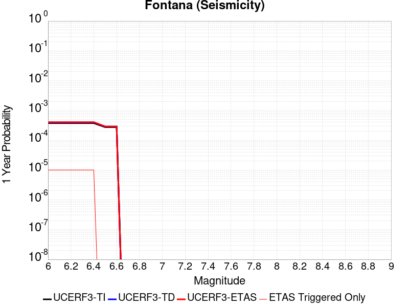 |  |

| Magnitude | 1 wk TI Prob | 1 wk TD Prob | 1 wk ETAS Prob | 1 wk ETAS/TD Gain | 1 wk ETAS Triggered Only | 1 mo TI Prob | 1 mo TD Prob | 1 mo ETAS Prob | 1 mo ETAS/TD Gain | 1 mo ETAS Triggered Only | 1 yr TI Prob | 1 yr TD Prob | 1 yr ETAS Prob | 1 yr ETAS/TD Gain | 1 yr ETAS Triggered Only | 10 yr TI Prob | 10 yr TD Prob | 10 yr ETAS Prob | 10 yr ETAS/TD Gain | 10 yr ETAS Triggered Only |
|-----|-----|-----|-----|-----|-----|-----|-----|-----|-----|-----|-----|-----|-----|-----|-----|-----|-----|-----|-----|-----|
| 6.0 | 7.1789214E-6 | 7.552417E-6 | 7.552417E-6 | 1.0 | 0.0 | 3.076644E-5 | 3.236733E-5 | 3.236733E-5 | 1.0 | 0.0 | 3.7451705E-4 | 3.9404177E-4 | 4.1872342E-4 | 1.0626371 | 2.4691359E-5 | 0.003738865 | 0.003937431 | 0.003962025 | 1.0062462 | 2.4691359E-5 |
| 6.1 | 7.1789214E-6 | 7.552417E-6 | 7.552417E-6 | 1.0 | 0.0 | 3.076644E-5 | 3.236733E-5 | 3.236733E-5 | 1.0 | 0.0 | 3.7451705E-4 | 3.9404177E-4 | 4.1872342E-4 | 1.0626371 | 2.4691359E-5 | 0.003738865 | 0.003937431 | 0.003962025 | 1.0062462 | 2.4691359E-5 |
| 6.2 | 7.1789214E-6 | 7.552417E-6 | 7.552417E-6 | 1.0 | 0.0 | 3.076644E-5 | 3.236733E-5 | 3.236733E-5 | 1.0 | 0.0 | 3.7451705E-4 | 3.9404177E-4 | 4.1872342E-4 | 1.0626371 | 2.4691359E-5 | 0.003738865 | 0.003937431 | 0.003962025 | 1.0062462 | 2.4691359E-5 |
| 6.3 | 7.1789214E-6 | 7.552417E-6 | 7.552417E-6 | 1.0 | 0.0 | 3.076644E-5 | 3.236733E-5 | 3.236733E-5 | 1.0 | 0.0 | 3.7451705E-4 | 3.9404177E-4 | 4.1872342E-4 | 1.0626371 | 2.4691359E-5 | 0.003738865 | 0.003937431 | 0.003962025 | 1.0062462 | 2.4691359E-5 |
| 6.4 | 7.1789214E-6 | 7.552417E-6 | 7.552417E-6 | 1.0 | 0.0 | 3.076644E-5 | 3.236733E-5 | 3.236733E-5 | 1.0 | 0.0 | 3.7451705E-4 | 3.9404177E-4 | 4.1872342E-4 | 1.0626371 | 2.4691359E-5 | 0.003738865 | 0.003937431 | 0.003962025 | 1.0062462 | 2.4691359E-5 |
| 6.5 | 5.2611317E-6 | 5.533029E-6 | 5.533029E-6 | 1.0 | 0.0 | 2.2547512E-5 | 2.371298E-5 | 2.371298E-5 | 1.0 | 0.0 | 2.744814E-4 | 2.8870555E-4 | 2.8870555E-4 | 1.0 | 0.0 | 0.002741426 | 0.0028870553 | 0.0028870553 | 1.0 | 0.0 |
| 6.6 | 5.2611317E-6 | 5.533029E-6 | 5.533029E-6 | 1.0 | 0.0 | 2.2547512E-5 | 2.371298E-5 | 2.371298E-5 | 1.0 | 0.0 | 2.744814E-4 | 2.8870555E-4 | 2.8870555E-4 | 1.0 | 0.0 | 0.002741426 | 0.0028870553 | 0.0028870553 | 1.0 | 0.0 |

## Malibu Coast alt 1
*[(top)](#table-of-contents)*

| 1 Week | 1 Month | 1 Year | 10 Year |
|-----|-----|-----|-----|
| 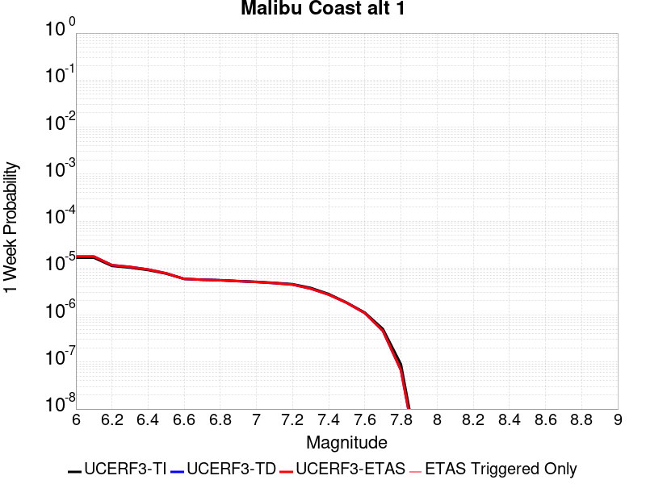 | 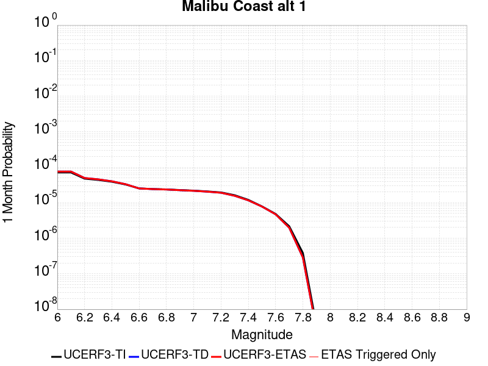 |  |  |

| Magnitude | 1 wk TI Prob | 1 wk TD Prob | 1 wk ETAS Prob | 1 wk ETAS/TD Gain | 1 wk ETAS Triggered Only | 1 mo TI Prob | 1 mo TD Prob | 1 mo ETAS Prob | 1 mo ETAS/TD Gain | 1 mo ETAS Triggered Only | 1 yr TI Prob | 1 yr TD Prob | 1 yr ETAS Prob | 1 yr ETAS/TD Gain | 1 yr ETAS Triggered Only | 10 yr TI Prob | 10 yr TD Prob | 10 yr ETAS Prob | 10 yr ETAS/TD Gain | 10 yr ETAS Triggered Only |
|-----|-----|-----|-----|-----|-----|-----|-----|-----|-----|-----|-----|-----|-----|-----|-----|-----|-----|-----|-----|-----|
| 6.0 | 1.6572556E-5 | 1.7599685E-5 | 1.7599685E-5 | 1.0 | 0.0 | 7.102331E-5 | 7.542515E-5 | 7.542515E-5 | 1.0 | 0.0 | 8.6436566E-4 | 9.1793324E-4 | 9.1793324E-4 | 1.0 | 0.0 | 0.0086101135 | 0.009143351 | 0.009167816 | 1.0026758 | 2.4691359E-5 |
| 6.1 | 1.6572556E-5 | 1.7599685E-5 | 1.7599685E-5 | 1.0 | 0.0 | 7.102331E-5 | 7.542515E-5 | 7.542515E-5 | 1.0 | 0.0 | 8.6436566E-4 | 9.1793324E-4 | 9.1793324E-4 | 1.0 | 0.0 | 0.0086101135 | 0.009143351 | 0.009167816 | 1.0026758 | 2.4691359E-5 |
| 6.2 | 1.1085717E-5 | 1.1558117E-5 | 1.1558117E-5 | 1.0 | 0.0 | 4.750935E-5 | 4.9533865E-5 | 4.9533865E-5 | 1.0 | 0.0 | 5.782728E-4 | 6.0291146E-4 | 6.0291146E-4 | 1.0 | 0.0 | 0.0057677035 | 0.006013129 | 0.006013129 | 1.0 | 0.0 |
| 6.3 | 1.0208568E-5 | 1.0593105E-5 | 1.0593105E-5 | 1.0 | 0.0 | 4.375027E-5 | 4.5398247E-5 | 4.5398247E-5 | 1.0 | 0.0 | 5.325294E-4 | 5.525864E-4 | 5.525864E-4 | 1.0 | 0.0 | 0.0053125503 | 0.0055124317 | 0.0055124317 | 1.0 | 0.0 |
| 6.4 | 9.0682315E-6 | 9.343377E-6 | 9.343377E-6 | 1.0 | 0.0 | 3.8863272E-5 | 4.004244E-5 | 4.004244E-5 | 1.0 | 0.0 | 4.730576E-4 | 4.874097E-4 | 4.874097E-4 | 1.0 | 0.0 | 0.0047205184 | 0.0048636203 | 0.0048636203 | 1.0 | 0.0 |
| 6.5 | 7.605796E-6 | 7.749174E-6 | 7.749174E-6 | 1.0 | 0.0 | 3.259586E-5 | 3.3210334E-5 | 3.3210334E-5 | 1.0 | 0.0 | 3.9678233E-4 | 4.042621E-4 | 4.042621E-4 | 1.0 | 0.0 | 0.0039607463 | 0.004035405 | 0.004035405 | 1.0 | 0.0 |
| 6.6 | 5.889873E-6 | 5.8799483E-6 | 5.8799483E-6 | 1.0 | 0.0 | 2.5242069E-5 | 2.5199535E-5 | 2.5199535E-5 | 1.0 | 0.0 | 3.0727885E-4 | 3.0676124E-4 | 3.0676124E-4 | 1.0 | 0.0 | 0.003068543 | 0.0030633907 | 0.0030633907 | 1.0 | 0.0 |
| 6.7 | 5.66586E-6 | 5.6420354E-6 | 5.6420354E-6 | 1.0 | 0.0 | 2.428203E-5 | 2.4179928E-5 | 2.4179928E-5 | 1.0 | 0.0 | 2.955936E-4 | 2.9435093E-4 | 2.9435093E-4 | 1.0 | 0.0 | 0.0029520073 | 0.0029396226 | 0.0029396226 | 1.0 | 0.0 |
| 6.8 | 5.521556E-6 | 5.489812E-6 | 5.489812E-6 | 1.0 | 0.0 | 2.3663597E-5 | 2.3527555E-5 | 2.3527555E-5 | 1.0 | 0.0 | 2.880662E-4 | 2.8641042E-4 | 2.8641042E-4 | 1.0 | 0.0 | 0.0028769306 | 0.0028604246 | 0.0028604246 | 1.0 | 0.0 |
| 6.9 | 5.29752E-6 | 5.250299E-6 | 5.250299E-6 | 1.0 | 0.0 | 2.270346E-5 | 2.2501088E-5 | 2.2501088E-5 | 1.0 | 0.0 | 2.7637955E-4 | 2.7391638E-4 | 2.7391638E-4 | 1.0 | 0.0 | 0.0027603607 | 0.002735798 | 0.002735798 | 1.0 | 0.0 |
| 7.0 | 5.106743E-6 | 5.048033E-6 | 5.048033E-6 | 1.0 | 0.0 | 2.1885859E-5 | 2.1634249E-5 | 2.1634249E-5 | 1.0 | 0.0 | 2.6642776E-4 | 2.6336522E-4 | 2.6336522E-4 | 1.0 | 0.0 | 0.0026610855 | 0.0026305406 | 0.0026305406 | 1.0 | 0.0 |
| 7.1 | 4.8469647E-6 | 4.7707076E-6 | 4.7707076E-6 | 1.0 | 0.0 | 2.0772539E-5 | 2.0445728E-5 | 2.0445728E-5 | 1.0 | 0.0 | 2.528763E-4 | 2.4889837E-4 | 2.4889837E-4 | 1.0 | 0.0 | 0.0025258875 | 0.0024862043 | 0.0024862043 | 1.0 | 0.0 |
| 7.2 | 4.545514E-6 | 4.448504E-6 | 4.448504E-6 | 1.0 | 0.0 | 1.9480629E-5 | 1.9064879E-5 | 1.9064879E-5 | 1.0 | 0.0 | 2.3715083E-4 | 2.3209024E-4 | 2.3209024E-4 | 1.0 | 0.0 | 0.0023689792 | 0.002318486 | 0.002318486 | 1.0 | 0.0 |
| 7.3 | 3.794097E-6 | 3.6521806E-6 | 3.6521806E-6 | 1.0 | 0.0 | 1.6260314E-5 | 1.565211E-5 | 1.565211E-5 | 1.0 | 0.0 | 1.9795135E-4 | 1.905478E-4 | 1.905478E-4 | 1.0 | 0.0 | 0.001977751 | 0.0019038487 | 0.0019038487 | 1.0 | 0.0 |
| 7.4 | 2.808217E-6 | 2.719262E-6 | 2.719262E-6 | 1.0 | 0.0 | 1.203516E-5 | 1.1653928E-5 | 1.1653928E-5 | 1.0 | 0.0 | 1.4651821E-4 | 1.4187736E-4 | 1.4187736E-4 | 1.0 | 0.0 | 0.0014642165 | 0.0014178705 | 0.0014178705 | 1.0 | 0.0 |
| 7.5 | 1.83809E-6 | 1.8191979E-6 | 1.8191979E-6 | 1.0 | 0.0 | 7.877505E-6 | 7.796539E-6 | 7.796539E-6 | 1.0 | 0.0 | 9.59044E-5 | 9.4918745E-5 | 9.4918745E-5 | 1.0 | 0.0 | 9.5863023E-4 | 9.4878406E-4 | 9.4878406E-4 | 1.0 | 0.0 |
| 7.6 | 1.1292672E-6 | 1.1002278E-6 | 1.1002278E-6 | 1.0 | 0.0 | 4.839708E-6 | 4.7152535E-6 | 4.7152535E-6 | 1.0 | 0.0 | 5.8921847E-5 | 5.7406713E-5 | 5.7406713E-5 | 1.0 | 0.0 | 5.890623E-4 | 5.739205E-4 | 5.739205E-4 | 1.0 | 0.0 |
| 7.7 | 5.065272E-7 | 4.6095698E-7 | 4.6095698E-7 | 1.0 | 0.0 | 2.170829E-6 | 1.9755284E-6 | 1.9755284E-6 | 1.0 | 0.0 | 2.6429525E-5 | 2.4051806E-5 | 2.4051806E-5 | 1.0 | 0.0 | 2.642638E-4 | 2.4049314E-4 | 2.4049314E-4 | 1.0 | 0.0 |
| 7.8 | 8.952991E-8 | 6.709504E-8 | 6.709504E-8 | 1.0 | 0.0 | 3.8369956E-7 | 2.8755014E-7 | 2.8755014E-7 | 1.0 | 0.0 | 4.671532E-6 | 3.5009175E-6 | 3.5009175E-6 | 1.0 | 0.0 | 4.671434E-5 | 3.500864E-5 | 3.500864E-5 | 1.0 | 0.0 |
| 7.9 | 8.007447E-10 | 6.161175E-10 | 6.161175E-10 | 1.0 | 0.0 | 3.4317629E-9 | 2.640504E-9 | 2.640504E-9 | 1.0 | 0.0 | 4.1781714E-8 | 3.2148137E-8 | 3.2148137E-8 | 1.0 | 0.0 | 4.1781706E-7 | 3.2148134E-7 | 3.2148134E-7 | 1.0 | 0.0 |

## San Luis Range 2011 CFM
*[(top)](#table-of-contents)*

| 1 Week | 1 Month | 1 Year | 10 Year |
|-----|-----|-----|-----|
|  |  |  |  |

| Magnitude | 1 wk TI Prob | 1 wk TD Prob | 1 wk ETAS Prob | 1 wk ETAS/TD Gain | 1 wk ETAS Triggered Only | 1 mo TI Prob | 1 mo TD Prob | 1 mo ETAS Prob | 1 mo ETAS/TD Gain | 1 mo ETAS Triggered Only | 1 yr TI Prob | 1 yr TD Prob | 1 yr ETAS Prob | 1 yr ETAS/TD Gain | 1 yr ETAS Triggered Only | 10 yr TI Prob | 10 yr TD Prob | 10 yr ETAS Prob | 10 yr ETAS/TD Gain | 10 yr ETAS Triggered Only |
|-----|-----|-----|-----|-----|-----|-----|-----|-----|-----|-----|-----|-----|-----|-----|-----|-----|-----|-----|-----|-----|
| 6.0 | 8.8368415E-6 | 8.965642E-6 | 8.965642E-6 | 1.0 | 0.0 | 3.787163E-5 | 3.842366E-5 | 3.842366E-5 | 1.0 | 0.0 | 4.609895E-4 | 4.6771552E-4 | 4.923953E-4 | 1.0527667 | 2.4691359E-5 | 0.0046003438 | 0.004668094 | 0.0046926704 | 1.0052646 | 2.4691359E-5 |
| 6.1 | 8.8368415E-6 | 8.965642E-6 | 8.965642E-6 | 1.0 | 0.0 | 3.787163E-5 | 3.842366E-5 | 3.842366E-5 | 1.0 | 0.0 | 4.609895E-4 | 4.6771552E-4 | 4.923953E-4 | 1.0527667 | 2.4691359E-5 | 0.0046003438 | 0.004668094 | 0.0046926704 | 1.0052646 | 2.4691359E-5 |
| 6.2 | 8.8368415E-6 | 8.965642E-6 | 8.965642E-6 | 1.0 | 0.0 | 3.787163E-5 | 3.842366E-5 | 3.842366E-5 | 1.0 | 0.0 | 4.609895E-4 | 4.6771552E-4 | 4.923953E-4 | 1.0527667 | 2.4691359E-5 | 0.0046003438 | 0.004668094 | 0.0046926704 | 1.0052646 | 2.4691359E-5 |
| 6.3 | 8.8368415E-6 | 8.965642E-6 | 8.965642E-6 | 1.0 | 0.0 | 3.787163E-5 | 3.842366E-5 | 3.842366E-5 | 1.0 | 0.0 | 4.609895E-4 | 4.6771552E-4 | 4.923953E-4 | 1.0527667 | 2.4691359E-5 | 0.0046003438 | 0.004668094 | 0.0046926704 | 1.0052646 | 2.4691359E-5 |
| 6.4 | 3.9094193E-6 | 3.941286E-6 | 3.941286E-6 | 1.0 | 0.0 | 1.6754546E-5 | 1.689112E-5 | 1.689112E-5 | 1.0 | 0.0 | 2.039675E-4 | 2.0563026E-4 | 2.0563026E-4 | 1.0 | 0.0 | 0.0020378039 | 0.0020544287 | 0.0020544287 | 1.0 | 0.0 |
| 6.5 | 3.9094193E-6 | 3.941286E-6 | 3.941286E-6 | 1.0 | 0.0 | 1.6754546E-5 | 1.689112E-5 | 1.689112E-5 | 1.0 | 0.0 | 2.039675E-4 | 2.0563026E-4 | 2.0563026E-4 | 1.0 | 0.0 | 0.0020378039 | 0.0020544287 | 0.0020544287 | 1.0 | 0.0 |
| 6.6 | 3.0587726E-6 | 3.0754557E-6 | 3.0754557E-6 | 1.0 | 0.0 | 1.3108959E-5 | 1.3180458E-5 | 1.3180458E-5 | 1.0 | 0.0 | 1.595899E-4 | 1.6046037E-4 | 1.6046037E-4 | 1.0 | 0.0 | 0.0015947534 | 0.0016034571 | 0.0016034571 | 1.0 | 0.0 |
| 6.7 | 2.6160574E-6 | 2.6251864E-6 | 2.6251864E-6 | 1.0 | 0.0 | 1.1211626E-5 | 1.12507505E-5 | 1.12507505E-5 | 1.0 | 0.0 | 1.3649299E-4 | 1.3696935E-4 | 1.3696935E-4 | 1.0 | 0.0 | 0.0013640919 | 0.0013688554 | 0.0013688554 | 1.0 | 0.0 |
| 6.8 | 2.5110312E-6 | 2.518197E-6 | 2.518197E-6 | 1.0 | 0.0 | 1.0761518E-5 | 1.079223E-5 | 1.079223E-5 | 1.0 | 0.0 | 1.310136E-4 | 1.3138753E-4 | 1.3138753E-4 | 1.0 | 0.0 | 0.0013093639 | 0.0013131043 | 0.0013131043 | 1.0 | 0.0 |
| 6.9 | 1.8564405E-6 | 1.852532E-6 | 1.852532E-6 | 1.0 | 0.0 | 7.95615E-6 | 7.939399E-6 | 7.939399E-6 | 1.0 | 0.0 | 9.686181E-5 | 9.665792E-5 | 9.665792E-5 | 1.0 | 0.0 | 9.68196E-4 | 9.661608E-4 | 9.661608E-4 | 1.0 | 0.0 |
| 7.0 | 1.546127E-6 | 1.5369932E-6 | 1.5369932E-6 | 1.0 | 0.0 | 6.626242E-6 | 6.5870972E-6 | 6.5870972E-6 | 1.0 | 0.0 | 8.06715E-5 | 8.0194965E-5 | 8.0194965E-5 | 1.0 | 0.0 | 8.0642226E-4 | 8.0166094E-4 | 8.0166094E-4 | 1.0 | 0.0 |
| 7.1 | 1.3368208E-6 | 1.3235676E-6 | 1.3235676E-6 | 1.0 | 0.0 | 5.7292195E-6 | 5.6724202E-6 | 5.6724202E-6 | 1.0 | 0.0 | 6.975101E-5 | 6.905953E-5 | 6.905953E-5 | 1.0 | 0.0 | 6.972912E-4 | 6.9038116E-4 | 6.9038116E-4 | 1.0 | 0.0 |
| 7.2 | 1.0623363E-6 | 1.045466E-6 | 1.045466E-6 | 1.0 | 0.0 | 4.5528623E-6 | 4.4805606E-6 | 4.4805606E-6 | 1.0 | 0.0 | 5.5429686E-5 | 5.4549462E-5 | 5.4549462E-5 | 1.0 | 0.0 | 5.5415864E-4 | 5.45361E-4 | 5.45361E-4 | 1.0 | 0.0 |
| 7.3 | 7.831679E-7 | 7.727625E-7 | 7.727625E-7 | 1.0 | 0.0 | 3.3564295E-6 | 3.3118351E-6 | 3.3118351E-6 | 1.0 | 0.0 | 4.086376E-5 | 4.0320847E-5 | 4.0320847E-5 | 1.0 | 0.0 | 4.0856248E-4 | 4.0313543E-4 | 4.0313543E-4 | 1.0 | 0.0 |
| 7.4 | 5.9558846E-7 | 5.9108316E-7 | 5.9108316E-7 | 1.0 | 0.0 | 2.5525194E-6 | 2.5332113E-6 | 2.5332113E-6 | 1.0 | 0.0 | 3.107648E-5 | 3.084141E-5 | 3.084141E-5 | 1.0 | 0.0 | 3.1072134E-4 | 3.0837138E-4 | 3.0837138E-4 | 1.0 | 0.0 |
| 7.5 | 4.1616502E-7 | 4.1197907E-7 | 4.1197907E-7 | 1.0 | 0.0 | 1.7835631E-6 | 1.7656233E-6 | 1.7656233E-6 | 1.0 | 0.0 | 2.1714664E-5 | 2.1496253E-5 | 2.1496253E-5 | 1.0 | 0.0 | 2.1712543E-4 | 2.1494179E-4 | 2.1494179E-4 | 1.0 | 0.0 |
| 7.6 | 2.3816014E-7 | 2.3377777E-7 | 2.3377777E-7 | 1.0 | 0.0 | 1.0206859E-6 | 1.0019043E-6 | 1.0019043E-6 | 1.0 | 0.0 | 1.242678E-5 | 1.2198117E-5 | 1.2198117E-5 | 1.0 | 0.0 | 1.2426086E-4 | 1.21974495E-4 | 1.21974495E-4 | 1.0 | 0.0 |
| 7.7 | 9.918777E-8 | 9.387684E-8 | 9.387684E-8 | 1.0 | 0.0 | 4.2509038E-7 | 4.0232925E-7 | 4.0232925E-7 | 1.0 | 0.0 | 5.1754632E-6 | 4.8983475E-6 | 4.8983475E-6 | 1.0 | 0.0 | 5.1753424E-5 | 4.89824E-5 | 4.89824E-5 | 1.0 | 0.0 |
| 7.8 | 3.4982556E-8 | 2.9694167E-8 | 2.9694167E-8 | 1.0 | 0.0 | 1.4992524E-7 | 1.272607E-7 | 1.272607E-7 | 1.0 | 0.0 | 1.8253382E-6 | 1.5493979E-6 | 1.5493979E-6 | 1.0 | 0.0 | 1.8253233E-5 | 1.5493872E-5 | 1.5493872E-5 | 1.0 | 0.0 |
| 7.9 | 1.6624908E-8 | 1.1483989E-8 | 1.1483989E-8 | 1.0 | 0.0 | 7.12496E-8 | 4.921709E-8 | 4.921709E-8 | 1.0 | 0.0 | 8.6746354E-7 | 5.9921786E-7 | 5.9921786E-7 | 1.0 | 0.0 | 8.674601E-6 | 5.9921626E-6 | 5.9921626E-6 | 1.0 | 0.0 |
| 8.0 | 6.3352315E-9 | 3.0928995E-9 | 3.0928995E-9 | 1.0 | 0.0 | 2.715099E-8 | 1.3255282E-8 | 1.3255282E-8 | 1.0 | 0.0 | 3.3056327E-7 | 1.6138304E-7 | 1.6138304E-7 | 1.0 | 0.0 | 3.3056278E-6 | 1.6138293E-6 | 1.6138293E-6 | 1.0 | 0.0 |

## Hat Creek-McArthur-Mayfield
*[(top)](#table-of-contents)*

| 1 Week | 1 Month | 1 Year | 10 Year |
|-----|-----|-----|-----|
|  |  |  |  |

| Magnitude | 1 wk TI Prob | 1 wk TD Prob | 1 wk ETAS Prob | 1 wk ETAS/TD Gain | 1 wk ETAS Triggered Only | 1 mo TI Prob | 1 mo TD Prob | 1 mo ETAS Prob | 1 mo ETAS/TD Gain | 1 mo ETAS Triggered Only | 1 yr TI Prob | 1 yr TD Prob | 1 yr ETAS Prob | 1 yr ETAS/TD Gain | 1 yr ETAS Triggered Only | 10 yr TI Prob | 10 yr TD Prob | 10 yr ETAS Prob | 10 yr ETAS/TD Gain | 10 yr ETAS Triggered Only |
|-----|-----|-----|-----|-----|-----|-----|-----|-----|-----|-----|-----|-----|-----|-----|-----|-----|-----|-----|-----|-----|
| 6.0 | 3.967457E-5 | 4.316235E-5 | 4.316235E-5 | 1.0 | 0.0 | 1.7002279E-4 | 1.8496903E-4 | 1.8496903E-4 | 1.0 | 0.0 | 0.002068062 | 0.0022497862 | 0.0022497862 | 1.0 | 0.0 | 0.02048922 | 0.022282463 | 0.022306602 | 1.0010834 | 2.4691359E-5 |
| 6.1 | 2.5044013E-5 | 2.7073496E-5 | 2.7073496E-5 | 1.0 | 0.0 | 1.0732707E-4 | 1.1602429E-4 | 1.1602429E-4 | 1.0 | 0.0 | 0.0013059238 | 0.0014117121 | 0.0014117121 | 1.0 | 0.0 | 0.01298276 | 0.014030862 | 0.014030862 | 1.0 | 0.0 |
| 6.2 | 2.5044013E-5 | 2.7073496E-5 | 2.7073496E-5 | 1.0 | 0.0 | 1.0732707E-4 | 1.1602429E-4 | 1.1602429E-4 | 1.0 | 0.0 | 0.0013059238 | 0.0014117121 | 0.0014117121 | 1.0 | 0.0 | 0.01298276 | 0.014030862 | 0.014030862 | 1.0 | 0.0 |
| 6.3 | 1.6624012E-5 | 1.7892522E-5 | 1.7892522E-5 | 1.0 | 0.0 | 7.124382E-5 | 7.668003E-5 | 7.668003E-5 | 1.0 | 0.0 | 8.670483E-4 | 9.331881E-4 | 9.331881E-4 | 1.0 | 0.0 | 0.008636732 | 0.009293629 | 0.009293629 | 1.0 | 0.0 |
| 6.4 | 1.6624012E-5 | 1.7892522E-5 | 1.7892522E-5 | 1.0 | 0.0 | 7.124382E-5 | 7.668003E-5 | 7.668003E-5 | 1.0 | 0.0 | 8.670483E-4 | 9.331881E-4 | 9.331881E-4 | 1.0 | 0.0 | 0.008636732 | 0.009293629 | 0.009293629 | 1.0 | 0.0 |
| 6.5 | 1.3394842E-5 | 1.4393276E-5 | 1.4393276E-5 | 1.0 | 0.0 | 5.7405203E-5 | 6.168404E-5 | 6.168404E-5 | 1.0 | 0.0 | 6.986842E-4 | 7.5074995E-4 | 7.5074995E-4 | 1.0 | 0.0 | 0.006964916 | 0.0074827303 | 0.0074827303 | 1.0 | 0.0 |
| 6.6 | 1.1137514E-5 | 1.1955477E-5 | 1.1955477E-5 | 1.0 | 0.0 | 4.7731326E-5 | 5.1236777E-5 | 5.1236777E-5 | 1.0 | 0.0 | 5.809739E-4 | 6.236332E-4 | 6.236332E-4 | 1.0 | 0.0 | 0.005794574 | 0.0062192534 | 0.0062192534 | 1.0 | 0.0 |
| 6.7 | 7.0200663E-6 | 7.5248636E-6 | 7.5248636E-6 | 1.0 | 0.0 | 3.008565E-5 | 3.2249027E-5 | 3.2249027E-5 | 1.0 | 0.0 | 3.6623122E-4 | 3.9256274E-4 | 3.9256274E-4 | 1.0 | 0.0 | 0.0036562826 | 0.0039188555 | 0.0039188555 | 1.0 | 0.0 |
| 6.8 | 5.940172E-6 | 6.3659604E-6 | 6.3659604E-6 | 1.0 | 0.0 | 2.545763E-5 | 2.7282409E-5 | 2.7282409E-5 | 1.0 | 0.0 | 3.0990256E-4 | 3.3211397E-4 | 3.3211397E-4 | 1.0 | 0.0 | 0.0030947074 | 0.003316305 | 0.003316305 | 1.0 | 0.0 |
| 6.9 | 4.129831E-6 | 4.423881E-6 | 4.423881E-6 | 1.0 | 0.0 | 1.7699154E-5 | 1.8959357E-5 | 1.8959357E-5 | 1.0 | 0.0 | 2.154659E-4 | 2.308065E-4 | 2.308065E-4 | 1.0 | 0.0 | 0.002152571 | 0.0023057463 | 0.0023057463 | 1.0 | 0.0 |
| 7.0 | 2.6512955E-6 | 2.8376114E-6 | 2.8376114E-6 | 1.0 | 0.0 | 1.1362646E-5 | 1.2161137E-5 | 1.2161137E-5 | 1.0 | 0.0 | 1.3833142E-4 | 1.4805222E-4 | 1.4805222E-4 | 1.0 | 0.0 | 0.0013824535 | 0.0014795784 | 0.0014795784 | 1.0 | 0.0 |
| 7.1 | 1.2992575E-6 | 1.3910359E-6 | 1.3910359E-6 | 1.0 | 0.0 | 5.568235E-6 | 5.96157E-6 | 5.96157E-6 | 1.0 | 0.0 | 6.779115E-5 | 7.257992E-5 | 7.257992E-5 | 1.0 | 0.0 | 6.7770475E-4 | 7.2558376E-4 | 7.2558376E-4 | 1.0 | 0.0 |
| 7.2 | 4.968191E-7 | 5.327556E-7 | 5.327556E-7 | 1.0 | 0.0 | 2.1292228E-6 | 2.283237E-6 | 2.283237E-6 | 1.0 | 0.0 | 2.592298E-5 | 2.7798184E-5 | 2.7798184E-5 | 1.0 | 0.0 | 2.5919956E-4 | 2.7795942E-4 | 2.7795942E-4 | 1.0 | 0.0 |

## Palos Verdes
*[(top)](#table-of-contents)*

| 1 Week | 1 Month | 1 Year | 10 Year |
|-----|-----|-----|-----|
|  |  |  |  |

| Magnitude | 1 wk TI Prob | 1 wk TD Prob | 1 wk ETAS Prob | 1 wk ETAS/TD Gain | 1 wk ETAS Triggered Only | 1 mo TI Prob | 1 mo TD Prob | 1 mo ETAS Prob | 1 mo ETAS/TD Gain | 1 mo ETAS Triggered Only | 1 yr TI Prob | 1 yr TD Prob | 1 yr ETAS Prob | 1 yr ETAS/TD Gain | 1 yr ETAS Triggered Only | 10 yr TI Prob | 10 yr TD Prob | 10 yr ETAS Prob | 10 yr ETAS/TD Gain | 10 yr ETAS Triggered Only |
|-----|-----|-----|-----|-----|-----|-----|-----|-----|-----|-----|-----|-----|-----|-----|-----|-----|-----|-----|-----|-----|
| 6.0 | 6.126063E-5 | 7.6246164E-5 | 7.6246164E-5 | 1.0 | 0.0 | 2.6251914E-4 | 3.267317E-4 | 3.51415E-4 | 1.075546 | 2.4691359E-5 | 0.0031914865 | 0.0039711758 | 0.0039957687 | 1.0061929 | 2.4691359E-5 | 0.031460393 | 0.03905871 | 0.039082438 | 1.0006075 | 2.4691359E-5 |
| 6.1 | 6.126063E-5 | 7.6246164E-5 | 7.6246164E-5 | 1.0 | 0.0 | 2.6251914E-4 | 3.267317E-4 | 3.51415E-4 | 1.075546 | 2.4691359E-5 | 0.0031914865 | 0.0039711758 | 0.0039957687 | 1.0061929 | 2.4691359E-5 | 0.031460393 | 0.03905871 | 0.039082438 | 1.0006075 | 2.4691359E-5 |
| 6.2 | 6.126063E-5 | 7.6246164E-5 | 7.6246164E-5 | 1.0 | 0.0 | 2.6251914E-4 | 3.267317E-4 | 3.51415E-4 | 1.075546 | 2.4691359E-5 | 0.0031914865 | 0.0039711758 | 0.0039957687 | 1.0061929 | 2.4691359E-5 | 0.031460393 | 0.03905871 | 0.039082438 | 1.0006075 | 2.4691359E-5 |
| 6.3 | 4.0838047E-5 | 4.9761093E-5 | 4.9761093E-5 | 1.0 | 0.0 | 1.7500846E-4 | 2.1324566E-4 | 2.3793176E-4 | 1.1157637 | 2.4691359E-5 | 0.0021286458 | 0.0025933706 | 0.0026179978 | 1.0094962 | 2.4691359E-5 | 0.021083709 | 0.025652548 | 0.025676606 | 1.0009378 | 2.4691359E-5 |
| 6.4 | 4.0838047E-5 | 4.9761093E-5 | 4.9761093E-5 | 1.0 | 0.0 | 1.7500846E-4 | 2.1324566E-4 | 2.3793176E-4 | 1.1157637 | 2.4691359E-5 | 0.0021286458 | 0.0025933706 | 0.0026179978 | 1.0094962 | 2.4691359E-5 | 0.021083709 | 0.025652548 | 0.025676606 | 1.0009378 | 2.4691359E-5 |
| 6.5 | 3.0512005E-5 | 3.656939E-5 | 3.656939E-5 | 1.0 | 0.0 | 1.3075917E-4 | 1.5671721E-4 | 1.814047E-4 | 1.1575289 | 2.4691359E-5 | 0.0015908304 | 0.001906479 | 0.0019311233 | 1.0129266 | 2.4691359E-5 | 0.015794903 | 0.01891312 | 0.018937344 | 1.0012808 | 2.4691359E-5 |
| 6.6 | 2.9255087E-5 | 3.5162007E-5 | 3.5162007E-5 | 1.0 | 0.0 | 1.2537291E-4 | 1.5068628E-4 | 1.7537392E-4 | 1.1638347 | 2.4691359E-5 | 0.0015253464 | 0.0018331759 | 0.0018578221 | 1.0134444 | 2.4691359E-5 | 0.015149189 | 0.018192101 | 0.018216344 | 1.0013325 | 2.4691359E-5 |
| 6.7 | 2.287198E-5 | 2.7253858E-5 | 2.7253858E-5 | 1.0 | 0.0 | 9.801909E-5 | 1.16797535E-4 | 1.16797535E-4 | 1.0 | 0.0 | 0.001192729 | 0.001421174 | 0.001421174 | 1.0 | 0.0 | 0.011863477 | 0.014130091 | 0.014130091 | 1.0 | 0.0 |
| 6.8 | 2.1325764E-5 | 2.5437115E-5 | 2.5437115E-5 | 1.0 | 0.0 | 9.139293E-5 | 1.0901216E-4 | 1.0901216E-4 | 1.0 | 0.0 | 0.001112141 | 0.0013265052 | 0.0013265052 | 1.0 | 0.0 | 0.011065915 | 0.013194912 | 0.013194912 | 1.0 | 0.0 |
| 6.9 | 1.9009392E-5 | 2.2618136E-5 | 2.2618136E-5 | 1.0 | 0.0 | 8.1466285E-5 | 9.693176E-5 | 9.693176E-5 | 1.0 | 0.0 | 9.914007E-4 | 0.0011795927 | 0.0011795927 | 1.0 | 0.0 | 0.009869894 | 0.011742003 | 0.011742003 | 1.0 | 0.0 |
| 7.0 | 1.7098473E-5 | 2.0323456E-5 | 2.0323456E-5 | 1.0 | 0.0 | 7.3277115E-5 | 8.70981E-5 | 8.70981E-5 | 1.0 | 0.0 | 8.917837E-4 | 0.0010599887 | 0.0010599887 | 1.0 | 0.0 | 0.008882134 | 0.010557768 | 0.010557768 | 1.0 | 0.0 |
| 7.1 | 1.5982785E-5 | 1.8998595E-5 | 1.8998595E-5 | 1.0 | 0.0 | 6.849585E-5 | 8.142049E-5 | 8.142049E-5 | 1.0 | 0.0 | 8.336179E-4 | 9.909284E-4 | 9.909284E-4 | 1.0 | 0.0 | 0.008304977 | 0.009873465 | 0.009873465 | 1.0 | 0.0 |
| 7.2 | 1.4468002E-5 | 1.7200713E-5 | 1.7200713E-5 | 1.0 | 0.0 | 6.200425E-5 | 7.371573E-5 | 7.371573E-5 | 1.0 | 0.0 | 7.546402E-4 | 8.972036E-4 | 8.972036E-4 | 1.0 | 0.0 | 0.007520827 | 0.008944086 | 0.008944086 | 1.0 | 0.0 |
| 7.3 | 5.288233E-6 | 6.2048434E-6 | 6.2048434E-6 | 1.0 | 0.0 | 2.2663658E-5 | 2.6592112E-5 | 2.6592112E-5 | 1.0 | 0.0 | 2.7589512E-4 | 3.2374577E-4 | 3.2374577E-4 | 1.0 | 0.0 | 0.0027555283 | 0.0032361657 | 0.0032361657 | 1.0 | 0.0 |
| 7.4 | 8.279556E-7 | 8.4084854E-7 | 8.4084854E-7 | 1.0 | 0.0 | 3.5483763E-6 | 3.603632E-6 | 3.603632E-6 | 1.0 | 0.0 | 4.3200624E-5 | 4.387341E-5 | 4.387341E-5 | 1.0 | 0.0 | 4.3192226E-4 | 4.386547E-4 | 4.386547E-4 | 1.0 | 0.0 |
| 7.5 | 6.559831E-7 | 6.667345E-7 | 6.667345E-7 | 1.0 | 0.0 | 2.8113532E-6 | 2.8574307E-6 | 2.8574307E-6 | 1.0 | 0.0 | 3.4227687E-5 | 3.478873E-5 | 3.478873E-5 | 1.0 | 0.0 | 3.4222414E-4 | 3.4783946E-4 | 3.4783946E-4 | 1.0 | 0.0 |
| 7.6 | 3.5018968E-7 | 3.5620678E-7 | 3.5620678E-7 | 1.0 | 0.0 | 1.500812E-6 | 1.5265998E-6 | 1.5265998E-6 | 1.0 | 0.0 | 1.8272232E-5 | 1.8586241E-5 | 1.8586241E-5 | 1.0 | 0.0 | 1.8270731E-4 | 1.8585146E-4 | 1.8585146E-4 | 1.0 | 0.0 |
| 7.7 | 1.1986104E-7 | 1.2198606E-7 | 1.2198606E-7 | 1.0 | 0.0 | 5.1369005E-7 | 5.227973E-7 | 5.227973E-7 | 1.0 | 0.0 | 6.2541585E-6 | 6.3650386E-6 | 6.3650386E-6 | 1.0 | 0.0 | 6.2539824E-5 | 6.364861E-5 | 6.364861E-5 | 1.0 | 0.0 |
| 7.8 | 3.0445005E-8 | 3.1028215E-8 | 3.1028215E-8 | 1.0 | 0.0 | 1.3047858E-7 | 1.3297806E-7 | 1.3297806E-7 | 1.0 | 0.0 | 1.5885756E-6 | 1.6190069E-6 | 1.6190069E-6 | 1.0 | 0.0 | 1.5885644E-5 | 1.6189972E-5 | 1.6189972E-5 | 1.0 | 0.0 |

## Sheephole
*[(top)](#table-of-contents)*

| 1 Week | 1 Month | 1 Year | 10 Year |
|-----|-----|-----|-----|
|  |  |  |  |

| Magnitude | 1 wk TI Prob | 1 wk TD Prob | 1 wk ETAS Prob | 1 wk ETAS/TD Gain | 1 wk ETAS Triggered Only | 1 mo TI Prob | 1 mo TD Prob | 1 mo ETAS Prob | 1 mo ETAS/TD Gain | 1 mo ETAS Triggered Only | 1 yr TI Prob | 1 yr TD Prob | 1 yr ETAS Prob | 1 yr ETAS/TD Gain | 1 yr ETAS Triggered Only | 10 yr TI Prob | 10 yr TD Prob | 10 yr ETAS Prob | 10 yr ETAS/TD Gain | 10 yr ETAS Triggered Only |
|-----|-----|-----|-----|-----|-----|-----|-----|-----|-----|-----|-----|-----|-----|-----|-----|-----|-----|-----|-----|-----|
| 6.0 | 4.5579695E-6 | 4.741465E-6 | 4.741465E-6 | 1.0 | 0.0 | 1.9534009E-5 | 2.0320438E-5 | 2.0320438E-5 | 1.0 | 0.0 | 2.3780059E-4 | 2.473788E-4 | 2.473788E-4 | 1.0 | 0.0 | 0.0023754628 | 0.0024715788 | 0.002496209 | 1.0099654 | 2.4691359E-5 |
| 6.1 | 4.5579695E-6 | 4.741465E-6 | 4.741465E-6 | 1.0 | 0.0 | 1.9534009E-5 | 2.0320438E-5 | 2.0320438E-5 | 1.0 | 0.0 | 2.3780059E-4 | 2.473788E-4 | 2.473788E-4 | 1.0 | 0.0 | 0.0023754628 | 0.0024715788 | 0.002496209 | 1.0099654 | 2.4691359E-5 |
| 6.2 | 2.6677674E-6 | 2.7875271E-6 | 2.7875271E-6 | 1.0 | 0.0 | 1.1433239E-5 | 1.1946496E-5 | 1.1946496E-5 | 1.0 | 0.0 | 1.3919079E-4 | 1.4543996E-4 | 1.4543996E-4 | 1.0 | 0.0 | 0.0013910364 | 0.0014535537 | 0.001478209 | 1.0169622 | 2.4691359E-5 |
| 6.3 | 2.6677674E-6 | 2.7875271E-6 | 2.7875271E-6 | 1.0 | 0.0 | 1.1433239E-5 | 1.1946496E-5 | 1.1946496E-5 | 1.0 | 0.0 | 1.3919079E-4 | 1.4543996E-4 | 1.4543996E-4 | 1.0 | 0.0 | 0.0013910364 | 0.0014535537 | 0.001478209 | 1.0169622 | 2.4691359E-5 |
| 6.4 | 2.2159759E-6 | 2.3229977E-6 | 2.3229977E-6 | 1.0 | 0.0 | 9.497005E-6 | 9.955671E-6 | 9.955671E-6 | 1.0 | 0.0 | 1.156199E-4 | 1.2120436E-4 | 1.2120436E-4 | 1.0 | 0.0 | 0.0011555976 | 0.001211462 | 0.0012361234 | 1.0203568 | 2.4691359E-5 |
| 6.5 | 2.1986082E-6 | 2.3048772E-6 | 2.3048772E-6 | 1.0 | 0.0 | 9.4225725E-6 | 9.878012E-6 | 9.878012E-6 | 1.0 | 0.0 | 1.1471378E-4 | 1.2025897E-4 | 1.2025897E-4 | 1.0 | 0.0 | 0.0011465458 | 0.0012020182 | 0.0012266799 | 1.0205169 | 2.4691359E-5 |
| 6.6 | 1.5232331E-6 | 1.6019796E-6 | 1.6019796E-6 | 1.0 | 0.0 | 6.5281256E-6 | 6.86561E-6 | 6.86561E-6 | 1.0 | 0.0 | 7.947703E-5 | 8.3585786E-5 | 8.3585786E-5 | 1.0 | 0.0 | 7.9448614E-4 | 8.355622E-4 | 8.602329E-4 | 1.0295259 | 2.4691359E-5 |
| 6.7 | 1.3137362E-6 | 1.3828962E-6 | 1.3828962E-6 | 1.0 | 0.0 | 5.6302856E-6 | 5.9266854E-6 | 5.9266854E-6 | 1.0 | 0.0 | 6.854657E-5 | 7.215515E-5 | 7.215515E-5 | 1.0 | 0.0 | 6.8525434E-4 | 7.213311E-4 | 7.4600463E-4 | 1.0342056 | 2.4691359E-5 |
| 6.8 | 1.2275751E-6 | 1.292357E-6 | 1.292357E-6 | 1.0 | 0.0 | 5.2610258E-6 | 5.5386618E-6 | 5.5386618E-6 | 1.0 | 0.0 | 6.4051106E-5 | 6.7431254E-5 | 6.7431254E-5 | 1.0 | 0.0 | 6.4032647E-4 | 6.7412126E-4 | 6.98796E-4 | 1.0366027 | 2.4691359E-5 |
| 6.9 | 1.1837088E-6 | 1.2461717E-6 | 1.2461717E-6 | 1.0 | 0.0 | 5.0730278E-6 | 5.3407257E-6 | 5.3407257E-6 | 1.0 | 0.0 | 6.176237E-5 | 6.502153E-5 | 6.502153E-5 | 1.0 | 0.0 | 6.17452E-4 | 6.500382E-4 | 6.747135E-4 | 1.0379598 | 2.4691359E-5 |
| 7.0 | 9.849371E-7 | 1.0366865E-6 | 1.0366865E-6 | 1.0 | 0.0 | 4.2211523E-6 | 4.4429353E-6 | 4.4429353E-6 | 1.0 | 0.0 | 5.1391315E-5 | 5.40915E-5 | 5.40915E-5 | 1.0 | 0.0 | 5.137943E-4 | 5.407934E-4 | 5.407934E-4 | 1.0 | 0.0 |
| 7.1 | 8.1643645E-7 | 8.592146E-7 | 8.592146E-7 | 1.0 | 0.0 | 3.4990085E-6 | 3.6823437E-6 | 3.6823437E-6 | 1.0 | 0.0 | 4.2599597E-5 | 4.48317E-5 | 4.48317E-5 | 1.0 | 0.0 | 4.259143E-4 | 4.4823517E-4 | 4.4823517E-4 | 1.0 | 0.0 |
| 7.2 | 5.7295756E-7 | 6.029837E-7 | 6.029837E-7 | 1.0 | 0.0 | 2.45553E-6 | 2.5842137E-6 | 2.5842137E-6 | 1.0 | 0.0 | 2.9895667E-5 | 3.1462416E-5 | 3.1462416E-5 | 1.0 | 0.0 | 2.9891645E-4 | 3.145863E-4 | 3.145863E-4 | 1.0 | 0.0 |

## Sargent 2011 CFM
*[(top)](#table-of-contents)*

| 1 Week | 1 Month | 1 Year | 10 Year |
|-----|-----|-----|-----|
|  |  |  |  |

| Magnitude | 1 wk TI Prob | 1 wk TD Prob | 1 wk ETAS Prob | 1 wk ETAS/TD Gain | 1 wk ETAS Triggered Only | 1 mo TI Prob | 1 mo TD Prob | 1 mo ETAS Prob | 1 mo ETAS/TD Gain | 1 mo ETAS Triggered Only | 1 yr TI Prob | 1 yr TD Prob | 1 yr ETAS Prob | 1 yr ETAS/TD Gain | 1 yr ETAS Triggered Only | 10 yr TI Prob | 10 yr TD Prob | 10 yr ETAS Prob | 10 yr ETAS/TD Gain | 10 yr ETAS Triggered Only |
|-----|-----|-----|-----|-----|-----|-----|-----|-----|-----|-----|-----|-----|-----|-----|-----|-----|-----|-----|-----|-----|
| 6.0 | 3.7327867E-5 | 3.6663398E-5 | 3.6663398E-5 | 1.0 | 0.0 | 1.5996677E-4 | 1.5712218E-4 | 1.5712218E-4 | 1.0 | 0.0 | 0.0019458556 | 0.0019117607 | 0.0019117607 | 1.0 | 0.0 | 0.01928905 | 0.01902541 | 0.019049631 | 1.0012732 | 2.4691359E-5 |
| 6.1 | 2.3771476E-5 | 1.8486922E-5 | 1.8486922E-5 | 1.0 | 0.0 | 1.01873775E-4 | 7.922776E-5 | 7.922776E-5 | 1.0 | 0.0 | 0.0012396075 | 9.642417E-4 | 9.642417E-4 | 1.0 | 0.0 | 0.012327154 | 0.009640244 | 0.009664697 | 1.0025365 | 2.4691359E-5 |
| 6.2 | 2.3112721E-5 | 1.7718145E-5 | 1.7718145E-5 | 1.0 | 0.0 | 9.9050754E-5 | 7.593319E-5 | 7.593319E-5 | 1.0 | 0.0 | 0.0012052758 | 9.241645E-4 | 9.241645E-4 | 1.0 | 0.0 | 0.011987597 | 0.009242827 | 0.009242827 | 1.0 | 0.0 |
| 6.3 | 1.728509E-5 | 1.0464543E-5 | 1.0464543E-5 | 1.0 | 0.0 | 7.407686E-5 | 4.484754E-5 | 4.484754E-5 | 1.0 | 0.0 | 9.015125E-4 | 5.4592645E-4 | 5.4592645E-4 | 1.0 | 0.0 | 0.008978641 | 0.0054822545 | 0.0054822545 | 1.0 | 0.0 |
| 6.4 | 1.48395575E-5 | 7.4608706E-6 | 7.4608706E-6 | 1.0 | 0.0 | 6.3596555E-5 | 3.1974985E-5 | 3.1974985E-5 | 1.0 | 0.0 | 7.7401294E-4 | 3.8926088E-4 | 3.8926088E-4 | 1.0 | 0.0 | 0.0077132257 | 0.0039214296 | 0.0039214296 | 1.0 | 0.0 |
| 6.5 | 1.4358964E-5 | 6.8995464E-6 | 6.8995464E-6 | 1.0 | 0.0 | 6.1536964E-5 | 2.9569364E-5 | 2.9569364E-5 | 1.0 | 0.0 | 7.48955E-4 | 3.5998237E-4 | 3.5998237E-4 | 1.0 | 0.0 | 0.0074643586 | 0.0036296272 | 0.0036296272 | 1.0 | 0.0 |
| 6.6 | 9.772591E-6 | 1.3772087E-6 | 1.3772087E-6 | 1.0 | 0.0 | 4.188186E-5 | 5.90231E-6 | 5.90231E-6 | 1.0 | 0.0 | 5.097923E-4 | 7.185828E-5 | 7.185828E-5 | 1.0 | 0.0 | 0.005086244 | 7.504081E-4 | 7.504081E-4 | 1.0 | 0.0 |
| 6.7 | 9.752745E-6 | 1.3558983E-6 | 1.3558983E-6 | 1.0 | 0.0 | 4.179681E-5 | 5.8109804E-6 | 5.8109804E-6 | 1.0 | 0.0 | 5.0875737E-4 | 7.074641E-5 | 7.074641E-5 | 1.0 | 0.0 | 0.005075942 | 7.3929696E-4 | 7.3929696E-4 | 1.0 | 0.0 |
| 6.8 | 9.608213E-6 | 1.2396991E-6 | 1.2396991E-6 | 1.0 | 0.0 | 4.1177405E-5 | 5.3129856E-6 | 5.3129856E-6 | 1.0 | 0.0 | 5.012196E-4 | 6.46837E-5 | 6.46837E-5 | 1.0 | 0.0 | 0.005000906 | 6.784046E-4 | 6.784046E-4 | 1.0 | 0.0 |
| 6.9 | 9.427164E-6 | 1.1243317E-6 | 1.1243317E-6 | 1.0 | 0.0 | 4.04015E-5 | 4.8185557E-6 | 4.8185557E-6 | 1.0 | 0.0 | 4.9177726E-4 | 5.8664355E-5 | 5.8664355E-5 | 1.0 | 0.0 | 0.004906904 | 6.175609E-4 | 6.175609E-4 | 1.0 | 0.0 |
| 7.0 | 9.247601E-6 | 9.906856E-7 | 9.906856E-7 | 1.0 | 0.0 | 3.9631974E-5 | 4.2457887E-6 | 4.2457887E-6 | 1.0 | 0.0 | 4.8241246E-4 | 5.1691266E-5 | 5.1691266E-5 | 1.0 | 0.0 | 0.0048136655 | 5.4735894E-4 | 5.4735894E-4 | 1.0 | 0.0 |
| 7.1 | 8.995454E-6 | 8.301707E-7 | 8.301707E-7 | 1.0 | 0.0 | 3.8551374E-5 | 3.5578694E-6 | 3.5578694E-6 | 1.0 | 0.0 | 4.6926187E-4 | 4.3316213E-5 | 4.3316213E-5 | 1.0 | 0.0 | 0.004682722 | 4.627207E-4 | 4.627207E-4 | 1.0 | 0.0 |
| 7.2 | 8.520861E-6 | 5.303598E-7 | 5.303598E-7 | 1.0 | 0.0 | 3.6517464E-5 | 2.2729687E-6 | 2.2729687E-6 | 1.0 | 0.0 | 4.445094E-4 | 2.767305E-5 | 2.767305E-5 | 1.0 | 0.0 | 0.004436213 | 3.0459446E-4 | 3.0459446E-4 | 1.0 | 0.0 |
| 7.3 | 8.043592E-6 | 3.4809017E-7 | 3.4809017E-7 | 1.0 | 0.0 | 3.4472083E-5 | 1.4918141E-6 | 1.4918141E-6 | 1.0 | 0.0 | 4.196168E-4 | 1.8162687E-5 | 1.8162687E-5 | 1.0 | 0.0 | 0.004188253 | 2.081809E-4 | 2.081809E-4 | 1.0 | 0.0 |
| 7.4 | 7.662316E-6 | 2.9513797E-7 | 2.9513797E-7 | 1.0 | 0.0 | 3.2838085E-5 | 1.2648765E-6 | 1.2648765E-6 | 1.0 | 0.0 | 3.9973034E-4 | 1.5399763E-5 | 1.5399763E-5 | 1.0 | 0.0 | 0.0039901207 | 1.7873695E-4 | 1.7873695E-4 | 1.0 | 0.0 |
| 7.5 | 6.961638E-6 | 2.37645E-7 | 2.37645E-7 | 1.0 | 0.0 | 2.9835252E-5 | 1.0184782E-6 | 1.0184782E-6 | 1.0 | 0.0 | 3.6318362E-4 | 1.2399902E-5 | 1.2399902E-5 | 1.0 | 0.0 | 0.0036259065 | 1.4526524E-4 | 1.4526524E-4 | 1.0 | 0.0 |
| 7.6 | 6.282332E-6 | 1.704124E-7 | 1.704124E-7 | 1.0 | 0.0 | 2.6924003E-5 | 7.303387E-7 | 7.303387E-7 | 1.0 | 0.0 | 3.2775043E-4 | 8.891838E-6 | 8.891838E-6 | 1.0 | 0.0 | 0.0032726745 | 1.05977124E-4 | 1.05977124E-4 | 1.0 | 0.0 |
| 7.7 | 4.934408E-6 | 5.0514668E-8 | 5.0514668E-8 | 1.0 | 0.0 | 2.114729E-5 | 2.1649143E-7 | 2.1649143E-7 | 1.0 | 0.0 | 2.5743784E-4 | 2.63578E-6 | 2.63578E-6 | 1.0 | 0.0 | 0.0025713982 | 3.2891265E-5 | 3.2891265E-5 | 1.0 | 0.0 |
| 7.8 | 2.373212E-6 | 3.5575873E-8 | 3.5575873E-8 | 1.0 | 0.0 | 1.0170869E-5 | 1.5246802E-7 | 1.5246802E-7 | 1.0 | 0.0 | 1.238233E-4 | 1.8562965E-6 | 1.8562965E-6 | 1.0 | 0.0 | 0.0012375432 | 2.4404715E-5 | 2.4404715E-5 | 1.0 | 0.0 |
| 7.9 | 1.8227792E-6 | 3.097774E-8 | 3.097774E-8 | 1.0 | 0.0 | 7.811887E-6 | 1.3276174E-7 | 1.3276174E-7 | 1.0 | 0.0 | 9.510558E-5 | 1.6163731E-6 | 1.6163731E-6 | 1.0 | 0.0 | 9.5064886E-4 | 2.1660044E-5 | 2.1660044E-5 | 1.0 | 0.0 |
| 8.0 | 1.9095137E-7 | 1.3374076E-8 | 1.3374076E-8 | 1.0 | 0.0 | 8.1836276E-7 | 5.7317468E-8 | 5.7317468E-8 | 1.0 | 0.0 | 9.963521E-6 | 6.9783994E-7 | 6.9783994E-7 | 1.0 | 0.0 | 9.963074E-5 | 8.530848E-6 | 8.530848E-6 | 1.0 | 0.0 |

## Cucamonga
*[(top)](#table-of-contents)*

| 1 Week | 1 Month | 1 Year | 10 Year |
|-----|-----|-----|-----|
|  | 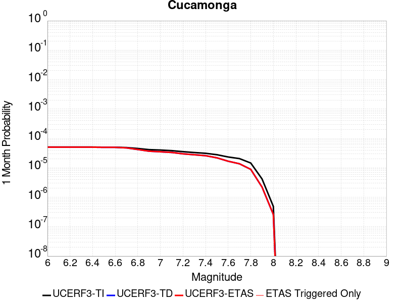 | 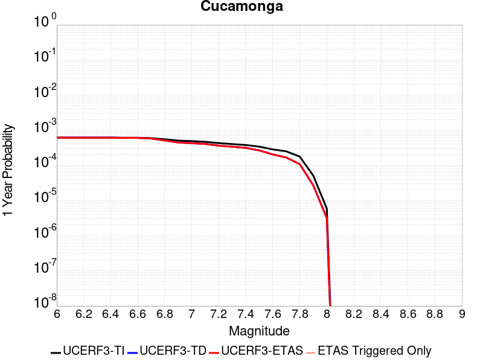 |  |

| Magnitude | 1 wk TI Prob | 1 wk TD Prob | 1 wk ETAS Prob | 1 wk ETAS/TD Gain | 1 wk ETAS Triggered Only | 1 mo TI Prob | 1 mo TD Prob | 1 mo ETAS Prob | 1 mo ETAS/TD Gain | 1 mo ETAS Triggered Only | 1 yr TI Prob | 1 yr TD Prob | 1 yr ETAS Prob | 1 yr ETAS/TD Gain | 1 yr ETAS Triggered Only | 10 yr TI Prob | 10 yr TD Prob | 10 yr ETAS Prob | 10 yr ETAS/TD Gain | 10 yr ETAS Triggered Only |
|-----|-----|-----|-----|-----|-----|-----|-----|-----|-----|-----|-----|-----|-----|-----|-----|-----|-----|-----|-----|-----|
| 6.0 | 1.1848348E-5 | 1.1742451E-5 | 1.1742451E-5 | 1.0 | 0.0 | 5.0777642E-5 | 5.032383E-5 | 5.032383E-5 | 1.0 | 0.0 | 6.180424E-4 | 6.125231E-4 | 6.125231E-4 | 1.0 | 0.0 | 0.0061632637 | 0.0061095147 | 0.006134055 | 1.0040168 | 2.4691359E-5 |
| 6.1 | 1.1848348E-5 | 1.1742451E-5 | 1.1742451E-5 | 1.0 | 0.0 | 5.0777642E-5 | 5.032383E-5 | 5.032383E-5 | 1.0 | 0.0 | 6.180424E-4 | 6.125231E-4 | 6.125231E-4 | 1.0 | 0.0 | 0.0061632637 | 0.0061095147 | 0.006134055 | 1.0040168 | 2.4691359E-5 |
| 6.2 | 1.1848348E-5 | 1.1742451E-5 | 1.1742451E-5 | 1.0 | 0.0 | 5.0777642E-5 | 5.032383E-5 | 5.032383E-5 | 1.0 | 0.0 | 6.180424E-4 | 6.125231E-4 | 6.125231E-4 | 1.0 | 0.0 | 0.0061632637 | 0.0061095147 | 0.006134055 | 1.0040168 | 2.4691359E-5 |
| 6.3 | 1.1848348E-5 | 1.1742451E-5 | 1.1742451E-5 | 1.0 | 0.0 | 5.0777642E-5 | 5.032383E-5 | 5.032383E-5 | 1.0 | 0.0 | 6.180424E-4 | 6.125231E-4 | 6.125231E-4 | 1.0 | 0.0 | 0.0061632637 | 0.0061095147 | 0.006134055 | 1.0040168 | 2.4691359E-5 |
| 6.4 | 1.1848348E-5 | 1.1742451E-5 | 1.1742451E-5 | 1.0 | 0.0 | 5.0777642E-5 | 5.032383E-5 | 5.032383E-5 | 1.0 | 0.0 | 6.180424E-4 | 6.125231E-4 | 6.125231E-4 | 1.0 | 0.0 | 0.0061632637 | 0.0061095147 | 0.006134055 | 1.0040168 | 2.4691359E-5 |
| 6.5 | 1.16988695E-5 | 1.1581468E-5 | 1.1581468E-5 | 1.0 | 0.0 | 5.013705E-5 | 4.9633934E-5 | 4.9633934E-5 | 1.0 | 0.0 | 6.102476E-4 | 6.041283E-4 | 6.041283E-4 | 1.0 | 0.0 | 0.006085745 | 0.0060260226 | 0.0060260226 | 1.0 | 0.0 |
| 6.6 | 1.16988695E-5 | 1.1581468E-5 | 1.1581468E-5 | 1.0 | 0.0 | 5.013705E-5 | 4.9633934E-5 | 4.9633934E-5 | 1.0 | 0.0 | 6.102476E-4 | 6.041283E-4 | 6.041283E-4 | 1.0 | 0.0 | 0.006085745 | 0.0060260226 | 0.0060260226 | 1.0 | 0.0 |
| 6.7 | 1.1397107E-5 | 1.1120239E-5 | 1.1120239E-5 | 1.0 | 0.0 | 4.884383E-5 | 4.765731E-5 | 4.765731E-5 | 1.0 | 0.0 | 5.9451134E-4 | 5.800758E-4 | 5.800758E-4 | 1.0 | 0.0 | 0.005929234 | 0.0057867584 | 0.0057867584 | 1.0 | 0.0 |
| 6.8 | 1.058387E-5 | 9.789649E-6 | 9.789649E-6 | 1.0 | 0.0 | 4.5358654E-5 | 4.195497E-5 | 4.195497E-5 | 1.0 | 0.0 | 5.521017E-4 | 5.1068317E-4 | 5.1068317E-4 | 1.0 | 0.0 | 0.00550732 | 0.005096096 | 0.005096096 | 1.0 | 0.0 |
| 6.9 | 9.690046E-6 | 8.583722E-6 | 8.583722E-6 | 1.0 | 0.0 | 4.1528107E-5 | 3.6786863E-5 | 3.6786863E-5 | 1.0 | 0.0 | 5.054874E-4 | 4.4778842E-4 | 4.4778842E-4 | 1.0 | 0.0 | 0.005043391 | 0.0044697877 | 0.0044697877 | 1.0 | 0.0 |
| 7.0 | 9.381461E-6 | 8.191231E-6 | 8.191231E-6 | 1.0 | 0.0 | 4.020564E-5 | 3.5104807E-5 | 3.5104807E-5 | 1.0 | 0.0 | 4.893937E-4 | 4.2731757E-4 | 4.2731757E-4 | 1.0 | 0.0 | 0.0048831734 | 0.004265884 | 0.004265884 | 1.0 | 0.0 |
| 7.1 | 8.946492E-6 | 7.785935E-6 | 7.785935E-6 | 1.0 | 0.0 | 3.8341543E-5 | 3.336787E-5 | 3.336787E-5 | 1.0 | 0.0 | 4.667083E-4 | 4.0617838E-4 | 4.0617838E-4 | 1.0 | 0.0 | 0.0046572937 | 0.0040552868 | 0.0040552868 | 1.0 | 0.0 |
| 7.2 | 8.251016E-6 | 6.9790576E-6 | 6.9790576E-6 | 1.0 | 0.0 | 3.5361016E-5 | 2.9909905E-5 | 2.9909905E-5 | 1.0 | 0.0 | 4.3043532E-4 | 3.6409247E-4 | 3.6409247E-4 | 1.0 | 0.0 | 0.0042960253 | 0.0036358838 | 0.0036358838 | 1.0 | 0.0 |
| 7.3 | 7.717881E-6 | 6.4900078E-6 | 6.4900078E-6 | 1.0 | 0.0 | 3.3076216E-5 | 2.7814025E-5 | 2.7814025E-5 | 1.0 | 0.0 | 4.026285E-4 | 3.3858334E-4 | 3.3858334E-4 | 1.0 | 0.0 | 0.004018998 | 0.0033816027 | 0.0033816027 | 1.0 | 0.0 |
| 7.4 | 7.275623E-6 | 6.03551E-6 | 6.03551E-6 | 1.0 | 0.0 | 3.118087E-5 | 2.5866215E-5 | 2.5866215E-5 | 1.0 | 0.0 | 3.7956095E-4 | 3.1487588E-4 | 3.1487588E-4 | 1.0 | 0.0 | 0.0037891332 | 0.0031452242 | 0.0031452242 | 1.0 | 0.0 |
| 7.5 | 6.5109502E-6 | 5.1037223E-6 | 5.1037223E-6 | 1.0 | 0.0 | 2.7903774E-5 | 2.1872913E-5 | 2.1872913E-5 | 1.0 | 0.0 | 3.3967546E-4 | 2.662703E-4 | 2.662703E-4 | 1.0 | 0.0 | 0.0033915674 | 0.002660428 | 0.002660428 | 1.0 | 0.0 |
| 7.6 | 5.4495326E-6 | 3.911345E-6 | 3.911345E-6 | 1.0 | 0.0 | 2.335493E-5 | 1.67628E-5 | 1.67628E-5 | 1.0 | 0.0 | 2.8430918E-4 | 2.0406804E-4 | 2.0406804E-4 | 1.0 | 0.0 | 0.0028394572 | 0.002039718 | 0.002039718 | 1.0 | 0.0 |
| 7.7 | 4.7997164E-6 | 3.2027551E-6 | 3.2027551E-6 | 1.0 | 0.0 | 2.057005E-5 | 1.3726021E-5 | 1.3726021E-5 | 1.0 | 0.0 | 2.504116E-4 | 1.6710153E-4 | 1.6710153E-4 | 1.0 | 0.0 | 0.002501296 | 0.0016706818 | 0.0016706818 | 1.0 | 0.0 |
| 7.8 | 3.3941733E-6 | 2.065652E-6 | 2.065652E-6 | 1.0 | 0.0 | 1.4546376E-5 | 8.852764E-6 | 8.852764E-6 | 1.0 | 0.0 | 1.7708774E-4 | 1.07777094E-4 | 1.07777094E-4 | 1.0 | 0.0 | 0.0017694668 | 0.0010774855 | 0.0010774855 | 1.0 | 0.0 |
| 7.9 | 9.750552E-7 | 5.160662E-7 | 5.160662E-7 | 1.0 | 0.0 | 4.178801E-6 | 2.2117106E-6 | 2.2117106E-6 | 1.0 | 0.0 | 5.0875715E-5 | 2.6927248E-5 | 2.6927248E-5 | 1.0 | 0.0 | 5.086407E-4 | 2.6924026E-4 | 2.6924026E-4 | 1.0 | 0.0 |
| 8.0 | 1.133857E-7 | 6.056467E-8 | 6.056467E-8 | 1.0 | 0.0 | 4.8593864E-7 | 2.5956285E-7 | 2.5956285E-7 | 1.0 | 0.0 | 5.9162867E-6 | 3.1601733E-6 | 3.1601733E-6 | 1.0 | 0.0 | 5.916129E-5 | 3.16013E-5 | 3.16013E-5 | 1.0 | 0.0 |

## Mission Hills 2011
*[(top)](#table-of-contents)*

| 1 Week | 1 Month | 1 Year | 10 Year |
|-----|-----|-----|-----|
|  |  |  |  |

| Magnitude | 1 wk TI Prob | 1 wk TD Prob | 1 wk ETAS Prob | 1 wk ETAS/TD Gain | 1 wk ETAS Triggered Only | 1 mo TI Prob | 1 mo TD Prob | 1 mo ETAS Prob | 1 mo ETAS/TD Gain | 1 mo ETAS Triggered Only | 1 yr TI Prob | 1 yr TD Prob | 1 yr ETAS Prob | 1 yr ETAS/TD Gain | 1 yr ETAS Triggered Only | 10 yr TI Prob | 10 yr TD Prob | 10 yr ETAS Prob | 10 yr ETAS/TD Gain | 10 yr ETAS Triggered Only |
|-----|-----|-----|-----|-----|-----|-----|-----|-----|-----|-----|-----|-----|-----|-----|-----|-----|-----|-----|-----|-----|
| 6.0 | 1.8765717E-5 | 1.9057921E-5 | 1.9057921E-5 | 1.0 | 0.0 | 8.0422025E-5 | 8.167619E-5 | 8.167619E-5 | 1.0 | 0.0 | 9.786983E-4 | 9.942976E-4 | 9.942976E-4 | 1.0 | 0.0 | 0.009743992 | 0.009932165 | 0.009956611 | 1.0024613 | 2.4691359E-5 |
| 6.1 | 1.8765717E-5 | 1.9057921E-5 | 1.9057921E-5 | 1.0 | 0.0 | 8.0422025E-5 | 8.167619E-5 | 8.167619E-5 | 1.0 | 0.0 | 9.786983E-4 | 9.942976E-4 | 9.942976E-4 | 1.0 | 0.0 | 0.009743992 | 0.009932165 | 0.009956611 | 1.0024613 | 2.4691359E-5 |
| 6.2 | 1.8765717E-5 | 1.9057921E-5 | 1.9057921E-5 | 1.0 | 0.0 | 8.0422025E-5 | 8.167619E-5 | 8.167619E-5 | 1.0 | 0.0 | 9.786983E-4 | 9.942976E-4 | 9.942976E-4 | 1.0 | 0.0 | 0.009743992 | 0.009932165 | 0.009956611 | 1.0024613 | 2.4691359E-5 |
| 6.3 | 1.8765717E-5 | 1.9057921E-5 | 1.9057921E-5 | 1.0 | 0.0 | 8.0422025E-5 | 8.167619E-5 | 8.167619E-5 | 1.0 | 0.0 | 9.786983E-4 | 9.942976E-4 | 9.942976E-4 | 1.0 | 0.0 | 0.009743992 | 0.009932165 | 0.009956611 | 1.0024613 | 2.4691359E-5 |
| 6.4 | 4.566357E-6 | 2.5152322E-6 | 2.5152322E-6 | 1.0 | 0.0 | 1.9569954E-5 | 1.0779532E-5 | 1.0779532E-5 | 1.0 | 0.0 | 2.3823815E-4 | 1.3123472E-4 | 1.3123472E-4 | 1.0 | 0.0 | 0.002379829 | 0.0013117505 | 0.0013117505 | 1.0 | 0.0 |
| 6.5 | 4.566357E-6 | 2.5152322E-6 | 2.5152322E-6 | 1.0 | 0.0 | 1.9569954E-5 | 1.0779532E-5 | 1.0779532E-5 | 1.0 | 0.0 | 2.3823815E-4 | 1.3123472E-4 | 1.3123472E-4 | 1.0 | 0.0 | 0.002379829 | 0.0013117505 | 0.0013117505 | 1.0 | 0.0 |
| 6.6 | 4.566357E-6 | 2.5152322E-6 | 2.5152322E-6 | 1.0 | 0.0 | 1.9569954E-5 | 1.0779532E-5 | 1.0779532E-5 | 1.0 | 0.0 | 2.3823815E-4 | 1.3123472E-4 | 1.3123472E-4 | 1.0 | 0.0 | 0.002379829 | 0.0013117505 | 0.0013117505 | 1.0 | 0.0 |
| 6.7 | 2.3266773E-6 | 1.3297656E-6 | 1.3297656E-6 | 1.0 | 0.0 | 9.971435E-6 | 5.6989834E-6 | 5.6989834E-6 | 1.0 | 0.0 | 1.2139547E-4 | 6.938297E-5 | 6.938297E-5 | 1.0 | 0.0 | 0.0012132917 | 6.936192E-4 | 6.936192E-4 | 1.0 | 0.0 |
| 6.8 | 2.032735E-6 | 1.1895388E-6 | 1.1895388E-6 | 1.0 | 0.0 | 8.711692E-6 | 5.098014E-6 | 5.098014E-6 | 1.0 | 0.0 | 1.06059684E-4 | 6.2066596E-5 | 6.2066596E-5 | 1.0 | 0.0 | 0.0010600908 | 6.204975E-4 | 6.204975E-4 | 1.0 | 0.0 |
| 6.9 | 1.3186259E-6 | 1.0562633E-6 | 1.0562633E-6 | 1.0 | 0.0 | 5.6512413E-6 | 4.526835E-6 | 4.526835E-6 | 1.0 | 0.0 | 6.8801695E-5 | 5.5112854E-5 | 5.5112854E-5 | 1.0 | 0.0 | 6.8780396E-4 | 5.509948E-4 | 5.509948E-4 | 1.0 | 0.0 |
| 7.0 | 1.2726016E-6 | 1.0159918E-6 | 1.0159918E-6 | 1.0 | 0.0 | 5.4539955E-6 | 4.354243E-6 | 4.354243E-6 | 1.0 | 0.0 | 6.6400375E-5 | 5.301165E-5 | 5.301165E-5 | 1.0 | 0.0 | 6.6380535E-4 | 5.299929E-4 | 5.299929E-4 | 1.0 | 0.0 |
| 7.1 | 1.2063913E-6 | 9.570865E-7 | 9.570865E-7 | 1.0 | 0.0 | 5.170238E-6 | 4.101793E-6 | 4.101793E-6 | 1.0 | 0.0 | 6.294583E-5 | 4.993821E-5 | 4.993821E-5 | 1.0 | 0.0 | 6.2928005E-4 | 4.992724E-4 | 4.992724E-4 | 1.0 | 0.0 |
| 7.2 | 9.105806E-7 | 7.377196E-7 | 7.377196E-7 | 1.0 | 0.0 | 3.9024826E-6 | 3.1616514E-6 | 3.1616514E-6 | 1.0 | 0.0 | 4.7511687E-5 | 3.8492442E-5 | 3.8492442E-5 | 1.0 | 0.0 | 4.7501532E-4 | 3.848593E-4 | 3.848593E-4 | 1.0 | 0.0 |
| 7.3 | 7.020432E-7 | 5.7106274E-7 | 5.7106274E-7 | 1.0 | 0.0 | 3.0087533E-6 | 2.4474095E-6 | 2.4474095E-6 | 1.0 | 0.0 | 3.6630954E-5 | 2.9796818E-5 | 2.9796818E-5 | 1.0 | 0.0 | 3.6624918E-4 | 2.9792954E-4 | 2.9792954E-4 | 1.0 | 0.0 |
| 7.4 | 5.3900635E-7 | 4.4485526E-7 | 4.4485526E-7 | 1.0 | 0.0 | 2.3100251E-6 | 1.9065212E-6 | 1.9065212E-6 | 1.0 | 0.0 | 2.8124194E-5 | 2.321166E-5 | 2.321166E-5 | 1.0 | 0.0 | 2.8120633E-4 | 2.3209357E-4 | 2.3209357E-4 | 1.0 | 0.0 |
| 7.5 | 2.907075E-7 | 2.2878932E-7 | 2.2878932E-7 | 1.0 | 0.0 | 1.2458887E-6 | 9.805252E-7 | 9.805252E-7 | 1.0 | 0.0 | 1.5168589E-5 | 1.1937832E-5 | 1.1937832E-5 | 1.0 | 0.0 | 1.5167553E-4 | 1.1937208E-4 | 1.1937208E-4 | 1.0 | 0.0 |
| 7.6 | 1.6903675E-7 | 1.2356027E-7 | 1.2356027E-7 | 1.0 | 0.0 | 7.2444305E-7 | 5.295439E-7 | 5.295439E-7 | 1.0 | 0.0 | 8.820059E-6 | 6.447179E-6 | 6.447179E-6 | 1.0 | 0.0 | 8.8197085E-5 | 6.447005E-5 | 6.447005E-5 | 1.0 | 0.0 |
| 7.7 | 7.168073E-8 | 3.91532E-8 | 3.91532E-8 | 1.0 | 0.0 | 3.072031E-7 | 1.6779943E-7 | 1.6779943E-7 | 1.0 | 0.0 | 3.7401915E-6 | 2.042956E-6 | 2.042956E-6 | 1.0 | 0.0 | 3.7401285E-5 | 2.0429385E-5 | 2.0429385E-5 | 1.0 | 0.0 |
| 7.8 | 6.564101E-8 | 3.385292E-8 | 3.385292E-8 | 1.0 | 0.0 | 2.813186E-7 | 1.4508393E-7 | 1.4508393E-7 | 1.0 | 0.0 | 3.4250486E-6 | 1.7663956E-6 | 1.7663956E-6 | 1.0 | 0.0 | 3.424996E-5 | 1.7663826E-5 | 1.7663826E-5 | 1.0 | 0.0 |
| 7.9 | 1.0029074E-8 | 3.731989E-9 | 3.731989E-9 | 1.0 | 0.0 | 4.2981743E-8 | 1.5994239E-8 | 1.5994239E-8 | 1.0 | 0.0 | 5.2330256E-7 | 1.9472985E-7 | 1.9472985E-7 | 1.0 | 0.0 | 5.2330133E-6 | 1.9472977E-6 | 1.9472977E-6 | 1.0 | 0.0 |

## Mission Creek
*[(top)](#table-of-contents)*

| 1 Week | 1 Month | 1 Year | 10 Year |
|-----|-----|-----|-----|
|  |  |  | 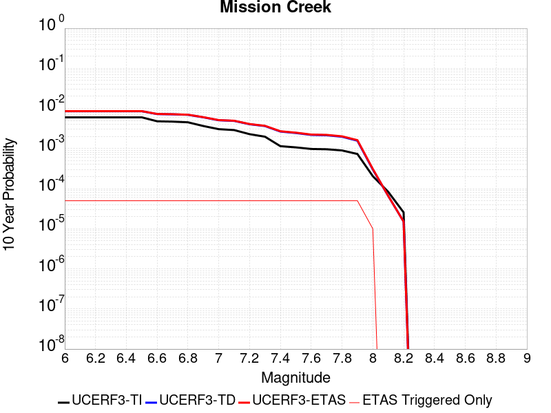 |

| Magnitude | 1 wk TI Prob | 1 wk TD Prob | 1 wk ETAS Prob | 1 wk ETAS/TD Gain | 1 wk ETAS Triggered Only | 1 mo TI Prob | 1 mo TD Prob | 1 mo ETAS Prob | 1 mo ETAS/TD Gain | 1 mo ETAS Triggered Only | 1 yr TI Prob | 1 yr TD Prob | 1 yr ETAS Prob | 1 yr ETAS/TD Gain | 1 yr ETAS Triggered Only | 10 yr TI Prob | 10 yr TD Prob | 10 yr ETAS Prob | 10 yr ETAS/TD Gain | 10 yr ETAS Triggered Only |
|-----|-----|-----|-----|-----|-----|-----|-----|-----|-----|-----|-----|-----|-----|-----|-----|-----|-----|-----|-----|-----|
| 6.0 | 1.1549387E-5 | 1.6341111E-5 | 1.6341111E-5 | 1.0 | 0.0 | 4.9496433E-5 | 7.0031536E-5 | 7.0031536E-5 | 1.0 | 0.0 | 6.0245243E-4 | 8.5231545E-4 | 8.5231545E-4 | 1.0 | 0.0 | 0.006008218 | 0.008519485 | 0.008543966 | 1.0028735 | 2.4691359E-5 |
| 6.1 | 1.1549387E-5 | 1.6341111E-5 | 1.6341111E-5 | 1.0 | 0.0 | 4.9496433E-5 | 7.0031536E-5 | 7.0031536E-5 | 1.0 | 0.0 | 6.0245243E-4 | 8.5231545E-4 | 8.5231545E-4 | 1.0 | 0.0 | 0.006008218 | 0.008519485 | 0.008543966 | 1.0028735 | 2.4691359E-5 |
| 6.2 | 1.1549387E-5 | 1.6341111E-5 | 1.6341111E-5 | 1.0 | 0.0 | 4.9496433E-5 | 7.0031536E-5 | 7.0031536E-5 | 1.0 | 0.0 | 6.0245243E-4 | 8.5231545E-4 | 8.5231545E-4 | 1.0 | 0.0 | 0.006008218 | 0.008519485 | 0.008543966 | 1.0028735 | 2.4691359E-5 |
| 6.3 | 1.1549387E-5 | 1.6341111E-5 | 1.6341111E-5 | 1.0 | 0.0 | 4.9496433E-5 | 7.0031536E-5 | 7.0031536E-5 | 1.0 | 0.0 | 6.0245243E-4 | 8.5231545E-4 | 8.5231545E-4 | 1.0 | 0.0 | 0.006008218 | 0.008519485 | 0.008543966 | 1.0028735 | 2.4691359E-5 |
| 6.4 | 1.1549387E-5 | 1.6341111E-5 | 1.6341111E-5 | 1.0 | 0.0 | 4.9496433E-5 | 7.0031536E-5 | 7.0031536E-5 | 1.0 | 0.0 | 6.0245243E-4 | 8.5231545E-4 | 8.5231545E-4 | 1.0 | 0.0 | 0.006008218 | 0.008519485 | 0.008543966 | 1.0028735 | 2.4691359E-5 |
| 6.5 | 1.1549387E-5 | 1.6341111E-5 | 1.6341111E-5 | 1.0 | 0.0 | 4.9496433E-5 | 7.0031536E-5 | 7.0031536E-5 | 1.0 | 0.0 | 6.0245243E-4 | 8.5231545E-4 | 8.5231545E-4 | 1.0 | 0.0 | 0.006008218 | 0.008519485 | 0.008543966 | 1.0028735 | 2.4691359E-5 |
| 6.6 | 9.202681E-6 | 1.3864242E-5 | 1.3864242E-5 | 1.0 | 0.0 | 3.9439463E-5 | 5.9416878E-5 | 5.9416878E-5 | 1.0 | 0.0 | 4.800697E-4 | 7.231694E-4 | 7.231694E-4 | 1.0 | 0.0 | 0.004790339 | 0.007236605 | 0.007261118 | 1.0033873 | 2.4691359E-5 |
| 6.7 | 9.019164E-6 | 1.3669899E-5 | 1.3669899E-5 | 1.0 | 0.0 | 3.8652986E-5 | 5.8584017E-5 | 5.8584017E-5 | 1.0 | 0.0 | 4.7049852E-4 | 7.13036E-4 | 7.13036E-4 | 1.0 | 0.0 | 0.004695036 | 0.0071359244 | 0.0071604396 | 1.0034355 | 2.4691359E-5 |
| 6.8 | 8.673558E-6 | 1.329197E-5 | 1.329197E-5 | 1.0 | 0.0 | 3.717186E-5 | 5.6964393E-5 | 5.6964393E-5 | 1.0 | 0.0 | 4.524734E-4 | 6.9332967E-4 | 6.9332967E-4 | 1.0 | 0.0 | 0.0045155324 | 0.006940094 | 0.0069646137 | 1.0035331 | 2.4691359E-5 |
| 6.9 | 7.002255E-6 | 1.1496057E-5 | 1.1496057E-5 | 1.0 | 0.0 | 3.000932E-5 | 4.926792E-5 | 4.926792E-5 | 1.0 | 0.0 | 3.653022E-4 | 5.996787E-4 | 5.996787E-4 | 1.0 | 0.0 | 0.0036470229 | 0.0060088513 | 0.0060333945 | 1.0040845 | 2.4691359E-5 |
| 7.0 | 5.84644E-6 | 9.692441E-6 | 9.692441E-6 | 1.0 | 0.0 | 2.5055931E-5 | 4.15384E-5 | 4.15384E-5 | 1.0 | 0.0 | 3.0501327E-4 | 5.0561724E-4 | 5.0561724E-4 | 1.0 | 0.0 | 0.0030459496 | 0.005072708 | 0.0050972737 | 1.0048428 | 2.4691359E-5 |
| 7.1 | 5.54703E-6 | 9.346854E-6 | 9.346854E-6 | 1.0 | 0.0 | 2.377277E-5 | 4.0057355E-5 | 4.0057355E-5 | 1.0 | 0.0 | 2.8939504E-4 | 4.8759364E-4 | 4.8759364E-4 | 1.0 | 0.0 | 0.0028901845 | 0.0048932703 | 0.004917841 | 1.0050213 | 2.4691359E-5 |
| 7.2 | 4.384709E-6 | 7.698194E-6 | 7.698194E-6 | 1.0 | 0.0 | 1.8791474E-5 | 3.2991862E-5 | 3.2991862E-5 | 1.0 | 0.0 | 2.2876218E-4 | 4.0160556E-4 | 4.0160556E-4 | 1.0 | 0.0 | 0.0022852682 | 0.0040367944 | 0.0040613865 | 1.0060918 | 2.4691359E-5 |
| 7.3 | 3.7888456E-6 | 6.931747E-6 | 6.931747E-6 | 1.0 | 0.0 | 1.623781E-5 | 2.970717E-5 | 2.970717E-5 | 1.0 | 0.0 | 1.9767738E-4 | 3.616281E-4 | 3.616281E-4 | 1.0 | 0.0 | 0.0019750162 | 0.0036383772 | 0.0036629785 | 1.0067617 | 2.4691359E-5 |
| 7.4 | 2.1982462E-6 | 5.039589E-6 | 5.039589E-6 | 1.0 | 0.0 | 9.421021E-6 | 2.159806E-5 | 2.159806E-5 | 1.0 | 0.0 | 1.1469489E-4 | 2.6292482E-4 | 2.6292482E-4 | 1.0 | 0.0 | 0.0011463572 | 0.0026539033 | 0.0026785291 | 1.0092791 | 2.4691359E-5 |
| 7.5 | 2.051923E-6 | 4.6303985E-6 | 4.6303985E-6 | 1.0 | 0.0 | 8.793926E-6 | 1.9844414E-5 | 1.9844414E-5 | 1.0 | 0.0 | 1.0706078E-4 | 2.415791E-4 | 2.415791E-4 | 1.0 | 0.0 | 0.0010700922 | 0.0024413404 | 0.0024659715 | 1.0100892 | 2.4691359E-5 |
| 7.6 | 1.8733427E-6 | 4.138231E-6 | 4.138231E-6 | 1.0 | 0.0 | 8.028587E-6 | 1.7735156E-5 | 1.7735156E-5 | 1.0 | 0.0 | 9.774366E-5 | 2.159042E-4 | 2.159042E-4 | 1.0 | 0.0 | 9.770069E-4 | 0.0021856092 | 0.0022102466 | 1.0112725 | 2.4691359E-5 |
| 7.7 | 1.8411953E-6 | 4.0578066E-6 | 4.0578066E-6 | 1.0 | 0.0 | 7.890813E-6 | 1.7390485E-5 | 1.7390485E-5 | 1.0 | 0.0 | 9.606641E-5 | 2.1170866E-4 | 2.1170866E-4 | 1.0 | 0.0 | 9.6024893E-4 | 0.0021438438 | 0.0021684824 | 1.0114926 | 2.4691359E-5 |
| 7.8 | 1.7194251E-6 | 3.7241725E-6 | 3.7241725E-6 | 1.0 | 0.0 | 7.368944E-6 | 1.5960642E-5 | 1.5960642E-5 | 1.0 | 0.0 | 8.97132E-5 | 1.9430356E-4 | 1.9430356E-4 | 1.0 | 0.0 | 8.967699E-4 | 0.0019693163 | 0.001993959 | 1.0125134 | 2.4691359E-5 |
| 7.9 | 1.4035052E-6 | 2.9613316E-6 | 2.9613316E-6 | 1.0 | 0.0 | 6.0150082E-6 | 1.269136E-5 | 1.269136E-5 | 1.0 | 0.0 | 7.3230265E-5 | 1.5450642E-4 | 1.5450642E-4 | 1.0 | 0.0 | 7.3206134E-4 | 0.0015688159 | 0.0015934685 | 1.0157142 | 2.4691359E-5 |
| 8.0 | 3.9318823E-7 | 5.5560014E-7 | 5.5560014E-7 | 1.0 | 0.0 | 1.6850913E-6 | 2.3811413E-6 | 2.3811413E-6 | 1.0 | 0.0 | 2.0515794E-5 | 2.8990016E-5 | 2.8990016E-5 | 1.0 | 0.0 | 2.0513899E-4 | 3.004275E-4 | 3.004275E-4 | 1.0 | 0.0 |
| 8.1 | 1.596793E-7 | 1.1475386E-7 | 1.1475386E-7 | 1.0 | 0.0 | 6.8433974E-7 | 4.9180215E-7 | 4.9180215E-7 | 1.0 | 0.0 | 8.331805E-6 | 5.987675E-6 | 5.987675E-6 | 1.0 | 0.0 | 8.331492E-5 | 6.601783E-5 | 6.601783E-5 | 1.0 | 0.0 |
| 8.2 | 4.9003038E-8 | 2.5686987E-8 | 2.5686987E-8 | 1.0 | 0.0 | 2.10013E-7 | 1.1008708E-7 | 1.1008708E-7 | 1.0 | 0.0 | 2.5569052E-6 | 1.3403094E-6 | 1.3403094E-6 | 1.0 | 0.0 | 2.556876E-5 | 1.5090479E-5 | 1.5090479E-5 | 1.0 | 0.0 |

## Bullion Mountains
*[(top)](#table-of-contents)*

| 1 Week | 1 Month | 1 Year | 10 Year |
|-----|-----|-----|-----|
|  |  |  |  |

| Magnitude | 1 wk TI Prob | 1 wk TD Prob | 1 wk ETAS Prob | 1 wk ETAS/TD Gain | 1 wk ETAS Triggered Only | 1 mo TI Prob | 1 mo TD Prob | 1 mo ETAS Prob | 1 mo ETAS/TD Gain | 1 mo ETAS Triggered Only | 1 yr TI Prob | 1 yr TD Prob | 1 yr ETAS Prob | 1 yr ETAS/TD Gain | 1 yr ETAS Triggered Only | 10 yr TI Prob | 10 yr TD Prob | 10 yr ETAS Prob | 10 yr ETAS/TD Gain | 10 yr ETAS Triggered Only |
|-----|-----|-----|-----|-----|-----|-----|-----|-----|-----|-----|-----|-----|-----|-----|-----|-----|-----|-----|-----|-----|
| 6.0 | 1.6420427E-5 | 1.4693821E-5 | 1.4693821E-5 | 1.0 | 0.0 | 7.037136E-5 | 6.297221E-5 | 6.297221E-5 | 1.0 | 0.0 | 8.5643446E-4 | 7.664554E-4 | 7.9112785E-4 | 1.0321903 | 2.4691359E-5 | 0.008531413 | 0.007641914 | 0.0076664165 | 1.0032064 | 2.4691359E-5 |
| 6.1 | 1.6420427E-5 | 1.4693821E-5 | 1.4693821E-5 | 1.0 | 0.0 | 7.037136E-5 | 6.297221E-5 | 6.297221E-5 | 1.0 | 0.0 | 8.5643446E-4 | 7.664554E-4 | 7.9112785E-4 | 1.0321903 | 2.4691359E-5 | 0.008531413 | 0.007641914 | 0.0076664165 | 1.0032064 | 2.4691359E-5 |
| 6.2 | 1.6420427E-5 | 1.4693821E-5 | 1.4693821E-5 | 1.0 | 0.0 | 7.037136E-5 | 6.297221E-5 | 6.297221E-5 | 1.0 | 0.0 | 8.5643446E-4 | 7.664554E-4 | 7.9112785E-4 | 1.0321903 | 2.4691359E-5 | 0.008531413 | 0.007641914 | 0.0076664165 | 1.0032064 | 2.4691359E-5 |
| 6.3 | 1.2046778E-5 | 9.863532E-6 | 9.863532E-6 | 1.0 | 0.0 | 5.1628023E-5 | 4.2271728E-5 | 4.2271728E-5 | 1.0 | 0.0 | 6.283899E-4 | 5.145599E-4 | 5.145599E-4 | 1.0 | 0.0 | 0.0062661595 | 0.005135967 | 0.005135967 | 1.0 | 0.0 |
| 6.4 | 1.2046778E-5 | 9.863532E-6 | 9.863532E-6 | 1.0 | 0.0 | 5.1628023E-5 | 4.2271728E-5 | 4.2271728E-5 | 1.0 | 0.0 | 6.283899E-4 | 5.145599E-4 | 5.145599E-4 | 1.0 | 0.0 | 0.0062661595 | 0.005135967 | 0.005135967 | 1.0 | 0.0 |
| 6.5 | 1.0244343E-5 | 7.880444E-6 | 7.880444E-6 | 1.0 | 0.0 | 4.390359E-5 | 3.3773013E-5 | 3.3773013E-5 | 1.0 | 0.0 | 5.343951E-4 | 4.1112956E-4 | 4.1112956E-4 | 1.0 | 0.0 | 0.005331118 | 0.004105721 | 0.004105721 | 1.0 | 0.0 |
| 6.6 | 9.605408E-6 | 7.1784093E-6 | 7.1784093E-6 | 1.0 | 0.0 | 4.1165385E-5 | 3.0764364E-5 | 3.0764364E-5 | 1.0 | 0.0 | 5.010733E-4 | 3.745121E-4 | 3.745121E-4 | 1.0 | 0.0 | 0.00499945 | 0.003740807 | 0.003740807 | 1.0 | 0.0 |
| 6.7 | 8.60418E-6 | 6.1248024E-6 | 6.1248024E-6 | 1.0 | 0.0 | 3.687454E-5 | 2.6249E-5 | 2.6249E-5 | 1.0 | 0.0 | 4.48855E-4 | 3.195542E-4 | 3.195542E-4 | 1.0 | 0.0 | 0.004479495 | 0.0031928592 | 0.0031928592 | 1.0 | 0.0 |
| 6.8 | 5.187994E-6 | 2.5635889E-6 | 2.5635889E-6 | 1.0 | 0.0 | 2.223407E-5 | 1.0986785E-5 | 1.0986785E-5 | 1.0 | 0.0 | 2.7066618E-4 | 1.337599E-4 | 1.337599E-4 | 1.0 | 0.0 | 0.0027033675 | 0.0013371855 | 0.0013371855 | 1.0 | 0.0 |
| 6.9 | 4.5302368E-6 | 2.344682E-6 | 2.344682E-6 | 1.0 | 0.0 | 1.9415156E-5 | 1.004862E-5 | 1.004862E-5 | 1.0 | 0.0 | 2.3635388E-4 | 1.2233906E-4 | 1.2233906E-4 | 1.0 | 0.0 | 0.0023610266 | 0.0012231063 | 0.0012231063 | 1.0 | 0.0 |
| 7.0 | 3.431668E-6 | 1.6885238E-6 | 1.6885238E-6 | 1.0 | 0.0 | 1.4707065E-5 | 7.2365306E-6 | 7.2365306E-6 | 1.0 | 0.0 | 1.7904381E-4 | 8.810476E-5 | 8.810476E-5 | 1.0 | 0.0 | 0.0017889962 | 8.8104757E-4 | 8.8104757E-4 | 1.0 | 0.0 |

## San Jacinto (Superstition Mtn)
*[(top)](#table-of-contents)*

| 1 Week | 1 Month | 1 Year | 10 Year |
|-----|-----|-----|-----|
|  |  |  | 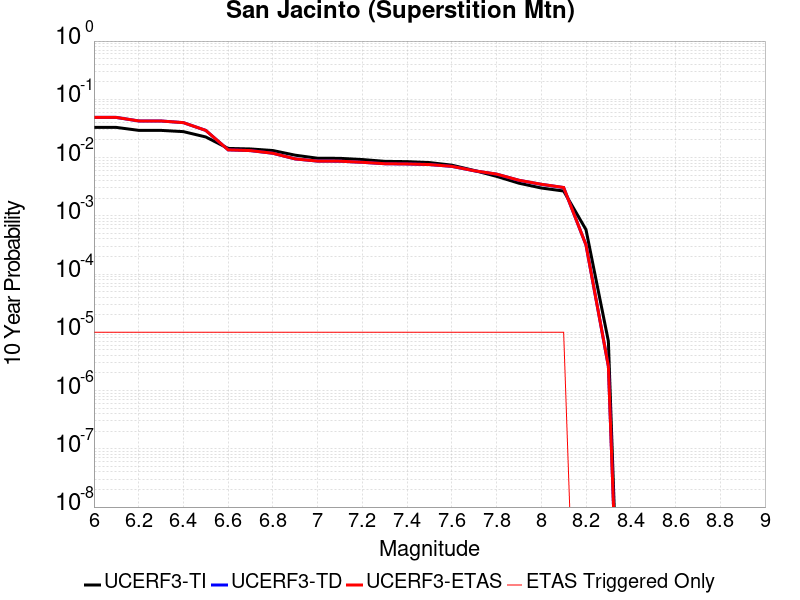 |

| Magnitude | 1 wk TI Prob | 1 wk TD Prob | 1 wk ETAS Prob | 1 wk ETAS/TD Gain | 1 wk ETAS Triggered Only | 1 mo TI Prob | 1 mo TD Prob | 1 mo ETAS Prob | 1 mo ETAS/TD Gain | 1 mo ETAS Triggered Only | 1 yr TI Prob | 1 yr TD Prob | 1 yr ETAS Prob | 1 yr ETAS/TD Gain | 1 yr ETAS Triggered Only | 10 yr TI Prob | 10 yr TD Prob | 10 yr ETAS Prob | 10 yr ETAS/TD Gain | 10 yr ETAS Triggered Only |
|-----|-----|-----|-----|-----|-----|-----|-----|-----|-----|-----|-----|-----|-----|-----|-----|-----|-----|-----|-----|-----|
| 6.0 | 6.4193904E-5 | 9.60538E-5 | 9.60538E-5 | 1.0 | 0.0 | 2.7508775E-4 | 4.11604E-4 | 4.11604E-4 | 1.0 | 0.0 | 0.0033440501 | 0.005001081 | 0.005025649 | 1.0049125 | 2.4691359E-5 | 0.03294174 | 0.048852775 | 0.048876263 | 1.0004808 | 2.4691359E-5 |
| 6.1 | 6.4193904E-5 | 9.60538E-5 | 9.60538E-5 | 1.0 | 0.0 | 2.7508775E-4 | 4.11604E-4 | 4.11604E-4 | 1.0 | 0.0 | 0.0033440501 | 0.005001081 | 0.005025649 | 1.0049125 | 2.4691359E-5 | 0.03294174 | 0.048852775 | 0.048876263 | 1.0004808 | 2.4691359E-5 |
| 6.2 | 5.7023593E-5 | 8.319899E-5 | 8.319899E-5 | 1.0 | 0.0 | 2.4436394E-4 | 3.565278E-4 | 3.565278E-4 | 1.0 | 0.0 | 0.002971072 | 0.0043337136 | 0.004358298 | 1.0056728 | 2.4691359E-5 | 0.029316625 | 0.042531293 | 0.042554934 | 1.0005559 | 2.4691359E-5 |
| 6.3 | 5.6940098E-5 | 8.304432E-5 | 8.304432E-5 | 1.0 | 0.0 | 2.4400617E-4 | 3.5586508E-4 | 3.5586508E-4 | 1.0 | 0.0 | 0.002966728 | 0.004325677 | 0.0043502618 | 1.0056834 | 2.4691359E-5 | 0.029274331 | 0.04245453 | 0.042478174 | 1.000557 | 2.4691359E-5 |
| 6.4 | 5.4171585E-5 | 7.753727E-5 | 7.753727E-5 | 1.0 | 0.0 | 2.3214328E-4 | 3.3226956E-4 | 3.3226956E-4 | 1.0 | 0.0 | 0.0028226813 | 0.0040395265 | 0.0040641185 | 1.0060878 | 2.4691359E-5 | 0.02787096 | 0.039743558 | 0.03976727 | 1.0005965 | 2.4691359E-5 |
| 6.5 | 4.375144E-5 | 5.6473516E-5 | 5.6473516E-5 | 1.0 | 0.0 | 1.874927E-4 | 2.4201353E-4 | 2.4201353E-4 | 1.0 | 0.0 | 0.0022803338 | 0.0029437093 | 0.002968328 | 1.0083631 | 2.4691359E-5 | 0.022570757 | 0.0292634 | 0.029287368 | 1.0008191 | 2.4691359E-5 |
| 6.6 | 2.772192E-5 | 2.5538078E-5 | 2.5538078E-5 | 1.0 | 0.0 | 1.1880282E-4 | 1.0944443E-4 | 1.0944443E-4 | 1.0 | 0.0 | 0.0014454646 | 0.0013316908 | 0.0013563493 | 1.0185167 | 2.4691359E-5 | 0.014360986 | 0.01356631 | 0.0135906655 | 1.0017954 | 2.4691359E-5 |
| 6.7 | 2.7124124E-5 | 2.4748882E-5 | 2.4748882E-5 | 1.0 | 0.0 | 1.1624106E-4 | 1.06062434E-4 | 1.06062434E-4 | 1.0 | 0.0 | 0.0014143161 | 0.0012905644 | 0.001315224 | 1.0191076 | 2.4691359E-5 | 0.014053487 | 0.013159662 | 0.013184028 | 1.0018516 | 2.4691359E-5 |
| 6.8 | 2.5475807E-5 | 2.2212787E-5 | 2.2212787E-5 | 1.0 | 0.0 | 1.0917746E-4 | 9.519425E-5 | 9.519425E-5 | 1.0 | 0.0 | 0.001328425 | 0.0011583858 | 0.0011830486 | 1.0212907 | 2.4691359E-5 | 0.0132051185 | 0.011847346 | 0.011871745 | 1.0020595 | 2.4691359E-5 |
| 6.9 | 2.1162023E-5 | 1.7670965E-5 | 1.7670965E-5 | 1.0 | 0.0 | 9.069123E-5 | 7.573053E-5 | 7.573053E-5 | 1.0 | 0.0 | 0.0011036064 | 9.2163304E-4 | 9.463016E-4 | 1.0267662 | 2.4691359E-5 | 0.010981417 | 0.009470261 | 0.009494718 | 1.0025826 | 2.4691359E-5 |
| 7.0 | 1.8754288E-5 | 1.6204316E-5 | 1.6204316E-5 | 1.0 | 0.0 | 8.037304E-5 | 6.944524E-5 | 6.944524E-5 | 1.0 | 0.0 | 9.781026E-4 | 8.4517023E-4 | 8.6984073E-4 | 1.02919 | 2.4691359E-5 | 0.009738087 | 0.008692401 | 0.0087168785 | 1.0028158 | 2.4691359E-5 |
| 7.1 | 1.8678527E-5 | 1.612942E-5 | 1.612942E-5 | 1.0 | 0.0 | 8.0048376E-5 | 6.912426E-5 | 6.912426E-5 | 1.0 | 0.0 | 9.7415317E-4 | 8.412654E-4 | 8.65936E-4 | 1.0293256 | 2.4691359E-5 | 0.009698939 | 0.008653339 | 0.008677817 | 1.0028287 | 2.4691359E-5 |
| 7.2 | 1.7804578E-5 | 1.5423555E-5 | 1.5423555E-5 | 1.0 | 0.0 | 7.6303106E-5 | 6.609929E-5 | 6.609929E-5 | 1.0 | 0.0 | 9.285943E-4 | 8.04464E-4 | 8.291355E-4 | 1.0306683 | 2.4691359E-5 | 0.009247236 | 0.008284431 | 0.008308918 | 1.0029558 | 2.4691359E-5 |
| 7.3 | 1.6583685E-5 | 1.457218E-5 | 1.457218E-5 | 1.0 | 0.0 | 7.1070994E-5 | 6.2450716E-5 | 6.2450716E-5 | 1.0 | 0.0 | 8.649459E-4 | 7.6007424E-4 | 7.8474684E-4 | 1.0324608 | 2.4691359E-5 | 0.00861587 | 0.007839502 | 0.007863999 | 1.003125 | 2.4691359E-5 |
| 7.4 | 1.6387552E-5 | 1.4436985E-5 | 1.4436985E-5 | 1.0 | 0.0 | 7.023047E-5 | 6.187134E-5 | 6.187134E-5 | 1.0 | 0.0 | 8.5472054E-4 | 7.5302523E-4 | 7.77698E-4 | 1.0327649 | 2.4691359E-5 | 0.008514405 | 0.0077688443 | 0.0077933436 | 1.0031536 | 2.4691359E-5 |
| 7.5 | 1.5790754E-5 | 1.4077255E-5 | 1.4077255E-5 | 1.0 | 0.0 | 6.767291E-5 | 6.0329712E-5 | 6.0329712E-5 | 1.0 | 0.0 | 8.236062E-4 | 7.342687E-4 | 7.589419E-4 | 1.0336025 | 2.4691359E-5 | 0.008205604 | 0.0075791935 | 0.0076036975 | 1.0032331 | 2.4691359E-5 |
| 7.6 | 1.4248672E-5 | 1.3095178E-5 | 1.3095178E-5 | 1.0 | 0.0 | 6.106431E-5 | 5.612099E-5 | 5.612099E-5 | 1.0 | 0.0 | 7.432043E-4 | 6.830606E-4 | 7.077351E-4 | 1.0361234 | 2.4691359E-5 | 0.007407237 | 0.007061244 | 0.007085761 | 1.0034721 | 2.4691359E-5 |
| 7.7 | 1.15449975E-5 | 1.0942154E-5 | 1.0942154E-5 | 1.0 | 0.0 | 4.947762E-5 | 4.689411E-5 | 4.689411E-5 | 1.0 | 0.0 | 6.022235E-4 | 5.70787E-4 | 5.9546425E-4 | 1.0432338 | 2.4691359E-5 | 0.006005941 | 0.005930368 | 0.0059549124 | 1.0041388 | 2.4691359E-5 |
| 7.8 | 9.1391985E-6 | 9.551328E-6 | 9.551328E-6 | 1.0 | 0.0 | 3.9167408E-5 | 4.0933624E-5 | 4.0933624E-5 | 1.0 | 0.0 | 4.767588E-4 | 4.982535E-4 | 5.2293256E-4 | 1.0495311 | 2.4691359E-5 | 0.0047573727 | 0.005196131 | 0.0052206935 | 1.0047271 | 2.4691359E-5 |
| 7.9 | 6.973017E-6 | 7.415277E-6 | 7.415277E-6 | 1.0 | 0.0 | 2.9884017E-5 | 3.1779375E-5 | 3.1779375E-5 | 1.0 | 0.0 | 3.6377716E-4 | 3.8684573E-4 | 4.1152752E-4 | 1.0638027 | 2.4691359E-5 | 0.0036318225 | 0.0040692138 | 0.004093805 | 1.0060432 | 2.4691359E-5 |
| 8.0 | 5.7638235E-6 | 6.2902063E-6 | 6.2902063E-6 | 1.0 | 0.0 | 2.4701867E-5 | 2.6957752E-5 | 2.6957752E-5 | 1.0 | 0.0 | 3.0070372E-4 | 3.281617E-4 | 3.5284495E-4 | 1.0752168 | 2.4691359E-5 | 0.0030029714 | 0.0034693817 | 0.0034939875 | 1.0070922 | 2.4691359E-5 |
| 8.1 | 5.1124434E-6 | 5.523319E-6 | 5.523319E-6 | 1.0 | 0.0 | 2.1910288E-5 | 2.3671157E-5 | 2.3671157E-5 | 1.0 | 0.0 | 2.6672508E-4 | 2.881587E-4 | 3.1284295E-4 | 1.085662 | 2.4691359E-5 | 0.0026640517 | 0.0030549255 | 0.0030795413 | 1.0080578 | 2.4691359E-5 |
| 8.2 | 1.1075938E-6 | 5.3750637E-7 | 5.3750637E-7 | 1.0 | 0.0 | 4.7468216E-6 | 2.3035968E-6 | 2.3035968E-6 | 1.0 | 0.0 | 5.779102E-5 | 2.8045952E-5 | 2.8045952E-5 | 1.0 | 0.0 | 5.777599E-4 | 3.1561012E-4 | 3.1561012E-4 | 1.0 | 0.0 |
| 8.3 | 1.3584393E-8 | 4.5106323E-9 | 4.5106323E-9 | 1.0 | 0.0 | 5.8218827E-8 | 1.9331281E-8 | 1.9331281E-8 | 1.0 | 0.0 | 7.0881396E-7 | 2.3535836E-7 | 2.3535836E-7 | 1.0 | 0.0 | 7.0881174E-6 | 2.6369387E-6 | 2.6369387E-6 | 1.0 | 0.0 |

## Ortigalita (South)
*[(top)](#table-of-contents)*

| 1 Week | 1 Month | 1 Year | 10 Year |
|-----|-----|-----|-----|
| 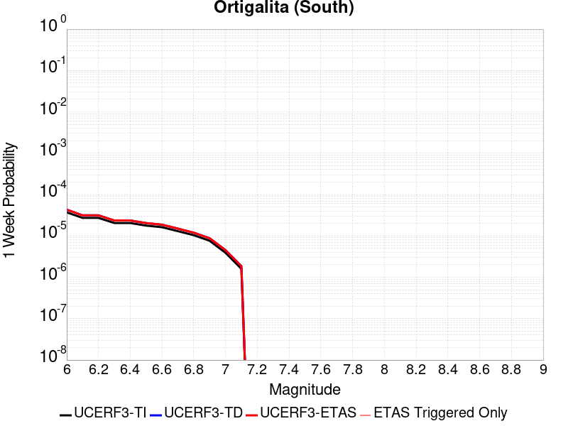 |  | 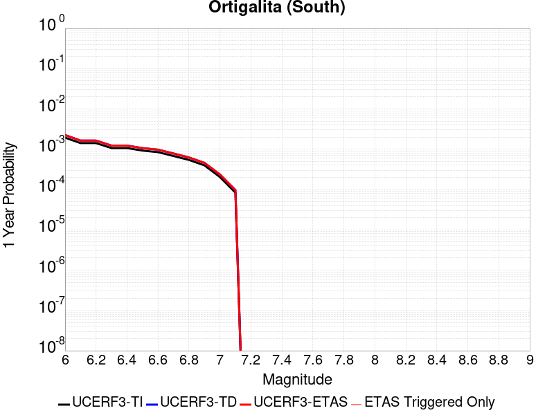 |  |

| Magnitude | 1 wk TI Prob | 1 wk TD Prob | 1 wk ETAS Prob | 1 wk ETAS/TD Gain | 1 wk ETAS Triggered Only | 1 mo TI Prob | 1 mo TD Prob | 1 mo ETAS Prob | 1 mo ETAS/TD Gain | 1 mo ETAS Triggered Only | 1 yr TI Prob | 1 yr TD Prob | 1 yr ETAS Prob | 1 yr ETAS/TD Gain | 1 yr ETAS Triggered Only | 10 yr TI Prob | 10 yr TD Prob | 10 yr ETAS Prob | 10 yr ETAS/TD Gain | 10 yr ETAS Triggered Only |
|-----|-----|-----|-----|-----|-----|-----|-----|-----|-----|-----|-----|-----|-----|-----|-----|-----|-----|-----|-----|-----|
| 6.0 | 3.72394E-5 | 4.326307E-5 | 4.326307E-5 | 1.0 | 0.0 | 1.5958765E-4 | 1.8540086E-4 | 1.8540086E-4 | 1.0 | 0.0 | 0.0019412481 | 0.0022550751 | 0.0022550751 | 1.0 | 0.0 | 0.019243775 | 0.022338301 | 0.02236244 | 1.0010806 | 2.4691359E-5 |
| 6.1 | 2.7299884E-5 | 3.149719E-5 | 3.149719E-5 | 1.0 | 0.0 | 1.16994255E-4 | 1.349813E-4 | 1.349813E-4 | 1.0 | 0.0 | 0.0014234743 | 0.0016422137 | 0.0016422137 | 1.0 | 0.0 | 0.014143906 | 0.016306715 | 0.016331004 | 1.0014895 | 2.4691359E-5 |
| 6.2 | 2.7299884E-5 | 3.149719E-5 | 3.149719E-5 | 1.0 | 0.0 | 1.16994255E-4 | 1.349813E-4 | 1.349813E-4 | 1.0 | 0.0 | 0.0014234743 | 0.0016422137 | 0.0016422137 | 1.0 | 0.0 | 0.014143906 | 0.016306715 | 0.016331004 | 1.0014895 | 2.4691359E-5 |
| 6.3 | 2.0546433E-5 | 2.3635228E-5 | 2.3635228E-5 | 1.0 | 0.0 | 8.805317E-5 | 1.0129001E-4 | 1.0129001E-4 | 1.0 | 0.0 | 0.00107152 | 0.0012325272 | 0.0012325272 | 1.0 | 0.0 | 0.010663681 | 0.012258978 | 0.012283366 | 1.0019895 | 2.4691359E-5 |
| 6.4 | 2.0546433E-5 | 2.3635228E-5 | 2.3635228E-5 | 1.0 | 0.0 | 8.805317E-5 | 1.0129001E-4 | 1.0129001E-4 | 1.0 | 0.0 | 0.00107152 | 0.0012325272 | 0.0012325272 | 1.0 | 0.0 | 0.010663681 | 0.012258978 | 0.012283366 | 1.0019895 | 2.4691359E-5 |
| 6.5 | 1.7779594E-5 | 2.045024E-5 | 2.045024E-5 | 1.0 | 0.0 | 7.619603E-5 | 8.764102E-5 | 8.764102E-5 | 1.0 | 0.0 | 9.272918E-4 | 0.0010665207 | 0.0010665207 | 1.0 | 0.0 | 0.009234319 | 0.010615489 | 0.010639919 | 1.0023013 | 2.4691359E-5 |
| 6.6 | 1.6272212E-5 | 1.871796E-5 | 1.871796E-5 | 1.0 | 0.0 | 6.973618E-5 | 8.0217425E-5 | 8.0217425E-5 | 1.0 | 0.0 | 8.487073E-4 | 9.762218E-4 | 9.762218E-4 | 1.0 | 0.0 | 0.008454733 | 0.0097206365 | 0.0097450875 | 1.0025154 | 2.4691359E-5 |
| 6.7 | 1.3051484E-5 | 1.5041197E-5 | 1.5041197E-5 | 1.0 | 0.0 | 5.593373E-5 | 6.4460735E-5 | 6.4460735E-5 | 1.0 | 0.0 | 6.807804E-4 | 7.8453636E-4 | 7.8453636E-4 | 1.0 | 0.0 | 0.006786986 | 0.00781865 | 0.007843149 | 1.0031333 | 2.4691359E-5 |
| 6.8 | 1.04277415E-5 | 1.1989142E-5 | 1.1989142E-5 | 1.0 | 0.0 | 4.4689557E-5 | 5.1381066E-5 | 5.1381066E-5 | 1.0 | 0.0 | 5.439595E-4 | 6.2539236E-4 | 6.2539236E-4 | 1.0 | 0.0 | 0.0054262993 | 0.006237079 | 0.006261616 | 1.0039341 | 2.4691359E-5 |
| 6.9 | 7.639968E-6 | 8.792912E-6 | 8.792912E-6 | 1.0 | 0.0 | 3.274231E-5 | 3.7683396E-5 | 3.7683396E-5 | 1.0 | 0.0 | 3.9856473E-4 | 4.5870466E-4 | 4.5870466E-4 | 1.0 | 0.0 | 0.003978506 | 0.004578165 | 0.0046027433 | 1.0053686 | 2.4691359E-5 |
| 7.0 | 3.919831E-6 | 4.5341553E-6 | 4.5341553E-6 | 1.0 | 0.0 | 1.679917E-5 | 1.9431962E-5 | 1.9431962E-5 | 1.0 | 0.0 | 2.045107E-4 | 2.3656056E-4 | 2.3656056E-4 | 1.0 | 0.0 | 0.0020432258 | 0.002363296 | 0.002387929 | 1.0104232 | 2.4691359E-5 |
| 7.1 | 1.6017933E-6 | 1.8573562E-6 | 1.8573562E-6 | 1.0 | 0.0 | 6.8648105E-6 | 7.9600795E-6 | 7.9600795E-6 | 1.0 | 0.0 | 8.357586E-5 | 9.691073E-5 | 9.691073E-5 | 1.0 | 0.0 | 8.3544437E-4 | 9.687894E-4 | 9.934568E-4 | 1.0254622 | 2.4691359E-5 |

## Hayward (So) 2011 CFM
*[(top)](#table-of-contents)*

| 1 Week | 1 Month | 1 Year | 10 Year |
|-----|-----|-----|-----|
|  |  |  |  |

| Magnitude | 1 wk TI Prob | 1 wk TD Prob | 1 wk ETAS Prob | 1 wk ETAS/TD Gain | 1 wk ETAS Triggered Only | 1 mo TI Prob | 1 mo TD Prob | 1 mo ETAS Prob | 1 mo ETAS/TD Gain | 1 mo ETAS Triggered Only | 1 yr TI Prob | 1 yr TD Prob | 1 yr ETAS Prob | 1 yr ETAS/TD Gain | 1 yr ETAS Triggered Only | 10 yr TI Prob | 10 yr TD Prob | 10 yr ETAS Prob | 10 yr ETAS/TD Gain | 10 yr ETAS Triggered Only |
|-----|-----|-----|-----|-----|-----|-----|-----|-----|-----|-----|-----|-----|-----|-----|-----|-----|-----|-----|-----|-----|
| 6.0 | 1.8091932E-4 | 3.5739838E-4 | 3.5739838E-4 | 1.0 | 0.0 | 7.751381E-4 | 0.0015308182 | 0.0015308182 | 1.0 | 0.0 | 0.00939654 | 0.01848085 | 0.018505085 | 1.0013113 | 2.4691359E-5 | 0.090090066 | 0.16686414 | 0.16688472 | 1.0001233 | 2.4691359E-5 |
| 6.1 | 1.8091932E-4 | 3.5739838E-4 | 3.5739838E-4 | 1.0 | 0.0 | 7.751381E-4 | 0.0015308182 | 0.0015308182 | 1.0 | 0.0 | 0.00939654 | 0.01848085 | 0.018505085 | 1.0013113 | 2.4691359E-5 | 0.090090066 | 0.16686414 | 0.16688472 | 1.0001233 | 2.4691359E-5 |
| 6.2 | 1.8091932E-4 | 3.5739838E-4 | 3.5739838E-4 | 1.0 | 0.0 | 7.751381E-4 | 0.0015308182 | 0.0015308182 | 1.0 | 0.0 | 0.00939654 | 0.01848085 | 0.018505085 | 1.0013113 | 2.4691359E-5 | 0.090090066 | 0.16686414 | 0.16688472 | 1.0001233 | 2.4691359E-5 |
| 6.3 | 1.7322872E-4 | 3.4295986E-4 | 3.4295986E-4 | 1.0 | 0.0 | 7.4219756E-4 | 0.0014690097 | 0.0014690097 | 1.0 | 0.0 | 0.0089988755 | 0.0177408 | 0.017765053 | 1.0013671 | 2.4691359E-5 | 0.08643075 | 0.16079806 | 0.16081879 | 1.0001289 | 2.4691359E-5 |
| 6.4 | 1.6334097E-4 | 3.2376873E-4 | 3.2376873E-4 | 1.0 | 0.0 | 6.998449E-4 | 0.0013868511 | 0.0013868511 | 1.0 | 0.0 | 0.008487372 | 0.016756203 | 0.01678048 | 1.0014489 | 2.4691359E-5 | 0.081704415 | 0.15268466 | 0.15270558 | 1.000137 | 2.4691359E-5 |
| 6.5 | 1.5600289E-4 | 3.10508E-4 | 3.10508E-4 | 1.0 | 0.0 | 6.684125E-4 | 0.0013300782 | 0.0013300782 | 1.0 | 0.0 | 0.008107598 | 0.016075358 | 0.016099652 | 1.0015113 | 2.4691359E-5 | 0.078181036 | 0.14695926 | 0.14698032 | 1.0001433 | 2.4691359E-5 |
| 6.6 | 1.4046066E-4 | 2.8063325E-4 | 2.8063325E-4 | 1.0 | 0.0 | 6.018354E-4 | 0.0012021664 | 0.0012021664 | 1.0 | 0.0 | 0.0073027555 | 0.014539654 | 0.014563987 | 1.0016735 | 2.4691359E-5 | 0.07067384 | 0.13404244 | 0.13406383 | 1.0001595 | 2.4691359E-5 |
| 6.7 | 1.14696966E-4 | 2.3298878E-4 | 2.3298878E-4 | 1.0 | 0.0 | 4.914658E-4 | 9.981462E-4 | 9.981462E-4 | 1.0 | 0.0 | 0.0059671924 | 0.012085782 | 0.012110176 | 1.0020183 | 2.4691359E-5 | 0.058094822 | 0.1128602 | 0.11288211 | 1.0001941 | 2.4691359E-5 |
| 6.8 | 9.3874296E-5 | 1.88841E-4 | 1.88841E-4 | 1.0 | 0.0 | 4.0225635E-4 | 8.0907124E-4 | 8.0907124E-4 | 1.0 | 0.0 | 0.0048864787 | 0.009806689 | 0.009806689 | 1.0 | 0.0 | 0.047804173 | 0.092695124 | 0.092695124 | 1.0 | 0.0 |
| 6.9 | 5.551852E-5 | 1.07430125E-4 | 1.07430125E-4 | 1.0 | 0.0 | 2.3791482E-4 | 4.6033418E-4 | 4.6033418E-4 | 1.0 | 0.0 | 0.0028927654 | 0.005590285 | 0.005590285 | 1.0 | 0.0 | 0.028553981 | 0.054307207 | 0.054307207 | 1.0 | 0.0 |
| 7.0 | 4.2662363E-5 | 8.257139E-5 | 8.257139E-5 | 1.0 | 0.0 | 1.8282588E-4 | 3.538298E-4 | 3.538298E-4 | 1.0 | 0.0 | 0.0022236328 | 0.004299442 | 0.004299442 | 1.0 | 0.0 | 0.022015138 | 0.042114418 | 0.042114418 | 1.0 | 0.0 |
| 7.1 | 3.305886E-5 | 6.3107094E-5 | 6.3107094E-5 | 1.0 | 0.0 | 1.4167312E-4 | 2.7043105E-4 | 2.7043105E-4 | 1.0 | 0.0 | 0.0017235056 | 0.0032875459 | 0.0032875459 | 1.0 | 0.0 | 0.017101998 | 0.032494824 | 0.032494824 | 1.0 | 0.0 |
| 7.2 | 2.9856887E-5 | 5.7097644E-5 | 5.7097644E-5 | 1.0 | 0.0 | 1.2795182E-4 | 2.4468135E-4 | 2.4468135E-4 | 1.0 | 0.0 | 0.0015567001 | 0.0029749426 | 0.0029749426 | 1.0 | 0.0 | 0.015458403 | 0.029493812 | 0.029493812 | 1.0 | 0.0 |
| 7.3 | 2.4559737E-5 | 4.606128E-5 | 4.606128E-5 | 1.0 | 0.0 | 1.0525176E-4 | 1.9739062E-4 | 1.9739062E-4 | 1.0 | 0.0 | 0.0012806869 | 0.002400595 | 0.002400595 | 1.0 | 0.0 | 0.012733313 | 0.023891633 | 0.023891633 | 1.0 | 0.0 |
| 7.4 | 1.9002231E-5 | 3.5108595E-5 | 3.5108595E-5 | 1.0 | 0.0 | 8.143559E-5 | 1.5045679E-4 | 1.5045679E-4 | 1.0 | 0.0 | 9.910273E-4 | 0.0018302822 | 0.0018302822 | 1.0 | 0.0 | 0.009866194 | 0.018287336 | 0.018287336 | 1.0 | 0.0 |
| 7.5 | 1.2783333E-5 | 2.3375651E-5 | 2.3375651E-5 | 1.0 | 0.0 | 5.4784563E-5 | 1.0017755E-4 | 1.0017755E-4 | 1.0 | 0.0 | 6.667979E-4 | 0.0012189851 | 0.0012189851 | 1.0 | 0.0 | 0.006648007 | 0.012232077 | 0.012232077 | 1.0 | 0.0 |
| 7.6 | 4.8149627E-6 | 8.905551E-6 | 8.905551E-6 | 1.0 | 0.0 | 2.063539E-5 | 3.8166094E-5 | 3.8166094E-5 | 1.0 | 0.0 | 2.5120692E-4 | 4.6457438E-4 | 4.6457438E-4 | 1.0 | 0.0 | 0.0025092314 | 0.0046901 | 0.0046901 | 1.0 | 0.0 |
| 7.7 | 6.0838227E-7 | 1.2101614E-6 | 1.2101614E-6 | 1.0 | 0.0 | 2.6073499E-6 | 5.186396E-6 | 5.186396E-6 | 1.0 | 0.0 | 3.174402E-5 | 6.314254E-5 | 6.314254E-5 | 1.0 | 0.0 | 3.1739488E-4 | 6.551135E-4 | 6.551135E-4 | 1.0 | 0.0 |
| 7.8 | 4.5542808E-7 | 9.831491E-7 | 9.831491E-7 | 1.0 | 0.0 | 1.9518332E-6 | 4.2134893E-6 | 4.2134893E-6 | 1.0 | 0.0 | 2.376331E-5 | 5.129803E-5 | 5.129803E-5 | 1.0 | 0.0 | 2.3760769E-4 | 5.340395E-4 | 5.340395E-4 | 1.0 | 0.0 |
| 7.9 | 3.3016747E-7 | 7.415275E-7 | 7.415275E-7 | 1.0 | 0.0 | 1.4150027E-6 | 3.177971E-6 | 3.177971E-6 | 1.0 | 0.0 | 1.7227521E-5 | 3.8691112E-5 | 3.8691112E-5 | 1.0 | 0.0 | 1.7226185E-4 | 4.00703E-4 | 4.00703E-4 | 1.0 | 0.0 |
| 8.0 | 2.347038E-7 | 5.491746E-7 | 5.491746E-7 | 1.0 | 0.0 | 1.0058731E-6 | 2.3536031E-6 | 2.3536031E-6 | 1.0 | 0.0 | 1.2246436E-5 | 2.8654744E-5 | 2.8654744E-5 | 1.0 | 0.0 | 1.2245761E-4 | 2.945264E-4 | 2.945264E-4 | 1.0 | 0.0 |
| 8.1 | 1.18822804E-7 | 2.6149542E-7 | 2.6149542E-7 | 1.0 | 0.0 | 5.092405E-7 | 1.120694E-6 | 1.120694E-6 | 1.0 | 0.0 | 6.1999854E-6 | 1.3644366E-5 | 1.3644366E-5 | 1.0 | 0.0 | 6.199812E-5 | 1.3962139E-4 | 1.3962139E-4 | 1.0 | 0.0 |

## San Andreas (North Branch Mill Creek)
*[(top)](#table-of-contents)*

| 1 Week | 1 Month | 1 Year | 10 Year |
|-----|-----|-----|-----|
|  |  |  |  |

| Magnitude | 1 wk TI Prob | 1 wk TD Prob | 1 wk ETAS Prob | 1 wk ETAS/TD Gain | 1 wk ETAS Triggered Only | 1 mo TI Prob | 1 mo TD Prob | 1 mo ETAS Prob | 1 mo ETAS/TD Gain | 1 mo ETAS Triggered Only | 1 yr TI Prob | 1 yr TD Prob | 1 yr ETAS Prob | 1 yr ETAS/TD Gain | 1 yr ETAS Triggered Only | 10 yr TI Prob | 10 yr TD Prob | 10 yr ETAS Prob | 10 yr ETAS/TD Gain | 10 yr ETAS Triggered Only |
|-----|-----|-----|-----|-----|-----|-----|-----|-----|-----|-----|-----|-----|-----|-----|-----|-----|-----|-----|-----|-----|
| 6.0 | 1.3461156E-5 | 2.3555003E-5 | 2.3555003E-5 | 1.0 | 0.0 | 5.7689394E-5 | 1.0094613E-4 | 1.0094613E-4 | 1.0 | 0.0 | 7.02142E-4 | 0.0012283295 | 0.0012283295 | 1.0 | 0.0 | 0.0069992766 | 0.012257786 | 0.012282174 | 1.0019896 | 2.4691359E-5 |
| 6.1 | 1.3461156E-5 | 2.3555003E-5 | 2.3555003E-5 | 1.0 | 0.0 | 5.7689394E-5 | 1.0094613E-4 | 1.0094613E-4 | 1.0 | 0.0 | 7.02142E-4 | 0.0012283295 | 0.0012283295 | 1.0 | 0.0 | 0.0069992766 | 0.012257786 | 0.012282174 | 1.0019896 | 2.4691359E-5 |
| 6.2 | 1.3461156E-5 | 2.3555003E-5 | 2.3555003E-5 | 1.0 | 0.0 | 5.7689394E-5 | 1.0094613E-4 | 1.0094613E-4 | 1.0 | 0.0 | 7.02142E-4 | 0.0012283295 | 0.0012283295 | 1.0 | 0.0 | 0.0069992766 | 0.012257786 | 0.012282174 | 1.0019896 | 2.4691359E-5 |
| 6.3 | 1.3461156E-5 | 2.3555003E-5 | 2.3555003E-5 | 1.0 | 0.0 | 5.7689394E-5 | 1.0094613E-4 | 1.0094613E-4 | 1.0 | 0.0 | 7.02142E-4 | 0.0012283295 | 0.0012283295 | 1.0 | 0.0 | 0.0069992766 | 0.012257786 | 0.012282174 | 1.0019896 | 2.4691359E-5 |
| 6.4 | 1.3461156E-5 | 2.3555003E-5 | 2.3555003E-5 | 1.0 | 0.0 | 5.7689394E-5 | 1.0094613E-4 | 1.0094613E-4 | 1.0 | 0.0 | 7.02142E-4 | 0.0012283295 | 0.0012283295 | 1.0 | 0.0 | 0.0069992766 | 0.012257786 | 0.012282174 | 1.0019896 | 2.4691359E-5 |
| 6.5 | 1.3450706E-5 | 2.3543962E-5 | 2.3543962E-5 | 1.0 | 0.0 | 5.764461E-5 | 1.0089881E-4 | 1.0089881E-4 | 1.0 | 0.0 | 7.0159714E-4 | 0.001227754 | 0.001227754 | 1.0 | 0.0 | 0.006993862 | 0.012252095 | 0.012276484 | 1.0019906 | 2.4691359E-5 |
| 6.6 | 1.3074523E-5 | 2.3158225E-5 | 2.3158225E-5 | 1.0 | 0.0 | 5.6032466E-5 | 9.924578E-5 | 9.924578E-5 | 1.0 | 0.0 | 6.8198174E-4 | 0.0012076509 | 0.0012076509 | 1.0 | 0.0 | 0.006798926 | 0.012053255 | 0.012077649 | 1.0020238 | 2.4691359E-5 |
| 6.7 | 1.3050216E-5 | 2.3133518E-5 | 2.3133518E-5 | 1.0 | 0.0 | 5.59283E-5 | 9.91399E-5 | 9.91399E-5 | 1.0 | 0.0 | 6.8071426E-4 | 0.0012063632 | 0.0012063632 | 1.0 | 0.0 | 0.0067863287 | 0.012040518 | 0.012064912 | 1.002026 | 2.4691359E-5 |
| 6.8 | 1.29049395E-5 | 2.2981916E-5 | 2.2981916E-5 | 1.0 | 0.0 | 5.530571E-5 | 9.849022E-5 | 9.849022E-5 | 1.0 | 0.0 | 6.73139E-4 | 0.0011984621 | 0.0011984621 | 1.0 | 0.0 | 0.0067110364 | 0.01196236 | 0.011986756 | 1.0020394 | 2.4691359E-5 |
| 6.9 | 1.2867369E-5 | 2.294131E-5 | 2.294131E-5 | 1.0 | 0.0 | 5.51447E-5 | 9.831622E-5 | 9.831622E-5 | 1.0 | 0.0 | 6.711799E-4 | 0.0011963459 | 0.0011963459 | 1.0 | 0.0 | 0.006691564 | 0.0119414255 | 0.0119658215 | 1.002043 | 2.4691359E-5 |
| 7.0 | 1.2495996E-5 | 2.234101E-5 | 2.234101E-5 | 1.0 | 0.0 | 5.3553173E-5 | 9.5743686E-5 | 9.5743686E-5 | 1.0 | 0.0 | 6.518148E-4 | 0.0011650589 | 0.0011650589 | 1.0 | 0.0 | 0.0064990623 | 0.011631842 | 0.011656246 | 1.0020981 | 2.4691359E-5 |
| 7.1 | 1.2452067E-5 | 2.2286065E-5 | 2.2286065E-5 | 1.0 | 0.0 | 5.3364907E-5 | 9.550823E-5 | 9.550823E-5 | 1.0 | 0.0 | 6.4952404E-4 | 0.0011621952 | 0.0011621952 | 1.0 | 0.0 | 0.0064762887 | 0.011603505 | 0.011627911 | 1.0021032 | 2.4691359E-5 |
| 7.2 | 1.2002777E-5 | 2.1664337E-5 | 2.1664337E-5 | 1.0 | 0.0 | 5.143946E-5 | 9.284387E-5 | 9.284387E-5 | 1.0 | 0.0 | 6.2609545E-4 | 0.0011297906 | 0.0011297906 | 1.0 | 0.0 | 0.006243344 | 0.011282786 | 0.011307199 | 1.0021638 | 2.4691359E-5 |
| 7.3 | 1.1923425E-5 | 2.1534106E-5 | 2.1534106E-5 | 1.0 | 0.0 | 5.109939E-5 | 9.228578E-5 | 9.228578E-5 | 1.0 | 0.0 | 6.219575E-4 | 0.0011230028 | 0.0011230028 | 1.0 | 0.0 | 0.0062021962 | 0.0112156235 | 0.011240037 | 1.0021769 | 2.4691359E-5 |
| 7.4 | 1.16105175E-5 | 2.0907555E-5 | 2.0907555E-5 | 1.0 | 0.0 | 4.975841E-5 | 8.960075E-5 | 8.960075E-5 | 1.0 | 0.0 | 6.0564023E-4 | 0.0010903457 | 0.0010903457 | 1.0 | 0.0 | 0.006039923 | 0.0108929705 | 0.010917393 | 1.0022421 | 2.4691359E-5 |
| 7.5 | 1.1037265E-5 | 1.960581E-5 | 1.960581E-5 | 1.0 | 0.0 | 4.7301706E-5 | 8.4022206E-5 | 8.4022206E-5 | 1.0 | 0.0 | 5.757461E-4 | 0.0010224925 | 0.0010224925 | 1.0 | 0.0 | 0.005742567 | 0.010221531 | 0.0102459695 | 1.002391 | 2.4691359E-5 |
| 7.6 | 1.0720915E-5 | 1.9047075E-5 | 1.9047075E-5 | 1.0 | 0.0 | 4.5945973E-5 | 8.1627775E-5 | 8.1627775E-5 | 1.0 | 0.0 | 5.592486E-4 | 9.933673E-4 | 9.933673E-4 | 1.0 | 0.0 | 0.005578433 | 0.009932928 | 0.009957374 | 1.0024611 | 2.4691359E-5 |
| 7.7 | 9.276279E-6 | 1.6490461E-5 | 1.6490461E-5 | 1.0 | 0.0 | 3.9754876E-5 | 7.06715E-5 | 7.06715E-5 | 1.0 | 0.0 | 4.839081E-4 | 8.600875E-4 | 8.600875E-4 | 1.0 | 0.0 | 0.0048285574 | 0.0086111175 | 0.008635596 | 1.0028427 | 2.4691359E-5 |
| 7.8 | 5.8346777E-6 | 1.1194611E-5 | 1.1194611E-5 | 1.0 | 0.0 | 2.5005522E-5 | 4.7976024E-5 | 4.7976024E-5 | 1.0 | 0.0 | 3.043997E-4 | 5.8395165E-4 | 5.8395165E-4 | 1.0 | 0.0 | 0.0030398308 | 0.005867293 | 0.0058918395 | 1.0041837 | 2.4691359E-5 |
| 7.9 | 4.690204E-6 | 8.542101E-6 | 8.542101E-6 | 1.0 | 0.0 | 2.0100719E-5 | 3.660849E-5 | 3.660849E-5 | 1.0 | 0.0 | 2.4469878E-4 | 4.456173E-4 | 4.456173E-4 | 1.0 | 0.0 | 0.002444295 | 0.0044877403 | 0.0045123207 | 1.0054773 | 2.4691359E-5 |
| 8.0 | 2.9570454E-6 | 4.8671277E-6 | 4.8671277E-6 | 1.0 | 0.0 | 1.267299E-5 | 2.0858952E-5 | 2.0858952E-5 | 1.0 | 0.0 | 1.5428272E-4 | 2.5392818E-4 | 2.5392818E-4 | 1.0 | 0.0 | 0.0015417566 | 0.00256014 | 0.0025847682 | 1.0096198 | 2.4691359E-5 |
| 8.1 | 1.6376824E-6 | 2.2074744E-6 | 2.2074744E-6 | 1.0 | 0.0 | 7.01862E-6 | 9.460569E-6 | 9.460569E-6 | 1.0 | 0.0 | 8.544835E-5 | 1.15176364E-4 | 1.15176364E-4 | 1.0 | 0.0 | 8.54155E-4 | 0.0011661941 | 0.0011661941 | 1.0 | 0.0 |
| 8.2 | 6.9631557E-7 | 4.569111E-7 | 4.569111E-7 | 1.0 | 0.0 | 2.984206E-6 | 1.958189E-6 | 1.958189E-6 | 1.0 | 0.0 | 3.63321E-5 | 2.384069E-5 | 2.384069E-5 | 1.0 | 0.0 | 3.6326164E-4 | 2.469133E-4 | 2.469133E-4 | 1.0 | 0.0 |
| 8.3 | 1.7876137E-7 | 8.4275065E-8 | 8.4275065E-8 | 1.0 | 0.0 | 7.661199E-7 | 3.611788E-7 | 3.611788E-7 | 1.0 | 0.0 | 9.32747E-6 | 4.397343E-6 | 4.397343E-6 | 1.0 | 0.0 | 9.3270784E-5 | 4.617711E-5 | 4.617711E-5 | 1.0 | 0.0 |

## Cleghorn
*[(top)](#table-of-contents)*

| 1 Week | 1 Month | 1 Year | 10 Year |
|-----|-----|-----|-----|
|  |  |  |  |

| Magnitude | 1 wk TI Prob | 1 wk TD Prob | 1 wk ETAS Prob | 1 wk ETAS/TD Gain | 1 wk ETAS Triggered Only | 1 mo TI Prob | 1 mo TD Prob | 1 mo ETAS Prob | 1 mo ETAS/TD Gain | 1 mo ETAS Triggered Only | 1 yr TI Prob | 1 yr TD Prob | 1 yr ETAS Prob | 1 yr ETAS/TD Gain | 1 yr ETAS Triggered Only | 10 yr TI Prob | 10 yr TD Prob | 10 yr ETAS Prob | 10 yr ETAS/TD Gain | 10 yr ETAS Triggered Only |
|-----|-----|-----|-----|-----|-----|-----|-----|-----|-----|-----|-----|-----|-----|-----|-----|-----|-----|-----|-----|-----|
| 6.0 | 7.9267165E-6 | 9.8423425E-6 | 9.8423425E-6 | 1.0 | 0.0 | 3.39712E-5 | 4.2180847E-5 | 4.2180847E-5 | 1.0 | 0.0 | 4.1352084E-4 | 5.134414E-4 | 5.381201E-4 | 1.0480652 | 2.4691359E-5 | 0.004127522 | 0.005137526 | 0.0051620905 | 1.0047814 | 2.4691359E-5 |
| 6.1 | 7.9267165E-6 | 9.8423425E-6 | 9.8423425E-6 | 1.0 | 0.0 | 3.39712E-5 | 4.2180847E-5 | 4.2180847E-5 | 1.0 | 0.0 | 4.1352084E-4 | 5.134414E-4 | 5.381201E-4 | 1.0480652 | 2.4691359E-5 | 0.004127522 | 0.005137526 | 0.0051620905 | 1.0047814 | 2.4691359E-5 |
| 6.2 | 7.9267165E-6 | 9.8423425E-6 | 9.8423425E-6 | 1.0 | 0.0 | 3.39712E-5 | 4.2180847E-5 | 4.2180847E-5 | 1.0 | 0.0 | 4.1352084E-4 | 5.134414E-4 | 5.381201E-4 | 1.0480652 | 2.4691359E-5 | 0.004127522 | 0.005137526 | 0.0051620905 | 1.0047814 | 2.4691359E-5 |
| 6.3 | 7.9267165E-6 | 9.8423425E-6 | 9.8423425E-6 | 1.0 | 0.0 | 3.39712E-5 | 4.2180847E-5 | 4.2180847E-5 | 1.0 | 0.0 | 4.1352084E-4 | 5.134414E-4 | 5.381201E-4 | 1.0480652 | 2.4691359E-5 | 0.004127522 | 0.005137526 | 0.0051620905 | 1.0047814 | 2.4691359E-5 |
| 6.4 | 4.3445207E-6 | 6.1020287E-6 | 6.1020287E-6 | 1.0 | 0.0 | 1.8619241E-5 | 2.6151294E-5 | 2.6151294E-5 | 1.0 | 0.0 | 2.2666567E-4 | 3.1834652E-4 | 3.4303E-4 | 1.0775366 | 2.4691359E-5 | 0.0022643462 | 0.0031929556 | 0.0032175682 | 1.0077084 | 2.4691359E-5 |
| 6.5 | 4.3445207E-6 | 6.1020287E-6 | 6.1020287E-6 | 1.0 | 0.0 | 1.8619241E-5 | 2.6151294E-5 | 2.6151294E-5 | 1.0 | 0.0 | 2.2666567E-4 | 3.1834652E-4 | 3.4303E-4 | 1.0775366 | 2.4691359E-5 | 0.0022643462 | 0.0031929556 | 0.0032175682 | 1.0077084 | 2.4691359E-5 |
| 6.6 | 4.040109E-6 | 5.784422E-6 | 5.784422E-6 | 1.0 | 0.0 | 1.7314638E-5 | 2.4790148E-5 | 2.4790148E-5 | 1.0 | 0.0 | 2.1078532E-4 | 3.017792E-4 | 3.264631E-4 | 1.0817946 | 2.4691359E-5 | 0.002105855 | 0.0030277388 | 0.0030523553 | 1.0081303 | 2.4691359E-5 |
| 6.7 | 3.3632055E-6 | 5.0778863E-6 | 5.0778863E-6 | 1.0 | 0.0 | 1.4413658E-5 | 2.176219E-5 | 2.176219E-5 | 1.0 | 0.0 | 1.7547216E-4 | 2.6492277E-4 | 2.896076E-4 | 1.0931774 | 2.4691359E-5 | 0.0017533366 | 0.002660058 | 0.0026846838 | 1.0092576 | 2.4691359E-5 |
| 6.8 | 3.2902772E-6 | 4.999788E-6 | 4.999788E-6 | 1.0 | 0.0 | 1.4101111E-5 | 2.1427488E-5 | 2.1427488E-5 | 1.0 | 0.0 | 1.716675E-4 | 2.6084876E-4 | 2.8553366E-4 | 1.0946331 | 2.4691359E-5 | 0.0017153495 | 0.0026194141 | 0.0026440409 | 1.0094016 | 2.4691359E-5 |
| 6.9 | 3.031547E-6 | 4.701305E-6 | 4.701305E-6 | 1.0 | 0.0 | 1.299228E-5 | 2.0148296E-5 | 2.0148296E-5 | 1.0 | 0.0 | 1.5816953E-4 | 2.4527815E-4 | 2.6996346E-4 | 1.1006421 | 2.4691359E-5 | 0.00158057 | 0.0024640607 | 0.0024886911 | 1.0099959 | 2.4691359E-5 |
| 7.0 | 2.8259715E-6 | 4.3802474E-6 | 4.3802474E-6 | 1.0 | 0.0 | 1.211125E-5 | 1.8772356E-5 | 1.8772356E-5 | 1.0 | 0.0 | 1.4744449E-4 | 2.285297E-4 | 2.532154E-4 | 1.1080197 | 2.4691359E-5 | 0.001473467 | 0.0022969318 | 0.0023215665 | 1.010725 | 2.4691359E-5 |
| 7.1 | 2.5962665E-6 | 4.075201E-6 | 4.075201E-6 | 1.0 | 0.0 | 1.1126809E-5 | 1.7465032E-5 | 1.7465032E-5 | 1.0 | 0.0 | 1.3546048E-4 | 2.1261623E-4 | 2.1261623E-4 | 1.0 | 0.0 | 0.0013537793 | 0.002138118 | 0.002138118 | 1.0 | 0.0 |
| 7.2 | 2.3247253E-6 | 3.6854374E-6 | 3.6854374E-6 | 1.0 | 0.0 | 9.96307E-6 | 1.5794636E-5 | 1.5794636E-5 | 1.0 | 0.0 | 1.21293626E-4 | 1.9228293E-4 | 1.9228293E-4 | 1.0 | 0.0 | 0.0012122744 | 0.0019351767 | 0.0019351767 | 1.0 | 0.0 |
| 7.3 | 2.056928E-6 | 3.2435153E-6 | 3.2435153E-6 | 1.0 | 0.0 | 8.815376E-6 | 1.3900707E-5 | 1.3900707E-5 | 1.0 | 0.0 | 1.0732192E-4 | 1.6922812E-4 | 1.6922812E-4 | 1.0 | 0.0 | 0.001072701 | 0.0017050703 | 0.0017050703 | 1.0 | 0.0 |
| 7.4 | 1.8055999E-6 | 2.8333395E-6 | 2.8333395E-6 | 1.0 | 0.0 | 7.738263E-6 | 1.2142828E-5 | 1.2142828E-5 | 1.0 | 0.0 | 9.4209274E-5 | 1.4782904E-4 | 1.4782904E-4 | 1.0 | 0.0 | 9.4169343E-4 | 0.0014915228 | 0.0014915228 | 1.0 | 0.0 |
| 7.5 | 1.4683443E-6 | 2.4323233E-6 | 2.4323233E-6 | 1.0 | 0.0 | 6.292889E-6 | 1.0424202E-5 | 1.0424202E-5 | 1.0 | 0.0 | 7.661323E-5 | 1.2690737E-4 | 1.2690737E-4 | 1.0 | 0.0 | 7.658682E-4 | 0.0012826076 | 0.0012826076 | 1.0 | 0.0 |
| 7.6 | 9.804088E-7 | 1.907711E-6 | 1.907711E-6 | 1.0 | 0.0 | 4.201745E-6 | 8.175879E-6 | 8.175879E-6 | 1.0 | 0.0 | 5.1155046E-5 | 9.9536825E-5 | 9.9536825E-5 | 1.0 | 0.0 | 5.114327E-4 | 0.0010092164 | 0.0010092164 | 1.0 | 0.0 |
| 7.7 | 7.3434086E-7 | 1.6357397E-6 | 1.6357397E-6 | 1.0 | 0.0 | 3.1471714E-6 | 7.0102947E-6 | 7.0102947E-6 | 1.0 | 0.0 | 3.831614E-5 | 8.534702E-5 | 8.534702E-5 | 1.0 | 0.0 | 3.8309532E-4 | 8.6747156E-4 | 8.6747156E-4 | 1.0 | 0.0 |
| 7.8 | 6.434184E-7 | 1.5289866E-6 | 1.5289866E-6 | 1.0 | 0.0 | 2.7575045E-6 | 6.552783E-6 | 6.552783E-6 | 1.0 | 0.0 | 3.35721E-5 | 7.977724E-5 | 7.977724E-5 | 1.0 | 0.0 | 3.3567028E-4 | 8.114777E-4 | 8.114777E-4 | 1.0 | 0.0 |
| 7.9 | 3.4943926E-7 | 7.6117647E-7 | 7.6117647E-7 | 1.0 | 0.0 | 1.497596E-6 | 3.2621808E-6 | 3.2621808E-6 | 1.0 | 0.0 | 1.8233079E-5 | 3.9716335E-5 | 3.9716335E-5 | 1.0 | 0.0 | 1.8231584E-4 | 4.059001E-4 | 4.059001E-4 | 1.0 | 0.0 |
| 8.0 | 6.717524E-8 | 5.881227E-8 | 5.881227E-8 | 1.0 | 0.0 | 2.8789387E-7 | 2.5205256E-7 | 2.5205256E-7 | 1.0 | 0.0 | 3.505102E-6 | 3.0687356E-6 | 3.0687356E-6 | 1.0 | 0.0 | 3.5050467E-5 | 3.296269E-5 | 3.296269E-5 | 1.0 | 0.0 |
| 8.1 | 3.1984914E-8 | 1.3093462E-8 | 1.3093462E-8 | 1.0 | 0.0 | 1.370782E-7 | 5.611484E-8 | 5.611484E-8 | 1.0 | 0.0 | 1.6689258E-6 | 6.831979E-7 | 6.831979E-7 | 1.0 | 0.0 | 1.6689133E-5 | 7.822022E-6 | 7.822022E-6 | 1.0 | 0.0 |
| 8.2 | 1.21887656E-8 | 3.6918986E-9 | 3.6918986E-9 | 1.0 | 0.0 | 5.2237567E-8 | 1.5822422E-8 | 1.5822422E-8 | 1.0 | 0.0 | 6.359922E-7 | 1.9263798E-7 | 1.9263798E-7 | 1.0 | 0.0 | 6.3599036E-6 | 2.27156E-6 | 2.27156E-6 | 1.0 | 0.0 |

## La Panza 2011
*[(top)](#table-of-contents)*

| 1 Week | 1 Month | 1 Year | 10 Year |
|-----|-----|-----|-----|
|  |  |  |  |

| Magnitude | 1 wk TI Prob | 1 wk TD Prob | 1 wk ETAS Prob | 1 wk ETAS/TD Gain | 1 wk ETAS Triggered Only | 1 mo TI Prob | 1 mo TD Prob | 1 mo ETAS Prob | 1 mo ETAS/TD Gain | 1 mo ETAS Triggered Only | 1 yr TI Prob | 1 yr TD Prob | 1 yr ETAS Prob | 1 yr ETAS/TD Gain | 1 yr ETAS Triggered Only | 10 yr TI Prob | 10 yr TD Prob | 10 yr ETAS Prob | 10 yr ETAS/TD Gain | 10 yr ETAS Triggered Only |
|-----|-----|-----|-----|-----|-----|-----|-----|-----|-----|-----|-----|-----|-----|-----|-----|-----|-----|-----|-----|-----|
| 6.0 | 4.6754544E-6 | 4.717756E-6 | 4.717756E-6 | 1.0 | 0.0 | 2.0037509E-5 | 2.0218808E-5 | 2.0218808E-5 | 1.0 | 0.0 | 2.4392935E-4 | 2.4613814E-4 | 2.4613814E-4 | 1.0 | 0.0 | 0.0024366176 | 0.00245885 | 0.0024834804 | 1.0100172 | 2.4691359E-5 |
| 6.1 | 4.6754544E-6 | 4.717756E-6 | 4.717756E-6 | 1.0 | 0.0 | 2.0037509E-5 | 2.0218808E-5 | 2.0218808E-5 | 1.0 | 0.0 | 2.4392935E-4 | 2.4613814E-4 | 2.4613814E-4 | 1.0 | 0.0 | 0.0024366176 | 0.00245885 | 0.0024834804 | 1.0100172 | 2.4691359E-5 |
| 6.2 | 4.6754544E-6 | 4.717756E-6 | 4.717756E-6 | 1.0 | 0.0 | 2.0037509E-5 | 2.0218808E-5 | 2.0218808E-5 | 1.0 | 0.0 | 2.4392935E-4 | 2.4613814E-4 | 2.4613814E-4 | 1.0 | 0.0 | 0.0024366176 | 0.00245885 | 0.0024834804 | 1.0100172 | 2.4691359E-5 |
| 6.3 | 4.6754544E-6 | 4.717756E-6 | 4.717756E-6 | 1.0 | 0.0 | 2.0037509E-5 | 2.0218808E-5 | 2.0218808E-5 | 1.0 | 0.0 | 2.4392935E-4 | 2.4613814E-4 | 2.4613814E-4 | 1.0 | 0.0 | 0.0024366176 | 0.00245885 | 0.0024834804 | 1.0100172 | 2.4691359E-5 |
| 6.4 | 4.6754544E-6 | 4.717756E-6 | 4.717756E-6 | 1.0 | 0.0 | 2.0037509E-5 | 2.0218808E-5 | 2.0218808E-5 | 1.0 | 0.0 | 2.4392935E-4 | 2.4613814E-4 | 2.4613814E-4 | 1.0 | 0.0 | 0.0024366176 | 0.00245885 | 0.0024834804 | 1.0100172 | 2.4691359E-5 |
| 6.5 | 2.485343E-6 | 2.500739E-6 | 2.500739E-6 | 1.0 | 0.0 | 1.0651426E-5 | 1.0717411E-5 | 1.0717411E-5 | 1.0 | 0.0 | 1.296734E-4 | 1.3047706E-4 | 1.3047706E-4 | 1.0 | 0.0 | 0.0012959775 | 0.0013040429 | 0.0013040429 | 1.0 | 0.0 |
| 6.6 | 2.485343E-6 | 2.500739E-6 | 2.500739E-6 | 1.0 | 0.0 | 1.0651426E-5 | 1.0717411E-5 | 1.0717411E-5 | 1.0 | 0.0 | 1.296734E-4 | 1.3047706E-4 | 1.3047706E-4 | 1.0 | 0.0 | 0.0012959775 | 0.0013040429 | 0.0013040429 | 1.0 | 0.0 |
| 6.7 | 1.5108508E-6 | 1.5147651E-6 | 1.5147651E-6 | 1.0 | 0.0 | 6.4750584E-6 | 6.491835E-6 | 6.491835E-6 | 1.0 | 0.0 | 7.8830984E-5 | 7.903534E-5 | 7.903534E-5 | 1.0 | 0.0 | 7.880303E-4 | 7.900831E-4 | 7.900831E-4 | 1.0 | 0.0 |
| 6.8 | 1.3865837E-6 | 1.3886358E-6 | 1.3886358E-6 | 1.0 | 0.0 | 5.942488E-6 | 5.9512836E-6 | 5.9512836E-6 | 1.0 | 0.0 | 7.234739E-5 | 7.245457E-5 | 7.245457E-5 | 1.0 | 0.0 | 7.232384E-4 | 7.2431925E-4 | 7.2431925E-4 | 1.0 | 0.0 |
| 6.9 | 9.826583E-7 | 9.79749E-7 | 9.79749E-7 | 1.0 | 0.0 | 4.2113857E-6 | 4.198918E-6 | 4.198918E-6 | 1.0 | 0.0 | 5.1272415E-5 | 5.112068E-5 | 5.112068E-5 | 1.0 | 0.0 | 5.126059E-4 | 5.110946E-4 | 5.110946E-4 | 1.0 | 0.0 |
| 7.0 | 6.7797646E-7 | 6.711376E-7 | 6.711376E-7 | 1.0 | 0.0 | 2.9056102E-6 | 2.876301E-6 | 2.876301E-6 | 1.0 | 0.0 | 3.537523E-5 | 3.5018435E-5 | 3.5018435E-5 | 1.0 | 0.0 | 3.5369597E-4 | 3.5013226E-4 | 3.5013226E-4 | 1.0 | 0.0 |
| 7.1 | 3.4979826E-7 | 3.3885055E-7 | 3.3885055E-7 | 1.0 | 0.0 | 1.4991346E-6 | 1.4522159E-6 | 1.4522159E-6 | 1.0 | 0.0 | 1.825181E-5 | 1.7680597E-5 | 1.7680597E-5 | 1.0 | 0.0 | 1.825031E-4 | 1.7679307E-4 | 1.7679307E-4 | 1.0 | 0.0 |
| 7.2 | 2.5088332E-7 | 2.3842912E-7 | 2.3842912E-7 | 1.0 | 0.0 | 1.0752137E-6 | 1.0218387E-6 | 1.0218387E-6 | 1.0 | 0.0 | 1.3090649E-5 | 1.2440823E-5 | 1.2440823E-5 | 1.0 | 0.0 | 1.3089878E-4 | 1.2440213E-4 | 1.2440213E-4 | 1.0 | 0.0 |
| 7.3 | 1.0159086E-7 | 8.6553534E-8 | 8.6553534E-8 | 1.0 | 0.0 | 4.3538932E-7 | 3.7094367E-7 | 3.7094367E-7 | 1.0 | 0.0 | 5.300852E-6 | 4.51623E-6 | 4.51623E-6 | 1.0 | 0.0 | 5.3007258E-5 | 4.5161425E-5 | 4.5161425E-5 | 1.0 | 0.0 |
| 7.4 | 3.5006252E-8 | 1.9438788E-8 | 1.9438788E-8 | 1.0 | 0.0 | 1.5002678E-7 | 8.330909E-8 | 8.330909E-8 | 1.0 | 0.0 | 1.8265745E-6 | 1.0142877E-6 | 1.0142877E-6 | 1.0 | 0.0 | 1.8265595E-5 | 1.0142833E-5 | 1.0142833E-5 | 1.0 | 0.0 |
| 7.5 | 2.592274E-8 | 1.0264829E-8 | 1.0264829E-8 | 1.0 | 0.0 | 1.1109746E-7 | 4.3992124E-8 | 4.3992124E-8 | 1.0 | 0.0 | 1.3526106E-6 | 5.35604E-7 | 5.35604E-7 | 1.0 | 0.0 | 1.3526024E-5 | 5.356028E-6 | 5.356028E-6 | 1.0 | 0.0 |
| 7.6 | 1.9016717E-8 | 5.261332E-9 | 5.261332E-9 | 1.0 | 0.0 | 8.150022E-8 | 2.2548566E-8 | 2.2548566E-8 | 1.0 | 0.0 | 9.922647E-7 | 2.7452873E-7 | 2.7452873E-7 | 1.0 | 0.0 | 9.922603E-6 | 2.745284E-6 | 2.745284E-6 | 1.0 | 0.0 |
| 7.7 | 1.17738495E-8 | 1.2469854E-9 | 1.2469854E-9 | 1.0 | 0.0 | 5.0459356E-8 | 5.344223E-9 | 5.344223E-9 | 1.0 | 0.0 | 6.1434247E-7 | 6.506591E-8 | 6.506591E-8 | 1.0 | 0.0 | 6.143408E-6 | 6.5065893E-7 | 6.5065893E-7 | 1.0 | 0.0 |
| 7.8 | 5.489079E-9 | 2.029984E-10 | 2.029984E-10 | 1.0 | 0.0 | 2.3524624E-8 | 8.699931E-10 | 8.699931E-10 | 1.0 | 0.0 | 2.8641225E-7 | 1.0592162E-8 | 1.0592162E-8 | 1.0 | 0.0 | 2.8641189E-6 | 1.05921615E-7 | 1.05921615E-7 | 1.0 | 0.0 |
| 7.9 | 2.5081048E-9 | 6.75523E-11 | 6.75523E-11 | 1.0 | 0.0 | 1.0749021E-8 | 2.8950986E-10 | 2.8950986E-10 | 1.0 | 0.0 | 1.3086932E-7 | 3.5247816E-9 | 3.5247816E-9 | 1.0 | 0.0 | 1.3086925E-6 | 3.5247815E-8 | 3.5247815E-8 | 1.0 | 0.0 |

## Calaveras (So) 2011 CFM
*[(top)](#table-of-contents)*

| 1 Week | 1 Month | 1 Year | 10 Year |
|-----|-----|-----|-----|
|  |  |  |  |

| Magnitude | 1 wk TI Prob | 1 wk TD Prob | 1 wk ETAS Prob | 1 wk ETAS/TD Gain | 1 wk ETAS Triggered Only | 1 mo TI Prob | 1 mo TD Prob | 1 mo ETAS Prob | 1 mo ETAS/TD Gain | 1 mo ETAS Triggered Only | 1 yr TI Prob | 1 yr TD Prob | 1 yr ETAS Prob | 1 yr ETAS/TD Gain | 1 yr ETAS Triggered Only | 10 yr TI Prob | 10 yr TD Prob | 10 yr ETAS Prob | 10 yr ETAS/TD Gain | 10 yr ETAS Triggered Only |
|-----|-----|-----|-----|-----|-----|-----|-----|-----|-----|-----|-----|-----|-----|-----|-----|-----|-----|-----|-----|-----|
| 6.0 | 1.5950744E-4 | 3.0764836E-4 | 3.0764836E-4 | 1.0 | 0.0 | 6.834242E-4 | 0.0013170127 | 0.0013170127 | 1.0 | 0.0 | 0.00828899 | 0.015870476 | 0.015870476 | 1.0 | 0.0 | 0.079865426 | 0.14450862 | 0.14452973 | 1.0001462 | 2.4691359E-5 |
| 6.1 | 1.3584697E-4 | 2.6082783E-4 | 2.6082783E-4 | 1.0 | 0.0 | 5.8207137E-4 | 0.0011165334 | 0.0011165334 | 1.0 | 0.0 | 0.007063716 | 0.0134726595 | 0.0134726595 | 1.0 | 0.0 | 0.06843361 | 0.12413266 | 0.12415429 | 1.0001742 | 2.4691359E-5 |
| 6.2 | 1.14676266E-4 | 2.176399E-4 | 2.176399E-4 | 1.0 | 0.0 | 4.9137714E-4 | 9.315841E-4 | 9.315841E-4 | 1.0 | 0.0 | 0.0059661185 | 0.011255375 | 0.011255375 | 1.0 | 0.0 | 0.058084648 | 0.10512039 | 0.10514248 | 1.0002102 | 2.4691359E-5 |
| 6.3 | 8.691518E-5 | 1.6011519E-4 | 1.6011519E-4 | 1.0 | 0.0 | 3.7244044E-4 | 6.8598235E-4 | 6.8598235E-4 | 1.0 | 0.0 | 0.004525038 | 0.008312301 | 0.008312301 | 1.0 | 0.0 | 0.044339992 | 0.07943514 | 0.07945787 | 1.0002861 | 2.4691359E-5 |
| 6.4 | 8.50982E-5 | 1.5717815E-4 | 1.5717815E-4 | 1.0 | 0.0 | 3.646556E-4 | 6.734016E-4 | 6.734016E-4 | 1.0 | 0.0 | 0.0044306475 | 0.008160284 | 0.008160284 | 1.0 | 0.0 | 0.04343345 | 0.07804097 | 0.078063734 | 1.0002917 | 2.4691359E-5 |
| 6.5 | 8.4062965E-5 | 1.5542265E-4 | 1.5542265E-4 | 1.0 | 0.0 | 3.602201E-4 | 6.6588185E-4 | 6.6588185E-4 | 1.0 | 0.0 | 0.004376863 | 0.008069461 | 0.008069461 | 1.0 | 0.0 | 0.042916555 | 0.07721209 | 0.07723487 | 1.000295 | 2.4691359E-5 |
| 6.6 | 8.194716E-5 | 1.5177837E-4 | 1.5177837E-4 | 1.0 | 0.0 | 3.5115483E-4 | 6.5027137E-4 | 6.5027137E-4 | 1.0 | 0.0 | 0.0042669317 | 0.007881236 | 0.007881236 | 1.0 | 0.0 | 0.04185927 | 0.075496934 | 0.07551976 | 1.0003023 | 2.4691359E-5 |
| 6.7 | 8.012326E-5 | 1.4845439E-4 | 1.4845439E-4 | 1.0 | 0.0 | 3.433402E-4 | 6.360328E-4 | 6.360328E-4 | 1.0 | 0.0 | 0.004172157 | 0.007709676 | 0.007709676 | 1.0 | 0.0 | 0.040946912 | 0.07393877 | 0.07396164 | 1.0003092 | 2.4691359E-5 |
| 6.8 | 7.119773E-5 | 1.2901929E-4 | 1.2901929E-4 | 1.0 | 0.0 | 3.0509746E-4 | 5.5279536E-4 | 5.5279536E-4 | 1.0 | 0.0 | 0.0037082357 | 0.006706445 | 0.006706445 | 1.0 | 0.0 | 0.036469642 | 0.064778455 | 0.064801544 | 1.0003564 | 2.4691359E-5 |
| 6.9 | 5.7343088E-5 | 9.937131E-5 | 9.937131E-5 | 1.0 | 0.0 | 2.4573295E-4 | 4.25808E-4 | 4.25808E-4 | 1.0 | 0.0 | 0.0029876942 | 0.005171969 | 0.005171969 | 1.0 | 0.0 | 0.02947844 | 0.050595112 | 0.050595112 | 1.0 | 0.0 |
| 7.0 | 4.8746577E-5 | 8.3025414E-5 | 8.3025414E-5 | 1.0 | 0.0 | 2.0889717E-4 | 3.5577503E-4 | 3.5577503E-4 | 1.0 | 0.0 | 0.0025403565 | 0.004323025 | 0.004323025 | 1.0 | 0.0 | 0.025115121 | 0.042569794 | 0.042569794 | 1.0 | 0.0 |
| 7.1 | 4.2998014E-5 | 7.280222E-5 | 7.280222E-5 | 1.0 | 0.0 | 1.8426418E-4 | 3.1197254E-4 | 3.1197254E-4 | 1.0 | 0.0 | 0.002241108 | 0.003791711 | 0.003791711 | 1.0 | 0.0 | 0.022186412 | 0.03749704 | 0.03749704 | 1.0 | 0.0 |
| 7.2 | 3.221292E-5 | 5.4052274E-5 | 5.4052274E-5 | 1.0 | 0.0 | 1.3804805E-4 | 2.3163219E-4 | 2.3163219E-4 | 1.0 | 0.0 | 0.0016794393 | 0.0028165032 | 0.0028165032 | 1.0 | 0.0 | 0.016668037 | 0.028107438 | 0.028107438 | 1.0 | 0.0 |
| 7.3 | 2.3756531E-5 | 3.9602193E-5 | 3.9602193E-5 | 1.0 | 0.0 | 1.0180973E-4 | 1.6971274E-4 | 1.6971274E-4 | 1.0 | 0.0 | 0.0012388286 | 0.0020643119 | 0.0020643119 | 1.0 | 0.0 | 0.012319452 | 0.020707732 | 0.020707732 | 1.0 | 0.0 |
| 7.4 | 1.5997684E-5 | 2.7403032E-5 | 2.7403032E-5 | 1.0 | 0.0 | 6.8559704E-5 | 1.1743629E-4 | 1.1743629E-4 | 1.0 | 0.0 | 8.343947E-4 | 0.0014288516 | 0.0014288516 | 1.0 | 0.0 | 0.008312687 | 0.014406732 | 0.014406732 | 1.0 | 0.0 |
| 7.5 | 1.3814293E-5 | 2.4842275E-5 | 2.4842275E-5 | 1.0 | 0.0 | 5.9202768E-5 | 1.0646256E-4 | 1.0646256E-4 | 1.0 | 0.0 | 7.205553E-4 | 0.0012954134 | 0.0012954134 | 1.0 | 0.0 | 0.007182234 | 0.013084742 | 0.013084742 | 1.0 | 0.0 |
| 7.6 | 8.817309E-6 | 1.647916E-5 | 1.647916E-5 | 1.0 | 0.0 | 3.7787922E-5 | 7.0623064E-5 | 7.0623064E-5 | 1.0 | 0.0 | 4.5997082E-4 | 8.59498E-4 | 8.59498E-4 | 1.0 | 0.0 | 0.004590199 | 0.008743945 | 0.008743945 | 1.0 | 0.0 |
| 7.7 | 4.0352206E-6 | 7.7405075E-6 | 7.7405075E-6 | 1.0 | 0.0 | 1.7293689E-5 | 3.317318E-5 | 3.317318E-5 | 1.0 | 0.0 | 2.1053031E-4 | 4.038087E-4 | 4.038087E-4 | 1.0 | 0.0 | 0.0021033096 | 0.0041814526 | 0.0041814526 | 1.0 | 0.0 |
| 7.8 | 3.413169E-6 | 6.816318E-6 | 6.816318E-6 | 1.0 | 0.0 | 1.4627784E-5 | 2.9212464E-5 | 2.9212464E-5 | 1.0 | 0.0 | 1.7807873E-4 | 3.5560378E-4 | 3.5560378E-4 | 1.0 | 0.0 | 0.0017793609 | 0.0036806788 | 0.0036806788 | 1.0 | 0.0 |
| 7.9 | 2.4740732E-6 | 5.300461E-6 | 5.300461E-6 | 1.0 | 0.0 | 1.06031275E-5 | 2.2716065E-5 | 2.2716065E-5 | 1.0 | 0.0 | 1.2908543E-4 | 2.7653304E-4 | 2.7653304E-4 | 1.0 | 0.0 | 0.0012901047 | 0.0028451346 | 0.0028451346 | 1.0 | 0.0 |
| 8.0 | 1.5231818E-6 | 3.3013737E-6 | 3.3013737E-6 | 1.0 | 0.0 | 6.527906E-6 | 1.4148668E-5 | 1.4148668E-5 | 1.0 | 0.0 | 7.9474354E-5 | 1.7224645E-4 | 1.7224645E-4 | 1.0 | 0.0 | 7.944594E-4 | 0.0017625601 | 0.0017625601 | 1.0 | 0.0 |
| 8.1 | 1.0104524E-6 | 2.0535008E-6 | 2.0535008E-6 | 1.0 | 0.0 | 4.330503E-6 | 8.800688E-6 | 8.800688E-6 | 1.0 | 0.0 | 5.2722597E-5 | 1.0714315E-4 | 1.0714315E-4 | 1.0 | 0.0 | 5.271009E-4 | 0.0010968011 | 0.0010968011 | 1.0 | 0.0 |

## Superstition Hills
*[(top)](#table-of-contents)*

| 1 Week | 1 Month | 1 Year | 10 Year |
|-----|-----|-----|-----|
|  |  |  |  |

| Magnitude | 1 wk TI Prob | 1 wk TD Prob | 1 wk ETAS Prob | 1 wk ETAS/TD Gain | 1 wk ETAS Triggered Only | 1 mo TI Prob | 1 mo TD Prob | 1 mo ETAS Prob | 1 mo ETAS/TD Gain | 1 mo ETAS Triggered Only | 1 yr TI Prob | 1 yr TD Prob | 1 yr ETAS Prob | 1 yr ETAS/TD Gain | 1 yr ETAS Triggered Only | 10 yr TI Prob | 10 yr TD Prob | 10 yr ETAS Prob | 10 yr ETAS/TD Gain | 10 yr ETAS Triggered Only |
|-----|-----|-----|-----|-----|-----|-----|-----|-----|-----|-----|-----|-----|-----|-----|-----|-----|-----|-----|-----|-----|
| 6.0 | 6.6865185E-5 | 1.4163004E-5 | 1.4163004E-5 | 1.0 | 0.0 | 2.8653358E-4 | 6.0697268E-5 | 6.0697268E-5 | 1.0 | 0.0 | 0.0034829667 | 7.387549E-4 | 7.6342805E-4 | 1.0333983 | 2.4691359E-5 | 0.03428881 | 0.0075335875 | 0.007558093 | 1.0032529 | 2.4691359E-5 |
| 6.1 | 6.544851E-5 | 1.4163004E-5 | 1.4163004E-5 | 1.0 | 0.0 | 2.8046346E-4 | 6.0697268E-5 | 6.0697268E-5 | 1.0 | 0.0 | 0.0034092965 | 7.387549E-4 | 7.6342805E-4 | 1.0333983 | 2.4691359E-5 | 0.033574644 | 0.007533587 | 0.0075580925 | 1.0032529 | 2.4691359E-5 |
| 6.2 | 6.544851E-5 | 1.4163004E-5 | 1.4163004E-5 | 1.0 | 0.0 | 2.8046346E-4 | 6.0697268E-5 | 6.0697268E-5 | 1.0 | 0.0 | 0.0034092965 | 7.387549E-4 | 7.6342805E-4 | 1.0333983 | 2.4691359E-5 | 0.033574644 | 0.007533587 | 0.0075580925 | 1.0032529 | 2.4691359E-5 |
| 6.3 | 5.2402065E-5 | 1.4163003E-5 | 1.4163003E-5 | 1.0 | 0.0 | 2.2456095E-4 | 6.069726E-5 | 6.069726E-5 | 1.0 | 0.0 | 0.0027306017 | 7.387548E-4 | 7.6342793E-4 | 1.0333983 | 2.4691359E-5 | 0.02697292 | 0.007533581 | 0.0075580864 | 1.0032529 | 2.4691359E-5 |
| 6.4 | 4.542238E-5 | 1.4163003E-5 | 1.4163003E-5 | 1.0 | 0.0 | 1.9465282E-4 | 6.069726E-5 | 6.069726E-5 | 1.0 | 0.0 | 0.0023673223 | 7.387548E-4 | 7.6342793E-4 | 1.0333983 | 2.4691359E-5 | 0.023422617 | 0.007533578 | 0.007558083 | 1.0032529 | 2.4691359E-5 |
| 6.5 | 2.9672969E-5 | 1.4163001E-5 | 1.4163001E-5 | 1.0 | 0.0 | 1.2716366E-4 | 6.0697254E-5 | 6.0697254E-5 | 1.0 | 0.0 | 0.0015471181 | 7.3875475E-4 | 7.634278E-4 | 1.0333983 | 2.4691359E-5 | 0.015363912 | 0.007533571 | 0.0075580766 | 1.0032529 | 2.4691359E-5 |
| 6.6 | 2.6056105E-5 | 1.3828584E-5 | 1.3828584E-5 | 1.0 | 0.0 | 1.1166424E-4 | 5.9264108E-5 | 5.9264108E-5 | 1.0 | 0.0 | 0.0013586642 | 7.213177E-4 | 7.4599124E-4 | 1.0342063 | 2.4691359E-5 | 0.013503874 | 0.007357917 | 0.0073824264 | 1.0033311 | 2.4691359E-5 |
| 6.7 | 1.4611248E-5 | 1.3408348E-5 | 1.3408348E-5 | 1.0 | 0.0 | 6.261813E-5 | 5.7463174E-5 | 5.7463174E-5 | 1.0 | 0.0 | 7.6210906E-4 | 6.9940556E-4 | 7.2407967E-4 | 1.0352787 | 2.4691359E-5 | 0.0075950073 | 0.0071390416 | 0.0071635563 | 1.003434 | 2.4691359E-5 |
| 6.8 | 1.30607E-5 | 1.100269E-5 | 1.100269E-5 | 1.0 | 0.0 | 5.597323E-5 | 4.7153586E-5 | 4.7153586E-5 | 1.0 | 0.0 | 6.8126095E-4 | 5.7395245E-4 | 5.9862965E-4 | 1.0429952 | 2.4691359E-5 | 0.006791762 | 0.0058868667 | 0.0059114126 | 1.0041696 | 2.4691359E-5 |
| 6.9 | 1.0443096E-5 | 8.2170645E-6 | 8.2170645E-6 | 1.0 | 0.0 | 4.4755358E-5 | 3.521553E-5 | 3.521553E-5 | 1.0 | 0.0 | 5.447602E-4 | 4.286671E-4 | 4.5334786E-4 | 1.0575756 | 2.4691359E-5 | 0.005434267 | 0.0044208337 | 0.004445416 | 1.0055605 | 2.4691359E-5 |
| 7.0 | 8.045912E-6 | 6.75945E-6 | 6.75945E-6 | 1.0 | 0.0 | 3.4482026E-5 | 2.8968756E-5 | 2.8968756E-5 | 1.0 | 0.0 | 4.197378E-4 | 3.5263857E-4 | 3.773212E-4 | 1.0699942 | 2.4691359E-5 | 0.0041894587 | 0.0036437588 | 0.0036683602 | 1.0067517 | 2.4691359E-5 |
| 7.1 | 8.045912E-6 | 6.75945E-6 | 6.75945E-6 | 1.0 | 0.0 | 3.4482026E-5 | 2.8968756E-5 | 2.8968756E-5 | 1.0 | 0.0 | 4.197378E-4 | 3.5263857E-4 | 3.773212E-4 | 1.0699942 | 2.4691359E-5 | 0.0041894587 | 0.0036437588 | 0.0036683602 | 1.0067517 | 2.4691359E-5 |
| 7.2 | 7.375506E-6 | 6.2660265E-6 | 6.2660265E-6 | 1.0 | 0.0 | 3.1608928E-5 | 2.6854126E-5 | 2.6854126E-5 | 1.0 | 0.0 | 3.8477074E-4 | 3.269008E-4 | 3.5158408E-4 | 1.0755069 | 2.4691359E-5 | 0.003841052 | 0.0033840502 | 0.003408658 | 1.0072716 | 2.4691359E-5 |
| 7.3 | 6.6063913E-6 | 5.8181363E-6 | 5.8181363E-6 | 1.0 | 0.0 | 2.8312797E-5 | 2.4934636E-5 | 2.4934636E-5 | 1.0 | 0.0 | 3.446538E-4 | 3.035376E-4 | 3.2822147E-4 | 1.0813206 | 2.4691359E-5 | 0.0034411973 | 0.0031481527 | 0.0031727662 | 1.0078185 | 2.4691359E-5 |
| 7.4 | 6.4313126E-6 | 5.6994963E-6 | 5.6994963E-6 | 1.0 | 0.0 | 2.7562477E-5 | 2.4426188E-5 | 2.4426188E-5 | 1.0 | 0.0 | 3.355215E-4 | 2.9734895E-4 | 3.2203295E-4 | 1.0830137 | 2.4691359E-5 | 0.0033501536 | 0.003085882 | 0.0031104973 | 1.0079767 | 2.4691359E-5 |
| 7.5 | 6.0742927E-6 | 5.4950883E-6 | 5.4950883E-6 | 1.0 | 0.0 | 2.6032423E-5 | 2.355017E-5 | 2.355017E-5 | 1.0 | 0.0 | 3.1689866E-4 | 2.8668626E-4 | 3.1137056E-4 | 1.086102 | 2.4691359E-5 | 0.0031644711 | 0.0029775994 | 0.0030022173 | 1.0082676 | 2.4691359E-5 |
| 7.6 | 5.6987187E-6 | 5.313052E-6 | 5.313052E-6 | 1.0 | 0.0 | 2.4422852E-5 | 2.2770027E-5 | 2.2770027E-5 | 1.0 | 0.0 | 2.9730765E-4 | 2.7719047E-4 | 3.01875E-4 | 1.0890526 | 2.4691359E-5 | 0.002969102 | 0.002880725 | 0.0029053453 | 1.0085466 | 2.4691359E-5 |
| 7.7 | 5.1658035E-6 | 4.943764E-6 | 4.943764E-6 | 1.0 | 0.0 | 2.2138971E-5 | 2.1187392E-5 | 2.1187392E-5 | 1.0 | 0.0 | 2.6950863E-4 | 2.5792656E-4 | 2.8261155E-4 | 1.0957055 | 2.4691359E-5 | 0.00269182 | 0.0026856195 | 0.0027102446 | 1.0091692 | 2.4691359E-5 |
| 7.8 | 3.6864697E-6 | 4.214011E-6 | 4.214011E-6 | 1.0 | 0.0 | 1.579906E-5 | 1.8059924E-5 | 1.8059924E-5 | 1.0 | 0.0 | 1.9233658E-4 | 2.1985787E-4 | 2.445438E-4 | 1.1122813 | 2.4691359E-5 | 0.0019217018 | 0.0022984452 | 0.0023230796 | 1.010718 | 2.4691359E-5 |
| 7.9 | 3.0265903E-6 | 3.5799744E-6 | 3.5799744E-6 | 1.0 | 0.0 | 1.2971037E-5 | 1.534266E-5 | 1.534266E-5 | 1.0 | 0.0 | 1.5791094E-4 | 1.8678131E-4 | 2.1146807E-4 | 1.1321692 | 2.4691359E-5 | 0.0015779877 | 0.0019619914 | 0.0019866342 | 1.0125601 | 2.4691359E-5 |
| 8.0 | 2.5271493E-6 | 3.101686E-6 | 3.101686E-6 | 1.0 | 0.0 | 1.0830595E-5 | 1.3292874E-5 | 1.3292874E-5 | 1.0 | 0.0 | 1.3185451E-4 | 1.6182914E-4 | 1.8651651E-4 | 1.152552 | 2.4691359E-5 | 0.0013177631 | 0.001705195 | 0.0017298444 | 1.0144554 | 2.4691359E-5 |
| 8.1 | 2.3749135E-6 | 2.9316998E-6 | 2.9316998E-6 | 1.0 | 0.0 | 1.0178161E-5 | 1.2564369E-5 | 1.2564369E-5 | 1.0 | 0.0 | 1.2391206E-4 | 1.5296087E-4 | 1.7764846E-4 | 1.161398 | 2.4691359E-5 | 0.0012384299 | 0.0016124599 | 0.0016371114 | 1.0152881 | 2.4691359E-5 |
| 8.2 | 1.7186406E-9 | 1.1510708E-9 | 1.1510708E-9 | 1.0 | 0.0 | 7.3656024E-9 | 4.9331605E-9 | 4.9331605E-9 | 1.0 | 0.0 | 8.9676206E-8 | 6.006123E-8 | 6.006123E-8 | 1.0 | 0.0 | 8.9676166E-7 | 6.426847E-7 | 6.426847E-7 | 1.0 | 0.0 |

## Kern Canyon (Lake Isabella) 2011
*[(top)](#table-of-contents)*

| 1 Week | 1 Month | 1 Year | 10 Year |
|-----|-----|-----|-----|
|  |  |  | 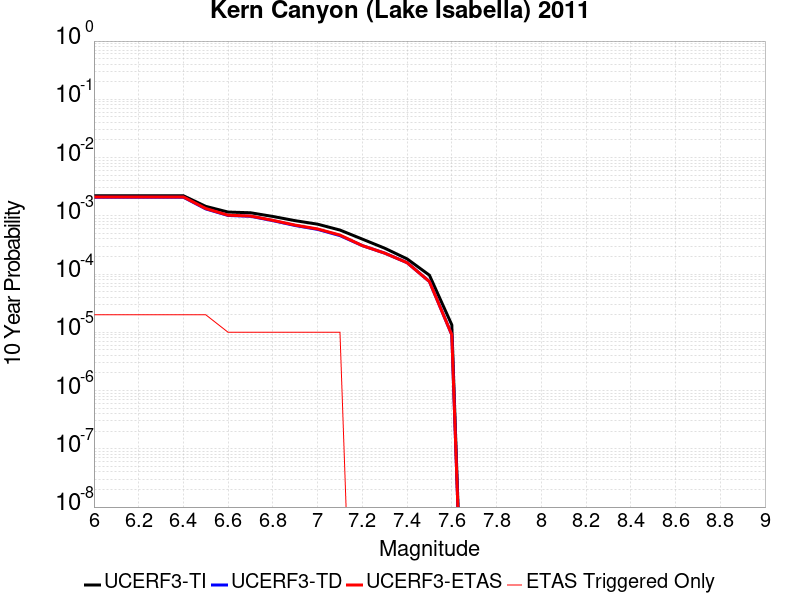 |

| Magnitude | 1 wk TI Prob | 1 wk TD Prob | 1 wk ETAS Prob | 1 wk ETAS/TD Gain | 1 wk ETAS Triggered Only | 1 mo TI Prob | 1 mo TD Prob | 1 mo ETAS Prob | 1 mo ETAS/TD Gain | 1 mo ETAS Triggered Only | 1 yr TI Prob | 1 yr TD Prob | 1 yr ETAS Prob | 1 yr ETAS/TD Gain | 1 yr ETAS Triggered Only | 10 yr TI Prob | 10 yr TD Prob | 10 yr ETAS Prob | 10 yr ETAS/TD Gain | 10 yr ETAS Triggered Only |
|-----|-----|-----|-----|-----|-----|-----|-----|-----|-----|-----|-----|-----|-----|-----|-----|-----|-----|-----|-----|-----|
| 6.0 | 4.2387383E-6 | 4.001735E-6 | 4.001735E-6 | 1.0 | 0.0 | 1.8165894E-5 | 1.715019E-5 | 1.715019E-5 | 1.0 | 0.0 | 2.2114732E-4 | 2.0878542E-4 | 2.0878542E-4 | 1.0 | 0.0 | 0.0022092736 | 0.0020860767 | 0.0021107164 | 1.0118116 | 2.4691359E-5 |
| 6.1 | 4.2387383E-6 | 4.001735E-6 | 4.001735E-6 | 1.0 | 0.0 | 1.8165894E-5 | 1.715019E-5 | 1.715019E-5 | 1.0 | 0.0 | 2.2114732E-4 | 2.0878542E-4 | 2.0878542E-4 | 1.0 | 0.0 | 0.0022092736 | 0.0020860767 | 0.0021107164 | 1.0118116 | 2.4691359E-5 |
| 6.2 | 4.2387383E-6 | 4.001735E-6 | 4.001735E-6 | 1.0 | 0.0 | 1.8165894E-5 | 1.715019E-5 | 1.715019E-5 | 1.0 | 0.0 | 2.2114732E-4 | 2.0878542E-4 | 2.0878542E-4 | 1.0 | 0.0 | 0.0022092736 | 0.0020860767 | 0.0021107164 | 1.0118116 | 2.4691359E-5 |
| 6.3 | 4.2387383E-6 | 4.001735E-6 | 4.001735E-6 | 1.0 | 0.0 | 1.8165894E-5 | 1.715019E-5 | 1.715019E-5 | 1.0 | 0.0 | 2.2114732E-4 | 2.0878542E-4 | 2.0878542E-4 | 1.0 | 0.0 | 0.0022092736 | 0.0020860767 | 0.0021107164 | 1.0118116 | 2.4691359E-5 |
| 6.4 | 4.2387383E-6 | 4.001735E-6 | 4.001735E-6 | 1.0 | 0.0 | 1.8165894E-5 | 1.715019E-5 | 1.715019E-5 | 1.0 | 0.0 | 2.2114732E-4 | 2.0878542E-4 | 2.0878542E-4 | 1.0 | 0.0 | 0.0022092736 | 0.0020860767 | 0.0021107164 | 1.0118116 | 2.4691359E-5 |
| 6.5 | 2.7857532E-6 | 2.5179297E-6 | 2.5179297E-6 | 1.0 | 0.0 | 1.1938888E-5 | 1.0791085E-5 | 1.0791085E-5 | 1.0 | 0.0 | 1.4534626E-4 | 1.3137386E-4 | 1.3137386E-4 | 1.0 | 0.0 | 0.0014525123 | 0.0013129947 | 0.0013376536 | 1.0187807 | 2.4691359E-5 |
| 6.6 | 2.2233348E-6 | 1.944174E-6 | 1.944174E-6 | 1.0 | 0.0 | 9.528543E-6 | 8.332148E-6 | 8.332148E-6 | 1.0 | 0.0 | 1.1600384E-4 | 1.0143928E-4 | 1.0143928E-4 | 1.0 | 0.0 | 0.001159433 | 0.0010139383 | 0.0010386046 | 1.0243273 | 2.4691359E-5 |
| 6.7 | 2.1635126E-6 | 1.8835532E-6 | 1.8835532E-6 | 1.0 | 0.0 | 9.272164E-6 | 8.072347E-6 | 8.072347E-6 | 1.0 | 0.0 | 1.1288274E-4 | 9.827647E-5 | 9.827647E-5 | 1.0 | 0.0 | 0.0011282542 | 9.823382E-4 | 0.0010070053 | 1.0251106 | 2.4691359E-5 |
| 6.8 | 1.8685711E-6 | 1.5831863E-6 | 1.5831863E-6 | 1.0 | 0.0 | 8.008137E-6 | 6.785067E-6 | 6.785067E-6 | 1.0 | 0.0 | 9.74947E-5 | 8.2605104E-5 | 8.2605104E-5 | 1.0 | 0.0 | 9.745194E-4 | 8.2574895E-4 | 8.504199E-4 | 1.0298771 | 2.4691359E-5 |
| 6.9 | 1.5815071E-6 | 1.3065303E-6 | 1.3065303E-6 | 1.0 | 0.0 | 6.77787E-6 | 5.5994037E-6 | 5.5994037E-6 | 1.0 | 0.0 | 8.251744E-5 | 6.817063E-5 | 6.817063E-5 | 1.0 | 0.0 | 8.248681E-4 | 6.814999E-4 | 7.061744E-4 | 1.0362062 | 2.4691359E-5 |
| 7.0 | 1.3772564E-6 | 1.1211043E-6 | 1.1211043E-6 | 1.0 | 0.0 | 5.9025137E-6 | 4.804724E-6 | 4.804724E-6 | 1.0 | 0.0 | 7.186073E-5 | 5.8495963E-5 | 5.8495963E-5 | 1.0 | 0.0 | 7.18375E-4 | 5.848077E-4 | 6.094846E-4 | 1.0421966 | 2.4691359E-5 |
| 7.1 | 1.0916998E-6 | 8.764025E-7 | 8.764025E-7 | 1.0 | 0.0 | 4.678705E-6 | 3.7560053E-6 | 3.7560053E-6 | 1.0 | 0.0 | 5.6961744E-5 | 4.572842E-5 | 4.572842E-5 | 1.0 | 0.0 | 5.6947145E-4 | 4.5719143E-4 | 4.818715E-4 | 1.0539819 | 2.4691359E-5 |
| 7.2 | 7.6277024E-7 | 5.901622E-7 | 5.901622E-7 | 1.0 | 0.0 | 3.2690114E-6 | 2.529264E-6 | 2.529264E-6 | 1.0 | 0.0 | 3.9799485E-5 | 3.079336E-5 | 3.079336E-5 | 1.0 | 0.0 | 3.9792358E-4 | 3.0789155E-4 | 3.0789155E-4 | 1.0 | 0.0 |
| 7.3 | 5.3265916E-7 | 4.38256E-7 | 4.38256E-7 | 1.0 | 0.0 | 2.282823E-6 | 1.8782387E-6 | 1.8782387E-6 | 1.0 | 0.0 | 2.7793016E-5 | 2.286732E-5 | 2.286732E-5 | 1.0 | 0.0 | 2.778954E-4 | 2.2865004E-4 | 2.2865004E-4 | 1.0 | 0.0 |
| 7.4 | 3.4946007E-7 | 3.0066505E-7 | 3.0066505E-7 | 1.0 | 0.0 | 1.497685E-6 | 1.2885639E-6 | 1.2885639E-6 | 1.0 | 0.0 | 1.8234163E-5 | 1.5688154E-5 | 1.5688154E-5 | 1.0 | 0.0 | 1.8232666E-4 | 1.568707E-4 | 1.568707E-4 | 1.0 | 0.0 |
| 7.5 | 1.8317026E-7 | 1.4245262E-7 | 1.4245262E-7 | 1.0 | 0.0 | 7.850152E-7 | 6.1051105E-7 | 6.1051105E-7 | 1.0 | 0.0 | 9.557518E-6 | 7.4329478E-6 | 7.4329478E-6 | 1.0 | 0.0 | 9.5571064E-5 | 7.4327065E-5 | 7.4327065E-5 | 1.0 | 0.0 |
| 7.6 | 2.572245E-8 | 1.7353212E-8 | 1.7353212E-8 | 1.0 | 0.0 | 1.10239064E-7 | 7.437091E-8 | 7.437091E-8 | 1.0 | 0.0 | 1.3421597E-6 | 9.0546547E-7 | 9.0546547E-7 | 1.0 | 0.0 | 1.3421517E-5 | 9.054624E-6 | 9.054624E-6 | 1.0 | 0.0 |

## Swain Ravine - Spenceville
*[(top)](#table-of-contents)*

| 1 Week | 1 Month | 1 Year | 10 Year |
|-----|-----|-----|-----|
|  |  |  |  |

| Magnitude | 1 wk TI Prob | 1 wk TD Prob | 1 wk ETAS Prob | 1 wk ETAS/TD Gain | 1 wk ETAS Triggered Only | 1 mo TI Prob | 1 mo TD Prob | 1 mo ETAS Prob | 1 mo ETAS/TD Gain | 1 mo ETAS Triggered Only | 1 yr TI Prob | 1 yr TD Prob | 1 yr ETAS Prob | 1 yr ETAS/TD Gain | 1 yr ETAS Triggered Only | 10 yr TI Prob | 10 yr TD Prob | 10 yr ETAS Prob | 10 yr ETAS/TD Gain | 10 yr ETAS Triggered Only |
|-----|-----|-----|-----|-----|-----|-----|-----|-----|-----|-----|-----|-----|-----|-----|-----|-----|-----|-----|-----|-----|
| 6.0 | 5.596169E-6 | 5.663867E-6 | 5.663867E-6 | 1.0 | 0.0 | 2.398336E-5 | 2.4273506E-5 | 2.4273506E-5 | 1.0 | 0.0 | 2.9195828E-4 | 2.9549256E-4 | 2.9549256E-4 | 1.0 | 0.0 | 0.00291575 | 0.0029512658 | 0.0029758844 | 1.0083417 | 2.4691359E-5 |
| 6.1 | 5.596169E-6 | 5.663867E-6 | 5.663867E-6 | 1.0 | 0.0 | 2.398336E-5 | 2.4273506E-5 | 2.4273506E-5 | 1.0 | 0.0 | 2.9195828E-4 | 2.9549256E-4 | 2.9549256E-4 | 1.0 | 0.0 | 0.00291575 | 0.0029512658 | 0.0029758844 | 1.0083417 | 2.4691359E-5 |
| 6.2 | 5.596169E-6 | 5.663867E-6 | 5.663867E-6 | 1.0 | 0.0 | 2.398336E-5 | 2.4273506E-5 | 2.4273506E-5 | 1.0 | 0.0 | 2.9195828E-4 | 2.9549256E-4 | 2.9549256E-4 | 1.0 | 0.0 | 0.00291575 | 0.0029512658 | 0.0029758844 | 1.0083417 | 2.4691359E-5 |
| 6.3 | 5.596169E-6 | 5.663867E-6 | 5.663867E-6 | 1.0 | 0.0 | 2.398336E-5 | 2.4273506E-5 | 2.4273506E-5 | 1.0 | 0.0 | 2.9195828E-4 | 2.9549256E-4 | 2.9549256E-4 | 1.0 | 0.0 | 0.00291575 | 0.0029512658 | 0.0029758844 | 1.0083417 | 2.4691359E-5 |
| 6.4 | 2.8426775E-6 | 2.8741777E-6 | 2.8741777E-6 | 1.0 | 0.0 | 1.2182847E-5 | 1.2317849E-5 | 1.2317849E-5 | 1.0 | 0.0 | 1.4831607E-4 | 1.4995987E-4 | 1.4995987E-4 | 1.0 | 0.0 | 0.0014821711 | 0.0014986253 | 0.0015232796 | 1.0164514 | 2.4691359E-5 |
| 6.5 | 1.9210793E-6 | 1.9414365E-6 | 1.9414365E-6 | 1.0 | 0.0 | 8.233172E-6 | 8.320417E-6 | 8.320417E-6 | 1.0 | 0.0 | 1.0023425E-4 | 1.0129649E-4 | 1.0129649E-4 | 1.0 | 0.0 | 0.0010018905 | 0.0010125167 | 0.0010125167 | 1.0 | 0.0 |
| 6.6 | 1.9210793E-6 | 1.9414365E-6 | 1.9414365E-6 | 1.0 | 0.0 | 8.233172E-6 | 8.320417E-6 | 8.320417E-6 | 1.0 | 0.0 | 1.0023425E-4 | 1.0129649E-4 | 1.0129649E-4 | 1.0 | 0.0 | 0.0010018905 | 0.0010125167 | 0.0010125167 | 1.0 | 0.0 |
| 6.7 | 1.4667394E-6 | 1.4819096E-6 | 1.4819096E-6 | 1.0 | 0.0 | 6.286011E-6 | 6.351026E-6 | 6.351026E-6 | 1.0 | 0.0 | 7.65295E-5 | 7.732108E-5 | 7.732108E-5 | 1.0 | 0.0 | 7.6503144E-4 | 7.729495E-4 | 7.729495E-4 | 1.0 | 0.0 |
| 6.8 | 1.1076943E-6 | 1.1189655E-6 | 1.1189655E-6 | 1.0 | 0.0 | 4.747252E-6 | 4.795558E-6 | 4.795558E-6 | 1.0 | 0.0 | 5.7796264E-5 | 5.8384398E-5 | 5.8384398E-5 | 1.0 | 0.0 | 5.778124E-4 | 5.83695E-4 | 5.83695E-4 | 1.0 | 0.0 |
| 6.9 | 8.514296E-7 | 8.6001864E-7 | 8.6001864E-7 | 1.0 | 0.0 | 3.648979E-6 | 3.6857894E-6 | 3.6857894E-6 | 1.0 | 0.0 | 4.442541E-5 | 4.487359E-5 | 4.487359E-5 | 1.0 | 0.0 | 4.441653E-4 | 4.4864815E-4 | 4.4864815E-4 | 1.0 | 0.0 |
| 7.0 | 4.8544706E-7 | 4.9033525E-7 | 4.9033525E-7 | 1.0 | 0.0 | 2.0804857E-6 | 2.1014353E-6 | 2.1014353E-6 | 1.0 | 0.0 | 2.532962E-5 | 2.5584686E-5 | 2.5584686E-5 | 1.0 | 0.0 | 2.5326732E-4 | 2.558187E-4 | 2.558187E-4 | 1.0 | 0.0 |
| 7.1 | 3.829186E-7 | 3.8679198E-7 | 3.8679198E-7 | 1.0 | 0.0 | 1.6410787E-6 | 1.6576789E-6 | 1.6576789E-6 | 1.0 | 0.0 | 1.997995E-5 | 2.0182064E-5 | 2.0182064E-5 | 1.0 | 0.0 | 1.9978154E-4 | 2.0180338E-4 | 2.0180338E-4 | 1.0 | 0.0 |
| 7.2 | 1.4726595E-7 | 1.4879602E-7 | 1.4879602E-7 | 1.0 | 0.0 | 6.3113964E-7 | 6.376971E-7 | 6.376971E-7 | 1.0 | 0.0 | 7.684098E-6 | 7.76394E-6 | 7.76394E-6 | 1.0 | 0.0 | 7.6838325E-5 | 7.763722E-5 | 7.763722E-5 | 1.0 | 0.0 |
| 7.3 | 4.1880604E-8 | 4.2324782E-8 | 4.2324782E-8 | 1.0 | 0.0 | 1.7948828E-7 | 1.8139193E-7 | 1.8139193E-7 | 1.0 | 0.0 | 2.1852677E-6 | 2.2084466E-6 | 2.2084466E-6 | 1.0 | 0.0 | 2.1852462E-5 | 2.2084467E-5 | 2.2084467E-5 | 1.0 | 0.0 |

## Rinconada 2011 CFM
*[(top)](#table-of-contents)*

| 1 Week | 1 Month | 1 Year | 10 Year |
|-----|-----|-----|-----|
|  | 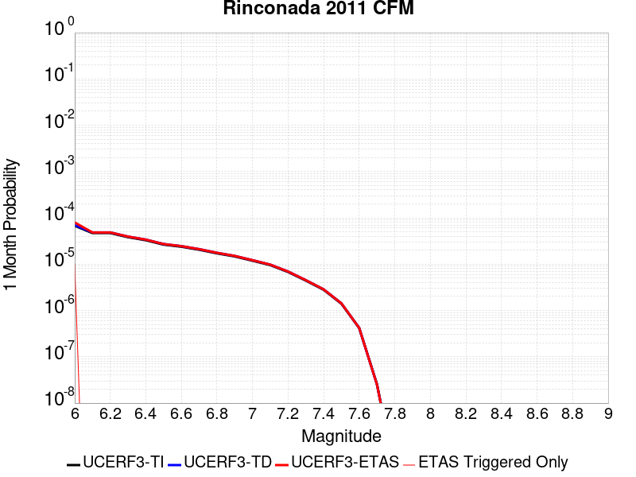 |  |  |

| Magnitude | 1 wk TI Prob | 1 wk TD Prob | 1 wk ETAS Prob | 1 wk ETAS/TD Gain | 1 wk ETAS Triggered Only | 1 mo TI Prob | 1 mo TD Prob | 1 mo ETAS Prob | 1 mo ETAS/TD Gain | 1 mo ETAS Triggered Only | 1 yr TI Prob | 1 yr TD Prob | 1 yr ETAS Prob | 1 yr ETAS/TD Gain | 1 yr ETAS Triggered Only | 10 yr TI Prob | 10 yr TD Prob | 10 yr ETAS Prob | 10 yr ETAS/TD Gain | 10 yr ETAS Triggered Only |
|-----|-----|-----|-----|-----|-----|-----|-----|-----|-----|-----|-----|-----|-----|-----|-----|-----|-----|-----|-----|-----|
| 6.0 | 1.5752368E-5 | 1.6275291E-5 | 4.0966246E-5 | 2.5170822 | 2.4691359E-5 | 6.75084E-5 | 6.9749396E-5 | 9.4439034E-5 | 1.3539764 | 2.4691359E-5 | 8.2160486E-4 | 8.4887125E-4 | 8.7354163E-4 | 1.0290626 | 2.4691359E-5 | 0.008185739 | 0.008456668 | 0.0084811505 | 1.0028951 | 2.4691359E-5 |
| 6.1 | 1.0966133E-5 | 1.1323423E-5 | 1.1323423E-5 | 1.0 | 0.0 | 4.6996865E-5 | 4.8528054E-5 | 4.8528054E-5 | 1.0 | 0.0 | 5.720366E-4 | 5.9066963E-4 | 5.9066963E-4 | 1.0 | 0.0 | 0.0057056635 | 0.005891093 | 0.005891093 | 1.0 | 0.0 |
| 6.2 | 1.0966133E-5 | 1.1323423E-5 | 1.1323423E-5 | 1.0 | 0.0 | 4.6996865E-5 | 4.8528054E-5 | 4.8528054E-5 | 1.0 | 0.0 | 5.720366E-4 | 5.9066963E-4 | 5.9066963E-4 | 1.0 | 0.0 | 0.0057056635 | 0.005891093 | 0.005891093 | 1.0 | 0.0 |
| 6.3 | 8.926149E-6 | 9.213088E-6 | 9.213088E-6 | 1.0 | 0.0 | 3.8254362E-5 | 3.9484068E-5 | 3.9484068E-5 | 1.0 | 0.0 | 4.6564735E-4 | 4.806128E-4 | 4.806128E-4 | 1.0 | 0.0 | 0.0046467283 | 0.004795779 | 0.004795779 | 1.0 | 0.0 |
| 6.4 | 7.676955E-6 | 7.920459E-6 | 7.920459E-6 | 1.0 | 0.0 | 3.290082E-5 | 3.3944387E-5 | 3.3944387E-5 | 1.0 | 0.0 | 4.0049385E-4 | 4.131947E-4 | 4.131947E-4 | 1.0 | 0.0 | 0.0039977287 | 0.004124291 | 0.004124291 | 1.0 | 0.0 |
| 6.5 | 6.1671026E-6 | 6.3591674E-6 | 6.3591674E-6 | 1.0 | 0.0 | 2.6430173E-5 | 2.7253289E-5 | 2.7253289E-5 | 1.0 | 0.0 | 3.2173982E-4 | 3.3175835E-4 | 3.3175835E-4 | 1.0 | 0.0 | 0.003212744 | 0.003312643 | 0.003312643 | 1.0 | 0.0 |
| 6.6 | 5.553456E-6 | 5.725002E-6 | 5.725002E-6 | 1.0 | 0.0 | 2.3800309E-5 | 2.4535495E-5 | 2.4535495E-5 | 1.0 | 0.0 | 2.897302E-4 | 2.9867876E-4 | 2.9867876E-4 | 1.0 | 0.0 | 0.0028935277 | 0.002982782 | 0.002982782 | 1.0 | 0.0 |
| 6.7 | 4.787857E-6 | 4.933471E-6 | 4.933471E-6 | 1.0 | 0.0 | 2.0519226E-5 | 2.1143276E-5 | 2.1143276E-5 | 1.0 | 0.0 | 2.4979294E-4 | 2.57389E-4 | 2.57389E-4 | 1.0 | 0.0 | 0.0024951235 | 0.0025709148 | 0.0025709148 | 1.0 | 0.0 |
| 6.8 | 3.9955166E-6 | 4.1136072E-6 | 4.1136072E-6 | 1.0 | 0.0 | 1.7123532E-5 | 1.7629627E-5 | 1.7629627E-5 | 1.0 | 0.0 | 2.0845905E-4 | 2.1461959E-4 | 2.1461959E-4 | 1.0 | 0.0 | 0.002082636 | 0.0021441267 | 0.0021441267 | 1.0 | 0.0 |
| 6.9 | 3.4250072E-6 | 3.5225548E-6 | 3.5225548E-6 | 1.0 | 0.0 | 1.46785205E-5 | 1.5096576E-5 | 1.5096576E-5 | 1.0 | 0.0 | 1.7869633E-4 | 1.8378533E-4 | 1.8378533E-4 | 1.0 | 0.0 | 0.001785527 | 0.0018363359 | 0.0018363359 | 1.0 | 0.0 |
| 7.0 | 2.7712713E-6 | 2.8467844E-6 | 2.8467844E-6 | 1.0 | 0.0 | 1.1876823E-5 | 1.2200447E-5 | 1.2200447E-5 | 1.0 | 0.0 | 1.4459073E-4 | 1.4853034E-4 | 1.4853034E-4 | 1.0 | 0.0 | 0.0014449668 | 0.0014843121 | 0.0014843121 | 1.0 | 0.0 |
| 7.1 | 2.227358E-6 | 2.2857641E-6 | 2.2857641E-6 | 1.0 | 0.0 | 9.545785E-6 | 9.796095E-6 | 9.796095E-6 | 1.0 | 0.0 | 1.16213734E-4 | 1.19260934E-4 | 1.19260934E-4 | 1.0 | 0.0 | 0.0011615298 | 0.0011919704 | 0.0011919704 | 1.0 | 0.0 |
| 7.2 | 1.581796E-6 | 1.6209457E-6 | 1.6209457E-6 | 1.0 | 0.0 | 6.779108E-6 | 6.9468915E-6 | 6.9468915E-6 | 1.0 | 0.0 | 8.253252E-5 | 8.457513E-5 | 8.457513E-5 | 1.0 | 0.0 | 8.250187E-4 | 8.4542995E-4 | 8.4542995E-4 | 1.0 | 0.0 |
| 7.3 | 1.0306567E-6 | 1.0546756E-6 | 1.0546756E-6 | 1.0 | 0.0 | 4.4170924E-6 | 4.520031E-6 | 4.520031E-6 | 1.0 | 0.0 | 5.3776774E-5 | 5.502999E-5 | 5.502999E-5 | 1.0 | 0.0 | 5.376376E-4 | 5.5016385E-4 | 5.5016385E-4 | 1.0 | 0.0 |
| 7.4 | 6.535541E-7 | 6.6829205E-7 | 6.6829205E-7 | 1.0 | 0.0 | 2.800943E-6 | 2.8641057E-6 | 2.8641057E-6 | 1.0 | 0.0 | 3.4100947E-5 | 3.486993E-5 | 3.486993E-5 | 1.0 | 0.0 | 3.4095717E-4 | 3.486447E-4 | 3.486447E-4 | 1.0 | 0.0 |
| 7.5 | 3.2656962E-7 | 3.331759E-7 | 3.331759E-7 | 1.0 | 0.0 | 1.3995833E-6 | 1.4278959E-6 | 1.4278959E-6 | 1.0 | 0.0 | 1.7039794E-5 | 1.7384495E-5 | 1.7384495E-5 | 1.0 | 0.0 | 1.7038487E-4 | 1.7383139E-4 | 1.7383139E-4 | 1.0 | 0.0 |
| 7.6 | 9.754343E-8 | 9.8212475E-8 | 9.8212475E-8 | 1.0 | 0.0 | 4.180432E-7 | 4.209105E-7 | 4.209105E-7 | 1.0 | 0.0 | 5.089664E-6 | 5.124574E-6 | 5.124574E-6 | 1.0 | 0.0 | 5.0895473E-5 | 5.1244562E-5 | 5.1244562E-5 | 1.0 | 0.0 |
| 7.7 | 6.0001453E-9 | 5.8492495E-9 | 5.8492495E-9 | 1.0 | 0.0 | 2.5714908E-8 | 2.5068214E-8 | 2.5068214E-8 | 1.0 | 0.0 | 3.1307894E-7 | 3.0520545E-7 | 3.0520545E-7 | 1.0 | 0.0 | 3.1307852E-6 | 3.0520505E-6 | 3.0520505E-6 | 1.0 | 0.0 |
| 7.8 | 7.400003E-11 | 7.465517E-11 | 7.465517E-11 | 1.0 | 0.0 | 3.171432E-10 | 3.1995073E-10 | 3.1995073E-10 | 1.0 | 0.0 | 3.861218E-9 | 3.8953996E-9 | 3.8953996E-9 | 1.0 | 0.0 | 3.861218E-8 | 3.8953996E-8 | 3.8953996E-8 | 1.0 | 0.0 |

## Calaveras (So) - Paicines extension 2011 CFM
*[(top)](#table-of-contents)*

| 1 Week | 1 Month | 1 Year | 10 Year |
|-----|-----|-----|-----|
|  |  |  |  |

| Magnitude | 1 wk TI Prob | 1 wk TD Prob | 1 wk ETAS Prob | 1 wk ETAS/TD Gain | 1 wk ETAS Triggered Only | 1 mo TI Prob | 1 mo TD Prob | 1 mo ETAS Prob | 1 mo ETAS/TD Gain | 1 mo ETAS Triggered Only | 1 yr TI Prob | 1 yr TD Prob | 1 yr ETAS Prob | 1 yr ETAS/TD Gain | 1 yr ETAS Triggered Only | 10 yr TI Prob | 10 yr TD Prob | 10 yr ETAS Prob | 10 yr ETAS/TD Gain | 10 yr ETAS Triggered Only |
|-----|-----|-----|-----|-----|-----|-----|-----|-----|-----|-----|-----|-----|-----|-----|-----|-----|-----|-----|-----|-----|
| 6.0 | 1.5183659E-4 | 3.056355E-4 | 3.056355E-4 | 1.0 | 0.0 | 6.5056595E-4 | 0.0013081793 | 0.0013081793 | 1.0 | 0.0 | 0.007891912 | 0.015708106 | 0.015708106 | 1.0 | 0.0 | 0.076174594 | 0.13858913 | 0.1386104 | 1.0001534 | 2.4691359E-5 |
| 6.1 | 1.5024997E-4 | 3.0257308E-4 | 3.0257308E-4 | 1.0 | 0.0 | 6.437695E-4 | 0.0012950681 | 0.0012950681 | 1.0 | 0.0 | 0.0078097614 | 0.015551464 | 0.015551464 | 1.0 | 0.0 | 0.075409345 | 0.13725848 | 0.1372798 | 1.0001552 | 2.4691359E-5 |
| 6.2 | 1.2743923E-4 | 2.5357047E-4 | 2.5357047E-4 | 1.0 | 0.0 | 5.460538E-4 | 0.0010854661 | 0.0010854661 | 1.0 | 0.0 | 0.0066279583 | 0.013058652 | 0.013058652 | 1.0 | 0.0 | 0.064337276 | 0.117356606 | 0.1173784 | 1.0001857 | 2.4691359E-5 |
| 6.3 | 1.1525114E-4 | 2.2633924E-4 | 2.2633924E-4 | 1.0 | 0.0 | 4.9383997E-4 | 9.6910214E-4 | 9.6910214E-4 | 1.0 | 0.0 | 0.0059959386 | 0.011679772 | 0.011679772 | 1.0 | 0.0 | 0.058367174 | 0.106473476 | 0.10649554 | 1.0002072 | 2.4691359E-5 |
| 6.4 | 1.07200925E-4 | 2.087327E-4 | 2.087327E-4 | 1.0 | 0.0 | 4.5935164E-4 | 8.9401874E-4 | 8.9401874E-4 | 1.0 | 0.0 | 0.0055782744 | 0.010784585 | 0.010784585 | 1.0 | 0.0 | 0.0544031 | 0.09929656 | 0.0993188 | 1.000224 | 2.4691359E-5 |
| 6.5 | 9.69631E-5 | 1.8770303E-4 | 1.8770303E-4 | 1.0 | 0.0 | 4.1548995E-4 | 8.0394984E-4 | 8.0394984E-4 | 1.0 | 0.0 | 0.0050468626 | 0.009706348 | 0.009706348 | 1.0 | 0.0 | 0.04933773 | 0.09018788 | 0.09021035 | 1.000249 | 2.4691359E-5 |
| 6.6 | 8.0552316E-5 | 1.5094873E-4 | 1.5094873E-4 | 1.0 | 0.0 | 3.4517853E-4 | 6.4671756E-4 | 6.4671756E-4 | 1.0 | 0.0 | 0.0041944524 | 0.007838126 | 0.007838126 | 1.0 | 0.0 | 0.04116161 | 0.07495855 | 0.07498139 | 1.0003047 | 2.4691359E-5 |
| 6.7 | 7.815757E-5 | 1.4635327E-4 | 1.4635327E-4 | 1.0 | 0.0 | 3.34918E-4 | 6.2703236E-4 | 6.2703236E-4 | 1.0 | 0.0 | 0.004070005 | 0.0076008607 | 0.0076008607 | 1.0 | 0.0 | 0.039962657 | 0.07280769 | 0.07283059 | 1.0003145 | 2.4691359E-5 |
| 6.8 | 6.965264E-5 | 1.2743977E-4 | 1.2743977E-4 | 1.0 | 0.0 | 2.9847719E-4 | 5.460289E-4 | 5.460289E-4 | 1.0 | 0.0 | 0.0036279052 | 0.00662458 | 0.00662458 | 1.0 | 0.0 | 0.03569247 | 0.06389852 | 0.06392163 | 1.0003617 | 2.4691359E-5 |
| 6.9 | 5.8000453E-5 | 1.0163084E-4 | 1.0163084E-4 | 1.0 | 0.0 | 2.4854968E-4 | 4.3548862E-4 | 4.3548862E-4 | 1.0 | 0.0 | 0.0030218933 | 0.005289287 | 0.005289287 | 1.0 | 0.0 | 0.029811295 | 0.05159348 | 0.05159348 | 1.0 | 0.0 |
| 7.0 | 4.9865852E-5 | 8.586892E-5 | 8.586892E-5 | 1.0 | 0.0 | 2.1369329E-4 | 3.6795824E-4 | 3.6795824E-4 | 1.0 | 0.0 | 0.0025986114 | 0.0044707786 | 0.0044707786 | 1.0 | 0.0 | 0.025684336 | 0.043872654 | 0.043872654 | 1.0 | 0.0 |
| 7.1 | 4.283875E-5 | 7.128824E-5 | 7.128824E-5 | 1.0 | 0.0 | 1.8358172E-4 | 3.0548556E-4 | 3.0548556E-4 | 1.0 | 0.0 | 0.0022328163 | 0.0037130006 | 0.0037130006 | 1.0 | 0.0 | 0.022105146 | 0.03681606 | 0.03681606 | 1.0 | 0.0 |
| 7.2 | 3.450115E-5 | 5.593746E-5 | 5.593746E-5 | 1.0 | 0.0 | 1.478537E-4 | 2.397101E-4 | 2.397101E-4 | 1.0 | 0.0 | 0.0017986323 | 0.002914594 | 0.002914594 | 1.0 | 0.0 | 0.017841442 | 0.029157607 | 0.029157607 | 1.0 | 0.0 |
| 7.3 | 2.5709045E-5 | 4.0731633E-5 | 4.0731633E-5 | 1.0 | 0.0 | 1.1017697E-4 | 1.7455257E-4 | 1.7455257E-4 | 1.0 | 0.0 | 0.0013405791 | 0.0021231233 | 0.0021231233 | 1.0 | 0.0 | 0.013325208 | 0.021367824 | 0.021367824 | 1.0 | 0.0 |
| 7.4 | 1.8003093E-5 | 2.8584513E-5 | 2.8584513E-5 | 1.0 | 0.0 | 7.715383E-5 | 1.2249932E-4 | 1.2249932E-4 | 1.0 | 0.0 | 9.3894306E-4 | 0.0014904111 | 0.0014904111 | 1.0 | 0.0 | 0.009349857 | 0.015088451 | 0.015088451 | 1.0 | 0.0 |
| 7.5 | 1.5595824E-5 | 2.5893674E-5 | 2.5893674E-5 | 1.0 | 0.0 | 6.683753E-5 | 1.10968176E-4 | 1.10968176E-4 | 1.0 | 0.0 | 8.134431E-4 | 0.0013502025 | 0.0013502025 | 1.0 | 0.0 | 0.008104719 | 0.013686731 | 0.013686731 | 1.0 | 0.0 |
| 7.6 | 1.1110309E-5 | 1.9283274E-5 | 1.9283274E-5 | 1.0 | 0.0 | 4.761474E-5 | 8.264E-5 | 8.264E-5 | 1.0 | 0.0 | 5.795553E-4 | 0.0010056789 | 0.0010056789 | 1.0 | 0.0 | 0.0057804612 | 0.010233724 | 0.010233724 | 1.0 | 0.0 |
| 7.7 | 6.2140443E-6 | 1.048222E-5 | 1.048222E-5 | 1.0 | 0.0 | 2.6631347E-5 | 4.492303E-5 | 4.492303E-5 | 1.0 | 0.0 | 3.241884E-4 | 5.4680073E-4 | 5.4680073E-4 | 1.0 | 0.0 | 0.0032371588 | 0.0056418604 | 0.0056418604 | 1.0 | 0.0 |
| 7.8 | 5.305533E-6 | 9.473447E-6 | 9.473447E-6 | 1.0 | 0.0 | 2.27378E-5 | 4.0599854E-5 | 4.0599854E-5 | 1.0 | 0.0 | 2.7679754E-4 | 4.941912E-4 | 4.941912E-4 | 1.0 | 0.0 | 0.0027645302 | 0.0050939573 | 0.0050939573 | 1.0 | 0.0 |
| 7.9 | 3.363505E-6 | 7.414737E-6 | 7.414737E-6 | 1.0 | 0.0 | 1.4414942E-5 | 3.1777057E-5 | 3.1777057E-5 | 1.0 | 0.0 | 1.7548777E-4 | 3.8681706E-4 | 3.8681706E-4 | 1.0 | 0.0 | 0.0017534926 | 0.0039629196 | 0.0039629196 | 1.0 | 0.0 |
| 8.0 | 2.0271132E-6 | 4.430002E-6 | 4.430002E-6 | 1.0 | 0.0 | 8.687599E-6 | 1.8985584E-5 | 1.8985584E-5 | 1.0 | 0.0 | 1.05766376E-4 | 2.3112501E-4 | 2.3112501E-4 | 1.0 | 0.0 | 0.0010571606 | 0.0023593423 | 0.0023593423 | 1.0 | 0.0 |
| 8.1 | 1.2206116E-6 | 2.3844252E-6 | 2.3844252E-6 | 1.0 | 0.0 | 5.2311816E-6 | 1.0218926E-5 | 1.0218926E-5 | 1.0 | 0.0 | 6.3687774E-5 | 1.2440835E-4 | 1.2440835E-4 | 1.0 | 0.0 | 6.366953E-4 | 0.0012751735 | 0.0012751735 | 1.0 | 0.0 |

## Coronado Bank alt1
*[(top)](#table-of-contents)*

| 1 Week | 1 Month | 1 Year | 10 Year |
|-----|-----|-----|-----|
|  |  |  |  |

| Magnitude | 1 wk TI Prob | 1 wk TD Prob | 1 wk ETAS Prob | 1 wk ETAS/TD Gain | 1 wk ETAS Triggered Only | 1 mo TI Prob | 1 mo TD Prob | 1 mo ETAS Prob | 1 mo ETAS/TD Gain | 1 mo ETAS Triggered Only | 1 yr TI Prob | 1 yr TD Prob | 1 yr ETAS Prob | 1 yr ETAS/TD Gain | 1 yr ETAS Triggered Only | 10 yr TI Prob | 10 yr TD Prob | 10 yr ETAS Prob | 10 yr ETAS/TD Gain | 10 yr ETAS Triggered Only |
|-----|-----|-----|-----|-----|-----|-----|-----|-----|-----|-----|-----|-----|-----|-----|-----|-----|-----|-----|-----|-----|
| 6.0 | 7.533492E-5 | 9.397445E-5 | 9.397445E-5 | 1.0 | 0.0 | 3.22824E-4 | 4.0268974E-4 | 4.0268974E-4 | 1.0 | 0.0 | 0.0039233007 | 0.004892234 | 0.0049168044 | 1.0050224 | 2.4691359E-5 | 0.03854755 | 0.047915664 | 0.04793917 | 1.0004907 | 2.4691359E-5 |
| 6.1 | 4.1807285E-5 | 5.050419E-5 | 5.050419E-5 | 1.0 | 0.0 | 1.7916178E-4 | 2.1642915E-4 | 2.1642915E-4 | 1.0 | 0.0 | 0.0021791123 | 0.0026319358 | 0.0026565623 | 1.0093567 | 2.4691359E-5 | 0.021578677 | 0.026016729 | 0.026040778 | 1.0009243 | 2.4691359E-5 |
| 6.2 | 4.1807285E-5 | 5.050419E-5 | 5.050419E-5 | 1.0 | 0.0 | 1.7916178E-4 | 2.1642915E-4 | 2.1642915E-4 | 1.0 | 0.0 | 0.0021791123 | 0.0026319358 | 0.0026565623 | 1.0093567 | 2.4691359E-5 | 0.021578677 | 0.026016729 | 0.026040778 | 1.0009243 | 2.4691359E-5 |
| 6.3 | 3.1793104E-5 | 3.7718673E-5 | 3.7718673E-5 | 1.0 | 0.0 | 1.3624904E-4 | 1.6164166E-4 | 1.6164166E-4 | 1.0 | 0.0 | 0.0016575698 | 0.0019662387 | 0.0019908815 | 1.012533 | 2.4691359E-5 | 0.016452603 | 0.01949231 | 0.01951652 | 1.001242 | 2.4691359E-5 |
| 6.4 | 2.9878007E-5 | 3.534274E-5 | 3.534274E-5 | 1.0 | 0.0 | 1.2804232E-4 | 1.5146029E-4 | 1.5146029E-4 | 1.0 | 0.0 | 0.0015578003 | 0.0018424982 | 0.001867144 | 1.0133764 | 2.4691359E-5 | 0.015469253 | 0.018275984 | 0.018300224 | 1.0013263 | 2.4691359E-5 |
| 6.5 | 2.4512565E-5 | 2.8769407E-5 | 2.8769407E-5 | 1.0 | 0.0 | 1.0504962E-4 | 1.2329179E-4 | 1.2329179E-4 | 1.0 | 0.0 | 0.0012782287 | 0.0015000715 | 0.0015247258 | 1.0164354 | 2.4691359E-5 | 0.012709012 | 0.014902437 | 0.01492676 | 1.0016322 | 2.4691359E-5 |
| 6.6 | 2.1317413E-5 | 2.491118E-5 | 2.491118E-5 | 1.0 | 0.0 | 9.135714E-5 | 1.0675796E-4 | 1.0675796E-4 | 1.0 | 0.0 | 0.0011117056 | 0.0012990254 | 0.0013236847 | 1.0189829 | 2.4691359E-5 | 0.011061605 | 0.012916726 | 0.012941099 | 1.0018868 | 2.4691359E-5 |
| 6.7 | 1.8585655E-5 | 2.16387E-5 | 2.16387E-5 | 1.0 | 0.0 | 7.9650374E-5 | 9.27341E-5 | 9.27341E-5 | 1.0 | 0.0 | 9.6931186E-4 | 0.0011284734 | 0.0011284734 | 1.0 | 0.0 | 0.0096509475 | 0.011229593 | 0.011229593 | 1.0 | 0.0 |
| 6.8 | 1.5862879E-5 | 1.8422674E-5 | 1.8422674E-5 | 1.0 | 0.0 | 6.798199E-5 | 7.8952035E-5 | 7.8952035E-5 | 1.0 | 0.0 | 8.273665E-4 | 9.608364E-4 | 9.608364E-4 | 1.0 | 0.0 | 0.008242928 | 0.009568804 | 0.009568804 | 1.0 | 0.0 |
| 6.9 | 1.3021509E-5 | 1.5097861E-5 | 1.5097861E-5 | 1.0 | 0.0 | 5.5805274E-5 | 6.4703614E-5 | 6.4703614E-5 | 1.0 | 0.0 | 6.792174E-4 | 7.8749994E-4 | 7.8749994E-4 | 1.0 | 0.0 | 0.006771452 | 0.0078489175 | 0.0078489175 | 1.0 | 0.0 |
| 7.0 | 1.0974371E-5 | 1.2722295E-5 | 1.2722295E-5 | 1.0 | 0.0 | 4.7032172E-5 | 5.452308E-5 | 5.452308E-5 | 1.0 | 0.0 | 5.7246623E-4 | 6.636339E-4 | 6.636339E-4 | 1.0 | 0.0 | 0.0057099373 | 0.006618271 | 0.006618271 | 1.0 | 0.0 |
| 7.1 | 8.766221E-6 | 1.0165593E-5 | 1.0165593E-5 | 1.0 | 0.0 | 3.7568978E-5 | 4.35662E-5 | 4.35662E-5 | 1.0 | 0.0 | 4.573063E-4 | 5.303066E-4 | 5.303066E-4 | 1.0 | 0.0 | 0.0045636636 | 0.0052921115 | 0.0052921115 | 1.0 | 0.0 |
| 7.2 | 8.026024E-7 | 8.332343E-7 | 8.332343E-7 | 1.0 | 0.0 | 3.43972E-6 | 3.5709993E-6 | 3.5709993E-6 | 1.0 | 0.0 | 4.1877785E-5 | 4.347606E-5 | 4.347606E-5 | 1.0 | 0.0 | 4.1869894E-4 | 4.3467662E-4 | 4.3467662E-4 | 1.0 | 0.0 |
| 7.3 | 3.7293114E-7 | 3.7002837E-7 | 3.7002837E-7 | 1.0 | 0.0 | 1.5982754E-6 | 1.5858349E-6 | 1.5858349E-6 | 1.0 | 0.0 | 1.9458828E-5 | 1.9307368E-5 | 1.9307368E-5 | 1.0 | 0.0 | 1.9457124E-4 | 1.9305699E-4 | 1.9305699E-4 | 1.0 | 0.0 |
| 7.4 | 2.0557036E-7 | 1.967517E-7 | 1.967517E-7 | 1.0 | 0.0 | 8.810155E-7 | 8.432213E-7 | 8.432213E-7 | 1.0 | 0.0 | 1.0726311E-5 | 1.0266171E-5 | 1.0266171E-5 | 1.0 | 0.0 | 1.0725793E-4 | 1.02657E-4 | 1.02657E-4 | 1.0 | 0.0 |
| 7.5 | 6.845446E-8 | 6.279522E-8 | 6.279522E-8 | 1.0 | 0.0 | 2.9337625E-7 | 2.6912235E-7 | 2.6912235E-7 | 1.0 | 0.0 | 3.5718497E-6 | 3.2765597E-6 | 3.2765597E-6 | 1.0 | 0.0 | 3.5717923E-5 | 3.2765125E-5 | 3.2765125E-5 | 1.0 | 0.0 |
| 7.6 | 6.0975145E-9 | 5.5319367E-9 | 5.5319367E-9 | 1.0 | 0.0 | 2.6132206E-8 | 2.3708301E-8 | 2.3708301E-8 | 1.0 | 0.0 | 3.1815955E-7 | 2.8864855E-7 | 2.8864855E-7 | 1.0 | 0.0 | 3.181591E-6 | 2.8864827E-6 | 2.8864827E-6 | 1.0 | 0.0 |

## Homestead Valley 2011
*[(top)](#table-of-contents)*

| 1 Week | 1 Month | 1 Year | 10 Year |
|-----|-----|-----|-----|
|  |  |  |  |

| Magnitude | 1 wk TI Prob | 1 wk TD Prob | 1 wk ETAS Prob | 1 wk ETAS/TD Gain | 1 wk ETAS Triggered Only | 1 mo TI Prob | 1 mo TD Prob | 1 mo ETAS Prob | 1 mo ETAS/TD Gain | 1 mo ETAS Triggered Only | 1 yr TI Prob | 1 yr TD Prob | 1 yr ETAS Prob | 1 yr ETAS/TD Gain | 1 yr ETAS Triggered Only | 10 yr TI Prob | 10 yr TD Prob | 10 yr ETAS Prob | 10 yr ETAS/TD Gain | 10 yr ETAS Triggered Only |
|-----|-----|-----|-----|-----|-----|-----|-----|-----|-----|-----|-----|-----|-----|-----|-----|-----|-----|-----|-----|-----|
| 6.0 | 1.539795E-5 | 6.28714E-6 | 6.28714E-6 | 1.0 | 0.0 | 6.5989545E-5 | 2.6944725E-5 | 2.6944725E-5 | 1.0 | 0.0 | 8.0312655E-4 | 3.2802325E-4 | 3.527065E-4 | 1.0752485 | 2.4691359E-5 | 0.008002302 | 0.003277412 | 0.0033020223 | 1.0075091 | 2.4691359E-5 |
| 6.1 | 1.539795E-5 | 6.28714E-6 | 6.28714E-6 | 1.0 | 0.0 | 6.5989545E-5 | 2.6944725E-5 | 2.6944725E-5 | 1.0 | 0.0 | 8.0312655E-4 | 3.2802325E-4 | 3.527065E-4 | 1.0752485 | 2.4691359E-5 | 0.008002302 | 0.003277412 | 0.0033020223 | 1.0075091 | 2.4691359E-5 |
| 6.2 | 1.539795E-5 | 6.28714E-6 | 6.28714E-6 | 1.0 | 0.0 | 6.5989545E-5 | 2.6944725E-5 | 2.6944725E-5 | 1.0 | 0.0 | 8.0312655E-4 | 3.2802325E-4 | 3.527065E-4 | 1.0752485 | 2.4691359E-5 | 0.008002302 | 0.003277412 | 0.0033020223 | 1.0075091 | 2.4691359E-5 |
| 6.3 | 1.539795E-5 | 6.28714E-6 | 6.28714E-6 | 1.0 | 0.0 | 6.5989545E-5 | 2.6944725E-5 | 2.6944725E-5 | 1.0 | 0.0 | 8.0312655E-4 | 3.2802325E-4 | 3.527065E-4 | 1.0752485 | 2.4691359E-5 | 0.008002302 | 0.003277412 | 0.0033020223 | 1.0075091 | 2.4691359E-5 |
| 6.4 | 1.539795E-5 | 6.28714E-6 | 6.28714E-6 | 1.0 | 0.0 | 6.5989545E-5 | 2.6944725E-5 | 2.6944725E-5 | 1.0 | 0.0 | 8.0312655E-4 | 3.2802325E-4 | 3.527065E-4 | 1.0752485 | 2.4691359E-5 | 0.008002302 | 0.003277412 | 0.0033020223 | 1.0075091 | 2.4691359E-5 |
| 6.5 | 1.0265258E-5 | 2.8791078E-6 | 2.8791078E-6 | 1.0 | 0.0 | 4.3993223E-5 | 1.2339014E-5 | 1.2339014E-5 | 1.0 | 0.0 | 5.3548586E-4 | 1.5022409E-4 | 1.5022409E-4 | 1.0 | 0.0 | 0.005341973 | 0.0015019074 | 0.0015019074 | 1.0 | 0.0 |
| 6.6 | 6.664671E-6 | 5.3494557E-7 | 5.3494557E-7 | 1.0 | 0.0 | 2.8562565E-5 | 2.2926226E-6 | 2.2926226E-6 | 1.0 | 0.0 | 3.476937E-4 | 2.7912442E-5 | 2.7912442E-5 | 1.0 | 0.0 | 0.003471502 | 2.79101E-4 | 2.79101E-4 | 1.0 | 0.0 |
| 6.7 | 6.5954046E-6 | 5.3494557E-7 | 5.3494557E-7 | 1.0 | 0.0 | 2.8265715E-5 | 2.2926226E-6 | 2.2926226E-6 | 1.0 | 0.0 | 3.4408073E-4 | 2.7912442E-5 | 2.7912442E-5 | 1.0 | 0.0 | 0.0034354846 | 2.79101E-4 | 2.79101E-4 | 1.0 | 0.0 |
| 6.8 | 4.648189E-6 | 2.3273472E-7 | 2.3273472E-7 | 1.0 | 0.0 | 1.9920659E-5 | 9.974342E-7 | 9.974342E-7 | 1.0 | 0.0 | 2.4250703E-4 | 1.2143698E-5 | 1.2143698E-5 | 1.0 | 0.0 | 0.0024224254 | 1.2143083E-4 | 1.2143083E-4 | 1.0 | 0.0 |
| 6.9 | 4.1428534E-6 | 1.9351485E-7 | 1.9351485E-7 | 1.0 | 0.0 | 1.7754966E-5 | 8.293491E-7 | 8.293491E-7 | 1.0 | 0.0 | 2.1614527E-4 | 1.0097282E-5 | 1.0097282E-5 | 1.0 | 0.0 | 0.0021593515 | 1.0096853E-4 | 1.0096853E-4 | 1.0 | 0.0 |
| 7.0 | 3.0673707E-6 | 1.5373227E-7 | 1.5373227E-7 | 1.0 | 0.0 | 1.3145808E-5 | 6.5885246E-7 | 6.5885246E-7 | 1.0 | 0.0 | 1.6003846E-4 | 8.0215E-6 | 8.0215E-6 | 1.0 | 0.0 | 0.0015992324 | 8.021221E-5 | 8.021221E-5 | 1.0 | 0.0 |
| 7.1 | 2.340854E-6 | 1.4692894E-7 | 1.4692894E-7 | 1.0 | 0.0 | 1.0032193E-5 | 6.296953E-7 | 6.296953E-7 | 1.0 | 0.0 | 1.221351E-4 | 7.666515E-6 | 7.666515E-6 | 1.0 | 0.0 | 0.00122068 | 7.6662596E-5 | 7.6662596E-5 | 1.0 | 0.0 |
| 7.2 | 1.3754182E-6 | 1.3927345E-7 | 1.3927345E-7 | 1.0 | 0.0 | 5.8946357E-6 | 5.968861E-7 | 5.968861E-7 | 1.0 | 0.0 | 7.176483E-5 | 7.267065E-6 | 7.267065E-6 | 1.0 | 0.0 | 7.174166E-4 | 7.2668365E-5 | 7.2668365E-5 | 1.0 | 0.0 |
| 7.3 | 1.2573237E-6 | 1.3831806E-7 | 1.3831806E-7 | 1.0 | 0.0 | 5.388519E-6 | 5.9279154E-7 | 5.9279154E-7 | 1.0 | 0.0 | 6.560324E-5 | 7.2172143E-6 | 7.2172143E-6 | 1.0 | 0.0 | 6.558388E-4 | 7.216989E-5 | 7.216989E-5 | 1.0 | 0.0 |
| 7.4 | 1.0994207E-6 | 1.3110466E-7 | 1.3110466E-7 | 1.0 | 0.0 | 4.7117946E-6 | 5.6187696E-7 | 5.6187696E-7 | 1.0 | 0.0 | 5.736459E-5 | 6.8408317E-6 | 6.8408317E-6 | 1.0 | 0.0 | 5.734978E-4 | 6.84063E-5 | 6.84063E-5 | 1.0 | 0.0 |
| 7.5 | 5.5569126E-7 | 6.775161E-8 | 6.775161E-8 | 1.0 | 0.0 | 2.3815317E-6 | 2.90364E-7 | 2.90364E-7 | 1.0 | 0.0 | 2.8994764E-5 | 3.5351766E-6 | 3.5351766E-6 | 1.0 | 0.0 | 2.899098E-4 | 3.5351266E-5 | 3.5351266E-5 | 1.0 | 0.0 |

## Great Valley 05 Pittsburg - Kirby Hills alt1
*[(top)](#table-of-contents)*

| 1 Week | 1 Month | 1 Year | 10 Year |
|-----|-----|-----|-----|
|  |  |  | 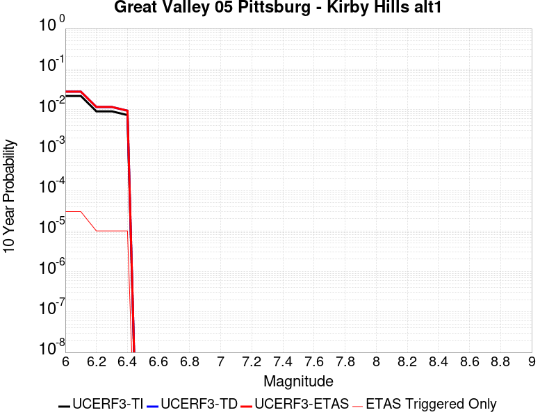 |

| Magnitude | 1 wk TI Prob | 1 wk TD Prob | 1 wk ETAS Prob | 1 wk ETAS/TD Gain | 1 wk ETAS Triggered Only | 1 mo TI Prob | 1 mo TD Prob | 1 mo ETAS Prob | 1 mo ETAS/TD Gain | 1 mo ETAS Triggered Only | 1 yr TI Prob | 1 yr TD Prob | 1 yr ETAS Prob | 1 yr ETAS/TD Gain | 1 yr ETAS Triggered Only | 10 yr TI Prob | 10 yr TD Prob | 10 yr ETAS Prob | 10 yr ETAS/TD Gain | 10 yr ETAS Triggered Only |
|-----|-----|-----|-----|-----|-----|-----|-----|-----|-----|-----|-----|-----|-----|-----|-----|-----|-----|-----|-----|-----|
| 6.0 | 4.187212E-5 | 5.345778E-5 | 5.345778E-5 | 1.0 | 0.0 | 1.794396E-4 | 2.2909002E-4 | 2.537757E-4 | 1.1077554 | 2.4691359E-5 | 0.002182488 | 0.0027865837 | 0.0028112063 | 1.0088362 | 2.4691359E-5 | 0.021611776 | 0.027610846 | 0.027634855 | 1.0008695 | 2.4691359E-5 |
| 6.1 | 4.187212E-5 | 5.345778E-5 | 5.345778E-5 | 1.0 | 0.0 | 1.794396E-4 | 2.2909002E-4 | 2.537757E-4 | 1.1077554 | 2.4691359E-5 | 0.002182488 | 0.0027865837 | 0.0028112063 | 1.0088362 | 2.4691359E-5 | 0.021611776 | 0.027610846 | 0.027634855 | 1.0008695 | 2.4691359E-5 |
| 6.2 | 1.7353306E-5 | 2.2160895E-5 | 2.2160895E-5 | 1.0 | 0.0 | 7.436919E-5 | 9.497372E-5 | 9.497372E-5 | 1.0 | 0.0 | 9.050688E-4 | 0.0011560915 | 0.0011560915 | 1.0 | 0.0 | 0.009013915 | 0.011538404 | 0.011538404 | 1.0 | 0.0 |
| 6.3 | 1.7353306E-5 | 2.2160895E-5 | 2.2160895E-5 | 1.0 | 0.0 | 7.436919E-5 | 9.497372E-5 | 9.497372E-5 | 1.0 | 0.0 | 9.050688E-4 | 0.0011560915 | 0.0011560915 | 1.0 | 0.0 | 0.009013915 | 0.011538404 | 0.011538404 | 1.0 | 0.0 |
| 6.4 | 1.4028824E-5 | 1.7905852E-5 | 1.7905852E-5 | 1.0 | 0.0 | 6.0122147E-5 | 7.6739365E-5 | 7.6739365E-5 | 1.0 | 0.0 | 7.3174125E-4 | 9.3430176E-4 | 9.3430176E-4 | 1.0 | 0.0 | 0.0072933645 | 0.009340801 | 0.009340801 | 1.0 | 0.0 |

## San Jacinto (Borrego)
*[(top)](#table-of-contents)*

| 1 Week | 1 Month | 1 Year | 10 Year |
|-----|-----|-----|-----|
|  |  |  | 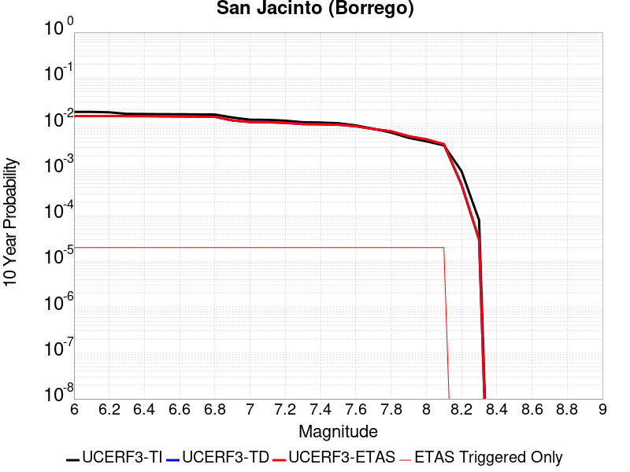 |

| Magnitude | 1 wk TI Prob | 1 wk TD Prob | 1 wk ETAS Prob | 1 wk ETAS/TD Gain | 1 wk ETAS Triggered Only | 1 mo TI Prob | 1 mo TD Prob | 1 mo ETAS Prob | 1 mo ETAS/TD Gain | 1 mo ETAS Triggered Only | 1 yr TI Prob | 1 yr TD Prob | 1 yr ETAS Prob | 1 yr ETAS/TD Gain | 1 yr ETAS Triggered Only | 10 yr TI Prob | 10 yr TD Prob | 10 yr ETAS Prob | 10 yr ETAS/TD Gain | 10 yr ETAS Triggered Only |
|-----|-----|-----|-----|-----|-----|-----|-----|-----|-----|-----|-----|-----|-----|-----|-----|-----|-----|-----|-----|-----|
| 6.0 | 3.543992E-5 | 2.7988392E-5 | 2.7988392E-5 | 1.0 | 0.0 | 1.5187653E-4 | 1.1994481E-4 | 1.1994481E-4 | 1.0 | 0.0 | 0.0018475284 | 0.001459362 | 0.0014840174 | 1.0168946 | 2.4691359E-5 | 0.018322436 | 0.014901815 | 0.014926138 | 1.0016322 | 2.4691359E-5 |
| 6.1 | 3.542281E-5 | 2.7988392E-5 | 2.7988392E-5 | 1.0 | 0.0 | 1.5180321E-4 | 1.1994481E-4 | 1.1994481E-4 | 1.0 | 0.0 | 0.0018466372 | 0.001459362 | 0.0014840174 | 1.0168946 | 2.4691359E-5 | 0.018313672 | 0.014901815 | 0.014926138 | 1.0016322 | 2.4691359E-5 |
| 6.2 | 3.4688688E-5 | 2.7988392E-5 | 2.7988392E-5 | 1.0 | 0.0 | 1.4865733E-4 | 1.199448E-4 | 1.199448E-4 | 1.0 | 0.0 | 0.0018084005 | 0.001459362 | 0.0014840174 | 1.0168946 | 2.4691359E-5 | 0.017937548 | 0.014901815 | 0.014926138 | 1.0016322 | 2.4691359E-5 |
| 6.3 | 3.2087122E-5 | 2.7833707E-5 | 2.7833707E-5 | 1.0 | 0.0 | 1.3750899E-4 | 1.1928193E-4 | 1.1928193E-4 | 1.0 | 0.0 | 0.0016728862 | 0.0014513023 | 0.0014759578 | 1.0169885 | 2.4691359E-5 | 0.016603488 | 0.014822833 | 0.014847158 | 1.001641 | 2.4691359E-5 |
| 6.4 | 3.1828724E-5 | 2.7800681E-5 | 2.7800681E-5 | 1.0 | 0.0 | 1.364017E-4 | 1.1914041E-4 | 1.1914041E-4 | 1.0 | 0.0 | 0.0016594254 | 0.0014495815 | 0.0014742371 | 1.0170088 | 2.4691359E-5 | 0.016470885 | 0.014805906 | 0.014830233 | 1.001643 | 2.4691359E-5 |
| 6.5 | 3.1563577E-5 | 2.7540304E-5 | 2.7540304E-5 | 1.0 | 0.0 | 1.3526545E-4 | 1.18024596E-4 | 1.18024596E-4 | 1.0 | 0.0 | 0.0016456128 | 0.0014360145 | 0.0014606704 | 1.0171697 | 2.4691359E-5 | 0.0163348 | 0.014672448 | 0.014696777 | 1.0016582 | 2.4691359E-5 |
| 6.6 | 3.1467625E-5 | 2.7384483E-5 | 2.7384483E-5 | 1.0 | 0.0 | 1.3485427E-4 | 1.1735686E-4 | 1.1735686E-4 | 1.0 | 0.0 | 0.0016406142 | 0.0014278955 | 0.0014525516 | 1.0172675 | 2.4691359E-5 | 0.016285548 | 0.014592675 | 0.014617005 | 1.0016674 | 2.4691359E-5 |
| 6.7 | 3.1223695E-5 | 2.700241E-5 | 2.700241E-5 | 1.0 | 0.0 | 1.3380898E-4 | 1.1571955E-4 | 1.1571955E-4 | 1.0 | 0.0 | 0.0016279068 | 0.0014079871 | 0.0014326437 | 1.017512 | 2.4691359E-5 | 0.01616033 | 0.014397007 | 0.014421343 | 1.0016904 | 2.4691359E-5 |
| 6.8 | 3.1015585E-5 | 2.6823313E-5 | 2.6823313E-5 | 1.0 | 0.0 | 1.3291716E-4 | 1.1495206E-4 | 1.1495206E-4 | 1.0 | 0.0 | 0.001617065 | 0.0013986549 | 0.0014233118 | 1.0176289 | 2.4691359E-5 | 0.016053487 | 0.014304237 | 0.014328576 | 1.0017015 | 2.4691359E-5 |
| 6.9 | 2.6641965E-5 | 2.224212E-5 | 2.224212E-5 | 1.0 | 0.0 | 1.1417485E-4 | 9.531991E-5 | 9.531991E-5 | 1.0 | 0.0 | 0.0013891924 | 0.001159906 | 0.0011845687 | 1.0212626 | 2.4691359E-5 | 0.0138054015 | 0.011912661 | 0.0119370585 | 1.002048 | 2.4691359E-5 |
| 7.0 | 2.3854353E-5 | 2.0534853E-5 | 2.0534853E-5 | 1.0 | 0.0 | 1.02228936E-4 | 8.800356E-5 | 8.800356E-5 | 1.0 | 0.0 | 0.0012439266 | 0.0010709192 | 0.0010955841 | 1.0230316 | 2.4691359E-5 | 0.012369866 | 0.011011972 | 0.011036391 | 1.0022175 | 2.4691359E-5 |
| 7.1 | 2.3672901E-5 | 2.0371283E-5 | 2.0371283E-5 | 1.0 | 0.0 | 1.0145135E-4 | 8.730259E-5 | 8.730259E-5 | 1.0 | 0.0 | 0.0012344702 | 0.0010623933 | 0.0010870585 | 1.0232166 | 2.4691359E-5 | 0.0122763505 | 0.010927122 | 0.010951543 | 1.0022349 | 2.4691359E-5 |
| 7.2 | 2.2717244E-5 | 1.9598208E-5 | 1.9598208E-5 | 1.0 | 0.0 | 9.735599E-5 | 8.398963E-5 | 8.398963E-5 | 1.0 | 0.0 | 0.0011846646 | 0.0010220964 | 0.0010467626 | 1.0241328 | 2.4691359E-5 | 0.01178369 | 0.010524263 | 0.010548694 | 1.0023215 | 2.4691359E-5 |
| 7.3 | 2.1016205E-5 | 1.8439077E-5 | 1.8439077E-5 | 1.0 | 0.0 | 9.006634E-5 | 7.902224E-5 | 7.902224E-5 | 1.0 | 0.0 | 0.001096006 | 9.6167315E-4 | 9.863408E-4 | 1.0256507 | 2.4691359E-5 | 0.010906163 | 0.009919509 | 0.0099439565 | 1.0024645 | 2.4691359E-5 |
| 7.4 | 2.0683625E-5 | 1.824144E-5 | 1.824144E-5 | 1.0 | 0.0 | 8.86411E-5 | 7.8175275E-5 | 7.8175275E-5 | 1.0 | 0.0 | 0.001078671 | 9.513704E-4 | 9.760383E-4 | 1.0259287 | 2.4691359E-5 | 0.010734501 | 0.009816155 | 0.009840604 | 1.0024906 | 2.4691359E-5 |
| 7.5 | 1.9993966E-5 | 1.7835999E-5 | 1.7835999E-5 | 1.0 | 0.0 | 8.568561E-5 | 7.643777E-5 | 7.643777E-5 | 1.0 | 0.0 | 0.001042723 | 9.302345E-4 | 9.549029E-4 | 1.0265185 | 2.4691359E-5 | 0.010378438 | 0.009602838 | 0.009627293 | 1.0025465 | 2.4691359E-5 |
| 7.6 | 1.788966E-5 | 1.6487877E-5 | 1.6487877E-5 | 1.0 | 0.0 | 7.666772E-5 | 7.066042E-5 | 7.066042E-5 | 1.0 | 0.0 | 9.3302975E-4 | 8.599528E-4 | 8.84623E-4 | 1.0286877 | 2.4691359E-5 | 0.00929122 | 0.008894032 | 0.008918504 | 1.0027515 | 2.4691359E-5 |
| 7.7 | 1.5125781E-5 | 1.4288167E-5 | 1.4288167E-5 | 1.0 | 0.0 | 6.4823165E-5 | 6.123357E-5 | 6.123357E-5 | 1.0 | 0.0 | 7.889362E-4 | 7.452645E-4 | 7.6993747E-4 | 1.0331063 | 2.4691359E-5 | 0.007861412 | 0.007740845 | 0.0077653453 | 1.003165 | 2.4691359E-5 |
| 7.8 | 1.250089E-5 | 1.267947E-5 | 1.267947E-5 | 1.0 | 0.0 | 5.3574146E-5 | 5.4339456E-5 | 5.4339456E-5 | 1.0 | 0.0 | 6.5207E-4 | 6.613827E-4 | 6.860577E-4 | 1.0373082 | 2.4691359E-5 | 0.006501599 | 0.0068934793 | 0.006918 | 1.0035572 | 2.4691359E-5 |
| 7.9 | 9.561E-6 | 9.7982065E-6 | 9.7982065E-6 | 1.0 | 0.0 | 4.0975072E-5 | 4.1991643E-5 | 4.1991643E-5 | 1.0 | 0.0 | 4.987573E-4 | 5.1112886E-4 | 5.3580763E-4 | 1.0482829 | 2.4691359E-5 | 0.0049763937 | 0.005375308 | 0.0053998665 | 1.0045688 | 2.4691359E-5 |
| 8.0 | 8.01699E-6 | 8.333213E-6 | 8.333213E-6 | 1.0 | 0.0 | 3.4358076E-5 | 3.5713285E-5 | 3.5713285E-5 | 1.0 | 0.0 | 4.1822926E-4 | 4.3472304E-4 | 4.5940364E-4 | 1.0567732 | 2.4691359E-5 | 0.0041744304 | 0.0045943363 | 0.0046189143 | 1.0053496 | 2.4691359E-5 |
| 8.1 | 6.541947E-6 | 6.4949995E-6 | 6.4949995E-6 | 1.0 | 0.0 | 2.8036617E-5 | 2.7835418E-5 | 2.7835418E-5 | 1.0 | 0.0 | 3.4129233E-4 | 3.3884402E-4 | 3.63527E-4 | 1.0728447 | 2.4691359E-5 | 0.0034076865 | 0.0035980614 | 0.003622664 | 1.0068377 | 2.4691359E-5 |
| 8.2 | 1.7968189E-6 | 8.031198E-7 | 8.031198E-7 | 1.0 | 0.0 | 7.70063E-6 | 3.4419375E-6 | 3.4419375E-6 | 1.0 | 0.0 | 9.3751136E-5 | 4.190481E-5 | 4.190481E-5 | 1.0 | 0.0 | 9.371159E-4 | 4.7456074E-4 | 4.7456074E-4 | 1.0 | 0.0 |
| 8.3 | 1.5167889E-7 | 4.9405415E-8 | 4.9405415E-8 | 1.0 | 0.0 | 6.500522E-7 | 2.1173749E-7 | 2.1173749E-7 | 1.0 | 0.0 | 7.9143565E-6 | 2.5779011E-6 | 2.5779011E-6 | 1.0 | 0.0 | 7.914075E-5 | 2.9940562E-5 | 2.9940562E-5 | 1.0 | 0.0 |

## San Diego Trough south
*[(top)](#table-of-contents)*

| 1 Week | 1 Month | 1 Year | 10 Year |
|-----|-----|-----|-----|
| 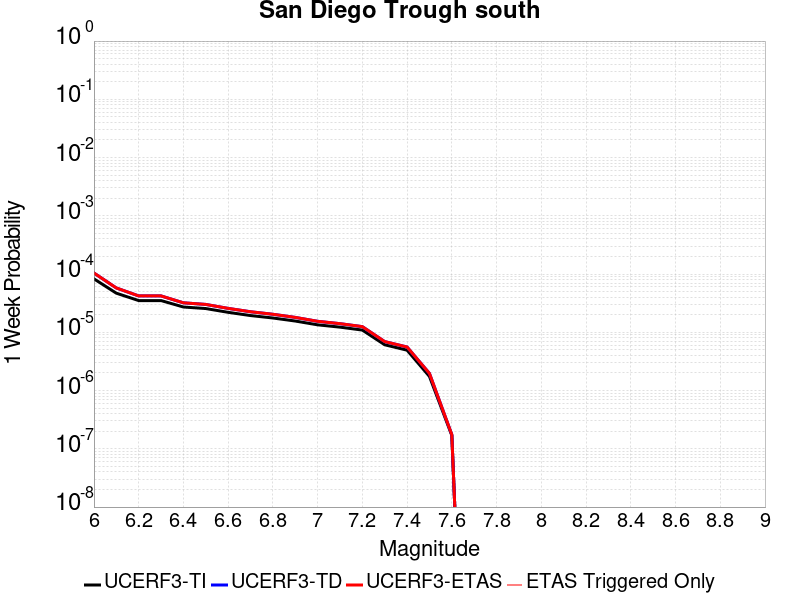 |  |  |  |

| Magnitude | 1 wk TI Prob | 1 wk TD Prob | 1 wk ETAS Prob | 1 wk ETAS/TD Gain | 1 wk ETAS Triggered Only | 1 mo TI Prob | 1 mo TD Prob | 1 mo ETAS Prob | 1 mo ETAS/TD Gain | 1 mo ETAS Triggered Only | 1 yr TI Prob | 1 yr TD Prob | 1 yr ETAS Prob | 1 yr ETAS/TD Gain | 1 yr ETAS Triggered Only | 10 yr TI Prob | 10 yr TD Prob | 10 yr ETAS Prob | 10 yr ETAS/TD Gain | 10 yr ETAS Triggered Only |
|-----|-----|-----|-----|-----|-----|-----|-----|-----|-----|-----|-----|-----|-----|-----|-----|-----|-----|-----|-----|-----|
| 6.0 | 8.279495E-5 | 1.0427164E-4 | 1.0427164E-4 | 1.0 | 0.0 | 3.5478722E-4 | 4.468069E-4 | 4.468069E-4 | 1.0 | 0.0 | 0.004310982 | 0.0054271356 | 0.0054271356 | 1.0 | 0.0 | 0.042283054 | 0.053005878 | 0.053029258 | 1.0004411 | 2.4691359E-5 |
| 6.1 | 4.6961468E-5 | 5.7744055E-5 | 5.7744055E-5 | 1.0 | 0.0 | 2.0124791E-4 | 2.4745203E-4 | 2.4745203E-4 | 1.0 | 0.0 | 0.00244744 | 0.00300868 | 0.00300868 | 1.0 | 0.0 | 0.024206603 | 0.029686471 | 0.029686471 | 1.0 | 0.0 |
| 6.2 | 3.5079658E-5 | 4.2150765E-5 | 4.2150765E-5 | 1.0 | 0.0 | 1.5033272E-4 | 1.8063388E-4 | 1.8063388E-4 | 1.0 | 0.0 | 0.0018287642 | 0.0021970419 | 0.0021970419 | 1.0 | 0.0 | 0.018137876 | 0.021755725 | 0.021755725 | 1.0 | 0.0 |
| 6.3 | 3.5079658E-5 | 4.2150765E-5 | 4.2150765E-5 | 1.0 | 0.0 | 1.5033272E-4 | 1.8063388E-4 | 1.8063388E-4 | 1.0 | 0.0 | 0.0018287642 | 0.0021970419 | 0.0021970419 | 1.0 | 0.0 | 0.018137876 | 0.021755725 | 0.021755725 | 1.0 | 0.0 |
| 6.4 | 2.7196904E-5 | 3.2093365E-5 | 3.2093365E-5 | 1.0 | 0.0 | 1.16552954E-4 | 1.3753583E-4 | 1.3753583E-4 | 1.0 | 0.0 | 0.0014181085 | 0.0016732255 | 0.0016732255 | 1.0 | 0.0 | 0.014090929 | 0.016607802 | 0.016607802 | 1.0 | 0.0 |
| 6.5 | 2.5584688E-5 | 3.0107343E-5 | 3.0107343E-5 | 1.0 | 0.0 | 1.0964406E-4 | 1.2902518E-4 | 1.2902518E-4 | 1.0 | 0.0 | 0.0013340989 | 0.0015697611 | 0.0015697611 | 1.0 | 0.0 | 0.013261181 | 0.015588229 | 0.015588229 | 1.0 | 0.0 |
| 6.6 | 2.2034688E-5 | 2.5747375E-5 | 2.5747375E-5 | 1.0 | 0.0 | 9.443096E-5 | 1.1034127E-4 | 1.1034127E-4 | 1.0 | 0.0 | 0.0011490905 | 0.0013425826 | 0.0013425826 | 1.0 | 0.0 | 0.011431668 | 0.0133457 | 0.0133457 | 1.0 | 0.0 |
| 6.7 | 1.9394853E-5 | 2.2545668E-5 | 2.2545668E-5 | 1.0 | 0.0 | 8.311815E-5 | 9.662074E-5 | 9.662074E-5 | 1.0 | 0.0 | 0.0010114936 | 0.0011757279 | 0.0011757279 | 1.0 | 0.0 | 0.01006902 | 0.011695781 | 0.011695781 | 1.0 | 0.0 |
| 6.8 | 1.7615313E-5 | 2.0406627E-5 | 2.0406627E-5 | 1.0 | 0.0 | 7.549201E-5 | 8.745407E-5 | 8.745407E-5 | 1.0 | 0.0 | 9.1872766E-4 | 0.0010642376 | 0.0010642376 | 1.0 | 0.0 | 0.009149387 | 0.010591977 | 0.010591977 | 1.0 | 0.0 |
| 6.9 | 1.5621423E-5 | 1.8029074E-5 | 1.8029074E-5 | 1.0 | 0.0 | 6.6947236E-5 | 7.7265184E-5 | 7.7265184E-5 | 1.0 | 0.0 | 8.147778E-4 | 9.403012E-4 | 9.403012E-4 | 1.0 | 0.0 | 0.008117969 | 0.009363671 | 0.009363671 | 1.0 | 0.0 |
| 7.0 | 1.3444376E-5 | 1.5450541E-5 | 1.5450541E-5 | 1.0 | 0.0 | 5.7617483E-5 | 6.621494E-5 | 6.621494E-5 | 1.0 | 0.0 | 7.0126704E-4 | 8.058715E-4 | 8.058715E-4 | 1.0 | 0.0 | 0.006990582 | 0.008029825 | 0.008029825 | 1.0 | 0.0 |
| 7.1 | 1.2268361E-5 | 1.4075235E-5 | 1.4075235E-5 | 1.0 | 0.0 | 5.2577634E-5 | 6.0321057E-5 | 6.0321057E-5 | 1.0 | 0.0 | 6.399447E-4 | 7.3416403E-4 | 7.3416403E-4 | 1.0 | 0.0 | 0.0063810493 | 0.0073176916 | 0.0073176916 | 1.0 | 0.0 |
| 7.2 | 1.0922655E-5 | 1.2515505E-5 | 1.2515505E-5 | 1.0 | 0.0 | 4.681054E-5 | 5.3636788E-5 | 5.3636788E-5 | 1.0 | 0.0 | 5.697693E-4 | 6.528348E-4 | 6.528348E-4 | 1.0 | 0.0 | 0.0056831064 | 0.0065094507 | 0.0065094507 | 1.0 | 0.0 |
| 7.3 | 6.1106753E-6 | 6.9299144E-6 | 6.9299144E-6 | 1.0 | 0.0 | 2.6188345E-5 | 2.9699297E-5 | 2.9699297E-5 | 1.0 | 0.0 | 3.1879646E-4 | 3.6152935E-4 | 3.6152935E-4 | 1.0 | 0.0 | 0.0031833951 | 0.0036094575 | 0.0036094575 | 1.0 | 0.0 |
| 7.4 | 4.933187E-6 | 5.5903465E-6 | 5.5903465E-6 | 1.0 | 0.0 | 2.114206E-5 | 2.395841E-5 | 2.395841E-5 | 1.0 | 0.0 | 2.5737417E-4 | 2.91655E-4 | 2.91655E-4 | 1.0 | 0.0 | 0.002570763 | 0.0029127633 | 0.0029127633 | 1.0 | 0.0 |
| 7.5 | 1.7489613E-6 | 1.969945E-6 | 1.969945E-6 | 1.0 | 0.0 | 7.495527E-6 | 8.4425965E-6 | 8.4425965E-6 | 1.0 | 0.0 | 9.125422E-5 | 1.0278398E-4 | 1.0278398E-4 | 1.0 | 0.0 | 9.1216754E-4 | 0.0010273864 | 0.0010273864 | 1.0 | 0.0 |
| 7.6 | 1.6988751E-7 | 1.753442E-7 | 1.753442E-7 | 1.0 | 0.0 | 7.2808916E-7 | 7.5147494E-7 | 7.5147494E-7 | 1.0 | 0.0 | 8.864449E-6 | 9.149171E-6 | 9.149171E-6 | 1.0 | 0.0 | 8.8640954E-5 | 9.148814E-5 | 9.148814E-5 | 1.0 | 0.0 |

## Earthquake Valley (No  Extension)
*[(top)](#table-of-contents)*

| 1 Week | 1 Month | 1 Year | 10 Year |
|-----|-----|-----|-----|
| 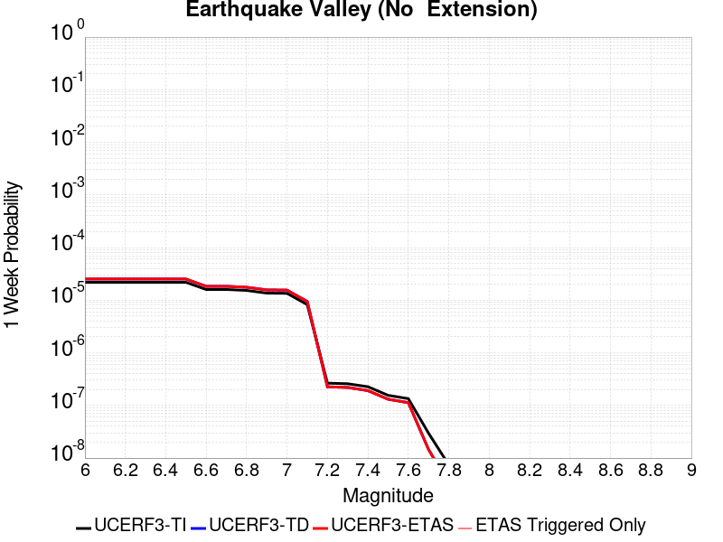 |  |  |  |

| Magnitude | 1 wk TI Prob | 1 wk TD Prob | 1 wk ETAS Prob | 1 wk ETAS/TD Gain | 1 wk ETAS Triggered Only | 1 mo TI Prob | 1 mo TD Prob | 1 mo ETAS Prob | 1 mo ETAS/TD Gain | 1 mo ETAS Triggered Only | 1 yr TI Prob | 1 yr TD Prob | 1 yr ETAS Prob | 1 yr ETAS/TD Gain | 1 yr ETAS Triggered Only | 10 yr TI Prob | 10 yr TD Prob | 10 yr ETAS Prob | 10 yr ETAS/TD Gain | 10 yr ETAS Triggered Only |
|-----|-----|-----|-----|-----|-----|-----|-----|-----|-----|-----|-----|-----|-----|-----|-----|-----|-----|-----|-----|-----|
| 6.0 | 2.1859703E-5 | 2.5202557E-5 | 2.5202557E-5 | 1.0 | 0.0 | 9.3681076E-5 | 1.08007305E-4 | 1.08007305E-4 | 1.0 | 0.0 | 0.0011399703 | 0.0013143406 | 0.0013143406 | 1.0 | 0.0 | 0.011341401 | 0.013080036 | 0.013104405 | 1.001863 | 2.4691359E-5 |
| 6.1 | 2.1859703E-5 | 2.5202557E-5 | 2.5202557E-5 | 1.0 | 0.0 | 9.3681076E-5 | 1.08007305E-4 | 1.08007305E-4 | 1.0 | 0.0 | 0.0011399703 | 0.0013143406 | 0.0013143406 | 1.0 | 0.0 | 0.011341401 | 0.013080036 | 0.013104405 | 1.001863 | 2.4691359E-5 |
| 6.2 | 2.1859703E-5 | 2.5202557E-5 | 2.5202557E-5 | 1.0 | 0.0 | 9.3681076E-5 | 1.08007305E-4 | 1.08007305E-4 | 1.0 | 0.0 | 0.0011399703 | 0.0013143406 | 0.0013143406 | 1.0 | 0.0 | 0.011341401 | 0.013080036 | 0.013104405 | 1.001863 | 2.4691359E-5 |
| 6.3 | 2.1859703E-5 | 2.5202557E-5 | 2.5202557E-5 | 1.0 | 0.0 | 9.3681076E-5 | 1.08007305E-4 | 1.08007305E-4 | 1.0 | 0.0 | 0.0011399703 | 0.0013143406 | 0.0013143406 | 1.0 | 0.0 | 0.011341401 | 0.013080036 | 0.013104405 | 1.001863 | 2.4691359E-5 |
| 6.4 | 2.1859703E-5 | 2.5202557E-5 | 2.5202557E-5 | 1.0 | 0.0 | 9.3681076E-5 | 1.08007305E-4 | 1.08007305E-4 | 1.0 | 0.0 | 0.0011399703 | 0.0013143406 | 0.0013143406 | 1.0 | 0.0 | 0.011341401 | 0.013080036 | 0.013104405 | 1.001863 | 2.4691359E-5 |
| 6.5 | 2.1859703E-5 | 2.5202557E-5 | 2.5202557E-5 | 1.0 | 0.0 | 9.3681076E-5 | 1.08007305E-4 | 1.08007305E-4 | 1.0 | 0.0 | 0.0011399703 | 0.0013143406 | 0.0013143406 | 1.0 | 0.0 | 0.011341401 | 0.013080036 | 0.013104405 | 1.001863 | 2.4691359E-5 |
| 6.6 | 1.597E-5 | 1.8359297E-5 | 1.8359297E-5 | 1.0 | 0.0 | 6.8441055E-5 | 7.868082E-5 | 7.868082E-5 | 1.0 | 0.0 | 8.329513E-4 | 9.576053E-4 | 9.576053E-4 | 1.0 | 0.0 | 0.008298361 | 0.0095434 | 0.009567856 | 1.0025625 | 2.4691359E-5 |
| 6.7 | 1.597E-5 | 1.8359297E-5 | 1.8359297E-5 | 1.0 | 0.0 | 6.8441055E-5 | 7.868082E-5 | 7.868082E-5 | 1.0 | 0.0 | 8.329513E-4 | 9.576053E-4 | 9.576053E-4 | 1.0 | 0.0 | 0.008298361 | 0.0095434 | 0.009567856 | 1.0025625 | 2.4691359E-5 |
| 6.8 | 1.5315149E-5 | 1.7604993E-5 | 1.7604993E-5 | 1.0 | 0.0 | 6.5634704E-5 | 7.544827E-5 | 7.544827E-5 | 1.0 | 0.0 | 7.988095E-4 | 9.182823E-4 | 9.182823E-4 | 1.0 | 0.0 | 0.007959441 | 0.009153421 | 0.009177887 | 1.0026728 | 2.4691359E-5 |
| 6.9 | 1.3634728E-5 | 1.5678423E-5 | 1.5678423E-5 | 1.0 | 0.0 | 5.8433237E-5 | 6.719197E-5 | 6.719197E-5 | 1.0 | 0.0 | 7.1119244E-4 | 8.178373E-4 | 8.178373E-4 | 1.0 | 0.0 | 0.007089207 | 0.008156349 | 0.008156349 | 1.0 | 0.0 |
| 7.0 | 1.3496271E-5 | 1.552043E-5 | 1.552043E-5 | 1.0 | 0.0 | 5.783988E-5 | 6.65149E-5 | 6.65149E-5 | 1.0 | 0.0 | 7.03973E-4 | 8.0960005E-4 | 8.0960005E-4 | 1.0 | 0.0 | 0.007017471 | 0.008074577 | 0.008074577 | 1.0 | 0.0 |
| 7.1 | 8.242798E-6 | 9.47421E-6 | 9.47421E-6 | 1.0 | 0.0 | 3.53258E-5 | 4.0603503E-5 | 4.0603503E-5 | 1.0 | 0.0 | 4.300067E-4 | 4.943026E-4 | 4.943026E-4 | 1.0 | 0.0 | 0.004291756 | 0.00493861 | 0.00493861 | 1.0 | 0.0 |
| 7.2 | 2.6506527E-7 | 2.2565123E-7 | 2.2565123E-7 | 1.0 | 0.0 | 1.1359936E-6 | 9.670764E-7 | 9.670764E-7 | 1.0 | 0.0 | 1.3830633E-5 | 1.1774096E-5 | 1.1774096E-5 | 1.0 | 0.0 | 1.3829772E-4 | 1.1773513E-4 | 1.1773513E-4 | 1.0 | 0.0 |
| 7.3 | 2.5810488E-7 | 2.196019E-7 | 2.196019E-7 | 1.0 | 0.0 | 1.1061633E-6 | 9.411507E-7 | 9.411507E-7 | 1.0 | 0.0 | 1.3467455E-5 | 1.1458454E-5 | 1.1458454E-5 | 1.0 | 0.0 | 1.3466639E-4 | 1.1457904E-4 | 1.1457904E-4 | 1.0 | 0.0 |
| 7.4 | 2.2676066E-7 | 1.9115149E-7 | 1.9115149E-7 | 1.0 | 0.0 | 9.71831E-7 | 8.192204E-7 | 8.192204E-7 | 1.0 | 0.0 | 1.1831979E-5 | 9.973967E-6 | 9.973967E-6 | 1.0 | 0.0 | 1.1831349E-4 | 9.973558E-5 | 9.973558E-5 | 1.0 | 0.0 |
| 7.5 | 1.5553917E-7 | 1.3115734E-7 | 1.3115734E-7 | 1.0 | 0.0 | 6.6659624E-7 | 5.6210274E-7 | 5.6210274E-7 | 1.0 | 0.0 | 8.115779E-6 | 6.843582E-6 | 6.843582E-6 | 1.0 | 0.0 | 8.115482E-5 | 6.843393E-5 | 6.843393E-5 | 1.0 | 0.0 |
| 7.6 | 1.3448629E-7 | 1.1291606E-7 | 1.1291606E-7 | 1.0 | 0.0 | 5.7636964E-7 | 4.839259E-7 | 4.839259E-7 | 1.0 | 0.0 | 7.017278E-6 | 5.891784E-6 | 5.891784E-6 | 1.0 | 0.0 | 7.0170565E-5 | 5.8916492E-5 | 5.8916492E-5 | 1.0 | 0.0 |
| 7.7 | 2.9719402E-8 | 1.4587915E-8 | 1.4587915E-8 | 1.0 | 0.0 | 1.2736886E-7 | 6.251963E-8 | 6.251963E-8 | 1.0 | 0.0 | 1.5507147E-6 | 7.611763E-7 | 7.611763E-7 | 1.0 | 0.0 | 1.550704E-5 | 7.611742E-6 | 7.611742E-6 | 1.0 | 0.0 |
| 7.8 | 7.4390196E-9 | 3.2514678E-9 | 3.2514678E-9 | 1.0 | 0.0 | 3.1881513E-8 | 1.3934862E-8 | 1.3934862E-8 | 1.0 | 0.0 | 3.8815733E-7 | 1.6965694E-7 | 1.6965694E-7 | 1.0 | 0.0 | 3.8815665E-6 | 1.6965683E-6 | 1.6965683E-6 | 1.0 | 0.0 |
| 7.9 | 1.5373532E-9 | 8.4424734E-10 | 8.4424734E-10 | 1.0 | 0.0 | 6.5886567E-9 | 3.618203E-9 | 3.618203E-9 | 1.0 | 0.0 | 8.021689E-8 | 4.4051625E-8 | 4.4051625E-8 | 1.0 | 0.0 | 8.0216864E-7 | 4.405162E-7 | 4.405162E-7 | 1.0 | 0.0 |

