# Parent Section Magnitude-Probability Distributions

Only fault sections with at least one triggered aftershock are plotted. Sections are sorted by total supraseismogenic trigger rate (decreasing)

## Table Of Contents

* [Garlock (Central)](#garlock-central)
* [Tank Canyon](#tank-canyon)
* [Little Lake](#little-lake)
* [Airport Lake](#airport-lake)
* [Owl Lake](#owl-lake)
* [Panamint Valley](#panamint-valley)
* [Garlock (East)](#garlock-east)
* [Ash Hill](#ash-hill)
* [Hunter Mountain-Saline Valley](#hunter-mountain-saline-valley)
* [Blackwater](#blackwater)
* [Garlock (West)](#garlock-west)
* [McLean Lake](#mclean-lake)
* [Gravel Hills-Harper Lk](#gravel-hills-harper-lk)
* [So Sierra Nevada](#so-sierra-nevada)
* [Goldstone Lake](#goldstone-lake)
* [San Andreas (Mojave S)](#san-andreas-mojave-s)
* [Coyote Canyon](#coyote-canyon)
* [Death Valley (So)](#death-valley-so)
* [Nelson Lake](#nelson-lake)
* [San Andreas (Mojave N)](#san-andreas-mojave-n)
* [Towne Pass](#towne-pass)
* [Lenwood-Lockhart-Old Woman Springs](#lenwood-lockhart-old-woman-springs)
* [San Andreas (San Bernardino N)](#san-andreas-san-bernardino-n)
* [Paradise](#paradise)
* [Bicycle Lake](#bicycle-lake)
* [Garlic Springs](#garlic-springs)
* [San Andreas (San Bernardino S)](#san-andreas-san-bernardino-s)
* [Helendale-So Lockhart](#helendale-so-lockhart)
* [Death Valley (Black Mtns Frontal)](#death-valley-black-mtns-frontal)
* [Coyote Lake](#coyote-lake)
* [Sierra Nevada  (No Extension)](#sierra-nevada--no-extension)
* [San Andreas (Big Bend)](#san-andreas-big-bend)
* [San Andreas (San Gorgonio Pass-Garnet HIll)](#san-andreas-san-gorgonio-pass-garnet-hill)
* [Red Pass](#red-pass)
* [Scodie Lineament](#scodie-lineament)
* [Elsinore (Glen Ivy) rev](#elsinore-glen-ivy-rev)
* [San Andreas (Coachella) rev](#san-andreas-coachella-rev)
* [Ludlow](#ludlow)
* [San Jacinto (San Bernardino)](#san-jacinto-san-bernardino)
* [Death Valley (No)](#death-valley-no)
* [Cady](#cady)
* [Owens Valley](#owens-valley)
* [San Andreas (Carrizo) rev](#san-andreas-carrizo-rev)
* [San Andreas (Creeping Section) 2011 CFM](#san-andreas-creeping-section-2011-cfm)
* [San Andreas (Cholame) rev](#san-andreas-cholame-rev)
* [San Andreas (Parkfield)](#san-andreas-parkfield)
* [Baker](#baker)
* [Santa Ynez (West)](#santa-ynez-west)
* [Calico-Hidalgo](#calico-hidalgo)
* [San Diego Trough north alt1](#san-diego-trough-north-alt1)
* [Independence rev 2011](#independence-rev-2011)
* [Brawley (Seismic Zone) alt 1](#brawley-seismic-zone-alt-1)
* [San Jacinto (Stepovers Combined)](#san-jacinto-stepovers-combined)
* [White Wolf (Extension)](#white-wolf-extension)
* [San Jacinto (Anza) rev](#san-jacinto-anza-rev)
* [Lake Isabella (Seismicity)](#lake-isabella-seismicity)
* [Manix-Afton Hills](#manix-afton-hills)
* [Mission Ridge-Arroyo Parida-Santa Ana](#mission-ridge-arroyo-parida-santa-ana)
* [San Jacinto (Coyote Creek)](#san-jacinto-coyote-creek)
* [Death Valley (Fish Lake Valley)](#death-valley-fish-lake-valley)
* [Red Mountain](#red-mountain)
* [San Jacinto (San Jacinto Valley) rev](#san-jacinto-san-jacinto-valley-rev)
* [Ortigalita (North)](#ortigalita-north)
* [Cleghorn Lake](#cleghorn-lake)
* [Great Valley 09 (Laguna Seca)](#great-valley-09-laguna-seca)
* [Camp Rock 2011](#camp-rock-2011)
* [Pisgah-Bullion Mtn-Mesquite Lk](#pisgah-bullion-mtn-mesquite-lk)
* [Imperial](#imperial)
* [Pinto Mtn](#pinto-mtn)
* [San Andreas (North Branch Mill Creek)](#san-andreas-north-branch-mill-creek)
* [Mission Creek](#mission-creek)
* [Big Pine (East)](#big-pine-east)
* [Lost Hills](#lost-hills)
* [Tin Mountain](#tin-mountain)
* [Cleghorn Pass](#cleghorn-pass)
* [Big Pine (Central)](#big-pine-central)
* [Santa Cruz Catalina Ridge alt1](#santa-cruz-catalina-ridge-alt1)
* [Great Valley 05 Pittsburg - Kirby Hills alt1](#great-valley-05-pittsburg---kirby-hills-alt1)
* [Bullion Mountains](#bullion-mountains)
* [Hayward (So) 2011 CFM](#hayward-so-2011-cfm)
* [San Luis Range 2011 CFM](#san-luis-range-2011-cfm)
* [Dry Mountain](#dry-mountain)
* [Homestead Valley 2011](#homestead-valley-2011)
* [Ventura-Pitas Point](#ventura-pitas-point)
* [San Diego Trough south](#san-diego-trough-south)
* [Kern Canyon (North Kern) 2011](#kern-canyon-north-kern-2011)
* [San Jacinto (Borrego)](#san-jacinto-borrego)
* [Owens Valley Keough Hot Springs](#owens-valley-keough-hot-springs)
* [Sheephole](#sheephole)
* [Elmore Ranch](#elmore-ranch)
* [Pleito](#pleito)
* [San Jacinto (Superstition Mtn)](#san-jacinto-superstition-mtn)
* [Pitas Point (Lower)-Montalvo](#pitas-point-lower-montalvo)
* [Ortigalita (South)](#ortigalita-south)
* [Swain Ravine - Spenceville](#swain-ravine---spenceville)
* [Palos Verdes](#palos-verdes)
* [Calaveras (So) - Paicines extension 2011 CFM](#calaveras-so---paicines-extension-2011-cfm)
* [Pitas Point (Lower West)](#pitas-point-lower-west)
* [Kern Canyon (South Kern) 2011](#kern-canyon-south-kern-2011)
* [Santa Ynez River](#santa-ynez-river)
* [Great Valley 08 (Quinto)](#great-valley-08-quinto)
* [Rinconada 2011 CFM](#rinconada-2011-cfm)
* [Chino alt 1](#chino-alt-1)
* [Jess Valley](#jess-valley)
* [Cucamonga](#cucamonga)
* [Earthquake Valley (No  Extension)](#earthquake-valley-no--extension)
* [San Jacinto (Lytle Creek connector)](#san-jacinto-lytle-creek-connector)
* [Deep Springs](#deep-springs)
* [Cleghorn](#cleghorn)
* [Superstition Hills](#superstition-hills)
* [Mission Hills 2011](#mission-hills-2011)
* [North Frontal  (West)](#north-frontal--west)
* [Calaveras (So) 2011 CFM](#calaveras-so-2011-cfm)
* [Mono Lake 2011 CFM](#mono-lake-2011-cfm)
* [Sargent 2011 CFM](#sargent-2011-cfm)
* [Hat Creek-McArthur-Mayfield](#hat-creek-mcarthur-mayfield)
* [Elysian Park (Upper)](#elysian-park-upper)
* [Fontana (Seismicity)](#fontana-seismicity)
* [Hayward (So) extension 2011 CFM](#hayward-so-extension-2011-cfm)
* [San Clemente](#san-clemente)
* [North Frontal  (East)](#north-frontal--east)
* [Kern Canyon (Lake Isabella) 2011](#kern-canyon-lake-isabella-2011)
* [Malibu Coast alt 1](#malibu-coast-alt-1)
* [Rose Canyon](#rose-canyon)
* [La Panza 2011](#la-panza-2011)
* [Coronado Bank alt1](#coronado-bank-alt1)

## Garlock (Central)
*[(top)](#table-of-contents)*

| 1 Week | 1 Month | 1 Year | 10 Year |
|-----|-----|-----|-----|
|  |  |  |  |

| Magnitude | 1 wk TI Prob | 1 wk TD Prob | 1 wk ETAS Prob | 1 wk ETAS/TD Gain | 1 wk ETAS Triggered Only | 1 mo TI Prob | 1 mo TD Prob | 1 mo ETAS Prob | 1 mo ETAS/TD Gain | 1 mo ETAS Triggered Only | 1 yr TI Prob | 1 yr TD Prob | 1 yr ETAS Prob | 1 yr ETAS/TD Gain | 1 yr ETAS Triggered Only | 10 yr TI Prob | 10 yr TD Prob | 10 yr ETAS Prob | 10 yr ETAS/TD Gain | 10 yr ETAS Triggered Only |
|-----|-----|-----|-----|-----|-----|-----|-----|-----|-----|-----|-----|-----|-----|-----|-----|-----|-----|-----|-----|-----|
| 6.0 | 5.5131142E-5 | 7.029724E-5 | 0.0013314731 | 18.940619 | 0.0012612646 | 2.3625491E-4 | 3.0123946E-4 | 0.004394546 | 14.588216 | 0.00409454 | 0.0028726095 | 0.0036614882 | 0.024423473 | 6.6703677 | 0.020838285 | 0.028357591 | 0.03610513 | 0.08112224 | 2.2468345 | 0.046703346 |
| 6.1 | 5.5131142E-5 | 7.029724E-5 | 0.0013314731 | 18.940619 | 0.0012612646 | 2.3625491E-4 | 3.0123946E-4 | 0.004394546 | 14.588216 | 0.00409454 | 0.0028726095 | 0.0036614882 | 0.024423473 | 6.6703677 | 0.020838285 | 0.028357591 | 0.03610513 | 0.08112224 | 2.2468345 | 0.046703346 |
| 6.2 | 4.216245E-5 | 5.1707266E-5 | 7.097243E-4 | 13.725814 | 6.5805105E-4 | 1.806837E-4 | 2.2158393E-4 | 0.0025790778 | 11.639281 | 0.0023580163 | 0.0021976046 | 0.0026944785 | 0.015655968 | 5.810389 | 0.012996509 | 0.021759989 | 0.026713025 | 0.05537417 | 2.0729277 | 0.029447785 |
| 6.3 | 4.216245E-5 | 5.1707266E-5 | 7.097243E-4 | 13.725814 | 6.5805105E-4 | 1.806837E-4 | 2.2158393E-4 | 0.0025790778 | 11.639281 | 0.0023580163 | 0.0021976046 | 0.0026944785 | 0.015655968 | 5.810389 | 0.012996509 | 0.021759989 | 0.026713025 | 0.05537417 | 2.0729277 | 0.029447785 |
| 6.4 | 3.6858168E-5 | 4.4154516E-5 | 5.3767103E-4 | 12.177033 | 4.9353833E-4 | 1.5795401E-4 | 1.8922007E-4 | 0.0020350695 | 10.755041 | 0.0018461988 | 0.0019213937 | 0.0023013453 | 0.012477663 | 5.4219 | 0.010199792 | 0.019048655 | 0.022871342 | 0.04584075 | 2.0042877 | 0.023507047 |
| 6.5 | 3.39199E-5 | 4.0061277E-5 | 4.0563056E-4 | 10.125253 | 3.6558392E-4 | 1.453629E-4 | 1.7168E-4 | 0.0017616971 | 10.261516 | 0.0015902901 | 0.0017683565 | 0.0020882222 | 0.011391145 | 5.454949 | 0.00932239 | 0.017543508 | 0.020781917 | 0.041849416 | 2.0137417 | 0.021514615 |
| 6.6 | 3.3571985E-5 | 3.951536E-5 | 4.0508484E-4 | 10.251327 | 3.6558392E-4 | 1.4387199E-4 | 1.6934067E-4 | 0.0017593615 | 10.38948 | 0.0015902901 | 0.0017502342 | 0.0020597947 | 0.011344741 | 5.5077047 | 0.009304111 | 0.017365133 | 0.020503184 | 0.04152297 | 2.025196 | 0.021459777 |
| 6.7 | 3.2580007E-5 | 3.8131515E-5 | 4.037015E-4 | 10.587083 | 3.6558392E-4 | 1.3962112E-4 | 1.6341066E-4 | 0.0016803361 | 10.282904 | 0.0015171733 | 0.0016985617 | 0.0019877309 | 0.010981462 | 5.524622 | 0.009011644 | 0.016856372 | 0.019795695 | 0.0401498 | 2.0282087 | 0.020765167 |
| 6.8 | 3.2185937E-5 | 3.755858E-5 | 3.8485025E-4 | 10.246668 | 3.4730474E-4 | 1.3793244E-4 | 1.6095553E-4 | 0.0016230559 | 10.083878 | 0.0014623357 | 0.0016780337 | 0.0019578936 | 0.010714729 | 5.47258 | 0.008774014 | 0.016654192 | 0.019502424 | 0.039378706 | 2.0191698 | 0.02027163 |
| 6.9 | 3.165394E-5 | 3.676294E-5 | 3.657764E-4 | 9.949595 | 3.2902553E-4 | 1.3565269E-4 | 1.5754606E-4 | 0.0015648224 | 9.932476 | 0.0014074981 | 0.0016503202 | 0.0019164572 | 0.010436483 | 5.4457164 | 0.008536384 | 0.01638118 | 0.019094951 | 0.0385671 | 2.019754 | 0.019851208 |
| 7.0 | 3.0903822E-5 | 3.56679E-5 | 3.646817E-4 | 10.224367 | 3.2902553E-4 | 1.3243823E-4 | 1.528536E-4 | 0.0015601366 | 10.2067375 | 0.0014074981 | 0.0016112428 | 0.0018594253 | 0.010252221 | 5.5136504 | 0.00840843 | 0.015996104 | 0.018533979 | 0.037604634 | 2.0289564 | 0.019430786 |
| 7.1 | 3.0069863E-5 | 3.443386E-5 | 3.2689093E-4 | 9.4932995 | 2.9246716E-4 | 1.2886449E-4 | 1.4756546E-4 | 0.0015000264 | 10.16516 | 0.0013526606 | 0.0015677959 | 0.00179515 | 0.009768819 | 5.4417844 | 0.007988009 | 0.01556781 | 0.017901478 | 0.036086824 | 2.0158572 | 0.018516826 |
| 7.2 | 2.7957109E-5 | 3.1322343E-5 | 2.8722308E-4 | 9.16991 | 2.5590876E-4 | 1.1981068E-4 | 1.3423181E-4 | 0.0013587736 | 10.12259 | 0.0012247062 | 0.0014577188 | 0.0016330667 | 0.00823933 | 5.045311 | 0.0066170692 | 0.014481937 | 0.016304675 | 0.031696547 | 1.944016 | 0.015646992 |
| 7.3 | 2.4519275E-5 | 2.6753303E-5 | 2.2781908E-4 | 8.51555 | 2.0107116E-4 | 1.0507837E-4 | 1.1465206E-4 | 9.919528E-4 | 8.6518545 | 8.7740144E-4 | 0.0012785783 | 0.0013950097 | 0.006177478 | 4.428269 | 0.0047891494 | 0.012712469 | 0.01394786 | 0.025050793 | 1.7960312 | 0.011259985 |
| 7.4 | 2.3225532E-5 | 2.5237154E-5 | 2.2630324E-4 | 8.967067 | 2.0107116E-4 | 9.95342E-5 | 1.08154825E-4 | 9.4890693E-4 | 8.773598 | 8.40843E-4 | 0.0012111551 | 0.0013160041 | 0.0057885135 | 4.398553 | 0.004478403 | 0.012045753 | 0.013165161 | 0.023393018 | 1.7768881 | 0.010364304 |
| 7.5 | 2.097765E-5 | 2.2519616E-5 | 2.0530747E-4 | 9.116828 | 1.8279196E-4 | 8.9901114E-5 | 9.650914E-5 | 8.09329E-4 | 8.386035 | 7.1288866E-4 | 0.0010939965 | 0.0011743773 | 0.0048076655 | 4.0938 | 0.0036375602 | 0.010886264 | 0.01175889 | 0.01974329 | 1.6790097 | 0.008079405 |
| 7.6 | 1.511254E-5 | 1.6024836E-5 | 8.914045E-5 | 5.5626435 | 7.311679E-5 | 6.476642E-5 | 6.8676105E-5 | 4.5251288E-4 | 6.5890875 | 3.8386314E-4 | 7.882459E-4 | 8.358187E-4 | 0.0025343632 | 3.0321925 | 0.0016999652 | 0.007854558 | 0.008400891 | 0.012624164 | 1.5027173 | 0.0042590527 |
| 7.7 | 9.934069E-6 | 1.0710005E-5 | 2.8989005E-5 | 2.706722 | 1.8279197E-5 | 4.2573887E-5 | 4.5899214E-5 | 1.7384771E-4 | 3.7875967 | 1.2795438E-4 | 5.182138E-4 | 5.5868004E-4 | 9.605977E-4 | 1.7194058 | 4.0214232E-4 | 0.00517007 | 0.005643875 | 0.006807141 | 1.2061112 | 0.0011698686 |
| 7.8 | 6.7562896E-6 | 8.454161E-6 | 2.6733202E-5 | 3.1621356 | 1.8279197E-5 | 2.8955206E-5 | 3.6231613E-5 | 1.6418136E-4 | 4.5314393 | 1.2795438E-4 | 3.5247262E-4 | 4.4103077E-4 | 7.881823E-4 | 1.7871368 | 3.4730474E-4 | 0.0035191406 | 0.0044599986 | 0.0052243005 | 1.1713682 | 7.677263E-4 |
| 7.9 | 3.975453E-6 | 5.3865706E-6 | 2.3665669E-5 | 4.3934574 | 1.8279197E-5 | 1.7037546E-5 | 2.3085098E-5 | 1.1447897E-4 | 4.9589987 | 9.139598E-5 | 2.0741238E-4 | 2.8102493E-4 | 5.5513583E-4 | 1.9753971 | 2.7418794E-4 | 0.002072189 | 0.002841702 | 0.0033885196 | 1.1924261 | 5.483759E-4 |
| 8.0 | 1.6729537E-6 | 2.0826424E-6 | 2.0826424E-6 | 1.0 | 0.0 | 7.169782E-6 | 8.92558E-6 | 4.5483648E-5 | 5.0958757 | 3.6558395E-5 | 8.7288594E-5 | 1.0866355E-4 | 1.817724E-4 | 1.6728001 | 7.311679E-5 | 8.7254314E-4 | 0.0010996006 | 0.0012821916 | 1.1660521 | 1.8279196E-4 |
| 8.1 | 3.6733252E-7 | 3.156379E-7 | 3.156379E-7 | 1.0 | 0.0 | 1.5742813E-6 | 1.3527332E-6 | 1.9631905E-5 | 14.512769 | 1.8279197E-5 | 1.9166706E-5 | 1.646942E-5 | 3.4748315E-5 | 2.1098688 | 1.8279197E-5 | 1.9165053E-4 | 1.6677451E-4 | 1.8505067E-4 | 1.109586 | 1.8279197E-5 |

## Tank Canyon
*[(top)](#table-of-contents)*

| 1 Week | 1 Month | 1 Year | 10 Year |
|-----|-----|-----|-----|
|  |  |  |  |

| Magnitude | 1 wk TI Prob | 1 wk TD Prob | 1 wk ETAS Prob | 1 wk ETAS/TD Gain | 1 wk ETAS Triggered Only | 1 mo TI Prob | 1 mo TD Prob | 1 mo ETAS Prob | 1 mo ETAS/TD Gain | 1 mo ETAS Triggered Only | 1 yr TI Prob | 1 yr TD Prob | 1 yr ETAS Prob | 1 yr ETAS/TD Gain | 1 yr ETAS Triggered Only | 10 yr TI Prob | 10 yr TD Prob | 10 yr ETAS Prob | 10 yr ETAS/TD Gain | 10 yr ETAS Triggered Only |
|-----|-----|-----|-----|-----|-----|-----|-----|-----|-----|-----|-----|-----|-----|-----|-----|-----|-----|-----|-----|-----|
| 6.0 | 4.8284557E-5 | 5.7977024E-5 | 7.5254624E-4 | 12.980077 | 6.946095E-4 | 2.0691741E-4 | 2.4845314E-4 | 0.002587609 | 10.414877 | 0.0023397373 | 0.0025163088 | 0.0030213767 | 0.016452441 | 5.445346 | 0.013471768 | 0.02488006 | 0.02986978 | 0.06260527 | 2.09594 | 0.033743396 |
| 6.1 | 1.7796336E-5 | 2.0876903E-5 | 2.4022268E-4 | 11.506624 | 2.1935036E-4 | 7.626778E-5 | 8.946959E-5 | 8.936823E-4 | 9.98867 | 8.0428465E-4 | 9.281647E-4 | 0.0010887844 | 0.0058727195 | 5.3938313 | 0.0047891494 | 0.009242975 | 0.010838592 | 0.023314534 | 2.1510668 | 0.0126126455 |
| 6.2 | 1.7796336E-5 | 2.0876903E-5 | 2.4022268E-4 | 11.506624 | 2.1935036E-4 | 7.626778E-5 | 8.946959E-5 | 8.936823E-4 | 9.98867 | 8.0428465E-4 | 9.281647E-4 | 0.0010887844 | 0.0058727195 | 5.3938313 | 0.0047891494 | 0.009242975 | 0.010838592 | 0.023314534 | 2.1510668 | 0.0126126455 |
| 6.3 | 1.3515912E-5 | 1.5762093E-5 | 1.8027227E-4 | 11.4370775 | 1.6451276E-4 | 5.792405E-5 | 6.755021E-5 | 6.5244496E-4 | 9.658667 | 5.849343E-4 | 7.049971E-4 | 8.2213746E-4 | 0.0041827443 | 5.087646 | 0.003363372 | 0.007027647 | 0.008193571 | 0.017276412 | 2.1085327 | 0.009157877 |
| 6.4 | 1.0870146E-5 | 1.2619922E-5 | 1.2229371E-4 | 9.690529 | 1.0967518E-4 | 4.658551E-5 | 5.408436E-5 | 4.5620493E-4 | 8.435061 | 4.0214232E-4 | 5.67031E-4 | 6.5829605E-4 | 0.0031608974 | 4.801635 | 0.0025042498 | 0.005655863 | 0.006565476 | 0.013357011 | 2.0344315 | 0.0068364195 |
| 6.5 | 7.964826E-6 | 9.197353E-6 | 8.231347E-5 | 8.949691 | 7.311679E-5 | 3.4134522E-5 | 3.9416693E-5 | 3.5015077E-4 | 8.883312 | 3.1074634E-4 | 4.1550855E-4 | 4.7980322E-4 | 0.0021606823 | 4.503268 | 0.001681686 | 0.0041473247 | 0.0047889743 | 0.009227739 | 1.9268717 | 0.004460124 |
| 6.6 | 6.6317E-6 | 7.6132555E-6 | 8.0729485E-5 | 10.603806 | 7.311679E-5 | 2.8421264E-5 | 3.2627882E-5 | 2.5197107E-4 | 7.7225695 | 2.1935036E-4 | 3.4597394E-4 | 3.9718117E-4 | 0.001603129 | 4.0362663 | 0.001206427 | 0.0034543579 | 0.003965865 | 0.007224865 | 1.8217627 | 0.0032719763 |
| 6.7 | 4.793663E-6 | 5.431335E-6 | 4.198953E-5 | 7.7309775 | 3.6558395E-5 | 2.0544108E-5 | 2.3276967E-5 | 9.6392054E-5 | 4.1410913 | 7.311679E-5 | 2.500958E-4 | 2.833646E-4 | 8.6813315E-4 | 3.063661 | 5.849343E-4 | 0.0024981452 | 0.0028307254 | 0.004544106 | 1.6052797 | 0.0017182445 |
| 6.8 | 4.382823E-6 | 4.9697283E-6 | 4.152794E-5 | 8.356179 | 3.6558395E-5 | 1.8783392E-5 | 2.1298685E-5 | 9.441392E-5 | 4.432852 | 7.311679E-5 | 2.286638E-4 | 2.5928492E-4 | 8.257931E-4 | 3.1848867 | 5.666551E-4 | 0.0022842865 | 0.002590498 | 0.0041766684 | 1.6123033 | 0.0015902901 |
| 6.9 | 2.729601E-6 | 3.0737624E-6 | 3.0737624E-6 | 1.0 | 0.0 | 1.1698237E-5 | 1.3173209E-5 | 1.3173209E-5 | 1.0 | 0.0 | 1.4241673E-4 | 1.6037324E-4 | 4.345172E-4 | 2.7094123 | 2.7418794E-4 | 0.001423255 | 0.0016027407 | 0.002442236 | 1.5237874 | 8.40843E-4 |
| 7.0 | 1.8987357E-6 | 2.127059E-6 | 2.127059E-6 | 1.0 | 0.0 | 8.137413E-6 | 9.115938E-6 | 9.115938E-6 | 1.0 | 0.0 | 9.90685E-5 | 1.1098159E-4 | 2.5719893E-4 | 2.3174918 | 1.4623358E-4 | 9.902435E-4 | 0.0011093304 | 0.0015110266 | 1.3621069 | 4.0214232E-4 |
| 7.1 | 1.4928986E-6 | 1.6642095E-6 | 1.6642095E-6 | 1.0 | 0.0 | 6.398121E-6 | 7.13231E-6 | 7.13231E-6 | 1.0 | 0.0 | 7.789434E-5 | 8.683301E-5 | 1.5994345E-4 | 1.8419659 | 7.311679E-5 | 7.786704E-4 | 8.6804864E-4 | 0.0010141553 | 1.1683161 | 1.4623358E-4 |
| 7.2 | 1.069082E-6 | 1.1829095E-6 | 1.1829095E-6 | 1.0 | 0.0 | 4.581772E-6 | 5.0696053E-6 | 5.0696053E-6 | 1.0 | 0.0 | 5.5781646E-5 | 6.172123E-5 | 9.827736E-5 | 1.5922781 | 3.6558395E-5 | 5.576765E-4 | 6.170931E-4 | 6.901648E-4 | 1.1184127 | 7.311679E-5 |
| 7.3 | 8.776551E-7 | 9.770386E-7 | 9.770386E-7 | 1.0 | 0.0 | 3.7613736E-6 | 4.187304E-6 | 4.187304E-6 | 1.0 | 0.0 | 4.579376E-5 | 5.0979754E-5 | 8.753628E-5 | 1.7170793 | 3.6558395E-5 | 4.5784327E-4 | 5.0973165E-4 | 5.8281113E-4 | 1.1433686 | 7.311679E-5 |
| 7.4 | 7.55721E-7 | 8.51056E-7 | 8.51056E-7 | 1.0 | 0.0 | 3.2388E-6 | 3.6473805E-6 | 3.6473805E-6 | 1.0 | 0.0 | 3.9431678E-5 | 4.440647E-5 | 6.2684856E-5 | 1.4116154 | 1.8279197E-5 | 3.942468E-4 | 4.4402684E-4 | 4.80569E-4 | 1.0822972 | 3.6558395E-5 |
| 7.5 | 5.587665E-7 | 6.3058474E-7 | 6.3058474E-7 | 1.0 | 0.0 | 2.3947114E-6 | 2.7025062E-6 | 2.7025062E-6 | 1.0 | 0.0 | 2.915522E-5 | 3.290301E-5 | 5.1181607E-5 | 1.5555296 | 1.8279197E-5 | 2.9151395E-4 | 3.2903012E-4 | 3.4730328E-4 | 1.0555365 | 1.8279197E-5 |

## Little Lake
*[(top)](#table-of-contents)*

| 1 Week | 1 Month | 1 Year | 10 Year |
|-----|-----|-----|-----|
|  |  |  |  |

| Magnitude | 1 wk TI Prob | 1 wk TD Prob | 1 wk ETAS Prob | 1 wk ETAS/TD Gain | 1 wk ETAS Triggered Only | 1 mo TI Prob | 1 mo TD Prob | 1 mo ETAS Prob | 1 mo ETAS/TD Gain | 1 mo ETAS Triggered Only | 1 yr TI Prob | 1 yr TD Prob | 1 yr ETAS Prob | 1 yr ETAS/TD Gain | 1 yr ETAS Triggered Only | 10 yr TI Prob | 10 yr TD Prob | 10 yr ETAS Prob | 10 yr ETAS/TD Gain | 10 yr ETAS Triggered Only |
|-----|-----|-----|-----|-----|-----|-----|-----|-----|-----|-----|-----|-----|-----|-----|-----|-----|-----|-----|-----|-----|
| 6.0 | 2.8424427E-5 | 3.1209234E-5 | 5.247321E-4 | 16.813362 | 4.9353833E-4 | 1.2181328E-4 | 1.3374774E-4 | 0.0020893603 | 15.621647 | 0.001955874 | 0.0014820677 | 0.0016272957 | 0.011299505 | 6.9437313 | 0.009687974 | 0.014722223 | 0.016167207 | 0.037118185 | 2.2958934 | 0.021295264 |
| 6.1 | 2.8424427E-5 | 3.1209234E-5 | 5.247321E-4 | 16.813362 | 4.9353833E-4 | 1.2181328E-4 | 1.3374774E-4 | 0.0020893603 | 15.621647 | 0.001955874 | 0.0014820677 | 0.0016272957 | 0.011299505 | 6.9437313 | 0.009687974 | 0.014722223 | 0.016167207 | 0.037118185 | 2.2958934 | 0.021295264 |
| 6.2 | 2.8424427E-5 | 3.1209234E-5 | 5.247321E-4 | 16.813362 | 4.9353833E-4 | 1.2181328E-4 | 1.3374774E-4 | 0.0020893603 | 15.621647 | 0.001955874 | 0.0014820677 | 0.0016272957 | 0.011299505 | 6.9437313 | 0.009687974 | 0.014722223 | 0.016167207 | 0.037118185 | 2.2958934 | 0.021295264 |
| 6.3 | 1.48860645E-5 | 1.608302E-5 | 3.6338216E-4 | 22.594149 | 3.4730474E-4 | 6.379586E-5 | 6.892557E-5 | 0.0014397708 | 20.888777 | 0.0013709398 | 7.7643775E-4 | 8.3887397E-4 | 0.00724949 | 8.64193 | 0.006415998 | 0.007737305 | 0.008359893 | 0.022099692 | 2.6435378 | 0.0138556305 |
| 6.4 | 1.48860645E-5 | 1.608302E-5 | 3.6338216E-4 | 22.594149 | 3.4730474E-4 | 6.379586E-5 | 6.892557E-5 | 0.0014397708 | 20.888777 | 0.0013709398 | 7.7643775E-4 | 8.3887397E-4 | 0.00724949 | 8.64193 | 0.006415998 | 0.007737305 | 0.008359893 | 0.022099692 | 2.6435378 | 0.0138556305 |
| 6.5 | 1.2797581E-5 | 1.3766929E-5 | 3.0623004E-4 | 22.243889 | 2.9246716E-4 | 5.4845623E-5 | 5.8999936E-5 | 0.0012287995 | 20.827133 | 0.0011698686 | 6.675408E-4 | 7.1811315E-4 | 0.0065267235 | 9.088712 | 0.0058127847 | 0.006655392 | 0.0071604773 | 0.019573921 | 2.7336056 | 0.01250297 |
| 6.6 | 9.661896E-6 | 1.0290001E-5 | 2.479171E-4 | 24.093012 | 2.3762956E-4 | 4.1407468E-5 | 4.409935E-5 | 0.0011225244 | 25.454443 | 0.0010784726 | 5.040193E-4 | 5.3679355E-4 | 0.005834915 | 10.869943 | 0.005300967 | 0.005028777 | 0.0053565744 | 0.016192619 | 3.0229428 | 0.010894401 |
| 6.7 | 7.767871E-6 | 8.200421E-6 | 2.0926993E-4 | 25.519413 | 2.0107116E-4 | 3.329045E-5 | 3.5144265E-5 | 9.85629E-4 | 28.045233 | 9.5051824E-4 | 4.0523586E-4 | 4.2781114E-4 | 0.0051052836 | 11.933498 | 0.0046794745 | 0.004044977 | 0.004271228 | 0.013535599 | 3.1690183 | 0.009304111 |
| 6.8 | 6.4235196E-6 | 6.73634E-6 | 1.71248E-4 | 25.42152 | 1.6451276E-4 | 2.752908E-5 | 2.8869781E-5 | 7.782952E-4 | 26.958818 | 7.4944703E-4 | 3.35115E-4 | 3.5144572E-4 | 0.0039511817 | 11.242652 | 0.0036010018 | 0.003346101 | 0.00351016 | 0.010941894 | 3.1172066 | 0.007457912 |
| 6.9 | 3.1283696E-6 | 3.1123911E-6 | 1.1278723E-4 | 36.23813 | 1.0967518E-4 | 1.3407229E-5 | 1.3338759E-5 | 4.8859156E-4 | 36.62946 | 4.7525912E-4 | 1.6322079E-4 | 1.623888E-4 | 0.0023920885 | 14.730626 | 0.002230062 | 0.0016310095 | 0.0016228497 | 0.0061669834 | 3.800095 | 0.00455152 |
| 7.0 | 2.290603E-6 | 2.228841E-6 | 5.7066307E-5 | 25.60358 | 5.483759E-5 | 9.816834E-6 | 9.552146E-6 | 2.6545845E-4 | 27.790451 | 2.5590876E-4 | 1.19513395E-4 | 1.1629222E-4 | 0.001359133 | 11.6872225 | 0.0012429854 | 0.0011944914 | 0.0011624158 | 0.003937624 | 3.3874488 | 0.002778438 |
| 7.1 | 1.293693E-6 | 1.1777817E-6 | 3.7736132E-5 | 32.040005 | 3.6558395E-5 | 5.5443866E-6 | 5.0476297E-6 | 1.8783867E-4 | 37.21324 | 1.8279196E-4 | 6.750081E-5 | 6.145386E-5 | 7.011864E-4 | 11.4099655 | 6.3977187E-4 | 6.7480316E-4 | 6.144371E-4 | 0.0019479985 | 3.170379 | 0.0013343813 |
| 7.2 | 4.715842E-7 | 3.092254E-7 | 3.092254E-7 | 1.0 | 0.0 | 2.0210737E-6 | 1.3252511E-6 | 1.9604424E-5 | 14.792988 | 1.8279197E-5 | 2.4606294E-5 | 1.6134818E-5 | 7.0971524E-5 | 4.3986564 | 5.483759E-5 | 2.460357E-4 | 1.6133701E-4 | 2.3444199E-4 | 1.4531198 | 7.311679E-5 |
| 7.3 | 3.9430947E-7 | 2.3101789E-7 | 2.3101789E-7 | 1.0 | 0.0 | 1.6898966E-6 | 9.900764E-7 | 1.9269255E-5 | 19.462393 | 1.8279197E-5 | 2.0574296E-5 | 1.20541135E-5 | 6.689104E-5 | 5.5492296 | 5.483759E-5 | 2.0572392E-4 | 1.2053467E-4 | 1.7536565E-4 | 1.454898 | 5.483759E-5 |
| 7.4 | 3.547123E-7 | 1.9683131E-7 | 1.9683131E-7 | 1.0 | 0.0 | 1.5201948E-6 | 8.435625E-7 | 1.9122743E-5 | 22.669031 | 1.8279197E-5 | 1.8508214E-5 | 1.0270325E-5 | 4.6828343E-5 | 4.5595775 | 3.6558395E-5 | 1.8506673E-4 | 1.0269857E-4 | 1.3925321E-4 | 1.355941 | 3.6558395E-5 |
| 7.5 | 2.6354266E-7 | 1.4425933E-7 | 1.4425933E-7 | 1.0 | 0.0 | 1.129468E-6 | 6.182541E-7 | 6.182541E-7 | 1.0 | 0.0 | 1.3751187E-5 | 7.5272183E-6 | 7.5272183E-6 | 1.0 | 0.0 | 1.3750336E-4 | 7.526969E-5 | 7.526969E-5 | 1.0 | 0.0 |
| 7.6 | 1.269913E-7 | 7.5737425E-8 | 7.5737425E-8 | 1.0 | 0.0 | 5.4424834E-7 | 3.245889E-7 | 3.245889E-7 | 1.0 | 0.0 | 6.6262032E-6 | 3.951863E-6 | 3.951863E-6 | 1.0 | 0.0 | 6.626006E-5 | 3.9517967E-5 | 3.9517967E-5 | 1.0 | 0.0 |

## Airport Lake
*[(top)](#table-of-contents)*

| 1 Week | 1 Month | 1 Year | 10 Year |
|-----|-----|-----|-----|
|  |  |  | 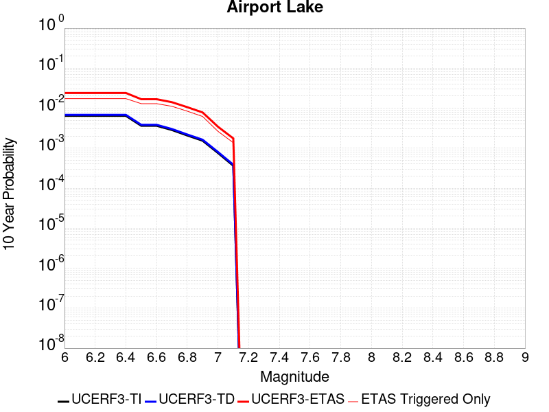 |

| Magnitude | 1 wk TI Prob | 1 wk TD Prob | 1 wk ETAS Prob | 1 wk ETAS/TD Gain | 1 wk ETAS Triggered Only | 1 mo TI Prob | 1 mo TD Prob | 1 mo ETAS Prob | 1 mo ETAS/TD Gain | 1 mo ETAS Triggered Only | 1 yr TI Prob | 1 yr TD Prob | 1 yr ETAS Prob | 1 yr ETAS/TD Gain | 1 yr ETAS Triggered Only | 10 yr TI Prob | 10 yr TD Prob | 10 yr ETAS Prob | 10 yr ETAS/TD Gain | 10 yr ETAS Triggered Only |
|-----|-----|-----|-----|-----|-----|-----|-----|-----|-----|-----|-----|-----|-----|-----|-----|-----|-----|-----|-----|-----|
| 6.0 | 1.2387061E-5 | 1.31039615E-5 | 5.066358E-4 | 38.6628 | 4.9353833E-4 | 5.3086325E-5 | 5.6158784E-5 | 0.0017743068 | 31.594465 | 0.0017182445 | 6.461343E-4 | 6.835471E-4 | 0.009159297 | 13.399657 | 0.008481547 | 0.0064425888 | 0.0068172566 | 0.023864409 | 3.5005884 | 0.017164165 |
| 6.1 | 1.2387061E-5 | 1.31039615E-5 | 5.066358E-4 | 38.6628 | 4.9353833E-4 | 5.3086325E-5 | 5.6158784E-5 | 0.0017743068 | 31.594465 | 0.0017182445 | 6.461343E-4 | 6.835471E-4 | 0.009159297 | 13.399657 | 0.008481547 | 0.0064425888 | 0.0068172566 | 0.023864409 | 3.5005884 | 0.017164165 |
| 6.2 | 1.2387061E-5 | 1.31039615E-5 | 5.066358E-4 | 38.6628 | 4.9353833E-4 | 5.3086325E-5 | 5.6158784E-5 | 0.0017743068 | 31.594465 | 0.0017182445 | 6.461343E-4 | 6.835471E-4 | 0.009159297 | 13.399657 | 0.008481547 | 0.0064425888 | 0.0068172566 | 0.023864409 | 3.5005884 | 0.017164165 |
| 6.3 | 1.2387061E-5 | 1.31039615E-5 | 5.066358E-4 | 38.6628 | 4.9353833E-4 | 5.3086325E-5 | 5.6158784E-5 | 0.0017743068 | 31.594465 | 0.0017182445 | 6.461343E-4 | 6.835471E-4 | 0.009159297 | 13.399657 | 0.008481547 | 0.0064425888 | 0.0068172566 | 0.023864409 | 3.5005884 | 0.017164165 |
| 6.4 | 1.2387061E-5 | 1.31039615E-5 | 5.066358E-4 | 38.6628 | 4.9353833E-4 | 5.3086325E-5 | 5.6158784E-5 | 0.0017743068 | 31.594465 | 0.0017182445 | 6.461343E-4 | 6.835471E-4 | 0.009159297 | 13.399657 | 0.008481547 | 0.0064425888 | 0.0068172566 | 0.023864409 | 3.5005884 | 0.017164165 |
| 6.5 | 6.9922594E-6 | 7.3853653E-6 | 4.095247E-4 | 55.45084 | 4.0214232E-4 | 2.996648E-5 | 3.1651212E-5 | 0.0013659903 | 43.1576 | 0.0013343813 | 3.6478083E-4 | 3.852908E-4 | 0.006725728 | 17.456238 | 0.0063428814 | 0.003641826 | 0.0038467655 | 0.016447311 | 4.275621 | 0.012649204 |
| 6.6 | 6.9922594E-6 | 7.3853653E-6 | 4.095247E-4 | 55.45084 | 4.0214232E-4 | 2.996648E-5 | 3.1651212E-5 | 0.0013659903 | 43.1576 | 0.0013343813 | 3.6478083E-4 | 3.852908E-4 | 0.006725728 | 17.456238 | 0.0063428814 | 0.003641826 | 0.0038467655 | 0.016447311 | 4.275621 | 0.012649204 |
| 6.7 | 5.477277E-6 | 5.7864145E-6 | 3.3481006E-4 | 57.8614 | 3.2902553E-4 | 2.3473833E-5 | 2.4798706E-5 | 0.0012311958 | 49.64758 | 0.001206427 | 2.8575645E-4 | 3.0188632E-4 | 0.0058753584 | 19.462154 | 0.005575155 | 0.0028538927 | 0.0030151461 | 0.013730906 | 4.553977 | 0.0107481675 |
| 6.8 | 3.9950432E-6 | 4.2193383E-6 | 2.60127E-4 | 61.65114 | 2.5590876E-4 | 1.7121502E-5 | 1.8082768E-5 | 9.320261E-4 | 51.54222 | 9.139598E-4 | 2.0843433E-4 | 2.2013822E-4 | 0.0043503274 | 19.761799 | 0.0041310983 | 0.0020823893 | 0.0021994726 | 0.010315824 | 4.6901355 | 0.008134242 |
| 6.9 | 2.95695E-6 | 3.1232105E-6 | 1.859146E-4 | 59.52676 | 1.8279196E-4 | 1.2672582E-5 | 1.3385132E-5 | 6.714274E-4 | 50.16218 | 6.5805105E-4 | 1.5427776E-4 | 1.6295406E-4 | 0.0031237013 | 19.169214 | 0.0029612298 | 0.001541707 | 0.0016285682 | 0.0075048837 | 4.608271 | 0.0058859014 |
| 7.0 | 1.456072E-6 | 1.5409072E-6 | 5.6378412E-5 | 36.587807 | 5.483759E-5 | 6.2402937E-6 | 6.603877E-6 | 2.4423187E-4 | 36.983105 | 2.3762956E-4 | 7.597293E-5 | 8.040024E-5 | 0.0011953416 | 14.867388 | 0.001115031 | 7.594696E-4 | 8.038104E-4 | 0.003324312 | 4.135691 | 0.002522529 |
| 7.1 | 6.995192E-7 | 7.4094396E-7 | 3.729931E-5 | 50.34026 | 3.6558395E-5 | 2.997936E-6 | 3.1754741E-6 | 1.6768771E-4 | 52.807144 | 1.6451276E-4 | 3.649926E-5 | 3.8661397E-5 | 6.052946E-4 | 15.656304 | 5.666551E-4 | 3.6493264E-4 | 3.8661397E-4 | 0.0016291188 | 4.2138124 | 0.0012429854 |

## Owl Lake
*[(top)](#table-of-contents)*

| 1 Week | 1 Month | 1 Year | 10 Year |
|-----|-----|-----|-----|
|  | 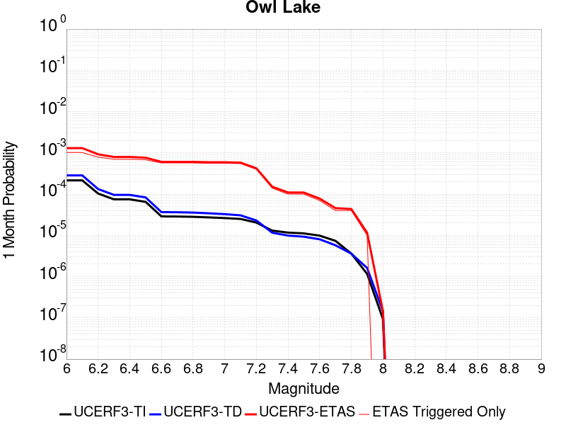 | 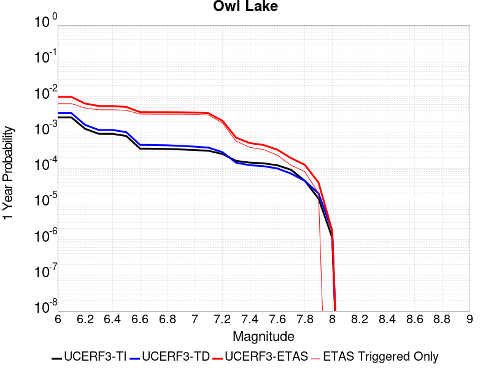 |  |

| Magnitude | 1 wk TI Prob | 1 wk TD Prob | 1 wk ETAS Prob | 1 wk ETAS/TD Gain | 1 wk ETAS Triggered Only | 1 mo TI Prob | 1 mo TD Prob | 1 mo ETAS Prob | 1 mo ETAS/TD Gain | 1 mo ETAS Triggered Only | 1 yr TI Prob | 1 yr TD Prob | 1 yr ETAS Prob | 1 yr ETAS/TD Gain | 1 yr ETAS Triggered Only | 10 yr TI Prob | 10 yr TD Prob | 10 yr ETAS Prob | 10 yr ETAS/TD Gain | 10 yr ETAS Triggered Only |
|-----|-----|-----|-----|-----|-----|-----|-----|-----|-----|-----|-----|-----|-----|-----|-----|-----|-----|-----|-----|-----|
| 6.0 | 5.0320643E-5 | 6.638493E-5 | 3.039987E-4 | 4.5793333 | 2.3762956E-4 | 2.1564208E-4 | 2.8448208E-4 | 0.0012712779 | 4.4687448 | 9.870767E-4 | 0.0026222812 | 0.0034591116 | 0.009707188 | 2.8062663 | 0.006269764 | 0.02591553 | 0.034153398 | 0.048630416 | 1.4238822 | 0.014988941 |
| 6.1 | 5.0320643E-5 | 6.638493E-5 | 3.039987E-4 | 4.5793333 | 2.3762956E-4 | 2.1564208E-4 | 2.8448208E-4 | 0.0012712779 | 4.4687448 | 9.870767E-4 | 0.0026222812 | 0.0034591116 | 0.009707188 | 2.8062663 | 0.006269764 | 0.02591553 | 0.034153398 | 0.048630416 | 1.4238822 | 0.014988941 |
| 6.2 | 2.4125871E-5 | 3.0994335E-5 | 1.4066612E-4 | 4.538446 | 1.0967518E-4 | 1.0339249E-4 | 1.3282728E-4 | 8.273445E-4 | 6.2287245 | 6.946095E-4 | 0.0012580766 | 0.0016161125 | 0.006142027 | 3.8004947 | 0.0045332406 | 0.012509781 | 0.016077155 | 0.026886333 | 1.6723313 | 0.010985797 |
| 6.3 | 1.7433485E-5 | 2.2366148E-5 | 1.3203887E-4 | 5.9035144 | 1.0967518E-4 | 7.471279E-5 | 9.585229E-5 | 6.9900794E-4 | 7.2925534 | 6.032135E-4 | 9.0924866E-4 | 0.0011665242 | 0.005091967 | 4.365076 | 0.003930027 | 0.009055373 | 0.011634311 | 0.021046974 | 1.8090434 | 0.009523462 |
| 6.4 | 1.7433485E-5 | 2.2366148E-5 | 1.3203887E-4 | 5.9035144 | 1.0967518E-4 | 7.471279E-5 | 9.585229E-5 | 6.9900794E-4 | 7.2925534 | 6.032135E-4 | 9.0924866E-4 | 0.0011665242 | 0.005091967 | 4.365076 | 0.003930027 | 0.009055373 | 0.011634311 | 0.021046974 | 1.8090434 | 0.009523462 |
| 6.5 | 1.5182742E-5 | 1.9438865E-5 | 1.2911191E-4 | 6.6419473 | 1.0967518E-4 | 6.506727E-5 | 8.330761E-5 | 6.6819316E-4 | 8.020794 | 5.849343E-4 | 7.919061E-4 | 0.0010139496 | 0.004830428 | 4.7639723 | 0.003820352 | 0.0078909 | 0.010123401 | 0.01915238 | 1.8918921 | 0.009121319 |
| 6.6 | 6.7271576E-6 | 8.553785E-6 | 1.18228025E-4 | 13.821721 | 1.0967518E-4 | 2.8830356E-5 | 3.6658595E-5 | 4.9362174E-4 | 13.465376 | 4.569799E-4 | 3.5095305E-4 | 4.4623265E-4 | 0.003369599 | 7.5512156 | 0.0029246714 | 0.0035039932 | 0.004471147 | 0.011149618 | 2.4936817 | 0.006708465 |
| 6.7 | 6.682835E-6 | 8.48622E-6 | 1.1816047E-4 | 13.923803 | 1.0967518E-4 | 2.8640408E-5 | 3.636904E-5 | 4.9333234E-4 | 13.564623 | 4.569799E-4 | 3.4864116E-4 | 4.4270878E-4 | 0.0033478143 | 7.5621142 | 0.0029063923 | 0.003480947 | 0.004436068 | 0.011060179 | 2.4932394 | 0.0066536274 |
| 6.8 | 6.5774975E-6 | 8.332664E-6 | 1.1800693E-4 | 14.161969 | 1.0967518E-4 | 2.8188972E-5 | 3.571096E-5 | 4.9267453E-4 | 13.796172 | 4.569799E-4 | 3.4314668E-4 | 4.3469985E-4 | 0.0033398287 | 7.6830688 | 0.0029063923 | 0.0034261728 | 0.0043561985 | 0.010962642 | 2.5165615 | 0.0066353483 |
| 6.9 | 6.363419E-6 | 8.00576E-6 | 1.1768006E-4 | 14.699425 | 1.0967518E-4 | 2.727151E-5 | 3.430998E-5 | 4.7299563E-4 | 13.78595 | 4.3870072E-4 | 3.3198006E-4 | 4.176495E-4 | 0.0033045562 | 7.9122715 | 0.002888113 | 0.0033148455 | 0.0041861506 | 0.010739114 | 2.5653913 | 0.0065805106 |
| 7.0 | 6.1342453E-6 | 7.637859E-6 | 1.173122E-4 | 15.359304 | 1.0967518E-4 | 2.6289357E-5 | 3.27333E-5 | 4.7141965E-4 | 14.401836 | 4.3870072E-4 | 3.2002592E-4 | 3.9846057E-4 | 0.0032671508 | 8.199433 | 0.0028698337 | 0.0031956544 | 0.003994793 | 0.0104761915 | 2.6224616 | 0.006507394 |
| 7.1 | 5.842926E-6 | 7.1482646E-6 | 9.854359E-5 | 13.785667 | 9.139598E-5 | 2.504087E-5 | 3.063509E-5 | 4.5104374E-4 | 14.723107 | 4.204215E-4 | 3.0482994E-4 | 3.729238E-4 | 0.0030589637 | 8.20265 | 0.0026870419 | 0.0030441214 | 0.0037401791 | 0.009877228 | 2.6408436 | 0.0061600893 |
| 7.2 | 4.77173E-6 | 5.36398E-6 | 6.0201277E-5 | 11.223248 | 5.483759E-5 | 2.045011E-5 | 2.2988306E-5 | 3.7028507E-4 | 16.10754 | 3.4730474E-4 | 2.4895166E-4 | 2.7985073E-4 | 0.0019427921 | 6.9422436 | 0.0016634068 | 0.0024867293 | 0.0028115083 | 0.0068763085 | 2.4457722 | 0.0040762606 |
| 7.3 | 3.0494948E-6 | 2.7145331E-6 | 5.7551973E-5 | 21.201426 | 5.483759E-5 | 1.3069198E-5 | 1.1633663E-5 | 1.3958655E-4 | 11.998504 | 1.2795438E-4 | 1.5910587E-4 | 1.4163081E-4 | 6.350992E-4 | 4.4841886 | 4.9353833E-4 | 0.0015899199 | 0.001425365 | 0.0025023003 | 1.7555506 | 0.0010784726 |
| 7.4 | 2.7263884E-6 | 2.3095015E-6 | 5.7146965E-5 | 24.744286 | 5.483759E-5 | 1.1684469E-5 | 9.897826E-6 | 1.19571916E-4 | 12.080625 | 1.0967518E-4 | 1.4224913E-4 | 1.2049948E-4 | 5.0431635E-4 | 4.185216 | 3.8386314E-4 | 0.0014215811 | 0.0012132203 | 0.001980015 | 1.6320326 | 7.677263E-4 |
| 7.5 | 2.6090431E-6 | 2.1693693E-6 | 5.700684E-5 | 26.278072 | 5.483759E-5 | 1.1181565E-5 | 9.297264E-6 | 1.18971424E-4 | 12.796391 | 1.0967518E-4 | 1.3612706E-4 | 1.13188406E-4 | 4.2389956E-4 | 3.7450795 | 3.1074634E-4 | 0.001360437 | 0.001139941 | 0.0017789836 | 1.5605927 | 6.3977187E-4 |
| 7.6 | 2.3008756E-6 | 1.8763494E-6 | 3.8434675E-5 | 20.483751 | 3.6558395E-5 | 9.860858E-6 | 8.041473E-6 | 8.115767E-5 | 10.092388 | 7.311679E-5 | 1.20049335E-4 | 9.7900614E-5 | 2.806747E-4 | 2.8669348 | 1.8279196E-4 | 0.001199845 | 9.868495E-4 | 0.0014616397 | 1.481117 | 4.7525912E-4 |
| 7.7 | 1.7184348E-6 | 1.345208E-6 | 1.962438E-5 | 14.588361 | 1.8279197E-5 | 7.3646997E-6 | 5.7651646E-6 | 4.2323347E-5 | 7.341221 | 3.6558395E-5 | 8.966153E-5 | 7.018866E-5 | 1.7985614E-4 | 2.562467 | 1.0967518E-4 | 8.962536E-4 | 7.095553E-4 | 0.001001815 | 1.4118912 | 2.9246716E-4 |
| 7.8 | 8.4612907E-7 | 8.429351E-7 | 1.9122117E-5 | 22.685158 | 1.8279197E-5 | 3.6262625E-6 | 3.6125741E-6 | 4.0170835E-5 | 11.119726 | 3.6558395E-5 | 4.4148852E-5 | 4.3982225E-5 | 1.1709579E-4 | 2.6623435 | 7.311679E-5 | 4.414008E-4 | 4.4521203E-4 | 5.1829626E-4 | 1.164156 | 7.311679E-5 |
| 7.9 | 2.716738E-7 | 3.778486E-7 | 1.8657038E-5 | 49.37702 | 1.8279197E-5 | 1.1643157E-6 | 1.6193502E-6 | 1.9898516E-5 | 12.287964 | 1.8279197E-5 | 1.4175452E-5 | 1.971542E-5 | 5.6273093E-5 | 2.8542678 | 3.6558395E-5 | 1.4174548E-4 | 1.9890796E-4 | 2.3545908E-4 | 1.183759 | 3.6558395E-5 |
| 8.0 | 2.1995428E-8 | 3.3939607E-8 | 3.3939607E-8 | 1.0 | 0.0 | 9.426611E-8 | 1.4545546E-7 | 1.4545546E-7 | 1.0 | 0.0 | 1.1476893E-6 | 1.7709194E-6 | 1.7709194E-6 | 1.0 | 0.0 | 1.14768345E-5 | 1.801025E-5 | 1.801025E-5 | 1.0 | 0.0 |

## Panamint Valley
*[(top)](#table-of-contents)*

| 1 Week | 1 Month | 1 Year | 10 Year |
|-----|-----|-----|-----|
|  |  |  |  |

| Magnitude | 1 wk TI Prob | 1 wk TD Prob | 1 wk ETAS Prob | 1 wk ETAS/TD Gain | 1 wk ETAS Triggered Only | 1 mo TI Prob | 1 mo TD Prob | 1 mo ETAS Prob | 1 mo ETAS/TD Gain | 1 mo ETAS Triggered Only | 1 yr TI Prob | 1 yr TD Prob | 1 yr ETAS Prob | 1 yr ETAS/TD Gain | 1 yr ETAS Triggered Only | 10 yr TI Prob | 10 yr TD Prob | 10 yr ETAS Prob | 10 yr ETAS/TD Gain | 10 yr ETAS Triggered Only |
|-----|-----|-----|-----|-----|-----|-----|-----|-----|-----|-----|-----|-----|-----|-----|-----|-----|-----|-----|-----|-----|
| 6.0 | 3.0211835E-5 | 3.3991142E-5 | 2.5333403E-4 | 7.452943 | 2.1935036E-4 | 1.2947287E-4 | 1.4566837E-4 | 9.315593E-4 | 6.3950696 | 7.8600546E-4 | 0.0015751923 | 0.001772099 | 0.0066804895 | 3.769817 | 0.004917104 | 0.015640736 | 0.017586537 | 0.029061526 | 1.6524872 | 0.0116804065 |
| 6.1 | 3.0211835E-5 | 3.3991142E-5 | 2.5333403E-4 | 7.452943 | 2.1935036E-4 | 1.2947287E-4 | 1.4566837E-4 | 9.315593E-4 | 6.3950696 | 7.8600546E-4 | 0.0015751923 | 0.001772099 | 0.0066804895 | 3.769817 | 0.004917104 | 0.015640736 | 0.017586537 | 0.029061526 | 1.6524872 | 0.0116804065 |
| 6.2 | 3.0211835E-5 | 3.3991142E-5 | 2.5333403E-4 | 7.452943 | 2.1935036E-4 | 1.2947287E-4 | 1.4566837E-4 | 9.315593E-4 | 6.3950696 | 7.8600546E-4 | 0.0015751923 | 0.001772099 | 0.0066804895 | 3.769817 | 0.004917104 | 0.015640736 | 0.017586537 | 0.029061526 | 1.6524872 | 0.0116804065 |
| 6.3 | 2.8573924E-5 | 3.2108957E-5 | 2.5145226E-4 | 7.8312187 | 2.1935036E-4 | 1.2245393E-4 | 1.3760272E-4 | 9.235E-4 | 6.71135 | 7.8600546E-4 | 0.001489857 | 0.0016740535 | 0.0063639428 | 3.8015168 | 0.0046977536 | 0.01479908 | 0.016621023 | 0.027603978 | 1.660787 | 0.011168589 |
| 6.4 | 2.8573924E-5 | 3.2108957E-5 | 2.5145226E-4 | 7.8312187 | 2.1935036E-4 | 1.2245393E-4 | 1.3760272E-4 | 9.235E-4 | 6.71135 | 7.8600546E-4 | 0.001489857 | 0.0016740535 | 0.0063639428 | 3.8015168 | 0.0046977536 | 0.01479908 | 0.016621023 | 0.027603978 | 1.660787 | 0.011168589 |
| 6.5 | 2.7468774E-5 | 3.0834468E-5 | 2.5017807E-4 | 8.1135845 | 2.1935036E-4 | 1.1771801E-4 | 1.3214118E-4 | 9.180428E-4 | 6.9474387 | 7.8600546E-4 | 0.0014322745 | 0.001607659 | 0.0061883614 | 3.8492997 | 0.0045880782 | 0.014230782 | 0.015966775 | 0.026561316 | 1.6635367 | 0.010766447 |
| 6.6 | 2.6135967E-5 | 2.9258244E-5 | 2.4860218E-4 | 8.496825 | 2.1935036E-4 | 1.1200648E-4 | 1.253866E-4 | 8.930166E-4 | 7.1221056 | 7.677263E-4 | 0.0013628257 | 0.0015255393 | 0.0059971106 | 3.9311411 | 0.004478403 | 0.013544982 | 0.015157006 | 0.025472231 | 1.6805582 | 0.01047398 |
| 6.7 | 2.4498746E-5 | 2.7346903E-5 | 2.4669126E-4 | 9.020811 | 2.1935036E-4 | 1.04990395E-4 | 1.17195894E-4 | 8.665551E-4 | 7.394074 | 7.4944703E-4 | 0.0012775084 | 0.0014259511 | 0.005678931 | 3.9825563 | 0.0042590527 | 0.012701893 | 0.014174139 | 0.023868956 | 1.6839792 | 0.009834208 |
| 6.8 | 2.2244329E-5 | 2.4940635E-5 | 2.0772804E-4 | 8.328899 | 1.8279196E-4 | 9.532935E-5 | 1.06884174E-4 | 7.8314217E-4 | 7.327017 | 6.763303E-4 | 0.0011600169 | 0.0013005598 | 0.0052802423 | 4.059976 | 0.003984865 | 0.011539802 | 0.012935203 | 0.021866364 | 1.690454 | 0.009048202 |
| 6.9 | 1.9902658E-5 | 2.2295073E-5 | 1.6852538E-4 | 7.5588617 | 1.4623358E-4 | 8.529431E-5 | 9.554692E-5 | 6.621479E-4 | 6.9300804 | 5.666551E-4 | 0.0010379635 | 0.0011626815 | 0.0047960123 | 4.124958 | 0.0036375602 | 0.010331288 | 0.011571088 | 0.019701546 | 1.7026529 | 0.008225638 |
| 7.0 | 1.8353881E-5 | 2.0570717E-5 | 1.6680128E-4 | 8.108676 | 1.4623358E-4 | 7.865712E-5 | 8.8157336E-5 | 6.547625E-4 | 7.4272037 | 5.666551E-4 | 9.5722964E-4 | 0.0010728048 | 0.0045421263 | 4.2338796 | 0.0034730474 | 0.009531168 | 0.010681189 | 0.01827645 | 1.7110876 | 0.0076772626 |
| 7.1 | 1.7667631E-5 | 1.9777019E-5 | 1.4772886E-4 | 7.469723 | 1.2795438E-4 | 7.571623E-5 | 8.4756E-5 | 6.1480777E-4 | 7.253855 | 5.300967E-4 | 9.2145515E-4 | 0.0010314333 | 0.004373076 | 4.2398047 | 0.003345093 | 0.009176437 | 0.010271349 | 0.017526018 | 1.7063015 | 0.0073299576 |
| 7.2 | 1.6381597E-5 | 1.8162364E-5 | 1.4611441E-4 | 8.044901 | 1.2795438E-4 | 7.020495E-5 | 7.783648E-5 | 5.530586E-4 | 7.105391 | 4.7525912E-4 | 8.544101E-4 | 9.472644E-4 | 0.0039787367 | 4.2002387 | 0.0030343465 | 0.008511325 | 0.009436919 | 0.015919117 | 1.6868976 | 0.0065439525 |
| 7.3 | 1.4520491E-5 | 1.5969836E-5 | 8.908546E-5 | 5.5783577 | 7.311679E-5 | 6.222919E-5 | 6.844045E-5 | 4.157214E-4 | 6.0742064 | 3.4730474E-4 | 7.57377E-4 | 8.329601E-4 | 0.003389916 | 4.0697217 | 0.0025590875 | 0.0075480095 | 0.008301492 | 0.013703472 | 1.650724 | 0.0054472005 |
| 7.4 | 1.2852287E-5 | 1.4148404E-5 | 8.7264154E-5 | 6.1677737 | 7.311679E-5 | 5.5080065E-5 | 6.06347E-5 | 4.079184E-4 | 6.727474 | 3.4730474E-4 | 6.7039346E-4 | 7.379932E-4 | 0.0031673322 | 4.2918177 | 0.002431133 | 0.0066837464 | 0.007358347 | 0.01251144 | 1.7003057 | 0.0051912917 |
| 7.5 | 1.1637851E-5 | 1.2839613E-5 | 8.595546E-5 | 6.6945524 | 7.311679E-5 | 4.987555E-5 | 5.502584E-5 | 4.0231147E-4 | 7.311319 | 3.4730474E-4 | 6.070656E-4 | 6.6974934E-4 | 0.0030809874 | 4.600209 | 0.002412854 | 0.006054099 | 0.006680208 | 0.011782349 | 1.7637699 | 0.005136454 |
| 7.6 | 3.0068115E-6 | 3.3341298E-6 | 3.9892402E-5 | 11.964861 | 3.6558395E-5 | 1.2886271E-5 | 1.428909E-5 | 1.7879951E-4 | 12.513008 | 1.6451276E-4 | 1.5687906E-4 | 1.7396307E-4 | 0.001179144 | 6.778128 | 0.0010053559 | 0.0015676835 | 0.0017397105 | 0.00398414 | 2.2901168 | 0.0022483412 |

## Garlock (East)
*[(top)](#table-of-contents)*

| 1 Week | 1 Month | 1 Year | 10 Year |
|-----|-----|-----|-----|
| 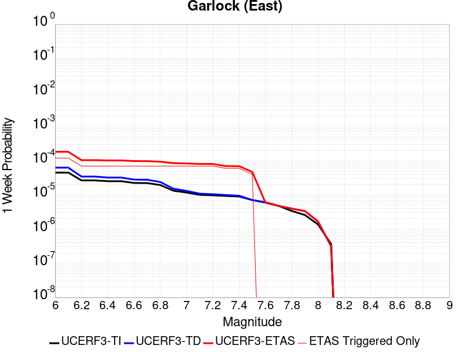 |  |  |  |

| Magnitude | 1 wk TI Prob | 1 wk TD Prob | 1 wk ETAS Prob | 1 wk ETAS/TD Gain | 1 wk ETAS Triggered Only | 1 mo TI Prob | 1 mo TD Prob | 1 mo ETAS Prob | 1 mo ETAS/TD Gain | 1 mo ETAS Triggered Only | 1 yr TI Prob | 1 yr TD Prob | 1 yr ETAS Prob | 1 yr ETAS/TD Gain | 1 yr ETAS Triggered Only | 10 yr TI Prob | 10 yr TD Prob | 10 yr ETAS Prob | 10 yr ETAS/TD Gain | 10 yr ETAS Triggered Only |
|-----|-----|-----|-----|-----|-----|-----|-----|-----|-----|-----|-----|-----|-----|-----|-----|-----|-----|-----|-----|-----|
| 6.0 | 4.5092507E-5 | 6.2931635E-5 | 1.9087795E-4 | 3.0331004 | 1.2795438E-4 | 1.9323928E-4 | 2.6968162E-4 | 8.910067E-4 | 3.3039207 | 6.214927E-4 | 0.0023501497 | 0.0032788762 | 0.007177798 | 2.1891031 | 0.003911748 | 0.023254504 | 0.03236623 | 0.04205902 | 1.2994722 | 0.010016999 |
| 6.1 | 4.5092507E-5 | 6.2931635E-5 | 1.9087795E-4 | 3.0331004 | 1.2795438E-4 | 1.9323928E-4 | 2.6968162E-4 | 8.910067E-4 | 3.3039207 | 6.214927E-4 | 0.0023501497 | 0.0032788762 | 0.007177798 | 2.1891031 | 0.003911748 | 0.023254504 | 0.03236623 | 0.04205902 | 1.2994722 | 0.010016999 |
| 6.2 | 2.6674514E-5 | 3.4532168E-5 | 1.0764643E-4 | 3.1172798 | 7.311679E-5 | 1.1431433E-4 | 1.4798681E-4 | 6.231756E-4 | 4.2110214 | 4.7525912E-4 | 0.0013908884 | 0.0018002834 | 0.004683197 | 2.6013665 | 0.002888113 | 0.01382215 | 0.017901788 | 0.024938958 | 1.3930988 | 0.007165445 |
| 6.3 | 2.6674514E-5 | 3.4532168E-5 | 1.0764643E-4 | 3.1172798 | 7.311679E-5 | 1.1431433E-4 | 1.4798681E-4 | 6.231756E-4 | 4.2110214 | 4.7525912E-4 | 0.0013908884 | 0.0018002834 | 0.004683197 | 2.6013665 | 0.002888113 | 0.01382215 | 0.017901788 | 0.024938958 | 1.3930988 | 0.007165445 |
| 6.4 | 2.5312667E-5 | 3.236092E-5 | 1.0547534E-4 | 3.259343 | 7.311679E-5 | 1.0847834E-4 | 1.3868246E-4 | 5.95599E-4 | 4.294696 | 4.569799E-4 | 0.0013199237 | 0.0016871806 | 0.004479179 | 2.6548307 | 0.002796717 | 0.013121112 | 0.016789583 | 0.023619056 | 1.4067684 | 0.006946095 |
| 6.5 | 2.5312667E-5 | 3.236092E-5 | 1.0547534E-4 | 3.259343 | 7.311679E-5 | 1.0847834E-4 | 1.3868246E-4 | 5.95599E-4 | 4.294696 | 4.569799E-4 | 0.0013199237 | 0.0016871806 | 0.004479179 | 2.6548307 | 0.002796717 | 0.013121112 | 0.016789583 | 0.023619056 | 1.4067684 | 0.006946095 |
| 6.6 | 2.246556E-5 | 2.8154947E-5 | 1.01269674E-4 | 3.5968697 | 7.311679E-5 | 9.627742E-5 | 1.2065861E-4 | 5.775834E-4 | 4.7869225 | 4.569799E-4 | 0.0011715472 | 0.0014680522 | 0.0041876542 | 2.852524 | 0.0027236002 | 0.011653901 | 0.01462952 | 0.021275867 | 1.4543107 | 0.0067450237 |
| 6.7 | 2.2241198E-5 | 2.7824628E-5 | 1.0093938E-4 | 3.6276991 | 7.311679E-5 | 9.531594E-5 | 1.1924309E-4 | 5.7616853E-4 | 4.831882 | 4.569799E-4 | 0.0011598538 | 0.0014508413 | 0.00417049 | 2.8745322 | 0.0027236002 | 0.011538187 | 0.014459683 | 0.02108916 | 1.4584801 | 0.006726744 |
| 6.8 | 1.9528685E-5 | 2.3917915E-5 | 9.703295E-5 | 4.0569153 | 7.311679E-5 | 8.369167E-5 | 1.02501435E-4 | 5.594345E-4 | 5.4578214 | 4.569799E-4 | 0.0010184698 | 0.0012472603 | 0.0038761816 | 3.1077569 | 0.0026322042 | 0.010138147 | 0.012446578 | 0.018764667 | 1.5076165 | 0.0063977186 |
| 6.9 | 1.3318621E-5 | 1.5215894E-5 | 8.8331566E-5 | 5.8052173 | 7.311679E-5 | 5.7078556E-5 | 6.520937E-5 | 5.038815E-4 | 7.7271323 | 4.3870072E-4 | 6.9470983E-4 | 7.936407E-4 | 0.003241109 | 4.0838494 | 0.0024494124 | 0.0069254204 | 0.007948688 | 0.013624599 | 1.7140689 | 0.0057213884 |
| 7.0 | 1.1760853E-5 | 1.3124213E-5 | 8.624004E-5 | 6.5710635 | 7.311679E-5 | 5.0402683E-5 | 5.6245444E-5 | 4.7664333E-4 | 8.474345 | 4.204215E-4 | 6.134799E-4 | 6.8457815E-4 | 0.0029861801 | 4.3620734 | 0.0023031787 | 0.0061178906 | 0.006865028 | 0.012383755 | 1.8038901 | 0.005556876 |
| 7.1 | 1.0064758E-5 | 1.0918795E-5 | 8.4034786E-5 | 7.6963425 | 7.311679E-5 | 4.3133965E-5 | 4.6794015E-5 | 4.6719587E-4 | 9.984095 | 4.204215E-4 | 5.2502943E-4 | 5.6957174E-4 | 0.0027252883 | 4.784803 | 0.0021569452 | 0.005237907 | 0.0057212254 | 0.01097369 | 1.9180663 | 0.005282688 |
| 7.2 | 9.768808E-6 | 1.0514561E-5 | 8.363058E-5 | 7.953787 | 7.311679E-5 | 4.186565E-5 | 4.5061646E-5 | 4.6546423E-4 | 10.329498 | 4.204215E-4 | 5.095951E-4 | 5.4849096E-4 | 0.0026129072 | 4.763811 | 0.0020655491 | 0.0050842804 | 0.005511436 | 0.010655938 | 1.9334232 | 0.0051730126 |
| 7.3 | 9.344516E-6 | 9.959923E-6 | 8.307598E-5 | 8.341026 | 7.311679E-5 | 4.004731E-5 | 4.2684707E-5 | 4.2653145E-4 | 9.992606 | 3.8386314E-4 | 4.8746695E-4 | 5.1956583E-4 | 0.0023282662 | 4.4811764 | 0.0018096404 | 0.0048639905 | 0.005222964 | 0.009968916 | 1.9086703 | 0.0047708703 |
| 7.4 | 9.023491E-6 | 9.505806E-6 | 8.26219E-5 | 8.6917305 | 7.311679E-5 | 3.867153E-5 | 4.073855E-5 | 4.0630758E-4 | 9.97354 | 3.6558392E-4 | 4.7072413E-4 | 4.958823E-4 | 0.0021584644 | 4.352775 | 0.0016634068 | 0.004697283 | 0.004986258 | 0.009315015 | 1.8681372 | 0.004350449 |
| 7.5 | 7.081253E-6 | 7.101122E-6 | 6.193832E-5 | 8.722329 | 5.483759E-5 | 3.0347876E-5 | 3.0433028E-5 | 2.6805536E-4 | 8.808041 | 2.3762956E-4 | 3.6942272E-4 | 3.7045986E-4 | 0.0012475363 | 3.3675342 | 8.7740144E-4 | 0.003688092 | 0.003731307 | 0.005898415 | 1.5807905 | 0.0021752245 |
| 7.6 | 6.116396E-6 | 5.9720282E-6 | 5.9720282E-6 | 1.0 | 0.0 | 2.6212863E-5 | 2.5594158E-5 | 1.5354526E-4 | 5.999231 | 1.2795438E-4 | 3.1909486E-4 | 3.1156457E-4 | 7.318551E-4 | 2.3489676 | 4.204215E-4 | 0.0031863707 | 0.0031424055 | 0.0043450412 | 1.3827119 | 0.001206427 |
| 7.7 | 4.797145E-6 | 4.769377E-6 | 4.769377E-6 | 1.0 | 0.0 | 2.055903E-5 | 2.0440028E-5 | 9.355532E-5 | 4.577064 | 7.311679E-5 | 2.5027743E-4 | 2.4882905E-4 | 4.4985017E-4 | 1.8078684 | 2.0107116E-4 | 0.0024999576 | 0.0025156436 | 0.00306264 | 1.217438 | 5.483759E-4 |
| 7.8 | 3.4028885E-6 | 3.9892493E-6 | 3.9892493E-6 | 1.0 | 0.0 | 1.4583726E-5 | 1.7096672E-5 | 9.0212205E-5 | 5.2765946 | 7.311679E-5 | 1.775424E-4 | 2.0813217E-4 | 3.908861E-4 | 1.8780667 | 1.8279196E-4 | 0.0017740062 | 0.0021068375 | 0.0025446138 | 1.2077885 | 4.3870072E-4 |
| 7.9 | 2.5928412E-6 | 3.3815668E-6 | 3.3815668E-6 | 1.0 | 0.0 | 1.1112129E-5 | 1.449235E-5 | 6.9329144E-5 | 4.7838445 | 5.483759E-5 | 1.3528178E-4 | 1.7643013E-4 | 3.409139E-4 | 1.9322883 | 1.6451276E-4 | 0.0013519945 | 0.0017859834 | 0.0021144215 | 1.1838975 | 3.2902553E-4 |
| 8.0 | 1.3743648E-6 | 1.6776083E-6 | 1.6776083E-6 | 1.0 | 0.0 | 5.8901214E-6 | 7.1897302E-6 | 2.5468795E-5 | 3.5423853 | 1.8279197E-5 | 7.1709874E-5 | 8.753148E-5 | 1.2408667E-4 | 1.4176234 | 3.6558395E-5 | 7.1686733E-4 | 8.8587485E-4 | 9.954529E-4 | 1.1236947 | 1.0967518E-4 |
| 8.1 | 3.6733252E-7 | 3.156379E-7 | 3.156379E-7 | 1.0 | 0.0 | 1.5742813E-6 | 1.3527332E-6 | 1.9631905E-5 | 14.512769 | 1.8279197E-5 | 1.9166706E-5 | 1.646942E-5 | 3.4748315E-5 | 2.1098688 | 1.8279197E-5 | 1.9165053E-4 | 1.6677451E-4 | 1.8505067E-4 | 1.109586 | 1.8279197E-5 |

## Ash Hill
*[(top)](#table-of-contents)*

| 1 Week | 1 Month | 1 Year | 10 Year |
|-----|-----|-----|-----|
|  |  |  |  |

| Magnitude | 1 wk TI Prob | 1 wk TD Prob | 1 wk ETAS Prob | 1 wk ETAS/TD Gain | 1 wk ETAS Triggered Only | 1 mo TI Prob | 1 mo TD Prob | 1 mo ETAS Prob | 1 mo ETAS/TD Gain | 1 mo ETAS Triggered Only | 1 yr TI Prob | 1 yr TD Prob | 1 yr ETAS Prob | 1 yr ETAS/TD Gain | 1 yr ETAS Triggered Only | 10 yr TI Prob | 10 yr TD Prob | 10 yr ETAS Prob | 10 yr ETAS/TD Gain | 10 yr ETAS Triggered Only |
|-----|-----|-----|-----|-----|-----|-----|-----|-----|-----|-----|-----|-----|-----|-----|-----|-----|-----|-----|-----|-----|
| 6.0 | 2.1545662E-5 | 2.3196331E-5 | 1.6942651E-4 | 7.304022 | 1.4623358E-4 | 9.2335285E-5 | 9.940951E-5 | 5.380666E-4 | 5.412627 | 4.3870072E-4 | 0.0011236023 | 0.0012097188 | 0.0038022248 | 3.143065 | 0.0025956458 | 0.011179381 | 0.0120393215 | 0.018305838 | 1.5205041 | 0.0063428814 |
| 6.1 | 2.1545662E-5 | 2.3196331E-5 | 1.6942651E-4 | 7.304022 | 1.4623358E-4 | 9.2335285E-5 | 9.940951E-5 | 5.380666E-4 | 5.412627 | 4.3870072E-4 | 0.0011236023 | 0.0012097188 | 0.0038022248 | 3.143065 | 0.0025956458 | 0.011179381 | 0.0120393215 | 0.018305838 | 1.5205041 | 0.0063428814 |
| 6.2 | 2.1545662E-5 | 2.3196331E-5 | 1.6942651E-4 | 7.304022 | 1.4623358E-4 | 9.2335285E-5 | 9.940951E-5 | 5.380666E-4 | 5.412627 | 4.3870072E-4 | 0.0011236023 | 0.0012097188 | 0.0038022248 | 3.143065 | 0.0025956458 | 0.011179381 | 0.0120393215 | 0.018305838 | 1.5205041 | 0.0063428814 |
| 6.3 | 1.0025529E-5 | 1.0747755E-5 | 4.7305755E-5 | 4.4014544 | 3.6558395E-5 | 4.2965847E-5 | 4.6061068E-5 | 2.1056626E-4 | 4.5714583 | 1.6451276E-4 | 5.229836E-4 | 5.606624E-4 | 0.0014741098 | 2.6292288 | 9.139598E-4 | 0.005217545 | 0.0055937925 | 0.008193096 | 1.4646764 | 0.0026139251 |
| 6.4 | 1.0025529E-5 | 1.0747755E-5 | 4.7305755E-5 | 4.4014544 | 3.6558395E-5 | 4.2965847E-5 | 4.6061068E-5 | 2.1056626E-4 | 4.5714583 | 1.6451276E-4 | 5.229836E-4 | 5.606624E-4 | 0.0014741098 | 2.6292288 | 9.139598E-4 | 0.005217545 | 0.0055937925 | 0.008193096 | 1.4646764 | 0.0026139251 |
| 6.5 | 6.9617327E-6 | 7.4571967E-6 | 4.4015316E-5 | 5.902395 | 3.6558395E-5 | 2.9835655E-5 | 3.1959073E-5 | 1.7818797E-4 | 5.5755053 | 1.4623358E-4 | 3.6318856E-4 | 3.8904088E-4 | 0.0010102917 | 2.596878 | 6.214927E-4 | 0.0036259557 | 0.0038844529 | 0.0056506475 | 1.454683 | 0.0017730821 |
| 6.6 | 4.9919777E-6 | 5.3470912E-6 | 4.190529E-5 | 7.837025 | 3.6558395E-5 | 2.1394015E-5 | 2.2915943E-5 | 1.1430983E-4 | 4.988223 | 9.139598E-5 | 2.60441E-4 | 2.7897258E-4 | 7.175509E-4 | 2.5721197 | 4.3870072E-4 | 0.0026013597 | 0.0027868825 | 0.004190458 | 1.5036365 | 0.0014074981 |
| 6.7 | 3.6630722E-6 | 3.924921E-6 | 4.048317E-5 | 10.314391 | 3.6558395E-5 | 1.5698786E-5 | 1.6821014E-5 | 1.08215456E-4 | 6.433349 | 9.139598E-5 | 1.9111596E-4 | 2.0478234E-4 | 5.702914E-4 | 2.784866 | 3.6558392E-4 | 0.0019095168 | 0.0020464994 | 0.0030497978 | 1.490251 | 0.0010053559 |
| 6.8 | 2.5599613E-6 | 2.7451356E-6 | 3.9303428E-5 | 14.317482 | 3.6558395E-5 | 1.0971216E-5 | 1.17648415E-5 | 8.488077E-5 | 7.214782 | 7.311679E-5 | 1.3356637E-4 | 1.4323248E-4 | 4.1738115E-4 | 2.914012 | 2.7418794E-4 | 0.0013348613 | 0.0014318867 | 0.0021620076 | 1.5099013 | 7.3116785E-4 |
| 6.9 | 1.7684905E-6 | 1.8970168E-6 | 2.0176178E-5 | 10.63574 | 1.8279197E-5 | 7.579223E-6 | 8.130072E-6 | 6.2967214E-5 | 7.744976 | 5.483759E-5 | 9.2273134E-5 | 9.8983626E-5 | 3.3658967E-4 | 3.4004579 | 2.3762956E-4 | 9.223483E-4 | 9.898363E-4 | 0.0016107138 | 1.6272527 | 6.214927E-4 |

## Hunter Mountain-Saline Valley
*[(top)](#table-of-contents)*

| 1 Week | 1 Month | 1 Year | 10 Year |
|-----|-----|-----|-----|
|  |  |  |  |

| Magnitude | 1 wk TI Prob | 1 wk TD Prob | 1 wk ETAS Prob | 1 wk ETAS/TD Gain | 1 wk ETAS Triggered Only | 1 mo TI Prob | 1 mo TD Prob | 1 mo ETAS Prob | 1 mo ETAS/TD Gain | 1 mo ETAS Triggered Only | 1 yr TI Prob | 1 yr TD Prob | 1 yr ETAS Prob | 1 yr ETAS/TD Gain | 1 yr ETAS Triggered Only | 10 yr TI Prob | 10 yr TD Prob | 10 yr ETAS Prob | 10 yr ETAS/TD Gain | 10 yr ETAS Triggered Only |
|-----|-----|-----|-----|-----|-----|-----|-----|-----|-----|-----|-----|-----|-----|-----|-----|-----|-----|-----|-----|-----|
| 6.0 | 4.5103672E-5 | 5.4582193E-5 | 1.2769499E-4 | 2.339499 | 7.311679E-5 | 1.9328714E-4 | 2.3390392E-4 | 5.811274E-4 | 2.4844706 | 3.4730474E-4 | 0.002350731 | 0.0028442163 | 0.0054324795 | 1.9100093 | 0.0025956458 | 0.023260195 | 0.028098824 | 0.03344626 | 1.1903082 | 0.005502038 |
| 6.1 | 4.5103672E-5 | 5.4582193E-5 | 1.2769499E-4 | 2.339499 | 7.311679E-5 | 1.9328714E-4 | 2.3390392E-4 | 5.811274E-4 | 2.4844706 | 3.4730474E-4 | 0.002350731 | 0.0028442163 | 0.0054324795 | 1.9100093 | 0.0025956458 | 0.023260195 | 0.028098824 | 0.03344626 | 1.1903082 | 0.005502038 |
| 6.2 | 3.9363465E-5 | 4.7072914E-5 | 1.20186254E-4 | 2.5531936 | 7.311679E-5 | 1.6868966E-4 | 2.0172633E-4 | 5.48961E-4 | 2.7213156 | 3.4730474E-4 | 0.002051862 | 0.0024534073 | 0.0050244504 | 2.0479481 | 0.0025773668 | 0.020330196 | 0.024279263 | 0.029612046 | 1.2196435 | 0.0054654796 |
| 6.3 | 3.9363465E-5 | 4.7072914E-5 | 1.20186254E-4 | 2.5531936 | 7.311679E-5 | 1.6868966E-4 | 2.0172633E-4 | 5.48961E-4 | 2.7213156 | 3.4730474E-4 | 0.002051862 | 0.0024534073 | 0.0050244504 | 2.0479481 | 0.0025773668 | 0.020330196 | 0.024279263 | 0.029612046 | 1.2196435 | 0.0054654796 |
| 6.4 | 3.2311684E-5 | 3.795965E-5 | 1.1107366E-4 | 2.926098 | 7.311679E-5 | 1.384713E-4 | 1.6267448E-4 | 5.0992274E-4 | 3.1346202 | 3.4730474E-4 | 0.0016845843 | 0.0019788353 | 0.004551102 | 2.299889 | 0.0025773668 | 0.016718714 | 0.019620894 | 0.024961215 | 1.2721753 | 0.0054472005 |
| 6.5 | 3.2311684E-5 | 3.795965E-5 | 1.1107366E-4 | 2.926098 | 7.311679E-5 | 1.384713E-4 | 1.6267448E-4 | 5.0992274E-4 | 3.1346202 | 3.4730474E-4 | 0.0016845843 | 0.0019788353 | 0.004551102 | 2.299889 | 0.0025773668 | 0.016718714 | 0.019620894 | 0.024961215 | 1.2721753 | 0.0054472005 |
| 6.6 | 2.9305844E-5 | 3.418947E-5 | 1.0730376E-4 | 3.138503 | 7.311679E-5 | 1.2559042E-4 | 1.4651842E-4 | 4.9377227E-4 | 3.3700354 | 3.4730474E-4 | 0.0015279909 | 0.0017824649 | 0.0043552374 | 2.4433792 | 0.0025773668 | 0.015175272 | 0.017689606 | 0.023022491 | 1.30147 | 0.0054289214 |
| 6.7 | 2.7826512E-5 | 3.235144E-5 | 1.0546586E-4 | 3.2600052 | 7.311679E-5 | 1.19251024E-4 | 1.3864199E-4 | 4.8589858E-4 | 3.5047 | 3.4730474E-4 | 0.0014509142 | 0.0016867196 | 0.0042232424 | 2.50382 | 0.0025408084 | 0.014414776 | 0.016746866 | 0.022048924 | 1.3166 | 0.005392363 |
| 6.8 | 2.3389874E-5 | 2.6872513E-5 | 9.998733E-5 | 3.7208033 | 7.311679E-5 | 1.0023846E-4 | 1.1516309E-4 | 4.6242782E-4 | 4.015417 | 3.4730474E-4 | 0.00121972 | 0.0014012561 | 0.003938504 | 2.8106954 | 0.0025408084 | 0.01213047 | 0.01393042 | 0.019193592 | 1.3778186 | 0.005337525 |
| 6.9 | 2.069209E-5 | 2.3575052E-5 | 9.669011E-5 | 4.101374 | 7.311679E-5 | 8.867737E-5 | 1.0103223E-4 | 4.4830187E-4 | 4.4372163 | 3.4730474E-4 | 0.0010791123 | 0.0012294095 | 0.0037488374 | 3.0492992 | 0.002522529 | 0.010738871 | 0.012231114 | 0.0174853 | 1.4295754 | 0.005319246 |
| 7.0 | 1.7462342E-5 | 1.9637651E-5 | 9.2753005E-5 | 4.7232227 | 7.311679E-5 | 7.483646E-5 | 8.415878E-5 | 4.3143428E-4 | 5.1264324 | 3.4730474E-4 | 9.1075303E-4 | 0.0010241742 | 0.0035258592 | 3.4426365 | 0.0025042498 | 0.009070295 | 0.010198176 | 0.015445082 | 1.5144947 | 0.005300967 |
| 7.1 | 1.4807709E-5 | 1.644517E-5 | 8.956075E-5 | 5.4460216 | 7.311679E-5 | 6.3460066E-5 | 7.047749E-5 | 4.1775775E-4 | 5.9275346 | 3.4730474E-4 | 7.723524E-4 | 8.5774215E-4 | 0.003359844 | 3.9170794 | 0.0025042498 | 0.007696735 | 0.008547303 | 0.013784839 | 1.6127704 | 0.005282688 |
| 7.2 | 1.4180048E-5 | 1.5701611E-5 | 8.881725E-5 | 5.656569 | 7.311679E-5 | 6.077022E-5 | 6.729098E-5 | 4.1457234E-4 | 6.1608906 | 3.4730474E-4 | 7.396263E-4 | 8.1897597E-4 | 0.003321175 | 4.055278 | 0.0025042498 | 0.0073716943 | 0.008162531 | 0.013402099 | 1.6419048 | 0.005282688 |
| 7.3 | 1.3730402E-5 | 1.5175256E-5 | 8.829093E-5 | 5.8180857 | 7.311679E-5 | 5.8843252E-5 | 6.5035274E-5 | 4.1231743E-4 | 6.3399043 | 3.4730474E-4 | 7.161811E-4 | 7.915329E-4 | 0.003275536 | 4.138218 | 0.0024859707 | 0.007138774 | 0.007890071 | 0.013112943 | 1.661955 | 0.0052644084 |
| 7.4 | 1.2810095E-5 | 1.4112251E-5 | 8.722801E-5 | 6.181013 | 7.311679E-5 | 5.489925E-5 | 6.0479764E-5 | 4.077635E-4 | 6.7421474 | 3.4730474E-4 | 6.681934E-4 | 7.3610817E-4 | 0.0031654518 | 4.3002534 | 0.002431133 | 0.006661878 | 0.007339596 | 0.012492785 | 1.7021081 | 0.0051912917 |
| 7.5 | 1.1595659E-5 | 1.280346E-5 | 8.591931E-5 | 6.7106323 | 7.311679E-5 | 4.9694736E-5 | 5.4870903E-5 | 4.0215658E-4 | 7.3291407 | 3.4730474E-4 | 6.0486543E-4 | 6.6786417E-4 | 0.0030791066 | 4.6103787 | 0.002412854 | 0.006032217 | 0.0066614435 | 0.011763682 | 1.7659358 | 0.005136454 |
| 7.6 | 2.997694E-6 | 3.3262522E-6 | 3.9884522E-5 | 11.990829 | 3.6558395E-5 | 1.28471975E-5 | 1.425533E-5 | 1.7876575E-4 | 12.540275 | 1.6451276E-4 | 1.564034E-4 | 1.7355211E-4 | 0.0011787334 | 6.791813 | 0.0010053559 | 0.0015629337 | 0.0017356031 | 0.003980042 | 2.2931752 | 0.0022483412 |

## Blackwater
*[(top)](#table-of-contents)*

| 1 Week | 1 Month | 1 Year | 10 Year |
|-----|-----|-----|-----|
| 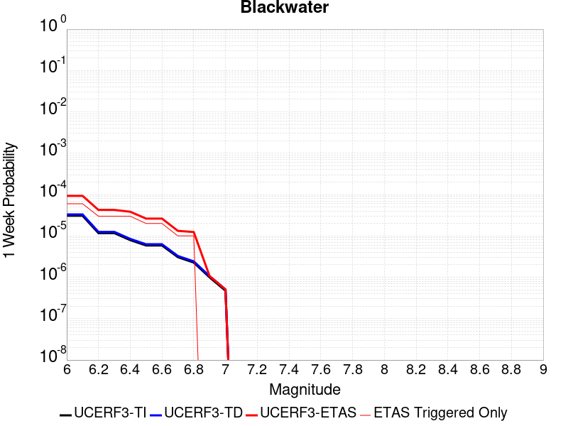 |  |  | 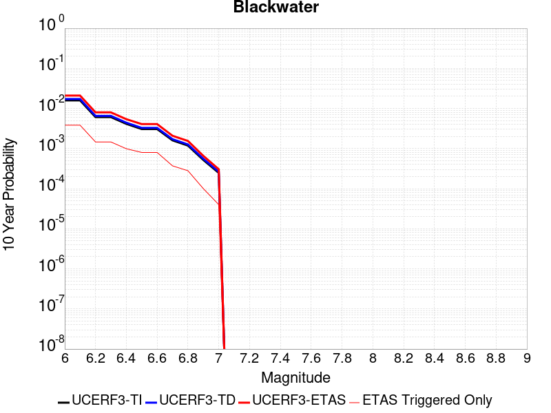 |

| Magnitude | 1 wk TI Prob | 1 wk TD Prob | 1 wk ETAS Prob | 1 wk ETAS/TD Gain | 1 wk ETAS Triggered Only | 1 mo TI Prob | 1 mo TD Prob | 1 mo ETAS Prob | 1 mo ETAS/TD Gain | 1 mo ETAS Triggered Only | 1 yr TI Prob | 1 yr TD Prob | 1 yr ETAS Prob | 1 yr ETAS/TD Gain | 1 yr ETAS Triggered Only | 10 yr TI Prob | 10 yr TD Prob | 10 yr ETAS Prob | 10 yr ETAS/TD Gain | 10 yr ETAS Triggered Only |
|-----|-----|-----|-----|-----|-----|-----|-----|-----|-----|-----|-----|-----|-----|-----|-----|-----|-----|-----|-----|-----|
| 6.0 | 3.0708583E-5 | 3.3098582E-5 | 8.793436E-5 | 2.656741 | 5.483759E-5 | 1.3160157E-4 | 1.4184412E-4 | 3.977166E-4 | 2.8038988 | 2.5590876E-4 | 0.0016010714 | 0.0017257209 | 0.0034045049 | 1.9728016 | 0.001681686 | 0.015895851 | 0.017137038 | 0.02085599 | 1.2170124 | 0.0037837937 |
| 6.1 | 3.0708583E-5 | 3.3098582E-5 | 8.793436E-5 | 2.656741 | 5.483759E-5 | 1.3160157E-4 | 1.4184412E-4 | 3.977166E-4 | 2.8038988 | 2.5590876E-4 | 0.0016010714 | 0.0017257209 | 0.0034045049 | 1.9728016 | 0.001681686 | 0.015895851 | 0.017137038 | 0.02085599 | 1.2170124 | 0.0037837937 |
| 6.2 | 1.1707779E-5 | 1.2546075E-5 | 4.910401E-5 | 3.9138942 | 3.6558395E-5 | 5.017523E-5 | 5.376784E-5 | 1.9999355E-4 | 3.7195756 | 1.4623358E-4 | 6.107122E-4 | 6.544364E-4 | 0.0015129964 | 2.3119073 | 8.5912226E-4 | 0.006090366 | 0.0065260637 | 0.008033335 | 1.2309619 | 0.0015171733 |
| 6.3 | 1.1707779E-5 | 1.2546075E-5 | 4.910401E-5 | 3.9138942 | 3.6558395E-5 | 5.017523E-5 | 5.376784E-5 | 1.9999355E-4 | 3.7195756 | 1.4623358E-4 | 6.107122E-4 | 6.544364E-4 | 0.0015129964 | 2.3119073 | 8.5912226E-4 | 0.006090366 | 0.0065260637 | 0.008033335 | 1.2309619 | 0.0015171733 |
| 6.4 | 7.929244E-6 | 8.480723E-6 | 4.5038807E-5 | 5.310727 | 3.6558395E-5 | 3.3982033E-5 | 3.6345475E-5 | 1.642952E-4 | 4.5203757 | 1.2795438E-4 | 4.136527E-4 | 4.4242034E-4 | 0.001045367 | 2.3628366 | 6.032135E-4 | 0.0041288356 | 0.004415801 | 0.005398519 | 1.2225457 | 9.870767E-4 |
| 6.5 | 5.8832115E-6 | 6.2864474E-6 | 2.4565528E-5 | 3.9076965 | 1.8279197E-5 | 2.521352E-5 | 2.6941654E-5 | 1.3661387E-4 | 5.0707307 | 1.0967518E-4 | 3.0693135E-4 | 3.279678E-4 | 8.030711E-4 | 2.4486277 | 4.7525912E-4 | 0.0030650778 | 0.0032750913 | 0.0040767416 | 1.244772 | 8.0428465E-4 |
| 6.6 | 5.8832115E-6 | 6.2864474E-6 | 2.4565528E-5 | 3.9076965 | 1.8279197E-5 | 2.521352E-5 | 2.6941654E-5 | 1.3661387E-4 | 5.0707307 | 1.0967518E-4 | 3.0693135E-4 | 3.279678E-4 | 8.030711E-4 | 2.4486277 | 4.7525912E-4 | 0.0030650778 | 0.0032750913 | 0.0040767416 | 1.244772 | 8.0428465E-4 |
| 6.7 | 3.0715053E-6 | 3.2817043E-6 | 3.2817043E-6 | 1.0 | 0.0 | 1.3163528E-5 | 1.4064377E-5 | 5.0622257E-5 | 3.5993245 | 3.6558395E-5 | 1.6025416E-4 | 1.712215E-4 | 4.0881036E-4 | 2.3876112 | 2.3762956E-4 | 0.0016013865 | 0.0017110104 | 0.0021124647 | 1.23463 | 4.0214232E-4 |
| 6.8 | 2.2722281E-6 | 2.428931E-6 | 2.428931E-6 | 1.0 | 0.0 | 9.738084E-6 | 1.0409669E-5 | 2.8688675E-5 | 2.7559643 | 1.8279197E-5 | 1.1855473E-4 | 1.2673126E-4 | 2.9122317E-4 | 2.2979584 | 1.6451276E-4 | 0.001184915 | 0.0012666801 | 0.0015770328 | 1.2450128 | 3.1074634E-4 |
| 6.9 | 9.952399E-7 | 1.0654285E-6 | 1.0654285E-6 | 1.0 | 0.0 | 4.265307E-6 | 4.5661172E-6 | 4.5661172E-6 | 1.0 | 0.0 | 5.1928873E-5 | 5.5591572E-5 | 1.287043E-4 | 2.3151762 | 7.311679E-5 | 5.191674E-4 | 5.558273E-4 | 6.654415E-4 | 1.1972091 | 1.0967518E-4 |
| 7.0 | 4.7385504E-7 | 5.075942E-7 | 5.075942E-7 | 1.0 | 0.0 | 2.0308057E-6 | 2.175404E-6 | 2.175404E-6 | 1.0 | 0.0 | 2.4724779E-5 | 2.6485543E-5 | 6.3042964E-5 | 2.3802786 | 3.6558395E-5 | 2.4722028E-4 | 2.6485542E-4 | 3.1967848E-4 | 1.2069924 | 5.483759E-5 |

## Garlock (West)
*[(top)](#table-of-contents)*

| 1 Week | 1 Month | 1 Year | 10 Year |
|-----|-----|-----|-----|
|  | 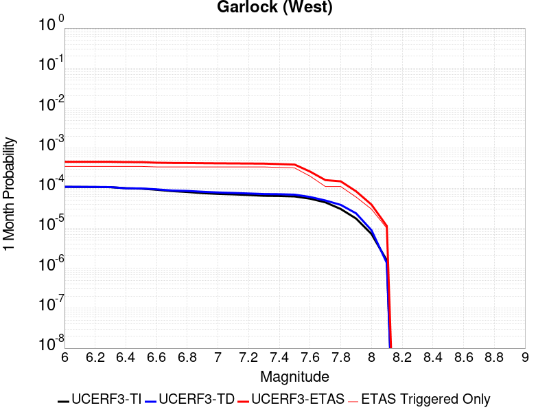 | 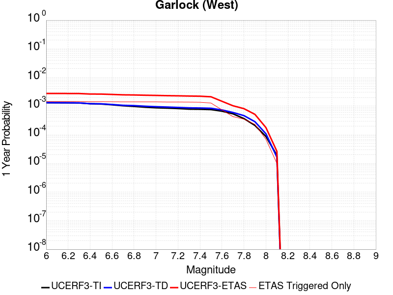 |  |

| Magnitude | 1 wk TI Prob | 1 wk TD Prob | 1 wk ETAS Prob | 1 wk ETAS/TD Gain | 1 wk ETAS Triggered Only | 1 mo TI Prob | 1 mo TD Prob | 1 mo ETAS Prob | 1 mo ETAS/TD Gain | 1 mo ETAS Triggered Only | 1 yr TI Prob | 1 yr TD Prob | 1 yr ETAS Prob | 1 yr ETAS/TD Gain | 1 yr ETAS Triggered Only | 10 yr TI Prob | 10 yr TD Prob | 10 yr ETAS Prob | 10 yr ETAS/TD Gain | 10 yr ETAS Triggered Only |
|-----|-----|-----|-----|-----|-----|-----|-----|-----|-----|-----|-----|-----|-----|-----|-----|-----|-----|-----|-----|-----|
| 6.0 | 2.5181727E-5 | 2.5237663E-5 | 1.3491008E-4 | 5.345585 | 1.0967518E-4 | 1.0791722E-4 | 1.0815695E-4 | 4.7370134E-4 | 4.379759 | 3.6558392E-4 | 0.0013131002 | 0.0013160189 | 0.0027764302 | 2.109719 | 0.0014623357 | 0.013053683 | 0.013162692 | 0.016770411 | 1.2740867 | 0.0036558392 |
| 6.1 | 2.5077732E-5 | 2.513872E-5 | 1.3481114E-4 | 5.3626895 | 1.0967518E-4 | 1.0747157E-4 | 1.07732936E-4 | 4.7327747E-4 | 4.393062 | 3.6558392E-4 | 0.001307681 | 0.0013108627 | 0.0027712816 | 2.1140897 | 0.0014623357 | 0.013000126 | 0.01311174 | 0.016719645 | 1.275166 | 0.0036558392 |
| 6.2 | 2.494612E-5 | 2.502037E-5 | 1.346928E-4 | 5.383326 | 1.0967518E-4 | 1.0690756E-4 | 1.07225766E-4 | 4.727705E-4 | 4.409113 | 3.6558392E-4 | 0.0013008224 | 0.0013046954 | 0.0027651233 | 2.119363 | 0.0014623357 | 0.012932341 | 0.013050792 | 0.016658919 | 1.2764682 | 0.0036558392 |
| 6.3 | 2.4733758E-5 | 2.4839694E-5 | 1.3451214E-4 | 5.41521 | 1.0967518E-4 | 1.0599751E-4 | 1.064515E-4 | 4.7199652E-4 | 4.4339113 | 3.6558392E-4 | 0.0012897556 | 0.00129528 | 0.0027557216 | 2.1275103 | 0.0014623357 | 0.012822957 | 0.01295774 | 0.016566208 | 1.2784797 | 0.0036558392 |
| 6.4 | 2.3237335E-5 | 2.3218727E-5 | 1.3289136E-4 | 5.723456 | 1.0967518E-4 | 9.958477E-5 | 9.950505E-5 | 4.650526E-4 | 4.6736584 | 3.6558392E-4 | 0.0012117702 | 0.0012108035 | 0.0026713687 | 2.2062776 | 0.0014623357 | 0.012051838 | 0.012122463 | 0.015715927 | 1.2964301 | 0.0036375602 |
| 6.5 | 2.2732203E-5 | 2.30331E-5 | 1.3270575E-4 | 5.7615237 | 1.0967518E-4 | 9.742009E-5 | 9.870957E-5 | 4.642574E-4 | 4.7032666 | 3.6558392E-4 | 0.0011854442 | 0.0012011293 | 0.0026617085 | 2.216005 | 0.0014623357 | 0.011791403 | 0.012026772 | 0.015620585 | 1.2988176 | 0.0036375602 |
| 6.6 | 2.1319436E-5 | 2.1812974E-5 | 1.3148577E-4 | 6.0278697 | 1.0967518E-4 | 9.136581E-5 | 9.3480834E-5 | 4.590306E-4 | 4.9104247 | 3.6558392E-4 | 0.001111811 | 0.0011375373 | 0.0025982095 | 2.2840655 | 0.0014623357 | 0.011062649 | 0.01139752 | 0.014993621 | 1.3155161 | 0.0036375602 |
| 6.7 | 1.970802E-5 | 2.0432468E-5 | 1.301054E-4 | 6.3675814 | 1.0967518E-4 | 8.446021E-5 | 8.756479E-5 | 4.5311672E-4 | 5.174645 | 3.6558392E-4 | 0.001027818 | 0.0010655817 | 0.0025080994 | 2.3537374 | 0.0014440565 | 0.010230771 | 0.010685065 | 0.014265674 | 1.3351041 | 0.0036192809 |
| 6.8 | 1.8744462E-5 | 1.9939902E-5 | 1.2961289E-4 | 6.500177 | 1.0967518E-4 | 8.033094E-5 | 8.545393E-5 | 4.5100664E-4 | 5.277775 | 3.6558392E-4 | 9.775903E-4 | 0.0010399068 | 0.0024824615 | 2.3871963 | 0.0014440565 | 0.009733009 | 0.010430746 | 0.014012275 | 1.3433627 | 0.0036192809 |
| 6.9 | 1.7559682E-5 | 1.8992021E-5 | 1.2866512E-4 | 6.774693 | 1.0967518E-4 | 7.5253614E-5 | 8.1391845E-5 | 4.46946E-4 | 5.491287 | 3.6558392E-4 | 9.158276E-4 | 9.904967E-4 | 0.0024331228 | 2.4564674 | 0.0014440565 | 0.0091206245 | 0.009941107 | 0.013524408 | 1.3604529 | 0.0036192809 |
| 7.0 | 1.6794445E-5 | 1.8254574E-5 | 1.2792775E-4 | 7.0079837 | 1.0967518E-4 | 7.197421E-5 | 7.823155E-5 | 4.4378688E-4 | 5.672735 | 3.6558392E-4 | 8.759337E-4 | 9.520543E-4 | 0.002394736 | 2.5153356 | 0.0014440565 | 0.008724891 | 0.009559885 | 0.013144566 | 1.3749712 | 0.0036192809 |
| 7.1 | 1.6337795E-5 | 1.7755181E-5 | 1.2742841E-4 | 7.1769705 | 1.0967518E-4 | 7.0017246E-5 | 7.6091426E-5 | 4.4164754E-4 | 5.8041697 | 3.6558392E-4 | 8.521265E-4 | 9.260207E-4 | 0.0023504777 | 2.5382562 | 0.0014257773 | 0.008488664 | 0.009301643 | 0.012869149 | 1.3835351 | 0.0036010018 |
| 7.2 | 1.5780008E-5 | 1.720368E-5 | 1.2687697E-4 | 7.3749905 | 1.0967518E-4 | 6.762685E-5 | 7.372798E-5 | 4.3928495E-4 | 5.958185 | 3.6558392E-4 | 8.2304585E-4 | 8.9726975E-4 | 0.0023217679 | 2.5875916 | 0.0014257773 | 0.008200042 | 0.009016417 | 0.012566836 | 1.3937727 | 0.0035827225 |
| 7.3 | 1.5058865E-5 | 1.6656479E-5 | 1.2632983E-4 | 7.584426 | 1.0967518E-4 | 6.45364E-5 | 7.1382965E-5 | 4.3694078E-4 | 6.1210794 | 3.6558392E-4 | 7.854473E-4 | 8.6874224E-4 | 0.0022750176 | 2.6187487 | 0.0014074981 | 0.00782677 | 0.00873298 | 0.012266295 | 1.4045944 | 0.0035644432 |
| 7.4 | 1.4887923E-5 | 1.6492331E-5 | 1.261657E-4 | 7.6499615 | 1.0967518E-4 | 6.380382E-5 | 7.067952E-5 | 4.362376E-4 | 6.1720514 | 3.6558392E-4 | 7.7653467E-4 | 8.6018455E-4 | 0.002266472 | 2.6348672 | 0.0014074981 | 0.0077382675 | 0.008647783 | 0.012145159 | 1.4044247 | 0.0035278848 |
| 7.5 | 1.4509299E-5 | 1.6084083E-5 | 1.2575749E-4 | 7.8187547 | 1.0967518E-4 | 6.218123E-5 | 6.892997E-5 | 4.344887E-4 | 6.303335 | 3.6558392E-4 | 7.567935E-4 | 8.3890045E-4 | 0.0021721623 | 2.589297 | 0.0013343813 | 0.0075422134 | 0.008435954 | 0.011662204 | 1.3824403 | 0.003253697 |
| 7.6 | 1.2756717E-5 | 1.4086703E-5 | 5.064458E-5 | 3.5952048 | 3.6558395E-5 | 5.4670498E-5 | 6.0370192E-5 | 2.797073E-4 | 4.633202 | 2.1935036E-4 | 6.6541E-4 | 7.3475984E-4 | 0.001428859 | 1.9446611 | 6.946095E-4 | 0.006634211 | 0.0074002044 | 0.00941418 | 1.2721514 | 0.0020289908 |
| 7.7 | 1.0328985E-5 | 1.1494287E-5 | 2.9773273E-5 | 2.5902672 | 1.8279197E-5 | 4.4266326E-5 | 4.92603E-5 | 1.7720838E-4 | 3.597387 | 1.2795438E-4 | 5.388092E-4 | 5.9957954E-4 | 0.0010014807 | 1.6703051 | 4.0214232E-4 | 0.0053750467 | 0.0060559767 | 0.0072187604 | 1.192006 | 0.0011698686 |
| 7.8 | 7.0306583E-6 | 8.9268415E-6 | 2.7205875E-5 | 3.0476487 | 1.8279197E-5 | 3.0131043E-5 | 3.825733E-5 | 1.6620681E-4 | 4.3444433 | 1.2795438E-4 | 3.667837E-4 | 4.656836E-4 | 8.128266E-4 | 1.7454482 | 3.4730474E-4 | 0.003661789 | 0.004709399 | 0.0054735094 | 1.1622523 | 7.677263E-4 |
| 7.9 | 4.060633E-6 | 5.481252E-6 | 2.3760349E-5 | 4.3348393 | 1.8279197E-5 | 1.7402595E-5 | 2.349087E-5 | 1.1488471E-4 | 4.890611 | 9.139598E-5 | 2.11856E-4 | 2.859639E-4 | 5.600734E-4 | 1.9585459 | 2.7418794E-4 | 0.0021165414 | 0.002892441 | 0.0034392308 | 1.1890409 | 5.483759E-4 |
| 8.0 | 1.6729537E-6 | 2.0826424E-6 | 2.0826424E-6 | 1.0 | 0.0 | 7.169782E-6 | 8.92558E-6 | 4.5483648E-5 | 5.0958757 | 3.6558395E-5 | 8.7288594E-5 | 1.0866355E-4 | 1.817724E-4 | 1.6728001 | 7.311679E-5 | 8.7254314E-4 | 0.0010996006 | 0.0012821916 | 1.1660521 | 1.8279196E-4 |
| 8.1 | 3.6733252E-7 | 3.156379E-7 | 3.156379E-7 | 1.0 | 0.0 | 1.5742813E-6 | 1.3527332E-6 | 1.9631905E-5 | 14.512769 | 1.8279197E-5 | 1.9166706E-5 | 1.646942E-5 | 3.4748315E-5 | 2.1098688 | 1.8279197E-5 | 1.9165053E-4 | 1.6677451E-4 | 1.8505067E-4 | 1.109586 | 1.8279197E-5 |

## McLean Lake
*[(top)](#table-of-contents)*

| 1 Week | 1 Month | 1 Year | 10 Year |
|-----|-----|-----|-----|
|  |  |  | 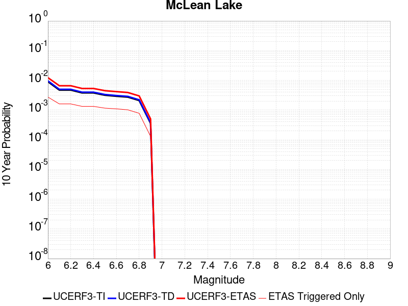 |

| Magnitude | 1 wk TI Prob | 1 wk TD Prob | 1 wk ETAS Prob | 1 wk ETAS/TD Gain | 1 wk ETAS Triggered Only | 1 mo TI Prob | 1 mo TD Prob | 1 mo ETAS Prob | 1 mo ETAS/TD Gain | 1 mo ETAS Triggered Only | 1 yr TI Prob | 1 yr TD Prob | 1 yr ETAS Prob | 1 yr ETAS/TD Gain | 1 yr ETAS Triggered Only | 10 yr TI Prob | 10 yr TD Prob | 10 yr ETAS Prob | 10 yr ETAS/TD Gain | 10 yr ETAS Triggered Only |
|-----|-----|-----|-----|-----|-----|-----|-----|-----|-----|-----|-----|-----|-----|-----|-----|-----|-----|-----|-----|-----|
| 6.0 | 1.7360222E-5 | 1.850292E-5 | 3.6781777E-5 | 1.9878905 | 1.8279197E-5 | 7.439883E-5 | 7.929609E-5 | 2.4379582E-4 | 3.0744996 | 1.6451276E-4 | 9.0542925E-4 | 9.65051E-4 | 0.001914652 | 1.9839904 | 9.5051824E-4 | 0.009017491 | 0.009613443 | 0.01220224 | 1.2692891 | 0.0026139251 |
| 6.1 | 9.062689E-6 | 9.592789E-6 | 9.592789E-6 | 1.0 | 0.0 | 3.8839516E-5 | 4.1111354E-5 | 9.594669E-5 | 2.3338246 | 5.483759E-5 | 4.727685E-4 | 5.0042465E-4 | 0.001030256 | 2.0587635 | 5.300967E-4 | 0.0047176396 | 0.004993861 | 0.0065398333 | 1.3095746 | 0.0015537317 |
| 6.2 | 9.062689E-6 | 9.592789E-6 | 9.592789E-6 | 1.0 | 0.0 | 3.8839516E-5 | 4.1111354E-5 | 9.594669E-5 | 2.3338246 | 5.483759E-5 | 4.727685E-4 | 5.0042465E-4 | 0.001030256 | 2.0587635 | 5.300967E-4 | 0.0047176396 | 0.004993861 | 0.0065398333 | 1.3095746 | 0.0015537317 |
| 6.3 | 7.2575485E-6 | 7.66817E-6 | 7.66817E-6 | 1.0 | 0.0 | 3.110341E-5 | 3.286321E-5 | 8.7698994E-5 | 2.6686072 | 5.483759E-5 | 3.786182E-4 | 4.0004327E-4 | 8.5684034E-4 | 2.1418693 | 4.569799E-4 | 0.0037797375 | 0.003993936 | 0.005231957 | 1.3099751 | 0.0012429854 |
| 6.4 | 7.2575485E-6 | 7.66817E-6 | 7.66817E-6 | 1.0 | 0.0 | 3.110341E-5 | 3.286321E-5 | 8.7698994E-5 | 2.6686072 | 5.483759E-5 | 3.786182E-4 | 4.0004327E-4 | 8.5684034E-4 | 2.1418693 | 4.569799E-4 | 0.0037797375 | 0.003993936 | 0.005231957 | 1.3099751 | 0.0012429854 |
| 6.5 | 6.06582E-6 | 6.404256E-6 | 6.404256E-6 | 1.0 | 0.0 | 2.5996113E-5 | 2.744656E-5 | 8.228264E-5 | 2.997922 | 5.483759E-5 | 3.164567E-4 | 3.341171E-4 | 7.543982E-4 | 2.2578855 | 4.204215E-4 | 0.0031600643 | 0.0033367863 | 0.0044845333 | 1.3439677 | 0.0011515893 |
| 6.6 | 5.598744E-6 | 5.9106114E-6 | 5.9106114E-6 | 1.0 | 0.0 | 2.3994397E-5 | 2.5330983E-5 | 8.0167185E-5 | 3.1647878 | 5.483759E-5 | 2.9209262E-4 | 3.0836745E-4 | 6.921122E-4 | 2.2444398 | 3.8386314E-4 | 0.0029170897 | 0.0030800248 | 0.0041369526 | 1.3431556 | 0.0010601934 |
| 6.7 | 5.246996E-6 | 5.5394894E-6 | 5.5394894E-6 | 1.0 | 0.0 | 2.2486933E-5 | 2.374049E-5 | 7.857678E-5 | 3.3098214 | 5.483759E-5 | 2.73744E-4 | 2.8900846E-4 | 6.362128E-4 | 2.201364 | 3.4730474E-4 | 0.0027340704 | 0.00288695 | 0.003871177 | 1.3409227 | 9.870767E-4 |
| 6.8 | 4.02324E-6 | 4.247155E-6 | 4.247155E-6 | 1.0 | 0.0 | 1.7242342E-5 | 1.8202E-5 | 7.3038595E-5 | 4.0126686 | 5.483759E-5 | 2.099053E-4 | 2.2159277E-4 | 5.139951E-4 | 2.3195481 | 2.9246716E-4 | 0.0020970714 | 0.0022143025 | 0.0030168062 | 1.3624183 | 8.0428465E-4 |
| 6.9 | 6.835972E-7 | 7.140265E-7 | 7.140265E-7 | 1.0 | 0.0 | 2.9296991E-6 | 3.0601118E-6 | 3.0601118E-6 | 1.0 | 0.0 | 3.56685E-5 | 3.7256545E-5 | 7.381357E-5 | 1.9812244 | 3.6558395E-5 | 3.5662777E-4 | 3.7253424E-4 | 5.369857E-4 | 1.4414399 | 1.6451276E-4 |

## Gravel Hills-Harper Lk
*[(top)](#table-of-contents)*

| 1 Week | 1 Month | 1 Year | 10 Year |
|-----|-----|-----|-----|
|  |  |  |  |

| Magnitude | 1 wk TI Prob | 1 wk TD Prob | 1 wk ETAS Prob | 1 wk ETAS/TD Gain | 1 wk ETAS Triggered Only | 1 mo TI Prob | 1 mo TD Prob | 1 mo ETAS Prob | 1 mo ETAS/TD Gain | 1 mo ETAS Triggered Only | 1 yr TI Prob | 1 yr TD Prob | 1 yr ETAS Prob | 1 yr ETAS/TD Gain | 1 yr ETAS Triggered Only | 10 yr TI Prob | 10 yr TD Prob | 10 yr ETAS Prob | 10 yr ETAS/TD Gain | 10 yr ETAS Triggered Only |
|-----|-----|-----|-----|-----|-----|-----|-----|-----|-----|-----|-----|-----|-----|-----|-----|-----|-----|-----|-----|-----|
| 6.0 | 3.0679566E-5 | 3.1468957E-5 | 6.8026195E-5 | 2.1616924 | 3.6558395E-5 | 1.3147724E-4 | 1.348612E-4 | 3.3590524E-4 | 2.4907477 | 2.0107116E-4 | 0.0015995599 | 0.0016409147 | 0.0026993684 | 1.6450388 | 0.0010601934 | 0.015880952 | 0.016309557 | 0.018737001 | 1.1488357 | 0.0024676914 |
| 6.1 | 3.0679566E-5 | 3.1468957E-5 | 6.8026195E-5 | 2.1616924 | 3.6558395E-5 | 1.3147724E-4 | 1.348612E-4 | 3.3590524E-4 | 2.4907477 | 2.0107116E-4 | 0.0015995599 | 0.0016409147 | 0.0026993684 | 1.6450388 | 0.0010601934 | 0.015880952 | 0.016309557 | 0.018737001 | 1.1488357 | 0.0024676914 |
| 6.2 | 1.514536E-5 | 1.3636691E-5 | 1.3636691E-5 | 1.0 | 0.0 | 6.490707E-5 | 5.8441718E-5 | 1.132761E-4 | 1.9382746 | 5.483759E-5 | 7.8995706E-4 | 7.113075E-4 | 0.0010948976 | 1.5392746 | 3.8386314E-4 | 0.007871548 | 0.0070915096 | 0.007817493 | 1.1023735 | 7.3116785E-4 |
| 6.3 | 1.514536E-5 | 1.3636691E-5 | 1.3636691E-5 | 1.0 | 0.0 | 6.490707E-5 | 5.8441718E-5 | 1.132761E-4 | 1.9382746 | 5.483759E-5 | 7.8995706E-4 | 7.113075E-4 | 0.0010948976 | 1.5392746 | 3.8386314E-4 | 0.007871548 | 0.0070915096 | 0.007817493 | 1.1023735 | 7.3116785E-4 |
| 6.4 | 1.2532521E-5 | 1.0690775E-5 | 1.0690775E-5 | 1.0 | 0.0 | 5.37097E-5 | 4.5816832E-5 | 1.0065191E-4 | 2.1968327 | 5.483759E-5 | 6.537194E-4 | 5.57683E-4 | 8.86525E-4 | 1.5896577 | 3.2902553E-4 | 0.0065179965 | 0.0055634254 | 0.006145105 | 1.1045543 | 5.849343E-4 |
| 6.5 | 1.1094058E-5 | 9.084548E-6 | 9.084548E-6 | 1.0 | 0.0 | 4.7545094E-5 | 3.8933216E-5 | 5.7211702E-5 | 1.469483 | 1.8279197E-5 | 5.787078E-4 | 4.7391286E-4 | 6.566182E-4 | 1.3855251 | 1.8279196E-4 | 0.0057720304 | 0.0047294297 | 0.0050387066 | 1.065394 | 3.1074634E-4 |
| 6.6 | 9.688328E-6 | 7.5324074E-6 | 7.5324074E-6 | 1.0 | 0.0 | 4.1520743E-5 | 3.228136E-5 | 5.0559967E-5 | 1.5662279 | 1.8279197E-5 | 5.053978E-4 | 3.9295724E-4 | 5.0258933E-4 | 1.2789924 | 1.0967518E-4 | 0.0050424994 | 0.0039228806 | 0.004068541 | 1.0371308 | 1.4623358E-4 |
| 6.7 | 8.974824E-6 | 6.750045E-6 | 6.750045E-6 | 1.0 | 0.0 | 3.8462964E-5 | 2.8928456E-5 | 4.7207126E-5 | 1.6318576 | 1.8279197E-5 | 4.6818596E-4 | 3.5214925E-4 | 4.4351304E-4 | 1.2594463 | 9.139598E-5 | 0.004672008 | 0.0035161332 | 0.0036436378 | 1.0362628 | 1.2795438E-4 |
| 6.8 | 7.4780046E-6 | 5.116667E-6 | 5.116667E-6 | 1.0 | 0.0 | 3.20482E-5 | 2.1928397E-5 | 4.0207193E-5 | 1.8335674 | 1.8279197E-5 | 3.9011694E-4 | 2.669469E-4 | 3.0349556E-4 | 1.1369135 | 3.6558395E-5 | 0.0038943281 | 0.0026664007 | 0.0027393226 | 1.0273484 | 7.311679E-5 |
| 6.9 | 6.3409307E-6 | 3.9078664E-6 | 3.9078664E-6 | 1.0 | 0.0 | 2.7175134E-5 | 1.6747896E-5 | 3.5026787E-5 | 2.0914142 | 1.8279197E-5 | 3.3080703E-4 | 2.0388755E-4 | 2.4043849E-4 | 1.17927 | 3.6558395E-5 | 0.0033031502 | 0.002037103 | 0.002091829 | 1.0268645 | 5.483759E-5 |
| 7.0 | 5.1239335E-6 | 2.606115E-6 | 2.606115E-6 | 1.0 | 0.0 | 2.195953E-5 | 1.1169018E-5 | 1.1169018E-5 | 1.0 | 0.0 | 2.6732447E-4 | 1.3597457E-4 | 1.5425128E-4 | 1.1344128 | 1.8279197E-5 | 0.0026700313 | 0.001358939 | 0.0013954476 | 1.0268656 | 3.6558395E-5 |
| 7.1 | 4.438899E-6 | 2.098689E-6 | 2.098689E-6 | 1.0 | 0.0 | 1.9023713E-5 | 8.994351E-6 | 8.994351E-6 | 1.0 | 0.0 | 2.315891E-4 | 1.0950095E-4 | 1.0950095E-4 | 1.0 | 0.0 | 0.002313479 | 0.0010944918 | 0.001112751 | 1.0166827 | 1.8279197E-5 |
| 7.2 | 3.50367E-6 | 1.2617305E-6 | 1.2617305E-6 | 1.0 | 0.0 | 1.5015643E-5 | 5.4074058E-6 | 5.4074058E-6 | 1.0 | 0.0 | 1.8280011E-4 | 6.583326E-5 | 6.583326E-5 | 1.0 | 0.0 | 0.0018264982 | 6.581458E-4 | 6.7641295E-4 | 1.0277555 | 1.8279197E-5 |
| 7.3 | 2.561638E-6 | 7.120373E-7 | 7.120373E-7 | 1.0 | 0.0 | 1.0978401E-5 | 3.051585E-6 | 3.051585E-6 | 1.0 | 0.0 | 1.3365384E-4 | 3.7152437E-5 | 3.7152437E-5 | 1.0 | 0.0 | 0.0013357349 | 3.7146424E-4 | 3.8973664E-4 | 1.0491902 | 1.8279197E-5 |
| 7.4 | 2.0368864E-6 | 5.305809E-7 | 5.305809E-7 | 1.0 | 0.0 | 8.729483E-6 | 2.2739162E-6 | 2.2739162E-6 | 1.0 | 0.0 | 1.06276275E-4 | 2.7684584E-5 | 2.7684584E-5 | 1.0 | 0.0 | 0.0010622547 | 2.768119E-4 | 2.768119E-4 | 1.0 | 0.0 |
| 7.5 | 1.1681728E-6 | 3.60362E-7 | 3.60362E-7 | 1.0 | 0.0 | 5.0064455E-6 | 1.5444077E-6 | 1.5444077E-6 | 1.0 | 0.0 | 6.0951766E-5 | 1.8803006E-5 | 1.8803006E-5 | 1.0 | 0.0 | 6.093505E-4 | 1.8801463E-4 | 1.8801463E-4 | 1.0 | 0.0 |
| 7.6 | 1.3154387E-7 | 7.120442E-8 | 7.120442E-8 | 1.0 | 0.0 | 5.6375933E-7 | 3.0516176E-7 | 3.0516176E-7 | 1.0 | 0.0 | 6.863748E-6 | 3.7153397E-6 | 3.7153397E-6 | 1.0 | 0.0 | 6.863536E-5 | 3.7152935E-5 | 3.7152935E-5 | 1.0 | 0.0 |

## So Sierra Nevada
*[(top)](#table-of-contents)*

| 1 Week | 1 Month | 1 Year | 10 Year |
|-----|-----|-----|-----|
|  |  |  |  |

| Magnitude | 1 wk TI Prob | 1 wk TD Prob | 1 wk ETAS Prob | 1 wk ETAS/TD Gain | 1 wk ETAS Triggered Only | 1 mo TI Prob | 1 mo TD Prob | 1 mo ETAS Prob | 1 mo ETAS/TD Gain | 1 mo ETAS Triggered Only | 1 yr TI Prob | 1 yr TD Prob | 1 yr ETAS Prob | 1 yr ETAS/TD Gain | 1 yr ETAS Triggered Only | 10 yr TI Prob | 10 yr TD Prob | 10 yr ETAS Prob | 10 yr ETAS/TD Gain | 10 yr ETAS Triggered Only |
|-----|-----|-----|-----|-----|-----|-----|-----|-----|-----|-----|-----|-----|-----|-----|-----|-----|-----|-----|-----|-----|
| 6.0 | 1.15488665E-5 | 1.1080275E-5 | 2.935927E-5 | 2.6496878 | 1.8279197E-5 | 4.9494203E-5 | 4.74861E-5 | 1.754344E-4 | 3.6944368 | 1.2795438E-4 | 6.024253E-4 | 5.7800265E-4 | 0.0014731656 | 2.5487175 | 8.956806E-4 | 0.006007948 | 0.0057662623 | 0.007983466 | 1.384513 | 0.002230062 |
| 6.1 | 1.15488665E-5 | 1.1080275E-5 | 2.935927E-5 | 2.6496878 | 1.8279197E-5 | 4.9494203E-5 | 4.74861E-5 | 1.754344E-4 | 3.6944368 | 1.2795438E-4 | 6.024253E-4 | 5.7800265E-4 | 0.0014731656 | 2.5487175 | 8.956806E-4 | 0.006007948 | 0.0057662623 | 0.007983466 | 1.384513 | 0.002230062 |
| 6.2 | 1.15488665E-5 | 1.1080275E-5 | 2.935927E-5 | 2.6496878 | 1.8279197E-5 | 4.9494203E-5 | 4.74861E-5 | 1.754344E-4 | 3.6944368 | 1.2795438E-4 | 6.024253E-4 | 5.7800265E-4 | 0.0014731656 | 2.5487175 | 8.956806E-4 | 0.006007948 | 0.0057662623 | 0.007983466 | 1.384513 | 0.002230062 |
| 6.3 | 1.15488665E-5 | 1.1080275E-5 | 2.935927E-5 | 2.6496878 | 1.8279197E-5 | 4.9494203E-5 | 4.74861E-5 | 1.754344E-4 | 3.6944368 | 1.2795438E-4 | 6.024253E-4 | 5.7800265E-4 | 0.0014731656 | 2.5487175 | 8.956806E-4 | 0.006007948 | 0.0057662623 | 0.007983466 | 1.384513 | 0.002230062 |
| 6.4 | 1.15488665E-5 | 1.1080275E-5 | 2.935927E-5 | 2.6496878 | 1.8279197E-5 | 4.9494203E-5 | 4.74861E-5 | 1.754344E-4 | 3.6944368 | 1.2795438E-4 | 6.024253E-4 | 5.7800265E-4 | 0.0014731656 | 2.5487175 | 8.956806E-4 | 0.006007948 | 0.0057662623 | 0.007983466 | 1.384513 | 0.002230062 |
| 6.5 | 1.15488665E-5 | 1.1080275E-5 | 2.935927E-5 | 2.6496878 | 1.8279197E-5 | 4.9494203E-5 | 4.74861E-5 | 1.754344E-4 | 3.6944368 | 1.2795438E-4 | 6.024253E-4 | 5.7800265E-4 | 0.0014731656 | 2.5487175 | 8.956806E-4 | 0.006007948 | 0.0057662623 | 0.007983466 | 1.384513 | 0.002230062 |
| 6.6 | 7.587044E-6 | 6.9360653E-6 | 2.5215135E-5 | 3.635366 | 1.8279197E-5 | 3.2515498E-5 | 2.9725672E-5 | 1.2111894E-4 | 4.074557 | 9.139598E-5 | 3.9580427E-4 | 3.6185287E-4 | 8.734852E-4 | 2.4139235 | 5.118175E-4 | 0.003951 | 0.0036129286 | 0.0047785705 | 1.3226308 | 0.0011698686 |
| 6.7 | 7.587044E-6 | 6.9360653E-6 | 2.5215135E-5 | 3.635366 | 1.8279197E-5 | 3.2515498E-5 | 2.9725672E-5 | 1.2111894E-4 | 4.074557 | 9.139598E-5 | 3.9580427E-4 | 3.6185287E-4 | 8.734852E-4 | 2.4139235 | 5.118175E-4 | 0.003951 | 0.0036129286 | 0.0047785705 | 1.3226308 | 0.0011698686 |
| 6.8 | 5.9026956E-6 | 5.1797433E-6 | 2.3458844E-5 | 4.5289593 | 1.8279197E-5 | 2.5297022E-5 | 2.2198717E-5 | 1.1359267E-4 | 5.1170826 | 9.139598E-5 | 3.0794772E-4 | 2.70237E-4 | 7.088192E-4 | 2.6229537 | 4.3870072E-4 | 0.0030752132 | 0.0026992003 | 0.003628923 | 1.3444438 | 9.32239E-4 |
| 6.9 | 5.0118915E-6 | 4.252736E-6 | 2.2531854E-5 | 5.298202 | 1.8279197E-5 | 2.1479358E-5 | 1.8225888E-5 | 7.3062474E-5 | 4.00872 | 5.483759E-5 | 2.614798E-4 | 2.2187832E-4 | 5.5083085E-4 | 2.482581 | 3.2902553E-4 | 0.0026117235 | 0.0022166404 | 0.002927949 | 1.3208948 | 7.1288866E-4 |
| 7.0 | 4.4924795E-6 | 3.7142067E-6 | 2.1993335E-5 | 5.921408 | 1.8279197E-5 | 1.925334E-5 | 1.5917936E-5 | 7.075465E-5 | 4.444964 | 5.483759E-5 | 2.3438422E-4 | 1.9378426E-4 | 4.8619474E-4 | 2.5089486 | 2.9246716E-4 | 0.0023413717 | 0.0019362158 | 0.0025565051 | 1.3203616 | 6.214927E-4 |
| 7.1 | 3.9118436E-6 | 3.1122413E-6 | 2.139138E-5 | 6.873304 | 1.8279197E-5 | 1.6764936E-5 | 1.3338113E-5 | 6.817497E-5 | 5.111291 | 5.483759E-5 | 2.0409399E-4 | 1.6237999E-4 | 3.6341848E-4 | 2.2380745 | 2.0107116E-4 | 0.0020390663 | 0.0016226694 | 0.0020241593 | 1.2474254 | 4.0214232E-4 |
| 7.2 | 3.4200818E-6 | 2.6056978E-6 | 2.0884847E-5 | 8.015069 | 1.8279197E-5 | 1.4657411E-5 | 1.1167231E-5 | 6.6004206E-5 | 5.910526 | 5.483759E-5 | 1.7843937E-4 | 1.3595306E-4 | 2.8216676E-4 | 2.0754719 | 1.4623358E-4 | 0.0017829615 | 0.0013587485 | 0.001687327 | 1.2418244 | 3.2902553E-4 |
| 7.3 | 2.6593618E-6 | 1.8286328E-6 | 2.0107796E-5 | 10.996082 | 1.8279197E-5 | 1.13972155E-5 | 7.836976E-6 | 6.267414E-5 | 7.997235 | 5.483759E-5 | 1.3875226E-4 | 9.54113E-5 | 2.4163091E-4 | 2.5325189 | 1.4623358E-4 | 0.0013866565 | 9.5373223E-4 | 0.0012276587 | 1.2872152 | 2.7418794E-4 |
| 7.4 | 2.2577992E-6 | 1.4366318E-6 | 1.9715802E-5 | 13.723629 | 1.8279197E-5 | 9.676246E-6 | 6.1569804E-6 | 6.0994233E-5 | 9.906517 | 5.483759E-5 | 1.1780193E-4 | 7.4958916E-5 | 2.029037E-4 | 2.7068655 | 1.2795438E-4 | 0.001177395 | 7.4936135E-4 | 0.0010050783 | 1.3412466 | 2.5590876E-4 |
| 7.5 | 1.489319E-6 | 7.355458E-7 | 1.901473E-5 | 25.851183 | 1.8279197E-5 | 6.3827797E-6 | 3.1523355E-6 | 2.1431475E-5 | 6.798602 | 1.8279197E-5 | 7.770758E-5 | 3.837901E-5 | 9.32145E-5 | 2.4287884 | 5.483759E-5 | 7.7680405E-4 | 3.8372425E-4 | 4.9335737E-4 | 1.285708 | 1.0967518E-4 |
| 7.6 | 1.0680322E-6 | 4.660781E-7 | 1.8745266E-5 | 40.219154 | 1.8279197E-5 | 4.577273E-6 | 1.997476E-6 | 2.0276635E-5 | 10.151129 | 1.8279197E-5 | 5.5726876E-5 | 2.4319E-5 | 7.915526E-5 | 3.2548728 | 5.483759E-5 | 5.5712904E-4 | 2.4316367E-4 | 3.345374E-4 | 1.3757706 | 9.139598E-5 |
| 7.7 | 5.509146E-7 | 1.5586197E-7 | 1.5586197E-7 | 1.0 | 0.0 | 2.3610605E-6 | 6.679797E-7 | 6.679797E-7 | 1.0 | 0.0 | 2.8745531E-5 | 8.132623E-6 | 2.6411672E-5 | 3.24762 | 1.8279197E-5 | 2.8741814E-4 | 8.132337E-5 | 1.1787879E-4 | 1.4495069 | 3.6558395E-5 |

## Goldstone Lake
*[(top)](#table-of-contents)*

| 1 Week | 1 Month | 1 Year | 10 Year |
|-----|-----|-----|-----|
| 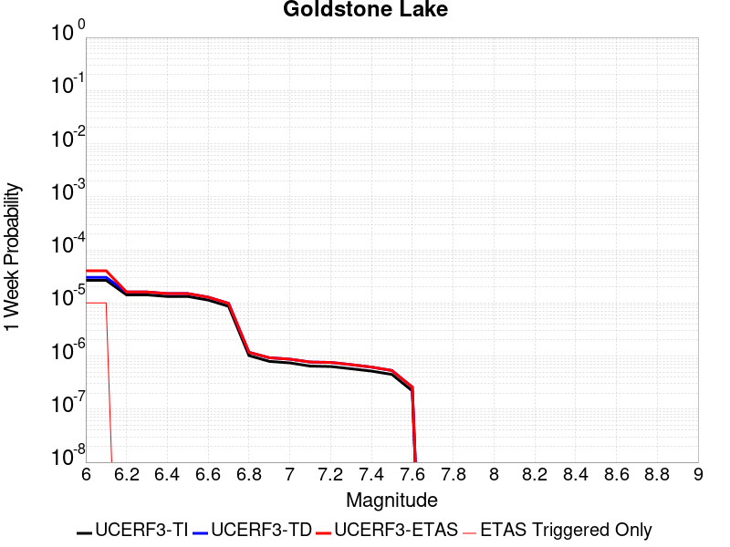 | 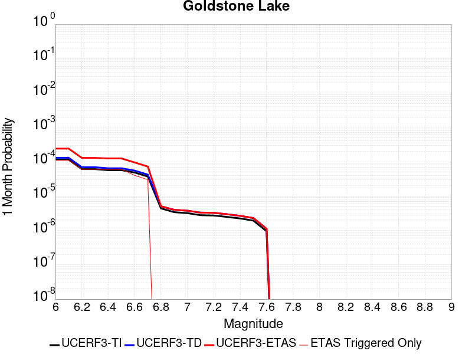 |  |  |

| Magnitude | 1 wk TI Prob | 1 wk TD Prob | 1 wk ETAS Prob | 1 wk ETAS/TD Gain | 1 wk ETAS Triggered Only | 1 mo TI Prob | 1 mo TD Prob | 1 mo ETAS Prob | 1 mo ETAS/TD Gain | 1 mo ETAS Triggered Only | 1 yr TI Prob | 1 yr TD Prob | 1 yr ETAS Prob | 1 yr ETAS/TD Gain | 1 yr ETAS Triggered Only | 10 yr TI Prob | 10 yr TD Prob | 10 yr ETAS Prob | 10 yr ETAS/TD Gain | 10 yr ETAS Triggered Only |
|-----|-----|-----|-----|-----|-----|-----|-----|-----|-----|-----|-----|-----|-----|-----|-----|-----|-----|-----|-----|-----|
| 6.0 | 2.671352E-5 | 3.0380395E-5 | 3.0380395E-5 | 1.0 | 0.0 | 1.1448149E-4 | 1.301963E-4 | 2.58134E-4 | 1.9826524 | 1.2795438E-4 | 0.001392921 | 0.0015841839 | 0.0022959432 | 1.4492909 | 7.1288866E-4 | 0.013842222 | 0.015748413 | 0.017583529 | 1.116527 | 0.001864478 |
| 6.1 | 2.671352E-5 | 3.0380395E-5 | 3.0380395E-5 | 1.0 | 0.0 | 1.1448149E-4 | 1.301963E-4 | 2.58134E-4 | 1.9826524 | 1.2795438E-4 | 0.001392921 | 0.0015841839 | 0.0022959432 | 1.4492909 | 7.1288866E-4 | 0.013842222 | 0.015748413 | 0.017583529 | 1.116527 | 0.001864478 |
| 6.2 | 1.4197047E-5 | 1.6098415E-5 | 1.6098415E-5 | 1.0 | 0.0 | 6.0843064E-5 | 6.899193E-5 | 1.4210367E-4 | 2.0597143 | 7.311679E-5 | 7.4051257E-4 | 8.397518E-4 | 0.0012232926 | 1.4567311 | 3.8386314E-4 | 0.007380498 | 0.0083754845 | 0.00928179 | 1.1082093 | 9.139598E-4 |
| 6.3 | 1.4197047E-5 | 1.6098415E-5 | 1.6098415E-5 | 1.0 | 0.0 | 6.0843064E-5 | 6.899193E-5 | 1.4210367E-4 | 2.0597143 | 7.311679E-5 | 7.4051257E-4 | 8.397518E-4 | 0.0012232926 | 1.4567311 | 3.8386314E-4 | 0.007380498 | 0.0083754845 | 0.00928179 | 1.1082093 | 9.139598E-4 |
| 6.4 | 1.3238931E-5 | 1.5010473E-5 | 1.5010473E-5 | 1.0 | 0.0 | 5.6737044E-5 | 6.4329564E-5 | 1.3744165E-4 | 2.1365237 | 7.311679E-5 | 6.9055456E-4 | 7.8302907E-4 | 0.0011483267 | 1.4665186 | 3.6558392E-4 | 0.006884126 | 0.007812329 | 0.0087010125 | 1.1137539 | 8.956806E-4 |
| 6.5 | 1.3238931E-5 | 1.5010473E-5 | 1.5010473E-5 | 1.0 | 0.0 | 5.6737044E-5 | 6.4329564E-5 | 1.3744165E-4 | 2.1365237 | 7.311679E-5 | 6.9055456E-4 | 7.8302907E-4 | 0.0011483267 | 1.4665186 | 3.6558392E-4 | 0.006884126 | 0.007812329 | 0.0087010125 | 1.1137539 | 8.956806E-4 |
| 6.6 | 1.1328278E-5 | 1.2856889E-5 | 1.2856889E-5 | 1.0 | 0.0 | 4.8548856E-5 | 5.510033E-5 | 1.09934896E-4 | 1.9951768 | 5.483759E-5 | 5.90922E-4 | 6.707357E-4 | 9.447398E-4 | 1.4085127 | 2.7418794E-4 | 0.0058935313 | 0.0066965045 | 0.007440933 | 1.1111667 | 7.4944703E-4 |
| 6.7 | 8.651175E-6 | 9.825863E-6 | 9.825863E-6 | 1.0 | 0.0 | 3.707594E-5 | 4.211067E-5 | 7.866752E-5 | 1.8681138 | 3.6558395E-5 | 4.5130608E-4 | 5.1266735E-4 | 7.1363547E-4 | 1.3920048 | 2.0107116E-4 | 0.0045039062 | 0.005123728 | 0.0056147375 | 1.0958306 | 4.9353833E-4 |
| 6.8 | 1.0215377E-6 | 1.1755423E-6 | 1.1755423E-6 | 1.0 | 0.0 | 4.378012E-6 | 5.038029E-6 | 5.038029E-6 | 1.0 | 0.0 | 5.3300988E-5 | 6.133639E-5 | 6.133639E-5 | 1.0 | 0.0 | 5.3288206E-4 | 6.132059E-4 | 6.3147384E-4 | 1.029791 | 1.8279197E-5 |
| 6.9 | 7.9360774E-7 | 9.283895E-7 | 9.283895E-7 | 1.0 | 0.0 | 3.4011714E-6 | 3.9788065E-6 | 3.9788065E-6 | 1.0 | 0.0 | 4.1408475E-5 | 4.8440965E-5 | 4.8440965E-5 | 1.0 | 0.0 | 4.140076E-4 | 4.8431105E-4 | 5.025814E-4 | 1.0377244 | 1.8279197E-5 |
| 7.0 | 7.4382757E-7 | 8.747784E-7 | 8.747784E-7 | 1.0 | 0.0 | 3.1878285E-6 | 3.7490452E-6 | 3.7490452E-6 | 1.0 | 0.0 | 3.8811122E-5 | 4.5643737E-5 | 4.5643737E-5 | 1.0 | 0.0 | 3.8804344E-4 | 4.5635024E-4 | 4.746211E-4 | 1.0400369 | 1.8279197E-5 |
| 7.1 | 6.4709513E-7 | 7.711677E-7 | 7.711677E-7 | 1.0 | 0.0 | 2.773262E-6 | 3.3050005E-6 | 3.3050005E-6 | 1.0 | 0.0 | 3.376394E-5 | 4.02377E-5 | 4.02377E-5 | 1.0 | 0.0 | 3.375881E-4 | 4.023101E-4 | 4.023101E-4 | 1.0 | 0.0 |
| 7.2 | 6.356704E-7 | 7.5887266E-7 | 7.5887266E-7 | 1.0 | 0.0 | 2.7242988E-6 | 3.2523078E-6 | 3.2523078E-6 | 1.0 | 0.0 | 3.3167835E-5 | 3.9596187E-5 | 3.9596187E-5 | 1.0 | 0.0 | 3.3162883E-4 | 3.9589725E-4 | 3.9589725E-4 | 1.0 | 0.0 |
| 7.3 | 5.7695723E-7 | 6.8969035E-7 | 6.8969035E-7 | 1.0 | 0.0 | 2.4726714E-6 | 2.9558128E-6 | 2.9558128E-6 | 1.0 | 0.0 | 3.0104358E-5 | 3.5986486E-5 | 3.5986486E-5 | 1.0 | 0.0 | 3.0100282E-4 | 3.5981231E-4 | 3.5981231E-4 | 1.0 | 0.0 |
| 7.4 | 5.209647E-7 | 6.1937993E-7 | 6.1937993E-7 | 1.0 | 0.0 | 2.232704E-6 | 2.654483E-6 | 2.654483E-6 | 1.0 | 0.0 | 2.718283E-5 | 3.231791E-5 | 3.231791E-5 | 1.0 | 0.0 | 2.7179506E-4 | 3.2313765E-4 | 3.2313765E-4 | 1.0 | 0.0 |
| 7.5 | 4.512955E-7 | 5.3491203E-7 | 5.3491203E-7 | 1.0 | 0.0 | 1.934122E-6 | 2.2924785E-6 | 2.2924785E-6 | 1.0 | 0.0 | 2.3547682E-5 | 2.791062E-5 | 2.791062E-5 | 1.0 | 0.0 | 2.3545188E-4 | 2.7907646E-4 | 2.7907646E-4 | 1.0 | 0.0 |
| 7.6 | 2.21172E-7 | 2.604064E-7 | 2.604064E-7 | 1.0 | 0.0 | 9.478797E-7 | 1.1160272E-6 | 1.1160272E-6 | 1.0 | 0.0 | 1.1540374E-5 | 1.3587575E-5 | 1.3587575E-5 | 1.0 | 0.0 | 1.1539775E-4 | 1.3587026E-4 | 1.3587026E-4 | 1.0 | 0.0 |

## San Andreas (Mojave S)
*[(top)](#table-of-contents)*

| 1 Week | 1 Month | 1 Year | 10 Year |
|-----|-----|-----|-----|
|  |  |  | 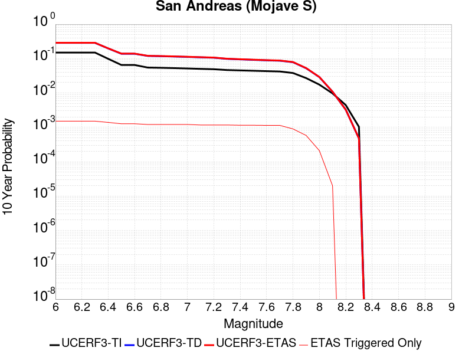 |

| Magnitude | 1 wk TI Prob | 1 wk TD Prob | 1 wk ETAS Prob | 1 wk ETAS/TD Gain | 1 wk ETAS Triggered Only | 1 mo TI Prob | 1 mo TD Prob | 1 mo ETAS Prob | 1 mo ETAS/TD Gain | 1 mo ETAS Triggered Only | 1 yr TI Prob | 1 yr TD Prob | 1 yr ETAS Prob | 1 yr ETAS/TD Gain | 1 yr ETAS Triggered Only | 10 yr TI Prob | 10 yr TD Prob | 10 yr ETAS Prob | 10 yr ETAS/TD Gain | 10 yr ETAS Triggered Only |
|-----|-----|-----|-----|-----|-----|-----|-----|-----|-----|-----|-----|-----|-----|-----|-----|-----|-----|-----|-----|-----|
| 6.0 | 3.1064058E-4 | 6.7538634E-4 | 6.936532E-4 | 1.0270466 | 1.8279197E-5 | 0.0013306376 | 0.0028914304 | 0.003037241 | 1.0504286 | 1.4623358E-4 | 0.016080605 | 0.03466114 | 0.035155218 | 1.0142545 | 5.118175E-4 | 0.1496549 | 0.28687167 | 0.28786236 | 1.0034534 | 0.001389219 |
| 6.1 | 3.1064058E-4 | 6.7538634E-4 | 6.936532E-4 | 1.0270466 | 1.8279197E-5 | 0.0013306376 | 0.0028914304 | 0.003037241 | 1.0504286 | 1.4623358E-4 | 0.016080605 | 0.03466114 | 0.035155218 | 1.0142545 | 5.118175E-4 | 0.1496549 | 0.28687167 | 0.28786236 | 1.0034534 | 0.001389219 |
| 6.2 | 3.1064058E-4 | 6.7538634E-4 | 6.936532E-4 | 1.0270466 | 1.8279197E-5 | 0.0013306376 | 0.0028914304 | 0.003037241 | 1.0504286 | 1.4623358E-4 | 0.016080605 | 0.03466114 | 0.035155218 | 1.0142545 | 5.118175E-4 | 0.1496549 | 0.28687167 | 0.28786236 | 1.0034534 | 0.001389219 |
| 6.3 | 3.1064058E-4 | 6.7538634E-4 | 6.936532E-4 | 1.0270466 | 1.8279197E-5 | 0.0013306376 | 0.0028914304 | 0.003037241 | 1.0504286 | 1.4623358E-4 | 0.016080605 | 0.03466114 | 0.035155218 | 1.0142545 | 5.118175E-4 | 0.1496549 | 0.28687167 | 0.28786236 | 1.0034534 | 0.001389219 |
| 6.4 | 1.9872203E-4 | 4.3253382E-4 | 4.5080512E-4 | 1.0422424 | 1.8279197E-5 | 8.5138786E-4 | 0.0018524277 | 0.0019983903 | 1.0787953 | 1.4623358E-4 | 0.010316478 | 0.022326224 | 0.022826614 | 1.0224127 | 5.118175E-4 | 0.098504856 | 0.19728218 | 0.19832397 | 1.0052807 | 0.0012978229 |
| 6.5 | 1.291105E-4 | 2.8822906E-4 | 3.0650297E-4 | 1.0634007 | 1.8279197E-5 | 5.5321335E-4 | 0.0012346853 | 0.0013624817 | 1.1035053 | 1.2795438E-4 | 0.006714592 | 0.014929512 | 0.015397675 | 1.0313582 | 4.7525912E-4 | 0.065152965 | 0.13832536 | 0.13936491 | 1.0075152 | 0.001206427 |
| 6.6 | 1.291105E-4 | 2.8822906E-4 | 3.0650297E-4 | 1.0634007 | 1.8279197E-5 | 5.5321335E-4 | 0.0012346853 | 0.0013624817 | 1.1035053 | 1.2795438E-4 | 0.006714592 | 0.014929512 | 0.015397675 | 1.0313582 | 4.7525912E-4 | 0.065152965 | 0.13832536 | 0.13936491 | 1.0075152 | 0.001206427 |
| 6.7 | 1.08001186E-4 | 2.4403051E-4 | 2.6230526E-4 | 1.074887 | 1.8279197E-5 | 4.6278012E-4 | 0.0010454265 | 0.001173247 | 1.1222665 | 1.2795438E-4 | 0.0056198016 | 0.012654087 | 0.013105284 | 1.0356562 | 4.569799E-4 | 0.054797906 | 0.11947057 | 0.12050067 | 1.0086223 | 0.0011698686 |
| 6.8 | 1.0624356E-4 | 2.3920518E-4 | 2.5748002E-4 | 1.0763981 | 1.8279197E-5 | 4.5525006E-4 | 0.0010247629 | 0.0011525861 | 1.1247345 | 1.2795438E-4 | 0.0055285925 | 0.012405391 | 0.012856701 | 1.0363802 | 4.569799E-4 | 0.053930566 | 0.11741964 | 0.11845214 | 1.0087932 | 0.0011698686 |
| 6.9 | 1.0393785E-4 | 2.32906E-4 | 2.5118093E-4 | 1.0784649 | 1.8279197E-5 | 4.4537184E-4 | 9.977872E-4 | 0.0011256139 | 1.1281102 | 1.2795438E-4 | 0.0054089287 | 0.012080644 | 0.012532104 | 1.0373704 | 4.569799E-4 | 0.05279156 | 0.11471701 | 0.11575267 | 1.009028 | 0.0011698686 |
| 7.0 | 1.0155622E-4 | 2.2659826E-4 | 2.448733E-4 | 1.0806496 | 1.8279197E-5 | 4.3516833E-4 | 9.7077433E-4 | 0.0010986045 | 1.1316786 | 1.2795438E-4 | 0.005285311 | 0.011755354 | 0.012206961 | 1.0384172 | 4.569799E-4 | 0.05161361 | 0.111976855 | 0.113015726 | 1.0092776 | 0.0011698686 |
| 7.1 | 9.885595E-5 | 2.1947875E-4 | 2.3775393E-4 | 1.0832663 | 1.8279197E-5 | 4.2359953E-4 | 9.402845E-4 | 0.0010681186 | 1.1359526 | 1.2795438E-4 | 0.0051451353 | 0.011388074 | 0.0118217785 | 1.0380841 | 4.3870072E-4 | 0.05027629 | 0.10886101 | 0.10987094 | 1.0092773 | 0.0011333101 |
| 7.2 | 9.6411415E-5 | 2.131053E-4 | 2.313806E-4 | 1.0857571 | 1.8279197E-5 | 4.1312634E-4 | 9.129891E-4 | 0.0010408267 | 1.1400208 | 1.2795438E-4 | 0.005018219 | 0.011059172 | 0.011493022 | 1.0392298 | 4.3870072E-4 | 0.049064007 | 0.10605039 | 0.10706351 | 1.0095532 | 0.0011333101 |
| 7.3 | 9.1180635E-5 | 1.9537064E-4 | 2.1364626E-4 | 1.0935434 | 1.8279197E-5 | 3.907156E-4 | 8.3703414E-4 | 9.6488144E-4 | 1.1527385 | 1.2795438E-4 | 0.004746591 | 0.010143385 | 0.010577636 | 1.0428113 | 4.3870072E-4 | 0.046464786 | 0.09823892 | 0.0992609 | 1.0104029 | 0.0011333101 |
| 7.4 | 8.887388E-5 | 1.8784897E-4 | 2.0612474E-4 | 1.0972897 | 1.8279197E-5 | 3.8083247E-4 | 8.048187E-4 | 9.326701E-4 | 1.1588573 | 1.2795438E-4 | 0.0046267817 | 0.009754742 | 0.0101891635 | 1.0445343 | 4.3870072E-4 | 0.045316286 | 0.09487182 | 0.09589761 | 1.0108124 | 0.0011333101 |
| 7.5 | 8.6750515E-5 | 1.8115775E-4 | 1.9943365E-4 | 1.1008838 | 1.8279197E-5 | 3.7173493E-4 | 7.7615946E-4 | 9.040145E-4 | 1.1647278 | 1.2795438E-4 | 0.004516484 | 0.009408884 | 0.009843457 | 1.0461875 | 4.3870072E-4 | 0.04425787 | 0.09183367 | 0.092862904 | 1.0112076 | 0.0011333101 |
| 7.6 | 8.453092E-5 | 1.750256E-4 | 1.933016E-4 | 1.104419 | 1.8279197E-5 | 3.6222505E-4 | 7.498942E-4 | 8.777526E-4 | 1.170502 | 1.2795438E-4 | 0.0044011753 | 0.009091817 | 0.009526529 | 1.0478135 | 4.3870072E-4 | 0.04315024 | 0.088990174 | 0.09002263 | 1.0116019 | 0.0011333101 |
| 7.7 | 8.259102E-5 | 1.7023997E-4 | 1.8851606E-4 | 1.1073549 | 1.8279197E-5 | 3.539135E-4 | 7.2939595E-4 | 8.57257E-4 | 1.1752971 | 1.2795438E-4 | 0.004300386 | 0.008844306 | 0.009279126 | 1.0491639 | 4.3870072E-4 | 0.042181134 | 0.08673861 | 0.08777362 | 1.0119325 | 0.0011333101 |
| 7.8 | 7.444844E-5 | 1.5340719E-4 | 1.7168358E-4 | 1.1191365 | 1.8279197E-5 | 3.1902574E-4 | 6.572938E-4 | 7.85164E-4 | 1.1945405 | 1.2795438E-4 | 0.0038772223 | 0.007973238 | 0.008372174 | 1.0500344 | 4.0214232E-4 | 0.03810269 | 0.07854723 | 0.07933887 | 1.0100785 | 8.5912226E-4 |
| 7.9 | 5.2586525E-5 | 1.0045548E-4 | 1.1873284E-4 | 1.1819448 | 1.8279197E-5 | 2.2535135E-4 | 4.3045246E-4 | 5.218091E-4 | 1.212234 | 9.139598E-5 | 0.0027402006 | 0.0052281762 | 0.005537298 | 1.0591261 | 3.1074634E-4 | 0.027066574 | 0.052382782 | 0.052971717 | 1.011243 | 6.214927E-4 |
| 8.0 | 3.379877E-5 | 5.430089E-5 | 5.430089E-5 | 1.0 | 0.0 | 1.4484383E-4 | 2.3269735E-4 | 2.6924725E-4 | 1.1570705 | 3.6558395E-5 | 0.0017620471 | 0.0028294115 | 0.002920549 | 1.0322107 | 9.139598E-5 | 0.017481409 | 0.028946057 | 0.029159058 | 1.0073586 | 2.1935036E-4 |
| 8.1 | 1.8668277E-5 | 1.941804E-5 | 1.941804E-5 | 1.0 | 0.0 | 8.000444E-5 | 8.321752E-5 | 1.0149519E-4 | 1.2196374 | 1.8279197E-5 | 9.736188E-4 | 0.001012703 | 0.0010492244 | 1.0360633 | 3.6558395E-5 | 0.009693642 | 0.010855786 | 0.010891947 | 1.0033311 | 3.6558395E-5 |
| 8.2 | 8.541571E-6 | 5.5025394E-6 | 5.5025394E-6 | 1.0 | 0.0 | 3.660622E-5 | 2.3582099E-5 | 2.3582099E-5 | 1.0 | 0.0 | 4.455896E-4 | 2.870743E-4 | 2.870743E-4 | 1.0 | 0.0 | 0.0044469717 | 0.0032636335 | 0.0032636335 | 1.0 | 0.0 |
| 8.3 | 1.983087E-6 | 7.731745E-7 | 7.731745E-7 | 1.0 | 0.0 | 8.498917E-6 | 3.313601E-6 | 3.313601E-6 | 1.0 | 0.0 | 1.034694E-4 | 4.0342362E-5 | 4.0342362E-5 | 1.0 | 0.0 | 0.0010342124 | 4.7608858E-4 | 4.7608858E-4 | 1.0 | 0.0 |

## Coyote Canyon
*[(top)](#table-of-contents)*

| 1 Week | 1 Month | 1 Year | 10 Year |
|-----|-----|-----|-----|
|  |  |  | 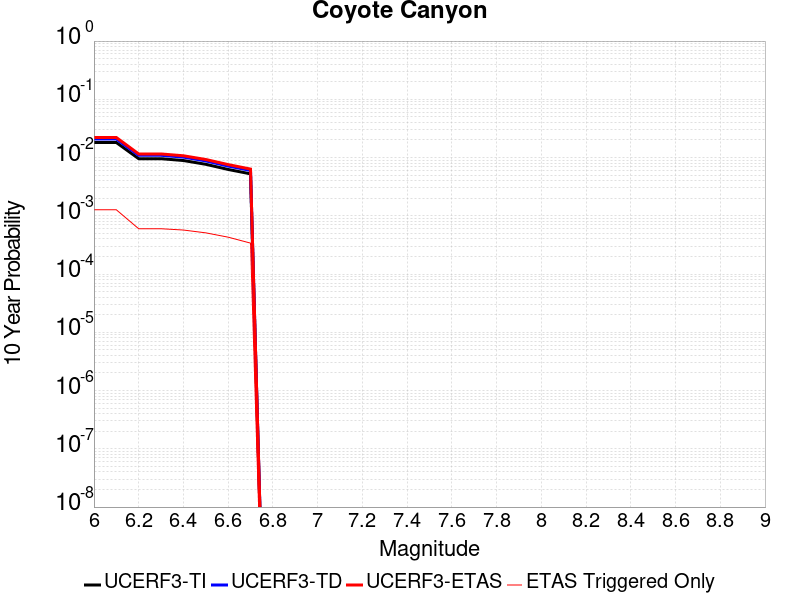 |

| Magnitude | 1 wk TI Prob | 1 wk TD Prob | 1 wk ETAS Prob | 1 wk ETAS/TD Gain | 1 wk ETAS Triggered Only | 1 mo TI Prob | 1 mo TD Prob | 1 mo ETAS Prob | 1 mo ETAS/TD Gain | 1 mo ETAS Triggered Only | 1 yr TI Prob | 1 yr TD Prob | 1 yr ETAS Prob | 1 yr ETAS/TD Gain | 1 yr ETAS Triggered Only | 10 yr TI Prob | 10 yr TD Prob | 10 yr ETAS Prob | 10 yr ETAS/TD Gain | 10 yr ETAS Triggered Only |
|-----|-----|-----|-----|-----|-----|-----|-----|-----|-----|-----|-----|-----|-----|-----|-----|-----|-----|-----|-----|-----|
| 6.0 | 3.5090034E-5 | 4.0370767E-5 | 4.0370767E-5 | 1.0 | 0.0 | 1.503772E-4 | 1.7300747E-4 | 2.2783558E-4 | 1.3169117 | 5.483759E-5 | 0.0018293047 | 0.002104588 | 0.0026153284 | 1.2426795 | 5.118175E-4 | 0.018143194 | 0.020872502 | 0.022179032 | 1.0625957 | 0.0013343813 |
| 6.1 | 3.5090034E-5 | 4.0370767E-5 | 4.0370767E-5 | 1.0 | 0.0 | 1.503772E-4 | 1.7300747E-4 | 2.2783558E-4 | 1.3169117 | 5.483759E-5 | 0.0018293047 | 0.002104588 | 0.0026153284 | 1.2426795 | 5.118175E-4 | 0.018143194 | 0.020872502 | 0.022179032 | 1.0625957 | 0.0013343813 |
| 6.2 | 1.841879E-5 | 2.1062999E-5 | 2.1062999E-5 | 1.0 | 0.0 | 7.8935285E-5 | 9.0267444E-5 | 9.0267444E-5 | 1.0 | 0.0 | 9.606133E-4 | 0.001098554 | 0.0013176635 | 1.1994525 | 2.1935036E-4 | 0.0095647145 | 0.010941325 | 0.011519859 | 1.0528761 | 5.849343E-4 |
| 6.3 | 1.841879E-5 | 2.1062999E-5 | 2.1062999E-5 | 1.0 | 0.0 | 7.8935285E-5 | 9.0267444E-5 | 9.0267444E-5 | 1.0 | 0.0 | 9.606133E-4 | 0.001098554 | 0.0013176635 | 1.1994525 | 2.1935036E-4 | 0.0095647145 | 0.010941325 | 0.011519859 | 1.0528761 | 5.849343E-4 |
| 6.4 | 1.712201E-5 | 1.9568175E-5 | 1.9568175E-5 | 1.0 | 0.0 | 7.337798E-5 | 8.386148E-5 | 8.386148E-5 | 1.0 | 0.0 | 8.930107E-4 | 0.0010206358 | 0.0011849807 | 1.1610221 | 1.6451276E-4 | 0.008894307 | 0.010169405 | 0.010694111 | 1.0515965 | 5.300967E-4 |
| 6.5 | 1.4744935E-5 | 1.6839507E-5 | 1.6839507E-5 | 1.0 | 0.0 | 6.3191044E-5 | 7.216785E-5 | 7.216785E-5 | 1.0 | 0.0 | 7.6907943E-4 | 8.783829E-4 | 0.0010427511 | 1.187126 | 1.6451276E-4 | 0.007664232 | 0.008758309 | 0.009229406 | 1.0537885 | 4.7525912E-4 |
| 6.6 | 1.2017839E-5 | 1.3726158E-5 | 1.3726158E-5 | 1.0 | 0.0 | 5.150401E-5 | 5.8825564E-5 | 5.8825564E-5 | 1.0 | 0.0 | 6.268809E-4 | 7.1605446E-4 | 8.6218334E-4 | 1.2040751 | 1.4623358E-4 | 0.0062511545 | 0.007146168 | 0.007527288 | 1.0533321 | 3.8386314E-4 |
| 6.7 | 1.00956095E-5 | 1.15352605E-5 | 1.15352605E-5 | 1.0 | 0.0 | 4.326618E-5 | 4.9436385E-5 | 4.9436385E-5 | 1.0 | 0.0 | 5.266384E-4 | 6.018088E-4 | 6.9314975E-4 | 1.1517774 | 9.139598E-5 | 0.005253921 | 0.00601032 | 0.00628286 | 1.0453453 | 2.7418794E-4 |

## Death Valley (So)
*[(top)](#table-of-contents)*

| 1 Week | 1 Month | 1 Year | 10 Year |
|-----|-----|-----|-----|
|  | 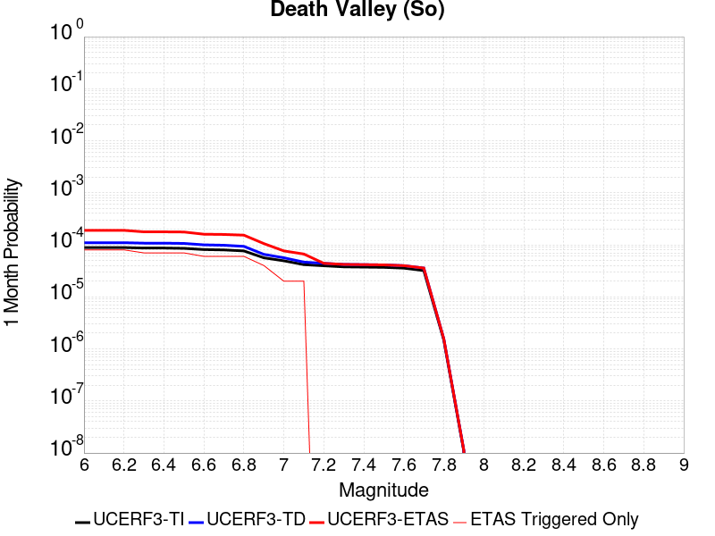 |  |  |

| Magnitude | 1 wk TI Prob | 1 wk TD Prob | 1 wk ETAS Prob | 1 wk ETAS/TD Gain | 1 wk ETAS Triggered Only | 1 mo TI Prob | 1 mo TD Prob | 1 mo ETAS Prob | 1 mo ETAS/TD Gain | 1 mo ETAS Triggered Only | 1 yr TI Prob | 1 yr TD Prob | 1 yr ETAS Prob | 1 yr ETAS/TD Gain | 1 yr ETAS Triggered Only | 10 yr TI Prob | 10 yr TD Prob | 10 yr ETAS Prob | 10 yr ETAS/TD Gain | 10 yr ETAS Triggered Only |
|-----|-----|-----|-----|-----|-----|-----|-----|-----|-----|-----|-----|-----|-----|-----|-----|-----|-----|-----|-----|-----|
| 6.0 | 2.0684236E-5 | 2.5622945E-5 | 2.5622945E-5 | 1.0 | 0.0 | 8.864371E-5 | 1.098081E-4 | 1.4636248E-4 | 1.3328933 | 3.6558395E-5 | 0.0010787029 | 0.0013361105 | 0.002011537 | 1.505517 | 6.763303E-4 | 0.010734817 | 0.013284055 | 0.014636783 | 1.101831 | 0.0013709398 |
| 6.1 | 2.0684236E-5 | 2.5622945E-5 | 2.5622945E-5 | 1.0 | 0.0 | 8.864371E-5 | 1.098081E-4 | 1.4636248E-4 | 1.3328933 | 3.6558395E-5 | 0.0010787029 | 0.0013361105 | 0.002011537 | 1.505517 | 6.763303E-4 | 0.010734817 | 0.013284055 | 0.014636783 | 1.101831 | 0.0013709398 |
| 6.2 | 2.0684236E-5 | 2.5622945E-5 | 2.5622945E-5 | 1.0 | 0.0 | 8.864371E-5 | 1.098081E-4 | 1.4636248E-4 | 1.3328933 | 3.6558395E-5 | 0.0010787029 | 0.0013361105 | 0.002011537 | 1.505517 | 6.763303E-4 | 0.010734817 | 0.013284055 | 0.014636783 | 1.101831 | 0.0013709398 |
| 6.3 | 2.0240292E-5 | 2.5122963E-5 | 2.5122963E-5 | 1.0 | 0.0 | 8.6741224E-5 | 1.0766549E-4 | 1.4421994E-4 | 1.3395188 | 3.6558395E-5 | 0.0010555626 | 0.0013100558 | 0.0019307344 | 1.4737802 | 6.214927E-4 | 0.010505628 | 0.01302658 | 0.014307497 | 1.098331 | 0.0012978229 |
| 6.4 | 2.0240292E-5 | 2.5122963E-5 | 2.5122963E-5 | 1.0 | 0.0 | 8.6741224E-5 | 1.0766549E-4 | 1.4421994E-4 | 1.3395188 | 3.6558395E-5 | 0.0010555626 | 0.0013100558 | 0.0019307344 | 1.4737802 | 6.214927E-4 | 0.010505628 | 0.01302658 | 0.014307497 | 1.098331 | 0.0012978229 |
| 6.5 | 1.9962767E-5 | 2.4812176E-5 | 2.4812176E-5 | 1.0 | 0.0 | 8.55519E-5 | 1.0633366E-4 | 1.4288817E-4 | 1.3437717 | 3.6558395E-5 | 0.0010410968 | 0.0012938601 | 0.0019145487 | 1.4797184 | 6.214927E-4 | 0.010362327 | 0.012866507 | 0.014129587 | 1.0981681 | 0.0012795437 |
| 6.6 | 1.8937297E-5 | 2.3315795E-5 | 2.3315795E-5 | 1.0 | 0.0 | 8.115732E-5 | 9.992109E-5 | 1.3647584E-4 | 1.365836 | 3.6558395E-5 | 9.876423E-4 | 0.0012158749 | 0.0018183549 | 1.4955115 | 6.032135E-4 | 0.009832645 | 0.012095276 | 0.013250995 | 1.0955513 | 0.0011698686 |
| 6.7 | 1.8621096E-5 | 2.2916385E-5 | 2.2916385E-5 | 1.0 | 0.0 | 7.980225E-5 | 9.820946E-5 | 1.3476427E-4 | 1.3722126 | 3.6558395E-5 | 9.711593E-4 | 0.0011950588 | 0.0017975514 | 1.5041531 | 6.032135E-4 | 0.009669261 | 0.0118893655 | 0.013045325 | 1.0972264 | 0.0011698686 |
| 6.8 | 1.7830353E-5 | 2.1810167E-5 | 2.1810167E-5 | 1.0 | 0.0 | 7.641356E-5 | 9.346887E-5 | 1.3002385E-4 | 1.3910925 | 3.6558395E-5 | 9.29938E-4 | 0.0011374034 | 0.001703414 | 1.4976339 | 5.666551E-4 | 0.009260561 | 0.011318663 | 0.012421073 | 1.0973976 | 0.001115031 |
| 6.9 | 1.3135183E-5 | 1.5306456E-5 | 1.5306456E-5 | 1.0 | 0.0 | 5.6292425E-5 | 6.559749E-5 | 8.387548E-5 | 1.2786387 | 1.8279197E-5 | 6.8514474E-4 | 7.983632E-4 | 0.0012549782 | 1.571939 | 4.569799E-4 | 0.006830362 | 0.007955958 | 0.008699443 | 1.0934501 | 7.4944703E-4 |
| 7.0 | 1.1507512E-5 | 1.31561565E-5 | 1.31561565E-5 | 1.0 | 0.0 | 4.9316975E-5 | 5.638234E-5 | 5.638234E-5 | 1.0 | 0.0 | 6.002687E-4 | 6.862446E-4 | 9.6024433E-4 | 1.3992742 | 2.7418794E-4 | 0.0059864987 | 0.0068419557 | 0.0073502716 | 1.074294 | 5.118175E-4 |
| 7.1 | 9.715903E-6 | 1.08666845E-5 | 1.08666845E-5 | 1.0 | 0.0 | 4.1638916E-5 | 4.6570698E-5 | 4.6570698E-5 | 1.0 | 0.0 | 5.068359E-4 | 5.66855E-4 | 6.76468E-4 | 1.1933705 | 1.0967518E-4 | 0.0050568148 | 0.0056545446 | 0.005836303 | 1.0321437 | 1.8279196E-4 |
| 7.2 | 9.233269E-6 | 1.0287612E-5 | 1.0287612E-5 | 1.0 | 0.0 | 3.9570554E-5 | 4.4089044E-5 | 4.4089044E-5 | 1.0 | 0.0 | 4.81665E-4 | 5.366561E-4 | 6.097337E-4 | 1.136172 | 7.311679E-5 | 0.0048062233 | 0.0053540333 | 0.0054813023 | 1.0237707 | 1.2795438E-4 |
| 7.3 | 8.8041315E-6 | 9.809357E-6 | 9.809357E-6 | 1.0 | 0.0 | 3.7731446E-5 | 4.2039446E-5 | 4.2039446E-5 | 1.0 | 0.0 | 4.592835E-4 | 5.1171426E-4 | 5.665238E-4 | 1.1071097 | 5.483759E-5 | 0.0045833546 | 0.0051057865 | 0.0052149016 | 1.0213709 | 1.0967518E-4 |
| 7.4 | 8.708749E-6 | 9.708361E-6 | 9.708361E-6 | 1.0 | 0.0 | 3.7322676E-5 | 4.160662E-5 | 4.160662E-5 | 1.0 | 0.0 | 4.5430884E-4 | 5.064471E-4 | 5.612569E-4 | 1.1082242 | 5.483759E-5 | 0.004533812 | 0.005053356 | 0.0051624766 | 1.0215938 | 1.0967518E-4 |
| 7.5 | 8.612678E-6 | 9.605997E-6 | 9.605997E-6 | 1.0 | 0.0 | 3.6910955E-5 | 4.116793E-5 | 4.116793E-5 | 1.0 | 0.0 | 4.492982E-4 | 5.011085E-4 | 5.3764856E-4 | 1.0729185 | 3.6558395E-5 | 0.004483909 | 0.005000211 | 0.00509115 | 1.018187 | 9.139598E-5 |
| 7.6 | 8.319024E-6 | 9.285063E-6 | 9.285063E-6 | 1.0 | 0.0 | 3.5652476E-5 | 3.9792547E-5 | 3.9792547E-5 | 1.0 | 0.0 | 4.3398244E-4 | 4.8437074E-4 | 5.209114E-4 | 1.0754395 | 3.6558395E-5 | 0.0043313587 | 0.004833574 | 0.0049245283 | 1.0188172 | 9.139598E-5 |
| 7.7 | 7.4718328E-6 | 8.346208E-6 | 8.346208E-6 | 1.0 | 0.0 | 3.2021748E-5 | 3.5768997E-5 | 3.5768997E-5 | 1.0 | 0.0 | 3.8979502E-4 | 4.3540457E-4 | 4.7194705E-4 | 1.0839276 | 3.6558395E-5 | 0.00389112 | 0.0043459204 | 0.004436919 | 1.0209389 | 9.139598E-5 |
| 7.8 | 3.4586725E-7 | 3.6484747E-7 | 3.6484747E-7 | 1.0 | 0.0 | 1.4822873E-6 | 1.5636311E-6 | 1.5636311E-6 | 1.0 | 0.0 | 1.80467E-5 | 1.9037047E-5 | 1.9037047E-5 | 1.0 | 0.0 | 1.8045233E-4 | 1.9035459E-4 | 1.9035459E-4 | 1.0 | 0.0 |
| 7.9 | 2.5591178E-9 | 2.6697942E-9 | 2.6697942E-9 | 1.0 | 0.0 | 1.0967647E-8 | 1.14419745E-8 | 1.14419745E-8 | 1.0 | 0.0 | 1.335311E-7 | 1.3930604E-7 | 1.3930604E-7 | 1.0 | 0.0 | 1.3353102E-6 | 1.3930604E-6 | 1.3930604E-6 | 1.0 | 0.0 |

## Nelson Lake
*[(top)](#table-of-contents)*

| 1 Week | 1 Month | 1 Year | 10 Year |
|-----|-----|-----|-----|
|  |  |  |  |

| Magnitude | 1 wk TI Prob | 1 wk TD Prob | 1 wk ETAS Prob | 1 wk ETAS/TD Gain | 1 wk ETAS Triggered Only | 1 mo TI Prob | 1 mo TD Prob | 1 mo ETAS Prob | 1 mo ETAS/TD Gain | 1 mo ETAS Triggered Only | 1 yr TI Prob | 1 yr TD Prob | 1 yr ETAS Prob | 1 yr ETAS/TD Gain | 1 yr ETAS Triggered Only | 10 yr TI Prob | 10 yr TD Prob | 10 yr ETAS Prob | 10 yr ETAS/TD Gain | 10 yr ETAS Triggered Only |
|-----|-----|-----|-----|-----|-----|-----|-----|-----|-----|-----|-----|-----|-----|-----|-----|-----|-----|-----|-----|-----|
| 6.0 | 9.913453E-6 | 1.019256E-5 | 2.847157E-5 | 2.7933679 | 1.8279197E-5 | 4.2485535E-5 | 4.3681728E-5 | 9.851692E-5 | 2.2553349 | 5.483759E-5 | 5.1713863E-4 | 5.3170556E-4 | 8.0574775E-4 | 1.5154021 | 2.7418794E-4 | 0.0051593683 | 0.005305362 | 0.006396295 | 1.2056284 | 0.0010967518 |
| 6.1 | 9.913453E-6 | 1.019256E-5 | 2.847157E-5 | 2.7933679 | 1.8279197E-5 | 4.2485535E-5 | 4.3681728E-5 | 9.851692E-5 | 2.2553349 | 5.483759E-5 | 5.1713863E-4 | 5.3170556E-4 | 8.0574775E-4 | 1.5154021 | 2.7418794E-4 | 0.0051593683 | 0.005305362 | 0.006396295 | 1.2056284 | 0.0010967518 |
| 6.2 | 4.5596407E-6 | 4.696463E-6 | 4.696463E-6 | 1.0 | 0.0 | 1.954117E-5 | 2.0127549E-5 | 3.840638E-5 | 1.9081497 | 1.8279197E-5 | 2.3788778E-4 | 2.4502663E-4 | 4.0949907E-4 | 1.6712432 | 1.6451276E-4 | 0.0023763329 | 0.0024476908 | 0.002940021 | 1.2011408 | 4.9353833E-4 |
| 6.3 | 4.5596407E-6 | 4.696463E-6 | 4.696463E-6 | 1.0 | 0.0 | 1.954117E-5 | 2.0127549E-5 | 3.840638E-5 | 1.9081497 | 1.8279197E-5 | 2.3788778E-4 | 2.4502663E-4 | 4.0949907E-4 | 1.6712432 | 1.6451276E-4 | 0.0023763329 | 0.0024476908 | 0.002940021 | 1.2011408 | 4.9353833E-4 |
| 6.4 | 3.4025713E-6 | 3.510015E-6 | 3.510015E-6 | 1.0 | 0.0 | 1.4582367E-5 | 1.504284E-5 | 3.332176E-5 | 2.2151244 | 1.8279197E-5 | 1.7752586E-4 | 1.8313201E-4 | 2.7451126E-4 | 1.4989802 | 9.139598E-5 | 0.001773841 | 0.001829894 | 0.0022313003 | 1.2193605 | 4.0214232E-4 |
| 6.5 | 2.8352947E-6 | 2.9279577E-6 | 2.9279577E-6 | 1.0 | 0.0 | 1.2151207E-5 | 1.2548334E-5 | 3.08273E-5 | 2.4566848 | 1.8279197E-5 | 1.479309E-4 | 1.52766E-4 | 2.2587163E-4 | 1.4785464 | 7.311679E-5 | 0.0014783246 | 0.0015266838 | 0.0018734583 | 1.2271423 | 3.4730474E-4 |
| 6.6 | 2.251518E-6 | 2.329153E-6 | 2.329153E-6 | 1.0 | 0.0 | 9.649328E-6 | 9.982049E-6 | 2.8261064E-5 | 2.8311884 | 1.8279197E-5 | 1.1747423E-4 | 1.215253E-4 | 1.946332E-4 | 1.6015859 | 7.311679E-5 | 0.0011741214 | 0.0012146502 | 0.0015615331 | 1.2855825 | 3.4730474E-4 |
| 6.7 | 1.8911853E-6 | 1.9592146E-6 | 1.9592146E-6 | 1.0 | 0.0 | 8.105055E-6 | 8.39661E-6 | 2.6675652E-5 | 3.1769552 | 1.8279197E-5 | 9.867457E-5 | 1.0222452E-4 | 1.7533383E-4 | 1.7151837 | 7.311679E-5 | 9.863076E-4 | 0.0010218325 | 0.0013505218 | 1.3216666 | 3.2902553E-4 |
| 6.8 | 1.4874814E-6 | 1.5438926E-6 | 1.5438926E-6 | 1.0 | 0.0 | 6.374905E-6 | 6.616669E-6 | 2.4895744E-5 | 3.7625797 | 1.8279197E-5 | 7.76117E-5 | 8.055549E-5 | 1.5366638E-4 | 1.9075843 | 7.311679E-5 | 7.75846E-4 | 8.05314E-4 | 0.0010975456 | 1.3628792 | 2.9246716E-4 |
| 6.9 | 6.835972E-7 | 7.140265E-7 | 7.140265E-7 | 1.0 | 0.0 | 2.9296991E-6 | 3.0601118E-6 | 3.0601118E-6 | 1.0 | 0.0 | 3.56685E-5 | 3.7256545E-5 | 7.381357E-5 | 1.9812244 | 3.6558395E-5 | 3.5662777E-4 | 3.7253424E-4 | 5.369857E-4 | 1.4414399 | 1.6451276E-4 |

## San Andreas (Mojave N)
*[(top)](#table-of-contents)*

| 1 Week | 1 Month | 1 Year | 10 Year |
|-----|-----|-----|-----|
|  | 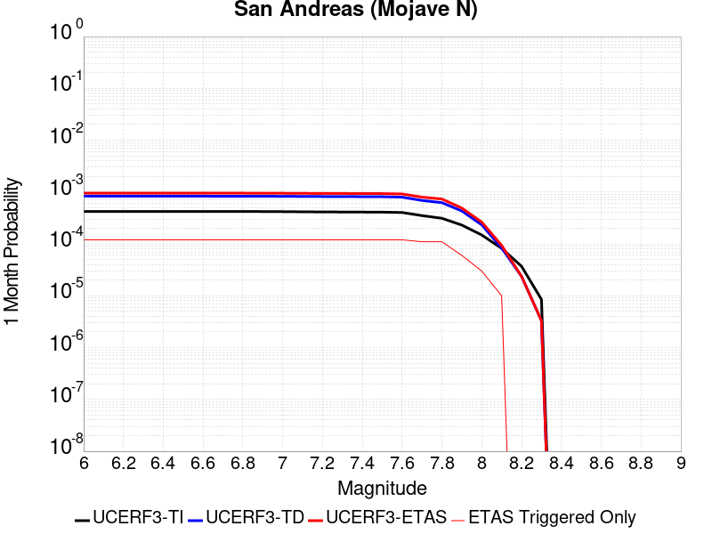 |  |  |

| Magnitude | 1 wk TI Prob | 1 wk TD Prob | 1 wk ETAS Prob | 1 wk ETAS/TD Gain | 1 wk ETAS Triggered Only | 1 mo TI Prob | 1 mo TD Prob | 1 mo ETAS Prob | 1 mo ETAS/TD Gain | 1 mo ETAS Triggered Only | 1 yr TI Prob | 1 yr TD Prob | 1 yr ETAS Prob | 1 yr ETAS/TD Gain | 1 yr ETAS Triggered Only | 10 yr TI Prob | 10 yr TD Prob | 10 yr ETAS Prob | 10 yr ETAS/TD Gain | 10 yr ETAS Triggered Only |
|-----|-----|-----|-----|-----|-----|-----|-----|-----|-----|-----|-----|-----|-----|-----|-----|-----|-----|-----|-----|-----|
| 6.0 | 9.877682E-5 | 1.9470563E-4 | 2.1298126E-4 | 1.0938629 | 1.8279197E-5 | 4.2326056E-4 | 8.3418604E-4 | 9.802976E-4 | 1.1751547 | 1.4623358E-4 | 0.0051410277 | 0.010109048 | 0.0105614085 | 1.0447481 | 4.569799E-4 | 0.05023708 | 0.09862055 | 0.09980685 | 1.012029 | 0.0013161021 |
| 6.1 | 9.877682E-5 | 1.9470563E-4 | 2.1298126E-4 | 1.0938629 | 1.8279197E-5 | 4.2326056E-4 | 8.3418604E-4 | 9.802976E-4 | 1.1751547 | 1.4623358E-4 | 0.0051410277 | 0.010109048 | 0.0105614085 | 1.0447481 | 4.569799E-4 | 0.05023708 | 0.09862055 | 0.09980685 | 1.012029 | 0.0013161021 |
| 6.2 | 9.877682E-5 | 1.9470563E-4 | 2.1298126E-4 | 1.0938629 | 1.8279197E-5 | 4.2326056E-4 | 8.3418604E-4 | 9.802976E-4 | 1.1751547 | 1.4623358E-4 | 0.0051410277 | 0.010109048 | 0.0105614085 | 1.0447481 | 4.569799E-4 | 0.05023708 | 0.09862055 | 0.09980685 | 1.012029 | 0.0013161021 |
| 6.3 | 9.877682E-5 | 1.9470563E-4 | 2.1298126E-4 | 1.0938629 | 1.8279197E-5 | 4.2326056E-4 | 8.3418604E-4 | 9.802976E-4 | 1.1751547 | 1.4623358E-4 | 0.0051410277 | 0.010109048 | 0.0105614085 | 1.0447481 | 4.569799E-4 | 0.05023708 | 0.09862055 | 0.09980685 | 1.012029 | 0.0013161021 |
| 6.4 | 9.877682E-5 | 1.9470563E-4 | 2.1298126E-4 | 1.0938629 | 1.8279197E-5 | 4.2326056E-4 | 8.3418604E-4 | 9.802976E-4 | 1.1751547 | 1.4623358E-4 | 0.0051410277 | 0.010109048 | 0.0105614085 | 1.0447481 | 4.569799E-4 | 0.05023708 | 0.09862055 | 0.09980685 | 1.012029 | 0.0013161021 |
| 6.5 | 9.861474E-5 | 1.9444308E-4 | 2.1271872E-4 | 1.0939897 | 1.8279197E-5 | 4.2256617E-4 | 8.330615E-4 | 9.791733E-4 | 1.1753913 | 1.4623358E-4 | 0.0051326132 | 0.010095485 | 0.01054785 | 1.0448087 | 4.569799E-4 | 0.050156746 | 0.09849829 | 0.09968476 | 1.0120456 | 0.0013161021 |
| 6.6 | 9.861474E-5 | 1.9444308E-4 | 2.1271872E-4 | 1.0939897 | 1.8279197E-5 | 4.2256617E-4 | 8.330615E-4 | 9.791733E-4 | 1.1753913 | 1.4623358E-4 | 0.0051326132 | 0.010095485 | 0.01054785 | 1.0448087 | 4.569799E-4 | 0.050156746 | 0.09849829 | 0.09968476 | 1.0120456 | 0.0013161021 |
| 6.7 | 9.8552715E-5 | 1.9434253E-4 | 2.1261818E-4 | 1.0940384 | 1.8279197E-5 | 4.223004E-4 | 8.326309E-4 | 9.787427E-4 | 1.1754822 | 1.4623358E-4 | 0.0051293927 | 0.01009029 | 0.010542658 | 1.0448321 | 4.569799E-4 | 0.050125998 | 0.09845146 | 0.09963799 | 1.0120519 | 0.0013161021 |
| 6.8 | 9.8464974E-5 | 1.9419396E-4 | 2.124696E-4 | 1.0941103 | 1.8279197E-5 | 4.219245E-4 | 8.319945E-4 | 9.781064E-4 | 1.1756164 | 1.4623358E-4 | 0.0051248376 | 0.010082614 | 0.010534986 | 1.0448666 | 4.569799E-4 | 0.05008251 | 0.09838142 | 0.09956804 | 1.0120615 | 0.0013161021 |
| 6.9 | 9.825824E-5 | 1.9387367E-4 | 2.1214933E-4 | 1.0942658 | 1.8279197E-5 | 4.2103877E-4 | 8.306228E-4 | 9.767349E-4 | 1.1759067 | 1.4623358E-4 | 0.0051141046 | 0.010066067 | 0.010518447 | 1.0449411 | 4.569799E-4 | 0.049980022 | 0.0982304 | 0.099417225 | 1.012082 | 0.0013161021 |
| 7.0 | 9.781462E-5 | 1.9318653E-4 | 2.1146219E-4 | 1.0946012 | 1.8279197E-5 | 4.1913814E-4 | 8.2767976E-4 | 9.737923E-4 | 1.1765327 | 1.4623358E-4 | 0.005091073 | 0.010030566 | 0.010482962 | 1.0451018 | 4.569799E-4 | 0.04976007 | 0.09790654 | 0.09909378 | 1.0121263 | 0.0013161021 |
| 7.1 | 9.7121134E-5 | 1.9220255E-4 | 2.1047825E-4 | 1.0950855 | 1.8279197E-5 | 4.1616702E-4 | 8.234654E-4 | 9.6957857E-4 | 1.177437 | 1.4623358E-4 | 0.005055068 | 0.009979728 | 0.010432147 | 1.0453339 | 4.569799E-4 | 0.04941613 | 0.0974427 | 0.098630555 | 1.0121903 | 0.0013161021 |
| 7.2 | 9.663819E-5 | 1.9150962E-4 | 2.0978533E-4 | 1.0954297 | 1.8279197E-5 | 4.1409794E-4 | 8.204976E-4 | 9.6661114E-4 | 1.1780792 | 1.4623358E-4 | 0.0050299936 | 0.009943925 | 0.01039636 | 1.0454987 | 4.569799E-4 | 0.049176537 | 0.09711572 | 0.098304 | 1.0122358 | 0.0013161021 |
| 7.3 | 9.6277574E-5 | 1.9103377E-4 | 2.0930948E-4 | 1.0956674 | 1.8279197E-5 | 4.125529E-4 | 8.184595E-4 | 9.6457335E-4 | 1.1785231 | 1.4623358E-4 | 0.0050112694 | 0.009919337 | 0.010371785 | 1.0456126 | 4.569799E-4 | 0.04899759 | 0.0968888 | 0.09807739 | 1.0122676 | 0.0013161021 |
| 7.4 | 9.593308E-5 | 1.9043051E-4 | 2.0870622E-4 | 1.0959705 | 1.8279197E-5 | 4.1107697E-4 | 8.1587565E-4 | 9.619899E-4 | 1.1790888 | 1.4623358E-4 | 0.0049933824 | 0.009888166 | 0.010340626 | 1.0457579 | 4.569799E-4 | 0.04882661 | 0.096606605 | 0.09779556 | 1.0123072 | 0.0013161021 |
| 7.5 | 9.561707E-5 | 1.8989033E-4 | 2.0816606E-4 | 1.0962436 | 1.8279197E-5 | 4.0972308E-4 | 8.135621E-4 | 9.596767E-4 | 1.1795986 | 1.4623358E-4 | 0.0049769743 | 0.009860253 | 0.010312727 | 1.0458887 | 4.569799E-4 | 0.048669744 | 0.09635244 | 0.097541735 | 1.0123432 | 0.0013161021 |
| 7.6 | 9.418194E-5 | 1.8640725E-4 | 2.0468303E-4 | 1.0980422 | 1.8279197E-5 | 4.0357444E-4 | 7.986438E-4 | 9.4476057E-4 | 1.1829561 | 1.4623358E-4 | 0.004902454 | 0.00968025 | 0.010132806 | 1.0467504 | 4.569799E-4 | 0.047957025 | 0.09473289 | 0.09592431 | 1.0125767 | 0.0013161021 |
| 7.7 | 8.202141E-5 | 1.6084024E-4 | 1.791165E-4 | 1.1136299 | 1.8279197E-5 | 3.51473E-4 | 6.8913325E-4 | 8.169994E-4 | 1.1855464 | 1.2795438E-4 | 0.00427079 | 0.0083579775 | 0.008793011 | 1.0520501 | 4.3870072E-4 | 0.04189639 | 0.08251305 | 0.08365347 | 1.0138211 | 0.0012429854 |
| 7.8 | 7.2859846E-5 | 1.4572877E-4 | 1.6400531E-4 | 1.1254147 | 1.8279197E-5 | 3.1221908E-4 | 6.244024E-4 | 7.522769E-4 | 1.204795 | 1.2795438E-4 | 0.003794643 | 0.0075756432 | 0.007956598 | 1.0502869 | 3.8386314E-4 | 0.037304975 | 0.07497926 | 0.07575706 | 1.0103735 | 8.40843E-4 |
| 7.9 | 5.3874453E-5 | 1.00852405E-4 | 1.19129756E-4 | 1.1812288 | 1.8279197E-5 | 2.3087008E-4 | 4.32153E-4 | 5.235095E-4 | 1.2113985 | 9.139598E-5 | 0.0028072202 | 0.005248781 | 0.0055578966 | 1.0588927 | 3.1074634E-4 | 0.02772022 | 0.052609485 | 0.053198278 | 1.0111918 | 6.214927E-4 |
| 8.0 | 3.468538E-5 | 5.4489446E-5 | 5.4489446E-5 | 1.0 | 0.0 | 1.4864317E-4 | 2.335053E-4 | 2.7005514E-4 | 1.1565269 | 3.6558395E-5 | 0.0018082283 | 0.0028392226 | 0.002930359 | 1.0320991 | 9.139598E-5 | 0.017935853 | 0.02906005 | 0.029273026 | 1.0073289 | 2.1935036E-4 |
| 8.1 | 1.9152367E-5 | 1.9512683E-5 | 1.9512683E-5 | 1.0 | 0.0 | 8.207899E-5 | 8.362311E-5 | 1.01900776E-4 | 1.218572 | 1.8279197E-5 | 9.988535E-4 | 0.0010176365 | 0.0010541577 | 1.0358882 | 3.6558395E-5 | 0.009943757 | 0.010913964 | 0.010950123 | 1.0033132 | 3.6558395E-5 |
| 8.2 | 8.643924E-6 | 5.5167247E-6 | 5.5167247E-6 | 1.0 | 0.0 | 3.704486E-5 | 2.3642891E-5 | 2.3642891E-5 | 1.0 | 0.0 | 4.5092785E-4 | 2.8781427E-4 | 2.8781427E-4 | 1.0 | 0.0 | 0.0045001395 | 0.0032716133 | 0.0032716133 | 1.0 | 0.0 |
| 8.3 | 1.983087E-6 | 7.731745E-7 | 7.731745E-7 | 1.0 | 0.0 | 8.498917E-6 | 3.313601E-6 | 3.313601E-6 | 1.0 | 0.0 | 1.034694E-4 | 4.0342362E-5 | 4.0342362E-5 | 1.0 | 0.0 | 0.0010342124 | 4.7608858E-4 | 4.7608858E-4 | 1.0 | 0.0 |

## Towne Pass
*[(top)](#table-of-contents)*

| 1 Week | 1 Month | 1 Year | 10 Year |
|-----|-----|-----|-----|
|  | 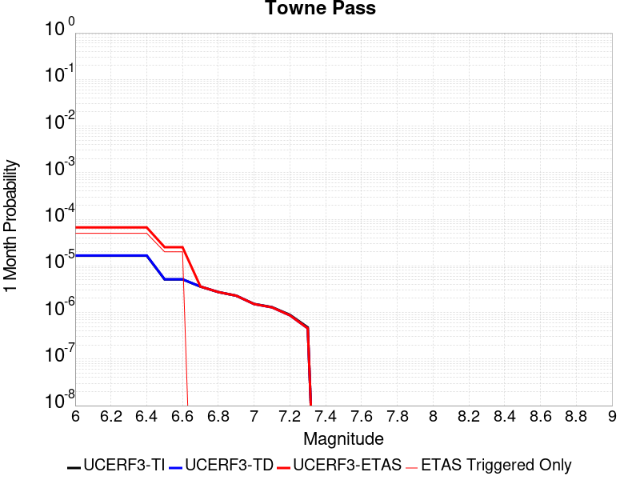 |  |  |

| Magnitude | 1 wk TI Prob | 1 wk TD Prob | 1 wk ETAS Prob | 1 wk ETAS/TD Gain | 1 wk ETAS Triggered Only | 1 mo TI Prob | 1 mo TD Prob | 1 mo ETAS Prob | 1 mo ETAS/TD Gain | 1 mo ETAS Triggered Only | 1 yr TI Prob | 1 yr TD Prob | 1 yr ETAS Prob | 1 yr ETAS/TD Gain | 1 yr ETAS Triggered Only | 10 yr TI Prob | 10 yr TD Prob | 10 yr ETAS Prob | 10 yr ETAS/TD Gain | 10 yr ETAS Triggered Only |
|-----|-----|-----|-----|-----|-----|-----|-----|-----|-----|-----|-----|-----|-----|-----|-----|-----|-----|-----|-----|-----|
| 6.0 | 3.849728E-6 | 3.8946073E-6 | 2.2173732E-5 | 5.693445 | 1.8279197E-5 | 1.649873E-5 | 1.6691092E-5 | 8.980666E-5 | 5.380514 | 7.311679E-5 | 2.0085352E-4 | 2.0319947E-4 | 6.78362E-4 | 3.3384044 | 4.7525912E-4 | 0.0020067208 | 0.0020305659 | 0.0033075113 | 1.6288619 | 0.0012795437 |
| 6.1 | 3.849728E-6 | 3.8946073E-6 | 2.2173732E-5 | 5.693445 | 1.8279197E-5 | 1.649873E-5 | 1.6691092E-5 | 8.980666E-5 | 5.380514 | 7.311679E-5 | 2.0085352E-4 | 2.0319947E-4 | 6.78362E-4 | 3.3384044 | 4.7525912E-4 | 0.0020067208 | 0.0020305659 | 0.0033075113 | 1.6288619 | 0.0012795437 |
| 6.2 | 3.849728E-6 | 3.8946073E-6 | 2.2173732E-5 | 5.693445 | 1.8279197E-5 | 1.649873E-5 | 1.6691092E-5 | 8.980666E-5 | 5.380514 | 7.311679E-5 | 2.0085352E-4 | 2.0319947E-4 | 6.78362E-4 | 3.3384044 | 4.7525912E-4 | 0.0020067208 | 0.0020305659 | 0.0033075113 | 1.6288619 | 0.0012795437 |
| 6.3 | 3.849728E-6 | 3.8946073E-6 | 2.2173732E-5 | 5.693445 | 1.8279197E-5 | 1.649873E-5 | 1.6691092E-5 | 8.980666E-5 | 5.380514 | 7.311679E-5 | 2.0085352E-4 | 2.0319947E-4 | 6.78362E-4 | 3.3384044 | 4.7525912E-4 | 0.0020067208 | 0.0020305659 | 0.0033075113 | 1.6288619 | 0.0012795437 |
| 6.4 | 3.849728E-6 | 3.8946073E-6 | 2.2173732E-5 | 5.693445 | 1.8279197E-5 | 1.649873E-5 | 1.6691092E-5 | 8.980666E-5 | 5.380514 | 7.311679E-5 | 2.0085352E-4 | 2.0319947E-4 | 6.78362E-4 | 3.3384044 | 4.7525912E-4 | 0.0020067208 | 0.0020305659 | 0.0033075113 | 1.6288619 | 0.0012795437 |
| 6.5 | 1.1953545E-6 | 1.203078E-6 | 1.9482253E-5 | 16.193674 | 1.8279197E-5 | 5.1229376E-6 | 5.156039E-6 | 4.1714244E-5 | 8.090365 | 3.6558395E-5 | 6.236998E-5 | 6.277309E-5 | 9.932918E-5 | 1.582353 | 3.6558395E-5 | 6.235248E-4 | 6.275653E-4 | 7.737071E-4 | 1.232871 | 1.4623358E-4 |
| 6.6 | 1.1953545E-6 | 1.203078E-6 | 1.9482253E-5 | 16.193674 | 1.8279197E-5 | 5.1229376E-6 | 5.156039E-6 | 4.1714244E-5 | 8.090365 | 3.6558395E-5 | 6.236998E-5 | 6.277309E-5 | 9.932918E-5 | 1.582353 | 3.6558395E-5 | 6.235248E-4 | 6.275653E-4 | 7.737071E-4 | 1.232871 | 1.4623358E-4 |
| 6.7 | 8.375951E-7 | 8.4108854E-7 | 8.4108854E-7 | 1.0 | 0.0 | 3.5896885E-6 | 3.6046604E-6 | 3.6046604E-6 | 1.0 | 0.0 | 4.370358E-5 | 4.3885913E-5 | 4.3885913E-5 | 1.0 | 0.0 | 4.3694986E-4 | 4.387782E-4 | 5.301341E-4 | 1.2082051 | 9.139598E-5 |
| 6.8 | 6.38041E-7 | 6.3923466E-7 | 6.3923466E-7 | 1.0 | 0.0 | 2.7344586E-6 | 2.7395745E-6 | 2.7395745E-6 | 1.0 | 0.0 | 3.3291526E-5 | 3.335385E-5 | 3.335385E-5 | 1.0 | 0.0 | 3.3286537E-4 | 3.334922E-4 | 3.700384E-4 | 1.1095864 | 3.6558395E-5 |
| 6.9 | 5.3460053E-7 | 5.3455096E-7 | 5.3455096E-7 | 1.0 | 0.0 | 2.2911431E-6 | 2.290931E-6 | 2.290931E-6 | 1.0 | 0.0 | 2.789431E-5 | 2.7891761E-5 | 2.7891761E-5 | 1.0 | 0.0 | 2.789081E-4 | 2.788859E-4 | 2.9716003E-4 | 1.0655253 | 1.8279197E-5 |
| 7.0 | 3.557783E-7 | 3.532573E-7 | 3.532573E-7 | 1.0 | 0.0 | 1.5247632E-6 | 1.513959E-6 | 1.513959E-6 | 1.0 | 0.0 | 1.8563835E-5 | 1.8432303E-5 | 1.8432303E-5 | 1.0 | 0.0 | 1.8562283E-4 | 1.8430858E-4 | 2.0258442E-4 | 1.0991589 | 1.8279197E-5 |
| 7.1 | 3.037942E-7 | 3.0003585E-7 | 3.0003585E-7 | 1.0 | 0.0 | 1.3019744E-6 | 1.2858674E-6 | 1.2858674E-6 | 1.0 | 0.0 | 1.5851423E-5 | 1.565533E-5 | 1.565533E-5 | 1.0 | 0.0 | 1.5850292E-4 | 1.5654303E-4 | 1.7481936E-4 | 1.1167496 | 1.8279197E-5 |
| 7.2 | 2.0808248E-7 | 2.0218815E-7 | 2.0218815E-7 | 1.0 | 0.0 | 8.917818E-7 | 8.6652034E-7 | 8.6652034E-7 | 1.0 | 0.0 | 1.0857389E-5 | 1.0549839E-5 | 1.0549839E-5 | 1.0 | 0.0 | 1.0856859E-4 | 1.0549384E-4 | 1.2377111E-4 | 1.1732544 | 1.8279197E-5 |
| 7.3 | 1.1162073E-7 | 1.0637608E-7 | 1.0637608E-7 | 1.0 | 0.0 | 4.7837443E-7 | 4.558974E-7 | 4.558974E-7 | 1.0 | 0.0 | 5.8241935E-6 | 5.550539E-6 | 5.550539E-6 | 1.0 | 0.0 | 5.8240406E-5 | 5.5504202E-5 | 7.378239E-5 | 1.3293116 | 1.8279197E-5 |

## Lenwood-Lockhart-Old Woman Springs
*[(top)](#table-of-contents)*

| 1 Week | 1 Month | 1 Year | 10 Year |
|-----|-----|-----|-----|
|  |  | 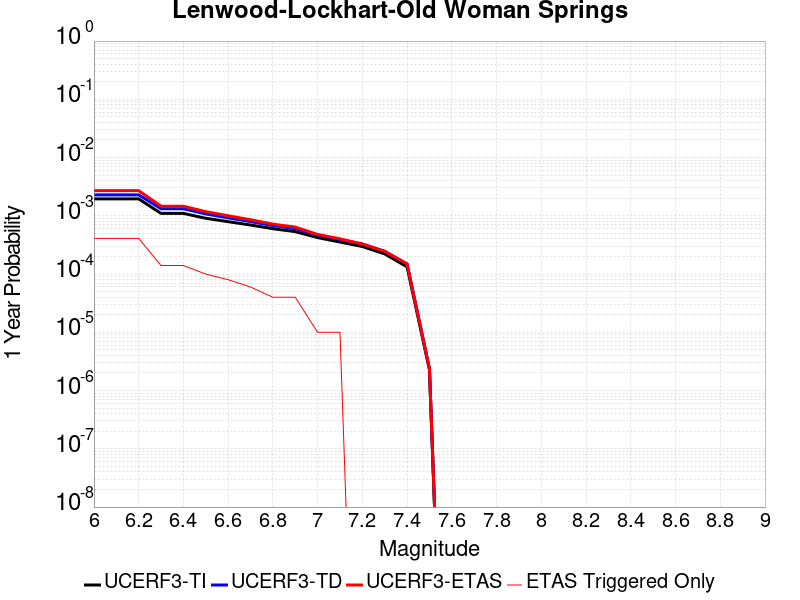 |  |

| Magnitude | 1 wk TI Prob | 1 wk TD Prob | 1 wk ETAS Prob | 1 wk ETAS/TD Gain | 1 wk ETAS Triggered Only | 1 mo TI Prob | 1 mo TD Prob | 1 mo ETAS Prob | 1 mo ETAS/TD Gain | 1 mo ETAS Triggered Only | 1 yr TI Prob | 1 yr TD Prob | 1 yr ETAS Prob | 1 yr ETAS/TD Gain | 1 yr ETAS Triggered Only | 10 yr TI Prob | 10 yr TD Prob | 10 yr ETAS Prob | 10 yr ETAS/TD Gain | 10 yr ETAS Triggered Only |
|-----|-----|-----|-----|-----|-----|-----|-----|-----|-----|-----|-----|-----|-----|-----|-----|-----|-----|-----|-----|-----|
| 6.0 | 3.744542E-5 | 4.396609E-5 | 6.2244486E-5 | 1.4157383 | 1.8279197E-5 | 1.604705E-4 | 1.8841347E-4 | 2.2496498E-4 | 1.1939962 | 3.6558395E-5 | 0.0019519776 | 0.002291693 | 0.0026564389 | 1.1591601 | 3.6558392E-4 | 0.019349206 | 0.022698615 | 0.023859793 | 1.0511564 | 0.0011881478 |
| 6.1 | 3.744542E-5 | 4.396609E-5 | 6.2244486E-5 | 1.4157383 | 1.8279197E-5 | 1.604705E-4 | 1.8841347E-4 | 2.2496498E-4 | 1.1939962 | 3.6558395E-5 | 0.0019519776 | 0.002291693 | 0.0026564389 | 1.1591601 | 3.6558392E-4 | 0.019349206 | 0.022698615 | 0.023859793 | 1.0511564 | 0.0011881478 |
| 6.2 | 3.744542E-5 | 4.396609E-5 | 6.2244486E-5 | 1.4157383 | 1.8279197E-5 | 1.604705E-4 | 1.8841347E-4 | 2.2496498E-4 | 1.1939962 | 3.6558395E-5 | 0.0019519776 | 0.002291693 | 0.0026564389 | 1.1591601 | 3.6558392E-4 | 0.019349206 | 0.022698615 | 0.023859793 | 1.0511564 | 0.0011881478 |
| 6.3 | 2.1079984E-5 | 2.5354735E-5 | 4.3633467E-5 | 1.7209198 | 1.8279197E-5 | 9.0339665E-5 | 1.08658736E-4 | 1.4521315E-4 | 1.3364149 | 3.6558395E-5 | 0.0010993304 | 0.0013221373 | 0.0014499224 | 1.0966505 | 1.2795438E-4 | 0.010939079 | 0.013144928 | 0.013559823 | 1.0315632 | 4.204215E-4 |
| 6.4 | 2.1079984E-5 | 2.5354735E-5 | 4.3633467E-5 | 1.7209198 | 1.8279197E-5 | 9.0339665E-5 | 1.08658736E-4 | 1.4521315E-4 | 1.3364149 | 3.6558395E-5 | 0.0010993304 | 0.0013221373 | 0.0014499224 | 1.0966505 | 1.2795438E-4 | 0.010939079 | 0.013144928 | 0.013559823 | 1.0315632 | 4.204215E-4 |
| 6.5 | 1.7397282E-5 | 2.0663416E-5 | 2.0663416E-5 | 1.0 | 0.0 | 7.455765E-5 | 8.855456E-5 | 1.06832136E-4 | 1.2063991 | 1.8279197E-5 | 9.073613E-4 | 0.0010776302 | 0.0011871873 | 1.1016648 | 1.0967518E-4 | 0.009036654 | 0.010725341 | 0.011087003 | 1.0337204 | 3.6558392E-4 |
| 6.6 | 1.52050325E-5 | 1.7680539E-5 | 1.7680539E-5 | 1.0 | 0.0 | 6.51628E-5 | 7.577158E-5 | 9.404939E-5 | 1.2412225 | 1.8279197E-5 | 7.9306826E-4 | 9.221364E-4 | 0.0010134481 | 1.0990219 | 9.139598E-5 | 0.007902439 | 0.009183963 | 0.009491855 | 1.033525 | 3.1074634E-4 |
| 6.7 | 1.332523E-5 | 1.5264714E-5 | 1.5264714E-5 | 1.0 | 0.0 | 5.7106878E-5 | 6.541859E-5 | 8.369659E-5 | 1.2794007 | 1.8279197E-5 | 6.950544E-4 | 7.9618616E-4 | 8.509801E-4 | 1.0688205 | 5.483759E-5 | 0.006928845 | 0.007933967 | 0.008115308 | 1.0228564 | 1.8279196E-4 |
| 6.8 | 1.1525329E-5 | 1.3031545E-5 | 1.3031545E-5 | 1.0 | 0.0 | 4.9393333E-5 | 5.5848304E-5 | 7.412648E-5 | 1.3272825 | 1.8279197E-5 | 6.011979E-4 | 6.797452E-4 | 7.162788E-4 | 1.053746 | 3.6558395E-5 | 0.00599574 | 0.0067771124 | 0.006886044 | 1.0160735 | 1.0967518E-4 |
| 6.9 | 1.0253909E-5 | 1.1514913E-5 | 1.1514913E-5 | 1.0 | 0.0 | 4.3944583E-5 | 4.9348713E-5 | 6.762701E-5 | 1.3703905 | 1.8279197E-5 | 5.3489394E-4 | 6.006586E-4 | 6.37195E-4 | 1.0608273 | 3.6558395E-5 | 0.0053360825 | 0.00599073 | 0.0060997484 | 1.0181978 | 1.0967518E-4 |
| 7.0 | 8.104563E-6 | 8.991613E-6 | 8.991613E-6 | 1.0 | 0.0 | 3.4733377E-5 | 3.8534927E-5 | 3.8534927E-5 | 1.0 | 0.0 | 4.2279682E-4 | 4.6906417E-4 | 4.6906417E-4 | 1.0 | 0.0 | 0.0042199334 | 0.0046809893 | 0.00473557 | 1.0116601 | 5.483759E-5 |
| 7.1 | 6.7986157E-6 | 7.516076E-6 | 7.516076E-6 | 1.0 | 0.0 | 2.91366E-5 | 3.221137E-5 | 3.221137E-5 | 1.0 | 0.0 | 3.5468035E-4 | 3.92105E-4 | 3.92105E-4 | 1.0 | 0.0 | 0.003541148 | 0.003914348 | 0.003950763 | 1.009303 | 3.6558395E-5 |
| 7.2 | 5.6893327E-6 | 6.280217E-6 | 6.280217E-6 | 1.0 | 0.0 | 2.4382627E-5 | 2.6914948E-5 | 2.6914948E-5 | 1.0 | 0.0 | 2.9681803E-4 | 3.276422E-4 | 3.276422E-4 | 1.0 | 0.0 | 0.002964219 | 0.0032717902 | 0.003308229 | 1.0111372 | 3.6558395E-5 |
| 7.3 | 4.253348E-6 | 4.707043E-6 | 4.707043E-6 | 1.0 | 0.0 | 1.8228506E-5 | 2.0172894E-5 | 2.0172894E-5 | 1.0 | 0.0 | 2.2190946E-4 | 2.4557914E-4 | 2.4557914E-4 | 1.0 | 0.0 | 0.00221688 | 0.0024532587 | 0.0024532587 | 1.0 | 0.0 |
| 7.4 | 2.5448119E-6 | 2.8521122E-6 | 2.8521122E-6 | 1.0 | 0.0 | 1.0906291E-5 | 1.22232905E-5 | 1.22232905E-5 | 1.0 | 0.0 | 1.3277601E-4 | 1.4881004E-4 | 1.4881004E-4 | 1.0 | 0.0 | 0.001326967 | 0.0014872662 | 0.0014872662 | 1.0 | 0.0 |
| 7.5 | 4.3706837E-8 | 4.563122E-8 | 4.563122E-8 | 1.0 | 0.0 | 1.8731501E-7 | 1.9556236E-7 | 1.9556236E-7 | 1.0 | 0.0 | 2.2805577E-6 | 2.3809698E-6 | 2.3809698E-6 | 1.0 | 0.0 | 2.2805343E-5 | 2.3809498E-5 | 2.3809498E-5 | 1.0 | 0.0 |

## San Andreas (San Bernardino N)
*[(top)](#table-of-contents)*

| 1 Week | 1 Month | 1 Year | 10 Year |
|-----|-----|-----|-----|
|  |  |  |  |

| Magnitude | 1 wk TI Prob | 1 wk TD Prob | 1 wk ETAS Prob | 1 wk ETAS/TD Gain | 1 wk ETAS Triggered Only | 1 mo TI Prob | 1 mo TD Prob | 1 mo ETAS Prob | 1 mo ETAS/TD Gain | 1 mo ETAS Triggered Only | 1 yr TI Prob | 1 yr TD Prob | 1 yr ETAS Prob | 1 yr ETAS/TD Gain | 1 yr ETAS Triggered Only | 10 yr TI Prob | 10 yr TD Prob | 10 yr ETAS Prob | 10 yr ETAS/TD Gain | 10 yr ETAS Triggered Only |
|-----|-----|-----|-----|-----|-----|-----|-----|-----|-----|-----|-----|-----|-----|-----|-----|-----|-----|-----|-----|-----|
| 6.0 | 1.4273766E-4 | 3.1665424E-4 | 3.3492764E-4 | 1.0577078 | 1.8279197E-5 | 6.115894E-4 | 0.0013563897 | 0.0014659162 | 1.0807484 | 1.0967518E-4 | 0.0074207084 | 0.016390502 | 0.016750095 | 1.021939 | 3.6558392E-4 | 0.07177748 | 0.15050764 | 0.15115982 | 1.0043331 | 7.677263E-4 |
| 6.1 | 1.4273766E-4 | 3.1665424E-4 | 3.3492764E-4 | 1.0577078 | 1.8279197E-5 | 6.115894E-4 | 0.0013563897 | 0.0014659162 | 1.0807484 | 1.0967518E-4 | 0.0074207084 | 0.016390502 | 0.016750095 | 1.021939 | 3.6558392E-4 | 0.07177748 | 0.15050764 | 0.15115982 | 1.0043331 | 7.677263E-4 |
| 6.2 | 1.4273766E-4 | 3.1665424E-4 | 3.3492764E-4 | 1.0577078 | 1.8279197E-5 | 6.115894E-4 | 0.0013563897 | 0.0014659162 | 1.0807484 | 1.0967518E-4 | 0.0074207084 | 0.016390502 | 0.016750095 | 1.021939 | 3.6558392E-4 | 0.07177748 | 0.15050764 | 0.15115982 | 1.0043331 | 7.677263E-4 |
| 6.3 | 1.3730655E-4 | 3.0569977E-4 | 3.239734E-4 | 1.0597763 | 1.8279197E-5 | 5.883239E-4 | 0.0013094897 | 0.0014190213 | 1.0836445 | 1.0967518E-4 | 0.0071393442 | 0.015827896 | 0.016187692 | 1.0227319 | 3.6558392E-4 | 0.06914291 | 0.14580758 | 0.14646336 | 1.0044976 | 7.677263E-4 |
| 6.4 | 1.3730655E-4 | 3.0569977E-4 | 3.239734E-4 | 1.0597763 | 1.8279197E-5 | 5.883239E-4 | 0.0013094897 | 0.0014190213 | 1.0836445 | 1.0967518E-4 | 0.0071393442 | 0.015827896 | 0.016187692 | 1.0227319 | 3.6558392E-4 | 0.06914291 | 0.14580758 | 0.14646336 | 1.0044976 | 7.677263E-4 |
| 6.5 | 1.2942807E-4 | 2.8984004E-4 | 3.0811396E-4 | 1.0630482 | 1.8279197E-5 | 5.545738E-4 | 0.0012415855 | 0.0013511245 | 1.0882251 | 1.0967518E-4 | 0.0067310524 | 0.01501278 | 0.015372876 | 1.023986 | 3.6558392E-4 | 0.06530788 | 0.13895048 | 0.13961153 | 1.0047574 | 7.677263E-4 |
| 6.6 | 1.1125901E-4 | 2.5421768E-4 | 2.7249224E-4 | 1.0718855 | 1.8279197E-5 | 4.767372E-4 | 0.0010890518 | 0.0011986075 | 1.1005974 | 1.0967518E-4 | 0.005788839 | 0.013179231 | 0.013539997 | 1.0273738 | 3.6558392E-4 | 0.056403454 | 0.12324018 | 0.12389726 | 1.0053318 | 7.4944703E-4 |
| 6.7 | 1.02209575E-4 | 2.3556314E-4 | 2.5383802E-4 | 1.0775796 | 1.8279197E-5 | 4.3796748E-4 | 0.0010091672 | 0.0011004709 | 1.0904744 | 9.139598E-5 | 0.0053192247 | 0.012217816 | 0.012560878 | 1.0280788 | 3.4730474E-4 | 0.051936906 | 0.11503242 | 0.11567948 | 1.005625 | 7.3116785E-4 |
| 6.8 | 9.610582E-5 | 2.2081345E-4 | 2.3908861E-4 | 1.0827628 | 1.8279197E-5 | 4.1181705E-4 | 9.4600086E-4 | 0.0010373103 | 1.0965216 | 9.139598E-5 | 0.0050023515 | 0.011457003 | 0.011800329 | 1.0299665 | 3.4730474E-4 | 0.048912346 | 0.10843303 | 0.10908492 | 1.0060118 | 7.3116785E-4 |
| 6.9 | 9.3877505E-5 | 2.1536642E-4 | 2.336417E-4 | 1.0848566 | 1.8279197E-5 | 4.0227012E-4 | 9.2267315E-4 | 0.0010139848 | 1.0989642 | 9.139598E-5 | 0.0048866454 | 0.011175931 | 0.011519355 | 1.0307288 | 3.4730474E-4 | 0.04780577 | 0.10602296 | 0.10667661 | 1.0061651 | 7.3116785E-4 |
| 7.0 | 9.1019785E-5 | 2.086318E-4 | 2.2690718E-4 | 1.0875963 | 1.8279197E-5 | 3.900265E-4 | 8.938305E-4 | 9.851448E-4 | 1.1021606 | 9.139598E-5 | 0.0047382377 | 0.0108283125 | 0.011171857 | 1.0317265 | 3.4730474E-4 | 0.046384744 | 0.10299246 | 0.10364833 | 1.006368 | 7.3116785E-4 |
| 7.1 | 8.771155E-5 | 2.0037318E-4 | 2.1864871E-4 | 1.0912075 | 1.8279197E-5 | 3.758525E-4 | 8.5846015E-4 | 9.4977766E-4 | 1.1063737 | 9.139598E-5 | 0.0045664064 | 0.010401863 | 0.010727466 | 1.0313023 | 3.2902553E-4 | 0.044737056 | 0.09930337 | 0.099929005 | 1.0063002 | 6.946095E-4 |
| 7.2 | 8.0830236E-5 | 1.8442032E-4 | 2.0269614E-4 | 1.0990988 | 1.8279197E-5 | 3.4636928E-4 | 7.9013355E-4 | 8.8145735E-4 | 1.1155802 | 9.139598E-5 | 0.0042088944 | 0.009577551 | 0.009903425 | 1.0340248 | 3.2902553E-4 | 0.041300658 | 0.09203222 | 0.0926629 | 1.0068529 | 6.946095E-4 |
| 7.3 | 7.7668235E-5 | 1.7384623E-4 | 1.9212224E-4 | 1.1051275 | 1.8279197E-5 | 3.328214E-4 | 7.4484263E-4 | 8.361705E-4 | 1.1226137 | 9.139598E-5 | 0.0040445733 | 0.009030832 | 0.009356886 | 1.0361046 | 3.2902553E-4 | 0.03971748 | 0.08729687 | 0.08793085 | 1.0072622 | 6.946095E-4 |
| 7.4 | 7.520177E-5 | 1.660399E-4 | 1.8431607E-4 | 1.110071 | 1.8279197E-5 | 3.2225347E-4 | 7.114056E-4 | 8.0273655E-4 | 1.128381 | 9.139598E-5 | 0.0039163795 | 0.008627033 | 0.00895322 | 1.0378098 | 3.2902553E-4 | 0.038480744 | 0.08375092 | 0.084387355 | 1.0075991 | 6.946095E-4 |
| 7.5 | 7.274697E-5 | 1.5890968E-4 | 1.7718597E-4 | 1.1150106 | 1.8279197E-5 | 3.1173544E-4 | 6.8086374E-4 | 7.721975E-4 | 1.134144 | 9.139598E-5 | 0.003788775 | 0.008258066 | 0.008584375 | 1.039514 | 3.2902553E-4 | 0.03724827 | 0.080465645 | 0.08110437 | 1.0079378 | 6.946095E-4 |
| 7.6 | 7.1185845E-5 | 1.5460394E-4 | 1.728803E-4 | 1.1182141 | 1.8279197E-5 | 3.0504653E-4 | 6.624201E-4 | 7.5375556E-4 | 1.1378814 | 9.139598E-5 | 0.0037076178 | 0.008035194 | 0.008361576 | 1.040619 | 3.2902553E-4 | 0.036463667 | 0.07845396 | 0.07909407 | 1.0081592 | 6.946095E-4 |
| 7.7 | 6.709961E-5 | 1.4368047E-4 | 1.6195705E-4 | 1.1272029 | 1.8279197E-5 | 2.8753807E-4 | 6.156282E-4 | 7.069679E-4 | 1.1483684 | 9.139598E-5 | 0.003495157 | 0.0074695535 | 0.0077961213 | 1.0437199 | 3.2902553E-4 | 0.034406938 | 0.07327859 | 0.07392231 | 1.0087844 | 6.946095E-4 |
| 7.8 | 6.300812E-5 | 1.3249594E-4 | 1.5077273E-4 | 1.1379422 | 1.8279197E-5 | 2.7000686E-4 | 5.677162E-4 | 6.590603E-4 | 1.1608975 | 9.139598E-5 | 0.0032823787 | 0.0068900688 | 0.007216827 | 1.0474246 | 3.2902553E-4 | 0.032343175 | 0.06792749 | 0.06857491 | 1.0095311 | 6.946095E-4 |
| 7.9 | 4.983037E-5 | 9.760703E-5 | 1.1588444E-4 | 1.1872551 | 1.8279197E-5 | 2.1354125E-4 | 4.182488E-4 | 5.0960656E-4 | 1.2184292 | 9.139598E-5 | 0.0025967648 | 0.0050803 | 0.0053894673 | 1.0608562 | 3.1074634E-4 | 0.025666296 | 0.05082228 | 0.051412188 | 1.0116073 | 6.214927E-4 |
| 8.0 | 3.2211527E-5 | 5.3522905E-5 | 5.3522905E-5 | 1.0 | 0.0 | 1.380421E-4 | 2.2936372E-4 | 2.6591372E-4 | 1.159354 | 3.6558395E-5 | 0.0016793669 | 0.002788929 | 0.0028800701 | 1.0326796 | 9.139598E-5 | 0.016667323 | 0.02846787 | 0.028680976 | 1.0074859 | 2.1935036E-4 |
| 8.1 | 1.743376E-5 | 1.8926796E-5 | 1.8926796E-5 | 1.0 | 0.0 | 7.471398E-5 | 8.111232E-5 | 9.939003E-5 | 1.2253383 | 1.8279197E-5 | 9.0926304E-4 | 9.870958E-4 | 0.001023618 | 1.0369997 | 3.6558395E-5 | 0.009055517 | 0.010537361 | 0.010573533 | 1.0034329 | 3.6558395E-5 |
| 8.2 | 7.831616E-6 | 5.1930783E-6 | 5.1930783E-6 | 1.0 | 0.0 | 3.3563636E-5 | 2.2255861E-5 | 2.2255861E-5 | 1.0 | 0.0 | 4.0856065E-4 | 2.709315E-4 | 2.709315E-4 | 1.0 | 0.0 | 0.004078103 | 0.0030624678 | 0.0030624678 | 1.0 | 0.0 |
| 8.3 | 1.983087E-6 | 7.731745E-7 | 7.731745E-7 | 1.0 | 0.0 | 8.498917E-6 | 3.313601E-6 | 3.313601E-6 | 1.0 | 0.0 | 1.034694E-4 | 4.0342362E-5 | 4.0342362E-5 | 1.0 | 0.0 | 0.0010342124 | 4.7608858E-4 | 4.7608858E-4 | 1.0 | 0.0 |

## Paradise
*[(top)](#table-of-contents)*

| 1 Week | 1 Month | 1 Year | 10 Year |
|-----|-----|-----|-----|
|  |  |  |  |

| Magnitude | 1 wk TI Prob | 1 wk TD Prob | 1 wk ETAS Prob | 1 wk ETAS/TD Gain | 1 wk ETAS Triggered Only | 1 mo TI Prob | 1 mo TD Prob | 1 mo ETAS Prob | 1 mo ETAS/TD Gain | 1 mo ETAS Triggered Only | 1 yr TI Prob | 1 yr TD Prob | 1 yr ETAS Prob | 1 yr ETAS/TD Gain | 1 yr ETAS Triggered Only | 10 yr TI Prob | 10 yr TD Prob | 10 yr ETAS Prob | 10 yr ETAS/TD Gain | 10 yr ETAS Triggered Only |
|-----|-----|-----|-----|-----|-----|-----|-----|-----|-----|-----|-----|-----|-----|-----|-----|-----|-----|-----|-----|-----|
| 6.0 | 1.4851273E-5 | 1.669599E-5 | 1.669599E-5 | 1.0 | 0.0 | 6.364676E-5 | 7.1552415E-5 | 8.9830304E-5 | 1.2554475 | 1.8279197E-5 | 7.7462377E-4 | 8.708261E-4 | 0.0011995651 | 1.3775024 | 3.2902553E-4 | 0.0077192914 | 0.008676517 | 0.0093650995 | 1.0793617 | 6.946095E-4 |
| 6.1 | 1.4851273E-5 | 1.669599E-5 | 1.669599E-5 | 1.0 | 0.0 | 6.364676E-5 | 7.1552415E-5 | 8.9830304E-5 | 1.2554475 | 1.8279197E-5 | 7.7462377E-4 | 8.708261E-4 | 0.0011995651 | 1.3775024 | 3.2902553E-4 | 0.0077192914 | 0.008676517 | 0.0093650995 | 1.0793617 | 6.946095E-4 |
| 6.2 | 1.4851273E-5 | 1.669599E-5 | 1.669599E-5 | 1.0 | 0.0 | 6.364676E-5 | 7.1552415E-5 | 8.9830304E-5 | 1.2554475 | 1.8279197E-5 | 7.7462377E-4 | 8.708261E-4 | 0.0011995651 | 1.3775024 | 3.2902553E-4 | 0.0077192914 | 0.008676517 | 0.0093650995 | 1.0793617 | 6.946095E-4 |
| 6.3 | 1.0426831E-5 | 1.1889479E-5 | 1.1889479E-5 | 1.0 | 0.0 | 4.4685654E-5 | 5.0953946E-5 | 5.0953946E-5 | 1.0 | 0.0 | 5.43912E-4 | 6.2019366E-4 | 7.480687E-4 | 1.2061856 | 1.2795438E-4 | 0.0054258266 | 0.006185237 | 0.006457729 | 1.0440552 | 2.7418794E-4 |
| 6.4 | 1.0426831E-5 | 1.1889479E-5 | 1.1889479E-5 | 1.0 | 0.0 | 4.4685654E-5 | 5.0953946E-5 | 5.0953946E-5 | 1.0 | 0.0 | 5.43912E-4 | 6.2019366E-4 | 7.480687E-4 | 1.2061856 | 1.2795438E-4 | 0.0054258266 | 0.006185237 | 0.006457729 | 1.0440552 | 2.7418794E-4 |
| 6.5 | 9.25027E-6 | 1.0620713E-5 | 1.0620713E-5 | 1.0 | 0.0 | 3.964341E-5 | 4.5516572E-5 | 4.5516572E-5 | 1.0 | 0.0 | 4.8255164E-4 | 5.5402826E-4 | 6.453736E-4 | 1.1648749 | 9.139598E-5 | 0.0048150513 | 0.00552697 | 0.0057632863 | 1.0427569 | 2.3762956E-4 |
| 6.6 | 7.904275E-6 | 9.160146E-6 | 9.160146E-6 | 1.0 | 0.0 | 3.3875025E-5 | 3.92572E-5 | 3.92572E-5 | 1.0 | 0.0 | 4.1235037E-4 | 4.778555E-4 | 5.3266686E-4 | 1.1147028 | 5.483759E-5 | 0.0041158604 | 0.0047686766 | 0.004914213 | 1.0305192 | 1.4623358E-4 |
| 6.7 | 7.2061953E-6 | 8.407807E-6 | 8.407807E-6 | 1.0 | 0.0 | 3.088333E-5 | 3.6032983E-5 | 3.6032983E-5 | 1.0 | 0.0 | 3.7593965E-4 | 4.386169E-4 | 4.934305E-4 | 1.124969 | 5.483759E-5 | 0.003753043 | 0.004377881 | 0.0045052753 | 1.0290995 | 1.2795438E-4 |
| 6.8 | 6.6948724E-6 | 7.84268E-6 | 7.84268E-6 | 1.0 | 0.0 | 2.8691995E-5 | 3.3611075E-5 | 3.3611075E-5 | 1.0 | 0.0 | 3.4926904E-4 | 4.0914156E-4 | 4.6395673E-4 | 1.133976 | 5.483759E-5 | 0.003487206 | 0.0040842406 | 0.0042116726 | 1.0312009 | 1.2795438E-4 |
| 6.9 | 6.0421025E-6 | 7.13108E-6 | 7.13108E-6 | 1.0 | 0.0 | 2.5894467E-5 | 3.0561434E-5 | 3.0561434E-5 | 1.0 | 0.0 | 3.1521954E-4 | 3.7202533E-4 | 4.268425E-4 | 1.147348 | 5.483759E-5 | 0.0031477278 | 0.0037143636 | 0.0038236314 | 1.0294176 | 1.0967518E-4 |
| 7.0 | 4.134091E-6 | 5.0806284E-6 | 5.0806284E-6 | 1.0 | 0.0 | 1.7717413E-5 | 2.1773949E-5 | 2.1773949E-5 | 1.0 | 0.0 | 2.1568815E-4 | 2.6506712E-4 | 2.8334148E-4 | 1.0689423 | 1.8279197E-5 | 0.0021547892 | 0.0026476625 | 0.0026841243 | 1.0137713 | 3.6558395E-5 |
| 7.1 | 3.7674888E-6 | 4.632157E-6 | 4.632157E-6 | 1.0 | 0.0 | 1.6146281E-5 | 1.985196E-5 | 1.985196E-5 | 1.0 | 0.0 | 1.9656324E-4 | 2.4167231E-4 | 2.599471E-4 | 1.075618 | 1.8279197E-5 | 0.0019638946 | 0.0024142456 | 0.0024324807 | 1.0075531 | 1.8279197E-5 |
| 7.2 | 3.4065345E-6 | 4.15698E-6 | 4.15698E-6 | 1.0 | 0.0 | 1.4599351E-5 | 1.7815515E-5 | 1.7815515E-5 | 1.0 | 0.0 | 1.777326E-4 | 2.1688381E-4 | 2.3515904E-4 | 1.0842627 | 1.8279197E-5 | 0.0017759053 | 0.0021668696 | 0.0021851093 | 1.0084175 | 1.8279197E-5 |
| 7.3 | 2.9934936E-6 | 3.6295291E-6 | 3.6295291E-6 | 1.0 | 0.0 | 1.2829195E-5 | 1.555504E-5 | 1.555504E-5 | 1.0 | 0.0 | 1.5618425E-4 | 1.8936764E-4 | 2.0764337E-4 | 1.0965093 | 1.8279197E-5 | 0.0015607453 | 0.001892208 | 0.0019104526 | 1.009642 | 1.8279197E-5 |
| 7.4 | 2.4049796E-6 | 2.88914E-6 | 2.88914E-6 | 1.0 | 0.0 | 1.0307015E-5 | 1.2381977E-5 | 1.2381977E-5 | 1.0 | 0.0 | 1.2548068E-4 | 1.5074159E-4 | 1.6901804E-4 | 1.1212435 | 1.8279197E-5 | 0.0012540985 | 0.0015065349 | 0.0015247865 | 1.012115 | 1.8279197E-5 |
| 7.5 | 1.2710091E-6 | 1.5135425E-6 | 1.5135425E-6 | 1.0 | 0.0 | 5.44717E-6 | 6.4866017E-6 | 6.4866017E-6 | 1.0 | 0.0 | 6.631728E-5 | 7.8972764E-5 | 7.8972764E-5 | 1.0 | 0.0 | 6.6297496E-4 | 7.895697E-4 | 7.895697E-4 | 1.0 | 0.0 |
| 7.6 | 2.21172E-7 | 2.604064E-7 | 2.604064E-7 | 1.0 | 0.0 | 9.478797E-7 | 1.1160272E-6 | 1.1160272E-6 | 1.0 | 0.0 | 1.1540374E-5 | 1.3587575E-5 | 1.3587575E-5 | 1.0 | 0.0 | 1.1539775E-4 | 1.3587026E-4 | 1.3587026E-4 | 1.0 | 0.0 |

## Bicycle Lake
*[(top)](#table-of-contents)*

| 1 Week | 1 Month | 1 Year | 10 Year |
|-----|-----|-----|-----|
|  |  |  |  |

| Magnitude | 1 wk TI Prob | 1 wk TD Prob | 1 wk ETAS Prob | 1 wk ETAS/TD Gain | 1 wk ETAS Triggered Only | 1 mo TI Prob | 1 mo TD Prob | 1 mo ETAS Prob | 1 mo ETAS/TD Gain | 1 mo ETAS Triggered Only | 1 yr TI Prob | 1 yr TD Prob | 1 yr ETAS Prob | 1 yr ETAS/TD Gain | 1 yr ETAS Triggered Only | 10 yr TI Prob | 10 yr TD Prob | 10 yr ETAS Prob | 10 yr ETAS/TD Gain | 10 yr ETAS Triggered Only |
|-----|-----|-----|-----|-----|-----|-----|-----|-----|-----|-----|-----|-----|-----|-----|-----|-----|-----|-----|-----|-----|
| 6.0 | 1.9621975E-5 | 2.2100037E-5 | 2.2100037E-5 | 1.0 | 0.0 | 8.4091465E-5 | 9.471177E-5 | 1.1298923E-4 | 1.1929798 | 1.8279197E-5 | 0.0010233327 | 0.0011526408 | 0.0012987058 | 1.1267221 | 1.4623358E-4 | 0.01018633 | 0.011479938 | 0.012022019 | 1.0472199 | 5.483759E-4 |
| 6.1 | 1.9621975E-5 | 2.2100037E-5 | 2.2100037E-5 | 1.0 | 0.0 | 8.4091465E-5 | 9.471177E-5 | 1.1298923E-4 | 1.1929798 | 1.8279197E-5 | 0.0010233327 | 0.0011526408 | 0.0012987058 | 1.1267221 | 1.4623358E-4 | 0.01018633 | 0.011479938 | 0.012022019 | 1.0472199 | 5.483759E-4 |
| 6.2 | 9.9971285E-6 | 1.1257143E-5 | 1.1257143E-5 | 1.0 | 0.0 | 4.2844134E-5 | 4.8244303E-5 | 4.8244303E-5 | 1.0 | 0.0 | 5.2150246E-4 | 5.872681E-4 | 6.4207346E-4 | 1.0933226 | 5.483759E-5 | 0.0052028033 | 0.005862268 | 0.006189365 | 1.055797 | 3.2902553E-4 |
| 6.3 | 9.589428E-6 | 1.0799791E-5 | 1.0799791E-5 | 1.0 | 0.0 | 4.10969E-5 | 4.628429E-5 | 4.628429E-5 | 1.0 | 0.0 | 5.002399E-4 | 5.634174E-4 | 6.182241E-4 | 1.0972755 | 5.483759E-5 | 0.0049911533 | 0.0056249807 | 0.0059521557 | 1.0581646 | 3.2902553E-4 |
| 6.4 | 9.589428E-6 | 1.0799791E-5 | 1.0799791E-5 | 1.0 | 0.0 | 4.10969E-5 | 4.628429E-5 | 4.628429E-5 | 1.0 | 0.0 | 5.002399E-4 | 5.634174E-4 | 6.182241E-4 | 1.0972755 | 5.483759E-5 | 0.0049911533 | 0.0056249807 | 0.0059521557 | 1.0581646 | 3.2902553E-4 |
| 6.5 | 5.557707E-6 | 6.286475E-6 | 6.286475E-6 | 1.0 | 0.0 | 2.3818526E-5 | 2.6941909E-5 | 2.6941909E-5 | 1.0 | 0.0 | 2.8995197E-4 | 3.2799525E-4 | 3.6454166E-4 | 1.1114236 | 3.6558395E-5 | 0.0028957394 | 0.0032777486 | 0.0034963798 | 1.0667017 | 2.1935036E-4 |
| 6.6 | 4.8742945E-6 | 5.5140567E-6 | 5.5140567E-6 | 1.0 | 0.0 | 2.0889667E-5 | 2.3631605E-5 | 2.3631605E-5 | 1.0 | 0.0 | 2.54302E-4 | 2.87703E-4 | 3.242509E-4 | 1.1270334 | 3.6558395E-5 | 0.002540112 | 0.002875875 | 0.003021688 | 1.0507021 | 1.4623358E-4 |
| 6.7 | 3.991108E-6 | 4.5165402E-6 | 4.5165402E-6 | 1.0 | 0.0 | 1.7104636E-5 | 1.9356601E-5 | 1.9356601E-5 | 1.0 | 0.0 | 2.0822904E-4 | 2.3566662E-4 | 2.722164E-4 | 1.155091 | 3.6558395E-5 | 0.0020803404 | 0.0023566664 | 0.002466083 | 1.0464286 | 1.0967518E-4 |

## Garlic Springs
*[(top)](#table-of-contents)*

| 1 Week | 1 Month | 1 Year | 10 Year |
|-----|-----|-----|-----|
| 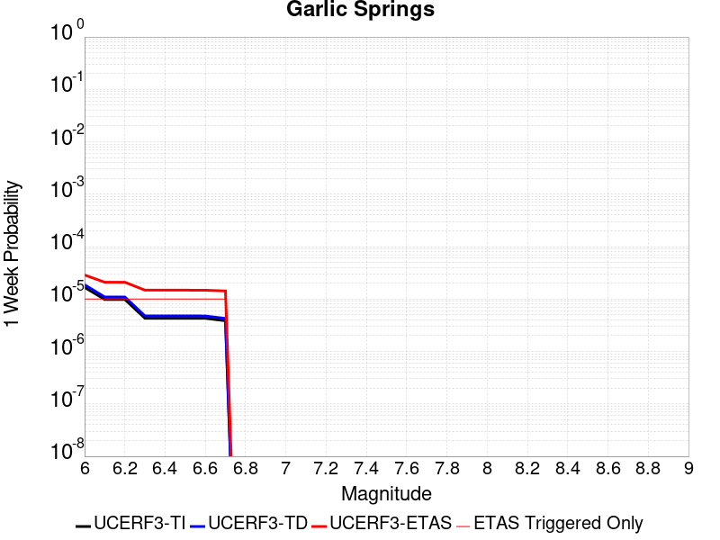 |  |  |  |

| Magnitude | 1 wk TI Prob | 1 wk TD Prob | 1 wk ETAS Prob | 1 wk ETAS/TD Gain | 1 wk ETAS Triggered Only | 1 mo TI Prob | 1 mo TD Prob | 1 mo ETAS Prob | 1 mo ETAS/TD Gain | 1 mo ETAS Triggered Only | 1 yr TI Prob | 1 yr TD Prob | 1 yr ETAS Prob | 1 yr ETAS/TD Gain | 1 yr ETAS Triggered Only | 10 yr TI Prob | 10 yr TD Prob | 10 yr ETAS Prob | 10 yr ETAS/TD Gain | 10 yr ETAS Triggered Only |
|-----|-----|-----|-----|-----|-----|-----|-----|-----|-----|-----|-----|-----|-----|-----|-----|-----|-----|-----|-----|-----|
| 6.0 | 1.6760017E-5 | 1.8779232E-5 | 1.8779232E-5 | 1.0 | 0.0 | 7.182667E-5 | 8.0480604E-5 | 9.8758326E-5 | 1.2271072 | 1.8279197E-5 | 8.7413884E-4 | 9.795283E-4 | 0.0011073573 | 1.1305006 | 1.2795438E-4 | 0.008707083 | 0.009763656 | 0.010270476 | 1.0519089 | 5.118175E-4 |
| 6.1 | 9.852767E-6 | 1.0974912E-5 | 1.0974912E-5 | 1.0 | 0.0 | 4.222546E-5 | 4.703489E-5 | 4.703489E-5 | 1.0 | 0.0 | 5.139737E-4 | 5.725703E-4 | 6.091077E-4 | 1.0638131 | 3.6558395E-5 | 0.005127866 | 0.005717911 | 0.005972356 | 1.0444998 | 2.5590876E-4 |
| 6.2 | 9.852767E-6 | 1.0974912E-5 | 1.0974912E-5 | 1.0 | 0.0 | 4.222546E-5 | 4.703489E-5 | 4.703489E-5 | 1.0 | 0.0 | 5.139737E-4 | 5.725703E-4 | 6.091077E-4 | 1.0638131 | 3.6558395E-5 | 0.005127866 | 0.005717911 | 0.005972356 | 1.0444998 | 2.5590876E-4 |
| 6.3 | 4.3167724E-6 | 4.77857E-6 | 4.77857E-6 | 1.0 | 0.0 | 1.8500323E-5 | 2.0479556E-5 | 2.0479556E-5 | 1.0 | 0.0 | 2.2521814E-4 | 2.493331E-4 | 2.6760774E-4 | 1.073294 | 1.8279197E-5 | 0.0022499003 | 0.0024927924 | 0.0025657269 | 1.0292581 | 7.311679E-5 |
| 6.4 | 4.3167724E-6 | 4.77857E-6 | 4.77857E-6 | 1.0 | 0.0 | 1.8500323E-5 | 2.0479556E-5 | 2.0479556E-5 | 1.0 | 0.0 | 2.2521814E-4 | 2.493331E-4 | 2.6760774E-4 | 1.073294 | 1.8279197E-5 | 0.0022499003 | 0.0024927924 | 0.0025657269 | 1.0292581 | 7.311679E-5 |
| 6.5 | 4.3167724E-6 | 4.77857E-6 | 4.77857E-6 | 1.0 | 0.0 | 1.8500323E-5 | 2.0479556E-5 | 2.0479556E-5 | 1.0 | 0.0 | 2.2521814E-4 | 2.493331E-4 | 2.6760774E-4 | 1.073294 | 1.8279197E-5 | 0.0022499003 | 0.0024927924 | 0.0025657269 | 1.0292581 | 7.311679E-5 |
| 6.6 | 4.301311E-6 | 4.7614367E-6 | 4.7614367E-6 | 1.0 | 0.0 | 1.8434059E-5 | 2.0406127E-5 | 2.0406127E-5 | 1.0 | 0.0 | 2.2441156E-4 | 2.4843932E-4 | 2.6671396E-4 | 1.0735579 | 1.8279197E-5 | 0.0022418506 | 0.0024838746 | 0.0025568097 | 1.0293635 | 7.311679E-5 |
| 6.7 | 3.8599724E-6 | 4.2715424E-6 | 4.2715424E-6 | 1.0 | 0.0 | 1.6542634E-5 | 1.8306611E-5 | 1.8306611E-5 | 1.0 | 0.0 | 2.0138794E-4 | 2.2288298E-4 | 2.4115811E-4 | 1.0819943 | 1.8279197E-5 | 0.0020120554 | 0.0022288298 | 0.0022835452 | 1.0245489 | 5.483759E-5 |

## San Andreas (San Bernardino S)
*[(top)](#table-of-contents)*

| 1 Week | 1 Month | 1 Year | 10 Year |
|-----|-----|-----|-----|
|  |  |  |  |

| Magnitude | 1 wk TI Prob | 1 wk TD Prob | 1 wk ETAS Prob | 1 wk ETAS/TD Gain | 1 wk ETAS Triggered Only | 1 mo TI Prob | 1 mo TD Prob | 1 mo ETAS Prob | 1 mo ETAS/TD Gain | 1 mo ETAS Triggered Only | 1 yr TI Prob | 1 yr TD Prob | 1 yr ETAS Prob | 1 yr ETAS/TD Gain | 1 yr ETAS Triggered Only | 10 yr TI Prob | 10 yr TD Prob | 10 yr ETAS Prob | 10 yr ETAS/TD Gain | 10 yr ETAS Triggered Only |
|-----|-----|-----|-----|-----|-----|-----|-----|-----|-----|-----|-----|-----|-----|-----|-----|-----|-----|-----|-----|-----|
| 6.0 | 1.2336002E-4 | 3.0043157E-4 | 3.0043157E-4 | 1.0 | 0.0 | 5.2857865E-4 | 0.0012869546 | 0.001323466 | 1.0283704 | 3.6558395E-5 | 0.006416472 | 0.0155610675 | 0.015741015 | 1.011564 | 1.8279196E-4 | 0.06234337 | 0.14299136 | 0.14333601 | 1.0024102 | 4.0214232E-4 |
| 6.1 | 1.2336002E-4 | 3.0043157E-4 | 3.0043157E-4 | 1.0 | 0.0 | 5.2857865E-4 | 0.0012869546 | 0.001323466 | 1.0283704 | 3.6558395E-5 | 0.006416472 | 0.0155610675 | 0.015741015 | 1.011564 | 1.8279196E-4 | 0.06234337 | 0.14299136 | 0.14333601 | 1.0024102 | 4.0214232E-4 |
| 6.2 | 1.2336002E-4 | 3.0043157E-4 | 3.0043157E-4 | 1.0 | 0.0 | 5.2857865E-4 | 0.0012869546 | 0.001323466 | 1.0283704 | 3.6558395E-5 | 0.006416472 | 0.0155610675 | 0.015741015 | 1.011564 | 1.8279196E-4 | 0.06234337 | 0.14299136 | 0.14333601 | 1.0024102 | 4.0214232E-4 |
| 6.3 | 1.1712257E-4 | 2.883105E-4 | 2.883105E-4 | 1.0 | 0.0 | 5.018573E-4 | 0.001235057 | 0.0012715702 | 1.029564 | 3.6558395E-5 | 0.006093008 | 0.014937995 | 0.015118056 | 1.012054 | 1.8279196E-4 | 0.059286322 | 0.1376994 | 0.13804616 | 1.0025183 | 4.0214232E-4 |
| 6.4 | 1.1712257E-4 | 2.883105E-4 | 2.883105E-4 | 1.0 | 0.0 | 5.018573E-4 | 0.001235057 | 0.0012715702 | 1.029564 | 3.6558395E-5 | 0.006093008 | 0.014937995 | 0.015118056 | 1.012054 | 1.8279196E-4 | 0.059286322 | 0.1376994 | 0.13804616 | 1.0025183 | 4.0214232E-4 |
| 6.5 | 1.0689076E-4 | 2.6843234E-4 | 2.6843234E-4 | 1.0 | 0.0 | 4.5802278E-4 | 0.0011499418 | 0.0011864583 | 1.031755 | 3.6558395E-5 | 0.0055621783 | 0.01391529 | 0.014095538 | 1.0129533 | 1.8279196E-4 | 0.05425003 | 0.12894526 | 0.12929554 | 1.0027165 | 4.0214232E-4 |
| 6.6 | 9.7648895E-5 | 2.5087388E-4 | 2.5087388E-4 | 1.0 | 0.0 | 4.1842813E-4 | 0.0010747545 | 0.0011112735 | 1.033979 | 3.6558395E-5 | 0.005082469 | 0.013010999 | 0.013191413 | 1.0138662 | 1.8279196E-4 | 0.049677886 | 0.1211038 | 0.12144118 | 1.0027858 | 3.8386314E-4 |
| 6.7 | 8.757013E-5 | 2.3157541E-4 | 2.3157541E-4 | 1.0 | 0.0 | 3.7524657E-4 | 9.921109E-4 | 0.001028633 | 1.0368125 | 3.6558395E-5 | 0.00455906 | 0.012016143 | 0.012196738 | 1.0150294 | 1.8279196E-4 | 0.04466656 | 0.112411246 | 0.11273573 | 1.0028867 | 3.6558392E-4 |
| 6.8 | 8.562978E-5 | 2.271715E-4 | 2.271715E-4 | 1.0 | 0.0 | 3.6693315E-4 | 9.732511E-4 | 0.0010097739 | 1.0375266 | 3.6558395E-5 | 0.004458263 | 0.011789026 | 0.011969663 | 1.0153224 | 1.8279196E-4 | 0.043698758 | 0.11042069 | 0.1107459 | 1.0029453 | 3.6558392E-4 |
| 6.9 | 6.124075E-5 | 1.7098521E-4 | 1.7098521E-4 | 1.0 | 0.0 | 2.6243398E-4 | 7.3258876E-4 | 7.691204E-4 | 1.0498664 | 3.6558395E-5 | 0.0031904527 | 0.008883 | 0.009064169 | 1.0203949 | 1.8279196E-4 | 0.031450346 | 0.08432233 | 0.08465709 | 1.00397 | 3.6558392E-4 |
| 7.0 | 5.8598747E-5 | 1.6527194E-4 | 1.6527194E-4 | 1.0 | 0.0 | 2.5111332E-4 | 7.081168E-4 | 7.446493E-4 | 1.051591 | 3.6558395E-5 | 0.0030530186 | 0.008587439 | 0.008768661 | 1.0211031 | 1.8279196E-4 | 0.03011414 | 0.08163893 | 0.08197467 | 1.0041125 | 3.6558392E-4 |
| 7.1 | 5.613814E-5 | 1.594542E-4 | 1.594542E-4 | 1.0 | 0.0 | 2.4056983E-4 | 6.8319694E-4 | 7.1973033E-4 | 1.0534742 | 3.6558395E-5 | 0.0029250039 | 0.008286381 | 0.008467658 | 1.0218766 | 1.8279196E-4 | 0.028868021 | 0.07893698 | 0.0792737 | 1.0042658 | 3.6558392E-4 |
| 7.2 | 4.991222E-5 | 1.4551122E-4 | 1.4551122E-4 | 1.0 | 0.0 | 2.1389198E-4 | 6.2347087E-4 | 6.600064E-4 | 1.0586003 | 3.6558395E-5 | 0.002601025 | 0.0075644418 | 0.007745851 | 1.0239818 | 1.8279196E-4 | 0.025707912 | 0.07238823 | 0.07272735 | 1.0046847 | 3.6558392E-4 |
| 7.3 | 4.7410045E-5 | 1.3744639E-4 | 1.3744639E-4 | 1.0 | 0.0 | 2.0317009E-4 | 5.8892334E-4 | 6.254602E-4 | 1.0620401 | 3.6558395E-5 | 0.0024707897 | 0.0071466547 | 0.0073281405 | 1.0253944 | 1.8279196E-4 | 0.024434982 | 0.06866852 | 0.069009 | 1.0049583 | 3.6558392E-4 |
| 7.4 | 4.5556746E-5 | 1.3152018E-4 | 1.3152018E-4 | 1.0 | 0.0 | 1.952286E-4 | 5.635365E-4 | 6.000743E-4 | 1.0648366 | 3.6558395E-5 | 0.002374317 | 0.006839552 | 0.0070210933 | 1.0265429 | 1.8279196E-4 | 0.023491086 | 0.06591914 | 0.06626062 | 1.0051804 | 3.6558392E-4 |
| 7.5 | 4.3084514E-5 | 1.2386718E-4 | 1.2386718E-4 | 1.0 | 0.0 | 1.8463485E-4 | 5.3075165E-4 | 5.6729064E-4 | 1.0688438 | 3.6558395E-5 | 0.0022456115 | 0.0064428276 | 0.006624442 | 1.0281886 | 1.8279196E-4 | 0.022230545 | 0.06231774 | 0.06266054 | 1.0055009 | 3.6558392E-4 |
| 7.6 | 3.408608E-5 | 9.862595E-5 | 9.862595E-5 | 1.0 | 0.0 | 1.4607502E-4 | 4.2261425E-4 | 4.591572E-4 | 1.0864688 | 3.6558395E-5 | 0.0017770125 | 0.0051332153 | 0.005315069 | 1.0354269 | 1.8279196E-4 | 0.017628696 | 0.05014027 | 0.050487522 | 1.0069256 | 3.6558392E-4 |
| 7.7 | 2.8315713E-5 | 8.274123E-5 | 8.274123E-5 | 1.0 | 0.0 | 1.2134742E-4 | 3.545571E-4 | 3.911025E-4 | 1.1030735 | 3.6558395E-5 | 0.0014764034 | 0.0043081976 | 0.004490202 | 1.0422461 | 1.8279196E-4 | 0.01466633 | 0.04238506 | 0.04273515 | 1.0082598 | 3.6558392E-4 |
| 7.8 | 2.6222975E-5 | 7.4868956E-5 | 7.4868956E-5 | 1.0 | 0.0 | 1.1237934E-4 | 3.2082753E-4 | 3.573742E-4 | 1.1139138 | 3.6558395E-5 | 0.0013673597 | 0.0038990853 | 0.0040811645 | 1.046698 | 1.8279196E-4 | 0.013589768 | 0.03854365 | 0.03889514 | 1.0091194 | 3.6558392E-4 |
| 7.9 | 2.1469694E-5 | 5.8076967E-5 | 5.8076967E-5 | 1.0 | 0.0 | 9.200973E-5 | 2.4887754E-4 | 2.8542685E-4 | 1.1468565 | 3.6558395E-5 | 0.0011196428 | 0.003025877 | 0.003189892 | 1.0542041 | 1.6451276E-4 | 0.011140184 | 0.030242343 | 0.030561417 | 1.0105506 | 3.2902553E-4 |
| 8.0 | 1.2420249E-5 | 3.142877E-5 | 3.142877E-5 | 1.0 | 0.0 | 5.322855E-5 | 1.3468778E-4 | 1.5296452E-4 | 1.135697 | 1.8279197E-5 | 6.478649E-4 | 0.0016385914 | 0.0016933391 | 1.0334115 | 5.483759E-5 | 0.0064597935 | 0.01657378 | 0.016681638 | 1.0065078 | 1.0967518E-4 |
| 8.1 | 4.9197724E-6 | 7.862634E-6 | 7.862634E-6 | 1.0 | 0.0 | 2.1084568E-5 | 3.369657E-5 | 3.369657E-5 | 1.0 | 0.0 | 2.566744E-4 | 4.1017865E-4 | 4.1017865E-4 | 1.0 | 0.0 | 0.002563781 | 0.0044046436 | 0.0044046436 | 1.0 | 0.0 |
| 8.2 | 2.5634774E-6 | 2.9256641E-6 | 2.9256641E-6 | 1.0 | 0.0 | 1.0986286E-5 | 1.25385E-5 | 1.25385E-5 | 1.0 | 0.0 | 1.3374983E-4 | 1.5264559E-4 | 1.5264559E-4 | 1.0 | 0.0 | 0.0013366934 | 0.0017149353 | 0.0017149353 | 1.0 | 0.0 |
| 8.3 | 5.2850464E-7 | 3.2379515E-7 | 3.2379515E-7 | 1.0 | 0.0 | 2.2650179E-6 | 1.3876928E-6 | 1.3876928E-6 | 1.0 | 0.0 | 2.7576245E-5 | 1.6895041E-5 | 1.6895041E-5 | 1.0 | 0.0 | 2.7572823E-4 | 2.0034672E-4 | 2.0034672E-4 | 1.0 | 0.0 |

## Helendale-So Lockhart
*[(top)](#table-of-contents)*

| 1 Week | 1 Month | 1 Year | 10 Year |
|-----|-----|-----|-----|
|  |  |  |  |

| Magnitude | 1 wk TI Prob | 1 wk TD Prob | 1 wk ETAS Prob | 1 wk ETAS/TD Gain | 1 wk ETAS Triggered Only | 1 mo TI Prob | 1 mo TD Prob | 1 mo ETAS Prob | 1 mo ETAS/TD Gain | 1 mo ETAS Triggered Only | 1 yr TI Prob | 1 yr TD Prob | 1 yr ETAS Prob | 1 yr ETAS/TD Gain | 1 yr ETAS Triggered Only | 10 yr TI Prob | 10 yr TD Prob | 10 yr ETAS Prob | 10 yr ETAS/TD Gain | 10 yr ETAS Triggered Only |
|-----|-----|-----|-----|-----|-----|-----|-----|-----|-----|-----|-----|-----|-----|-----|-----|-----|-----|-----|-----|-----|
| 6.0 | 1.7296055E-5 | 1.8104629E-5 | 1.8104629E-5 | 1.0 | 0.0 | 7.412385E-5 | 7.758907E-5 | 9.586685E-5 | 1.2355715 | 1.8279197E-5 | 9.0208417E-4 | 9.442583E-4 | 0.0010903538 | 1.1547198 | 1.4623358E-4 | 0.008984311 | 0.009404581 | 0.009802941 | 1.0423582 | 4.0214232E-4 |
| 6.1 | 1.7296055E-5 | 1.8104629E-5 | 1.8104629E-5 | 1.0 | 0.0 | 7.412385E-5 | 7.758907E-5 | 9.586685E-5 | 1.2355715 | 1.8279197E-5 | 9.0208417E-4 | 9.442583E-4 | 0.0010903538 | 1.1547198 | 1.4623358E-4 | 0.008984311 | 0.009404581 | 0.009802941 | 1.0423582 | 4.0214232E-4 |
| 6.2 | 1.7296055E-5 | 1.8104629E-5 | 1.8104629E-5 | 1.0 | 0.0 | 7.412385E-5 | 7.758907E-5 | 9.586685E-5 | 1.2355715 | 1.8279197E-5 | 9.0208417E-4 | 9.442583E-4 | 0.0010903538 | 1.1547198 | 1.4623358E-4 | 0.008984311 | 0.009404581 | 0.009802941 | 1.0423582 | 4.0214232E-4 |
| 6.3 | 1.0669118E-5 | 1.1135941E-5 | 1.1135941E-5 | 1.0 | 0.0 | 4.5723988E-5 | 4.7724607E-5 | 4.7724607E-5 | 1.0 | 0.0 | 5.5654737E-4 | 5.80895E-4 | 6.722379E-4 | 1.1572452 | 9.139598E-5 | 0.0055515557 | 0.005794062 | 0.0060121412 | 1.0376384 | 2.1935036E-4 |
| 6.4 | 1.0669118E-5 | 1.1135941E-5 | 1.1135941E-5 | 1.0 | 0.0 | 4.5723988E-5 | 4.7724607E-5 | 4.7724607E-5 | 1.0 | 0.0 | 5.5654737E-4 | 5.80895E-4 | 6.722379E-4 | 1.1572452 | 9.139598E-5 | 0.0055515557 | 0.005794062 | 0.0060121412 | 1.0376384 | 2.1935036E-4 |
| 6.5 | 8.790038E-6 | 9.170618E-6 | 9.170618E-6 | 1.0 | 0.0 | 3.767105E-5 | 3.9302067E-5 | 3.9302067E-5 | 1.0 | 0.0 | 4.585485E-4 | 4.7839913E-4 | 5.332105E-4 | 1.1145724 | 5.483759E-5 | 0.0045760344 | 0.004773857 | 0.0049375845 | 1.0342966 | 1.6451276E-4 |
| 6.6 | 7.396949E-6 | 7.71589E-6 | 7.71589E-6 | 1.0 | 0.0 | 3.1700827E-5 | 3.306769E-5 | 3.306769E-5 | 1.0 | 0.0 | 3.858892E-4 | 4.0252574E-4 | 4.2079756E-4 | 1.045393 | 1.8279197E-5 | 0.003852198 | 0.0040180734 | 0.004127308 | 1.0271858 | 1.0967518E-4 |
| 6.7 | 6.4600285E-6 | 6.7383394E-6 | 6.7383394E-6 | 1.0 | 0.0 | 2.7685543E-5 | 2.8878281E-5 | 2.8878281E-5 | 1.0 | 0.0 | 3.3701936E-4 | 3.5153714E-4 | 3.5153714E-4 | 1.0 | 0.0 | 0.0033650869 | 0.0035098922 | 0.0036009673 | 1.0259482 | 9.139598E-5 |
| 6.8 | 5.600104E-6 | 5.8362707E-6 | 5.8362707E-6 | 1.0 | 0.0 | 2.4000226E-5 | 2.5012352E-5 | 2.5012352E-5 | 1.0 | 0.0 | 2.9216358E-4 | 3.0448343E-4 | 3.0448343E-4 | 1.0 | 0.0 | 0.0029177975 | 0.003040724 | 0.003131842 | 1.0299659 | 9.139598E-5 |
| 6.9 | 4.839122E-6 | 5.0397307E-6 | 5.0397307E-6 | 1.0 | 0.0 | 2.0738931E-5 | 2.1598671E-5 | 2.1598671E-5 | 1.0 | 0.0 | 2.5246723E-4 | 2.6293253E-4 | 2.6293253E-4 | 1.0 | 0.0 | 0.002521806 | 0.0026262621 | 0.0027174181 | 1.0347093 | 9.139598E-5 |
| 7.0 | 3.6937633E-6 | 3.8453754E-6 | 3.8453754E-6 | 1.0 | 0.0 | 1.5830317E-5 | 1.6480079E-5 | 1.6480079E-5 | 1.0 | 0.0 | 1.9271708E-4 | 2.0062679E-4 | 2.0062679E-4 | 1.0 | 0.0 | 0.0019255003 | 0.0020044881 | 0.002095701 | 1.0455043 | 9.139598E-5 |
| 7.1 | 2.7858857E-6 | 2.8979773E-6 | 2.8979773E-6 | 1.0 | 0.0 | 1.1939455E-5 | 1.2419845E-5 | 1.2419845E-5 | 1.0 | 0.0 | 1.4535317E-4 | 1.5120134E-4 | 1.5120134E-4 | 1.0 | 0.0 | 0.0014525814 | 0.0015110062 | 0.0015840124 | 1.0483164 | 7.311679E-5 |
| 7.2 | 2.1672065E-6 | 2.2541085E-6 | 2.2541085E-6 | 1.0 | 0.0 | 9.2879945E-6 | 9.660431E-6 | 9.660431E-6 | 1.0 | 0.0 | 1.1307546E-4 | 1.17609576E-4 | 1.17609576E-4 | 1.0 | 0.0 | 0.0011301794 | 0.0011754916 | 0.0012302647 | 1.0465959 | 5.483759E-5 |
| 7.3 | 1.4823496E-6 | 1.5422763E-6 | 1.5422763E-6 | 1.0 | 0.0 | 6.3529114E-6 | 6.6097396E-6 | 6.6097396E-6 | 1.0 | 0.0 | 7.734395E-5 | 8.047076E-5 | 8.047076E-5 | 1.0 | 0.0 | 7.731704E-4 | 8.044313E-4 | 8.044313E-4 | 1.0 | 0.0 |
| 7.4 | 4.2321457E-7 | 4.4110743E-7 | 4.4110743E-7 | 1.0 | 0.0 | 1.8137755E-6 | 1.8904593E-6 | 1.8904593E-6 | 1.0 | 0.0 | 2.2082493E-5 | 2.3016144E-5 | 2.3016144E-5 | 1.0 | 0.0 | 2.2080299E-4 | 2.3014213E-4 | 2.3014213E-4 | 1.0 | 0.0 |
| 7.5 | 5.6942316E-8 | 5.9418383E-8 | 5.9418383E-8 | 1.0 | 0.0 | 2.440385E-7 | 2.546502E-7 | 2.546502E-7 | 1.0 | 0.0 | 2.9711643E-6 | 3.1003626E-6 | 3.1003626E-6 | 1.0 | 0.0 | 2.9711247E-5 | 3.100327E-5 | 3.100327E-5 | 1.0 | 0.0 |

## Death Valley (Black Mtns Frontal)
*[(top)](#table-of-contents)*

| 1 Week | 1 Month | 1 Year | 10 Year |
|-----|-----|-----|-----|
|  |  |  | 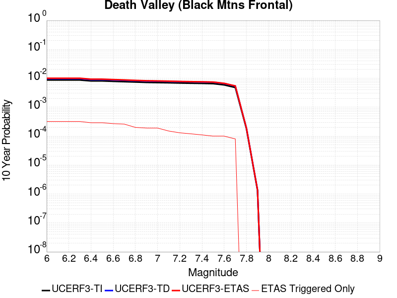 |

| Magnitude | 1 wk TI Prob | 1 wk TD Prob | 1 wk ETAS Prob | 1 wk ETAS/TD Gain | 1 wk ETAS Triggered Only | 1 mo TI Prob | 1 mo TD Prob | 1 mo ETAS Prob | 1 mo ETAS/TD Gain | 1 mo ETAS Triggered Only | 1 yr TI Prob | 1 yr TD Prob | 1 yr ETAS Prob | 1 yr ETAS/TD Gain | 1 yr ETAS Triggered Only | 10 yr TI Prob | 10 yr TD Prob | 10 yr ETAS Prob | 10 yr ETAS/TD Gain | 10 yr ETAS Triggered Only |
|-----|-----|-----|-----|-----|-----|-----|-----|-----|-----|-----|-----|-----|-----|-----|-----|-----|-----|-----|-----|-----|
| 6.0 | 1.6707214E-5 | 1.8672603E-5 | 1.8672603E-5 | 1.0 | 0.0 | 7.160038E-5 | 8.002303E-5 | 8.002303E-5 | 1.0 | 0.0 | 8.71386E-4 | 9.738525E-4 | 0.0011199437 | 1.1500137 | 1.4623358E-4 | 0.00867977 | 0.009696703 | 0.010022539 | 1.0336027 | 3.2902553E-4 |
| 6.1 | 1.6707214E-5 | 1.8672603E-5 | 1.8672603E-5 | 1.0 | 0.0 | 7.160038E-5 | 8.002303E-5 | 8.002303E-5 | 1.0 | 0.0 | 8.71386E-4 | 9.738525E-4 | 0.0011199437 | 1.1500137 | 1.4623358E-4 | 0.00867977 | 0.009696703 | 0.010022539 | 1.0336027 | 3.2902553E-4 |
| 6.2 | 1.6707214E-5 | 1.8672603E-5 | 1.8672603E-5 | 1.0 | 0.0 | 7.160038E-5 | 8.002303E-5 | 8.002303E-5 | 1.0 | 0.0 | 8.71386E-4 | 9.738525E-4 | 0.0011199437 | 1.1500137 | 1.4623358E-4 | 0.00867977 | 0.009696703 | 0.010022539 | 1.0336027 | 3.2902553E-4 |
| 6.3 | 1.6707214E-5 | 1.8672603E-5 | 1.8672603E-5 | 1.0 | 0.0 | 7.160038E-5 | 8.002303E-5 | 8.002303E-5 | 1.0 | 0.0 | 8.71386E-4 | 9.738525E-4 | 0.0011199437 | 1.1500137 | 1.4623358E-4 | 0.00867977 | 0.009696703 | 0.010022539 | 1.0336027 | 3.2902553E-4 |
| 6.4 | 1.5515609E-5 | 1.734038E-5 | 1.734038E-5 | 1.0 | 0.0 | 6.649377E-5 | 7.431384E-5 | 7.431384E-5 | 1.0 | 0.0 | 8.0926094E-4 | 9.044015E-4 | 0.0010322401 | 1.1413517 | 1.2795438E-4 | 0.008063202 | 0.0090078935 | 0.0092796115 | 1.0301645 | 2.7418794E-4 |
| 6.5 | 1.5515609E-5 | 1.734038E-5 | 1.734038E-5 | 1.0 | 0.0 | 6.649377E-5 | 7.431384E-5 | 7.431384E-5 | 1.0 | 0.0 | 8.0926094E-4 | 9.044015E-4 | 0.0010322401 | 1.1413517 | 1.2795438E-4 | 0.008063202 | 0.0090078935 | 0.0092796115 | 1.0301645 | 2.7418794E-4 |
| 6.6 | 1.5041828E-5 | 1.6811247E-5 | 1.6811247E-5 | 1.0 | 0.0 | 6.4463384E-5 | 7.204624E-5 | 7.204624E-5 | 1.0 | 0.0 | 7.8455906E-4 | 8.7681593E-4 | 0.001004658 | 1.1458027 | 1.2795438E-4 | 0.00781795 | 0.00873422 | 0.008987893 | 1.0290437 | 2.5590876E-4 |
| 6.7 | 1.4634985E-5 | 1.6358064E-5 | 1.6358064E-5 | 1.0 | 0.0 | 6.271985E-5 | 7.0104135E-5 | 7.0104135E-5 | 1.0 | 0.0 | 7.6334673E-4 | 8.531894E-4 | 9.810346E-4 | 1.1498439 | 1.2795438E-4 | 0.007607299 | 0.008499775 | 0.008753508 | 1.0298518 | 2.5590876E-4 |
| 6.8 | 1.4209158E-5 | 1.5884038E-5 | 1.5884038E-5 | 1.0 | 0.0 | 6.089497E-5 | 6.80727E-5 | 6.80727E-5 | 1.0 | 0.0 | 7.4114406E-4 | 8.2847563E-4 | 9.0153184E-4 | 1.0881815 | 7.311679E-5 | 0.007386771 | 0.008254486 | 0.008453898 | 1.024158 | 2.0107116E-4 |
| 6.9 | 1.3780098E-5 | 1.5406526E-5 | 1.5406526E-5 | 1.0 | 0.0 | 5.9056227E-5 | 6.602633E-5 | 6.602633E-5 | 1.0 | 0.0 | 7.1877235E-4 | 8.035796E-4 | 8.766376E-4 | 1.0909158 | 7.311679E-5 | 0.0071645193 | 0.008007334 | 0.008188662 | 1.0226452 | 1.8279196E-4 |
| 7.0 | 1.3585064E-5 | 1.5190063E-5 | 1.5190063E-5 | 1.0 | 0.0 | 5.8220405E-5 | 6.509868E-5 | 6.509868E-5 | 1.0 | 0.0 | 7.086029E-4 | 7.9229363E-4 | 8.653525E-4 | 1.0922118 | 7.311679E-5 | 0.007063476 | 0.007895282 | 0.0080766305 | 1.0229692 | 1.8279196E-4 |
| 7.1 | 1.3398601E-5 | 1.4983223E-5 | 1.4983223E-5 | 1.0 | 0.0 | 5.742131E-5 | 6.421227E-5 | 6.421227E-5 | 1.0 | 0.0 | 6.9888023E-4 | 7.815094E-4 | 8.363041E-4 | 1.070114 | 5.483759E-5 | 0.0069668638 | 0.0077881995 | 0.00789702 | 1.0139725 | 1.0967518E-4 |
| 7.2 | 1.3126312E-5 | 1.468141E-5 | 1.468141E-5 | 1.0 | 0.0 | 5.6254412E-5 | 6.291884E-5 | 6.291884E-5 | 1.0 | 0.0 | 6.846822E-4 | 7.657731E-4 | 8.205687E-4 | 1.071556 | 5.483759E-5 | 0.006825765 | 0.0076319277 | 0.007740766 | 1.0142609 | 1.0967518E-4 |
| 7.3 | 1.2922429E-5 | 1.4455612E-5 | 1.4455612E-5 | 1.0 | 0.0 | 5.5380664E-5 | 6.195118E-5 | 6.195118E-5 | 1.0 | 0.0 | 6.74051E-4 | 7.5400004E-4 | 8.0879626E-4 | 1.072674 | 5.483759E-5 | 0.006720101 | 0.0075149992 | 0.0076238504 | 1.0144845 | 1.0967518E-4 |
| 7.4 | 1.2768878E-5 | 1.4285575E-5 | 1.4285575E-5 | 1.0 | 0.0 | 5.4722615E-5 | 6.122249E-5 | 6.122249E-5 | 1.0 | 0.0 | 6.660441E-4 | 7.451343E-4 | 7.9993106E-4 | 1.0735394 | 5.483759E-5 | 0.0066405144 | 0.007426938 | 0.0075357985 | 1.0146575 | 1.0967518E-4 |
| 7.5 | 1.2521929E-5 | 1.401379E-5 | 1.401379E-5 | 1.0 | 0.0 | 5.366431E-5 | 6.0057748E-5 | 6.0057748E-5 | 1.0 | 0.0 | 6.531671E-4 | 7.309632E-4 | 7.6749484E-4 | 1.0499774 | 3.6558395E-5 | 0.006512506 | 0.0072861654 | 0.0073768953 | 1.0124524 | 9.139598E-5 |
| 7.6 | 1.1301089E-5 | 1.2649753E-5 | 1.2649753E-5 | 1.0 | 0.0 | 4.8432343E-5 | 5.421213E-5 | 5.421213E-5 | 1.0 | 0.0 | 5.895042E-4 | 6.5983814E-4 | 6.963724E-4 | 1.0553685 | 3.6558395E-5 | 0.0058794282 | 0.0065793423 | 0.006670137 | 1.0137999 | 9.139598E-5 |
| 7.7 | 9.189108E-6 | 1.0284662E-5 | 1.0284662E-5 | 1.0 | 0.0 | 3.93813E-5 | 4.4076405E-5 | 4.4076405E-5 | 1.0 | 0.0 | 4.7936183E-4 | 5.3650315E-4 | 5.730419E-4 | 1.0681055 | 3.6558395E-5 | 0.004783291 | 0.0053525902 | 0.005443497 | 1.0169837 | 9.139598E-5 |
| 7.8 | 3.4586725E-7 | 3.6484747E-7 | 3.6484747E-7 | 1.0 | 0.0 | 1.4822873E-6 | 1.5636311E-6 | 1.5636311E-6 | 1.0 | 0.0 | 1.80467E-5 | 1.9037047E-5 | 1.9037047E-5 | 1.0 | 0.0 | 1.8045233E-4 | 1.9035459E-4 | 1.9035459E-4 | 1.0 | 0.0 |
| 7.9 | 2.5591178E-9 | 2.6697942E-9 | 2.6697942E-9 | 1.0 | 0.0 | 1.0967647E-8 | 1.14419745E-8 | 1.14419745E-8 | 1.0 | 0.0 | 1.335311E-7 | 1.3930604E-7 | 1.3930604E-7 | 1.0 | 0.0 | 1.3353102E-6 | 1.3930604E-6 | 1.3930604E-6 | 1.0 | 0.0 |

## Coyote Lake
*[(top)](#table-of-contents)*

| 1 Week | 1 Month | 1 Year | 10 Year |
|-----|-----|-----|-----|
|  |  |  |  |

| Magnitude | 1 wk TI Prob | 1 wk TD Prob | 1 wk ETAS Prob | 1 wk ETAS/TD Gain | 1 wk ETAS Triggered Only | 1 mo TI Prob | 1 mo TD Prob | 1 mo ETAS Prob | 1 mo ETAS/TD Gain | 1 mo ETAS Triggered Only | 1 yr TI Prob | 1 yr TD Prob | 1 yr ETAS Prob | 1 yr ETAS/TD Gain | 1 yr ETAS Triggered Only | 10 yr TI Prob | 10 yr TD Prob | 10 yr ETAS Prob | 10 yr ETAS/TD Gain | 10 yr ETAS Triggered Only |
|-----|-----|-----|-----|-----|-----|-----|-----|-----|-----|-----|-----|-----|-----|-----|-----|-----|-----|-----|-----|-----|
| 6.0 | 1.980352E-5 | 2.170896E-5 | 2.170896E-5 | 1.0 | 0.0 | 8.486947E-5 | 9.303549E-5 | 9.303549E-5 | 1.0 | 0.0 | 0.0010327959 | 0.0011321905 | 0.001186966 | 1.0483801 | 5.483759E-5 | 0.010280091 | 0.011271402 | 0.011560572 | 1.0256553 | 2.9246716E-4 |
| 6.1 | 1.980352E-5 | 2.170896E-5 | 2.170896E-5 | 1.0 | 0.0 | 8.486947E-5 | 9.303549E-5 | 9.303549E-5 | 1.0 | 0.0 | 0.0010327959 | 0.0011321905 | 0.001186966 | 1.0483801 | 5.483759E-5 | 0.010280091 | 0.011271402 | 0.011560572 | 1.0256553 | 2.9246716E-4 |
| 6.2 | 1.980352E-5 | 2.170896E-5 | 2.170896E-5 | 1.0 | 0.0 | 8.486947E-5 | 9.303549E-5 | 9.303549E-5 | 1.0 | 0.0 | 0.0010327959 | 0.0011321905 | 0.001186966 | 1.0483801 | 5.483759E-5 | 0.010280091 | 0.011271402 | 0.011560572 | 1.0256553 | 2.9246716E-4 |
| 6.3 | 1.5344787E-5 | 1.6822387E-5 | 1.6822387E-5 | 1.0 | 0.0 | 6.576172E-5 | 7.209429E-5 | 7.209429E-5 | 1.0 | 0.0 | 8.003548E-4 | 8.774558E-4 | 9.139821E-4 | 1.0416275 | 3.6558395E-5 | 0.007974784 | 0.008745959 | 0.008945271 | 1.0227891 | 2.0107116E-4 |
| 6.4 | 1.5344787E-5 | 1.6822387E-5 | 1.6822387E-5 | 1.0 | 0.0 | 6.576172E-5 | 7.209429E-5 | 7.209429E-5 | 1.0 | 0.0 | 8.003548E-4 | 8.774558E-4 | 9.139821E-4 | 1.0416275 | 3.6558395E-5 | 0.007974784 | 0.008745959 | 0.008945271 | 1.0227891 | 2.0107116E-4 |
| 6.5 | 1.4189697E-5 | 1.5559579E-5 | 1.5559579E-5 | 1.0 | 0.0 | 6.081157E-5 | 6.668255E-5 | 6.668255E-5 | 1.0 | 0.0 | 7.401293E-4 | 8.1161794E-4 | 8.481466E-4 | 1.0450072 | 3.6558395E-5 | 0.0073766913 | 0.008092482 | 0.008291925 | 1.0246456 | 2.0107116E-4 |
| 6.6 | 1.3469301E-5 | 1.4773093E-5 | 1.4773093E-5 | 1.0 | 0.0 | 5.7724297E-5 | 6.331206E-5 | 6.331206E-5 | 1.0 | 0.0 | 7.025667E-4 | 7.706117E-4 | 8.0714194E-4 | 1.0474042 | 3.6558395E-5 | 0.0070034964 | 0.0076853004 | 0.0078848265 | 1.025962 | 2.0107116E-4 |
| 6.7 | 1.3027966E-5 | 1.4283204E-5 | 1.4283204E-5 | 1.0 | 0.0 | 5.5832945E-5 | 6.121263E-5 | 6.121263E-5 | 1.0 | 0.0 | 6.7955407E-4 | 7.450687E-4 | 7.815999E-4 | 1.0490305 | 3.6558395E-5 | 0.006774798 | 0.007431586 | 0.007613019 | 1.0244138 | 1.8279196E-4 |
| 6.8 | 5.695434E-6 | 6.225031E-6 | 6.225031E-6 | 1.0 | 0.0 | 2.4408775E-5 | 2.6678601E-5 | 2.6678601E-5 | 1.0 | 0.0 | 2.971363E-4 | 3.2479357E-4 | 3.4306681E-4 | 1.0562612 | 1.8279197E-5 | 0.0029673933 | 0.0032461302 | 0.0033190094 | 1.0224512 | 7.311679E-5 |
| 6.9 | 4.385688E-6 | 4.7935278E-6 | 4.7935278E-6 | 1.0 | 0.0 | 1.879567E-5 | 2.054369E-5 | 2.054369E-5 | 1.0 | 0.0 | 2.2881327E-4 | 2.5011942E-4 | 2.6839407E-4 | 1.0730636 | 1.8279197E-5 | 0.002285778 | 0.0025011944 | 0.0025741283 | 1.0291597 | 7.311679E-5 |

## Sierra Nevada  (No Extension)
*[(top)](#table-of-contents)*

| 1 Week | 1 Month | 1 Year | 10 Year |
|-----|-----|-----|-----|
|  |  |  |  |

| Magnitude | 1 wk TI Prob | 1 wk TD Prob | 1 wk ETAS Prob | 1 wk ETAS/TD Gain | 1 wk ETAS Triggered Only | 1 mo TI Prob | 1 mo TD Prob | 1 mo ETAS Prob | 1 mo ETAS/TD Gain | 1 mo ETAS Triggered Only | 1 yr TI Prob | 1 yr TD Prob | 1 yr ETAS Prob | 1 yr ETAS/TD Gain | 1 yr ETAS Triggered Only | 10 yr TI Prob | 10 yr TD Prob | 10 yr ETAS Prob | 10 yr ETAS/TD Gain | 10 yr ETAS Triggered Only |
|-----|-----|-----|-----|-----|-----|-----|-----|-----|-----|-----|-----|-----|-----|-----|-----|-----|-----|-----|-----|-----|
| 6.0 | 7.7690465E-6 | 6.9768134E-6 | 2.5255882E-5 | 3.619974 | 1.8279197E-5 | 3.329549E-5 | 2.990049E-5 | 6.645779E-5 | 2.2226322 | 3.6558395E-5 | 4.0529718E-4 | 3.640135E-4 | 4.7364875E-4 | 1.3011845 | 1.0967518E-4 | 0.004045588 | 0.0036376887 | 0.0038926667 | 1.0700934 | 2.5590876E-4 |
| 6.1 | 7.7690465E-6 | 6.9768134E-6 | 2.5255882E-5 | 3.619974 | 1.8279197E-5 | 3.329549E-5 | 2.990049E-5 | 6.645779E-5 | 2.2226322 | 3.6558395E-5 | 4.0529718E-4 | 3.640135E-4 | 4.7364875E-4 | 1.3011845 | 1.0967518E-4 | 0.004045588 | 0.0036376887 | 0.0038926667 | 1.0700934 | 2.5590876E-4 |
| 6.2 | 7.7690465E-6 | 6.9768134E-6 | 2.5255882E-5 | 3.619974 | 1.8279197E-5 | 3.329549E-5 | 2.990049E-5 | 6.645779E-5 | 2.2226322 | 3.6558395E-5 | 4.0529718E-4 | 3.640135E-4 | 4.7364875E-4 | 1.3011845 | 1.0967518E-4 | 0.004045588 | 0.0036376887 | 0.0038926667 | 1.0700934 | 2.5590876E-4 |
| 6.3 | 7.7690465E-6 | 6.9768134E-6 | 2.5255882E-5 | 3.619974 | 1.8279197E-5 | 3.329549E-5 | 2.990049E-5 | 6.645779E-5 | 2.2226322 | 3.6558395E-5 | 4.0529718E-4 | 3.640135E-4 | 4.7364875E-4 | 1.3011845 | 1.0967518E-4 | 0.004045588 | 0.0036376887 | 0.0038926667 | 1.0700934 | 2.5590876E-4 |
| 6.4 | 7.7690465E-6 | 6.9768134E-6 | 2.5255882E-5 | 3.619974 | 1.8279197E-5 | 3.329549E-5 | 2.990049E-5 | 6.645779E-5 | 2.2226322 | 3.6558395E-5 | 4.0529718E-4 | 3.640135E-4 | 4.7364875E-4 | 1.3011845 | 1.0967518E-4 | 0.004045588 | 0.0036376887 | 0.0038926667 | 1.0700934 | 2.5590876E-4 |
| 6.5 | 7.7690465E-6 | 6.9768134E-6 | 2.5255882E-5 | 3.619974 | 1.8279197E-5 | 3.329549E-5 | 2.990049E-5 | 6.645779E-5 | 2.2226322 | 3.6558395E-5 | 4.0529718E-4 | 3.640135E-4 | 4.7364875E-4 | 1.3011845 | 1.0967518E-4 | 0.004045588 | 0.0036376887 | 0.0038926667 | 1.0700934 | 2.5590876E-4 |
| 6.6 | 2.653E-6 | 1.615073E-6 | 1.989424E-5 | 12.317858 | 1.8279197E-5 | 1.136995E-5 | 6.921723E-6 | 4.3479864E-5 | 6.281653 | 3.6558395E-5 | 1.3842035E-4 | 8.426875E-5 | 1.939347E-4 | 2.301383 | 1.0967518E-4 | 0.0013833415 | 8.4237143E-4 | 0.0010432733 | 1.2384955 | 2.0107116E-4 |
| 6.7 | 2.5902466E-6 | 1.5504045E-6 | 1.9829573E-5 | 12.789935 | 1.8279197E-5 | 1.11010095E-5 | 6.6445737E-6 | 4.3202723E-5 | 6.5019555 | 3.6558395E-5 | 1.351464E-4 | 8.089471E-5 | 1.9056101E-4 | 2.355667 | 1.0967518E-4 | 0.0013506424 | 8.0865563E-4 | 0.0010095641 | 1.2484477 | 2.0107116E-4 |
| 6.8 | 2.5853892E-6 | 1.5472036E-6 | 1.9826371E-5 | 12.814326 | 1.8279197E-5 | 1.1080193E-5 | 6.630856E-6 | 4.3189008E-5 | 6.513338 | 3.6558395E-5 | 1.34893E-4 | 8.072771E-5 | 1.9039404E-4 | 2.3584719 | 1.0967518E-4 | 0.0013481114 | 8.069869E-4 | 0.0010078958 | 1.2489618 | 2.0107116E-4 |
| 6.9 | 2.458257E-6 | 1.422273E-6 | 1.9701443E-5 | 13.852082 | 1.8279197E-5 | 1.0535345E-5 | 6.0954417E-6 | 4.2653613E-5 | 6.9976244 | 3.6558395E-5 | 1.2826028E-4 | 7.42095E-5 | 1.8387653E-4 | 2.4778032 | 1.0967518E-4 | 0.0012818627 | 7.4184913E-4 | 9.4277115E-4 | 1.2708395 | 2.0107116E-4 |
| 7.0 | 2.4341468E-6 | 1.3992359E-6 | 1.9678408E-5 | 14.063681 | 1.8279197E-5 | 1.0432016E-5 | 5.9967115E-6 | 4.2554886E-5 | 7.09637 | 3.6558395E-5 | 1.270024E-4 | 7.300753E-5 | 1.826747E-4 | 2.502135 | 1.0967518E-4 | 0.0012692984 | 7.298374E-4 | 9.3076186E-4 | 1.2753003 | 2.0107116E-4 |
| 7.1 | 2.3652476E-6 | 1.3341826E-6 | 1.9613355E-5 | 14.700653 | 1.8279197E-5 | 1.0136736E-5 | 5.7179127E-6 | 4.2276097E-5 | 7.393624 | 3.6558395E-5 | 1.2340778E-4 | 6.961338E-5 | 1.7928092E-4 | 2.5753803 | 1.0967518E-4 | 0.0012333926 | 6.959174E-4 | 8.785822E-4 | 1.2624805 | 1.8279196E-4 |
| 7.2 | 2.272158E-6 | 1.2504844E-6 | 1.9529658E-5 | 15.617675 | 1.8279197E-5 | 9.737784E-6 | 5.3592075E-6 | 4.1917403E-5 | 7.8215675 | 3.6558395E-5 | 1.1855107E-4 | 6.5246415E-5 | 1.7491444E-4 | 2.6808283 | 1.0967518E-4 | 0.0011848784 | 6.522741E-4 | 8.349468E-4 | 1.2800552 | 1.8279196E-4 |
| 7.3 | 2.1382127E-6 | 1.1421661E-6 | 1.9421343E-5 | 17.003956 | 1.8279197E-5 | 9.163737E-6 | 4.8949887E-6 | 4.1453204E-5 | 8.468498 | 3.6558395E-5 | 1.1156279E-4 | 5.9594866E-5 | 1.6926351E-4 | 2.8402364 | 1.0967518E-4 | 0.001115068 | 5.9579004E-4 | 7.784731E-4 | 1.3066232 | 1.8279196E-4 |
| 7.4 | 1.9048055E-6 | 9.577096E-7 | 1.9236888E-5 | 20.086348 | 1.8279197E-5 | 8.163426E-6 | 4.1044636E-6 | 4.0662708E-5 | 9.906948 | 3.6558395E-5 | 9.9385186E-5 | 4.9970706E-5 | 1.4136212E-4 | 2.8288999 | 9.139598E-5 | 9.934074E-4 | 4.9959536E-4 | 6.6402595E-4 | 1.3291276 | 1.6451276E-4 |
| 7.5 | 1.5373403E-6 | 7.5616214E-7 | 1.9035344E-5 | 25.173628 | 1.8279197E-5 | 6.5885843E-6 | 3.240691E-6 | 2.1519829E-5 | 6.6405063 | 1.8279197E-5 | 8.021306E-5 | 3.9454702E-5 | 9.429013E-5 | 2.3898325 | 5.483759E-5 | 8.0184115E-4 | 3.9447745E-4 | 5.2238134E-4 | 1.3242363 | 1.2795438E-4 |
| 7.6 | 1.0680322E-6 | 4.660781E-7 | 1.8745266E-5 | 40.219154 | 1.8279197E-5 | 4.577273E-6 | 1.997476E-6 | 2.0276635E-5 | 10.151129 | 1.8279197E-5 | 5.5726876E-5 | 2.4319E-5 | 7.915526E-5 | 3.2548728 | 5.483759E-5 | 5.5712904E-4 | 2.4316367E-4 | 3.345374E-4 | 1.3757706 | 9.139598E-5 |
| 7.7 | 5.509146E-7 | 1.5586197E-7 | 1.5586197E-7 | 1.0 | 0.0 | 2.3610605E-6 | 6.679797E-7 | 6.679797E-7 | 1.0 | 0.0 | 2.8745531E-5 | 8.132623E-6 | 2.6411672E-5 | 3.24762 | 1.8279197E-5 | 2.8741814E-4 | 8.132337E-5 | 1.1787879E-4 | 1.4495069 | 3.6558395E-5 |

## San Andreas (Big Bend)
*[(top)](#table-of-contents)*

| 1 Week | 1 Month | 1 Year | 10 Year |
|-----|-----|-----|-----|
|  |  |  |  |

| Magnitude | 1 wk TI Prob | 1 wk TD Prob | 1 wk ETAS Prob | 1 wk ETAS/TD Gain | 1 wk ETAS Triggered Only | 1 mo TI Prob | 1 mo TD Prob | 1 mo ETAS Prob | 1 mo ETAS/TD Gain | 1 mo ETAS Triggered Only | 1 yr TI Prob | 1 yr TD Prob | 1 yr ETAS Prob | 1 yr ETAS/TD Gain | 1 yr ETAS Triggered Only | 10 yr TI Prob | 10 yr TD Prob | 10 yr ETAS Prob | 10 yr ETAS/TD Gain | 10 yr ETAS Triggered Only |
|-----|-----|-----|-----|-----|-----|-----|-----|-----|-----|-----|-----|-----|-----|-----|-----|-----|-----|-----|-----|-----|
| 6.0 | 1.0179969E-4 | 2.014058E-4 | 2.014058E-4 | 1.0 | 0.0 | 4.362114E-4 | 8.628832E-4 | 8.628832E-4 | 1.0 | 0.0 | 0.0052979486 | 0.010455282 | 0.010527635 | 1.0069202 | 7.311679E-5 | 0.051734097 | 0.10174658 | 0.10196003 | 1.0020978 | 2.3762956E-4 |
| 6.1 | 1.0179969E-4 | 2.014058E-4 | 2.014058E-4 | 1.0 | 0.0 | 4.362114E-4 | 8.628832E-4 | 8.628832E-4 | 1.0 | 0.0 | 0.0052979486 | 0.010455282 | 0.010527635 | 1.0069202 | 7.311679E-5 | 0.051734097 | 0.10174658 | 0.10196003 | 1.0020978 | 2.3762956E-4 |
| 6.2 | 1.0179969E-4 | 2.014058E-4 | 2.014058E-4 | 1.0 | 0.0 | 4.362114E-4 | 8.628832E-4 | 8.628832E-4 | 1.0 | 0.0 | 0.0052979486 | 0.010455282 | 0.010527635 | 1.0069202 | 7.311679E-5 | 0.051734097 | 0.10174658 | 0.10196003 | 1.0020978 | 2.3762956E-4 |
| 6.3 | 1.0179969E-4 | 2.014058E-4 | 2.014058E-4 | 1.0 | 0.0 | 4.362114E-4 | 8.628832E-4 | 8.628832E-4 | 1.0 | 0.0 | 0.0052979486 | 0.010455282 | 0.010527635 | 1.0069202 | 7.311679E-5 | 0.051734097 | 0.10174658 | 0.10196003 | 1.0020978 | 2.3762956E-4 |
| 6.4 | 9.1639464E-5 | 1.849651E-4 | 1.849651E-4 | 1.0 | 0.0 | 3.9268145E-4 | 7.92467E-4 | 7.92467E-4 | 1.0 | 0.0 | 0.0047704205 | 0.009605722 | 0.009660033 | 1.005654 | 5.483759E-5 | 0.046693064 | 0.09406955 | 0.09420203 | 1.0014083 | 1.4623358E-4 |
| 6.5 | 9.1639464E-5 | 1.849651E-4 | 1.849651E-4 | 1.0 | 0.0 | 3.9268145E-4 | 7.92467E-4 | 7.92467E-4 | 1.0 | 0.0 | 0.0047704205 | 0.009605722 | 0.009660033 | 1.005654 | 5.483759E-5 | 0.046693064 | 0.09406955 | 0.09420203 | 1.0014083 | 1.4623358E-4 |
| 6.6 | 9.042622E-5 | 1.8303402E-4 | 1.8303402E-4 | 1.0 | 0.0 | 3.8748336E-4 | 7.841959E-4 | 7.841959E-4 | 1.0 | 0.0 | 0.0047074095 | 0.009505902 | 0.009542113 | 1.0038093 | 3.6558395E-5 | 0.046089325 | 0.09316317 | 0.093279205 | 1.0012455 | 1.2795438E-4 |
| 6.7 | 8.9836685E-5 | 1.8217682E-4 | 1.8217682E-4 | 1.0 | 0.0 | 3.8495753E-4 | 7.805244E-4 | 7.805244E-4 | 1.0 | 0.0 | 0.00467679 | 0.00946159 | 0.009497803 | 1.0038273 | 3.6558395E-5 | 0.045795817 | 0.09275731 | 0.09285681 | 1.0010728 | 1.0967518E-4 |
| 6.8 | 8.9471854E-5 | 1.81644E-4 | 1.81644E-4 | 1.0 | 0.0 | 3.8339442E-4 | 7.7824225E-4 | 7.7824225E-4 | 1.0 | 0.0 | 0.004657841 | 0.009434046 | 0.00947026 | 1.0038385 | 3.6558395E-5 | 0.04561414 | 0.092504315 | 0.09260384 | 1.001076 | 1.0967518E-4 |
| 6.9 | 8.858234E-5 | 1.8046265E-4 | 1.8046265E-4 | 1.0 | 0.0 | 3.7958333E-4 | 7.731823E-4 | 7.731823E-4 | 1.0 | 0.0 | 0.004611638 | 0.009372972 | 0.009409188 | 1.0038638 | 3.6558395E-5 | 0.04517103 | 0.091944106 | 0.092027105 | 1.0009027 | 9.139598E-5 |
| 7.0 | 8.7433385E-5 | 1.7884896E-4 | 1.7884896E-4 | 1.0 | 0.0 | 3.746607E-4 | 7.662706E-4 | 7.662706E-4 | 1.0 | 0.0 | 0.004551957 | 0.009289543 | 0.009325761 | 1.0038989 | 3.6558395E-5 | 0.044598386 | 0.091178015 | 0.09126108 | 1.000911 | 9.139598E-5 |
| 7.1 | 8.684964E-5 | 1.7796745E-4 | 1.7796745E-4 | 1.0 | 0.0 | 3.7215967E-4 | 7.624949E-4 | 7.624949E-4 | 1.0 | 0.0 | 0.0045216335 | 0.009243964 | 0.009280185 | 1.0039183 | 3.6558395E-5 | 0.04430731 | 0.09075921 | 0.090842314 | 1.0009156 | 9.139598E-5 |
| 7.2 | 8.606521E-5 | 1.7687255E-4 | 1.7687255E-4 | 1.0 | 0.0 | 3.6879873E-4 | 7.578052E-4 | 7.578052E-4 | 1.0 | 0.0 | 0.0044808835 | 0.00918735 | 0.009223573 | 1.0039426 | 3.6558395E-5 | 0.043916024 | 0.090239406 | 0.090322554 | 1.0009214 | 9.139598E-5 |
| 7.3 | 8.568266E-5 | 1.7629136E-4 | 1.7629136E-4 | 1.0 | 0.0 | 3.6715972E-4 | 7.553158E-4 | 7.553158E-4 | 1.0 | 0.0 | 0.0044610105 | 0.009157297 | 0.009193521 | 1.0039557 | 3.6558395E-5 | 0.043725148 | 0.08996009 | 0.09004327 | 1.0009246 | 9.139598E-5 |
| 7.4 | 8.5432206E-5 | 1.7591644E-4 | 1.7591644E-4 | 1.0 | 0.0 | 3.6608664E-4 | 7.5370993E-4 | 7.5370993E-4 | 1.0 | 0.0 | 0.004447999 | 0.00913791 | 0.009174135 | 1.0039642 | 3.6558395E-5 | 0.043600157 | 0.08977997 | 0.089863166 | 1.0009266 | 9.139598E-5 |
| 7.5 | 8.4791965E-5 | 1.7460699E-4 | 1.7460699E-4 | 1.0 | 0.0 | 3.633435E-4 | 7.481013E-4 | 7.481013E-4 | 1.0 | 0.0 | 0.0044147377 | 0.009070195 | 0.009106422 | 1.0039941 | 3.6558395E-5 | 0.043280575 | 0.08915666 | 0.0892399 | 1.0009338 | 9.139598E-5 |
| 7.6 | 8.241105E-5 | 1.6905028E-4 | 1.6905028E-4 | 1.0 | 0.0 | 3.531424E-4 | 7.243002E-4 | 7.243002E-4 | 1.0 | 0.0 | 0.0042910352 | 0.008782789 | 0.008819026 | 1.004126 | 3.6558395E-5 | 0.042091176 | 0.08652985 | 0.086613335 | 1.0009649 | 9.139598E-5 |
| 7.7 | 7.00432E-5 | 1.4262824E-4 | 1.4262824E-4 | 1.0 | 0.0 | 3.001506E-4 | 6.111207E-4 | 6.111207E-4 | 1.0 | 0.0 | 0.0036482112 | 0.007415052 | 0.007451339 | 1.0048938 | 3.6558395E-5 | 0.035888977 | 0.073780596 | 0.073848315 | 1.0009179 | 7.311679E-5 |
| 7.8 | 6.415362E-5 | 1.3021544E-4 | 1.3021544E-4 | 1.0 | 0.0 | 2.749151E-4 | 5.5794686E-4 | 5.5794686E-4 | 1.0 | 0.0 | 0.0033419547 | 0.0067718746 | 0.0068081855 | 1.005362 | 3.6558395E-5 | 0.03292141 | 0.06749143 | 0.06755961 | 1.0010102 | 7.311679E-5 |
| 7.9 | 4.939911E-5 | 9.378932E-5 | 9.378932E-5 | 1.0 | 0.0 | 2.116933E-4 | 4.0189232E-4 | 4.0189232E-4 | 1.0 | 0.0 | 0.0025743195 | 0.0048820707 | 0.0049184505 | 1.0074518 | 3.6558395E-5 | 0.025447013 | 0.049091615 | 0.04916114 | 1.0014163 | 7.311679E-5 |
| 8.0 | 3.344983E-5 | 5.2452913E-5 | 5.2452913E-5 | 1.0 | 0.0 | 1.4334853E-4 | 2.2477885E-4 | 2.2477885E-4 | 1.0 | 0.0 | 0.0017438711 | 0.0027332497 | 0.002751479 | 1.0066694 | 1.8279197E-5 | 0.017302496 | 0.028033478 | 0.028069012 | 1.0012676 | 3.6558395E-5 |
| 8.1 | 1.9104898E-5 | 1.9284143E-5 | 1.9284143E-5 | 1.0 | 0.0 | 8.1875565E-5 | 8.264371E-5 | 8.264371E-5 | 1.0 | 0.0 | 9.963791E-4 | 0.0010057234 | 0.0010239842 | 1.0181569 | 1.8279197E-5 | 0.009919235 | 0.01080821 | 0.0108262915 | 1.001673 | 1.8279197E-5 |
| 8.2 | 8.643924E-6 | 5.5167247E-6 | 5.5167247E-6 | 1.0 | 0.0 | 3.704486E-5 | 2.3642891E-5 | 2.3642891E-5 | 1.0 | 0.0 | 4.5092785E-4 | 2.8781427E-4 | 2.8781427E-4 | 1.0 | 0.0 | 0.0045001395 | 0.0032716133 | 0.0032716133 | 1.0 | 0.0 |
| 8.3 | 1.983087E-6 | 7.731745E-7 | 7.731745E-7 | 1.0 | 0.0 | 8.498917E-6 | 3.313601E-6 | 3.313601E-6 | 1.0 | 0.0 | 1.034694E-4 | 4.0342362E-5 | 4.0342362E-5 | 1.0 | 0.0 | 0.0010342124 | 4.7608858E-4 | 4.7608858E-4 | 1.0 | 0.0 |

## San Andreas (San Gorgonio Pass-Garnet HIll)
*[(top)](#table-of-contents)*

| 1 Week | 1 Month | 1 Year | 10 Year |
|-----|-----|-----|-----|
|  |  |  |  |

| Magnitude | 1 wk TI Prob | 1 wk TD Prob | 1 wk ETAS Prob | 1 wk ETAS/TD Gain | 1 wk ETAS Triggered Only | 1 mo TI Prob | 1 mo TD Prob | 1 mo ETAS Prob | 1 mo ETAS/TD Gain | 1 mo ETAS Triggered Only | 1 yr TI Prob | 1 yr TD Prob | 1 yr ETAS Prob | 1 yr ETAS/TD Gain | 1 yr ETAS Triggered Only | 10 yr TI Prob | 10 yr TD Prob | 10 yr ETAS Prob | 10 yr ETAS/TD Gain | 10 yr ETAS Triggered Only |
|-----|-----|-----|-----|-----|-----|-----|-----|-----|-----|-----|-----|-----|-----|-----|-----|-----|-----|-----|-----|-----|
| 6.0 | 8.31567E-5 | 2.3414505E-4 | 2.3414505E-4 | 1.0 | 0.0 | 3.5633717E-4 | 0.0010030948 | 0.0010213557 | 1.0182046 | 1.8279197E-5 | 0.004329778 | 0.012144244 | 0.012252588 | 1.0089214 | 1.0967518E-4 | 0.042463828 | 0.112708785 | 0.112903416 | 1.0017269 | 2.1935036E-4 |
| 6.1 | 8.31567E-5 | 2.3414505E-4 | 2.3414505E-4 | 1.0 | 0.0 | 3.5633717E-4 | 0.0010030948 | 0.0010213557 | 1.0182046 | 1.8279197E-5 | 0.004329778 | 0.012144244 | 0.012252588 | 1.0089214 | 1.0967518E-4 | 0.042463828 | 0.112708785 | 0.112903416 | 1.0017269 | 2.1935036E-4 |
| 6.2 | 8.31567E-5 | 2.3414505E-4 | 2.3414505E-4 | 1.0 | 0.0 | 3.5633717E-4 | 0.0010030948 | 0.0010213557 | 1.0182046 | 1.8279197E-5 | 0.004329778 | 0.012144244 | 0.012252588 | 1.0089214 | 1.0967518E-4 | 0.042463828 | 0.112708785 | 0.112903416 | 1.0017269 | 2.1935036E-4 |
| 6.3 | 8.31567E-5 | 2.3414505E-4 | 2.3414505E-4 | 1.0 | 0.0 | 3.5633717E-4 | 0.0010030948 | 0.0010213557 | 1.0182046 | 1.8279197E-5 | 0.004329778 | 0.012144244 | 0.012252588 | 1.0089214 | 1.0967518E-4 | 0.042463828 | 0.112708785 | 0.112903416 | 1.0017269 | 2.1935036E-4 |
| 6.4 | 8.059055E-5 | 2.2972451E-4 | 2.2972451E-4 | 1.0 | 0.0 | 3.4534236E-4 | 9.841647E-4 | 0.0010024258 | 1.018555 | 1.8279197E-5 | 0.0041964394 | 0.011916306 | 0.012024675 | 1.0090941 | 1.0967518E-4 | 0.041180745 | 0.11068947 | 0.11088454 | 1.0017623 | 2.1935036E-4 |
| 6.5 | 8.059055E-5 | 2.2972451E-4 | 2.2972451E-4 | 1.0 | 0.0 | 3.4534236E-4 | 9.841647E-4 | 0.0010024258 | 1.018555 | 1.8279197E-5 | 0.0041964394 | 0.011916306 | 0.012024675 | 1.0090941 | 1.0967518E-4 | 0.041180745 | 0.11068947 | 0.11088454 | 1.0017623 | 2.1935036E-4 |
| 6.6 | 7.619237E-5 | 2.2216294E-4 | 2.2216294E-4 | 1.0 | 0.0 | 3.2649786E-4 | 9.5178175E-4 | 9.7004353E-4 | 1.019187 | 1.8279197E-5 | 0.0039678677 | 0.011526926 | 0.011635338 | 1.009405 | 1.0967518E-4 | 0.03897764 | 0.10722548 | 0.10742131 | 1.0018263 | 2.1935036E-4 |
| 6.7 | 7.440636E-5 | 2.1892048E-4 | 2.1892048E-4 | 1.0 | 0.0 | 3.188454E-4 | 9.378955E-4 | 9.561576E-4 | 1.0194713 | 1.8279197E-5 | 0.0038750346 | 0.01135963 | 0.01146806 | 1.0095451 | 1.0967518E-4 | 0.038081564 | 0.105733834 | 0.10591365 | 1.0017006 | 2.0107116E-4 |
| 6.8 | 7.3735864E-5 | 2.1739179E-4 | 2.1739179E-4 | 1.0 | 0.0 | 3.1597257E-4 | 9.313487E-4 | 9.4961084E-4 | 1.0196083 | 1.8279197E-5 | 0.0038401815 | 0.011280751 | 0.011389189 | 1.0096127 | 1.0967518E-4 | 0.03774495 | 0.10503531 | 0.10521526 | 1.0017133 | 2.0107116E-4 |
| 6.9 | 7.27575E-5 | 2.1508102E-4 | 2.1508102E-4 | 1.0 | 0.0 | 3.117806E-4 | 9.214524E-4 | 9.397148E-4 | 1.0198191 | 1.8279197E-5 | 0.003789323 | 0.011161504 | 0.011269956 | 1.0097165 | 1.0967518E-4 | 0.037253562 | 0.103983164 | 0.10416333 | 1.0017326 | 2.0107116E-4 |
| 7.0 | 7.102591E-5 | 2.109201E-4 | 2.109201E-4 | 1.0 | 0.0 | 3.0436125E-4 | 9.036324E-4 | 9.21895E-4 | 1.0202103 | 1.8279197E-5 | 0.003699303 | 0.010946743 | 0.011055218 | 1.0099093 | 1.0967518E-4 | 0.03638325 | 0.10208506 | 0.102265604 | 1.0017686 | 2.0107116E-4 |
| 7.1 | 7.028513E-5 | 2.0927594E-4 | 2.0927594E-4 | 1.0 | 0.0 | 3.0118722E-4 | 8.965908E-4 | 9.1485365E-4 | 1.0203692 | 1.8279197E-5 | 0.0036607897 | 0.010861871 | 0.010970355 | 1.0099876 | 1.0967518E-4 | 0.036010686 | 0.10132793 | 0.10150863 | 1.0017833 | 2.0107116E-4 |
| 7.2 | 6.8498244E-5 | 2.0535318E-4 | 2.0535318E-4 | 1.0 | 0.0 | 2.9353087E-4 | 8.7979046E-4 | 8.980535E-4 | 1.0207585 | 1.8279197E-5 | 0.003567883 | 0.010659343 | 0.010767849 | 1.0101794 | 1.0967518E-4 | 0.035111405 | 0.09951958 | 0.09970064 | 1.0018194 | 2.0107116E-4 |
| 7.3 | 6.622592E-5 | 1.9762218E-4 | 1.9762218E-4 | 1.0 | 0.0 | 2.8379448E-4 | 8.4667944E-4 | 8.649432E-4 | 1.021571 | 1.8279197E-5 | 0.0034497243 | 0.010260082 | 0.010368631 | 1.0105798 | 1.0967518E-4 | 0.033966612 | 0.0960149 | 0.09619667 | 1.001893 | 2.0107116E-4 |
| 7.4 | 5.1050705E-5 | 1.4715092E-4 | 1.4715092E-4 | 1.0 | 0.0 | 2.1877038E-4 | 6.3049525E-4 | 6.487629E-4 | 1.0289736 | 1.8279197E-5 | 0.002660276 | 0.0076494548 | 0.007758291 | 1.014228 | 1.0967518E-4 | 0.02628654 | 0.072975665 | 0.073162064 | 1.0025543 | 2.0107116E-4 |
| 7.5 | 3.9302922E-5 | 1.1152523E-4 | 1.1152523E-4 | 1.0 | 0.0 | 1.6843023E-4 | 4.7787806E-4 | 4.9614854E-4 | 1.0382324 | 1.8279197E-5 | 0.0020487092 | 0.005802714 | 0.0058935797 | 1.0156592 | 9.139598E-5 | 0.020299247 | 0.056109704 | 0.05628224 | 1.003075 | 1.8279196E-4 |
| 7.6 | 2.9851626E-5 | 8.5151754E-5 | 8.5151754E-5 | 1.0 | 0.0 | 1.2792926E-4 | 3.6488517E-4 | 3.831577E-4 | 1.0500774 | 1.8279197E-5 | 0.0015564259 | 0.0044334535 | 0.004524444 | 1.0205237 | 9.139598E-5 | 0.0154556995 | 0.04328418 | 0.04345906 | 1.0040402 | 1.8279196E-4 |
| 7.7 | 2.1135214E-5 | 6.3708605E-5 | 6.3708605E-5 | 1.0 | 0.0 | 9.0576345E-5 | 2.7300834E-4 | 2.9128254E-4 | 1.0669365 | 1.8279197E-5 | 0.0011022091 | 0.003318816 | 0.0034099086 | 1.0274473 | 9.139598E-5 | 0.010967582 | 0.03266356 | 0.032840382 | 1.0054134 | 1.8279196E-4 |
| 7.8 | 1.883379E-5 | 5.5805158E-5 | 5.5805158E-5 | 1.0 | 0.0 | 8.0713755E-5 | 2.3914306E-4 | 2.5741788E-4 | 1.0764179 | 1.8279197E-5 | 9.822468E-4 | 0.0029076824 | 0.0029988128 | 1.0313412 | 9.139598E-5 | 0.0097791655 | 0.028769925 | 0.02894746 | 1.0061707 | 1.8279196E-4 |
| 7.9 | 1.5156185E-5 | 4.1793628E-5 | 4.1793628E-5 | 1.0 | 0.0 | 6.495346E-5 | 1.7910327E-4 | 1.973792E-4 | 1.1020412 | 1.8279197E-5 | 7.9052144E-4 | 0.0021784029 | 0.0022513603 | 1.0334913 | 7.311679E-5 | 0.007877152 | 0.021821551 | 0.021982474 | 1.0073745 | 1.6451276E-4 |
| 8.0 | 1.1405907E-5 | 3.007569E-5 | 3.007569E-5 | 1.0 | 0.0 | 4.8881542E-5 | 1.2888944E-4 | 1.4716628E-4 | 1.1418024 | 1.8279197E-5 | 5.9497025E-4 | 0.0015681004 | 0.001622852 | 1.0349159 | 5.483759E-5 | 0.005933798 | 0.015819972 | 0.015927913 | 1.0068231 | 1.0967518E-4 |
| 8.1 | 4.3511436E-6 | 7.4057634E-6 | 7.4057634E-6 | 1.0 | 0.0 | 1.8647626E-5 | 3.17386E-5 | 3.17386E-5 | 1.0 | 0.0 | 2.2701119E-4 | 3.863491E-4 | 3.863491E-4 | 1.0 | 0.0 | 0.0022677942 | 0.004134587 | 0.004134587 | 1.0 | 0.0 |
| 8.2 | 2.3042528E-6 | 2.7502406E-6 | 2.7502406E-6 | 1.0 | 0.0 | 9.875332E-6 | 1.1786692E-5 | 1.1786692E-5 | 1.0 | 0.0 | 1.2022553E-4 | 1.4349357E-4 | 1.4349357E-4 | 1.0 | 0.0 | 0.0012016051 | 0.0016070296 | 0.0016070296 | 1.0 | 0.0 |
| 8.3 | 5.202968E-7 | 3.1885122E-7 | 3.1885122E-7 | 1.0 | 0.0 | 2.2298414E-6 | 1.3665045E-6 | 1.3665045E-6 | 1.0 | 0.0 | 2.714798E-5 | 1.663708E-5 | 1.663708E-5 | 1.0 | 0.0 | 2.7144665E-4 | 1.9725217E-4 | 1.9725217E-4 | 1.0 | 0.0 |

## Red Pass
*[(top)](#table-of-contents)*

| 1 Week | 1 Month | 1 Year | 10 Year |
|-----|-----|-----|-----|
|  |  |  |  |

| Magnitude | 1 wk TI Prob | 1 wk TD Prob | 1 wk ETAS Prob | 1 wk ETAS/TD Gain | 1 wk ETAS Triggered Only | 1 mo TI Prob | 1 mo TD Prob | 1 mo ETAS Prob | 1 mo ETAS/TD Gain | 1 mo ETAS Triggered Only | 1 yr TI Prob | 1 yr TD Prob | 1 yr ETAS Prob | 1 yr ETAS/TD Gain | 1 yr ETAS Triggered Only | 10 yr TI Prob | 10 yr TD Prob | 10 yr ETAS Prob | 10 yr ETAS/TD Gain | 10 yr ETAS Triggered Only |
|-----|-----|-----|-----|-----|-----|-----|-----|-----|-----|-----|-----|-----|-----|-----|-----|-----|-----|-----|-----|-----|
| 6.0 | 8.258278E-6 | 8.551587E-6 | 8.551587E-6 | 1.0 | 0.0 | 3.539214E-5 | 3.6649242E-5 | 5.4927772E-5 | 1.4987422 | 1.8279197E-5 | 4.308141E-4 | 4.4613107E-4 | 5.009442E-4 | 1.1228633 | 5.483759E-5 | 0.0042997985 | 0.004454112 | 0.004654288 | 1.0449418 | 2.0107116E-4 |
| 6.1 | 3.649988E-6 | 3.7754537E-6 | 3.7754537E-6 | 1.0 | 0.0 | 1.5642712E-5 | 1.6180442E-5 | 1.6180442E-5 | 1.0 | 0.0 | 1.9043336E-4 | 1.9698383E-4 | 2.1525944E-4 | 1.0927771 | 1.8279197E-5 | 0.0019027026 | 0.0019685596 | 0.0020232892 | 1.0278019 | 5.483759E-5 |
| 6.2 | 3.649988E-6 | 3.7754537E-6 | 3.7754537E-6 | 1.0 | 0.0 | 1.5642712E-5 | 1.6180442E-5 | 1.6180442E-5 | 1.0 | 0.0 | 1.9043336E-4 | 1.9698383E-4 | 2.1525944E-4 | 1.0927771 | 1.8279197E-5 | 0.0019027026 | 0.0019685596 | 0.0020232892 | 1.0278019 | 5.483759E-5 |
| 6.3 | 1.3924937E-6 | 1.4411701E-6 | 1.4411701E-6 | 1.0 | 0.0 | 5.9678164E-6 | 6.1764363E-6 | 6.1764363E-6 | 1.0 | 0.0 | 7.265574E-5 | 7.5196935E-5 | 9.347475E-5 | 1.2430661 | 1.8279197E-5 | 7.263199E-4 | 7.5185363E-4 | 7.883846E-4 | 1.0485878 | 3.6558395E-5 |
| 6.4 | 1.3924937E-6 | 1.4411701E-6 | 1.4411701E-6 | 1.0 | 0.0 | 5.9678164E-6 | 6.1764363E-6 | 6.1764363E-6 | 1.0 | 0.0 | 7.265574E-5 | 7.5196935E-5 | 9.347475E-5 | 1.2430661 | 1.8279197E-5 | 7.263199E-4 | 7.5185363E-4 | 7.883846E-4 | 1.0485878 | 3.6558395E-5 |
| 6.5 | 9.876812E-7 | 1.0222291E-6 | 1.0222291E-6 | 1.0 | 0.0 | 4.2329125E-6 | 4.380982E-6 | 4.380982E-6 | 1.0 | 0.0 | 5.153449E-5 | 5.3338455E-5 | 5.3338455E-5 | 1.0 | 0.0 | 5.1522546E-4 | 5.3338456E-4 | 5.5165397E-4 | 1.0342519 | 1.8279197E-5 |

## Scodie Lineament
*[(top)](#table-of-contents)*

| 1 Week | 1 Month | 1 Year | 10 Year |
|-----|-----|-----|-----|
| 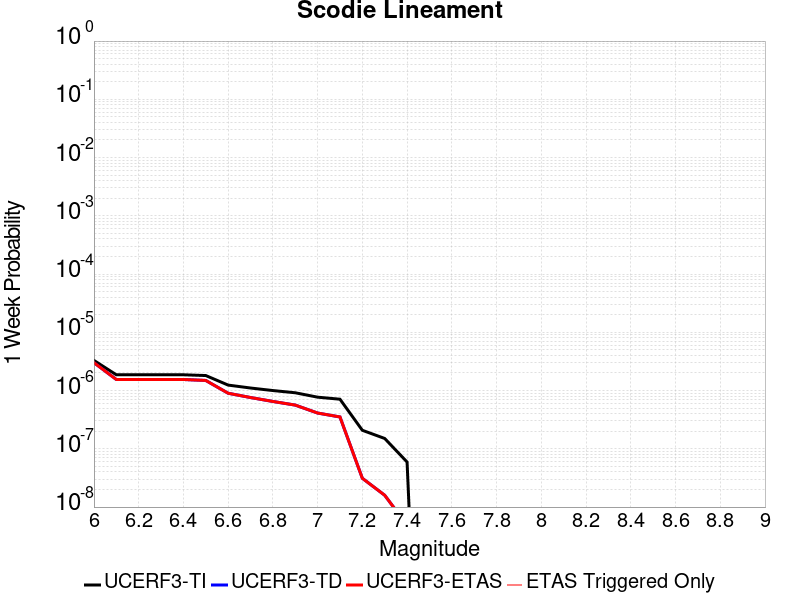 |  |  |  |

| Magnitude | 1 wk TI Prob | 1 wk TD Prob | 1 wk ETAS Prob | 1 wk ETAS/TD Gain | 1 wk ETAS Triggered Only | 1 mo TI Prob | 1 mo TD Prob | 1 mo ETAS Prob | 1 mo ETAS/TD Gain | 1 mo ETAS Triggered Only | 1 yr TI Prob | 1 yr TD Prob | 1 yr ETAS Prob | 1 yr ETAS/TD Gain | 1 yr ETAS Triggered Only | 10 yr TI Prob | 10 yr TD Prob | 10 yr ETAS Prob | 10 yr ETAS/TD Gain | 10 yr ETAS Triggered Only |
|-----|-----|-----|-----|-----|-----|-----|-----|-----|-----|-----|-----|-----|-----|-----|-----|-----|-----|-----|-----|-----|
| 6.0 | 3.2919327E-6 | 3.0134563E-6 | 3.0134563E-6 | 1.0 | 0.0 | 1.4108206E-5 | 1.2914767E-5 | 1.2914767E-5 | 1.0 | 0.0 | 1.7175387E-4 | 1.5722911E-4 | 2.303344E-4 | 1.4649602 | 7.311679E-5 | 0.0017162118 | 0.0015714903 | 0.0017722455 | 1.1277483 | 2.0107116E-4 |
| 6.1 | 1.8663811E-6 | 1.5491216E-6 | 1.5491216E-6 | 1.0 | 0.0 | 7.998751E-6 | 6.639079E-6 | 6.639079E-6 | 1.0 | 0.0 | 9.738045E-5 | 8.0828286E-5 | 8.0828286E-5 | 1.0 | 0.0 | 9.7337784E-4 | 8.0803764E-4 | 8.6283096E-4 | 1.0678103 | 5.483759E-5 |
| 6.2 | 1.8663811E-6 | 1.5491216E-6 | 1.5491216E-6 | 1.0 | 0.0 | 7.998751E-6 | 6.639079E-6 | 6.639079E-6 | 1.0 | 0.0 | 9.738045E-5 | 8.0828286E-5 | 8.0828286E-5 | 1.0 | 0.0 | 9.7337784E-4 | 8.0803764E-4 | 8.6283096E-4 | 1.0678103 | 5.483759E-5 |
| 6.3 | 1.8663811E-6 | 1.5491216E-6 | 1.5491216E-6 | 1.0 | 0.0 | 7.998751E-6 | 6.639079E-6 | 6.639079E-6 | 1.0 | 0.0 | 9.738045E-5 | 8.0828286E-5 | 8.0828286E-5 | 1.0 | 0.0 | 9.7337784E-4 | 8.0803764E-4 | 8.6283096E-4 | 1.0678103 | 5.483759E-5 |
| 6.4 | 1.8663811E-6 | 1.5491216E-6 | 1.5491216E-6 | 1.0 | 0.0 | 7.998751E-6 | 6.639079E-6 | 6.639079E-6 | 1.0 | 0.0 | 9.738045E-5 | 8.0828286E-5 | 8.0828286E-5 | 1.0 | 0.0 | 9.7337784E-4 | 8.0803764E-4 | 8.6283096E-4 | 1.0678103 | 5.483759E-5 |
| 6.5 | 1.8106311E-6 | 1.4910531E-6 | 1.4910531E-6 | 1.0 | 0.0 | 7.759824E-6 | 6.390215E-6 | 6.390215E-6 | 1.0 | 0.0 | 9.447177E-5 | 7.7798584E-5 | 7.7798584E-5 | 1.0 | 0.0 | 9.4431615E-4 | 7.7776215E-4 | 8.325571E-4 | 1.0704521 | 5.483759E-5 |
| 6.6 | 1.2414679E-6 | 8.998006E-7 | 8.998006E-7 | 1.0 | 0.0 | 5.320566E-6 | 3.856283E-6 | 3.856283E-6 | 1.0 | 0.0 | 6.477596E-5 | 4.6949324E-5 | 4.6949324E-5 | 1.0 | 0.0 | 6.475708E-4 | 4.694027E-4 | 5.242146E-4 | 1.1167693 | 5.483759E-5 |
| 6.7 | 1.1062215E-6 | 7.5947037E-7 | 7.5947037E-7 | 1.0 | 0.0 | 4.7409408E-6 | 3.2548694E-6 | 3.2548694E-6 | 1.0 | 0.0 | 5.7719422E-5 | 3.9627386E-5 | 3.9627386E-5 | 1.0 | 0.0 | 5.770443E-4 | 3.9621018E-4 | 4.144821E-4 | 1.0461168 | 1.8279197E-5 |
| 6.8 | 1.0006736E-6 | 6.500747E-7 | 6.500747E-7 | 1.0 | 0.0 | 4.288594E-6 | 2.786032E-6 | 2.786032E-6 | 1.0 | 0.0 | 5.221238E-5 | 3.391947E-5 | 3.391947E-5 | 1.0 | 0.0 | 5.220012E-4 | 3.3914903E-4 | 3.3914903E-4 | 1.0 | 0.0 |
| 6.9 | 9.167364E-7 | 5.631943E-7 | 5.631943E-7 | 1.0 | 0.0 | 3.9288643E-6 | 2.413688E-6 | 2.413688E-6 | 1.0 | 0.0 | 4.7832873E-5 | 2.9386312E-5 | 2.9386312E-5 | 1.0 | 0.0 | 4.782258E-4 | 2.9382994E-4 | 2.9382994E-4 | 1.0 | 0.0 |
| 7.0 | 7.6987664E-7 | 4.1136465E-7 | 4.1136465E-7 | 1.0 | 0.0 | 3.2994672E-6 | 1.7629905E-6 | 1.7629905E-6 | 1.0 | 0.0 | 4.0170275E-5 | 2.1464237E-5 | 2.1464237E-5 | 1.0 | 0.0 | 4.0163012E-4 | 2.146255E-4 | 2.146255E-4 | 1.0 | 0.0 |
| 7.1 | 7.1038727E-7 | 3.521392E-7 | 3.521392E-7 | 1.0 | 0.0 | 3.0445133E-6 | 1.5091673E-6 | 1.5091673E-6 | 1.0 | 0.0 | 3.706632E-5 | 1.8373992E-5 | 1.8373992E-5 | 1.0 | 0.0 | 3.7060137E-4 | 1.8372823E-4 | 1.8372823E-4 | 1.0 | 0.0 |
| 7.2 | 2.0799602E-7 | 3.1193522E-8 | 3.1193522E-8 | 1.0 | 0.0 | 8.914113E-7 | 1.3368651E-7 | 1.3368651E-7 | 1.0 | 0.0 | 1.0852878E-5 | 1.6276322E-6 | 1.6276322E-6 | 1.0 | 0.0 | 1.08523476E-4 | 1.627621E-5 | 1.627621E-5 | 1.0 | 0.0 |
| 7.3 | 1.5048182E-7 | 1.5950226E-8 | 1.5950226E-8 | 1.0 | 0.0 | 6.449219E-7 | 6.835811E-8 | 6.835811E-8 | 1.0 | 0.0 | 7.851896E-6 | 8.3225973E-7 | 8.3225973E-7 | 1.0 | 0.0 | 7.851618E-5 | 8.322569E-6 | 8.322569E-6 | 1.0 | 0.0 |
| 7.4 | 5.9334678E-8 | 4.870027E-9 | 4.870027E-9 | 1.0 | 0.0 | 2.5429145E-7 | 2.0871544E-8 | 2.0871544E-8 | 1.0 | 0.0 | 3.095994E-6 | 2.5411103E-7 | 2.5411103E-7 | 1.0 | 0.0 | 3.095951E-5 | 2.5411086E-6 | 2.5411086E-6 | 1.0 | 0.0 |

## Elsinore (Glen Ivy) rev
*[(top)](#table-of-contents)*

| 1 Week | 1 Month | 1 Year | 10 Year |
|-----|-----|-----|-----|
|  |  |  |  |

| Magnitude | 1 wk TI Prob | 1 wk TD Prob | 1 wk ETAS Prob | 1 wk ETAS/TD Gain | 1 wk ETAS Triggered Only | 1 mo TI Prob | 1 mo TD Prob | 1 mo ETAS Prob | 1 mo ETAS/TD Gain | 1 mo ETAS Triggered Only | 1 yr TI Prob | 1 yr TD Prob | 1 yr ETAS Prob | 1 yr ETAS/TD Gain | 1 yr ETAS Triggered Only | 10 yr TI Prob | 10 yr TD Prob | 10 yr ETAS Prob | 10 yr ETAS/TD Gain | 10 yr ETAS Triggered Only |
|-----|-----|-----|-----|-----|-----|-----|-----|-----|-----|-----|-----|-----|-----|-----|-----|-----|-----|-----|-----|-----|
| 6.0 | 1.6204086E-4 | 2.9371222E-4 | 2.9371222E-4 | 1.0 | 0.0 | 6.94276E-4 | 0.0012583141 | 0.0012765704 | 1.0145085 | 1.8279197E-5 | 0.008420097 | 0.015238959 | 0.015328963 | 1.0059061 | 9.139598E-5 | 0.081081145 | 0.13971914 | 0.13986067 | 1.0010129 | 1.6451276E-4 |
| 6.1 | 1.6204086E-4 | 2.9371222E-4 | 2.9371222E-4 | 1.0 | 0.0 | 6.94276E-4 | 0.0012583141 | 0.0012765704 | 1.0145085 | 1.8279197E-5 | 0.008420097 | 0.015238959 | 0.015328963 | 1.0059061 | 9.139598E-5 | 0.081081145 | 0.13971914 | 0.13986067 | 1.0010129 | 1.6451276E-4 |
| 6.2 | 1.6204086E-4 | 2.9371222E-4 | 2.9371222E-4 | 1.0 | 0.0 | 6.94276E-4 | 0.0012583141 | 0.0012765704 | 1.0145085 | 1.8279197E-5 | 0.008420097 | 0.015238959 | 0.015328963 | 1.0059061 | 9.139598E-5 | 0.081081145 | 0.13971914 | 0.13986067 | 1.0010129 | 1.6451276E-4 |
| 6.3 | 1.0111737E-4 | 1.7706468E-4 | 1.7706468E-4 | 1.0 | 0.0 | 4.332882E-4 | 7.5874466E-4 | 7.7701E-4 | 1.0240731 | 1.8279197E-5 | 0.005262531 | 0.009219283 | 0.009291725 | 1.0078577 | 7.311679E-5 | 0.0513964 | 0.08703286 | 0.08713299 | 1.0011505 | 1.0967518E-4 |
| 6.4 | 1.0111737E-4 | 1.7706468E-4 | 1.7706468E-4 | 1.0 | 0.0 | 4.332882E-4 | 7.5874466E-4 | 7.7701E-4 | 1.0240731 | 1.8279197E-5 | 0.005262531 | 0.009219283 | 0.009291725 | 1.0078577 | 7.311679E-5 | 0.0513964 | 0.08703286 | 0.08713299 | 1.0011505 | 1.0967518E-4 |
| 6.5 | 3.6624708E-5 | 4.640639E-5 | 4.640639E-5 | 1.0 | 0.0 | 1.569536E-4 | 1.9887142E-4 | 1.9887142E-4 | 1.0 | 0.0 | 0.001909235 | 0.002418934 | 0.002418934 | 1.0 | 0.0 | 0.01892915 | 0.023747567 | 0.023747567 | 1.0 | 0.0 |
| 6.6 | 2.5051324E-5 | 2.6158506E-5 | 2.6158506E-5 | 1.0 | 0.0 | 1.073584E-4 | 1.1210332E-4 | 1.1210332E-4 | 1.0 | 0.0 | 0.0013063047 | 0.0013640479 | 0.0013640479 | 1.0 | 0.0 | 0.012986525 | 0.013570136 | 0.013570136 | 1.0 | 0.0 |
| 6.7 | 2.2189772E-5 | 2.2082193E-5 | 2.2082193E-5 | 1.0 | 0.0 | 9.509556E-5 | 9.463474E-5 | 9.463474E-5 | 1.0 | 0.0 | 0.0011571734 | 0.0011516054 | 0.0011516054 | 1.0 | 0.0 | 0.011511663 | 0.011470216 | 0.011470216 | 1.0 | 0.0 |
| 6.8 | 1.6654378E-5 | 1.444352E-5 | 1.444352E-5 | 1.0 | 0.0 | 7.137396E-5 | 6.189936E-5 | 6.189936E-5 | 1.0 | 0.0 | 8.686314E-4 | 7.533693E-4 | 7.533693E-4 | 1.0 | 0.0 | 0.008652439 | 0.0075134886 | 0.0075134886 | 1.0 | 0.0 |
| 6.9 | 1.5042909E-5 | 1.2337136E-5 | 1.2337136E-5 | 1.0 | 0.0 | 6.446802E-5 | 5.2872383E-5 | 5.2872383E-5 | 1.0 | 0.0 | 7.8461546E-4 | 6.435343E-4 | 6.435343E-4 | 1.0 | 0.0 | 0.007818509 | 0.0064209295 | 0.0064209295 | 1.0 | 0.0 |
| 7.0 | 1.4361385E-5 | 1.1456173E-5 | 1.1456173E-5 | 1.0 | 0.0 | 6.154734E-5 | 4.9096976E-5 | 4.9096976E-5 | 1.0 | 0.0 | 7.490812E-4 | 5.9759466E-4 | 5.9759466E-4 | 1.0 | 0.0 | 0.007465612 | 0.005963867 | 0.005963867 | 1.0 | 0.0 |
| 7.1 | 1.3265571E-5 | 1.0249252E-5 | 1.0249252E-5 | 1.0 | 0.0 | 5.6851208E-5 | 4.3924643E-5 | 4.3924643E-5 | 1.0 | 0.0 | 6.919436E-4 | 5.3465384E-4 | 5.3465384E-4 | 1.0 | 0.0 | 0.006897931 | 0.0053370316 | 0.0053370316 | 1.0 | 0.0 |
| 7.2 | 1.1596403E-5 | 8.5087395E-6 | 8.5087395E-6 | 1.0 | 0.0 | 4.9697923E-5 | 3.6465524E-5 | 3.6465524E-5 | 1.0 | 0.0 | 6.049042E-4 | 4.4387902E-4 | 4.4387902E-4 | 1.0 | 0.0 | 0.006032603 | 0.0044313394 | 0.0044313394 | 1.0 | 0.0 |
| 7.3 | 1.0150827E-5 | 7.241924E-6 | 7.241924E-6 | 1.0 | 0.0 | 4.3502816E-5 | 3.1036456E-5 | 3.1036456E-5 | 1.0 | 0.0 | 5.2951806E-4 | 3.7780477E-4 | 3.7780477E-4 | 1.0 | 0.0 | 0.005282581 | 0.0037720115 | 0.0037720115 | 1.0 | 0.0 |
| 7.4 | 9.080705E-6 | 6.355331E-6 | 6.355331E-6 | 1.0 | 0.0 | 3.8916725E-5 | 2.7236856E-5 | 2.7236856E-5 | 1.0 | 0.0 | 4.7370812E-4 | 3.3155963E-4 | 3.3155963E-4 | 1.0 | 0.0 | 0.004726996 | 0.0033108005 | 0.0033108005 | 1.0 | 0.0 |
| 7.5 | 7.671649E-6 | 5.2280498E-6 | 5.2280498E-6 | 1.0 | 0.0 | 3.287808E-5 | 2.2405742E-5 | 2.2405742E-5 | 1.0 | 0.0 | 4.0021708E-4 | 2.7275702E-4 | 2.7275702E-4 | 1.0 | 0.0 | 0.0039949706 | 0.0027243476 | 0.0027243476 | 1.0 | 0.0 |
| 7.6 | 6.990086E-6 | 4.689783E-6 | 4.689783E-6 | 1.0 | 0.0 | 2.9957167E-5 | 2.0098922E-5 | 2.0098922E-5 | 1.0 | 0.0 | 3.6466747E-4 | 2.4467806E-4 | 2.4467806E-4 | 1.0 | 0.0 | 0.0036406964 | 0.002444203 | 0.002444203 | 1.0 | 0.0 |
| 7.7 | 4.163505E-6 | 2.3306334E-6 | 2.3306334E-6 | 1.0 | 0.0 | 1.7843471E-5 | 9.988395E-6 | 9.988395E-6 | 1.0 | 0.0 | 2.172226E-4 | 1.21602665E-4 | 1.21602665E-4 | 1.0 | 0.0 | 0.0021701038 | 0.0012154343 | 0.0012154343 | 1.0 | 0.0 |
| 7.8 | 2.2692414E-7 | 9.3892815E-8 | 9.3892815E-8 | 1.0 | 0.0 | 9.725317E-7 | 4.0239775E-7 | 4.0239775E-7 | 1.0 | 0.0 | 1.1840509E-5 | 4.899185E-6 | 4.899185E-6 | 1.0 | 0.0 | 1.1839878E-4 | 4.8991096E-5 | 4.8991096E-5 | 1.0 | 0.0 |
| 7.9 | 6.676829E-9 | 3.4408467E-9 | 3.4408467E-9 | 1.0 | 0.0 | 2.861498E-8 | 1.4746486E-8 | 1.4746486E-8 | 1.0 | 0.0 | 3.4838732E-7 | 1.7953846E-7 | 1.7953846E-7 | 1.0 | 0.0 | 3.4838679E-6 | 1.7953832E-6 | 1.7953832E-6 | 1.0 | 0.0 |

## San Andreas (Coachella) rev
*[(top)](#table-of-contents)*

| 1 Week | 1 Month | 1 Year | 10 Year |
|-----|-----|-----|-----|
|  |  |  |  |

| Magnitude | 1 wk TI Prob | 1 wk TD Prob | 1 wk ETAS Prob | 1 wk ETAS/TD Gain | 1 wk ETAS Triggered Only | 1 mo TI Prob | 1 mo TD Prob | 1 mo ETAS Prob | 1 mo ETAS/TD Gain | 1 mo ETAS Triggered Only | 1 yr TI Prob | 1 yr TD Prob | 1 yr ETAS Prob | 1 yr ETAS/TD Gain | 1 yr ETAS Triggered Only | 10 yr TI Prob | 10 yr TD Prob | 10 yr ETAS Prob | 10 yr ETAS/TD Gain | 10 yr ETAS Triggered Only |
|-----|-----|-----|-----|-----|-----|-----|-----|-----|-----|-----|-----|-----|-----|-----|-----|-----|-----|-----|-----|-----|
| 6.0 | 1.1925945E-4 | 3.276467E-4 | 3.276467E-4 | 1.0 | 0.0 | 5.110118E-4 | 0.0014034492 | 0.0014217028 | 1.0130062 | 1.8279197E-5 | 0.0062038354 | 0.016954463 | 0.017062278 | 1.0063591 | 1.0967518E-4 | 0.060334753 | 0.1527907 | 0.15293007 | 1.0009122 | 1.6451276E-4 |
| 6.1 | 1.1925945E-4 | 3.276467E-4 | 3.276467E-4 | 1.0 | 0.0 | 5.110118E-4 | 0.0014034492 | 0.0014217028 | 1.0130062 | 1.8279197E-5 | 0.0062038354 | 0.016954463 | 0.017062278 | 1.0063591 | 1.0967518E-4 | 0.060334753 | 0.1527907 | 0.15293007 | 1.0009122 | 1.6451276E-4 |
| 6.2 | 1.07432395E-4 | 3.0265172E-4 | 3.0265172E-4 | 1.0 | 0.0 | 4.603433E-4 | 0.001296438 | 0.0013146936 | 1.0140812 | 1.8279197E-5 | 0.005590286 | 0.015671 | 0.015778957 | 1.006889 | 1.0967518E-4 | 0.05451731 | 0.14196219 | 0.14210334 | 1.0009943 | 1.6451276E-4 |
| 6.3 | 1.0718766E-4 | 3.0210475E-4 | 3.0210475E-4 | 1.0 | 0.0 | 4.592948E-4 | 0.0012940962 | 0.0013123518 | 1.0141068 | 1.8279197E-5 | 0.005577586 | 0.015642898 | 0.015750857 | 1.0069015 | 1.0967518E-4 | 0.054396555 | 0.14173047 | 0.14187168 | 1.0009962 | 1.6451276E-4 |
| 6.4 | 1.0355944E-4 | 2.9418513E-4 | 2.9418513E-4 | 1.0 | 0.0 | 4.4375064E-4 | 0.0012601882 | 0.0012784443 | 1.0144869 | 1.8279197E-5 | 0.0053892885 | 0.015235912 | 0.015343917 | 1.0070888 | 1.0967518E-4 | 0.052604496 | 0.13829084 | 0.13843259 | 1.0010251 | 1.6451276E-4 |
| 6.5 | 1.0227914E-4 | 2.9137929E-4 | 2.9137929E-4 | 1.0 | 0.0 | 4.382655E-4 | 0.0012481747 | 0.0012664311 | 1.0146265 | 1.8279197E-5 | 0.0053228354 | 0.015091684 | 0.015199704 | 1.0071576 | 1.0967518E-4 | 0.051971316 | 0.13707013 | 0.1372121 | 1.0010357 | 1.6451276E-4 |
| 6.6 | 1.0116757E-4 | 2.8903663E-4 | 2.8903663E-4 | 1.0 | 0.0 | 4.3350324E-4 | 0.0012381444 | 0.0012564008 | 1.0147451 | 1.8279197E-5 | 0.0052651367 | 0.014971248 | 0.015079281 | 1.0072161 | 1.0967518E-4 | 0.051421247 | 0.1360484 | 0.13619055 | 1.0010448 | 1.6451276E-4 |
| 6.7 | 1.0050676E-4 | 2.8762216E-4 | 2.8762216E-4 | 1.0 | 0.0 | 4.3067214E-4 | 0.001232088 | 0.0012503447 | 1.0148177 | 1.8279197E-5 | 0.005230834 | 0.014898524 | 0.015006565 | 1.0072519 | 1.0967518E-4 | 0.051094085 | 0.13543318 | 0.13557541 | 1.0010502 | 1.6451276E-4 |
| 6.8 | 9.976819E-5 | 2.856583E-4 | 2.856583E-4 | 1.0 | 0.0 | 4.2750788E-4 | 0.0012236794 | 0.0012419362 | 1.0149196 | 1.8279197E-5 | 0.0051924936 | 0.014797544 | 0.014905596 | 1.007302 | 1.0967518E-4 | 0.050728295 | 0.13458484 | 0.13472722 | 1.0010579 | 1.6451276E-4 |
| 6.9 | 9.77719E-5 | 2.8062498E-4 | 2.8062498E-4 | 1.0 | 0.0 | 4.1895514E-4 | 0.001202128 | 0.0012203853 | 1.0151874 | 1.8279197E-5 | 0.0050888555 | 0.014538688 | 0.014646769 | 1.007434 | 1.0967518E-4 | 0.049738888 | 0.1324128 | 0.13255553 | 1.0010779 | 1.6451276E-4 |
| 7.0 | 8.500761E-5 | 2.4795174E-4 | 2.4795174E-4 | 1.0 | 0.0 | 3.6426744E-4 | 0.0010622209 | 0.0010804806 | 1.0171902 | 1.8279197E-5 | 0.0044259406 | 0.012856629 | 0.012964894 | 1.008421 | 1.0967518E-4 | 0.04338823 | 0.1182658 | 0.118410856 | 1.0012265 | 1.6451276E-4 |
| 7.1 | 8.319876E-5 | 2.4397543E-4 | 2.4397543E-4 | 1.0 | 0.0 | 3.5651738E-4 | 0.0010451933 | 0.0010634534 | 1.0174706 | 1.8279197E-5 | 0.004331963 | 0.012651744 | 0.012760032 | 1.0085591 | 1.0967518E-4 | 0.042484846 | 0.116484836 | 0.11663018 | 1.0012478 | 1.6451276E-4 |
| 7.2 | 7.563917E-5 | 2.2444999E-4 | 2.2444999E-4 | 1.0 | 0.0 | 3.2412758E-4 | 9.61577E-4 | 9.798387E-4 | 1.0189914 | 1.8279197E-5 | 0.0039391145 | 0.011645048 | 0.011753446 | 1.0093085 | 1.0967518E-4 | 0.03870018 | 0.1078885 | 0.10803527 | 1.0013603 | 1.6451276E-4 |
| 7.3 | 7.082985E-5 | 2.0759941E-4 | 2.0759941E-4 | 1.0 | 0.0 | 3.0352117E-4 | 8.894113E-4 | 9.0767426E-4 | 1.0205337 | 1.8279197E-5 | 0.0036891096 | 0.010775445 | 0.0108839385 | 1.0100685 | 1.0967518E-4 | 0.03628465 | 0.1004075 | 0.100555494 | 1.0014739 | 1.6451276E-4 |
| 7.4 | 5.146215E-5 | 1.4298319E-4 | 1.4298319E-4 | 1.0 | 0.0 | 2.2053342E-4 | 6.1264203E-4 | 6.3091004E-4 | 1.0298184 | 1.8279197E-5 | 0.0026816884 | 0.007433597 | 0.0075243134 | 1.0122036 | 9.139598E-5 | 0.02649557 | 0.070956536 | 0.07109239 | 1.0019146 | 1.4623358E-4 |
| 7.5 | 4.0285166E-5 | 1.0962878E-4 | 1.0962878E-4 | 1.0 | 0.0 | 1.7263928E-4 | 4.6975337E-4 | 4.8802397E-4 | 1.038894 | 1.8279197E-5 | 0.002099857 | 0.005704319 | 0.0057770186 | 1.0127447 | 7.311679E-5 | 0.020801254 | 0.055105854 | 0.055226758 | 1.002194 | 1.2795438E-4 |
| 7.6 | 3.1168736E-5 | 8.4578256E-5 | 8.4578256E-5 | 1.0 | 0.0 | 1.3357346E-4 | 3.6242802E-4 | 3.807006E-4 | 1.0504171 | 1.8279197E-5 | 0.0016250437 | 0.00440366 | 0.004476455 | 1.0165305 | 7.311679E-5 | 0.016132116 | 0.04289531 | 0.043017775 | 1.002855 | 1.2795438E-4 |
| 7.7 | 2.2100989E-5 | 6.2553896E-5 | 6.2553896E-5 | 1.0 | 0.0 | 9.4715084E-5 | 2.6806063E-4 | 2.8633492E-4 | 1.0681722 | 1.8279197E-5 | 0.001152546 | 0.0032587603 | 0.0033316389 | 1.0223639 | 7.311679E-5 | 0.011465867 | 0.03197573 | 0.032099597 | 1.0038737 | 1.2795438E-4 |
| 7.8 | 1.7484861E-5 | 5.1944033E-5 | 5.1944033E-5 | 1.0 | 0.0 | 7.493296E-5 | 2.225983E-4 | 2.4087343E-4 | 1.0820991 | 1.8279197E-5 | 9.1192697E-4 | 0.002706769 | 0.002779688 | 1.0269395 | 7.311679E-5 | 0.009081938 | 0.026707657 | 0.026832195 | 1.004663 | 1.2795438E-4 |
| 7.9 | 1.3967285E-5 | 3.834408E-5 | 3.834408E-5 | 1.0 | 0.0 | 5.985842E-5 | 1.6432142E-4 | 1.825976E-4 | 1.1112223 | 1.8279197E-5 | 7.2853256E-4 | 0.001998779 | 0.0020535067 | 1.0273807 | 5.483759E-5 | 0.0072614877 | 0.019965619 | 0.020073105 | 1.0053835 | 1.0967518E-4 |
| 8.0 | 1.1887396E-5 | 3.1169602E-5 | 3.1169602E-5 | 1.0 | 0.0 | 5.094499E-5 | 1.3357717E-4 | 1.5185392E-4 | 1.1368254 | 1.8279197E-5 | 6.200787E-4 | 0.0016250898 | 0.0016798383 | 1.0336895 | 5.483759E-5 | 0.006183513 | 0.016327916 | 0.0164358 | 1.0066074 | 1.0967518E-4 |
| 8.1 | 5.100864E-6 | 9.015661E-6 | 9.015661E-6 | 1.0 | 0.0 | 2.1860664E-5 | 3.8637972E-5 | 3.8637972E-5 | 1.0 | 0.0 | 2.6612106E-4 | 4.7031592E-4 | 4.7031592E-4 | 1.0 | 0.0 | 0.002658026 | 0.0049387887 | 0.0049387887 | 1.0 | 0.0 |
| 8.2 | 2.3004484E-6 | 2.8034615E-6 | 2.8034615E-6 | 1.0 | 0.0 | 9.859027E-6 | 1.201478E-5 | 1.201478E-5 | 1.0 | 0.0 | 1.2002704E-4 | 1.4627016E-4 | 1.4627016E-4 | 1.0 | 0.0 | 0.0011996223 | 0.0016061745 | 0.0016061745 | 1.0 | 0.0 |
| 8.3 | 1.0424446E-7 | 5.862703E-8 | 5.862703E-8 | 1.0 | 0.0 | 4.4676187E-7 | 2.5125868E-7 | 2.5125868E-7 | 1.0 | 0.0 | 5.439312E-6 | 3.0590704E-6 | 3.0590704E-6 | 1.0 | 0.0 | 5.4391792E-5 | 3.2155825E-5 | 3.2155825E-5 | 1.0 | 0.0 |

## Ludlow
*[(top)](#table-of-contents)*

| 1 Week | 1 Month | 1 Year | 10 Year |
|-----|-----|-----|-----|
|  |  |  |  |

| Magnitude | 1 wk TI Prob | 1 wk TD Prob | 1 wk ETAS Prob | 1 wk ETAS/TD Gain | 1 wk ETAS Triggered Only | 1 mo TI Prob | 1 mo TD Prob | 1 mo ETAS Prob | 1 mo ETAS/TD Gain | 1 mo ETAS Triggered Only | 1 yr TI Prob | 1 yr TD Prob | 1 yr ETAS Prob | 1 yr ETAS/TD Gain | 1 yr ETAS Triggered Only | 10 yr TI Prob | 10 yr TD Prob | 10 yr ETAS Prob | 10 yr ETAS/TD Gain | 10 yr ETAS Triggered Only |
|-----|-----|-----|-----|-----|-----|-----|-----|-----|-----|-----|-----|-----|-----|-----|-----|-----|-----|-----|-----|-----|
| 6.0 | 2.2407607E-5 | 2.3658655E-5 | 2.3658655E-5 | 1.0 | 0.0 | 9.602906E-5 | 1.0139054E-4 | 1.19667886E-4 | 1.1802667 | 1.8279197E-5 | 0.0011685267 | 0.0012337749 | 0.0012885449 | 1.0443921 | 5.483759E-5 | 0.011624013 | 0.012273764 | 0.012400148 | 1.0102971 | 1.2795438E-4 |
| 6.1 | 2.2407607E-5 | 2.3658655E-5 | 2.3658655E-5 | 1.0 | 0.0 | 9.602906E-5 | 1.0139054E-4 | 1.19667886E-4 | 1.1802667 | 1.8279197E-5 | 0.0011685267 | 0.0012337749 | 0.0012885449 | 1.0443921 | 5.483759E-5 | 0.011624013 | 0.012273764 | 0.012400148 | 1.0102971 | 1.2795438E-4 |
| 6.2 | 1.0781252E-5 | 1.1366317E-5 | 1.1366317E-5 | 1.0 | 0.0 | 4.620455E-5 | 4.8711903E-5 | 6.699021E-5 | 1.3752328 | 1.8279197E-5 | 5.623952E-4 | 5.9291004E-4 | 6.477151E-4 | 1.092434 | 5.483759E-5 | 0.00560974 | 0.0059137004 | 0.006004556 | 1.0153636 | 9.139598E-5 |
| 6.3 | 1.0781252E-5 | 1.1366317E-5 | 1.1366317E-5 | 1.0 | 0.0 | 4.620455E-5 | 4.8711903E-5 | 6.699021E-5 | 1.3752328 | 1.8279197E-5 | 5.623952E-4 | 5.9291004E-4 | 6.477151E-4 | 1.092434 | 5.483759E-5 | 0.00560974 | 0.0059137004 | 0.006004556 | 1.0153636 | 9.139598E-5 |
| 6.4 | 7.814439E-6 | 8.238203E-6 | 8.238203E-6 | 1.0 | 0.0 | 3.3490025E-5 | 3.530611E-5 | 5.3584663E-5 | 1.5177163 | 1.8279197E-5 | 4.0766477E-4 | 4.2976855E-4 | 4.6631123E-4 | 1.0850288 | 3.6558395E-5 | 0.0040691774 | 0.004289521 | 0.004362324 | 1.0169723 | 7.311679E-5 |
| 6.5 | 6.4986366E-6 | 6.851314E-6 | 6.851314E-6 | 1.0 | 0.0 | 2.7851002E-5 | 2.9362449E-5 | 4.7641108E-5 | 1.6225182 | 1.8279197E-5 | 3.390332E-4 | 3.574301E-4 | 3.9397544E-4 | 1.1022447 | 3.6558395E-5 | 0.003385164 | 0.0035686484 | 0.003641504 | 1.0204155 | 7.311679E-5 |
| 6.6 | 5.582177E-6 | 5.8863457E-6 | 5.8863457E-6 | 1.0 | 0.0 | 2.3923398E-5 | 2.5226956E-5 | 4.350569E-5 | 1.7245716 | 1.8279197E-5 | 2.9122844E-4 | 3.0709562E-4 | 3.4364278E-4 | 1.119009 | 3.6558395E-5 | 0.0029084706 | 0.0030667859 | 0.0031396784 | 1.0237684 | 7.311679E-5 |
| 6.7 | 4.6858763E-6 | 4.940712E-6 | 4.940712E-6 | 1.0 | 0.0 | 2.0082172E-5 | 2.1174312E-5 | 3.945312E-5 | 1.863254 | 1.8279197E-5 | 2.4447302E-4 | 2.577673E-4 | 2.9431627E-4 | 1.1417905 | 3.6558395E-5 | 0.0024420423 | 0.0025747395 | 0.002629436 | 1.0212435 | 5.483759E-5 |
| 6.8 | 3.5584908E-6 | 3.752235E-6 | 3.752235E-6 | 1.0 | 0.0 | 1.5250586E-5 | 1.608091E-5 | 3.435981E-5 | 2.1366832 | 1.8279197E-5 | 1.8566006E-4 | 1.957679E-4 | 2.3231914E-4 | 1.186707 | 3.6558395E-5 | 0.0018550502 | 0.0019559956 | 0.002010726 | 1.0279808 | 5.483759E-5 |
| 6.9 | 2.532834E-6 | 2.6711582E-6 | 2.6711582E-6 | 1.0 | 0.0 | 1.0854958E-5 | 1.1447772E-5 | 1.1447772E-5 | 1.0 | 0.0 | 1.3215111E-4 | 1.3936798E-4 | 1.3936798E-4 | 1.0 | 0.0 | 0.0013207254 | 0.0013928334 | 0.0014110871 | 1.0131055 | 1.8279197E-5 |
| 7.0 | 1.7083285E-6 | 1.8020486E-6 | 1.8020486E-6 | 1.0 | 0.0 | 7.3213873E-6 | 7.723043E-6 | 7.723043E-6 | 1.0 | 0.0 | 8.913424E-5 | 9.4024166E-5 | 9.4024166E-5 | 1.0 | 0.0 | 8.9098496E-4 | 9.3986036E-4 | 9.3986036E-4 | 1.0 | 0.0 |
| 7.1 | 1.0905424E-6 | 1.1498282E-6 | 1.1498282E-6 | 1.0 | 0.0 | 4.6737446E-6 | 4.9278265E-6 | 4.9278265E-6 | 1.0 | 0.0 | 5.6901354E-5 | 5.9994734E-5 | 5.9994734E-5 | 1.0 | 0.0 | 5.6886784E-4 | 5.997952E-4 | 5.997952E-4 | 1.0 | 0.0 |
| 7.2 | 6.06668E-7 | 6.387636E-7 | 6.387636E-7 | 1.0 | 0.0 | 2.600003E-6 | 2.7375556E-6 | 2.7375556E-6 | 1.0 | 0.0 | 3.1654577E-5 | 3.33293E-5 | 3.33293E-5 | 1.0 | 0.0 | 3.1650066E-4 | 3.3324986E-4 | 3.3324986E-4 | 1.0 | 0.0 |

## San Jacinto (San Bernardino)
*[(top)](#table-of-contents)*

| 1 Week | 1 Month | 1 Year | 10 Year |
|-----|-----|-----|-----|
|  |  |  |  |

| Magnitude | 1 wk TI Prob | 1 wk TD Prob | 1 wk ETAS Prob | 1 wk ETAS/TD Gain | 1 wk ETAS Triggered Only | 1 mo TI Prob | 1 mo TD Prob | 1 mo ETAS Prob | 1 mo ETAS/TD Gain | 1 mo ETAS Triggered Only | 1 yr TI Prob | 1 yr TD Prob | 1 yr ETAS Prob | 1 yr ETAS/TD Gain | 1 yr ETAS Triggered Only | 10 yr TI Prob | 10 yr TD Prob | 10 yr ETAS Prob | 10 yr ETAS/TD Gain | 10 yr ETAS Triggered Only |
|-----|-----|-----|-----|-----|-----|-----|-----|-----|-----|-----|-----|-----|-----|-----|-----|-----|-----|-----|-----|-----|
| 6.0 | 3.409352E-5 | 3.611458E-5 | 3.611458E-5 | 1.0 | 0.0 | 1.461069E-4 | 1.5476761E-4 | 1.7304397E-4 | 1.1180891 | 1.8279197E-5 | 0.0017774 | 0.0018826688 | 0.0019374032 | 1.0290728 | 5.483759E-5 | 0.01763251 | 0.01941539 | 0.019540861 | 1.0064625 | 1.2795438E-4 |
| 6.1 | 3.409352E-5 | 3.611458E-5 | 3.611458E-5 | 1.0 | 0.0 | 1.461069E-4 | 1.5476761E-4 | 1.7304397E-4 | 1.1180891 | 1.8279197E-5 | 0.0017774 | 0.0018826688 | 0.0019374032 | 1.0290728 | 5.483759E-5 | 0.01763251 | 0.01941539 | 0.019540861 | 1.0064625 | 1.2795438E-4 |
| 6.2 | 3.409352E-5 | 3.611458E-5 | 3.611458E-5 | 1.0 | 0.0 | 1.461069E-4 | 1.5476761E-4 | 1.7304397E-4 | 1.1180891 | 1.8279197E-5 | 0.0017774 | 0.0018826688 | 0.0019374032 | 1.0290728 | 5.483759E-5 | 0.01763251 | 0.01941539 | 0.019540861 | 1.0064625 | 1.2795438E-4 |
| 6.3 | 3.409352E-5 | 3.611458E-5 | 3.611458E-5 | 1.0 | 0.0 | 1.461069E-4 | 1.5476761E-4 | 1.7304397E-4 | 1.1180891 | 1.8279197E-5 | 0.0017774 | 0.0018826688 | 0.0019374032 | 1.0290728 | 5.483759E-5 | 0.01763251 | 0.01941539 | 0.019540861 | 1.0064625 | 1.2795438E-4 |
| 6.4 | 3.400795E-5 | 3.6007215E-5 | 3.6007215E-5 | 1.0 | 0.0 | 1.4574021E-4 | 1.5430752E-4 | 1.725839E-4 | 1.1184412 | 1.8279197E-5 | 0.0017729428 | 0.0018770772 | 0.0019318118 | 1.0291595 | 5.483759E-5 | 0.017588645 | 0.019360462 | 0.01948594 | 1.006481 | 1.2795438E-4 |
| 6.5 | 3.341482E-5 | 3.5267658E-5 | 3.5267658E-5 | 1.0 | 0.0 | 1.4319851E-4 | 1.5113836E-4 | 1.694148E-4 | 1.1209252 | 1.8279197E-5 | 0.0017420477 | 0.0018385579 | 0.0018932947 | 1.0297716 | 5.483759E-5 | 0.017284546 | 0.018981932 | 0.019107457 | 1.0066129 | 1.2795438E-4 |
| 6.6 | 3.3364955E-5 | 3.5204863E-5 | 3.5204863E-5 | 1.0 | 0.0 | 1.4298483E-4 | 1.5086925E-4 | 1.691457E-4 | 1.121141 | 1.8279197E-5 | 0.0017394501 | 0.0018352871 | 0.001890024 | 1.0298247 | 5.483759E-5 | 0.017258976 | 0.01894979 | 0.01907532 | 1.0066243 | 1.2795438E-4 |
| 6.7 | 3.335922E-5 | 3.5194633E-5 | 3.5194633E-5 | 1.0 | 0.0 | 1.4296026E-4 | 1.5082542E-4 | 1.6910187E-4 | 1.1211761 | 1.8279197E-5 | 0.0017391514 | 0.0018347544 | 0.0018894913 | 1.0298334 | 5.483759E-5 | 0.017256035 | 0.01894458 | 0.01907011 | 1.0066261 | 1.2795438E-4 |
| 6.8 | 3.327683E-5 | 3.508867E-5 | 3.508867E-5 | 1.0 | 0.0 | 1.4260718E-4 | 1.5037134E-4 | 1.6864779E-4 | 1.1215421 | 1.8279197E-5 | 0.0017348597 | 0.0018292352 | 0.0018839724 | 1.0299236 | 5.483759E-5 | 0.017213784 | 0.01889034 | 0.019015877 | 1.0066456 | 1.2795438E-4 |
| 6.9 | 3.3235785E-5 | 3.5029603E-5 | 3.5029603E-5 | 1.0 | 0.0 | 1.4243131E-4 | 1.5011824E-4 | 1.6839469E-4 | 1.121747 | 1.8279197E-5 | 0.0017327217 | 0.0018261588 | 0.0018808963 | 1.0299741 | 5.483759E-5 | 0.017192734 | 0.0188602 | 0.01898574 | 1.0066564 | 1.2795438E-4 |
| 7.0 | 3.3197095E-5 | 3.496951E-5 | 3.496951E-5 | 1.0 | 0.0 | 1.422655E-4 | 1.4986073E-4 | 1.6813718E-4 | 1.1219562 | 1.8279197E-5 | 0.0017307063 | 0.0018230289 | 0.0018777665 | 1.0300256 | 5.483759E-5 | 0.017172894 | 0.01882957 | 0.018955113 | 1.0066675 | 1.2795438E-4 |
| 7.1 | 3.3129716E-5 | 3.4849672E-5 | 3.4849672E-5 | 1.0 | 0.0 | 1.4197677E-4 | 1.493472E-4 | 1.6762366E-4 | 1.1223757 | 1.8279197E-5 | 0.0017271966 | 0.0018167871 | 0.001871525 | 1.030129 | 5.483759E-5 | 0.017138338 | 0.018768627 | 0.01889418 | 1.0066895 | 1.2795438E-4 |
| 7.2 | 3.3034008E-5 | 3.471708E-5 | 3.471708E-5 | 1.0 | 0.0 | 1.4156665E-4 | 1.48779E-4 | 1.6705548E-4 | 1.1228431 | 1.8279197E-5 | 0.0017222111 | 0.0018098808 | 0.0018646192 | 1.0302441 | 5.483759E-5 | 0.017089253 | 0.018701006 | 0.018826567 | 1.0067141 | 1.2795438E-4 |
| 7.3 | 3.2956614E-5 | 3.4584762E-5 | 3.4584762E-5 | 1.0 | 0.0 | 1.4123498E-4 | 1.48212E-4 | 1.6648848E-4 | 1.1233132 | 1.8279197E-5 | 0.0017181796 | 0.0018029889 | 0.0018577276 | 1.03036 | 5.483759E-5 | 0.017049557 | 0.018633721 | 0.018759292 | 1.0067389 | 1.2795438E-4 |
| 7.4 | 3.2915937E-5 | 3.45064E-5 | 3.45064E-5 | 1.0 | 0.0 | 1.4106068E-4 | 1.478762E-4 | 1.6615269E-4 | 1.1235932 | 1.8279197E-5 | 0.0017160608 | 0.0017989073 | 0.0018536462 | 1.030429 | 5.483759E-5 | 0.017028693 | 0.018593961 | 0.018719537 | 1.0067536 | 1.2795438E-4 |
| 7.5 | 3.281791E-5 | 3.4371224E-5 | 3.4371224E-5 | 1.0 | 0.0 | 1.406406E-4 | 1.4729693E-4 | 1.6557344E-4 | 1.1240793 | 1.8279197E-5 | 0.0017109542 | 0.0017918665 | 0.0018466058 | 1.0305488 | 5.483759E-5 | 0.016978411 | 0.018524809 | 0.018650392 | 1.0067792 | 1.2795438E-4 |
| 7.6 | 3.2521442E-5 | 3.409593E-5 | 3.409593E-5 | 1.0 | 0.0 | 1.3937015E-4 | 1.4611724E-4 | 1.6439376E-4 | 1.1250813 | 1.8279197E-5 | 0.0016955109 | 0.0017775272 | 0.0018322673 | 1.0307957 | 5.483759E-5 | 0.016826328 | 0.018382322 | 0.018507924 | 1.0068327 | 1.2795438E-4 |
| 7.7 | 3.0287873E-5 | 3.2578493E-5 | 3.2578493E-5 | 1.0 | 0.0 | 1.297987E-4 | 1.3961464E-4 | 1.5789128E-4 | 1.1309078 | 1.8279197E-5 | 0.0015791537 | 0.0016984841 | 0.0017532286 | 1.0322313 | 5.483759E-5 | 0.01567979 | 0.017592473 | 0.017718177 | 1.0071453 | 1.2795438E-4 |
| 7.8 | 2.6316151E-5 | 2.9784747E-5 | 2.9784747E-5 | 1.0 | 0.0 | 1.1277862E-4 | 1.2764268E-4 | 1.4591955E-4 | 1.1431878 | 1.8279197E-5 | 0.0013722149 | 0.0015529428 | 0.0016076952 | 1.0352572 | 5.483759E-5 | 0.013637724 | 0.016131766 | 0.016257657 | 1.0078039 | 1.2795438E-4 |
| 7.9 | 2.0761147E-5 | 2.3523955E-5 | 2.3523955E-5 | 1.0 | 0.0 | 8.897331E-5 | 1.00813064E-4 | 1.19090415E-4 | 1.1812994 | 1.8279197E-5 | 0.0010827117 | 0.0012267088 | 0.0012814791 | 1.0446482 | 5.483759E-5 | 0.010774517 | 0.012847875 | 0.012974186 | 1.0098312 | 1.2795438E-4 |
| 8.0 | 1.5738568E-5 | 1.6113308E-5 | 1.6113308E-5 | 1.0 | 0.0 | 6.744926E-5 | 6.905521E-5 | 8.7333145E-5 | 1.2646859 | 1.8279197E-5 | 8.2088535E-4 | 8.4042357E-4 | 8.769512E-4 | 1.0434633 | 3.6558395E-5 | 0.008178596 | 0.008907886 | 0.0089984685 | 1.0101687 | 9.139598E-5 |
| 8.1 | 1.0105832E-5 | 8.377391E-6 | 8.377391E-6 | 1.0 | 0.0 | 4.3309992E-5 | 3.5902613E-5 | 5.4181153E-5 | 1.5091145 | 1.8279197E-5 | 5.2717153E-4 | 4.3702716E-4 | 4.7356958E-4 | 1.0836159 | 3.6558395E-5 | 0.005259227 | 0.004702442 | 0.004738828 | 1.0077378 | 3.6558395E-5 |
| 8.2 | 4.189207E-6 | 1.5918251E-6 | 1.5918251E-6 | 1.0 | 0.0 | 1.7953622E-5 | 6.8220897E-6 | 6.8220897E-6 | 1.0 | 0.0 | 2.1856341E-4 | 8.3055806E-5 | 8.3055806E-5 | 1.0 | 0.0 | 0.0021834858 | 9.642388E-4 | 9.642388E-4 | 1.0 | 0.0 |
| 8.3 | 1.2758221E-6 | 3.6510448E-7 | 3.6510448E-7 | 1.0 | 0.0 | 5.4677976E-6 | 1.5647327E-6 | 1.5647327E-6 | 1.0 | 0.0 | 6.65684E-5 | 1.9050458E-5 | 1.9050458E-5 | 1.0 | 0.0 | 6.6548464E-4 | 2.296306E-4 | 2.296306E-4 | 1.0 | 0.0 |

## Death Valley (No)
*[(top)](#table-of-contents)*

| 1 Week | 1 Month | 1 Year | 10 Year |
|-----|-----|-----|-----|
|  | 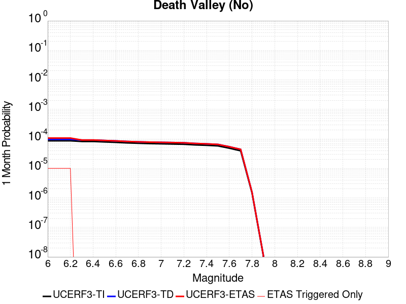 |  |  |

| Magnitude | 1 wk TI Prob | 1 wk TD Prob | 1 wk ETAS Prob | 1 wk ETAS/TD Gain | 1 wk ETAS Triggered Only | 1 mo TI Prob | 1 mo TD Prob | 1 mo ETAS Prob | 1 mo ETAS/TD Gain | 1 mo ETAS Triggered Only | 1 yr TI Prob | 1 yr TD Prob | 1 yr ETAS Prob | 1 yr ETAS/TD Gain | 1 yr ETAS Triggered Only | 10 yr TI Prob | 10 yr TD Prob | 10 yr ETAS Prob | 10 yr ETAS/TD Gain | 10 yr ETAS Triggered Only |
|-----|-----|-----|-----|-----|-----|-----|-----|-----|-----|-----|-----|-----|-----|-----|-----|-----|-----|-----|-----|-----|
| 6.0 | 2.0074807E-5 | 2.2502982E-5 | 2.2502982E-5 | 1.0 | 0.0 | 8.603206E-5 | 9.643783E-5 | 1.1471526E-4 | 1.1895256 | 1.8279197E-5 | 0.001046937 | 0.0011735056 | 0.0012282787 | 1.0466748 | 5.483759E-5 | 0.010420183 | 0.011674001 | 0.011800461 | 1.0108327 | 1.2795438E-4 |
| 6.1 | 2.0074807E-5 | 2.2502982E-5 | 2.2502982E-5 | 1.0 | 0.0 | 8.603206E-5 | 9.643783E-5 | 1.1471526E-4 | 1.1895256 | 1.8279197E-5 | 0.001046937 | 0.0011735056 | 0.0012282787 | 1.0466748 | 5.483759E-5 | 0.010420183 | 0.011674001 | 0.011800461 | 1.0108327 | 1.2795438E-4 |
| 6.2 | 2.0074807E-5 | 2.2502982E-5 | 2.2502982E-5 | 1.0 | 0.0 | 8.603206E-5 | 9.643783E-5 | 1.1471526E-4 | 1.1895256 | 1.8279197E-5 | 0.001046937 | 0.0011735056 | 0.0012282787 | 1.0466748 | 5.483759E-5 | 0.010420183 | 0.011674001 | 0.011800461 | 1.0108327 | 1.2795438E-4 |
| 6.3 | 1.9050609E-5 | 2.1339678E-5 | 2.1339678E-5 | 1.0 | 0.0 | 8.164292E-5 | 9.1452595E-5 | 9.1452595E-5 | 1.0 | 0.0 | 9.935491E-4 | 0.0011128733 | 0.001149391 | 1.0328139 | 3.6558395E-5 | 0.009891188 | 0.011073828 | 0.011164212 | 1.0081619 | 9.139598E-5 |
| 6.4 | 1.9050609E-5 | 2.1339678E-5 | 2.1339678E-5 | 1.0 | 0.0 | 8.164292E-5 | 9.1452595E-5 | 9.1452595E-5 | 1.0 | 0.0 | 9.935491E-4 | 0.0011128733 | 0.001149391 | 1.0328139 | 3.6558395E-5 | 0.009891188 | 0.011073828 | 0.011164212 | 1.0081619 | 9.139598E-5 |
| 6.5 | 1.8367004E-5 | 2.0563628E-5 | 2.0563628E-5 | 1.0 | 0.0 | 7.8713354E-5 | 8.812689E-5 | 8.812689E-5 | 1.0 | 0.0 | 9.5791375E-4 | 0.0010724233 | 0.0011089426 | 1.034053 | 3.6558395E-5 | 0.009537951 | 0.010673268 | 0.010763688 | 1.0084717 | 9.139598E-5 |
| 6.6 | 1.779439E-5 | 1.9913454E-5 | 1.9913454E-5 | 1.0 | 0.0 | 7.625944E-5 | 8.5340616E-5 | 8.5340616E-5 | 1.0 | 0.0 | 9.280632E-4 | 0.0010385332 | 0.0010750536 | 1.0351654 | 3.6558395E-5 | 0.009241969 | 0.010337558 | 0.010428009 | 1.0087497 | 9.139598E-5 |
| 6.7 | 1.7025437E-5 | 1.9045832E-5 | 1.9045832E-5 | 1.0 | 0.0 | 7.296412E-5 | 8.162248E-5 | 8.162248E-5 | 1.0 | 0.0 | 8.87976E-4 | 9.933067E-4 | 0.0010298289 | 1.0367682 | 3.6558395E-5 | 0.008844362 | 0.009889389 | 0.009979881 | 1.0091504 | 9.139598E-5 |
| 6.8 | 1.6545107E-5 | 1.8514893E-5 | 1.8514893E-5 | 1.0 | 0.0 | 7.090568E-5 | 7.934716E-5 | 7.934716E-5 | 1.0 | 0.0 | 8.629347E-4 | 9.6562965E-4 | 0.0010021527 | 1.0378231 | 3.6558395E-5 | 0.008595915 | 0.009615042 | 0.009705559 | 1.0094141 | 9.139598E-5 |
| 6.9 | 1.615478E-5 | 1.80899E-5 | 1.80899E-5 | 1.0 | 0.0 | 6.9232934E-5 | 7.7525874E-5 | 7.7525874E-5 | 1.0 | 0.0 | 8.4258494E-4 | 9.434749E-4 | 9.799987E-4 | 1.0387121 | 3.6558395E-5 | 0.008393973 | 0.009395388 | 0.009485925 | 1.0096364 | 9.139598E-5 |
| 7.0 | 1.5894311E-5 | 1.780783E-5 | 1.780783E-5 | 1.0 | 0.0 | 6.81167E-5 | 7.6317076E-5 | 7.6317076E-5 | 1.0 | 0.0 | 8.2900526E-4 | 9.287704E-4 | 9.6529484E-4 | 1.0393256 | 3.6558395E-5 | 0.008259195 | 0.009249576 | 0.009340127 | 1.0097897 | 9.139598E-5 |
| 7.1 | 1.5602263E-5 | 1.7485747E-5 | 1.7485747E-5 | 1.0 | 0.0 | 6.6865134E-5 | 7.49368E-5 | 7.49368E-5 | 1.0 | 0.0 | 8.137789E-4 | 9.119797E-4 | 9.485048E-4 | 1.0400503 | 3.6558395E-5 | 0.008108052 | 0.009083055 | 0.0091736205 | 1.0099709 | 9.139598E-5 |
| 7.2 | 1.5323829E-5 | 1.7172833E-5 | 1.7172833E-5 | 1.0 | 0.0 | 6.56719E-5 | 7.359582E-5 | 7.359582E-5 | 1.0 | 0.0 | 7.99262E-4 | 8.956668E-4 | 9.3219243E-4 | 1.0407804 | 3.6558395E-5 | 0.007963934 | 0.008921246 | 0.0090118265 | 1.0101534 | 9.139598E-5 |
| 7.3 | 1.4556212E-5 | 1.6304537E-5 | 1.6304537E-5 | 1.0 | 0.0 | 6.238227E-5 | 6.987475E-5 | 6.987475E-5 | 1.0 | 0.0 | 7.592395E-4 | 8.503989E-4 | 8.869262E-4 | 1.0429531 | 3.6558395E-5 | 0.0075665074 | 0.0084720915 | 0.008562714 | 1.0106965 | 9.139598E-5 |
| 7.4 | 1.411725E-5 | 1.5809976E-5 | 1.5809976E-5 | 1.0 | 0.0 | 6.0501097E-5 | 6.775531E-5 | 6.775531E-5 | 1.0 | 0.0 | 7.363519E-4 | 8.2461454E-4 | 8.6114276E-4 | 1.0442973 | 3.6558395E-5 | 0.0073391674 | 0.008216182 | 0.008306826 | 1.0110325 | 9.139598E-5 |
| 7.5 | 1.3503312E-5 | 1.5128224E-5 | 1.5128224E-5 | 1.0 | 0.0 | 5.7870053E-5 | 6.4833665E-5 | 6.4833665E-5 | 1.0 | 0.0 | 7.043401E-4 | 7.8906986E-4 | 8.255994E-4 | 1.0462945 | 3.6558395E-5 | 0.007021119 | 0.007863306 | 0.007953984 | 1.0115317 | 9.139598E-5 |
| 7.6 | 1.1279839E-5 | 1.2627931E-5 | 1.2627931E-5 | 1.0 | 0.0 | 4.834127E-5 | 5.411861E-5 | 5.411861E-5 | 1.0 | 0.0 | 5.88396E-4 | 6.587002E-4 | 6.952345E-4 | 1.0554643 | 3.6558395E-5 | 0.005868405 | 0.00656803 | 0.006658826 | 1.0138239 | 9.139598E-5 |
| 7.7 | 9.189108E-6 | 1.0284662E-5 | 1.0284662E-5 | 1.0 | 0.0 | 3.93813E-5 | 4.4076405E-5 | 4.4076405E-5 | 1.0 | 0.0 | 4.7936183E-4 | 5.3650315E-4 | 5.730419E-4 | 1.0681055 | 3.6558395E-5 | 0.004783291 | 0.0053525902 | 0.005443497 | 1.0169837 | 9.139598E-5 |
| 7.8 | 3.4586725E-7 | 3.6484747E-7 | 3.6484747E-7 | 1.0 | 0.0 | 1.4822873E-6 | 1.5636311E-6 | 1.5636311E-6 | 1.0 | 0.0 | 1.80467E-5 | 1.9037047E-5 | 1.9037047E-5 | 1.0 | 0.0 | 1.8045233E-4 | 1.9035459E-4 | 1.9035459E-4 | 1.0 | 0.0 |
| 7.9 | 2.5591178E-9 | 2.6697942E-9 | 2.6697942E-9 | 1.0 | 0.0 | 1.0967647E-8 | 1.14419745E-8 | 1.14419745E-8 | 1.0 | 0.0 | 1.335311E-7 | 1.3930604E-7 | 1.3930604E-7 | 1.0 | 0.0 | 1.3353102E-6 | 1.3930604E-6 | 1.3930604E-6 | 1.0 | 0.0 |

## Cady
*[(top)](#table-of-contents)*

| 1 Week | 1 Month | 1 Year | 10 Year |
|-----|-----|-----|-----|
|  | 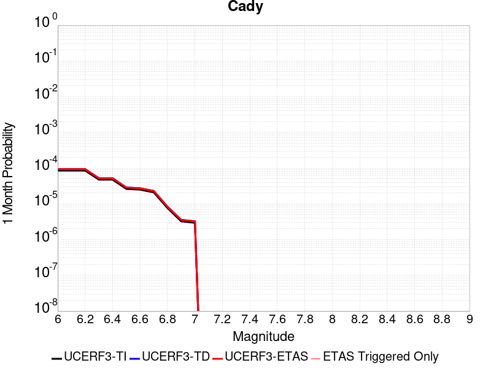 |  |  |

| Magnitude | 1 wk TI Prob | 1 wk TD Prob | 1 wk ETAS Prob | 1 wk ETAS/TD Gain | 1 wk ETAS Triggered Only | 1 mo TI Prob | 1 mo TD Prob | 1 mo ETAS Prob | 1 mo ETAS/TD Gain | 1 mo ETAS Triggered Only | 1 yr TI Prob | 1 yr TD Prob | 1 yr ETAS Prob | 1 yr ETAS/TD Gain | 1 yr ETAS Triggered Only | 10 yr TI Prob | 10 yr TD Prob | 10 yr ETAS Prob | 10 yr ETAS/TD Gain | 10 yr ETAS Triggered Only |
|-----|-----|-----|-----|-----|-----|-----|-----|-----|-----|-----|-----|-----|-----|-----|-----|-----|-----|-----|-----|-----|
| 6.0 | 1.9892565E-5 | 2.1861024E-5 | 2.1861024E-5 | 1.0 | 0.0 | 8.525106E-5 | 9.3687246E-5 | 9.3687246E-5 | 1.0 | 0.0 | 0.0010374374 | 0.0011401363 | 0.001176653 | 1.0320283 | 3.6558395E-5 | 0.010326075 | 0.011351886 | 0.011478388 | 1.0111437 | 1.2795438E-4 |
| 6.1 | 1.9892565E-5 | 2.1861024E-5 | 2.1861024E-5 | 1.0 | 0.0 | 8.525106E-5 | 9.3687246E-5 | 9.3687246E-5 | 1.0 | 0.0 | 0.0010374374 | 0.0011401363 | 0.001176653 | 1.0320283 | 3.6558395E-5 | 0.010326075 | 0.011351886 | 0.011478388 | 1.0111437 | 1.2795438E-4 |
| 6.2 | 1.9892565E-5 | 2.1861024E-5 | 2.1861024E-5 | 1.0 | 0.0 | 8.525106E-5 | 9.3687246E-5 | 9.3687246E-5 | 1.0 | 0.0 | 0.0010374374 | 0.0011401363 | 0.001176653 | 1.0320283 | 3.6558395E-5 | 0.010326075 | 0.011351886 | 0.011478388 | 1.0111437 | 1.2795438E-4 |
| 6.3 | 1.1117327E-5 | 1.2177816E-5 | 1.2177816E-5 | 1.0 | 0.0 | 4.764482E-5 | 5.218977E-5 | 5.218977E-5 | 1.0 | 0.0 | 5.7992124E-4 | 6.352567E-4 | 6.717919E-4 | 1.0575124 | 3.6558395E-5 | 0.0057841022 | 0.0063375146 | 0.0064283316 | 1.01433 | 9.139598E-5 |
| 6.4 | 1.1117327E-5 | 1.2177816E-5 | 1.2177816E-5 | 1.0 | 0.0 | 4.764482E-5 | 5.218977E-5 | 5.218977E-5 | 1.0 | 0.0 | 5.7992124E-4 | 6.352567E-4 | 6.717919E-4 | 1.0575124 | 3.6558395E-5 | 0.0057841022 | 0.0063375146 | 0.0064283316 | 1.01433 | 9.139598E-5 |
| 6.5 | 6.103093E-6 | 6.672681E-6 | 6.672681E-6 | 1.0 | 0.0 | 2.615585E-5 | 2.8596962E-5 | 2.8596962E-5 | 1.0 | 0.0 | 3.1840094E-4 | 3.4812494E-4 | 3.4812494E-4 | 1.0 | 0.0 | 0.0031794512 | 0.0034770304 | 0.003495246 | 1.0052389 | 1.8279197E-5 |
| 6.6 | 5.817237E-6 | 6.3662956E-6 | 6.3662956E-6 | 1.0 | 0.0 | 2.4930776E-5 | 2.728391E-5 | 2.728391E-5 | 1.0 | 0.0 | 3.034899E-4 | 3.3214342E-4 | 3.3214342E-4 | 1.0 | 0.0 | 0.0030307577 | 0.0033176923 | 0.0033176923 | 1.0 | 0.0 |
| 6.7 | 4.8846314E-6 | 5.3410977E-6 | 5.3410977E-6 | 1.0 | 0.0 | 2.0933967E-5 | 2.2890283E-5 | 2.2890283E-5 | 1.0 | 0.0 | 2.5484123E-4 | 2.7866533E-4 | 2.7866533E-4 | 1.0 | 0.0 | 0.0025454918 | 0.0027843148 | 0.0027843148 | 1.0 | 0.0 |
| 6.8 | 1.7788773E-6 | 1.9400945E-6 | 1.9400945E-6 | 1.0 | 0.0 | 7.6237375E-6 | 8.314672E-6 | 8.314672E-6 | 1.0 | 0.0 | 9.281505E-5 | 1.0122802E-4 | 1.0122802E-4 | 1.0 | 0.0 | 9.2776294E-4 | 0.0010119737 | 0.0010119737 | 1.0 | 0.0 |
| 6.9 | 7.5455404E-7 | 8.2979693E-7 | 8.2979693E-7 | 1.0 | 0.0 | 3.233799E-6 | 3.5562696E-6 | 3.5562696E-6 | 1.0 | 0.0 | 3.937079E-5 | 4.3297056E-5 | 4.3297056E-5 | 1.0 | 0.0 | 3.9363815E-4 | 4.3291916E-4 | 4.3291916E-4 | 1.0 | 0.0 |
| 7.0 | 6.8578805E-7 | 7.542614E-7 | 7.542614E-7 | 1.0 | 0.0 | 2.9390883E-6 | 3.2325468E-6 | 3.2325468E-6 | 1.0 | 0.0 | 3.578281E-5 | 3.9355877E-5 | 3.9355877E-5 | 1.0 | 0.0 | 3.577705E-4 | 3.9352156E-4 | 3.9352156E-4 | 1.0 | 0.0 |

## Owens Valley
*[(top)](#table-of-contents)*

| 1 Week | 1 Month | 1 Year | 10 Year |
|-----|-----|-----|-----|
|  |  |  | 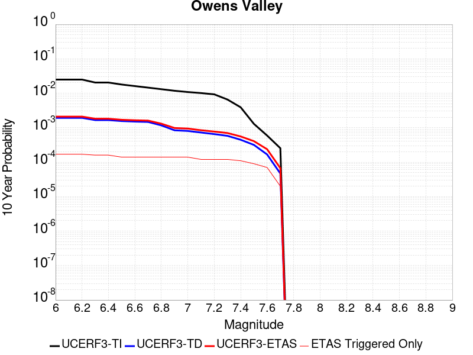 |

| Magnitude | 1 wk TI Prob | 1 wk TD Prob | 1 wk ETAS Prob | 1 wk ETAS/TD Gain | 1 wk ETAS Triggered Only | 1 mo TI Prob | 1 mo TD Prob | 1 mo ETAS Prob | 1 mo ETAS/TD Gain | 1 mo ETAS Triggered Only | 1 yr TI Prob | 1 yr TD Prob | 1 yr ETAS Prob | 1 yr ETAS/TD Gain | 1 yr ETAS Triggered Only | 10 yr TI Prob | 10 yr TD Prob | 10 yr ETAS Prob | 10 yr ETAS/TD Gain | 10 yr ETAS Triggered Only |
|-----|-----|-----|-----|-----|-----|-----|-----|-----|-----|-----|-----|-----|-----|-----|-----|-----|-----|-----|-----|-----|
| 6.0 | 4.83821E-5 | 3.6332003E-6 | 3.6332003E-6 | 1.0 | 0.0 | 2.0733538E-4 | 1.5570771E-5 | 3.3849683E-5 | 2.1739247 | 1.8279197E-5 | 0.002521386 | 1.8955865E-4 | 2.4438582E-4 | 1.2892361 | 5.483759E-5 | 0.024929691 | 0.0019284424 | 0.00205615 | 1.0662231 | 1.2795438E-4 |
| 6.1 | 4.83821E-5 | 3.6332003E-6 | 3.6332003E-6 | 1.0 | 0.0 | 2.0733538E-4 | 1.5570771E-5 | 3.3849683E-5 | 2.1739247 | 1.8279197E-5 | 0.002521386 | 1.8955865E-4 | 2.4438582E-4 | 1.2892361 | 5.483759E-5 | 0.024929691 | 0.0019284424 | 0.00205615 | 1.0662231 | 1.2795438E-4 |
| 6.2 | 4.83821E-5 | 3.6332003E-6 | 3.6332003E-6 | 1.0 | 0.0 | 2.0733538E-4 | 1.5570771E-5 | 3.3849683E-5 | 2.1739247 | 1.8279197E-5 | 0.002521386 | 1.8955865E-4 | 2.4438582E-4 | 1.2892361 | 5.483759E-5 | 0.024929691 | 0.0019284424 | 0.00205615 | 1.0662231 | 1.2795438E-4 |
| 6.3 | 3.953008E-5 | 3.158994E-6 | 3.158994E-6 | 1.0 | 0.0 | 1.6940363E-4 | 1.353848E-5 | 3.1817428E-5 | 2.3501477 | 1.8279197E-5 | 0.002060538 | 1.6481927E-4 | 2.1964782E-4 | 1.3326586 | 5.483759E-5 | 0.020415364 | 0.0016611157 | 0.0017888575 | 1.0769012 | 1.2795438E-4 |
| 6.4 | 3.953008E-5 | 3.158994E-6 | 3.158994E-6 | 1.0 | 0.0 | 1.6940363E-4 | 1.353848E-5 | 3.1817428E-5 | 2.3501477 | 1.8279197E-5 | 0.002060538 | 1.6481927E-4 | 2.1964782E-4 | 1.3326586 | 5.483759E-5 | 0.020415364 | 0.0016611157 | 0.0017888575 | 1.0769012 | 1.2795438E-4 |
| 6.5 | 3.457342E-5 | 2.9739288E-6 | 2.9739288E-6 | 1.0 | 0.0 | 1.4816338E-4 | 1.274535E-5 | 3.1024312E-5 | 2.4341671 | 1.8279197E-5 | 0.0018023965 | 1.5516429E-4 | 2.0999338E-4 | 1.3533615 | 5.483759E-5 | 0.017878477 | 0.0015569815 | 0.0016664859 | 1.0703312 | 1.0967518E-4 |
| 6.6 | 3.1127765E-5 | 2.87613E-6 | 2.87613E-6 | 1.0 | 0.0 | 1.3339789E-4 | 1.2326218E-5 | 3.0605188E-5 | 2.4829342 | 1.8279197E-5 | 0.0016229092 | 1.5006206E-4 | 2.0489142E-4 | 1.3653779 | 5.483759E-5 | 0.016111081 | 0.0015021288 | 0.0016116392 | 1.0729035 | 1.0967518E-4 |
| 6.7 | 2.806885E-5 | 2.8116349E-6 | 2.8116349E-6 | 1.0 | 0.0 | 1.2028952E-4 | 1.20498125E-5 | 3.0328789E-5 | 2.516951 | 1.8279197E-5 | 0.001463541 | 1.4669728E-4 | 2.0152683E-4 | 1.3737599 | 5.483759E-5 | 0.014539397 | 0.0014663904 | 0.0015759048 | 1.074683 | 1.0967518E-4 |
| 6.8 | 2.524524E-5 | 2.2364259E-6 | 2.2364259E-6 | 1.0 | 0.0 | 1.0818939E-4 | 9.584649E-6 | 2.786367E-5 | 2.9071143 | 1.8279197E-5 | 0.0013164099 | 1.1668716E-4 | 1.7151835E-4 | 1.469899 | 5.483759E-5 | 0.01308639 | 0.001166533 | 0.0012760803 | 1.0939084 | 1.0967518E-4 |
| 6.9 | 2.2704568E-5 | 1.6089475E-6 | 1.6089475E-6 | 1.0 | 0.0 | 9.730166E-5 | 6.895471E-6 | 2.5174542E-5 | 3.6508806 | 1.8279197E-5 | 0.0011840039 | 8.394915E-5 | 1.3878212E-4 | 1.653169 | 5.483759E-5 | 0.011777153 | 8.3938777E-4 | 9.489709E-4 | 1.1305512 | 1.0967518E-4 |
| 7.0 | 2.0871712E-5 | 1.5402817E-6 | 1.5402817E-6 | 1.0 | 0.0 | 8.944713E-5 | 6.6011908E-6 | 2.4880266E-5 | 3.7690573 | 1.8279197E-5 | 0.0010884746 | 8.036655E-5 | 1.3519973E-4 | 1.6822886 | 5.483759E-5 | 0.010831586 | 8.035493E-4 | 9.131364E-4 | 1.1363788 | 1.0967518E-4 |
| 7.1 | 1.944928E-5 | 1.3870473E-6 | 1.3870473E-6 | 1.0 | 0.0 | 8.335139E-5 | 5.944475E-6 | 2.4223562E-5 | 4.0749707 | 1.8279197E-5 | 0.0010143308 | 7.237159E-5 | 1.2720522E-4 | 1.7576678 | 5.483759E-5 | 0.010097133 | 7.236403E-4 | 8.149702E-4 | 1.1262089 | 9.139598E-5 |
| 7.2 | 1.7876306E-5 | 1.249468E-6 | 1.249468E-6 | 1.0 | 0.0 | 7.6610486E-5 | 5.354852E-6 | 2.3633951E-5 | 4.4135585 | 1.8279197E-5 | 9.3233347E-4 | 6.519338E-5 | 1.2002739E-4 | 1.841098 | 5.483759E-5 | 0.009284316 | 6.5188174E-4 | 7.432182E-4 | 1.1401119 | 9.139598E-5 |
| 7.3 | 1.2618672E-5 | 1.1120352E-6 | 1.1120352E-6 | 1.0 | 0.0 | 5.40789E-5 | 4.7658564E-6 | 2.3044966E-5 | 4.83543 | 1.8279197E-5 | 6.582117E-4 | 5.8022764E-5 | 1.1285717E-4 | 1.9450499 | 5.483759E-5 | 0.0065626553 | 5.802104E-4 | 6.7155337E-4 | 1.1574308 | 9.139598E-5 |
| 7.4 | 7.4874442E-6 | 8.552969E-7 | 8.552969E-7 | 1.0 | 0.0 | 3.208865E-5 | 3.6655529E-6 | 2.1944683E-5 | 5.986732 | 1.8279197E-5 | 3.906093E-4 | 4.46272E-5 | 8.1183956E-5 | 1.8191588 | 3.6558395E-5 | 0.003899234 | 4.4627616E-4 | 5.193603E-4 | 1.1637645 | 7.311679E-5 |
| 7.5 | 2.4734156E-6 | 6.071494E-7 | 6.071494E-7 | 1.0 | 0.0 | 1.060031E-5 | 2.6020664E-6 | 2.6020664E-6 | 1.0 | 0.0 | 1.2905113E-4 | 3.16797E-5 | 4.995832E-5 | 1.576982 | 1.8279197E-5 | 0.0012897621 | 3.1675215E-4 | 3.715724E-4 | 1.1730697 | 5.483759E-5 |
| 7.6 | 1.1328841E-6 | 3.1979587E-7 | 3.1979587E-7 | 1.0 | 0.0 | 4.8552088E-6 | 1.370553E-6 | 1.370553E-6 | 1.0 | 0.0 | 5.9110564E-5 | 1.6686357E-5 | 3.4965247E-5 | 2.0954392 | 1.8279197E-5 | 5.9094845E-4 | 1.6685124E-4 | 2.0340353E-4 | 1.2190711 | 3.6558395E-5 |
| 7.7 | 4.8613185E-7 | 8.970251E-8 | 8.970251E-8 | 1.0 | 0.0 | 2.0834207E-6 | 3.8443926E-7 | 3.8443926E-7 | 1.0 | 0.0 | 2.536535E-5 | 4.6805385E-6 | 2.295965E-5 | 4.9053435 | 1.8279197E-5 | 2.5362454E-4 | 4.6804467E-5 | 6.508281E-5 | 1.3905256 | 1.8279197E-5 |

## San Andreas (Carrizo) rev
*[(top)](#table-of-contents)*

| 1 Week | 1 Month | 1 Year | 10 Year |
|-----|-----|-----|-----|
|  |  |  | 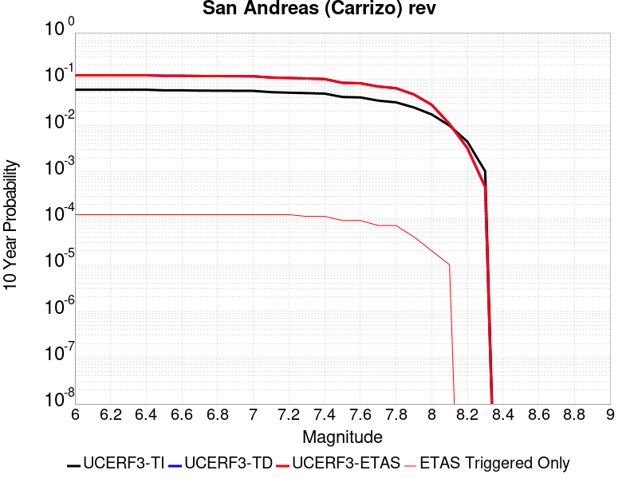 |

| Magnitude | 1 wk TI Prob | 1 wk TD Prob | 1 wk ETAS Prob | 1 wk ETAS/TD Gain | 1 wk ETAS Triggered Only | 1 mo TI Prob | 1 mo TD Prob | 1 mo ETAS Prob | 1 mo ETAS/TD Gain | 1 mo ETAS Triggered Only | 1 yr TI Prob | 1 yr TD Prob | 1 yr ETAS Prob | 1 yr ETAS/TD Gain | 1 yr ETAS Triggered Only | 10 yr TI Prob | 10 yr TD Prob | 10 yr ETAS Prob | 10 yr ETAS/TD Gain | 10 yr ETAS Triggered Only |
|-----|-----|-----|-----|-----|-----|-----|-----|-----|-----|-----|-----|-----|-----|-----|-----|-----|-----|-----|-----|-----|
| 6.0 | 1.1674632E-4 | 2.4399806E-4 | 2.4399806E-4 | 1.0 | 0.0 | 5.002454E-4 | 0.0010452885 | 0.0010452885 | 1.0 | 0.0 | 0.006073493 | 0.012652613 | 0.012706757 | 1.0042793 | 5.483759E-5 | 0.0591016 | 0.12093733 | 0.12104981 | 1.0009301 | 1.2795438E-4 |
| 6.1 | 1.1674632E-4 | 2.4399806E-4 | 2.4399806E-4 | 1.0 | 0.0 | 5.002454E-4 | 0.0010452885 | 0.0010452885 | 1.0 | 0.0 | 0.006073493 | 0.012652613 | 0.012706757 | 1.0042793 | 5.483759E-5 | 0.0591016 | 0.12093733 | 0.12104981 | 1.0009301 | 1.2795438E-4 |
| 6.2 | 1.1674632E-4 | 2.4399806E-4 | 2.4399806E-4 | 1.0 | 0.0 | 5.002454E-4 | 0.0010452885 | 0.0010452885 | 1.0 | 0.0 | 0.006073493 | 0.012652613 | 0.012706757 | 1.0042793 | 5.483759E-5 | 0.0591016 | 0.12093733 | 0.12104981 | 1.0009301 | 1.2795438E-4 |
| 6.3 | 1.1674632E-4 | 2.4399806E-4 | 2.4399806E-4 | 1.0 | 0.0 | 5.002454E-4 | 0.0010452885 | 0.0010452885 | 1.0 | 0.0 | 0.006073493 | 0.012652613 | 0.012706757 | 1.0042793 | 5.483759E-5 | 0.0591016 | 0.12093733 | 0.12104981 | 1.0009301 | 1.2795438E-4 |
| 6.4 | 1.1674632E-4 | 2.4399806E-4 | 2.4399806E-4 | 1.0 | 0.0 | 5.002454E-4 | 0.0010452885 | 0.0010452885 | 1.0 | 0.0 | 0.006073493 | 0.012652613 | 0.012706757 | 1.0042793 | 5.483759E-5 | 0.0591016 | 0.12093733 | 0.12104981 | 1.0009301 | 1.2795438E-4 |
| 6.5 | 1.13136164E-4 | 2.3719473E-4 | 2.3719473E-4 | 1.0 | 0.0 | 4.847792E-4 | 0.0010161544 | 0.0010161544 | 1.0 | 0.0 | 0.0058862255 | 0.012301951 | 0.012356114 | 1.0044028 | 5.483759E-5 | 0.057327334 | 0.11790838 | 0.11802125 | 1.0009573 | 1.2795438E-4 |
| 6.6 | 1.13136164E-4 | 2.3719473E-4 | 2.3719473E-4 | 1.0 | 0.0 | 4.847792E-4 | 0.0010161544 | 0.0010161544 | 1.0 | 0.0 | 0.0058862255 | 0.012301951 | 0.012356114 | 1.0044028 | 5.483759E-5 | 0.057327334 | 0.11790838 | 0.11802125 | 1.0009573 | 1.2795438E-4 |
| 6.7 | 1.1149675E-4 | 2.341054E-4 | 2.341054E-4 | 1.0 | 0.0 | 4.777557E-4 | 0.0010029246 | 0.0010029246 | 1.0 | 0.0 | 0.0058011734 | 0.012142682 | 0.012196854 | 1.0044613 | 5.483759E-5 | 0.05652051 | 0.116529755 | 0.1166428 | 1.0009701 | 1.2795438E-4 |
| 6.8 | 1.1103589E-4 | 2.3312606E-4 | 2.3312606E-4 | 1.0 | 0.0 | 4.7578133E-4 | 9.987307E-4 | 9.987307E-4 | 1.0 | 0.0 | 0.005777263 | 0.012092189 | 0.012146363 | 1.0044801 | 5.483759E-5 | 0.056293584 | 0.11608986 | 0.11620296 | 1.0009743 | 1.2795438E-4 |
| 6.9 | 1.1053259E-4 | 2.3204887E-4 | 2.3204887E-4 | 1.0 | 0.0 | 4.7362508E-4 | 9.941176E-4 | 9.941176E-4 | 1.0 | 0.0 | 0.0057511497 | 0.012036647 | 0.012090825 | 1.0045011 | 5.483759E-5 | 0.05604569 | 0.11560583 | 0.11571899 | 1.0009788 | 1.2795438E-4 |
| 7.0 | 1.1005377E-4 | 2.3105634E-4 | 2.3105634E-4 | 1.0 | 0.0 | 4.7157376E-4 | 9.898671E-4 | 9.898671E-4 | 1.0 | 0.0 | 0.0057263062 | 0.011985469 | 0.012039648 | 1.0045205 | 5.483759E-5 | 0.055809796 | 0.11515792 | 0.115271136 | 1.0009831 | 1.2795438E-4 |
| 7.1 | 1.0308142E-4 | 2.1613913E-4 | 2.1613913E-4 | 1.0 | 0.0 | 4.417027E-4 | 9.259828E-4 | 9.259828E-4 | 1.0 | 0.0 | 0.0053644776 | 0.0112158805 | 0.011270103 | 1.0048344 | 5.483759E-5 | 0.052368138 | 0.108410984 | 0.10852507 | 1.0010523 | 1.2795438E-4 |
| 7.2 | 1.0027479E-4 | 2.1021221E-4 | 2.1021221E-4 | 1.0 | 0.0 | 4.296783E-4 | 9.005994E-4 | 9.005994E-4 | 1.0 | 0.0 | 0.0052187922 | 0.010909973 | 0.010964212 | 1.0049715 | 5.483759E-5 | 0.050979212 | 0.10571356 | 0.10582799 | 1.0010824 | 1.2795438E-4 |
| 7.3 | 9.816942E-5 | 2.0495409E-4 | 2.0495409E-4 | 1.0 | 0.0 | 4.2065824E-4 | 8.7808E-4 | 8.7808E-4 | 1.0 | 0.0 | 0.005109493 | 0.010638508 | 0.010692762 | 1.0050998 | 5.483759E-5 | 0.049935985 | 0.10329403 | 0.10340877 | 1.0011108 | 1.2795438E-4 |
| 7.4 | 9.5634205E-5 | 1.9863612E-4 | 1.9863612E-4 | 1.0 | 0.0 | 4.0979648E-4 | 8.510208E-4 | 8.510208E-4 | 1.0 | 0.0 | 0.0049778637 | 0.01031222 | 0.010366492 | 1.0052629 | 5.483759E-5 | 0.048678253 | 0.10037603 | 0.100491144 | 1.0011468 | 1.2795438E-4 |
| 7.5 | 8.052417E-5 | 1.61756E-4 | 1.61756E-4 | 1.0 | 0.0 | 3.4505792E-4 | 6.9305603E-4 | 6.9305603E-4 | 1.0 | 0.0 | 0.0041929903 | 0.008405393 | 0.008441644 | 1.0043129 | 3.6558395E-5 | 0.04114753 | 0.08309098 | 0.08317479 | 1.0010085 | 9.139598E-5 |
| 7.6 | 7.897024E-5 | 1.5828035E-4 | 1.5828035E-4 | 1.0 | 0.0 | 3.384E-4 | 6.7816814E-4 | 6.7816814E-4 | 1.0 | 0.0 | 0.0041122385 | 0.008225516 | 0.008261774 | 1.004408 | 3.6558395E-5 | 0.040369697 | 0.08142932 | 0.08151327 | 1.001031 | 9.139598E-5 |
| 7.7 | 6.707427E-5 | 1.333214E-4 | 1.333214E-4 | 1.0 | 0.0 | 2.8742946E-4 | 5.7125237E-4 | 5.7125237E-4 | 1.0 | 0.0 | 0.003493839 | 0.0069328514 | 0.006969156 | 1.0052366 | 3.6558395E-5 | 0.034394164 | 0.06930262 | 0.069370665 | 1.0009819 | 7.311679E-5 |
| 7.8 | 6.147705E-5 | 1.2248219E-4 | 1.2248219E-4 | 1.0 | 0.0 | 2.6344648E-4 | 5.2481814E-4 | 5.2481814E-4 | 1.0 | 0.0 | 0.0032027436 | 0.006370966 | 0.006407291 | 1.0057018 | 3.6558395E-5 | 0.031569764 | 0.063746415 | 0.06381486 | 1.0010738 | 7.311679E-5 |
| 7.9 | 4.7636717E-5 | 8.916394E-5 | 8.916394E-5 | 1.0 | 0.0 | 2.0414138E-4 | 3.8207523E-4 | 3.8207523E-4 | 1.0 | 0.0 | 0.0024825884 | 0.004641852 | 0.0046782405 | 1.0078392 | 3.6558395E-5 | 0.024550365 | 0.04680053 | 0.046870228 | 1.0014892 | 7.311679E-5 |
| 8.0 | 3.3554235E-5 | 5.2363197E-5 | 5.2363197E-5 | 1.0 | 0.0 | 1.4379594E-4 | 2.243944E-4 | 2.243944E-4 | 1.0 | 0.0 | 0.0017493097 | 0.002728581 | 0.0027468102 | 1.0066808 | 1.8279197E-5 | 0.017356034 | 0.02799243 | 0.028027965 | 1.0012695 | 3.6558395E-5 |
| 8.1 | 1.9175432E-5 | 1.9296269E-5 | 1.9296269E-5 | 1.0 | 0.0 | 8.217783E-5 | 8.2695675E-5 | 8.2695675E-5 | 1.0 | 0.0 | 0.0010000558 | 0.0010063554 | 0.0010246163 | 1.0181454 | 1.8279197E-5 | 0.009955673 | 0.0108165685 | 0.01083465 | 1.0016717 | 1.8279197E-5 |
| 8.2 | 8.643924E-6 | 5.5167247E-6 | 5.5167247E-6 | 1.0 | 0.0 | 3.704486E-5 | 2.3642891E-5 | 2.3642891E-5 | 1.0 | 0.0 | 4.5092785E-4 | 2.8781427E-4 | 2.8781427E-4 | 1.0 | 0.0 | 0.0045001395 | 0.0032716133 | 0.0032716133 | 1.0 | 0.0 |
| 8.3 | 1.983087E-6 | 7.731745E-7 | 7.731745E-7 | 1.0 | 0.0 | 8.498917E-6 | 3.313601E-6 | 3.313601E-6 | 1.0 | 0.0 | 1.034694E-4 | 4.0342362E-5 | 4.0342362E-5 | 1.0 | 0.0 | 0.0010342124 | 4.7608858E-4 | 4.7608858E-4 | 1.0 | 0.0 |

## San Andreas (Creeping Section) 2011 CFM
*[(top)](#table-of-contents)*

| 1 Week | 1 Month | 1 Year | 10 Year |
|-----|-----|-----|-----|
| 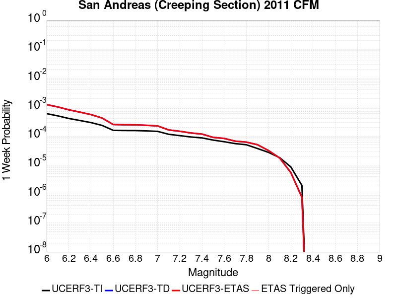 |  |  |  |

| Magnitude | 1 wk TI Prob | 1 wk TD Prob | 1 wk ETAS Prob | 1 wk ETAS/TD Gain | 1 wk ETAS Triggered Only | 1 mo TI Prob | 1 mo TD Prob | 1 mo ETAS Prob | 1 mo ETAS/TD Gain | 1 mo ETAS Triggered Only | 1 yr TI Prob | 1 yr TD Prob | 1 yr ETAS Prob | 1 yr ETAS/TD Gain | 1 yr ETAS Triggered Only | 10 yr TI Prob | 10 yr TD Prob | 10 yr ETAS Prob | 10 yr ETAS/TD Gain | 10 yr ETAS Triggered Only |
|-----|-----|-----|-----|-----|-----|-----|-----|-----|-----|-----|-----|-----|-----|-----|-----|-----|-----|-----|-----|-----|
| 6.0 | 5.986481E-4 | 0.0012277128 | 0.0012277128 | 1.0 | 0.0 | 0.0025631124 | 0.005248843 | 0.005248843 | 1.0 | 0.0 | 0.030762846 | 0.061255742 | 0.061307218 | 1.0008404 | 5.483759E-5 | 0.26835477 | 0.42618826 | 0.4262407 | 1.000123 | 9.139598E-5 |
| 6.1 | 5.015945E-4 | 0.001021834 | 0.001021834 | 1.0 | 0.0 | 0.00214792 | 0.004370119 | 0.004370119 | 1.0 | 0.0 | 0.025839351 | 0.05129081 | 0.051342838 | 1.0010144 | 5.483759E-5 | 0.23032776 | 0.37310076 | 0.37315807 | 1.0001535 | 9.139598E-5 |
| 6.2 | 4.073338E-4 | 8.113091E-4 | 8.113091E-4 | 1.0 | 0.0 | 0.0017445484 | 0.0034705189 | 0.0034705189 | 1.0 | 0.0 | 0.021034058 | 0.040975556 | 0.041028146 | 1.0012834 | 5.483759E-5 | 0.19150782 | 0.31329766 | 0.31336042 | 1.0002003 | 9.139598E-5 |
| 6.3 | 3.464099E-4 | 6.7463954E-4 | 6.7463954E-4 | 1.0 | 0.0 | 0.0014837692 | 0.002886507 | 0.002886507 | 1.0 | 0.0 | 0.017915873 | 0.034232542 | 0.0342855 | 1.0015471 | 5.483759E-5 | 0.16538359 | 0.27159676 | 0.27166334 | 1.0002451 | 9.139598E-5 |
| 6.4 | 2.935057E-4 | 5.552036E-4 | 5.552036E-4 | 1.0 | 0.0 | 0.0012572751 | 0.0023767343 | 0.0023767343 | 1.0 | 0.0 | 0.015200248 | 0.028307864 | 0.028361151 | 1.0018823 | 5.483759E-5 | 0.14201577 | 0.23328128 | 0.23335136 | 1.0003004 | 9.139598E-5 |
| 6.5 | 2.3409708E-4 | 4.2183863E-4 | 4.2183863E-4 | 1.0 | 0.0 | 0.0010028875 | 0.0018061183 | 0.0018061183 | 1.0 | 0.0 | 0.012141965 | 0.021630099 | 0.02168375 | 1.0024804 | 5.483759E-5 | 0.11499573 | 0.18713719 | 0.18721148 | 1.000397 | 9.139598E-5 |
| 6.6 | 1.5842178E-4 | 2.515069E-4 | 2.515069E-4 | 1.0 | 0.0 | 6.7877385E-4 | 0.0010774364 | 0.0010774364 | 1.0 | 0.0 | 0.0082328 | 0.013037458 | 0.01307354 | 1.0027676 | 3.6558395E-5 | 0.07934396 | 0.12348219 | 0.12354628 | 1.000519 | 7.311679E-5 |
| 6.7 | 1.5616413E-4 | 2.4686698E-4 | 2.4686698E-4 | 1.0 | 0.0 | 6.691031E-4 | 0.0010575674 | 0.0010575674 | 1.0 | 0.0 | 0.0081159435 | 0.012799217 | 0.012835308 | 1.0028198 | 3.6558395E-5 | 0.0782586 | 0.12150933 | 0.12157356 | 1.0005286 | 7.311679E-5 |
| 6.8 | 1.5538467E-4 | 2.4510472E-4 | 2.4510472E-4 | 1.0 | 0.0 | 6.6576427E-4 | 0.0010500209 | 0.0010500209 | 1.0 | 0.0 | 0.008075596 | 0.012708522 | 0.012744616 | 1.0028402 | 3.6558395E-5 | 0.07788358 | 0.12073988 | 0.12080416 | 1.0005325 | 7.311679E-5 |
| 6.9 | 1.5153569E-4 | 2.3619262E-4 | 2.3619262E-4 | 1.0 | 0.0 | 6.49277E-4 | 0.0010118634 | 0.0010118634 | 1.0 | 0.0 | 0.007876333 | 0.012250378 | 0.012286489 | 1.0029477 | 3.6558395E-5 | 0.07602952 | 0.11680886 | 0.1168573 | 1.0004146 | 5.483759E-5 |
| 7.0 | 1.4588932E-4 | 2.2475704E-4 | 2.2475704E-4 | 1.0 | 0.0 | 6.250901E-4 | 9.6289086E-4 | 9.6289086E-4 | 1.0 | 0.0 | 0.0075839474 | 0.011660682 | 0.011696814 | 1.0030986 | 3.6558395E-5 | 0.073302895 | 0.11165398 | 0.1117027 | 1.0004363 | 5.483759E-5 |
| 7.1 | 1.1565079E-4 | 1.6348856E-4 | 1.6348856E-4 | 1.0 | 0.0 | 4.955521E-4 | 7.00478E-4 | 7.00478E-4 | 1.0 | 0.0 | 0.006016669 | 0.008495174 | 0.008531421 | 1.0042669 | 3.6558395E-5 | 0.058563538 | 0.083968416 | 0.084018655 | 1.0005982 | 5.483759E-5 |
| 7.2 | 1.0393792E-4 | 1.467928E-4 | 1.467928E-4 | 1.0 | 0.0 | 4.4537216E-4 | 6.289611E-4 | 6.289611E-4 | 1.0 | 0.0 | 0.005408933 | 0.0076308856 | 0.007667165 | 1.0047543 | 3.6558395E-5 | 0.052791595 | 0.075905204 | 0.075955875 | 1.0006676 | 5.483759E-5 |
| 7.3 | 9.332884E-5 | 1.2835828E-4 | 1.2835828E-4 | 1.0 | 0.0 | 3.999194E-4 | 5.499916E-4 | 5.499916E-4 | 1.0 | 0.0 | 0.0048581534 | 0.0066757244 | 0.0067120385 | 1.0054398 | 3.6558395E-5 | 0.047533102 | 0.066735476 | 0.066786654 | 1.0007669 | 5.483759E-5 |
| 7.4 | 8.670252E-5 | 1.1753194E-4 | 1.1753194E-4 | 1.0 | 0.0 | 3.715293E-4 | 5.0361163E-4 | 5.0361163E-4 | 1.0 | 0.0 | 0.004513991 | 0.0061143558 | 0.0061506904 | 1.0059426 | 3.6558395E-5 | 0.044233937 | 0.0613828 | 0.061434273 | 1.0008385 | 5.483759E-5 |
| 7.5 | 7.3036405E-5 | 9.047752E-5 | 9.047752E-5 | 1.0 | 0.0 | 3.129756E-4 | 3.8770327E-4 | 3.8770327E-4 | 1.0 | 0.0 | 0.0038038217 | 0.0047100927 | 0.0047464785 | 1.0077251 | 3.6558395E-5 | 0.03739367 | 0.04807722 | 0.048112016 | 1.0007238 | 3.6558395E-5 |
| 7.6 | 6.3935775E-5 | 8.3173174E-5 | 8.3173174E-5 | 1.0 | 0.0 | 2.7398168E-4 | 3.5640784E-4 | 3.5640784E-4 | 1.0 | 0.0 | 0.0033306254 | 0.004330651 | 0.0043670507 | 1.0084052 | 3.6558395E-5 | 0.032811474 | 0.04416785 | 0.044202793 | 1.0007912 | 3.6558395E-5 |
| 7.7 | 5.5050095E-5 | 6.6946064E-5 | 6.6946064E-5 | 1.0 | 0.0 | 2.3590765E-4 | 2.8688018E-4 | 2.8688018E-4 | 1.0 | 0.0 | 0.0028683927 | 0.0034871765 | 0.0035236075 | 1.0104471 | 3.6558395E-5 | 0.0283165 | 0.035954945 | 0.035990186 | 1.0009803 | 3.6558395E-5 |
| 7.8 | 5.027131E-5 | 6.192842E-5 | 6.192842E-5 | 1.0 | 0.0 | 2.1543067E-4 | 2.653805E-4 | 2.653805E-4 | 1.0 | 0.0 | 0.0026197135 | 0.0032262243 | 0.0032626647 | 1.0112951 | 3.6558395E-5 | 0.025890453 | 0.03327231 | 0.033307653 | 1.0010622 | 3.6558395E-5 |
| 7.9 | 3.7271806E-5 | 5.046638E-5 | 5.046638E-5 | 1.0 | 0.0 | 1.5972654E-4 | 2.1626656E-4 | 2.1626656E-4 | 1.0 | 0.0 | 0.0019429359 | 0.002629868 | 0.0026663302 | 1.0138646 | 3.6558395E-5 | 0.019260362 | 0.027185883 | 0.027221449 | 1.0013082 | 3.6558395E-5 |
| 8.0 | 2.7310243E-5 | 3.1588967E-5 | 3.1588967E-5 | 1.0 | 0.0 | 1.17038646E-4 | 1.3537427E-4 | 1.3537427E-4 | 1.0 | 0.0 | 0.0014240141 | 0.0016469365 | 0.0016651856 | 1.0110806 | 1.8279197E-5 | 0.014149235 | 0.017295659 | 0.017313622 | 1.0010386 | 1.8279197E-5 |
| 8.1 | 1.7940547E-5 | 1.7504728E-5 | 1.7504728E-5 | 1.0 | 0.0 | 7.688579E-5 | 7.5018106E-5 | 7.5018106E-5 | 1.0 | 0.0 | 9.3568244E-4 | 9.129633E-4 | 9.312258E-4 | 1.0200036 | 1.8279197E-5 | 0.009317525 | 0.009853872 | 0.009871971 | 1.0018368 | 1.8279197E-5 |
| 8.2 | 8.643924E-6 | 5.5167247E-6 | 5.5167247E-6 | 1.0 | 0.0 | 3.704486E-5 | 2.3642891E-5 | 2.3642891E-5 | 1.0 | 0.0 | 4.5092785E-4 | 2.8781427E-4 | 2.8781427E-4 | 1.0 | 0.0 | 0.0045001395 | 0.0032716133 | 0.0032716133 | 1.0 | 0.0 |
| 8.3 | 1.983087E-6 | 7.731745E-7 | 7.731745E-7 | 1.0 | 0.0 | 8.498917E-6 | 3.313601E-6 | 3.313601E-6 | 1.0 | 0.0 | 1.034694E-4 | 4.0342362E-5 | 4.0342362E-5 | 1.0 | 0.0 | 0.0010342124 | 4.7608858E-4 | 4.7608858E-4 | 1.0 | 0.0 |

## San Andreas (Cholame) rev
*[(top)](#table-of-contents)*

| 1 Week | 1 Month | 1 Year | 10 Year |
|-----|-----|-----|-----|
|  |  |  | 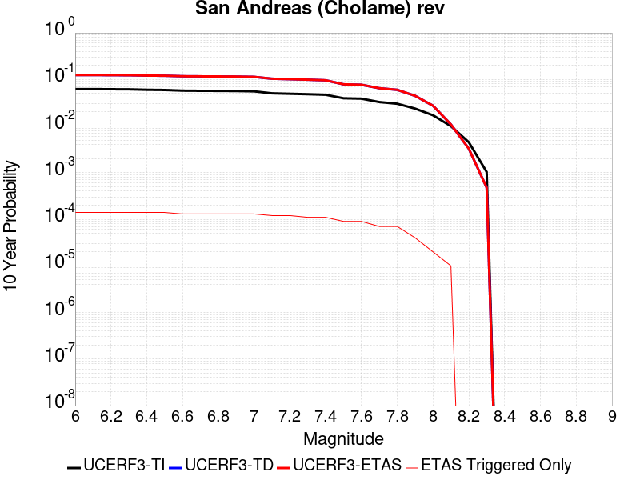 |

| Magnitude | 1 wk TI Prob | 1 wk TD Prob | 1 wk ETAS Prob | 1 wk ETAS/TD Gain | 1 wk ETAS Triggered Only | 1 mo TI Prob | 1 mo TD Prob | 1 mo ETAS Prob | 1 mo ETAS/TD Gain | 1 mo ETAS Triggered Only | 1 yr TI Prob | 1 yr TD Prob | 1 yr ETAS Prob | 1 yr ETAS/TD Gain | 1 yr ETAS Triggered Only | 10 yr TI Prob | 10 yr TD Prob | 10 yr ETAS Prob | 10 yr ETAS/TD Gain | 10 yr ETAS Triggered Only |
|-----|-----|-----|-----|-----|-----|-----|-----|-----|-----|-----|-----|-----|-----|-----|-----|-----|-----|-----|-----|-----|
| 6.0 | 1.2302514E-4 | 2.5281878E-4 | 2.5281878E-4 | 1.0 | 0.0 | 5.27144E-4 | 0.0010830607 | 0.0010830607 | 1.0 | 0.0 | 0.0063991086 | 0.01310705 | 0.013161168 | 1.0041289 | 5.483759E-5 | 0.06217949 | 0.12471412 | 0.12482612 | 1.000898 | 1.2795438E-4 |
| 6.1 | 1.2302514E-4 | 2.5281878E-4 | 2.5281878E-4 | 1.0 | 0.0 | 5.27144E-4 | 0.0010830607 | 0.0010830607 | 1.0 | 0.0 | 0.0063991086 | 0.01310705 | 0.013161168 | 1.0041289 | 5.483759E-5 | 0.06217949 | 0.12471412 | 0.12482612 | 1.000898 | 1.2795438E-4 |
| 6.2 | 1.2203569E-4 | 2.5098576E-4 | 2.5098576E-4 | 1.0 | 0.0 | 5.2290526E-4 | 0.0010752114 | 0.0010752114 | 1.0 | 0.0 | 0.006347804 | 0.01301263 | 0.013066754 | 1.0041593 | 5.483759E-5 | 0.061695136 | 0.12390022 | 0.12401232 | 1.0009048 | 1.2795438E-4 |
| 6.3 | 1.2142645E-4 | 2.498449E-4 | 2.498449E-4 | 1.0 | 0.0 | 5.202953E-4 | 0.0010703261 | 0.0010703261 | 1.0 | 0.0 | 0.006316212 | 0.012953859 | 0.013007985 | 1.0041784 | 5.483759E-5 | 0.06139677 | 0.123394296 | 0.12350646 | 1.000909 | 1.2795438E-4 |
| 6.4 | 1.1865206E-4 | 2.4489546E-4 | 2.4489546E-4 | 1.0 | 0.0 | 5.0840975E-4 | 0.0010491315 | 0.0010491315 | 1.0 | 0.0 | 0.006172335 | 0.012698848 | 0.012752989 | 1.0042635 | 5.483759E-5 | 0.060036868 | 0.12118601 | 0.121298455 | 1.0009279 | 1.2795438E-4 |
| 6.5 | 1.17443946E-4 | 2.4282538E-4 | 2.4282538E-4 | 1.0 | 0.0 | 5.032341E-4 | 0.0010402667 | 0.0010402667 | 1.0 | 0.0 | 0.006109677 | 0.012592169 | 0.012646317 | 1.0043001 | 5.483759E-5 | 0.059444077 | 0.12025932 | 0.12037189 | 1.000936 | 1.2795438E-4 |
| 6.6 | 1.13579066E-4 | 2.3590637E-4 | 2.3590637E-4 | 1.0 | 0.0 | 4.866766E-4 | 0.001010637 | 0.001010637 | 1.0 | 0.0 | 0.0059092017 | 0.0122355325 | 0.012289699 | 1.004427 | 5.483759E-5 | 0.057545185 | 0.11717106 | 0.11728402 | 1.000964 | 1.2795438E-4 |
| 6.7 | 1.1271412E-4 | 2.3434764E-4 | 2.3434764E-4 | 1.0 | 0.0 | 4.829711E-4 | 0.001003962 | 0.001003962 | 1.0 | 0.0 | 0.005864331 | 0.012155173 | 0.012209345 | 1.0044566 | 5.483759E-5 | 0.057119697 | 0.11647417 | 0.11658722 | 1.0009706 | 1.2795438E-4 |
| 6.8 | 1.1217975E-4 | 2.3323E-4 | 2.3323E-4 | 1.0 | 0.0 | 4.8068175E-4 | 9.991758E-4 | 9.991758E-4 | 1.0 | 0.0 | 0.005836608 | 0.012097551 | 0.012151725 | 1.0044781 | 5.483759E-5 | 0.056856725 | 0.115971886 | 0.116085 | 1.0009754 | 1.2795438E-4 |
| 6.9 | 1.1146753E-4 | 2.3171544E-4 | 2.3171544E-4 | 1.0 | 0.0 | 4.7763053E-4 | 9.926897E-4 | 9.926897E-4 | 1.0 | 0.0 | 0.0057996577 | 0.012019457 | 0.012073636 | 1.0045075 | 5.483759E-5 | 0.056506127 | 0.11529175 | 0.115404956 | 1.0009819 | 1.2795438E-4 |
| 7.0 | 1.0965793E-4 | 2.279428E-4 | 2.279428E-4 | 1.0 | 0.0 | 4.698779E-4 | 9.765335E-4 | 9.765335E-4 | 1.0 | 0.0 | 0.005705768 | 0.011824906 | 0.011879096 | 1.0045826 | 5.483759E-5 | 0.055614736 | 0.11359157 | 0.11370499 | 1.0009985 | 1.2795438E-4 |
| 7.1 | 9.927982E-5 | 2.0610577E-4 | 2.0610577E-4 | 1.0 | 0.0 | 4.2541555E-4 | 8.830125E-4 | 8.830125E-4 | 1.0 | 0.0 | 0.0051671406 | 0.010697979 | 0.010752229 | 1.0050712 | 5.483759E-5 | 0.05048634 | 0.10367857 | 0.103793256 | 1.0011061 | 1.2795438E-4 |
| 7.2 | 9.696786E-5 | 2.0114318E-4 | 2.0114318E-4 | 1.0 | 0.0 | 4.1551032E-4 | 8.617584E-4 | 8.617584E-4 | 1.0 | 0.0 | 0.00504711 | 0.010441719 | 0.010495984 | 1.0051969 | 5.483759E-5 | 0.04934009 | 0.101415254 | 0.10153023 | 1.0011337 | 1.2795438E-4 |
| 7.3 | 9.4727984E-5 | 1.9542476E-4 | 1.9542476E-4 | 1.0 | 0.0 | 4.0591392E-4 | 8.372668E-4 | 8.372668E-4 | 1.0 | 0.0 | 0.0049308087 | 0.010146349 | 0.01020063 | 1.0053499 | 5.483759E-5 | 0.048228268 | 0.09878259 | 0.098897904 | 1.0011674 | 1.2795438E-4 |
| 7.4 | 9.220358E-5 | 1.8911749E-4 | 1.8911749E-4 | 1.0 | 0.0 | 3.9509835E-4 | 8.1025274E-4 | 8.1025274E-4 | 1.0 | 0.0 | 0.004799717 | 0.009820456 | 0.009874755 | 1.0055292 | 5.483759E-5 | 0.046973653 | 0.09585619 | 0.095971875 | 1.0012069 | 1.2795438E-4 |
| 7.5 | 7.71631E-5 | 1.5238045E-4 | 1.5238045E-4 | 1.0 | 0.0 | 3.306571E-4 | 6.5289583E-4 | 6.5289583E-4 | 1.0 | 0.0 | 0.0040183207 | 0.007920107 | 0.007956375 | 1.0045793 | 3.6558395E-5 | 0.03946433 | 0.07855449 | 0.07863871 | 1.001072 | 9.139598E-5 |
| 7.6 | 7.5634416E-5 | 1.4896717E-4 | 1.4896717E-4 | 1.0 | 0.0 | 3.241072E-4 | 6.3827465E-4 | 6.3827465E-4 | 1.0 | 0.0 | 0.0039388672 | 0.0077433735 | 0.0077796485 | 1.0046847 | 3.6558395E-5 | 0.038697794 | 0.07691501 | 0.07699938 | 1.0010968 | 9.139598E-5 |
| 7.7 | 6.3783E-5 | 1.2411876E-4 | 1.2411876E-4 | 1.0 | 0.0 | 2.7332708E-4 | 5.3182914E-4 | 5.3182914E-4 | 1.0 | 0.0 | 0.0033226798 | 0.006455823 | 0.0064921454 | 1.0056263 | 3.6558395E-5 | 0.032734364 | 0.064783335 | 0.064851716 | 1.0010555 | 7.311679E-5 |
| 7.8 | 5.863422E-5 | 1.1464447E-4 | 1.1464447E-4 | 1.0 | 0.0 | 2.512653E-4 | 4.9124093E-4 | 4.9124093E-4 | 1.0 | 0.0 | 0.003054864 | 0.0059644785 | 0.0060008187 | 1.0060928 | 3.6558395E-5 | 0.030132094 | 0.059881274 | 0.059950013 | 1.0011479 | 7.311679E-5 |
| 7.9 | 4.595283E-5 | 8.461681E-5 | 8.461681E-5 | 1.0 | 0.0 | 1.9692584E-4 | 3.6259307E-4 | 3.6259307E-4 | 1.0 | 0.0 | 0.0023949358 | 0.0044056415 | 0.004442039 | 1.0082616 | 3.6558395E-5 | 0.023692891 | 0.044529073 | 0.044598933 | 1.0015689 | 7.311679E-5 |
| 8.0 | 3.2950178E-5 | 5.099502E-5 | 5.099502E-5 | 1.0 | 0.0 | 1.412074E-4 | 2.1853177E-4 | 2.1853177E-4 | 1.0 | 0.0 | 0.0017178444 | 0.0026573797 | 0.0026756104 | 1.0068604 | 1.8279197E-5 | 0.017046256 | 0.027289711 | 0.02732527 | 1.0013031 | 3.6558395E-5 |
| 8.1 | 1.9177472E-5 | 1.929644E-5 | 1.929644E-5 | 1.0 | 0.0 | 8.218658E-5 | 8.269641E-5 | 8.269641E-5 | 1.0 | 0.0 | 0.0010001622 | 0.0010063645 | 0.0010246253 | 1.0181453 | 1.8279197E-5 | 0.009956728 | 0.010816686 | 0.0108347675 | 1.0016717 | 1.8279197E-5 |
| 8.2 | 8.643924E-6 | 5.5167247E-6 | 5.5167247E-6 | 1.0 | 0.0 | 3.704486E-5 | 2.3642891E-5 | 2.3642891E-5 | 1.0 | 0.0 | 4.5092785E-4 | 2.8781427E-4 | 2.8781427E-4 | 1.0 | 0.0 | 0.0045001395 | 0.0032716133 | 0.0032716133 | 1.0 | 0.0 |
| 8.3 | 1.983087E-6 | 7.731745E-7 | 7.731745E-7 | 1.0 | 0.0 | 8.498917E-6 | 3.313601E-6 | 3.313601E-6 | 1.0 | 0.0 | 1.034694E-4 | 4.0342362E-5 | 4.0342362E-5 | 1.0 | 0.0 | 0.0010342124 | 4.7608858E-4 | 4.7608858E-4 | 1.0 | 0.0 |

## San Andreas (Parkfield)
*[(top)](#table-of-contents)*

| 1 Week | 1 Month | 1 Year | 10 Year |
|-----|-----|-----|-----|
|  |  |  |  |

| Magnitude | 1 wk TI Prob | 1 wk TD Prob | 1 wk ETAS Prob | 1 wk ETAS/TD Gain | 1 wk ETAS Triggered Only | 1 mo TI Prob | 1 mo TD Prob | 1 mo ETAS Prob | 1 mo ETAS/TD Gain | 1 mo ETAS Triggered Only | 1 yr TI Prob | 1 yr TD Prob | 1 yr ETAS Prob | 1 yr ETAS/TD Gain | 1 yr ETAS Triggered Only | 10 yr TI Prob | 10 yr TD Prob | 10 yr ETAS Prob | 10 yr ETAS/TD Gain | 10 yr ETAS Triggered Only |
|-----|-----|-----|-----|-----|-----|-----|-----|-----|-----|-----|-----|-----|-----|-----|-----|-----|-----|-----|-----|-----|
| 6.0 | 5.556969E-4 | 7.859536E-4 | 7.859536E-4 | 1.0 | 0.0 | 0.0023793848 | 0.0033645865 | 0.0033645865 | 1.0 | 0.0 | 0.028586963 | 0.040577162 | 0.040629774 | 1.0012966 | 5.483759E-5 | 0.25176284 | 0.33838087 | 0.33846554 | 1.0002502 | 1.2795438E-4 |
| 6.1 | 1.925858E-4 | 3.0503818E-4 | 3.0503818E-4 | 1.0 | 0.0 | 8.2510663E-4 | 0.0013067479 | 0.0013067479 | 1.0 | 0.0 | 0.0099994885 | 0.01589046 | 0.015926437 | 1.0022641 | 3.6558395E-5 | 0.095613256 | 0.150276 | 0.1503692 | 1.0006201 | 1.0967518E-4 |
| 6.2 | 9.4306815E-5 | 1.8304172E-4 | 1.8304172E-4 | 1.0 | 0.0 | 4.0410945E-4 | 7.842299E-4 | 7.842299E-4 | 1.0 | 0.0 | 0.0049089384 | 0.009506407 | 0.009542618 | 1.0038091 | 3.6558395E-5 | 0.048019063 | 0.09212034 | 0.09221992 | 1.0010809 | 1.0967518E-4 |
| 6.3 | 9.283051E-5 | 1.8000482E-4 | 1.8000482E-4 | 1.0 | 0.0 | 3.9778434E-4 | 7.7122235E-4 | 7.7122235E-4 | 1.0 | 0.0 | 0.0048322747 | 0.00934941 | 0.009385627 | 1.0038737 | 3.6558395E-5 | 0.047285385 | 0.09077296 | 0.090872675 | 1.0010985 | 1.0967518E-4 |
| 6.4 | 9.138826E-5 | 1.7762266E-4 | 1.7762266E-4 | 1.0 | 0.0 | 3.916052E-4 | 7.6101907E-4 | 7.6101907E-4 | 1.0 | 0.0 | 0.0047573745 | 0.009226245 | 0.009262466 | 1.0039259 | 3.6558395E-5 | 0.046568092 | 0.08967384 | 0.08977368 | 1.0011134 | 1.0967518E-4 |
| 6.5 | 9.000255E-5 | 1.7519935E-4 | 1.7519935E-4 | 1.0 | 0.0 | 3.8566816E-4 | 7.506395E-4 | 7.506395E-4 | 1.0 | 0.0 | 0.0046854047 | 0.009100947 | 0.009137172 | 1.0039804 | 3.6558395E-5 | 0.045878403 | 0.08855845 | 0.088658415 | 1.0011288 | 1.0967518E-4 |
| 6.6 | 8.8109264E-5 | 1.7200313E-4 | 1.7200313E-4 | 1.0 | 0.0 | 3.7755648E-4 | 7.369492E-4 | 7.369492E-4 | 1.0 | 0.0 | 0.0045870654 | 0.008935661 | 0.008971892 | 1.0040548 | 3.6558395E-5 | 0.04493529 | 0.087087445 | 0.087187566 | 1.0011497 | 1.0967518E-4 |
| 6.7 | 8.738073E-5 | 1.7067218E-4 | 1.7067218E-4 | 1.0 | 0.0 | 3.7443507E-4 | 7.3124835E-4 | 7.3124835E-4 | 1.0 | 0.0 | 0.0045492216 | 0.008866861 | 0.008903096 | 1.0040865 | 3.6558395E-5 | 0.04457213 | 0.08648729 | 0.08658748 | 1.0011585 | 1.0967518E-4 |
| 6.8 | 8.710195E-5 | 1.7012582E-4 | 1.7012582E-4 | 1.0 | 0.0 | 3.7324068E-4 | 7.2890805E-4 | 7.2890805E-4 | 1.0 | 0.0 | 0.0045347405 | 0.008838609 | 0.008874844 | 1.0040996 | 3.6558395E-5 | 0.04443313 | 0.08623441 | 0.08633463 | 1.0011622 | 1.0967518E-4 |
| 6.9 | 8.6801556E-5 | 1.6953409E-4 | 1.6953409E-4 | 1.0 | 0.0 | 3.7195362E-4 | 7.263735E-4 | 7.263735E-4 | 1.0 | 0.0 | 0.0045191357 | 0.008808001 | 0.008844237 | 1.004114 | 3.6558395E-5 | 0.044283327 | 0.085960045 | 0.08606029 | 1.0011662 | 1.0967518E-4 |
| 7.0 | 8.5571606E-5 | 1.6705737E-4 | 1.6705737E-4 | 1.0 | 0.0 | 3.6668387E-4 | 7.157649E-4 | 7.157649E-4 | 1.0 | 0.0 | 0.004455241 | 0.008679876 | 0.008716117 | 1.0041753 | 3.6558395E-5 | 0.043669727 | 0.08480672 | 0.08490709 | 1.0011835 | 1.0967518E-4 |
| 7.1 | 7.82589E-5 | 1.5184609E-4 | 1.5184609E-4 | 1.0 | 0.0 | 3.3535215E-4 | 6.506074E-4 | 6.506074E-4 | 1.0 | 0.0 | 0.0040752706 | 0.007892547 | 0.0079288175 | 1.0045954 | 3.6558395E-5 | 0.040013418 | 0.07771205 | 0.0778132 | 1.0013016 | 1.0967518E-4 |
| 7.2 | 7.690929E-5 | 1.4921518E-4 | 1.4921518E-4 | 1.0 | 0.0 | 3.2956956E-4 | 6.393376E-4 | 6.393376E-4 | 1.0 | 0.0 | 0.004005129 | 0.007756322 | 0.0077925967 | 1.0046768 | 3.6558395E-5 | 0.0393371 | 0.07648417 | 0.076585464 | 1.0013243 | 1.0967518E-4 |
| 7.3 | 7.5543794E-5 | 1.4617428E-4 | 1.4617428E-4 | 1.0 | 0.0 | 3.2371894E-4 | 6.263115E-4 | 6.263115E-4 | 1.0 | 0.0 | 0.003934157 | 0.0075988453 | 0.007635126 | 1.0047745 | 3.6558395E-5 | 0.038652334 | 0.07504487 | 0.07514632 | 1.0013518 | 1.0967518E-4 |
| 7.4 | 7.4214564E-5 | 1.431766E-4 | 1.431766E-4 | 1.0 | 0.0 | 3.1802364E-4 | 6.1347045E-4 | 6.1347045E-4 | 1.0 | 0.0 | 0.003865065 | 0.0074435836 | 0.0074798698 | 1.0048748 | 3.6558395E-5 | 0.03798529 | 0.07361605 | 0.073717654 | 1.0013802 | 1.0967518E-4 |
| 7.5 | 6.149578E-5 | 1.1237888E-4 | 1.1237888E-4 | 1.0 | 0.0 | 2.6352672E-4 | 4.8153498E-4 | 4.8153498E-4 | 1.0 | 0.0 | 0.0032037178 | 0.005846961 | 0.0058833053 | 1.0062159 | 3.6558395E-5 | 0.03157923 | 0.0587748 | 0.058860824 | 1.0014637 | 9.139598E-5 |
| 7.6 | 6.0643448E-5 | 1.10660854E-4 | 1.10660854E-4 | 1.0 | 0.0 | 2.598746E-4 | 4.741747E-4 | 4.741747E-4 | 1.0 | 0.0 | 0.0031593828 | 0.0057578264 | 0.0057941745 | 1.0063127 | 3.6558395E-5 | 0.031148417 | 0.057934027 | 0.05802013 | 1.0014862 | 9.139598E-5 |
| 7.7 | 5.1652263E-5 | 9.216647E-5 | 9.216647E-5 | 1.0 | 0.0 | 2.2134806E-4 | 3.949394E-4 | 3.949394E-4 | 1.0 | 0.0 | 0.002691582 | 0.004797796 | 0.004834179 | 1.0075833 | 3.6558395E-5 | 0.026592141 | 0.04873269 | 0.048802245 | 1.0014273 | 7.311679E-5 |
| 7.8 | 4.8090482E-5 | 8.598273E-5 | 8.598273E-5 | 1.0 | 0.0 | 2.060858E-4 | 3.6844538E-4 | 3.6844538E-4 | 1.0 | 0.0 | 0.0025062072 | 0.004476604 | 0.0045129987 | 1.00813 | 3.6558395E-5 | 0.024781305 | 0.04548402 | 0.045553815 | 1.0015345 | 7.311679E-5 |
| 7.9 | 3.970278E-5 | 6.780531E-5 | 6.780531E-5 | 1.0 | 0.0 | 1.7014367E-4 | 2.9056185E-4 | 2.9056185E-4 | 1.0 | 0.0 | 0.002069531 | 0.003531856 | 0.0035682851 | 1.0103145 | 3.6558395E-5 | 0.020503636 | 0.03602571 | 0.036096193 | 1.0019565 | 7.311679E-5 |
| 8.0 | 2.8982335E-5 | 4.08898E-5 | 4.08898E-5 | 1.0 | 0.0 | 1.2420409E-4 | 1.7523023E-4 | 1.7523023E-4 | 1.0 | 0.0 | 0.0015111357 | 0.0021313417 | 0.0021495821 | 1.0085582 | 1.8279197E-5 | 0.015009012 | 0.022106694 | 0.022142444 | 1.0016172 | 3.6558395E-5 |
| 8.1 | 1.8836186E-5 | 1.8790506E-5 | 1.8790506E-5 | 1.0 | 0.0 | 8.0724014E-5 | 8.0528254E-5 | 8.0528254E-5 | 1.0 | 0.0 | 9.823717E-4 | 9.799912E-4 | 9.982524E-4 | 1.0186341 | 1.8279197E-5 | 0.009780403 | 0.010545682 | 0.010563769 | 1.0017151 | 1.8279197E-5 |
| 8.2 | 8.643924E-6 | 5.5167247E-6 | 5.5167247E-6 | 1.0 | 0.0 | 3.704486E-5 | 2.3642891E-5 | 2.3642891E-5 | 1.0 | 0.0 | 4.5092785E-4 | 2.8781427E-4 | 2.8781427E-4 | 1.0 | 0.0 | 0.0045001395 | 0.0032716133 | 0.0032716133 | 1.0 | 0.0 |
| 8.3 | 1.983087E-6 | 7.731745E-7 | 7.731745E-7 | 1.0 | 0.0 | 8.498917E-6 | 3.313601E-6 | 3.313601E-6 | 1.0 | 0.0 | 1.034694E-4 | 4.0342362E-5 | 4.0342362E-5 | 1.0 | 0.0 | 0.0010342124 | 4.7608858E-4 | 4.7608858E-4 | 1.0 | 0.0 |

## Baker
*[(top)](#table-of-contents)*

| 1 Week | 1 Month | 1 Year | 10 Year |
|-----|-----|-----|-----|
|  |  |  | 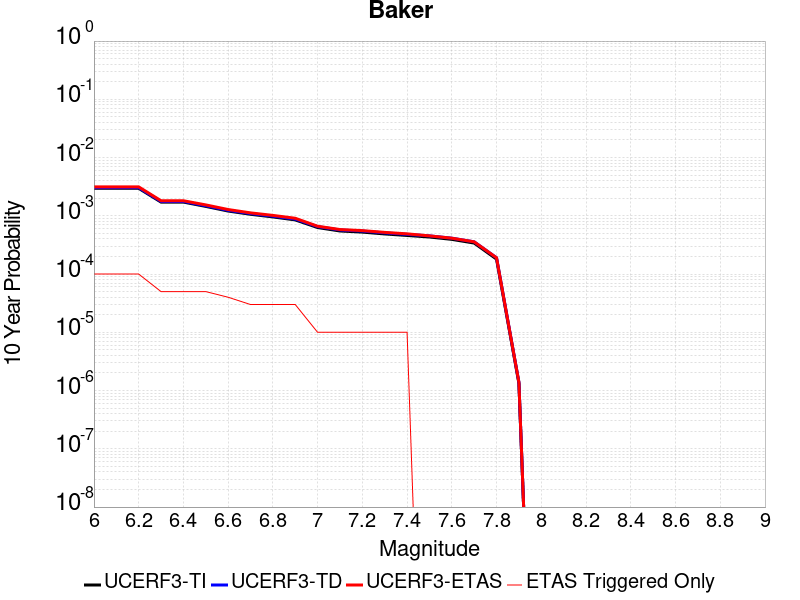 |

| Magnitude | 1 wk TI Prob | 1 wk TD Prob | 1 wk ETAS Prob | 1 wk ETAS/TD Gain | 1 wk ETAS Triggered Only | 1 mo TI Prob | 1 mo TD Prob | 1 mo ETAS Prob | 1 mo ETAS/TD Gain | 1 mo ETAS Triggered Only | 1 yr TI Prob | 1 yr TD Prob | 1 yr ETAS Prob | 1 yr ETAS/TD Gain | 1 yr ETAS Triggered Only | 10 yr TI Prob | 10 yr TD Prob | 10 yr ETAS Prob | 10 yr ETAS/TD Gain | 10 yr ETAS Triggered Only |
|-----|-----|-----|-----|-----|-----|-----|-----|-----|-----|-----|-----|-----|-----|-----|-----|-----|-----|-----|-----|-----|
| 6.0 | 5.695525E-6 | 5.8349897E-6 | 5.8349897E-6 | 1.0 | 0.0 | 2.4409164E-5 | 2.500688E-5 | 2.500688E-5 | 1.0 | 0.0 | 2.9714106E-4 | 3.0442025E-4 | 3.5924115E-4 | 1.1800829 | 5.483759E-5 | 0.0029674405 | 0.003040428 | 0.0031679934 | 1.0419564 | 1.2795438E-4 |
| 6.1 | 5.695525E-6 | 5.8349897E-6 | 5.8349897E-6 | 1.0 | 0.0 | 2.4409164E-5 | 2.500688E-5 | 2.500688E-5 | 1.0 | 0.0 | 2.9714106E-4 | 3.0442025E-4 | 3.5924115E-4 | 1.1800829 | 5.483759E-5 | 0.0029674405 | 0.003040428 | 0.0031679934 | 1.0419564 | 1.2795438E-4 |
| 6.2 | 5.695525E-6 | 5.8349897E-6 | 5.8349897E-6 | 1.0 | 0.0 | 2.4409164E-5 | 2.500688E-5 | 2.500688E-5 | 1.0 | 0.0 | 2.9714106E-4 | 3.0442025E-4 | 3.5924115E-4 | 1.1800829 | 5.483759E-5 | 0.0029674405 | 0.003040428 | 0.0031679934 | 1.0419564 | 1.2795438E-4 |
| 6.3 | 3.2995713E-6 | 3.3837593E-6 | 3.3837593E-6 | 1.0 | 0.0 | 1.4140943E-5 | 1.4501748E-5 | 1.4501748E-5 | 1.0 | 0.0 | 1.7215237E-4 | 1.7654496E-4 | 2.130969E-4 | 1.2070404 | 3.6558395E-5 | 0.0017201907 | 0.0017640941 | 0.0018370819 | 1.0413741 | 7.311679E-5 |
| 6.4 | 3.2995713E-6 | 3.3837593E-6 | 3.3837593E-6 | 1.0 | 0.0 | 1.4140943E-5 | 1.4501748E-5 | 1.4501748E-5 | 1.0 | 0.0 | 1.7215237E-4 | 1.7654496E-4 | 2.130969E-4 | 1.2070404 | 3.6558395E-5 | 0.0017201907 | 0.0017640941 | 0.0018370819 | 1.0413741 | 7.311679E-5 |
| 6.5 | 2.782202E-6 | 2.8559214E-6 | 2.8559214E-6 | 1.0 | 0.0 | 1.1923668E-5 | 1.2239608E-5 | 1.2239608E-5 | 1.0 | 0.0 | 1.4516099E-4 | 1.4900736E-4 | 1.855603E-4 | 1.2453097 | 3.6558395E-5 | 0.001450662 | 0.0014891073 | 0.0015621152 | 1.0490279 | 7.311679E-5 |
| 6.6 | 2.3163404E-6 | 2.3809912E-6 | 2.3809912E-6 | 1.0 | 0.0 | 9.927136E-6 | 1.0204209E-5 | 1.0204209E-5 | 1.0 | 0.0 | 1.20856166E-4 | 1.2422937E-4 | 1.6078322E-4 | 1.2942449 | 3.6558395E-5 | 0.0012079047 | 0.0012416195 | 0.0013146454 | 1.0588151 | 7.311679E-5 |
| 6.7 | 2.037056E-6 | 2.096566E-6 | 2.096566E-6 | 1.0 | 0.0 | 8.7302105E-6 | 8.985253E-6 | 8.985253E-6 | 1.0 | 0.0 | 1.0628513E-4 | 1.0939013E-4 | 1.4594452E-4 | 1.3341653 | 3.6558395E-5 | 0.0010623431 | 0.001093379 | 0.0011481566 | 1.0500994 | 5.483759E-5 |
| 6.8 | 1.8356744E-6 | 1.8915904E-6 | 1.8915904E-6 | 1.0 | 0.0 | 7.867153E-6 | 8.106792E-6 | 8.106792E-6 | 1.0 | 0.0 | 9.577837E-5 | 9.869586E-5 | 1.3525065E-4 | 1.3703781 | 3.6558395E-5 | 9.57371E-4 | 9.865343E-4 | 0.0010413177 | 1.0555313 | 5.483759E-5 |
| 6.9 | 1.6310546E-6 | 1.6832649E-6 | 1.6832649E-6 | 1.0 | 0.0 | 6.9902153E-6 | 7.2139733E-6 | 7.2139733E-6 | 1.0 | 0.0 | 8.510255E-5 | 8.78267E-5 | 1.2438188E-4 | 1.4162195 | 3.6558395E-5 | 8.5069967E-4 | 8.779312E-4 | 9.327206E-4 | 1.0624075 | 5.483759E-5 |
| 7.0 | 1.2058036E-6 | 1.2509166E-6 | 1.2509166E-6 | 1.0 | 0.0 | 5.1677193E-6 | 5.3610606E-6 | 5.3610606E-6 | 1.0 | 0.0 | 6.291517E-5 | 6.526898E-5 | 8.3546984E-5 | 1.2800412 | 1.8279197E-5 | 6.289736E-4 | 6.525004E-4 | 6.707677E-4 | 1.0279958 | 1.8279197E-5 |
| 7.1 | 1.052382E-6 | 1.0952085E-6 | 1.0952085E-6 | 1.0 | 0.0 | 4.5102006E-6 | 4.6937425E-6 | 4.6937425E-6 | 1.0 | 0.0 | 5.491031E-5 | 5.714482E-5 | 7.542298E-5 | 1.3198566 | 1.8279197E-5 | 5.4896745E-4 | 5.713022E-4 | 5.895709E-4 | 1.0319774 | 1.8279197E-5 |
| 7.2 | 1.0067454E-6 | 1.0488179E-6 | 1.0488179E-6 | 1.0 | 0.0 | 4.3146156E-6 | 4.494926E-6 | 4.494926E-6 | 1.0 | 0.0 | 5.252918E-5 | 5.4724358E-5 | 7.300256E-5 | 1.3340048 | 1.8279197E-5 | 5.251676E-4 | 5.471097E-4 | 5.653789E-4 | 1.0333922 | 1.8279197E-5 |
| 7.3 | 9.3596316E-7 | 9.768179E-7 | 9.768179E-7 | 1.0 | 0.0 | 4.0112645E-6 | 4.1863555E-6 | 4.1863555E-6 | 1.0 | 0.0 | 4.8836053E-5 | 5.0967694E-5 | 6.924596E-5 | 1.3586245 | 1.8279197E-5 | 4.8825322E-4 | 5.0956086E-4 | 5.2783074E-4 | 1.0358542 | 1.8279197E-5 |
| 7.4 | 8.8117395E-7 | 9.208105E-7 | 9.208105E-7 | 1.0 | 0.0 | 3.7764542E-6 | 3.946325E-6 | 3.946325E-6 | 1.0 | 0.0 | 4.5977362E-5 | 4.8045455E-5 | 6.632377E-5 | 1.3804381 | 1.8279197E-5 | 4.596785E-4 | 4.8035142E-4 | 4.9862184E-4 | 1.0380355 | 1.8279197E-5 |
| 7.5 | 8.292386E-7 | 8.6750225E-7 | 8.6750225E-7 | 1.0 | 0.0 | 3.5538749E-6 | 3.7178615E-6 | 3.7178615E-6 | 1.0 | 0.0 | 4.326757E-5 | 4.526403E-5 | 4.526403E-5 | 1.0 | 0.0 | 4.3259145E-4 | 4.5254885E-4 | 4.5254885E-4 | 1.0 | 0.0 |
| 7.6 | 7.553842E-7 | 7.9148737E-7 | 7.9148737E-7 | 1.0 | 0.0 | 3.2373566E-6 | 3.3920844E-6 | 3.3920844E-6 | 1.0 | 0.0 | 3.9414106E-5 | 4.129785E-5 | 4.129785E-5 | 1.0 | 0.0 | 3.9407116E-4 | 4.1290247E-4 | 4.1290247E-4 | 1.0 | 0.0 |
| 7.7 | 6.5285366E-7 | 6.8531597E-7 | 6.8531597E-7 | 1.0 | 0.0 | 2.797941E-6 | 2.9370653E-6 | 2.9370653E-6 | 1.0 | 0.0 | 3.40644E-5 | 3.575819E-5 | 3.575819E-5 | 1.0 | 0.0 | 3.405918E-4 | 3.5752502E-4 | 3.5752502E-4 | 1.0 | 0.0 |
| 7.8 | 3.4586725E-7 | 3.6484747E-7 | 3.6484747E-7 | 1.0 | 0.0 | 1.4822873E-6 | 1.5636311E-6 | 1.5636311E-6 | 1.0 | 0.0 | 1.80467E-5 | 1.9037047E-5 | 1.9037047E-5 | 1.0 | 0.0 | 1.8045233E-4 | 1.9035459E-4 | 1.9035459E-4 | 1.0 | 0.0 |
| 7.9 | 2.5591178E-9 | 2.6697942E-9 | 2.6697942E-9 | 1.0 | 0.0 | 1.0967647E-8 | 1.14419745E-8 | 1.14419745E-8 | 1.0 | 0.0 | 1.335311E-7 | 1.3930604E-7 | 1.3930604E-7 | 1.0 | 0.0 | 1.3353102E-6 | 1.3930604E-6 | 1.3930604E-6 | 1.0 | 0.0 |

## Santa Ynez (West)
*[(top)](#table-of-contents)*

| 1 Week | 1 Month | 1 Year | 10 Year |
|-----|-----|-----|-----|
|  |  |  |  |

| Magnitude | 1 wk TI Prob | 1 wk TD Prob | 1 wk ETAS Prob | 1 wk ETAS/TD Gain | 1 wk ETAS Triggered Only | 1 mo TI Prob | 1 mo TD Prob | 1 mo ETAS Prob | 1 mo ETAS/TD Gain | 1 mo ETAS Triggered Only | 1 yr TI Prob | 1 yr TD Prob | 1 yr ETAS Prob | 1 yr ETAS/TD Gain | 1 yr ETAS Triggered Only | 10 yr TI Prob | 10 yr TD Prob | 10 yr ETAS Prob | 10 yr ETAS/TD Gain | 10 yr ETAS Triggered Only |
|-----|-----|-----|-----|-----|-----|-----|-----|-----|-----|-----|-----|-----|-----|-----|-----|-----|-----|-----|-----|-----|
| 6.0 | 4.7352758E-5 | 5.4983077E-5 | 5.4983077E-5 | 1.0 | 0.0 | 2.0292461E-4 | 2.3562026E-4 | 2.3562026E-4 | 1.0 | 0.0 | 0.0024678076 | 0.0028650744 | 0.002901528 | 1.0127234 | 3.6558395E-5 | 0.024405818 | 0.028309857 | 0.028398667 | 1.003137 | 9.139598E-5 |
| 6.1 | 4.7352758E-5 | 5.4983077E-5 | 5.4983077E-5 | 1.0 | 0.0 | 2.0292461E-4 | 2.3562026E-4 | 2.3562026E-4 | 1.0 | 0.0 | 0.0024678076 | 0.0028650744 | 0.002901528 | 1.0127234 | 3.6558395E-5 | 0.024405818 | 0.028309857 | 0.028398667 | 1.003137 | 9.139598E-5 |
| 6.2 | 3.0415853E-5 | 3.3930526E-5 | 3.3930526E-5 | 1.0 | 0.0 | 1.3034715E-4 | 1.4540862E-4 | 1.4540862E-4 | 1.0 | 0.0 | 0.0015858212 | 0.0017689478 | 0.0017871946 | 1.0103151 | 1.8279197E-5 | 0.015745522 | 0.017552571 | 0.017606447 | 1.0030694 | 5.483759E-5 |
| 6.3 | 3.0415853E-5 | 3.3930526E-5 | 3.3930526E-5 | 1.0 | 0.0 | 1.3034715E-4 | 1.4540862E-4 | 1.4540862E-4 | 1.0 | 0.0 | 0.0015858212 | 0.0017689478 | 0.0017871946 | 1.0103151 | 1.8279197E-5 | 0.015745522 | 0.017552571 | 0.017606447 | 1.0030694 | 5.483759E-5 |
| 6.4 | 2.5452082E-5 | 2.7916465E-5 | 2.7916465E-5 | 1.0 | 0.0 | 1.09075794E-4 | 1.1963659E-4 | 1.1963659E-4 | 1.0 | 0.0 | 0.0013271887 | 0.0014556192 | 0.0014556192 | 1.0 | 0.0 | 0.013192902 | 0.01446303 | 0.014481044 | 1.0012456 | 1.8279197E-5 |
| 6.5 | 2.3143784E-5 | 2.5131685E-5 | 2.5131685E-5 | 1.0 | 0.0 | 9.9183875E-5 | 1.07702836E-4 | 1.07702836E-4 | 1.0 | 0.0 | 0.0012068948 | 0.0013105051 | 0.0013105051 | 1.0 | 0.0 | 0.012003611 | 0.013029447 | 0.013047488 | 1.0013846 | 1.8279197E-5 |
| 6.6 | 1.9118515E-5 | 2.0356825E-5 | 2.0356825E-5 | 1.0 | 0.0 | 8.193392E-5 | 8.724067E-5 | 8.724067E-5 | 1.0 | 0.0 | 9.97089E-4 | 0.0010616456 | 0.0010616456 | 1.0 | 0.0 | 0.00992627 | 0.010566648 | 0.010584734 | 1.0017116 | 1.8279197E-5 |
| 6.7 | 1.722807E-5 | 1.8148436E-5 | 1.8148436E-5 | 1.0 | 0.0 | 7.3832496E-5 | 7.777672E-5 | 7.777672E-5 | 1.0 | 0.0 | 8.985399E-4 | 9.4652583E-4 | 9.4652583E-4 | 1.0 | 0.0 | 0.008949154 | 0.00942559 | 0.00942559 | 1.0 | 0.0 |
| 6.8 | 1.5317364E-5 | 1.592819E-5 | 1.592819E-5 | 1.0 | 0.0 | 6.56442E-5 | 6.826191E-5 | 6.826191E-5 | 1.0 | 0.0 | 7.98925E-4 | 8.307761E-4 | 8.307761E-4 | 1.0 | 0.0 | 0.007960589 | 0.008277192 | 0.008277192 | 1.0 | 0.0 |
| 6.9 | 1.3071226E-5 | 1.3330895E-5 | 1.3330895E-5 | 1.0 | 0.0 | 5.6018336E-5 | 5.713117E-5 | 5.713117E-5 | 1.0 | 0.0 | 6.8180985E-4 | 6.9535227E-4 | 6.9535227E-4 | 1.0 | 0.0 | 0.0067972173 | 0.006932026 | 0.006932026 | 1.0 | 0.0 |
| 7.0 | 1.1836986E-5 | 1.1933856E-5 | 1.1933856E-5 | 1.0 | 0.0 | 5.0728955E-5 | 5.1144103E-5 | 5.1144103E-5 | 1.0 | 0.0 | 6.1745E-4 | 6.225032E-4 | 6.225032E-4 | 1.0 | 0.0 | 0.006157372 | 0.0062077884 | 0.0062077884 | 1.0 | 0.0 |
| 7.1 | 1.0597169E-5 | 1.0543094E-5 | 1.0543094E-5 | 1.0 | 0.0 | 4.541565E-5 | 4.518391E-5 | 4.518391E-5 | 1.0 | 0.0 | 5.5279525E-4 | 5.499764E-4 | 5.499764E-4 | 1.0 | 0.0 | 0.0055142213 | 0.0054862844 | 0.0054862844 | 1.0 | 0.0 |
| 7.2 | 9.59113E-6 | 9.459948E-6 | 9.459948E-6 | 1.0 | 0.0 | 4.11042E-5 | 4.054201E-5 | 4.054201E-5 | 1.0 | 0.0 | 5.0032866E-4 | 4.934882E-4 | 4.934882E-4 | 1.0 | 0.0 | 0.004992037 | 0.0049240426 | 0.0049240426 | 1.0 | 0.0 |
| 7.3 | 8.586084E-6 | 8.380302E-6 | 8.380302E-6 | 1.0 | 0.0 | 3.679698E-5 | 3.591509E-5 | 3.591509E-5 | 1.0 | 0.0 | 4.4791115E-4 | 4.3717952E-4 | 4.3717952E-4 | 1.0 | 0.0 | 0.004470094 | 0.004363306 | 0.004363306 | 1.0 | 0.0 |
| 7.4 | 7.2622997E-6 | 6.952138E-6 | 6.952138E-6 | 1.0 | 0.0 | 3.112377E-5 | 2.9794543E-5 | 2.9794543E-5 | 1.0 | 0.0 | 3.78866E-4 | 3.6268914E-4 | 3.6268914E-4 | 1.0 | 0.0 | 0.0037822074 | 0.0036210723 | 0.0036210723 | 1.0 | 0.0 |
| 7.5 | 5.627296E-6 | 5.252027E-6 | 5.252027E-6 | 1.0 | 0.0 | 2.411676E-5 | 2.2508497E-5 | 2.2508497E-5 | 1.0 | 0.0 | 2.9358198E-4 | 2.740072E-4 | 2.740072E-4 | 1.0 | 0.0 | 0.0029319443 | 0.0027367657 | 0.0027367657 | 1.0 | 0.0 |
| 7.6 | 2.265244E-6 | 2.0610207E-6 | 2.0610207E-6 | 1.0 | 0.0 | 9.708152E-6 | 8.832917E-6 | 8.832917E-6 | 1.0 | 0.0 | 1.18190335E-4 | 1.0753554E-4 | 1.0753554E-4 | 1.0 | 0.0 | 0.001181275 | 0.0010748437 | 0.0010748437 | 1.0 | 0.0 |
| 7.7 | 1.3099874E-6 | 1.101704E-6 | 1.101704E-6 | 1.0 | 0.0 | 5.61422E-6 | 4.7215804E-6 | 4.7215804E-6 | 1.0 | 0.0 | 6.8350986E-5 | 5.7483747E-5 | 5.7483747E-5 | 1.0 | 0.0 | 6.832996E-4 | 5.7469116E-4 | 5.7469116E-4 | 1.0 | 0.0 |
| 7.8 | 7.903951E-7 | 6.071534E-7 | 6.071534E-7 | 1.0 | 0.0 | 3.3874032E-6 | 2.6020837E-6 | 2.6020837E-6 | 1.0 | 0.0 | 4.1240855E-5 | 3.1679923E-5 | 3.1679923E-5 | 1.0 | 0.0 | 4.12332E-4 | 3.1675538E-4 | 3.1675538E-4 | 1.0 | 0.0 |
| 7.9 | 7.0753297E-9 | 5.090195E-9 | 5.090195E-9 | 1.0 | 0.0 | 3.032284E-8 | 2.1815122E-8 | 2.1815122E-8 | 1.0 | 0.0 | 3.6918053E-7 | 2.6559908E-7 | 2.6559908E-7 | 1.0 | 0.0 | 3.691799E-6 | 2.6559887E-6 | 2.6559887E-6 | 1.0 | 0.0 |

## Calico-Hidalgo
*[(top)](#table-of-contents)*

| 1 Week | 1 Month | 1 Year | 10 Year |
|-----|-----|-----|-----|
|  |  |  |  |

| Magnitude | 1 wk TI Prob | 1 wk TD Prob | 1 wk ETAS Prob | 1 wk ETAS/TD Gain | 1 wk ETAS Triggered Only | 1 mo TI Prob | 1 mo TD Prob | 1 mo ETAS Prob | 1 mo ETAS/TD Gain | 1 mo ETAS Triggered Only | 1 yr TI Prob | 1 yr TD Prob | 1 yr ETAS Prob | 1 yr ETAS/TD Gain | 1 yr ETAS Triggered Only | 10 yr TI Prob | 10 yr TD Prob | 10 yr ETAS Prob | 10 yr ETAS/TD Gain | 10 yr ETAS Triggered Only |
|-----|-----|-----|-----|-----|-----|-----|-----|-----|-----|-----|-----|-----|-----|-----|-----|-----|-----|-----|-----|-----|
| 6.0 | 4.0906612E-5 | 5.0711405E-5 | 5.0711405E-5 | 1.0 | 0.0 | 1.7530227E-4 | 2.1731878E-4 | 2.1731878E-4 | 1.0 | 0.0 | 0.0021322158 | 0.0026430492 | 0.002697742 | 1.0206931 | 5.483759E-5 | 0.02111873 | 0.026156526 | 0.02624553 | 1.0034028 | 9.139598E-5 |
| 6.1 | 4.0906612E-5 | 5.0711405E-5 | 5.0711405E-5 | 1.0 | 0.0 | 1.7530227E-4 | 2.1731878E-4 | 2.1731878E-4 | 1.0 | 0.0 | 0.0021322158 | 0.0026430492 | 0.002697742 | 1.0206931 | 5.483759E-5 | 0.02111873 | 0.026156526 | 0.02624553 | 1.0034028 | 9.139598E-5 |
| 6.2 | 4.0906612E-5 | 5.0711405E-5 | 5.0711405E-5 | 1.0 | 0.0 | 1.7530227E-4 | 2.1731878E-4 | 2.1731878E-4 | 1.0 | 0.0 | 0.0021322158 | 0.0026430492 | 0.002697742 | 1.0206931 | 5.483759E-5 | 0.02111873 | 0.026156526 | 0.02624553 | 1.0034028 | 9.139598E-5 |
| 6.3 | 2.4242801E-5 | 3.0093575E-5 | 3.0093575E-5 | 1.0 | 0.0 | 1.0389358E-4 | 1.2896628E-4 | 1.2896628E-4 | 1.0 | 0.0 | 0.0012641704 | 0.001569066 | 0.0016238175 | 1.0348943 | 5.483759E-5 | 0.01257003 | 0.015583552 | 0.015637536 | 1.0034641 | 5.483759E-5 |
| 6.4 | 2.4242801E-5 | 3.0093575E-5 | 3.0093575E-5 | 1.0 | 0.0 | 1.0389358E-4 | 1.2896628E-4 | 1.2896628E-4 | 1.0 | 0.0 | 0.0012641704 | 0.001569066 | 0.0016238175 | 1.0348943 | 5.483759E-5 | 0.01257003 | 0.015583552 | 0.015637536 | 1.0034641 | 5.483759E-5 |
| 6.5 | 2.0286952E-5 | 2.5317715E-5 | 2.5317715E-5 | 1.0 | 0.0 | 8.694118E-5 | 1.0850008E-4 | 1.0850008E-4 | 1.0 | 0.0 | 0.0010579949 | 0.0013202052 | 0.0013749703 | 1.0414823 | 5.483759E-5 | 0.010529719 | 0.0131255565 | 0.013179674 | 1.0041231 | 5.483759E-5 |
| 6.6 | 2.0269223E-5 | 2.5298665E-5 | 2.5298665E-5 | 1.0 | 0.0 | 8.6865206E-5 | 1.0841843E-4 | 1.0841843E-4 | 1.0 | 0.0 | 0.0010570707 | 0.0013192123 | 0.0013739775 | 1.0415136 | 5.483759E-5 | 0.010520565 | 0.013115745 | 0.013169864 | 1.0041262 | 5.483759E-5 |
| 6.7 | 1.799852E-5 | 2.2542203E-5 | 2.2542203E-5 | 1.0 | 0.0 | 7.713423E-5 | 9.660594E-5 | 9.660594E-5 | 1.0 | 0.0 | 9.3870464E-4 | 0.0011755573 | 0.0012303304 | 1.0465933 | 5.483759E-5 | 0.009347493 | 0.011694999 | 0.011749196 | 1.0046341 | 5.483759E-5 |
| 6.8 | 1.7458793E-5 | 2.1843663E-5 | 2.1843663E-5 | 1.0 | 0.0 | 7.4821255E-5 | 9.361243E-5 | 9.361243E-5 | 1.0 | 0.0 | 9.10568E-4 | 0.0011391499 | 0.0011939249 | 1.0480843 | 5.483759E-5 | 0.009068459 | 0.01133469 | 0.011388906 | 1.0047832 | 5.483759E-5 |
| 6.9 | 1.542884E-5 | 1.9027206E-5 | 1.9027206E-5 | 1.0 | 0.0 | 6.612192E-5 | 8.15427E-5 | 8.15427E-5 | 1.0 | 0.0 | 8.04737E-4 | 9.923433E-4 | 0.0010288653 | 1.036804 | 3.6558395E-5 | 0.008018291 | 0.009880519 | 0.009916716 | 1.0036635 | 3.6558395E-5 |
| 7.0 | 1.468253E-5 | 1.8031784E-5 | 1.8031784E-5 | 1.0 | 0.0 | 6.292361E-5 | 7.7276854E-5 | 7.7276854E-5 | 1.0 | 0.0 | 7.658257E-4 | 9.404526E-4 | 9.769766E-4 | 1.0388366 | 3.6558395E-5 | 0.0076319184 | 0.009366093 | 0.00940231 | 1.0038667 | 3.6558395E-5 |
| 7.1 | 1.3139281E-5 | 1.6201957E-5 | 1.6201957E-5 | 1.0 | 0.0 | 5.6309986E-5 | 6.9435184E-5 | 6.9435184E-5 | 1.0 | 0.0 | 6.853584E-4 | 8.4505806E-4 | 8.815855E-4 | 1.0432248 | 3.6558395E-5 | 0.0068324856 | 0.008419744 | 0.008455995 | 1.0043055 | 3.6558395E-5 |
| 7.2 | 1.1127404E-5 | 1.3867441E-5 | 1.3867441E-5 | 1.0 | 0.0 | 4.7688E-5 | 5.94306E-5 | 5.94306E-5 | 1.0 | 0.0 | 5.8044674E-4 | 7.233382E-4 | 7.5987016E-4 | 1.0505047 | 3.6558395E-5 | 0.0057893298 | 0.0072109457 | 0.0072472407 | 1.0050333 | 3.6558395E-5 |
| 7.3 | 9.808154E-6 | 1.2176904E-5 | 1.2176904E-5 | 1.0 | 0.0 | 4.2034266E-5 | 5.2185747E-5 | 5.2185747E-5 | 1.0 | 0.0 | 5.11647E-4 | 6.3518697E-4 | 6.7172217E-4 | 1.0575187 | 3.6558395E-5 | 0.0051047057 | 0.0063347905 | 0.006371117 | 1.0057344 | 3.6558395E-5 |
| 7.4 | 7.942452E-6 | 9.792658E-6 | 9.792658E-6 | 1.0 | 0.0 | 3.4038632E-5 | 4.1967913E-5 | 4.1967913E-5 | 1.0 | 0.0 | 4.1434157E-4 | 5.10849E-4 | 5.473887E-4 | 1.0715275 | 3.6558395E-5 | 0.0041356985 | 0.005097688 | 0.00513406 | 1.007135 | 3.6558395E-5 |
| 7.5 | 4.7121216E-6 | 5.773115E-6 | 5.773115E-6 | 1.0 | 0.0 | 2.019465E-5 | 2.474173E-5 | 2.474173E-5 | 1.0 | 0.0 | 2.4584212E-4 | 3.011966E-4 | 3.011966E-4 | 1.0 | 0.0 | 0.0024557032 | 0.0030086362 | 0.0030086362 | 1.0 | 0.0 |
| 7.6 | 2.21172E-7 | 2.604064E-7 | 2.604064E-7 | 1.0 | 0.0 | 9.478797E-7 | 1.1160272E-6 | 1.1160272E-6 | 1.0 | 0.0 | 1.1540374E-5 | 1.3587575E-5 | 1.3587575E-5 | 1.0 | 0.0 | 1.1539775E-4 | 1.3587026E-4 | 1.3587026E-4 | 1.0 | 0.0 |

## San Diego Trough north alt1
*[(top)](#table-of-contents)*

| 1 Week | 1 Month | 1 Year | 10 Year |
|-----|-----|-----|-----|
|  |  |  |  |

| Magnitude | 1 wk TI Prob | 1 wk TD Prob | 1 wk ETAS Prob | 1 wk ETAS/TD Gain | 1 wk ETAS Triggered Only | 1 mo TI Prob | 1 mo TD Prob | 1 mo ETAS Prob | 1 mo ETAS/TD Gain | 1 mo ETAS Triggered Only | 1 yr TI Prob | 1 yr TD Prob | 1 yr ETAS Prob | 1 yr ETAS/TD Gain | 1 yr ETAS Triggered Only | 10 yr TI Prob | 10 yr TD Prob | 10 yr ETAS Prob | 10 yr ETAS/TD Gain | 10 yr ETAS Triggered Only |
|-----|-----|-----|-----|-----|-----|-----|-----|-----|-----|-----|-----|-----|-----|-----|-----|-----|-----|-----|-----|-----|
| 6.0 | 7.329252E-5 | 8.823061E-5 | 8.823061E-5 | 1.0 | 0.0 | 3.14073E-4 | 3.7808003E-4 | 3.9635232E-4 | 1.0483291 | 1.8279197E-5 | 0.0038171355 | 0.004594045 | 0.004648631 | 1.0118818 | 5.483759E-5 | 0.03752231 | 0.045054566 | 0.045141846 | 1.0019372 | 9.139598E-5 |
| 6.1 | 3.7940346E-5 | 4.489396E-5 | 4.489396E-5 | 1.0 | 0.0 | 1.6259136E-4 | 1.9238905E-4 | 2.1066473E-4 | 1.0949934 | 1.8279197E-5 | 0.0019777524 | 0.0023399056 | 0.0023763785 | 1.0155873 | 3.6558395E-5 | 0.019602431 | 0.023161182 | 0.02321475 | 1.0023128 | 5.483759E-5 |
| 6.2 | 2.8645263E-5 | 3.330263E-5 | 3.330263E-5 | 1.0 | 0.0 | 1.2275964E-4 | 1.4271791E-4 | 1.6099449E-4 | 1.1280609 | 1.8279197E-5 | 0.0014935739 | 0.0017362196 | 0.0017727145 | 1.0210198 | 3.6558395E-5 | 0.0148357535 | 0.017229227 | 0.01728312 | 1.0031279 | 5.483759E-5 |
| 6.3 | 2.8645263E-5 | 3.330263E-5 | 3.330263E-5 | 1.0 | 0.0 | 1.2275964E-4 | 1.4271791E-4 | 1.6099449E-4 | 1.1280609 | 1.8279197E-5 | 0.0014935739 | 0.0017362196 | 0.0017727145 | 1.0210198 | 3.6558395E-5 | 0.0148357535 | 0.017229227 | 0.01728312 | 1.0031279 | 5.483759E-5 |
| 6.4 | 2.2204576E-5 | 2.5452311E-5 | 2.5452311E-5 | 1.0 | 0.0 | 9.5159E-5 | 1.0907683E-4 | 1.2735403E-4 | 1.1675626 | 1.8279197E-5 | 0.001157945 | 0.0013272114 | 0.0013637212 | 1.0275087 | 3.6558395E-5 | 0.011519298 | 0.013194007 | 0.013248121 | 1.0041014 | 5.483759E-5 |
| 6.5 | 2.1004838E-5 | 2.40284E-5 | 2.40284E-5 | 1.0 | 0.0 | 9.0017624E-5 | 1.0297485E-4 | 1.2125217E-4 | 1.177493 | 1.8279197E-5 | 0.0010954136 | 0.001253007 | 0.0012895196 | 1.02914 | 3.6558395E-5 | 0.010900296 | 0.012460496 | 0.012514651 | 1.0043461 | 5.483759E-5 |
| 6.6 | 1.820557E-5 | 2.0707832E-5 | 2.0707832E-5 | 1.0 | 0.0 | 7.802154E-5 | 8.874486E-5 | 1.0702243E-4 | 1.2059565 | 1.8279197E-5 | 9.4949827E-4 | 0.0010799386 | 0.0011164575 | 1.0338157 | 3.6558395E-5 | 0.009454516 | 0.010747575 | 0.010801824 | 1.0050474 | 5.483759E-5 |
| 6.7 | 1.5884485E-5 | 1.798619E-5 | 1.798619E-5 | 1.0 | 0.0 | 6.807459E-5 | 7.708141E-5 | 9.5359195E-5 | 1.2371231 | 1.8279197E-5 | 8.284929E-4 | 9.380649E-4 | 9.7458897E-4 | 1.0389355 | 3.6558395E-5 | 0.008254109 | 0.009341419 | 0.009377635 | 1.003877 | 3.6558395E-5 |
| 6.8 | 1.4331171E-5 | 1.6203325E-5 | 1.6203325E-5 | 1.0 | 0.0 | 6.141786E-5 | 6.944098E-5 | 8.7718916E-5 | 1.2632153 | 1.8279197E-5 | 7.4750587E-4 | 8.451181E-4 | 8.8164554E-4 | 1.0432217 | 3.6558395E-5 | 0.0074499645 | 0.008419309 | 0.00845556 | 1.0043056 | 3.6558395E-5 |
| 6.9 | 1.2574203E-5 | 1.4207804E-5 | 1.4207804E-5 | 1.0 | 0.0 | 5.3888325E-5 | 6.088918E-5 | 6.088918E-5 | 1.0 | 0.0 | 6.558929E-4 | 7.4107497E-4 | 7.5934065E-4 | 1.0246475 | 1.8279197E-5 | 0.0065396037 | 0.0073862234 | 0.0074043674 | 1.0024565 | 1.8279197E-5 |
| 7.0 | 1.0883844E-5 | 1.2290957E-5 | 1.2290957E-5 | 1.0 | 0.0 | 4.664421E-5 | 5.2674473E-5 | 5.2674473E-5 | 1.0 | 0.0 | 5.677453E-4 | 6.41124E-4 | 6.5939146E-4 | 1.0284929 | 1.8279197E-5 | 0.00566297 | 0.006392872 | 0.006411034 | 1.002841 | 1.8279197E-5 |
| 7.1 | 9.393088E-6 | 1.0608485E-5 | 1.0608485E-5 | 1.0 | 0.0 | 4.025547E-5 | 4.546415E-5 | 4.546415E-5 | 1.0 | 0.0 | 4.900001E-4 | 5.533862E-4 | 5.716553E-4 | 1.0330132 | 1.8279197E-5 | 0.0048892107 | 0.0055201785 | 0.0055383565 | 1.003293 | 1.8279197E-5 |
| 7.2 | 8.190791E-6 | 9.259917E-6 | 9.259917E-6 | 1.0 | 0.0 | 3.510292E-5 | 3.9684757E-5 | 3.9684757E-5 | 1.0 | 0.0 | 4.2729423E-4 | 4.8305548E-4 | 5.013258E-4 | 1.0378225 | 1.8279197E-5 | 0.0042647356 | 0.004820135 | 0.004838326 | 1.0037739 | 1.8279197E-5 |
| 7.3 | 6.268162E-6 | 7.0907086E-6 | 7.0907086E-6 | 1.0 | 0.0 | 2.6863276E-5 | 3.03884E-5 | 3.03884E-5 | 1.0 | 0.0 | 3.2701128E-4 | 3.6991638E-4 | 3.6991638E-4 | 1.0 | 0.0 | 0.003265305 | 0.003693052 | 0.003693052 | 1.0 | 0.0 |
| 7.4 | 4.985186E-6 | 5.6434765E-6 | 5.6434765E-6 | 1.0 | 0.0 | 2.1364907E-5 | 2.4186105E-5 | 2.4186105E-5 | 1.0 | 0.0 | 2.600867E-4 | 2.9442646E-4 | 2.9442646E-4 | 1.0 | 0.0 | 0.002597825 | 0.0029404052 | 0.0029404052 | 1.0 | 0.0 |
| 7.5 | 1.7489613E-6 | 1.969945E-6 | 1.969945E-6 | 1.0 | 0.0 | 7.495527E-6 | 8.4425965E-6 | 8.4425965E-6 | 1.0 | 0.0 | 9.125422E-5 | 1.0278398E-4 | 1.0278398E-4 | 1.0 | 0.0 | 9.1216754E-4 | 0.0010273864 | 0.0010273864 | 1.0 | 0.0 |
| 7.6 | 1.6988751E-7 | 1.753442E-7 | 1.753442E-7 | 1.0 | 0.0 | 7.2808916E-7 | 7.5147494E-7 | 7.5147494E-7 | 1.0 | 0.0 | 8.864449E-6 | 9.149171E-6 | 9.149171E-6 | 1.0 | 0.0 | 8.8640954E-5 | 9.148814E-5 | 9.148814E-5 | 1.0 | 0.0 |

## Independence rev 2011
*[(top)](#table-of-contents)*

| 1 Week | 1 Month | 1 Year | 10 Year |
|-----|-----|-----|-----|
|  |  | 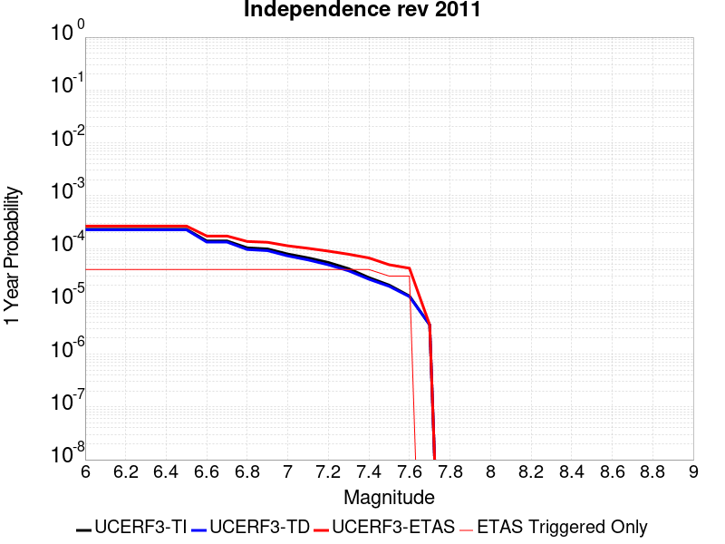 |  |

| Magnitude | 1 wk TI Prob | 1 wk TD Prob | 1 wk ETAS Prob | 1 wk ETAS/TD Gain | 1 wk ETAS Triggered Only | 1 mo TI Prob | 1 mo TD Prob | 1 mo ETAS Prob | 1 mo ETAS/TD Gain | 1 mo ETAS Triggered Only | 1 yr TI Prob | 1 yr TD Prob | 1 yr ETAS Prob | 1 yr ETAS/TD Gain | 1 yr ETAS Triggered Only | 10 yr TI Prob | 10 yr TD Prob | 10 yr ETAS Prob | 10 yr ETAS/TD Gain | 10 yr ETAS Triggered Only |
|-----|-----|-----|-----|-----|-----|-----|-----|-----|-----|-----|-----|-----|-----|-----|-----|-----|-----|-----|-----|-----|
| 6.0 | 4.422171E-6 | 4.3263735E-6 | 2.260549E-5 | 5.225044 | 1.8279197E-5 | 1.8952025E-5 | 1.8541485E-5 | 3.6820344E-5 | 1.9858357 | 1.8279197E-5 | 2.3071647E-4 | 2.2572218E-4 | 2.805474E-4 | 1.242888 | 5.483759E-5 | 0.0023047708 | 0.0022552228 | 0.0023646506 | 1.048522 | 1.0967518E-4 |
| 6.1 | 4.422171E-6 | 4.3263735E-6 | 2.260549E-5 | 5.225044 | 1.8279197E-5 | 1.8952025E-5 | 1.8541485E-5 | 3.6820344E-5 | 1.9858357 | 1.8279197E-5 | 2.3071647E-4 | 2.2572218E-4 | 2.805474E-4 | 1.242888 | 5.483759E-5 | 0.0023047708 | 0.0022552228 | 0.0023646506 | 1.048522 | 1.0967518E-4 |
| 6.2 | 4.422171E-6 | 4.3263735E-6 | 2.260549E-5 | 5.225044 | 1.8279197E-5 | 1.8952025E-5 | 1.8541485E-5 | 3.6820344E-5 | 1.9858357 | 1.8279197E-5 | 2.3071647E-4 | 2.2572218E-4 | 2.805474E-4 | 1.242888 | 5.483759E-5 | 0.0023047708 | 0.0022552228 | 0.0023646506 | 1.048522 | 1.0967518E-4 |
| 6.3 | 4.422171E-6 | 4.3263735E-6 | 2.260549E-5 | 5.225044 | 1.8279197E-5 | 1.8952025E-5 | 1.8541485E-5 | 3.6820344E-5 | 1.9858357 | 1.8279197E-5 | 2.3071647E-4 | 2.2572218E-4 | 2.805474E-4 | 1.242888 | 5.483759E-5 | 0.0023047708 | 0.0022552228 | 0.0023646506 | 1.048522 | 1.0967518E-4 |
| 6.4 | 4.422171E-6 | 4.3263735E-6 | 2.260549E-5 | 5.225044 | 1.8279197E-5 | 1.8952025E-5 | 1.8541485E-5 | 3.6820344E-5 | 1.9858357 | 1.8279197E-5 | 2.3071647E-4 | 2.2572218E-4 | 2.805474E-4 | 1.242888 | 5.483759E-5 | 0.0023047708 | 0.0022552228 | 0.0023646506 | 1.048522 | 1.0967518E-4 |
| 6.5 | 4.422171E-6 | 4.3263735E-6 | 2.260549E-5 | 5.225044 | 1.8279197E-5 | 1.8952025E-5 | 1.8541485E-5 | 3.6820344E-5 | 1.9858357 | 1.8279197E-5 | 2.3071647E-4 | 2.2572218E-4 | 2.805474E-4 | 1.242888 | 5.483759E-5 | 0.0023047708 | 0.0022552228 | 0.0023646506 | 1.048522 | 1.0967518E-4 |
| 6.6 | 2.663744E-6 | 2.5320937E-6 | 2.0811243E-5 | 8.2189865 | 1.8279197E-5 | 1.1415996E-5 | 1.0851788E-5 | 2.9130786E-5 | 2.6844227 | 1.8279197E-5 | 1.3898089E-4 | 1.32113E-4 | 1.8694335E-4 | 1.4150261 | 5.483759E-5 | 0.0013889399 | 0.0013203928 | 0.0014299232 | 1.0829529 | 1.0967518E-4 |
| 6.7 | 2.663744E-6 | 2.5320937E-6 | 2.0811243E-5 | 8.2189865 | 1.8279197E-5 | 1.1415996E-5 | 1.0851788E-5 | 2.9130786E-5 | 2.6844227 | 1.8279197E-5 | 1.3898089E-4 | 1.32113E-4 | 1.8694335E-4 | 1.4150261 | 5.483759E-5 | 0.0013889399 | 0.0013203928 | 0.0014299232 | 1.0829529 | 1.0967518E-4 |
| 6.8 | 1.9716529E-6 | 1.8323504E-6 | 2.0111513E-5 | 10.9758005 | 1.8279197E-5 | 8.449913E-6 | 7.852907E-6 | 2.613196E-5 | 3.3276796 | 1.8279197E-5 | 1.0287284E-4 | 9.5605086E-5 | 1.5043744E-4 | 1.5735296 | 5.483759E-5 | 0.0010282523 | 9.5565245E-4 | 0.0010652229 | 1.114655 | 1.0967518E-4 |
| 6.9 | 1.8788617E-6 | 1.7430878E-6 | 2.0022253E-5 | 11.486657 | 1.8279197E-5 | 8.0522395E-6 | 7.4703557E-6 | 2.5749416E-5 | 3.4468796 | 1.8279197E-5 | 9.80316E-5 | 9.0947906E-5 | 1.457805E-4 | 1.6029012 | 5.483759E-5 | 9.798837E-4 | 9.0911885E-4 | 0.0010186944 | 1.1205293 | 1.0967518E-4 |
| 7.0 | 1.5045488E-6 | 1.3850236E-6 | 1.9664194E-5 | 14.197733 | 1.8279197E-5 | 6.44805E-6 | 5.935802E-6 | 2.421489E-5 | 4.079464 | 1.8279197E-5 | 7.8502184E-5 | 7.226605E-5 | 1.2709967E-4 | 1.7587744 | 5.483759E-5 | 7.8474457E-4 | 7.224306E-4 | 8.3202653E-4 | 1.1517044 | 1.0967518E-4 |
| 7.1 | 1.272341E-6 | 1.1625735E-6 | 1.9441748E-5 | 16.723028 | 1.8279197E-5 | 5.4528787E-6 | 4.9824484E-6 | 2.3261553E-5 | 4.6686993 | 1.8279197E-5 | 6.6386776E-5 | 6.0659655E-5 | 1.1549392E-4 | 1.903966 | 5.483759E-5 | 6.636695E-4 | 6.064342E-4 | 7.160428E-4 | 1.1807429 | 1.0967518E-4 |
| 7.2 | 1.0416892E-6 | 9.41043E-7 | 1.9220222E-5 | 20.424381 | 1.8279197E-5 | 4.464375E-6 | 4.0330356E-6 | 2.2312159E-5 | 5.5323486 | 1.8279197E-5 | 5.4352407E-5 | 4.910112E-5 | 1.03936014E-4 | 2.1167748 | 5.483759E-5 | 5.4339116E-4 | 4.9090455E-4 | 6.005259E-4 | 1.2233047 | 1.0967518E-4 |
| 7.3 | 7.9450155E-7 | 7.2354135E-7 | 1.9002724E-5 | 26.263494 | 1.8279197E-5 | 3.4050022E-6 | 3.1008879E-6 | 2.1380027E-5 | 6.8948083 | 1.8279197E-5 | 4.1455114E-5 | 3.7752667E-5 | 9.258818E-5 | 2.452494 | 5.483759E-5 | 4.144738E-4 | 3.7746364E-4 | 4.8709742E-4 | 1.2904485 | 1.0967518E-4 |
| 7.4 | 5.3893444E-7 | 5.0197684E-7 | 1.8781164E-5 | 37.414406 | 1.8279197E-5 | 2.309717E-6 | 2.1513274E-6 | 2.0430485E-5 | 9.496687 | 1.8279197E-5 | 2.8120441E-5 | 2.6192101E-5 | 8.102826E-5 | 3.093614 | 5.483759E-5 | 2.8116882E-4 | 2.6189061E-4 | 3.7153705E-4 | 1.4186727 | 1.0967518E-4 |
| 7.5 | 3.8852085E-7 | 3.682721E-7 | 1.8647463E-5 | 50.635006 | 1.8279197E-5 | 1.6650882E-6 | 1.5783081E-6 | 1.9857476E-5 | 12.581494 | 1.8279197E-5 | 2.027226E-5 | 1.9215735E-5 | 5.5773424E-5 | 2.9024873 | 3.6558395E-5 | 2.0270412E-4 | 1.9214094E-4 | 2.8351936E-4 | 1.4755802 | 9.139598E-5 |
| 7.6 | 2.414929E-7 | 2.3458423E-7 | 1.8513776E-5 | 78.92165 | 1.8279197E-5 | 1.0349692E-6 | 1.0053607E-6 | 1.9284538E-5 | 19.181713 | 1.8279197E-5 | 1.2600677E-5 | 1.2240199E-5 | 4.8798145E-5 | 3.9867117 | 3.6558395E-5 | 1.2599962E-4 | 1.2239537E-4 | 1.7722625E-4 | 1.4479816 | 5.483759E-5 |
| 7.7 | 6.8298014E-8 | 6.859153E-8 | 6.859153E-8 | 1.0 | 0.0 | 2.9270575E-7 | 2.939637E-7 | 2.939637E-7 | 1.0 | 0.0 | 3.5636867E-6 | 3.5790026E-6 | 3.5790026E-6 | 1.0 | 0.0 | 3.5636294E-5 | 3.5789497E-5 | 5.406804E-5 | 1.5107236 | 1.8279197E-5 |

## Brawley (Seismic Zone) alt 1
*[(top)](#table-of-contents)*

| 1 Week | 1 Month | 1 Year | 10 Year |
|-----|-----|-----|-----|
|  |  |  |  |

| Magnitude | 1 wk TI Prob | 1 wk TD Prob | 1 wk ETAS Prob | 1 wk ETAS/TD Gain | 1 wk ETAS Triggered Only | 1 mo TI Prob | 1 mo TD Prob | 1 mo ETAS Prob | 1 mo ETAS/TD Gain | 1 mo ETAS Triggered Only | 1 yr TI Prob | 1 yr TD Prob | 1 yr ETAS Prob | 1 yr ETAS/TD Gain | 1 yr ETAS Triggered Only | 10 yr TI Prob | 10 yr TD Prob | 10 yr ETAS Prob | 10 yr ETAS/TD Gain | 10 yr ETAS Triggered Only |
|-----|-----|-----|-----|-----|-----|-----|-----|-----|-----|-----|-----|-----|-----|-----|-----|-----|-----|-----|-----|-----|
| 6.0 | 2.2521618E-4 | 4.770347E-4 | 4.770347E-4 | 1.0 | 0.0 | 9.6485513E-4 | 0.0020428698 | 0.0020428698 | 1.0 | 0.0 | 0.011683988 | 0.024582325 | 0.024635814 | 1.0021759 | 5.483759E-5 | 0.11088423 | 0.21374372 | 0.21381557 | 1.0003362 | 9.139598E-5 |
| 6.1 | 2.2521618E-4 | 4.770347E-4 | 4.770347E-4 | 1.0 | 0.0 | 9.6485513E-4 | 0.0020428698 | 0.0020428698 | 1.0 | 0.0 | 0.011683988 | 0.024582325 | 0.024635814 | 1.0021759 | 5.483759E-5 | 0.11088423 | 0.21374372 | 0.21381557 | 1.0003362 | 9.139598E-5 |
| 6.2 | 2.198148E-4 | 4.6786256E-4 | 4.6786256E-4 | 1.0 | 0.0 | 9.417233E-4 | 0.002003621 | 0.002003621 | 1.0 | 0.0 | 0.011405343 | 0.024115691 | 0.024169205 | 1.0022191 | 5.483759E-5 | 0.10837428 | 0.21017633 | 0.21024852 | 1.0003434 | 9.139598E-5 |
| 6.3 | 2.1704129E-4 | 4.6221682E-4 | 4.6221682E-4 | 1.0 | 0.0 | 9.298453E-4 | 0.001979462 | 0.001979462 | 1.0 | 0.0 | 0.011262234 | 0.023828728 | 0.023882259 | 1.0022465 | 5.483759E-5 | 0.107082725 | 0.20806724 | 0.20813963 | 1.0003479 | 9.139598E-5 |
| 6.4 | 1.876142E-4 | 4.0111726E-4 | 4.0111726E-4 | 1.0 | 0.0 | 8.038131E-4 | 0.0017179557 | 0.0017179557 | 1.0 | 0.0 | 0.00974259 | 0.02071454 | 0.020768242 | 1.0025924 | 5.483759E-5 | 0.093263686 | 0.18481886 | 0.18489337 | 1.0004032 | 9.139598E-5 |
| 6.5 | 1.7390939E-4 | 3.7541363E-4 | 3.7541363E-4 | 1.0 | 0.0 | 7.45113E-4 | 0.0016079358 | 0.0016079358 | 1.0 | 0.0 | 0.009034078 | 0.019401617 | 0.01945539 | 1.0027716 | 5.483759E-5 | 0.086755216 | 0.1746364 | 0.17471184 | 1.0004319 | 9.139598E-5 |
| 6.6 | 1.591791E-4 | 3.4952888E-4 | 3.4952888E-4 | 1.0 | 0.0 | 6.8201777E-4 | 0.0014971311 | 0.0014971311 | 1.0 | 0.0 | 0.008271996 | 0.018076792 | 0.018130638 | 1.0029788 | 5.483759E-5 | 0.07970774 | 0.16403708 | 0.1640982 | 1.0003726 | 7.311679E-5 |
| 6.7 | 1.4268003E-4 | 3.2115442E-4 | 3.2115442E-4 | 1.0 | 0.0 | 6.1134255E-4 | 0.0013756583 | 0.0013756583 | 1.0 | 0.0 | 0.007417723 | 0.016621986 | 0.016675912 | 1.0032443 | 5.483759E-5 | 0.07174956 | 0.15215302 | 0.152215 | 1.0004075 | 7.311679E-5 |
| 6.8 | 1.239713E-4 | 2.910217E-4 | 2.910217E-4 | 1.0 | 0.0 | 5.3119735E-4 | 0.0012466458 | 0.0012466458 | 1.0 | 0.0 | 0.0064481674 | 0.01507372 | 0.0151277315 | 1.0035831 | 5.483759E-5 | 0.06264243 | 0.13857023 | 0.13863322 | 1.0004545 | 7.311679E-5 |
| 6.9 | 1.0180238E-4 | 2.6291964E-4 | 2.6291964E-4 | 1.0 | 0.0 | 4.3622297E-4 | 0.0011263161 | 0.0011263161 | 1.0 | 0.0 | 0.005298089 | 0.013627682 | 0.013681772 | 1.0039692 | 5.483759E-5 | 0.05173543 | 0.12511405 | 0.12517802 | 1.0005113 | 7.311679E-5 |
| 7.0 | 7.6619996E-5 | 2.2427912E-4 | 2.2427912E-4 | 1.0 | 0.0 | 3.283301E-4 | 9.608453E-4 | 9.608453E-4 | 1.0 | 0.0 | 0.0039900932 | 0.011636255 | 0.011690455 | 1.0046579 | 5.483759E-5 | 0.039192066 | 0.10738418 | 0.10744945 | 1.0006077 | 7.311679E-5 |
| 7.1 | 7.5127435E-5 | 2.2110711E-4 | 2.2110711E-4 | 1.0 | 0.0 | 3.2193496E-4 | 9.4726094E-4 | 9.4726094E-4 | 1.0 | 0.0 | 0.0039125155 | 0.011472619 | 0.011526828 | 1.004725 | 5.483759E-5 | 0.038443442 | 0.10594688 | 0.106012255 | 1.000617 | 7.311679E-5 |
| 7.2 | 6.788582E-5 | 2.023746E-4 | 2.023746E-4 | 1.0 | 0.0 | 2.9090676E-4 | 8.670345E-4 | 8.670345E-4 | 1.0 | 0.0 | 0.0035360386 | 0.010505693 | 0.010559954 | 1.005165 | 5.483759E-5 | 0.034803 | 0.09761459 | 0.09768057 | 1.0006759 | 7.311679E-5 |
| 7.3 | 6.399602E-5 | 1.8867273E-4 | 1.8867273E-4 | 1.0 | 0.0 | 2.7423984E-4 | 8.083497E-4 | 8.083497E-4 | 1.0 | 0.0 | 0.0033337586 | 0.0097978385 | 0.009852138 | 1.005542 | 5.483759E-5 | 0.03284188 | 0.09150581 | 0.09157223 | 1.0007259 | 7.311679E-5 |
| 7.4 | 4.506759E-5 | 1.2549848E-4 | 1.2549848E-4 | 1.0 | 0.0 | 1.9313251E-4 | 5.3774065E-4 | 5.3774065E-4 | 1.0 | 0.0 | 0.0023488526 | 0.0065275137 | 0.006563834 | 1.0055641 | 3.6558395E-5 | 0.023241805 | 0.06245424 | 0.062505655 | 1.0008233 | 5.483759E-5 |
| 7.5 | 3.43289E-5 | 9.352864E-5 | 9.352864E-5 | 1.0 | 0.0 | 1.4711556E-4 | 4.0077575E-4 | 4.0077575E-4 | 1.0 | 0.0 | 0.0017896603 | 0.0048685903 | 0.0048867804 | 1.0037363 | 1.8279197E-5 | 0.01775316 | 0.04713329 | 0.047168124 | 1.0007391 | 3.6558395E-5 |
| 7.6 | 2.5980507E-5 | 7.068311E-5 | 7.068311E-5 | 1.0 | 0.0 | 1.1134028E-4 | 3.028926E-4 | 3.028926E-4 | 1.0 | 0.0 | 0.001354725 | 0.0036815058 | 0.0036997176 | 1.0049468 | 1.8279197E-5 | 0.013464959 | 0.03590966 | 0.035944905 | 1.0009815 | 3.6558395E-5 |
| 7.7 | 1.7292105E-5 | 4.953711E-5 | 4.953711E-5 | 1.0 | 0.0 | 7.4106916E-5 | 2.1228465E-4 | 2.1228465E-4 | 1.0 | 0.0 | 9.018782E-4 | 0.002581508 | 0.00259974 | 1.0070626 | 1.8279197E-5 | 0.008982267 | 0.025349455 | 0.025385085 | 1.0014056 | 3.6558395E-5 |
| 7.8 | 1.2927471E-5 | 3.9806302E-5 | 3.9806302E-5 | 1.0 | 0.0 | 5.5402274E-5 | 1.705873E-4 | 1.705873E-4 | 1.0 | 0.0 | 6.743139E-4 | 0.0020749245 | 0.0020931659 | 1.0087913 | 1.8279197E-5 | 0.0067227143 | 0.020483209 | 0.020519018 | 1.0017482 | 3.6558395E-5 |
| 7.9 | 1.0200774E-5 | 2.8837148E-5 | 2.8837148E-5 | 1.0 | 0.0 | 4.371687E-5 | 1.2358194E-4 | 1.2358194E-4 | 1.0 | 0.0 | 5.321229E-4 | 0.0015035727 | 0.0015035727 | 1.0 | 0.0 | 0.005308505 | 0.015033948 | 0.015051953 | 1.0011976 | 1.8279197E-5 |
| 8.0 | 8.650396E-6 | 2.3355835E-5 | 2.3355835E-5 | 1.0 | 0.0 | 3.70726E-5 | 1.000926E-4 | 1.000926E-4 | 1.0 | 0.0 | 4.5126543E-4 | 0.001217947 | 0.001217947 | 1.0 | 0.0 | 0.0045035016 | 0.012247655 | 0.012265709 | 1.0014741 | 1.8279197E-5 |
| 8.1 | 3.9368224E-6 | 7.361708E-6 | 7.361708E-6 | 1.0 | 0.0 | 1.6871985E-5 | 3.1549796E-5 | 3.1549796E-5 | 1.0 | 0.0 | 2.0539707E-4 | 3.840512E-4 | 3.840512E-4 | 1.0 | 0.0 | 0.0020520731 | 0.0040179132 | 0.0040179132 | 1.0 | 0.0 |
| 8.2 | 1.7101195E-6 | 2.2310942E-6 | 2.2310942E-6 | 1.0 | 0.0 | 7.329063E-6 | 9.561797E-6 | 9.561797E-6 | 1.0 | 0.0 | 8.922769E-5 | 1.1640869E-4 | 1.1640869E-4 | 1.0 | 0.0 | 8.9191867E-4 | 0.0012734552 | 0.0012734552 | 1.0 | 0.0 |
| 8.3 | 3.0346666E-8 | 1.7353964E-8 | 1.7353964E-8 | 1.0 | 0.0 | 1.3005713E-7 | 7.437413E-8 | 7.437413E-8 | 1.0 | 0.0 | 1.5834444E-6 | 9.055049E-7 | 9.055049E-7 | 1.0 | 0.0 | 1.5834332E-5 | 9.441365E-6 | 9.441365E-6 | 1.0 | 0.0 |

## San Jacinto (Stepovers Combined)
*[(top)](#table-of-contents)*

| 1 Week | 1 Month | 1 Year | 10 Year |
|-----|-----|-----|-----|
| 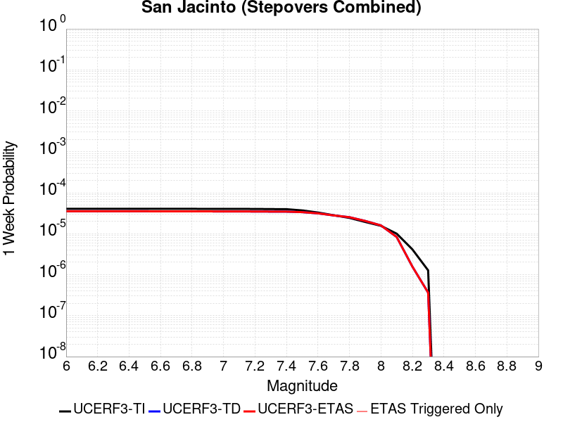 |  |  |  |

| Magnitude | 1 wk TI Prob | 1 wk TD Prob | 1 wk ETAS Prob | 1 wk ETAS/TD Gain | 1 wk ETAS Triggered Only | 1 mo TI Prob | 1 mo TD Prob | 1 mo ETAS Prob | 1 mo ETAS/TD Gain | 1 mo ETAS Triggered Only | 1 yr TI Prob | 1 yr TD Prob | 1 yr ETAS Prob | 1 yr ETAS/TD Gain | 1 yr ETAS Triggered Only | 10 yr TI Prob | 10 yr TD Prob | 10 yr ETAS Prob | 10 yr ETAS/TD Gain | 10 yr ETAS Triggered Only |
|-----|-----|-----|-----|-----|-----|-----|-----|-----|-----|-----|-----|-----|-----|-----|-----|-----|-----|-----|-----|-----|
| 6.0 | 4.0667746E-5 | 3.539606E-5 | 3.539606E-5 | 1.0 | 0.0 | 1.742787E-4 | 1.5168848E-4 | 1.699649E-4 | 1.1204866 | 1.8279197E-5 | 0.0021197782 | 0.0018452448 | 0.0018817356 | 1.0197756 | 3.6558395E-5 | 0.020996714 | 0.019050766 | 0.019140422 | 1.0047061 | 9.139598E-5 |
| 6.1 | 4.0667746E-5 | 3.539606E-5 | 3.539606E-5 | 1.0 | 0.0 | 1.742787E-4 | 1.5168848E-4 | 1.699649E-4 | 1.1204866 | 1.8279197E-5 | 0.0021197782 | 0.0018452448 | 0.0018817356 | 1.0197756 | 3.6558395E-5 | 0.020996714 | 0.019050766 | 0.019140422 | 1.0047061 | 9.139598E-5 |
| 6.2 | 4.0667746E-5 | 3.539606E-5 | 3.539606E-5 | 1.0 | 0.0 | 1.742787E-4 | 1.5168848E-4 | 1.699649E-4 | 1.1204866 | 1.8279197E-5 | 0.0021197782 | 0.0018452448 | 0.0018817356 | 1.0197756 | 3.6558395E-5 | 0.020996714 | 0.019050766 | 0.019140422 | 1.0047061 | 9.139598E-5 |
| 6.3 | 4.0667746E-5 | 3.539606E-5 | 3.539606E-5 | 1.0 | 0.0 | 1.742787E-4 | 1.5168848E-4 | 1.699649E-4 | 1.1204866 | 1.8279197E-5 | 0.0021197782 | 0.0018452448 | 0.0018817356 | 1.0197756 | 3.6558395E-5 | 0.020996714 | 0.019050766 | 0.019140422 | 1.0047061 | 9.139598E-5 |
| 6.4 | 4.0577226E-5 | 3.52679E-5 | 3.52679E-5 | 1.0 | 0.0 | 1.738908E-4 | 1.5113941E-4 | 1.6941584E-4 | 1.1209244 | 1.8279197E-5 | 0.0021150648 | 0.0018385717 | 0.0018750629 | 1.0198475 | 3.6558395E-5 | 0.020950472 | 0.018985314 | 0.019074976 | 1.0047226 | 9.139598E-5 |
| 6.5 | 4.0577226E-5 | 3.52679E-5 | 3.52679E-5 | 1.0 | 0.0 | 1.738908E-4 | 1.5113941E-4 | 1.6941584E-4 | 1.1209244 | 1.8279197E-5 | 0.0021150648 | 0.0018385717 | 0.0018750629 | 1.0198475 | 3.6558395E-5 | 0.020950472 | 0.018985314 | 0.019074976 | 1.0047226 | 9.139598E-5 |
| 6.6 | 4.053861E-5 | 3.5213223E-5 | 3.5213223E-5 | 1.0 | 0.0 | 1.7372532E-4 | 1.509051E-4 | 1.6918154E-4 | 1.1211121 | 1.8279197E-5 | 0.0021130538 | 0.0018357239 | 0.0018722152 | 1.0198784 | 3.6558395E-5 | 0.020930743 | 0.018957384 | 0.019047048 | 1.0047297 | 9.139598E-5 |
| 6.7 | 4.0516545E-5 | 3.518228E-5 | 3.518228E-5 | 1.0 | 0.0 | 1.7363077E-4 | 1.507725E-4 | 1.6904893E-4 | 1.1212187 | 1.8279197E-5 | 0.002111905 | 0.0018341128 | 0.0018706041 | 1.0198959 | 3.6558395E-5 | 0.020919468 | 0.018941576 | 0.019031242 | 1.0047338 | 9.139598E-5 |
| 6.8 | 4.049434E-5 | 3.515383E-5 | 3.515383E-5 | 1.0 | 0.0 | 1.7353562E-4 | 1.5065058E-4 | 1.6892703E-4 | 1.1213168 | 1.8279197E-5 | 0.0021107488 | 0.0018326311 | 0.0018691225 | 1.019912 | 3.6558395E-5 | 0.020908125 | 0.018926984 | 0.01901665 | 1.0047375 | 9.139598E-5 |
| 6.9 | 4.046386E-5 | 3.5116373E-5 | 3.5116373E-5 | 1.0 | 0.0 | 1.73405E-4 | 1.5049007E-4 | 1.6876652E-4 | 1.1214461 | 1.8279197E-5 | 0.0021091616 | 0.0018306803 | 0.0018671717 | 1.0199332 | 3.6558395E-5 | 0.020892553 | 0.01890775 | 0.018997418 | 1.0047424 | 9.139598E-5 |
| 7.0 | 4.036382E-5 | 3.499689E-5 | 3.499689E-5 | 1.0 | 0.0 | 1.7297632E-4 | 1.4997806E-4 | 1.6825453E-4 | 1.1218609 | 1.8279197E-5 | 0.0021039525 | 0.001824457 | 0.0018609486 | 1.0200014 | 3.6558395E-5 | 0.02084144 | 0.018846339 | 0.018936012 | 1.0047581 | 9.139598E-5 |
| 7.1 | 4.0343282E-5 | 3.4975343E-5 | 3.4975343E-5 | 1.0 | 0.0 | 1.7288832E-4 | 1.4988573E-4 | 1.6816218E-4 | 1.121936 | 1.8279197E-5 | 0.002102883 | 0.0018233346 | 0.0018598264 | 1.0200137 | 3.6558395E-5 | 0.020830948 | 0.018835211 | 0.018924884 | 1.004761 | 9.139598E-5 |
| 7.2 | 4.0257353E-5 | 3.487971E-5 | 3.487971E-5 | 1.0 | 0.0 | 1.725201E-4 | 1.4947593E-4 | 1.677524E-4 | 1.1222702 | 1.8279197E-5 | 0.0020984085 | 0.0018183537 | 0.0018548456 | 1.0200686 | 3.6558395E-5 | 0.020787042 | 0.018785886 | 0.018875565 | 1.0047737 | 9.139598E-5 |
| 7.3 | 3.9940667E-5 | 3.470693E-5 | 3.470693E-5 | 1.0 | 0.0 | 1.7116306E-4 | 1.4873552E-4 | 1.67012E-4 | 1.122879 | 1.8279197E-5 | 0.0020819185 | 0.0018093542 | 0.0018458464 | 1.0201687 | 3.6558395E-5 | 0.020625217 | 0.018694295 | 0.018783981 | 1.0047976 | 9.139598E-5 |
| 7.4 | 3.9721202E-5 | 3.4592093E-5 | 3.4592093E-5 | 1.0 | 0.0 | 1.7022261E-4 | 1.4824342E-4 | 1.6651991E-4 | 1.123287 | 1.8279197E-5 | 0.0020704903 | 0.0018033729 | 0.0018398653 | 1.0202357 | 3.6558395E-5 | 0.020513052 | 0.018633302 | 0.018722994 | 1.0048136 | 9.139598E-5 |
| 7.5 | 3.7036873E-5 | 3.365667E-5 | 3.365667E-5 | 1.0 | 0.0 | 1.5871979E-4 | 1.4423492E-4 | 1.6251147E-4 | 1.1267139 | 1.8279197E-5 | 0.0019307006 | 0.0017546486 | 0.0017911429 | 1.0207986 | 3.6558395E-5 | 0.019140124 | 0.018133393 | 0.018223131 | 1.0049489 | 9.139598E-5 |
| 7.6 | 3.2940967E-5 | 3.1428903E-5 | 3.1428903E-5 | 1.0 | 0.0 | 1.4116794E-4 | 1.3468837E-4 | 1.5296509E-4 | 1.1356964 | 1.8279197E-5 | 0.0017173645 | 0.0016385997 | 0.0016750981 | 1.0222741 | 3.6558395E-5 | 0.01704153 | 0.01696185 | 0.017051697 | 1.005297 | 9.139598E-5 |
| 7.7 | 2.8236149E-5 | 2.7991733E-5 | 2.7991733E-5 | 1.0 | 0.0 | 1.2100645E-4 | 1.1995906E-4 | 1.3823606E-4 | 1.1523603 | 1.8279197E-5 | 0.0014722579 | 0.0014595242 | 0.0014960292 | 1.0250117 | 3.6558395E-5 | 0.014625421 | 0.015171104 | 0.015261113 | 1.0059329 | 9.139598E-5 |
| 7.8 | 2.4329287E-5 | 2.5311134E-5 | 2.5311134E-5 | 1.0 | 0.0 | 1.042642E-4 | 1.0847179E-4 | 1.26749E-4 | 1.1684974 | 1.8279197E-5 | 0.0012686774 | 0.0013198447 | 0.0013563549 | 1.0276624 | 3.6558395E-5 | 0.012614589 | 0.01376629 | 0.013856427 | 1.0065477 | 9.139598E-5 |
| 7.9 | 1.9370926E-5 | 2.0515045E-5 | 2.0515045E-5 | 1.0 | 0.0 | 8.301561E-5 | 8.791866E-5 | 1.06196254E-4 | 1.2078921 | 1.8279197E-5 | 0.0010102465 | 0.0010698849 | 0.0011064041 | 1.0341338 | 3.6558395E-5 | 0.0100566605 | 0.011248362 | 0.01133873 | 1.0080339 | 9.139598E-5 |
| 8.0 | 1.5583017E-5 | 1.5965226E-5 | 1.5965226E-5 | 1.0 | 0.0 | 6.6782646E-5 | 6.842061E-5 | 8.669855E-5 | 1.267141 | 1.8279197E-5 | 8.127754E-4 | 8.327032E-4 | 8.692312E-4 | 1.0438668 | 3.6558395E-5 | 0.008098091 | 0.00882326 | 0.008913849 | 1.0102671 | 9.139598E-5 |
| 8.1 | 1.0024873E-5 | 8.3389305E-6 | 8.3389305E-6 | 1.0 | 0.0 | 4.2963035E-5 | 3.5737787E-5 | 5.4016327E-5 | 1.5114627 | 1.8279197E-5 | 5.229494E-4 | 4.3502118E-4 | 4.715637E-4 | 1.0840017 | 3.6558395E-5 | 0.0052172043 | 0.0046784114 | 0.0047147986 | 1.0077777 | 3.6558395E-5 |
| 8.2 | 4.142796E-6 | 1.5742155E-6 | 1.5742155E-6 | 1.0 | 0.0 | 1.775472E-5 | 6.746621E-6 | 6.746621E-6 | 1.0 | 0.0 | 2.1614227E-4 | 8.213704E-5 | 8.213704E-5 | 1.0 | 0.0 | 0.0021593217 | 9.530129E-4 | 9.530129E-4 | 1.0 | 0.0 |
| 8.3 | 1.2750878E-6 | 3.6481603E-7 | 3.6481603E-7 | 1.0 | 0.0 | 5.4646503E-6 | 1.5634963E-6 | 1.5634963E-6 | 1.0 | 0.0 | 6.653009E-5 | 1.9035406E-5 | 1.9035406E-5 | 1.0 | 0.0 | 6.6510175E-4 | 2.2945888E-4 | 2.2945888E-4 | 1.0 | 0.0 |

## White Wolf (Extension)
*[(top)](#table-of-contents)*

| 1 Week | 1 Month | 1 Year | 10 Year |
|-----|-----|-----|-----|
|  |  |  |  |

| Magnitude | 1 wk TI Prob | 1 wk TD Prob | 1 wk ETAS Prob | 1 wk ETAS/TD Gain | 1 wk ETAS Triggered Only | 1 mo TI Prob | 1 mo TD Prob | 1 mo ETAS Prob | 1 mo ETAS/TD Gain | 1 mo ETAS Triggered Only | 1 yr TI Prob | 1 yr TD Prob | 1 yr ETAS Prob | 1 yr ETAS/TD Gain | 1 yr ETAS Triggered Only | 10 yr TI Prob | 10 yr TD Prob | 10 yr ETAS Prob | 10 yr ETAS/TD Gain | 10 yr ETAS Triggered Only |
|-----|-----|-----|-----|-----|-----|-----|-----|-----|-----|-----|-----|-----|-----|-----|-----|-----|-----|-----|-----|-----|
| 6.0 | 8.222555E-6 | 6.066987E-6 | 6.066987E-6 | 1.0 | 0.0 | 3.5239045E-5 | 2.6001153E-5 | 2.6001153E-5 | 1.0 | 0.0 | 4.289509E-4 | 3.1652467E-4 | 3.530715E-4 | 1.1154628 | 3.6558395E-5 | 0.0042812387 | 0.0031613903 | 0.0032524974 | 1.0288186 | 9.139598E-5 |
| 6.1 | 8.222555E-6 | 6.066987E-6 | 6.066987E-6 | 1.0 | 0.0 | 3.5239045E-5 | 2.6001153E-5 | 2.6001153E-5 | 1.0 | 0.0 | 4.289509E-4 | 3.1652467E-4 | 3.530715E-4 | 1.1154628 | 3.6558395E-5 | 0.0042812387 | 0.0031613903 | 0.0032524974 | 1.0288186 | 9.139598E-5 |
| 6.2 | 8.222555E-6 | 6.066987E-6 | 6.066987E-6 | 1.0 | 0.0 | 3.5239045E-5 | 2.6001153E-5 | 2.6001153E-5 | 1.0 | 0.0 | 4.289509E-4 | 3.1652467E-4 | 3.530715E-4 | 1.1154628 | 3.6558395E-5 | 0.0042812387 | 0.0031613903 | 0.0032524974 | 1.0288186 | 9.139598E-5 |
| 6.3 | 8.222555E-6 | 6.066987E-6 | 6.066987E-6 | 1.0 | 0.0 | 3.5239045E-5 | 2.6001153E-5 | 2.6001153E-5 | 1.0 | 0.0 | 4.289509E-4 | 3.1652467E-4 | 3.530715E-4 | 1.1154628 | 3.6558395E-5 | 0.0042812387 | 0.0031613903 | 0.0032524974 | 1.0288186 | 9.139598E-5 |
| 6.4 | 5.821773E-6 | 3.5573776E-6 | 3.5573776E-6 | 1.0 | 0.0 | 2.4950215E-5 | 1.5245821E-5 | 1.5245821E-5 | 1.0 | 0.0 | 3.0372653E-4 | 1.8560316E-4 | 2.0387895E-4 | 1.0984671 | 1.8279197E-5 | 0.0030331176 | 0.0018545898 | 0.0019275709 | 1.0393517 | 7.311679E-5 |
| 6.5 | 5.766023E-6 | 3.499309E-6 | 3.499309E-6 | 1.0 | 0.0 | 2.4711293E-5 | 1.4996958E-5 | 1.4996958E-5 | 1.0 | 0.0 | 3.0081844E-4 | 1.8257377E-4 | 2.0084962E-4 | 1.1001012 | 1.8279197E-5 | 0.0030041158 | 0.0018243459 | 0.0018973293 | 1.0400052 | 7.311679E-5 |
| 6.6 | 4.643576E-6 | 2.3327739E-6 | 2.3327739E-6 | 1.0 | 0.0 | 1.9900888E-5 | 9.997567E-6 | 9.997567E-6 | 1.0 | 0.0 | 2.4226638E-4 | 1.2171401E-4 | 1.3999098E-4 | 1.1501633 | 1.8279197E-5 | 0.0024200242 | 0.0012165159 | 0.0012895437 | 1.0600303 | 7.311679E-5 |
| 6.7 | 3.9529173E-6 | 1.6484681E-6 | 1.6484681E-6 | 1.0 | 0.0 | 1.6940963E-5 | 7.0648457E-6 | 7.0648457E-6 | 1.0 | 0.0 | 2.0623671E-4 | 8.6011285E-5 | 1.0428891E-4 | 1.2125026 | 1.8279197E-5 | 0.002060454 | 8.597985E-4 | 8.9632545E-4 | 1.0424832 | 3.6558395E-5 |
| 6.8 | 3.4377522E-6 | 1.2246234E-6 | 1.2246234E-6 | 1.0 | 0.0 | 1.473314E-5 | 5.2483756E-6 | 5.2483756E-6 | 1.0 | 0.0 | 1.7936122E-4 | 6.389719E-5 | 8.2175226E-5 | 1.2860537 | 1.8279197E-5 | 0.0017921652 | 6.387973E-4 | 6.5706484E-4 | 1.0285968 | 1.8279197E-5 |
| 6.9 | 3.1367306E-6 | 1.003466E-6 | 1.003466E-6 | 1.0 | 0.0 | 1.3443062E-5 | 4.3005616E-6 | 4.3005616E-6 | 1.0 | 0.0 | 1.63657E-4 | 5.235816E-5 | 5.235816E-5 | 1.0 | 0.0 | 0.0016353652 | 5.2346586E-4 | 5.2346586E-4 | 1.0 | 0.0 |
| 7.0 | 2.8298145E-6 | 7.429425E-7 | 7.429425E-7 | 1.0 | 0.0 | 1.2127721E-5 | 3.184036E-6 | 3.184036E-6 | 1.0 | 0.0 | 1.47645E-4 | 3.8764996E-5 | 3.8764996E-5 | 1.0 | 0.0 | 0.0014754693 | 3.8758735E-4 | 3.8758735E-4 | 1.0 | 0.0 |
| 7.1 | 2.4091064E-6 | 5.4233635E-7 | 5.4233635E-7 | 1.0 | 0.0 | 1.03247E-5 | 2.3242967E-6 | 2.3242967E-6 | 1.0 | 0.0 | 1.2569598E-4 | 2.8297985E-5 | 2.8297985E-5 | 1.0 | 0.0 | 0.001256249 | 2.8294788E-4 | 2.8294788E-4 | 1.0 | 0.0 |
| 7.2 | 1.3875518E-6 | 1.07460636E-7 | 1.07460636E-7 | 1.0 | 0.0 | 5.9466374E-6 | 4.6054552E-7 | 4.6054552E-7 | 1.0 | 0.0 | 7.23979E-5 | 5.6071285E-6 | 5.6071285E-6 | 1.0 | 0.0 | 7.2374323E-4 | 5.6069985E-5 | 5.6069985E-5 | 1.0 | 0.0 |
| 7.3 | 7.056077E-7 | 5.0037578E-8 | 5.0037578E-8 | 1.0 | 0.0 | 3.0240296E-6 | 2.1444674E-7 | 2.1444674E-7 | 1.0 | 0.0 | 3.681694E-5 | 2.6108864E-6 | 2.6108864E-6 | 1.0 | 0.0 | 3.681084E-4 | 2.6108604E-5 | 2.6108604E-5 | 1.0 | 0.0 |
| 7.4 | 5.9334678E-8 | 4.870027E-9 | 4.870027E-9 | 1.0 | 0.0 | 2.5429145E-7 | 2.0871544E-8 | 2.0871544E-8 | 1.0 | 0.0 | 3.095994E-6 | 2.5411103E-7 | 2.5411103E-7 | 1.0 | 0.0 | 3.095951E-5 | 2.5411086E-6 | 2.5411086E-6 | 1.0 | 0.0 |

## San Jacinto (Anza) rev
*[(top)](#table-of-contents)*

| 1 Week | 1 Month | 1 Year | 10 Year |
|-----|-----|-----|-----|
|  |  | 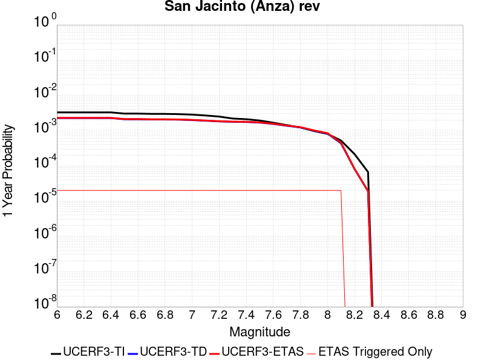 | 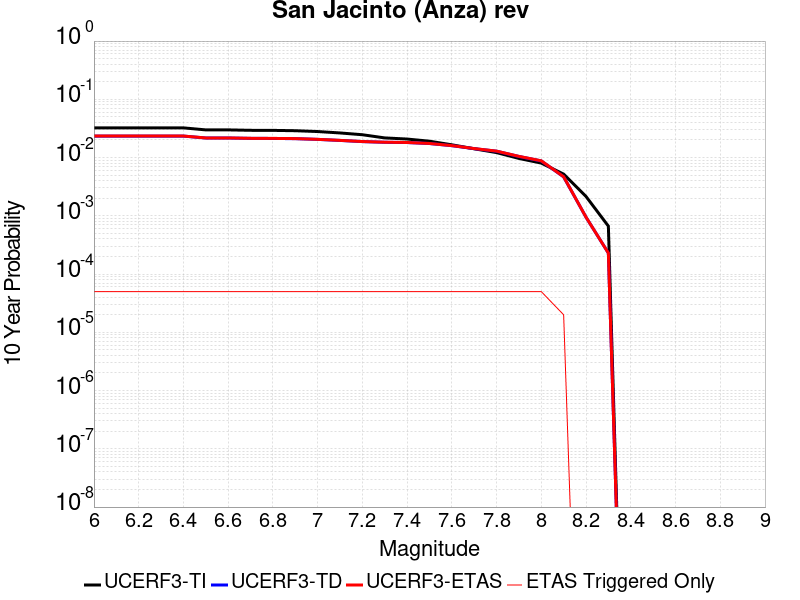 |

| Magnitude | 1 wk TI Prob | 1 wk TD Prob | 1 wk ETAS Prob | 1 wk ETAS/TD Gain | 1 wk ETAS Triggered Only | 1 mo TI Prob | 1 mo TD Prob | 1 mo ETAS Prob | 1 mo ETAS/TD Gain | 1 mo ETAS Triggered Only | 1 yr TI Prob | 1 yr TD Prob | 1 yr ETAS Prob | 1 yr ETAS/TD Gain | 1 yr ETAS Triggered Only | 10 yr TI Prob | 10 yr TD Prob | 10 yr ETAS Prob | 10 yr ETAS/TD Gain | 10 yr ETAS Triggered Only |
|-----|-----|-----|-----|-----|-----|-----|-----|-----|-----|-----|-----|-----|-----|-----|-----|-----|-----|-----|-----|-----|
| 6.0 | 6.3015636E-5 | 4.3446253E-5 | 4.3446253E-5 | 1.0 | 0.0 | 2.7003905E-4 | 1.86185E-4 | 2.044608E-4 | 1.0981593 | 1.8279197E-5 | 0.0032827691 | 0.0022644578 | 0.0023009335 | 1.0161079 | 3.6558395E-5 | 0.032346968 | 0.023370424 | 0.023459684 | 1.0038193 | 9.139598E-5 |
| 6.1 | 6.3015636E-5 | 4.3446253E-5 | 4.3446253E-5 | 1.0 | 0.0 | 2.7003905E-4 | 1.86185E-4 | 2.044608E-4 | 1.0981593 | 1.8279197E-5 | 0.0032827691 | 0.0022644578 | 0.0023009335 | 1.0161079 | 3.6558395E-5 | 0.032346968 | 0.023370424 | 0.023459684 | 1.0038193 | 9.139598E-5 |
| 6.2 | 6.3015636E-5 | 4.3446253E-5 | 4.3446253E-5 | 1.0 | 0.0 | 2.7003905E-4 | 1.86185E-4 | 2.044608E-4 | 1.0981593 | 1.8279197E-5 | 0.0032827691 | 0.0022644578 | 0.0023009335 | 1.0161079 | 3.6558395E-5 | 0.032346968 | 0.023370424 | 0.023459684 | 1.0038193 | 9.139598E-5 |
| 6.3 | 6.3015636E-5 | 4.3446253E-5 | 4.3446253E-5 | 1.0 | 0.0 | 2.7003905E-4 | 1.86185E-4 | 2.044608E-4 | 1.0981593 | 1.8279197E-5 | 0.0032827691 | 0.0022644578 | 0.0023009335 | 1.0161079 | 3.6558395E-5 | 0.032346968 | 0.023370424 | 0.023459684 | 1.0038193 | 9.139598E-5 |
| 6.4 | 6.3015636E-5 | 4.3446253E-5 | 4.3446253E-5 | 1.0 | 0.0 | 2.7003905E-4 | 1.86185E-4 | 2.044608E-4 | 1.0981593 | 1.8279197E-5 | 0.0032827691 | 0.0022644578 | 0.0023009335 | 1.0161079 | 3.6558395E-5 | 0.032346968 | 0.023370424 | 0.023459684 | 1.0038193 | 9.139598E-5 |
| 6.5 | 5.811017E-5 | 4.021924E-5 | 4.021924E-5 | 1.0 | 0.0 | 2.4901982E-4 | 1.7235681E-4 | 1.9063287E-4 | 1.1060361 | 1.8279197E-5 | 0.0030276014 | 0.0020964304 | 0.0021329122 | 1.0174018 | 3.6558395E-5 | 0.02986684 | 0.021664625 | 0.02175404 | 1.0041273 | 9.139598E-5 |
| 6.6 | 5.811017E-5 | 4.021924E-5 | 4.021924E-5 | 1.0 | 0.0 | 2.4901982E-4 | 1.7235681E-4 | 1.9063287E-4 | 1.1060361 | 1.8279197E-5 | 0.0030276014 | 0.0020964304 | 0.0021329122 | 1.0174018 | 3.6558395E-5 | 0.02986684 | 0.021664625 | 0.02175404 | 1.0041273 | 9.139598E-5 |
| 6.7 | 5.712442E-5 | 3.964049E-5 | 3.964049E-5 | 1.0 | 0.0 | 2.4479596E-4 | 1.6987679E-4 | 1.8815287E-4 | 1.1075844 | 1.8279197E-5 | 0.0029763177 | 0.0020662935 | 0.0021027764 | 1.0176562 | 3.6558395E-5 | 0.029367693 | 0.021355735 | 0.02144518 | 1.0041883 | 9.139598E-5 |
| 6.8 | 5.6967532E-5 | 3.9496656E-5 | 3.9496656E-5 | 1.0 | 0.0 | 2.4412372E-4 | 1.6926043E-4 | 1.8753653E-4 | 1.1079762 | 1.8279197E-5 | 0.0029681553 | 0.0020588036 | 0.0020952867 | 1.0177206 | 3.6558395E-5 | 0.029288229 | 0.021280348 | 0.021369798 | 1.0042034 | 9.139598E-5 |
| 6.9 | 5.6211324E-5 | 3.9200542E-5 | 3.9200542E-5 | 1.0 | 0.0 | 2.4088343E-4 | 1.6799154E-4 | 1.8626767E-4 | 1.108792 | 1.8279197E-5 | 0.0029288116 | 0.002043384 | 0.0020798675 | 1.0178546 | 3.6558395E-5 | 0.028905109 | 0.02111932 | 0.021208787 | 1.0042362 | 9.139598E-5 |
| 7.0 | 5.4383527E-5 | 3.8058075E-5 | 3.8058075E-5 | 1.0 | 0.0 | 2.3305144E-4 | 1.6309587E-4 | 1.8137209E-4 | 1.1120582 | 1.8279197E-5 | 0.0028337094 | 0.0019838887 | 0.0020203744 | 1.0183911 | 3.6558395E-5 | 0.027978465 | 0.020508781 | 0.020598302 | 1.0043651 | 9.139598E-5 |
| 7.1 | 5.1393665E-5 | 3.6516354E-5 | 3.6516354E-5 | 1.0 | 0.0 | 2.2023996E-4 | 1.564893E-4 | 1.7476564E-4 | 1.1167897 | 1.8279197E-5 | 0.0026781242 | 0.0019035965 | 0.0019400853 | 1.0191684 | 3.6558395E-5 | 0.026460782 | 0.019680155 | 0.019769752 | 1.0045527 | 9.139598E-5 |
| 7.2 | 4.785222E-5 | 3.486319E-5 | 3.486319E-5 | 1.0 | 0.0 | 2.0506482E-4 | 1.4940514E-4 | 1.676816E-4 | 1.1223282 | 1.8279197E-5 | 0.0024938055 | 0.0018174936 | 0.0018539855 | 1.0200782 | 3.6558395E-5 | 0.024660049 | 0.018792244 | 0.018881923 | 1.0047721 | 9.139598E-5 |
| 7.3 | 4.2143256E-5 | 3.395425E-5 | 3.395425E-5 | 1.0 | 0.0 | 1.8060145E-4 | 1.4551012E-4 | 1.6378665E-4 | 1.1256032 | 1.8279197E-5 | 0.002196605 | 0.0017701496 | 0.0018066433 | 1.0206162 | 3.6558395E-5 | 0.02175019 | 0.018298613 | 0.018388337 | 1.0049033 | 9.139598E-5 |
| 7.4 | 4.0264713E-5 | 3.3591336E-5 | 3.3591336E-5 | 1.0 | 0.0 | 1.7255165E-4 | 1.4395494E-4 | 1.622315E-4 | 1.1269603 | 1.8279197E-5 | 0.002098792 | 0.0017512459 | 0.0017877403 | 1.0208391 | 3.6558395E-5 | 0.020790804 | 0.018102597 | 0.01819234 | 1.0049574 | 9.139598E-5 |
| 7.5 | 3.694492E-5 | 3.2302072E-5 | 3.2302072E-5 | 1.0 | 0.0 | 1.5832575E-4 | 1.3843011E-4 | 1.5670678E-4 | 1.1320281 | 1.8279197E-5 | 0.0019259118 | 0.0016840869 | 0.0017205838 | 1.0216715 | 3.6558395E-5 | 0.01909306 | 0.01741737 | 0.017507173 | 1.005156 | 9.139598E-5 |
| 7.6 | 3.200565E-5 | 2.960857E-5 | 2.960857E-5 | 1.0 | 0.0 | 1.3715986E-4 | 1.2688771E-4 | 1.4516458E-4 | 1.1440398 | 1.8279197E-5 | 0.001668642 | 0.0015437653 | 0.0015802672 | 1.0236448 | 3.6558395E-5 | 0.01656168 | 0.016000675 | 0.016090607 | 1.0056206 | 9.139598E-5 |
| 7.7 | 2.731642E-5 | 2.619419E-5 | 2.619419E-5 | 1.0 | 0.0 | 1.1706512E-4 | 1.1225599E-4 | 1.3053314E-4 | 1.1628166 | 1.8279197E-5 | 0.001424336 | 0.0013658608 | 0.0014023694 | 1.0267292 | 3.6558395E-5 | 0.014152412 | 0.014219889 | 0.0143099865 | 1.006336 | 9.139598E-5 |
| 7.8 | 2.3466424E-5 | 2.3602157E-5 | 2.3602157E-5 | 1.0 | 0.0 | 1.0056651E-4 | 1.0114819E-4 | 1.1942554E-4 | 1.1806988 | 1.8279197E-5 | 0.0012237094 | 0.0012307843 | 0.0012672977 | 1.0296668 | 3.6558395E-5 | 0.012169928 | 0.012859747 | 0.012949968 | 1.0070157 | 9.139598E-5 |
| 7.9 | 1.8611925E-5 | 1.8996041E-5 | 1.8996041E-5 | 1.0 | 0.0 | 7.9762955E-5 | 8.1409074E-5 | 9.968678E-5 | 1.2245169 | 1.8279197E-5 | 9.7068126E-4 | 9.907054E-4 | 0.0010272276 | 1.0368648 | 3.6558395E-5 | 0.0096645225 | 0.010439943 | 0.010530384 | 1.008663 | 9.139598E-5 |
| 8.0 | 1.5460775E-5 | 1.581908E-5 | 1.581908E-5 | 1.0 | 0.0 | 6.6258784E-5 | 6.7794295E-5 | 8.607225E-5 | 1.2696091 | 1.8279197E-5 | 8.0640207E-4 | 8.250837E-4 | 8.616119E-4 | 1.0442722 | 3.6558395E-5 | 0.008034821 | 0.008744002 | 0.008834599 | 1.0103611 | 9.139598E-5 |
| 8.1 | 9.983884E-6 | 8.316292E-6 | 8.316292E-6 | 1.0 | 0.0 | 4.2787375E-5 | 3.564077E-5 | 5.3919313E-5 | 1.5128549 | 1.8279197E-5 | 5.2081177E-4 | 4.338405E-4 | 4.70383E-4 | 1.0842303 | 3.6558395E-5 | 0.0051959283 | 0.00466492 | 0.0047013075 | 1.0078003 | 3.6558395E-5 |
| 8.2 | 4.1226E-6 | 1.5661137E-6 | 1.5661137E-6 | 1.0 | 0.0 | 1.7668166E-5 | 6.711899E-6 | 6.711899E-6 | 1.0 | 0.0 | 2.1508869E-4 | 8.171434E-5 | 8.171434E-5 | 1.0 | 0.0 | 0.0021488064 | 9.480058E-4 | 9.480058E-4 | 1.0 | 0.0 |
| 8.3 | 1.2750878E-6 | 3.6481603E-7 | 3.6481603E-7 | 1.0 | 0.0 | 5.4646503E-6 | 1.5634963E-6 | 1.5634963E-6 | 1.0 | 0.0 | 6.653009E-5 | 1.9035406E-5 | 1.9035406E-5 | 1.0 | 0.0 | 6.6510175E-4 | 2.2945888E-4 | 2.2945888E-4 | 1.0 | 0.0 |

## Lake Isabella (Seismicity)
*[(top)](#table-of-contents)*

| 1 Week | 1 Month | 1 Year | 10 Year |
|-----|-----|-----|-----|
|  |  |  |  |

| Magnitude | 1 wk TI Prob | 1 wk TD Prob | 1 wk ETAS Prob | 1 wk ETAS/TD Gain | 1 wk ETAS Triggered Only | 1 mo TI Prob | 1 mo TD Prob | 1 mo ETAS Prob | 1 mo ETAS/TD Gain | 1 mo ETAS Triggered Only | 1 yr TI Prob | 1 yr TD Prob | 1 yr ETAS Prob | 1 yr ETAS/TD Gain | 1 yr ETAS Triggered Only | 10 yr TI Prob | 10 yr TD Prob | 10 yr ETAS Prob | 10 yr ETAS/TD Gain | 10 yr ETAS Triggered Only |
|-----|-----|-----|-----|-----|-----|-----|-----|-----|-----|-----|-----|-----|-----|-----|-----|-----|-----|-----|-----|-----|
| 6.0 | 9.431637E-6 | 9.741992E-6 | 9.741992E-6 | 1.0 | 0.0 | 4.0420677E-5 | 4.1750798E-5 | 6.002923E-5 | 1.4377984 | 1.8279197E-5 | 4.920106E-4 | 5.082105E-4 | 5.630202E-4 | 1.1078484 | 5.483759E-5 | 0.004909227 | 0.0050717755 | 0.005162708 | 1.0179291 | 9.139598E-5 |
| 6.1 | 9.431637E-6 | 9.741992E-6 | 9.741992E-6 | 1.0 | 0.0 | 4.0420677E-5 | 4.1750798E-5 | 6.002923E-5 | 1.4377984 | 1.8279197E-5 | 4.920106E-4 | 5.082105E-4 | 5.630202E-4 | 1.1078484 | 5.483759E-5 | 0.004909227 | 0.0050717755 | 0.005162708 | 1.0179291 | 9.139598E-5 |
| 6.2 | 9.431637E-6 | 9.741992E-6 | 9.741992E-6 | 1.0 | 0.0 | 4.0420677E-5 | 4.1750798E-5 | 6.002923E-5 | 1.4377984 | 1.8279197E-5 | 4.920106E-4 | 5.082105E-4 | 5.630202E-4 | 1.1078484 | 5.483759E-5 | 0.004909227 | 0.0050717755 | 0.005162708 | 1.0179291 | 9.139598E-5 |
| 6.3 | 9.431637E-6 | 9.741992E-6 | 9.741992E-6 | 1.0 | 0.0 | 4.0420677E-5 | 4.1750798E-5 | 6.002923E-5 | 1.4377984 | 1.8279197E-5 | 4.920106E-4 | 5.082105E-4 | 5.630202E-4 | 1.1078484 | 5.483759E-5 | 0.004909227 | 0.0050717755 | 0.005162708 | 1.0179291 | 9.139598E-5 |
| 6.4 | 5.144063E-6 | 5.300247E-6 | 5.300247E-6 | 1.0 | 0.0 | 2.2045799E-5 | 2.2715165E-5 | 2.2715165E-5 | 1.0 | 0.0 | 2.6837454E-4 | 2.765255E-4 | 2.9479963E-4 | 1.0660849 | 1.8279197E-5 | 0.0026805066 | 0.0027621544 | 0.002798612 | 1.0131989 | 3.6558395E-5 |
| 6.5 | 5.144063E-6 | 5.300247E-6 | 5.300247E-6 | 1.0 | 0.0 | 2.2045799E-5 | 2.2715165E-5 | 2.2715165E-5 | 1.0 | 0.0 | 2.6837454E-4 | 2.765255E-4 | 2.9479963E-4 | 1.0660849 | 1.8279197E-5 | 0.0026805066 | 0.0027621544 | 0.002798612 | 1.0131989 | 3.6558395E-5 |
| 6.6 | 3.4009804E-6 | 3.498893E-6 | 3.498893E-6 | 1.0 | 0.0 | 1.4575549E-5 | 1.4995178E-5 | 1.4995178E-5 | 1.0 | 0.0 | 1.7744285E-4 | 1.8255261E-4 | 1.8255261E-4 | 1.0 | 0.0 | 0.0017730123 | 0.0018241842 | 0.0018424301 | 1.0100023 | 1.8279197E-5 |
| 6.7 | 3.3880428E-6 | 3.4857594E-6 | 3.4857594E-6 | 1.0 | 0.0 | 1.4520103E-5 | 1.49388925E-5 | 1.49388925E-5 | 1.0 | 0.0 | 1.767679E-4 | 1.8186744E-4 | 1.8186744E-4 | 1.0 | 0.0 | 0.0017662736 | 0.0018173438 | 0.0018355898 | 1.0100399 | 1.8279197E-5 |
| 6.8 | 2.6582E-6 | 2.7337826E-6 | 2.7337826E-6 | 1.0 | 0.0 | 1.1392236E-5 | 1.1716166E-5 | 1.1716166E-5 | 1.0 | 0.0 | 1.3869164E-4 | 1.4263633E-4 | 1.4263633E-4 | 1.0 | 0.0 | 0.0013860512 | 0.0014255799 | 0.001443833 | 1.012804 | 1.8279197E-5 |
| 6.9 | 2.406011E-6 | 2.4744033E-6 | 2.4744033E-6 | 1.0 | 0.0 | 1.0311434E-5 | 1.0604551E-5 | 1.0604551E-5 | 1.0 | 0.0 | 1.2553448E-4 | 1.2910407E-4 | 1.2910407E-4 | 1.0 | 0.0 | 0.0012546359 | 0.0012904203 | 0.0013086759 | 1.014147 | 1.8279197E-5 |
| 7.0 | 1.6953097E-6 | 1.7429892E-6 | 1.7429892E-6 | 1.0 | 0.0 | 7.265593E-6 | 7.4699383E-6 | 7.4699383E-6 | 1.0 | 0.0 | 8.8455E-5 | 9.094375E-5 | 9.094375E-5 | 1.0 | 0.0 | 8.84198E-4 | 9.0916804E-4 | 9.2743064E-4 | 1.0200871 | 1.8279197E-5 |
| 7.1 | 3.5013824E-7 | 3.571558E-7 | 3.571558E-7 | 1.0 | 0.0 | 1.5005916E-6 | 1.530667E-6 | 1.530667E-6 | 1.0 | 0.0 | 1.826955E-5 | 1.8635712E-5 | 1.8635712E-5 | 1.0 | 0.0 | 1.8268047E-4 | 1.8634176E-4 | 2.0461754E-4 | 1.0980767 | 1.8279197E-5 |
| 7.2 | 2.2321095E-7 | 2.2751038E-7 | 2.2751038E-7 | 1.0 | 0.0 | 9.56618E-7 | 9.750441E-7 | 9.750441E-7 | 1.0 | 0.0 | 1.1646762E-5 | 1.1871099E-5 | 1.1871099E-5 | 1.0 | 0.0 | 1.1646151E-4 | 1.18704746E-4 | 1.18704746E-4 | 1.0 | 0.0 |
| 7.3 | 1.5760406E-7 | 1.6061247E-7 | 1.6061247E-7 | 1.0 | 0.0 | 6.7544585E-7 | 6.8833896E-7 | 6.8833896E-7 | 1.0 | 0.0 | 8.223522E-6 | 8.380495E-6 | 8.380495E-6 | 1.0 | 0.0 | 8.2232174E-5 | 8.380186E-5 | 8.380186E-5 | 1.0 | 0.0 |
| 7.4 | 1.1216497E-7 | 1.1431939E-7 | 1.1431939E-7 | 1.0 | 0.0 | 4.8070694E-7 | 4.8994013E-7 | 4.8994013E-7 | 1.0 | 0.0 | 5.852591E-6 | 5.9650056E-6 | 5.9650056E-6 | 1.0 | 0.0 | 5.8524372E-5 | 5.9648497E-5 | 5.9648497E-5 | 1.0 | 0.0 |
| 7.5 | 4.885185E-8 | 4.978875E-8 | 4.978875E-8 | 1.0 | 0.0 | 2.0936506E-7 | 2.1338033E-7 | 2.1338033E-7 | 1.0 | 0.0 | 2.5490165E-6 | 2.5979027E-6 | 2.5979027E-6 | 1.0 | 0.0 | 2.5489873E-5 | 2.5978741E-5 | 2.5978741E-5 | 1.0 | 0.0 |
| 7.6 | 1.504641E-9 | 1.5318196E-9 | 1.5318196E-9 | 1.0 | 0.0 | 6.4484613E-9 | 6.564941E-9 | 6.564941E-9 | 1.0 | 0.0 | 7.851001E-8 | 7.992816E-8 | 7.992816E-8 | 1.0 | 0.0 | 7.8509987E-7 | 7.9928157E-7 | 7.9928157E-7 | 1.0 | 0.0 |

## Manix-Afton Hills
*[(top)](#table-of-contents)*

| 1 Week | 1 Month | 1 Year | 10 Year |
|-----|-----|-----|-----|
|  |  |  |  |

| Magnitude | 1 wk TI Prob | 1 wk TD Prob | 1 wk ETAS Prob | 1 wk ETAS/TD Gain | 1 wk ETAS Triggered Only | 1 mo TI Prob | 1 mo TD Prob | 1 mo ETAS Prob | 1 mo ETAS/TD Gain | 1 mo ETAS Triggered Only | 1 yr TI Prob | 1 yr TD Prob | 1 yr ETAS Prob | 1 yr ETAS/TD Gain | 1 yr ETAS Triggered Only | 10 yr TI Prob | 10 yr TD Prob | 10 yr ETAS Prob | 10 yr ETAS/TD Gain | 10 yr ETAS Triggered Only |
|-----|-----|-----|-----|-----|-----|-----|-----|-----|-----|-----|-----|-----|-----|-----|-----|-----|-----|-----|-----|-----|
| 6.0 | 1.3783202E-5 | 1.4712143E-5 | 1.4712143E-5 | 1.0 | 0.0 | 5.906953E-5 | 6.305062E-5 | 6.305062E-5 | 1.0 | 0.0 | 7.189342E-4 | 7.673883E-4 | 7.673883E-4 | 1.0 | 0.0 | 0.0071661277 | 0.0076491414 | 0.007721699 | 1.0094857 | 7.311679E-5 |
| 6.1 | 1.3783202E-5 | 1.4712143E-5 | 1.4712143E-5 | 1.0 | 0.0 | 5.906953E-5 | 6.305062E-5 | 6.305062E-5 | 1.0 | 0.0 | 7.189342E-4 | 7.673883E-4 | 7.673883E-4 | 1.0 | 0.0 | 0.0071661277 | 0.0076491414 | 0.007721699 | 1.0094857 | 7.311679E-5 |
| 6.2 | 1.3783202E-5 | 1.4712143E-5 | 1.4712143E-5 | 1.0 | 0.0 | 5.906953E-5 | 6.305062E-5 | 6.305062E-5 | 1.0 | 0.0 | 7.189342E-4 | 7.673883E-4 | 7.673883E-4 | 1.0 | 0.0 | 0.0071661277 | 0.0076491414 | 0.007721699 | 1.0094857 | 7.311679E-5 |
| 6.3 | 1.10494875E-5 | 1.179398E-5 | 1.179398E-5 | 1.0 | 0.0 | 4.7354086E-5 | 5.0544706E-5 | 5.0544706E-5 | 1.0 | 0.0 | 5.763835E-4 | 6.152184E-4 | 6.152184E-4 | 1.0 | 0.0 | 0.005748908 | 0.0061361934 | 0.0061906944 | 1.0088819 | 5.483759E-5 |
| 6.4 | 1.10494875E-5 | 1.179398E-5 | 1.179398E-5 | 1.0 | 0.0 | 4.7354086E-5 | 5.0544706E-5 | 5.0544706E-5 | 1.0 | 0.0 | 5.763835E-4 | 6.152184E-4 | 6.152184E-4 | 1.0 | 0.0 | 0.005748908 | 0.0061361934 | 0.0061906944 | 1.0088819 | 5.483759E-5 |
| 6.5 | 9.788949E-6 | 1.0455075E-5 | 1.0455075E-5 | 1.0 | 0.0 | 4.1951964E-5 | 4.4806748E-5 | 4.4806748E-5 | 1.0 | 0.0 | 5.1064545E-4 | 5.453949E-4 | 5.453949E-4 | 1.0 | 0.0 | 0.0050947363 | 0.005441491 | 0.0054778503 | 1.0066819 | 3.6558395E-5 |
| 6.6 | 8.810006E-6 | 9.414314E-6 | 9.414314E-6 | 1.0 | 0.0 | 3.775662E-5 | 4.0346487E-5 | 4.0346487E-5 | 1.0 | 0.0 | 4.5958988E-4 | 4.9111666E-4 | 4.9111666E-4 | 1.0 | 0.0 | 0.0045864056 | 0.0049011954 | 0.0049375747 | 1.0074226 | 3.6558395E-5 |
| 6.7 | 8.80128E-6 | 9.404793E-6 | 9.404793E-6 | 1.0 | 0.0 | 3.7719226E-5 | 4.0305684E-5 | 4.0305684E-5 | 1.0 | 0.0 | 4.591348E-4 | 4.906201E-4 | 4.906201E-4 | 1.0 | 0.0 | 0.004581874 | 0.004896252 | 0.0049326313 | 1.0074301 | 3.6558395E-5 |
| 6.8 | 6.8994877E-6 | 7.3806227E-6 | 7.3806227E-6 | 1.0 | 0.0 | 2.9568899E-5 | 3.1630905E-5 | 3.1630905E-5 | 1.0 | 0.0 | 3.5994186E-4 | 3.8504635E-4 | 3.8504635E-4 | 1.0 | 0.0 | 0.003593594 | 0.0038445974 | 0.003881015 | 1.0094725 | 3.6558395E-5 |
| 6.9 | 4.9328037E-6 | 5.271346E-6 | 5.271346E-6 | 1.0 | 0.0 | 2.1140417E-5 | 2.259132E-5 | 2.259132E-5 | 1.0 | 0.0 | 2.5735417E-4 | 2.7502078E-4 | 2.7502078E-4 | 1.0 | 0.0 | 0.0025705635 | 0.0027474095 | 0.0027656385 | 1.006635 | 1.8279197E-5 |
| 7.0 | 3.347973E-6 | 3.5903063E-6 | 3.5903063E-6 | 1.0 | 0.0 | 1.4348378E-5 | 1.5386959E-5 | 1.5386959E-5 | 1.0 | 0.0 | 1.746775E-4 | 1.8732423E-4 | 1.8732423E-4 | 1.0 | 0.0 | 0.0017454025 | 0.001872066 | 0.0018903109 | 1.009746 | 1.8279197E-5 |
| 7.1 | 1.2073567E-6 | 1.29358E-6 | 1.29358E-6 | 1.0 | 0.0 | 5.1743755E-6 | 5.5439114E-6 | 5.5439114E-6 | 1.0 | 0.0 | 6.29962E-5 | 6.7496665E-5 | 6.7496665E-5 | 1.0 | 0.0 | 6.297835E-4 | 6.7492184E-4 | 6.931887E-4 | 1.0270652 | 1.8279197E-5 |

## Mission Ridge-Arroyo Parida-Santa Ana
*[(top)](#table-of-contents)*

| 1 Week | 1 Month | 1 Year | 10 Year |
|-----|-----|-----|-----|
|  |  |  |  |

| Magnitude | 1 wk TI Prob | 1 wk TD Prob | 1 wk ETAS Prob | 1 wk ETAS/TD Gain | 1 wk ETAS Triggered Only | 1 mo TI Prob | 1 mo TD Prob | 1 mo ETAS Prob | 1 mo ETAS/TD Gain | 1 mo ETAS Triggered Only | 1 yr TI Prob | 1 yr TD Prob | 1 yr ETAS Prob | 1 yr ETAS/TD Gain | 1 yr ETAS Triggered Only | 10 yr TI Prob | 10 yr TD Prob | 10 yr ETAS Prob | 10 yr ETAS/TD Gain | 10 yr ETAS Triggered Only |
|-----|-----|-----|-----|-----|-----|-----|-----|-----|-----|-----|-----|-----|-----|-----|-----|-----|-----|-----|-----|-----|
| 6.0 | 4.169034E-5 | 4.7148882E-5 | 4.7148882E-5 | 1.0 | 0.0 | 1.7866064E-4 | 2.0205585E-4 | 2.0205585E-4 | 1.0 | 0.0 | 0.0021730233 | 0.0024579712 | 0.002512674 | 1.0222553 | 5.483759E-5 | 0.021518968 | 0.024389962 | 0.024479128 | 1.0036559 | 9.139598E-5 |
| 6.1 | 1.73813E-5 | 1.6856771E-5 | 1.6856771E-5 | 1.0 | 0.0 | 7.4489166E-5 | 7.224136E-5 | 7.224136E-5 | 1.0 | 0.0 | 9.065282E-4 | 8.791945E-4 | 8.974576E-4 | 1.0207726 | 1.8279197E-5 | 0.009028391 | 0.008758304 | 0.0087764235 | 1.0020688 | 1.8279197E-5 |
| 6.2 | 1.4622182E-5 | 1.3675311E-5 | 1.3675311E-5 | 1.0 | 0.0 | 6.2664985E-5 | 5.8607176E-5 | 5.8607176E-5 | 1.0 | 0.0 | 7.6267915E-4 | 7.1331265E-4 | 7.1331265E-4 | 1.0 | 0.0 | 0.007600669 | 0.0071106744 | 0.0071106744 | 1.0 | 0.0 |
| 6.3 | 1.3552434E-5 | 1.2484076E-5 | 1.2484076E-5 | 1.0 | 0.0 | 5.8080568E-5 | 5.3502106E-5 | 5.3502106E-5 | 1.0 | 0.0 | 7.069015E-4 | 6.511966E-4 | 6.511966E-4 | 1.0 | 0.0 | 0.00704657 | 0.0064932476 | 0.0064932476 | 1.0 | 0.0 |
| 6.4 | 1.30977305E-5 | 1.1980975E-5 | 1.1980975E-5 | 1.0 | 0.0 | 5.613192E-5 | 5.134604E-5 | 5.134604E-5 | 1.0 | 0.0 | 6.831918E-4 | 6.2496174E-4 | 6.2496174E-4 | 1.0 | 0.0 | 0.006810953 | 0.0062323874 | 0.0062323874 | 1.0 | 0.0 |
| 6.5 | 1.225205E-5 | 1.10505225E-5 | 1.10505225E-5 | 1.0 | 0.0 | 5.2507727E-5 | 4.7358535E-5 | 4.7358535E-5 | 1.0 | 0.0 | 6.3909404E-4 | 5.7644036E-4 | 5.7644036E-4 | 1.0 | 0.0 | 0.006372592 | 0.005749761 | 0.005749761 | 1.0 | 0.0 |
| 6.6 | 1.1352241E-5 | 1.0065155E-5 | 1.0065155E-5 | 1.0 | 0.0 | 4.8651553E-5 | 4.3135675E-5 | 4.3135675E-5 | 1.0 | 0.0 | 5.921717E-4 | 5.250524E-4 | 5.250524E-4 | 1.0 | 0.0 | 0.0059059616 | 0.0052383654 | 0.0052383654 | 1.0 | 0.0 |
| 6.7 | 1.0864116E-5 | 9.518576E-6 | 9.518576E-6 | 1.0 | 0.0 | 4.6559664E-5 | 4.079327E-5 | 4.079327E-5 | 1.0 | 0.0 | 5.667165E-4 | 4.965469E-4 | 4.965469E-4 | 1.0 | 0.0 | 0.005652734 | 0.004954608 | 0.004954608 | 1.0 | 0.0 |
| 6.8 | 1.0666365E-5 | 9.301305E-6 | 9.301305E-6 | 1.0 | 0.0 | 4.571219E-5 | 3.9862138E-5 | 3.9862138E-5 | 1.0 | 0.0 | 5.564038E-4 | 4.8521545E-4 | 4.8521545E-4 | 1.0 | 0.0 | 0.005550127 | 0.004841793 | 0.004841793 | 1.0 | 0.0 |
| 6.9 | 1.0038665E-5 | 8.593475E-6 | 8.593475E-6 | 1.0 | 0.0 | 4.302214E-5 | 3.682867E-5 | 3.682867E-5 | 1.0 | 0.0 | 5.236687E-4 | 4.4829864E-4 | 4.4829864E-4 | 1.0 | 0.0 | 0.005224364 | 0.0044741537 | 0.0044741537 | 1.0 | 0.0 |
| 7.0 | 9.5379955E-6 | 8.02642E-6 | 8.02642E-6 | 1.0 | 0.0 | 4.0876483E-5 | 3.4398498E-5 | 3.4398498E-5 | 1.0 | 0.0 | 4.975576E-4 | 4.1872295E-4 | 4.1872295E-4 | 1.0 | 0.0 | 0.00496445 | 0.0041795396 | 0.0041795396 | 1.0 | 0.0 |
| 7.1 | 9.207389E-6 | 7.653664E-6 | 7.653664E-6 | 1.0 | 0.0 | 3.945964E-5 | 3.2801017E-5 | 3.2801017E-5 | 1.0 | 0.0 | 4.803152E-4 | 3.992809E-4 | 3.992809E-4 | 1.0 | 0.0 | 0.004792784 | 0.0039858315 | 0.0039858315 | 1.0 | 0.0 |
| 7.2 | 7.638091E-6 | 5.9321133E-6 | 5.9321133E-6 | 1.0 | 0.0 | 3.2734264E-5 | 2.5423096E-5 | 2.5423096E-5 | 1.0 | 0.0 | 3.984668E-4 | 3.0948254E-4 | 3.0948254E-4 | 1.0 | 0.0 | 0.0039775306 | 0.0030905723 | 0.0030905723 | 1.0 | 0.0 |
| 7.3 | 7.2500147E-6 | 5.5970927E-6 | 5.5970927E-6 | 1.0 | 0.0 | 3.1071122E-5 | 2.398732E-5 | 2.398732E-5 | 1.0 | 0.0 | 3.7822526E-4 | 2.920068E-4 | 2.920068E-4 | 1.0 | 0.0 | 0.0037758215 | 0.0029162865 | 0.0029162865 | 1.0 | 0.0 |
| 7.4 | 6.3899715E-6 | 4.91932E-6 | 4.91932E-6 | 1.0 | 0.0 | 2.7385306E-5 | 2.1082631E-5 | 2.1082631E-5 | 1.0 | 0.0 | 3.3336508E-4 | 2.56651E-4 | 2.56651E-4 | 1.0 | 0.0 | 0.0033286542 | 0.0025635904 | 0.0025635904 | 1.0 | 0.0 |
| 7.5 | 5.379025E-6 | 4.0845157E-6 | 4.0845157E-6 | 1.0 | 0.0 | 2.305276E-5 | 1.7504952E-5 | 1.7504952E-5 | 1.0 | 0.0 | 2.806312E-4 | 2.1310204E-4 | 2.1310204E-4 | 1.0 | 0.0 | 0.0028027708 | 0.0021289883 | 0.0021289883 | 1.0 | 0.0 |
| 7.6 | 4.1270696E-6 | 3.0887934E-6 | 3.0887934E-6 | 1.0 | 0.0 | 1.768732E-5 | 1.3237619E-5 | 1.3237619E-5 | 1.0 | 0.0 | 2.1532185E-4 | 1.6115617E-4 | 1.6115617E-4 | 1.0 | 0.0 | 0.0021511333 | 0.0016104012 | 0.0016104012 | 1.0 | 0.0 |
| 7.7 | 2.5406805E-6 | 1.8284644E-6 | 1.8284644E-6 | 1.0 | 0.0 | 1.0888585E-5 | 7.836253E-6 | 7.836253E-6 | 1.0 | 0.0 | 1.3256045E-4 | 9.540227E-5 | 9.540227E-5 | 1.0 | 0.0 | 0.0013248142 | 9.5361925E-4 | 9.5361925E-4 | 1.0 | 0.0 |
| 7.8 | 4.8608285E-7 | 3.510238E-7 | 3.510238E-7 | 1.0 | 0.0 | 2.0832106E-6 | 1.5043869E-6 | 1.5043869E-6 | 1.0 | 0.0 | 2.5362791E-5 | 1.8315757E-5 | 1.8315757E-5 | 1.0 | 0.0 | 2.5359896E-4 | 1.831426E-4 | 1.831426E-4 | 1.0 | 0.0 |
| 7.9 | 2.0472514E-8 | 1.2691265E-8 | 1.2691265E-8 | 1.0 | 0.0 | 8.7739345E-8 | 5.4391137E-8 | 5.4391137E-8 | 1.0 | 0.0 | 1.068226E-6 | 6.622119E-7 | 6.622119E-7 | 1.0 | 0.0 | 1.0682209E-5 | 6.6221E-6 | 6.6221E-6 | 1.0 | 0.0 |
| 8.0 | 4.443582E-9 | 2.0332402E-9 | 2.0332402E-9 | 1.0 | 0.0 | 1.9043922E-8 | 8.7138865E-9 | 8.7138865E-9 | 1.0 | 0.0 | 2.3185973E-7 | 1.0609157E-7 | 1.0609157E-7 | 1.0 | 0.0 | 2.3185949E-6 | 1.0609152E-6 | 1.0609152E-6 | 1.0 | 0.0 |

## San Jacinto (Coyote Creek)
*[(top)](#table-of-contents)*

| 1 Week | 1 Month | 1 Year | 10 Year |
|-----|-----|-----|-----|
|  | 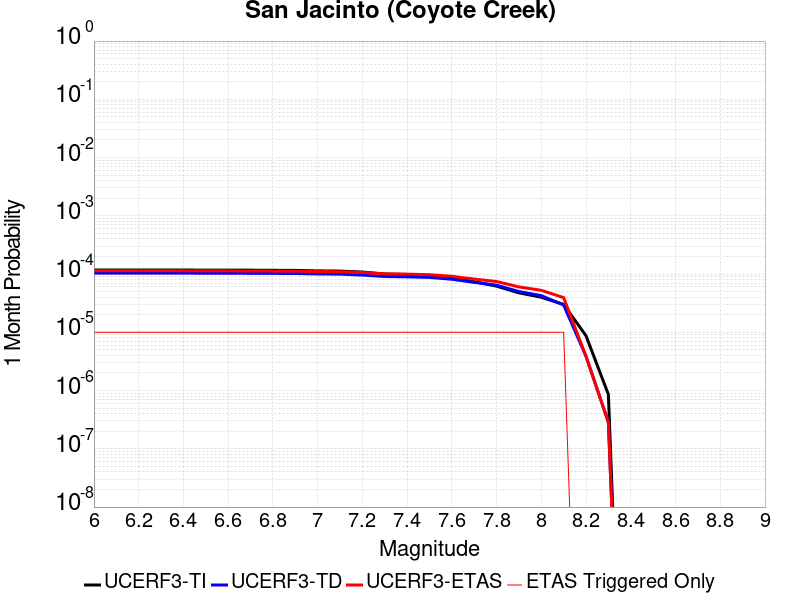 |  | 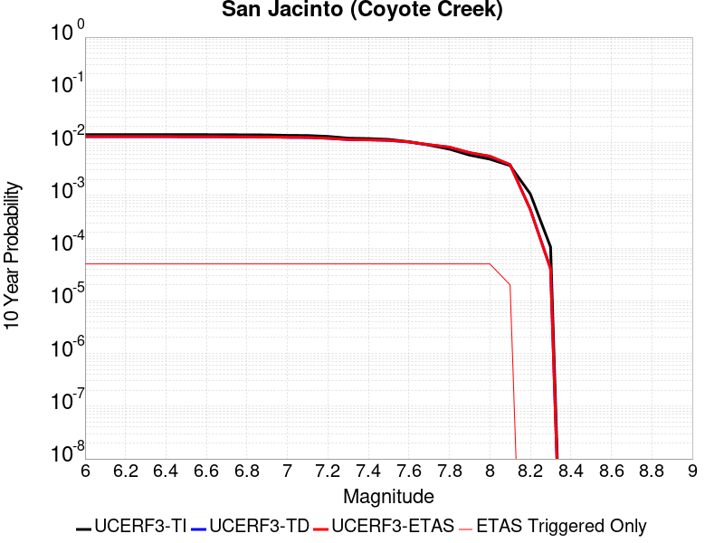 |

| Magnitude | 1 wk TI Prob | 1 wk TD Prob | 1 wk ETAS Prob | 1 wk ETAS/TD Gain | 1 wk ETAS Triggered Only | 1 mo TI Prob | 1 mo TD Prob | 1 mo ETAS Prob | 1 mo ETAS/TD Gain | 1 mo ETAS Triggered Only | 1 yr TI Prob | 1 yr TD Prob | 1 yr ETAS Prob | 1 yr ETAS/TD Gain | 1 yr ETAS Triggered Only | 10 yr TI Prob | 10 yr TD Prob | 10 yr ETAS Prob | 10 yr ETAS/TD Gain | 10 yr ETAS Triggered Only |
|-----|-----|-----|-----|-----|-----|-----|-----|-----|-----|-----|-----|-----|-----|-----|-----|-----|-----|-----|-----|-----|
| 6.0 | 2.7374346E-5 | 2.4210653E-5 | 2.4210653E-5 | 1.0 | 0.0 | 1.1731335E-4 | 1.03755825E-4 | 1.22033125E-4 | 1.1761569 | 1.8279197E-5 | 0.0014273542 | 0.0012624977 | 0.00129901 | 1.0289207 | 3.6558395E-5 | 0.01418221 | 0.012962389 | 0.0130526 | 1.0069594 | 9.139598E-5 |
| 6.1 | 2.7374346E-5 | 2.4210653E-5 | 2.4210653E-5 | 1.0 | 0.0 | 1.1731335E-4 | 1.03755825E-4 | 1.22033125E-4 | 1.1761569 | 1.8279197E-5 | 0.0014273542 | 0.0012624977 | 0.00129901 | 1.0289207 | 3.6558395E-5 | 0.01418221 | 0.012962389 | 0.0130526 | 1.0069594 | 9.139598E-5 |
| 6.2 | 2.7374346E-5 | 2.4210653E-5 | 2.4210653E-5 | 1.0 | 0.0 | 1.1731335E-4 | 1.03755825E-4 | 1.22033125E-4 | 1.1761569 | 1.8279197E-5 | 0.0014273542 | 0.0012624977 | 0.00129901 | 1.0289207 | 3.6558395E-5 | 0.01418221 | 0.012962389 | 0.0130526 | 1.0069594 | 9.139598E-5 |
| 6.3 | 2.7374346E-5 | 2.4210653E-5 | 2.4210653E-5 | 1.0 | 0.0 | 1.1731335E-4 | 1.03755825E-4 | 1.22033125E-4 | 1.1761569 | 1.8279197E-5 | 0.0014273542 | 0.0012624977 | 0.00129901 | 1.0289207 | 3.6558395E-5 | 0.01418221 | 0.012962389 | 0.0130526 | 1.0069594 | 9.139598E-5 |
| 6.4 | 2.7374346E-5 | 2.4210653E-5 | 2.4210653E-5 | 1.0 | 0.0 | 1.1731335E-4 | 1.03755825E-4 | 1.22033125E-4 | 1.1761569 | 1.8279197E-5 | 0.0014273542 | 0.0012624977 | 0.00129901 | 1.0289207 | 3.6558395E-5 | 0.01418221 | 0.012962389 | 0.0130526 | 1.0069594 | 9.139598E-5 |
| 6.5 | 2.7282445E-5 | 2.4096702E-5 | 2.4096702E-5 | 1.0 | 0.0 | 1.16919524E-4 | 1.03267506E-4 | 1.21544814E-4 | 1.1769899 | 1.8279197E-5 | 0.0014225657 | 0.0012565594 | 0.0012930719 | 1.0290575 | 3.6558395E-5 | 0.014134934 | 0.012903704 | 0.012993921 | 1.0069915 | 9.139598E-5 |
| 6.6 | 2.7282445E-5 | 2.4096702E-5 | 2.4096702E-5 | 1.0 | 0.0 | 1.16919524E-4 | 1.03267506E-4 | 1.21544814E-4 | 1.1769899 | 1.8279197E-5 | 0.0014225657 | 0.0012565594 | 0.0012930719 | 1.0290575 | 3.6558395E-5 | 0.014134934 | 0.012903704 | 0.012993921 | 1.0069915 | 9.139598E-5 |
| 6.7 | 2.7216198E-5 | 2.4021803E-5 | 2.4021803E-5 | 1.0 | 0.0 | 1.1663563E-4 | 1.0294654E-4 | 1.2122386E-4 | 1.1775419 | 1.8279197E-5 | 0.0014191137 | 0.0012526561 | 0.0012891687 | 1.0291481 | 3.6558395E-5 | 0.014100855 | 0.012865107 | 0.012955327 | 1.0070127 | 9.139598E-5 |
| 6.8 | 2.7078617E-5 | 2.3938983E-5 | 2.3938983E-5 | 1.0 | 0.0 | 1.1604605E-4 | 1.0259162E-4 | 1.2086894E-4 | 1.1781561 | 1.8279197E-5 | 0.001411945 | 0.00124834 | 0.0012848527 | 1.0292491 | 3.6558395E-5 | 0.014030075 | 0.01282223 | 0.012912454 | 1.0070366 | 9.139598E-5 |
| 6.9 | 2.6982952E-5 | 2.3858454E-5 | 2.3858454E-5 | 1.0 | 0.0 | 1.15636096E-4 | 1.0224652E-4 | 1.2052385E-4 | 1.1787574 | 1.8279197E-5 | 0.0014069602 | 0.0012441432 | 0.0012806561 | 1.0293478 | 3.6558395E-5 | 0.013980856 | 0.012780527 | 0.012870755 | 1.0070598 | 9.139598E-5 |
| 7.0 | 2.6449972E-5 | 2.3435334E-5 | 2.3435334E-5 | 1.0 | 0.0 | 1.1335209E-4 | 1.00433295E-4 | 1.1871065E-4 | 1.181985 | 1.8279197E-5 | 0.001379188 | 0.0012220921 | 0.0012586057 | 1.029878 | 3.6558395E-5 | 0.0137065975 | 0.012561822 | 0.01265207 | 1.0071843 | 9.139598E-5 |
| 7.1 | 2.6257849E-5 | 2.3261304E-5 | 2.3261304E-5 | 1.0 | 0.0 | 1.1252879E-4 | 9.968751E-5 | 1.1796488E-4 | 1.1833466 | 1.8279197E-5 | 0.0013691769 | 0.0012130223 | 0.0012495363 | 1.0301017 | 3.6558395E-5 | 0.013607717 | 0.012471657 | 0.012561914 | 1.007237 | 9.139598E-5 |
| 7.2 | 2.5270041E-5 | 2.2455588E-5 | 2.2455588E-5 | 1.0 | 0.0 | 1.0829568E-4 | 9.62347E-5 | 1.14512135E-4 | 1.1899257 | 1.8279197E-5 | 0.0013177024 | 0.0011710301 | 0.0012075456 | 1.0311824 | 3.6558395E-5 | 0.013099162 | 0.01205246 | 0.012142754 | 1.0074918 | 9.139598E-5 |
| 7.3 | 2.339701E-5 | 2.1186537E-5 | 2.1186537E-5 | 1.0 | 0.0 | 1.0026905E-4 | 9.07963E-5 | 1.0907384E-4 | 1.2013026 | 1.8279197E-5 | 0.001220092 | 0.0011048864 | 0.0011414044 | 1.0330514 | 3.6558395E-5 | 0.012134149 | 0.011390935 | 0.011481289 | 1.0079322 | 9.139598E-5 |
| 7.4 | 2.296333E-5 | 2.0916665E-5 | 2.0916665E-5 | 1.0 | 0.0 | 9.841056E-5 | 8.963978E-5 | 1.0791734E-4 | 1.2039001 | 1.8279197E-5 | 0.0011974899 | 0.00109082 | 0.0011273385 | 1.033478 | 3.6558395E-5 | 0.011910575 | 0.011249933 | 0.0113403015 | 1.0080328 | 9.139598E-5 |
| 7.5 | 2.2188895E-5 | 2.043907E-5 | 2.043907E-5 | 1.0 | 0.0 | 9.50918E-5 | 8.759309E-5 | 1.05870684E-4 | 1.2086648 | 1.8279197E-5 | 0.0011571277 | 0.0010659262 | 0.0011024456 | 1.0342607 | 3.6558395E-5 | 0.011511209 | 0.010999291 | 0.011089682 | 1.0082178 | 9.139598E-5 |
| 7.6 | 2.0013189E-5 | 1.9023963E-5 | 1.9023963E-5 | 1.0 | 0.0 | 8.5767984E-5 | 8.152873E-5 | 9.9806435E-5 | 1.2241873 | 1.8279197E-5 | 0.001043725 | 9.92162E-4 | 0.0010286841 | 1.0368106 | 3.6558395E-5 | 0.010388365 | 0.0102566015 | 0.010347061 | 1.0088196 | 9.139598E-5 |
| 7.7 | 1.7230794E-5 | 1.6803497E-5 | 1.6803497E-5 | 1.0 | 0.0 | 7.384417E-5 | 7.2013005E-5 | 9.029089E-5 | 1.2538136 | 1.8279197E-5 | 8.986819E-4 | 8.764065E-4 | 9.1293285E-4 | 1.0416774 | 3.6558395E-5 | 0.008950562 | 0.00909422 | 0.009184785 | 1.0099585 | 9.139598E-5 |
| 7.8 | 1.4478809E-5 | 1.5048704E-5 | 1.5048704E-5 | 1.0 | 0.0 | 6.205057E-5 | 6.449286E-5 | 8.277087E-5 | 1.2834115 | 1.8279197E-5 | 7.552038E-4 | 7.849183E-4 | 8.21448E-4 | 1.0465395 | 3.6558395E-5 | 0.0075264242 | 0.008171609 | 0.008262258 | 1.0110931 | 9.139598E-5 |
| 7.9 | 1.1114467E-5 | 1.1696539E-5 | 1.1696539E-5 | 1.0 | 0.0 | 4.7632562E-5 | 5.0127066E-5 | 6.8405345E-5 | 1.3646389 | 1.8279197E-5 | 5.797721E-4 | 6.101267E-4 | 6.466628E-4 | 1.0598828 | 3.6558395E-5 | 0.0057826187 | 0.0064073433 | 0.006498154 | 1.0141729 | 9.139598E-5 |
| 8.0 | 9.327402E-6 | 9.945905E-6 | 9.945905E-6 | 1.0 | 0.0 | 3.9973966E-5 | 4.2624615E-5 | 6.0903032E-5 | 1.4288231 | 1.8279197E-5 | 4.8657437E-4 | 5.1883166E-4 | 5.5537105E-4 | 1.0704263 | 3.6558395E-5 | 0.0048551033 | 0.005474554 | 0.0055654496 | 1.0166034 | 9.139598E-5 |
| 8.1 | 7.0235833E-6 | 6.8624786E-6 | 6.8624786E-6 | 1.0 | 0.0 | 3.0100724E-5 | 2.9410294E-5 | 4.7688955E-5 | 1.6215055 | 1.8279197E-5 | 3.664147E-4 | 3.58012E-4 | 3.945573E-4 | 1.1020784 | 3.6558395E-5 | 0.003658111 | 0.0038061605 | 0.0038425797 | 1.0095685 | 3.6558395E-5 |
| 8.2 | 2.0358202E-6 | 9.0626554E-7 | 9.0626554E-7 | 1.0 | 0.0 | 8.724915E-6 | 3.8839894E-6 | 3.8839894E-6 | 1.0 | 0.0 | 1.06220665E-4 | 4.728657E-5 | 4.728657E-5 | 1.0 | 0.0 | 0.001061699 | 5.3636427E-4 | 5.3636427E-4 | 1.0 | 0.0 |
| 8.3 | 2.0051264E-7 | 6.67511E-8 | 6.67511E-8 | 1.0 | 0.0 | 8.5933965E-7 | 2.860761E-7 | 2.860761E-7 | 1.0 | 0.0 | 1.046241E-5 | 3.4829714E-6 | 3.4829714E-6 | 1.0 | 0.0 | 1.0461917E-4 | 4.047031E-5 | 4.047031E-5 | 1.0 | 0.0 |

## Death Valley (Fish Lake Valley)
*[(top)](#table-of-contents)*

| 1 Week | 1 Month | 1 Year | 10 Year |
|-----|-----|-----|-----|
|  |  |  |  |

| Magnitude | 1 wk TI Prob | 1 wk TD Prob | 1 wk ETAS Prob | 1 wk ETAS/TD Gain | 1 wk ETAS Triggered Only | 1 mo TI Prob | 1 mo TD Prob | 1 mo ETAS Prob | 1 mo ETAS/TD Gain | 1 mo ETAS Triggered Only | 1 yr TI Prob | 1 yr TD Prob | 1 yr ETAS Prob | 1 yr ETAS/TD Gain | 1 yr ETAS Triggered Only | 10 yr TI Prob | 10 yr TD Prob | 10 yr ETAS Prob | 10 yr ETAS/TD Gain | 10 yr ETAS Triggered Only |
|-----|-----|-----|-----|-----|-----|-----|-----|-----|-----|-----|-----|-----|-----|-----|-----|-----|-----|-----|-----|-----|
| 6.0 | 3.872328E-5 | 4.727885E-5 | 4.727885E-5 | 1.0 | 0.0 | 1.6594635E-4 | 2.0260959E-4 | 2.0260959E-4 | 1.0 | 0.0 | 0.0020185246 | 0.0024640928 | 0.002500561 | 1.0148 | 3.6558395E-5 | 0.02000288 | 0.024393791 | 0.024482958 | 1.0036553 | 9.139598E-5 |
| 6.1 | 3.872328E-5 | 4.727885E-5 | 4.727885E-5 | 1.0 | 0.0 | 1.6594635E-4 | 2.0260959E-4 | 2.0260959E-4 | 1.0 | 0.0 | 0.0020185246 | 0.0024640928 | 0.002500561 | 1.0148 | 3.6558395E-5 | 0.02000288 | 0.024393791 | 0.024482958 | 1.0036553 | 9.139598E-5 |
| 6.2 | 3.872328E-5 | 4.727885E-5 | 4.727885E-5 | 1.0 | 0.0 | 1.6594635E-4 | 2.0260959E-4 | 2.0260959E-4 | 1.0 | 0.0 | 0.0020185246 | 0.0024640928 | 0.002500561 | 1.0148 | 3.6558395E-5 | 0.02000288 | 0.024393791 | 0.024482958 | 1.0036553 | 9.139598E-5 |
| 6.3 | 2.8356371E-5 | 3.3616594E-5 | 3.3616594E-5 | 1.0 | 0.0 | 1.2152165E-4 | 1.440636E-4 | 1.440636E-4 | 1.0 | 0.0 | 0.0014785219 | 0.0017526423 | 0.0017891366 | 1.0208224 | 3.6558395E-5 | 0.014687235 | 0.017395204 | 0.01748501 | 1.0051627 | 9.139598E-5 |
| 6.4 | 2.8356371E-5 | 3.3616594E-5 | 3.3616594E-5 | 1.0 | 0.0 | 1.2152165E-4 | 1.440636E-4 | 1.440636E-4 | 1.0 | 0.0 | 0.0014785219 | 0.0017526423 | 0.0017891366 | 1.0208224 | 3.6558395E-5 | 0.014687235 | 0.017395204 | 0.01748501 | 1.0051627 | 9.139598E-5 |
| 6.5 | 2.4448687E-5 | 2.86128E-5 | 2.86128E-5 | 1.0 | 0.0 | 1.0477588E-4 | 1.2262081E-4 | 1.2262081E-4 | 1.0 | 0.0 | 0.0012748998 | 0.0014919365 | 0.0015284404 | 1.0244675 | 3.6558395E-5 | 0.012676105 | 0.01482406 | 0.014914101 | 1.006074 | 9.139598E-5 |
| 6.6 | 2.1298161E-5 | 2.4664267E-5 | 2.4664267E-5 | 1.0 | 0.0 | 9.127464E-5 | 1.0569991E-4 | 1.0569991E-4 | 1.0 | 0.0 | 0.0011107022 | 0.0012861706 | 0.0013226819 | 1.0283877 | 3.6558395E-5 | 0.011051672 | 0.012790677 | 0.012880904 | 1.0070541 | 9.139598E-5 |
| 6.7 | 1.8959729E-5 | 2.17845E-5 | 2.17845E-5 | 1.0 | 0.0 | 8.125345E-5 | 9.335895E-5 | 9.335895E-5 | 1.0 | 0.0 | 9.888117E-4 | 0.001136078 | 0.001172595 | 1.0321429 | 3.6558395E-5 | 0.009844234 | 0.011305364 | 0.011395726 | 1.0079929 | 9.139598E-5 |
| 6.8 | 1.6691629E-5 | 1.9021187E-5 | 1.9021187E-5 | 1.0 | 0.0 | 7.153359E-5 | 8.151692E-5 | 8.151692E-5 | 1.0 | 0.0 | 8.7057345E-4 | 9.920335E-4 | 0.0010285556 | 1.0368154 | 3.6558395E-5 | 0.008671708 | 0.009877808 | 0.009968302 | 1.0091612 | 9.139598E-5 |
| 6.9 | 1.450505E-5 | 1.639181E-5 | 1.639181E-5 | 1.0 | 0.0 | 6.216302E-5 | 7.0248774E-5 | 7.0248774E-5 | 1.0 | 0.0 | 7.5657194E-4 | 8.5495197E-4 | 8.9147914E-4 | 1.0427243 | 3.6558395E-5 | 0.007540013 | 0.008517561 | 0.008608178 | 1.010639 | 9.139598E-5 |
| 7.0 | 1.2940855E-5 | 1.4539881E-5 | 1.4539881E-5 | 1.0 | 0.0 | 5.545963E-5 | 6.231232E-5 | 6.231232E-5 | 1.0 | 0.0 | 6.750118E-4 | 7.5839425E-4 | 7.949249E-4 | 1.0481684 | 3.6558395E-5 | 0.006729651 | 0.0075586787 | 0.007649384 | 1.0120001 | 9.139598E-5 |
| 7.1 | 1.2544658E-5 | 1.4080038E-5 | 1.4080038E-5 | 1.0 | 0.0 | 5.3761712E-5 | 6.034166E-5 | 6.034166E-5 | 1.0 | 0.0 | 6.5435225E-4 | 7.3441764E-4 | 7.709492E-4 | 1.0497422 | 3.6558395E-5 | 0.006524288 | 0.0073204995 | 0.007411226 | 1.0123936 | 9.139598E-5 |
| 7.2 | 1.2489416E-5 | 1.4017496E-5 | 1.4017496E-5 | 1.0 | 0.0 | 5.3524967E-5 | 6.007363E-5 | 6.007363E-5 | 1.0 | 0.0 | 6.514716E-4 | 7.311566E-4 | 7.676883E-4 | 1.0499642 | 3.6558395E-5 | 0.006495651 | 0.0072881035 | 0.0073788334 | 1.012449 | 9.139598E-5 |
| 7.3 | 1.2368307E-5 | 1.3881617E-5 | 1.3881617E-5 | 1.0 | 0.0 | 5.3005948E-5 | 5.9491318E-5 | 5.9491318E-5 | 1.0 | 0.0 | 6.451563E-4 | 7.240717E-4 | 7.6060364E-4 | 1.0504534 | 3.6558395E-5 | 0.0064328653 | 0.007217717 | 0.007308453 | 1.0125713 | 9.139598E-5 |
| 7.4 | 1.2161707E-5 | 1.3649642E-5 | 1.3649642E-5 | 1.0 | 0.0 | 5.212056E-5 | 5.8497186E-5 | 5.8497186E-5 | 1.0 | 0.0 | 6.3438306E-4 | 7.119761E-4 | 7.4850844E-4 | 1.0513113 | 3.6558395E-5 | 0.006325751 | 0.00709754 | 0.007188287 | 1.0127858 | 9.139598E-5 |
| 7.5 | 1.1707948E-5 | 1.3147231E-5 | 1.3147231E-5 | 1.0 | 0.0 | 5.0175953E-5 | 5.634409E-5 | 5.634409E-5 | 1.0 | 0.0 | 6.10721E-4 | 6.8577897E-4 | 7.223123E-4 | 1.0532727 | 3.6558395E-5 | 0.0060904534 | 0.0068372106 | 0.0069279815 | 1.0132761 | 9.139598E-5 |
| 7.6 | 1.0319538E-5 | 1.1581124E-5 | 1.1581124E-5 | 1.0 | 0.0 | 4.4225842E-5 | 4.9632476E-5 | 4.9632476E-5 | 1.0 | 0.0 | 5.383166E-4 | 6.0411304E-4 | 6.4064935E-4 | 1.0604793 | 3.6558395E-5 | 0.0053701443 | 0.00602524 | 0.006116085 | 1.0150775 | 9.139598E-5 |
| 7.7 | 8.937764E-6 | 1.0024072E-5 | 1.0024072E-5 | 1.0 | 0.0 | 3.830414E-5 | 4.295963E-5 | 4.295963E-5 | 1.0 | 0.0 | 4.6625308E-4 | 5.22913E-4 | 5.594523E-4 | 1.0698764 | 3.6558395E-5 | 0.0046527605 | 0.0052173357 | 0.0053082546 | 1.0174264 | 9.139598E-5 |
| 7.8 | 3.108007E-7 | 3.284853E-7 | 3.284853E-7 | 1.0 | 0.0 | 1.3320023E-6 | 1.4077934E-6 | 1.4077934E-6 | 1.0 | 0.0 | 1.6217007E-5 | 1.7139753E-5 | 1.7139753E-5 | 1.0 | 0.0 | 1.6215823E-4 | 1.713847E-4 | 1.713847E-4 | 1.0 | 0.0 |
| 7.9 | 2.5591178E-9 | 2.6697942E-9 | 2.6697942E-9 | 1.0 | 0.0 | 1.0967647E-8 | 1.14419745E-8 | 1.14419745E-8 | 1.0 | 0.0 | 1.335311E-7 | 1.3930604E-7 | 1.3930604E-7 | 1.0 | 0.0 | 1.3353102E-6 | 1.3930604E-6 | 1.3930604E-6 | 1.0 | 0.0 |

## Red Mountain
*[(top)](#table-of-contents)*

| 1 Week | 1 Month | 1 Year | 10 Year |
|-----|-----|-----|-----|
|  |  |  |  |

| Magnitude | 1 wk TI Prob | 1 wk TD Prob | 1 wk ETAS Prob | 1 wk ETAS/TD Gain | 1 wk ETAS Triggered Only | 1 mo TI Prob | 1 mo TD Prob | 1 mo ETAS Prob | 1 mo ETAS/TD Gain | 1 mo ETAS Triggered Only | 1 yr TI Prob | 1 yr TD Prob | 1 yr ETAS Prob | 1 yr ETAS/TD Gain | 1 yr ETAS Triggered Only | 10 yr TI Prob | 10 yr TD Prob | 10 yr ETAS Prob | 10 yr ETAS/TD Gain | 10 yr ETAS Triggered Only |
|-----|-----|-----|-----|-----|-----|-----|-----|-----|-----|-----|-----|-----|-----|-----|-----|-----|-----|-----|-----|-----|
| 6.0 | 4.1810763E-5 | 4.7598434E-5 | 4.7598434E-5 | 1.0 | 0.0 | 1.7917668E-4 | 2.0397828E-4 | 2.0397828E-4 | 1.0 | 0.0 | 0.0021792934 | 0.0024807728 | 0.0025354743 | 1.0220503 | 5.483759E-5 | 0.021580452 | 0.024548419 | 0.02461974 | 1.0029054 | 7.311679E-5 |
| 6.1 | 4.1810763E-5 | 4.7598434E-5 | 4.7598434E-5 | 1.0 | 0.0 | 1.7917668E-4 | 2.0397828E-4 | 2.0397828E-4 | 1.0 | 0.0 | 0.0021792934 | 0.0024807728 | 0.0025354743 | 1.0220503 | 5.483759E-5 | 0.021580452 | 0.024548419 | 0.02461974 | 1.0029054 | 7.311679E-5 |
| 6.2 | 4.1810763E-5 | 4.7598434E-5 | 4.7598434E-5 | 1.0 | 0.0 | 1.7917668E-4 | 2.0397828E-4 | 2.0397828E-4 | 1.0 | 0.0 | 0.0021792934 | 0.0024807728 | 0.0025354743 | 1.0220503 | 5.483759E-5 | 0.021580452 | 0.024548419 | 0.02461974 | 1.0029054 | 7.311679E-5 |
| 6.3 | 4.1810763E-5 | 4.7598434E-5 | 4.7598434E-5 | 1.0 | 0.0 | 1.7917668E-4 | 2.0397828E-4 | 2.0397828E-4 | 1.0 | 0.0 | 0.0021792934 | 0.0024807728 | 0.0025354743 | 1.0220503 | 5.483759E-5 | 0.021580452 | 0.024548419 | 0.02461974 | 1.0029054 | 7.311679E-5 |
| 6.4 | 4.1810763E-5 | 4.7598434E-5 | 4.7598434E-5 | 1.0 | 0.0 | 1.7917668E-4 | 2.0397828E-4 | 2.0397828E-4 | 1.0 | 0.0 | 0.0021792934 | 0.0024807728 | 0.0025354743 | 1.0220503 | 5.483759E-5 | 0.021580452 | 0.024548419 | 0.02461974 | 1.0029054 | 7.311679E-5 |
| 6.5 | 3.154503E-5 | 3.536573E-5 | 3.536573E-5 | 1.0 | 0.0 | 1.3518598E-4 | 1.5155913E-4 | 1.5155913E-4 | 1.0 | 0.0 | 0.0016446467 | 0.001843763 | 0.0018984996 | 1.0296874 | 5.483759E-5 | 0.01632528 | 0.018294314 | 0.018366095 | 1.0039235 | 7.311679E-5 |
| 6.6 | 3.1535834E-5 | 3.535511E-5 | 3.535511E-5 | 1.0 | 0.0 | 1.3514658E-4 | 1.5151362E-4 | 1.5151362E-4 | 1.0 | 0.0 | 0.0016441676 | 0.00184321 | 0.0018979465 | 1.0296963 | 5.483759E-5 | 0.01632056 | 0.018288875 | 0.018360654 | 1.0039247 | 7.311679E-5 |
| 6.7 | 2.8267326E-5 | 3.1474574E-5 | 3.1474574E-5 | 1.0 | 0.0 | 1.2114006E-4 | 1.3488454E-4 | 1.3488454E-4 | 1.0 | 0.0 | 0.0014738824 | 0.0016410673 | 0.001695815 | 1.033361 | 5.483759E-5 | 0.014641452 | 0.016298255 | 0.01637018 | 1.004413 | 7.311679E-5 |
| 6.8 | 2.8212884E-5 | 3.141245E-5 | 3.141245E-5 | 1.0 | 0.0 | 1.20906756E-4 | 1.3461833E-4 | 1.3461833E-4 | 1.0 | 0.0 | 0.0014710457 | 0.0016378311 | 0.0016925788 | 1.033427 | 5.483759E-5 | 0.014613459 | 0.016266366 | 0.016338294 | 1.0044218 | 7.311679E-5 |
| 6.9 | 2.4227871E-5 | 2.6711308E-5 | 2.6711308E-5 | 1.0 | 0.0 | 1.03829596E-4 | 1.14472445E-4 | 1.14472445E-4 | 1.0 | 0.0 | 0.0012633923 | 0.0013928869 | 0.0014293944 | 1.02621 | 3.6558395E-5 | 0.012562336 | 0.0138492575 | 0.013903336 | 1.0039048 | 5.483759E-5 |
| 7.0 | 2.348524E-5 | 2.5839934E-5 | 2.5839934E-5 | 1.0 | 0.0 | 1.0064714E-4 | 1.107383E-4 | 1.107383E-4 | 1.0 | 0.0 | 0.0012246901 | 0.0013474806 | 0.0013839897 | 1.0270944 | 3.6558395E-5 | 0.012179627 | 0.01340074 | 0.013454842 | 1.0040373 | 5.483759E-5 |
| 7.1 | 2.2311642E-5 | 2.4466752E-5 | 2.4466752E-5 | 1.0 | 0.0 | 9.561782E-5 | 1.0485371E-4 | 1.0485371E-4 | 1.0 | 0.0 | 0.0011635252 | 0.0012759211 | 0.0013124329 | 1.028616 | 3.6558395E-5 | 0.01157452 | 0.012693475 | 0.0127476165 | 1.0042653 | 5.483759E-5 |
| 7.2 | 1.6533986E-5 | 1.7673001E-5 | 1.7673001E-5 | 1.0 | 0.0 | 7.085802E-5 | 7.57396E-5 | 7.57396E-5 | 1.0 | 0.0 | 8.623549E-4 | 9.2180294E-4 | 9.583276E-4 | 1.0396231 | 3.6558395E-5 | 0.008590161 | 0.009186074 | 0.0092404075 | 1.0059148 | 5.483759E-5 |
| 7.3 | 1.4703092E-5 | 1.556183E-5 | 1.556183E-5 | 1.0 | 0.0 | 6.301173E-5 | 6.66922E-5 | 6.66922E-5 | 1.0 | 0.0 | 7.668978E-4 | 8.117367E-4 | 8.482654E-4 | 1.0450007 | 3.6558395E-5 | 0.0076425658 | 0.008093794 | 0.008148187 | 1.0067204 | 5.483759E-5 |
| 7.4 | 6.1331984E-6 | 5.5293617E-6 | 5.5293617E-6 | 1.0 | 0.0 | 2.6284872E-5 | 2.3697052E-5 | 2.3697052E-5 | 1.0 | 0.0 | 3.199713E-4 | 2.8847394E-4 | 2.8847394E-4 | 1.0 | 0.0 | 0.0031951098 | 0.0028810492 | 0.0028992756 | 1.0063263 | 1.8279197E-5 |
| 7.5 | 5.954766E-6 | 5.338974E-6 | 5.338974E-6 | 1.0 | 0.0 | 2.5520176E-5 | 2.2881119E-5 | 2.2881119E-5 | 1.0 | 0.0 | 3.1066386E-4 | 2.7854255E-4 | 2.7854255E-4 | 1.0 | 0.0 | 0.003102299 | 0.0027819881 | 0.0028002164 | 1.0065522 | 1.8279197E-5 |
| 7.6 | 4.9726646E-6 | 4.3156824E-6 | 4.3156824E-6 | 1.0 | 0.0 | 2.1311245E-5 | 1.8495653E-5 | 1.8495653E-5 | 1.0 | 0.0 | 2.5943352E-4 | 2.2516165E-4 | 2.2516165E-4 | 1.0 | 0.0 | 0.0025913084 | 0.0022493699 | 0.0022493699 | 1.0 | 0.0 |
| 7.7 | 3.3613894E-6 | 2.852926E-6 | 2.852926E-6 | 1.0 | 0.0 | 1.4405875E-5 | 1.222677E-5 | 1.222677E-5 | 1.0 | 0.0 | 1.7537741E-4 | 1.4885102E-4 | 1.4885102E-4 | 1.0 | 0.0 | 0.0017523908 | 0.0014875395 | 0.0014875395 | 1.0 | 0.0 |
| 7.8 | 1.1828961E-6 | 1.0123466E-6 | 1.0123466E-6 | 1.0 | 0.0 | 5.069545E-6 | 4.3386217E-6 | 4.3386217E-6 | 1.0 | 0.0 | 6.171996E-5 | 5.2821466E-5 | 5.2821466E-5 | 1.0 | 0.0 | 6.170282E-4 | 5.2809203E-4 | 5.2809203E-4 | 1.0 | 0.0 |
| 7.9 | 2.2967266E-7 | 1.8620278E-7 | 1.8620278E-7 | 1.0 | 0.0 | 9.843111E-7 | 7.980117E-7 | 7.980117E-7 | 1.0 | 0.0 | 1.19839215E-5 | 9.715752E-6 | 9.715752E-6 | 1.0 | 0.0 | 1.1983275E-4 | 9.715356E-5 | 9.715356E-5 | 1.0 | 0.0 |

## San Jacinto (San Jacinto Valley) rev
*[(top)](#table-of-contents)*

| 1 Week | 1 Month | 1 Year | 10 Year |
|-----|-----|-----|-----|
|  | 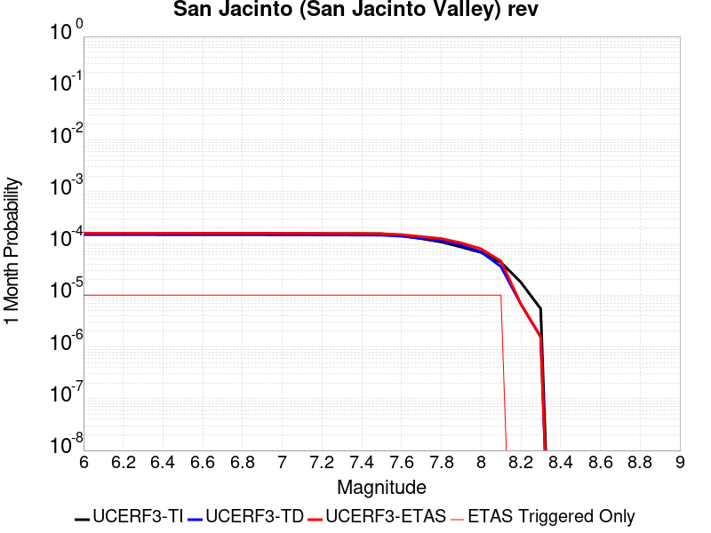 | 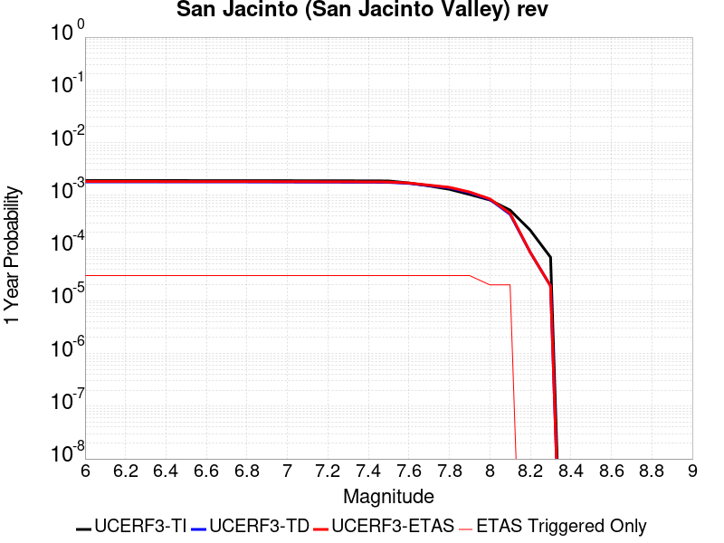 |  |

| Magnitude | 1 wk TI Prob | 1 wk TD Prob | 1 wk ETAS Prob | 1 wk ETAS/TD Gain | 1 wk ETAS Triggered Only | 1 mo TI Prob | 1 mo TD Prob | 1 mo ETAS Prob | 1 mo ETAS/TD Gain | 1 mo ETAS Triggered Only | 1 yr TI Prob | 1 yr TD Prob | 1 yr ETAS Prob | 1 yr ETAS/TD Gain | 1 yr ETAS Triggered Only | 10 yr TI Prob | 10 yr TD Prob | 10 yr ETAS Prob | 10 yr ETAS/TD Gain | 10 yr ETAS Triggered Only |
|-----|-----|-----|-----|-----|-----|-----|-----|-----|-----|-----|-----|-----|-----|-----|-----|-----|-----|-----|-----|-----|
| 6.0 | 3.652694E-5 | 3.452745E-5 | 3.452745E-5 | 1.0 | 0.0 | 1.5653463E-4 | 1.4796639E-4 | 1.6624288E-4 | 1.1235179 | 1.8279197E-5 | 0.0019041431 | 0.0018000039 | 0.0018364965 | 1.0202736 | 3.6558395E-5 | 0.018879099 | 0.018591218 | 0.018680915 | 1.0048246 | 9.139598E-5 |
| 6.1 | 3.652694E-5 | 3.452745E-5 | 3.452745E-5 | 1.0 | 0.0 | 1.5653463E-4 | 1.4796639E-4 | 1.6624288E-4 | 1.1235179 | 1.8279197E-5 | 0.0019041431 | 0.0018000039 | 0.0018364965 | 1.0202736 | 3.6558395E-5 | 0.018879099 | 0.018591218 | 0.018680915 | 1.0048246 | 9.139598E-5 |
| 6.2 | 3.652694E-5 | 3.452745E-5 | 3.452745E-5 | 1.0 | 0.0 | 1.5653463E-4 | 1.4796639E-4 | 1.6624288E-4 | 1.1235179 | 1.8279197E-5 | 0.0019041431 | 0.0018000039 | 0.0018364965 | 1.0202736 | 3.6558395E-5 | 0.018879099 | 0.018591218 | 0.018680915 | 1.0048246 | 9.139598E-5 |
| 6.3 | 3.652694E-5 | 3.452745E-5 | 3.452745E-5 | 1.0 | 0.0 | 1.5653463E-4 | 1.4796639E-4 | 1.6624288E-4 | 1.1235179 | 1.8279197E-5 | 0.0019041431 | 0.0018000039 | 0.0018364965 | 1.0202736 | 3.6558395E-5 | 0.018879099 | 0.018591218 | 0.018680915 | 1.0048246 | 9.139598E-5 |
| 6.4 | 3.646941E-5 | 3.4448993E-5 | 3.4448993E-5 | 1.0 | 0.0 | 1.5628811E-4 | 1.4763021E-4 | 1.659067E-4 | 1.1237992 | 1.8279197E-5 | 0.0019011468 | 0.0017959181 | 0.0018324108 | 1.0203198 | 3.6558395E-5 | 0.018849645 | 0.018551087 | 0.018640788 | 1.0048354 | 9.139598E-5 |
| 6.5 | 3.646941E-5 | 3.4448993E-5 | 3.4448993E-5 | 1.0 | 0.0 | 1.5628811E-4 | 1.4763021E-4 | 1.659067E-4 | 1.1237992 | 1.8279197E-5 | 0.0019011468 | 0.0017959181 | 0.0018324108 | 1.0203198 | 3.6558395E-5 | 0.018849645 | 0.018551087 | 0.018640788 | 1.0048354 | 9.139598E-5 |
| 6.6 | 3.6442503E-5 | 3.4412365E-5 | 3.4412365E-5 | 1.0 | 0.0 | 1.561728E-4 | 1.4747324E-4 | 1.6574975E-4 | 1.1239309 | 1.8279197E-5 | 0.0018997455 | 0.0017940103 | 0.0018305031 | 1.0203415 | 3.6558395E-5 | 0.018835869 | 0.018532353 | 0.018622054 | 1.0048403 | 9.139598E-5 |
| 6.7 | 3.6432113E-5 | 3.439793E-5 | 3.439793E-5 | 1.0 | 0.0 | 1.5612828E-4 | 1.474114E-4 | 1.6568789E-4 | 1.123983 | 1.8279197E-5 | 0.0018992044 | 0.0017932588 | 0.0018297517 | 1.02035 | 3.6558395E-5 | 0.018830549 | 0.018524973 | 0.018614676 | 1.0048423 | 9.139598E-5 |
| 6.8 | 3.6409598E-5 | 3.4366974E-5 | 3.4366974E-5 | 1.0 | 0.0 | 1.560318E-4 | 1.4727873E-4 | 1.6555523E-4 | 1.1240946 | 1.8279197E-5 | 0.0018980318 | 0.0017916465 | 0.0018281393 | 1.0203683 | 3.6558395E-5 | 0.018819023 | 0.018509122 | 0.018598827 | 1.0048465 | 9.139598E-5 |
| 6.9 | 3.638078E-5 | 3.4327382E-5 | 3.4327382E-5 | 1.0 | 0.0 | 1.5590832E-4 | 1.4710908E-4 | 1.6538559E-4 | 1.1242378 | 1.8279197E-5 | 0.0018965311 | 0.0017895843 | 0.0018260772 | 1.0203918 | 3.6558395E-5 | 0.018804269 | 0.01848885 | 0.018578555 | 1.0048519 | 9.139598E-5 |
| 7.0 | 3.6294874E-5 | 3.420936E-5 | 3.420936E-5 | 1.0 | 0.0 | 1.5554018E-4 | 1.4660333E-4 | 1.6487984E-4 | 1.1246665 | 1.8279197E-5 | 0.0018920569 | 0.0017834369 | 0.00181993 | 1.0204623 | 3.6558395E-5 | 0.018760284 | 0.018428413 | 0.018518124 | 1.0048681 | 9.139598E-5 |
| 7.1 | 3.6260717E-5 | 3.416563E-5 | 3.416563E-5 | 1.0 | 0.0 | 1.5539382E-4 | 1.4641593E-4 | 1.6469245E-4 | 1.1248261 | 1.8279197E-5 | 0.001890278 | 0.0017811591 | 0.0018176524 | 1.0204885 | 3.6558395E-5 | 0.018742796 | 0.018406007 | 0.018495722 | 1.0048741 | 9.139598E-5 |
| 7.2 | 3.6210204E-5 | 3.4099747E-5 | 3.4099747E-5 | 1.0 | 0.0 | 1.5517735E-4 | 1.461336E-4 | 1.6441013E-4 | 1.1250672 | 1.8279197E-5 | 0.001887647 | 0.0017777274 | 0.0018142208 | 1.0205281 | 3.6558395E-5 | 0.01871693 | 0.018372238 | 0.018461954 | 1.0048833 | 9.139598E-5 |
| 7.3 | 3.6119454E-5 | 3.3987813E-5 | 3.3987813E-5 | 1.0 | 0.0 | 1.5478847E-4 | 1.4565395E-4 | 1.6393047E-4 | 1.1254791 | 1.8279197E-5 | 0.0018829206 | 0.001771897 | 0.0018083906 | 1.0205958 | 3.6558395E-5 | 0.018670462 | 0.01831468 | 0.018404404 | 1.0048989 | 9.139598E-5 |
| 7.4 | 3.607848E-5 | 3.393525E-5 | 3.393525E-5 | 1.0 | 0.0 | 1.5461289E-4 | 1.454287E-4 | 1.6370523E-4 | 1.1256735 | 1.8279197E-5 | 0.0018807866 | 0.001769159 | 0.0018056527 | 1.0206277 | 3.6558395E-5 | 0.018649481 | 0.018287646 | 0.01837737 | 1.0049063 | 9.139598E-5 |
| 7.5 | 3.5856774E-5 | 3.3744E-5 | 3.3744E-5 | 1.0 | 0.0 | 1.5366284E-4 | 1.4460915E-4 | 1.628857E-4 | 1.1263859 | 1.8279197E-5 | 0.0018692396 | 0.0017591972 | 0.0017956913 | 1.0207447 | 3.6558395E-5 | 0.018535944 | 0.018188216 | 0.018277949 | 1.0049336 | 9.139598E-5 |
| 7.6 | 3.286655E-5 | 3.2259064E-5 | 3.2259064E-5 | 1.0 | 0.0 | 1.4084904E-4 | 1.3824581E-4 | 1.5652248E-4 | 1.1322042 | 1.8279197E-5 | 0.001713488 | 0.0016818454 | 0.0017183423 | 1.0217005 | 3.6558395E-5 | 0.017003361 | 0.017403768 | 0.017493574 | 1.0051601 | 9.139598E-5 |
| 7.7 | 2.8882527E-5 | 2.9349278E-5 | 2.9349278E-5 | 1.0 | 0.0 | 1.237764E-4 | 1.2577657E-4 | 1.4405345E-4 | 1.1453124 | 1.8279197E-5 | 0.0015059357 | 0.0015302551 | 0.0015667576 | 1.0238538 | 3.6558395E-5 | 0.014957713 | 0.01588893 | 0.015978875 | 1.0056608 | 9.139598E-5 |
| 7.8 | 2.4950225E-5 | 2.6635882E-5 | 2.6635882E-5 | 1.0 | 0.0 | 1.0692515E-4 | 1.1414879E-4 | 1.324259E-4 | 1.1601166 | 1.8279197E-5 | 0.0013010362 | 0.0013888765 | 0.0014253841 | 1.0262858 | 3.6558395E-5 | 0.012934455 | 0.014468086 | 0.01455816 | 1.0062257 | 9.139598E-5 |
| 7.9 | 1.9881603E-5 | 2.1605314E-5 | 2.1605314E-5 | 1.0 | 0.0 | 8.520408E-5 | 9.259092E-5 | 1.1086842E-4 | 1.1974006 | 1.8279197E-5 | 0.001036866 | 0.0011267122 | 0.0011632295 | 1.0324104 | 3.6558395E-5 | 0.010320415 | 0.011827964 | 0.011918279 | 1.0076357 | 9.139598E-5 |
| 8.0 | 1.563292E-5 | 1.6016422E-5 | 1.6016422E-5 | 1.0 | 0.0 | 6.6996516E-5 | 6.864E-5 | 8.691794E-5 | 1.266287 | 1.8279197E-5 | 8.153773E-4 | 8.353723E-4 | 8.719002E-4 | 1.0437264 | 3.6558395E-5 | 0.00812392 | 0.008852122 | 0.008942709 | 1.0102334 | 9.139598E-5 |
| 8.1 | 1.0045313E-5 | 8.348415E-6 | 8.348415E-6 | 1.0 | 0.0 | 4.305063E-5 | 3.5778434E-5 | 5.4056974E-5 | 1.5108815 | 1.8279197E-5 | 5.2401534E-4 | 4.355159E-4 | 4.7205837E-4 | 1.0839062 | 3.6558395E-5 | 0.0052278144 | 0.0046841633 | 0.0047205505 | 1.0077682 | 3.6558395E-5 |
| 8.2 | 4.1554413E-6 | 1.5788169E-6 | 1.5788169E-6 | 1.0 | 0.0 | 1.7808914E-5 | 6.7663404E-6 | 6.7663404E-6 | 1.0 | 0.0 | 2.1680194E-4 | 8.237711E-5 | 8.237711E-5 | 1.0 | 0.0 | 0.0021659054 | 9.5586455E-4 | 9.5586455E-4 | 1.0 | 0.0 |
| 8.3 | 1.2758221E-6 | 3.6510448E-7 | 3.6510448E-7 | 1.0 | 0.0 | 5.4677976E-6 | 1.5647327E-6 | 1.5647327E-6 | 1.0 | 0.0 | 6.65684E-5 | 1.9050458E-5 | 1.9050458E-5 | 1.0 | 0.0 | 6.6548464E-4 | 2.296306E-4 | 2.296306E-4 | 1.0 | 0.0 |

## Ortigalita (North)
*[(top)](#table-of-contents)*

| 1 Week | 1 Month | 1 Year | 10 Year |
|-----|-----|-----|-----|
|  |  |  |  |

| Magnitude | 1 wk TI Prob | 1 wk TD Prob | 1 wk ETAS Prob | 1 wk ETAS/TD Gain | 1 wk ETAS Triggered Only | 1 mo TI Prob | 1 mo TD Prob | 1 mo ETAS Prob | 1 mo ETAS/TD Gain | 1 mo ETAS Triggered Only | 1 yr TI Prob | 1 yr TD Prob | 1 yr ETAS Prob | 1 yr ETAS/TD Gain | 1 yr ETAS Triggered Only | 10 yr TI Prob | 10 yr TD Prob | 10 yr ETAS Prob | 10 yr ETAS/TD Gain | 10 yr ETAS Triggered Only |
|-----|-----|-----|-----|-----|-----|-----|-----|-----|-----|-----|-----|-----|-----|-----|-----|-----|-----|-----|-----|-----|
| 6.0 | 7.711876E-5 | 1.05107065E-4 | 1.05107065E-4 | 1.0 | 0.0 | 3.3046713E-4 | 4.5039196E-4 | 4.5039196E-4 | 1.0 | 0.0 | 0.004016016 | 0.0054697967 | 0.0054697967 | 1.0 | 0.0 | 0.039442103 | 0.05347275 | 0.053541955 | 1.0012943 | 7.311679E-5 |
| 6.1 | 4.607858E-5 | 6.0259496E-5 | 6.0259496E-5 | 1.0 | 0.0 | 1.9746469E-4 | 2.582322E-4 | 2.582322E-4 | 1.0 | 0.0 | 0.0024014818 | 0.0031397445 | 0.0031397445 | 1.0 | 0.0 | 0.023756953 | 0.030984651 | 0.03103779 | 1.001715 | 5.483759E-5 |
| 6.2 | 4.607858E-5 | 6.0259496E-5 | 6.0259496E-5 | 1.0 | 0.0 | 1.9746469E-4 | 2.582322E-4 | 2.582322E-4 | 1.0 | 0.0 | 0.0024014818 | 0.0031397445 | 0.0031397445 | 1.0 | 0.0 | 0.023756953 | 0.030984651 | 0.03103779 | 1.001715 | 5.483759E-5 |
| 6.3 | 3.327423E-5 | 4.2487998E-5 | 4.2487998E-5 | 1.0 | 0.0 | 1.4259605E-4 | 1.8208046E-4 | 1.8208046E-4 | 1.0 | 0.0 | 0.0017347244 | 0.0022148585 | 0.0022148585 | 1.0 | 0.0 | 0.017212452 | 0.02195199 | 0.021987746 | 1.0016289 | 3.6558395E-5 |
| 6.4 | 2.7732503E-5 | 3.5008667E-5 | 3.5008667E-5 | 1.0 | 0.0 | 1.1884817E-4 | 1.5003003E-4 | 1.5003003E-4 | 1.0 | 0.0 | 0.001446016 | 0.0018253255 | 0.0018253255 | 1.0 | 0.0 | 0.014366428 | 0.018126285 | 0.018162182 | 1.0019803 | 3.6558395E-5 |
| 6.5 | 2.7689714E-5 | 3.4958473E-5 | 3.4958473E-5 | 1.0 | 0.0 | 1.186648E-4 | 1.4981494E-4 | 1.4981494E-4 | 1.0 | 0.0 | 0.0014437864 | 0.0018227111 | 0.0018227111 | 1.0 | 0.0 | 0.014344421 | 0.018100567 | 0.018136464 | 1.0019832 | 3.6558395E-5 |
| 6.6 | 2.2976905E-5 | 2.8726188E-5 | 2.8726188E-5 | 1.0 | 0.0 | 9.846873E-5 | 1.2310786E-4 | 1.2310786E-4 | 1.0 | 0.0 | 0.0011981975 | 0.0014980417 | 0.0014980417 | 1.0 | 0.0 | 0.011917574 | 0.014902728 | 0.014938742 | 1.0024166 | 3.6558395E-5 |
| 6.7 | 1.9871539E-5 | 2.4911353E-5 | 2.4911353E-5 | 1.0 | 0.0 | 8.516096E-5 | 1.0675997E-4 | 1.0675997E-4 | 1.0 | 0.0 | 0.0010363415 | 0.0012992765 | 0.0012992765 | 1.0 | 0.0 | 0.010315218 | 0.012940488 | 0.01295853 | 1.0013943 | 1.8279197E-5 |
| 6.8 | 6.5640475E-6 | 7.6067754E-6 | 7.6067754E-6 | 1.0 | 0.0 | 2.813133E-5 | 3.2600074E-5 | 3.2600074E-5 | 1.0 | 0.0 | 3.424451E-4 | 3.968365E-4 | 3.968365E-4 | 1.0 | 0.0 | 0.0034191788 | 0.003961566 | 0.0039797723 | 1.0045959 | 1.8279197E-5 |
| 6.9 | 5.6219683E-6 | 6.502919E-6 | 6.502919E-6 | 1.0 | 0.0 | 2.4093928E-5 | 2.786937E-5 | 2.786937E-5 | 1.0 | 0.0 | 2.933041E-4 | 3.3925934E-4 | 3.3925934E-4 | 1.0 | 0.0 | 0.0029291727 | 0.0033876712 | 0.0034058886 | 1.0053775 | 1.8279197E-5 |
| 7.0 | 3.875591E-6 | 4.4855037E-6 | 4.4855037E-6 | 1.0 | 0.0 | 1.6609569E-5 | 1.9223458E-5 | 1.9223458E-5 | 1.0 | 0.0 | 2.0220275E-4 | 2.3402258E-4 | 2.3402258E-4 | 1.0 | 0.0 | 0.0020201886 | 0.0023379698 | 0.0023562063 | 1.0078001 | 1.8279197E-5 |
| 7.1 | 1.6017933E-6 | 1.8573562E-6 | 1.8573562E-6 | 1.0 | 0.0 | 6.8648105E-6 | 7.9600795E-6 | 7.9600795E-6 | 1.0 | 0.0 | 8.357586E-5 | 9.691073E-5 | 9.691073E-5 | 1.0 | 0.0 | 8.3544437E-4 | 9.687894E-4 | 9.870509E-4 | 1.0188498 | 1.8279197E-5 |

## Cleghorn Lake
*[(top)](#table-of-contents)*

| 1 Week | 1 Month | 1 Year | 10 Year |
|-----|-----|-----|-----|
|  | 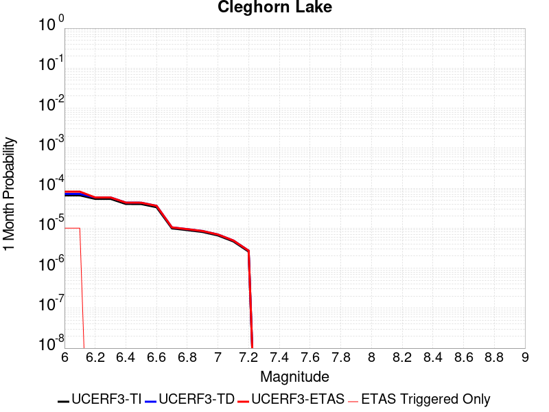 |  |  |

| Magnitude | 1 wk TI Prob | 1 wk TD Prob | 1 wk ETAS Prob | 1 wk ETAS/TD Gain | 1 wk ETAS Triggered Only | 1 mo TI Prob | 1 mo TD Prob | 1 mo ETAS Prob | 1 mo ETAS/TD Gain | 1 mo ETAS Triggered Only | 1 yr TI Prob | 1 yr TD Prob | 1 yr ETAS Prob | 1 yr ETAS/TD Gain | 1 yr ETAS Triggered Only | 10 yr TI Prob | 10 yr TD Prob | 10 yr ETAS Prob | 10 yr ETAS/TD Gain | 10 yr ETAS Triggered Only |
|-----|-----|-----|-----|-----|-----|-----|-----|-----|-----|-----|-----|-----|-----|-----|-----|-----|-----|-----|-----|-----|
| 6.0 | 1.5467183E-5 | 1.6795737E-5 | 1.6795737E-5 | 1.0 | 0.0 | 6.6286244E-5 | 7.198006E-5 | 9.0257934E-5 | 1.2539297 | 1.8279197E-5 | 8.067362E-4 | 8.760597E-4 | 9.1258605E-4 | 1.0416939 | 3.6558395E-5 | 0.008038137 | 0.00873149 | 0.008803968 | 1.0083008 | 7.311679E-5 |
| 6.1 | 1.5467183E-5 | 1.6795737E-5 | 1.6795737E-5 | 1.0 | 0.0 | 6.6286244E-5 | 7.198006E-5 | 9.0257934E-5 | 1.2539297 | 1.8279197E-5 | 8.067362E-4 | 8.760597E-4 | 9.1258605E-4 | 1.0416939 | 3.6558395E-5 | 0.008038137 | 0.00873149 | 0.008803968 | 1.0083008 | 7.311679E-5 |
| 6.2 | 1.2624631E-5 | 1.3682765E-5 | 1.3682765E-5 | 1.0 | 0.0 | 5.410444E-5 | 5.8639376E-5 | 5.8639376E-5 | 1.0 | 0.0 | 6.585225E-4 | 7.1374926E-4 | 7.320154E-4 | 1.0255919 | 1.8279197E-5 | 0.0065657445 | 0.007119365 | 0.007173812 | 1.0076478 | 5.483759E-5 |
| 6.3 | 1.2624631E-5 | 1.3682765E-5 | 1.3682765E-5 | 1.0 | 0.0 | 5.410444E-5 | 5.8639376E-5 | 5.8639376E-5 | 1.0 | 0.0 | 6.585225E-4 | 7.1374926E-4 | 7.320154E-4 | 1.0255919 | 1.8279197E-5 | 0.0065657445 | 0.007119365 | 0.007173812 | 1.0076478 | 5.483759E-5 |
| 6.4 | 9.417684E-6 | 1.0170984E-5 | 1.0170984E-5 | 1.0 | 0.0 | 4.036088E-5 | 4.3589433E-5 | 4.3589433E-5 | 1.0 | 0.0 | 4.912829E-4 | 5.3061324E-4 | 5.3061324E-4 | 1.0 | 0.0 | 0.004901982 | 0.0052974997 | 0.005333864 | 1.0068645 | 3.6558395E-5 |
| 6.5 | 9.368219E-6 | 1.0118407E-5 | 1.0118407E-5 | 1.0 | 0.0 | 4.014889E-5 | 4.336411E-5 | 4.336411E-5 | 1.0 | 0.0 | 4.8870314E-4 | 5.2787125E-4 | 5.2787125E-4 | 1.0 | 0.0 | 0.004876298 | 0.00527021 | 0.005306576 | 1.0069002 | 3.6558395E-5 |
| 6.6 | 7.803798E-6 | 8.4425665E-6 | 8.4425665E-6 | 1.0 | 0.0 | 3.3444423E-5 | 3.6182148E-5 | 3.6182148E-5 | 1.0 | 0.0 | 4.0710976E-4 | 4.4046855E-4 | 4.4046855E-4 | 1.0 | 0.0 | 0.0040636472 | 0.0043998733 | 0.004436271 | 1.0082724 | 3.6558395E-5 |
| 6.7 | 2.3108669E-6 | 2.443983E-6 | 2.443983E-6 | 1.0 | 0.0 | 9.903678E-6 | 1.0474172E-5 | 1.0474172E-5 | 1.0 | 0.0 | 1.205706E-4 | 1.2751577E-4 | 1.2751577E-4 | 1.0 | 0.0 | 0.001205052 | 0.0012744446 | 0.0012927005 | 1.0143245 | 1.8279197E-5 |
| 6.8 | 2.0882828E-6 | 2.2064146E-6 | 2.2064146E-6 | 1.0 | 0.0 | 8.949753E-6 | 9.456029E-6 | 9.456029E-6 | 1.0 | 0.0 | 1.08957785E-4 | 1.1512124E-4 | 1.1512124E-4 | 1.0 | 0.0 | 0.0010890438 | 0.0011506329 | 0.0011688911 | 1.015868 | 1.8279197E-5 |
| 6.9 | 1.876935E-6 | 1.9811675E-6 | 1.9811675E-6 | 1.0 | 0.0 | 8.043982E-6 | 8.4906915E-6 | 8.4906915E-6 | 1.0 | 0.0 | 9.7931086E-5 | 1.0336943E-4 | 1.0336943E-4 | 1.0 | 0.0 | 9.788794E-4 | 0.0010332294 | 0.0010514897 | 1.017673 | 1.8279197E-5 |
| 7.0 | 1.5357559E-6 | 1.6203753E-6 | 1.6203753E-6 | 1.0 | 0.0 | 6.5817944E-6 | 6.944448E-6 | 6.944448E-6 | 1.0 | 0.0 | 8.01304E-5 | 8.45455E-5 | 8.45455E-5 | 1.0 | 0.0 | 8.010151E-4 | 8.4514584E-4 | 8.4514584E-4 | 1.0 | 0.0 |
| 7.1 | 1.0905424E-6 | 1.1498282E-6 | 1.1498282E-6 | 1.0 | 0.0 | 4.6737446E-6 | 4.9278265E-6 | 4.9278265E-6 | 1.0 | 0.0 | 5.6901354E-5 | 5.9994734E-5 | 5.9994734E-5 | 1.0 | 0.0 | 5.6886784E-4 | 5.997952E-4 | 5.997952E-4 | 1.0 | 0.0 |
| 7.2 | 6.06668E-7 | 6.387636E-7 | 6.387636E-7 | 1.0 | 0.0 | 2.600003E-6 | 2.7375556E-6 | 2.7375556E-6 | 1.0 | 0.0 | 3.1654577E-5 | 3.33293E-5 | 3.33293E-5 | 1.0 | 0.0 | 3.1650066E-4 | 3.3324986E-4 | 3.3324986E-4 | 1.0 | 0.0 |

## Great Valley 09 (Laguna Seca)
*[(top)](#table-of-contents)*

| 1 Week | 1 Month | 1 Year | 10 Year |
|-----|-----|-----|-----|
|  | 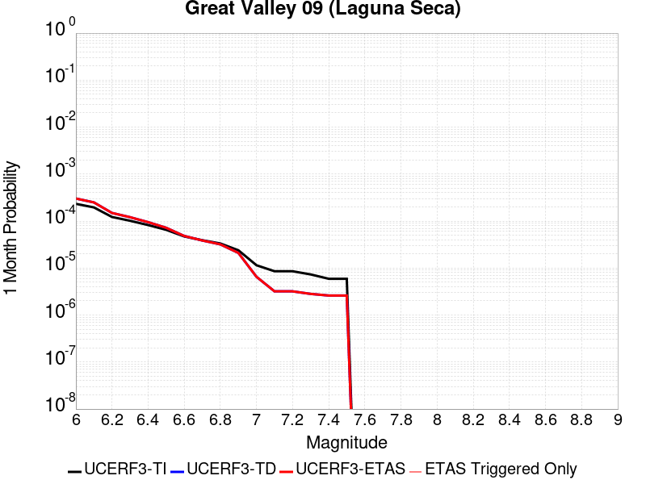 |  |  |

| Magnitude | 1 wk TI Prob | 1 wk TD Prob | 1 wk ETAS Prob | 1 wk ETAS/TD Gain | 1 wk ETAS Triggered Only | 1 mo TI Prob | 1 mo TD Prob | 1 mo ETAS Prob | 1 mo ETAS/TD Gain | 1 mo ETAS Triggered Only | 1 yr TI Prob | 1 yr TD Prob | 1 yr ETAS Prob | 1 yr ETAS/TD Gain | 1 yr ETAS Triggered Only | 10 yr TI Prob | 10 yr TD Prob | 10 yr ETAS Prob | 10 yr ETAS/TD Gain | 10 yr ETAS Triggered Only |
|-----|-----|-----|-----|-----|-----|-----|-----|-----|-----|-----|-----|-----|-----|-----|-----|-----|-----|-----|-----|-----|
| 6.0 | 5.4353277E-5 | 7.0525646E-5 | 7.0525646E-5 | 1.0 | 0.0 | 2.3292181E-4 | 3.0221994E-4 | 3.0221994E-4 | 1.0 | 0.0 | 0.0028321352 | 0.0036733362 | 0.0036733362 | 1.0 | 0.0 | 0.02796312 | 0.036127005 | 0.03617986 | 1.001463 | 5.483759E-5 |
| 6.1 | 4.5578287E-5 | 5.8239293E-5 | 5.8239293E-5 | 1.0 | 0.0 | 1.953209E-4 | 2.4957463E-4 | 2.4957463E-4 | 1.0 | 0.0 | 0.0023754383 | 0.0030343828 | 0.0030343828 | 1.0 | 0.0 | 0.023502063 | 0.029928818 | 0.029964283 | 1.0011849 | 3.6558395E-5 |
| 6.2 | 2.8536782E-5 | 3.474574E-5 | 3.474574E-5 | 1.0 | 0.0 | 1.2229476E-4 | 1.4890228E-4 | 1.4890228E-4 | 1.0 | 0.0 | 0.0014879217 | 0.0018113338 | 0.0018113338 | 1.0 | 0.0 | 0.014779986 | 0.017963162 | 0.017981112 | 1.0009993 | 1.8279197E-5 |
| 6.3 | 2.3698774E-5 | 2.8219289E-5 | 2.8219289E-5 | 1.0 | 0.0 | 1.01562226E-4 | 1.20934536E-4 | 1.20934536E-4 | 1.0 | 0.0 | 0.0012358186 | 0.0014714394 | 0.0014714394 | 1.0 | 0.0 | 0.012289686 | 0.014615262 | 0.014615262 | 1.0 | 0.0 |
| 6.4 | 1.9191197E-5 | 2.2126858E-5 | 2.2126858E-5 | 1.0 | 0.0 | 8.2245395E-5 | 9.4826195E-5 | 9.4826195E-5 | 1.0 | 0.0 | 0.0010008777 | 0.0011539406 | 0.0011539406 | 1.0 | 0.0 | 0.009963818 | 0.01147981 | 0.01147981 | 1.0 | 0.0 |
| 6.5 | 1.5203241E-5 | 1.6803955E-5 | 1.6803955E-5 | 1.0 | 0.0 | 6.5155116E-5 | 7.2015144E-5 | 7.2015144E-5 | 1.0 | 0.0 | 7.9297484E-4 | 8.7646366E-4 | 8.7646366E-4 | 1.0 | 0.0 | 0.007901512 | 0.008731467 | 0.008731467 | 1.0 | 0.0 |
| 6.6 | 1.0984925E-5 | 1.12445505E-5 | 1.12445505E-5 | 1.0 | 0.0 | 4.70774E-5 | 4.8190064E-5 | 4.8190064E-5 | 1.0 | 0.0 | 5.730166E-4 | 5.8656017E-4 | 5.8656017E-4 | 1.0 | 0.0 | 0.005715413 | 0.005850517 | 0.005850517 | 1.0 | 0.0 |
| 6.7 | 9.134616E-6 | 9.021409E-6 | 9.021409E-6 | 1.0 | 0.0 | 3.9147766E-5 | 3.8662623E-5 | 3.8662623E-5 | 1.0 | 0.0 | 4.7651984E-4 | 4.7061814E-4 | 4.7061814E-4 | 1.0 | 0.0 | 0.004754993 | 0.00469646 | 0.00469646 | 1.0 | 0.0 |
| 6.8 | 7.785589E-6 | 7.453189E-6 | 7.453189E-6 | 1.0 | 0.0 | 3.3366385E-5 | 3.1941858E-5 | 3.1941858E-5 | 1.0 | 0.0 | 4.0616E-4 | 3.8882476E-4 | 3.8882476E-4 | 1.0 | 0.0 | 0.0040541845 | 0.0038816484 | 0.0038816484 | 1.0 | 0.0 |
| 6.9 | 5.579095E-6 | 4.8993106E-6 | 4.8993106E-6 | 1.0 | 0.0 | 2.3910188E-5 | 2.0996884E-5 | 2.0996884E-5 | 1.0 | 0.0 | 2.9106764E-4 | 2.5560847E-4 | 2.5560847E-4 | 1.0 | 0.0 | 0.002906867 | 0.002553282 | 0.002553282 | 1.0 | 0.0 |
| 7.0 | 2.6816688E-6 | 1.521837E-6 | 1.521837E-6 | 1.0 | 0.0 | 1.1492816E-5 | 6.522143E-6 | 6.522143E-6 | 1.0 | 0.0 | 1.3991605E-4 | 7.9404286E-5 | 7.9404286E-5 | 1.0 | 0.0 | 0.0013982799 | 7.9376786E-4 | 7.9376786E-4 | 1.0 | 0.0 |
| 7.1 | 1.9951021E-6 | 7.4549945E-7 | 7.4549945E-7 | 1.0 | 0.0 | 8.55041E-6 | 3.194994E-6 | 3.194994E-6 | 1.0 | 0.0 | 1.0409627E-4 | 3.8898397E-5 | 3.8898397E-5 | 1.0 | 0.0 | 0.0010404752 | 3.8892005E-4 | 3.8892005E-4 | 1.0 | 0.0 |
| 7.2 | 1.9951021E-6 | 7.4549945E-7 | 7.4549945E-7 | 1.0 | 0.0 | 8.55041E-6 | 3.194994E-6 | 3.194994E-6 | 1.0 | 0.0 | 1.0409627E-4 | 3.8898397E-5 | 3.8898397E-5 | 1.0 | 0.0 | 0.0010404752 | 3.8892005E-4 | 3.8892005E-4 | 1.0 | 0.0 |
| 7.3 | 1.7087556E-6 | 6.5798565E-7 | 6.5798565E-7 | 1.0 | 0.0 | 7.3232177E-6 | 2.8199356E-6 | 2.8199356E-6 | 1.0 | 0.0 | 8.915652E-5 | 3.4332217E-5 | 3.4332217E-5 | 1.0 | 0.0 | 8.9120766E-4 | 3.432732E-4 | 3.432732E-4 | 1.0 | 0.0 |
| 7.4 | 1.3804846E-6 | 6.074658E-7 | 6.074658E-7 | 1.0 | 0.0 | 5.916349E-6 | 2.6034222E-6 | 2.6034222E-6 | 1.0 | 0.0 | 7.2029165E-5 | 3.1696247E-5 | 3.1696247E-5 | 1.0 | 0.0 | 7.200583E-4 | 3.1692127E-4 | 3.1692127E-4 | 1.0 | 0.0 |
| 7.5 | 1.3804846E-6 | 6.074658E-7 | 6.074658E-7 | 1.0 | 0.0 | 5.916349E-6 | 2.6034222E-6 | 2.6034222E-6 | 1.0 | 0.0 | 7.2029165E-5 | 3.1696247E-5 | 3.1696247E-5 | 1.0 | 0.0 | 7.200583E-4 | 3.1692127E-4 | 3.1692127E-4 | 1.0 | 0.0 |

## Camp Rock 2011
*[(top)](#table-of-contents)*

| 1 Week | 1 Month | 1 Year | 10 Year |
|-----|-----|-----|-----|
|  |  |  | 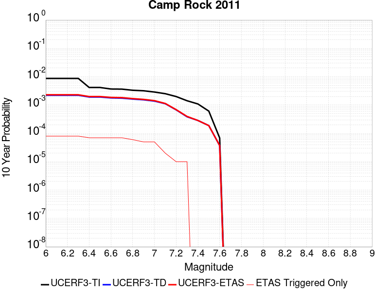 |

| Magnitude | 1 wk TI Prob | 1 wk TD Prob | 1 wk ETAS Prob | 1 wk ETAS/TD Gain | 1 wk ETAS Triggered Only | 1 mo TI Prob | 1 mo TD Prob | 1 mo ETAS Prob | 1 mo ETAS/TD Gain | 1 mo ETAS Triggered Only | 1 yr TI Prob | 1 yr TD Prob | 1 yr ETAS Prob | 1 yr ETAS/TD Gain | 1 yr ETAS Triggered Only | 10 yr TI Prob | 10 yr TD Prob | 10 yr ETAS Prob | 10 yr ETAS/TD Gain | 10 yr ETAS Triggered Only |
|-----|-----|-----|-----|-----|-----|-----|-----|-----|-----|-----|-----|-----|-----|-----|-----|-----|-----|-----|-----|-----|
| 6.0 | 1.6710783E-5 | 4.250666E-6 | 4.250666E-6 | 1.0 | 0.0 | 7.161568E-5 | 1.8217015E-5 | 1.8217015E-5 | 1.0 | 0.0 | 8.7157206E-4 | 2.2177011E-4 | 2.4004525E-4 | 1.0824058 | 1.8279197E-5 | 0.008681616 | 0.002215541 | 0.0022884957 | 1.0329287 | 7.311679E-5 |
| 6.1 | 1.6710783E-5 | 4.250666E-6 | 4.250666E-6 | 1.0 | 0.0 | 7.161568E-5 | 1.8217015E-5 | 1.8217015E-5 | 1.0 | 0.0 | 8.7157206E-4 | 2.2177011E-4 | 2.4004525E-4 | 1.0824058 | 1.8279197E-5 | 0.008681616 | 0.002215541 | 0.0022884957 | 1.0329287 | 7.311679E-5 |
| 6.2 | 1.6710783E-5 | 4.250666E-6 | 4.250666E-6 | 1.0 | 0.0 | 7.161568E-5 | 1.8217015E-5 | 1.8217015E-5 | 1.0 | 0.0 | 8.7157206E-4 | 2.2177011E-4 | 2.4004525E-4 | 1.0824058 | 1.8279197E-5 | 0.008681616 | 0.002215541 | 0.0022884957 | 1.0329287 | 7.311679E-5 |
| 6.3 | 1.6710783E-5 | 4.250666E-6 | 4.250666E-6 | 1.0 | 0.0 | 7.161568E-5 | 1.8217015E-5 | 1.8217015E-5 | 1.0 | 0.0 | 8.7157206E-4 | 2.2177011E-4 | 2.4004525E-4 | 1.0824058 | 1.8279197E-5 | 0.008681616 | 0.002215541 | 0.0022884957 | 1.0329287 | 7.311679E-5 |
| 6.4 | 7.982846E-6 | 3.6824456E-6 | 3.6824456E-6 | 1.0 | 0.0 | 3.421175E-5 | 1.5781816E-5 | 1.5781816E-5 | 1.0 | 0.0 | 4.1644843E-4 | 1.9212702E-4 | 2.1040271E-4 | 1.0951229 | 1.8279197E-5 | 0.0041566887 | 0.0019196441 | 0.0019743764 | 1.0285116 | 5.483759E-5 |
| 6.5 | 7.982846E-6 | 3.6824456E-6 | 3.6824456E-6 | 1.0 | 0.0 | 3.421175E-5 | 1.5781816E-5 | 1.5781816E-5 | 1.0 | 0.0 | 4.1644843E-4 | 1.9212702E-4 | 2.1040271E-4 | 1.0951229 | 1.8279197E-5 | 0.0041566887 | 0.0019196441 | 0.0019743764 | 1.0285116 | 5.483759E-5 |
| 6.6 | 7.048869E-6 | 3.4246991E-6 | 3.4246991E-6 | 1.0 | 0.0 | 3.0209088E-5 | 1.4677201E-5 | 1.4677201E-5 | 1.0 | 0.0 | 3.677336E-4 | 1.7868058E-4 | 1.9695652E-4 | 1.1022826 | 1.8279197E-5 | 0.0036712566 | 0.0017854008 | 0.0018401406 | 1.0306596 | 5.483759E-5 |
| 6.7 | 6.987307E-6 | 3.3626727E-6 | 3.3626727E-6 | 1.0 | 0.0 | 2.9945259E-5 | 1.44113765E-5 | 1.44113765E-5 | 1.0 | 0.0 | 3.6452254E-4 | 1.754447E-4 | 1.9372068E-4 | 1.1041695 | 1.8279197E-5 | 0.0036392517 | 0.001753093 | 0.0018078345 | 1.0312257 | 5.483759E-5 |
| 6.8 | 6.3737602E-6 | 3.1182262E-6 | 3.1182262E-6 | 1.0 | 0.0 | 2.731583E-5 | 1.33637595E-5 | 1.33637595E-5 | 1.0 | 0.0 | 3.3251947E-4 | 1.6269191E-4 | 1.8096814E-4 | 1.1123364 | 1.8279197E-5 | 0.0033202237 | 0.0016257567 | 0.0016622556 | 1.0224504 | 3.6558395E-5 |
| 6.9 | 6.112211E-6 | 2.933421E-6 | 2.933421E-6 | 1.0 | 0.0 | 2.6194928E-5 | 1.2571745E-5 | 1.2571745E-5 | 1.0 | 0.0 | 3.1887658E-4 | 1.5305053E-4 | 1.7132693E-4 | 1.1194141 | 1.8279197E-5 | 0.003184194 | 0.001529479 | 0.0015659815 | 1.0238659 | 3.6558395E-5 |
| 7.0 | 5.5140117E-6 | 2.6421922E-6 | 2.6421922E-6 | 1.0 | 0.0 | 2.3631264E-5 | 1.1323633E-5 | 1.1323633E-5 | 1.0 | 0.0 | 2.8767265E-4 | 1.3785677E-4 | 1.5613344E-4 | 1.1325773 | 1.8279197E-5 | 0.0028730053 | 0.0013777377 | 0.0014142458 | 1.0264986 | 3.6558395E-5 |
| 7.1 | 4.8151105E-6 | 2.134497E-6 | 2.134497E-6 | 1.0 | 0.0 | 2.0636026E-5 | 9.147813E-6 | 9.147813E-6 | 1.0 | 0.0 | 2.5121463E-4 | 1.1136916E-4 | 1.1136916E-4 | 1.0 | 0.0 | 0.0025093083 | 0.0011131554 | 0.0011314142 | 1.0164028 | 1.8279197E-5 |
| 7.2 | 3.818335E-6 | 1.29391E-6 | 1.29391E-6 | 1.0 | 0.0 | 1.6364189E-5 | 5.5453174E-6 | 5.5453174E-6 | 1.0 | 0.0 | 1.9921579E-4 | 6.7512236E-5 | 6.7512236E-5 | 1.0 | 0.0 | 0.0019903728 | 6.7492545E-4 | 6.931923E-4 | 1.027065 | 1.8279197E-5 |
| 7.3 | 2.7166698E-6 | 7.384855E-7 | 7.384855E-7 | 1.0 | 0.0 | 1.1642818E-5 | 3.1649342E-6 | 3.1649342E-6 | 1.0 | 0.0 | 1.4174209E-4 | 3.8532413E-5 | 3.8532413E-5 | 1.0 | 0.0 | 0.0014165172 | 3.852593E-4 | 4.0353148E-4 | 1.0474283 | 1.8279197E-5 |
| 7.4 | 2.0893426E-6 | 5.462842E-7 | 5.462842E-7 | 1.0 | 0.0 | 8.954295E-6 | 2.341216E-6 | 2.341216E-6 | 1.0 | 0.0 | 1.0901308E-4 | 2.8503937E-5 | 2.8503937E-5 | 1.0 | 0.0 | 0.0010895962 | 2.8500336E-4 | 2.8500336E-4 | 1.0 | 0.0 |
| 7.5 | 1.1681728E-6 | 3.60362E-7 | 3.60362E-7 | 1.0 | 0.0 | 5.0064455E-6 | 1.5444077E-6 | 1.5444077E-6 | 1.0 | 0.0 | 6.0951766E-5 | 1.8803006E-5 | 1.8803006E-5 | 1.0 | 0.0 | 6.093505E-4 | 1.8801463E-4 | 1.8801463E-4 | 1.0 | 0.0 |
| 7.6 | 1.3154387E-7 | 7.120442E-8 | 7.120442E-8 | 1.0 | 0.0 | 5.6375933E-7 | 3.0516176E-7 | 3.0516176E-7 | 1.0 | 0.0 | 6.863748E-6 | 3.7153397E-6 | 3.7153397E-6 | 1.0 | 0.0 | 6.863536E-5 | 3.7152935E-5 | 3.7152935E-5 | 1.0 | 0.0 |

## Pisgah-Bullion Mtn-Mesquite Lk
*[(top)](#table-of-contents)*

| 1 Week | 1 Month | 1 Year | 10 Year |
|-----|-----|-----|-----|
|  |  |  |  |

| Magnitude | 1 wk TI Prob | 1 wk TD Prob | 1 wk ETAS Prob | 1 wk ETAS/TD Gain | 1 wk ETAS Triggered Only | 1 mo TI Prob | 1 mo TD Prob | 1 mo ETAS Prob | 1 mo ETAS/TD Gain | 1 mo ETAS Triggered Only | 1 yr TI Prob | 1 yr TD Prob | 1 yr ETAS Prob | 1 yr ETAS/TD Gain | 1 yr ETAS Triggered Only | 10 yr TI Prob | 10 yr TD Prob | 10 yr ETAS Prob | 10 yr ETAS/TD Gain | 10 yr ETAS Triggered Only |
|-----|-----|-----|-----|-----|-----|-----|-----|-----|-----|-----|-----|-----|-----|-----|-----|-----|-----|-----|-----|-----|
| 6.0 | 3.0240792E-5 | 2.4094168E-5 | 2.4094168E-5 | 1.0 | 0.0 | 1.2959696E-4 | 1.032572E-4 | 1.032572E-4 | 1.0 | 0.0 | 0.0015767008 | 0.0012565318 | 0.0012930443 | 1.0290581 | 3.6558395E-5 | 0.015655609 | 0.012504297 | 0.0125765 | 1.0057743 | 7.311679E-5 |
| 6.1 | 3.0240792E-5 | 2.4094168E-5 | 2.4094168E-5 | 1.0 | 0.0 | 1.2959696E-4 | 1.032572E-4 | 1.032572E-4 | 1.0 | 0.0 | 0.0015767008 | 0.0012565318 | 0.0012930443 | 1.0290581 | 3.6558395E-5 | 0.015655609 | 0.012504297 | 0.0125765 | 1.0057743 | 7.311679E-5 |
| 6.2 | 3.0240792E-5 | 2.4094168E-5 | 2.4094168E-5 | 1.0 | 0.0 | 1.2959696E-4 | 1.032572E-4 | 1.032572E-4 | 1.0 | 0.0 | 0.0015767008 | 0.0012565318 | 0.0012930443 | 1.0290581 | 3.6558395E-5 | 0.015655609 | 0.012504297 | 0.0125765 | 1.0057743 | 7.311679E-5 |
| 6.3 | 2.0498217E-5 | 1.3639548E-5 | 1.3639548E-5 | 1.0 | 0.0 | 8.784654E-5 | 5.845399E-5 | 5.845399E-5 | 1.0 | 0.0 | 0.0010690069 | 7.114611E-4 | 7.114611E-4 | 1.0 | 0.0 | 0.01063879 | 0.0070934608 | 0.0071116104 | 1.0025586 | 1.8279197E-5 |
| 6.4 | 2.0498217E-5 | 1.3639548E-5 | 1.3639548E-5 | 1.0 | 0.0 | 8.784654E-5 | 5.845399E-5 | 5.845399E-5 | 1.0 | 0.0 | 0.0010690069 | 7.114611E-4 | 7.114611E-4 | 1.0 | 0.0 | 0.01063879 | 0.0070934608 | 0.0071116104 | 1.0025586 | 1.8279197E-5 |
| 6.5 | 1.7316182E-5 | 1.0478121E-5 | 1.0478121E-5 | 1.0 | 0.0 | 7.42101E-5 | 4.490552E-5 | 4.490552E-5 | 1.0 | 0.0 | 9.0313336E-4 | 5.465975E-4 | 5.465975E-4 | 1.0 | 0.0 | 0.008994718 | 0.005453527 | 0.0054717064 | 1.0033336 | 1.8279197E-5 |
| 6.6 | 1.5251077E-5 | 8.415111E-6 | 8.415111E-6 | 1.0 | 0.0 | 6.536012E-5 | 3.6064303E-5 | 3.6064303E-5 | 1.0 | 0.0 | 7.9546886E-4 | 4.3900165E-4 | 4.3900165E-4 | 1.0 | 0.0 | 0.007926274 | 0.004382062 | 0.0044002607 | 1.0041531 | 1.8279197E-5 |
| 6.7 | 1.2997425E-5 | 6.4121105E-6 | 6.4121105E-6 | 1.0 | 0.0 | 5.570206E-5 | 2.748021E-5 | 2.748021E-5 | 1.0 | 0.0 | 6.7796157E-4 | 3.3452484E-4 | 3.3452484E-4 | 1.0 | 0.0 | 0.0067589693 | 0.003340673 | 0.0033588912 | 1.0054535 | 1.8279197E-5 |
| 6.8 | 1.035386E-5 | 4.3337277E-6 | 4.3337277E-6 | 1.0 | 0.0 | 4.437293E-5 | 1.8572991E-5 | 1.8572991E-5 | 1.0 | 0.0 | 5.401065E-4 | 2.2610357E-4 | 2.2610357E-4 | 1.0 | 0.0 | 0.0053879567 | 0.002258822 | 0.002258822 | 1.0 | 0.0 |
| 6.9 | 8.816252E-6 | 3.5810722E-6 | 3.5810722E-6 | 1.0 | 0.0 | 3.778339E-5 | 1.5347365E-5 | 1.5347365E-5 | 1.0 | 0.0 | 4.5991567E-4 | 1.8683873E-4 | 1.8683873E-4 | 1.0 | 0.0 | 0.00458965 | 0.001866875 | 0.001866875 | 1.0 | 0.0 |
| 7.0 | 6.8232207E-6 | 2.567915E-6 | 2.567915E-6 | 1.0 | 0.0 | 2.9242048E-5 | 1.1005306E-5 | 1.1005306E-5 | 1.0 | 0.0 | 3.5596377E-4 | 1.3398168E-4 | 1.3398168E-4 | 1.0 | 0.0 | 0.0035539411 | 0.0013390401 | 0.0013390401 | 1.0 | 0.0 |
| 7.1 | 5.837013E-6 | 2.227665E-6 | 2.227665E-6 | 1.0 | 0.0 | 2.501553E-5 | 9.547102E-6 | 9.547102E-6 | 1.0 | 0.0 | 3.045215E-4 | 1.1623006E-4 | 1.1623006E-4 | 1.0 | 0.0 | 0.0030410455 | 0.0011617218 | 0.0011617218 | 1.0 | 0.0 |
| 7.2 | 4.278052E-6 | 1.6277744E-6 | 1.6277744E-6 | 1.0 | 0.0 | 1.833438E-5 | 6.9761586E-6 | 6.9761586E-6 | 1.0 | 0.0 | 2.231982E-4 | 8.493166E-5 | 8.493166E-5 | 1.0 | 0.0 | 0.0022297418 | 8.490152E-4 | 8.490152E-4 | 1.0 | 0.0 |
| 7.3 | 1.8803692E-6 | 8.345828E-7 | 8.345828E-7 | 1.0 | 0.0 | 8.0587E-6 | 3.5767794E-6 | 3.5767794E-6 | 1.0 | 0.0 | 9.811026E-5 | 4.3546566E-5 | 4.3546566E-5 | 1.0 | 0.0 | 9.806695E-4 | 4.353948E-4 | 4.353948E-4 | 1.0 | 0.0 |

## Imperial
*[(top)](#table-of-contents)*

| 1 Week | 1 Month | 1 Year | 10 Year |
|-----|-----|-----|-----|
|  |  |  |  |

| Magnitude | 1 wk TI Prob | 1 wk TD Prob | 1 wk ETAS Prob | 1 wk ETAS/TD Gain | 1 wk ETAS Triggered Only | 1 mo TI Prob | 1 mo TD Prob | 1 mo ETAS Prob | 1 mo ETAS/TD Gain | 1 mo ETAS Triggered Only | 1 yr TI Prob | 1 yr TD Prob | 1 yr ETAS Prob | 1 yr ETAS/TD Gain | 1 yr ETAS Triggered Only | 10 yr TI Prob | 10 yr TD Prob | 10 yr ETAS Prob | 10 yr ETAS/TD Gain | 10 yr ETAS Triggered Only |
|-----|-----|-----|-----|-----|-----|-----|-----|-----|-----|-----|-----|-----|-----|-----|-----|-----|-----|-----|-----|-----|
| 6.0 | 2.7496446E-4 | 5.0655607E-4 | 5.0655607E-4 | 1.0 | 0.0 | 0.0011778869 | 0.0021691876 | 0.0021691876 | 1.0 | 0.0 | 0.0142467655 | 0.026090976 | 0.026144383 | 1.002047 | 5.483759E-5 | 0.13367249 | 0.22838686 | 0.2284433 | 1.000247 | 7.311679E-5 |
| 6.1 | 2.5356023E-4 | 4.8746416E-4 | 4.8746416E-4 | 1.0 | 0.0 | 0.001086234 | 0.0020874979 | 0.0020874979 | 1.0 | 0.0 | 0.013144928 | 0.025116863 | 0.025170324 | 1.0021285 | 5.483759E-5 | 0.123940155 | 0.21978436 | 0.21984142 | 1.0002595 | 7.311679E-5 |
| 6.2 | 2.4820742E-4 | 4.7840018E-4 | 4.7840018E-4 | 1.0 | 0.0 | 0.0010633124 | 0.0020487134 | 0.0020487134 | 1.0 | 0.0 | 0.01286919 | 0.024655988 | 0.024709472 | 1.0021693 | 5.483759E-5 | 0.12148927 | 0.21628645 | 0.21634375 | 1.0002649 | 7.311679E-5 |
| 6.3 | 2.3205351E-4 | 4.5968866E-4 | 4.5968866E-4 | 1.0 | 0.0 | 9.94136E-4 | 0.0019686439 | 0.0019686439 | 1.0 | 0.0 | 0.012036599 | 0.023700953 | 0.02375449 | 1.0022589 | 5.483759E-5 | 0.11405133 | 0.20820886 | 0.20826675 | 1.000278 | 7.311679E-5 |
| 6.4 | 2.0304754E-4 | 3.9952828E-4 | 3.9952828E-4 | 1.0 | 0.0 | 8.6991355E-4 | 0.001711155 | 0.001711155 | 1.0 | 0.0 | 0.010539869 | 0.02063438 | 0.020688085 | 1.0026027 | 5.483759E-5 | 0.100537635 | 0.18534306 | 0.18540262 | 1.0003214 | 7.311679E-5 |
| 6.5 | 1.854992E-4 | 3.705993E-4 | 3.705993E-4 | 1.0 | 0.0 | 7.9475436E-4 | 0.0015873283 | 0.0015873283 | 1.0 | 0.0 | 0.009633281 | 0.019155664 | 0.01920945 | 1.0028079 | 5.483759E-5 | 0.0922623 | 0.1735613 | 0.17362174 | 1.0003482 | 7.311679E-5 |
| 6.6 | 1.6586106E-4 | 3.4099398E-4 | 3.4099398E-4 | 1.0 | 0.0 | 7.106394E-4 | 0.0014605945 | 0.0014605945 | 1.0 | 0.0 | 0.008617763 | 0.017639361 | 0.01769323 | 1.003054 | 5.483759E-5 | 0.08291132 | 0.16101992 | 0.16106592 | 1.0002857 | 5.483759E-5 |
| 6.7 | 1.4224656E-4 | 3.0823098E-4 | 3.0823098E-4 | 1.0 | 0.0 | 6.094856E-4 | 0.0013203294 | 0.0013203294 | 1.0 | 0.0 | 0.0073952693 | 0.015958436 | 0.016012397 | 1.0033815 | 5.483759E-5 | 0.07153955 | 0.14670318 | 0.14674999 | 1.000319 | 5.483759E-5 |
| 6.8 | 1.2317259E-4 | 2.7838477E-4 | 2.7838477E-4 | 1.0 | 0.0 | 5.2777573E-4 | 0.0011925383 | 0.0011925383 | 1.0 | 0.0 | 0.0064067547 | 0.014423885 | 0.014477932 | 1.003747 | 5.483759E-5 | 0.06225166 | 0.13312724 | 0.13317479 | 1.000357 | 5.483759E-5 |
| 6.9 | 9.859898E-5 | 2.504968E-4 | 2.504968E-4 | 1.0 | 0.0 | 4.2249862E-4 | 0.0010731203 | 0.0010731203 | 1.0 | 0.0 | 0.0051317946 | 0.012987937 | 0.0130420625 | 1.0041673 | 5.483759E-5 | 0.05014893 | 0.11955091 | 0.11959919 | 1.0004039 | 5.483759E-5 |
| 7.0 | 7.3191884E-5 | 2.1293074E-4 | 2.1293074E-4 | 1.0 | 0.0 | 3.136418E-4 | 9.122444E-4 | 9.122444E-4 | 1.0 | 0.0 | 0.003811904 | 0.011050702 | 0.011104934 | 1.0049075 | 5.483759E-5 | 0.037471764 | 0.102173366 | 0.1022226 | 1.0004818 | 5.483759E-5 |
| 7.1 | 7.1760296E-5 | 2.0994079E-4 | 2.0994079E-4 | 1.0 | 0.0 | 3.0750787E-4 | 8.9943915E-4 | 8.9943915E-4 | 1.0 | 0.0 | 0.003737482 | 0.010896368 | 0.010950608 | 1.0049778 | 5.483759E-5 | 0.03675245 | 0.10080859 | 0.1008579 | 1.0004891 | 5.483759E-5 |
| 7.2 | 6.46614E-5 | 1.9161648E-4 | 1.9161648E-4 | 1.0 | 0.0 | 2.7709085E-4 | 8.2095806E-4 | 8.2095806E-4 | 1.0 | 0.0 | 0.0033683628 | 0.00994998 | 0.010004273 | 1.0054564 | 5.483759E-5 | 0.033177625 | 0.09261325 | 0.09266301 | 1.0005373 | 5.483759E-5 |
| 7.3 | 6.088115E-5 | 1.7832244E-4 | 1.7832244E-4 | 1.0 | 0.0 | 2.6089314E-4 | 7.6401804E-4 | 7.6401804E-4 | 1.0 | 0.0 | 0.0031717476 | 0.0092628235 | 0.009317153 | 1.0058653 | 5.483759E-5 | 0.031268585 | 0.08666049 | 0.08671058 | 1.0005779 | 5.483759E-5 |
| 7.4 | 4.199346E-5 | 1.152872E-4 | 1.152872E-4 | 1.0 | 0.0 | 1.7995955E-4 | 4.939953E-4 | 4.939953E-4 | 1.0 | 0.0 | 0.0021888057 | 0.0059979768 | 0.006034316 | 1.0060586 | 3.6558395E-5 | 0.02167372 | 0.057520892 | 0.057555348 | 1.000599 | 3.6558395E-5 |
| 7.5 | 3.130448E-5 | 8.348455E-5 | 8.348455E-5 | 1.0 | 0.0 | 1.3415517E-4 | 3.577422E-4 | 3.577422E-4 | 1.0 | 0.0 | 0.0016321153 | 0.0043468727 | 0.004365072 | 1.0041869 | 1.8279197E-5 | 0.016201803 | 0.04220047 | 0.042217977 | 1.0004148 | 1.8279197E-5 |
| 7.6 | 2.3074248E-5 | 6.0974122E-5 | 6.0974122E-5 | 1.0 | 0.0 | 9.888588E-5 | 2.6129163E-4 | 2.6129163E-4 | 1.0 | 0.0 | 0.0012032706 | 0.0031766081 | 0.0031948292 | 1.005736 | 1.8279197E-5 | 0.011967761 | 0.03108548 | 0.031103192 | 1.0005697 | 1.8279197E-5 |
| 7.7 | 1.45864815E-5 | 4.023209E-5 | 4.023209E-5 | 1.0 | 0.0 | 6.2511994E-5 | 1.7241189E-4 | 1.7241189E-4 | 1.0 | 0.0 | 7.608177E-4 | 0.0020970993 | 0.0021153402 | 1.0086981 | 1.8279197E-5 | 0.007582182 | 0.020677015 | 0.020694915 | 1.0008657 | 1.8279197E-5 |
| 7.8 | 1.0352979E-5 | 3.1052245E-5 | 3.1052245E-5 | 1.0 | 0.0 | 4.4369157E-5 | 1.3307428E-4 | 1.3307428E-4 | 1.0 | 0.0 | 5.400606E-4 | 0.0016189776 | 0.0016372273 | 1.0112723 | 1.8279197E-5 | 0.0053875 | 0.016058734 | 0.01607672 | 1.00112 | 1.8279197E-5 |
| 7.9 | 8.137906E-6 | 2.222251E-5 | 2.222251E-5 | 1.0 | 0.0 | 3.4876273E-5 | 9.523586E-5 | 9.523586E-5 | 1.0 | 0.0 | 4.2453592E-4 | 0.0011588808 | 0.0011588808 | 1.0 | 0.0 | 0.004237258 | 0.011652105 | 0.011652105 | 1.0 | 0.0 |
| 8.0 | 6.93792E-6 | 1.8071916E-5 | 1.8071916E-5 | 1.0 | 0.0 | 2.9733603E-5 | 7.744877E-5 | 7.744877E-5 | 1.0 | 0.0 | 3.6194647E-4 | 9.425316E-4 | 9.425316E-4 | 1.0 | 0.0 | 0.0036135751 | 0.009531174 | 0.009531174 | 1.0 | 0.0 |
| 8.1 | 3.4286315E-6 | 6.40925E-6 | 6.40925E-6 | 1.0 | 0.0 | 1.4694053E-5 | 2.7467926E-5 | 2.7467926E-5 | 1.0 | 0.0 | 1.7888541E-4 | 3.343708E-4 | 3.343708E-4 | 1.0 | 0.0 | 0.0017874148 | 0.003500617 | 0.003500617 | 1.0 | 0.0 |
| 8.2 | 1.4906886E-6 | 1.9481654E-6 | 1.9481654E-6 | 1.0 | 0.0 | 6.3886496E-6 | 8.349253E-6 | 8.349253E-6 | 1.0 | 0.0 | 7.7779034E-5 | 1.0164745E-4 | 1.0164745E-4 | 1.0 | 0.0 | 7.775182E-4 | 0.0011134304 | 0.0011134304 | 1.0 | 0.0 |
| 8.3 | 2.5758007E-8 | 1.4617111E-8 | 1.4617111E-8 | 1.0 | 0.0 | 1.10391454E-7 | 6.264476E-8 | 6.264476E-8 | 1.0 | 0.0 | 1.3440151E-6 | 7.626999E-7 | 7.626999E-7 | 1.0 | 0.0 | 1.344007E-5 | 7.950145E-6 | 7.950145E-6 | 1.0 | 0.0 |

## Pinto Mtn
*[(top)](#table-of-contents)*

| 1 Week | 1 Month | 1 Year | 10 Year |
|-----|-----|-----|-----|
|  |  | 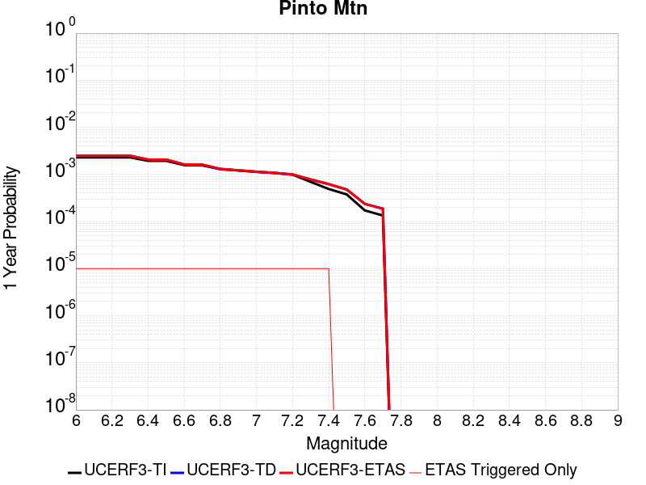 |  |

| Magnitude | 1 wk TI Prob | 1 wk TD Prob | 1 wk ETAS Prob | 1 wk ETAS/TD Gain | 1 wk ETAS Triggered Only | 1 mo TI Prob | 1 mo TD Prob | 1 mo ETAS Prob | 1 mo ETAS/TD Gain | 1 mo ETAS Triggered Only | 1 yr TI Prob | 1 yr TD Prob | 1 yr ETAS Prob | 1 yr ETAS/TD Gain | 1 yr ETAS Triggered Only | 10 yr TI Prob | 10 yr TD Prob | 10 yr ETAS Prob | 10 yr ETAS/TD Gain | 10 yr ETAS Triggered Only |
|-----|-----|-----|-----|-----|-----|-----|-----|-----|-----|-----|-----|-----|-----|-----|-----|-----|-----|-----|-----|-----|
| 6.0 | 4.4194956E-5 | 4.78665E-5 | 4.78665E-5 | 1.0 | 0.0 | 1.893932E-4 | 2.0512694E-4 | 2.0512694E-4 | 1.0 | 0.0 | 0.0023034236 | 0.0024947247 | 0.0025129584 | 1.0073088 | 1.8279197E-5 | 0.022796938 | 0.024684703 | 0.024738187 | 1.0021666 | 5.483759E-5 |
| 6.1 | 4.4194956E-5 | 4.78665E-5 | 4.78665E-5 | 1.0 | 0.0 | 1.893932E-4 | 2.0512694E-4 | 2.0512694E-4 | 1.0 | 0.0 | 0.0023034236 | 0.0024947247 | 0.0025129584 | 1.0073088 | 1.8279197E-5 | 0.022796938 | 0.024684703 | 0.024738187 | 1.0021666 | 5.483759E-5 |
| 6.2 | 4.4194956E-5 | 4.78665E-5 | 4.78665E-5 | 1.0 | 0.0 | 1.893932E-4 | 2.0512694E-4 | 2.0512694E-4 | 1.0 | 0.0 | 0.0023034236 | 0.0024947247 | 0.0025129584 | 1.0073088 | 1.8279197E-5 | 0.022796938 | 0.024684703 | 0.024738187 | 1.0021666 | 5.483759E-5 |
| 6.3 | 4.4194956E-5 | 4.78665E-5 | 4.78665E-5 | 1.0 | 0.0 | 1.893932E-4 | 2.0512694E-4 | 2.0512694E-4 | 1.0 | 0.0 | 0.0023034236 | 0.0024947247 | 0.0025129584 | 1.0073088 | 1.8279197E-5 | 0.022796938 | 0.024684703 | 0.024738187 | 1.0021666 | 5.483759E-5 |
| 6.4 | 3.729929E-5 | 3.9614344E-5 | 3.9614344E-5 | 1.0 | 0.0 | 1.5984432E-4 | 1.6976523E-4 | 1.6976523E-4 | 1.0 | 0.0 | 0.0019443673 | 0.0020650262 | 0.0020832676 | 1.0088335 | 1.8279197E-5 | 0.019274427 | 0.020468395 | 0.020504206 | 1.0017495 | 3.6558395E-5 |
| 6.5 | 3.729929E-5 | 3.9614344E-5 | 3.9614344E-5 | 1.0 | 0.0 | 1.5984432E-4 | 1.6976523E-4 | 1.6976523E-4 | 1.0 | 0.0 | 0.0019443673 | 0.0020650262 | 0.0020832676 | 1.0088335 | 1.8279197E-5 | 0.019274427 | 0.020468395 | 0.020504206 | 1.0017495 | 3.6558395E-5 |
| 6.6 | 3.0204548E-5 | 3.1214815E-5 | 3.1214815E-5 | 1.0 | 0.0 | 1.2944164E-4 | 1.3377111E-4 | 1.3377111E-4 | 1.0 | 0.0 | 0.0015748127 | 0.0016274813 | 0.0016457308 | 1.0112133 | 1.8279197E-5 | 0.015636992 | 0.016159497 | 0.016195465 | 1.0022258 | 3.6558395E-5 |
| 6.7 | 2.9857754E-5 | 3.0824147E-5 | 3.0824147E-5 | 1.0 | 0.0 | 1.2795553E-4 | 1.32097E-4 | 1.32097E-4 | 1.0 | 0.0 | 0.0015567453 | 0.0016071291 | 0.0016253788 | 1.0113555 | 1.8279197E-5 | 0.015458848 | 0.01595891 | 0.015994886 | 1.0022542 | 3.6558395E-5 |
| 6.8 | 2.4819734E-5 | 2.5017885E-5 | 2.5017885E-5 | 1.0 | 0.0 | 1.0636595E-4 | 1.0721523E-4 | 1.0721523E-4 | 1.0 | 0.0 | 0.0012942362 | 0.0013045854 | 0.0013228407 | 1.0139933 | 1.8279197E-5 | 0.012867244 | 0.012971638 | 0.013007722 | 1.0027817 | 3.6558395E-5 |
| 6.9 | 2.331124E-5 | 2.3345972E-5 | 2.3345972E-5 | 1.0 | 0.0 | 9.990149E-5 | 1.0005045E-4 | 1.0005045E-4 | 1.0 | 0.0 | 0.001215622 | 0.0012174539 | 0.0012357108 | 1.014996 | 1.8279197E-5 | 0.012089936 | 0.012110036 | 0.012146152 | 1.0029823 | 3.6558395E-5 |
| 7.0 | 2.1818534E-5 | 2.1768941E-5 | 2.1768941E-5 | 1.0 | 0.0 | 9.3504656E-5 | 9.329224E-5 | 9.329224E-5 | 1.0 | 0.0 | 0.0011378246 | 0.001135261 | 0.0011535195 | 1.016083 | 1.8279197E-5 | 0.011320163 | 0.011296719 | 0.011332865 | 1.0031997 | 3.6558395E-5 |
| 7.1 | 2.066081E-5 | 2.0548434E-5 | 2.0548434E-5 | 1.0 | 0.0 | 8.854332E-5 | 8.806185E-5 | 8.806185E-5 | 1.0 | 0.0 | 0.0010774818 | 0.0010716453 | 0.0010899049 | 1.0170388 | 1.8279197E-5 | 0.010722724 | 0.010666828 | 0.010702996 | 1.0033908 | 3.6558395E-5 |
| 7.2 | 1.8990233E-5 | 1.9061563E-5 | 1.9061563E-5 | 1.0 | 0.0 | 8.138417E-5 | 8.168996E-5 | 8.168996E-5 | 1.0 | 0.0 | 9.904018E-4 | 9.941409E-4 | 0.0010124019 | 1.0183686 | 1.8279197E-5 | 0.009859995 | 0.009898936 | 0.009935132 | 1.0036566 | 3.6558395E-5 |
| 7.3 | 1.3335872E-5 | 1.4913608E-5 | 1.4913608E-5 | 1.0 | 0.0 | 5.7152483E-5 | 6.391397E-5 | 6.391397E-5 | 1.0 | 0.0 | 6.956093E-4 | 7.778875E-4 | 7.9615245E-4 | 1.0234802 | 1.8279197E-5 | 0.006934359 | 0.007752946 | 0.0077710836 | 1.0023395 | 1.8279197E-5 |
| 7.4 | 9.414066E-6 | 1.186749E-5 | 1.186749E-5 | 1.0 | 0.0 | 4.0345374E-5 | 5.085973E-5 | 5.085973E-5 | 1.0 | 0.0 | 4.910942E-4 | 6.1905076E-4 | 6.373186E-4 | 1.0295095 | 1.8279197E-5 | 0.0049001034 | 0.006174212 | 0.0061923782 | 1.0029423 | 1.8279197E-5 |
| 7.5 | 7.2101157E-6 | 9.164608E-6 | 9.164608E-6 | 1.0 | 0.0 | 3.090013E-5 | 3.9276343E-5 | 3.9276343E-5 | 1.0 | 0.0 | 3.7614413E-4 | 4.7809238E-4 | 4.7809238E-4 | 1.0 | 0.0 | 0.0037550807 | 0.004771414 | 0.004771414 | 1.0 | 0.0 |
| 7.6 | 3.296375E-6 | 4.551753E-6 | 4.551753E-6 | 1.0 | 0.0 | 1.4127245E-5 | 1.9507375E-5 | 1.9507375E-5 | 1.0 | 0.0 | 1.7198564E-4 | 2.3747781E-4 | 2.3747781E-4 | 1.0 | 0.0 | 0.0017185259 | 0.0023723783 | 0.0023723783 | 1.0 | 0.0 |
| 7.7 | 2.5741092E-6 | 3.590314E-6 | 3.590314E-6 | 1.0 | 0.0 | 1.103185E-5 | 1.5386977E-5 | 1.5386977E-5 | 1.0 | 0.0 | 1.3430449E-4 | 1.8732167E-4 | 1.8732167E-4 | 1.0 | 0.0 | 0.0013422335 | 0.0018717679 | 0.0018717679 | 1.0 | 0.0 |

## San Andreas (North Branch Mill Creek)
*[(top)](#table-of-contents)*

| 1 Week | 1 Month | 1 Year | 10 Year |
|-----|-----|-----|-----|
|  |  |  |  |

| Magnitude | 1 wk TI Prob | 1 wk TD Prob | 1 wk ETAS Prob | 1 wk ETAS/TD Gain | 1 wk ETAS Triggered Only | 1 mo TI Prob | 1 mo TD Prob | 1 mo ETAS Prob | 1 mo ETAS/TD Gain | 1 mo ETAS Triggered Only | 1 yr TI Prob | 1 yr TD Prob | 1 yr ETAS Prob | 1 yr ETAS/TD Gain | 1 yr ETAS Triggered Only | 10 yr TI Prob | 10 yr TD Prob | 10 yr ETAS Prob | 10 yr ETAS/TD Gain | 10 yr ETAS Triggered Only |
|-----|-----|-----|-----|-----|-----|-----|-----|-----|-----|-----|-----|-----|-----|-----|-----|-----|-----|-----|-----|-----|
| 6.0 | 1.3461156E-5 | 2.3555003E-5 | 4.183377E-5 | 1.7760035 | 1.8279197E-5 | 5.7689394E-5 | 1.0094613E-4 | 1.1922348E-4 | 1.1810604 | 1.8279197E-5 | 7.02142E-4 | 0.0012283295 | 0.001264843 | 1.0297261 | 3.6558395E-5 | 0.0069992766 | 0.012257786 | 0.012311951 | 1.0044188 | 5.483759E-5 |
| 6.1 | 1.3461156E-5 | 2.3555003E-5 | 4.183377E-5 | 1.7760035 | 1.8279197E-5 | 5.7689394E-5 | 1.0094613E-4 | 1.1922348E-4 | 1.1810604 | 1.8279197E-5 | 7.02142E-4 | 0.0012283295 | 0.001264843 | 1.0297261 | 3.6558395E-5 | 0.0069992766 | 0.012257786 | 0.012311951 | 1.0044188 | 5.483759E-5 |
| 6.2 | 1.3461156E-5 | 2.3555003E-5 | 4.183377E-5 | 1.7760035 | 1.8279197E-5 | 5.7689394E-5 | 1.0094613E-4 | 1.1922348E-4 | 1.1810604 | 1.8279197E-5 | 7.02142E-4 | 0.0012283295 | 0.001264843 | 1.0297261 | 3.6558395E-5 | 0.0069992766 | 0.012257786 | 0.012311951 | 1.0044188 | 5.483759E-5 |
| 6.3 | 1.3461156E-5 | 2.3555003E-5 | 4.183377E-5 | 1.7760035 | 1.8279197E-5 | 5.7689394E-5 | 1.0094613E-4 | 1.1922348E-4 | 1.1810604 | 1.8279197E-5 | 7.02142E-4 | 0.0012283295 | 0.001264843 | 1.0297261 | 3.6558395E-5 | 0.0069992766 | 0.012257786 | 0.012311951 | 1.0044188 | 5.483759E-5 |
| 6.4 | 1.3461156E-5 | 2.3555003E-5 | 4.183377E-5 | 1.7760035 | 1.8279197E-5 | 5.7689394E-5 | 1.0094613E-4 | 1.1922348E-4 | 1.1810604 | 1.8279197E-5 | 7.02142E-4 | 0.0012283295 | 0.001264843 | 1.0297261 | 3.6558395E-5 | 0.0069992766 | 0.012257786 | 0.012311951 | 1.0044188 | 5.483759E-5 |
| 6.5 | 1.3450706E-5 | 2.3543962E-5 | 4.182273E-5 | 1.7763674 | 1.8279197E-5 | 5.764461E-5 | 1.0089881E-4 | 1.1917616E-4 | 1.1811453 | 1.8279197E-5 | 7.0159714E-4 | 0.001227754 | 0.0012642676 | 1.0297401 | 3.6558395E-5 | 0.006993862 | 0.012252095 | 0.012306261 | 1.0044209 | 5.483759E-5 |
| 6.6 | 1.3074523E-5 | 2.3158225E-5 | 4.1436997E-5 | 1.7892994 | 1.8279197E-5 | 5.6032466E-5 | 9.924578E-5 | 1.1752316E-4 | 1.1841629 | 1.8279197E-5 | 6.8198174E-4 | 0.0012076509 | 0.0012441651 | 1.0302358 | 3.6558395E-5 | 0.006798926 | 0.012053255 | 0.012107432 | 1.0044948 | 5.483759E-5 |
| 6.7 | 1.3050216E-5 | 2.3133518E-5 | 4.141229E-5 | 1.7901424 | 1.8279197E-5 | 5.59283E-5 | 9.91399E-5 | 1.1741729E-4 | 1.1843596 | 1.8279197E-5 | 6.8071426E-4 | 0.0012063632 | 0.0012428774 | 1.0302681 | 3.6558395E-5 | 0.0067863287 | 0.012040518 | 0.012094696 | 1.0044996 | 5.483759E-5 |
| 6.8 | 1.29049395E-5 | 2.2981916E-5 | 4.1260693E-5 | 1.7953547 | 1.8279197E-5 | 5.530571E-5 | 9.849022E-5 | 1.16767624E-4 | 1.1855757 | 1.8279197E-5 | 6.73139E-4 | 0.0011984621 | 0.0012349767 | 1.0304679 | 3.6558395E-5 | 0.0067110364 | 0.01196236 | 0.012016541 | 1.0045294 | 5.483759E-5 |
| 6.9 | 1.2867369E-5 | 2.294131E-5 | 4.122009E-5 | 1.7967626 | 1.8279197E-5 | 5.51447E-5 | 9.831622E-5 | 1.1659362E-4 | 1.1859043 | 1.8279197E-5 | 6.711799E-4 | 0.0011963459 | 0.0012328605 | 1.0305219 | 3.6558395E-5 | 0.006691564 | 0.0119414255 | 0.011995608 | 1.0045373 | 5.483759E-5 |
| 7.0 | 1.2495996E-5 | 2.234101E-5 | 4.0619798E-5 | 1.818172 | 1.8279197E-5 | 5.3553173E-5 | 9.5743686E-5 | 1.1402113E-4 | 1.1908997 | 1.8279197E-5 | 6.518148E-4 | 0.0011650589 | 0.0012015747 | 1.0313425 | 3.6558395E-5 | 0.0064990623 | 0.011631842 | 0.011686042 | 1.0046597 | 5.483759E-5 |
| 7.1 | 1.2452067E-5 | 2.2286065E-5 | 4.0564853E-5 | 1.8201891 | 1.8279197E-5 | 5.3364907E-5 | 9.550823E-5 | 1.1378568E-4 | 1.1913704 | 1.8279197E-5 | 6.4952404E-4 | 0.0011621952 | 0.0011987112 | 1.0314198 | 3.6558395E-5 | 0.0064762887 | 0.011603505 | 0.011657706 | 1.0046711 | 5.483759E-5 |
| 7.2 | 1.2002777E-5 | 2.1664337E-5 | 3.9943137E-5 | 1.8437277 | 1.8279197E-5 | 5.143946E-5 | 9.284387E-5 | 1.1112137E-4 | 1.1968627 | 1.8279197E-5 | 6.2609545E-4 | 0.0011297906 | 0.0011663077 | 1.032322 | 3.6558395E-5 | 0.006243344 | 0.011282786 | 0.011337005 | 1.0048054 | 5.483759E-5 |
| 7.3 | 1.1923425E-5 | 2.1534106E-5 | 3.981291E-5 | 1.8488303 | 1.8279197E-5 | 5.109939E-5 | 9.228578E-5 | 1.1056329E-4 | 1.1980534 | 1.8279197E-5 | 6.219575E-4 | 0.0011230028 | 0.0011595202 | 1.0325176 | 3.6558395E-5 | 0.0062021962 | 0.0112156235 | 0.011269846 | 1.0048345 | 5.483759E-5 |
| 7.4 | 1.16105175E-5 | 2.0907555E-5 | 3.918637E-5 | 1.8742684 | 1.8279197E-5 | 4.975841E-5 | 8.960075E-5 | 1.078783E-4 | 1.2039889 | 1.8279197E-5 | 6.0564023E-4 | 0.0010903457 | 0.0011268642 | 1.0334926 | 3.6558395E-5 | 0.006039923 | 0.0108929705 | 0.010947211 | 1.0049794 | 5.483759E-5 |
| 7.5 | 1.1037265E-5 | 1.960581E-5 | 3.788465E-5 | 1.9323174 | 1.8279197E-5 | 4.7301706E-5 | 8.4022206E-5 | 1.0229987E-4 | 1.2175337 | 1.8279197E-5 | 5.757461E-4 | 0.0010224925 | 0.0010590135 | 1.0357176 | 3.6558395E-5 | 0.005742567 | 0.010221531 | 0.010275807 | 1.00531 | 5.483759E-5 |
| 7.6 | 1.0720915E-5 | 1.9047075E-5 | 3.732592E-5 | 1.959667 | 1.8279197E-5 | 4.5945973E-5 | 8.1627775E-5 | 9.990548E-5 | 1.2239152 | 1.8279197E-5 | 5.592486E-4 | 9.933673E-4 | 0.0010298893 | 1.0367659 | 3.6558395E-5 | 0.005578433 | 0.009932928 | 0.009987221 | 1.005466 | 5.483759E-5 |
| 7.7 | 9.276279E-6 | 1.6490461E-5 | 3.4769357E-5 | 2.1084526 | 1.8279197E-5 | 3.9754876E-5 | 7.06715E-5 | 8.8949404E-5 | 1.258632 | 1.8279197E-5 | 4.839081E-4 | 8.600875E-4 | 8.9661445E-4 | 1.0424689 | 3.6558395E-5 | 0.0048285574 | 0.0086111175 | 0.008665483 | 1.0063134 | 5.483759E-5 |
| 7.8 | 5.8346777E-6 | 1.1194611E-5 | 2.9473602E-5 | 2.6328385 | 1.8279197E-5 | 2.5005522E-5 | 4.7976024E-5 | 6.625434E-5 | 1.3809886 | 1.8279197E-5 | 3.043997E-4 | 5.8395165E-4 | 6.2048866E-4 | 1.0625687 | 3.6558395E-5 | 0.0030398308 | 0.005867293 | 0.005921809 | 1.0092915 | 5.483759E-5 |
| 7.9 | 4.690204E-6 | 8.542101E-6 | 2.682114E-5 | 3.1398764 | 1.8279197E-5 | 2.0100719E-5 | 3.660849E-5 | 5.4887016E-5 | 1.4992975 | 1.8279197E-5 | 2.4469878E-4 | 4.456173E-4 | 4.821594E-4 | 1.0820034 | 3.6558395E-5 | 0.002444295 | 0.0044877403 | 0.0045423317 | 1.0121646 | 5.483759E-5 |
| 8.0 | 2.9570454E-6 | 4.8671277E-6 | 4.8671277E-6 | 1.0 | 0.0 | 1.267299E-5 | 2.0858952E-5 | 2.0858952E-5 | 1.0 | 0.0 | 1.5428272E-4 | 2.5392818E-4 | 2.5392818E-4 | 1.0 | 0.0 | 0.0015417566 | 0.00256014 | 0.0025783726 | 1.0071217 | 1.8279197E-5 |
| 8.1 | 1.6376824E-6 | 2.2074744E-6 | 2.2074744E-6 | 1.0 | 0.0 | 7.01862E-6 | 9.460569E-6 | 9.460569E-6 | 1.0 | 0.0 | 8.544835E-5 | 1.15176364E-4 | 1.15176364E-4 | 1.0 | 0.0 | 8.54155E-4 | 0.0011661941 | 0.0011661941 | 1.0 | 0.0 |
| 8.2 | 6.9631557E-7 | 4.569111E-7 | 4.569111E-7 | 1.0 | 0.0 | 2.984206E-6 | 1.958189E-6 | 1.958189E-6 | 1.0 | 0.0 | 3.63321E-5 | 2.384069E-5 | 2.384069E-5 | 1.0 | 0.0 | 3.6326164E-4 | 2.469133E-4 | 2.469133E-4 | 1.0 | 0.0 |
| 8.3 | 1.7876137E-7 | 8.4275065E-8 | 8.4275065E-8 | 1.0 | 0.0 | 7.661199E-7 | 3.611788E-7 | 3.611788E-7 | 1.0 | 0.0 | 9.32747E-6 | 4.397343E-6 | 4.397343E-6 | 1.0 | 0.0 | 9.3270784E-5 | 4.617711E-5 | 4.617711E-5 | 1.0 | 0.0 |

## Mission Creek
*[(top)](#table-of-contents)*

| 1 Week | 1 Month | 1 Year | 10 Year |
|-----|-----|-----|-----|
|  |  |  |  |

| Magnitude | 1 wk TI Prob | 1 wk TD Prob | 1 wk ETAS Prob | 1 wk ETAS/TD Gain | 1 wk ETAS Triggered Only | 1 mo TI Prob | 1 mo TD Prob | 1 mo ETAS Prob | 1 mo ETAS/TD Gain | 1 mo ETAS Triggered Only | 1 yr TI Prob | 1 yr TD Prob | 1 yr ETAS Prob | 1 yr ETAS/TD Gain | 1 yr ETAS Triggered Only | 10 yr TI Prob | 10 yr TD Prob | 10 yr ETAS Prob | 10 yr ETAS/TD Gain | 10 yr ETAS Triggered Only |
|-----|-----|-----|-----|-----|-----|-----|-----|-----|-----|-----|-----|-----|-----|-----|-----|-----|-----|-----|-----|-----|
| 6.0 | 1.1549387E-5 | 1.6341111E-5 | 1.6341111E-5 | 1.0 | 0.0 | 4.9496433E-5 | 7.0031536E-5 | 8.8309454E-5 | 1.2609955 | 1.8279197E-5 | 6.0245243E-4 | 8.5231545E-4 | 8.888427E-4 | 1.0428565 | 3.6558395E-5 | 0.006008218 | 0.008519485 | 0.008573855 | 1.0063819 | 5.483759E-5 |
| 6.1 | 1.1549387E-5 | 1.6341111E-5 | 1.6341111E-5 | 1.0 | 0.0 | 4.9496433E-5 | 7.0031536E-5 | 8.8309454E-5 | 1.2609955 | 1.8279197E-5 | 6.0245243E-4 | 8.5231545E-4 | 8.888427E-4 | 1.0428565 | 3.6558395E-5 | 0.006008218 | 0.008519485 | 0.008573855 | 1.0063819 | 5.483759E-5 |
| 6.2 | 1.1549387E-5 | 1.6341111E-5 | 1.6341111E-5 | 1.0 | 0.0 | 4.9496433E-5 | 7.0031536E-5 | 8.8309454E-5 | 1.2609955 | 1.8279197E-5 | 6.0245243E-4 | 8.5231545E-4 | 8.888427E-4 | 1.0428565 | 3.6558395E-5 | 0.006008218 | 0.008519485 | 0.008573855 | 1.0063819 | 5.483759E-5 |
| 6.3 | 1.1549387E-5 | 1.6341111E-5 | 1.6341111E-5 | 1.0 | 0.0 | 4.9496433E-5 | 7.0031536E-5 | 8.8309454E-5 | 1.2609955 | 1.8279197E-5 | 6.0245243E-4 | 8.5231545E-4 | 8.888427E-4 | 1.0428565 | 3.6558395E-5 | 0.006008218 | 0.008519485 | 0.008573855 | 1.0063819 | 5.483759E-5 |
| 6.4 | 1.1549387E-5 | 1.6341111E-5 | 1.6341111E-5 | 1.0 | 0.0 | 4.9496433E-5 | 7.0031536E-5 | 8.8309454E-5 | 1.2609955 | 1.8279197E-5 | 6.0245243E-4 | 8.5231545E-4 | 8.888427E-4 | 1.0428565 | 3.6558395E-5 | 0.006008218 | 0.008519485 | 0.008573855 | 1.0063819 | 5.483759E-5 |
| 6.5 | 1.1549387E-5 | 1.6341111E-5 | 1.6341111E-5 | 1.0 | 0.0 | 4.9496433E-5 | 7.0031536E-5 | 8.8309454E-5 | 1.2609955 | 1.8279197E-5 | 6.0245243E-4 | 8.5231545E-4 | 8.888427E-4 | 1.0428565 | 3.6558395E-5 | 0.006008218 | 0.008519485 | 0.008573855 | 1.0063819 | 5.483759E-5 |
| 6.6 | 9.202681E-6 | 1.3864242E-5 | 1.3864242E-5 | 1.0 | 0.0 | 3.9439463E-5 | 5.9416878E-5 | 7.769499E-5 | 1.3076249 | 1.8279197E-5 | 4.800697E-4 | 7.231694E-4 | 7.5970136E-4 | 1.0505165 | 3.6558395E-5 | 0.004790339 | 0.007236605 | 0.007291046 | 1.007523 | 5.483759E-5 |
| 6.7 | 9.019164E-6 | 1.3669899E-5 | 1.3669899E-5 | 1.0 | 0.0 | 3.8652986E-5 | 5.8584017E-5 | 7.686215E-5 | 1.3119985 | 1.8279197E-5 | 4.7049852E-4 | 7.13036E-4 | 7.4956834E-4 | 1.0512348 | 3.6558395E-5 | 0.004695036 | 0.0071359244 | 0.0071903705 | 1.0076299 | 5.483759E-5 |
| 6.8 | 8.673558E-6 | 1.329197E-5 | 1.329197E-5 | 1.0 | 0.0 | 3.717186E-5 | 5.6964393E-5 | 7.524255E-5 | 1.3208698 | 1.8279197E-5 | 4.524734E-4 | 6.9332967E-4 | 7.298627E-4 | 1.0526922 | 3.6558395E-5 | 0.0045155324 | 0.006940094 | 0.0069945506 | 1.0078467 | 5.483759E-5 |
| 6.9 | 7.002255E-6 | 1.1496057E-5 | 1.1496057E-5 | 1.0 | 0.0 | 3.000932E-5 | 4.926792E-5 | 6.754622E-5 | 1.3709979 | 1.8279197E-5 | 3.653022E-4 | 5.996787E-4 | 6.362152E-4 | 1.0609268 | 3.6558395E-5 | 0.0036470229 | 0.0060088513 | 0.0060633593 | 1.0090714 | 5.483759E-5 |
| 7.0 | 5.84644E-6 | 9.692441E-6 | 9.692441E-6 | 1.0 | 0.0 | 2.5055931E-5 | 4.15384E-5 | 5.9816837E-5 | 1.4400371 | 1.8279197E-5 | 3.0501327E-4 | 5.0561724E-4 | 5.4215715E-4 | 1.0722679 | 3.6558395E-5 | 0.0030459496 | 0.005072708 | 0.005127267 | 1.0107555 | 5.483759E-5 |
| 7.1 | 5.54703E-6 | 9.346854E-6 | 9.346854E-6 | 1.0 | 0.0 | 2.377277E-5 | 4.0057355E-5 | 5.833582E-5 | 1.4563073 | 1.8279197E-5 | 2.8939504E-4 | 4.8759364E-4 | 5.241342E-4 | 1.0749406 | 3.6558395E-5 | 0.0028901845 | 0.0048932703 | 0.00494784 | 1.0111519 | 5.483759E-5 |
| 7.2 | 4.384709E-6 | 7.698194E-6 | 7.698194E-6 | 1.0 | 0.0 | 1.8791474E-5 | 3.2991862E-5 | 5.1270457E-5 | 1.5540334 | 1.8279197E-5 | 2.2876218E-4 | 4.0160556E-4 | 4.3814926E-4 | 1.090994 | 3.6558395E-5 | 0.0022852682 | 0.0040367944 | 0.004091411 | 1.0135297 | 5.483759E-5 |
| 7.3 | 3.7888456E-6 | 6.931747E-6 | 6.931747E-6 | 1.0 | 0.0 | 1.623781E-5 | 2.970717E-5 | 4.798582E-5 | 1.6152943 | 1.8279197E-5 | 1.9767738E-4 | 3.616281E-4 | 3.981733E-4 | 1.1010573 | 3.6558395E-5 | 0.0019750162 | 0.0036383772 | 0.003693015 | 1.0150172 | 5.483759E-5 |
| 7.4 | 2.1982462E-6 | 5.039589E-6 | 5.039589E-6 | 1.0 | 0.0 | 9.421021E-6 | 2.159806E-5 | 3.987686E-5 | 1.8463168 | 1.8279197E-5 | 1.1469489E-4 | 2.6292482E-4 | 2.994736E-4 | 1.1390085 | 3.6558395E-5 | 0.0011463572 | 0.0026539033 | 0.0027085955 | 1.0206082 | 5.483759E-5 |
| 7.5 | 2.051923E-6 | 4.6303985E-6 | 4.6303985E-6 | 1.0 | 0.0 | 8.793926E-6 | 1.9844414E-5 | 3.812325E-5 | 1.9211073 | 1.8279197E-5 | 1.0706078E-4 | 2.415791E-4 | 2.7812866E-4 | 1.1512944 | 3.6558395E-5 | 0.0010700922 | 0.0024413404 | 0.0024960442 | 1.0224073 | 5.483759E-5 |
| 7.6 | 1.8733427E-6 | 4.138231E-6 | 4.138231E-6 | 1.0 | 0.0 | 8.028587E-6 | 1.7735156E-5 | 3.6014026E-5 | 2.0306575 | 1.8279197E-5 | 9.774366E-5 | 2.159042E-4 | 2.524547E-4 | 1.1692903 | 3.6558395E-5 | 9.770069E-4 | 0.0021856092 | 0.002240327 | 1.0250355 | 5.483759E-5 |
| 7.7 | 1.8411953E-6 | 4.0578066E-6 | 4.0578066E-6 | 1.0 | 0.0 | 7.890813E-6 | 1.7390485E-5 | 3.5669364E-5 | 2.051085 | 1.8279197E-5 | 9.606641E-5 | 2.1170866E-4 | 2.482593E-4 | 1.172646 | 3.6558395E-5 | 9.6024893E-4 | 0.0021438438 | 0.002198564 | 1.0255243 | 5.483759E-5 |
| 7.8 | 1.7194251E-6 | 3.7241725E-6 | 3.7241725E-6 | 1.0 | 0.0 | 7.368944E-6 | 1.5960642E-5 | 3.4239547E-5 | 2.1452487 | 1.8279197E-5 | 8.97132E-5 | 1.9430356E-4 | 2.3085486E-4 | 1.1881144 | 3.6558395E-5 | 8.967699E-4 | 0.0019693163 | 0.002024046 | 1.0277911 | 5.483759E-5 |
| 7.9 | 1.4035052E-6 | 2.9613316E-6 | 2.9613316E-6 | 1.0 | 0.0 | 6.0150082E-6 | 1.269136E-5 | 3.0970325E-5 | 2.4402683 | 1.8279197E-5 | 7.3230265E-5 | 1.5450642E-4 | 1.9105915E-4 | 1.2365775 | 3.6558395E-5 | 7.3206134E-4 | 0.0015688159 | 0.0016235674 | 1.0349 | 5.483759E-5 |
| 8.0 | 3.9318823E-7 | 5.5560014E-7 | 5.5560014E-7 | 1.0 | 0.0 | 1.6850913E-6 | 2.3811413E-6 | 2.3811413E-6 | 1.0 | 0.0 | 2.0515794E-5 | 2.8990016E-5 | 2.8990016E-5 | 1.0 | 0.0 | 2.0513899E-4 | 3.004275E-4 | 3.004275E-4 | 1.0 | 0.0 |
| 8.1 | 1.596793E-7 | 1.1475386E-7 | 1.1475386E-7 | 1.0 | 0.0 | 6.8433974E-7 | 4.9180215E-7 | 4.9180215E-7 | 1.0 | 0.0 | 8.331805E-6 | 5.987675E-6 | 5.987675E-6 | 1.0 | 0.0 | 8.331492E-5 | 6.601783E-5 | 6.601783E-5 | 1.0 | 0.0 |
| 8.2 | 4.9003038E-8 | 2.5686987E-8 | 2.5686987E-8 | 1.0 | 0.0 | 2.10013E-7 | 1.1008708E-7 | 1.1008708E-7 | 1.0 | 0.0 | 2.5569052E-6 | 1.3403094E-6 | 1.3403094E-6 | 1.0 | 0.0 | 2.556876E-5 | 1.5090479E-5 | 1.5090479E-5 | 1.0 | 0.0 |

## Big Pine (East)
*[(top)](#table-of-contents)*

| 1 Week | 1 Month | 1 Year | 10 Year |
|-----|-----|-----|-----|
|  |  |  |  |

| Magnitude | 1 wk TI Prob | 1 wk TD Prob | 1 wk ETAS Prob | 1 wk ETAS/TD Gain | 1 wk ETAS Triggered Only | 1 mo TI Prob | 1 mo TD Prob | 1 mo ETAS Prob | 1 mo ETAS/TD Gain | 1 mo ETAS Triggered Only | 1 yr TI Prob | 1 yr TD Prob | 1 yr ETAS Prob | 1 yr ETAS/TD Gain | 1 yr ETAS Triggered Only | 10 yr TI Prob | 10 yr TD Prob | 10 yr ETAS Prob | 10 yr ETAS/TD Gain | 10 yr ETAS Triggered Only |
|-----|-----|-----|-----|-----|-----|-----|-----|-----|-----|-----|-----|-----|-----|-----|-----|-----|-----|-----|-----|-----|
| 6.0 | 9.916913E-6 | 1.2826955E-5 | 1.2826955E-5 | 1.0 | 0.0 | 4.250036E-5 | 5.497163E-5 | 5.497163E-5 | 1.0 | 0.0 | 5.173191E-4 | 6.690962E-4 | 6.690962E-4 | 1.0 | 0.0 | 0.0051611643 | 0.0066755237 | 0.0067299954 | 1.0081599 | 5.483759E-5 |
| 6.1 | 9.916913E-6 | 1.2826955E-5 | 1.2826955E-5 | 1.0 | 0.0 | 4.250036E-5 | 5.497163E-5 | 5.497163E-5 | 1.0 | 0.0 | 5.173191E-4 | 6.690962E-4 | 6.690962E-4 | 1.0 | 0.0 | 0.0051611643 | 0.0066755237 | 0.0067299954 | 1.0081599 | 5.483759E-5 |
| 6.2 | 9.916913E-6 | 1.2826955E-5 | 1.2826955E-5 | 1.0 | 0.0 | 4.250036E-5 | 5.497163E-5 | 5.497163E-5 | 1.0 | 0.0 | 5.173191E-4 | 6.690962E-4 | 6.690962E-4 | 1.0 | 0.0 | 0.0051611643 | 0.0066755237 | 0.0067299954 | 1.0081599 | 5.483759E-5 |
| 6.3 | 5.479711E-6 | 8.122622E-6 | 8.122622E-6 | 1.0 | 0.0 | 2.3484265E-5 | 3.481079E-5 | 3.481079E-5 | 1.0 | 0.0 | 2.858834E-4 | 4.2374214E-4 | 4.2374214E-4 | 1.0 | 0.0 | 0.0028551589 | 0.004232182 | 0.004268586 | 1.0086017 | 3.6558395E-5 |
| 6.4 | 5.465009E-6 | 8.106914E-6 | 8.106914E-6 | 1.0 | 0.0 | 2.3421257E-5 | 3.4743472E-5 | 3.4743472E-5 | 1.0 | 0.0 | 2.851165E-4 | 4.2292287E-4 | 4.2292287E-4 | 1.0 | 0.0 | 0.0028475097 | 0.004224021 | 0.004260425 | 1.0086184 | 3.6558395E-5 |
| 6.5 | 4.826767E-6 | 7.431929E-6 | 7.431929E-6 | 1.0 | 0.0 | 2.068598E-5 | 3.1850752E-5 | 3.1850752E-5 | 1.0 | 0.0 | 2.518227E-4 | 3.877167E-4 | 3.877167E-4 | 1.0 | 0.0 | 0.0025153751 | 0.0038732016 | 0.003909618 | 1.0094023 | 3.6558395E-5 |
| 6.6 | 4.3146847E-6 | 6.891834E-6 | 6.891834E-6 | 1.0 | 0.0 | 1.8491375E-5 | 2.953611E-5 | 2.953611E-5 | 1.0 | 0.0 | 2.2510924E-4 | 3.5954526E-4 | 3.5954526E-4 | 1.0 | 0.0 | 0.0022488134 | 0.0035924022 | 0.0036288293 | 1.0101401 | 3.6558395E-5 |
| 6.7 | 3.6968106E-6 | 6.0045036E-6 | 6.0045036E-6 | 1.0 | 0.0 | 1.5843378E-5 | 2.5733341E-5 | 2.5733341E-5 | 1.0 | 0.0 | 1.9287605E-4 | 3.1325992E-4 | 3.1325992E-4 | 1.0 | 0.0 | 0.0019270873 | 0.0031308597 | 0.0031490815 | 1.0058202 | 1.8279197E-5 |
| 6.8 | 3.4671132E-6 | 5.710963E-6 | 5.710963E-6 | 1.0 | 0.0 | 1.4858972E-5 | 2.4475334E-5 | 2.4475334E-5 | 1.0 | 0.0 | 1.8089297E-4 | 2.979479E-4 | 2.979479E-4 | 1.0 | 0.0 | 0.0018074579 | 0.002978152 | 0.0029963767 | 1.0061195 | 1.8279197E-5 |
| 6.9 | 2.7686972E-6 | 4.8333345E-6 | 4.8333345E-6 | 1.0 | 0.0 | 1.1865792E-5 | 2.0714131E-5 | 2.0714131E-5 | 1.0 | 0.0 | 1.4445644E-4 | 2.5216612E-4 | 2.5216612E-4 | 1.0 | 0.0 | 0.0014436257 | 0.0025213994 | 0.0025213994 | 1.0 | 0.0 |
| 7.0 | 2.1472624E-6 | 3.9924093E-6 | 3.9924093E-6 | 1.0 | 0.0 | 9.20252E-6 | 1.7110217E-5 | 1.7110217E-5 | 1.0 | 0.0 | 1.12034926E-4 | 2.0829751E-4 | 2.0829751E-4 | 1.0 | 0.0 | 0.0011197845 | 0.0020835903 | 0.0020835903 | 1.0 | 0.0 |
| 7.1 | 1.7018335E-6 | 3.3515819E-6 | 3.3515819E-6 | 1.0 | 0.0 | 7.293552E-6 | 1.4363845E-5 | 1.4363845E-5 | 1.0 | 0.0 | 8.879537E-5 | 1.7486615E-4 | 1.7486615E-4 | 1.0 | 0.0 | 8.87599E-4 | 0.0017498214 | 0.0017498214 | 1.0 | 0.0 |
| 7.2 | 1.25603E-6 | 2.800819E-6 | 2.800819E-6 | 1.0 | 0.0 | 5.3829745E-6 | 1.20034565E-5 | 1.20034565E-5 | 1.0 | 0.0 | 6.553574E-5 | 1.461325E-4 | 1.461325E-4 | 1.0 | 0.0 | 6.551642E-4 | 0.0014628756 | 0.0014628756 | 1.0 | 0.0 |
| 7.3 | 1.112297E-6 | 2.6163139E-6 | 2.6163139E-6 | 1.0 | 0.0 | 4.7669787E-6 | 1.1212726E-5 | 1.1212726E-5 | 1.0 | 0.0 | 5.803642E-5 | 1.3650661E-4 | 1.3650661E-4 | 1.0 | 0.0 | 5.802127E-4 | 0.0013665707 | 0.0013665707 | 1.0 | 0.0 |
| 7.4 | 1.0137181E-6 | 2.489217E-6 | 2.489217E-6 | 1.0 | 0.0 | 4.3444993E-6 | 1.066803E-5 | 1.066803E-5 | 1.0 | 0.0 | 5.2892992E-5 | 1.2987574E-4 | 1.2987574E-4 | 1.0 | 0.0 | 5.288041E-4 | 0.0013001257 | 0.0013001257 | 1.0 | 0.0 |
| 7.5 | 9.598608E-7 | 2.412703E-6 | 2.412703E-6 | 1.0 | 0.0 | 4.1136827E-6 | 1.0340116E-5 | 1.0340116E-5 | 1.0 | 0.0 | 5.0082934E-5 | 1.2588386E-4 | 1.2588386E-4 | 1.0 | 0.0 | 5.007165E-4 | 0.0012600615 | 0.0012600615 | 1.0 | 0.0 |
| 7.6 | 7.929459E-7 | 2.049765E-6 | 2.049765E-6 | 1.0 | 0.0 | 3.3983351E-6 | 8.784678E-6 | 8.784678E-6 | 1.0 | 0.0 | 4.1373947E-5 | 1.0694839E-4 | 1.0694839E-4 | 1.0 | 0.0 | 4.1366243E-4 | 0.0010710025 | 0.0010710025 | 1.0 | 0.0 |
| 7.7 | 4.155788E-7 | 1.1640374E-6 | 1.1640374E-6 | 1.0 | 0.0 | 1.7810507E-6 | 4.988722E-6 | 4.988722E-6 | 1.0 | 0.0 | 2.1684076E-5 | 6.073604E-5 | 6.073604E-5 | 1.0 | 0.0 | 2.1681961E-4 | 6.103289E-4 | 6.103289E-4 | 1.0 | 0.0 |
| 7.8 | 1.14666925E-7 | 2.5998284E-7 | 2.5998284E-7 | 1.0 | 0.0 | 4.914296E-7 | 1.1142117E-6 | 1.1142117E-6 | 1.0 | 0.0 | 5.9831386E-6 | 1.3565448E-5 | 1.3565448E-5 | 1.0 | 0.0 | 5.9829777E-5 | 1.3674163E-4 | 1.3674163E-4 | 1.0 | 0.0 |
| 7.9 | 2.9231824E-8 | 4.1594287E-8 | 4.1594287E-8 | 1.0 | 0.0 | 1.2527924E-7 | 1.7826122E-7 | 1.7826122E-7 | 1.0 | 0.0 | 1.5252737E-6 | 2.1703283E-6 | 2.1703283E-6 | 1.0 | 0.0 | 1.5252632E-5 | 2.2035945E-5 | 2.2035945E-5 | 1.0 | 0.0 |

## Lost Hills
*[(top)](#table-of-contents)*

| 1 Week | 1 Month | 1 Year | 10 Year |
|-----|-----|-----|-----|
|  |  |  |  |

| Magnitude | 1 wk TI Prob | 1 wk TD Prob | 1 wk ETAS Prob | 1 wk ETAS/TD Gain | 1 wk ETAS Triggered Only | 1 mo TI Prob | 1 mo TD Prob | 1 mo ETAS Prob | 1 mo ETAS/TD Gain | 1 mo ETAS Triggered Only | 1 yr TI Prob | 1 yr TD Prob | 1 yr ETAS Prob | 1 yr ETAS/TD Gain | 1 yr ETAS Triggered Only | 10 yr TI Prob | 10 yr TD Prob | 10 yr ETAS Prob | 10 yr ETAS/TD Gain | 10 yr ETAS Triggered Only |
|-----|-----|-----|-----|-----|-----|-----|-----|-----|-----|-----|-----|-----|-----|-----|-----|-----|-----|-----|-----|-----|
| 6.0 | 2.233523E-5 | 2.5109888E-5 | 2.5109888E-5 | 1.0 | 0.0 | 9.571891E-5 | 1.07610314E-4 | 1.07610314E-4 | 1.0 | 0.0 | 0.0011647546 | 0.0013095363 | 0.0013460468 | 1.0278805 | 3.6558395E-5 | 0.011586686 | 0.013034798 | 0.013088921 | 1.0041522 | 5.483759E-5 |
| 6.1 | 2.233523E-5 | 2.5109888E-5 | 2.5109888E-5 | 1.0 | 0.0 | 9.571891E-5 | 1.07610314E-4 | 1.07610314E-4 | 1.0 | 0.0 | 0.0011647546 | 0.0013095363 | 0.0013460468 | 1.0278805 | 3.6558395E-5 | 0.011586686 | 0.013034798 | 0.013088921 | 1.0041522 | 5.483759E-5 |
| 6.2 | 2.233523E-5 | 2.5109888E-5 | 2.5109888E-5 | 1.0 | 0.0 | 9.571891E-5 | 1.07610314E-4 | 1.07610314E-4 | 1.0 | 0.0 | 0.0011647546 | 0.0013095363 | 0.0013460468 | 1.0278805 | 3.6558395E-5 | 0.011586686 | 0.013034798 | 0.013088921 | 1.0041522 | 5.483759E-5 |
| 6.3 | 2.233523E-5 | 2.5109888E-5 | 2.5109888E-5 | 1.0 | 0.0 | 9.571891E-5 | 1.07610314E-4 | 1.07610314E-4 | 1.0 | 0.0 | 0.0011647546 | 0.0013095363 | 0.0013460468 | 1.0278805 | 3.6558395E-5 | 0.011586686 | 0.013034798 | 0.013088921 | 1.0041522 | 5.483759E-5 |
| 6.4 | 1.2288092E-5 | 1.3782884E-5 | 1.3782884E-5 | 1.0 | 0.0 | 5.2662188E-5 | 5.9068694E-5 | 5.9068694E-5 | 1.0 | 0.0 | 6.409735E-4 | 7.190179E-4 | 7.5555E-4 | 1.0508083 | 3.6558395E-5 | 0.006391279 | 0.007176124 | 0.0072305677 | 1.0075868 | 5.483759E-5 |
| 6.5 | 1.2288092E-5 | 1.3782884E-5 | 1.3782884E-5 | 1.0 | 0.0 | 5.2662188E-5 | 5.9068694E-5 | 5.9068694E-5 | 1.0 | 0.0 | 6.409735E-4 | 7.190179E-4 | 7.5555E-4 | 1.0508083 | 3.6558395E-5 | 0.006391279 | 0.007176124 | 0.0072305677 | 1.0075868 | 5.483759E-5 |
| 6.6 | 8.58281E-6 | 9.635021E-6 | 9.635021E-6 | 1.0 | 0.0 | 3.6782953E-5 | 4.1292766E-5 | 4.1292766E-5 | 1.0 | 0.0 | 4.4774043E-4 | 5.027067E-4 | 5.392467E-4 | 1.0726866 | 3.6558395E-5 | 0.0044683935 | 0.005023857 | 0.0050602322 | 1.0072404 | 3.6558395E-5 |
| 6.7 | 7.205685E-6 | 8.089353E-6 | 8.089353E-6 | 1.0 | 0.0 | 3.088114E-5 | 3.4668654E-5 | 3.4668654E-5 | 1.0 | 0.0 | 3.7591302E-4 | 4.2209087E-4 | 4.4036238E-4 | 1.043288 | 1.8279197E-5 | 0.0037527776 | 0.004220909 | 0.0042391107 | 1.0043124 | 1.8279197E-5 |

## Tin Mountain
*[(top)](#table-of-contents)*

| 1 Week | 1 Month | 1 Year | 10 Year |
|-----|-----|-----|-----|
|  |  | 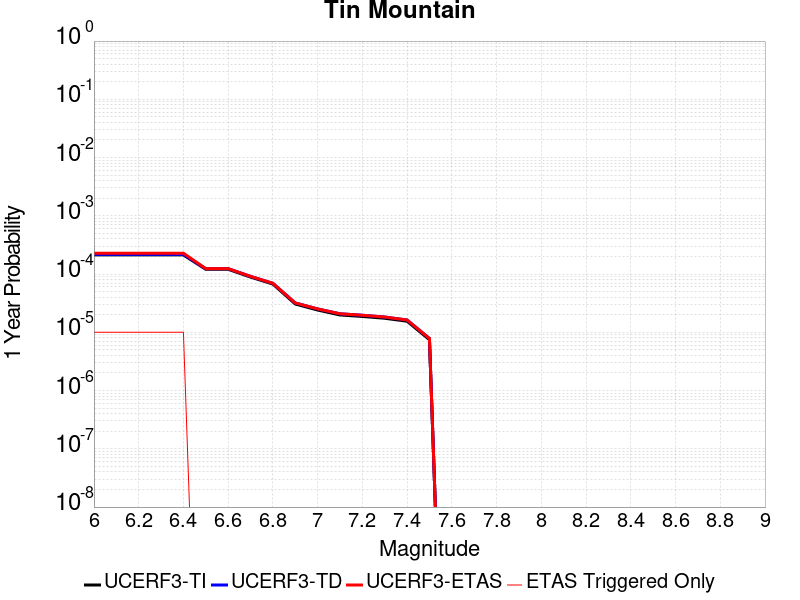 |  |

| Magnitude | 1 wk TI Prob | 1 wk TD Prob | 1 wk ETAS Prob | 1 wk ETAS/TD Gain | 1 wk ETAS Triggered Only | 1 mo TI Prob | 1 mo TD Prob | 1 mo ETAS Prob | 1 mo ETAS/TD Gain | 1 mo ETAS Triggered Only | 1 yr TI Prob | 1 yr TD Prob | 1 yr ETAS Prob | 1 yr ETAS/TD Gain | 1 yr ETAS Triggered Only | 10 yr TI Prob | 10 yr TD Prob | 10 yr ETAS Prob | 10 yr ETAS/TD Gain | 10 yr ETAS Triggered Only |
|-----|-----|-----|-----|-----|-----|-----|-----|-----|-----|-----|-----|-----|-----|-----|-----|-----|-----|-----|-----|-----|
| 6.0 | 4.083776E-6 | 4.1816434E-6 | 4.1816434E-6 | 1.0 | 0.0 | 1.750178E-5 | 1.7921226E-5 | 1.7921226E-5 | 1.0 | 0.0 | 2.1306332E-4 | 2.181728E-4 | 2.3644802E-4 | 1.0837648 | 1.8279197E-5 | 0.0021285915 | 0.0021799519 | 0.0022346699 | 1.0251006 | 5.483759E-5 |
| 6.1 | 4.083776E-6 | 4.1816434E-6 | 4.1816434E-6 | 1.0 | 0.0 | 1.750178E-5 | 1.7921226E-5 | 1.7921226E-5 | 1.0 | 0.0 | 2.1306332E-4 | 2.181728E-4 | 2.3644802E-4 | 1.0837648 | 1.8279197E-5 | 0.0021285915 | 0.0021799519 | 0.0022346699 | 1.0251006 | 5.483759E-5 |
| 6.2 | 4.083776E-6 | 4.1816434E-6 | 4.1816434E-6 | 1.0 | 0.0 | 1.750178E-5 | 1.7921226E-5 | 1.7921226E-5 | 1.0 | 0.0 | 2.1306332E-4 | 2.181728E-4 | 2.3644802E-4 | 1.0837648 | 1.8279197E-5 | 0.0021285915 | 0.0021799519 | 0.0022346699 | 1.0251006 | 5.483759E-5 |
| 6.3 | 4.083776E-6 | 4.1816434E-6 | 4.1816434E-6 | 1.0 | 0.0 | 1.750178E-5 | 1.7921226E-5 | 1.7921226E-5 | 1.0 | 0.0 | 2.1306332E-4 | 2.181728E-4 | 2.3644802E-4 | 1.0837648 | 1.8279197E-5 | 0.0021285915 | 0.0021799519 | 0.0022346699 | 1.0251006 | 5.483759E-5 |
| 6.4 | 4.083776E-6 | 4.1816434E-6 | 4.1816434E-6 | 1.0 | 0.0 | 1.750178E-5 | 1.7921226E-5 | 1.7921226E-5 | 1.0 | 0.0 | 2.1306332E-4 | 2.181728E-4 | 2.3644802E-4 | 1.0837648 | 1.8279197E-5 | 0.0021285915 | 0.0021799519 | 0.0022346699 | 1.0251006 | 5.483759E-5 |
| 6.5 | 2.3143427E-6 | 2.3732214E-6 | 2.3732214E-6 | 1.0 | 0.0 | 9.9185745E-6 | 1.0170914E-5 | 1.0170914E-5 | 1.0 | 0.0 | 1.2075195E-4 | 1.2382462E-4 | 1.2382462E-4 | 1.0 | 0.0 | 0.0012068636 | 0.0012376321 | 0.0012558887 | 1.0147512 | 1.8279197E-5 |
| 6.6 | 2.3143427E-6 | 2.3732214E-6 | 2.3732214E-6 | 1.0 | 0.0 | 9.9185745E-6 | 1.0170914E-5 | 1.0170914E-5 | 1.0 | 0.0 | 1.2075195E-4 | 1.2382462E-4 | 1.2382462E-4 | 1.0 | 0.0 | 0.0012068636 | 0.0012376321 | 0.0012558887 | 1.0147512 | 1.8279197E-5 |
| 6.7 | 1.7029532E-6 | 1.7498428E-6 | 1.7498428E-6 | 1.0 | 0.0 | 7.2983503E-6 | 7.4993077E-6 | 7.4993077E-6 | 1.0 | 0.0 | 8.885379E-5 | 9.130078E-5 | 9.130078E-5 | 1.0 | 0.0 | 8.881827E-4 | 9.1268535E-4 | 9.1268535E-4 | 1.0 | 0.0 |
| 6.8 | 1.2914646E-6 | 1.3299801E-6 | 1.3299801E-6 | 1.0 | 0.0 | 5.534837E-6 | 5.699905E-6 | 5.699905E-6 | 1.0 | 0.0 | 6.738455E-5 | 6.939458E-5 | 6.939458E-5 | 1.0 | 0.0 | 6.736412E-4 | 6.937724E-4 | 6.937724E-4 | 1.0 | 0.0 |
| 6.9 | 5.8708974E-7 | 6.1172665E-7 | 6.1172665E-7 | 1.0 | 0.0 | 2.5160964E-6 | 2.6216833E-6 | 2.6216833E-6 | 1.0 | 0.0 | 3.0633044E-5 | 3.1918567E-5 | 3.1918567E-5 | 1.0 | 0.0 | 3.0628822E-4 | 3.1914393E-4 | 3.1914393E-4 | 1.0 | 0.0 |
| 7.0 | 4.6248786E-7 | 4.8322454E-7 | 4.8322454E-7 | 1.0 | 0.0 | 1.9820893E-6 | 2.0709608E-6 | 2.0709608E-6 | 1.0 | 0.0 | 2.413167E-5 | 2.5213694E-5 | 2.5213694E-5 | 1.0 | 0.0 | 2.412905E-4 | 2.5211202E-4 | 2.5211202E-4 | 1.0 | 0.0 |
| 7.1 | 3.804606E-7 | 3.98735E-7 | 3.98735E-7 | 1.0 | 0.0 | 1.6305444E-6 | 1.7088635E-6 | 1.7088635E-6 | 1.0 | 0.0 | 1.9851697E-5 | 2.0805248E-5 | 2.0805248E-5 | 1.0 | 0.0 | 1.9849923E-4 | 2.0803636E-4 | 2.0803636E-4 | 1.0 | 0.0 |
| 7.2 | 3.5864858E-7 | 3.7618813E-7 | 3.7618813E-7 | 1.0 | 0.0 | 1.5370645E-6 | 1.6122341E-6 | 1.6122341E-6 | 1.0 | 0.0 | 1.87136E-5 | 1.9628807E-5 | 1.9628807E-5 | 1.0 | 0.0 | 1.8712023E-4 | 1.9627405E-4 | 1.9627405E-4 | 1.0 | 0.0 |
| 7.3 | 3.342063E-7 | 3.50653E-7 | 3.50653E-7 | 1.0 | 0.0 | 1.4323119E-6 | 1.502798E-6 | 1.502798E-6 | 1.0 | 0.0 | 1.7438259E-5 | 1.8296445E-5 | 1.8296445E-5 | 1.0 | 0.0 | 1.743689E-4 | 1.8295269E-4 | 1.8295269E-4 | 1.0 | 0.0 |
| 7.4 | 2.971242E-7 | 3.1167437E-7 | 3.1167437E-7 | 1.0 | 0.0 | 1.2733886E-6 | 1.3357468E-6 | 1.3357468E-6 | 1.0 | 0.0 | 1.5503398E-5 | 1.626263E-5 | 1.626263E-5 | 1.0 | 0.0 | 1.5502315E-4 | 1.6261767E-4 | 1.6261767E-4 | 1.0 | 0.0 |
| 7.5 | 1.4326713E-7 | 1.5013286E-7 | 1.5013286E-7 | 1.0 | 0.0 | 6.140018E-7 | 6.434266E-7 | 6.434266E-7 | 1.0 | 0.0 | 7.4754466E-6 | 7.833718E-6 | 7.833718E-6 | 1.0 | 0.0 | 7.475195E-5 | 7.833719E-5 | 7.833719E-5 | 1.0 | 0.0 |

## Cleghorn Pass
*[(top)](#table-of-contents)*

| 1 Week | 1 Month | 1 Year | 10 Year |
|-----|-----|-----|-----|
| 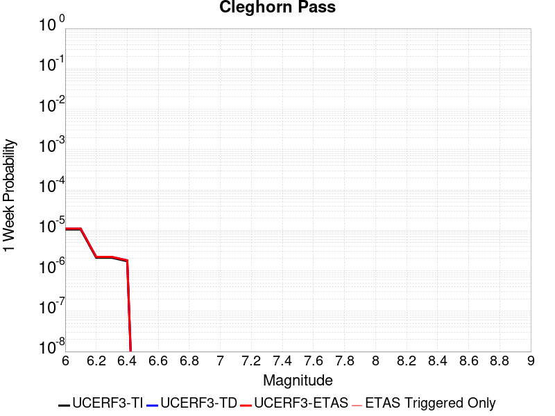 |  |  |  |

| Magnitude | 1 wk TI Prob | 1 wk TD Prob | 1 wk ETAS Prob | 1 wk ETAS/TD Gain | 1 wk ETAS Triggered Only | 1 mo TI Prob | 1 mo TD Prob | 1 mo ETAS Prob | 1 mo ETAS/TD Gain | 1 mo ETAS Triggered Only | 1 yr TI Prob | 1 yr TD Prob | 1 yr ETAS Prob | 1 yr ETAS/TD Gain | 1 yr ETAS Triggered Only | 10 yr TI Prob | 10 yr TD Prob | 10 yr ETAS Prob | 10 yr ETAS/TD Gain | 10 yr ETAS Triggered Only |
|-----|-----|-----|-----|-----|-----|-----|-----|-----|-----|-----|-----|-----|-----|-----|-----|-----|-----|-----|-----|-----|
| 6.0 | 1.0522846E-5 | 1.1041218E-5 | 1.1041218E-5 | 1.0 | 0.0 | 4.509713E-5 | 4.7318943E-5 | 4.7318943E-5 | 1.0 | 0.0 | 5.4891926E-4 | 5.760085E-4 | 5.760085E-4 | 1.0 | 0.0 | 0.0054756533 | 0.0057503213 | 0.0058048437 | 1.0094815 | 5.483759E-5 |
| 6.1 | 1.0522846E-5 | 1.1041218E-5 | 1.1041218E-5 | 1.0 | 0.0 | 4.509713E-5 | 4.7318943E-5 | 4.7318943E-5 | 1.0 | 0.0 | 5.4891926E-4 | 5.760085E-4 | 5.760085E-4 | 1.0 | 0.0 | 0.0054756533 | 0.0057503213 | 0.0058048437 | 1.0094815 | 5.483759E-5 |
| 6.2 | 2.1045846E-6 | 2.2083177E-6 | 2.2083177E-6 | 1.0 | 0.0 | 9.019617E-6 | 9.464208E-6 | 9.464208E-6 | 1.0 | 0.0 | 1.098083E-4 | 1.15224844E-4 | 1.15224844E-4 | 1.0 | 0.0 | 0.0010975406 | 0.0011520624 | 0.0011703206 | 1.0158482 | 1.8279197E-5 |
| 6.3 | 2.1045846E-6 | 2.2083177E-6 | 2.2083177E-6 | 1.0 | 0.0 | 9.019617E-6 | 9.464208E-6 | 9.464208E-6 | 1.0 | 0.0 | 1.098083E-4 | 1.15224844E-4 | 1.15224844E-4 | 1.0 | 0.0 | 0.0010975406 | 0.0011520624 | 0.0011703206 | 1.0158482 | 1.8279197E-5 |
| 6.4 | 1.7259927E-6 | 1.8109715E-6 | 1.8109715E-6 | 1.0 | 0.0 | 7.3970905E-6 | 7.761307E-6 | 7.761307E-6 | 1.0 | 0.0 | 9.005586E-5 | 9.449391E-5 | 9.449391E-5 | 1.0 | 0.0 | 9.001937E-4 | 9.449391E-4 | 9.6320105E-4 | 1.0193261 | 1.8279197E-5 |

## Big Pine (Central)
*[(top)](#table-of-contents)*

| 1 Week | 1 Month | 1 Year | 10 Year |
|-----|-----|-----|-----|
| 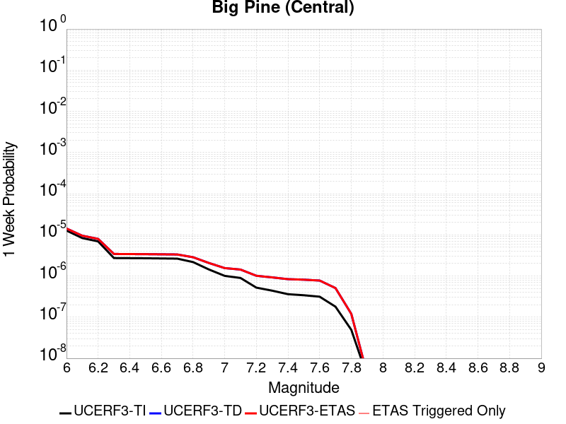 |  |  |  |

| Magnitude | 1 wk TI Prob | 1 wk TD Prob | 1 wk ETAS Prob | 1 wk ETAS/TD Gain | 1 wk ETAS Triggered Only | 1 mo TI Prob | 1 mo TD Prob | 1 mo ETAS Prob | 1 mo ETAS/TD Gain | 1 mo ETAS Triggered Only | 1 yr TI Prob | 1 yr TD Prob | 1 yr ETAS Prob | 1 yr ETAS/TD Gain | 1 yr ETAS Triggered Only | 10 yr TI Prob | 10 yr TD Prob | 10 yr ETAS Prob | 10 yr ETAS/TD Gain | 10 yr ETAS Triggered Only |
|-----|-----|-----|-----|-----|-----|-----|-----|-----|-----|-----|-----|-----|-----|-----|-----|-----|-----|-----|-----|-----|
| 6.0 | 1.2706755E-5 | 1.4254399E-5 | 1.4254399E-5 | 1.0 | 0.0 | 5.4456385E-5 | 6.108906E-5 | 6.108906E-5 | 1.0 | 0.0 | 6.628048E-4 | 7.4354204E-4 | 7.4354204E-4 | 1.0 | 0.0 | 0.006608314 | 0.0074155475 | 0.0074518346 | 1.0048934 | 3.6558395E-5 |
| 6.1 | 8.342579E-6 | 9.5141995E-6 | 9.5141995E-6 | 1.0 | 0.0 | 3.5753423E-5 | 4.0774623E-5 | 4.0774623E-5 | 1.0 | 0.0 | 4.3521097E-4 | 4.963397E-4 | 4.963397E-4 | 1.0 | 0.0 | 0.0043435963 | 0.0049558426 | 0.00499222 | 1.0073403 | 3.6558395E-5 |
| 6.2 | 6.923899E-6 | 7.9704405E-6 | 7.9704405E-6 | 1.0 | 0.0 | 2.9673516E-5 | 3.4158693E-5 | 3.4158693E-5 | 1.0 | 0.0 | 3.6121515E-4 | 4.1582197E-4 | 4.1582197E-4 | 1.0 | 0.0 | 0.003606286 | 0.0041537234 | 0.00419013 | 1.0087647 | 3.6558395E-5 |
| 6.3 | 2.728396E-6 | 3.427185E-6 | 3.427185E-6 | 1.0 | 0.0 | 1.1693074E-5 | 1.4687857E-5 | 1.4687857E-5 | 1.0 | 0.0 | 1.4235388E-4 | 1.7881086E-4 | 1.7881086E-4 | 1.0 | 0.0 | 0.0014226272 | 0.001788153 | 0.001788153 | 1.0 | 0.0 |
| 6.4 | 2.7136944E-6 | 3.411477E-6 | 3.411477E-6 | 1.0 | 0.0 | 1.1630066E-5 | 1.4620539E-5 | 1.4620539E-5 | 1.0 | 0.0 | 1.4158686E-4 | 1.779914E-4 | 1.779914E-4 | 1.0 | 0.0 | 0.0014149669 | 0.0017799714 | 0.0017799714 | 1.0 | 0.0 |
| 6.5 | 2.6971882E-6 | 3.3938209E-6 | 3.3938209E-6 | 1.0 | 0.0 | 1.1559327E-5 | 1.454487E-5 | 1.454487E-5 | 1.0 | 0.0 | 1.4072572E-4 | 1.7707028E-4 | 1.7707028E-4 | 1.0 | 0.0 | 0.0014063664 | 0.001770775 | 0.001770775 | 1.0 | 0.0 |
| 6.6 | 2.669092E-6 | 3.3638391E-6 | 3.3638391E-6 | 1.0 | 0.0 | 1.1438916E-5 | 1.441638E-5 | 1.441638E-5 | 1.0 | 0.0 | 1.3925991E-4 | 1.7550615E-4 | 1.7550615E-4 | 1.0 | 0.0 | 0.0013917267 | 0.0017551584 | 0.0017551584 | 1.0 | 0.0 |
| 6.7 | 2.6408059E-6 | 3.3338629E-6 | 3.3338629E-6 | 1.0 | 0.0 | 1.1317691E-5 | 1.4287911E-5 | 1.4287911E-5 | 1.0 | 0.0 | 1.3778417E-4 | 1.739423E-4 | 1.739423E-4 | 1.0 | 0.0 | 0.0013769877 | 0.0017395444 | 0.0017395444 | 1.0 | 0.0 |
| 6.8 | 2.1786943E-6 | 2.8573045E-6 | 2.8573045E-6 | 1.0 | 0.0 | 9.337228E-6 | 1.2245538E-5 | 1.2245538E-5 | 1.0 | 0.0 | 1.1367482E-4 | 1.4907995E-4 | 1.4907995E-4 | 1.0 | 0.0 | 0.0011361669 | 0.0014912689 | 0.0014912689 | 1.0 | 0.0 |
| 6.9 | 1.4411696E-6 | 2.0712434E-6 | 2.0712434E-6 | 1.0 | 0.0 | 6.1764263E-6 | 8.876729E-6 | 8.876729E-6 | 1.0 | 0.0 | 7.51954E-5 | 1.0806909E-4 | 1.0806909E-4 | 1.0 | 0.0 | 7.5169955E-4 | 0.0010815903 | 0.0010815903 | 1.0 | 0.0 |
| 7.0 | 1.0073411E-6 | 1.5567118E-6 | 1.5567118E-6 | 1.0 | 0.0 | 4.317169E-6 | 6.6716057E-6 | 6.6716057E-6 | 1.0 | 0.0 | 5.2560266E-5 | 8.122392E-5 | 8.122392E-5 | 1.0 | 0.0 | 5.2547833E-4 | 8.1335596E-4 | 8.1335596E-4 | 1.0 | 0.0 |
| 7.1 | 8.947104E-7 | 1.4326654E-6 | 1.4326654E-6 | 1.0 | 0.0 | 3.834468E-6 | 6.139981E-6 | 6.139981E-6 | 1.0 | 0.0 | 4.6683643E-5 | 7.475185E-5 | 7.475185E-5 | 1.0 | 0.0 | 4.6673836E-4 | 7.4868044E-4 | 7.4868044E-4 | 1.0 | 0.0 |
| 7.2 | 5.215166E-7 | 1.0134224E-6 | 1.0134224E-6 | 1.0 | 0.0 | 2.2350691E-6 | 4.3432324E-6 | 4.3432324E-6 | 1.0 | 0.0 | 2.7211627E-5 | 5.2877615E-5 | 5.2877615E-5 | 1.0 | 0.0 | 2.7208295E-4 | 5.300535E-4 | 5.300535E-4 | 1.0 | 0.0 |
| 7.3 | 4.4024807E-7 | 9.2414655E-7 | 9.2414655E-7 | 1.0 | 0.0 | 1.8867761E-6 | 3.9606225E-6 | 3.9606225E-6 | 1.0 | 0.0 | 2.2971257E-5 | 4.821955E-5 | 4.821955E-5 | 1.0 | 0.0 | 2.2968883E-4 | 4.8349393E-4 | 4.8349393E-4 | 1.0 | 0.0 |
| 7.4 | 3.6130905E-7 | 8.3797204E-7 | 8.3797204E-7 | 1.0 | 0.0 | 1.5484665E-6 | 3.591304E-6 | 3.591304E-6 | 1.0 | 0.0 | 1.8852415E-5 | 4.372329E-5 | 4.372329E-5 | 1.0 | 0.0 | 1.8850817E-4 | 4.3854036E-4 | 4.3854036E-4 | 1.0 | 0.0 |
| 7.5 | 3.408184E-7 | 8.128881E-7 | 8.128881E-7 | 1.0 | 0.0 | 1.4606494E-6 | 3.4838017E-6 | 3.4838017E-6 | 1.0 | 0.0 | 1.7783263E-5 | 4.24145E-5 | 4.24145E-5 | 1.0 | 0.0 | 1.778184E-4 | 4.2543613E-4 | 4.2543613E-4 | 1.0 | 0.0 |
| 7.6 | 3.1428627E-7 | 7.7515983E-7 | 7.7515983E-7 | 1.0 | 0.0 | 1.3469405E-6 | 3.3221097E-6 | 3.3221097E-6 | 1.0 | 0.0 | 1.6398877E-5 | 4.044597E-5 | 4.044597E-5 | 1.0 | 0.0 | 1.6397667E-4 | 4.0572946E-4 | 4.0572946E-4 | 1.0 | 0.0 |
| 7.7 | 1.7972785E-7 | 5.093037E-7 | 5.093037E-7 | 1.0 | 0.0 | 7.70262E-7 | 2.1827282E-6 | 2.1827282E-6 | 1.0 | 0.0 | 9.377899E-6 | 2.6574404E-5 | 2.6574404E-5 | 1.0 | 0.0 | 9.377503E-5 | 2.6706362E-4 | 2.6706362E-4 | 1.0 | 0.0 |
| 7.8 | 4.9230927E-8 | 1.2016858E-7 | 1.2016858E-7 | 1.0 | 0.0 | 2.1098968E-7 | 5.1500814E-7 | 5.1500814E-7 | 1.0 | 0.0 | 2.5687964E-6 | 6.2702075E-6 | 6.2702075E-6 | 1.0 | 0.0 | 2.5687666E-5 | 6.313871E-5 | 6.313871E-5 | 1.0 | 0.0 |
| 7.9 | 3.6805972E-9 | 4.1195065E-9 | 4.1195065E-9 | 1.0 | 0.0 | 1.5773987E-8 | 1.7655028E-8 | 1.7655028E-8 | 1.0 | 0.0 | 1.9204828E-7 | 2.1494995E-7 | 2.1494995E-7 | 1.0 | 0.0 | 1.920481E-6 | 2.197511E-6 | 2.197511E-6 | 1.0 | 0.0 |

## Santa Cruz Catalina Ridge alt1
*[(top)](#table-of-contents)*

| 1 Week | 1 Month | 1 Year | 10 Year |
|-----|-----|-----|-----|
|  |  |  |  |

| Magnitude | 1 wk TI Prob | 1 wk TD Prob | 1 wk ETAS Prob | 1 wk ETAS/TD Gain | 1 wk ETAS Triggered Only | 1 mo TI Prob | 1 mo TD Prob | 1 mo ETAS Prob | 1 mo ETAS/TD Gain | 1 mo ETAS Triggered Only | 1 yr TI Prob | 1 yr TD Prob | 1 yr ETAS Prob | 1 yr ETAS/TD Gain | 1 yr ETAS Triggered Only | 10 yr TI Prob | 10 yr TD Prob | 10 yr ETAS Prob | 10 yr ETAS/TD Gain | 10 yr ETAS Triggered Only |
|-----|-----|-----|-----|-----|-----|-----|-----|-----|-----|-----|-----|-----|-----|-----|-----|-----|-----|-----|-----|-----|
| 6.0 | 3.2833184E-5 | 3.6562866E-5 | 3.6562866E-5 | 1.0 | 0.0 | 1.4070606E-4 | 1.5668952E-4 | 1.5668952E-4 | 1.0 | 0.0 | 0.00171175 | 0.0019061924 | 0.0019244367 | 1.0095711 | 1.8279197E-5 | 0.016986247 | 0.018915322 | 0.018951189 | 1.0018961 | 3.6558395E-5 |
| 6.1 | 1.9835548E-5 | 2.1661635E-5 | 2.1661635E-5 | 1.0 | 0.0 | 8.500672E-5 | 9.283239E-5 | 9.283239E-5 | 1.0 | 0.0 | 0.0010344655 | 0.0011296686 | 0.0011479271 | 1.0161628 | 1.8279197E-5 | 0.010296632 | 0.011241395 | 0.011277542 | 1.0032156 | 3.6558395E-5 |
| 6.2 | 1.9835548E-5 | 2.1661635E-5 | 2.1661635E-5 | 1.0 | 0.0 | 8.500672E-5 | 9.283239E-5 | 9.283239E-5 | 1.0 | 0.0 | 0.0010344655 | 0.0011296686 | 0.0011479271 | 1.0161628 | 1.8279197E-5 | 0.010296632 | 0.011241395 | 0.011277542 | 1.0032156 | 3.6558395E-5 |
| 6.3 | 1.5728183E-5 | 1.7035456E-5 | 1.7035456E-5 | 1.0 | 0.0 | 6.7404755E-5 | 7.300709E-5 | 7.300709E-5 | 1.0 | 0.0 | 8.2034385E-4 | 8.8850496E-4 | 9.067679E-4 | 1.0205547 | 1.8279197E-5 | 0.008173222 | 0.008850207 | 0.008886442 | 1.0040942 | 3.6558395E-5 |
| 6.4 | 1.5728183E-5 | 1.7035456E-5 | 1.7035456E-5 | 1.0 | 0.0 | 6.7404755E-5 | 7.300709E-5 | 7.300709E-5 | 1.0 | 0.0 | 8.2034385E-4 | 8.8850496E-4 | 9.067679E-4 | 1.0205547 | 1.8279197E-5 | 0.008173222 | 0.008850207 | 0.008886442 | 1.0040942 | 3.6558395E-5 |
| 6.5 | 1.3707734E-5 | 1.4795771E-5 | 1.4795771E-5 | 1.0 | 0.0 | 5.8746107E-5 | 6.340892E-5 | 6.340892E-5 | 1.0 | 0.0 | 7.1499916E-4 | 7.717337E-4 | 7.899988E-4 | 1.0236676 | 1.8279197E-5 | 0.0071270303 | 0.0076909363 | 0.007727213 | 1.0047169 | 3.6558395E-5 |
| 6.6 | 1.2539813E-5 | 1.3511331E-5 | 1.3511331E-5 | 1.0 | 0.0 | 5.3740947E-5 | 5.7904435E-5 | 5.7904435E-5 | 1.0 | 0.0 | 6.540996E-4 | 7.047612E-4 | 7.2302745E-4 | 1.0259185 | 1.8279197E-5 | 0.0065217763 | 0.007025565 | 0.0070437156 | 1.0025835 | 1.8279197E-5 |
| 6.7 | 1.1504083E-5 | 1.2378374E-5 | 1.2378374E-5 | 1.0 | 0.0 | 4.930228E-5 | 5.304911E-5 | 5.304911E-5 | 1.0 | 0.0 | 6.0008996E-4 | 6.456835E-4 | 6.639509E-4 | 1.0282916 | 1.8279197E-5 | 0.005984721 | 0.006438304 | 0.0064564655 | 1.0028208 | 1.8279197E-5 |
| 6.8 | 1.012739E-5 | 1.0877928E-5 | 1.0877928E-5 | 1.0 | 0.0 | 4.340238E-5 | 4.6618865E-5 | 4.6618865E-5 | 1.0 | 0.0 | 5.282958E-4 | 5.674384E-4 | 5.674384E-4 | 1.0 | 0.0 | 0.0052704164 | 0.0056600636 | 0.0056600636 | 1.0 | 0.0 |
| 6.9 | 8.9607865E-6 | 9.6098565E-6 | 9.6098565E-6 | 1.0 | 0.0 | 3.8402806E-5 | 4.1184456E-5 | 4.1184456E-5 | 1.0 | 0.0 | 4.6745385E-4 | 5.0130644E-4 | 5.0130644E-4 | 1.0 | 0.0 | 0.0046647177 | 0.0050018756 | 0.0050018756 | 1.0 | 0.0 |
| 7.0 | 8.046829E-6 | 8.620398E-6 | 8.620398E-6 | 1.0 | 0.0 | 3.4485955E-5 | 3.6944046E-5 | 3.6944046E-5 | 1.0 | 0.0 | 4.1978562E-4 | 4.4970174E-4 | 4.4970174E-4 | 1.0 | 0.0 | 0.004189935 | 0.0044880076 | 0.0044880076 | 1.0 | 0.0 |
| 7.1 | 7.136131E-6 | 7.638227E-6 | 7.638227E-6 | 1.0 | 0.0 | 3.0583058E-5 | 3.273485E-5 | 3.273485E-5 | 1.0 | 0.0 | 3.7228514E-4 | 3.9847463E-4 | 3.9847463E-4 | 1.0 | 0.0 | 0.0037166206 | 0.003977678 | 0.003977678 | 1.0 | 0.0 |
| 7.2 | 6.362014E-6 | 6.8054624E-6 | 6.8054624E-6 | 1.0 | 0.0 | 2.726549E-5 | 2.9165943E-5 | 2.9165943E-5 | 1.0 | 0.0 | 3.3190678E-4 | 3.5503815E-4 | 3.5503815E-4 | 1.0 | 0.0 | 0.0033141149 | 0.0035447779 | 0.0035447779 | 1.0 | 0.0 |
| 7.3 | 5.004101E-6 | 5.3521103E-6 | 5.3521103E-6 | 1.0 | 0.0 | 2.1445969E-5 | 2.2937416E-5 | 2.2937416E-5 | 1.0 | 0.0 | 2.6107338E-4 | 2.792278E-4 | 2.792278E-4 | 1.0 | 0.0 | 0.002607669 | 0.0027888243 | 0.0027888243 | 1.0 | 0.0 |
| 7.4 | 3.4901443E-6 | 3.7323275E-6 | 3.7323275E-6 | 1.0 | 0.0 | 1.4957676E-5 | 1.5995594E-5 | 1.5995594E-5 | 1.0 | 0.0 | 1.8209449E-4 | 1.9472933E-4 | 1.9472933E-4 | 1.0 | 0.0 | 0.0018194534 | 0.0019456256 | 0.0019456256 | 1.0 | 0.0 |
| 7.5 | 1.1215045E-6 | 1.1894638E-6 | 1.1894638E-6 | 1.0 | 0.0 | 4.806439E-6 | 5.097692E-6 | 5.097692E-6 | 1.0 | 0.0 | 5.851682E-5 | 6.206266E-5 | 6.206266E-5 | 1.0 | 0.0 | 5.850142E-4 | 6.2045635E-4 | 6.2045635E-4 | 1.0 | 0.0 |
| 7.6 | 2.8599047E-7 | 2.9953497E-7 | 2.9953497E-7 | 1.0 | 0.0 | 1.2256729E-6 | 1.2837207E-6 | 1.2837207E-6 | 1.0 | 0.0 | 1.4922465E-5 | 1.5629188E-5 | 1.5629188E-5 | 1.0 | 0.0 | 1.4921463E-4 | 1.5628104E-4 | 1.5628104E-4 | 1.0 | 0.0 |
| 7.7 | 2.0781519E-7 | 2.1745393E-7 | 2.1745393E-7 | 1.0 | 0.0 | 8.906362E-7 | 9.3194507E-7 | 9.3194507E-7 | 1.0 | 0.0 | 1.08434415E-5 | 1.1346373E-5 | 1.1346373E-5 | 1.0 | 0.0 | 1.0842913E-4 | 1.1345803E-4 | 1.1345803E-4 | 1.0 | 0.0 |
| 7.8 | 3.614776E-8 | 3.7642668E-8 | 3.7642668E-8 | 1.0 | 0.0 | 1.5491896E-7 | 1.6132572E-7 | 1.6132572E-7 | 1.0 | 0.0 | 1.8861368E-6 | 1.9641388E-6 | 1.9641388E-6 | 1.0 | 0.0 | 1.8861208E-5 | 1.9641227E-5 | 1.9641227E-5 | 1.0 | 0.0 |

## Great Valley 05 Pittsburg - Kirby Hills alt1
*[(top)](#table-of-contents)*

| 1 Week | 1 Month | 1 Year | 10 Year |
|-----|-----|-----|-----|
|  |  |  |  |

| Magnitude | 1 wk TI Prob | 1 wk TD Prob | 1 wk ETAS Prob | 1 wk ETAS/TD Gain | 1 wk ETAS Triggered Only | 1 mo TI Prob | 1 mo TD Prob | 1 mo ETAS Prob | 1 mo ETAS/TD Gain | 1 mo ETAS Triggered Only | 1 yr TI Prob | 1 yr TD Prob | 1 yr ETAS Prob | 1 yr ETAS/TD Gain | 1 yr ETAS Triggered Only | 10 yr TI Prob | 10 yr TD Prob | 10 yr ETAS Prob | 10 yr ETAS/TD Gain | 10 yr ETAS Triggered Only |
|-----|-----|-----|-----|-----|-----|-----|-----|-----|-----|-----|-----|-----|-----|-----|-----|-----|-----|-----|-----|-----|
| 6.0 | 4.187212E-5 | 5.345778E-5 | 5.345778E-5 | 1.0 | 0.0 | 1.794396E-4 | 2.2909002E-4 | 2.4736504E-4 | 1.0797722 | 1.8279197E-5 | 0.002182488 | 0.0027865837 | 0.0028230401 | 1.0130829 | 3.6558395E-5 | 0.021611776 | 0.027610846 | 0.027646394 | 1.0012875 | 3.6558395E-5 |
| 6.1 | 4.187212E-5 | 5.345778E-5 | 5.345778E-5 | 1.0 | 0.0 | 1.794396E-4 | 2.2909002E-4 | 2.4736504E-4 | 1.0797722 | 1.8279197E-5 | 0.002182488 | 0.0027865837 | 0.0028230401 | 1.0130829 | 3.6558395E-5 | 0.021611776 | 0.027610846 | 0.027646394 | 1.0012875 | 3.6558395E-5 |
| 6.2 | 1.7353306E-5 | 2.2160895E-5 | 2.2160895E-5 | 1.0 | 0.0 | 7.436919E-5 | 9.497372E-5 | 9.497372E-5 | 1.0 | 0.0 | 9.050688E-4 | 0.0011560915 | 0.0011743496 | 1.015793 | 1.8279197E-5 | 0.009013915 | 0.011538404 | 0.011556473 | 1.0015659 | 1.8279197E-5 |
| 6.3 | 1.7353306E-5 | 2.2160895E-5 | 2.2160895E-5 | 1.0 | 0.0 | 7.436919E-5 | 9.497372E-5 | 9.497372E-5 | 1.0 | 0.0 | 9.050688E-4 | 0.0011560915 | 0.0011743496 | 1.015793 | 1.8279197E-5 | 0.009013915 | 0.011538404 | 0.011556473 | 1.0015659 | 1.8279197E-5 |
| 6.4 | 1.4028824E-5 | 1.7905852E-5 | 1.7905852E-5 | 1.0 | 0.0 | 6.0122147E-5 | 7.6739365E-5 | 7.6739365E-5 | 1.0 | 0.0 | 7.3174125E-4 | 9.3430176E-4 | 9.525639E-4 | 1.0195463 | 1.8279197E-5 | 0.0072933645 | 0.009340801 | 0.00935891 | 1.0019386 | 1.8279197E-5 |

## Bullion Mountains
*[(top)](#table-of-contents)*

| 1 Week | 1 Month | 1 Year | 10 Year |
|-----|-----|-----|-----|
|  |  |  |  |

| Magnitude | 1 wk TI Prob | 1 wk TD Prob | 1 wk ETAS Prob | 1 wk ETAS/TD Gain | 1 wk ETAS Triggered Only | 1 mo TI Prob | 1 mo TD Prob | 1 mo ETAS Prob | 1 mo ETAS/TD Gain | 1 mo ETAS Triggered Only | 1 yr TI Prob | 1 yr TD Prob | 1 yr ETAS Prob | 1 yr ETAS/TD Gain | 1 yr ETAS Triggered Only | 10 yr TI Prob | 10 yr TD Prob | 10 yr ETAS Prob | 10 yr ETAS/TD Gain | 10 yr ETAS Triggered Only |
|-----|-----|-----|-----|-----|-----|-----|-----|-----|-----|-----|-----|-----|-----|-----|-----|-----|-----|-----|-----|-----|
| 6.0 | 1.6420427E-5 | 1.4693821E-5 | 1.4693821E-5 | 1.0 | 0.0 | 7.037136E-5 | 6.297221E-5 | 6.297221E-5 | 1.0 | 0.0 | 8.5643446E-4 | 7.664554E-4 | 7.847206E-4 | 1.0238308 | 1.8279197E-5 | 0.008531413 | 0.007641914 | 0.0076781926 | 1.0047474 | 3.6558395E-5 |
| 6.1 | 1.6420427E-5 | 1.4693821E-5 | 1.4693821E-5 | 1.0 | 0.0 | 7.037136E-5 | 6.297221E-5 | 6.297221E-5 | 1.0 | 0.0 | 8.5643446E-4 | 7.664554E-4 | 7.847206E-4 | 1.0238308 | 1.8279197E-5 | 0.008531413 | 0.007641914 | 0.0076781926 | 1.0047474 | 3.6558395E-5 |
| 6.2 | 1.6420427E-5 | 1.4693821E-5 | 1.4693821E-5 | 1.0 | 0.0 | 7.037136E-5 | 6.297221E-5 | 6.297221E-5 | 1.0 | 0.0 | 8.5643446E-4 | 7.664554E-4 | 7.847206E-4 | 1.0238308 | 1.8279197E-5 | 0.008531413 | 0.007641914 | 0.0076781926 | 1.0047474 | 3.6558395E-5 |
| 6.3 | 1.2046778E-5 | 9.863532E-6 | 9.863532E-6 | 1.0 | 0.0 | 5.1628023E-5 | 4.2271728E-5 | 4.2271728E-5 | 1.0 | 0.0 | 6.283899E-4 | 5.145599E-4 | 5.145599E-4 | 1.0 | 0.0 | 0.0062661595 | 0.005135967 | 0.005135967 | 1.0 | 0.0 |
| 6.4 | 1.2046778E-5 | 9.863532E-6 | 9.863532E-6 | 1.0 | 0.0 | 5.1628023E-5 | 4.2271728E-5 | 4.2271728E-5 | 1.0 | 0.0 | 6.283899E-4 | 5.145599E-4 | 5.145599E-4 | 1.0 | 0.0 | 0.0062661595 | 0.005135967 | 0.005135967 | 1.0 | 0.0 |
| 6.5 | 1.0244343E-5 | 7.880444E-6 | 7.880444E-6 | 1.0 | 0.0 | 4.390359E-5 | 3.3773013E-5 | 3.3773013E-5 | 1.0 | 0.0 | 5.343951E-4 | 4.1112956E-4 | 4.1112956E-4 | 1.0 | 0.0 | 0.005331118 | 0.004105721 | 0.004105721 | 1.0 | 0.0 |
| 6.6 | 9.605408E-6 | 7.1784093E-6 | 7.1784093E-6 | 1.0 | 0.0 | 4.1165385E-5 | 3.0764364E-5 | 3.0764364E-5 | 1.0 | 0.0 | 5.010733E-4 | 3.745121E-4 | 3.745121E-4 | 1.0 | 0.0 | 0.00499945 | 0.003740807 | 0.003740807 | 1.0 | 0.0 |
| 6.7 | 8.60418E-6 | 6.1248024E-6 | 6.1248024E-6 | 1.0 | 0.0 | 3.687454E-5 | 2.6249E-5 | 2.6249E-5 | 1.0 | 0.0 | 4.48855E-4 | 3.195542E-4 | 3.195542E-4 | 1.0 | 0.0 | 0.004479495 | 0.0031928592 | 0.0031928592 | 1.0 | 0.0 |
| 6.8 | 5.187994E-6 | 2.5635889E-6 | 2.5635889E-6 | 1.0 | 0.0 | 2.223407E-5 | 1.0986785E-5 | 1.0986785E-5 | 1.0 | 0.0 | 2.7066618E-4 | 1.337599E-4 | 1.337599E-4 | 1.0 | 0.0 | 0.0027033675 | 0.0013371855 | 0.0013371855 | 1.0 | 0.0 |
| 6.9 | 4.5302368E-6 | 2.344682E-6 | 2.344682E-6 | 1.0 | 0.0 | 1.9415156E-5 | 1.004862E-5 | 1.004862E-5 | 1.0 | 0.0 | 2.3635388E-4 | 1.2233906E-4 | 1.2233906E-4 | 1.0 | 0.0 | 0.0023610266 | 0.0012231063 | 0.0012231063 | 1.0 | 0.0 |
| 7.0 | 3.431668E-6 | 1.6885238E-6 | 1.6885238E-6 | 1.0 | 0.0 | 1.4707065E-5 | 7.2365306E-6 | 7.2365306E-6 | 1.0 | 0.0 | 1.7904381E-4 | 8.810476E-5 | 8.810476E-5 | 1.0 | 0.0 | 0.0017889962 | 8.8104757E-4 | 8.8104757E-4 | 1.0 | 0.0 |

## Hayward (So) 2011 CFM
*[(top)](#table-of-contents)*

| 1 Week | 1 Month | 1 Year | 10 Year |
|-----|-----|-----|-----|
|  |  |  |  |

| Magnitude | 1 wk TI Prob | 1 wk TD Prob | 1 wk ETAS Prob | 1 wk ETAS/TD Gain | 1 wk ETAS Triggered Only | 1 mo TI Prob | 1 mo TD Prob | 1 mo ETAS Prob | 1 mo ETAS/TD Gain | 1 mo ETAS Triggered Only | 1 yr TI Prob | 1 yr TD Prob | 1 yr ETAS Prob | 1 yr ETAS/TD Gain | 1 yr ETAS Triggered Only | 10 yr TI Prob | 10 yr TD Prob | 10 yr ETAS Prob | 10 yr ETAS/TD Gain | 10 yr ETAS Triggered Only |
|-----|-----|-----|-----|-----|-----|-----|-----|-----|-----|-----|-----|-----|-----|-----|-----|-----|-----|-----|-----|-----|
| 6.0 | 1.8091932E-4 | 3.5739838E-4 | 3.5739838E-4 | 1.0 | 0.0 | 7.751381E-4 | 0.0015308182 | 0.0015308182 | 1.0 | 0.0 | 0.00939654 | 0.01848085 | 0.018516732 | 1.0019416 | 3.6558395E-5 | 0.090090066 | 0.16686414 | 0.1668946 | 1.0001825 | 3.6558395E-5 |
| 6.1 | 1.8091932E-4 | 3.5739838E-4 | 3.5739838E-4 | 1.0 | 0.0 | 7.751381E-4 | 0.0015308182 | 0.0015308182 | 1.0 | 0.0 | 0.00939654 | 0.01848085 | 0.018516732 | 1.0019416 | 3.6558395E-5 | 0.090090066 | 0.16686414 | 0.1668946 | 1.0001825 | 3.6558395E-5 |
| 6.2 | 1.8091932E-4 | 3.5739838E-4 | 3.5739838E-4 | 1.0 | 0.0 | 7.751381E-4 | 0.0015308182 | 0.0015308182 | 1.0 | 0.0 | 0.00939654 | 0.01848085 | 0.018516732 | 1.0019416 | 3.6558395E-5 | 0.090090066 | 0.16686414 | 0.1668946 | 1.0001825 | 3.6558395E-5 |
| 6.3 | 1.7322872E-4 | 3.4295986E-4 | 3.4295986E-4 | 1.0 | 0.0 | 7.4219756E-4 | 0.0014690097 | 0.0014690097 | 1.0 | 0.0 | 0.0089988755 | 0.0177408 | 0.017776709 | 1.0020242 | 3.6558395E-5 | 0.08643075 | 0.16079806 | 0.16082874 | 1.0001909 | 3.6558395E-5 |
| 6.4 | 1.6334097E-4 | 3.2376873E-4 | 3.2376873E-4 | 1.0 | 0.0 | 6.998449E-4 | 0.0013868511 | 0.0013868511 | 1.0 | 0.0 | 0.008487372 | 0.016756203 | 0.016792148 | 1.0021452 | 3.6558395E-5 | 0.081704415 | 0.15268466 | 0.15271564 | 1.0002029 | 3.6558395E-5 |
| 6.5 | 1.5600289E-4 | 3.10508E-4 | 3.10508E-4 | 1.0 | 0.0 | 6.684125E-4 | 0.0013300782 | 0.0013300782 | 1.0 | 0.0 | 0.008107598 | 0.016075358 | 0.016111327 | 1.0022377 | 3.6558395E-5 | 0.078181036 | 0.14695926 | 0.14699043 | 1.0002122 | 3.6558395E-5 |
| 6.6 | 1.4046066E-4 | 2.8063325E-4 | 2.8063325E-4 | 1.0 | 0.0 | 6.018354E-4 | 0.0012021664 | 0.0012021664 | 1.0 | 0.0 | 0.0073027555 | 0.014539654 | 0.014575682 | 1.0024779 | 3.6558395E-5 | 0.07067384 | 0.13404244 | 0.1340741 | 1.0002362 | 3.6558395E-5 |
| 6.7 | 1.14696966E-4 | 2.3298878E-4 | 2.3298878E-4 | 1.0 | 0.0 | 4.914658E-4 | 9.981462E-4 | 9.981462E-4 | 1.0 | 0.0 | 0.0059671924 | 0.012085782 | 0.012121899 | 1.0029883 | 3.6558395E-5 | 0.058094822 | 0.1128602 | 0.112892635 | 1.0002874 | 3.6558395E-5 |
| 6.8 | 9.3874296E-5 | 1.88841E-4 | 1.88841E-4 | 1.0 | 0.0 | 4.0225635E-4 | 8.0907124E-4 | 8.0907124E-4 | 1.0 | 0.0 | 0.0048864787 | 0.009806689 | 0.009824788 | 1.0018457 | 1.8279197E-5 | 0.047804173 | 0.092695124 | 0.09271171 | 1.0001789 | 1.8279197E-5 |
| 6.9 | 5.551852E-5 | 1.07430125E-4 | 1.07430125E-4 | 1.0 | 0.0 | 2.3791482E-4 | 4.6033418E-4 | 4.6033418E-4 | 1.0 | 0.0 | 0.0028927654 | 0.005590285 | 0.005590285 | 1.0 | 0.0 | 0.028553981 | 0.054307207 | 0.054307207 | 1.0 | 0.0 |
| 7.0 | 4.2662363E-5 | 8.257139E-5 | 8.257139E-5 | 1.0 | 0.0 | 1.8282588E-4 | 3.538298E-4 | 3.538298E-4 | 1.0 | 0.0 | 0.0022236328 | 0.004299442 | 0.004299442 | 1.0 | 0.0 | 0.022015138 | 0.042114418 | 0.042114418 | 1.0 | 0.0 |
| 7.1 | 3.305886E-5 | 6.3107094E-5 | 6.3107094E-5 | 1.0 | 0.0 | 1.4167312E-4 | 2.7043105E-4 | 2.7043105E-4 | 1.0 | 0.0 | 0.0017235056 | 0.0032875459 | 0.0032875459 | 1.0 | 0.0 | 0.017101998 | 0.032494824 | 0.032494824 | 1.0 | 0.0 |
| 7.2 | 2.9856887E-5 | 5.7097644E-5 | 5.7097644E-5 | 1.0 | 0.0 | 1.2795182E-4 | 2.4468135E-4 | 2.4468135E-4 | 1.0 | 0.0 | 0.0015567001 | 0.0029749426 | 0.0029749426 | 1.0 | 0.0 | 0.015458403 | 0.029493812 | 0.029493812 | 1.0 | 0.0 |
| 7.3 | 2.4559737E-5 | 4.606128E-5 | 4.606128E-5 | 1.0 | 0.0 | 1.0525176E-4 | 1.9739062E-4 | 1.9739062E-4 | 1.0 | 0.0 | 0.0012806869 | 0.002400595 | 0.002400595 | 1.0 | 0.0 | 0.012733313 | 0.023891633 | 0.023891633 | 1.0 | 0.0 |
| 7.4 | 1.9002231E-5 | 3.5108595E-5 | 3.5108595E-5 | 1.0 | 0.0 | 8.143559E-5 | 1.5045679E-4 | 1.5045679E-4 | 1.0 | 0.0 | 9.910273E-4 | 0.0018302822 | 0.0018302822 | 1.0 | 0.0 | 0.009866194 | 0.018287336 | 0.018287336 | 1.0 | 0.0 |
| 7.5 | 1.2783333E-5 | 2.3375651E-5 | 2.3375651E-5 | 1.0 | 0.0 | 5.4784563E-5 | 1.0017755E-4 | 1.0017755E-4 | 1.0 | 0.0 | 6.667979E-4 | 0.0012189851 | 0.0012189851 | 1.0 | 0.0 | 0.006648007 | 0.012232077 | 0.012232077 | 1.0 | 0.0 |
| 7.6 | 4.8149627E-6 | 8.905551E-6 | 8.905551E-6 | 1.0 | 0.0 | 2.063539E-5 | 3.8166094E-5 | 3.8166094E-5 | 1.0 | 0.0 | 2.5120692E-4 | 4.6457438E-4 | 4.6457438E-4 | 1.0 | 0.0 | 0.0025092314 | 0.0046901 | 0.0046901 | 1.0 | 0.0 |
| 7.7 | 6.0838227E-7 | 1.2101614E-6 | 1.2101614E-6 | 1.0 | 0.0 | 2.6073499E-6 | 5.186396E-6 | 5.186396E-6 | 1.0 | 0.0 | 3.174402E-5 | 6.314254E-5 | 6.314254E-5 | 1.0 | 0.0 | 3.1739488E-4 | 6.551135E-4 | 6.551135E-4 | 1.0 | 0.0 |
| 7.8 | 4.5542808E-7 | 9.831491E-7 | 9.831491E-7 | 1.0 | 0.0 | 1.9518332E-6 | 4.2134893E-6 | 4.2134893E-6 | 1.0 | 0.0 | 2.376331E-5 | 5.129803E-5 | 5.129803E-5 | 1.0 | 0.0 | 2.3760769E-4 | 5.340395E-4 | 5.340395E-4 | 1.0 | 0.0 |
| 7.9 | 3.3016747E-7 | 7.415275E-7 | 7.415275E-7 | 1.0 | 0.0 | 1.4150027E-6 | 3.177971E-6 | 3.177971E-6 | 1.0 | 0.0 | 1.7227521E-5 | 3.8691112E-5 | 3.8691112E-5 | 1.0 | 0.0 | 1.7226185E-4 | 4.00703E-4 | 4.00703E-4 | 1.0 | 0.0 |
| 8.0 | 2.347038E-7 | 5.491746E-7 | 5.491746E-7 | 1.0 | 0.0 | 1.0058731E-6 | 2.3536031E-6 | 2.3536031E-6 | 1.0 | 0.0 | 1.2246436E-5 | 2.8654744E-5 | 2.8654744E-5 | 1.0 | 0.0 | 1.2245761E-4 | 2.945264E-4 | 2.945264E-4 | 1.0 | 0.0 |
| 8.1 | 1.18822804E-7 | 2.6149542E-7 | 2.6149542E-7 | 1.0 | 0.0 | 5.092405E-7 | 1.120694E-6 | 1.120694E-6 | 1.0 | 0.0 | 6.1999854E-6 | 1.3644366E-5 | 1.3644366E-5 | 1.0 | 0.0 | 6.199812E-5 | 1.3962139E-4 | 1.3962139E-4 | 1.0 | 0.0 |

## San Luis Range 2011 CFM
*[(top)](#table-of-contents)*

| 1 Week | 1 Month | 1 Year | 10 Year |
|-----|-----|-----|-----|
|  |  |  | 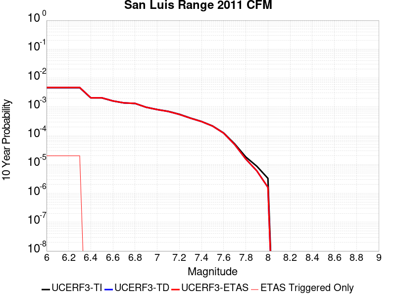 |

| Magnitude | 1 wk TI Prob | 1 wk TD Prob | 1 wk ETAS Prob | 1 wk ETAS/TD Gain | 1 wk ETAS Triggered Only | 1 mo TI Prob | 1 mo TD Prob | 1 mo ETAS Prob | 1 mo ETAS/TD Gain | 1 mo ETAS Triggered Only | 1 yr TI Prob | 1 yr TD Prob | 1 yr ETAS Prob | 1 yr ETAS/TD Gain | 1 yr ETAS Triggered Only | 10 yr TI Prob | 10 yr TD Prob | 10 yr ETAS Prob | 10 yr ETAS/TD Gain | 10 yr ETAS Triggered Only |
|-----|-----|-----|-----|-----|-----|-----|-----|-----|-----|-----|-----|-----|-----|-----|-----|-----|-----|-----|-----|-----|
| 6.0 | 8.8368415E-6 | 8.965642E-6 | 8.965642E-6 | 1.0 | 0.0 | 3.787163E-5 | 3.842366E-5 | 3.842366E-5 | 1.0 | 0.0 | 4.609895E-4 | 4.6771552E-4 | 5.042568E-4 | 1.0781271 | 3.6558395E-5 | 0.0046003438 | 0.004668094 | 0.004704482 | 1.007795 | 3.6558395E-5 |
| 6.1 | 8.8368415E-6 | 8.965642E-6 | 8.965642E-6 | 1.0 | 0.0 | 3.787163E-5 | 3.842366E-5 | 3.842366E-5 | 1.0 | 0.0 | 4.609895E-4 | 4.6771552E-4 | 5.042568E-4 | 1.0781271 | 3.6558395E-5 | 0.0046003438 | 0.004668094 | 0.004704482 | 1.007795 | 3.6558395E-5 |
| 6.2 | 8.8368415E-6 | 8.965642E-6 | 8.965642E-6 | 1.0 | 0.0 | 3.787163E-5 | 3.842366E-5 | 3.842366E-5 | 1.0 | 0.0 | 4.609895E-4 | 4.6771552E-4 | 5.042568E-4 | 1.0781271 | 3.6558395E-5 | 0.0046003438 | 0.004668094 | 0.004704482 | 1.007795 | 3.6558395E-5 |
| 6.3 | 8.8368415E-6 | 8.965642E-6 | 8.965642E-6 | 1.0 | 0.0 | 3.787163E-5 | 3.842366E-5 | 3.842366E-5 | 1.0 | 0.0 | 4.609895E-4 | 4.6771552E-4 | 5.042568E-4 | 1.0781271 | 3.6558395E-5 | 0.0046003438 | 0.004668094 | 0.004704482 | 1.007795 | 3.6558395E-5 |
| 6.4 | 3.9094193E-6 | 3.941286E-6 | 3.941286E-6 | 1.0 | 0.0 | 1.6754546E-5 | 1.689112E-5 | 1.689112E-5 | 1.0 | 0.0 | 2.039675E-4 | 2.0563026E-4 | 2.0563026E-4 | 1.0 | 0.0 | 0.0020378039 | 0.0020544287 | 0.0020544287 | 1.0 | 0.0 |
| 6.5 | 3.9094193E-6 | 3.941286E-6 | 3.941286E-6 | 1.0 | 0.0 | 1.6754546E-5 | 1.689112E-5 | 1.689112E-5 | 1.0 | 0.0 | 2.039675E-4 | 2.0563026E-4 | 2.0563026E-4 | 1.0 | 0.0 | 0.0020378039 | 0.0020544287 | 0.0020544287 | 1.0 | 0.0 |
| 6.6 | 3.0587726E-6 | 3.0754557E-6 | 3.0754557E-6 | 1.0 | 0.0 | 1.3108959E-5 | 1.3180458E-5 | 1.3180458E-5 | 1.0 | 0.0 | 1.595899E-4 | 1.6046037E-4 | 1.6046037E-4 | 1.0 | 0.0 | 0.0015947534 | 0.0016034571 | 0.0016034571 | 1.0 | 0.0 |
| 6.7 | 2.6160574E-6 | 2.6251864E-6 | 2.6251864E-6 | 1.0 | 0.0 | 1.1211626E-5 | 1.12507505E-5 | 1.12507505E-5 | 1.0 | 0.0 | 1.3649299E-4 | 1.3696935E-4 | 1.3696935E-4 | 1.0 | 0.0 | 0.0013640919 | 0.0013688554 | 0.0013688554 | 1.0 | 0.0 |
| 6.8 | 2.5110312E-6 | 2.518197E-6 | 2.518197E-6 | 1.0 | 0.0 | 1.0761518E-5 | 1.079223E-5 | 1.079223E-5 | 1.0 | 0.0 | 1.310136E-4 | 1.3138753E-4 | 1.3138753E-4 | 1.0 | 0.0 | 0.0013093639 | 0.0013131043 | 0.0013131043 | 1.0 | 0.0 |
| 6.9 | 1.8564405E-6 | 1.852532E-6 | 1.852532E-6 | 1.0 | 0.0 | 7.95615E-6 | 7.939399E-6 | 7.939399E-6 | 1.0 | 0.0 | 9.686181E-5 | 9.665792E-5 | 9.665792E-5 | 1.0 | 0.0 | 9.68196E-4 | 9.661608E-4 | 9.661608E-4 | 1.0 | 0.0 |
| 7.0 | 1.546127E-6 | 1.5369932E-6 | 1.5369932E-6 | 1.0 | 0.0 | 6.626242E-6 | 6.5870972E-6 | 6.5870972E-6 | 1.0 | 0.0 | 8.06715E-5 | 8.0194965E-5 | 8.0194965E-5 | 1.0 | 0.0 | 8.0642226E-4 | 8.0166094E-4 | 8.0166094E-4 | 1.0 | 0.0 |
| 7.1 | 1.3368208E-6 | 1.3235676E-6 | 1.3235676E-6 | 1.0 | 0.0 | 5.7292195E-6 | 5.6724202E-6 | 5.6724202E-6 | 1.0 | 0.0 | 6.975101E-5 | 6.905953E-5 | 6.905953E-5 | 1.0 | 0.0 | 6.972912E-4 | 6.9038116E-4 | 6.9038116E-4 | 1.0 | 0.0 |
| 7.2 | 1.0623363E-6 | 1.045466E-6 | 1.045466E-6 | 1.0 | 0.0 | 4.5528623E-6 | 4.4805606E-6 | 4.4805606E-6 | 1.0 | 0.0 | 5.5429686E-5 | 5.4549462E-5 | 5.4549462E-5 | 1.0 | 0.0 | 5.5415864E-4 | 5.45361E-4 | 5.45361E-4 | 1.0 | 0.0 |
| 7.3 | 7.831679E-7 | 7.727625E-7 | 7.727625E-7 | 1.0 | 0.0 | 3.3564295E-6 | 3.3118351E-6 | 3.3118351E-6 | 1.0 | 0.0 | 4.086376E-5 | 4.0320847E-5 | 4.0320847E-5 | 1.0 | 0.0 | 4.0856248E-4 | 4.0313543E-4 | 4.0313543E-4 | 1.0 | 0.0 |
| 7.4 | 5.9558846E-7 | 5.9108316E-7 | 5.9108316E-7 | 1.0 | 0.0 | 2.5525194E-6 | 2.5332113E-6 | 2.5332113E-6 | 1.0 | 0.0 | 3.107648E-5 | 3.084141E-5 | 3.084141E-5 | 1.0 | 0.0 | 3.1072134E-4 | 3.0837138E-4 | 3.0837138E-4 | 1.0 | 0.0 |
| 7.5 | 4.1616502E-7 | 4.1197907E-7 | 4.1197907E-7 | 1.0 | 0.0 | 1.7835631E-6 | 1.7656233E-6 | 1.7656233E-6 | 1.0 | 0.0 | 2.1714664E-5 | 2.1496253E-5 | 2.1496253E-5 | 1.0 | 0.0 | 2.1712543E-4 | 2.1494179E-4 | 2.1494179E-4 | 1.0 | 0.0 |
| 7.6 | 2.3816014E-7 | 2.3377777E-7 | 2.3377777E-7 | 1.0 | 0.0 | 1.0206859E-6 | 1.0019043E-6 | 1.0019043E-6 | 1.0 | 0.0 | 1.242678E-5 | 1.2198117E-5 | 1.2198117E-5 | 1.0 | 0.0 | 1.2426086E-4 | 1.21974495E-4 | 1.21974495E-4 | 1.0 | 0.0 |
| 7.7 | 9.918777E-8 | 9.387684E-8 | 9.387684E-8 | 1.0 | 0.0 | 4.2509038E-7 | 4.0232925E-7 | 4.0232925E-7 | 1.0 | 0.0 | 5.1754632E-6 | 4.8983475E-6 | 4.8983475E-6 | 1.0 | 0.0 | 5.1753424E-5 | 4.89824E-5 | 4.89824E-5 | 1.0 | 0.0 |
| 7.8 | 3.4982556E-8 | 2.9694167E-8 | 2.9694167E-8 | 1.0 | 0.0 | 1.4992524E-7 | 1.272607E-7 | 1.272607E-7 | 1.0 | 0.0 | 1.8253382E-6 | 1.5493979E-6 | 1.5493979E-6 | 1.0 | 0.0 | 1.8253233E-5 | 1.5493872E-5 | 1.5493872E-5 | 1.0 | 0.0 |
| 7.9 | 1.6624908E-8 | 1.1483989E-8 | 1.1483989E-8 | 1.0 | 0.0 | 7.12496E-8 | 4.921709E-8 | 4.921709E-8 | 1.0 | 0.0 | 8.6746354E-7 | 5.9921786E-7 | 5.9921786E-7 | 1.0 | 0.0 | 8.674601E-6 | 5.9921626E-6 | 5.9921626E-6 | 1.0 | 0.0 |
| 8.0 | 6.3352315E-9 | 3.0928995E-9 | 3.0928995E-9 | 1.0 | 0.0 | 2.715099E-8 | 1.3255282E-8 | 1.3255282E-8 | 1.0 | 0.0 | 3.3056327E-7 | 1.6138304E-7 | 1.6138304E-7 | 1.0 | 0.0 | 3.3056278E-6 | 1.6138293E-6 | 1.6138293E-6 | 1.0 | 0.0 |

## Dry Mountain
*[(top)](#table-of-contents)*

| 1 Week | 1 Month | 1 Year | 10 Year |
|-----|-----|-----|-----|
|  |  | 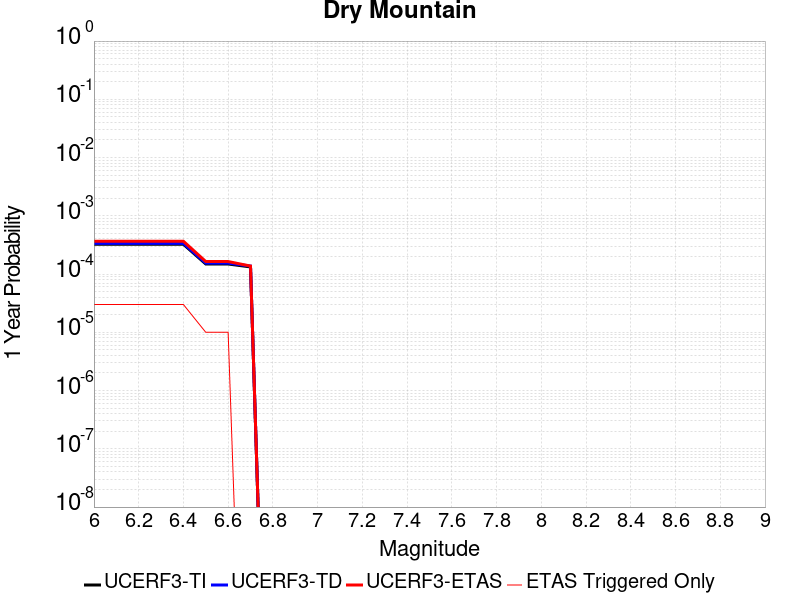 |  |

| Magnitude | 1 wk TI Prob | 1 wk TD Prob | 1 wk ETAS Prob | 1 wk ETAS/TD Gain | 1 wk ETAS Triggered Only | 1 mo TI Prob | 1 mo TD Prob | 1 mo ETAS Prob | 1 mo ETAS/TD Gain | 1 mo ETAS Triggered Only | 1 yr TI Prob | 1 yr TD Prob | 1 yr ETAS Prob | 1 yr ETAS/TD Gain | 1 yr ETAS Triggered Only | 10 yr TI Prob | 10 yr TD Prob | 10 yr ETAS Prob | 10 yr ETAS/TD Gain | 10 yr ETAS Triggered Only |
|-----|-----|-----|-----|-----|-----|-----|-----|-----|-----|-----|-----|-----|-----|-----|-----|-----|-----|-----|-----|-----|
| 6.0 | 6.222801E-6 | 6.439619E-6 | 6.439619E-6 | 1.0 | 0.0 | 2.6668875E-5 | 2.7598166E-5 | 2.7598166E-5 | 1.0 | 0.0 | 3.2464517E-4 | 3.3597177E-4 | 3.5424484E-4 | 1.0543886 | 1.8279197E-5 | 0.0032417132 | 0.0033562006 | 0.0033926363 | 1.0108563 | 3.6558395E-5 |
| 6.1 | 6.222801E-6 | 6.439619E-6 | 6.439619E-6 | 1.0 | 0.0 | 2.6668875E-5 | 2.7598166E-5 | 2.7598166E-5 | 1.0 | 0.0 | 3.2464517E-4 | 3.3597177E-4 | 3.5424484E-4 | 1.0543886 | 1.8279197E-5 | 0.0032417132 | 0.0033562006 | 0.0033926363 | 1.0108563 | 3.6558395E-5 |
| 6.2 | 6.222801E-6 | 6.439619E-6 | 6.439619E-6 | 1.0 | 0.0 | 2.6668875E-5 | 2.7598166E-5 | 2.7598166E-5 | 1.0 | 0.0 | 3.2464517E-4 | 3.3597177E-4 | 3.5424484E-4 | 1.0543886 | 1.8279197E-5 | 0.0032417132 | 0.0033562006 | 0.0033926363 | 1.0108563 | 3.6558395E-5 |
| 6.3 | 6.222801E-6 | 6.439619E-6 | 6.439619E-6 | 1.0 | 0.0 | 2.6668875E-5 | 2.7598166E-5 | 2.7598166E-5 | 1.0 | 0.0 | 3.2464517E-4 | 3.3597177E-4 | 3.5424484E-4 | 1.0543886 | 1.8279197E-5 | 0.0032417132 | 0.0033562006 | 0.0033926363 | 1.0108563 | 3.6558395E-5 |
| 6.4 | 6.222801E-6 | 6.439619E-6 | 6.439619E-6 | 1.0 | 0.0 | 2.6668875E-5 | 2.7598166E-5 | 2.7598166E-5 | 1.0 | 0.0 | 3.2464517E-4 | 3.3597177E-4 | 3.5424484E-4 | 1.0543886 | 1.8279197E-5 | 0.0032417132 | 0.0033562006 | 0.0033926363 | 1.0108563 | 3.6558395E-5 |
| 6.5 | 2.8528623E-6 | 2.9522773E-6 | 2.9522773E-6 | 1.0 | 0.0 | 1.22264955E-5 | 1.2652606E-5 | 1.2652606E-5 | 1.0 | 0.0 | 1.4884741E-4 | 1.5404329E-4 | 1.5404329E-4 | 1.0 | 0.0 | 0.0014874774 | 0.0015402185 | 0.0015402185 | 1.0 | 0.0 |
| 6.6 | 2.8528623E-6 | 2.9522773E-6 | 2.9522773E-6 | 1.0 | 0.0 | 1.22264955E-5 | 1.2652606E-5 | 1.2652606E-5 | 1.0 | 0.0 | 1.4884741E-4 | 1.5404329E-4 | 1.5404329E-4 | 1.0 | 0.0 | 0.0014874774 | 0.0015402185 | 0.0015402185 | 1.0 | 0.0 |
| 6.7 | 2.541E-6 | 2.629455E-6 | 2.629455E-6 | 1.0 | 0.0 | 1.0889954E-5 | 1.1269092E-5 | 1.1269092E-5 | 1.0 | 0.0 | 1.3257713E-4 | 1.372012E-4 | 1.372012E-4 | 1.0 | 0.0 | 0.0013249806 | 0.001372012 | 0.001372012 | 1.0 | 0.0 |

## Homestead Valley 2011
*[(top)](#table-of-contents)*

| 1 Week | 1 Month | 1 Year | 10 Year |
|-----|-----|-----|-----|
|  |  |  | 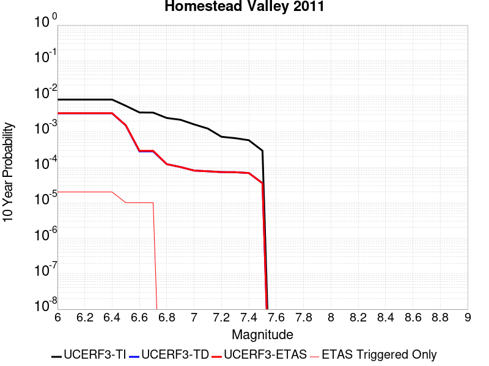 |

| Magnitude | 1 wk TI Prob | 1 wk TD Prob | 1 wk ETAS Prob | 1 wk ETAS/TD Gain | 1 wk ETAS Triggered Only | 1 mo TI Prob | 1 mo TD Prob | 1 mo ETAS Prob | 1 mo ETAS/TD Gain | 1 mo ETAS Triggered Only | 1 yr TI Prob | 1 yr TD Prob | 1 yr ETAS Prob | 1 yr ETAS/TD Gain | 1 yr ETAS Triggered Only | 10 yr TI Prob | 10 yr TD Prob | 10 yr ETAS Prob | 10 yr ETAS/TD Gain | 10 yr ETAS Triggered Only |
|-----|-----|-----|-----|-----|-----|-----|-----|-----|-----|-----|-----|-----|-----|-----|-----|-----|-----|-----|-----|-----|
| 6.0 | 1.539795E-5 | 6.28714E-6 | 6.28714E-6 | 1.0 | 0.0 | 6.5989545E-5 | 2.6944725E-5 | 2.6944725E-5 | 1.0 | 0.0 | 8.0312655E-4 | 3.2802325E-4 | 3.4629644E-4 | 1.055707 | 1.8279197E-5 | 0.008002302 | 0.003277412 | 0.0033138504 | 1.011118 | 3.6558395E-5 |
| 6.1 | 1.539795E-5 | 6.28714E-6 | 6.28714E-6 | 1.0 | 0.0 | 6.5989545E-5 | 2.6944725E-5 | 2.6944725E-5 | 1.0 | 0.0 | 8.0312655E-4 | 3.2802325E-4 | 3.4629644E-4 | 1.055707 | 1.8279197E-5 | 0.008002302 | 0.003277412 | 0.0033138504 | 1.011118 | 3.6558395E-5 |
| 6.2 | 1.539795E-5 | 6.28714E-6 | 6.28714E-6 | 1.0 | 0.0 | 6.5989545E-5 | 2.6944725E-5 | 2.6944725E-5 | 1.0 | 0.0 | 8.0312655E-4 | 3.2802325E-4 | 3.4629644E-4 | 1.055707 | 1.8279197E-5 | 0.008002302 | 0.003277412 | 0.0033138504 | 1.011118 | 3.6558395E-5 |
| 6.3 | 1.539795E-5 | 6.28714E-6 | 6.28714E-6 | 1.0 | 0.0 | 6.5989545E-5 | 2.6944725E-5 | 2.6944725E-5 | 1.0 | 0.0 | 8.0312655E-4 | 3.2802325E-4 | 3.4629644E-4 | 1.055707 | 1.8279197E-5 | 0.008002302 | 0.003277412 | 0.0033138504 | 1.011118 | 3.6558395E-5 |
| 6.4 | 1.539795E-5 | 6.28714E-6 | 6.28714E-6 | 1.0 | 0.0 | 6.5989545E-5 | 2.6944725E-5 | 2.6944725E-5 | 1.0 | 0.0 | 8.0312655E-4 | 3.2802325E-4 | 3.4629644E-4 | 1.055707 | 1.8279197E-5 | 0.008002302 | 0.003277412 | 0.0033138504 | 1.011118 | 3.6558395E-5 |
| 6.5 | 1.0265258E-5 | 2.8791078E-6 | 2.8791078E-6 | 1.0 | 0.0 | 4.3993223E-5 | 1.2339014E-5 | 1.2339014E-5 | 1.0 | 0.0 | 5.3548586E-4 | 1.5022409E-4 | 1.5022409E-4 | 1.0 | 0.0 | 0.005341973 | 0.0015019074 | 0.0015201592 | 1.0121524 | 1.8279197E-5 |
| 6.6 | 6.664671E-6 | 5.3494557E-7 | 5.3494557E-7 | 1.0 | 0.0 | 2.8562565E-5 | 2.2926226E-6 | 2.2926226E-6 | 1.0 | 0.0 | 3.476937E-4 | 2.7912442E-5 | 2.7912442E-5 | 1.0 | 0.0 | 0.003471502 | 2.79101E-4 | 2.9737508E-4 | 1.0654749 | 1.8279197E-5 |
| 6.7 | 6.5954046E-6 | 5.3494557E-7 | 5.3494557E-7 | 1.0 | 0.0 | 2.8265715E-5 | 2.2926226E-6 | 2.2926226E-6 | 1.0 | 0.0 | 3.4408073E-4 | 2.7912442E-5 | 2.7912442E-5 | 1.0 | 0.0 | 0.0034354846 | 2.79101E-4 | 2.9737508E-4 | 1.0654749 | 1.8279197E-5 |
| 6.8 | 4.648189E-6 | 2.3273472E-7 | 2.3273472E-7 | 1.0 | 0.0 | 1.9920659E-5 | 9.974342E-7 | 9.974342E-7 | 1.0 | 0.0 | 2.4250703E-4 | 1.2143698E-5 | 1.2143698E-5 | 1.0 | 0.0 | 0.0024224254 | 1.2143083E-4 | 1.2143083E-4 | 1.0 | 0.0 |
| 6.9 | 4.1428534E-6 | 1.9351485E-7 | 1.9351485E-7 | 1.0 | 0.0 | 1.7754966E-5 | 8.293491E-7 | 8.293491E-7 | 1.0 | 0.0 | 2.1614527E-4 | 1.0097282E-5 | 1.0097282E-5 | 1.0 | 0.0 | 0.0021593515 | 1.0096853E-4 | 1.0096853E-4 | 1.0 | 0.0 |
| 7.0 | 3.0673707E-6 | 1.5373227E-7 | 1.5373227E-7 | 1.0 | 0.0 | 1.3145808E-5 | 6.5885246E-7 | 6.5885246E-7 | 1.0 | 0.0 | 1.6003846E-4 | 8.0215E-6 | 8.0215E-6 | 1.0 | 0.0 | 0.0015992324 | 8.021221E-5 | 8.021221E-5 | 1.0 | 0.0 |
| 7.1 | 2.340854E-6 | 1.4692894E-7 | 1.4692894E-7 | 1.0 | 0.0 | 1.0032193E-5 | 6.296953E-7 | 6.296953E-7 | 1.0 | 0.0 | 1.221351E-4 | 7.666515E-6 | 7.666515E-6 | 1.0 | 0.0 | 0.00122068 | 7.6662596E-5 | 7.6662596E-5 | 1.0 | 0.0 |
| 7.2 | 1.3754182E-6 | 1.3927345E-7 | 1.3927345E-7 | 1.0 | 0.0 | 5.8946357E-6 | 5.968861E-7 | 5.968861E-7 | 1.0 | 0.0 | 7.176483E-5 | 7.267065E-6 | 7.267065E-6 | 1.0 | 0.0 | 7.174166E-4 | 7.2668365E-5 | 7.2668365E-5 | 1.0 | 0.0 |
| 7.3 | 1.2573237E-6 | 1.3831806E-7 | 1.3831806E-7 | 1.0 | 0.0 | 5.388519E-6 | 5.9279154E-7 | 5.9279154E-7 | 1.0 | 0.0 | 6.560324E-5 | 7.2172143E-6 | 7.2172143E-6 | 1.0 | 0.0 | 6.558388E-4 | 7.216989E-5 | 7.216989E-5 | 1.0 | 0.0 |
| 7.4 | 1.0994207E-6 | 1.3110466E-7 | 1.3110466E-7 | 1.0 | 0.0 | 4.7117946E-6 | 5.6187696E-7 | 5.6187696E-7 | 1.0 | 0.0 | 5.736459E-5 | 6.8408317E-6 | 6.8408317E-6 | 1.0 | 0.0 | 5.734978E-4 | 6.84063E-5 | 6.84063E-5 | 1.0 | 0.0 |
| 7.5 | 5.5569126E-7 | 6.775161E-8 | 6.775161E-8 | 1.0 | 0.0 | 2.3815317E-6 | 2.90364E-7 | 2.90364E-7 | 1.0 | 0.0 | 2.8994764E-5 | 3.5351766E-6 | 3.5351766E-6 | 1.0 | 0.0 | 2.899098E-4 | 3.5351266E-5 | 3.5351266E-5 | 1.0 | 0.0 |

## Ventura-Pitas Point
*[(top)](#table-of-contents)*

| 1 Week | 1 Month | 1 Year | 10 Year |
|-----|-----|-----|-----|
|  |  | 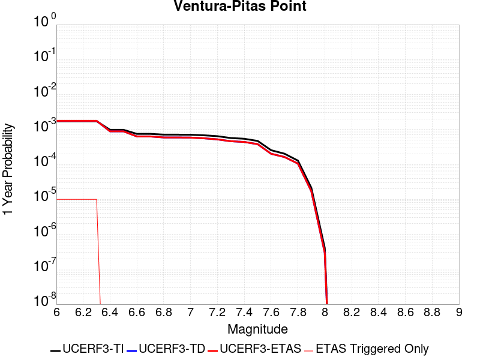 |  |

| Magnitude | 1 wk TI Prob | 1 wk TD Prob | 1 wk ETAS Prob | 1 wk ETAS/TD Gain | 1 wk ETAS Triggered Only | 1 mo TI Prob | 1 mo TD Prob | 1 mo ETAS Prob | 1 mo ETAS/TD Gain | 1 mo ETAS Triggered Only | 1 yr TI Prob | 1 yr TD Prob | 1 yr ETAS Prob | 1 yr ETAS/TD Gain | 1 yr ETAS Triggered Only | 10 yr TI Prob | 10 yr TD Prob | 10 yr ETAS Prob | 10 yr ETAS/TD Gain | 10 yr ETAS Triggered Only |
|-----|-----|-----|-----|-----|-----|-----|-----|-----|-----|-----|-----|-----|-----|-----|-----|-----|-----|-----|-----|-----|
| 6.0 | 3.3179622E-5 | 3.3741548E-5 | 3.3741548E-5 | 1.0 | 0.0 | 1.4219063E-4 | 1.4460007E-4 | 1.4460007E-4 | 1.0 | 0.0 | 0.0017297962 | 0.0017593412 | 0.0017593412 | 1.0 | 0.0 | 0.017163932 | 0.017479673 | 0.017515592 | 1.0020549 | 3.6558395E-5 |
| 6.1 | 3.3179622E-5 | 3.3741548E-5 | 3.3741548E-5 | 1.0 | 0.0 | 1.4219063E-4 | 1.4460007E-4 | 1.4460007E-4 | 1.0 | 0.0 | 0.0017297962 | 0.0017593412 | 0.0017593412 | 1.0 | 0.0 | 0.017163932 | 0.017479673 | 0.017515592 | 1.0020549 | 3.6558395E-5 |
| 6.2 | 3.3179622E-5 | 3.3741548E-5 | 3.3741548E-5 | 1.0 | 0.0 | 1.4219063E-4 | 1.4460007E-4 | 1.4460007E-4 | 1.0 | 0.0 | 0.0017297962 | 0.0017593412 | 0.0017593412 | 1.0 | 0.0 | 0.017163932 | 0.017479673 | 0.017515592 | 1.0020549 | 3.6558395E-5 |
| 6.3 | 3.3179622E-5 | 3.3741548E-5 | 3.3741548E-5 | 1.0 | 0.0 | 1.4219063E-4 | 1.4460007E-4 | 1.4460007E-4 | 1.0 | 0.0 | 0.0017297962 | 0.0017593412 | 0.0017593412 | 1.0 | 0.0 | 0.017163932 | 0.017479673 | 0.017515592 | 1.0020549 | 3.6558395E-5 |
| 6.4 | 1.8754668E-5 | 1.702315E-5 | 1.702315E-5 | 1.0 | 0.0 | 8.037467E-5 | 7.295445E-5 | 7.295445E-5 | 1.0 | 0.0 | 9.781223E-4 | 8.8788156E-4 | 8.8788156E-4 | 1.0 | 0.0 | 0.009738282 | 0.008845679 | 0.0088637965 | 1.0020481 | 1.8279197E-5 |
| 6.5 | 1.8754668E-5 | 1.702315E-5 | 1.702315E-5 | 1.0 | 0.0 | 8.037467E-5 | 7.295445E-5 | 7.295445E-5 | 1.0 | 0.0 | 9.781223E-4 | 8.8788156E-4 | 8.8788156E-4 | 1.0 | 0.0 | 0.009738282 | 0.008845679 | 0.0088637965 | 1.0020481 | 1.8279197E-5 |
| 6.6 | 1.4361558E-5 | 1.2125218E-5 | 1.2125218E-5 | 1.0 | 0.0 | 6.154808E-5 | 5.1964198E-5 | 5.1964198E-5 | 1.0 | 0.0 | 7.490902E-4 | 6.3248276E-4 | 6.3248276E-4 | 1.0 | 0.0 | 0.0074657016 | 0.0063070836 | 0.0063070836 | 1.0 | 0.0 |
| 6.7 | 1.4361558E-5 | 1.2125218E-5 | 1.2125218E-5 | 1.0 | 0.0 | 6.154808E-5 | 5.1964198E-5 | 5.1964198E-5 | 1.0 | 0.0 | 7.490902E-4 | 6.3248276E-4 | 6.3248276E-4 | 1.0 | 0.0 | 0.0074657016 | 0.0063070836 | 0.0063070836 | 1.0 | 0.0 |
| 6.8 | 1.3663846E-5 | 1.1347266E-5 | 1.1347266E-5 | 1.0 | 0.0 | 5.8558027E-5 | 4.8630245E-5 | 4.8630245E-5 | 1.0 | 0.0 | 7.127108E-4 | 5.9191434E-4 | 5.9191434E-4 | 1.0 | 0.0 | 0.007104293 | 0.0059035937 | 0.0059035937 | 1.0 | 0.0 |
| 6.9 | 1.3644157E-5 | 1.13253645E-5 | 1.13253645E-5 | 1.0 | 0.0 | 5.8473648E-5 | 4.853638E-5 | 4.853638E-5 | 1.0 | 0.0 | 7.116841E-4 | 5.907722E-4 | 5.907722E-4 | 1.0 | 0.0 | 0.007094092 | 0.0058922325 | 0.0058922325 | 1.0 | 0.0 |
| 7.0 | 1.3568845E-5 | 1.1244919E-5 | 1.1244919E-5 | 1.0 | 0.0 | 5.8150898E-5 | 4.8191632E-5 | 4.8191632E-5 | 1.0 | 0.0 | 7.077572E-4 | 5.865771E-4 | 5.865771E-4 | 1.0 | 0.0 | 0.007055073 | 0.0058505037 | 0.0058505037 | 1.0 | 0.0 |
| 7.1 | 1.306572E-5 | 1.07233E-5 | 1.07233E-5 | 1.0 | 0.0 | 5.599474E-5 | 4.59562E-5 | 4.59562E-5 | 1.0 | 0.0 | 6.815227E-4 | 5.59375E-4 | 5.59375E-4 | 1.0 | 0.0 | 0.0067943637 | 0.005579875 | 0.005579875 | 1.0 | 0.0 |
| 7.2 | 1.232604E-5 | 9.997771E-6 | 9.997771E-6 | 1.0 | 0.0 | 5.2824813E-5 | 4.2846896E-5 | 4.2846896E-5 | 1.0 | 0.0 | 6.429523E-4 | 5.2153785E-4 | 5.2153785E-4 | 1.0 | 0.0 | 0.0064109527 | 0.005203331 | 0.005203331 | 1.0 | 0.0 |
| 7.3 | 1.0917261E-5 | 8.844931E-6 | 8.844931E-6 | 1.0 | 0.0 | 4.678742E-5 | 3.7906306E-5 | 3.7906306E-5 | 1.0 | 0.0 | 5.69488E-4 | 4.614131E-4 | 4.614131E-4 | 1.0 | 0.0 | 0.0056803077 | 0.0046047163 | 0.0046047163 | 1.0 | 0.0 |
| 7.4 | 1.039959E-5 | 8.424578E-6 | 8.424578E-6 | 1.0 | 0.0 | 4.456891E-5 | 3.610484E-5 | 3.610484E-5 | 1.0 | 0.0 | 5.424914E-4 | 4.3948932E-4 | 4.3948932E-4 | 1.0 | 0.0 | 0.0054116896 | 0.0043863636 | 0.0043863636 | 1.0 | 0.0 |
| 7.5 | 9.015877E-6 | 7.2983166E-6 | 7.2983166E-6 | 1.0 | 0.0 | 3.86389E-5 | 3.1278134E-5 | 3.1278134E-5 | 1.0 | 0.0 | 4.7032707E-4 | 3.8074612E-4 | 3.8074612E-4 | 1.0 | 0.0 | 0.004693329 | 0.0038010832 | 0.0038010832 | 1.0 | 0.0 |
| 7.6 | 4.900162E-6 | 3.8744192E-6 | 3.8744192E-6 | 1.0 | 0.0 | 2.1000526E-5 | 1.6604548E-5 | 1.6604548E-5 | 1.0 | 0.0 | 2.556514E-4 | 2.0214175E-4 | 2.0214175E-4 | 1.0 | 0.0 | 0.0025535747 | 0.0020195926 | 0.0020195926 | 1.0 | 0.0 |
| 7.7 | 3.8850626E-6 | 3.1269603E-6 | 3.1269603E-6 | 1.0 | 0.0 | 1.6650163E-5 | 1.3401191E-5 | 1.3401191E-5 | 1.0 | 0.0 | 2.0269687E-4 | 1.6314737E-4 | 1.6314737E-4 | 1.0 | 0.0 | 0.002025121 | 0.0016302853 | 0.0016302853 | 1.0 | 0.0 |
| 7.8 | 2.4654719E-6 | 2.0300135E-6 | 2.0300135E-6 | 1.0 | 0.0 | 1.0566265E-5 | 8.700029E-6 | 8.700029E-6 | 1.0 | 0.0 | 1.2863669E-4 | 1.0591775E-4 | 1.0591775E-4 | 1.0 | 0.0 | 0.0012856225 | 0.0010586774 | 0.0010586774 | 1.0 | 0.0 |
| 7.9 | 4.095894E-7 | 3.2767406E-7 | 3.2767406E-7 | 1.0 | 0.0 | 1.7553821E-6 | 1.4043167E-6 | 1.4043167E-6 | 1.0 | 0.0 | 2.1371567E-5 | 1.7097424E-5 | 1.7097424E-5 | 1.0 | 0.0 | 2.1369511E-4 | 1.709614E-4 | 1.709614E-4 | 1.0 | 0.0 |
| 8.0 | 7.791402E-9 | 5.683946E-9 | 5.683946E-9 | 1.0 | 0.0 | 3.3391725E-8 | 2.435977E-8 | 2.435977E-8 | 1.0 | 0.0 | 4.0654416E-7 | 2.9658017E-7 | 2.9658017E-7 | 1.0 | 0.0 | 4.065434E-6 | 2.9657997E-6 | 2.9657997E-6 | 1.0 | 0.0 |

## San Diego Trough south
*[(top)](#table-of-contents)*

| 1 Week | 1 Month | 1 Year | 10 Year |
|-----|-----|-----|-----|
|  |  |  |  |

| Magnitude | 1 wk TI Prob | 1 wk TD Prob | 1 wk ETAS Prob | 1 wk ETAS/TD Gain | 1 wk ETAS Triggered Only | 1 mo TI Prob | 1 mo TD Prob | 1 mo ETAS Prob | 1 mo ETAS/TD Gain | 1 mo ETAS Triggered Only | 1 yr TI Prob | 1 yr TD Prob | 1 yr ETAS Prob | 1 yr ETAS/TD Gain | 1 yr ETAS Triggered Only | 10 yr TI Prob | 10 yr TD Prob | 10 yr ETAS Prob | 10 yr ETAS/TD Gain | 10 yr ETAS Triggered Only |
|-----|-----|-----|-----|-----|-----|-----|-----|-----|-----|-----|-----|-----|-----|-----|-----|-----|-----|-----|-----|-----|
| 6.0 | 8.279495E-5 | 1.0427164E-4 | 1.0427164E-4 | 1.0 | 0.0 | 3.5478722E-4 | 4.468069E-4 | 4.468069E-4 | 1.0 | 0.0 | 0.004310982 | 0.0054271356 | 0.0054453155 | 1.0033498 | 1.8279197E-5 | 0.042283054 | 0.053005878 | 0.053040497 | 1.0006531 | 3.6558395E-5 |
| 6.1 | 4.6961468E-5 | 5.7744055E-5 | 5.7744055E-5 | 1.0 | 0.0 | 2.0124791E-4 | 2.4745203E-4 | 2.4745203E-4 | 1.0 | 0.0 | 0.00244744 | 0.00300868 | 0.0030269043 | 1.0060573 | 1.8279197E-5 | 0.024206603 | 0.029686471 | 0.02970421 | 1.0005975 | 1.8279197E-5 |
| 6.2 | 3.5079658E-5 | 4.2150765E-5 | 4.2150765E-5 | 1.0 | 0.0 | 1.5033272E-4 | 1.8063388E-4 | 1.8063388E-4 | 1.0 | 0.0 | 0.0018287642 | 0.0021970419 | 0.002215281 | 1.0083016 | 1.8279197E-5 | 0.018137876 | 0.021755725 | 0.021773607 | 1.000822 | 1.8279197E-5 |
| 6.3 | 3.5079658E-5 | 4.2150765E-5 | 4.2150765E-5 | 1.0 | 0.0 | 1.5033272E-4 | 1.8063388E-4 | 1.8063388E-4 | 1.0 | 0.0 | 0.0018287642 | 0.0021970419 | 0.002215281 | 1.0083016 | 1.8279197E-5 | 0.018137876 | 0.021755725 | 0.021773607 | 1.000822 | 1.8279197E-5 |
| 6.4 | 2.7196904E-5 | 3.2093365E-5 | 3.2093365E-5 | 1.0 | 0.0 | 1.16552954E-4 | 1.3753583E-4 | 1.3753583E-4 | 1.0 | 0.0 | 0.0014181085 | 0.0016732255 | 0.0016914742 | 1.0109062 | 1.8279197E-5 | 0.014090929 | 0.016607802 | 0.016625779 | 1.0010823 | 1.8279197E-5 |
| 6.5 | 2.5584688E-5 | 3.0107343E-5 | 3.0107343E-5 | 1.0 | 0.0 | 1.0964406E-4 | 1.2902518E-4 | 1.2902518E-4 | 1.0 | 0.0 | 0.0013340989 | 0.0015697611 | 0.0015880116 | 1.0116262 | 1.8279197E-5 | 0.013261181 | 0.015588229 | 0.015606223 | 1.0011543 | 1.8279197E-5 |
| 6.6 | 2.2034688E-5 | 2.5747375E-5 | 2.5747375E-5 | 1.0 | 0.0 | 9.443096E-5 | 1.1034127E-4 | 1.1034127E-4 | 1.0 | 0.0 | 0.0011490905 | 0.0013425826 | 0.0013608373 | 1.0135967 | 1.8279197E-5 | 0.011431668 | 0.0133457 | 0.013363735 | 1.0013514 | 1.8279197E-5 |
| 6.7 | 1.9394853E-5 | 2.2545668E-5 | 2.2545668E-5 | 1.0 | 0.0 | 8.311815E-5 | 9.662074E-5 | 9.662074E-5 | 1.0 | 0.0 | 0.0010114936 | 0.0011757279 | 0.0011939856 | 1.0155288 | 1.8279197E-5 | 0.01006902 | 0.011695781 | 0.011713846 | 1.0015446 | 1.8279197E-5 |
| 6.8 | 1.7615313E-5 | 2.0406627E-5 | 2.0406627E-5 | 1.0 | 0.0 | 7.549201E-5 | 8.745407E-5 | 8.745407E-5 | 1.0 | 0.0 | 9.1872766E-4 | 0.0010642376 | 0.0010824973 | 1.0171576 | 1.8279197E-5 | 0.009149387 | 0.010591977 | 0.010610063 | 1.0017074 | 1.8279197E-5 |
| 6.9 | 1.5621423E-5 | 1.8029074E-5 | 1.8029074E-5 | 1.0 | 0.0 | 6.6947236E-5 | 7.7265184E-5 | 7.7265184E-5 | 1.0 | 0.0 | 8.147778E-4 | 9.403012E-4 | 9.5856324E-4 | 1.0194215 | 1.8279197E-5 | 0.008117969 | 0.009363671 | 0.009381779 | 1.0019338 | 1.8279197E-5 |
| 7.0 | 1.3444376E-5 | 1.5450541E-5 | 1.5450541E-5 | 1.0 | 0.0 | 5.7617483E-5 | 6.621494E-5 | 6.621494E-5 | 1.0 | 0.0 | 7.0126704E-4 | 8.058715E-4 | 8.2413596E-4 | 1.0226642 | 1.8279197E-5 | 0.006990582 | 0.008029825 | 0.008047957 | 1.0022582 | 1.8279197E-5 |
| 7.1 | 1.2268361E-5 | 1.4075235E-5 | 1.4075235E-5 | 1.0 | 0.0 | 5.2577634E-5 | 6.0321057E-5 | 6.0321057E-5 | 1.0 | 0.0 | 6.399447E-4 | 7.3416403E-4 | 7.524298E-4 | 1.0248797 | 1.8279197E-5 | 0.0063810493 | 0.0073176916 | 0.007335837 | 1.0024797 | 1.8279197E-5 |
| 7.2 | 1.0922655E-5 | 1.2515505E-5 | 1.2515505E-5 | 1.0 | 0.0 | 4.681054E-5 | 5.3636788E-5 | 5.3636788E-5 | 1.0 | 0.0 | 5.697693E-4 | 6.528348E-4 | 6.71102E-4 | 1.0279814 | 1.8279197E-5 | 0.0056831064 | 0.0065094507 | 0.0065276106 | 1.0027899 | 1.8279197E-5 |
| 7.3 | 6.1106753E-6 | 6.9299144E-6 | 6.9299144E-6 | 1.0 | 0.0 | 2.6188345E-5 | 2.9699297E-5 | 2.9699297E-5 | 1.0 | 0.0 | 3.1879646E-4 | 3.6152935E-4 | 3.6152935E-4 | 1.0 | 0.0 | 0.0031833951 | 0.0036094575 | 0.0036094575 | 1.0 | 0.0 |
| 7.4 | 4.933187E-6 | 5.5903465E-6 | 5.5903465E-6 | 1.0 | 0.0 | 2.114206E-5 | 2.395841E-5 | 2.395841E-5 | 1.0 | 0.0 | 2.5737417E-4 | 2.91655E-4 | 2.91655E-4 | 1.0 | 0.0 | 0.002570763 | 0.0029127633 | 0.0029127633 | 1.0 | 0.0 |
| 7.5 | 1.7489613E-6 | 1.969945E-6 | 1.969945E-6 | 1.0 | 0.0 | 7.495527E-6 | 8.4425965E-6 | 8.4425965E-6 | 1.0 | 0.0 | 9.125422E-5 | 1.0278398E-4 | 1.0278398E-4 | 1.0 | 0.0 | 9.1216754E-4 | 0.0010273864 | 0.0010273864 | 1.0 | 0.0 |
| 7.6 | 1.6988751E-7 | 1.753442E-7 | 1.753442E-7 | 1.0 | 0.0 | 7.2808916E-7 | 7.5147494E-7 | 7.5147494E-7 | 1.0 | 0.0 | 8.864449E-6 | 9.149171E-6 | 9.149171E-6 | 1.0 | 0.0 | 8.8640954E-5 | 9.148814E-5 | 9.148814E-5 | 1.0 | 0.0 |

## Kern Canyon (North Kern) 2011
*[(top)](#table-of-contents)*

| 1 Week | 1 Month | 1 Year | 10 Year |
|-----|-----|-----|-----|
|  |  |  |  |

| Magnitude | 1 wk TI Prob | 1 wk TD Prob | 1 wk ETAS Prob | 1 wk ETAS/TD Gain | 1 wk ETAS Triggered Only | 1 mo TI Prob | 1 mo TD Prob | 1 mo ETAS Prob | 1 mo ETAS/TD Gain | 1 mo ETAS Triggered Only | 1 yr TI Prob | 1 yr TD Prob | 1 yr ETAS Prob | 1 yr ETAS/TD Gain | 1 yr ETAS Triggered Only | 10 yr TI Prob | 10 yr TD Prob | 10 yr ETAS Prob | 10 yr ETAS/TD Gain | 10 yr ETAS Triggered Only |
|-----|-----|-----|-----|-----|-----|-----|-----|-----|-----|-----|-----|-----|-----|-----|-----|-----|-----|-----|-----|-----|
| 6.0 | 6.6264497E-6 | 6.7575015E-6 | 6.7575015E-6 | 1.0 | 0.0 | 2.8398761E-5 | 2.8960445E-5 | 2.8960445E-5 | 1.0 | 0.0 | 3.4570007E-4 | 3.5254436E-4 | 3.5254436E-4 | 1.0 | 0.0 | 0.0034516277 | 0.0035206394 | 0.003557069 | 1.0103475 | 3.6558395E-5 |
| 6.1 | 6.6264497E-6 | 6.7575015E-6 | 6.7575015E-6 | 1.0 | 0.0 | 2.8398761E-5 | 2.8960445E-5 | 2.8960445E-5 | 1.0 | 0.0 | 3.4570007E-4 | 3.5254436E-4 | 3.5254436E-4 | 1.0 | 0.0 | 0.0034516277 | 0.0035206394 | 0.003557069 | 1.0103475 | 3.6558395E-5 |
| 6.2 | 6.6264497E-6 | 6.7575015E-6 | 6.7575015E-6 | 1.0 | 0.0 | 2.8398761E-5 | 2.8960445E-5 | 2.8960445E-5 | 1.0 | 0.0 | 3.4570007E-4 | 3.5254436E-4 | 3.5254436E-4 | 1.0 | 0.0 | 0.0034516277 | 0.0035206394 | 0.003557069 | 1.0103475 | 3.6558395E-5 |
| 6.3 | 6.6264497E-6 | 6.7575015E-6 | 6.7575015E-6 | 1.0 | 0.0 | 2.8398761E-5 | 2.8960445E-5 | 2.8960445E-5 | 1.0 | 0.0 | 3.4570007E-4 | 3.5254436E-4 | 3.5254436E-4 | 1.0 | 0.0 | 0.0034516277 | 0.0035206394 | 0.003557069 | 1.0103475 | 3.6558395E-5 |
| 6.4 | 6.6264497E-6 | 6.7575015E-6 | 6.7575015E-6 | 1.0 | 0.0 | 2.8398761E-5 | 2.8960445E-5 | 2.8960445E-5 | 1.0 | 0.0 | 3.4570007E-4 | 3.5254436E-4 | 3.5254436E-4 | 1.0 | 0.0 | 0.0034516277 | 0.0035206394 | 0.003557069 | 1.0103475 | 3.6558395E-5 |
| 6.5 | 3.2162225E-6 | 3.2571647E-6 | 3.2571647E-6 | 1.0 | 0.0 | 1.3783738E-5 | 1.39592075E-5 | 1.39592075E-5 | 1.0 | 0.0 | 1.6780409E-4 | 1.699409E-4 | 1.699409E-4 | 1.0 | 0.0 | 0.0016767744 | 0.0016981892 | 0.0017164373 | 1.0107456 | 1.8279197E-5 |
| 6.6 | 3.2162225E-6 | 3.2571647E-6 | 3.2571647E-6 | 1.0 | 0.0 | 1.3783738E-5 | 1.39592075E-5 | 1.39592075E-5 | 1.0 | 0.0 | 1.6780409E-4 | 1.699409E-4 | 1.699409E-4 | 1.0 | 0.0 | 0.0016767744 | 0.0016981892 | 0.0017164373 | 1.0107456 | 1.8279197E-5 |
| 6.7 | 2.1908265E-6 | 2.2071688E-6 | 2.2071688E-6 | 1.0 | 0.0 | 9.389223E-6 | 9.4592615E-6 | 9.4592615E-6 | 1.0 | 0.0 | 1.1430779E-4 | 1.1516062E-4 | 1.1516062E-4 | 1.0 | 0.0 | 0.0011424901 | 0.0011510288 | 0.001169287 | 1.0158625 | 1.8279197E-5 |
| 6.8 | 1.7303895E-6 | 1.7365885E-6 | 1.7365885E-6 | 1.0 | 0.0 | 7.415934E-6 | 7.4425016E-6 | 7.4425016E-6 | 1.0 | 0.0 | 9.028525E-5 | 9.060879E-5 | 9.060879E-5 | 1.0 | 0.0 | 9.024858E-4 | 9.0572814E-4 | 9.239908E-4 | 1.0201635 | 1.8279197E-5 |
| 6.9 | 1.3700314E-6 | 1.3688899E-6 | 1.3688899E-6 | 1.0 | 0.0 | 5.87155E-6 | 5.8666583E-6 | 5.8666583E-6 | 1.0 | 0.0 | 7.148377E-5 | 7.142427E-5 | 7.142427E-5 | 1.0 | 0.0 | 7.146078E-4 | 7.1401766E-4 | 7.322838E-4 | 1.0255822 | 1.8279197E-5 |
| 7.0 | 1.1467797E-6 | 1.1414036E-6 | 1.1414036E-6 | 1.0 | 0.0 | 4.9147607E-6 | 4.8917204E-6 | 4.8917204E-6 | 1.0 | 0.0 | 5.983557E-5 | 5.95551E-5 | 5.95551E-5 | 1.0 | 0.0 | 5.981946E-4 | 5.953946E-4 | 5.953946E-4 | 1.0 | 0.0 |
| 7.1 | 9.3952065E-7 | 9.3028797E-7 | 9.3028797E-7 | 1.0 | 0.0 | 4.026511E-6 | 3.9869424E-6 | 3.9869424E-6 | 1.0 | 0.0 | 4.9021666E-5 | 4.853996E-5 | 4.853996E-5 | 1.0 | 0.0 | 4.901085E-4 | 4.8529537E-4 | 4.8529537E-4 | 1.0 | 0.0 |
| 7.2 | 6.858055E-7 | 6.71944E-7 | 6.71944E-7 | 1.0 | 0.0 | 2.939163E-6 | 2.879757E-6 | 2.879757E-6 | 1.0 | 0.0 | 3.5783723E-5 | 3.5060486E-5 | 3.5060486E-5 | 1.0 | 0.0 | 3.5777962E-4 | 3.505504E-4 | 3.505504E-4 | 1.0 | 0.0 |
| 7.3 | 5.1101983E-7 | 4.9394043E-7 | 4.9394043E-7 | 1.0 | 0.0 | 2.1900833E-6 | 2.116886E-6 | 2.116886E-6 | 1.0 | 0.0 | 2.6663936E-5 | 2.5772786E-5 | 2.5772786E-5 | 1.0 | 0.0 | 2.6660739E-4 | 2.5769844E-4 | 2.5769844E-4 | 1.0 | 0.0 |
| 7.4 | 3.4999414E-7 | 3.2996635E-7 | 3.2996635E-7 | 1.0 | 0.0 | 1.499974E-6 | 1.4141407E-6 | 1.4141407E-6 | 1.0 | 0.0 | 1.8262032E-5 | 1.721703E-5 | 1.721703E-5 | 1.0 | 0.0 | 1.826053E-4 | 1.721572E-4 | 1.721572E-4 | 1.0 | 0.0 |
| 7.5 | 1.7021522E-7 | 1.4750415E-7 | 1.4750415E-7 | 1.0 | 0.0 | 7.2949354E-7 | 6.3216055E-7 | 6.3216055E-7 | 1.0 | 0.0 | 8.881548E-6 | 7.696528E-6 | 7.696528E-6 | 1.0 | 0.0 | 8.8811925E-5 | 7.69627E-5 | 7.69627E-5 | 1.0 | 0.0 |
| 7.6 | 2.572245E-8 | 1.7353212E-8 | 1.7353212E-8 | 1.0 | 0.0 | 1.10239064E-7 | 7.437091E-8 | 7.437091E-8 | 1.0 | 0.0 | 1.3421597E-6 | 9.0546547E-7 | 9.0546547E-7 | 1.0 | 0.0 | 1.3421517E-5 | 9.054624E-6 | 9.054624E-6 | 1.0 | 0.0 |

## San Jacinto (Borrego)
*[(top)](#table-of-contents)*

| 1 Week | 1 Month | 1 Year | 10 Year |
|-----|-----|-----|-----|
| 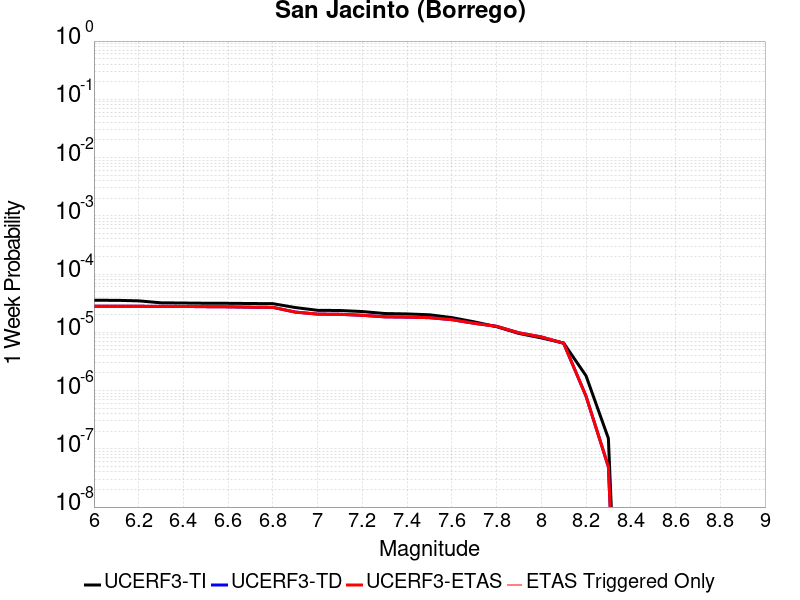 |  |  |  |

| Magnitude | 1 wk TI Prob | 1 wk TD Prob | 1 wk ETAS Prob | 1 wk ETAS/TD Gain | 1 wk ETAS Triggered Only | 1 mo TI Prob | 1 mo TD Prob | 1 mo ETAS Prob | 1 mo ETAS/TD Gain | 1 mo ETAS Triggered Only | 1 yr TI Prob | 1 yr TD Prob | 1 yr ETAS Prob | 1 yr ETAS/TD Gain | 1 yr ETAS Triggered Only | 10 yr TI Prob | 10 yr TD Prob | 10 yr ETAS Prob | 10 yr ETAS/TD Gain | 10 yr ETAS Triggered Only |
|-----|-----|-----|-----|-----|-----|-----|-----|-----|-----|-----|-----|-----|-----|-----|-----|-----|-----|-----|-----|-----|
| 6.0 | 3.543992E-5 | 2.7988392E-5 | 2.7988392E-5 | 1.0 | 0.0 | 1.5187653E-4 | 1.1994481E-4 | 1.382218E-4 | 1.1523784 | 1.8279197E-5 | 0.0018475284 | 0.001459362 | 0.001495867 | 1.0250144 | 3.6558395E-5 | 0.018322436 | 0.014901815 | 0.014937828 | 1.0024167 | 3.6558395E-5 |
| 6.1 | 3.542281E-5 | 2.7988392E-5 | 2.7988392E-5 | 1.0 | 0.0 | 1.5180321E-4 | 1.1994481E-4 | 1.382218E-4 | 1.1523784 | 1.8279197E-5 | 0.0018466372 | 0.001459362 | 0.001495867 | 1.0250144 | 3.6558395E-5 | 0.018313672 | 0.014901815 | 0.014937828 | 1.0024167 | 3.6558395E-5 |
| 6.2 | 3.4688688E-5 | 2.7988392E-5 | 2.7988392E-5 | 1.0 | 0.0 | 1.4865733E-4 | 1.199448E-4 | 1.382218E-4 | 1.1523784 | 1.8279197E-5 | 0.0018084005 | 0.001459362 | 0.001495867 | 1.0250144 | 3.6558395E-5 | 0.017937548 | 0.014901815 | 0.014937828 | 1.0024167 | 3.6558395E-5 |
| 6.3 | 3.2087122E-5 | 2.7833707E-5 | 2.7833707E-5 | 1.0 | 0.0 | 1.3750899E-4 | 1.1928193E-4 | 1.3755895E-4 | 1.1532253 | 1.8279197E-5 | 0.0016728862 | 0.0014513023 | 0.0014878076 | 1.0251535 | 3.6558395E-5 | 0.016603488 | 0.014822833 | 0.01485885 | 1.0024298 | 3.6558395E-5 |
| 6.4 | 3.1828724E-5 | 2.7800681E-5 | 2.7800681E-5 | 1.0 | 0.0 | 1.364017E-4 | 1.1914041E-4 | 1.3741743E-4 | 1.1534073 | 1.8279197E-5 | 0.0016594254 | 0.0014495815 | 0.0014860869 | 1.0251834 | 3.6558395E-5 | 0.016470885 | 0.014805906 | 0.0148419235 | 1.0024326 | 3.6558395E-5 |
| 6.5 | 3.1563577E-5 | 2.7540304E-5 | 2.7540304E-5 | 1.0 | 0.0 | 1.3526545E-4 | 1.18024596E-4 | 1.3630163E-4 | 1.1548579 | 1.8279197E-5 | 0.0016456128 | 0.0014360145 | 0.0014725204 | 1.0254216 | 3.6558395E-5 | 0.0163348 | 0.014672448 | 0.01470847 | 1.0024551 | 3.6558395E-5 |
| 6.6 | 3.1467625E-5 | 2.7384483E-5 | 2.7384483E-5 | 1.0 | 0.0 | 1.3485427E-4 | 1.1735686E-4 | 1.356339E-4 | 1.1557391 | 1.8279197E-5 | 0.0016406142 | 0.0014278955 | 0.0014644016 | 1.0255665 | 3.6558395E-5 | 0.016285548 | 0.014592675 | 0.014628699 | 1.0024687 | 3.6558395E-5 |
| 6.7 | 3.1223695E-5 | 2.700241E-5 | 2.700241E-5 | 1.0 | 0.0 | 1.3380898E-4 | 1.1571955E-4 | 1.3399663E-4 | 1.1579429 | 1.8279197E-5 | 0.0016279068 | 0.0014079871 | 0.001444494 | 1.0259285 | 3.6558395E-5 | 0.01616033 | 0.014397007 | 0.014433039 | 1.0025028 | 3.6558395E-5 |
| 6.8 | 3.1015585E-5 | 2.6823313E-5 | 2.6823313E-5 | 1.0 | 0.0 | 1.3291716E-4 | 1.1495206E-4 | 1.3322916E-4 | 1.1589975 | 1.8279197E-5 | 0.001617065 | 0.0013986549 | 0.0014351622 | 1.0261017 | 3.6558395E-5 | 0.016053487 | 0.014304237 | 0.014340272 | 1.0025192 | 3.6558395E-5 |
| 6.9 | 2.6641965E-5 | 2.224212E-5 | 2.224212E-5 | 1.0 | 0.0 | 1.1417485E-4 | 9.531991E-5 | 1.13597365E-4 | 1.1917485 | 1.8279197E-5 | 0.0013891924 | 0.001159906 | 0.001196422 | 1.0314819 | 3.6558395E-5 | 0.0138054015 | 0.011912661 | 0.011948784 | 1.0030323 | 3.6558395E-5 |
| 7.0 | 2.3854353E-5 | 2.0534853E-5 | 2.0534853E-5 | 1.0 | 0.0 | 1.02228936E-4 | 8.800356E-5 | 1.0628115E-4 | 1.2076914 | 1.8279197E-5 | 0.0012439266 | 0.0010709192 | 0.0011074385 | 1.0341009 | 3.6558395E-5 | 0.012369866 | 0.011011972 | 0.011048128 | 1.0032833 | 3.6558395E-5 |
| 7.1 | 2.3672901E-5 | 2.0371283E-5 | 2.0371283E-5 | 1.0 | 0.0 | 1.0145135E-4 | 8.730259E-5 | 1.0558019E-4 | 1.2093592 | 1.8279197E-5 | 0.0012344702 | 0.0010623933 | 0.0010989129 | 1.0343748 | 3.6558395E-5 | 0.0122763505 | 0.010927122 | 0.010963281 | 1.0033091 | 3.6558395E-5 |
| 7.2 | 2.2717244E-5 | 1.9598208E-5 | 1.9598208E-5 | 1.0 | 0.0 | 9.735599E-5 | 8.398963E-5 | 1.02267295E-4 | 1.2176181 | 1.8279197E-5 | 0.0011846646 | 0.0010220964 | 0.0010586174 | 1.0357314 | 3.6558395E-5 | 0.01178369 | 0.010524263 | 0.010560436 | 1.0034372 | 3.6558395E-5 |
| 7.3 | 2.1016205E-5 | 1.8439077E-5 | 1.8439077E-5 | 1.0 | 0.0 | 9.006634E-5 | 7.902224E-5 | 9.729999E-5 | 1.2312988 | 1.8279197E-5 | 0.001096006 | 9.6167315E-4 | 9.981964E-4 | 1.0379789 | 3.6558395E-5 | 0.010906163 | 0.009919509 | 0.009955705 | 1.003649 | 3.6558395E-5 |
| 7.4 | 2.0683625E-5 | 1.824144E-5 | 1.824144E-5 | 1.0 | 0.0 | 8.86411E-5 | 7.8175275E-5 | 9.645304E-5 | 1.233805 | 1.8279197E-5 | 0.001078671 | 9.513704E-4 | 9.87894E-4 | 1.0383905 | 3.6558395E-5 | 0.010734501 | 0.009816155 | 0.009852354 | 1.0036877 | 3.6558395E-5 |
| 7.5 | 1.9993966E-5 | 1.7835999E-5 | 1.7835999E-5 | 1.0 | 0.0 | 8.568561E-5 | 7.643777E-5 | 9.4715564E-5 | 1.23912 | 1.8279197E-5 | 0.001042723 | 9.302345E-4 | 9.667589E-4 | 1.0392636 | 3.6558395E-5 | 0.010378438 | 0.009602838 | 0.009639046 | 1.0037705 | 3.6558395E-5 |
| 7.6 | 1.788966E-5 | 1.6487877E-5 | 1.6487877E-5 | 1.0 | 0.0 | 7.666772E-5 | 7.066042E-5 | 8.893832E-5 | 1.2586725 | 1.8279197E-5 | 9.3302975E-4 | 8.599528E-4 | 8.964798E-4 | 1.0424756 | 3.6558395E-5 | 0.00929122 | 0.008894032 | 0.008930266 | 1.0040739 | 3.6558395E-5 |
| 7.7 | 1.5125781E-5 | 1.4288167E-5 | 1.4288167E-5 | 1.0 | 0.0 | 6.4823165E-5 | 6.123357E-5 | 7.951165E-5 | 1.2984977 | 1.8279197E-5 | 7.889362E-4 | 7.452645E-4 | 7.8179565E-4 | 1.0490177 | 3.6558395E-5 | 0.007861412 | 0.007740845 | 0.0077771205 | 1.0046862 | 3.6558395E-5 |
| 7.8 | 1.250089E-5 | 1.267947E-5 | 1.267947E-5 | 1.0 | 0.0 | 5.3574146E-5 | 5.4339456E-5 | 7.261766E-5 | 1.3363707 | 1.8279197E-5 | 6.5207E-4 | 6.613827E-4 | 6.979169E-4 | 1.0552392 | 3.6558395E-5 | 0.006501599 | 0.0068934793 | 0.0069297855 | 1.0052668 | 3.6558395E-5 |
| 7.9 | 9.561E-6 | 9.7982065E-6 | 9.7982065E-6 | 1.0 | 0.0 | 4.0975072E-5 | 4.1991643E-5 | 6.027007E-5 | 1.4352874 | 1.8279197E-5 | 4.987573E-4 | 5.1112886E-4 | 5.476686E-4 | 1.0714883 | 3.6558395E-5 | 0.0049763937 | 0.005375308 | 0.0054116696 | 1.0067647 | 3.6558395E-5 |
| 8.0 | 8.01699E-6 | 8.333213E-6 | 8.333213E-6 | 1.0 | 0.0 | 3.4358076E-5 | 3.5713285E-5 | 5.399183E-5 | 1.5118135 | 1.8279197E-5 | 4.1822926E-4 | 4.3472304E-4 | 4.7126552E-4 | 1.0840592 | 3.6558395E-5 | 0.0041744304 | 0.0045943363 | 0.0046307268 | 1.0079207 | 3.6558395E-5 |
| 8.1 | 6.541947E-6 | 6.4949995E-6 | 6.4949995E-6 | 1.0 | 0.0 | 2.8036617E-5 | 2.7835418E-5 | 4.6114106E-5 | 1.6566701 | 1.8279197E-5 | 3.4129233E-4 | 3.3884402E-4 | 3.7539002E-4 | 1.107855 | 3.6558395E-5 | 0.0034076865 | 0.0035980614 | 0.0036344882 | 1.010124 | 3.6558395E-5 |
| 8.2 | 1.7968189E-6 | 8.031198E-7 | 8.031198E-7 | 1.0 | 0.0 | 7.70063E-6 | 3.4419375E-6 | 3.4419375E-6 | 1.0 | 0.0 | 9.3751136E-5 | 4.190481E-5 | 4.190481E-5 | 1.0 | 0.0 | 9.371159E-4 | 4.7456074E-4 | 4.7456074E-4 | 1.0 | 0.0 |
| 8.3 | 1.5167889E-7 | 4.9405415E-8 | 4.9405415E-8 | 1.0 | 0.0 | 6.500522E-7 | 2.1173749E-7 | 2.1173749E-7 | 1.0 | 0.0 | 7.9143565E-6 | 2.5779011E-6 | 2.5779011E-6 | 1.0 | 0.0 | 7.914075E-5 | 2.9940562E-5 | 2.9940562E-5 | 1.0 | 0.0 |

## Owens Valley Keough Hot Springs
*[(top)](#table-of-contents)*

| 1 Week | 1 Month | 1 Year | 10 Year |
|-----|-----|-----|-----|
|  |  |  |  |

| Magnitude | 1 wk TI Prob | 1 wk TD Prob | 1 wk ETAS Prob | 1 wk ETAS/TD Gain | 1 wk ETAS Triggered Only | 1 mo TI Prob | 1 mo TD Prob | 1 mo ETAS Prob | 1 mo ETAS/TD Gain | 1 mo ETAS Triggered Only | 1 yr TI Prob | 1 yr TD Prob | 1 yr ETAS Prob | 1 yr ETAS/TD Gain | 1 yr ETAS Triggered Only | 10 yr TI Prob | 10 yr TD Prob | 10 yr ETAS Prob | 10 yr ETAS/TD Gain | 10 yr ETAS Triggered Only |
|-----|-----|-----|-----|-----|-----|-----|-----|-----|-----|-----|-----|-----|-----|-----|-----|-----|-----|-----|-----|-----|
| 6.0 | 1.5708529E-5 | 4.9520045E-6 | 4.9520045E-6 | 1.0 | 0.0 | 6.7320536E-5 | 2.1222733E-5 | 2.1222733E-5 | 1.0 | 0.0 | 8.193192E-4 | 2.5836125E-4 | 2.7663572E-4 | 1.0707322 | 1.8279197E-5 | 0.008163051 | 0.002581269 | 0.002599501 | 1.0070632 | 1.8279197E-5 |
| 6.1 | 1.5708529E-5 | 4.9520045E-6 | 4.9520045E-6 | 1.0 | 0.0 | 6.7320536E-5 | 2.1222733E-5 | 2.1222733E-5 | 1.0 | 0.0 | 8.193192E-4 | 2.5836125E-4 | 2.7663572E-4 | 1.0707322 | 1.8279197E-5 | 0.008163051 | 0.002581269 | 0.002599501 | 1.0070632 | 1.8279197E-5 |
| 6.2 | 1.5708529E-5 | 4.9520045E-6 | 4.9520045E-6 | 1.0 | 0.0 | 6.7320536E-5 | 2.1222733E-5 | 2.1222733E-5 | 1.0 | 0.0 | 8.193192E-4 | 2.5836125E-4 | 2.7663572E-4 | 1.0707322 | 1.8279197E-5 | 0.008163051 | 0.002581269 | 0.002599501 | 1.0070632 | 1.8279197E-5 |
| 6.3 | 1.5708529E-5 | 4.9520045E-6 | 4.9520045E-6 | 1.0 | 0.0 | 6.7320536E-5 | 2.1222733E-5 | 2.1222733E-5 | 1.0 | 0.0 | 8.193192E-4 | 2.5836125E-4 | 2.7663572E-4 | 1.0707322 | 1.8279197E-5 | 0.008163051 | 0.002581269 | 0.002599501 | 1.0070632 | 1.8279197E-5 |
| 6.4 | 1.4622509E-5 | 3.7277039E-6 | 3.7277039E-6 | 1.0 | 0.0 | 6.266639E-5 | 1.5975795E-5 | 1.5975795E-5 | 1.0 | 0.0 | 7.626962E-4 | 1.9449124E-4 | 2.1276688E-4 | 1.0939664 | 1.8279197E-5 | 0.007600839 | 0.0019436914 | 0.001961935 | 1.0093861 | 1.8279197E-5 |
| 6.5 | 1.3335527E-5 | 2.2787071E-6 | 2.2787071E-6 | 1.0 | 0.0 | 5.7151006E-5 | 9.765855E-6 | 9.765855E-6 | 1.0 | 0.0 | 6.955913E-4 | 1.18893484E-4 | 1.371705E-4 | 1.153726 | 1.8279197E-5 | 0.0069341804 | 0.0011885226 | 0.0012067801 | 1.0153614 | 1.8279197E-5 |
| 6.6 | 1.3332855E-5 | 2.275856E-6 | 2.275856E-6 | 1.0 | 0.0 | 5.7139558E-5 | 9.753637E-6 | 9.753637E-6 | 1.0 | 0.0 | 6.9545204E-4 | 1.1874474E-4 | 1.3702177E-4 | 1.1539186 | 1.8279197E-5 | 0.0069327964 | 0.0011870367 | 0.0012052943 | 1.0153807 | 1.8279197E-5 |
| 6.7 | 1.3318214E-5 | 2.2650838E-6 | 2.2650838E-6 | 1.0 | 0.0 | 5.707681E-5 | 9.70747E-6 | 9.70747E-6 | 1.0 | 0.0 | 6.946886E-4 | 1.1818272E-4 | 1.3645976E-4 | 1.1546507 | 1.8279197E-5 | 0.0069252094 | 0.0011814225 | 0.00119968 | 1.0154539 | 1.8279197E-5 |
| 6.8 | 1.2441338E-5 | 1.6786275E-6 | 1.6786275E-6 | 1.0 | 0.0 | 5.331893E-5 | 7.1941E-6 | 7.1941E-6 | 1.0 | 0.0 | 6.489646E-4 | 8.7584944E-5 | 1.05862535E-4 | 1.2086842 | 1.8279197E-5 | 0.0064707273 | 8.7569037E-4 | 8.939536E-4 | 1.0208558 | 1.8279197E-5 |
| 6.9 | 1.1130476E-5 | 1.0309606E-6 | 1.0309606E-6 | 1.0 | 0.0 | 4.7701167E-5 | 4.418395E-6 | 4.418395E-6 | 1.0 | 0.0 | 5.806069E-4 | 5.3792646E-5 | 7.2070856E-5 | 1.3397902 | 1.8279197E-5 | 0.0057909233 | 5.379521E-4 | 5.562215E-4 | 1.0339609 | 1.8279197E-5 |
| 7.0 | 1.0986073E-5 | 9.584916E-7 | 9.584916E-7 | 1.0 | 0.0 | 4.7082318E-5 | 4.1078147E-6 | 4.1078147E-6 | 1.0 | 0.0 | 5.730765E-4 | 5.001151E-5 | 6.828979E-5 | 1.3654815 | 1.8279197E-5 | 0.0057160086 | 5.001574E-4 | 5.1842746E-4 | 1.0365286 | 1.8279197E-5 |
| 7.1 | 1.0451338E-5 | 8.0047914E-7 | 8.0047914E-7 | 1.0 | 0.0 | 4.4790682E-5 | 3.4306206E-6 | 3.4306206E-6 | 1.0 | 0.0 | 5.451901E-4 | 4.176701E-5 | 6.0045444E-5 | 1.4376285 | 1.8279197E-5 | 0.005438545 | 4.1774256E-4 | 4.3601412E-4 | 1.0437388 | 1.8279197E-5 |
| 7.2 | 9.989061E-6 | 6.548821E-7 | 6.548821E-7 | 1.0 | 0.0 | 4.280956E-5 | 2.8066345E-6 | 2.8066345E-6 | 1.0 | 0.0 | 5.2108173E-4 | 3.4170243E-5 | 5.2448817E-5 | 1.5349265 | 1.8279197E-5 | 0.0051986156 | 3.4178863E-4 | 3.600616E-4 | 1.0534627 | 1.8279197E-5 |
| 7.3 | 9.465365E-6 | 5.463649E-7 | 5.463649E-7 | 1.0 | 0.0 | 4.056522E-5 | 2.3415619E-6 | 2.3415619E-6 | 1.0 | 0.0 | 4.937696E-4 | 2.8508144E-5 | 4.678682E-5 | 1.6411738 | 1.8279197E-5 | 0.0049267393 | 2.8517874E-4 | 3.0345272E-4 | 1.064079 | 1.8279197E-5 |
| 7.4 | 6.3824805E-6 | 4.0193112E-7 | 4.0193112E-7 | 1.0 | 0.0 | 2.73532E-5 | 1.7225609E-6 | 1.7225609E-6 | 1.0 | 0.0 | 3.3297433E-4 | 2.0971978E-5 | 3.925079E-5 | 1.8715826 | 1.8279197E-5 | 0.0033247585 | 2.0979355E-4 | 2.2806891E-4 | 1.0871111 | 1.8279197E-5 |
| 7.5 | 1.6192645E-6 | 2.5179273E-7 | 2.5179273E-7 | 1.0 | 0.0 | 6.9396865E-6 | 1.0791111E-6 | 1.0791111E-6 | 1.0 | 0.0 | 8.448741E-5 | 1.3138101E-5 | 3.1417057E-5 | 2.3912935 | 1.8279197E-5 | 8.4455294E-4 | 1.3137337E-4 | 1.4965016E-4 | 1.139121 | 1.8279197E-5 |
| 7.6 | 5.7062545E-7 | 1.0799648E-7 | 1.0799648E-7 | 1.0 | 0.0 | 2.4455355E-6 | 4.6284197E-7 | 4.6284197E-7 | 1.0 | 0.0 | 2.9773988E-5 | 5.6350873E-6 | 2.3914181E-5 | 4.2437997 | 1.8279197E-5 | 2.977E-4 | 5.6349527E-5 | 7.462769E-5 | 1.3243712 | 1.8279197E-5 |
| 7.7 | 2.5988817E-7 | 4.5487504E-8 | 4.5487504E-8 | 1.0 | 0.0 | 1.113806E-6 | 1.9494644E-7 | 1.9494644E-7 | 1.0 | 0.0 | 1.3560503E-5 | 2.3734706E-6 | 2.0652624E-5 | 8.701445 | 1.8279197E-5 | 1.3559677E-4 | 2.3734498E-5 | 4.201326E-5 | 1.7701348 | 1.8279197E-5 |

## Sheephole
*[(top)](#table-of-contents)*

| 1 Week | 1 Month | 1 Year | 10 Year |
|-----|-----|-----|-----|
| 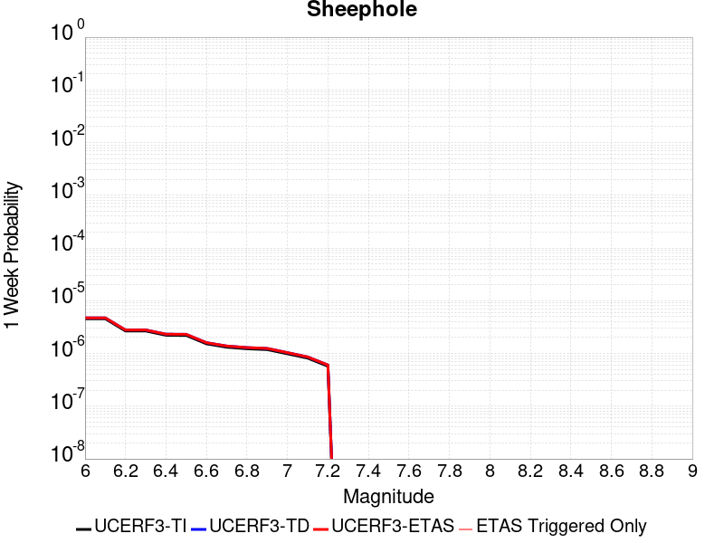 | 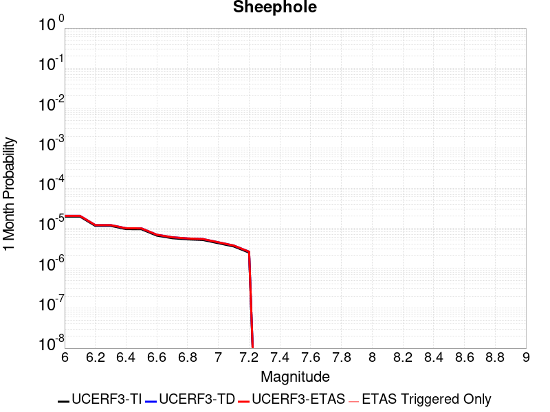 |  |  |

| Magnitude | 1 wk TI Prob | 1 wk TD Prob | 1 wk ETAS Prob | 1 wk ETAS/TD Gain | 1 wk ETAS Triggered Only | 1 mo TI Prob | 1 mo TD Prob | 1 mo ETAS Prob | 1 mo ETAS/TD Gain | 1 mo ETAS Triggered Only | 1 yr TI Prob | 1 yr TD Prob | 1 yr ETAS Prob | 1 yr ETAS/TD Gain | 1 yr ETAS Triggered Only | 10 yr TI Prob | 10 yr TD Prob | 10 yr ETAS Prob | 10 yr ETAS/TD Gain | 10 yr ETAS Triggered Only |
|-----|-----|-----|-----|-----|-----|-----|-----|-----|-----|-----|-----|-----|-----|-----|-----|-----|-----|-----|-----|-----|
| 6.0 | 4.5579695E-6 | 4.741465E-6 | 4.741465E-6 | 1.0 | 0.0 | 1.9534009E-5 | 2.0320438E-5 | 2.0320438E-5 | 1.0 | 0.0 | 2.3780059E-4 | 2.473788E-4 | 2.473788E-4 | 1.0 | 0.0 | 0.0023754628 | 0.0024715788 | 0.0024898127 | 1.0073775 | 1.8279197E-5 |
| 6.1 | 4.5579695E-6 | 4.741465E-6 | 4.741465E-6 | 1.0 | 0.0 | 1.9534009E-5 | 2.0320438E-5 | 2.0320438E-5 | 1.0 | 0.0 | 2.3780059E-4 | 2.473788E-4 | 2.473788E-4 | 1.0 | 0.0 | 0.0023754628 | 0.0024715788 | 0.0024898127 | 1.0073775 | 1.8279197E-5 |
| 6.2 | 2.6677674E-6 | 2.7875271E-6 | 2.7875271E-6 | 1.0 | 0.0 | 1.1433239E-5 | 1.1946496E-5 | 1.1946496E-5 | 1.0 | 0.0 | 1.3919079E-4 | 1.4543996E-4 | 1.4543996E-4 | 1.0 | 0.0 | 0.0013910364 | 0.0014535537 | 0.0014718062 | 1.0125573 | 1.8279197E-5 |
| 6.3 | 2.6677674E-6 | 2.7875271E-6 | 2.7875271E-6 | 1.0 | 0.0 | 1.1433239E-5 | 1.1946496E-5 | 1.1946496E-5 | 1.0 | 0.0 | 1.3919079E-4 | 1.4543996E-4 | 1.4543996E-4 | 1.0 | 0.0 | 0.0013910364 | 0.0014535537 | 0.0014718062 | 1.0125573 | 1.8279197E-5 |
| 6.4 | 2.2159759E-6 | 2.3229977E-6 | 2.3229977E-6 | 1.0 | 0.0 | 9.497005E-6 | 9.955671E-6 | 9.955671E-6 | 1.0 | 0.0 | 1.156199E-4 | 1.2120436E-4 | 1.2120436E-4 | 1.0 | 0.0 | 0.0011555976 | 0.001211462 | 0.0012297189 | 1.0150703 | 1.8279197E-5 |
| 6.5 | 2.1986082E-6 | 2.3048772E-6 | 2.3048772E-6 | 1.0 | 0.0 | 9.4225725E-6 | 9.878012E-6 | 9.878012E-6 | 1.0 | 0.0 | 1.1471378E-4 | 1.2025897E-4 | 1.2025897E-4 | 1.0 | 0.0 | 0.0011465458 | 0.0012020182 | 0.0012202754 | 1.0151888 | 1.8279197E-5 |
| 6.6 | 1.5232331E-6 | 1.6019796E-6 | 1.6019796E-6 | 1.0 | 0.0 | 6.5281256E-6 | 6.86561E-6 | 6.86561E-6 | 1.0 | 0.0 | 7.947703E-5 | 8.3585786E-5 | 8.3585786E-5 | 1.0 | 0.0 | 7.9448614E-4 | 8.355622E-4 | 8.538261E-4 | 1.0218582 | 1.8279197E-5 |
| 6.7 | 1.3137362E-6 | 1.3828962E-6 | 1.3828962E-6 | 1.0 | 0.0 | 5.6302856E-6 | 5.9266854E-6 | 5.9266854E-6 | 1.0 | 0.0 | 6.854657E-5 | 7.215515E-5 | 7.215515E-5 | 1.0 | 0.0 | 6.8525434E-4 | 7.213311E-4 | 7.395971E-4 | 1.0253227 | 1.8279197E-5 |
| 6.8 | 1.2275751E-6 | 1.292357E-6 | 1.292357E-6 | 1.0 | 0.0 | 5.2610258E-6 | 5.5386618E-6 | 5.5386618E-6 | 1.0 | 0.0 | 6.4051106E-5 | 6.7431254E-5 | 6.7431254E-5 | 1.0 | 0.0 | 6.4032647E-4 | 6.7412126E-4 | 6.9238816E-4 | 1.0270973 | 1.8279197E-5 |
| 6.9 | 1.1837088E-6 | 1.2461717E-6 | 1.2461717E-6 | 1.0 | 0.0 | 5.0730278E-6 | 5.3407257E-6 | 5.3407257E-6 | 1.0 | 0.0 | 6.176237E-5 | 6.502153E-5 | 6.502153E-5 | 1.0 | 0.0 | 6.17452E-4 | 6.500382E-4 | 6.683055E-4 | 1.0281019 | 1.8279197E-5 |
| 7.0 | 9.849371E-7 | 1.0366865E-6 | 1.0366865E-6 | 1.0 | 0.0 | 4.2211523E-6 | 4.4429353E-6 | 4.4429353E-6 | 1.0 | 0.0 | 5.1391315E-5 | 5.40915E-5 | 5.40915E-5 | 1.0 | 0.0 | 5.137943E-4 | 5.407934E-4 | 5.407934E-4 | 1.0 | 0.0 |
| 7.1 | 8.1643645E-7 | 8.592146E-7 | 8.592146E-7 | 1.0 | 0.0 | 3.4990085E-6 | 3.6823437E-6 | 3.6823437E-6 | 1.0 | 0.0 | 4.2599597E-5 | 4.48317E-5 | 4.48317E-5 | 1.0 | 0.0 | 4.259143E-4 | 4.4823517E-4 | 4.4823517E-4 | 1.0 | 0.0 |
| 7.2 | 5.7295756E-7 | 6.029837E-7 | 6.029837E-7 | 1.0 | 0.0 | 2.45553E-6 | 2.5842137E-6 | 2.5842137E-6 | 1.0 | 0.0 | 2.9895667E-5 | 3.1462416E-5 | 3.1462416E-5 | 1.0 | 0.0 | 2.9891645E-4 | 3.145863E-4 | 3.145863E-4 | 1.0 | 0.0 |

## Elmore Ranch
*[(top)](#table-of-contents)*

| 1 Week | 1 Month | 1 Year | 10 Year |
|-----|-----|-----|-----|
|  |  |  |  |

| Magnitude | 1 wk TI Prob | 1 wk TD Prob | 1 wk ETAS Prob | 1 wk ETAS/TD Gain | 1 wk ETAS Triggered Only | 1 mo TI Prob | 1 mo TD Prob | 1 mo ETAS Prob | 1 mo ETAS/TD Gain | 1 mo ETAS Triggered Only | 1 yr TI Prob | 1 yr TD Prob | 1 yr ETAS Prob | 1 yr ETAS/TD Gain | 1 yr ETAS Triggered Only | 10 yr TI Prob | 10 yr TD Prob | 10 yr ETAS Prob | 10 yr ETAS/TD Gain | 10 yr ETAS Triggered Only |
|-----|-----|-----|-----|-----|-----|-----|-----|-----|-----|-----|-----|-----|-----|-----|-----|-----|-----|-----|-----|-----|
| 6.0 | 9.102099E-5 | 8.956844E-5 | 8.956844E-5 | 1.0 | 0.0 | 3.9003167E-4 | 3.8381395E-4 | 3.8381395E-4 | 1.0 | 0.0 | 0.0047383 | 0.0046644 | 0.004682594 | 1.0039006 | 1.8279197E-5 | 0.046385348 | 0.04589023 | 0.045907672 | 1.00038 | 1.8279197E-5 |
| 6.1 | 3.8306698E-5 | 4.1517887E-5 | 4.1517887E-5 | 1.0 | 0.0 | 1.6416123E-4 | 1.7792576E-4 | 1.7792576E-4 | 1.0 | 0.0 | 0.0019968306 | 0.0021639827 | 0.0021822224 | 1.0084287 | 1.8279197E-5 | 0.019789828 | 0.02163723 | 0.021655113 | 1.0008265 | 1.8279197E-5 |
| 6.2 | 3.8306698E-5 | 4.1517887E-5 | 4.1517887E-5 | 1.0 | 0.0 | 1.6416123E-4 | 1.7792576E-4 | 1.7792576E-4 | 1.0 | 0.0 | 0.0019968306 | 0.0021639827 | 0.0021822224 | 1.0084287 | 1.8279197E-5 | 0.019789828 | 0.02163723 | 0.021655113 | 1.0008265 | 1.8279197E-5 |
| 6.3 | 3.3197924E-5 | 3.656958E-5 | 3.656958E-5 | 1.0 | 0.0 | 1.4226905E-4 | 1.5672133E-4 | 1.5672133E-4 | 1.0 | 0.0 | 0.0017307495 | 0.0019066149 | 0.0019248592 | 1.0095689 | 1.8279197E-5 | 0.017173318 | 0.019097272 | 0.019115204 | 1.0009389 | 1.8279197E-5 |
| 6.4 | 2.5148964E-5 | 2.7429849E-5 | 2.7429849E-5 | 1.0 | 0.0 | 1.0777682E-4 | 1.1755485E-4 | 1.1755485E-4 | 1.0 | 0.0 | 0.0013113929 | 0.0014309391 | 0.0014491922 | 1.012756 | 1.8279197E-5 | 0.01303681 | 0.014392035 | 0.0144100515 | 1.0012518 | 1.8279197E-5 |
| 6.5 | 2.5148964E-5 | 2.7429849E-5 | 2.7429849E-5 | 1.0 | 0.0 | 1.0777682E-4 | 1.1755485E-4 | 1.1755485E-4 | 1.0 | 0.0 | 0.0013113929 | 0.0014309391 | 0.0014491922 | 1.012756 | 1.8279197E-5 | 0.01303681 | 0.014392035 | 0.0144100515 | 1.0012518 | 1.8279197E-5 |

## Pleito
*[(top)](#table-of-contents)*

| 1 Week | 1 Month | 1 Year | 10 Year |
|-----|-----|-----|-----|
|  |  |  |  |

| Magnitude | 1 wk TI Prob | 1 wk TD Prob | 1 wk ETAS Prob | 1 wk ETAS/TD Gain | 1 wk ETAS Triggered Only | 1 mo TI Prob | 1 mo TD Prob | 1 mo ETAS Prob | 1 mo ETAS/TD Gain | 1 mo ETAS Triggered Only | 1 yr TI Prob | 1 yr TD Prob | 1 yr ETAS Prob | 1 yr ETAS/TD Gain | 1 yr ETAS Triggered Only | 10 yr TI Prob | 10 yr TD Prob | 10 yr ETAS Prob | 10 yr ETAS/TD Gain | 10 yr ETAS Triggered Only |
|-----|-----|-----|-----|-----|-----|-----|-----|-----|-----|-----|-----|-----|-----|-----|-----|-----|-----|-----|-----|-----|
| 6.0 | 1.6763008E-5 | 2.4817215E-5 | 2.4817215E-5 | 1.0 | 0.0 | 7.183948E-5 | 1.0635556E-4 | 1.0635556E-4 | 1.0 | 0.0 | 8.742947E-4 | 0.0012941818 | 0.0013124374 | 1.0141058 | 1.8279197E-5 | 0.00870863 | 0.012980835 | 0.012998877 | 1.0013899 | 1.8279197E-5 |
| 6.1 | 1.6763008E-5 | 2.4817215E-5 | 2.4817215E-5 | 1.0 | 0.0 | 7.183948E-5 | 1.0635556E-4 | 1.0635556E-4 | 1.0 | 0.0 | 8.742947E-4 | 0.0012941818 | 0.0013124374 | 1.0141058 | 1.8279197E-5 | 0.00870863 | 0.012980835 | 0.012998877 | 1.0013899 | 1.8279197E-5 |
| 6.2 | 1.6763008E-5 | 2.4817215E-5 | 2.4817215E-5 | 1.0 | 0.0 | 7.183948E-5 | 1.0635556E-4 | 1.0635556E-4 | 1.0 | 0.0 | 8.742947E-4 | 0.0012941818 | 0.0013124374 | 1.0141058 | 1.8279197E-5 | 0.00870863 | 0.012980835 | 0.012998877 | 1.0013899 | 1.8279197E-5 |
| 6.3 | 1.6763008E-5 | 2.4817215E-5 | 2.4817215E-5 | 1.0 | 0.0 | 7.183948E-5 | 1.0635556E-4 | 1.0635556E-4 | 1.0 | 0.0 | 8.742947E-4 | 0.0012941818 | 0.0013124374 | 1.0141058 | 1.8279197E-5 | 0.00870863 | 0.012980835 | 0.012998877 | 1.0013899 | 1.8279197E-5 |
| 6.4 | 1.6763008E-5 | 2.4817215E-5 | 2.4817215E-5 | 1.0 | 0.0 | 7.183948E-5 | 1.0635556E-4 | 1.0635556E-4 | 1.0 | 0.0 | 8.742947E-4 | 0.0012941818 | 0.0013124374 | 1.0141058 | 1.8279197E-5 | 0.00870863 | 0.012980835 | 0.012998877 | 1.0013899 | 1.8279197E-5 |
| 6.5 | 1.6763008E-5 | 2.4817215E-5 | 2.4817215E-5 | 1.0 | 0.0 | 7.183948E-5 | 1.0635556E-4 | 1.0635556E-4 | 1.0 | 0.0 | 8.742947E-4 | 0.0012941818 | 0.0013124374 | 1.0141058 | 1.8279197E-5 | 0.00870863 | 0.012980835 | 0.012998877 | 1.0013899 | 1.8279197E-5 |
| 6.6 | 9.910213E-6 | 1.7267184E-5 | 1.7267184E-5 | 1.0 | 0.0 | 4.247165E-5 | 7.400014E-5 | 7.400014E-5 | 1.0 | 0.0 | 5.169696E-4 | 9.0058305E-4 | 9.188458E-4 | 1.0202788 | 1.8279197E-5 | 0.0051576863 | 0.00907733 | 0.009095443 | 1.0019954 | 1.8279197E-5 |
| 6.7 | 9.910213E-6 | 1.7267184E-5 | 1.7267184E-5 | 1.0 | 0.0 | 4.247165E-5 | 7.400014E-5 | 7.400014E-5 | 1.0 | 0.0 | 5.169696E-4 | 9.0058305E-4 | 9.188458E-4 | 1.0202788 | 1.8279197E-5 | 0.0051576863 | 0.00907733 | 0.009095443 | 1.0019954 | 1.8279197E-5 |
| 6.8 | 8.300162E-6 | 1.5526644E-5 | 1.5526644E-5 | 1.0 | 0.0 | 3.557164E-5 | 6.654107E-5 | 6.654107E-5 | 1.0 | 0.0 | 4.3299864E-4 | 8.098379E-4 | 8.281023E-4 | 1.0225532 | 1.8279197E-5 | 0.004321559 | 0.008176714 | 0.008194843 | 1.0022173 | 1.8279197E-5 |
| 6.9 | 8.183114E-6 | 1.5397836E-5 | 1.5397836E-5 | 1.0 | 0.0 | 3.5070017E-5 | 6.5989065E-5 | 6.5989065E-5 | 1.0 | 0.0 | 4.2689382E-4 | 8.031221E-4 | 8.2138664E-4 | 1.0227419 | 1.8279197E-5 | 0.0042607468 | 0.008110048 | 0.008128179 | 1.0022357 | 1.8279197E-5 |
| 7.0 | 7.1748823E-6 | 1.4184168E-5 | 1.4184168E-5 | 1.0 | 0.0 | 3.0749135E-5 | 6.078788E-5 | 6.078788E-5 | 1.0 | 0.0 | 3.743064E-4 | 7.3984166E-4 | 7.3984166E-4 | 1.0 | 0.0 | 0.0037367654 | 0.0074811797 | 0.0074811797 | 1.0 | 0.0 |
| 7.1 | 7.1671807E-6 | 1.4174532E-5 | 1.4174532E-5 | 1.0 | 0.0 | 3.0716128E-5 | 6.074658E-5 | 6.074658E-5 | 1.0 | 0.0 | 3.7390468E-4 | 7.393392E-4 | 7.393392E-4 | 1.0 | 0.0 | 0.0037327618 | 0.0074761887 | 0.0074761887 | 1.0 | 0.0 |
| 7.2 | 7.0649667E-6 | 1.4021652E-5 | 1.4021652E-5 | 1.0 | 0.0 | 3.0278077E-5 | 6.009141E-5 | 6.009141E-5 | 1.0 | 0.0 | 3.6857324E-4 | 7.3136785E-4 | 7.3136785E-4 | 1.0 | 0.0 | 0.0036796255 | 0.0073968605 | 0.0073968605 | 1.0 | 0.0 |
| 7.3 | 7.02082E-6 | 1.39650065E-5 | 1.39650065E-5 | 1.0 | 0.0 | 3.008888E-5 | 5.984866E-5 | 5.984866E-5 | 1.0 | 0.0 | 3.6627054E-4 | 7.2841434E-4 | 7.2841434E-4 | 1.0 | 0.0 | 0.0036566744 | 0.007367309 | 0.007367309 | 1.0 | 0.0 |
| 7.4 | 6.987146E-6 | 1.3924511E-5 | 1.3924511E-5 | 1.0 | 0.0 | 2.9944567E-5 | 5.9675116E-5 | 5.9675116E-5 | 1.0 | 0.0 | 3.6451413E-4 | 7.2630285E-4 | 7.2630285E-4 | 1.0 | 0.0 | 0.0036391679 | 0.007346216 | 0.007346216 | 1.0 | 0.0 |
| 7.5 | 6.9494554E-6 | 1.3881374E-5 | 1.3881374E-5 | 1.0 | 0.0 | 2.9783041E-5 | 5.949025E-5 | 5.949025E-5 | 1.0 | 0.0 | 3.625482E-4 | 7.240536E-4 | 7.240536E-4 | 1.0 | 0.0 | 0.0036195726 | 0.007323823 | 0.007323823 | 1.0 | 0.0 |
| 7.6 | 6.92694E-6 | 1.3840408E-5 | 1.3840408E-5 | 1.0 | 0.0 | 2.9686547E-5 | 5.931469E-5 | 5.931469E-5 | 1.0 | 0.0 | 3.6137376E-4 | 7.219176E-4 | 7.219176E-4 | 1.0 | 0.0 | 0.0036078666 | 0.007302536 | 0.007302536 | 1.0 | 0.0 |
| 7.7 | 6.395867E-6 | 1.2717309E-5 | 1.2717309E-5 | 1.0 | 0.0 | 2.741057E-5 | 5.4501616E-5 | 5.4501616E-5 | 1.0 | 0.0 | 3.336726E-4 | 6.6335546E-4 | 6.6335546E-4 | 1.0 | 0.0 | 0.0033317201 | 0.006720112 | 0.006720112 | 1.0 | 0.0 |
| 7.8 | 5.8664327E-6 | 1.1580689E-5 | 1.1580689E-5 | 1.0 | 0.0 | 2.5141611E-5 | 4.963058E-5 | 4.963058E-5 | 1.0 | 0.0 | 3.060561E-4 | 6.04085E-4 | 6.04085E-4 | 1.0 | 0.0 | 0.0030563495 | 0.0061234487 | 0.0061234487 | 1.0 | 0.0 |
| 7.9 | 3.7167474E-6 | 7.1412105E-6 | 7.1412105E-6 | 1.0 | 0.0 | 1.592882E-5 | 3.0604828E-5 | 3.0604828E-5 | 1.0 | 0.0 | 1.9391612E-4 | 3.7255025E-4 | 3.7255025E-4 | 1.0 | 0.0 | 0.0019374699 | 0.0037812905 | 0.0037812905 | 1.0 | 0.0 |
| 8.0 | 1.0903841E-6 | 1.2938989E-6 | 1.2938989E-6 | 1.0 | 0.0 | 4.6730665E-6 | 5.5452692E-6 | 5.5452692E-6 | 1.0 | 0.0 | 5.68931E-5 | 6.751157E-5 | 6.751157E-5 | 1.0 | 0.0 | 5.6878536E-4 | 6.973253E-4 | 6.973253E-4 | 1.0 | 0.0 |
| 8.1 | 2.6894583E-7 | 1.1161137E-7 | 1.1161137E-7 | 1.0 | 0.0 | 1.1526245E-6 | 4.7833436E-7 | 4.7833436E-7 | 1.0 | 0.0 | 1.4033113E-5 | 5.8237056E-6 | 5.8237056E-6 | 1.0 | 0.0 | 1.4032227E-4 | 6.513194E-5 | 6.513194E-5 | 1.0 | 0.0 |
| 8.2 | 5.2967013E-9 | 2.481935E-9 | 2.481935E-9 | 1.0 | 0.0 | 2.2700148E-8 | 1.0636864E-8 | 1.0636864E-8 | 1.0 | 0.0 | 2.7637427E-7 | 1.2950382E-7 | 1.2950382E-7 | 1.0 | 0.0 | 2.7637393E-6 | 1.4727569E-6 | 1.4727569E-6 | 1.0 | 0.0 |

## San Jacinto (Superstition Mtn)
*[(top)](#table-of-contents)*

| 1 Week | 1 Month | 1 Year | 10 Year |
|-----|-----|-----|-----|
|  |  | 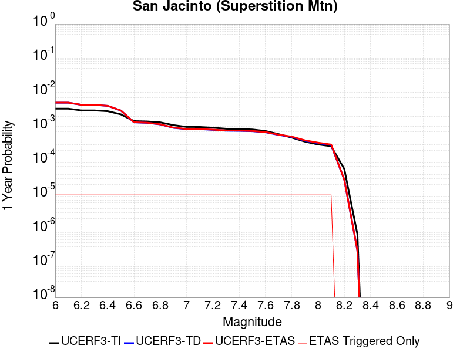 |  |

| Magnitude | 1 wk TI Prob | 1 wk TD Prob | 1 wk ETAS Prob | 1 wk ETAS/TD Gain | 1 wk ETAS Triggered Only | 1 mo TI Prob | 1 mo TD Prob | 1 mo ETAS Prob | 1 mo ETAS/TD Gain | 1 mo ETAS Triggered Only | 1 yr TI Prob | 1 yr TD Prob | 1 yr ETAS Prob | 1 yr ETAS/TD Gain | 1 yr ETAS Triggered Only | 10 yr TI Prob | 10 yr TD Prob | 10 yr ETAS Prob | 10 yr ETAS/TD Gain | 10 yr ETAS Triggered Only |
|-----|-----|-----|-----|-----|-----|-----|-----|-----|-----|-----|-----|-----|-----|-----|-----|-----|-----|-----|-----|-----|
| 6.0 | 6.4193904E-5 | 9.60538E-5 | 9.60538E-5 | 1.0 | 0.0 | 2.7508775E-4 | 4.11604E-4 | 4.11604E-4 | 1.0 | 0.0 | 0.0033440501 | 0.005001081 | 0.005019269 | 1.0036367 | 1.8279197E-5 | 0.03294174 | 0.048852775 | 0.048870165 | 1.0003558 | 1.8279197E-5 |
| 6.1 | 6.4193904E-5 | 9.60538E-5 | 9.60538E-5 | 1.0 | 0.0 | 2.7508775E-4 | 4.11604E-4 | 4.11604E-4 | 1.0 | 0.0 | 0.0033440501 | 0.005001081 | 0.005019269 | 1.0036367 | 1.8279197E-5 | 0.03294174 | 0.048852775 | 0.048870165 | 1.0003558 | 1.8279197E-5 |
| 6.2 | 5.7023593E-5 | 8.319899E-5 | 8.319899E-5 | 1.0 | 0.0 | 2.4436394E-4 | 3.565278E-4 | 3.565278E-4 | 1.0 | 0.0 | 0.002971072 | 0.0043337136 | 0.0043519135 | 1.0041996 | 1.8279197E-5 | 0.029316625 | 0.042531293 | 0.042548794 | 1.0004115 | 1.8279197E-5 |
| 6.3 | 5.6940098E-5 | 8.304432E-5 | 8.304432E-5 | 1.0 | 0.0 | 2.4400617E-4 | 3.5586508E-4 | 3.5586508E-4 | 1.0 | 0.0 | 0.002966728 | 0.004325677 | 0.004343877 | 1.0042075 | 1.8279197E-5 | 0.029274331 | 0.04245453 | 0.042472035 | 1.0004122 | 1.8279197E-5 |
| 6.4 | 5.4171585E-5 | 7.753727E-5 | 7.753727E-5 | 1.0 | 0.0 | 2.3214328E-4 | 3.3226956E-4 | 3.3226956E-4 | 1.0 | 0.0 | 0.0028226813 | 0.0040395265 | 0.004057732 | 1.0045068 | 1.8279197E-5 | 0.02787096 | 0.039743558 | 0.03976111 | 1.0004417 | 1.8279197E-5 |
| 6.5 | 4.375144E-5 | 5.6473516E-5 | 5.6473516E-5 | 1.0 | 0.0 | 1.874927E-4 | 2.4201353E-4 | 2.4201353E-4 | 1.0 | 0.0 | 0.0022803338 | 0.0029437093 | 0.0029619348 | 1.0061913 | 1.8279197E-5 | 0.022570757 | 0.0292634 | 0.029281143 | 1.0006064 | 1.8279197E-5 |
| 6.6 | 2.772192E-5 | 2.5538078E-5 | 2.5538078E-5 | 1.0 | 0.0 | 1.1880282E-4 | 1.0944443E-4 | 1.0944443E-4 | 1.0 | 0.0 | 0.0014454646 | 0.0013316908 | 0.0013499457 | 1.013708 | 1.8279197E-5 | 0.014360986 | 0.01356631 | 0.013584341 | 1.0013291 | 1.8279197E-5 |
| 6.7 | 2.7124124E-5 | 2.4748882E-5 | 2.4748882E-5 | 1.0 | 0.0 | 1.1624106E-4 | 1.06062434E-4 | 1.06062434E-4 | 1.0 | 0.0 | 0.0014143161 | 0.0012905644 | 0.0013088201 | 1.0141455 | 1.8279197E-5 | 0.014053487 | 0.013159662 | 0.0131777 | 1.0013708 | 1.8279197E-5 |
| 6.8 | 2.5475807E-5 | 2.2212787E-5 | 2.2212787E-5 | 1.0 | 0.0 | 1.0917746E-4 | 9.519425E-5 | 9.519425E-5 | 1.0 | 0.0 | 0.001328425 | 0.0011583858 | 0.0011766438 | 1.0157616 | 1.8279197E-5 | 0.0132051185 | 0.011847346 | 0.011865409 | 1.0015246 | 1.8279197E-5 |
| 6.9 | 2.1162023E-5 | 1.7670965E-5 | 1.7670965E-5 | 1.0 | 0.0 | 9.069123E-5 | 7.573053E-5 | 7.573053E-5 | 1.0 | 0.0 | 0.0011036064 | 9.2163304E-4 | 9.3989534E-4 | 1.0198152 | 1.8279197E-5 | 0.010981417 | 0.009470261 | 0.009488367 | 1.0019119 | 1.8279197E-5 |
| 7.0 | 1.8754288E-5 | 1.6204316E-5 | 1.6204316E-5 | 1.0 | 0.0 | 8.037304E-5 | 6.944524E-5 | 6.944524E-5 | 1.0 | 0.0 | 9.781026E-4 | 8.4517023E-4 | 8.63434E-4 | 1.0216095 | 1.8279197E-5 | 0.009738087 | 0.008692401 | 0.008710522 | 1.0020846 | 1.8279197E-5 |
| 7.1 | 1.8678527E-5 | 1.612942E-5 | 1.612942E-5 | 1.0 | 0.0 | 8.0048376E-5 | 6.912426E-5 | 6.912426E-5 | 1.0 | 0.0 | 9.7415317E-4 | 8.412654E-4 | 8.5952925E-4 | 1.0217099 | 1.8279197E-5 | 0.009698939 | 0.008653339 | 0.00867146 | 1.0020941 | 1.8279197E-5 |
| 7.2 | 1.7804578E-5 | 1.5423555E-5 | 1.5423555E-5 | 1.0 | 0.0 | 7.6303106E-5 | 6.609929E-5 | 6.609929E-5 | 1.0 | 0.0 | 9.285943E-4 | 8.04464E-4 | 8.227285E-4 | 1.0227039 | 1.8279197E-5 | 0.009247236 | 0.008284431 | 0.008302559 | 1.0021882 | 1.8279197E-5 |
| 7.3 | 1.6583685E-5 | 1.457218E-5 | 1.457218E-5 | 1.0 | 0.0 | 7.1070994E-5 | 6.2450716E-5 | 6.2450716E-5 | 1.0 | 0.0 | 8.649459E-4 | 7.6007424E-4 | 7.783395E-4 | 1.0240309 | 1.8279197E-5 | 0.00861587 | 0.007839502 | 0.0078576375 | 1.0023134 | 1.8279197E-5 |
| 7.4 | 1.6387552E-5 | 1.4436985E-5 | 1.4436985E-5 | 1.0 | 0.0 | 7.023047E-5 | 6.187134E-5 | 6.187134E-5 | 1.0 | 0.0 | 8.5472054E-4 | 7.5302523E-4 | 7.712906E-4 | 1.0242561 | 1.8279197E-5 | 0.008514405 | 0.0077688443 | 0.0077869813 | 1.0023346 | 1.8279197E-5 |
| 7.5 | 1.5790754E-5 | 1.4077255E-5 | 1.4077255E-5 | 1.0 | 0.0 | 6.767291E-5 | 6.0329712E-5 | 6.0329712E-5 | 1.0 | 0.0 | 8.236062E-4 | 7.342687E-4 | 7.525345E-4 | 1.0248761 | 1.8279197E-5 | 0.008205604 | 0.0075791935 | 0.007597334 | 1.0023935 | 1.8279197E-5 |
| 7.6 | 1.4248672E-5 | 1.3095178E-5 | 1.3095178E-5 | 1.0 | 0.0 | 6.106431E-5 | 5.612099E-5 | 5.612099E-5 | 1.0 | 0.0 | 7.432043E-4 | 6.830606E-4 | 7.013273E-4 | 1.0267425 | 1.8279197E-5 | 0.007407237 | 0.007061244 | 0.007079394 | 1.0025704 | 1.8279197E-5 |
| 7.7 | 1.15449975E-5 | 1.0942154E-5 | 1.0942154E-5 | 1.0 | 0.0 | 4.947762E-5 | 4.689411E-5 | 4.689411E-5 | 1.0 | 0.0 | 6.022235E-4 | 5.70787E-4 | 5.8905577E-4 | 1.0320063 | 1.8279197E-5 | 0.006005941 | 0.005930368 | 0.0059485384 | 1.003064 | 1.8279197E-5 |
| 7.8 | 9.1391985E-6 | 9.551328E-6 | 9.551328E-6 | 1.0 | 0.0 | 3.9167408E-5 | 4.0933624E-5 | 4.0933624E-5 | 1.0 | 0.0 | 4.767588E-4 | 4.982535E-4 | 5.165236E-4 | 1.0366683 | 1.8279197E-5 | 0.0047573727 | 0.005196131 | 0.005214315 | 1.0034996 | 1.8279197E-5 |
| 7.9 | 6.973017E-6 | 7.415277E-6 | 7.415277E-6 | 1.0 | 0.0 | 2.9884017E-5 | 3.1779375E-5 | 3.1779375E-5 | 1.0 | 0.0 | 3.6377716E-4 | 3.8684573E-4 | 4.0511784E-4 | 1.0472336 | 1.8279197E-5 | 0.0036318225 | 0.0040692138 | 0.004087419 | 1.0044738 | 1.8279197E-5 |
| 8.0 | 5.7638235E-6 | 6.2902063E-6 | 6.2902063E-6 | 1.0 | 0.0 | 2.4701867E-5 | 2.6957752E-5 | 2.6957752E-5 | 1.0 | 0.0 | 3.0070372E-4 | 3.281617E-4 | 3.4643488E-4 | 1.0556835 | 1.8279197E-5 | 0.0030029714 | 0.0034693817 | 0.0034875975 | 1.0052505 | 1.8279197E-5 |
| 8.1 | 5.1124434E-6 | 5.523319E-6 | 5.523319E-6 | 1.0 | 0.0 | 2.1910288E-5 | 2.3671157E-5 | 2.3671157E-5 | 1.0 | 0.0 | 2.6672508E-4 | 2.881587E-4 | 3.0643263E-4 | 1.0634162 | 1.8279197E-5 | 0.0026640517 | 0.0030549255 | 0.0030731487 | 1.0059652 | 1.8279197E-5 |
| 8.2 | 1.1075938E-6 | 5.3750637E-7 | 5.3750637E-7 | 1.0 | 0.0 | 4.7468216E-6 | 2.3035968E-6 | 2.3035968E-6 | 1.0 | 0.0 | 5.779102E-5 | 2.8045952E-5 | 2.8045952E-5 | 1.0 | 0.0 | 5.777599E-4 | 3.1561012E-4 | 3.1561012E-4 | 1.0 | 0.0 |
| 8.3 | 1.3584393E-8 | 4.5106323E-9 | 4.5106323E-9 | 1.0 | 0.0 | 5.8218827E-8 | 1.9331281E-8 | 1.9331281E-8 | 1.0 | 0.0 | 7.0881396E-7 | 2.3535836E-7 | 2.3535836E-7 | 1.0 | 0.0 | 7.0881174E-6 | 2.6369387E-6 | 2.6369387E-6 | 1.0 | 0.0 |

## Pitas Point (Lower)-Montalvo
*[(top)](#table-of-contents)*

| 1 Week | 1 Month | 1 Year | 10 Year |
|-----|-----|-----|-----|
|  |  |  |  |

| Magnitude | 1 wk TI Prob | 1 wk TD Prob | 1 wk ETAS Prob | 1 wk ETAS/TD Gain | 1 wk ETAS Triggered Only | 1 mo TI Prob | 1 mo TD Prob | 1 mo ETAS Prob | 1 mo ETAS/TD Gain | 1 mo ETAS Triggered Only | 1 yr TI Prob | 1 yr TD Prob | 1 yr ETAS Prob | 1 yr ETAS/TD Gain | 1 yr ETAS Triggered Only | 10 yr TI Prob | 10 yr TD Prob | 10 yr ETAS Prob | 10 yr ETAS/TD Gain | 10 yr ETAS Triggered Only |
|-----|-----|-----|-----|-----|-----|-----|-----|-----|-----|-----|-----|-----|-----|-----|-----|-----|-----|-----|-----|-----|
| 6.0 | 5.2543637E-6 | 4.8381894E-6 | 4.8381894E-6 | 1.0 | 0.0 | 2.2518509E-5 | 2.0734935E-5 | 2.0734935E-5 | 1.0 | 0.0 | 2.7412834E-4 | 2.524189E-4 | 2.524189E-4 | 1.0 | 0.0 | 0.0027379042 | 0.0025213545 | 0.0025395874 | 1.0072315 | 1.8279197E-5 |
| 6.1 | 5.2543637E-6 | 4.8381894E-6 | 4.8381894E-6 | 1.0 | 0.0 | 2.2518509E-5 | 2.0734935E-5 | 2.0734935E-5 | 1.0 | 0.0 | 2.7412834E-4 | 2.524189E-4 | 2.524189E-4 | 1.0 | 0.0 | 0.0027379042 | 0.0025213545 | 0.0025395874 | 1.0072315 | 1.8279197E-5 |
| 6.2 | 5.2543637E-6 | 4.8381894E-6 | 4.8381894E-6 | 1.0 | 0.0 | 2.2518509E-5 | 2.0734935E-5 | 2.0734935E-5 | 1.0 | 0.0 | 2.7412834E-4 | 2.524189E-4 | 2.524189E-4 | 1.0 | 0.0 | 0.0027379042 | 0.0025213545 | 0.0025395874 | 1.0072315 | 1.8279197E-5 |
| 6.3 | 5.2543637E-6 | 4.8381894E-6 | 4.8381894E-6 | 1.0 | 0.0 | 2.2518509E-5 | 2.0734935E-5 | 2.0734935E-5 | 1.0 | 0.0 | 2.7412834E-4 | 2.524189E-4 | 2.524189E-4 | 1.0 | 0.0 | 0.0027379042 | 0.0025213545 | 0.0025395874 | 1.0072315 | 1.8279197E-5 |
| 6.4 | 5.2543637E-6 | 4.8381894E-6 | 4.8381894E-6 | 1.0 | 0.0 | 2.2518509E-5 | 2.0734935E-5 | 2.0734935E-5 | 1.0 | 0.0 | 2.7412834E-4 | 2.524189E-4 | 2.524189E-4 | 1.0 | 0.0 | 0.0027379042 | 0.0025213545 | 0.0025395874 | 1.0072315 | 1.8279197E-5 |
| 6.5 | 5.2543637E-6 | 4.8381894E-6 | 4.8381894E-6 | 1.0 | 0.0 | 2.2518509E-5 | 2.0734935E-5 | 2.0734935E-5 | 1.0 | 0.0 | 2.7412834E-4 | 2.524189E-4 | 2.524189E-4 | 1.0 | 0.0 | 0.0027379042 | 0.0025213545 | 0.0025395874 | 1.0072315 | 1.8279197E-5 |
| 6.6 | 5.2543637E-6 | 4.8381894E-6 | 4.8381894E-6 | 1.0 | 0.0 | 2.2518509E-5 | 2.0734935E-5 | 2.0734935E-5 | 1.0 | 0.0 | 2.7412834E-4 | 2.524189E-4 | 2.524189E-4 | 1.0 | 0.0 | 0.0027379042 | 0.0025213545 | 0.0025395874 | 1.0072315 | 1.8279197E-5 |
| 6.7 | 5.2543637E-6 | 4.8381894E-6 | 4.8381894E-6 | 1.0 | 0.0 | 2.2518509E-5 | 2.0734935E-5 | 2.0734935E-5 | 1.0 | 0.0 | 2.7412834E-4 | 2.524189E-4 | 2.524189E-4 | 1.0 | 0.0 | 0.0027379042 | 0.0025213545 | 0.0025395874 | 1.0072315 | 1.8279197E-5 |
| 6.8 | 5.2543637E-6 | 4.8381894E-6 | 4.8381894E-6 | 1.0 | 0.0 | 2.2518509E-5 | 2.0734935E-5 | 2.0734935E-5 | 1.0 | 0.0 | 2.7412834E-4 | 2.524189E-4 | 2.524189E-4 | 1.0 | 0.0 | 0.0027379042 | 0.0025213545 | 0.0025395874 | 1.0072315 | 1.8279197E-5 |
| 6.9 | 5.2543637E-6 | 4.8381894E-6 | 4.8381894E-6 | 1.0 | 0.0 | 2.2518509E-5 | 2.0734935E-5 | 2.0734935E-5 | 1.0 | 0.0 | 2.7412834E-4 | 2.524189E-4 | 2.524189E-4 | 1.0 | 0.0 | 0.0027379042 | 0.0025213545 | 0.0025395874 | 1.0072315 | 1.8279197E-5 |
| 7.0 | 5.2543637E-6 | 4.8381894E-6 | 4.8381894E-6 | 1.0 | 0.0 | 2.2518509E-5 | 2.0734935E-5 | 2.0734935E-5 | 1.0 | 0.0 | 2.7412834E-4 | 2.524189E-4 | 2.524189E-4 | 1.0 | 0.0 | 0.0027379042 | 0.0025213545 | 0.0025395874 | 1.0072315 | 1.8279197E-5 |
| 7.1 | 5.2543637E-6 | 4.8381894E-6 | 4.8381894E-6 | 1.0 | 0.0 | 2.2518509E-5 | 2.0734935E-5 | 2.0734935E-5 | 1.0 | 0.0 | 2.7412834E-4 | 2.524189E-4 | 2.524189E-4 | 1.0 | 0.0 | 0.0027379042 | 0.0025213545 | 0.0025395874 | 1.0072315 | 1.8279197E-5 |
| 7.2 | 5.2458695E-6 | 4.8293427E-6 | 4.8293427E-6 | 1.0 | 0.0 | 2.2482105E-5 | 2.0697022E-5 | 2.0697022E-5 | 1.0 | 0.0 | 2.7368523E-4 | 2.5195742E-4 | 2.5195742E-4 | 1.0 | 0.0 | 0.0027334841 | 0.00251675 | 0.0025349832 | 1.0072447 | 1.8279197E-5 |
| 7.3 | 5.22665E-6 | 4.8092593E-6 | 4.8092593E-6 | 1.0 | 0.0 | 2.2399736E-5 | 2.061095E-5 | 2.061095E-5 | 1.0 | 0.0 | 2.7268266E-4 | 2.5090974E-4 | 2.5090974E-4 | 1.0 | 0.0 | 0.002723483 | 0.0025062968 | 0.0025245303 | 1.007275 | 1.8279197E-5 |
| 7.4 | 5.210642E-6 | 4.792471E-6 | 4.792471E-6 | 1.0 | 0.0 | 2.233113E-5 | 2.0539E-5 | 2.0539E-5 | 1.0 | 0.0 | 2.718476E-4 | 2.5003395E-4 | 2.5003395E-4 | 1.0 | 0.0 | 0.002715153 | 0.0024975587 | 0.0025157924 | 1.0073005 | 1.8279197E-5 |
| 7.5 | 5.1226016E-6 | 4.7003527E-6 | 4.7003527E-6 | 1.0 | 0.0 | 2.1953823E-5 | 2.0144216E-5 | 2.0144216E-5 | 1.0 | 0.0 | 2.67255E-4 | 2.4522853E-4 | 2.4522853E-4 | 1.0 | 0.0 | 0.0026693381 | 0.002449611 | 0.0024678453 | 1.0074438 | 1.8279197E-5 |
| 7.6 | 4.8796987E-6 | 4.4452386E-6 | 4.4452386E-6 | 1.0 | 0.0 | 2.0912828E-5 | 1.9050885E-5 | 1.9050885E-5 | 1.0 | 0.0 | 2.5458392E-4 | 2.3192014E-4 | 2.3192014E-4 | 1.0 | 0.0 | 0.0025429246 | 0.0023168118 | 0.0023168118 | 1.0 | 0.0 |
| 7.7 | 4.0834398E-6 | 3.6093606E-6 | 3.6093606E-6 | 1.0 | 0.0 | 1.7500339E-5 | 1.5468599E-5 | 1.5468599E-5 | 1.0 | 0.0 | 2.1304579E-4 | 1.8831414E-4 | 1.8831414E-4 | 1.0 | 0.0 | 0.0021284167 | 0.0018815694 | 0.0018815694 | 1.0 | 0.0 |
| 7.8 | 2.5445438E-6 | 2.1213705E-6 | 2.1213705E-6 | 1.0 | 0.0 | 1.0905142E-5 | 9.091556E-6 | 9.091556E-6 | 1.0 | 0.0 | 1.3276201E-4 | 1.10684115E-4 | 1.10684115E-4 | 1.0 | 0.0 | 0.0013268272 | 0.0011062946 | 0.0011062946 | 1.0 | 0.0 |
| 7.9 | 4.1677114E-7 | 3.329637E-7 | 3.329637E-7 | 1.0 | 0.0 | 1.7861609E-6 | 1.4269865E-6 | 1.4269865E-6 | 1.0 | 0.0 | 2.1746291E-5 | 1.7373426E-5 | 1.7373426E-5 | 1.0 | 0.0 | 2.1744163E-4 | 1.7372098E-4 | 1.7372098E-4 | 1.0 | 0.0 |
| 8.0 | 7.791402E-9 | 5.683946E-9 | 5.683946E-9 | 1.0 | 0.0 | 3.3391725E-8 | 2.435977E-8 | 2.435977E-8 | 1.0 | 0.0 | 4.0654416E-7 | 2.9658017E-7 | 2.9658017E-7 | 1.0 | 0.0 | 4.065434E-6 | 2.9657997E-6 | 2.9657997E-6 | 1.0 | 0.0 |

## Ortigalita (South)
*[(top)](#table-of-contents)*

| 1 Week | 1 Month | 1 Year | 10 Year |
|-----|-----|-----|-----|
|  |  |  |  |

| Magnitude | 1 wk TI Prob | 1 wk TD Prob | 1 wk ETAS Prob | 1 wk ETAS/TD Gain | 1 wk ETAS Triggered Only | 1 mo TI Prob | 1 mo TD Prob | 1 mo ETAS Prob | 1 mo ETAS/TD Gain | 1 mo ETAS Triggered Only | 1 yr TI Prob | 1 yr TD Prob | 1 yr ETAS Prob | 1 yr ETAS/TD Gain | 1 yr ETAS Triggered Only | 10 yr TI Prob | 10 yr TD Prob | 10 yr ETAS Prob | 10 yr ETAS/TD Gain | 10 yr ETAS Triggered Only |
|-----|-----|-----|-----|-----|-----|-----|-----|-----|-----|-----|-----|-----|-----|-----|-----|-----|-----|-----|-----|-----|
| 6.0 | 3.72394E-5 | 4.326307E-5 | 4.326307E-5 | 1.0 | 0.0 | 1.5958765E-4 | 1.8540086E-4 | 1.8540086E-4 | 1.0 | 0.0 | 0.0019412481 | 0.0022550751 | 0.0022550751 | 1.0 | 0.0 | 0.019243775 | 0.022338301 | 0.022356171 | 1.0008 | 1.8279197E-5 |
| 6.1 | 2.7299884E-5 | 3.149719E-5 | 3.149719E-5 | 1.0 | 0.0 | 1.16994255E-4 | 1.349813E-4 | 1.349813E-4 | 1.0 | 0.0 | 0.0014234743 | 0.0016422137 | 0.0016422137 | 1.0 | 0.0 | 0.014143906 | 0.016306715 | 0.016324695 | 1.0011027 | 1.8279197E-5 |
| 6.2 | 2.7299884E-5 | 3.149719E-5 | 3.149719E-5 | 1.0 | 0.0 | 1.16994255E-4 | 1.349813E-4 | 1.349813E-4 | 1.0 | 0.0 | 0.0014234743 | 0.0016422137 | 0.0016422137 | 1.0 | 0.0 | 0.014143906 | 0.016306715 | 0.016324695 | 1.0011027 | 1.8279197E-5 |
| 6.3 | 2.0546433E-5 | 2.3635228E-5 | 2.3635228E-5 | 1.0 | 0.0 | 8.805317E-5 | 1.0129001E-4 | 1.0129001E-4 | 1.0 | 0.0 | 0.00107152 | 0.0012325272 | 0.0012325272 | 1.0 | 0.0 | 0.010663681 | 0.012258978 | 0.012277032 | 1.0014728 | 1.8279197E-5 |
| 6.4 | 2.0546433E-5 | 2.3635228E-5 | 2.3635228E-5 | 1.0 | 0.0 | 8.805317E-5 | 1.0129001E-4 | 1.0129001E-4 | 1.0 | 0.0 | 0.00107152 | 0.0012325272 | 0.0012325272 | 1.0 | 0.0 | 0.010663681 | 0.012258978 | 0.012277032 | 1.0014728 | 1.8279197E-5 |
| 6.5 | 1.7779594E-5 | 2.045024E-5 | 2.045024E-5 | 1.0 | 0.0 | 7.619603E-5 | 8.764102E-5 | 8.764102E-5 | 1.0 | 0.0 | 9.272918E-4 | 0.0010665207 | 0.0010665207 | 1.0 | 0.0 | 0.009234319 | 0.010615489 | 0.010633575 | 1.0017036 | 1.8279197E-5 |
| 6.6 | 1.6272212E-5 | 1.871796E-5 | 1.871796E-5 | 1.0 | 0.0 | 6.973618E-5 | 8.0217425E-5 | 8.0217425E-5 | 1.0 | 0.0 | 8.487073E-4 | 9.762218E-4 | 9.762218E-4 | 1.0 | 0.0 | 0.008454733 | 0.0097206365 | 0.009738738 | 1.0018622 | 1.8279197E-5 |
| 6.7 | 1.3051484E-5 | 1.5041197E-5 | 1.5041197E-5 | 1.0 | 0.0 | 5.593373E-5 | 6.4460735E-5 | 6.4460735E-5 | 1.0 | 0.0 | 6.807804E-4 | 7.8453636E-4 | 7.8453636E-4 | 1.0 | 0.0 | 0.006786986 | 0.00781865 | 0.007836787 | 1.0023196 | 1.8279197E-5 |
| 6.8 | 1.04277415E-5 | 1.1989142E-5 | 1.1989142E-5 | 1.0 | 0.0 | 4.4689557E-5 | 5.1381066E-5 | 5.1381066E-5 | 1.0 | 0.0 | 5.439595E-4 | 6.2539236E-4 | 6.2539236E-4 | 1.0 | 0.0 | 0.0054262993 | 0.006237079 | 0.006255244 | 1.0029124 | 1.8279197E-5 |
| 6.9 | 7.639968E-6 | 8.792912E-6 | 8.792912E-6 | 1.0 | 0.0 | 3.274231E-5 | 3.7683396E-5 | 3.7683396E-5 | 1.0 | 0.0 | 3.9856473E-4 | 4.5870466E-4 | 4.5870466E-4 | 1.0 | 0.0 | 0.003978506 | 0.004578165 | 0.0045963605 | 1.0039744 | 1.8279197E-5 |
| 7.0 | 3.919831E-6 | 4.5341553E-6 | 4.5341553E-6 | 1.0 | 0.0 | 1.679917E-5 | 1.9431962E-5 | 1.9431962E-5 | 1.0 | 0.0 | 2.045107E-4 | 2.3656056E-4 | 2.3656056E-4 | 1.0 | 0.0 | 0.0020432258 | 0.002363296 | 0.002381532 | 1.0077163 | 1.8279197E-5 |
| 7.1 | 1.6017933E-6 | 1.8573562E-6 | 1.8573562E-6 | 1.0 | 0.0 | 6.8648105E-6 | 7.9600795E-6 | 7.9600795E-6 | 1.0 | 0.0 | 8.357586E-5 | 9.691073E-5 | 9.691073E-5 | 1.0 | 0.0 | 8.3544437E-4 | 9.687894E-4 | 9.870509E-4 | 1.0188498 | 1.8279197E-5 |

## Swain Ravine - Spenceville
*[(top)](#table-of-contents)*

| 1 Week | 1 Month | 1 Year | 10 Year |
|-----|-----|-----|-----|
|  |  |  |  |

| Magnitude | 1 wk TI Prob | 1 wk TD Prob | 1 wk ETAS Prob | 1 wk ETAS/TD Gain | 1 wk ETAS Triggered Only | 1 mo TI Prob | 1 mo TD Prob | 1 mo ETAS Prob | 1 mo ETAS/TD Gain | 1 mo ETAS Triggered Only | 1 yr TI Prob | 1 yr TD Prob | 1 yr ETAS Prob | 1 yr ETAS/TD Gain | 1 yr ETAS Triggered Only | 10 yr TI Prob | 10 yr TD Prob | 10 yr ETAS Prob | 10 yr ETAS/TD Gain | 10 yr ETAS Triggered Only |
|-----|-----|-----|-----|-----|-----|-----|-----|-----|-----|-----|-----|-----|-----|-----|-----|-----|-----|-----|-----|-----|
| 6.0 | 5.596169E-6 | 5.663867E-6 | 5.663867E-6 | 1.0 | 0.0 | 2.398336E-5 | 2.4273506E-5 | 2.4273506E-5 | 1.0 | 0.0 | 2.9195828E-4 | 2.9549256E-4 | 2.9549256E-4 | 1.0 | 0.0 | 0.00291575 | 0.0029512658 | 0.002969491 | 1.0061754 | 1.8279197E-5 |
| 6.1 | 5.596169E-6 | 5.663867E-6 | 5.663867E-6 | 1.0 | 0.0 | 2.398336E-5 | 2.4273506E-5 | 2.4273506E-5 | 1.0 | 0.0 | 2.9195828E-4 | 2.9549256E-4 | 2.9549256E-4 | 1.0 | 0.0 | 0.00291575 | 0.0029512658 | 0.002969491 | 1.0061754 | 1.8279197E-5 |
| 6.2 | 5.596169E-6 | 5.663867E-6 | 5.663867E-6 | 1.0 | 0.0 | 2.398336E-5 | 2.4273506E-5 | 2.4273506E-5 | 1.0 | 0.0 | 2.9195828E-4 | 2.9549256E-4 | 2.9549256E-4 | 1.0 | 0.0 | 0.00291575 | 0.0029512658 | 0.002969491 | 1.0061754 | 1.8279197E-5 |
| 6.3 | 5.596169E-6 | 5.663867E-6 | 5.663867E-6 | 1.0 | 0.0 | 2.398336E-5 | 2.4273506E-5 | 2.4273506E-5 | 1.0 | 0.0 | 2.9195828E-4 | 2.9549256E-4 | 2.9549256E-4 | 1.0 | 0.0 | 0.00291575 | 0.0029512658 | 0.002969491 | 1.0061754 | 1.8279197E-5 |
| 6.4 | 2.8426775E-6 | 2.8741777E-6 | 2.8741777E-6 | 1.0 | 0.0 | 1.2182847E-5 | 1.2317849E-5 | 1.2317849E-5 | 1.0 | 0.0 | 1.4831607E-4 | 1.4995987E-4 | 1.4995987E-4 | 1.0 | 0.0 | 0.0014821711 | 0.0014986253 | 0.0015168771 | 1.012179 | 1.8279197E-5 |
| 6.5 | 1.9210793E-6 | 1.9414365E-6 | 1.9414365E-6 | 1.0 | 0.0 | 8.233172E-6 | 8.320417E-6 | 8.320417E-6 | 1.0 | 0.0 | 1.0023425E-4 | 1.0129649E-4 | 1.0129649E-4 | 1.0 | 0.0 | 0.0010018905 | 0.0010125167 | 0.0010125167 | 1.0 | 0.0 |
| 6.6 | 1.9210793E-6 | 1.9414365E-6 | 1.9414365E-6 | 1.0 | 0.0 | 8.233172E-6 | 8.320417E-6 | 8.320417E-6 | 1.0 | 0.0 | 1.0023425E-4 | 1.0129649E-4 | 1.0129649E-4 | 1.0 | 0.0 | 0.0010018905 | 0.0010125167 | 0.0010125167 | 1.0 | 0.0 |
| 6.7 | 1.4667394E-6 | 1.4819096E-6 | 1.4819096E-6 | 1.0 | 0.0 | 6.286011E-6 | 6.351026E-6 | 6.351026E-6 | 1.0 | 0.0 | 7.65295E-5 | 7.732108E-5 | 7.732108E-5 | 1.0 | 0.0 | 7.6503144E-4 | 7.729495E-4 | 7.729495E-4 | 1.0 | 0.0 |
| 6.8 | 1.1076943E-6 | 1.1189655E-6 | 1.1189655E-6 | 1.0 | 0.0 | 4.747252E-6 | 4.795558E-6 | 4.795558E-6 | 1.0 | 0.0 | 5.7796264E-5 | 5.8384398E-5 | 5.8384398E-5 | 1.0 | 0.0 | 5.778124E-4 | 5.83695E-4 | 5.83695E-4 | 1.0 | 0.0 |
| 6.9 | 8.514296E-7 | 8.6001864E-7 | 8.6001864E-7 | 1.0 | 0.0 | 3.648979E-6 | 3.6857894E-6 | 3.6857894E-6 | 1.0 | 0.0 | 4.442541E-5 | 4.487359E-5 | 4.487359E-5 | 1.0 | 0.0 | 4.441653E-4 | 4.4864815E-4 | 4.4864815E-4 | 1.0 | 0.0 |
| 7.0 | 4.8544706E-7 | 4.9033525E-7 | 4.9033525E-7 | 1.0 | 0.0 | 2.0804857E-6 | 2.1014353E-6 | 2.1014353E-6 | 1.0 | 0.0 | 2.532962E-5 | 2.5584686E-5 | 2.5584686E-5 | 1.0 | 0.0 | 2.5326732E-4 | 2.558187E-4 | 2.558187E-4 | 1.0 | 0.0 |
| 7.1 | 3.829186E-7 | 3.8679198E-7 | 3.8679198E-7 | 1.0 | 0.0 | 1.6410787E-6 | 1.6576789E-6 | 1.6576789E-6 | 1.0 | 0.0 | 1.997995E-5 | 2.0182064E-5 | 2.0182064E-5 | 1.0 | 0.0 | 1.9978154E-4 | 2.0180338E-4 | 2.0180338E-4 | 1.0 | 0.0 |
| 7.2 | 1.4726595E-7 | 1.4879602E-7 | 1.4879602E-7 | 1.0 | 0.0 | 6.3113964E-7 | 6.376971E-7 | 6.376971E-7 | 1.0 | 0.0 | 7.684098E-6 | 7.76394E-6 | 7.76394E-6 | 1.0 | 0.0 | 7.6838325E-5 | 7.763722E-5 | 7.763722E-5 | 1.0 | 0.0 |
| 7.3 | 4.1880604E-8 | 4.2324782E-8 | 4.2324782E-8 | 1.0 | 0.0 | 1.7948828E-7 | 1.8139193E-7 | 1.8139193E-7 | 1.0 | 0.0 | 2.1852677E-6 | 2.2084466E-6 | 2.2084466E-6 | 1.0 | 0.0 | 2.1852462E-5 | 2.2084467E-5 | 2.2084467E-5 | 1.0 | 0.0 |

## Palos Verdes
*[(top)](#table-of-contents)*

| 1 Week | 1 Month | 1 Year | 10 Year |
|-----|-----|-----|-----|
|  | 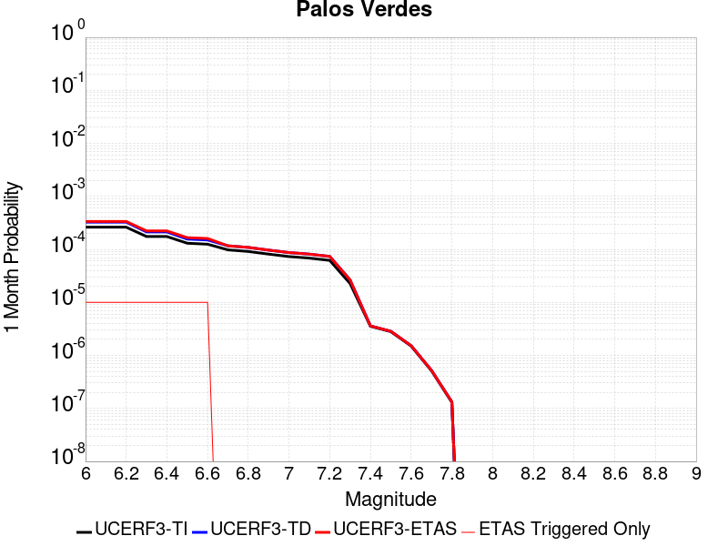 |  | 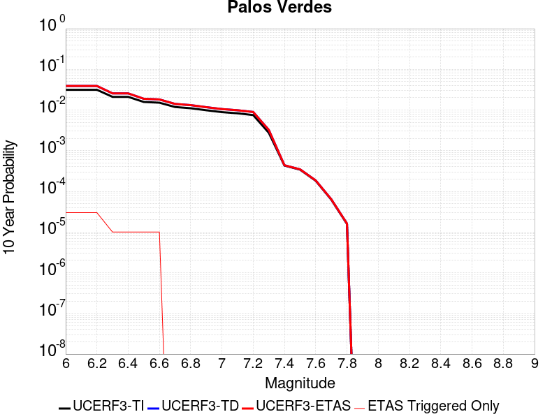 |

| Magnitude | 1 wk TI Prob | 1 wk TD Prob | 1 wk ETAS Prob | 1 wk ETAS/TD Gain | 1 wk ETAS Triggered Only | 1 mo TI Prob | 1 mo TD Prob | 1 mo ETAS Prob | 1 mo ETAS/TD Gain | 1 mo ETAS Triggered Only | 1 yr TI Prob | 1 yr TD Prob | 1 yr ETAS Prob | 1 yr ETAS/TD Gain | 1 yr ETAS Triggered Only | 10 yr TI Prob | 10 yr TD Prob | 10 yr ETAS Prob | 10 yr ETAS/TD Gain | 10 yr ETAS Triggered Only |
|-----|-----|-----|-----|-----|-----|-----|-----|-----|-----|-----|-----|-----|-----|-----|-----|-----|-----|-----|-----|-----|
| 6.0 | 6.126063E-5 | 7.6246164E-5 | 7.6246164E-5 | 1.0 | 0.0 | 2.6251914E-4 | 3.267317E-4 | 3.4500493E-4 | 1.0559273 | 1.8279197E-5 | 0.0031914865 | 0.0039711758 | 0.003989382 | 1.0045847 | 1.8279197E-5 | 0.031460393 | 0.03905871 | 0.039076276 | 1.0004497 | 1.8279197E-5 |
| 6.1 | 6.126063E-5 | 7.6246164E-5 | 7.6246164E-5 | 1.0 | 0.0 | 2.6251914E-4 | 3.267317E-4 | 3.4500493E-4 | 1.0559273 | 1.8279197E-5 | 0.0031914865 | 0.0039711758 | 0.003989382 | 1.0045847 | 1.8279197E-5 | 0.031460393 | 0.03905871 | 0.039076276 | 1.0004497 | 1.8279197E-5 |
| 6.2 | 6.126063E-5 | 7.6246164E-5 | 7.6246164E-5 | 1.0 | 0.0 | 2.6251914E-4 | 3.267317E-4 | 3.4500493E-4 | 1.0559273 | 1.8279197E-5 | 0.0031914865 | 0.0039711758 | 0.003989382 | 1.0045847 | 1.8279197E-5 | 0.031460393 | 0.03905871 | 0.039076276 | 1.0004497 | 1.8279197E-5 |
| 6.3 | 4.0838047E-5 | 4.9761093E-5 | 4.9761093E-5 | 1.0 | 0.0 | 1.7500846E-4 | 2.1324566E-4 | 2.3152096E-4 | 1.0857006 | 1.8279197E-5 | 0.0021286458 | 0.0025933706 | 0.0026116024 | 1.0070301 | 1.8279197E-5 | 0.021083709 | 0.025652548 | 0.025670359 | 1.0006943 | 1.8279197E-5 |
| 6.4 | 4.0838047E-5 | 4.9761093E-5 | 4.9761093E-5 | 1.0 | 0.0 | 1.7500846E-4 | 2.1324566E-4 | 2.3152096E-4 | 1.0857006 | 1.8279197E-5 | 0.0021286458 | 0.0025933706 | 0.0026116024 | 1.0070301 | 1.8279197E-5 | 0.021083709 | 0.025652548 | 0.025670359 | 1.0006943 | 1.8279197E-5 |
| 6.5 | 3.0512005E-5 | 3.656939E-5 | 3.656939E-5 | 1.0 | 0.0 | 1.3075917E-4 | 1.5671721E-4 | 1.7499355E-4 | 1.1166198 | 1.8279197E-5 | 0.0015908304 | 0.001906479 | 0.0019247234 | 1.0095696 | 1.8279197E-5 | 0.015794903 | 0.01891312 | 0.018931054 | 1.0009482 | 1.8279197E-5 |
| 6.6 | 2.9255087E-5 | 3.5162007E-5 | 3.5162007E-5 | 1.0 | 0.0 | 1.2537291E-4 | 1.5068628E-4 | 1.6896272E-4 | 1.1212881 | 1.8279197E-5 | 0.0015253464 | 0.0018331759 | 0.0018514217 | 1.009953 | 1.8279197E-5 | 0.015149189 | 0.018192101 | 0.018210048 | 1.0009865 | 1.8279197E-5 |
| 6.7 | 2.287198E-5 | 2.7253858E-5 | 2.7253858E-5 | 1.0 | 0.0 | 9.801909E-5 | 1.16797535E-4 | 1.16797535E-4 | 1.0 | 0.0 | 0.001192729 | 0.001421174 | 0.001421174 | 1.0 | 0.0 | 0.011863477 | 0.014130091 | 0.014130091 | 1.0 | 0.0 |
| 6.8 | 2.1325764E-5 | 2.5437115E-5 | 2.5437115E-5 | 1.0 | 0.0 | 9.139293E-5 | 1.0901216E-4 | 1.0901216E-4 | 1.0 | 0.0 | 0.001112141 | 0.0013265052 | 0.0013265052 | 1.0 | 0.0 | 0.011065915 | 0.013194912 | 0.013194912 | 1.0 | 0.0 |
| 6.9 | 1.9009392E-5 | 2.2618136E-5 | 2.2618136E-5 | 1.0 | 0.0 | 8.1466285E-5 | 9.693176E-5 | 9.693176E-5 | 1.0 | 0.0 | 9.914007E-4 | 0.0011795927 | 0.0011795927 | 1.0 | 0.0 | 0.009869894 | 0.011742003 | 0.011742003 | 1.0 | 0.0 |
| 7.0 | 1.7098473E-5 | 2.0323456E-5 | 2.0323456E-5 | 1.0 | 0.0 | 7.3277115E-5 | 8.70981E-5 | 8.70981E-5 | 1.0 | 0.0 | 8.917837E-4 | 0.0010599887 | 0.0010599887 | 1.0 | 0.0 | 0.008882134 | 0.010557768 | 0.010557768 | 1.0 | 0.0 |
| 7.1 | 1.5982785E-5 | 1.8998595E-5 | 1.8998595E-5 | 1.0 | 0.0 | 6.849585E-5 | 8.142049E-5 | 8.142049E-5 | 1.0 | 0.0 | 8.336179E-4 | 9.909284E-4 | 9.909284E-4 | 1.0 | 0.0 | 0.008304977 | 0.009873465 | 0.009873465 | 1.0 | 0.0 |
| 7.2 | 1.4468002E-5 | 1.7200713E-5 | 1.7200713E-5 | 1.0 | 0.0 | 6.200425E-5 | 7.371573E-5 | 7.371573E-5 | 1.0 | 0.0 | 7.546402E-4 | 8.972036E-4 | 8.972036E-4 | 1.0 | 0.0 | 0.007520827 | 0.008944086 | 0.008944086 | 1.0 | 0.0 |
| 7.3 | 5.288233E-6 | 6.2048434E-6 | 6.2048434E-6 | 1.0 | 0.0 | 2.2663658E-5 | 2.6592112E-5 | 2.6592112E-5 | 1.0 | 0.0 | 2.7589512E-4 | 3.2374577E-4 | 3.2374577E-4 | 1.0 | 0.0 | 0.0027555283 | 0.0032361657 | 0.0032361657 | 1.0 | 0.0 |
| 7.4 | 8.279556E-7 | 8.4084854E-7 | 8.4084854E-7 | 1.0 | 0.0 | 3.5483763E-6 | 3.603632E-6 | 3.603632E-6 | 1.0 | 0.0 | 4.3200624E-5 | 4.387341E-5 | 4.387341E-5 | 1.0 | 0.0 | 4.3192226E-4 | 4.386547E-4 | 4.386547E-4 | 1.0 | 0.0 |
| 7.5 | 6.559831E-7 | 6.667345E-7 | 6.667345E-7 | 1.0 | 0.0 | 2.8113532E-6 | 2.8574307E-6 | 2.8574307E-6 | 1.0 | 0.0 | 3.4227687E-5 | 3.478873E-5 | 3.478873E-5 | 1.0 | 0.0 | 3.4222414E-4 | 3.4783946E-4 | 3.4783946E-4 | 1.0 | 0.0 |
| 7.6 | 3.5018968E-7 | 3.5620678E-7 | 3.5620678E-7 | 1.0 | 0.0 | 1.500812E-6 | 1.5265998E-6 | 1.5265998E-6 | 1.0 | 0.0 | 1.8272232E-5 | 1.8586241E-5 | 1.8586241E-5 | 1.0 | 0.0 | 1.8270731E-4 | 1.8585146E-4 | 1.8585146E-4 | 1.0 | 0.0 |
| 7.7 | 1.1986104E-7 | 1.2198606E-7 | 1.2198606E-7 | 1.0 | 0.0 | 5.1369005E-7 | 5.227973E-7 | 5.227973E-7 | 1.0 | 0.0 | 6.2541585E-6 | 6.3650386E-6 | 6.3650386E-6 | 1.0 | 0.0 | 6.2539824E-5 | 6.364861E-5 | 6.364861E-5 | 1.0 | 0.0 |
| 7.8 | 3.0445005E-8 | 3.1028215E-8 | 3.1028215E-8 | 1.0 | 0.0 | 1.3047858E-7 | 1.3297806E-7 | 1.3297806E-7 | 1.0 | 0.0 | 1.5885756E-6 | 1.6190069E-6 | 1.6190069E-6 | 1.0 | 0.0 | 1.5885644E-5 | 1.6189972E-5 | 1.6189972E-5 | 1.0 | 0.0 |

## Calaveras (So) - Paicines extension 2011 CFM
*[(top)](#table-of-contents)*

| 1 Week | 1 Month | 1 Year | 10 Year |
|-----|-----|-----|-----|
| 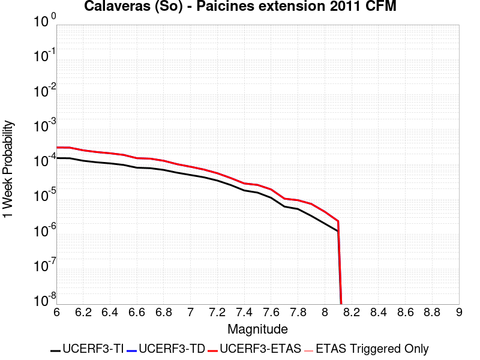 |  |  |  |

| Magnitude | 1 wk TI Prob | 1 wk TD Prob | 1 wk ETAS Prob | 1 wk ETAS/TD Gain | 1 wk ETAS Triggered Only | 1 mo TI Prob | 1 mo TD Prob | 1 mo ETAS Prob | 1 mo ETAS/TD Gain | 1 mo ETAS Triggered Only | 1 yr TI Prob | 1 yr TD Prob | 1 yr ETAS Prob | 1 yr ETAS/TD Gain | 1 yr ETAS Triggered Only | 10 yr TI Prob | 10 yr TD Prob | 10 yr ETAS Prob | 10 yr ETAS/TD Gain | 10 yr ETAS Triggered Only |
|-----|-----|-----|-----|-----|-----|-----|-----|-----|-----|-----|-----|-----|-----|-----|-----|-----|-----|-----|-----|-----|
| 6.0 | 1.5183659E-4 | 3.056355E-4 | 3.056355E-4 | 1.0 | 0.0 | 6.5056595E-4 | 0.0013081793 | 0.0013081793 | 1.0 | 0.0 | 0.007891912 | 0.015708106 | 0.015708106 | 1.0 | 0.0 | 0.076174594 | 0.13858913 | 0.13860488 | 1.0001136 | 1.8279197E-5 |
| 6.1 | 1.5024997E-4 | 3.0257308E-4 | 3.0257308E-4 | 1.0 | 0.0 | 6.437695E-4 | 0.0012950681 | 0.0012950681 | 1.0 | 0.0 | 0.0078097614 | 0.015551464 | 0.015551464 | 1.0 | 0.0 | 0.075409345 | 0.13725848 | 0.13727427 | 1.0001149 | 1.8279197E-5 |
| 6.2 | 1.2743923E-4 | 2.5357047E-4 | 2.5357047E-4 | 1.0 | 0.0 | 5.460538E-4 | 0.0010854661 | 0.0010854661 | 1.0 | 0.0 | 0.0066279583 | 0.013058652 | 0.013058652 | 1.0 | 0.0 | 0.064337276 | 0.117356606 | 0.117372744 | 1.0001374 | 1.8279197E-5 |
| 6.3 | 1.1525114E-4 | 2.2633924E-4 | 2.2633924E-4 | 1.0 | 0.0 | 4.9383997E-4 | 9.6910214E-4 | 9.6910214E-4 | 1.0 | 0.0 | 0.0059959386 | 0.011679772 | 0.011679772 | 1.0 | 0.0 | 0.058367174 | 0.106473476 | 0.10648981 | 1.0001534 | 1.8279197E-5 |
| 6.4 | 1.07200925E-4 | 2.087327E-4 | 2.087327E-4 | 1.0 | 0.0 | 4.5935164E-4 | 8.9401874E-4 | 8.9401874E-4 | 1.0 | 0.0 | 0.0055782744 | 0.010784585 | 0.010784585 | 1.0 | 0.0 | 0.0544031 | 0.09929656 | 0.09931303 | 1.0001658 | 1.8279197E-5 |
| 6.5 | 9.69631E-5 | 1.8770303E-4 | 1.8770303E-4 | 1.0 | 0.0 | 4.1548995E-4 | 8.0394984E-4 | 8.0394984E-4 | 1.0 | 0.0 | 0.0050468626 | 0.009706348 | 0.009706348 | 1.0 | 0.0 | 0.04933773 | 0.09018788 | 0.090204515 | 1.0001844 | 1.8279197E-5 |
| 6.6 | 8.0552316E-5 | 1.5094873E-4 | 1.5094873E-4 | 1.0 | 0.0 | 3.4517853E-4 | 6.4671756E-4 | 6.4671756E-4 | 1.0 | 0.0 | 0.0041944524 | 0.007838126 | 0.007838126 | 1.0 | 0.0 | 0.04116161 | 0.07495855 | 0.07497545 | 1.0002255 | 1.8279197E-5 |
| 6.7 | 7.815757E-5 | 1.4635327E-4 | 1.4635327E-4 | 1.0 | 0.0 | 3.34918E-4 | 6.2703236E-4 | 6.2703236E-4 | 1.0 | 0.0 | 0.004070005 | 0.0076008607 | 0.0076008607 | 1.0 | 0.0 | 0.039962657 | 0.07280769 | 0.07282464 | 1.0002328 | 1.8279197E-5 |
| 6.8 | 6.965264E-5 | 1.2743977E-4 | 1.2743977E-4 | 1.0 | 0.0 | 2.9847719E-4 | 5.460289E-4 | 5.460289E-4 | 1.0 | 0.0 | 0.0036279052 | 0.00662458 | 0.00662458 | 1.0 | 0.0 | 0.03569247 | 0.06389852 | 0.06391563 | 1.0002677 | 1.8279197E-5 |
| 6.9 | 5.8000453E-5 | 1.0163084E-4 | 1.0163084E-4 | 1.0 | 0.0 | 2.4854968E-4 | 4.3548862E-4 | 4.3548862E-4 | 1.0 | 0.0 | 0.0030218933 | 0.005289287 | 0.005289287 | 1.0 | 0.0 | 0.029811295 | 0.05159348 | 0.05159348 | 1.0 | 0.0 |
| 7.0 | 4.9865852E-5 | 8.586892E-5 | 8.586892E-5 | 1.0 | 0.0 | 2.1369329E-4 | 3.6795824E-4 | 3.6795824E-4 | 1.0 | 0.0 | 0.0025986114 | 0.0044707786 | 0.0044707786 | 1.0 | 0.0 | 0.025684336 | 0.043872654 | 0.043872654 | 1.0 | 0.0 |
| 7.1 | 4.283875E-5 | 7.128824E-5 | 7.128824E-5 | 1.0 | 0.0 | 1.8358172E-4 | 3.0548556E-4 | 3.0548556E-4 | 1.0 | 0.0 | 0.0022328163 | 0.0037130006 | 0.0037130006 | 1.0 | 0.0 | 0.022105146 | 0.03681606 | 0.03681606 | 1.0 | 0.0 |
| 7.2 | 3.450115E-5 | 5.593746E-5 | 5.593746E-5 | 1.0 | 0.0 | 1.478537E-4 | 2.397101E-4 | 2.397101E-4 | 1.0 | 0.0 | 0.0017986323 | 0.002914594 | 0.002914594 | 1.0 | 0.0 | 0.017841442 | 0.029157607 | 0.029157607 | 1.0 | 0.0 |
| 7.3 | 2.5709045E-5 | 4.0731633E-5 | 4.0731633E-5 | 1.0 | 0.0 | 1.1017697E-4 | 1.7455257E-4 | 1.7455257E-4 | 1.0 | 0.0 | 0.0013405791 | 0.0021231233 | 0.0021231233 | 1.0 | 0.0 | 0.013325208 | 0.021367824 | 0.021367824 | 1.0 | 0.0 |
| 7.4 | 1.8003093E-5 | 2.8584513E-5 | 2.8584513E-5 | 1.0 | 0.0 | 7.715383E-5 | 1.2249932E-4 | 1.2249932E-4 | 1.0 | 0.0 | 9.3894306E-4 | 0.0014904111 | 0.0014904111 | 1.0 | 0.0 | 0.009349857 | 0.015088451 | 0.015088451 | 1.0 | 0.0 |
| 7.5 | 1.5595824E-5 | 2.5893674E-5 | 2.5893674E-5 | 1.0 | 0.0 | 6.683753E-5 | 1.10968176E-4 | 1.10968176E-4 | 1.0 | 0.0 | 8.134431E-4 | 0.0013502025 | 0.0013502025 | 1.0 | 0.0 | 0.008104719 | 0.013686731 | 0.013686731 | 1.0 | 0.0 |
| 7.6 | 1.1110309E-5 | 1.9283274E-5 | 1.9283274E-5 | 1.0 | 0.0 | 4.761474E-5 | 8.264E-5 | 8.264E-5 | 1.0 | 0.0 | 5.795553E-4 | 0.0010056789 | 0.0010056789 | 1.0 | 0.0 | 0.0057804612 | 0.010233724 | 0.010233724 | 1.0 | 0.0 |
| 7.7 | 6.2140443E-6 | 1.048222E-5 | 1.048222E-5 | 1.0 | 0.0 | 2.6631347E-5 | 4.492303E-5 | 4.492303E-5 | 1.0 | 0.0 | 3.241884E-4 | 5.4680073E-4 | 5.4680073E-4 | 1.0 | 0.0 | 0.0032371588 | 0.0056418604 | 0.0056418604 | 1.0 | 0.0 |
| 7.8 | 5.305533E-6 | 9.473447E-6 | 9.473447E-6 | 1.0 | 0.0 | 2.27378E-5 | 4.0599854E-5 | 4.0599854E-5 | 1.0 | 0.0 | 2.7679754E-4 | 4.941912E-4 | 4.941912E-4 | 1.0 | 0.0 | 0.0027645302 | 0.0050939573 | 0.0050939573 | 1.0 | 0.0 |
| 7.9 | 3.363505E-6 | 7.414737E-6 | 7.414737E-6 | 1.0 | 0.0 | 1.4414942E-5 | 3.1777057E-5 | 3.1777057E-5 | 1.0 | 0.0 | 1.7548777E-4 | 3.8681706E-4 | 3.8681706E-4 | 1.0 | 0.0 | 0.0017534926 | 0.0039629196 | 0.0039629196 | 1.0 | 0.0 |
| 8.0 | 2.0271132E-6 | 4.430002E-6 | 4.430002E-6 | 1.0 | 0.0 | 8.687599E-6 | 1.8985584E-5 | 1.8985584E-5 | 1.0 | 0.0 | 1.05766376E-4 | 2.3112501E-4 | 2.3112501E-4 | 1.0 | 0.0 | 0.0010571606 | 0.0023593423 | 0.0023593423 | 1.0 | 0.0 |
| 8.1 | 1.2206116E-6 | 2.3844252E-6 | 2.3844252E-6 | 1.0 | 0.0 | 5.2311816E-6 | 1.0218926E-5 | 1.0218926E-5 | 1.0 | 0.0 | 6.3687774E-5 | 1.2440835E-4 | 1.2440835E-4 | 1.0 | 0.0 | 6.366953E-4 | 0.0012751735 | 0.0012751735 | 1.0 | 0.0 |

## Pitas Point (Lower West)
*[(top)](#table-of-contents)*

| 1 Week | 1 Month | 1 Year | 10 Year |
|-----|-----|-----|-----|
|  |  |  |  |

| Magnitude | 1 wk TI Prob | 1 wk TD Prob | 1 wk ETAS Prob | 1 wk ETAS/TD Gain | 1 wk ETAS Triggered Only | 1 mo TI Prob | 1 mo TD Prob | 1 mo ETAS Prob | 1 mo ETAS/TD Gain | 1 mo ETAS Triggered Only | 1 yr TI Prob | 1 yr TD Prob | 1 yr ETAS Prob | 1 yr ETAS/TD Gain | 1 yr ETAS Triggered Only | 10 yr TI Prob | 10 yr TD Prob | 10 yr ETAS Prob | 10 yr ETAS/TD Gain | 10 yr ETAS Triggered Only |
|-----|-----|-----|-----|-----|-----|-----|-----|-----|-----|-----|-----|-----|-----|-----|-----|-----|-----|-----|-----|-----|
| 6.0 | 8.151497E-6 | 7.856334E-6 | 7.856334E-6 | 1.0 | 0.0 | 3.493452E-5 | 3.3669574E-5 | 3.3669574E-5 | 1.0 | 0.0 | 4.252448E-4 | 4.098507E-4 | 4.098507E-4 | 1.0 | 0.0 | 0.0042443196 | 0.004091029 | 0.0041092336 | 1.0044498 | 1.8279197E-5 |
| 6.1 | 8.151497E-6 | 7.856334E-6 | 7.856334E-6 | 1.0 | 0.0 | 3.493452E-5 | 3.3669574E-5 | 3.3669574E-5 | 1.0 | 0.0 | 4.252448E-4 | 4.098507E-4 | 4.098507E-4 | 1.0 | 0.0 | 0.0042443196 | 0.004091029 | 0.0041092336 | 1.0044498 | 1.8279197E-5 |
| 6.2 | 8.151497E-6 | 7.856334E-6 | 7.856334E-6 | 1.0 | 0.0 | 3.493452E-5 | 3.3669574E-5 | 3.3669574E-5 | 1.0 | 0.0 | 4.252448E-4 | 4.098507E-4 | 4.098507E-4 | 1.0 | 0.0 | 0.0042443196 | 0.004091029 | 0.0041092336 | 1.0044498 | 1.8279197E-5 |
| 6.3 | 8.151497E-6 | 7.856334E-6 | 7.856334E-6 | 1.0 | 0.0 | 3.493452E-5 | 3.3669574E-5 | 3.3669574E-5 | 1.0 | 0.0 | 4.252448E-4 | 4.098507E-4 | 4.098507E-4 | 1.0 | 0.0 | 0.0042443196 | 0.004091029 | 0.0041092336 | 1.0044498 | 1.8279197E-5 |
| 6.4 | 8.151497E-6 | 7.856334E-6 | 7.856334E-6 | 1.0 | 0.0 | 3.493452E-5 | 3.3669574E-5 | 3.3669574E-5 | 1.0 | 0.0 | 4.252448E-4 | 4.098507E-4 | 4.098507E-4 | 1.0 | 0.0 | 0.0042443196 | 0.004091029 | 0.0041092336 | 1.0044498 | 1.8279197E-5 |
| 6.5 | 8.151497E-6 | 7.856334E-6 | 7.856334E-6 | 1.0 | 0.0 | 3.493452E-5 | 3.3669574E-5 | 3.3669574E-5 | 1.0 | 0.0 | 4.252448E-4 | 4.098507E-4 | 4.098507E-4 | 1.0 | 0.0 | 0.0042443196 | 0.004091029 | 0.0041092336 | 1.0044498 | 1.8279197E-5 |
| 6.6 | 8.151497E-6 | 7.856334E-6 | 7.856334E-6 | 1.0 | 0.0 | 3.493452E-5 | 3.3669574E-5 | 3.3669574E-5 | 1.0 | 0.0 | 4.252448E-4 | 4.098507E-4 | 4.098507E-4 | 1.0 | 0.0 | 0.0042443196 | 0.004091029 | 0.0041092336 | 1.0044498 | 1.8279197E-5 |
| 6.7 | 8.151497E-6 | 7.856334E-6 | 7.856334E-6 | 1.0 | 0.0 | 3.493452E-5 | 3.3669574E-5 | 3.3669574E-5 | 1.0 | 0.0 | 4.252448E-4 | 4.098507E-4 | 4.098507E-4 | 1.0 | 0.0 | 0.0042443196 | 0.004091029 | 0.0041092336 | 1.0044498 | 1.8279197E-5 |
| 6.8 | 8.151497E-6 | 7.856334E-6 | 7.856334E-6 | 1.0 | 0.0 | 3.493452E-5 | 3.3669574E-5 | 3.3669574E-5 | 1.0 | 0.0 | 4.252448E-4 | 4.098507E-4 | 4.098507E-4 | 1.0 | 0.0 | 0.0042443196 | 0.004091029 | 0.0041092336 | 1.0044498 | 1.8279197E-5 |
| 6.9 | 8.151497E-6 | 7.856334E-6 | 7.856334E-6 | 1.0 | 0.0 | 3.493452E-5 | 3.3669574E-5 | 3.3669574E-5 | 1.0 | 0.0 | 4.252448E-4 | 4.098507E-4 | 4.098507E-4 | 1.0 | 0.0 | 0.0042443196 | 0.004091029 | 0.0041092336 | 1.0044498 | 1.8279197E-5 |
| 7.0 | 8.103535E-6 | 7.805761E-6 | 7.805761E-6 | 1.0 | 0.0 | 3.4728975E-5 | 3.3452838E-5 | 3.3452838E-5 | 1.0 | 0.0 | 4.2274324E-4 | 4.0721294E-4 | 4.0721294E-4 | 1.0 | 0.0 | 0.0042193993 | 0.004064748 | 0.0040829526 | 1.0044787 | 1.8279197E-5 |
| 7.1 | 7.853298E-6 | 7.541437E-6 | 7.541437E-6 | 1.0 | 0.0 | 3.3656554E-5 | 3.2320047E-5 | 3.2320047E-5 | 1.0 | 0.0 | 4.096915E-4 | 3.9342622E-4 | 3.9342622E-4 | 1.0 | 0.0 | 0.00408937 | 0.0039273733 | 0.0039455807 | 1.004636 | 1.8279197E-5 |
| 7.2 | 7.771102E-6 | 7.4537124E-6 | 7.4537124E-6 | 1.0 | 0.0 | 3.33043E-5 | 3.1944095E-5 | 3.1944095E-5 | 1.0 | 0.0 | 4.0540437E-4 | 3.8885063E-4 | 3.8885063E-4 | 1.0 | 0.0 | 0.0040466557 | 0.003881778 | 0.0038999862 | 1.0046906 | 1.8279197E-5 |
| 7.3 | 7.3945344E-6 | 7.049786E-6 | 7.049786E-6 | 1.0 | 0.0 | 3.1690477E-5 | 3.0213021E-5 | 3.0213021E-5 | 1.0 | 0.0 | 3.8576324E-4 | 3.6778208E-4 | 3.6778208E-4 | 1.0 | 0.0 | 0.0038509427 | 0.0036718016 | 0.003690014 | 1.00496 | 1.8279197E-5 |
| 7.4 | 6.964645E-6 | 6.5906015E-6 | 6.5906015E-6 | 1.0 | 0.0 | 2.9848137E-5 | 2.8245133E-5 | 2.8245133E-5 | 1.0 | 0.0 | 3.6334046E-4 | 3.438307E-4 | 3.438307E-4 | 1.0 | 0.0 | 0.0036274698 | 0.0034330408 | 0.0034512572 | 1.0053062 | 1.8279197E-5 |
| 7.5 | 6.6525035E-6 | 6.2596137E-6 | 6.2596137E-6 | 1.0 | 0.0 | 2.851042E-5 | 2.6826641E-5 | 2.6826641E-5 | 1.0 | 0.0 | 3.4705905E-4 | 3.265659E-4 | 3.265659E-4 | 1.0 | 0.0 | 0.0034651754 | 0.0032609117 | 0.0032791311 | 1.0055872 | 1.8279197E-5 |
| 7.6 | 5.613338E-6 | 5.151753E-6 | 5.151753E-6 | 1.0 | 0.0 | 2.405694E-5 | 2.2078757E-5 | 2.2078757E-5 | 1.0 | 0.0 | 2.928539E-4 | 2.68776E-4 | 2.68776E-4 | 1.0 | 0.0 | 0.0029246826 | 0.0026845408 | 0.0026845408 | 1.0 | 0.0 |
| 7.7 | 4.494704E-6 | 3.997184E-6 | 3.997184E-6 | 1.0 | 0.0 | 1.9262876E-5 | 1.7130678E-5 | 1.7130678E-5 | 1.0 | 0.0 | 2.3450027E-4 | 2.0854628E-4 | 2.0854628E-4 | 1.0 | 0.0 | 0.0023425296 | 0.0020835297 | 0.0020835297 | 1.0 | 0.0 |
| 7.8 | 2.6075882E-6 | 2.1837811E-6 | 2.1837811E-6 | 1.0 | 0.0 | 1.117533E-5 | 9.359029E-6 | 9.359029E-6 | 1.0 | 0.0 | 1.3605114E-4 | 1.1394027E-4 | 1.1394027E-4 | 1.0 | 0.0 | 0.0013596788 | 0.0011388232 | 0.0011388232 | 1.0 | 0.0 |
| 7.9 | 4.045984E-7 | 3.2425984E-7 | 3.2425984E-7 | 1.0 | 0.0 | 1.733992E-6 | 1.3896843E-6 | 1.3896843E-6 | 1.0 | 0.0 | 2.1111147E-5 | 1.6919279E-5 | 1.6919279E-5 | 1.0 | 0.0 | 2.1109142E-4 | 1.6918022E-4 | 1.6918022E-4 | 1.0 | 0.0 |
| 8.0 | 7.791402E-9 | 5.683946E-9 | 5.683946E-9 | 1.0 | 0.0 | 3.3391725E-8 | 2.435977E-8 | 2.435977E-8 | 1.0 | 0.0 | 4.0654416E-7 | 2.9658017E-7 | 2.9658017E-7 | 1.0 | 0.0 | 4.065434E-6 | 2.9657997E-6 | 2.9657997E-6 | 1.0 | 0.0 |

## Kern Canyon (South Kern) 2011
*[(top)](#table-of-contents)*

| 1 Week | 1 Month | 1 Year | 10 Year |
|-----|-----|-----|-----|
|  |  |  |  |

| Magnitude | 1 wk TI Prob | 1 wk TD Prob | 1 wk ETAS Prob | 1 wk ETAS/TD Gain | 1 wk ETAS Triggered Only | 1 mo TI Prob | 1 mo TD Prob | 1 mo ETAS Prob | 1 mo ETAS/TD Gain | 1 mo ETAS Triggered Only | 1 yr TI Prob | 1 yr TD Prob | 1 yr ETAS Prob | 1 yr ETAS/TD Gain | 1 yr ETAS Triggered Only | 10 yr TI Prob | 10 yr TD Prob | 10 yr ETAS Prob | 10 yr ETAS/TD Gain | 10 yr ETAS Triggered Only |
|-----|-----|-----|-----|-----|-----|-----|-----|-----|-----|-----|-----|-----|-----|-----|-----|-----|-----|-----|-----|-----|
| 6.0 | 4.105075E-6 | 4.1138087E-6 | 4.1138087E-6 | 1.0 | 0.0 | 1.7593058E-5 | 1.7630493E-5 | 1.7630493E-5 | 1.0 | 0.0 | 2.1417443E-4 | 2.1463075E-4 | 2.1463075E-4 | 1.0 | 0.0 | 0.0021396813 | 0.0021442985 | 0.0021625385 | 1.0085063 | 1.8279197E-5 |
| 6.1 | 4.105075E-6 | 4.1138087E-6 | 4.1138087E-6 | 1.0 | 0.0 | 1.7593058E-5 | 1.7630493E-5 | 1.7630493E-5 | 1.0 | 0.0 | 2.1417443E-4 | 2.1463075E-4 | 2.1463075E-4 | 1.0 | 0.0 | 0.0021396813 | 0.0021442985 | 0.0021625385 | 1.0085063 | 1.8279197E-5 |
| 6.2 | 4.105075E-6 | 4.1138087E-6 | 4.1138087E-6 | 1.0 | 0.0 | 1.7593058E-5 | 1.7630493E-5 | 1.7630493E-5 | 1.0 | 0.0 | 2.1417443E-4 | 2.1463075E-4 | 2.1463075E-4 | 1.0 | 0.0 | 0.0021396813 | 0.0021442985 | 0.0021625385 | 1.0085063 | 1.8279197E-5 |
| 6.3 | 4.105075E-6 | 4.1138087E-6 | 4.1138087E-6 | 1.0 | 0.0 | 1.7593058E-5 | 1.7630493E-5 | 1.7630493E-5 | 1.0 | 0.0 | 2.1417443E-4 | 2.1463075E-4 | 2.1463075E-4 | 1.0 | 0.0 | 0.0021396813 | 0.0021442985 | 0.0021625385 | 1.0085063 | 1.8279197E-5 |
| 6.4 | 4.105075E-6 | 4.1138087E-6 | 4.1138087E-6 | 1.0 | 0.0 | 1.7593058E-5 | 1.7630493E-5 | 1.7630493E-5 | 1.0 | 0.0 | 2.1417443E-4 | 2.1463075E-4 | 2.1463075E-4 | 1.0 | 0.0 | 0.0021396813 | 0.0021442985 | 0.0021625385 | 1.0085063 | 1.8279197E-5 |
| 6.5 | 2.9849807E-6 | 2.9732148E-6 | 2.9732148E-6 | 1.0 | 0.0 | 1.2792712E-5 | 1.2742287E-5 | 1.2742287E-5 | 1.0 | 0.0 | 1.5574014E-4 | 1.5512646E-4 | 1.5512646E-4 | 1.0 | 0.0 | 0.0015563103 | 0.0015501969 | 0.0015501969 | 1.0 | 0.0 |
| 6.6 | 2.9849807E-6 | 2.9732148E-6 | 2.9732148E-6 | 1.0 | 0.0 | 1.2792712E-5 | 1.2742287E-5 | 1.2742287E-5 | 1.0 | 0.0 | 1.5574014E-4 | 1.5512646E-4 | 1.5512646E-4 | 1.0 | 0.0 | 0.0015563103 | 0.0015501969 | 0.0015501969 | 1.0 | 0.0 |
| 6.7 | 2.6756725E-6 | 2.6582748E-6 | 2.6582748E-6 | 1.0 | 0.0 | 1.1467117E-5 | 1.1392556E-5 | 1.1392556E-5 | 1.0 | 0.0 | 1.396032E-4 | 1.3869566E-4 | 1.3869566E-4 | 1.0 | 0.0 | 0.0013951553 | 0.0013861019 | 0.0013861019 | 1.0 | 0.0 |
| 6.8 | 2.3283721E-6 | 2.304826E-6 | 2.304826E-6 | 1.0 | 0.0 | 9.9787E-6 | 9.877789E-6 | 9.877789E-6 | 1.0 | 0.0 | 1.214839E-4 | 1.2025552E-4 | 1.2025552E-4 | 1.0 | 0.0 | 0.001214175 | 0.001201912 | 0.001201912 | 1.0 | 0.0 |
| 6.9 | 2.0972677E-6 | 2.0696841E-6 | 2.0696841E-6 | 1.0 | 0.0 | 8.988259E-6 | 8.870044E-6 | 8.870044E-6 | 1.0 | 0.0 | 1.0942656E-4 | 1.079875E-4 | 1.079875E-4 | 1.0 | 0.0 | 0.0010937268 | 0.0010793561 | 0.0010793561 | 1.0 | 0.0 |
| 7.0 | 1.7132242E-6 | 1.6787391E-6 | 1.6787391E-6 | 1.0 | 0.0 | 7.3423685E-6 | 7.1945765E-6 | 7.1945765E-6 | 1.0 | 0.0 | 8.938967E-5 | 8.759048E-5 | 8.759048E-5 | 1.0 | 0.0 | 8.935372E-4 | 8.755635E-4 | 8.755635E-4 | 1.0 | 0.0 |
| 7.1 | 1.4215541E-6 | 1.3816048E-6 | 1.3816048E-6 | 1.0 | 0.0 | 6.0923603E-6 | 5.92115E-6 | 5.92115E-6 | 1.0 | 0.0 | 7.417196E-5 | 7.208765E-5 | 7.208765E-5 | 1.0 | 0.0 | 7.414721E-4 | 7.206453E-4 | 7.206453E-4 | 1.0 | 0.0 |
| 7.2 | 9.097853E-7 | 8.60397E-7 | 8.60397E-7 | 1.0 | 0.0 | 3.899074E-6 | 3.6874105E-6 | 3.6874105E-6 | 1.0 | 0.0 | 4.7470192E-5 | 4.489331E-5 | 4.489331E-5 | 1.0 | 0.0 | 4.7460053E-4 | 4.4884346E-4 | 4.4884346E-4 | 1.0 | 0.0 |
| 7.3 | 6.144169E-7 | 5.6283403E-7 | 5.6283403E-7 | 1.0 | 0.0 | 2.6332125E-6 | 2.4121437E-6 | 2.4121437E-6 | 1.0 | 0.0 | 3.205889E-5 | 2.9367458E-5 | 2.9367458E-5 | 1.0 | 0.0 | 3.2054266E-4 | 2.936363E-4 | 2.936363E-4 | 1.0 | 0.0 |
| 7.4 | 4.049844E-7 | 3.572923E-7 | 3.572923E-7 | 1.0 | 0.0 | 1.7356463E-6 | 1.5312518E-6 | 1.5312518E-6 | 1.0 | 0.0 | 2.1131287E-5 | 1.8642833E-5 | 1.8642833E-5 | 1.0 | 0.0 | 2.1129279E-4 | 1.8641294E-4 | 1.8641294E-4 | 1.0 | 0.0 |
| 7.5 | 1.9871162E-7 | 1.5830923E-7 | 1.5830923E-7 | 1.0 | 0.0 | 8.5162094E-7 | 6.78468E-7 | 6.78468E-7 | 1.0 | 0.0 | 1.0368436E-5 | 8.260317E-6 | 8.260317E-6 | 1.0 | 0.0 | 1.0367952E-4 | 8.2600185E-5 | 8.2600185E-5 | 1.0 | 0.0 |
| 7.6 | 2.572245E-8 | 1.7353212E-8 | 1.7353212E-8 | 1.0 | 0.0 | 1.10239064E-7 | 7.437091E-8 | 7.437091E-8 | 1.0 | 0.0 | 1.3421597E-6 | 9.0546547E-7 | 9.0546547E-7 | 1.0 | 0.0 | 1.3421517E-5 | 9.054624E-6 | 9.054624E-6 | 1.0 | 0.0 |

## Santa Ynez River
*[(top)](#table-of-contents)*

| 1 Week | 1 Month | 1 Year | 10 Year |
|-----|-----|-----|-----|
| 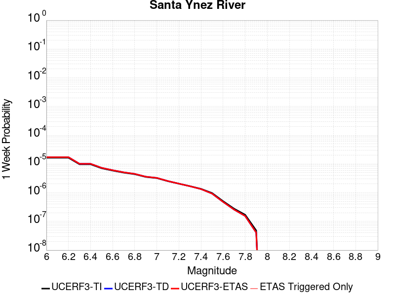 |  |  |  |

| Magnitude | 1 wk TI Prob | 1 wk TD Prob | 1 wk ETAS Prob | 1 wk ETAS/TD Gain | 1 wk ETAS Triggered Only | 1 mo TI Prob | 1 mo TD Prob | 1 mo ETAS Prob | 1 mo ETAS/TD Gain | 1 mo ETAS Triggered Only | 1 yr TI Prob | 1 yr TD Prob | 1 yr ETAS Prob | 1 yr ETAS/TD Gain | 1 yr ETAS Triggered Only | 10 yr TI Prob | 10 yr TD Prob | 10 yr ETAS Prob | 10 yr ETAS/TD Gain | 10 yr ETAS Triggered Only |
|-----|-----|-----|-----|-----|-----|-----|-----|-----|-----|-----|-----|-----|-----|-----|-----|-----|-----|-----|-----|-----|
| 6.0 | 1.6396456E-5 | 1.7210468E-5 | 1.7210468E-5 | 1.0 | 0.0 | 7.026863E-5 | 7.375726E-5 | 7.375726E-5 | 1.0 | 0.0 | 8.551848E-4 | 8.9766027E-4 | 9.159231E-4 | 1.0203449 | 1.8279197E-5 | 0.0085190125 | 0.008943893 | 0.008962008 | 1.0020255 | 1.8279197E-5 |
| 6.1 | 1.6396456E-5 | 1.7210468E-5 | 1.7210468E-5 | 1.0 | 0.0 | 7.026863E-5 | 7.375726E-5 | 7.375726E-5 | 1.0 | 0.0 | 8.551848E-4 | 8.9766027E-4 | 9.159231E-4 | 1.0203449 | 1.8279197E-5 | 0.0085190125 | 0.008943893 | 0.008962008 | 1.0020255 | 1.8279197E-5 |
| 6.2 | 1.6396456E-5 | 1.7210468E-5 | 1.7210468E-5 | 1.0 | 0.0 | 7.026863E-5 | 7.375726E-5 | 7.375726E-5 | 1.0 | 0.0 | 8.551848E-4 | 8.9766027E-4 | 9.159231E-4 | 1.0203449 | 1.8279197E-5 | 0.0085190125 | 0.008943893 | 0.008962008 | 1.0020255 | 1.8279197E-5 |
| 6.3 | 9.736976E-6 | 1.0122879E-5 | 1.0122879E-5 | 1.0 | 0.0 | 4.172923E-5 | 4.3383072E-5 | 4.3383072E-5 | 1.0 | 0.0 | 5.0793495E-4 | 5.280659E-4 | 5.463354E-4 | 1.034597 | 1.8279197E-5 | 0.005067755 | 0.0052686166 | 0.0052867997 | 1.0034512 | 1.8279197E-5 |
| 6.4 | 9.736976E-6 | 1.0122879E-5 | 1.0122879E-5 | 1.0 | 0.0 | 4.172923E-5 | 4.3383072E-5 | 4.3383072E-5 | 1.0 | 0.0 | 5.0793495E-4 | 5.280659E-4 | 5.463354E-4 | 1.034597 | 1.8279197E-5 | 0.005067755 | 0.0052686166 | 0.0052867997 | 1.0034512 | 1.8279197E-5 |
| 6.5 | 7.081964E-6 | 7.330291E-6 | 7.330291E-6 | 1.0 | 0.0 | 3.035092E-5 | 3.1415162E-5 | 3.1415162E-5 | 1.0 | 0.0 | 3.694598E-4 | 3.8241406E-4 | 4.0068626E-4 | 1.0477812 | 1.8279197E-5 | 0.0036884616 | 0.0038177217 | 0.0038359312 | 1.0047697 | 1.8279197E-5 |
| 6.6 | 5.873247E-6 | 6.0600687E-6 | 6.0600687E-6 | 1.0 | 0.0 | 2.5170815E-5 | 2.597147E-5 | 2.597147E-5 | 1.0 | 0.0 | 3.064116E-4 | 3.1615762E-4 | 3.3443104E-4 | 1.0577984 | 1.8279197E-5 | 0.0030598943 | 0.0031571658 | 0.0031753874 | 1.0057715 | 1.8279197E-5 |
| 6.7 | 4.973277E-6 | 5.116178E-6 | 5.116178E-6 | 1.0 | 0.0 | 2.1313872E-5 | 2.1926295E-5 | 2.1926295E-5 | 1.0 | 0.0 | 2.5946548E-4 | 2.6692043E-4 | 2.8519475E-4 | 1.0684636 | 1.8279197E-5 | 0.0025916274 | 0.0026660473 | 0.0026842777 | 1.006838 | 1.8279197E-5 |
| 6.8 | 4.396492E-6 | 4.5112233E-6 | 4.5112233E-6 | 1.0 | 0.0 | 1.884197E-5 | 1.9333673E-5 | 1.9333673E-5 | 1.0 | 0.0 | 2.2937685E-4 | 2.3536239E-4 | 2.536373E-4 | 1.0776458 | 1.8279197E-5 | 0.0022914023 | 0.0023511667 | 0.002369403 | 1.0077562 | 1.8279197E-5 |
| 6.9 | 3.5255632E-6 | 3.601536E-6 | 3.601536E-6 | 1.0 | 0.0 | 1.5109469E-5 | 1.5435064E-5 | 1.5435064E-5 | 1.0 | 0.0 | 1.8394225E-4 | 1.8790585E-4 | 1.8790585E-4 | 1.0 | 0.0 | 0.0018379007 | 0.0018774859 | 0.0018774859 | 1.0 | 0.0 |
| 7.0 | 3.211603E-6 | 3.2738415E-6 | 3.2738415E-6 | 1.0 | 0.0 | 1.376394E-5 | 1.4030675E-5 | 1.4030675E-5 | 1.0 | 0.0 | 1.6756308E-4 | 1.7081022E-4 | 1.7081022E-4 | 1.0 | 0.0 | 0.0016743679 | 0.0017068035 | 0.0017068035 | 1.0 | 0.0 |
| 7.1 | 2.5094619E-6 | 2.541074E-6 | 2.541074E-6 | 1.0 | 0.0 | 1.0754793E-5 | 1.0890272E-5 | 1.0890272E-5 | 1.0 | 0.0 | 1.3093173E-4 | 1.3258106E-4 | 1.3258106E-4 | 1.0 | 0.0 | 0.0013085462 | 0.0013250256 | 0.0013250256 | 1.0 | 0.0 |
| 7.2 | 2.0515774E-6 | 2.0620678E-6 | 2.0620678E-6 | 1.0 | 0.0 | 8.792445E-6 | 8.837404E-6 | 8.837404E-6 | 1.0 | 0.0 | 1.0704277E-4 | 1.0759012E-4 | 1.0759012E-4 | 1.0 | 0.0 | 0.0010699122 | 0.0010753846 | 0.0010753846 | 1.0 | 0.0 |
| 7.3 | 1.6845745E-6 | 1.6775012E-6 | 1.6775012E-6 | 1.0 | 0.0 | 7.219585E-6 | 7.1892714E-6 | 7.1892714E-6 | 1.0 | 0.0 | 8.78949E-5 | 8.752589E-5 | 8.752589E-5 | 1.0 | 0.0 | 8.7860145E-4 | 8.749171E-4 | 8.749171E-4 | 1.0 | 0.0 |
| 7.4 | 1.3600285E-6 | 1.3334243E-6 | 1.3334243E-6 | 1.0 | 0.0 | 5.82868E-6 | 5.714663E-6 | 5.714663E-6 | 1.0 | 0.0 | 7.096187E-5 | 6.957383E-5 | 6.957383E-5 | 1.0 | 0.0 | 7.0939213E-4 | 6.9552264E-4 | 6.9552264E-4 | 1.0 | 0.0 |
| 7.5 | 9.735342E-7 | 9.2907436E-7 | 9.2907436E-7 | 1.0 | 0.0 | 4.172283E-6 | 3.9817414E-6 | 3.9817414E-6 | 1.0 | 0.0 | 5.079636E-5 | 4.847664E-5 | 4.847664E-5 | 1.0 | 0.0 | 5.0784746E-4 | 4.8466233E-4 | 4.8466233E-4 | 1.0 | 0.0 |
| 7.6 | 5.067187E-7 | 4.7788643E-7 | 4.7788643E-7 | 1.0 | 0.0 | 2.1716498E-6 | 2.0480832E-6 | 2.0480832E-6 | 1.0 | 0.0 | 2.6439517E-5 | 2.4935134E-5 | 2.4935134E-5 | 1.0 | 0.0 | 2.643637E-4 | 2.493241E-4 | 2.493241E-4 | 1.0 | 0.0 |
| 7.7 | 2.769089E-7 | 2.5760605E-7 | 2.5760605E-7 | 1.0 | 0.0 | 1.1867519E-6 | 1.1040254E-6 | 1.1040254E-6 | 1.0 | 0.0 | 1.4448608E-5 | 1.3441428E-5 | 1.3441428E-5 | 1.0 | 0.0 | 1.444767E-4 | 1.3440617E-4 | 1.3440617E-4 | 1.0 | 0.0 |
| 7.8 | 1.7044663E-7 | 1.5449906E-7 | 1.5449906E-7 | 1.0 | 0.0 | 7.3048534E-7 | 6.621387E-7 | 6.621387E-7 | 1.0 | 0.0 | 8.893623E-6 | 8.061509E-6 | 8.061509E-6 | 1.0 | 0.0 | 8.893267E-5 | 8.061218E-5 | 8.061218E-5 | 1.0 | 0.0 |
| 7.9 | 4.8344287E-8 | 4.0913434E-8 | 4.0913434E-8 | 1.0 | 0.0 | 2.0718979E-7 | 1.7534327E-7 | 1.7534327E-7 | 1.0 | 0.0 | 2.5225327E-6 | 2.1348023E-6 | 2.1348023E-6 | 1.0 | 0.0 | 2.5225041E-5 | 2.1347822E-5 | 2.1347822E-5 | 1.0 | 0.0 |

## Great Valley 08 (Quinto)
*[(top)](#table-of-contents)*

| 1 Week | 1 Month | 1 Year | 10 Year |
|-----|-----|-----|-----|
|  |  |  |  |

| Magnitude | 1 wk TI Prob | 1 wk TD Prob | 1 wk ETAS Prob | 1 wk ETAS/TD Gain | 1 wk ETAS Triggered Only | 1 mo TI Prob | 1 mo TD Prob | 1 mo ETAS Prob | 1 mo ETAS/TD Gain | 1 mo ETAS Triggered Only | 1 yr TI Prob | 1 yr TD Prob | 1 yr ETAS Prob | 1 yr ETAS/TD Gain | 1 yr ETAS Triggered Only | 10 yr TI Prob | 10 yr TD Prob | 10 yr ETAS Prob | 10 yr ETAS/TD Gain | 10 yr ETAS Triggered Only |
|-----|-----|-----|-----|-----|-----|-----|-----|-----|-----|-----|-----|-----|-----|-----|-----|-----|-----|-----|-----|-----|
| 6.0 | 7.737697E-6 | 8.253623E-6 | 8.253623E-6 | 1.0 | 0.0 | 3.3161137E-5 | 3.5372297E-5 | 3.5372297E-5 | 1.0 | 0.0 | 4.0366207E-4 | 4.3059146E-4 | 4.3059146E-4 | 1.0 | 0.0 | 0.004029296 | 0.0042994246 | 0.0043176254 | 1.0042332 | 1.8279197E-5 |
| 6.1 | 7.737697E-6 | 8.253623E-6 | 8.253623E-6 | 1.0 | 0.0 | 3.3161137E-5 | 3.5372297E-5 | 3.5372297E-5 | 1.0 | 0.0 | 4.0366207E-4 | 4.3059146E-4 | 4.3059146E-4 | 1.0 | 0.0 | 0.004029296 | 0.0042994246 | 0.0043176254 | 1.0042332 | 1.8279197E-5 |
| 6.2 | 7.737697E-6 | 8.253623E-6 | 8.253623E-6 | 1.0 | 0.0 | 3.3161137E-5 | 3.5372297E-5 | 3.5372297E-5 | 1.0 | 0.0 | 4.0366207E-4 | 4.3059146E-4 | 4.3059146E-4 | 1.0 | 0.0 | 0.004029296 | 0.0042994246 | 0.0043176254 | 1.0042332 | 1.8279197E-5 |
| 6.3 | 5.374012E-6 | 5.7510024E-6 | 5.7510024E-6 | 1.0 | 0.0 | 2.3031276E-5 | 2.4646983E-5 | 2.4646983E-5 | 1.0 | 0.0 | 2.803697E-4 | 3.0004684E-4 | 3.0004684E-4 | 1.0 | 0.0 | 0.0028001624 | 0.0029975108 | 0.0030157352 | 1.0060798 | 1.8279197E-5 |
| 6.4 | 5.374012E-6 | 5.7510024E-6 | 5.7510024E-6 | 1.0 | 0.0 | 2.3031276E-5 | 2.4646983E-5 | 2.4646983E-5 | 1.0 | 0.0 | 2.803697E-4 | 3.0004684E-4 | 3.0004684E-4 | 1.0 | 0.0 | 0.0028001624 | 0.0029975108 | 0.0030157352 | 1.0060798 | 1.8279197E-5 |
| 6.5 | 3.65427E-6 | 3.9416527E-6 | 3.9416527E-6 | 1.0 | 0.0 | 1.5661062E-5 | 1.6892729E-5 | 1.6892729E-5 | 1.0 | 0.0 | 1.9065675E-4 | 2.056566E-4 | 2.056566E-4 | 1.0 | 0.0 | 0.0019049325 | 0.0020553546 | 0.0020735962 | 1.0088751 | 1.8279197E-5 |
| 6.6 | 3.6143538E-6 | 3.898836E-6 | 3.898836E-6 | 1.0 | 0.0 | 1.5489995E-5 | 1.6709231E-5 | 1.6709231E-5 | 1.0 | 0.0 | 1.8857437E-4 | 2.0342294E-4 | 2.0342294E-4 | 1.0 | 0.0 | 0.0018841444 | 0.002033059 | 0.002051301 | 1.0089726 | 1.8279197E-5 |
| 6.7 | 2.4821015E-6 | 2.685941E-6 | 2.685941E-6 | 1.0 | 0.0 | 1.0637535E-5 | 1.1511156E-5 | 1.1511156E-5 | 1.0 | 0.0 | 1.2950429E-4 | 1.4014497E-4 | 1.4014497E-4 | 1.0 | 0.0 | 0.0012942884 | 0.0014011209 | 0.0014011209 | 1.0 | 0.0 |
| 6.8 | 4.7110538E-7 | 5.193585E-7 | 5.193585E-7 | 1.0 | 0.0 | 2.0190216E-6 | 2.2258203E-6 | 2.2258203E-6 | 1.0 | 0.0 | 2.458131E-5 | 2.7099044E-5 | 2.7099044E-5 | 1.0 | 0.0 | 2.457859E-4 | 2.709592E-4 | 2.709592E-4 | 1.0 | 0.0 |
| 6.9 | 3.958685E-7 | 4.3708278E-7 | 4.3708278E-7 | 1.0 | 0.0 | 1.6965782E-6 | 1.8732106E-6 | 1.8732106E-6 | 1.0 | 0.0 | 2.0655643E-5 | 2.2806116E-5 | 2.2806116E-5 | 1.0 | 0.0 | 2.0653724E-4 | 2.2803938E-4 | 2.2803938E-4 | 1.0 | 0.0 |
| 7.0 | 2.70294E-7 | 2.9923405E-7 | 2.9923405E-7 | 1.0 | 0.0 | 1.1584025E-6 | 1.2824311E-6 | 1.2824311E-6 | 1.0 | 0.0 | 1.4103458E-5 | 1.56135E-5 | 1.56135E-5 | 1.0 | 0.0 | 1.4102564E-4 | 1.561253E-4 | 1.561253E-4 | 1.0 | 0.0 |
| 7.1 | 1.4828602E-7 | 1.647104E-7 | 1.647104E-7 | 1.0 | 0.0 | 6.3551136E-7 | 7.059016E-7 | 7.059016E-7 | 1.0 | 0.0 | 7.737323E-6 | 8.594327E-6 | 8.594327E-6 | 1.0 | 0.0 | 7.737054E-5 | 8.594074E-5 | 8.594074E-5 | 1.0 | 0.0 |

## Rinconada 2011 CFM
*[(top)](#table-of-contents)*

| 1 Week | 1 Month | 1 Year | 10 Year |
|-----|-----|-----|-----|
|  |  |  |  |

| Magnitude | 1 wk TI Prob | 1 wk TD Prob | 1 wk ETAS Prob | 1 wk ETAS/TD Gain | 1 wk ETAS Triggered Only | 1 mo TI Prob | 1 mo TD Prob | 1 mo ETAS Prob | 1 mo ETAS/TD Gain | 1 mo ETAS Triggered Only | 1 yr TI Prob | 1 yr TD Prob | 1 yr ETAS Prob | 1 yr ETAS/TD Gain | 1 yr ETAS Triggered Only | 10 yr TI Prob | 10 yr TD Prob | 10 yr ETAS Prob | 10 yr ETAS/TD Gain | 10 yr ETAS Triggered Only |
|-----|-----|-----|-----|-----|-----|-----|-----|-----|-----|-----|-----|-----|-----|-----|-----|-----|-----|-----|-----|-----|
| 6.0 | 1.5752368E-5 | 1.6275291E-5 | 3.455419E-5 | 2.1231074 | 1.8279197E-5 | 6.75084E-5 | 6.9749396E-5 | 8.802732E-5 | 1.2620513 | 1.8279197E-5 | 8.2160486E-4 | 8.4887125E-4 | 8.671349E-4 | 1.0215153 | 1.8279197E-5 | 0.008185739 | 0.008456668 | 0.008474792 | 1.0021433 | 1.8279197E-5 |
| 6.1 | 1.0966133E-5 | 1.1323423E-5 | 1.1323423E-5 | 1.0 | 0.0 | 4.6996865E-5 | 4.8528054E-5 | 4.8528054E-5 | 1.0 | 0.0 | 5.720366E-4 | 5.9066963E-4 | 5.9066963E-4 | 1.0 | 0.0 | 0.0057056635 | 0.005891093 | 0.005891093 | 1.0 | 0.0 |
| 6.2 | 1.0966133E-5 | 1.1323423E-5 | 1.1323423E-5 | 1.0 | 0.0 | 4.6996865E-5 | 4.8528054E-5 | 4.8528054E-5 | 1.0 | 0.0 | 5.720366E-4 | 5.9066963E-4 | 5.9066963E-4 | 1.0 | 0.0 | 0.0057056635 | 0.005891093 | 0.005891093 | 1.0 | 0.0 |
| 6.3 | 8.926149E-6 | 9.213088E-6 | 9.213088E-6 | 1.0 | 0.0 | 3.8254362E-5 | 3.9484068E-5 | 3.9484068E-5 | 1.0 | 0.0 | 4.6564735E-4 | 4.806128E-4 | 4.806128E-4 | 1.0 | 0.0 | 0.0046467283 | 0.004795779 | 0.004795779 | 1.0 | 0.0 |
| 6.4 | 7.676955E-6 | 7.920459E-6 | 7.920459E-6 | 1.0 | 0.0 | 3.290082E-5 | 3.3944387E-5 | 3.3944387E-5 | 1.0 | 0.0 | 4.0049385E-4 | 4.131947E-4 | 4.131947E-4 | 1.0 | 0.0 | 0.0039977287 | 0.004124291 | 0.004124291 | 1.0 | 0.0 |
| 6.5 | 6.1671026E-6 | 6.3591674E-6 | 6.3591674E-6 | 1.0 | 0.0 | 2.6430173E-5 | 2.7253289E-5 | 2.7253289E-5 | 1.0 | 0.0 | 3.2173982E-4 | 3.3175835E-4 | 3.3175835E-4 | 1.0 | 0.0 | 0.003212744 | 0.003312643 | 0.003312643 | 1.0 | 0.0 |
| 6.6 | 5.553456E-6 | 5.725002E-6 | 5.725002E-6 | 1.0 | 0.0 | 2.3800309E-5 | 2.4535495E-5 | 2.4535495E-5 | 1.0 | 0.0 | 2.897302E-4 | 2.9867876E-4 | 2.9867876E-4 | 1.0 | 0.0 | 0.0028935277 | 0.002982782 | 0.002982782 | 1.0 | 0.0 |
| 6.7 | 4.787857E-6 | 4.933471E-6 | 4.933471E-6 | 1.0 | 0.0 | 2.0519226E-5 | 2.1143276E-5 | 2.1143276E-5 | 1.0 | 0.0 | 2.4979294E-4 | 2.57389E-4 | 2.57389E-4 | 1.0 | 0.0 | 0.0024951235 | 0.0025709148 | 0.0025709148 | 1.0 | 0.0 |
| 6.8 | 3.9955166E-6 | 4.1136072E-6 | 4.1136072E-6 | 1.0 | 0.0 | 1.7123532E-5 | 1.7629627E-5 | 1.7629627E-5 | 1.0 | 0.0 | 2.0845905E-4 | 2.1461959E-4 | 2.1461959E-4 | 1.0 | 0.0 | 0.002082636 | 0.0021441267 | 0.0021441267 | 1.0 | 0.0 |
| 6.9 | 3.4250072E-6 | 3.5225548E-6 | 3.5225548E-6 | 1.0 | 0.0 | 1.46785205E-5 | 1.5096576E-5 | 1.5096576E-5 | 1.0 | 0.0 | 1.7869633E-4 | 1.8378533E-4 | 1.8378533E-4 | 1.0 | 0.0 | 0.001785527 | 0.0018363359 | 0.0018363359 | 1.0 | 0.0 |
| 7.0 | 2.7712713E-6 | 2.8467844E-6 | 2.8467844E-6 | 1.0 | 0.0 | 1.1876823E-5 | 1.2200447E-5 | 1.2200447E-5 | 1.0 | 0.0 | 1.4459073E-4 | 1.4853034E-4 | 1.4853034E-4 | 1.0 | 0.0 | 0.0014449668 | 0.0014843121 | 0.0014843121 | 1.0 | 0.0 |
| 7.1 | 2.227358E-6 | 2.2857641E-6 | 2.2857641E-6 | 1.0 | 0.0 | 9.545785E-6 | 9.796095E-6 | 9.796095E-6 | 1.0 | 0.0 | 1.16213734E-4 | 1.19260934E-4 | 1.19260934E-4 | 1.0 | 0.0 | 0.0011615298 | 0.0011919704 | 0.0011919704 | 1.0 | 0.0 |
| 7.2 | 1.581796E-6 | 1.6209457E-6 | 1.6209457E-6 | 1.0 | 0.0 | 6.779108E-6 | 6.9468915E-6 | 6.9468915E-6 | 1.0 | 0.0 | 8.253252E-5 | 8.457513E-5 | 8.457513E-5 | 1.0 | 0.0 | 8.250187E-4 | 8.4542995E-4 | 8.4542995E-4 | 1.0 | 0.0 |
| 7.3 | 1.0306567E-6 | 1.0546756E-6 | 1.0546756E-6 | 1.0 | 0.0 | 4.4170924E-6 | 4.520031E-6 | 4.520031E-6 | 1.0 | 0.0 | 5.3776774E-5 | 5.502999E-5 | 5.502999E-5 | 1.0 | 0.0 | 5.376376E-4 | 5.5016385E-4 | 5.5016385E-4 | 1.0 | 0.0 |
| 7.4 | 6.535541E-7 | 6.6829205E-7 | 6.6829205E-7 | 1.0 | 0.0 | 2.800943E-6 | 2.8641057E-6 | 2.8641057E-6 | 1.0 | 0.0 | 3.4100947E-5 | 3.486993E-5 | 3.486993E-5 | 1.0 | 0.0 | 3.4095717E-4 | 3.486447E-4 | 3.486447E-4 | 1.0 | 0.0 |
| 7.5 | 3.2656962E-7 | 3.331759E-7 | 3.331759E-7 | 1.0 | 0.0 | 1.3995833E-6 | 1.4278959E-6 | 1.4278959E-6 | 1.0 | 0.0 | 1.7039794E-5 | 1.7384495E-5 | 1.7384495E-5 | 1.0 | 0.0 | 1.7038487E-4 | 1.7383139E-4 | 1.7383139E-4 | 1.0 | 0.0 |
| 7.6 | 9.754343E-8 | 9.8212475E-8 | 9.8212475E-8 | 1.0 | 0.0 | 4.180432E-7 | 4.209105E-7 | 4.209105E-7 | 1.0 | 0.0 | 5.089664E-6 | 5.124574E-6 | 5.124574E-6 | 1.0 | 0.0 | 5.0895473E-5 | 5.1244562E-5 | 5.1244562E-5 | 1.0 | 0.0 |
| 7.7 | 6.0001453E-9 | 5.8492495E-9 | 5.8492495E-9 | 1.0 | 0.0 | 2.5714908E-8 | 2.5068214E-8 | 2.5068214E-8 | 1.0 | 0.0 | 3.1307894E-7 | 3.0520545E-7 | 3.0520545E-7 | 1.0 | 0.0 | 3.1307852E-6 | 3.0520505E-6 | 3.0520505E-6 | 1.0 | 0.0 |
| 7.8 | 7.400003E-11 | 7.465517E-11 | 7.465517E-11 | 1.0 | 0.0 | 3.171432E-10 | 3.1995073E-10 | 3.1995073E-10 | 1.0 | 0.0 | 3.861218E-9 | 3.8953996E-9 | 3.8953996E-9 | 1.0 | 0.0 | 3.861218E-8 | 3.8953996E-8 | 3.8953996E-8 | 1.0 | 0.0 |

## Chino alt 1
*[(top)](#table-of-contents)*

| 1 Week | 1 Month | 1 Year | 10 Year |
|-----|-----|-----|-----|
|  |  | 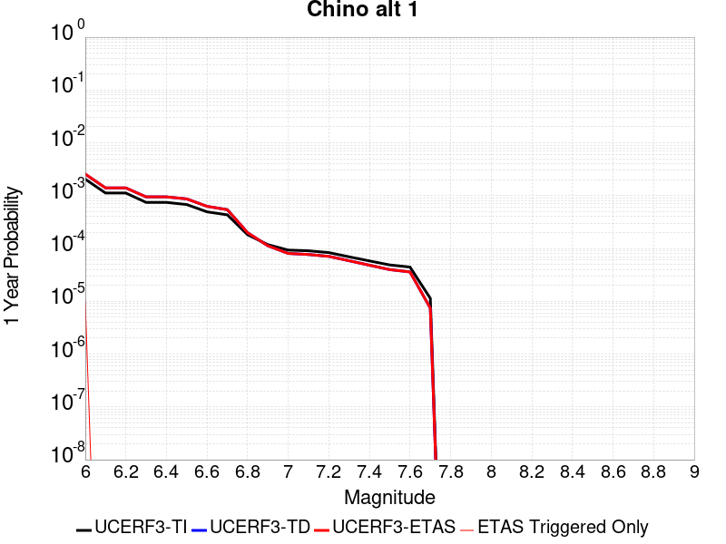 |  |

| Magnitude | 1 wk TI Prob | 1 wk TD Prob | 1 wk ETAS Prob | 1 wk ETAS/TD Gain | 1 wk ETAS Triggered Only | 1 mo TI Prob | 1 mo TD Prob | 1 mo ETAS Prob | 1 mo ETAS/TD Gain | 1 mo ETAS Triggered Only | 1 yr TI Prob | 1 yr TD Prob | 1 yr ETAS Prob | 1 yr ETAS/TD Gain | 1 yr ETAS Triggered Only | 10 yr TI Prob | 10 yr TD Prob | 10 yr ETAS Prob | 10 yr ETAS/TD Gain | 10 yr ETAS Triggered Only |
|-----|-----|-----|-----|-----|-----|-----|-----|-----|-----|-----|-----|-----|-----|-----|-----|-----|-----|-----|-----|-----|
| 6.0 | 3.939946E-5 | 4.896364E-5 | 4.896364E-5 | 1.0 | 0.0 | 1.6884391E-4 | 2.0983024E-4 | 2.0983024E-4 | 1.0 | 0.0 | 0.0020537362 | 0.0025521694 | 0.0025704019 | 1.007144 | 1.8279197E-5 | 0.020348595 | 0.025285466 | 0.025303284 | 1.0007046 | 1.8279197E-5 |
| 6.1 | 2.1505624E-5 | 2.688862E-5 | 2.688862E-5 | 1.0 | 0.0 | 9.2163704E-5 | 1.1523248E-4 | 1.1523248E-4 | 1.0 | 0.0 | 0.0011215154 | 0.0014021639 | 0.0014021639 | 1.0 | 0.0 | 0.011158722 | 0.013950041 | 0.013950041 | 1.0 | 0.0 |
| 6.2 | 2.1505624E-5 | 2.688862E-5 | 2.688862E-5 | 1.0 | 0.0 | 9.2163704E-5 | 1.1523248E-4 | 1.1523248E-4 | 1.0 | 0.0 | 0.0011215154 | 0.0014021639 | 0.0014021639 | 1.0 | 0.0 | 0.011158722 | 0.013950041 | 0.013950041 | 1.0 | 0.0 |
| 6.3 | 1.4290785E-5 | 1.8172794E-5 | 1.8172794E-5 | 1.0 | 0.0 | 6.1244784E-5 | 7.7881334E-5 | 7.7881334E-5 | 1.0 | 0.0 | 7.454001E-4 | 9.478382E-4 | 9.478382E-4 | 1.0 | 0.0 | 0.007429048 | 0.009448385 | 0.009448385 | 1.0 | 0.0 |
| 6.4 | 1.4290785E-5 | 1.8172794E-5 | 1.8172794E-5 | 1.0 | 0.0 | 6.1244784E-5 | 7.7881334E-5 | 7.7881334E-5 | 1.0 | 0.0 | 7.454001E-4 | 9.478382E-4 | 9.478382E-4 | 1.0 | 0.0 | 0.007429048 | 0.009448385 | 0.009448385 | 1.0 | 0.0 |
| 6.5 | 1.3017944E-5 | 1.6659451E-5 | 1.6659451E-5 | 1.0 | 0.0 | 5.5789995E-5 | 7.139594E-5 | 7.139594E-5 | 1.0 | 0.0 | 6.790315E-4 | 8.689427E-4 | 8.689427E-4 | 1.0 | 0.0 | 0.0067696036 | 0.008665723 | 0.008665723 | 1.0 | 0.0 |
| 6.6 | 9.470016E-6 | 1.2045054E-5 | 1.2045054E-5 | 1.0 | 0.0 | 4.058515E-5 | 5.1620827E-5 | 5.1620827E-5 | 1.0 | 0.0 | 4.940122E-4 | 6.2833633E-4 | 6.2833633E-4 | 1.0 | 0.0 | 0.004929154 | 0.0062747966 | 0.0062747966 | 1.0 | 0.0 |
| 6.7 | 8.314155E-6 | 1.0412757E-5 | 1.0412757E-5 | 1.0 | 0.0 | 3.5631605E-5 | 4.462552E-5 | 4.462552E-5 | 1.0 | 0.0 | 4.3372845E-4 | 5.432125E-4 | 5.432125E-4 | 1.0 | 0.0 | 0.004328829 | 0.0054283654 | 0.0054283654 | 1.0 | 0.0 |
| 6.8 | 3.4856364E-6 | 3.815271E-6 | 3.815271E-6 | 1.0 | 0.0 | 1.4938357E-5 | 1.6351072E-5 | 1.6351072E-5 | 1.0 | 0.0 | 1.8185932E-4 | 1.990582E-4 | 1.990582E-4 | 1.0 | 0.0 | 0.0018171056 | 0.0019904745 | 0.0019904745 | 1.0 | 0.0 |
| 6.9 | 2.2645952E-6 | 2.154245E-6 | 2.154245E-6 | 1.0 | 0.0 | 9.705372E-6 | 9.232447E-6 | 9.232447E-6 | 1.0 | 0.0 | 1.18156495E-4 | 1.12399466E-4 | 1.12399466E-4 | 1.0 | 0.0 | 0.0011809369 | 0.0011240423 | 0.0011240423 | 1.0 | 0.0 |
| 7.0 | 1.7864003E-6 | 1.544279E-6 | 1.544279E-6 | 1.0 | 0.0 | 7.655979E-6 | 6.6183225E-6 | 6.6183225E-6 | 1.0 | 0.0 | 9.3207556E-5 | 8.0575155E-5 | 8.0575155E-5 | 1.0 | 0.0 | 9.316847E-4 | 8.0590666E-4 | 8.0590666E-4 | 1.0 | 0.0 |
| 7.1 | 1.7315456E-6 | 1.4745343E-6 | 1.4745343E-6 | 1.0 | 0.0 | 7.420889E-6 | 6.319418E-6 | 6.319418E-6 | 1.0 | 0.0 | 9.034557E-5 | 7.693625E-5 | 7.693625E-5 | 1.0 | 0.0 | 9.0308854E-4 | 7.6953415E-4 | 7.6953415E-4 | 1.0 | 0.0 |
| 7.2 | 1.6008337E-6 | 1.3585526E-6 | 1.3585526E-6 | 1.0 | 0.0 | 6.860698E-6 | 5.8223554E-6 | 5.8223554E-6 | 1.0 | 0.0 | 8.352579E-5 | 7.0884926E-5 | 7.0884926E-5 | 1.0 | 0.0 | 8.34944E-4 | 7.090475E-4 | 7.090475E-4 | 1.0 | 0.0 |
| 7.3 | 1.3320939E-6 | 1.1228274E-6 | 1.1228274E-6 | 1.0 | 0.0 | 5.7089615E-6 | 4.8121087E-6 | 4.8121087E-6 | 1.0 | 0.0 | 6.9504385E-5 | 5.8585894E-5 | 5.8585894E-5 | 1.0 | 0.0 | 6.9482654E-4 | 5.858491E-4 | 5.858491E-4 | 1.0 | 0.0 |
| 7.4 | 1.114294E-6 | 9.2468474E-7 | 9.2468474E-7 | 1.0 | 0.0 | 4.775537E-6 | 3.962929E-6 | 3.962929E-6 | 1.0 | 0.0 | 5.8140613E-5 | 4.8247628E-5 | 4.8247628E-5 | 1.0 | 0.0 | 5.81254E-4 | 4.8238834E-4 | 4.8238834E-4 | 1.0 | 0.0 |
| 7.5 | 9.354081E-7 | 7.632593E-7 | 7.632593E-7 | 1.0 | 0.0 | 4.0088858E-6 | 3.2711075E-6 | 3.2711075E-6 | 1.0 | 0.0 | 4.8807087E-5 | 3.982504E-5 | 3.982504E-5 | 1.0 | 0.0 | 4.879637E-4 | 3.9818246E-4 | 3.9818246E-4 | 1.0 | 0.0 |
| 7.6 | 8.521771E-7 | 6.889629E-7 | 6.889629E-7 | 1.0 | 0.0 | 3.6521824E-6 | 2.9526952E-6 | 2.9526952E-6 | 1.0 | 0.0 | 4.4464414E-5 | 3.5948502E-5 | 3.5948502E-5 | 1.0 | 0.0 | 4.4455516E-4 | 3.5943007E-4 | 3.5943007E-4 | 1.0 | 0.0 |
| 7.7 | 2.1803626E-7 | 1.4211004E-7 | 1.4211004E-7 | 1.0 | 0.0 | 9.344408E-7 | 6.0904296E-7 | 6.0904296E-7 | 1.0 | 0.0 | 1.1376757E-5 | 7.4150826E-6 | 7.4150826E-6 | 1.0 | 0.0 | 1.13761744E-4 | 7.414931E-5 | 7.414931E-5 | 1.0 | 0.0 |

## Jess Valley
*[(top)](#table-of-contents)*

| 1 Week | 1 Month | 1 Year | 10 Year |
|-----|-----|-----|-----|
|  |  |  |  |

| Magnitude | 1 wk TI Prob | 1 wk TD Prob | 1 wk ETAS Prob | 1 wk ETAS/TD Gain | 1 wk ETAS Triggered Only | 1 mo TI Prob | 1 mo TD Prob | 1 mo ETAS Prob | 1 mo ETAS/TD Gain | 1 mo ETAS Triggered Only | 1 yr TI Prob | 1 yr TD Prob | 1 yr ETAS Prob | 1 yr ETAS/TD Gain | 1 yr ETAS Triggered Only | 10 yr TI Prob | 10 yr TD Prob | 10 yr ETAS Prob | 10 yr ETAS/TD Gain | 10 yr ETAS Triggered Only |
|-----|-----|-----|-----|-----|-----|-----|-----|-----|-----|-----|-----|-----|-----|-----|-----|-----|-----|-----|-----|-----|
| 6.0 | 3.3861274E-6 | 3.4341108E-6 | 3.4341108E-6 | 1.0 | 0.0 | 1.4511894E-5 | 1.4717551E-5 | 1.4717551E-5 | 1.0 | 0.0 | 1.7666799E-4 | 1.7917425E-4 | 1.7917425E-4 | 1.0 | 0.0 | 0.001765276 | 0.0017905745 | 0.001808821 | 1.0101902 | 1.8279197E-5 |
| 6.1 | 3.3861274E-6 | 3.4341108E-6 | 3.4341108E-6 | 1.0 | 0.0 | 1.4511894E-5 | 1.4717551E-5 | 1.4717551E-5 | 1.0 | 0.0 | 1.7666799E-4 | 1.7917425E-4 | 1.7917425E-4 | 1.0 | 0.0 | 0.001765276 | 0.0017905745 | 0.001808821 | 1.0101902 | 1.8279197E-5 |
| 6.2 | 3.3861274E-6 | 3.4341108E-6 | 3.4341108E-6 | 1.0 | 0.0 | 1.4511894E-5 | 1.4717551E-5 | 1.4717551E-5 | 1.0 | 0.0 | 1.7666799E-4 | 1.7917425E-4 | 1.7917425E-4 | 1.0 | 0.0 | 0.001765276 | 0.0017905745 | 0.001808821 | 1.0101902 | 1.8279197E-5 |
| 6.3 | 3.3861274E-6 | 3.4341108E-6 | 3.4341108E-6 | 1.0 | 0.0 | 1.4511894E-5 | 1.4717551E-5 | 1.4717551E-5 | 1.0 | 0.0 | 1.7666799E-4 | 1.7917425E-4 | 1.7917425E-4 | 1.0 | 0.0 | 0.001765276 | 0.0017905745 | 0.001808821 | 1.0101902 | 1.8279197E-5 |
| 6.4 | 1.5291708E-6 | 1.5503011E-6 | 1.5503011E-6 | 1.0 | 0.0 | 6.553573E-6 | 6.6441353E-6 | 6.6441353E-6 | 1.0 | 0.0 | 7.978683E-5 | 8.089014E-5 | 8.089014E-5 | 1.0 | 0.0 | 7.975819E-4 | 8.086852E-4 | 8.269496E-4 | 1.0225853 | 1.8279197E-5 |
| 6.5 | 1.5291708E-6 | 1.5503011E-6 | 1.5503011E-6 | 1.0 | 0.0 | 6.553573E-6 | 6.6441353E-6 | 6.6441353E-6 | 1.0 | 0.0 | 7.978683E-5 | 8.089014E-5 | 8.089014E-5 | 1.0 | 0.0 | 7.975819E-4 | 8.086852E-4 | 8.269496E-4 | 1.0225853 | 1.8279197E-5 |
| 6.6 | 5.396423E-7 | 5.4720766E-7 | 5.4720766E-7 | 1.0 | 0.0 | 2.312751E-6 | 2.3451746E-6 | 2.3451746E-6 | 1.0 | 0.0 | 2.8157378E-5 | 2.8552317E-5 | 2.8552317E-5 | 1.0 | 0.0 | 2.8153812E-4 | 2.8550488E-4 | 3.0377886E-4 | 1.0640059 | 1.8279197E-5 |
| 6.7 | 5.396423E-7 | 5.4720766E-7 | 5.4720766E-7 | 1.0 | 0.0 | 2.312751E-6 | 2.3451746E-6 | 2.3451746E-6 | 1.0 | 0.0 | 2.8157378E-5 | 2.8552317E-5 | 2.8552317E-5 | 1.0 | 0.0 | 2.8153812E-4 | 2.8550488E-4 | 3.0377886E-4 | 1.0640059 | 1.8279197E-5 |
| 6.8 | 3.6058395E-7 | 3.656361E-7 | 3.656361E-7 | 1.0 | 0.0 | 1.5453588E-6 | 1.5670119E-6 | 1.5670119E-6 | 1.0 | 0.0 | 1.8814582E-5 | 1.9078368E-5 | 1.9078368E-5 | 1.0 | 0.0 | 1.8812988E-4 | 1.907837E-4 | 2.090594E-4 | 1.0957928 | 1.8279197E-5 |

## Cucamonga
*[(top)](#table-of-contents)*

| 1 Week | 1 Month | 1 Year | 10 Year |
|-----|-----|-----|-----|
|  |  |  |  |

| Magnitude | 1 wk TI Prob | 1 wk TD Prob | 1 wk ETAS Prob | 1 wk ETAS/TD Gain | 1 wk ETAS Triggered Only | 1 mo TI Prob | 1 mo TD Prob | 1 mo ETAS Prob | 1 mo ETAS/TD Gain | 1 mo ETAS Triggered Only | 1 yr TI Prob | 1 yr TD Prob | 1 yr ETAS Prob | 1 yr ETAS/TD Gain | 1 yr ETAS Triggered Only | 10 yr TI Prob | 10 yr TD Prob | 10 yr ETAS Prob | 10 yr ETAS/TD Gain | 10 yr ETAS Triggered Only |
|-----|-----|-----|-----|-----|-----|-----|-----|-----|-----|-----|-----|-----|-----|-----|-----|-----|-----|-----|-----|-----|
| 6.0 | 1.1848348E-5 | 1.1742451E-5 | 1.1742451E-5 | 1.0 | 0.0 | 5.0777642E-5 | 5.032383E-5 | 5.032383E-5 | 1.0 | 0.0 | 6.180424E-4 | 6.125231E-4 | 6.125231E-4 | 1.0 | 0.0 | 0.0061632637 | 0.0061095147 | 0.0061276825 | 1.0029737 | 1.8279197E-5 |
| 6.1 | 1.1848348E-5 | 1.1742451E-5 | 1.1742451E-5 | 1.0 | 0.0 | 5.0777642E-5 | 5.032383E-5 | 5.032383E-5 | 1.0 | 0.0 | 6.180424E-4 | 6.125231E-4 | 6.125231E-4 | 1.0 | 0.0 | 0.0061632637 | 0.0061095147 | 0.0061276825 | 1.0029737 | 1.8279197E-5 |
| 6.2 | 1.1848348E-5 | 1.1742451E-5 | 1.1742451E-5 | 1.0 | 0.0 | 5.0777642E-5 | 5.032383E-5 | 5.032383E-5 | 1.0 | 0.0 | 6.180424E-4 | 6.125231E-4 | 6.125231E-4 | 1.0 | 0.0 | 0.0061632637 | 0.0061095147 | 0.0061276825 | 1.0029737 | 1.8279197E-5 |
| 6.3 | 1.1848348E-5 | 1.1742451E-5 | 1.1742451E-5 | 1.0 | 0.0 | 5.0777642E-5 | 5.032383E-5 | 5.032383E-5 | 1.0 | 0.0 | 6.180424E-4 | 6.125231E-4 | 6.125231E-4 | 1.0 | 0.0 | 0.0061632637 | 0.0061095147 | 0.0061276825 | 1.0029737 | 1.8279197E-5 |
| 6.4 | 1.1848348E-5 | 1.1742451E-5 | 1.1742451E-5 | 1.0 | 0.0 | 5.0777642E-5 | 5.032383E-5 | 5.032383E-5 | 1.0 | 0.0 | 6.180424E-4 | 6.125231E-4 | 6.125231E-4 | 1.0 | 0.0 | 0.0061632637 | 0.0061095147 | 0.0061276825 | 1.0029737 | 1.8279197E-5 |
| 6.5 | 1.16988695E-5 | 1.1581468E-5 | 1.1581468E-5 | 1.0 | 0.0 | 5.013705E-5 | 4.9633934E-5 | 4.9633934E-5 | 1.0 | 0.0 | 6.102476E-4 | 6.041283E-4 | 6.041283E-4 | 1.0 | 0.0 | 0.006085745 | 0.0060260226 | 0.0060260226 | 1.0 | 0.0 |
| 6.6 | 1.16988695E-5 | 1.1581468E-5 | 1.1581468E-5 | 1.0 | 0.0 | 5.013705E-5 | 4.9633934E-5 | 4.9633934E-5 | 1.0 | 0.0 | 6.102476E-4 | 6.041283E-4 | 6.041283E-4 | 1.0 | 0.0 | 0.006085745 | 0.0060260226 | 0.0060260226 | 1.0 | 0.0 |
| 6.7 | 1.1397107E-5 | 1.1120239E-5 | 1.1120239E-5 | 1.0 | 0.0 | 4.884383E-5 | 4.765731E-5 | 4.765731E-5 | 1.0 | 0.0 | 5.9451134E-4 | 5.800758E-4 | 5.800758E-4 | 1.0 | 0.0 | 0.005929234 | 0.0057867584 | 0.0057867584 | 1.0 | 0.0 |
| 6.8 | 1.058387E-5 | 9.789649E-6 | 9.789649E-6 | 1.0 | 0.0 | 4.5358654E-5 | 4.195497E-5 | 4.195497E-5 | 1.0 | 0.0 | 5.521017E-4 | 5.1068317E-4 | 5.1068317E-4 | 1.0 | 0.0 | 0.00550732 | 0.005096096 | 0.005096096 | 1.0 | 0.0 |
| 6.9 | 9.690046E-6 | 8.583722E-6 | 8.583722E-6 | 1.0 | 0.0 | 4.1528107E-5 | 3.6786863E-5 | 3.6786863E-5 | 1.0 | 0.0 | 5.054874E-4 | 4.4778842E-4 | 4.4778842E-4 | 1.0 | 0.0 | 0.005043391 | 0.0044697877 | 0.0044697877 | 1.0 | 0.0 |
| 7.0 | 9.381461E-6 | 8.191231E-6 | 8.191231E-6 | 1.0 | 0.0 | 4.020564E-5 | 3.5104807E-5 | 3.5104807E-5 | 1.0 | 0.0 | 4.893937E-4 | 4.2731757E-4 | 4.2731757E-4 | 1.0 | 0.0 | 0.0048831734 | 0.004265884 | 0.004265884 | 1.0 | 0.0 |
| 7.1 | 8.946492E-6 | 7.785935E-6 | 7.785935E-6 | 1.0 | 0.0 | 3.8341543E-5 | 3.336787E-5 | 3.336787E-5 | 1.0 | 0.0 | 4.667083E-4 | 4.0617838E-4 | 4.0617838E-4 | 1.0 | 0.0 | 0.0046572937 | 0.0040552868 | 0.0040552868 | 1.0 | 0.0 |
| 7.2 | 8.251016E-6 | 6.9790576E-6 | 6.9790576E-6 | 1.0 | 0.0 | 3.5361016E-5 | 2.9909905E-5 | 2.9909905E-5 | 1.0 | 0.0 | 4.3043532E-4 | 3.6409247E-4 | 3.6409247E-4 | 1.0 | 0.0 | 0.0042960253 | 0.0036358838 | 0.0036358838 | 1.0 | 0.0 |
| 7.3 | 7.717881E-6 | 6.4900078E-6 | 6.4900078E-6 | 1.0 | 0.0 | 3.3076216E-5 | 2.7814025E-5 | 2.7814025E-5 | 1.0 | 0.0 | 4.026285E-4 | 3.3858334E-4 | 3.3858334E-4 | 1.0 | 0.0 | 0.004018998 | 0.0033816027 | 0.0033816027 | 1.0 | 0.0 |
| 7.4 | 7.275623E-6 | 6.03551E-6 | 6.03551E-6 | 1.0 | 0.0 | 3.118087E-5 | 2.5866215E-5 | 2.5866215E-5 | 1.0 | 0.0 | 3.7956095E-4 | 3.1487588E-4 | 3.1487588E-4 | 1.0 | 0.0 | 0.0037891332 | 0.0031452242 | 0.0031452242 | 1.0 | 0.0 |
| 7.5 | 6.5109502E-6 | 5.1037223E-6 | 5.1037223E-6 | 1.0 | 0.0 | 2.7903774E-5 | 2.1872913E-5 | 2.1872913E-5 | 1.0 | 0.0 | 3.3967546E-4 | 2.662703E-4 | 2.662703E-4 | 1.0 | 0.0 | 0.0033915674 | 0.002660428 | 0.002660428 | 1.0 | 0.0 |
| 7.6 | 5.4495326E-6 | 3.911345E-6 | 3.911345E-6 | 1.0 | 0.0 | 2.335493E-5 | 1.67628E-5 | 1.67628E-5 | 1.0 | 0.0 | 2.8430918E-4 | 2.0406804E-4 | 2.0406804E-4 | 1.0 | 0.0 | 0.0028394572 | 0.002039718 | 0.002039718 | 1.0 | 0.0 |
| 7.7 | 4.7997164E-6 | 3.2027551E-6 | 3.2027551E-6 | 1.0 | 0.0 | 2.057005E-5 | 1.3726021E-5 | 1.3726021E-5 | 1.0 | 0.0 | 2.504116E-4 | 1.6710153E-4 | 1.6710153E-4 | 1.0 | 0.0 | 0.002501296 | 0.0016706818 | 0.0016706818 | 1.0 | 0.0 |
| 7.8 | 3.3941733E-6 | 2.065652E-6 | 2.065652E-6 | 1.0 | 0.0 | 1.4546376E-5 | 8.852764E-6 | 8.852764E-6 | 1.0 | 0.0 | 1.7708774E-4 | 1.07777094E-4 | 1.07777094E-4 | 1.0 | 0.0 | 0.0017694668 | 0.0010774855 | 0.0010774855 | 1.0 | 0.0 |
| 7.9 | 9.750552E-7 | 5.160662E-7 | 5.160662E-7 | 1.0 | 0.0 | 4.178801E-6 | 2.2117106E-6 | 2.2117106E-6 | 1.0 | 0.0 | 5.0875715E-5 | 2.6927248E-5 | 2.6927248E-5 | 1.0 | 0.0 | 5.086407E-4 | 2.6924026E-4 | 2.6924026E-4 | 1.0 | 0.0 |
| 8.0 | 1.133857E-7 | 6.056467E-8 | 6.056467E-8 | 1.0 | 0.0 | 4.8593864E-7 | 2.5956285E-7 | 2.5956285E-7 | 1.0 | 0.0 | 5.9162867E-6 | 3.1601733E-6 | 3.1601733E-6 | 1.0 | 0.0 | 5.916129E-5 | 3.16013E-5 | 3.16013E-5 | 1.0 | 0.0 |

## Earthquake Valley (No  Extension)
*[(top)](#table-of-contents)*

| 1 Week | 1 Month | 1 Year | 10 Year |
|-----|-----|-----|-----|
|  | 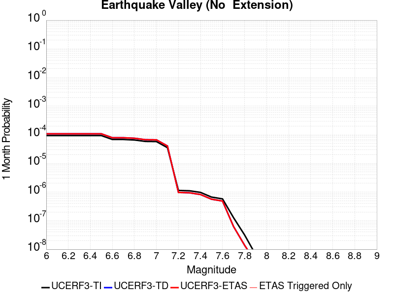 |  |  |

| Magnitude | 1 wk TI Prob | 1 wk TD Prob | 1 wk ETAS Prob | 1 wk ETAS/TD Gain | 1 wk ETAS Triggered Only | 1 mo TI Prob | 1 mo TD Prob | 1 mo ETAS Prob | 1 mo ETAS/TD Gain | 1 mo ETAS Triggered Only | 1 yr TI Prob | 1 yr TD Prob | 1 yr ETAS Prob | 1 yr ETAS/TD Gain | 1 yr ETAS Triggered Only | 10 yr TI Prob | 10 yr TD Prob | 10 yr ETAS Prob | 10 yr ETAS/TD Gain | 10 yr ETAS Triggered Only |
|-----|-----|-----|-----|-----|-----|-----|-----|-----|-----|-----|-----|-----|-----|-----|-----|-----|-----|-----|-----|-----|
| 6.0 | 2.1859703E-5 | 2.5202557E-5 | 2.5202557E-5 | 1.0 | 0.0 | 9.3681076E-5 | 1.08007305E-4 | 1.08007305E-4 | 1.0 | 0.0 | 0.0011399703 | 0.0013143406 | 0.0013143406 | 1.0 | 0.0 | 0.011341401 | 0.013080036 | 0.013098077 | 1.0013793 | 1.8279197E-5 |
| 6.1 | 2.1859703E-5 | 2.5202557E-5 | 2.5202557E-5 | 1.0 | 0.0 | 9.3681076E-5 | 1.08007305E-4 | 1.08007305E-4 | 1.0 | 0.0 | 0.0011399703 | 0.0013143406 | 0.0013143406 | 1.0 | 0.0 | 0.011341401 | 0.013080036 | 0.013098077 | 1.0013793 | 1.8279197E-5 |
| 6.2 | 2.1859703E-5 | 2.5202557E-5 | 2.5202557E-5 | 1.0 | 0.0 | 9.3681076E-5 | 1.08007305E-4 | 1.08007305E-4 | 1.0 | 0.0 | 0.0011399703 | 0.0013143406 | 0.0013143406 | 1.0 | 0.0 | 0.011341401 | 0.013080036 | 0.013098077 | 1.0013793 | 1.8279197E-5 |
| 6.3 | 2.1859703E-5 | 2.5202557E-5 | 2.5202557E-5 | 1.0 | 0.0 | 9.3681076E-5 | 1.08007305E-4 | 1.08007305E-4 | 1.0 | 0.0 | 0.0011399703 | 0.0013143406 | 0.0013143406 | 1.0 | 0.0 | 0.011341401 | 0.013080036 | 0.013098077 | 1.0013793 | 1.8279197E-5 |
| 6.4 | 2.1859703E-5 | 2.5202557E-5 | 2.5202557E-5 | 1.0 | 0.0 | 9.3681076E-5 | 1.08007305E-4 | 1.08007305E-4 | 1.0 | 0.0 | 0.0011399703 | 0.0013143406 | 0.0013143406 | 1.0 | 0.0 | 0.011341401 | 0.013080036 | 0.013098077 | 1.0013793 | 1.8279197E-5 |
| 6.5 | 2.1859703E-5 | 2.5202557E-5 | 2.5202557E-5 | 1.0 | 0.0 | 9.3681076E-5 | 1.08007305E-4 | 1.08007305E-4 | 1.0 | 0.0 | 0.0011399703 | 0.0013143406 | 0.0013143406 | 1.0 | 0.0 | 0.011341401 | 0.013080036 | 0.013098077 | 1.0013793 | 1.8279197E-5 |
| 6.6 | 1.597E-5 | 1.8359297E-5 | 1.8359297E-5 | 1.0 | 0.0 | 6.8441055E-5 | 7.868082E-5 | 7.868082E-5 | 1.0 | 0.0 | 8.329513E-4 | 9.576053E-4 | 9.576053E-4 | 1.0 | 0.0 | 0.008298361 | 0.0095434 | 0.009561505 | 1.0018971 | 1.8279197E-5 |
| 6.7 | 1.597E-5 | 1.8359297E-5 | 1.8359297E-5 | 1.0 | 0.0 | 6.8441055E-5 | 7.868082E-5 | 7.868082E-5 | 1.0 | 0.0 | 8.329513E-4 | 9.576053E-4 | 9.576053E-4 | 1.0 | 0.0 | 0.008298361 | 0.0095434 | 0.009561505 | 1.0018971 | 1.8279197E-5 |
| 6.8 | 1.5315149E-5 | 1.7604993E-5 | 1.7604993E-5 | 1.0 | 0.0 | 6.5634704E-5 | 7.544827E-5 | 7.544827E-5 | 1.0 | 0.0 | 7.988095E-4 | 9.182823E-4 | 9.182823E-4 | 1.0 | 0.0 | 0.007959441 | 0.009153421 | 0.009171533 | 1.0019788 | 1.8279197E-5 |
| 6.9 | 1.3634728E-5 | 1.5678423E-5 | 1.5678423E-5 | 1.0 | 0.0 | 5.8433237E-5 | 6.719197E-5 | 6.719197E-5 | 1.0 | 0.0 | 7.1119244E-4 | 8.178373E-4 | 8.178373E-4 | 1.0 | 0.0 | 0.007089207 | 0.008156349 | 0.008156349 | 1.0 | 0.0 |
| 7.0 | 1.3496271E-5 | 1.552043E-5 | 1.552043E-5 | 1.0 | 0.0 | 5.783988E-5 | 6.65149E-5 | 6.65149E-5 | 1.0 | 0.0 | 7.03973E-4 | 8.0960005E-4 | 8.0960005E-4 | 1.0 | 0.0 | 0.007017471 | 0.008074577 | 0.008074577 | 1.0 | 0.0 |
| 7.1 | 8.242798E-6 | 9.47421E-6 | 9.47421E-6 | 1.0 | 0.0 | 3.53258E-5 | 4.0603503E-5 | 4.0603503E-5 | 1.0 | 0.0 | 4.300067E-4 | 4.943026E-4 | 4.943026E-4 | 1.0 | 0.0 | 0.004291756 | 0.00493861 | 0.00493861 | 1.0 | 0.0 |
| 7.2 | 2.6506527E-7 | 2.2565123E-7 | 2.2565123E-7 | 1.0 | 0.0 | 1.1359936E-6 | 9.670764E-7 | 9.670764E-7 | 1.0 | 0.0 | 1.3830633E-5 | 1.1774096E-5 | 1.1774096E-5 | 1.0 | 0.0 | 1.3829772E-4 | 1.1773513E-4 | 1.1773513E-4 | 1.0 | 0.0 |
| 7.3 | 2.5810488E-7 | 2.196019E-7 | 2.196019E-7 | 1.0 | 0.0 | 1.1061633E-6 | 9.411507E-7 | 9.411507E-7 | 1.0 | 0.0 | 1.3467455E-5 | 1.1458454E-5 | 1.1458454E-5 | 1.0 | 0.0 | 1.3466639E-4 | 1.1457904E-4 | 1.1457904E-4 | 1.0 | 0.0 |
| 7.4 | 2.2676066E-7 | 1.9115149E-7 | 1.9115149E-7 | 1.0 | 0.0 | 9.71831E-7 | 8.192204E-7 | 8.192204E-7 | 1.0 | 0.0 | 1.1831979E-5 | 9.973967E-6 | 9.973967E-6 | 1.0 | 0.0 | 1.1831349E-4 | 9.973558E-5 | 9.973558E-5 | 1.0 | 0.0 |
| 7.5 | 1.5553917E-7 | 1.3115734E-7 | 1.3115734E-7 | 1.0 | 0.0 | 6.6659624E-7 | 5.6210274E-7 | 5.6210274E-7 | 1.0 | 0.0 | 8.115779E-6 | 6.843582E-6 | 6.843582E-6 | 1.0 | 0.0 | 8.115482E-5 | 6.843393E-5 | 6.843393E-5 | 1.0 | 0.0 |
| 7.6 | 1.3448629E-7 | 1.1291606E-7 | 1.1291606E-7 | 1.0 | 0.0 | 5.7636964E-7 | 4.839259E-7 | 4.839259E-7 | 1.0 | 0.0 | 7.017278E-6 | 5.891784E-6 | 5.891784E-6 | 1.0 | 0.0 | 7.0170565E-5 | 5.8916492E-5 | 5.8916492E-5 | 1.0 | 0.0 |
| 7.7 | 2.9719402E-8 | 1.4587915E-8 | 1.4587915E-8 | 1.0 | 0.0 | 1.2736886E-7 | 6.251963E-8 | 6.251963E-8 | 1.0 | 0.0 | 1.5507147E-6 | 7.611763E-7 | 7.611763E-7 | 1.0 | 0.0 | 1.550704E-5 | 7.611742E-6 | 7.611742E-6 | 1.0 | 0.0 |
| 7.8 | 7.4390196E-9 | 3.2514678E-9 | 3.2514678E-9 | 1.0 | 0.0 | 3.1881513E-8 | 1.3934862E-8 | 1.3934862E-8 | 1.0 | 0.0 | 3.8815733E-7 | 1.6965694E-7 | 1.6965694E-7 | 1.0 | 0.0 | 3.8815665E-6 | 1.6965683E-6 | 1.6965683E-6 | 1.0 | 0.0 |
| 7.9 | 1.5373532E-9 | 8.4424734E-10 | 8.4424734E-10 | 1.0 | 0.0 | 6.5886567E-9 | 3.618203E-9 | 3.618203E-9 | 1.0 | 0.0 | 8.021689E-8 | 4.4051625E-8 | 4.4051625E-8 | 1.0 | 0.0 | 8.0216864E-7 | 4.405162E-7 | 4.405162E-7 | 1.0 | 0.0 |

## San Jacinto (Lytle Creek connector)
*[(top)](#table-of-contents)*

| 1 Week | 1 Month | 1 Year | 10 Year |
|-----|-----|-----|-----|
|  |  |  |  |

| Magnitude | 1 wk TI Prob | 1 wk TD Prob | 1 wk ETAS Prob | 1 wk ETAS/TD Gain | 1 wk ETAS Triggered Only | 1 mo TI Prob | 1 mo TD Prob | 1 mo ETAS Prob | 1 mo ETAS/TD Gain | 1 mo ETAS Triggered Only | 1 yr TI Prob | 1 yr TD Prob | 1 yr ETAS Prob | 1 yr ETAS/TD Gain | 1 yr ETAS Triggered Only | 10 yr TI Prob | 10 yr TD Prob | 10 yr ETAS Prob | 10 yr ETAS/TD Gain | 10 yr ETAS Triggered Only |
|-----|-----|-----|-----|-----|-----|-----|-----|-----|-----|-----|-----|-----|-----|-----|-----|-----|-----|-----|-----|-----|
| 6.0 | 6.693995E-6 | 6.681815E-6 | 6.681815E-6 | 1.0 | 0.0 | 2.8688235E-5 | 2.8636037E-5 | 4.691471E-5 | 1.6383102 | 1.8279197E-5 | 3.492233E-4 | 3.4858804E-4 | 3.6686088E-4 | 1.0524195 | 1.8279197E-5 | 0.00348675 | 0.0035606013 | 0.0035788154 | 1.0051155 | 1.8279197E-5 |
| 6.1 | 6.693995E-6 | 6.681815E-6 | 6.681815E-6 | 1.0 | 0.0 | 2.8688235E-5 | 2.8636037E-5 | 4.691471E-5 | 1.6383102 | 1.8279197E-5 | 3.492233E-4 | 3.4858804E-4 | 3.6686088E-4 | 1.0524195 | 1.8279197E-5 | 0.00348675 | 0.0035606013 | 0.0035788154 | 1.0051155 | 1.8279197E-5 |
| 6.2 | 6.693995E-6 | 6.681815E-6 | 6.681815E-6 | 1.0 | 0.0 | 2.8688235E-5 | 2.8636037E-5 | 4.691471E-5 | 1.6383102 | 1.8279197E-5 | 3.492233E-4 | 3.4858804E-4 | 3.6686088E-4 | 1.0524195 | 1.8279197E-5 | 0.00348675 | 0.0035606013 | 0.0035788154 | 1.0051155 | 1.8279197E-5 |
| 6.3 | 6.693995E-6 | 6.681815E-6 | 6.681815E-6 | 1.0 | 0.0 | 2.8688235E-5 | 2.8636037E-5 | 4.691471E-5 | 1.6383102 | 1.8279197E-5 | 3.492233E-4 | 3.4858804E-4 | 3.6686088E-4 | 1.0524195 | 1.8279197E-5 | 0.00348675 | 0.0035606013 | 0.0035788154 | 1.0051155 | 1.8279197E-5 |
| 6.4 | 6.693995E-6 | 6.681815E-6 | 6.681815E-6 | 1.0 | 0.0 | 2.8688235E-5 | 2.8636037E-5 | 4.691471E-5 | 1.6383102 | 1.8279197E-5 | 3.492233E-4 | 3.4858804E-4 | 3.6686088E-4 | 1.0524195 | 1.8279197E-5 | 0.00348675 | 0.0035606013 | 0.0035788154 | 1.0051155 | 1.8279197E-5 |
| 6.5 | 6.6561875E-6 | 6.642031E-6 | 6.642031E-6 | 1.0 | 0.0 | 2.8526205E-5 | 2.8465536E-5 | 4.674421E-5 | 1.6421336 | 1.8279197E-5 | 3.472512E-4 | 3.4651288E-4 | 3.6478575E-4 | 1.0527335 | 1.8279197E-5 | 0.0034670907 | 0.0035399157 | 0.0035581302 | 1.0051454 | 1.8279197E-5 |
| 6.6 | 6.6561875E-6 | 6.642031E-6 | 6.642031E-6 | 1.0 | 0.0 | 2.8526205E-5 | 2.8465536E-5 | 4.674421E-5 | 1.6421336 | 1.8279197E-5 | 3.472512E-4 | 3.4651288E-4 | 3.6478575E-4 | 1.0527335 | 1.8279197E-5 | 0.0034670907 | 0.0035399157 | 0.0035581302 | 1.0051454 | 1.8279197E-5 |
| 6.7 | 6.5802237E-6 | 6.5612026E-6 | 6.5612026E-6 | 1.0 | 0.0 | 2.8200653E-5 | 2.8119137E-5 | 4.639782E-5 | 1.6500442 | 1.8279197E-5 | 3.4328885E-4 | 3.422968E-4 | 3.605697E-4 | 1.0533834 | 1.8279197E-5 | 0.0034275902 | 0.003497888 | 0.0035161031 | 1.0052075 | 1.8279197E-5 |
| 6.8 | 6.575632E-6 | 6.555691E-6 | 6.555691E-6 | 1.0 | 0.0 | 2.8180975E-5 | 2.8095517E-5 | 4.63742E-5 | 1.6505908 | 1.8279197E-5 | 3.4304935E-4 | 3.420093E-4 | 3.6028225E-4 | 1.0534282 | 1.8279197E-5 | 0.0034252026 | 0.0034950222 | 0.0035132375 | 1.0052118 | 1.8279197E-5 |
| 6.9 | 6.570433E-6 | 6.547082E-6 | 6.547082E-6 | 1.0 | 0.0 | 2.8158694E-5 | 2.8058621E-5 | 4.6337304E-5 | 1.6514462 | 1.8279197E-5 | 3.4277816E-4 | 3.4156026E-4 | 3.5983318E-4 | 1.0534985 | 1.8279197E-5 | 0.0034224992 | 0.0034905458 | 0.003508761 | 1.0052185 | 1.8279197E-5 |
| 7.0 | 6.5643826E-6 | 6.5371996E-6 | 6.5371996E-6 | 1.0 | 0.0 | 2.8132765E-5 | 2.801627E-5 | 4.6294954E-5 | 1.6524311 | 1.8279197E-5 | 3.424626E-4 | 3.4104477E-4 | 3.5931772E-4 | 1.0535793 | 1.8279197E-5 | 0.0034193532 | 0.0034854072 | 0.0035036227 | 1.0052263 | 1.8279197E-5 |
| 7.1 | 6.557402E-6 | 6.525908E-6 | 6.525908E-6 | 1.0 | 0.0 | 2.8102848E-5 | 2.7967875E-5 | 4.624656E-5 | 1.65356 | 1.8279197E-5 | 3.4209844E-4 | 3.4045576E-4 | 3.5872872E-4 | 1.0536721 | 1.8279197E-5 | 0.0034157229 | 0.0034795366 | 0.0034977521 | 1.0052351 | 1.8279197E-5 |
| 7.2 | 6.546394E-6 | 6.507867E-6 | 6.507867E-6 | 1.0 | 0.0 | 2.8055672E-5 | 2.789056E-5 | 4.6169247E-5 | 1.6553718 | 1.8279197E-5 | 3.4152428E-4 | 3.3951475E-4 | 3.5778774E-4 | 1.0538208 | 1.8279197E-5 | 0.0034099987 | 0.0034701603 | 0.003488376 | 1.0052493 | 1.8279197E-5 |
| 7.3 | 6.5364216E-6 | 6.488639E-6 | 6.488639E-6 | 1.0 | 0.0 | 2.8012933E-5 | 2.7808157E-5 | 4.6086847E-5 | 1.657314 | 1.8279197E-5 | 3.4100408E-4 | 3.3851177E-4 | 3.567848E-4 | 1.0539805 | 1.8279197E-5 | 0.003404813 | 0.003460175 | 0.0034783909 | 1.0052644 | 1.8279197E-5 |
| 7.4 | 6.5269523E-6 | 6.4697106E-6 | 6.4697106E-6 | 1.0 | 0.0 | 2.7972354E-5 | 2.7727036E-5 | 4.6005727E-5 | 1.659237 | 1.8279197E-5 | 3.4051016E-4 | 3.3752446E-4 | 3.5579747E-4 | 1.0541384 | 1.8279197E-5 | 0.0033998888 | 0.0034503492 | 0.0034685652 | 1.0052795 | 1.8279197E-5 |
| 7.5 | 6.5111835E-6 | 6.4459678E-6 | 6.4459678E-6 | 1.0 | 0.0 | 2.7904773E-5 | 2.7625285E-5 | 4.5903977E-5 | 1.6616653 | 1.8279197E-5 | 3.3968766E-4 | 3.36286E-4 | 3.5455904E-4 | 1.0543379 | 1.8279197E-5 | 0.0033916887 | 0.0034380136 | 0.00345623 | 1.0052985 | 1.8279197E-5 |
| 7.6 | 6.4768806E-6 | 6.405051E-6 | 6.405051E-6 | 1.0 | 0.0 | 2.7757764E-5 | 2.744993E-5 | 4.5728626E-5 | 1.6658922 | 1.8279197E-5 | 3.3789838E-4 | 3.3415173E-4 | 3.524248E-4 | 1.054685 | 1.8279197E-5 | 0.0033738504 | 0.0034167327 | 0.0034349496 | 1.0053316 | 1.8279197E-5 |
| 7.7 | 6.1655364E-6 | 6.1973606E-6 | 6.1973606E-6 | 1.0 | 0.0 | 2.642346E-5 | 2.6559846E-5 | 4.4838558E-5 | 1.6882085 | 1.8279197E-5 | 3.2165812E-4 | 3.233182E-4 | 3.415915E-4 | 1.056518 | 1.8279197E-5 | 0.0032119295 | 0.0033082566 | 0.0033264754 | 1.005507 | 1.8279197E-5 |
| 7.8 | 5.5043524E-6 | 5.757815E-6 | 5.757815E-6 | 1.0 | 0.0 | 2.3589868E-5 | 2.4676117E-5 | 4.2954864E-5 | 1.7407464 | 1.8279197E-5 | 2.871688E-4 | 3.0039035E-4 | 3.1866407E-4 | 1.0608332 | 1.8279197E-5 | 0.0028679797 | 0.0030780456 | 0.0030962685 | 1.0059203 | 1.8279197E-5 |
| 7.9 | 3.889249E-6 | 4.093644E-6 | 4.093644E-6 | 1.0 | 0.0 | 1.6668104E-5 | 1.7544071E-5 | 3.5822948E-5 | 2.0418835 | 1.8279197E-5 | 2.0291525E-4 | 2.1357817E-4 | 2.3185345E-4 | 1.0855672 | 1.8279197E-5 | 0.0020273007 | 0.0022031514 | 0.0022213904 | 1.0082786 | 1.8279197E-5 |
| 8.0 | 2.668535E-6 | 2.5432325E-6 | 2.5432325E-6 | 1.0 | 0.0 | 1.1436528E-5 | 1.0899523E-5 | 2.917852E-5 | 2.6770456 | 1.8279197E-5 | 1.3923083E-4 | 1.3269363E-4 | 1.509704E-4 | 1.1377366 | 1.8279197E-5 | 0.0013914363 | 0.0013819975 | 0.0014002514 | 1.0132084 | 1.8279197E-5 |
| 8.1 | 1.5911459E-6 | 1.2249695E-6 | 1.2249695E-6 | 1.0 | 0.0 | 6.8191785E-6 | 5.2498585E-6 | 2.3528959E-5 | 4.4818273 | 1.8279197E-5 | 8.3020335E-5 | 6.391518E-5 | 8.2193204E-5 | 1.2859732 | 1.8279197E-5 | 8.298933E-4 | 6.7271094E-4 | 6.9097785E-4 | 1.0271542 | 1.8279197E-5 |
| 8.2 | 6.1294963E-7 | 2.1997926E-7 | 2.1997926E-7 | 1.0 | 0.0 | 2.6269242E-6 | 9.427679E-7 | 9.427679E-7 | 1.0 | 0.0 | 3.1982334E-5 | 1.1478139E-5 | 1.1478139E-5 | 1.0 | 0.0 | 3.1977732E-4 | 1.2888854E-4 | 1.2888854E-4 | 1.0 | 0.0 |
| 8.3 | 1.762871E-7 | 4.8017917E-8 | 4.8017917E-8 | 1.0 | 0.0 | 7.5551594E-7 | 2.0579105E-7 | 2.0579105E-7 | 1.0 | 0.0 | 9.1983675E-6 | 2.5055033E-6 | 2.5055033E-6 | 1.0 | 0.0 | 9.197987E-5 | 2.895802E-5 | 2.895802E-5 | 1.0 | 0.0 |

## Deep Springs
*[(top)](#table-of-contents)*

| 1 Week | 1 Month | 1 Year | 10 Year |
|-----|-----|-----|-----|
|  |  |  |  |

| Magnitude | 1 wk TI Prob | 1 wk TD Prob | 1 wk ETAS Prob | 1 wk ETAS/TD Gain | 1 wk ETAS Triggered Only | 1 mo TI Prob | 1 mo TD Prob | 1 mo ETAS Prob | 1 mo ETAS/TD Gain | 1 mo ETAS Triggered Only | 1 yr TI Prob | 1 yr TD Prob | 1 yr ETAS Prob | 1 yr ETAS/TD Gain | 1 yr ETAS Triggered Only | 10 yr TI Prob | 10 yr TD Prob | 10 yr ETAS Prob | 10 yr ETAS/TD Gain | 10 yr ETAS Triggered Only |
|-----|-----|-----|-----|-----|-----|-----|-----|-----|-----|-----|-----|-----|-----|-----|-----|-----|-----|-----|-----|-----|
| 6.0 | 1.9810619E-5 | 2.3116607E-5 | 2.3116607E-5 | 1.0 | 0.0 | 8.489989E-5 | 9.9070276E-5 | 9.9070276E-5 | 1.0 | 0.0 | 0.001033166 | 0.001206021 | 0.001206021 | 1.0 | 0.0 | 0.010283757 | 0.01204455 | 0.012062609 | 1.0014993 | 1.8279197E-5 |
| 6.1 | 1.9810619E-5 | 2.3116607E-5 | 2.3116607E-5 | 1.0 | 0.0 | 8.489989E-5 | 9.9070276E-5 | 9.9070276E-5 | 1.0 | 0.0 | 0.001033166 | 0.001206021 | 0.001206021 | 1.0 | 0.0 | 0.010283757 | 0.01204455 | 0.012062609 | 1.0014993 | 1.8279197E-5 |
| 6.2 | 1.9810619E-5 | 2.3116607E-5 | 2.3116607E-5 | 1.0 | 0.0 | 8.489989E-5 | 9.9070276E-5 | 9.9070276E-5 | 1.0 | 0.0 | 0.001033166 | 0.001206021 | 0.001206021 | 1.0 | 0.0 | 0.010283757 | 0.01204455 | 0.012062609 | 1.0014993 | 1.8279197E-5 |
| 6.3 | 1.9810619E-5 | 2.3116607E-5 | 2.3116607E-5 | 1.0 | 0.0 | 8.489989E-5 | 9.9070276E-5 | 9.9070276E-5 | 1.0 | 0.0 | 0.001033166 | 0.001206021 | 0.001206021 | 1.0 | 0.0 | 0.010283757 | 0.01204455 | 0.012062609 | 1.0014993 | 1.8279197E-5 |
| 6.4 | 1.9810619E-5 | 2.3116607E-5 | 2.3116607E-5 | 1.0 | 0.0 | 8.489989E-5 | 9.9070276E-5 | 9.9070276E-5 | 1.0 | 0.0 | 0.001033166 | 0.001206021 | 0.001206021 | 1.0 | 0.0 | 0.010283757 | 0.01204455 | 0.012062609 | 1.0014993 | 1.8279197E-5 |
| 6.5 | 1.7190405E-5 | 2.0054096E-5 | 2.0054096E-5 | 1.0 | 0.0 | 7.367108E-5 | 8.594612E-5 | 8.594612E-5 | 1.0 | 0.0 | 8.9657627E-4 | 0.001046394 | 0.001046394 | 1.0 | 0.0 | 0.008929676 | 0.010463902 | 0.01048199 | 1.0017287 | 1.8279197E-5 |
| 6.6 | 1.7190405E-5 | 2.0054096E-5 | 2.0054096E-5 | 1.0 | 0.0 | 7.367108E-5 | 8.594612E-5 | 8.594612E-5 | 1.0 | 0.0 | 8.9657627E-4 | 0.001046394 | 0.001046394 | 1.0 | 0.0 | 0.008929676 | 0.010463902 | 0.01048199 | 1.0017287 | 1.8279197E-5 |

## Cleghorn
*[(top)](#table-of-contents)*

| 1 Week | 1 Month | 1 Year | 10 Year |
|-----|-----|-----|-----|
|  |  |  |  |

| Magnitude | 1 wk TI Prob | 1 wk TD Prob | 1 wk ETAS Prob | 1 wk ETAS/TD Gain | 1 wk ETAS Triggered Only | 1 mo TI Prob | 1 mo TD Prob | 1 mo ETAS Prob | 1 mo ETAS/TD Gain | 1 mo ETAS Triggered Only | 1 yr TI Prob | 1 yr TD Prob | 1 yr ETAS Prob | 1 yr ETAS/TD Gain | 1 yr ETAS Triggered Only | 10 yr TI Prob | 10 yr TD Prob | 10 yr ETAS Prob | 10 yr ETAS/TD Gain | 10 yr ETAS Triggered Only |
|-----|-----|-----|-----|-----|-----|-----|-----|-----|-----|-----|-----|-----|-----|-----|-----|-----|-----|-----|-----|-----|
| 6.0 | 7.9267165E-6 | 9.8423425E-6 | 9.8423425E-6 | 1.0 | 0.0 | 3.39712E-5 | 4.2180847E-5 | 4.2180847E-5 | 1.0 | 0.0 | 4.1352084E-4 | 5.134414E-4 | 5.317112E-4 | 1.035583 | 1.8279197E-5 | 0.004127522 | 0.005137526 | 0.0051557114 | 1.0035397 | 1.8279197E-5 |
| 6.1 | 7.9267165E-6 | 9.8423425E-6 | 9.8423425E-6 | 1.0 | 0.0 | 3.39712E-5 | 4.2180847E-5 | 4.2180847E-5 | 1.0 | 0.0 | 4.1352084E-4 | 5.134414E-4 | 5.317112E-4 | 1.035583 | 1.8279197E-5 | 0.004127522 | 0.005137526 | 0.0051557114 | 1.0035397 | 1.8279197E-5 |
| 6.2 | 7.9267165E-6 | 9.8423425E-6 | 9.8423425E-6 | 1.0 | 0.0 | 3.39712E-5 | 4.2180847E-5 | 4.2180847E-5 | 1.0 | 0.0 | 4.1352084E-4 | 5.134414E-4 | 5.317112E-4 | 1.035583 | 1.8279197E-5 | 0.004127522 | 0.005137526 | 0.0051557114 | 1.0035397 | 1.8279197E-5 |
| 6.3 | 7.9267165E-6 | 9.8423425E-6 | 9.8423425E-6 | 1.0 | 0.0 | 3.39712E-5 | 4.2180847E-5 | 4.2180847E-5 | 1.0 | 0.0 | 4.1352084E-4 | 5.134414E-4 | 5.317112E-4 | 1.035583 | 1.8279197E-5 | 0.004127522 | 0.005137526 | 0.0051557114 | 1.0035397 | 1.8279197E-5 |
| 6.4 | 4.3445207E-6 | 6.1020287E-6 | 6.1020287E-6 | 1.0 | 0.0 | 1.8619241E-5 | 2.6151294E-5 | 2.6151294E-5 | 1.0 | 0.0 | 2.2666567E-4 | 3.1834652E-4 | 3.3661988E-4 | 1.057401 | 1.8279197E-5 | 0.0022643462 | 0.0031929556 | 0.0032111765 | 1.0057065 | 1.8279197E-5 |
| 6.5 | 4.3445207E-6 | 6.1020287E-6 | 6.1020287E-6 | 1.0 | 0.0 | 1.8619241E-5 | 2.6151294E-5 | 2.6151294E-5 | 1.0 | 0.0 | 2.2666567E-4 | 3.1834652E-4 | 3.3661988E-4 | 1.057401 | 1.8279197E-5 | 0.0022643462 | 0.0031929556 | 0.0032111765 | 1.0057065 | 1.8279197E-5 |
| 6.6 | 4.040109E-6 | 5.784422E-6 | 5.784422E-6 | 1.0 | 0.0 | 1.7314638E-5 | 2.4790148E-5 | 2.4790148E-5 | 1.0 | 0.0 | 2.1078532E-4 | 3.017792E-4 | 3.2005287E-4 | 1.0605532 | 1.8279197E-5 | 0.002105855 | 0.0030277388 | 0.0030459627 | 1.006019 | 1.8279197E-5 |
| 6.7 | 3.3632055E-6 | 5.0778863E-6 | 5.0778863E-6 | 1.0 | 0.0 | 1.4413658E-5 | 2.176219E-5 | 2.176219E-5 | 1.0 | 0.0 | 1.7547216E-4 | 2.6492277E-4 | 2.8319712E-4 | 1.06898 | 1.8279197E-5 | 0.0017533366 | 0.002660058 | 0.0026782886 | 1.0068535 | 1.8279197E-5 |
| 6.8 | 3.2902772E-6 | 4.999788E-6 | 4.999788E-6 | 1.0 | 0.0 | 1.4101111E-5 | 2.1427488E-5 | 2.1427488E-5 | 1.0 | 0.0 | 1.716675E-4 | 2.6084876E-4 | 2.7912317E-4 | 1.0700575 | 1.8279197E-5 | 0.0017153495 | 0.0026194141 | 0.0026376455 | 1.00696 | 1.8279197E-5 |
| 6.9 | 3.031547E-6 | 4.701305E-6 | 4.701305E-6 | 1.0 | 0.0 | 1.299228E-5 | 2.0148296E-5 | 2.0148296E-5 | 1.0 | 0.0 | 1.5816953E-4 | 2.4527815E-4 | 2.6355288E-4 | 1.074506 | 1.8279197E-5 | 0.00158057 | 0.0024640607 | 0.0024822948 | 1.0074 | 1.8279197E-5 |
| 7.0 | 2.8259715E-6 | 4.3802474E-6 | 4.3802474E-6 | 1.0 | 0.0 | 1.211125E-5 | 1.8772356E-5 | 1.8772356E-5 | 1.0 | 0.0 | 1.4744449E-4 | 2.285297E-4 | 2.468047E-4 | 1.0799679 | 1.8279197E-5 | 0.001473467 | 0.0022969318 | 0.002315169 | 1.0079398 | 1.8279197E-5 |
| 7.1 | 2.5962665E-6 | 4.075201E-6 | 4.075201E-6 | 1.0 | 0.0 | 1.1126809E-5 | 1.7465032E-5 | 1.7465032E-5 | 1.0 | 0.0 | 1.3546048E-4 | 2.1261623E-4 | 2.1261623E-4 | 1.0 | 0.0 | 0.0013537793 | 0.002138118 | 0.002138118 | 1.0 | 0.0 |
| 7.2 | 2.3247253E-6 | 3.6854374E-6 | 3.6854374E-6 | 1.0 | 0.0 | 9.96307E-6 | 1.5794636E-5 | 1.5794636E-5 | 1.0 | 0.0 | 1.21293626E-4 | 1.9228293E-4 | 1.9228293E-4 | 1.0 | 0.0 | 0.0012122744 | 0.0019351767 | 0.0019351767 | 1.0 | 0.0 |
| 7.3 | 2.056928E-6 | 3.2435153E-6 | 3.2435153E-6 | 1.0 | 0.0 | 8.815376E-6 | 1.3900707E-5 | 1.3900707E-5 | 1.0 | 0.0 | 1.0732192E-4 | 1.6922812E-4 | 1.6922812E-4 | 1.0 | 0.0 | 0.001072701 | 0.0017050703 | 0.0017050703 | 1.0 | 0.0 |
| 7.4 | 1.8055999E-6 | 2.8333395E-6 | 2.8333395E-6 | 1.0 | 0.0 | 7.738263E-6 | 1.2142828E-5 | 1.2142828E-5 | 1.0 | 0.0 | 9.4209274E-5 | 1.4782904E-4 | 1.4782904E-4 | 1.0 | 0.0 | 9.4169343E-4 | 0.0014915228 | 0.0014915228 | 1.0 | 0.0 |
| 7.5 | 1.4683443E-6 | 2.4323233E-6 | 2.4323233E-6 | 1.0 | 0.0 | 6.292889E-6 | 1.0424202E-5 | 1.0424202E-5 | 1.0 | 0.0 | 7.661323E-5 | 1.2690737E-4 | 1.2690737E-4 | 1.0 | 0.0 | 7.658682E-4 | 0.0012826076 | 0.0012826076 | 1.0 | 0.0 |
| 7.6 | 9.804088E-7 | 1.907711E-6 | 1.907711E-6 | 1.0 | 0.0 | 4.201745E-6 | 8.175879E-6 | 8.175879E-6 | 1.0 | 0.0 | 5.1155046E-5 | 9.9536825E-5 | 9.9536825E-5 | 1.0 | 0.0 | 5.114327E-4 | 0.0010092164 | 0.0010092164 | 1.0 | 0.0 |
| 7.7 | 7.3434086E-7 | 1.6357397E-6 | 1.6357397E-6 | 1.0 | 0.0 | 3.1471714E-6 | 7.0102947E-6 | 7.0102947E-6 | 1.0 | 0.0 | 3.831614E-5 | 8.534702E-5 | 8.534702E-5 | 1.0 | 0.0 | 3.8309532E-4 | 8.6747156E-4 | 8.6747156E-4 | 1.0 | 0.0 |
| 7.8 | 6.434184E-7 | 1.5289866E-6 | 1.5289866E-6 | 1.0 | 0.0 | 2.7575045E-6 | 6.552783E-6 | 6.552783E-6 | 1.0 | 0.0 | 3.35721E-5 | 7.977724E-5 | 7.977724E-5 | 1.0 | 0.0 | 3.3567028E-4 | 8.114777E-4 | 8.114777E-4 | 1.0 | 0.0 |
| 7.9 | 3.4943926E-7 | 7.6117647E-7 | 7.6117647E-7 | 1.0 | 0.0 | 1.497596E-6 | 3.2621808E-6 | 3.2621808E-6 | 1.0 | 0.0 | 1.8233079E-5 | 3.9716335E-5 | 3.9716335E-5 | 1.0 | 0.0 | 1.8231584E-4 | 4.059001E-4 | 4.059001E-4 | 1.0 | 0.0 |
| 8.0 | 6.717524E-8 | 5.881227E-8 | 5.881227E-8 | 1.0 | 0.0 | 2.8789387E-7 | 2.5205256E-7 | 2.5205256E-7 | 1.0 | 0.0 | 3.505102E-6 | 3.0687356E-6 | 3.0687356E-6 | 1.0 | 0.0 | 3.5050467E-5 | 3.296269E-5 | 3.296269E-5 | 1.0 | 0.0 |
| 8.1 | 3.1984914E-8 | 1.3093462E-8 | 1.3093462E-8 | 1.0 | 0.0 | 1.370782E-7 | 5.611484E-8 | 5.611484E-8 | 1.0 | 0.0 | 1.6689258E-6 | 6.831979E-7 | 6.831979E-7 | 1.0 | 0.0 | 1.6689133E-5 | 7.822022E-6 | 7.822022E-6 | 1.0 | 0.0 |
| 8.2 | 1.21887656E-8 | 3.6918986E-9 | 3.6918986E-9 | 1.0 | 0.0 | 5.2237567E-8 | 1.5822422E-8 | 1.5822422E-8 | 1.0 | 0.0 | 6.359922E-7 | 1.9263798E-7 | 1.9263798E-7 | 1.0 | 0.0 | 6.3599036E-6 | 2.27156E-6 | 2.27156E-6 | 1.0 | 0.0 |

## Superstition Hills
*[(top)](#table-of-contents)*

| 1 Week | 1 Month | 1 Year | 10 Year |
|-----|-----|-----|-----|
|  |  |  |  |

| Magnitude | 1 wk TI Prob | 1 wk TD Prob | 1 wk ETAS Prob | 1 wk ETAS/TD Gain | 1 wk ETAS Triggered Only | 1 mo TI Prob | 1 mo TD Prob | 1 mo ETAS Prob | 1 mo ETAS/TD Gain | 1 mo ETAS Triggered Only | 1 yr TI Prob | 1 yr TD Prob | 1 yr ETAS Prob | 1 yr ETAS/TD Gain | 1 yr ETAS Triggered Only | 10 yr TI Prob | 10 yr TD Prob | 10 yr ETAS Prob | 10 yr ETAS/TD Gain | 10 yr ETAS Triggered Only |
|-----|-----|-----|-----|-----|-----|-----|-----|-----|-----|-----|-----|-----|-----|-----|-----|-----|-----|-----|-----|-----|
| 6.0 | 6.6865185E-5 | 1.4163004E-5 | 1.4163004E-5 | 1.0 | 0.0 | 2.8653358E-4 | 6.0697268E-5 | 6.0697268E-5 | 1.0 | 0.0 | 0.0034829667 | 7.387549E-4 | 7.570206E-4 | 1.024725 | 1.8279197E-5 | 0.03428881 | 0.0075335875 | 0.007551729 | 1.002408 | 1.8279197E-5 |
| 6.1 | 6.544851E-5 | 1.4163004E-5 | 1.4163004E-5 | 1.0 | 0.0 | 2.8046346E-4 | 6.0697268E-5 | 6.0697268E-5 | 1.0 | 0.0 | 0.0034092965 | 7.387549E-4 | 7.570206E-4 | 1.024725 | 1.8279197E-5 | 0.033574644 | 0.007533587 | 0.0075517283 | 1.002408 | 1.8279197E-5 |
| 6.2 | 6.544851E-5 | 1.4163004E-5 | 1.4163004E-5 | 1.0 | 0.0 | 2.8046346E-4 | 6.0697268E-5 | 6.0697268E-5 | 1.0 | 0.0 | 0.0034092965 | 7.387549E-4 | 7.570206E-4 | 1.024725 | 1.8279197E-5 | 0.033574644 | 0.007533587 | 0.0075517283 | 1.002408 | 1.8279197E-5 |
| 6.3 | 5.2402065E-5 | 1.4163003E-5 | 1.4163003E-5 | 1.0 | 0.0 | 2.2456095E-4 | 6.069726E-5 | 6.069726E-5 | 1.0 | 0.0 | 0.0027306017 | 7.387548E-4 | 7.5702055E-4 | 1.024725 | 1.8279197E-5 | 0.02697292 | 0.007533581 | 0.0075517227 | 1.002408 | 1.8279197E-5 |
| 6.4 | 4.542238E-5 | 1.4163003E-5 | 1.4163003E-5 | 1.0 | 0.0 | 1.9465282E-4 | 6.069726E-5 | 6.069726E-5 | 1.0 | 0.0 | 0.0023673223 | 7.387548E-4 | 7.570205E-4 | 1.024725 | 1.8279197E-5 | 0.023422617 | 0.007533578 | 0.0075517194 | 1.002408 | 1.8279197E-5 |
| 6.5 | 2.9672969E-5 | 1.4163001E-5 | 1.4163001E-5 | 1.0 | 0.0 | 1.2716366E-4 | 6.0697254E-5 | 6.0697254E-5 | 1.0 | 0.0 | 0.0015471181 | 7.3875475E-4 | 7.5702043E-4 | 1.024725 | 1.8279197E-5 | 0.015363912 | 0.007533571 | 0.0075517124 | 1.002408 | 1.8279197E-5 |
| 6.6 | 2.6056105E-5 | 1.3828584E-5 | 1.3828584E-5 | 1.0 | 0.0 | 1.1166424E-4 | 5.9264108E-5 | 5.9264108E-5 | 1.0 | 0.0 | 0.0013586642 | 7.213177E-4 | 7.3958375E-4 | 1.0253232 | 1.8279197E-5 | 0.013503874 | 0.007357917 | 0.0073760618 | 1.002466 | 1.8279197E-5 |
| 6.7 | 1.4611248E-5 | 1.3408348E-5 | 1.3408348E-5 | 1.0 | 0.0 | 6.261813E-5 | 5.7463174E-5 | 5.7463174E-5 | 1.0 | 0.0 | 7.6210906E-4 | 6.9940556E-4 | 7.1767194E-4 | 1.0261171 | 1.8279197E-5 | 0.0075950073 | 0.0071390416 | 0.0071571902 | 1.0025421 | 1.8279197E-5 |
| 6.8 | 1.30607E-5 | 1.100269E-5 | 1.100269E-5 | 1.0 | 0.0 | 5.597323E-5 | 4.7153586E-5 | 4.7153586E-5 | 1.0 | 0.0 | 6.8126095E-4 | 5.7395245E-4 | 5.9222116E-4 | 1.0318296 | 1.8279197E-5 | 0.006791762 | 0.0058868667 | 0.005905038 | 1.0030868 | 1.8279197E-5 |
| 6.9 | 1.0443096E-5 | 8.2170645E-6 | 8.2170645E-6 | 1.0 | 0.0 | 4.4755358E-5 | 3.521553E-5 | 3.521553E-5 | 1.0 | 0.0 | 5.447602E-4 | 4.286671E-4 | 4.4693844E-4 | 1.0426236 | 1.8279197E-5 | 0.005434267 | 0.0044208337 | 0.004439032 | 1.0041165 | 1.8279197E-5 |
| 7.0 | 8.045912E-6 | 6.75945E-6 | 6.75945E-6 | 1.0 | 0.0 | 3.4482026E-5 | 2.8968756E-5 | 2.8968756E-5 | 1.0 | 0.0 | 4.197378E-4 | 3.5263857E-4 | 3.7091132E-4 | 1.0518172 | 1.8279197E-5 | 0.0041894587 | 0.0036437588 | 0.0036619715 | 1.0049983 | 1.8279197E-5 |
| 7.1 | 8.045912E-6 | 6.75945E-6 | 6.75945E-6 | 1.0 | 0.0 | 3.4482026E-5 | 2.8968756E-5 | 2.8968756E-5 | 1.0 | 0.0 | 4.197378E-4 | 3.5263857E-4 | 3.7091132E-4 | 1.0518172 | 1.8279197E-5 | 0.0041894587 | 0.0036437588 | 0.0036619715 | 1.0049983 | 1.8279197E-5 |
| 7.2 | 7.375506E-6 | 6.2660265E-6 | 6.2660265E-6 | 1.0 | 0.0 | 3.1608928E-5 | 2.6854126E-5 | 2.6854126E-5 | 1.0 | 0.0 | 3.8477074E-4 | 3.269008E-4 | 3.4517402E-4 | 1.0558983 | 1.8279197E-5 | 0.003841052 | 0.0033840502 | 0.0034022676 | 1.0053833 | 1.8279197E-5 |
| 7.3 | 6.6063913E-6 | 5.8181363E-6 | 5.8181363E-6 | 1.0 | 0.0 | 2.8312797E-5 | 2.4934636E-5 | 2.4934636E-5 | 1.0 | 0.0 | 3.446538E-4 | 3.035376E-4 | 3.2181127E-4 | 1.0602022 | 1.8279197E-5 | 0.0034411973 | 0.0031481527 | 0.0031663743 | 1.0057881 | 1.8279197E-5 |
| 7.4 | 6.4313126E-6 | 5.6994963E-6 | 5.6994963E-6 | 1.0 | 0.0 | 2.7562477E-5 | 2.4426188E-5 | 2.4426188E-5 | 1.0 | 0.0 | 3.355215E-4 | 2.9734895E-4 | 3.1562272E-4 | 1.0614556 | 1.8279197E-5 | 0.0033501536 | 0.003085882 | 0.003104105 | 1.0059053 | 1.8279197E-5 |
| 7.5 | 6.0742927E-6 | 5.4950883E-6 | 5.4950883E-6 | 1.0 | 0.0 | 2.6032423E-5 | 2.355017E-5 | 2.355017E-5 | 1.0 | 0.0 | 3.1689866E-4 | 2.8668626E-4 | 3.0496024E-4 | 1.063742 | 1.8279197E-5 | 0.0031644711 | 0.0029775994 | 0.0029958242 | 1.0061207 | 1.8279197E-5 |
| 7.6 | 5.6987187E-6 | 5.313052E-6 | 5.313052E-6 | 1.0 | 0.0 | 2.4422852E-5 | 2.2770027E-5 | 2.2770027E-5 | 1.0 | 0.0 | 2.9730765E-4 | 2.7719047E-4 | 2.9546462E-4 | 1.0659262 | 1.8279197E-5 | 0.002969102 | 0.002880725 | 0.0028989518 | 1.006327 | 1.8279197E-5 |
| 7.7 | 5.1658035E-6 | 4.943764E-6 | 4.943764E-6 | 1.0 | 0.0 | 2.2138971E-5 | 2.1187392E-5 | 2.1187392E-5 | 1.0 | 0.0 | 2.6950863E-4 | 2.5792656E-4 | 2.7620106E-4 | 1.0708514 | 1.8279197E-5 | 0.00269182 | 0.0026856195 | 0.0027038497 | 1.006788 | 1.8279197E-5 |
| 7.8 | 3.6864697E-6 | 4.214011E-6 | 4.214011E-6 | 1.0 | 0.0 | 1.579906E-5 | 1.8059924E-5 | 1.8059924E-5 | 1.0 | 0.0 | 1.9233658E-4 | 2.1985787E-4 | 2.3813304E-4 | 1.0831227 | 1.8279197E-5 | 0.0019217018 | 0.0022984452 | 0.0023166824 | 1.0079346 | 1.8279197E-5 |
| 7.9 | 3.0265903E-6 | 3.5799744E-6 | 3.5799744E-6 | 1.0 | 0.0 | 1.2971037E-5 | 1.534266E-5 | 1.534266E-5 | 1.0 | 0.0 | 1.5791094E-4 | 1.8678131E-4 | 2.050571E-4 | 1.0978459 | 1.8279197E-5 | 0.0015779877 | 0.0019619914 | 0.0019802346 | 1.0092983 | 1.8279197E-5 |
| 8.0 | 2.5271493E-6 | 3.101686E-6 | 3.101686E-6 | 1.0 | 0.0 | 1.0830595E-5 | 1.3292874E-5 | 1.3292874E-5 | 1.0 | 0.0 | 1.3185451E-4 | 1.6182914E-4 | 1.8010539E-4 | 1.1129354 | 1.8279197E-5 | 0.0013177631 | 0.001705195 | 0.0017234432 | 1.0107014 | 1.8279197E-5 |
| 8.1 | 2.3749135E-6 | 2.9316998E-6 | 2.9316998E-6 | 1.0 | 0.0 | 1.0178161E-5 | 1.2564369E-5 | 1.2564369E-5 | 1.0 | 0.0 | 1.2391206E-4 | 1.5296087E-4 | 1.7123728E-4 | 1.1194842 | 1.8279197E-5 | 0.0012384299 | 0.0016124599 | 0.0016307096 | 1.011318 | 1.8279197E-5 |
| 8.2 | 1.7186406E-9 | 1.1510708E-9 | 1.1510708E-9 | 1.0 | 0.0 | 7.3656024E-9 | 4.9331605E-9 | 4.9331605E-9 | 1.0 | 0.0 | 8.9676206E-8 | 6.006123E-8 | 6.006123E-8 | 1.0 | 0.0 | 8.9676166E-7 | 6.426847E-7 | 6.426847E-7 | 1.0 | 0.0 |

## Mission Hills 2011
*[(top)](#table-of-contents)*

| 1 Week | 1 Month | 1 Year | 10 Year |
|-----|-----|-----|-----|
|  |  |  |  |

| Magnitude | 1 wk TI Prob | 1 wk TD Prob | 1 wk ETAS Prob | 1 wk ETAS/TD Gain | 1 wk ETAS Triggered Only | 1 mo TI Prob | 1 mo TD Prob | 1 mo ETAS Prob | 1 mo ETAS/TD Gain | 1 mo ETAS Triggered Only | 1 yr TI Prob | 1 yr TD Prob | 1 yr ETAS Prob | 1 yr ETAS/TD Gain | 1 yr ETAS Triggered Only | 10 yr TI Prob | 10 yr TD Prob | 10 yr ETAS Prob | 10 yr ETAS/TD Gain | 10 yr ETAS Triggered Only |
|-----|-----|-----|-----|-----|-----|-----|-----|-----|-----|-----|-----|-----|-----|-----|-----|-----|-----|-----|-----|-----|
| 6.0 | 1.8765717E-5 | 1.9057921E-5 | 1.9057921E-5 | 1.0 | 0.0 | 8.0422025E-5 | 8.167619E-5 | 8.167619E-5 | 1.0 | 0.0 | 9.786983E-4 | 9.942976E-4 | 9.942976E-4 | 1.0 | 0.0 | 0.009743992 | 0.009932165 | 0.0099502625 | 1.0018221 | 1.8279197E-5 |
| 6.1 | 1.8765717E-5 | 1.9057921E-5 | 1.9057921E-5 | 1.0 | 0.0 | 8.0422025E-5 | 8.167619E-5 | 8.167619E-5 | 1.0 | 0.0 | 9.786983E-4 | 9.942976E-4 | 9.942976E-4 | 1.0 | 0.0 | 0.009743992 | 0.009932165 | 0.0099502625 | 1.0018221 | 1.8279197E-5 |
| 6.2 | 1.8765717E-5 | 1.9057921E-5 | 1.9057921E-5 | 1.0 | 0.0 | 8.0422025E-5 | 8.167619E-5 | 8.167619E-5 | 1.0 | 0.0 | 9.786983E-4 | 9.942976E-4 | 9.942976E-4 | 1.0 | 0.0 | 0.009743992 | 0.009932165 | 0.0099502625 | 1.0018221 | 1.8279197E-5 |
| 6.3 | 1.8765717E-5 | 1.9057921E-5 | 1.9057921E-5 | 1.0 | 0.0 | 8.0422025E-5 | 8.167619E-5 | 8.167619E-5 | 1.0 | 0.0 | 9.786983E-4 | 9.942976E-4 | 9.942976E-4 | 1.0 | 0.0 | 0.009743992 | 0.009932165 | 0.0099502625 | 1.0018221 | 1.8279197E-5 |
| 6.4 | 4.566357E-6 | 2.5152322E-6 | 2.5152322E-6 | 1.0 | 0.0 | 1.9569954E-5 | 1.0779532E-5 | 1.0779532E-5 | 1.0 | 0.0 | 2.3823815E-4 | 1.3123472E-4 | 1.3123472E-4 | 1.0 | 0.0 | 0.002379829 | 0.0013117505 | 0.0013117505 | 1.0 | 0.0 |
| 6.5 | 4.566357E-6 | 2.5152322E-6 | 2.5152322E-6 | 1.0 | 0.0 | 1.9569954E-5 | 1.0779532E-5 | 1.0779532E-5 | 1.0 | 0.0 | 2.3823815E-4 | 1.3123472E-4 | 1.3123472E-4 | 1.0 | 0.0 | 0.002379829 | 0.0013117505 | 0.0013117505 | 1.0 | 0.0 |
| 6.6 | 4.566357E-6 | 2.5152322E-6 | 2.5152322E-6 | 1.0 | 0.0 | 1.9569954E-5 | 1.0779532E-5 | 1.0779532E-5 | 1.0 | 0.0 | 2.3823815E-4 | 1.3123472E-4 | 1.3123472E-4 | 1.0 | 0.0 | 0.002379829 | 0.0013117505 | 0.0013117505 | 1.0 | 0.0 |
| 6.7 | 2.3266773E-6 | 1.3297656E-6 | 1.3297656E-6 | 1.0 | 0.0 | 9.971435E-6 | 5.6989834E-6 | 5.6989834E-6 | 1.0 | 0.0 | 1.2139547E-4 | 6.938297E-5 | 6.938297E-5 | 1.0 | 0.0 | 0.0012132917 | 6.936192E-4 | 6.936192E-4 | 1.0 | 0.0 |
| 6.8 | 2.032735E-6 | 1.1895388E-6 | 1.1895388E-6 | 1.0 | 0.0 | 8.711692E-6 | 5.098014E-6 | 5.098014E-6 | 1.0 | 0.0 | 1.06059684E-4 | 6.2066596E-5 | 6.2066596E-5 | 1.0 | 0.0 | 0.0010600908 | 6.204975E-4 | 6.204975E-4 | 1.0 | 0.0 |
| 6.9 | 1.3186259E-6 | 1.0562633E-6 | 1.0562633E-6 | 1.0 | 0.0 | 5.6512413E-6 | 4.526835E-6 | 4.526835E-6 | 1.0 | 0.0 | 6.8801695E-5 | 5.5112854E-5 | 5.5112854E-5 | 1.0 | 0.0 | 6.8780396E-4 | 5.509948E-4 | 5.509948E-4 | 1.0 | 0.0 |
| 7.0 | 1.2726016E-6 | 1.0159918E-6 | 1.0159918E-6 | 1.0 | 0.0 | 5.4539955E-6 | 4.354243E-6 | 4.354243E-6 | 1.0 | 0.0 | 6.6400375E-5 | 5.301165E-5 | 5.301165E-5 | 1.0 | 0.0 | 6.6380535E-4 | 5.299929E-4 | 5.299929E-4 | 1.0 | 0.0 |
| 7.1 | 1.2063913E-6 | 9.570865E-7 | 9.570865E-7 | 1.0 | 0.0 | 5.170238E-6 | 4.101793E-6 | 4.101793E-6 | 1.0 | 0.0 | 6.294583E-5 | 4.993821E-5 | 4.993821E-5 | 1.0 | 0.0 | 6.2928005E-4 | 4.992724E-4 | 4.992724E-4 | 1.0 | 0.0 |
| 7.2 | 9.105806E-7 | 7.377196E-7 | 7.377196E-7 | 1.0 | 0.0 | 3.9024826E-6 | 3.1616514E-6 | 3.1616514E-6 | 1.0 | 0.0 | 4.7511687E-5 | 3.8492442E-5 | 3.8492442E-5 | 1.0 | 0.0 | 4.7501532E-4 | 3.848593E-4 | 3.848593E-4 | 1.0 | 0.0 |
| 7.3 | 7.020432E-7 | 5.7106274E-7 | 5.7106274E-7 | 1.0 | 0.0 | 3.0087533E-6 | 2.4474095E-6 | 2.4474095E-6 | 1.0 | 0.0 | 3.6630954E-5 | 2.9796818E-5 | 2.9796818E-5 | 1.0 | 0.0 | 3.6624918E-4 | 2.9792954E-4 | 2.9792954E-4 | 1.0 | 0.0 |
| 7.4 | 5.3900635E-7 | 4.4485526E-7 | 4.4485526E-7 | 1.0 | 0.0 | 2.3100251E-6 | 1.9065212E-6 | 1.9065212E-6 | 1.0 | 0.0 | 2.8124194E-5 | 2.321166E-5 | 2.321166E-5 | 1.0 | 0.0 | 2.8120633E-4 | 2.3209357E-4 | 2.3209357E-4 | 1.0 | 0.0 |
| 7.5 | 2.907075E-7 | 2.2878932E-7 | 2.2878932E-7 | 1.0 | 0.0 | 1.2458887E-6 | 9.805252E-7 | 9.805252E-7 | 1.0 | 0.0 | 1.5168589E-5 | 1.1937832E-5 | 1.1937832E-5 | 1.0 | 0.0 | 1.5167553E-4 | 1.1937208E-4 | 1.1937208E-4 | 1.0 | 0.0 |
| 7.6 | 1.6903675E-7 | 1.2356027E-7 | 1.2356027E-7 | 1.0 | 0.0 | 7.2444305E-7 | 5.295439E-7 | 5.295439E-7 | 1.0 | 0.0 | 8.820059E-6 | 6.447179E-6 | 6.447179E-6 | 1.0 | 0.0 | 8.8197085E-5 | 6.447005E-5 | 6.447005E-5 | 1.0 | 0.0 |
| 7.7 | 7.168073E-8 | 3.91532E-8 | 3.91532E-8 | 1.0 | 0.0 | 3.072031E-7 | 1.6779943E-7 | 1.6779943E-7 | 1.0 | 0.0 | 3.7401915E-6 | 2.042956E-6 | 2.042956E-6 | 1.0 | 0.0 | 3.7401285E-5 | 2.0429385E-5 | 2.0429385E-5 | 1.0 | 0.0 |
| 7.8 | 6.564101E-8 | 3.385292E-8 | 3.385292E-8 | 1.0 | 0.0 | 2.813186E-7 | 1.4508393E-7 | 1.4508393E-7 | 1.0 | 0.0 | 3.4250486E-6 | 1.7663956E-6 | 1.7663956E-6 | 1.0 | 0.0 | 3.424996E-5 | 1.7663826E-5 | 1.7663826E-5 | 1.0 | 0.0 |
| 7.9 | 1.0029074E-8 | 3.731989E-9 | 3.731989E-9 | 1.0 | 0.0 | 4.2981743E-8 | 1.5994239E-8 | 1.5994239E-8 | 1.0 | 0.0 | 5.2330256E-7 | 1.9472985E-7 | 1.9472985E-7 | 1.0 | 0.0 | 5.2330133E-6 | 1.9472977E-6 | 1.9472977E-6 | 1.0 | 0.0 |

## North Frontal  (West)
*[(top)](#table-of-contents)*

| 1 Week | 1 Month | 1 Year | 10 Year |
|-----|-----|-----|-----|
|  |  |  |  |

| Magnitude | 1 wk TI Prob | 1 wk TD Prob | 1 wk ETAS Prob | 1 wk ETAS/TD Gain | 1 wk ETAS Triggered Only | 1 mo TI Prob | 1 mo TD Prob | 1 mo ETAS Prob | 1 mo ETAS/TD Gain | 1 mo ETAS Triggered Only | 1 yr TI Prob | 1 yr TD Prob | 1 yr ETAS Prob | 1 yr ETAS/TD Gain | 1 yr ETAS Triggered Only | 10 yr TI Prob | 10 yr TD Prob | 10 yr ETAS Prob | 10 yr ETAS/TD Gain | 10 yr ETAS Triggered Only |
|-----|-----|-----|-----|-----|-----|-----|-----|-----|-----|-----|-----|-----|-----|-----|-----|-----|-----|-----|-----|-----|
| 6.0 | 4.7316266E-6 | 4.8528227E-6 | 4.8528227E-6 | 1.0 | 0.0 | 2.0278241E-5 | 2.0797654E-5 | 2.0797654E-5 | 1.0 | 0.0 | 2.4685962E-4 | 2.5318348E-4 | 2.7145806E-4 | 1.0721792 | 1.8279197E-5 | 0.0024658558 | 0.0025290966 | 0.0025473295 | 1.0072093 | 1.8279197E-5 |
| 6.1 | 4.7316266E-6 | 4.8528227E-6 | 4.8528227E-6 | 1.0 | 0.0 | 2.0278241E-5 | 2.0797654E-5 | 2.0797654E-5 | 1.0 | 0.0 | 2.4685962E-4 | 2.5318348E-4 | 2.7145806E-4 | 1.0721792 | 1.8279197E-5 | 0.0024658558 | 0.0025290966 | 0.0025473295 | 1.0072093 | 1.8279197E-5 |
| 6.2 | 4.7316266E-6 | 4.8528227E-6 | 4.8528227E-6 | 1.0 | 0.0 | 2.0278241E-5 | 2.0797654E-5 | 2.0797654E-5 | 1.0 | 0.0 | 2.4685962E-4 | 2.5318348E-4 | 2.7145806E-4 | 1.0721792 | 1.8279197E-5 | 0.0024658558 | 0.0025290966 | 0.0025473295 | 1.0072093 | 1.8279197E-5 |
| 6.3 | 4.7316266E-6 | 4.8528227E-6 | 4.8528227E-6 | 1.0 | 0.0 | 2.0278241E-5 | 2.0797654E-5 | 2.0797654E-5 | 1.0 | 0.0 | 2.4685962E-4 | 2.5318348E-4 | 2.7145806E-4 | 1.0721792 | 1.8279197E-5 | 0.0024658558 | 0.0025290966 | 0.0025473295 | 1.0072093 | 1.8279197E-5 |
| 6.4 | 4.7316266E-6 | 4.8528227E-6 | 4.8528227E-6 | 1.0 | 0.0 | 2.0278241E-5 | 2.0797654E-5 | 2.0797654E-5 | 1.0 | 0.0 | 2.4685962E-4 | 2.5318348E-4 | 2.7145806E-4 | 1.0721792 | 1.8279197E-5 | 0.0024658558 | 0.0025290966 | 0.0025473295 | 1.0072093 | 1.8279197E-5 |
| 6.5 | 4.7316266E-6 | 4.8528227E-6 | 4.8528227E-6 | 1.0 | 0.0 | 2.0278241E-5 | 2.0797654E-5 | 2.0797654E-5 | 1.0 | 0.0 | 2.4685962E-4 | 2.5318348E-4 | 2.7145806E-4 | 1.0721792 | 1.8279197E-5 | 0.0024658558 | 0.0025290966 | 0.0025473295 | 1.0072093 | 1.8279197E-5 |
| 6.6 | 4.7316266E-6 | 4.8528227E-6 | 4.8528227E-6 | 1.0 | 0.0 | 2.0278241E-5 | 2.0797654E-5 | 2.0797654E-5 | 1.0 | 0.0 | 2.4685962E-4 | 2.5318348E-4 | 2.7145806E-4 | 1.0721792 | 1.8279197E-5 | 0.0024658558 | 0.0025290966 | 0.0025473295 | 1.0072093 | 1.8279197E-5 |
| 6.7 | 3.5382777E-6 | 3.631005E-6 | 3.631005E-6 | 1.0 | 0.0 | 1.516396E-5 | 1.5561362E-5 | 1.5561362E-5 | 1.0 | 0.0 | 1.8460557E-4 | 1.8944389E-4 | 2.0771963E-4 | 1.0964705 | 1.8279197E-5 | 0.0018445229 | 0.0018929009 | 0.0019111455 | 1.0096384 | 1.8279197E-5 |
| 6.8 | 3.5382777E-6 | 3.631005E-6 | 3.631005E-6 | 1.0 | 0.0 | 1.516396E-5 | 1.5561362E-5 | 1.5561362E-5 | 1.0 | 0.0 | 1.8460557E-4 | 1.8944389E-4 | 2.0771963E-4 | 1.0964705 | 1.8279197E-5 | 0.0018445229 | 0.0018929009 | 0.0019111455 | 1.0096384 | 1.8279197E-5 |
| 6.9 | 3.0428037E-6 | 3.122866E-6 | 3.122866E-6 | 1.0 | 0.0 | 1.30405215E-5 | 1.3383647E-5 | 1.3383647E-5 | 1.0 | 0.0 | 1.5875678E-4 | 1.6293439E-4 | 1.812106E-4 | 1.1121691 | 1.8279197E-5 | 0.0015864341 | 0.0016282165 | 0.0016464659 | 1.0112082 | 1.8279197E-5 |
| 7.0 | 2.538778E-6 | 2.6061819E-6 | 2.6061819E-6 | 1.0 | 0.0 | 1.0880432E-5 | 1.1169306E-5 | 1.1169306E-5 | 1.0 | 0.0 | 1.324612E-4 | 1.3597829E-4 | 1.54255E-4 | 1.1344091 | 1.8279197E-5 | 0.0013238228 | 0.0013589977 | 0.001377252 | 1.0134323 | 1.8279197E-5 |
| 7.1 | 2.2418935E-6 | 2.3012901E-6 | 2.3012901E-6 | 1.0 | 0.0 | 9.60808E-6 | 9.862637E-6 | 9.862637E-6 | 1.0 | 0.0 | 1.1697209E-4 | 1.2007144E-4 | 1.2007144E-4 | 1.0 | 0.0 | 0.0011691054 | 0.0012001096 | 0.0012001096 | 1.0 | 0.0 |
| 7.2 | 1.6526745E-6 | 1.6925466E-6 | 1.6925466E-6 | 1.0 | 0.0 | 7.082872E-6 | 7.2537523E-6 | 7.2537523E-6 | 1.0 | 0.0 | 8.623055E-5 | 8.831111E-5 | 8.831111E-5 | 1.0 | 0.0 | 8.61971E-4 | 8.8278524E-4 | 8.8278524E-4 | 1.0 | 0.0 |
| 7.3 | 1.0246019E-6 | 1.0442654E-6 | 1.0442654E-6 | 1.0 | 0.0 | 4.391144E-6 | 4.4754165E-6 | 4.4754165E-6 | 1.0 | 0.0 | 5.3460866E-5 | 5.4486947E-5 | 5.4486947E-5 | 1.0 | 0.0 | 5.344801E-4 | 5.447474E-4 | 5.447474E-4 | 1.0 | 0.0 |
| 7.4 | 8.9045164E-7 | 9.056904E-7 | 9.056904E-7 | 1.0 | 0.0 | 3.8162157E-6 | 3.881525E-6 | 3.881525E-6 | 1.0 | 0.0 | 4.646144E-5 | 4.7256653E-5 | 4.7256653E-5 | 1.0 | 0.0 | 4.6451724E-4 | 4.7247694E-4 | 4.7247694E-4 | 1.0 | 0.0 |
| 7.5 | 6.3357E-7 | 6.4029524E-7 | 6.4029524E-7 | 1.0 | 0.0 | 2.7152971E-6 | 2.74412E-6 | 2.74412E-6 | 1.0 | 0.0 | 3.305824E-5 | 3.3409215E-5 | 3.3409215E-5 | 1.0 | 0.0 | 3.3053322E-4 | 3.340485E-4 | 3.340485E-4 | 1.0 | 0.0 |
| 7.6 | 2.5087024E-7 | 2.4362083E-7 | 2.4362083E-7 | 1.0 | 0.0 | 1.0751578E-6 | 1.044089E-6 | 1.044089E-6 | 1.0 | 0.0 | 1.3089967E-5 | 1.2711731E-5 | 1.2711731E-5 | 1.0 | 0.0 | 1.3089196E-4 | 1.271121E-4 | 1.271121E-4 | 1.0 | 0.0 |
| 7.7 | 3.282987E-8 | 2.287537E-8 | 2.287537E-8 | 1.0 | 0.0 | 1.4069944E-7 | 9.803729E-8 | 9.803729E-8 | 1.0 | 0.0 | 1.7130144E-6 | 1.1936035E-6 | 1.1936035E-6 | 1.0 | 0.0 | 1.7130013E-5 | 1.1935978E-5 | 1.1935978E-5 | 1.0 | 0.0 |
| 7.8 | 8.77499E-9 | 5.682102E-9 | 5.682102E-9 | 1.0 | 0.0 | 3.7607098E-8 | 2.4351866E-8 | 2.4351866E-8 | 1.0 | 0.0 | 4.578663E-7 | 2.9648393E-7 | 2.9648393E-7 | 1.0 | 0.0 | 4.5786537E-6 | 2.9648368E-6 | 2.9648368E-6 | 1.0 | 0.0 |

## Calaveras (So) 2011 CFM
*[(top)](#table-of-contents)*

| 1 Week | 1 Month | 1 Year | 10 Year |
|-----|-----|-----|-----|
|  |  |  |  |

| Magnitude | 1 wk TI Prob | 1 wk TD Prob | 1 wk ETAS Prob | 1 wk ETAS/TD Gain | 1 wk ETAS Triggered Only | 1 mo TI Prob | 1 mo TD Prob | 1 mo ETAS Prob | 1 mo ETAS/TD Gain | 1 mo ETAS Triggered Only | 1 yr TI Prob | 1 yr TD Prob | 1 yr ETAS Prob | 1 yr ETAS/TD Gain | 1 yr ETAS Triggered Only | 10 yr TI Prob | 10 yr TD Prob | 10 yr ETAS Prob | 10 yr ETAS/TD Gain | 10 yr ETAS Triggered Only |
|-----|-----|-----|-----|-----|-----|-----|-----|-----|-----|-----|-----|-----|-----|-----|-----|-----|-----|-----|-----|-----|
| 6.0 | 1.5950744E-4 | 3.0764836E-4 | 3.0764836E-4 | 1.0 | 0.0 | 6.834242E-4 | 0.0013170127 | 0.0013170127 | 1.0 | 0.0 | 0.00828899 | 0.015870476 | 0.015870476 | 1.0 | 0.0 | 0.079865426 | 0.14450862 | 0.14452425 | 1.0001082 | 1.8279197E-5 |
| 6.1 | 1.3584697E-4 | 2.6082783E-4 | 2.6082783E-4 | 1.0 | 0.0 | 5.8207137E-4 | 0.0011165334 | 0.0011165334 | 1.0 | 0.0 | 0.007063716 | 0.0134726595 | 0.0134726595 | 1.0 | 0.0 | 0.06843361 | 0.12413266 | 0.124148674 | 1.000129 | 1.8279197E-5 |
| 6.2 | 1.14676266E-4 | 2.176399E-4 | 2.176399E-4 | 1.0 | 0.0 | 4.9137714E-4 | 9.315841E-4 | 9.315841E-4 | 1.0 | 0.0 | 0.0059661185 | 0.011255375 | 0.011255375 | 1.0 | 0.0 | 0.058084648 | 0.10512039 | 0.105136745 | 1.0001556 | 1.8279197E-5 |
| 6.3 | 8.691518E-5 | 1.6011519E-4 | 1.6011519E-4 | 1.0 | 0.0 | 3.7244044E-4 | 6.8598235E-4 | 6.8598235E-4 | 1.0 | 0.0 | 0.004525038 | 0.008312301 | 0.008312301 | 1.0 | 0.0 | 0.044339992 | 0.07943514 | 0.07945197 | 1.0002118 | 1.8279197E-5 |
| 6.4 | 8.50982E-5 | 1.5717815E-4 | 1.5717815E-4 | 1.0 | 0.0 | 3.646556E-4 | 6.734016E-4 | 6.734016E-4 | 1.0 | 0.0 | 0.0044306475 | 0.008160284 | 0.008160284 | 1.0 | 0.0 | 0.04343345 | 0.07804097 | 0.078057826 | 1.0002159 | 1.8279197E-5 |
| 6.5 | 8.4062965E-5 | 1.5542265E-4 | 1.5542265E-4 | 1.0 | 0.0 | 3.602201E-4 | 6.6588185E-4 | 6.6588185E-4 | 1.0 | 0.0 | 0.004376863 | 0.008069461 | 0.008069461 | 1.0 | 0.0 | 0.042916555 | 0.07721209 | 0.07722895 | 1.0002185 | 1.8279197E-5 |
| 6.6 | 8.194716E-5 | 1.5177837E-4 | 1.5177837E-4 | 1.0 | 0.0 | 3.5115483E-4 | 6.5027137E-4 | 6.5027137E-4 | 1.0 | 0.0 | 0.0042669317 | 0.007881236 | 0.007881236 | 1.0 | 0.0 | 0.04185927 | 0.075496934 | 0.07551383 | 1.0002239 | 1.8279197E-5 |
| 6.7 | 8.012326E-5 | 1.4845439E-4 | 1.4845439E-4 | 1.0 | 0.0 | 3.433402E-4 | 6.360328E-4 | 6.360328E-4 | 1.0 | 0.0 | 0.004172157 | 0.007709676 | 0.007709676 | 1.0 | 0.0 | 0.040946912 | 0.07393877 | 0.0739557 | 1.000229 | 1.8279197E-5 |
| 6.8 | 7.119773E-5 | 1.2901929E-4 | 1.2901929E-4 | 1.0 | 0.0 | 3.0509746E-4 | 5.5279536E-4 | 5.5279536E-4 | 1.0 | 0.0 | 0.0037082357 | 0.006706445 | 0.006706445 | 1.0 | 0.0 | 0.036469642 | 0.064778455 | 0.06479555 | 1.0002639 | 1.8279197E-5 |
| 6.9 | 5.7343088E-5 | 9.937131E-5 | 9.937131E-5 | 1.0 | 0.0 | 2.4573295E-4 | 4.25808E-4 | 4.25808E-4 | 1.0 | 0.0 | 0.0029876942 | 0.005171969 | 0.005171969 | 1.0 | 0.0 | 0.02947844 | 0.050595112 | 0.050595112 | 1.0 | 0.0 |
| 7.0 | 4.8746577E-5 | 8.3025414E-5 | 8.3025414E-5 | 1.0 | 0.0 | 2.0889717E-4 | 3.5577503E-4 | 3.5577503E-4 | 1.0 | 0.0 | 0.0025403565 | 0.004323025 | 0.004323025 | 1.0 | 0.0 | 0.025115121 | 0.042569794 | 0.042569794 | 1.0 | 0.0 |
| 7.1 | 4.2998014E-5 | 7.280222E-5 | 7.280222E-5 | 1.0 | 0.0 | 1.8426418E-4 | 3.1197254E-4 | 3.1197254E-4 | 1.0 | 0.0 | 0.002241108 | 0.003791711 | 0.003791711 | 1.0 | 0.0 | 0.022186412 | 0.03749704 | 0.03749704 | 1.0 | 0.0 |
| 7.2 | 3.221292E-5 | 5.4052274E-5 | 5.4052274E-5 | 1.0 | 0.0 | 1.3804805E-4 | 2.3163219E-4 | 2.3163219E-4 | 1.0 | 0.0 | 0.0016794393 | 0.0028165032 | 0.0028165032 | 1.0 | 0.0 | 0.016668037 | 0.028107438 | 0.028107438 | 1.0 | 0.0 |
| 7.3 | 2.3756531E-5 | 3.9602193E-5 | 3.9602193E-5 | 1.0 | 0.0 | 1.0180973E-4 | 1.6971274E-4 | 1.6971274E-4 | 1.0 | 0.0 | 0.0012388286 | 0.0020643119 | 0.0020643119 | 1.0 | 0.0 | 0.012319452 | 0.020707732 | 0.020707732 | 1.0 | 0.0 |
| 7.4 | 1.5997684E-5 | 2.7403032E-5 | 2.7403032E-5 | 1.0 | 0.0 | 6.8559704E-5 | 1.1743629E-4 | 1.1743629E-4 | 1.0 | 0.0 | 8.343947E-4 | 0.0014288516 | 0.0014288516 | 1.0 | 0.0 | 0.008312687 | 0.014406732 | 0.014406732 | 1.0 | 0.0 |
| 7.5 | 1.3814293E-5 | 2.4842275E-5 | 2.4842275E-5 | 1.0 | 0.0 | 5.9202768E-5 | 1.0646256E-4 | 1.0646256E-4 | 1.0 | 0.0 | 7.205553E-4 | 0.0012954134 | 0.0012954134 | 1.0 | 0.0 | 0.007182234 | 0.013084742 | 0.013084742 | 1.0 | 0.0 |
| 7.6 | 8.817309E-6 | 1.647916E-5 | 1.647916E-5 | 1.0 | 0.0 | 3.7787922E-5 | 7.0623064E-5 | 7.0623064E-5 | 1.0 | 0.0 | 4.5997082E-4 | 8.59498E-4 | 8.59498E-4 | 1.0 | 0.0 | 0.004590199 | 0.008743945 | 0.008743945 | 1.0 | 0.0 |
| 7.7 | 4.0352206E-6 | 7.7405075E-6 | 7.7405075E-6 | 1.0 | 0.0 | 1.7293689E-5 | 3.317318E-5 | 3.317318E-5 | 1.0 | 0.0 | 2.1053031E-4 | 4.038087E-4 | 4.038087E-4 | 1.0 | 0.0 | 0.0021033096 | 0.0041814526 | 0.0041814526 | 1.0 | 0.0 |
| 7.8 | 3.413169E-6 | 6.816318E-6 | 6.816318E-6 | 1.0 | 0.0 | 1.4627784E-5 | 2.9212464E-5 | 2.9212464E-5 | 1.0 | 0.0 | 1.7807873E-4 | 3.5560378E-4 | 3.5560378E-4 | 1.0 | 0.0 | 0.0017793609 | 0.0036806788 | 0.0036806788 | 1.0 | 0.0 |
| 7.9 | 2.4740732E-6 | 5.300461E-6 | 5.300461E-6 | 1.0 | 0.0 | 1.06031275E-5 | 2.2716065E-5 | 2.2716065E-5 | 1.0 | 0.0 | 1.2908543E-4 | 2.7653304E-4 | 2.7653304E-4 | 1.0 | 0.0 | 0.0012901047 | 0.0028451346 | 0.0028451346 | 1.0 | 0.0 |
| 8.0 | 1.5231818E-6 | 3.3013737E-6 | 3.3013737E-6 | 1.0 | 0.0 | 6.527906E-6 | 1.4148668E-5 | 1.4148668E-5 | 1.0 | 0.0 | 7.9474354E-5 | 1.7224645E-4 | 1.7224645E-4 | 1.0 | 0.0 | 7.944594E-4 | 0.0017625601 | 0.0017625601 | 1.0 | 0.0 |
| 8.1 | 1.0104524E-6 | 2.0535008E-6 | 2.0535008E-6 | 1.0 | 0.0 | 4.330503E-6 | 8.800688E-6 | 8.800688E-6 | 1.0 | 0.0 | 5.2722597E-5 | 1.0714315E-4 | 1.0714315E-4 | 1.0 | 0.0 | 5.271009E-4 | 0.0010968011 | 0.0010968011 | 1.0 | 0.0 |

## Mono Lake 2011 CFM
*[(top)](#table-of-contents)*

| 1 Week | 1 Month | 1 Year | 10 Year |
|-----|-----|-----|-----|
|  |  |  |  |

| Magnitude | 1 wk TI Prob | 1 wk TD Prob | 1 wk ETAS Prob | 1 wk ETAS/TD Gain | 1 wk ETAS Triggered Only | 1 mo TI Prob | 1 mo TD Prob | 1 mo ETAS Prob | 1 mo ETAS/TD Gain | 1 mo ETAS Triggered Only | 1 yr TI Prob | 1 yr TD Prob | 1 yr ETAS Prob | 1 yr ETAS/TD Gain | 1 yr ETAS Triggered Only | 10 yr TI Prob | 10 yr TD Prob | 10 yr ETAS Prob | 10 yr ETAS/TD Gain | 10 yr ETAS Triggered Only |
|-----|-----|-----|-----|-----|-----|-----|-----|-----|-----|-----|-----|-----|-----|-----|-----|-----|-----|-----|-----|-----|
| 6.0 | 2.0341662E-5 | 2.3832501E-5 | 2.3832501E-5 | 1.0 | 0.0 | 8.717564E-5 | 1.02138285E-4 | 1.02138285E-4 | 1.0 | 0.0 | 0.0010608466 | 0.0012433559 | 0.0012616124 | 1.0146832 | 1.8279197E-5 | 0.010557966 | 0.012416087 | 0.01243414 | 1.001454 | 1.8279197E-5 |
| 6.1 | 2.0341662E-5 | 2.3832501E-5 | 2.3832501E-5 | 1.0 | 0.0 | 8.717564E-5 | 1.02138285E-4 | 1.02138285E-4 | 1.0 | 0.0 | 0.0010608466 | 0.0012433559 | 0.0012616124 | 1.0146832 | 1.8279197E-5 | 0.010557966 | 0.012416087 | 0.01243414 | 1.001454 | 1.8279197E-5 |
| 6.2 | 2.0341662E-5 | 2.3832501E-5 | 2.3832501E-5 | 1.0 | 0.0 | 8.717564E-5 | 1.02138285E-4 | 1.02138285E-4 | 1.0 | 0.0 | 0.0010608466 | 0.0012433559 | 0.0012616124 | 1.0146832 | 1.8279197E-5 | 0.010557966 | 0.012416087 | 0.01243414 | 1.001454 | 1.8279197E-5 |
| 6.3 | 2.0341662E-5 | 2.3832501E-5 | 2.3832501E-5 | 1.0 | 0.0 | 8.717564E-5 | 1.02138285E-4 | 1.02138285E-4 | 1.0 | 0.0 | 0.0010608466 | 0.0012433559 | 0.0012616124 | 1.0146832 | 1.8279197E-5 | 0.010557966 | 0.012416087 | 0.01243414 | 1.001454 | 1.8279197E-5 |
| 6.4 | 1.749821E-5 | 2.0494705E-5 | 2.0494705E-5 | 1.0 | 0.0 | 7.499018E-5 | 8.783444E-5 | 8.783444E-5 | 1.0 | 0.0 | 9.1262296E-4 | 0.0010693844 | 0.001087644 | 1.017075 | 1.8279197E-5 | 0.009088841 | 0.010693803 | 0.010711887 | 1.0016911 | 1.8279197E-5 |
| 6.5 | 1.749821E-5 | 2.0494705E-5 | 2.0494705E-5 | 1.0 | 0.0 | 7.499018E-5 | 8.783444E-5 | 8.783444E-5 | 1.0 | 0.0 | 9.1262296E-4 | 0.0010693844 | 0.001087644 | 1.017075 | 1.8279197E-5 | 0.009088841 | 0.010693803 | 0.010711887 | 1.0016911 | 1.8279197E-5 |

## Sargent 2011 CFM
*[(top)](#table-of-contents)*

| 1 Week | 1 Month | 1 Year | 10 Year |
|-----|-----|-----|-----|
|  |  |  | 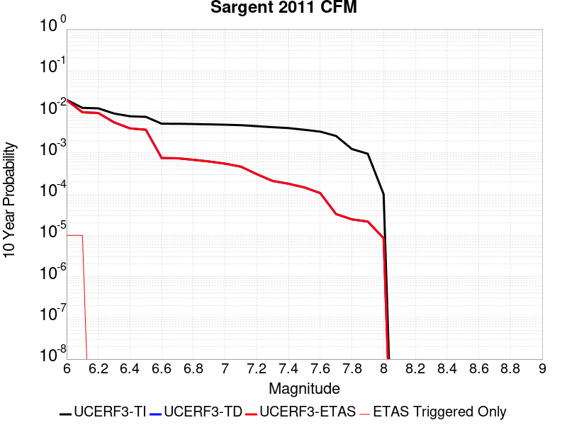 |

| Magnitude | 1 wk TI Prob | 1 wk TD Prob | 1 wk ETAS Prob | 1 wk ETAS/TD Gain | 1 wk ETAS Triggered Only | 1 mo TI Prob | 1 mo TD Prob | 1 mo ETAS Prob | 1 mo ETAS/TD Gain | 1 mo ETAS Triggered Only | 1 yr TI Prob | 1 yr TD Prob | 1 yr ETAS Prob | 1 yr ETAS/TD Gain | 1 yr ETAS Triggered Only | 10 yr TI Prob | 10 yr TD Prob | 10 yr ETAS Prob | 10 yr ETAS/TD Gain | 10 yr ETAS Triggered Only |
|-----|-----|-----|-----|-----|-----|-----|-----|-----|-----|-----|-----|-----|-----|-----|-----|-----|-----|-----|-----|-----|
| 6.0 | 3.7327867E-5 | 3.6663398E-5 | 3.6663398E-5 | 1.0 | 0.0 | 1.5996677E-4 | 1.5712218E-4 | 1.5712218E-4 | 1.0 | 0.0 | 0.0019458556 | 0.0019117607 | 0.0019117607 | 1.0 | 0.0 | 0.01928905 | 0.01902541 | 0.019043341 | 1.0009425 | 1.8279197E-5 |
| 6.1 | 2.3771476E-5 | 1.8486922E-5 | 1.8486922E-5 | 1.0 | 0.0 | 1.01873775E-4 | 7.922776E-5 | 7.922776E-5 | 1.0 | 0.0 | 0.0012396075 | 9.642417E-4 | 9.642417E-4 | 1.0 | 0.0 | 0.012327154 | 0.009640244 | 0.009658347 | 1.0018779 | 1.8279197E-5 |
| 6.2 | 2.3112721E-5 | 1.7718145E-5 | 1.7718145E-5 | 1.0 | 0.0 | 9.9050754E-5 | 7.593319E-5 | 7.593319E-5 | 1.0 | 0.0 | 0.0012052758 | 9.241645E-4 | 9.241645E-4 | 1.0 | 0.0 | 0.011987597 | 0.009242827 | 0.009242827 | 1.0 | 0.0 |
| 6.3 | 1.728509E-5 | 1.0464543E-5 | 1.0464543E-5 | 1.0 | 0.0 | 7.407686E-5 | 4.484754E-5 | 4.484754E-5 | 1.0 | 0.0 | 9.015125E-4 | 5.4592645E-4 | 5.4592645E-4 | 1.0 | 0.0 | 0.008978641 | 0.0054822545 | 0.0054822545 | 1.0 | 0.0 |
| 6.4 | 1.48395575E-5 | 7.4608706E-6 | 7.4608706E-6 | 1.0 | 0.0 | 6.3596555E-5 | 3.1974985E-5 | 3.1974985E-5 | 1.0 | 0.0 | 7.7401294E-4 | 3.8926088E-4 | 3.8926088E-4 | 1.0 | 0.0 | 0.0077132257 | 0.0039214296 | 0.0039214296 | 1.0 | 0.0 |
| 6.5 | 1.4358964E-5 | 6.8995464E-6 | 6.8995464E-6 | 1.0 | 0.0 | 6.1536964E-5 | 2.9569364E-5 | 2.9569364E-5 | 1.0 | 0.0 | 7.48955E-4 | 3.5998237E-4 | 3.5998237E-4 | 1.0 | 0.0 | 0.0074643586 | 0.0036296272 | 0.0036296272 | 1.0 | 0.0 |
| 6.6 | 9.772591E-6 | 1.3772087E-6 | 1.3772087E-6 | 1.0 | 0.0 | 4.188186E-5 | 5.90231E-6 | 5.90231E-6 | 1.0 | 0.0 | 5.097923E-4 | 7.185828E-5 | 7.185828E-5 | 1.0 | 0.0 | 0.005086244 | 7.504081E-4 | 7.504081E-4 | 1.0 | 0.0 |
| 6.7 | 9.752745E-6 | 1.3558983E-6 | 1.3558983E-6 | 1.0 | 0.0 | 4.179681E-5 | 5.8109804E-6 | 5.8109804E-6 | 1.0 | 0.0 | 5.0875737E-4 | 7.074641E-5 | 7.074641E-5 | 1.0 | 0.0 | 0.005075942 | 7.3929696E-4 | 7.3929696E-4 | 1.0 | 0.0 |
| 6.8 | 9.608213E-6 | 1.2396991E-6 | 1.2396991E-6 | 1.0 | 0.0 | 4.1177405E-5 | 5.3129856E-6 | 5.3129856E-6 | 1.0 | 0.0 | 5.012196E-4 | 6.46837E-5 | 6.46837E-5 | 1.0 | 0.0 | 0.005000906 | 6.784046E-4 | 6.784046E-4 | 1.0 | 0.0 |
| 6.9 | 9.427164E-6 | 1.1243317E-6 | 1.1243317E-6 | 1.0 | 0.0 | 4.04015E-5 | 4.8185557E-6 | 4.8185557E-6 | 1.0 | 0.0 | 4.9177726E-4 | 5.8664355E-5 | 5.8664355E-5 | 1.0 | 0.0 | 0.004906904 | 6.175609E-4 | 6.175609E-4 | 1.0 | 0.0 |
| 7.0 | 9.247601E-6 | 9.906856E-7 | 9.906856E-7 | 1.0 | 0.0 | 3.9631974E-5 | 4.2457887E-6 | 4.2457887E-6 | 1.0 | 0.0 | 4.8241246E-4 | 5.1691266E-5 | 5.1691266E-5 | 1.0 | 0.0 | 0.0048136655 | 5.4735894E-4 | 5.4735894E-4 | 1.0 | 0.0 |
| 7.1 | 8.995454E-6 | 8.301707E-7 | 8.301707E-7 | 1.0 | 0.0 | 3.8551374E-5 | 3.5578694E-6 | 3.5578694E-6 | 1.0 | 0.0 | 4.6926187E-4 | 4.3316213E-5 | 4.3316213E-5 | 1.0 | 0.0 | 0.004682722 | 4.627207E-4 | 4.627207E-4 | 1.0 | 0.0 |
| 7.2 | 8.520861E-6 | 5.303598E-7 | 5.303598E-7 | 1.0 | 0.0 | 3.6517464E-5 | 2.2729687E-6 | 2.2729687E-6 | 1.0 | 0.0 | 4.445094E-4 | 2.767305E-5 | 2.767305E-5 | 1.0 | 0.0 | 0.004436213 | 3.0459446E-4 | 3.0459446E-4 | 1.0 | 0.0 |
| 7.3 | 8.043592E-6 | 3.4809017E-7 | 3.4809017E-7 | 1.0 | 0.0 | 3.4472083E-5 | 1.4918141E-6 | 1.4918141E-6 | 1.0 | 0.0 | 4.196168E-4 | 1.8162687E-5 | 1.8162687E-5 | 1.0 | 0.0 | 0.004188253 | 2.081809E-4 | 2.081809E-4 | 1.0 | 0.0 |
| 7.4 | 7.662316E-6 | 2.9513797E-7 | 2.9513797E-7 | 1.0 | 0.0 | 3.2838085E-5 | 1.2648765E-6 | 1.2648765E-6 | 1.0 | 0.0 | 3.9973034E-4 | 1.5399763E-5 | 1.5399763E-5 | 1.0 | 0.0 | 0.0039901207 | 1.7873695E-4 | 1.7873695E-4 | 1.0 | 0.0 |
| 7.5 | 6.961638E-6 | 2.37645E-7 | 2.37645E-7 | 1.0 | 0.0 | 2.9835252E-5 | 1.0184782E-6 | 1.0184782E-6 | 1.0 | 0.0 | 3.6318362E-4 | 1.2399902E-5 | 1.2399902E-5 | 1.0 | 0.0 | 0.0036259065 | 1.4526524E-4 | 1.4526524E-4 | 1.0 | 0.0 |
| 7.6 | 6.282332E-6 | 1.704124E-7 | 1.704124E-7 | 1.0 | 0.0 | 2.6924003E-5 | 7.303387E-7 | 7.303387E-7 | 1.0 | 0.0 | 3.2775043E-4 | 8.891838E-6 | 8.891838E-6 | 1.0 | 0.0 | 0.0032726745 | 1.05977124E-4 | 1.05977124E-4 | 1.0 | 0.0 |
| 7.7 | 4.934408E-6 | 5.0514668E-8 | 5.0514668E-8 | 1.0 | 0.0 | 2.114729E-5 | 2.1649143E-7 | 2.1649143E-7 | 1.0 | 0.0 | 2.5743784E-4 | 2.63578E-6 | 2.63578E-6 | 1.0 | 0.0 | 0.0025713982 | 3.2891265E-5 | 3.2891265E-5 | 1.0 | 0.0 |
| 7.8 | 2.373212E-6 | 3.5575873E-8 | 3.5575873E-8 | 1.0 | 0.0 | 1.0170869E-5 | 1.5246802E-7 | 1.5246802E-7 | 1.0 | 0.0 | 1.238233E-4 | 1.8562965E-6 | 1.8562965E-6 | 1.0 | 0.0 | 0.0012375432 | 2.4404715E-5 | 2.4404715E-5 | 1.0 | 0.0 |
| 7.9 | 1.8227792E-6 | 3.097774E-8 | 3.097774E-8 | 1.0 | 0.0 | 7.811887E-6 | 1.3276174E-7 | 1.3276174E-7 | 1.0 | 0.0 | 9.510558E-5 | 1.6163731E-6 | 1.6163731E-6 | 1.0 | 0.0 | 9.5064886E-4 | 2.1660044E-5 | 2.1660044E-5 | 1.0 | 0.0 |
| 8.0 | 1.9095137E-7 | 1.3374076E-8 | 1.3374076E-8 | 1.0 | 0.0 | 8.1836276E-7 | 5.7317468E-8 | 5.7317468E-8 | 1.0 | 0.0 | 9.963521E-6 | 6.9783994E-7 | 6.9783994E-7 | 1.0 | 0.0 | 9.963074E-5 | 8.530848E-6 | 8.530848E-6 | 1.0 | 0.0 |

## Hat Creek-McArthur-Mayfield
*[(top)](#table-of-contents)*

| 1 Week | 1 Month | 1 Year | 10 Year |
|-----|-----|-----|-----|
| 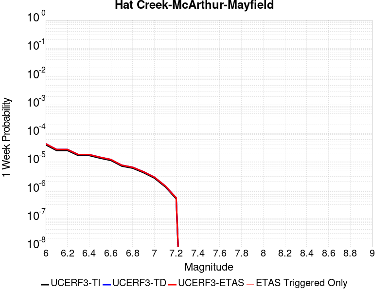 |  |  |  |

| Magnitude | 1 wk TI Prob | 1 wk TD Prob | 1 wk ETAS Prob | 1 wk ETAS/TD Gain | 1 wk ETAS Triggered Only | 1 mo TI Prob | 1 mo TD Prob | 1 mo ETAS Prob | 1 mo ETAS/TD Gain | 1 mo ETAS Triggered Only | 1 yr TI Prob | 1 yr TD Prob | 1 yr ETAS Prob | 1 yr ETAS/TD Gain | 1 yr ETAS Triggered Only | 10 yr TI Prob | 10 yr TD Prob | 10 yr ETAS Prob | 10 yr ETAS/TD Gain | 10 yr ETAS Triggered Only |
|-----|-----|-----|-----|-----|-----|-----|-----|-----|-----|-----|-----|-----|-----|-----|-----|-----|-----|-----|-----|-----|
| 6.0 | 3.967457E-5 | 4.316235E-5 | 4.316235E-5 | 1.0 | 0.0 | 1.7002279E-4 | 1.8496903E-4 | 1.8496903E-4 | 1.0 | 0.0 | 0.002068062 | 0.0022497862 | 0.0022497862 | 1.0 | 0.0 | 0.02048922 | 0.022282463 | 0.022300333 | 1.000802 | 1.8279197E-5 |
| 6.1 | 2.5044013E-5 | 2.7073496E-5 | 2.7073496E-5 | 1.0 | 0.0 | 1.0732707E-4 | 1.1602429E-4 | 1.1602429E-4 | 1.0 | 0.0 | 0.0013059238 | 0.0014117121 | 0.0014117121 | 1.0 | 0.0 | 0.01298276 | 0.014030862 | 0.014030862 | 1.0 | 0.0 |
| 6.2 | 2.5044013E-5 | 2.7073496E-5 | 2.7073496E-5 | 1.0 | 0.0 | 1.0732707E-4 | 1.1602429E-4 | 1.1602429E-4 | 1.0 | 0.0 | 0.0013059238 | 0.0014117121 | 0.0014117121 | 1.0 | 0.0 | 0.01298276 | 0.014030862 | 0.014030862 | 1.0 | 0.0 |
| 6.3 | 1.6624012E-5 | 1.7892522E-5 | 1.7892522E-5 | 1.0 | 0.0 | 7.124382E-5 | 7.668003E-5 | 7.668003E-5 | 1.0 | 0.0 | 8.670483E-4 | 9.331881E-4 | 9.331881E-4 | 1.0 | 0.0 | 0.008636732 | 0.009293629 | 0.009293629 | 1.0 | 0.0 |
| 6.4 | 1.6624012E-5 | 1.7892522E-5 | 1.7892522E-5 | 1.0 | 0.0 | 7.124382E-5 | 7.668003E-5 | 7.668003E-5 | 1.0 | 0.0 | 8.670483E-4 | 9.331881E-4 | 9.331881E-4 | 1.0 | 0.0 | 0.008636732 | 0.009293629 | 0.009293629 | 1.0 | 0.0 |
| 6.5 | 1.3394842E-5 | 1.4393276E-5 | 1.4393276E-5 | 1.0 | 0.0 | 5.7405203E-5 | 6.168404E-5 | 6.168404E-5 | 1.0 | 0.0 | 6.986842E-4 | 7.5074995E-4 | 7.5074995E-4 | 1.0 | 0.0 | 0.006964916 | 0.0074827303 | 0.0074827303 | 1.0 | 0.0 |
| 6.6 | 1.1137514E-5 | 1.1955477E-5 | 1.1955477E-5 | 1.0 | 0.0 | 4.7731326E-5 | 5.1236777E-5 | 5.1236777E-5 | 1.0 | 0.0 | 5.809739E-4 | 6.236332E-4 | 6.236332E-4 | 1.0 | 0.0 | 0.005794574 | 0.0062192534 | 0.0062192534 | 1.0 | 0.0 |
| 6.7 | 7.0200663E-6 | 7.5248636E-6 | 7.5248636E-6 | 1.0 | 0.0 | 3.008565E-5 | 3.2249027E-5 | 3.2249027E-5 | 1.0 | 0.0 | 3.6623122E-4 | 3.9256274E-4 | 3.9256274E-4 | 1.0 | 0.0 | 0.0036562826 | 0.0039188555 | 0.0039188555 | 1.0 | 0.0 |
| 6.8 | 5.940172E-6 | 6.3659604E-6 | 6.3659604E-6 | 1.0 | 0.0 | 2.545763E-5 | 2.7282409E-5 | 2.7282409E-5 | 1.0 | 0.0 | 3.0990256E-4 | 3.3211397E-4 | 3.3211397E-4 | 1.0 | 0.0 | 0.0030947074 | 0.003316305 | 0.003316305 | 1.0 | 0.0 |
| 6.9 | 4.129831E-6 | 4.423881E-6 | 4.423881E-6 | 1.0 | 0.0 | 1.7699154E-5 | 1.8959357E-5 | 1.8959357E-5 | 1.0 | 0.0 | 2.154659E-4 | 2.308065E-4 | 2.308065E-4 | 1.0 | 0.0 | 0.002152571 | 0.0023057463 | 0.0023057463 | 1.0 | 0.0 |
| 7.0 | 2.6512955E-6 | 2.8376114E-6 | 2.8376114E-6 | 1.0 | 0.0 | 1.1362646E-5 | 1.2161137E-5 | 1.2161137E-5 | 1.0 | 0.0 | 1.3833142E-4 | 1.4805222E-4 | 1.4805222E-4 | 1.0 | 0.0 | 0.0013824535 | 0.0014795784 | 0.0014795784 | 1.0 | 0.0 |
| 7.1 | 1.2992575E-6 | 1.3910359E-6 | 1.3910359E-6 | 1.0 | 0.0 | 5.568235E-6 | 5.96157E-6 | 5.96157E-6 | 1.0 | 0.0 | 6.779115E-5 | 7.257992E-5 | 7.257992E-5 | 1.0 | 0.0 | 6.7770475E-4 | 7.2558376E-4 | 7.2558376E-4 | 1.0 | 0.0 |
| 7.2 | 4.968191E-7 | 5.327556E-7 | 5.327556E-7 | 1.0 | 0.0 | 2.1292228E-6 | 2.283237E-6 | 2.283237E-6 | 1.0 | 0.0 | 2.592298E-5 | 2.7798184E-5 | 2.7798184E-5 | 1.0 | 0.0 | 2.5919956E-4 | 2.7795942E-4 | 2.7795942E-4 | 1.0 | 0.0 |

## Elysian Park (Upper)
*[(top)](#table-of-contents)*

| 1 Week | 1 Month | 1 Year | 10 Year |
|-----|-----|-----|-----|
|  |  | 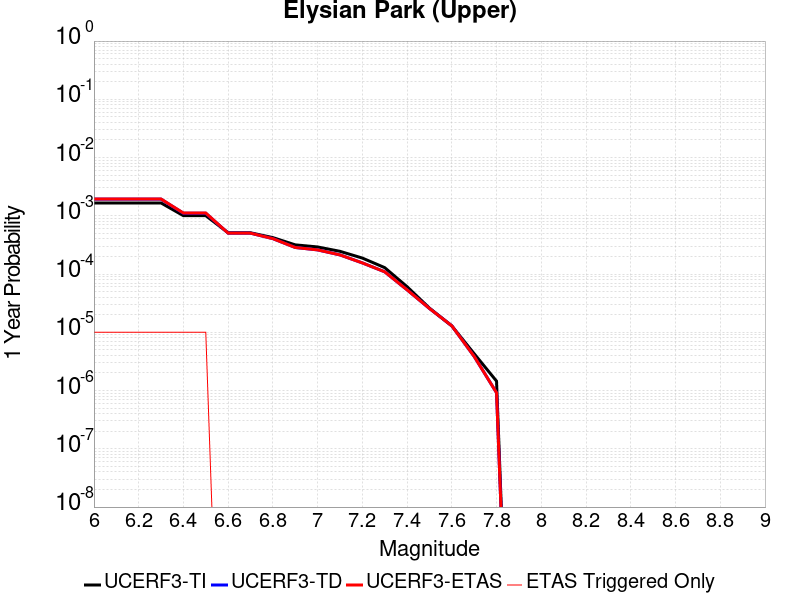 |  |

| Magnitude | 1 wk TI Prob | 1 wk TD Prob | 1 wk ETAS Prob | 1 wk ETAS/TD Gain | 1 wk ETAS Triggered Only | 1 mo TI Prob | 1 mo TD Prob | 1 mo ETAS Prob | 1 mo ETAS/TD Gain | 1 mo ETAS Triggered Only | 1 yr TI Prob | 1 yr TD Prob | 1 yr ETAS Prob | 1 yr ETAS/TD Gain | 1 yr ETAS Triggered Only | 10 yr TI Prob | 10 yr TD Prob | 10 yr ETAS Prob | 10 yr ETAS/TD Gain | 10 yr ETAS Triggered Only |
|-----|-----|-----|-----|-----|-----|-----|-----|-----|-----|-----|-----|-----|-----|-----|-----|-----|-----|-----|-----|-----|
| 6.0 | 3.1876025E-5 | 3.704355E-5 | 3.704355E-5 | 1.0 | 0.0 | 1.3660437E-4 | 1.5875115E-4 | 1.7702744E-4 | 1.1151254 | 1.8279197E-5 | 0.0016618895 | 0.0019315147 | 0.0019497586 | 1.0094454 | 1.8279197E-5 | 0.016495159 | 0.019193873 | 0.0192118 | 1.0009341 | 1.8279197E-5 |
| 6.1 | 3.1876025E-5 | 3.704355E-5 | 3.704355E-5 | 1.0 | 0.0 | 1.3660437E-4 | 1.5875115E-4 | 1.7702744E-4 | 1.1151254 | 1.8279197E-5 | 0.0016618895 | 0.0019315147 | 0.0019497586 | 1.0094454 | 1.8279197E-5 | 0.016495159 | 0.019193873 | 0.0192118 | 1.0009341 | 1.8279197E-5 |
| 6.2 | 3.1876025E-5 | 3.704355E-5 | 3.704355E-5 | 1.0 | 0.0 | 1.3660437E-4 | 1.5875115E-4 | 1.7702744E-4 | 1.1151254 | 1.8279197E-5 | 0.0016618895 | 0.0019315147 | 0.0019497586 | 1.0094454 | 1.8279197E-5 | 0.016495159 | 0.019193873 | 0.0192118 | 1.0009341 | 1.8279197E-5 |
| 6.3 | 3.1876025E-5 | 3.704355E-5 | 3.704355E-5 | 1.0 | 0.0 | 1.3660437E-4 | 1.5875115E-4 | 1.7702744E-4 | 1.1151254 | 1.8279197E-5 | 0.0016618895 | 0.0019315147 | 0.0019497586 | 1.0094454 | 1.8279197E-5 | 0.016495159 | 0.019193873 | 0.0192118 | 1.0009341 | 1.8279197E-5 |
| 6.4 | 1.9273462E-5 | 2.1205988E-5 | 2.1205988E-5 | 1.0 | 0.0 | 8.259794E-5 | 9.088062E-5 | 1.0915816E-4 | 1.2011158 | 1.8279197E-5 | 0.001005166 | 0.0011060834 | 0.0011243423 | 1.0165077 | 1.8279197E-5 | 0.010006315 | 0.011022645 | 0.011040723 | 1.0016401 | 1.8279197E-5 |
| 6.5 | 1.9273462E-5 | 2.1205988E-5 | 2.1205988E-5 | 1.0 | 0.0 | 8.259794E-5 | 9.088062E-5 | 1.0915816E-4 | 1.2011158 | 1.8279197E-5 | 0.001005166 | 0.0011060834 | 0.0011243423 | 1.0165077 | 1.8279197E-5 | 0.010006315 | 0.011022645 | 0.011040723 | 1.0016401 | 1.8279197E-5 |
| 6.6 | 9.813258E-6 | 9.666633E-6 | 9.666633E-6 | 1.0 | 0.0 | 4.205614E-5 | 4.142781E-5 | 4.142781E-5 | 1.0 | 0.0 | 5.119132E-4 | 5.042741E-4 | 5.042741E-4 | 1.0 | 0.0 | 0.005107356 | 0.005032022 | 0.005032022 | 1.0 | 0.0 |
| 6.7 | 9.801478E-6 | 9.654202E-6 | 9.654202E-6 | 1.0 | 0.0 | 4.2005657E-5 | 4.1374533E-5 | 4.1374533E-5 | 1.0 | 0.0 | 5.112989E-4 | 5.036258E-4 | 5.036258E-4 | 1.0 | 0.0 | 0.0051012407 | 0.005025568 | 0.005025568 | 1.0 | 0.0 |
| 6.8 | 8.102489E-6 | 7.773824E-6 | 7.773824E-6 | 1.0 | 0.0 | 3.4724493E-5 | 3.331599E-5 | 3.331599E-5 | 1.0 | 0.0 | 4.2268867E-4 | 4.0555166E-4 | 4.0555166E-4 | 1.0 | 0.0 | 0.004218856 | 0.0040486096 | 0.0040486096 | 1.0 | 0.0 |
| 6.9 | 6.08275E-6 | 5.481944E-6 | 5.481944E-6 | 1.0 | 0.0 | 2.6068668E-5 | 2.3493838E-5 | 2.3493838E-5 | 1.0 | 0.0 | 3.173398E-4 | 2.860007E-4 | 2.860007E-4 | 1.0 | 0.0 | 0.0031688702 | 0.0028564038 | 0.0028564038 | 1.0 | 0.0 |
| 7.0 | 5.5995934E-6 | 4.983225E-6 | 4.983225E-6 | 1.0 | 0.0 | 2.3998036E-5 | 2.1356509E-5 | 2.1356509E-5 | 1.0 | 0.0 | 2.9213692E-4 | 2.5998513E-4 | 2.5998513E-4 | 1.0 | 0.0 | 0.0029175316 | 0.002596877 | 0.002596877 | 1.0 | 0.0 |
| 7.1 | 4.709881E-6 | 4.0877635E-6 | 4.0877635E-6 | 1.0 | 0.0 | 2.0185047E-5 | 1.751887E-5 | 1.751887E-5 | 1.0 | 0.0 | 2.4572524E-4 | 2.132718E-4 | 2.132718E-4 | 1.0 | 0.0 | 0.002454537 | 0.0021307126 | 0.0021307126 | 1.0 | 0.0 |
| 7.2 | 3.6063436E-6 | 2.9782116E-6 | 2.9782116E-6 | 1.0 | 0.0 | 1.5455667E-5 | 1.2763701E-5 | 1.2763701E-5 | 1.0 | 0.0 | 1.881565E-4 | 1.553871E-4 | 1.553871E-4 | 1.0 | 0.0 | 0.0018799726 | 0.0015527956 | 0.0015527956 | 1.0 | 0.0 |
| 7.3 | 2.471135E-6 | 2.0956425E-6 | 2.0956425E-6 | 1.0 | 0.0 | 1.0590536E-5 | 8.981294E-6 | 8.981294E-6 | 1.0 | 0.0 | 1.2893214E-4 | 1.0934184E-4 | 1.0934184E-4 | 1.0 | 0.0 | 0.0012885736 | 0.0010928876 | 0.0010928876 | 1.0 | 0.0 |
| 7.4 | 1.163943E-6 | 1.0276057E-6 | 1.0276057E-6 | 1.0 | 0.0 | 4.988318E-6 | 4.404017E-6 | 4.404017E-6 | 1.0 | 0.0 | 6.0731076E-5 | 5.361762E-5 | 5.361762E-5 | 1.0 | 0.0 | 6.071448E-4 | 5.3604983E-4 | 5.3604983E-4 | 1.0 | 0.0 |
| 7.5 | 4.99459E-7 | 4.9180574E-7 | 4.9180574E-7 | 1.0 | 0.0 | 2.140537E-6 | 2.1077374E-6 | 2.1077374E-6 | 1.0 | 0.0 | 2.6060725E-5 | 2.5661417E-5 | 2.5661417E-5 | 1.0 | 0.0 | 2.605767E-4 | 2.565861E-4 | 2.565861E-4 | 1.0 | 0.0 |
| 7.6 | 2.4667852E-7 | 2.4781048E-7 | 2.4781048E-7 | 1.0 | 0.0 | 1.0571932E-6 | 1.0620445E-6 | 1.0620445E-6 | 1.0 | 0.0 | 1.2871251E-5 | 1.2930318E-5 | 1.2930318E-5 | 1.0 | 0.0 | 1.2870505E-4 | 1.2929602E-4 | 1.2929602E-4 | 1.0 | 0.0 |
| 7.7 | 8.2312795E-8 | 7.387916E-8 | 7.387916E-8 | 1.0 | 0.0 | 3.527691E-7 | 3.1662492E-7 | 3.1662492E-7 | 1.0 | 0.0 | 4.294955E-6 | 3.854903E-6 | 3.854903E-6 | 1.0 | 0.0 | 4.2948723E-5 | 3.8548475E-5 | 3.8548475E-5 | 1.0 | 0.0 |
| 7.8 | 2.7819295E-8 | 1.7576415E-8 | 1.7576415E-8 | 1.0 | 0.0 | 1.1922555E-7 | 7.532749E-8 | 7.532749E-8 | 1.0 | 0.0 | 1.45157E-6 | 9.1711195E-7 | 9.1711195E-7 | 1.0 | 0.0 | 1.45156055E-5 | 9.171096E-6 | 9.171096E-6 | 1.0 | 0.0 |

## Fontana (Seismicity)
*[(top)](#table-of-contents)*

| 1 Week | 1 Month | 1 Year | 10 Year |
|-----|-----|-----|-----|
|  |  |  |  |

| Magnitude | 1 wk TI Prob | 1 wk TD Prob | 1 wk ETAS Prob | 1 wk ETAS/TD Gain | 1 wk ETAS Triggered Only | 1 mo TI Prob | 1 mo TD Prob | 1 mo ETAS Prob | 1 mo ETAS/TD Gain | 1 mo ETAS Triggered Only | 1 yr TI Prob | 1 yr TD Prob | 1 yr ETAS Prob | 1 yr ETAS/TD Gain | 1 yr ETAS Triggered Only | 10 yr TI Prob | 10 yr TD Prob | 10 yr ETAS Prob | 10 yr ETAS/TD Gain | 10 yr ETAS Triggered Only |
|-----|-----|-----|-----|-----|-----|-----|-----|-----|-----|-----|-----|-----|-----|-----|-----|-----|-----|-----|-----|-----|
| 6.0 | 7.1789214E-6 | 7.552417E-6 | 7.552417E-6 | 1.0 | 0.0 | 3.076644E-5 | 3.236733E-5 | 3.236733E-5 | 1.0 | 0.0 | 3.7451705E-4 | 3.9404177E-4 | 4.1231376E-4 | 1.0463707 | 1.8279197E-5 | 0.003738865 | 0.003937431 | 0.003955638 | 1.0046241 | 1.8279197E-5 |
| 6.1 | 7.1789214E-6 | 7.552417E-6 | 7.552417E-6 | 1.0 | 0.0 | 3.076644E-5 | 3.236733E-5 | 3.236733E-5 | 1.0 | 0.0 | 3.7451705E-4 | 3.9404177E-4 | 4.1231376E-4 | 1.0463707 | 1.8279197E-5 | 0.003738865 | 0.003937431 | 0.003955638 | 1.0046241 | 1.8279197E-5 |
| 6.2 | 7.1789214E-6 | 7.552417E-6 | 7.552417E-6 | 1.0 | 0.0 | 3.076644E-5 | 3.236733E-5 | 3.236733E-5 | 1.0 | 0.0 | 3.7451705E-4 | 3.9404177E-4 | 4.1231376E-4 | 1.0463707 | 1.8279197E-5 | 0.003738865 | 0.003937431 | 0.003955638 | 1.0046241 | 1.8279197E-5 |
| 6.3 | 7.1789214E-6 | 7.552417E-6 | 7.552417E-6 | 1.0 | 0.0 | 3.076644E-5 | 3.236733E-5 | 3.236733E-5 | 1.0 | 0.0 | 3.7451705E-4 | 3.9404177E-4 | 4.1231376E-4 | 1.0463707 | 1.8279197E-5 | 0.003738865 | 0.003937431 | 0.003955638 | 1.0046241 | 1.8279197E-5 |
| 6.4 | 7.1789214E-6 | 7.552417E-6 | 7.552417E-6 | 1.0 | 0.0 | 3.076644E-5 | 3.236733E-5 | 3.236733E-5 | 1.0 | 0.0 | 3.7451705E-4 | 3.9404177E-4 | 4.1231376E-4 | 1.0463707 | 1.8279197E-5 | 0.003738865 | 0.003937431 | 0.003955638 | 1.0046241 | 1.8279197E-5 |
| 6.5 | 5.2611317E-6 | 5.533029E-6 | 5.533029E-6 | 1.0 | 0.0 | 2.2547512E-5 | 2.371298E-5 | 2.371298E-5 | 1.0 | 0.0 | 2.744814E-4 | 2.8870555E-4 | 2.8870555E-4 | 1.0 | 0.0 | 0.002741426 | 0.0028870553 | 0.0028870553 | 1.0 | 0.0 |
| 6.6 | 5.2611317E-6 | 5.533029E-6 | 5.533029E-6 | 1.0 | 0.0 | 2.2547512E-5 | 2.371298E-5 | 2.371298E-5 | 1.0 | 0.0 | 2.744814E-4 | 2.8870555E-4 | 2.8870555E-4 | 1.0 | 0.0 | 0.002741426 | 0.0028870553 | 0.0028870553 | 1.0 | 0.0 |

## Hayward (So) extension 2011 CFM
*[(top)](#table-of-contents)*

| 1 Week | 1 Month | 1 Year | 10 Year |
|-----|-----|-----|-----|
| 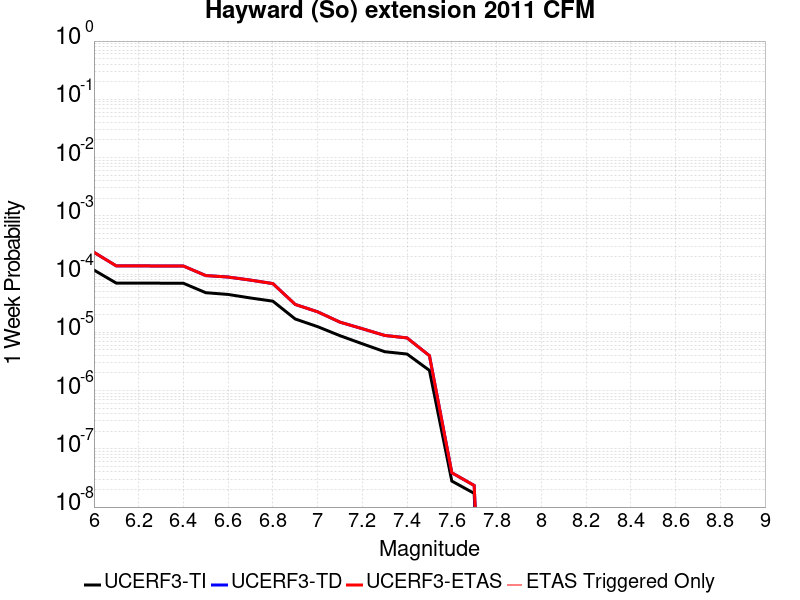 |  | 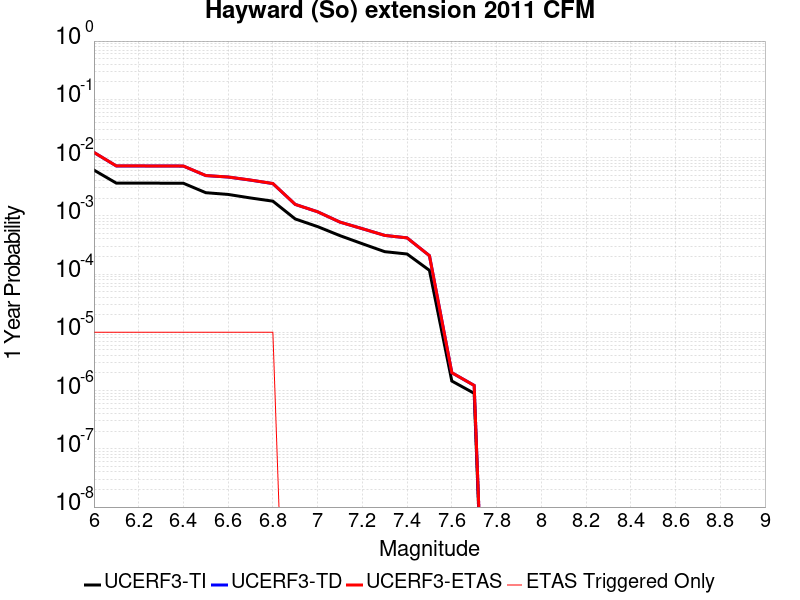 |  |

| Magnitude | 1 wk TI Prob | 1 wk TD Prob | 1 wk ETAS Prob | 1 wk ETAS/TD Gain | 1 wk ETAS Triggered Only | 1 mo TI Prob | 1 mo TD Prob | 1 mo ETAS Prob | 1 mo ETAS/TD Gain | 1 mo ETAS Triggered Only | 1 yr TI Prob | 1 yr TD Prob | 1 yr ETAS Prob | 1 yr ETAS/TD Gain | 1 yr ETAS Triggered Only | 10 yr TI Prob | 10 yr TD Prob | 10 yr ETAS Prob | 10 yr ETAS/TD Gain | 10 yr ETAS Triggered Only |
|-----|-----|-----|-----|-----|-----|-----|-----|-----|-----|-----|-----|-----|-----|-----|-----|-----|-----|-----|-----|-----|
| 6.0 | 1.1721256E-4 | 2.3637003E-4 | 2.3637003E-4 | 1.0 | 0.0 | 5.022428E-4 | 0.0010126781 | 0.0010126781 | 1.0 | 0.0 | 0.0060976758 | 0.012253807 | 0.012271862 | 1.0014734 | 1.8279197E-5 | 0.0593305 | 0.11289011 | 0.11290633 | 1.0001436 | 1.8279197E-5 |
| 6.1 | 6.99169E-5 | 1.3803637E-4 | 1.3803637E-4 | 1.0 | 0.0 | 2.9960944E-4 | 5.91463E-4 | 5.91463E-4 | 1.0 | 0.0 | 0.0036416445 | 0.007176423 | 0.007194571 | 1.0025288 | 1.8279197E-5 | 0.035825435 | 0.06784292 | 0.06785996 | 1.0002512 | 1.8279197E-5 |
| 6.2 | 6.99169E-5 | 1.3803637E-4 | 1.3803637E-4 | 1.0 | 0.0 | 2.9960944E-4 | 5.91463E-4 | 5.91463E-4 | 1.0 | 0.0 | 0.0036416445 | 0.007176423 | 0.007194571 | 1.0025288 | 1.8279197E-5 | 0.035825435 | 0.06784292 | 0.06785996 | 1.0002512 | 1.8279197E-5 |
| 6.3 | 6.970908E-5 | 1.3771761E-4 | 1.3771761E-4 | 1.0 | 0.0 | 2.9871898E-4 | 5.9009745E-4 | 5.9009745E-4 | 1.0 | 0.0 | 0.0036308395 | 0.0071599563 | 0.0071781045 | 1.0025347 | 1.8279197E-5 | 0.035720866 | 0.06769186 | 0.0677089 | 1.0002518 | 1.8279197E-5 |
| 6.4 | 6.9517155E-5 | 1.3738598E-4 | 1.3738598E-4 | 1.0 | 0.0 | 2.9789665E-4 | 5.8867777E-4 | 5.8867777E-4 | 1.0 | 0.0 | 0.0036208609 | 0.007142863 | 0.0071610115 | 1.0025408 | 1.8279197E-5 | 0.03562429 | 0.06753588 | 0.06755292 | 1.0002524 | 1.8279197E-5 |
| 6.5 | 4.786248E-5 | 9.422551E-5 | 9.422551E-5 | 1.0 | 0.0 | 2.0510878E-4 | 4.0376306E-4 | 4.0376306E-4 | 1.0 | 0.0 | 0.0024943394 | 0.0049051465 | 0.004923336 | 1.0037082 | 1.8279197E-5 | 0.02466527 | 0.046935335 | 0.046952754 | 1.0003712 | 1.8279197E-5 |
| 6.6 | 4.4662214E-5 | 8.88899E-5 | 8.88899E-5 | 1.0 | 0.0 | 1.9139545E-4 | 3.809037E-4 | 3.809037E-4 | 1.0 | 0.0 | 0.0023277493 | 0.004628103 | 0.0046462975 | 1.0039313 | 1.8279197E-5 | 0.02303517 | 0.04432599 | 0.04434346 | 1.0003941 | 1.8279197E-5 |
| 6.7 | 3.884542E-5 | 7.8717756E-5 | 7.8717756E-5 | 1.0 | 0.0 | 1.6646975E-4 | 3.373207E-4 | 3.373207E-4 | 1.0 | 0.0 | 0.002024885 | 0.004099591 | 0.0041177953 | 1.0044405 | 1.8279197E-5 | 0.020065336 | 0.039364345 | 0.039381903 | 1.0004461 | 1.8279197E-5 |
| 6.8 | 3.4221863E-5 | 6.861936E-5 | 6.861936E-5 | 1.0 | 0.0 | 1.4665688E-4 | 2.940522E-4 | 2.940522E-4 | 1.0 | 0.0 | 0.0017840851 | 0.00357463 | 0.003592844 | 1.0050954 | 1.8279197E-5 | 0.017698295 | 0.034449436 | 0.034467082 | 1.0005124 | 1.8279197E-5 |
| 6.9 | 1.6927712E-5 | 3.009656E-5 | 3.009656E-5 | 1.0 | 0.0 | 7.2545314E-5 | 1.289792E-4 | 1.289792E-4 | 1.0 | 0.0 | 8.828813E-4 | 0.0015692477 | 0.0015692477 | 1.0 | 0.0 | 0.008793819 | 0.015480095 | 0.015480095 | 1.0 | 0.0 |
| 7.0 | 1.2509653E-5 | 2.2494614E-5 | 2.2494614E-5 | 1.0 | 0.0 | 5.3611697E-5 | 9.6402175E-5 | 9.6402175E-5 | 1.0 | 0.0 | 6.525269E-4 | 0.0011731087 | 0.0011731087 | 1.0 | 0.0 | 0.0065061417 | 0.0115978485 | 0.0115978485 | 1.0 | 0.0 |
| 7.1 | 8.751583E-6 | 1.4950437E-5 | 1.4950437E-5 | 1.0 | 0.0 | 3.750624E-5 | 6.407176E-5 | 6.407176E-5 | 1.0 | 0.0 | 4.5654282E-4 | 7.7980035E-4 | 7.7980035E-4 | 1.0 | 0.0 | 0.0045560603 | 0.007775818 | 0.007775818 | 1.0 | 0.0 |
| 7.2 | 6.354379E-6 | 1.1521999E-5 | 1.1521999E-5 | 1.0 | 0.0 | 2.7232769E-5 | 4.937909E-5 | 4.937909E-5 | 1.0 | 0.0 | 3.3150852E-4 | 6.0102943E-4 | 6.0102943E-4 | 1.0 | 0.0 | 0.0033101442 | 0.0060119745 | 0.0060119745 | 1.0 | 0.0 |
| 7.3 | 4.645554E-6 | 8.839515E-6 | 8.839515E-6 | 1.0 | 0.0 | 1.9909365E-5 | 3.788311E-5 | 3.788311E-5 | 1.0 | 0.0 | 2.4236954E-4 | 4.6113323E-4 | 4.6113323E-4 | 1.0 | 0.0 | 0.0024210536 | 0.004621435 | 0.004621435 | 1.0 | 0.0 |
| 7.4 | 4.23437E-6 | 8.012998E-6 | 8.012998E-6 | 1.0 | 0.0 | 1.8147173E-5 | 3.434099E-5 | 3.434099E-5 | 1.0 | 0.0 | 2.2091944E-4 | 4.1802519E-4 | 4.1802519E-4 | 1.0 | 0.0 | 0.0022069993 | 0.0041922806 | 0.0041922806 | 1.0 | 0.0 |
| 7.5 | 2.2187417E-6 | 3.966394E-6 | 3.966394E-6 | 1.0 | 0.0 | 9.508858E-6 | 1.6998736E-5 | 1.6998736E-5 | 1.0 | 0.0 | 1.157642E-4 | 2.069426E-4 | 2.069426E-4 | 1.0 | 0.0 | 0.0011570391 | 0.0020806894 | 0.0020806894 | 1.0 | 0.0 |
| 7.6 | 2.7952495E-8 | 3.882696E-8 | 3.882696E-8 | 1.0 | 0.0 | 1.1979641E-7 | 1.6640125E-7 | 1.6640125E-7 | 1.0 | 0.0 | 1.4585203E-6 | 2.0259333E-6 | 2.0259333E-6 | 1.0 | 0.0 | 1.4585107E-5 | 2.0349831E-5 | 2.0349831E-5 | 1.0 | 0.0 |
| 7.7 | 1.7192724E-8 | 2.3465535E-8 | 2.3465535E-8 | 1.0 | 0.0 | 7.36831E-8 | 1.00566574E-7 | 1.00566574E-7 | 1.0 | 0.0 | 8.9709135E-7 | 1.2243974E-6 | 1.2243974E-6 | 1.0 | 0.0 | 8.970877E-6 | 1.2312015E-5 | 1.2312015E-5 | 1.0 | 0.0 |

## San Clemente
*[(top)](#table-of-contents)*

| 1 Week | 1 Month | 1 Year | 10 Year |
|-----|-----|-----|-----|
|  | 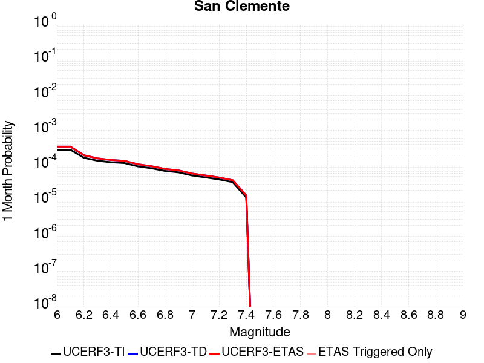 | 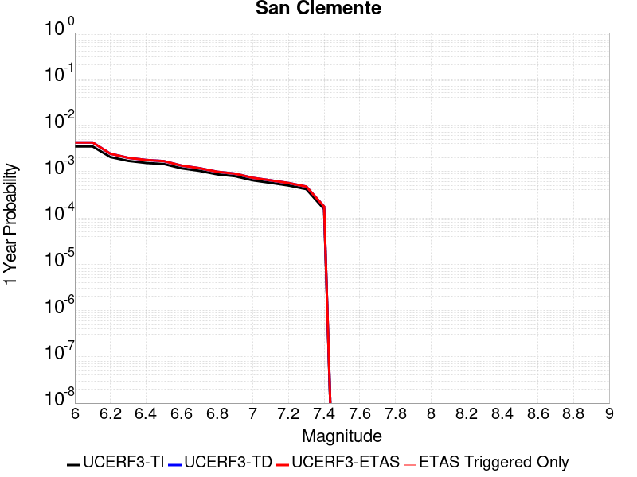 |  |

| Magnitude | 1 wk TI Prob | 1 wk TD Prob | 1 wk ETAS Prob | 1 wk ETAS/TD Gain | 1 wk ETAS Triggered Only | 1 mo TI Prob | 1 mo TD Prob | 1 mo ETAS Prob | 1 mo ETAS/TD Gain | 1 mo ETAS Triggered Only | 1 yr TI Prob | 1 yr TD Prob | 1 yr ETAS Prob | 1 yr ETAS/TD Gain | 1 yr ETAS Triggered Only | 10 yr TI Prob | 10 yr TD Prob | 10 yr ETAS Prob | 10 yr ETAS/TD Gain | 10 yr ETAS Triggered Only |
|-----|-----|-----|-----|-----|-----|-----|-----|-----|-----|-----|-----|-----|-----|-----|-----|-----|-----|-----|-----|-----|
| 6.0 | 6.681379E-5 | 8.165395E-5 | 8.165395E-5 | 1.0 | 0.0 | 2.8631336E-4 | 3.4990182E-4 | 3.4990182E-4 | 1.0 | 0.0 | 0.003480294 | 0.0042523127 | 0.0042523127 | 1.0 | 0.0 | 0.03426291 | 0.041765325 | 0.04178284 | 1.0004194 | 1.8279197E-5 |
| 6.1 | 6.681379E-5 | 8.165395E-5 | 8.165395E-5 | 1.0 | 0.0 | 2.8631336E-4 | 3.4990182E-4 | 3.4990182E-4 | 1.0 | 0.0 | 0.003480294 | 0.0042523127 | 0.0042523127 | 1.0 | 0.0 | 0.03426291 | 0.041765325 | 0.04178284 | 1.0004194 | 1.8279197E-5 |
| 6.2 | 3.9400576E-5 | 4.646092E-5 | 4.646092E-5 | 1.0 | 0.0 | 1.6884868E-4 | 1.991034E-4 | 1.991034E-4 | 1.0 | 0.0 | 0.0020537945 | 0.0024214499 | 0.0024214499 | 1.0 | 0.0 | 0.020349167 | 0.02395738 | 0.023975221 | 1.0007447 | 1.8279197E-5 |
| 6.3 | 3.2590255E-5 | 3.793572E-5 | 3.793572E-5 | 1.0 | 0.0 | 1.3966505E-4 | 1.625717E-4 | 1.625717E-4 | 1.0 | 0.0 | 0.0016990956 | 0.0019775438 | 0.0019775438 | 1.0 | 0.0 | 0.01686163 | 0.019603258 | 0.019603258 | 1.0 | 0.0 |
| 6.4 | 2.9454652E-5 | 3.4103497E-5 | 3.4103497E-5 | 1.0 | 0.0 | 1.2622811E-4 | 1.461498E-4 | 1.461498E-4 | 1.0 | 0.0 | 0.0015357438 | 0.0017779461 | 0.0017779461 | 1.0 | 0.0 | 0.015251739 | 0.017640395 | 0.017640395 | 1.0 | 0.0 |
| 6.5 | 2.790836E-5 | 3.2252792E-5 | 3.2252792E-5 | 1.0 | 0.0 | 1.1960178E-4 | 1.3821907E-4 | 1.3821907E-4 | 1.0 | 0.0 | 0.001455179 | 0.0016815432 | 0.0016815432 | 1.0 | 0.0 | 0.014456868 | 0.016691217 | 0.016691217 | 1.0 | 0.0 |
| 6.6 | 2.2492153E-5 | 2.5766682E-5 | 2.5766682E-5 | 1.0 | 0.0 | 9.639138E-5 | 1.1042405E-4 | 1.1042405E-4 | 1.0 | 0.0 | 0.0011729331 | 0.0013435985 | 0.0013435985 | 1.0 | 0.0 | 0.011667615 | 0.013356468 | 0.013356468 | 1.0 | 0.0 |
| 6.7 | 1.9862755E-5 | 2.2669825E-5 | 2.2669825E-5 | 1.0 | 0.0 | 8.512331E-5 | 9.7152835E-5 | 9.7152835E-5 | 1.0 | 0.0 | 0.0010358836 | 0.0011822052 | 0.0011822052 | 1.0 | 0.0 | 0.010310682 | 0.011760455 | 0.011760455 | 1.0 | 0.0 |
| 6.8 | 1.6697575E-5 | 1.8980461E-5 | 1.8980461E-5 | 1.0 | 0.0 | 7.155907E-5 | 8.1342354E-5 | 8.1342354E-5 | 1.0 | 0.0 | 8.7088346E-4 | 9.899025E-4 | 9.899025E-4 | 1.0 | 0.0 | 0.008674784 | 0.009855959 | 0.009855959 | 1.0 | 0.0 |
| 6.9 | 1.5218415E-5 | 1.7271872E-5 | 1.7271872E-5 | 1.0 | 0.0 | 6.522015E-5 | 7.402025E-5 | 7.402025E-5 | 1.0 | 0.0 | 7.93766E-4 | 9.008328E-4 | 9.008328E-4 | 1.0 | 0.0 | 0.007909367 | 0.008972758 | 0.008972758 | 1.0 | 0.0 |
| 7.0 | 1.2392958E-5 | 1.4034987E-5 | 1.4034987E-5 | 1.0 | 0.0 | 5.3111595E-5 | 6.01486E-5 | 6.01486E-5 | 1.0 | 0.0 | 6.4644177E-4 | 7.320707E-4 | 7.320707E-4 | 1.0 | 0.0 | 0.0064456454 | 0.0072973776 | 0.0072973776 | 1.0 | 0.0 |
| 7.1 | 1.0934128E-5 | 1.2376869E-5 | 1.2376869E-5 | 1.0 | 0.0 | 4.6859706E-5 | 5.3042688E-5 | 5.3042688E-5 | 1.0 | 0.0 | 5.7036756E-4 | 6.456107E-4 | 6.456107E-4 | 1.0 | 0.0 | 0.0056890585 | 0.0064380975 | 0.0064380975 | 1.0 | 0.0 |
| 7.2 | 9.5798805E-6 | 1.0846455E-5 | 1.0846455E-5 | 1.0 | 0.0 | 4.1055984E-5 | 4.648402E-5 | 4.648402E-5 | 1.0 | 0.0 | 4.9974193E-4 | 5.658032E-4 | 5.658032E-4 | 1.0 | 0.0 | 0.0049861963 | 0.0056443503 | 0.0056443503 | 1.0 | 0.0 |
| 7.3 | 8.0167365E-6 | 9.085201E-6 | 9.085201E-6 | 1.0 | 0.0 | 3.4356988E-5 | 3.8936032E-5 | 3.8936032E-5 | 1.0 | 0.0 | 4.1821605E-4 | 4.7395015E-4 | 4.7395015E-4 | 1.0 | 0.0 | 0.0041742986 | 0.0047300966 | 0.0047300966 | 1.0 | 0.0 |
| 7.4 | 2.9581017E-6 | 3.362867E-6 | 3.362867E-6 | 1.0 | 0.0 | 1.2677518E-5 | 1.4412235E-5 | 1.4412235E-5 | 1.0 | 0.0 | 1.5433785E-4 | 1.7545988E-4 | 1.7545988E-4 | 1.0 | 0.0 | 0.001542307 | 0.0017537087 | 0.0017537087 | 1.0 | 0.0 |

## North Frontal  (East)
*[(top)](#table-of-contents)*

| 1 Week | 1 Month | 1 Year | 10 Year |
|-----|-----|-----|-----|
|  |  | 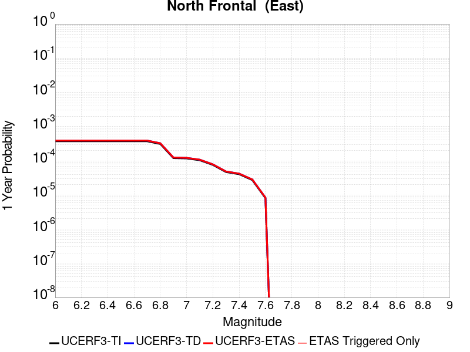 |  |

| Magnitude | 1 wk TI Prob | 1 wk TD Prob | 1 wk ETAS Prob | 1 wk ETAS/TD Gain | 1 wk ETAS Triggered Only | 1 mo TI Prob | 1 mo TD Prob | 1 mo ETAS Prob | 1 mo ETAS/TD Gain | 1 mo ETAS Triggered Only | 1 yr TI Prob | 1 yr TD Prob | 1 yr ETAS Prob | 1 yr ETAS/TD Gain | 1 yr ETAS Triggered Only | 10 yr TI Prob | 10 yr TD Prob | 10 yr ETAS Prob | 10 yr ETAS/TD Gain | 10 yr ETAS Triggered Only |
|-----|-----|-----|-----|-----|-----|-----|-----|-----|-----|-----|-----|-----|-----|-----|-----|-----|-----|-----|-----|-----|
| 6.0 | 7.135738E-6 | 7.4775567E-6 | 7.4775567E-6 | 1.0 | 0.0 | 3.0581377E-5 | 3.204639E-5 | 3.204639E-5 | 1.0 | 0.0 | 3.7226462E-4 | 3.9011487E-4 | 3.9011487E-4 | 1.0 | 0.0 | 0.0037164164 | 0.0038962585 | 0.0039144666 | 1.0046732 | 1.8279197E-5 |
| 6.1 | 7.135738E-6 | 7.4775567E-6 | 7.4775567E-6 | 1.0 | 0.0 | 3.0581377E-5 | 3.204639E-5 | 3.204639E-5 | 1.0 | 0.0 | 3.7226462E-4 | 3.9011487E-4 | 3.9011487E-4 | 1.0 | 0.0 | 0.0037164164 | 0.0038962585 | 0.0039144666 | 1.0046732 | 1.8279197E-5 |
| 6.2 | 7.135738E-6 | 7.4775567E-6 | 7.4775567E-6 | 1.0 | 0.0 | 3.0581377E-5 | 3.204639E-5 | 3.204639E-5 | 1.0 | 0.0 | 3.7226462E-4 | 3.9011487E-4 | 3.9011487E-4 | 1.0 | 0.0 | 0.0037164164 | 0.0038962585 | 0.0039144666 | 1.0046732 | 1.8279197E-5 |
| 6.3 | 7.135738E-6 | 7.4775567E-6 | 7.4775567E-6 | 1.0 | 0.0 | 3.0581377E-5 | 3.204639E-5 | 3.204639E-5 | 1.0 | 0.0 | 3.7226462E-4 | 3.9011487E-4 | 3.9011487E-4 | 1.0 | 0.0 | 0.0037164164 | 0.0038962585 | 0.0039144666 | 1.0046732 | 1.8279197E-5 |
| 6.4 | 7.135738E-6 | 7.4775567E-6 | 7.4775567E-6 | 1.0 | 0.0 | 3.0581377E-5 | 3.204639E-5 | 3.204639E-5 | 1.0 | 0.0 | 3.7226462E-4 | 3.9011487E-4 | 3.9011487E-4 | 1.0 | 0.0 | 0.0037164164 | 0.0038962585 | 0.0039144666 | 1.0046732 | 1.8279197E-5 |
| 6.5 | 7.135738E-6 | 7.4775567E-6 | 7.4775567E-6 | 1.0 | 0.0 | 3.0581377E-5 | 3.204639E-5 | 3.204639E-5 | 1.0 | 0.0 | 3.7226462E-4 | 3.9011487E-4 | 3.9011487E-4 | 1.0 | 0.0 | 0.0037164164 | 0.0038962585 | 0.0039144666 | 1.0046732 | 1.8279197E-5 |
| 6.6 | 7.135738E-6 | 7.4775567E-6 | 7.4775567E-6 | 1.0 | 0.0 | 3.0581377E-5 | 3.204639E-5 | 3.204639E-5 | 1.0 | 0.0 | 3.7226462E-4 | 3.9011487E-4 | 3.9011487E-4 | 1.0 | 0.0 | 0.0037164164 | 0.0038962585 | 0.0039144666 | 1.0046732 | 1.8279197E-5 |
| 6.7 | 7.135738E-6 | 7.4775567E-6 | 7.4775567E-6 | 1.0 | 0.0 | 3.0581377E-5 | 3.204639E-5 | 3.204639E-5 | 1.0 | 0.0 | 3.7226462E-4 | 3.9011487E-4 | 3.9011487E-4 | 1.0 | 0.0 | 0.0037164164 | 0.0038962585 | 0.0039144666 | 1.0046732 | 1.8279197E-5 |
| 6.8 | 5.959142E-6 | 6.2369913E-6 | 6.2369913E-6 | 1.0 | 0.0 | 2.553893E-5 | 2.6729791E-5 | 2.6729791E-5 | 1.0 | 0.0 | 3.108921E-4 | 3.254047E-4 | 3.254047E-4 | 1.0 | 0.0 | 0.0031045752 | 0.0032510555 | 0.0032692752 | 1.0056043 | 1.8279197E-5 |
| 6.9 | 2.2946929E-6 | 2.3825573E-6 | 2.3825573E-6 | 1.0 | 0.0 | 9.834361E-6 | 1.02109225E-5 | 1.02109225E-5 | 1.0 | 0.0 | 1.1972676E-4 | 1.2431137E-4 | 1.2431137E-4 | 1.0 | 0.0 | 0.0011966228 | 0.0012424648 | 0.0012424648 | 1.0 | 0.0 |
| 7.0 | 2.2468673E-6 | 2.3322477E-6 | 2.3322477E-6 | 1.0 | 0.0 | 9.629396E-6 | 9.995312E-6 | 9.995312E-6 | 1.0 | 0.0 | 1.1723159E-4 | 1.216866E-4 | 1.216866E-4 | 1.0 | 0.0 | 0.0011716976 | 0.0012162459 | 0.0012162459 | 1.0 | 0.0 |
| 7.1 | 1.9921076E-6 | 2.064683E-6 | 2.064683E-6 | 1.0 | 0.0 | 8.537577E-6 | 8.848614E-6 | 8.848614E-6 | 1.0 | 0.0 | 1.0394004E-4 | 1.07726984E-4 | 1.07726984E-4 | 1.0 | 0.0 | 0.0010389143 | 0.0010767904 | 0.0010767904 | 1.0 | 0.0 |
| 7.2 | 1.4524545E-6 | 1.5045721E-6 | 1.5045721E-6 | 1.0 | 0.0 | 6.2247905E-6 | 6.4481515E-6 | 6.4481515E-6 | 1.0 | 0.0 | 7.5784184E-5 | 7.850366E-5 | 7.850366E-5 | 1.0 | 0.0 | 7.575835E-4 | 7.847838E-4 | 7.847838E-4 | 1.0 | 0.0 |
| 7.3 | 8.9802575E-7 | 9.309089E-7 | 9.309089E-7 | 1.0 | 0.0 | 3.848676E-6 | 3.9896045E-6 | 3.9896045E-6 | 1.0 | 0.0 | 4.685662E-5 | 4.8572463E-5 | 4.8572463E-5 | 1.0 | 0.0 | 4.6846745E-4 | 4.8562977E-4 | 4.8562977E-4 | 1.0 | 0.0 |
| 7.4 | 7.776139E-7 | 8.0607873E-7 | 8.0607873E-7 | 1.0 | 0.0 | 3.3326266E-6 | 3.4546192E-6 | 3.4546192E-6 | 1.0 | 0.0 | 4.0573974E-5 | 4.2059288E-5 | 4.2059288E-5 | 1.0 | 0.0 | 4.0566566E-4 | 4.2052404E-4 | 4.2052404E-4 | 1.0 | 0.0 |
| 7.5 | 5.244417E-7 | 5.441436E-7 | 5.441436E-7 | 1.0 | 0.0 | 2.2476054E-6 | 2.3320422E-6 | 2.3320422E-6 | 1.0 | 0.0 | 2.7364253E-5 | 2.8392311E-5 | 2.8392311E-5 | 1.0 | 0.0 | 2.7360884E-4 | 2.8389334E-4 | 2.8389334E-4 | 1.0 | 0.0 |
| 7.6 | 1.5489647E-7 | 1.6090165E-7 | 1.6090165E-7 | 1.0 | 0.0 | 6.6384183E-7 | 6.895784E-7 | 6.895784E-7 | 1.0 | 0.0 | 8.082245E-6 | 8.395606E-6 | 8.395606E-6 | 1.0 | 0.0 | 8.08195E-5 | 8.395488E-5 | 8.395488E-5 | 1.0 | 0.0 |

## Kern Canyon (Lake Isabella) 2011
*[(top)](#table-of-contents)*

| 1 Week | 1 Month | 1 Year | 10 Year |
|-----|-----|-----|-----|
|  |  |  |  |

| Magnitude | 1 wk TI Prob | 1 wk TD Prob | 1 wk ETAS Prob | 1 wk ETAS/TD Gain | 1 wk ETAS Triggered Only | 1 mo TI Prob | 1 mo TD Prob | 1 mo ETAS Prob | 1 mo ETAS/TD Gain | 1 mo ETAS Triggered Only | 1 yr TI Prob | 1 yr TD Prob | 1 yr ETAS Prob | 1 yr ETAS/TD Gain | 1 yr ETAS Triggered Only | 10 yr TI Prob | 10 yr TD Prob | 10 yr ETAS Prob | 10 yr ETAS/TD Gain | 10 yr ETAS Triggered Only |
|-----|-----|-----|-----|-----|-----|-----|-----|-----|-----|-----|-----|-----|-----|-----|-----|-----|-----|-----|-----|-----|
| 6.0 | 4.2387383E-6 | 4.001735E-6 | 4.001735E-6 | 1.0 | 0.0 | 1.8165894E-5 | 1.715019E-5 | 1.715019E-5 | 1.0 | 0.0 | 2.2114732E-4 | 2.0878542E-4 | 2.0878542E-4 | 1.0 | 0.0 | 0.0022092736 | 0.0020860767 | 0.0021043175 | 1.0087442 | 1.8279197E-5 |
| 6.1 | 4.2387383E-6 | 4.001735E-6 | 4.001735E-6 | 1.0 | 0.0 | 1.8165894E-5 | 1.715019E-5 | 1.715019E-5 | 1.0 | 0.0 | 2.2114732E-4 | 2.0878542E-4 | 2.0878542E-4 | 1.0 | 0.0 | 0.0022092736 | 0.0020860767 | 0.0021043175 | 1.0087442 | 1.8279197E-5 |
| 6.2 | 4.2387383E-6 | 4.001735E-6 | 4.001735E-6 | 1.0 | 0.0 | 1.8165894E-5 | 1.715019E-5 | 1.715019E-5 | 1.0 | 0.0 | 2.2114732E-4 | 2.0878542E-4 | 2.0878542E-4 | 1.0 | 0.0 | 0.0022092736 | 0.0020860767 | 0.0021043175 | 1.0087442 | 1.8279197E-5 |
| 6.3 | 4.2387383E-6 | 4.001735E-6 | 4.001735E-6 | 1.0 | 0.0 | 1.8165894E-5 | 1.715019E-5 | 1.715019E-5 | 1.0 | 0.0 | 2.2114732E-4 | 2.0878542E-4 | 2.0878542E-4 | 1.0 | 0.0 | 0.0022092736 | 0.0020860767 | 0.0021043175 | 1.0087442 | 1.8279197E-5 |
| 6.4 | 4.2387383E-6 | 4.001735E-6 | 4.001735E-6 | 1.0 | 0.0 | 1.8165894E-5 | 1.715019E-5 | 1.715019E-5 | 1.0 | 0.0 | 2.2114732E-4 | 2.0878542E-4 | 2.0878542E-4 | 1.0 | 0.0 | 0.0022092736 | 0.0020860767 | 0.0021043175 | 1.0087442 | 1.8279197E-5 |
| 6.5 | 2.7857532E-6 | 2.5179297E-6 | 2.5179297E-6 | 1.0 | 0.0 | 1.1938888E-5 | 1.0791085E-5 | 1.0791085E-5 | 1.0 | 0.0 | 1.4534626E-4 | 1.3137386E-4 | 1.3137386E-4 | 1.0 | 0.0 | 0.0014525123 | 0.0013129947 | 0.00133125 | 1.0139035 | 1.8279197E-5 |
| 6.6 | 2.2233348E-6 | 1.944174E-6 | 1.944174E-6 | 1.0 | 0.0 | 9.528543E-6 | 8.332148E-6 | 8.332148E-6 | 1.0 | 0.0 | 1.1600384E-4 | 1.0143928E-4 | 1.0143928E-4 | 1.0 | 0.0 | 0.001159433 | 0.0010139383 | 0.001032199 | 1.0180097 | 1.8279197E-5 |
| 6.7 | 2.1635126E-6 | 1.8835532E-6 | 1.8835532E-6 | 1.0 | 0.0 | 9.272164E-6 | 8.072347E-6 | 8.072347E-6 | 1.0 | 0.0 | 1.1288274E-4 | 9.827647E-5 | 9.827647E-5 | 1.0 | 0.0 | 0.0011282542 | 9.823382E-4 | 0.0010005995 | 1.0185896 | 1.8279197E-5 |
| 6.8 | 1.8685711E-6 | 1.5831863E-6 | 1.5831863E-6 | 1.0 | 0.0 | 8.008137E-6 | 6.785067E-6 | 6.785067E-6 | 1.0 | 0.0 | 9.74947E-5 | 8.2605104E-5 | 8.2605104E-5 | 1.0 | 0.0 | 9.745194E-4 | 8.2574895E-4 | 8.4401306E-4 | 1.0221182 | 1.8279197E-5 |
| 6.9 | 1.5815071E-6 | 1.3065303E-6 | 1.3065303E-6 | 1.0 | 0.0 | 6.77787E-6 | 5.5994037E-6 | 5.5994037E-6 | 1.0 | 0.0 | 8.251744E-5 | 6.817063E-5 | 6.817063E-5 | 1.0 | 0.0 | 8.248681E-4 | 6.814999E-4 | 6.997666E-4 | 1.0268037 | 1.8279197E-5 |
| 7.0 | 1.3772564E-6 | 1.1211043E-6 | 1.1211043E-6 | 1.0 | 0.0 | 5.9025137E-6 | 4.804724E-6 | 4.804724E-6 | 1.0 | 0.0 | 7.186073E-5 | 5.8495963E-5 | 5.8495963E-5 | 1.0 | 0.0 | 7.18375E-4 | 5.848077E-4 | 6.030762E-4 | 1.0312384 | 1.8279197E-5 |
| 7.1 | 1.0916998E-6 | 8.764025E-7 | 8.764025E-7 | 1.0 | 0.0 | 4.678705E-6 | 3.7560053E-6 | 3.7560053E-6 | 1.0 | 0.0 | 5.6961744E-5 | 4.572842E-5 | 4.572842E-5 | 1.0 | 0.0 | 5.6947145E-4 | 4.5719143E-4 | 4.7546226E-4 | 1.0399632 | 1.8279197E-5 |
| 7.2 | 7.6277024E-7 | 5.901622E-7 | 5.901622E-7 | 1.0 | 0.0 | 3.2690114E-6 | 2.529264E-6 | 2.529264E-6 | 1.0 | 0.0 | 3.9799485E-5 | 3.079336E-5 | 3.079336E-5 | 1.0 | 0.0 | 3.9792358E-4 | 3.0789155E-4 | 3.0789155E-4 | 1.0 | 0.0 |
| 7.3 | 5.3265916E-7 | 4.38256E-7 | 4.38256E-7 | 1.0 | 0.0 | 2.282823E-6 | 1.8782387E-6 | 1.8782387E-6 | 1.0 | 0.0 | 2.7793016E-5 | 2.286732E-5 | 2.286732E-5 | 1.0 | 0.0 | 2.778954E-4 | 2.2865004E-4 | 2.2865004E-4 | 1.0 | 0.0 |
| 7.4 | 3.4946007E-7 | 3.0066505E-7 | 3.0066505E-7 | 1.0 | 0.0 | 1.497685E-6 | 1.2885639E-6 | 1.2885639E-6 | 1.0 | 0.0 | 1.8234163E-5 | 1.5688154E-5 | 1.5688154E-5 | 1.0 | 0.0 | 1.8232666E-4 | 1.568707E-4 | 1.568707E-4 | 1.0 | 0.0 |
| 7.5 | 1.8317026E-7 | 1.4245262E-7 | 1.4245262E-7 | 1.0 | 0.0 | 7.850152E-7 | 6.1051105E-7 | 6.1051105E-7 | 1.0 | 0.0 | 9.557518E-6 | 7.4329478E-6 | 7.4329478E-6 | 1.0 | 0.0 | 9.5571064E-5 | 7.4327065E-5 | 7.4327065E-5 | 1.0 | 0.0 |
| 7.6 | 2.572245E-8 | 1.7353212E-8 | 1.7353212E-8 | 1.0 | 0.0 | 1.10239064E-7 | 7.437091E-8 | 7.437091E-8 | 1.0 | 0.0 | 1.3421597E-6 | 9.0546547E-7 | 9.0546547E-7 | 1.0 | 0.0 | 1.3421517E-5 | 9.054624E-6 | 9.054624E-6 | 1.0 | 0.0 |

## Malibu Coast alt 1
*[(top)](#table-of-contents)*

| 1 Week | 1 Month | 1 Year | 10 Year |
|-----|-----|-----|-----|
|  |  |  |  |

| Magnitude | 1 wk TI Prob | 1 wk TD Prob | 1 wk ETAS Prob | 1 wk ETAS/TD Gain | 1 wk ETAS Triggered Only | 1 mo TI Prob | 1 mo TD Prob | 1 mo ETAS Prob | 1 mo ETAS/TD Gain | 1 mo ETAS Triggered Only | 1 yr TI Prob | 1 yr TD Prob | 1 yr ETAS Prob | 1 yr ETAS/TD Gain | 1 yr ETAS Triggered Only | 10 yr TI Prob | 10 yr TD Prob | 10 yr ETAS Prob | 10 yr ETAS/TD Gain | 10 yr ETAS Triggered Only |
|-----|-----|-----|-----|-----|-----|-----|-----|-----|-----|-----|-----|-----|-----|-----|-----|-----|-----|-----|-----|-----|
| 6.0 | 1.6572556E-5 | 1.7599685E-5 | 1.7599685E-5 | 1.0 | 0.0 | 7.102331E-5 | 7.542515E-5 | 7.542515E-5 | 1.0 | 0.0 | 8.6436566E-4 | 9.1793324E-4 | 9.1793324E-4 | 1.0 | 0.0 | 0.0086101135 | 0.009143351 | 0.009161462 | 1.0019809 | 1.8279197E-5 |
| 6.1 | 1.6572556E-5 | 1.7599685E-5 | 1.7599685E-5 | 1.0 | 0.0 | 7.102331E-5 | 7.542515E-5 | 7.542515E-5 | 1.0 | 0.0 | 8.6436566E-4 | 9.1793324E-4 | 9.1793324E-4 | 1.0 | 0.0 | 0.0086101135 | 0.009143351 | 0.009161462 | 1.0019809 | 1.8279197E-5 |
| 6.2 | 1.1085717E-5 | 1.1558117E-5 | 1.1558117E-5 | 1.0 | 0.0 | 4.750935E-5 | 4.9533865E-5 | 4.9533865E-5 | 1.0 | 0.0 | 5.782728E-4 | 6.0291146E-4 | 6.0291146E-4 | 1.0 | 0.0 | 0.0057677035 | 0.006013129 | 0.006013129 | 1.0 | 0.0 |
| 6.3 | 1.0208568E-5 | 1.0593105E-5 | 1.0593105E-5 | 1.0 | 0.0 | 4.375027E-5 | 4.5398247E-5 | 4.5398247E-5 | 1.0 | 0.0 | 5.325294E-4 | 5.525864E-4 | 5.525864E-4 | 1.0 | 0.0 | 0.0053125503 | 0.0055124317 | 0.0055124317 | 1.0 | 0.0 |
| 6.4 | 9.0682315E-6 | 9.343377E-6 | 9.343377E-6 | 1.0 | 0.0 | 3.8863272E-5 | 4.004244E-5 | 4.004244E-5 | 1.0 | 0.0 | 4.730576E-4 | 4.874097E-4 | 4.874097E-4 | 1.0 | 0.0 | 0.0047205184 | 0.0048636203 | 0.0048636203 | 1.0 | 0.0 |
| 6.5 | 7.605796E-6 | 7.749174E-6 | 7.749174E-6 | 1.0 | 0.0 | 3.259586E-5 | 3.3210334E-5 | 3.3210334E-5 | 1.0 | 0.0 | 3.9678233E-4 | 4.042621E-4 | 4.042621E-4 | 1.0 | 0.0 | 0.0039607463 | 0.004035405 | 0.004035405 | 1.0 | 0.0 |
| 6.6 | 5.889873E-6 | 5.8799483E-6 | 5.8799483E-6 | 1.0 | 0.0 | 2.5242069E-5 | 2.5199535E-5 | 2.5199535E-5 | 1.0 | 0.0 | 3.0727885E-4 | 3.0676124E-4 | 3.0676124E-4 | 1.0 | 0.0 | 0.003068543 | 0.0030633907 | 0.0030633907 | 1.0 | 0.0 |
| 6.7 | 5.66586E-6 | 5.6420354E-6 | 5.6420354E-6 | 1.0 | 0.0 | 2.428203E-5 | 2.4179928E-5 | 2.4179928E-5 | 1.0 | 0.0 | 2.955936E-4 | 2.9435093E-4 | 2.9435093E-4 | 1.0 | 0.0 | 0.0029520073 | 0.0029396226 | 0.0029396226 | 1.0 | 0.0 |
| 6.8 | 5.521556E-6 | 5.489812E-6 | 5.489812E-6 | 1.0 | 0.0 | 2.3663597E-5 | 2.3527555E-5 | 2.3527555E-5 | 1.0 | 0.0 | 2.880662E-4 | 2.8641042E-4 | 2.8641042E-4 | 1.0 | 0.0 | 0.0028769306 | 0.0028604246 | 0.0028604246 | 1.0 | 0.0 |
| 6.9 | 5.29752E-6 | 5.250299E-6 | 5.250299E-6 | 1.0 | 0.0 | 2.270346E-5 | 2.2501088E-5 | 2.2501088E-5 | 1.0 | 0.0 | 2.7637955E-4 | 2.7391638E-4 | 2.7391638E-4 | 1.0 | 0.0 | 0.0027603607 | 0.002735798 | 0.002735798 | 1.0 | 0.0 |
| 7.0 | 5.106743E-6 | 5.048033E-6 | 5.048033E-6 | 1.0 | 0.0 | 2.1885859E-5 | 2.1634249E-5 | 2.1634249E-5 | 1.0 | 0.0 | 2.6642776E-4 | 2.6336522E-4 | 2.6336522E-4 | 1.0 | 0.0 | 0.0026610855 | 0.0026305406 | 0.0026305406 | 1.0 | 0.0 |
| 7.1 | 4.8469647E-6 | 4.7707076E-6 | 4.7707076E-6 | 1.0 | 0.0 | 2.0772539E-5 | 2.0445728E-5 | 2.0445728E-5 | 1.0 | 0.0 | 2.528763E-4 | 2.4889837E-4 | 2.4889837E-4 | 1.0 | 0.0 | 0.0025258875 | 0.0024862043 | 0.0024862043 | 1.0 | 0.0 |
| 7.2 | 4.545514E-6 | 4.448504E-6 | 4.448504E-6 | 1.0 | 0.0 | 1.9480629E-5 | 1.9064879E-5 | 1.9064879E-5 | 1.0 | 0.0 | 2.3715083E-4 | 2.3209024E-4 | 2.3209024E-4 | 1.0 | 0.0 | 0.0023689792 | 0.002318486 | 0.002318486 | 1.0 | 0.0 |
| 7.3 | 3.794097E-6 | 3.6521806E-6 | 3.6521806E-6 | 1.0 | 0.0 | 1.6260314E-5 | 1.565211E-5 | 1.565211E-5 | 1.0 | 0.0 | 1.9795135E-4 | 1.905478E-4 | 1.905478E-4 | 1.0 | 0.0 | 0.001977751 | 0.0019038487 | 0.0019038487 | 1.0 | 0.0 |
| 7.4 | 2.808217E-6 | 2.719262E-6 | 2.719262E-6 | 1.0 | 0.0 | 1.203516E-5 | 1.1653928E-5 | 1.1653928E-5 | 1.0 | 0.0 | 1.4651821E-4 | 1.4187736E-4 | 1.4187736E-4 | 1.0 | 0.0 | 0.0014642165 | 0.0014178705 | 0.0014178705 | 1.0 | 0.0 |
| 7.5 | 1.83809E-6 | 1.8191979E-6 | 1.8191979E-6 | 1.0 | 0.0 | 7.877505E-6 | 7.796539E-6 | 7.796539E-6 | 1.0 | 0.0 | 9.59044E-5 | 9.4918745E-5 | 9.4918745E-5 | 1.0 | 0.0 | 9.5863023E-4 | 9.4878406E-4 | 9.4878406E-4 | 1.0 | 0.0 |
| 7.6 | 1.1292672E-6 | 1.1002278E-6 | 1.1002278E-6 | 1.0 | 0.0 | 4.839708E-6 | 4.7152535E-6 | 4.7152535E-6 | 1.0 | 0.0 | 5.8921847E-5 | 5.7406713E-5 | 5.7406713E-5 | 1.0 | 0.0 | 5.890623E-4 | 5.739205E-4 | 5.739205E-4 | 1.0 | 0.0 |
| 7.7 | 5.065272E-7 | 4.6095698E-7 | 4.6095698E-7 | 1.0 | 0.0 | 2.170829E-6 | 1.9755284E-6 | 1.9755284E-6 | 1.0 | 0.0 | 2.6429525E-5 | 2.4051806E-5 | 2.4051806E-5 | 1.0 | 0.0 | 2.642638E-4 | 2.4049314E-4 | 2.4049314E-4 | 1.0 | 0.0 |
| 7.8 | 8.952991E-8 | 6.709504E-8 | 6.709504E-8 | 1.0 | 0.0 | 3.8369956E-7 | 2.8755014E-7 | 2.8755014E-7 | 1.0 | 0.0 | 4.671532E-6 | 3.5009175E-6 | 3.5009175E-6 | 1.0 | 0.0 | 4.671434E-5 | 3.500864E-5 | 3.500864E-5 | 1.0 | 0.0 |
| 7.9 | 8.007447E-10 | 6.161175E-10 | 6.161175E-10 | 1.0 | 0.0 | 3.4317629E-9 | 2.640504E-9 | 2.640504E-9 | 1.0 | 0.0 | 4.1781714E-8 | 3.2148137E-8 | 3.2148137E-8 | 1.0 | 0.0 | 4.1781706E-7 | 3.2148134E-7 | 3.2148134E-7 | 1.0 | 0.0 |

## Rose Canyon
*[(top)](#table-of-contents)*

| 1 Week | 1 Month | 1 Year | 10 Year |
|-----|-----|-----|-----|
|  |  |  |  |

| Magnitude | 1 wk TI Prob | 1 wk TD Prob | 1 wk ETAS Prob | 1 wk ETAS/TD Gain | 1 wk ETAS Triggered Only | 1 mo TI Prob | 1 mo TD Prob | 1 mo ETAS Prob | 1 mo ETAS/TD Gain | 1 mo ETAS Triggered Only | 1 yr TI Prob | 1 yr TD Prob | 1 yr ETAS Prob | 1 yr ETAS/TD Gain | 1 yr ETAS Triggered Only | 10 yr TI Prob | 10 yr TD Prob | 10 yr ETAS Prob | 10 yr ETAS/TD Gain | 10 yr ETAS Triggered Only |
|-----|-----|-----|-----|-----|-----|-----|-----|-----|-----|-----|-----|-----|-----|-----|-----|-----|-----|-----|-----|-----|
| 6.0 | 4.5923203E-5 | 4.9789614E-5 | 4.9789614E-5 | 1.0 | 0.0 | 1.9679888E-4 | 2.1336795E-4 | 2.1336795E-4 | 1.0 | 0.0 | 0.0023933933 | 0.0025948633 | 0.0026130949 | 1.0070261 | 1.8279197E-5 | 0.023677798 | 0.02567839 | 0.025696201 | 1.0006936 | 1.8279197E-5 |
| 6.1 | 4.5923203E-5 | 4.9789614E-5 | 4.9789614E-5 | 1.0 | 0.0 | 1.9679888E-4 | 2.1336795E-4 | 2.1336795E-4 | 1.0 | 0.0 | 0.0023933933 | 0.0025948633 | 0.0026130949 | 1.0070261 | 1.8279197E-5 | 0.023677798 | 0.02567839 | 0.025696201 | 1.0006936 | 1.8279197E-5 |
| 6.2 | 2.8844734E-5 | 2.9737104E-5 | 2.9737104E-5 | 1.0 | 0.0 | 1.2361443E-4 | 1.274387E-4 | 1.274387E-4 | 1.0 | 0.0 | 0.0015039665 | 0.001550497 | 0.0015687478 | 1.011771 | 1.8279197E-5 | 0.0149382865 | 0.01540967 | 0.015427667 | 1.0011679 | 1.8279197E-5 |
| 6.3 | 2.3171577E-5 | 2.3228296E-5 | 2.3228296E-5 | 1.0 | 0.0 | 9.9302975E-5 | 9.954612E-5 | 9.954612E-5 | 1.0 | 0.0 | 0.0012083431 | 0.0012113136 | 0.0012295707 | 1.0150721 | 1.8279197E-5 | 0.012017938 | 0.012056878 | 0.012074937 | 1.0014977 | 1.8279197E-5 |
| 6.4 | 2.0066604E-5 | 1.970763E-5 | 1.970763E-5 | 1.0 | 0.0 | 8.599689E-5 | 8.445859E-5 | 8.445859E-5 | 1.0 | 0.0 | 0.0010465092 | 0.0010278084 | 0.0010460687 | 1.0177664 | 1.8279197E-5 | 0.010415946 | 0.01023846 | 0.010256552 | 1.001767 | 1.8279197E-5 |
| 6.5 | 1.776989E-5 | 1.713778E-5 | 1.713778E-5 | 1.0 | 0.0 | 7.615444E-5 | 7.34456E-5 | 7.34456E-5 | 1.0 | 0.0 | 9.267859E-4 | 8.9384033E-4 | 9.1210316E-4 | 1.0204319 | 1.8279197E-5 | 0.009229303 | 0.008908576 | 0.008926692 | 1.0020336 | 1.8279197E-5 |
| 6.6 | 1.5227364E-5 | 1.4346897E-5 | 1.4346897E-5 | 1.0 | 0.0 | 6.52585E-5 | 6.148528E-5 | 6.148528E-5 | 1.0 | 0.0 | 7.942326E-4 | 7.483314E-4 | 7.6659693E-4 | 1.0244083 | 1.8279197E-5 | 0.007914 | 0.00746231 | 0.0074804532 | 1.0024313 | 1.8279197E-5 |
| 6.7 | 1.2703898E-5 | 1.1674687E-5 | 1.1674687E-5 | 1.0 | 0.0 | 5.4444143E-5 | 5.0033435E-5 | 5.0033435E-5 | 1.0 | 0.0 | 6.626558E-4 | 6.089911E-4 | 6.089911E-4 | 1.0 | 0.0 | 0.006606833 | 0.006075816 | 0.006075816 | 1.0 | 0.0 |
| 6.8 | 1.1554917E-5 | 1.0610523E-5 | 1.0610523E-5 | 1.0 | 0.0 | 4.9520135E-5 | 4.5472898E-5 | 4.5472898E-5 | 1.0 | 0.0 | 6.0274085E-4 | 5.5349595E-4 | 5.5349595E-4 | 1.0 | 0.0 | 0.0060110865 | 0.0055231815 | 0.0055231815 | 1.0 | 0.0 |
| 6.9 | 8.732078E-6 | 7.882083E-6 | 7.882083E-6 | 1.0 | 0.0 | 3.7422655E-5 | 3.3779936E-5 | 3.3779936E-5 | 1.0 | 0.0 | 4.5552556E-4 | 4.1119603E-4 | 4.1119603E-4 | 1.0 | 0.0 | 0.0045459294 | 0.004105184 | 0.004105184 | 1.0 | 0.0 |
| 7.0 | 5.9337494E-6 | 5.10785E-6 | 5.10785E-6 | 1.0 | 0.0 | 2.5430107E-5 | 2.1890603E-5 | 2.1890603E-5 | 1.0 | 0.0 | 3.0956755E-4 | 2.6648561E-4 | 2.6648561E-4 | 1.0 | 0.0 | 0.0030913667 | 0.0026616764 | 0.0026616764 | 1.0 | 0.0 |
| 7.1 | 5.013409E-6 | 4.1776725E-6 | 4.1776725E-6 | 1.0 | 0.0 | 2.1485863E-5 | 1.7904189E-5 | 1.7904189E-5 | 1.0 | 0.0 | 2.6155898E-4 | 2.179618E-4 | 2.179618E-4 | 1.0 | 0.0 | 0.0026125133 | 0.002177492 | 0.002177492 | 1.0 | 0.0 |
| 7.2 | 4.120763E-6 | 3.282373E-6 | 3.282373E-6 | 1.0 | 0.0 | 1.7660293E-5 | 1.4067237E-5 | 1.4067237E-5 | 1.0 | 0.0 | 2.1499286E-4 | 1.7125525E-4 | 1.7125525E-4 | 1.0 | 0.0 | 0.0021478499 | 0.0017112423 | 0.0017112423 | 1.0 | 0.0 |
| 7.3 | 3.2081239E-6 | 2.4407161E-6 | 2.4407161E-6 | 1.0 | 0.0 | 1.374903E-5 | 1.046017E-5 | 1.046017E-5 | 1.0 | 0.0 | 1.6738157E-4 | 1.2734519E-4 | 1.2734519E-4 | 1.0 | 0.0 | 0.0016725556 | 0.0012727292 | 0.0012727292 | 1.0 | 0.0 |
| 7.4 | 2.4194755E-6 | 1.7681992E-6 | 1.7681992E-6 | 1.0 | 0.0 | 1.0369139E-5 | 7.5779753E-6 | 7.5779753E-6 | 1.0 | 0.0 | 1.2623696E-4 | 9.225799E-5 | 9.225799E-5 | 1.0 | 0.0 | 0.0012616527 | 9.222023E-4 | 9.222023E-4 | 1.0 | 0.0 |
| 7.5 | 1.3842889E-6 | 9.3795074E-7 | 9.3795074E-7 | 1.0 | 0.0 | 5.9326535E-6 | 4.019783E-6 | 4.019783E-6 | 1.0 | 0.0 | 7.222766E-5 | 4.8939793E-5 | 4.8939793E-5 | 1.0 | 0.0 | 7.220419E-4 | 4.8929366E-4 | 4.8929366E-4 | 1.0 | 0.0 |
| 7.6 | 1.0021575E-6 | 6.412146E-7 | 6.412146E-7 | 1.0 | 0.0 | 4.2949537E-6 | 2.74806E-6 | 2.74806E-6 | 1.0 | 0.0 | 5.2289808E-5 | 3.3457138E-5 | 3.3457138E-5 | 1.0 | 0.0 | 5.2277505E-4 | 3.3452315E-4 | 3.3452315E-4 | 1.0 | 0.0 |
| 7.7 | 8.7620116E-8 | 6.449588E-8 | 6.449588E-8 | 1.0 | 0.0 | 3.7551473E-7 | 2.7641087E-7 | 2.7641087E-7 | 1.0 | 0.0 | 4.5718825E-6 | 3.3652977E-6 | 3.3652977E-6 | 1.0 | 0.0 | 4.5717883E-5 | 3.3652497E-5 | 3.3652497E-5 | 1.0 | 0.0 |

## La Panza 2011
*[(top)](#table-of-contents)*

| 1 Week | 1 Month | 1 Year | 10 Year |
|-----|-----|-----|-----|
|  |  | 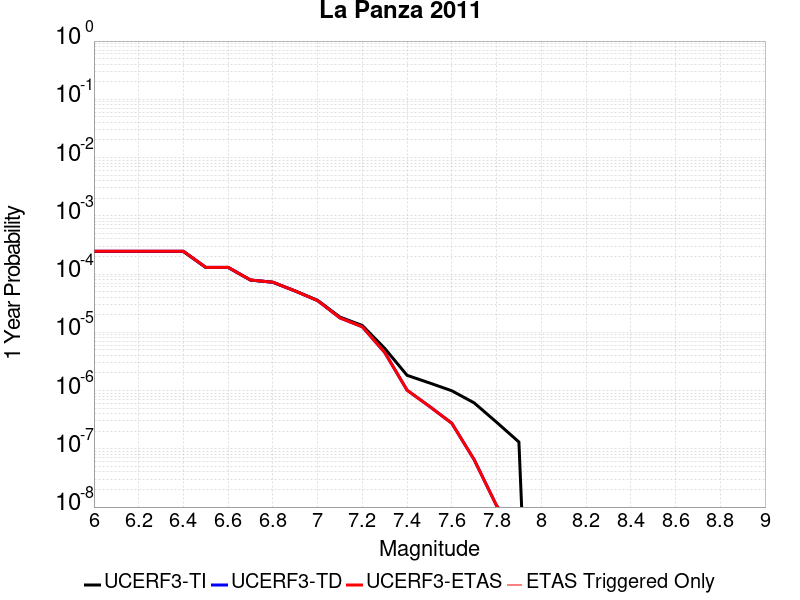 |  |

| Magnitude | 1 wk TI Prob | 1 wk TD Prob | 1 wk ETAS Prob | 1 wk ETAS/TD Gain | 1 wk ETAS Triggered Only | 1 mo TI Prob | 1 mo TD Prob | 1 mo ETAS Prob | 1 mo ETAS/TD Gain | 1 mo ETAS Triggered Only | 1 yr TI Prob | 1 yr TD Prob | 1 yr ETAS Prob | 1 yr ETAS/TD Gain | 1 yr ETAS Triggered Only | 10 yr TI Prob | 10 yr TD Prob | 10 yr ETAS Prob | 10 yr ETAS/TD Gain | 10 yr ETAS Triggered Only |
|-----|-----|-----|-----|-----|-----|-----|-----|-----|-----|-----|-----|-----|-----|-----|-----|-----|-----|-----|-----|-----|
| 6.0 | 4.6754544E-6 | 4.717756E-6 | 4.717756E-6 | 1.0 | 0.0 | 2.0037509E-5 | 2.0218808E-5 | 2.0218808E-5 | 1.0 | 0.0 | 2.4392935E-4 | 2.4613814E-4 | 2.4613814E-4 | 1.0 | 0.0 | 0.0024366176 | 0.00245885 | 0.002477084 | 1.0074158 | 1.8279197E-5 |
| 6.1 | 4.6754544E-6 | 4.717756E-6 | 4.717756E-6 | 1.0 | 0.0 | 2.0037509E-5 | 2.0218808E-5 | 2.0218808E-5 | 1.0 | 0.0 | 2.4392935E-4 | 2.4613814E-4 | 2.4613814E-4 | 1.0 | 0.0 | 0.0024366176 | 0.00245885 | 0.002477084 | 1.0074158 | 1.8279197E-5 |
| 6.2 | 4.6754544E-6 | 4.717756E-6 | 4.717756E-6 | 1.0 | 0.0 | 2.0037509E-5 | 2.0218808E-5 | 2.0218808E-5 | 1.0 | 0.0 | 2.4392935E-4 | 2.4613814E-4 | 2.4613814E-4 | 1.0 | 0.0 | 0.0024366176 | 0.00245885 | 0.002477084 | 1.0074158 | 1.8279197E-5 |
| 6.3 | 4.6754544E-6 | 4.717756E-6 | 4.717756E-6 | 1.0 | 0.0 | 2.0037509E-5 | 2.0218808E-5 | 2.0218808E-5 | 1.0 | 0.0 | 2.4392935E-4 | 2.4613814E-4 | 2.4613814E-4 | 1.0 | 0.0 | 0.0024366176 | 0.00245885 | 0.002477084 | 1.0074158 | 1.8279197E-5 |
| 6.4 | 4.6754544E-6 | 4.717756E-6 | 4.717756E-6 | 1.0 | 0.0 | 2.0037509E-5 | 2.0218808E-5 | 2.0218808E-5 | 1.0 | 0.0 | 2.4392935E-4 | 2.4613814E-4 | 2.4613814E-4 | 1.0 | 0.0 | 0.0024366176 | 0.00245885 | 0.002477084 | 1.0074158 | 1.8279197E-5 |
| 6.5 | 2.485343E-6 | 2.500739E-6 | 2.500739E-6 | 1.0 | 0.0 | 1.0651426E-5 | 1.0717411E-5 | 1.0717411E-5 | 1.0 | 0.0 | 1.296734E-4 | 1.3047706E-4 | 1.3047706E-4 | 1.0 | 0.0 | 0.0012959775 | 0.0013040429 | 0.0013040429 | 1.0 | 0.0 |
| 6.6 | 2.485343E-6 | 2.500739E-6 | 2.500739E-6 | 1.0 | 0.0 | 1.0651426E-5 | 1.0717411E-5 | 1.0717411E-5 | 1.0 | 0.0 | 1.296734E-4 | 1.3047706E-4 | 1.3047706E-4 | 1.0 | 0.0 | 0.0012959775 | 0.0013040429 | 0.0013040429 | 1.0 | 0.0 |
| 6.7 | 1.5108508E-6 | 1.5147651E-6 | 1.5147651E-6 | 1.0 | 0.0 | 6.4750584E-6 | 6.491835E-6 | 6.491835E-6 | 1.0 | 0.0 | 7.8830984E-5 | 7.903534E-5 | 7.903534E-5 | 1.0 | 0.0 | 7.880303E-4 | 7.900831E-4 | 7.900831E-4 | 1.0 | 0.0 |
| 6.8 | 1.3865837E-6 | 1.3886358E-6 | 1.3886358E-6 | 1.0 | 0.0 | 5.942488E-6 | 5.9512836E-6 | 5.9512836E-6 | 1.0 | 0.0 | 7.234739E-5 | 7.245457E-5 | 7.245457E-5 | 1.0 | 0.0 | 7.232384E-4 | 7.2431925E-4 | 7.2431925E-4 | 1.0 | 0.0 |
| 6.9 | 9.826583E-7 | 9.79749E-7 | 9.79749E-7 | 1.0 | 0.0 | 4.2113857E-6 | 4.198918E-6 | 4.198918E-6 | 1.0 | 0.0 | 5.1272415E-5 | 5.112068E-5 | 5.112068E-5 | 1.0 | 0.0 | 5.126059E-4 | 5.110946E-4 | 5.110946E-4 | 1.0 | 0.0 |
| 7.0 | 6.7797646E-7 | 6.711376E-7 | 6.711376E-7 | 1.0 | 0.0 | 2.9056102E-6 | 2.876301E-6 | 2.876301E-6 | 1.0 | 0.0 | 3.537523E-5 | 3.5018435E-5 | 3.5018435E-5 | 1.0 | 0.0 | 3.5369597E-4 | 3.5013226E-4 | 3.5013226E-4 | 1.0 | 0.0 |
| 7.1 | 3.4979826E-7 | 3.3885055E-7 | 3.3885055E-7 | 1.0 | 0.0 | 1.4991346E-6 | 1.4522159E-6 | 1.4522159E-6 | 1.0 | 0.0 | 1.825181E-5 | 1.7680597E-5 | 1.7680597E-5 | 1.0 | 0.0 | 1.825031E-4 | 1.7679307E-4 | 1.7679307E-4 | 1.0 | 0.0 |
| 7.2 | 2.5088332E-7 | 2.3842912E-7 | 2.3842912E-7 | 1.0 | 0.0 | 1.0752137E-6 | 1.0218387E-6 | 1.0218387E-6 | 1.0 | 0.0 | 1.3090649E-5 | 1.2440823E-5 | 1.2440823E-5 | 1.0 | 0.0 | 1.3089878E-4 | 1.2440213E-4 | 1.2440213E-4 | 1.0 | 0.0 |
| 7.3 | 1.0159086E-7 | 8.6553534E-8 | 8.6553534E-8 | 1.0 | 0.0 | 4.3538932E-7 | 3.7094367E-7 | 3.7094367E-7 | 1.0 | 0.0 | 5.300852E-6 | 4.51623E-6 | 4.51623E-6 | 1.0 | 0.0 | 5.3007258E-5 | 4.5161425E-5 | 4.5161425E-5 | 1.0 | 0.0 |
| 7.4 | 3.5006252E-8 | 1.9438788E-8 | 1.9438788E-8 | 1.0 | 0.0 | 1.5002678E-7 | 8.330909E-8 | 8.330909E-8 | 1.0 | 0.0 | 1.8265745E-6 | 1.0142877E-6 | 1.0142877E-6 | 1.0 | 0.0 | 1.8265595E-5 | 1.0142833E-5 | 1.0142833E-5 | 1.0 | 0.0 |
| 7.5 | 2.592274E-8 | 1.0264829E-8 | 1.0264829E-8 | 1.0 | 0.0 | 1.1109746E-7 | 4.3992124E-8 | 4.3992124E-8 | 1.0 | 0.0 | 1.3526106E-6 | 5.35604E-7 | 5.35604E-7 | 1.0 | 0.0 | 1.3526024E-5 | 5.356028E-6 | 5.356028E-6 | 1.0 | 0.0 |
| 7.6 | 1.9016717E-8 | 5.261332E-9 | 5.261332E-9 | 1.0 | 0.0 | 8.150022E-8 | 2.2548566E-8 | 2.2548566E-8 | 1.0 | 0.0 | 9.922647E-7 | 2.7452873E-7 | 2.7452873E-7 | 1.0 | 0.0 | 9.922603E-6 | 2.745284E-6 | 2.745284E-6 | 1.0 | 0.0 |
| 7.7 | 1.17738495E-8 | 1.2469854E-9 | 1.2469854E-9 | 1.0 | 0.0 | 5.0459356E-8 | 5.344223E-9 | 5.344223E-9 | 1.0 | 0.0 | 6.1434247E-7 | 6.506591E-8 | 6.506591E-8 | 1.0 | 0.0 | 6.143408E-6 | 6.5065893E-7 | 6.5065893E-7 | 1.0 | 0.0 |
| 7.8 | 5.489079E-9 | 2.029984E-10 | 2.029984E-10 | 1.0 | 0.0 | 2.3524624E-8 | 8.699931E-10 | 8.699931E-10 | 1.0 | 0.0 | 2.8641225E-7 | 1.0592162E-8 | 1.0592162E-8 | 1.0 | 0.0 | 2.8641189E-6 | 1.05921615E-7 | 1.05921615E-7 | 1.0 | 0.0 |
| 7.9 | 2.5081048E-9 | 6.75523E-11 | 6.75523E-11 | 1.0 | 0.0 | 1.0749021E-8 | 2.8950986E-10 | 2.8950986E-10 | 1.0 | 0.0 | 1.3086932E-7 | 3.5247816E-9 | 3.5247816E-9 | 1.0 | 0.0 | 1.3086925E-6 | 3.5247815E-8 | 3.5247815E-8 | 1.0 | 0.0 |

## Coronado Bank alt1
*[(top)](#table-of-contents)*

| 1 Week | 1 Month | 1 Year | 10 Year |
|-----|-----|-----|-----|
|  |  |  | 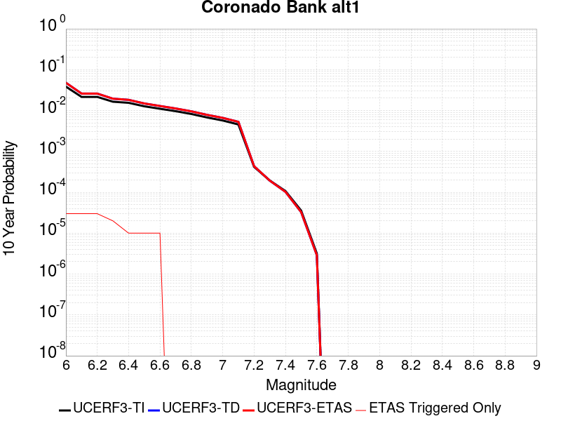 |

| Magnitude | 1 wk TI Prob | 1 wk TD Prob | 1 wk ETAS Prob | 1 wk ETAS/TD Gain | 1 wk ETAS Triggered Only | 1 mo TI Prob | 1 mo TD Prob | 1 mo ETAS Prob | 1 mo ETAS/TD Gain | 1 mo ETAS Triggered Only | 1 yr TI Prob | 1 yr TD Prob | 1 yr ETAS Prob | 1 yr ETAS/TD Gain | 1 yr ETAS Triggered Only | 10 yr TI Prob | 10 yr TD Prob | 10 yr ETAS Prob | 10 yr ETAS/TD Gain | 10 yr ETAS Triggered Only |
|-----|-----|-----|-----|-----|-----|-----|-----|-----|-----|-----|-----|-----|-----|-----|-----|-----|-----|-----|-----|-----|
| 6.0 | 7.533492E-5 | 9.397445E-5 | 9.397445E-5 | 1.0 | 0.0 | 3.22824E-4 | 4.0268974E-4 | 4.0268974E-4 | 1.0 | 0.0 | 0.0039233007 | 0.004892234 | 0.004910424 | 1.0037181 | 1.8279197E-5 | 0.03854755 | 0.047915664 | 0.047933064 | 1.0003632 | 1.8279197E-5 |
| 6.1 | 4.1807285E-5 | 5.050419E-5 | 5.050419E-5 | 1.0 | 0.0 | 1.7916178E-4 | 2.1642915E-4 | 2.1642915E-4 | 1.0 | 0.0 | 0.0021791123 | 0.0026319358 | 0.0026501669 | 1.0069269 | 1.8279197E-5 | 0.021578677 | 0.026016729 | 0.026034532 | 1.0006843 | 1.8279197E-5 |
| 6.2 | 4.1807285E-5 | 5.050419E-5 | 5.050419E-5 | 1.0 | 0.0 | 1.7916178E-4 | 2.1642915E-4 | 2.1642915E-4 | 1.0 | 0.0 | 0.0021791123 | 0.0026319358 | 0.0026501669 | 1.0069269 | 1.8279197E-5 | 0.021578677 | 0.026016729 | 0.026034532 | 1.0006843 | 1.8279197E-5 |
| 6.3 | 3.1793104E-5 | 3.7718673E-5 | 3.7718673E-5 | 1.0 | 0.0 | 1.3624904E-4 | 1.6164166E-4 | 1.6164166E-4 | 1.0 | 0.0 | 0.0016575698 | 0.0019662387 | 0.0019844822 | 1.0092783 | 1.8279197E-5 | 0.016452603 | 0.01949231 | 0.019510234 | 1.0009195 | 1.8279197E-5 |
| 6.4 | 2.9878007E-5 | 3.534274E-5 | 3.534274E-5 | 1.0 | 0.0 | 1.2804232E-4 | 1.5146029E-4 | 1.5146029E-4 | 1.0 | 0.0 | 0.0015578003 | 0.0018424982 | 0.0018607437 | 1.0099026 | 1.8279197E-5 | 0.015469253 | 0.018275984 | 0.018293928 | 1.0009819 | 1.8279197E-5 |
| 6.5 | 2.4512565E-5 | 2.8769407E-5 | 2.8769407E-5 | 1.0 | 0.0 | 1.0504962E-4 | 1.2329179E-4 | 1.2329179E-4 | 1.0 | 0.0 | 0.0012782287 | 0.0015000715 | 0.0015183232 | 1.0121672 | 1.8279197E-5 | 0.012709012 | 0.014902437 | 0.014920443 | 1.0012083 | 1.8279197E-5 |
| 6.6 | 2.1317413E-5 | 2.491118E-5 | 2.491118E-5 | 1.0 | 0.0 | 9.135714E-5 | 1.0675796E-4 | 1.0675796E-4 | 1.0 | 0.0 | 0.0011117056 | 0.0012990254 | 0.0013172808 | 1.0140532 | 1.8279197E-5 | 0.011061605 | 0.012916726 | 0.0129347695 | 1.0013969 | 1.8279197E-5 |
| 6.7 | 1.8585655E-5 | 2.16387E-5 | 2.16387E-5 | 1.0 | 0.0 | 7.9650374E-5 | 9.27341E-5 | 9.27341E-5 | 1.0 | 0.0 | 9.6931186E-4 | 0.0011284734 | 0.0011284734 | 1.0 | 0.0 | 0.0096509475 | 0.011229593 | 0.011229593 | 1.0 | 0.0 |
| 6.8 | 1.5862879E-5 | 1.8422674E-5 | 1.8422674E-5 | 1.0 | 0.0 | 6.798199E-5 | 7.8952035E-5 | 7.8952035E-5 | 1.0 | 0.0 | 8.273665E-4 | 9.608364E-4 | 9.608364E-4 | 1.0 | 0.0 | 0.008242928 | 0.009568804 | 0.009568804 | 1.0 | 0.0 |
| 6.9 | 1.3021509E-5 | 1.5097861E-5 | 1.5097861E-5 | 1.0 | 0.0 | 5.5805274E-5 | 6.4703614E-5 | 6.4703614E-5 | 1.0 | 0.0 | 6.792174E-4 | 7.8749994E-4 | 7.8749994E-4 | 1.0 | 0.0 | 0.006771452 | 0.0078489175 | 0.0078489175 | 1.0 | 0.0 |
| 7.0 | 1.0974371E-5 | 1.2722295E-5 | 1.2722295E-5 | 1.0 | 0.0 | 4.7032172E-5 | 5.452308E-5 | 5.452308E-5 | 1.0 | 0.0 | 5.7246623E-4 | 6.636339E-4 | 6.636339E-4 | 1.0 | 0.0 | 0.0057099373 | 0.006618271 | 0.006618271 | 1.0 | 0.0 |
| 7.1 | 8.766221E-6 | 1.0165593E-5 | 1.0165593E-5 | 1.0 | 0.0 | 3.7568978E-5 | 4.35662E-5 | 4.35662E-5 | 1.0 | 0.0 | 4.573063E-4 | 5.303066E-4 | 5.303066E-4 | 1.0 | 0.0 | 0.0045636636 | 0.0052921115 | 0.0052921115 | 1.0 | 0.0 |
| 7.2 | 8.026024E-7 | 8.332343E-7 | 8.332343E-7 | 1.0 | 0.0 | 3.43972E-6 | 3.5709993E-6 | 3.5709993E-6 | 1.0 | 0.0 | 4.1877785E-5 | 4.347606E-5 | 4.347606E-5 | 1.0 | 0.0 | 4.1869894E-4 | 4.3467662E-4 | 4.3467662E-4 | 1.0 | 0.0 |
| 7.3 | 3.7293114E-7 | 3.7002837E-7 | 3.7002837E-7 | 1.0 | 0.0 | 1.5982754E-6 | 1.5858349E-6 | 1.5858349E-6 | 1.0 | 0.0 | 1.9458828E-5 | 1.9307368E-5 | 1.9307368E-5 | 1.0 | 0.0 | 1.9457124E-4 | 1.9305699E-4 | 1.9305699E-4 | 1.0 | 0.0 |
| 7.4 | 2.0557036E-7 | 1.967517E-7 | 1.967517E-7 | 1.0 | 0.0 | 8.810155E-7 | 8.432213E-7 | 8.432213E-7 | 1.0 | 0.0 | 1.0726311E-5 | 1.0266171E-5 | 1.0266171E-5 | 1.0 | 0.0 | 1.0725793E-4 | 1.02657E-4 | 1.02657E-4 | 1.0 | 0.0 |
| 7.5 | 6.845446E-8 | 6.279522E-8 | 6.279522E-8 | 1.0 | 0.0 | 2.9337625E-7 | 2.6912235E-7 | 2.6912235E-7 | 1.0 | 0.0 | 3.5718497E-6 | 3.2765597E-6 | 3.2765597E-6 | 1.0 | 0.0 | 3.5717923E-5 | 3.2765125E-5 | 3.2765125E-5 | 1.0 | 0.0 |
| 7.6 | 6.0975145E-9 | 5.5319367E-9 | 5.5319367E-9 | 1.0 | 0.0 | 2.6132206E-8 | 2.3708301E-8 | 2.3708301E-8 | 1.0 | 0.0 | 3.1815955E-7 | 2.8864855E-7 | 2.8864855E-7 | 1.0 | 0.0 | 3.181591E-6 | 2.8864827E-6 | 2.8864827E-6 | 1.0 | 0.0 |

