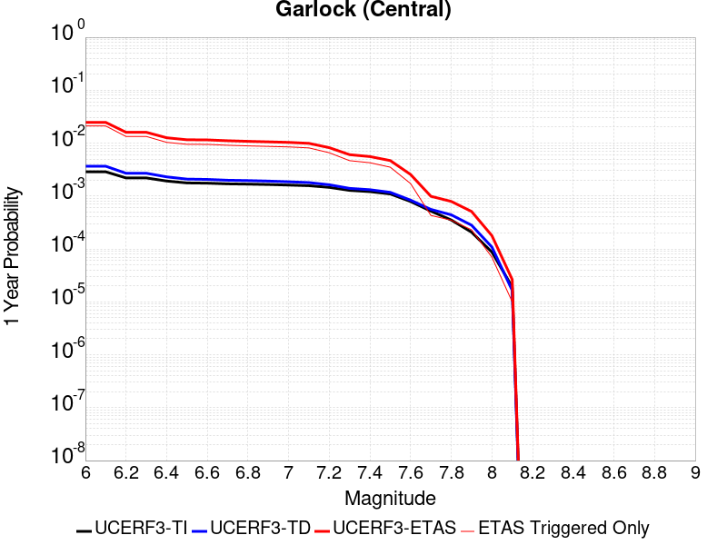
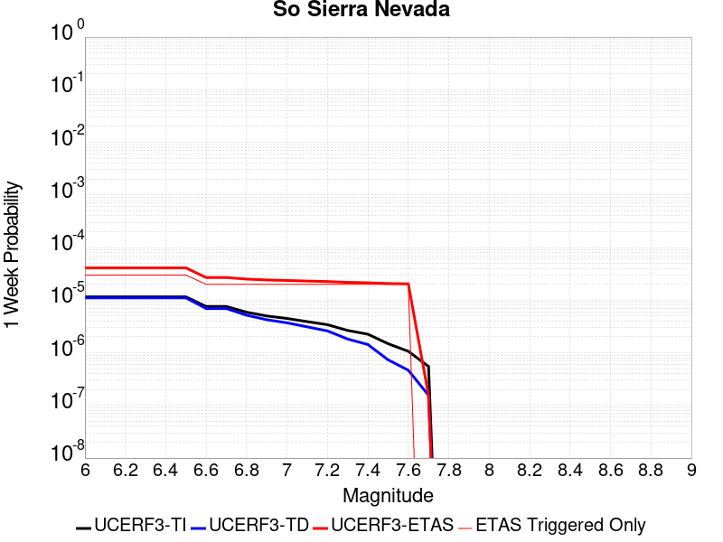
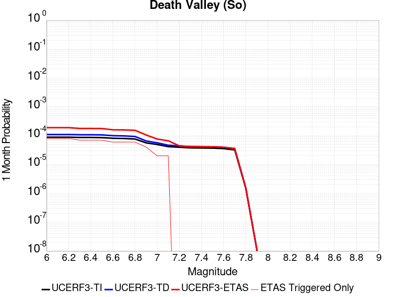
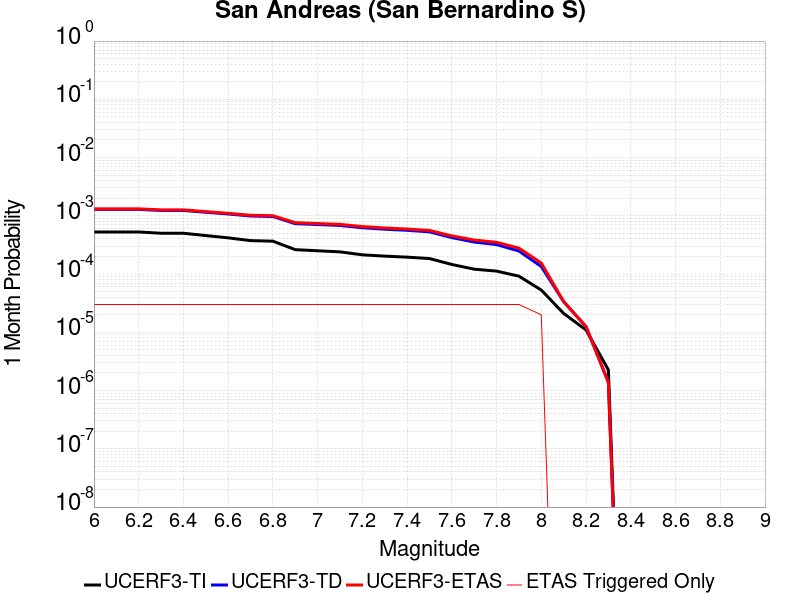
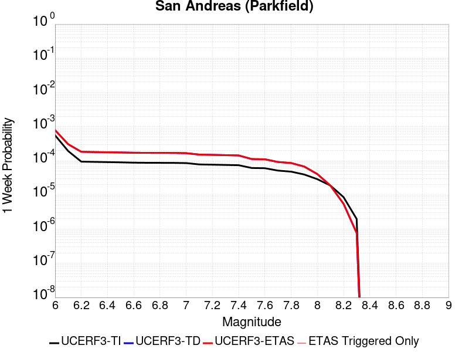
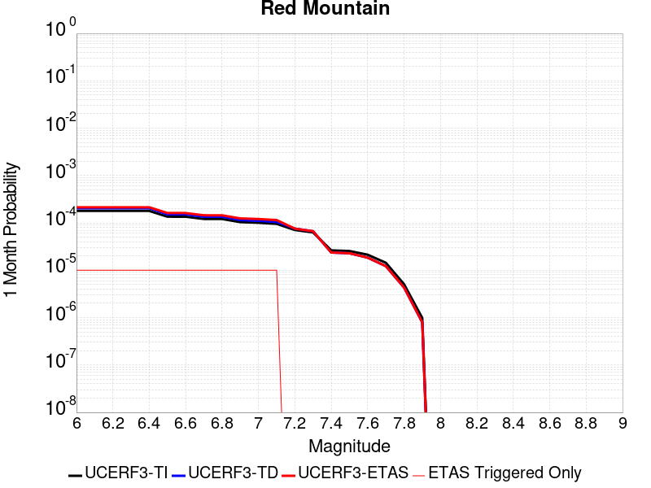
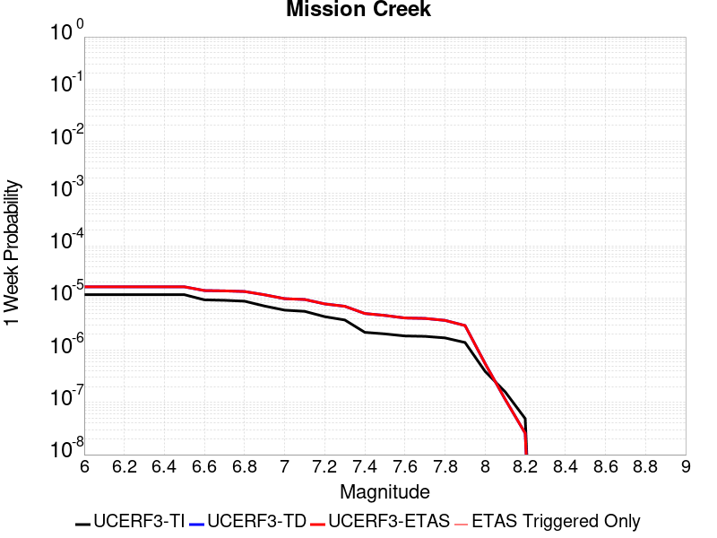
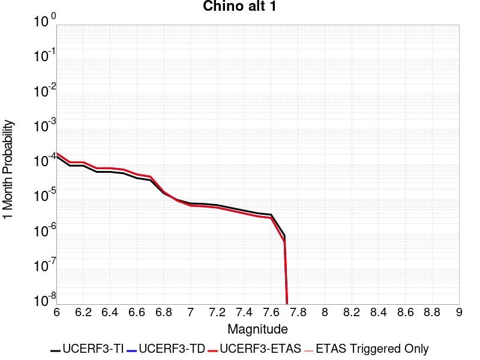
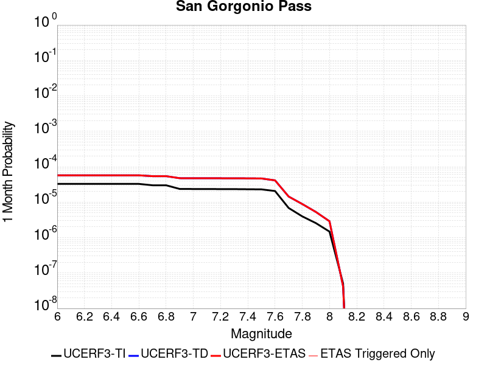

# Parent Section Magnitude-Probability Distributions

Only fault sections with at least one triggered aftershock are plotted. Sections are sorted by total supraseismogenic trigger rate (decreasing)

## Table Of Contents

* [Garlock (Central)](#garlock-central)
* [Tank Canyon](#tank-canyon)
* [Little Lake](#little-lake)
* [Airport Lake](#airport-lake)
* [Owl Lake](#owl-lake)
* [Panamint Valley](#panamint-valley)
* [Garlock (East)](#garlock-east)
* [Ash Hill](#ash-hill)
* [Hunter Mountain-Saline Valley](#hunter-mountain-saline-valley)
* [Blackwater](#blackwater)
* [Garlock (West)](#garlock-west)
* [McLean Lake](#mclean-lake)
* [Gravel Hills-Harper Lk](#gravel-hills-harper-lk)
* [So Sierra Nevada](#so-sierra-nevada)
* [Goldstone Lake](#goldstone-lake)
* [San Andreas (Mojave S)](#san-andreas-mojave-s)
* [Death Valley (So)](#death-valley-so)
* [San Andreas (Mojave N)](#san-andreas-mojave-n)
* [Coyote Canyon](#coyote-canyon)
* [Nelson Lake](#nelson-lake)
* [Towne Pass](#towne-pass)
* [Lenwood-Lockhart-Old Woman Springs](#lenwood-lockhart-old-woman-springs)
* [San Andreas (San Bernardino N)](#san-andreas-san-bernardino-n)
* [Paradise](#paradise)
* [Bicycle Lake](#bicycle-lake)
* [Garlic Springs](#garlic-springs)
* [San Andreas (San Bernardino S)](#san-andreas-san-bernardino-s)
* [Sierra Nevada  (No Extension)](#sierra-nevada--no-extension)
* [Death Valley (Black Mtns Frontal)](#death-valley-black-mtns-frontal)
* [Helendale-So Lockhart](#helendale-so-lockhart)
* [Coyote Lake](#coyote-lake)
* [San Andreas (Big Bend)](#san-andreas-big-bend)
* [San Andreas (San Gorgonio Pass-Garnet HIll)](#san-andreas-san-gorgonio-pass-garnet-hill)
* [Scodie Lineament](#scodie-lineament)
* [Owens Valley](#owens-valley)
* [San Andreas (Parkfield)](#san-andreas-parkfield)
* [San Andreas (Coachella) rev](#san-andreas-coachella-rev)
* [Elsinore (Glen Ivy) rev](#elsinore-glen-ivy-rev)
* [Red Pass](#red-pass)
* [San Andreas (Cholame) rev](#san-andreas-cholame-rev)
* [Death Valley (No)](#death-valley-no)
* [Calico-Hidalgo](#calico-hidalgo)
* [San Andreas (Creeping Section) 2011 CFM](#san-andreas-creeping-section-2011-cfm)
* [San Andreas (Carrizo) rev](#san-andreas-carrizo-rev)
* [Cady](#cady)
* [White Wolf (Extension)](#white-wolf-extension)
* [Baker](#baker)
* [Mission Ridge-Arroyo Parida-Santa Ana](#mission-ridge-arroyo-parida-santa-ana)
* [San Jacinto (San Bernardino)](#san-jacinto-san-bernardino)
* [San Diego Trough north alt1](#san-diego-trough-north-alt1)
* [Lake Isabella (Seismicity)](#lake-isabella-seismicity)
* [Santa Ynez (West)](#santa-ynez-west)
* [Ludlow](#ludlow)
* [Death Valley (Fish Lake Valley)](#death-valley-fish-lake-valley)
* [Red Mountain](#red-mountain)
* [Cleghorn Pass](#cleghorn-pass)
* [White Mountains](#white-mountains)
* [Camp Rock 2011](#camp-rock-2011)
* [Manix-Afton Hills](#manix-afton-hills)
* [Independence rev 2011](#independence-rev-2011)
* [San Andreas (North Branch Mill Creek)](#san-andreas-north-branch-mill-creek)
* [Dry Mountain](#dry-mountain)
* [Brawley (Seismic Zone) alt 1](#brawley-seismic-zone-alt-1)
* [Pisgah-Bullion Mtn-Mesquite Lk](#pisgah-bullion-mtn-mesquite-lk)
* [San Jacinto (San Jacinto Valley) rev](#san-jacinto-san-jacinto-valley-rev)
* [Lost Hills](#lost-hills)
* [Imperial](#imperial)
* [San Jacinto (Anza) rev](#san-jacinto-anza-rev)
* [Mission Creek](#mission-creek)
* [San Jacinto (Coyote Creek)](#san-jacinto-coyote-creek)
* [Whittier alt 1](#whittier-alt-1)
* [Big Pine (East)](#big-pine-east)
* [Ortigalita (North)](#ortigalita-north)
* [Great Valley 09 (Laguna Seca)](#great-valley-09-laguna-seca)
* [Santa Ynez (East)](#santa-ynez-east)
* [Oceanic - West Huasna](#oceanic---west-huasna)
* [San Jacinto (Stepovers Combined)](#san-jacinto-stepovers-combined)
* [Kern Canyon (North Kern) 2011](#kern-canyon-north-kern-2011)
* [Big Pine (Central)](#big-pine-central)
* [Cleghorn Lake](#cleghorn-lake)
* [Pinto Mtn](#pinto-mtn)
* [Great Valley 05 Pittsburg - Kirby Hills alt1](#great-valley-05-pittsburg---kirby-hills-alt1)
* [San Pedro Basin](#san-pedro-basin)
* [Deep Springs](#deep-springs)
* [Tin Mountain](#tin-mountain)
* [Owens Valley Keough Hot Springs](#owens-valley-keough-hot-springs)
* [Ventura-Pitas Point](#ventura-pitas-point)
* [Elysian Park (Upper)](#elysian-park-upper)
* [Palos Verdes](#palos-verdes)
* [Santa Cruz Catalina Ridge alt1](#santa-cruz-catalina-ridge-alt1)
* [Coronado Bank alt1](#coronado-bank-alt1)
* [San Diego Trough south](#san-diego-trough-south)
* [Pleito](#pleito)
* [San Cayetano](#san-cayetano)
* [Rose Canyon](#rose-canyon)
* [Chino alt 1](#chino-alt-1)
* [Homestead Valley 2011](#homestead-valley-2011)
* [Hayward (So) 2011 CFM](#hayward-so-2011-cfm)
* [Kern Canyon (Lake Isabella) 2011](#kern-canyon-lake-isabella-2011)
* [Bullion Mountains](#bullion-mountains)
* [Santa Ynez River](#santa-ynez-river)
* [San Luis Range 2011 CFM](#san-luis-range-2011-cfm)
* [Rinconada 2011 CFM](#rinconada-2011-cfm)
* [San Jacinto (Borrego)](#san-jacinto-borrego)
* [Elmore Ranch](#elmore-ranch)
* [Kern Canyon (South Kern) 2011](#kern-canyon-south-kern-2011)
* [San Jacinto (Lytle Creek connector)](#san-jacinto-lytle-creek-connector)
* [Blue Cut](#blue-cut)
* [Hayward (So) extension 2011 CFM](#hayward-so-extension-2011-cfm)
* [Great Valley 08 (Quinto)](#great-valley-08-quinto)
* [Robinson Creek](#robinson-creek)
* [San Clemente](#san-clemente)
* [Santa Susana alt 1](#santa-susana-alt-1)
* [Superstition Hills](#superstition-hills)
* [Cleghorn](#cleghorn)
* [Great Valley 04b Gordon Valley](#great-valley-04b-gordon-valley)
* [Mono Lake 2011 CFM](#mono-lake-2011-cfm)
* [Swain Ravine - Spenceville](#swain-ravine---spenceville)
* [Calaveras (So) - Paicines extension 2011 CFM](#calaveras-so---paicines-extension-2011-cfm)
* [San Gorgonio Pass](#san-gorgonio-pass)
* [Holser alt 1](#holser-alt-1)
* [Ortigalita (South)](#ortigalita-south)
* [Newport-Inglewood alt 1](#newport-inglewood-alt-1)
* [Monterey Bay-Tularcitos](#monterey-bay-tularcitos)
* [Raymond](#raymond)
* [Santa Rosa Island](#santa-rosa-island)
* [Pine Mtn](#pine-mtn)
* [Malibu Coast alt 1](#malibu-coast-alt-1)
* [Davis Creek](#davis-creek)
* [Mission Hills 2011](#mission-hills-2011)
* [White Wolf](#white-wolf)
* [La Panza 2011](#la-panza-2011)
* [Cucamonga](#cucamonga)
* [North Frontal  (East)](#north-frontal--east)
* [San Jacinto (Superstition Mtn)](#san-jacinto-superstition-mtn)
* [Hat Creek-McArthur-Mayfield](#hat-creek-mcarthur-mayfield)
* [Shoreline](#shoreline)
* [Santa Cruz Island](#santa-cruz-island)
* [Pitas Point (Lower West)](#pitas-point-lower-west)
* [North Frontal  (West)](#north-frontal--west)
* [Santa Susana East (connector)](#santa-susana-east-connector)
* [Jess Valley](#jess-valley)
* [Sheephole](#sheephole)
* [Earthquake Valley (No  Extension)](#earthquake-valley-no--extension)
* [Great Valley 07 (Orestimba)](#great-valley-07-orestimba)
* [Pitas Point (Lower)-Montalvo](#pitas-point-lower-montalvo)
* [Calaveras (So) 2011 CFM](#calaveras-so-2011-cfm)
* [Fontana (Seismicity)](#fontana-seismicity)
* [Sargent 2011 CFM](#sargent-2011-cfm)

## Garlock (Central)
*[(top)](#table-of-contents)*

| 1 Week | 1 Month | 1 Year | 10 Year |
|-----|-----|-----|-----|
|  |  |  |  |

| Magnitude | 1 wk TI Prob | 1 wk TD Prob | 1 wk ETAS Prob | 1 wk ETAS/TD Gain | 1 wk ETAS Triggered Only | 1 mo TI Prob | 1 mo TD Prob | 1 mo ETAS Prob | 1 mo ETAS/TD Gain | 1 mo ETAS Triggered Only | 1 yr TI Prob | 1 yr TD Prob | 1 yr ETAS Prob | 1 yr ETAS/TD Gain | 1 yr ETAS Triggered Only | 10 yr TI Prob | 10 yr TD Prob | 10 yr ETAS Prob | 10 yr ETAS/TD Gain | 10 yr ETAS Triggered Only |
|-----|-----|-----|-----|-----|-----|-----|-----|-----|-----|-----|-----|-----|-----|-----|-----|-----|-----|-----|-----|-----|
| 6.0 | 5.5131142E-5 | 7.0297814E-5 | 0.0012502149 | 17.78455 | 0.00118 | 2.3625491E-4 | 3.012419E-4 | 0.0043600188 | 14.473481 | 0.00406 | 0.0028726095 | 0.0036615166 | 0.024674295 | 6.738818 | 0.02109 | 0.028357591 | 0.03614757 | 0.080330566 | 2.222295 | 0.04584 |
| 6.1 | 5.5131142E-5 | 7.0297814E-5 | 0.0012502149 | 17.78455 | 0.00118 | 2.3625491E-4 | 3.012419E-4 | 0.0043600188 | 14.473481 | 0.00406 | 0.0028726095 | 0.0036615166 | 0.024674295 | 6.738818 | 0.02109 | 0.028357591 | 0.03614757 | 0.080330566 | 2.222295 | 0.04584 |
| 6.2 | 4.216245E-5 | 5.1708226E-5 | 7.216736E-4 | 13.956649 | 6.7E-4 | 1.806837E-4 | 2.2158804E-4 | 0.002681043 | 12.099222 | 0.00246 | 0.0021976046 | 0.002694528 | 0.016018528 | 5.9448366 | 0.01336 | 0.021759989 | 0.02671661 | 0.05511702 | 2.0630245 | 0.02918 |
| 6.3 | 4.216245E-5 | 5.1708226E-5 | 7.216736E-4 | 13.956649 | 6.7E-4 | 1.806837E-4 | 2.2158804E-4 | 0.002681043 | 12.099222 | 0.00246 | 0.0021976046 | 0.002694528 | 0.016018528 | 5.9448366 | 0.01336 | 0.021759989 | 0.02671661 | 0.05511702 | 2.0630245 | 0.02918 |
| 6.4 | 3.6858168E-5 | 4.415524E-5 | 5.5413274E-4 | 12.549647 | 5.1E-4 | 1.5795401E-4 | 1.8922317E-4 | 0.0021088598 | 11.144829 | 0.00192 | 0.0019213937 | 0.002301383 | 0.012617587 | 5.48261 | 0.01034 | 0.019048655 | 0.022858314 | 0.04544006 | 1.9879006 | 0.02311 |
| 6.5 | 3.39199E-5 | 4.006154E-5 | 4.600447E-4 | 11.483451 | 4.2E-4 | 1.453629E-4 | 1.7168114E-4 | 0.0019113824 | 11.133328 | 0.00174 | 0.0017683565 | 0.0020882357 | 0.011568397 | 5.539795 | 0.0095 | 0.017543508 | 0.020786557 | 0.041418582 | 1.9925659 | 0.02107 |
| 6.6 | 3.3571985E-5 | 3.9515577E-5 | 4.59499E-4 | 11.6283 | 4.2E-4 | 1.4387199E-4 | 1.693416E-4 | 0.0018990487 | 11.214307 | 0.00173 | 0.0017502342 | 0.0020598061 | 0.01150032 | 5.583205 | 0.00946 | 0.017365133 | 0.020510448 | 0.041079726 | 2.0028684 | 0.021 |
| 6.7 | 3.2580007E-5 | 3.8131882E-5 | 4.4811625E-4 | 11.751747 | 4.1E-4 | 1.3962112E-4 | 1.6341225E-4 | 0.0018431377 | 11.279068 | 0.00168 | 0.0016985617 | 0.0019877502 | 0.011089622 | 5.578982 | 0.00912 | 0.016856372 | 0.019799072 | 0.039618734 | 2.00104 | 0.02022 |
| 6.8 | 3.2185937E-5 | 3.7558937E-5 | 4.375439E-4 | 11.6495285 | 4.0E-4 | 1.3793244E-4 | 1.6095706E-4 | 0.0018006931 | 11.187412 | 0.00164 | 0.0016780337 | 0.0019579125 | 0.010810546 | 5.5214653 | 0.00887 | 0.016654192 | 0.019505529 | 0.0388801 | 1.9932861 | 0.01976 |
| 6.9 | 3.165394E-5 | 3.67633E-5 | 4.1674933E-4 | 11.336015 | 3.8E-4 | 1.3565269E-4 | 1.5754762E-4 | 0.0017572956 | 11.15406 | 0.0016 | 0.0016503202 | 0.0019164761 | 0.01056986 | 5.5152583 | 0.00867 | 0.01638118 | 0.01909638 | 0.03805725 | 1.9929037 | 0.01933 |
| 7.0 | 3.0903822E-5 | 3.5668254E-5 | 4.0565507E-4 | 11.373 | 3.7E-4 | 1.3243823E-4 | 1.5285511E-4 | 0.0017426121 | 11.400418 | 0.00159 | 0.0016112428 | 0.0018594436 | 0.010323675 | 5.552024 | 0.00848 | 0.015996104 | 0.018533763 | 0.037054032 | 1.9992719 | 0.01887 |
| 7.1 | 3.0069863E-5 | 3.443418E-5 | 3.8442214E-4 | 11.16397 | 3.5E-4 | 1.2886449E-4 | 1.4756683E-4 | 0.0016873396 | 11.43441 | 0.00154 | 0.0015677959 | 0.0017951666 | 0.0099005895 | 5.515137 | 0.00812 | 0.01556781 | 0.017901056 | 0.035647582 | 1.9913677 | 0.01807 |
| 7.2 | 2.7957109E-5 | 3.1322543E-5 | 3.4131284E-4 | 10.896715 | 3.1E-4 | 1.1981068E-4 | 1.3423267E-4 | 0.0014340582 | 10.683376 | 0.0013 | 0.0014577188 | 0.0016330773 | 0.008202332 | 5.022623 | 0.00658 | 0.014481937 | 0.016304458 | 0.031069728 | 1.9055971 | 0.01501 |
| 7.3 | 2.4519275E-5 | 2.6753347E-5 | 2.3674773E-4 | 8.849276 | 2.1E-4 | 1.0507837E-4 | 1.1465224E-4 | 0.0010445457 | 9.110556 | 9.3E-4 | 0.0012785783 | 0.0013950119 | 0.0060485112 | 4.335813 | 0.00466 | 0.012712469 | 0.013947378 | 0.024429118 | 1.7515204 | 0.01063 |
| 7.4 | 2.3225532E-5 | 2.5237166E-5 | 2.3523187E-4 | 9.32085 | 2.1E-4 | 9.95342E-5 | 1.0815488E-4 | 9.6806185E-4 | 8.9507 | 8.6E-4 | 0.0012111551 | 0.0013160048 | 0.0055703986 | 4.2328105 | 0.00426 | 0.012045753 | 0.013164545 | 0.022657903 | 1.7211306 | 0.00962 |
| 7.5 | 2.097765E-5 | 2.2519562E-5 | 2.2251505E-4 | 9.880968 | 2.0E-4 | 8.9901114E-5 | 9.65089E-5 | 8.264384E-4 | 8.563339 | 7.3E-4 | 0.0010939965 | 0.0011743744 | 0.004680252 | 3.9853156 | 0.00351 | 0.010886264 | 0.011758438 | 0.019298721 | 1.6412657 | 0.00763 |
| 7.6 | 1.511254E-5 | 1.6024736E-5 | 8.602362E-5 | 5.3681765 | 7.0E-5 | 6.476642E-5 | 6.8675676E-5 | 4.4864957E-4 | 6.5328746 | 3.8E-4 | 7.882459E-4 | 8.3581347E-4 | 0.002554376 | 3.0561554 | 0.00172 | 0.007854558 | 0.008400226 | 0.012426121 | 1.4792603 | 0.00406 |
| 7.7 | 9.934069E-6 | 1.0709734E-5 | 2.0709627E-5 | 1.93372 | 1.0E-5 | 4.2573887E-5 | 4.5898054E-5 | 1.5589301E-4 | 3.3965056 | 1.1E-4 | 5.182138E-4 | 5.5866595E-4 | 9.884257E-4 | 1.7692608 | 4.3E-4 | 0.00517007 | 0.0056435275 | 0.0068268115 | 1.209671 | 0.00119 |
| 7.8 | 6.7562896E-6 | 8.45411E-6 | 1.8454026E-5 | 2.1828465 | 1.0E-5 | 2.8955206E-5 | 3.62314E-5 | 1.4622741E-4 | 4.0359306 | 1.1E-4 | 3.5247262E-4 | 4.4102813E-4 | 7.908738E-4 | 1.7932502 | 3.5E-4 | 0.0035191406 | 0.0044597895 | 0.005266177 | 1.180813 | 8.1E-4 |
| 7.9 | 3.975453E-6 | 5.386622E-6 | 1.5386568E-5 | 2.856441 | 1.0E-5 | 1.7037546E-5 | 2.3085318E-5 | 8.3083934E-5 | 3.5989943 | 6.0E-5 | 2.0741238E-4 | 2.810276E-4 | 5.10963E-4 | 1.8181949 | 2.3E-4 | 0.002072189 | 0.0028416147 | 0.0033800802 | 1.1894928 | 5.4E-4 |
| 8.0 | 1.6729537E-6 | 2.0826658E-6 | 2.0826658E-6 | 1.0 | 0.0 | 7.169782E-6 | 8.92568E-6 | 3.8925413E-5 | 4.361058 | 3.0E-5 | 8.7288594E-5 | 1.08664775E-4 | 1.7865717E-4 | 1.644113 | 7.0E-5 | 8.7254314E-4 | 0.0010994499 | 0.001289241 | 1.1726236 | 1.9E-4 |
| 8.1 | 3.6733252E-7 | 3.1563658E-7 | 3.1563658E-7 | 1.0 | 0.0 | 1.5742813E-6 | 1.3527275E-6 | 1.1352714E-5 | 8.392462 | 1.0E-5 | 1.9166706E-5 | 1.646935E-5 | 2.6469184E-5 | 1.6071786 | 1.0E-5 | 1.9165053E-4 | 1.6666345E-4 | 1.7666178E-4 | 1.0599911 | 1.0E-5 |

## Tank Canyon
*[(top)](#table-of-contents)*

| 1 Week | 1 Month | 1 Year | 10 Year |
|-----|-----|-----|-----|
|  |  |  |  |

| Magnitude | 1 wk TI Prob | 1 wk TD Prob | 1 wk ETAS Prob | 1 wk ETAS/TD Gain | 1 wk ETAS Triggered Only | 1 mo TI Prob | 1 mo TD Prob | 1 mo ETAS Prob | 1 mo ETAS/TD Gain | 1 mo ETAS Triggered Only | 1 yr TI Prob | 1 yr TD Prob | 1 yr ETAS Prob | 1 yr ETAS/TD Gain | 1 yr ETAS Triggered Only | 10 yr TI Prob | 10 yr TD Prob | 10 yr ETAS Prob | 10 yr ETAS/TD Gain | 10 yr ETAS Triggered Only |
|-----|-----|-----|-----|-----|-----|-----|-----|-----|-----|-----|-----|-----|-----|-----|-----|-----|-----|-----|-----|-----|
| 6.0 | 4.8284557E-5 | 5.7976635E-5 | 7.479366E-4 | 12.900656 | 6.9E-4 | 2.0691741E-4 | 2.4845148E-4 | 0.002857803 | 11.50246 | 0.00261 | 0.0025163088 | 0.0030213625 | 0.017278157 | 5.718664 | 0.0143 | 0.02488006 | 0.02987006 | 0.06319402 | 2.1156309 | 0.03435 |
| 6.1 | 1.7796336E-5 | 2.087695E-5 | 2.3087257E-4 | 11.05873 | 2.1E-4 | 7.626778E-5 | 8.9469795E-5 | 8.993973E-4 | 10.0525255 | 8.1E-4 | 9.281647E-4 | 0.0010887883 | 0.006073355 | 5.5780864 | 0.00499 | 0.009242975 | 0.010838795 | 0.023232985 | 2.1435025 | 0.01253 |
| 6.2 | 1.7796336E-5 | 2.087695E-5 | 2.3087257E-4 | 11.05873 | 2.1E-4 | 7.626778E-5 | 8.9469795E-5 | 8.993973E-4 | 10.0525255 | 8.1E-4 | 9.281647E-4 | 0.0010887883 | 0.006073355 | 5.5780864 | 0.00499 | 0.009242975 | 0.010838795 | 0.023232985 | 2.1435025 | 0.01253 |
| 6.3 | 1.3515912E-5 | 1.5762165E-5 | 1.7575965E-4 | 11.15073 | 1.6E-4 | 5.792405E-5 | 6.7550514E-5 | 6.6751E-4 | 9.881641 | 6.0E-4 | 7.049971E-4 | 8.2214084E-4 | 0.0042593125 | 5.180758 | 0.00344 | 0.007027647 | 0.0081937695 | 0.017110107 | 2.088185 | 0.00899 |
| 6.4 | 1.0870146E-5 | 1.2620001E-5 | 1.3261849E-4 | 10.508595 | 1.2E-4 | 4.658551E-5 | 5.4084692E-5 | 4.940609E-4 | 9.134949 | 4.4E-4 | 5.67031E-4 | 6.5829995E-4 | 0.0032865687 | 4.9925094 | 0.00263 | 0.005655863 | 0.006565673 | 0.013321026 | 2.0288897 | 0.0068 |
| 6.5 | 7.964826E-6 | 9.19743E-6 | 8.919669E-5 | 9.698003 | 8.0E-5 | 3.4134522E-5 | 3.9417017E-5 | 3.69404E-4 | 9.371689 | 3.3E-4 | 4.1550855E-4 | 4.7980706E-4 | 0.002258953 | 4.7080445 | 0.00178 | 0.0041473247 | 0.004789173 | 0.009148196 | 1.910183 | 0.00438 |
| 6.6 | 6.6317E-6 | 7.6133238E-6 | 7.761279E-5 | 10.194338 | 7.0E-5 | 2.8421264E-5 | 3.262817E-5 | 2.4262132E-4 | 7.435946 | 2.1E-4 | 3.4597394E-4 | 3.9718463E-4 | 0.0016366921 | 4.1207337 | 0.00124 | 0.0034543579 | 0.00396606 | 0.0071533686 | 1.8036461 | 0.0032 |
| 6.7 | 4.793663E-6 | 5.431396E-6 | 3.5431232E-5 | 6.523412 | 3.0E-5 | 2.0544108E-5 | 2.3277227E-5 | 1.232749E-4 | 5.295944 | 1.0E-4 | 2.500958E-4 | 2.8336776E-4 | 0.0010031638 | 3.5401475 | 7.2E-4 | 0.0024981452 | 0.0028309159 | 0.00456599 | 1.612902 | 0.00174 |
| 6.8 | 4.382823E-6 | 4.9697896E-6 | 3.4969642E-5 | 7.0364428 | 3.0E-5 | 1.8783392E-5 | 2.1298949E-5 | 1.2129682E-4 | 5.6949677 | 1.0E-4 | 2.286638E-4 | 2.5928812E-4 | 9.391118E-4 | 3.6218853 | 6.8E-4 | 0.0022842865 | 0.0025906968 | 0.0041765776 | 1.6121445 | 0.00159 |
| 6.9 | 2.729601E-6 | 3.0738015E-6 | 1.3073771E-5 | 4.2532907 | 1.0E-5 | 1.1698237E-5 | 1.3173375E-5 | 6.3172716E-5 | 4.7954845 | 5.0E-5 | 1.4241673E-4 | 1.6037526E-4 | 5.0032075E-4 | 3.1196876 | 3.4E-4 | 0.001423255 | 0.0016026576 | 0.0024113595 | 1.5046005 | 8.1E-4 |
| 7.0 | 1.8987357E-6 | 2.1270926E-6 | 1.2127071E-5 | 5.701243 | 1.0E-5 | 8.137413E-6 | 9.116083E-6 | 1.9115992E-5 | 2.0969524 | 1.0E-5 | 9.90685E-5 | 1.10983354E-4 | 3.1096116E-4 | 2.801872 | 2.0E-4 | 9.902435E-4 | 0.0011093479 | 0.0015288821 | 1.3781807 | 4.2E-4 |
| 7.1 | 1.4928986E-6 | 1.6642384E-6 | 1.1664221E-5 | 7.0087442 | 1.0E-5 | 6.398121E-6 | 7.1324343E-6 | 1.7132363E-5 | 2.402036 | 1.0E-5 | 7.789434E-5 | 8.6834516E-5 | 1.9682497E-4 | 2.2666674 | 1.1E-4 | 7.786704E-4 | 8.6806377E-4 | 0.0010678901 | 1.2301978 | 2.0E-4 |
| 7.2 | 1.069082E-6 | 1.1829321E-6 | 1.1829321E-6 | 1.0 | 0.0 | 4.581772E-6 | 5.069702E-6 | 5.069702E-6 | 1.0 | 0.0 | 5.5781646E-5 | 6.172241E-5 | 1.217187E-4 | 1.9720343 | 6.0E-5 | 5.576765E-4 | 6.1710493E-4 | 7.170432E-4 | 1.161947 | 1.0E-4 |
| 7.3 | 8.776551E-7 | 9.770566E-7 | 9.770566E-7 | 1.0 | 0.0 | 3.7613736E-6 | 4.187382E-6 | 4.187382E-6 | 1.0 | 0.0 | 4.579376E-5 | 5.0980703E-5 | 1.00978155E-4 | 1.9807132 | 5.0E-5 | 4.5784327E-4 | 5.097411E-4 | 5.897003E-4 | 1.1568624 | 8.0E-5 |
| 7.4 | 7.55721E-7 | 8.510745E-7 | 8.510745E-7 | 1.0 | 0.0 | 3.2388E-6 | 3.64746E-6 | 3.64746E-6 | 1.0 | 0.0 | 3.9431678E-5 | 4.440744E-5 | 8.440566E-5 | 1.90071 | 4.0E-5 | 3.942468E-4 | 4.440365E-4 | 5.0400983E-4 | 1.135064 | 6.0E-5 |
| 7.5 | 5.587665E-7 | 6.305968E-7 | 6.305968E-7 | 1.0 | 0.0 | 2.3947114E-6 | 2.7025578E-6 | 2.7025578E-6 | 1.0 | 0.0 | 2.915522E-5 | 3.290364E-5 | 6.2902654E-5 | 1.9117233 | 3.0E-5 | 2.9151395E-4 | 3.290364E-4 | 3.6902324E-4 | 1.1215271 | 4.0E-5 |

## Little Lake
*[(top)](#table-of-contents)*

| 1 Week | 1 Month | 1 Year | 10 Year |
|-----|-----|-----|-----|
|  |  |  |  |

| Magnitude | 1 wk TI Prob | 1 wk TD Prob | 1 wk ETAS Prob | 1 wk ETAS/TD Gain | 1 wk ETAS Triggered Only | 1 mo TI Prob | 1 mo TD Prob | 1 mo ETAS Prob | 1 mo ETAS/TD Gain | 1 mo ETAS Triggered Only | 1 yr TI Prob | 1 yr TD Prob | 1 yr ETAS Prob | 1 yr ETAS/TD Gain | 1 yr ETAS Triggered Only | 10 yr TI Prob | 10 yr TD Prob | 10 yr ETAS Prob | 10 yr ETAS/TD Gain | 10 yr ETAS Triggered Only |
|-----|-----|-----|-----|-----|-----|-----|-----|-----|-----|-----|-----|-----|-----|-----|-----|-----|-----|-----|-----|-----|
| 6.0 | 2.8424427E-5 | 3.1209227E-5 | 5.1119423E-4 | 16.379587 | 4.8E-4 | 1.2181328E-4 | 1.3374773E-4 | 0.002143479 | 16.026283 | 0.00201 | 0.0014820677 | 0.0016272954 | 0.011730827 | 7.2087874 | 0.01012 | 0.014722223 | 0.016167205 | 0.036985107 | 2.2876625 | 0.02116 |
| 6.1 | 2.8424427E-5 | 3.1209227E-5 | 5.1119423E-4 | 16.379587 | 4.8E-4 | 1.2181328E-4 | 1.3374773E-4 | 0.002143479 | 16.026283 | 0.00201 | 0.0014820677 | 0.0016272954 | 0.011730827 | 7.2087874 | 0.01012 | 0.014722223 | 0.016167205 | 0.036985107 | 2.2876625 | 0.02116 |
| 6.2 | 2.8424427E-5 | 3.1209227E-5 | 5.1119423E-4 | 16.379587 | 4.8E-4 | 1.2181328E-4 | 1.3374773E-4 | 0.002143479 | 16.026283 | 0.00201 | 0.0014820677 | 0.0016272954 | 0.011730827 | 7.2087874 | 0.01012 | 0.014722223 | 0.016167205 | 0.036985107 | 2.2876625 | 0.02116 |
| 6.3 | 1.48860645E-5 | 1.6083015E-5 | 3.8607707E-4 | 24.005266 | 3.7E-4 | 6.379586E-5 | 6.892555E-5 | 0.0014388311 | 20.87515 | 0.00137 | 7.7643775E-4 | 8.388736E-4 | 0.007483295 | 8.920647 | 0.00665 | 0.007737305 | 0.0083598895 | 0.022024691 | 2.634567 | 0.01378 |
| 6.4 | 1.48860645E-5 | 1.6083015E-5 | 3.8607707E-4 | 24.005266 | 3.7E-4 | 6.379586E-5 | 6.892555E-5 | 0.0014388311 | 20.87515 | 0.00137 | 7.7643775E-4 | 8.388736E-4 | 0.007483295 | 8.920647 | 0.00665 | 0.007737305 | 0.0083598895 | 0.022024691 | 2.634567 | 0.01378 |
| 6.5 | 1.2797581E-5 | 1.3766923E-5 | 3.4376237E-4 | 24.97017 | 3.3E-4 | 5.4845623E-5 | 5.8999907E-5 | 0.0012789279 | 21.676779 | 0.00122 | 6.675408E-4 | 7.1811286E-4 | 0.0067937467 | 9.460556 | 0.00608 | 0.006655392 | 0.007160474 | 0.019630538 | 2.7415137 | 0.01256 |
| 6.6 | 9.661896E-6 | 1.0289995E-5 | 3.00287E-4 | 29.182426 | 2.9E-4 | 4.1407468E-5 | 4.4099324E-5 | 0.0011440509 | 25.942595 | 0.0011 | 5.040193E-4 | 5.367932E-4 | 0.0059538838 | 11.091578 | 0.00542 | 0.005028777 | 0.005356571 | 0.016148452 | 3.0146995 | 0.01085 |
| 6.7 | 7.767871E-6 | 8.200414E-6 | 2.781982E-4 | 33.924896 | 2.7E-4 | 3.329045E-5 | 3.514424E-5 | 0.0010251094 | 29.168634 | 9.9E-4 | 4.0523586E-4 | 4.2781082E-4 | 0.005235753 | 12.238478 | 0.00481 | 0.004044977 | 0.0042712246 | 0.013680861 | 3.2030303 | 0.00945 |
| 6.8 | 6.4235196E-6 | 6.7363335E-6 | 2.2673485E-4 | 33.658497 | 2.2E-4 | 2.752908E-5 | 2.8869754E-5 | 8.388464E-4 | 29.056236 | 8.1E-4 | 3.35115E-4 | 3.514454E-4 | 0.004170103 | 11.865579 | 0.00382 | 0.003346101 | 0.0035101566 | 0.011143269 | 3.174579 | 0.00766 |
| 6.9 | 3.1283696E-6 | 3.1123848E-6 | 1.4311195E-4 | 45.981445 | 1.4E-4 | 1.3407229E-5 | 1.3338732E-5 | 5.7333126E-4 | 42.98244 | 5.6E-4 | 1.6322079E-4 | 1.6238847E-4 | 0.002701976 | 16.638964 | 0.00254 | 0.0016310095 | 0.0016228465 | 0.006474959 | 3.989878 | 0.00486 |
| 7.0 | 2.290603E-6 | 2.2288348E-6 | 8.222865E-5 | 36.893116 | 8.0E-5 | 9.816834E-6 | 9.55212E-6 | 2.9954934E-4 | 31.359465 | 2.9E-4 | 1.19513395E-4 | 1.1629189E-4 | 0.0015061302 | 12.951292 | 0.00139 | 0.0011944914 | 0.0011624126 | 0.004039065 | 3.4747257 | 0.00288 |
| 7.1 | 1.293693E-6 | 1.1777754E-6 | 5.1177718E-5 | 43.452866 | 5.0E-5 | 5.5443866E-6 | 5.047603E-6 | 2.050466E-4 | 40.62257 | 2.0E-4 | 6.750081E-5 | 6.145353E-5 | 8.014081E-4 | 13.040879 | 7.4E-4 | 6.7480316E-4 | 6.1443384E-4 | 0.0020735369 | 3.374711 | 0.00146 |
| 7.2 | 4.715842E-7 | 3.0921913E-7 | 1.0309216E-5 | 33.339516 | 1.0E-5 | 2.0210737E-6 | 1.3252242E-6 | 2.1325197E-5 | 16.091766 | 2.0E-5 | 2.4606294E-5 | 1.613449E-5 | 6.613368E-5 | 4.0989013 | 5.0E-5 | 2.460357E-4 | 1.6133374E-4 | 2.3132244E-4 | 1.4338132 | 7.0E-5 |
| 7.3 | 3.9430947E-7 | 2.3101151E-7 | 1.023101E-5 | 44.287876 | 1.0E-5 | 1.6898966E-6 | 9.90049E-7 | 2.099003E-5 | 21.201 | 2.0E-5 | 2.0574296E-5 | 1.205378E-5 | 6.205318E-5 | 5.1480265 | 5.0E-5 | 2.0572392E-4 | 1.2053134E-4 | 1.805241E-4 | 1.4977359 | 6.0E-5 |
| 7.4 | 3.547123E-7 | 1.9682483E-7 | 1.0196823E-5 | 51.806587 | 1.0E-5 | 1.5201948E-6 | 8.4353474E-7 | 2.0843518E-5 | 24.709734 | 2.0E-5 | 1.8508214E-5 | 1.0269987E-5 | 5.0269577E-5 | 4.894804 | 4.0E-5 | 1.8506673E-4 | 1.02695194E-4 | 1.5269006E-4 | 1.4868277 | 5.0E-5 |
| 7.5 | 2.6354266E-7 | 1.4425416E-7 | 1.0144253E-5 | 70.32208 | 1.0E-5 | 1.129468E-6 | 6.18232E-7 | 1.0618226E-5 | 17.175148 | 1.0E-5 | 1.3751187E-5 | 7.5269486E-6 | 2.7526798E-5 | 3.6570992 | 2.0E-5 | 1.3750336E-4 | 7.526699E-5 | 1.05264735E-4 | 1.3985511 | 3.0E-5 |
| 7.6 | 1.269913E-7 | 7.573508E-8 | 1.0075734E-5 | 133.0392 | 1.0E-5 | 5.4424834E-7 | 3.2457888E-7 | 1.0324576E-5 | 31.809143 | 1.0E-5 | 6.6262032E-6 | 3.951741E-6 | 2.3951661E-5 | 6.0610404 | 2.0E-5 | 6.626006E-5 | 3.951674E-5 | 5.951595E-5 | 1.5060946 | 2.0E-5 |

## Airport Lake
*[(top)](#table-of-contents)*

| 1 Week | 1 Month | 1 Year | 10 Year |
|-----|-----|-----|-----|
|  |  |  |  |

| Magnitude | 1 wk TI Prob | 1 wk TD Prob | 1 wk ETAS Prob | 1 wk ETAS/TD Gain | 1 wk ETAS Triggered Only | 1 mo TI Prob | 1 mo TD Prob | 1 mo ETAS Prob | 1 mo ETAS/TD Gain | 1 mo ETAS Triggered Only | 1 yr TI Prob | 1 yr TD Prob | 1 yr ETAS Prob | 1 yr ETAS/TD Gain | 1 yr ETAS Triggered Only | 10 yr TI Prob | 10 yr TD Prob | 10 yr ETAS Prob | 10 yr ETAS/TD Gain | 10 yr ETAS Triggered Only |
|-----|-----|-----|-----|-----|-----|-----|-----|-----|-----|-----|-----|-----|-----|-----|-----|-----|-----|-----|-----|-----|
| 6.0 | 1.2387061E-5 | 1.31039615E-5 | 4.9309764E-4 | 37.629665 | 4.8E-4 | 5.3086325E-5 | 5.6158784E-5 | 0.0018560577 | 33.050175 | 0.0018 | 6.461343E-4 | 6.835471E-4 | 0.0092376955 | 13.514352 | 0.00856 | 0.0064425888 | 0.0068172566 | 0.024039045 | 3.5262053 | 0.01734 |
| 6.1 | 1.2387061E-5 | 1.31039615E-5 | 4.9309764E-4 | 37.629665 | 4.8E-4 | 5.3086325E-5 | 5.6158784E-5 | 0.0018560577 | 33.050175 | 0.0018 | 6.461343E-4 | 6.835471E-4 | 0.0092376955 | 13.514352 | 0.00856 | 0.0064425888 | 0.0068172566 | 0.024039045 | 3.5262053 | 0.01734 |
| 6.2 | 1.2387061E-5 | 1.31039615E-5 | 4.9309764E-4 | 37.629665 | 4.8E-4 | 5.3086325E-5 | 5.6158784E-5 | 0.0018560577 | 33.050175 | 0.0018 | 6.461343E-4 | 6.835471E-4 | 0.0092376955 | 13.514352 | 0.00856 | 0.0064425888 | 0.0068172566 | 0.024039045 | 3.5262053 | 0.01734 |
| 6.3 | 1.2387061E-5 | 1.31039615E-5 | 4.9309764E-4 | 37.629665 | 4.8E-4 | 5.3086325E-5 | 5.6158784E-5 | 0.0018560577 | 33.050175 | 0.0018 | 6.461343E-4 | 6.835471E-4 | 0.0092376955 | 13.514352 | 0.00856 | 0.0064425888 | 0.0068172566 | 0.024039045 | 3.5262053 | 0.01734 |
| 6.4 | 1.2387061E-5 | 1.31039615E-5 | 4.9309764E-4 | 37.629665 | 4.8E-4 | 5.3086325E-5 | 5.6158784E-5 | 0.0018560577 | 33.050175 | 0.0018 | 6.461343E-4 | 6.835471E-4 | 0.0092376955 | 13.514352 | 0.00856 | 0.0064425888 | 0.0068172566 | 0.024039045 | 3.5262053 | 0.01734 |
| 6.5 | 6.9922594E-6 | 7.3853653E-6 | 3.7738265E-4 | 51.09871 | 3.7E-4 | 2.996648E-5 | 3.1651212E-5 | 0.0014216072 | 44.91478 | 0.00139 | 3.6478083E-4 | 3.852908E-4 | 0.0068328055 | 17.734152 | 0.00645 | 0.003641826 | 0.0038467655 | 0.016786795 | 4.363873 | 0.01299 |
| 6.6 | 6.9922594E-6 | 7.3853653E-6 | 3.7738265E-4 | 51.09871 | 3.7E-4 | 2.996648E-5 | 3.1651212E-5 | 0.0014216072 | 44.91478 | 0.00139 | 3.6478083E-4 | 3.852908E-4 | 0.0068328055 | 17.734152 | 0.00645 | 0.003641826 | 0.0038467655 | 0.016786795 | 4.363873 | 0.01299 |
| 6.7 | 5.477277E-6 | 5.7864145E-6 | 3.1578462E-4 | 54.573452 | 3.1E-4 | 2.3473833E-5 | 2.4798706E-5 | 0.0012347687 | 49.791656 | 0.00121 | 2.8575645E-4 | 3.0188632E-4 | 0.0059601776 | 19.74312 | 0.00566 | 0.0028538927 | 0.0030151461 | 0.014131527 | 4.6868467 | 0.01115 |
| 6.8 | 3.9950432E-6 | 4.2193383E-6 | 2.3421837E-4 | 55.51069 | 2.3E-4 | 1.7121502E-5 | 1.8082768E-5 | 9.380661E-4 | 51.876247 | 9.2E-4 | 2.0843433E-4 | 2.2013822E-4 | 0.004539187 | 20.619715 | 0.00432 | 0.0020823893 | 0.0021994726 | 0.010610931 | 4.824307 | 0.00843 |
| 6.9 | 2.95695E-6 | 3.1232105E-6 | 1.8312265E-4 | 58.632824 | 1.8E-4 | 1.2672582E-5 | 1.3385132E-5 | 7.1337575E-4 | 53.296135 | 7.0E-4 | 1.5427776E-4 | 1.6295406E-4 | 0.0033924277 | 20.818308 | 0.00323 | 0.001541707 | 0.0016285682 | 0.0078284545 | 4.806956 | 0.00621 |
| 7.0 | 1.456072E-6 | 1.5409072E-6 | 7.15408E-5 | 46.427715 | 7.0E-5 | 6.2402937E-6 | 6.603877E-6 | 2.6660215E-4 | 40.370552 | 2.6E-4 | 7.597293E-5 | 8.040024E-5 | 0.0013502982 | 16.794703 | 0.00127 | 7.594696E-4 | 8.038104E-4 | 0.0034416884 | 4.2817163 | 0.00264 |
| 7.1 | 6.995192E-7 | 7.4094396E-7 | 4.0740913E-5 | 54.98515 | 4.0E-5 | 2.997936E-6 | 3.1754741E-6 | 1.831749E-4 | 57.68427 | 1.8E-4 | 3.649926E-5 | 3.8661397E-5 | 7.086355E-4 | 18.329279 | 6.7E-4 | 3.6493264E-4 | 3.8661397E-4 | 0.0017560843 | 4.5422163 | 0.00137 |

## Owl Lake
*[(top)](#table-of-contents)*

| 1 Week | 1 Month | 1 Year | 10 Year |
|-----|-----|-----|-----|
|  |  |  |  |

| Magnitude | 1 wk TI Prob | 1 wk TD Prob | 1 wk ETAS Prob | 1 wk ETAS/TD Gain | 1 wk ETAS Triggered Only | 1 mo TI Prob | 1 mo TD Prob | 1 mo ETAS Prob | 1 mo ETAS/TD Gain | 1 mo ETAS Triggered Only | 1 yr TI Prob | 1 yr TD Prob | 1 yr ETAS Prob | 1 yr ETAS/TD Gain | 1 yr ETAS Triggered Only | 10 yr TI Prob | 10 yr TD Prob | 10 yr ETAS Prob | 10 yr ETAS/TD Gain | 10 yr ETAS Triggered Only |
|-----|-----|-----|-----|-----|-----|-----|-----|-----|-----|-----|-----|-----|-----|-----|-----|-----|-----|-----|-----|-----|
| 6.0 | 5.0320643E-5 | 6.638358E-5 | 3.0636764E-4 | 4.615112 | 2.4E-4 | 2.1564208E-4 | 2.844763E-4 | 0.0013041862 | 4.584516 | 0.00102 | 0.0026222812 | 0.0034588643 | 0.0098167965 | 2.838156 | 0.00638 | 0.02591553 | 0.03415401 | 0.048371263 | 1.416269 | 0.01472 |
| 6.1 | 5.0320643E-5 | 6.638358E-5 | 3.0636764E-4 | 4.615112 | 2.4E-4 | 2.1564208E-4 | 2.844763E-4 | 0.0013041862 | 4.584516 | 0.00102 | 0.0026222812 | 0.0034588643 | 0.0098167965 | 2.838156 | 0.00638 | 0.02591553 | 0.03415401 | 0.048371263 | 1.416269 | 0.01472 |
| 6.2 | 2.4125871E-5 | 3.0993575E-5 | 1.9098862E-4 | 6.1622 | 1.6E-4 | 1.0339249E-4 | 1.3282397E-4 | 9.227191E-4 | 6.9469314 | 7.9E-4 | 0.0012580766 | 0.0016161073 | 0.00640835 | 3.9652998 | 0.0048 | 0.012509781 | 0.01607747 | 0.027028529 | 1.681143 | 0.01113 |
| 6.3 | 1.7433485E-5 | 2.236594E-5 | 1.7236259E-4 | 7.706476 | 1.5E-4 | 7.471279E-5 | 9.585139E-5 | 7.957843E-4 | 8.302272 | 7.0E-4 | 9.0924866E-4 | 0.0011665099 | 0.005461494 | 4.6819096 | 0.0043 | 0.009055373 | 0.011634574 | 0.021340322 | 1.834216 | 0.00982 |
| 6.4 | 1.7433485E-5 | 2.236594E-5 | 1.7236259E-4 | 7.706476 | 1.5E-4 | 7.471279E-5 | 9.585139E-5 | 7.957843E-4 | 8.302272 | 7.0E-4 | 9.0924866E-4 | 0.0011665099 | 0.005461494 | 4.6819096 | 0.0043 | 0.009055373 | 0.011634574 | 0.021340322 | 1.834216 | 0.00982 |
| 6.5 | 1.5182742E-5 | 1.9438814E-5 | 1.694359E-4 | 8.71637 | 1.5E-4 | 6.506727E-5 | 8.33074E-5 | 7.6325075E-4 | 9.16186 | 6.8E-4 | 7.919061E-4 | 0.0010139365 | 0.005149739 | 5.078956 | 0.00414 | 0.0078909 | 0.01012366 | 0.019388903 | 1.9152069 | 0.00936 |
| 6.6 | 6.7271576E-6 | 8.553943E-6 | 1.4855275E-4 | 17.366581 | 1.4E-4 | 2.8830356E-5 | 3.6659272E-5 | 6.066384E-4 | 16.54802 | 5.7E-4 | 3.5095305E-4 | 4.462409E-4 | 0.0036947906 | 8.279812 | 0.00325 | 0.0035039932 | 0.004471371 | 0.011509758 | 2.5741005 | 0.00707 |
| 6.7 | 6.682835E-6 | 8.486377E-6 | 1.4848518E-4 | 17.49689 | 1.4E-4 | 2.8640408E-5 | 3.636971E-5 | 6.06349E-4 | 16.671812 | 5.7E-4 | 3.4864116E-4 | 4.427169E-4 | 0.0036812825 | 8.315207 | 0.00324 | 0.003480947 | 0.0044362526 | 0.011445021 | 2.579885 | 0.00704 |
| 6.8 | 6.5774975E-6 | 8.332811E-6 | 1.4833164E-4 | 17.800913 | 1.4E-4 | 2.8188972E-5 | 3.5711593E-5 | 6.056912E-4 | 16.960634 | 5.7E-4 | 3.4314668E-4 | 4.3470753E-4 | 0.003673299 | 8.450047 | 0.00324 | 0.0034261728 | 0.0043563773 | 0.011355752 | 2.6066961 | 0.00703 |
| 6.9 | 6.363419E-6 | 8.005895E-6 | 1.4800478E-4 | 18.486973 | 1.4E-4 | 2.727151E-5 | 3.431056E-5 | 5.9429137E-4 | 17.320946 | 5.6E-4 | 3.3198006E-4 | 4.1765659E-4 | 0.0036463076 | 8.730396 | 0.00323 | 0.0033148455 | 0.004186335 | 0.011147073 | 2.6627283 | 0.00699 |
| 7.0 | 6.1342453E-6 | 7.637977E-6 | 1.476369E-4 | 19.329319 | 1.4E-4 | 2.6289357E-5 | 3.273381E-5 | 5.9271546E-4 | 18.107134 | 5.6E-4 | 3.2002592E-4 | 3.9846677E-4 | 0.0035971918 | 9.027582 | 0.0032 | 0.0031956544 | 0.0039950167 | 0.010887371 | 2.725238 | 0.00692 |
| 7.1 | 5.842926E-6 | 7.148372E-6 | 1.3714744E-4 | 19.18583 | 1.3E-4 | 2.504087E-5 | 3.063555E-5 | 5.806187E-4 | 18.95245 | 5.5E-4 | 3.0482994E-4 | 3.729294E-4 | 0.003421792 | 9.175442 | 0.00305 | 0.0030441214 | 0.0037403258 | 0.010345527 | 2.7659428 | 0.00663 |
| 7.2 | 4.77173E-6 | 5.363999E-6 | 9.536352E-5 | 17.778437 | 9.0E-5 | 2.045011E-5 | 2.2988388E-5 | 4.2297918E-4 | 18.399689 | 4.0E-4 | 2.4895166E-4 | 2.7985172E-4 | 0.0021193367 | 7.57307 | 0.00184 | 0.0024867293 | 0.0028117357 | 0.0070797014 | 2.5179114 | 0.00428 |
| 7.3 | 3.0494948E-6 | 2.7144447E-6 | 3.2714364E-5 | 12.051954 | 3.0E-5 | 1.3069198E-5 | 1.1633284E-5 | 1.5163166E-4 | 13.034295 | 1.4E-4 | 1.5910587E-4 | 1.4162618E-4 | 7.1154546E-4 | 5.0241094 | 5.7E-4 | 0.0015899199 | 0.0014253557 | 0.002593688 | 1.8196777 | 0.00117 |
| 7.4 | 2.7263884E-6 | 2.3094065E-6 | 3.2309337E-5 | 13.990321 | 3.0E-5 | 1.1684469E-5 | 9.897419E-6 | 1.0989643E-4 | 11.103544 | 1.0E-4 | 1.4224913E-4 | 1.20494515E-4 | 5.0044875E-4 | 4.1532903 | 3.8E-4 | 0.0014215811 | 0.0012131736 | 0.002012203 | 1.6586275 | 8.0E-4 |
| 7.5 | 2.6090431E-6 | 2.169275E-6 | 3.216921E-5 | 14.829475 | 3.0E-5 | 1.1181565E-5 | 9.29686E-6 | 1.0929593E-4 | 11.75622 | 1.0E-4 | 1.3612706E-4 | 1.13183494E-4 | 4.4314613E-4 | 3.9152896 | 3.3E-4 | 0.001360437 | 0.0011399057 | 0.0018291192 | 1.6046232 | 6.9E-4 |
| 7.6 | 2.3008756E-6 | 1.8762573E-6 | 2.187622E-5 | 11.659498 | 2.0E-5 | 9.860858E-6 | 8.041079E-6 | 7.804052E-5 | 9.70523 | 7.0E-5 | 1.20049335E-4 | 9.789582E-5 | 3.278733E-4 | 3.3492064 | 2.3E-4 | 0.001199845 | 9.867455E-4 | 0.0015062323 | 1.5264649 | 5.2E-4 |
| 7.7 | 1.7184348E-6 | 1.3451167E-6 | 1.1345103E-5 | 8.434289 | 1.0E-5 | 7.3646997E-6 | 5.7647735E-6 | 4.5764544E-5 | 7.938654 | 4.0E-5 | 8.966153E-5 | 7.01839E-5 | 1.9017547E-4 | 2.709674 | 1.2E-4 | 8.962536E-4 | 7.094595E-4 | 9.992537E-4 | 1.408472 | 2.9E-4 |
| 7.8 | 8.4612907E-7 | 8.4290826E-7 | 1.0842899E-5 | 12.863677 | 1.0E-5 | 3.6262625E-6 | 3.612459E-6 | 4.3612315E-5 | 12.07275 | 4.0E-5 | 4.4148852E-5 | 4.3980825E-5 | 1.2397731E-4 | 2.8188946 | 8.0E-5 | 4.414008E-4 | 4.45101E-4 | 5.7504314E-4 | 1.2919385 | 1.3E-4 |
| 7.9 | 2.716738E-7 | 3.7785975E-7 | 1.0377856E-5 | 27.464834 | 1.0E-5 | 1.1643157E-6 | 1.6193981E-6 | 1.1619381E-5 | 7.175124 | 1.0E-5 | 1.4175452E-5 | 1.9716002E-5 | 3.9715607E-5 | 2.0143843 | 2.0E-5 | 1.4174548E-4 | 1.988762E-4 | 2.2887024E-4 | 1.1508176 | 3.0E-5 |
| 8.0 | 2.1995428E-8 | 3.3956788E-8 | 3.3956788E-8 | 1.0 | 0.0 | 9.426611E-8 | 1.4552909E-7 | 1.4552909E-7 | 1.0 | 0.0 | 1.1476893E-6 | 1.7718158E-6 | 1.7718158E-6 | 1.0 | 0.0 | 1.14768345E-5 | 1.7922777E-5 | 1.7922777E-5 | 1.0 | 0.0 |

## Panamint Valley
*[(top)](#table-of-contents)*

| 1 Week | 1 Month | 1 Year | 10 Year |
|-----|-----|-----|-----|
|  |  |  |  |

| Magnitude | 1 wk TI Prob | 1 wk TD Prob | 1 wk ETAS Prob | 1 wk ETAS/TD Gain | 1 wk ETAS Triggered Only | 1 mo TI Prob | 1 mo TD Prob | 1 mo ETAS Prob | 1 mo ETAS/TD Gain | 1 mo ETAS Triggered Only | 1 yr TI Prob | 1 yr TD Prob | 1 yr ETAS Prob | 1 yr ETAS/TD Gain | 1 yr ETAS Triggered Only | 10 yr TI Prob | 10 yr TD Prob | 10 yr ETAS Prob | 10 yr ETAS/TD Gain | 10 yr ETAS Triggered Only |
|-----|-----|-----|-----|-----|-----|-----|-----|-----|-----|-----|-----|-----|-----|-----|-----|-----|-----|-----|-----|-----|
| 6.0 | 3.0211835E-5 | 3.399174E-5 | 2.6398394E-4 | 7.7661195 | 2.3E-4 | 1.2947287E-4 | 1.4567091E-4 | 0.0010655369 | 7.314685 | 9.2E-4 | 0.0015751923 | 0.0017721301 | 0.0069030216 | 3.895324 | 0.00514 | 0.015640736 | 0.017586712 | 0.028884465 | 1.6424028 | 0.0115 |
| 6.1 | 3.0211835E-5 | 3.399174E-5 | 2.6398394E-4 | 7.7661195 | 2.3E-4 | 1.2947287E-4 | 1.4567091E-4 | 0.0010655369 | 7.314685 | 9.2E-4 | 0.0015751923 | 0.0017721301 | 0.0069030216 | 3.895324 | 0.00514 | 0.015640736 | 0.017586712 | 0.028884465 | 1.6424028 | 0.0115 |
| 6.2 | 3.0211835E-5 | 3.399174E-5 | 2.6398394E-4 | 7.7661195 | 2.3E-4 | 1.2947287E-4 | 1.4567091E-4 | 0.0010655369 | 7.314685 | 9.2E-4 | 0.0015751923 | 0.0017721301 | 0.0069030216 | 3.895324 | 0.00514 | 0.015640736 | 0.017586712 | 0.028884465 | 1.6424028 | 0.0115 |
| 6.3 | 2.8573924E-5 | 3.210949E-5 | 2.621021E-4 | 8.162762 | 2.3E-4 | 1.2245393E-4 | 1.3760499E-4 | 0.0010474798 | 7.6122227 | 9.1E-4 | 0.001489857 | 0.0016740811 | 0.006595828 | 3.939969 | 0.00493 | 0.01479908 | 0.01662104 | 0.02738904 | 1.6478535 | 0.01095 |
| 6.4 | 2.8573924E-5 | 3.210949E-5 | 2.621021E-4 | 8.162762 | 2.3E-4 | 1.2245393E-4 | 1.3760499E-4 | 0.0010474798 | 7.6122227 | 9.1E-4 | 0.001489857 | 0.0016740811 | 0.006595828 | 3.939969 | 0.00493 | 0.01479908 | 0.01662104 | 0.02738904 | 1.6478535 | 0.01095 |
| 6.5 | 2.7468774E-5 | 3.0835E-5 | 2.6082792E-4 | 8.458826 | 2.3E-4 | 1.1771801E-4 | 1.3214347E-4 | 0.0010220258 | 7.7342143 | 8.9E-4 | 0.0014322745 | 0.0016076867 | 0.00639997 | 3.9808564 | 0.0048 | 0.014230782 | 0.015966797 | 0.02641723 | 1.6545103 | 0.01062 |
| 6.6 | 2.6135967E-5 | 2.9258785E-5 | 2.5925206E-4 | 8.860657 | 2.3E-4 | 1.1200648E-4 | 1.253889E-4 | 9.7528234E-4 | 7.7780585 | 8.5E-4 | 0.0013628257 | 0.0015255675 | 0.006188443 | 4.056486 | 0.00467 | 0.013544982 | 0.015157147 | 0.025310878 | 1.6698972 | 0.01031 |
| 6.7 | 2.4498746E-5 | 2.7347573E-5 | 2.5734128E-4 | 9.410023 | 2.3E-4 | 1.04990395E-4 | 1.1719876E-4 | 9.3710265E-4 | 7.995841 | 8.2E-4 | 0.0012775084 | 0.0014259861 | 0.005839683 | 4.0951896 | 0.00442 | 0.012701893 | 0.014174346 | 0.023726996 | 1.6739395 | 0.00969 |
| 6.8 | 2.2244329E-5 | 2.4941E-5 | 2.2493601E-4 | 9.018724 | 2.0E-4 | 9.532935E-5 | 1.06885745E-4 | 8.668045E-4 | 8.109636 | 7.6E-4 | 0.0011600169 | 0.0013005789 | 0.0053552985 | 4.1176267 | 0.00406 | 0.011539802 | 0.012935258 | 0.02165104 | 1.6738003 | 0.00883 |
| 6.9 | 1.9902658E-5 | 2.2295395E-5 | 2.0229138E-4 | 9.0732355 | 1.8E-4 | 8.529431E-5 | 9.55483E-5 | 7.8548235E-4 | 8.220789 | 6.9E-4 | 0.0010379635 | 0.0011626983 | 0.004828431 | 4.152781 | 0.00367 | 0.010331288 | 0.011570859 | 0.019418987 | 1.6782666 | 0.00794 |
| 7.0 | 1.8353881E-5 | 2.0571119E-5 | 2.0056742E-4 | 9.749951 | 1.8E-4 | 7.865712E-5 | 8.815906E-5 | 7.2810263E-4 | 8.2589655 | 6.4E-4 | 9.5722964E-4 | 0.0010728257 | 0.004529114 | 4.221668 | 0.00346 | 0.009531168 | 0.010681098 | 0.018002057 | 1.6854126 | 0.0074 |
| 7.1 | 1.7667631E-5 | 1.97774E-5 | 1.8977404E-4 | 9.5955 | 1.7E-4 | 7.571623E-5 | 8.475763E-5 | 6.9470593E-4 | 8.196382 | 6.1E-4 | 9.2145515E-4 | 0.0010314533 | 0.0043580183 | 4.225125 | 0.00333 | 0.009176437 | 0.010271249 | 0.017288426 | 1.6831863 | 0.00709 |
| 7.2 | 1.6381597E-5 | 1.8162731E-5 | 1.7815983E-4 | 9.809088 | 1.6E-4 | 7.020495E-5 | 7.783805E-5 | 5.8779836E-4 | 7.551555 | 5.1E-4 | 8.544101E-4 | 9.472836E-4 | 0.0039344514 | 4.1534038 | 0.00299 | 0.008511325 | 0.009436837 | 0.015697196 | 1.6633959 | 0.00632 |
| 7.3 | 1.4520491E-5 | 1.5969837E-5 | 1.3596792E-4 | 8.514045 | 1.2E-4 | 6.222919E-5 | 6.844046E-5 | 4.784124E-4 | 6.9901986 | 4.1E-4 | 7.57377E-4 | 8.3296024E-4 | 0.0033508611 | 4.0228343 | 0.00252 | 0.0075480095 | 0.008301189 | 0.013537359 | 1.6307734 | 0.00528 |
| 7.4 | 1.2852287E-5 | 1.4148395E-5 | 1.341467E-4 | 9.481407 | 1.2E-4 | 5.5080065E-5 | 6.063466E-5 | 4.706098E-4 | 7.7613993 | 4.1E-4 | 6.7039346E-4 | 7.3799276E-4 | 0.0031462142 | 4.263205 | 0.00241 | 0.0066837464 | 0.00735803 | 0.012341092 | 1.6772279 | 0.00502 |
| 7.5 | 1.1637851E-5 | 1.2839587E-5 | 1.3283805E-4 | 10.345976 | 1.2E-4 | 4.987555E-5 | 5.502573E-5 | 4.6500316E-4 | 8.45065 | 4.1E-4 | 6.070656E-4 | 6.69748E-4 | 0.003018174 | 4.5064325 | 0.00235 | 0.006054099 | 0.006679886 | 0.011547155 | 1.7286454 | 0.0049 |
| 7.6 | 3.0068115E-6 | 3.3341803E-6 | 5.3334014E-5 | 15.99614 | 5.0E-5 | 1.2886271E-5 | 1.4289308E-5 | 1.9428674E-4 | 13.596652 | 1.8E-4 | 1.5687906E-4 | 1.7396572E-4 | 0.0011537953 | 6.6323137 | 9.8E-4 | 0.0015676835 | 0.0017393328 | 0.0037957497 | 2.1823022 | 0.00206 |

## Garlock (East)
*[(top)](#table-of-contents)*

| 1 Week | 1 Month | 1 Year | 10 Year |
|-----|-----|-----|-----|
|  |  |  |  |

| Magnitude | 1 wk TI Prob | 1 wk TD Prob | 1 wk ETAS Prob | 1 wk ETAS/TD Gain | 1 wk ETAS Triggered Only | 1 mo TI Prob | 1 mo TD Prob | 1 mo ETAS Prob | 1 mo ETAS/TD Gain | 1 mo ETAS Triggered Only | 1 yr TI Prob | 1 yr TD Prob | 1 yr ETAS Prob | 1 yr ETAS/TD Gain | 1 yr ETAS Triggered Only | 10 yr TI Prob | 10 yr TD Prob | 10 yr ETAS Prob | 10 yr ETAS/TD Gain | 10 yr ETAS Triggered Only |
|-----|-----|-----|-----|-----|-----|-----|-----|-----|-----|-----|-----|-----|-----|-----|-----|-----|-----|-----|-----|-----|
| 6.0 | 4.5092507E-5 | 6.292973E-5 | 1.8292217E-4 | 2.9067688 | 1.2E-4 | 1.9323928E-4 | 2.6967347E-4 | 9.294955E-4 | 3.4467442 | 6.6E-4 | 0.0023501497 | 0.0032787775 | 0.0070762853 | 2.1582084 | 0.00381 | 0.023254504 | 0.032426264 | 0.04181173 | 1.2894402 | 0.0097 |
| 6.1 | 4.5092507E-5 | 6.292973E-5 | 1.8292217E-4 | 2.9067688 | 1.2E-4 | 1.9323928E-4 | 2.6967347E-4 | 9.294955E-4 | 3.4467442 | 6.6E-4 | 0.0023501497 | 0.0032787775 | 0.0070762853 | 2.1582084 | 0.00381 | 0.023254504 | 0.032426264 | 0.04181173 | 1.2894402 | 0.0097 |
| 6.2 | 2.6674514E-5 | 3.4532448E-5 | 1.0453003E-4 | 3.027009 | 7.0E-5 | 1.1431433E-4 | 1.47988E-4 | 6.2791695E-4 | 4.2430263 | 4.8E-4 | 0.0013908884 | 0.0018002979 | 0.004565311 | 2.535864 | 0.00277 | 0.01382215 | 0.017918613 | 0.024596768 | 1.3726937 | 0.0068 |
| 6.3 | 2.6674514E-5 | 3.4532448E-5 | 1.0453003E-4 | 3.027009 | 7.0E-5 | 1.1431433E-4 | 1.47988E-4 | 6.2791695E-4 | 4.2430263 | 4.8E-4 | 0.0013908884 | 0.0018002979 | 0.004565311 | 2.535864 | 0.00277 | 0.01382215 | 0.017918613 | 0.024596768 | 1.3726937 | 0.0068 |
| 6.4 | 2.5312667E-5 | 3.2361226E-5 | 1.0235896E-4 | 3.1630125 | 7.0E-5 | 1.0847834E-4 | 1.3868375E-4 | 5.8862136E-4 | 4.2443423 | 4.5E-4 | 0.0013199237 | 0.0016871964 | 0.004362675 | 2.585754 | 0.00268 | 0.013121112 | 0.01679008 | 0.023239939 | 1.3841469 | 0.00656 |
| 6.5 | 2.5312667E-5 | 3.2361226E-5 | 1.0235896E-4 | 3.1630125 | 7.0E-5 | 1.0847834E-4 | 1.3868375E-4 | 5.8862136E-4 | 4.2443423 | 4.5E-4 | 0.0013199237 | 0.0016871964 | 0.004362675 | 2.585754 | 0.00268 | 0.013121112 | 0.01679008 | 0.023239939 | 1.3841469 | 0.00656 |
| 6.6 | 2.246556E-5 | 2.8155146E-5 | 9.815318E-5 | 3.486154 | 7.0E-5 | 9.627742E-5 | 1.2065946E-4 | 5.7060516E-4 | 4.7290545 | 4.5E-4 | 0.0011715472 | 0.0014680626 | 0.0039843633 | 2.7140281 | 0.00252 | 0.011653901 | 0.014632877 | 0.020752007 | 1.4181768 | 0.00621 |
| 6.7 | 2.2241198E-5 | 2.7824803E-5 | 9.7822856E-5 | 3.5156713 | 7.0E-5 | 9.531594E-5 | 1.19243836E-4 | 5.691902E-4 | 4.77333 | 4.5E-4 | 0.0011598538 | 0.0014508504 | 0.0039671944 | 2.7343924 | 0.00252 | 0.011538187 | 0.014463943 | 0.020574266 | 1.4224521 | 0.0062 |
| 6.8 | 1.9528685E-5 | 2.3918157E-5 | 9.391648E-5 | 3.9265769 | 7.0E-5 | 8.369167E-5 | 1.0250247E-4 | 5.424574E-4 | 5.2921395 | 4.4E-4 | 0.0010184698 | 0.0012472728 | 0.003654267 | 2.9298058 | 0.00241 | 0.010138147 | 0.012445785 | 0.018252604 | 1.4665691 | 0.00588 |
| 6.9 | 1.3318621E-5 | 1.5216114E-5 | 8.521505E-5 | 5.6003165 | 7.0E-5 | 5.7078556E-5 | 6.521032E-5 | 4.751836E-4 | 7.2869387 | 4.1E-4 | 6.9470983E-4 | 7.9365214E-4 | 0.002971922 | 3.7446153 | 0.00218 | 0.0069254204 | 0.00794843 | 0.013047575 | 1.6415286 | 0.00514 |
| 7.0 | 1.1760853E-5 | 1.312437E-5 | 8.312345E-5 | 6.3335195 | 7.0E-5 | 5.0402683E-5 | 5.6246114E-5 | 4.4622418E-4 | 7.933422 | 3.9E-4 | 6.134799E-4 | 6.845863E-4 | 0.0027631624 | 4.036251 | 0.00208 | 0.0061178906 | 0.0068647615 | 0.011800643 | 1.7190173 | 0.00497 |
| 7.1 | 1.0064758E-5 | 1.09189E-5 | 8.091814E-5 | 7.4108324 | 7.0E-5 | 4.3133965E-5 | 4.6794466E-5 | 4.3677623E-4 | 9.333929 | 3.9E-4 | 5.2502943E-4 | 5.695772E-4 | 0.002528461 | 4.439189 | 0.00196 | 0.005237907 | 0.0057204347 | 0.010423377 | 1.8221302 | 0.00473 |
| 7.2 | 9.768808E-6 | 1.0514653E-5 | 8.051391E-5 | 7.657306 | 7.0E-5 | 4.186565E-5 | 4.506204E-5 | 4.250449E-4 | 9.432439 | 3.8E-4 | 5.095951E-4 | 5.4849574E-4 | 0.0024274646 | 4.4256763 | 0.00188 | 0.0050842804 | 0.005510776 | 0.010125206 | 1.8373467 | 0.00464 |
| 7.3 | 9.344516E-6 | 9.9599965E-6 | 6.99594E-5 | 7.024039 | 6.0E-5 | 4.004731E-5 | 4.268502E-5 | 3.7267094E-4 | 8.73072 | 3.3E-4 | 4.8746695E-4 | 5.195697E-4 | 0.002128733 | 4.0971084 | 0.00161 | 0.0048639905 | 0.0052223187 | 0.009450124 | 1.8095647 | 0.00425 |
| 7.4 | 9.023491E-6 | 9.505866E-6 | 6.9505295E-5 | 7.3118324 | 6.0E-5 | 3.867153E-5 | 4.0738807E-5 | 3.507262E-4 | 8.609142 | 3.1E-4 | 4.7072413E-4 | 4.9588544E-4 | 0.0019751515 | 3.9830804 | 0.00148 | 0.004697283 | 0.0049855476 | 0.008806404 | 1.7663863 | 0.00384 |
| 7.5 | 7.081253E-6 | 7.1011095E-6 | 4.7100824E-5 | 6.6328826 | 4.0E-5 | 3.0347876E-5 | 3.0432975E-5 | 2.104275E-4 | 6.914457 | 1.8E-4 | 3.6942272E-4 | 3.7045922E-4 | 0.0011501702 | 3.1047149 | 7.8E-4 | 0.003688092 | 0.0037307474 | 0.0057033603 | 1.5287447 | 0.00198 |
| 7.6 | 6.116396E-6 | 5.971995E-6 | 5.971995E-6 | 1.0 | 0.0 | 2.6212863E-5 | 2.5594016E-5 | 1.2559145E-4 | 4.9070635 | 1.0E-4 | 3.1909486E-4 | 3.1156285E-4 | 7.014413E-4 | 2.2513638 | 3.9E-4 | 0.0031863707 | 0.0031418053 | 0.004298161 | 1.3680545 | 0.00116 |
| 7.7 | 4.797145E-6 | 4.769212E-6 | 4.769212E-6 | 1.0 | 0.0 | 2.055903E-5 | 2.043932E-5 | 6.0438502E-5 | 2.9569721 | 4.0E-5 | 2.5027743E-4 | 2.4882043E-4 | 4.3877316E-4 | 1.7634128 | 1.9E-4 | 0.0024999576 | 0.0025152527 | 0.0031037687 | 1.2339789 | 5.9E-4 |
| 7.8 | 3.4028885E-6 | 3.9891884E-6 | 3.9891884E-6 | 1.0 | 0.0 | 1.4583726E-5 | 1.709641E-5 | 5.7095727E-5 | 3.3396325 | 4.0E-5 | 1.775424E-4 | 2.0812899E-4 | 3.8809152E-4 | 1.8646683 | 1.8E-4 | 0.0017740062 | 0.0021066195 | 0.0025656505 | 1.2178993 | 4.6E-4 |
| 7.9 | 2.5928412E-6 | 3.3815807E-6 | 3.3815807E-6 | 1.0 | 0.0 | 1.1112129E-5 | 1.4492408E-5 | 4.449197E-5 | 3.0700195 | 3.0E-5 | 1.3528178E-4 | 1.7643084E-4 | 3.2640438E-4 | 1.8500415 | 1.5E-4 | 0.0013519945 | 0.0017857812 | 0.0021551205 | 1.2068223 | 3.7E-4 |
| 8.0 | 1.3743648E-6 | 1.6776279E-6 | 1.6776279E-6 | 1.0 | 0.0 | 5.8901214E-6 | 7.1898144E-6 | 1.7189743E-5 | 2.3908465 | 1.0E-5 | 7.1709874E-5 | 8.7532506E-5 | 1.27529E-4 | 1.4569331 | 4.0E-5 | 7.1686733E-4 | 8.8565244E-4 | 0.0010255284 | 1.1579355 | 1.4E-4 |
| 8.1 | 3.6733252E-7 | 3.1563658E-7 | 3.1563658E-7 | 1.0 | 0.0 | 1.5742813E-6 | 1.3527275E-6 | 1.1352714E-5 | 8.392462 | 1.0E-5 | 1.9166706E-5 | 1.646935E-5 | 2.6469184E-5 | 1.6071786 | 1.0E-5 | 1.9165053E-4 | 1.6666345E-4 | 1.7666178E-4 | 1.0599911 | 1.0E-5 |

## Ash Hill
*[(top)](#table-of-contents)*

| 1 Week | 1 Month | 1 Year | 10 Year |
|-----|-----|-----|-----|
|  |  |  |  |

| Magnitude | 1 wk TI Prob | 1 wk TD Prob | 1 wk ETAS Prob | 1 wk ETAS/TD Gain | 1 wk ETAS Triggered Only | 1 mo TI Prob | 1 mo TD Prob | 1 mo ETAS Prob | 1 mo ETAS/TD Gain | 1 mo ETAS Triggered Only | 1 yr TI Prob | 1 yr TD Prob | 1 yr ETAS Prob | 1 yr ETAS/TD Gain | 1 yr ETAS Triggered Only | 10 yr TI Prob | 10 yr TD Prob | 10 yr ETAS Prob | 10 yr ETAS/TD Gain | 10 yr ETAS Triggered Only |
|-----|-----|-----|-----|-----|-----|-----|-----|-----|-----|-----|-----|-----|-----|-----|-----|-----|-----|-----|-----|-----|
| 6.0 | 2.1545662E-5 | 2.3196331E-5 | 1.8319262E-4 | 7.8974824 | 1.6E-4 | 9.2335285E-5 | 9.940951E-5 | 5.093688E-4 | 5.123944 | 4.1E-4 | 0.0011236023 | 0.0012097188 | 0.0035369003 | 2.9237375 | 0.00233 | 0.011179381 | 0.0120393215 | 0.018154798 | 1.5079585 | 0.00619 |
| 6.1 | 2.1545662E-5 | 2.3196331E-5 | 1.8319262E-4 | 7.8974824 | 1.6E-4 | 9.2335285E-5 | 9.940951E-5 | 5.093688E-4 | 5.123944 | 4.1E-4 | 0.0011236023 | 0.0012097188 | 0.0035369003 | 2.9237375 | 0.00233 | 0.011179381 | 0.0120393215 | 0.018154798 | 1.5079585 | 0.00619 |
| 6.2 | 2.1545662E-5 | 2.3196331E-5 | 1.8319262E-4 | 7.8974824 | 1.6E-4 | 9.2335285E-5 | 9.940951E-5 | 5.093688E-4 | 5.123944 | 4.1E-4 | 0.0011236023 | 0.0012097188 | 0.0035369003 | 2.9237375 | 0.00233 | 0.011179381 | 0.0120393215 | 0.018154798 | 1.5079585 | 0.00619 |
| 6.3 | 1.0025529E-5 | 1.0747755E-5 | 4.0747433E-5 | 3.7912507 | 3.0E-5 | 4.2965847E-5 | 4.6061068E-5 | 1.8605462E-4 | 4.0393033 | 1.4E-4 | 5.229836E-4 | 5.606624E-4 | 0.0013502195 | 2.4082575 | 7.9E-4 | 0.005217545 | 0.0055937925 | 0.00805992 | 1.4408686 | 0.00248 |
| 6.4 | 1.0025529E-5 | 1.0747755E-5 | 4.0747433E-5 | 3.7912507 | 3.0E-5 | 4.2965847E-5 | 4.6061068E-5 | 1.8605462E-4 | 4.0393033 | 1.4E-4 | 5.229836E-4 | 5.606624E-4 | 0.0013502195 | 2.4082575 | 7.9E-4 | 0.005217545 | 0.0055937925 | 0.00805992 | 1.4408686 | 0.00248 |
| 6.5 | 6.9617327E-6 | 7.4571967E-6 | 2.7457047E-5 | 3.681953 | 2.0E-5 | 2.9835655E-5 | 3.1959073E-5 | 1.3195588E-4 | 4.128902 | 1.0E-4 | 3.6318856E-4 | 3.8904088E-4 | 8.7885023E-4 | 2.2590177 | 4.9E-4 | 0.0036259557 | 0.0038844529 | 0.0054682763 | 1.407734 | 0.00159 |
| 6.6 | 4.9919777E-6 | 5.3470912E-6 | 2.5346984E-5 | 4.740331 | 2.0E-5 | 2.1394015E-5 | 2.2915943E-5 | 7.2914794E-5 | 3.181837 | 5.0E-5 | 2.60441E-4 | 2.7897258E-4 | 6.288749E-4 | 2.2542536 | 3.5E-4 | 0.0026013597 | 0.0027868825 | 0.004033399 | 1.4472798 | 0.00125 |
| 6.7 | 3.6630722E-6 | 3.924921E-6 | 2.3924842E-5 | 6.095624 | 2.0E-5 | 1.5698786E-5 | 1.6821014E-5 | 6.6820176E-5 | 3.9724224 | 5.0E-5 | 1.9111596E-4 | 2.0478234E-4 | 5.047209E-4 | 2.4646702 | 3.0E-4 | 0.0019095168 | 0.0020464994 | 0.0029945553 | 1.4632573 | 9.5E-4 |
| 6.8 | 2.5599613E-6 | 2.7451356E-6 | 2.274508E-5 | 8.285595 | 2.0E-5 | 1.0971216E-5 | 1.17648415E-5 | 5.176437E-5 | 4.399921 | 4.0E-5 | 1.3356637E-4 | 1.4323248E-4 | 3.532024E-4 | 2.4659379 | 2.1E-4 | 0.0013348613 | 0.0014318867 | 0.0020909416 | 1.4602704 | 6.6E-4 |
| 6.9 | 1.7684905E-6 | 1.8970168E-6 | 1.1896997E-5 | 6.2714243 | 1.0E-5 | 7.579223E-6 | 8.130072E-6 | 3.8129827E-5 | 4.6899743 | 3.0E-5 | 9.2273134E-5 | 9.8983626E-5 | 2.689668E-4 | 2.7172856 | 1.7E-4 | 9.223483E-4 | 9.898363E-4 | 0.0015293017 | 1.5450047 | 5.4E-4 |

## Hunter Mountain-Saline Valley
*[(top)](#table-of-contents)*

| 1 Week | 1 Month | 1 Year | 10 Year |
|-----|-----|-----|-----|
|  |  |  |  |

| Magnitude | 1 wk TI Prob | 1 wk TD Prob | 1 wk ETAS Prob | 1 wk ETAS/TD Gain | 1 wk ETAS Triggered Only | 1 mo TI Prob | 1 mo TD Prob | 1 mo ETAS Prob | 1 mo ETAS/TD Gain | 1 mo ETAS Triggered Only | 1 yr TI Prob | 1 yr TD Prob | 1 yr ETAS Prob | 1 yr ETAS/TD Gain | 1 yr ETAS Triggered Only | 10 yr TI Prob | 10 yr TD Prob | 10 yr ETAS Prob | 10 yr ETAS/TD Gain | 10 yr ETAS Triggered Only |
|-----|-----|-----|-----|-----|-----|-----|-----|-----|-----|-----|-----|-----|-----|-----|-----|-----|-----|-----|-----|-----|
| 6.0 | 4.5103672E-5 | 5.4582535E-5 | 1.7457598E-4 | 3.1983855 | 1.2E-4 | 1.9328714E-4 | 2.3390535E-4 | 6.4380944E-4 | 2.752436 | 4.1E-4 | 0.002350731 | 0.0028442568 | 0.005406947 | 1.9010053 | 0.00257 | 0.023260195 | 0.028098658 | 0.033269174 | 1.1840129 | 0.00532 |
| 6.1 | 4.5103672E-5 | 5.4582535E-5 | 1.7457598E-4 | 3.1983855 | 1.2E-4 | 1.9328714E-4 | 2.3390535E-4 | 6.4380944E-4 | 2.752436 | 4.1E-4 | 0.002350731 | 0.0028442568 | 0.005406947 | 1.9010053 | 0.00257 | 0.023260195 | 0.028098658 | 0.033269174 | 1.1840129 | 0.00532 |
| 6.2 | 3.9363465E-5 | 4.707392E-5 | 1.6706827E-4 | 3.5490623 | 1.2E-4 | 1.6868966E-4 | 2.0173061E-4 | 6.116479E-4 | 3.0320034 | 4.1E-4 | 0.002051862 | 0.002453441 | 0.004987209 | 2.0327406 | 0.00254 | 0.020330196 | 0.02427905 | 0.029430857 | 1.2121915 | 0.00528 |
| 6.3 | 3.9363465E-5 | 4.707392E-5 | 1.6706827E-4 | 3.5490623 | 1.2E-4 | 1.6868966E-4 | 2.0173061E-4 | 6.116479E-4 | 3.0320034 | 4.1E-4 | 0.002051862 | 0.002453441 | 0.004987209 | 2.0327406 | 0.00254 | 0.020330196 | 0.02427905 | 0.029430857 | 1.2121915 | 0.00528 |
| 6.4 | 3.2311684E-5 | 3.795968E-5 | 1.5795512E-4 | 4.161129 | 1.2E-4 | 1.384713E-4 | 1.6267457E-4 | 5.7260785E-4 | 3.5199594 | 4.1E-4 | 0.0016845843 | 0.0019788323 | 0.0045038257 | 2.276002 | 0.00253 | 0.016718714 | 0.019620607 | 0.02474799 | 1.2613266 | 0.00523 |
| 6.5 | 3.2311684E-5 | 3.795968E-5 | 1.5795512E-4 | 4.161129 | 1.2E-4 | 1.384713E-4 | 1.6267457E-4 | 5.7260785E-4 | 3.5199594 | 4.1E-4 | 0.0016845843 | 0.0019788323 | 0.0045038257 | 2.276002 | 0.00253 | 0.016718714 | 0.019620607 | 0.02474799 | 1.2613266 | 0.00523 |
| 6.6 | 2.9305844E-5 | 3.4189503E-5 | 1.541854E-4 | 4.5097294 | 1.2E-4 | 1.2559042E-4 | 1.4651856E-4 | 5.564585E-4 | 3.7978704 | 4.1E-4 | 0.0015279909 | 0.0017824657 | 0.004297974 | 2.411252 | 0.00252 | 0.015175272 | 0.017689306 | 0.022807145 | 1.2893182 | 0.00521 |
| 6.7 | 2.7826512E-5 | 3.2351432E-5 | 1.5234755E-4 | 4.709144 | 1.2E-4 | 1.19251024E-4 | 1.3864196E-4 | 5.4858514E-4 | 3.9568477 | 4.1E-4 | 0.0014509142 | 0.0016867192 | 0.0041825026 | 2.4796672 | 0.0025 | 0.014414776 | 0.016746564 | 0.021849649 | 1.3047243 | 0.00519 |
| 6.8 | 2.3389874E-5 | 2.6872503E-5 | 1.4686928E-4 | 5.465411 | 1.2E-4 | 1.0023846E-4 | 1.1516306E-4 | 5.251158E-4 | 4.5597596 | 4.1E-4 | 0.00121972 | 0.0014012557 | 0.0038877665 | 2.7744875 | 0.00249 | 0.01213047 | 0.013930117 | 0.019008378 | 1.3645526 | 0.00515 |
| 6.9 | 2.069209E-5 | 2.3575045E-5 | 1.4357222E-4 | 6.0900083 | 1.2E-4 | 8.867737E-5 | 1.01032194E-4 | 5.109908E-4 | 5.0577025 | 4.1E-4 | 0.0010791123 | 0.001229409 | 0.00370636 | 3.0147493 | 0.00248 | 0.010738871 | 0.01223081 | 0.017307943 | 1.4151102 | 0.00514 |
| 7.0 | 1.7462342E-5 | 1.9637644E-5 | 1.3963529E-4 | 7.110593 | 1.2E-4 | 7.483646E-5 | 8.4158746E-5 | 4.9412425E-4 | 5.871336 | 4.1E-4 | 9.1075303E-4 | 0.0010241737 | 0.0034816542 | 3.3994763 | 0.00246 | 0.009070295 | 0.01019787 | 0.015265658 | 1.4969456 | 0.00512 |
| 7.1 | 1.4807709E-5 | 1.6445161E-5 | 1.3644318E-4 | 8.296859 | 1.2E-4 | 6.3460066E-5 | 7.047745E-5 | 4.8044857E-4 | 6.8170533 | 4.1E-4 | 7.723524E-4 | 8.577417E-4 | 0.0033156318 | 3.8655362 | 0.00246 | 0.007696735 | 0.008546998 | 0.013603408 | 1.5916008 | 0.0051 |
| 7.2 | 1.4180048E-5 | 1.5701604E-5 | 1.3569972E-4 | 8.642411 | 1.2E-4 | 6.077022E-5 | 6.7290945E-5 | 4.7726335E-4 | 7.092535 | 4.1E-4 | 7.396263E-4 | 8.189755E-4 | 0.0032769607 | 4.0012927 | 0.00246 | 0.0073716943 | 0.008162225 | 0.013220597 | 1.6197296 | 0.0051 |
| 7.3 | 1.3730402E-5 | 1.5175246E-5 | 1.3517342E-4 | 8.9074955 | 1.2E-4 | 5.8843252E-5 | 6.503524E-5 | 4.7500856E-4 | 7.303865 | 4.1E-4 | 7.161811E-4 | 7.9153245E-4 | 0.003229601 | 4.080188 | 0.00244 | 0.007138774 | 0.007889764 | 0.0129296845 | 1.6387922 | 0.00508 |
| 7.4 | 1.2810095E-5 | 1.4112241E-5 | 1.3411055E-4 | 9.503136 | 1.2E-4 | 5.489925E-5 | 6.047972E-5 | 4.7045492E-4 | 7.778722 | 4.1E-4 | 6.681934E-4 | 7.3610764E-4 | 0.0031443336 | 4.271568 | 0.00241 | 0.006661878 | 0.007339289 | 0.012322445 | 1.67897 | 0.00502 |
| 7.5 | 1.1595659E-5 | 1.2803433E-5 | 1.328019E-4 | 10.372366 | 1.2E-4 | 4.9694736E-5 | 5.487079E-5 | 4.648483E-4 | 8.471689 | 4.1E-4 | 6.0486543E-4 | 6.6786277E-4 | 0.0030162933 | 4.516337 | 0.00235 | 0.006032217 | 0.006661132 | 0.011528493 | 1.7307107 | 0.0049 |
| 7.6 | 2.997694E-6 | 3.3263018E-6 | 5.3326134E-5 | 16.031658 | 5.0E-5 | 1.28471975E-5 | 1.4255542E-5 | 1.9425298E-4 | 13.626488 | 1.8E-4 | 1.564034E-4 | 1.7355468E-4 | 0.0011533846 | 6.645655 | 9.8E-4 | 0.0015629337 | 0.0017352302 | 0.0037916556 | 2.1851022 | 0.00206 |

## Blackwater
*[(top)](#table-of-contents)*

| 1 Week | 1 Month | 1 Year | 10 Year |
|-----|-----|-----|-----|
|  |  |  |  |

| Magnitude | 1 wk TI Prob | 1 wk TD Prob | 1 wk ETAS Prob | 1 wk ETAS/TD Gain | 1 wk ETAS Triggered Only | 1 mo TI Prob | 1 mo TD Prob | 1 mo ETAS Prob | 1 mo ETAS/TD Gain | 1 mo ETAS Triggered Only | 1 yr TI Prob | 1 yr TD Prob | 1 yr ETAS Prob | 1 yr ETAS/TD Gain | 1 yr ETAS Triggered Only | 10 yr TI Prob | 10 yr TD Prob | 10 yr ETAS Prob | 10 yr ETAS/TD Gain | 10 yr ETAS Triggered Only |
|-----|-----|-----|-----|-----|-----|-----|-----|-----|-----|-----|-----|-----|-----|-----|-----|-----|-----|-----|-----|-----|
| 6.0 | 3.0708583E-5 | 3.3098582E-5 | 9.30966E-5 | 2.8127065 | 6.0E-5 | 1.3160157E-4 | 1.4184412E-4 | 3.5181435E-4 | 2.4802885 | 2.1E-4 | 0.0016010714 | 0.0017257209 | 0.0034527355 | 2.0007496 | 0.00173 | 0.015895851 | 0.017137038 | 0.020891575 | 1.219089 | 0.00382 |
| 6.1 | 3.0708583E-5 | 3.3098582E-5 | 9.30966E-5 | 2.8127065 | 6.0E-5 | 1.3160157E-4 | 1.4184412E-4 | 3.5181435E-4 | 2.4802885 | 2.1E-4 | 0.0016010714 | 0.0017257209 | 0.0034527355 | 2.0007496 | 0.00173 | 0.015895851 | 0.017137038 | 0.020891575 | 1.219089 | 0.00382 |
| 6.2 | 1.1707779E-5 | 1.2546075E-5 | 4.25457E-5 | 3.3911562 | 3.0E-5 | 5.017523E-5 | 5.376784E-5 | 1.43763E-4 | 2.673773 | 9.0E-5 | 6.107122E-4 | 6.544364E-4 | 0.0014239325 | 2.1758149 | 7.7E-4 | 0.006090366 | 0.0065260637 | 0.007976536 | 1.2222583 | 0.00146 |
| 6.3 | 1.1707779E-5 | 1.2546075E-5 | 4.25457E-5 | 3.3911562 | 3.0E-5 | 5.017523E-5 | 5.376784E-5 | 1.43763E-4 | 2.673773 | 9.0E-5 | 6.107122E-4 | 6.544364E-4 | 0.0014239325 | 2.1758149 | 7.7E-4 | 0.006090366 | 0.0065260637 | 0.007976536 | 1.2222583 | 0.00146 |
| 6.4 | 7.929244E-6 | 8.480723E-6 | 3.848047E-5 | 4.537404 | 3.0E-5 | 3.3982033E-5 | 3.6345475E-5 | 1.1634256E-4 | 3.2010195 | 8.0E-5 | 4.136527E-4 | 4.4242034E-4 | 9.821814E-4 | 2.2200186 | 5.4E-4 | 0.0041288356 | 0.004415801 | 0.0054014293 | 1.2232049 | 9.9E-4 |
| 6.5 | 5.8832115E-6 | 6.2864474E-6 | 2.6286321E-5 | 4.181427 | 2.0E-5 | 2.521352E-5 | 2.6941654E-5 | 9.6939766E-5 | 3.5981371 | 7.0E-5 | 3.0693135E-4 | 3.279678E-4 | 7.678235E-4 | 2.341155 | 4.4E-4 | 0.0030650778 | 0.0032750913 | 0.004072471 | 1.243468 | 8.0E-4 |
| 6.6 | 5.8832115E-6 | 6.2864474E-6 | 2.6286321E-5 | 4.181427 | 2.0E-5 | 2.521352E-5 | 2.6941654E-5 | 9.6939766E-5 | 3.5981371 | 7.0E-5 | 3.0693135E-4 | 3.279678E-4 | 7.678235E-4 | 2.341155 | 4.4E-4 | 0.0030650778 | 0.0032750913 | 0.004072471 | 1.243468 | 8.0E-4 |
| 6.7 | 3.0715053E-6 | 3.2817043E-6 | 1.3281671E-5 | 4.0471873 | 1.0E-5 | 1.3163528E-5 | 1.4064377E-5 | 4.4063956E-5 | 3.1330185 | 3.0E-5 | 1.6025416E-4 | 1.712215E-4 | 3.7118726E-4 | 2.1678777 | 2.0E-4 | 0.0016013865 | 0.0017110104 | 0.0020803774 | 1.2158765 | 3.7E-4 |
| 6.8 | 2.2722281E-6 | 2.428931E-6 | 1.2428907E-5 | 5.1170273 | 1.0E-5 | 9.738084E-6 | 1.0409669E-5 | 3.0409461E-5 | 2.9212706 | 2.0E-5 | 1.1855473E-4 | 1.2673126E-4 | 2.6671353E-4 | 2.10456 | 1.4E-4 | 0.001184915 | 0.0012666801 | 0.0015463254 | 1.2207702 | 2.8E-4 |
| 6.9 | 9.952399E-7 | 1.0654285E-6 | 1.0654285E-6 | 1.0 | 0.0 | 4.265307E-6 | 4.5661172E-6 | 4.5661172E-6 | 1.0 | 0.0 | 5.1928873E-5 | 5.5591572E-5 | 1.0558879E-4 | 1.8993669 | 5.0E-5 | 5.191674E-4 | 5.558273E-4 | 6.557717E-4 | 1.179812 | 1.0E-4 |
| 7.0 | 4.7385504E-7 | 5.075942E-7 | 5.075942E-7 | 1.0 | 0.0 | 2.0308057E-6 | 2.175404E-6 | 2.175404E-6 | 1.0 | 0.0 | 2.4724779E-5 | 2.6485543E-5 | 4.6485013E-5 | 1.755109 | 2.0E-5 | 2.4722028E-4 | 2.6485542E-4 | 3.0484484E-4 | 1.1509858 | 4.0E-5 |

## Garlock (West)
*[(top)](#table-of-contents)*

| 1 Week | 1 Month | 1 Year | 10 Year |
|-----|-----|-----|-----|
|  |  |  |  |

| Magnitude | 1 wk TI Prob | 1 wk TD Prob | 1 wk ETAS Prob | 1 wk ETAS/TD Gain | 1 wk ETAS Triggered Only | 1 mo TI Prob | 1 mo TD Prob | 1 mo ETAS Prob | 1 mo ETAS/TD Gain | 1 mo ETAS Triggered Only | 1 yr TI Prob | 1 yr TD Prob | 1 yr ETAS Prob | 1 yr ETAS/TD Gain | 1 yr ETAS Triggered Only | 10 yr TI Prob | 10 yr TD Prob | 10 yr ETAS Prob | 10 yr ETAS/TD Gain | 10 yr ETAS Triggered Only |
|-----|-----|-----|-----|-----|-----|-----|-----|-----|-----|-----|-----|-----|-----|-----|-----|-----|-----|-----|-----|-----|
| 6.0 | 2.5181727E-5 | 2.5237456E-5 | 1.05235435E-4 | 4.1698117 | 8.0E-5 | 1.0791722E-4 | 1.0815606E-4 | 4.5811821E-4 | 4.2357144 | 3.5E-4 | 0.0013131002 | 0.001316008 | 0.0027641 | 2.1003668 | 0.00145 | 0.013053683 | 0.013162471 | 0.016646007 | 1.2646567 | 0.00353 |
| 6.1 | 2.5077732E-5 | 2.5138492E-5 | 1.0513648E-4 | 4.1822906 | 8.0E-5 | 1.0747157E-4 | 1.0773196E-4 | 4.5769426E-4 | 4.2484536 | 3.5E-4 | 0.001307681 | 0.0013108508 | 0.0027589502 | 2.1047018 | 0.00145 | 0.013000126 | 0.013111509 | 0.016595226 | 1.2656991 | 0.00353 |
| 6.2 | 2.494612E-5 | 2.5020167E-5 | 1.0501817E-4 | 4.1973405 | 8.0E-5 | 1.0690756E-4 | 1.072249E-4 | 4.5718736E-4 | 4.2638173 | 3.5E-4 | 0.0013008224 | 0.0013046848 | 0.002752793 | 2.1099296 | 0.00145 | 0.012932341 | 0.013050574 | 0.016534505 | 1.2669562 | 0.00353 |
| 6.3 | 2.4733758E-5 | 2.4839512E-5 | 1.0483753E-4 | 4.2205954 | 8.0E-5 | 1.0599751E-4 | 1.0645073E-4 | 4.5641346E-4 | 4.287556 | 3.5E-4 | 0.0012897556 | 0.0012952705 | 0.0027433923 | 2.1180072 | 0.00145 | 0.012822957 | 0.012957533 | 0.016441792 | 1.2688984 | 0.00353 |
| 6.4 | 2.3237335E-5 | 2.3218514E-5 | 1.03216655E-4 | 4.4454465 | 8.0E-5 | 9.958477E-5 | 9.9504134E-5 | 4.494693E-4 | 4.5170918 | 3.5E-4 | 0.0012117702 | 0.0012107925 | 0.002639061 | 2.1796148 | 0.00143 | 0.012051838 | 0.01212224 | 0.015579812 | 1.2852255 | 0.0035 |
| 6.5 | 2.2732203E-5 | 2.303287E-5 | 1.0303103E-4 | 4.473217 | 8.0E-5 | 9.742009E-5 | 9.870858E-5 | 4.4867402E-4 | 4.545441 | 3.5E-4 | 0.0011854442 | 0.0012011172 | 0.0026293995 | 2.1891282 | 0.00143 | 0.011791403 | 0.012026539 | 0.015484447 | 1.287523 | 0.0035 |
| 6.6 | 2.1319436E-5 | 2.1812906E-5 | 1.0181116E-4 | 4.6674733 | 8.0E-5 | 9.136581E-5 | 9.348055E-5 | 4.3344876E-4 | 4.6367803 | 3.4E-4 | 0.001111811 | 0.0011375338 | 0.0025559184 | 2.2468946 | 0.00142 | 0.011062649 | 0.011397371 | 0.014837708 | 1.3018535 | 0.00348 |
| 6.7 | 1.970802E-5 | 2.0432388E-5 | 1.00430756E-4 | 4.915272 | 8.0E-5 | 8.446021E-5 | 8.756445E-5 | 4.275347E-4 | 4.8825145 | 3.4E-4 | 0.001027818 | 0.0010655775 | 0.002474075 | 2.3218162 | 0.00141 | 0.010230771 | 0.010684909 | 0.014117833 | 1.321287 | 0.00347 |
| 6.8 | 1.8744462E-5 | 1.9939855E-5 | 9.993826E-5 | 5.0119853 | 8.0E-5 | 8.033094E-5 | 8.545373E-5 | 4.2542466E-4 | 4.9784217 | 3.4E-4 | 9.775903E-4 | 0.0010399042 | 0.002448438 | 2.354484 | 0.00141 | 0.009733009 | 0.0104306135 | 0.013864419 | 1.3292046 | 0.00347 |
| 6.9 | 1.7559682E-5 | 1.8991977E-5 | 9.899046E-5 | 5.212225 | 8.0E-5 | 7.5253614E-5 | 8.1391656E-5 | 4.2136398E-4 | 5.1769924 | 3.4E-4 | 9.158276E-4 | 9.904944E-4 | 0.002399098 | 2.4221215 | 0.00141 | 0.0091206245 | 0.009941066 | 0.01337657 | 1.3455871 | 0.00347 |
| 7.0 | 1.6794445E-5 | 1.8254526E-5 | 9.825307E-5 | 5.382395 | 8.0E-5 | 7.197421E-5 | 7.823135E-5 | 4.1820476E-4 | 5.3457437 | 3.4E-4 | 8.759337E-4 | 9.5205184E-4 | 0.0023607095 | 2.4796019 | 0.00141 | 0.008724891 | 0.009559817 | 0.012996644 | 1.3595077 | 0.00347 |
| 7.1 | 1.6337795E-5 | 1.7755134E-5 | 9.775371E-5 | 5.505659 | 8.0E-5 | 7.0017246E-5 | 7.6091215E-5 | 4.1606533E-4 | 5.4679813 | 3.4E-4 | 8.521265E-4 | 9.2601817E-4 | 0.002314731 | 2.4996605 | 0.00139 | 0.008488664 | 0.009301443 | 0.012709446 | 1.3663951 | 0.00344 |
| 7.2 | 1.5780008E-5 | 1.7203633E-5 | 9.720225E-5 | 5.6501007 | 8.0E-5 | 6.762685E-5 | 7.372778E-5 | 4.137027E-4 | 5.611219 | 3.4E-4 | 8.2304585E-4 | 8.9726737E-4 | 0.0022860202 | 2.547758 | 0.00139 | 0.008200042 | 0.009016213 | 0.012415287 | 1.3769958 | 0.00343 |
| 7.3 | 1.5058865E-5 | 1.6656435E-5 | 9.66551E-5 | 5.8028684 | 8.0E-5 | 6.45364E-5 | 7.1382776E-5 | 4.1135852E-4 | 5.762714 | 3.4E-4 | 7.854473E-4 | 8.6873997E-4 | 0.0022475412 | 2.5871277 | 0.00138 | 0.00782677 | 0.008732779 | 0.012122912 | 1.3882079 | 0.00342 |
| 7.4 | 1.4887923E-5 | 1.6492286E-5 | 9.649096E-5 | 5.8506727 | 8.0E-5 | 6.380382E-5 | 7.0679314E-5 | 4.00656E-4 | 5.668646 | 3.3E-4 | 7.7653467E-4 | 8.601821E-4 | 0.0022190122 | 2.5797005 | 0.00136 | 0.0077382675 | 0.008647584 | 0.011978528 | 1.3851879 | 0.00336 |
| 7.5 | 1.4509299E-5 | 1.6084037E-5 | 9.608275E-5 | 5.973796 | 8.0E-5 | 6.218123E-5 | 6.892977E-5 | 3.889077E-4 | 5.6420865 | 3.2E-4 | 7.567935E-4 | 8.38898E-4 | 0.0021178243 | 2.5245311 | 0.00128 | 0.0075422134 | 0.008435785 | 0.011489803 | 1.3620312 | 0.00308 |
| 7.6 | 1.2756717E-5 | 1.4086625E-5 | 3.4086344E-5 | 2.4197664 | 2.0E-5 | 5.4670498E-5 | 6.0369857E-5 | 2.6035777E-4 | 4.3127117 | 2.0E-4 | 6.6541E-4 | 7.347558E-4 | 0.001474212 | 2.0063972 | 7.4E-4 | 0.006634211 | 0.00739994 | 0.009395067 | 1.2696139 | 0.00201 |
| 7.7 | 1.0328985E-5 | 1.1494057E-5 | 2.1493941E-5 | 1.8700049 | 1.0E-5 | 4.4266326E-5 | 4.9259314E-5 | 1.5925389E-4 | 3.2329702 | 1.1E-4 | 5.388092E-4 | 5.995675E-4 | 0.0010293097 | 1.7167536 | 4.3E-4 | 0.0053750467 | 0.0060556736 | 0.007238467 | 1.1953199 | 0.00119 |
| 7.8 | 7.0306583E-6 | 8.926805E-6 | 1.8926716E-5 | 2.1202116 | 1.0E-5 | 3.0131043E-5 | 3.8257174E-5 | 1.4825296E-4 | 3.8751676 | 1.1E-4 | 3.667837E-4 | 4.6568172E-4 | 8.155187E-4 | 1.7512363 | 3.5E-4 | 0.003661789 | 0.004709212 | 0.0055153975 | 1.1711932 | 8.1E-4 |
| 7.9 | 4.060633E-6 | 5.481298E-6 | 1.5481244E-5 | 2.8243754 | 1.0E-5 | 1.7402595E-5 | 2.3491068E-5 | 8.348966E-5 | 3.5541024 | 6.0E-5 | 2.11856E-4 | 2.8596632E-4 | 5.1590055E-4 | 1.8040606 | 2.3E-4 | 0.0021165414 | 0.0028923552 | 0.0034307933 | 1.186159 | 5.4E-4 |
| 8.0 | 1.6729537E-6 | 2.0826658E-6 | 2.0826658E-6 | 1.0 | 0.0 | 7.169782E-6 | 8.92568E-6 | 3.8925413E-5 | 4.361058 | 3.0E-5 | 8.7288594E-5 | 1.08664775E-4 | 1.7865717E-4 | 1.644113 | 7.0E-5 | 8.7254314E-4 | 0.0010994499 | 0.001289241 | 1.1726236 | 1.9E-4 |
| 8.1 | 3.6733252E-7 | 3.1563658E-7 | 3.1563658E-7 | 1.0 | 0.0 | 1.5742813E-6 | 1.3527275E-6 | 1.1352714E-5 | 8.392462 | 1.0E-5 | 1.9166706E-5 | 1.646935E-5 | 2.6469184E-5 | 1.6071786 | 1.0E-5 | 1.9165053E-4 | 1.6666345E-4 | 1.7666178E-4 | 1.0599911 | 1.0E-5 |

## McLean Lake
*[(top)](#table-of-contents)*

| 1 Week | 1 Month | 1 Year | 10 Year |
|-----|-----|-----|-----|
|  |  |  |  |

| Magnitude | 1 wk TI Prob | 1 wk TD Prob | 1 wk ETAS Prob | 1 wk ETAS/TD Gain | 1 wk ETAS Triggered Only | 1 mo TI Prob | 1 mo TD Prob | 1 mo ETAS Prob | 1 mo ETAS/TD Gain | 1 mo ETAS Triggered Only | 1 yr TI Prob | 1 yr TD Prob | 1 yr ETAS Prob | 1 yr ETAS/TD Gain | 1 yr ETAS Triggered Only | 10 yr TI Prob | 10 yr TD Prob | 10 yr ETAS Prob | 10 yr ETAS/TD Gain | 10 yr ETAS Triggered Only |
|-----|-----|-----|-----|-----|-----|-----|-----|-----|-----|-----|-----|-----|-----|-----|-----|-----|-----|-----|-----|-----|
| 6.0 | 1.7360222E-5 | 1.850292E-5 | 4.8502367E-5 | 2.6213357 | 3.0E-5 | 7.439883E-5 | 7.929609E-5 | 2.7928024E-4 | 3.5219922 | 2.0E-4 | 9.0542925E-4 | 9.65051E-4 | 0.0019940569 | 2.066271 | 0.00103 | 0.009017491 | 0.009613443 | 0.012327103 | 1.2822776 | 0.00274 |
| 6.1 | 9.062689E-6 | 9.592789E-6 | 1.9592693E-5 | 2.0424397 | 1.0E-5 | 3.8839516E-5 | 4.1111354E-5 | 1.3110765E-4 | 3.1890862 | 9.0E-5 | 4.727685E-4 | 5.0042465E-4 | 0.0011001244 | 2.1983817 | 6.0E-4 | 0.0047176396 | 0.004993861 | 0.0065958207 | 1.3207859 | 0.00161 |
| 6.2 | 9.062689E-6 | 9.592789E-6 | 1.9592693E-5 | 2.0424397 | 1.0E-5 | 3.8839516E-5 | 4.1111354E-5 | 1.3110765E-4 | 3.1890862 | 9.0E-5 | 4.727685E-4 | 5.0042465E-4 | 0.0011001244 | 2.1983817 | 6.0E-4 | 0.0047176396 | 0.004993861 | 0.0065958207 | 1.3207859 | 0.00161 |
| 6.3 | 7.2575485E-6 | 7.66817E-6 | 1.7668093E-5 | 2.3040822 | 1.0E-5 | 3.110341E-5 | 3.286321E-5 | 1.1286058E-4 | 3.4342532 | 8.0E-5 | 3.786182E-4 | 4.0004327E-4 | 9.1983523E-4 | 2.2993395 | 5.2E-4 | 0.0037797375 | 0.003993936 | 0.005318624 | 1.3316748 | 0.00133 |
| 6.4 | 7.2575485E-6 | 7.66817E-6 | 1.7668093E-5 | 2.3040822 | 1.0E-5 | 3.110341E-5 | 3.286321E-5 | 1.1286058E-4 | 3.4342532 | 8.0E-5 | 3.786182E-4 | 4.0004327E-4 | 9.1983523E-4 | 2.2993395 | 5.2E-4 | 0.0037797375 | 0.003993936 | 0.005318624 | 1.3316748 | 0.00133 |
| 6.5 | 6.06582E-6 | 6.404256E-6 | 1.6404192E-5 | 2.5614517 | 1.0E-5 | 2.5996113E-5 | 2.744656E-5 | 8.744491E-5 | 3.1860063 | 6.0E-5 | 3.164567E-4 | 3.341171E-4 | 7.739701E-4 | 2.3164635 | 4.4E-4 | 0.0031600643 | 0.0033367863 | 0.0044929157 | 1.3464799 | 0.00116 |
| 6.6 | 5.598744E-6 | 5.9106114E-6 | 1.5910553E-5 | 2.6918623 | 1.0E-5 | 2.3994397E-5 | 2.5330983E-5 | 8.532946E-5 | 3.3685808 | 6.0E-5 | 2.9209262E-4 | 3.0836745E-4 | 7.2823797E-4 | 2.3615913 | 4.2E-4 | 0.0029170897 | 0.0030800248 | 0.0041766367 | 1.35604 | 0.0011 |
| 6.7 | 5.246996E-6 | 5.5394894E-6 | 5.5394894E-6 | 1.0 | 0.0 | 2.2486933E-5 | 2.374049E-5 | 7.3739306E-5 | 3.1060565 | 5.0E-5 | 2.73744E-4 | 2.8900846E-4 | 6.6889863E-4 | 2.3144603 | 3.8E-4 | 0.0027340704 | 0.00288695 | 0.0039040055 | 1.3522941 | 0.00102 |
| 6.8 | 4.02324E-6 | 4.247155E-6 | 4.247155E-6 | 1.0 | 0.0 | 1.7242342E-5 | 1.8202E-5 | 5.8201273E-5 | 3.1975207 | 4.0E-5 | 2.099053E-4 | 2.2159277E-4 | 5.215263E-4 | 2.3535347 | 3.0E-4 | 0.0020970714 | 0.0022143025 | 0.0029925755 | 1.3514754 | 7.8E-4 |
| 6.9 | 6.835972E-7 | 7.140265E-7 | 7.140265E-7 | 1.0 | 0.0 | 2.9296991E-6 | 3.0601118E-6 | 3.0601118E-6 | 1.0 | 0.0 | 3.56685E-5 | 3.7256545E-5 | 6.725542E-5 | 1.8051977 | 3.0E-5 | 3.5662777E-4 | 3.7253424E-4 | 5.024858E-4 | 1.3488312 | 1.3E-4 |

## Gravel Hills-Harper Lk
*[(top)](#table-of-contents)*

| 1 Week | 1 Month | 1 Year | 10 Year |
|-----|-----|-----|-----|
|  |  |  |  |

| Magnitude | 1 wk TI Prob | 1 wk TD Prob | 1 wk ETAS Prob | 1 wk ETAS/TD Gain | 1 wk ETAS Triggered Only | 1 mo TI Prob | 1 mo TD Prob | 1 mo ETAS Prob | 1 mo ETAS/TD Gain | 1 mo ETAS Triggered Only | 1 yr TI Prob | 1 yr TD Prob | 1 yr ETAS Prob | 1 yr ETAS/TD Gain | 1 yr ETAS Triggered Only | 10 yr TI Prob | 10 yr TD Prob | 10 yr ETAS Prob | 10 yr ETAS/TD Gain | 10 yr ETAS Triggered Only |
|-----|-----|-----|-----|-----|-----|-----|-----|-----|-----|-----|-----|-----|-----|-----|-----|-----|-----|-----|-----|-----|
| 6.0 | 3.0679566E-5 | 3.1468924E-5 | 7.1467664E-5 | 2.2710552 | 4.0E-5 | 1.3147724E-4 | 1.3486107E-4 | 3.148368E-4 | 2.334527 | 1.8E-4 | 0.0015995599 | 0.0016409138 | 0.0027291253 | 1.663174 | 0.00109 | 0.015880952 | 0.01630955 | 0.018739266 | 1.148975 | 0.00247 |
| 6.1 | 3.0679566E-5 | 3.1468924E-5 | 7.1467664E-5 | 2.2710552 | 4.0E-5 | 1.3147724E-4 | 1.3486107E-4 | 3.148368E-4 | 2.334527 | 1.8E-4 | 0.0015995599 | 0.0016409138 | 0.0027291253 | 1.663174 | 0.00109 | 0.015880952 | 0.01630955 | 0.018739266 | 1.148975 | 0.00247 |
| 6.2 | 1.514536E-5 | 1.36366725E-5 | 2.3636536E-5 | 1.7333068 | 1.0E-5 | 6.490707E-5 | 5.844164E-5 | 1.1843813E-4 | 2.0266051 | 6.0E-5 | 7.8995706E-4 | 7.113066E-4 | 0.0010910362 | 1.5338482 | 3.8E-4 | 0.007871548 | 0.0070915003 | 0.007865969 | 1.1092108 | 7.8E-4 |
| 6.3 | 1.514536E-5 | 1.36366725E-5 | 2.3636536E-5 | 1.7333068 | 1.0E-5 | 6.490707E-5 | 5.844164E-5 | 1.1843813E-4 | 2.0266051 | 6.0E-5 | 7.8995706E-4 | 7.113066E-4 | 0.0010910362 | 1.5338482 | 3.8E-4 | 0.007871548 | 0.0070915003 | 0.007865969 | 1.1092108 | 7.8E-4 |
| 6.4 | 1.2532521E-5 | 1.06907555E-5 | 1.06907555E-5 | 1.0 | 0.0 | 5.37097E-5 | 4.5816752E-5 | 8.581492E-5 | 1.8730031 | 4.0E-5 | 6.537194E-4 | 5.57682E-4 | 8.375259E-4 | 1.5017983 | 2.8E-4 | 0.0065179965 | 0.0055634156 | 0.0061203 | 1.1000975 | 5.6E-4 |
| 6.5 | 1.1094058E-5 | 9.084529E-6 | 9.084529E-6 | 1.0 | 0.0 | 4.7545094E-5 | 3.8933136E-5 | 5.8932357E-5 | 1.5136812 | 2.0E-5 | 5.787078E-4 | 4.739119E-4 | 6.438313E-4 | 1.3585465 | 1.7E-4 | 0.0057720304 | 0.00472942 | 0.0050877174 | 1.0757593 | 3.6E-4 |
| 6.6 | 9.688328E-6 | 7.5323887E-6 | 7.5323887E-6 | 1.0 | 0.0 | 4.1520743E-5 | 3.228128E-5 | 4.2280957E-5 | 1.309767 | 1.0E-5 | 5.053978E-4 | 3.9295625E-4 | 4.7292482E-4 | 1.203505 | 8.0E-5 | 0.0050424994 | 0.003922871 | 0.004102165 | 1.0457047 | 1.8E-4 |
| 6.7 | 8.974824E-6 | 6.7500264E-6 | 6.7500264E-6 | 1.0 | 0.0 | 3.8462964E-5 | 2.8928376E-5 | 3.8928087E-5 | 1.3456713 | 1.0E-5 | 4.6818596E-4 | 3.5214826E-4 | 4.2212362E-4 | 1.19871 | 7.0E-5 | 0.004672008 | 0.0035161234 | 0.0036456664 | 1.0368426 | 1.3E-4 |
| 6.8 | 7.4780046E-6 | 5.1166485E-6 | 5.1166485E-6 | 1.0 | 0.0 | 3.20482E-5 | 2.1928317E-5 | 3.19281E-5 | 1.4560213 | 1.0E-5 | 3.9011694E-4 | 2.6694595E-4 | 3.0693525E-4 | 1.149803 | 4.0E-5 | 0.0038943281 | 0.002666391 | 0.0027461776 | 1.0299231 | 8.0E-5 |
| 6.9 | 6.3409307E-6 | 3.907848E-6 | 3.907848E-6 | 1.0 | 0.0 | 2.7175134E-5 | 1.6747817E-5 | 2.674765E-5 | 1.5970827 | 1.0E-5 | 3.3080703E-4 | 2.038866E-4 | 2.4387844E-4 | 1.1961474 | 4.0E-5 | 0.0033031502 | 0.0020370935 | 0.0020969713 | 1.0293937 | 6.0E-5 |
| 7.0 | 5.1239335E-6 | 2.606097E-6 | 2.606097E-6 | 1.0 | 0.0 | 2.195953E-5 | 1.11689415E-5 | 1.11689415E-5 | 1.0 | 0.0 | 2.6732447E-4 | 1.3597363E-4 | 1.6596956E-4 | 1.220601 | 3.0E-5 | 0.0026700313 | 0.0013589296 | 0.0014088616 | 1.0367436 | 5.0E-5 |
| 7.1 | 4.438899E-6 | 2.098676E-6 | 2.098676E-6 | 1.0 | 0.0 | 1.9023713E-5 | 8.994297E-6 | 8.994297E-6 | 1.0 | 0.0 | 2.315891E-4 | 1.0950028E-4 | 1.19499186E-4 | 1.091314 | 1.0E-5 | 0.002313479 | 0.0010944852 | 0.0011144632 | 1.0182534 | 2.0E-5 |
| 7.2 | 3.50367E-6 | 1.2617235E-6 | 1.2617235E-6 | 1.0 | 0.0 | 1.5015643E-5 | 5.4073757E-6 | 5.4073757E-6 | 1.0 | 0.0 | 1.8280011E-4 | 6.583289E-5 | 6.583289E-5 | 1.0 | 0.0 | 0.0018264982 | 6.5814215E-4 | 6.6813553E-4 | 1.0151843 | 1.0E-5 |
| 7.3 | 2.561638E-6 | 7.119919E-7 | 7.119919E-7 | 1.0 | 0.0 | 1.0978401E-5 | 3.0513904E-6 | 3.0513904E-6 | 1.0 | 0.0 | 1.3365384E-4 | 3.7150065E-5 | 3.7150065E-5 | 1.0 | 0.0 | 0.0013357349 | 3.7144055E-4 | 3.814368E-4 | 1.0269122 | 1.0E-5 |
| 7.4 | 2.0368864E-6 | 5.3054555E-7 | 5.3054555E-7 | 1.0 | 0.0 | 8.729483E-6 | 2.2737645E-6 | 2.2737645E-6 | 1.0 | 0.0 | 1.06276275E-4 | 2.7682738E-5 | 2.7682738E-5 | 1.0 | 0.0 | 0.0010622547 | 2.7679343E-4 | 2.7679343E-4 | 1.0 | 0.0 |
| 7.5 | 1.1681728E-6 | 3.6034228E-7 | 3.6034228E-7 | 1.0 | 0.0 | 5.0064455E-6 | 1.5443233E-6 | 1.5443233E-6 | 1.0 | 0.0 | 6.0951766E-5 | 1.8801979E-5 | 1.8801979E-5 | 1.0 | 0.0 | 6.093505E-4 | 1.8800434E-4 | 1.8800434E-4 | 1.0 | 0.0 |
| 7.6 | 1.3154387E-7 | 7.120238E-8 | 7.120238E-8 | 1.0 | 0.0 | 5.6375933E-7 | 3.05153E-7 | 3.05153E-7 | 1.0 | 0.0 | 6.863748E-6 | 3.7152333E-6 | 3.7152333E-6 | 1.0 | 0.0 | 6.863536E-5 | 3.715187E-5 | 3.715187E-5 | 1.0 | 0.0 |

## So Sierra Nevada
*[(top)](#table-of-contents)*

| 1 Week | 1 Month | 1 Year | 10 Year |
|-----|-----|-----|-----|
|  |  |  |  |

| Magnitude | 1 wk TI Prob | 1 wk TD Prob | 1 wk ETAS Prob | 1 wk ETAS/TD Gain | 1 wk ETAS Triggered Only | 1 mo TI Prob | 1 mo TD Prob | 1 mo ETAS Prob | 1 mo ETAS/TD Gain | 1 mo ETAS Triggered Only | 1 yr TI Prob | 1 yr TD Prob | 1 yr ETAS Prob | 1 yr ETAS/TD Gain | 1 yr ETAS Triggered Only | 10 yr TI Prob | 10 yr TD Prob | 10 yr ETAS Prob | 10 yr ETAS/TD Gain | 10 yr ETAS Triggered Only |
|-----|-----|-----|-----|-----|-----|-----|-----|-----|-----|-----|-----|-----|-----|-----|-----|-----|-----|-----|-----|-----|
| 6.0 | 1.15488665E-5 | 1.1080245E-5 | 4.107991E-5 | 3.7074914 | 3.0E-5 | 4.9494203E-5 | 4.748597E-5 | 2.0747837E-4 | 4.369256 | 1.6E-4 | 6.024253E-4 | 5.780011E-4 | 0.0014774809 | 2.5561905 | 9.0E-4 | 0.006007948 | 0.005766247 | 0.007923734 | 1.374158 | 0.00217 |
| 6.1 | 1.15488665E-5 | 1.1080245E-5 | 4.107991E-5 | 3.7074914 | 3.0E-5 | 4.9494203E-5 | 4.748597E-5 | 2.0747837E-4 | 4.369256 | 1.6E-4 | 6.024253E-4 | 5.780011E-4 | 0.0014774809 | 2.5561905 | 9.0E-4 | 0.006007948 | 0.005766247 | 0.007923734 | 1.374158 | 0.00217 |
| 6.2 | 1.15488665E-5 | 1.1080245E-5 | 4.107991E-5 | 3.7074914 | 3.0E-5 | 4.9494203E-5 | 4.748597E-5 | 2.0747837E-4 | 4.369256 | 1.6E-4 | 6.024253E-4 | 5.780011E-4 | 0.0014774809 | 2.5561905 | 9.0E-4 | 0.006007948 | 0.005766247 | 0.007923734 | 1.374158 | 0.00217 |
| 6.3 | 1.15488665E-5 | 1.1080245E-5 | 4.107991E-5 | 3.7074914 | 3.0E-5 | 4.9494203E-5 | 4.748597E-5 | 2.0747837E-4 | 4.369256 | 1.6E-4 | 6.024253E-4 | 5.780011E-4 | 0.0014774809 | 2.5561905 | 9.0E-4 | 0.006007948 | 0.005766247 | 0.007923734 | 1.374158 | 0.00217 |
| 6.4 | 1.15488665E-5 | 1.1080245E-5 | 4.107991E-5 | 3.7074914 | 3.0E-5 | 4.9494203E-5 | 4.748597E-5 | 2.0747837E-4 | 4.369256 | 1.6E-4 | 6.024253E-4 | 5.780011E-4 | 0.0014774809 | 2.5561905 | 9.0E-4 | 0.006007948 | 0.005766247 | 0.007923734 | 1.374158 | 0.00217 |
| 6.5 | 1.15488665E-5 | 1.1080245E-5 | 4.107991E-5 | 3.7074914 | 3.0E-5 | 4.9494203E-5 | 4.748597E-5 | 2.0747837E-4 | 4.369256 | 1.6E-4 | 6.024253E-4 | 5.780011E-4 | 0.0014774809 | 2.5561905 | 9.0E-4 | 0.006007948 | 0.005766247 | 0.007923734 | 1.374158 | 0.00217 |
| 6.6 | 7.587044E-6 | 6.936035E-6 | 2.6935897E-5 | 3.8834717 | 2.0E-5 | 3.2515498E-5 | 2.9725541E-5 | 1.2972257E-4 | 4.3640103 | 1.0E-4 | 3.9580427E-4 | 3.618513E-4 | 8.7166677E-4 | 2.4089088 | 5.1E-4 | 0.003951 | 0.0036129127 | 0.0047786855 | 1.3226684 | 0.00117 |
| 6.7 | 7.587044E-6 | 6.936035E-6 | 2.6935897E-5 | 3.8834717 | 2.0E-5 | 3.2515498E-5 | 2.9725541E-5 | 1.2972257E-4 | 4.3640103 | 1.0E-4 | 3.9580427E-4 | 3.618513E-4 | 8.7166677E-4 | 2.4089088 | 5.1E-4 | 0.003951 | 0.0036129127 | 0.0047786855 | 1.3226684 | 0.00117 |
| 6.8 | 5.9026956E-6 | 5.179713E-6 | 2.517961E-5 | 4.861198 | 2.0E-5 | 2.5297022E-5 | 2.2198587E-5 | 1.1219659E-4 | 5.054222 | 9.0E-5 | 3.0794772E-4 | 2.7023544E-4 | 6.6013006E-4 | 2.442796 | 3.9E-4 | 0.0030752132 | 0.0026991845 | 0.0035967552 | 1.3325341 | 9.0E-4 |
| 6.9 | 5.0118915E-6 | 4.2527054E-6 | 2.425262E-5 | 5.7028685 | 2.0E-5 | 2.1479358E-5 | 1.8225757E-5 | 8.822448E-5 | 4.840648 | 7.0E-5 | 2.614798E-4 | 2.2187673E-4 | 5.4180576E-4 | 2.4419222 | 3.2E-4 | 0.0026117235 | 0.0022166246 | 0.0029549843 | 1.3331009 | 7.4E-4 |
| 7.0 | 4.4924795E-6 | 3.7141765E-6 | 2.3714103E-5 | 6.3847537 | 2.0E-5 | 1.925334E-5 | 1.5917805E-5 | 8.591669E-5 | 5.397521 | 7.0E-5 | 2.3438422E-4 | 1.9378267E-4 | 4.8372647E-4 | 2.4962318 | 2.9E-4 | 0.0023413717 | 0.0019362 | 0.0025649802 | 1.3247496 | 6.3E-4 |
| 7.1 | 3.9118436E-6 | 3.1122108E-6 | 2.3112148E-5 | 7.42628 | 2.0E-5 | 1.6764936E-5 | 1.3337982E-5 | 7.333718E-5 | 5.4983716 | 6.0E-5 | 2.0409399E-4 | 1.6237839E-4 | 3.8234267E-4 | 2.35464 | 2.2E-4 | 0.0020390663 | 0.0016226536 | 0.0020619396 | 1.2707208 | 4.4E-4 |
| 7.2 | 3.4200818E-6 | 2.605667E-6 | 2.2605615E-5 | 8.675558 | 2.0E-5 | 1.4657411E-5 | 1.11671E-5 | 7.116643E-5 | 6.372866 | 6.0E-5 | 1.7843937E-4 | 1.3595146E-4 | 2.959297E-4 | 2.1767306 | 1.6E-4 | 0.0017829615 | 0.0013587326 | 0.0017182435 | 1.2645928 | 3.6E-4 |
| 7.3 | 2.6593618E-6 | 1.8286023E-6 | 2.1828566E-5 | 11.937295 | 2.0E-5 | 1.13972155E-5 | 7.836845E-6 | 6.783637E-5 | 8.656082 | 6.0E-5 | 1.3875226E-4 | 9.5409705E-5 | 2.5539444E-4 | 2.6768181 | 1.6E-4 | 0.0013866565 | 9.5371634E-4 | 0.0012534303 | 1.3142589 | 3.0E-4 |
| 7.4 | 2.2577992E-6 | 1.4366015E-6 | 2.1436572E-5 | 14.921725 | 2.0E-5 | 9.676246E-6 | 6.1568503E-6 | 5.6156543E-5 | 9.120985 | 5.0E-5 | 1.1780193E-4 | 7.495733E-5 | 2.1494683E-4 | 2.8675892 | 1.4E-4 | 0.001177395 | 7.493455E-4 | 9.991581E-4 | 1.3333745 | 2.5E-4 |
| 7.5 | 1.489319E-6 | 7.3551814E-7 | 2.0735504E-5 | 28.191694 | 2.0E-5 | 6.3827797E-6 | 3.152217E-6 | 3.3152122E-5 | 10.517081 | 3.0E-5 | 7.770758E-5 | 3.837757E-5 | 1.0837488E-4 | 2.8239121 | 7.0E-5 | 7.7680405E-4 | 3.8370985E-4 | 5.036638E-4 | 1.3126163 | 1.2E-4 |
| 7.6 | 1.0680322E-6 | 4.6605427E-7 | 2.0466045E-5 | 43.913437 | 2.0E-5 | 4.577273E-6 | 1.9973738E-6 | 3.1997315E-5 | 16.019691 | 3.0E-5 | 5.5726876E-5 | 2.4317758E-5 | 9.4316056E-5 | 3.8784847 | 7.0E-5 | 5.5712904E-4 | 2.4315124E-4 | 3.4312694E-4 | 1.4111667 | 1.0E-4 |
| 7.7 | 5.509146E-7 | 1.5584314E-7 | 1.5584314E-7 | 1.0 | 0.0 | 2.3610605E-6 | 6.67899E-7 | 6.67899E-7 | 1.0 | 0.0 | 2.8745531E-5 | 8.131641E-6 | 1.8131559E-5 | 2.2297542 | 1.0E-5 | 2.8741814E-4 | 8.131355E-5 | 1.1131111E-4 | 1.3689122 | 3.0E-5 |

## Goldstone Lake
*[(top)](#table-of-contents)*

| 1 Week | 1 Month | 1 Year | 10 Year |
|-----|-----|-----|-----|
|  |  |  |  |

| Magnitude | 1 wk TI Prob | 1 wk TD Prob | 1 wk ETAS Prob | 1 wk ETAS/TD Gain | 1 wk ETAS Triggered Only | 1 mo TI Prob | 1 mo TD Prob | 1 mo ETAS Prob | 1 mo ETAS/TD Gain | 1 mo ETAS Triggered Only | 1 yr TI Prob | 1 yr TD Prob | 1 yr ETAS Prob | 1 yr ETAS/TD Gain | 1 yr ETAS Triggered Only | 10 yr TI Prob | 10 yr TD Prob | 10 yr ETAS Prob | 10 yr ETAS/TD Gain | 10 yr ETAS Triggered Only |
|-----|-----|-----|-----|-----|-----|-----|-----|-----|-----|-----|-----|-----|-----|-----|-----|-----|-----|-----|-----|-----|
| 6.0 | 2.671352E-5 | 3.0380408E-5 | 4.0380102E-5 | 1.3291495 | 1.0E-5 | 1.1448149E-4 | 1.3019636E-4 | 2.4018204E-4 | 1.8447677 | 1.1E-4 | 0.001392921 | 0.0015841845 | 0.0022231706 | 1.4033533 | 6.4E-4 | 0.013842222 | 0.015748419 | 0.017539756 | 1.1137471 | 0.00182 |
| 6.1 | 2.671352E-5 | 3.0380408E-5 | 4.0380102E-5 | 1.3291495 | 1.0E-5 | 1.1448149E-4 | 1.3019636E-4 | 2.4018204E-4 | 1.8447677 | 1.1E-4 | 0.001392921 | 0.0015841845 | 0.0022231706 | 1.4033533 | 6.4E-4 | 0.013842222 | 0.015748419 | 0.017539756 | 1.1137471 | 0.00182 |
| 6.2 | 1.4197047E-5 | 1.6098424E-5 | 1.6098424E-5 | 1.0 | 0.0 | 6.0843064E-5 | 6.8991976E-5 | 1.2898783E-4 | 1.8696064 | 6.0E-5 | 7.4051257E-4 | 8.3975226E-4 | 0.0011694751 | 1.3926431 | 3.3E-4 | 0.007380498 | 0.008375489 | 0.009327449 | 1.1136602 | 9.6E-4 |
| 6.3 | 1.4197047E-5 | 1.6098424E-5 | 1.6098424E-5 | 1.0 | 0.0 | 6.0843064E-5 | 6.8991976E-5 | 1.2898783E-4 | 1.8696064 | 6.0E-5 | 7.4051257E-4 | 8.3975226E-4 | 0.0011694751 | 1.3926431 | 3.3E-4 | 0.007380498 | 0.008375489 | 0.009327449 | 1.1136602 | 9.6E-4 |
| 6.4 | 1.3238931E-5 | 1.5010482E-5 | 1.5010482E-5 | 1.0 | 0.0 | 5.6737044E-5 | 6.43296E-5 | 1.2432574E-4 | 1.9326366 | 6.0E-5 | 6.9055456E-4 | 7.830295E-4 | 0.0010927868 | 1.3955883 | 3.1E-4 | 0.006884126 | 0.0078123338 | 0.00874499 | 1.1193826 | 9.4E-4 |
| 6.5 | 1.3238931E-5 | 1.5010482E-5 | 1.5010482E-5 | 1.0 | 0.0 | 5.6737044E-5 | 6.43296E-5 | 1.2432574E-4 | 1.9326366 | 6.0E-5 | 6.9055456E-4 | 7.830295E-4 | 0.0010927868 | 1.3955883 | 3.1E-4 | 0.006884126 | 0.0078123338 | 0.00874499 | 1.1193826 | 9.4E-4 |
| 6.6 | 1.1328278E-5 | 1.2856897E-5 | 1.2856897E-5 | 1.0 | 0.0 | 4.8548856E-5 | 5.5100365E-5 | 9.509816E-5 | 1.725908 | 4.0E-5 | 5.90922E-4 | 6.707362E-4 | 9.205685E-4 | 1.3724748 | 2.5E-4 | 0.0058935313 | 0.006696509 | 0.007501085 | 1.1201485 | 8.1E-4 |
| 6.7 | 8.651175E-6 | 9.8258715E-6 | 9.8258715E-6 | 1.0 | 0.0 | 3.707594E-5 | 4.211071E-5 | 7.210945E-5 | 1.7123779 | 3.0E-5 | 4.5130608E-4 | 5.126678E-4 | 7.125653E-4 | 1.3899162 | 2.0E-4 | 0.0045039062 | 0.0051237326 | 0.005720658 | 1.1165022 | 6.0E-4 |
| 6.8 | 1.0215377E-6 | 1.175551E-6 | 1.175551E-6 | 1.0 | 0.0 | 4.378012E-6 | 5.0380663E-6 | 5.0380663E-6 | 1.0 | 0.0 | 5.3300988E-5 | 6.133685E-5 | 6.133685E-5 | 1.0 | 0.0 | 5.3288206E-4 | 6.1321043E-4 | 6.2320434E-4 | 1.0162976 | 1.0E-5 |
| 6.9 | 7.9360774E-7 | 9.283983E-7 | 9.283983E-7 | 1.0 | 0.0 | 3.4011714E-6 | 3.9788442E-6 | 3.9788442E-6 | 1.0 | 0.0 | 4.1408475E-5 | 4.8441423E-5 | 4.8441423E-5 | 1.0 | 0.0 | 4.140076E-4 | 4.8431562E-4 | 4.943108E-4 | 1.0206378 | 1.0E-5 |
| 7.0 | 7.4382757E-7 | 8.7478713E-7 | 8.7478713E-7 | 1.0 | 0.0 | 3.1878285E-6 | 3.7490827E-6 | 3.7490827E-6 | 1.0 | 0.0 | 3.8811122E-5 | 4.5644192E-5 | 4.5644192E-5 | 1.0 | 0.0 | 3.8804344E-4 | 4.563548E-4 | 4.6635026E-4 | 1.0219028 | 1.0E-5 |
| 7.1 | 6.4709513E-7 | 7.711765E-7 | 7.711765E-7 | 1.0 | 0.0 | 2.773262E-6 | 3.305038E-6 | 3.305038E-6 | 1.0 | 0.0 | 3.376394E-5 | 4.0238156E-5 | 4.0238156E-5 | 1.0 | 0.0 | 3.375881E-4 | 4.0231468E-4 | 4.0231468E-4 | 1.0 | 0.0 |
| 7.2 | 6.356704E-7 | 7.588814E-7 | 7.588814E-7 | 1.0 | 0.0 | 2.7242988E-6 | 3.2523453E-6 | 3.2523453E-6 | 1.0 | 0.0 | 3.3167835E-5 | 3.9596645E-5 | 3.9596645E-5 | 1.0 | 0.0 | 3.3162883E-4 | 3.9590182E-4 | 3.9590182E-4 | 1.0 | 0.0 |
| 7.3 | 5.7695723E-7 | 6.8969985E-7 | 6.8969985E-7 | 1.0 | 0.0 | 2.4726714E-6 | 2.9558535E-6 | 2.9558535E-6 | 1.0 | 0.0 | 3.0104358E-5 | 3.598698E-5 | 3.598698E-5 | 1.0 | 0.0 | 3.0100282E-4 | 3.5981726E-4 | 3.5981726E-4 | 1.0 | 0.0 |
| 7.4 | 5.209647E-7 | 6.19388E-7 | 6.19388E-7 | 1.0 | 0.0 | 2.232704E-6 | 2.6545176E-6 | 2.6545176E-6 | 1.0 | 0.0 | 2.718283E-5 | 3.231833E-5 | 3.231833E-5 | 1.0 | 0.0 | 2.7179506E-4 | 3.2314184E-4 | 3.2314184E-4 | 1.0 | 0.0 |
| 7.5 | 4.512955E-7 | 5.349181E-7 | 5.349181E-7 | 1.0 | 0.0 | 1.934122E-6 | 2.2925044E-6 | 2.2925044E-6 | 1.0 | 0.0 | 2.3547682E-5 | 2.7910939E-5 | 2.7910939E-5 | 1.0 | 0.0 | 2.3545188E-4 | 2.7907963E-4 | 2.7907963E-4 | 1.0 | 0.0 |
| 7.6 | 2.21172E-7 | 2.604072E-7 | 2.604072E-7 | 1.0 | 0.0 | 9.478797E-7 | 1.1160306E-6 | 1.1160306E-6 | 1.0 | 0.0 | 1.1540374E-5 | 1.3587616E-5 | 1.3587616E-5 | 1.0 | 0.0 | 1.1539775E-4 | 1.3587066E-4 | 1.3587066E-4 | 1.0 | 0.0 |

## San Andreas (Mojave S)
*[(top)](#table-of-contents)*

| 1 Week | 1 Month | 1 Year | 10 Year |
|-----|-----|-----|-----|
|  |  |  |  |

| Magnitude | 1 wk TI Prob | 1 wk TD Prob | 1 wk ETAS Prob | 1 wk ETAS/TD Gain | 1 wk ETAS Triggered Only | 1 mo TI Prob | 1 mo TD Prob | 1 mo ETAS Prob | 1 mo ETAS/TD Gain | 1 mo ETAS Triggered Only | 1 yr TI Prob | 1 yr TD Prob | 1 yr ETAS Prob | 1 yr ETAS/TD Gain | 1 yr ETAS Triggered Only | 10 yr TI Prob | 10 yr TD Prob | 10 yr ETAS Prob | 10 yr ETAS/TD Gain | 10 yr ETAS Triggered Only |
|-----|-----|-----|-----|-----|-----|-----|-----|-----|-----|-----|-----|-----|-----|-----|-----|-----|-----|-----|-----|-----|
| 6.0 | 3.1064058E-4 | 6.7540037E-4 | 6.8539364E-4 | 1.014796 | 1.0E-5 | 0.0013306376 | 0.0028914902 | 0.0030310855 | 1.048278 | 1.4E-4 | 0.016080605 | 0.034604713 | 0.035145335 | 1.0156227 | 5.6E-4 | 0.1496549 | 0.28683004 | 0.28790691 | 1.0037545 | 0.00151 |
| 6.1 | 3.1064058E-4 | 6.7540037E-4 | 6.8539364E-4 | 1.014796 | 1.0E-5 | 0.0013306376 | 0.0028914902 | 0.0030310855 | 1.048278 | 1.4E-4 | 0.016080605 | 0.034604713 | 0.035145335 | 1.0156227 | 5.6E-4 | 0.1496549 | 0.28683004 | 0.28790691 | 1.0037545 | 0.00151 |
| 6.2 | 3.1064058E-4 | 6.7540037E-4 | 6.8539364E-4 | 1.014796 | 1.0E-5 | 0.0013306376 | 0.0028914902 | 0.0030310855 | 1.048278 | 1.4E-4 | 0.016080605 | 0.034604713 | 0.035145335 | 1.0156227 | 5.6E-4 | 0.1496549 | 0.28683004 | 0.28790691 | 1.0037545 | 0.00151 |
| 6.3 | 3.1064058E-4 | 6.7540037E-4 | 6.8539364E-4 | 1.014796 | 1.0E-5 | 0.0013306376 | 0.0028914902 | 0.0030310855 | 1.048278 | 1.4E-4 | 0.016080605 | 0.034604713 | 0.035145335 | 1.0156227 | 5.6E-4 | 0.1496549 | 0.28683004 | 0.28790691 | 1.0037545 | 0.00151 |
| 6.4 | 1.9872203E-4 | 4.325477E-4 | 4.4254336E-4 | 1.0231088 | 1.0E-5 | 8.5138786E-4 | 0.0018524871 | 0.0019722648 | 1.0646578 | 1.2E-4 | 0.010316478 | 0.02232693 | 0.02283532 | 1.0227703 | 5.2E-4 | 0.098504856 | 0.19727123 | 0.19838703 | 1.0056561 | 0.00139 |
| 6.5 | 1.291105E-4 | 2.8824207E-4 | 2.9823917E-4 | 1.0346831 | 1.0E-5 | 5.5321335E-4 | 0.0012347411 | 0.0013446052 | 1.0889775 | 1.1E-4 | 0.006714592 | 0.014930181 | 0.015403015 | 1.0316696 | 4.8E-4 | 0.065152965 | 0.1383257 | 0.13942003 | 1.0079112 | 0.00127 |
| 6.6 | 1.291105E-4 | 2.8824207E-4 | 2.9823917E-4 | 1.0346831 | 1.0E-5 | 5.5321335E-4 | 0.0012347411 | 0.0013446052 | 1.0889775 | 1.1E-4 | 0.006714592 | 0.014930181 | 0.015403015 | 1.0316696 | 4.8E-4 | 0.065152965 | 0.1383257 | 0.13942003 | 1.0079112 | 0.00127 |
| 6.7 | 1.08001186E-4 | 2.4404339E-4 | 2.5404096E-4 | 1.0409663 | 1.0E-5 | 4.6278012E-4 | 0.0010454817 | 0.0011553667 | 1.1051047 | 1.1E-4 | 0.0056198016 | 0.012654751 | 0.0131188035 | 1.0366702 | 4.7E-4 | 0.054797906 | 0.11946831 | 0.12053375 | 1.0089182 | 0.00121 |
| 6.8 | 1.0624356E-4 | 2.3921794E-4 | 2.4921555E-4 | 1.0417929 | 1.0E-5 | 4.5525006E-4 | 0.0010248175 | 0.0011347047 | 1.1072261 | 1.1E-4 | 0.0055285925 | 0.012406048 | 0.012870218 | 1.0374148 | 4.7E-4 | 0.053930566 | 0.11741751 | 0.118485436 | 1.0090951 | 0.00121 |
| 6.9 | 1.0393785E-4 | 2.3291858E-4 | 2.4291626E-4 | 1.0429235 | 1.0E-5 | 4.4537184E-4 | 9.97841E-4 | 0.0011077313 | 1.110128 | 1.1E-4 | 0.0054089287 | 0.012081293 | 0.012545615 | 1.0384331 | 4.7E-4 | 0.05279156 | 0.11471981 | 0.11579099 | 1.0093374 | 0.00121 |
| 7.0 | 1.0155622E-4 | 2.2661051E-4 | 2.3660825E-4 | 1.0441185 | 1.0E-5 | 4.3516833E-4 | 9.708269E-4 | 0.0010807201 | 1.1131954 | 1.1E-4 | 0.005285311 | 0.011755986 | 0.012220461 | 1.0395097 | 4.7E-4 | 0.05161361 | 0.111984864 | 0.113059364 | 1.009595 | 0.00121 |
| 7.1 | 9.885595E-5 | 2.1949082E-4 | 2.2948862E-4 | 1.04555 | 1.0E-5 | 4.2359953E-4 | 9.4033615E-4 | 0.0010502327 | 1.1168694 | 1.1E-4 | 0.0051451353 | 0.011388696 | 0.011843457 | 1.0399309 | 4.6E-4 | 0.05027629 | 0.10886979 | 0.10991241 | 1.0095768 | 0.00117 |
| 7.2 | 9.6411415E-5 | 2.1311713E-4 | 2.23115E-4 | 1.0469126 | 1.0E-5 | 4.1312634E-4 | 9.130397E-4 | 0.0010229393 | 1.1203667 | 1.1E-4 | 0.005018219 | 0.0110597825 | 0.011514695 | 1.0411321 | 4.6E-4 | 0.049064007 | 0.106059894 | 0.1071058 | 1.0098615 | 0.00117 |
| 7.3 | 9.1180635E-5 | 1.9538242E-4 | 2.0538046E-4 | 1.0511717 | 1.0E-5 | 3.907156E-4 | 8.370846E-4 | 9.4699254E-4 | 1.1312984 | 1.1E-4 | 0.004746591 | 0.010143994 | 0.010599328 | 1.0448871 | 4.6E-4 | 0.046464786 | 0.09824474 | 0.099299796 | 1.0107391 | 0.00117 |
| 7.4 | 8.887388E-5 | 1.8786041E-4 | 1.9785852E-4 | 1.053221 | 1.0E-5 | 3.8083247E-4 | 8.0486765E-4 | 9.1477914E-4 | 1.1365584 | 1.1E-4 | 0.0046267817 | 0.009755333 | 0.010200943 | 1.0456786 | 4.5E-4 | 0.045316286 | 0.094875306 | 0.0959162 | 1.0109712 | 0.00115 |
| 7.5 | 8.6750515E-5 | 1.8116899E-4 | 1.9116717E-4 | 1.0551871 | 1.0E-5 | 3.7173493E-4 | 7.7620754E-4 | 8.861221E-4 | 1.1416047 | 1.1E-4 | 0.004516484 | 0.009409464 | 0.009855229 | 1.0473742 | 4.5E-4 | 0.04425787 | 0.09183659 | 0.09288098 | 1.0113722 | 0.00115 |
| 7.6 | 8.453092E-5 | 1.7503623E-4 | 1.8503449E-4 | 1.057121 | 1.0E-5 | 3.6222505E-4 | 7.4993965E-4 | 8.598572E-4 | 1.1465684 | 1.1E-4 | 0.0044011753 | 0.009092366 | 0.009538275 | 1.0490421 | 4.5E-4 | 0.04315024 | 0.08899364 | 0.09003219 | 1.0116699 | 0.00114 |
| 7.7 | 8.259102E-5 | 1.7025042E-4 | 1.8024872E-4 | 1.058727 | 1.0E-5 | 3.539135E-4 | 7.294407E-4 | 8.3936047E-4 | 1.1506904 | 1.1E-4 | 0.004300386 | 0.008844846 | 0.009290866 | 1.0504271 | 4.5E-4 | 0.042181134 | 0.08674247 | 0.08778358 | 1.0120023 | 0.00114 |
| 7.8 | 7.444844E-5 | 1.534171E-4 | 1.6341556E-4 | 1.0651718 | 1.0E-5 | 3.1902574E-4 | 6.5733626E-4 | 7.6726393E-4 | 1.167232 | 1.1E-4 | 0.0038772223 | 0.007973751 | 0.008360641 | 1.0485204 | 3.9E-4 | 0.03810269 | 0.07855105 | 0.07938035 | 1.0105575 | 9.0E-4 |
| 7.9 | 5.2586525E-5 | 1.00460755E-4 | 1.10459754E-4 | 1.0995314 | 1.0E-5 | 2.2535135E-4 | 4.3047508E-4 | 4.9044925E-4 | 1.1393209 | 6.0E-5 | 0.0027402006 | 0.0052284505 | 0.0054771435 | 1.0475653 | 2.5E-4 | 0.027066574 | 0.052385394 | 0.05293501 | 1.0104917 | 5.8E-4 |
| 8.0 | 3.379877E-5 | 5.4302298E-5 | 5.4302298E-5 | 1.0 | 0.0 | 1.4484383E-4 | 2.3270339E-4 | 2.626964E-4 | 1.1288894 | 3.0E-5 | 0.0017620471 | 0.0028294846 | 0.0029092582 | 1.0281937 | 8.0E-5 | 0.017481409 | 0.028946398 | 0.02915032 | 1.0070448 | 2.1E-4 |
| 8.1 | 1.8668277E-5 | 1.9416844E-5 | 1.9416844E-5 | 1.0 | 0.0 | 8.000444E-5 | 8.32124E-5 | 9.3211565E-5 | 1.1201644 | 1.0E-5 | 9.736188E-4 | 0.0010126407 | 0.0010326204 | 1.0197303 | 2.0E-5 | 0.009693642 | 0.0108549 | 0.010874683 | 1.0018225 | 2.0E-5 |
| 8.2 | 8.541571E-6 | 5.501374E-6 | 5.501374E-6 | 1.0 | 0.0 | 3.660622E-5 | 2.3577104E-5 | 2.3577104E-5 | 1.0 | 0.0 | 4.455896E-4 | 2.870135E-4 | 2.870135E-4 | 1.0 | 0.0 | 0.0044469717 | 0.0032630858 | 0.0032630858 | 1.0 | 0.0 |
| 8.3 | 1.983087E-6 | 7.728124E-7 | 7.728124E-7 | 1.0 | 0.0 | 8.498917E-6 | 3.312049E-6 | 3.312049E-6 | 1.0 | 0.0 | 1.034694E-4 | 4.032347E-5 | 4.032347E-5 | 1.0 | 0.0 | 0.0010342124 | 4.7591212E-4 | 4.7591212E-4 | 1.0 | 0.0 |

## Death Valley (So)
*[(top)](#table-of-contents)*

| 1 Week | 1 Month | 1 Year | 10 Year |
|-----|-----|-----|-----|
|  |  |  |  |

| Magnitude | 1 wk TI Prob | 1 wk TD Prob | 1 wk ETAS Prob | 1 wk ETAS/TD Gain | 1 wk ETAS Triggered Only | 1 mo TI Prob | 1 mo TD Prob | 1 mo ETAS Prob | 1 mo ETAS/TD Gain | 1 mo ETAS Triggered Only | 1 yr TI Prob | 1 yr TD Prob | 1 yr ETAS Prob | 1 yr ETAS/TD Gain | 1 yr ETAS Triggered Only | 10 yr TI Prob | 10 yr TD Prob | 10 yr ETAS Prob | 10 yr ETAS/TD Gain | 10 yr ETAS Triggered Only |
|-----|-----|-----|-----|-----|-----|-----|-----|-----|-----|-----|-----|-----|-----|-----|-----|-----|-----|-----|-----|-----|
| 6.0 | 2.0684236E-5 | 2.5623356E-5 | 3.56231E-5 | 1.3902589 | 1.0E-5 | 8.864371E-5 | 1.0980986E-4 | 1.8980107E-4 | 1.7284521 | 8.0E-5 | 0.0010787029 | 0.001336132 | 0.0019553036 | 1.463406 | 6.2E-4 | 0.010734817 | 0.0132854795 | 0.014686613 | 1.1054636 | 0.00142 |
| 6.1 | 2.0684236E-5 | 2.5623356E-5 | 3.56231E-5 | 1.3902589 | 1.0E-5 | 8.864371E-5 | 1.0980986E-4 | 1.8980107E-4 | 1.7284521 | 8.0E-5 | 0.0010787029 | 0.001336132 | 0.0019553036 | 1.463406 | 6.2E-4 | 0.010734817 | 0.0132854795 | 0.014686613 | 1.1054636 | 0.00142 |
| 6.2 | 2.0684236E-5 | 2.5623356E-5 | 3.56231E-5 | 1.3902589 | 1.0E-5 | 8.864371E-5 | 1.0980986E-4 | 1.8980107E-4 | 1.7284521 | 8.0E-5 | 0.0010787029 | 0.001336132 | 0.0019553036 | 1.463406 | 6.2E-4 | 0.010734817 | 0.0132854795 | 0.014686613 | 1.1054636 | 0.00142 |
| 6.3 | 2.0240292E-5 | 2.5123374E-5 | 2.5123374E-5 | 1.0 | 0.0 | 8.6741224E-5 | 1.0766725E-4 | 1.7765972E-4 | 1.6500813 | 7.0E-5 | 0.0010555626 | 0.0013100773 | 0.0018693437 | 1.4268957 | 5.6E-4 | 0.010505628 | 0.013028005 | 0.014340678 | 1.1007577 | 0.00133 |
| 6.4 | 2.0240292E-5 | 2.5123374E-5 | 2.5123374E-5 | 1.0 | 0.0 | 8.6741224E-5 | 1.0766725E-4 | 1.7765972E-4 | 1.6500813 | 7.0E-5 | 0.0010555626 | 0.0013100773 | 0.0018693437 | 1.4268957 | 5.6E-4 | 0.010505628 | 0.013028005 | 0.014340678 | 1.1007577 | 0.00133 |
| 6.5 | 1.9962767E-5 | 2.4812587E-5 | 2.4812587E-5 | 1.0 | 0.0 | 8.55519E-5 | 1.0633542E-4 | 1.7632797E-4 | 1.6582243 | 7.0E-5 | 0.0010410968 | 0.0012938816 | 0.001853157 | 1.4322462 | 5.6E-4 | 0.010362327 | 0.012867932 | 0.0141610745 | 1.1004934 | 0.00131 |
| 6.6 | 1.8937297E-5 | 2.331617E-5 | 2.331617E-5 | 1.0 | 0.0 | 8.115732E-5 | 9.99227E-5 | 1.599167E-4 | 1.6004041 | 6.0E-5 | 9.876423E-4 | 0.0012158944 | 0.0017352621 | 1.4271487 | 5.2E-4 | 0.009832645 | 0.012096554 | 0.013252401 | 1.0955517 | 0.00117 |
| 6.7 | 1.8621096E-5 | 2.2916754E-5 | 2.2916754E-5 | 1.0 | 0.0 | 7.980225E-5 | 9.821104E-5 | 1.5820515E-4 | 1.6108693 | 6.0E-5 | 9.711593E-4 | 0.0011950781 | 0.0017044686 | 1.4262403 | 5.1E-4 | 0.009669261 | 0.011890629 | 0.013026955 | 1.0955648 | 0.00115 |
| 6.8 | 1.7830353E-5 | 2.181052E-5 | 2.181052E-5 | 1.0 | 0.0 | 7.641356E-5 | 9.3470386E-5 | 1.5346477E-4 | 1.6418545 | 6.0E-5 | 9.29938E-4 | 0.0011374219 | 0.0016268645 | 1.4303088 | 4.9E-4 | 0.009260561 | 0.011318658 | 0.0124259805 | 1.0978317 | 0.00112 |
| 6.9 | 1.3135183E-5 | 1.5306578E-5 | 1.5306578E-5 | 1.0 | 0.0 | 5.6292425E-5 | 6.5598004E-5 | 1.05595376E-4 | 1.6097347 | 4.0E-5 | 6.8514474E-4 | 7.983695E-4 | 0.0011780661 | 1.4755901 | 3.8E-4 | 0.006830362 | 0.007956342 | 0.008630931 | 1.0847864 | 6.8E-4 |
| 7.0 | 1.1507512E-5 | 1.31562165E-5 | 1.31562165E-5 | 1.0 | 0.0 | 4.9316975E-5 | 5.6382596E-5 | 7.638147E-5 | 1.3546994 | 2.0E-5 | 6.002687E-4 | 6.862477E-4 | 9.4606925E-4 | 1.3786119 | 2.6E-4 | 0.0059864987 | 0.006842334 | 0.007309118 | 1.06822 | 4.7E-4 |
| 7.1 | 9.715903E-6 | 1.0866695E-5 | 1.0866695E-5 | 1.0 | 0.0 | 4.1638916E-5 | 4.6570745E-5 | 6.656982E-5 | 1.4294342 | 2.0E-5 | 5.068359E-4 | 5.668556E-4 | 6.967819E-4 | 1.2292053 | 1.3E-4 | 0.0050568148 | 0.0056544053 | 0.0058532744 | 1.0351707 | 2.0E-4 |
| 7.2 | 9.233269E-6 | 1.0287614E-5 | 1.0287614E-5 | 1.0 | 0.0 | 3.9570554E-5 | 4.408905E-5 | 4.408905E-5 | 1.0 | 0.0 | 4.81665E-4 | 5.366562E-4 | 6.266079E-4 | 1.1676152 | 9.0E-5 | 0.0048062233 | 0.0053540342 | 0.0054932847 | 1.0260085 | 1.4E-4 |
| 7.3 | 8.8041315E-6 | 9.809357E-6 | 9.809357E-6 | 1.0 | 0.0 | 3.7731446E-5 | 4.2039446E-5 | 4.2039446E-5 | 1.0 | 0.0 | 4.592835E-4 | 5.1171426E-4 | 5.8167847E-4 | 1.1367251 | 7.0E-5 | 0.0045833546 | 0.0051057865 | 0.005215225 | 1.0214342 | 1.1E-4 |
| 7.4 | 8.708749E-6 | 9.708361E-6 | 9.708361E-6 | 1.0 | 0.0 | 3.7322676E-5 | 4.160662E-5 | 4.160662E-5 | 1.0 | 0.0 | 4.5430884E-4 | 5.064471E-4 | 5.664167E-4 | 1.1184124 | 6.0E-5 | 0.004533812 | 0.005053356 | 0.0051528504 | 1.0196888 | 1.0E-4 |
| 7.5 | 8.612678E-6 | 9.605997E-6 | 9.605997E-6 | 1.0 | 0.0 | 3.6910955E-5 | 4.116793E-5 | 4.116793E-5 | 1.0 | 0.0 | 4.492982E-4 | 5.011085E-4 | 5.510834E-4 | 1.0997288 | 5.0E-5 | 0.004483909 | 0.005000211 | 0.0050897608 | 1.0179093 | 9.0E-5 |
| 7.6 | 8.319024E-6 | 9.285063E-6 | 9.285063E-6 | 1.0 | 0.0 | 3.5652476E-5 | 3.9792547E-5 | 3.9792547E-5 | 1.0 | 0.0 | 4.3398244E-4 | 4.8437074E-4 | 5.343465E-4 | 1.1031767 | 5.0E-5 | 0.0043313587 | 0.004833574 | 0.0049231392 | 1.0185298 | 9.0E-5 |
| 7.7 | 7.4718328E-6 | 8.346208E-6 | 8.346208E-6 | 1.0 | 0.0 | 3.2021748E-5 | 3.5768997E-5 | 3.5768997E-5 | 1.0 | 0.0 | 3.8979502E-4 | 4.3540457E-4 | 4.7538715E-4 | 1.0918286 | 4.0E-5 | 0.00389112 | 0.0043459204 | 0.0044255727 | 1.0183281 | 8.0E-5 |
| 7.8 | 3.4586725E-7 | 3.6484747E-7 | 3.6484747E-7 | 1.0 | 0.0 | 1.4822873E-6 | 1.5636311E-6 | 1.5636311E-6 | 1.0 | 0.0 | 1.80467E-5 | 1.9037047E-5 | 1.9037047E-5 | 1.0 | 0.0 | 1.8045233E-4 | 1.9035459E-4 | 1.9035459E-4 | 1.0 | 0.0 |
| 7.9 | 2.5591178E-9 | 2.6697942E-9 | 2.6697942E-9 | 1.0 | 0.0 | 1.0967647E-8 | 1.14419745E-8 | 1.14419745E-8 | 1.0 | 0.0 | 1.335311E-7 | 1.3930604E-7 | 1.3930604E-7 | 1.0 | 0.0 | 1.3353102E-6 | 1.3930604E-6 | 1.3930604E-6 | 1.0 | 0.0 |

## San Andreas (Mojave N)
*[(top)](#table-of-contents)*

| 1 Week | 1 Month | 1 Year | 10 Year |
|-----|-----|-----|-----|
|  |  |  |  |

| Magnitude | 1 wk TI Prob | 1 wk TD Prob | 1 wk ETAS Prob | 1 wk ETAS/TD Gain | 1 wk ETAS Triggered Only | 1 mo TI Prob | 1 mo TD Prob | 1 mo ETAS Prob | 1 mo ETAS/TD Gain | 1 mo ETAS Triggered Only | 1 yr TI Prob | 1 yr TD Prob | 1 yr ETAS Prob | 1 yr ETAS/TD Gain | 1 yr ETAS Triggered Only | 10 yr TI Prob | 10 yr TD Prob | 10 yr ETAS Prob | 10 yr ETAS/TD Gain | 10 yr ETAS Triggered Only |
|-----|-----|-----|-----|-----|-----|-----|-----|-----|-----|-----|-----|-----|-----|-----|-----|-----|-----|-----|-----|-----|
| 6.0 | 9.877682E-5 | 1.9471659E-4 | 2.0471464E-4 | 1.0513467 | 1.0E-5 | 4.2326056E-4 | 8.34233E-4 | 9.541329E-4 | 1.1437247 | 1.2E-4 | 0.0051410277 | 0.010109615 | 0.0106243575 | 1.0509162 | 5.2E-4 | 0.05023708 | 0.09862576 | 0.09990571 | 1.0129778 | 0.00142 |
| 6.1 | 9.877682E-5 | 1.9471659E-4 | 2.0471464E-4 | 1.0513467 | 1.0E-5 | 4.2326056E-4 | 8.34233E-4 | 9.541329E-4 | 1.1437247 | 1.2E-4 | 0.0051410277 | 0.010109615 | 0.0106243575 | 1.0509162 | 5.2E-4 | 0.05023708 | 0.09862576 | 0.09990571 | 1.0129778 | 0.00142 |
| 6.2 | 9.877682E-5 | 1.9471659E-4 | 2.0471464E-4 | 1.0513467 | 1.0E-5 | 4.2326056E-4 | 8.34233E-4 | 9.541329E-4 | 1.1437247 | 1.2E-4 | 0.0051410277 | 0.010109615 | 0.0106243575 | 1.0509162 | 5.2E-4 | 0.05023708 | 0.09862576 | 0.09990571 | 1.0129778 | 0.00142 |
| 6.3 | 9.877682E-5 | 1.9471659E-4 | 2.0471464E-4 | 1.0513467 | 1.0E-5 | 4.2326056E-4 | 8.34233E-4 | 9.541329E-4 | 1.1437247 | 1.2E-4 | 0.0051410277 | 0.010109615 | 0.0106243575 | 1.0509162 | 5.2E-4 | 0.05023708 | 0.09862576 | 0.09990571 | 1.0129778 | 0.00142 |
| 6.4 | 9.877682E-5 | 1.9471659E-4 | 2.0471464E-4 | 1.0513467 | 1.0E-5 | 4.2326056E-4 | 8.34233E-4 | 9.541329E-4 | 1.1437247 | 1.2E-4 | 0.0051410277 | 0.010109615 | 0.0106243575 | 1.0509162 | 5.2E-4 | 0.05023708 | 0.09862576 | 0.09990571 | 1.0129778 | 0.00142 |
| 6.5 | 9.861474E-5 | 1.9445406E-4 | 2.0445211E-4 | 1.051416 | 1.0E-5 | 4.2256617E-4 | 8.3310856E-4 | 9.5300854E-4 | 1.1439189 | 1.2E-4 | 0.0051326132 | 0.010096051 | 0.010610801 | 1.0509853 | 5.2E-4 | 0.050156746 | 0.09850326 | 0.09978339 | 1.0129957 | 0.00142 |
| 6.6 | 9.861474E-5 | 1.9445406E-4 | 2.0445211E-4 | 1.051416 | 1.0E-5 | 4.2256617E-4 | 8.3310856E-4 | 9.5300854E-4 | 1.1439189 | 1.2E-4 | 0.0051326132 | 0.010096051 | 0.010610801 | 1.0509853 | 5.2E-4 | 0.050156746 | 0.09850326 | 0.09978339 | 1.0129957 | 0.00142 |
| 6.7 | 9.8552715E-5 | 1.943535E-4 | 2.0435156E-4 | 1.0514426 | 1.0E-5 | 4.223004E-4 | 8.326779E-4 | 9.52578E-4 | 1.1439934 | 1.2E-4 | 0.0051293927 | 0.010090856 | 0.010605609 | 1.0510118 | 5.2E-4 | 0.050125998 | 0.09845646 | 0.099736646 | 1.0130026 | 0.00142 |
| 6.8 | 9.8464974E-5 | 1.9420491E-4 | 2.0420297E-4 | 1.051482 | 1.0E-5 | 4.219245E-4 | 8.320415E-4 | 9.5194165E-4 | 1.1441035 | 1.2E-4 | 0.0051248376 | 0.01008318 | 0.010597937 | 1.051051 | 5.2E-4 | 0.05008251 | 0.09838642 | 0.099666715 | 1.0130129 | 0.00142 |
| 6.9 | 9.825824E-5 | 1.9388461E-4 | 2.0388268E-4 | 1.0515671 | 1.0E-5 | 4.2103877E-4 | 8.3066965E-4 | 9.505699E-4 | 1.1443417 | 1.2E-4 | 0.0051141046 | 0.010066632 | 0.010581397 | 1.0511358 | 5.2E-4 | 0.049980022 | 0.09823529 | 0.09951579 | 1.013035 | 0.00142 |
| 7.0 | 9.781462E-5 | 1.9319743E-4 | 2.031955E-4 | 1.0517505 | 1.0E-5 | 4.1913814E-4 | 8.277264E-4 | 9.4762706E-4 | 1.1448555 | 1.2E-4 | 0.005091073 | 0.010031129 | 0.010545912 | 1.0513186 | 5.2E-4 | 0.04976007 | 0.097911514 | 0.09919248 | 1.0130829 | 0.00142 |
| 7.1 | 9.7121134E-5 | 1.9221344E-4 | 2.0221152E-4 | 1.0520155 | 1.0E-5 | 4.1616702E-4 | 8.2351203E-4 | 9.434132E-4 | 1.1455973 | 1.2E-4 | 0.005055068 | 0.00998029 | 0.0104951 | 1.0515827 | 5.2E-4 | 0.04941613 | 0.097447544 | 0.09872917 | 1.0131519 | 0.00142 |
| 7.2 | 9.663819E-5 | 1.9152049E-4 | 2.0151857E-4 | 1.0522038 | 1.0E-5 | 4.1409794E-4 | 8.205441E-4 | 9.4044564E-4 | 1.1461245 | 1.2E-4 | 0.0050299936 | 0.009944486 | 0.010459315 | 1.0517703 | 5.2E-4 | 0.049176537 | 0.09712056 | 0.09840265 | 1.013201 | 0.00142 |
| 7.3 | 9.6277574E-5 | 1.9104464E-4 | 2.0104274E-4 | 1.0523338 | 1.0E-5 | 4.125529E-4 | 8.1850606E-4 | 9.3840784E-4 | 1.1464885 | 1.2E-4 | 0.0050112694 | 0.0099198995 | 0.010434741 | 1.0518999 | 5.2E-4 | 0.04899759 | 0.096893616 | 0.098176025 | 1.0132352 | 0.00142 |
| 7.4 | 9.593308E-5 | 1.9044138E-4 | 2.0043948E-4 | 1.0524997 | 1.0E-5 | 4.1107697E-4 | 8.159223E-4 | 9.3582436E-4 | 1.1469529 | 1.2E-4 | 0.0049933824 | 0.009888727 | 0.010403586 | 1.0520651 | 5.2E-4 | 0.04882661 | 0.096610986 | 0.0978938 | 1.0132781 | 0.00142 |
| 7.5 | 9.561707E-5 | 1.8990126E-4 | 1.9989935E-4 | 1.0526489 | 1.0E-5 | 4.0972308E-4 | 8.136089E-4 | 9.3351124E-4 | 1.147371 | 1.2E-4 | 0.0049769743 | 0.009860817 | 0.01037569 | 1.0522139 | 5.2E-4 | 0.048669744 | 0.09635651 | 0.09763969 | 1.013317 | 0.00142 |
| 7.6 | 9.418194E-5 | 1.8641772E-4 | 1.9641586E-4 | 1.053633 | 1.0E-5 | 4.0357444E-4 | 7.986887E-4 | 9.185928E-4 | 1.1501263 | 1.2E-4 | 0.004902454 | 0.009680792 | 0.010195757 | 1.0531946 | 5.2E-4 | 0.047957025 | 0.09473752 | 0.09601395 | 1.0134733 | 0.00141 |
| 7.7 | 8.202141E-5 | 1.608495E-4 | 1.7084788E-4 | 1.0621599 | 1.0E-5 | 3.51473E-4 | 6.891729E-4 | 7.9909706E-4 | 1.1595017 | 1.1E-4 | 0.00427079 | 0.008358456 | 0.0088146115 | 1.0545741 | 4.6E-4 | 0.04189639 | 0.08251616 | 0.08368137 | 1.0141209 | 0.00127 |
| 7.8 | 7.2859846E-5 | 1.4573775E-4 | 1.557363E-4 | 1.0686064 | 1.0E-5 | 3.1221908E-4 | 6.244409E-4 | 7.3437224E-4 | 1.1760476 | 1.1E-4 | 0.003794643 | 0.007576108 | 0.007953229 | 1.0497776 | 3.8E-4 | 0.037304975 | 0.074982606 | 0.075805865 | 1.0109794 | 8.9E-4 |
| 7.9 | 5.3874453E-5 | 1.008575E-4 | 1.1085649E-4 | 1.0991398 | 1.0E-5 | 2.3087008E-4 | 4.3217483E-4 | 4.921489E-4 | 1.1387727 | 6.0E-5 | 0.0028072202 | 0.0052490453 | 0.005497733 | 1.0473777 | 2.5E-4 | 0.02772022 | 0.052611995 | 0.05316148 | 1.010444 | 5.8E-4 |
| 8.0 | 3.468538E-5 | 5.449072E-5 | 5.449072E-5 | 1.0 | 0.0 | 1.4864317E-4 | 2.3351076E-4 | 2.6350375E-4 | 1.1284437 | 3.0E-5 | 0.0018082283 | 0.002839289 | 0.0029190618 | 1.0280961 | 8.0E-5 | 0.017935853 | 0.029060328 | 0.029264227 | 1.0070163 | 2.1E-4 |
| 8.1 | 1.9152367E-5 | 1.9511423E-5 | 1.9511423E-5 | 1.0 | 0.0 | 8.207899E-5 | 8.3617706E-5 | 9.3616865E-5 | 1.1195819 | 1.0E-5 | 9.988535E-4 | 0.0010175707 | 0.0010375504 | 1.0196346 | 2.0E-5 | 0.009943757 | 0.010913047 | 0.010932829 | 1.0018127 | 2.0E-5 |
| 8.2 | 8.643924E-6 | 5.5155474E-6 | 5.5155474E-6 | 1.0 | 0.0 | 3.704486E-5 | 2.3637847E-5 | 2.3637847E-5 | 1.0 | 0.0 | 4.5092785E-4 | 2.8775286E-4 | 2.8775286E-4 | 1.0 | 0.0 | 0.0045001395 | 0.0032710584 | 0.0032710584 | 1.0 | 0.0 |
| 8.3 | 1.983087E-6 | 7.728124E-7 | 7.728124E-7 | 1.0 | 0.0 | 8.498917E-6 | 3.312049E-6 | 3.312049E-6 | 1.0 | 0.0 | 1.034694E-4 | 4.032347E-5 | 4.032347E-5 | 1.0 | 0.0 | 0.0010342124 | 4.7591212E-4 | 4.7591212E-4 | 1.0 | 0.0 |

## Coyote Canyon
*[(top)](#table-of-contents)*

| 1 Week | 1 Month | 1 Year | 10 Year |
|-----|-----|-----|-----|
|  |  |  |  |

| Magnitude | 1 wk TI Prob | 1 wk TD Prob | 1 wk ETAS Prob | 1 wk ETAS/TD Gain | 1 wk ETAS Triggered Only | 1 mo TI Prob | 1 mo TD Prob | 1 mo ETAS Prob | 1 mo ETAS/TD Gain | 1 mo ETAS Triggered Only | 1 yr TI Prob | 1 yr TD Prob | 1 yr ETAS Prob | 1 yr ETAS/TD Gain | 1 yr ETAS Triggered Only | 10 yr TI Prob | 10 yr TD Prob | 10 yr ETAS Prob | 10 yr ETAS/TD Gain | 10 yr ETAS Triggered Only |
|-----|-----|-----|-----|-----|-----|-----|-----|-----|-----|-----|-----|-----|-----|-----|-----|-----|-----|-----|-----|-----|
| 6.0 | 3.5090034E-5 | 4.037076E-5 | 4.037076E-5 | 1.0 | 0.0 | 1.503772E-4 | 1.7300752E-4 | 2.2299886E-4 | 1.2889547 | 5.0E-5 | 0.0018293047 | 0.002104589 | 0.0025835787 | 1.2275931 | 4.8E-4 | 0.018143194 | 0.020872505 | 0.022115998 | 1.0595756 | 0.00127 |
| 6.1 | 3.5090034E-5 | 4.037076E-5 | 4.037076E-5 | 1.0 | 0.0 | 1.503772E-4 | 1.7300752E-4 | 2.2299886E-4 | 1.2889547 | 5.0E-5 | 0.0018293047 | 0.002104589 | 0.0025835787 | 1.2275931 | 4.8E-4 | 0.018143194 | 0.020872505 | 0.022115998 | 1.0595756 | 0.00127 |
| 6.2 | 1.841879E-5 | 2.1062999E-5 | 2.1062999E-5 | 1.0 | 0.0 | 7.8935285E-5 | 9.0267444E-5 | 1.1026564E-4 | 1.2215438 | 2.0E-5 | 9.606133E-4 | 0.0010985541 | 0.0013183125 | 1.2000432 | 2.2E-4 | 0.0095647145 | 0.010941326 | 0.011534761 | 1.054238 | 6.0E-4 |
| 6.3 | 1.841879E-5 | 2.1062999E-5 | 2.1062999E-5 | 1.0 | 0.0 | 7.8935285E-5 | 9.0267444E-5 | 1.1026564E-4 | 1.2215438 | 2.0E-5 | 9.606133E-4 | 0.0010985541 | 0.0013183125 | 1.2000432 | 2.2E-4 | 0.0095647145 | 0.010941326 | 0.011534761 | 1.054238 | 6.0E-4 |
| 6.4 | 1.712201E-5 | 1.9568175E-5 | 1.9568175E-5 | 1.0 | 0.0 | 7.337798E-5 | 8.386148E-5 | 1.038598E-4 | 1.2384685 | 2.0E-5 | 8.930107E-4 | 0.0010206358 | 0.0012104419 | 1.1859685 | 1.9E-4 | 0.008894307 | 0.010169405 | 0.010733608 | 1.0554805 | 5.7E-4 |
| 6.5 | 1.4744935E-5 | 1.6839507E-5 | 1.6839507E-5 | 1.0 | 0.0 | 6.3191044E-5 | 7.216785E-5 | 9.21664E-5 | 1.2771118 | 2.0E-5 | 7.6907943E-4 | 8.783829E-4 | 0.001068216 | 1.2161165 | 1.9E-4 | 0.007664232 | 0.008758309 | 0.009263842 | 1.0577204 | 5.1E-4 |
| 6.6 | 1.2017839E-5 | 1.3726158E-5 | 1.3726158E-5 | 1.0 | 0.0 | 5.150401E-5 | 5.8825564E-5 | 7.8824385E-5 | 1.3399682 | 2.0E-5 | 6.268809E-4 | 7.160545E-4 | 8.8593276E-4 | 1.2372421 | 1.7E-4 | 0.0062511545 | 0.0071461685 | 0.0075730956 | 1.0597421 | 4.3E-4 |
| 6.7 | 1.00956095E-5 | 1.15352605E-5 | 1.15352605E-5 | 1.0 | 0.0 | 4.326618E-5 | 4.9436385E-5 | 6.9435395E-5 | 1.4045403 | 2.0E-5 | 5.266384E-4 | 6.018088E-4 | 7.3173054E-4 | 1.2158855 | 1.3E-4 | 0.005253921 | 0.00601032 | 0.0063482765 | 1.0562294 | 3.4E-4 |

## Nelson Lake
*[(top)](#table-of-contents)*

| 1 Week | 1 Month | 1 Year | 10 Year |
|-----|-----|-----|-----|
|  |  |  |  |

| Magnitude | 1 wk TI Prob | 1 wk TD Prob | 1 wk ETAS Prob | 1 wk ETAS/TD Gain | 1 wk ETAS Triggered Only | 1 mo TI Prob | 1 mo TD Prob | 1 mo ETAS Prob | 1 mo ETAS/TD Gain | 1 mo ETAS Triggered Only | 1 yr TI Prob | 1 yr TD Prob | 1 yr ETAS Prob | 1 yr ETAS/TD Gain | 1 yr ETAS Triggered Only | 10 yr TI Prob | 10 yr TD Prob | 10 yr ETAS Prob | 10 yr ETAS/TD Gain | 10 yr ETAS Triggered Only |
|-----|-----|-----|-----|-----|-----|-----|-----|-----|-----|-----|-----|-----|-----|-----|-----|-----|-----|-----|-----|-----|
| 6.0 | 9.913453E-6 | 1.019256E-5 | 2.0192458E-5 | 1.9810978 | 1.0E-5 | 4.2485535E-5 | 4.3681728E-5 | 9.367954E-5 | 2.1445935 | 5.0E-5 | 5.1713863E-4 | 5.3170556E-4 | 8.4154075E-4 | 1.5827194 | 3.1E-4 | 0.0051593683 | 0.005305362 | 0.0064492607 | 1.2156118 | 0.00115 |
| 6.1 | 9.913453E-6 | 1.019256E-5 | 2.0192458E-5 | 1.9810978 | 1.0E-5 | 4.2485535E-5 | 4.3681728E-5 | 9.367954E-5 | 2.1445935 | 5.0E-5 | 5.1713863E-4 | 5.3170556E-4 | 8.4154075E-4 | 1.5827194 | 3.1E-4 | 0.0051593683 | 0.005305362 | 0.0064492607 | 1.2156118 | 0.00115 |
| 6.2 | 4.5596407E-6 | 4.696463E-6 | 4.696463E-6 | 1.0 | 0.0 | 1.954117E-5 | 2.0127549E-5 | 5.0126946E-5 | 2.4904644 | 3.0E-5 | 2.3788778E-4 | 2.4502663E-4 | 4.3498006E-4 | 1.7752359 | 1.9E-4 | 0.0023763329 | 0.0024476908 | 0.00300632 | 1.228227 | 5.6E-4 |
| 6.3 | 4.5596407E-6 | 4.696463E-6 | 4.696463E-6 | 1.0 | 0.0 | 1.954117E-5 | 2.0127549E-5 | 5.0126946E-5 | 2.4904644 | 3.0E-5 | 2.3788778E-4 | 2.4502663E-4 | 4.3498006E-4 | 1.7752359 | 1.9E-4 | 0.0023763329 | 0.0024476908 | 0.00300632 | 1.228227 | 5.6E-4 |
| 6.4 | 3.4025713E-6 | 3.510015E-6 | 3.510015E-6 | 1.0 | 0.0 | 1.4582367E-5 | 1.504284E-5 | 3.504254E-5 | 2.3295162 | 2.0E-5 | 1.7752586E-4 | 1.8313201E-4 | 3.231064E-4 | 1.7643359 | 1.4E-4 | 0.001773841 | 0.001829894 | 0.002259107 | 1.2345563 | 4.3E-4 |
| 6.5 | 2.8352947E-6 | 2.9279577E-6 | 2.9279577E-6 | 1.0 | 0.0 | 1.2151207E-5 | 1.2548334E-5 | 2.2548209E-5 | 1.7969085 | 1.0E-5 | 1.479309E-4 | 1.52766E-4 | 2.7274768E-4 | 1.785395 | 1.2E-4 | 0.0014783246 | 0.0015266838 | 0.0018861342 | 1.2354453 | 3.6E-4 |
| 6.6 | 2.251518E-6 | 2.329153E-6 | 2.329153E-6 | 1.0 | 0.0 | 9.649328E-6 | 9.982049E-6 | 1.998195E-5 | 2.0017884 | 1.0E-5 | 1.1747423E-4 | 1.215253E-4 | 2.3151193E-4 | 1.9050514 | 1.1E-4 | 0.0011741214 | 0.0012146502 | 0.0015542372 | 1.279576 | 3.4E-4 |
| 6.7 | 1.8911853E-6 | 1.9592146E-6 | 1.9592146E-6 | 1.0 | 0.0 | 8.105055E-6 | 8.39661E-6 | 1.8396526E-5 | 2.1909468 | 1.0E-5 | 9.867457E-5 | 1.0222452E-4 | 2.0221429E-4 | 1.9781389 | 1.0E-4 | 9.863076E-4 | 0.0010218325 | 0.0013315157 | 1.3030665 | 3.1E-4 |
| 6.8 | 1.4874814E-6 | 1.5438926E-6 | 1.5438926E-6 | 1.0 | 0.0 | 6.374905E-6 | 6.616669E-6 | 1.6616603E-5 | 2.5113244 | 1.0E-5 | 7.76117E-5 | 8.055549E-5 | 1.5054985E-4 | 1.8688962 | 7.0E-5 | 7.75846E-4 | 8.05314E-4 | 0.0010651046 | 1.3225955 | 2.6E-4 |
| 6.9 | 6.835972E-7 | 7.140265E-7 | 7.140265E-7 | 1.0 | 0.0 | 2.9296991E-6 | 3.0601118E-6 | 3.0601118E-6 | 1.0 | 0.0 | 3.56685E-5 | 3.7256545E-5 | 6.725542E-5 | 1.8051977 | 3.0E-5 | 3.5662777E-4 | 3.7253424E-4 | 5.024858E-4 | 1.3488312 | 1.3E-4 |

## Towne Pass
*[(top)](#table-of-contents)*

| 1 Week | 1 Month | 1 Year | 10 Year |
|-----|-----|-----|-----|
|  |  |  |  |

| Magnitude | 1 wk TI Prob | 1 wk TD Prob | 1 wk ETAS Prob | 1 wk ETAS/TD Gain | 1 wk ETAS Triggered Only | 1 mo TI Prob | 1 mo TD Prob | 1 mo ETAS Prob | 1 mo ETAS/TD Gain | 1 mo ETAS Triggered Only | 1 yr TI Prob | 1 yr TD Prob | 1 yr ETAS Prob | 1 yr ETAS/TD Gain | 1 yr ETAS Triggered Only | 10 yr TI Prob | 10 yr TD Prob | 10 yr ETAS Prob | 10 yr ETAS/TD Gain | 10 yr ETAS Triggered Only |
|-----|-----|-----|-----|-----|-----|-----|-----|-----|-----|-----|-----|-----|-----|-----|-----|-----|-----|-----|-----|-----|
| 6.0 | 3.849728E-6 | 3.894609E-6 | 1.389457E-5 | 3.567642 | 1.0E-5 | 1.649873E-5 | 1.66911E-5 | 6.669026E-5 | 3.9955585 | 5.0E-5 | 2.0085352E-4 | 2.0319955E-4 | 6.2311423E-4 | 3.0665138 | 4.2E-4 | 0.0020067208 | 0.0020305666 | 0.0031882112 | 1.5701091 | 0.00116 |
| 6.1 | 3.849728E-6 | 3.894609E-6 | 1.389457E-5 | 3.567642 | 1.0E-5 | 1.649873E-5 | 1.66911E-5 | 6.669026E-5 | 3.9955585 | 5.0E-5 | 2.0085352E-4 | 2.0319955E-4 | 6.2311423E-4 | 3.0665138 | 4.2E-4 | 0.0020067208 | 0.0020305666 | 0.0031882112 | 1.5701091 | 0.00116 |
| 6.2 | 3.849728E-6 | 3.894609E-6 | 1.389457E-5 | 3.567642 | 1.0E-5 | 1.649873E-5 | 1.66911E-5 | 6.669026E-5 | 3.9955585 | 5.0E-5 | 2.0085352E-4 | 2.0319955E-4 | 6.2311423E-4 | 3.0665138 | 4.2E-4 | 0.0020067208 | 0.0020305666 | 0.0031882112 | 1.5701091 | 0.00116 |
| 6.3 | 3.849728E-6 | 3.894609E-6 | 1.389457E-5 | 3.567642 | 1.0E-5 | 1.649873E-5 | 1.66911E-5 | 6.669026E-5 | 3.9955585 | 5.0E-5 | 2.0085352E-4 | 2.0319955E-4 | 6.2311423E-4 | 3.0665138 | 4.2E-4 | 0.0020067208 | 0.0020305666 | 0.0031882112 | 1.5701091 | 0.00116 |
| 6.4 | 3.849728E-6 | 3.894609E-6 | 1.389457E-5 | 3.567642 | 1.0E-5 | 1.649873E-5 | 1.66911E-5 | 6.669026E-5 | 3.9955585 | 5.0E-5 | 2.0085352E-4 | 2.0319955E-4 | 6.2311423E-4 | 3.0665138 | 4.2E-4 | 0.0020067208 | 0.0020305666 | 0.0031882112 | 1.5701091 | 0.00116 |
| 6.5 | 1.1953545E-6 | 1.2030797E-6 | 1.12030675E-5 | 9.311992 | 1.0E-5 | 5.1229376E-6 | 5.156046E-6 | 2.5155943E-5 | 4.878921 | 2.0E-5 | 6.236998E-5 | 6.277317E-5 | 1.0277066E-4 | 1.6371748 | 4.0E-5 | 6.235248E-4 | 6.275661E-4 | 7.874657E-4 | 1.2547932 | 1.6E-4 |
| 6.6 | 1.1953545E-6 | 1.2030797E-6 | 1.12030675E-5 | 9.311992 | 1.0E-5 | 5.1229376E-6 | 5.156046E-6 | 2.5155943E-5 | 4.878921 | 2.0E-5 | 6.236998E-5 | 6.277317E-5 | 1.0277066E-4 | 1.6371748 | 4.0E-5 | 6.235248E-4 | 6.275661E-4 | 7.874657E-4 | 1.2547932 | 1.6E-4 |
| 6.7 | 8.375951E-7 | 8.410901E-7 | 8.410901E-7 | 1.0 | 0.0 | 3.5896885E-6 | 3.6046674E-6 | 3.6046674E-6 | 1.0 | 0.0 | 4.370358E-5 | 4.3886E-5 | 6.388512E-5 | 1.4557062 | 2.0E-5 | 4.3694986E-4 | 4.3877904E-4 | 5.487308E-4 | 1.2505857 | 1.1E-4 |
| 6.8 | 6.38041E-7 | 6.392363E-7 | 6.392363E-7 | 1.0 | 0.0 | 2.7344586E-6 | 2.7395813E-6 | 2.7395813E-6 | 1.0 | 0.0 | 3.3291526E-5 | 3.3353932E-5 | 4.3353597E-5 | 1.2998047 | 1.0E-5 | 3.3286537E-4 | 3.3349308E-4 | 3.834764E-4 | 1.1498781 | 5.0E-5 |
| 6.9 | 5.3460053E-7 | 5.345526E-7 | 5.345526E-7 | 1.0 | 0.0 | 2.2911431E-6 | 2.290938E-6 | 2.290938E-6 | 1.0 | 0.0 | 2.789431E-5 | 2.7891847E-5 | 3.789157E-5 | 1.3585178 | 1.0E-5 | 2.789081E-4 | 2.788868E-4 | 3.1887562E-4 | 1.1433874 | 4.0E-5 |
| 7.0 | 3.557783E-7 | 3.532589E-7 | 3.532589E-7 | 1.0 | 0.0 | 1.5247632E-6 | 1.5139659E-6 | 1.5139659E-6 | 1.0 | 0.0 | 1.8563835E-5 | 1.8432387E-5 | 1.8432387E-5 | 1.0 | 0.0 | 1.8562283E-4 | 1.8430942E-4 | 2.143039E-4 | 1.1627398 | 3.0E-5 |
| 7.1 | 3.037942E-7 | 3.0003747E-7 | 3.0003747E-7 | 1.0 | 0.0 | 1.3019744E-6 | 1.2858743E-6 | 1.2858743E-6 | 1.0 | 0.0 | 1.5851423E-5 | 1.5655414E-5 | 1.5655414E-5 | 1.0 | 0.0 | 1.5850292E-4 | 1.5654387E-4 | 1.8653917E-4 | 1.1916096 | 3.0E-5 |
| 7.2 | 2.0808248E-7 | 2.0218965E-7 | 2.0218965E-7 | 1.0 | 0.0 | 8.917818E-7 | 8.665268E-7 | 8.665268E-7 | 1.0 | 0.0 | 1.0857389E-5 | 1.05499175E-5 | 1.05499175E-5 | 1.0 | 0.0 | 1.0856859E-4 | 1.0549463E-4 | 1.15493574E-4 | 1.0947815 | 1.0E-5 |
| 7.3 | 1.1162073E-7 | 1.0637684E-7 | 1.0637684E-7 | 1.0 | 0.0 | 4.7837443E-7 | 4.5590068E-7 | 4.5590068E-7 | 1.0 | 0.0 | 5.8241935E-6 | 5.5505784E-6 | 5.5505784E-6 | 1.0 | 0.0 | 5.8240406E-5 | 5.55046E-5 | 6.550404E-5 | 1.1801553 | 1.0E-5 |

## Lenwood-Lockhart-Old Woman Springs
*[(top)](#table-of-contents)*

| 1 Week | 1 Month | 1 Year | 10 Year |
|-----|-----|-----|-----|
|  |  |  |  |

| Magnitude | 1 wk TI Prob | 1 wk TD Prob | 1 wk ETAS Prob | 1 wk ETAS/TD Gain | 1 wk ETAS Triggered Only | 1 mo TI Prob | 1 mo TD Prob | 1 mo ETAS Prob | 1 mo ETAS/TD Gain | 1 mo ETAS Triggered Only | 1 yr TI Prob | 1 yr TD Prob | 1 yr ETAS Prob | 1 yr ETAS/TD Gain | 1 yr ETAS Triggered Only | 10 yr TI Prob | 10 yr TD Prob | 10 yr ETAS Prob | 10 yr ETAS/TD Gain | 10 yr ETAS Triggered Only |
|-----|-----|-----|-----|-----|-----|-----|-----|-----|-----|-----|-----|-----|-----|-----|-----|-----|-----|-----|-----|-----|
| 6.0 | 3.744542E-5 | 4.3966902E-5 | 6.396602E-5 | 1.4548676 | 2.0E-5 | 1.604705E-4 | 1.8841695E-4 | 2.3840752E-4 | 1.2653189 | 5.0E-5 | 0.0019519776 | 0.002291735 | 0.0027007954 | 1.1784937 | 4.1E-4 | 0.019349206 | 0.022699026 | 0.023774058 | 1.0473602 | 0.0011 |
| 6.1 | 3.744542E-5 | 4.3966902E-5 | 6.396602E-5 | 1.4548676 | 2.0E-5 | 1.604705E-4 | 1.8841695E-4 | 2.3840752E-4 | 1.2653189 | 5.0E-5 | 0.0019519776 | 0.002291735 | 0.0027007954 | 1.1784937 | 4.1E-4 | 0.019349206 | 0.022699026 | 0.023774058 | 1.0473602 | 0.0011 |
| 6.2 | 3.744542E-5 | 4.3966902E-5 | 6.396602E-5 | 1.4548676 | 2.0E-5 | 1.604705E-4 | 1.8841695E-4 | 2.3840752E-4 | 1.2653189 | 5.0E-5 | 0.0019519776 | 0.002291735 | 0.0027007954 | 1.1784937 | 4.1E-4 | 0.019349206 | 0.022699026 | 0.023774058 | 1.0473602 | 0.0011 |
| 6.3 | 2.1079984E-5 | 2.535553E-5 | 4.5355024E-5 | 1.7887626 | 2.0E-5 | 9.0339665E-5 | 1.0866215E-4 | 1.3865888E-4 | 1.2760551 | 3.0E-5 | 0.0010993304 | 0.0013221788 | 0.0014619936 | 1.1057458 | 1.4E-4 | 0.010939079 | 0.013145338 | 0.013530211 | 1.0292783 | 3.9E-4 |
| 6.4 | 2.1079984E-5 | 2.535553E-5 | 4.5355024E-5 | 1.7887626 | 2.0E-5 | 9.0339665E-5 | 1.0866215E-4 | 1.3865888E-4 | 1.2760551 | 3.0E-5 | 0.0010993304 | 0.0013221788 | 0.0014619936 | 1.1057458 | 1.4E-4 | 0.010939079 | 0.013145338 | 0.013530211 | 1.0292783 | 3.9E-4 |
| 6.5 | 1.7397282E-5 | 2.066421E-5 | 2.066421E-5 | 1.0 | 0.0 | 7.455765E-5 | 8.8557965E-5 | 9.855707E-5 | 1.1129104 | 1.0E-5 | 9.073613E-4 | 0.0010776717 | 0.0011775639 | 1.0926926 | 1.0E-4 | 0.009036654 | 0.010725751 | 0.011022533 | 1.02767 | 3.0E-4 |
| 6.6 | 1.52050325E-5 | 1.7680924E-5 | 1.7680924E-5 | 1.0 | 0.0 | 6.51628E-5 | 7.5773234E-5 | 8.577248E-5 | 1.1319627 | 1.0E-5 | 7.9306826E-4 | 9.221566E-4 | 0.0010020828 | 1.0866731 | 8.0E-5 | 0.007902439 | 0.009184163 | 0.009431867 | 1.0269707 | 2.5E-4 |
| 6.7 | 1.332523E-5 | 1.5265143E-5 | 1.5265143E-5 | 1.0 | 0.0 | 5.7106878E-5 | 6.542043E-5 | 7.5419775E-5 | 1.1528474 | 1.0E-5 | 6.950544E-4 | 7.962085E-4 | 8.5616077E-4 | 1.0752971 | 6.0E-5 | 0.006928845 | 0.0079341885 | 0.00811276 | 1.0225066 | 1.8E-4 |
| 6.8 | 1.1525329E-5 | 1.303205E-5 | 1.303205E-5 | 1.0 | 0.0 | 4.9393333E-5 | 5.5850473E-5 | 6.584991E-5 | 1.1790395 | 1.0E-5 | 6.011979E-4 | 6.797716E-4 | 7.197444E-4 | 1.0588033 | 4.0E-5 | 0.00599574 | 0.0067773745 | 0.006886629 | 1.0161204 | 1.1E-4 |
| 6.9 | 1.0253909E-5 | 1.1515349E-5 | 1.1515349E-5 | 1.0 | 0.0 | 4.3944583E-5 | 4.935058E-5 | 5.9350088E-5 | 1.2026218 | 1.0E-5 | 5.3489394E-4 | 6.006813E-4 | 6.4065726E-4 | 1.0665511 | 4.0E-5 | 0.0053360825 | 0.005990956 | 0.006100297 | 1.0182511 | 1.1E-4 |
| 7.0 | 8.104563E-6 | 8.991819E-6 | 8.991819E-6 | 1.0 | 0.0 | 3.4733377E-5 | 3.8535814E-5 | 3.8535814E-5 | 1.0 | 0.0 | 4.2279682E-4 | 4.6907493E-4 | 4.7907027E-4 | 1.0213085 | 1.0E-5 | 0.0042199334 | 0.0046810964 | 0.0047408156 | 1.0127575 | 6.0E-5 |
| 7.1 | 6.7986157E-6 | 7.5162957E-6 | 7.5162957E-6 | 1.0 | 0.0 | 2.91366E-5 | 3.221231E-5 | 3.221231E-5 | 1.0 | 0.0 | 3.5468035E-4 | 3.9211643E-4 | 4.0211252E-4 | 1.0254927 | 1.0E-5 | 0.003541148 | 0.003914462 | 0.0039543053 | 1.0101786 | 4.0E-5 |
| 7.2 | 5.6893327E-6 | 6.2803842E-6 | 6.2803842E-6 | 1.0 | 0.0 | 2.4382627E-5 | 2.6915666E-5 | 2.6915666E-5 | 1.0 | 0.0 | 2.9681803E-4 | 3.2765095E-4 | 3.2765095E-4 | 1.0 | 0.0 | 0.002964219 | 0.0032718773 | 0.003301779 | 1.0091391 | 3.0E-5 |
| 7.3 | 4.253348E-6 | 4.707277E-6 | 4.707277E-6 | 1.0 | 0.0 | 1.8228506E-5 | 2.0173899E-5 | 2.0173899E-5 | 1.0 | 0.0 | 2.2190946E-4 | 2.4559136E-4 | 2.4559136E-4 | 1.0 | 0.0 | 0.00221688 | 0.0024533805 | 0.002463356 | 1.004066 | 1.0E-5 |
| 7.4 | 2.5448119E-6 | 2.8521843E-6 | 2.8521843E-6 | 1.0 | 0.0 | 1.0906291E-5 | 1.2223599E-5 | 1.2223599E-5 | 1.0 | 0.0 | 1.3277601E-4 | 1.488138E-4 | 1.488138E-4 | 1.0 | 0.0 | 0.001326967 | 0.0014873036 | 0.0014873036 | 1.0 | 0.0 |
| 7.5 | 4.3706837E-8 | 4.563122E-8 | 4.563122E-8 | 1.0 | 0.0 | 1.8731501E-7 | 1.9556236E-7 | 1.9556236E-7 | 1.0 | 0.0 | 2.2805577E-6 | 2.3809698E-6 | 2.3809698E-6 | 1.0 | 0.0 | 2.2805343E-5 | 2.3809498E-5 | 2.3809498E-5 | 1.0 | 0.0 |

## San Andreas (San Bernardino N)
*[(top)](#table-of-contents)*

| 1 Week | 1 Month | 1 Year | 10 Year |
|-----|-----|-----|-----|
|  |  |  |  |

| Magnitude | 1 wk TI Prob | 1 wk TD Prob | 1 wk ETAS Prob | 1 wk ETAS/TD Gain | 1 wk ETAS Triggered Only | 1 mo TI Prob | 1 mo TD Prob | 1 mo ETAS Prob | 1 mo ETAS/TD Gain | 1 mo ETAS Triggered Only | 1 yr TI Prob | 1 yr TD Prob | 1 yr ETAS Prob | 1 yr ETAS/TD Gain | 1 yr ETAS Triggered Only | 10 yr TI Prob | 10 yr TD Prob | 10 yr ETAS Prob | 10 yr ETAS/TD Gain | 10 yr ETAS Triggered Only |
|-----|-----|-----|-----|-----|-----|-----|-----|-----|-----|-----|-----|-----|-----|-----|-----|-----|-----|-----|-----|-----|
| 6.0 | 1.4273766E-4 | 3.1666947E-4 | 3.266663E-4 | 1.0315686 | 1.0E-5 | 6.115894E-4 | 0.001356455 | 0.0014363464 | 1.0588973 | 8.0E-5 | 0.0074207084 | 0.016391287 | 0.016715877 | 1.0198027 | 3.3E-4 | 0.07177748 | 0.15048733 | 0.15116695 | 1.004516 | 8.0E-4 |
| 6.1 | 1.4273766E-4 | 3.1666947E-4 | 3.266663E-4 | 1.0315686 | 1.0E-5 | 6.115894E-4 | 0.001356455 | 0.0014363464 | 1.0588973 | 8.0E-5 | 0.0074207084 | 0.016391287 | 0.016715877 | 1.0198027 | 3.3E-4 | 0.07177748 | 0.15048733 | 0.15116695 | 1.004516 | 8.0E-4 |
| 6.2 | 1.4273766E-4 | 3.1666947E-4 | 3.266663E-4 | 1.0315686 | 1.0E-5 | 6.115894E-4 | 0.001356455 | 0.0014363464 | 1.0588973 | 8.0E-5 | 0.0074207084 | 0.016391287 | 0.016715877 | 1.0198027 | 3.3E-4 | 0.07177748 | 0.15048733 | 0.15116695 | 1.004516 | 8.0E-4 |
| 6.3 | 1.3730655E-4 | 3.057148E-4 | 3.1571175E-4 | 1.0327002 | 1.0E-5 | 5.883239E-4 | 0.0013095541 | 0.0013894493 | 1.0610095 | 8.0E-5 | 0.0071393442 | 0.015828667 | 0.016153444 | 1.0205183 | 3.3E-4 | 0.06914291 | 0.14578906 | 0.14647242 | 1.0046874 | 8.0E-4 |
| 6.4 | 1.3730655E-4 | 3.057148E-4 | 3.1571175E-4 | 1.0327002 | 1.0E-5 | 5.883239E-4 | 0.0013095541 | 0.0013894493 | 1.0610095 | 8.0E-5 | 0.0071393442 | 0.015828667 | 0.016153444 | 1.0205183 | 3.3E-4 | 0.06914291 | 0.14578906 | 0.14647242 | 1.0046874 | 8.0E-4 |
| 6.5 | 1.2942807E-4 | 2.8985497E-4 | 2.9985205E-4 | 1.03449 | 1.0E-5 | 5.545738E-4 | 0.0012416493 | 0.00132155 | 1.0643505 | 8.0E-5 | 0.0067310524 | 0.015013548 | 0.015338593 | 1.0216502 | 3.3E-4 | 0.06530788 | 0.13894925 | 0.1396381 | 1.0049576 | 8.0E-4 |
| 6.6 | 1.1125901E-4 | 2.5423133E-4 | 2.642288E-4 | 1.0393243 | 1.0E-5 | 4.767372E-4 | 0.0010891102 | 0.0011690231 | 1.0733745 | 8.0E-5 | 0.005788839 | 0.013179933 | 0.013505584 | 1.024708 | 3.3E-4 | 0.056403454 | 0.12324523 | 0.1239291 | 1.0055488 | 7.8E-4 |
| 6.7 | 1.02209575E-4 | 2.3557701E-4 | 2.4557466E-4 | 1.042439 | 1.0E-5 | 4.3796748E-4 | 0.0010092265 | 0.0010791558 | 1.06929 | 7.0E-5 | 0.0053192247 | 0.012218531 | 0.012534621 | 1.0258697 | 3.2E-4 | 0.051936906 | 0.11500349 | 0.11567608 | 1.0058485 | 7.6E-4 |
| 6.8 | 9.610582E-5 | 2.2082658E-4 | 2.3082437E-4 | 1.0452744 | 1.0E-5 | 4.1181705E-4 | 9.460571E-4 | 0.0010159909 | 1.0739213 | 7.0E-5 | 0.0050023515 | 0.011457681 | 0.011774014 | 1.0276089 | 3.2E-4 | 0.048912346 | 0.10841329 | 0.109090894 | 1.0062503 | 7.6E-4 |
| 6.9 | 9.3877505E-5 | 2.1537948E-4 | 2.2537733E-4 | 1.0464196 | 1.0E-5 | 4.0227012E-4 | 9.22729E-4 | 9.926645E-4 | 1.075792 | 7.0E-5 | 0.0048866454 | 0.011176605 | 0.01148314 | 1.0274265 | 3.1E-4 | 0.04780577 | 0.10600632 | 0.10667681 | 1.006325 | 7.5E-4 |
| 7.0 | 9.1019785E-5 | 2.0864453E-4 | 2.1864245E-4 | 1.0479184 | 1.0E-5 | 3.900265E-4 | 8.9388504E-4 | 9.638225E-4 | 1.0782398 | 7.0E-5 | 0.0047382377 | 0.01082897 | 0.011135613 | 1.028317 | 3.1E-4 | 0.046384744 | 0.10298115 | 0.103653915 | 1.0065329 | 7.5E-4 |
| 7.1 | 8.771155E-5 | 2.0038591E-4 | 2.103839E-4 | 1.0498937 | 1.0E-5 | 3.758525E-4 | 8.585146E-4 | 9.284545E-4 | 1.0814662 | 7.0E-5 | 0.0045664064 | 0.01040252 | 0.010699399 | 1.0285392 | 3.0E-4 | 0.044737056 | 0.09929087 | 0.09993938 | 1.0065315 | 7.2E-4 |
| 7.2 | 8.0830236E-5 | 1.8443141E-4 | 1.9442957E-4 | 1.0542107 | 1.0E-5 | 3.4636928E-4 | 7.9018105E-4 | 8.601257E-4 | 1.0885173 | 7.0E-5 | 0.0042088944 | 0.009578124 | 0.00987525 | 1.0310214 | 3.0E-4 | 0.041300658 | 0.09204753 | 0.09270125 | 1.007102 | 7.2E-4 |
| 7.3 | 7.7668235E-5 | 1.7385733E-4 | 1.8385559E-4 | 1.0575085 | 1.0E-5 | 3.328214E-4 | 7.448902E-4 | 8.1483804E-4 | 1.0939035 | 7.0E-5 | 0.0040445733 | 0.009031407 | 0.009328697 | 1.0329174 | 3.0E-4 | 0.03971748 | 0.087304726 | 0.08796187 | 1.007527 | 7.2E-4 |
| 7.4 | 7.520177E-5 | 1.6605062E-4 | 1.7604897E-4 | 1.0602126 | 1.0E-5 | 3.2225347E-4 | 7.114515E-4 | 7.814017E-4 | 1.0983204 | 7.0E-5 | 0.0039163795 | 0.008627588 | 0.008915086 | 1.033323 | 2.9E-4 | 0.038480744 | 0.083756834 | 0.0843982 | 1.0076575 | 7.0E-4 |
| 7.5 | 7.274697E-5 | 1.5892014E-4 | 1.6891856E-4 | 1.0629147 | 1.0E-5 | 3.1173544E-4 | 6.809086E-4 | 7.5086096E-4 | 1.1027339 | 7.0E-5 | 0.003788775 | 0.008258608 | 0.008546214 | 1.0348248 | 2.9E-4 | 0.03724827 | 0.080471046 | 0.08111472 | 1.0079988 | 7.0E-4 |
| 7.6 | 7.1185845E-5 | 1.5461426E-4 | 1.6461272E-4 | 1.0646671 | 1.0E-5 | 3.0504653E-4 | 6.6246436E-4 | 7.32418E-4 | 1.1055961 | 7.0E-5 | 0.0037076178 | 0.008035729 | 0.008323398 | 1.0357988 | 2.9E-4 | 0.036463667 | 0.07845876 | 0.07910384 | 1.0082219 | 7.0E-4 |
| 7.7 | 6.709961E-5 | 1.4369031E-4 | 1.5368887E-4 | 1.0695841 | 1.0E-5 | 2.8753807E-4 | 6.156703E-4 | 6.856272E-4 | 1.1136272 | 7.0E-5 | 0.003495157 | 0.0074700625 | 0.0077578966 | 1.0385317 | 2.9E-4 | 0.034406938 | 0.07328376 | 0.07393246 | 1.0088519 | 7.0E-4 |
| 7.8 | 6.300812E-5 | 1.3250476E-4 | 1.4250343E-4 | 1.075459 | 1.0E-5 | 2.7000686E-4 | 5.67754E-4 | 6.377142E-4 | 1.1232228 | 7.0E-5 | 0.0032823787 | 0.006890525 | 0.007178527 | 1.0417968 | 2.9E-4 | 0.032343175 | 0.067932285 | 0.06858473 | 1.0096043 | 7.0E-4 |
| 7.9 | 4.983037E-5 | 9.7612494E-5 | 1.07611515E-4 | 1.102436 | 1.0E-5 | 2.1354125E-4 | 4.182722E-4 | 4.782471E-4 | 1.1433872 | 6.0E-5 | 0.0025967648 | 0.0050805835 | 0.005329313 | 1.048957 | 2.5E-4 | 0.025666296 | 0.050825026 | 0.05137555 | 1.0108317 | 5.8E-4 |
| 8.0 | 3.2211527E-5 | 5.3524585E-5 | 5.3524585E-5 | 1.0 | 0.0 | 1.380421E-4 | 2.2937091E-4 | 2.5936402E-4 | 1.1307626 | 3.0E-5 | 0.0016793669 | 0.0027890166 | 0.0028687934 | 1.0286039 | 8.0E-5 | 0.016667323 | 0.028468408 | 0.028672429 | 1.0071666 | 2.1E-4 |
| 8.1 | 1.743376E-5 | 1.8925815E-5 | 1.8925815E-5 | 1.0 | 0.0 | 7.471398E-5 | 8.110812E-5 | 9.110731E-5 | 1.1232822 | 1.0E-5 | 9.0926304E-4 | 9.870447E-4 | 0.0010070249 | 1.0202425 | 2.0E-5 | 0.009055517 | 0.010536641 | 0.010556431 | 1.0018781 | 2.0E-5 |
| 8.2 | 7.831616E-6 | 5.1920365E-6 | 5.1920365E-6 | 1.0 | 0.0 | 3.3563636E-5 | 2.2251395E-5 | 2.2251395E-5 | 1.0 | 0.0 | 4.0856065E-4 | 2.7087712E-4 | 2.7087712E-4 | 1.0 | 0.0 | 0.004078103 | 0.003062015 | 0.003062015 | 1.0 | 0.0 |
| 8.3 | 1.983087E-6 | 7.728124E-7 | 7.728124E-7 | 1.0 | 0.0 | 8.498917E-6 | 3.312049E-6 | 3.312049E-6 | 1.0 | 0.0 | 1.034694E-4 | 4.032347E-5 | 4.032347E-5 | 1.0 | 0.0 | 0.0010342124 | 4.7591212E-4 | 4.7591212E-4 | 1.0 | 0.0 |

## Paradise
*[(top)](#table-of-contents)*

| 1 Week | 1 Month | 1 Year | 10 Year |
|-----|-----|-----|-----|
|  |  |  |  |

| Magnitude | 1 wk TI Prob | 1 wk TD Prob | 1 wk ETAS Prob | 1 wk ETAS/TD Gain | 1 wk ETAS Triggered Only | 1 mo TI Prob | 1 mo TD Prob | 1 mo ETAS Prob | 1 mo ETAS/TD Gain | 1 mo ETAS Triggered Only | 1 yr TI Prob | 1 yr TD Prob | 1 yr ETAS Prob | 1 yr ETAS/TD Gain | 1 yr ETAS Triggered Only | 10 yr TI Prob | 10 yr TD Prob | 10 yr ETAS Prob | 10 yr ETAS/TD Gain | 10 yr ETAS Triggered Only |
|-----|-----|-----|-----|-----|-----|-----|-----|-----|-----|-----|-----|-----|-----|-----|-----|-----|-----|-----|-----|-----|
| 6.0 | 1.4851273E-5 | 1.6696078E-5 | 1.6696078E-5 | 1.0 | 0.0 | 6.364676E-5 | 7.1552786E-5 | 8.155207E-5 | 1.1397469 | 1.0E-5 | 7.7462377E-4 | 8.708306E-4 | 0.001120613 | 1.2868322 | 2.5E-4 | 0.0077192914 | 0.0086765615 | 0.009370488 | 1.0799772 | 7.0E-4 |
| 6.1 | 1.4851273E-5 | 1.6696078E-5 | 1.6696078E-5 | 1.0 | 0.0 | 6.364676E-5 | 7.1552786E-5 | 8.155207E-5 | 1.1397469 | 1.0E-5 | 7.7462377E-4 | 8.708306E-4 | 0.001120613 | 1.2868322 | 2.5E-4 | 0.0077192914 | 0.0086765615 | 0.009370488 | 1.0799772 | 7.0E-4 |
| 6.2 | 1.4851273E-5 | 1.6696078E-5 | 1.6696078E-5 | 1.0 | 0.0 | 6.364676E-5 | 7.1552786E-5 | 8.155207E-5 | 1.1397469 | 1.0E-5 | 7.7462377E-4 | 8.708306E-4 | 0.001120613 | 1.2868322 | 2.5E-4 | 0.0077192914 | 0.0086765615 | 0.009370488 | 1.0799772 | 7.0E-4 |
| 6.3 | 1.0426831E-5 | 1.1889566E-5 | 1.1889566E-5 | 1.0 | 0.0 | 4.4685654E-5 | 5.095432E-5 | 5.095432E-5 | 1.0 | 0.0 | 5.43912E-4 | 6.201982E-4 | 7.401238E-4 | 1.1933665 | 1.2E-4 | 0.0054258266 | 0.006185282 | 0.0064933645 | 1.049809 | 3.1E-4 |
| 6.4 | 1.0426831E-5 | 1.1889566E-5 | 1.1889566E-5 | 1.0 | 0.0 | 4.4685654E-5 | 5.095432E-5 | 5.095432E-5 | 1.0 | 0.0 | 5.43912E-4 | 6.201982E-4 | 7.401238E-4 | 1.1933665 | 1.2E-4 | 0.0054258266 | 0.006185282 | 0.0064933645 | 1.049809 | 3.1E-4 |
| 6.5 | 9.25027E-6 | 1.06208E-5 | 1.06208E-5 | 1.0 | 0.0 | 3.964341E-5 | 4.5516947E-5 | 4.5516947E-5 | 1.0 | 0.0 | 4.8255164E-4 | 5.540328E-4 | 6.4398296E-4 | 1.1623553 | 9.0E-5 | 0.0048150513 | 0.0055270153 | 0.0057656886 | 1.0431831 | 2.4E-4 |
| 6.6 | 7.904275E-6 | 9.160232E-6 | 9.160232E-6 | 1.0 | 0.0 | 3.3875025E-5 | 3.925757E-5 | 3.925757E-5 | 1.0 | 0.0 | 4.1235037E-4 | 4.7786004E-4 | 5.378314E-4 | 1.1254997 | 6.0E-5 | 0.0041158604 | 0.0047687218 | 0.00488815 | 1.025044 | 1.2E-4 |
| 6.7 | 7.2061953E-6 | 8.407894E-6 | 8.407894E-6 | 1.0 | 0.0 | 3.088333E-5 | 3.6033354E-5 | 3.6033354E-5 | 1.0 | 0.0 | 3.7593965E-4 | 4.3862144E-4 | 4.985951E-4 | 1.1367322 | 6.0E-5 | 0.003753043 | 0.0043779262 | 0.0044874446 | 1.0250161 | 1.1E-4 |
| 6.8 | 6.6948724E-6 | 7.842766E-6 | 7.842766E-6 | 1.0 | 0.0 | 2.8691995E-5 | 3.3611443E-5 | 3.3611443E-5 | 1.0 | 0.0 | 3.4926904E-4 | 4.0914604E-4 | 4.6912147E-4 | 1.1465869 | 6.0E-5 | 0.003487206 | 0.0040842853 | 0.004193836 | 1.0268224 | 1.1E-4 |
| 6.9 | 6.0421025E-6 | 7.1311642E-6 | 7.1311642E-6 | 1.0 | 0.0 | 2.5894467E-5 | 3.0561794E-5 | 3.0561794E-5 | 1.0 | 0.0 | 3.1521954E-4 | 3.720297E-4 | 4.220111E-4 | 1.1343479 | 5.0E-5 | 0.0031477278 | 0.0037144073 | 0.003804073 | 1.02414 | 9.0E-5 |
| 7.0 | 4.134091E-6 | 5.0807107E-6 | 5.0807107E-6 | 1.0 | 0.0 | 1.7717413E-5 | 2.1774302E-5 | 2.1774302E-5 | 1.0 | 0.0 | 2.1568815E-4 | 2.650714E-4 | 2.850661E-4 | 1.0754313 | 2.0E-5 | 0.0021547892 | 0.0026477054 | 0.0026875995 | 1.0150675 | 4.0E-5 |
| 7.1 | 3.7674888E-6 | 4.6322316E-6 | 4.6322316E-6 | 1.0 | 0.0 | 1.6146281E-5 | 1.9852278E-5 | 1.9852278E-5 | 1.0 | 0.0 | 1.9656324E-4 | 2.416762E-4 | 2.6167135E-4 | 1.0827353 | 2.0E-5 | 0.0019638946 | 0.0024142843 | 0.0024442119 | 1.0123961 | 3.0E-5 |
| 7.2 | 3.4065345E-6 | 4.1570465E-6 | 4.1570465E-6 | 1.0 | 0.0 | 1.4599351E-5 | 1.78158E-5 | 1.78158E-5 | 1.0 | 0.0 | 1.777326E-4 | 2.1688727E-4 | 2.3688294E-4 | 1.0921938 | 2.0E-5 | 0.0017759053 | 0.0021669043 | 0.0021968393 | 1.0138147 | 3.0E-5 |
| 7.3 | 2.9934936E-6 | 3.6295864E-6 | 3.6295864E-6 | 1.0 | 0.0 | 1.2829195E-5 | 1.5555286E-5 | 1.5555286E-5 | 1.0 | 0.0 | 1.5618425E-4 | 1.8937062E-4 | 2.0936683E-4 | 1.105593 | 2.0E-5 | 0.0015607453 | 0.0018922379 | 0.0019221811 | 1.0158242 | 3.0E-5 |
| 7.4 | 2.4049796E-6 | 2.8891768E-6 | 2.8891768E-6 | 1.0 | 0.0 | 1.0307015E-5 | 1.23821355E-5 | 1.23821355E-5 | 1.0 | 0.0 | 1.2548068E-4 | 1.5074351E-4 | 1.707405E-4 | 1.1326557 | 2.0E-5 | 0.0012540985 | 0.0015065541 | 0.001526524 | 1.0132554 | 2.0E-5 |
| 7.5 | 1.2710091E-6 | 1.5135571E-6 | 1.5135571E-6 | 1.0 | 0.0 | 5.44717E-6 | 6.4866645E-6 | 6.4866645E-6 | 1.0 | 0.0 | 6.631728E-5 | 7.897353E-5 | 8.897274E-5 | 1.1266147 | 1.0E-5 | 6.6297496E-4 | 7.8957726E-4 | 7.9956936E-4 | 1.012655 | 1.0E-5 |
| 7.6 | 2.21172E-7 | 2.604072E-7 | 2.604072E-7 | 1.0 | 0.0 | 9.478797E-7 | 1.1160306E-6 | 1.1160306E-6 | 1.0 | 0.0 | 1.1540374E-5 | 1.3587616E-5 | 1.3587616E-5 | 1.0 | 0.0 | 1.1539775E-4 | 1.3587066E-4 | 1.3587066E-4 | 1.0 | 0.0 |

## Bicycle Lake
*[(top)](#table-of-contents)*

| 1 Week | 1 Month | 1 Year | 10 Year |
|-----|-----|-----|-----|
|  |  |  |  |

| Magnitude | 1 wk TI Prob | 1 wk TD Prob | 1 wk ETAS Prob | 1 wk ETAS/TD Gain | 1 wk ETAS Triggered Only | 1 mo TI Prob | 1 mo TD Prob | 1 mo ETAS Prob | 1 mo ETAS/TD Gain | 1 mo ETAS Triggered Only | 1 yr TI Prob | 1 yr TD Prob | 1 yr ETAS Prob | 1 yr ETAS/TD Gain | 1 yr ETAS Triggered Only | 10 yr TI Prob | 10 yr TD Prob | 10 yr ETAS Prob | 10 yr ETAS/TD Gain | 10 yr ETAS Triggered Only |
|-----|-----|-----|-----|-----|-----|-----|-----|-----|-----|-----|-----|-----|-----|-----|-----|-----|-----|-----|-----|-----|
| 6.0 | 1.9621975E-5 | 2.2100037E-5 | 2.2100037E-5 | 1.0 | 0.0 | 8.4091465E-5 | 9.4711766E-5 | 1.2470892E-4 | 1.3167205 | 3.0E-5 | 0.0010233327 | 0.0011526408 | 0.0013024679 | 1.1299859 | 1.5E-4 | 0.01018633 | 0.011479938 | 0.012003855 | 1.0456375 | 5.3E-4 |
| 6.1 | 1.9621975E-5 | 2.2100037E-5 | 2.2100037E-5 | 1.0 | 0.0 | 8.4091465E-5 | 9.4711766E-5 | 1.2470892E-4 | 1.3167205 | 3.0E-5 | 0.0010233327 | 0.0011526408 | 0.0013024679 | 1.1299859 | 1.5E-4 | 0.01018633 | 0.011479938 | 0.012003855 | 1.0456375 | 5.3E-4 |
| 6.2 | 9.9971285E-6 | 1.1257143E-5 | 1.1257143E-5 | 1.0 | 0.0 | 4.2844134E-5 | 4.8244303E-5 | 6.824334E-5 | 1.4145367 | 2.0E-5 | 5.2150246E-4 | 5.872681E-4 | 6.6722115E-4 | 1.136144 | 8.0E-5 | 0.0052028033 | 0.005862268 | 0.006180392 | 1.0542663 | 3.2E-4 |
| 6.3 | 9.589428E-6 | 1.0799791E-5 | 1.0799791E-5 | 1.0 | 0.0 | 4.10969E-5 | 4.628429E-5 | 6.628336E-5 | 1.4320921 | 2.0E-5 | 5.002399E-4 | 5.634174E-4 | 6.4337236E-4 | 1.1419107 | 8.0E-5 | 0.0049911533 | 0.0056249807 | 0.005943181 | 1.0565691 | 3.2E-4 |
| 6.4 | 9.589428E-6 | 1.0799791E-5 | 1.0799791E-5 | 1.0 | 0.0 | 4.10969E-5 | 4.628429E-5 | 6.628336E-5 | 1.4320921 | 2.0E-5 | 5.002399E-4 | 5.634174E-4 | 6.4337236E-4 | 1.1419107 | 8.0E-5 | 0.0049911533 | 0.0056249807 | 0.005943181 | 1.0565691 | 3.2E-4 |
| 6.5 | 5.557707E-6 | 6.286475E-6 | 6.286475E-6 | 1.0 | 0.0 | 2.3818526E-5 | 2.6941909E-5 | 4.694137E-5 | 1.7423179 | 2.0E-5 | 2.8995197E-4 | 3.2799525E-4 | 3.879756E-4 | 1.1828694 | 6.0E-5 | 0.0028957394 | 0.0032777486 | 0.003477093 | 1.0608175 | 2.0E-4 |
| 6.6 | 4.8742945E-6 | 5.5140567E-6 | 5.5140567E-6 | 1.0 | 0.0 | 2.0889667E-5 | 2.3631605E-5 | 4.363113E-5 | 1.8463042 | 2.0E-5 | 2.54302E-4 | 2.87703E-4 | 3.3768863E-4 | 1.1737403 | 5.0E-5 | 0.002540112 | 0.002875875 | 0.0030154723 | 1.0485408 | 1.4E-4 |
| 6.7 | 3.991108E-6 | 4.5165402E-6 | 4.5165402E-6 | 1.0 | 0.0 | 1.7104636E-5 | 1.9356601E-5 | 3.9356215E-5 | 2.033219 | 2.0E-5 | 2.0822904E-4 | 2.3566662E-4 | 2.8565485E-4 | 1.2121141 | 5.0E-5 | 0.0020803404 | 0.0023566664 | 0.0024763835 | 1.0507994 | 1.2E-4 |

## Garlic Springs
*[(top)](#table-of-contents)*

| 1 Week | 1 Month | 1 Year | 10 Year |
|-----|-----|-----|-----|
|  |  |  |  |

| Magnitude | 1 wk TI Prob | 1 wk TD Prob | 1 wk ETAS Prob | 1 wk ETAS/TD Gain | 1 wk ETAS Triggered Only | 1 mo TI Prob | 1 mo TD Prob | 1 mo ETAS Prob | 1 mo ETAS/TD Gain | 1 mo ETAS Triggered Only | 1 yr TI Prob | 1 yr TD Prob | 1 yr ETAS Prob | 1 yr ETAS/TD Gain | 1 yr ETAS Triggered Only | 10 yr TI Prob | 10 yr TD Prob | 10 yr ETAS Prob | 10 yr ETAS/TD Gain | 10 yr ETAS Triggered Only |
|-----|-----|-----|-----|-----|-----|-----|-----|-----|-----|-----|-----|-----|-----|-----|-----|-----|-----|-----|-----|-----|
| 6.0 | 1.6760017E-5 | 1.8779232E-5 | 2.8779044E-5 | 1.5324931 | 1.0E-5 | 7.182667E-5 | 8.0480604E-5 | 1.00478996E-4 | 1.2484871 | 2.0E-5 | 8.7413884E-4 | 9.795283E-4 | 0.0011393715 | 1.1631839 | 1.6E-4 | 0.008707083 | 0.009763656 | 0.010258774 | 1.0507103 | 5.0E-4 |
| 6.1 | 9.852767E-6 | 1.0974912E-5 | 2.0974801E-5 | 1.911159 | 1.0E-5 | 4.222546E-5 | 4.703489E-5 | 5.703442E-5 | 1.2125981 | 1.0E-5 | 5.139737E-4 | 5.725703E-4 | 6.5252447E-4 | 1.1396408 | 8.0E-5 | 0.005127866 | 0.005717911 | 0.0059963097 | 1.0486889 | 2.8E-4 |
| 6.2 | 9.852767E-6 | 1.0974912E-5 | 2.0974801E-5 | 1.911159 | 1.0E-5 | 4.222546E-5 | 4.703489E-5 | 5.703442E-5 | 1.2125981 | 1.0E-5 | 5.139737E-4 | 5.725703E-4 | 6.5252447E-4 | 1.1396408 | 8.0E-5 | 0.005127866 | 0.005717911 | 0.0059963097 | 1.0486889 | 2.8E-4 |
| 6.3 | 4.3167724E-6 | 4.77857E-6 | 1.4778522E-5 | 3.0926661 | 1.0E-5 | 1.8500323E-5 | 2.0479556E-5 | 3.0479352E-5 | 1.4882818 | 1.0E-5 | 2.2521814E-4 | 2.493331E-4 | 2.793256E-4 | 1.120291 | 3.0E-5 | 0.0022499003 | 0.0024927924 | 0.0025626179 | 1.028011 | 7.0E-5 |
| 6.4 | 4.3167724E-6 | 4.77857E-6 | 1.4778522E-5 | 3.0926661 | 1.0E-5 | 1.8500323E-5 | 2.0479556E-5 | 3.0479352E-5 | 1.4882818 | 1.0E-5 | 2.2521814E-4 | 2.493331E-4 | 2.793256E-4 | 1.120291 | 3.0E-5 | 0.0022499003 | 0.0024927924 | 0.0025626179 | 1.028011 | 7.0E-5 |
| 6.5 | 4.3167724E-6 | 4.77857E-6 | 1.4778522E-5 | 3.0926661 | 1.0E-5 | 1.8500323E-5 | 2.0479556E-5 | 3.0479352E-5 | 1.4882818 | 1.0E-5 | 2.2521814E-4 | 2.493331E-4 | 2.793256E-4 | 1.120291 | 3.0E-5 | 0.0022499003 | 0.0024927924 | 0.0025626179 | 1.028011 | 7.0E-5 |
| 6.6 | 4.301311E-6 | 4.7614367E-6 | 1.4761389E-5 | 3.1001964 | 1.0E-5 | 1.8434059E-5 | 2.0406127E-5 | 3.0405923E-5 | 1.4900389 | 1.0E-5 | 2.2441156E-4 | 2.4843932E-4 | 2.7843186E-4 | 1.1207238 | 3.0E-5 | 0.0022418506 | 0.0024838746 | 0.0025537007 | 1.0281118 | 7.0E-5 |
| 6.7 | 3.8599724E-6 | 4.2715424E-6 | 1.42715E-5 | 3.3410647 | 1.0E-5 | 1.6542634E-5 | 1.8306611E-5 | 2.8306427E-5 | 1.5462408 | 1.0E-5 | 2.0138794E-4 | 2.2288298E-4 | 2.4287852E-4 | 1.0897132 | 2.0E-5 | 0.0020120554 | 0.0022288298 | 0.0022787184 | 1.0223833 | 5.0E-5 |

## San Andreas (San Bernardino S)
*[(top)](#table-of-contents)*

| 1 Week | 1 Month | 1 Year | 10 Year |
|-----|-----|-----|-----|
|  |  |  |  |

| Magnitude | 1 wk TI Prob | 1 wk TD Prob | 1 wk ETAS Prob | 1 wk ETAS/TD Gain | 1 wk ETAS Triggered Only | 1 mo TI Prob | 1 mo TD Prob | 1 mo ETAS Prob | 1 mo ETAS/TD Gain | 1 mo ETAS Triggered Only | 1 yr TI Prob | 1 yr TD Prob | 1 yr ETAS Prob | 1 yr ETAS/TD Gain | 1 yr ETAS Triggered Only | 10 yr TI Prob | 10 yr TD Prob | 10 yr ETAS Prob | 10 yr ETAS/TD Gain | 10 yr ETAS Triggered Only |
|-----|-----|-----|-----|-----|-----|-----|-----|-----|-----|-----|-----|-----|-----|-----|-----|-----|-----|-----|-----|-----|
| 6.0 | 1.2336002E-4 | 3.0043695E-4 | 3.0043695E-4 | 1.0 | 0.0 | 5.2857865E-4 | 0.0012869777 | 0.0013169391 | 1.0232804 | 3.0E-5 | 0.006416472 | 0.015561343 | 0.015728697 | 1.0107545 | 1.7E-4 | 0.06234337 | 0.14305937 | 0.14345357 | 1.0027554 | 4.6E-4 |
| 6.1 | 1.2336002E-4 | 3.0043695E-4 | 3.0043695E-4 | 1.0 | 0.0 | 5.2857865E-4 | 0.0012869777 | 0.0013169391 | 1.0232804 | 3.0E-5 | 0.006416472 | 0.015561343 | 0.015728697 | 1.0107545 | 1.7E-4 | 0.06234337 | 0.14305937 | 0.14345357 | 1.0027554 | 4.6E-4 |
| 6.2 | 1.2336002E-4 | 3.0043695E-4 | 3.0043695E-4 | 1.0 | 0.0 | 5.2857865E-4 | 0.0012869777 | 0.0013169391 | 1.0232804 | 3.0E-5 | 0.006416472 | 0.015561343 | 0.015728697 | 1.0107545 | 1.7E-4 | 0.06234337 | 0.14305937 | 0.14345357 | 1.0027554 | 4.6E-4 |
| 6.3 | 1.1712257E-4 | 2.8831605E-4 | 2.8831605E-4 | 1.0 | 0.0 | 5.018573E-4 | 0.0012350809 | 0.0012650437 | 1.0242599 | 3.0E-5 | 0.006093008 | 0.01493828 | 0.01510574 | 1.0112102 | 1.7E-4 | 0.059286322 | 0.13777961 | 0.13817622 | 1.0028787 | 4.6E-4 |
| 6.4 | 1.1712257E-4 | 2.8831605E-4 | 2.8831605E-4 | 1.0 | 0.0 | 5.018573E-4 | 0.0012350809 | 0.0012650437 | 1.0242599 | 3.0E-5 | 0.006093008 | 0.01493828 | 0.01510574 | 1.0112102 | 1.7E-4 | 0.059286322 | 0.13777961 | 0.13817622 | 1.0028787 | 4.6E-4 |
| 6.5 | 1.0689076E-4 | 2.6843668E-4 | 2.6843668E-4 | 1.0 | 0.0 | 4.5802278E-4 | 0.0011499604 | 0.001179926 | 1.0260578 | 3.0E-5 | 0.0055621783 | 0.013915513 | 0.014083147 | 1.0120466 | 1.7E-4 | 0.05425003 | 0.12903951 | 0.12944014 | 1.0031048 | 4.6E-4 |
| 6.6 | 9.7648895E-5 | 2.5087703E-4 | 2.5087703E-4 | 1.0 | 0.0 | 4.1842813E-4 | 0.0010747679 | 0.0011047357 | 1.027883 | 3.0E-5 | 0.005082469 | 0.013011159 | 0.013169077 | 1.0121372 | 1.6E-4 | 0.049677886 | 0.12119312 | 0.121571004 | 1.003118 | 4.3E-4 |
| 6.7 | 8.757013E-5 | 2.3157801E-4 | 2.3157801E-4 | 1.0 | 0.0 | 3.7524657E-4 | 9.92122E-4 | 0.0010220922 | 1.0302082 | 3.0E-5 | 0.00455906 | 0.012016276 | 0.012174353 | 1.0131552 | 1.6E-4 | 0.04466656 | 0.11247453 | 0.1128473 | 1.0033141 | 4.2E-4 |
| 6.8 | 8.562978E-5 | 2.2717396E-4 | 2.2717396E-4 | 1.0 | 0.0 | 3.6693315E-4 | 9.7326166E-4 | 0.0010032324 | 1.0307941 | 3.0E-5 | 0.004458263 | 0.0117891515 | 0.011947265 | 1.0134118 | 1.6E-4 | 0.043698758 | 0.11048881 | 0.110862404 | 1.0033813 | 4.2E-4 |
| 6.9 | 6.124075E-5 | 1.7099756E-4 | 1.7099756E-4 | 1.0 | 0.0 | 2.6243398E-4 | 7.3264167E-4 | 7.626197E-4 | 1.0409178 | 3.0E-5 | 0.0031904527 | 0.008883639 | 0.009032306 | 1.016735 | 1.5E-4 | 0.031450346 | 0.084302194 | 0.08466847 | 1.0043448 | 4.0E-4 |
| 7.0 | 5.8598747E-5 | 1.6528409E-4 | 1.6528409E-4 | 1.0 | 0.0 | 2.5111332E-4 | 7.0816884E-4 | 7.3814765E-4 | 1.0423328 | 3.0E-5 | 0.0030530186 | 0.008588067 | 0.008736779 | 1.0173161 | 1.5E-4 | 0.03011414 | 0.08162051 | 0.08198786 | 1.0045007 | 4.0E-4 |
| 7.1 | 5.613814E-5 | 1.5946626E-4 | 1.5946626E-4 | 1.0 | 0.0 | 2.4056983E-4 | 6.832486E-4 | 7.132281E-4 | 1.0438778 | 3.0E-5 | 0.0029250039 | 0.008287005 | 0.0084357625 | 1.0179507 | 1.5E-4 | 0.028868021 | 0.07891906 | 0.07927828 | 1.0045518 | 3.9E-4 |
| 7.2 | 4.991222E-5 | 1.4552167E-4 | 1.4552167E-4 | 1.0 | 0.0 | 2.1389198E-4 | 6.2351563E-4 | 6.5349694E-4 | 1.0480843 | 3.0E-5 | 0.002601025 | 0.0075649833 | 0.0077138483 | 1.0196782 | 1.5E-4 | 0.025707912 | 0.07239928 | 0.072761044 | 1.0049968 | 3.9E-4 |
| 7.3 | 4.7410045E-5 | 1.3745671E-4 | 1.3745671E-4 | 1.0 | 0.0 | 2.0317009E-4 | 5.889675E-4 | 6.189499E-4 | 1.0509065 | 3.0E-5 | 0.0024707897 | 0.0071471897 | 0.0072961175 | 1.0208373 | 1.5E-4 | 0.024434982 | 0.068675734 | 0.06903896 | 1.0052888 | 3.9E-4 |
| 7.4 | 4.5556746E-5 | 1.3153034E-4 | 1.3153034E-4 | 1.0 | 0.0 | 1.952286E-4 | 5.6358E-4 | 5.935631E-4 | 1.0532011 | 3.0E-5 | 0.002374317 | 0.006840078 | 0.006989052 | 1.0217795 | 1.5E-4 | 0.023491086 | 0.065923646 | 0.06627859 | 1.0053842 | 3.8E-4 |
| 7.5 | 4.3084514E-5 | 1.2387699E-4 | 1.2387699E-4 | 1.0 | 0.0 | 1.8463485E-4 | 5.307937E-4 | 5.607778E-4 | 1.0564891 | 3.0E-5 | 0.0022456115 | 0.006443336 | 0.0065923696 | 1.0231298 | 1.5E-4 | 0.022230545 | 0.062322173 | 0.06267849 | 1.0057174 | 3.8E-4 |
| 7.6 | 3.408608E-5 | 9.863447E-5 | 9.863447E-5 | 1.0 | 0.0 | 1.4607502E-4 | 4.2265074E-4 | 4.5263808E-4 | 1.0709506 | 3.0E-5 | 0.0017770125 | 0.0051336577 | 0.0052828877 | 1.029069 | 1.5E-4 | 0.017628696 | 0.050143335 | 0.05050428 | 1.0071983 | 3.8E-4 |
| 7.7 | 2.8315713E-5 | 8.274896E-5 | 8.274896E-5 | 1.0 | 0.0 | 1.2134742E-4 | 3.5459021E-4 | 3.845796E-4 | 1.0845747 | 3.0E-5 | 0.0014764034 | 0.004308599 | 0.004457953 | 1.0346642 | 1.5E-4 | 0.01466633 | 0.042388503 | 0.042752393 | 1.0085847 | 3.8E-4 |
| 7.8 | 2.6222975E-5 | 7.4875854E-5 | 7.4875854E-5 | 1.0 | 0.0 | 1.1237934E-4 | 3.208571E-4 | 3.5084746E-4 | 1.0934696 | 3.0E-5 | 0.0013673597 | 0.003899444 | 0.0040488592 | 1.038317 | 1.5E-4 | 0.013589768 | 0.03854691 | 0.038912263 | 1.0094781 | 3.8E-4 |
| 7.9 | 2.1469694E-5 | 5.808219E-5 | 5.808219E-5 | 1.0 | 0.0 | 9.200973E-5 | 2.4889995E-4 | 2.7889246E-4 | 1.1205003 | 3.0E-5 | 0.0011196428 | 0.0030261488 | 0.0031657252 | 1.0461234 | 1.4E-4 | 0.011140184 | 0.030245177 | 0.030574894 | 1.0109015 | 3.4E-4 |
| 8.0 | 1.2420249E-5 | 3.143145E-5 | 3.143145E-5 | 1.0 | 0.0 | 5.322855E-5 | 1.3469926E-4 | 1.5469657E-4 | 1.148459 | 2.0E-5 | 6.478649E-4 | 0.0016387309 | 0.0016986325 | 1.0365537 | 6.0E-5 | 0.0064597935 | 0.016575037 | 0.016712716 | 1.0083064 | 1.4E-4 |
| 8.1 | 4.9197724E-6 | 7.862823E-6 | 7.862823E-6 | 1.0 | 0.0 | 2.1084568E-5 | 3.369738E-5 | 3.369738E-5 | 1.0 | 0.0 | 2.566744E-4 | 4.1018848E-4 | 4.1018848E-4 | 1.0 | 0.0 | 0.002563781 | 0.0044047893 | 0.0044047893 | 1.0 | 0.0 |
| 8.2 | 2.5634774E-6 | 2.9254927E-6 | 2.9254927E-6 | 1.0 | 0.0 | 1.0986286E-5 | 1.25377655E-5 | 1.25377655E-5 | 1.0 | 0.0 | 1.3374983E-4 | 1.5263665E-4 | 1.5263665E-4 | 1.0 | 0.0 | 0.0013366934 | 0.0017149448 | 0.0017149448 | 1.0 | 0.0 |
| 8.3 | 5.2850464E-7 | 3.2369363E-7 | 3.2369363E-7 | 1.0 | 0.0 | 2.2650179E-6 | 1.3872577E-6 | 1.3872577E-6 | 1.0 | 0.0 | 2.7576245E-5 | 1.6889746E-5 | 1.6889746E-5 | 1.0 | 0.0 | 2.7572823E-4 | 2.0030506E-4 | 2.0030506E-4 | 1.0 | 0.0 |

## Sierra Nevada  (No Extension)
*[(top)](#table-of-contents)*

| 1 Week | 1 Month | 1 Year | 10 Year |
|-----|-----|-----|-----|
|  |  |  |  |

| Magnitude | 1 wk TI Prob | 1 wk TD Prob | 1 wk ETAS Prob | 1 wk ETAS/TD Gain | 1 wk ETAS Triggered Only | 1 mo TI Prob | 1 mo TD Prob | 1 mo ETAS Prob | 1 mo ETAS/TD Gain | 1 mo ETAS Triggered Only | 1 yr TI Prob | 1 yr TD Prob | 1 yr ETAS Prob | 1 yr ETAS/TD Gain | 1 yr ETAS Triggered Only | 10 yr TI Prob | 10 yr TD Prob | 10 yr ETAS Prob | 10 yr ETAS/TD Gain | 10 yr ETAS Triggered Only |
|-----|-----|-----|-----|-----|-----|-----|-----|-----|-----|-----|-----|-----|-----|-----|-----|-----|-----|-----|-----|-----|
| 6.0 | 7.7690465E-6 | 6.9767802E-6 | 2.697664E-5 | 3.8666317 | 2.0E-5 | 3.329549E-5 | 2.9900346E-5 | 9.989825E-5 | 3.3410401 | 7.0E-5 | 4.0529718E-4 | 3.6401176E-4 | 5.139572E-4 | 1.4119246 | 1.5E-4 | 0.004045588 | 0.0036376715 | 0.0039565074 | 1.0876484 | 3.2E-4 |
| 6.1 | 7.7690465E-6 | 6.9767802E-6 | 2.697664E-5 | 3.8666317 | 2.0E-5 | 3.329549E-5 | 2.9900346E-5 | 9.989825E-5 | 3.3410401 | 7.0E-5 | 4.0529718E-4 | 3.6401176E-4 | 5.139572E-4 | 1.4119246 | 1.5E-4 | 0.004045588 | 0.0036376715 | 0.0039565074 | 1.0876484 | 3.2E-4 |
| 6.2 | 7.7690465E-6 | 6.9767802E-6 | 2.697664E-5 | 3.8666317 | 2.0E-5 | 3.329549E-5 | 2.9900346E-5 | 9.989825E-5 | 3.3410401 | 7.0E-5 | 4.0529718E-4 | 3.6401176E-4 | 5.139572E-4 | 1.4119246 | 1.5E-4 | 0.004045588 | 0.0036376715 | 0.0039565074 | 1.0876484 | 3.2E-4 |
| 6.3 | 7.7690465E-6 | 6.9767802E-6 | 2.697664E-5 | 3.8666317 | 2.0E-5 | 3.329549E-5 | 2.9900346E-5 | 9.989825E-5 | 3.3410401 | 7.0E-5 | 4.0529718E-4 | 3.6401176E-4 | 5.139572E-4 | 1.4119246 | 1.5E-4 | 0.004045588 | 0.0036376715 | 0.0039565074 | 1.0876484 | 3.2E-4 |
| 6.4 | 7.7690465E-6 | 6.9767802E-6 | 2.697664E-5 | 3.8666317 | 2.0E-5 | 3.329549E-5 | 2.9900346E-5 | 9.989825E-5 | 3.3410401 | 7.0E-5 | 4.0529718E-4 | 3.6401176E-4 | 5.139572E-4 | 1.4119246 | 1.5E-4 | 0.004045588 | 0.0036376715 | 0.0039565074 | 1.0876484 | 3.2E-4 |
| 6.5 | 7.7690465E-6 | 6.9767802E-6 | 2.697664E-5 | 3.8666317 | 2.0E-5 | 3.329549E-5 | 2.9900346E-5 | 9.989825E-5 | 3.3410401 | 7.0E-5 | 4.0529718E-4 | 3.6401176E-4 | 5.139572E-4 | 1.4119246 | 1.5E-4 | 0.004045588 | 0.0036376715 | 0.0039565074 | 1.0876484 | 3.2E-4 |
| 6.6 | 2.653E-6 | 1.6150395E-6 | 2.1615007E-5 | 13.383577 | 2.0E-5 | 1.136995E-5 | 6.92158E-6 | 4.6921305E-5 | 6.7789874 | 4.0E-5 | 1.3842035E-4 | 8.426701E-5 | 1.9425774E-4 | 2.3052645 | 1.1E-4 | 0.0013833415 | 8.42354E-4 | 0.0010421856 | 1.2372298 | 2.0E-4 |
| 6.7 | 2.5902466E-6 | 1.550371E-6 | 2.155034E-5 | 13.900118 | 2.0E-5 | 1.11010095E-5 | 6.6444304E-6 | 4.6644163E-5 | 7.0200396 | 4.0E-5 | 1.351464E-4 | 8.089297E-5 | 1.9088406E-4 | 2.3597116 | 1.1E-4 | 0.0013506424 | 8.0863823E-4 | 9.984846E-4 | 1.2347729 | 1.9E-4 |
| 6.8 | 2.5853892E-6 | 1.5471702E-6 | 2.154714E-5 | 13.9268055 | 2.0E-5 | 1.1080193E-5 | 6.630713E-6 | 4.663045E-5 | 7.0324936 | 4.0E-5 | 1.34893E-4 | 8.072597E-5 | 1.907171E-4 | 2.3625245 | 1.1E-4 | 0.0013481114 | 8.069694E-4 | 9.968161E-4 | 1.2352588 | 1.9E-4 |
| 6.9 | 2.458257E-6 | 1.42224E-6 | 2.1422211E-5 | 15.0623045 | 2.0E-5 | 1.0535345E-5 | 6.0953E-6 | 4.6095058E-5 | 7.5623937 | 4.0E-5 | 1.2826028E-4 | 7.420777E-5 | 1.841996E-4 | 2.4822147 | 1.1E-4 | 0.0012818627 | 7.4183184E-4 | 9.316909E-4 | 1.2559327 | 1.9E-4 |
| 7.0 | 2.4341468E-6 | 1.3992028E-6 | 2.1399175E-5 | 15.293834 | 2.0E-5 | 1.0432016E-5 | 5.99657E-6 | 4.599633E-5 | 7.67044 | 4.0E-5 | 1.270024E-4 | 7.300581E-5 | 1.8299778E-4 | 2.5066195 | 1.1E-4 | 0.0012692984 | 7.2982017E-4 | 9.196815E-4 | 1.260148 | 1.9E-4 |
| 7.1 | 2.3652476E-6 | 1.3341495E-6 | 2.1334123E-5 | 15.990804 | 2.0E-5 | 1.0136736E-5 | 5.717771E-6 | 4.571754E-5 | 7.995693 | 4.0E-5 | 1.2340778E-4 | 6.9611655E-5 | 1.79604E-4 | 2.580085 | 1.1E-4 | 0.0012333926 | 6.959002E-4 | 8.7577495E-4 | 1.2584778 | 1.8E-4 |
| 7.2 | 2.272158E-6 | 1.2504516E-6 | 2.1250427E-5 | 16.994202 | 2.0E-5 | 9.737784E-6 | 5.3590675E-6 | 4.5358855E-5 | 8.463945 | 4.0E-5 | 1.1855107E-4 | 6.524471E-5 | 1.7523754E-4 | 2.6858504 | 1.1E-4 | 0.0011848784 | 6.5225706E-4 | 8.3213963E-4 | 1.2757849 | 1.8E-4 |
| 7.3 | 2.1382127E-6 | 1.1421339E-6 | 2.114211E-5 | 18.511063 | 2.0E-5 | 9.163737E-6 | 4.8948505E-6 | 4.4894656E-5 | 9.171813 | 4.0E-5 | 1.1156279E-4 | 5.9593185E-5 | 1.6958664E-4 | 2.8457386 | 1.1E-4 | 0.001115068 | 5.957732E-4 | 7.75666E-4 | 1.3019484 | 1.8E-4 |
| 7.4 | 1.9048055E-6 | 9.576779E-7 | 2.095766E-5 | 21.88383 | 2.0E-5 | 8.163426E-6 | 4.1043277E-6 | 4.4104163E-5 | 10.745771 | 4.0E-5 | 9.9385186E-5 | 4.9969047E-5 | 1.4996405E-4 | 3.001139 | 1.0E-4 | 9.934074E-4 | 4.9957883E-4 | 6.5949885E-4 | 1.3201098 | 1.6E-4 |
| 7.5 | 1.5373403E-6 | 7.561343E-7 | 2.0756119E-5 | 27.450308 | 2.0E-5 | 6.5885843E-6 | 3.2405715E-6 | 3.3240474E-5 | 10.257596 | 3.0E-5 | 8.021306E-5 | 3.9453247E-5 | 1.09450484E-4 | 2.7741818 | 7.0E-5 | 8.0184115E-4 | 3.9446293E-4 | 5.244116E-4 | 1.329432 | 1.3E-4 |
| 7.6 | 1.0680322E-6 | 4.6605427E-7 | 2.0466045E-5 | 43.913437 | 2.0E-5 | 4.577273E-6 | 1.9973738E-6 | 3.1997315E-5 | 16.019691 | 3.0E-5 | 5.5726876E-5 | 2.4317758E-5 | 9.4316056E-5 | 3.8784847 | 7.0E-5 | 5.5712904E-4 | 2.4315124E-4 | 3.4312694E-4 | 1.4111667 | 1.0E-4 |
| 7.7 | 5.509146E-7 | 1.5584314E-7 | 1.5584314E-7 | 1.0 | 0.0 | 2.3610605E-6 | 6.67899E-7 | 6.67899E-7 | 1.0 | 0.0 | 2.8745531E-5 | 8.131641E-6 | 1.8131559E-5 | 2.2297542 | 1.0E-5 | 2.8741814E-4 | 8.131355E-5 | 1.1131111E-4 | 1.3689122 | 3.0E-5 |

## Death Valley (Black Mtns Frontal)
*[(top)](#table-of-contents)*

| 1 Week | 1 Month | 1 Year | 10 Year |
|-----|-----|-----|-----|
|  |  |  |  |

| Magnitude | 1 wk TI Prob | 1 wk TD Prob | 1 wk ETAS Prob | 1 wk ETAS/TD Gain | 1 wk ETAS Triggered Only | 1 mo TI Prob | 1 mo TD Prob | 1 mo ETAS Prob | 1 mo ETAS/TD Gain | 1 mo ETAS Triggered Only | 1 yr TI Prob | 1 yr TD Prob | 1 yr ETAS Prob | 1 yr ETAS/TD Gain | 1 yr ETAS Triggered Only | 10 yr TI Prob | 10 yr TD Prob | 10 yr ETAS Prob | 10 yr ETAS/TD Gain | 10 yr ETAS Triggered Only |
|-----|-----|-----|-----|-----|-----|-----|-----|-----|-----|-----|-----|-----|-----|-----|-----|-----|-----|-----|-----|-----|
| 6.0 | 1.6707214E-5 | 1.8672603E-5 | 1.8672603E-5 | 1.0 | 0.0 | 7.160038E-5 | 8.002303E-5 | 9.002223E-5 | 1.124954 | 1.0E-5 | 8.71386E-4 | 9.738525E-4 | 0.001103726 | 1.1333604 | 1.3E-4 | 0.00867977 | 0.009696703 | 0.0100136 | 1.0326809 | 3.2E-4 |
| 6.1 | 1.6707214E-5 | 1.8672603E-5 | 1.8672603E-5 | 1.0 | 0.0 | 7.160038E-5 | 8.002303E-5 | 9.002223E-5 | 1.124954 | 1.0E-5 | 8.71386E-4 | 9.738525E-4 | 0.001103726 | 1.1333604 | 1.3E-4 | 0.00867977 | 0.009696703 | 0.0100136 | 1.0326809 | 3.2E-4 |
| 6.2 | 1.6707214E-5 | 1.8672603E-5 | 1.8672603E-5 | 1.0 | 0.0 | 7.160038E-5 | 8.002303E-5 | 9.002223E-5 | 1.124954 | 1.0E-5 | 8.71386E-4 | 9.738525E-4 | 0.001103726 | 1.1333604 | 1.3E-4 | 0.00867977 | 0.009696703 | 0.0100136 | 1.0326809 | 3.2E-4 |
| 6.3 | 1.6707214E-5 | 1.8672603E-5 | 1.8672603E-5 | 1.0 | 0.0 | 7.160038E-5 | 8.002303E-5 | 9.002223E-5 | 1.124954 | 1.0E-5 | 8.71386E-4 | 9.738525E-4 | 0.001103726 | 1.1333604 | 1.3E-4 | 0.00867977 | 0.009696703 | 0.0100136 | 1.0326809 | 3.2E-4 |
| 6.4 | 1.5515609E-5 | 1.734038E-5 | 1.734038E-5 | 1.0 | 0.0 | 6.649377E-5 | 7.431384E-5 | 8.431309E-5 | 1.1345544 | 1.0E-5 | 8.0926094E-4 | 9.044015E-4 | 0.001024293 | 1.1325644 | 1.2E-4 | 0.008063202 | 0.0090078935 | 0.009295282 | 1.031904 | 2.9E-4 |
| 6.5 | 1.5515609E-5 | 1.734038E-5 | 1.734038E-5 | 1.0 | 0.0 | 6.649377E-5 | 7.431384E-5 | 8.431309E-5 | 1.1345544 | 1.0E-5 | 8.0926094E-4 | 9.044015E-4 | 0.001024293 | 1.1325644 | 1.2E-4 | 0.008063202 | 0.0090078935 | 0.009295282 | 1.031904 | 2.9E-4 |
| 6.6 | 1.5041828E-5 | 1.6811247E-5 | 1.6811247E-5 | 1.0 | 0.0 | 6.4463384E-5 | 7.204624E-5 | 8.2045524E-5 | 1.1387898 | 1.0E-5 | 7.8455906E-4 | 8.7681593E-4 | 9.967107E-4 | 1.1367388 | 1.2E-4 | 0.00781795 | 0.00873422 | 0.009001861 | 1.0306429 | 2.7E-4 |
| 6.7 | 1.4634985E-5 | 1.6358064E-5 | 1.6358064E-5 | 1.0 | 0.0 | 6.271985E-5 | 7.0104135E-5 | 8.010343E-5 | 1.142635 | 1.0E-5 | 7.6334673E-4 | 8.531894E-4 | 9.7308704E-4 | 1.1405287 | 1.2E-4 | 0.007607299 | 0.008499775 | 0.008757565 | 1.030329 | 2.6E-4 |
| 6.8 | 1.4209158E-5 | 1.5884038E-5 | 1.5884038E-5 | 1.0 | 0.0 | 6.089497E-5 | 6.80727E-5 | 7.807202E-5 | 1.1468917 | 1.0E-5 | 7.4114406E-4 | 8.2847563E-4 | 9.184011E-4 | 1.1085433 | 9.0E-5 | 0.007386771 | 0.008254486 | 0.0084528355 | 1.0240293 | 2.0E-4 |
| 6.9 | 1.3780098E-5 | 1.5406526E-5 | 1.5406526E-5 | 1.0 | 0.0 | 5.9056227E-5 | 6.602633E-5 | 7.6025666E-5 | 1.1514447 | 1.0E-5 | 7.1877235E-4 | 8.035796E-4 | 8.935072E-4 | 1.1119089 | 9.0E-5 | 0.0071645193 | 0.008007334 | 0.008195812 | 1.0235382 | 1.9E-4 |
| 7.0 | 1.3585064E-5 | 1.5190063E-5 | 1.5190063E-5 | 1.0 | 0.0 | 5.8220405E-5 | 6.509868E-5 | 7.5098025E-5 | 1.153603 | 1.0E-5 | 7.086029E-4 | 7.9229363E-4 | 8.822224E-4 | 1.1135043 | 9.0E-5 | 0.007063476 | 0.007895282 | 0.008083781 | 1.023875 | 1.9E-4 |
| 7.1 | 1.3398601E-5 | 1.4983223E-5 | 1.4983223E-5 | 1.0 | 0.0 | 5.742131E-5 | 6.421227E-5 | 7.4211624E-5 | 1.1557235 | 1.0E-5 | 6.9888023E-4 | 7.815094E-4 | 8.6144684E-4 | 1.102286 | 8.0E-5 | 0.0069668638 | 0.0077881995 | 0.007937032 | 1.01911 | 1.5E-4 |
| 7.2 | 1.3126312E-5 | 1.468141E-5 | 1.468141E-5 | 1.0 | 0.0 | 5.6254412E-5 | 6.291884E-5 | 6.291884E-5 | 1.0 | 0.0 | 6.846822E-4 | 7.657731E-4 | 8.357195E-4 | 1.0913409 | 7.0E-5 | 0.006825765 | 0.0076319277 | 0.007760936 | 1.0169038 | 1.3E-4 |
| 7.3 | 1.2922429E-5 | 1.4455612E-5 | 1.4455612E-5 | 1.0 | 0.0 | 5.5380664E-5 | 6.195118E-5 | 6.195118E-5 | 1.0 | 0.0 | 6.74051E-4 | 7.5400004E-4 | 8.2394725E-4 | 1.0927682 | 7.0E-5 | 0.006720101 | 0.0075149992 | 0.0076340977 | 1.015848 | 1.2E-4 |
| 7.4 | 1.2768878E-5 | 1.4285575E-5 | 1.4285575E-5 | 1.0 | 0.0 | 5.4722615E-5 | 6.122249E-5 | 6.122249E-5 | 1.0 | 0.0 | 6.660441E-4 | 7.451343E-4 | 8.050896E-4 | 1.0804623 | 6.0E-5 | 0.0066405144 | 0.007426938 | 0.007536121 | 1.0147009 | 1.1E-4 |
| 7.5 | 1.2521929E-5 | 1.401379E-5 | 1.401379E-5 | 1.0 | 0.0 | 5.366431E-5 | 6.0057748E-5 | 6.0057748E-5 | 1.0 | 0.0 | 6.531671E-4 | 7.309632E-4 | 7.8092667E-4 | 1.0683529 | 5.0E-5 | 0.006512506 | 0.0072861654 | 0.0073854364 | 1.0136247 | 1.0E-4 |
| 7.6 | 1.1301089E-5 | 1.2649753E-5 | 1.2649753E-5 | 1.0 | 0.0 | 4.8432343E-5 | 5.421213E-5 | 5.421213E-5 | 1.0 | 0.0 | 5.895042E-4 | 6.5983814E-4 | 7.098052E-4 | 1.0757262 | 5.0E-5 | 0.0058794282 | 0.0065793423 | 0.006678684 | 1.015099 | 1.0E-4 |
| 7.7 | 9.189108E-6 | 1.0284662E-5 | 1.0284662E-5 | 1.0 | 0.0 | 3.93813E-5 | 4.4076405E-5 | 4.4076405E-5 | 1.0 | 0.0 | 4.7936183E-4 | 5.3650315E-4 | 5.764817E-4 | 1.0745169 | 4.0E-5 | 0.004783291 | 0.0053525902 | 0.0054321624 | 1.014866 | 8.0E-5 |
| 7.8 | 3.4586725E-7 | 3.6484747E-7 | 3.6484747E-7 | 1.0 | 0.0 | 1.4822873E-6 | 1.5636311E-6 | 1.5636311E-6 | 1.0 | 0.0 | 1.80467E-5 | 1.9037047E-5 | 1.9037047E-5 | 1.0 | 0.0 | 1.8045233E-4 | 1.9035459E-4 | 1.9035459E-4 | 1.0 | 0.0 |
| 7.9 | 2.5591178E-9 | 2.6697942E-9 | 2.6697942E-9 | 1.0 | 0.0 | 1.0967647E-8 | 1.14419745E-8 | 1.14419745E-8 | 1.0 | 0.0 | 1.335311E-7 | 1.3930604E-7 | 1.3930604E-7 | 1.0 | 0.0 | 1.3353102E-6 | 1.3930604E-6 | 1.3930604E-6 | 1.0 | 0.0 |

## Helendale-So Lockhart
*[(top)](#table-of-contents)*

| 1 Week | 1 Month | 1 Year | 10 Year |
|-----|-----|-----|-----|
|  |  |  |  |

| Magnitude | 1 wk TI Prob | 1 wk TD Prob | 1 wk ETAS Prob | 1 wk ETAS/TD Gain | 1 wk ETAS Triggered Only | 1 mo TI Prob | 1 mo TD Prob | 1 mo ETAS Prob | 1 mo ETAS/TD Gain | 1 mo ETAS Triggered Only | 1 yr TI Prob | 1 yr TD Prob | 1 yr ETAS Prob | 1 yr ETAS/TD Gain | 1 yr ETAS Triggered Only | 10 yr TI Prob | 10 yr TD Prob | 10 yr ETAS Prob | 10 yr ETAS/TD Gain | 10 yr ETAS Triggered Only |
|-----|-----|-----|-----|-----|-----|-----|-----|-----|-----|-----|-----|-----|-----|-----|-----|-----|-----|-----|-----|-----|
| 6.0 | 1.7296055E-5 | 1.8104629E-5 | 1.8104629E-5 | 1.0 | 0.0 | 7.412385E-5 | 7.758907E-5 | 8.75883E-5 | 1.1288742 | 1.0E-5 | 9.0208417E-4 | 9.442583E-4 | 0.0010541545 | 1.1163836 | 1.1E-4 | 0.008984311 | 0.009404581 | 0.00970176 | 1.0315994 | 3.0E-4 |
| 6.1 | 1.7296055E-5 | 1.8104629E-5 | 1.8104629E-5 | 1.0 | 0.0 | 7.412385E-5 | 7.758907E-5 | 8.75883E-5 | 1.1288742 | 1.0E-5 | 9.0208417E-4 | 9.442583E-4 | 0.0010541545 | 1.1163836 | 1.1E-4 | 0.008984311 | 0.009404581 | 0.00970176 | 1.0315994 | 3.0E-4 |
| 6.2 | 1.7296055E-5 | 1.8104629E-5 | 1.8104629E-5 | 1.0 | 0.0 | 7.412385E-5 | 7.758907E-5 | 8.75883E-5 | 1.1288742 | 1.0E-5 | 9.0208417E-4 | 9.442583E-4 | 0.0010541545 | 1.1163836 | 1.1E-4 | 0.008984311 | 0.009404581 | 0.00970176 | 1.0315994 | 3.0E-4 |
| 6.3 | 1.0669118E-5 | 1.1135941E-5 | 1.1135941E-5 | 1.0 | 0.0 | 4.5723988E-5 | 4.7724607E-5 | 4.7724607E-5 | 1.0 | 0.0 | 5.5654737E-4 | 5.80895E-4 | 6.508543E-4 | 1.1204337 | 7.0E-5 | 0.0055515557 | 0.005794062 | 0.005982961 | 1.0326022 | 1.9E-4 |
| 6.4 | 1.0669118E-5 | 1.1135941E-5 | 1.1135941E-5 | 1.0 | 0.0 | 4.5723988E-5 | 4.7724607E-5 | 4.7724607E-5 | 1.0 | 0.0 | 5.5654737E-4 | 5.80895E-4 | 6.508543E-4 | 1.1204337 | 7.0E-5 | 0.0055515557 | 0.005794062 | 0.005982961 | 1.0326022 | 1.9E-4 |
| 6.5 | 8.790038E-6 | 9.170618E-6 | 9.170618E-6 | 1.0 | 0.0 | 3.767105E-5 | 3.9302067E-5 | 3.9302067E-5 | 1.0 | 0.0 | 4.585485E-4 | 4.7839913E-4 | 5.283752E-4 | 1.1044652 | 5.0E-5 | 0.0045760344 | 0.004773857 | 0.004933093 | 1.0333558 | 1.6E-4 |
| 6.6 | 7.396949E-6 | 7.71589E-6 | 7.71589E-6 | 1.0 | 0.0 | 3.1700827E-5 | 3.306769E-5 | 3.306769E-5 | 1.0 | 0.0 | 3.858892E-4 | 4.0252574E-4 | 4.3251365E-4 | 1.0744994 | 3.0E-5 | 0.003852198 | 0.0040180734 | 0.004147551 | 1.0322238 | 1.3E-4 |
| 6.7 | 6.4600285E-6 | 6.7383394E-6 | 6.7383394E-6 | 1.0 | 0.0 | 2.7685543E-5 | 2.8878281E-5 | 2.8878281E-5 | 1.0 | 0.0 | 3.3701936E-4 | 3.5153714E-4 | 3.715301E-4 | 1.056873 | 2.0E-5 | 0.0033650869 | 0.0035098922 | 0.003629471 | 1.0340691 | 1.2E-4 |
| 6.8 | 5.600104E-6 | 5.8362707E-6 | 5.8362707E-6 | 1.0 | 0.0 | 2.4000226E-5 | 2.5012352E-5 | 2.5012352E-5 | 1.0 | 0.0 | 2.9216358E-4 | 3.0448343E-4 | 3.1448036E-4 | 1.0328325 | 1.0E-5 | 0.0029177975 | 0.003040724 | 0.0031304501 | 1.0295082 | 9.0E-5 |
| 6.9 | 4.839122E-6 | 5.0397307E-6 | 5.0397307E-6 | 1.0 | 0.0 | 2.0738931E-5 | 2.1598671E-5 | 2.1598671E-5 | 1.0 | 0.0 | 2.5246723E-4 | 2.6293253E-4 | 2.729299E-4 | 1.0380225 | 1.0E-5 | 0.002521806 | 0.0026262621 | 0.0027160258 | 1.0341792 | 9.0E-5 |
| 7.0 | 3.6937633E-6 | 3.8453754E-6 | 3.8453754E-6 | 1.0 | 0.0 | 1.5830317E-5 | 1.6480079E-5 | 1.6480079E-5 | 1.0 | 0.0 | 1.9271708E-4 | 2.0062679E-4 | 2.1062478E-4 | 1.0498338 | 1.0E-5 | 0.0019255003 | 0.0020044881 | 0.0020843279 | 1.0398304 | 8.0E-5 |
| 7.1 | 2.7858857E-6 | 2.8979773E-6 | 2.8979773E-6 | 1.0 | 0.0 | 1.1939455E-5 | 1.2419845E-5 | 1.2419845E-5 | 1.0 | 0.0 | 1.4535317E-4 | 1.5120134E-4 | 1.6119983E-4 | 1.066127 | 1.0E-5 | 0.0014525814 | 0.0015110062 | 0.0015709155 | 1.0396487 | 6.0E-5 |
| 7.2 | 2.1672065E-6 | 2.2541085E-6 | 2.2541085E-6 | 1.0 | 0.0 | 9.2879945E-6 | 9.660431E-6 | 9.660431E-6 | 1.0 | 0.0 | 1.1307546E-4 | 1.17609576E-4 | 1.17609576E-4 | 1.0 | 0.0 | 0.0011301794 | 0.0011754916 | 0.0012154445 | 1.0339884 | 4.0E-5 |
| 7.3 | 1.4823496E-6 | 1.5422763E-6 | 1.5422763E-6 | 1.0 | 0.0 | 6.3529114E-6 | 6.6097396E-6 | 6.6097396E-6 | 1.0 | 0.0 | 7.734395E-5 | 8.047076E-5 | 8.047076E-5 | 1.0 | 0.0 | 7.731704E-4 | 8.044313E-4 | 8.144233E-4 | 1.0124211 | 1.0E-5 |
| 7.4 | 4.2321457E-7 | 4.4110743E-7 | 4.4110743E-7 | 1.0 | 0.0 | 1.8137755E-6 | 1.8904593E-6 | 1.8904593E-6 | 1.0 | 0.0 | 2.2082493E-5 | 2.3016144E-5 | 2.3016144E-5 | 1.0 | 0.0 | 2.2080299E-4 | 2.3014213E-4 | 2.3014213E-4 | 1.0 | 0.0 |
| 7.5 | 5.6942316E-8 | 5.9418383E-8 | 5.9418383E-8 | 1.0 | 0.0 | 2.440385E-7 | 2.546502E-7 | 2.546502E-7 | 1.0 | 0.0 | 2.9711643E-6 | 3.1003626E-6 | 3.1003626E-6 | 1.0 | 0.0 | 2.9711247E-5 | 3.100327E-5 | 3.100327E-5 | 1.0 | 0.0 |

## Coyote Lake
*[(top)](#table-of-contents)*

| 1 Week | 1 Month | 1 Year | 10 Year |
|-----|-----|-----|-----|
|  |  |  |  |

| Magnitude | 1 wk TI Prob | 1 wk TD Prob | 1 wk ETAS Prob | 1 wk ETAS/TD Gain | 1 wk ETAS Triggered Only | 1 mo TI Prob | 1 mo TD Prob | 1 mo ETAS Prob | 1 mo ETAS/TD Gain | 1 mo ETAS Triggered Only | 1 yr TI Prob | 1 yr TD Prob | 1 yr ETAS Prob | 1 yr ETAS/TD Gain | 1 yr ETAS Triggered Only | 10 yr TI Prob | 10 yr TD Prob | 10 yr ETAS Prob | 10 yr ETAS/TD Gain | 10 yr ETAS Triggered Only |
|-----|-----|-----|-----|-----|-----|-----|-----|-----|-----|-----|-----|-----|-----|-----|-----|-----|-----|-----|-----|-----|
| 6.0 | 1.980352E-5 | 2.170896E-5 | 4.1708525E-5 | 1.9212586 | 2.0E-5 | 8.486947E-5 | 9.303549E-5 | 1.13033624E-4 | 1.2149518 | 2.0E-5 | 0.0010327959 | 0.0011321905 | 0.0012021112 | 1.0617571 | 7.0E-5 | 0.010280091 | 0.011271402 | 0.011538358 | 1.0236844 | 2.7E-4 |
| 6.1 | 1.980352E-5 | 2.170896E-5 | 4.1708525E-5 | 1.9212586 | 2.0E-5 | 8.486947E-5 | 9.303549E-5 | 1.13033624E-4 | 1.2149518 | 2.0E-5 | 0.0010327959 | 0.0011321905 | 0.0012021112 | 1.0617571 | 7.0E-5 | 0.010280091 | 0.011271402 | 0.011538358 | 1.0236844 | 2.7E-4 |
| 6.2 | 1.980352E-5 | 2.170896E-5 | 4.1708525E-5 | 1.9212586 | 2.0E-5 | 8.486947E-5 | 9.303549E-5 | 1.13033624E-4 | 1.2149518 | 2.0E-5 | 0.0010327959 | 0.0011321905 | 0.0012021112 | 1.0617571 | 7.0E-5 | 0.010280091 | 0.011271402 | 0.011538358 | 1.0236844 | 2.7E-4 |
| 6.3 | 1.5344787E-5 | 1.6822387E-5 | 3.682205E-5 | 2.1888719 | 2.0E-5 | 6.576172E-5 | 7.209429E-5 | 9.209285E-5 | 1.2773944 | 2.0E-5 | 8.003548E-4 | 8.774558E-4 | 9.374032E-4 | 1.0683196 | 6.0E-5 | 0.007974784 | 0.008745959 | 0.008934298 | 1.0215343 | 1.9E-4 |
| 6.4 | 1.5344787E-5 | 1.6822387E-5 | 3.682205E-5 | 2.1888719 | 2.0E-5 | 6.576172E-5 | 7.209429E-5 | 9.209285E-5 | 1.2773944 | 2.0E-5 | 8.003548E-4 | 8.774558E-4 | 9.374032E-4 | 1.0683196 | 6.0E-5 | 0.007974784 | 0.008745959 | 0.008934298 | 1.0215343 | 1.9E-4 |
| 6.5 | 1.4189697E-5 | 1.5559579E-5 | 3.5559267E-5 | 2.2853618 | 2.0E-5 | 6.081157E-5 | 6.668255E-5 | 8.668121E-5 | 1.2999085 | 2.0E-5 | 7.401293E-4 | 8.1161794E-4 | 8.715692E-4 | 1.0738664 | 6.0E-5 | 0.0073766913 | 0.008092482 | 0.008280944 | 1.0232886 | 1.9E-4 |
| 6.6 | 1.3469301E-5 | 1.4773093E-5 | 3.47728E-5 | 2.3537927 | 2.0E-5 | 5.7724297E-5 | 6.331206E-5 | 8.331079E-5 | 1.3158755 | 2.0E-5 | 7.025667E-4 | 7.706117E-4 | 8.3056546E-4 | 1.0778003 | 6.0E-5 | 0.0070034964 | 0.0076853004 | 0.007863917 | 1.0232413 | 1.8E-4 |
| 6.7 | 1.3027966E-5 | 1.4283204E-5 | 3.428292E-5 | 2.400226 | 2.0E-5 | 5.5832945E-5 | 6.121263E-5 | 8.121141E-5 | 1.32671 | 2.0E-5 | 6.7955407E-4 | 7.450687E-4 | 7.950315E-4 | 1.0670578 | 5.0E-5 | 0.006774798 | 0.007431586 | 0.007590397 | 1.0213697 | 1.6E-4 |
| 6.8 | 5.695434E-6 | 6.225031E-6 | 1.6224969E-5 | 2.6064076 | 1.0E-5 | 2.4408775E-5 | 2.6678601E-5 | 3.6678335E-5 | 1.3748223 | 1.0E-5 | 2.971363E-4 | 3.2479357E-4 | 3.547838E-4 | 1.0923364 | 3.0E-5 | 0.0029673933 | 0.0032461302 | 0.0033059353 | 1.0184236 | 6.0E-5 |
| 6.9 | 4.385688E-6 | 4.7935278E-6 | 1.479348E-5 | 3.0861363 | 1.0E-5 | 1.879567E-5 | 2.054369E-5 | 3.0543484E-5 | 1.4867575 | 1.0E-5 | 2.2881327E-4 | 2.5011942E-4 | 2.8011194E-4 | 1.1199127 | 3.0E-5 | 0.002285778 | 0.0025011944 | 0.0025610442 | 1.0239285 | 6.0E-5 |

## San Andreas (Big Bend)
*[(top)](#table-of-contents)*

| 1 Week | 1 Month | 1 Year | 10 Year |
|-----|-----|-----|-----|
|  |  |  |  |

| Magnitude | 1 wk TI Prob | 1 wk TD Prob | 1 wk ETAS Prob | 1 wk ETAS/TD Gain | 1 wk ETAS Triggered Only | 1 mo TI Prob | 1 mo TD Prob | 1 mo ETAS Prob | 1 mo ETAS/TD Gain | 1 mo ETAS Triggered Only | 1 yr TI Prob | 1 yr TD Prob | 1 yr ETAS Prob | 1 yr ETAS/TD Gain | 1 yr ETAS Triggered Only | 10 yr TI Prob | 10 yr TD Prob | 10 yr ETAS Prob | 10 yr ETAS/TD Gain | 10 yr ETAS Triggered Only |
|-----|-----|-----|-----|-----|-----|-----|-----|-----|-----|-----|-----|-----|-----|-----|-----|-----|-----|-----|-----|-----|
| 6.0 | 1.0179969E-4 | 2.0141566E-4 | 2.0141566E-4 | 1.0 | 0.0 | 4.362114E-4 | 8.6292543E-4 | 8.6292543E-4 | 1.0 | 0.0 | 0.0052979486 | 0.010455793 | 0.010544851 | 1.0085176 | 9.0E-5 | 0.051734097 | 0.10173868 | 0.10197222 | 1.0022956 | 2.6E-4 |
| 6.1 | 1.0179969E-4 | 2.0141566E-4 | 2.0141566E-4 | 1.0 | 0.0 | 4.362114E-4 | 8.6292543E-4 | 8.6292543E-4 | 1.0 | 0.0 | 0.0052979486 | 0.010455793 | 0.010544851 | 1.0085176 | 9.0E-5 | 0.051734097 | 0.10173868 | 0.10197222 | 1.0022956 | 2.6E-4 |
| 6.2 | 1.0179969E-4 | 2.0141566E-4 | 2.0141566E-4 | 1.0 | 0.0 | 4.362114E-4 | 8.6292543E-4 | 8.6292543E-4 | 1.0 | 0.0 | 0.0052979486 | 0.010455793 | 0.010544851 | 1.0085176 | 9.0E-5 | 0.051734097 | 0.10173868 | 0.10197222 | 1.0022956 | 2.6E-4 |
| 6.3 | 1.0179969E-4 | 2.0141566E-4 | 2.0141566E-4 | 1.0 | 0.0 | 4.362114E-4 | 8.6292543E-4 | 8.6292543E-4 | 1.0 | 0.0 | 0.0052979486 | 0.010455793 | 0.010544851 | 1.0085176 | 9.0E-5 | 0.051734097 | 0.10173868 | 0.10197222 | 1.0022956 | 2.6E-4 |
| 6.4 | 9.1639464E-5 | 1.8497583E-4 | 1.8497583E-4 | 1.0 | 0.0 | 3.9268145E-4 | 7.9251296E-4 | 7.9251296E-4 | 1.0 | 0.0 | 0.0047704205 | 0.009606277 | 0.009655796 | 1.005155 | 5.0E-5 | 0.046693064 | 0.09406952 | 0.0942054 | 1.0014446 | 1.5E-4 |
| 6.5 | 9.1639464E-5 | 1.8497583E-4 | 1.8497583E-4 | 1.0 | 0.0 | 3.9268145E-4 | 7.9251296E-4 | 7.9251296E-4 | 1.0 | 0.0 | 0.0047704205 | 0.009606277 | 0.009655796 | 1.005155 | 5.0E-5 | 0.046693064 | 0.09406952 | 0.0942054 | 1.0014446 | 1.5E-4 |
| 6.6 | 9.042622E-5 | 1.8304448E-4 | 1.8304448E-4 | 1.0 | 0.0 | 3.8748336E-4 | 7.842407E-4 | 7.842407E-4 | 1.0 | 0.0 | 0.0047074095 | 0.0095064435 | 0.009536158 | 1.0031258 | 3.0E-5 | 0.046089325 | 0.09316601 | 0.0932839 | 1.0012654 | 1.3E-4 |
| 6.7 | 8.9836685E-5 | 1.8218727E-4 | 1.8218727E-4 | 1.0 | 0.0 | 3.8495753E-4 | 7.8056916E-4 | 7.8056916E-4 | 1.0 | 0.0 | 0.00467679 | 0.00946213 | 0.009491846 | 1.0031406 | 3.0E-5 | 0.045795817 | 0.09276014 | 0.09286901 | 1.0011736 | 1.2E-4 |
| 6.8 | 8.9471854E-5 | 1.8165444E-4 | 1.8165444E-4 | 1.0 | 0.0 | 3.8339442E-4 | 7.7828695E-4 | 7.7828695E-4 | 1.0 | 0.0 | 0.004657841 | 0.009434585 | 0.009464302 | 1.0031497 | 3.0E-5 | 0.04561414 | 0.09250725 | 0.09261615 | 1.0011772 | 1.2E-4 |
| 6.9 | 8.858234E-5 | 1.8047301E-4 | 1.8047301E-4 | 1.0 | 0.0 | 3.7958333E-4 | 7.732267E-4 | 7.732267E-4 | 1.0 | 0.0 | 0.004611638 | 0.009373508 | 0.009403227 | 1.0031705 | 3.0E-5 | 0.04517103 | 0.091947116 | 0.092047006 | 1.0010864 | 1.1E-4 |
| 7.0 | 8.7433385E-5 | 1.7885925E-4 | 1.7885925E-4 | 1.0 | 0.0 | 3.746607E-4 | 7.663146E-4 | 7.663146E-4 | 1.0 | 0.0 | 0.004551957 | 0.009290074 | 0.009319795 | 1.0031992 | 3.0E-5 | 0.044598386 | 0.091181315 | 0.09128129 | 1.0010964 | 1.1E-4 |
| 7.1 | 8.684964E-5 | 1.7797774E-4 | 1.7797774E-4 | 1.0 | 0.0 | 3.7215967E-4 | 7.62539E-4 | 7.62539E-4 | 1.0 | 0.0 | 0.0045216335 | 0.009244497 | 0.009274219 | 1.0032152 | 3.0E-5 | 0.04430731 | 0.0907625 | 0.09086252 | 1.001102 | 1.1E-4 |
| 7.2 | 8.606521E-5 | 1.7688281E-4 | 1.7688281E-4 | 1.0 | 0.0 | 3.6879873E-4 | 7.5784913E-4 | 7.5784913E-4 | 1.0 | 0.0 | 0.0044808835 | 0.009187881 | 0.009217605 | 1.0032352 | 3.0E-5 | 0.043916024 | 0.09024274 | 0.09034282 | 1.0011089 | 1.1E-4 |
| 7.3 | 8.568266E-5 | 1.7630165E-4 | 1.7630165E-4 | 1.0 | 0.0 | 3.6715972E-4 | 7.553599E-4 | 7.553599E-4 | 1.0 | 0.0 | 0.0044610105 | 0.00915783 | 0.009187555 | 1.0032458 | 3.0E-5 | 0.043725148 | 0.0899634 | 0.090063505 | 1.0011127 | 1.1E-4 |
| 7.4 | 8.5432206E-5 | 1.7592673E-4 | 1.7592673E-4 | 1.0 | 0.0 | 3.6608664E-4 | 7.5375405E-4 | 7.5375405E-4 | 1.0 | 0.0 | 0.004447999 | 0.009138443 | 0.0091681685 | 1.0032529 | 3.0E-5 | 0.043600157 | 0.08978324 | 0.089883365 | 1.0011152 | 1.1E-4 |
| 7.5 | 8.4791965E-5 | 1.7461734E-4 | 1.7461734E-4 | 1.0 | 0.0 | 3.633435E-4 | 7.4814557E-4 | 7.4814557E-4 | 1.0 | 0.0 | 0.0044147377 | 0.00907073 | 0.009100458 | 1.0032773 | 3.0E-5 | 0.043280575 | 0.08916033 | 0.089260526 | 1.0011238 | 1.1E-4 |
| 7.6 | 8.241105E-5 | 1.6906032E-4 | 1.6906032E-4 | 1.0 | 0.0 | 3.531424E-4 | 7.2434323E-4 | 7.2434323E-4 | 1.0 | 0.0 | 0.0042910352 | 0.008783309 | 0.008813045 | 1.0033855 | 3.0E-5 | 0.042091176 | 0.08653421 | 0.08662556 | 1.0010556 | 1.0E-4 |
| 7.7 | 7.00432E-5 | 1.4263703E-4 | 1.4263703E-4 | 1.0 | 0.0 | 3.001506E-4 | 6.111584E-4 | 6.111584E-4 | 1.0 | 0.0 | 0.0036482112 | 0.007415507 | 0.007445284 | 1.0040156 | 3.0E-5 | 0.035888977 | 0.073783346 | 0.07385744 | 1.0010042 | 8.0E-5 |
| 7.8 | 6.415362E-5 | 1.3022378E-4 | 1.3022378E-4 | 1.0 | 0.0 | 2.749151E-4 | 5.5798254E-4 | 5.5798254E-4 | 1.0 | 0.0 | 0.0033419547 | 0.0067723067 | 0.006802104 | 1.0043998 | 3.0E-5 | 0.03292141 | 0.06749439 | 0.067568995 | 1.0011053 | 8.0E-5 |
| 7.9 | 4.939911E-5 | 9.3794195E-5 | 9.3794195E-5 | 1.0 | 0.0 | 2.116933E-4 | 4.019132E-4 | 4.019132E-4 | 1.0 | 0.0 | 0.0025743195 | 0.0048823236 | 0.004902226 | 1.0040764 | 2.0E-5 | 0.025447013 | 0.04909414 | 0.049132176 | 1.0007747 | 4.0E-5 |
| 8.0 | 3.344983E-5 | 5.245408E-5 | 5.245408E-5 | 1.0 | 0.0 | 1.4334853E-4 | 2.2478384E-4 | 2.2478384E-4 | 1.0 | 0.0 | 0.0017438711 | 0.0027333105 | 0.002743283 | 1.0036485 | 1.0E-5 | 0.017302496 | 0.028033827 | 0.028053265 | 1.0006934 | 2.0E-5 |
| 8.1 | 1.9104898E-5 | 1.9282821E-5 | 1.9282821E-5 | 1.0 | 0.0 | 8.1875565E-5 | 8.263805E-5 | 8.263805E-5 | 1.0 | 0.0 | 9.963791E-4 | 0.0010056545 | 0.0010156444 | 1.0099338 | 1.0E-5 | 0.009919235 | 0.010807361 | 0.010817253 | 1.0009153 | 1.0E-5 |
| 8.2 | 8.643924E-6 | 5.5155474E-6 | 5.5155474E-6 | 1.0 | 0.0 | 3.704486E-5 | 2.3637847E-5 | 2.3637847E-5 | 1.0 | 0.0 | 4.5092785E-4 | 2.8775286E-4 | 2.8775286E-4 | 1.0 | 0.0 | 0.0045001395 | 0.0032710584 | 0.0032710584 | 1.0 | 0.0 |
| 8.3 | 1.983087E-6 | 7.728124E-7 | 7.728124E-7 | 1.0 | 0.0 | 8.498917E-6 | 3.312049E-6 | 3.312049E-6 | 1.0 | 0.0 | 1.034694E-4 | 4.032347E-5 | 4.032347E-5 | 1.0 | 0.0 | 0.0010342124 | 4.7591212E-4 | 4.7591212E-4 | 1.0 | 0.0 |

## San Andreas (San Gorgonio Pass-Garnet HIll)
*[(top)](#table-of-contents)*

| 1 Week | 1 Month | 1 Year | 10 Year |
|-----|-----|-----|-----|
|  |  |  |  |

| Magnitude | 1 wk TI Prob | 1 wk TD Prob | 1 wk ETAS Prob | 1 wk ETAS/TD Gain | 1 wk ETAS Triggered Only | 1 mo TI Prob | 1 mo TD Prob | 1 mo ETAS Prob | 1 mo ETAS/TD Gain | 1 mo ETAS Triggered Only | 1 yr TI Prob | 1 yr TD Prob | 1 yr ETAS Prob | 1 yr ETAS/TD Gain | 1 yr ETAS Triggered Only | 10 yr TI Prob | 10 yr TD Prob | 10 yr ETAS Prob | 10 yr ETAS/TD Gain | 10 yr ETAS Triggered Only |
|-----|-----|-----|-----|-----|-----|-----|-----|-----|-----|-----|-----|-----|-----|-----|-----|-----|-----|-----|-----|-----|
| 6.0 | 8.31567E-5 | 2.3415974E-4 | 2.3415974E-4 | 1.0 | 0.0 | 3.5633717E-4 | 0.0010031533 | 0.0010231332 | 1.0199171 | 2.0E-5 | 0.004329778 | 0.01214489 | 0.012243675 | 1.0081339 | 1.0E-4 | 0.042463828 | 0.11271652 | 0.11290285 | 1.0016531 | 2.1E-4 |
| 6.1 | 8.31567E-5 | 2.3415974E-4 | 2.3415974E-4 | 1.0 | 0.0 | 3.5633717E-4 | 0.0010031533 | 0.0010231332 | 1.0199171 | 2.0E-5 | 0.004329778 | 0.01214489 | 0.012243675 | 1.0081339 | 1.0E-4 | 0.042463828 | 0.11271652 | 0.11290285 | 1.0016531 | 2.1E-4 |
| 6.2 | 8.31567E-5 | 2.3415974E-4 | 2.3415974E-4 | 1.0 | 0.0 | 3.5633717E-4 | 0.0010031533 | 0.0010231332 | 1.0199171 | 2.0E-5 | 0.004329778 | 0.01214489 | 0.012243675 | 1.0081339 | 1.0E-4 | 0.042463828 | 0.11271652 | 0.11290285 | 1.0016531 | 2.1E-4 |
| 6.3 | 8.31567E-5 | 2.3415974E-4 | 2.3415974E-4 | 1.0 | 0.0 | 3.5633717E-4 | 0.0010031533 | 0.0010231332 | 1.0199171 | 2.0E-5 | 0.004329778 | 0.01214489 | 0.012243675 | 1.0081339 | 1.0E-4 | 0.042463828 | 0.11271652 | 0.11290285 | 1.0016531 | 2.1E-4 |
| 6.4 | 8.059055E-5 | 2.2973266E-4 | 2.2973266E-4 | 1.0 | 0.0 | 3.4534236E-4 | 9.841995E-4 | 0.0010041798 | 1.0203011 | 2.0E-5 | 0.0041964394 | 0.011916996 | 0.012015804 | 1.0082914 | 1.0E-4 | 0.041180745 | 0.11069713 | 0.110883884 | 1.001687 | 2.1E-4 |
| 6.5 | 8.059055E-5 | 2.2973266E-4 | 2.2973266E-4 | 1.0 | 0.0 | 3.4534236E-4 | 9.841995E-4 | 0.0010041798 | 1.0203011 | 2.0E-5 | 0.0041964394 | 0.011916996 | 0.012015804 | 1.0082914 | 1.0E-4 | 0.041180745 | 0.11069713 | 0.110883884 | 1.001687 | 2.1E-4 |
| 6.6 | 7.619237E-5 | 2.221756E-4 | 2.221756E-4 | 1.0 | 0.0 | 3.2649786E-4 | 9.5183594E-4 | 9.7181695E-4 | 1.020992 | 2.0E-5 | 0.0039678677 | 0.011527575 | 0.0116264215 | 1.0085748 | 1.0E-4 | 0.03897764 | 0.107233025 | 0.10742051 | 1.0017483 | 2.1E-4 |
| 6.7 | 7.440636E-5 | 2.1893304E-4 | 2.1893304E-4 | 1.0 | 0.0 | 3.188454E-4 | 9.3794934E-4 | 9.579306E-4 | 1.021303 | 2.0E-5 | 0.0038750346 | 0.011360276 | 0.01145914 | 1.0087026 | 1.0E-4 | 0.038081564 | 0.1057414 | 0.10592025 | 1.0016915 | 2.0E-4 |
| 6.8 | 7.3735864E-5 | 2.1740427E-4 | 2.1740427E-4 | 1.0 | 0.0 | 3.1597257E-4 | 9.3140214E-4 | 9.5138355E-4 | 1.021453 | 2.0E-5 | 0.0038401815 | 0.011281394 | 0.011380266 | 1.0087641 | 1.0E-4 | 0.03774495 | 0.10504295 | 0.10522194 | 1.001704 | 2.0E-4 |
| 6.9 | 7.27575E-5 | 2.1509346E-4 | 2.1509346E-4 | 1.0 | 0.0 | 3.117806E-4 | 9.2150574E-4 | 9.414873E-4 | 1.0216836 | 2.0E-5 | 0.003789323 | 0.011162147 | 0.01126103 | 1.0088588 | 1.0E-4 | 0.037253562 | 0.103990726 | 0.10416993 | 1.0017233 | 2.0E-4 |
| 7.0 | 7.102591E-5 | 2.1093251E-4 | 2.1093251E-4 | 1.0 | 0.0 | 3.0436125E-4 | 9.036855E-4 | 9.2366745E-4 | 1.0221115 | 2.0E-5 | 0.003699303 | 0.010947384 | 0.011046289 | 1.0090346 | 1.0E-4 | 0.03638325 | 0.102092214 | 0.102271795 | 1.001759 | 2.0E-4 |
| 7.1 | 7.028513E-5 | 2.0928831E-4 | 2.0928831E-4 | 1.0 | 0.0 | 3.0118722E-4 | 8.9664385E-4 | 9.166259E-4 | 1.0222853 | 2.0E-5 | 0.0036607897 | 0.01086251 | 0.010961424 | 1.0091059 | 1.0E-4 | 0.036010686 | 0.10133495 | 0.10151468 | 1.0017736 | 2.0E-4 |
| 7.2 | 6.8498244E-5 | 2.0536546E-4 | 2.0536546E-4 | 1.0 | 0.0 | 2.9353087E-4 | 8.79843E-4 | 8.998254E-4 | 1.0227113 | 2.0E-5 | 0.003567883 | 0.010659976 | 0.01075891 | 1.0092809 | 1.0E-4 | 0.035111405 | 0.09952654 | 0.099706635 | 1.0018095 | 2.0E-4 |
| 7.3 | 6.622592E-5 | 1.9763419E-4 | 1.9763419E-4 | 1.0 | 0.0 | 2.8379448E-4 | 8.467309E-4 | 8.66714E-4 | 1.0236002 | 2.0E-5 | 0.0034497243 | 0.010260702 | 0.010359677 | 1.0096459 | 1.0E-4 | 0.033966612 | 0.09602122 | 0.096202016 | 1.0018829 | 2.0E-4 |
| 7.4 | 5.1050705E-5 | 1.4716104E-4 | 1.4716104E-4 | 1.0 | 0.0 | 2.1877038E-4 | 6.305386E-4 | 6.50526E-4 | 1.031699 | 2.0E-5 | 0.002660276 | 0.0076499796 | 0.0077492143 | 1.0129719 | 1.0E-4 | 0.02628654 | 0.07298129 | 0.0731667 | 1.0025405 | 2.0E-4 |
| 7.5 | 3.9302922E-5 | 1.1153379E-4 | 1.1153379E-4 | 1.0 | 0.0 | 1.6843023E-4 | 4.779147E-4 | 4.9790513E-4 | 1.0418285 | 2.0E-5 | 0.0020487092 | 0.0058031576 | 0.0058926353 | 1.0154188 | 9.0E-5 | 0.020299247 | 0.056114152 | 0.05629349 | 1.003196 | 1.9E-4 |
| 7.6 | 2.9851626E-5 | 8.515895E-5 | 8.515895E-5 | 1.0 | 0.0 | 1.2792926E-4 | 3.64916E-4 | 3.849087E-4 | 1.0547872 | 2.0E-5 | 0.0015564259 | 0.0044338275 | 0.004523428 | 1.0202085 | 9.0E-5 | 0.0154556995 | 0.043287594 | 0.04346937 | 1.0041993 | 1.9E-4 |
| 7.7 | 2.1135214E-5 | 6.371476E-5 | 6.371476E-5 | 1.0 | 0.0 | 9.0576345E-5 | 2.730347E-4 | 2.9302927E-4 | 1.0732307 | 2.0E-5 | 0.0011022091 | 0.003319136 | 0.0034088374 | 1.0270255 | 9.0E-5 | 0.010967582 | 0.032666564 | 0.03285036 | 1.0056263 | 1.9E-4 |
| 7.8 | 1.883379E-5 | 5.5810575E-5 | 5.5810575E-5 | 1.0 | 0.0 | 8.0713755E-5 | 2.3916627E-4 | 2.591615E-4 | 1.0836039 | 2.0E-5 | 9.822468E-4 | 0.0029079644 | 0.0029977027 | 1.0308595 | 9.0E-5 | 0.0097791655 | 0.028772661 | 0.028957194 | 1.0064135 | 1.9E-4 |
| 7.9 | 1.5156185E-5 | 4.1797575E-5 | 4.1797575E-5 | 1.0 | 0.0 | 6.495346E-5 | 1.7912018E-4 | 1.9911659E-4 | 1.1116369 | 2.0E-5 | 7.9052144E-4 | 0.0021786084 | 0.0022584342 | 1.0366406 | 8.0E-5 | 0.007877152 | 0.021823341 | 0.02198963 | 1.0076199 | 1.7E-4 |
| 8.0 | 1.1405907E-5 | 3.0078434E-5 | 3.0078434E-5 | 1.0 | 0.0 | 4.8881542E-5 | 1.2890121E-4 | 1.4889863E-4 | 1.1551375 | 2.0E-5 | 5.9497025E-4 | 0.0015682435 | 0.0016281494 | 1.0381993 | 6.0E-5 | 0.005933798 | 0.015821133 | 0.015949076 | 1.0080868 | 1.3E-4 |
| 8.1 | 4.3511436E-6 | 7.406032E-6 | 7.406032E-6 | 1.0 | 0.0 | 1.8647626E-5 | 3.1739753E-5 | 3.1739753E-5 | 1.0 | 0.0 | 2.2701119E-4 | 3.863631E-4 | 3.863631E-4 | 1.0 | 0.0 | 0.0022677942 | 0.0041347565 | 0.0041347565 | 1.0 | 0.0 |
| 8.2 | 2.3042528E-6 | 2.750117E-6 | 2.750117E-6 | 1.0 | 0.0 | 9.875332E-6 | 1.1786162E-5 | 1.1786162E-5 | 1.0 | 0.0 | 1.2022553E-4 | 1.4348712E-4 | 1.4348712E-4 | 1.0 | 0.0 | 0.0012016051 | 0.0016070426 | 0.0016070426 | 1.0 | 0.0 |
| 8.3 | 5.202968E-7 | 3.1875476E-7 | 3.1875476E-7 | 1.0 | 0.0 | 2.2298414E-6 | 1.3660912E-6 | 1.3660912E-6 | 1.0 | 0.0 | 2.714798E-5 | 1.6632046E-5 | 1.6632046E-5 | 1.0 | 0.0 | 2.7144665E-4 | 1.9720668E-4 | 1.9720668E-4 | 1.0 | 0.0 |

## Scodie Lineament
*[(top)](#table-of-contents)*

| 1 Week | 1 Month | 1 Year | 10 Year |
|-----|-----|-----|-----|
|  |  |  |  |

| Magnitude | 1 wk TI Prob | 1 wk TD Prob | 1 wk ETAS Prob | 1 wk ETAS/TD Gain | 1 wk ETAS Triggered Only | 1 mo TI Prob | 1 mo TD Prob | 1 mo ETAS Prob | 1 mo ETAS/TD Gain | 1 mo ETAS Triggered Only | 1 yr TI Prob | 1 yr TD Prob | 1 yr ETAS Prob | 1 yr ETAS/TD Gain | 1 yr ETAS Triggered Only | 10 yr TI Prob | 10 yr TD Prob | 10 yr ETAS Prob | 10 yr ETAS/TD Gain | 10 yr ETAS Triggered Only |
|-----|-----|-----|-----|-----|-----|-----|-----|-----|-----|-----|-----|-----|-----|-----|-----|-----|-----|-----|-----|-----|
| 6.0 | 3.2919327E-6 | 3.013445E-6 | 3.013445E-6 | 1.0 | 0.0 | 1.4108206E-5 | 1.2914718E-5 | 1.2914718E-5 | 1.0 | 0.0 | 1.7175387E-4 | 1.5722853E-4 | 2.3721595E-4 | 1.5087335 | 8.0E-5 | 0.0017162118 | 0.0015714845 | 0.0017512016 | 1.1143614 | 1.8E-4 |
| 6.1 | 1.8663811E-6 | 1.5491105E-6 | 1.5491105E-6 | 1.0 | 0.0 | 7.998751E-6 | 6.6390307E-6 | 6.6390307E-6 | 1.0 | 0.0 | 9.738045E-5 | 8.08277E-5 | 9.082689E-5 | 1.1237099 | 1.0E-5 | 9.7337784E-4 | 8.080318E-4 | 8.679833E-4 | 1.0741946 | 6.0E-5 |
| 6.2 | 1.8663811E-6 | 1.5491105E-6 | 1.5491105E-6 | 1.0 | 0.0 | 7.998751E-6 | 6.6390307E-6 | 6.6390307E-6 | 1.0 | 0.0 | 9.738045E-5 | 8.08277E-5 | 9.082689E-5 | 1.1237099 | 1.0E-5 | 9.7337784E-4 | 8.080318E-4 | 8.679833E-4 | 1.0741946 | 6.0E-5 |
| 6.3 | 1.8663811E-6 | 1.5491105E-6 | 1.5491105E-6 | 1.0 | 0.0 | 7.998751E-6 | 6.6390307E-6 | 6.6390307E-6 | 1.0 | 0.0 | 9.738045E-5 | 8.08277E-5 | 9.082689E-5 | 1.1237099 | 1.0E-5 | 9.7337784E-4 | 8.080318E-4 | 8.679833E-4 | 1.0741946 | 6.0E-5 |
| 6.4 | 1.8663811E-6 | 1.5491105E-6 | 1.5491105E-6 | 1.0 | 0.0 | 7.998751E-6 | 6.6390307E-6 | 6.6390307E-6 | 1.0 | 0.0 | 9.738045E-5 | 8.08277E-5 | 9.082689E-5 | 1.1237099 | 1.0E-5 | 9.7337784E-4 | 8.080318E-4 | 8.679833E-4 | 1.0741946 | 6.0E-5 |
| 6.5 | 1.8106311E-6 | 1.491042E-6 | 1.491042E-6 | 1.0 | 0.0 | 7.759824E-6 | 6.390167E-6 | 6.390167E-6 | 1.0 | 0.0 | 9.447177E-5 | 7.7798E-5 | 8.779722E-5 | 1.128528 | 1.0E-5 | 9.4431615E-4 | 7.7775633E-4 | 8.3770964E-4 | 1.077085 | 6.0E-5 |
| 6.6 | 1.2414679E-6 | 8.997894E-7 | 8.997894E-7 | 1.0 | 0.0 | 5.320566E-6 | 3.8562353E-6 | 3.8562353E-6 | 1.0 | 0.0 | 6.477596E-5 | 4.6948742E-5 | 4.6948742E-5 | 1.0 | 0.0 | 6.475708E-4 | 4.6939688E-4 | 5.093781E-4 | 1.0851758 | 4.0E-5 |
| 6.7 | 1.1062215E-6 | 7.5945917E-7 | 7.5945917E-7 | 1.0 | 0.0 | 4.7409408E-6 | 3.2548214E-6 | 3.2548214E-6 | 1.0 | 0.0 | 5.7719422E-5 | 3.96268E-5 | 3.96268E-5 | 1.0 | 0.0 | 5.770443E-4 | 3.9620433E-4 | 4.1619642E-4 | 1.050459 | 2.0E-5 |
| 6.8 | 1.0006736E-6 | 6.500635E-7 | 6.500635E-7 | 1.0 | 0.0 | 4.288594E-6 | 2.785984E-6 | 2.785984E-6 | 1.0 | 0.0 | 5.221238E-5 | 3.391889E-5 | 3.391889E-5 | 1.0 | 0.0 | 5.220012E-4 | 3.3914318E-4 | 3.491398E-4 | 1.029476 | 1.0E-5 |
| 6.9 | 9.167364E-7 | 5.631831E-7 | 5.631831E-7 | 1.0 | 0.0 | 3.9288643E-6 | 2.41364E-6 | 2.41364E-6 | 1.0 | 0.0 | 4.7832873E-5 | 2.9385728E-5 | 2.9385728E-5 | 1.0 | 0.0 | 4.782258E-4 | 2.938241E-4 | 3.0382114E-4 | 1.034024 | 1.0E-5 |
| 7.0 | 7.6987664E-7 | 4.1135348E-7 | 4.1135348E-7 | 1.0 | 0.0 | 3.2994672E-6 | 1.7629425E-6 | 1.7629425E-6 | 1.0 | 0.0 | 4.0170275E-5 | 2.1463653E-5 | 2.1463653E-5 | 1.0 | 0.0 | 4.0163012E-4 | 2.1461965E-4 | 2.2461751E-4 | 1.046584 | 1.0E-5 |
| 7.1 | 7.1038727E-7 | 3.521279E-7 | 3.521279E-7 | 1.0 | 0.0 | 3.0445133E-6 | 1.5091189E-6 | 1.5091189E-6 | 1.0 | 0.0 | 3.706632E-5 | 1.8373403E-5 | 1.8373403E-5 | 1.0 | 0.0 | 3.7060137E-4 | 1.8372234E-4 | 1.937205E-4 | 1.05442 | 1.0E-5 |
| 7.2 | 2.0799602E-7 | 3.1185454E-8 | 3.1185454E-8 | 1.0 | 0.0 | 8.914113E-7 | 1.3365194E-7 | 1.3365194E-7 | 1.0 | 0.0 | 1.0852878E-5 | 1.6272112E-6 | 1.6272112E-6 | 1.0 | 0.0 | 1.08523476E-4 | 1.6272E-5 | 1.6272E-5 | 1.0 | 0.0 |
| 7.3 | 1.5048182E-7 | 1.5942552E-8 | 1.5942552E-8 | 1.0 | 0.0 | 6.449219E-7 | 6.832522E-8 | 6.832522E-8 | 1.0 | 0.0 | 7.851896E-6 | 8.3185927E-7 | 8.3185927E-7 | 1.0 | 0.0 | 7.851618E-5 | 8.318565E-6 | 8.318565E-6 | 1.0 | 0.0 |
| 7.4 | 5.9334678E-8 | 4.864598E-9 | 4.864598E-9 | 1.0 | 0.0 | 2.5429145E-7 | 2.0848278E-8 | 2.0848278E-8 | 1.0 | 0.0 | 3.095994E-6 | 2.5382775E-7 | 2.5382775E-7 | 1.0 | 0.0 | 3.095951E-5 | 2.5382758E-6 | 2.5382758E-6 | 1.0 | 0.0 |

## Owens Valley
*[(top)](#table-of-contents)*

| 1 Week | 1 Month | 1 Year | 10 Year |
|-----|-----|-----|-----|
|  |  |  |  |

| Magnitude | 1 wk TI Prob | 1 wk TD Prob | 1 wk ETAS Prob | 1 wk ETAS/TD Gain | 1 wk ETAS Triggered Only | 1 mo TI Prob | 1 mo TD Prob | 1 mo ETAS Prob | 1 mo ETAS/TD Gain | 1 mo ETAS Triggered Only | 1 yr TI Prob | 1 yr TD Prob | 1 yr ETAS Prob | 1 yr ETAS/TD Gain | 1 yr ETAS Triggered Only | 10 yr TI Prob | 10 yr TD Prob | 10 yr ETAS Prob | 10 yr ETAS/TD Gain | 10 yr ETAS Triggered Only |
|-----|-----|-----|-----|-----|-----|-----|-----|-----|-----|-----|-----|-----|-----|-----|-----|-----|-----|-----|-----|-----|
| 6.0 | 4.83821E-5 | 3.6318077E-6 | 1.3631771E-5 | 3.7534397 | 1.0E-5 | 2.0733538E-4 | 1.5564803E-5 | 6.5564025E-5 | 4.212326 | 5.0E-5 | 0.002521386 | 1.8948599E-4 | 2.9946514E-4 | 1.5804079 | 1.1E-4 | 0.024929691 | 0.0019298353 | 0.0020995073 | 1.0879204 | 1.7E-4 |
| 6.1 | 4.83821E-5 | 3.6318077E-6 | 1.3631771E-5 | 3.7534397 | 1.0E-5 | 2.0733538E-4 | 1.5564803E-5 | 6.5564025E-5 | 4.212326 | 5.0E-5 | 0.002521386 | 1.8948599E-4 | 2.9946514E-4 | 1.5804079 | 1.1E-4 | 0.024929691 | 0.0019298353 | 0.0020995073 | 1.0879204 | 1.7E-4 |
| 6.2 | 4.83821E-5 | 3.6318077E-6 | 1.3631771E-5 | 3.7534397 | 1.0E-5 | 2.0733538E-4 | 1.5564803E-5 | 6.5564025E-5 | 4.212326 | 5.0E-5 | 0.002521386 | 1.8948599E-4 | 2.9946514E-4 | 1.5804079 | 1.1E-4 | 0.024929691 | 0.0019298353 | 0.0020995073 | 1.0879204 | 1.7E-4 |
| 6.3 | 3.953008E-5 | 3.1578743E-6 | 1.3157843E-5 | 4.166677 | 1.0E-5 | 1.6940363E-4 | 1.3533681E-5 | 5.353314E-5 | 3.955549 | 4.0E-5 | 0.002060538 | 1.6476084E-4 | 2.6474436E-4 | 1.6068404 | 1.0E-4 | 0.020415364 | 0.001659322 | 0.0018190565 | 1.096265 | 1.6E-4 |
| 6.4 | 3.953008E-5 | 3.1578743E-6 | 1.3157843E-5 | 4.166677 | 1.0E-5 | 1.6940363E-4 | 1.3533681E-5 | 5.353314E-5 | 3.955549 | 4.0E-5 | 0.002060538 | 1.6476084E-4 | 2.6474436E-4 | 1.6068404 | 1.0E-4 | 0.020415364 | 0.001659322 | 0.0018190565 | 1.096265 | 1.6E-4 |
| 6.5 | 3.457342E-5 | 2.9729304E-6 | 1.2972901E-5 | 4.3636746 | 1.0E-5 | 1.4816338E-4 | 1.2741071E-5 | 4.274069E-5 | 3.35456 | 3.0E-5 | 0.0018023965 | 1.5511221E-4 | 2.4509826E-4 | 1.5801351 | 9.0E-5 | 0.017878477 | 0.0015561036 | 0.0016958857 | 1.0898283 | 1.4E-4 |
| 6.6 | 3.1127765E-5 | 2.8757947E-6 | 1.2875766E-5 | 4.4772897 | 1.0E-5 | 1.3339789E-4 | 1.232478E-5 | 4.232441E-5 | 3.4340904 | 3.0E-5 | 0.0016229092 | 1.5004457E-4 | 2.4003105E-4 | 1.5997318 | 9.0E-5 | 0.016111081 | 0.0015012095 | 0.0016409993 | 1.0931182 | 1.4E-4 |
| 6.7 | 2.806885E-5 | 2.811398E-6 | 1.281137E-5 | 4.5569396 | 1.0E-5 | 1.2028952E-4 | 1.2048797E-5 | 4.2048436E-5 | 3.4898453 | 3.0E-5 | 0.001463541 | 1.466849E-4 | 2.3667171E-4 | 1.6134701 | 9.0E-5 | 0.014539397 | 0.0014662071 | 0.0016060019 | 1.0953444 | 1.4E-4 |
| 6.8 | 2.524524E-5 | 2.236198E-6 | 1.2236175E-5 | 5.471866 | 1.0E-5 | 1.0818939E-4 | 9.583672E-6 | 3.9583385E-5 | 4.1302943 | 3.0E-5 | 0.0013164099 | 1.1667526E-4 | 2.0666476E-4 | 1.7712817 | 9.0E-5 | 0.01308639 | 0.0011663663 | 0.001306203 | 1.1198909 | 1.4E-4 |
| 6.9 | 2.2704568E-5 | 1.6087445E-6 | 1.16087285E-5 | 7.2160172 | 1.0E-5 | 9.730166E-5 | 6.894601E-6 | 3.6894395E-5 | 5.3512006 | 3.0E-5 | 0.0011840039 | 8.3938554E-5 | 1.73931E-4 | 2.0721228 | 9.0E-5 | 0.011777153 | 8.392286E-4 | 9.791112E-4 | 1.1666799 | 1.4E-4 |
| 7.0 | 2.0871712E-5 | 1.5400999E-6 | 1.1540084E-5 | 7.4930754 | 1.0E-5 | 8.944713E-5 | 6.600412E-6 | 3.6600213E-5 | 5.545141 | 3.0E-5 | 0.0010884746 | 8.0357066E-5 | 1.7034983E-4 | 2.1199112 | 9.0E-5 | 0.010831586 | 8.033983E-4 | 9.432858E-4 | 1.1741197 | 1.4E-4 |
| 7.1 | 1.944928E-5 | 1.3868906E-6 | 1.1386876E-5 | 8.210364 | 1.0E-5 | 8.335139E-5 | 5.9438034E-6 | 3.5943624E-5 | 6.047243 | 3.0E-5 | 0.0010143308 | 7.2363415E-5 | 1.5235762E-4 | 2.105451 | 8.0E-5 | 0.010097133 | 7.235026E-4 | 8.434158E-4 | 1.1657398 | 1.2E-4 |
| 7.2 | 1.7876306E-5 | 1.2493276E-6 | 1.1249315E-5 | 9.004295 | 1.0E-5 | 7.6610486E-5 | 5.3542503E-6 | 3.535409E-5 | 6.602995 | 3.0E-5 | 9.3233347E-4 | 6.518606E-5 | 1.4518085E-4 | 2.2271762 | 8.0E-5 | 0.009284316 | 6.517606E-4 | 7.7168236E-4 | 1.1839967 | 1.2E-4 |
| 7.3 | 1.2618672E-5 | 1.111902E-6 | 1.1111891E-5 | 9.993588 | 1.0E-5 | 5.40789E-5 | 4.7652857E-6 | 3.4765144E-5 | 7.2955003 | 3.0E-5 | 6.582117E-4 | 5.8015816E-5 | 1.3801118E-4 | 2.3788543 | 8.0E-5 | 0.0065626553 | 5.8009324E-4 | 7.0002367E-4 | 1.2067432 | 1.2E-4 |
| 7.4 | 7.4874442E-6 | 8.551866E-7 | 1.08551785E-5 | 12.693344 | 1.0E-5 | 3.208865E-5 | 3.6650804E-6 | 3.3664972E-5 | 9.185329 | 3.0E-5 | 3.906093E-4 | 4.4621447E-5 | 1.1461832E-4 | 2.5686824 | 7.0E-5 | 0.003899234 | 4.4617243E-4 | 5.561233E-4 | 1.2464315 | 1.1E-4 |
| 7.5 | 2.4734156E-6 | 6.070876E-7 | 1.0607081E-5 | 17.472078 | 1.0E-5 | 1.060031E-5 | 2.6018013E-6 | 2.260175E-5 | 8.686962 | 2.0E-5 | 1.2905113E-4 | 3.1676474E-5 | 8.1674894E-5 | 2.5784085 | 5.0E-5 | 0.0012897621 | 3.1671993E-4 | 4.0669143E-4 | 1.2840728 | 9.0E-5 |
| 7.6 | 1.1328841E-6 | 3.1976444E-7 | 1.0319761E-5 | 32.27301 | 1.0E-5 | 4.8552088E-6 | 1.3704183E-6 | 2.1370392E-5 | 15.594064 | 2.0E-5 | 5.9110564E-5 | 1.6684719E-5 | 6.668388E-5 | 3.9967043 | 5.0E-5 | 5.9094845E-4 | 1.6683484E-4 | 2.3682317E-4 | 1.4195067 | 7.0E-5 |
| 7.7 | 4.8613185E-7 | 8.9683674E-8 | 8.9683674E-8 | 1.0 | 0.0 | 2.0834207E-6 | 3.8435854E-7 | 3.8435854E-7 | 1.0 | 0.0 | 2.536535E-5 | 4.6795562E-6 | 1.4679509E-5 | 3.1369448 | 1.0E-5 | 2.5362454E-4 | 4.6794645E-5 | 6.6793706E-5 | 1.4273794 | 2.0E-5 |

## San Andreas (Parkfield)
*[(top)](#table-of-contents)*

| 1 Week | 1 Month | 1 Year | 10 Year |
|-----|-----|-----|-----|
|  |  |  |  |

| Magnitude | 1 wk TI Prob | 1 wk TD Prob | 1 wk ETAS Prob | 1 wk ETAS/TD Gain | 1 wk ETAS Triggered Only | 1 mo TI Prob | 1 mo TD Prob | 1 mo ETAS Prob | 1 mo ETAS/TD Gain | 1 mo ETAS Triggered Only | 1 yr TI Prob | 1 yr TD Prob | 1 yr ETAS Prob | 1 yr ETAS/TD Gain | 1 yr ETAS Triggered Only | 10 yr TI Prob | 10 yr TD Prob | 10 yr ETAS Prob | 10 yr ETAS/TD Gain | 10 yr ETAS Triggered Only |
|-----|-----|-----|-----|-----|-----|-----|-----|-----|-----|-----|-----|-----|-----|-----|-----|-----|-----|-----|-----|-----|
| 6.0 | 5.556969E-4 | 7.859984E-4 | 7.859984E-4 | 1.0 | 0.0 | 0.0023793848 | 0.0033647784 | 0.0033747447 | 1.002962 | 1.0E-5 | 0.028586963 | 0.040520016 | 0.04056799 | 1.001184 | 5.0E-5 | 0.25176284 | 0.33836147 | 0.33846733 | 1.0003129 | 1.6E-4 |
| 6.1 | 1.925858E-4 | 3.0499612E-4 | 3.0499612E-4 | 1.0 | 0.0 | 8.2510663E-4 | 0.0013065678 | 0.0013065678 | 1.0 | 0.0 | 0.0099994885 | 0.015883254 | 0.015912777 | 1.0018588 | 3.0E-5 | 0.095613256 | 0.15029791 | 0.15039138 | 1.0006219 | 1.1E-4 |
| 6.2 | 9.4306815E-5 | 1.83051E-4 | 1.83051E-4 | 1.0 | 0.0 | 4.0410945E-4 | 7.8426965E-4 | 7.8426965E-4 | 1.0 | 0.0 | 0.0049089384 | 0.009506904 | 0.009536618 | 1.0031255 | 3.0E-5 | 0.048019063 | 0.09212073 | 0.0922206 | 1.0010841 | 1.1E-4 |
| 6.3 | 9.283051E-5 | 1.8001409E-4 | 1.8001409E-4 | 1.0 | 0.0 | 3.9778434E-4 | 7.7126204E-4 | 7.7126204E-4 | 1.0 | 0.0 | 0.0048322747 | 0.009349907 | 0.009379626 | 1.0031786 | 3.0E-5 | 0.047285385 | 0.090773195 | 0.090873204 | 1.0011019 | 1.1E-4 |
| 6.4 | 9.138826E-5 | 1.7763187E-4 | 1.7763187E-4 | 1.0 | 0.0 | 3.916052E-4 | 7.6105853E-4 | 7.6105853E-4 | 1.0 | 0.0 | 0.0047573745 | 0.009226736 | 0.009256459 | 1.0032214 | 3.0E-5 | 0.046568092 | 0.08967554 | 0.089775674 | 1.0011166 | 1.1E-4 |
| 6.5 | 9.000255E-5 | 1.7520854E-4 | 1.7520854E-4 | 1.0 | 0.0 | 3.8566816E-4 | 7.506788E-4 | 7.506788E-4 | 1.0 | 0.0 | 0.0046854047 | 0.009101429 | 0.009131156 | 1.0032662 | 3.0E-5 | 0.045878403 | 0.08855717 | 0.088657424 | 1.0011321 | 1.1E-4 |
| 6.6 | 8.8109264E-5 | 1.7201224E-4 | 1.7201224E-4 | 1.0 | 0.0 | 3.7755648E-4 | 7.3698815E-4 | 7.3698815E-4 | 1.0 | 0.0 | 0.0045870654 | 0.008936138 | 0.00896587 | 1.0033271 | 3.0E-5 | 0.04493529 | 0.08708561 | 0.08718603 | 1.0011531 | 1.1E-4 |
| 6.7 | 8.738073E-5 | 1.7068125E-4 | 1.7068125E-4 | 1.0 | 0.0 | 3.7443507E-4 | 7.312871E-4 | 7.312871E-4 | 1.0 | 0.0 | 0.0045492216 | 0.008867329 | 0.008897063 | 1.0033532 | 3.0E-5 | 0.04457213 | 0.08648584 | 0.08658633 | 1.0011619 | 1.1E-4 |
| 6.8 | 8.710195E-5 | 1.7013485E-4 | 1.7013485E-4 | 1.0 | 0.0 | 3.7324068E-4 | 7.2894676E-4 | 7.2894676E-4 | 1.0 | 0.0 | 0.0045347405 | 0.008839075 | 0.008868811 | 1.003364 | 3.0E-5 | 0.04443313 | 0.08623298 | 0.0863335 | 1.0011656 | 1.1E-4 |
| 6.9 | 8.6801556E-5 | 1.6954313E-4 | 1.6954313E-4 | 1.0 | 0.0 | 3.7195362E-4 | 7.264122E-4 | 7.264122E-4 | 1.0 | 0.0 | 0.0045191357 | 0.008808468 | 0.008838204 | 1.0033758 | 3.0E-5 | 0.044283327 | 0.08595855 | 0.08605909 | 1.0011697 | 1.1E-4 |
| 7.0 | 8.5571606E-5 | 1.6706625E-4 | 1.6706625E-4 | 1.0 | 0.0 | 3.6668387E-4 | 7.158029E-4 | 7.158029E-4 | 1.0 | 0.0 | 0.004455241 | 0.008680335 | 0.008710075 | 1.0034261 | 3.0E-5 | 0.043669727 | 0.08480557 | 0.08490624 | 1.0011871 | 1.1E-4 |
| 7.1 | 7.82589E-5 | 1.518529E-4 | 1.518529E-4 | 1.0 | 0.0 | 3.3535215E-4 | 6.5063656E-4 | 6.5063656E-4 | 1.0 | 0.0 | 0.0040752706 | 0.0078929 | 0.007922663 | 1.0037708 | 3.0E-5 | 0.040013418 | 0.07771457 | 0.07780679 | 1.0011867 | 1.0E-4 |
| 7.2 | 7.690929E-5 | 1.4922184E-4 | 1.4922184E-4 | 1.0 | 0.0 | 3.2956956E-4 | 6.393662E-4 | 6.393662E-4 | 1.0 | 0.0 | 0.004005129 | 0.0077566677 | 0.007786435 | 1.0038376 | 3.0E-5 | 0.0393371 | 0.076486565 | 0.076578915 | 1.0012075 | 1.0E-4 |
| 7.3 | 7.5543794E-5 | 1.461803E-4 | 1.461803E-4 | 1.0 | 0.0 | 3.2371894E-4 | 6.2633737E-4 | 6.2633737E-4 | 1.0 | 0.0 | 0.003934157 | 0.0075991577 | 0.00762893 | 1.0039178 | 3.0E-5 | 0.038652334 | 0.075049736 | 0.075142235 | 1.0012325 | 1.0E-4 |
| 7.4 | 7.4214564E-5 | 1.4318242E-4 | 1.4318242E-4 | 1.0 | 0.0 | 3.1802364E-4 | 6.1349536E-4 | 6.1349536E-4 | 1.0 | 0.0 | 0.003865065 | 0.007443885 | 0.0074736616 | 1.0040002 | 3.0E-5 | 0.03798529 | 0.07362107 | 0.07371371 | 1.0012583 | 1.0E-4 |
| 7.5 | 6.149578E-5 | 1.12383466E-4 | 1.12383466E-4 | 1.0 | 0.0 | 2.6352672E-4 | 4.815546E-4 | 4.815546E-4 | 1.0 | 0.0 | 0.0032037178 | 0.0058471984 | 0.005877023 | 1.0051006 | 3.0E-5 | 0.03157923 | 0.05878152 | 0.058866233 | 1.0014411 | 9.0E-5 |
| 7.6 | 6.0643448E-5 | 1.1066533E-4 | 1.1066533E-4 | 1.0 | 0.0 | 2.598746E-4 | 4.741939E-4 | 4.741939E-4 | 1.0 | 0.0 | 0.0031593828 | 0.005758059 | 0.005787886 | 1.0051801 | 3.0E-5 | 0.031148417 | 0.057940714 | 0.0580255 | 1.0014633 | 9.0E-5 |
| 7.7 | 5.1652263E-5 | 9.217061E-5 | 9.217061E-5 | 1.0 | 0.0 | 2.2134806E-4 | 3.949571E-4 | 3.949571E-4 | 1.0 | 0.0 | 0.002691582 | 0.004798011 | 0.004827867 | 1.0062226 | 3.0E-5 | 0.026592141 | 0.048735656 | 0.048802245 | 1.0013664 | 7.0E-5 |
| 7.8 | 4.8090482E-5 | 8.598677E-5 | 8.598677E-5 | 1.0 | 0.0 | 2.060858E-4 | 3.684627E-4 | 3.684627E-4 | 1.0 | 0.0 | 0.0025062072 | 0.004476814 | 0.0045066797 | 1.0066712 | 3.0E-5 | 0.024781305 | 0.04548596 | 0.045552775 | 1.0014689 | 7.0E-5 |
| 7.9 | 3.970278E-5 | 6.780806E-5 | 6.780806E-5 | 1.0 | 0.0 | 1.7014367E-4 | 2.9057363E-4 | 2.9057363E-4 | 1.0 | 0.0 | 0.002069531 | 0.0035319987 | 0.003551928 | 1.0056425 | 2.0E-5 | 0.020503636 | 0.03602722 | 0.03606578 | 1.0010703 | 4.0E-5 |
| 8.0 | 2.8982335E-5 | 4.0890038E-5 | 4.0890038E-5 | 1.0 | 0.0 | 1.2420409E-4 | 1.7523125E-4 | 1.7523125E-4 | 1.0 | 0.0 | 0.0015111357 | 0.0021313543 | 0.002141333 | 1.0046818 | 1.0E-5 | 0.015009012 | 0.022106458 | 0.022126015 | 1.0008848 | 2.0E-5 |
| 8.1 | 1.8836186E-5 | 1.8789204E-5 | 1.8789204E-5 | 1.0 | 0.0 | 8.0724014E-5 | 8.0522674E-5 | 8.0522674E-5 | 1.0 | 0.0 | 9.823717E-4 | 9.799233E-4 | 9.899135E-4 | 1.0101949 | 1.0E-5 | 0.009780403 | 0.010544711 | 0.010554605 | 1.0009383 | 1.0E-5 |
| 8.2 | 8.643924E-6 | 5.5155474E-6 | 5.5155474E-6 | 1.0 | 0.0 | 3.704486E-5 | 2.3637847E-5 | 2.3637847E-5 | 1.0 | 0.0 | 4.5092785E-4 | 2.8775286E-4 | 2.8775286E-4 | 1.0 | 0.0 | 0.0045001395 | 0.0032710584 | 0.0032710584 | 1.0 | 0.0 |
| 8.3 | 1.983087E-6 | 7.728124E-7 | 7.728124E-7 | 1.0 | 0.0 | 8.498917E-6 | 3.312049E-6 | 3.312049E-6 | 1.0 | 0.0 | 1.034694E-4 | 4.032347E-5 | 4.032347E-5 | 1.0 | 0.0 | 0.0010342124 | 4.7591212E-4 | 4.7591212E-4 | 1.0 | 0.0 |

## San Andreas (Coachella) rev
*[(top)](#table-of-contents)*

| 1 Week | 1 Month | 1 Year | 10 Year |
|-----|-----|-----|-----|
|  |  |  |  |

| Magnitude | 1 wk TI Prob | 1 wk TD Prob | 1 wk ETAS Prob | 1 wk ETAS/TD Gain | 1 wk ETAS Triggered Only | 1 mo TI Prob | 1 mo TD Prob | 1 mo ETAS Prob | 1 mo ETAS/TD Gain | 1 mo ETAS Triggered Only | 1 yr TI Prob | 1 yr TD Prob | 1 yr ETAS Prob | 1 yr ETAS/TD Gain | 1 yr ETAS Triggered Only | 10 yr TI Prob | 10 yr TD Prob | 10 yr ETAS Prob | 10 yr ETAS/TD Gain | 10 yr ETAS Triggered Only |
|-----|-----|-----|-----|-----|-----|-----|-----|-----|-----|-----|-----|-----|-----|-----|-----|-----|-----|-----|-----|-----|
| 6.0 | 1.1925945E-4 | 3.2766035E-4 | 3.2766035E-4 | 1.0 | 0.0 | 5.110118E-4 | 0.0014035077 | 0.0014234795 | 1.01423 | 2.0E-5 | 0.0062038354 | 0.016955163 | 0.017043637 | 1.0052181 | 9.0E-5 | 0.060334753 | 0.15276247 | 0.15289803 | 1.0008874 | 1.6E-4 |
| 6.1 | 1.1925945E-4 | 3.2766035E-4 | 3.2766035E-4 | 1.0 | 0.0 | 5.110118E-4 | 0.0014035077 | 0.0014234795 | 1.01423 | 2.0E-5 | 0.0062038354 | 0.016955163 | 0.017043637 | 1.0052181 | 9.0E-5 | 0.060334753 | 0.15276247 | 0.15289803 | 1.0008874 | 1.6E-4 |
| 6.2 | 1.07432395E-4 | 3.0266534E-4 | 3.0266534E-4 | 1.0 | 0.0 | 4.603433E-4 | 0.0012964964 | 0.0013164704 | 1.0154061 | 2.0E-5 | 0.005590286 | 0.0156717 | 0.01576029 | 1.0056528 | 9.0E-5 | 0.05451731 | 0.14195065 | 0.14208794 | 1.0009671 | 1.6E-4 |
| 6.3 | 1.0718766E-4 | 3.0211837E-4 | 3.0211837E-4 | 1.0 | 0.0 | 4.592948E-4 | 0.0012941546 | 0.0013141286 | 1.0154341 | 2.0E-5 | 0.005577586 | 0.015643599 | 0.01573219 | 1.0056632 | 9.0E-5 | 0.054396555 | 0.14171892 | 0.14185624 | 1.000969 | 1.6E-4 |
| 6.4 | 1.0355944E-4 | 2.9419863E-4 | 2.9419863E-4 | 1.0 | 0.0 | 4.4375064E-4 | 0.0012602459 | 0.0012802208 | 1.01585 | 2.0E-5 | 0.0053892885 | 0.015236606 | 0.015325235 | 1.0058168 | 9.0E-5 | 0.052604496 | 0.13830575 | 0.13844362 | 1.0009968 | 1.6E-4 |
| 6.5 | 1.0227914E-4 | 2.913928E-4 | 2.913928E-4 | 1.0 | 0.0 | 4.382655E-4 | 0.0012482324 | 0.0012682074 | 1.0160027 | 2.0E-5 | 0.0053228354 | 0.015092378 | 0.015181019 | 1.0058733 | 9.0E-5 | 0.051971316 | 0.13709071 | 0.13722877 | 1.0010071 | 1.6E-4 |
| 6.6 | 1.0116757E-4 | 2.890501E-4 | 2.890501E-4 | 1.0 | 0.0 | 4.3350324E-4 | 0.001238202 | 0.0012581772 | 1.0161325 | 2.0E-5 | 0.0052651367 | 0.014971941 | 0.015060593 | 1.0059212 | 9.0E-5 | 0.051421247 | 0.13606946 | 0.1362077 | 1.0010159 | 1.6E-4 |
| 6.7 | 1.0050676E-4 | 2.8763563E-4 | 2.8763563E-4 | 1.0 | 0.0 | 4.3067214E-4 | 0.0012321457 | 0.0012521211 | 1.0162119 | 2.0E-5 | 0.005230834 | 0.014899216 | 0.014987875 | 1.0059506 | 9.0E-5 | 0.051094085 | 0.13545358 | 0.13559191 | 1.0010213 | 1.6E-4 |
| 6.8 | 9.976819E-5 | 2.8567173E-4 | 2.8567173E-4 | 1.0 | 0.0 | 4.2750788E-4 | 0.0012237369 | 0.0012437125 | 1.0163233 | 2.0E-5 | 0.0051924936 | 0.014798235 | 0.014886904 | 1.0059918 | 9.0E-5 | 0.050728295 | 0.13460499 | 0.13474345 | 1.0010287 | 1.6E-4 |
| 6.9 | 9.77719E-5 | 2.806383E-4 | 2.806383E-4 | 1.0 | 0.0 | 4.1895514E-4 | 0.0012021852 | 0.0012221611 | 1.0166163 | 2.0E-5 | 0.0050888555 | 0.014539374 | 0.014628066 | 1.0061 | 9.0E-5 | 0.049738888 | 0.13243337 | 0.13257217 | 1.0010482 | 1.6E-4 |
| 7.0 | 8.500761E-5 | 2.4796466E-4 | 2.4796466E-4 | 1.0 | 0.0 | 3.6426744E-4 | 0.0010622761 | 0.0010822548 | 1.0188075 | 2.0E-5 | 0.0044259406 | 0.012857294 | 0.012946136 | 1.00691 | 9.0E-5 | 0.04338823 | 0.11827832 | 0.11841939 | 1.0011927 | 1.6E-4 |
| 7.1 | 8.319876E-5 | 2.4398824E-4 | 2.4398824E-4 | 1.0 | 0.0 | 3.5651738E-4 | 0.0010452481 | 0.0010652272 | 1.0191143 | 2.0E-5 | 0.004331963 | 0.012652405 | 0.012741266 | 1.0070232 | 9.0E-5 | 0.042484846 | 0.11649729 | 0.11663865 | 1.0012134 | 1.6E-4 |
| 7.2 | 7.563917E-5 | 2.244625E-4 | 2.244625E-4 | 1.0 | 0.0 | 3.2412758E-4 | 9.6163055E-4 | 9.816113E-4 | 1.0207781 | 2.0E-5 | 0.0039391145 | 0.011645693 | 0.011734645 | 1.0076382 | 9.0E-5 | 0.03870018 | 0.10790119 | 0.108043924 | 1.0013229 | 1.6E-4 |
| 7.3 | 7.082985E-5 | 2.0761133E-4 | 2.0761133E-4 | 1.0 | 0.0 | 3.0352117E-4 | 8.8946236E-4 | 9.094446E-4 | 1.0224655 | 2.0E-5 | 0.0036891096 | 0.010776061 | 0.01086509 | 1.0082618 | 9.0E-5 | 0.03628465 | 0.1004182 | 0.10056213 | 1.0014334 | 1.6E-4 |
| 7.4 | 5.146215E-5 | 1.4299272E-4 | 1.4299272E-4 | 1.0 | 0.0 | 2.2053342E-4 | 6.1268295E-4 | 6.326707E-4 | 1.0326233 | 2.0E-5 | 0.0026816884 | 0.007434091 | 0.0075134966 | 1.0106813 | 8.0E-5 | 0.02649557 | 0.07096522 | 0.07110458 | 1.0019637 | 1.5E-4 |
| 7.5 | 4.0285166E-5 | 1.096369E-4 | 1.096369E-4 | 1.0 | 0.0 | 1.7263928E-4 | 4.6978815E-4 | 4.8977876E-4 | 1.0425524 | 2.0E-5 | 0.002099857 | 0.00570474 | 0.005774341 | 1.0122005 | 7.0E-5 | 0.020801254 | 0.055110022 | 0.055242307 | 1.0024004 | 1.4E-4 |
| 7.6 | 3.1168736E-5 | 8.458508E-5 | 8.458508E-5 | 1.0 | 0.0 | 1.3357346E-4 | 3.6245724E-4 | 3.8245E-4 | 1.055159 | 2.0E-5 | 0.0016250437 | 0.0044040144 | 0.0044737062 | 1.0158246 | 7.0E-5 | 0.016132116 | 0.04289842 | 0.043032415 | 1.0031235 | 1.4E-4 |
| 7.7 | 2.2100989E-5 | 6.255966E-5 | 6.255966E-5 | 1.0 | 0.0 | 9.4715084E-5 | 2.680853E-4 | 2.8807996E-4 | 1.0745832 | 2.0E-5 | 0.001152546 | 0.0032590602 | 0.003328832 | 1.0214086 | 7.0E-5 | 0.011465867 | 0.03197843 | 0.03211395 | 1.004238 | 1.4E-4 |
| 7.8 | 1.7484861E-5 | 5.194906E-5 | 5.194906E-5 | 1.0 | 0.0 | 7.493296E-5 | 2.2261986E-4 | 2.426154E-4 | 1.0898192 | 2.0E-5 | 9.1192697E-4 | 0.0027070309 | 0.0027768412 | 1.0257885 | 7.0E-5 | 0.009081938 | 0.026710093 | 0.026846355 | 1.0051014 | 1.4E-4 |
| 7.9 | 1.3967285E-5 | 3.834769E-5 | 3.834769E-5 | 1.0 | 0.0 | 5.985842E-5 | 1.643369E-4 | 1.843336E-4 | 1.1216812 | 2.0E-5 | 7.2853256E-4 | 0.001998967 | 0.0020588469 | 1.0299555 | 6.0E-5 | 0.0072614877 | 0.0199671 | 0.020084705 | 1.0058899 | 1.2E-4 |
| 8.0 | 1.1887396E-5 | 3.1172425E-5 | 3.1172425E-5 | 1.0 | 0.0 | 5.094499E-5 | 1.3358927E-4 | 1.5358659E-4 | 1.1496927 | 2.0E-5 | 6.200787E-4 | 0.0016252369 | 0.0016851394 | 1.0368577 | 6.0E-5 | 0.006183513 | 0.016329227 | 0.016447268 | 1.0072287 | 1.2E-4 |
| 8.1 | 5.100864E-6 | 9.016065E-6 | 9.016065E-6 | 1.0 | 0.0 | 2.1860664E-5 | 3.8639704E-5 | 3.8639704E-5 | 1.0 | 0.0 | 2.6612106E-4 | 4.70337E-4 | 4.70337E-4 | 1.0 | 0.0 | 0.002658026 | 0.0049389293 | 0.0049389293 | 1.0 | 0.0 |
| 8.2 | 2.3004484E-6 | 2.8033628E-6 | 2.8033628E-6 | 1.0 | 0.0 | 9.859027E-6 | 1.2014357E-5 | 1.2014357E-5 | 1.0 | 0.0 | 1.2002704E-4 | 1.4626501E-4 | 1.4626501E-4 | 1.0 | 0.0 | 0.0011996223 | 0.0016062027 | 0.0016062027 | 1.0 | 0.0 |
| 8.3 | 1.0424446E-7 | 5.8610475E-8 | 5.8610475E-8 | 1.0 | 0.0 | 4.4676187E-7 | 2.5118774E-7 | 2.5118774E-7 | 1.0 | 0.0 | 5.439312E-6 | 3.0582066E-6 | 3.0582066E-6 | 1.0 | 0.0 | 5.4391792E-5 | 3.2145817E-5 | 3.2145817E-5 | 1.0 | 0.0 |

## Elsinore (Glen Ivy) rev
*[(top)](#table-of-contents)*

| 1 Week | 1 Month | 1 Year | 10 Year |
|-----|-----|-----|-----|
|  |  |  |  |

| Magnitude | 1 wk TI Prob | 1 wk TD Prob | 1 wk ETAS Prob | 1 wk ETAS/TD Gain | 1 wk ETAS Triggered Only | 1 mo TI Prob | 1 mo TD Prob | 1 mo ETAS Prob | 1 mo ETAS/TD Gain | 1 mo ETAS Triggered Only | 1 yr TI Prob | 1 yr TD Prob | 1 yr ETAS Prob | 1 yr ETAS/TD Gain | 1 yr ETAS Triggered Only | 10 yr TI Prob | 10 yr TD Prob | 10 yr ETAS Prob | 10 yr ETAS/TD Gain | 10 yr ETAS Triggered Only |
|-----|-----|-----|-----|-----|-----|-----|-----|-----|-----|-----|-----|-----|-----|-----|-----|-----|-----|-----|-----|-----|
| 6.0 | 1.6204086E-4 | 2.9379787E-4 | 2.9379787E-4 | 1.0 | 0.0 | 6.94276E-4 | 0.001258676 | 0.0012686634 | 1.0079348 | 1.0E-5 | 0.008420097 | 0.01523786 | 0.015296946 | 1.0038775 | 6.0E-5 | 0.081081145 | 0.13971303 | 0.13984208 | 1.0009236 | 1.5E-4 |
| 6.1 | 1.6204086E-4 | 2.9379787E-4 | 2.9379787E-4 | 1.0 | 0.0 | 6.94276E-4 | 0.001258676 | 0.0012686634 | 1.0079348 | 1.0E-5 | 0.008420097 | 0.01523786 | 0.015296946 | 1.0038775 | 6.0E-5 | 0.081081145 | 0.13971303 | 0.13984208 | 1.0009236 | 1.5E-4 |
| 6.2 | 1.6204086E-4 | 2.9379787E-4 | 2.9379787E-4 | 1.0 | 0.0 | 6.94276E-4 | 0.001258676 | 0.0012686634 | 1.0079348 | 1.0E-5 | 0.008420097 | 0.01523786 | 0.015296946 | 1.0038775 | 6.0E-5 | 0.081081145 | 0.13971303 | 0.13984208 | 1.0009236 | 1.5E-4 |
| 6.3 | 1.0111737E-4 | 1.770636E-4 | 1.770636E-4 | 1.0 | 0.0 | 4.332882E-4 | 7.5874E-4 | 7.6873245E-4 | 1.0131698 | 1.0E-5 | 0.005262531 | 0.009219225 | 0.0092687635 | 1.0053735 | 5.0E-5 | 0.0513964 | 0.08715354 | 0.0872357 | 1.0009427 | 9.0E-5 |
| 6.4 | 1.0111737E-4 | 1.770636E-4 | 1.770636E-4 | 1.0 | 0.0 | 4.332882E-4 | 7.5874E-4 | 7.6873245E-4 | 1.0131698 | 1.0E-5 | 0.005262531 | 0.009219225 | 0.0092687635 | 1.0053735 | 5.0E-5 | 0.0513964 | 0.08715354 | 0.0872357 | 1.0009427 | 9.0E-5 |
| 6.5 | 3.6624708E-5 | 4.6406363E-5 | 4.6406363E-5 | 1.0 | 0.0 | 1.569536E-4 | 1.9887129E-4 | 1.9887129E-4 | 1.0 | 0.0 | 0.001909235 | 0.0024189304 | 0.0024289063 | 1.004124 | 1.0E-5 | 0.01892915 | 0.02377573 | 0.023785492 | 1.0004106 | 1.0E-5 |
| 6.6 | 2.5051324E-5 | 2.615956E-5 | 2.615956E-5 | 1.0 | 0.0 | 1.073584E-4 | 1.1210783E-4 | 1.1210783E-4 | 1.0 | 0.0 | 0.0013063047 | 0.0013641028 | 0.0013641028 | 1.0 | 0.0 | 0.012986525 | 0.013569057 | 0.013569057 | 1.0 | 0.0 |
| 6.7 | 2.2189772E-5 | 2.2083159E-5 | 2.2083159E-5 | 1.0 | 0.0 | 9.509556E-5 | 9.463888E-5 | 9.463888E-5 | 1.0 | 0.0 | 0.0011571734 | 0.0011516558 | 0.0011516558 | 1.0 | 0.0 | 0.011511663 | 0.011469144 | 0.011469144 | 1.0 | 0.0 |
| 6.8 | 1.6654378E-5 | 1.4443676E-5 | 1.4443676E-5 | 1.0 | 0.0 | 7.137396E-5 | 6.190003E-5 | 6.190003E-5 | 1.0 | 0.0 | 8.686314E-4 | 7.5337745E-4 | 7.5337745E-4 | 1.0 | 0.0 | 0.008652439 | 0.0075144884 | 0.0075144884 | 1.0 | 0.0 |
| 6.9 | 1.5042909E-5 | 1.23372665E-5 | 1.23372665E-5 | 1.0 | 0.0 | 6.446802E-5 | 5.2872947E-5 | 5.2872947E-5 | 1.0 | 0.0 | 7.8461546E-4 | 6.435411E-4 | 6.435411E-4 | 1.0 | 0.0 | 0.007818509 | 0.006421884 | 0.006421884 | 1.0 | 0.0 |
| 7.0 | 1.4361385E-5 | 1.1456301E-5 | 1.1456301E-5 | 1.0 | 0.0 | 6.154734E-5 | 4.9097525E-5 | 4.9097525E-5 | 1.0 | 0.0 | 7.490812E-4 | 5.9760135E-4 | 5.9760135E-4 | 1.0 | 0.0 | 0.007465612 | 0.0059645493 | 0.0059645493 | 1.0 | 0.0 |
| 7.1 | 1.3265571E-5 | 1.02494005E-5 | 1.02494005E-5 | 1.0 | 0.0 | 5.6851208E-5 | 4.3925276E-5 | 4.3925276E-5 | 1.0 | 0.0 | 6.919436E-4 | 5.346615E-4 | 5.346615E-4 | 1.0 | 0.0 | 0.006897931 | 0.00533725 | 0.00533725 | 1.0 | 0.0 |
| 7.2 | 1.1596403E-5 | 8.50889E-6 | 8.50889E-6 | 1.0 | 0.0 | 4.9697923E-5 | 3.646617E-5 | 3.646617E-5 | 1.0 | 0.0 | 6.049042E-4 | 4.4388685E-4 | 4.4388685E-4 | 1.0 | 0.0 | 0.006032603 | 0.0044313804 | 0.0044313804 | 1.0 | 0.0 |
| 7.3 | 1.0150827E-5 | 7.2420708E-6 | 7.2420708E-6 | 1.0 | 0.0 | 4.3502816E-5 | 3.1037085E-5 | 3.1037085E-5 | 1.0 | 0.0 | 5.2951806E-4 | 3.7781242E-4 | 3.7781242E-4 | 1.0 | 0.0 | 0.005282581 | 0.0037720436 | 0.0037720436 | 1.0 | 0.0 |
| 7.4 | 9.080705E-6 | 6.355476E-6 | 6.355476E-6 | 1.0 | 0.0 | 3.8916725E-5 | 2.7237478E-5 | 2.7237478E-5 | 1.0 | 0.0 | 4.7370812E-4 | 3.315672E-4 | 3.315672E-4 | 1.0 | 0.0 | 0.004726996 | 0.003310876 | 0.003310876 | 1.0 | 0.0 |
| 7.5 | 7.671649E-6 | 5.2281907E-6 | 5.2281907E-6 | 1.0 | 0.0 | 3.287808E-5 | 2.2406346E-5 | 2.2406346E-5 | 1.0 | 0.0 | 4.0021708E-4 | 2.727644E-4 | 2.727644E-4 | 1.0 | 0.0 | 0.0039949706 | 0.002724421 | 0.002724421 | 1.0 | 0.0 |
| 7.6 | 6.990086E-6 | 4.68993E-6 | 4.68993E-6 | 1.0 | 0.0 | 2.9957167E-5 | 2.0099553E-5 | 2.0099553E-5 | 1.0 | 0.0 | 3.6466747E-4 | 2.4468574E-4 | 2.4468574E-4 | 1.0 | 0.0 | 0.0036406964 | 0.0024442796 | 0.0024442796 | 1.0 | 0.0 |
| 7.7 | 4.163505E-6 | 2.3308007E-6 | 2.3308007E-6 | 1.0 | 0.0 | 1.7843471E-5 | 9.989112E-6 | 9.989112E-6 | 1.0 | 0.0 | 2.172226E-4 | 1.2161139E-4 | 1.2161139E-4 | 1.0 | 0.0 | 0.0021701038 | 0.0012155216 | 0.0012155216 | 1.0 | 0.0 |
| 7.8 | 2.2692414E-7 | 9.3886435E-8 | 9.3886435E-8 | 1.0 | 0.0 | 9.725317E-7 | 4.023704E-7 | 4.023704E-7 | 1.0 | 0.0 | 1.1840509E-5 | 4.898852E-6 | 4.898852E-6 | 1.0 | 0.0 | 1.1839878E-4 | 4.8987768E-5 | 4.8987768E-5 | 1.0 | 0.0 |
| 7.9 | 6.676829E-9 | 3.4407404E-9 | 3.4407404E-9 | 1.0 | 0.0 | 2.861498E-8 | 1.4746031E-8 | 1.4746031E-8 | 1.0 | 0.0 | 3.4838732E-7 | 1.7953292E-7 | 1.7953292E-7 | 1.0 | 0.0 | 3.4838679E-6 | 1.7953279E-6 | 1.7953279E-6 | 1.0 | 0.0 |

## Red Pass
*[(top)](#table-of-contents)*

| 1 Week | 1 Month | 1 Year | 10 Year |
|-----|-----|-----|-----|
|  |  |  |  |

| Magnitude | 1 wk TI Prob | 1 wk TD Prob | 1 wk ETAS Prob | 1 wk ETAS/TD Gain | 1 wk ETAS Triggered Only | 1 mo TI Prob | 1 mo TD Prob | 1 mo ETAS Prob | 1 mo ETAS/TD Gain | 1 mo ETAS Triggered Only | 1 yr TI Prob | 1 yr TD Prob | 1 yr ETAS Prob | 1 yr ETAS/TD Gain | 1 yr ETAS Triggered Only | 10 yr TI Prob | 10 yr TD Prob | 10 yr ETAS Prob | 10 yr ETAS/TD Gain | 10 yr ETAS Triggered Only |
|-----|-----|-----|-----|-----|-----|-----|-----|-----|-----|-----|-----|-----|-----|-----|-----|-----|-----|-----|-----|-----|
| 6.0 | 8.258278E-6 | 8.551587E-6 | 8.551587E-6 | 1.0 | 0.0 | 3.539214E-5 | 3.6649242E-5 | 4.664888E-5 | 1.2728469 | 1.0E-5 | 4.308141E-4 | 4.4613107E-4 | 4.8611322E-4 | 1.0896198 | 4.0E-5 | 0.0042997985 | 0.004454112 | 0.0045934888 | 1.0312916 | 1.4E-4 |
| 6.1 | 3.649988E-6 | 3.7754537E-6 | 3.7754537E-6 | 1.0 | 0.0 | 1.5642712E-5 | 1.6180442E-5 | 1.6180442E-5 | 1.0 | 0.0 | 1.9043336E-4 | 1.9698383E-4 | 2.0698187E-4 | 1.0507556 | 1.0E-5 | 0.0019027026 | 0.0019685596 | 0.002008481 | 1.0202794 | 4.0E-5 |
| 6.2 | 3.649988E-6 | 3.7754537E-6 | 3.7754537E-6 | 1.0 | 0.0 | 1.5642712E-5 | 1.6180442E-5 | 1.6180442E-5 | 1.0 | 0.0 | 1.9043336E-4 | 1.9698383E-4 | 2.0698187E-4 | 1.0507556 | 1.0E-5 | 0.0019027026 | 0.0019685596 | 0.002008481 | 1.0202794 | 4.0E-5 |
| 6.3 | 1.3924937E-6 | 1.4411701E-6 | 1.4411701E-6 | 1.0 | 0.0 | 5.9678164E-6 | 6.1764363E-6 | 6.1764363E-6 | 1.0 | 0.0 | 7.265574E-5 | 7.5196935E-5 | 8.519618E-5 | 1.1329741 | 1.0E-5 | 7.263199E-4 | 7.5185363E-4 | 7.718386E-4 | 1.0265809 | 2.0E-5 |
| 6.4 | 1.3924937E-6 | 1.4411701E-6 | 1.4411701E-6 | 1.0 | 0.0 | 5.9678164E-6 | 6.1764363E-6 | 6.1764363E-6 | 1.0 | 0.0 | 7.265574E-5 | 7.5196935E-5 | 8.519618E-5 | 1.1329741 | 1.0E-5 | 7.263199E-4 | 7.5185363E-4 | 7.718386E-4 | 1.0265809 | 2.0E-5 |
| 6.5 | 9.876812E-7 | 1.0222291E-6 | 1.0222291E-6 | 1.0 | 0.0 | 4.2329125E-6 | 4.380982E-6 | 4.380982E-6 | 1.0 | 0.0 | 5.153449E-5 | 5.3338455E-5 | 5.3338455E-5 | 1.0 | 0.0 | 5.1522546E-4 | 5.3338456E-4 | 5.433792E-4 | 1.0187382 | 1.0E-5 |

## San Andreas (Cholame) rev
*[(top)](#table-of-contents)*

| 1 Week | 1 Month | 1 Year | 10 Year |
|-----|-----|-----|-----|
|  |  |  |  |

| Magnitude | 1 wk TI Prob | 1 wk TD Prob | 1 wk ETAS Prob | 1 wk ETAS/TD Gain | 1 wk ETAS Triggered Only | 1 mo TI Prob | 1 mo TD Prob | 1 mo ETAS Prob | 1 mo ETAS/TD Gain | 1 mo ETAS Triggered Only | 1 yr TI Prob | 1 yr TD Prob | 1 yr ETAS Prob | 1 yr ETAS/TD Gain | 1 yr ETAS Triggered Only | 10 yr TI Prob | 10 yr TD Prob | 10 yr ETAS Prob | 10 yr ETAS/TD Gain | 10 yr ETAS Triggered Only |
|-----|-----|-----|-----|-----|-----|-----|-----|-----|-----|-----|-----|-----|-----|-----|-----|-----|-----|-----|-----|-----|
| 6.0 | 1.2302514E-4 | 2.5283184E-4 | 2.5283184E-4 | 1.0 | 0.0 | 5.27144E-4 | 0.0010831167 | 0.0010831167 | 1.0 | 0.0 | 0.0063991086 | 0.013107724 | 0.013147199 | 1.0030116 | 4.0E-5 | 0.06217949 | 0.124735765 | 0.124858305 | 1.0009824 | 1.4E-4 |
| 6.1 | 1.2302514E-4 | 2.5283184E-4 | 2.5283184E-4 | 1.0 | 0.0 | 5.27144E-4 | 0.0010831167 | 0.0010831167 | 1.0 | 0.0 | 0.0063991086 | 0.013107724 | 0.013147199 | 1.0030116 | 4.0E-5 | 0.06217949 | 0.124735765 | 0.124858305 | 1.0009824 | 1.4E-4 |
| 6.2 | 1.2203569E-4 | 2.5099877E-4 | 2.5099877E-4 | 1.0 | 0.0 | 5.2290526E-4 | 0.0010752672 | 0.0010752672 | 1.0 | 0.0 | 0.006347804 | 0.0130133005 | 0.01305278 | 1.0030338 | 4.0E-5 | 0.061695136 | 0.123921424 | 0.124044076 | 1.0009898 | 1.4E-4 |
| 6.3 | 1.2142645E-4 | 2.498579E-4 | 2.498579E-4 | 1.0 | 0.0 | 5.202953E-4 | 0.0010703818 | 0.0010703818 | 1.0 | 0.0 | 0.006316212 | 0.012954529 | 0.012994012 | 1.0030477 | 4.0E-5 | 0.06139677 | 0.12341486 | 0.123537585 | 1.0009944 | 1.4E-4 |
| 6.4 | 1.1865206E-4 | 2.4490862E-4 | 2.4490862E-4 | 1.0 | 0.0 | 5.0840975E-4 | 0.0010491877 | 0.0010491877 | 1.0 | 0.0 | 0.006172335 | 0.012699525 | 0.012739017 | 1.0031097 | 4.0E-5 | 0.060036868 | 0.12120419 | 0.12132722 | 1.0010151 | 1.4E-4 |
| 6.5 | 1.17443946E-4 | 2.4283849E-4 | 2.4283849E-4 | 1.0 | 0.0 | 5.032341E-4 | 0.0010403228 | 0.0010403228 | 1.0 | 0.0 | 0.006109677 | 0.012592846 | 0.012632341 | 1.0031364 | 4.0E-5 | 0.059444077 | 0.12027464 | 0.120397806 | 1.001024 | 1.4E-4 |
| 6.6 | 1.13579066E-4 | 2.3591962E-4 | 2.3591962E-4 | 1.0 | 0.0 | 4.866766E-4 | 0.0010106938 | 0.0010106938 | 1.0 | 0.0 | 0.0059092017 | 0.012236216 | 0.012275727 | 1.003229 | 4.0E-5 | 0.057545185 | 0.1171792 | 0.11729397 | 1.0009794 | 1.3E-4 |
| 6.7 | 1.1271412E-4 | 2.3436084E-4 | 2.3436084E-4 | 1.0 | 0.0 | 4.829711E-4 | 0.0010040185 | 0.0010040185 | 1.0 | 0.0 | 0.005864331 | 0.012155854 | 0.012195367 | 1.0032506 | 4.0E-5 | 0.057119697 | 0.11648263 | 0.11659748 | 1.0009861 | 1.3E-4 |
| 6.8 | 1.1217975E-4 | 2.3324318E-4 | 2.3324318E-4 | 1.0 | 0.0 | 4.8068175E-4 | 9.992322E-4 | 9.992322E-4 | 1.0 | 0.0 | 0.005836608 | 0.0120982295 | 0.0121377455 | 1.0032662 | 4.0E-5 | 0.056856725 | 0.11598011 | 0.11609503 | 1.0009909 | 1.3E-4 |
| 6.9 | 1.1146753E-4 | 2.3172851E-4 | 2.3172851E-4 | 1.0 | 0.0 | 4.7763053E-4 | 9.927457E-4 | 9.927457E-4 | 1.0 | 0.0 | 0.0057996577 | 0.012020131 | 0.012059649 | 1.0032878 | 4.0E-5 | 0.056506127 | 0.11530069 | 0.1154157 | 1.0009975 | 1.3E-4 |
| 7.0 | 1.0965793E-4 | 2.2795568E-4 | 2.2795568E-4 | 1.0 | 0.0 | 4.698779E-4 | 9.765887E-4 | 9.765887E-4 | 1.0 | 0.0 | 0.005705768 | 0.011825571 | 0.011865098 | 1.0033425 | 4.0E-5 | 0.055614736 | 0.11360056 | 0.11371579 | 1.0010144 | 1.3E-4 |
| 7.1 | 9.927982E-5 | 2.0611718E-4 | 2.0611718E-4 | 1.0 | 0.0 | 4.2541555E-4 | 8.830613E-4 | 8.830613E-4 | 1.0 | 0.0 | 0.0051671406 | 0.010698567 | 0.010738139 | 1.0036988 | 4.0E-5 | 0.05048634 | 0.103681274 | 0.10378884 | 1.0010374 | 1.2E-4 |
| 7.2 | 9.696786E-5 | 2.0115405E-4 | 2.0115405E-4 | 1.0 | 0.0 | 4.1551032E-4 | 8.6180493E-4 | 8.6180493E-4 | 1.0 | 0.0 | 0.00504711 | 0.01044228 | 0.010481862 | 1.0037906 | 4.0E-5 | 0.04934009 | 0.101418786 | 0.10152662 | 1.0010632 | 1.2E-4 |
| 7.3 | 9.4727984E-5 | 1.9543481E-4 | 1.9543481E-4 | 1.0 | 0.0 | 4.0591392E-4 | 8.373099E-4 | 8.373099E-4 | 1.0 | 0.0 | 0.0049308087 | 0.010146868 | 0.010186463 | 1.0039021 | 4.0E-5 | 0.048228268 | 0.09878706 | 0.0988862 | 1.0010035 | 1.1E-4 |
| 7.4 | 9.220358E-5 | 1.891284E-4 | 1.891284E-4 | 1.0 | 0.0 | 3.9509835E-4 | 8.102995E-4 | 8.102995E-4 | 1.0 | 0.0 | 0.004799717 | 0.00982102 | 0.009860626 | 1.0040329 | 4.0E-5 | 0.046973653 | 0.095856406 | 0.09595586 | 1.0010376 | 1.1E-4 |
| 7.5 | 7.71631E-5 | 1.5238865E-4 | 1.5238865E-4 | 1.0 | 0.0 | 3.306571E-4 | 6.5293093E-4 | 6.5293093E-4 | 1.0 | 0.0 | 0.0040183207 | 0.007920532 | 0.007950294 | 1.0037576 | 3.0E-5 | 0.03946433 | 0.078558765 | 0.0786417 | 1.0010556 | 9.0E-5 |
| 7.6 | 7.5634416E-5 | 1.4897546E-4 | 1.4897546E-4 | 1.0 | 0.0 | 3.241072E-4 | 6.383102E-4 | 6.383102E-4 | 1.0 | 0.0 | 0.0039388672 | 0.007743803 | 0.0077735707 | 1.003844 | 3.0E-5 | 0.038697794 | 0.07691921 | 0.07700229 | 1.00108 | 9.0E-5 |
| 7.7 | 6.3783E-5 | 1.2412581E-4 | 1.2412581E-4 | 1.0 | 0.0 | 2.7332708E-4 | 5.3185935E-4 | 5.3185935E-4 | 1.0 | 0.0 | 0.0033226798 | 0.006456189 | 0.006485995 | 1.0046167 | 3.0E-5 | 0.032734364 | 0.06478545 | 0.06485091 | 1.0010105 | 7.0E-5 |
| 7.8 | 5.863422E-5 | 1.1465141E-4 | 1.1465141E-4 | 1.0 | 0.0 | 2.512653E-4 | 4.912707E-4 | 4.912707E-4 | 1.0 | 0.0 | 0.003054864 | 0.0059648384 | 0.0059946594 | 1.0049995 | 3.0E-5 | 0.030132094 | 0.05988375 | 0.05994956 | 1.001099 | 7.0E-5 |
| 7.9 | 4.595283E-5 | 8.4620886E-5 | 8.4620886E-5 | 1.0 | 0.0 | 1.9692584E-4 | 3.6261053E-4 | 3.6261053E-4 | 1.0 | 0.0 | 0.0023949358 | 0.0044058533 | 0.0044257655 | 1.0045195 | 2.0E-5 | 0.023692891 | 0.044531383 | 0.0445696 | 1.0008582 | 4.0E-5 |
| 8.0 | 3.2950178E-5 | 5.099605E-5 | 5.099605E-5 | 1.0 | 0.0 | 1.412074E-4 | 2.185362E-4 | 2.185362E-4 | 1.0 | 0.0 | 0.0017178444 | 0.0026574335 | 0.0026674068 | 1.0037531 | 1.0E-5 | 0.017046256 | 0.027290056 | 0.027309509 | 1.0007129 | 2.0E-5 |
| 8.1 | 1.9177472E-5 | 1.9295108E-5 | 1.9295108E-5 | 1.0 | 0.0 | 8.218658E-5 | 8.26907E-5 | 8.26907E-5 | 1.0 | 0.0 | 0.0010001622 | 0.001006295 | 0.0010162849 | 1.0099274 | 1.0E-5 | 0.009956728 | 0.010815829 | 0.010825721 | 1.0009146 | 1.0E-5 |
| 8.2 | 8.643924E-6 | 5.5155474E-6 | 5.5155474E-6 | 1.0 | 0.0 | 3.704486E-5 | 2.3637847E-5 | 2.3637847E-5 | 1.0 | 0.0 | 4.5092785E-4 | 2.8775286E-4 | 2.8775286E-4 | 1.0 | 0.0 | 0.0045001395 | 0.0032710584 | 0.0032710584 | 1.0 | 0.0 |
| 8.3 | 1.983087E-6 | 7.728124E-7 | 7.728124E-7 | 1.0 | 0.0 | 8.498917E-6 | 3.312049E-6 | 3.312049E-6 | 1.0 | 0.0 | 1.034694E-4 | 4.032347E-5 | 4.032347E-5 | 1.0 | 0.0 | 0.0010342124 | 4.7591212E-4 | 4.7591212E-4 | 1.0 | 0.0 |

## Death Valley (No)
*[(top)](#table-of-contents)*

| 1 Week | 1 Month | 1 Year | 10 Year |
|-----|-----|-----|-----|
|  |  |  |  |

| Magnitude | 1 wk TI Prob | 1 wk TD Prob | 1 wk ETAS Prob | 1 wk ETAS/TD Gain | 1 wk ETAS Triggered Only | 1 mo TI Prob | 1 mo TD Prob | 1 mo ETAS Prob | 1 mo ETAS/TD Gain | 1 mo ETAS Triggered Only | 1 yr TI Prob | 1 yr TD Prob | 1 yr ETAS Prob | 1 yr ETAS/TD Gain | 1 yr ETAS Triggered Only | 10 yr TI Prob | 10 yr TD Prob | 10 yr ETAS Prob | 10 yr ETAS/TD Gain | 10 yr ETAS Triggered Only |
|-----|-----|-----|-----|-----|-----|-----|-----|-----|-----|-----|-----|-----|-----|-----|-----|-----|-----|-----|-----|-----|
| 6.0 | 2.0074807E-5 | 2.2502982E-5 | 2.2502982E-5 | 1.0 | 0.0 | 8.603206E-5 | 9.643783E-5 | 1.0643686E-4 | 1.1036837 | 1.0E-5 | 0.001046937 | 0.0011735056 | 0.0012334351 | 1.0510689 | 6.0E-5 | 0.010420183 | 0.011674001 | 0.011812367 | 1.0118525 | 1.4E-4 |
| 6.1 | 2.0074807E-5 | 2.2502982E-5 | 2.2502982E-5 | 1.0 | 0.0 | 8.603206E-5 | 9.643783E-5 | 1.0643686E-4 | 1.1036837 | 1.0E-5 | 0.001046937 | 0.0011735056 | 0.0012334351 | 1.0510689 | 6.0E-5 | 0.010420183 | 0.011674001 | 0.011812367 | 1.0118525 | 1.4E-4 |
| 6.2 | 2.0074807E-5 | 2.2502982E-5 | 2.2502982E-5 | 1.0 | 0.0 | 8.603206E-5 | 9.643783E-5 | 1.0643686E-4 | 1.1036837 | 1.0E-5 | 0.001046937 | 0.0011735056 | 0.0012334351 | 1.0510689 | 6.0E-5 | 0.010420183 | 0.011674001 | 0.011812367 | 1.0118525 | 1.4E-4 |
| 6.3 | 1.9050609E-5 | 2.1339678E-5 | 2.1339678E-5 | 1.0 | 0.0 | 8.164292E-5 | 9.1452595E-5 | 9.1452595E-5 | 1.0 | 0.0 | 9.935491E-4 | 0.0011128733 | 0.0011628177 | 1.0448787 | 5.0E-5 | 0.009891188 | 0.011073828 | 0.01118261 | 1.0098233 | 1.1E-4 |
| 6.4 | 1.9050609E-5 | 2.1339678E-5 | 2.1339678E-5 | 1.0 | 0.0 | 8.164292E-5 | 9.1452595E-5 | 9.1452595E-5 | 1.0 | 0.0 | 9.935491E-4 | 0.0011128733 | 0.0011628177 | 1.0448787 | 5.0E-5 | 0.009891188 | 0.011073828 | 0.01118261 | 1.0098233 | 1.1E-4 |
| 6.5 | 1.8367004E-5 | 2.0563628E-5 | 2.0563628E-5 | 1.0 | 0.0 | 7.8713354E-5 | 8.812689E-5 | 8.812689E-5 | 1.0 | 0.0 | 9.5791375E-4 | 0.0010724233 | 0.0011223698 | 1.0465734 | 5.0E-5 | 0.009537951 | 0.010673268 | 0.010782094 | 1.0101961 | 1.1E-4 |
| 6.6 | 1.779439E-5 | 1.9913454E-5 | 1.9913454E-5 | 1.0 | 0.0 | 7.625944E-5 | 8.5340616E-5 | 8.5340616E-5 | 1.0 | 0.0 | 9.280632E-4 | 0.0010385332 | 0.0010884813 | 1.0480949 | 5.0E-5 | 0.009241969 | 0.010337558 | 0.01044642 | 1.0105308 | 1.1E-4 |
| 6.7 | 1.7025437E-5 | 1.9045832E-5 | 1.9045832E-5 | 1.0 | 0.0 | 7.296412E-5 | 8.162248E-5 | 8.162248E-5 | 1.0 | 0.0 | 8.87976E-4 | 9.933067E-4 | 0.0010432572 | 1.0502869 | 5.0E-5 | 0.008844362 | 0.009889389 | 0.009998301 | 1.011013 | 1.1E-4 |
| 6.8 | 1.6545107E-5 | 1.8514893E-5 | 1.8514893E-5 | 1.0 | 0.0 | 7.090568E-5 | 7.934716E-5 | 7.934716E-5 | 1.0 | 0.0 | 8.629347E-4 | 9.6562965E-4 | 0.0010155813 | 1.0517297 | 5.0E-5 | 0.008595915 | 0.009615042 | 0.009723984 | 1.0113304 | 1.1E-4 |
| 6.9 | 1.615478E-5 | 1.80899E-5 | 1.80899E-5 | 1.0 | 0.0 | 6.9232934E-5 | 7.7525874E-5 | 7.7525874E-5 | 1.0 | 0.0 | 8.4258494E-4 | 9.434749E-4 | 9.934277E-4 | 1.0529456 | 5.0E-5 | 0.008393973 | 0.009395388 | 0.009504354 | 1.0115979 | 1.1E-4 |
| 7.0 | 1.5894311E-5 | 1.780783E-5 | 1.780783E-5 | 1.0 | 0.0 | 6.81167E-5 | 7.6317076E-5 | 7.6317076E-5 | 1.0 | 0.0 | 8.2900526E-4 | 9.287704E-4 | 9.78724E-4 | 1.0537846 | 5.0E-5 | 0.008259195 | 0.009249576 | 0.009358559 | 1.0117824 | 1.1E-4 |
| 7.1 | 1.5602263E-5 | 1.7485747E-5 | 1.7485747E-5 | 1.0 | 0.0 | 6.6865134E-5 | 7.49368E-5 | 7.49368E-5 | 1.0 | 0.0 | 8.137789E-4 | 9.119797E-4 | 9.6193416E-4 | 1.0547758 | 5.0E-5 | 0.008108052 | 0.009083055 | 0.009182147 | 1.0109096 | 1.0E-4 |
| 7.2 | 1.5323829E-5 | 1.7172833E-5 | 1.7172833E-5 | 1.0 | 0.0 | 6.56719E-5 | 7.359582E-5 | 7.359582E-5 | 1.0 | 0.0 | 7.99262E-4 | 8.956668E-4 | 9.45622E-4 | 1.0557743 | 5.0E-5 | 0.007963934 | 0.008921246 | 0.009020354 | 1.0111092 | 1.0E-4 |
| 7.3 | 1.4556212E-5 | 1.6304537E-5 | 1.6304537E-5 | 1.0 | 0.0 | 6.238227E-5 | 6.987475E-5 | 6.987475E-5 | 1.0 | 0.0 | 7.592395E-4 | 8.503989E-4 | 9.003564E-4 | 1.058746 | 5.0E-5 | 0.0075665074 | 0.0084720915 | 0.008571245 | 1.0117035 | 1.0E-4 |
| 7.4 | 1.411725E-5 | 1.5809976E-5 | 1.5809976E-5 | 1.0 | 0.0 | 6.0501097E-5 | 6.775531E-5 | 6.775531E-5 | 1.0 | 0.0 | 7.363519E-4 | 8.2461454E-4 | 8.745733E-4 | 1.0605844 | 5.0E-5 | 0.0073391674 | 0.008216182 | 0.00831536 | 1.0120711 | 1.0E-4 |
| 7.5 | 1.3503312E-5 | 1.5128224E-5 | 1.5128224E-5 | 1.0 | 0.0 | 5.7870053E-5 | 6.4833665E-5 | 6.4833665E-5 | 1.0 | 0.0 | 7.043401E-4 | 7.8906986E-4 | 8.3903037E-4 | 1.0633157 | 5.0E-5 | 0.007021119 | 0.007863306 | 0.00796252 | 1.0126173 | 1.0E-4 |
| 7.6 | 1.1279839E-5 | 1.2627931E-5 | 1.2627931E-5 | 1.0 | 0.0 | 4.834127E-5 | 5.411861E-5 | 5.411861E-5 | 1.0 | 0.0 | 5.88396E-4 | 6.587002E-4 | 7.0866727E-4 | 1.075857 | 5.0E-5 | 0.005868405 | 0.00656803 | 0.0066673732 | 1.0151253 | 1.0E-4 |
| 7.7 | 9.189108E-6 | 1.0284662E-5 | 1.0284662E-5 | 1.0 | 0.0 | 3.93813E-5 | 4.4076405E-5 | 4.4076405E-5 | 1.0 | 0.0 | 4.7936183E-4 | 5.3650315E-4 | 5.764817E-4 | 1.0745169 | 4.0E-5 | 0.004783291 | 0.0053525902 | 0.0054321624 | 1.014866 | 8.0E-5 |
| 7.8 | 3.4586725E-7 | 3.6484747E-7 | 3.6484747E-7 | 1.0 | 0.0 | 1.4822873E-6 | 1.5636311E-6 | 1.5636311E-6 | 1.0 | 0.0 | 1.80467E-5 | 1.9037047E-5 | 1.9037047E-5 | 1.0 | 0.0 | 1.8045233E-4 | 1.9035459E-4 | 1.9035459E-4 | 1.0 | 0.0 |
| 7.9 | 2.5591178E-9 | 2.6697942E-9 | 2.6697942E-9 | 1.0 | 0.0 | 1.0967647E-8 | 1.14419745E-8 | 1.14419745E-8 | 1.0 | 0.0 | 1.335311E-7 | 1.3930604E-7 | 1.3930604E-7 | 1.0 | 0.0 | 1.3353102E-6 | 1.3930604E-6 | 1.3930604E-6 | 1.0 | 0.0 |

## Calico-Hidalgo
*[(top)](#table-of-contents)*

| 1 Week | 1 Month | 1 Year | 10 Year |
|-----|-----|-----|-----|
|  |  |  |  |

| Magnitude | 1 wk TI Prob | 1 wk TD Prob | 1 wk ETAS Prob | 1 wk ETAS/TD Gain | 1 wk ETAS Triggered Only | 1 mo TI Prob | 1 mo TD Prob | 1 mo ETAS Prob | 1 mo ETAS/TD Gain | 1 mo ETAS Triggered Only | 1 yr TI Prob | 1 yr TD Prob | 1 yr ETAS Prob | 1 yr ETAS/TD Gain | 1 yr ETAS Triggered Only | 10 yr TI Prob | 10 yr TD Prob | 10 yr ETAS Prob | 10 yr ETAS/TD Gain | 10 yr ETAS Triggered Only |
|-----|-----|-----|-----|-----|-----|-----|-----|-----|-----|-----|-----|-----|-----|-----|-----|-----|-----|-----|-----|-----|
| 6.0 | 4.0906612E-5 | 5.0712104E-5 | 5.0712104E-5 | 1.0 | 0.0 | 1.7530227E-4 | 2.1732177E-4 | 2.1732177E-4 | 1.0 | 0.0 | 0.0021322158 | 0.0026430793 | 0.0027029207 | 1.0226408 | 6.0E-5 | 0.02111873 | 0.026156738 | 0.0262736 | 1.0044677 | 1.2E-4 |
| 6.1 | 4.0906612E-5 | 5.0712104E-5 | 5.0712104E-5 | 1.0 | 0.0 | 1.7530227E-4 | 2.1732177E-4 | 2.1732177E-4 | 1.0 | 0.0 | 0.0021322158 | 0.0026430793 | 0.0027029207 | 1.0226408 | 6.0E-5 | 0.02111873 | 0.026156738 | 0.0262736 | 1.0044677 | 1.2E-4 |
| 6.2 | 4.0906612E-5 | 5.0712104E-5 | 5.0712104E-5 | 1.0 | 0.0 | 1.7530227E-4 | 2.1732177E-4 | 2.1732177E-4 | 1.0 | 0.0 | 0.0021322158 | 0.0026430793 | 0.0027029207 | 1.0226408 | 6.0E-5 | 0.02111873 | 0.026156738 | 0.0262736 | 1.0044677 | 1.2E-4 |
| 6.3 | 2.4242801E-5 | 3.0093928E-5 | 3.0093928E-5 | 1.0 | 0.0 | 1.0389358E-4 | 1.2896779E-4 | 1.2896779E-4 | 1.0 | 0.0 | 0.0012641704 | 0.0015690853 | 0.0016090226 | 1.0254526 | 4.0E-5 | 0.01257003 | 0.015583749 | 0.015662502 | 1.0050535 | 8.0E-5 |
| 6.4 | 2.4242801E-5 | 3.0093928E-5 | 3.0093928E-5 | 1.0 | 0.0 | 1.0389358E-4 | 1.2896779E-4 | 1.2896779E-4 | 1.0 | 0.0 | 0.0012641704 | 0.0015690853 | 0.0016090226 | 1.0254526 | 4.0E-5 | 0.01257003 | 0.015583749 | 0.015662502 | 1.0050535 | 8.0E-5 |
| 6.5 | 2.0286952E-5 | 2.531808E-5 | 2.531808E-5 | 1.0 | 0.0 | 8.694118E-5 | 1.0850164E-4 | 1.0850164E-4 | 1.0 | 0.0 | 0.0010579949 | 0.001320224 | 0.0013601712 | 1.0302579 | 4.0E-5 | 0.010529719 | 0.013125744 | 0.013204694 | 1.006015 | 8.0E-5 |
| 6.6 | 2.0269223E-5 | 2.5299028E-5 | 2.5299028E-5 | 1.0 | 0.0 | 8.6865206E-5 | 1.0842E-4 | 1.0842E-4 | 1.0 | 0.0 | 0.0010570707 | 0.0013192312 | 0.0013591785 | 1.0302807 | 4.0E-5 | 0.010520565 | 0.013115933 | 0.013194883 | 1.0060195 | 8.0E-5 |
| 6.7 | 1.799852E-5 | 2.2542534E-5 | 2.2542534E-5 | 1.0 | 0.0 | 7.713423E-5 | 9.6607364E-5 | 9.6607364E-5 | 1.0 | 0.0 | 9.3870464E-4 | 0.0011755746 | 0.0012155275 | 1.033986 | 4.0E-5 | 0.009347493 | 0.011695171 | 0.011764352 | 1.0059154 | 7.0E-5 |
| 6.8 | 1.7458793E-5 | 2.1843862E-5 | 2.1843862E-5 | 1.0 | 0.0 | 7.4821255E-5 | 9.361327E-5 | 9.361327E-5 | 1.0 | 0.0 | 9.10568E-4 | 0.0011391601 | 0.0011791146 | 1.0350736 | 4.0E-5 | 0.009068459 | 0.011334792 | 0.011403998 | 1.0061057 | 7.0E-5 |
| 6.9 | 1.542884E-5 | 1.9027319E-5 | 1.9027319E-5 | 1.0 | 0.0 | 6.612192E-5 | 8.154318E-5 | 8.154318E-5 | 1.0 | 0.0 | 8.04737E-4 | 9.923491E-4 | 0.0010223194 | 1.0302013 | 3.0E-5 | 0.008018291 | 0.009880577 | 0.009939984 | 1.0060126 | 6.0E-5 |
| 7.0 | 1.468253E-5 | 1.8032075E-5 | 1.8032075E-5 | 1.0 | 0.0 | 6.292361E-5 | 7.72781E-5 | 7.72781E-5 | 1.0 | 0.0 | 7.658257E-4 | 9.4046775E-4 | 9.704396E-4 | 1.031869 | 3.0E-5 | 0.0076319184 | 0.009366244 | 0.009425682 | 1.006346 | 6.0E-5 |
| 7.1 | 1.3139281E-5 | 1.6202204E-5 | 1.6202204E-5 | 1.0 | 0.0 | 5.6309986E-5 | 6.9436246E-5 | 6.9436246E-5 | 1.0 | 0.0 | 6.853584E-4 | 8.450709E-4 | 8.750456E-4 | 1.03547 | 3.0E-5 | 0.0068324856 | 0.008419871 | 0.00846945 | 1.0058883 | 5.0E-5 |
| 7.2 | 1.1127404E-5 | 1.3867656E-5 | 1.3867656E-5 | 1.0 | 0.0 | 4.7688E-5 | 5.9431517E-5 | 5.9431517E-5 | 1.0 | 0.0 | 5.8044674E-4 | 7.233494E-4 | 7.533277E-4 | 1.0414437 | 3.0E-5 | 0.0057893298 | 0.007211057 | 0.0072606965 | 1.0068837 | 5.0E-5 |
| 7.3 | 9.808154E-6 | 1.2177117E-5 | 1.2177117E-5 | 1.0 | 0.0 | 4.2034266E-5 | 5.218666E-5 | 5.218666E-5 | 1.0 | 0.0 | 5.11647E-4 | 6.351981E-4 | 6.65179E-4 | 1.0471994 | 3.0E-5 | 0.0051047057 | 0.006334901 | 0.0063746474 | 1.0062742 | 4.0E-5 |
| 7.4 | 7.942452E-6 | 9.792776E-6 | 9.792776E-6 | 1.0 | 0.0 | 3.4038632E-5 | 4.196842E-5 | 4.196842E-5 | 1.0 | 0.0 | 4.1434157E-4 | 5.1085517E-4 | 5.4083986E-4 | 1.0586951 | 3.0E-5 | 0.0041356985 | 0.0050977496 | 0.0051275967 | 1.005855 | 3.0E-5 |
| 7.5 | 4.7121216E-6 | 5.7731745E-6 | 5.7731745E-6 | 1.0 | 0.0 | 2.019465E-5 | 2.4741985E-5 | 2.4741985E-5 | 1.0 | 0.0 | 2.4584212E-4 | 3.0119967E-4 | 3.1119667E-4 | 1.0331906 | 1.0E-5 | 0.0024557032 | 0.0030086671 | 0.003018637 | 1.0033138 | 1.0E-5 |
| 7.6 | 2.21172E-7 | 2.604072E-7 | 2.604072E-7 | 1.0 | 0.0 | 9.478797E-7 | 1.1160306E-6 | 1.1160306E-6 | 1.0 | 0.0 | 1.1540374E-5 | 1.3587616E-5 | 1.3587616E-5 | 1.0 | 0.0 | 1.1539775E-4 | 1.3587066E-4 | 1.3587066E-4 | 1.0 | 0.0 |

## San Andreas (Creeping Section) 2011 CFM
*[(top)](#table-of-contents)*

| 1 Week | 1 Month | 1 Year | 10 Year |
|-----|-----|-----|-----|
|  |  |  |  |

| Magnitude | 1 wk TI Prob | 1 wk TD Prob | 1 wk ETAS Prob | 1 wk ETAS/TD Gain | 1 wk ETAS Triggered Only | 1 mo TI Prob | 1 mo TD Prob | 1 mo ETAS Prob | 1 mo ETAS/TD Gain | 1 mo ETAS Triggered Only | 1 yr TI Prob | 1 yr TD Prob | 1 yr ETAS Prob | 1 yr ETAS/TD Gain | 1 yr ETAS Triggered Only | 10 yr TI Prob | 10 yr TD Prob | 10 yr ETAS Prob | 10 yr ETAS/TD Gain | 10 yr ETAS Triggered Only |
|-----|-----|-----|-----|-----|-----|-----|-----|-----|-----|-----|-----|-----|-----|-----|-----|-----|-----|-----|-----|-----|
| 6.0 | 5.986481E-4 | 0.0012286076 | 0.0012286076 | 1.0 | 0.0 | 0.0025631124 | 0.0052498425 | 0.0052498425 | 1.0 | 0.0 | 0.030762846 | 0.061254166 | 0.0613011 | 1.0007663 | 5.0E-5 | 0.26835477 | 0.4261884 | 0.42624578 | 1.0001346 | 1.0E-4 |
| 6.1 | 5.015945E-4 | 0.0010226464 | 0.0010226464 | 1.0 | 0.0 | 0.00214792 | 0.0043714303 | 0.0043714303 | 1.0 | 0.0 | 0.025839351 | 0.05128992 | 0.05132787 | 1.0007399 | 4.0E-5 | 0.23032776 | 0.37309965 | 0.37315607 | 1.0001513 | 9.0E-5 |
| 6.2 | 4.073338E-4 | 8.115624E-4 | 8.115624E-4 | 1.0 | 0.0 | 0.0017445484 | 0.003470648 | 0.003470648 | 1.0 | 0.0 | 0.021034058 | 0.040974326 | 0.041012686 | 1.0009363 | 4.0E-5 | 0.19150782 | 0.31329596 | 0.31335777 | 1.0001973 | 9.0E-5 |
| 6.3 | 3.464099E-4 | 6.7475747E-4 | 6.7475747E-4 | 1.0 | 0.0 | 0.0014837692 | 0.0028864797 | 0.0028864797 | 1.0 | 0.0 | 0.017915873 | 0.034231063 | 0.034260035 | 1.0008464 | 3.0E-5 | 0.16538359 | 0.27159497 | 0.27165323 | 1.0002146 | 8.0E-5 |
| 6.4 | 2.935057E-4 | 5.55265E-4 | 5.55265E-4 | 1.0 | 0.0 | 0.0012572751 | 0.0023760635 | 0.0023760635 | 1.0 | 0.0 | 0.015200248 | 0.028306372 | 0.028335523 | 1.0010298 | 3.0E-5 | 0.14201577 | 0.23327906 | 0.2333404 | 1.000263 | 8.0E-5 |
| 6.5 | 2.3409708E-4 | 4.2176034E-4 | 4.2176034E-4 | 1.0 | 0.0 | 0.0010028875 | 0.0018054998 | 0.0018054998 | 1.0 | 0.0 | 0.012141965 | 0.021629626 | 0.021658977 | 1.001357 | 3.0E-5 | 0.11499573 | 0.18713523 | 0.18719214 | 1.0003041 | 7.0E-5 |
| 6.6 | 1.5842178E-4 | 2.5151402E-4 | 2.5151402E-4 | 1.0 | 0.0 | 6.7877385E-4 | 0.0010774647 | 0.0010774647 | 1.0 | 0.0 | 0.0082328 | 0.013037851 | 0.0130575895 | 1.001514 | 2.0E-5 | 0.07934396 | 0.12348118 | 0.12353376 | 1.0004259 | 6.0E-5 |
| 6.7 | 1.5616413E-4 | 2.468774E-4 | 2.468774E-4 | 1.0 | 0.0 | 6.691031E-4 | 0.001057613 | 0.001057613 | 1.0 | 0.0 | 0.0081159435 | 0.012799615 | 0.012819359 | 1.0015426 | 2.0E-5 | 0.0782586 | 0.12150836 | 0.121561065 | 1.0004338 | 6.0E-5 |
| 6.8 | 1.5538467E-4 | 2.4511426E-4 | 2.4511426E-4 | 1.0 | 0.0 | 6.6576427E-4 | 0.0010500635 | 0.0010500635 | 1.0 | 0.0 | 0.008075596 | 0.012708934 | 0.01272868 | 1.0015537 | 2.0E-5 | 0.07788358 | 0.12073888 | 0.12079164 | 1.0004369 | 6.0E-5 |
| 6.9 | 1.5153569E-4 | 2.3620029E-4 | 2.3620029E-4 | 1.0 | 0.0 | 6.49277E-4 | 0.0010118963 | 0.0010118963 | 1.0 | 0.0 | 0.007876333 | 0.012250769 | 0.012270523 | 1.0016125 | 2.0E-5 | 0.07602952 | 0.11680781 | 0.11685197 | 1.000378 | 5.0E-5 |
| 7.0 | 1.4588932E-4 | 2.2476423E-4 | 2.2476423E-4 | 1.0 | 0.0 | 6.250901E-4 | 9.6292165E-4 | 9.6292165E-4 | 1.0 | 0.0 | 0.0075839474 | 0.011661052 | 0.011680819 | 1.0016952 | 2.0E-5 | 0.073302895 | 0.11165335 | 0.11169777 | 1.0003978 | 5.0E-5 |
| 7.1 | 1.1565079E-4 | 1.6349358E-4 | 1.6349358E-4 | 1.0 | 0.0 | 4.955521E-4 | 7.0049945E-4 | 7.0049945E-4 | 1.0 | 0.0 | 0.006016669 | 0.008495433 | 0.008515264 | 1.0023342 | 2.0E-5 | 0.058563538 | 0.08396867 | 0.084014475 | 1.0005455 | 5.0E-5 |
| 7.2 | 1.0393792E-4 | 1.4679729E-4 | 1.4679729E-4 | 1.0 | 0.0 | 4.4537216E-4 | 6.289803E-4 | 6.289803E-4 | 1.0 | 0.0 | 0.005408933 | 0.007631118 | 0.0076509654 | 1.0026008 | 2.0E-5 | 0.052791595 | 0.07590603 | 0.07595223 | 1.0006087 | 5.0E-5 |
| 7.3 | 9.332884E-5 | 1.2836166E-4 | 1.2836166E-4 | 1.0 | 0.0 | 3.999194E-4 | 5.5000605E-4 | 5.5000605E-4 | 1.0 | 0.0 | 0.0048581534 | 0.006675899 | 0.0066957655 | 1.0029758 | 2.0E-5 | 0.047533102 | 0.06673693 | 0.0667836 | 1.0006992 | 5.0E-5 |
| 7.4 | 8.670252E-5 | 1.1753493E-4 | 1.1753493E-4 | 1.0 | 0.0 | 3.715293E-4 | 5.036245E-4 | 5.036245E-4 | 1.0 | 0.0 | 0.004513991 | 0.0061145113 | 0.006134389 | 1.003251 | 2.0E-5 | 0.044233937 | 0.06138449 | 0.061431423 | 1.0007645 | 5.0E-5 |
| 7.5 | 7.3036405E-5 | 9.047925E-5 | 9.047925E-5 | 1.0 | 0.0 | 3.129756E-4 | 3.8771066E-4 | 3.8771066E-4 | 1.0 | 0.0 | 0.0038038217 | 0.004710182 | 0.0047300877 | 1.0042261 | 2.0E-5 | 0.03739367 | 0.048079293 | 0.048117373 | 1.0007919 | 4.0E-5 |
| 7.6 | 6.3935775E-5 | 8.317501E-5 | 8.317501E-5 | 1.0 | 0.0 | 2.7398168E-4 | 3.564157E-4 | 3.564157E-4 | 1.0 | 0.0 | 0.0033306254 | 0.004330746 | 0.0043506594 | 1.0045981 | 2.0E-5 | 0.032811474 | 0.044170015 | 0.044208247 | 1.0008656 | 4.0E-5 |
| 7.7 | 5.5050095E-5 | 6.694724E-5 | 6.694724E-5 | 1.0 | 0.0 | 2.3590765E-4 | 2.8688522E-4 | 2.8688522E-4 | 1.0 | 0.0 | 0.0028683927 | 0.0034872377 | 0.003507168 | 1.0057153 | 2.0E-5 | 0.0283165 | 0.03595576 | 0.03599432 | 1.0010725 | 4.0E-5 |
| 7.8 | 5.027131E-5 | 6.1929495E-5 | 6.1929495E-5 | 1.0 | 0.0 | 2.1543067E-4 | 2.6538514E-4 | 2.6538514E-4 | 1.0 | 0.0 | 0.0026197135 | 0.0032262804 | 0.0032462159 | 1.0061791 | 2.0E-5 | 0.025890453 | 0.03327273 | 0.033311397 | 1.0011622 | 4.0E-5 |
| 7.9 | 3.7271806E-5 | 5.046716E-5 | 5.046716E-5 | 1.0 | 0.0 | 1.5972654E-4 | 2.1626991E-4 | 2.1626991E-4 | 1.0 | 0.0 | 0.0019429359 | 0.0026299087 | 0.002649856 | 1.0075848 | 2.0E-5 | 0.019260362 | 0.027186075 | 0.02720553 | 1.0007156 | 2.0E-5 |
| 8.0 | 2.7310243E-5 | 3.15884E-5 | 3.15884E-5 | 1.0 | 0.0 | 1.17038646E-4 | 1.3537184E-4 | 1.3537184E-4 | 1.0 | 0.0 | 0.0014240141 | 0.001646907 | 0.0016568905 | 1.006062 | 1.0E-5 | 0.014149235 | 0.017295072 | 0.0173049 | 1.0005682 | 1.0E-5 |
| 8.1 | 1.7940547E-5 | 1.7503458E-5 | 1.7503458E-5 | 1.0 | 0.0 | 7.688579E-5 | 7.5012664E-5 | 7.5012664E-5 | 1.0 | 0.0 | 9.3568244E-4 | 9.128971E-4 | 9.2288794E-4 | 1.0109441 | 1.0E-5 | 0.009317525 | 0.009852933 | 0.009862835 | 1.0010049 | 1.0E-5 |
| 8.2 | 8.643924E-6 | 5.5155474E-6 | 5.5155474E-6 | 1.0 | 0.0 | 3.704486E-5 | 2.3637847E-5 | 2.3637847E-5 | 1.0 | 0.0 | 4.5092785E-4 | 2.8775286E-4 | 2.8775286E-4 | 1.0 | 0.0 | 0.0045001395 | 0.0032710584 | 0.0032710584 | 1.0 | 0.0 |
| 8.3 | 1.983087E-6 | 7.728124E-7 | 7.728124E-7 | 1.0 | 0.0 | 8.498917E-6 | 3.312049E-6 | 3.312049E-6 | 1.0 | 0.0 | 1.034694E-4 | 4.032347E-5 | 4.032347E-5 | 1.0 | 0.0 | 0.0010342124 | 4.7591212E-4 | 4.7591212E-4 | 1.0 | 0.0 |

## San Andreas (Carrizo) rev
*[(top)](#table-of-contents)*

| 1 Week | 1 Month | 1 Year | 10 Year |
|-----|-----|-----|-----|
|  |  |  |  |

| Magnitude | 1 wk TI Prob | 1 wk TD Prob | 1 wk ETAS Prob | 1 wk ETAS/TD Gain | 1 wk ETAS Triggered Only | 1 mo TI Prob | 1 mo TD Prob | 1 mo ETAS Prob | 1 mo ETAS/TD Gain | 1 mo ETAS Triggered Only | 1 yr TI Prob | 1 yr TD Prob | 1 yr ETAS Prob | 1 yr ETAS/TD Gain | 1 yr ETAS Triggered Only | 10 yr TI Prob | 10 yr TD Prob | 10 yr ETAS Prob | 10 yr ETAS/TD Gain | 10 yr ETAS Triggered Only |
|-----|-----|-----|-----|-----|-----|-----|-----|-----|-----|-----|-----|-----|-----|-----|-----|-----|-----|-----|-----|-----|
| 6.0 | 1.1674632E-4 | 2.4400999E-4 | 2.4400999E-4 | 1.0 | 0.0 | 5.002454E-4 | 0.0010453396 | 0.0010453396 | 1.0 | 0.0 | 0.006073493 | 0.012653228 | 0.012692722 | 1.0031213 | 4.0E-5 | 0.0591016 | 0.12095096 | 0.121056445 | 1.0008721 | 1.2E-4 |
| 6.1 | 1.1674632E-4 | 2.4400999E-4 | 2.4400999E-4 | 1.0 | 0.0 | 5.002454E-4 | 0.0010453396 | 0.0010453396 | 1.0 | 0.0 | 0.006073493 | 0.012653228 | 0.012692722 | 1.0031213 | 4.0E-5 | 0.0591016 | 0.12095096 | 0.121056445 | 1.0008721 | 1.2E-4 |
| 6.2 | 1.1674632E-4 | 2.4400999E-4 | 2.4400999E-4 | 1.0 | 0.0 | 5.002454E-4 | 0.0010453396 | 0.0010453396 | 1.0 | 0.0 | 0.006073493 | 0.012653228 | 0.012692722 | 1.0031213 | 4.0E-5 | 0.0591016 | 0.12095096 | 0.121056445 | 1.0008721 | 1.2E-4 |
| 6.3 | 1.1674632E-4 | 2.4400999E-4 | 2.4400999E-4 | 1.0 | 0.0 | 5.002454E-4 | 0.0010453396 | 0.0010453396 | 1.0 | 0.0 | 0.006073493 | 0.012653228 | 0.012692722 | 1.0031213 | 4.0E-5 | 0.0591016 | 0.12095096 | 0.121056445 | 1.0008721 | 1.2E-4 |
| 6.4 | 1.1674632E-4 | 2.4400999E-4 | 2.4400999E-4 | 1.0 | 0.0 | 5.002454E-4 | 0.0010453396 | 0.0010453396 | 1.0 | 0.0 | 0.006073493 | 0.012653228 | 0.012692722 | 1.0031213 | 4.0E-5 | 0.0591016 | 0.12095096 | 0.121056445 | 1.0008721 | 1.2E-4 |
| 6.5 | 1.13136164E-4 | 2.3720693E-4 | 2.3720693E-4 | 1.0 | 0.0 | 4.847792E-4 | 0.0010162066 | 0.0010162066 | 1.0 | 0.0 | 0.0058862255 | 0.012302579 | 0.012342087 | 1.0032114 | 4.0E-5 | 0.057327334 | 0.11791501 | 0.11802086 | 1.0008976 | 1.2E-4 |
| 6.6 | 1.13136164E-4 | 2.3720693E-4 | 2.3720693E-4 | 1.0 | 0.0 | 4.847792E-4 | 0.0010162066 | 0.0010162066 | 1.0 | 0.0 | 0.0058862255 | 0.012302579 | 0.012342087 | 1.0032114 | 4.0E-5 | 0.057327334 | 0.11791501 | 0.11802086 | 1.0008976 | 1.2E-4 |
| 6.7 | 1.1149675E-4 | 2.3411769E-4 | 2.3411769E-4 | 1.0 | 0.0 | 4.777557E-4 | 0.0010029771 | 0.0010029771 | 1.0 | 0.0 | 0.0058011734 | 0.012143315 | 0.01218283 | 1.0032539 | 4.0E-5 | 0.05652051 | 0.11653294 | 0.11663895 | 1.0009098 | 1.2E-4 |
| 6.8 | 1.1103589E-4 | 2.3313827E-4 | 2.3313827E-4 | 1.0 | 0.0 | 4.7578133E-4 | 9.987829E-4 | 9.987829E-4 | 1.0 | 0.0 | 0.005777263 | 0.0120928185 | 0.0121323345 | 1.0032678 | 4.0E-5 | 0.056293584 | 0.116093256 | 0.11619932 | 1.0009136 | 1.2E-4 |
| 6.9 | 1.1053259E-4 | 2.3206095E-4 | 2.3206095E-4 | 1.0 | 0.0 | 4.7362508E-4 | 9.941694E-4 | 9.941694E-4 | 1.0 | 0.0 | 0.0057511497 | 0.012037271 | 0.012076789 | 1.003283 | 4.0E-5 | 0.05604569 | 0.11561017 | 0.11571629 | 1.0009179 | 1.2E-4 |
| 7.0 | 1.1005377E-4 | 2.3106842E-4 | 2.3106842E-4 | 1.0 | 0.0 | 4.7157376E-4 | 9.899188E-4 | 9.899188E-4 | 1.0 | 0.0 | 0.0057263062 | 0.011986091 | 0.0120256115 | 1.0032972 | 4.0E-5 | 0.055809796 | 0.11516187 | 0.11526805 | 1.000922 | 1.2E-4 |
| 7.1 | 1.0308142E-4 | 2.1615137E-4 | 2.1615137E-4 | 1.0 | 0.0 | 4.417027E-4 | 9.2603517E-4 | 9.2603517E-4 | 1.0 | 0.0 | 0.0053644776 | 0.011216512 | 0.011256063 | 1.0035262 | 4.0E-5 | 0.052368138 | 0.10841172 | 0.10851871 | 1.0009869 | 1.2E-4 |
| 7.2 | 1.0027479E-4 | 2.1022363E-4 | 2.1022363E-4 | 1.0 | 0.0 | 4.296783E-4 | 9.006483E-4 | 9.006483E-4 | 1.0 | 0.0 | 0.0052187922 | 0.010910562 | 0.010950126 | 1.0036262 | 4.0E-5 | 0.050979212 | 0.10571819 | 0.105825506 | 1.0010151 | 1.2E-4 |
| 7.3 | 9.816942E-5 | 2.0496477E-4 | 2.0496477E-4 | 1.0 | 0.0 | 4.2065824E-4 | 8.781257E-4 | 8.781257E-4 | 1.0 | 0.0 | 0.005109493 | 0.010639059 | 0.010678634 | 1.0037197 | 4.0E-5 | 0.049935985 | 0.1032996 | 0.10339824 | 1.0009549 | 1.1E-4 |
| 7.4 | 9.5634205E-5 | 1.9864764E-4 | 1.9864764E-4 | 1.0 | 0.0 | 4.0979648E-4 | 8.510702E-4 | 8.510702E-4 | 1.0 | 0.0 | 0.0049778637 | 0.010312816 | 0.010352403 | 1.0038387 | 4.0E-5 | 0.048678253 | 0.100377366 | 0.100476325 | 1.0009859 | 1.1E-4 |
| 7.5 | 8.052417E-5 | 1.6176494E-4 | 1.6176494E-4 | 1.0 | 0.0 | 3.4505792E-4 | 6.930943E-4 | 6.930943E-4 | 1.0 | 0.0 | 0.0041929903 | 0.008405856 | 0.008435603 | 1.003539 | 3.0E-5 | 0.04114753 | 0.083095685 | 0.0831782 | 1.0009931 | 9.0E-5 |
| 7.6 | 7.897024E-5 | 1.5828939E-4 | 1.5828939E-4 | 1.0 | 0.0 | 3.384E-4 | 6.782069E-4 | 6.782069E-4 | 1.0 | 0.0 | 0.0041122385 | 0.008225985 | 0.008255738 | 1.0036169 | 3.0E-5 | 0.040369697 | 0.08143392 | 0.08151659 | 1.0010152 | 9.0E-5 |
| 7.7 | 6.707427E-5 | 1.3332922E-4 | 1.3332922E-4 | 1.0 | 0.0 | 2.8742946E-4 | 5.712858E-4 | 5.712858E-4 | 1.0 | 0.0 | 0.003493839 | 0.006933256 | 0.0069630477 | 1.004297 | 3.0E-5 | 0.034394164 | 0.06930515 | 0.0693703 | 1.0009401 | 7.0E-5 |
| 7.8 | 6.147705E-5 | 1.2248982E-4 | 1.2248982E-4 | 1.0 | 0.0 | 2.6344648E-4 | 5.2485074E-4 | 5.2485074E-4 | 1.0 | 0.0 | 0.0032027436 | 0.0063713607 | 0.0064011696 | 1.0046786 | 3.0E-5 | 0.031569764 | 0.063749306 | 0.06381484 | 1.0010281 | 7.0E-5 |
| 7.9 | 4.7636717E-5 | 8.916842E-5 | 8.916842E-5 | 1.0 | 0.0 | 2.0414138E-4 | 3.820944E-4 | 3.820944E-4 | 1.0 | 0.0 | 0.0024825884 | 0.0046420842 | 0.0046619917 | 1.0042884 | 2.0E-5 | 0.024550365 | 0.046803042 | 0.04684117 | 1.0008147 | 4.0E-5 |
| 8.0 | 3.3554235E-5 | 5.2364332E-5 | 5.2364332E-5 | 1.0 | 0.0 | 1.4379594E-4 | 2.2439926E-4 | 2.2439926E-4 | 1.0 | 0.0 | 0.0017493097 | 0.0027286399 | 0.0027386127 | 1.0036548 | 1.0E-5 | 0.017356034 | 0.027992766 | 0.028012207 | 1.0006945 | 2.0E-5 |
| 8.1 | 1.9175432E-5 | 1.9294936E-5 | 1.9294936E-5 | 1.0 | 0.0 | 8.217783E-5 | 8.268996E-5 | 8.268996E-5 | 1.0 | 0.0 | 0.0010000558 | 0.001006286 | 0.001016276 | 1.0099275 | 1.0E-5 | 0.009955673 | 0.010815712 | 0.010825603 | 1.0009146 | 1.0E-5 |
| 8.2 | 8.643924E-6 | 5.5155474E-6 | 5.5155474E-6 | 1.0 | 0.0 | 3.704486E-5 | 2.3637847E-5 | 2.3637847E-5 | 1.0 | 0.0 | 4.5092785E-4 | 2.8775286E-4 | 2.8775286E-4 | 1.0 | 0.0 | 0.0045001395 | 0.0032710584 | 0.0032710584 | 1.0 | 0.0 |
| 8.3 | 1.983087E-6 | 7.728124E-7 | 7.728124E-7 | 1.0 | 0.0 | 8.498917E-6 | 3.312049E-6 | 3.312049E-6 | 1.0 | 0.0 | 1.034694E-4 | 4.032347E-5 | 4.032347E-5 | 1.0 | 0.0 | 0.0010342124 | 4.7591212E-4 | 4.7591212E-4 | 1.0 | 0.0 |

## Cady
*[(top)](#table-of-contents)*

| 1 Week | 1 Month | 1 Year | 10 Year |
|-----|-----|-----|-----|
|  |  |  |  |

| Magnitude | 1 wk TI Prob | 1 wk TD Prob | 1 wk ETAS Prob | 1 wk ETAS/TD Gain | 1 wk ETAS Triggered Only | 1 mo TI Prob | 1 mo TD Prob | 1 mo ETAS Prob | 1 mo ETAS/TD Gain | 1 mo ETAS Triggered Only | 1 yr TI Prob | 1 yr TD Prob | 1 yr ETAS Prob | 1 yr ETAS/TD Gain | 1 yr ETAS Triggered Only | 10 yr TI Prob | 10 yr TD Prob | 10 yr ETAS Prob | 10 yr ETAS/TD Gain | 10 yr ETAS Triggered Only |
|-----|-----|-----|-----|-----|-----|-----|-----|-----|-----|-----|-----|-----|-----|-----|-----|-----|-----|-----|-----|-----|
| 6.0 | 1.9892565E-5 | 2.1861024E-5 | 2.1861024E-5 | 1.0 | 0.0 | 8.525106E-5 | 9.3687246E-5 | 9.3687246E-5 | 1.0 | 0.0 | 0.0010374374 | 0.0011401363 | 0.0011601135 | 1.0175217 | 2.0E-5 | 0.010326075 | 0.011351886 | 0.011460638 | 1.00958 | 1.1E-4 |
| 6.1 | 1.9892565E-5 | 2.1861024E-5 | 2.1861024E-5 | 1.0 | 0.0 | 8.525106E-5 | 9.3687246E-5 | 9.3687246E-5 | 1.0 | 0.0 | 0.0010374374 | 0.0011401363 | 0.0011601135 | 1.0175217 | 2.0E-5 | 0.010326075 | 0.011351886 | 0.011460638 | 1.00958 | 1.1E-4 |
| 6.2 | 1.9892565E-5 | 2.1861024E-5 | 2.1861024E-5 | 1.0 | 0.0 | 8.525106E-5 | 9.3687246E-5 | 9.3687246E-5 | 1.0 | 0.0 | 0.0010374374 | 0.0011401363 | 0.0011601135 | 1.0175217 | 2.0E-5 | 0.010326075 | 0.011351886 | 0.011460638 | 1.00958 | 1.1E-4 |
| 6.3 | 1.1117327E-5 | 1.2177816E-5 | 1.2177816E-5 | 1.0 | 0.0 | 4.764482E-5 | 5.218977E-5 | 5.218977E-5 | 1.0 | 0.0 | 5.7992124E-4 | 6.352567E-4 | 6.5524405E-4 | 1.0314634 | 2.0E-5 | 0.0057841022 | 0.0063375146 | 0.0064070714 | 1.0109754 | 7.0E-5 |
| 6.4 | 1.1117327E-5 | 1.2177816E-5 | 1.2177816E-5 | 1.0 | 0.0 | 4.764482E-5 | 5.218977E-5 | 5.218977E-5 | 1.0 | 0.0 | 5.7992124E-4 | 6.352567E-4 | 6.5524405E-4 | 1.0314634 | 2.0E-5 | 0.0057841022 | 0.0063375146 | 0.0064070714 | 1.0109754 | 7.0E-5 |
| 6.5 | 6.103093E-6 | 6.672681E-6 | 6.672681E-6 | 1.0 | 0.0 | 2.615585E-5 | 2.8596962E-5 | 2.8596962E-5 | 1.0 | 0.0 | 3.1840094E-4 | 3.4812494E-4 | 3.4812494E-4 | 1.0 | 0.0 | 0.0031794512 | 0.0034770304 | 0.0035069261 | 1.0085981 | 3.0E-5 |
| 6.6 | 5.817237E-6 | 6.3662956E-6 | 6.3662956E-6 | 1.0 | 0.0 | 2.4930776E-5 | 2.728391E-5 | 2.728391E-5 | 1.0 | 0.0 | 3.034899E-4 | 3.3214342E-4 | 3.3214342E-4 | 1.0 | 0.0 | 0.0030307577 | 0.0033176923 | 0.0033376259 | 1.0060083 | 2.0E-5 |
| 6.7 | 4.8846314E-6 | 5.3410977E-6 | 5.3410977E-6 | 1.0 | 0.0 | 2.0933967E-5 | 2.2890283E-5 | 2.2890283E-5 | 1.0 | 0.0 | 2.5484123E-4 | 2.7866533E-4 | 2.7866533E-4 | 1.0 | 0.0 | 0.0025454918 | 0.0027843148 | 0.002804259 | 1.007163 | 2.0E-5 |
| 6.8 | 1.7788773E-6 | 1.9400945E-6 | 1.9400945E-6 | 1.0 | 0.0 | 7.6237375E-6 | 8.314672E-6 | 8.314672E-6 | 1.0 | 0.0 | 9.281505E-5 | 1.0122802E-4 | 1.0122802E-4 | 1.0 | 0.0 | 9.2776294E-4 | 0.0010119737 | 0.0010219635 | 1.0098717 | 1.0E-5 |
| 6.9 | 7.5455404E-7 | 8.2979693E-7 | 8.2979693E-7 | 1.0 | 0.0 | 3.233799E-6 | 3.5562696E-6 | 3.5562696E-6 | 1.0 | 0.0 | 3.937079E-5 | 4.3297056E-5 | 4.3297056E-5 | 1.0 | 0.0 | 3.9363815E-4 | 4.3291916E-4 | 4.4291484E-4 | 1.023089 | 1.0E-5 |
| 7.0 | 6.8578805E-7 | 7.542614E-7 | 7.542614E-7 | 1.0 | 0.0 | 2.9390883E-6 | 3.2325468E-6 | 3.2325468E-6 | 1.0 | 0.0 | 3.578281E-5 | 3.9355877E-5 | 3.9355877E-5 | 1.0 | 0.0 | 3.577705E-4 | 3.9352156E-4 | 4.0351762E-4 | 1.0254016 | 1.0E-5 |

## White Wolf (Extension)
*[(top)](#table-of-contents)*

| 1 Week | 1 Month | 1 Year | 10 Year |
|-----|-----|-----|-----|
|  |  |  |  |

| Magnitude | 1 wk TI Prob | 1 wk TD Prob | 1 wk ETAS Prob | 1 wk ETAS/TD Gain | 1 wk ETAS Triggered Only | 1 mo TI Prob | 1 mo TD Prob | 1 mo ETAS Prob | 1 mo ETAS/TD Gain | 1 mo ETAS Triggered Only | 1 yr TI Prob | 1 yr TD Prob | 1 yr ETAS Prob | 1 yr ETAS/TD Gain | 1 yr ETAS Triggered Only | 10 yr TI Prob | 10 yr TD Prob | 10 yr ETAS Prob | 10 yr ETAS/TD Gain | 10 yr ETAS Triggered Only |
|-----|-----|-----|-----|-----|-----|-----|-----|-----|-----|-----|-----|-----|-----|-----|-----|-----|-----|-----|-----|-----|
| 6.0 | 8.222555E-6 | 6.0669386E-6 | 6.0669386E-6 | 1.0 | 0.0 | 3.5239045E-5 | 2.6000944E-5 | 2.6000944E-5 | 1.0 | 0.0 | 4.289509E-4 | 3.1652214E-4 | 3.5650947E-4 | 1.1263335 | 4.0E-5 | 0.0042812387 | 0.0031613652 | 0.0032710175 | 1.0346851 | 1.1E-4 |
| 6.1 | 8.222555E-6 | 6.0669386E-6 | 6.0669386E-6 | 1.0 | 0.0 | 3.5239045E-5 | 2.6000944E-5 | 2.6000944E-5 | 1.0 | 0.0 | 4.289509E-4 | 3.1652214E-4 | 3.5650947E-4 | 1.1263335 | 4.0E-5 | 0.0042812387 | 0.0031613652 | 0.0032710175 | 1.0346851 | 1.1E-4 |
| 6.2 | 8.222555E-6 | 6.0669386E-6 | 6.0669386E-6 | 1.0 | 0.0 | 3.5239045E-5 | 2.6000944E-5 | 2.6000944E-5 | 1.0 | 0.0 | 4.289509E-4 | 3.1652214E-4 | 3.5650947E-4 | 1.1263335 | 4.0E-5 | 0.0042812387 | 0.0031613652 | 0.0032710175 | 1.0346851 | 1.1E-4 |
| 6.3 | 8.222555E-6 | 6.0669386E-6 | 6.0669386E-6 | 1.0 | 0.0 | 3.5239045E-5 | 2.6000944E-5 | 2.6000944E-5 | 1.0 | 0.0 | 4.289509E-4 | 3.1652214E-4 | 3.5650947E-4 | 1.1263335 | 4.0E-5 | 0.0042812387 | 0.0031613652 | 0.0032710175 | 1.0346851 | 1.1E-4 |
| 6.4 | 5.821773E-6 | 3.557329E-6 | 3.557329E-6 | 1.0 | 0.0 | 2.4950215E-5 | 1.5245612E-5 | 1.5245612E-5 | 1.0 | 0.0 | 3.0372653E-4 | 1.8560063E-4 | 2.0559691E-4 | 1.1077383 | 2.0E-5 | 0.0030331176 | 0.0018545645 | 0.0019344161 | 1.0430568 | 8.0E-5 |
| 6.5 | 5.766023E-6 | 3.4992604E-6 | 3.4992604E-6 | 1.0 | 0.0 | 2.4711293E-5 | 1.4996751E-5 | 1.4996751E-5 | 1.0 | 0.0 | 3.0081844E-4 | 1.8257124E-4 | 2.025676E-4 | 1.1095263 | 2.0E-5 | 0.0030041158 | 0.0018243206 | 0.0019041747 | 1.043772 | 8.0E-5 |
| 6.6 | 4.643576E-6 | 2.3327254E-6 | 2.3327254E-6 | 1.0 | 0.0 | 1.9900888E-5 | 9.997359E-6 | 9.997359E-6 | 1.0 | 0.0 | 2.4226638E-4 | 1.2171148E-4 | 1.3171026E-4 | 1.0821515 | 1.0E-5 | 0.0024200242 | 0.0012164906 | 0.0012764176 | 1.0492622 | 6.0E-5 |
| 6.7 | 3.9529173E-6 | 1.6484204E-6 | 1.6484204E-6 | 1.0 | 0.0 | 1.6940963E-5 | 7.0646406E-6 | 7.0646406E-6 | 1.0 | 0.0 | 2.0623671E-4 | 8.600879E-5 | 9.6007934E-5 | 1.1162572 | 1.0E-5 | 0.002060454 | 8.5977354E-4 | 8.9973916E-4 | 1.0464839 | 4.0E-5 |
| 6.8 | 3.4377522E-6 | 1.2245786E-6 | 1.2245786E-6 | 1.0 | 0.0 | 1.473314E-5 | 5.2481837E-6 | 5.2481837E-6 | 1.0 | 0.0 | 1.7936122E-4 | 6.3894855E-5 | 7.389422E-5 | 1.1564971 | 1.0E-5 | 0.0017921652 | 6.3877396E-4 | 6.587612E-4 | 1.0312899 | 2.0E-5 |
| 6.9 | 3.1367306E-6 | 1.0034217E-6 | 1.0034217E-6 | 1.0 | 0.0 | 1.3443062E-5 | 4.3003724E-6 | 4.3003724E-6 | 1.0 | 0.0 | 1.63657E-4 | 5.2355852E-5 | 5.2355852E-5 | 1.0 | 0.0 | 0.0016353652 | 5.234428E-4 | 5.334376E-4 | 1.0190942 | 1.0E-5 |
| 7.0 | 2.8298145E-6 | 7.429009E-7 | 7.429009E-7 | 1.0 | 0.0 | 1.2127721E-5 | 3.1838574E-6 | 3.1838574E-6 | 1.0 | 0.0 | 1.47645E-4 | 3.8762824E-5 | 3.8762824E-5 | 1.0 | 0.0 | 0.0014754693 | 3.8756564E-4 | 3.9756176E-4 | 1.0257921 | 1.0E-5 |
| 7.1 | 2.4091064E-6 | 5.423002E-7 | 5.423002E-7 | 1.0 | 0.0 | 1.03247E-5 | 2.3241419E-6 | 2.3241419E-6 | 1.0 | 0.0 | 1.2569598E-4 | 2.82961E-5 | 2.82961E-5 | 1.0 | 0.0 | 0.001256249 | 2.8292902E-4 | 2.9292618E-4 | 1.0353346 | 1.0E-5 |
| 7.2 | 1.3875518E-6 | 1.0743323E-7 | 1.0743323E-7 | 1.0 | 0.0 | 5.9466374E-6 | 4.6042805E-7 | 4.6042805E-7 | 1.0 | 0.0 | 7.23979E-5 | 5.6056983E-6 | 5.6056983E-6 | 1.0 | 0.0 | 7.2374323E-4 | 5.6055684E-5 | 5.6055684E-5 | 1.0 | 0.0 |
| 7.3 | 7.056077E-7 | 5.0019896E-8 | 5.0019896E-8 | 1.0 | 0.0 | 3.0240296E-6 | 2.1437096E-7 | 2.1437096E-7 | 1.0 | 0.0 | 3.681694E-5 | 2.6099638E-6 | 2.6099638E-6 | 1.0 | 0.0 | 3.681084E-4 | 2.6099378E-5 | 2.6099378E-5 | 1.0 | 0.0 |
| 7.4 | 5.9334678E-8 | 4.864598E-9 | 4.864598E-9 | 1.0 | 0.0 | 2.5429145E-7 | 2.0848278E-8 | 2.0848278E-8 | 1.0 | 0.0 | 3.095994E-6 | 2.5382775E-7 | 2.5382775E-7 | 1.0 | 0.0 | 3.095951E-5 | 2.5382758E-6 | 2.5382758E-6 | 1.0 | 0.0 |

## Baker
*[(top)](#table-of-contents)*

| 1 Week | 1 Month | 1 Year | 10 Year |
|-----|-----|-----|-----|
|  |  |  |  |

| Magnitude | 1 wk TI Prob | 1 wk TD Prob | 1 wk ETAS Prob | 1 wk ETAS/TD Gain | 1 wk ETAS Triggered Only | 1 mo TI Prob | 1 mo TD Prob | 1 mo ETAS Prob | 1 mo ETAS/TD Gain | 1 mo ETAS Triggered Only | 1 yr TI Prob | 1 yr TD Prob | 1 yr ETAS Prob | 1 yr ETAS/TD Gain | 1 yr ETAS Triggered Only | 10 yr TI Prob | 10 yr TD Prob | 10 yr ETAS Prob | 10 yr ETAS/TD Gain | 10 yr ETAS Triggered Only |
|-----|-----|-----|-----|-----|-----|-----|-----|-----|-----|-----|-----|-----|-----|-----|-----|-----|-----|-----|-----|-----|
| 6.0 | 5.695525E-6 | 5.8349897E-6 | 5.8349897E-6 | 1.0 | 0.0 | 2.4409164E-5 | 2.500688E-5 | 3.500663E-5 | 1.3998799 | 1.0E-5 | 2.9714106E-4 | 3.0442025E-4 | 3.4440806E-4 | 1.1313573 | 4.0E-5 | 0.0029674405 | 0.003040428 | 0.003140124 | 1.0327901 | 1.0E-4 |
| 6.1 | 5.695525E-6 | 5.8349897E-6 | 5.8349897E-6 | 1.0 | 0.0 | 2.4409164E-5 | 2.500688E-5 | 3.500663E-5 | 1.3998799 | 1.0E-5 | 2.9714106E-4 | 3.0442025E-4 | 3.4440806E-4 | 1.1313573 | 4.0E-5 | 0.0029674405 | 0.003040428 | 0.003140124 | 1.0327901 | 1.0E-4 |
| 6.2 | 5.695525E-6 | 5.8349897E-6 | 5.8349897E-6 | 1.0 | 0.0 | 2.4409164E-5 | 2.500688E-5 | 3.500663E-5 | 1.3998799 | 1.0E-5 | 2.9714106E-4 | 3.0442025E-4 | 3.4440806E-4 | 1.1313573 | 4.0E-5 | 0.0029674405 | 0.003040428 | 0.003140124 | 1.0327901 | 1.0E-4 |
| 6.3 | 3.2995713E-6 | 3.3837593E-6 | 3.3837593E-6 | 1.0 | 0.0 | 1.4140943E-5 | 1.4501748E-5 | 1.4501748E-5 | 1.0 | 0.0 | 1.7215237E-4 | 1.7654496E-4 | 1.9654143E-4 | 1.1132656 | 2.0E-5 | 0.0017201907 | 0.0017640941 | 0.0018140059 | 1.0282931 | 5.0E-5 |
| 6.4 | 3.2995713E-6 | 3.3837593E-6 | 3.3837593E-6 | 1.0 | 0.0 | 1.4140943E-5 | 1.4501748E-5 | 1.4501748E-5 | 1.0 | 0.0 | 1.7215237E-4 | 1.7654496E-4 | 1.9654143E-4 | 1.1132656 | 2.0E-5 | 0.0017201907 | 0.0017640941 | 0.0018140059 | 1.0282931 | 5.0E-5 |
| 6.5 | 2.782202E-6 | 2.8559214E-6 | 2.8559214E-6 | 1.0 | 0.0 | 1.1923668E-5 | 1.2239608E-5 | 1.2239608E-5 | 1.0 | 0.0 | 1.4516099E-4 | 1.4900736E-4 | 1.6900439E-4 | 1.1342015 | 2.0E-5 | 0.001450662 | 0.0014891073 | 0.0015390328 | 1.0335271 | 5.0E-5 |
| 6.6 | 2.3163404E-6 | 2.3809912E-6 | 2.3809912E-6 | 1.0 | 0.0 | 9.927136E-6 | 1.0204209E-5 | 1.0204209E-5 | 1.0 | 0.0 | 1.20856166E-4 | 1.2422937E-4 | 1.4422688E-4 | 1.1609725 | 2.0E-5 | 0.0012079047 | 0.0012416195 | 0.0012815697 | 1.032176 | 4.0E-5 |
| 6.7 | 2.037056E-6 | 2.096566E-6 | 2.096566E-6 | 1.0 | 0.0 | 8.7302105E-6 | 8.985253E-6 | 8.985253E-6 | 1.0 | 0.0 | 1.0628513E-4 | 1.0939013E-4 | 1.2938795E-4 | 1.1828119 | 2.0E-5 | 0.0010623431 | 0.001093379 | 0.0011233462 | 1.0274079 | 3.0E-5 |
| 6.8 | 1.8356744E-6 | 1.8915904E-6 | 1.8915904E-6 | 1.0 | 0.0 | 7.867153E-6 | 8.106792E-6 | 8.106792E-6 | 1.0 | 0.0 | 9.577837E-5 | 9.869586E-5 | 1.1869388E-4 | 1.2026228 | 2.0E-5 | 9.57371E-4 | 9.865343E-4 | 0.0010165046 | 1.0303795 | 3.0E-5 |
| 6.9 | 1.6310546E-6 | 1.6832649E-6 | 1.6832649E-6 | 1.0 | 0.0 | 6.9902153E-6 | 7.2139733E-6 | 7.2139733E-6 | 1.0 | 0.0 | 8.510255E-5 | 8.78267E-5 | 1.0782494E-4 | 1.2277012 | 2.0E-5 | 8.5069967E-4 | 8.779312E-4 | 9.079048E-4 | 1.0341413 | 3.0E-5 |
| 7.0 | 1.2058036E-6 | 1.2509166E-6 | 1.2509166E-6 | 1.0 | 0.0 | 5.1677193E-6 | 5.3610606E-6 | 5.3610606E-6 | 1.0 | 0.0 | 6.291517E-5 | 6.526898E-5 | 7.5268326E-5 | 1.1532022 | 1.0E-5 | 6.289736E-4 | 6.525004E-4 | 6.6249387E-4 | 1.0153157 | 1.0E-5 |
| 7.1 | 1.052382E-6 | 1.0952085E-6 | 1.0952085E-6 | 1.0 | 0.0 | 4.5102006E-6 | 4.6937425E-6 | 4.6937425E-6 | 1.0 | 0.0 | 5.491031E-5 | 5.714482E-5 | 6.7144254E-5 | 1.174984 | 1.0E-5 | 5.4896745E-4 | 5.713022E-4 | 5.8129645E-4 | 1.0174938 | 1.0E-5 |
| 7.2 | 1.0067454E-6 | 1.0488179E-6 | 1.0488179E-6 | 1.0 | 0.0 | 4.3146156E-6 | 4.494926E-6 | 4.494926E-6 | 1.0 | 0.0 | 5.252918E-5 | 5.4724358E-5 | 6.472381E-5 | 1.182724 | 1.0E-5 | 5.251676E-4 | 5.471097E-4 | 5.5710424E-4 | 1.0182679 | 1.0E-5 |
| 7.3 | 9.3596316E-7 | 9.768179E-7 | 9.768179E-7 | 1.0 | 0.0 | 4.0112645E-6 | 4.1863555E-6 | 4.1863555E-6 | 1.0 | 0.0 | 4.8836053E-5 | 5.0967694E-5 | 6.0967184E-5 | 1.1961927 | 1.0E-5 | 4.8825322E-4 | 5.0956086E-4 | 5.1955576E-4 | 1.0196147 | 1.0E-5 |
| 7.4 | 8.8117395E-7 | 9.208105E-7 | 9.208105E-7 | 1.0 | 0.0 | 3.7764542E-6 | 3.946325E-6 | 3.946325E-6 | 1.0 | 0.0 | 4.5977362E-5 | 4.8045455E-5 | 5.8044974E-5 | 1.2081262 | 1.0E-5 | 4.596785E-4 | 4.8035142E-4 | 4.9034663E-4 | 1.0208081 | 1.0E-5 |
| 7.5 | 8.292386E-7 | 8.6750225E-7 | 8.6750225E-7 | 1.0 | 0.0 | 3.5538749E-6 | 3.7178615E-6 | 3.7178615E-6 | 1.0 | 0.0 | 4.326757E-5 | 4.526403E-5 | 4.526403E-5 | 1.0 | 0.0 | 4.3259145E-4 | 4.5254885E-4 | 4.5254885E-4 | 1.0 | 0.0 |
| 7.6 | 7.553842E-7 | 7.9148737E-7 | 7.9148737E-7 | 1.0 | 0.0 | 3.2373566E-6 | 3.3920844E-6 | 3.3920844E-6 | 1.0 | 0.0 | 3.9414106E-5 | 4.129785E-5 | 4.129785E-5 | 1.0 | 0.0 | 3.9407116E-4 | 4.1290247E-4 | 4.1290247E-4 | 1.0 | 0.0 |
| 7.7 | 6.5285366E-7 | 6.8531597E-7 | 6.8531597E-7 | 1.0 | 0.0 | 2.797941E-6 | 2.9370653E-6 | 2.9370653E-6 | 1.0 | 0.0 | 3.40644E-5 | 3.575819E-5 | 3.575819E-5 | 1.0 | 0.0 | 3.405918E-4 | 3.5752502E-4 | 3.5752502E-4 | 1.0 | 0.0 |
| 7.8 | 3.4586725E-7 | 3.6484747E-7 | 3.6484747E-7 | 1.0 | 0.0 | 1.4822873E-6 | 1.5636311E-6 | 1.5636311E-6 | 1.0 | 0.0 | 1.80467E-5 | 1.9037047E-5 | 1.9037047E-5 | 1.0 | 0.0 | 1.8045233E-4 | 1.9035459E-4 | 1.9035459E-4 | 1.0 | 0.0 |
| 7.9 | 2.5591178E-9 | 2.6697942E-9 | 2.6697942E-9 | 1.0 | 0.0 | 1.0967647E-8 | 1.14419745E-8 | 1.14419745E-8 | 1.0 | 0.0 | 1.335311E-7 | 1.3930604E-7 | 1.3930604E-7 | 1.0 | 0.0 | 1.3353102E-6 | 1.3930604E-6 | 1.3930604E-6 | 1.0 | 0.0 |

## Mission Ridge-Arroyo Parida-Santa Ana
*[(top)](#table-of-contents)*

| 1 Week | 1 Month | 1 Year | 10 Year |
|-----|-----|-----|-----|
|  |  |  |  |

| Magnitude | 1 wk TI Prob | 1 wk TD Prob | 1 wk ETAS Prob | 1 wk ETAS/TD Gain | 1 wk ETAS Triggered Only | 1 mo TI Prob | 1 mo TD Prob | 1 mo ETAS Prob | 1 mo ETAS/TD Gain | 1 mo ETAS Triggered Only | 1 yr TI Prob | 1 yr TD Prob | 1 yr ETAS Prob | 1 yr ETAS/TD Gain | 1 yr ETAS Triggered Only | 10 yr TI Prob | 10 yr TD Prob | 10 yr ETAS Prob | 10 yr ETAS/TD Gain | 10 yr ETAS Triggered Only |
|-----|-----|-----|-----|-----|-----|-----|-----|-----|-----|-----|-----|-----|-----|-----|-----|-----|-----|-----|-----|-----|
| 6.0 | 4.169034E-5 | 4.7147278E-5 | 5.7146808E-5 | 1.2120913 | 1.0E-5 | 1.7866064E-4 | 2.0204896E-4 | 2.1204694E-4 | 1.049483 | 1.0E-5 | 0.0021730233 | 0.0024580094 | 0.002517862 | 1.02435 | 6.0E-5 | 0.021518968 | 0.024390174 | 0.02447798 | 1.0036 | 9.0E-5 |
| 6.1 | 1.73813E-5 | 1.6856755E-5 | 1.6856755E-5 | 1.0 | 0.0 | 7.4489166E-5 | 7.224129E-5 | 7.224129E-5 | 1.0 | 0.0 | 9.065282E-4 | 8.791935E-4 | 8.991759E-4 | 1.0227281 | 2.0E-5 | 0.009028391 | 0.008758453 | 0.00878819 | 1.0033953 | 3.0E-5 |
| 6.2 | 1.4622182E-5 | 1.367529E-5 | 1.367529E-5 | 1.0 | 0.0 | 6.2664985E-5 | 5.860709E-5 | 5.860709E-5 | 1.0 | 0.0 | 7.6267915E-4 | 7.133116E-4 | 7.2330446E-4 | 1.0140091 | 1.0E-5 | 0.007600669 | 0.0071108215 | 0.007130679 | 1.0027926 | 2.0E-5 |
| 6.3 | 1.3552434E-5 | 1.2484055E-5 | 1.2484055E-5 | 1.0 | 0.0 | 5.8080568E-5 | 5.3502015E-5 | 5.3502015E-5 | 1.0 | 0.0 | 7.069015E-4 | 6.511955E-4 | 6.61189E-4 | 1.0153464 | 1.0E-5 | 0.00704657 | 0.0064933947 | 0.006513265 | 1.0030601 | 2.0E-5 |
| 6.4 | 1.30977305E-5 | 1.1980954E-5 | 1.1980954E-5 | 1.0 | 0.0 | 5.613192E-5 | 5.134595E-5 | 5.134595E-5 | 1.0 | 0.0 | 6.831918E-4 | 6.2496064E-4 | 6.3495437E-4 | 1.015991 | 1.0E-5 | 0.006810953 | 0.0062325345 | 0.00625241 | 1.003189 | 2.0E-5 |
| 6.5 | 1.225205E-5 | 1.1050502E-5 | 1.1050502E-5 | 1.0 | 0.0 | 5.2507727E-5 | 4.7358448E-5 | 4.7358448E-5 | 1.0 | 0.0 | 6.3909404E-4 | 5.7643926E-4 | 5.864335E-4 | 1.0173379 | 1.0E-5 | 0.006372592 | 0.0057499083 | 0.0057697934 | 1.0034583 | 2.0E-5 |
| 6.6 | 1.1352241E-5 | 1.0065134E-5 | 1.0065134E-5 | 1.0 | 0.0 | 4.8651553E-5 | 4.3135587E-5 | 4.3135587E-5 | 1.0 | 0.0 | 5.921717E-4 | 5.250513E-4 | 5.350461E-4 | 1.0190358 | 1.0E-5 | 0.0059059616 | 0.0052385125 | 0.005258408 | 1.0037979 | 2.0E-5 |
| 6.7 | 1.0864116E-5 | 9.518556E-6 | 9.518556E-6 | 1.0 | 0.0 | 4.6559664E-5 | 4.0793184E-5 | 4.0793184E-5 | 1.0 | 0.0 | 5.667165E-4 | 4.9654586E-4 | 5.065409E-4 | 1.0201291 | 1.0E-5 | 0.005652734 | 0.004954756 | 0.0049746567 | 1.0040165 | 2.0E-5 |
| 6.8 | 1.0666365E-5 | 9.301284E-6 | 9.301284E-6 | 1.0 | 0.0 | 4.571219E-5 | 3.986205E-5 | 3.986205E-5 | 1.0 | 0.0 | 5.564038E-4 | 4.8521438E-4 | 4.9520953E-4 | 1.0205995 | 1.0E-5 | 0.005550127 | 0.00484194 | 0.0048618433 | 1.0041106 | 2.0E-5 |
| 6.9 | 1.0038665E-5 | 8.593455E-6 | 8.593455E-6 | 1.0 | 0.0 | 4.302214E-5 | 3.6828584E-5 | 3.6828584E-5 | 1.0 | 0.0 | 5.236687E-4 | 4.4829756E-4 | 4.5829307E-4 | 1.0222967 | 1.0E-5 | 0.005224364 | 0.0044743014 | 0.004494212 | 1.00445 | 2.0E-5 |
| 7.0 | 9.5379955E-6 | 8.026399E-6 | 8.026399E-6 | 1.0 | 0.0 | 4.0876483E-5 | 3.439841E-5 | 3.439841E-5 | 1.0 | 0.0 | 4.975576E-4 | 4.1872187E-4 | 4.2871767E-4 | 1.0238723 | 1.0E-5 | 0.00496445 | 0.004179687 | 0.0041996036 | 1.004765 | 2.0E-5 |
| 7.1 | 9.207389E-6 | 7.6536435E-6 | 7.6536435E-6 | 1.0 | 0.0 | 3.945964E-5 | 3.2800926E-5 | 3.2800926E-5 | 1.0 | 0.0 | 4.803152E-4 | 3.9927982E-4 | 4.0927582E-4 | 1.0250351 | 1.0E-5 | 0.004792784 | 0.0039859787 | 0.004005899 | 1.0049976 | 2.0E-5 |
| 7.2 | 7.638091E-6 | 5.932093E-6 | 5.932093E-6 | 1.0 | 0.0 | 3.2734264E-5 | 2.5423009E-5 | 2.5423009E-5 | 1.0 | 0.0 | 3.984668E-4 | 3.094815E-4 | 3.194784E-4 | 1.0323021 | 1.0E-5 | 0.0039775306 | 0.0030907202 | 0.0031106584 | 1.006451 | 2.0E-5 |
| 7.3 | 7.2500147E-6 | 5.597074E-6 | 5.597074E-6 | 1.0 | 0.0 | 3.1071122E-5 | 2.3987242E-5 | 2.3987242E-5 | 1.0 | 0.0 | 3.7822526E-4 | 2.9200583E-4 | 3.020029E-4 | 1.0342358 | 1.0E-5 | 0.0037758215 | 0.0029164355 | 0.0029264062 | 1.0034188 | 1.0E-5 |
| 7.4 | 6.3899715E-6 | 4.9193022E-6 | 4.9193022E-6 | 1.0 | 0.0 | 2.7385306E-5 | 2.1082555E-5 | 2.1082555E-5 | 1.0 | 0.0 | 3.3336508E-4 | 2.5665006E-4 | 2.6664752E-4 | 1.0389535 | 1.0E-5 | 0.0033286542 | 0.0025637397 | 0.0025737141 | 1.0038905 | 1.0E-5 |
| 7.5 | 5.379025E-6 | 4.084508E-6 | 4.084508E-6 | 1.0 | 0.0 | 2.305276E-5 | 1.7504917E-5 | 1.7504917E-5 | 1.0 | 0.0 | 2.806312E-4 | 2.1310162E-4 | 2.2309949E-4 | 1.046916 | 1.0E-5 | 0.0028027708 | 0.002128984 | 0.0021389627 | 1.0046871 | 1.0E-5 |
| 7.6 | 4.1270696E-6 | 3.0887888E-6 | 3.0887888E-6 | 1.0 | 0.0 | 1.768732E-5 | 1.32376E-5 | 1.32376E-5 | 1.0 | 0.0 | 2.1532185E-4 | 1.6115594E-4 | 1.7115433E-4 | 1.0620418 | 1.0E-5 | 0.0021511333 | 0.0016103988 | 0.0016203827 | 1.0061996 | 1.0E-5 |
| 7.7 | 2.5406805E-6 | 1.8284613E-6 | 1.8284613E-6 | 1.0 | 0.0 | 1.0888585E-5 | 7.83624E-6 | 7.83624E-6 | 1.0 | 0.0 | 1.3256045E-4 | 9.54021E-5 | 9.54021E-5 | 1.0 | 0.0 | 0.0013248142 | 9.536176E-4 | 9.536176E-4 | 1.0 | 0.0 |
| 7.8 | 4.8608285E-7 | 3.5102275E-7 | 3.5102275E-7 | 1.0 | 0.0 | 2.0832106E-6 | 1.5043823E-6 | 1.5043823E-6 | 1.0 | 0.0 | 2.5362791E-5 | 1.8315703E-5 | 1.8315703E-5 | 1.0 | 0.0 | 2.5359896E-4 | 1.8314205E-4 | 1.8314205E-4 | 1.0 | 0.0 |
| 7.9 | 2.0472514E-8 | 1.2691229E-8 | 1.2691229E-8 | 1.0 | 0.0 | 8.7739345E-8 | 5.439098E-8 | 5.439098E-8 | 1.0 | 0.0 | 1.068226E-6 | 6.6220997E-7 | 6.6220997E-7 | 1.0 | 0.0 | 1.0682209E-5 | 6.6220814E-6 | 6.6220814E-6 | 1.0 | 0.0 |
| 8.0 | 4.443582E-9 | 2.0331135E-9 | 2.0331135E-9 | 1.0 | 0.0 | 1.9043922E-8 | 8.713343E-9 | 8.713343E-9 | 1.0 | 0.0 | 2.3185973E-7 | 1.0608495E-7 | 1.0608495E-7 | 1.0 | 0.0 | 2.3185949E-6 | 1.0608491E-6 | 1.0608491E-6 | 1.0 | 0.0 |

## San Jacinto (San Bernardino)
*[(top)](#table-of-contents)*

| 1 Week | 1 Month | 1 Year | 10 Year |
|-----|-----|-----|-----|
|  |  |  |  |

| Magnitude | 1 wk TI Prob | 1 wk TD Prob | 1 wk ETAS Prob | 1 wk ETAS/TD Gain | 1 wk ETAS Triggered Only | 1 mo TI Prob | 1 mo TD Prob | 1 mo ETAS Prob | 1 mo ETAS/TD Gain | 1 mo ETAS Triggered Only | 1 yr TI Prob | 1 yr TD Prob | 1 yr ETAS Prob | 1 yr ETAS/TD Gain | 1 yr ETAS Triggered Only | 10 yr TI Prob | 10 yr TD Prob | 10 yr ETAS Prob | 10 yr ETAS/TD Gain | 10 yr ETAS Triggered Only |
|-----|-----|-----|-----|-----|-----|-----|-----|-----|-----|-----|-----|-----|-----|-----|-----|-----|-----|-----|-----|-----|
| 6.0 | 3.409352E-5 | 3.611376E-5 | 3.611376E-5 | 1.0 | 0.0 | 1.461069E-4 | 1.5476409E-4 | 1.6476253E-4 | 1.0646045 | 1.0E-5 | 0.0017774 | 0.0018826259 | 0.0019425129 | 1.0318104 | 6.0E-5 | 0.01763251 | 0.019415176 | 0.019513234 | 1.0050507 | 1.0E-4 |
| 6.1 | 3.409352E-5 | 3.611376E-5 | 3.611376E-5 | 1.0 | 0.0 | 1.461069E-4 | 1.5476409E-4 | 1.6476253E-4 | 1.0646045 | 1.0E-5 | 0.0017774 | 0.0018826259 | 0.0019425129 | 1.0318104 | 6.0E-5 | 0.01763251 | 0.019415176 | 0.019513234 | 1.0050507 | 1.0E-4 |
| 6.2 | 3.409352E-5 | 3.611376E-5 | 3.611376E-5 | 1.0 | 0.0 | 1.461069E-4 | 1.5476409E-4 | 1.6476253E-4 | 1.0646045 | 1.0E-5 | 0.0017774 | 0.0018826259 | 0.0019425129 | 1.0318104 | 6.0E-5 | 0.01763251 | 0.019415176 | 0.019513234 | 1.0050507 | 1.0E-4 |
| 6.3 | 3.409352E-5 | 3.611376E-5 | 3.611376E-5 | 1.0 | 0.0 | 1.461069E-4 | 1.5476409E-4 | 1.6476253E-4 | 1.0646045 | 1.0E-5 | 0.0017774 | 0.0018826259 | 0.0019425129 | 1.0318104 | 6.0E-5 | 0.01763251 | 0.019415176 | 0.019513234 | 1.0050507 | 1.0E-4 |
| 6.4 | 3.400795E-5 | 3.6006397E-5 | 3.6006397E-5 | 1.0 | 0.0 | 1.4574021E-4 | 1.5430401E-4 | 1.6430247E-4 | 1.0647972 | 1.0E-5 | 0.0017729428 | 0.0018770342 | 0.0019369215 | 1.0319053 | 6.0E-5 | 0.017588645 | 0.019360246 | 0.01945831 | 1.0050652 | 1.0E-4 |
| 6.5 | 3.341482E-5 | 3.5266832E-5 | 3.5266832E-5 | 1.0 | 0.0 | 1.4319851E-4 | 1.5113482E-4 | 1.6113331E-4 | 1.066156 | 1.0E-5 | 0.0017420477 | 0.0018385148 | 0.0018984046 | 1.032575 | 6.0E-5 | 0.017284546 | 0.018981716 | 0.019079817 | 1.0051682 | 1.0E-4 |
| 6.6 | 3.3364955E-5 | 3.5204033E-5 | 3.5204033E-5 | 1.0 | 0.0 | 1.4298483E-4 | 1.5086572E-4 | 1.608642E-4 | 1.0662742 | 1.0E-5 | 0.0017394501 | 0.001835244 | 0.001895134 | 1.0326332 | 6.0E-5 | 0.017258976 | 0.018949574 | 0.019047678 | 1.0051771 | 1.0E-4 |
| 6.7 | 3.335922E-5 | 3.5193807E-5 | 3.5193807E-5 | 1.0 | 0.0 | 1.4296026E-4 | 1.5082188E-4 | 1.6082037E-4 | 1.0662934 | 1.0E-5 | 0.0017391514 | 0.0018347113 | 0.0018946012 | 1.0326427 | 6.0E-5 | 0.017256035 | 0.018944364 | 0.01904247 | 1.0051786 | 1.0E-4 |
| 6.8 | 3.327683E-5 | 3.508784E-5 | 3.508784E-5 | 1.0 | 0.0 | 1.4260718E-4 | 1.503678E-4 | 1.603663E-4 | 1.0664936 | 1.0E-5 | 0.0017348597 | 0.0018291922 | 0.0018890824 | 1.0327413 | 6.0E-5 | 0.017213784 | 0.018890122 | 0.018988233 | 1.0051938 | 1.0E-4 |
| 6.9 | 3.3235785E-5 | 3.5028777E-5 | 3.5028777E-5 | 1.0 | 0.0 | 1.4243131E-4 | 1.5011469E-4 | 1.601132E-4 | 1.0666057 | 1.0E-5 | 0.0017327217 | 0.0018261158 | 0.0018860062 | 1.0327966 | 6.0E-5 | 0.017192734 | 0.018859982 | 0.018958097 | 1.0052022 | 1.0E-4 |
| 7.0 | 3.3197095E-5 | 3.496868E-5 | 3.496868E-5 | 1.0 | 0.0 | 1.422655E-4 | 1.4985718E-4 | 1.5985568E-4 | 1.0667202 | 1.0E-5 | 0.0017307063 | 0.0018229858 | 0.0018828764 | 1.032853 | 6.0E-5 | 0.017172894 | 0.018829351 | 0.018927468 | 1.0052109 | 1.0E-4 |
| 7.1 | 3.3129716E-5 | 3.4848843E-5 | 3.4848843E-5 | 1.0 | 0.0 | 1.4197677E-4 | 1.4934363E-4 | 1.5934215E-4 | 1.0669497 | 1.0E-5 | 0.0017271966 | 0.0018167438 | 0.0018766348 | 1.0329661 | 6.0E-5 | 0.017138338 | 0.018768407 | 0.018866532 | 1.0052282 | 1.0E-4 |
| 7.2 | 3.3034008E-5 | 3.4716246E-5 | 3.4716246E-5 | 1.0 | 0.0 | 1.4156665E-4 | 1.4877543E-4 | 1.5877395E-4 | 1.0672054 | 1.0E-5 | 0.0017222111 | 0.0018098375 | 0.001869729 | 1.0330921 | 6.0E-5 | 0.017089253 | 0.018700788 | 0.018798918 | 1.0052474 | 1.0E-4 |
| 7.3 | 3.2956614E-5 | 3.458393E-5 | 3.458393E-5 | 1.0 | 0.0 | 1.4123498E-4 | 1.4820842E-4 | 1.5820694E-4 | 1.0674626 | 1.0E-5 | 0.0017181796 | 0.0018029455 | 0.0018628374 | 1.0332189 | 6.0E-5 | 0.017049557 | 0.018633505 | 0.018731643 | 1.0052667 | 1.0E-4 |
| 7.4 | 3.2915937E-5 | 3.4505563E-5 | 3.4505563E-5 | 1.0 | 0.0 | 1.4106068E-4 | 1.478726E-4 | 1.5787112E-4 | 1.0676157 | 1.0E-5 | 0.0017160608 | 0.0017988638 | 0.0018587558 | 1.0332944 | 6.0E-5 | 0.017028693 | 0.01859374 | 0.018691879 | 1.0052781 | 1.0E-4 |
| 7.5 | 3.281791E-5 | 3.4370383E-5 | 3.4370383E-5 | 1.0 | 0.0 | 1.406406E-4 | 1.4729334E-4 | 1.5729186E-4 | 1.0678817 | 1.0E-5 | 0.0017109542 | 0.0017918227 | 0.0018517151 | 1.0334255 | 6.0E-5 | 0.016978411 | 0.018524589 | 0.018622736 | 1.0052983 | 1.0E-4 |
| 7.6 | 3.2521442E-5 | 3.4095086E-5 | 3.4095086E-5 | 1.0 | 0.0 | 1.3937015E-4 | 1.4611363E-4 | 1.5611216E-4 | 1.0684298 | 1.0E-5 | 0.0016955109 | 0.0017774833 | 0.0018373766 | 1.0336956 | 6.0E-5 | 0.016826328 | 0.018382119 | 0.01848028 | 1.0053401 | 1.0E-4 |
| 7.7 | 3.0287873E-5 | 3.257772E-5 | 3.257772E-5 | 1.0 | 0.0 | 1.297987E-4 | 1.3961134E-4 | 1.4960994E-4 | 1.0716174 | 1.0E-5 | 0.0015791537 | 0.0016984439 | 0.001758342 | 1.0352664 | 6.0E-5 | 0.01567979 | 0.017592292 | 0.017690532 | 1.0055844 | 1.0E-4 |
| 7.8 | 2.6316151E-5 | 2.9784107E-5 | 2.9784107E-5 | 1.0 | 0.0 | 1.1277862E-4 | 1.2763994E-4 | 1.3763866E-4 | 1.0783354 | 1.0E-5 | 0.0013722149 | 0.0015529094 | 0.0016128162 | 1.0385772 | 6.0E-5 | 0.013637724 | 0.0161315 | 0.016229887 | 1.0060991 | 1.0E-4 |
| 7.9 | 2.0761147E-5 | 2.352322E-5 | 2.352322E-5 | 1.0 | 0.0 | 8.897331E-5 | 1.0080991E-4 | 1.10808905E-4 | 1.0991865 | 1.0E-5 | 0.0010827117 | 0.0012266705 | 0.0012766091 | 1.0407107 | 5.0E-5 | 0.010774517 | 0.012847365 | 0.012936208 | 1.0069153 | 9.0E-5 |
| 8.0 | 1.5738568E-5 | 1.6112275E-5 | 1.6112275E-5 | 1.0 | 0.0 | 6.744926E-5 | 6.905078E-5 | 7.905009E-5 | 1.1448109 | 1.0E-5 | 8.2088535E-4 | 8.403697E-4 | 8.603529E-4 | 1.023779 | 2.0E-5 | 0.008178596 | 0.008907264 | 0.008956819 | 1.0055634 | 5.0E-5 |
| 8.1 | 1.0105832E-5 | 8.376363E-6 | 8.376363E-6 | 1.0 | 0.0 | 4.3309992E-5 | 3.5898207E-5 | 4.589785E-5 | 1.2785554 | 1.0E-5 | 5.2717153E-4 | 4.3697355E-4 | 4.5696483E-4 | 1.0457493 | 2.0E-5 | 0.005259227 | 0.004701745 | 0.004721651 | 1.0042337 | 2.0E-5 |
| 8.2 | 4.189207E-6 | 1.5911255E-6 | 1.5911255E-6 | 1.0 | 0.0 | 1.7953622E-5 | 6.8190916E-6 | 6.8190916E-6 | 1.0 | 0.0 | 2.1856341E-4 | 8.30193E-5 | 8.30193E-5 | 1.0 | 0.0 | 0.0021834858 | 9.638529E-4 | 9.638529E-4 | 1.0 | 0.0 |
| 8.3 | 1.2758221E-6 | 3.6487248E-7 | 3.6487248E-7 | 1.0 | 0.0 | 5.4677976E-6 | 1.5637382E-6 | 1.5637382E-6 | 1.0 | 0.0 | 6.65684E-5 | 1.903835E-5 | 1.903835E-5 | 1.0 | 0.0 | 6.6548464E-4 | 2.2951217E-4 | 2.2951217E-4 | 1.0 | 0.0 |

## San Diego Trough north alt1
*[(top)](#table-of-contents)*

| 1 Week | 1 Month | 1 Year | 10 Year |
|-----|-----|-----|-----|
|  |  |  |  |

| Magnitude | 1 wk TI Prob | 1 wk TD Prob | 1 wk ETAS Prob | 1 wk ETAS/TD Gain | 1 wk ETAS Triggered Only | 1 mo TI Prob | 1 mo TD Prob | 1 mo ETAS Prob | 1 mo ETAS/TD Gain | 1 mo ETAS Triggered Only | 1 yr TI Prob | 1 yr TD Prob | 1 yr ETAS Prob | 1 yr ETAS/TD Gain | 1 yr ETAS Triggered Only | 10 yr TI Prob | 10 yr TD Prob | 10 yr ETAS Prob | 10 yr ETAS/TD Gain | 10 yr ETAS Triggered Only |
|-----|-----|-----|-----|-----|-----|-----|-----|-----|-----|-----|-----|-----|-----|-----|-----|-----|-----|-----|-----|-----|
| 6.0 | 7.329252E-5 | 8.8231696E-5 | 8.8231696E-5 | 1.0 | 0.0 | 3.14073E-4 | 3.7808463E-4 | 3.8808084E-4 | 1.0264391 | 1.0E-5 | 0.0038171355 | 0.004594043 | 0.0046239053 | 1.0065002 | 3.0E-5 | 0.03752231 | 0.045054667 | 0.045121513 | 1.0014837 | 7.0E-5 |
| 6.1 | 3.7940346E-5 | 4.489386E-5 | 4.489386E-5 | 1.0 | 0.0 | 1.6259136E-4 | 1.9238857E-4 | 2.0238664E-4 | 1.0519681 | 1.0E-5 | 0.0019777524 | 0.0023398907 | 0.002359844 | 1.0085274 | 2.0E-5 | 0.019602431 | 0.02316122 | 0.023210062 | 1.0021088 | 5.0E-5 |
| 6.2 | 2.8645263E-5 | 3.3302567E-5 | 3.3302567E-5 | 1.0 | 0.0 | 1.2275964E-4 | 1.4271757E-4 | 1.5271615E-4 | 1.0700585 | 1.0E-5 | 0.0014935739 | 0.0017362233 | 0.0017561887 | 1.0114993 | 2.0E-5 | 0.0148357535 | 0.017229244 | 0.017278383 | 1.0028521 | 5.0E-5 |
| 6.3 | 2.8645263E-5 | 3.3302567E-5 | 3.3302567E-5 | 1.0 | 0.0 | 1.2275964E-4 | 1.4271757E-4 | 1.5271615E-4 | 1.0700585 | 1.0E-5 | 0.0014935739 | 0.0017362233 | 0.0017561887 | 1.0114993 | 2.0E-5 | 0.0148357535 | 0.017229244 | 0.017278383 | 1.0028521 | 5.0E-5 |
| 6.4 | 2.2204576E-5 | 2.545231E-5 | 2.545231E-5 | 1.0 | 0.0 | 9.5159E-5 | 1.0907681E-4 | 1.19075725E-4 | 1.0916685 | 1.0E-5 | 0.001157945 | 0.0013272106 | 0.0013471841 | 1.0150492 | 2.0E-5 | 0.011519298 | 0.0131940115 | 0.013233484 | 1.0029917 | 4.0E-5 |
| 6.5 | 2.1004838E-5 | 2.4028399E-5 | 2.4028399E-5 | 1.0 | 0.0 | 9.0017624E-5 | 1.0297483E-4 | 1.1297381E-4 | 1.0971011 | 1.0E-5 | 0.0010954136 | 0.0012530065 | 0.0012729814 | 1.0159416 | 2.0E-5 | 0.010900296 | 0.0124605 | 0.012500001 | 1.0031701 | 4.0E-5 |
| 6.6 | 1.820557E-5 | 2.0707836E-5 | 2.0707836E-5 | 1.0 | 0.0 | 7.802154E-5 | 8.874488E-5 | 9.8743985E-5 | 1.1126726 | 1.0E-5 | 9.4949827E-4 | 0.0010799386 | 0.001099917 | 1.0184996 | 2.0E-5 | 0.009454516 | 0.010747577 | 0.010787147 | 1.0036818 | 4.0E-5 |
| 6.7 | 1.5884485E-5 | 1.798619E-5 | 1.798619E-5 | 1.0 | 0.0 | 6.807459E-5 | 7.708141E-5 | 8.708064E-5 | 1.129723 | 1.0E-5 | 8.284929E-4 | 9.380649E-4 | 9.580461E-4 | 1.0213004 | 2.0E-5 | 0.008254109 | 0.009341419 | 0.009371138 | 1.0031815 | 3.0E-5 |
| 6.8 | 1.4331171E-5 | 1.6203325E-5 | 1.6203325E-5 | 1.0 | 0.0 | 6.141786E-5 | 6.944098E-5 | 7.944029E-5 | 1.1439972 | 1.0E-5 | 7.4750587E-4 | 8.451181E-4 | 8.651012E-4 | 1.0236453 | 2.0E-5 | 0.0074499645 | 0.008419309 | 0.008449056 | 1.0035332 | 3.0E-5 |
| 6.9 | 1.2574203E-5 | 1.4207804E-5 | 1.4207804E-5 | 1.0 | 0.0 | 5.3888325E-5 | 6.088918E-5 | 6.088918E-5 | 1.0 | 0.0 | 6.558929E-4 | 7.4107497E-4 | 7.510676E-4 | 1.0134839 | 1.0E-5 | 0.0065396037 | 0.0073862234 | 0.007406076 | 1.0026877 | 2.0E-5 |
| 7.0 | 1.0883844E-5 | 1.2290957E-5 | 1.2290957E-5 | 1.0 | 0.0 | 4.664421E-5 | 5.2674473E-5 | 5.2674473E-5 | 1.0 | 0.0 | 5.677453E-4 | 6.41124E-4 | 6.511176E-4 | 1.0155876 | 1.0E-5 | 0.00566297 | 0.006392872 | 0.006412744 | 1.0031085 | 2.0E-5 |
| 7.1 | 9.393088E-6 | 1.0608485E-5 | 1.0608485E-5 | 1.0 | 0.0 | 4.025547E-5 | 4.546415E-5 | 4.546415E-5 | 1.0 | 0.0 | 4.900001E-4 | 5.533862E-4 | 5.6338066E-4 | 1.0180606 | 1.0E-5 | 0.0048892107 | 0.0055201785 | 0.005540068 | 1.0036031 | 2.0E-5 |
| 7.2 | 8.190791E-6 | 9.259917E-6 | 9.259917E-6 | 1.0 | 0.0 | 3.510292E-5 | 3.9684757E-5 | 3.9684757E-5 | 1.0 | 0.0 | 4.2729423E-4 | 4.8305548E-4 | 4.9305067E-4 | 1.0206915 | 1.0E-5 | 0.0042647356 | 0.004820135 | 0.0048400387 | 1.0041293 | 2.0E-5 |
| 7.3 | 6.268162E-6 | 7.0907086E-6 | 7.0907086E-6 | 1.0 | 0.0 | 2.6863276E-5 | 3.03884E-5 | 3.03884E-5 | 1.0 | 0.0 | 3.2701128E-4 | 3.6991638E-4 | 3.6991638E-4 | 1.0 | 0.0 | 0.003265305 | 0.003693052 | 0.0037030154 | 1.0026978 | 1.0E-5 |
| 7.4 | 4.985186E-6 | 5.6434765E-6 | 5.6434765E-6 | 1.0 | 0.0 | 2.1364907E-5 | 2.4186105E-5 | 2.4186105E-5 | 1.0 | 0.0 | 2.600867E-4 | 2.9442646E-4 | 2.9442646E-4 | 1.0 | 0.0 | 0.002597825 | 0.0029404052 | 0.0029503757 | 1.0033909 | 1.0E-5 |
| 7.5 | 1.7489613E-6 | 1.969945E-6 | 1.969945E-6 | 1.0 | 0.0 | 7.495527E-6 | 8.4425965E-6 | 8.4425965E-6 | 1.0 | 0.0 | 9.125422E-5 | 1.0278398E-4 | 1.0278398E-4 | 1.0 | 0.0 | 9.1216754E-4 | 0.0010273864 | 0.0010273864 | 1.0 | 0.0 |
| 7.6 | 1.6988751E-7 | 1.753442E-7 | 1.753442E-7 | 1.0 | 0.0 | 7.2808916E-7 | 7.5147494E-7 | 7.5147494E-7 | 1.0 | 0.0 | 8.864449E-6 | 9.149171E-6 | 9.149171E-6 | 1.0 | 0.0 | 8.8640954E-5 | 9.148814E-5 | 9.148814E-5 | 1.0 | 0.0 |

## Lake Isabella (Seismicity)
*[(top)](#table-of-contents)*

| 1 Week | 1 Month | 1 Year | 10 Year |
|-----|-----|-----|-----|
|  |  |  |  |

| Magnitude | 1 wk TI Prob | 1 wk TD Prob | 1 wk ETAS Prob | 1 wk ETAS/TD Gain | 1 wk ETAS Triggered Only | 1 mo TI Prob | 1 mo TD Prob | 1 mo ETAS Prob | 1 mo ETAS/TD Gain | 1 mo ETAS Triggered Only | 1 yr TI Prob | 1 yr TD Prob | 1 yr ETAS Prob | 1 yr ETAS/TD Gain | 1 yr ETAS Triggered Only | 10 yr TI Prob | 10 yr TD Prob | 10 yr ETAS Prob | 10 yr ETAS/TD Gain | 10 yr ETAS Triggered Only |
|-----|-----|-----|-----|-----|-----|-----|-----|-----|-----|-----|-----|-----|-----|-----|-----|-----|-----|-----|-----|-----|
| 6.0 | 9.431637E-6 | 9.741992E-6 | 9.741992E-6 | 1.0 | 0.0 | 4.0420677E-5 | 4.1750798E-5 | 5.175038E-5 | 1.2395064 | 1.0E-5 | 4.920106E-4 | 5.082105E-4 | 5.4819015E-4 | 1.0786675 | 4.0E-5 | 0.004909227 | 0.0050717755 | 0.005161319 | 1.0176553 | 9.0E-5 |
| 6.1 | 9.431637E-6 | 9.741992E-6 | 9.741992E-6 | 1.0 | 0.0 | 4.0420677E-5 | 4.1750798E-5 | 5.175038E-5 | 1.2395064 | 1.0E-5 | 4.920106E-4 | 5.082105E-4 | 5.4819015E-4 | 1.0786675 | 4.0E-5 | 0.004909227 | 0.0050717755 | 0.005161319 | 1.0176553 | 9.0E-5 |
| 6.2 | 9.431637E-6 | 9.741992E-6 | 9.741992E-6 | 1.0 | 0.0 | 4.0420677E-5 | 4.1750798E-5 | 5.175038E-5 | 1.2395064 | 1.0E-5 | 4.920106E-4 | 5.082105E-4 | 5.4819015E-4 | 1.0786675 | 4.0E-5 | 0.004909227 | 0.0050717755 | 0.005161319 | 1.0176553 | 9.0E-5 |
| 6.3 | 9.431637E-6 | 9.741992E-6 | 9.741992E-6 | 1.0 | 0.0 | 4.0420677E-5 | 4.1750798E-5 | 5.175038E-5 | 1.2395064 | 1.0E-5 | 4.920106E-4 | 5.082105E-4 | 5.4819015E-4 | 1.0786675 | 4.0E-5 | 0.004909227 | 0.0050717755 | 0.005161319 | 1.0176553 | 9.0E-5 |
| 6.4 | 5.144063E-6 | 5.300247E-6 | 5.300247E-6 | 1.0 | 0.0 | 2.2045799E-5 | 2.2715165E-5 | 2.2715165E-5 | 1.0 | 0.0 | 2.6837454E-4 | 2.765255E-4 | 2.8652273E-4 | 1.0361531 | 1.0E-5 | 0.0026805066 | 0.0027621544 | 0.0027920716 | 1.0108311 | 3.0E-5 |
| 6.5 | 5.144063E-6 | 5.300247E-6 | 5.300247E-6 | 1.0 | 0.0 | 2.2045799E-5 | 2.2715165E-5 | 2.2715165E-5 | 1.0 | 0.0 | 2.6837454E-4 | 2.765255E-4 | 2.8652273E-4 | 1.0361531 | 1.0E-5 | 0.0026805066 | 0.0027621544 | 0.0027920716 | 1.0108311 | 3.0E-5 |
| 6.6 | 3.4009804E-6 | 3.498893E-6 | 3.498893E-6 | 1.0 | 0.0 | 1.4575549E-5 | 1.4995178E-5 | 1.4995178E-5 | 1.0 | 0.0 | 1.7744285E-4 | 1.8255261E-4 | 1.8255261E-4 | 1.0 | 0.0 | 0.0017730123 | 0.0018241842 | 0.0018441477 | 1.0109438 | 2.0E-5 |
| 6.7 | 3.3880428E-6 | 3.4857594E-6 | 3.4857594E-6 | 1.0 | 0.0 | 1.4520103E-5 | 1.49388925E-5 | 1.49388925E-5 | 1.0 | 0.0 | 1.767679E-4 | 1.8186744E-4 | 1.8186744E-4 | 1.0 | 0.0 | 0.0017662736 | 0.0018173438 | 0.0018373074 | 1.010985 | 2.0E-5 |
| 6.8 | 2.6582E-6 | 2.7337826E-6 | 2.7337826E-6 | 1.0 | 0.0 | 1.1392236E-5 | 1.1716166E-5 | 1.1716166E-5 | 1.0 | 0.0 | 1.3869164E-4 | 1.4263633E-4 | 1.4263633E-4 | 1.0 | 0.0 | 0.0013860512 | 0.0014255799 | 0.0014455514 | 1.0140094 | 2.0E-5 |
| 6.9 | 2.406011E-6 | 2.4744033E-6 | 2.4744033E-6 | 1.0 | 0.0 | 1.0311434E-5 | 1.0604551E-5 | 1.0604551E-5 | 1.0 | 0.0 | 1.2553448E-4 | 1.2910407E-4 | 1.2910407E-4 | 1.0 | 0.0 | 0.0012546359 | 0.0012904203 | 0.0013103945 | 1.0154788 | 2.0E-5 |
| 7.0 | 1.6953097E-6 | 1.7429892E-6 | 1.7429892E-6 | 1.0 | 0.0 | 7.265593E-6 | 7.4699383E-6 | 7.4699383E-6 | 1.0 | 0.0 | 8.8455E-5 | 9.094375E-5 | 9.094375E-5 | 1.0 | 0.0 | 8.84198E-4 | 9.0916804E-4 | 9.2914986E-4 | 1.0219781 | 2.0E-5 |
| 7.1 | 3.5013824E-7 | 3.571558E-7 | 3.571558E-7 | 1.0 | 0.0 | 1.5005916E-6 | 1.530667E-6 | 1.530667E-6 | 1.0 | 0.0 | 1.826955E-5 | 1.8635712E-5 | 1.8635712E-5 | 1.0 | 0.0 | 1.8268047E-4 | 1.8634176E-4 | 1.9633988E-4 | 1.0536548 | 1.0E-5 |
| 7.2 | 2.2321095E-7 | 2.2751038E-7 | 2.2751038E-7 | 1.0 | 0.0 | 9.56618E-7 | 9.750441E-7 | 9.750441E-7 | 1.0 | 0.0 | 1.1646762E-5 | 1.1871099E-5 | 1.1871099E-5 | 1.0 | 0.0 | 1.1646151E-4 | 1.18704746E-4 | 1.18704746E-4 | 1.0 | 0.0 |
| 7.3 | 1.5760406E-7 | 1.6061247E-7 | 1.6061247E-7 | 1.0 | 0.0 | 6.7544585E-7 | 6.8833896E-7 | 6.8833896E-7 | 1.0 | 0.0 | 8.223522E-6 | 8.380495E-6 | 8.380495E-6 | 1.0 | 0.0 | 8.2232174E-5 | 8.380186E-5 | 8.380186E-5 | 1.0 | 0.0 |
| 7.4 | 1.1216497E-7 | 1.1431939E-7 | 1.1431939E-7 | 1.0 | 0.0 | 4.8070694E-7 | 4.8994013E-7 | 4.8994013E-7 | 1.0 | 0.0 | 5.852591E-6 | 5.9650056E-6 | 5.9650056E-6 | 1.0 | 0.0 | 5.8524372E-5 | 5.9648497E-5 | 5.9648497E-5 | 1.0 | 0.0 |
| 7.5 | 4.885185E-8 | 4.978875E-8 | 4.978875E-8 | 1.0 | 0.0 | 2.0936506E-7 | 2.1338033E-7 | 2.1338033E-7 | 1.0 | 0.0 | 2.5490165E-6 | 2.5979027E-6 | 2.5979027E-6 | 1.0 | 0.0 | 2.5489873E-5 | 2.5978741E-5 | 2.5978741E-5 | 1.0 | 0.0 |
| 7.6 | 1.504641E-9 | 1.5318196E-9 | 1.5318196E-9 | 1.0 | 0.0 | 6.4484613E-9 | 6.564941E-9 | 6.564941E-9 | 1.0 | 0.0 | 7.851001E-8 | 7.992816E-8 | 7.992816E-8 | 1.0 | 0.0 | 7.8509987E-7 | 7.9928157E-7 | 7.9928157E-7 | 1.0 | 0.0 |

## Santa Ynez (West)
*[(top)](#table-of-contents)*

| 1 Week | 1 Month | 1 Year | 10 Year |
|-----|-----|-----|-----|
|  |  |  |  |

| Magnitude | 1 wk TI Prob | 1 wk TD Prob | 1 wk ETAS Prob | 1 wk ETAS/TD Gain | 1 wk ETAS Triggered Only | 1 mo TI Prob | 1 mo TD Prob | 1 mo ETAS Prob | 1 mo ETAS/TD Gain | 1 mo ETAS Triggered Only | 1 yr TI Prob | 1 yr TD Prob | 1 yr ETAS Prob | 1 yr ETAS/TD Gain | 1 yr ETAS Triggered Only | 10 yr TI Prob | 10 yr TD Prob | 10 yr ETAS Prob | 10 yr ETAS/TD Gain | 10 yr ETAS Triggered Only |
|-----|-----|-----|-----|-----|-----|-----|-----|-----|-----|-----|-----|-----|-----|-----|-----|-----|-----|-----|-----|-----|
| 6.0 | 4.7352758E-5 | 5.4981978E-5 | 5.4981978E-5 | 1.0 | 0.0 | 2.0292461E-4 | 2.3561725E-4 | 2.3561725E-4 | 1.0 | 0.0 | 0.0024678076 | 0.0028651312 | 0.0028950453 | 1.0104407 | 3.0E-5 | 0.024405818 | 0.028310033 | 0.02837805 | 1.0024027 | 7.0E-5 |
| 6.1 | 4.7352758E-5 | 5.4981978E-5 | 5.4981978E-5 | 1.0 | 0.0 | 2.0292461E-4 | 2.3561725E-4 | 2.3561725E-4 | 1.0 | 0.0 | 0.0024678076 | 0.0028651312 | 0.0028950453 | 1.0104407 | 3.0E-5 | 0.024405818 | 0.028310033 | 0.02837805 | 1.0024027 | 7.0E-5 |
| 6.2 | 3.0415853E-5 | 3.3930606E-5 | 3.3930606E-5 | 1.0 | 0.0 | 1.3034715E-4 | 1.45409E-4 | 1.45409E-4 | 1.0 | 0.0 | 0.0015858212 | 0.0017689519 | 0.0017889165 | 1.0112861 | 2.0E-5 | 0.015745522 | 0.017552657 | 0.017591955 | 1.0022389 | 4.0E-5 |
| 6.3 | 3.0415853E-5 | 3.3930606E-5 | 3.3930606E-5 | 1.0 | 0.0 | 1.3034715E-4 | 1.45409E-4 | 1.45409E-4 | 1.0 | 0.0 | 0.0015858212 | 0.0017689519 | 0.0017889165 | 1.0112861 | 2.0E-5 | 0.015745522 | 0.017552657 | 0.017591955 | 1.0022389 | 4.0E-5 |
| 6.4 | 2.5452082E-5 | 2.791659E-5 | 2.791659E-5 | 1.0 | 0.0 | 1.09075794E-4 | 1.1963715E-4 | 1.1963715E-4 | 1.0 | 0.0 | 0.0013271887 | 0.0014556278 | 0.0014656133 | 1.0068599 | 1.0E-5 | 0.013192902 | 0.014463102 | 0.014482814 | 1.0013628 | 2.0E-5 |
| 6.5 | 2.3143784E-5 | 2.5131789E-5 | 2.5131789E-5 | 1.0 | 0.0 | 9.9183875E-5 | 1.077033E-4 | 1.077033E-4 | 1.0 | 0.0 | 0.0012068948 | 0.0013105134 | 0.0013205003 | 1.0076206 | 1.0E-5 | 0.012003611 | 0.0130295195 | 0.013049259 | 1.001515 | 2.0E-5 |
| 6.6 | 1.9118515E-5 | 2.0356953E-5 | 2.0356953E-5 | 1.0 | 0.0 | 8.193392E-5 | 8.724121E-5 | 8.724121E-5 | 1.0 | 0.0 | 9.97089E-4 | 0.0010616521 | 0.0010716415 | 1.0094093 | 1.0E-5 | 0.00992627 | 0.010566715 | 0.010586503 | 1.0018728 | 2.0E-5 |
| 6.7 | 1.722807E-5 | 1.8148565E-5 | 1.8148565E-5 | 1.0 | 0.0 | 7.3832496E-5 | 7.777727E-5 | 7.777727E-5 | 1.0 | 0.0 | 8.985399E-4 | 9.4653247E-4 | 9.5652306E-4 | 1.0105549 | 1.0E-5 | 0.008949154 | 0.009425656 | 0.0094355615 | 1.001051 | 1.0E-5 |
| 6.8 | 1.5317364E-5 | 1.5928317E-5 | 1.5928317E-5 | 1.0 | 0.0 | 6.56442E-5 | 6.826246E-5 | 6.826246E-5 | 1.0 | 0.0 | 7.98925E-4 | 8.307828E-4 | 8.407745E-4 | 1.0120268 | 1.0E-5 | 0.007960589 | 0.008277258 | 0.008287176 | 1.0011982 | 1.0E-5 |
| 6.9 | 1.3071226E-5 | 1.3331023E-5 | 1.3331023E-5 | 1.0 | 0.0 | 5.6018336E-5 | 5.7131718E-5 | 5.7131718E-5 | 1.0 | 0.0 | 6.8180985E-4 | 6.9535896E-4 | 7.05352E-4 | 1.014371 | 1.0E-5 | 0.0067972173 | 0.0069320924 | 0.006942023 | 1.0014325 | 1.0E-5 |
| 7.0 | 1.1836986E-5 | 1.1933984E-5 | 1.1933984E-5 | 1.0 | 0.0 | 5.0728955E-5 | 5.1144652E-5 | 5.1144652E-5 | 1.0 | 0.0 | 6.1745E-4 | 6.225099E-4 | 6.325037E-4 | 1.016054 | 1.0E-5 | 0.006157372 | 0.0062078545 | 0.0062177926 | 1.0016009 | 1.0E-5 |
| 7.1 | 1.0597169E-5 | 1.0543222E-5 | 1.0543222E-5 | 1.0 | 0.0 | 4.541565E-5 | 4.518446E-5 | 4.518446E-5 | 1.0 | 0.0 | 5.5279525E-4 | 5.499831E-4 | 5.599776E-4 | 1.0181724 | 1.0E-5 | 0.0055142213 | 0.005486351 | 0.005496296 | 1.0018127 | 1.0E-5 |
| 7.2 | 9.59113E-6 | 9.460076E-6 | 9.460076E-6 | 1.0 | 0.0 | 4.11042E-5 | 4.054256E-5 | 4.054256E-5 | 1.0 | 0.0 | 5.0032866E-4 | 4.934949E-4 | 5.0349E-4 | 1.0202537 | 1.0E-5 | 0.004992037 | 0.004924109 | 0.00493406 | 1.0020208 | 1.0E-5 |
| 7.3 | 8.586084E-6 | 8.38043E-6 | 8.38043E-6 | 1.0 | 0.0 | 3.679698E-5 | 3.591564E-5 | 3.591564E-5 | 1.0 | 0.0 | 4.4791115E-4 | 4.3718622E-4 | 4.4718184E-4 | 1.0228635 | 1.0E-5 | 0.004470094 | 0.004363373 | 0.004373329 | 1.0022818 | 1.0E-5 |
| 7.4 | 7.2622997E-6 | 6.9522657E-6 | 6.9522657E-6 | 1.0 | 0.0 | 3.112377E-5 | 2.979509E-5 | 2.979509E-5 | 1.0 | 0.0 | 3.78866E-4 | 3.626958E-4 | 3.626958E-4 | 1.0 | 0.0 | 0.0037822074 | 0.0036211389 | 0.0036211389 | 1.0 | 0.0 |
| 7.5 | 5.627296E-6 | 5.2521536E-6 | 5.2521536E-6 | 1.0 | 0.0 | 2.411676E-5 | 2.2509039E-5 | 2.2509039E-5 | 1.0 | 0.0 | 2.9358198E-4 | 2.7401382E-4 | 2.7401382E-4 | 1.0 | 0.0 | 0.0029319443 | 0.0027368315 | 0.0027368315 | 1.0 | 0.0 |
| 7.6 | 2.265244E-6 | 2.0610241E-6 | 2.0610241E-6 | 1.0 | 0.0 | 9.708152E-6 | 8.832931E-6 | 8.832931E-6 | 1.0 | 0.0 | 1.18190335E-4 | 1.07535714E-4 | 1.07535714E-4 | 1.0 | 0.0 | 0.001181275 | 0.0010748454 | 0.0010748454 | 1.0 | 0.0 |
| 7.7 | 1.3099874E-6 | 1.1017027E-6 | 1.1017027E-6 | 1.0 | 0.0 | 5.61422E-6 | 4.7215744E-6 | 4.7215744E-6 | 1.0 | 0.0 | 6.8350986E-5 | 5.7483678E-5 | 5.7483678E-5 | 1.0 | 0.0 | 6.832996E-4 | 5.7469046E-4 | 5.7469046E-4 | 1.0 | 0.0 |
| 7.8 | 7.903951E-7 | 6.071475E-7 | 6.071475E-7 | 1.0 | 0.0 | 3.3874032E-6 | 2.6020582E-6 | 2.6020582E-6 | 1.0 | 0.0 | 4.1240855E-5 | 3.1679614E-5 | 3.1679614E-5 | 1.0 | 0.0 | 4.12332E-4 | 3.167523E-4 | 3.167523E-4 | 1.0 | 0.0 |
| 7.9 | 7.0753297E-9 | 5.0902593E-9 | 5.0902593E-9 | 1.0 | 0.0 | 3.032284E-8 | 2.1815397E-8 | 2.1815397E-8 | 1.0 | 0.0 | 3.6918053E-7 | 2.6560244E-7 | 2.6560244E-7 | 1.0 | 0.0 | 3.691799E-6 | 2.6560222E-6 | 2.6560222E-6 | 1.0 | 0.0 |

## Ludlow
*[(top)](#table-of-contents)*

| 1 Week | 1 Month | 1 Year | 10 Year |
|-----|-----|-----|-----|
|  |  |  |  |

| Magnitude | 1 wk TI Prob | 1 wk TD Prob | 1 wk ETAS Prob | 1 wk ETAS/TD Gain | 1 wk ETAS Triggered Only | 1 mo TI Prob | 1 mo TD Prob | 1 mo ETAS Prob | 1 mo ETAS/TD Gain | 1 mo ETAS Triggered Only | 1 yr TI Prob | 1 yr TD Prob | 1 yr ETAS Prob | 1 yr ETAS/TD Gain | 1 yr ETAS Triggered Only | 10 yr TI Prob | 10 yr TD Prob | 10 yr ETAS Prob | 10 yr ETAS/TD Gain | 10 yr ETAS Triggered Only |
|-----|-----|-----|-----|-----|-----|-----|-----|-----|-----|-----|-----|-----|-----|-----|-----|-----|-----|-----|-----|-----|
| 6.0 | 2.2407607E-5 | 2.3658655E-5 | 2.3658655E-5 | 1.0 | 0.0 | 9.602906E-5 | 1.0139054E-4 | 1.1138953E-4 | 1.0986185 | 1.0E-5 | 0.0011685267 | 0.0012337749 | 0.0012637379 | 1.0242857 | 3.0E-5 | 0.011624013 | 0.012273764 | 0.01236266 | 1.0072427 | 9.0E-5 |
| 6.1 | 2.2407607E-5 | 2.3658655E-5 | 2.3658655E-5 | 1.0 | 0.0 | 9.602906E-5 | 1.0139054E-4 | 1.1138953E-4 | 1.0986185 | 1.0E-5 | 0.0011685267 | 0.0012337749 | 0.0012637379 | 1.0242857 | 3.0E-5 | 0.011624013 | 0.012273764 | 0.01236266 | 1.0072427 | 9.0E-5 |
| 6.2 | 1.0781252E-5 | 1.1366317E-5 | 1.1366317E-5 | 1.0 | 0.0 | 4.620455E-5 | 4.8711903E-5 | 5.8711415E-5 | 1.2052786 | 1.0E-5 | 5.623952E-4 | 5.9291004E-4 | 6.228923E-4 | 1.0505679 | 3.0E-5 | 0.00560974 | 0.0059137004 | 0.0059634047 | 1.008405 | 5.0E-5 |
| 6.3 | 1.0781252E-5 | 1.1366317E-5 | 1.1366317E-5 | 1.0 | 0.0 | 4.620455E-5 | 4.8711903E-5 | 5.8711415E-5 | 1.2052786 | 1.0E-5 | 5.623952E-4 | 5.9291004E-4 | 6.228923E-4 | 1.0505679 | 3.0E-5 | 0.00560974 | 0.0059137004 | 0.0059634047 | 1.008405 | 5.0E-5 |
| 6.4 | 7.814439E-6 | 8.238203E-6 | 8.238203E-6 | 1.0 | 0.0 | 3.3490025E-5 | 3.530611E-5 | 4.530576E-5 | 1.2832271 | 1.0E-5 | 4.0766477E-4 | 4.2976855E-4 | 4.4975994E-4 | 1.0465167 | 2.0E-5 | 0.0040691774 | 0.004289521 | 0.004329349 | 1.0092851 | 4.0E-5 |
| 6.5 | 6.4986366E-6 | 6.851314E-6 | 6.851314E-6 | 1.0 | 0.0 | 2.7851002E-5 | 2.9362449E-5 | 3.9362156E-5 | 1.340561 | 1.0E-5 | 3.390332E-4 | 3.574301E-4 | 3.7742296E-4 | 1.055935 | 2.0E-5 | 0.003385164 | 0.0035686484 | 0.0036085055 | 1.0111687 | 4.0E-5 |
| 6.6 | 5.582177E-6 | 5.8863457E-6 | 5.8863457E-6 | 1.0 | 0.0 | 2.3923398E-5 | 2.5226956E-5 | 3.5226705E-5 | 1.3963914 | 1.0E-5 | 2.9122844E-4 | 3.0709562E-4 | 3.2708948E-4 | 1.0651063 | 2.0E-5 | 0.0029084706 | 0.0030667859 | 0.0031066632 | 1.013003 | 4.0E-5 |
| 6.7 | 4.6858763E-6 | 4.940712E-6 | 4.940712E-6 | 1.0 | 0.0 | 2.0082172E-5 | 2.1174312E-5 | 3.11741E-5 | 1.4722604 | 1.0E-5 | 2.4447302E-4 | 2.577673E-4 | 2.7776216E-4 | 1.0775694 | 2.0E-5 | 0.0024420423 | 0.0025747395 | 0.0026046624 | 1.0116217 | 3.0E-5 |
| 6.8 | 3.5584908E-6 | 3.752235E-6 | 3.752235E-6 | 1.0 | 0.0 | 1.5250586E-5 | 1.608091E-5 | 2.608075E-5 | 1.6218454 | 1.0E-5 | 1.8566006E-4 | 1.957679E-4 | 2.1576398E-4 | 1.1021417 | 2.0E-5 | 0.0018550502 | 0.0019559956 | 0.001985937 | 1.0153074 | 3.0E-5 |
| 6.9 | 2.532834E-6 | 2.6711582E-6 | 2.6711582E-6 | 1.0 | 0.0 | 1.0854958E-5 | 1.1447772E-5 | 1.1447772E-5 | 1.0 | 0.0 | 1.3215111E-4 | 1.3936798E-4 | 1.3936798E-4 | 1.0 | 0.0 | 0.0013207254 | 0.0013928334 | 0.0014028195 | 1.0071696 | 1.0E-5 |
| 7.0 | 1.7083285E-6 | 1.8020486E-6 | 1.8020486E-6 | 1.0 | 0.0 | 7.3213873E-6 | 7.723043E-6 | 7.723043E-6 | 1.0 | 0.0 | 8.913424E-5 | 9.4024166E-5 | 9.4024166E-5 | 1.0 | 0.0 | 8.9098496E-4 | 9.3986036E-4 | 9.3986036E-4 | 1.0 | 0.0 |
| 7.1 | 1.0905424E-6 | 1.1498282E-6 | 1.1498282E-6 | 1.0 | 0.0 | 4.6737446E-6 | 4.9278265E-6 | 4.9278265E-6 | 1.0 | 0.0 | 5.6901354E-5 | 5.9994734E-5 | 5.9994734E-5 | 1.0 | 0.0 | 5.6886784E-4 | 5.997952E-4 | 5.997952E-4 | 1.0 | 0.0 |
| 7.2 | 6.06668E-7 | 6.387636E-7 | 6.387636E-7 | 1.0 | 0.0 | 2.600003E-6 | 2.7375556E-6 | 2.7375556E-6 | 1.0 | 0.0 | 3.1654577E-5 | 3.33293E-5 | 3.33293E-5 | 1.0 | 0.0 | 3.1650066E-4 | 3.3324986E-4 | 3.3324986E-4 | 1.0 | 0.0 |

## Death Valley (Fish Lake Valley)
*[(top)](#table-of-contents)*

| 1 Week | 1 Month | 1 Year | 10 Year |
|-----|-----|-----|-----|
|  |  |  |  |

| Magnitude | 1 wk TI Prob | 1 wk TD Prob | 1 wk ETAS Prob | 1 wk ETAS/TD Gain | 1 wk ETAS Triggered Only | 1 mo TI Prob | 1 mo TD Prob | 1 mo ETAS Prob | 1 mo ETAS/TD Gain | 1 mo ETAS Triggered Only | 1 yr TI Prob | 1 yr TD Prob | 1 yr ETAS Prob | 1 yr ETAS/TD Gain | 1 yr ETAS Triggered Only | 10 yr TI Prob | 10 yr TD Prob | 10 yr ETAS Prob | 10 yr ETAS/TD Gain | 10 yr ETAS Triggered Only |
|-----|-----|-----|-----|-----|-----|-----|-----|-----|-----|-----|-----|-----|-----|-----|-----|-----|-----|-----|-----|-----|
| 6.0 | 3.872328E-5 | 4.7277063E-5 | 4.7277063E-5 | 1.0 | 0.0 | 1.6594635E-4 | 2.0260183E-4 | 2.0260183E-4 | 1.0 | 0.0 | 0.0020185246 | 0.0024641396 | 0.002504041 | 1.0161928 | 4.0E-5 | 0.02000288 | 0.02439397 | 0.024481775 | 1.0035994 | 9.0E-5 |
| 6.1 | 3.872328E-5 | 4.7277063E-5 | 4.7277063E-5 | 1.0 | 0.0 | 1.6594635E-4 | 2.0260183E-4 | 2.0260183E-4 | 1.0 | 0.0 | 0.0020185246 | 0.0024641396 | 0.002504041 | 1.0161928 | 4.0E-5 | 0.02000288 | 0.02439397 | 0.024481775 | 1.0035994 | 9.0E-5 |
| 6.2 | 3.872328E-5 | 4.7277063E-5 | 4.7277063E-5 | 1.0 | 0.0 | 1.6594635E-4 | 2.0260183E-4 | 2.0260183E-4 | 1.0 | 0.0 | 0.0020185246 | 0.0024641396 | 0.002504041 | 1.0161928 | 4.0E-5 | 0.02000288 | 0.02439397 | 0.024481775 | 1.0035994 | 9.0E-5 |
| 6.3 | 2.8356371E-5 | 3.3616518E-5 | 3.3616518E-5 | 1.0 | 0.0 | 1.2152165E-4 | 1.4406317E-4 | 1.4406317E-4 | 1.0 | 0.0 | 0.0014785219 | 0.0017526268 | 0.0017925567 | 1.0227829 | 4.0E-5 | 0.014687235 | 0.017395237 | 0.017483672 | 1.0050838 | 9.0E-5 |
| 6.4 | 2.8356371E-5 | 3.3616518E-5 | 3.3616518E-5 | 1.0 | 0.0 | 1.2152165E-4 | 1.4406317E-4 | 1.4406317E-4 | 1.0 | 0.0 | 0.0014785219 | 0.0017526268 | 0.0017925567 | 1.0227829 | 4.0E-5 | 0.014687235 | 0.017395237 | 0.017483672 | 1.0050838 | 9.0E-5 |
| 6.5 | 2.4448687E-5 | 2.8612818E-5 | 2.8612818E-5 | 1.0 | 0.0 | 1.0477588E-4 | 1.2262088E-4 | 1.2262088E-4 | 1.0 | 0.0 | 0.0012748998 | 0.001491934 | 0.0015318743 | 1.0267708 | 4.0E-5 | 0.012676105 | 0.014824077 | 0.014912742 | 1.0059812 | 9.0E-5 |
| 6.6 | 2.1298161E-5 | 2.4664252E-5 | 2.4664252E-5 | 1.0 | 0.0 | 9.127464E-5 | 1.05699844E-4 | 1.05699844E-4 | 1.0 | 0.0 | 0.0011107022 | 0.0012861689 | 0.0013261175 | 1.0310601 | 4.0E-5 | 0.011051672 | 0.012790683 | 0.012879532 | 1.0069463 | 9.0E-5 |
| 6.7 | 1.8959729E-5 | 2.17845E-5 | 2.17845E-5 | 1.0 | 0.0 | 8.125345E-5 | 9.335895E-5 | 9.335895E-5 | 1.0 | 0.0 | 9.888117E-4 | 0.001136078 | 0.0011760327 | 1.0351689 | 4.0E-5 | 0.009844234 | 0.011305364 | 0.011394346 | 1.0078708 | 9.0E-5 |
| 6.8 | 1.6691629E-5 | 1.9021187E-5 | 1.9021187E-5 | 1.0 | 0.0 | 7.153359E-5 | 8.151692E-5 | 8.151692E-5 | 1.0 | 0.0 | 8.7057345E-4 | 9.920335E-4 | 0.0010319938 | 1.0402812 | 4.0E-5 | 0.008671708 | 0.009877809 | 0.00996692 | 1.0090213 | 9.0E-5 |
| 6.9 | 1.450505E-5 | 1.639181E-5 | 1.639181E-5 | 1.0 | 0.0 | 6.216302E-5 | 7.0248774E-5 | 7.0248774E-5 | 1.0 | 0.0 | 7.5657194E-4 | 8.5495197E-4 | 8.949178E-4 | 1.0467463 | 4.0E-5 | 0.007540013 | 0.008517561 | 0.008606794 | 1.0104764 | 9.0E-5 |
| 7.0 | 1.2940855E-5 | 1.4539881E-5 | 1.4539881E-5 | 1.0 | 0.0 | 5.545963E-5 | 6.231232E-5 | 6.231232E-5 | 1.0 | 0.0 | 6.750118E-4 | 7.5839425E-4 | 7.983639E-4 | 1.052703 | 4.0E-5 | 0.006729651 | 0.0075586787 | 0.0076479986 | 1.0118169 | 9.0E-5 |
| 7.1 | 1.2544658E-5 | 1.4080038E-5 | 1.4080038E-5 | 1.0 | 0.0 | 5.3761712E-5 | 6.034166E-5 | 6.034166E-5 | 1.0 | 0.0 | 6.5435225E-4 | 7.3441764E-4 | 7.7438826E-4 | 1.0544249 | 4.0E-5 | 0.006524288 | 0.0073204995 | 0.0074098404 | 1.0122043 | 9.0E-5 |
| 7.2 | 1.2489416E-5 | 1.4017496E-5 | 1.4017496E-5 | 1.0 | 0.0 | 5.3524967E-5 | 6.007363E-5 | 6.007363E-5 | 1.0 | 0.0 | 6.514716E-4 | 7.311566E-4 | 7.711274E-4 | 1.0546678 | 4.0E-5 | 0.006495651 | 0.0072881035 | 0.0073774476 | 1.0122589 | 9.0E-5 |
| 7.3 | 1.2368307E-5 | 1.3881617E-5 | 1.3881617E-5 | 1.0 | 0.0 | 5.3005948E-5 | 5.9491318E-5 | 5.9491318E-5 | 1.0 | 0.0 | 6.451563E-4 | 7.240717E-4 | 7.640427E-4 | 1.0552032 | 4.0E-5 | 0.0064328653 | 0.007217717 | 0.007307067 | 1.0123793 | 9.0E-5 |
| 7.4 | 1.2161707E-5 | 1.3649642E-5 | 1.3649642E-5 | 1.0 | 0.0 | 5.212056E-5 | 5.8497186E-5 | 5.8497186E-5 | 1.0 | 0.0 | 6.3438306E-4 | 7.119761E-4 | 7.5194763E-4 | 1.0561416 | 4.0E-5 | 0.006325751 | 0.00709754 | 0.007186901 | 1.0125904 | 9.0E-5 |
| 7.5 | 1.1707948E-5 | 1.3147231E-5 | 1.3147231E-5 | 1.0 | 0.0 | 5.0175953E-5 | 5.634409E-5 | 5.634409E-5 | 1.0 | 0.0 | 6.10721E-4 | 6.8577897E-4 | 7.2575157E-4 | 1.0582879 | 4.0E-5 | 0.0060904534 | 0.0068372106 | 0.0069265952 | 1.0130732 | 9.0E-5 |
| 7.6 | 1.0319538E-5 | 1.1581124E-5 | 1.1581124E-5 | 1.0 | 0.0 | 4.4225842E-5 | 4.9632476E-5 | 4.9632476E-5 | 1.0 | 0.0 | 5.383166E-4 | 6.0411304E-4 | 6.440889E-4 | 1.0661727 | 4.0E-5 | 0.0053701443 | 0.00602524 | 0.0061146975 | 1.0148472 | 9.0E-5 |
| 7.7 | 8.937764E-6 | 1.0024072E-5 | 1.0024072E-5 | 1.0 | 0.0 | 3.830414E-5 | 4.295963E-5 | 4.295963E-5 | 1.0 | 0.0 | 4.6625308E-4 | 5.22913E-4 | 5.628921E-4 | 1.0764545 | 4.0E-5 | 0.0046527605 | 0.0052173357 | 0.005296918 | 1.0152535 | 8.0E-5 |
| 7.8 | 3.108007E-7 | 3.284853E-7 | 3.284853E-7 | 1.0 | 0.0 | 1.3320023E-6 | 1.4077934E-6 | 1.4077934E-6 | 1.0 | 0.0 | 1.6217007E-5 | 1.7139753E-5 | 1.7139753E-5 | 1.0 | 0.0 | 1.6215823E-4 | 1.713847E-4 | 1.713847E-4 | 1.0 | 0.0 |
| 7.9 | 2.5591178E-9 | 2.6697942E-9 | 2.6697942E-9 | 1.0 | 0.0 | 1.0967647E-8 | 1.14419745E-8 | 1.14419745E-8 | 1.0 | 0.0 | 1.335311E-7 | 1.3930604E-7 | 1.3930604E-7 | 1.0 | 0.0 | 1.3353102E-6 | 1.3930604E-6 | 1.3930604E-6 | 1.0 | 0.0 |

## Red Mountain
*[(top)](#table-of-contents)*

| 1 Week | 1 Month | 1 Year | 10 Year |
|-----|-----|-----|-----|
|  |  |  |  |

| Magnitude | 1 wk TI Prob | 1 wk TD Prob | 1 wk ETAS Prob | 1 wk ETAS/TD Gain | 1 wk ETAS Triggered Only | 1 mo TI Prob | 1 mo TD Prob | 1 mo ETAS Prob | 1 mo ETAS/TD Gain | 1 mo ETAS Triggered Only | 1 yr TI Prob | 1 yr TD Prob | 1 yr ETAS Prob | 1 yr ETAS/TD Gain | 1 yr ETAS Triggered Only | 10 yr TI Prob | 10 yr TD Prob | 10 yr ETAS Prob | 10 yr ETAS/TD Gain | 10 yr ETAS Triggered Only |
|-----|-----|-----|-----|-----|-----|-----|-----|-----|-----|-----|-----|-----|-----|-----|-----|-----|-----|-----|-----|-----|
| 6.0 | 4.1810763E-5 | 4.7598503E-5 | 5.7598027E-5 | 1.2100806 | 1.0E-5 | 1.7917668E-4 | 2.0397855E-4 | 2.139765E-4 | 1.0490148 | 1.0E-5 | 0.0021792934 | 0.0024807751 | 0.002530651 | 1.020105 | 5.0E-5 | 0.021580452 | 0.024548436 | 0.024606962 | 1.0023842 | 6.0E-5 |
| 6.1 | 4.1810763E-5 | 4.7598503E-5 | 5.7598027E-5 | 1.2100806 | 1.0E-5 | 1.7917668E-4 | 2.0397855E-4 | 2.139765E-4 | 1.0490148 | 1.0E-5 | 0.0021792934 | 0.0024807751 | 0.002530651 | 1.020105 | 5.0E-5 | 0.021580452 | 0.024548436 | 0.024606962 | 1.0023842 | 6.0E-5 |
| 6.2 | 4.1810763E-5 | 4.7598503E-5 | 5.7598027E-5 | 1.2100806 | 1.0E-5 | 1.7917668E-4 | 2.0397855E-4 | 2.139765E-4 | 1.0490148 | 1.0E-5 | 0.0021792934 | 0.0024807751 | 0.002530651 | 1.020105 | 5.0E-5 | 0.021580452 | 0.024548436 | 0.024606962 | 1.0023842 | 6.0E-5 |
| 6.3 | 4.1810763E-5 | 4.7598503E-5 | 5.7598027E-5 | 1.2100806 | 1.0E-5 | 1.7917668E-4 | 2.0397855E-4 | 2.139765E-4 | 1.0490148 | 1.0E-5 | 0.0021792934 | 0.0024807751 | 0.002530651 | 1.020105 | 5.0E-5 | 0.021580452 | 0.024548436 | 0.024606962 | 1.0023842 | 6.0E-5 |
| 6.4 | 4.1810763E-5 | 4.7598503E-5 | 5.7598027E-5 | 1.2100806 | 1.0E-5 | 1.7917668E-4 | 2.0397855E-4 | 2.139765E-4 | 1.0490148 | 1.0E-5 | 0.0021792934 | 0.0024807751 | 0.002530651 | 1.020105 | 5.0E-5 | 0.021580452 | 0.024548436 | 0.024606962 | 1.0023842 | 6.0E-5 |
| 6.5 | 3.154503E-5 | 3.5365763E-5 | 4.5365407E-5 | 1.2827493 | 1.0E-5 | 1.3518598E-4 | 1.5155927E-4 | 1.6155775E-4 | 1.0659708 | 1.0E-5 | 0.0016446467 | 0.0018437644 | 0.0018936723 | 1.0270684 | 5.0E-5 | 0.01632528 | 0.018294323 | 0.018353226 | 1.0032197 | 6.0E-5 |
| 6.6 | 3.1535834E-5 | 3.535514E-5 | 4.5354787E-5 | 1.2828343 | 1.0E-5 | 1.3514658E-4 | 1.5151376E-4 | 1.6151225E-4 | 1.0659906 | 1.0E-5 | 0.0016441676 | 0.0018432114 | 0.0018931192 | 1.0270766 | 5.0E-5 | 0.01632056 | 0.018288884 | 0.018347787 | 1.0032207 | 6.0E-5 |
| 6.7 | 2.8267326E-5 | 3.147459E-5 | 4.147427E-5 | 1.3177066 | 1.0E-5 | 1.2114006E-4 | 1.348846E-4 | 1.4488325E-4 | 1.0741274 | 1.0E-5 | 0.0014738824 | 0.001641068 | 0.001690986 | 1.0304179 | 5.0E-5 | 0.014641452 | 0.01629826 | 0.016357284 | 1.0036213 | 6.0E-5 |
| 6.8 | 2.8212884E-5 | 3.1412463E-5 | 4.141215E-5 | 1.3183349 | 1.0E-5 | 1.20906756E-4 | 1.3461839E-4 | 1.4461704E-4 | 1.0742741 | 1.0E-5 | 0.0014710457 | 0.0016378317 | 0.0016877499 | 1.0304781 | 5.0E-5 | 0.014613459 | 0.016266372 | 0.016325397 | 1.0036286 | 6.0E-5 |
| 6.9 | 2.4227871E-5 | 2.6711321E-5 | 3.6711055E-5 | 1.3743631 | 1.0E-5 | 1.03829596E-4 | 1.14472496E-4 | 1.2447135E-4 | 1.0873473 | 1.0E-5 | 0.0012633923 | 0.0013928876 | 0.0014328319 | 1.0286773 | 4.0E-5 | 0.012562336 | 0.013849264 | 0.013898571 | 1.0035603 | 5.0E-5 |
| 7.0 | 2.348524E-5 | 2.5839945E-5 | 3.5839686E-5 | 1.3869877 | 1.0E-5 | 1.0064714E-4 | 1.1073835E-4 | 1.2073724E-4 | 1.0902929 | 1.0E-5 | 0.0012246901 | 0.0013474813 | 0.0013874273 | 1.029645 | 4.0E-5 | 0.012179627 | 0.0134007465 | 0.013450076 | 1.0036812 | 5.0E-5 |
| 7.1 | 2.2311642E-5 | 2.4466763E-5 | 3.446652E-5 | 1.4087077 | 1.0E-5 | 9.561782E-5 | 1.0485377E-4 | 1.14852715E-4 | 1.0953609 | 1.0E-5 | 0.0011635252 | 0.0012759218 | 0.0013158708 | 1.0313098 | 4.0E-5 | 0.01157452 | 0.0126934815 | 0.012742846 | 1.0038891 | 5.0E-5 |
| 7.2 | 1.6533986E-5 | 1.7673014E-5 | 1.7673014E-5 | 1.0 | 0.0 | 7.085802E-5 | 7.573965E-5 | 7.573965E-5 | 1.0 | 0.0 | 8.623549E-4 | 9.218036E-4 | 9.5177593E-4 | 1.0325149 | 3.0E-5 | 0.008590161 | 0.009186081 | 0.009225713 | 1.0043144 | 4.0E-5 |
| 7.3 | 1.4703092E-5 | 1.5561842E-5 | 1.5561842E-5 | 1.0 | 0.0 | 6.301173E-5 | 6.669226E-5 | 6.669226E-5 | 1.0 | 0.0 | 7.668978E-4 | 8.117373E-4 | 8.41713E-4 | 1.0369278 | 3.0E-5 | 0.0076425658 | 0.008093799 | 0.008133477 | 1.004902 | 4.0E-5 |
| 7.4 | 6.1331984E-6 | 5.529374E-6 | 5.529374E-6 | 1.0 | 0.0 | 2.6284872E-5 | 2.3697105E-5 | 2.3697105E-5 | 1.0 | 0.0 | 3.199713E-4 | 2.8847458E-4 | 2.9847168E-4 | 1.0346551 | 1.0E-5 | 0.0031951098 | 0.0028810555 | 0.0029009979 | 1.0069219 | 2.0E-5 |
| 7.5 | 5.954766E-6 | 5.3389863E-6 | 5.3389863E-6 | 1.0 | 0.0 | 2.5520176E-5 | 2.2881171E-5 | 2.2881171E-5 | 1.0 | 0.0 | 3.1066386E-4 | 2.785432E-4 | 2.8854038E-4 | 1.035891 | 1.0E-5 | 0.003102299 | 0.0027819944 | 0.002801939 | 1.0071691 | 2.0E-5 |
| 7.6 | 4.9726646E-6 | 4.3156942E-6 | 4.3156942E-6 | 1.0 | 0.0 | 2.1311245E-5 | 1.8495704E-5 | 1.8495704E-5 | 1.0 | 0.0 | 2.5943352E-4 | 2.2516226E-4 | 2.3516001E-4 | 1.0444024 | 1.0E-5 | 0.0025913084 | 0.002249376 | 0.0022593534 | 1.0044357 | 1.0E-5 |
| 7.7 | 3.3613894E-6 | 2.8529391E-6 | 2.8529391E-6 | 1.0 | 0.0 | 1.4405875E-5 | 1.2226826E-5 | 1.2226826E-5 | 1.0 | 0.0 | 1.7537741E-4 | 1.488517E-4 | 1.488517E-4 | 1.0 | 0.0 | 0.0017523908 | 0.0014875463 | 0.0014875463 | 1.0 | 0.0 |
| 7.8 | 1.1828961E-6 | 1.0123604E-6 | 1.0123604E-6 | 1.0 | 0.0 | 5.069545E-6 | 4.3386804E-6 | 4.3386804E-6 | 1.0 | 0.0 | 6.171996E-5 | 5.2822183E-5 | 5.2822183E-5 | 1.0 | 0.0 | 6.170282E-4 | 5.280992E-4 | 5.280992E-4 | 1.0 | 0.0 |
| 7.9 | 2.2967266E-7 | 1.8620428E-7 | 1.8620428E-7 | 1.0 | 0.0 | 9.843111E-7 | 7.980181E-7 | 7.980181E-7 | 1.0 | 0.0 | 1.19839215E-5 | 9.71583E-6 | 9.71583E-6 | 1.0 | 0.0 | 1.1983275E-4 | 9.715434E-5 | 9.715434E-5 | 1.0 | 0.0 |

## Cleghorn Pass
*[(top)](#table-of-contents)*

| 1 Week | 1 Month | 1 Year | 10 Year |
|-----|-----|-----|-----|
|  |  |  |  |

| Magnitude | 1 wk TI Prob | 1 wk TD Prob | 1 wk ETAS Prob | 1 wk ETAS/TD Gain | 1 wk ETAS Triggered Only | 1 mo TI Prob | 1 mo TD Prob | 1 mo ETAS Prob | 1 mo ETAS/TD Gain | 1 mo ETAS Triggered Only | 1 yr TI Prob | 1 yr TD Prob | 1 yr ETAS Prob | 1 yr ETAS/TD Gain | 1 yr ETAS Triggered Only | 10 yr TI Prob | 10 yr TD Prob | 10 yr ETAS Prob | 10 yr ETAS/TD Gain | 10 yr ETAS Triggered Only |
|-----|-----|-----|-----|-----|-----|-----|-----|-----|-----|-----|-----|-----|-----|-----|-----|-----|-----|-----|-----|-----|
| 6.0 | 1.0522846E-5 | 1.1041218E-5 | 1.1041218E-5 | 1.0 | 0.0 | 4.509713E-5 | 4.7318943E-5 | 4.7318943E-5 | 1.0 | 0.0 | 5.4891926E-4 | 5.760085E-4 | 5.95997E-4 | 1.0347017 | 2.0E-5 | 0.0054756533 | 0.0057503213 | 0.0058298614 | 1.0138322 | 8.0E-5 |
| 6.1 | 1.0522846E-5 | 1.1041218E-5 | 1.1041218E-5 | 1.0 | 0.0 | 4.509713E-5 | 4.7318943E-5 | 4.7318943E-5 | 1.0 | 0.0 | 5.4891926E-4 | 5.760085E-4 | 5.95997E-4 | 1.0347017 | 2.0E-5 | 0.0054756533 | 0.0057503213 | 0.0058298614 | 1.0138322 | 8.0E-5 |
| 6.2 | 2.1045846E-6 | 2.2083177E-6 | 2.2083177E-6 | 1.0 | 0.0 | 9.019617E-6 | 9.464208E-6 | 9.464208E-6 | 1.0 | 0.0 | 1.098083E-4 | 1.15224844E-4 | 1.15224844E-4 | 1.0 | 0.0 | 0.0010975406 | 0.0011520624 | 0.0011620509 | 1.0086701 | 1.0E-5 |
| 6.3 | 2.1045846E-6 | 2.2083177E-6 | 2.2083177E-6 | 1.0 | 0.0 | 9.019617E-6 | 9.464208E-6 | 9.464208E-6 | 1.0 | 0.0 | 1.098083E-4 | 1.15224844E-4 | 1.15224844E-4 | 1.0 | 0.0 | 0.0010975406 | 0.0011520624 | 0.0011620509 | 1.0086701 | 1.0E-5 |
| 6.4 | 1.7259927E-6 | 1.8109715E-6 | 1.8109715E-6 | 1.0 | 0.0 | 7.3970905E-6 | 7.761307E-6 | 7.761307E-6 | 1.0 | 0.0 | 9.005586E-5 | 9.449391E-5 | 9.449391E-5 | 1.0 | 0.0 | 9.001937E-4 | 9.449391E-4 | 9.549296E-4 | 1.0105727 | 1.0E-5 |

## White Mountains
*[(top)](#table-of-contents)*

| 1 Week | 1 Month | 1 Year | 10 Year |
|-----|-----|-----|-----|
|  |  |  |  |

| Magnitude | 1 wk TI Prob | 1 wk TD Prob | 1 wk ETAS Prob | 1 wk ETAS/TD Gain | 1 wk ETAS Triggered Only | 1 mo TI Prob | 1 mo TD Prob | 1 mo ETAS Prob | 1 mo ETAS/TD Gain | 1 mo ETAS Triggered Only | 1 yr TI Prob | 1 yr TD Prob | 1 yr ETAS Prob | 1 yr ETAS/TD Gain | 1 yr ETAS Triggered Only | 10 yr TI Prob | 10 yr TD Prob | 10 yr ETAS Prob | 10 yr ETAS/TD Gain | 10 yr ETAS Triggered Only |
|-----|-----|-----|-----|-----|-----|-----|-----|-----|-----|-----|-----|-----|-----|-----|-----|-----|-----|-----|-----|-----|
| 6.0 | 3.503579E-5 | 3.378723E-5 | 3.378723E-5 | 1.0 | 0.0 | 1.5014476E-4 | 1.4479506E-4 | 1.6479216E-4 | 1.1381062 | 2.0E-5 | 0.0018264796 | 0.0017615752 | 0.0018015048 | 1.0226669 | 4.0E-5 | 0.018115403 | 0.017488452 | 0.017567052 | 1.0044944 | 8.0E-5 |
| 6.1 | 3.503579E-5 | 3.378723E-5 | 3.378723E-5 | 1.0 | 0.0 | 1.5014476E-4 | 1.4479506E-4 | 1.6479216E-4 | 1.1381062 | 2.0E-5 | 0.0018264796 | 0.0017615752 | 0.0018015048 | 1.0226669 | 4.0E-5 | 0.018115403 | 0.017488452 | 0.017567052 | 1.0044944 | 8.0E-5 |
| 6.2 | 3.503579E-5 | 3.378723E-5 | 3.378723E-5 | 1.0 | 0.0 | 1.5014476E-4 | 1.4479506E-4 | 1.6479216E-4 | 1.1381062 | 2.0E-5 | 0.0018264796 | 0.0017615752 | 0.0018015048 | 1.0226669 | 4.0E-5 | 0.018115403 | 0.017488452 | 0.017567052 | 1.0044944 | 8.0E-5 |
| 6.3 | 1.7818425E-5 | 1.591757E-5 | 1.591757E-5 | 1.0 | 0.0 | 7.636245E-5 | 6.8216454E-5 | 6.8216454E-5 | 1.0 | 0.0 | 9.293162E-4 | 8.3023316E-4 | 8.5021654E-4 | 1.0240697 | 2.0E-5 | 0.009254395 | 0.008272774 | 0.008312442 | 1.0047952 | 4.0E-5 |
| 6.4 | 1.7818425E-5 | 1.591757E-5 | 1.591757E-5 | 1.0 | 0.0 | 7.636245E-5 | 6.8216454E-5 | 6.8216454E-5 | 1.0 | 0.0 | 9.293162E-4 | 8.3023316E-4 | 8.5021654E-4 | 1.0240697 | 2.0E-5 | 0.009254395 | 0.008272774 | 0.008312442 | 1.0047952 | 4.0E-5 |
| 6.5 | 1.3397557E-5 | 1.1337394E-5 | 1.1337394E-5 | 1.0 | 0.0 | 5.741684E-5 | 4.858797E-5 | 4.858797E-5 | 1.0 | 0.0 | 6.988258E-4 | 5.914049E-4 | 5.914049E-4 | 1.0 | 0.0 | 0.006966323 | 0.0058990163 | 0.005908957 | 1.0016851 | 1.0E-5 |
| 6.6 | 1.0818695E-5 | 8.626164E-6 | 8.626164E-6 | 1.0 | 0.0 | 4.6365014E-5 | 3.6968777E-5 | 3.6968777E-5 | 1.0 | 0.0 | 5.6434784E-4 | 4.5000625E-4 | 4.5000625E-4 | 1.0 | 0.0 | 0.005629168 | 0.0044913865 | 0.004501342 | 1.0022165 | 1.0E-5 |
| 6.7 | 9.067908E-6 | 6.803027E-6 | 6.803027E-6 | 1.0 | 0.0 | 3.8861883E-5 | 2.9155522E-5 | 2.9155522E-5 | 1.0 | 0.0 | 4.7304068E-4 | 3.5491385E-4 | 3.5491385E-4 | 1.0 | 0.0 | 0.00472035 | 0.0035437876 | 0.003553752 | 1.0028118 | 1.0E-5 |
| 6.8 | 7.295947E-6 | 4.9368173E-6 | 4.9368173E-6 | 1.0 | 0.0 | 3.126797E-5 | 2.1157624E-5 | 2.1157624E-5 | 1.0 | 0.0 | 3.8062103E-4 | 2.5756477E-4 | 2.5756477E-4 | 1.0 | 0.0 | 0.0037996976 | 0.0025727754 | 0.0025827496 | 1.0038768 | 1.0E-5 |
| 6.9 | 6.2243444E-6 | 3.8325697E-6 | 3.8325697E-6 | 1.0 | 0.0 | 2.6675489E-5 | 1.6425198E-5 | 1.6425198E-5 | 1.0 | 0.0 | 3.2472567E-4 | 1.9995896E-4 | 1.9995896E-4 | 1.0 | 0.0 | 0.0032425157 | 0.0019978432 | 0.0020078232 | 1.0049953 | 1.0E-5 |
| 7.0 | 4.9878413E-6 | 2.679817E-6 | 2.679817E-6 | 1.0 | 0.0 | 2.1376287E-5 | 1.1484881E-5 | 1.1484881E-5 | 1.0 | 0.0 | 2.602252E-4 | 1.3981972E-4 | 1.3981972E-4 | 1.0 | 0.0 | 0.002599207 | 0.0013973437 | 0.0014073298 | 1.0071465 | 1.0E-5 |
| 7.1 | 4.0252844E-6 | 1.8859448E-6 | 1.8859448E-6 | 1.0 | 0.0 | 1.7251105E-5 | 8.082597E-6 | 8.082597E-6 | 1.0 | 0.0 | 2.1001195E-4 | 9.8401295E-5 | 9.8401295E-5 | 1.0 | 0.0 | 0.0020981359 | 9.8359E-4 | 9.935802E-4 | 1.0101569 | 1.0E-5 |
| 7.2 | 3.3284066E-6 | 1.282124E-6 | 1.282124E-6 | 1.0 | 0.0 | 1.4264522E-5 | 5.494806E-6 | 5.494806E-6 | 1.0 | 0.0 | 1.736567E-4 | 6.6897315E-5 | 6.6897315E-5 | 1.0 | 0.0 | 0.0017352107 | 6.687818E-4 | 6.687818E-4 | 1.0 | 0.0 |
| 7.3 | 2.458226E-6 | 6.058845E-7 | 6.058845E-7 | 1.0 | 0.0 | 1.0535211E-5 | 2.5966453E-6 | 2.5966453E-6 | 1.0 | 0.0 | 1.2825865E-4 | 3.1613738E-5 | 3.1613738E-5 | 1.0 | 0.0 | 0.0012818464 | 3.1609615E-4 | 3.1609615E-4 | 1.0 | 0.0 |
| 7.4 | 1.965953E-6 | 3.1103488E-7 | 3.1103488E-7 | 1.0 | 0.0 | 8.425486E-6 | 1.333006E-6 | 1.333006E-6 | 1.0 | 0.0 | 1.0257547E-4 | 1.6229229E-5 | 1.6229229E-5 | 1.0 | 0.0 | 0.0010252813 | 1.6228056E-4 | 1.6228056E-4 | 1.0 | 0.0 |
| 7.5 | 1.2014192E-6 | 1.825414E-7 | 1.825414E-7 | 1.0 | 0.0 | 5.148929E-6 | 7.8232006E-7 | 7.8232006E-7 | 1.0 | 0.0 | 6.2686406E-5 | 9.524706E-6 | 9.524706E-6 | 1.0 | 0.0 | 6.266873E-4 | 9.524306E-5 | 9.524306E-5 | 1.0 | 0.0 |
| 7.6 | 2.5612175E-7 | 4.8973412E-8 | 4.8973412E-8 | 1.0 | 0.0 | 1.0976642E-6 | 2.0988604E-7 | 2.0988604E-7 | 1.0 | 0.0 | 1.3363979E-5 | 2.55536E-6 | 2.55536E-6 | 1.0 | 0.0 | 1.3363175E-4 | 2.5553341E-5 | 2.5553341E-5 | 1.0 | 0.0 |

## Camp Rock 2011
*[(top)](#table-of-contents)*

| 1 Week | 1 Month | 1 Year | 10 Year |
|-----|-----|-----|-----|
|  |  |  |  |

| Magnitude | 1 wk TI Prob | 1 wk TD Prob | 1 wk ETAS Prob | 1 wk ETAS/TD Gain | 1 wk ETAS Triggered Only | 1 mo TI Prob | 1 mo TD Prob | 1 mo ETAS Prob | 1 mo ETAS/TD Gain | 1 mo ETAS Triggered Only | 1 yr TI Prob | 1 yr TD Prob | 1 yr ETAS Prob | 1 yr ETAS/TD Gain | 1 yr ETAS Triggered Only | 10 yr TI Prob | 10 yr TD Prob | 10 yr ETAS Prob | 10 yr ETAS/TD Gain | 10 yr ETAS Triggered Only |
|-----|-----|-----|-----|-----|-----|-----|-----|-----|-----|-----|-----|-----|-----|-----|-----|-----|-----|-----|-----|-----|
| 6.0 | 1.6710783E-5 | 4.250317E-6 | 4.250317E-6 | 1.0 | 0.0 | 7.161568E-5 | 1.821552E-5 | 1.821552E-5 | 1.0 | 0.0 | 8.7157206E-4 | 2.217519E-4 | 2.5174525E-4 | 1.1352563 | 3.0E-5 | 0.008681616 | 0.0022153591 | 0.0022951819 | 1.0360315 | 8.0E-5 |
| 6.1 | 1.6710783E-5 | 4.250317E-6 | 4.250317E-6 | 1.0 | 0.0 | 7.161568E-5 | 1.821552E-5 | 1.821552E-5 | 1.0 | 0.0 | 8.7157206E-4 | 2.217519E-4 | 2.5174525E-4 | 1.1352563 | 3.0E-5 | 0.008681616 | 0.0022153591 | 0.0022951819 | 1.0360315 | 8.0E-5 |
| 6.2 | 1.6710783E-5 | 4.250317E-6 | 4.250317E-6 | 1.0 | 0.0 | 7.161568E-5 | 1.821552E-5 | 1.821552E-5 | 1.0 | 0.0 | 8.7157206E-4 | 2.217519E-4 | 2.5174525E-4 | 1.1352563 | 3.0E-5 | 0.008681616 | 0.0022153591 | 0.0022951819 | 1.0360315 | 8.0E-5 |
| 6.3 | 1.6710783E-5 | 4.250317E-6 | 4.250317E-6 | 1.0 | 0.0 | 7.161568E-5 | 1.821552E-5 | 1.821552E-5 | 1.0 | 0.0 | 8.7157206E-4 | 2.217519E-4 | 2.5174525E-4 | 1.1352563 | 3.0E-5 | 0.008681616 | 0.0022153591 | 0.0022951819 | 1.0360315 | 8.0E-5 |
| 6.4 | 7.982846E-6 | 3.682336E-6 | 3.682336E-6 | 1.0 | 0.0 | 3.421175E-5 | 1.5781347E-5 | 1.5781347E-5 | 1.0 | 0.0 | 4.1644843E-4 | 1.921213E-4 | 2.2211553E-4 | 1.1561214 | 3.0E-5 | 0.0041566887 | 0.0019195869 | 0.0019894526 | 1.0363961 | 7.0E-5 |
| 6.5 | 7.982846E-6 | 3.682336E-6 | 3.682336E-6 | 1.0 | 0.0 | 3.421175E-5 | 1.5781347E-5 | 1.5781347E-5 | 1.0 | 0.0 | 4.1644843E-4 | 1.921213E-4 | 2.2211553E-4 | 1.1561214 | 3.0E-5 | 0.0041566887 | 0.0019195869 | 0.0019894526 | 1.0363961 | 7.0E-5 |
| 6.6 | 7.048869E-6 | 3.4245872E-6 | 3.4245872E-6 | 1.0 | 0.0 | 3.0209088E-5 | 1.4676722E-5 | 1.4676722E-5 | 1.0 | 0.0 | 3.677336E-4 | 1.7867476E-4 | 2.0866939E-4 | 1.1678729 | 3.0E-5 | 0.0036712566 | 0.0017853426 | 0.0018552176 | 1.0391382 | 7.0E-5 |
| 6.7 | 6.987307E-6 | 3.362561E-6 | 3.362561E-6 | 1.0 | 0.0 | 2.9945259E-5 | 1.4410898E-5 | 1.4410898E-5 | 1.0 | 0.0 | 3.6452254E-4 | 1.7543886E-4 | 2.0543361E-4 | 1.1709697 | 3.0E-5 | 0.0036392517 | 0.0017530348 | 0.0018229121 | 1.0398607 | 7.0E-5 |
| 6.8 | 6.3737602E-6 | 3.1181437E-6 | 3.1181437E-6 | 1.0 | 0.0 | 2.731583E-5 | 1.3363406E-5 | 1.3363406E-5 | 1.0 | 0.0 | 3.3251947E-4 | 1.626876E-4 | 1.9268272E-4 | 1.1843725 | 3.0E-5 | 0.0033202237 | 0.0016257137 | 0.0016856162 | 1.0368469 | 6.0E-5 |
| 6.9 | 6.112211E-6 | 2.9333467E-6 | 2.9333467E-6 | 1.0 | 0.0 | 2.6194928E-5 | 1.2571426E-5 | 1.2571426E-5 | 1.0 | 0.0 | 3.1887658E-4 | 1.5304664E-4 | 1.8304205E-4 | 1.1959887 | 3.0E-5 | 0.003184194 | 0.0015294402 | 0.0015793637 | 1.0326416 | 5.0E-5 |
| 7.0 | 5.5140117E-6 | 2.6421685E-6 | 2.6421685E-6 | 1.0 | 0.0 | 2.3631264E-5 | 1.1323532E-5 | 1.1323532E-5 | 1.0 | 0.0 | 2.8767265E-4 | 1.3785553E-4 | 1.678514E-4 | 1.2175891 | 3.0E-5 | 0.0028730053 | 0.0013777255 | 0.0014276566 | 1.0362417 | 5.0E-5 |
| 7.1 | 4.8151105E-6 | 2.1344786E-6 | 2.1344786E-6 | 1.0 | 0.0 | 2.0636026E-5 | 9.147735E-6 | 9.147735E-6 | 1.0 | 0.0 | 2.5121463E-4 | 1.113682E-4 | 1.2136709E-4 | 1.0897822 | 1.0E-5 | 0.0025093083 | 0.0011131458 | 0.0011331235 | 1.0179471 | 2.0E-5 |
| 7.2 | 3.818335E-6 | 1.2938983E-6 | 1.2938983E-6 | 1.0 | 0.0 | 1.6364189E-5 | 5.5452674E-6 | 5.5452674E-6 | 1.0 | 0.0 | 1.9921579E-4 | 6.7511624E-5 | 6.7511624E-5 | 1.0 | 0.0 | 0.0019903728 | 6.7491934E-4 | 6.849126E-4 | 1.0148066 | 1.0E-5 |
| 7.3 | 2.7166698E-6 | 7.38438E-7 | 7.38438E-7 | 1.0 | 0.0 | 1.1642818E-5 | 3.1647307E-6 | 3.1647307E-6 | 1.0 | 0.0 | 1.4174209E-4 | 3.8529935E-5 | 3.8529935E-5 | 1.0 | 0.0 | 0.0014165172 | 3.8523454E-4 | 3.952307E-4 | 1.0259482 | 1.0E-5 |
| 7.4 | 2.0893426E-6 | 5.462482E-7 | 5.462482E-7 | 1.0 | 0.0 | 8.954295E-6 | 2.3410616E-6 | 2.3410616E-6 | 1.0 | 0.0 | 1.0901308E-4 | 2.850206E-5 | 2.850206E-5 | 1.0 | 0.0 | 0.0010895962 | 2.849846E-4 | 2.849846E-4 | 1.0 | 0.0 |
| 7.5 | 1.1681728E-6 | 3.6034228E-7 | 3.6034228E-7 | 1.0 | 0.0 | 5.0064455E-6 | 1.5443233E-6 | 1.5443233E-6 | 1.0 | 0.0 | 6.0951766E-5 | 1.8801979E-5 | 1.8801979E-5 | 1.0 | 0.0 | 6.093505E-4 | 1.8800434E-4 | 1.8800434E-4 | 1.0 | 0.0 |
| 7.6 | 1.3154387E-7 | 7.120238E-8 | 7.120238E-8 | 1.0 | 0.0 | 5.6375933E-7 | 3.05153E-7 | 3.05153E-7 | 1.0 | 0.0 | 6.863748E-6 | 3.7152333E-6 | 3.7152333E-6 | 1.0 | 0.0 | 6.863536E-5 | 3.715187E-5 | 3.715187E-5 | 1.0 | 0.0 |

## Manix-Afton Hills
*[(top)](#table-of-contents)*

| 1 Week | 1 Month | 1 Year | 10 Year |
|-----|-----|-----|-----|
|  |  |  |  |

| Magnitude | 1 wk TI Prob | 1 wk TD Prob | 1 wk ETAS Prob | 1 wk ETAS/TD Gain | 1 wk ETAS Triggered Only | 1 mo TI Prob | 1 mo TD Prob | 1 mo ETAS Prob | 1 mo ETAS/TD Gain | 1 mo ETAS Triggered Only | 1 yr TI Prob | 1 yr TD Prob | 1 yr ETAS Prob | 1 yr ETAS/TD Gain | 1 yr ETAS Triggered Only | 10 yr TI Prob | 10 yr TD Prob | 10 yr ETAS Prob | 10 yr ETAS/TD Gain | 10 yr ETAS Triggered Only |
|-----|-----|-----|-----|-----|-----|-----|-----|-----|-----|-----|-----|-----|-----|-----|-----|-----|-----|-----|-----|-----|
| 6.0 | 1.3783202E-5 | 1.4712143E-5 | 1.4712143E-5 | 1.0 | 0.0 | 5.906953E-5 | 6.305062E-5 | 6.305062E-5 | 1.0 | 0.0 | 7.189342E-4 | 7.673883E-4 | 7.7738066E-4 | 1.0130212 | 1.0E-5 | 0.0071661277 | 0.0076491414 | 0.007708682 | 1.007784 | 6.0E-5 |
| 6.1 | 1.3783202E-5 | 1.4712143E-5 | 1.4712143E-5 | 1.0 | 0.0 | 5.906953E-5 | 6.305062E-5 | 6.305062E-5 | 1.0 | 0.0 | 7.189342E-4 | 7.673883E-4 | 7.7738066E-4 | 1.0130212 | 1.0E-5 | 0.0071661277 | 0.0076491414 | 0.007708682 | 1.007784 | 6.0E-5 |
| 6.2 | 1.3783202E-5 | 1.4712143E-5 | 1.4712143E-5 | 1.0 | 0.0 | 5.906953E-5 | 6.305062E-5 | 6.305062E-5 | 1.0 | 0.0 | 7.189342E-4 | 7.673883E-4 | 7.7738066E-4 | 1.0130212 | 1.0E-5 | 0.0071661277 | 0.0076491414 | 0.007708682 | 1.007784 | 6.0E-5 |
| 6.3 | 1.10494875E-5 | 1.179398E-5 | 1.179398E-5 | 1.0 | 0.0 | 4.7354086E-5 | 5.0544706E-5 | 5.0544706E-5 | 1.0 | 0.0 | 5.763835E-4 | 6.152184E-4 | 6.152184E-4 | 1.0 | 0.0 | 0.005748908 | 0.0061361934 | 0.006175948 | 1.0064787 | 4.0E-5 |
| 6.4 | 1.10494875E-5 | 1.179398E-5 | 1.179398E-5 | 1.0 | 0.0 | 4.7354086E-5 | 5.0544706E-5 | 5.0544706E-5 | 1.0 | 0.0 | 5.763835E-4 | 6.152184E-4 | 6.152184E-4 | 1.0 | 0.0 | 0.005748908 | 0.0061361934 | 0.006175948 | 1.0064787 | 4.0E-5 |
| 6.5 | 9.788949E-6 | 1.0455075E-5 | 1.0455075E-5 | 1.0 | 0.0 | 4.1951964E-5 | 4.4806748E-5 | 4.4806748E-5 | 1.0 | 0.0 | 5.1064545E-4 | 5.453949E-4 | 5.453949E-4 | 1.0 | 0.0 | 0.0050947363 | 0.005441491 | 0.005471328 | 1.0054832 | 3.0E-5 |
| 6.6 | 8.810006E-6 | 9.414314E-6 | 9.414314E-6 | 1.0 | 0.0 | 3.775662E-5 | 4.0346487E-5 | 4.0346487E-5 | 1.0 | 0.0 | 4.5958988E-4 | 4.9111666E-4 | 4.9111666E-4 | 1.0 | 0.0 | 0.0045864056 | 0.0049011954 | 0.0049310485 | 1.006091 | 3.0E-5 |
| 6.7 | 8.80128E-6 | 9.404793E-6 | 9.404793E-6 | 1.0 | 0.0 | 3.7719226E-5 | 4.0305684E-5 | 4.0305684E-5 | 1.0 | 0.0 | 4.591348E-4 | 4.906201E-4 | 4.906201E-4 | 1.0 | 0.0 | 0.004581874 | 0.004896252 | 0.004926105 | 1.0060971 | 3.0E-5 |
| 6.8 | 6.8994877E-6 | 7.3806227E-6 | 7.3806227E-6 | 1.0 | 0.0 | 2.9568899E-5 | 3.1630905E-5 | 3.1630905E-5 | 1.0 | 0.0 | 3.5994186E-4 | 3.8504635E-4 | 3.8504635E-4 | 1.0 | 0.0 | 0.003593594 | 0.0038445974 | 0.003874482 | 1.0077732 | 3.0E-5 |
| 6.9 | 4.9328037E-6 | 5.271346E-6 | 5.271346E-6 | 1.0 | 0.0 | 2.1140417E-5 | 2.259132E-5 | 2.259132E-5 | 1.0 | 0.0 | 2.5735417E-4 | 2.7502078E-4 | 2.7502078E-4 | 1.0 | 0.0 | 0.0025705635 | 0.0027474095 | 0.0027673547 | 1.0072596 | 2.0E-5 |
| 7.0 | 3.347973E-6 | 3.5903063E-6 | 3.5903063E-6 | 1.0 | 0.0 | 1.4348378E-5 | 1.5386959E-5 | 1.5386959E-5 | 1.0 | 0.0 | 1.746775E-4 | 1.8732423E-4 | 1.8732423E-4 | 1.0 | 0.0 | 0.0017454025 | 0.001872066 | 0.0018920285 | 1.0106634 | 2.0E-5 |
| 7.1 | 1.2073567E-6 | 1.29358E-6 | 1.29358E-6 | 1.0 | 0.0 | 5.1743755E-6 | 5.5439114E-6 | 5.5439114E-6 | 1.0 | 0.0 | 6.29962E-5 | 6.7496665E-5 | 6.7496665E-5 | 1.0 | 0.0 | 6.297835E-4 | 6.7492184E-4 | 6.8491505E-4 | 1.0148065 | 1.0E-5 |

## Independence rev 2011
*[(top)](#table-of-contents)*

| 1 Week | 1 Month | 1 Year | 10 Year |
|-----|-----|-----|-----|
|  |  |  |  |

| Magnitude | 1 wk TI Prob | 1 wk TD Prob | 1 wk ETAS Prob | 1 wk ETAS/TD Gain | 1 wk ETAS Triggered Only | 1 mo TI Prob | 1 mo TD Prob | 1 mo ETAS Prob | 1 mo ETAS/TD Gain | 1 mo ETAS Triggered Only | 1 yr TI Prob | 1 yr TD Prob | 1 yr ETAS Prob | 1 yr ETAS/TD Gain | 1 yr ETAS Triggered Only | 10 yr TI Prob | 10 yr TD Prob | 10 yr ETAS Prob | 10 yr ETAS/TD Gain | 10 yr ETAS Triggered Only |
|-----|-----|-----|-----|-----|-----|-----|-----|-----|-----|-----|-----|-----|-----|-----|-----|-----|-----|-----|-----|-----|
| 6.0 | 4.422171E-6 | 4.3263717E-6 | 1.4326329E-5 | 3.3113956 | 1.0E-5 | 1.8952025E-5 | 1.854148E-5 | 2.8541293E-5 | 1.5393213 | 1.0E-5 | 2.3071647E-4 | 2.257221E-4 | 2.6571308E-4 | 1.1771691 | 4.0E-5 | 0.0023047708 | 0.002255222 | 0.002325064 | 1.030969 | 7.0E-5 |
| 6.1 | 4.422171E-6 | 4.3263717E-6 | 1.4326329E-5 | 3.3113956 | 1.0E-5 | 1.8952025E-5 | 1.854148E-5 | 2.8541293E-5 | 1.5393213 | 1.0E-5 | 2.3071647E-4 | 2.257221E-4 | 2.6571308E-4 | 1.1771691 | 4.0E-5 | 0.0023047708 | 0.002255222 | 0.002325064 | 1.030969 | 7.0E-5 |
| 6.2 | 4.422171E-6 | 4.3263717E-6 | 1.4326329E-5 | 3.3113956 | 1.0E-5 | 1.8952025E-5 | 1.854148E-5 | 2.8541293E-5 | 1.5393213 | 1.0E-5 | 2.3071647E-4 | 2.257221E-4 | 2.6571308E-4 | 1.1771691 | 4.0E-5 | 0.0023047708 | 0.002255222 | 0.002325064 | 1.030969 | 7.0E-5 |
| 6.3 | 4.422171E-6 | 4.3263717E-6 | 1.4326329E-5 | 3.3113956 | 1.0E-5 | 1.8952025E-5 | 1.854148E-5 | 2.8541293E-5 | 1.5393213 | 1.0E-5 | 2.3071647E-4 | 2.257221E-4 | 2.6571308E-4 | 1.1771691 | 4.0E-5 | 0.0023047708 | 0.002255222 | 0.002325064 | 1.030969 | 7.0E-5 |
| 6.4 | 4.422171E-6 | 4.3263717E-6 | 1.4326329E-5 | 3.3113956 | 1.0E-5 | 1.8952025E-5 | 1.854148E-5 | 2.8541293E-5 | 1.5393213 | 1.0E-5 | 2.3071647E-4 | 2.257221E-4 | 2.6571308E-4 | 1.1771691 | 4.0E-5 | 0.0023047708 | 0.002255222 | 0.002325064 | 1.030969 | 7.0E-5 |
| 6.5 | 4.422171E-6 | 4.3263717E-6 | 1.4326329E-5 | 3.3113956 | 1.0E-5 | 1.8952025E-5 | 1.854148E-5 | 2.8541293E-5 | 1.5393213 | 1.0E-5 | 2.3071647E-4 | 2.257221E-4 | 2.6571308E-4 | 1.1771691 | 4.0E-5 | 0.0023047708 | 0.002255222 | 0.002325064 | 1.030969 | 7.0E-5 |
| 6.6 | 2.663744E-6 | 2.5320924E-6 | 1.2532067E-5 | 4.949293 | 1.0E-5 | 1.1415996E-5 | 1.0851782E-5 | 2.0851674E-5 | 1.9214977 | 1.0E-5 | 1.3898089E-4 | 1.3211292E-4 | 1.7210764E-4 | 1.3027313 | 4.0E-5 | 0.0013889399 | 0.0013203921 | 0.0013902996 | 1.0529445 | 7.0E-5 |
| 6.7 | 2.663744E-6 | 2.5320924E-6 | 1.2532067E-5 | 4.949293 | 1.0E-5 | 1.1415996E-5 | 1.0851782E-5 | 2.0851674E-5 | 1.9214977 | 1.0E-5 | 1.3898089E-4 | 1.3211292E-4 | 1.7210764E-4 | 1.3027313 | 4.0E-5 | 0.0013889399 | 0.0013203921 | 0.0013902996 | 1.0529445 | 7.0E-5 |
| 6.8 | 1.9716529E-6 | 1.8323492E-6 | 1.18323305E-5 | 6.457465 | 1.0E-5 | 8.449913E-6 | 7.852902E-6 | 1.7852824E-5 | 2.2734046 | 1.0E-5 | 1.0287284E-4 | 9.560502E-5 | 1.3560119E-4 | 1.4183481 | 4.0E-5 | 0.0010282523 | 9.556518E-4 | 0.0010255849 | 1.0731784 | 7.0E-5 |
| 6.9 | 1.8788617E-6 | 1.7430866E-6 | 1.1743069E-5 | 6.73694 | 1.0E-5 | 8.0522395E-6 | 7.4703503E-6 | 1.7470276E-5 | 2.3386154 | 1.0E-5 | 9.80316E-5 | 9.094784E-5 | 1.309442E-4 | 1.4397725 | 4.0E-5 | 9.798837E-4 | 9.091182E-4 | 9.790546E-4 | 1.0769277 | 7.0E-5 |
| 7.0 | 1.5045488E-6 | 1.3850233E-6 | 1.1385009E-5 | 8.220085 | 1.0E-5 | 6.44805E-6 | 5.935801E-6 | 1.5935742E-5 | 2.6846826 | 1.0E-5 | 7.8502184E-5 | 7.226603E-5 | 1.12263144E-4 | 1.5534704 | 4.0E-5 | 7.8474457E-4 | 7.224305E-4 | 7.923799E-4 | 1.0968251 | 7.0E-5 |
| 7.1 | 1.272341E-6 | 1.1625738E-6 | 1.1162562E-5 | 9.601595 | 1.0E-5 | 5.4528787E-6 | 4.9824494E-6 | 1.49824E-5 | 3.007035 | 1.0E-5 | 6.6386776E-5 | 6.0659666E-5 | 1.0065724E-4 | 1.6593767 | 4.0E-5 | 6.636695E-4 | 6.064343E-4 | 6.763918E-4 | 1.1153588 | 7.0E-5 |
| 7.2 | 1.0416892E-6 | 9.4104337E-7 | 1.0941034E-5 | 11.6264925 | 1.0E-5 | 4.464375E-6 | 4.033037E-6 | 1.4032997E-5 | 3.479511 | 1.0E-5 | 5.4352407E-5 | 4.9101138E-5 | 8.909917E-5 | 1.8146051 | 4.0E-5 | 5.4339116E-4 | 4.909047E-4 | 5.608704E-4 | 1.1425239 | 7.0E-5 |
| 7.3 | 7.9450155E-7 | 7.235417E-7 | 1.0723535E-5 | 14.820894 | 1.0E-5 | 3.4050022E-6 | 3.1008892E-6 | 1.3100858E-5 | 4.224871 | 1.0E-5 | 4.1455114E-5 | 3.7752685E-5 | 7.7751174E-5 | 2.0594873 | 4.0E-5 | 4.144738E-4 | 3.7746382E-4 | 4.474374E-4 | 1.1853782 | 7.0E-5 |
| 7.4 | 5.3893444E-7 | 5.0197764E-7 | 1.0501973E-5 | 20.921196 | 1.0E-5 | 2.309717E-6 | 2.1513308E-6 | 1.2151309E-5 | 5.6482754 | 1.0E-5 | 2.8120441E-5 | 2.6192143E-5 | 6.6191096E-5 | 2.5271354 | 4.0E-5 | 2.8116882E-4 | 2.6189102E-4 | 3.318727E-4 | 1.2672168 | 7.0E-5 |
| 7.5 | 3.8852085E-7 | 3.682731E-7 | 1.036827E-5 | 28.153751 | 1.0E-5 | 1.6650882E-6 | 1.5783124E-6 | 1.1578297E-5 | 7.335871 | 1.0E-5 | 2.027226E-5 | 1.9215786E-5 | 4.921521E-5 | 2.5611863 | 3.0E-5 | 2.0270412E-4 | 1.9214147E-4 | 2.5212995E-4 | 1.31221 | 6.0E-5 |
| 7.6 | 2.414929E-7 | 2.3458485E-7 | 1.0234582E-5 | 43.62849 | 1.0E-5 | 1.0349692E-6 | 1.0053633E-6 | 1.1005353E-5 | 10.946644 | 1.0E-5 | 1.2600677E-5 | 1.224023E-5 | 4.2239863E-5 | 3.4509044 | 3.0E-5 | 1.2599962E-4 | 1.2239568E-4 | 1.6239079E-4 | 1.3267689 | 4.0E-5 |
| 7.7 | 6.8298014E-8 | 6.8591625E-8 | 6.8591625E-8 | 1.0 | 0.0 | 2.9270575E-7 | 2.9396406E-7 | 2.9396406E-7 | 1.0 | 0.0 | 3.5636867E-6 | 3.5790072E-6 | 3.5790072E-6 | 1.0 | 0.0 | 3.5636294E-5 | 3.5789544E-5 | 4.5789187E-5 | 1.2794012 | 1.0E-5 |

## San Andreas (North Branch Mill Creek)
*[(top)](#table-of-contents)*

| 1 Week | 1 Month | 1 Year | 10 Year |
|-----|-----|-----|-----|
|  |  |  |  |

| Magnitude | 1 wk TI Prob | 1 wk TD Prob | 1 wk ETAS Prob | 1 wk ETAS/TD Gain | 1 wk ETAS Triggered Only | 1 mo TI Prob | 1 mo TD Prob | 1 mo ETAS Prob | 1 mo ETAS/TD Gain | 1 mo ETAS Triggered Only | 1 yr TI Prob | 1 yr TD Prob | 1 yr ETAS Prob | 1 yr ETAS/TD Gain | 1 yr ETAS Triggered Only | 10 yr TI Prob | 10 yr TD Prob | 10 yr ETAS Prob | 10 yr ETAS/TD Gain | 10 yr ETAS Triggered Only |
|-----|-----|-----|-----|-----|-----|-----|-----|-----|-----|-----|-----|-----|-----|-----|-----|-----|-----|-----|-----|-----|
| 6.0 | 1.3461156E-5 | 2.355601E-5 | 3.3555774E-5 | 1.4245101 | 1.0E-5 | 5.7689394E-5 | 1.00950434E-4 | 1.10949426E-4 | 1.0990485 | 1.0E-5 | 7.02142E-4 | 0.0012283819 | 0.001258345 | 1.0243924 | 3.0E-5 | 0.0069992766 | 0.012261604 | 0.012330745 | 1.0056388 | 7.0E-5 |
| 6.1 | 1.3461156E-5 | 2.355601E-5 | 3.3555774E-5 | 1.4245101 | 1.0E-5 | 5.7689394E-5 | 1.00950434E-4 | 1.10949426E-4 | 1.0990485 | 1.0E-5 | 7.02142E-4 | 0.0012283819 | 0.001258345 | 1.0243924 | 3.0E-5 | 0.0069992766 | 0.012261604 | 0.012330745 | 1.0056388 | 7.0E-5 |
| 6.2 | 1.3461156E-5 | 2.355601E-5 | 3.3555774E-5 | 1.4245101 | 1.0E-5 | 5.7689394E-5 | 1.00950434E-4 | 1.10949426E-4 | 1.0990485 | 1.0E-5 | 7.02142E-4 | 0.0012283819 | 0.001258345 | 1.0243924 | 3.0E-5 | 0.0069992766 | 0.012261604 | 0.012330745 | 1.0056388 | 7.0E-5 |
| 6.3 | 1.3461156E-5 | 2.355601E-5 | 3.3555774E-5 | 1.4245101 | 1.0E-5 | 5.7689394E-5 | 1.00950434E-4 | 1.10949426E-4 | 1.0990485 | 1.0E-5 | 7.02142E-4 | 0.0012283819 | 0.001258345 | 1.0243924 | 3.0E-5 | 0.0069992766 | 0.012261604 | 0.012330745 | 1.0056388 | 7.0E-5 |
| 6.4 | 1.3461156E-5 | 2.355601E-5 | 3.3555774E-5 | 1.4245101 | 1.0E-5 | 5.7689394E-5 | 1.00950434E-4 | 1.10949426E-4 | 1.0990485 | 1.0E-5 | 7.02142E-4 | 0.0012283819 | 0.001258345 | 1.0243924 | 3.0E-5 | 0.0069992766 | 0.012261604 | 0.012330745 | 1.0056388 | 7.0E-5 |
| 6.5 | 1.3450706E-5 | 2.3544968E-5 | 3.3544733E-5 | 1.4247092 | 1.0E-5 | 5.764461E-5 | 1.0090312E-4 | 1.1090211E-4 | 1.099095 | 1.0E-5 | 7.0159714E-4 | 0.0012278064 | 0.0012577696 | 1.0244038 | 3.0E-5 | 0.006993862 | 0.012255914 | 0.012325056 | 1.0056416 | 7.0E-5 |
| 6.6 | 1.3074523E-5 | 2.3159231E-5 | 3.3159E-5 | 1.4317832 | 1.0E-5 | 5.6032466E-5 | 9.925009E-5 | 1.092491E-4 | 1.1007456 | 1.0E-5 | 6.8198174E-4 | 0.0012077033 | 0.001237667 | 1.0248106 | 3.0E-5 | 0.006798926 | 0.012057075 | 0.012126232 | 1.0057358 | 7.0E-5 |
| 6.7 | 1.3050216E-5 | 2.3134522E-5 | 3.3134293E-5 | 1.4322444 | 1.0E-5 | 5.59283E-5 | 9.914421E-5 | 1.0914321E-4 | 1.1008532 | 1.0E-5 | 6.8071426E-4 | 0.0012064155 | 0.0012363793 | 1.024837 | 3.0E-5 | 0.0067863287 | 0.012044338 | 0.012113494 | 1.0057418 | 7.0E-5 |
| 6.8 | 1.29049395E-5 | 2.2982922E-5 | 3.298269E-5 | 1.4350957 | 1.0E-5 | 5.530571E-5 | 9.8494536E-5 | 1.0849355E-4 | 1.1015185 | 1.0E-5 | 6.73139E-4 | 0.0011985145 | 0.0012284785 | 1.0250009 | 3.0E-5 | 0.0067110364 | 0.011966179 | 0.012035342 | 1.0057799 | 7.0E-5 |
| 6.9 | 1.2867369E-5 | 2.2942317E-5 | 3.2942087E-5 | 1.4358658 | 1.0E-5 | 5.51447E-5 | 9.8320525E-5 | 1.08319546E-4 | 1.1016982 | 1.0E-5 | 6.711799E-4 | 0.0011963983 | 0.0012263624 | 1.0250453 | 3.0E-5 | 0.006691564 | 0.011945246 | 0.0120144095 | 1.0057901 | 7.0E-5 |
| 7.0 | 1.2495996E-5 | 2.2342027E-5 | 3.2341803E-5 | 1.447577 | 1.0E-5 | 5.3553173E-5 | 9.5748044E-5 | 1.0574709E-4 | 1.1044308 | 1.0E-5 | 6.518148E-4 | 0.0011651119 | 0.001195077 | 1.0257186 | 3.0E-5 | 0.0064990623 | 0.0116356695 | 0.011704855 | 1.005946 | 7.0E-5 |
| 7.1 | 1.2452067E-5 | 2.2287082E-5 | 3.228686E-5 | 1.4486804 | 1.0E-5 | 5.3364907E-5 | 9.551259E-5 | 1.0551163E-4 | 1.1046883 | 1.0E-5 | 6.4952404E-4 | 0.0011622482 | 0.0011922134 | 1.025782 | 3.0E-5 | 0.0064762887 | 0.011607332 | 0.01167652 | 1.0059607 | 7.0E-5 |
| 7.2 | 1.2002777E-5 | 2.1665306E-5 | 3.1665088E-5 | 1.4615575 | 1.0E-5 | 5.143946E-5 | 9.284802E-5 | 1.0284709E-4 | 1.1076928 | 1.0E-5 | 6.2609545E-4 | 0.0011298411 | 0.0011598072 | 1.0265224 | 3.0E-5 | 0.006243344 | 0.011286571 | 0.011355781 | 1.006132 | 7.0E-5 |
| 7.3 | 1.1923425E-5 | 2.1535065E-5 | 3.1534848E-5 | 1.4643489 | 1.0E-5 | 5.109939E-5 | 9.228988E-5 | 1.0228896E-4 | 1.1083442 | 1.0E-5 | 6.219575E-4 | 0.0011230528 | 0.0011530191 | 1.0266829 | 3.0E-5 | 0.0062021962 | 0.011219408 | 0.011288623 | 1.0061692 | 7.0E-5 |
| 7.4 | 1.16105175E-5 | 2.09085E-5 | 3.090829E-5 | 1.4782645 | 1.0E-5 | 4.975841E-5 | 8.960479E-5 | 9.9603894E-5 | 1.1115912 | 1.0E-5 | 6.0564023E-4 | 0.0010903949 | 0.0011203622 | 1.027483 | 3.0E-5 | 0.006039923 | 0.010896805 | 0.010966042 | 1.0063539 | 7.0E-5 |
| 7.5 | 1.1037265E-5 | 1.9606734E-5 | 2.9606537E-5 | 1.5100188 | 1.0E-5 | 4.7301706E-5 | 8.4026164E-5 | 9.402532E-5 | 1.1190006 | 1.0E-5 | 5.757461E-4 | 0.0010225406 | 0.0010525099 | 1.0293087 | 3.0E-5 | 0.005742567 | 0.010221952 | 0.010281337 | 1.0058097 | 6.0E-5 |
| 7.6 | 1.0720915E-5 | 1.904797E-5 | 2.904778E-5 | 1.5249803 | 1.0E-5 | 4.5945973E-5 | 8.163162E-5 | 9.16308E-5 | 1.1224916 | 1.0E-5 | 5.592486E-4 | 9.93414E-4 | 0.0010233842 | 1.0301689 | 3.0E-5 | 0.005578433 | 0.009933335 | 0.009992739 | 1.0059803 | 6.0E-5 |
| 7.7 | 9.276279E-6 | 1.6491276E-5 | 2.6491112E-5 | 1.6063712 | 1.0E-5 | 3.9754876E-5 | 7.067499E-5 | 8.067429E-5 | 1.1414827 | 1.0E-5 | 4.839081E-4 | 8.6013E-4 | 8.901042E-4 | 1.0348485 | 3.0E-5 | 0.0048285574 | 0.008611289 | 0.008670772 | 1.0069076 | 6.0E-5 |
| 7.8 | 5.8346777E-6 | 1.1195236E-5 | 2.1195125E-5 | 1.8932271 | 1.0E-5 | 2.5005522E-5 | 4.79787E-5 | 5.797822E-5 | 1.2084159 | 1.0E-5 | 3.043997E-4 | 5.8398425E-4 | 6.139667E-4 | 1.0513413 | 3.0E-5 | 0.0030398308 | 0.0058673653 | 0.0059270132 | 1.010166 | 6.0E-5 |
| 7.9 | 4.690204E-6 | 8.542526E-6 | 1.8542441E-5 | 2.170604 | 1.0E-5 | 2.0100719E-5 | 3.6610312E-5 | 4.660995E-5 | 1.2731371 | 1.0E-5 | 2.4469878E-4 | 4.456395E-4 | 4.7562612E-4 | 1.067289 | 3.0E-5 | 0.002444295 | 0.0044878977 | 0.0045476286 | 1.0133092 | 6.0E-5 |
| 8.0 | 2.9570454E-6 | 4.867289E-6 | 4.867289E-6 | 1.0 | 0.0 | 1.267299E-5 | 2.0859645E-5 | 2.0859645E-5 | 1.0 | 0.0 | 1.5428272E-4 | 2.539366E-4 | 2.539366E-4 | 1.0 | 0.0 | 0.0015417566 | 0.0025601413 | 0.0025800902 | 1.0077921 | 2.0E-5 |
| 8.1 | 1.6376824E-6 | 2.2074648E-6 | 2.2074648E-6 | 1.0 | 0.0 | 7.01862E-6 | 9.460529E-6 | 9.460529E-6 | 1.0 | 0.0 | 8.544835E-5 | 1.1517587E-4 | 1.1517587E-4 | 1.0 | 0.0 | 8.54155E-4 | 0.0011661068 | 0.0011661068 | 1.0 | 0.0 |
| 8.2 | 6.9631557E-7 | 4.5680915E-7 | 4.5680915E-7 | 1.0 | 0.0 | 2.984206E-6 | 1.957752E-6 | 1.957752E-6 | 1.0 | 0.0 | 3.63321E-5 | 2.3835371E-5 | 2.3835371E-5 | 1.0 | 0.0 | 3.6326164E-4 | 2.4686812E-4 | 2.4686812E-4 | 1.0 | 0.0 |
| 8.3 | 1.7876137E-7 | 8.42465E-8 | 8.42465E-8 | 1.0 | 0.0 | 7.661199E-7 | 3.6105638E-7 | 3.6105638E-7 | 1.0 | 0.0 | 9.32747E-6 | 4.395853E-6 | 4.395853E-6 | 1.0 | 0.0 | 9.3270784E-5 | 4.6160705E-5 | 4.6160705E-5 | 1.0 | 0.0 |

## Dry Mountain
*[(top)](#table-of-contents)*

| 1 Week | 1 Month | 1 Year | 10 Year |
|-----|-----|-----|-----|
|  |  |  |  |

| Magnitude | 1 wk TI Prob | 1 wk TD Prob | 1 wk ETAS Prob | 1 wk ETAS/TD Gain | 1 wk ETAS Triggered Only | 1 mo TI Prob | 1 mo TD Prob | 1 mo ETAS Prob | 1 mo ETAS/TD Gain | 1 mo ETAS Triggered Only | 1 yr TI Prob | 1 yr TD Prob | 1 yr ETAS Prob | 1 yr ETAS/TD Gain | 1 yr ETAS Triggered Only | 10 yr TI Prob | 10 yr TD Prob | 10 yr ETAS Prob | 10 yr ETAS/TD Gain | 10 yr ETAS Triggered Only |
|-----|-----|-----|-----|-----|-----|-----|-----|-----|-----|-----|-----|-----|-----|-----|-----|-----|-----|-----|-----|-----|
| 6.0 | 6.222801E-6 | 6.439619E-6 | 6.439619E-6 | 1.0 | 0.0 | 2.6668875E-5 | 2.7598166E-5 | 2.7598166E-5 | 1.0 | 0.0 | 3.2464517E-4 | 3.3597177E-4 | 3.659617E-4 | 1.0892632 | 3.0E-5 | 0.0032417132 | 0.0033562006 | 0.0034159992 | 1.0178174 | 6.0E-5 |
| 6.1 | 6.222801E-6 | 6.439619E-6 | 6.439619E-6 | 1.0 | 0.0 | 2.6668875E-5 | 2.7598166E-5 | 2.7598166E-5 | 1.0 | 0.0 | 3.2464517E-4 | 3.3597177E-4 | 3.659617E-4 | 1.0892632 | 3.0E-5 | 0.0032417132 | 0.0033562006 | 0.0034159992 | 1.0178174 | 6.0E-5 |
| 6.2 | 6.222801E-6 | 6.439619E-6 | 6.439619E-6 | 1.0 | 0.0 | 2.6668875E-5 | 2.7598166E-5 | 2.7598166E-5 | 1.0 | 0.0 | 3.2464517E-4 | 3.3597177E-4 | 3.659617E-4 | 1.0892632 | 3.0E-5 | 0.0032417132 | 0.0033562006 | 0.0034159992 | 1.0178174 | 6.0E-5 |
| 6.3 | 6.222801E-6 | 6.439619E-6 | 6.439619E-6 | 1.0 | 0.0 | 2.6668875E-5 | 2.7598166E-5 | 2.7598166E-5 | 1.0 | 0.0 | 3.2464517E-4 | 3.3597177E-4 | 3.659617E-4 | 1.0892632 | 3.0E-5 | 0.0032417132 | 0.0033562006 | 0.0034159992 | 1.0178174 | 6.0E-5 |
| 6.4 | 6.222801E-6 | 6.439619E-6 | 6.439619E-6 | 1.0 | 0.0 | 2.6668875E-5 | 2.7598166E-5 | 2.7598166E-5 | 1.0 | 0.0 | 3.2464517E-4 | 3.3597177E-4 | 3.659617E-4 | 1.0892632 | 3.0E-5 | 0.0032417132 | 0.0033562006 | 0.0034159992 | 1.0178174 | 6.0E-5 |
| 6.5 | 2.8528623E-6 | 2.9522773E-6 | 2.9522773E-6 | 1.0 | 0.0 | 1.22264955E-5 | 1.2652606E-5 | 1.2652606E-5 | 1.0 | 0.0 | 1.4884741E-4 | 1.5404329E-4 | 1.6404175E-4 | 1.0649068 | 1.0E-5 | 0.0014874774 | 0.0015402185 | 0.0015701723 | 1.0194478 | 3.0E-5 |
| 6.6 | 2.8528623E-6 | 2.9522773E-6 | 2.9522773E-6 | 1.0 | 0.0 | 1.22264955E-5 | 1.2652606E-5 | 1.2652606E-5 | 1.0 | 0.0 | 1.4884741E-4 | 1.5404329E-4 | 1.6404175E-4 | 1.0649068 | 1.0E-5 | 0.0014874774 | 0.0015402185 | 0.0015701723 | 1.0194478 | 3.0E-5 |
| 6.7 | 2.541E-6 | 2.629455E-6 | 2.629455E-6 | 1.0 | 0.0 | 1.0889954E-5 | 1.1269092E-5 | 1.1269092E-5 | 1.0 | 0.0 | 1.3257713E-4 | 1.372012E-4 | 1.372012E-4 | 1.0 | 0.0 | 0.0013249806 | 0.001372012 | 0.0013919845 | 1.0145571 | 2.0E-5 |

## Brawley (Seismic Zone) alt 1
*[(top)](#table-of-contents)*

| 1 Week | 1 Month | 1 Year | 10 Year |
|-----|-----|-----|-----|
|  |  |  |  |

| Magnitude | 1 wk TI Prob | 1 wk TD Prob | 1 wk ETAS Prob | 1 wk ETAS/TD Gain | 1 wk ETAS Triggered Only | 1 mo TI Prob | 1 mo TD Prob | 1 mo ETAS Prob | 1 mo ETAS/TD Gain | 1 mo ETAS Triggered Only | 1 yr TI Prob | 1 yr TD Prob | 1 yr ETAS Prob | 1 yr ETAS/TD Gain | 1 yr ETAS Triggered Only | 10 yr TI Prob | 10 yr TD Prob | 10 yr ETAS Prob | 10 yr ETAS/TD Gain | 10 yr ETAS Triggered Only |
|-----|-----|-----|-----|-----|-----|-----|-----|-----|-----|-----|-----|-----|-----|-----|-----|-----|-----|-----|-----|-----|
| 6.0 | 2.2521618E-4 | 4.7705087E-4 | 4.7705087E-4 | 1.0 | 0.0 | 9.6485513E-4 | 0.002042939 | 0.0020529185 | 1.004885 | 1.0E-5 | 0.011683988 | 0.02458641 | 0.024625426 | 1.0015869 | 4.0E-5 | 0.11088423 | 0.21375415 | 0.21380132 | 1.0002207 | 6.0E-5 |
| 6.1 | 2.2521618E-4 | 4.7705087E-4 | 4.7705087E-4 | 1.0 | 0.0 | 9.6485513E-4 | 0.002042939 | 0.0020529185 | 1.004885 | 1.0E-5 | 0.011683988 | 0.02458641 | 0.024625426 | 1.0015869 | 4.0E-5 | 0.11088423 | 0.21375415 | 0.21380132 | 1.0002207 | 6.0E-5 |
| 6.2 | 2.198148E-4 | 4.678785E-4 | 4.678785E-4 | 1.0 | 0.0 | 9.417233E-4 | 0.0020036893 | 0.0020136693 | 1.0049808 | 1.0E-5 | 0.011405343 | 0.024119884 | 0.02415892 | 1.0016184 | 4.0E-5 | 0.10837428 | 0.21018676 | 0.21023417 | 1.0002254 | 6.0E-5 |
| 6.3 | 2.1704129E-4 | 4.6223277E-4 | 4.6223277E-4 | 1.0 | 0.0 | 9.298453E-4 | 0.0019795303 | 0.0019895104 | 1.0050417 | 1.0E-5 | 0.011262234 | 0.023832543 | 0.02387159 | 1.0016384 | 4.0E-5 | 0.107082725 | 0.20807736 | 0.20812488 | 1.0002284 | 6.0E-5 |
| 6.4 | 1.876142E-4 | 4.0113277E-4 | 4.0113277E-4 | 1.0 | 0.0 | 8.038131E-4 | 0.0017180222 | 0.001728005 | 1.0058106 | 1.0E-5 | 0.00974259 | 0.020717433 | 0.020756604 | 1.0018908 | 4.0E-5 | 0.093263686 | 0.18482913 | 0.18487804 | 1.0002646 | 6.0E-5 |
| 6.5 | 1.7390939E-4 | 3.7542876E-4 | 3.7542876E-4 | 1.0 | 0.0 | 7.45113E-4 | 0.0016080005 | 0.0016179844 | 1.0062089 | 1.0E-5 | 0.009034078 | 0.019404327 | 0.019443551 | 1.0020214 | 4.0E-5 | 0.086755216 | 0.17464676 | 0.1746963 | 1.0002836 | 6.0E-5 |
| 6.6 | 1.591791E-4 | 3.495435E-4 | 3.495435E-4 | 1.0 | 0.0 | 6.8201777E-4 | 0.0014971936 | 0.0015071786 | 1.0066692 | 1.0E-5 | 0.008271996 | 0.018078886 | 0.018118162 | 1.0021725 | 4.0E-5 | 0.07970774 | 0.16404757 | 0.16408937 | 1.0002548 | 5.0E-5 |
| 6.7 | 1.4268003E-4 | 3.2116825E-4 | 3.2116825E-4 | 1.0 | 0.0 | 6.1134255E-4 | 0.0013757176 | 0.0013857038 | 1.0072589 | 1.0E-5 | 0.007417723 | 0.016623987 | 0.01666332 | 1.0023662 | 4.0E-5 | 0.07174956 | 0.15216741 | 0.1522098 | 1.0002786 | 5.0E-5 |
| 6.8 | 1.239713E-4 | 2.9103502E-4 | 2.9103502E-4 | 1.0 | 0.0 | 5.3119735E-4 | 0.001246703 | 0.0012566905 | 1.0080111 | 1.0E-5 | 0.0064481674 | 0.015074407 | 0.015113804 | 1.0026135 | 4.0E-5 | 0.06264243 | 0.13858384 | 0.1386269 | 1.0003108 | 5.0E-5 |
| 6.9 | 1.0180238E-4 | 2.6293218E-4 | 2.6293218E-4 | 1.0 | 0.0 | 4.3622297E-4 | 0.0011263698 | 0.0011363586 | 1.0088681 | 1.0E-5 | 0.005298089 | 0.013628327 | 0.013667782 | 1.0028951 | 4.0E-5 | 0.05173543 | 0.12512659 | 0.12517032 | 1.0003496 | 5.0E-5 |
| 7.0 | 7.6619996E-5 | 2.2429056E-4 | 2.2429056E-4 | 1.0 | 0.0 | 3.283301E-4 | 9.6089434E-4 | 9.6089434E-4 | 1.0 | 0.0 | 0.0039900932 | 0.011636846 | 0.011666496 | 1.002548 | 3.0E-5 | 0.039192066 | 0.10739587 | 0.107431576 | 1.0003325 | 4.0E-5 |
| 7.1 | 7.5127435E-5 | 2.2111846E-4 | 2.2111846E-4 | 1.0 | 0.0 | 3.2193496E-4 | 9.473096E-4 | 9.473096E-4 | 1.0 | 0.0 | 0.0039125155 | 0.011473205 | 0.011502861 | 1.0025848 | 3.0E-5 | 0.038443442 | 0.10595856 | 0.10599432 | 1.0003375 | 4.0E-5 |
| 7.2 | 6.788582E-5 | 2.0238568E-4 | 2.0238568E-4 | 1.0 | 0.0 | 2.9090676E-4 | 8.670819E-4 | 8.670819E-4 | 1.0 | 0.0 | 0.0035360386 | 0.010506265 | 0.010535949 | 1.0028255 | 3.0E-5 | 0.034803 | 0.09762652 | 0.09766261 | 1.0003697 | 4.0E-5 |
| 7.3 | 6.399602E-5 | 1.8868332E-4 | 1.8868332E-4 | 1.0 | 0.0 | 2.7423984E-4 | 8.0839504E-4 | 8.0839504E-4 | 1.0 | 0.0 | 0.0033337586 | 0.009798385 | 0.009828092 | 1.0030317 | 3.0E-5 | 0.03284188 | 0.09151597 | 0.09155231 | 1.0003971 | 4.0E-5 |
| 7.4 | 4.506759E-5 | 1.2550673E-4 | 1.2550673E-4 | 1.0 | 0.0 | 1.9313251E-4 | 5.37776E-4 | 5.37776E-4 | 1.0 | 0.0 | 0.0023488526 | 0.0065279417 | 0.006547811 | 1.0030438 | 2.0E-5 | 0.023241805 | 0.06246241 | 0.062490538 | 1.0004503 | 3.0E-5 |
| 7.5 | 3.43289E-5 | 9.353552E-5 | 9.353552E-5 | 1.0 | 0.0 | 1.4711556E-4 | 4.0080523E-4 | 4.0080523E-4 | 1.0 | 0.0 | 0.0017896603 | 0.0048689474 | 0.004878899 | 1.0020438 | 1.0E-5 | 0.01775316 | 0.047136903 | 0.04715596 | 1.0004042 | 2.0E-5 |
| 7.6 | 2.5980507E-5 | 7.068878E-5 | 7.068878E-5 | 1.0 | 0.0 | 1.1134028E-4 | 3.0291686E-4 | 3.0291686E-4 | 1.0 | 0.0 | 0.001354725 | 0.0036818003 | 0.0036917634 | 1.002706 | 1.0E-5 | 0.013464959 | 0.035912197 | 0.03593148 | 1.0005369 | 2.0E-5 |
| 7.7 | 1.7292105E-5 | 4.954175E-5 | 4.954175E-5 | 1.0 | 0.0 | 7.4106916E-5 | 2.1230454E-4 | 2.1230454E-4 | 1.0 | 0.0 | 9.018782E-4 | 0.0025817496 | 0.0025917238 | 1.0038633 | 1.0E-5 | 0.008982267 | 0.02535157 | 0.025371064 | 1.0007689 | 2.0E-5 |
| 7.8 | 1.2927471E-5 | 3.9810275E-5 | 3.9810275E-5 | 1.0 | 0.0 | 5.5402274E-5 | 1.7060433E-4 | 1.7060433E-4 | 1.0 | 0.0 | 6.743139E-4 | 0.0020751315 | 0.0020851106 | 1.004809 | 1.0E-5 | 0.0067227143 | 0.020485137 | 0.020504728 | 1.0009563 | 2.0E-5 |
| 7.9 | 1.0200774E-5 | 2.8839968E-5 | 2.8839968E-5 | 1.0 | 0.0 | 4.371687E-5 | 1.2359401E-4 | 1.2359401E-4 | 1.0 | 0.0 | 5.321229E-4 | 0.0015037196 | 0.0015037196 | 1.0 | 0.0 | 0.005308505 | 0.015034947 | 0.015044796 | 1.0006552 | 1.0E-5 |
| 8.0 | 8.650396E-6 | 2.335805E-5 | 2.335805E-5 | 1.0 | 0.0 | 3.70726E-5 | 1.00102094E-4 | 1.00102094E-4 | 1.0 | 0.0 | 4.5126543E-4 | 0.0012180625 | 0.0012180625 | 1.0 | 0.0 | 0.0045035016 | 0.012248572 | 0.01225845 | 1.0008065 | 1.0E-5 |
| 8.1 | 3.9368224E-6 | 7.362121E-6 | 7.362121E-6 | 1.0 | 0.0 | 1.6871985E-5 | 3.1551564E-5 | 3.1551564E-5 | 1.0 | 0.0 | 2.0539707E-4 | 3.8407274E-4 | 3.8407274E-4 | 1.0 | 0.0 | 0.0020520731 | 0.004017988 | 0.004017988 | 1.0 | 0.0 |
| 8.2 | 1.7101195E-6 | 2.2310578E-6 | 2.2310578E-6 | 1.0 | 0.0 | 7.329063E-6 | 9.5616415E-6 | 9.5616415E-6 | 1.0 | 0.0 | 8.922769E-5 | 1.16406794E-4 | 1.16406794E-4 | 1.0 | 0.0 | 8.9191867E-4 | 0.0012734829 | 0.0012734829 | 1.0 | 0.0 |
| 8.3 | 3.0346666E-8 | 1.734971E-8 | 1.734971E-8 | 1.0 | 0.0 | 1.3005713E-7 | 7.43559E-8 | 7.43559E-8 | 1.0 | 0.0 | 1.5834444E-6 | 9.0528295E-7 | 9.0528295E-7 | 1.0 | 0.0 | 1.5834332E-5 | 9.438696E-6 | 9.438696E-6 | 1.0 | 0.0 |

## Pisgah-Bullion Mtn-Mesquite Lk
*[(top)](#table-of-contents)*

| 1 Week | 1 Month | 1 Year | 10 Year |
|-----|-----|-----|-----|
|  |  |  |  |

| Magnitude | 1 wk TI Prob | 1 wk TD Prob | 1 wk ETAS Prob | 1 wk ETAS/TD Gain | 1 wk ETAS Triggered Only | 1 mo TI Prob | 1 mo TD Prob | 1 mo ETAS Prob | 1 mo ETAS/TD Gain | 1 mo ETAS Triggered Only | 1 yr TI Prob | 1 yr TD Prob | 1 yr ETAS Prob | 1 yr ETAS/TD Gain | 1 yr ETAS Triggered Only | 10 yr TI Prob | 10 yr TD Prob | 10 yr ETAS Prob | 10 yr ETAS/TD Gain | 10 yr ETAS Triggered Only |
|-----|-----|-----|-----|-----|-----|-----|-----|-----|-----|-----|-----|-----|-----|-----|-----|-----|-----|-----|-----|-----|
| 6.0 | 3.0240792E-5 | 2.4093772E-5 | 2.4093772E-5 | 1.0 | 0.0 | 1.2959696E-4 | 1.032555E-4 | 1.032555E-4 | 1.0 | 0.0 | 0.0015767008 | 0.0012565115 | 0.0012864738 | 1.0238457 | 3.0E-5 | 0.015655609 | 0.012504096 | 0.012553471 | 1.0039487 | 5.0E-5 |
| 6.1 | 3.0240792E-5 | 2.4093772E-5 | 2.4093772E-5 | 1.0 | 0.0 | 1.2959696E-4 | 1.032555E-4 | 1.032555E-4 | 1.0 | 0.0 | 0.0015767008 | 0.0012565115 | 0.0012864738 | 1.0238457 | 3.0E-5 | 0.015655609 | 0.012504096 | 0.012553471 | 1.0039487 | 5.0E-5 |
| 6.2 | 3.0240792E-5 | 2.4093772E-5 | 2.4093772E-5 | 1.0 | 0.0 | 1.2959696E-4 | 1.032555E-4 | 1.032555E-4 | 1.0 | 0.0 | 0.0015767008 | 0.0012565115 | 0.0012864738 | 1.0238457 | 3.0E-5 | 0.015655609 | 0.012504096 | 0.012553471 | 1.0039487 | 5.0E-5 |
| 6.3 | 2.0498217E-5 | 1.363934E-5 | 1.363934E-5 | 1.0 | 0.0 | 8.784654E-5 | 5.8453097E-5 | 5.8453097E-5 | 1.0 | 0.0 | 0.0010690069 | 7.114503E-4 | 7.214432E-4 | 1.0140458 | 1.0E-5 | 0.01063879 | 0.007093353 | 0.0071132113 | 1.0027995 | 2.0E-5 |
| 6.4 | 2.0498217E-5 | 1.363934E-5 | 1.363934E-5 | 1.0 | 0.0 | 8.784654E-5 | 5.8453097E-5 | 5.8453097E-5 | 1.0 | 0.0 | 0.0010690069 | 7.114503E-4 | 7.214432E-4 | 1.0140458 | 1.0E-5 | 0.01063879 | 0.007093353 | 0.0071132113 | 1.0027995 | 2.0E-5 |
| 6.5 | 1.7316182E-5 | 1.0477894E-5 | 1.0477894E-5 | 1.0 | 0.0 | 7.42101E-5 | 4.490454E-5 | 4.490454E-5 | 1.0 | 0.0 | 9.0313336E-4 | 5.4658565E-4 | 5.4658565E-4 | 1.0 | 0.0 | 0.008994718 | 0.0054534087 | 0.0054732994 | 1.0036474 | 2.0E-5 |
| 6.6 | 1.5251077E-5 | 8.414799E-6 | 8.414799E-6 | 1.0 | 0.0 | 6.536012E-5 | 3.6062964E-5 | 3.6062964E-5 | 1.0 | 0.0 | 7.9546886E-4 | 4.389854E-4 | 4.389854E-4 | 1.0 | 0.0 | 0.007926274 | 0.0043818993 | 0.004401812 | 1.0045443 | 2.0E-5 |
| 6.7 | 1.2997425E-5 | 6.411681E-6 | 6.411681E-6 | 1.0 | 0.0 | 5.570206E-5 | 2.747837E-5 | 2.747837E-5 | 1.0 | 0.0 | 6.7796157E-4 | 3.3450246E-4 | 3.3450246E-4 | 1.0 | 0.0 | 0.0067589693 | 0.0033404499 | 0.003360383 | 1.0059673 | 2.0E-5 |
| 6.8 | 1.035386E-5 | 4.333586E-6 | 4.333586E-6 | 1.0 | 0.0 | 4.437293E-5 | 1.8572384E-5 | 1.8572384E-5 | 1.0 | 0.0 | 5.401065E-4 | 2.2609618E-4 | 2.2609618E-4 | 1.0 | 0.0 | 0.0053879567 | 0.0022587483 | 0.0022687258 | 1.0044172 | 1.0E-5 |
| 6.9 | 8.816252E-6 | 3.5809865E-6 | 3.5809865E-6 | 1.0 | 0.0 | 3.778339E-5 | 1.5346997E-5 | 1.5346997E-5 | 1.0 | 0.0 | 4.5991567E-4 | 1.8683427E-4 | 1.8683427E-4 | 1.0 | 0.0 | 0.00458965 | 0.0018668303 | 0.0018668303 | 1.0 | 0.0 |
| 7.0 | 6.8232207E-6 | 2.5677716E-6 | 2.5677716E-6 | 1.0 | 0.0 | 2.9242048E-5 | 1.100469E-5 | 1.100469E-5 | 1.0 | 0.0 | 3.5596377E-4 | 1.3397419E-4 | 1.3397419E-4 | 1.0 | 0.0 | 0.0035539411 | 0.0013389653 | 0.0013389653 | 1.0 | 0.0 |
| 7.1 | 5.837013E-6 | 2.2276163E-6 | 2.2276163E-6 | 1.0 | 0.0 | 2.501553E-5 | 9.546894E-6 | 9.546894E-6 | 1.0 | 0.0 | 3.045215E-4 | 1.1622752E-4 | 1.1622752E-4 | 1.0 | 0.0 | 0.0030410455 | 0.0011616964 | 0.0011616964 | 1.0 | 0.0 |
| 7.2 | 4.278052E-6 | 1.6277436E-6 | 1.6277436E-6 | 1.0 | 0.0 | 1.833438E-5 | 6.9760267E-6 | 6.9760267E-6 | 1.0 | 0.0 | 2.231982E-4 | 8.493005E-5 | 8.493005E-5 | 1.0 | 0.0 | 0.0022297418 | 8.4899913E-4 | 8.4899913E-4 | 1.0 | 0.0 |
| 7.3 | 1.8803692E-6 | 8.345643E-7 | 8.345643E-7 | 1.0 | 0.0 | 8.0587E-6 | 3.5766998E-6 | 3.5766998E-6 | 1.0 | 0.0 | 9.811026E-5 | 4.35456E-5 | 4.35456E-5 | 1.0 | 0.0 | 9.806695E-4 | 4.3538513E-4 | 4.3538513E-4 | 1.0 | 0.0 |

## San Jacinto (San Jacinto Valley) rev
*[(top)](#table-of-contents)*

| 1 Week | 1 Month | 1 Year | 10 Year |
|-----|-----|-----|-----|
|  |  |  |  |

| Magnitude | 1 wk TI Prob | 1 wk TD Prob | 1 wk ETAS Prob | 1 wk ETAS/TD Gain | 1 wk ETAS Triggered Only | 1 mo TI Prob | 1 mo TD Prob | 1 mo ETAS Prob | 1 mo ETAS/TD Gain | 1 mo ETAS Triggered Only | 1 yr TI Prob | 1 yr TD Prob | 1 yr ETAS Prob | 1 yr ETAS/TD Gain | 1 yr ETAS Triggered Only | 10 yr TI Prob | 10 yr TD Prob | 10 yr ETAS Prob | 10 yr ETAS/TD Gain | 10 yr ETAS Triggered Only |
|-----|-----|-----|-----|-----|-----|-----|-----|-----|-----|-----|-----|-----|-----|-----|-----|-----|-----|-----|-----|-----|
| 6.0 | 3.652694E-5 | 3.4526165E-5 | 3.4526165E-5 | 1.0 | 0.0 | 1.5653463E-4 | 1.479609E-4 | 1.5795942E-4 | 1.0675755 | 1.0E-5 | 0.0019041431 | 0.0017999373 | 0.0018298833 | 1.0166372 | 3.0E-5 | 0.018879099 | 0.01859067 | 0.018649556 | 1.0031674 | 6.0E-5 |
| 6.1 | 3.652694E-5 | 3.4526165E-5 | 3.4526165E-5 | 1.0 | 0.0 | 1.5653463E-4 | 1.479609E-4 | 1.5795942E-4 | 1.0675755 | 1.0E-5 | 0.0019041431 | 0.0017999373 | 0.0018298833 | 1.0166372 | 3.0E-5 | 0.018879099 | 0.01859067 | 0.018649556 | 1.0031674 | 6.0E-5 |
| 6.2 | 3.652694E-5 | 3.4526165E-5 | 3.4526165E-5 | 1.0 | 0.0 | 1.5653463E-4 | 1.479609E-4 | 1.5795942E-4 | 1.0675755 | 1.0E-5 | 0.0019041431 | 0.0017999373 | 0.0018298833 | 1.0166372 | 3.0E-5 | 0.018879099 | 0.01859067 | 0.018649556 | 1.0031674 | 6.0E-5 |
| 6.3 | 3.652694E-5 | 3.4526165E-5 | 3.4526165E-5 | 1.0 | 0.0 | 1.5653463E-4 | 1.479609E-4 | 1.5795942E-4 | 1.0675755 | 1.0E-5 | 0.0019041431 | 0.0017999373 | 0.0018298833 | 1.0166372 | 3.0E-5 | 0.018879099 | 0.01859067 | 0.018649556 | 1.0031674 | 6.0E-5 |
| 6.4 | 3.646941E-5 | 3.4447712E-5 | 3.4447712E-5 | 1.0 | 0.0 | 1.5628811E-4 | 1.4762471E-4 | 1.5762323E-4 | 1.0677294 | 1.0E-5 | 0.0019011468 | 0.0017958514 | 0.0018257975 | 1.0166751 | 3.0E-5 | 0.018849645 | 0.01855054 | 0.018609427 | 1.0031744 | 6.0E-5 |
| 6.5 | 3.646941E-5 | 3.4447712E-5 | 3.4447712E-5 | 1.0 | 0.0 | 1.5628811E-4 | 1.4762471E-4 | 1.5762323E-4 | 1.0677294 | 1.0E-5 | 0.0019011468 | 0.0017958514 | 0.0018257975 | 1.0166751 | 3.0E-5 | 0.018849645 | 0.01855054 | 0.018609427 | 1.0031744 | 6.0E-5 |
| 6.6 | 3.6442503E-5 | 3.4411085E-5 | 3.4411085E-5 | 1.0 | 0.0 | 1.561728E-4 | 1.4746776E-4 | 1.5746629E-4 | 1.0678015 | 1.0E-5 | 0.0018997455 | 0.0017939438 | 0.00182389 | 1.0166929 | 3.0E-5 | 0.018835869 | 0.018531803 | 0.01859069 | 1.0031776 | 6.0E-5 |
| 6.7 | 3.6432113E-5 | 3.4396657E-5 | 3.4396657E-5 | 1.0 | 0.0 | 1.5612828E-4 | 1.4740592E-4 | 1.5740444E-4 | 1.0678298 | 1.0E-5 | 0.0018992044 | 0.0017931924 | 0.0018231384 | 1.0166999 | 3.0E-5 | 0.018830549 | 0.018524423 | 0.018583313 | 1.003179 | 6.0E-5 |
| 6.8 | 3.6409598E-5 | 3.4365698E-5 | 3.4365698E-5 | 1.0 | 0.0 | 1.560318E-4 | 1.4727327E-4 | 1.5727179E-4 | 1.067891 | 1.0E-5 | 0.0018980318 | 0.0017915799 | 0.0018215262 | 1.016715 | 3.0E-5 | 0.018819023 | 0.018508574 | 0.018567463 | 1.0031817 | 6.0E-5 |
| 6.9 | 3.638078E-5 | 3.4326105E-5 | 3.4326105E-5 | 1.0 | 0.0 | 1.5590832E-4 | 1.4710361E-4 | 1.5710214E-4 | 1.0679693 | 1.0E-5 | 0.0018965311 | 0.0017895177 | 0.001819464 | 1.0167342 | 3.0E-5 | 0.018804269 | 0.018488301 | 0.01854719 | 1.0031853 | 6.0E-5 |
| 7.0 | 3.6294874E-5 | 3.420808E-5 | 3.420808E-5 | 1.0 | 0.0 | 1.5554018E-4 | 1.4659783E-4 | 1.5659636E-4 | 1.0682038 | 1.0E-5 | 0.0018920569 | 0.00178337 | 0.0018133166 | 1.016792 | 3.0E-5 | 0.018760284 | 0.018427862 | 0.018486757 | 1.0031959 | 6.0E-5 |
| 7.1 | 3.6260717E-5 | 3.416435E-5 | 3.416435E-5 | 1.0 | 0.0 | 1.5539382E-4 | 1.4641044E-4 | 1.5640898E-4 | 1.0682912 | 1.0E-5 | 0.001890278 | 0.0017810924 | 0.0018110389 | 1.0168136 | 3.0E-5 | 0.018742796 | 0.018405456 | 0.018464351 | 1.0031999 | 6.0E-5 |
| 7.2 | 3.6210204E-5 | 3.4098466E-5 | 3.4098466E-5 | 1.0 | 0.0 | 1.5517735E-4 | 1.4612812E-4 | 1.5612665E-4 | 1.0684232 | 1.0E-5 | 0.001887647 | 0.0017776607 | 0.0018076074 | 1.0168461 | 3.0E-5 | 0.01871693 | 0.01837169 | 0.018430587 | 1.0032059 | 6.0E-5 |
| 7.3 | 3.6119454E-5 | 3.3986533E-5 | 3.3986533E-5 | 1.0 | 0.0 | 1.5478847E-4 | 1.4564845E-4 | 1.55647E-4 | 1.0686485 | 1.0E-5 | 0.0018829206 | 0.0017718303 | 0.001801777 | 1.0169016 | 3.0E-5 | 0.018670462 | 0.018314134 | 0.018373035 | 1.0032161 | 6.0E-5 |
| 7.4 | 3.607848E-5 | 3.3933968E-5 | 3.3933968E-5 | 1.0 | 0.0 | 1.5461289E-4 | 1.454232E-4 | 1.5542175E-4 | 1.0687548 | 1.0E-5 | 0.0018807866 | 0.0017690923 | 0.0017990392 | 1.0169278 | 3.0E-5 | 0.018649481 | 0.018287096 | 0.018345999 | 1.003221 | 6.0E-5 |
| 7.5 | 3.5856774E-5 | 3.3742723E-5 | 3.3742723E-5 | 1.0 | 0.0 | 1.5366284E-4 | 1.4460366E-4 | 1.5460221E-4 | 1.0691445 | 1.0E-5 | 0.0018692396 | 0.0017591305 | 0.0017890778 | 1.0170239 | 3.0E-5 | 0.018535944 | 0.018187672 | 0.01824658 | 1.0032389 | 6.0E-5 |
| 7.6 | 3.286655E-5 | 3.225793E-5 | 3.225793E-5 | 1.0 | 0.0 | 1.4084904E-4 | 1.3824095E-4 | 1.4823957E-4 | 1.0723275 | 1.0E-5 | 0.001713488 | 0.0016817863 | 0.0017117359 | 1.0178082 | 3.0E-5 | 0.017003361 | 0.017403333 | 0.017462287 | 1.0033876 | 6.0E-5 |
| 7.7 | 2.8882527E-5 | 2.9348244E-5 | 2.9348244E-5 | 1.0 | 0.0 | 1.237764E-4 | 1.2577213E-4 | 1.3577088E-4 | 1.0794989 | 1.0E-5 | 0.0015059357 | 0.0015302013 | 0.0015601553 | 1.0195752 | 3.0E-5 | 0.014957713 | 0.015888432 | 0.015947478 | 1.0037163 | 6.0E-5 |
| 7.8 | 2.4950225E-5 | 2.6634985E-5 | 2.6634985E-5 | 1.0 | 0.0 | 1.0692515E-4 | 1.1414495E-4 | 1.241438E-4 | 1.087598 | 1.0E-5 | 0.0013010362 | 0.0013888297 | 0.001418788 | 1.0215709 | 3.0E-5 | 0.012934455 | 0.014467522 | 0.014526654 | 1.0040872 | 6.0E-5 |
| 7.9 | 1.9881603E-5 | 2.1604437E-5 | 2.1604437E-5 | 1.0 | 0.0 | 8.520408E-5 | 9.2587165E-5 | 1.0258624E-4 | 1.1079963 | 1.0E-5 | 0.001036866 | 0.0011266666 | 0.0011566328 | 1.0265973 | 3.0E-5 | 0.010320415 | 0.011827332 | 0.011886623 | 1.005013 | 6.0E-5 |
| 8.0 | 1.563292E-5 | 1.6015398E-5 | 1.6015398E-5 | 1.0 | 0.0 | 6.6996516E-5 | 6.863562E-5 | 7.8634934E-5 | 1.145687 | 1.0E-5 | 8.153773E-4 | 8.35319E-4 | 8.5530226E-4 | 1.0239229 | 2.0E-5 | 0.00812392 | 0.008851504 | 0.008901061 | 1.0055988 | 5.0E-5 |
| 8.1 | 1.0045313E-5 | 8.347399E-6 | 8.347399E-6 | 1.0 | 0.0 | 4.305063E-5 | 3.5774076E-5 | 4.577372E-5 | 1.2795221 | 1.0E-5 | 5.2401534E-4 | 4.3546286E-4 | 4.5545414E-4 | 1.0459081 | 2.0E-5 | 0.0052278144 | 0.0046834713 | 0.0047033774 | 1.0042503 | 2.0E-5 |
| 8.2 | 4.1554413E-6 | 1.578123E-6 | 1.578123E-6 | 1.0 | 0.0 | 1.7808914E-5 | 6.763367E-6 | 6.763367E-6 | 1.0 | 0.0 | 2.1680194E-4 | 8.2340914E-5 | 8.2340914E-5 | 1.0 | 0.0 | 0.0021659054 | 9.554819E-4 | 9.554819E-4 | 1.0 | 0.0 |
| 8.3 | 1.2758221E-6 | 3.6487248E-7 | 3.6487248E-7 | 1.0 | 0.0 | 5.4677976E-6 | 1.5637382E-6 | 1.5637382E-6 | 1.0 | 0.0 | 6.65684E-5 | 1.903835E-5 | 1.903835E-5 | 1.0 | 0.0 | 6.6548464E-4 | 2.2951217E-4 | 2.2951217E-4 | 1.0 | 0.0 |

## Lost Hills
*[(top)](#table-of-contents)*

| 1 Week | 1 Month | 1 Year | 10 Year |
|-----|-----|-----|-----|
|  |  |  |  |

| Magnitude | 1 wk TI Prob | 1 wk TD Prob | 1 wk ETAS Prob | 1 wk ETAS/TD Gain | 1 wk ETAS Triggered Only | 1 mo TI Prob | 1 mo TD Prob | 1 mo ETAS Prob | 1 mo ETAS/TD Gain | 1 mo ETAS Triggered Only | 1 yr TI Prob | 1 yr TD Prob | 1 yr ETAS Prob | 1 yr ETAS/TD Gain | 1 yr ETAS Triggered Only | 10 yr TI Prob | 10 yr TD Prob | 10 yr ETAS Prob | 10 yr ETAS/TD Gain | 10 yr ETAS Triggered Only |
|-----|-----|-----|-----|-----|-----|-----|-----|-----|-----|-----|-----|-----|-----|-----|-----|-----|-----|-----|-----|-----|
| 6.0 | 2.233523E-5 | 2.5109888E-5 | 2.5109888E-5 | 1.0 | 0.0 | 9.571891E-5 | 1.07610314E-4 | 1.07610314E-4 | 1.0 | 0.0 | 0.0011647546 | 0.0013095363 | 0.001339497 | 1.0228789 | 3.0E-5 | 0.011586686 | 0.013034798 | 0.013094016 | 1.0045431 | 6.0E-5 |
| 6.1 | 2.233523E-5 | 2.5109888E-5 | 2.5109888E-5 | 1.0 | 0.0 | 9.571891E-5 | 1.07610314E-4 | 1.07610314E-4 | 1.0 | 0.0 | 0.0011647546 | 0.0013095363 | 0.001339497 | 1.0228789 | 3.0E-5 | 0.011586686 | 0.013034798 | 0.013094016 | 1.0045431 | 6.0E-5 |
| 6.2 | 2.233523E-5 | 2.5109888E-5 | 2.5109888E-5 | 1.0 | 0.0 | 9.571891E-5 | 1.07610314E-4 | 1.07610314E-4 | 1.0 | 0.0 | 0.0011647546 | 0.0013095363 | 0.001339497 | 1.0228789 | 3.0E-5 | 0.011586686 | 0.013034798 | 0.013094016 | 1.0045431 | 6.0E-5 |
| 6.3 | 2.233523E-5 | 2.5109888E-5 | 2.5109888E-5 | 1.0 | 0.0 | 9.571891E-5 | 1.07610314E-4 | 1.07610314E-4 | 1.0 | 0.0 | 0.0011647546 | 0.0013095363 | 0.001339497 | 1.0228789 | 3.0E-5 | 0.011586686 | 0.013034798 | 0.013094016 | 1.0045431 | 6.0E-5 |
| 6.4 | 1.2288092E-5 | 1.3782884E-5 | 1.3782884E-5 | 1.0 | 0.0 | 5.2662188E-5 | 5.9068694E-5 | 5.9068694E-5 | 1.0 | 0.0 | 6.409735E-4 | 7.190179E-4 | 7.4899633E-4 | 1.0416936 | 3.0E-5 | 0.006391279 | 0.007176124 | 0.007225765 | 1.0069176 | 5.0E-5 |
| 6.5 | 1.2288092E-5 | 1.3782884E-5 | 1.3782884E-5 | 1.0 | 0.0 | 5.2662188E-5 | 5.9068694E-5 | 5.9068694E-5 | 1.0 | 0.0 | 6.409735E-4 | 7.190179E-4 | 7.4899633E-4 | 1.0416936 | 3.0E-5 | 0.006391279 | 0.007176124 | 0.007225765 | 1.0069176 | 5.0E-5 |
| 6.6 | 8.58281E-6 | 9.635021E-6 | 9.635021E-6 | 1.0 | 0.0 | 3.6782953E-5 | 4.1292766E-5 | 4.1292766E-5 | 1.0 | 0.0 | 4.4774043E-4 | 5.027067E-4 | 5.326916E-4 | 1.059647 | 3.0E-5 | 0.0044683935 | 0.005023857 | 0.0050636563 | 1.007922 | 4.0E-5 |
| 6.7 | 7.205685E-6 | 8.089353E-6 | 8.089353E-6 | 1.0 | 0.0 | 3.088114E-5 | 3.4668654E-5 | 3.4668654E-5 | 1.0 | 0.0 | 3.7591302E-4 | 4.2209087E-4 | 4.4208244E-4 | 1.0473632 | 2.0E-5 | 0.0037527776 | 0.004220909 | 0.004250782 | 1.0070775 | 3.0E-5 |

## Imperial
*[(top)](#table-of-contents)*

| 1 Week | 1 Month | 1 Year | 10 Year |
|-----|-----|-----|-----|
|  |  |  |  |

| Magnitude | 1 wk TI Prob | 1 wk TD Prob | 1 wk ETAS Prob | 1 wk ETAS/TD Gain | 1 wk ETAS Triggered Only | 1 mo TI Prob | 1 mo TD Prob | 1 mo ETAS Prob | 1 mo ETAS/TD Gain | 1 mo ETAS Triggered Only | 1 yr TI Prob | 1 yr TD Prob | 1 yr ETAS Prob | 1 yr ETAS/TD Gain | 1 yr ETAS Triggered Only | 10 yr TI Prob | 10 yr TD Prob | 10 yr ETAS Prob | 10 yr ETAS/TD Gain | 10 yr ETAS Triggered Only |
|-----|-----|-----|-----|-----|-----|-----|-----|-----|-----|-----|-----|-----|-----|-----|-----|-----|-----|-----|-----|-----|
| 6.0 | 2.7496446E-4 | 5.065616E-4 | 5.065616E-4 | 1.0 | 0.0 | 0.0011778869 | 0.0021692114 | 0.0021791896 | 1.0045999 | 1.0E-5 | 0.0142467655 | 0.026093569 | 0.026132526 | 1.001493 | 4.0E-5 | 0.13367249 | 0.22840796 | 0.22844654 | 1.0001689 | 5.0E-5 |
| 6.1 | 2.5356023E-4 | 4.87471E-4 | 4.87471E-4 | 1.0 | 0.0 | 0.001086234 | 0.0020875272 | 0.0020975063 | 1.0047804 | 1.0E-5 | 0.013144928 | 0.02511982 | 0.025158815 | 1.0015523 | 4.0E-5 | 0.123940155 | 0.21980387 | 0.21984288 | 1.0001775 | 5.0E-5 |
| 6.2 | 2.4820742E-4 | 4.7840682E-4 | 4.7840682E-4 | 1.0 | 0.0 | 0.0010633124 | 0.0020487418 | 0.0020587214 | 1.004871 | 1.0E-5 | 0.01286919 | 0.024659054 | 0.024698067 | 1.0015821 | 4.0E-5 | 0.12148927 | 0.216306 | 0.21634519 | 1.0001812 | 5.0E-5 |
| 6.3 | 2.3205351E-4 | 4.597045E-4 | 4.597045E-4 | 1.0 | 0.0 | 9.94136E-4 | 0.0019687114 | 0.0019786917 | 1.0050695 | 1.0E-5 | 0.012036599 | 0.023700207 | 0.023739258 | 1.0016477 | 4.0E-5 | 0.11405133 | 0.2082127 | 0.2082523 | 1.0001901 | 5.0E-5 |
| 6.4 | 2.0304754E-4 | 3.9954367E-4 | 3.9954367E-4 | 1.0 | 0.0 | 8.6991355E-4 | 0.001711221 | 0.0017212038 | 1.0058337 | 1.0E-5 | 0.010539869 | 0.020632695 | 0.02067187 | 1.0018986 | 4.0E-5 | 0.100537635 | 0.18534683 | 0.18538755 | 1.0002198 | 5.0E-5 |
| 6.5 | 1.854992E-4 | 3.7061403E-4 | 3.7061403E-4 | 1.0 | 0.0 | 7.9475436E-4 | 0.0015873914 | 0.0015973755 | 1.0062896 | 1.0E-5 | 0.009633281 | 0.01915637 | 0.019195603 | 1.0020481 | 4.0E-5 | 0.0922623 | 0.17356628 | 0.1736076 | 1.0002381 | 5.0E-5 |
| 6.6 | 1.6586106E-4 | 3.4100882E-4 | 3.4100882E-4 | 1.0 | 0.0 | 7.106394E-4 | 0.0014606579 | 0.0014706433 | 1.0068362 | 1.0E-5 | 0.008617763 | 0.017635845 | 0.017675139 | 1.0022281 | 4.0E-5 | 0.08291132 | 0.16102661 | 0.16106018 | 1.0002084 | 4.0E-5 |
| 6.7 | 1.4224656E-4 | 3.082424E-4 | 3.082424E-4 | 1.0 | 0.0 | 6.094856E-4 | 0.0013203783 | 0.0013303651 | 1.0075636 | 1.0E-5 | 0.0073952693 | 0.015960312 | 0.015999673 | 1.0024662 | 4.0E-5 | 0.07153955 | 0.14671624 | 0.14675038 | 1.0002326 | 4.0E-5 |
| 6.8 | 1.2317259E-4 | 2.78396E-4 | 2.78396E-4 | 1.0 | 0.0 | 5.2777573E-4 | 0.0011925864 | 0.0012025745 | 1.0083752 | 1.0E-5 | 0.0064067547 | 0.014424463 | 0.014463886 | 1.0027331 | 4.0E-5 | 0.06225166 | 0.13313964 | 0.13317432 | 1.0002605 | 4.0E-5 |
| 6.9 | 9.859898E-5 | 2.5050808E-4 | 2.5050808E-4 | 1.0 | 0.0 | 4.2249862E-4 | 0.0010731686 | 0.0010831578 | 1.0093082 | 1.0E-5 | 0.0051317946 | 0.012988518 | 0.013027999 | 1.0030396 | 4.0E-5 | 0.05014893 | 0.11956322 | 0.11959844 | 1.0002946 | 4.0E-5 |
| 7.0 | 7.3191884E-5 | 2.1294117E-4 | 2.1294117E-4 | 1.0 | 0.0 | 3.136418E-4 | 9.12289E-4 | 9.12289E-4 | 1.0 | 0.0 | 0.003811904 | 0.01105124 | 0.011080909 | 1.0026846 | 3.0E-5 | 0.037471764 | 0.10218463 | 0.102211565 | 1.0002636 | 3.0E-5 |
| 7.1 | 7.1760296E-5 | 2.0995113E-4 | 2.0995113E-4 | 1.0 | 0.0 | 3.0750787E-4 | 8.9948345E-4 | 8.9948345E-4 | 1.0 | 0.0 | 0.003737482 | 0.0108969025 | 0.010926575 | 1.0027231 | 3.0E-5 | 0.03675245 | 0.10081985 | 0.10084683 | 1.0002675 | 3.0E-5 |
| 7.2 | 6.46614E-5 | 1.9162655E-4 | 1.9162655E-4 | 1.0 | 0.0 | 2.7709085E-4 | 8.210012E-4 | 8.210012E-4 | 1.0 | 0.0 | 0.0033683628 | 0.009950501 | 0.009980202 | 1.0029849 | 3.0E-5 | 0.033177625 | 0.09262475 | 0.09265198 | 1.0002939 | 3.0E-5 |
| 7.3 | 6.088115E-5 | 1.7833202E-4 | 1.7833202E-4 | 1.0 | 0.0 | 2.6089314E-4 | 7.6405914E-4 | 7.6405914E-4 | 1.0 | 0.0 | 0.0031717476 | 0.009263319 | 0.009293041 | 1.0032086 | 3.0E-5 | 0.031268585 | 0.086670205 | 0.08669761 | 1.0003161 | 3.0E-5 |
| 7.4 | 4.199346E-5 | 1.1529446E-4 | 1.1529446E-4 | 1.0 | 0.0 | 1.7995955E-4 | 4.940264E-4 | 4.940264E-4 | 1.0 | 0.0 | 0.0021888057 | 0.0059983535 | 0.0060182335 | 1.0033143 | 2.0E-5 | 0.02167372 | 0.057528593 | 0.057547443 | 1.0003277 | 2.0E-5 |
| 7.5 | 3.130448E-5 | 8.349044E-5 | 8.349044E-5 | 1.0 | 0.0 | 1.3415517E-4 | 3.5776742E-4 | 3.5776742E-4 | 1.0 | 0.0 | 0.0016321153 | 0.0043471786 | 0.0043571354 | 1.0022904 | 1.0E-5 | 0.016201803 | 0.04220359 | 0.042213168 | 1.000227 | 1.0E-5 |
| 7.6 | 2.3074248E-5 | 6.097881E-5 | 6.097881E-5 | 1.0 | 0.0 | 9.888588E-5 | 2.613117E-4 | 2.613117E-4 | 1.0 | 0.0 | 0.0012032706 | 0.0031768521 | 0.0031868203 | 1.0031378 | 1.0E-5 | 0.011967761 | 0.031087523 | 0.031097213 | 1.0003116 | 1.0E-5 |
| 7.7 | 1.45864815E-5 | 4.0235773E-5 | 4.0235773E-5 | 1.0 | 0.0 | 6.2511994E-5 | 1.7242765E-4 | 1.7242765E-4 | 1.0 | 0.0 | 7.608177E-4 | 0.002097291 | 0.00210727 | 1.004758 | 1.0E-5 | 0.007582182 | 0.02067864 | 0.020688433 | 1.0004736 | 1.0E-5 |
| 7.8 | 1.0352979E-5 | 3.105531E-5 | 3.105531E-5 | 1.0 | 0.0 | 4.4369157E-5 | 1.3308741E-4 | 1.3308741E-4 | 1.0 | 0.0 | 5.400606E-4 | 0.0016191374 | 0.0016291211 | 1.0061661 | 1.0E-5 | 0.0053875 | 0.016060196 | 0.016070034 | 1.0006126 | 1.0E-5 |
| 7.9 | 8.137906E-6 | 2.2224642E-5 | 2.2224642E-5 | 1.0 | 0.0 | 3.4876273E-5 | 9.524499E-5 | 9.524499E-5 | 1.0 | 0.0 | 4.2453592E-4 | 0.0011589918 | 0.0011589918 | 1.0 | 0.0 | 0.004237258 | 0.01165273 | 0.01165273 | 1.0 | 0.0 |
| 8.0 | 6.93792E-6 | 1.8073586E-5 | 1.8073586E-5 | 1.0 | 0.0 | 2.9733603E-5 | 7.745593E-5 | 7.745593E-5 | 1.0 | 0.0 | 3.6194647E-4 | 9.4261876E-4 | 9.4261876E-4 | 1.0 | 0.0 | 0.0036135751 | 0.009531763 | 0.009531763 | 1.0 | 0.0 |
| 8.1 | 3.4286315E-6 | 6.409611E-6 | 6.409611E-6 | 1.0 | 0.0 | 1.4694053E-5 | 2.7469474E-5 | 2.7469474E-5 | 1.0 | 0.0 | 1.7888541E-4 | 3.3438965E-4 | 3.3438965E-4 | 1.0 | 0.0 | 0.0017874148 | 0.003500664 | 0.003500664 | 1.0 | 0.0 |
| 8.2 | 1.4906886E-6 | 1.9481356E-6 | 1.9481356E-6 | 1.0 | 0.0 | 6.3886496E-6 | 8.349126E-6 | 8.349126E-6 | 1.0 | 0.0 | 7.7779034E-5 | 1.016459E-4 | 1.016459E-4 | 1.0 | 0.0 | 7.775182E-4 | 0.0011134538 | 0.0011134538 | 1.0 | 0.0 |
| 8.3 | 2.5758007E-8 | 1.4613706E-8 | 1.4613706E-8 | 1.0 | 0.0 | 1.10391454E-7 | 6.263017E-8 | 6.263017E-8 | 1.0 | 0.0 | 1.3440151E-6 | 7.625223E-7 | 7.625223E-7 | 1.0 | 0.0 | 1.344007E-5 | 7.947592E-6 | 7.947592E-6 | 1.0 | 0.0 |

## San Jacinto (Anza) rev
*[(top)](#table-of-contents)*

| 1 Week | 1 Month | 1 Year | 10 Year |
|-----|-----|-----|-----|
|  |  |  |  |

| Magnitude | 1 wk TI Prob | 1 wk TD Prob | 1 wk ETAS Prob | 1 wk ETAS/TD Gain | 1 wk ETAS Triggered Only | 1 mo TI Prob | 1 mo TD Prob | 1 mo ETAS Prob | 1 mo ETAS/TD Gain | 1 mo ETAS Triggered Only | 1 yr TI Prob | 1 yr TD Prob | 1 yr ETAS Prob | 1 yr ETAS/TD Gain | 1 yr ETAS Triggered Only | 10 yr TI Prob | 10 yr TD Prob | 10 yr ETAS Prob | 10 yr ETAS/TD Gain | 10 yr ETAS Triggered Only |
|-----|-----|-----|-----|-----|-----|-----|-----|-----|-----|-----|-----|-----|-----|-----|-----|-----|-----|-----|-----|-----|
| 6.0 | 6.3015636E-5 | 4.344004E-5 | 4.344004E-5 | 1.0 | 0.0 | 2.7003905E-4 | 1.8615839E-4 | 1.9615653E-4 | 1.0537077 | 1.0E-5 | 0.0032827691 | 0.0022641344 | 0.002284089 | 1.0088134 | 2.0E-5 | 0.032346968 | 0.023365397 | 0.02341423 | 1.0020899 | 5.0E-5 |
| 6.1 | 6.3015636E-5 | 4.344004E-5 | 4.344004E-5 | 1.0 | 0.0 | 2.7003905E-4 | 1.8615839E-4 | 1.9615653E-4 | 1.0537077 | 1.0E-5 | 0.0032827691 | 0.0022641344 | 0.002284089 | 1.0088134 | 2.0E-5 | 0.032346968 | 0.023365397 | 0.02341423 | 1.0020899 | 5.0E-5 |
| 6.2 | 6.3015636E-5 | 4.344004E-5 | 4.344004E-5 | 1.0 | 0.0 | 2.7003905E-4 | 1.8615839E-4 | 1.9615653E-4 | 1.0537077 | 1.0E-5 | 0.0032827691 | 0.0022641344 | 0.002284089 | 1.0088134 | 2.0E-5 | 0.032346968 | 0.023365397 | 0.02341423 | 1.0020899 | 5.0E-5 |
| 6.3 | 6.3015636E-5 | 4.344004E-5 | 4.344004E-5 | 1.0 | 0.0 | 2.7003905E-4 | 1.8615839E-4 | 1.9615653E-4 | 1.0537077 | 1.0E-5 | 0.0032827691 | 0.0022641344 | 0.002284089 | 1.0088134 | 2.0E-5 | 0.032346968 | 0.023365397 | 0.02341423 | 1.0020899 | 5.0E-5 |
| 6.4 | 6.3015636E-5 | 4.344004E-5 | 4.344004E-5 | 1.0 | 0.0 | 2.7003905E-4 | 1.8615839E-4 | 1.9615653E-4 | 1.0537077 | 1.0E-5 | 0.0032827691 | 0.0022641344 | 0.002284089 | 1.0088134 | 2.0E-5 | 0.032346968 | 0.023365397 | 0.02341423 | 1.0020899 | 5.0E-5 |
| 6.5 | 5.811017E-5 | 4.0214505E-5 | 4.0214505E-5 | 1.0 | 0.0 | 2.4901982E-4 | 1.7233653E-4 | 1.8233481E-4 | 1.0580161 | 1.0E-5 | 0.0030276014 | 0.0020961838 | 0.0021161418 | 1.0095211 | 2.0E-5 | 0.02986684 | 0.021658493 | 0.02170741 | 1.0022585 | 5.0E-5 |
| 6.6 | 5.811017E-5 | 4.0214505E-5 | 4.0214505E-5 | 1.0 | 0.0 | 2.4901982E-4 | 1.7233653E-4 | 1.8233481E-4 | 1.0580161 | 1.0E-5 | 0.0030276014 | 0.0020961838 | 0.0021161418 | 1.0095211 | 2.0E-5 | 0.02986684 | 0.021658493 | 0.02170741 | 1.0022585 | 5.0E-5 |
| 6.7 | 5.712442E-5 | 3.963563E-5 | 3.963563E-5 | 1.0 | 0.0 | 2.4479596E-4 | 1.6985596E-4 | 1.7985427E-4 | 1.0588634 | 1.0E-5 | 0.0029763177 | 0.0020660404 | 0.0020859991 | 1.0096604 | 2.0E-5 | 0.029367693 | 0.021349743 | 0.021398677 | 1.0022919 | 5.0E-5 |
| 6.8 | 5.6967532E-5 | 3.949191E-5 | 3.949191E-5 | 1.0 | 0.0 | 2.4412372E-4 | 1.692401E-4 | 1.792384E-4 | 1.0590776 | 1.0E-5 | 0.0029681553 | 0.0020585565 | 0.0020785152 | 1.0096955 | 2.0E-5 | 0.029288229 | 0.021273902 | 0.021322837 | 1.0023003 | 5.0E-5 |
| 6.9 | 5.6211324E-5 | 3.9195937E-5 | 3.9195937E-5 | 1.0 | 0.0 | 2.4088343E-4 | 1.6797181E-4 | 1.7797013E-4 | 1.0595238 | 1.0E-5 | 0.0029288116 | 0.002043144 | 0.0020631033 | 1.0097688 | 2.0E-5 | 0.028905109 | 0.021112407 | 0.021161351 | 1.0023183 | 5.0E-5 |
| 7.0 | 5.4383527E-5 | 3.805335E-5 | 3.805335E-5 | 1.0 | 0.0 | 2.3305144E-4 | 1.6307562E-4 | 1.7307399E-4 | 1.0613112 | 1.0E-5 | 0.0028337094 | 0.0019836426 | 0.002003603 | 1.0100625 | 2.0E-5 | 0.027978465 | 0.020502834 | 0.02055181 | 1.0023887 | 5.0E-5 |
| 7.1 | 5.1393665E-5 | 3.6512578E-5 | 3.6512578E-5 | 1.0 | 0.0 | 2.2023996E-4 | 1.5647312E-4 | 1.6647155E-4 | 1.0638987 | 1.0E-5 | 0.0026781242 | 0.0019033998 | 0.0019233618 | 1.0104876 | 2.0E-5 | 0.026460782 | 0.0196753 | 0.019724317 | 1.0024912 | 5.0E-5 |
| 7.2 | 4.785222E-5 | 3.4860506E-5 | 3.4860506E-5 | 1.0 | 0.0 | 2.0506482E-4 | 1.4939364E-4 | 1.5939215E-4 | 1.0669272 | 1.0E-5 | 0.0024938055 | 0.0018173537 | 0.0018373174 | 1.010985 | 2.0E-5 | 0.024660049 | 0.018791081 | 0.018840142 | 1.0026108 | 5.0E-5 |
| 7.3 | 4.2143256E-5 | 3.395226E-5 | 3.395226E-5 | 1.0 | 0.0 | 1.8060145E-4 | 1.4550157E-4 | 1.5550012E-4 | 1.0687177 | 1.0E-5 | 0.002196605 | 0.0017700458 | 0.0017900104 | 1.0112791 | 2.0E-5 | 0.02175019 | 0.018297916 | 0.018347 | 1.0026826 | 5.0E-5 |
| 7.4 | 4.0264713E-5 | 3.3589517E-5 | 3.3589517E-5 | 1.0 | 0.0 | 1.7255165E-4 | 1.4394714E-4 | 1.539457E-4 | 1.0694599 | 1.0E-5 | 0.002098792 | 0.0017511512 | 0.001771116 | 1.011401 | 2.0E-5 | 0.020790804 | 0.018101845 | 0.01815094 | 1.0027121 | 5.0E-5 |
| 7.5 | 3.694492E-5 | 3.230048E-5 | 3.230048E-5 | 1.0 | 0.0 | 1.5832575E-4 | 1.3842329E-4 | 1.4842191E-4 | 1.0722321 | 1.0E-5 | 0.0019259118 | 0.001684004 | 0.0017039703 | 1.0118564 | 2.0E-5 | 0.01909306 | 0.01741672 | 0.017465848 | 1.0028208 | 5.0E-5 |
| 7.6 | 3.200565E-5 | 2.960718E-5 | 2.960718E-5 | 1.0 | 0.0 | 1.3715986E-4 | 1.2688176E-4 | 1.3688048E-4 | 1.0788035 | 1.0E-5 | 0.001668642 | 0.0015436929 | 0.0015636621 | 1.012936 | 2.0E-5 | 0.01656168 | 0.016000135 | 0.016049335 | 1.003075 | 5.0E-5 |
| 7.7 | 2.731642E-5 | 2.6192918E-5 | 2.6192918E-5 | 1.0 | 0.0 | 1.1706512E-4 | 1.12250535E-4 | 1.2224942E-4 | 1.0890764 | 1.0E-5 | 0.001424336 | 0.0013657945 | 0.0013857671 | 1.0146235 | 2.0E-5 | 0.014152412 | 0.014219332 | 0.01426862 | 1.0034664 | 5.0E-5 |
| 7.8 | 2.3466424E-5 | 2.360103E-5 | 2.360103E-5 | 1.0 | 0.0 | 1.0056651E-4 | 1.0114335E-4 | 1.1114233E-4 | 1.0988595 | 1.0E-5 | 0.0012237094 | 0.0012307254 | 0.0012507008 | 1.0162306 | 2.0E-5 | 0.012169928 | 0.012859131 | 0.012908488 | 1.0038383 | 5.0E-5 |
| 7.9 | 1.8611925E-5 | 1.8994964E-5 | 1.8994964E-5 | 1.0 | 0.0 | 7.9762955E-5 | 8.1404454E-5 | 9.1403635E-5 | 1.1228334 | 1.0E-5 | 9.7068126E-4 | 9.906493E-4 | 0.0010106295 | 1.0201688 | 2.0E-5 | 0.0096645225 | 0.010439264 | 0.010488741 | 1.0047396 | 5.0E-5 |
| 8.0 | 1.5460775E-5 | 1.5818066E-5 | 1.5818066E-5 | 1.0 | 0.0 | 6.6258784E-5 | 6.778996E-5 | 7.778928E-5 | 1.1475044 | 1.0E-5 | 8.0640207E-4 | 8.2503085E-4 | 8.4501435E-4 | 1.0242215 | 2.0E-5 | 0.008034821 | 0.008743383 | 0.008792946 | 1.0056686 | 5.0E-5 |
| 8.1 | 9.983884E-6 | 8.315286E-6 | 8.315286E-6 | 1.0 | 0.0 | 4.2787375E-5 | 3.5636458E-5 | 4.56361E-5 | 1.2806015 | 1.0E-5 | 5.2081177E-4 | 4.3378802E-4 | 4.5377933E-4 | 1.0460855 | 2.0E-5 | 0.0051959283 | 0.0046642325 | 0.004684139 | 1.0042679 | 2.0E-5 |
| 8.2 | 4.1226E-6 | 1.565426E-6 | 1.565426E-6 | 1.0 | 0.0 | 1.7668166E-5 | 6.7089513E-6 | 6.7089513E-6 | 1.0 | 0.0 | 2.1508869E-4 | 8.167845E-5 | 8.167845E-5 | 1.0 | 0.0 | 0.0021488064 | 9.4762584E-4 | 9.4762584E-4 | 1.0 | 0.0 |
| 8.3 | 1.2750878E-6 | 3.645841E-7 | 3.645841E-7 | 1.0 | 0.0 | 5.4646503E-6 | 1.5625025E-6 | 1.5625025E-6 | 1.0 | 0.0 | 6.653009E-5 | 1.9023306E-5 | 1.9023306E-5 | 1.0 | 0.0 | 6.6510175E-4 | 2.2934053E-4 | 2.2934053E-4 | 1.0 | 0.0 |

## Mission Creek
*[(top)](#table-of-contents)*

| 1 Week | 1 Month | 1 Year | 10 Year |
|-----|-----|-----|-----|
|  |  |  |  |

| Magnitude | 1 wk TI Prob | 1 wk TD Prob | 1 wk ETAS Prob | 1 wk ETAS/TD Gain | 1 wk ETAS Triggered Only | 1 mo TI Prob | 1 mo TD Prob | 1 mo ETAS Prob | 1 mo ETAS/TD Gain | 1 mo ETAS Triggered Only | 1 yr TI Prob | 1 yr TD Prob | 1 yr ETAS Prob | 1 yr ETAS/TD Gain | 1 yr ETAS Triggered Only | 10 yr TI Prob | 10 yr TD Prob | 10 yr ETAS Prob | 10 yr ETAS/TD Gain | 10 yr ETAS Triggered Only |
|-----|-----|-----|-----|-----|-----|-----|-----|-----|-----|-----|-----|-----|-----|-----|-----|-----|-----|-----|-----|-----|
| 6.0 | 1.1549387E-5 | 1.634157E-5 | 1.634157E-5 | 1.0 | 0.0 | 4.9496433E-5 | 7.00335E-5 | 8.0032805E-5 | 1.1427788 | 1.0E-5 | 6.0245243E-4 | 8.523394E-4 | 8.723223E-4 | 1.0234449 | 2.0E-5 | 0.006008218 | 0.008519515 | 0.00856909 | 1.0058188 | 5.0E-5 |
| 6.1 | 1.1549387E-5 | 1.634157E-5 | 1.634157E-5 | 1.0 | 0.0 | 4.9496433E-5 | 7.00335E-5 | 8.0032805E-5 | 1.1427788 | 1.0E-5 | 6.0245243E-4 | 8.523394E-4 | 8.723223E-4 | 1.0234449 | 2.0E-5 | 0.006008218 | 0.008519515 | 0.00856909 | 1.0058188 | 5.0E-5 |
| 6.2 | 1.1549387E-5 | 1.634157E-5 | 1.634157E-5 | 1.0 | 0.0 | 4.9496433E-5 | 7.00335E-5 | 8.0032805E-5 | 1.1427788 | 1.0E-5 | 6.0245243E-4 | 8.523394E-4 | 8.723223E-4 | 1.0234449 | 2.0E-5 | 0.006008218 | 0.008519515 | 0.00856909 | 1.0058188 | 5.0E-5 |
| 6.3 | 1.1549387E-5 | 1.634157E-5 | 1.634157E-5 | 1.0 | 0.0 | 4.9496433E-5 | 7.00335E-5 | 8.0032805E-5 | 1.1427788 | 1.0E-5 | 6.0245243E-4 | 8.523394E-4 | 8.723223E-4 | 1.0234449 | 2.0E-5 | 0.006008218 | 0.008519515 | 0.00856909 | 1.0058188 | 5.0E-5 |
| 6.4 | 1.1549387E-5 | 1.634157E-5 | 1.634157E-5 | 1.0 | 0.0 | 4.9496433E-5 | 7.00335E-5 | 8.0032805E-5 | 1.1427788 | 1.0E-5 | 6.0245243E-4 | 8.523394E-4 | 8.723223E-4 | 1.0234449 | 2.0E-5 | 0.006008218 | 0.008519515 | 0.00856909 | 1.0058188 | 5.0E-5 |
| 6.5 | 1.1549387E-5 | 1.634157E-5 | 1.634157E-5 | 1.0 | 0.0 | 4.9496433E-5 | 7.00335E-5 | 8.0032805E-5 | 1.1427788 | 1.0E-5 | 6.0245243E-4 | 8.523394E-4 | 8.723223E-4 | 1.0234449 | 2.0E-5 | 0.006008218 | 0.008519515 | 0.00856909 | 1.0058188 | 5.0E-5 |
| 6.6 | 9.202681E-6 | 1.3864701E-5 | 1.3864701E-5 | 1.0 | 0.0 | 3.9439463E-5 | 5.9418846E-5 | 6.941825E-5 | 1.1682868 | 1.0E-5 | 4.800697E-4 | 7.2319334E-4 | 7.431789E-4 | 1.0276351 | 2.0E-5 | 0.004790339 | 0.007236636 | 0.007286274 | 1.0068593 | 5.0E-5 |
| 6.7 | 9.019164E-6 | 1.3670358E-5 | 1.3670358E-5 | 1.0 | 0.0 | 3.8652986E-5 | 5.8585985E-5 | 6.8585396E-5 | 1.1706793 | 1.0E-5 | 4.7049852E-4 | 7.130599E-4 | 7.330457E-4 | 1.0280281 | 2.0E-5 | 0.004695036 | 0.0071359547 | 0.007185598 | 1.0069568 | 5.0E-5 |
| 6.8 | 8.673558E-6 | 1.329243E-5 | 1.329243E-5 | 1.0 | 0.0 | 3.717186E-5 | 5.696636E-5 | 6.696579E-5 | 1.1755322 | 1.0E-5 | 4.524734E-4 | 6.933536E-4 | 7.133397E-4 | 1.0288253 | 2.0E-5 | 0.0045155324 | 0.006940124 | 0.006989777 | 1.0071545 | 5.0E-5 |
| 6.9 | 7.002255E-6 | 1.1496515E-5 | 1.1496515E-5 | 1.0 | 0.0 | 3.000932E-5 | 4.926989E-5 | 5.9269394E-5 | 1.2029537 | 1.0E-5 | 3.653022E-4 | 5.9970265E-4 | 6.1969063E-4 | 1.0333298 | 2.0E-5 | 0.0036470229 | 0.0060088816 | 0.006058581 | 1.008271 | 5.0E-5 |
| 7.0 | 5.84644E-6 | 9.6928525E-6 | 9.6928525E-6 | 1.0 | 0.0 | 2.5055931E-5 | 4.1540163E-5 | 5.1539744E-5 | 1.2407209 | 1.0E-5 | 3.0501327E-4 | 5.0563866E-4 | 5.2562857E-4 | 1.039534 | 2.0E-5 | 0.0030459496 | 0.005072713 | 0.0051224595 | 1.0098066 | 5.0E-5 |
| 7.1 | 5.54703E-6 | 9.347264E-6 | 9.347264E-6 | 1.0 | 0.0 | 2.377277E-5 | 4.0059113E-5 | 5.0058712E-5 | 1.2496212 | 1.0E-5 | 2.8939504E-4 | 4.87615E-4 | 5.0760526E-4 | 1.040996 | 2.0E-5 | 0.0028901845 | 0.004893275 | 0.0049430304 | 1.0101681 | 5.0E-5 |
| 7.2 | 4.384709E-6 | 7.69855E-6 | 7.69855E-6 | 1.0 | 0.0 | 1.8791474E-5 | 3.299339E-5 | 4.299306E-5 | 1.303081 | 1.0E-5 | 2.2876218E-4 | 4.0162413E-4 | 4.216161E-4 | 1.0497777 | 2.0E-5 | 0.0022852682 | 0.0040368284 | 0.0040866267 | 1.012336 | 5.0E-5 |
| 7.3 | 3.7888456E-6 | 6.9320918E-6 | 6.9320918E-6 | 1.0 | 0.0 | 1.623781E-5 | 2.9708644E-5 | 3.970835E-5 | 1.3365923 | 1.0E-5 | 1.9767738E-4 | 3.6164606E-4 | 3.8163885E-4 | 1.0552827 | 2.0E-5 | 0.0019750162 | 0.0036383925 | 0.0036882106 | 1.0136924 | 5.0E-5 |
| 7.4 | 2.1982462E-6 | 5.039924E-6 | 5.039924E-6 | 1.0 | 0.0 | 9.421021E-6 | 2.1599497E-5 | 3.159928E-5 | 1.4629638 | 1.0E-5 | 1.1469489E-4 | 2.629423E-4 | 2.8293705E-4 | 1.0760423 | 2.0E-5 | 0.0011463572 | 0.0026539117 | 0.0027037791 | 1.0187901 | 5.0E-5 |
| 7.5 | 2.051923E-6 | 4.6307096E-6 | 4.6307096E-6 | 1.0 | 0.0 | 8.793926E-6 | 1.9845747E-5 | 2.9845549E-5 | 1.5038763 | 1.0E-5 | 1.0706078E-4 | 2.4159532E-4 | 2.615905E-4 | 1.0827631 | 2.0E-5 | 0.0010700922 | 0.0024415394 | 0.0024914173 | 1.0204289 | 5.0E-5 |
| 7.6 | 1.8733427E-6 | 4.138516E-6 | 4.138516E-6 | 1.0 | 0.0 | 8.028587E-6 | 1.7736378E-5 | 2.77362E-5 | 1.563803 | 1.0E-5 | 9.774366E-5 | 2.1591908E-4 | 2.3591476E-4 | 1.0926073 | 2.0E-5 | 9.770069E-4 | 0.002185854 | 0.0022357446 | 1.0228244 | 5.0E-5 |
| 7.7 | 1.8411953E-6 | 4.058088E-6 | 4.058088E-6 | 1.0 | 0.0 | 7.890813E-6 | 1.739169E-5 | 2.7391516E-5 | 1.5749773 | 1.0E-5 | 9.606641E-5 | 2.1172334E-4 | 2.317191E-4 | 1.0944428 | 2.0E-5 | 9.6024893E-4 | 0.00214408 | 0.0021939727 | 1.02327 | 5.0E-5 |
| 7.8 | 1.7194251E-6 | 3.7244245E-6 | 3.7244245E-6 | 1.0 | 0.0 | 7.368944E-6 | 1.5961723E-5 | 2.5961563E-5 | 1.6264888 | 1.0E-5 | 8.97132E-5 | 1.9431672E-4 | 2.1431282E-4 | 1.1029048 | 2.0E-5 | 8.967699E-4 | 0.001969526 | 0.0020194275 | 1.0253369 | 5.0E-5 |
| 7.9 | 1.4035052E-6 | 2.961522E-6 | 2.961522E-6 | 1.0 | 0.0 | 6.0150082E-6 | 1.2692175E-5 | 2.269205E-5 | 1.787877 | 1.0E-5 | 7.3230265E-5 | 1.5451634E-4 | 1.7451325E-4 | 1.1294161 | 2.0E-5 | 7.3206134E-4 | 0.0015689972 | 0.0016189186 | 1.0318174 | 5.0E-5 |
| 8.0 | 3.9318823E-7 | 5.556157E-7 | 5.556157E-7 | 1.0 | 0.0 | 1.6850913E-6 | 2.381208E-6 | 2.381208E-6 | 1.0 | 0.0 | 2.0515794E-5 | 2.899083E-5 | 2.899083E-5 | 1.0 | 0.0 | 2.0513899E-4 | 3.0032886E-4 | 3.1032585E-4 | 1.0332868 | 1.0E-5 |
| 8.1 | 1.596793E-7 | 1.1473055E-7 | 1.1473055E-7 | 1.0 | 0.0 | 6.8433974E-7 | 4.917022E-7 | 4.917022E-7 | 1.0 | 0.0 | 8.331805E-6 | 5.9864587E-6 | 5.9864587E-6 | 1.0 | 0.0 | 8.331492E-5 | 6.599948E-5 | 6.599948E-5 | 1.0 | 0.0 |
| 8.2 | 4.9003038E-8 | 2.5677915E-8 | 2.5677915E-8 | 1.0 | 0.0 | 2.10013E-7 | 1.100482E-7 | 1.100482E-7 | 1.0 | 0.0 | 2.5569052E-6 | 1.3398361E-6 | 1.3398361E-6 | 1.0 | 0.0 | 2.556876E-5 | 1.5084912E-5 | 1.5084912E-5 | 1.0 | 0.0 |

## San Jacinto (Coyote Creek)
*[(top)](#table-of-contents)*

| 1 Week | 1 Month | 1 Year | 10 Year |
|-----|-----|-----|-----|
|  |  |  |  |

| Magnitude | 1 wk TI Prob | 1 wk TD Prob | 1 wk ETAS Prob | 1 wk ETAS/TD Gain | 1 wk ETAS Triggered Only | 1 mo TI Prob | 1 mo TD Prob | 1 mo ETAS Prob | 1 mo ETAS/TD Gain | 1 mo ETAS Triggered Only | 1 yr TI Prob | 1 yr TD Prob | 1 yr ETAS Prob | 1 yr ETAS/TD Gain | 1 yr ETAS Triggered Only | 10 yr TI Prob | 10 yr TD Prob | 10 yr ETAS Prob | 10 yr ETAS/TD Gain | 10 yr ETAS Triggered Only |
|-----|-----|-----|-----|-----|-----|-----|-----|-----|-----|-----|-----|-----|-----|-----|-----|-----|-----|-----|-----|-----|
| 6.0 | 2.7374346E-5 | 2.4209761E-5 | 2.4209761E-5 | 1.0 | 0.0 | 1.1731335E-4 | 1.0375201E-4 | 1.13750975E-4 | 1.0963737 | 1.0E-5 | 0.0014273542 | 0.0012624514 | 0.0012824261 | 1.0158222 | 2.0E-5 | 0.01418221 | 0.012962468 | 0.013011821 | 1.0038073 | 5.0E-5 |
| 6.1 | 2.7374346E-5 | 2.4209761E-5 | 2.4209761E-5 | 1.0 | 0.0 | 1.1731335E-4 | 1.0375201E-4 | 1.13750975E-4 | 1.0963737 | 1.0E-5 | 0.0014273542 | 0.0012624514 | 0.0012824261 | 1.0158222 | 2.0E-5 | 0.01418221 | 0.012962468 | 0.013011821 | 1.0038073 | 5.0E-5 |
| 6.2 | 2.7374346E-5 | 2.4209761E-5 | 2.4209761E-5 | 1.0 | 0.0 | 1.1731335E-4 | 1.0375201E-4 | 1.13750975E-4 | 1.0963737 | 1.0E-5 | 0.0014273542 | 0.0012624514 | 0.0012824261 | 1.0158222 | 2.0E-5 | 0.01418221 | 0.012962468 | 0.013011821 | 1.0038073 | 5.0E-5 |
| 6.3 | 2.7374346E-5 | 2.4209761E-5 | 2.4209761E-5 | 1.0 | 0.0 | 1.1731335E-4 | 1.0375201E-4 | 1.13750975E-4 | 1.0963737 | 1.0E-5 | 0.0014273542 | 0.0012624514 | 0.0012824261 | 1.0158222 | 2.0E-5 | 0.01418221 | 0.012962468 | 0.013011821 | 1.0038073 | 5.0E-5 |
| 6.4 | 2.7374346E-5 | 2.4209761E-5 | 2.4209761E-5 | 1.0 | 0.0 | 1.1731335E-4 | 1.0375201E-4 | 1.13750975E-4 | 1.0963737 | 1.0E-5 | 0.0014273542 | 0.0012624514 | 0.0012824261 | 1.0158222 | 2.0E-5 | 0.01418221 | 0.012962468 | 0.013011821 | 1.0038073 | 5.0E-5 |
| 6.5 | 2.7282445E-5 | 2.409581E-5 | 2.409581E-5 | 1.0 | 0.0 | 1.16919524E-4 | 1.0326369E-4 | 1.1326266E-4 | 1.0968294 | 1.0E-5 | 0.0014225657 | 0.001256513 | 0.0012764878 | 1.015897 | 2.0E-5 | 0.014134934 | 0.0129037835 | 0.012953138 | 1.0038248 | 5.0E-5 |
| 6.6 | 2.7282445E-5 | 2.409581E-5 | 2.409581E-5 | 1.0 | 0.0 | 1.16919524E-4 | 1.0326369E-4 | 1.1326266E-4 | 1.0968294 | 1.0E-5 | 0.0014225657 | 0.001256513 | 0.0012764878 | 1.015897 | 2.0E-5 | 0.014134934 | 0.0129037835 | 0.012953138 | 1.0038248 | 5.0E-5 |
| 6.7 | 2.7216198E-5 | 2.4020914E-5 | 2.4020914E-5 | 1.0 | 0.0 | 1.1663563E-4 | 1.0294272E-4 | 1.1294169E-4 | 1.0971314 | 1.0E-5 | 0.0014191137 | 0.0012526097 | 0.0012725847 | 1.0159466 | 2.0E-5 | 0.014100855 | 0.012865186 | 0.012914542 | 1.0038365 | 5.0E-5 |
| 6.8 | 2.7078617E-5 | 2.3938093E-5 | 2.3938093E-5 | 1.0 | 0.0 | 1.1604605E-4 | 1.0258781E-4 | 1.12586786E-4 | 1.0974674 | 1.0E-5 | 0.001411945 | 0.0012482936 | 0.0012682687 | 1.0160018 | 2.0E-5 | 0.014030075 | 0.012822313 | 0.0128716715 | 1.0038495 | 5.0E-5 |
| 6.9 | 2.6982952E-5 | 2.3857569E-5 | 2.3857569E-5 | 1.0 | 0.0 | 1.15636096E-4 | 1.0224273E-4 | 1.1224171E-4 | 1.0977964 | 1.0E-5 | 0.0014069602 | 0.0012440971 | 0.0012640723 | 1.016056 | 2.0E-5 | 0.013980856 | 0.012780568 | 0.012829929 | 1.0038621 | 5.0E-5 |
| 7.0 | 2.6449972E-5 | 2.3434453E-5 | 2.3434453E-5 | 1.0 | 0.0 | 1.1335209E-4 | 1.0042952E-4 | 1.1042852E-4 | 1.0995623 | 1.0E-5 | 0.001379188 | 0.0012220462 | 0.0012420218 | 1.016346 | 2.0E-5 | 0.0137065975 | 0.012561863 | 0.0126112355 | 1.0039303 | 5.0E-5 |
| 7.1 | 2.6257849E-5 | 2.326043E-5 | 2.326043E-5 | 1.0 | 0.0 | 1.1252879E-4 | 9.968377E-5 | 1.0968277E-4 | 1.1003072 | 1.0E-5 | 0.0013691769 | 0.0012129768 | 0.0012329525 | 1.0164684 | 2.0E-5 | 0.013607717 | 0.012471683 | 0.012521059 | 1.0039591 | 5.0E-5 |
| 7.2 | 2.5270041E-5 | 2.245472E-5 | 2.245472E-5 | 1.0 | 0.0 | 1.0829568E-4 | 9.623098E-5 | 1.06230014E-4 | 1.1039066 | 1.0E-5 | 0.0013177024 | 0.0011709848 | 0.0011909615 | 1.0170597 | 2.0E-5 | 0.013099162 | 0.012052439 | 0.0121018365 | 1.0040985 | 5.0E-5 |
| 7.3 | 2.339701E-5 | 2.1185684E-5 | 2.1185684E-5 | 1.0 | 0.0 | 1.0026905E-4 | 9.079264E-5 | 1.0079173E-4 | 1.1101311 | 1.0E-5 | 0.001220092 | 0.0011048419 | 0.0011248199 | 1.0180821 | 2.0E-5 | 0.012134149 | 0.011390858 | 0.011440288 | 1.0043395 | 5.0E-5 |
| 7.4 | 2.296333E-5 | 2.091582E-5 | 2.091582E-5 | 1.0 | 0.0 | 9.841056E-5 | 8.963616E-5 | 9.963526E-5 | 1.1115521 | 1.0E-5 | 0.0011974899 | 0.001090776 | 0.0011107541 | 1.0183156 | 2.0E-5 | 0.011910575 | 0.011249838 | 0.011299276 | 1.0043945 | 5.0E-5 |
| 7.5 | 2.2188895E-5 | 2.0438252E-5 | 2.0438252E-5 | 1.0 | 0.0 | 9.50918E-5 | 8.758958E-5 | 9.75887E-5 | 1.1141589 | 1.0E-5 | 0.0011571277 | 0.0010658834 | 0.0010858622 | 1.0187438 | 2.0E-5 | 0.011511209 | 0.01099923 | 0.011048679 | 1.0044957 | 5.0E-5 |
| 7.6 | 2.0013189E-5 | 1.90232E-5 | 1.90232E-5 | 1.0 | 0.0 | 8.5767984E-5 | 8.152546E-5 | 9.152464E-5 | 1.1226511 | 1.0E-5 | 0.001043725 | 9.921222E-4 | 0.0010121025 | 1.0201389 | 2.0E-5 | 0.010388365 | 0.01025654 | 0.010306027 | 1.004825 | 5.0E-5 |
| 7.7 | 1.7230794E-5 | 1.680278E-5 | 1.680278E-5 | 1.0 | 0.0 | 7.384417E-5 | 7.200993E-5 | 8.200921E-5 | 1.1388597 | 1.0E-5 | 8.986819E-4 | 8.763691E-4 | 8.963515E-4 | 1.0228014 | 2.0E-5 | 0.008950562 | 0.009094113 | 0.009143658 | 1.0054481 | 5.0E-5 |
| 7.8 | 1.4478809E-5 | 1.5048077E-5 | 1.5048077E-5 | 1.0 | 0.0 | 6.205057E-5 | 6.449017E-5 | 7.448952E-5 | 1.1550524 | 1.0E-5 | 7.552038E-4 | 7.848856E-4 | 8.048699E-4 | 1.0254614 | 2.0E-5 | 0.0075264242 | 0.008171417 | 0.008221008 | 1.006069 | 5.0E-5 |
| 7.9 | 1.1114467E-5 | 1.1695931E-5 | 1.1695931E-5 | 1.0 | 0.0 | 4.7632562E-5 | 5.0124458E-5 | 6.0123955E-5 | 1.1994934 | 1.0E-5 | 5.797721E-4 | 6.10095E-4 | 6.3008274E-4 | 1.0327618 | 2.0E-5 | 0.0057826187 | 0.0064070793 | 0.006456759 | 1.0077538 | 5.0E-5 |
| 8.0 | 9.327402E-6 | 9.945329E-6 | 9.945329E-6 | 1.0 | 0.0 | 3.9973966E-5 | 4.262215E-5 | 5.262172E-5 | 1.2346098 | 1.0E-5 | 4.8657437E-4 | 5.188016E-4 | 5.3879124E-4 | 1.0385303 | 2.0E-5 | 0.0048551033 | 0.005474343 | 0.005524069 | 1.0090835 | 5.0E-5 |
| 8.1 | 7.0235833E-6 | 6.8619306E-6 | 6.8619306E-6 | 1.0 | 0.0 | 3.0100724E-5 | 2.9407945E-5 | 3.9407652E-5 | 1.3400341 | 1.0E-5 | 3.664147E-4 | 3.5798343E-4 | 3.7797628E-4 | 1.0558485 | 2.0E-5 | 0.003658111 | 0.0038057142 | 0.0038256382 | 1.0052353 | 2.0E-5 |
| 8.2 | 2.0358202E-6 | 9.059371E-7 | 9.059371E-7 | 1.0 | 0.0 | 8.724915E-6 | 3.882582E-6 | 3.882582E-6 | 1.0 | 0.0 | 1.06220665E-4 | 4.726943E-5 | 4.726943E-5 | 1.0 | 0.0 | 0.001061699 | 5.362128E-4 | 5.362128E-4 | 1.0 | 0.0 |
| 8.3 | 2.0051264E-7 | 6.671662E-8 | 6.671662E-8 | 1.0 | 0.0 | 8.5933965E-7 | 2.8592837E-7 | 2.8592837E-7 | 1.0 | 0.0 | 1.046241E-5 | 3.4811728E-6 | 3.4811728E-6 | 1.0 | 0.0 | 1.0461917E-4 | 4.0454866E-5 | 4.0454866E-5 | 1.0 | 0.0 |

## Whittier alt 1
*[(top)](#table-of-contents)*

| 1 Week | 1 Month | 1 Year | 10 Year |
|-----|-----|-----|-----|
|  |  |  |  |

| Magnitude | 1 wk TI Prob | 1 wk TD Prob | 1 wk ETAS Prob | 1 wk ETAS/TD Gain | 1 wk ETAS Triggered Only | 1 mo TI Prob | 1 mo TD Prob | 1 mo ETAS Prob | 1 mo ETAS/TD Gain | 1 mo ETAS Triggered Only | 1 yr TI Prob | 1 yr TD Prob | 1 yr ETAS Prob | 1 yr ETAS/TD Gain | 1 yr ETAS Triggered Only | 10 yr TI Prob | 10 yr TD Prob | 10 yr ETAS Prob | 10 yr ETAS/TD Gain | 10 yr ETAS Triggered Only |
|-----|-----|-----|-----|-----|-----|-----|-----|-----|-----|-----|-----|-----|-----|-----|-----|-----|-----|-----|-----|-----|
| 6.0 | 4.2554693E-5 | 4.7262092E-5 | 4.7262092E-5 | 1.0 | 0.0 | 1.8236451E-4 | 2.0253792E-4 | 2.0253792E-4 | 1.0 | 0.0 | 0.002218027 | 0.0024634325 | 0.0024833833 | 1.0080987 | 2.0E-5 | 0.02196019 | 0.02439528 | 0.024434304 | 1.0015997 | 4.0E-5 |
| 6.1 | 4.2554693E-5 | 4.7262092E-5 | 4.7262092E-5 | 1.0 | 0.0 | 1.8236451E-4 | 2.0253792E-4 | 2.0253792E-4 | 1.0 | 0.0 | 0.002218027 | 0.0024634325 | 0.0024833833 | 1.0080987 | 2.0E-5 | 0.02196019 | 0.02439528 | 0.024434304 | 1.0015997 | 4.0E-5 |
| 6.2 | 4.2554693E-5 | 4.7262092E-5 | 4.7262092E-5 | 1.0 | 0.0 | 1.8236451E-4 | 2.0253792E-4 | 2.0253792E-4 | 1.0 | 0.0 | 0.002218027 | 0.0024634325 | 0.0024833833 | 1.0080987 | 2.0E-5 | 0.02196019 | 0.02439528 | 0.024434304 | 1.0015997 | 4.0E-5 |
| 6.3 | 1.9617712E-5 | 1.8274042E-5 | 1.8274042E-5 | 1.0 | 0.0 | 8.40732E-5 | 7.831508E-5 | 7.831508E-5 | 1.0 | 0.0 | 0.0010231105 | 9.5308805E-4 | 9.5308805E-4 | 1.0 | 0.0 | 0.01018413 | 0.009493268 | 0.009493268 | 1.0 | 0.0 |
| 6.4 | 1.5611336E-5 | 1.3608929E-5 | 1.3608929E-5 | 1.0 | 0.0 | 6.690401E-5 | 5.8322712E-5 | 5.8322712E-5 | 1.0 | 0.0 | 8.142519E-4 | 7.0985366E-4 | 7.0985366E-4 | 1.0 | 0.0 | 0.008112748 | 0.0070778015 | 0.0070778015 | 1.0 | 0.0 |
| 6.5 | 1.5150166E-5 | 1.3105533E-5 | 1.3105533E-5 | 1.0 | 0.0 | 6.492767E-5 | 5.6165394E-5 | 5.6165394E-5 | 1.0 | 0.0 | 7.9020765E-4 | 6.83605E-4 | 6.83605E-4 | 1.0 | 0.0 | 0.007874036 | 0.006816946 | 0.006816946 | 1.0 | 0.0 |
| 6.6 | 1.295588E-5 | 1.0384501E-5 | 1.0384501E-5 | 1.0 | 0.0 | 5.552402E-5 | 4.4504257E-5 | 4.4504257E-5 | 1.0 | 0.0 | 6.7579525E-4 | 5.4170657E-4 | 5.4170657E-4 | 1.0 | 0.0 | 0.006737438 | 0.0054053487 | 0.0054053487 | 1.0 | 0.0 |
| 6.7 | 1.2542085E-5 | 9.903058E-6 | 9.903058E-6 | 1.0 | 0.0 | 5.3750682E-5 | 4.2440995E-5 | 4.2440995E-5 | 1.0 | 0.0 | 6.542181E-4 | 5.165985E-4 | 5.165985E-4 | 1.0 | 0.0 | 0.006522954 | 0.0051554656 | 0.0051554656 | 1.0 | 0.0 |
| 6.8 | 1.2195878E-5 | 9.498985E-6 | 9.498985E-6 | 1.0 | 0.0 | 5.2267E-5 | 4.0709307E-5 | 4.0709307E-5 | 1.0 | 0.0 | 6.36165E-4 | 4.9552496E-4 | 4.9552496E-4 | 1.0 | 0.0 | 0.0063434686 | 0.004945577 | 0.004945577 | 1.0 | 0.0 |
| 6.9 | 1.1580298E-5 | 8.776271E-6 | 8.776271E-6 | 1.0 | 0.0 | 4.9628903E-5 | 3.761206E-5 | 3.761206E-5 | 1.0 | 0.0 | 6.040644E-4 | 4.5783224E-4 | 4.5783224E-4 | 1.0 | 0.0 | 0.00602425 | 0.0045702 | 0.0045702 | 1.0 | 0.0 |
| 7.0 | 1.0964795E-5 | 8.0871705E-6 | 8.0871705E-6 | 1.0 | 0.0 | 4.6991136E-5 | 3.465885E-5 | 3.465885E-5 | 1.0 | 0.0 | 5.7196687E-4 | 4.2189134E-4 | 4.2189134E-4 | 1.0 | 0.0 | 0.0057049696 | 0.0042121164 | 0.0042121164 | 1.0 | 0.0 |
| 7.1 | 1.0230601E-5 | 7.3295046E-6 | 7.3295046E-6 | 1.0 | 0.0 | 4.3844695E-5 | 3.141179E-5 | 3.141179E-5 | 1.0 | 0.0 | 5.336784E-4 | 3.8237273E-4 | 3.8237273E-4 | 1.0 | 0.0 | 0.005323986 | 0.0038182354 | 0.0038182354 | 1.0 | 0.0 |
| 7.2 | 9.40865E-6 | 6.545893E-6 | 6.545893E-6 | 1.0 | 0.0 | 4.032216E-5 | 2.8053531E-5 | 2.8053531E-5 | 1.0 | 0.0 | 4.908117E-4 | 3.4149943E-4 | 3.4149943E-4 | 1.0 | 0.0 | 0.0048972913 | 0.0034107538 | 0.0034107538 | 1.0 | 0.0 |
| 7.3 | 8.237384E-6 | 5.6000176E-6 | 5.6000176E-6 | 1.0 | 0.0 | 3.5302593E-5 | 2.399986E-5 | 2.399986E-5 | 1.0 | 0.0 | 4.2972428E-4 | 2.9216017E-4 | 2.9216017E-4 | 1.0 | 0.0 | 0.0042889426 | 0.0029180257 | 0.0029180257 | 1.0 | 0.0 |
| 7.4 | 7.5316966E-6 | 5.0298963E-6 | 5.0298963E-6 | 1.0 | 0.0 | 3.2278298E-5 | 2.1556525E-5 | 2.1556525E-5 | 1.0 | 0.0 | 3.9291743E-4 | 2.624201E-4 | 2.624201E-4 | 1.0 | 0.0 | 0.0039222343 | 0.0026212141 | 0.0026212141 | 1.0 | 0.0 |
| 7.5 | 6.149649E-6 | 3.9355405E-6 | 3.9355405E-6 | 1.0 | 0.0 | 2.6355372E-5 | 1.6866497E-5 | 1.6866497E-5 | 1.0 | 0.0 | 3.208294E-4 | 2.0533116E-4 | 2.0533116E-4 | 1.0 | 0.0 | 0.003203666 | 0.0020515036 | 0.0020515036 | 1.0 | 0.0 |
| 7.6 | 5.457711E-6 | 3.39691E-6 | 3.39691E-6 | 1.0 | 0.0 | 2.338998E-5 | 1.4558109E-5 | 1.4558109E-5 | 1.0 | 0.0 | 2.8473578E-4 | 1.7723138E-4 | 1.7723138E-4 | 1.0 | 0.0 | 0.0028437122 | 0.0017709811 | 0.0017709811 | 1.0 | 0.0 |
| 7.7 | 4.1676276E-6 | 2.3344621E-6 | 2.3344621E-6 | 1.0 | 0.0 | 1.7861139E-5 | 1.0004804E-5 | 1.0004804E-5 | 1.0 | 0.0 | 2.1743766E-4 | 1.2180242E-4 | 1.2180242E-4 | 1.0 | 0.0 | 0.0021722503 | 0.0012174298 | 0.0012174298 | 1.0 | 0.0 |
| 7.8 | 2.2692414E-7 | 9.3886435E-8 | 9.3886435E-8 | 1.0 | 0.0 | 9.725317E-7 | 4.023704E-7 | 4.023704E-7 | 1.0 | 0.0 | 1.1840509E-5 | 4.898852E-6 | 4.898852E-6 | 1.0 | 0.0 | 1.1839878E-4 | 4.8987768E-5 | 4.8987768E-5 | 1.0 | 0.0 |
| 7.9 | 6.676829E-9 | 3.4407404E-9 | 3.4407404E-9 | 1.0 | 0.0 | 2.861498E-8 | 1.4746031E-8 | 1.4746031E-8 | 1.0 | 0.0 | 3.4838732E-7 | 1.7953292E-7 | 1.7953292E-7 | 1.0 | 0.0 | 3.4838679E-6 | 1.7953279E-6 | 1.7953279E-6 | 1.0 | 0.0 |

## Big Pine (East)
*[(top)](#table-of-contents)*

| 1 Week | 1 Month | 1 Year | 10 Year |
|-----|-----|-----|-----|
|  |  |  |  |

| Magnitude | 1 wk TI Prob | 1 wk TD Prob | 1 wk ETAS Prob | 1 wk ETAS/TD Gain | 1 wk ETAS Triggered Only | 1 mo TI Prob | 1 mo TD Prob | 1 mo ETAS Prob | 1 mo ETAS/TD Gain | 1 mo ETAS Triggered Only | 1 yr TI Prob | 1 yr TD Prob | 1 yr ETAS Prob | 1 yr ETAS/TD Gain | 1 yr ETAS Triggered Only | 10 yr TI Prob | 10 yr TD Prob | 10 yr ETAS Prob | 10 yr ETAS/TD Gain | 10 yr ETAS Triggered Only |
|-----|-----|-----|-----|-----|-----|-----|-----|-----|-----|-----|-----|-----|-----|-----|-----|-----|-----|-----|-----|-----|
| 6.0 | 9.916913E-6 | 1.2827232E-5 | 1.2827232E-5 | 1.0 | 0.0 | 4.250036E-5 | 5.4972817E-5 | 5.4972817E-5 | 1.0 | 0.0 | 5.173191E-4 | 6.691106E-4 | 6.7910395E-4 | 1.0149353 | 1.0E-5 | 0.0051611643 | 0.0066757263 | 0.006725393 | 1.0074399 | 5.0E-5 |
| 6.1 | 9.916913E-6 | 1.2827232E-5 | 1.2827232E-5 | 1.0 | 0.0 | 4.250036E-5 | 5.4972817E-5 | 5.4972817E-5 | 1.0 | 0.0 | 5.173191E-4 | 6.691106E-4 | 6.7910395E-4 | 1.0149353 | 1.0E-5 | 0.0051611643 | 0.0066757263 | 0.006725393 | 1.0074399 | 5.0E-5 |
| 6.2 | 9.916913E-6 | 1.2827232E-5 | 1.2827232E-5 | 1.0 | 0.0 | 4.250036E-5 | 5.4972817E-5 | 5.4972817E-5 | 1.0 | 0.0 | 5.173191E-4 | 6.691106E-4 | 6.7910395E-4 | 1.0149353 | 1.0E-5 | 0.0051611643 | 0.0066757263 | 0.006725393 | 1.0074399 | 5.0E-5 |
| 6.3 | 5.479711E-6 | 8.122899E-6 | 8.122899E-6 | 1.0 | 0.0 | 2.3484265E-5 | 3.4811976E-5 | 3.4811976E-5 | 1.0 | 0.0 | 2.858834E-4 | 4.2375657E-4 | 4.2375657E-4 | 1.0 | 0.0 | 0.0028551589 | 0.0042323857 | 0.004252301 | 1.0047054 | 2.0E-5 |
| 6.4 | 5.465009E-6 | 8.107191E-6 | 8.107191E-6 | 1.0 | 0.0 | 2.3421257E-5 | 3.474466E-5 | 3.474466E-5 | 1.0 | 0.0 | 2.851165E-4 | 4.229373E-4 | 4.229373E-4 | 1.0 | 0.0 | 0.0028475097 | 0.004224224 | 0.00424414 | 1.0047146 | 2.0E-5 |
| 6.5 | 4.826767E-6 | 7.432206E-6 | 7.432206E-6 | 1.0 | 0.0 | 2.068598E-5 | 3.1851938E-5 | 3.1851938E-5 | 1.0 | 0.0 | 2.518227E-4 | 3.8773112E-4 | 3.8773112E-4 | 1.0 | 0.0 | 0.0025153751 | 0.0038734048 | 0.0038933274 | 1.0051434 | 2.0E-5 |
| 6.6 | 4.3146847E-6 | 6.892111E-6 | 6.892111E-6 | 1.0 | 0.0 | 1.8491375E-5 | 2.9537297E-5 | 2.9537297E-5 | 1.0 | 0.0 | 2.2510924E-4 | 3.595597E-4 | 3.595597E-4 | 1.0 | 0.0 | 0.0022488134 | 0.0035926055 | 0.0036125337 | 1.005547 | 2.0E-5 |
| 6.7 | 3.6968106E-6 | 6.004767E-6 | 6.004767E-6 | 1.0 | 0.0 | 1.5843378E-5 | 2.573447E-5 | 2.573447E-5 | 1.0 | 0.0 | 1.9287605E-4 | 3.1327366E-4 | 3.1327366E-4 | 1.0 | 0.0 | 0.0019270873 | 0.0031310562 | 0.0031410248 | 1.0031838 | 1.0E-5 |
| 6.8 | 3.4671132E-6 | 5.7112193E-6 | 5.7112193E-6 | 1.0 | 0.0 | 1.4858972E-5 | 2.4476432E-5 | 2.4476432E-5 | 1.0 | 0.0 | 1.8089297E-4 | 2.9796126E-4 | 2.9796126E-4 | 1.0 | 0.0 | 0.0018074579 | 0.0029783447 | 0.002988315 | 1.0033475 | 1.0E-5 |
| 6.9 | 2.7686972E-6 | 4.833568E-6 | 4.833568E-6 | 1.0 | 0.0 | 1.1865792E-5 | 2.071513E-5 | 2.071513E-5 | 1.0 | 0.0 | 1.4445644E-4 | 2.521783E-4 | 2.521783E-4 | 1.0 | 0.0 | 0.0014436257 | 0.0025215803 | 0.0025215803 | 1.0 | 0.0 |
| 7.0 | 2.1472624E-6 | 3.992615E-6 | 3.992615E-6 | 1.0 | 0.0 | 9.20252E-6 | 1.7111097E-5 | 1.7111097E-5 | 1.0 | 0.0 | 1.12034926E-4 | 2.0830824E-4 | 2.0830824E-4 | 1.0 | 0.0 | 0.0011197845 | 0.0020837567 | 0.0020837567 | 1.0 | 0.0 |
| 7.1 | 1.7018335E-6 | 3.3517806E-6 | 3.3517806E-6 | 1.0 | 0.0 | 7.293552E-6 | 1.4364697E-5 | 1.4364697E-5 | 1.0 | 0.0 | 8.879537E-5 | 1.748765E-4 | 1.748765E-4 | 1.0 | 0.0 | 8.87599E-4 | 0.0017499853 | 0.0017499853 | 1.0 | 0.0 |
| 7.2 | 1.25603E-6 | 2.801011E-6 | 2.801011E-6 | 1.0 | 0.0 | 5.3829745E-6 | 1.200428E-5 | 1.200428E-5 | 1.0 | 0.0 | 6.553574E-5 | 1.4614253E-4 | 1.4614253E-4 | 1.0 | 0.0 | 6.551642E-4 | 0.0014630397 | 0.0014630397 | 1.0 | 0.0 |
| 7.3 | 1.112297E-6 | 2.616501E-6 | 2.616501E-6 | 1.0 | 0.0 | 4.7669787E-6 | 1.12135285E-5 | 1.12135285E-5 | 1.0 | 0.0 | 5.803642E-5 | 1.3651638E-4 | 1.3651638E-4 | 1.0 | 0.0 | 5.802127E-4 | 0.0013667109 | 0.0013667109 | 1.0 | 0.0 |
| 7.4 | 1.0137181E-6 | 2.4893968E-6 | 2.4893968E-6 | 1.0 | 0.0 | 4.3444993E-6 | 1.0668801E-5 | 1.0668801E-5 | 1.0 | 0.0 | 5.2892992E-5 | 1.2988513E-4 | 1.2988513E-4 | 1.0 | 0.0 | 5.288041E-4 | 0.0013002638 | 0.0013002638 | 1.0 | 0.0 |
| 7.5 | 9.598608E-7 | 2.412879E-6 | 2.412879E-6 | 1.0 | 0.0 | 4.1136827E-6 | 1.034087E-5 | 1.034087E-5 | 1.0 | 0.0 | 5.0082934E-5 | 1.2589304E-4 | 1.2589304E-4 | 1.0 | 0.0 | 5.007165E-4 | 0.0012601996 | 0.0012601996 | 1.0 | 0.0 |
| 7.6 | 7.929459E-7 | 2.0499187E-6 | 2.0499187E-6 | 1.0 | 0.0 | 3.3983351E-6 | 8.785338E-6 | 8.785338E-6 | 1.0 | 0.0 | 4.1373947E-5 | 1.0695641E-4 | 1.0695641E-4 | 1.0 | 0.0 | 4.1366243E-4 | 0.0010710863 | 0.0010710863 | 1.0 | 0.0 |
| 7.7 | 4.155788E-7 | 1.1641531E-6 | 1.1641531E-6 | 1.0 | 0.0 | 1.7810507E-6 | 4.9892183E-6 | 4.9892183E-6 | 1.0 | 0.0 | 2.1684076E-5 | 6.074208E-5 | 6.074208E-5 | 1.0 | 0.0 | 2.1681961E-4 | 6.103999E-4 | 6.103999E-4 | 1.0 | 0.0 |
| 7.8 | 1.14666925E-7 | 2.6000006E-7 | 2.6000006E-7 | 1.0 | 0.0 | 4.914296E-7 | 1.1142855E-6 | 1.1142855E-6 | 1.0 | 0.0 | 5.9831386E-6 | 1.3566346E-5 | 1.3566346E-5 | 1.0 | 0.0 | 5.9829777E-5 | 1.3676171E-4 | 1.3676171E-4 | 1.0 | 0.0 |
| 7.9 | 2.9231824E-8 | 4.1592955E-8 | 4.1592955E-8 | 1.0 | 0.0 | 1.2527924E-7 | 1.782555E-7 | 1.782555E-7 | 1.0 | 0.0 | 1.5252737E-6 | 2.1702588E-6 | 2.1702588E-6 | 1.0 | 0.0 | 1.5252632E-5 | 2.2037486E-5 | 2.2037486E-5 | 1.0 | 0.0 |

## Ortigalita (North)
*[(top)](#table-of-contents)*

| 1 Week | 1 Month | 1 Year | 10 Year |
|-----|-----|-----|-----|
|  |  |  |  |

| Magnitude | 1 wk TI Prob | 1 wk TD Prob | 1 wk ETAS Prob | 1 wk ETAS/TD Gain | 1 wk ETAS Triggered Only | 1 mo TI Prob | 1 mo TD Prob | 1 mo ETAS Prob | 1 mo ETAS/TD Gain | 1 mo ETAS Triggered Only | 1 yr TI Prob | 1 yr TD Prob | 1 yr ETAS Prob | 1 yr ETAS/TD Gain | 1 yr ETAS Triggered Only | 10 yr TI Prob | 10 yr TD Prob | 10 yr ETAS Prob | 10 yr ETAS/TD Gain | 10 yr ETAS Triggered Only |
|-----|-----|-----|-----|-----|-----|-----|-----|-----|-----|-----|-----|-----|-----|-----|-----|-----|-----|-----|-----|-----|
| 6.0 | 7.711876E-5 | 1.0509004E-4 | 1.0509004E-4 | 1.0 | 0.0 | 3.3046713E-4 | 4.5031562E-4 | 4.5031562E-4 | 1.0 | 0.0 | 0.004016016 | 0.0054699797 | 0.0054699797 | 1.0 | 0.0 | 0.039442103 | 0.05347372 | 0.053521045 | 1.000885 | 5.0E-5 |
| 6.1 | 4.607858E-5 | 6.0259474E-5 | 6.0259474E-5 | 1.0 | 0.0 | 1.9746469E-4 | 2.5823142E-4 | 2.5823142E-4 | 1.0 | 0.0 | 0.0024014818 | 0.003139731 | 0.003139731 | 1.0 | 0.0 | 0.023756953 | 0.030984899 | 0.03101397 | 1.0009382 | 3.0E-5 |
| 6.2 | 4.607858E-5 | 6.0259474E-5 | 6.0259474E-5 | 1.0 | 0.0 | 1.9746469E-4 | 2.5823142E-4 | 2.5823142E-4 | 1.0 | 0.0 | 0.0024014818 | 0.003139731 | 0.003139731 | 1.0 | 0.0 | 0.023756953 | 0.030984899 | 0.03101397 | 1.0009382 | 3.0E-5 |
| 6.3 | 3.327423E-5 | 4.2488817E-5 | 4.2488817E-5 | 1.0 | 0.0 | 1.4259605E-4 | 1.8208337E-4 | 1.8208337E-4 | 1.0 | 0.0 | 0.0017347244 | 0.0022148555 | 0.0022148555 | 1.0 | 0.0 | 0.017212452 | 0.021952085 | 0.021971647 | 1.0008911 | 2.0E-5 |
| 6.4 | 2.7732503E-5 | 3.500891E-5 | 3.500891E-5 | 1.0 | 0.0 | 1.1884817E-4 | 1.5003092E-4 | 1.5003092E-4 | 1.0 | 0.0 | 0.001446016 | 0.0018253303 | 0.0018253303 | 1.0 | 0.0 | 0.014366428 | 0.018126352 | 0.018145988 | 1.0010834 | 2.0E-5 |
| 6.5 | 2.7689714E-5 | 3.4958717E-5 | 3.4958717E-5 | 1.0 | 0.0 | 1.186648E-4 | 1.4981582E-4 | 1.4981582E-4 | 1.0 | 0.0 | 0.0014437864 | 0.0018227159 | 0.0018227159 | 1.0 | 0.0 | 0.014344421 | 0.018100632 | 0.01812027 | 1.0010849 | 2.0E-5 |
| 6.6 | 2.2976905E-5 | 2.8726161E-5 | 2.8726161E-5 | 1.0 | 0.0 | 9.846873E-5 | 1.2310759E-4 | 1.2310759E-4 | 1.0 | 0.0 | 0.0011981975 | 0.0014980428 | 0.0014980428 | 1.0 | 0.0 | 0.011917574 | 0.014902764 | 0.014922465 | 1.001322 | 2.0E-5 |
| 6.7 | 1.9871539E-5 | 2.4911576E-5 | 2.4911576E-5 | 1.0 | 0.0 | 8.516096E-5 | 1.0676078E-4 | 1.0676078E-4 | 1.0 | 0.0 | 0.0010363415 | 0.0012992794 | 0.0012992794 | 1.0 | 0.0 | 0.010315218 | 0.012940502 | 0.012950372 | 1.0007628 | 1.0E-5 |
| 6.8 | 6.5640475E-6 | 7.6067754E-6 | 7.6067754E-6 | 1.0 | 0.0 | 2.813133E-5 | 3.2600074E-5 | 3.2600074E-5 | 1.0 | 0.0 | 3.424451E-4 | 3.968365E-4 | 3.968365E-4 | 1.0 | 0.0 | 0.0034191788 | 0.003961566 | 0.003971526 | 1.0025142 | 1.0E-5 |
| 6.9 | 5.6219683E-6 | 6.502919E-6 | 6.502919E-6 | 1.0 | 0.0 | 2.4093928E-5 | 2.786937E-5 | 2.786937E-5 | 1.0 | 0.0 | 2.933041E-4 | 3.3925934E-4 | 3.3925934E-4 | 1.0 | 0.0 | 0.0029291727 | 0.0033876712 | 0.0033976373 | 1.0029418 | 1.0E-5 |
| 7.0 | 3.875591E-6 | 4.4855037E-6 | 4.4855037E-6 | 1.0 | 0.0 | 1.6609569E-5 | 1.9223458E-5 | 1.9223458E-5 | 1.0 | 0.0 | 2.0220275E-4 | 2.3402258E-4 | 2.3402258E-4 | 1.0 | 0.0 | 0.0020201886 | 0.0023379698 | 0.0023479464 | 1.0042672 | 1.0E-5 |
| 7.1 | 1.6017933E-6 | 1.8573562E-6 | 1.8573562E-6 | 1.0 | 0.0 | 6.8648105E-6 | 7.9600795E-6 | 7.9600795E-6 | 1.0 | 0.0 | 8.357586E-5 | 9.691073E-5 | 9.691073E-5 | 1.0 | 0.0 | 8.3544437E-4 | 9.687894E-4 | 9.787797E-4 | 1.0103122 | 1.0E-5 |

## Great Valley 09 (Laguna Seca)
*[(top)](#table-of-contents)*

| 1 Week | 1 Month | 1 Year | 10 Year |
|-----|-----|-----|-----|
|  |  |  |  |

| Magnitude | 1 wk TI Prob | 1 wk TD Prob | 1 wk ETAS Prob | 1 wk ETAS/TD Gain | 1 wk ETAS Triggered Only | 1 mo TI Prob | 1 mo TD Prob | 1 mo ETAS Prob | 1 mo ETAS/TD Gain | 1 mo ETAS Triggered Only | 1 yr TI Prob | 1 yr TD Prob | 1 yr ETAS Prob | 1 yr ETAS/TD Gain | 1 yr ETAS Triggered Only | 10 yr TI Prob | 10 yr TD Prob | 10 yr ETAS Prob | 10 yr ETAS/TD Gain | 10 yr ETAS Triggered Only |
|-----|-----|-----|-----|-----|-----|-----|-----|-----|-----|-----|-----|-----|-----|-----|-----|-----|-----|-----|-----|-----|
| 6.0 | 5.4353277E-5 | 7.052412E-5 | 7.052412E-5 | 1.0 | 0.0 | 2.3292181E-4 | 3.0221062E-4 | 3.0221062E-4 | 1.0 | 0.0 | 0.0028321352 | 0.0036732112 | 0.0036831745 | 1.0027124 | 1.0E-5 | 0.02796312 | 0.036127295 | 0.036165852 | 1.0010672 | 4.0E-5 |
| 6.1 | 4.5578287E-5 | 5.8239148E-5 | 5.8239148E-5 | 1.0 | 0.0 | 1.953209E-4 | 2.4957312E-4 | 2.4957312E-4 | 1.0 | 0.0 | 0.0023754383 | 0.0030343183 | 0.0030442881 | 1.0032856 | 1.0E-5 | 0.023502063 | 0.029929115 | 0.029958216 | 1.0009724 | 3.0E-5 |
| 6.2 | 2.8536782E-5 | 3.4746092E-5 | 3.4746092E-5 | 1.0 | 0.0 | 1.2229476E-4 | 1.4890362E-4 | 1.4890362E-4 | 1.0 | 0.0 | 0.0014879217 | 0.0018113746 | 0.0018213565 | 1.0055107 | 1.0E-5 | 0.014779986 | 0.0179633 | 0.01798294 | 1.0010934 | 2.0E-5 |
| 6.3 | 2.3698774E-5 | 2.8220913E-5 | 2.8220913E-5 | 1.0 | 0.0 | 1.01562226E-4 | 1.2094134E-4 | 1.2094134E-4 | 1.0 | 0.0 | 0.0012358186 | 0.0014714511 | 0.0014814364 | 1.006786 | 1.0E-5 | 0.012289686 | 0.014615358 | 0.014625212 | 1.0006742 | 1.0E-5 |
| 6.4 | 1.9191197E-5 | 2.2128475E-5 | 2.2128475E-5 | 1.0 | 0.0 | 8.2245395E-5 | 9.483297E-5 | 9.483297E-5 | 1.0 | 0.0 | 0.0010008777 | 0.0011539806 | 0.0011539806 | 1.0 | 0.0 | 0.009963818 | 0.011479865 | 0.011479865 | 1.0 | 0.0 |
| 6.5 | 1.5203241E-5 | 1.6804977E-5 | 1.6804977E-5 | 1.0 | 0.0 | 6.5155116E-5 | 7.2019524E-5 | 7.2019524E-5 | 1.0 | 0.0 | 7.9297484E-4 | 8.7649823E-4 | 8.7649823E-4 | 1.0 | 0.0 | 0.007901512 | 0.008731522 | 0.008731522 | 1.0 | 0.0 |
| 6.6 | 1.0984925E-5 | 1.1244541E-5 | 1.1244541E-5 | 1.0 | 0.0 | 4.70774E-5 | 4.8190024E-5 | 4.8190024E-5 | 1.0 | 0.0 | 5.730166E-4 | 5.865595E-4 | 5.865595E-4 | 1.0 | 0.0 | 0.005715413 | 0.005850504 | 0.005850504 | 1.0 | 0.0 |
| 6.7 | 9.134616E-6 | 9.021377E-6 | 9.021377E-6 | 1.0 | 0.0 | 3.9147766E-5 | 3.8662485E-5 | 3.8662485E-5 | 1.0 | 0.0 | 4.7651984E-4 | 4.7061645E-4 | 4.7061645E-4 | 1.0 | 0.0 | 0.004754993 | 0.004696443 | 0.004696443 | 1.0 | 0.0 |
| 6.8 | 7.785589E-6 | 7.4531567E-6 | 7.4531567E-6 | 1.0 | 0.0 | 3.3366385E-5 | 3.194172E-5 | 3.194172E-5 | 1.0 | 0.0 | 4.0616E-4 | 3.8882307E-4 | 3.8882307E-4 | 1.0 | 0.0 | 0.0040541845 | 0.0038816317 | 0.0038816317 | 1.0 | 0.0 |
| 6.9 | 5.579095E-6 | 4.8992783E-6 | 4.8992783E-6 | 1.0 | 0.0 | 2.3910188E-5 | 2.0996746E-5 | 2.0996746E-5 | 1.0 | 0.0 | 2.9106764E-4 | 2.5560678E-4 | 2.5560678E-4 | 1.0 | 0.0 | 0.002906867 | 0.0025532653 | 0.0025532653 | 1.0 | 0.0 |
| 7.0 | 2.6816688E-6 | 1.5218048E-6 | 1.5218048E-6 | 1.0 | 0.0 | 1.1492816E-5 | 6.522005E-6 | 6.522005E-6 | 1.0 | 0.0 | 1.3991605E-4 | 7.9402605E-5 | 7.9402605E-5 | 1.0 | 0.0 | 0.0013982799 | 7.937511E-4 | 7.937511E-4 | 1.0 | 0.0 |
| 7.1 | 1.9951021E-6 | 7.454672E-7 | 7.454672E-7 | 1.0 | 0.0 | 8.55041E-6 | 3.194856E-6 | 3.194856E-6 | 1.0 | 0.0 | 1.0409627E-4 | 3.889672E-5 | 3.889672E-5 | 1.0 | 0.0 | 0.0010404752 | 3.8890325E-4 | 3.8890325E-4 | 1.0 | 0.0 |
| 7.2 | 1.9951021E-6 | 7.454672E-7 | 7.454672E-7 | 1.0 | 0.0 | 8.55041E-6 | 3.194856E-6 | 3.194856E-6 | 1.0 | 0.0 | 1.0409627E-4 | 3.889672E-5 | 3.889672E-5 | 1.0 | 0.0 | 0.0010404752 | 3.8890325E-4 | 3.8890325E-4 | 1.0 | 0.0 |
| 7.3 | 1.7087556E-6 | 6.5796115E-7 | 6.5796115E-7 | 1.0 | 0.0 | 7.3232177E-6 | 2.8198308E-6 | 2.8198308E-6 | 1.0 | 0.0 | 8.915652E-5 | 3.433094E-5 | 3.433094E-5 | 1.0 | 0.0 | 8.9120766E-4 | 3.432604E-4 | 3.432604E-4 | 1.0 | 0.0 |
| 7.4 | 1.3804846E-6 | 6.074503E-7 | 6.074503E-7 | 1.0 | 0.0 | 5.916349E-6 | 2.603356E-6 | 2.603356E-6 | 1.0 | 0.0 | 7.2029165E-5 | 3.169544E-5 | 3.169544E-5 | 1.0 | 0.0 | 7.200583E-4 | 3.169132E-4 | 3.169132E-4 | 1.0 | 0.0 |
| 7.5 | 1.3804846E-6 | 6.074503E-7 | 6.074503E-7 | 1.0 | 0.0 | 5.916349E-6 | 2.603356E-6 | 2.603356E-6 | 1.0 | 0.0 | 7.2029165E-5 | 3.169544E-5 | 3.169544E-5 | 1.0 | 0.0 | 7.200583E-4 | 3.169132E-4 | 3.169132E-4 | 1.0 | 0.0 |

## Santa Ynez (East)
*[(top)](#table-of-contents)*

| 1 Week | 1 Month | 1 Year | 10 Year |
|-----|-----|-----|-----|
|  |  |  |  |

| Magnitude | 1 wk TI Prob | 1 wk TD Prob | 1 wk ETAS Prob | 1 wk ETAS/TD Gain | 1 wk ETAS Triggered Only | 1 mo TI Prob | 1 mo TD Prob | 1 mo ETAS Prob | 1 mo ETAS/TD Gain | 1 mo ETAS Triggered Only | 1 yr TI Prob | 1 yr TD Prob | 1 yr ETAS Prob | 1 yr ETAS/TD Gain | 1 yr ETAS Triggered Only | 10 yr TI Prob | 10 yr TD Prob | 10 yr ETAS Prob | 10 yr ETAS/TD Gain | 10 yr ETAS Triggered Only |
|-----|-----|-----|-----|-----|-----|-----|-----|-----|-----|-----|-----|-----|-----|-----|-----|-----|-----|-----|-----|-----|
| 6.0 | 3.2269712E-5 | 3.675774E-5 | 3.675774E-5 | 1.0 | 0.0 | 1.3829143E-4 | 1.5752688E-4 | 1.5752688E-4 | 1.0 | 0.0 | 0.0016823979 | 0.0019167863 | 0.0019467288 | 1.0156212 | 3.0E-5 | 0.016697178 | 0.019060012 | 0.019099249 | 1.0020586 | 4.0E-5 |
| 6.1 | 3.2269712E-5 | 3.675774E-5 | 3.675774E-5 | 1.0 | 0.0 | 1.3829143E-4 | 1.5752688E-4 | 1.5752688E-4 | 1.0 | 0.0 | 0.0016823979 | 0.0019167863 | 0.0019467288 | 1.0156212 | 3.0E-5 | 0.016697178 | 0.019060012 | 0.019099249 | 1.0020586 | 4.0E-5 |
| 6.2 | 3.2269712E-5 | 3.675774E-5 | 3.675774E-5 | 1.0 | 0.0 | 1.3829143E-4 | 1.5752688E-4 | 1.5752688E-4 | 1.0 | 0.0 | 0.0016823979 | 0.0019167863 | 0.0019467288 | 1.0156212 | 3.0E-5 | 0.016697178 | 0.019060012 | 0.019099249 | 1.0020586 | 4.0E-5 |
| 6.3 | 3.2269712E-5 | 3.675774E-5 | 3.675774E-5 | 1.0 | 0.0 | 1.3829143E-4 | 1.5752688E-4 | 1.5752688E-4 | 1.0 | 0.0 | 0.0016823979 | 0.0019167863 | 0.0019467288 | 1.0156212 | 3.0E-5 | 0.016697178 | 0.019060012 | 0.019099249 | 1.0020586 | 4.0E-5 |
| 6.4 | 1.4404779E-5 | 1.4851002E-5 | 1.4851002E-5 | 1.0 | 0.0 | 6.1733306E-5 | 6.3645624E-5 | 6.3645624E-5 | 1.0 | 0.0 | 7.513438E-4 | 7.746151E-4 | 7.846074E-4 | 1.0128996 | 1.0E-5 | 0.0074880854 | 0.007719701 | 0.007729624 | 1.0012854 | 1.0E-5 |
| 6.5 | 1.4404779E-5 | 1.4851002E-5 | 1.4851002E-5 | 1.0 | 0.0 | 6.1733306E-5 | 6.3645624E-5 | 6.3645624E-5 | 1.0 | 0.0 | 7.513438E-4 | 7.746151E-4 | 7.846074E-4 | 1.0128996 | 1.0E-5 | 0.0074880854 | 0.007719701 | 0.007729624 | 1.0012854 | 1.0E-5 |
| 6.6 | 1.280208E-5 | 1.3013281E-5 | 1.3013281E-5 | 1.0 | 0.0 | 5.4864904E-5 | 5.5770022E-5 | 5.5770022E-5 | 1.0 | 0.0 | 6.6777546E-4 | 6.7879027E-4 | 6.887835E-4 | 1.0147221 | 1.0E-5 | 0.006657724 | 0.00676738 | 0.006777312 | 1.0014677 | 1.0E-5 |
| 6.7 | 1.2457027E-5 | 1.26297555E-5 | 1.26297555E-5 | 1.0 | 0.0 | 5.3386164E-5 | 5.4126413E-5 | 5.4126413E-5 | 1.0 | 0.0 | 6.497827E-4 | 6.5879145E-4 | 6.687849E-4 | 1.0151693 | 1.0E-5 | 0.00647886 | 0.0065685827 | 0.006578517 | 1.0015124 | 1.0E-5 |
| 6.8 | 1.2095134E-5 | 1.2232161E-5 | 1.2232161E-5 | 1.0 | 0.0 | 5.1835254E-5 | 5.2422503E-5 | 5.2422503E-5 | 1.0 | 0.0 | 6.309115E-4 | 6.380587E-4 | 6.480523E-4 | 1.0156626 | 1.0E-5 | 0.0062912325 | 0.0063624554 | 0.0063723917 | 1.0015618 | 1.0E-5 |
| 6.9 | 1.1104036E-5 | 1.1158498E-5 | 1.1158498E-5 | 1.0 | 0.0 | 4.758786E-5 | 4.7821264E-5 | 4.7821264E-5 | 1.0 | 0.0 | 5.7922816E-4 | 5.8206957E-4 | 5.9206376E-4 | 1.0171701 | 1.0E-5 | 0.005777207 | 0.005805596 | 0.005815538 | 1.0017124 | 1.0E-5 |
| 7.0 | 1.0577444E-5 | 1.0582774E-5 | 1.0582774E-5 | 1.0 | 0.0 | 4.5331115E-5 | 4.535396E-5 | 4.535396E-5 | 1.0 | 0.0 | 5.5176654E-4 | 5.520458E-4 | 5.6204025E-4 | 1.0181044 | 1.0E-5 | 0.0055039856 | 0.005506883 | 0.005516828 | 1.0018059 | 1.0E-5 |
| 7.1 | 1.0021775E-5 | 9.982028E-6 | 9.982028E-6 | 1.0 | 0.0 | 4.294976E-5 | 4.2779426E-5 | 4.2779426E-5 | 1.0 | 0.0 | 5.2278786E-4 | 5.2071625E-4 | 5.30711E-4 | 1.0191944 | 1.0E-5 | 0.0052155964 | 0.005195094 | 0.005205042 | 1.0019149 | 1.0E-5 |
| 7.2 | 8.874109E-6 | 8.749725E-6 | 8.749725E-6 | 1.0 | 0.0 | 3.8031343E-5 | 3.749829E-5 | 3.749829E-5 | 1.0 | 0.0 | 4.629332E-4 | 4.564471E-4 | 4.6644255E-4 | 1.0218984 | 1.0E-5 | 0.0046197 | 0.004555214 | 0.0045651686 | 1.0021853 | 1.0E-5 |
| 7.3 | 7.5504267E-6 | 7.5058965E-6 | 7.5058965E-6 | 1.0 | 0.0 | 3.235857E-5 | 3.2167736E-5 | 3.2167736E-5 | 1.0 | 0.0 | 3.9389438E-4 | 3.9157283E-4 | 4.0156892E-4 | 1.0255281 | 1.0E-5 | 0.0039319694 | 0.003908936 | 0.003918897 | 1.0025482 | 1.0E-5 |
| 7.4 | 6.309394E-6 | 6.1838105E-6 | 6.1838105E-6 | 1.0 | 0.0 | 2.703998E-5 | 2.650178E-5 | 2.650178E-5 | 1.0 | 0.0 | 3.2916202E-4 | 3.2261235E-4 | 3.2261235E-4 | 1.0 | 0.0 | 0.003286749 | 0.0032215375 | 0.0032215375 | 1.0 | 0.0 |
| 7.5 | 4.6103073E-6 | 4.441374E-6 | 4.441374E-6 | 1.0 | 0.0 | 1.975831E-5 | 1.9034325E-5 | 1.9034325E-5 | 1.0 | 0.0 | 2.4053088E-4 | 2.3171896E-4 | 2.3171896E-4 | 1.0 | 0.0 | 0.002402707 | 0.002314843 | 0.002314843 | 1.0 | 0.0 |
| 7.6 | 1.2858658E-6 | 1.3008976E-6 | 1.3008976E-6 | 1.0 | 0.0 | 5.5108417E-6 | 5.575264E-6 | 5.575264E-6 | 1.0 | 0.0 | 6.7092435E-5 | 6.78768E-5 | 6.78768E-5 | 1.0 | 0.0 | 6.707218E-4 | 6.785675E-4 | 6.785675E-4 | 1.0 | 0.0 |
| 7.7 | 5.3302307E-7 | 5.6124554E-7 | 5.6124554E-7 | 1.0 | 0.0 | 2.2843826E-6 | 2.405336E-6 | 2.405336E-6 | 1.0 | 0.0 | 2.7812002E-5 | 2.9284609E-5 | 2.9284609E-5 | 1.0 | 0.0 | 2.7808524E-4 | 2.9281108E-4 | 2.9281108E-4 | 1.0 | 0.0 |
| 7.8 | 4.613933E-8 | 4.8032188E-8 | 4.8032188E-8 | 1.0 | 0.0 | 1.9773998E-7 | 2.0585222E-7 | 2.0585222E-7 | 1.0 | 0.0 | 2.4074816E-6 | 2.506248E-6 | 2.506248E-6 | 1.0 | 0.0 | 2.4074554E-5 | 2.5062207E-5 | 2.5062207E-5 | 1.0 | 0.0 |

## Oceanic - West Huasna
*[(top)](#table-of-contents)*

| 1 Week | 1 Month | 1 Year | 10 Year |
|-----|-----|-----|-----|
|  |  |  |  |

| Magnitude | 1 wk TI Prob | 1 wk TD Prob | 1 wk ETAS Prob | 1 wk ETAS/TD Gain | 1 wk ETAS Triggered Only | 1 mo TI Prob | 1 mo TD Prob | 1 mo ETAS Prob | 1 mo ETAS/TD Gain | 1 mo ETAS Triggered Only | 1 yr TI Prob | 1 yr TD Prob | 1 yr ETAS Prob | 1 yr ETAS/TD Gain | 1 yr ETAS Triggered Only | 10 yr TI Prob | 10 yr TD Prob | 10 yr ETAS Prob | 10 yr ETAS/TD Gain | 10 yr ETAS Triggered Only |
|-----|-----|-----|-----|-----|-----|-----|-----|-----|-----|-----|-----|-----|-----|-----|-----|-----|-----|-----|-----|-----|
| 6.0 | 3.195567E-5 | 2.7929469E-5 | 2.7929469E-5 | 1.0 | 0.0 | 1.3694567E-4 | 1.1969248E-4 | 1.1969248E-4 | 1.0 | 0.0 | 0.0016660384 | 0.001456325 | 0.0014663104 | 1.0068566 | 1.0E-5 | 0.016536033 | 0.014472366 | 0.014511787 | 1.0027239 | 4.0E-5 |
| 6.1 | 2.1156782E-5 | 1.757534E-5 | 1.757534E-5 | 1.0 | 0.0 | 9.066878E-5 | 7.532076E-5 | 7.532076E-5 | 1.0 | 0.0 | 0.0011033333 | 9.1665384E-4 | 9.2664466E-4 | 1.0108992 | 1.0E-5 | 0.010978713 | 0.009129737 | 0.009149554 | 1.0021707 | 2.0E-5 |
| 6.2 | 1.6195117E-5 | 1.3328131E-5 | 1.3328131E-5 | 1.0 | 0.0 | 6.9405796E-5 | 5.7119327E-5 | 5.7119327E-5 | 1.0 | 0.0 | 8.44688E-4 | 6.952085E-4 | 6.952085E-4 | 1.0 | 0.0 | 0.008414844 | 0.0069306307 | 0.0069405613 | 1.0014329 | 1.0E-5 |
| 6.3 | 1.3559345E-5 | 1.1179758E-5 | 1.1179758E-5 | 1.0 | 0.0 | 5.811018E-5 | 4.7912374E-5 | 4.7912374E-5 | 1.0 | 0.0 | 7.072618E-4 | 5.83178E-4 | 5.83178E-4 | 1.0 | 0.0 | 0.0070501505 | 0.0058165947 | 0.0058265366 | 1.0017092 | 1.0E-5 |
| 6.4 | 1.2120619E-5 | 1.0001475E-5 | 1.0001475E-5 | 1.0 | 0.0 | 5.1944477E-5 | 4.286276E-5 | 4.286276E-5 | 1.0 | 0.0 | 6.322405E-4 | 5.2172964E-4 | 5.2172964E-4 | 1.0 | 0.0 | 0.006304447 | 0.005205116 | 0.0052150637 | 1.0019112 | 1.0E-5 |
| 6.5 | 1.13511915E-5 | 9.367927E-6 | 9.367927E-6 | 1.0 | 0.0 | 4.8647056E-5 | 4.0147646E-5 | 4.0147646E-5 | 1.0 | 0.0 | 5.9211696E-4 | 4.886884E-4 | 4.886884E-4 | 1.0 | 0.0 | 0.0059054173 | 0.0048761964 | 0.004886148 | 1.0020407 | 1.0E-5 |
| 6.6 | 9.850605E-6 | 8.135785E-6 | 8.135785E-6 | 1.0 | 0.0 | 4.2216197E-5 | 3.4867182E-5 | 3.4867182E-5 | 1.0 | 0.0 | 5.1386096E-4 | 4.244255E-4 | 4.244255E-4 | 1.0 | 0.0 | 0.0051267436 | 0.0042361813 | 0.004246139 | 1.0023506 | 1.0E-5 |
| 6.7 | 8.8558645E-6 | 7.318765E-6 | 7.318765E-6 | 1.0 | 0.0 | 3.7953152E-5 | 3.136576E-5 | 3.136576E-5 | 1.0 | 0.0 | 4.6198163E-4 | 3.8181138E-4 | 3.8181138E-4 | 1.0 | 0.0 | 0.004610224 | 0.0038115794 | 0.0038215413 | 1.0026135 | 1.0E-5 |
| 6.8 | 7.67136E-6 | 6.3920656E-6 | 6.3920656E-6 | 1.0 | 0.0 | 3.2876844E-5 | 2.739428E-5 | 2.739428E-5 | 1.0 | 0.0 | 4.0020206E-4 | 3.3347448E-4 | 3.3347448E-4 | 1.0 | 0.0 | 0.003994821 | 0.0033297618 | 0.0033397286 | 1.0029932 | 1.0E-5 |
| 6.9 | 6.534529E-6 | 5.458593E-6 | 5.458593E-6 | 1.0 | 0.0 | 2.8004823E-5 | 2.339376E-5 | 2.339376E-5 | 1.0 | 0.0 | 3.4090536E-4 | 2.8478194E-4 | 2.8478194E-4 | 1.0 | 0.0 | 0.0034038287 | 0.002844187 | 0.0028541584 | 1.003506 | 1.0E-5 |
| 7.0 | 5.460525E-6 | 4.5702154E-6 | 4.5702154E-6 | 1.0 | 0.0 | 2.3402039E-5 | 1.958649E-5 | 1.958649E-5 | 1.0 | 0.0 | 2.8488258E-4 | 2.3843955E-4 | 2.3843955E-4 | 1.0 | 0.0 | 0.0028451765 | 0.0023818512 | 0.0023918273 | 1.0041884 | 1.0E-5 |
| 7.1 | 4.4825083E-6 | 3.752692E-6 | 3.752692E-6 | 1.0 | 0.0 | 1.9210609E-5 | 1.6082868E-5 | 1.6082868E-5 | 1.0 | 0.0 | 2.3386406E-4 | 1.957914E-4 | 1.957914E-4 | 1.0 | 0.0 | 0.002336181 | 0.0019562012 | 0.0019661817 | 1.0051019 | 1.0E-5 |
| 7.2 | 2.821708E-6 | 2.425181E-6 | 2.425181E-6 | 1.0 | 0.0 | 1.2092979E-5 | 1.0393591E-5 | 1.0393591E-5 | 1.0 | 0.0 | 1.4722206E-4 | 1.2653464E-4 | 1.2653464E-4 | 1.0 | 0.0 | 0.0014712457 | 0.0012646285 | 0.0012646285 | 1.0 | 0.0 |
| 7.3 | 2.0644757E-6 | 1.7689644E-6 | 1.7689644E-6 | 1.0 | 0.0 | 8.847723E-6 | 7.581254E-6 | 7.581254E-6 | 1.0 | 0.0 | 1.0771569E-4 | 9.229786E-5 | 9.229786E-5 | 1.0 | 0.0 | 0.001076635 | 9.2259713E-4 | 9.2259713E-4 | 1.0 | 0.0 |
| 7.4 | 1.6980367E-6 | 1.438193E-6 | 1.438193E-6 | 1.0 | 0.0 | 7.27728E-6 | 6.1636692E-6 | 6.1636692E-6 | 1.0 | 0.0 | 8.8597284E-5 | 7.5040094E-5 | 7.5040094E-5 | 1.0 | 0.0 | 8.8561967E-4 | 7.5014925E-4 | 7.5014925E-4 | 1.0 | 0.0 |
| 7.5 | 1.3637683E-6 | 1.1304577E-6 | 1.1304577E-6 | 1.0 | 0.0 | 5.844708E-6 | 4.8448096E-6 | 4.8448096E-6 | 1.0 | 0.0 | 7.1156996E-5 | 5.8983962E-5 | 5.8983962E-5 | 1.0 | 0.0 | 7.1134215E-4 | 5.896847E-4 | 5.896847E-4 | 1.0 | 0.0 |
| 7.6 | 9.802994E-7 | 7.679062E-7 | 7.679062E-7 | 1.0 | 0.0 | 4.2012766E-6 | 3.2910225E-6 | 3.2910225E-6 | 1.0 | 0.0 | 5.1149345E-5 | 4.0067465E-5 | 4.0067465E-5 | 1.0 | 0.0 | 5.113757E-4 | 4.0060392E-4 | 4.0060392E-4 | 1.0 | 0.0 |
| 7.7 | 5.986191E-7 | 4.0064992E-7 | 4.0064992E-7 | 1.0 | 0.0 | 2.5655079E-6 | 1.71707E-6 | 1.71707E-6 | 1.0 | 0.0 | 3.1234613E-5 | 2.0905127E-5 | 2.0905127E-5 | 1.0 | 0.0 | 3.123022E-4 | 2.0903305E-4 | 2.0903305E-4 | 1.0 | 0.0 |
| 7.8 | 2.9189815E-7 | 1.5297556E-7 | 1.5297556E-7 | 1.0 | 0.0 | 1.2509914E-6 | 6.556093E-7 | 6.556093E-7 | 1.0 | 0.0 | 1.5230714E-5 | 7.982015E-6 | 7.982015E-6 | 1.0 | 0.0 | 1.522967E-4 | 7.981869E-5 | 7.981869E-5 | 1.0 | 0.0 |
| 7.9 | 1.2057845E-7 | 4.6277137E-8 | 4.6277137E-8 | 1.0 | 0.0 | 5.1676466E-7 | 1.9833057E-7 | 1.9833057E-7 | 1.0 | 0.0 | 6.2915915E-6 | 2.4146718E-6 | 2.4146718E-6 | 1.0 | 0.0 | 6.2914136E-5 | 2.4147861E-5 | 2.4147861E-5 | 1.0 | 0.0 |
| 8.0 | 3.3806387E-9 | 9.0361063E-10 | 9.0361063E-10 | 1.0 | 0.0 | 1.4488451E-8 | 3.8726173E-9 | 3.8726173E-9 | 1.0 | 0.0 | 1.7639688E-7 | 4.7149115E-8 | 4.7149115E-8 | 1.0 | 0.0 | 1.7639674E-6 | 4.7266124E-7 | 4.7266124E-7 | 1.0 | 0.0 |

## San Jacinto (Stepovers Combined)
*[(top)](#table-of-contents)*

| 1 Week | 1 Month | 1 Year | 10 Year |
|-----|-----|-----|-----|
|  |  |  |  |

| Magnitude | 1 wk TI Prob | 1 wk TD Prob | 1 wk ETAS Prob | 1 wk ETAS/TD Gain | 1 wk ETAS Triggered Only | 1 mo TI Prob | 1 mo TD Prob | 1 mo ETAS Prob | 1 mo ETAS/TD Gain | 1 mo ETAS Triggered Only | 1 yr TI Prob | 1 yr TD Prob | 1 yr ETAS Prob | 1 yr ETAS/TD Gain | 1 yr ETAS Triggered Only | 10 yr TI Prob | 10 yr TD Prob | 10 yr ETAS Prob | 10 yr ETAS/TD Gain | 10 yr ETAS Triggered Only |
|-----|-----|-----|-----|-----|-----|-----|-----|-----|-----|-----|-----|-----|-----|-----|-----|-----|-----|-----|-----|-----|
| 6.0 | 4.0667746E-5 | 3.539439E-5 | 3.539439E-5 | 1.0 | 0.0 | 1.742787E-4 | 1.5168142E-4 | 1.6167991E-4 | 1.0659176 | 1.0E-5 | 0.0021197782 | 0.0018451583 | 0.0018651214 | 1.0108192 | 2.0E-5 | 0.020996714 | 0.019050103 | 0.01909915 | 1.0025747 | 5.0E-5 |
| 6.1 | 4.0667746E-5 | 3.539439E-5 | 3.539439E-5 | 1.0 | 0.0 | 1.742787E-4 | 1.5168142E-4 | 1.6167991E-4 | 1.0659176 | 1.0E-5 | 0.0021197782 | 0.0018451583 | 0.0018651214 | 1.0108192 | 2.0E-5 | 0.020996714 | 0.019050103 | 0.01909915 | 1.0025747 | 5.0E-5 |
| 6.2 | 4.0667746E-5 | 3.539439E-5 | 3.539439E-5 | 1.0 | 0.0 | 1.742787E-4 | 1.5168142E-4 | 1.6167991E-4 | 1.0659176 | 1.0E-5 | 0.0021197782 | 0.0018451583 | 0.0018651214 | 1.0108192 | 2.0E-5 | 0.020996714 | 0.019050103 | 0.01909915 | 1.0025747 | 5.0E-5 |
| 6.3 | 4.0667746E-5 | 3.539439E-5 | 3.539439E-5 | 1.0 | 0.0 | 1.742787E-4 | 1.5168142E-4 | 1.6167991E-4 | 1.0659176 | 1.0E-5 | 0.0021197782 | 0.0018451583 | 0.0018651214 | 1.0108192 | 2.0E-5 | 0.020996714 | 0.019050103 | 0.01909915 | 1.0025747 | 5.0E-5 |
| 6.4 | 4.0577226E-5 | 3.5266246E-5 | 3.5266246E-5 | 1.0 | 0.0 | 1.738908E-4 | 1.5113232E-4 | 1.6113081E-4 | 1.0661572 | 1.0E-5 | 0.0021150648 | 0.0018384855 | 0.0018584487 | 1.0108585 | 2.0E-5 | 0.020950472 | 0.01898465 | 0.0190337 | 1.0025837 | 5.0E-5 |
| 6.5 | 4.0577226E-5 | 3.5266246E-5 | 3.5266246E-5 | 1.0 | 0.0 | 1.738908E-4 | 1.5113232E-4 | 1.6113081E-4 | 1.0661572 | 1.0E-5 | 0.0021150648 | 0.0018384855 | 0.0018584487 | 1.0108585 | 2.0E-5 | 0.020950472 | 0.01898465 | 0.0190337 | 1.0025837 | 5.0E-5 |
| 6.6 | 4.053861E-5 | 3.5211568E-5 | 3.5211568E-5 | 1.0 | 0.0 | 1.7372532E-4 | 1.50898E-4 | 1.608965E-4 | 1.06626 | 1.0E-5 | 0.0021130538 | 0.001835638 | 0.0018556013 | 1.0108753 | 2.0E-5 | 0.020930743 | 0.018956719 | 0.01900577 | 1.0025876 | 5.0E-5 |
| 6.7 | 4.0516545E-5 | 3.518063E-5 | 3.518063E-5 | 1.0 | 0.0 | 1.7363077E-4 | 1.5076542E-4 | 1.6076393E-4 | 1.0663182 | 1.0E-5 | 0.002111905 | 0.0018340269 | 0.0018539901 | 1.010885 | 2.0E-5 | 0.020919468 | 0.018940909 | 0.018989963 | 1.0025898 | 5.0E-5 |
| 6.8 | 4.049434E-5 | 3.515218E-5 | 3.515218E-5 | 1.0 | 0.0 | 1.7353562E-4 | 1.5064352E-4 | 1.6064201E-4 | 1.0663719 | 1.0E-5 | 0.0021107488 | 0.0018325452 | 0.0018525085 | 1.0108938 | 2.0E-5 | 0.020908125 | 0.018926317 | 0.018975371 | 1.0025918 | 5.0E-5 |
| 6.9 | 4.046386E-5 | 3.5114725E-5 | 3.5114725E-5 | 1.0 | 0.0 | 1.73405E-4 | 1.5048301E-4 | 1.604815E-4 | 1.0664427 | 1.0E-5 | 0.0021091616 | 0.0018305943 | 0.0018505576 | 1.0109054 | 2.0E-5 | 0.020892553 | 0.018907083 | 0.018956138 | 1.0025945 | 5.0E-5 |
| 7.0 | 4.036382E-5 | 3.4995235E-5 | 3.4995235E-5 | 1.0 | 0.0 | 1.7297632E-4 | 1.4997098E-4 | 1.5996948E-4 | 1.0666696 | 1.0E-5 | 0.0021039525 | 0.0018243708 | 0.0018443343 | 1.0109427 | 2.0E-5 | 0.02084144 | 0.01884567 | 0.018894728 | 1.0026032 | 5.0E-5 |
| 7.1 | 4.0343282E-5 | 3.4973687E-5 | 3.4973687E-5 | 1.0 | 0.0 | 1.7288832E-4 | 1.4987864E-4 | 1.5987715E-4 | 1.0667106 | 1.0E-5 | 0.002102883 | 0.0018232486 | 0.001843212 | 1.0109494 | 2.0E-5 | 0.020830948 | 0.01883454 | 0.018883597 | 1.0026047 | 5.0E-5 |
| 7.2 | 4.0257353E-5 | 3.487806E-5 | 3.487806E-5 | 1.0 | 0.0 | 1.725201E-4 | 1.4946885E-4 | 1.5946735E-4 | 1.0668936 | 1.0E-5 | 0.0020984085 | 0.0018182675 | 0.0018382312 | 1.0109795 | 2.0E-5 | 0.020787042 | 0.018785212 | 0.018834274 | 1.0026116 | 5.0E-5 |
| 7.3 | 3.9940667E-5 | 3.4705292E-5 | 3.4705292E-5 | 1.0 | 0.0 | 1.7116306E-4 | 1.487285E-4 | 1.5872702E-4 | 1.0672266 | 1.0E-5 | 0.0020819185 | 0.001809269 | 0.0018292328 | 1.0110341 | 2.0E-5 | 0.020625217 | 0.018693632 | 0.018742697 | 1.0026248 | 5.0E-5 |
| 7.4 | 3.9721202E-5 | 3.4590466E-5 | 3.4590466E-5 | 1.0 | 0.0 | 1.7022261E-4 | 1.4823645E-4 | 1.5823497E-4 | 1.0674498 | 1.0E-5 | 0.0020704903 | 0.001803288 | 0.001823252 | 1.0110708 | 2.0E-5 | 0.020513052 | 0.018632635 | 0.018681703 | 1.0026335 | 5.0E-5 |
| 7.5 | 3.7036873E-5 | 3.365524E-5 | 3.365524E-5 | 1.0 | 0.0 | 1.5871979E-4 | 1.4422879E-4 | 1.5422735E-4 | 1.0693243 | 1.0E-5 | 0.0019307006 | 0.0017545742 | 0.0017745391 | 1.0113788 | 2.0E-5 | 0.019140124 | 0.018132802 | 0.018181896 | 1.0027075 | 5.0E-5 |
| 7.6 | 3.2940967E-5 | 3.1427648E-5 | 3.1427648E-5 | 1.0 | 0.0 | 1.4116794E-4 | 1.3468297E-4 | 1.4468163E-4 | 1.0742384 | 1.0E-5 | 0.0017173645 | 0.0016385341 | 0.0016585013 | 1.012186 | 2.0E-5 | 0.01704153 | 0.016961358 | 0.01701051 | 1.0028979 | 5.0E-5 |
| 7.7 | 2.8236149E-5 | 2.799059E-5 | 2.799059E-5 | 1.0 | 0.0 | 1.2100645E-4 | 1.19954166E-4 | 1.2995297E-4 | 1.0833552 | 1.0E-5 | 0.0014722579 | 0.0014594647 | 0.0014794355 | 1.0136837 | 2.0E-5 | 0.014625421 | 0.015170592 | 0.015219834 | 1.0032458 | 5.0E-5 |
| 7.8 | 2.4329287E-5 | 2.531013E-5 | 2.531013E-5 | 1.0 | 0.0 | 1.042642E-4 | 1.0846748E-4 | 1.184664E-4 | 1.0921835 | 1.0E-5 | 0.0012686774 | 0.0013197925 | 0.0013397661 | 1.0151339 | 2.0E-5 | 0.012614589 | 0.013765713 | 0.013815025 | 1.0035822 | 5.0E-5 |
| 7.9 | 1.9370926E-5 | 2.0514082E-5 | 2.0514082E-5 | 1.0 | 0.0 | 8.301561E-5 | 8.791454E-5 | 9.791365E-5 | 1.1137369 | 1.0E-5 | 0.0010102465 | 0.0010698347 | 0.0010898132 | 1.0186745 | 2.0E-5 | 0.0100566605 | 0.011247718 | 0.011297156 | 1.0043954 | 5.0E-5 |
| 8.0 | 1.5583017E-5 | 1.5964208E-5 | 1.5964208E-5 | 1.0 | 0.0 | 6.6782646E-5 | 6.841624E-5 | 7.8415556E-5 | 1.1461542 | 1.0E-5 | 8.127754E-4 | 8.3265005E-4 | 8.5263344E-4 | 1.0239997 | 2.0E-5 | 0.008098091 | 0.008822642 | 0.008872201 | 1.0056173 | 5.0E-5 |
| 8.1 | 1.0024873E-5 | 8.337917E-6 | 8.337917E-6 | 1.0 | 0.0 | 4.2963035E-5 | 3.5733443E-5 | 4.5733086E-5 | 1.2798399 | 1.0E-5 | 5.229494E-4 | 4.3496836E-4 | 4.5495966E-4 | 1.0459603 | 2.0E-5 | 0.0052172043 | 0.0046777213 | 0.004697628 | 1.0042555 | 2.0E-5 |
| 8.2 | 4.142796E-6 | 1.5735241E-6 | 1.5735241E-6 | 1.0 | 0.0 | 1.775472E-5 | 6.743657E-6 | 6.743657E-6 | 1.0 | 0.0 | 2.1614227E-4 | 8.210096E-5 | 8.210096E-5 | 1.0 | 0.0 | 0.0021593217 | 9.526315E-4 | 9.526315E-4 | 1.0 | 0.0 |
| 8.3 | 1.2750878E-6 | 3.645841E-7 | 3.645841E-7 | 1.0 | 0.0 | 5.4646503E-6 | 1.5625025E-6 | 1.5625025E-6 | 1.0 | 0.0 | 6.653009E-5 | 1.9023306E-5 | 1.9023306E-5 | 1.0 | 0.0 | 6.6510175E-4 | 2.2934053E-4 | 2.2934053E-4 | 1.0 | 0.0 |

## Kern Canyon (North Kern) 2011
*[(top)](#table-of-contents)*

| 1 Week | 1 Month | 1 Year | 10 Year |
|-----|-----|-----|-----|
|  |  |  |  |

| Magnitude | 1 wk TI Prob | 1 wk TD Prob | 1 wk ETAS Prob | 1 wk ETAS/TD Gain | 1 wk ETAS Triggered Only | 1 mo TI Prob | 1 mo TD Prob | 1 mo ETAS Prob | 1 mo ETAS/TD Gain | 1 mo ETAS Triggered Only | 1 yr TI Prob | 1 yr TD Prob | 1 yr ETAS Prob | 1 yr ETAS/TD Gain | 1 yr ETAS Triggered Only | 10 yr TI Prob | 10 yr TD Prob | 10 yr ETAS Prob | 10 yr ETAS/TD Gain | 10 yr ETAS Triggered Only |
|-----|-----|-----|-----|-----|-----|-----|-----|-----|-----|-----|-----|-----|-----|-----|-----|-----|-----|-----|-----|-----|
| 6.0 | 6.6264497E-6 | 6.7575015E-6 | 6.7575015E-6 | 1.0 | 0.0 | 2.8398761E-5 | 2.8960445E-5 | 2.8960445E-5 | 1.0 | 0.0 | 3.4570007E-4 | 3.525444E-4 | 3.6254086E-4 | 1.0283552 | 1.0E-5 | 0.0034516277 | 0.0035206396 | 0.0035704635 | 1.0141519 | 5.0E-5 |
| 6.1 | 6.6264497E-6 | 6.7575015E-6 | 6.7575015E-6 | 1.0 | 0.0 | 2.8398761E-5 | 2.8960445E-5 | 2.8960445E-5 | 1.0 | 0.0 | 3.4570007E-4 | 3.525444E-4 | 3.6254086E-4 | 1.0283552 | 1.0E-5 | 0.0034516277 | 0.0035206396 | 0.0035704635 | 1.0141519 | 5.0E-5 |
| 6.2 | 6.6264497E-6 | 6.7575015E-6 | 6.7575015E-6 | 1.0 | 0.0 | 2.8398761E-5 | 2.8960445E-5 | 2.8960445E-5 | 1.0 | 0.0 | 3.4570007E-4 | 3.525444E-4 | 3.6254086E-4 | 1.0283552 | 1.0E-5 | 0.0034516277 | 0.0035206396 | 0.0035704635 | 1.0141519 | 5.0E-5 |
| 6.3 | 6.6264497E-6 | 6.7575015E-6 | 6.7575015E-6 | 1.0 | 0.0 | 2.8398761E-5 | 2.8960445E-5 | 2.8960445E-5 | 1.0 | 0.0 | 3.4570007E-4 | 3.525444E-4 | 3.6254086E-4 | 1.0283552 | 1.0E-5 | 0.0034516277 | 0.0035206396 | 0.0035704635 | 1.0141519 | 5.0E-5 |
| 6.4 | 6.6264497E-6 | 6.7575015E-6 | 6.7575015E-6 | 1.0 | 0.0 | 2.8398761E-5 | 2.8960445E-5 | 2.8960445E-5 | 1.0 | 0.0 | 3.4570007E-4 | 3.525444E-4 | 3.6254086E-4 | 1.0283552 | 1.0E-5 | 0.0034516277 | 0.0035206396 | 0.0035704635 | 1.0141519 | 5.0E-5 |
| 6.5 | 3.2162225E-6 | 3.257165E-6 | 3.257165E-6 | 1.0 | 0.0 | 1.3783738E-5 | 1.3959208E-5 | 1.3959208E-5 | 1.0 | 0.0 | 1.6780409E-4 | 1.6994092E-4 | 1.7993922E-4 | 1.058834 | 1.0E-5 | 0.0016767744 | 0.0016981893 | 0.0017281383 | 1.0176358 | 3.0E-5 |
| 6.6 | 3.2162225E-6 | 3.257165E-6 | 3.257165E-6 | 1.0 | 0.0 | 1.3783738E-5 | 1.3959208E-5 | 1.3959208E-5 | 1.0 | 0.0 | 1.6780409E-4 | 1.6994092E-4 | 1.7993922E-4 | 1.058834 | 1.0E-5 | 0.0016767744 | 0.0016981893 | 0.0017281383 | 1.0176358 | 3.0E-5 |
| 6.7 | 2.1908265E-6 | 2.207169E-6 | 2.207169E-6 | 1.0 | 0.0 | 9.389223E-6 | 9.459262E-6 | 9.459262E-6 | 1.0 | 0.0 | 1.1430779E-4 | 1.1516063E-4 | 1.2515948E-4 | 1.0868253 | 1.0E-5 | 0.0011424901 | 0.0011510289 | 0.0011809944 | 1.0260336 | 3.0E-5 |
| 6.8 | 1.7303895E-6 | 1.7365887E-6 | 1.7365887E-6 | 1.0 | 0.0 | 7.415934E-6 | 7.4425025E-6 | 7.4425025E-6 | 1.0 | 0.0 | 9.028525E-5 | 9.0608795E-5 | 1.0060789E-4 | 1.1103545 | 1.0E-5 | 9.024858E-4 | 9.0572826E-4 | 9.357011E-4 | 1.0330925 | 3.0E-5 |
| 6.9 | 1.3700314E-6 | 1.3688901E-6 | 1.3688901E-6 | 1.0 | 0.0 | 5.87155E-6 | 5.866659E-6 | 5.866659E-6 | 1.0 | 0.0 | 7.148377E-5 | 7.142428E-5 | 8.142356E-5 | 1.1399984 | 1.0E-5 | 7.146078E-4 | 7.140178E-4 | 7.4399635E-4 | 1.0419858 | 3.0E-5 |
| 7.0 | 1.1467797E-6 | 1.1414038E-6 | 1.1414038E-6 | 1.0 | 0.0 | 4.9147607E-6 | 4.8917213E-6 | 4.8917213E-6 | 1.0 | 0.0 | 5.983557E-5 | 5.955511E-5 | 5.955511E-5 | 1.0 | 0.0 | 5.981946E-4 | 5.9539464E-4 | 6.053887E-4 | 1.0167856 | 1.0E-5 |
| 7.1 | 9.3952065E-7 | 9.302882E-7 | 9.302882E-7 | 1.0 | 0.0 | 4.026511E-6 | 3.9869433E-6 | 3.9869433E-6 | 1.0 | 0.0 | 4.9021666E-5 | 4.8539972E-5 | 4.8539972E-5 | 1.0 | 0.0 | 4.901085E-4 | 4.852955E-4 | 4.952906E-4 | 1.020596 | 1.0E-5 |
| 7.2 | 6.858055E-7 | 6.719442E-7 | 6.719442E-7 | 1.0 | 0.0 | 2.939163E-6 | 2.8797576E-6 | 2.8797576E-6 | 1.0 | 0.0 | 3.5783723E-5 | 3.5060497E-5 | 3.5060497E-5 | 1.0 | 0.0 | 3.5777962E-4 | 3.5055052E-4 | 3.5055052E-4 | 1.0 | 0.0 |
| 7.3 | 5.1101983E-7 | 4.9394066E-7 | 4.9394066E-7 | 1.0 | 0.0 | 2.1900833E-6 | 2.116887E-6 | 2.116887E-6 | 1.0 | 0.0 | 2.6663936E-5 | 2.5772797E-5 | 2.5772797E-5 | 1.0 | 0.0 | 2.6660739E-4 | 2.5769856E-4 | 2.5769856E-4 | 1.0 | 0.0 |
| 7.4 | 3.4999414E-7 | 3.2996655E-7 | 3.2996655E-7 | 1.0 | 0.0 | 1.499974E-6 | 1.4141416E-6 | 1.4141416E-6 | 1.0 | 0.0 | 1.8262032E-5 | 1.721704E-5 | 1.721704E-5 | 1.0 | 0.0 | 1.826053E-4 | 1.721573E-4 | 1.721573E-4 | 1.0 | 0.0 |
| 7.5 | 1.7021522E-7 | 1.475044E-7 | 1.475044E-7 | 1.0 | 0.0 | 7.2949354E-7 | 6.321615E-7 | 6.321615E-7 | 1.0 | 0.0 | 8.881548E-6 | 7.69654E-6 | 7.69654E-6 | 1.0 | 0.0 | 8.8811925E-5 | 7.696282E-5 | 7.696282E-5 | 1.0 | 0.0 |
| 7.6 | 2.572245E-8 | 1.7353338E-8 | 1.7353338E-8 | 1.0 | 0.0 | 1.10239064E-7 | 7.437145E-8 | 7.437145E-8 | 1.0 | 0.0 | 1.3421597E-6 | 9.0547206E-7 | 9.0547206E-7 | 1.0 | 0.0 | 1.3421517E-5 | 9.054689E-6 | 9.054689E-6 | 1.0 | 0.0 |

## Big Pine (Central)
*[(top)](#table-of-contents)*

| 1 Week | 1 Month | 1 Year | 10 Year |
|-----|-----|-----|-----|
|  |  |  |  |

| Magnitude | 1 wk TI Prob | 1 wk TD Prob | 1 wk ETAS Prob | 1 wk ETAS/TD Gain | 1 wk ETAS Triggered Only | 1 mo TI Prob | 1 mo TD Prob | 1 mo ETAS Prob | 1 mo ETAS/TD Gain | 1 mo ETAS Triggered Only | 1 yr TI Prob | 1 yr TD Prob | 1 yr ETAS Prob | 1 yr ETAS/TD Gain | 1 yr ETAS Triggered Only | 10 yr TI Prob | 10 yr TD Prob | 10 yr ETAS Prob | 10 yr ETAS/TD Gain | 10 yr ETAS Triggered Only |
|-----|-----|-----|-----|-----|-----|-----|-----|-----|-----|-----|-----|-----|-----|-----|-----|-----|-----|-----|-----|-----|
| 6.0 | 1.2706755E-5 | 1.4254474E-5 | 1.4254474E-5 | 1.0 | 0.0 | 5.4456385E-5 | 6.108938E-5 | 6.108938E-5 | 1.0 | 0.0 | 6.628048E-4 | 7.4354594E-4 | 7.535385E-4 | 1.013439 | 1.0E-5 | 0.006608314 | 0.0074156034 | 0.007455307 | 1.005354 | 4.0E-5 |
| 6.1 | 8.342579E-6 | 9.514275E-6 | 9.514275E-6 | 1.0 | 0.0 | 3.5753423E-5 | 4.0774947E-5 | 4.0774947E-5 | 1.0 | 0.0 | 4.3521097E-4 | 4.9634365E-4 | 5.0633866E-4 | 1.0201373 | 1.0E-5 | 0.0043435963 | 0.004955899 | 0.004995701 | 1.0080311 | 4.0E-5 |
| 6.2 | 6.923899E-6 | 7.970516E-6 | 7.970516E-6 | 1.0 | 0.0 | 2.9673516E-5 | 3.4159017E-5 | 3.4159017E-5 | 1.0 | 0.0 | 3.6121515E-4 | 4.158259E-4 | 4.2582172E-4 | 1.0240386 | 1.0E-5 | 0.003606286 | 0.0041537797 | 0.004193614 | 1.0095898 | 4.0E-5 |
| 6.3 | 2.728396E-6 | 3.4272605E-6 | 3.4272605E-6 | 1.0 | 0.0 | 1.1693074E-5 | 1.4688181E-5 | 1.4688181E-5 | 1.0 | 0.0 | 1.4235388E-4 | 1.7881481E-4 | 1.7881481E-4 | 1.0 | 0.0 | 0.0014226272 | 0.0017882095 | 0.0017882095 | 1.0 | 0.0 |
| 6.4 | 2.7136944E-6 | 3.4115526E-6 | 3.4115526E-6 | 1.0 | 0.0 | 1.1630066E-5 | 1.4620863E-5 | 1.4620863E-5 | 1.0 | 0.0 | 1.4158686E-4 | 1.7799533E-4 | 1.7799533E-4 | 1.0 | 0.0 | 0.0014149669 | 0.001780028 | 0.001780028 | 1.0 | 0.0 |
| 6.5 | 2.6971882E-6 | 3.3938966E-6 | 3.3938966E-6 | 1.0 | 0.0 | 1.1559327E-5 | 1.4545194E-5 | 1.4545194E-5 | 1.0 | 0.0 | 1.4072572E-4 | 1.7707422E-4 | 1.7707422E-4 | 1.0 | 0.0 | 0.0014063664 | 0.0017708315 | 0.0017708315 | 1.0 | 0.0 |
| 6.6 | 2.669092E-6 | 3.3639149E-6 | 3.3639149E-6 | 1.0 | 0.0 | 1.1438916E-5 | 1.4416703E-5 | 1.4416703E-5 | 1.0 | 0.0 | 1.3925991E-4 | 1.755101E-4 | 1.755101E-4 | 1.0 | 0.0 | 0.0013917267 | 0.001755215 | 0.001755215 | 1.0 | 0.0 |
| 6.7 | 2.6408059E-6 | 3.3339386E-6 | 3.3339386E-6 | 1.0 | 0.0 | 1.1317691E-5 | 1.42882345E-5 | 1.42882345E-5 | 1.0 | 0.0 | 1.3778417E-4 | 1.7394625E-4 | 1.7394625E-4 | 1.0 | 0.0 | 0.0013769877 | 0.001739601 | 0.001739601 | 1.0 | 0.0 |
| 6.8 | 2.1786943E-6 | 2.85738E-6 | 2.85738E-6 | 1.0 | 0.0 | 9.337228E-6 | 1.2245861E-5 | 1.2245861E-5 | 1.0 | 0.0 | 1.1367482E-4 | 1.4908389E-4 | 1.4908389E-4 | 1.0 | 0.0 | 0.0011361669 | 0.0014913254 | 0.0014913254 | 1.0 | 0.0 |
| 6.9 | 1.4411696E-6 | 2.0713144E-6 | 2.0713144E-6 | 1.0 | 0.0 | 6.1764263E-6 | 8.877033E-6 | 8.877033E-6 | 1.0 | 0.0 | 7.51954E-5 | 1.0807279E-4 | 1.0807279E-4 | 1.0 | 0.0 | 7.5169955E-4 | 0.0010816444 | 0.0010816444 | 1.0 | 0.0 |
| 7.0 | 1.0073411E-6 | 1.5567723E-6 | 1.5567723E-6 | 1.0 | 0.0 | 4.317169E-6 | 6.671865E-6 | 6.671865E-6 | 1.0 | 0.0 | 5.2560266E-5 | 8.122708E-5 | 8.122708E-5 | 1.0 | 0.0 | 5.2547833E-4 | 8.134048E-4 | 8.134048E-4 | 1.0 | 0.0 |
| 7.1 | 8.947104E-7 | 1.4327252E-6 | 1.4327252E-6 | 1.0 | 0.0 | 3.834468E-6 | 6.140237E-6 | 6.140237E-6 | 1.0 | 0.0 | 4.6683643E-5 | 7.475497E-5 | 7.475497E-5 | 1.0 | 0.0 | 4.6673836E-4 | 7.4872887E-4 | 7.4872887E-4 | 1.0 | 0.0 |
| 7.2 | 5.215166E-7 | 1.0134789E-6 | 1.0134789E-6 | 1.0 | 0.0 | 2.2350691E-6 | 4.3434743E-6 | 4.3434743E-6 | 1.0 | 0.0 | 2.7211627E-5 | 5.288056E-5 | 5.288056E-5 | 1.0 | 0.0 | 2.7208295E-4 | 5.3010025E-4 | 5.3010025E-4 | 1.0 | 0.0 |
| 7.3 | 4.4024807E-7 | 9.2420294E-7 | 9.2420294E-7 | 1.0 | 0.0 | 1.8867761E-6 | 3.960864E-6 | 3.960864E-6 | 1.0 | 0.0 | 2.2971257E-5 | 4.8222493E-5 | 4.8222493E-5 | 1.0 | 0.0 | 2.2968883E-4 | 4.8354038E-4 | 4.8354038E-4 | 1.0 | 0.0 |
| 7.4 | 3.6130905E-7 | 8.3802774E-7 | 8.3802774E-7 | 1.0 | 0.0 | 1.5484665E-6 | 3.5915427E-6 | 3.5915427E-6 | 1.0 | 0.0 | 1.8852415E-5 | 4.3726195E-5 | 4.3726195E-5 | 1.0 | 0.0 | 1.8850817E-4 | 4.3858693E-4 | 4.3858693E-4 | 1.0 | 0.0 |
| 7.5 | 3.408184E-7 | 8.1294314E-7 | 8.1294314E-7 | 1.0 | 0.0 | 1.4606494E-6 | 3.4840375E-6 | 3.4840375E-6 | 1.0 | 0.0 | 1.7783263E-5 | 4.241737E-5 | 4.241737E-5 | 1.0 | 0.0 | 1.778184E-4 | 4.2548132E-4 | 4.2548132E-4 | 1.0 | 0.0 |
| 7.6 | 3.1428627E-7 | 7.752135E-7 | 7.752135E-7 | 1.0 | 0.0 | 1.3469405E-6 | 3.3223394E-6 | 3.3223394E-6 | 1.0 | 0.0 | 1.6398877E-5 | 4.044877E-5 | 4.044877E-5 | 1.0 | 0.0 | 1.6397667E-4 | 4.0577422E-4 | 4.0577422E-4 | 1.0 | 0.0 |
| 7.7 | 1.7972785E-7 | 5.093539E-7 | 5.093539E-7 | 1.0 | 0.0 | 7.70262E-7 | 2.1829437E-6 | 2.1829437E-6 | 1.0 | 0.0 | 9.377899E-6 | 2.6577027E-5 | 2.6577027E-5 | 1.0 | 0.0 | 9.377503E-5 | 2.6710742E-4 | 2.6710742E-4 | 1.0 | 0.0 |
| 7.8 | 4.9230927E-8 | 1.2017766E-7 | 1.2017766E-7 | 1.0 | 0.0 | 2.1098968E-7 | 5.15047E-7 | 5.15047E-7 | 1.0 | 0.0 | 2.5687964E-6 | 6.2706813E-6 | 6.2706813E-6 | 1.0 | 0.0 | 2.5687666E-5 | 6.315844E-5 | 6.315844E-5 | 1.0 | 0.0 |
| 7.9 | 3.6805972E-9 | 4.1192827E-9 | 4.1192827E-9 | 1.0 | 0.0 | 1.5773987E-8 | 1.7654068E-8 | 1.7654068E-8 | 1.0 | 0.0 | 1.9204828E-7 | 2.1493827E-7 | 2.1493827E-7 | 1.0 | 0.0 | 1.920481E-6 | 2.1976175E-6 | 2.1976175E-6 | 1.0 | 0.0 |

## Cleghorn Lake
*[(top)](#table-of-contents)*

| 1 Week | 1 Month | 1 Year | 10 Year |
|-----|-----|-----|-----|
|  |  |  |  |

| Magnitude | 1 wk TI Prob | 1 wk TD Prob | 1 wk ETAS Prob | 1 wk ETAS/TD Gain | 1 wk ETAS Triggered Only | 1 mo TI Prob | 1 mo TD Prob | 1 mo ETAS Prob | 1 mo ETAS/TD Gain | 1 mo ETAS Triggered Only | 1 yr TI Prob | 1 yr TD Prob | 1 yr ETAS Prob | 1 yr ETAS/TD Gain | 1 yr ETAS Triggered Only | 10 yr TI Prob | 10 yr TD Prob | 10 yr ETAS Prob | 10 yr ETAS/TD Gain | 10 yr ETAS Triggered Only |
|-----|-----|-----|-----|-----|-----|-----|-----|-----|-----|-----|-----|-----|-----|-----|-----|-----|-----|-----|-----|-----|
| 6.0 | 1.5467183E-5 | 1.6795737E-5 | 1.6795737E-5 | 1.0 | 0.0 | 6.6286244E-5 | 7.198006E-5 | 8.1979335E-5 | 1.1389173 | 1.0E-5 | 8.067362E-4 | 8.760597E-4 | 8.960422E-4 | 1.0228095 | 2.0E-5 | 0.008038137 | 0.00873149 | 0.008771141 | 1.0045412 | 4.0E-5 |
| 6.1 | 1.5467183E-5 | 1.6795737E-5 | 1.6795737E-5 | 1.0 | 0.0 | 6.6286244E-5 | 7.198006E-5 | 8.1979335E-5 | 1.1389173 | 1.0E-5 | 8.067362E-4 | 8.760597E-4 | 8.960422E-4 | 1.0228095 | 2.0E-5 | 0.008038137 | 0.00873149 | 0.008771141 | 1.0045412 | 4.0E-5 |
| 6.2 | 1.2624631E-5 | 1.3682765E-5 | 1.3682765E-5 | 1.0 | 0.0 | 5.410444E-5 | 5.8639376E-5 | 5.8639376E-5 | 1.0 | 0.0 | 6.585225E-4 | 7.1374926E-4 | 7.237421E-4 | 1.0140005 | 1.0E-5 | 0.0065657445 | 0.007119365 | 0.0071491515 | 1.0041839 | 3.0E-5 |
| 6.3 | 1.2624631E-5 | 1.3682765E-5 | 1.3682765E-5 | 1.0 | 0.0 | 5.410444E-5 | 5.8639376E-5 | 5.8639376E-5 | 1.0 | 0.0 | 6.585225E-4 | 7.1374926E-4 | 7.237421E-4 | 1.0140005 | 1.0E-5 | 0.0065657445 | 0.007119365 | 0.0071491515 | 1.0041839 | 3.0E-5 |
| 6.4 | 9.417684E-6 | 1.0170984E-5 | 1.0170984E-5 | 1.0 | 0.0 | 4.036088E-5 | 4.3589433E-5 | 4.3589433E-5 | 1.0 | 0.0 | 4.912829E-4 | 5.3061324E-4 | 5.3061324E-4 | 1.0 | 0.0 | 0.004901982 | 0.0052974997 | 0.0053173937 | 1.0037553 | 2.0E-5 |
| 6.5 | 9.368219E-6 | 1.0118407E-5 | 1.0118407E-5 | 1.0 | 0.0 | 4.014889E-5 | 4.336411E-5 | 4.336411E-5 | 1.0 | 0.0 | 4.8870314E-4 | 5.2787125E-4 | 5.2787125E-4 | 1.0 | 0.0 | 0.004876298 | 0.00527021 | 0.0052901045 | 1.0037749 | 2.0E-5 |
| 6.6 | 7.803798E-6 | 8.4425665E-6 | 8.4425665E-6 | 1.0 | 0.0 | 3.3444423E-5 | 3.6182148E-5 | 3.6182148E-5 | 1.0 | 0.0 | 4.0710976E-4 | 4.4046855E-4 | 4.4046855E-4 | 1.0 | 0.0 | 0.0040636472 | 0.0043998733 | 0.004419785 | 1.0045255 | 2.0E-5 |
| 6.7 | 2.3108669E-6 | 2.443983E-6 | 2.443983E-6 | 1.0 | 0.0 | 9.903678E-6 | 1.0474172E-5 | 1.0474172E-5 | 1.0 | 0.0 | 1.205706E-4 | 1.2751577E-4 | 1.2751577E-4 | 1.0 | 0.0 | 0.001205052 | 0.0012744446 | 0.0012844319 | 1.0078366 | 1.0E-5 |
| 6.8 | 2.0882828E-6 | 2.2064146E-6 | 2.2064146E-6 | 1.0 | 0.0 | 8.949753E-6 | 9.456029E-6 | 9.456029E-6 | 1.0 | 0.0 | 1.08957785E-4 | 1.1512124E-4 | 1.1512124E-4 | 1.0 | 0.0 | 0.0010890438 | 0.0011506329 | 0.0011606214 | 1.0086808 | 1.0E-5 |
| 6.9 | 1.876935E-6 | 1.9811675E-6 | 1.9811675E-6 | 1.0 | 0.0 | 8.043982E-6 | 8.4906915E-6 | 8.4906915E-6 | 1.0 | 0.0 | 9.7931086E-5 | 1.0336943E-4 | 1.0336943E-4 | 1.0 | 0.0 | 9.788794E-4 | 0.0010332294 | 0.0010432191 | 1.0096684 | 1.0E-5 |
| 7.0 | 1.5357559E-6 | 1.6203753E-6 | 1.6203753E-6 | 1.0 | 0.0 | 6.5817944E-6 | 6.944448E-6 | 6.944448E-6 | 1.0 | 0.0 | 8.01304E-5 | 8.45455E-5 | 8.45455E-5 | 1.0 | 0.0 | 8.010151E-4 | 8.4514584E-4 | 8.4514584E-4 | 1.0 | 0.0 |
| 7.1 | 1.0905424E-6 | 1.1498282E-6 | 1.1498282E-6 | 1.0 | 0.0 | 4.6737446E-6 | 4.9278265E-6 | 4.9278265E-6 | 1.0 | 0.0 | 5.6901354E-5 | 5.9994734E-5 | 5.9994734E-5 | 1.0 | 0.0 | 5.6886784E-4 | 5.997952E-4 | 5.997952E-4 | 1.0 | 0.0 |
| 7.2 | 6.06668E-7 | 6.387636E-7 | 6.387636E-7 | 1.0 | 0.0 | 2.600003E-6 | 2.7375556E-6 | 2.7375556E-6 | 1.0 | 0.0 | 3.1654577E-5 | 3.33293E-5 | 3.33293E-5 | 1.0 | 0.0 | 3.1650066E-4 | 3.3324986E-4 | 3.3324986E-4 | 1.0 | 0.0 |

## Pinto Mtn
*[(top)](#table-of-contents)*

| 1 Week | 1 Month | 1 Year | 10 Year |
|-----|-----|-----|-----|
|  |  |  |  |

| Magnitude | 1 wk TI Prob | 1 wk TD Prob | 1 wk ETAS Prob | 1 wk ETAS/TD Gain | 1 wk ETAS Triggered Only | 1 mo TI Prob | 1 mo TD Prob | 1 mo ETAS Prob | 1 mo ETAS/TD Gain | 1 mo ETAS Triggered Only | 1 yr TI Prob | 1 yr TD Prob | 1 yr ETAS Prob | 1 yr ETAS/TD Gain | 1 yr ETAS Triggered Only | 10 yr TI Prob | 10 yr TD Prob | 10 yr ETAS Prob | 10 yr ETAS/TD Gain | 10 yr ETAS Triggered Only |
|-----|-----|-----|-----|-----|-----|-----|-----|-----|-----|-----|-----|-----|-----|-----|-----|-----|-----|-----|-----|-----|
| 6.0 | 4.4194956E-5 | 4.7866648E-5 | 4.7866648E-5 | 1.0 | 0.0 | 1.893932E-4 | 2.0512757E-4 | 2.0512757E-4 | 1.0 | 0.0 | 0.0023034236 | 0.0024947312 | 0.0025047064 | 1.0039984 | 1.0E-5 | 0.022796938 | 0.024684789 | 0.0247238 | 1.0015805 | 4.0E-5 |
| 6.1 | 4.4194956E-5 | 4.7866648E-5 | 4.7866648E-5 | 1.0 | 0.0 | 1.893932E-4 | 2.0512757E-4 | 2.0512757E-4 | 1.0 | 0.0 | 0.0023034236 | 0.0024947312 | 0.0025047064 | 1.0039984 | 1.0E-5 | 0.022796938 | 0.024684789 | 0.0247238 | 1.0015805 | 4.0E-5 |
| 6.2 | 4.4194956E-5 | 4.7866648E-5 | 4.7866648E-5 | 1.0 | 0.0 | 1.893932E-4 | 2.0512757E-4 | 2.0512757E-4 | 1.0 | 0.0 | 0.0023034236 | 0.0024947312 | 0.0025047064 | 1.0039984 | 1.0E-5 | 0.022796938 | 0.024684789 | 0.0247238 | 1.0015805 | 4.0E-5 |
| 6.3 | 4.4194956E-5 | 4.7866648E-5 | 4.7866648E-5 | 1.0 | 0.0 | 1.893932E-4 | 2.0512757E-4 | 2.0512757E-4 | 1.0 | 0.0 | 0.0023034236 | 0.0024947312 | 0.0025047064 | 1.0039984 | 1.0E-5 | 0.022796938 | 0.024684789 | 0.0247238 | 1.0015805 | 4.0E-5 |
| 6.4 | 3.729929E-5 | 3.96145E-5 | 3.96145E-5 | 1.0 | 0.0 | 1.5984432E-4 | 1.6976592E-4 | 1.6976592E-4 | 1.0 | 0.0 | 0.0019443673 | 0.0020650337 | 0.002075013 | 1.0048325 | 1.0E-5 | 0.019274427 | 0.020468479 | 0.020497864 | 1.0014356 | 3.0E-5 |
| 6.5 | 3.729929E-5 | 3.96145E-5 | 3.96145E-5 | 1.0 | 0.0 | 1.5984432E-4 | 1.6976592E-4 | 1.6976592E-4 | 1.0 | 0.0 | 0.0019443673 | 0.0020650337 | 0.002075013 | 1.0048325 | 1.0E-5 | 0.019274427 | 0.020468479 | 0.020497864 | 1.0014356 | 3.0E-5 |
| 6.6 | 3.0204548E-5 | 3.121497E-5 | 3.121497E-5 | 1.0 | 0.0 | 1.2944164E-4 | 1.3377178E-4 | 1.3377178E-4 | 1.0 | 0.0 | 0.0015748127 | 0.0016274895 | 0.0016374732 | 1.0061344 | 1.0E-5 | 0.015636992 | 0.016159577 | 0.016189093 | 1.0018265 | 3.0E-5 |
| 6.7 | 2.9857754E-5 | 3.0824303E-5 | 3.0824303E-5 | 1.0 | 0.0 | 1.2795553E-4 | 1.3209767E-4 | 1.3209767E-4 | 1.0 | 0.0 | 0.0015567453 | 0.0016071373 | 0.0016171212 | 1.0062122 | 1.0E-5 | 0.015458848 | 0.01595899 | 0.015988512 | 1.0018498 | 3.0E-5 |
| 6.8 | 2.4819734E-5 | 2.5018042E-5 | 2.5018042E-5 | 1.0 | 0.0 | 1.0636595E-4 | 1.072159E-4 | 1.072159E-4 | 1.0 | 0.0 | 0.0012942362 | 0.0013045935 | 0.0013145804 | 1.0076553 | 1.0E-5 | 0.012867244 | 0.012971718 | 0.013001329 | 1.0022827 | 3.0E-5 |
| 6.9 | 2.331124E-5 | 2.3346129E-5 | 2.3346129E-5 | 1.0 | 0.0 | 9.990149E-5 | 1.0005112E-4 | 1.0005112E-4 | 1.0 | 0.0 | 0.001215622 | 0.001217462 | 0.0012274499 | 1.0082039 | 1.0E-5 | 0.012089936 | 0.012110117 | 0.012129874 | 1.0016315 | 2.0E-5 |
| 7.0 | 2.1818534E-5 | 2.1769098E-5 | 2.1769098E-5 | 1.0 | 0.0 | 9.3504656E-5 | 9.32929E-5 | 9.32929E-5 | 1.0 | 0.0 | 0.0011378246 | 0.0011352692 | 0.0011452577 | 1.0087985 | 1.0E-5 | 0.011320163 | 0.011296799 | 0.011316573 | 1.0017505 | 2.0E-5 |
| 7.1 | 2.066081E-5 | 2.0548589E-5 | 2.0548589E-5 | 1.0 | 0.0 | 8.854332E-5 | 8.8062516E-5 | 8.8062516E-5 | 1.0 | 0.0 | 0.0010774818 | 0.0010716533 | 0.0010816427 | 1.0093213 | 1.0E-5 | 0.010722724 | 0.010666908 | 0.010686694 | 1.001855 | 2.0E-5 |
| 7.2 | 1.8990233E-5 | 1.9061714E-5 | 1.9061714E-5 | 1.0 | 0.0 | 8.138417E-5 | 8.169061E-5 | 8.169061E-5 | 1.0 | 0.0 | 9.904018E-4 | 9.941488E-4 | 0.0010041388 | 1.0100489 | 1.0E-5 | 0.009859995 | 0.009899015 | 0.009918816 | 1.0020005 | 2.0E-5 |
| 7.3 | 1.3335872E-5 | 1.4913791E-5 | 1.4913791E-5 | 1.0 | 0.0 | 5.7152483E-5 | 6.3914755E-5 | 6.3914755E-5 | 1.0 | 0.0 | 6.956093E-4 | 7.778971E-4 | 7.878893E-4 | 1.0128452 | 1.0E-5 | 0.006934359 | 0.0077530416 | 0.007762964 | 1.0012798 | 1.0E-5 |
| 7.4 | 9.414066E-6 | 1.1867689E-5 | 1.1867689E-5 | 1.0 | 0.0 | 4.0345374E-5 | 5.0860584E-5 | 5.0860584E-5 | 1.0 | 0.0 | 4.910942E-4 | 6.190611E-4 | 6.290549E-4 | 1.0161434 | 1.0E-5 | 0.0049001034 | 0.006174315 | 0.0061842534 | 1.0016096 | 1.0E-5 |
| 7.5 | 7.2101157E-6 | 9.164772E-6 | 9.164772E-6 | 1.0 | 0.0 | 3.090013E-5 | 3.9277045E-5 | 3.9277045E-5 | 1.0 | 0.0 | 3.7614413E-4 | 4.7810088E-4 | 4.7810088E-4 | 1.0 | 0.0 | 0.0037550807 | 0.004771499 | 0.004771499 | 1.0 | 0.0 |
| 7.6 | 3.296375E-6 | 4.5518723E-6 | 4.5518723E-6 | 1.0 | 0.0 | 1.4127245E-5 | 1.9507886E-5 | 1.9507886E-5 | 1.0 | 0.0 | 1.7198564E-4 | 2.3748403E-4 | 2.3748403E-4 | 1.0 | 0.0 | 0.0017185259 | 0.0023724402 | 0.0023724402 | 1.0 | 0.0 |
| 7.7 | 2.5741092E-6 | 3.5904134E-6 | 3.5904134E-6 | 1.0 | 0.0 | 1.103185E-5 | 1.5387403E-5 | 1.5387403E-5 | 1.0 | 0.0 | 1.3430449E-4 | 1.8732685E-4 | 1.8732685E-4 | 1.0 | 0.0 | 0.0013422335 | 0.0018718197 | 0.0018718197 | 1.0 | 0.0 |

## Great Valley 05 Pittsburg - Kirby Hills alt1
*[(top)](#table-of-contents)*

| 1 Week | 1 Month | 1 Year | 10 Year |
|-----|-----|-----|-----|
|  |  |  |  |

| Magnitude | 1 wk TI Prob | 1 wk TD Prob | 1 wk ETAS Prob | 1 wk ETAS/TD Gain | 1 wk ETAS Triggered Only | 1 mo TI Prob | 1 mo TD Prob | 1 mo ETAS Prob | 1 mo ETAS/TD Gain | 1 mo ETAS Triggered Only | 1 yr TI Prob | 1 yr TD Prob | 1 yr ETAS Prob | 1 yr ETAS/TD Gain | 1 yr ETAS Triggered Only | 10 yr TI Prob | 10 yr TD Prob | 10 yr ETAS Prob | 10 yr ETAS/TD Gain | 10 yr ETAS Triggered Only |
|-----|-----|-----|-----|-----|-----|-----|-----|-----|-----|-----|-----|-----|-----|-----|-----|-----|-----|-----|-----|-----|
| 6.0 | 4.187212E-5 | 5.3458323E-5 | 5.3458323E-5 | 1.0 | 0.0 | 1.794396E-4 | 2.290927E-4 | 2.3909041E-4 | 1.0436405 | 1.0E-5 | 0.002182488 | 0.0027865996 | 0.0028065438 | 1.0071572 | 2.0E-5 | 0.021611776 | 0.027611027 | 0.0276402 | 1.0010566 | 3.0E-5 |
| 6.1 | 4.187212E-5 | 5.3458323E-5 | 5.3458323E-5 | 1.0 | 0.0 | 1.794396E-4 | 2.290927E-4 | 2.3909041E-4 | 1.0436405 | 1.0E-5 | 0.002182488 | 0.0027865996 | 0.0028065438 | 1.0071572 | 2.0E-5 | 0.021611776 | 0.027611027 | 0.0276402 | 1.0010566 | 3.0E-5 |
| 6.2 | 1.7353306E-5 | 2.2160915E-5 | 2.2160915E-5 | 1.0 | 0.0 | 7.436919E-5 | 9.497417E-5 | 9.497417E-5 | 1.0 | 0.0 | 9.050688E-4 | 0.0011560898 | 0.0011660783 | 1.0086398 | 1.0E-5 | 0.009013915 | 0.011538493 | 0.0115483785 | 1.0008566 | 1.0E-5 |
| 6.3 | 1.7353306E-5 | 2.2160915E-5 | 2.2160915E-5 | 1.0 | 0.0 | 7.436919E-5 | 9.497417E-5 | 9.497417E-5 | 1.0 | 0.0 | 9.050688E-4 | 0.0011560898 | 0.0011660783 | 1.0086398 | 1.0E-5 | 0.009013915 | 0.011538493 | 0.0115483785 | 1.0008566 | 1.0E-5 |
| 6.4 | 1.4028824E-5 | 1.790607E-5 | 1.790607E-5 | 1.0 | 0.0 | 6.0122147E-5 | 7.6740296E-5 | 7.6740296E-5 | 1.0 | 0.0 | 7.3174125E-4 | 9.3429844E-4 | 9.442891E-4 | 1.0106932 | 1.0E-5 | 0.0072933645 | 0.009340878 | 0.009350784 | 1.0010606 | 1.0E-5 |

## San Pedro Basin
*[(top)](#table-of-contents)*

| 1 Week | 1 Month | 1 Year | 10 Year |
|-----|-----|-----|-----|
|  |  |  |  |

| Magnitude | 1 wk TI Prob | 1 wk TD Prob | 1 wk ETAS Prob | 1 wk ETAS/TD Gain | 1 wk ETAS Triggered Only | 1 mo TI Prob | 1 mo TD Prob | 1 mo ETAS Prob | 1 mo ETAS/TD Gain | 1 mo ETAS Triggered Only | 1 yr TI Prob | 1 yr TD Prob | 1 yr ETAS Prob | 1 yr ETAS/TD Gain | 1 yr ETAS Triggered Only | 10 yr TI Prob | 10 yr TD Prob | 10 yr ETAS Prob | 10 yr ETAS/TD Gain | 10 yr ETAS Triggered Only |
|-----|-----|-----|-----|-----|-----|-----|-----|-----|-----|-----|-----|-----|-----|-----|-----|-----|-----|-----|-----|-----|
| 6.0 | 5.3449043E-5 | 6.3382846E-5 | 6.3382846E-5 | 1.0 | 0.0 | 2.2904722E-4 | 2.716155E-4 | 2.716155E-4 | 1.0 | 0.0 | 0.0027850836 | 0.0033025083 | 0.0033025083 | 1.0 | 0.0 | 0.027504366 | 0.032595877 | 0.032624897 | 1.0008904 | 3.0E-5 |
| 6.1 | 5.3449043E-5 | 6.3382846E-5 | 6.3382846E-5 | 1.0 | 0.0 | 2.2904722E-4 | 2.716155E-4 | 2.716155E-4 | 1.0 | 0.0 | 0.0027850836 | 0.0033025083 | 0.0033025083 | 1.0 | 0.0 | 0.027504366 | 0.032595877 | 0.032624897 | 1.0008904 | 3.0E-5 |
| 6.2 | 2.3189454E-5 | 2.6647127E-5 | 2.6647127E-5 | 1.0 | 0.0 | 9.9379584E-5 | 1.14197246E-4 | 1.14197246E-4 | 1.0 | 0.0 | 0.0012092749 | 0.0013895117 | 0.0013895117 | 1.0 | 0.0 | 0.012027155 | 0.0138131045 | 0.0138131045 | 1.0 | 0.0 |
| 6.3 | 2.3189454E-5 | 2.6647127E-5 | 2.6647127E-5 | 1.0 | 0.0 | 9.9379584E-5 | 1.14197246E-4 | 1.14197246E-4 | 1.0 | 0.0 | 0.0012092749 | 0.0013895117 | 0.0013895117 | 1.0 | 0.0 | 0.012027155 | 0.0138131045 | 0.0138131045 | 1.0 | 0.0 |
| 6.4 | 1.966056E-5 | 2.2466902E-5 | 2.2466902E-5 | 1.0 | 0.0 | 8.425682E-5 | 9.62834E-5 | 9.62834E-5 | 1.0 | 0.0 | 0.001025344 | 0.0011716601 | 0.0011716601 | 1.0 | 0.0 | 0.010206259 | 0.011658916 | 0.011658916 | 1.0 | 0.0 |
| 6.5 | 1.7342953E-5 | 1.9748135E-5 | 1.9748135E-5 | 1.0 | 0.0 | 7.4324824E-5 | 8.4632324E-5 | 8.4632324E-5 | 1.0 | 0.0 | 9.04529E-4 | 0.0010299485 | 0.0010299485 | 1.0 | 0.0 | 0.009008561 | 0.010255474 | 0.010255474 | 1.0 | 0.0 |
| 6.6 | 1.439804E-5 | 1.632511E-5 | 1.632511E-5 | 1.0 | 0.0 | 6.170443E-5 | 6.996306E-5 | 6.996306E-5 | 1.0 | 0.0 | 7.509924E-4 | 8.514995E-4 | 8.514995E-4 | 1.0 | 0.0 | 0.0074845953 | 0.008485572 | 0.008485572 | 1.0 | 0.0 |
| 6.7 | 1.2634884E-5 | 1.4287354E-5 | 1.4287354E-5 | 1.0 | 0.0 | 5.414838E-5 | 6.1230254E-5 | 6.1230254E-5 | 1.0 | 0.0 | 6.590571E-4 | 7.452538E-4 | 7.452538E-4 | 1.0 | 0.0 | 0.006571059 | 0.007430568 | 0.007430568 | 1.0 | 0.0 |
| 6.8 | 1.146091E-5 | 1.2935031E-5 | 1.2935031E-5 | 1.0 | 0.0 | 4.911726E-5 | 5.5434837E-5 | 5.5434837E-5 | 1.0 | 0.0 | 5.9783855E-4 | 6.747399E-4 | 6.747399E-4 | 1.0 | 0.0 | 0.0059623276 | 0.006729854 | 0.006729854 | 1.0 | 0.0 |
| 6.9 | 9.109035E-6 | 1.0236429E-5 | 1.0236429E-5 | 1.0 | 0.0 | 3.9038136E-5 | 4.386983E-5 | 4.386983E-5 | 1.0 | 0.0 | 4.7518566E-4 | 5.340123E-4 | 5.340123E-4 | 1.0 | 0.0 | 0.0047417083 | 0.0053300457 | 0.0053300457 | 1.0 | 0.0 |
| 7.0 | 5.9351028E-6 | 6.5847985E-6 | 6.5847985E-6 | 1.0 | 0.0 | 2.5435906E-5 | 2.8220393E-5 | 2.8220393E-5 | 1.0 | 0.0 | 3.0963816E-4 | 3.4355273E-4 | 3.4355273E-4 | 1.0 | 0.0 | 0.0030920706 | 0.003432534 | 0.003432534 | 1.0 | 0.0 |
| 7.1 | 2.1557585E-6 | 2.2097513E-6 | 2.2097513E-6 | 1.0 | 0.0 | 9.238933E-6 | 9.470329E-6 | 9.470329E-6 | 1.0 | 0.0 | 1.1247819E-4 | 1.15295305E-4 | 1.15295305E-4 | 1.0 | 0.0 | 0.0011242128 | 0.0011523702 | 0.0011523702 | 1.0 | 0.0 |
| 7.2 | 2.1251979E-6 | 2.1780963E-6 | 2.1780963E-6 | 1.0 | 0.0 | 9.107958E-6 | 9.334666E-6 | 9.334666E-6 | 1.0 | 0.0 | 1.1088375E-4 | 1.13643786E-4 | 1.13643786E-4 | 1.0 | 0.0 | 0.0011082845 | 0.001135872 | 0.001135872 | 1.0 | 0.0 |
| 7.3 | 1.7145798E-6 | 1.7443633E-6 | 1.7443633E-6 | 1.0 | 0.0 | 7.3481783E-6 | 7.4758223E-6 | 7.4758223E-6 | 1.0 | 0.0 | 8.94604E-5 | 9.101442E-5 | 9.101442E-5 | 1.0 | 0.0 | 8.9424395E-4 | 9.097806E-4 | 9.097806E-4 | 1.0 | 0.0 |
| 7.4 | 1.4467993E-6 | 1.464249E-6 | 1.464249E-6 | 1.0 | 0.0 | 6.200554E-6 | 6.275338E-6 | 6.275338E-6 | 1.0 | 0.0 | 7.548913E-5 | 7.6399636E-5 | 7.6399636E-5 | 1.0 | 0.0 | 7.546349E-4 | 7.63741E-4 | 7.63741E-4 | 1.0 | 0.0 |
| 7.5 | 1.2803735E-6 | 1.2932046E-6 | 1.2932046E-6 | 1.0 | 0.0 | 5.487303E-6 | 5.542294E-6 | 5.542294E-6 | 1.0 | 0.0 | 6.680587E-5 | 6.747541E-5 | 6.747541E-5 | 1.0 | 0.0 | 6.678579E-4 | 6.745563E-4 | 6.745563E-4 | 1.0 | 0.0 |
| 7.6 | 6.755009E-7 | 6.769758E-7 | 6.769758E-7 | 1.0 | 0.0 | 2.8950008E-6 | 2.901322E-6 | 2.901322E-6 | 1.0 | 0.0 | 3.5246063E-5 | 3.532308E-5 | 3.532308E-5 | 1.0 | 0.0 | 3.5240475E-4 | 3.5318037E-4 | 3.5318037E-4 | 1.0 | 0.0 |
| 7.7 | 6.211885E-8 | 4.5702716E-8 | 4.5702716E-8 | 1.0 | 0.0 | 2.6622362E-7 | 1.9586876E-7 | 1.9586876E-7 | 1.0 | 0.0 | 3.2412677E-6 | 2.3846999E-6 | 2.3846999E-6 | 1.0 | 0.0 | 3.2412205E-5 | 2.3846764E-5 | 2.3846764E-5 | 1.0 | 0.0 |
| 7.8 | 2.6580573E-9 | 1.5141602E-9 | 1.5141602E-9 | 1.0 | 0.0 | 1.1391674E-8 | 6.4892585E-9 | 6.4892585E-9 | 1.0 | 0.0 | 1.3869362E-7 | 7.900672E-8 | 7.900672E-8 | 1.0 | 0.0 | 1.3869354E-6 | 7.900672E-7 | 7.900672E-7 | 1.0 | 0.0 |

## Deep Springs
*[(top)](#table-of-contents)*

| 1 Week | 1 Month | 1 Year | 10 Year |
|-----|-----|-----|-----|
|  |  |  |  |

| Magnitude | 1 wk TI Prob | 1 wk TD Prob | 1 wk ETAS Prob | 1 wk ETAS/TD Gain | 1 wk ETAS Triggered Only | 1 mo TI Prob | 1 mo TD Prob | 1 mo ETAS Prob | 1 mo ETAS/TD Gain | 1 mo ETAS Triggered Only | 1 yr TI Prob | 1 yr TD Prob | 1 yr ETAS Prob | 1 yr ETAS/TD Gain | 1 yr ETAS Triggered Only | 10 yr TI Prob | 10 yr TD Prob | 10 yr ETAS Prob | 10 yr ETAS/TD Gain | 10 yr ETAS Triggered Only |
|-----|-----|-----|-----|-----|-----|-----|-----|-----|-----|-----|-----|-----|-----|-----|-----|-----|-----|-----|-----|-----|
| 6.0 | 1.9810619E-5 | 2.3116607E-5 | 2.3116607E-5 | 1.0 | 0.0 | 8.489989E-5 | 9.9070276E-5 | 9.9070276E-5 | 1.0 | 0.0 | 0.001033166 | 0.0012060209 | 0.0012060209 | 1.0 | 0.0 | 0.010283757 | 0.0120445555 | 0.012074194 | 1.0024607 | 3.0E-5 |
| 6.1 | 1.9810619E-5 | 2.3116607E-5 | 2.3116607E-5 | 1.0 | 0.0 | 8.489989E-5 | 9.9070276E-5 | 9.9070276E-5 | 1.0 | 0.0 | 0.001033166 | 0.0012060209 | 0.0012060209 | 1.0 | 0.0 | 0.010283757 | 0.0120445555 | 0.012074194 | 1.0024607 | 3.0E-5 |
| 6.2 | 1.9810619E-5 | 2.3116607E-5 | 2.3116607E-5 | 1.0 | 0.0 | 8.489989E-5 | 9.9070276E-5 | 9.9070276E-5 | 1.0 | 0.0 | 0.001033166 | 0.0012060209 | 0.0012060209 | 1.0 | 0.0 | 0.010283757 | 0.0120445555 | 0.012074194 | 1.0024607 | 3.0E-5 |
| 6.3 | 1.9810619E-5 | 2.3116607E-5 | 2.3116607E-5 | 1.0 | 0.0 | 8.489989E-5 | 9.9070276E-5 | 9.9070276E-5 | 1.0 | 0.0 | 0.001033166 | 0.0012060209 | 0.0012060209 | 1.0 | 0.0 | 0.010283757 | 0.0120445555 | 0.012074194 | 1.0024607 | 3.0E-5 |
| 6.4 | 1.9810619E-5 | 2.3116607E-5 | 2.3116607E-5 | 1.0 | 0.0 | 8.489989E-5 | 9.9070276E-5 | 9.9070276E-5 | 1.0 | 0.0 | 0.001033166 | 0.0012060209 | 0.0012060209 | 1.0 | 0.0 | 0.010283757 | 0.0120445555 | 0.012074194 | 1.0024607 | 3.0E-5 |
| 6.5 | 1.7190405E-5 | 2.0054098E-5 | 2.0054098E-5 | 1.0 | 0.0 | 7.367108E-5 | 8.594613E-5 | 8.594613E-5 | 1.0 | 0.0 | 8.9657627E-4 | 0.0010463939 | 0.0010463939 | 1.0 | 0.0 | 0.008929676 | 0.010463906 | 0.010483697 | 1.0018914 | 2.0E-5 |
| 6.6 | 1.7190405E-5 | 2.0054098E-5 | 2.0054098E-5 | 1.0 | 0.0 | 7.367108E-5 | 8.594613E-5 | 8.594613E-5 | 1.0 | 0.0 | 8.9657627E-4 | 0.0010463939 | 0.0010463939 | 1.0 | 0.0 | 0.008929676 | 0.010463906 | 0.010483697 | 1.0018914 | 2.0E-5 |

## Tin Mountain
*[(top)](#table-of-contents)*

| 1 Week | 1 Month | 1 Year | 10 Year |
|-----|-----|-----|-----|
|  |  |  |  |

| Magnitude | 1 wk TI Prob | 1 wk TD Prob | 1 wk ETAS Prob | 1 wk ETAS/TD Gain | 1 wk ETAS Triggered Only | 1 mo TI Prob | 1 mo TD Prob | 1 mo ETAS Prob | 1 mo ETAS/TD Gain | 1 mo ETAS Triggered Only | 1 yr TI Prob | 1 yr TD Prob | 1 yr ETAS Prob | 1 yr ETAS/TD Gain | 1 yr ETAS Triggered Only | 10 yr TI Prob | 10 yr TD Prob | 10 yr ETAS Prob | 10 yr ETAS/TD Gain | 10 yr ETAS Triggered Only |
|-----|-----|-----|-----|-----|-----|-----|-----|-----|-----|-----|-----|-----|-----|-----|-----|-----|-----|-----|-----|-----|
| 6.0 | 4.083776E-6 | 4.1816434E-6 | 4.1816434E-6 | 1.0 | 0.0 | 1.750178E-5 | 1.7921226E-5 | 1.7921226E-5 | 1.0 | 0.0 | 2.1306332E-4 | 2.181728E-4 | 2.2817063E-4 | 1.0458252 | 1.0E-5 | 0.0021285915 | 0.0021799519 | 0.0022098864 | 1.0137317 | 3.0E-5 |
| 6.1 | 4.083776E-6 | 4.1816434E-6 | 4.1816434E-6 | 1.0 | 0.0 | 1.750178E-5 | 1.7921226E-5 | 1.7921226E-5 | 1.0 | 0.0 | 2.1306332E-4 | 2.181728E-4 | 2.2817063E-4 | 1.0458252 | 1.0E-5 | 0.0021285915 | 0.0021799519 | 0.0022098864 | 1.0137317 | 3.0E-5 |
| 6.2 | 4.083776E-6 | 4.1816434E-6 | 4.1816434E-6 | 1.0 | 0.0 | 1.750178E-5 | 1.7921226E-5 | 1.7921226E-5 | 1.0 | 0.0 | 2.1306332E-4 | 2.181728E-4 | 2.2817063E-4 | 1.0458252 | 1.0E-5 | 0.0021285915 | 0.0021799519 | 0.0022098864 | 1.0137317 | 3.0E-5 |
| 6.3 | 4.083776E-6 | 4.1816434E-6 | 4.1816434E-6 | 1.0 | 0.0 | 1.750178E-5 | 1.7921226E-5 | 1.7921226E-5 | 1.0 | 0.0 | 2.1306332E-4 | 2.181728E-4 | 2.2817063E-4 | 1.0458252 | 1.0E-5 | 0.0021285915 | 0.0021799519 | 0.0022098864 | 1.0137317 | 3.0E-5 |
| 6.4 | 4.083776E-6 | 4.1816434E-6 | 4.1816434E-6 | 1.0 | 0.0 | 1.750178E-5 | 1.7921226E-5 | 1.7921226E-5 | 1.0 | 0.0 | 2.1306332E-4 | 2.181728E-4 | 2.2817063E-4 | 1.0458252 | 1.0E-5 | 0.0021285915 | 0.0021799519 | 0.0022098864 | 1.0137317 | 3.0E-5 |
| 6.5 | 2.3143427E-6 | 2.3732214E-6 | 2.3732214E-6 | 1.0 | 0.0 | 9.9185745E-6 | 1.0170914E-5 | 1.0170914E-5 | 1.0 | 0.0 | 1.2075195E-4 | 1.2382462E-4 | 1.2382462E-4 | 1.0 | 0.0 | 0.0012068636 | 0.0012376321 | 0.0012476197 | 1.00807 | 1.0E-5 |
| 6.6 | 2.3143427E-6 | 2.3732214E-6 | 2.3732214E-6 | 1.0 | 0.0 | 9.9185745E-6 | 1.0170914E-5 | 1.0170914E-5 | 1.0 | 0.0 | 1.2075195E-4 | 1.2382462E-4 | 1.2382462E-4 | 1.0 | 0.0 | 0.0012068636 | 0.0012376321 | 0.0012476197 | 1.00807 | 1.0E-5 |
| 6.7 | 1.7029532E-6 | 1.7498428E-6 | 1.7498428E-6 | 1.0 | 0.0 | 7.2983503E-6 | 7.4993077E-6 | 7.4993077E-6 | 1.0 | 0.0 | 8.885379E-5 | 9.130078E-5 | 9.130078E-5 | 1.0 | 0.0 | 8.881827E-4 | 9.1268535E-4 | 9.1268535E-4 | 1.0 | 0.0 |
| 6.8 | 1.2914646E-6 | 1.3299801E-6 | 1.3299801E-6 | 1.0 | 0.0 | 5.534837E-6 | 5.699905E-6 | 5.699905E-6 | 1.0 | 0.0 | 6.738455E-5 | 6.939458E-5 | 6.939458E-5 | 1.0 | 0.0 | 6.736412E-4 | 6.937724E-4 | 6.937724E-4 | 1.0 | 0.0 |
| 6.9 | 5.8708974E-7 | 6.1172665E-7 | 6.1172665E-7 | 1.0 | 0.0 | 2.5160964E-6 | 2.6216833E-6 | 2.6216833E-6 | 1.0 | 0.0 | 3.0633044E-5 | 3.1918567E-5 | 3.1918567E-5 | 1.0 | 0.0 | 3.0628822E-4 | 3.1914393E-4 | 3.1914393E-4 | 1.0 | 0.0 |
| 7.0 | 4.6248786E-7 | 4.8322454E-7 | 4.8322454E-7 | 1.0 | 0.0 | 1.9820893E-6 | 2.0709608E-6 | 2.0709608E-6 | 1.0 | 0.0 | 2.413167E-5 | 2.5213694E-5 | 2.5213694E-5 | 1.0 | 0.0 | 2.412905E-4 | 2.5211202E-4 | 2.5211202E-4 | 1.0 | 0.0 |
| 7.1 | 3.804606E-7 | 3.98735E-7 | 3.98735E-7 | 1.0 | 0.0 | 1.6305444E-6 | 1.7088635E-6 | 1.7088635E-6 | 1.0 | 0.0 | 1.9851697E-5 | 2.0805248E-5 | 2.0805248E-5 | 1.0 | 0.0 | 1.9849923E-4 | 2.0803636E-4 | 2.0803636E-4 | 1.0 | 0.0 |
| 7.2 | 3.5864858E-7 | 3.7618813E-7 | 3.7618813E-7 | 1.0 | 0.0 | 1.5370645E-6 | 1.6122341E-6 | 1.6122341E-6 | 1.0 | 0.0 | 1.87136E-5 | 1.9628807E-5 | 1.9628807E-5 | 1.0 | 0.0 | 1.8712023E-4 | 1.9627405E-4 | 1.9627405E-4 | 1.0 | 0.0 |
| 7.3 | 3.342063E-7 | 3.50653E-7 | 3.50653E-7 | 1.0 | 0.0 | 1.4323119E-6 | 1.502798E-6 | 1.502798E-6 | 1.0 | 0.0 | 1.7438259E-5 | 1.8296445E-5 | 1.8296445E-5 | 1.0 | 0.0 | 1.743689E-4 | 1.8295269E-4 | 1.8295269E-4 | 1.0 | 0.0 |
| 7.4 | 2.971242E-7 | 3.1167437E-7 | 3.1167437E-7 | 1.0 | 0.0 | 1.2733886E-6 | 1.3357468E-6 | 1.3357468E-6 | 1.0 | 0.0 | 1.5503398E-5 | 1.626263E-5 | 1.626263E-5 | 1.0 | 0.0 | 1.5502315E-4 | 1.6261767E-4 | 1.6261767E-4 | 1.0 | 0.0 |
| 7.5 | 1.4326713E-7 | 1.5013286E-7 | 1.5013286E-7 | 1.0 | 0.0 | 6.140018E-7 | 6.434266E-7 | 6.434266E-7 | 1.0 | 0.0 | 7.4754466E-6 | 7.833718E-6 | 7.833718E-6 | 1.0 | 0.0 | 7.475195E-5 | 7.833719E-5 | 7.833719E-5 | 1.0 | 0.0 |

## Owens Valley Keough Hot Springs
*[(top)](#table-of-contents)*

| 1 Week | 1 Month | 1 Year | 10 Year |
|-----|-----|-----|-----|
|  |  |  |  |

| Magnitude | 1 wk TI Prob | 1 wk TD Prob | 1 wk ETAS Prob | 1 wk ETAS/TD Gain | 1 wk ETAS Triggered Only | 1 mo TI Prob | 1 mo TD Prob | 1 mo ETAS Prob | 1 mo ETAS/TD Gain | 1 mo ETAS Triggered Only | 1 yr TI Prob | 1 yr TD Prob | 1 yr ETAS Prob | 1 yr ETAS/TD Gain | 1 yr ETAS Triggered Only | 10 yr TI Prob | 10 yr TD Prob | 10 yr ETAS Prob | 10 yr ETAS/TD Gain | 10 yr ETAS Triggered Only |
|-----|-----|-----|-----|-----|-----|-----|-----|-----|-----|-----|-----|-----|-----|-----|-----|-----|-----|-----|-----|-----|
| 6.0 | 1.5708529E-5 | 4.951829E-6 | 4.951829E-6 | 1.0 | 0.0 | 6.7320536E-5 | 2.122198E-5 | 2.122198E-5 | 1.0 | 0.0 | 8.193192E-4 | 2.583521E-4 | 2.7834694E-4 | 1.0773938 | 2.0E-5 | 0.008163051 | 0.0025811226 | 0.002611045 | 1.0115929 | 3.0E-5 |
| 6.1 | 1.5708529E-5 | 4.951829E-6 | 4.951829E-6 | 1.0 | 0.0 | 6.7320536E-5 | 2.122198E-5 | 2.122198E-5 | 1.0 | 0.0 | 8.193192E-4 | 2.583521E-4 | 2.7834694E-4 | 1.0773938 | 2.0E-5 | 0.008163051 | 0.0025811226 | 0.002611045 | 1.0115929 | 3.0E-5 |
| 6.2 | 1.5708529E-5 | 4.951829E-6 | 4.951829E-6 | 1.0 | 0.0 | 6.7320536E-5 | 2.122198E-5 | 2.122198E-5 | 1.0 | 0.0 | 8.193192E-4 | 2.583521E-4 | 2.7834694E-4 | 1.0773938 | 2.0E-5 | 0.008163051 | 0.0025811226 | 0.002611045 | 1.0115929 | 3.0E-5 |
| 6.3 | 1.5708529E-5 | 4.951829E-6 | 4.951829E-6 | 1.0 | 0.0 | 6.7320536E-5 | 2.122198E-5 | 2.122198E-5 | 1.0 | 0.0 | 8.193192E-4 | 2.583521E-4 | 2.7834694E-4 | 1.0773938 | 2.0E-5 | 0.008163051 | 0.0025811226 | 0.002611045 | 1.0115929 | 3.0E-5 |
| 6.4 | 1.4622509E-5 | 3.7275283E-6 | 3.7275283E-6 | 1.0 | 0.0 | 6.266639E-5 | 1.5975042E-5 | 1.5975042E-5 | 1.0 | 0.0 | 7.626962E-4 | 1.9448208E-4 | 2.1447819E-4 | 1.1028173 | 2.0E-5 | 0.007600839 | 0.0019435448 | 0.0019734865 | 1.0154057 | 3.0E-5 |
| 6.5 | 1.3335527E-5 | 2.2785316E-6 | 2.2785316E-6 | 1.0 | 0.0 | 5.7151006E-5 | 9.765103E-6 | 9.765103E-6 | 1.0 | 0.0 | 6.955913E-4 | 1.1888432E-4 | 1.3888194E-4 | 1.1682107 | 2.0E-5 | 0.0069341804 | 0.0011883759 | 0.0012183402 | 1.0252146 | 3.0E-5 |
| 6.6 | 1.3332855E-5 | 2.2756806E-6 | 2.2756806E-6 | 1.0 | 0.0 | 5.7139558E-5 | 9.752884E-6 | 9.752884E-6 | 1.0 | 0.0 | 6.9545204E-4 | 1.18735574E-4 | 1.387332E-4 | 1.1684215 | 2.0E-5 | 0.0069327964 | 0.0011868901 | 0.0012168544 | 1.0252461 | 3.0E-5 |
| 6.7 | 1.3318214E-5 | 2.2649083E-6 | 2.2649083E-6 | 1.0 | 0.0 | 5.707681E-5 | 9.706717E-6 | 9.706717E-6 | 1.0 | 0.0 | 6.946886E-4 | 1.1817356E-4 | 1.3817119E-4 | 1.1692226 | 2.0E-5 | 0.0069252094 | 0.0011812758 | 0.0012112403 | 1.0253663 | 3.0E-5 |
| 6.8 | 1.2441338E-5 | 1.6784562E-6 | 1.6784562E-6 | 1.0 | 0.0 | 5.331893E-5 | 7.1933655E-6 | 7.1933655E-6 | 1.0 | 0.0 | 6.489646E-4 | 8.7576E-5 | 1.07574255E-4 | 1.228353 | 2.0E-5 | 0.0064707273 | 8.7554584E-4 | 9.055196E-4 | 1.0342343 | 3.0E-5 |
| 6.9 | 1.1130476E-5 | 1.0308031E-6 | 1.0308031E-6 | 1.0 | 0.0 | 4.7701167E-5 | 4.4177204E-6 | 4.4177204E-6 | 1.0 | 0.0 | 5.806069E-4 | 5.378443E-5 | 7.3783354E-5 | 1.3718349 | 2.0E-5 | 0.0057909233 | 5.378156E-4 | 5.677995E-4 | 1.0557512 | 3.0E-5 |
| 7.0 | 1.0986073E-5 | 9.583373E-7 | 9.583373E-7 | 1.0 | 0.0 | 4.7082318E-5 | 4.107153E-6 | 4.107153E-6 | 1.0 | 0.0 | 5.730765E-4 | 5.0003455E-5 | 7.0002454E-5 | 1.3999524 | 2.0E-5 | 0.0057160086 | 5.0002267E-4 | 5.300077E-4 | 1.0599673 | 3.0E-5 |
| 7.1 | 1.0451338E-5 | 8.0034414E-7 | 8.0034414E-7 | 1.0 | 0.0 | 4.4790682E-5 | 3.4300417E-6 | 3.4300417E-6 | 1.0 | 0.0 | 5.451901E-4 | 4.1759962E-5 | 5.1759547E-5 | 1.2394538 | 1.0E-5 | 0.005438545 | 4.1761796E-4 | 4.3760962E-4 | 1.0478706 | 2.0E-5 |
| 7.2 | 9.989061E-6 | 6.5475945E-7 | 6.5475945E-7 | 1.0 | 0.0 | 4.280956E-5 | 2.806109E-6 | 2.806109E-6 | 1.0 | 0.0 | 5.2108173E-4 | 3.4163844E-5 | 4.4163502E-5 | 1.2926971 | 1.0E-5 | 0.0051986156 | 3.416766E-4 | 3.6166978E-4 | 1.0585148 | 2.0E-5 |
| 7.3 | 9.465365E-6 | 5.4624917E-7 | 5.4624917E-7 | 1.0 | 0.0 | 4.056522E-5 | 2.3410657E-6 | 2.3410657E-6 | 1.0 | 0.0 | 4.937696E-4 | 2.8502105E-5 | 3.850182E-5 | 1.3508413 | 1.0E-5 | 0.0049267393 | 2.8507062E-4 | 3.0506492E-4 | 1.0701381 | 2.0E-5 |
| 7.4 | 6.3824805E-6 | 4.018374E-7 | 4.018374E-7 | 1.0 | 0.0 | 2.73532E-5 | 1.7221591E-6 | 1.7221591E-6 | 1.0 | 0.0 | 3.3297433E-4 | 2.0967087E-5 | 3.096688E-5 | 1.476928 | 1.0E-5 | 0.0033247585 | 2.0969841E-4 | 2.2969421E-4 | 1.095355 | 2.0E-5 |
| 7.5 | 1.6192645E-6 | 2.5174455E-7 | 2.5174455E-7 | 1.0 | 0.0 | 6.9396865E-6 | 1.0789048E-6 | 1.0789048E-6 | 1.0 | 0.0 | 8.448741E-5 | 1.3135588E-5 | 2.3135457E-5 | 1.7612805 | 1.0E-5 | 8.4455294E-4 | 1.3134825E-4 | 1.5134562E-4 | 1.152247 | 2.0E-5 |
| 7.6 | 5.7062545E-7 | 1.0797579E-7 | 1.0797579E-7 | 1.0 | 0.0 | 2.4455355E-6 | 4.627533E-7 | 4.627533E-7 | 1.0 | 0.0 | 2.9773988E-5 | 5.6340077E-6 | 1.5633952E-5 | 2.7749255 | 1.0E-5 | 2.977E-4 | 5.633873E-5 | 7.63376E-5 | 1.3549756 | 2.0E-5 |
| 7.7 | 2.5988817E-7 | 4.5475794E-8 | 4.5475794E-8 | 1.0 | 0.0 | 1.113806E-6 | 1.9489626E-7 | 1.9489626E-7 | 1.0 | 0.0 | 1.3560503E-5 | 2.3728596E-6 | 1.2372836E-5 | 5.214314 | 1.0E-5 | 1.3559677E-4 | 2.3728388E-5 | 4.3727912E-5 | 1.8428522 | 2.0E-5 |

## Ventura-Pitas Point
*[(top)](#table-of-contents)*

| 1 Week | 1 Month | 1 Year | 10 Year |
|-----|-----|-----|-----|
|  |  |  |  |

| Magnitude | 1 wk TI Prob | 1 wk TD Prob | 1 wk ETAS Prob | 1 wk ETAS/TD Gain | 1 wk ETAS Triggered Only | 1 mo TI Prob | 1 mo TD Prob | 1 mo ETAS Prob | 1 mo ETAS/TD Gain | 1 mo ETAS Triggered Only | 1 yr TI Prob | 1 yr TD Prob | 1 yr ETAS Prob | 1 yr ETAS/TD Gain | 1 yr ETAS Triggered Only | 10 yr TI Prob | 10 yr TD Prob | 10 yr ETAS Prob | 10 yr ETAS/TD Gain | 10 yr ETAS Triggered Only |
|-----|-----|-----|-----|-----|-----|-----|-----|-----|-----|-----|-----|-----|-----|-----|-----|-----|-----|-----|-----|-----|
| 6.0 | 3.3179622E-5 | 3.3741515E-5 | 3.3741515E-5 | 1.0 | 0.0 | 1.4219063E-4 | 1.4459994E-4 | 1.4459994E-4 | 1.0 | 0.0 | 0.0017297962 | 0.0017593394 | 0.0017693217 | 1.005674 | 1.0E-5 | 0.017163932 | 0.017479658 | 0.017509134 | 1.0016863 | 3.0E-5 |
| 6.1 | 3.3179622E-5 | 3.3741515E-5 | 3.3741515E-5 | 1.0 | 0.0 | 1.4219063E-4 | 1.4459994E-4 | 1.4459994E-4 | 1.0 | 0.0 | 0.0017297962 | 0.0017593394 | 0.0017693217 | 1.005674 | 1.0E-5 | 0.017163932 | 0.017479658 | 0.017509134 | 1.0016863 | 3.0E-5 |
| 6.2 | 3.3179622E-5 | 3.3741515E-5 | 3.3741515E-5 | 1.0 | 0.0 | 1.4219063E-4 | 1.4459994E-4 | 1.4459994E-4 | 1.0 | 0.0 | 0.0017297962 | 0.0017593394 | 0.0017693217 | 1.005674 | 1.0E-5 | 0.017163932 | 0.017479658 | 0.017509134 | 1.0016863 | 3.0E-5 |
| 6.3 | 3.3179622E-5 | 3.3741515E-5 | 3.3741515E-5 | 1.0 | 0.0 | 1.4219063E-4 | 1.4459994E-4 | 1.4459994E-4 | 1.0 | 0.0 | 0.0017297962 | 0.0017593394 | 0.0017693217 | 1.005674 | 1.0E-5 | 0.017163932 | 0.017479658 | 0.017509134 | 1.0016863 | 3.0E-5 |
| 6.4 | 1.8754668E-5 | 1.7023098E-5 | 1.7023098E-5 | 1.0 | 0.0 | 8.037467E-5 | 7.295422E-5 | 7.295422E-5 | 1.0 | 0.0 | 9.781223E-4 | 8.878788E-4 | 8.878788E-4 | 1.0 | 0.0 | 0.009738282 | 0.008845663 | 0.008855574 | 1.0011204 | 1.0E-5 |
| 6.5 | 1.8754668E-5 | 1.7023098E-5 | 1.7023098E-5 | 1.0 | 0.0 | 8.037467E-5 | 7.295422E-5 | 7.295422E-5 | 1.0 | 0.0 | 9.781223E-4 | 8.878788E-4 | 8.878788E-4 | 1.0 | 0.0 | 0.009738282 | 0.008845663 | 0.008855574 | 1.0011204 | 1.0E-5 |
| 6.6 | 1.4361558E-5 | 1.2125165E-5 | 1.2125165E-5 | 1.0 | 0.0 | 6.154808E-5 | 5.1963973E-5 | 5.1963973E-5 | 1.0 | 0.0 | 7.490902E-4 | 6.3248E-4 | 6.3248E-4 | 1.0 | 0.0 | 0.0074657016 | 0.006307067 | 0.006307067 | 1.0 | 0.0 |
| 6.7 | 1.4361558E-5 | 1.2125165E-5 | 1.2125165E-5 | 1.0 | 0.0 | 6.154808E-5 | 5.1963973E-5 | 5.1963973E-5 | 1.0 | 0.0 | 7.490902E-4 | 6.3248E-4 | 6.3248E-4 | 1.0 | 0.0 | 0.0074657016 | 0.006307067 | 0.006307067 | 1.0 | 0.0 |
| 6.8 | 1.3663846E-5 | 1.1347213E-5 | 1.1347213E-5 | 1.0 | 0.0 | 5.8558027E-5 | 4.863002E-5 | 4.863002E-5 | 1.0 | 0.0 | 7.127108E-4 | 5.919116E-4 | 5.919116E-4 | 1.0 | 0.0 | 0.007104293 | 0.0059035765 | 0.0059035765 | 1.0 | 0.0 |
| 6.9 | 1.3644157E-5 | 1.1325312E-5 | 1.1325312E-5 | 1.0 | 0.0 | 5.8473648E-5 | 4.8536156E-5 | 4.8536156E-5 | 1.0 | 0.0 | 7.116841E-4 | 5.9076946E-4 | 5.9076946E-4 | 1.0 | 0.0 | 0.007094092 | 0.0058922158 | 0.0058922158 | 1.0 | 0.0 |
| 7.0 | 1.3568845E-5 | 1.1244867E-5 | 1.1244867E-5 | 1.0 | 0.0 | 5.8150898E-5 | 4.8191407E-5 | 4.8191407E-5 | 1.0 | 0.0 | 7.077572E-4 | 5.865744E-4 | 5.865744E-4 | 1.0 | 0.0 | 0.007055073 | 0.005850487 | 0.005850487 | 1.0 | 0.0 |
| 7.1 | 1.306572E-5 | 1.0723245E-5 | 1.0723245E-5 | 1.0 | 0.0 | 5.599474E-5 | 4.5955967E-5 | 4.5955967E-5 | 1.0 | 0.0 | 6.815227E-4 | 5.593721E-4 | 5.593721E-4 | 1.0 | 0.0 | 0.0067943637 | 0.0055798567 | 0.0055798567 | 1.0 | 0.0 |
| 7.2 | 1.232604E-5 | 9.997714E-6 | 9.997714E-6 | 1.0 | 0.0 | 5.2824813E-5 | 4.2846652E-5 | 4.2846652E-5 | 1.0 | 0.0 | 6.429523E-4 | 5.215349E-4 | 5.215349E-4 | 1.0 | 0.0 | 0.0064109527 | 0.005203312 | 0.005203312 | 1.0 | 0.0 |
| 7.3 | 1.0917261E-5 | 8.844895E-6 | 8.844895E-6 | 1.0 | 0.0 | 4.678742E-5 | 3.790615E-5 | 3.790615E-5 | 1.0 | 0.0 | 5.69488E-4 | 4.614112E-4 | 4.614112E-4 | 1.0 | 0.0 | 0.0056803077 | 0.004604708 | 0.004604708 | 1.0 | 0.0 |
| 7.4 | 1.039959E-5 | 8.424548E-6 | 8.424548E-6 | 1.0 | 0.0 | 4.456891E-5 | 3.6104713E-5 | 3.6104713E-5 | 1.0 | 0.0 | 5.424914E-4 | 4.3948778E-4 | 4.3948778E-4 | 1.0 | 0.0 | 0.0054116896 | 0.004386358 | 0.004386358 | 1.0 | 0.0 |
| 7.5 | 9.015877E-6 | 7.298296E-6 | 7.298296E-6 | 1.0 | 0.0 | 3.86389E-5 | 3.1278043E-5 | 3.1278043E-5 | 1.0 | 0.0 | 4.7032707E-4 | 3.8074507E-4 | 3.8074507E-4 | 1.0 | 0.0 | 0.004693329 | 0.0038010837 | 0.0038010837 | 1.0 | 0.0 |
| 7.6 | 4.900162E-6 | 3.87442E-6 | 3.87442E-6 | 1.0 | 0.0 | 2.1000526E-5 | 1.6604554E-5 | 1.6604554E-5 | 1.0 | 0.0 | 2.556514E-4 | 2.0214182E-4 | 2.0214182E-4 | 1.0 | 0.0 | 0.0025535747 | 0.002019593 | 0.002019593 | 1.0 | 0.0 |
| 7.7 | 3.8850626E-6 | 3.1269858E-6 | 3.1269858E-6 | 1.0 | 0.0 | 1.6650163E-5 | 1.3401299E-5 | 1.3401299E-5 | 1.0 | 0.0 | 2.0269687E-4 | 1.6314868E-4 | 1.6314868E-4 | 1.0 | 0.0 | 0.002025121 | 0.0016302984 | 0.0016302984 | 1.0 | 0.0 |
| 7.8 | 2.4654719E-6 | 2.0300367E-6 | 2.0300367E-6 | 1.0 | 0.0 | 1.0566265E-5 | 8.700129E-6 | 8.700129E-6 | 1.0 | 0.0 | 1.2863669E-4 | 1.0591897E-4 | 1.0591897E-4 | 1.0 | 0.0 | 0.0012856225 | 0.0010586896 | 0.0010586896 | 1.0 | 0.0 |
| 7.9 | 4.095894E-7 | 3.276768E-7 | 3.276768E-7 | 1.0 | 0.0 | 1.7553821E-6 | 1.4043283E-6 | 1.4043283E-6 | 1.0 | 0.0 | 2.1371567E-5 | 1.7097565E-5 | 1.7097565E-5 | 1.0 | 0.0 | 2.1369511E-4 | 1.7096281E-4 | 1.7096281E-4 | 1.0 | 0.0 |
| 8.0 | 7.791402E-9 | 5.6840426E-9 | 5.6840426E-9 | 1.0 | 0.0 | 3.3391725E-8 | 2.4360183E-8 | 2.4360183E-8 | 1.0 | 0.0 | 4.0654416E-7 | 2.965852E-7 | 2.965852E-7 | 1.0 | 0.0 | 4.065434E-6 | 2.9658502E-6 | 2.9658502E-6 | 1.0 | 0.0 |

## Elysian Park (Upper)
*[(top)](#table-of-contents)*

| 1 Week | 1 Month | 1 Year | 10 Year |
|-----|-----|-----|-----|
|  |  |  |  |

| Magnitude | 1 wk TI Prob | 1 wk TD Prob | 1 wk ETAS Prob | 1 wk ETAS/TD Gain | 1 wk ETAS Triggered Only | 1 mo TI Prob | 1 mo TD Prob | 1 mo ETAS Prob | 1 mo ETAS/TD Gain | 1 mo ETAS Triggered Only | 1 yr TI Prob | 1 yr TD Prob | 1 yr ETAS Prob | 1 yr ETAS/TD Gain | 1 yr ETAS Triggered Only | 10 yr TI Prob | 10 yr TD Prob | 10 yr ETAS Prob | 10 yr ETAS/TD Gain | 10 yr ETAS Triggered Only |
|-----|-----|-----|-----|-----|-----|-----|-----|-----|-----|-----|-----|-----|-----|-----|-----|-----|-----|-----|-----|-----|
| 6.0 | 3.1876025E-5 | 3.704317E-5 | 3.704317E-5 | 1.0 | 0.0 | 1.3660437E-4 | 1.587495E-4 | 1.6874792E-4 | 1.0629823 | 1.0E-5 | 0.0016618895 | 0.001931537 | 0.0019415177 | 1.0051672 | 1.0E-5 | 0.016495159 | 0.01919395 | 0.019223373 | 1.001533 | 3.0E-5 |
| 6.1 | 3.1876025E-5 | 3.704317E-5 | 3.704317E-5 | 1.0 | 0.0 | 1.3660437E-4 | 1.587495E-4 | 1.6874792E-4 | 1.0629823 | 1.0E-5 | 0.0016618895 | 0.001931537 | 0.0019415177 | 1.0051672 | 1.0E-5 | 0.016495159 | 0.01919395 | 0.019223373 | 1.001533 | 3.0E-5 |
| 6.2 | 3.1876025E-5 | 3.704317E-5 | 3.704317E-5 | 1.0 | 0.0 | 1.3660437E-4 | 1.587495E-4 | 1.6874792E-4 | 1.0629823 | 1.0E-5 | 0.0016618895 | 0.001931537 | 0.0019415177 | 1.0051672 | 1.0E-5 | 0.016495159 | 0.01919395 | 0.019223373 | 1.001533 | 3.0E-5 |
| 6.3 | 3.1876025E-5 | 3.704317E-5 | 3.704317E-5 | 1.0 | 0.0 | 1.3660437E-4 | 1.587495E-4 | 1.6874792E-4 | 1.0629823 | 1.0E-5 | 0.0016618895 | 0.001931537 | 0.0019415177 | 1.0051672 | 1.0E-5 | 0.016495159 | 0.01919395 | 0.019223373 | 1.001533 | 3.0E-5 |
| 6.4 | 1.9273462E-5 | 2.120616E-5 | 2.120616E-5 | 1.0 | 0.0 | 8.259794E-5 | 9.088136E-5 | 1.00880454E-4 | 1.1100236 | 1.0E-5 | 0.001005166 | 0.0011060901 | 0.001116079 | 1.0090308 | 1.0E-5 | 0.010006315 | 0.011022663 | 0.011052332 | 1.0026916 | 3.0E-5 |
| 6.5 | 1.9273462E-5 | 2.120616E-5 | 2.120616E-5 | 1.0 | 0.0 | 8.259794E-5 | 9.088136E-5 | 1.00880454E-4 | 1.1100236 | 1.0E-5 | 0.001005166 | 0.0011060901 | 0.001116079 | 1.0090308 | 1.0E-5 | 0.010006315 | 0.011022663 | 0.011052332 | 1.0026916 | 3.0E-5 |
| 6.6 | 9.813258E-6 | 9.66662E-6 | 9.66662E-6 | 1.0 | 0.0 | 4.205614E-5 | 4.1427753E-5 | 4.1427753E-5 | 1.0 | 0.0 | 5.119132E-4 | 5.042734E-4 | 5.042734E-4 | 1.0 | 0.0 | 0.005107356 | 0.005032015 | 0.005041965 | 1.0019773 | 1.0E-5 |
| 6.7 | 9.801478E-6 | 9.654188E-6 | 9.654188E-6 | 1.0 | 0.0 | 4.2005657E-5 | 4.137448E-5 | 4.137448E-5 | 1.0 | 0.0 | 5.112989E-4 | 5.036251E-4 | 5.036251E-4 | 1.0 | 0.0 | 0.0051012407 | 0.0050255614 | 0.0050355108 | 1.0019798 | 1.0E-5 |
| 6.8 | 8.102489E-6 | 7.7738105E-6 | 7.7738105E-6 | 1.0 | 0.0 | 3.4724493E-5 | 3.3315933E-5 | 3.3315933E-5 | 1.0 | 0.0 | 4.2268867E-4 | 4.0555096E-4 | 4.0555096E-4 | 1.0 | 0.0 | 0.004218856 | 0.0040486027 | 0.004058562 | 1.00246 | 1.0E-5 |
| 6.9 | 6.08275E-6 | 5.4819307E-6 | 5.4819307E-6 | 1.0 | 0.0 | 2.6068668E-5 | 2.349378E-5 | 2.349378E-5 | 1.0 | 0.0 | 3.173398E-4 | 2.86E-4 | 2.86E-4 | 1.0 | 0.0 | 0.0031688702 | 0.002856397 | 0.002856397 | 1.0 | 0.0 |
| 7.0 | 5.5995934E-6 | 4.9832133E-6 | 4.9832133E-6 | 1.0 | 0.0 | 2.3998036E-5 | 2.1356458E-5 | 2.1356458E-5 | 1.0 | 0.0 | 2.9213692E-4 | 2.5998452E-4 | 2.5998452E-4 | 1.0 | 0.0 | 0.0029175316 | 0.002596871 | 0.002596871 | 1.0 | 0.0 |
| 7.1 | 4.709881E-6 | 4.087754E-6 | 4.087754E-6 | 1.0 | 0.0 | 2.0185047E-5 | 1.7518829E-5 | 1.7518829E-5 | 1.0 | 0.0 | 2.4572524E-4 | 2.1327128E-4 | 2.1327128E-4 | 1.0 | 0.0 | 0.002454537 | 0.0021307075 | 0.0021307075 | 1.0 | 0.0 |
| 7.2 | 3.6063436E-6 | 2.9782E-6 | 2.9782E-6 | 1.0 | 0.0 | 1.5455667E-5 | 1.2763652E-5 | 1.2763652E-5 | 1.0 | 0.0 | 1.881565E-4 | 1.553865E-4 | 1.553865E-4 | 1.0 | 0.0 | 0.0018799726 | 0.0015527897 | 0.0015527897 | 1.0 | 0.0 |
| 7.3 | 2.471135E-6 | 2.0956377E-6 | 2.0956377E-6 | 1.0 | 0.0 | 1.0590536E-5 | 8.981274E-6 | 8.981274E-6 | 1.0 | 0.0 | 1.2893214E-4 | 1.0934159E-4 | 1.0934159E-4 | 1.0 | 0.0 | 0.0012885736 | 0.0010928852 | 0.0010928852 | 1.0 | 0.0 |
| 7.4 | 1.163943E-6 | 1.0276033E-6 | 1.0276033E-6 | 1.0 | 0.0 | 4.988318E-6 | 4.4040066E-6 | 4.4040066E-6 | 1.0 | 0.0 | 6.0731076E-5 | 5.3617492E-5 | 5.3617492E-5 | 1.0 | 0.0 | 6.071448E-4 | 5.3604855E-4 | 5.3604855E-4 | 1.0 | 0.0 |
| 7.5 | 4.99459E-7 | 4.918061E-7 | 4.918061E-7 | 1.0 | 0.0 | 2.140537E-6 | 2.1077385E-6 | 2.1077385E-6 | 1.0 | 0.0 | 2.6060725E-5 | 2.5661431E-5 | 2.5661431E-5 | 1.0 | 0.0 | 2.605767E-4 | 2.5658624E-4 | 2.5658624E-4 | 1.0 | 0.0 |
| 7.6 | 2.4667852E-7 | 2.478107E-7 | 2.478107E-7 | 1.0 | 0.0 | 1.0571932E-6 | 1.0620454E-6 | 1.0620454E-6 | 1.0 | 0.0 | 1.2871251E-5 | 1.293033E-5 | 1.293033E-5 | 1.0 | 0.0 | 1.2870505E-4 | 1.2929614E-4 | 1.2929614E-4 | 1.0 | 0.0 |
| 7.7 | 8.2312795E-8 | 7.3879335E-8 | 7.3879335E-8 | 1.0 | 0.0 | 3.527691E-7 | 3.166257E-7 | 3.166257E-7 | 1.0 | 0.0 | 4.294955E-6 | 3.854912E-6 | 3.854912E-6 | 1.0 | 0.0 | 4.2948723E-5 | 3.854857E-5 | 3.854857E-5 | 1.0 | 0.0 |
| 7.8 | 2.7819295E-8 | 1.7576415E-8 | 1.7576415E-8 | 1.0 | 0.0 | 1.1922555E-7 | 7.532749E-8 | 7.532749E-8 | 1.0 | 0.0 | 1.45157E-6 | 9.1711195E-7 | 9.1711195E-7 | 1.0 | 0.0 | 1.45156055E-5 | 9.171097E-6 | 9.171097E-6 | 1.0 | 0.0 |

## Palos Verdes
*[(top)](#table-of-contents)*

| 1 Week | 1 Month | 1 Year | 10 Year |
|-----|-----|-----|-----|
|  |  |  |  |

| Magnitude | 1 wk TI Prob | 1 wk TD Prob | 1 wk ETAS Prob | 1 wk ETAS/TD Gain | 1 wk ETAS Triggered Only | 1 mo TI Prob | 1 mo TD Prob | 1 mo ETAS Prob | 1 mo ETAS/TD Gain | 1 mo ETAS Triggered Only | 1 yr TI Prob | 1 yr TD Prob | 1 yr ETAS Prob | 1 yr ETAS/TD Gain | 1 yr ETAS Triggered Only | 10 yr TI Prob | 10 yr TD Prob | 10 yr ETAS Prob | 10 yr ETAS/TD Gain | 10 yr ETAS Triggered Only |
|-----|-----|-----|-----|-----|-----|-----|-----|-----|-----|-----|-----|-----|-----|-----|-----|-----|-----|-----|-----|-----|
| 6.0 | 6.126063E-5 | 7.624575E-5 | 7.624575E-5 | 1.0 | 0.0 | 2.6251914E-4 | 3.2672932E-4 | 3.3672605E-4 | 1.0305964 | 1.0E-5 | 0.0031914865 | 0.003971195 | 0.004001076 | 1.0075244 | 3.0E-5 | 0.031460393 | 0.039058916 | 0.039087743 | 1.000738 | 3.0E-5 |
| 6.1 | 6.126063E-5 | 7.624575E-5 | 7.624575E-5 | 1.0 | 0.0 | 2.6251914E-4 | 3.2672932E-4 | 3.3672605E-4 | 1.0305964 | 1.0E-5 | 0.0031914865 | 0.003971195 | 0.004001076 | 1.0075244 | 3.0E-5 | 0.031460393 | 0.039058916 | 0.039087743 | 1.000738 | 3.0E-5 |
| 6.2 | 6.126063E-5 | 7.624575E-5 | 7.624575E-5 | 1.0 | 0.0 | 2.6251914E-4 | 3.2672932E-4 | 3.3672605E-4 | 1.0305964 | 1.0E-5 | 0.0031914865 | 0.003971195 | 0.004001076 | 1.0075244 | 3.0E-5 | 0.031460393 | 0.039058916 | 0.039087743 | 1.000738 | 3.0E-5 |
| 6.3 | 4.0838047E-5 | 4.976065E-5 | 4.976065E-5 | 1.0 | 0.0 | 1.7500846E-4 | 2.1324366E-4 | 2.2324154E-4 | 1.0468847 | 1.0E-5 | 0.0021286458 | 0.002593355 | 0.002603329 | 1.003846 | 1.0E-5 | 0.021083709 | 0.025652613 | 0.025662357 | 1.0003798 | 1.0E-5 |
| 6.4 | 4.0838047E-5 | 4.976065E-5 | 4.976065E-5 | 1.0 | 0.0 | 1.7500846E-4 | 2.1324366E-4 | 2.2324154E-4 | 1.0468847 | 1.0E-5 | 0.0021286458 | 0.002593355 | 0.002603329 | 1.003846 | 1.0E-5 | 0.021083709 | 0.025652613 | 0.025662357 | 1.0003798 | 1.0E-5 |
| 6.5 | 3.0512005E-5 | 3.6569345E-5 | 3.6569345E-5 | 1.0 | 0.0 | 1.3075917E-4 | 1.56717E-4 | 1.6671543E-4 | 1.0637993 | 1.0E-5 | 0.0015908304 | 0.0019064753 | 0.0019164563 | 1.0052353 | 1.0E-5 | 0.015794903 | 0.018913139 | 0.018922951 | 1.0005187 | 1.0E-5 |
| 6.6 | 2.9255087E-5 | 3.5161964E-5 | 3.5161964E-5 | 1.0 | 0.0 | 1.2537291E-4 | 1.5068606E-4 | 1.6068455E-4 | 1.0663531 | 1.0E-5 | 0.0015253464 | 0.0018331723 | 0.0018431538 | 1.005445 | 1.0E-5 | 0.015149189 | 0.018192122 | 0.01820194 | 1.0005397 | 1.0E-5 |
| 6.7 | 2.287198E-5 | 2.7253858E-5 | 2.7253858E-5 | 1.0 | 0.0 | 9.801909E-5 | 1.16797535E-4 | 1.16797535E-4 | 1.0 | 0.0 | 0.001192729 | 0.0014211742 | 0.0014211742 | 1.0 | 0.0 | 0.011863477 | 0.014130091 | 0.014130091 | 1.0 | 0.0 |
| 6.8 | 2.1325764E-5 | 2.5437115E-5 | 2.5437115E-5 | 1.0 | 0.0 | 9.139293E-5 | 1.09012166E-4 | 1.09012166E-4 | 1.0 | 0.0 | 0.001112141 | 0.0013265053 | 0.0013265053 | 1.0 | 0.0 | 0.011065915 | 0.013194912 | 0.013194912 | 1.0 | 0.0 |
| 6.9 | 1.9009392E-5 | 2.2618136E-5 | 2.2618136E-5 | 1.0 | 0.0 | 8.1466285E-5 | 9.693176E-5 | 9.693176E-5 | 1.0 | 0.0 | 9.914007E-4 | 0.0011795927 | 0.0011795927 | 1.0 | 0.0 | 0.009869894 | 0.011742003 | 0.011742003 | 1.0 | 0.0 |
| 7.0 | 1.7098473E-5 | 2.0323456E-5 | 2.0323456E-5 | 1.0 | 0.0 | 7.3277115E-5 | 8.70981E-5 | 8.70981E-5 | 1.0 | 0.0 | 8.917837E-4 | 0.0010599887 | 0.0010599887 | 1.0 | 0.0 | 0.008882134 | 0.010557768 | 0.010557768 | 1.0 | 0.0 |
| 7.1 | 1.5982785E-5 | 1.8998595E-5 | 1.8998595E-5 | 1.0 | 0.0 | 6.849585E-5 | 8.142049E-5 | 8.142049E-5 | 1.0 | 0.0 | 8.336179E-4 | 9.909284E-4 | 9.909284E-4 | 1.0 | 0.0 | 0.008304977 | 0.009873465 | 0.009873465 | 1.0 | 0.0 |
| 7.2 | 1.4468002E-5 | 1.7200713E-5 | 1.7200713E-5 | 1.0 | 0.0 | 6.200425E-5 | 7.371573E-5 | 7.371573E-5 | 1.0 | 0.0 | 7.546402E-4 | 8.972036E-4 | 8.972036E-4 | 1.0 | 0.0 | 0.007520827 | 0.008944086 | 0.008944086 | 1.0 | 0.0 |
| 7.3 | 5.288233E-6 | 6.2048434E-6 | 6.2048434E-6 | 1.0 | 0.0 | 2.2663658E-5 | 2.6592112E-5 | 2.6592112E-5 | 1.0 | 0.0 | 2.7589512E-4 | 3.2374577E-4 | 3.2374577E-4 | 1.0 | 0.0 | 0.0027555283 | 0.0032361657 | 0.0032361657 | 1.0 | 0.0 |
| 7.4 | 8.279556E-7 | 8.4084854E-7 | 8.4084854E-7 | 1.0 | 0.0 | 3.5483763E-6 | 3.603632E-6 | 3.603632E-6 | 1.0 | 0.0 | 4.3200624E-5 | 4.387341E-5 | 4.387341E-5 | 1.0 | 0.0 | 4.3192226E-4 | 4.386547E-4 | 4.386547E-4 | 1.0 | 0.0 |
| 7.5 | 6.559831E-7 | 6.667345E-7 | 6.667345E-7 | 1.0 | 0.0 | 2.8113532E-6 | 2.8574307E-6 | 2.8574307E-6 | 1.0 | 0.0 | 3.4227687E-5 | 3.478873E-5 | 3.478873E-5 | 1.0 | 0.0 | 3.4222414E-4 | 3.4783946E-4 | 3.4783946E-4 | 1.0 | 0.0 |
| 7.6 | 3.5018968E-7 | 3.5620678E-7 | 3.5620678E-7 | 1.0 | 0.0 | 1.500812E-6 | 1.5265998E-6 | 1.5265998E-6 | 1.0 | 0.0 | 1.8272232E-5 | 1.8586241E-5 | 1.8586241E-5 | 1.0 | 0.0 | 1.8270731E-4 | 1.8585146E-4 | 1.8585146E-4 | 1.0 | 0.0 |
| 7.7 | 1.1986104E-7 | 1.2198606E-7 | 1.2198606E-7 | 1.0 | 0.0 | 5.1369005E-7 | 5.227973E-7 | 5.227973E-7 | 1.0 | 0.0 | 6.2541585E-6 | 6.3650386E-6 | 6.3650386E-6 | 1.0 | 0.0 | 6.2539824E-5 | 6.364861E-5 | 6.364861E-5 | 1.0 | 0.0 |
| 7.8 | 3.0445005E-8 | 3.1028215E-8 | 3.1028215E-8 | 1.0 | 0.0 | 1.3047858E-7 | 1.3297806E-7 | 1.3297806E-7 | 1.0 | 0.0 | 1.5885756E-6 | 1.6190069E-6 | 1.6190069E-6 | 1.0 | 0.0 | 1.5885644E-5 | 1.6189972E-5 | 1.6189972E-5 | 1.0 | 0.0 |

## Santa Cruz Catalina Ridge alt1
*[(top)](#table-of-contents)*

| 1 Week | 1 Month | 1 Year | 10 Year |
|-----|-----|-----|-----|
|  |  |  |  |

| Magnitude | 1 wk TI Prob | 1 wk TD Prob | 1 wk ETAS Prob | 1 wk ETAS/TD Gain | 1 wk ETAS Triggered Only | 1 mo TI Prob | 1 mo TD Prob | 1 mo ETAS Prob | 1 mo ETAS/TD Gain | 1 mo ETAS Triggered Only | 1 yr TI Prob | 1 yr TD Prob | 1 yr ETAS Prob | 1 yr ETAS/TD Gain | 1 yr ETAS Triggered Only | 10 yr TI Prob | 10 yr TD Prob | 10 yr ETAS Prob | 10 yr ETAS/TD Gain | 10 yr ETAS Triggered Only |
|-----|-----|-----|-----|-----|-----|-----|-----|-----|-----|-----|-----|-----|-----|-----|-----|-----|-----|-----|-----|-----|
| 6.0 | 3.2833184E-5 | 3.656287E-5 | 3.656287E-5 | 1.0 | 0.0 | 1.4070606E-4 | 1.5668954E-4 | 1.5668954E-4 | 1.0 | 0.0 | 0.00171175 | 0.0019061922 | 0.001926154 | 1.0104722 | 2.0E-5 | 0.016986247 | 0.018915325 | 0.018944759 | 1.001556 | 3.0E-5 |
| 6.1 | 1.9835548E-5 | 2.1661635E-5 | 2.1661635E-5 | 1.0 | 0.0 | 8.500672E-5 | 9.283239E-5 | 9.283239E-5 | 1.0 | 0.0 | 0.0010344655 | 0.0011296686 | 0.0011396572 | 1.0088421 | 1.0E-5 | 0.010296632 | 0.011241396 | 0.011261171 | 1.0017592 | 2.0E-5 |
| 6.2 | 1.9835548E-5 | 2.1661635E-5 | 2.1661635E-5 | 1.0 | 0.0 | 8.500672E-5 | 9.283239E-5 | 9.283239E-5 | 1.0 | 0.0 | 0.0010344655 | 0.0011296686 | 0.0011396572 | 1.0088421 | 1.0E-5 | 0.010296632 | 0.011241396 | 0.011261171 | 1.0017592 | 2.0E-5 |
| 6.3 | 1.5728183E-5 | 1.7035456E-5 | 1.7035456E-5 | 1.0 | 0.0 | 6.7404755E-5 | 7.300709E-5 | 7.300709E-5 | 1.0 | 0.0 | 8.2034385E-4 | 8.8850496E-4 | 8.984961E-4 | 1.0112449 | 1.0E-5 | 0.008173222 | 0.008850207 | 0.00887003 | 1.0022398 | 2.0E-5 |
| 6.4 | 1.5728183E-5 | 1.7035456E-5 | 1.7035456E-5 | 1.0 | 0.0 | 6.7404755E-5 | 7.300709E-5 | 7.300709E-5 | 1.0 | 0.0 | 8.2034385E-4 | 8.8850496E-4 | 8.984961E-4 | 1.0112449 | 1.0E-5 | 0.008173222 | 0.008850207 | 0.00887003 | 1.0022398 | 2.0E-5 |
| 6.5 | 1.3707734E-5 | 1.4795771E-5 | 1.4795771E-5 | 1.0 | 0.0 | 5.8746107E-5 | 6.340892E-5 | 6.340892E-5 | 1.0 | 0.0 | 7.1499916E-4 | 7.717337E-4 | 7.81726E-4 | 1.0129478 | 1.0E-5 | 0.0071270303 | 0.0076909363 | 0.0077107823 | 1.0025804 | 2.0E-5 |
| 6.6 | 1.2539813E-5 | 1.3511331E-5 | 1.3511331E-5 | 1.0 | 0.0 | 5.3740947E-5 | 5.7904435E-5 | 5.7904435E-5 | 1.0 | 0.0 | 6.540996E-4 | 7.047612E-4 | 7.147541E-4 | 1.0141792 | 1.0E-5 | 0.0065217763 | 0.007025565 | 0.007035495 | 1.0014133 | 1.0E-5 |
| 6.7 | 1.1504083E-5 | 1.2378374E-5 | 1.2378374E-5 | 1.0 | 0.0 | 4.930228E-5 | 5.304911E-5 | 5.304911E-5 | 1.0 | 0.0 | 6.0008996E-4 | 6.456835E-4 | 6.5567705E-4 | 1.0154774 | 1.0E-5 | 0.005984721 | 0.006438304 | 0.0064482396 | 1.0015432 | 1.0E-5 |
| 6.8 | 1.012739E-5 | 1.0877928E-5 | 1.0877928E-5 | 1.0 | 0.0 | 4.340238E-5 | 4.6618865E-5 | 4.6618865E-5 | 1.0 | 0.0 | 5.282958E-4 | 5.674384E-4 | 5.674384E-4 | 1.0 | 0.0 | 0.0052704164 | 0.0056600636 | 0.0056600636 | 1.0 | 0.0 |
| 6.9 | 8.9607865E-6 | 9.6098565E-6 | 9.6098565E-6 | 1.0 | 0.0 | 3.8402806E-5 | 4.1184456E-5 | 4.1184456E-5 | 1.0 | 0.0 | 4.6745385E-4 | 5.0130644E-4 | 5.0130644E-4 | 1.0 | 0.0 | 0.0046647177 | 0.0050018756 | 0.0050018756 | 1.0 | 0.0 |
| 7.0 | 8.046829E-6 | 8.620398E-6 | 8.620398E-6 | 1.0 | 0.0 | 3.4485955E-5 | 3.6944046E-5 | 3.6944046E-5 | 1.0 | 0.0 | 4.1978562E-4 | 4.4970174E-4 | 4.4970174E-4 | 1.0 | 0.0 | 0.004189935 | 0.0044880076 | 0.0044880076 | 1.0 | 0.0 |
| 7.1 | 7.136131E-6 | 7.638227E-6 | 7.638227E-6 | 1.0 | 0.0 | 3.0583058E-5 | 3.273485E-5 | 3.273485E-5 | 1.0 | 0.0 | 3.7228514E-4 | 3.9847463E-4 | 3.9847463E-4 | 1.0 | 0.0 | 0.0037166206 | 0.003977678 | 0.003977678 | 1.0 | 0.0 |
| 7.2 | 6.362014E-6 | 6.8054624E-6 | 6.8054624E-6 | 1.0 | 0.0 | 2.726549E-5 | 2.9165943E-5 | 2.9165943E-5 | 1.0 | 0.0 | 3.3190678E-4 | 3.5503815E-4 | 3.5503815E-4 | 1.0 | 0.0 | 0.0033141149 | 0.0035447779 | 0.0035447779 | 1.0 | 0.0 |
| 7.3 | 5.004101E-6 | 5.3521103E-6 | 5.3521103E-6 | 1.0 | 0.0 | 2.1445969E-5 | 2.2937416E-5 | 2.2937416E-5 | 1.0 | 0.0 | 2.6107338E-4 | 2.792278E-4 | 2.792278E-4 | 1.0 | 0.0 | 0.002607669 | 0.0027888243 | 0.0027888243 | 1.0 | 0.0 |
| 7.4 | 3.4901443E-6 | 3.7323275E-6 | 3.7323275E-6 | 1.0 | 0.0 | 1.4957676E-5 | 1.5995594E-5 | 1.5995594E-5 | 1.0 | 0.0 | 1.8209449E-4 | 1.9472933E-4 | 1.9472933E-4 | 1.0 | 0.0 | 0.0018194534 | 0.0019456256 | 0.0019456256 | 1.0 | 0.0 |
| 7.5 | 1.1215045E-6 | 1.1894638E-6 | 1.1894638E-6 | 1.0 | 0.0 | 4.806439E-6 | 5.097692E-6 | 5.097692E-6 | 1.0 | 0.0 | 5.851682E-5 | 6.206266E-5 | 6.206266E-5 | 1.0 | 0.0 | 5.850142E-4 | 6.2045635E-4 | 6.2045635E-4 | 1.0 | 0.0 |
| 7.6 | 2.8599047E-7 | 2.9953497E-7 | 2.9953497E-7 | 1.0 | 0.0 | 1.2256729E-6 | 1.2837207E-6 | 1.2837207E-6 | 1.0 | 0.0 | 1.4922465E-5 | 1.5629188E-5 | 1.5629188E-5 | 1.0 | 0.0 | 1.4921463E-4 | 1.5628104E-4 | 1.5628104E-4 | 1.0 | 0.0 |
| 7.7 | 2.0781519E-7 | 2.1745393E-7 | 2.1745393E-7 | 1.0 | 0.0 | 8.906362E-7 | 9.3194507E-7 | 9.3194507E-7 | 1.0 | 0.0 | 1.08434415E-5 | 1.1346373E-5 | 1.1346373E-5 | 1.0 | 0.0 | 1.0842913E-4 | 1.1345803E-4 | 1.1345803E-4 | 1.0 | 0.0 |
| 7.8 | 3.614776E-8 | 3.7642668E-8 | 3.7642668E-8 | 1.0 | 0.0 | 1.5491896E-7 | 1.6132572E-7 | 1.6132572E-7 | 1.0 | 0.0 | 1.8861368E-6 | 1.9641388E-6 | 1.9641388E-6 | 1.0 | 0.0 | 1.8861208E-5 | 1.9641227E-5 | 1.9641227E-5 | 1.0 | 0.0 |

## Coronado Bank alt1
*[(top)](#table-of-contents)*

| 1 Week | 1 Month | 1 Year | 10 Year |
|-----|-----|-----|-----|
|  |  |  |  |

| Magnitude | 1 wk TI Prob | 1 wk TD Prob | 1 wk ETAS Prob | 1 wk ETAS/TD Gain | 1 wk ETAS Triggered Only | 1 mo TI Prob | 1 mo TD Prob | 1 mo ETAS Prob | 1 mo ETAS/TD Gain | 1 mo ETAS Triggered Only | 1 yr TI Prob | 1 yr TD Prob | 1 yr ETAS Prob | 1 yr ETAS/TD Gain | 1 yr ETAS Triggered Only | 10 yr TI Prob | 10 yr TD Prob | 10 yr ETAS Prob | 10 yr ETAS/TD Gain | 10 yr ETAS Triggered Only |
|-----|-----|-----|-----|-----|-----|-----|-----|-----|-----|-----|-----|-----|-----|-----|-----|-----|-----|-----|-----|-----|
| 6.0 | 7.533492E-5 | 9.3975344E-5 | 9.3975344E-5 | 1.0 | 0.0 | 3.22824E-4 | 4.0269352E-4 | 4.0269352E-4 | 1.0 | 0.0 | 0.0039233007 | 0.0048923898 | 0.004902341 | 1.002034 | 1.0E-5 | 0.03854755 | 0.047916073 | 0.047944635 | 1.000596 | 3.0E-5 |
| 6.1 | 4.1807285E-5 | 5.0504157E-5 | 5.0504157E-5 | 1.0 | 0.0 | 1.7916178E-4 | 2.1642898E-4 | 2.1642898E-4 | 1.0 | 0.0 | 0.0021791123 | 0.002631919 | 0.0026418925 | 1.0037895 | 1.0E-5 | 0.021578677 | 0.026016798 | 0.026046017 | 1.0011231 | 3.0E-5 |
| 6.2 | 4.1807285E-5 | 5.0504157E-5 | 5.0504157E-5 | 1.0 | 0.0 | 1.7916178E-4 | 2.1642898E-4 | 2.1642898E-4 | 1.0 | 0.0 | 0.0021791123 | 0.002631919 | 0.0026418925 | 1.0037895 | 1.0E-5 | 0.021578677 | 0.026016798 | 0.026046017 | 1.0011231 | 3.0E-5 |
| 6.3 | 3.1793104E-5 | 3.771863E-5 | 3.771863E-5 | 1.0 | 0.0 | 1.3624904E-4 | 1.6164144E-4 | 1.6164144E-4 | 1.0 | 0.0 | 0.0016575698 | 0.0019662408 | 0.001976221 | 1.0050758 | 1.0E-5 | 0.016452603 | 0.019492341 | 0.019511951 | 1.001006 | 2.0E-5 |
| 6.4 | 2.9878007E-5 | 3.5342706E-5 | 3.5342706E-5 | 1.0 | 0.0 | 1.2804232E-4 | 1.5146015E-4 | 1.5146015E-4 | 1.0 | 0.0 | 0.0015578003 | 0.0018425 | 0.0018524815 | 1.0054175 | 1.0E-5 | 0.015469253 | 0.018276008 | 0.018285824 | 1.0005372 | 1.0E-5 |
| 6.5 | 2.4512565E-5 | 2.8769464E-5 | 2.8769464E-5 | 1.0 | 0.0 | 1.0504962E-4 | 1.2329203E-4 | 1.2329203E-4 | 1.0 | 0.0 | 0.0012782287 | 0.0015000735 | 0.0015100584 | 1.0066563 | 1.0E-5 | 0.012709012 | 0.014902446 | 0.014912297 | 1.000661 | 1.0E-5 |
| 6.6 | 2.1317413E-5 | 2.4911178E-5 | 2.4911178E-5 | 1.0 | 0.0 | 9.135714E-5 | 1.0675795E-4 | 1.0675795E-4 | 1.0 | 0.0 | 0.0011117056 | 0.0012990253 | 0.0013090123 | 1.007688 | 1.0E-5 | 0.011061605 | 0.01291673 | 0.0129266 | 1.0007641 | 1.0E-5 |
| 6.7 | 1.8585655E-5 | 2.16387E-5 | 2.16387E-5 | 1.0 | 0.0 | 7.9650374E-5 | 9.273411E-5 | 9.273411E-5 | 1.0 | 0.0 | 9.6931186E-4 | 0.0011284734 | 0.0011284734 | 1.0 | 0.0 | 0.0096509475 | 0.011229594 | 0.011229594 | 1.0 | 0.0 |
| 6.8 | 1.5862879E-5 | 1.8422676E-5 | 1.8422676E-5 | 1.0 | 0.0 | 6.798199E-5 | 7.895204E-5 | 7.895204E-5 | 1.0 | 0.0 | 8.273665E-4 | 9.608365E-4 | 9.608365E-4 | 1.0 | 0.0 | 0.008242928 | 0.009568805 | 0.009568805 | 1.0 | 0.0 |
| 6.9 | 1.3021509E-5 | 1.5097863E-5 | 1.5097863E-5 | 1.0 | 0.0 | 5.5805274E-5 | 6.470362E-5 | 6.470362E-5 | 1.0 | 0.0 | 6.792174E-4 | 7.875E-4 | 7.875E-4 | 1.0 | 0.0 | 0.006771452 | 0.007848918 | 0.007848918 | 1.0 | 0.0 |
| 7.0 | 1.0974371E-5 | 1.2722297E-5 | 1.2722297E-5 | 1.0 | 0.0 | 4.7032172E-5 | 5.4523087E-5 | 5.4523087E-5 | 1.0 | 0.0 | 5.7246623E-4 | 6.63634E-4 | 6.63634E-4 | 1.0 | 0.0 | 0.0057099373 | 0.0066182716 | 0.0066182716 | 1.0 | 0.0 |
| 7.1 | 8.766221E-6 | 1.0165595E-5 | 1.0165595E-5 | 1.0 | 0.0 | 3.7568978E-5 | 4.3566204E-5 | 4.3566204E-5 | 1.0 | 0.0 | 4.573063E-4 | 5.3030666E-4 | 5.3030666E-4 | 1.0 | 0.0 | 0.0045636636 | 0.0052921125 | 0.0052921125 | 1.0 | 0.0 |
| 7.2 | 8.026024E-7 | 8.3323556E-7 | 8.3323556E-7 | 1.0 | 0.0 | 3.43972E-6 | 3.5710048E-6 | 3.5710048E-6 | 1.0 | 0.0 | 4.1877785E-5 | 4.3476128E-5 | 4.3476128E-5 | 1.0 | 0.0 | 4.1869894E-4 | 4.346773E-4 | 4.346773E-4 | 1.0 | 0.0 |
| 7.3 | 3.7293114E-7 | 3.7002962E-7 | 3.7002962E-7 | 1.0 | 0.0 | 1.5982754E-6 | 1.5858402E-6 | 1.5858402E-6 | 1.0 | 0.0 | 1.9458828E-5 | 1.9307434E-5 | 1.9307434E-5 | 1.0 | 0.0 | 1.9457124E-4 | 1.9305764E-4 | 1.9305764E-4 | 1.0 | 0.0 |
| 7.4 | 2.0557036E-7 | 1.9675257E-7 | 1.9675257E-7 | 1.0 | 0.0 | 8.810155E-7 | 8.4322505E-7 | 8.4322505E-7 | 1.0 | 0.0 | 1.0726311E-5 | 1.0266217E-5 | 1.0266217E-5 | 1.0 | 0.0 | 1.0725793E-4 | 1.02657454E-4 | 1.02657454E-4 | 1.0 | 0.0 |
| 7.5 | 6.845446E-8 | 6.2795664E-8 | 6.2795664E-8 | 1.0 | 0.0 | 2.9337625E-7 | 2.6912423E-7 | 2.6912423E-7 | 1.0 | 0.0 | 3.5718497E-6 | 3.276583E-6 | 3.276583E-6 | 1.0 | 0.0 | 3.5717923E-5 | 3.2765354E-5 | 3.2765354E-5 | 1.0 | 0.0 |
| 7.6 | 6.0975145E-9 | 5.5320193E-9 | 5.5320193E-9 | 1.0 | 0.0 | 2.6132206E-8 | 2.3708655E-8 | 2.3708655E-8 | 1.0 | 0.0 | 3.1815955E-7 | 2.8865284E-7 | 2.8865284E-7 | 1.0 | 0.0 | 3.181591E-6 | 2.8865256E-6 | 2.8865256E-6 | 1.0 | 0.0 |

## San Diego Trough south
*[(top)](#table-of-contents)*

| 1 Week | 1 Month | 1 Year | 10 Year |
|-----|-----|-----|-----|
|  |  |  |  |

| Magnitude | 1 wk TI Prob | 1 wk TD Prob | 1 wk ETAS Prob | 1 wk ETAS/TD Gain | 1 wk ETAS Triggered Only | 1 mo TI Prob | 1 mo TD Prob | 1 mo ETAS Prob | 1 mo ETAS/TD Gain | 1 mo ETAS Triggered Only | 1 yr TI Prob | 1 yr TD Prob | 1 yr ETAS Prob | 1 yr ETAS/TD Gain | 1 yr ETAS Triggered Only | 10 yr TI Prob | 10 yr TD Prob | 10 yr ETAS Prob | 10 yr ETAS/TD Gain | 10 yr ETAS Triggered Only |
|-----|-----|-----|-----|-----|-----|-----|-----|-----|-----|-----|-----|-----|-----|-----|-----|-----|-----|-----|-----|-----|
| 6.0 | 8.279495E-5 | 1.0428194E-4 | 1.0428194E-4 | 1.0 | 0.0 | 3.5478722E-4 | 4.46851E-4 | 4.46851E-4 | 1.0 | 0.0 | 0.004310982 | 0.005427348 | 0.0054372936 | 1.0018325 | 1.0E-5 | 0.042283054 | 0.053006582 | 0.05303499 | 1.000536 | 3.0E-5 |
| 6.1 | 4.6961468E-5 | 5.774386E-5 | 5.774386E-5 | 1.0 | 0.0 | 2.0124791E-4 | 2.4745113E-4 | 2.4745113E-4 | 1.0 | 0.0 | 0.00244744 | 0.0030086096 | 0.0030185797 | 1.0033138 | 1.0E-5 | 0.024206603 | 0.029686624 | 0.029706031 | 1.0006537 | 2.0E-5 |
| 6.2 | 3.5079658E-5 | 4.215163E-5 | 4.215163E-5 | 1.0 | 0.0 | 1.5033272E-4 | 1.8063755E-4 | 1.8063755E-4 | 1.0 | 0.0 | 0.0018287642 | 0.002197058 | 0.002207036 | 1.0045415 | 1.0E-5 | 0.018137876 | 0.02175578 | 0.021775344 | 1.0008993 | 2.0E-5 |
| 6.3 | 3.5079658E-5 | 4.215163E-5 | 4.215163E-5 | 1.0 | 0.0 | 1.5033272E-4 | 1.8063755E-4 | 1.8063755E-4 | 1.0 | 0.0 | 0.0018287642 | 0.002197058 | 0.002207036 | 1.0045415 | 1.0E-5 | 0.018137876 | 0.02175578 | 0.021775344 | 1.0008993 | 2.0E-5 |
| 6.4 | 2.7196904E-5 | 3.2093303E-5 | 3.2093303E-5 | 1.0 | 0.0 | 1.16552954E-4 | 1.3753552E-4 | 1.3753552E-4 | 1.0 | 0.0 | 0.0014181085 | 0.0016732207 | 0.001683204 | 1.0059665 | 1.0E-5 | 0.014090929 | 0.016607827 | 0.016627494 | 1.0011842 | 2.0E-5 |
| 6.5 | 2.5584688E-5 | 3.0107285E-5 | 3.0107285E-5 | 1.0 | 0.0 | 1.0964406E-4 | 1.2902493E-4 | 1.2902493E-4 | 1.0 | 0.0 | 0.0013340989 | 0.0015697585 | 0.0015797429 | 1.0063604 | 1.0E-5 | 0.013261181 | 0.015588247 | 0.015607935 | 1.001263 | 2.0E-5 |
| 6.6 | 2.2034688E-5 | 2.5747331E-5 | 2.5747331E-5 | 1.0 | 0.0 | 9.443096E-5 | 1.1034109E-4 | 1.1034109E-4 | 1.0 | 0.0 | 0.0011490905 | 0.0013425824 | 0.001352569 | 1.0074383 | 1.0E-5 | 0.011431668 | 0.013345707 | 0.01336544 | 1.0014786 | 2.0E-5 |
| 6.7 | 1.9394853E-5 | 2.2545668E-5 | 2.2545668E-5 | 1.0 | 0.0 | 8.311815E-5 | 9.662074E-5 | 9.662074E-5 | 1.0 | 0.0 | 0.0010114936 | 0.0011757279 | 0.0011857161 | 1.0084953 | 1.0E-5 | 0.01006902 | 0.011695781 | 0.011715547 | 1.00169 | 2.0E-5 |
| 6.8 | 1.7615313E-5 | 2.040663E-5 | 2.040663E-5 | 1.0 | 0.0 | 7.549201E-5 | 8.745407E-5 | 8.745407E-5 | 1.0 | 0.0 | 9.1872766E-4 | 0.0010642376 | 0.0010742269 | 1.0093864 | 1.0E-5 | 0.009149387 | 0.010591977 | 0.010611765 | 1.0018682 | 2.0E-5 |
| 6.9 | 1.5621423E-5 | 1.8029074E-5 | 1.8029074E-5 | 1.0 | 0.0 | 6.6947236E-5 | 7.726519E-5 | 7.726519E-5 | 1.0 | 0.0 | 8.147778E-4 | 9.403012E-4 | 9.502918E-4 | 1.0106249 | 1.0E-5 | 0.008117969 | 0.009363671 | 0.009383484 | 1.002116 | 2.0E-5 |
| 7.0 | 1.3444376E-5 | 1.5450541E-5 | 1.5450541E-5 | 1.0 | 0.0 | 5.7617483E-5 | 6.621494E-5 | 6.621494E-5 | 1.0 | 0.0 | 7.0126704E-4 | 8.058715E-4 | 8.1586343E-4 | 1.012399 | 1.0E-5 | 0.006990582 | 0.008029825 | 0.008049664 | 1.0024707 | 2.0E-5 |
| 7.1 | 1.2268361E-5 | 1.4075235E-5 | 1.4075235E-5 | 1.0 | 0.0 | 5.2577634E-5 | 6.0321057E-5 | 6.0321057E-5 | 1.0 | 0.0 | 6.399447E-4 | 7.3416403E-4 | 7.441567E-4 | 1.013611 | 1.0E-5 | 0.0063810493 | 0.0073176916 | 0.007337545 | 1.0027131 | 2.0E-5 |
| 7.2 | 1.0922655E-5 | 1.2515505E-5 | 1.2515505E-5 | 1.0 | 0.0 | 4.681054E-5 | 5.3636788E-5 | 5.3636788E-5 | 1.0 | 0.0 | 5.697693E-4 | 6.528348E-4 | 6.628283E-4 | 1.0153078 | 1.0E-5 | 0.0056831064 | 0.0065094507 | 0.0065293205 | 1.0030525 | 2.0E-5 |
| 7.3 | 6.1106753E-6 | 6.9299144E-6 | 6.9299144E-6 | 1.0 | 0.0 | 2.6188345E-5 | 2.9699297E-5 | 2.9699297E-5 | 1.0 | 0.0 | 3.1879646E-4 | 3.6152935E-4 | 3.6152935E-4 | 1.0 | 0.0 | 0.0031833951 | 0.0036094575 | 0.0036194213 | 1.0027605 | 1.0E-5 |
| 7.4 | 4.933187E-6 | 5.5903465E-6 | 5.5903465E-6 | 1.0 | 0.0 | 2.114206E-5 | 2.395841E-5 | 2.395841E-5 | 1.0 | 0.0 | 2.5737417E-4 | 2.91655E-4 | 2.91655E-4 | 1.0 | 0.0 | 0.002570763 | 0.0029127633 | 0.0029227342 | 1.0034232 | 1.0E-5 |
| 7.5 | 1.7489613E-6 | 1.969945E-6 | 1.969945E-6 | 1.0 | 0.0 | 7.495527E-6 | 8.4425965E-6 | 8.4425965E-6 | 1.0 | 0.0 | 9.125422E-5 | 1.0278398E-4 | 1.0278398E-4 | 1.0 | 0.0 | 9.1216754E-4 | 0.0010273864 | 0.0010273864 | 1.0 | 0.0 |
| 7.6 | 1.6988751E-7 | 1.753442E-7 | 1.753442E-7 | 1.0 | 0.0 | 7.2808916E-7 | 7.5147494E-7 | 7.5147494E-7 | 1.0 | 0.0 | 8.864449E-6 | 9.149171E-6 | 9.149171E-6 | 1.0 | 0.0 | 8.8640954E-5 | 9.148814E-5 | 9.148814E-5 | 1.0 | 0.0 |

## Pleito
*[(top)](#table-of-contents)*

| 1 Week | 1 Month | 1 Year | 10 Year |
|-----|-----|-----|-----|
|  |  |  |  |

| Magnitude | 1 wk TI Prob | 1 wk TD Prob | 1 wk ETAS Prob | 1 wk ETAS/TD Gain | 1 wk ETAS Triggered Only | 1 mo TI Prob | 1 mo TD Prob | 1 mo ETAS Prob | 1 mo ETAS/TD Gain | 1 mo ETAS Triggered Only | 1 yr TI Prob | 1 yr TD Prob | 1 yr ETAS Prob | 1 yr ETAS/TD Gain | 1 yr ETAS Triggered Only | 10 yr TI Prob | 10 yr TD Prob | 10 yr ETAS Prob | 10 yr ETAS/TD Gain | 10 yr ETAS Triggered Only |
|-----|-----|-----|-----|-----|-----|-----|-----|-----|-----|-----|-----|-----|-----|-----|-----|-----|-----|-----|-----|-----|
| 6.0 | 1.6763008E-5 | 2.4818086E-5 | 2.4818086E-5 | 1.0 | 0.0 | 7.183948E-5 | 1.063593E-4 | 1.063593E-4 | 1.0 | 0.0 | 8.742947E-4 | 0.0012942273 | 0.0013142014 | 1.0154332 | 2.0E-5 | 0.00870863 | 0.01298163 | 0.01301124 | 1.002281 | 3.0E-5 |
| 6.1 | 1.6763008E-5 | 2.4818086E-5 | 2.4818086E-5 | 1.0 | 0.0 | 7.183948E-5 | 1.063593E-4 | 1.063593E-4 | 1.0 | 0.0 | 8.742947E-4 | 0.0012942273 | 0.0013142014 | 1.0154332 | 2.0E-5 | 0.00870863 | 0.01298163 | 0.01301124 | 1.002281 | 3.0E-5 |
| 6.2 | 1.6763008E-5 | 2.4818086E-5 | 2.4818086E-5 | 1.0 | 0.0 | 7.183948E-5 | 1.063593E-4 | 1.063593E-4 | 1.0 | 0.0 | 8.742947E-4 | 0.0012942273 | 0.0013142014 | 1.0154332 | 2.0E-5 | 0.00870863 | 0.01298163 | 0.01301124 | 1.002281 | 3.0E-5 |
| 6.3 | 1.6763008E-5 | 2.4818086E-5 | 2.4818086E-5 | 1.0 | 0.0 | 7.183948E-5 | 1.063593E-4 | 1.063593E-4 | 1.0 | 0.0 | 8.742947E-4 | 0.0012942273 | 0.0013142014 | 1.0154332 | 2.0E-5 | 0.00870863 | 0.01298163 | 0.01301124 | 1.002281 | 3.0E-5 |
| 6.4 | 1.6763008E-5 | 2.4818086E-5 | 2.4818086E-5 | 1.0 | 0.0 | 7.183948E-5 | 1.063593E-4 | 1.063593E-4 | 1.0 | 0.0 | 8.742947E-4 | 0.0012942273 | 0.0013142014 | 1.0154332 | 2.0E-5 | 0.00870863 | 0.01298163 | 0.01301124 | 1.002281 | 3.0E-5 |
| 6.5 | 1.6763008E-5 | 2.4818086E-5 | 2.4818086E-5 | 1.0 | 0.0 | 7.183948E-5 | 1.063593E-4 | 1.063593E-4 | 1.0 | 0.0 | 8.742947E-4 | 0.0012942273 | 0.0013142014 | 1.0154332 | 2.0E-5 | 0.00870863 | 0.01298163 | 0.01301124 | 1.002281 | 3.0E-5 |
| 6.6 | 9.910213E-6 | 1.7268057E-5 | 1.7268057E-5 | 1.0 | 0.0 | 4.247165E-5 | 7.400388E-5 | 7.400388E-5 | 1.0 | 0.0 | 5.169696E-4 | 9.006285E-4 | 9.106195E-4 | 1.0110934 | 1.0E-5 | 0.0051576863 | 0.009078128 | 0.009088038 | 1.0010916 | 1.0E-5 |
| 6.7 | 9.910213E-6 | 1.7268057E-5 | 1.7268057E-5 | 1.0 | 0.0 | 4.247165E-5 | 7.400388E-5 | 7.400388E-5 | 1.0 | 0.0 | 5.169696E-4 | 9.006285E-4 | 9.106195E-4 | 1.0110934 | 1.0E-5 | 0.0051576863 | 0.009078128 | 0.009088038 | 1.0010916 | 1.0E-5 |
| 6.8 | 8.300162E-6 | 1.5527516E-5 | 1.5527516E-5 | 1.0 | 0.0 | 3.557164E-5 | 6.654481E-5 | 6.654481E-5 | 1.0 | 0.0 | 4.3299864E-4 | 8.0988335E-4 | 8.198752E-4 | 1.0123374 | 1.0E-5 | 0.004321559 | 0.008177513 | 0.008187431 | 1.0012128 | 1.0E-5 |
| 6.9 | 8.183114E-6 | 1.5398708E-5 | 1.5398708E-5 | 1.0 | 0.0 | 3.5070017E-5 | 6.59928E-5 | 6.59928E-5 | 1.0 | 0.0 | 4.2689382E-4 | 8.031676E-4 | 8.1315957E-4 | 1.0124407 | 1.0E-5 | 0.0042607468 | 0.008110847 | 0.008120766 | 1.001223 | 1.0E-5 |
| 7.0 | 7.1748823E-6 | 1.4185027E-5 | 1.4185027E-5 | 1.0 | 0.0 | 3.0749135E-5 | 6.0791557E-5 | 6.0791557E-5 | 1.0 | 0.0 | 3.743064E-4 | 7.398864E-4 | 7.398864E-4 | 1.0 | 0.0 | 0.0037367654 | 0.007481904 | 0.007481904 | 1.0 | 0.0 |
| 7.1 | 7.1671807E-6 | 1.417539E-5 | 1.417539E-5 | 1.0 | 0.0 | 3.0716128E-5 | 6.075026E-5 | 6.075026E-5 | 1.0 | 0.0 | 3.7390468E-4 | 7.39384E-4 | 7.39384E-4 | 1.0 | 0.0 | 0.0037327618 | 0.007476913 | 0.007476913 | 1.0 | 0.0 |
| 7.2 | 7.0649667E-6 | 1.4022504E-5 | 1.4022504E-5 | 1.0 | 0.0 | 3.0278077E-5 | 6.0095063E-5 | 6.0095063E-5 | 1.0 | 0.0 | 3.6857324E-4 | 7.314123E-4 | 7.314123E-4 | 1.0 | 0.0 | 0.0036796255 | 0.007397577 | 0.007397577 | 1.0 | 0.0 |
| 7.3 | 7.02082E-6 | 1.3965858E-5 | 1.3965858E-5 | 1.0 | 0.0 | 3.008888E-5 | 5.9852304E-5 | 5.9852304E-5 | 1.0 | 0.0 | 3.6627054E-4 | 7.284587E-4 | 7.284587E-4 | 1.0 | 0.0 | 0.0036566744 | 0.0073680244 | 0.0073680244 | 1.0 | 0.0 |
| 7.4 | 6.987146E-6 | 1.3925362E-5 | 1.3925362E-5 | 1.0 | 0.0 | 2.9944567E-5 | 5.967876E-5 | 5.967876E-5 | 1.0 | 0.0 | 3.6451413E-4 | 7.263472E-4 | 7.263472E-4 | 1.0 | 0.0 | 0.0036391679 | 0.0073469332 | 0.0073469332 | 1.0 | 0.0 |
| 7.5 | 6.9494554E-6 | 1.3882224E-5 | 1.3882224E-5 | 1.0 | 0.0 | 2.9783041E-5 | 5.949389E-5 | 5.949389E-5 | 1.0 | 0.0 | 3.625482E-4 | 7.240979E-4 | 7.240979E-4 | 1.0 | 0.0 | 0.0036195726 | 0.0073245396 | 0.0073245396 | 1.0 | 0.0 |
| 7.6 | 6.92694E-6 | 1.3841256E-5 | 1.3841256E-5 | 1.0 | 0.0 | 2.9686547E-5 | 5.931832E-5 | 5.931832E-5 | 1.0 | 0.0 | 3.6137376E-4 | 7.219618E-4 | 7.219618E-4 | 1.0 | 0.0 | 0.0036078666 | 0.0073032524 | 0.0073032524 | 1.0 | 0.0 |
| 7.7 | 6.395867E-6 | 1.2718085E-5 | 1.2718085E-5 | 1.0 | 0.0 | 2.741057E-5 | 5.450494E-5 | 5.450494E-5 | 1.0 | 0.0 | 3.336726E-4 | 6.63396E-4 | 6.63396E-4 | 1.0 | 0.0 | 0.0033317201 | 0.0067208833 | 0.0067208833 | 1.0 | 0.0 |
| 7.8 | 5.8664327E-6 | 1.1581383E-5 | 1.1581383E-5 | 1.0 | 0.0 | 2.5141611E-5 | 4.9633556E-5 | 4.9633556E-5 | 1.0 | 0.0 | 3.060561E-4 | 6.041212E-4 | 6.041212E-4 | 1.0 | 0.0 | 0.0030563495 | 0.0061240946 | 0.0061240946 | 1.0 | 0.0 |
| 7.9 | 3.7167474E-6 | 7.1416216E-6 | 7.1416216E-6 | 1.0 | 0.0 | 1.592882E-5 | 3.0606592E-5 | 3.0606592E-5 | 1.0 | 0.0 | 1.9391612E-4 | 3.725717E-4 | 3.725717E-4 | 1.0 | 0.0 | 0.0019374699 | 0.0037817056 | 0.0037817056 | 1.0 | 0.0 |
| 8.0 | 1.0903841E-6 | 1.2938758E-6 | 1.2938758E-6 | 1.0 | 0.0 | 4.6730665E-6 | 5.54517E-6 | 5.54517E-6 | 1.0 | 0.0 | 5.68931E-5 | 6.7510366E-5 | 6.7510366E-5 | 1.0 | 0.0 | 5.6878536E-4 | 6.97339E-4 | 6.97339E-4 | 1.0 | 0.0 |
| 8.1 | 2.6894583E-7 | 1.115694E-7 | 1.115694E-7 | 1.0 | 0.0 | 1.1526245E-6 | 4.7815445E-7 | 4.7815445E-7 | 1.0 | 0.0 | 1.4033113E-5 | 5.821515E-6 | 5.821515E-6 | 1.0 | 0.0 | 1.4032227E-4 | 6.5108376E-5 | 6.5108376E-5 | 1.0 | 0.0 |
| 8.2 | 5.2967013E-9 | 2.4809825E-9 | 2.4809825E-9 | 1.0 | 0.0 | 2.2700148E-8 | 1.0632782E-8 | 1.0632782E-8 | 1.0 | 0.0 | 2.7637427E-7 | 1.2945411E-7 | 1.2945411E-7 | 1.0 | 0.0 | 2.7637393E-6 | 1.4722383E-6 | 1.4722383E-6 | 1.0 | 0.0 |

## San Cayetano
*[(top)](#table-of-contents)*

| 1 Week | 1 Month | 1 Year | 10 Year |
|-----|-----|-----|-----|
|  |  |  |  |

| Magnitude | 1 wk TI Prob | 1 wk TD Prob | 1 wk ETAS Prob | 1 wk ETAS/TD Gain | 1 wk ETAS Triggered Only | 1 mo TI Prob | 1 mo TD Prob | 1 mo ETAS Prob | 1 mo ETAS/TD Gain | 1 mo ETAS Triggered Only | 1 yr TI Prob | 1 yr TD Prob | 1 yr ETAS Prob | 1 yr ETAS/TD Gain | 1 yr ETAS Triggered Only | 10 yr TI Prob | 10 yr TD Prob | 10 yr ETAS Prob | 10 yr ETAS/TD Gain | 10 yr ETAS Triggered Only |
|-----|-----|-----|-----|-----|-----|-----|-----|-----|-----|-----|-----|-----|-----|-----|-----|-----|-----|-----|-----|-----|
| 6.0 | 2.3476267E-5 | 1.8173774E-5 | 1.8173774E-5 | 1.0 | 0.0 | 1.0060869E-4 | 7.78853E-5 | 7.78853E-5 | 1.0 | 0.0 | 0.0012242225 | 9.4784464E-4 | 9.578352E-4 | 1.0105402 | 1.0E-5 | 0.012175002 | 0.009438964 | 0.009458775 | 1.0020989 | 2.0E-5 |
| 6.1 | 2.3476267E-5 | 1.8173774E-5 | 1.8173774E-5 | 1.0 | 0.0 | 1.0060869E-4 | 7.78853E-5 | 7.78853E-5 | 1.0 | 0.0 | 0.0012242225 | 9.4784464E-4 | 9.578352E-4 | 1.0105402 | 1.0E-5 | 0.012175002 | 0.009438964 | 0.009458775 | 1.0020989 | 2.0E-5 |
| 6.2 | 2.3476267E-5 | 1.8173774E-5 | 1.8173774E-5 | 1.0 | 0.0 | 1.0060869E-4 | 7.78853E-5 | 7.78853E-5 | 1.0 | 0.0 | 0.0012242225 | 9.4784464E-4 | 9.578352E-4 | 1.0105402 | 1.0E-5 | 0.012175002 | 0.009438964 | 0.009458775 | 1.0020989 | 2.0E-5 |
| 6.3 | 2.3476267E-5 | 1.8173774E-5 | 1.8173774E-5 | 1.0 | 0.0 | 1.0060869E-4 | 7.78853E-5 | 7.78853E-5 | 1.0 | 0.0 | 0.0012242225 | 9.4784464E-4 | 9.578352E-4 | 1.0105402 | 1.0E-5 | 0.012175002 | 0.009438964 | 0.009458775 | 1.0020989 | 2.0E-5 |
| 6.4 | 2.3476267E-5 | 1.8173774E-5 | 1.8173774E-5 | 1.0 | 0.0 | 1.0060869E-4 | 7.78853E-5 | 7.78853E-5 | 1.0 | 0.0 | 0.0012242225 | 9.4784464E-4 | 9.578352E-4 | 1.0105402 | 1.0E-5 | 0.012175002 | 0.009438964 | 0.009458775 | 1.0020989 | 2.0E-5 |
| 6.5 | 2.3476267E-5 | 1.8173774E-5 | 1.8173774E-5 | 1.0 | 0.0 | 1.0060869E-4 | 7.78853E-5 | 7.78853E-5 | 1.0 | 0.0 | 0.0012242225 | 9.4784464E-4 | 9.578352E-4 | 1.0105402 | 1.0E-5 | 0.012175002 | 0.009438964 | 0.009458775 | 1.0020989 | 2.0E-5 |
| 6.6 | 2.3476267E-5 | 1.8173774E-5 | 1.8173774E-5 | 1.0 | 0.0 | 1.0060869E-4 | 7.78853E-5 | 7.78853E-5 | 1.0 | 0.0 | 0.0012242225 | 9.4784464E-4 | 9.578352E-4 | 1.0105402 | 1.0E-5 | 0.012175002 | 0.009438964 | 0.009458775 | 1.0020989 | 2.0E-5 |
| 6.7 | 2.3476267E-5 | 1.8173774E-5 | 1.8173774E-5 | 1.0 | 0.0 | 1.0060869E-4 | 7.78853E-5 | 7.78853E-5 | 1.0 | 0.0 | 0.0012242225 | 9.4784464E-4 | 9.578352E-4 | 1.0105402 | 1.0E-5 | 0.012175002 | 0.009438964 | 0.009458775 | 1.0020989 | 2.0E-5 |
| 6.8 | 2.3241924E-5 | 1.7941418E-5 | 1.7941418E-5 | 1.0 | 0.0 | 9.960445E-5 | 7.688955E-5 | 7.688955E-5 | 1.0 | 0.0 | 0.0012120095 | 9.3573186E-4 | 9.4572245E-4 | 1.0106769 | 1.0E-5 | 0.012054204 | 0.009318789 | 0.009338602 | 1.0021262 | 2.0E-5 |
| 6.9 | 2.2761007E-5 | 1.7436776E-5 | 1.7436776E-5 | 1.0 | 0.0 | 9.7543525E-5 | 7.4726915E-5 | 7.4726915E-5 | 1.0 | 0.0 | 0.0011869454 | 9.0942386E-4 | 9.194148E-4 | 1.010986 | 1.0E-5 | 0.011806256 | 0.009057869 | 0.009077688 | 1.002188 | 2.0E-5 |
| 7.0 | 2.240283E-5 | 1.707045E-5 | 1.707045E-5 | 1.0 | 0.0 | 9.600859E-5 | 7.315704E-5 | 7.315704E-5 | 1.0 | 0.0 | 0.0011682777 | 8.903264E-4 | 9.0031745E-4 | 1.0112219 | 1.0E-5 | 0.011621549 | 0.008868424 | 0.0088882465 | 1.0022352 | 2.0E-5 |
| 7.1 | 2.1871154E-5 | 1.6590277E-5 | 1.6590277E-5 | 1.0 | 0.0 | 9.373015E-5 | 7.109927E-5 | 7.109927E-5 | 1.0 | 0.0 | 0.0011405671 | 8.6529314E-4 | 8.752845E-4 | 1.0115467 | 1.0E-5 | 0.011347309 | 0.008620056 | 0.008639883 | 1.0023001 | 2.0E-5 |
| 7.2 | 2.0714133E-5 | 1.5568632E-5 | 1.5568632E-5 | 1.0 | 0.0 | 8.8771834E-5 | 6.6721026E-5 | 6.6721026E-5 | 1.0 | 0.0 | 0.0010802611 | 8.12029E-4 | 8.2202087E-4 | 1.0123048 | 1.0E-5 | 0.010750249 | 0.008091407 | 0.008111245 | 1.0024518 | 2.0E-5 |
| 7.3 | 1.8408395E-5 | 1.3999234E-5 | 1.3999234E-5 | 1.0 | 0.0 | 7.8890735E-5 | 5.9995356E-5 | 5.9995356E-5 | 1.0 | 0.0 | 9.600714E-4 | 7.3020166E-4 | 7.4019434E-4 | 1.0136849 | 1.0E-5 | 0.009559342 | 0.0072787493 | 0.007288676 | 1.0013639 | 1.0E-5 |
| 7.4 | 1.6856795E-5 | 1.2852153E-5 | 1.2852153E-5 | 1.0 | 0.0 | 7.2241404E-5 | 5.5079512E-5 | 5.5079512E-5 | 1.0 | 0.0 | 8.7918417E-4 | 6.7038956E-4 | 6.803829E-4 | 1.0149066 | 1.0E-5 | 0.00875714 | 0.0066843717 | 0.0066943048 | 1.0014861 | 1.0E-5 |
| 7.5 | 1.2822778E-5 | 9.579033E-6 | 9.579033E-6 | 1.0 | 0.0 | 5.495361E-5 | 4.105236E-5 | 4.105236E-5 | 1.0 | 0.0 | 6.688548E-4 | 4.9969944E-4 | 5.0969445E-4 | 1.020002 | 1.0E-5 | 0.006668452 | 0.0049859406 | 0.004995891 | 1.0019957 | 1.0E-5 |
| 7.6 | 5.6272684E-6 | 3.855494E-6 | 3.855494E-6 | 1.0 | 0.0 | 2.4116642E-5 | 1.6523441E-5 | 1.6523441E-5 | 1.0 | 0.0 | 2.9358055E-4 | 2.0115443E-4 | 2.1115242E-4 | 1.049703 | 1.0E-5 | 0.0029319301 | 0.0020097345 | 0.0020197143 | 1.0049658 | 1.0E-5 |
| 7.7 | 3.5261346E-6 | 2.341082E-6 | 2.341082E-6 | 1.0 | 0.0 | 1.5111918E-5 | 1.0033171E-5 | 1.0033171E-5 | 1.0 | 0.0 | 1.8397206E-4 | 1.2214707E-4 | 1.2214707E-4 | 1.0 | 0.0 | 0.0018381984 | 0.0012208069 | 0.0012208069 | 1.0 | 0.0 |
| 7.8 | 1.4826929E-6 | 1.0565818E-6 | 1.0565818E-6 | 1.0 | 0.0 | 6.354383E-6 | 4.5282E-6 | 4.5282E-6 | 1.0 | 0.0 | 7.736187E-5 | 5.512946E-5 | 5.512946E-5 | 1.0 | 0.0 | 7.733494E-4 | 5.511599E-4 | 5.511599E-4 | 1.0 | 0.0 |
| 7.9 | 2.7568166E-7 | 1.6981365E-7 | 1.6981365E-7 | 1.0 | 0.0 | 1.1814923E-6 | 7.2777254E-7 | 7.2777254E-7 | 1.0 | 0.0 | 1.4384574E-5 | 8.860595E-6 | 8.860595E-6 | 1.0 | 0.0 | 1.4383643E-4 | 8.860246E-5 | 8.860246E-5 | 1.0 | 0.0 |
| 8.0 | 5.407832E-8 | 2.6897988E-8 | 2.6897988E-8 | 1.0 | 0.0 | 2.3176422E-7 | 1.1527708E-7 | 1.1527708E-7 | 1.0 | 0.0 | 2.8217257E-6 | 1.4034977E-6 | 1.4034977E-6 | 1.0 | 0.0 | 2.8216898E-5 | 1.4034892E-5 | 1.4034892E-5 | 1.0 | 0.0 |

## Rose Canyon
*[(top)](#table-of-contents)*

| 1 Week | 1 Month | 1 Year | 10 Year |
|-----|-----|-----|-----|
|  |  |  |  |

| Magnitude | 1 wk TI Prob | 1 wk TD Prob | 1 wk ETAS Prob | 1 wk ETAS/TD Gain | 1 wk ETAS Triggered Only | 1 mo TI Prob | 1 mo TD Prob | 1 mo ETAS Prob | 1 mo ETAS/TD Gain | 1 mo ETAS Triggered Only | 1 yr TI Prob | 1 yr TD Prob | 1 yr ETAS Prob | 1 yr ETAS/TD Gain | 1 yr ETAS Triggered Only | 10 yr TI Prob | 10 yr TD Prob | 10 yr ETAS Prob | 10 yr ETAS/TD Gain | 10 yr ETAS Triggered Only |
|-----|-----|-----|-----|-----|-----|-----|-----|-----|-----|-----|-----|-----|-----|-----|-----|-----|-----|-----|-----|-----|
| 6.0 | 4.5923203E-5 | 4.978987E-5 | 4.978987E-5 | 1.0 | 0.0 | 1.9679888E-4 | 2.1336904E-4 | 2.1336904E-4 | 1.0 | 0.0 | 0.0023933933 | 0.0025948763 | 0.0026048503 | 1.0038438 | 1.0E-5 | 0.023677798 | 0.025681885 | 0.025701372 | 1.0007588 | 2.0E-5 |
| 6.1 | 4.5923203E-5 | 4.978987E-5 | 4.978987E-5 | 1.0 | 0.0 | 1.9679888E-4 | 2.1336904E-4 | 2.1336904E-4 | 1.0 | 0.0 | 0.0023933933 | 0.0025948763 | 0.0026048503 | 1.0038438 | 1.0E-5 | 0.023677798 | 0.025681885 | 0.025701372 | 1.0007588 | 2.0E-5 |
| 6.2 | 2.8844734E-5 | 2.9738261E-5 | 2.9738261E-5 | 1.0 | 0.0 | 1.2361443E-4 | 1.2744367E-4 | 1.2744367E-4 | 1.0 | 0.0 | 0.0015039665 | 0.0015505515 | 0.001560536 | 1.0064393 | 1.0E-5 | 0.0149382865 | 0.015411218 | 0.015421064 | 1.0006388 | 1.0E-5 |
| 6.3 | 2.3171577E-5 | 2.3229368E-5 | 2.3229368E-5 | 1.0 | 0.0 | 9.9302975E-5 | 9.955071E-5 | 9.955071E-5 | 1.0 | 0.0 | 0.0012083431 | 0.0012113695 | 0.0012213574 | 1.0082451 | 1.0E-5 | 0.012017938 | 0.012057417 | 0.012067297 | 1.0008193 | 1.0E-5 |
| 6.4 | 2.0066604E-5 | 1.9708747E-5 | 1.9708747E-5 | 1.0 | 0.0 | 8.599689E-5 | 8.4463376E-5 | 8.4463376E-5 | 1.0 | 0.0 | 0.0010465092 | 0.0010278666 | 0.0010378563 | 1.0097189 | 1.0E-5 | 0.010415946 | 0.010233104 | 0.010243002 | 1.0009673 | 1.0E-5 |
| 6.5 | 1.776989E-5 | 1.7138436E-5 | 1.7138436E-5 | 1.0 | 0.0 | 7.615444E-5 | 7.344841E-5 | 7.344841E-5 | 1.0 | 0.0 | 9.267859E-4 | 8.9387456E-4 | 9.038656E-4 | 1.0111773 | 1.0E-5 | 0.009229303 | 0.008905274 | 0.008915185 | 1.0011129 | 1.0E-5 |
| 6.6 | 1.5227364E-5 | 1.4347764E-5 | 1.4347764E-5 | 1.0 | 0.0 | 6.52585E-5 | 6.1488994E-5 | 6.1488994E-5 | 1.0 | 0.0 | 7.942326E-4 | 7.483766E-4 | 7.583691E-4 | 1.0133523 | 1.0E-5 | 0.007914 | 0.0074497876 | 0.007459713 | 1.0013323 | 1.0E-5 |
| 6.7 | 1.2703898E-5 | 1.1675152E-5 | 1.1675152E-5 | 1.0 | 0.0 | 5.4444143E-5 | 5.0035425E-5 | 5.0035425E-5 | 1.0 | 0.0 | 6.626558E-4 | 6.090153E-4 | 6.090153E-4 | 1.0 | 0.0 | 0.006606833 | 0.006065618 | 0.006065618 | 1.0 | 0.0 |
| 6.8 | 1.1554917E-5 | 1.0611172E-5 | 1.0611172E-5 | 1.0 | 0.0 | 4.9520135E-5 | 4.547568E-5 | 4.547568E-5 | 1.0 | 0.0 | 6.0274085E-4 | 5.535298E-4 | 5.535298E-4 | 1.0 | 0.0 | 0.0060110865 | 0.0055076806 | 0.0055076806 | 1.0 | 0.0 |
| 6.9 | 8.732078E-6 | 7.882811E-6 | 7.882811E-6 | 1.0 | 0.0 | 3.7422655E-5 | 3.3783053E-5 | 3.3783053E-5 | 1.0 | 0.0 | 4.5552556E-4 | 4.1123398E-4 | 4.1123398E-4 | 1.0 | 0.0 | 0.0045459294 | 0.0040897876 | 0.0040897876 | 1.0 | 0.0 |
| 7.0 | 5.9337494E-6 | 5.107815E-6 | 5.107815E-6 | 1.0 | 0.0 | 2.5430107E-5 | 2.1890453E-5 | 2.1890453E-5 | 1.0 | 0.0 | 3.0956755E-4 | 2.664838E-4 | 2.664838E-4 | 1.0 | 0.0 | 0.0030913667 | 0.0026616582 | 0.0026616582 | 1.0 | 0.0 |
| 7.1 | 5.013409E-6 | 4.177642E-6 | 4.177642E-6 | 1.0 | 0.0 | 2.1485863E-5 | 1.7904058E-5 | 1.7904058E-5 | 1.0 | 0.0 | 2.6155898E-4 | 2.179602E-4 | 2.179602E-4 | 1.0 | 0.0 | 0.0026125133 | 0.002177476 | 0.002177476 | 1.0 | 0.0 |
| 7.2 | 4.120763E-6 | 3.282337E-6 | 3.282337E-6 | 1.0 | 0.0 | 1.7660293E-5 | 1.4067084E-5 | 1.4067084E-5 | 1.0 | 0.0 | 2.1499286E-4 | 1.7125337E-4 | 1.7125337E-4 | 1.0 | 0.0 | 0.0021478499 | 0.0017112235 | 0.0017112235 | 1.0 | 0.0 |
| 7.3 | 3.2081239E-6 | 2.4406768E-6 | 2.4406768E-6 | 1.0 | 0.0 | 1.374903E-5 | 1.0460001E-5 | 1.0460001E-5 | 1.0 | 0.0 | 1.6738157E-4 | 1.2734314E-4 | 1.2734314E-4 | 1.0 | 0.0 | 0.0016725556 | 0.0012727088 | 0.0012727088 | 1.0 | 0.0 |
| 7.4 | 2.4194755E-6 | 1.768166E-6 | 1.768166E-6 | 1.0 | 0.0 | 1.0369139E-5 | 7.577833E-6 | 7.577833E-6 | 1.0 | 0.0 | 1.2623696E-4 | 9.225626E-5 | 9.225626E-5 | 1.0 | 0.0 | 0.0012616527 | 9.22185E-4 | 9.22185E-4 | 1.0 | 0.0 |
| 7.5 | 1.3842889E-6 | 9.379109E-7 | 9.379109E-7 | 1.0 | 0.0 | 5.9326535E-6 | 4.0196123E-6 | 4.0196123E-6 | 1.0 | 0.0 | 7.222766E-5 | 4.8937716E-5 | 4.8937716E-5 | 1.0 | 0.0 | 7.220419E-4 | 4.8927293E-4 | 4.8927293E-4 | 1.0 | 0.0 |
| 7.6 | 1.0021575E-6 | 6.412027E-7 | 6.412027E-7 | 1.0 | 0.0 | 4.2949537E-6 | 2.7480087E-6 | 2.7480087E-6 | 1.0 | 0.0 | 5.2289808E-5 | 3.3456512E-5 | 3.3456512E-5 | 1.0 | 0.0 | 5.2277505E-4 | 3.3451692E-4 | 3.3451692E-4 | 1.0 | 0.0 |
| 7.7 | 8.7620116E-8 | 6.4496554E-8 | 6.4496554E-8 | 1.0 | 0.0 | 3.7551473E-7 | 2.7641377E-7 | 2.7641377E-7 | 1.0 | 0.0 | 4.5718825E-6 | 3.3653328E-6 | 3.3653328E-6 | 1.0 | 0.0 | 4.5717883E-5 | 3.3652846E-5 | 3.3652846E-5 | 1.0 | 0.0 |

## Chino alt 1
*[(top)](#table-of-contents)*

| 1 Week | 1 Month | 1 Year | 10 Year |
|-----|-----|-----|-----|
|  |  |  |  |

| Magnitude | 1 wk TI Prob | 1 wk TD Prob | 1 wk ETAS Prob | 1 wk ETAS/TD Gain | 1 wk ETAS Triggered Only | 1 mo TI Prob | 1 mo TD Prob | 1 mo ETAS Prob | 1 mo ETAS/TD Gain | 1 mo ETAS Triggered Only | 1 yr TI Prob | 1 yr TD Prob | 1 yr ETAS Prob | 1 yr ETAS/TD Gain | 1 yr ETAS Triggered Only | 10 yr TI Prob | 10 yr TD Prob | 10 yr ETAS Prob | 10 yr ETAS/TD Gain | 10 yr ETAS Triggered Only |
|-----|-----|-----|-----|-----|-----|-----|-----|-----|-----|-----|-----|-----|-----|-----|-----|-----|-----|-----|-----|-----|
| 6.0 | 3.939946E-5 | 4.896427E-5 | 4.896427E-5 | 1.0 | 0.0 | 1.6884391E-4 | 2.0983261E-4 | 2.0983261E-4 | 1.0 | 0.0 | 0.0020537362 | 0.0025522306 | 0.002562205 | 1.0039082 | 1.0E-5 | 0.020348595 | 0.025283713 | 0.025303205 | 1.000771 | 2.0E-5 |
| 6.1 | 2.1505624E-5 | 2.6889622E-5 | 2.6889622E-5 | 1.0 | 0.0 | 9.2163704E-5 | 1.1523678E-4 | 1.1523678E-4 | 1.0 | 0.0 | 0.0011215154 | 0.0014022151 | 0.0014022151 | 1.0 | 0.0 | 0.011158722 | 0.0139482 | 0.0139482 | 1.0 | 0.0 |
| 6.2 | 2.1505624E-5 | 2.6889622E-5 | 2.6889622E-5 | 1.0 | 0.0 | 9.2163704E-5 | 1.1523678E-4 | 1.1523678E-4 | 1.0 | 0.0 | 0.0011215154 | 0.0014022151 | 0.0014022151 | 1.0 | 0.0 | 0.011158722 | 0.0139482 | 0.0139482 | 1.0 | 0.0 |
| 6.3 | 1.4290785E-5 | 1.8173727E-5 | 1.8173727E-5 | 1.0 | 0.0 | 6.1244784E-5 | 7.788533E-5 | 7.788533E-5 | 1.0 | 0.0 | 7.454001E-4 | 9.478866E-4 | 9.478866E-4 | 1.0 | 0.0 | 0.007429048 | 0.009446526 | 0.009446526 | 1.0 | 0.0 |
| 6.4 | 1.4290785E-5 | 1.8173727E-5 | 1.8173727E-5 | 1.0 | 0.0 | 6.1244784E-5 | 7.788533E-5 | 7.788533E-5 | 1.0 | 0.0 | 7.454001E-4 | 9.478866E-4 | 9.478866E-4 | 1.0 | 0.0 | 0.007429048 | 0.009446526 | 0.009446526 | 1.0 | 0.0 |
| 6.5 | 1.3017944E-5 | 1.6660382E-5 | 1.6660382E-5 | 1.0 | 0.0 | 5.5789995E-5 | 7.139993E-5 | 7.139993E-5 | 1.0 | 0.0 | 6.790315E-4 | 8.689913E-4 | 8.689913E-4 | 1.0 | 0.0 | 0.0067696036 | 0.008663862 | 0.008663862 | 1.0 | 0.0 |
| 6.6 | 9.470016E-6 | 1.2045876E-5 | 1.2045876E-5 | 1.0 | 0.0 | 4.058515E-5 | 5.1624356E-5 | 5.1624356E-5 | 1.0 | 0.0 | 4.940122E-4 | 6.2837923E-4 | 6.2837923E-4 | 1.0 | 0.0 | 0.004929154 | 0.006273238 | 0.006273238 | 1.0 | 0.0 |
| 6.7 | 8.314155E-6 | 1.0413545E-5 | 1.0413545E-5 | 1.0 | 0.0 | 3.5631605E-5 | 4.4628898E-5 | 4.4628898E-5 | 1.0 | 0.0 | 4.3372845E-4 | 5.432537E-4 | 5.432537E-4 | 1.0 | 0.0 | 0.004328829 | 0.005426708 | 0.005426708 | 1.0 | 0.0 |
| 6.8 | 3.4856364E-6 | 3.815279E-6 | 3.815279E-6 | 1.0 | 0.0 | 1.4938357E-5 | 1.6351105E-5 | 1.6351105E-5 | 1.0 | 0.0 | 1.8185932E-4 | 1.9905859E-4 | 1.9905859E-4 | 1.0 | 0.0 | 0.0018171056 | 0.0019908259 | 0.0019908259 | 1.0 | 0.0 |
| 6.9 | 2.2645952E-6 | 2.154235E-6 | 2.154235E-6 | 1.0 | 0.0 | 9.705372E-6 | 9.232405E-6 | 9.232405E-6 | 1.0 | 0.0 | 1.18156495E-4 | 1.1239895E-4 | 1.1239895E-4 | 1.0 | 0.0 | 0.0011809369 | 0.0011243076 | 0.0011243076 | 1.0 | 0.0 |
| 7.0 | 1.7864003E-6 | 1.5442713E-6 | 1.5442713E-6 | 1.0 | 0.0 | 7.655979E-6 | 6.618289E-6 | 6.618289E-6 | 1.0 | 0.0 | 9.3207556E-5 | 8.057475E-5 | 8.057475E-5 | 1.0 | 0.0 | 9.316847E-4 | 8.059407E-4 | 8.059407E-4 | 1.0 | 0.0 |
| 7.1 | 1.7315456E-6 | 1.4745269E-6 | 1.4745269E-6 | 1.0 | 0.0 | 7.420889E-6 | 6.319386E-6 | 6.319386E-6 | 1.0 | 0.0 | 9.034557E-5 | 7.693587E-5 | 7.693587E-5 | 1.0 | 0.0 | 9.0308854E-4 | 7.6957146E-4 | 7.6957146E-4 | 1.0 | 0.0 |
| 7.2 | 1.6008337E-6 | 1.3585454E-6 | 1.3585454E-6 | 1.0 | 0.0 | 6.860698E-6 | 5.822325E-6 | 5.822325E-6 | 1.0 | 0.0 | 8.352579E-5 | 7.0884555E-5 | 7.0884555E-5 | 1.0 | 0.0 | 8.34944E-4 | 7.0908415E-4 | 7.0908415E-4 | 1.0 | 0.0 |
| 7.3 | 1.3320939E-6 | 1.1228238E-6 | 1.1228238E-6 | 1.0 | 0.0 | 5.7089615E-6 | 4.8120937E-6 | 4.8120937E-6 | 1.0 | 0.0 | 6.9504385E-5 | 5.8585712E-5 | 5.8585712E-5 | 1.0 | 0.0 | 6.9482654E-4 | 5.858512E-4 | 5.858512E-4 | 1.0 | 0.0 |
| 7.4 | 1.114294E-6 | 9.246806E-7 | 9.246806E-7 | 1.0 | 0.0 | 4.775537E-6 | 3.9629113E-6 | 3.9629113E-6 | 1.0 | 0.0 | 5.8140613E-5 | 4.824741E-5 | 4.824741E-5 | 1.0 | 0.0 | 5.81254E-4 | 4.8238598E-4 | 4.8238598E-4 | 1.0 | 0.0 |
| 7.5 | 9.354081E-7 | 7.632552E-7 | 7.632552E-7 | 1.0 | 0.0 | 4.0088858E-6 | 3.2710896E-6 | 3.2710896E-6 | 1.0 | 0.0 | 4.8807087E-5 | 3.9824823E-5 | 3.9824823E-5 | 1.0 | 0.0 | 4.879637E-4 | 3.9818027E-4 | 3.9818027E-4 | 1.0 | 0.0 |
| 7.6 | 8.521771E-7 | 6.889602E-7 | 6.889602E-7 | 1.0 | 0.0 | 3.6521824E-6 | 2.9526832E-6 | 2.9526832E-6 | 1.0 | 0.0 | 4.4464414E-5 | 3.5948357E-5 | 3.5948357E-5 | 1.0 | 0.0 | 4.4455516E-4 | 3.594286E-4 | 3.594286E-4 | 1.0 | 0.0 |
| 7.7 | 2.1803626E-7 | 1.4211105E-7 | 1.4211105E-7 | 1.0 | 0.0 | 9.344408E-7 | 6.090473E-7 | 6.090473E-7 | 1.0 | 0.0 | 1.1376757E-5 | 7.415135E-6 | 7.415135E-6 | 1.0 | 0.0 | 1.13761744E-4 | 7.414984E-5 | 7.414984E-5 | 1.0 | 0.0 |

## Homestead Valley 2011
*[(top)](#table-of-contents)*

| 1 Week | 1 Month | 1 Year | 10 Year |
|-----|-----|-----|-----|
|  |  |  |  |

| Magnitude | 1 wk TI Prob | 1 wk TD Prob | 1 wk ETAS Prob | 1 wk ETAS/TD Gain | 1 wk ETAS Triggered Only | 1 mo TI Prob | 1 mo TD Prob | 1 mo ETAS Prob | 1 mo ETAS/TD Gain | 1 mo ETAS Triggered Only | 1 yr TI Prob | 1 yr TD Prob | 1 yr ETAS Prob | 1 yr ETAS/TD Gain | 1 yr ETAS Triggered Only | 10 yr TI Prob | 10 yr TD Prob | 10 yr ETAS Prob | 10 yr ETAS/TD Gain | 10 yr ETAS Triggered Only |
|-----|-----|-----|-----|-----|-----|-----|-----|-----|-----|-----|-----|-----|-----|-----|-----|-----|-----|-----|-----|-----|
| 6.0 | 1.539795E-5 | 6.2869217E-6 | 6.2869217E-6 | 1.0 | 0.0 | 6.5989545E-5 | 2.6943788E-5 | 2.6943788E-5 | 1.0 | 0.0 | 8.0312655E-4 | 3.2801184E-4 | 3.3800857E-4 | 1.0304767 | 1.0E-5 | 0.008002302 | 0.0032772983 | 0.0032972328 | 1.0060825 | 2.0E-5 |
| 6.1 | 1.539795E-5 | 6.2869217E-6 | 6.2869217E-6 | 1.0 | 0.0 | 6.5989545E-5 | 2.6943788E-5 | 2.6943788E-5 | 1.0 | 0.0 | 8.0312655E-4 | 3.2801184E-4 | 3.3800857E-4 | 1.0304767 | 1.0E-5 | 0.008002302 | 0.0032772983 | 0.0032972328 | 1.0060825 | 2.0E-5 |
| 6.2 | 1.539795E-5 | 6.2869217E-6 | 6.2869217E-6 | 1.0 | 0.0 | 6.5989545E-5 | 2.6943788E-5 | 2.6943788E-5 | 1.0 | 0.0 | 8.0312655E-4 | 3.2801184E-4 | 3.3800857E-4 | 1.0304767 | 1.0E-5 | 0.008002302 | 0.0032772983 | 0.0032972328 | 1.0060825 | 2.0E-5 |
| 6.3 | 1.539795E-5 | 6.2869217E-6 | 6.2869217E-6 | 1.0 | 0.0 | 6.5989545E-5 | 2.6943788E-5 | 2.6943788E-5 | 1.0 | 0.0 | 8.0312655E-4 | 3.2801184E-4 | 3.3800857E-4 | 1.0304767 | 1.0E-5 | 0.008002302 | 0.0032772983 | 0.0032972328 | 1.0060825 | 2.0E-5 |
| 6.4 | 1.539795E-5 | 6.2869217E-6 | 6.2869217E-6 | 1.0 | 0.0 | 6.5989545E-5 | 2.6943788E-5 | 2.6943788E-5 | 1.0 | 0.0 | 8.0312655E-4 | 3.2801184E-4 | 3.3800857E-4 | 1.0304767 | 1.0E-5 | 0.008002302 | 0.0032772983 | 0.0032972328 | 1.0060825 | 2.0E-5 |
| 6.5 | 1.0265258E-5 | 2.8788772E-6 | 2.8788772E-6 | 1.0 | 0.0 | 4.3993223E-5 | 1.2338027E-5 | 1.2338027E-5 | 1.0 | 0.0 | 5.3548586E-4 | 1.5021207E-4 | 1.5021207E-4 | 1.0 | 0.0 | 0.005341973 | 0.0015017875 | 0.0015117724 | 1.0066488 | 1.0E-5 |
| 6.6 | 6.664671E-6 | 5.345755E-7 | 5.345755E-7 | 1.0 | 0.0 | 2.8562565E-5 | 2.2910365E-6 | 2.2910365E-6 | 1.0 | 0.0 | 3.476937E-4 | 2.7893131E-5 | 2.7893131E-5 | 1.0 | 0.0 | 0.003471502 | 2.7890792E-4 | 2.8890514E-4 | 1.0358441 | 1.0E-5 |
| 6.7 | 6.5954046E-6 | 5.345755E-7 | 5.345755E-7 | 1.0 | 0.0 | 2.8265715E-5 | 2.2910365E-6 | 2.2910365E-6 | 1.0 | 0.0 | 3.4408073E-4 | 2.7893131E-5 | 2.7893131E-5 | 1.0 | 0.0 | 0.0034354846 | 2.7890792E-4 | 2.8890514E-4 | 1.0358441 | 1.0E-5 |
| 6.8 | 4.648189E-6 | 2.3276202E-7 | 2.3276202E-7 | 1.0 | 0.0 | 1.9920659E-5 | 9.975512E-7 | 9.975512E-7 | 1.0 | 0.0 | 2.4250703E-4 | 1.2145122E-5 | 1.2145122E-5 | 1.0 | 0.0 | 0.0024224254 | 1.2144507E-4 | 1.2144507E-4 | 1.0 | 0.0 |
| 6.9 | 4.1428534E-6 | 1.9348457E-7 | 1.9348457E-7 | 1.0 | 0.0 | 1.7754966E-5 | 8.2921935E-7 | 8.2921935E-7 | 1.0 | 0.0 | 2.1614527E-4 | 1.0095701E-5 | 1.0095701E-5 | 1.0 | 0.0 | 0.0021593515 | 1.00952726E-4 | 1.00952726E-4 | 1.0 | 0.0 |
| 7.0 | 3.0673707E-6 | 1.5370014E-7 | 1.5370014E-7 | 1.0 | 0.0 | 1.3145808E-5 | 6.587147E-7 | 6.587147E-7 | 1.0 | 0.0 | 1.6003846E-4 | 8.019823E-6 | 8.019823E-6 | 1.0 | 0.0 | 0.0015992324 | 8.0195445E-5 | 8.0195445E-5 | 1.0 | 0.0 |
| 7.1 | 2.340854E-6 | 1.468998E-7 | 1.468998E-7 | 1.0 | 0.0 | 1.0032193E-5 | 6.295704E-7 | 6.295704E-7 | 1.0 | 0.0 | 1.221351E-4 | 7.664994E-6 | 7.664994E-6 | 1.0 | 0.0 | 0.00122068 | 7.664739E-5 | 7.664739E-5 | 1.0 | 0.0 |
| 7.2 | 1.3754182E-6 | 1.3924867E-7 | 1.3924867E-7 | 1.0 | 0.0 | 5.8946357E-6 | 5.9677984E-7 | 5.9677984E-7 | 1.0 | 0.0 | 7.176483E-5 | 7.2657713E-6 | 7.2657713E-6 | 1.0 | 0.0 | 7.174166E-4 | 7.265543E-5 | 7.265543E-5 | 1.0 | 0.0 |
| 7.3 | 1.2573237E-6 | 1.3829367E-7 | 1.3829367E-7 | 1.0 | 0.0 | 5.388519E-6 | 5.9268706E-7 | 5.9268706E-7 | 1.0 | 0.0 | 6.560324E-5 | 7.215942E-6 | 7.215942E-6 | 1.0 | 0.0 | 6.558388E-4 | 7.215717E-5 | 7.215717E-5 | 1.0 | 0.0 |
| 7.4 | 1.0994207E-6 | 1.3108276E-7 | 1.3108276E-7 | 1.0 | 0.0 | 4.7117946E-6 | 5.6178317E-7 | 5.6178317E-7 | 1.0 | 0.0 | 5.736459E-5 | 6.8396894E-6 | 6.8396894E-6 | 1.0 | 0.0 | 5.734978E-4 | 6.839488E-5 | 6.839488E-5 | 1.0 | 0.0 |
| 7.5 | 5.5569126E-7 | 6.7740466E-8 | 6.7740466E-8 | 1.0 | 0.0 | 2.3815317E-6 | 2.9031625E-7 | 2.9031625E-7 | 1.0 | 0.0 | 2.8994764E-5 | 3.5345952E-6 | 3.5345952E-6 | 1.0 | 0.0 | 2.899098E-4 | 3.5345452E-5 | 3.5345452E-5 | 1.0 | 0.0 |

## Hayward (So) 2011 CFM
*[(top)](#table-of-contents)*

| 1 Week | 1 Month | 1 Year | 10 Year |
|-----|-----|-----|-----|
|  |  |  |  |

| Magnitude | 1 wk TI Prob | 1 wk TD Prob | 1 wk ETAS Prob | 1 wk ETAS/TD Gain | 1 wk ETAS Triggered Only | 1 mo TI Prob | 1 mo TD Prob | 1 mo ETAS Prob | 1 mo ETAS/TD Gain | 1 mo ETAS Triggered Only | 1 yr TI Prob | 1 yr TD Prob | 1 yr ETAS Prob | 1 yr ETAS/TD Gain | 1 yr ETAS Triggered Only | 10 yr TI Prob | 10 yr TD Prob | 10 yr ETAS Prob | 10 yr ETAS/TD Gain | 10 yr ETAS Triggered Only |
|-----|-----|-----|-----|-----|-----|-----|-----|-----|-----|-----|-----|-----|-----|-----|-----|-----|-----|-----|-----|-----|
| 6.0 | 1.8091932E-4 | 3.5740464E-4 | 3.5740464E-4 | 1.0 | 0.0 | 7.751381E-4 | 0.001530845 | 0.001530845 | 1.0 | 0.0 | 0.00939654 | 0.01848117 | 0.018500801 | 1.0010622 | 2.0E-5 | 0.090090066 | 0.16683945 | 0.16685612 | 1.0000999 | 2.0E-5 |
| 6.1 | 1.8091932E-4 | 3.5740464E-4 | 3.5740464E-4 | 1.0 | 0.0 | 7.751381E-4 | 0.001530845 | 0.001530845 | 1.0 | 0.0 | 0.00939654 | 0.01848117 | 0.018500801 | 1.0010622 | 2.0E-5 | 0.090090066 | 0.16683945 | 0.16685612 | 1.0000999 | 2.0E-5 |
| 6.2 | 1.8091932E-4 | 3.5740464E-4 | 3.5740464E-4 | 1.0 | 0.0 | 7.751381E-4 | 0.001530845 | 0.001530845 | 1.0 | 0.0 | 0.00939654 | 0.01848117 | 0.018500801 | 1.0010622 | 2.0E-5 | 0.090090066 | 0.16683945 | 0.16685612 | 1.0000999 | 2.0E-5 |
| 6.3 | 1.7322872E-4 | 3.4296548E-4 | 3.4296548E-4 | 1.0 | 0.0 | 7.4219756E-4 | 0.0014690337 | 0.0014690337 | 1.0 | 0.0 | 0.0089988755 | 0.017741086 | 0.017760731 | 1.0011073 | 2.0E-5 | 0.08643075 | 0.1607888 | 0.1608056 | 1.0001044 | 2.0E-5 |
| 6.4 | 1.6334097E-4 | 3.2377412E-4 | 3.2377412E-4 | 1.0 | 0.0 | 6.998449E-4 | 0.0013868741 | 0.0013868741 | 1.0 | 0.0 | 0.008487372 | 0.016756479 | 0.016776143 | 1.0011736 | 2.0E-5 | 0.081704415 | 0.15269363 | 0.15271057 | 1.000111 | 2.0E-5 |
| 6.5 | 1.5600289E-4 | 3.1051354E-4 | 3.1051354E-4 | 1.0 | 0.0 | 6.684125E-4 | 0.001330102 | 0.001330102 | 1.0 | 0.0 | 0.008107598 | 0.016075643 | 0.01609532 | 1.0012242 | 2.0E-5 | 0.078181036 | 0.14695631 | 0.14697337 | 1.0001161 | 2.0E-5 |
| 6.6 | 1.4046066E-4 | 2.806398E-4 | 2.806398E-4 | 1.0 | 0.0 | 6.018354E-4 | 0.0012021944 | 0.0012021944 | 1.0 | 0.0 | 0.0073027555 | 0.01453999 | 0.014559699 | 1.0013555 | 2.0E-5 | 0.07067384 | 0.13403974 | 0.13405706 | 1.0001292 | 2.0E-5 |
| 6.7 | 1.14696966E-4 | 2.3299531E-4 | 2.3299531E-4 | 1.0 | 0.0 | 4.914658E-4 | 9.981743E-4 | 9.981743E-4 | 1.0 | 0.0 | 0.0059671924 | 0.0120861195 | 0.012105878 | 1.0016348 | 2.0E-5 | 0.058094822 | 0.11286728 | 0.11288502 | 1.0001572 | 2.0E-5 |
| 6.8 | 9.3874296E-5 | 1.888452E-4 | 1.888452E-4 | 1.0 | 0.0 | 4.0225635E-4 | 8.090892E-4 | 8.090892E-4 | 1.0 | 0.0 | 0.0048864787 | 0.009806905 | 0.009816807 | 1.0010097 | 1.0E-5 | 0.047804173 | 0.09270847 | 0.09271754 | 1.0000979 | 1.0E-5 |
| 6.9 | 5.551852E-5 | 1.0743393E-4 | 1.0743393E-4 | 1.0 | 0.0 | 2.3791482E-4 | 4.6035048E-4 | 4.6035048E-4 | 1.0 | 0.0 | 0.0028927654 | 0.0055904826 | 0.0055904826 | 1.0 | 0.0 | 0.028553981 | 0.05431358 | 0.05431358 | 1.0 | 0.0 |
| 7.0 | 4.2662363E-5 | 8.257449E-5 | 8.257449E-5 | 1.0 | 0.0 | 1.8282588E-4 | 3.5384303E-4 | 3.5384303E-4 | 1.0 | 0.0 | 0.0022236328 | 0.004299603 | 0.004299603 | 1.0 | 0.0 | 0.022015138 | 0.042118203 | 0.042118203 | 1.0 | 0.0 |
| 7.1 | 3.305886E-5 | 6.31096E-5 | 6.31096E-5 | 1.0 | 0.0 | 1.4167312E-4 | 2.704418E-4 | 2.704418E-4 | 1.0 | 0.0 | 0.0017235056 | 0.0032876763 | 0.0032876763 | 1.0 | 0.0 | 0.017101998 | 0.032498028 | 0.032498028 | 1.0 | 0.0 |
| 7.2 | 2.9856887E-5 | 5.7099965E-5 | 5.7099965E-5 | 1.0 | 0.0 | 1.2795182E-4 | 2.4469127E-4 | 2.4469127E-4 | 1.0 | 0.0 | 0.0015567001 | 0.0029750634 | 0.0029750634 | 1.0 | 0.0 | 0.015458403 | 0.02949693 | 0.02949693 | 1.0 | 0.0 |
| 7.3 | 2.4559737E-5 | 4.606309E-5 | 4.606309E-5 | 1.0 | 0.0 | 1.0525176E-4 | 1.9739839E-4 | 1.9739839E-4 | 1.0 | 0.0 | 0.0012806869 | 0.0024006895 | 0.0024006895 | 1.0 | 0.0 | 0.012733313 | 0.023894198 | 0.023894198 | 1.0 | 0.0 |
| 7.4 | 1.9002231E-5 | 3.5109937E-5 | 3.5109937E-5 | 1.0 | 0.0 | 8.143559E-5 | 1.5046254E-4 | 1.5046254E-4 | 1.0 | 0.0 | 9.910273E-4 | 0.0018303521 | 0.0018303521 | 1.0 | 0.0 | 0.009866194 | 0.018289499 | 0.018289499 | 1.0 | 0.0 |
| 7.5 | 1.2783333E-5 | 2.3376568E-5 | 2.3376568E-5 | 1.0 | 0.0 | 5.4784563E-5 | 1.00181474E-4 | 1.00181474E-4 | 1.0 | 0.0 | 6.667979E-4 | 0.0012190328 | 0.0012190328 | 1.0 | 0.0 | 0.006648007 | 0.01223411 | 0.01223411 | 1.0 | 0.0 |
| 7.6 | 4.8149627E-6 | 8.905795E-6 | 8.905795E-6 | 1.0 | 0.0 | 2.063539E-5 | 3.8167138E-5 | 3.8167138E-5 | 1.0 | 0.0 | 2.5120692E-4 | 4.6458706E-4 | 4.6458706E-4 | 1.0 | 0.0 | 0.0025092314 | 0.004691337 | 0.004691337 | 1.0 | 0.0 |
| 7.7 | 6.0838227E-7 | 1.2102428E-6 | 1.2102428E-6 | 1.0 | 0.0 | 2.6073499E-6 | 5.186744E-6 | 5.186744E-6 | 1.0 | 0.0 | 3.174402E-5 | 6.3146785E-5 | 6.3146785E-5 | 1.0 | 0.0 | 3.1739488E-4 | 6.551707E-4 | 6.551707E-4 | 1.0 | 0.0 |
| 7.8 | 4.5542808E-7 | 9.832233E-7 | 9.832233E-7 | 1.0 | 0.0 | 1.9518332E-6 | 4.213807E-6 | 4.213807E-6 | 1.0 | 0.0 | 2.376331E-5 | 5.13019E-5 | 5.13019E-5 | 1.0 | 0.0 | 2.3760769E-4 | 5.340698E-4 | 5.340698E-4 | 1.0 | 0.0 |
| 7.9 | 3.3016747E-7 | 7.4158737E-7 | 7.4158737E-7 | 1.0 | 0.0 | 1.4150027E-6 | 3.1782276E-6 | 3.1782276E-6 | 1.0 | 0.0 | 1.7227521E-5 | 3.8694237E-5 | 3.8694237E-5 | 1.0 | 0.0 | 1.7226185E-4 | 4.007221E-4 | 4.007221E-4 | 1.0 | 0.0 |
| 8.0 | 2.347038E-7 | 5.4922043E-7 | 5.4922043E-7 | 1.0 | 0.0 | 1.0058731E-6 | 2.3537996E-6 | 2.3537996E-6 | 1.0 | 0.0 | 1.2246436E-5 | 2.8657136E-5 | 2.8657136E-5 | 1.0 | 0.0 | 1.2245761E-4 | 2.945421E-4 | 2.945421E-4 | 1.0 | 0.0 |
| 8.1 | 1.18822804E-7 | 2.615149E-7 | 2.615149E-7 | 1.0 | 0.0 | 5.092405E-7 | 1.1207777E-6 | 1.1207777E-6 | 1.0 | 0.0 | 6.1999854E-6 | 1.3645384E-5 | 1.3645384E-5 | 1.0 | 0.0 | 6.199812E-5 | 1.396286E-4 | 1.396286E-4 | 1.0 | 0.0 |

## Kern Canyon (Lake Isabella) 2011
*[(top)](#table-of-contents)*

| 1 Week | 1 Month | 1 Year | 10 Year |
|-----|-----|-----|-----|
|  |  |  |  |

| Magnitude | 1 wk TI Prob | 1 wk TD Prob | 1 wk ETAS Prob | 1 wk ETAS/TD Gain | 1 wk ETAS Triggered Only | 1 mo TI Prob | 1 mo TD Prob | 1 mo ETAS Prob | 1 mo ETAS/TD Gain | 1 mo ETAS Triggered Only | 1 yr TI Prob | 1 yr TD Prob | 1 yr ETAS Prob | 1 yr ETAS/TD Gain | 1 yr ETAS Triggered Only | 10 yr TI Prob | 10 yr TD Prob | 10 yr ETAS Prob | 10 yr ETAS/TD Gain | 10 yr ETAS Triggered Only |
|-----|-----|-----|-----|-----|-----|-----|-----|-----|-----|-----|-----|-----|-----|-----|-----|-----|-----|-----|-----|-----|
| 6.0 | 4.2387383E-6 | 4.0017308E-6 | 4.0017308E-6 | 1.0 | 0.0 | 1.8165894E-5 | 1.7150172E-5 | 1.7150172E-5 | 1.0 | 0.0 | 2.2114732E-4 | 2.0878522E-4 | 2.1878313E-4 | 1.0478861 | 1.0E-5 | 0.0022092736 | 0.0020860746 | 0.0021060328 | 1.0095674 | 2.0E-5 |
| 6.1 | 4.2387383E-6 | 4.0017308E-6 | 4.0017308E-6 | 1.0 | 0.0 | 1.8165894E-5 | 1.7150172E-5 | 1.7150172E-5 | 1.0 | 0.0 | 2.2114732E-4 | 2.0878522E-4 | 2.1878313E-4 | 1.0478861 | 1.0E-5 | 0.0022092736 | 0.0020860746 | 0.0021060328 | 1.0095674 | 2.0E-5 |
| 6.2 | 4.2387383E-6 | 4.0017308E-6 | 4.0017308E-6 | 1.0 | 0.0 | 1.8165894E-5 | 1.7150172E-5 | 1.7150172E-5 | 1.0 | 0.0 | 2.2114732E-4 | 2.0878522E-4 | 2.1878313E-4 | 1.0478861 | 1.0E-5 | 0.0022092736 | 0.0020860746 | 0.0021060328 | 1.0095674 | 2.0E-5 |
| 6.3 | 4.2387383E-6 | 4.0017308E-6 | 4.0017308E-6 | 1.0 | 0.0 | 1.8165894E-5 | 1.7150172E-5 | 1.7150172E-5 | 1.0 | 0.0 | 2.2114732E-4 | 2.0878522E-4 | 2.1878313E-4 | 1.0478861 | 1.0E-5 | 0.0022092736 | 0.0020860746 | 0.0021060328 | 1.0095674 | 2.0E-5 |
| 6.4 | 4.2387383E-6 | 4.0017308E-6 | 4.0017308E-6 | 1.0 | 0.0 | 1.8165894E-5 | 1.7150172E-5 | 1.7150172E-5 | 1.0 | 0.0 | 2.2114732E-4 | 2.0878522E-4 | 2.1878313E-4 | 1.0478861 | 1.0E-5 | 0.0022092736 | 0.0020860746 | 0.0021060328 | 1.0095674 | 2.0E-5 |
| 6.5 | 2.7857532E-6 | 2.5179256E-6 | 2.5179256E-6 | 1.0 | 0.0 | 1.1938888E-5 | 1.0791067E-5 | 1.0791067E-5 | 1.0 | 0.0 | 1.4534626E-4 | 1.3137366E-4 | 1.4137234E-4 | 1.0761088 | 1.0E-5 | 0.0014525123 | 0.0013129927 | 0.0013329664 | 1.0152124 | 2.0E-5 |
| 6.6 | 2.2233348E-6 | 1.94417E-6 | 1.94417E-6 | 1.0 | 0.0 | 9.528543E-6 | 8.332131E-6 | 8.332131E-6 | 1.0 | 0.0 | 1.1600384E-4 | 1.01439065E-4 | 1.01439065E-4 | 1.0 | 0.0 | 0.001159433 | 0.0010139362 | 0.0010239261 | 1.0098525 | 1.0E-5 |
| 6.7 | 2.1635126E-6 | 1.8835492E-6 | 1.8835492E-6 | 1.0 | 0.0 | 9.272164E-6 | 8.072329E-6 | 8.072329E-6 | 1.0 | 0.0 | 1.1288274E-4 | 9.827626E-5 | 9.827626E-5 | 1.0 | 0.0 | 0.0011282542 | 9.823361E-4 | 9.923263E-4 | 1.0101699 | 1.0E-5 |
| 6.8 | 1.8685711E-6 | 1.5831823E-6 | 1.5831823E-6 | 1.0 | 0.0 | 8.008137E-6 | 6.7850497E-6 | 6.7850497E-6 | 1.0 | 0.0 | 9.74947E-5 | 8.26049E-5 | 8.26049E-5 | 1.0 | 0.0 | 9.745194E-4 | 8.2574686E-4 | 8.357386E-4 | 1.0121002 | 1.0E-5 |
| 6.9 | 1.5815071E-6 | 1.3065263E-6 | 1.3065263E-6 | 1.0 | 0.0 | 6.77787E-6 | 5.5993864E-6 | 5.5993864E-6 | 1.0 | 0.0 | 8.251744E-5 | 6.8170426E-5 | 6.8170426E-5 | 1.0 | 0.0 | 8.248681E-4 | 6.814978E-4 | 6.91491E-4 | 1.0146636 | 1.0E-5 |
| 7.0 | 1.3772564E-6 | 1.1211007E-6 | 1.1211007E-6 | 1.0 | 0.0 | 5.9025137E-6 | 4.8047086E-6 | 4.8047086E-6 | 1.0 | 0.0 | 7.186073E-5 | 5.8495778E-5 | 5.8495778E-5 | 1.0 | 0.0 | 7.18375E-4 | 5.8480585E-4 | 5.948E-4 | 1.0170897 | 1.0E-5 |
| 7.1 | 1.0916998E-6 | 8.764E-7 | 8.764E-7 | 1.0 | 0.0 | 4.678705E-6 | 3.7559948E-6 | 3.7559948E-6 | 1.0 | 0.0 | 5.6961744E-5 | 4.572829E-5 | 4.572829E-5 | 1.0 | 0.0 | 5.6947145E-4 | 4.5719015E-4 | 4.6718557E-4 | 1.0218627 | 1.0E-5 |
| 7.2 | 7.6277024E-7 | 5.9016105E-7 | 5.9016105E-7 | 1.0 | 0.0 | 3.2690114E-6 | 2.5292593E-6 | 2.5292593E-6 | 1.0 | 0.0 | 3.9799485E-5 | 3.07933E-5 | 3.07933E-5 | 1.0 | 0.0 | 3.9792358E-4 | 3.0789096E-4 | 3.0789096E-4 | 1.0 | 0.0 |
| 7.3 | 5.3265916E-7 | 4.382553E-7 | 4.382553E-7 | 1.0 | 0.0 | 2.282823E-6 | 1.8782357E-6 | 1.8782357E-6 | 1.0 | 0.0 | 2.7793016E-5 | 2.2867283E-5 | 2.2867283E-5 | 1.0 | 0.0 | 2.778954E-4 | 2.2864969E-4 | 2.2864969E-4 | 1.0 | 0.0 |
| 7.4 | 3.4946007E-7 | 3.0066496E-7 | 3.0066496E-7 | 1.0 | 0.0 | 1.497685E-6 | 1.2885635E-6 | 1.2885635E-6 | 1.0 | 0.0 | 1.8234163E-5 | 1.568815E-5 | 1.568815E-5 | 1.0 | 0.0 | 1.8232666E-4 | 1.5687065E-4 | 1.5687065E-4 | 1.0 | 0.0 |
| 7.5 | 1.8317026E-7 | 1.4245254E-7 | 1.4245254E-7 | 1.0 | 0.0 | 7.850152E-7 | 6.105107E-7 | 6.105107E-7 | 1.0 | 0.0 | 9.557518E-6 | 7.432943E-6 | 7.432943E-6 | 1.0 | 0.0 | 9.5571064E-5 | 7.432702E-5 | 7.432702E-5 | 1.0 | 0.0 |
| 7.6 | 2.572245E-8 | 1.7353338E-8 | 1.7353338E-8 | 1.0 | 0.0 | 1.10239064E-7 | 7.437145E-8 | 7.437145E-8 | 1.0 | 0.0 | 1.3421597E-6 | 9.0547206E-7 | 9.0547206E-7 | 1.0 | 0.0 | 1.3421517E-5 | 9.054689E-6 | 9.054689E-6 | 1.0 | 0.0 |

## Bullion Mountains
*[(top)](#table-of-contents)*

| 1 Week | 1 Month | 1 Year | 10 Year |
|-----|-----|-----|-----|
|  |  |  |  |

| Magnitude | 1 wk TI Prob | 1 wk TD Prob | 1 wk ETAS Prob | 1 wk ETAS/TD Gain | 1 wk ETAS Triggered Only | 1 mo TI Prob | 1 mo TD Prob | 1 mo ETAS Prob | 1 mo ETAS/TD Gain | 1 mo ETAS Triggered Only | 1 yr TI Prob | 1 yr TD Prob | 1 yr ETAS Prob | 1 yr ETAS/TD Gain | 1 yr ETAS Triggered Only | 10 yr TI Prob | 10 yr TD Prob | 10 yr ETAS Prob | 10 yr ETAS/TD Gain | 10 yr ETAS Triggered Only |
|-----|-----|-----|-----|-----|-----|-----|-----|-----|-----|-----|-----|-----|-----|-----|-----|-----|-----|-----|-----|-----|
| 6.0 | 1.6420427E-5 | 1.4693738E-5 | 1.4693738E-5 | 1.0 | 0.0 | 7.037136E-5 | 6.297186E-5 | 6.297186E-5 | 1.0 | 0.0 | 8.5643446E-4 | 7.6645106E-4 | 7.764434E-4 | 1.0130372 | 1.0E-5 | 0.008531413 | 0.007641871 | 0.007661718 | 1.0025972 | 2.0E-5 |
| 6.1 | 1.6420427E-5 | 1.4693738E-5 | 1.4693738E-5 | 1.0 | 0.0 | 7.037136E-5 | 6.297186E-5 | 6.297186E-5 | 1.0 | 0.0 | 8.5643446E-4 | 7.6645106E-4 | 7.764434E-4 | 1.0130372 | 1.0E-5 | 0.008531413 | 0.007641871 | 0.007661718 | 1.0025972 | 2.0E-5 |
| 6.2 | 1.6420427E-5 | 1.4693738E-5 | 1.4693738E-5 | 1.0 | 0.0 | 7.037136E-5 | 6.297186E-5 | 6.297186E-5 | 1.0 | 0.0 | 8.5643446E-4 | 7.6645106E-4 | 7.764434E-4 | 1.0130372 | 1.0E-5 | 0.008531413 | 0.007641871 | 0.007661718 | 1.0025972 | 2.0E-5 |
| 6.3 | 1.2046778E-5 | 9.863449E-6 | 9.863449E-6 | 1.0 | 0.0 | 5.1628023E-5 | 4.227137E-5 | 4.227137E-5 | 1.0 | 0.0 | 6.283899E-4 | 5.145556E-4 | 5.145556E-4 | 1.0 | 0.0 | 0.0062661595 | 0.005135924 | 0.005135924 | 1.0 | 0.0 |
| 6.4 | 1.2046778E-5 | 9.863449E-6 | 9.863449E-6 | 1.0 | 0.0 | 5.1628023E-5 | 4.227137E-5 | 4.227137E-5 | 1.0 | 0.0 | 6.283899E-4 | 5.145556E-4 | 5.145556E-4 | 1.0 | 0.0 | 0.0062661595 | 0.005135924 | 0.005135924 | 1.0 | 0.0 |
| 6.5 | 1.0244343E-5 | 7.880361E-6 | 7.880361E-6 | 1.0 | 0.0 | 4.390359E-5 | 3.377266E-5 | 3.377266E-5 | 1.0 | 0.0 | 5.343951E-4 | 4.1112522E-4 | 4.1112522E-4 | 1.0 | 0.0 | 0.005331118 | 0.004105678 | 0.004105678 | 1.0 | 0.0 |
| 6.6 | 9.605408E-6 | 7.1783265E-6 | 7.1783265E-6 | 1.0 | 0.0 | 4.1165385E-5 | 3.0764008E-5 | 3.0764008E-5 | 1.0 | 0.0 | 5.010733E-4 | 3.7450777E-4 | 3.7450777E-4 | 1.0 | 0.0 | 0.00499945 | 0.003740764 | 0.003740764 | 1.0 | 0.0 |
| 6.7 | 8.60418E-6 | 6.124721E-6 | 6.124721E-6 | 1.0 | 0.0 | 3.687454E-5 | 2.6248652E-5 | 2.6248652E-5 | 1.0 | 0.0 | 4.48855E-4 | 3.1954996E-4 | 3.1954996E-4 | 1.0 | 0.0 | 0.004479495 | 0.003192817 | 0.003192817 | 1.0 | 0.0 |
| 6.8 | 5.187994E-6 | 2.5634822E-6 | 2.5634822E-6 | 1.0 | 0.0 | 2.223407E-5 | 1.0986329E-5 | 1.0986329E-5 | 1.0 | 0.0 | 2.7066618E-4 | 1.3375434E-4 | 1.3375434E-4 | 1.0 | 0.0 | 0.0027033675 | 0.00133713 | 0.00133713 | 1.0 | 0.0 |
| 6.9 | 4.5302368E-6 | 2.3445837E-6 | 2.3445837E-6 | 1.0 | 0.0 | 1.9415156E-5 | 1.0048199E-5 | 1.0048199E-5 | 1.0 | 0.0 | 2.3635388E-4 | 1.2233392E-4 | 1.2233392E-4 | 1.0 | 0.0 | 0.0023610266 | 0.001223055 | 0.001223055 | 1.0 | 0.0 |
| 7.0 | 3.431668E-6 | 1.6884297E-6 | 1.6884297E-6 | 1.0 | 0.0 | 1.4707065E-5 | 7.236127E-6 | 7.236127E-6 | 1.0 | 0.0 | 1.7904381E-4 | 8.809985E-5 | 8.809985E-5 | 1.0 | 0.0 | 0.0017889962 | 8.809985E-4 | 8.809985E-4 | 1.0 | 0.0 |

## Santa Ynez River
*[(top)](#table-of-contents)*

| 1 Week | 1 Month | 1 Year | 10 Year |
|-----|-----|-----|-----|
|  |  |  |  |

| Magnitude | 1 wk TI Prob | 1 wk TD Prob | 1 wk ETAS Prob | 1 wk ETAS/TD Gain | 1 wk ETAS Triggered Only | 1 mo TI Prob | 1 mo TD Prob | 1 mo ETAS Prob | 1 mo ETAS/TD Gain | 1 mo ETAS Triggered Only | 1 yr TI Prob | 1 yr TD Prob | 1 yr ETAS Prob | 1 yr ETAS/TD Gain | 1 yr ETAS Triggered Only | 10 yr TI Prob | 10 yr TD Prob | 10 yr ETAS Prob | 10 yr ETAS/TD Gain | 10 yr ETAS Triggered Only |
|-----|-----|-----|-----|-----|-----|-----|-----|-----|-----|-----|-----|-----|-----|-----|-----|-----|-----|-----|-----|-----|
| 6.0 | 1.6396456E-5 | 1.7210477E-5 | 1.7210477E-5 | 1.0 | 0.0 | 7.026863E-5 | 7.375731E-5 | 7.375731E-5 | 1.0 | 0.0 | 8.551848E-4 | 8.976608E-4 | 9.1764284E-4 | 1.0222602 | 2.0E-5 | 0.0085190125 | 0.008943898 | 0.008963719 | 1.0022162 | 2.0E-5 |
| 6.1 | 1.6396456E-5 | 1.7210477E-5 | 1.7210477E-5 | 1.0 | 0.0 | 7.026863E-5 | 7.375731E-5 | 7.375731E-5 | 1.0 | 0.0 | 8.551848E-4 | 8.976608E-4 | 9.1764284E-4 | 1.0222602 | 2.0E-5 | 0.0085190125 | 0.008943898 | 0.008963719 | 1.0022162 | 2.0E-5 |
| 6.2 | 1.6396456E-5 | 1.7210477E-5 | 1.7210477E-5 | 1.0 | 0.0 | 7.026863E-5 | 7.375731E-5 | 7.375731E-5 | 1.0 | 0.0 | 8.551848E-4 | 8.976608E-4 | 9.1764284E-4 | 1.0222602 | 2.0E-5 | 0.0085190125 | 0.008943898 | 0.008963719 | 1.0022162 | 2.0E-5 |
| 6.3 | 9.736976E-6 | 1.0122888E-5 | 1.0122888E-5 | 1.0 | 0.0 | 4.172923E-5 | 4.3383112E-5 | 4.3383112E-5 | 1.0 | 0.0 | 5.0793495E-4 | 5.2806636E-4 | 5.480558E-4 | 1.0378541 | 2.0E-5 | 0.005067755 | 0.0052686217 | 0.005288516 | 1.0037761 | 2.0E-5 |
| 6.4 | 9.736976E-6 | 1.0122888E-5 | 1.0122888E-5 | 1.0 | 0.0 | 4.172923E-5 | 4.3383112E-5 | 4.3383112E-5 | 1.0 | 0.0 | 5.0793495E-4 | 5.2806636E-4 | 5.480558E-4 | 1.0378541 | 2.0E-5 | 0.005067755 | 0.0052686217 | 0.005288516 | 1.0037761 | 2.0E-5 |
| 6.5 | 7.081964E-6 | 7.3303004E-6 | 7.3303004E-6 | 1.0 | 0.0 | 3.035092E-5 | 3.1415202E-5 | 3.1415202E-5 | 1.0 | 0.0 | 3.694598E-4 | 3.8241455E-4 | 4.024069E-4 | 1.0522792 | 2.0E-5 | 0.0036884616 | 0.0038177269 | 0.0038376504 | 1.0052187 | 2.0E-5 |
| 6.6 | 5.873247E-6 | 6.0600782E-6 | 6.0600782E-6 | 1.0 | 0.0 | 2.5170815E-5 | 2.597151E-5 | 2.597151E-5 | 1.0 | 0.0 | 3.064116E-4 | 3.161581E-4 | 3.361518E-4 | 1.0632395 | 2.0E-5 | 0.0030598943 | 0.0031571707 | 0.0031771075 | 1.0063148 | 2.0E-5 |
| 6.7 | 4.973277E-6 | 5.1161874E-6 | 5.1161874E-6 | 1.0 | 0.0 | 2.1313872E-5 | 2.1926337E-5 | 2.1926337E-5 | 1.0 | 0.0 | 2.5946548E-4 | 2.6692092E-4 | 2.8691557E-4 | 1.0749086 | 2.0E-5 | 0.0025916274 | 0.0026660522 | 0.0026859988 | 1.0074817 | 2.0E-5 |
| 6.8 | 4.396492E-6 | 4.511233E-6 | 4.511233E-6 | 1.0 | 0.0 | 1.884197E-5 | 1.9333715E-5 | 1.9333715E-5 | 1.0 | 0.0 | 2.2937685E-4 | 2.3536288E-4 | 2.5535817E-4 | 1.0849552 | 2.0E-5 | 0.0022914023 | 0.0023511716 | 0.0023711245 | 1.0084864 | 2.0E-5 |
| 6.9 | 3.5255632E-6 | 3.6015456E-6 | 3.6015456E-6 | 1.0 | 0.0 | 1.5109469E-5 | 1.5435104E-5 | 1.5435104E-5 | 1.0 | 0.0 | 1.8394225E-4 | 1.8790635E-4 | 1.9790448E-4 | 1.053208 | 1.0E-5 | 0.0018379007 | 0.0018774908 | 0.001887472 | 1.0053163 | 1.0E-5 |
| 7.0 | 3.211603E-6 | 3.273851E-6 | 3.273851E-6 | 1.0 | 0.0 | 1.376394E-5 | 1.4030716E-5 | 1.4030716E-5 | 1.0 | 0.0 | 1.6756308E-4 | 1.7081072E-4 | 1.80809E-4 | 1.0585344 | 1.0E-5 | 0.0016743679 | 0.0017068083 | 0.0017167913 | 1.0058489 | 1.0E-5 |
| 7.1 | 2.5094619E-6 | 2.5410834E-6 | 2.5410834E-6 | 1.0 | 0.0 | 1.0754793E-5 | 1.0890313E-5 | 1.0890313E-5 | 1.0 | 0.0 | 1.3093173E-4 | 1.3258155E-4 | 1.4258022E-4 | 1.0754153 | 1.0E-5 | 0.0013085462 | 0.0013250306 | 0.0013350173 | 1.007537 | 1.0E-5 |
| 7.2 | 2.0515774E-6 | 2.062077E-6 | 2.062077E-6 | 1.0 | 0.0 | 8.792445E-6 | 8.837444E-6 | 8.837444E-6 | 1.0 | 0.0 | 1.0704277E-4 | 1.0759061E-4 | 1.0759061E-4 | 1.0 | 0.0 | 0.0010699122 | 0.0010753894 | 0.0010753894 | 1.0 | 0.0 |
| 7.3 | 1.6845745E-6 | 1.6775107E-6 | 1.6775107E-6 | 1.0 | 0.0 | 7.219585E-6 | 7.189312E-6 | 7.189312E-6 | 1.0 | 0.0 | 8.78949E-5 | 8.752639E-5 | 8.752639E-5 | 1.0 | 0.0 | 8.7860145E-4 | 8.74922E-4 | 8.74922E-4 | 1.0 | 0.0 |
| 7.4 | 1.3600285E-6 | 1.3334338E-6 | 1.3334338E-6 | 1.0 | 0.0 | 5.82868E-6 | 5.714704E-6 | 5.714704E-6 | 1.0 | 0.0 | 7.096187E-5 | 6.957432E-5 | 6.957432E-5 | 1.0 | 0.0 | 7.0939213E-4 | 6.955276E-4 | 6.955276E-4 | 1.0 | 0.0 |
| 7.5 | 9.735342E-7 | 9.2908346E-7 | 9.2908346E-7 | 1.0 | 0.0 | 4.172283E-6 | 3.98178E-6 | 3.98178E-6 | 1.0 | 0.0 | 5.079636E-5 | 4.847711E-5 | 4.847711E-5 | 1.0 | 0.0 | 5.0784746E-4 | 4.8466708E-4 | 4.8466708E-4 | 1.0 | 0.0 |
| 7.6 | 5.067187E-7 | 4.7789086E-7 | 4.7789086E-7 | 1.0 | 0.0 | 2.1716498E-6 | 2.048102E-6 | 2.048102E-6 | 1.0 | 0.0 | 2.6439517E-5 | 2.4935365E-5 | 2.4935365E-5 | 1.0 | 0.0 | 2.643637E-4 | 2.4932643E-4 | 2.4932643E-4 | 1.0 | 0.0 |
| 7.7 | 2.769089E-7 | 2.5760895E-7 | 2.5760895E-7 | 1.0 | 0.0 | 1.1867519E-6 | 1.1040379E-6 | 1.1040379E-6 | 1.0 | 0.0 | 1.4448608E-5 | 1.3441579E-5 | 1.3441579E-5 | 1.0 | 0.0 | 1.444767E-4 | 1.3440769E-4 | 1.3440769E-4 | 1.0 | 0.0 |
| 7.8 | 1.7044663E-7 | 1.5450185E-7 | 1.5450185E-7 | 1.0 | 0.0 | 7.3048534E-7 | 6.6215057E-7 | 6.6215057E-7 | 1.0 | 0.0 | 8.893623E-6 | 8.061654E-6 | 8.061654E-6 | 1.0 | 0.0 | 8.893267E-5 | 8.061363E-5 | 8.061363E-5 | 1.0 | 0.0 |
| 7.9 | 4.8344287E-8 | 4.0914347E-8 | 4.0914347E-8 | 1.0 | 0.0 | 2.0718979E-7 | 1.753472E-7 | 1.753472E-7 | 1.0 | 0.0 | 2.5225327E-6 | 2.13485E-6 | 2.13485E-6 | 1.0 | 0.0 | 2.5225041E-5 | 2.13483E-5 | 2.13483E-5 | 1.0 | 0.0 |

## San Luis Range 2011 CFM
*[(top)](#table-of-contents)*

| 1 Week | 1 Month | 1 Year | 10 Year |
|-----|-----|-----|-----|
|  |  |  |  |

| Magnitude | 1 wk TI Prob | 1 wk TD Prob | 1 wk ETAS Prob | 1 wk ETAS/TD Gain | 1 wk ETAS Triggered Only | 1 mo TI Prob | 1 mo TD Prob | 1 mo ETAS Prob | 1 mo ETAS/TD Gain | 1 mo ETAS Triggered Only | 1 yr TI Prob | 1 yr TD Prob | 1 yr ETAS Prob | 1 yr ETAS/TD Gain | 1 yr ETAS Triggered Only | 10 yr TI Prob | 10 yr TD Prob | 10 yr ETAS Prob | 10 yr ETAS/TD Gain | 10 yr ETAS Triggered Only |
|-----|-----|-----|-----|-----|-----|-----|-----|-----|-----|-----|-----|-----|-----|-----|-----|-----|-----|-----|-----|-----|
| 6.0 | 8.8368415E-6 | 8.965643E-6 | 8.965643E-6 | 1.0 | 0.0 | 3.787163E-5 | 3.8423666E-5 | 3.8423666E-5 | 1.0 | 0.0 | 4.609895E-4 | 4.6771558E-4 | 4.8770625E-4 | 1.0427411 | 2.0E-5 | 0.0046003438 | 0.0046680947 | 0.0046880012 | 1.0042644 | 2.0E-5 |
| 6.1 | 8.8368415E-6 | 8.965643E-6 | 8.965643E-6 | 1.0 | 0.0 | 3.787163E-5 | 3.8423666E-5 | 3.8423666E-5 | 1.0 | 0.0 | 4.609895E-4 | 4.6771558E-4 | 4.8770625E-4 | 1.0427411 | 2.0E-5 | 0.0046003438 | 0.0046680947 | 0.0046880012 | 1.0042644 | 2.0E-5 |
| 6.2 | 8.8368415E-6 | 8.965643E-6 | 8.965643E-6 | 1.0 | 0.0 | 3.787163E-5 | 3.8423666E-5 | 3.8423666E-5 | 1.0 | 0.0 | 4.609895E-4 | 4.6771558E-4 | 4.8770625E-4 | 1.0427411 | 2.0E-5 | 0.0046003438 | 0.0046680947 | 0.0046880012 | 1.0042644 | 2.0E-5 |
| 6.3 | 8.8368415E-6 | 8.965643E-6 | 8.965643E-6 | 1.0 | 0.0 | 3.787163E-5 | 3.8423666E-5 | 3.8423666E-5 | 1.0 | 0.0 | 4.609895E-4 | 4.6771558E-4 | 4.8770625E-4 | 1.0427411 | 2.0E-5 | 0.0046003438 | 0.0046680947 | 0.0046880012 | 1.0042644 | 2.0E-5 |
| 6.4 | 3.9094193E-6 | 3.9412876E-6 | 3.9412876E-6 | 1.0 | 0.0 | 1.6754546E-5 | 1.6891125E-5 | 1.6891125E-5 | 1.0 | 0.0 | 2.039675E-4 | 2.0563032E-4 | 2.0563032E-4 | 1.0 | 0.0 | 0.0020378039 | 0.0020544294 | 0.0020544294 | 1.0 | 0.0 |
| 6.5 | 3.9094193E-6 | 3.9412876E-6 | 3.9412876E-6 | 1.0 | 0.0 | 1.6754546E-5 | 1.6891125E-5 | 1.6891125E-5 | 1.0 | 0.0 | 2.039675E-4 | 2.0563032E-4 | 2.0563032E-4 | 1.0 | 0.0 | 0.0020378039 | 0.0020544294 | 0.0020544294 | 1.0 | 0.0 |
| 6.6 | 3.0587726E-6 | 3.0754568E-6 | 3.0754568E-6 | 1.0 | 0.0 | 1.3108959E-5 | 1.3180464E-5 | 1.3180464E-5 | 1.0 | 0.0 | 1.595899E-4 | 1.6046045E-4 | 1.6046045E-4 | 1.0 | 0.0 | 0.0015947534 | 0.0016034578 | 0.0016034578 | 1.0 | 0.0 |
| 6.7 | 2.6160574E-6 | 2.6251878E-6 | 2.6251878E-6 | 1.0 | 0.0 | 1.1211626E-5 | 1.1250756E-5 | 1.1250756E-5 | 1.0 | 0.0 | 1.3649299E-4 | 1.3696941E-4 | 1.3696941E-4 | 1.0 | 0.0 | 0.0013640919 | 0.001368856 | 0.001368856 | 1.0 | 0.0 |
| 6.8 | 2.5110312E-6 | 2.5181985E-6 | 2.5181985E-6 | 1.0 | 0.0 | 1.0761518E-5 | 1.0792235E-5 | 1.0792235E-5 | 1.0 | 0.0 | 1.310136E-4 | 1.313876E-4 | 1.313876E-4 | 1.0 | 0.0 | 0.0013093639 | 0.001313105 | 0.001313105 | 1.0 | 0.0 |
| 6.9 | 1.8564405E-6 | 1.8525334E-6 | 1.8525334E-6 | 1.0 | 0.0 | 7.95615E-6 | 7.939405E-6 | 7.939405E-6 | 1.0 | 0.0 | 9.686181E-5 | 9.665798E-5 | 9.665798E-5 | 1.0 | 0.0 | 9.68196E-4 | 9.6616143E-4 | 9.6616143E-4 | 1.0 | 0.0 |
| 7.0 | 1.546127E-6 | 1.5369944E-6 | 1.5369944E-6 | 1.0 | 0.0 | 6.626242E-6 | 6.5871027E-6 | 6.5871027E-6 | 1.0 | 0.0 | 8.06715E-5 | 8.019503E-5 | 8.019503E-5 | 1.0 | 0.0 | 8.0642226E-4 | 8.016616E-4 | 8.016616E-4 | 1.0 | 0.0 |
| 7.1 | 1.3368208E-6 | 1.3235689E-6 | 1.3235689E-6 | 1.0 | 0.0 | 5.7292195E-6 | 5.6724257E-6 | 5.6724257E-6 | 1.0 | 0.0 | 6.975101E-5 | 6.90596E-5 | 6.90596E-5 | 1.0 | 0.0 | 6.972912E-4 | 6.9038186E-4 | 6.9038186E-4 | 1.0 | 0.0 |
| 7.2 | 1.0623363E-6 | 1.045467E-6 | 1.045467E-6 | 1.0 | 0.0 | 4.5528623E-6 | 4.480565E-6 | 4.480565E-6 | 1.0 | 0.0 | 5.5429686E-5 | 5.454952E-5 | 5.454952E-5 | 1.0 | 0.0 | 5.5415864E-4 | 5.4536154E-4 | 5.4536154E-4 | 1.0 | 0.0 |
| 7.3 | 7.831679E-7 | 7.727636E-7 | 7.727636E-7 | 1.0 | 0.0 | 3.3564295E-6 | 3.31184E-6 | 3.31184E-6 | 1.0 | 0.0 | 4.086376E-5 | 4.0320905E-5 | 4.0320905E-5 | 1.0 | 0.0 | 4.0856248E-4 | 4.0313601E-4 | 4.0313601E-4 | 1.0 | 0.0 |
| 7.4 | 5.9558846E-7 | 5.910845E-7 | 5.910845E-7 | 1.0 | 0.0 | 2.5525194E-6 | 2.5332167E-6 | 2.5332167E-6 | 1.0 | 0.0 | 3.107648E-5 | 3.084148E-5 | 3.084148E-5 | 1.0 | 0.0 | 3.1072134E-4 | 3.0837205E-4 | 3.0837205E-4 | 1.0 | 0.0 |
| 7.5 | 4.1616502E-7 | 4.119803E-7 | 4.119803E-7 | 1.0 | 0.0 | 1.7835631E-6 | 1.7656286E-6 | 1.7656286E-6 | 1.0 | 0.0 | 2.1714664E-5 | 2.1496317E-5 | 2.1496317E-5 | 1.0 | 0.0 | 2.1712543E-4 | 2.1494243E-4 | 2.1494243E-4 | 1.0 | 0.0 |
| 7.6 | 2.3816014E-7 | 2.3377858E-7 | 2.3377858E-7 | 1.0 | 0.0 | 1.0206859E-6 | 1.0019078E-6 | 1.0019078E-6 | 1.0 | 0.0 | 1.242678E-5 | 1.2198159E-5 | 1.2198159E-5 | 1.0 | 0.0 | 1.2426086E-4 | 1.2197492E-4 | 1.2197492E-4 | 1.0 | 0.0 |
| 7.7 | 9.918777E-8 | 9.387752E-8 | 9.387752E-8 | 1.0 | 0.0 | 4.2509038E-7 | 4.0233215E-7 | 4.0233215E-7 | 1.0 | 0.0 | 5.1754632E-6 | 4.898383E-6 | 4.898383E-6 | 1.0 | 0.0 | 5.1753424E-5 | 4.8982754E-5 | 4.8982754E-5 | 1.0 | 0.0 |
| 7.8 | 3.4982556E-8 | 2.9694501E-8 | 2.9694501E-8 | 1.0 | 0.0 | 1.4992524E-7 | 1.2726215E-7 | 1.2726215E-7 | 1.0 | 0.0 | 1.8253382E-6 | 1.5494155E-6 | 1.5494155E-6 | 1.0 | 0.0 | 1.8253233E-5 | 1.5494048E-5 | 1.5494048E-5 | 1.0 | 0.0 |
| 7.9 | 1.6624908E-8 | 1.14841106E-8 | 1.14841106E-8 | 1.0 | 0.0 | 7.12496E-8 | 4.921762E-8 | 4.921762E-8 | 1.0 | 0.0 | 8.6746354E-7 | 5.9922434E-7 | 5.9922434E-7 | 1.0 | 0.0 | 8.674601E-6 | 5.992227E-6 | 5.992227E-6 | 1.0 | 0.0 |
| 8.0 | 6.3352315E-9 | 3.092758E-9 | 3.092758E-9 | 1.0 | 0.0 | 2.715099E-8 | 1.3254679E-8 | 1.3254679E-8 | 1.0 | 0.0 | 3.3056327E-7 | 1.6137571E-7 | 1.6137571E-7 | 1.0 | 0.0 | 3.3056278E-6 | 1.6137559E-6 | 1.6137559E-6 | 1.0 | 0.0 |

## Rinconada 2011 CFM
*[(top)](#table-of-contents)*

| 1 Week | 1 Month | 1 Year | 10 Year |
|-----|-----|-----|-----|
|  |  |  |  |

| Magnitude | 1 wk TI Prob | 1 wk TD Prob | 1 wk ETAS Prob | 1 wk ETAS/TD Gain | 1 wk ETAS Triggered Only | 1 mo TI Prob | 1 mo TD Prob | 1 mo ETAS Prob | 1 mo ETAS/TD Gain | 1 mo ETAS Triggered Only | 1 yr TI Prob | 1 yr TD Prob | 1 yr ETAS Prob | 1 yr ETAS/TD Gain | 1 yr ETAS Triggered Only | 10 yr TI Prob | 10 yr TD Prob | 10 yr ETAS Prob | 10 yr ETAS/TD Gain | 10 yr ETAS Triggered Only |
|-----|-----|-----|-----|-----|-----|-----|-----|-----|-----|-----|-----|-----|-----|-----|-----|-----|-----|-----|-----|-----|
| 6.0 | 1.5752368E-5 | 1.6275291E-5 | 2.627513E-5 | 1.6144184 | 1.0E-5 | 6.75084E-5 | 6.97494E-5 | 7.97487E-5 | 1.1433604 | 1.0E-5 | 8.2160486E-4 | 8.4887125E-4 | 8.5886277E-4 | 1.0117704 | 1.0E-5 | 0.008185739 | 0.008456668 | 0.008476499 | 1.002345 | 2.0E-5 |
| 6.1 | 1.0966133E-5 | 1.1323423E-5 | 1.1323423E-5 | 1.0 | 0.0 | 4.6996865E-5 | 4.8528058E-5 | 4.8528058E-5 | 1.0 | 0.0 | 5.720366E-4 | 5.9066963E-4 | 5.9066963E-4 | 1.0 | 0.0 | 0.0057056635 | 0.005891093 | 0.0059010345 | 1.0016875 | 1.0E-5 |
| 6.2 | 1.0966133E-5 | 1.1323423E-5 | 1.1323423E-5 | 1.0 | 0.0 | 4.6996865E-5 | 4.8528058E-5 | 4.8528058E-5 | 1.0 | 0.0 | 5.720366E-4 | 5.9066963E-4 | 5.9066963E-4 | 1.0 | 0.0 | 0.0057056635 | 0.005891093 | 0.0059010345 | 1.0016875 | 1.0E-5 |
| 6.3 | 8.926149E-6 | 9.213089E-6 | 9.213089E-6 | 1.0 | 0.0 | 3.8254362E-5 | 3.9484068E-5 | 3.9484068E-5 | 1.0 | 0.0 | 4.6564735E-4 | 4.8061283E-4 | 4.8061283E-4 | 1.0 | 0.0 | 0.0046467283 | 0.004795779 | 0.004805731 | 1.0020752 | 1.0E-5 |
| 6.4 | 7.676955E-6 | 7.92046E-6 | 7.92046E-6 | 1.0 | 0.0 | 3.290082E-5 | 3.3944387E-5 | 3.3944387E-5 | 1.0 | 0.0 | 4.0049385E-4 | 4.1319474E-4 | 4.1319474E-4 | 1.0 | 0.0 | 0.0039977287 | 0.004124291 | 0.00413425 | 1.0024147 | 1.0E-5 |
| 6.5 | 6.1671026E-6 | 6.3591674E-6 | 6.3591674E-6 | 1.0 | 0.0 | 2.6430173E-5 | 2.725329E-5 | 2.725329E-5 | 1.0 | 0.0 | 3.2173982E-4 | 3.3175838E-4 | 3.3175838E-4 | 1.0 | 0.0 | 0.003212744 | 0.0033126432 | 0.00332261 | 1.0030087 | 1.0E-5 |
| 6.6 | 5.553456E-6 | 5.7250027E-6 | 5.7250027E-6 | 1.0 | 0.0 | 2.3800309E-5 | 2.4535495E-5 | 2.4535495E-5 | 1.0 | 0.0 | 2.897302E-4 | 2.9867876E-4 | 2.9867876E-4 | 1.0 | 0.0 | 0.0028935277 | 0.002982782 | 0.0029927522 | 1.0033426 | 1.0E-5 |
| 6.7 | 4.787857E-6 | 4.9334712E-6 | 4.9334712E-6 | 1.0 | 0.0 | 2.0519226E-5 | 2.1143276E-5 | 2.1143276E-5 | 1.0 | 0.0 | 2.4979294E-4 | 2.5738904E-4 | 2.5738904E-4 | 1.0 | 0.0 | 0.0024951235 | 0.002570915 | 0.0025808893 | 1.0038797 | 1.0E-5 |
| 6.8 | 3.9955166E-6 | 4.1136077E-6 | 4.1136077E-6 | 1.0 | 0.0 | 1.7123532E-5 | 1.7629627E-5 | 1.7629627E-5 | 1.0 | 0.0 | 2.0845905E-4 | 2.146196E-4 | 2.146196E-4 | 1.0 | 0.0 | 0.002082636 | 0.002144127 | 0.0021541056 | 1.0046539 | 1.0E-5 |
| 6.9 | 3.4250072E-6 | 3.5225553E-6 | 3.5225553E-6 | 1.0 | 0.0 | 1.46785205E-5 | 1.5096578E-5 | 1.5096578E-5 | 1.0 | 0.0 | 1.7869633E-4 | 1.8378535E-4 | 1.8378535E-4 | 1.0 | 0.0 | 0.001785527 | 0.0018363361 | 0.0018463177 | 1.0054356 | 1.0E-5 |
| 7.0 | 2.7712713E-6 | 2.8467846E-6 | 2.8467846E-6 | 1.0 | 0.0 | 1.1876823E-5 | 1.22004485E-5 | 1.22004485E-5 | 1.0 | 0.0 | 1.4459073E-4 | 1.4853035E-4 | 1.4853035E-4 | 1.0 | 0.0 | 0.0014449668 | 0.0014843123 | 0.0014942974 | 1.0067271 | 1.0E-5 |
| 7.1 | 2.227358E-6 | 2.2857644E-6 | 2.2857644E-6 | 1.0 | 0.0 | 9.545785E-6 | 9.7960965E-6 | 9.7960965E-6 | 1.0 | 0.0 | 1.16213734E-4 | 1.19260956E-4 | 1.19260956E-4 | 1.0 | 0.0 | 0.0011615298 | 0.0011919705 | 0.0012019586 | 1.0083795 | 1.0E-5 |
| 7.2 | 1.581796E-6 | 1.620946E-6 | 1.620946E-6 | 1.0 | 0.0 | 6.779108E-6 | 6.946893E-6 | 6.946893E-6 | 1.0 | 0.0 | 8.253252E-5 | 8.457514E-5 | 8.457514E-5 | 1.0 | 0.0 | 8.250187E-4 | 8.454301E-4 | 8.454301E-4 | 1.0 | 0.0 |
| 7.3 | 1.0306567E-6 | 1.054676E-6 | 1.054676E-6 | 1.0 | 0.0 | 4.4170924E-6 | 4.5200322E-6 | 4.5200322E-6 | 1.0 | 0.0 | 5.3776774E-5 | 5.5030003E-5 | 5.5030003E-5 | 1.0 | 0.0 | 5.376376E-4 | 5.50164E-4 | 5.50164E-4 | 1.0 | 0.0 |
| 7.4 | 6.535541E-7 | 6.682924E-7 | 6.682924E-7 | 1.0 | 0.0 | 2.800943E-6 | 2.864107E-6 | 2.864107E-6 | 1.0 | 0.0 | 3.4100947E-5 | 3.4869947E-5 | 3.4869947E-5 | 1.0 | 0.0 | 3.4095717E-4 | 3.4864488E-4 | 3.4864488E-4 | 1.0 | 0.0 |
| 7.5 | 3.2656962E-7 | 3.3317622E-7 | 3.3317622E-7 | 1.0 | 0.0 | 1.3995833E-6 | 1.4278972E-6 | 1.4278972E-6 | 1.0 | 0.0 | 1.7039794E-5 | 1.7384511E-5 | 1.7384511E-5 | 1.0 | 0.0 | 1.7038487E-4 | 1.7383155E-4 | 1.7383155E-4 | 1.0 | 0.0 |
| 7.6 | 9.754343E-8 | 9.8212766E-8 | 9.8212766E-8 | 1.0 | 0.0 | 4.180432E-7 | 4.209118E-7 | 4.209118E-7 | 1.0 | 0.0 | 5.089664E-6 | 5.124589E-6 | 5.124589E-6 | 1.0 | 0.0 | 5.0895473E-5 | 5.1244715E-5 | 5.1244715E-5 | 1.0 | 0.0 |
| 7.7 | 6.0001453E-9 | 5.8493037E-9 | 5.8493037E-9 | 1.0 | 0.0 | 2.5714908E-8 | 2.5068445E-8 | 2.5068445E-8 | 1.0 | 0.0 | 3.1307894E-7 | 3.052083E-7 | 3.052083E-7 | 1.0 | 0.0 | 3.1307852E-6 | 3.0520787E-6 | 3.0520787E-6 | 1.0 | 0.0 |
| 7.8 | 7.400003E-11 | 7.465517E-11 | 7.465517E-11 | 1.0 | 0.0 | 3.171432E-10 | 3.1995073E-10 | 3.1995073E-10 | 1.0 | 0.0 | 3.861218E-9 | 3.8953996E-9 | 3.8953996E-9 | 1.0 | 0.0 | 3.861218E-8 | 3.8953996E-8 | 3.8953996E-8 | 1.0 | 0.0 |

## San Jacinto (Borrego)
*[(top)](#table-of-contents)*

| 1 Week | 1 Month | 1 Year | 10 Year |
|-----|-----|-----|-----|
|  |  |  |  |

| Magnitude | 1 wk TI Prob | 1 wk TD Prob | 1 wk ETAS Prob | 1 wk ETAS/TD Gain | 1 wk ETAS Triggered Only | 1 mo TI Prob | 1 mo TD Prob | 1 mo ETAS Prob | 1 mo ETAS/TD Gain | 1 mo ETAS Triggered Only | 1 yr TI Prob | 1 yr TD Prob | 1 yr ETAS Prob | 1 yr ETAS/TD Gain | 1 yr ETAS Triggered Only | 10 yr TI Prob | 10 yr TD Prob | 10 yr ETAS Prob | 10 yr ETAS/TD Gain | 10 yr ETAS Triggered Only |
|-----|-----|-----|-----|-----|-----|-----|-----|-----|-----|-----|-----|-----|-----|-----|-----|-----|-----|-----|-----|-----|
| 6.0 | 3.543992E-5 | 2.798759E-5 | 2.798759E-5 | 1.0 | 0.0 | 1.5187653E-4 | 1.1994137E-4 | 1.2994016E-4 | 1.0833641 | 1.0E-5 | 0.0018475284 | 0.0014593202 | 0.001479291 | 1.013685 | 2.0E-5 | 0.018322436 | 0.014903222 | 0.014922923 | 1.001322 | 2.0E-5 |
| 6.1 | 3.542281E-5 | 2.798759E-5 | 2.798759E-5 | 1.0 | 0.0 | 1.5180321E-4 | 1.1994137E-4 | 1.2994016E-4 | 1.0833641 | 1.0E-5 | 0.0018466372 | 0.0014593202 | 0.001479291 | 1.013685 | 2.0E-5 | 0.018313672 | 0.014903222 | 0.014922923 | 1.001322 | 2.0E-5 |
| 6.2 | 3.4688688E-5 | 2.798759E-5 | 2.798759E-5 | 1.0 | 0.0 | 1.4865733E-4 | 1.1994137E-4 | 1.2994016E-4 | 1.0833641 | 1.0E-5 | 0.0018084005 | 0.0014593202 | 0.001479291 | 1.013685 | 2.0E-5 | 0.017937548 | 0.014903221 | 0.014922923 | 1.001322 | 2.0E-5 |
| 6.3 | 3.2087122E-5 | 2.783289E-5 | 2.783289E-5 | 1.0 | 0.0 | 1.3750899E-4 | 1.19278426E-4 | 1.2927724E-4 | 1.0838275 | 1.0E-5 | 0.0016728862 | 0.0014512597 | 0.0014712306 | 1.0137612 | 2.0E-5 | 0.016603488 | 0.014824358 | 0.014844061 | 1.0013292 | 2.0E-5 |
| 6.4 | 3.1828724E-5 | 2.7799866E-5 | 2.7799866E-5 | 1.0 | 0.0 | 1.364017E-4 | 1.19136916E-4 | 1.2913572E-4 | 1.083927 | 1.0E-5 | 0.0016594254 | 0.0014495391 | 0.00146951 | 1.0137775 | 2.0E-5 | 0.016470885 | 0.014807134 | 0.014826838 | 1.0013307 | 2.0E-5 |
| 6.5 | 3.1563577E-5 | 2.7539518E-5 | 2.7539518E-5 | 1.0 | 0.0 | 1.3526545E-4 | 1.18021235E-4 | 1.2802005E-4 | 1.0847205 | 1.0E-5 | 0.0016456128 | 0.0014359736 | 0.0014559448 | 1.0139078 | 2.0E-5 | 0.0163348 | 0.014673184 | 0.0146928895 | 1.001343 | 2.0E-5 |
| 6.6 | 3.1467625E-5 | 2.7383683E-5 | 2.7383683E-5 | 1.0 | 0.0 | 1.3485427E-4 | 1.1735343E-4 | 1.2735226E-4 | 1.0852027 | 1.0E-5 | 0.0016406142 | 0.0014278538 | 0.0014478252 | 1.0139871 | 2.0E-5 | 0.016285548 | 0.014593512 | 0.01461322 | 1.0013505 | 2.0E-5 |
| 6.7 | 3.1223695E-5 | 2.7001595E-5 | 2.7001595E-5 | 1.0 | 0.0 | 1.3380898E-4 | 1.1571606E-4 | 1.257149E-4 | 1.0864084 | 1.0E-5 | 0.0016279068 | 0.0014079446 | 0.0014279165 | 1.0141851 | 2.0E-5 | 0.01616033 | 0.014397883 | 0.014417595 | 1.0013691 | 2.0E-5 |
| 6.8 | 3.1015585E-5 | 2.6822496E-5 | 2.6822496E-5 | 1.0 | 0.0 | 1.3291716E-4 | 1.1494856E-4 | 1.2494742E-4 | 1.0869855 | 1.0E-5 | 0.001617065 | 0.0013986124 | 0.0014185844 | 1.0142798 | 2.0E-5 | 0.016053487 | 0.014305122 | 0.0143248355 | 1.001378 | 2.0E-5 |
| 6.9 | 2.6641965E-5 | 2.224118E-5 | 2.224118E-5 | 1.0 | 0.0 | 1.1417485E-4 | 9.531588E-5 | 1.0531493E-4 | 1.1049043 | 1.0E-5 | 0.0013891924 | 0.001159857 | 0.0011798338 | 1.0172235 | 2.0E-5 | 0.0138054015 | 0.011912641 | 0.011932403 | 1.0016589 | 2.0E-5 |
| 7.0 | 2.3854353E-5 | 2.0534015E-5 | 2.0534015E-5 | 1.0 | 0.0 | 1.02228936E-4 | 8.799997E-5 | 9.799909E-5 | 1.1136264 | 1.0E-5 | 0.0012439266 | 0.0010708756 | 0.0010908542 | 1.0186563 | 2.0E-5 | 0.012369866 | 0.01101186 | 0.01103164 | 1.0017962 | 2.0E-5 |
| 7.1 | 2.3672901E-5 | 2.0370453E-5 | 2.0370453E-5 | 1.0 | 0.0 | 1.0145135E-4 | 8.729903E-5 | 9.729816E-5 | 1.1145388 | 1.0E-5 | 0.0012344702 | 0.00106235 | 0.0010823287 | 1.0188062 | 2.0E-5 | 0.0122763505 | 0.010926996 | 0.010946778 | 1.0018103 | 2.0E-5 |
| 7.2 | 2.2717244E-5 | 1.9597383E-5 | 1.9597383E-5 | 1.0 | 0.0 | 9.735599E-5 | 8.398609E-5 | 9.398525E-5 | 1.1190573 | 1.0E-5 | 0.0011846646 | 0.0010220533 | 0.0010420328 | 1.0195484 | 2.0E-5 | 0.01178369 | 0.010524095 | 0.010543885 | 1.0018804 | 2.0E-5 |
| 7.3 | 2.1016205E-5 | 1.843827E-5 | 1.843827E-5 | 1.0 | 0.0 | 9.006634E-5 | 7.901878E-5 | 8.901799E-5 | 1.1265422 | 1.0E-5 | 0.001096006 | 9.6163107E-4 | 9.816118E-4 | 1.020778 | 2.0E-5 | 0.010906163 | 0.009919295 | 0.009939097 | 1.0019963 | 2.0E-5 |
| 7.4 | 2.0683625E-5 | 1.8240642E-5 | 1.8240642E-5 | 1.0 | 0.0 | 8.86411E-5 | 7.817185E-5 | 8.8171066E-5 | 1.1279132 | 1.0E-5 | 0.001078671 | 9.513288E-4 | 9.713097E-4 | 1.0210032 | 2.0E-5 | 0.010734501 | 0.009815923 | 0.009835727 | 1.0020175 | 2.0E-5 |
| 7.5 | 1.9993966E-5 | 1.7835226E-5 | 1.7835226E-5 | 1.0 | 0.0 | 8.568561E-5 | 7.643446E-5 | 8.643369E-5 | 1.130821 | 1.0E-5 | 0.001042723 | 9.301942E-4 | 9.501756E-4 | 1.0214809 | 2.0E-5 | 0.010378438 | 0.0096026305 | 0.009622439 | 1.0020628 | 2.0E-5 |
| 7.6 | 1.788966E-5 | 1.6487162E-5 | 1.6487162E-5 | 1.0 | 0.0 | 7.666772E-5 | 7.0657356E-5 | 8.065665E-5 | 1.1415181 | 1.0E-5 | 9.3302975E-4 | 8.5991557E-4 | 8.798984E-4 | 1.0232381 | 2.0E-5 | 0.00929122 | 0.008893822 | 0.008913645 | 1.0022287 | 2.0E-5 |
| 7.7 | 1.5125781E-5 | 1.4287497E-5 | 1.4287497E-5 | 1.0 | 0.0 | 6.4823165E-5 | 6.12307E-5 | 7.123008E-5 | 1.1633068 | 1.0E-5 | 7.889362E-4 | 7.452296E-4 | 7.652147E-4 | 1.0268173 | 2.0E-5 | 0.007861412 | 0.0077405884 | 0.0077604335 | 1.0025638 | 2.0E-5 |
| 7.8 | 1.250089E-5 | 1.2678893E-5 | 1.2678893E-5 | 1.0 | 0.0 | 5.3574146E-5 | 5.4336982E-5 | 6.433644E-5 | 1.1840267 | 1.0E-5 | 6.5207E-4 | 6.613526E-4 | 6.8133936E-4 | 1.0302211 | 2.0E-5 | 0.006501599 | 0.0068931384 | 0.0069130007 | 1.0028814 | 2.0E-5 |
| 7.9 | 9.561E-6 | 9.797652E-6 | 9.797652E-6 | 1.0 | 0.0 | 4.0975072E-5 | 4.1989264E-5 | 5.1988845E-5 | 1.2381461 | 1.0E-5 | 4.987573E-4 | 5.1109993E-4 | 5.310897E-4 | 1.0391113 | 2.0E-5 | 0.0049763937 | 0.0053748945 | 0.0053947866 | 1.003701 | 2.0E-5 |
| 8.0 | 8.01699E-6 | 8.332692E-6 | 8.332692E-6 | 1.0 | 0.0 | 3.4358076E-5 | 3.5711055E-5 | 4.5710698E-5 | 1.2800153 | 1.0E-5 | 4.1822926E-4 | 4.3469586E-4 | 4.5468716E-4 | 1.0459892 | 2.0E-5 | 0.0041744304 | 0.0045939726 | 0.0046138805 | 1.0043335 | 2.0E-5 |
| 8.1 | 6.541947E-6 | 6.4945034E-6 | 6.4945034E-6 | 1.0 | 0.0 | 2.8036617E-5 | 2.7833292E-5 | 3.7833015E-5 | 1.359272 | 1.0E-5 | 3.4129233E-4 | 3.3881815E-4 | 3.5881138E-4 | 1.0590087 | 2.0E-5 | 0.0034076865 | 0.0035976497 | 0.003617578 | 1.0055392 | 2.0E-5 |
| 8.2 | 1.7968189E-6 | 8.028314E-7 | 8.028314E-7 | 1.0 | 0.0 | 7.70063E-6 | 3.4407014E-6 | 3.4407014E-6 | 1.0 | 0.0 | 9.3751136E-5 | 4.1889758E-5 | 4.1889758E-5 | 1.0 | 0.0 | 9.371159E-4 | 4.7443193E-4 | 4.7443193E-4 | 1.0 | 0.0 |
| 8.3 | 1.5167889E-7 | 4.9379466E-8 | 4.9379466E-8 | 1.0 | 0.0 | 6.500522E-7 | 2.1162627E-7 | 2.1162627E-7 | 1.0 | 0.0 | 7.9143565E-6 | 2.5765473E-6 | 2.5765473E-6 | 1.0 | 0.0 | 7.914075E-5 | 2.9929039E-5 | 2.9929039E-5 | 1.0 | 0.0 |

## Elmore Ranch
*[(top)](#table-of-contents)*

| 1 Week | 1 Month | 1 Year | 10 Year |
|-----|-----|-----|-----|
|  |  |  |  |

| Magnitude | 1 wk TI Prob | 1 wk TD Prob | 1 wk ETAS Prob | 1 wk ETAS/TD Gain | 1 wk ETAS Triggered Only | 1 mo TI Prob | 1 mo TD Prob | 1 mo ETAS Prob | 1 mo ETAS/TD Gain | 1 mo ETAS Triggered Only | 1 yr TI Prob | 1 yr TD Prob | 1 yr ETAS Prob | 1 yr ETAS/TD Gain | 1 yr ETAS Triggered Only | 10 yr TI Prob | 10 yr TD Prob | 10 yr ETAS Prob | 10 yr ETAS/TD Gain | 10 yr ETAS Triggered Only |
|-----|-----|-----|-----|-----|-----|-----|-----|-----|-----|-----|-----|-----|-----|-----|-----|-----|-----|-----|-----|-----|
| 6.0 | 9.102099E-5 | 8.957834E-5 | 8.957834E-5 | 1.0 | 0.0 | 3.9003167E-4 | 3.8385365E-4 | 3.9384983E-4 | 1.0260416 | 1.0E-5 | 0.0047383 | 0.0046641673 | 0.004684074 | 1.004268 | 2.0E-5 | 0.046385348 | 0.04587528 | 0.045894366 | 1.0004159 | 2.0E-5 |
| 6.1 | 3.8306698E-5 | 4.1511823E-5 | 4.1511823E-5 | 1.0 | 0.0 | 1.6416123E-4 | 1.778947E-4 | 1.778947E-4 | 1.0 | 0.0 | 0.0019968306 | 0.0021641934 | 0.0021741719 | 1.0046107 | 1.0E-5 | 0.019789828 | 0.021614416 | 0.0216242 | 1.0004526 | 1.0E-5 |
| 6.2 | 3.8306698E-5 | 4.1511823E-5 | 4.1511823E-5 | 1.0 | 0.0 | 1.6416123E-4 | 1.778947E-4 | 1.778947E-4 | 1.0 | 0.0 | 0.0019968306 | 0.0021641934 | 0.0021741719 | 1.0046107 | 1.0E-5 | 0.019789828 | 0.021614416 | 0.0216242 | 1.0004526 | 1.0E-5 |
| 6.3 | 3.3197924E-5 | 3.6566165E-5 | 3.6566165E-5 | 1.0 | 0.0 | 1.4226905E-4 | 1.5670297E-4 | 1.5670297E-4 | 1.0 | 0.0 | 0.0017307495 | 0.0019067558 | 0.0019167368 | 1.0052345 | 1.0E-5 | 0.017173318 | 0.019075211 | 0.01908502 | 1.0005143 | 1.0E-5 |
| 6.4 | 2.5148964E-5 | 2.743307E-5 | 2.743307E-5 | 1.0 | 0.0 | 1.0777682E-4 | 1.17568656E-4 | 1.17568656E-4 | 1.0 | 0.0 | 0.0013113929 | 0.0014311069 | 0.0014410927 | 1.0069776 | 1.0E-5 | 0.01303681 | 0.014350082 | 0.014359938 | 1.0006869 | 1.0E-5 |
| 6.5 | 2.5148964E-5 | 2.743307E-5 | 2.743307E-5 | 1.0 | 0.0 | 1.0777682E-4 | 1.17568656E-4 | 1.17568656E-4 | 1.0 | 0.0 | 0.0013113929 | 0.0014311069 | 0.0014410927 | 1.0069776 | 1.0E-5 | 0.01303681 | 0.014350082 | 0.014359938 | 1.0006869 | 1.0E-5 |

## Kern Canyon (South Kern) 2011
*[(top)](#table-of-contents)*

| 1 Week | 1 Month | 1 Year | 10 Year |
|-----|-----|-----|-----|
|  |  |  |  |

| Magnitude | 1 wk TI Prob | 1 wk TD Prob | 1 wk ETAS Prob | 1 wk ETAS/TD Gain | 1 wk ETAS Triggered Only | 1 mo TI Prob | 1 mo TD Prob | 1 mo ETAS Prob | 1 mo ETAS/TD Gain | 1 mo ETAS Triggered Only | 1 yr TI Prob | 1 yr TD Prob | 1 yr ETAS Prob | 1 yr ETAS/TD Gain | 1 yr ETAS Triggered Only | 10 yr TI Prob | 10 yr TD Prob | 10 yr ETAS Prob | 10 yr ETAS/TD Gain | 10 yr ETAS Triggered Only |
|-----|-----|-----|-----|-----|-----|-----|-----|-----|-----|-----|-----|-----|-----|-----|-----|-----|-----|-----|-----|-----|
| 6.0 | 4.105075E-6 | 4.1138087E-6 | 4.1138087E-6 | 1.0 | 0.0 | 1.7593058E-5 | 1.7630493E-5 | 1.7630493E-5 | 1.0 | 0.0 | 2.1417443E-4 | 2.1463075E-4 | 2.1463075E-4 | 1.0 | 0.0 | 0.0021396813 | 0.0021442985 | 0.0021642556 | 1.009307 | 2.0E-5 |
| 6.1 | 4.105075E-6 | 4.1138087E-6 | 4.1138087E-6 | 1.0 | 0.0 | 1.7593058E-5 | 1.7630493E-5 | 1.7630493E-5 | 1.0 | 0.0 | 2.1417443E-4 | 2.1463075E-4 | 2.1463075E-4 | 1.0 | 0.0 | 0.0021396813 | 0.0021442985 | 0.0021642556 | 1.009307 | 2.0E-5 |
| 6.2 | 4.105075E-6 | 4.1138087E-6 | 4.1138087E-6 | 1.0 | 0.0 | 1.7593058E-5 | 1.7630493E-5 | 1.7630493E-5 | 1.0 | 0.0 | 2.1417443E-4 | 2.1463075E-4 | 2.1463075E-4 | 1.0 | 0.0 | 0.0021396813 | 0.0021442985 | 0.0021642556 | 1.009307 | 2.0E-5 |
| 6.3 | 4.105075E-6 | 4.1138087E-6 | 4.1138087E-6 | 1.0 | 0.0 | 1.7593058E-5 | 1.7630493E-5 | 1.7630493E-5 | 1.0 | 0.0 | 2.1417443E-4 | 2.1463075E-4 | 2.1463075E-4 | 1.0 | 0.0 | 0.0021396813 | 0.0021442985 | 0.0021642556 | 1.009307 | 2.0E-5 |
| 6.4 | 4.105075E-6 | 4.1138087E-6 | 4.1138087E-6 | 1.0 | 0.0 | 1.7593058E-5 | 1.7630493E-5 | 1.7630493E-5 | 1.0 | 0.0 | 2.1417443E-4 | 2.1463075E-4 | 2.1463075E-4 | 1.0 | 0.0 | 0.0021396813 | 0.0021442985 | 0.0021642556 | 1.009307 | 2.0E-5 |
| 6.5 | 2.9849807E-6 | 2.9732148E-6 | 2.9732148E-6 | 1.0 | 0.0 | 1.2792712E-5 | 1.2742288E-5 | 1.2742288E-5 | 1.0 | 0.0 | 1.5574014E-4 | 1.5512646E-4 | 1.5512646E-4 | 1.0 | 0.0 | 0.0015563103 | 0.0015501969 | 0.0015601814 | 1.0064408 | 1.0E-5 |
| 6.6 | 2.9849807E-6 | 2.9732148E-6 | 2.9732148E-6 | 1.0 | 0.0 | 1.2792712E-5 | 1.2742288E-5 | 1.2742288E-5 | 1.0 | 0.0 | 1.5574014E-4 | 1.5512646E-4 | 1.5512646E-4 | 1.0 | 0.0 | 0.0015563103 | 0.0015501969 | 0.0015601814 | 1.0064408 | 1.0E-5 |
| 6.7 | 2.6756725E-6 | 2.6582748E-6 | 2.6582748E-6 | 1.0 | 0.0 | 1.1467117E-5 | 1.1392557E-5 | 1.1392557E-5 | 1.0 | 0.0 | 1.396032E-4 | 1.3869566E-4 | 1.3869566E-4 | 1.0 | 0.0 | 0.0013951553 | 0.0013861019 | 0.001396088 | 1.0072045 | 1.0E-5 |
| 6.8 | 2.3283721E-6 | 2.3048262E-6 | 2.3048262E-6 | 1.0 | 0.0 | 9.9787E-6 | 9.87779E-6 | 9.87779E-6 | 1.0 | 0.0 | 1.214839E-4 | 1.2025553E-4 | 1.2025553E-4 | 1.0 | 0.0 | 0.001214175 | 0.001201912 | 0.0012118999 | 1.0083101 | 1.0E-5 |
| 6.9 | 2.0972677E-6 | 2.0696841E-6 | 2.0696841E-6 | 1.0 | 0.0 | 8.988259E-6 | 8.870045E-6 | 8.870045E-6 | 1.0 | 0.0 | 1.0942656E-4 | 1.0798751E-4 | 1.0798751E-4 | 1.0 | 0.0 | 0.0010937268 | 0.0010793562 | 0.0010893453 | 1.0092548 | 1.0E-5 |
| 7.0 | 1.7132242E-6 | 1.6787392E-6 | 1.6787392E-6 | 1.0 | 0.0 | 7.3423685E-6 | 7.1945765E-6 | 7.1945765E-6 | 1.0 | 0.0 | 8.938967E-5 | 8.759049E-5 | 8.759049E-5 | 1.0 | 0.0 | 8.935372E-4 | 8.755635E-4 | 8.8555476E-4 | 1.0114112 | 1.0E-5 |
| 7.1 | 1.4215541E-6 | 1.3816049E-6 | 1.3816049E-6 | 1.0 | 0.0 | 6.0923603E-6 | 5.9211507E-6 | 5.9211507E-6 | 1.0 | 0.0 | 7.417196E-5 | 7.208765E-5 | 7.208765E-5 | 1.0 | 0.0 | 7.414721E-4 | 7.2064536E-4 | 7.3063816E-4 | 1.0138664 | 1.0E-5 |
| 7.2 | 9.097853E-7 | 8.6039705E-7 | 8.6039705E-7 | 1.0 | 0.0 | 3.899074E-6 | 3.6874108E-6 | 3.6874108E-6 | 1.0 | 0.0 | 4.7470192E-5 | 4.4893313E-5 | 4.4893313E-5 | 1.0 | 0.0 | 4.7460053E-4 | 4.4884352E-4 | 4.4884352E-4 | 1.0 | 0.0 |
| 7.3 | 6.144169E-7 | 5.6283415E-7 | 5.6283415E-7 | 1.0 | 0.0 | 2.6332125E-6 | 2.412144E-6 | 2.412144E-6 | 1.0 | 0.0 | 3.205889E-5 | 2.9367464E-5 | 2.9367464E-5 | 1.0 | 0.0 | 3.2054266E-4 | 2.9363635E-4 | 2.9363635E-4 | 1.0 | 0.0 |
| 7.4 | 4.049844E-7 | 3.572922E-7 | 3.572922E-7 | 1.0 | 0.0 | 1.7356463E-6 | 1.5312514E-6 | 1.5312514E-6 | 1.0 | 0.0 | 2.1131287E-5 | 1.8642828E-5 | 1.8642828E-5 | 1.0 | 0.0 | 2.1129279E-4 | 1.864129E-4 | 1.864129E-4 | 1.0 | 0.0 |
| 7.5 | 1.9871162E-7 | 1.5830915E-7 | 1.5830915E-7 | 1.0 | 0.0 | 8.5162094E-7 | 6.784676E-7 | 6.784676E-7 | 1.0 | 0.0 | 1.0368436E-5 | 8.260313E-6 | 8.260313E-6 | 1.0 | 0.0 | 1.0367952E-4 | 8.260014E-5 | 8.260014E-5 | 1.0 | 0.0 |
| 7.6 | 2.572245E-8 | 1.7353338E-8 | 1.7353338E-8 | 1.0 | 0.0 | 1.10239064E-7 | 7.437145E-8 | 7.437145E-8 | 1.0 | 0.0 | 1.3421597E-6 | 9.0547206E-7 | 9.0547206E-7 | 1.0 | 0.0 | 1.3421517E-5 | 9.054689E-6 | 9.054689E-6 | 1.0 | 0.0 |

## San Jacinto (Lytle Creek connector)
*[(top)](#table-of-contents)*

| 1 Week | 1 Month | 1 Year | 10 Year |
|-----|-----|-----|-----|
|  |  |  |  |

| Magnitude | 1 wk TI Prob | 1 wk TD Prob | 1 wk ETAS Prob | 1 wk ETAS/TD Gain | 1 wk ETAS Triggered Only | 1 mo TI Prob | 1 mo TD Prob | 1 mo ETAS Prob | 1 mo ETAS/TD Gain | 1 mo ETAS Triggered Only | 1 yr TI Prob | 1 yr TD Prob | 1 yr ETAS Prob | 1 yr ETAS/TD Gain | 1 yr ETAS Triggered Only | 10 yr TI Prob | 10 yr TD Prob | 10 yr ETAS Prob | 10 yr ETAS/TD Gain | 10 yr ETAS Triggered Only |
|-----|-----|-----|-----|-----|-----|-----|-----|-----|-----|-----|-----|-----|-----|-----|-----|-----|-----|-----|-----|-----|
| 6.0 | 6.693995E-6 | 6.6817342E-6 | 6.6817342E-6 | 1.0 | 0.0 | 2.8688235E-5 | 2.863569E-5 | 3.8635404E-5 | 1.3492045 | 1.0E-5 | 3.492233E-4 | 3.4858385E-4 | 3.5858035E-4 | 1.0286775 | 1.0E-5 | 0.00348675 | 0.0035603568 | 0.0035703212 | 1.0027987 | 1.0E-5 |
| 6.1 | 6.693995E-6 | 6.6817342E-6 | 6.6817342E-6 | 1.0 | 0.0 | 2.8688235E-5 | 2.863569E-5 | 3.8635404E-5 | 1.3492045 | 1.0E-5 | 3.492233E-4 | 3.4858385E-4 | 3.5858035E-4 | 1.0286775 | 1.0E-5 | 0.00348675 | 0.0035603568 | 0.0035703212 | 1.0027987 | 1.0E-5 |
| 6.2 | 6.693995E-6 | 6.6817342E-6 | 6.6817342E-6 | 1.0 | 0.0 | 2.8688235E-5 | 2.863569E-5 | 3.8635404E-5 | 1.3492045 | 1.0E-5 | 3.492233E-4 | 3.4858385E-4 | 3.5858035E-4 | 1.0286775 | 1.0E-5 | 0.00348675 | 0.0035603568 | 0.0035703212 | 1.0027987 | 1.0E-5 |
| 6.3 | 6.693995E-6 | 6.6817342E-6 | 6.6817342E-6 | 1.0 | 0.0 | 2.8688235E-5 | 2.863569E-5 | 3.8635404E-5 | 1.3492045 | 1.0E-5 | 3.492233E-4 | 3.4858385E-4 | 3.5858035E-4 | 1.0286775 | 1.0E-5 | 0.00348675 | 0.0035603568 | 0.0035703212 | 1.0027987 | 1.0E-5 |
| 6.4 | 6.693995E-6 | 6.6817342E-6 | 6.6817342E-6 | 1.0 | 0.0 | 2.8688235E-5 | 2.863569E-5 | 3.8635404E-5 | 1.3492045 | 1.0E-5 | 3.492233E-4 | 3.4858385E-4 | 3.5858035E-4 | 1.0286775 | 1.0E-5 | 0.00348675 | 0.0035603568 | 0.0035703212 | 1.0027987 | 1.0E-5 |
| 6.5 | 6.6561875E-6 | 6.64195E-6 | 6.64195E-6 | 1.0 | 0.0 | 2.8526205E-5 | 2.846519E-5 | 3.8464907E-5 | 1.3512963 | 1.0E-5 | 3.472512E-4 | 3.4650866E-4 | 3.5650522E-4 | 1.0288494 | 1.0E-5 | 0.0034670907 | 0.0035396714 | 0.003549636 | 1.0028151 | 1.0E-5 |
| 6.6 | 6.6561875E-6 | 6.64195E-6 | 6.64195E-6 | 1.0 | 0.0 | 2.8526205E-5 | 2.846519E-5 | 3.8464907E-5 | 1.3512963 | 1.0E-5 | 3.472512E-4 | 3.4650866E-4 | 3.5650522E-4 | 1.0288494 | 1.0E-5 | 0.0034670907 | 0.0035396714 | 0.003549636 | 1.0028151 | 1.0E-5 |
| 6.7 | 6.5802237E-6 | 6.561122E-6 | 6.561122E-6 | 1.0 | 0.0 | 2.8200653E-5 | 2.8118791E-5 | 3.811851E-5 | 1.3556241 | 1.0E-5 | 3.4328885E-4 | 3.4229257E-4 | 3.5228915E-4 | 1.0292047 | 1.0E-5 | 0.0034275902 | 0.0034976436 | 0.0035076088 | 1.0028491 | 1.0E-5 |
| 6.8 | 6.575632E-6 | 6.55561E-6 | 6.55561E-6 | 1.0 | 0.0 | 2.8180975E-5 | 2.809517E-5 | 3.8094888E-5 | 1.355923 | 1.0E-5 | 3.4304935E-4 | 3.4200508E-4 | 3.5200166E-4 | 1.0292293 | 1.0E-5 | 0.0034252026 | 0.003494778 | 0.0035047429 | 1.0028514 | 1.0E-5 |
| 6.9 | 6.570433E-6 | 6.5470012E-6 | 6.5470012E-6 | 1.0 | 0.0 | 2.8158694E-5 | 2.8058275E-5 | 3.8057995E-5 | 1.3563911 | 1.0E-5 | 3.4277816E-4 | 3.4155603E-4 | 3.5155262E-4 | 1.0292678 | 1.0E-5 | 0.0034224992 | 0.0034903013 | 0.0035002665 | 1.0028551 | 1.0E-5 |
| 7.0 | 6.5643826E-6 | 6.537118E-6 | 6.537118E-6 | 1.0 | 0.0 | 2.8132765E-5 | 2.8015922E-5 | 3.801564E-5 | 1.3569299 | 1.0E-5 | 3.424626E-4 | 3.4104052E-4 | 3.5103713E-4 | 1.029312 | 1.0E-5 | 0.0034193532 | 0.0034851627 | 0.003495128 | 1.0028594 | 1.0E-5 |
| 7.1 | 6.557402E-6 | 6.5258264E-6 | 6.5258264E-6 | 1.0 | 0.0 | 2.8102848E-5 | 2.7967528E-5 | 3.796725E-5 | 1.3575475 | 1.0E-5 | 3.4209844E-4 | 3.4045152E-4 | 3.5044813E-4 | 1.0293628 | 1.0E-5 | 0.0034157229 | 0.0034792924 | 0.0034892575 | 1.0028641 | 1.0E-5 |
| 7.2 | 6.546394E-6 | 6.5077857E-6 | 6.5077857E-6 | 1.0 | 0.0 | 2.8055672E-5 | 2.7890212E-5 | 3.788993E-5 | 1.3585387 | 1.0E-5 | 3.4152428E-4 | 3.395105E-4 | 3.4950709E-4 | 1.0294442 | 1.0E-5 | 0.0034099987 | 0.0034699163 | 0.0034798814 | 1.0028719 | 1.0E-5 |
| 7.3 | 6.5364216E-6 | 6.4885576E-6 | 6.4885576E-6 | 1.0 | 0.0 | 2.8012933E-5 | 2.7807808E-5 | 3.7807527E-5 | 1.3596013 | 1.0E-5 | 3.4100408E-4 | 3.3850753E-4 | 3.4850414E-4 | 1.0295315 | 1.0E-5 | 0.003404813 | 0.003459932 | 0.0034698974 | 1.0028802 | 1.0E-5 |
| 7.4 | 6.5269523E-6 | 6.469628E-6 | 6.469628E-6 | 1.0 | 0.0 | 2.7972354E-5 | 2.7726683E-5 | 3.7726404E-5 | 1.3606534 | 1.0E-5 | 3.4051016E-4 | 3.3752015E-4 | 3.4751676E-4 | 1.0296179 | 1.0E-5 | 0.0033998888 | 0.0034501054 | 0.003460071 | 1.0028884 | 1.0E-5 |
| 7.5 | 6.5111835E-6 | 6.4458845E-6 | 6.4458845E-6 | 1.0 | 0.0 | 2.7904773E-5 | 2.7624928E-5 | 3.7624653E-5 | 1.3619819 | 1.0E-5 | 3.3968766E-4 | 3.3628166E-4 | 3.462783E-4 | 1.029727 | 1.0E-5 | 0.0033916887 | 0.0034377673 | 0.0034477331 | 1.0028988 | 1.0E-5 |
| 7.6 | 6.4768806E-6 | 6.4049673E-6 | 6.4049673E-6 | 1.0 | 0.0 | 2.7757764E-5 | 2.744957E-5 | 3.7449296E-5 | 1.3642944 | 1.0E-5 | 3.3789838E-4 | 3.3414736E-4 | 3.44144E-4 | 1.0299169 | 1.0E-5 | 0.0033738504 | 0.0034164847 | 0.0034264505 | 1.0029169 | 1.0E-5 |
| 7.7 | 6.1655364E-6 | 6.1972823E-6 | 6.1972823E-6 | 1.0 | 0.0 | 2.642346E-5 | 2.6559512E-5 | 3.6559246E-5 | 1.376503 | 1.0E-5 | 3.2165812E-4 | 3.2331413E-4 | 3.333109E-4 | 1.0309197 | 1.0E-5 | 0.0032119295 | 0.0033080268 | 0.0033179938 | 1.0030129 | 1.0E-5 |
| 7.8 | 5.5043524E-6 | 5.757749E-6 | 5.757749E-6 | 1.0 | 0.0 | 2.3589868E-5 | 2.4675834E-5 | 3.4675588E-5 | 1.4052448 | 1.0E-5 | 2.871688E-4 | 3.0038692E-4 | 3.103839E-4 | 1.0332804 | 1.0E-5 | 0.0028679797 | 0.0030778279 | 0.0030877972 | 1.003239 | 1.0E-5 |
| 7.9 | 3.889249E-6 | 4.093547E-6 | 4.093547E-6 | 1.0 | 0.0 | 1.6668104E-5 | 1.7543654E-5 | 2.754348E-5 | 1.5699966 | 1.0E-5 | 2.0291525E-4 | 2.135731E-4 | 2.2357097E-4 | 1.0468124 | 1.0E-5 | 0.0020273007 | 0.0022029565 | 0.0022129344 | 1.0045294 | 1.0E-5 |
| 8.0 | 2.668535E-6 | 2.543084E-6 | 2.543084E-6 | 1.0 | 0.0 | 1.1436528E-5 | 1.0898886E-5 | 2.0898777E-5 | 1.9175149 | 1.0E-5 | 1.3923083E-4 | 1.3268589E-4 | 1.4268456E-4 | 1.075356 | 1.0E-5 | 0.0013914363 | 0.0013817805 | 0.0013917667 | 1.0072271 | 1.0E-5 |
| 8.1 | 1.5911459E-6 | 1.2248328E-6 | 1.2248328E-6 | 1.0 | 0.0 | 6.8191785E-6 | 5.249273E-6 | 1.524922E-5 | 2.905016 | 1.0E-5 | 8.3020335E-5 | 6.390804E-5 | 7.39074E-5 | 1.1564648 | 1.0E-5 | 8.298933E-4 | 6.725289E-4 | 6.825222E-4 | 1.0148592 | 1.0E-5 |
| 8.2 | 6.1294963E-7 | 2.1987732E-7 | 2.1987732E-7 | 1.0 | 0.0 | 2.6269242E-6 | 9.4233104E-7 | 9.4233104E-7 | 1.0 | 0.0 | 3.1982334E-5 | 1.147282E-5 | 1.147282E-5 | 1.0 | 0.0 | 3.1977732E-4 | 1.2884085E-4 | 1.2884085E-4 | 1.0 | 0.0 |
| 8.3 | 1.762871E-7 | 4.7988138E-8 | 4.7988138E-8 | 1.0 | 0.0 | 7.5551594E-7 | 2.0566344E-7 | 2.0566344E-7 | 1.0 | 0.0 | 9.1983675E-6 | 2.5039494E-6 | 2.5039494E-6 | 1.0 | 0.0 | 9.197987E-5 | 2.894233E-5 | 2.894233E-5 | 1.0 | 0.0 |

## Blue Cut
*[(top)](#table-of-contents)*

| 1 Week | 1 Month | 1 Year | 10 Year |
|-----|-----|-----|-----|
|  |  |  |  |

| Magnitude | 1 wk TI Prob | 1 wk TD Prob | 1 wk ETAS Prob | 1 wk ETAS/TD Gain | 1 wk ETAS Triggered Only | 1 mo TI Prob | 1 mo TD Prob | 1 mo ETAS Prob | 1 mo ETAS/TD Gain | 1 mo ETAS Triggered Only | 1 yr TI Prob | 1 yr TD Prob | 1 yr ETAS Prob | 1 yr ETAS/TD Gain | 1 yr ETAS Triggered Only | 10 yr TI Prob | 10 yr TD Prob | 10 yr ETAS Prob | 10 yr ETAS/TD Gain | 10 yr ETAS Triggered Only |
|-----|-----|-----|-----|-----|-----|-----|-----|-----|-----|-----|-----|-----|-----|-----|-----|-----|-----|-----|-----|-----|
| 6.0 | 2.1227985E-5 | 2.2721271E-5 | 2.2721271E-5 | 1.0 | 0.0 | 9.097391E-5 | 9.737357E-5 | 9.737357E-5 | 1.0 | 0.0 | 0.0011070445 | 0.0011849365 | 0.0011849365 | 1.0 | 0.0 | 0.011015458 | 0.011792027 | 0.01180191 | 1.000838 | 1.0E-5 |
| 6.1 | 2.1227985E-5 | 2.2721271E-5 | 2.2721271E-5 | 1.0 | 0.0 | 9.097391E-5 | 9.737357E-5 | 9.737357E-5 | 1.0 | 0.0 | 0.0011070445 | 0.0011849365 | 0.0011849365 | 1.0 | 0.0 | 0.011015458 | 0.011792027 | 0.01180191 | 1.000838 | 1.0E-5 |
| 6.2 | 2.1227985E-5 | 2.2721271E-5 | 2.2721271E-5 | 1.0 | 0.0 | 9.097391E-5 | 9.737357E-5 | 9.737357E-5 | 1.0 | 0.0 | 0.0011070445 | 0.0011849365 | 0.0011849365 | 1.0 | 0.0 | 0.011015458 | 0.011792027 | 0.01180191 | 1.000838 | 1.0E-5 |
| 6.3 | 1.1613981E-5 | 1.2354377E-5 | 1.2354377E-5 | 1.0 | 0.0 | 4.9773254E-5 | 5.2946325E-5 | 5.2946325E-5 | 1.0 | 0.0 | 6.0582085E-4 | 6.444433E-4 | 6.444433E-4 | 1.0 | 0.0 | 0.0060417196 | 0.0064269924 | 0.006436928 | 1.0015459 | 1.0E-5 |
| 6.4 | 1.1613981E-5 | 1.2354377E-5 | 1.2354377E-5 | 1.0 | 0.0 | 4.9773254E-5 | 5.2946325E-5 | 5.2946325E-5 | 1.0 | 0.0 | 6.0582085E-4 | 6.444433E-4 | 6.444433E-4 | 1.0 | 0.0 | 0.0060417196 | 0.0064269924 | 0.006436928 | 1.0015459 | 1.0E-5 |
| 6.5 | 8.931326E-6 | 9.48222E-6 | 9.48222E-6 | 1.0 | 0.0 | 3.8276554E-5 | 4.0637504E-5 | 4.0637504E-5 | 1.0 | 0.0 | 4.6591737E-4 | 4.946584E-4 | 4.946584E-4 | 1.0 | 0.0 | 0.0046494175 | 0.004936483 | 0.004936483 | 1.0 | 0.0 |
| 6.6 | 7.345353E-6 | 7.79078E-6 | 7.79078E-6 | 1.0 | 0.0 | 3.1479703E-5 | 3.3388675E-5 | 3.3388675E-5 | 1.0 | 0.0 | 3.83198E-4 | 4.064393E-4 | 4.064393E-4 | 1.0 | 0.0 | 0.0038253788 | 0.004057751 | 0.004057751 | 1.0 | 0.0 |
| 6.7 | 6.2775666E-6 | 6.6555735E-6 | 6.6555735E-6 | 1.0 | 0.0 | 2.690358E-5 | 2.8523618E-5 | 2.8523618E-5 | 1.0 | 0.0 | 3.2750185E-4 | 3.4722724E-4 | 3.4722724E-4 | 1.0 | 0.0 | 0.0032701963 | 0.003467588 | 0.003467588 | 1.0 | 0.0 |
| 6.8 | 5.5234095E-6 | 5.8554842E-6 | 5.8554842E-6 | 1.0 | 0.0 | 2.367154E-5 | 2.5094732E-5 | 2.5094732E-5 | 1.0 | 0.0 | 2.8816288E-4 | 3.054928E-4 | 3.054928E-4 | 1.0 | 0.0 | 0.002877895 | 0.0030514447 | 0.0030514447 | 1.0 | 0.0 |
| 6.9 | 4.7780054E-6 | 5.0657436E-6 | 5.0657436E-6 | 1.0 | 0.0 | 2.0477004E-5 | 2.171019E-5 | 2.171019E-5 | 1.0 | 0.0 | 2.4927902E-4 | 2.6429654E-4 | 2.6429654E-4 | 1.0 | 0.0 | 0.0024899957 | 0.0026405144 | 0.0026405144 | 1.0 | 0.0 |
| 7.0 | 3.883171E-6 | 4.118752E-6 | 4.118752E-6 | 1.0 | 0.0 | 1.6642054E-5 | 1.7651713E-5 | 1.7651713E-5 | 1.0 | 0.0 | 2.0259817E-4 | 2.148953E-4 | 2.148953E-4 | 1.0 | 0.0 | 0.0020241356 | 0.0021475507 | 0.0021475507 | 1.0 | 0.0 |
| 7.1 | 2.8358215E-6 | 3.0099118E-6 | 3.0099118E-6 | 1.0 | 0.0 | 1.2153464E-5 | 1.2899595E-5 | 1.2899595E-5 | 1.0 | 0.0 | 1.4795837E-4 | 1.5704783E-4 | 1.5704783E-4 | 1.0 | 0.0 | 0.001478599 | 0.0015700137 | 0.0015700137 | 1.0 | 0.0 |

## Hayward (So) extension 2011 CFM
*[(top)](#table-of-contents)*

| 1 Week | 1 Month | 1 Year | 10 Year |
|-----|-----|-----|-----|
|  |  |  |  |

| Magnitude | 1 wk TI Prob | 1 wk TD Prob | 1 wk ETAS Prob | 1 wk ETAS/TD Gain | 1 wk ETAS Triggered Only | 1 mo TI Prob | 1 mo TD Prob | 1 mo ETAS Prob | 1 mo ETAS/TD Gain | 1 mo ETAS Triggered Only | 1 yr TI Prob | 1 yr TD Prob | 1 yr ETAS Prob | 1 yr ETAS/TD Gain | 1 yr ETAS Triggered Only | 10 yr TI Prob | 10 yr TD Prob | 10 yr ETAS Prob | 10 yr ETAS/TD Gain | 10 yr ETAS Triggered Only |
|-----|-----|-----|-----|-----|-----|-----|-----|-----|-----|-----|-----|-----|-----|-----|-----|-----|-----|-----|-----|-----|
| 6.0 | 1.1721256E-4 | 2.3682584E-4 | 2.3682584E-4 | 1.0 | 0.0 | 5.022428E-4 | 0.001014372 | 0.001014372 | 1.0 | 0.0 | 0.0060976758 | 0.012256403 | 0.012266281 | 1.0008059 | 1.0E-5 | 0.0593305 | 0.11289583 | 0.1129047 | 1.0000786 | 1.0E-5 |
| 6.1 | 6.99169E-5 | 1.381574E-4 | 1.381574E-4 | 1.0 | 0.0 | 2.9960944E-4 | 5.919437E-4 | 5.919437E-4 | 1.0 | 0.0 | 0.0036416445 | 0.007176935 | 0.0071868636 | 1.0013833 | 1.0E-5 | 0.035825435 | 0.067848474 | 0.067857794 | 1.0001373 | 1.0E-5 |
| 6.2 | 6.99169E-5 | 1.381574E-4 | 1.381574E-4 | 1.0 | 0.0 | 2.9960944E-4 | 5.919437E-4 | 5.919437E-4 | 1.0 | 0.0 | 0.0036416445 | 0.007176935 | 0.0071868636 | 1.0013833 | 1.0E-5 | 0.035825435 | 0.067848474 | 0.067857794 | 1.0001373 | 1.0E-5 |
| 6.3 | 6.970908E-5 | 1.3783878E-4 | 1.3783878E-4 | 1.0 | 0.0 | 2.9871898E-4 | 5.9057894E-4 | 5.9057894E-4 | 1.0 | 0.0 | 0.0036308395 | 0.007160468 | 0.0071703964 | 1.0013865 | 1.0E-5 | 0.035720866 | 0.067697406 | 0.06770673 | 1.0001377 | 1.0E-5 |
| 6.4 | 6.9517155E-5 | 1.3750786E-4 | 1.3750786E-4 | 1.0 | 0.0 | 2.9789665E-4 | 5.8916176E-4 | 5.8916176E-4 | 1.0 | 0.0 | 0.0036208609 | 0.0071433764 | 0.007153305 | 1.0013899 | 1.0E-5 | 0.03562429 | 0.06754141 | 0.06755074 | 1.000138 | 1.0E-5 |
| 6.5 | 4.786248E-5 | 9.422738E-5 | 9.422738E-5 | 1.0 | 0.0 | 2.0510878E-4 | 4.0377135E-4 | 4.0377135E-4 | 1.0 | 0.0 | 0.0024943394 | 0.0049052727 | 0.004915224 | 1.0020286 | 1.0E-5 | 0.02466527 | 0.046940092 | 0.04694962 | 1.000203 | 1.0E-5 |
| 6.6 | 4.4662214E-5 | 8.8892084E-5 | 8.8892084E-5 | 1.0 | 0.0 | 1.9139545E-4 | 3.8091306E-4 | 3.8091306E-4 | 1.0 | 0.0 | 0.0023277493 | 0.0046282196 | 0.004638173 | 1.0021507 | 1.0E-5 | 0.02303517 | 0.04433073 | 0.044340286 | 1.0002155 | 1.0E-5 |
| 6.7 | 3.884542E-5 | 7.871985E-5 | 7.871985E-5 | 1.0 | 0.0 | 1.6646975E-4 | 3.3732966E-4 | 3.3732966E-4 | 1.0 | 0.0 | 0.002024885 | 0.0040996997 | 0.0041096588 | 1.0024292 | 1.0E-5 | 0.020065336 | 0.039369017 | 0.039378624 | 1.000244 | 1.0E-5 |
| 6.8 | 3.4221863E-5 | 6.862116E-5 | 6.862116E-5 | 1.0 | 0.0 | 1.4665688E-4 | 2.940599E-4 | 2.940599E-4 | 1.0 | 0.0 | 0.0017840851 | 0.0035747234 | 0.0035846876 | 1.0027875 | 1.0E-5 | 0.017698295 | 0.034454048 | 0.034463704 | 1.0002803 | 1.0E-5 |
| 6.9 | 1.6927712E-5 | 3.0097612E-5 | 3.0097612E-5 | 1.0 | 0.0 | 7.2545314E-5 | 1.2898371E-4 | 1.2898371E-4 | 1.0 | 0.0 | 8.828813E-4 | 0.0015693025 | 0.0015693025 | 1.0 | 0.0 | 0.008793819 | 0.015482493 | 0.015482493 | 1.0 | 0.0 |
| 7.0 | 1.2509653E-5 | 2.2495547E-5 | 2.2495547E-5 | 1.0 | 0.0 | 5.3611697E-5 | 9.640617E-5 | 9.640617E-5 | 1.0 | 0.0 | 6.525269E-4 | 0.0011731572 | 0.0011731572 | 1.0 | 0.0 | 0.0065061417 | 0.011598648 | 0.011598648 | 1.0 | 0.0 |
| 7.1 | 8.751583E-6 | 1.4951136E-5 | 1.4951136E-5 | 1.0 | 0.0 | 3.750624E-5 | 6.407475E-5 | 6.407475E-5 | 1.0 | 0.0 | 4.5654282E-4 | 7.798368E-4 | 7.798368E-4 | 1.0 | 0.0 | 0.0045560603 | 0.0077762348 | 0.0077762348 | 1.0 | 0.0 |
| 7.2 | 6.354379E-6 | 1.1522629E-5 | 1.1522629E-5 | 1.0 | 0.0 | 2.7232769E-5 | 4.938179E-5 | 4.938179E-5 | 1.0 | 0.0 | 3.3150852E-4 | 6.0106226E-4 | 6.0106226E-4 | 1.0 | 0.0 | 0.0033101442 | 0.0060124425 | 0.0060124425 | 1.0 | 0.0 |
| 7.3 | 4.645554E-6 | 8.839948E-6 | 8.839948E-6 | 1.0 | 0.0 | 1.9909365E-5 | 3.7884965E-5 | 3.7884965E-5 | 1.0 | 0.0 | 2.4236954E-4 | 4.6115578E-4 | 4.6115578E-4 | 1.0 | 0.0 | 0.0024210536 | 0.0046216804 | 0.0046216804 | 1.0 | 0.0 |
| 7.4 | 4.23437E-6 | 8.01339E-6 | 8.01339E-6 | 1.0 | 0.0 | 1.8147173E-5 | 3.4342665E-5 | 3.4342665E-5 | 1.0 | 0.0 | 2.2091944E-4 | 4.1804562E-4 | 4.1804562E-4 | 1.0 | 0.0 | 0.0022069993 | 0.004192503 | 0.004192503 | 1.0 | 0.0 |
| 7.5 | 2.2187417E-6 | 3.9666074E-6 | 3.9666074E-6 | 1.0 | 0.0 | 9.508858E-6 | 1.699965E-5 | 1.699965E-5 | 1.0 | 0.0 | 1.157642E-4 | 2.0695371E-4 | 2.0695371E-4 | 1.0 | 0.0 | 0.0011570391 | 0.0020809916 | 0.0020809916 | 1.0 | 0.0 |
| 7.6 | 2.7952495E-8 | 3.8826204E-8 | 3.8826204E-8 | 1.0 | 0.0 | 1.1979641E-7 | 1.6639801E-7 | 1.6639801E-7 | 1.0 | 0.0 | 1.4585203E-6 | 2.0258938E-6 | 2.0258938E-6 | 1.0 | 0.0 | 1.4585107E-5 | 2.036987E-5 | 2.036987E-5 | 1.0 | 0.0 |
| 7.7 | 1.7192724E-8 | 2.3464489E-8 | 2.3464489E-8 | 1.0 | 0.0 | 7.36831E-8 | 1.0056209E-7 | 1.0056209E-7 | 1.0 | 0.0 | 8.9709135E-7 | 1.2243428E-6 | 1.2243428E-6 | 1.0 | 0.0 | 8.970877E-6 | 1.2332103E-5 | 1.2332103E-5 | 1.0 | 0.0 |

## Great Valley 08 (Quinto)
*[(top)](#table-of-contents)*

| 1 Week | 1 Month | 1 Year | 10 Year |
|-----|-----|-----|-----|
|  |  |  |  |

| Magnitude | 1 wk TI Prob | 1 wk TD Prob | 1 wk ETAS Prob | 1 wk ETAS/TD Gain | 1 wk ETAS Triggered Only | 1 mo TI Prob | 1 mo TD Prob | 1 mo ETAS Prob | 1 mo ETAS/TD Gain | 1 mo ETAS Triggered Only | 1 yr TI Prob | 1 yr TD Prob | 1 yr ETAS Prob | 1 yr ETAS/TD Gain | 1 yr ETAS Triggered Only | 10 yr TI Prob | 10 yr TD Prob | 10 yr ETAS Prob | 10 yr ETAS/TD Gain | 10 yr ETAS Triggered Only |
|-----|-----|-----|-----|-----|-----|-----|-----|-----|-----|-----|-----|-----|-----|-----|-----|-----|-----|-----|-----|-----|
| 6.0 | 7.737697E-6 | 8.253623E-6 | 8.253623E-6 | 1.0 | 0.0 | 3.3161137E-5 | 3.5372297E-5 | 3.5372297E-5 | 1.0 | 0.0 | 4.0366207E-4 | 4.3059146E-4 | 4.3059146E-4 | 1.0 | 0.0 | 0.004029296 | 0.0042994246 | 0.004309382 | 1.0023159 | 1.0E-5 |
| 6.1 | 7.737697E-6 | 8.253623E-6 | 8.253623E-6 | 1.0 | 0.0 | 3.3161137E-5 | 3.5372297E-5 | 3.5372297E-5 | 1.0 | 0.0 | 4.0366207E-4 | 4.3059146E-4 | 4.3059146E-4 | 1.0 | 0.0 | 0.004029296 | 0.0042994246 | 0.004309382 | 1.0023159 | 1.0E-5 |
| 6.2 | 7.737697E-6 | 8.253623E-6 | 8.253623E-6 | 1.0 | 0.0 | 3.3161137E-5 | 3.5372297E-5 | 3.5372297E-5 | 1.0 | 0.0 | 4.0366207E-4 | 4.3059146E-4 | 4.3059146E-4 | 1.0 | 0.0 | 0.004029296 | 0.0042994246 | 0.004309382 | 1.0023159 | 1.0E-5 |
| 6.3 | 5.374012E-6 | 5.7510024E-6 | 5.7510024E-6 | 1.0 | 0.0 | 2.3031276E-5 | 2.4646983E-5 | 2.4646983E-5 | 1.0 | 0.0 | 2.803697E-4 | 3.0004684E-4 | 3.0004684E-4 | 1.0 | 0.0 | 0.0028001624 | 0.0029975108 | 0.0030074806 | 1.003326 | 1.0E-5 |
| 6.4 | 5.374012E-6 | 5.7510024E-6 | 5.7510024E-6 | 1.0 | 0.0 | 2.3031276E-5 | 2.4646983E-5 | 2.4646983E-5 | 1.0 | 0.0 | 2.803697E-4 | 3.0004684E-4 | 3.0004684E-4 | 1.0 | 0.0 | 0.0028001624 | 0.0029975108 | 0.0030074806 | 1.003326 | 1.0E-5 |
| 6.5 | 3.65427E-6 | 3.9416527E-6 | 3.9416527E-6 | 1.0 | 0.0 | 1.5661062E-5 | 1.6892729E-5 | 1.6892729E-5 | 1.0 | 0.0 | 1.9065675E-4 | 2.056566E-4 | 2.056566E-4 | 1.0 | 0.0 | 0.0019049325 | 0.0020553546 | 0.0020653342 | 1.0048554 | 1.0E-5 |
| 6.6 | 3.6143538E-6 | 3.898836E-6 | 3.898836E-6 | 1.0 | 0.0 | 1.5489995E-5 | 1.6709231E-5 | 1.6709231E-5 | 1.0 | 0.0 | 1.8857437E-4 | 2.0342294E-4 | 2.0342294E-4 | 1.0 | 0.0 | 0.0018841444 | 0.002033059 | 0.0020430386 | 1.0049087 | 1.0E-5 |
| 6.7 | 2.4821015E-6 | 2.685941E-6 | 2.685941E-6 | 1.0 | 0.0 | 1.0637535E-5 | 1.1511156E-5 | 1.1511156E-5 | 1.0 | 0.0 | 1.2950429E-4 | 1.4014497E-4 | 1.4014497E-4 | 1.0 | 0.0 | 0.0012942884 | 0.0014011209 | 0.0014011209 | 1.0 | 0.0 |
| 6.8 | 4.7110538E-7 | 5.193585E-7 | 5.193585E-7 | 1.0 | 0.0 | 2.0190216E-6 | 2.2258203E-6 | 2.2258203E-6 | 1.0 | 0.0 | 2.458131E-5 | 2.7099044E-5 | 2.7099044E-5 | 1.0 | 0.0 | 2.457859E-4 | 2.709592E-4 | 2.709592E-4 | 1.0 | 0.0 |
| 6.9 | 3.958685E-7 | 4.3708278E-7 | 4.3708278E-7 | 1.0 | 0.0 | 1.6965782E-6 | 1.8732106E-6 | 1.8732106E-6 | 1.0 | 0.0 | 2.0655643E-5 | 2.2806116E-5 | 2.2806116E-5 | 1.0 | 0.0 | 2.0653724E-4 | 2.2803938E-4 | 2.2803938E-4 | 1.0 | 0.0 |
| 7.0 | 2.70294E-7 | 2.9923405E-7 | 2.9923405E-7 | 1.0 | 0.0 | 1.1584025E-6 | 1.2824311E-6 | 1.2824311E-6 | 1.0 | 0.0 | 1.4103458E-5 | 1.56135E-5 | 1.56135E-5 | 1.0 | 0.0 | 1.4102564E-4 | 1.561253E-4 | 1.561253E-4 | 1.0 | 0.0 |
| 7.1 | 1.4828602E-7 | 1.647104E-7 | 1.647104E-7 | 1.0 | 0.0 | 6.3551136E-7 | 7.059016E-7 | 7.059016E-7 | 1.0 | 0.0 | 7.737323E-6 | 8.594327E-6 | 8.594327E-6 | 1.0 | 0.0 | 7.737054E-5 | 8.594074E-5 | 8.594074E-5 | 1.0 | 0.0 |

## Robinson Creek
*[(top)](#table-of-contents)*

| 1 Week | 1 Month | 1 Year | 10 Year |
|-----|-----|-----|-----|
|  |  |  |  |

| Magnitude | 1 wk TI Prob | 1 wk TD Prob | 1 wk ETAS Prob | 1 wk ETAS/TD Gain | 1 wk ETAS Triggered Only | 1 mo TI Prob | 1 mo TD Prob | 1 mo ETAS Prob | 1 mo ETAS/TD Gain | 1 mo ETAS Triggered Only | 1 yr TI Prob | 1 yr TD Prob | 1 yr ETAS Prob | 1 yr ETAS/TD Gain | 1 yr ETAS Triggered Only | 10 yr TI Prob | 10 yr TD Prob | 10 yr ETAS Prob | 10 yr ETAS/TD Gain | 10 yr ETAS Triggered Only |
|-----|-----|-----|-----|-----|-----|-----|-----|-----|-----|-----|-----|-----|-----|-----|-----|-----|-----|-----|-----|-----|
| 6.0 | 1.3705327E-5 | 1.5286883E-5 | 1.5286883E-5 | 1.0 | 0.0 | 5.8735794E-5 | 6.551521E-5 | 6.551521E-5 | 1.0 | 0.0 | 7.1487366E-4 | 7.976477E-4 | 8.0763974E-4 | 1.0125269 | 1.0E-5 | 0.0071257832 | 0.007976477 | 0.007986397 | 1.0012437 | 1.0E-5 |
| 6.1 | 1.3705327E-5 | 1.5286883E-5 | 1.5286883E-5 | 1.0 | 0.0 | 5.8735794E-5 | 6.551521E-5 | 6.551521E-5 | 1.0 | 0.0 | 7.1487366E-4 | 7.976477E-4 | 8.0763974E-4 | 1.0125269 | 1.0E-5 | 0.0071257832 | 0.007976477 | 0.007986397 | 1.0012437 | 1.0E-5 |
| 6.2 | 1.3705327E-5 | 1.5286883E-5 | 1.5286883E-5 | 1.0 | 0.0 | 5.8735794E-5 | 6.551521E-5 | 6.551521E-5 | 1.0 | 0.0 | 7.1487366E-4 | 7.976477E-4 | 8.0763974E-4 | 1.0125269 | 1.0E-5 | 0.0071257832 | 0.007976477 | 0.007986397 | 1.0012437 | 1.0E-5 |
| 6.3 | 1.3705327E-5 | 1.5286883E-5 | 1.5286883E-5 | 1.0 | 0.0 | 5.8735794E-5 | 6.551521E-5 | 6.551521E-5 | 1.0 | 0.0 | 7.1487366E-4 | 7.976477E-4 | 8.0763974E-4 | 1.0125269 | 1.0E-5 | 0.0071257832 | 0.007976477 | 0.007986397 | 1.0012437 | 1.0E-5 |
| 6.4 | 1.3705327E-5 | 1.5286883E-5 | 1.5286883E-5 | 1.0 | 0.0 | 5.8735794E-5 | 6.551521E-5 | 6.551521E-5 | 1.0 | 0.0 | 7.1487366E-4 | 7.976477E-4 | 8.0763974E-4 | 1.0125269 | 1.0E-5 | 0.0071257832 | 0.007976477 | 0.007986397 | 1.0012437 | 1.0E-5 |

## San Clemente
*[(top)](#table-of-contents)*

| 1 Week | 1 Month | 1 Year | 10 Year |
|-----|-----|-----|-----|
|  |  |  |  |

| Magnitude | 1 wk TI Prob | 1 wk TD Prob | 1 wk ETAS Prob | 1 wk ETAS/TD Gain | 1 wk ETAS Triggered Only | 1 mo TI Prob | 1 mo TD Prob | 1 mo ETAS Prob | 1 mo ETAS/TD Gain | 1 mo ETAS Triggered Only | 1 yr TI Prob | 1 yr TD Prob | 1 yr ETAS Prob | 1 yr ETAS/TD Gain | 1 yr ETAS Triggered Only | 10 yr TI Prob | 10 yr TD Prob | 10 yr ETAS Prob | 10 yr ETAS/TD Gain | 10 yr ETAS Triggered Only |
|-----|-----|-----|-----|-----|-----|-----|-----|-----|-----|-----|-----|-----|-----|-----|-----|-----|-----|-----|-----|-----|
| 6.0 | 6.681379E-5 | 8.165719E-5 | 8.165719E-5 | 1.0 | 0.0 | 2.8631336E-4 | 3.499157E-4 | 3.499157E-4 | 1.0 | 0.0 | 0.003480294 | 0.004252408 | 0.004252408 | 1.0 | 0.0 | 0.03426291 | 0.04176562 | 0.0417752 | 1.0002295 | 1.0E-5 |
| 6.1 | 6.681379E-5 | 8.165719E-5 | 8.165719E-5 | 1.0 | 0.0 | 2.8631336E-4 | 3.499157E-4 | 3.499157E-4 | 1.0 | 0.0 | 0.003480294 | 0.004252408 | 0.004252408 | 1.0 | 0.0 | 0.03426291 | 0.04176562 | 0.0417752 | 1.0002295 | 1.0E-5 |
| 6.2 | 3.9400576E-5 | 4.6461304E-5 | 4.6461304E-5 | 1.0 | 0.0 | 1.6884868E-4 | 1.9910502E-4 | 1.9910502E-4 | 1.0 | 0.0 | 0.0020537945 | 0.0024214613 | 0.0024214613 | 1.0 | 0.0 | 0.020349167 | 0.023957426 | 0.023967186 | 1.0004075 | 1.0E-5 |
| 6.3 | 3.2590255E-5 | 3.7935748E-5 | 3.7935748E-5 | 1.0 | 0.0 | 1.3966505E-4 | 1.6257181E-4 | 1.6257181E-4 | 1.0 | 0.0 | 0.0016990956 | 0.0019775457 | 0.0019775457 | 1.0 | 0.0 | 0.01686163 | 0.019603275 | 0.019603275 | 1.0 | 0.0 |
| 6.4 | 2.9454652E-5 | 3.4103497E-5 | 3.4103497E-5 | 1.0 | 0.0 | 1.2622811E-4 | 1.4614982E-4 | 1.4614982E-4 | 1.0 | 0.0 | 0.0015357438 | 0.001777948 | 0.001777948 | 1.0 | 0.0 | 0.015251739 | 0.017640408 | 0.017640408 | 1.0 | 0.0 |
| 6.5 | 2.790836E-5 | 3.225281E-5 | 3.225281E-5 | 1.0 | 0.0 | 1.1960178E-4 | 1.3821915E-4 | 1.3821915E-4 | 1.0 | 0.0 | 0.001455179 | 0.0016815448 | 0.0016815448 | 1.0 | 0.0 | 0.014456868 | 0.016691228 | 0.016691228 | 1.0 | 0.0 |
| 6.6 | 2.2492153E-5 | 2.5766687E-5 | 2.5766687E-5 | 1.0 | 0.0 | 9.639138E-5 | 1.1042407E-4 | 1.1042407E-4 | 1.0 | 0.0 | 0.0011729331 | 0.0013435987 | 0.0013435987 | 1.0 | 0.0 | 0.011667615 | 0.01335647 | 0.01335647 | 1.0 | 0.0 |
| 6.7 | 1.9862755E-5 | 2.2669825E-5 | 2.2669825E-5 | 1.0 | 0.0 | 8.512331E-5 | 9.7152835E-5 | 9.7152835E-5 | 1.0 | 0.0 | 0.0010358836 | 0.0011822052 | 0.0011822052 | 1.0 | 0.0 | 0.010310682 | 0.011760455 | 0.011760455 | 1.0 | 0.0 |
| 6.8 | 1.6697575E-5 | 1.8980461E-5 | 1.8980461E-5 | 1.0 | 0.0 | 7.155907E-5 | 8.1342354E-5 | 8.1342354E-5 | 1.0 | 0.0 | 8.7088346E-4 | 9.899025E-4 | 9.899025E-4 | 1.0 | 0.0 | 0.008674784 | 0.009855959 | 0.009855959 | 1.0 | 0.0 |
| 6.9 | 1.5218415E-5 | 1.7271872E-5 | 1.7271872E-5 | 1.0 | 0.0 | 6.522015E-5 | 7.402025E-5 | 7.402025E-5 | 1.0 | 0.0 | 7.93766E-4 | 9.008328E-4 | 9.008328E-4 | 1.0 | 0.0 | 0.007909367 | 0.008972758 | 0.008972758 | 1.0 | 0.0 |
| 7.0 | 1.2392958E-5 | 1.4034987E-5 | 1.4034987E-5 | 1.0 | 0.0 | 5.3111595E-5 | 6.01486E-5 | 6.01486E-5 | 1.0 | 0.0 | 6.4644177E-4 | 7.320707E-4 | 7.320707E-4 | 1.0 | 0.0 | 0.0064456454 | 0.0072973776 | 0.0072973776 | 1.0 | 0.0 |
| 7.1 | 1.0934128E-5 | 1.2376869E-5 | 1.2376869E-5 | 1.0 | 0.0 | 4.6859706E-5 | 5.3042688E-5 | 5.3042688E-5 | 1.0 | 0.0 | 5.7036756E-4 | 6.456107E-4 | 6.456107E-4 | 1.0 | 0.0 | 0.0056890585 | 0.0064380975 | 0.0064380975 | 1.0 | 0.0 |
| 7.2 | 9.5798805E-6 | 1.0846455E-5 | 1.0846455E-5 | 1.0 | 0.0 | 4.1055984E-5 | 4.648402E-5 | 4.648402E-5 | 1.0 | 0.0 | 4.9974193E-4 | 5.658032E-4 | 5.658032E-4 | 1.0 | 0.0 | 0.0049861963 | 0.0056443503 | 0.0056443503 | 1.0 | 0.0 |
| 7.3 | 8.0167365E-6 | 9.085201E-6 | 9.085201E-6 | 1.0 | 0.0 | 3.4356988E-5 | 3.8936032E-5 | 3.8936032E-5 | 1.0 | 0.0 | 4.1821605E-4 | 4.7395015E-4 | 4.7395015E-4 | 1.0 | 0.0 | 0.0041742986 | 0.0047300966 | 0.0047300966 | 1.0 | 0.0 |
| 7.4 | 2.9581017E-6 | 3.362867E-6 | 3.362867E-6 | 1.0 | 0.0 | 1.2677518E-5 | 1.4412235E-5 | 1.4412235E-5 | 1.0 | 0.0 | 1.5433785E-4 | 1.7545988E-4 | 1.7545988E-4 | 1.0 | 0.0 | 0.001542307 | 0.0017537087 | 0.0017537087 | 1.0 | 0.0 |

## Santa Susana alt 1
*[(top)](#table-of-contents)*

| 1 Week | 1 Month | 1 Year | 10 Year |
|-----|-----|-----|-----|
|  |  |  |  |

| Magnitude | 1 wk TI Prob | 1 wk TD Prob | 1 wk ETAS Prob | 1 wk ETAS/TD Gain | 1 wk ETAS Triggered Only | 1 mo TI Prob | 1 mo TD Prob | 1 mo ETAS Prob | 1 mo ETAS/TD Gain | 1 mo ETAS Triggered Only | 1 yr TI Prob | 1 yr TD Prob | 1 yr ETAS Prob | 1 yr ETAS/TD Gain | 1 yr ETAS Triggered Only | 10 yr TI Prob | 10 yr TD Prob | 10 yr ETAS Prob | 10 yr ETAS/TD Gain | 10 yr ETAS Triggered Only |
|-----|-----|-----|-----|-----|-----|-----|-----|-----|-----|-----|-----|-----|-----|-----|-----|-----|-----|-----|-----|-----|
| 6.0 | 2.674877E-5 | 2.720316E-5 | 2.720316E-5 | 1.0 | 0.0 | 1.1463255E-4 | 1.165804E-4 | 1.165804E-4 | 1.0 | 0.0 | 0.0013947578 | 0.001418556 | 0.0014285417 | 1.0070394 | 1.0E-5 | 0.013860362 | 0.014106809 | 0.014116668 | 1.0006989 | 1.0E-5 |
| 6.1 | 2.674877E-5 | 2.720316E-5 | 2.720316E-5 | 1.0 | 0.0 | 1.1463255E-4 | 1.165804E-4 | 1.165804E-4 | 1.0 | 0.0 | 0.0013947578 | 0.001418556 | 0.0014285417 | 1.0070394 | 1.0E-5 | 0.013860362 | 0.014106809 | 0.014116668 | 1.0006989 | 1.0E-5 |
| 6.2 | 2.674877E-5 | 2.720316E-5 | 2.720316E-5 | 1.0 | 0.0 | 1.1463255E-4 | 1.165804E-4 | 1.165804E-4 | 1.0 | 0.0 | 0.0013947578 | 0.001418556 | 0.0014285417 | 1.0070394 | 1.0E-5 | 0.013860362 | 0.014106809 | 0.014116668 | 1.0006989 | 1.0E-5 |
| 6.3 | 2.674877E-5 | 2.720316E-5 | 2.720316E-5 | 1.0 | 0.0 | 1.1463255E-4 | 1.165804E-4 | 1.165804E-4 | 1.0 | 0.0 | 0.0013947578 | 0.001418556 | 0.0014285417 | 1.0070394 | 1.0E-5 | 0.013860362 | 0.014106809 | 0.014116668 | 1.0006989 | 1.0E-5 |
| 6.4 | 2.674877E-5 | 2.720316E-5 | 2.720316E-5 | 1.0 | 0.0 | 1.1463255E-4 | 1.165804E-4 | 1.165804E-4 | 1.0 | 0.0 | 0.0013947578 | 0.001418556 | 0.0014285417 | 1.0070394 | 1.0E-5 | 0.013860362 | 0.014106809 | 0.014116668 | 1.0006989 | 1.0E-5 |
| 6.5 | 2.674877E-5 | 2.720316E-5 | 2.720316E-5 | 1.0 | 0.0 | 1.1463255E-4 | 1.165804E-4 | 1.165804E-4 | 1.0 | 0.0 | 0.0013947578 | 0.001418556 | 0.0014285417 | 1.0070394 | 1.0E-5 | 0.013860362 | 0.014106809 | 0.014116668 | 1.0006989 | 1.0E-5 |
| 6.6 | 2.6647976E-5 | 2.7079468E-5 | 2.7079468E-5 | 1.0 | 0.0 | 1.14200615E-4 | 1.16050345E-4 | 1.16050345E-4 | 1.0 | 0.0 | 0.0013895056 | 0.0014121109 | 0.0014220967 | 1.0070716 | 1.0E-5 | 0.013808494 | 0.014043178 | 0.014053038 | 1.0007021 | 1.0E-5 |
| 6.7 | 2.6647976E-5 | 2.7079468E-5 | 2.7079468E-5 | 1.0 | 0.0 | 1.14200615E-4 | 1.16050345E-4 | 1.16050345E-4 | 1.0 | 0.0 | 0.0013895056 | 0.0014121109 | 0.0014220967 | 1.0070716 | 1.0E-5 | 0.013808494 | 0.014043178 | 0.014053038 | 1.0007021 | 1.0E-5 |
| 6.8 | 1.9073179E-5 | 1.7639919E-5 | 1.7639919E-5 | 1.0 | 0.0 | 8.1739636E-5 | 7.559756E-5 | 7.559756E-5 | 1.0 | 0.0 | 9.947256E-4 | 9.200298E-4 | 9.3002064E-4 | 1.0108593 | 1.0E-5 | 0.009902848 | 0.0091645 | 0.009174408 | 1.0010811 | 1.0E-5 |
| 6.9 | 1.9041876E-5 | 1.7622047E-5 | 1.7622047E-5 | 1.0 | 0.0 | 8.160549E-5 | 7.552098E-5 | 7.552098E-5 | 1.0 | 0.0 | 9.930939E-4 | 9.1909815E-4 | 9.29089E-4 | 1.0108702 | 1.0E-5 | 0.0098866755 | 0.0091552595 | 0.009165168 | 1.0010823 | 1.0E-5 |
| 7.0 | 1.5917482E-5 | 1.3865641E-5 | 1.3865641E-5 | 1.0 | 0.0 | 6.8215995E-5 | 5.9422848E-5 | 5.9422848E-5 | 1.0 | 0.0 | 8.302132E-4 | 7.232377E-4 | 7.3323044E-4 | 1.0138167 | 1.0E-5 | 0.008271185 | 0.0072097494 | 0.0072196773 | 1.001377 | 1.0E-5 |
| 7.1 | 1.577788E-5 | 1.3745632E-5 | 1.3745632E-5 | 1.0 | 0.0 | 6.761774E-5 | 5.8908547E-5 | 5.8908547E-5 | 1.0 | 0.0 | 8.2293496E-4 | 7.169802E-4 | 7.26973E-4 | 1.0139374 | 1.0E-5 | 0.008198941 | 0.007147578 | 0.007157507 | 1.001389 | 1.0E-5 |
| 7.2 | 1.5416446E-5 | 1.3471667E-5 | 1.3471667E-5 | 1.0 | 0.0 | 6.606882E-5 | 5.7734465E-5 | 5.7734465E-5 | 1.0 | 0.0 | 8.0409093E-4 | 7.0269505E-4 | 7.12688E-4 | 1.014221 | 1.0E-5 | 0.008011877 | 0.00700563 | 0.0070155603 | 1.0014174 | 1.0E-5 |
| 7.3 | 1.4534083E-5 | 1.2719465E-5 | 1.2719465E-5 | 1.0 | 0.0 | 6.228744E-5 | 5.451088E-5 | 5.451088E-5 | 1.0 | 0.0 | 7.580857E-4 | 6.6347234E-4 | 6.734657E-4 | 1.0150622 | 1.0E-5 | 0.007555048 | 0.0066157733 | 0.006625707 | 1.0015016 | 1.0E-5 |
| 7.4 | 1.2858995E-5 | 1.1230967E-5 | 1.1230967E-5 | 1.0 | 0.0 | 5.5108816E-5 | 4.813185E-5 | 4.813185E-5 | 1.0 | 0.0 | 6.7074323E-4 | 5.8585167E-4 | 5.958458E-4 | 1.0170592 | 1.0E-5 | 0.0066872234 | 0.005843866 | 0.0058538076 | 1.0017012 | 1.0E-5 |
| 7.5 | 8.827668E-6 | 7.80623E-6 | 7.80623E-6 | 1.0 | 0.0 | 3.7832317E-5 | 3.3454857E-5 | 3.3454857E-5 | 1.0 | 0.0 | 4.605111E-4 | 4.0723922E-4 | 4.1723516E-4 | 1.0245456 | 1.0E-5 | 0.0045955796 | 0.0040651895 | 0.004075149 | 1.0024499 | 1.0E-5 |
| 7.6 | 3.2533426E-6 | 2.8721847E-6 | 2.8721847E-6 | 1.0 | 0.0 | 1.3942822E-5 | 1.2309308E-5 | 1.2309308E-5 | 1.0 | 0.0 | 1.6974064E-4 | 1.4985588E-4 | 1.5985439E-4 | 1.0667207 | 1.0E-5 | 0.0016961104 | 0.0014975851 | 0.0015075702 | 1.0066674 | 1.0E-5 |
| 7.7 | 1.2751709E-6 | 1.1492115E-6 | 1.1492115E-6 | 1.0 | 0.0 | 5.4650063E-6 | 4.925183E-6 | 4.925183E-6 | 1.0 | 0.0 | 6.653442E-5 | 5.9962545E-5 | 5.9962545E-5 | 1.0 | 0.0 | 6.6514505E-4 | 5.9947255E-4 | 5.9947255E-4 | 1.0 | 0.0 |
| 7.8 | 3.067544E-7 | 3.2402812E-7 | 3.2402812E-7 | 1.0 | 0.0 | 1.3146611E-6 | 1.3886913E-6 | 1.3886913E-6 | 1.0 | 0.0 | 1.600588E-5 | 1.6907195E-5 | 1.6907195E-5 | 1.0 | 0.0 | 1.6004729E-4 | 1.6906012E-4 | 1.6906012E-4 | 1.0 | 0.0 |
| 7.9 | 7.622999E-8 | 8.088516E-8 | 8.088516E-8 | 1.0 | 0.0 | 3.2669993E-7 | 3.4665064E-7 | 3.4665064E-7 | 1.0 | 0.0 | 3.977564E-6 | 4.2204656E-6 | 4.2204656E-6 | 1.0 | 0.0 | 3.977493E-5 | 4.220406E-5 | 4.220406E-5 | 1.0 | 0.0 |

## Superstition Hills
*[(top)](#table-of-contents)*

| 1 Week | 1 Month | 1 Year | 10 Year |
|-----|-----|-----|-----|
|  |  |  |  |

| Magnitude | 1 wk TI Prob | 1 wk TD Prob | 1 wk ETAS Prob | 1 wk ETAS/TD Gain | 1 wk ETAS Triggered Only | 1 mo TI Prob | 1 mo TD Prob | 1 mo ETAS Prob | 1 mo ETAS/TD Gain | 1 mo ETAS Triggered Only | 1 yr TI Prob | 1 yr TD Prob | 1 yr ETAS Prob | 1 yr ETAS/TD Gain | 1 yr ETAS Triggered Only | 10 yr TI Prob | 10 yr TD Prob | 10 yr ETAS Prob | 10 yr ETAS/TD Gain | 10 yr ETAS Triggered Only |
|-----|-----|-----|-----|-----|-----|-----|-----|-----|-----|-----|-----|-----|-----|-----|-----|-----|-----|-----|-----|-----|
| 6.0 | 6.6865185E-5 | 1.41627725E-5 | 1.41627725E-5 | 1.0 | 0.0 | 2.8653358E-4 | 6.0696275E-5 | 6.0696275E-5 | 1.0 | 0.0 | 0.0034829667 | 7.387428E-4 | 7.4873545E-4 | 1.0135266 | 1.0E-5 | 0.03428881 | 0.0075337794 | 0.007543704 | 1.0013174 | 1.0E-5 |
| 6.1 | 6.544851E-5 | 1.41627725E-5 | 1.41627725E-5 | 1.0 | 0.0 | 2.8046346E-4 | 6.0696275E-5 | 6.0696275E-5 | 1.0 | 0.0 | 0.0034092965 | 7.387428E-4 | 7.4873545E-4 | 1.0135266 | 1.0E-5 | 0.033574644 | 0.0075337784 | 0.007543703 | 1.0013174 | 1.0E-5 |
| 6.2 | 6.544851E-5 | 1.41627725E-5 | 1.41627725E-5 | 1.0 | 0.0 | 2.8046346E-4 | 6.0696275E-5 | 6.0696275E-5 | 1.0 | 0.0 | 0.0034092965 | 7.387428E-4 | 7.4873545E-4 | 1.0135266 | 1.0E-5 | 0.033574644 | 0.0075337784 | 0.007543703 | 1.0013174 | 1.0E-5 |
| 6.3 | 5.2402065E-5 | 1.4162772E-5 | 1.4162772E-5 | 1.0 | 0.0 | 2.2456095E-4 | 6.069627E-5 | 6.069627E-5 | 1.0 | 0.0 | 0.0027306017 | 7.3874276E-4 | 7.487354E-4 | 1.0135266 | 1.0E-5 | 0.02697292 | 0.0075337733 | 0.007543698 | 1.0013174 | 1.0E-5 |
| 6.4 | 4.542238E-5 | 1.4162771E-5 | 1.4162771E-5 | 1.0 | 0.0 | 1.9465282E-4 | 6.069627E-5 | 6.069627E-5 | 1.0 | 0.0 | 0.0023673223 | 7.3874276E-4 | 7.487354E-4 | 1.0135266 | 1.0E-5 | 0.023422617 | 0.0075337705 | 0.007543695 | 1.0013174 | 1.0E-5 |
| 6.5 | 2.9672969E-5 | 1.416277E-5 | 1.416277E-5 | 1.0 | 0.0 | 1.2716366E-4 | 6.0696264E-5 | 6.0696264E-5 | 1.0 | 0.0 | 0.0015471181 | 7.387427E-4 | 7.487353E-4 | 1.0135266 | 1.0E-5 | 0.015363912 | 0.0075337645 | 0.007543689 | 1.0013174 | 1.0E-5 |
| 6.6 | 2.6056105E-5 | 1.3828357E-5 | 1.3828357E-5 | 1.0 | 0.0 | 1.1166424E-4 | 5.926313E-5 | 5.926313E-5 | 1.0 | 0.0 | 0.0013586642 | 7.2130584E-4 | 7.3129864E-4 | 1.0138538 | 1.0E-5 | 0.013503874 | 0.0073581487 | 0.007368075 | 1.0013491 | 1.0E-5 |
| 6.7 | 1.4611248E-5 | 1.3408109E-5 | 1.3408109E-5 | 1.0 | 0.0 | 6.261813E-5 | 5.746215E-5 | 5.746215E-5 | 1.0 | 0.0 | 7.6210906E-4 | 6.993931E-4 | 7.093861E-4 | 1.0142881 | 1.0E-5 | 0.0075950073 | 0.0071392646 | 0.0071491934 | 1.0013907 | 1.0E-5 |
| 6.8 | 1.30607E-5 | 1.1002364E-5 | 1.1002364E-5 | 1.0 | 0.0 | 5.597323E-5 | 4.7152185E-5 | 4.7152185E-5 | 1.0 | 0.0 | 6.8126095E-4 | 5.7393534E-4 | 5.8392965E-4 | 1.0174136 | 1.0E-5 | 0.006791762 | 0.0058873515 | 0.005897293 | 1.0016886 | 1.0E-5 |
| 6.9 | 1.0443096E-5 | 8.216655E-6 | 8.216655E-6 | 1.0 | 0.0 | 4.4755358E-5 | 3.5213776E-5 | 3.5213776E-5 | 1.0 | 0.0 | 5.447602E-4 | 4.2864573E-4 | 4.3864144E-4 | 1.0233192 | 1.0E-5 | 0.005434267 | 0.0044208453 | 0.004430801 | 1.002252 | 1.0E-5 |
| 7.0 | 8.045912E-6 | 6.7591372E-6 | 6.7591372E-6 | 1.0 | 0.0 | 3.4482026E-5 | 2.8967414E-5 | 2.8967414E-5 | 1.0 | 0.0 | 4.197378E-4 | 3.526222E-4 | 3.626187E-4 | 1.0283489 | 1.0E-5 | 0.0041894587 | 0.0036436757 | 0.0036536392 | 1.0027344 | 1.0E-5 |
| 7.1 | 8.045912E-6 | 6.7591372E-6 | 6.7591372E-6 | 1.0 | 0.0 | 3.4482026E-5 | 2.8967414E-5 | 2.8967414E-5 | 1.0 | 0.0 | 4.197378E-4 | 3.526222E-4 | 3.626187E-4 | 1.0283489 | 1.0E-5 | 0.0041894587 | 0.0036436757 | 0.0036536392 | 1.0027344 | 1.0E-5 |
| 7.2 | 7.375506E-6 | 6.265718E-6 | 6.265718E-6 | 1.0 | 0.0 | 3.1608928E-5 | 2.6852806E-5 | 2.6852806E-5 | 1.0 | 0.0 | 3.8477074E-4 | 3.2688474E-4 | 3.3688147E-4 | 1.0305818 | 1.0E-5 | 0.003841052 | 0.0033839429 | 0.0033939092 | 1.0029452 | 1.0E-5 |
| 7.3 | 6.6063913E-6 | 5.817849E-6 | 5.817849E-6 | 1.0 | 0.0 | 2.8312797E-5 | 2.4933403E-5 | 2.4933403E-5 | 1.0 | 0.0 | 3.446538E-4 | 3.0352263E-4 | 3.135196E-4 | 1.0329365 | 1.0E-5 | 0.0034411973 | 0.0031480407 | 0.0031580091 | 1.0031666 | 1.0E-5 |
| 7.4 | 6.4313126E-6 | 5.699212E-6 | 5.699212E-6 | 1.0 | 0.0 | 2.7562477E-5 | 2.442497E-5 | 2.442497E-5 | 1.0 | 0.0 | 3.355215E-4 | 2.9733413E-4 | 3.0733115E-4 | 1.0336221 | 1.0E-5 | 0.0033501536 | 0.0030857602 | 0.0030957293 | 1.0032307 | 1.0E-5 |
| 7.5 | 6.0742927E-6 | 5.494823E-6 | 5.494823E-6 | 1.0 | 0.0 | 2.6032423E-5 | 2.3549033E-5 | 2.3549033E-5 | 1.0 | 0.0 | 3.1689866E-4 | 2.8667244E-4 | 2.9666958E-4 | 1.034873 | 1.0E-5 | 0.0031644711 | 0.0029774804 | 0.0029874505 | 1.0033486 | 1.0E-5 |
| 7.6 | 5.6987187E-6 | 5.3128047E-6 | 5.3128047E-6 | 1.0 | 0.0 | 2.4422852E-5 | 2.2768967E-5 | 2.2768967E-5 | 1.0 | 0.0 | 2.9730765E-4 | 2.7717758E-4 | 2.871748E-4 | 1.036068 | 1.0E-5 | 0.002969102 | 0.0028806017 | 0.0028905729 | 1.0034615 | 1.0E-5 |
| 7.7 | 5.1658035E-6 | 4.9435275E-6 | 4.9435275E-6 | 1.0 | 0.0 | 2.2138971E-5 | 2.1186379E-5 | 2.1186379E-5 | 1.0 | 0.0 | 2.6950863E-4 | 2.5791422E-4 | 2.6791164E-4 | 1.0387626 | 1.0E-5 | 0.00269182 | 0.0026855299 | 0.0026955032 | 1.0037136 | 1.0E-5 |
| 7.8 | 3.6864697E-6 | 4.2138377E-6 | 4.2138377E-6 | 1.0 | 0.0 | 1.579906E-5 | 1.8059181E-5 | 1.8059181E-5 | 1.0 | 0.0 | 1.9233658E-4 | 2.1984882E-4 | 2.2984661E-4 | 1.0454758 | 1.0E-5 | 0.0019217018 | 0.002298371 | 0.002308348 | 1.0043409 | 1.0E-5 |
| 7.9 | 3.0265903E-6 | 3.5798091E-6 | 3.5798091E-6 | 1.0 | 0.0 | 1.2971037E-5 | 1.5341951E-5 | 1.5341951E-5 | 1.0 | 0.0 | 1.5791094E-4 | 1.867727E-4 | 1.9677082E-4 | 1.053531 | 1.0E-5 | 0.0015779877 | 0.0019619532 | 0.0019719335 | 1.005087 | 1.0E-5 |
| 8.0 | 2.5271493E-6 | 3.1015431E-6 | 3.1015431E-6 | 1.0 | 0.0 | 1.0830595E-5 | 1.3292262E-5 | 1.3292262E-5 | 1.0 | 0.0 | 1.3185451E-4 | 1.6182169E-4 | 1.7182008E-4 | 1.0617864 | 1.0E-5 | 0.0013177631 | 0.0017051309 | 0.0017151139 | 1.0058546 | 1.0E-5 |
| 8.1 | 2.3749135E-6 | 2.931562E-6 | 2.931562E-6 | 1.0 | 0.0 | 1.0178161E-5 | 1.2563779E-5 | 1.2563779E-5 | 1.0 | 0.0 | 1.2391206E-4 | 1.529537E-4 | 1.6295216E-4 | 1.0653692 | 1.0E-5 | 0.0012384299 | 0.0016123742 | 0.0016223581 | 1.0061921 | 1.0E-5 |
| 8.2 | 1.7186406E-9 | 1.1508916E-9 | 1.1508916E-9 | 1.0 | 0.0 | 7.3656024E-9 | 4.9323923E-9 | 4.9323923E-9 | 1.0 | 0.0 | 8.9676206E-8 | 6.005188E-8 | 6.005188E-8 | 1.0 | 0.0 | 8.9676166E-7 | 6.425111E-7 | 6.425111E-7 | 1.0 | 0.0 |

## Cleghorn
*[(top)](#table-of-contents)*

| 1 Week | 1 Month | 1 Year | 10 Year |
|-----|-----|-----|-----|
|  |  |  |  |

| Magnitude | 1 wk TI Prob | 1 wk TD Prob | 1 wk ETAS Prob | 1 wk ETAS/TD Gain | 1 wk ETAS Triggered Only | 1 mo TI Prob | 1 mo TD Prob | 1 mo ETAS Prob | 1 mo ETAS/TD Gain | 1 mo ETAS Triggered Only | 1 yr TI Prob | 1 yr TD Prob | 1 yr ETAS Prob | 1 yr ETAS/TD Gain | 1 yr ETAS Triggered Only | 10 yr TI Prob | 10 yr TD Prob | 10 yr ETAS Prob | 10 yr ETAS/TD Gain | 10 yr ETAS Triggered Only |
|-----|-----|-----|-----|-----|-----|-----|-----|-----|-----|-----|-----|-----|-----|-----|-----|-----|-----|-----|-----|-----|
| 6.0 | 7.9267165E-6 | 9.842524E-6 | 9.842524E-6 | 1.0 | 0.0 | 3.39712E-5 | 4.2181626E-5 | 4.2181626E-5 | 1.0 | 0.0 | 4.1352084E-4 | 5.134509E-4 | 5.234458E-4 | 1.019466 | 1.0E-5 | 0.004127522 | 0.005137643 | 0.0051475917 | 1.0019364 | 1.0E-5 |
| 6.1 | 7.9267165E-6 | 9.842524E-6 | 9.842524E-6 | 1.0 | 0.0 | 3.39712E-5 | 4.2181626E-5 | 4.2181626E-5 | 1.0 | 0.0 | 4.1352084E-4 | 5.134509E-4 | 5.234458E-4 | 1.019466 | 1.0E-5 | 0.004127522 | 0.005137643 | 0.0051475917 | 1.0019364 | 1.0E-5 |
| 6.2 | 7.9267165E-6 | 9.842524E-6 | 9.842524E-6 | 1.0 | 0.0 | 3.39712E-5 | 4.2181626E-5 | 4.2181626E-5 | 1.0 | 0.0 | 4.1352084E-4 | 5.134509E-4 | 5.234458E-4 | 1.019466 | 1.0E-5 | 0.004127522 | 0.005137643 | 0.0051475917 | 1.0019364 | 1.0E-5 |
| 6.3 | 7.9267165E-6 | 9.842524E-6 | 9.842524E-6 | 1.0 | 0.0 | 3.39712E-5 | 4.2181626E-5 | 4.2181626E-5 | 1.0 | 0.0 | 4.1352084E-4 | 5.134509E-4 | 5.234458E-4 | 1.019466 | 1.0E-5 | 0.004127522 | 0.005137643 | 0.0051475917 | 1.0019364 | 1.0E-5 |
| 6.4 | 4.3445207E-6 | 6.10221E-6 | 6.10221E-6 | 1.0 | 0.0 | 1.8619241E-5 | 2.6152073E-5 | 2.6152073E-5 | 1.0 | 0.0 | 2.2666567E-4 | 3.1835597E-4 | 3.283528E-4 | 1.0314014 | 1.0E-5 | 0.0022643462 | 0.003193073 | 0.003203041 | 1.0031217 | 1.0E-5 |
| 6.5 | 4.3445207E-6 | 6.10221E-6 | 6.10221E-6 | 1.0 | 0.0 | 1.8619241E-5 | 2.6152073E-5 | 2.6152073E-5 | 1.0 | 0.0 | 2.2666567E-4 | 3.1835597E-4 | 3.283528E-4 | 1.0314014 | 1.0E-5 | 0.0022643462 | 0.003193073 | 0.003203041 | 1.0031217 | 1.0E-5 |
| 6.6 | 4.040109E-6 | 5.7846037E-6 | 5.7846037E-6 | 1.0 | 0.0 | 1.7314638E-5 | 2.4790927E-5 | 2.4790927E-5 | 1.0 | 0.0 | 2.1078532E-4 | 3.0178868E-4 | 3.1178567E-4 | 1.0331258 | 1.0E-5 | 0.002105855 | 0.003027856 | 0.0030378257 | 1.0032927 | 1.0E-5 |
| 6.7 | 3.3632055E-6 | 5.078068E-6 | 5.078068E-6 | 1.0 | 0.0 | 1.4413658E-5 | 2.176297E-5 | 2.176297E-5 | 1.0 | 0.0 | 1.7547216E-4 | 2.6493226E-4 | 2.749296E-4 | 1.0377355 | 1.0E-5 | 0.0017533366 | 0.0026601753 | 0.0026701486 | 1.0037491 | 1.0E-5 |
| 6.8 | 3.2902772E-6 | 4.9999694E-6 | 4.9999694E-6 | 1.0 | 0.0 | 1.4101111E-5 | 2.1428266E-5 | 2.1428266E-5 | 1.0 | 0.0 | 1.716675E-4 | 2.608582E-4 | 2.708556E-4 | 1.038325 | 1.0E-5 | 0.0017153495 | 0.0026195312 | 0.002629505 | 1.0038074 | 1.0E-5 |
| 6.9 | 3.031547E-6 | 4.701485E-6 | 4.701485E-6 | 1.0 | 0.0 | 1.299228E-5 | 2.0149067E-5 | 2.0149067E-5 | 1.0 | 0.0 | 1.5816953E-4 | 2.4528755E-4 | 2.552851E-4 | 1.0407585 | 1.0E-5 | 0.00158057 | 0.002464177 | 0.0024741525 | 1.0040481 | 1.0E-5 |
| 7.0 | 2.8259715E-6 | 4.3804225E-6 | 4.3804225E-6 | 1.0 | 0.0 | 1.211125E-5 | 1.8773106E-5 | 1.8773106E-5 | 1.0 | 0.0 | 1.4744449E-4 | 2.2853882E-4 | 2.3853654E-4 | 1.0437462 | 1.0E-5 | 0.001473467 | 0.0022970454 | 0.0023070225 | 1.0043434 | 1.0E-5 |
| 7.1 | 2.5962665E-6 | 4.075374E-6 | 4.075374E-6 | 1.0 | 0.0 | 1.1126809E-5 | 1.746577E-5 | 1.746577E-5 | 1.0 | 0.0 | 1.3546048E-4 | 2.1262524E-4 | 2.1262524E-4 | 1.0 | 0.0 | 0.0013537793 | 0.00213823 | 0.00213823 | 1.0 | 0.0 |
| 7.2 | 2.3247253E-6 | 3.685607E-6 | 3.685607E-6 | 1.0 | 0.0 | 9.96307E-6 | 1.5795364E-5 | 1.5795364E-5 | 1.0 | 0.0 | 1.21293626E-4 | 1.9229177E-4 | 1.9229177E-4 | 1.0 | 0.0 | 0.0012122744 | 0.0019352866 | 0.0019352866 | 1.0 | 0.0 |
| 7.3 | 2.056928E-6 | 3.2436758E-6 | 3.2436758E-6 | 1.0 | 0.0 | 8.815376E-6 | 1.3901395E-5 | 1.3901395E-5 | 1.0 | 0.0 | 1.0732192E-4 | 1.6923649E-4 | 1.6923649E-4 | 1.0 | 0.0 | 0.001072701 | 0.001705171 | 0.001705171 | 1.0 | 0.0 |
| 7.4 | 1.8055999E-6 | 2.8334894E-6 | 2.8334894E-6 | 1.0 | 0.0 | 7.738263E-6 | 1.21434705E-5 | 1.21434705E-5 | 1.0 | 0.0 | 9.4209274E-5 | 1.4783686E-4 | 1.4783686E-4 | 1.0 | 0.0 | 9.4169343E-4 | 0.0014916274 | 0.0014916274 | 1.0 | 0.0 |
| 7.5 | 1.4683443E-6 | 2.4324693E-6 | 2.4324693E-6 | 1.0 | 0.0 | 6.292889E-6 | 1.0424827E-5 | 1.0424827E-5 | 1.0 | 0.0 | 7.661323E-5 | 1.2691498E-4 | 1.2691498E-4 | 1.0 | 0.0 | 7.658682E-4 | 0.0012827041 | 0.0012827041 | 1.0 | 0.0 |
| 7.6 | 9.804088E-7 | 1.907854E-6 | 1.907854E-6 | 1.0 | 0.0 | 4.201745E-6 | 8.176492E-6 | 8.176492E-6 | 1.0 | 0.0 | 5.1155046E-5 | 9.95443E-5 | 9.95443E-5 | 1.0 | 0.0 | 5.114327E-4 | 0.0010093098 | 0.0010093098 | 1.0 | 0.0 |
| 7.7 | 7.3434086E-7 | 1.63588E-6 | 1.63588E-6 | 1.0 | 0.0 | 3.1471714E-6 | 7.0108954E-6 | 7.0108954E-6 | 1.0 | 0.0 | 3.831614E-5 | 8.535434E-5 | 8.535434E-5 | 1.0 | 0.0 | 3.8309532E-4 | 8.6756045E-4 | 8.6756045E-4 | 1.0 | 0.0 |
| 7.8 | 6.434184E-7 | 1.5291163E-6 | 1.5291163E-6 | 1.0 | 0.0 | 2.7575045E-6 | 6.553339E-6 | 6.553339E-6 | 1.0 | 0.0 | 3.35721E-5 | 7.978401E-5 | 7.978401E-5 | 1.0 | 0.0 | 3.3567028E-4 | 8.115538E-4 | 8.115538E-4 | 1.0 | 0.0 |
| 7.9 | 3.4943926E-7 | 7.612282E-7 | 7.612282E-7 | 1.0 | 0.0 | 1.497596E-6 | 3.2624025E-6 | 3.2624025E-6 | 1.0 | 0.0 | 1.8233079E-5 | 3.9719034E-5 | 3.9719034E-5 | 1.0 | 0.0 | 1.8231584E-4 | 4.0592952E-4 | 4.0592952E-4 | 1.0 | 0.0 |
| 8.0 | 6.717524E-8 | 5.880408E-8 | 5.880408E-8 | 1.0 | 0.0 | 2.8789387E-7 | 2.5201746E-7 | 2.5201746E-7 | 1.0 | 0.0 | 3.505102E-6 | 3.0683082E-6 | 3.0683082E-6 | 1.0 | 0.0 | 3.5050467E-5 | 3.2949956E-5 | 3.2949956E-5 | 1.0 | 0.0 |
| 8.1 | 3.1984914E-8 | 1.3087232E-8 | 1.3087232E-8 | 1.0 | 0.0 | 1.370782E-7 | 5.6088137E-8 | 5.6088137E-8 | 1.0 | 0.0 | 1.6689258E-6 | 6.8287284E-7 | 6.8287284E-7 | 1.0 | 0.0 | 1.6689133E-5 | 7.819462E-6 | 7.819462E-6 | 1.0 | 0.0 |
| 8.2 | 1.21887656E-8 | 3.6895622E-9 | 3.6895622E-9 | 1.0 | 0.0 | 5.2237567E-8 | 1.581241E-8 | 1.581241E-8 | 1.0 | 0.0 | 6.359922E-7 | 1.9251607E-7 | 1.9251607E-7 | 1.0 | 0.0 | 6.3599036E-6 | 2.2705015E-6 | 2.2705015E-6 | 1.0 | 0.0 |

## Great Valley 04b Gordon Valley
*[(top)](#table-of-contents)*

| 1 Week | 1 Month | 1 Year | 10 Year |
|-----|-----|-----|-----|
|  |  |  |  |

| Magnitude | 1 wk TI Prob | 1 wk TD Prob | 1 wk ETAS Prob | 1 wk ETAS/TD Gain | 1 wk ETAS Triggered Only | 1 mo TI Prob | 1 mo TD Prob | 1 mo ETAS Prob | 1 mo ETAS/TD Gain | 1 mo ETAS Triggered Only | 1 yr TI Prob | 1 yr TD Prob | 1 yr ETAS Prob | 1 yr ETAS/TD Gain | 1 yr ETAS Triggered Only | 10 yr TI Prob | 10 yr TD Prob | 10 yr ETAS Prob | 10 yr ETAS/TD Gain | 10 yr ETAS Triggered Only |
|-----|-----|-----|-----|-----|-----|-----|-----|-----|-----|-----|-----|-----|-----|-----|-----|-----|-----|-----|-----|-----|
| 6.0 | 2.1181217E-5 | 2.3985325E-5 | 2.3985325E-5 | 1.0 | 0.0 | 9.077348E-5 | 1.0279114E-4 | 1.0279114E-4 | 1.0 | 0.0 | 0.0011046068 | 0.0012509304 | 0.0012509304 | 1.0 | 0.0 | 0.010991322 | 0.012455345 | 0.01246522 | 1.0007929 | 1.0E-5 |
| 6.1 | 2.1181217E-5 | 2.3985325E-5 | 2.3985325E-5 | 1.0 | 0.0 | 9.077348E-5 | 1.0279114E-4 | 1.0279114E-4 | 1.0 | 0.0 | 0.0011046068 | 0.0012509304 | 0.0012509304 | 1.0 | 0.0 | 0.010991322 | 0.012455345 | 0.01246522 | 1.0007929 | 1.0E-5 |
| 6.2 | 2.1181217E-5 | 2.3985325E-5 | 2.3985325E-5 | 1.0 | 0.0 | 9.077348E-5 | 1.0279114E-4 | 1.0279114E-4 | 1.0 | 0.0 | 0.0011046068 | 0.0012509304 | 0.0012509304 | 1.0 | 0.0 | 0.010991322 | 0.012455345 | 0.01246522 | 1.0007929 | 1.0E-5 |
| 6.3 | 2.1181217E-5 | 2.3985325E-5 | 2.3985325E-5 | 1.0 | 0.0 | 9.077348E-5 | 1.0279114E-4 | 1.0279114E-4 | 1.0 | 0.0 | 0.0011046068 | 0.0012509304 | 0.0012509304 | 1.0 | 0.0 | 0.010991322 | 0.012455345 | 0.01246522 | 1.0007929 | 1.0E-5 |
| 6.4 | 1.0988268E-5 | 1.2255998E-5 | 1.2255998E-5 | 1.0 | 0.0 | 4.7091726E-5 | 5.2524738E-5 | 5.2524738E-5 | 1.0 | 0.0 | 5.731909E-4 | 6.39317E-4 | 6.39317E-4 | 1.0 | 0.0 | 0.005717147 | 0.006376365 | 0.006376365 | 1.0 | 0.0 |
| 6.5 | 1.0988268E-5 | 1.2255998E-5 | 1.2255998E-5 | 1.0 | 0.0 | 4.7091726E-5 | 5.2524738E-5 | 5.2524738E-5 | 1.0 | 0.0 | 5.731909E-4 | 6.39317E-4 | 6.39317E-4 | 1.0 | 0.0 | 0.005717147 | 0.006376365 | 0.006376365 | 1.0 | 0.0 |
| 6.6 | 1.0517822E-5 | 1.17254895E-5 | 1.17254895E-5 | 1.0 | 0.0 | 4.5075605E-5 | 5.025122E-5 | 5.025122E-5 | 1.0 | 0.0 | 5.4865726E-4 | 6.1165245E-4 | 6.1165245E-4 | 1.0 | 0.0 | 0.0054730466 | 0.006101244 | 0.006101244 | 1.0 | 0.0 |
| 6.7 | 7.789219E-6 | 8.678696E-6 | 8.678696E-6 | 1.0 | 0.0 | 3.3381937E-5 | 3.719391E-5 | 3.719391E-5 | 1.0 | 0.0 | 4.063493E-4 | 4.5274693E-4 | 4.5274693E-4 | 1.0 | 0.0 | 0.004056071 | 0.0045187627 | 0.0045187627 | 1.0 | 0.0 |
| 6.8 | 7.5850853E-6 | 8.453415E-6 | 8.453415E-6 | 1.0 | 0.0 | 3.2507105E-5 | 3.6228448E-5 | 3.6228448E-5 | 1.0 | 0.0 | 3.957021E-4 | 4.4099725E-4 | 4.4099725E-4 | 1.0 | 0.0 | 0.0039499826 | 0.0044017336 | 0.0044017336 | 1.0 | 0.0 |
| 6.9 | 6.604105E-6 | 7.359442E-6 | 7.359442E-6 | 1.0 | 0.0 | 2.8303E-5 | 3.1540105E-5 | 3.1540105E-5 | 1.0 | 0.0 | 3.4453452E-4 | 3.8393703E-4 | 3.8393703E-4 | 1.0 | 0.0 | 0.0034400085 | 0.0038331237 | 0.0038331237 | 1.0 | 0.0 |
| 7.0 | 5.3701115E-6 | 5.989151E-6 | 5.989151E-6 | 1.0 | 0.0 | 2.301456E-5 | 2.5667554E-5 | 2.5667554E-5 | 1.0 | 0.0 | 2.8016625E-4 | 3.1246056E-4 | 3.1246056E-4 | 1.0 | 0.0 | 0.0027981328 | 0.0031205008 | 0.0031205008 | 1.0 | 0.0 |
| 7.1 | 4.4685607E-6 | 4.9870923E-6 | 4.9870923E-6 | 1.0 | 0.0 | 1.9150835E-5 | 2.1373091E-5 | 2.1373091E-5 | 1.0 | 0.0 | 2.3313647E-4 | 2.601888E-4 | 2.601888E-4 | 1.0 | 0.0 | 0.0023289204 | 0.0025990864 | 0.0025990864 | 1.0 | 0.0 |
| 7.2 | 2.833378E-6 | 3.1648121E-6 | 3.1648121E-6 | 1.0 | 0.0 | 1.2142991E-5 | 1.356342E-5 | 1.356342E-5 | 1.0 | 0.0 | 1.4783088E-4 | 1.6512387E-4 | 1.6512387E-4 | 1.0 | 0.0 | 0.0014773258 | 0.0016501838 | 0.0016501838 | 1.0 | 0.0 |
| 7.3 | 7.0087293E-7 | 7.773721E-7 | 7.773721E-7 | 1.0 | 0.0 | 3.0037377E-6 | 3.3315932E-6 | 3.3315932E-6 | 1.0 | 0.0 | 3.656989E-5 | 4.0561852E-5 | 4.0561852E-5 | 1.0 | 0.0 | 3.6563876E-4 | 4.0558947E-4 | 4.0558947E-4 | 1.0 | 0.0 |
| 7.4 | 3.112171E-8 | 3.20694E-8 | 3.20694E-8 | 1.0 | 0.0 | 1.3337875E-7 | 1.3744028E-7 | 1.3744028E-7 | 1.0 | 0.0 | 1.6238852E-6 | 1.6733343E-6 | 1.6733343E-6 | 1.0 | 0.0 | 1.6238733E-5 | 1.6733225E-5 | 1.6733225E-5 | 1.0 | 0.0 |

## Mono Lake 2011 CFM
*[(top)](#table-of-contents)*

| 1 Week | 1 Month | 1 Year | 10 Year |
|-----|-----|-----|-----|
|  |  |  |  |

| Magnitude | 1 wk TI Prob | 1 wk TD Prob | 1 wk ETAS Prob | 1 wk ETAS/TD Gain | 1 wk ETAS Triggered Only | 1 mo TI Prob | 1 mo TD Prob | 1 mo ETAS Prob | 1 mo ETAS/TD Gain | 1 mo ETAS Triggered Only | 1 yr TI Prob | 1 yr TD Prob | 1 yr ETAS Prob | 1 yr ETAS/TD Gain | 1 yr ETAS Triggered Only | 10 yr TI Prob | 10 yr TD Prob | 10 yr ETAS Prob | 10 yr ETAS/TD Gain | 10 yr ETAS Triggered Only |
|-----|-----|-----|-----|-----|-----|-----|-----|-----|-----|-----|-----|-----|-----|-----|-----|-----|-----|-----|-----|-----|
| 6.0 | 2.0341662E-5 | 2.3832525E-5 | 2.3832525E-5 | 1.0 | 0.0 | 8.717564E-5 | 1.0213839E-4 | 1.0213839E-4 | 1.0 | 0.0 | 0.0010608466 | 0.0012433567 | 0.0012533442 | 1.0080328 | 1.0E-5 | 0.010557966 | 0.012416094 | 0.012425969 | 1.0007954 | 1.0E-5 |
| 6.1 | 2.0341662E-5 | 2.3832525E-5 | 2.3832525E-5 | 1.0 | 0.0 | 8.717564E-5 | 1.0213839E-4 | 1.0213839E-4 | 1.0 | 0.0 | 0.0010608466 | 0.0012433567 | 0.0012533442 | 1.0080328 | 1.0E-5 | 0.010557966 | 0.012416094 | 0.012425969 | 1.0007954 | 1.0E-5 |
| 6.2 | 2.0341662E-5 | 2.3832525E-5 | 2.3832525E-5 | 1.0 | 0.0 | 8.717564E-5 | 1.0213839E-4 | 1.0213839E-4 | 1.0 | 0.0 | 0.0010608466 | 0.0012433567 | 0.0012533442 | 1.0080328 | 1.0E-5 | 0.010557966 | 0.012416094 | 0.012425969 | 1.0007954 | 1.0E-5 |
| 6.3 | 2.0341662E-5 | 2.3832525E-5 | 2.3832525E-5 | 1.0 | 0.0 | 8.717564E-5 | 1.0213839E-4 | 1.0213839E-4 | 1.0 | 0.0 | 0.0010608466 | 0.0012433567 | 0.0012533442 | 1.0080328 | 1.0E-5 | 0.010557966 | 0.012416094 | 0.012425969 | 1.0007954 | 1.0E-5 |
| 6.4 | 1.749821E-5 | 2.0494728E-5 | 2.0494728E-5 | 1.0 | 0.0 | 7.499018E-5 | 8.783455E-5 | 8.783455E-5 | 1.0 | 0.0 | 9.1262296E-4 | 0.0010693853 | 0.0010793746 | 1.0093411 | 1.0E-5 | 0.009088841 | 0.010693809 | 0.010703702 | 1.0009251 | 1.0E-5 |
| 6.5 | 1.749821E-5 | 2.0494728E-5 | 2.0494728E-5 | 1.0 | 0.0 | 7.499018E-5 | 8.783455E-5 | 8.783455E-5 | 1.0 | 0.0 | 9.1262296E-4 | 0.0010693853 | 0.0010793746 | 1.0093411 | 1.0E-5 | 0.009088841 | 0.010693809 | 0.010703702 | 1.0009251 | 1.0E-5 |

## Swain Ravine - Spenceville
*[(top)](#table-of-contents)*

| 1 Week | 1 Month | 1 Year | 10 Year |
|-----|-----|-----|-----|
|  |  |  |  |

| Magnitude | 1 wk TI Prob | 1 wk TD Prob | 1 wk ETAS Prob | 1 wk ETAS/TD Gain | 1 wk ETAS Triggered Only | 1 mo TI Prob | 1 mo TD Prob | 1 mo ETAS Prob | 1 mo ETAS/TD Gain | 1 mo ETAS Triggered Only | 1 yr TI Prob | 1 yr TD Prob | 1 yr ETAS Prob | 1 yr ETAS/TD Gain | 1 yr ETAS Triggered Only | 10 yr TI Prob | 10 yr TD Prob | 10 yr ETAS Prob | 10 yr ETAS/TD Gain | 10 yr ETAS Triggered Only |
|-----|-----|-----|-----|-----|-----|-----|-----|-----|-----|-----|-----|-----|-----|-----|-----|-----|-----|-----|-----|-----|
| 6.0 | 5.596169E-6 | 5.663867E-6 | 5.663867E-6 | 1.0 | 0.0 | 2.398336E-5 | 2.4273506E-5 | 2.4273506E-5 | 1.0 | 0.0 | 2.9195828E-4 | 2.9549256E-4 | 2.9549256E-4 | 1.0 | 0.0 | 0.00291575 | 0.0029512658 | 0.0029612363 | 1.0033784 | 1.0E-5 |
| 6.1 | 5.596169E-6 | 5.663867E-6 | 5.663867E-6 | 1.0 | 0.0 | 2.398336E-5 | 2.4273506E-5 | 2.4273506E-5 | 1.0 | 0.0 | 2.9195828E-4 | 2.9549256E-4 | 2.9549256E-4 | 1.0 | 0.0 | 0.00291575 | 0.0029512658 | 0.0029612363 | 1.0033784 | 1.0E-5 |
| 6.2 | 5.596169E-6 | 5.663867E-6 | 5.663867E-6 | 1.0 | 0.0 | 2.398336E-5 | 2.4273506E-5 | 2.4273506E-5 | 1.0 | 0.0 | 2.9195828E-4 | 2.9549256E-4 | 2.9549256E-4 | 1.0 | 0.0 | 0.00291575 | 0.0029512658 | 0.0029612363 | 1.0033784 | 1.0E-5 |
| 6.3 | 5.596169E-6 | 5.663867E-6 | 5.663867E-6 | 1.0 | 0.0 | 2.398336E-5 | 2.4273506E-5 | 2.4273506E-5 | 1.0 | 0.0 | 2.9195828E-4 | 2.9549256E-4 | 2.9549256E-4 | 1.0 | 0.0 | 0.00291575 | 0.0029512658 | 0.0029612363 | 1.0033784 | 1.0E-5 |
| 6.4 | 2.8426775E-6 | 2.8741777E-6 | 2.8741777E-6 | 1.0 | 0.0 | 1.2182847E-5 | 1.2317849E-5 | 1.2317849E-5 | 1.0 | 0.0 | 1.4831607E-4 | 1.4995987E-4 | 1.4995987E-4 | 1.0 | 0.0 | 0.0014821711 | 0.0014986253 | 0.0015086102 | 1.0066627 | 1.0E-5 |
| 6.5 | 1.9210793E-6 | 1.9414365E-6 | 1.9414365E-6 | 1.0 | 0.0 | 8.233172E-6 | 8.320417E-6 | 8.320417E-6 | 1.0 | 0.0 | 1.0023425E-4 | 1.0129649E-4 | 1.0129649E-4 | 1.0 | 0.0 | 0.0010018905 | 0.0010125167 | 0.0010125167 | 1.0 | 0.0 |
| 6.6 | 1.9210793E-6 | 1.9414365E-6 | 1.9414365E-6 | 1.0 | 0.0 | 8.233172E-6 | 8.320417E-6 | 8.320417E-6 | 1.0 | 0.0 | 1.0023425E-4 | 1.0129649E-4 | 1.0129649E-4 | 1.0 | 0.0 | 0.0010018905 | 0.0010125167 | 0.0010125167 | 1.0 | 0.0 |
| 6.7 | 1.4667394E-6 | 1.4819096E-6 | 1.4819096E-6 | 1.0 | 0.0 | 6.286011E-6 | 6.351026E-6 | 6.351026E-6 | 1.0 | 0.0 | 7.65295E-5 | 7.732108E-5 | 7.732108E-5 | 1.0 | 0.0 | 7.6503144E-4 | 7.729495E-4 | 7.729495E-4 | 1.0 | 0.0 |
| 6.8 | 1.1076943E-6 | 1.1189655E-6 | 1.1189655E-6 | 1.0 | 0.0 | 4.747252E-6 | 4.795558E-6 | 4.795558E-6 | 1.0 | 0.0 | 5.7796264E-5 | 5.8384398E-5 | 5.8384398E-5 | 1.0 | 0.0 | 5.778124E-4 | 5.83695E-4 | 5.83695E-4 | 1.0 | 0.0 |
| 6.9 | 8.514296E-7 | 8.6001864E-7 | 8.6001864E-7 | 1.0 | 0.0 | 3.648979E-6 | 3.6857894E-6 | 3.6857894E-6 | 1.0 | 0.0 | 4.442541E-5 | 4.487359E-5 | 4.487359E-5 | 1.0 | 0.0 | 4.441653E-4 | 4.4864815E-4 | 4.4864815E-4 | 1.0 | 0.0 |
| 7.0 | 4.8544706E-7 | 4.9033525E-7 | 4.9033525E-7 | 1.0 | 0.0 | 2.0804857E-6 | 2.1014353E-6 | 2.1014353E-6 | 1.0 | 0.0 | 2.532962E-5 | 2.5584686E-5 | 2.5584686E-5 | 1.0 | 0.0 | 2.5326732E-4 | 2.558187E-4 | 2.558187E-4 | 1.0 | 0.0 |
| 7.1 | 3.829186E-7 | 3.8679198E-7 | 3.8679198E-7 | 1.0 | 0.0 | 1.6410787E-6 | 1.6576789E-6 | 1.6576789E-6 | 1.0 | 0.0 | 1.997995E-5 | 2.0182064E-5 | 2.0182064E-5 | 1.0 | 0.0 | 1.9978154E-4 | 2.0180338E-4 | 2.0180338E-4 | 1.0 | 0.0 |
| 7.2 | 1.4726595E-7 | 1.4879602E-7 | 1.4879602E-7 | 1.0 | 0.0 | 6.3113964E-7 | 6.376971E-7 | 6.376971E-7 | 1.0 | 0.0 | 7.684098E-6 | 7.76394E-6 | 7.76394E-6 | 1.0 | 0.0 | 7.6838325E-5 | 7.763722E-5 | 7.763722E-5 | 1.0 | 0.0 |
| 7.3 | 4.1880604E-8 | 4.2324782E-8 | 4.2324782E-8 | 1.0 | 0.0 | 1.7948828E-7 | 1.8139193E-7 | 1.8139193E-7 | 1.0 | 0.0 | 2.1852677E-6 | 2.2084466E-6 | 2.2084466E-6 | 1.0 | 0.0 | 2.1852462E-5 | 2.2084467E-5 | 2.2084467E-5 | 1.0 | 0.0 |

## Calaveras (So) - Paicines extension 2011 CFM
*[(top)](#table-of-contents)*

| 1 Week | 1 Month | 1 Year | 10 Year |
|-----|-----|-----|-----|
|  |  |  |  |

| Magnitude | 1 wk TI Prob | 1 wk TD Prob | 1 wk ETAS Prob | 1 wk ETAS/TD Gain | 1 wk ETAS Triggered Only | 1 mo TI Prob | 1 mo TD Prob | 1 mo ETAS Prob | 1 mo ETAS/TD Gain | 1 mo ETAS Triggered Only | 1 yr TI Prob | 1 yr TD Prob | 1 yr ETAS Prob | 1 yr ETAS/TD Gain | 1 yr ETAS Triggered Only | 10 yr TI Prob | 10 yr TD Prob | 10 yr ETAS Prob | 10 yr ETAS/TD Gain | 10 yr ETAS Triggered Only |
|-----|-----|-----|-----|-----|-----|-----|-----|-----|-----|-----|-----|-----|-----|-----|-----|-----|-----|-----|-----|-----|
| 6.0 | 1.5183659E-4 | 3.0546187E-4 | 3.0546187E-4 | 1.0 | 0.0 | 6.5056595E-4 | 0.0013078698 | 0.0013078698 | 1.0 | 0.0 | 0.007891912 | 0.015708823 | 0.015708823 | 1.0 | 0.0 | 0.076174594 | 0.13858981 | 0.13859843 | 1.0000621 | 1.0E-5 |
| 6.1 | 1.5024997E-4 | 3.0240204E-4 | 3.0240204E-4 | 1.0 | 0.0 | 6.437695E-4 | 0.0012947753 | 0.0012947753 | 1.0 | 0.0 | 0.0078097614 | 0.015552162 | 0.015552162 | 1.0 | 0.0 | 0.075409345 | 0.13725914 | 0.13726777 | 1.0000628 | 1.0E-5 |
| 6.2 | 1.2743923E-4 | 2.533669E-4 | 2.533669E-4 | 1.0 | 0.0 | 5.460538E-4 | 0.0010850186 | 0.0010850186 | 1.0 | 0.0 | 0.0066279583 | 0.013059216 | 0.013059216 | 1.0 | 0.0 | 0.064337276 | 0.11735687 | 0.11736569 | 1.0000752 | 1.0E-5 |
| 6.3 | 1.1525114E-4 | 2.2622703E-4 | 2.2622703E-4 | 1.0 | 0.0 | 4.9383997E-4 | 9.688951E-4 | 9.688951E-4 | 1.0 | 0.0 | 0.0059959386 | 0.011680386 | 0.011680386 | 1.0 | 0.0 | 0.058367174 | 0.1064738 | 0.10648274 | 1.0000839 | 1.0E-5 |
| 6.4 | 1.07200925E-4 | 2.0863538E-4 | 2.0863538E-4 | 1.0 | 0.0 | 4.5935164E-4 | 8.93628E-4 | 8.93628E-4 | 1.0 | 0.0 | 0.0055782744 | 0.0107852155 | 0.0107852155 | 1.0 | 0.0 | 0.0544031 | 0.09929677 | 0.09930578 | 1.0000907 | 1.0E-5 |
| 6.5 | 9.69631E-5 | 1.8756896E-4 | 1.8756896E-4 | 1.0 | 0.0 | 4.1548995E-4 | 8.034582E-4 | 8.034582E-4 | 1.0 | 0.0 | 0.0050468626 | 0.0097068865 | 0.0097068865 | 1.0 | 0.0 | 0.04933773 | 0.09018781 | 0.090196915 | 1.0001009 | 1.0E-5 |
| 6.6 | 8.0552316E-5 | 1.5093968E-4 | 1.5093968E-4 | 1.0 | 0.0 | 3.4517853E-4 | 6.46689E-4 | 6.46689E-4 | 1.0 | 0.0 | 0.0041944524 | 0.007838514 | 0.007838514 | 1.0 | 0.0 | 0.04116161 | 0.074958764 | 0.07496801 | 1.0001234 | 1.0E-5 |
| 6.7 | 7.815757E-5 | 1.4634352E-4 | 1.4634352E-4 | 1.0 | 0.0 | 3.34918E-4 | 6.2700495E-4 | 6.2700495E-4 | 1.0 | 0.0 | 0.004070005 | 0.0076012346 | 0.0076012346 | 1.0 | 0.0 | 0.039962657 | 0.07280782 | 0.072817095 | 1.0001273 | 1.0E-5 |
| 6.8 | 6.965264E-5 | 1.2744618E-4 | 1.2744618E-4 | 1.0 | 0.0 | 2.9847719E-4 | 5.46064E-4 | 5.46064E-4 | 1.0 | 0.0 | 0.0036279052 | 0.006624852 | 0.006624852 | 1.0 | 0.0 | 0.03569247 | 0.063898444 | 0.06390781 | 1.0001465 | 1.0E-5 |
| 6.9 | 5.8000453E-5 | 1.01634396E-4 | 1.01634396E-4 | 1.0 | 0.0 | 2.4854968E-4 | 4.3550384E-4 | 4.3550384E-4 | 1.0 | 0.0 | 0.0030218933 | 0.0052894666 | 0.0052894666 | 1.0 | 0.0 | 0.029811295 | 0.05159483 | 0.05159483 | 1.0 | 0.0 |
| 7.0 | 4.9865852E-5 | 8.587181E-5 | 8.587181E-5 | 1.0 | 0.0 | 2.1369329E-4 | 3.679706E-4 | 3.679706E-4 | 1.0 | 0.0 | 0.0025986114 | 0.004470929 | 0.004470929 | 1.0 | 0.0 | 0.025684336 | 0.043874774 | 0.043874774 | 1.0 | 0.0 |
| 7.1 | 4.283875E-5 | 7.129072E-5 | 7.129072E-5 | 1.0 | 0.0 | 1.8358172E-4 | 3.0549619E-4 | 3.0549619E-4 | 1.0 | 0.0 | 0.0022328163 | 0.0037131293 | 0.0037131293 | 1.0 | 0.0 | 0.022105146 | 0.036818307 | 0.036818307 | 1.0 | 0.0 |
| 7.2 | 3.450115E-5 | 5.593945E-5 | 5.593945E-5 | 1.0 | 0.0 | 1.478537E-4 | 2.3971865E-4 | 2.3971865E-4 | 1.0 | 0.0 | 0.0017986323 | 0.0029146976 | 0.0029146976 | 1.0 | 0.0 | 0.017841442 | 0.029159792 | 0.029159792 | 1.0 | 0.0 |
| 7.3 | 2.5709045E-5 | 4.0733037E-5 | 4.0733037E-5 | 1.0 | 0.0 | 1.1017697E-4 | 1.7455858E-4 | 1.7455858E-4 | 1.0 | 0.0 | 0.0013405791 | 0.0021231964 | 0.0021231964 | 1.0 | 0.0 | 0.013325208 | 0.021369478 | 0.021369478 | 1.0 | 0.0 |
| 7.4 | 1.8003093E-5 | 2.858564E-5 | 2.858564E-5 | 1.0 | 0.0 | 7.715383E-5 | 1.2250415E-4 | 1.2250415E-4 | 1.0 | 0.0 | 9.3894306E-4 | 0.0014904699 | 0.0014904699 | 1.0 | 0.0 | 0.009349857 | 0.015089905 | 0.015089905 | 1.0 | 0.0 |
| 7.5 | 1.5595824E-5 | 2.5894698E-5 | 2.5894698E-5 | 1.0 | 0.0 | 6.683753E-5 | 1.1097257E-4 | 1.1097257E-4 | 1.0 | 0.0 | 8.134431E-4 | 0.0013502559 | 0.0013502559 | 1.0 | 0.0 | 0.008104719 | 0.013688518 | 0.013688518 | 1.0 | 0.0 |
| 7.6 | 1.1110309E-5 | 1.9284083E-5 | 1.9284083E-5 | 1.0 | 0.0 | 4.761474E-5 | 8.264346E-5 | 8.264346E-5 | 1.0 | 0.0 | 5.795553E-4 | 0.001005721 | 0.001005721 | 1.0 | 0.0 | 0.0057804612 | 0.010235203 | 0.010235203 | 1.0 | 0.0 |
| 7.7 | 6.2140443E-6 | 1.0482843E-5 | 1.0482843E-5 | 1.0 | 0.0 | 2.6631347E-5 | 4.49257E-5 | 4.49257E-5 | 1.0 | 0.0 | 3.241884E-4 | 5.468332E-4 | 5.468332E-4 | 1.0 | 0.0 | 0.0032371588 | 0.0056420807 | 0.0056420807 | 1.0 | 0.0 |
| 7.8 | 5.305533E-6 | 9.474058E-6 | 9.474058E-6 | 1.0 | 0.0 | 2.27378E-5 | 4.0602474E-5 | 4.0602474E-5 | 1.0 | 0.0 | 2.7679754E-4 | 4.942231E-4 | 4.942231E-4 | 1.0 | 0.0 | 0.0027645302 | 0.005094197 | 0.005094197 | 1.0 | 0.0 |
| 7.9 | 3.363505E-6 | 7.415296E-6 | 7.415296E-6 | 1.0 | 0.0 | 1.4414942E-5 | 3.1779455E-5 | 3.1779455E-5 | 1.0 | 0.0 | 1.7548777E-4 | 3.8684622E-4 | 3.8684622E-4 | 1.0 | 0.0 | 0.0017534926 | 0.0039631785 | 0.0039631785 | 1.0 | 0.0 |
| 8.0 | 2.0271132E-6 | 4.4303074E-6 | 4.4303074E-6 | 1.0 | 0.0 | 8.687599E-6 | 1.8986895E-5 | 1.8986895E-5 | 1.0 | 0.0 | 1.05766376E-4 | 2.3114098E-4 | 2.3114098E-4 | 1.0 | 0.0 | 0.0010571606 | 0.0023595055 | 0.0023595055 | 1.0 | 0.0 |
| 8.1 | 1.2206116E-6 | 2.3845535E-6 | 2.3845535E-6 | 1.0 | 0.0 | 5.2311816E-6 | 1.02194745E-5 | 1.02194745E-5 | 1.0 | 0.0 | 6.3687774E-5 | 1.2441503E-4 | 1.2441503E-4 | 1.0 | 0.0 | 6.366953E-4 | 0.0012752321 | 0.0012752321 | 1.0 | 0.0 |

## San Gorgonio Pass
*[(top)](#table-of-contents)*

| 1 Week | 1 Month | 1 Year | 10 Year |
|-----|-----|-----|-----|
|  |  |  |  |

| Magnitude | 1 wk TI Prob | 1 wk TD Prob | 1 wk ETAS Prob | 1 wk ETAS/TD Gain | 1 wk ETAS Triggered Only | 1 mo TI Prob | 1 mo TD Prob | 1 mo ETAS Prob | 1 mo ETAS/TD Gain | 1 mo ETAS Triggered Only | 1 yr TI Prob | 1 yr TD Prob | 1 yr ETAS Prob | 1 yr ETAS/TD Gain | 1 yr ETAS Triggered Only | 10 yr TI Prob | 10 yr TD Prob | 10 yr ETAS Prob | 10 yr ETAS/TD Gain | 10 yr ETAS Triggered Only |
|-----|-----|-----|-----|-----|-----|-----|-----|-----|-----|-----|-----|-----|-----|-----|-----|-----|-----|-----|-----|-----|
| 6.0 | 7.644328E-6 | 1.3331279E-5 | 1.3331279E-5 | 1.0 | 0.0 | 3.2760996E-5 | 5.713285E-5 | 5.713285E-5 | 1.0 | 0.0 | 3.987921E-4 | 6.9537904E-4 | 6.9537904E-4 | 1.0 | 0.0 | 0.003980772 | 0.0069392375 | 0.006949168 | 1.0014311 | 1.0E-5 |
| 6.1 | 7.644328E-6 | 1.3331279E-5 | 1.3331279E-5 | 1.0 | 0.0 | 3.2760996E-5 | 5.713285E-5 | 5.713285E-5 | 1.0 | 0.0 | 3.987921E-4 | 6.9537904E-4 | 6.9537904E-4 | 1.0 | 0.0 | 0.003980772 | 0.0069392375 | 0.006949168 | 1.0014311 | 1.0E-5 |
| 6.2 | 7.644328E-6 | 1.3331279E-5 | 1.3331279E-5 | 1.0 | 0.0 | 3.2760996E-5 | 5.713285E-5 | 5.713285E-5 | 1.0 | 0.0 | 3.987921E-4 | 6.9537904E-4 | 6.9537904E-4 | 1.0 | 0.0 | 0.003980772 | 0.0069392375 | 0.006949168 | 1.0014311 | 1.0E-5 |
| 6.3 | 7.644328E-6 | 1.3331279E-5 | 1.3331279E-5 | 1.0 | 0.0 | 3.2760996E-5 | 5.713285E-5 | 5.713285E-5 | 1.0 | 0.0 | 3.987921E-4 | 6.9537904E-4 | 6.9537904E-4 | 1.0 | 0.0 | 0.003980772 | 0.0069392375 | 0.006949168 | 1.0014311 | 1.0E-5 |
| 6.4 | 7.644328E-6 | 1.3331279E-5 | 1.3331279E-5 | 1.0 | 0.0 | 3.2760996E-5 | 5.713285E-5 | 5.713285E-5 | 1.0 | 0.0 | 3.987921E-4 | 6.9537904E-4 | 6.9537904E-4 | 1.0 | 0.0 | 0.003980772 | 0.0069392375 | 0.006949168 | 1.0014311 | 1.0E-5 |
| 6.5 | 7.644328E-6 | 1.3331279E-5 | 1.3331279E-5 | 1.0 | 0.0 | 3.2760996E-5 | 5.713285E-5 | 5.713285E-5 | 1.0 | 0.0 | 3.987921E-4 | 6.9537904E-4 | 6.9537904E-4 | 1.0 | 0.0 | 0.003980772 | 0.0069392375 | 0.006949168 | 1.0014311 | 1.0E-5 |
| 6.6 | 7.644328E-6 | 1.3331279E-5 | 1.3331279E-5 | 1.0 | 0.0 | 3.2760996E-5 | 5.713285E-5 | 5.713285E-5 | 1.0 | 0.0 | 3.987921E-4 | 6.9537904E-4 | 6.9537904E-4 | 1.0 | 0.0 | 0.003980772 | 0.0069392375 | 0.006949168 | 1.0014311 | 1.0E-5 |
| 6.7 | 6.987586E-6 | 1.2635509E-5 | 1.2635509E-5 | 1.0 | 0.0 | 2.9946454E-5 | 5.4151104E-5 | 5.4151104E-5 | 1.0 | 0.0 | 3.645371E-4 | 6.590984E-4 | 6.590984E-4 | 1.0 | 0.0 | 0.0036393967 | 0.006578594 | 0.0065885284 | 1.00151 | 1.0E-5 |
| 6.8 | 6.987586E-6 | 1.2635509E-5 | 1.2635509E-5 | 1.0 | 0.0 | 2.9946454E-5 | 5.4151104E-5 | 5.4151104E-5 | 1.0 | 0.0 | 3.645371E-4 | 6.590984E-4 | 6.590984E-4 | 1.0 | 0.0 | 0.0036393967 | 0.006578594 | 0.0065885284 | 1.00151 | 1.0E-5 |
| 6.9 | 5.504702E-6 | 1.1066276E-5 | 1.1066276E-5 | 1.0 | 0.0 | 2.3591367E-5 | 4.7426063E-5 | 4.7426063E-5 | 1.0 | 0.0 | 2.8718702E-4 | 5.772644E-4 | 5.772644E-4 | 1.0 | 0.0 | 0.0028681618 | 0.005764504 | 0.0057744463 | 1.0017247 | 1.0E-5 |
| 7.0 | 5.4825764E-6 | 1.10426145E-5 | 1.10426145E-5 | 1.0 | 0.0 | 2.3496545E-5 | 4.7324662E-5 | 4.7324662E-5 | 1.0 | 0.0 | 2.8603288E-4 | 5.760305E-4 | 5.760305E-4 | 1.0 | 0.0 | 0.00285665 | 0.0057522287 | 0.0057621715 | 1.0017284 | 1.0E-5 |
| 7.1 | 5.4692787E-6 | 1.1028324E-5 | 1.1028324E-5 | 1.0 | 0.0 | 2.3439556E-5 | 4.7263416E-5 | 4.7263416E-5 | 1.0 | 0.0 | 2.8533922E-4 | 5.7528523E-4 | 5.7528523E-4 | 1.0 | 0.0 | 0.0028497311 | 0.005744815 | 0.005754757 | 1.0017307 | 1.0E-5 |
| 7.2 | 5.453661E-6 | 1.1011349E-5 | 1.1011349E-5 | 1.0 | 0.0 | 2.3372622E-5 | 4.7190668E-5 | 4.7190668E-5 | 1.0 | 0.0 | 2.8452452E-4 | 5.744E-4 | 5.744E-4 | 1.0 | 0.0 | 0.002841605 | 0.0057360083 | 0.0057459506 | 1.0017334 | 1.0E-5 |
| 7.3 | 5.4422303E-6 | 1.0998269E-5 | 1.0998269E-5 | 1.0 | 0.0 | 2.3323635E-5 | 4.7134617E-5 | 4.7134617E-5 | 1.0 | 0.0 | 2.8392827E-4 | 5.7371793E-4 | 5.7371793E-4 | 1.0 | 0.0 | 0.0028356577 | 0.005729222 | 0.005739165 | 1.0017354 | 1.0E-5 |
| 7.4 | 5.398595E-6 | 1.0945624E-5 | 1.0945624E-5 | 1.0 | 0.0 | 2.313663E-5 | 4.6909E-5 | 4.6909E-5 | 1.0 | 0.0 | 2.8165206E-4 | 5.709725E-4 | 5.709725E-4 | 1.0 | 0.0 | 0.0028129534 | 0.0057019093 | 0.0057118526 | 1.0017438 | 1.0E-5 |
| 7.5 | 5.3578788E-6 | 1.0872137E-5 | 1.0872137E-5 | 1.0 | 0.0 | 2.2962136E-5 | 4.659407E-5 | 4.659407E-5 | 1.0 | 0.0 | 2.7952815E-4 | 5.671402E-4 | 5.671402E-4 | 1.0 | 0.0 | 0.002791768 | 0.005663801 | 0.005663801 | 1.0 | 0.0 |
| 7.6 | 4.8091474E-6 | 9.619576E-6 | 9.619576E-6 | 1.0 | 0.0 | 2.0610469E-5 | 4.122613E-5 | 4.122613E-5 | 1.0 | 0.0 | 2.5090357E-4 | 5.018174E-4 | 5.018174E-4 | 1.0 | 0.0 | 0.0025062046 | 0.0050139623 | 0.0050139623 | 1.0 | 0.0 |
| 7.7 | 1.5991155E-6 | 3.3614303E-6 | 3.3614303E-6 | 1.0 | 0.0 | 6.853334E-6 | 1.4406052E-5 | 1.4406052E-5 | 1.0 | 0.0 | 8.343615E-5 | 1.7537981E-4 | 1.7537981E-4 | 1.0 | 0.0 | 8.340483E-4 | 0.0017577665 | 0.0017577665 | 1.0 | 0.0 |
| 7.8 | 9.258398E-7 | 2.0643738E-6 | 2.0643738E-6 | 1.0 | 0.0 | 3.967879E-6 | 8.847286E-6 | 8.847286E-6 | 1.0 | 0.0 | 4.8307855E-5 | 1.0771041E-4 | 1.0771041E-4 | 1.0 | 0.0 | 4.8297356E-4 | 0.001081903 | 0.001081903 | 1.0 | 0.0 |
| 7.9 | 5.975575E-7 | 1.2337748E-6 | 1.2337748E-6 | 1.0 | 0.0 | 2.5609581E-6 | 5.2875957E-6 | 5.2875957E-6 | 1.0 | 0.0 | 3.117922E-5 | 6.437459E-5 | 6.437459E-5 | 1.0 | 0.0 | 3.1174847E-4 | 6.486569E-4 | 6.486569E-4 | 1.0 | 0.0 |
| 8.0 | 3.4413725E-7 | 6.7423036E-7 | 6.7423036E-7 | 1.0 | 0.0 | 1.4748731E-6 | 2.8895556E-6 | 2.8895556E-6 | 1.0 | 0.0 | 1.7956432E-5 | 3.5179775E-5 | 3.5179775E-5 | 1.0 | 0.0 | 1.7954981E-4 | 3.5510777E-4 | 3.5510777E-4 | 1.0 | 0.0 |
| 8.1 | 1.1787731E-8 | 9.701774E-9 | 9.701774E-9 | 1.0 | 0.0 | 5.0518846E-8 | 4.1579028E-8 | 4.1579028E-8 | 1.0 | 0.0 | 6.1506677E-7 | 5.062246E-7 | 5.062246E-7 | 1.0 | 0.0 | 6.1506507E-6 | 5.280174E-6 | 5.280174E-6 | 1.0 | 0.0 |

## Holser alt 1
*[(top)](#table-of-contents)*

| 1 Week | 1 Month | 1 Year | 10 Year |
|-----|-----|-----|-----|
|  |  |  |  |

| Magnitude | 1 wk TI Prob | 1 wk TD Prob | 1 wk ETAS Prob | 1 wk ETAS/TD Gain | 1 wk ETAS Triggered Only | 1 mo TI Prob | 1 mo TD Prob | 1 mo ETAS Prob | 1 mo ETAS/TD Gain | 1 mo ETAS Triggered Only | 1 yr TI Prob | 1 yr TD Prob | 1 yr ETAS Prob | 1 yr ETAS/TD Gain | 1 yr ETAS Triggered Only | 10 yr TI Prob | 10 yr TD Prob | 10 yr ETAS Prob | 10 yr ETAS/TD Gain | 10 yr ETAS Triggered Only |
|-----|-----|-----|-----|-----|-----|-----|-----|-----|-----|-----|-----|-----|-----|-----|-----|-----|-----|-----|-----|-----|
| 6.0 | 6.2746653E-6 | 5.7903985E-6 | 5.7903985E-6 | 1.0 | 0.0 | 2.6891146E-5 | 2.4815821E-5 | 2.4815821E-5 | 1.0 | 0.0 | 3.273505E-4 | 3.021023E-4 | 3.1209926E-4 | 1.0330914 | 1.0E-5 | 0.0032686873 | 0.003018049 | 0.0030280189 | 1.0033034 | 1.0E-5 |
| 6.1 | 6.2746653E-6 | 5.7903985E-6 | 5.7903985E-6 | 1.0 | 0.0 | 2.6891146E-5 | 2.4815821E-5 | 2.4815821E-5 | 1.0 | 0.0 | 3.273505E-4 | 3.021023E-4 | 3.1209926E-4 | 1.0330914 | 1.0E-5 | 0.0032686873 | 0.003018049 | 0.0030280189 | 1.0033034 | 1.0E-5 |
| 6.2 | 6.2746653E-6 | 5.7903985E-6 | 5.7903985E-6 | 1.0 | 0.0 | 2.6891146E-5 | 2.4815821E-5 | 2.4815821E-5 | 1.0 | 0.0 | 3.273505E-4 | 3.021023E-4 | 3.1209926E-4 | 1.0330914 | 1.0E-5 | 0.0032686873 | 0.003018049 | 0.0030280189 | 1.0033034 | 1.0E-5 |
| 6.3 | 6.2746653E-6 | 5.7903985E-6 | 5.7903985E-6 | 1.0 | 0.0 | 2.6891146E-5 | 2.4815821E-5 | 2.4815821E-5 | 1.0 | 0.0 | 3.273505E-4 | 3.021023E-4 | 3.1209926E-4 | 1.0330914 | 1.0E-5 | 0.0032686873 | 0.003018049 | 0.0030280189 | 1.0033034 | 1.0E-5 |
| 6.4 | 6.2746653E-6 | 5.7903985E-6 | 5.7903985E-6 | 1.0 | 0.0 | 2.6891146E-5 | 2.4815821E-5 | 2.4815821E-5 | 1.0 | 0.0 | 3.273505E-4 | 3.021023E-4 | 3.1209926E-4 | 1.0330914 | 1.0E-5 | 0.0032686873 | 0.003018049 | 0.0030280189 | 1.0033034 | 1.0E-5 |
| 6.5 | 6.2746653E-6 | 5.7903985E-6 | 5.7903985E-6 | 1.0 | 0.0 | 2.6891146E-5 | 2.4815821E-5 | 2.4815821E-5 | 1.0 | 0.0 | 3.273505E-4 | 3.021023E-4 | 3.1209926E-4 | 1.0330914 | 1.0E-5 | 0.0032686873 | 0.003018049 | 0.0030280189 | 1.0033034 | 1.0E-5 |
| 6.6 | 3.375825E-6 | 2.7714907E-6 | 2.7714907E-6 | 1.0 | 0.0 | 1.4467741E-5 | 1.1877763E-5 | 1.1877763E-5 | 1.0 | 0.0 | 1.761305E-4 | 1.4460235E-4 | 1.546009E-4 | 1.0691452 | 1.0E-5 | 0.0017599097 | 0.0014450995 | 0.001455085 | 1.00691 | 1.0E-5 |
| 6.7 | 3.375825E-6 | 2.7714907E-6 | 2.7714907E-6 | 1.0 | 0.0 | 1.4467741E-5 | 1.1877763E-5 | 1.1877763E-5 | 1.0 | 0.0 | 1.761305E-4 | 1.4460235E-4 | 1.546009E-4 | 1.0691452 | 1.0E-5 | 0.0017599097 | 0.0014450995 | 0.001455085 | 1.00691 | 1.0E-5 |
| 6.8 | 3.366533E-6 | 2.7618898E-6 | 2.7618898E-6 | 1.0 | 0.0 | 1.4427919E-5 | 1.1836618E-5 | 1.1836618E-5 | 1.0 | 0.0 | 1.7564575E-4 | 1.4410146E-4 | 1.5410002E-4 | 1.0693855 | 1.0E-5 | 0.0017550698 | 0.0014400971 | 0.0014500828 | 1.0069339 | 1.0E-5 |
| 6.9 | 3.253174E-6 | 2.644107E-6 | 2.644107E-6 | 1.0 | 0.0 | 1.39421E-5 | 1.1331839E-5 | 1.1331839E-5 | 1.0 | 0.0 | 1.6973184E-4 | 1.3795657E-4 | 1.4795519E-4 | 1.0724766 | 1.0E-5 | 0.0016960226 | 0.001378725 | 0.0013887113 | 1.007243 | 1.0E-5 |
| 7.0 | 2.9336593E-6 | 2.3120808E-6 | 2.3120808E-6 | 1.0 | 0.0 | 1.2572766E-5 | 9.90888E-6 | 9.90888E-6 | 1.0 | 0.0 | 1.5306266E-4 | 1.2063396E-4 | 1.3063276E-4 | 1.0828854 | 1.0E-5 | 0.0015295728 | 0.0012056873 | 0.0012156753 | 1.008284 | 1.0E-5 |
| 7.1 | 2.9087812E-6 | 2.2879312E-6 | 2.2879312E-6 | 1.0 | 0.0 | 1.2466146E-5 | 9.805383E-6 | 9.805383E-6 | 1.0 | 0.0 | 1.5176475E-4 | 1.1937402E-4 | 1.2937283E-4 | 1.0837604 | 1.0E-5 | 0.0015166114 | 0.0011931014 | 0.0012030895 | 1.0083715 | 1.0E-5 |
| 7.2 | 2.8674524E-6 | 2.247819E-6 | 2.247819E-6 | 1.0 | 0.0 | 1.2289024E-5 | 9.633475E-6 | 9.633475E-6 | 1.0 | 0.0 | 1.4960859E-4 | 1.1728127E-4 | 1.272801E-4 | 1.0852551 | 1.0E-5 | 0.0014950791 | 0.0011721961 | 0.0011821844 | 1.008521 | 1.0E-5 |
| 7.3 | 2.8057775E-6 | 2.1957028E-6 | 2.1957028E-6 | 1.0 | 0.0 | 1.2024705E-5 | 9.4101215E-6 | 9.4101215E-6 | 1.0 | 0.0 | 1.4639096E-4 | 1.1456222E-4 | 1.2456108E-4 | 1.0872788 | 1.0E-5 | 0.0014629456 | 0.0011450339 | 0.0011550224 | 1.0087234 | 1.0E-5 |
| 7.4 | 2.683666E-6 | 2.109486E-6 | 2.109486E-6 | 1.0 | 0.0 | 1.1501375E-5 | 9.040623E-6 | 9.040623E-6 | 1.0 | 0.0 | 1.4002025E-4 | 1.1006405E-4 | 1.2006295E-4 | 1.0908462 | 1.0E-5 | 0.0013993206 | 0.0011000976 | 0.0011100866 | 1.00908 | 1.0E-5 |
| 7.5 | 2.434495E-6 | 1.919765E-6 | 1.919765E-6 | 1.0 | 0.0 | 1.0433508E-5 | 8.227538E-6 | 8.227538E-6 | 1.0 | 0.0 | 1.2702055E-4 | 1.0016569E-4 | 1.1016469E-4 | 1.0998245 | 1.0E-5 | 0.0012694797 | 0.0010012075 | 0.0010111975 | 1.0099779 | 1.0E-5 |
| 7.6 | 1.9914562E-6 | 1.5733253E-6 | 1.5733253E-6 | 1.0 | 0.0 | 8.534785E-6 | 6.7428055E-6 | 6.7428055E-6 | 1.0 | 0.0 | 1.03906044E-4 | 8.209058E-5 | 9.208976E-5 | 1.1218066 | 1.0E-5 | 0.0010385747 | 8.206041E-4 | 8.305959E-4 | 1.0121762 | 1.0E-5 |
| 7.7 | 1.5229501E-6 | 1.1897467E-6 | 1.1897467E-6 | 1.0 | 0.0 | 6.526913E-6 | 5.0989047E-6 | 5.0989047E-6 | 1.0 | 0.0 | 7.946226E-5 | 6.207741E-5 | 6.207741E-5 | 1.0 | 0.0 | 7.943385E-4 | 6.2060193E-4 | 6.2060193E-4 | 1.0 | 0.0 |
| 7.8 | 6.3489426E-7 | 4.6884028E-7 | 4.6884028E-7 | 1.0 | 0.0 | 2.7209726E-6 | 2.009314E-6 | 2.009314E-6 | 1.0 | 0.0 | 3.312734E-5 | 2.4463125E-5 | 2.4463125E-5 | 1.0 | 0.0 | 3.31224E-4 | 2.4460448E-4 | 2.4460448E-4 | 1.0 | 0.0 |
| 7.9 | 1.5459432E-7 | 1.0195684E-7 | 1.0195684E-7 | 1.0 | 0.0 | 6.6254694E-7 | 4.3695783E-7 | 4.3695783E-7 | 1.0 | 0.0 | 8.066479E-6 | 5.3199487E-6 | 5.3199487E-6 | 1.0 | 0.0 | 8.066186E-5 | 5.3198233E-5 | 5.3198233E-5 | 1.0 | 0.0 |
| 8.0 | 1.8307812E-8 | 9.69391E-9 | 9.69391E-9 | 1.0 | 0.0 | 7.846205E-8 | 4.1545327E-8 | 4.1545327E-8 | 1.0 | 0.0 | 9.55275E-7 | 5.058143E-7 | 5.058143E-7 | 1.0 | 0.0 | 9.552709E-6 | 5.0581316E-6 | 5.0581316E-6 | 1.0 | 0.0 |

## Ortigalita (South)
*[(top)](#table-of-contents)*

| 1 Week | 1 Month | 1 Year | 10 Year |
|-----|-----|-----|-----|
|  |  |  |  |

| Magnitude | 1 wk TI Prob | 1 wk TD Prob | 1 wk ETAS Prob | 1 wk ETAS/TD Gain | 1 wk ETAS Triggered Only | 1 mo TI Prob | 1 mo TD Prob | 1 mo ETAS Prob | 1 mo ETAS/TD Gain | 1 mo ETAS Triggered Only | 1 yr TI Prob | 1 yr TD Prob | 1 yr ETAS Prob | 1 yr ETAS/TD Gain | 1 yr ETAS Triggered Only | 10 yr TI Prob | 10 yr TD Prob | 10 yr ETAS Prob | 10 yr ETAS/TD Gain | 10 yr ETAS Triggered Only |
|-----|-----|-----|-----|-----|-----|-----|-----|-----|-----|-----|-----|-----|-----|-----|-----|-----|-----|-----|-----|-----|
| 6.0 | 3.72394E-5 | 4.326305E-5 | 4.326305E-5 | 1.0 | 0.0 | 1.5958765E-4 | 1.8540079E-4 | 1.8540079E-4 | 1.0 | 0.0 | 0.0019412481 | 0.002255074 | 0.002255074 | 1.0 | 0.0 | 0.019243775 | 0.022338305 | 0.022348082 | 1.0004376 | 1.0E-5 |
| 6.1 | 2.7299884E-5 | 3.1497184E-5 | 3.1497184E-5 | 1.0 | 0.0 | 1.16994255E-4 | 1.3498127E-4 | 1.3498127E-4 | 1.0 | 0.0 | 0.0014234743 | 0.0016422139 | 0.0016422139 | 1.0 | 0.0 | 0.014143906 | 0.016306717 | 0.016316554 | 1.0006032 | 1.0E-5 |
| 6.2 | 2.7299884E-5 | 3.1497184E-5 | 3.1497184E-5 | 1.0 | 0.0 | 1.16994255E-4 | 1.3498127E-4 | 1.3498127E-4 | 1.0 | 0.0 | 0.0014234743 | 0.0016422139 | 0.0016422139 | 1.0 | 0.0 | 0.014143906 | 0.016306717 | 0.016316554 | 1.0006032 | 1.0E-5 |
| 6.3 | 2.0546433E-5 | 2.363523E-5 | 2.363523E-5 | 1.0 | 0.0 | 8.805317E-5 | 1.0129002E-4 | 1.0129002E-4 | 1.0 | 0.0 | 0.00107152 | 0.0012325273 | 0.0012325273 | 1.0 | 0.0 | 0.010663681 | 0.012258979 | 0.012268856 | 1.0008057 | 1.0E-5 |
| 6.4 | 2.0546433E-5 | 2.363523E-5 | 2.363523E-5 | 1.0 | 0.0 | 8.805317E-5 | 1.0129002E-4 | 1.0129002E-4 | 1.0 | 0.0 | 0.00107152 | 0.0012325273 | 0.0012325273 | 1.0 | 0.0 | 0.010663681 | 0.012258979 | 0.012268856 | 1.0008057 | 1.0E-5 |
| 6.5 | 1.7779594E-5 | 2.0450241E-5 | 2.0450241E-5 | 1.0 | 0.0 | 7.619603E-5 | 8.764102E-5 | 8.764102E-5 | 1.0 | 0.0 | 9.272918E-4 | 0.0010665207 | 0.0010665207 | 1.0 | 0.0 | 0.009234319 | 0.01061549 | 0.010625384 | 1.000932 | 1.0E-5 |
| 6.6 | 1.6272212E-5 | 1.871796E-5 | 1.871796E-5 | 1.0 | 0.0 | 6.973618E-5 | 8.0217425E-5 | 8.0217425E-5 | 1.0 | 0.0 | 8.487073E-4 | 9.762218E-4 | 9.762218E-4 | 1.0 | 0.0 | 0.008454733 | 0.0097206365 | 0.009730539 | 1.0010188 | 1.0E-5 |
| 6.7 | 1.3051484E-5 | 1.5041197E-5 | 1.5041197E-5 | 1.0 | 0.0 | 5.593373E-5 | 6.4460735E-5 | 6.4460735E-5 | 1.0 | 0.0 | 6.807804E-4 | 7.8453636E-4 | 7.8453636E-4 | 1.0 | 0.0 | 0.006786986 | 0.00781865 | 0.007828573 | 1.001269 | 1.0E-5 |
| 6.8 | 1.04277415E-5 | 1.1989142E-5 | 1.1989142E-5 | 1.0 | 0.0 | 4.4689557E-5 | 5.1381066E-5 | 5.1381066E-5 | 1.0 | 0.0 | 5.439595E-4 | 6.2539236E-4 | 6.2539236E-4 | 1.0 | 0.0 | 0.0054262993 | 0.006237079 | 0.0062470166 | 1.0015934 | 1.0E-5 |
| 6.9 | 7.639968E-6 | 8.792912E-6 | 8.792912E-6 | 1.0 | 0.0 | 3.274231E-5 | 3.7683396E-5 | 3.7683396E-5 | 1.0 | 0.0 | 3.9856473E-4 | 4.5870466E-4 | 4.5870466E-4 | 1.0 | 0.0 | 0.003978506 | 0.004578165 | 0.004588119 | 1.0021743 | 1.0E-5 |
| 7.0 | 3.919831E-6 | 4.5341553E-6 | 4.5341553E-6 | 1.0 | 0.0 | 1.679917E-5 | 1.9431962E-5 | 1.9431962E-5 | 1.0 | 0.0 | 2.045107E-4 | 2.3656056E-4 | 2.3656056E-4 | 1.0 | 0.0 | 0.0020432258 | 0.002363296 | 0.0023732726 | 1.0042213 | 1.0E-5 |
| 7.1 | 1.6017933E-6 | 1.8573562E-6 | 1.8573562E-6 | 1.0 | 0.0 | 6.8648105E-6 | 7.9600795E-6 | 7.9600795E-6 | 1.0 | 0.0 | 8.357586E-5 | 9.691073E-5 | 9.691073E-5 | 1.0 | 0.0 | 8.3544437E-4 | 9.687894E-4 | 9.787797E-4 | 1.0103122 | 1.0E-5 |

## Newport-Inglewood alt 1
*[(top)](#table-of-contents)*

| 1 Week | 1 Month | 1 Year | 10 Year |
|-----|-----|-----|-----|
|  |  |  |  |

| Magnitude | 1 wk TI Prob | 1 wk TD Prob | 1 wk ETAS Prob | 1 wk ETAS/TD Gain | 1 wk ETAS Triggered Only | 1 mo TI Prob | 1 mo TD Prob | 1 mo ETAS Prob | 1 mo ETAS/TD Gain | 1 mo ETAS Triggered Only | 1 yr TI Prob | 1 yr TD Prob | 1 yr ETAS Prob | 1 yr ETAS/TD Gain | 1 yr ETAS Triggered Only | 10 yr TI Prob | 10 yr TD Prob | 10 yr ETAS Prob | 10 yr ETAS/TD Gain | 10 yr ETAS Triggered Only |
|-----|-----|-----|-----|-----|-----|-----|-----|-----|-----|-----|-----|-----|-----|-----|-----|-----|-----|-----|-----|-----|
| 6.0 | 2.9668912E-5 | 3.040997E-5 | 3.040997E-5 | 1.0 | 0.0 | 1.2714628E-4 | 1.3032468E-4 | 1.3032468E-4 | 1.0 | 0.0 | 0.0015469068 | 0.001586033 | 0.001586033 | 1.0 | 0.0 | 0.015361829 | 0.015794765 | 0.015804607 | 1.0006231 | 1.0E-5 |
| 6.1 | 2.9668912E-5 | 3.040997E-5 | 3.040997E-5 | 1.0 | 0.0 | 1.2714628E-4 | 1.3032468E-4 | 1.3032468E-4 | 1.0 | 0.0 | 0.0015469068 | 0.001586033 | 0.001586033 | 1.0 | 0.0 | 0.015361829 | 0.015794765 | 0.015804607 | 1.0006231 | 1.0E-5 |
| 6.2 | 2.9668912E-5 | 3.040997E-5 | 3.040997E-5 | 1.0 | 0.0 | 1.2714628E-4 | 1.3032468E-4 | 1.3032468E-4 | 1.0 | 0.0 | 0.0015469068 | 0.001586033 | 0.001586033 | 1.0 | 0.0 | 0.015361829 | 0.015794765 | 0.015804607 | 1.0006231 | 1.0E-5 |
| 6.3 | 2.9668912E-5 | 3.040997E-5 | 3.040997E-5 | 1.0 | 0.0 | 1.2714628E-4 | 1.3032468E-4 | 1.3032468E-4 | 1.0 | 0.0 | 0.0015469068 | 0.001586033 | 0.001586033 | 1.0 | 0.0 | 0.015361829 | 0.015794765 | 0.015804607 | 1.0006231 | 1.0E-5 |
| 6.4 | 1.275942E-5 | 1.0273401E-5 | 1.0273401E-5 | 1.0 | 0.0 | 5.4682085E-5 | 4.402814E-5 | 4.402814E-5 | 1.0 | 0.0 | 6.65551E-4 | 5.359149E-4 | 5.359149E-4 | 1.0 | 0.0 | 0.0066356123 | 0.0053466503 | 0.0053466503 | 1.0 | 0.0 |
| 6.5 | 1.275942E-5 | 1.0273401E-5 | 1.0273401E-5 | 1.0 | 0.0 | 5.4682085E-5 | 4.402814E-5 | 4.402814E-5 | 1.0 | 0.0 | 6.65551E-4 | 5.359149E-4 | 5.359149E-4 | 1.0 | 0.0 | 0.0066356123 | 0.0053466503 | 0.0053466503 | 1.0 | 0.0 |
| 6.6 | 1.1255358E-5 | 8.662563E-6 | 8.662563E-6 | 1.0 | 0.0 | 4.8236358E-5 | 3.712475E-5 | 3.712475E-5 | 1.0 | 0.0 | 5.871194E-4 | 4.5190178E-4 | 4.5190178E-4 | 1.0 | 0.0 | 0.005855706 | 0.004510006 | 0.004510006 | 1.0 | 0.0 |
| 6.7 | 1.0504745E-5 | 7.900406E-6 | 7.900406E-6 | 1.0 | 0.0 | 4.5019555E-5 | 3.385845E-5 | 3.385845E-5 | 1.0 | 0.0 | 5.4797524E-4 | 4.121499E-4 | 4.121499E-4 | 1.0 | 0.0 | 0.0054662596 | 0.004113985 | 0.004113985 | 1.0 | 0.0 |
| 6.8 | 1.0476007E-5 | 7.881787E-6 | 7.881787E-6 | 1.0 | 0.0 | 4.4896402E-5 | 3.377865E-5 | 3.377865E-5 | 1.0 | 0.0 | 5.464766E-4 | 4.1117874E-4 | 4.1117874E-4 | 1.0 | 0.0 | 0.005451347 | 0.0041043097 | 0.0041043097 | 1.0 | 0.0 |
| 6.9 | 9.076797E-6 | 6.4900887E-6 | 6.4900887E-6 | 1.0 | 0.0 | 3.889998E-5 | 2.781437E-5 | 2.781437E-5 | 1.0 | 0.0 | 4.7350433E-4 | 3.3858768E-4 | 3.3858768E-4 | 1.0 | 0.0 | 0.004724967 | 0.0033807557 | 0.0033807557 | 1.0 | 0.0 |
| 7.0 | 8.73795E-6 | 6.212479E-6 | 6.212479E-6 | 1.0 | 0.0 | 3.7447822E-5 | 2.6624639E-5 | 2.6624639E-5 | 1.0 | 0.0 | 4.5583185E-4 | 3.2410707E-4 | 3.2410707E-4 | 1.0 | 0.0 | 0.0045489795 | 0.0032363753 | 0.0032363753 | 1.0 | 0.0 |
| 7.1 | 8.391299E-6 | 5.956176E-6 | 5.956176E-6 | 1.0 | 0.0 | 3.5962214E-5 | 2.5526222E-5 | 2.5526222E-5 | 1.0 | 0.0 | 4.37752E-4 | 3.107377E-4 | 3.107377E-4 | 1.0 | 0.0 | 0.004368907 | 0.0031030616 | 0.0031030616 | 1.0 | 0.0 |
| 7.2 | 7.796882E-6 | 5.4968914E-6 | 5.4968914E-6 | 1.0 | 0.0 | 3.341478E-5 | 2.3557894E-5 | 2.3557894E-5 | 1.0 | 0.0 | 4.06749E-4 | 2.8677983E-4 | 2.8677983E-4 | 1.0 | 0.0 | 0.0040600533 | 0.0028641215 | 0.0028641215 | 1.0 | 0.0 |
| 7.3 | 6.4738833E-6 | 4.648071E-6 | 4.648071E-6 | 1.0 | 0.0 | 2.774492E-5 | 1.9920153E-5 | 1.9920153E-5 | 1.0 | 0.0 | 3.3774204E-4 | 2.4250102E-4 | 2.4250102E-4 | 1.0 | 0.0 | 0.0033722918 | 0.0024223807 | 0.0024223807 | 1.0 | 0.0 |
| 7.4 | 5.382145E-6 | 3.8859657E-6 | 3.8859657E-6 | 1.0 | 0.0 | 2.3066134E-5 | 1.6654032E-5 | 1.6654032E-5 | 1.0 | 0.0 | 2.8079396E-4 | 2.0274412E-4 | 2.0274412E-4 | 1.0 | 0.0 | 0.0028043943 | 0.002025606 | 0.002025606 | 1.0 | 0.0 |
| 7.5 | 3.648244E-6 | 2.5739268E-6 | 2.5739268E-6 | 1.0 | 0.0 | 1.5635238E-5 | 1.1031069E-5 | 1.1031069E-5 | 1.0 | 0.0 | 1.9034238E-4 | 1.342951E-4 | 1.342951E-4 | 1.0 | 0.0 | 0.0019017943 | 0.0013421498 | 0.0013421498 | 1.0 | 0.0 |
| 7.6 | 2.2906888E-6 | 1.5481015E-6 | 1.5481015E-6 | 1.0 | 0.0 | 9.817201E-6 | 6.6347043E-6 | 6.6347043E-6 | 1.0 | 0.0 | 1.1951787E-4 | 8.07746E-5 | 8.07746E-5 | 1.0 | 0.0 | 0.0011945361 | 8.074591E-4 | 8.074591E-4 | 1.0 | 0.0 |
| 7.7 | 6.0479874E-7 | 3.3977895E-7 | 3.3977895E-7 | 1.0 | 0.0 | 2.5919921E-6 | 1.4561948E-6 | 1.4561948E-6 | 1.0 | 0.0 | 3.1557047E-5 | 1.7729042E-5 | 1.7729042E-5 | 1.0 | 0.0 | 3.1552566E-4 | 1.7727764E-4 | 1.7727764E-4 | 1.0 | 0.0 |
| 7.8 | 1.16056995E-8 | 9.783043E-9 | 9.783043E-9 | 1.0 | 0.0 | 4.9738713E-8 | 4.1927326E-8 | 4.1927326E-8 | 1.0 | 0.0 | 6.0556863E-7 | 5.104652E-7 | 5.104652E-7 | 1.0 | 0.0 | 6.05567E-6 | 5.1046522E-6 | 5.1046522E-6 | 1.0 | 0.0 |

## Monterey Bay-Tularcitos
*[(top)](#table-of-contents)*

| 1 Week | 1 Month | 1 Year | 10 Year |
|-----|-----|-----|-----|
|  |  |  |  |

| Magnitude | 1 wk TI Prob | 1 wk TD Prob | 1 wk ETAS Prob | 1 wk ETAS/TD Gain | 1 wk ETAS Triggered Only | 1 mo TI Prob | 1 mo TD Prob | 1 mo ETAS Prob | 1 mo ETAS/TD Gain | 1 mo ETAS Triggered Only | 1 yr TI Prob | 1 yr TD Prob | 1 yr ETAS Prob | 1 yr ETAS/TD Gain | 1 yr ETAS Triggered Only | 10 yr TI Prob | 10 yr TD Prob | 10 yr ETAS Prob | 10 yr ETAS/TD Gain | 10 yr ETAS Triggered Only |
|-----|-----|-----|-----|-----|-----|-----|-----|-----|-----|-----|-----|-----|-----|-----|-----|-----|-----|-----|-----|-----|
| 6.0 | 3.0131365E-5 | 3.280195E-5 | 3.280195E-5 | 1.0 | 0.0 | 1.2912804E-4 | 1.4057281E-4 | 1.4057281E-4 | 1.0 | 0.0 | 0.001571 | 0.0017102358 | 0.0017202188 | 1.0058372 | 1.0E-5 | 0.015599402 | 0.01698155 | 0.01699138 | 1.0005789 | 1.0E-5 |
| 6.1 | 3.0131365E-5 | 3.280195E-5 | 3.280195E-5 | 1.0 | 0.0 | 1.2912804E-4 | 1.4057281E-4 | 1.4057281E-4 | 1.0 | 0.0 | 0.001571 | 0.0017102358 | 0.0017202188 | 1.0058372 | 1.0E-5 | 0.015599402 | 0.01698155 | 0.01699138 | 1.0005789 | 1.0E-5 |
| 6.2 | 3.0131365E-5 | 3.280195E-5 | 3.280195E-5 | 1.0 | 0.0 | 1.2912804E-4 | 1.4057281E-4 | 1.4057281E-4 | 1.0 | 0.0 | 0.001571 | 0.0017102358 | 0.0017202188 | 1.0058372 | 1.0E-5 | 0.015599402 | 0.01698155 | 0.01699138 | 1.0005789 | 1.0E-5 |
| 6.3 | 1.6998249E-5 | 1.8332414E-5 | 1.8332414E-5 | 1.0 | 0.0 | 7.28476E-5 | 7.856523E-5 | 7.856523E-5 | 1.0 | 0.0 | 8.865586E-4 | 9.5613056E-4 | 9.6612104E-4 | 1.0104488 | 1.0E-5 | 0.0088303005 | 0.009522093 | 0.009531998 | 1.0010402 | 1.0E-5 |
| 6.4 | 1.6998249E-5 | 1.8332414E-5 | 1.8332414E-5 | 1.0 | 0.0 | 7.28476E-5 | 7.856523E-5 | 7.856523E-5 | 1.0 | 0.0 | 8.865586E-4 | 9.5613056E-4 | 9.6612104E-4 | 1.0104488 | 1.0E-5 | 0.0088303005 | 0.009522093 | 0.009531998 | 1.0010402 | 1.0E-5 |
| 6.5 | 1.27470785E-5 | 1.3694481E-5 | 1.3694481E-5 | 1.0 | 0.0 | 5.4629192E-5 | 5.868937E-5 | 5.868937E-5 | 1.0 | 0.0 | 6.649074E-4 | 7.143192E-4 | 7.2431203E-4 | 1.0139893 | 1.0E-5 | 0.0066292146 | 0.0071212836 | 0.0071312124 | 1.0013943 | 1.0E-5 |
| 6.6 | 1.2739422E-5 | 1.3686567E-5 | 1.3686567E-5 | 1.0 | 0.0 | 5.4596385E-5 | 5.8655456E-5 | 5.8655456E-5 | 1.0 | 0.0 | 6.645082E-4 | 7.1390654E-4 | 7.238994E-4 | 1.0139974 | 1.0E-5 | 0.0066252467 | 0.007117184 | 0.0071271127 | 1.0013951 | 1.0E-5 |
| 6.7 | 1.0160109E-5 | 1.0886668E-5 | 1.0886668E-5 | 1.0 | 0.0 | 4.35426E-5 | 4.6656354E-5 | 4.6656354E-5 | 1.0 | 0.0 | 5.300022E-4 | 5.6790013E-4 | 5.7789445E-4 | 1.0175987 | 1.0E-5 | 0.005287399 | 0.0056652003 | 0.0056751436 | 1.0017551 | 1.0E-5 |
| 6.8 | 8.349859E-6 | 8.933337E-6 | 8.933337E-6 | 1.0 | 0.0 | 3.578462E-5 | 3.82852E-5 | 3.82852E-5 | 1.0 | 0.0 | 4.3559066E-4 | 4.6602826E-4 | 4.7602362E-4 | 1.0214479 | 1.0E-5 | 0.004347378 | 0.0046510748 | 0.0046610283 | 1.00214 | 1.0E-5 |
| 6.9 | 5.193639E-6 | 5.536906E-6 | 5.536906E-6 | 1.0 | 0.0 | 2.2258262E-5 | 2.3729399E-5 | 2.3729399E-5 | 1.0 | 0.0 | 2.7096065E-4 | 2.888704E-4 | 2.888704E-4 | 1.0 | 0.0 | 0.0027063051 | 0.00288527 | 0.00288527 | 1.0 | 0.0 |
| 7.0 | 4.359381E-6 | 4.643775E-6 | 4.643775E-6 | 1.0 | 0.0 | 1.8682927E-5 | 1.9901758E-5 | 1.9901758E-5 | 1.0 | 0.0 | 2.274409E-4 | 2.4227993E-4 | 2.4227993E-4 | 1.0 | 0.0 | 0.0022720827 | 0.002420451 | 0.002420451 | 1.0 | 0.0 |
| 7.1 | 3.0398533E-6 | 3.2313462E-6 | 3.2313462E-6 | 1.0 | 0.0 | 1.3027877E-5 | 1.38485675E-5 | 1.38485675E-5 | 1.0 | 0.0 | 1.5860285E-4 | 1.6859589E-4 | 1.6859589E-4 | 1.0 | 0.0 | 0.001584897 | 0.0016849375 | 0.0016849375 | 1.0 | 0.0 |
| 7.2 | 1.642335E-6 | 1.7335047E-6 | 1.7335047E-6 | 1.0 | 0.0 | 7.0385595E-6 | 7.4292966E-6 | 7.4292966E-6 | 1.0 | 0.0 | 8.569109E-5 | 9.045E-5 | 9.045E-5 | 1.0 | 0.0 | 8.5658056E-4 | 9.0433453E-4 | 9.0433453E-4 | 1.0 | 0.0 |
| 7.3 | 3.356842E-7 | 3.2960227E-7 | 3.2960227E-7 | 1.0 | 0.0 | 1.4386458E-6 | 1.4125804E-6 | 1.4125804E-6 | 1.0 | 0.0 | 1.7515373E-5 | 1.7198032E-5 | 1.7198032E-5 | 1.0 | 0.0 | 1.7513991E-4 | 1.7196711E-4 | 1.7196711E-4 | 1.0 | 0.0 |
| 7.4 | 2.1973483E-7 | 2.1013867E-7 | 2.1013867E-7 | 1.0 | 0.0 | 9.417204E-7 | 9.00594E-7 | 9.00594E-7 | 1.0 | 0.0 | 1.1465385E-5 | 1.0964677E-5 | 1.0964677E-5 | 1.0 | 0.0 | 1.1464794E-4 | 1.096414E-4 | 1.096414E-4 | 1.0 | 0.0 |
| 7.5 | 1.1944135E-7 | 1.0703135E-7 | 1.0703135E-7 | 1.0 | 0.0 | 5.118914E-7 | 4.587057E-7 | 4.587057E-7 | 1.0 | 0.0 | 6.23226E-6 | 5.5847277E-6 | 5.5847277E-6 | 1.0 | 0.0 | 6.2320854E-5 | 5.5845885E-5 | 5.5845885E-5 | 1.0 | 0.0 |
| 7.6 | 4.636058E-8 | 3.3410167E-8 | 3.3410167E-8 | 1.0 | 0.0 | 1.9868818E-7 | 1.4318643E-7 | 1.4318643E-7 | 1.0 | 0.0 | 2.419026E-6 | 1.7432933E-6 | 1.7432933E-6 | 1.0 | 0.0 | 2.4189996E-5 | 1.7432798E-5 | 1.7432798E-5 | 1.0 | 0.0 |
| 7.7 | 1.8588572E-8 | 8.024141E-9 | 8.024141E-9 | 1.0 | 0.0 | 7.9665305E-8 | 3.4389178E-8 | 3.4389178E-8 | 1.0 | 0.0 | 9.699246E-7 | 4.1868816E-7 | 4.1868816E-7 | 1.0 | 0.0 | 9.699204E-6 | 4.186874E-6 | 4.186874E-6 | 1.0 | 0.0 |
| 7.8 | 2.7960154E-9 | 7.640756E-10 | 7.640756E-10 | 1.0 | 0.0 | 1.1982923E-8 | 3.2746095E-9 | 3.2746095E-9 | 1.0 | 0.0 | 1.4589209E-7 | 3.986837E-8 | 3.986837E-8 | 1.0 | 0.0 | 1.4589199E-6 | 3.9868368E-7 | 3.9868368E-7 | 1.0 | 0.0 |

## Raymond
*[(top)](#table-of-contents)*

| 1 Week | 1 Month | 1 Year | 10 Year |
|-----|-----|-----|-----|
|  |  |  |  |

| Magnitude | 1 wk TI Prob | 1 wk TD Prob | 1 wk ETAS Prob | 1 wk ETAS/TD Gain | 1 wk ETAS Triggered Only | 1 mo TI Prob | 1 mo TD Prob | 1 mo ETAS Prob | 1 mo ETAS/TD Gain | 1 mo ETAS Triggered Only | 1 yr TI Prob | 1 yr TD Prob | 1 yr ETAS Prob | 1 yr ETAS/TD Gain | 1 yr ETAS Triggered Only | 10 yr TI Prob | 10 yr TD Prob | 10 yr ETAS Prob | 10 yr ETAS/TD Gain | 10 yr ETAS Triggered Only |
|-----|-----|-----|-----|-----|-----|-----|-----|-----|-----|-----|-----|-----|-----|-----|-----|-----|-----|-----|-----|-----|
| 6.0 | 1.5157413E-5 | 1.5812186E-5 | 1.5812186E-5 | 1.0 | 0.0 | 6.4958724E-5 | 6.776489E-5 | 6.776489E-5 | 1.0 | 0.0 | 7.905855E-4 | 8.2475034E-4 | 8.2475034E-4 | 1.0 | 0.0 | 0.007877788 | 0.008219418 | 0.008229336 | 1.0012066 | 1.0E-5 |
| 6.1 | 1.5157413E-5 | 1.5812186E-5 | 1.5812186E-5 | 1.0 | 0.0 | 6.4958724E-5 | 6.776489E-5 | 6.776489E-5 | 1.0 | 0.0 | 7.905855E-4 | 8.2475034E-4 | 8.2475034E-4 | 1.0 | 0.0 | 0.007877788 | 0.008219418 | 0.008229336 | 1.0012066 | 1.0E-5 |
| 6.2 | 1.5157413E-5 | 1.5812186E-5 | 1.5812186E-5 | 1.0 | 0.0 | 6.4958724E-5 | 6.776489E-5 | 6.776489E-5 | 1.0 | 0.0 | 7.905855E-4 | 8.2475034E-4 | 8.2475034E-4 | 1.0 | 0.0 | 0.007877788 | 0.008219418 | 0.008229336 | 1.0012066 | 1.0E-5 |
| 6.3 | 1.5157413E-5 | 1.5812186E-5 | 1.5812186E-5 | 1.0 | 0.0 | 6.4958724E-5 | 6.776489E-5 | 6.776489E-5 | 1.0 | 0.0 | 7.905855E-4 | 8.2475034E-4 | 8.2475034E-4 | 1.0 | 0.0 | 0.007877788 | 0.008219418 | 0.008229336 | 1.0012066 | 1.0E-5 |
| 6.4 | 1.3941944E-5 | 1.4456583E-5 | 1.4456583E-5 | 1.0 | 0.0 | 5.9749822E-5 | 6.195544E-5 | 6.195544E-5 | 1.0 | 0.0 | 7.2721124E-4 | 7.540698E-4 | 7.540698E-4 | 1.0 | 0.0 | 0.007248361 | 0.0075174496 | 0.0075273747 | 1.0013202 | 1.0E-5 |
| 6.5 | 1.3941944E-5 | 1.4456583E-5 | 1.4456583E-5 | 1.0 | 0.0 | 5.9749822E-5 | 6.195544E-5 | 6.195544E-5 | 1.0 | 0.0 | 7.2721124E-4 | 7.540698E-4 | 7.540698E-4 | 1.0 | 0.0 | 0.007248361 | 0.0075174496 | 0.0075273747 | 1.0013202 | 1.0E-5 |
| 6.6 | 1.0542609E-5 | 1.0672551E-5 | 1.0672551E-5 | 1.0 | 0.0 | 4.5181827E-5 | 4.5738736E-5 | 4.5738736E-5 | 1.0 | 0.0 | 5.499499E-4 | 5.567323E-4 | 5.567323E-4 | 1.0 | 0.0 | 0.005485909 | 0.0055539412 | 0.0055638854 | 1.0017905 | 1.0E-5 |
| 6.7 | 1.0542609E-5 | 1.0672551E-5 | 1.0672551E-5 | 1.0 | 0.0 | 4.5181827E-5 | 4.5738736E-5 | 4.5738736E-5 | 1.0 | 0.0 | 5.499499E-4 | 5.567323E-4 | 5.567323E-4 | 1.0 | 0.0 | 0.005485909 | 0.0055539412 | 0.0055638854 | 1.0017905 | 1.0E-5 |
| 6.8 | 1.0079132E-5 | 1.0178049E-5 | 1.0178049E-5 | 1.0 | 0.0 | 4.3195567E-5 | 4.3619508E-5 | 4.3619508E-5 | 1.0 | 0.0 | 5.257791E-4 | 5.309435E-4 | 5.309435E-4 | 1.0 | 0.0 | 0.0052453685 | 0.0052973037 | 0.0053072507 | 1.0018778 | 1.0E-5 |
| 6.9 | 7.721598E-6 | 7.5499843E-6 | 7.5499843E-6 | 1.0 | 0.0 | 3.3092143E-5 | 3.2356682E-5 | 3.2356682E-5 | 1.0 | 0.0 | 4.0282236E-4 | 3.938726E-4 | 3.938726E-4 | 1.0 | 0.0 | 0.0040209293 | 0.0039318833 | 0.0039318833 | 1.0 | 0.0 |
| 7.0 | 7.137566E-6 | 6.9123225E-6 | 6.9123225E-6 | 1.0 | 0.0 | 3.058921E-5 | 2.962391E-5 | 2.962391E-5 | 1.0 | 0.0 | 3.7236E-4 | 3.606125E-4 | 3.606125E-4 | 1.0 | 0.0 | 0.0037173668 | 0.003600396 | 0.003600396 | 1.0 | 0.0 |
| 7.1 | 5.654976E-6 | 5.300408E-6 | 5.300408E-6 | 1.0 | 0.0 | 2.4235387E-5 | 2.2715836E-5 | 2.2715836E-5 | 1.0 | 0.0 | 2.9502588E-4 | 2.7653042E-4 | 2.7653042E-4 | 1.0 | 0.0 | 0.0029463451 | 0.0027618988 | 0.0027618988 | 1.0 | 0.0 |
| 7.2 | 4.9358455E-6 | 4.5274564E-6 | 4.5274564E-6 | 1.0 | 0.0 | 2.1153453E-5 | 1.9403242E-5 | 1.9403242E-5 | 1.0 | 0.0 | 2.5751285E-4 | 2.3620899E-4 | 2.3620899E-4 | 1.0 | 0.0 | 0.0025721465 | 0.0023596056 | 0.0023596056 | 1.0 | 0.0 |
| 7.3 | 4.2368597E-6 | 3.8063558E-6 | 3.8063558E-6 | 1.0 | 0.0 | 1.8157843E-5 | 1.6312852E-5 | 1.6312852E-5 | 1.0 | 0.0 | 2.2104931E-4 | 1.9859098E-4 | 1.9859098E-4 | 1.0 | 0.0 | 0.0022082955 | 0.001984158 | 0.001984158 | 1.0 | 0.0 |
| 7.4 | 3.4999923E-6 | 3.044411E-6 | 3.044411E-6 | 1.0 | 0.0 | 1.49998805E-5 | 1.304741E-5 | 1.304741E-5 | 1.0 | 0.0 | 1.8260824E-4 | 1.5884072E-4 | 1.5884072E-4 | 1.0 | 0.0 | 0.0018245826 | 0.001587292 | 0.001587292 | 1.0 | 0.0 |
| 7.5 | 2.738017E-6 | 2.3025334E-6 | 2.3025334E-6 | 1.0 | 0.0 | 1.1734306E-5 | 9.867964E-6 | 9.867964E-6 | 1.0 | 0.0 | 1.428558E-4 | 1.201359E-4 | 1.201359E-4 | 1.0 | 0.0 | 0.0014276401 | 0.0012007282 | 0.0012007282 | 1.0 | 0.0 |
| 7.6 | 1.8186392E-6 | 1.4426471E-6 | 1.4426471E-6 | 1.0 | 0.0 | 7.794145E-6 | 6.182759E-6 | 6.182759E-6 | 1.0 | 0.0 | 9.488958E-5 | 7.527253E-5 | 7.527253E-5 | 1.0 | 0.0 | 9.4849075E-4 | 7.5248623E-4 | 7.5248623E-4 | 1.0 | 0.0 |
| 7.7 | 1.0660348E-6 | 7.6464545E-7 | 7.6464545E-7 | 1.0 | 0.0 | 4.5687125E-6 | 3.2770479E-6 | 3.2770479E-6 | 1.0 | 0.0 | 5.5622655E-5 | 3.9897346E-5 | 3.9897346E-5 | 1.0 | 0.0 | 5.5608735E-4 | 3.989153E-4 | 3.989153E-4 | 1.0 | 0.0 |
| 7.8 | 6.913602E-7 | 4.322682E-7 | 4.322682E-7 | 1.0 | 0.0 | 2.962969E-6 | 1.8525767E-6 | 1.8525767E-6 | 1.0 | 0.0 | 3.607355E-5 | 2.2554894E-5 | 2.2554894E-5 | 1.0 | 0.0 | 3.6067693E-4 | 2.2553837E-4 | 2.2553837E-4 | 1.0 | 0.0 |
| 7.9 | 7.425201E-8 | 5.3247206E-8 | 5.3247206E-8 | 1.0 | 0.0 | 3.1822285E-7 | 2.282023E-7 | 2.282023E-7 | 1.0 | 0.0 | 3.874356E-6 | 2.7783608E-6 | 2.7783608E-6 | 1.0 | 0.0 | 3.8742884E-5 | 2.778339E-5 | 2.778339E-5 | 1.0 | 0.0 |

## Santa Rosa Island
*[(top)](#table-of-contents)*

| 1 Week | 1 Month | 1 Year | 10 Year |
|-----|-----|-----|-----|
|  |  |  |  |

| Magnitude | 1 wk TI Prob | 1 wk TD Prob | 1 wk ETAS Prob | 1 wk ETAS/TD Gain | 1 wk ETAS Triggered Only | 1 mo TI Prob | 1 mo TD Prob | 1 mo ETAS Prob | 1 mo ETAS/TD Gain | 1 mo ETAS Triggered Only | 1 yr TI Prob | 1 yr TD Prob | 1 yr ETAS Prob | 1 yr ETAS/TD Gain | 1 yr ETAS Triggered Only | 10 yr TI Prob | 10 yr TD Prob | 10 yr ETAS Prob | 10 yr ETAS/TD Gain | 10 yr ETAS Triggered Only |
|-----|-----|-----|-----|-----|-----|-----|-----|-----|-----|-----|-----|-----|-----|-----|-----|-----|-----|-----|-----|-----|
| 6.0 | 4.1143165E-5 | 4.7098387E-5 | 4.7098387E-5 | 1.0 | 0.0 | 1.7631594E-4 | 2.0183572E-4 | 2.0183572E-4 | 1.0 | 0.0 | 0.002144533 | 0.0024547772 | 0.0024547772 | 1.0 | 0.0 | 0.021239553 | 0.024297262 | 0.024307018 | 1.0004016 | 1.0E-5 |
| 6.1 | 2.1061249E-5 | 2.386835E-5 | 2.386835E-5 | 1.0 | 0.0 | 9.0259375E-5 | 1.0228908E-4 | 1.0228908E-4 | 1.0 | 0.0 | 0.0010983539 | 0.001244687 | 0.001244687 | 1.0 | 0.0 | 0.01092941 | 0.012380198 | 0.012380198 | 1.0 | 0.0 |
| 6.2 | 2.1061249E-5 | 2.386835E-5 | 2.386835E-5 | 1.0 | 0.0 | 9.0259375E-5 | 1.0228908E-4 | 1.0228908E-4 | 1.0 | 0.0 | 0.0010983539 | 0.001244687 | 0.001244687 | 1.0 | 0.0 | 0.01092941 | 0.012380198 | 0.012380198 | 1.0 | 0.0 |
| 6.3 | 1.5158236E-5 | 1.7076723E-5 | 1.7076723E-5 | 1.0 | 0.0 | 6.496225E-5 | 7.318397E-5 | 7.318397E-5 | 1.0 | 0.0 | 7.906284E-4 | 8.906626E-4 | 8.906626E-4 | 1.0 | 0.0 | 0.007878214 | 0.008872182 | 0.008872182 | 1.0 | 0.0 |
| 6.4 | 1.2341918E-5 | 1.3854728E-5 | 1.3854728E-5 | 1.0 | 0.0 | 5.2892858E-5 | 5.93761E-5 | 5.93761E-5 | 1.0 | 0.0 | 6.437803E-4 | 7.226724E-4 | 7.226724E-4 | 1.0 | 0.0 | 0.006419184 | 0.0072040604 | 0.0072040604 | 1.0 | 0.0 |
| 6.5 | 9.061158E-6 | 1.0118292E-5 | 1.0118292E-5 | 1.0 | 0.0 | 3.883296E-5 | 4.336342E-5 | 4.336342E-5 | 1.0 | 0.0 | 4.726887E-4 | 5.2782707E-4 | 5.2782707E-4 | 1.0 | 0.0 | 0.004716845 | 0.0052662725 | 0.0052662725 | 1.0 | 0.0 |
| 6.6 | 7.5461685E-6 | 8.401753E-6 | 8.401753E-6 | 1.0 | 0.0 | 3.2340322E-5 | 3.600704E-5 | 3.600704E-5 | 1.0 | 0.0 | 3.936723E-4 | 4.3830182E-4 | 4.3830182E-4 | 1.0 | 0.0 | 0.003929756 | 0.0043748035 | 0.0043748035 | 1.0 | 0.0 |
| 6.7 | 5.5023775E-6 | 6.088076E-6 | 6.088076E-6 | 1.0 | 0.0 | 2.3581404E-5 | 2.6091511E-5 | 2.6091511E-5 | 1.0 | 0.0 | 2.8706578E-4 | 3.176211E-4 | 3.176211E-4 | 1.0 | 0.0 | 0.0028669522 | 0.0031719932 | 0.0031719932 | 1.0 | 0.0 |
| 6.8 | 3.7351679E-6 | 4.0835503E-6 | 4.0835503E-6 | 1.0 | 0.0 | 1.6007763E-5 | 1.7500826E-5 | 1.7500826E-5 | 1.0 | 0.0 | 1.948771E-4 | 2.1305423E-4 | 2.1305423E-4 | 1.0 | 0.0 | 0.0019470629 | 0.002128745 | 0.002128745 | 1.0 | 0.0 |
| 6.9 | 2.456366E-6 | 2.6294695E-6 | 2.6294695E-6 | 1.0 | 0.0 | 1.0527241E-5 | 1.1269106E-5 | 1.1269106E-5 | 1.0 | 0.0 | 1.2816161E-4 | 1.3719275E-4 | 1.3719275E-4 | 1.0 | 0.0 | 0.0012808773 | 0.0013710835 | 0.0013710835 | 1.0 | 0.0 |
| 7.0 | 2.3245157E-6 | 2.4829599E-6 | 2.4829599E-6 | 1.0 | 0.0 | 9.962172E-6 | 1.06412135E-5 | 1.06412135E-5 | 1.0 | 0.0 | 1.2128269E-4 | 1.2954908E-4 | 1.2954908E-4 | 1.0 | 0.0 | 0.0012121652 | 0.0012947379 | 0.0012947379 | 1.0 | 0.0 |
| 7.1 | 2.2248344E-6 | 2.3734199E-6 | 2.3734199E-6 | 1.0 | 0.0 | 9.53497E-6 | 1.0171761E-5 | 1.0171761E-5 | 1.0 | 0.0 | 1.1608207E-4 | 1.2383416E-4 | 1.2383416E-4 | 1.0 | 0.0 | 0.0011602144 | 0.0012376535 | 0.0012376535 | 1.0 | 0.0 |
| 7.2 | 2.1350402E-6 | 2.2763156E-6 | 2.2763156E-6 | 1.0 | 0.0 | 9.150141E-6 | 9.755602E-6 | 9.755602E-6 | 1.0 | 0.0 | 1.1139726E-4 | 1.18767995E-4 | 1.18767995E-4 | 1.0 | 0.0 | 0.0011134144 | 0.0011870471 | 0.0011870471 | 1.0 | 0.0 |
| 7.3 | 1.9793572E-6 | 2.1088672E-6 | 2.1088672E-6 | 1.0 | 0.0 | 8.482932E-6 | 9.037971E-6 | 9.037971E-6 | 1.0 | 0.0 | 1.032748E-4 | 1.1003176E-4 | 1.1003176E-4 | 1.0 | 0.0 | 0.0010322682 | 0.0010997746 | 0.0010997746 | 1.0 | 0.0 |
| 7.4 | 1.6951194E-6 | 1.8046989E-6 | 1.8046989E-6 | 1.0 | 0.0 | 7.264777E-6 | 7.734401E-6 | 7.734401E-6 | 1.0 | 0.0 | 8.844508E-5 | 9.416228E-5 | 9.416228E-5 | 1.0 | 0.0 | 8.840988E-4 | 9.4122544E-4 | 9.4122544E-4 | 1.0 | 0.0 |
| 7.5 | 8.987207E-7 | 9.512821E-7 | 9.512821E-7 | 1.0 | 0.0 | 3.8516546E-6 | 4.076917E-6 | 4.076917E-6 | 1.0 | 0.0 | 4.6892885E-5 | 4.9635346E-5 | 4.9635346E-5 | 1.0 | 0.0 | 4.688299E-4 | 4.9624377E-4 | 4.9624377E-4 | 1.0 | 0.0 |
| 7.6 | 3.8783037E-7 | 4.05314E-7 | 4.05314E-7 | 1.0 | 0.0 | 1.6621291E-6 | 1.7370589E-6 | 1.7370589E-6 | 1.0 | 0.0 | 2.0236233E-5 | 2.1148493E-5 | 2.1148493E-5 | 1.0 | 0.0 | 2.023439E-4 | 2.1146546E-4 | 2.1146546E-4 | 1.0 | 0.0 |
| 7.7 | 6.181804E-8 | 6.339299E-8 | 6.339299E-8 | 1.0 | 0.0 | 2.6493444E-7 | 2.716842E-7 | 2.716842E-7 | 1.0 | 0.0 | 3.225572E-6 | 3.3077504E-6 | 3.3077504E-6 | 1.0 | 0.0 | 3.225525E-5 | 3.3077016E-5 | 3.3077016E-5 | 1.0 | 0.0 |
| 7.8 | 1.3704449E-9 | 1.3964434E-9 | 1.3964434E-9 | 1.0 | 0.0 | 5.873335E-9 | 5.9847576E-9 | 5.9847576E-9 | 1.0 | 0.0 | 7.1507856E-8 | 7.286442E-8 | 7.286442E-8 | 1.0 | 0.0 | 7.1507833E-7 | 7.2864407E-7 | 7.2864407E-7 | 1.0 | 0.0 |

## Pine Mtn
*[(top)](#table-of-contents)*

| 1 Week | 1 Month | 1 Year | 10 Year |
|-----|-----|-----|-----|
|  |  |  |  |

| Magnitude | 1 wk TI Prob | 1 wk TD Prob | 1 wk ETAS Prob | 1 wk ETAS/TD Gain | 1 wk ETAS Triggered Only | 1 mo TI Prob | 1 mo TD Prob | 1 mo ETAS Prob | 1 mo ETAS/TD Gain | 1 mo ETAS Triggered Only | 1 yr TI Prob | 1 yr TD Prob | 1 yr ETAS Prob | 1 yr ETAS/TD Gain | 1 yr ETAS Triggered Only | 10 yr TI Prob | 10 yr TD Prob | 10 yr ETAS Prob | 10 yr ETAS/TD Gain | 10 yr ETAS Triggered Only |
|-----|-----|-----|-----|-----|-----|-----|-----|-----|-----|-----|-----|-----|-----|-----|-----|-----|-----|-----|-----|-----|
| 6.0 | 6.894797E-6 | 7.2262824E-6 | 7.2262824E-6 | 1.0 | 0.0 | 2.9548795E-5 | 3.096943E-5 | 3.096943E-5 | 1.0 | 0.0 | 3.596972E-4 | 3.7699056E-4 | 3.7699056E-4 | 1.0 | 0.0 | 0.0035911554 | 0.0037638077 | 0.00377377 | 1.0026469 | 1.0E-5 |
| 6.1 | 6.894797E-6 | 7.2262824E-6 | 7.2262824E-6 | 1.0 | 0.0 | 2.9548795E-5 | 3.096943E-5 | 3.096943E-5 | 1.0 | 0.0 | 3.596972E-4 | 3.7699056E-4 | 3.7699056E-4 | 1.0 | 0.0 | 0.0035911554 | 0.0037638077 | 0.00377377 | 1.0026469 | 1.0E-5 |
| 6.2 | 6.894797E-6 | 7.2262824E-6 | 7.2262824E-6 | 1.0 | 0.0 | 2.9548795E-5 | 3.096943E-5 | 3.096943E-5 | 1.0 | 0.0 | 3.596972E-4 | 3.7699056E-4 | 3.7699056E-4 | 1.0 | 0.0 | 0.0035911554 | 0.0037638077 | 0.00377377 | 1.0026469 | 1.0E-5 |
| 6.3 | 6.894797E-6 | 7.2262824E-6 | 7.2262824E-6 | 1.0 | 0.0 | 2.9548795E-5 | 3.096943E-5 | 3.096943E-5 | 1.0 | 0.0 | 3.596972E-4 | 3.7699056E-4 | 3.7699056E-4 | 1.0 | 0.0 | 0.0035911554 | 0.0037638077 | 0.00377377 | 1.0026469 | 1.0E-5 |
| 6.4 | 6.894797E-6 | 7.2262824E-6 | 7.2262824E-6 | 1.0 | 0.0 | 2.9548795E-5 | 3.096943E-5 | 3.096943E-5 | 1.0 | 0.0 | 3.596972E-4 | 3.7699056E-4 | 3.7699056E-4 | 1.0 | 0.0 | 0.0035911554 | 0.0037638077 | 0.00377377 | 1.0026469 | 1.0E-5 |
| 6.5 | 6.894797E-6 | 7.2262824E-6 | 7.2262824E-6 | 1.0 | 0.0 | 2.9548795E-5 | 3.096943E-5 | 3.096943E-5 | 1.0 | 0.0 | 3.596972E-4 | 3.7699056E-4 | 3.7699056E-4 | 1.0 | 0.0 | 0.0035911554 | 0.0037638077 | 0.00377377 | 1.0026469 | 1.0E-5 |
| 6.6 | 6.894797E-6 | 7.2262824E-6 | 7.2262824E-6 | 1.0 | 0.0 | 2.9548795E-5 | 3.096943E-5 | 3.096943E-5 | 1.0 | 0.0 | 3.596972E-4 | 3.7699056E-4 | 3.7699056E-4 | 1.0 | 0.0 | 0.0035911554 | 0.0037638077 | 0.00377377 | 1.0026469 | 1.0E-5 |
| 6.7 | 6.0867933E-6 | 6.397912E-6 | 6.397912E-6 | 1.0 | 0.0 | 2.6085996E-5 | 2.7419348E-5 | 2.7419348E-5 | 1.0 | 0.0 | 3.1755073E-4 | 3.3378162E-4 | 3.3378162E-4 | 1.0 | 0.0 | 0.0031709734 | 0.003333022 | 0.0033429887 | 1.0029902 | 1.0E-5 |
| 6.8 | 5.6530425E-6 | 5.9513804E-6 | 5.9513804E-6 | 1.0 | 0.0 | 2.42271E-5 | 2.5505678E-5 | 2.5505678E-5 | 1.0 | 0.0 | 2.94925E-4 | 3.1048944E-4 | 3.1048944E-4 | 1.0 | 0.0 | 0.002945339 | 0.0031007612 | 0.00311073 | 1.003215 | 1.0E-5 |
| 6.9 | 4.6015225E-6 | 4.86458E-6 | 4.86458E-6 | 1.0 | 0.0 | 1.9720663E-5 | 2.0848043E-5 | 2.0848043E-5 | 1.0 | 0.0 | 2.4007261E-4 | 2.537968E-4 | 2.537968E-4 | 1.0 | 0.0 | 0.0023981342 | 0.002535214 | 0.002535214 | 1.0 | 0.0 |
| 7.0 | 4.4875965E-6 | 4.7482167E-6 | 4.7482167E-6 | 1.0 | 0.0 | 1.9232413E-5 | 2.034935E-5 | 2.034935E-5 | 1.0 | 0.0 | 2.3412947E-4 | 2.4772662E-4 | 2.4772662E-4 | 1.0 | 0.0 | 0.0023388295 | 0.0024746484 | 0.0024746484 | 1.0 | 0.0 |
| 7.1 | 3.203907E-6 | 3.4301156E-6 | 3.4301156E-6 | 1.0 | 0.0 | 1.3730958E-5 | 1.4700417E-5 | 1.4700417E-5 | 1.0 | 0.0 | 1.6716159E-4 | 1.7896354E-4 | 1.7896354E-4 | 1.0 | 0.0 | 0.0016703589 | 0.0017882603 | 0.0017882603 | 1.0 | 0.0 |
| 7.2 | 2.2060601E-6 | 2.379058E-6 | 2.379058E-6 | 1.0 | 0.0 | 9.4545085E-6 | 1.0195926E-5 | 1.0195926E-5 | 1.0 | 0.0 | 1.15102564E-4 | 1.2412878E-4 | 1.2412878E-4 | 1.0 | 0.0 | 0.0011504296 | 0.0012406394 | 0.0012406394 | 1.0 | 0.0 |
| 7.3 | 1.3765207E-6 | 1.5221667E-6 | 1.5221667E-6 | 1.0 | 0.0 | 5.899361E-6 | 6.523556E-6 | 6.523556E-6 | 1.0 | 0.0 | 7.182235E-5 | 7.942149E-5 | 7.942149E-5 | 1.0 | 0.0 | 7.1799144E-4 | 7.9394015E-4 | 7.9394015E-4 | 1.0 | 0.0 |
| 7.4 | 1.1245983E-6 | 1.2591743E-6 | 1.2591743E-6 | 1.0 | 0.0 | 4.819698E-6 | 5.3964504E-6 | 5.3964504E-6 | 1.0 | 0.0 | 5.8678244E-5 | 6.569989E-5 | 6.569989E-5 | 1.0 | 0.0 | 5.866275E-4 | 6.56813E-4 | 6.56813E-4 | 1.0 | 0.0 |
| 7.5 | 8.031682E-7 | 9.2813076E-7 | 9.2813076E-7 | 1.0 | 0.0 | 3.4421448E-6 | 3.977698E-6 | 3.977698E-6 | 1.0 | 0.0 | 4.1907308E-5 | 4.842746E-5 | 4.842746E-5 | 1.0 | 0.0 | 4.1899405E-4 | 4.8417583E-4 | 4.8417583E-4 | 1.0 | 0.0 |
| 7.6 | 4.8953444E-7 | 6.0068714E-7 | 6.0068714E-7 | 1.0 | 0.0 | 2.098003E-6 | 2.5743711E-6 | 2.5743711E-6 | 1.0 | 0.0 | 2.5542888E-5 | 3.1342566E-5 | 3.1342566E-5 | 1.0 | 0.0 | 2.5539953E-4 | 3.1338635E-4 | 3.1338635E-4 | 1.0 | 0.0 |
| 7.7 | 6.634529E-8 | 6.788995E-8 | 6.788995E-8 | 1.0 | 0.0 | 2.843369E-7 | 2.909569E-7 | 2.909569E-7 | 1.0 | 0.0 | 3.4617963E-6 | 3.542395E-6 | 3.542395E-6 | 1.0 | 0.0 | 3.4617424E-5 | 3.5423433E-5 | 3.5423433E-5 | 1.0 | 0.0 |
| 7.8 | 9.235578E-9 | 9.488847E-9 | 9.488847E-9 | 1.0 | 0.0 | 3.9581046E-8 | 4.0666485E-8 | 4.0666485E-8 | 1.0 | 0.0 | 4.818991E-7 | 4.9511436E-7 | 4.9511436E-7 | 1.0 | 0.0 | 4.8189804E-6 | 4.951134E-6 | 4.951134E-6 | 1.0 | 0.0 |

## Malibu Coast alt 1
*[(top)](#table-of-contents)*

| 1 Week | 1 Month | 1 Year | 10 Year |
|-----|-----|-----|-----|
|  |  |  |  |

| Magnitude | 1 wk TI Prob | 1 wk TD Prob | 1 wk ETAS Prob | 1 wk ETAS/TD Gain | 1 wk ETAS Triggered Only | 1 mo TI Prob | 1 mo TD Prob | 1 mo ETAS Prob | 1 mo ETAS/TD Gain | 1 mo ETAS Triggered Only | 1 yr TI Prob | 1 yr TD Prob | 1 yr ETAS Prob | 1 yr ETAS/TD Gain | 1 yr ETAS Triggered Only | 10 yr TI Prob | 10 yr TD Prob | 10 yr ETAS Prob | 10 yr ETAS/TD Gain | 10 yr ETAS Triggered Only |
|-----|-----|-----|-----|-----|-----|-----|-----|-----|-----|-----|-----|-----|-----|-----|-----|-----|-----|-----|-----|-----|
| 6.0 | 1.6572556E-5 | 1.759969E-5 | 1.759969E-5 | 1.0 | 0.0 | 7.102331E-5 | 7.542517E-5 | 7.542517E-5 | 1.0 | 0.0 | 8.6436566E-4 | 9.179335E-4 | 9.179335E-4 | 1.0 | 0.0 | 0.0086101135 | 0.0091433525 | 0.009153261 | 1.0010837 | 1.0E-5 |
| 6.1 | 1.6572556E-5 | 1.759969E-5 | 1.759969E-5 | 1.0 | 0.0 | 7.102331E-5 | 7.542517E-5 | 7.542517E-5 | 1.0 | 0.0 | 8.6436566E-4 | 9.179335E-4 | 9.179335E-4 | 1.0 | 0.0 | 0.0086101135 | 0.0091433525 | 0.009153261 | 1.0010837 | 1.0E-5 |
| 6.2 | 1.1085717E-5 | 1.15581215E-5 | 1.15581215E-5 | 1.0 | 0.0 | 4.750935E-5 | 4.9533886E-5 | 4.9533886E-5 | 1.0 | 0.0 | 5.782728E-4 | 6.029117E-4 | 6.029117E-4 | 1.0 | 0.0 | 0.0057677035 | 0.0060131312 | 0.0060131312 | 1.0 | 0.0 |
| 6.3 | 1.0208568E-5 | 1.0593109E-5 | 1.0593109E-5 | 1.0 | 0.0 | 4.375027E-5 | 4.5398265E-5 | 4.5398265E-5 | 1.0 | 0.0 | 5.325294E-4 | 5.525866E-4 | 5.525866E-4 | 1.0 | 0.0 | 0.0053125503 | 0.005512434 | 0.005512434 | 1.0 | 0.0 |
| 6.4 | 9.0682315E-6 | 9.343382E-6 | 9.343382E-6 | 1.0 | 0.0 | 3.8863272E-5 | 4.004246E-5 | 4.004246E-5 | 1.0 | 0.0 | 4.730576E-4 | 4.8740994E-4 | 4.8740994E-4 | 1.0 | 0.0 | 0.0047205184 | 0.0048636226 | 0.0048636226 | 1.0 | 0.0 |
| 6.5 | 7.605796E-6 | 7.749179E-6 | 7.749179E-6 | 1.0 | 0.0 | 3.259586E-5 | 3.3210352E-5 | 3.3210352E-5 | 1.0 | 0.0 | 3.9678233E-4 | 4.0426233E-4 | 4.0426233E-4 | 1.0 | 0.0 | 0.0039607463 | 0.004035407 | 0.004035407 | 1.0 | 0.0 |
| 6.6 | 5.889873E-6 | 5.879953E-6 | 5.879953E-6 | 1.0 | 0.0 | 2.5242069E-5 | 2.5199555E-5 | 2.5199555E-5 | 1.0 | 0.0 | 3.0727885E-4 | 3.067615E-4 | 3.067615E-4 | 1.0 | 0.0 | 0.003068543 | 0.0030633933 | 0.0030633933 | 1.0 | 0.0 |
| 6.7 | 5.66586E-6 | 5.64204E-6 | 5.64204E-6 | 1.0 | 0.0 | 2.428203E-5 | 2.4179948E-5 | 2.4179948E-5 | 1.0 | 0.0 | 2.955936E-4 | 2.943512E-4 | 2.943512E-4 | 1.0 | 0.0 | 0.0029520073 | 0.0029396252 | 0.0029396252 | 1.0 | 0.0 |
| 6.8 | 5.521556E-6 | 5.489817E-6 | 5.489817E-6 | 1.0 | 0.0 | 2.3663597E-5 | 2.3527575E-5 | 2.3527575E-5 | 1.0 | 0.0 | 2.880662E-4 | 2.8641065E-4 | 2.8641065E-4 | 1.0 | 0.0 | 0.0028769306 | 0.002860427 | 0.002860427 | 1.0 | 0.0 |
| 6.9 | 5.29752E-6 | 5.2503037E-6 | 5.2503037E-6 | 1.0 | 0.0 | 2.270346E-5 | 2.2501108E-5 | 2.2501108E-5 | 1.0 | 0.0 | 2.7637955E-4 | 2.7391664E-4 | 2.7391664E-4 | 1.0 | 0.0 | 0.0027603607 | 0.0027358003 | 0.0027358003 | 1.0 | 0.0 |
| 7.0 | 5.106743E-6 | 5.0480376E-6 | 5.0480376E-6 | 1.0 | 0.0 | 2.1885859E-5 | 2.1634269E-5 | 2.1634269E-5 | 1.0 | 0.0 | 2.6642776E-4 | 2.6336545E-4 | 2.6336545E-4 | 1.0 | 0.0 | 0.0026610855 | 0.002630543 | 0.002630543 | 1.0 | 0.0 |
| 7.1 | 4.8469647E-6 | 4.770712E-6 | 4.770712E-6 | 1.0 | 0.0 | 2.0772539E-5 | 2.0445748E-5 | 2.0445748E-5 | 1.0 | 0.0 | 2.528763E-4 | 2.4889864E-4 | 2.4889864E-4 | 1.0 | 0.0 | 0.0025258875 | 0.0024862066 | 0.0024862066 | 1.0 | 0.0 |
| 7.2 | 4.545514E-6 | 4.4485087E-6 | 4.4485087E-6 | 1.0 | 0.0 | 1.9480629E-5 | 1.9064899E-5 | 1.9064899E-5 | 1.0 | 0.0 | 2.3715083E-4 | 2.3209049E-4 | 2.3209049E-4 | 1.0 | 0.0 | 0.0023689792 | 0.0023184884 | 0.0023184884 | 1.0 | 0.0 |
| 7.3 | 3.794097E-6 | 3.6521838E-6 | 3.6521838E-6 | 1.0 | 0.0 | 1.6260314E-5 | 1.5652122E-5 | 1.5652122E-5 | 1.0 | 0.0 | 1.9795135E-4 | 1.9054796E-4 | 1.9054796E-4 | 1.0 | 0.0 | 0.001977751 | 0.0019038505 | 0.0019038505 | 1.0 | 0.0 |
| 7.4 | 2.808217E-6 | 2.7192634E-6 | 2.7192634E-6 | 1.0 | 0.0 | 1.203516E-5 | 1.1653934E-5 | 1.1653934E-5 | 1.0 | 0.0 | 1.4651821E-4 | 1.4187743E-4 | 1.4187743E-4 | 1.0 | 0.0 | 0.0014642165 | 0.0014178712 | 0.0014178712 | 1.0 | 0.0 |
| 7.5 | 1.83809E-6 | 1.8191996E-6 | 1.8191996E-6 | 1.0 | 0.0 | 7.877505E-6 | 7.796547E-6 | 7.796547E-6 | 1.0 | 0.0 | 9.59044E-5 | 9.491884E-5 | 9.491884E-5 | 1.0 | 0.0 | 9.5863023E-4 | 9.48785E-4 | 9.48785E-4 | 1.0 | 0.0 |
| 7.6 | 1.1292672E-6 | 1.100229E-6 | 1.100229E-6 | 1.0 | 0.0 | 4.839708E-6 | 4.715259E-6 | 4.715259E-6 | 1.0 | 0.0 | 5.8921847E-5 | 5.740678E-5 | 5.740678E-5 | 1.0 | 0.0 | 5.890623E-4 | 5.7392113E-4 | 5.7392113E-4 | 1.0 | 0.0 |
| 7.7 | 5.065272E-7 | 4.6095803E-7 | 4.6095803E-7 | 1.0 | 0.0 | 2.170829E-6 | 1.975533E-6 | 1.975533E-6 | 1.0 | 0.0 | 2.6429525E-5 | 2.405186E-5 | 2.405186E-5 | 1.0 | 0.0 | 2.642638E-4 | 2.4049368E-4 | 2.4049368E-4 | 1.0 | 0.0 |
| 7.8 | 8.952991E-8 | 6.7094774E-8 | 6.7094774E-8 | 1.0 | 0.0 | 3.8369956E-7 | 2.87549E-7 | 2.87549E-7 | 1.0 | 0.0 | 4.671532E-6 | 3.5009034E-6 | 3.5009034E-6 | 1.0 | 0.0 | 4.671434E-5 | 3.5008503E-5 | 3.5008503E-5 | 1.0 | 0.0 |
| 7.9 | 8.007447E-10 | 6.1619154E-10 | 6.1619154E-10 | 1.0 | 0.0 | 3.4317629E-9 | 2.6408213E-9 | 2.6408213E-9 | 1.0 | 0.0 | 4.1781714E-8 | 3.2152E-8 | 3.2152E-8 | 1.0 | 0.0 | 4.1781706E-7 | 3.2151993E-7 | 3.2151993E-7 | 1.0 | 0.0 |

## Davis Creek
*[(top)](#table-of-contents)*

| 1 Week | 1 Month | 1 Year | 10 Year |
|-----|-----|-----|-----|
|  |  |  |  |

| Magnitude | 1 wk TI Prob | 1 wk TD Prob | 1 wk ETAS Prob | 1 wk ETAS/TD Gain | 1 wk ETAS Triggered Only | 1 mo TI Prob | 1 mo TD Prob | 1 mo ETAS Prob | 1 mo ETAS/TD Gain | 1 mo ETAS Triggered Only | 1 yr TI Prob | 1 yr TD Prob | 1 yr ETAS Prob | 1 yr ETAS/TD Gain | 1 yr ETAS Triggered Only | 10 yr TI Prob | 10 yr TD Prob | 10 yr ETAS Prob | 10 yr ETAS/TD Gain | 10 yr ETAS Triggered Only |
|-----|-----|-----|-----|-----|-----|-----|-----|-----|-----|-----|-----|-----|-----|-----|-----|-----|-----|-----|-----|-----|
| 6.0 | 2.331472E-5 | 2.5419647E-5 | 2.5419647E-5 | 1.0 | 0.0 | 9.99164E-5 | 1.08937464E-4 | 1.08937464E-4 | 1.0 | 0.0 | 0.0012158032 | 0.0013256252 | 0.0013356119 | 1.0075337 | 1.0E-5 | 0.01209173 | 0.01318896 | 0.013198828 | 1.0007482 | 1.0E-5 |
| 6.1 | 1.0407654E-5 | 1.1318038E-5 | 1.1318038E-5 | 1.0 | 0.0 | 4.4603472E-5 | 4.8505124E-5 | 4.8505124E-5 | 1.0 | 0.0 | 5.4291193E-4 | 5.90417E-4 | 6.004111E-4 | 1.0169271 | 1.0E-5 | 0.0054158745 | 0.005891157 | 0.005901098 | 1.0016874 | 1.0E-5 |
| 6.2 | 1.0407654E-5 | 1.1318038E-5 | 1.1318038E-5 | 1.0 | 0.0 | 4.4603472E-5 | 4.8505124E-5 | 4.8505124E-5 | 1.0 | 0.0 | 5.4291193E-4 | 5.90417E-4 | 6.004111E-4 | 1.0169271 | 1.0E-5 | 0.0054158745 | 0.005891157 | 0.005901098 | 1.0016874 | 1.0E-5 |
| 6.3 | 5.1323277E-6 | 5.5690593E-6 | 5.5690593E-6 | 1.0 | 0.0 | 2.1995505E-5 | 2.3867227E-5 | 2.3867227E-5 | 1.0 | 0.0 | 2.6776237E-4 | 2.9055338E-4 | 3.0055048E-4 | 1.0344071 | 1.0E-5 | 0.0026743996 | 0.0029025814 | 0.0029125523 | 1.0034353 | 1.0E-5 |
| 6.4 | 2.4985154E-6 | 2.704776E-6 | 2.704776E-6 | 1.0 | 0.0 | 1.07078795E-5 | 1.15918665E-5 | 1.15918665E-5 | 1.0 | 0.0 | 1.3036063E-4 | 1.4112545E-4 | 1.5112404E-4 | 1.070849 | 1.0E-5 | 0.0013028418 | 0.0014107131 | 0.001420699 | 1.0070786 | 1.0E-5 |
| 6.5 | 2.4846438E-6 | 2.69071E-6 | 2.69071E-6 | 1.0 | 0.0 | 1.064843E-5 | 1.1531583E-5 | 1.1531583E-5 | 1.0 | 0.0 | 1.2963692E-4 | 1.4039161E-4 | 1.503902E-4 | 1.0712193 | 1.0E-5 | 0.0012956132 | 0.0014033839 | 0.0014133699 | 1.0071156 | 1.0E-5 |
| 6.6 | 2.072566E-7 | 2.1018403E-7 | 2.1018403E-7 | 1.0 | 0.0 | 8.882423E-7 | 9.0078834E-7 | 9.0078834E-7 | 1.0 | 0.0 | 1.0814296E-5 | 1.0967045E-5 | 1.0967045E-5 | 1.0 | 0.0 | 1.081377E-4 | 1.0966522E-4 | 1.0966522E-4 | 1.0 | 0.0 |
| 6.7 | 1.7544528E-7 | 1.779109E-7 | 1.779109E-7 | 1.0 | 0.0 | 7.5190815E-7 | 7.624751E-7 | 7.624751E-7 | 1.0 | 0.0 | 9.154443E-6 | 9.283097E-6 | 9.283097E-6 | 1.0 | 0.0 | 9.1540656E-5 | 9.282724E-5 | 9.282724E-5 | 1.0 | 0.0 |
| 6.8 | 1.2320395E-7 | 1.248131E-7 | 1.248131E-7 | 1.0 | 0.0 | 5.280168E-7 | 5.349132E-7 | 5.349132E-7 | 1.0 | 0.0 | 6.428586E-6 | 6.51255E-6 | 6.51255E-6 | 1.0 | 0.0 | 6.4284E-5 | 6.5123706E-5 | 6.5123706E-5 | 1.0 | 0.0 |
| 6.9 | 6.399997E-8 | 6.48615E-8 | 6.48615E-8 | 1.0 | 0.0 | 2.7428555E-7 | 2.7797785E-7 | 2.7797785E-7 | 1.0 | 0.0 | 3.3394215E-6 | 3.3843758E-6 | 3.3843758E-6 | 1.0 | 0.0 | 3.3393713E-5 | 3.3843306E-5 | 3.3843306E-5 | 1.0 | 0.0 |
| 7.0 | 6.4455685E-9 | 6.5353607E-9 | 6.5353607E-9 | 1.0 | 0.0 | 2.7623864E-8 | 2.8008689E-8 | 2.8008689E-8 | 1.0 | 0.0 | 3.3632048E-7 | 3.4100577E-7 | 3.4100577E-7 | 1.0 | 0.0 | 3.3631998E-6 | 3.4100578E-6 | 3.4100578E-6 | 1.0 | 0.0 |

## Mission Hills 2011
*[(top)](#table-of-contents)*

| 1 Week | 1 Month | 1 Year | 10 Year |
|-----|-----|-----|-----|
|  |  |  |  |

| Magnitude | 1 wk TI Prob | 1 wk TD Prob | 1 wk ETAS Prob | 1 wk ETAS/TD Gain | 1 wk ETAS Triggered Only | 1 mo TI Prob | 1 mo TD Prob | 1 mo ETAS Prob | 1 mo ETAS/TD Gain | 1 mo ETAS Triggered Only | 1 yr TI Prob | 1 yr TD Prob | 1 yr ETAS Prob | 1 yr ETAS/TD Gain | 1 yr ETAS Triggered Only | 10 yr TI Prob | 10 yr TD Prob | 10 yr ETAS Prob | 10 yr ETAS/TD Gain | 10 yr ETAS Triggered Only |
|-----|-----|-----|-----|-----|-----|-----|-----|-----|-----|-----|-----|-----|-----|-----|-----|-----|-----|-----|-----|-----|
| 6.0 | 1.8765717E-5 | 1.9057914E-5 | 1.9057914E-5 | 1.0 | 0.0 | 8.0422025E-5 | 8.167615E-5 | 8.167615E-5 | 1.0 | 0.0 | 9.786983E-4 | 9.94297E-4 | 9.94297E-4 | 1.0 | 0.0 | 0.009743992 | 0.009932159 | 0.00994206 | 1.0009968 | 1.0E-5 |
| 6.1 | 1.8765717E-5 | 1.9057914E-5 | 1.9057914E-5 | 1.0 | 0.0 | 8.0422025E-5 | 8.167615E-5 | 8.167615E-5 | 1.0 | 0.0 | 9.786983E-4 | 9.94297E-4 | 9.94297E-4 | 1.0 | 0.0 | 0.009743992 | 0.009932159 | 0.00994206 | 1.0009968 | 1.0E-5 |
| 6.2 | 1.8765717E-5 | 1.9057914E-5 | 1.9057914E-5 | 1.0 | 0.0 | 8.0422025E-5 | 8.167615E-5 | 8.167615E-5 | 1.0 | 0.0 | 9.786983E-4 | 9.94297E-4 | 9.94297E-4 | 1.0 | 0.0 | 0.009743992 | 0.009932159 | 0.00994206 | 1.0009968 | 1.0E-5 |
| 6.3 | 1.8765717E-5 | 1.9057914E-5 | 1.9057914E-5 | 1.0 | 0.0 | 8.0422025E-5 | 8.167615E-5 | 8.167615E-5 | 1.0 | 0.0 | 9.786983E-4 | 9.94297E-4 | 9.94297E-4 | 1.0 | 0.0 | 0.009743992 | 0.009932159 | 0.00994206 | 1.0009968 | 1.0E-5 |
| 6.4 | 4.566357E-6 | 2.5152144E-6 | 2.5152144E-6 | 1.0 | 0.0 | 1.9569954E-5 | 1.0779456E-5 | 1.0779456E-5 | 1.0 | 0.0 | 2.3823815E-4 | 1.3123378E-4 | 1.3123378E-4 | 1.0 | 0.0 | 0.002379829 | 0.0013117412 | 0.0013117412 | 1.0 | 0.0 |
| 6.5 | 4.566357E-6 | 2.5152144E-6 | 2.5152144E-6 | 1.0 | 0.0 | 1.9569954E-5 | 1.0779456E-5 | 1.0779456E-5 | 1.0 | 0.0 | 2.3823815E-4 | 1.3123378E-4 | 1.3123378E-4 | 1.0 | 0.0 | 0.002379829 | 0.0013117412 | 0.0013117412 | 1.0 | 0.0 |
| 6.6 | 4.566357E-6 | 2.5152144E-6 | 2.5152144E-6 | 1.0 | 0.0 | 1.9569954E-5 | 1.0779456E-5 | 1.0779456E-5 | 1.0 | 0.0 | 2.3823815E-4 | 1.3123378E-4 | 1.3123378E-4 | 1.0 | 0.0 | 0.002379829 | 0.0013117412 | 0.0013117412 | 1.0 | 0.0 |
| 6.7 | 2.3266773E-6 | 1.3297657E-6 | 1.3297657E-6 | 1.0 | 0.0 | 9.971435E-6 | 5.698984E-6 | 5.698984E-6 | 1.0 | 0.0 | 1.2139547E-4 | 6.938298E-5 | 6.938298E-5 | 1.0 | 0.0 | 0.0012132917 | 6.9361925E-4 | 6.9361925E-4 | 1.0 | 0.0 |
| 6.8 | 2.032735E-6 | 1.1895432E-6 | 1.1895432E-6 | 1.0 | 0.0 | 8.711692E-6 | 5.098033E-6 | 5.098033E-6 | 1.0 | 0.0 | 1.06059684E-4 | 6.2066836E-5 | 6.2066836E-5 | 1.0 | 0.0 | 0.0010600908 | 6.2049984E-4 | 6.2049984E-4 | 1.0 | 0.0 |
| 6.9 | 1.3186259E-6 | 1.0562861E-6 | 1.0562861E-6 | 1.0 | 0.0 | 5.6512413E-6 | 4.526933E-6 | 4.526933E-6 | 1.0 | 0.0 | 6.8801695E-5 | 5.5114044E-5 | 5.5114044E-5 | 1.0 | 0.0 | 6.8780396E-4 | 5.5100676E-4 | 5.5100676E-4 | 1.0 | 0.0 |
| 7.0 | 1.2726016E-6 | 1.0160137E-6 | 1.0160137E-6 | 1.0 | 0.0 | 5.4539955E-6 | 4.3543373E-6 | 4.3543373E-6 | 1.0 | 0.0 | 6.6400375E-5 | 5.3012798E-5 | 5.3012798E-5 | 1.0 | 0.0 | 6.6380535E-4 | 5.300044E-4 | 5.300044E-4 | 1.0 | 0.0 |
| 7.1 | 1.2063913E-6 | 9.571087E-7 | 9.571087E-7 | 1.0 | 0.0 | 5.170238E-6 | 4.101888E-6 | 4.101888E-6 | 1.0 | 0.0 | 6.294583E-5 | 4.993937E-5 | 4.993937E-5 | 1.0 | 0.0 | 6.2928005E-4 | 4.99284E-4 | 4.99284E-4 | 1.0 | 0.0 |
| 7.2 | 9.105806E-7 | 7.377443E-7 | 7.377443E-7 | 1.0 | 0.0 | 3.9024826E-6 | 3.1617574E-6 | 3.1617574E-6 | 1.0 | 0.0 | 4.7511687E-5 | 3.8493734E-5 | 3.8493734E-5 | 1.0 | 0.0 | 4.7501532E-4 | 3.848722E-4 | 3.848722E-4 | 1.0 | 0.0 |
| 7.3 | 7.020432E-7 | 5.710908E-7 | 5.710908E-7 | 1.0 | 0.0 | 3.0087533E-6 | 2.4475298E-6 | 2.4475298E-6 | 1.0 | 0.0 | 3.6630954E-5 | 2.9798282E-5 | 2.9798282E-5 | 1.0 | 0.0 | 3.6624918E-4 | 2.9794418E-4 | 2.9794418E-4 | 1.0 | 0.0 |
| 7.4 | 5.3900635E-7 | 4.4488402E-7 | 4.4488402E-7 | 1.0 | 0.0 | 2.3100251E-6 | 1.9066445E-6 | 1.9066445E-6 | 1.0 | 0.0 | 2.8124194E-5 | 2.3213162E-5 | 2.3213162E-5 | 1.0 | 0.0 | 2.8120633E-4 | 2.3210858E-4 | 2.3210858E-4 | 1.0 | 0.0 |
| 7.5 | 2.907075E-7 | 2.2878838E-7 | 2.2878838E-7 | 1.0 | 0.0 | 1.2458887E-6 | 9.805212E-7 | 9.805212E-7 | 1.0 | 0.0 | 1.5168589E-5 | 1.1937783E-5 | 1.1937783E-5 | 1.0 | 0.0 | 1.5167553E-4 | 1.19371594E-4 | 1.19371594E-4 | 1.0 | 0.0 |
| 7.6 | 1.6903675E-7 | 1.2356044E-7 | 1.2356044E-7 | 1.0 | 0.0 | 7.2444305E-7 | 5.295446E-7 | 5.295446E-7 | 1.0 | 0.0 | 8.820059E-6 | 6.447188E-6 | 6.447188E-6 | 1.0 | 0.0 | 8.8197085E-5 | 6.4470136E-5 | 6.4470136E-5 | 1.0 | 0.0 |
| 7.7 | 7.168073E-8 | 3.9152194E-8 | 3.9152194E-8 | 1.0 | 0.0 | 3.072031E-7 | 1.6779511E-7 | 1.6779511E-7 | 1.0 | 0.0 | 3.7401915E-6 | 2.0429036E-6 | 2.0429036E-6 | 1.0 | 0.0 | 3.7401285E-5 | 2.042886E-5 | 2.042886E-5 | 1.0 | 0.0 |
| 7.8 | 6.564101E-8 | 3.3851908E-8 | 3.3851908E-8 | 1.0 | 0.0 | 2.813186E-7 | 1.450796E-7 | 1.450796E-7 | 1.0 | 0.0 | 3.4250486E-6 | 1.7663427E-6 | 1.7663427E-6 | 1.0 | 0.0 | 3.424996E-5 | 1.7663297E-5 | 1.7663297E-5 | 1.0 | 0.0 |
| 7.9 | 1.0029074E-8 | 3.731689E-9 | 3.731689E-9 | 1.0 | 0.0 | 4.2981743E-8 | 1.5992955E-8 | 1.5992955E-8 | 1.0 | 0.0 | 5.2330256E-7 | 1.947142E-7 | 1.947142E-7 | 1.0 | 0.0 | 5.2330133E-6 | 1.9471415E-6 | 1.9471415E-6 | 1.0 | 0.0 |

## White Wolf
*[(top)](#table-of-contents)*

| 1 Week | 1 Month | 1 Year | 10 Year |
|-----|-----|-----|-----|
|  |  |  |  |

| Magnitude | 1 wk TI Prob | 1 wk TD Prob | 1 wk ETAS Prob | 1 wk ETAS/TD Gain | 1 wk ETAS Triggered Only | 1 mo TI Prob | 1 mo TD Prob | 1 mo ETAS Prob | 1 mo ETAS/TD Gain | 1 mo ETAS Triggered Only | 1 yr TI Prob | 1 yr TD Prob | 1 yr ETAS Prob | 1 yr ETAS/TD Gain | 1 yr ETAS Triggered Only | 10 yr TI Prob | 10 yr TD Prob | 10 yr ETAS Prob | 10 yr ETAS/TD Gain | 10 yr ETAS Triggered Only |
|-----|-----|-----|-----|-----|-----|-----|-----|-----|-----|-----|-----|-----|-----|-----|-----|-----|-----|-----|-----|-----|
| 6.0 | 2.0037822E-5 | 1.0469741E-6 | 1.0469741E-6 | 1.0 | 0.0 | 8.587355E-5 | 4.487025E-6 | 4.487025E-6 | 1.0 | 0.0 | 0.001045009 | 5.4628206E-5 | 5.4628206E-5 | 1.0 | 0.0 | 0.010401085 | 5.461529E-4 | 5.561474E-4 | 1.0182999 | 1.0E-5 |
| 6.1 | 2.0037822E-5 | 1.0469741E-6 | 1.0469741E-6 | 1.0 | 0.0 | 8.587355E-5 | 4.487025E-6 | 4.487025E-6 | 1.0 | 0.0 | 0.001045009 | 5.4628206E-5 | 5.4628206E-5 | 1.0 | 0.0 | 0.010401085 | 5.461529E-4 | 5.561474E-4 | 1.0182999 | 1.0E-5 |
| 6.2 | 2.0037822E-5 | 1.0469741E-6 | 1.0469741E-6 | 1.0 | 0.0 | 8.587355E-5 | 4.487025E-6 | 4.487025E-6 | 1.0 | 0.0 | 0.001045009 | 5.4628206E-5 | 5.4628206E-5 | 1.0 | 0.0 | 0.010401085 | 5.461529E-4 | 5.561474E-4 | 1.0182999 | 1.0E-5 |
| 6.3 | 2.0037822E-5 | 1.0469741E-6 | 1.0469741E-6 | 1.0 | 0.0 | 8.587355E-5 | 4.487025E-6 | 4.487025E-6 | 1.0 | 0.0 | 0.001045009 | 5.4628206E-5 | 5.4628206E-5 | 1.0 | 0.0 | 0.010401085 | 5.461529E-4 | 5.561474E-4 | 1.0182999 | 1.0E-5 |
| 6.4 | 1.132487E-5 | 1.0469741E-6 | 1.0469741E-6 | 1.0 | 0.0 | 4.8534253E-5 | 4.487025E-6 | 4.487025E-6 | 1.0 | 0.0 | 5.907443E-4 | 5.4628206E-5 | 5.4628206E-5 | 1.0 | 0.0 | 0.005891764 | 5.461529E-4 | 5.561474E-4 | 1.0182999 | 1.0E-5 |
| 6.5 | 1.132487E-5 | 1.0469741E-6 | 1.0469741E-6 | 1.0 | 0.0 | 4.8534253E-5 | 4.487025E-6 | 4.487025E-6 | 1.0 | 0.0 | 5.907443E-4 | 5.4628206E-5 | 5.4628206E-5 | 1.0 | 0.0 | 0.005891764 | 5.461529E-4 | 5.561474E-4 | 1.0182999 | 1.0E-5 |
| 6.6 | 9.347473E-6 | 1.0469741E-6 | 1.0469741E-6 | 1.0 | 0.0 | 4.0059982E-5 | 4.487025E-6 | 4.487025E-6 | 1.0 | 0.0 | 4.8762115E-4 | 5.4628206E-5 | 5.4628206E-5 | 1.0 | 0.0 | 0.0048655253 | 5.461529E-4 | 5.561474E-4 | 1.0182999 | 1.0E-5 |
| 6.7 | 7.842647E-6 | 1.004888E-6 | 1.004888E-6 | 1.0 | 0.0 | 3.361091E-5 | 4.3066557E-6 | 4.3066557E-6 | 1.0 | 0.0 | 4.0913603E-4 | 5.2432322E-5 | 5.2432322E-5 | 1.0 | 0.0 | 0.004083836 | 5.2420446E-4 | 5.3419924E-4 | 1.0190666 | 1.0E-5 |
| 6.8 | 6.26597E-6 | 9.735331E-7 | 9.735331E-7 | 1.0 | 0.0 | 2.685388E-5 | 4.1722783E-6 | 4.1722783E-6 | 1.0 | 0.0 | 3.2689696E-4 | 5.0796356E-5 | 5.0796356E-5 | 1.0 | 0.0 | 0.003264165 | 5.0785235E-4 | 5.1784725E-4 | 1.0196807 | 1.0E-5 |
| 6.9 | 5.258436E-6 | 9.183703E-7 | 9.183703E-7 | 1.0 | 0.0 | 2.2535958E-5 | 3.935867E-6 | 3.935867E-6 | 1.0 | 0.0 | 2.7434074E-4 | 4.7918176E-5 | 4.7918176E-5 | 1.0 | 0.0 | 0.0027400232 | 4.7908322E-4 | 4.890784E-4 | 1.0208632 | 1.0E-5 |
| 7.0 | 4.675028E-6 | 8.661606E-7 | 8.661606E-7 | 1.0 | 0.0 | 2.003568E-5 | 3.7121117E-6 | 3.7121117E-6 | 1.0 | 0.0 | 2.4390711E-4 | 4.5194072E-5 | 4.5194072E-5 | 1.0 | 0.0 | 0.0024363957 | 4.5185353E-4 | 4.61849E-4 | 1.0221211 | 1.0E-5 |
| 7.1 | 2.8270078E-6 | 6.8745E-7 | 6.8745E-7 | 1.0 | 0.0 | 1.2115692E-5 | 2.9462112E-6 | 2.9462112E-6 | 1.0 | 0.0 | 1.4749856E-4 | 3.5869572E-5 | 3.5869572E-5 | 1.0 | 0.0 | 0.001474007 | 3.586419E-4 | 3.6863834E-4 | 1.0278729 | 1.0E-5 |
| 7.2 | 1.6881406E-6 | 2.2707304E-7 | 2.2707304E-7 | 1.0 | 0.0 | 7.2348685E-6 | 9.731698E-7 | 9.731698E-7 | 1.0 | 0.0 | 8.808096E-5 | 1.1848279E-5 | 1.1848279E-5 | 1.0 | 0.0 | 8.8046055E-4 | 1.1847664E-4 | 1.1847664E-4 | 1.0 | 0.0 |
| 7.3 | 9.086107E-7 | 1.5266815E-7 | 1.5266815E-7 | 1.0 | 0.0 | 3.8940398E-6 | 6.542919E-7 | 6.542919E-7 | 1.0 | 0.0 | 4.7408903E-5 | 7.965976E-6 | 7.965976E-6 | 1.0 | 0.0 | 4.739879E-4 | 7.965699E-5 | 7.965699E-5 | 1.0 | 0.0 |
| 7.4 | 1.9717383E-7 | 9.0039066E-8 | 9.0039066E-8 | 1.0 | 0.0 | 8.450304E-7 | 3.8588166E-7 | 3.8588166E-7 | 1.0 | 0.0 | 1.0288197E-5 | 4.6980995E-6 | 4.6980995E-6 | 1.0 | 0.0 | 1.028772E-4 | 4.6980032E-5 | 4.6980032E-5 | 1.0 | 0.0 |
| 7.5 | 1.086975E-7 | 6.6600116E-8 | 6.6600116E-8 | 1.0 | 0.0 | 4.6584634E-7 | 2.8542902E-7 | 2.8542902E-7 | 1.0 | 0.0 | 5.6716644E-6 | 3.475093E-6 | 3.475093E-6 | 1.0 | 0.0 | 5.6715195E-5 | 3.475041E-5 | 3.475041E-5 | 1.0 | 0.0 |
| 7.6 | 2.4217808E-8 | 1.582152E-8 | 1.582152E-8 | 1.0 | 0.0 | 1.03790605E-7 | 6.780651E-8 | 6.780651E-8 | 1.0 | 0.0 | 1.2636499E-6 | 8.2554396E-7 | 8.2554396E-7 | 1.0 | 0.0 | 1.2636427E-5 | 8.255414E-6 | 8.255414E-6 | 1.0 | 0.0 |

## La Panza 2011
*[(top)](#table-of-contents)*

| 1 Week | 1 Month | 1 Year | 10 Year |
|-----|-----|-----|-----|
|  |  |  |  |

| Magnitude | 1 wk TI Prob | 1 wk TD Prob | 1 wk ETAS Prob | 1 wk ETAS/TD Gain | 1 wk ETAS Triggered Only | 1 mo TI Prob | 1 mo TD Prob | 1 mo ETAS Prob | 1 mo ETAS/TD Gain | 1 mo ETAS Triggered Only | 1 yr TI Prob | 1 yr TD Prob | 1 yr ETAS Prob | 1 yr ETAS/TD Gain | 1 yr ETAS Triggered Only | 10 yr TI Prob | 10 yr TD Prob | 10 yr ETAS Prob | 10 yr ETAS/TD Gain | 10 yr ETAS Triggered Only |
|-----|-----|-----|-----|-----|-----|-----|-----|-----|-----|-----|-----|-----|-----|-----|-----|-----|-----|-----|-----|-----|
| 6.0 | 4.6754544E-6 | 4.7177564E-6 | 4.7177564E-6 | 1.0 | 0.0 | 2.0037509E-5 | 2.021881E-5 | 2.021881E-5 | 1.0 | 0.0 | 2.4392935E-4 | 2.4613817E-4 | 2.4613817E-4 | 1.0 | 0.0 | 0.0024366176 | 0.00245885 | 0.0024688253 | 1.0040569 | 1.0E-5 |
| 6.1 | 4.6754544E-6 | 4.7177564E-6 | 4.7177564E-6 | 1.0 | 0.0 | 2.0037509E-5 | 2.021881E-5 | 2.021881E-5 | 1.0 | 0.0 | 2.4392935E-4 | 2.4613817E-4 | 2.4613817E-4 | 1.0 | 0.0 | 0.0024366176 | 0.00245885 | 0.0024688253 | 1.0040569 | 1.0E-5 |
| 6.2 | 4.6754544E-6 | 4.7177564E-6 | 4.7177564E-6 | 1.0 | 0.0 | 2.0037509E-5 | 2.021881E-5 | 2.021881E-5 | 1.0 | 0.0 | 2.4392935E-4 | 2.4613817E-4 | 2.4613817E-4 | 1.0 | 0.0 | 0.0024366176 | 0.00245885 | 0.0024688253 | 1.0040569 | 1.0E-5 |
| 6.3 | 4.6754544E-6 | 4.7177564E-6 | 4.7177564E-6 | 1.0 | 0.0 | 2.0037509E-5 | 2.021881E-5 | 2.021881E-5 | 1.0 | 0.0 | 2.4392935E-4 | 2.4613817E-4 | 2.4613817E-4 | 1.0 | 0.0 | 0.0024366176 | 0.00245885 | 0.0024688253 | 1.0040569 | 1.0E-5 |
| 6.4 | 4.6754544E-6 | 4.7177564E-6 | 4.7177564E-6 | 1.0 | 0.0 | 2.0037509E-5 | 2.021881E-5 | 2.021881E-5 | 1.0 | 0.0 | 2.4392935E-4 | 2.4613817E-4 | 2.4613817E-4 | 1.0 | 0.0 | 0.0024366176 | 0.00245885 | 0.0024688253 | 1.0040569 | 1.0E-5 |
| 6.5 | 2.485343E-6 | 2.5007391E-6 | 2.5007391E-6 | 1.0 | 0.0 | 1.0651426E-5 | 1.0717412E-5 | 1.0717412E-5 | 1.0 | 0.0 | 1.296734E-4 | 1.3047707E-4 | 1.3047707E-4 | 1.0 | 0.0 | 0.0012959775 | 0.001304043 | 0.001304043 | 1.0 | 0.0 |
| 6.6 | 2.485343E-6 | 2.5007391E-6 | 2.5007391E-6 | 1.0 | 0.0 | 1.0651426E-5 | 1.0717412E-5 | 1.0717412E-5 | 1.0 | 0.0 | 1.296734E-4 | 1.3047707E-4 | 1.3047707E-4 | 1.0 | 0.0 | 0.0012959775 | 0.001304043 | 0.001304043 | 1.0 | 0.0 |
| 6.7 | 1.5108508E-6 | 1.5147655E-6 | 1.5147655E-6 | 1.0 | 0.0 | 6.4750584E-6 | 6.4918363E-6 | 6.4918363E-6 | 1.0 | 0.0 | 7.8830984E-5 | 7.903535E-5 | 7.903535E-5 | 1.0 | 0.0 | 7.880303E-4 | 7.900832E-4 | 7.900832E-4 | 1.0 | 0.0 |
| 6.8 | 1.3865837E-6 | 1.3886362E-6 | 1.3886362E-6 | 1.0 | 0.0 | 5.942488E-6 | 5.9512845E-6 | 5.9512845E-6 | 1.0 | 0.0 | 7.234739E-5 | 7.245458E-5 | 7.245458E-5 | 1.0 | 0.0 | 7.232384E-4 | 7.243194E-4 | 7.243194E-4 | 1.0 | 0.0 |
| 6.9 | 9.826583E-7 | 9.797493E-7 | 9.797493E-7 | 1.0 | 0.0 | 4.2113857E-6 | 4.198919E-6 | 4.198919E-6 | 1.0 | 0.0 | 5.1272415E-5 | 5.1120696E-5 | 5.1120696E-5 | 1.0 | 0.0 | 5.126059E-4 | 5.110947E-4 | 5.110947E-4 | 1.0 | 0.0 |
| 7.0 | 6.7797646E-7 | 6.711379E-7 | 6.711379E-7 | 1.0 | 0.0 | 2.9056102E-6 | 2.8763022E-6 | 2.8763022E-6 | 1.0 | 0.0 | 3.537523E-5 | 3.501845E-5 | 3.501845E-5 | 1.0 | 0.0 | 3.5369597E-4 | 3.501324E-4 | 3.501324E-4 | 1.0 | 0.0 |
| 7.1 | 3.4979826E-7 | 3.388508E-7 | 3.388508E-7 | 1.0 | 0.0 | 1.4991346E-6 | 1.452217E-6 | 1.452217E-6 | 1.0 | 0.0 | 1.825181E-5 | 1.7680612E-5 | 1.7680612E-5 | 1.0 | 0.0 | 1.825031E-4 | 1.7679321E-4 | 1.7679321E-4 | 1.0 | 0.0 |
| 7.2 | 2.5088332E-7 | 2.3842938E-7 | 2.3842938E-7 | 1.0 | 0.0 | 1.0752137E-6 | 1.0218399E-6 | 1.0218399E-6 | 1.0 | 0.0 | 1.3090649E-5 | 1.2440838E-5 | 1.2440838E-5 | 1.0 | 0.0 | 1.3089878E-4 | 1.2440227E-4 | 1.2440227E-4 | 1.0 | 0.0 |
| 7.3 | 1.0159086E-7 | 8.655381E-8 | 8.655381E-8 | 1.0 | 0.0 | 4.3538932E-7 | 3.7094486E-7 | 3.7094486E-7 | 1.0 | 0.0 | 5.300852E-6 | 4.5162446E-6 | 4.5162446E-6 | 1.0 | 0.0 | 5.3007258E-5 | 4.5161567E-5 | 4.5161567E-5 | 1.0 | 0.0 |
| 7.4 | 3.5006252E-8 | 1.9438424E-8 | 1.9438424E-8 | 1.0 | 0.0 | 1.5002678E-7 | 8.3307526E-8 | 8.3307526E-8 | 1.0 | 0.0 | 1.8265745E-6 | 1.0142687E-6 | 1.0142687E-6 | 1.0 | 0.0 | 1.8265595E-5 | 1.0142643E-5 | 1.0142643E-5 | 1.0 | 0.0 |
| 7.5 | 2.592274E-8 | 1.026424E-8 | 1.026424E-8 | 1.0 | 0.0 | 1.1109746E-7 | 4.39896E-8 | 4.39896E-8 | 1.0 | 0.0 | 1.3526106E-6 | 5.3557324E-7 | 5.3557324E-7 | 1.0 | 0.0 | 1.3526024E-5 | 5.3557205E-6 | 5.3557205E-6 | 1.0 | 0.0 |
| 7.6 | 1.9016717E-8 | 5.26072E-9 | 5.26072E-9 | 1.0 | 0.0 | 8.150022E-8 | 2.254594E-8 | 2.254594E-8 | 1.0 | 0.0 | 9.922647E-7 | 2.7449678E-7 | 2.7449678E-7 | 1.0 | 0.0 | 9.922603E-6 | 2.7449648E-6 | 2.7449648E-6 | 1.0 | 0.0 |
| 7.7 | 1.17738495E-8 | 1.246477E-9 | 1.246477E-9 | 1.0 | 0.0 | 5.0459356E-8 | 5.342045E-9 | 5.342045E-9 | 1.0 | 0.0 | 6.1434247E-7 | 6.5039394E-8 | 6.5039394E-8 | 1.0 | 0.0 | 6.143408E-6 | 6.5039376E-7 | 6.5039376E-7 | 1.0 | 0.0 |
| 7.8 | 5.489079E-9 | 2.0279234E-10 | 2.0279234E-10 | 1.0 | 0.0 | 2.3524624E-8 | 8.691101E-10 | 8.691101E-10 | 1.0 | 0.0 | 2.8641225E-7 | 1.0581412E-8 | 1.0581412E-8 | 1.0 | 0.0 | 2.8641189E-6 | 1.05814124E-7 | 1.05814124E-7 | 1.0 | 0.0 |
| 7.9 | 2.5081048E-9 | 6.746048E-11 | 6.746048E-11 | 1.0 | 0.0 | 1.0749021E-8 | 2.8911573E-10 | 2.8911573E-10 | 1.0 | 0.0 | 1.3086932E-7 | 3.5199843E-9 | 3.5199843E-9 | 1.0 | 0.0 | 1.3086925E-6 | 3.5199843E-8 | 3.5199843E-8 | 1.0 | 0.0 |

## Cucamonga
*[(top)](#table-of-contents)*

| 1 Week | 1 Month | 1 Year | 10 Year |
|-----|-----|-----|-----|
|  |  |  |  |

| Magnitude | 1 wk TI Prob | 1 wk TD Prob | 1 wk ETAS Prob | 1 wk ETAS/TD Gain | 1 wk ETAS Triggered Only | 1 mo TI Prob | 1 mo TD Prob | 1 mo ETAS Prob | 1 mo ETAS/TD Gain | 1 mo ETAS Triggered Only | 1 yr TI Prob | 1 yr TD Prob | 1 yr ETAS Prob | 1 yr ETAS/TD Gain | 1 yr ETAS Triggered Only | 10 yr TI Prob | 10 yr TD Prob | 10 yr ETAS Prob | 10 yr ETAS/TD Gain | 10 yr ETAS Triggered Only |
|-----|-----|-----|-----|-----|-----|-----|-----|-----|-----|-----|-----|-----|-----|-----|-----|-----|-----|-----|-----|-----|
| 6.0 | 1.1848348E-5 | 1.174252E-5 | 1.174252E-5 | 1.0 | 0.0 | 5.0777642E-5 | 5.032413E-5 | 5.032413E-5 | 1.0 | 0.0 | 6.180424E-4 | 6.125268E-4 | 6.125268E-4 | 1.0 | 0.0 | 0.0061632637 | 0.0061096796 | 0.0061196187 | 1.0016267 | 1.0E-5 |
| 6.1 | 1.1848348E-5 | 1.174252E-5 | 1.174252E-5 | 1.0 | 0.0 | 5.0777642E-5 | 5.032413E-5 | 5.032413E-5 | 1.0 | 0.0 | 6.180424E-4 | 6.125268E-4 | 6.125268E-4 | 1.0 | 0.0 | 0.0061632637 | 0.0061096796 | 0.0061196187 | 1.0016267 | 1.0E-5 |
| 6.2 | 1.1848348E-5 | 1.174252E-5 | 1.174252E-5 | 1.0 | 0.0 | 5.0777642E-5 | 5.032413E-5 | 5.032413E-5 | 1.0 | 0.0 | 6.180424E-4 | 6.125268E-4 | 6.125268E-4 | 1.0 | 0.0 | 0.0061632637 | 0.0061096796 | 0.0061196187 | 1.0016267 | 1.0E-5 |
| 6.3 | 1.1848348E-5 | 1.174252E-5 | 1.174252E-5 | 1.0 | 0.0 | 5.0777642E-5 | 5.032413E-5 | 5.032413E-5 | 1.0 | 0.0 | 6.180424E-4 | 6.125268E-4 | 6.125268E-4 | 1.0 | 0.0 | 0.0061632637 | 0.0061096796 | 0.0061196187 | 1.0016267 | 1.0E-5 |
| 6.4 | 1.1848348E-5 | 1.174252E-5 | 1.174252E-5 | 1.0 | 0.0 | 5.0777642E-5 | 5.032413E-5 | 5.032413E-5 | 1.0 | 0.0 | 6.180424E-4 | 6.125268E-4 | 6.125268E-4 | 1.0 | 0.0 | 0.0061632637 | 0.0061096796 | 0.0061196187 | 1.0016267 | 1.0E-5 |
| 6.5 | 1.16988695E-5 | 1.1581537E-5 | 1.1581537E-5 | 1.0 | 0.0 | 5.013705E-5 | 4.9634233E-5 | 4.9634233E-5 | 1.0 | 0.0 | 6.102476E-4 | 6.041319E-4 | 6.041319E-4 | 1.0 | 0.0 | 0.006085745 | 0.0060261874 | 0.0060261874 | 1.0 | 0.0 |
| 6.6 | 1.16988695E-5 | 1.1581537E-5 | 1.1581537E-5 | 1.0 | 0.0 | 5.013705E-5 | 4.9634233E-5 | 4.9634233E-5 | 1.0 | 0.0 | 6.102476E-4 | 6.041319E-4 | 6.041319E-4 | 1.0 | 0.0 | 0.006085745 | 0.0060261874 | 0.0060261874 | 1.0 | 0.0 |
| 6.7 | 1.1397107E-5 | 1.1120297E-5 | 1.1120297E-5 | 1.0 | 0.0 | 4.884383E-5 | 4.765756E-5 | 4.765756E-5 | 1.0 | 0.0 | 5.9451134E-4 | 5.800788E-4 | 5.800788E-4 | 1.0 | 0.0 | 0.005929234 | 0.005786917 | 0.005786917 | 1.0 | 0.0 |
| 6.8 | 1.058387E-5 | 9.78967E-6 | 9.78967E-6 | 1.0 | 0.0 | 4.5358654E-5 | 4.195506E-5 | 4.195506E-5 | 1.0 | 0.0 | 5.521017E-4 | 5.106843E-4 | 5.106843E-4 | 1.0 | 0.0 | 0.00550732 | 0.005096236 | 0.005096236 | 1.0 | 0.0 |
| 6.9 | 9.690046E-6 | 8.583721E-6 | 8.583721E-6 | 1.0 | 0.0 | 4.1528107E-5 | 3.678686E-5 | 3.678686E-5 | 1.0 | 0.0 | 5.054874E-4 | 4.4778836E-4 | 4.4778836E-4 | 1.0 | 0.0 | 0.005043391 | 0.0044699153 | 0.0044699153 | 1.0 | 0.0 |
| 7.0 | 9.381461E-6 | 8.191226E-6 | 8.191226E-6 | 1.0 | 0.0 | 4.020564E-5 | 3.5104782E-5 | 3.5104782E-5 | 1.0 | 0.0 | 4.893937E-4 | 4.2731728E-4 | 4.2731728E-4 | 1.0 | 0.0 | 0.0048831734 | 0.004266008 | 0.004266008 | 1.0 | 0.0 |
| 7.1 | 8.946492E-6 | 7.785926E-6 | 7.785926E-6 | 1.0 | 0.0 | 3.8341543E-5 | 3.336783E-5 | 3.336783E-5 | 1.0 | 0.0 | 4.667083E-4 | 4.0617792E-4 | 4.0617792E-4 | 1.0 | 0.0 | 0.0046572937 | 0.004055409 | 0.004055409 | 1.0 | 0.0 |
| 7.2 | 8.251016E-6 | 6.979036E-6 | 6.979036E-6 | 1.0 | 0.0 | 3.5361016E-5 | 2.9909812E-5 | 2.9909812E-5 | 1.0 | 0.0 | 4.3043532E-4 | 3.6409133E-4 | 3.6409133E-4 | 1.0 | 0.0 | 0.0042960253 | 0.0036360007 | 0.0036360007 | 1.0 | 0.0 |
| 7.3 | 7.717881E-6 | 6.4899864E-6 | 6.4899864E-6 | 1.0 | 0.0 | 3.3076216E-5 | 2.7813932E-5 | 2.7813932E-5 | 1.0 | 0.0 | 4.026285E-4 | 3.3858223E-4 | 3.3858223E-4 | 1.0 | 0.0 | 0.004018998 | 0.0033817233 | 0.0033817233 | 1.0 | 0.0 |
| 7.4 | 7.275623E-6 | 6.0354864E-6 | 6.0354864E-6 | 1.0 | 0.0 | 3.118087E-5 | 2.5866115E-5 | 2.5866115E-5 | 1.0 | 0.0 | 3.7956095E-4 | 3.1487466E-4 | 3.1487466E-4 | 1.0 | 0.0 | 0.0037891332 | 0.003145343 | 0.003145343 | 1.0 | 0.0 |
| 7.5 | 6.5109502E-6 | 5.103685E-6 | 5.103685E-6 | 1.0 | 0.0 | 2.7903774E-5 | 2.1872753E-5 | 2.1872753E-5 | 1.0 | 0.0 | 3.3967546E-4 | 2.6626838E-4 | 2.6626838E-4 | 1.0 | 0.0 | 0.0033915674 | 0.0026605416 | 0.0026605416 | 1.0 | 0.0 |
| 7.6 | 5.4495326E-6 | 3.911305E-6 | 3.911305E-6 | 1.0 | 0.0 | 2.335493E-5 | 1.6762628E-5 | 1.6762628E-5 | 1.0 | 0.0 | 2.8430918E-4 | 2.0406596E-4 | 2.0406596E-4 | 1.0 | 0.0 | 0.0028394572 | 0.0020398302 | 0.0020398302 | 1.0 | 0.0 |
| 7.7 | 4.7997164E-6 | 3.2027046E-6 | 3.2027046E-6 | 1.0 | 0.0 | 2.057005E-5 | 1.3725805E-5 | 1.3725805E-5 | 1.0 | 0.0 | 2.504116E-4 | 1.670989E-4 | 1.670989E-4 | 1.0 | 0.0 | 0.002501296 | 0.0016707878 | 0.0016707878 | 1.0 | 0.0 |
| 7.8 | 3.3941733E-6 | 2.065607E-6 | 2.065607E-6 | 1.0 | 0.0 | 1.4546376E-5 | 8.852571E-6 | 8.852571E-6 | 1.0 | 0.0 | 1.7708774E-4 | 1.07774744E-4 | 1.07774744E-4 | 1.0 | 0.0 | 0.0017694668 | 0.0010775717 | 0.0010775717 | 1.0 | 0.0 |
| 7.9 | 9.750552E-7 | 5.1605E-7 | 5.1605E-7 | 1.0 | 0.0 | 4.178801E-6 | 2.211641E-6 | 2.211641E-6 | 1.0 | 0.0 | 5.0875715E-5 | 2.6926402E-5 | 2.6926402E-5 | 1.0 | 0.0 | 5.086407E-4 | 2.692318E-4 | 2.692318E-4 | 1.0 | 0.0 |
| 8.0 | 1.133857E-7 | 6.0563075E-8 | 6.0563075E-8 | 1.0 | 0.0 | 4.8593864E-7 | 2.59556E-7 | 2.59556E-7 | 1.0 | 0.0 | 5.9162867E-6 | 3.1600898E-6 | 3.1600898E-6 | 1.0 | 0.0 | 5.916129E-5 | 3.1600466E-5 | 3.1600466E-5 | 1.0 | 0.0 |

## North Frontal  (East)
*[(top)](#table-of-contents)*

| 1 Week | 1 Month | 1 Year | 10 Year |
|-----|-----|-----|-----|
|  |  |  |  |

| Magnitude | 1 wk TI Prob | 1 wk TD Prob | 1 wk ETAS Prob | 1 wk ETAS/TD Gain | 1 wk ETAS Triggered Only | 1 mo TI Prob | 1 mo TD Prob | 1 mo ETAS Prob | 1 mo ETAS/TD Gain | 1 mo ETAS Triggered Only | 1 yr TI Prob | 1 yr TD Prob | 1 yr ETAS Prob | 1 yr ETAS/TD Gain | 1 yr ETAS Triggered Only | 10 yr TI Prob | 10 yr TD Prob | 10 yr ETAS Prob | 10 yr ETAS/TD Gain | 10 yr ETAS Triggered Only |
|-----|-----|-----|-----|-----|-----|-----|-----|-----|-----|-----|-----|-----|-----|-----|-----|-----|-----|-----|-----|-----|
| 6.0 | 7.135738E-6 | 7.4775567E-6 | 7.4775567E-6 | 1.0 | 0.0 | 3.0581377E-5 | 3.204639E-5 | 3.204639E-5 | 1.0 | 0.0 | 3.7226462E-4 | 3.9011487E-4 | 3.9011487E-4 | 1.0 | 0.0 | 0.0037164164 | 0.0038962585 | 0.0039062195 | 1.0025566 | 1.0E-5 |
| 6.1 | 7.135738E-6 | 7.4775567E-6 | 7.4775567E-6 | 1.0 | 0.0 | 3.0581377E-5 | 3.204639E-5 | 3.204639E-5 | 1.0 | 0.0 | 3.7226462E-4 | 3.9011487E-4 | 3.9011487E-4 | 1.0 | 0.0 | 0.0037164164 | 0.0038962585 | 0.0039062195 | 1.0025566 | 1.0E-5 |
| 6.2 | 7.135738E-6 | 7.4775567E-6 | 7.4775567E-6 | 1.0 | 0.0 | 3.0581377E-5 | 3.204639E-5 | 3.204639E-5 | 1.0 | 0.0 | 3.7226462E-4 | 3.9011487E-4 | 3.9011487E-4 | 1.0 | 0.0 | 0.0037164164 | 0.0038962585 | 0.0039062195 | 1.0025566 | 1.0E-5 |
| 6.3 | 7.135738E-6 | 7.4775567E-6 | 7.4775567E-6 | 1.0 | 0.0 | 3.0581377E-5 | 3.204639E-5 | 3.204639E-5 | 1.0 | 0.0 | 3.7226462E-4 | 3.9011487E-4 | 3.9011487E-4 | 1.0 | 0.0 | 0.0037164164 | 0.0038962585 | 0.0039062195 | 1.0025566 | 1.0E-5 |
| 6.4 | 7.135738E-6 | 7.4775567E-6 | 7.4775567E-6 | 1.0 | 0.0 | 3.0581377E-5 | 3.204639E-5 | 3.204639E-5 | 1.0 | 0.0 | 3.7226462E-4 | 3.9011487E-4 | 3.9011487E-4 | 1.0 | 0.0 | 0.0037164164 | 0.0038962585 | 0.0039062195 | 1.0025566 | 1.0E-5 |
| 6.5 | 7.135738E-6 | 7.4775567E-6 | 7.4775567E-6 | 1.0 | 0.0 | 3.0581377E-5 | 3.204639E-5 | 3.204639E-5 | 1.0 | 0.0 | 3.7226462E-4 | 3.9011487E-4 | 3.9011487E-4 | 1.0 | 0.0 | 0.0037164164 | 0.0038962585 | 0.0039062195 | 1.0025566 | 1.0E-5 |
| 6.6 | 7.135738E-6 | 7.4775567E-6 | 7.4775567E-6 | 1.0 | 0.0 | 3.0581377E-5 | 3.204639E-5 | 3.204639E-5 | 1.0 | 0.0 | 3.7226462E-4 | 3.9011487E-4 | 3.9011487E-4 | 1.0 | 0.0 | 0.0037164164 | 0.0038962585 | 0.0039062195 | 1.0025566 | 1.0E-5 |
| 6.7 | 7.135738E-6 | 7.4775567E-6 | 7.4775567E-6 | 1.0 | 0.0 | 3.0581377E-5 | 3.204639E-5 | 3.204639E-5 | 1.0 | 0.0 | 3.7226462E-4 | 3.9011487E-4 | 3.9011487E-4 | 1.0 | 0.0 | 0.0037164164 | 0.0038962585 | 0.0039062195 | 1.0025566 | 1.0E-5 |
| 6.8 | 5.959142E-6 | 6.2369913E-6 | 6.2369913E-6 | 1.0 | 0.0 | 2.553893E-5 | 2.6729791E-5 | 2.6729791E-5 | 1.0 | 0.0 | 3.108921E-4 | 3.254047E-4 | 3.254047E-4 | 1.0 | 0.0 | 0.0031045752 | 0.0032510555 | 0.003261023 | 1.003066 | 1.0E-5 |
| 6.9 | 2.2946929E-6 | 2.3825573E-6 | 2.3825573E-6 | 1.0 | 0.0 | 9.834361E-6 | 1.02109225E-5 | 1.02109225E-5 | 1.0 | 0.0 | 1.1972676E-4 | 1.2431137E-4 | 1.2431137E-4 | 1.0 | 0.0 | 0.0011966228 | 0.0012424648 | 0.0012424648 | 1.0 | 0.0 |
| 7.0 | 2.2468673E-6 | 2.3322477E-6 | 2.3322477E-6 | 1.0 | 0.0 | 9.629396E-6 | 9.995312E-6 | 9.995312E-6 | 1.0 | 0.0 | 1.1723159E-4 | 1.216866E-4 | 1.216866E-4 | 1.0 | 0.0 | 0.0011716976 | 0.0012162459 | 0.0012162459 | 1.0 | 0.0 |
| 7.1 | 1.9921076E-6 | 2.064683E-6 | 2.064683E-6 | 1.0 | 0.0 | 8.537577E-6 | 8.848614E-6 | 8.848614E-6 | 1.0 | 0.0 | 1.0394004E-4 | 1.07726984E-4 | 1.07726984E-4 | 1.0 | 0.0 | 0.0010389143 | 0.0010767904 | 0.0010767904 | 1.0 | 0.0 |
| 7.2 | 1.4524545E-6 | 1.5045721E-6 | 1.5045721E-6 | 1.0 | 0.0 | 6.2247905E-6 | 6.4481515E-6 | 6.4481515E-6 | 1.0 | 0.0 | 7.5784184E-5 | 7.850366E-5 | 7.850366E-5 | 1.0 | 0.0 | 7.575835E-4 | 7.847838E-4 | 7.847838E-4 | 1.0 | 0.0 |
| 7.3 | 8.9802575E-7 | 9.309089E-7 | 9.309089E-7 | 1.0 | 0.0 | 3.848676E-6 | 3.9896045E-6 | 3.9896045E-6 | 1.0 | 0.0 | 4.685662E-5 | 4.8572463E-5 | 4.8572463E-5 | 1.0 | 0.0 | 4.6846745E-4 | 4.8562977E-4 | 4.8562977E-4 | 1.0 | 0.0 |
| 7.4 | 7.776139E-7 | 8.0607873E-7 | 8.0607873E-7 | 1.0 | 0.0 | 3.3326266E-6 | 3.4546192E-6 | 3.4546192E-6 | 1.0 | 0.0 | 4.0573974E-5 | 4.2059288E-5 | 4.2059288E-5 | 1.0 | 0.0 | 4.0566566E-4 | 4.2052404E-4 | 4.2052404E-4 | 1.0 | 0.0 |
| 7.5 | 5.244417E-7 | 5.441436E-7 | 5.441436E-7 | 1.0 | 0.0 | 2.2476054E-6 | 2.3320422E-6 | 2.3320422E-6 | 1.0 | 0.0 | 2.7364253E-5 | 2.8392311E-5 | 2.8392311E-5 | 1.0 | 0.0 | 2.7360884E-4 | 2.8389334E-4 | 2.8389334E-4 | 1.0 | 0.0 |
| 7.6 | 1.5489647E-7 | 1.6090165E-7 | 1.6090165E-7 | 1.0 | 0.0 | 6.6384183E-7 | 6.895784E-7 | 6.895784E-7 | 1.0 | 0.0 | 8.082245E-6 | 8.395606E-6 | 8.395606E-6 | 1.0 | 0.0 | 8.08195E-5 | 8.395488E-5 | 8.395488E-5 | 1.0 | 0.0 |

## San Jacinto (Superstition Mtn)
*[(top)](#table-of-contents)*

| 1 Week | 1 Month | 1 Year | 10 Year |
|-----|-----|-----|-----|
|  |  |  |  |

| Magnitude | 1 wk TI Prob | 1 wk TD Prob | 1 wk ETAS Prob | 1 wk ETAS/TD Gain | 1 wk ETAS Triggered Only | 1 mo TI Prob | 1 mo TD Prob | 1 mo ETAS Prob | 1 mo ETAS/TD Gain | 1 mo ETAS Triggered Only | 1 yr TI Prob | 1 yr TD Prob | 1 yr ETAS Prob | 1 yr ETAS/TD Gain | 1 yr ETAS Triggered Only | 10 yr TI Prob | 10 yr TD Prob | 10 yr ETAS Prob | 10 yr ETAS/TD Gain | 10 yr ETAS Triggered Only |
|-----|-----|-----|-----|-----|-----|-----|-----|-----|-----|-----|-----|-----|-----|-----|-----|-----|-----|-----|-----|-----|
| 6.0 | 6.4193904E-5 | 9.6053634E-5 | 9.6053634E-5 | 1.0 | 0.0 | 2.7508775E-4 | 4.1160037E-4 | 4.1160037E-4 | 1.0 | 0.0 | 0.0033440501 | 0.0050011515 | 0.0050111013 | 1.0019895 | 1.0E-5 | 0.03294174 | 0.048890587 | 0.048900098 | 1.0001945 | 1.0E-5 |
| 6.1 | 6.4193904E-5 | 9.6053634E-5 | 9.6053634E-5 | 1.0 | 0.0 | 2.7508775E-4 | 4.1160037E-4 | 4.1160037E-4 | 1.0 | 0.0 | 0.0033440501 | 0.0050011515 | 0.0050111013 | 1.0019895 | 1.0E-5 | 0.03294174 | 0.048890587 | 0.048900098 | 1.0001945 | 1.0E-5 |
| 6.2 | 5.7023593E-5 | 8.319879E-5 | 8.319879E-5 | 1.0 | 0.0 | 2.4436394E-4 | 3.5652646E-4 | 3.5652646E-4 | 1.0 | 0.0 | 0.002971072 | 0.0043337145 | 0.0043436713 | 1.0022975 | 1.0E-5 | 0.029316625 | 0.04253256 | 0.042542133 | 1.0002251 | 1.0E-5 |
| 6.3 | 5.6940098E-5 | 8.30441E-5 | 8.30441E-5 | 1.0 | 0.0 | 2.4400617E-4 | 3.5586368E-4 | 3.5586368E-4 | 1.0 | 0.0 | 0.002966728 | 0.0043256776 | 0.0043356344 | 1.0023018 | 1.0E-5 | 0.029274331 | 0.042455908 | 0.042465486 | 1.0002255 | 1.0E-5 |
| 6.4 | 5.4171585E-5 | 7.75373E-5 | 7.75373E-5 | 1.0 | 0.0 | 2.3214328E-4 | 3.3226967E-4 | 3.3226967E-4 | 1.0 | 0.0 | 0.0028226813 | 0.004039528 | 0.004049488 | 1.0024655 | 1.0E-5 | 0.02787096 | 0.03974425 | 0.039753854 | 1.0002416 | 1.0E-5 |
| 6.5 | 4.375144E-5 | 5.647337E-5 | 5.647337E-5 | 1.0 | 0.0 | 1.874927E-4 | 2.4201292E-4 | 2.4201292E-4 | 1.0 | 0.0 | 0.0022803338 | 0.0029437018 | 0.0029536723 | 1.0033871 | 1.0E-5 | 0.022570757 | 0.029264014 | 0.029273722 | 1.0003318 | 1.0E-5 |
| 6.6 | 2.772192E-5 | 2.5537569E-5 | 2.5537569E-5 | 1.0 | 0.0 | 1.1880282E-4 | 1.0944225E-4 | 1.0944225E-4 | 1.0 | 0.0 | 0.0014454646 | 0.0013316643 | 0.001341651 | 1.0074995 | 1.0E-5 | 0.014360986 | 0.013566986 | 0.013576849 | 1.000727 | 1.0E-5 |
| 6.7 | 2.7124124E-5 | 2.4748346E-5 | 2.4748346E-5 | 1.0 | 0.0 | 1.1624106E-4 | 1.06060135E-4 | 1.06060135E-4 | 1.0 | 0.0 | 0.0014143161 | 0.0012905365 | 0.0013005236 | 1.0077387 | 1.0E-5 | 0.014053487 | 0.013160367 | 0.013170236 | 1.0007498 | 1.0E-5 |
| 6.8 | 2.5475807E-5 | 2.221216E-5 | 2.221216E-5 | 1.0 | 0.0 | 1.0917746E-4 | 9.5191564E-5 | 9.5191564E-5 | 1.0 | 0.0 | 0.001328425 | 0.001158353 | 0.0011683415 | 1.008623 | 1.0E-5 | 0.0132051185 | 0.011848317 | 0.0118582 | 1.000834 | 1.0E-5 |
| 6.9 | 2.1162023E-5 | 1.7670209E-5 | 1.7670209E-5 | 1.0 | 0.0 | 9.069123E-5 | 7.5727294E-5 | 7.5727294E-5 | 1.0 | 0.0 | 0.0011036064 | 9.215936E-4 | 9.315844E-4 | 1.0108408 | 1.0E-5 | 0.010981417 | 0.009470367 | 0.009480272 | 1.001046 | 1.0E-5 |
| 7.0 | 1.8754288E-5 | 1.6203658E-5 | 1.6203658E-5 | 1.0 | 0.0 | 8.037304E-5 | 6.944241E-5 | 6.944241E-5 | 1.0 | 0.0 | 9.781026E-4 | 8.451359E-4 | 8.551274E-4 | 1.0118225 | 1.0E-5 | 0.009738087 | 0.008692414 | 0.008702327 | 1.0011405 | 1.0E-5 |
| 7.1 | 1.8678527E-5 | 1.6128766E-5 | 1.6128766E-5 | 1.0 | 0.0 | 8.0048376E-5 | 6.912147E-5 | 6.912147E-5 | 1.0 | 0.0 | 9.7415317E-4 | 8.412314E-4 | 8.5122295E-4 | 1.0118773 | 1.0E-5 | 0.009698939 | 0.008653337 | 0.00866325 | 1.0011456 | 1.0E-5 |
| 7.2 | 1.7804578E-5 | 1.5422906E-5 | 1.5422906E-5 | 1.0 | 0.0 | 7.6303106E-5 | 6.609651E-5 | 6.609651E-5 | 1.0 | 0.0 | 9.285943E-4 | 8.0443016E-4 | 8.144221E-4 | 1.0124211 | 1.0E-5 | 0.009247236 | 0.008284393 | 0.0082943095 | 1.0011971 | 1.0E-5 |
| 7.3 | 1.6583685E-5 | 1.457155E-5 | 1.457155E-5 | 1.0 | 0.0 | 7.1070994E-5 | 6.2448016E-5 | 6.2448016E-5 | 1.0 | 0.0 | 8.649459E-4 | 7.600414E-4 | 7.700338E-4 | 1.0131472 | 1.0E-5 | 0.00861587 | 0.007839462 | 0.007849383 | 1.0012656 | 1.0E-5 |
| 7.4 | 1.6387552E-5 | 1.443636E-5 | 1.443636E-5 | 1.0 | 0.0 | 7.023047E-5 | 6.186866E-5 | 6.186866E-5 | 1.0 | 0.0 | 8.5472054E-4 | 7.5299264E-4 | 7.629851E-4 | 1.0132704 | 1.0E-5 | 0.008514405 | 0.0077687926 | 0.007778715 | 1.0012772 | 1.0E-5 |
| 7.5 | 1.5790754E-5 | 1.4076654E-5 | 1.4076654E-5 | 1.0 | 0.0 | 6.767291E-5 | 6.0327133E-5 | 6.0327133E-5 | 1.0 | 0.0 | 8.236062E-4 | 7.342373E-4 | 7.4423E-4 | 1.0136095 | 1.0E-5 | 0.008205604 | 0.0075791636 | 0.007589088 | 1.0013094 | 1.0E-5 |
| 7.6 | 1.4248672E-5 | 1.3094621E-5 | 1.3094621E-5 | 1.0 | 0.0 | 6.106431E-5 | 5.6118606E-5 | 5.6118606E-5 | 1.0 | 0.0 | 7.432043E-4 | 6.8303157E-4 | 6.930247E-4 | 1.0146306 | 1.0E-5 | 0.007407237 | 0.007061209 | 0.0070711384 | 1.0014062 | 1.0E-5 |
| 7.7 | 1.15449975E-5 | 1.094164E-5 | 1.094164E-5 | 1.0 | 0.0 | 4.947762E-5 | 4.6891906E-5 | 4.6891906E-5 | 1.0 | 0.0 | 6.022235E-4 | 5.7076017E-4 | 5.807545E-4 | 1.0175105 | 1.0E-5 | 0.006005941 | 0.0059302785 | 0.005940219 | 1.0016763 | 1.0E-5 |
| 7.8 | 9.1391985E-6 | 9.550907E-6 | 9.550907E-6 | 1.0 | 0.0 | 3.9167408E-5 | 4.0931816E-5 | 4.0931816E-5 | 1.0 | 0.0 | 4.767588E-4 | 4.982315E-4 | 5.0822657E-4 | 1.020061 | 1.0E-5 | 0.0047573727 | 0.005195961 | 0.005205909 | 1.0019146 | 1.0E-5 |
| 7.9 | 6.973017E-6 | 7.414876E-6 | 7.414876E-6 | 1.0 | 0.0 | 2.9884017E-5 | 3.1777658E-5 | 3.1777658E-5 | 1.0 | 0.0 | 3.6377716E-4 | 3.868248E-4 | 3.9682095E-4 | 1.0258415 | 1.0E-5 | 0.0036318225 | 0.0040690084 | 0.0040789675 | 1.0024476 | 1.0E-5 |
| 8.0 | 5.7638235E-6 | 6.2898357E-6 | 6.2898357E-6 | 1.0 | 0.0 | 2.4701867E-5 | 2.6956162E-5 | 2.6956162E-5 | 1.0 | 0.0 | 3.0070372E-4 | 3.2814237E-4 | 3.3813907E-4 | 1.0304645 | 1.0E-5 | 0.0030029714 | 0.0034691973 | 0.0034791627 | 1.0028725 | 1.0E-5 |
| 8.1 | 5.1124434E-6 | 5.522971E-6 | 5.522971E-6 | 1.0 | 0.0 | 2.1910288E-5 | 2.3669665E-5 | 2.3669665E-5 | 1.0 | 0.0 | 2.6672508E-4 | 2.8814055E-4 | 2.9813766E-4 | 1.0346953 | 1.0E-5 | 0.0026640517 | 0.0030546752 | 0.0030646448 | 1.0032637 | 1.0E-5 |
| 8.2 | 1.1075938E-6 | 5.3733334E-7 | 5.3733334E-7 | 1.0 | 0.0 | 4.7468216E-6 | 2.3028551E-6 | 2.3028551E-6 | 1.0 | 0.0 | 5.779102E-5 | 2.8036924E-5 | 2.8036924E-5 | 1.0 | 0.0 | 5.777599E-4 | 3.1553576E-4 | 3.1553576E-4 | 1.0 | 0.0 |
| 8.3 | 1.3584393E-8 | 4.5082342E-9 | 4.5082342E-9 | 1.0 | 0.0 | 5.8218827E-8 | 1.9321003E-8 | 1.9321003E-8 | 1.0 | 0.0 | 7.0881396E-7 | 2.3523322E-7 | 2.3523322E-7 | 1.0 | 0.0 | 7.0881174E-6 | 2.6365465E-6 | 2.6365465E-6 | 1.0 | 0.0 |

## Hat Creek-McArthur-Mayfield
*[(top)](#table-of-contents)*

| 1 Week | 1 Month | 1 Year | 10 Year |
|-----|-----|-----|-----|
|  |  |  |  |

| Magnitude | 1 wk TI Prob | 1 wk TD Prob | 1 wk ETAS Prob | 1 wk ETAS/TD Gain | 1 wk ETAS Triggered Only | 1 mo TI Prob | 1 mo TD Prob | 1 mo ETAS Prob | 1 mo ETAS/TD Gain | 1 mo ETAS Triggered Only | 1 yr TI Prob | 1 yr TD Prob | 1 yr ETAS Prob | 1 yr ETAS/TD Gain | 1 yr ETAS Triggered Only | 10 yr TI Prob | 10 yr TD Prob | 10 yr ETAS Prob | 10 yr ETAS/TD Gain | 10 yr ETAS Triggered Only |
|-----|-----|-----|-----|-----|-----|-----|-----|-----|-----|-----|-----|-----|-----|-----|-----|-----|-----|-----|-----|-----|
| 6.0 | 3.967457E-5 | 4.316235E-5 | 4.316235E-5 | 1.0 | 0.0 | 1.7002279E-4 | 1.8496903E-4 | 1.8496903E-4 | 1.0 | 0.0 | 0.002068062 | 0.0022497864 | 0.0022497864 | 1.0 | 0.0 | 0.02048922 | 0.022282463 | 0.02229224 | 1.0004388 | 1.0E-5 |
| 6.1 | 2.5044013E-5 | 2.7073496E-5 | 2.7073496E-5 | 1.0 | 0.0 | 1.0732707E-4 | 1.1602429E-4 | 1.1602429E-4 | 1.0 | 0.0 | 0.0013059238 | 0.0014117121 | 0.0014117121 | 1.0 | 0.0 | 0.01298276 | 0.014030862 | 0.014030862 | 1.0 | 0.0 |
| 6.2 | 2.5044013E-5 | 2.7073496E-5 | 2.7073496E-5 | 1.0 | 0.0 | 1.0732707E-4 | 1.1602429E-4 | 1.1602429E-4 | 1.0 | 0.0 | 0.0013059238 | 0.0014117121 | 0.0014117121 | 1.0 | 0.0 | 0.01298276 | 0.014030862 | 0.014030862 | 1.0 | 0.0 |
| 6.3 | 1.6624012E-5 | 1.7892522E-5 | 1.7892522E-5 | 1.0 | 0.0 | 7.124382E-5 | 7.668003E-5 | 7.668003E-5 | 1.0 | 0.0 | 8.670483E-4 | 9.331881E-4 | 9.331881E-4 | 1.0 | 0.0 | 0.008636732 | 0.009293629 | 0.009293629 | 1.0 | 0.0 |
| 6.4 | 1.6624012E-5 | 1.7892522E-5 | 1.7892522E-5 | 1.0 | 0.0 | 7.124382E-5 | 7.668003E-5 | 7.668003E-5 | 1.0 | 0.0 | 8.670483E-4 | 9.331881E-4 | 9.331881E-4 | 1.0 | 0.0 | 0.008636732 | 0.009293629 | 0.009293629 | 1.0 | 0.0 |
| 6.5 | 1.3394842E-5 | 1.4393276E-5 | 1.4393276E-5 | 1.0 | 0.0 | 5.7405203E-5 | 6.168404E-5 | 6.168404E-5 | 1.0 | 0.0 | 6.986842E-4 | 7.5074995E-4 | 7.5074995E-4 | 1.0 | 0.0 | 0.006964916 | 0.0074827303 | 0.0074827303 | 1.0 | 0.0 |
| 6.6 | 1.1137514E-5 | 1.1955477E-5 | 1.1955477E-5 | 1.0 | 0.0 | 4.7731326E-5 | 5.1236777E-5 | 5.1236777E-5 | 1.0 | 0.0 | 5.809739E-4 | 6.236332E-4 | 6.236332E-4 | 1.0 | 0.0 | 0.005794574 | 0.0062192534 | 0.0062192534 | 1.0 | 0.0 |
| 6.7 | 7.0200663E-6 | 7.5248636E-6 | 7.5248636E-6 | 1.0 | 0.0 | 3.008565E-5 | 3.2249027E-5 | 3.2249027E-5 | 1.0 | 0.0 | 3.6623122E-4 | 3.9256274E-4 | 3.9256274E-4 | 1.0 | 0.0 | 0.0036562826 | 0.0039188555 | 0.0039188555 | 1.0 | 0.0 |
| 6.8 | 5.940172E-6 | 6.3659604E-6 | 6.3659604E-6 | 1.0 | 0.0 | 2.545763E-5 | 2.7282409E-5 | 2.7282409E-5 | 1.0 | 0.0 | 3.0990256E-4 | 3.3211397E-4 | 3.3211397E-4 | 1.0 | 0.0 | 0.0030947074 | 0.003316305 | 0.003316305 | 1.0 | 0.0 |
| 6.9 | 4.129831E-6 | 4.423881E-6 | 4.423881E-6 | 1.0 | 0.0 | 1.7699154E-5 | 1.8959357E-5 | 1.8959357E-5 | 1.0 | 0.0 | 2.154659E-4 | 2.308065E-4 | 2.308065E-4 | 1.0 | 0.0 | 0.002152571 | 0.0023057463 | 0.0023057463 | 1.0 | 0.0 |
| 7.0 | 2.6512955E-6 | 2.8376114E-6 | 2.8376114E-6 | 1.0 | 0.0 | 1.1362646E-5 | 1.2161137E-5 | 1.2161137E-5 | 1.0 | 0.0 | 1.3833142E-4 | 1.4805222E-4 | 1.4805222E-4 | 1.0 | 0.0 | 0.0013824535 | 0.0014795784 | 0.0014795784 | 1.0 | 0.0 |
| 7.1 | 1.2992575E-6 | 1.3910359E-6 | 1.3910359E-6 | 1.0 | 0.0 | 5.568235E-6 | 5.96157E-6 | 5.96157E-6 | 1.0 | 0.0 | 6.779115E-5 | 7.257992E-5 | 7.257992E-5 | 1.0 | 0.0 | 6.7770475E-4 | 7.2558376E-4 | 7.2558376E-4 | 1.0 | 0.0 |
| 7.2 | 4.968191E-7 | 5.327556E-7 | 5.327556E-7 | 1.0 | 0.0 | 2.1292228E-6 | 2.283237E-6 | 2.283237E-6 | 1.0 | 0.0 | 2.592298E-5 | 2.7798184E-5 | 2.7798184E-5 | 1.0 | 0.0 | 2.5919956E-4 | 2.7795942E-4 | 2.7795942E-4 | 1.0 | 0.0 |

## Shoreline
*[(top)](#table-of-contents)*

| 1 Week | 1 Month | 1 Year | 10 Year |
|-----|-----|-----|-----|
|  |  |  |  |

| Magnitude | 1 wk TI Prob | 1 wk TD Prob | 1 wk ETAS Prob | 1 wk ETAS/TD Gain | 1 wk ETAS Triggered Only | 1 mo TI Prob | 1 mo TD Prob | 1 mo ETAS Prob | 1 mo ETAS/TD Gain | 1 mo ETAS Triggered Only | 1 yr TI Prob | 1 yr TD Prob | 1 yr ETAS Prob | 1 yr ETAS/TD Gain | 1 yr ETAS Triggered Only | 10 yr TI Prob | 10 yr TD Prob | 10 yr ETAS Prob | 10 yr ETAS/TD Gain | 10 yr ETAS Triggered Only |
|-----|-----|-----|-----|-----|-----|-----|-----|-----|-----|-----|-----|-----|-----|-----|-----|-----|-----|-----|-----|-----|
| 6.0 | 3.9888673E-6 | 4.0480563E-6 | 4.0480563E-6 | 1.0 | 0.0 | 1.7095033E-5 | 1.734873E-5 | 1.734873E-5 | 1.0 | 0.0 | 2.0811215E-4 | 2.112059E-4 | 2.112059E-4 | 1.0 | 0.0 | 0.0020791737 | 0.0021106005 | 0.0021205794 | 1.004728 | 1.0E-5 |
| 6.1 | 3.9888673E-6 | 4.0480563E-6 | 4.0480563E-6 | 1.0 | 0.0 | 1.7095033E-5 | 1.734873E-5 | 1.734873E-5 | 1.0 | 0.0 | 2.0811215E-4 | 2.112059E-4 | 2.112059E-4 | 1.0 | 0.0 | 0.0020791737 | 0.0021106005 | 0.0021205794 | 1.004728 | 1.0E-5 |
| 6.2 | 1.4039653E-6 | 1.4101591E-6 | 1.4101591E-6 | 1.0 | 0.0 | 6.0169805E-6 | 6.0435254E-6 | 6.0435254E-6 | 1.0 | 0.0 | 7.325427E-5 | 7.3577496E-5 | 7.3577496E-5 | 1.0 | 0.0 | 7.3230127E-4 | 7.355374E-4 | 7.355374E-4 | 1.0 | 0.0 |
| 6.3 | 1.4039653E-6 | 1.4101591E-6 | 1.4101591E-6 | 1.0 | 0.0 | 6.0169805E-6 | 6.0435254E-6 | 6.0435254E-6 | 1.0 | 0.0 | 7.325427E-5 | 7.3577496E-5 | 7.3577496E-5 | 1.0 | 0.0 | 7.3230127E-4 | 7.355374E-4 | 7.355374E-4 | 1.0 | 0.0 |
| 6.4 | 1.3314152E-6 | 1.336229E-6 | 1.336229E-6 | 1.0 | 0.0 | 5.7060524E-6 | 5.7266834E-6 | 5.7266834E-6 | 1.0 | 0.0 | 6.946897E-5 | 6.97202E-5 | 6.97202E-5 | 1.0 | 0.0 | 6.9447263E-4 | 6.969886E-4 | 6.969886E-4 | 1.0 | 0.0 |
| 6.5 | 1.1187026E-6 | 1.1204291E-6 | 1.1204291E-6 | 1.0 | 0.0 | 4.794431E-6 | 4.8018305E-6 | 4.8018305E-6 | 1.0 | 0.0 | 5.8370628E-5 | 5.8460744E-5 | 5.8460744E-5 | 1.0 | 0.0 | 5.83553E-4 | 5.844562E-4 | 5.844562E-4 | 1.0 | 0.0 |
| 6.6 | 9.793089E-7 | 9.785545E-7 | 9.785545E-7 | 1.0 | 0.0 | 4.1970316E-6 | 4.1937983E-6 | 4.1937983E-6 | 1.0 | 0.0 | 5.1097657E-5 | 5.105831E-5 | 5.105831E-5 | 1.0 | 0.0 | 5.108591E-4 | 5.1046704E-4 | 5.1046704E-4 | 1.0 | 0.0 |
| 6.7 | 8.995986E-7 | 8.973409E-7 | 8.973409E-7 | 1.0 | 0.0 | 3.8554167E-6 | 3.845741E-6 | 3.845741E-6 | 1.0 | 0.0 | 4.693869E-5 | 4.68209E-5 | 4.68209E-5 | 1.0 | 0.0 | 4.6928777E-4 | 4.681113E-4 | 4.681113E-4 | 1.0 | 0.0 |
| 6.8 | 7.931612E-7 | 7.880981E-7 | 7.880981E-7 | 1.0 | 0.0 | 3.3992578E-6 | 3.3775589E-6 | 3.3775589E-6 | 1.0 | 0.0 | 4.1385178E-5 | 4.112101E-5 | 4.112101E-5 | 1.0 | 0.0 | 4.1377472E-4 | 4.1113456E-4 | 4.1113456E-4 | 1.0 | 0.0 |
| 6.9 | 7.1465956E-7 | 7.0785654E-7 | 7.0785654E-7 | 1.0 | 0.0 | 3.062823E-6 | 3.0336673E-6 | 3.0336673E-6 | 1.0 | 0.0 | 3.7289232E-5 | 3.6934278E-5 | 3.6934278E-5 | 1.0 | 0.0 | 3.7282976E-4 | 3.6928174E-4 | 3.6928174E-4 | 1.0 | 0.0 |
| 7.0 | 6.389046E-7 | 6.299995E-7 | 6.299995E-7 | 1.0 | 0.0 | 2.7381598E-6 | 2.6999949E-6 | 2.6999949E-6 | 1.0 | 0.0 | 3.3336586E-5 | 3.2871943E-5 | 3.2871943E-5 | 1.0 | 0.0 | 3.3331584E-4 | 3.2867107E-4 | 3.2867107E-4 | 1.0 | 0.0 |
| 7.1 | 5.4300875E-7 | 5.3116355E-7 | 5.3116355E-7 | 1.0 | 0.0 | 2.3271782E-6 | 2.2764132E-6 | 2.2764132E-6 | 1.0 | 0.0 | 2.8333026E-5 | 2.7714977E-5 | 2.7714977E-5 | 1.0 | 0.0 | 2.8329415E-4 | 2.7711532E-4 | 2.7711532E-4 | 1.0 | 0.0 |
| 7.2 | 4.6768855E-7 | 4.535374E-7 | 4.535374E-7 | 1.0 | 0.0 | 2.0043778E-6 | 1.9437302E-6 | 1.9437302E-6 | 1.0 | 0.0 | 2.4403027E-5 | 2.3664661E-5 | 2.3664661E-5 | 1.0 | 0.0 | 2.4400349E-4 | 2.3662146E-4 | 2.3662146E-4 | 1.0 | 0.0 |
| 7.3 | 4.0966103E-7 | 3.9390275E-7 | 3.9390275E-7 | 1.0 | 0.0 | 1.7556889E-6 | 1.6881536E-6 | 1.6881536E-6 | 1.0 | 0.0 | 2.1375303E-5 | 2.0553076E-5 | 2.0553076E-5 | 1.0 | 0.0 | 2.1373246E-4 | 2.055118E-4 | 2.055118E-4 | 1.0 | 0.0 |
| 7.4 | 3.5105785E-7 | 3.336841E-7 | 3.336841E-7 | 1.0 | 0.0 | 1.5045327E-6 | 1.4300739E-6 | 1.4300739E-6 | 1.0 | 0.0 | 1.8317533E-5 | 1.7411012E-5 | 1.7411012E-5 | 1.0 | 0.0 | 1.8316023E-4 | 1.740965E-4 | 1.740965E-4 | 1.0 | 0.0 |
| 7.5 | 2.8737534E-7 | 2.6824284E-7 | 2.6824284E-7 | 1.0 | 0.0 | 1.2316079E-6 | 1.1496116E-6 | 1.1496116E-6 | 1.0 | 0.0 | 1.4994724E-5 | 1.3996431E-5 | 1.3996431E-5 | 1.0 | 0.0 | 1.4993713E-4 | 1.3995552E-4 | 1.3995552E-4 | 1.0 | 0.0 |
| 7.6 | 2.0924051E-7 | 1.878298E-7 | 1.878298E-7 | 1.0 | 0.0 | 8.967448E-7 | 8.049846E-7 | 8.049846E-7 | 1.0 | 0.0 | 1.0917813E-5 | 9.800644E-6 | 9.800644E-6 | 1.0 | 0.0 | 1.0917276E-4 | 9.800212E-5 | 9.800212E-5 | 1.0 | 0.0 |
| 7.7 | 1.392265E-7 | 1.1547123E-7 | 1.1547123E-7 | 1.0 | 0.0 | 5.9668486E-7 | 4.9487664E-7 | 4.9487664E-7 | 1.0 | 0.0 | 7.2646135E-6 | 6.025106E-6 | 6.025106E-6 | 1.0 | 0.0 | 7.2643765E-5 | 6.0249433E-5 | 6.0249433E-5 | 1.0 | 0.0 |
| 7.8 | 8.1080074E-8 | 5.59019E-8 | 5.59019E-8 | 1.0 | 0.0 | 3.4748598E-7 | 2.3957955E-7 | 2.3957955E-7 | 1.0 | 0.0 | 4.2306337E-6 | 2.916877E-6 | 2.916877E-6 | 1.0 | 0.0 | 4.230553E-5 | 2.916839E-5 | 2.916839E-5 | 1.0 | 0.0 |
| 7.9 | 5.0859036E-8 | 2.7275988E-8 | 2.7275988E-8 | 1.0 | 0.0 | 2.1796728E-7 | 1.1689709E-7 | 1.1689709E-7 | 1.0 | 0.0 | 2.6537484E-6 | 1.4232211E-6 | 1.4232211E-6 | 1.0 | 0.0 | 2.6537167E-5 | 1.42321205E-5 | 1.42321205E-5 | 1.0 | 0.0 |
| 8.0 | 3.1760536E-8 | 1.36010225E-8 | 1.36010225E-8 | 1.0 | 0.0 | 1.3611657E-7 | 5.82901E-8 | 5.82901E-8 | 1.0 | 0.0 | 1.6572179E-6 | 7.0968173E-7 | 7.0968173E-7 | 1.0 | 0.0 | 1.6572056E-5 | 7.096795E-6 | 7.096795E-6 | 1.0 | 0.0 |
| 8.1 | 1.2947896E-8 | 5.673126E-9 | 5.673126E-9 | 1.0 | 0.0 | 5.5490982E-8 | 2.4313398E-8 | 2.4313398E-8 | 1.0 | 0.0 | 6.756025E-7 | 2.9601557E-7 | 2.9601557E-7 | 1.0 | 0.0 | 6.7560045E-6 | 2.960152E-6 | 2.960152E-6 | 1.0 | 0.0 |

## Santa Cruz Island
*[(top)](#table-of-contents)*

| 1 Week | 1 Month | 1 Year | 10 Year |
|-----|-----|-----|-----|
|  |  |  |  |

| Magnitude | 1 wk TI Prob | 1 wk TD Prob | 1 wk ETAS Prob | 1 wk ETAS/TD Gain | 1 wk ETAS Triggered Only | 1 mo TI Prob | 1 mo TD Prob | 1 mo ETAS Prob | 1 mo ETAS/TD Gain | 1 mo ETAS Triggered Only | 1 yr TI Prob | 1 yr TD Prob | 1 yr ETAS Prob | 1 yr ETAS/TD Gain | 1 yr ETAS Triggered Only | 10 yr TI Prob | 10 yr TD Prob | 10 yr ETAS Prob | 10 yr ETAS/TD Gain | 10 yr ETAS Triggered Only |
|-----|-----|-----|-----|-----|-----|-----|-----|-----|-----|-----|-----|-----|-----|-----|-----|-----|-----|-----|-----|-----|
| 6.0 | 2.9164563E-5 | 3.1602565E-5 | 3.1602565E-5 | 1.0 | 0.0 | 1.2498499E-4 | 1.354333E-4 | 1.354333E-4 | 1.0 | 0.0 | 0.0015206301 | 0.0016477896 | 0.0016477896 | 1.0 | 0.0 | 0.015102667 | 0.01636945 | 0.016379287 | 1.0006009 | 1.0E-5 |
| 6.1 | 2.9164563E-5 | 3.1602565E-5 | 3.1602565E-5 | 1.0 | 0.0 | 1.2498499E-4 | 1.354333E-4 | 1.354333E-4 | 1.0 | 0.0 | 0.0015206301 | 0.0016477896 | 0.0016477896 | 1.0 | 0.0 | 0.015102667 | 0.01636945 | 0.016379287 | 1.0006009 | 1.0E-5 |
| 6.2 | 2.9164563E-5 | 3.1602565E-5 | 3.1602565E-5 | 1.0 | 0.0 | 1.2498499E-4 | 1.354333E-4 | 1.354333E-4 | 1.0 | 0.0 | 0.0015206301 | 0.0016477896 | 0.0016477896 | 1.0 | 0.0 | 0.015102667 | 0.01636945 | 0.016379287 | 1.0006009 | 1.0E-5 |
| 6.3 | 1.6635553E-5 | 1.7805698E-5 | 1.7805698E-5 | 1.0 | 0.0 | 7.1293274E-5 | 7.6308E-5 | 7.6308E-5 | 1.0 | 0.0 | 8.6765E-4 | 9.286722E-4 | 9.286722E-4 | 1.0 | 0.0 | 0.008642701 | 0.009249787 | 0.009249787 | 1.0 | 0.0 |
| 6.4 | 1.6635553E-5 | 1.7805698E-5 | 1.7805698E-5 | 1.0 | 0.0 | 7.1293274E-5 | 7.6308E-5 | 7.6308E-5 | 1.0 | 0.0 | 8.6765E-4 | 9.286722E-4 | 9.286722E-4 | 1.0 | 0.0 | 0.008642701 | 0.009249787 | 0.009249787 | 1.0 | 0.0 |
| 6.5 | 1.2238748E-5 | 1.3043916E-5 | 1.3043916E-5 | 1.0 | 0.0 | 5.2450723E-5 | 5.590132E-5 | 5.590132E-5 | 1.0 | 0.0 | 6.3840044E-4 | 6.8038976E-4 | 6.8038976E-4 | 1.0 | 0.0 | 0.0063656955 | 0.006783465 | 0.006783465 | 1.0 | 0.0 |
| 6.6 | 1.0489767E-5 | 1.1157399E-5 | 1.1157399E-5 | 1.0 | 0.0 | 4.495537E-5 | 4.781656E-5 | 4.781656E-5 | 1.0 | 0.0 | 5.4719415E-4 | 5.8201334E-4 | 5.8201334E-4 | 1.0 | 0.0 | 0.005458487 | 0.0058051315 | 0.0058051315 | 1.0 | 0.0 |
| 6.7 | 8.699222E-6 | 9.2373975E-6 | 9.2373975E-6 | 1.0 | 0.0 | 3.7281847E-5 | 3.958825E-5 | 3.958825E-5 | 1.0 | 0.0 | 4.5381195E-4 | 4.818809E-4 | 4.818809E-4 | 1.0 | 0.0 | 0.0045288634 | 0.0048084278 | 0.0048084278 | 1.0 | 0.0 |
| 6.8 | 8.307732E-6 | 8.8174875E-6 | 8.8174875E-6 | 1.0 | 0.0 | 3.560408E-5 | 3.7788686E-5 | 3.7788686E-5 | 1.0 | 0.0 | 4.3339343E-4 | 4.5998057E-4 | 4.5998057E-4 | 1.0 | 0.0 | 0.004325492 | 0.0045903386 | 0.0045903386 | 1.0 | 0.0 |
| 6.9 | 8.073121E-6 | 8.565503E-6 | 8.565503E-6 | 1.0 | 0.0 | 3.459863E-5 | 3.670878E-5 | 3.670878E-5 | 1.0 | 0.0 | 4.2115687E-4 | 4.4683818E-4 | 4.4683818E-4 | 1.0 | 0.0 | 0.004203596 | 0.0044594486 | 0.0044594486 | 1.0 | 0.0 |
| 7.0 | 7.617019E-6 | 8.075189E-6 | 8.075189E-6 | 1.0 | 0.0 | 3.264396E-5 | 3.4607496E-5 | 3.4607496E-5 | 1.0 | 0.0 | 3.9736772E-4 | 4.2126517E-4 | 4.2126517E-4 | 1.0 | 0.0 | 0.003966579 | 0.0042047137 | 0.0042047137 | 1.0 | 0.0 |
| 7.1 | 7.1224836E-6 | 7.546273E-6 | 7.546273E-6 | 1.0 | 0.0 | 3.052457E-5 | 3.234077E-5 | 3.234077E-5 | 1.0 | 0.0 | 3.715733E-4 | 3.936781E-4 | 3.936781E-4 | 1.0 | 0.0 | 0.003709526 | 0.00392985 | 0.00392985 | 1.0 | 0.0 |
| 7.2 | 6.441115E-6 | 6.827827E-6 | 6.827827E-6 | 1.0 | 0.0 | 2.7604487E-5 | 2.9261788E-5 | 2.9261788E-5 | 1.0 | 0.0 | 3.360328E-4 | 3.5620425E-4 | 3.5620425E-4 | 1.0 | 0.0 | 0.0033552512 | 0.0035563617 | 0.0035563617 | 1.0 | 0.0 |
| 7.3 | 5.494274E-6 | 5.820369E-6 | 5.820369E-6 | 1.0 | 0.0 | 2.3546674E-5 | 2.4944202E-5 | 2.4944202E-5 | 1.0 | 0.0 | 2.8664304E-4 | 3.0365353E-4 | 3.0365353E-4 | 1.0 | 0.0 | 0.002862736 | 0.0030324094 | 0.0030324094 | 1.0 | 0.0 |
| 7.4 | 4.0802624E-6 | 4.3125247E-6 | 4.3125247E-6 | 1.0 | 0.0 | 1.7486722E-5 | 1.8482118E-5 | 1.8482118E-5 | 1.0 | 0.0 | 2.1288003E-4 | 2.2499663E-4 | 2.2499663E-4 | 1.0 | 0.0 | 0.0021267622 | 0.0022476972 | 0.0022476972 | 1.0 | 0.0 |
| 7.5 | 2.3584746E-6 | 2.4754474E-6 | 2.4754474E-6 | 1.0 | 0.0 | 1.0107709E-5 | 1.0609017E-5 | 1.0609017E-5 | 1.0 | 0.0 | 1.2305441E-4 | 1.2915718E-4 | 1.2915718E-4 | 1.0 | 0.0 | 0.0012298629 | 0.0012908262 | 0.0012908262 | 1.0 | 0.0 |
| 7.6 | 9.4981914E-7 | 9.861396E-7 | 9.861396E-7 | 1.0 | 0.0 | 4.0706473E-6 | 4.226306E-6 | 4.226306E-6 | 1.0 | 0.0 | 4.9559E-5 | 5.145407E-5 | 5.145407E-5 | 1.0 | 0.0 | 4.954795E-4 | 5.144229E-4 | 5.144229E-4 | 1.0 | 0.0 |
| 7.7 | 2.6013532E-7 | 2.6417564E-7 | 2.6417564E-7 | 1.0 | 0.0 | 1.1148652E-6 | 1.1321808E-6 | 1.1321808E-6 | 1.0 | 0.0 | 1.3573399E-5 | 1.3784215E-5 | 1.3784215E-5 | 1.0 | 0.0 | 1.357257E-4 | 1.3783367E-4 | 1.3783367E-4 | 1.0 | 0.0 |
| 7.8 | 4.1522263E-8 | 3.9658072E-8 | 3.9658072E-8 | 1.0 | 0.0 | 1.7795254E-7 | 1.6996316E-7 | 1.6996316E-7 | 1.0 | 0.0 | 2.16657E-6 | 2.0692996E-6 | 2.0692996E-6 | 1.0 | 0.0 | 2.1665488E-5 | 2.0692825E-5 | 2.0692825E-5 | 1.0 | 0.0 |
| 7.9 | 7.7242046E-10 | 5.947818E-10 | 5.947818E-10 | 1.0 | 0.0 | 3.3103735E-9 | 2.549065E-9 | 2.549065E-9 | 1.0 | 0.0 | 4.0303796E-8 | 3.1034865E-8 | 3.1034865E-8 | 1.0 | 0.0 | 4.030379E-7 | 3.1034864E-7 | 3.1034864E-7 | 1.0 | 0.0 |

## Pitas Point (Lower West)
*[(top)](#table-of-contents)*

| 1 Week | 1 Month | 1 Year | 10 Year |
|-----|-----|-----|-----|
|  |  |  |  |

| Magnitude | 1 wk TI Prob | 1 wk TD Prob | 1 wk ETAS Prob | 1 wk ETAS/TD Gain | 1 wk ETAS Triggered Only | 1 mo TI Prob | 1 mo TD Prob | 1 mo ETAS Prob | 1 mo ETAS/TD Gain | 1 mo ETAS Triggered Only | 1 yr TI Prob | 1 yr TD Prob | 1 yr ETAS Prob | 1 yr ETAS/TD Gain | 1 yr ETAS Triggered Only | 10 yr TI Prob | 10 yr TD Prob | 10 yr ETAS Prob | 10 yr ETAS/TD Gain | 10 yr ETAS Triggered Only |
|-----|-----|-----|-----|-----|-----|-----|-----|-----|-----|-----|-----|-----|-----|-----|-----|-----|-----|-----|-----|-----|
| 6.0 | 8.151497E-6 | 7.856368E-6 | 7.856368E-6 | 1.0 | 0.0 | 3.493452E-5 | 3.366972E-5 | 3.366972E-5 | 1.0 | 0.0 | 4.252448E-4 | 4.0985248E-4 | 4.0985248E-4 | 1.0 | 0.0 | 0.0042443196 | 0.0040910468 | 0.004101006 | 1.0024344 | 1.0E-5 |
| 6.1 | 8.151497E-6 | 7.856368E-6 | 7.856368E-6 | 1.0 | 0.0 | 3.493452E-5 | 3.366972E-5 | 3.366972E-5 | 1.0 | 0.0 | 4.252448E-4 | 4.0985248E-4 | 4.0985248E-4 | 1.0 | 0.0 | 0.0042443196 | 0.0040910468 | 0.004101006 | 1.0024344 | 1.0E-5 |
| 6.2 | 8.151497E-6 | 7.856368E-6 | 7.856368E-6 | 1.0 | 0.0 | 3.493452E-5 | 3.366972E-5 | 3.366972E-5 | 1.0 | 0.0 | 4.252448E-4 | 4.0985248E-4 | 4.0985248E-4 | 1.0 | 0.0 | 0.0042443196 | 0.0040910468 | 0.004101006 | 1.0024344 | 1.0E-5 |
| 6.3 | 8.151497E-6 | 7.856368E-6 | 7.856368E-6 | 1.0 | 0.0 | 3.493452E-5 | 3.366972E-5 | 3.366972E-5 | 1.0 | 0.0 | 4.252448E-4 | 4.0985248E-4 | 4.0985248E-4 | 1.0 | 0.0 | 0.0042443196 | 0.0040910468 | 0.004101006 | 1.0024344 | 1.0E-5 |
| 6.4 | 8.151497E-6 | 7.856368E-6 | 7.856368E-6 | 1.0 | 0.0 | 3.493452E-5 | 3.366972E-5 | 3.366972E-5 | 1.0 | 0.0 | 4.252448E-4 | 4.0985248E-4 | 4.0985248E-4 | 1.0 | 0.0 | 0.0042443196 | 0.0040910468 | 0.004101006 | 1.0024344 | 1.0E-5 |
| 6.5 | 8.151497E-6 | 7.856368E-6 | 7.856368E-6 | 1.0 | 0.0 | 3.493452E-5 | 3.366972E-5 | 3.366972E-5 | 1.0 | 0.0 | 4.252448E-4 | 4.0985248E-4 | 4.0985248E-4 | 1.0 | 0.0 | 0.0042443196 | 0.0040910468 | 0.004101006 | 1.0024344 | 1.0E-5 |
| 6.6 | 8.151497E-6 | 7.856368E-6 | 7.856368E-6 | 1.0 | 0.0 | 3.493452E-5 | 3.366972E-5 | 3.366972E-5 | 1.0 | 0.0 | 4.252448E-4 | 4.0985248E-4 | 4.0985248E-4 | 1.0 | 0.0 | 0.0042443196 | 0.0040910468 | 0.004101006 | 1.0024344 | 1.0E-5 |
| 6.7 | 8.151497E-6 | 7.856368E-6 | 7.856368E-6 | 1.0 | 0.0 | 3.493452E-5 | 3.366972E-5 | 3.366972E-5 | 1.0 | 0.0 | 4.252448E-4 | 4.0985248E-4 | 4.0985248E-4 | 1.0 | 0.0 | 0.0042443196 | 0.0040910468 | 0.004101006 | 1.0024344 | 1.0E-5 |
| 6.8 | 8.151497E-6 | 7.856368E-6 | 7.856368E-6 | 1.0 | 0.0 | 3.493452E-5 | 3.366972E-5 | 3.366972E-5 | 1.0 | 0.0 | 4.252448E-4 | 4.0985248E-4 | 4.0985248E-4 | 1.0 | 0.0 | 0.0042443196 | 0.0040910468 | 0.004101006 | 1.0024344 | 1.0E-5 |
| 6.9 | 8.151497E-6 | 7.856368E-6 | 7.856368E-6 | 1.0 | 0.0 | 3.493452E-5 | 3.366972E-5 | 3.366972E-5 | 1.0 | 0.0 | 4.252448E-4 | 4.0985248E-4 | 4.0985248E-4 | 1.0 | 0.0 | 0.0042443196 | 0.0040910468 | 0.004101006 | 1.0024344 | 1.0E-5 |
| 7.0 | 8.103535E-6 | 7.805796E-6 | 7.805796E-6 | 1.0 | 0.0 | 3.4728975E-5 | 3.3452983E-5 | 3.3452983E-5 | 1.0 | 0.0 | 4.2274324E-4 | 4.0721468E-4 | 4.0721468E-4 | 1.0 | 0.0 | 0.0042193993 | 0.0040647653 | 0.004074725 | 1.0024501 | 1.0E-5 |
| 7.1 | 7.853298E-6 | 7.5414705E-6 | 7.5414705E-6 | 1.0 | 0.0 | 3.3656554E-5 | 3.232019E-5 | 3.232019E-5 | 1.0 | 0.0 | 4.096915E-4 | 3.9342797E-4 | 3.9342797E-4 | 1.0 | 0.0 | 0.00408937 | 0.003927391 | 0.0039373515 | 1.0025362 | 1.0E-5 |
| 7.2 | 7.771102E-6 | 7.453746E-6 | 7.453746E-6 | 1.0 | 0.0 | 3.33043E-5 | 3.1944237E-5 | 3.1944237E-5 | 1.0 | 0.0 | 4.0540437E-4 | 3.888524E-4 | 3.888524E-4 | 1.0 | 0.0 | 0.0040466557 | 0.0038817956 | 0.0038917568 | 1.0025661 | 1.0E-5 |
| 7.3 | 7.3945344E-6 | 7.0498195E-6 | 7.0498195E-6 | 1.0 | 0.0 | 3.1690477E-5 | 3.0213167E-5 | 3.0213167E-5 | 1.0 | 0.0 | 3.8576324E-4 | 3.6778382E-4 | 3.6778382E-4 | 1.0 | 0.0 | 0.0038509427 | 0.0036718193 | 0.0036817826 | 1.0027134 | 1.0E-5 |
| 7.4 | 6.964645E-6 | 6.5906356E-6 | 6.5906356E-6 | 1.0 | 0.0 | 2.9848137E-5 | 2.8245277E-5 | 2.8245277E-5 | 1.0 | 0.0 | 3.6334046E-4 | 3.4383248E-4 | 3.4383248E-4 | 1.0 | 0.0 | 0.0036274698 | 0.0034330583 | 0.003443024 | 1.0029029 | 1.0E-5 |
| 7.5 | 6.6525035E-6 | 6.2596473E-6 | 6.2596473E-6 | 1.0 | 0.0 | 2.851042E-5 | 2.6826787E-5 | 2.6826787E-5 | 1.0 | 0.0 | 3.4705905E-4 | 3.2656765E-4 | 3.2656765E-4 | 1.0 | 0.0 | 0.0034651754 | 0.0032609291 | 0.0032708966 | 1.0030566 | 1.0E-5 |
| 7.6 | 5.613338E-6 | 5.1517864E-6 | 5.1517864E-6 | 1.0 | 0.0 | 2.405694E-5 | 2.2078899E-5 | 2.2078899E-5 | 1.0 | 0.0 | 2.928539E-4 | 2.6877775E-4 | 2.6877775E-4 | 1.0 | 0.0 | 0.0029246826 | 0.0026845583 | 0.0026845583 | 1.0 | 0.0 |
| 7.7 | 4.494704E-6 | 3.9972165E-6 | 3.9972165E-6 | 1.0 | 0.0 | 1.9262876E-5 | 1.7130817E-5 | 1.7130817E-5 | 1.0 | 0.0 | 2.3450027E-4 | 2.0854795E-4 | 2.0854795E-4 | 1.0 | 0.0 | 0.0023425296 | 0.0020835465 | 0.0020835465 | 1.0 | 0.0 |
| 7.8 | 2.6075882E-6 | 2.1838068E-6 | 2.1838068E-6 | 1.0 | 0.0 | 1.117533E-5 | 9.359139E-6 | 9.359139E-6 | 1.0 | 0.0 | 1.3605114E-4 | 1.13941605E-4 | 1.13941605E-4 | 1.0 | 0.0 | 0.0013596788 | 0.0011388366 | 0.0011388366 | 1.0 | 0.0 |
| 7.9 | 4.045984E-7 | 3.2426263E-7 | 3.2426263E-7 | 1.0 | 0.0 | 1.733992E-6 | 1.3896963E-6 | 1.3896963E-6 | 1.0 | 0.0 | 2.1111147E-5 | 1.6919425E-5 | 1.6919425E-5 | 1.0 | 0.0 | 2.1109142E-4 | 1.6918167E-4 | 1.6918167E-4 | 1.0 | 0.0 |
| 8.0 | 7.791402E-9 | 5.6840426E-9 | 5.6840426E-9 | 1.0 | 0.0 | 3.3391725E-8 | 2.4360183E-8 | 2.4360183E-8 | 1.0 | 0.0 | 4.0654416E-7 | 2.965852E-7 | 2.965852E-7 | 1.0 | 0.0 | 4.065434E-6 | 2.9658502E-6 | 2.9658502E-6 | 1.0 | 0.0 |

## North Frontal  (West)
*[(top)](#table-of-contents)*

| 1 Week | 1 Month | 1 Year | 10 Year |
|-----|-----|-----|-----|
|  |  |  |  |

| Magnitude | 1 wk TI Prob | 1 wk TD Prob | 1 wk ETAS Prob | 1 wk ETAS/TD Gain | 1 wk ETAS Triggered Only | 1 mo TI Prob | 1 mo TD Prob | 1 mo ETAS Prob | 1 mo ETAS/TD Gain | 1 mo ETAS Triggered Only | 1 yr TI Prob | 1 yr TD Prob | 1 yr ETAS Prob | 1 yr ETAS/TD Gain | 1 yr ETAS Triggered Only | 10 yr TI Prob | 10 yr TD Prob | 10 yr ETAS Prob | 10 yr ETAS/TD Gain | 10 yr ETAS Triggered Only |
|-----|-----|-----|-----|-----|-----|-----|-----|-----|-----|-----|-----|-----|-----|-----|-----|-----|-----|-----|-----|-----|
| 6.0 | 4.7316266E-6 | 4.852824E-6 | 4.852824E-6 | 1.0 | 0.0 | 2.0278241E-5 | 2.0797659E-5 | 2.0797659E-5 | 1.0 | 0.0 | 2.4685962E-4 | 2.5318356E-4 | 2.6318102E-4 | 1.039487 | 1.0E-5 | 0.0024658558 | 0.0025290973 | 0.002539072 | 1.003944 | 1.0E-5 |
| 6.1 | 4.7316266E-6 | 4.852824E-6 | 4.852824E-6 | 1.0 | 0.0 | 2.0278241E-5 | 2.0797659E-5 | 2.0797659E-5 | 1.0 | 0.0 | 2.4685962E-4 | 2.5318356E-4 | 2.6318102E-4 | 1.039487 | 1.0E-5 | 0.0024658558 | 0.0025290973 | 0.002539072 | 1.003944 | 1.0E-5 |
| 6.2 | 4.7316266E-6 | 4.852824E-6 | 4.852824E-6 | 1.0 | 0.0 | 2.0278241E-5 | 2.0797659E-5 | 2.0797659E-5 | 1.0 | 0.0 | 2.4685962E-4 | 2.5318356E-4 | 2.6318102E-4 | 1.039487 | 1.0E-5 | 0.0024658558 | 0.0025290973 | 0.002539072 | 1.003944 | 1.0E-5 |
| 6.3 | 4.7316266E-6 | 4.852824E-6 | 4.852824E-6 | 1.0 | 0.0 | 2.0278241E-5 | 2.0797659E-5 | 2.0797659E-5 | 1.0 | 0.0 | 2.4685962E-4 | 2.5318356E-4 | 2.6318102E-4 | 1.039487 | 1.0E-5 | 0.0024658558 | 0.0025290973 | 0.002539072 | 1.003944 | 1.0E-5 |
| 6.4 | 4.7316266E-6 | 4.852824E-6 | 4.852824E-6 | 1.0 | 0.0 | 2.0278241E-5 | 2.0797659E-5 | 2.0797659E-5 | 1.0 | 0.0 | 2.4685962E-4 | 2.5318356E-4 | 2.6318102E-4 | 1.039487 | 1.0E-5 | 0.0024658558 | 0.0025290973 | 0.002539072 | 1.003944 | 1.0E-5 |
| 6.5 | 4.7316266E-6 | 4.852824E-6 | 4.852824E-6 | 1.0 | 0.0 | 2.0278241E-5 | 2.0797659E-5 | 2.0797659E-5 | 1.0 | 0.0 | 2.4685962E-4 | 2.5318356E-4 | 2.6318102E-4 | 1.039487 | 1.0E-5 | 0.0024658558 | 0.0025290973 | 0.002539072 | 1.003944 | 1.0E-5 |
| 6.6 | 4.7316266E-6 | 4.852824E-6 | 4.852824E-6 | 1.0 | 0.0 | 2.0278241E-5 | 2.0797659E-5 | 2.0797659E-5 | 1.0 | 0.0 | 2.4685962E-4 | 2.5318356E-4 | 2.6318102E-4 | 1.039487 | 1.0E-5 | 0.0024658558 | 0.0025290973 | 0.002539072 | 1.003944 | 1.0E-5 |
| 6.7 | 3.5382777E-6 | 3.6310064E-6 | 3.6310064E-6 | 1.0 | 0.0 | 1.516396E-5 | 1.5561367E-5 | 1.5561367E-5 | 1.0 | 0.0 | 1.8460557E-4 | 1.8944396E-4 | 1.9944206E-4 | 1.0527761 | 1.0E-5 | 0.0018445229 | 0.0018929016 | 0.0019028827 | 1.0052729 | 1.0E-5 |
| 6.8 | 3.5382777E-6 | 3.6310064E-6 | 3.6310064E-6 | 1.0 | 0.0 | 1.516396E-5 | 1.5561367E-5 | 1.5561367E-5 | 1.0 | 0.0 | 1.8460557E-4 | 1.8944396E-4 | 1.9944206E-4 | 1.0527761 | 1.0E-5 | 0.0018445229 | 0.0018929016 | 0.0019028827 | 1.0052729 | 1.0E-5 |
| 6.9 | 3.0428037E-6 | 3.1228674E-6 | 3.1228674E-6 | 1.0 | 0.0 | 1.30405215E-5 | 1.3383652E-5 | 1.3383652E-5 | 1.0 | 0.0 | 1.5875678E-4 | 1.6293446E-4 | 1.7293284E-4 | 1.0613644 | 1.0E-5 | 0.0015864341 | 0.0016282172 | 0.0016382008 | 1.0061316 | 1.0E-5 |
| 7.0 | 2.538778E-6 | 2.6061834E-6 | 2.6061834E-6 | 1.0 | 0.0 | 1.0880432E-5 | 1.11693125E-5 | 1.11693125E-5 | 1.0 | 0.0 | 1.324612E-4 | 1.3597836E-4 | 1.45977E-4 | 1.0735312 | 1.0E-5 | 0.0013238228 | 0.0013589984 | 0.0013689848 | 1.0073484 | 1.0E-5 |
| 7.1 | 2.2418935E-6 | 2.3012915E-6 | 2.3012915E-6 | 1.0 | 0.0 | 9.60808E-6 | 9.862643E-6 | 9.862643E-6 | 1.0 | 0.0 | 1.1697209E-4 | 1.2007151E-4 | 1.2007151E-4 | 1.0 | 0.0 | 0.0011691054 | 0.0012001103 | 0.0012001103 | 1.0 | 0.0 |
| 7.2 | 1.6526745E-6 | 1.692548E-6 | 1.692548E-6 | 1.0 | 0.0 | 7.082872E-6 | 7.2537587E-6 | 7.2537587E-6 | 1.0 | 0.0 | 8.623055E-5 | 8.8311186E-5 | 8.8311186E-5 | 1.0 | 0.0 | 8.61971E-4 | 8.8278594E-4 | 8.8278594E-4 | 1.0 | 0.0 |
| 7.3 | 1.0246019E-6 | 1.0442668E-6 | 1.0442668E-6 | 1.0 | 0.0 | 4.391144E-6 | 4.4754224E-6 | 4.4754224E-6 | 1.0 | 0.0 | 5.3460866E-5 | 5.448702E-5 | 5.448702E-5 | 1.0 | 0.0 | 5.344801E-4 | 5.447481E-4 | 5.447481E-4 | 1.0 | 0.0 |
| 7.4 | 8.9045164E-7 | 9.056918E-7 | 9.056918E-7 | 1.0 | 0.0 | 3.8162157E-6 | 3.881531E-6 | 3.881531E-6 | 1.0 | 0.0 | 4.646144E-5 | 4.7256726E-5 | 4.7256726E-5 | 1.0 | 0.0 | 4.6451724E-4 | 4.7247767E-4 | 4.7247767E-4 | 1.0 | 0.0 |
| 7.5 | 6.3357E-7 | 6.4029666E-7 | 6.4029666E-7 | 1.0 | 0.0 | 2.7152971E-6 | 2.744126E-6 | 2.744126E-6 | 1.0 | 0.0 | 3.305824E-5 | 3.3409287E-5 | 3.3409287E-5 | 1.0 | 0.0 | 3.3053322E-4 | 3.3404923E-4 | 3.3404923E-4 | 1.0 | 0.0 |
| 7.6 | 2.5087024E-7 | 2.4362225E-7 | 2.4362225E-7 | 1.0 | 0.0 | 1.0751578E-6 | 1.044095E-6 | 1.044095E-6 | 1.0 | 0.0 | 1.3089967E-5 | 1.2711804E-5 | 1.2711804E-5 | 1.0 | 0.0 | 1.3089196E-4 | 1.2711283E-4 | 1.2711283E-4 | 1.0 | 0.0 |
| 7.7 | 3.282987E-8 | 2.2876366E-8 | 2.2876366E-8 | 1.0 | 0.0 | 1.4069944E-7 | 9.804156E-8 | 9.804156E-8 | 1.0 | 0.0 | 1.7130144E-6 | 1.1936554E-6 | 1.1936554E-6 | 1.0 | 0.0 | 1.7130013E-5 | 1.1936499E-5 | 1.1936499E-5 | 1.0 | 0.0 |
| 7.8 | 8.77499E-9 | 5.682227E-9 | 5.682227E-9 | 1.0 | 0.0 | 3.7607098E-8 | 2.4352403E-8 | 2.4352403E-8 | 1.0 | 0.0 | 4.578663E-7 | 2.9649047E-7 | 2.9649047E-7 | 1.0 | 0.0 | 4.5786537E-6 | 2.9649023E-6 | 2.9649023E-6 | 1.0 | 0.0 |

## Santa Susana East (connector)
*[(top)](#table-of-contents)*

| 1 Week | 1 Month | 1 Year | 10 Year |
|-----|-----|-----|-----|
|  |  |  |  |

| Magnitude | 1 wk TI Prob | 1 wk TD Prob | 1 wk ETAS Prob | 1 wk ETAS/TD Gain | 1 wk ETAS Triggered Only | 1 mo TI Prob | 1 mo TD Prob | 1 mo ETAS Prob | 1 mo ETAS/TD Gain | 1 mo ETAS Triggered Only | 1 yr TI Prob | 1 yr TD Prob | 1 yr ETAS Prob | 1 yr ETAS/TD Gain | 1 yr ETAS Triggered Only | 10 yr TI Prob | 10 yr TD Prob | 10 yr ETAS Prob | 10 yr ETAS/TD Gain | 10 yr ETAS Triggered Only |
|-----|-----|-----|-----|-----|-----|-----|-----|-----|-----|-----|-----|-----|-----|-----|-----|-----|-----|-----|-----|-----|
| 6.0 | 2.858397E-5 | 3.2028915E-5 | 3.2028915E-5 | 1.0 | 0.0 | 1.2249697E-4 | 1.3726114E-4 | 1.3726114E-4 | 1.0 | 0.0 | 0.0014903803 | 0.0016701426 | 0.0016701426 | 1.0 | 0.0 | 0.014804244 | 0.016602853 | 0.016612688 | 1.0005924 | 1.0E-5 |
| 6.1 | 2.858397E-5 | 3.2028915E-5 | 3.2028915E-5 | 1.0 | 0.0 | 1.2249697E-4 | 1.3726114E-4 | 1.3726114E-4 | 1.0 | 0.0 | 0.0014903803 | 0.0016701426 | 0.0016701426 | 1.0 | 0.0 | 0.014804244 | 0.016602853 | 0.016612688 | 1.0005924 | 1.0E-5 |
| 6.2 | 2.858397E-5 | 3.2028915E-5 | 3.2028915E-5 | 1.0 | 0.0 | 1.2249697E-4 | 1.3726114E-4 | 1.3726114E-4 | 1.0 | 0.0 | 0.0014903803 | 0.0016701426 | 0.0016701426 | 1.0 | 0.0 | 0.014804244 | 0.016602853 | 0.016612688 | 1.0005924 | 1.0E-5 |
| 6.3 | 1.943582E-5 | 2.0371172E-5 | 2.0371172E-5 | 1.0 | 0.0 | 8.329371E-5 | 8.7302724E-5 | 8.7302724E-5 | 1.0 | 0.0 | 0.001013629 | 0.0010625045 | 0.0010625045 | 1.0 | 0.0 | 0.010090181 | 0.010585695 | 0.010585695 | 1.0 | 0.0 |
| 6.4 | 1.943582E-5 | 2.0371172E-5 | 2.0371172E-5 | 1.0 | 0.0 | 8.329371E-5 | 8.7302724E-5 | 8.7302724E-5 | 1.0 | 0.0 | 0.001013629 | 0.0010625045 | 0.0010625045 | 1.0 | 0.0 | 0.010090181 | 0.010585695 | 0.010585695 | 1.0 | 0.0 |
| 6.5 | 1.943582E-5 | 2.0371172E-5 | 2.0371172E-5 | 1.0 | 0.0 | 8.329371E-5 | 8.7302724E-5 | 8.7302724E-5 | 1.0 | 0.0 | 0.001013629 | 0.0010625045 | 0.0010625045 | 1.0 | 0.0 | 0.010090181 | 0.010585695 | 0.010585695 | 1.0 | 0.0 |
| 6.6 | 1.943582E-5 | 2.0371172E-5 | 2.0371172E-5 | 1.0 | 0.0 | 8.329371E-5 | 8.7302724E-5 | 8.7302724E-5 | 1.0 | 0.0 | 0.001013629 | 0.0010625045 | 0.0010625045 | 1.0 | 0.0 | 0.010090181 | 0.010585695 | 0.010585695 | 1.0 | 0.0 |
| 6.7 | 1.9404439E-5 | 2.035859E-5 | 2.035859E-5 | 1.0 | 0.0 | 8.3159226E-5 | 8.724881E-5 | 8.724881E-5 | 1.0 | 0.0 | 0.0010119933 | 0.0010618487 | 0.0010618487 | 1.0 | 0.0 | 0.010073971 | 0.010579199 | 0.010579199 | 1.0 | 0.0 |
| 6.8 | 1.2217526E-5 | 1.1594643E-5 | 1.1594643E-5 | 1.0 | 0.0 | 5.2359774E-5 | 4.9690476E-5 | 4.9690476E-5 | 1.0 | 0.0 | 6.372938E-4 | 6.0483045E-4 | 6.0483045E-4 | 1.0 | 0.0 | 0.0063546924 | 0.0060339044 | 0.0060339044 | 1.0 | 0.0 |
| 6.9 | 1.2217526E-5 | 1.1594643E-5 | 1.1594643E-5 | 1.0 | 0.0 | 5.2359774E-5 | 4.9690476E-5 | 4.9690476E-5 | 1.0 | 0.0 | 6.372938E-4 | 6.0483045E-4 | 6.0483045E-4 | 1.0 | 0.0 | 0.0063546924 | 0.0060339044 | 0.0060339044 | 1.0 | 0.0 |
| 7.0 | 9.276017E-6 | 8.059966E-6 | 8.059966E-6 | 1.0 | 0.0 | 3.9753755E-5 | 3.454227E-5 | 3.454227E-5 | 1.0 | 0.0 | 4.8389446E-4 | 4.2047445E-4 | 4.2047445E-4 | 1.0 | 0.0 | 0.0048284214 | 0.0041975286 | 0.0041975286 | 1.0 | 0.0 |
| 7.1 | 9.130355E-6 | 7.943123E-6 | 7.943123E-6 | 1.0 | 0.0 | 3.9129503E-5 | 3.404153E-5 | 3.404153E-5 | 1.0 | 0.0 | 4.7629757E-4 | 4.1438028E-4 | 4.1438028E-4 | 1.0 | 0.0 | 0.00475278 | 0.0041368147 | 0.0041368147 | 1.0 | 0.0 |
| 7.2 | 8.851015E-6 | 7.742267E-6 | 7.742267E-6 | 1.0 | 0.0 | 3.7932372E-5 | 3.3180742E-5 | 3.3180742E-5 | 1.0 | 0.0 | 4.6172875E-4 | 4.0390407E-4 | 4.0390407E-4 | 1.0 | 0.0 | 0.0046077054 | 0.004032436 | 0.004032436 | 1.0 | 0.0 |
| 7.3 | 8.573006E-6 | 7.5509693E-6 | 7.5509693E-6 | 1.0 | 0.0 | 3.6740938E-5 | 3.2360917E-5 | 3.2360917E-5 | 1.0 | 0.0 | 4.472291E-4 | 3.9392634E-4 | 3.9392634E-4 | 1.0 | 0.0 | 0.004463301 | 0.0039330074 | 0.0039330074 | 1.0 | 0.0 |
| 7.4 | 7.852282E-6 | 6.818362E-6 | 6.818362E-6 | 1.0 | 0.0 | 3.36522E-5 | 2.922124E-5 | 2.922124E-5 | 1.0 | 0.0 | 4.096385E-4 | 3.5571356E-4 | 3.5571356E-4 | 1.0 | 0.0 | 0.0040888423 | 0.003552128 | 0.003552128 | 1.0 | 0.0 |
| 7.5 | 4.8869324E-6 | 4.2794586E-6 | 4.2794586E-6 | 1.0 | 0.0 | 2.0943828E-5 | 1.8340417E-5 | 1.8340417E-5 | 1.0 | 0.0 | 2.5496128E-4 | 2.2327334E-4 | 2.2327334E-4 | 1.0 | 0.0 | 0.0025466895 | 0.0022306656 | 0.0022306656 | 1.0 | 0.0 |
| 7.6 | 1.3894544E-6 | 1.1568945E-6 | 1.1568945E-6 | 1.0 | 0.0 | 5.954791E-6 | 4.9581113E-6 | 4.9581113E-6 | 1.0 | 0.0 | 7.249717E-5 | 6.0363553E-5 | 6.0363553E-5 | 1.0 | 0.0 | 7.247352E-4 | 6.034934E-4 | 6.034934E-4 | 1.0 | 0.0 |
| 7.7 | 2.9924632E-7 | 2.3722183E-7 | 2.3722183E-7 | 1.0 | 0.0 | 1.2824837E-6 | 1.0166646E-6 | 1.0166646E-6 | 1.0 | 0.0 | 1.5614127E-5 | 1.2377828E-5 | 1.2377828E-5 | 1.0 | 0.0 | 1.5613029E-4 | 1.2377212E-4 | 1.2377212E-4 | 1.0 | 0.0 |
| 7.8 | 4.8188564E-8 | 2.6333636E-8 | 2.6333636E-8 | 1.0 | 0.0 | 2.065224E-7 | 1.1285843E-7 | 1.1285843E-7 | 1.0 | 0.0 | 2.5144072E-6 | 1.3740506E-6 | 1.3740506E-6 | 1.0 | 0.0 | 2.5143789E-5 | 1.37404295E-5 | 1.37404295E-5 | 1.0 | 0.0 |
| 7.9 | 2.6127251E-9 | 2.7682847E-9 | 2.7682847E-9 | 1.0 | 0.0 | 1.1197393E-8 | 1.1864078E-8 | 1.1864078E-8 | 1.0 | 0.0 | 1.3632825E-7 | 1.4444515E-7 | 1.4444515E-7 | 1.0 | 0.0 | 1.3632817E-6 | 1.4444515E-6 | 1.4444515E-6 | 1.0 | 0.0 |

## Jess Valley
*[(top)](#table-of-contents)*

| 1 Week | 1 Month | 1 Year | 10 Year |
|-----|-----|-----|-----|
|  |  |  |  |

| Magnitude | 1 wk TI Prob | 1 wk TD Prob | 1 wk ETAS Prob | 1 wk ETAS/TD Gain | 1 wk ETAS Triggered Only | 1 mo TI Prob | 1 mo TD Prob | 1 mo ETAS Prob | 1 mo ETAS/TD Gain | 1 mo ETAS Triggered Only | 1 yr TI Prob | 1 yr TD Prob | 1 yr ETAS Prob | 1 yr ETAS/TD Gain | 1 yr ETAS Triggered Only | 10 yr TI Prob | 10 yr TD Prob | 10 yr ETAS Prob | 10 yr ETAS/TD Gain | 10 yr ETAS Triggered Only |
|-----|-----|-----|-----|-----|-----|-----|-----|-----|-----|-----|-----|-----|-----|-----|-----|-----|-----|-----|-----|-----|
| 6.0 | 3.3861274E-6 | 3.4341108E-6 | 3.4341108E-6 | 1.0 | 0.0 | 1.4511894E-5 | 1.4717551E-5 | 1.4717551E-5 | 1.0 | 0.0 | 1.7666799E-4 | 1.7917425E-4 | 1.7917425E-4 | 1.0 | 0.0 | 0.001765276 | 0.0017905745 | 0.0018005566 | 1.0055748 | 1.0E-5 |
| 6.1 | 3.3861274E-6 | 3.4341108E-6 | 3.4341108E-6 | 1.0 | 0.0 | 1.4511894E-5 | 1.4717551E-5 | 1.4717551E-5 | 1.0 | 0.0 | 1.7666799E-4 | 1.7917425E-4 | 1.7917425E-4 | 1.0 | 0.0 | 0.001765276 | 0.0017905745 | 0.0018005566 | 1.0055748 | 1.0E-5 |
| 6.2 | 3.3861274E-6 | 3.4341108E-6 | 3.4341108E-6 | 1.0 | 0.0 | 1.4511894E-5 | 1.4717551E-5 | 1.4717551E-5 | 1.0 | 0.0 | 1.7666799E-4 | 1.7917425E-4 | 1.7917425E-4 | 1.0 | 0.0 | 0.001765276 | 0.0017905745 | 0.0018005566 | 1.0055748 | 1.0E-5 |
| 6.3 | 3.3861274E-6 | 3.4341108E-6 | 3.4341108E-6 | 1.0 | 0.0 | 1.4511894E-5 | 1.4717551E-5 | 1.4717551E-5 | 1.0 | 0.0 | 1.7666799E-4 | 1.7917425E-4 | 1.7917425E-4 | 1.0 | 0.0 | 0.001765276 | 0.0017905745 | 0.0018005566 | 1.0055748 | 1.0E-5 |
| 6.4 | 1.5291708E-6 | 1.5503011E-6 | 1.5503011E-6 | 1.0 | 0.0 | 6.553573E-6 | 6.6441353E-6 | 6.6441353E-6 | 1.0 | 0.0 | 7.978683E-5 | 8.089014E-5 | 8.089014E-5 | 1.0 | 0.0 | 7.975819E-4 | 8.086852E-4 | 8.1867713E-4 | 1.0123558 | 1.0E-5 |
| 6.5 | 1.5291708E-6 | 1.5503011E-6 | 1.5503011E-6 | 1.0 | 0.0 | 6.553573E-6 | 6.6441353E-6 | 6.6441353E-6 | 1.0 | 0.0 | 7.978683E-5 | 8.089014E-5 | 8.089014E-5 | 1.0 | 0.0 | 7.975819E-4 | 8.086852E-4 | 8.1867713E-4 | 1.0123558 | 1.0E-5 |
| 6.6 | 5.396423E-7 | 5.4720766E-7 | 5.4720766E-7 | 1.0 | 0.0 | 2.312751E-6 | 2.3451746E-6 | 2.3451746E-6 | 1.0 | 0.0 | 2.8157378E-5 | 2.8552317E-5 | 2.8552317E-5 | 1.0 | 0.0 | 2.8153812E-4 | 2.8550488E-4 | 2.9550202E-4 | 1.0350157 | 1.0E-5 |
| 6.7 | 5.396423E-7 | 5.4720766E-7 | 5.4720766E-7 | 1.0 | 0.0 | 2.312751E-6 | 2.3451746E-6 | 2.3451746E-6 | 1.0 | 0.0 | 2.8157378E-5 | 2.8552317E-5 | 2.8552317E-5 | 1.0 | 0.0 | 2.8153812E-4 | 2.8550488E-4 | 2.9550202E-4 | 1.0350157 | 1.0E-5 |
| 6.8 | 3.6058395E-7 | 3.656361E-7 | 3.656361E-7 | 1.0 | 0.0 | 1.5453588E-6 | 1.5670119E-6 | 1.5670119E-6 | 1.0 | 0.0 | 1.8814582E-5 | 1.9078368E-5 | 1.9078368E-5 | 1.0 | 0.0 | 1.8812988E-4 | 1.907837E-4 | 2.0078178E-4 | 1.0524054 | 1.0E-5 |

## Sheephole
*[(top)](#table-of-contents)*

| 1 Week | 1 Month | 1 Year | 10 Year |
|-----|-----|-----|-----|
|  |  |  |  |

| Magnitude | 1 wk TI Prob | 1 wk TD Prob | 1 wk ETAS Prob | 1 wk ETAS/TD Gain | 1 wk ETAS Triggered Only | 1 mo TI Prob | 1 mo TD Prob | 1 mo ETAS Prob | 1 mo ETAS/TD Gain | 1 mo ETAS Triggered Only | 1 yr TI Prob | 1 yr TD Prob | 1 yr ETAS Prob | 1 yr ETAS/TD Gain | 1 yr ETAS Triggered Only | 10 yr TI Prob | 10 yr TD Prob | 10 yr ETAS Prob | 10 yr ETAS/TD Gain | 10 yr ETAS Triggered Only |
|-----|-----|-----|-----|-----|-----|-----|-----|-----|-----|-----|-----|-----|-----|-----|-----|-----|-----|-----|-----|-----|
| 6.0 | 4.5579695E-6 | 4.741465E-6 | 4.741465E-6 | 1.0 | 0.0 | 1.9534009E-5 | 2.0320438E-5 | 2.0320438E-5 | 1.0 | 0.0 | 2.3780059E-4 | 2.473788E-4 | 2.473788E-4 | 1.0 | 0.0 | 0.0023754628 | 0.0024715788 | 0.002481554 | 1.004036 | 1.0E-5 |
| 6.1 | 4.5579695E-6 | 4.741465E-6 | 4.741465E-6 | 1.0 | 0.0 | 1.9534009E-5 | 2.0320438E-5 | 2.0320438E-5 | 1.0 | 0.0 | 2.3780059E-4 | 2.473788E-4 | 2.473788E-4 | 1.0 | 0.0 | 0.0023754628 | 0.0024715788 | 0.002481554 | 1.004036 | 1.0E-5 |
| 6.2 | 2.6677674E-6 | 2.7875271E-6 | 2.7875271E-6 | 1.0 | 0.0 | 1.1433239E-5 | 1.1946496E-5 | 1.1946496E-5 | 1.0 | 0.0 | 1.3919079E-4 | 1.4543996E-4 | 1.4543996E-4 | 1.0 | 0.0 | 0.0013910364 | 0.0014535537 | 0.0014635391 | 1.0068697 | 1.0E-5 |
| 6.3 | 2.6677674E-6 | 2.7875271E-6 | 2.7875271E-6 | 1.0 | 0.0 | 1.1433239E-5 | 1.1946496E-5 | 1.1946496E-5 | 1.0 | 0.0 | 1.3919079E-4 | 1.4543996E-4 | 1.4543996E-4 | 1.0 | 0.0 | 0.0013910364 | 0.0014535537 | 0.0014635391 | 1.0068697 | 1.0E-5 |
| 6.4 | 2.2159759E-6 | 2.3229977E-6 | 2.3229977E-6 | 1.0 | 0.0 | 9.497005E-6 | 9.955671E-6 | 9.955671E-6 | 1.0 | 0.0 | 1.156199E-4 | 1.2120436E-4 | 1.2120436E-4 | 1.0 | 0.0 | 0.0011555976 | 0.001211462 | 0.0012214498 | 1.0082445 | 1.0E-5 |
| 6.5 | 2.1986082E-6 | 2.3048772E-6 | 2.3048772E-6 | 1.0 | 0.0 | 9.4225725E-6 | 9.878012E-6 | 9.878012E-6 | 1.0 | 0.0 | 1.1471378E-4 | 1.2025897E-4 | 1.2025897E-4 | 1.0 | 0.0 | 0.0011465458 | 0.0012020182 | 0.0012120062 | 1.0083094 | 1.0E-5 |
| 6.6 | 1.5232331E-6 | 1.6019796E-6 | 1.6019796E-6 | 1.0 | 0.0 | 6.5281256E-6 | 6.86561E-6 | 6.86561E-6 | 1.0 | 0.0 | 7.947703E-5 | 8.3585786E-5 | 8.3585786E-5 | 1.0 | 0.0 | 7.9448614E-4 | 8.355622E-4 | 8.455538E-4 | 1.011958 | 1.0E-5 |
| 6.7 | 1.3137362E-6 | 1.3828962E-6 | 1.3828962E-6 | 1.0 | 0.0 | 5.6302856E-6 | 5.9266854E-6 | 5.9266854E-6 | 1.0 | 0.0 | 6.854657E-5 | 7.215515E-5 | 7.215515E-5 | 1.0 | 0.0 | 6.8525434E-4 | 7.213311E-4 | 7.3132385E-4 | 1.0138533 | 1.0E-5 |
| 6.8 | 1.2275751E-6 | 1.292357E-6 | 1.292357E-6 | 1.0 | 0.0 | 5.2610258E-6 | 5.5386618E-6 | 5.5386618E-6 | 1.0 | 0.0 | 6.4051106E-5 | 6.7431254E-5 | 6.7431254E-5 | 1.0 | 0.0 | 6.4032647E-4 | 6.7412126E-4 | 6.841145E-4 | 1.0148242 | 1.0E-5 |
| 6.9 | 1.1837088E-6 | 1.2461717E-6 | 1.2461717E-6 | 1.0 | 0.0 | 5.0730278E-6 | 5.3407257E-6 | 5.3407257E-6 | 1.0 | 0.0 | 6.176237E-5 | 6.502153E-5 | 6.502153E-5 | 1.0 | 0.0 | 6.17452E-4 | 6.500382E-4 | 6.600317E-4 | 1.0153737 | 1.0E-5 |
| 7.0 | 9.849371E-7 | 1.0366865E-6 | 1.0366865E-6 | 1.0 | 0.0 | 4.2211523E-6 | 4.4429353E-6 | 4.4429353E-6 | 1.0 | 0.0 | 5.1391315E-5 | 5.40915E-5 | 5.40915E-5 | 1.0 | 0.0 | 5.137943E-4 | 5.407934E-4 | 5.407934E-4 | 1.0 | 0.0 |
| 7.1 | 8.1643645E-7 | 8.592146E-7 | 8.592146E-7 | 1.0 | 0.0 | 3.4990085E-6 | 3.6823437E-6 | 3.6823437E-6 | 1.0 | 0.0 | 4.2599597E-5 | 4.48317E-5 | 4.48317E-5 | 1.0 | 0.0 | 4.259143E-4 | 4.4823517E-4 | 4.4823517E-4 | 1.0 | 0.0 |
| 7.2 | 5.7295756E-7 | 6.029837E-7 | 6.029837E-7 | 1.0 | 0.0 | 2.45553E-6 | 2.5842137E-6 | 2.5842137E-6 | 1.0 | 0.0 | 2.9895667E-5 | 3.1462416E-5 | 3.1462416E-5 | 1.0 | 0.0 | 2.9891645E-4 | 3.145863E-4 | 3.145863E-4 | 1.0 | 0.0 |

## Earthquake Valley (No  Extension)
*[(top)](#table-of-contents)*

| 1 Week | 1 Month | 1 Year | 10 Year |
|-----|-----|-----|-----|
|  |  |  |  |

| Magnitude | 1 wk TI Prob | 1 wk TD Prob | 1 wk ETAS Prob | 1 wk ETAS/TD Gain | 1 wk ETAS Triggered Only | 1 mo TI Prob | 1 mo TD Prob | 1 mo ETAS Prob | 1 mo ETAS/TD Gain | 1 mo ETAS Triggered Only | 1 yr TI Prob | 1 yr TD Prob | 1 yr ETAS Prob | 1 yr ETAS/TD Gain | 1 yr ETAS Triggered Only | 10 yr TI Prob | 10 yr TD Prob | 10 yr ETAS Prob | 10 yr ETAS/TD Gain | 10 yr ETAS Triggered Only |
|-----|-----|-----|-----|-----|-----|-----|-----|-----|-----|-----|-----|-----|-----|-----|-----|-----|-----|-----|-----|-----|
| 6.0 | 2.1859703E-5 | 2.520255E-5 | 2.520255E-5 | 1.0 | 0.0 | 9.3681076E-5 | 1.08007276E-4 | 1.08007276E-4 | 1.0 | 0.0 | 0.0011399703 | 0.0013143404 | 0.0013143404 | 1.0 | 0.0 | 0.011341401 | 0.013080035 | 0.013089905 | 1.0007545 | 1.0E-5 |
| 6.1 | 2.1859703E-5 | 2.520255E-5 | 2.520255E-5 | 1.0 | 0.0 | 9.3681076E-5 | 1.08007276E-4 | 1.08007276E-4 | 1.0 | 0.0 | 0.0011399703 | 0.0013143404 | 0.0013143404 | 1.0 | 0.0 | 0.011341401 | 0.013080035 | 0.013089905 | 1.0007545 | 1.0E-5 |
| 6.2 | 2.1859703E-5 | 2.520255E-5 | 2.520255E-5 | 1.0 | 0.0 | 9.3681076E-5 | 1.08007276E-4 | 1.08007276E-4 | 1.0 | 0.0 | 0.0011399703 | 0.0013143404 | 0.0013143404 | 1.0 | 0.0 | 0.011341401 | 0.013080035 | 0.013089905 | 1.0007545 | 1.0E-5 |
| 6.3 | 2.1859703E-5 | 2.520255E-5 | 2.520255E-5 | 1.0 | 0.0 | 9.3681076E-5 | 1.08007276E-4 | 1.08007276E-4 | 1.0 | 0.0 | 0.0011399703 | 0.0013143404 | 0.0013143404 | 1.0 | 0.0 | 0.011341401 | 0.013080035 | 0.013089905 | 1.0007545 | 1.0E-5 |
| 6.4 | 2.1859703E-5 | 2.520255E-5 | 2.520255E-5 | 1.0 | 0.0 | 9.3681076E-5 | 1.08007276E-4 | 1.08007276E-4 | 1.0 | 0.0 | 0.0011399703 | 0.0013143404 | 0.0013143404 | 1.0 | 0.0 | 0.011341401 | 0.013080035 | 0.013089905 | 1.0007545 | 1.0E-5 |
| 6.5 | 2.1859703E-5 | 2.520255E-5 | 2.520255E-5 | 1.0 | 0.0 | 9.3681076E-5 | 1.08007276E-4 | 1.08007276E-4 | 1.0 | 0.0 | 0.0011399703 | 0.0013143404 | 0.0013143404 | 1.0 | 0.0 | 0.011341401 | 0.013080035 | 0.013089905 | 1.0007545 | 1.0E-5 |
| 6.6 | 1.597E-5 | 1.8359293E-5 | 1.8359293E-5 | 1.0 | 0.0 | 6.8441055E-5 | 7.86808E-5 | 7.86808E-5 | 1.0 | 0.0 | 8.329513E-4 | 9.5760514E-4 | 9.5760514E-4 | 1.0 | 0.0 | 0.008298361 | 0.009543398 | 0.009553303 | 1.0010378 | 1.0E-5 |
| 6.7 | 1.597E-5 | 1.8359293E-5 | 1.8359293E-5 | 1.0 | 0.0 | 6.8441055E-5 | 7.86808E-5 | 7.86808E-5 | 1.0 | 0.0 | 8.329513E-4 | 9.5760514E-4 | 9.5760514E-4 | 1.0 | 0.0 | 0.008298361 | 0.009543398 | 0.009553303 | 1.0010378 | 1.0E-5 |
| 6.8 | 1.5315149E-5 | 1.7604987E-5 | 1.7604987E-5 | 1.0 | 0.0 | 6.5634704E-5 | 7.544825E-5 | 7.544825E-5 | 1.0 | 0.0 | 7.988095E-4 | 9.182821E-4 | 9.182821E-4 | 1.0 | 0.0 | 0.007959441 | 0.009153419 | 0.0091633275 | 1.0010825 | 1.0E-5 |
| 6.9 | 1.3634728E-5 | 1.5678417E-5 | 1.5678417E-5 | 1.0 | 0.0 | 5.8433237E-5 | 6.7191955E-5 | 6.7191955E-5 | 1.0 | 0.0 | 7.1119244E-4 | 8.178371E-4 | 8.178371E-4 | 1.0 | 0.0 | 0.007089207 | 0.008156347 | 0.008156347 | 1.0 | 0.0 |
| 7.0 | 1.3496271E-5 | 1.5520427E-5 | 1.5520427E-5 | 1.0 | 0.0 | 5.783988E-5 | 6.651488E-5 | 6.651488E-5 | 1.0 | 0.0 | 7.03973E-4 | 8.095999E-4 | 8.095999E-4 | 1.0 | 0.0 | 0.007017471 | 0.008074575 | 0.008074575 | 1.0 | 0.0 |
| 7.1 | 8.242798E-6 | 9.474205E-6 | 9.474205E-6 | 1.0 | 0.0 | 3.53258E-5 | 4.0603485E-5 | 4.0603485E-5 | 1.0 | 0.0 | 4.300067E-4 | 4.9430237E-4 | 4.9430237E-4 | 1.0 | 0.0 | 0.004291756 | 0.004938608 | 0.004938608 | 1.0 | 0.0 |
| 7.2 | 2.6506527E-7 | 2.2564724E-7 | 2.2564724E-7 | 1.0 | 0.0 | 1.1359936E-6 | 9.670592E-7 | 9.670592E-7 | 1.0 | 0.0 | 1.3830633E-5 | 1.1773887E-5 | 1.1773887E-5 | 1.0 | 0.0 | 1.3829772E-4 | 1.1773305E-4 | 1.1773305E-4 | 1.0 | 0.0 |
| 7.3 | 2.5810488E-7 | 2.1959795E-7 | 2.1959795E-7 | 1.0 | 0.0 | 1.1061633E-6 | 9.4113375E-7 | 9.4113375E-7 | 1.0 | 0.0 | 1.3467455E-5 | 1.1458247E-5 | 1.1458247E-5 | 1.0 | 0.0 | 1.3466639E-4 | 1.1457698E-4 | 1.1457698E-4 | 1.0 | 0.0 |
| 7.4 | 2.2676066E-7 | 1.911482E-7 | 1.911482E-7 | 1.0 | 0.0 | 9.71831E-7 | 8.192063E-7 | 8.192063E-7 | 1.0 | 0.0 | 1.1831979E-5 | 9.973795E-6 | 9.973795E-6 | 1.0 | 0.0 | 1.1831349E-4 | 9.9733865E-5 | 9.9733865E-5 | 1.0 | 0.0 |
| 7.5 | 1.5553917E-7 | 1.3115447E-7 | 1.3115447E-7 | 1.0 | 0.0 | 6.6659624E-7 | 5.6209046E-7 | 5.6209046E-7 | 1.0 | 0.0 | 8.115779E-6 | 6.843432E-6 | 6.843432E-6 | 1.0 | 0.0 | 8.115482E-5 | 6.843243E-5 | 6.843243E-5 | 1.0 | 0.0 |
| 7.6 | 1.3448629E-7 | 1.1291325E-7 | 1.1291325E-7 | 1.0 | 0.0 | 5.7636964E-7 | 4.839138E-7 | 4.839138E-7 | 1.0 | 0.0 | 7.017278E-6 | 5.8916376E-6 | 5.8916376E-6 | 1.0 | 0.0 | 7.0170565E-5 | 5.8915022E-5 | 5.8915022E-5 | 1.0 | 0.0 |
| 7.7 | 2.9719402E-8 | 1.4586638E-8 | 1.4586638E-8 | 1.0 | 0.0 | 1.2736886E-7 | 6.251416E-8 | 6.251416E-8 | 1.0 | 0.0 | 1.5507147E-6 | 7.611097E-7 | 7.611097E-7 | 1.0 | 0.0 | 1.550704E-5 | 7.6110764E-6 | 7.6110764E-6 | 1.0 | 0.0 |
| 7.8 | 7.4390196E-9 | 3.2511336E-9 | 3.2511336E-9 | 1.0 | 0.0 | 3.1881513E-8 | 1.393343E-8 | 1.393343E-8 | 1.0 | 0.0 | 3.8815733E-7 | 1.696395E-7 | 1.696395E-7 | 1.0 | 0.0 | 3.8815665E-6 | 1.696394E-6 | 1.696394E-6 | 1.0 | 0.0 |
| 7.9 | 1.5373532E-9 | 8.442418E-10 | 8.442418E-10 | 1.0 | 0.0 | 6.5886567E-9 | 3.6181793E-9 | 3.6181793E-9 | 1.0 | 0.0 | 8.021689E-8 | 4.4051333E-8 | 4.4051333E-8 | 1.0 | 0.0 | 8.0216864E-7 | 4.405133E-7 | 4.405133E-7 | 1.0 | 0.0 |

## Great Valley 07 (Orestimba)
*[(top)](#table-of-contents)*

| 1 Week | 1 Month | 1 Year | 10 Year |
|-----|-----|-----|-----|
|  |  |  |  |

| Magnitude | 1 wk TI Prob | 1 wk TD Prob | 1 wk ETAS Prob | 1 wk ETAS/TD Gain | 1 wk ETAS Triggered Only | 1 mo TI Prob | 1 mo TD Prob | 1 mo ETAS Prob | 1 mo ETAS/TD Gain | 1 mo ETAS Triggered Only | 1 yr TI Prob | 1 yr TD Prob | 1 yr ETAS Prob | 1 yr ETAS/TD Gain | 1 yr ETAS Triggered Only | 10 yr TI Prob | 10 yr TD Prob | 10 yr ETAS Prob | 10 yr ETAS/TD Gain | 10 yr ETAS Triggered Only |
|-----|-----|-----|-----|-----|-----|-----|-----|-----|-----|-----|-----|-----|-----|-----|-----|-----|-----|-----|-----|-----|
| 6.0 | 2.9687902E-5 | 3.2761098E-5 | 3.2761098E-5 | 1.0 | 0.0 | 1.2722766E-4 | 1.4039755E-4 | 1.4039755E-4 | 1.0 | 0.0 | 0.0015478961 | 0.0017080718 | 0.0017080718 | 1.0 | 0.0 | 0.015371585 | 0.016956983 | 0.016966814 | 1.0005797 | 1.0E-5 |
| 6.1 | 2.9687902E-5 | 3.2761098E-5 | 3.2761098E-5 | 1.0 | 0.0 | 1.2722766E-4 | 1.4039755E-4 | 1.4039755E-4 | 1.0 | 0.0 | 0.0015478961 | 0.0017080718 | 0.0017080718 | 1.0 | 0.0 | 0.015371585 | 0.016956983 | 0.016966814 | 1.0005797 | 1.0E-5 |
| 6.2 | 1.9231524E-5 | 2.1161419E-5 | 2.1161419E-5 | 1.0 | 0.0 | 8.2418206E-5 | 9.0688765E-5 | 9.0688765E-5 | 1.0 | 0.0 | 0.0010029797 | 0.0011035997 | 0.0011035997 | 1.0 | 0.0 | 0.00998465 | 0.010983603 | 0.010993493 | 1.0009005 | 1.0E-5 |
| 6.3 | 1.324766E-5 | 1.455005E-5 | 1.455005E-5 | 1.0 | 0.0 | 5.6774446E-5 | 6.235592E-5 | 6.235592E-5 | 1.0 | 0.0 | 6.910097E-4 | 7.58928E-4 | 7.58928E-4 | 1.0 | 0.0 | 0.006888649 | 0.007564309 | 0.007564309 | 1.0 | 0.0 |
| 6.4 | 7.818645E-6 | 8.573717E-6 | 8.573717E-6 | 1.0 | 0.0 | 3.3508048E-5 | 3.6744004E-5 | 3.6744004E-5 | 1.0 | 0.0 | 4.078841E-4 | 4.4726982E-4 | 4.4726982E-4 | 1.0 | 0.0 | 0.004071363 | 0.0044640363 | 0.0044640363 | 1.0 | 0.0 |
| 6.5 | 5.3076565E-6 | 5.818394E-6 | 5.818394E-6 | 1.0 | 0.0 | 2.27469E-5 | 2.4935749E-5 | 2.4935749E-5 | 1.0 | 0.0 | 2.7690834E-4 | 3.0355254E-4 | 3.0355254E-4 | 1.0 | 0.0 | 0.0027656353 | 0.0030315886 | 0.0030315886 | 1.0 | 0.0 |
| 6.6 | 3.6003578E-6 | 3.9489005E-6 | 3.9489005E-6 | 1.0 | 0.0 | 1.5430012E-5 | 1.692376E-5 | 1.692376E-5 | 1.0 | 0.0 | 1.8784421E-4 | 2.0602884E-4 | 2.0602884E-4 | 1.0 | 0.0 | 0.0018768552 | 0.0020585323 | 0.0020585323 | 1.0 | 0.0 |
| 6.7 | 2.5361826E-6 | 2.783756E-6 | 2.783756E-6 | 1.0 | 0.0 | 1.0869308E-5 | 1.1930335E-5 | 1.1930335E-5 | 1.0 | 0.0 | 1.3232579E-4 | 1.4524347E-4 | 1.4524347E-4 | 1.0 | 0.0 | 0.0013224703 | 0.0014516154 | 0.0014516154 | 1.0 | 0.0 |
| 6.8 | 1.2115831E-6 | 1.3315195E-6 | 1.3315195E-6 | 1.0 | 0.0 | 5.1924885E-6 | 5.706505E-6 | 5.706505E-6 | 1.0 | 0.0 | 6.3216714E-5 | 6.9475456E-5 | 6.9475456E-5 | 1.0 | 0.0 | 6.3198735E-4 | 6.946325E-4 | 6.946325E-4 | 1.0 | 0.0 |

## Pitas Point (Lower)-Montalvo
*[(top)](#table-of-contents)*

| 1 Week | 1 Month | 1 Year | 10 Year |
|-----|-----|-----|-----|
|  |  |  |  |

| Magnitude | 1 wk TI Prob | 1 wk TD Prob | 1 wk ETAS Prob | 1 wk ETAS/TD Gain | 1 wk ETAS Triggered Only | 1 mo TI Prob | 1 mo TD Prob | 1 mo ETAS Prob | 1 mo ETAS/TD Gain | 1 mo ETAS Triggered Only | 1 yr TI Prob | 1 yr TD Prob | 1 yr ETAS Prob | 1 yr ETAS/TD Gain | 1 yr ETAS Triggered Only | 10 yr TI Prob | 10 yr TD Prob | 10 yr ETAS Prob | 10 yr ETAS/TD Gain | 10 yr ETAS Triggered Only |
|-----|-----|-----|-----|-----|-----|-----|-----|-----|-----|-----|-----|-----|-----|-----|-----|-----|-----|-----|-----|-----|
| 6.0 | 5.2543637E-6 | 4.8382194E-6 | 4.8382194E-6 | 1.0 | 0.0 | 2.2518509E-5 | 2.0735062E-5 | 2.0735062E-5 | 1.0 | 0.0 | 2.7412834E-4 | 2.5242046E-4 | 2.5242046E-4 | 1.0 | 0.0 | 0.0027379042 | 0.00252137 | 0.0025313448 | 1.0039561 | 1.0E-5 |
| 6.1 | 5.2543637E-6 | 4.8382194E-6 | 4.8382194E-6 | 1.0 | 0.0 | 2.2518509E-5 | 2.0735062E-5 | 2.0735062E-5 | 1.0 | 0.0 | 2.7412834E-4 | 2.5242046E-4 | 2.5242046E-4 | 1.0 | 0.0 | 0.0027379042 | 0.00252137 | 0.0025313448 | 1.0039561 | 1.0E-5 |
| 6.2 | 5.2543637E-6 | 4.8382194E-6 | 4.8382194E-6 | 1.0 | 0.0 | 2.2518509E-5 | 2.0735062E-5 | 2.0735062E-5 | 1.0 | 0.0 | 2.7412834E-4 | 2.5242046E-4 | 2.5242046E-4 | 1.0 | 0.0 | 0.0027379042 | 0.00252137 | 0.0025313448 | 1.0039561 | 1.0E-5 |
| 6.3 | 5.2543637E-6 | 4.8382194E-6 | 4.8382194E-6 | 1.0 | 0.0 | 2.2518509E-5 | 2.0735062E-5 | 2.0735062E-5 | 1.0 | 0.0 | 2.7412834E-4 | 2.5242046E-4 | 2.5242046E-4 | 1.0 | 0.0 | 0.0027379042 | 0.00252137 | 0.0025313448 | 1.0039561 | 1.0E-5 |
| 6.4 | 5.2543637E-6 | 4.8382194E-6 | 4.8382194E-6 | 1.0 | 0.0 | 2.2518509E-5 | 2.0735062E-5 | 2.0735062E-5 | 1.0 | 0.0 | 2.7412834E-4 | 2.5242046E-4 | 2.5242046E-4 | 1.0 | 0.0 | 0.0027379042 | 0.00252137 | 0.0025313448 | 1.0039561 | 1.0E-5 |
| 6.5 | 5.2543637E-6 | 4.8382194E-6 | 4.8382194E-6 | 1.0 | 0.0 | 2.2518509E-5 | 2.0735062E-5 | 2.0735062E-5 | 1.0 | 0.0 | 2.7412834E-4 | 2.5242046E-4 | 2.5242046E-4 | 1.0 | 0.0 | 0.0027379042 | 0.00252137 | 0.0025313448 | 1.0039561 | 1.0E-5 |
| 6.6 | 5.2543637E-6 | 4.8382194E-6 | 4.8382194E-6 | 1.0 | 0.0 | 2.2518509E-5 | 2.0735062E-5 | 2.0735062E-5 | 1.0 | 0.0 | 2.7412834E-4 | 2.5242046E-4 | 2.5242046E-4 | 1.0 | 0.0 | 0.0027379042 | 0.00252137 | 0.0025313448 | 1.0039561 | 1.0E-5 |
| 6.7 | 5.2543637E-6 | 4.8382194E-6 | 4.8382194E-6 | 1.0 | 0.0 | 2.2518509E-5 | 2.0735062E-5 | 2.0735062E-5 | 1.0 | 0.0 | 2.7412834E-4 | 2.5242046E-4 | 2.5242046E-4 | 1.0 | 0.0 | 0.0027379042 | 0.00252137 | 0.0025313448 | 1.0039561 | 1.0E-5 |
| 6.8 | 5.2543637E-6 | 4.8382194E-6 | 4.8382194E-6 | 1.0 | 0.0 | 2.2518509E-5 | 2.0735062E-5 | 2.0735062E-5 | 1.0 | 0.0 | 2.7412834E-4 | 2.5242046E-4 | 2.5242046E-4 | 1.0 | 0.0 | 0.0027379042 | 0.00252137 | 0.0025313448 | 1.0039561 | 1.0E-5 |
| 6.9 | 5.2543637E-6 | 4.8382194E-6 | 4.8382194E-6 | 1.0 | 0.0 | 2.2518509E-5 | 2.0735062E-5 | 2.0735062E-5 | 1.0 | 0.0 | 2.7412834E-4 | 2.5242046E-4 | 2.5242046E-4 | 1.0 | 0.0 | 0.0027379042 | 0.00252137 | 0.0025313448 | 1.0039561 | 1.0E-5 |
| 7.0 | 5.2543637E-6 | 4.8382194E-6 | 4.8382194E-6 | 1.0 | 0.0 | 2.2518509E-5 | 2.0735062E-5 | 2.0735062E-5 | 1.0 | 0.0 | 2.7412834E-4 | 2.5242046E-4 | 2.5242046E-4 | 1.0 | 0.0 | 0.0027379042 | 0.00252137 | 0.0025313448 | 1.0039561 | 1.0E-5 |
| 7.1 | 5.2543637E-6 | 4.8382194E-6 | 4.8382194E-6 | 1.0 | 0.0 | 2.2518509E-5 | 2.0735062E-5 | 2.0735062E-5 | 1.0 | 0.0 | 2.7412834E-4 | 2.5242046E-4 | 2.5242046E-4 | 1.0 | 0.0 | 0.0027379042 | 0.00252137 | 0.0025313448 | 1.0039561 | 1.0E-5 |
| 7.2 | 5.2458695E-6 | 4.8293728E-6 | 4.8293728E-6 | 1.0 | 0.0 | 2.2482105E-5 | 2.0697149E-5 | 2.0697149E-5 | 1.0 | 0.0 | 2.7368523E-4 | 2.5195896E-4 | 2.5195896E-4 | 1.0 | 0.0 | 0.0027334841 | 0.0025167656 | 0.0025267403 | 1.0039634 | 1.0E-5 |
| 7.3 | 5.22665E-6 | 4.809289E-6 | 4.809289E-6 | 1.0 | 0.0 | 2.2399736E-5 | 2.0611078E-5 | 2.0611078E-5 | 1.0 | 0.0 | 2.7268266E-4 | 2.5091128E-4 | 2.5091128E-4 | 1.0 | 0.0 | 0.002723483 | 0.0025063124 | 0.0025162874 | 1.0039799 | 1.0E-5 |
| 7.4 | 5.210642E-6 | 4.7925005E-6 | 4.7925005E-6 | 1.0 | 0.0 | 2.233113E-5 | 2.0539128E-5 | 2.0539128E-5 | 1.0 | 0.0 | 2.718476E-4 | 2.500355E-4 | 2.500355E-4 | 1.0 | 0.0 | 0.002715153 | 0.0024975743 | 0.0025075492 | 1.0039939 | 1.0E-5 |
| 7.5 | 5.1226016E-6 | 4.7003828E-6 | 4.7003828E-6 | 1.0 | 0.0 | 2.1953823E-5 | 2.0144344E-5 | 2.0144344E-5 | 1.0 | 0.0 | 2.67255E-4 | 2.4523007E-4 | 2.4523007E-4 | 1.0 | 0.0 | 0.0026693381 | 0.0024496263 | 0.002459602 | 1.0040723 | 1.0E-5 |
| 7.6 | 4.8796987E-6 | 4.4452686E-6 | 4.4452686E-6 | 1.0 | 0.0 | 2.0912828E-5 | 1.9051013E-5 | 1.9051013E-5 | 1.0 | 0.0 | 2.5458392E-4 | 2.3192169E-4 | 2.3192169E-4 | 1.0 | 0.0 | 0.0025429246 | 0.0023168272 | 0.0023168272 | 1.0 | 0.0 |
| 7.7 | 4.0834398E-6 | 3.6093902E-6 | 3.6093902E-6 | 1.0 | 0.0 | 1.7500339E-5 | 1.5468724E-5 | 1.5468724E-5 | 1.0 | 0.0 | 2.1304579E-4 | 1.8831568E-4 | 1.8831568E-4 | 1.0 | 0.0 | 0.0021284167 | 0.0018815848 | 0.0018815848 | 1.0 | 0.0 |
| 7.8 | 2.5445438E-6 | 2.1213957E-6 | 2.1213957E-6 | 1.0 | 0.0 | 1.0905142E-5 | 9.091665E-6 | 9.091665E-6 | 1.0 | 0.0 | 1.3276201E-4 | 1.1068543E-4 | 1.1068543E-4 | 1.0 | 0.0 | 0.0013268272 | 0.0011063077 | 0.0011063077 | 1.0 | 0.0 |
| 7.9 | 4.1677114E-7 | 3.3296658E-7 | 3.3296658E-7 | 1.0 | 0.0 | 1.7861609E-6 | 1.4269989E-6 | 1.4269989E-6 | 1.0 | 0.0 | 2.1746291E-5 | 1.7373577E-5 | 1.7373577E-5 | 1.0 | 0.0 | 2.1744163E-4 | 1.737225E-4 | 1.737225E-4 | 1.0 | 0.0 |
| 8.0 | 7.791402E-9 | 5.6840426E-9 | 5.6840426E-9 | 1.0 | 0.0 | 3.3391725E-8 | 2.4360183E-8 | 2.4360183E-8 | 1.0 | 0.0 | 4.0654416E-7 | 2.965852E-7 | 2.965852E-7 | 1.0 | 0.0 | 4.065434E-6 | 2.9658502E-6 | 2.9658502E-6 | 1.0 | 0.0 |

## Calaveras (So) 2011 CFM
*[(top)](#table-of-contents)*

| 1 Week | 1 Month | 1 Year | 10 Year |
|-----|-----|-----|-----|
|  |  |  |  |

| Magnitude | 1 wk TI Prob | 1 wk TD Prob | 1 wk ETAS Prob | 1 wk ETAS/TD Gain | 1 wk ETAS Triggered Only | 1 mo TI Prob | 1 mo TD Prob | 1 mo ETAS Prob | 1 mo ETAS/TD Gain | 1 mo ETAS Triggered Only | 1 yr TI Prob | 1 yr TD Prob | 1 yr ETAS Prob | 1 yr ETAS/TD Gain | 1 yr ETAS Triggered Only | 10 yr TI Prob | 10 yr TD Prob | 10 yr ETAS Prob | 10 yr ETAS/TD Gain | 10 yr ETAS Triggered Only |
|-----|-----|-----|-----|-----|-----|-----|-----|-----|-----|-----|-----|-----|-----|-----|-----|-----|-----|-----|-----|-----|
| 6.0 | 1.5950744E-4 | 3.0738322E-4 | 3.0738322E-4 | 1.0 | 0.0 | 6.834242E-4 | 0.0013165382 | 0.0013165382 | 1.0 | 0.0 | 0.00828899 | 0.015871802 | 0.015871802 | 1.0 | 0.0 | 0.079865426 | 0.14450902 | 0.14451757 | 1.0000592 | 1.0E-5 |
| 6.1 | 1.3584697E-4 | 2.606058E-4 | 2.606058E-4 | 1.0 | 0.0 | 5.8207137E-4 | 0.0011162614 | 0.0011162614 | 1.0 | 0.0 | 0.007063716 | 0.013474183 | 0.013474183 | 1.0 | 0.0 | 0.06843361 | 0.12413398 | 0.12414274 | 1.0000706 | 1.0E-5 |
| 6.2 | 1.14676266E-4 | 2.1739263E-4 | 2.1739263E-4 | 1.0 | 0.0 | 4.9137714E-4 | 9.312497E-4 | 9.312497E-4 | 1.0 | 0.0 | 0.0059661185 | 0.011257297 | 0.011257297 | 1.0 | 0.0 | 0.058084648 | 0.10512232 | 0.10513127 | 1.0000851 | 1.0E-5 |
| 6.3 | 8.691518E-5 | 1.6010397E-4 | 1.6010397E-4 | 1.0 | 0.0 | 3.7244044E-4 | 6.8594207E-4 | 6.8594207E-4 | 1.0 | 0.0 | 0.004525038 | 0.008312689 | 0.008312689 | 1.0 | 0.0 | 0.044339992 | 0.07943578 | 0.07944498 | 1.0001159 | 1.0E-5 |
| 6.4 | 8.50982E-5 | 1.5716685E-4 | 1.5716685E-4 | 1.0 | 0.0 | 3.646556E-4 | 6.7336095E-4 | 6.7336095E-4 | 1.0 | 0.0 | 0.0044306475 | 0.0081606675 | 0.0081606675 | 1.0 | 0.0 | 0.04343345 | 0.078041576 | 0.0780508 | 1.0001181 | 1.0E-5 |
| 6.5 | 8.4062965E-5 | 1.5541034E-4 | 1.5541034E-4 | 1.0 | 0.0 | 3.602201E-4 | 6.658379E-4 | 6.658379E-4 | 1.0 | 0.0 | 0.004376863 | 0.008069849 | 0.008069849 | 1.0 | 0.0 | 0.042916555 | 0.077212796 | 0.07722202 | 1.0001196 | 1.0E-5 |
| 6.6 | 8.194716E-5 | 1.5176655E-4 | 1.5176655E-4 | 1.0 | 0.0 | 3.5115483E-4 | 6.5023307E-4 | 6.5023307E-4 | 1.0 | 0.0 | 0.0042669317 | 0.007881617 | 0.007881617 | 1.0 | 0.0 | 0.04185927 | 0.07549794 | 0.07550719 | 1.0001224 | 1.0E-5 |
| 6.7 | 8.012326E-5 | 1.4844448E-4 | 1.4844448E-4 | 1.0 | 0.0 | 3.433402E-4 | 6.360047E-4 | 6.360047E-4 | 1.0 | 0.0 | 0.004172157 | 0.007710051 | 0.007710051 | 1.0 | 0.0 | 0.040946912 | 0.07393975 | 0.07394901 | 1.0001253 | 1.0E-5 |
| 6.8 | 7.119773E-5 | 1.290257E-4 | 1.290257E-4 | 1.0 | 0.0 | 3.0509746E-4 | 5.528304E-4 | 5.528304E-4 | 1.0 | 0.0 | 0.0037082357 | 0.006706716 | 0.006706716 | 1.0 | 0.0 | 0.036469642 | 0.06477924 | 0.06478859 | 1.0001444 | 1.0E-5 |
| 6.9 | 5.7343088E-5 | 9.9374774E-5 | 9.9374774E-5 | 1.0 | 0.0 | 2.4573295E-4 | 4.258228E-4 | 4.258228E-4 | 1.0 | 0.0 | 0.0029876942 | 0.0051721437 | 0.0051721437 | 1.0 | 0.0 | 0.02947844 | 0.050597 | 0.050597 | 1.0 | 0.0 |
| 7.0 | 4.8746577E-5 | 8.3028186E-5 | 8.3028186E-5 | 1.0 | 0.0 | 2.0889717E-4 | 3.557869E-4 | 3.557869E-4 | 1.0 | 0.0 | 0.0025403565 | 0.0043231687 | 0.0043231687 | 1.0 | 0.0 | 0.025115121 | 0.04257243 | 0.04257243 | 1.0 | 0.0 |
| 7.1 | 4.2998014E-5 | 7.280472E-5 | 7.280472E-5 | 1.0 | 0.0 | 1.8426418E-4 | 3.1198328E-4 | 3.1198328E-4 | 1.0 | 0.0 | 0.002241108 | 0.0037918412 | 0.0037918412 | 1.0 | 0.0 | 0.022186412 | 0.037499312 | 0.037499312 | 1.0 | 0.0 |
| 7.2 | 3.221292E-5 | 5.405421E-5 | 5.405421E-5 | 1.0 | 0.0 | 1.3804805E-4 | 2.3164049E-4 | 2.3164049E-4 | 1.0 | 0.0 | 0.0016794393 | 0.002816604 | 0.002816604 | 1.0 | 0.0 | 0.016668037 | 0.02810971 | 0.02810971 | 1.0 | 0.0 |
| 7.3 | 2.3756531E-5 | 3.9603532E-5 | 3.9603532E-5 | 1.0 | 0.0 | 1.0180973E-4 | 1.6971849E-4 | 1.6971849E-4 | 1.0 | 0.0 | 0.0012388286 | 0.0020643815 | 0.0020643815 | 1.0 | 0.0 | 0.012319452 | 0.020709675 | 0.020709675 | 1.0 | 0.0 |
| 7.4 | 1.5997684E-5 | 2.7404092E-5 | 2.7404092E-5 | 1.0 | 0.0 | 6.8559704E-5 | 1.1744084E-4 | 1.1744084E-4 | 1.0 | 0.0 | 8.343947E-4 | 0.0014289068 | 0.0014289068 | 1.0 | 0.0 | 0.008312687 | 0.014408478 | 0.014408478 | 1.0 | 0.0 |
| 7.5 | 1.3814293E-5 | 2.4843279E-5 | 2.4843279E-5 | 1.0 | 0.0 | 5.9202768E-5 | 1.0646686E-4 | 1.0646686E-4 | 1.0 | 0.0 | 7.205553E-4 | 0.0012954656 | 0.0012954656 | 1.0 | 0.0 | 0.007182234 | 0.013086565 | 0.013086565 | 1.0 | 0.0 |
| 7.6 | 8.817309E-6 | 1.6479813E-5 | 1.6479813E-5 | 1.0 | 0.0 | 3.7787922E-5 | 7.0625865E-5 | 7.0625865E-5 | 1.0 | 0.0 | 4.5997082E-4 | 8.5953204E-4 | 8.5953204E-4 | 1.0 | 0.0 | 0.004590199 | 0.008745347 | 0.008745347 | 1.0 | 0.0 |
| 7.7 | 4.0352206E-6 | 7.740964E-6 | 7.740964E-6 | 1.0 | 0.0 | 1.7293689E-5 | 3.3175136E-5 | 3.3175136E-5 | 1.0 | 0.0 | 2.1053031E-4 | 4.038325E-4 | 4.038325E-4 | 1.0 | 0.0 | 0.0021033096 | 0.004181588 | 0.004181588 | 1.0 | 0.0 |
| 7.8 | 3.413169E-6 | 6.8167533E-6 | 6.8167533E-6 | 1.0 | 0.0 | 1.4627784E-5 | 2.921433E-5 | 2.921433E-5 | 1.0 | 0.0 | 1.7807873E-4 | 3.556265E-4 | 3.556265E-4 | 1.0 | 0.0 | 0.0017793609 | 0.0036808255 | 0.0036808255 | 1.0 | 0.0 |
| 7.9 | 2.4740732E-6 | 5.300848E-6 | 5.300848E-6 | 1.0 | 0.0 | 1.06031275E-5 | 2.271772E-5 | 2.271772E-5 | 1.0 | 0.0 | 1.2908543E-4 | 2.765532E-4 | 2.765532E-4 | 1.0 | 0.0 | 0.0012901047 | 0.0028452827 | 0.0028452827 | 1.0 | 0.0 |
| 8.0 | 1.5231818E-6 | 3.301601E-6 | 3.301601E-6 | 1.0 | 0.0 | 6.527906E-6 | 1.4149642E-5 | 1.4149642E-5 | 1.0 | 0.0 | 7.9474354E-5 | 1.7225831E-4 | 1.7225831E-4 | 1.0 | 0.0 | 7.944594E-4 | 0.0017626693 | 0.0017626693 | 1.0 | 0.0 |
| 8.1 | 1.0104524E-6 | 2.0536195E-6 | 2.0536195E-6 | 1.0 | 0.0 | 4.330503E-6 | 8.801197E-6 | 8.801197E-6 | 1.0 | 0.0 | 5.2722597E-5 | 1.0714933E-4 | 1.0714933E-4 | 1.0 | 0.0 | 5.271009E-4 | 0.0010968632 | 0.0010968632 | 1.0 | 0.0 |

## Fontana (Seismicity)
*[(top)](#table-of-contents)*

| 1 Week | 1 Month | 1 Year | 10 Year |
|-----|-----|-----|-----|
|  |  |  |  |

| Magnitude | 1 wk TI Prob | 1 wk TD Prob | 1 wk ETAS Prob | 1 wk ETAS/TD Gain | 1 wk ETAS Triggered Only | 1 mo TI Prob | 1 mo TD Prob | 1 mo ETAS Prob | 1 mo ETAS/TD Gain | 1 mo ETAS Triggered Only | 1 yr TI Prob | 1 yr TD Prob | 1 yr ETAS Prob | 1 yr ETAS/TD Gain | 1 yr ETAS Triggered Only | 10 yr TI Prob | 10 yr TD Prob | 10 yr ETAS Prob | 10 yr ETAS/TD Gain | 10 yr ETAS Triggered Only |
|-----|-----|-----|-----|-----|-----|-----|-----|-----|-----|-----|-----|-----|-----|-----|-----|-----|-----|-----|-----|-----|
| 6.0 | 7.1789214E-6 | 7.552417E-6 | 7.552417E-6 | 1.0 | 0.0 | 3.076644E-5 | 3.236733E-5 | 3.236733E-5 | 1.0 | 0.0 | 3.7451705E-4 | 3.9404177E-4 | 4.0403783E-4 | 1.025368 | 1.0E-5 | 0.003738865 | 0.003937431 | 0.0039473916 | 1.0025297 | 1.0E-5 |
| 6.1 | 7.1789214E-6 | 7.552417E-6 | 7.552417E-6 | 1.0 | 0.0 | 3.076644E-5 | 3.236733E-5 | 3.236733E-5 | 1.0 | 0.0 | 3.7451705E-4 | 3.9404177E-4 | 4.0403783E-4 | 1.025368 | 1.0E-5 | 0.003738865 | 0.003937431 | 0.0039473916 | 1.0025297 | 1.0E-5 |
| 6.2 | 7.1789214E-6 | 7.552417E-6 | 7.552417E-6 | 1.0 | 0.0 | 3.076644E-5 | 3.236733E-5 | 3.236733E-5 | 1.0 | 0.0 | 3.7451705E-4 | 3.9404177E-4 | 4.0403783E-4 | 1.025368 | 1.0E-5 | 0.003738865 | 0.003937431 | 0.0039473916 | 1.0025297 | 1.0E-5 |
| 6.3 | 7.1789214E-6 | 7.552417E-6 | 7.552417E-6 | 1.0 | 0.0 | 3.076644E-5 | 3.236733E-5 | 3.236733E-5 | 1.0 | 0.0 | 3.7451705E-4 | 3.9404177E-4 | 4.0403783E-4 | 1.025368 | 1.0E-5 | 0.003738865 | 0.003937431 | 0.0039473916 | 1.0025297 | 1.0E-5 |
| 6.4 | 7.1789214E-6 | 7.552417E-6 | 7.552417E-6 | 1.0 | 0.0 | 3.076644E-5 | 3.236733E-5 | 3.236733E-5 | 1.0 | 0.0 | 3.7451705E-4 | 3.9404177E-4 | 4.0403783E-4 | 1.025368 | 1.0E-5 | 0.003738865 | 0.003937431 | 0.0039473916 | 1.0025297 | 1.0E-5 |
| 6.5 | 5.2611317E-6 | 5.533029E-6 | 5.533029E-6 | 1.0 | 0.0 | 2.2547512E-5 | 2.371298E-5 | 2.371298E-5 | 1.0 | 0.0 | 2.744814E-4 | 2.8870555E-4 | 2.8870555E-4 | 1.0 | 0.0 | 0.002741426 | 0.0028870553 | 0.0028870553 | 1.0 | 0.0 |
| 6.6 | 5.2611317E-6 | 5.533029E-6 | 5.533029E-6 | 1.0 | 0.0 | 2.2547512E-5 | 2.371298E-5 | 2.371298E-5 | 1.0 | 0.0 | 2.744814E-4 | 2.8870555E-4 | 2.8870555E-4 | 1.0 | 0.0 | 0.002741426 | 0.0028870553 | 0.0028870553 | 1.0 | 0.0 |

## Sargent 2011 CFM
*[(top)](#table-of-contents)*

| 1 Week | 1 Month | 1 Year | 10 Year |
|-----|-----|-----|-----|
|  |  |  |  |

| Magnitude | 1 wk TI Prob | 1 wk TD Prob | 1 wk ETAS Prob | 1 wk ETAS/TD Gain | 1 wk ETAS Triggered Only | 1 mo TI Prob | 1 mo TD Prob | 1 mo ETAS Prob | 1 mo ETAS/TD Gain | 1 mo ETAS Triggered Only | 1 yr TI Prob | 1 yr TD Prob | 1 yr ETAS Prob | 1 yr ETAS/TD Gain | 1 yr ETAS Triggered Only | 10 yr TI Prob | 10 yr TD Prob | 10 yr ETAS Prob | 10 yr ETAS/TD Gain | 10 yr ETAS Triggered Only |
|-----|-----|-----|-----|-----|-----|-----|-----|-----|-----|-----|-----|-----|-----|-----|-----|-----|-----|-----|-----|-----|
| 6.0 | 3.7327867E-5 | 3.6664118E-5 | 3.6664118E-5 | 1.0 | 0.0 | 1.5996677E-4 | 1.5712524E-4 | 1.5712524E-4 | 1.0 | 0.0 | 0.0019458556 | 0.0019117481 | 0.0019117481 | 1.0 | 0.0 | 0.01928905 | 0.019025266 | 0.019035075 | 1.0005156 | 1.0E-5 |
| 6.1 | 2.3771476E-5 | 1.8486318E-5 | 1.8486318E-5 | 1.0 | 0.0 | 1.01873775E-4 | 7.922514E-5 | 7.922514E-5 | 1.0 | 0.0 | 0.0012396075 | 9.642217E-4 | 9.642217E-4 | 1.0 | 0.0 | 0.012327154 | 0.009640049 | 0.009649953 | 1.0010273 | 1.0E-5 |
| 6.2 | 2.3112721E-5 | 1.771754E-5 | 1.771754E-5 | 1.0 | 0.0 | 9.9050754E-5 | 7.593057E-5 | 7.593057E-5 | 1.0 | 0.0 | 0.0012052758 | 9.241445E-4 | 9.241445E-4 | 1.0 | 0.0 | 0.011987597 | 0.009242632 | 0.009242632 | 1.0 | 0.0 |
| 6.3 | 1.728509E-5 | 1.0464143E-5 | 1.0464143E-5 | 1.0 | 0.0 | 7.407686E-5 | 4.4845794E-5 | 4.4845794E-5 | 1.0 | 0.0 | 9.015125E-4 | 5.4590724E-4 | 5.4590724E-4 | 1.0 | 0.0 | 0.008978641 | 0.0054820385 | 0.0054820385 | 1.0 | 0.0 |
| 6.4 | 1.48395575E-5 | 7.460483E-6 | 7.460483E-6 | 1.0 | 0.0 | 6.3596555E-5 | 3.1973323E-5 | 3.1973323E-5 | 1.0 | 0.0 | 7.7401294E-4 | 3.8924345E-4 | 3.8924345E-4 | 1.0 | 0.0 | 0.0077132257 | 0.003921208 | 0.003921208 | 1.0 | 0.0 |
| 6.5 | 1.4358964E-5 | 6.8991576E-6 | 6.8991576E-6 | 1.0 | 0.0 | 6.1536964E-5 | 2.9567698E-5 | 2.9567698E-5 | 1.0 | 0.0 | 7.48955E-4 | 3.599649E-4 | 3.599649E-4 | 1.0 | 0.0 | 0.0074643586 | 0.003629405 | 0.003629405 | 1.0 | 0.0 |
| 6.6 | 9.772591E-6 | 1.3768542E-6 | 1.3768542E-6 | 1.0 | 0.0 | 4.188186E-5 | 5.9007907E-6 | 5.9007907E-6 | 1.0 | 0.0 | 5.097923E-4 | 7.1839786E-5 | 7.1839786E-5 | 1.0 | 0.0 | 0.005086244 | 7.501791E-4 | 7.501791E-4 | 1.0 | 0.0 |
| 6.7 | 9.752745E-6 | 1.3555439E-6 | 1.3555439E-6 | 1.0 | 0.0 | 4.179681E-5 | 5.809461E-6 | 5.809461E-6 | 1.0 | 0.0 | 5.0875737E-4 | 7.072792E-5 | 7.072792E-5 | 1.0 | 0.0 | 0.005075942 | 7.390679E-4 | 7.390679E-4 | 1.0 | 0.0 |
| 6.8 | 9.608213E-6 | 1.239347E-6 | 1.239347E-6 | 1.0 | 0.0 | 4.1177405E-5 | 5.3114763E-6 | 5.3114763E-6 | 1.0 | 0.0 | 5.012196E-4 | 6.466533E-5 | 6.466533E-5 | 1.0 | 0.0 | 0.005000906 | 6.7817495E-4 | 6.7817495E-4 | 1.0 | 0.0 |
| 6.9 | 9.427164E-6 | 1.1239724E-6 | 1.1239724E-6 | 1.0 | 0.0 | 4.04015E-5 | 4.817016E-6 | 4.817016E-6 | 1.0 | 0.0 | 4.9177726E-4 | 5.8645608E-5 | 5.8645608E-5 | 1.0 | 0.0 | 0.004906904 | 6.1732956E-4 | 6.1732956E-4 | 1.0 | 0.0 |
| 7.0 | 9.247601E-6 | 9.903277E-7 | 9.903277E-7 | 1.0 | 0.0 | 3.9631974E-5 | 4.244255E-6 | 4.244255E-6 | 1.0 | 0.0 | 4.8241246E-4 | 5.1672592E-5 | 5.1672592E-5 | 1.0 | 0.0 | 0.0048136655 | 5.471333E-4 | 5.471333E-4 | 1.0 | 0.0 |
| 7.1 | 8.995454E-6 | 8.2981796E-7 | 8.2981796E-7 | 1.0 | 0.0 | 3.8551374E-5 | 3.5563578E-6 | 3.5563578E-6 | 1.0 | 0.0 | 4.6926187E-4 | 4.329781E-5 | 4.329781E-5 | 1.0 | 0.0 | 0.004682722 | 4.6249697E-4 | 4.6249697E-4 | 1.0 | 0.0 |
| 7.2 | 8.520861E-6 | 5.300171E-7 | 5.300171E-7 | 1.0 | 0.0 | 3.6517464E-5 | 2.2714999E-6 | 2.2714999E-6 | 1.0 | 0.0 | 4.445094E-4 | 2.7655167E-5 | 2.7655167E-5 | 1.0 | 0.0 | 0.004436213 | 3.043791E-4 | 3.043791E-4 | 1.0 | 0.0 |
| 7.3 | 8.043592E-6 | 3.4776602E-7 | 3.4776602E-7 | 1.0 | 0.0 | 3.4472083E-5 | 1.4904249E-6 | 1.4904249E-6 | 1.0 | 0.0 | 4.196168E-4 | 1.8145774E-5 | 1.8145774E-5 | 1.0 | 0.0 | 0.004188253 | 2.0797543E-4 | 2.0797543E-4 | 1.0 | 0.0 |
| 7.4 | 7.662316E-6 | 2.948377E-7 | 2.948377E-7 | 1.0 | 0.0 | 3.2838085E-5 | 1.2635894E-6 | 1.2635894E-6 | 1.0 | 0.0 | 3.9973034E-4 | 1.5384094E-5 | 1.5384094E-5 | 1.0 | 0.0 | 0.0039901207 | 1.7854242E-4 | 1.7854242E-4 | 1.0 | 0.0 |
| 7.5 | 6.961638E-6 | 2.3739038E-7 | 2.3739038E-7 | 1.0 | 0.0 | 2.9835252E-5 | 1.0173869E-6 | 1.0173869E-6 | 1.0 | 0.0 | 3.6318362E-4 | 1.2386617E-5 | 1.2386617E-5 | 1.0 | 0.0 | 0.0036259065 | 1.4510597E-4 | 1.4510597E-4 | 1.0 | 0.0 |
| 7.6 | 6.282332E-6 | 1.7020149E-7 | 1.7020149E-7 | 1.0 | 0.0 | 2.6924003E-5 | 7.2943476E-7 | 7.2943476E-7 | 1.0 | 0.0 | 3.2775043E-4 | 8.880833E-6 | 8.880833E-6 | 1.0 | 0.0 | 0.0032726745 | 1.0585112E-4 | 1.0585112E-4 | 1.0 | 0.0 |
| 7.7 | 4.934408E-6 | 5.0420546E-8 | 5.0420546E-8 | 1.0 | 0.0 | 2.114729E-5 | 2.1608803E-7 | 2.1608803E-7 | 1.0 | 0.0 | 2.5743784E-4 | 2.6308685E-6 | 2.6308685E-6 | 1.0 | 0.0 | 0.0025713982 | 3.2828313E-5 | 3.2828313E-5 | 1.0 | 0.0 |
| 7.8 | 2.373212E-6 | 3.550254E-8 | 3.550254E-8 | 1.0 | 0.0 | 1.0170869E-5 | 1.5215375E-7 | 1.5215375E-7 | 1.0 | 0.0 | 1.238233E-4 | 1.8524702E-6 | 1.8524702E-6 | 1.0 | 0.0 | 0.0012375432 | 2.4356541E-5 | 2.4356541E-5 | 1.0 | 0.0 |
| 7.9 | 1.8227792E-6 | 3.0912958E-8 | 3.0912958E-8 | 1.0 | 0.0 | 7.811887E-6 | 1.3248409E-7 | 1.3248409E-7 | 1.0 | 0.0 | 9.510558E-5 | 1.6129926E-6 | 1.6129926E-6 | 1.0 | 0.0 | 9.5064886E-4 | 2.1617921E-5 | 2.1617921E-5 | 1.0 | 0.0 |
| 8.0 | 1.9095137E-7 | 1.3359793E-8 | 1.3359793E-8 | 1.0 | 0.0 | 8.1836276E-7 | 5.7256255E-8 | 5.7256255E-8 | 1.0 | 0.0 | 9.963521E-6 | 6.9709466E-7 | 6.9709466E-7 | 1.0 | 0.0 | 9.963074E-5 | 8.522134E-6 | 8.522134E-6 | 1.0 | 0.0 |

