# Parent Section Magnitude-Probability Distributions

## Table Of Contents

* [Airport Lake](#airport-lake)
* [Almanor 2011 CFM](#almanor-2011-cfm)
* [Anacapa-Dume alt 1](#anacapa-dume-alt-1)
* [Anaheim](#anaheim)
* [Antelope Valley 2011](#antelope-valley-2011)
* [Ash Hill](#ash-hill)
* [Baker](#baker)
* [Bartlett Springs 2011 CFM](#bartlett-springs-2011-cfm)
* [Battle Creek 2011 CFM](#battle-creek-2011-cfm)
* [Bear River fault zone](#bear-river-fault-zone)
* [Bennett Valley 2011 CFM](#bennett-valley-2011-cfm)
* [Bicycle Lake](#bicycle-lake)
* [Big Lagoon - Bald Mtn 2011 CFM](#big-lagoon---bald-mtn-2011-cfm)
* [Big Pine (Central)](#big-pine-central)
* [Big Pine (East)](#big-pine-east)
* [Big Pine (West)](#big-pine-west)
* [Blackwater](#blackwater)
* [Blue Cut](#blue-cut)
* [Brawley (Seismic Zone) alt 1](#brawley-seismic-zone-alt-1)
* [Breckenridge 2011](#breckenridge-2011)
* [Bullion Mountains](#bullion-mountains)
* [Burnt Mtn](#burnt-mtn)
* [Butano 2011 CFM](#butano-2011-cfm)
* [Cady](#cady)
* [Calaveras (Central) 2011 CFM](#calaveras-central-2011-cfm)
* [Calaveras (No) 2011 CFM](#calaveras-no-2011-cfm)
* [Calaveras (So) - Paicines extension 2011 CFM](#calaveras-so---paicines-extension-2011-cfm)
* [Calaveras (So) 2011 CFM](#calaveras-so-2011-cfm)
* [Calico-Hidalgo](#calico-hidalgo)
* [Camp Rock 2011](#camp-rock-2011)
* [Canada David (Detachment)](#canada-david-detachment)
* [Carlsbad](#carlsbad)
* [Carson Range (Genoa)](#carson-range-genoa)
* [Casmalia 2011 CFM](#casmalia-2011-cfm)
* [Cedar Mtn-Mahogany Mtn](#cedar-mtn-mahogany-mtn)
* [Cerro Prieto](#cerro-prieto)
* [Channel Islands Thrust](#channel-islands-thrust)
* [Channel Islands Western Deep Ramp](#channel-islands-western-deep-ramp)
* [Chino alt 1](#chino-alt-1)
* [Clamshell-Sawpit](#clamshell-sawpit)
* [Clayton](#clayton)
* [Cleghorn](#cleghorn)
* [Cleghorn Lake](#cleghorn-lake)
* [Cleghorn Pass](#cleghorn-pass)
* [Collayami 2011 CFM](#collayami-2011-cfm)
* [Compton](#compton)
* [Concord 2011 CFM](#concord-2011-cfm)
* [Contra Costa (Lafayette) 2011 CFM](#contra-costa-lafayette-2011-cfm)
* [Contra Costa Shear Zone (connector) 2011 CFM](#contra-costa-shear-zone-connector-2011-cfm)
* [Coronado Bank alt1](#coronado-bank-alt1)
* [Coyote Canyon](#coyote-canyon)
* [Coyote Lake](#coyote-lake)
* [Cucamonga](#cucamonga)
* [Davis Creek](#davis-creek)
* [Death Valley (Black Mtns Frontal)](#death-valley-black-mtns-frontal)
* [Death Valley (Fish Lake Valley)](#death-valley-fish-lake-valley)
* [Death Valley (No)](#death-valley-no)
* [Death Valley (So)](#death-valley-so)
* [Deep Springs](#deep-springs)
* [Del Valle](#del-valle)
* [Dog Valley](#dog-valley)
* [Dry Mountain](#dry-mountain)
* [Earthquake Valley](#earthquake-valley)
* [Earthquake Valley (No  Extension)](#earthquake-valley-no--extension)
* [Earthquake Valley (So Extension)](#earthquake-valley-so-extension)
* [East Huasna 2011 CFM](#east-huasna-2011-cfm)
* [Eaton Roughs 2011 CFM](#eaton-roughs-2011-cfm)
* [Elmore Ranch](#elmore-ranch)
* [Elsinore (Coyote Mountains)](#elsinore-coyote-mountains)
* [Elsinore (Glen Ivy) rev](#elsinore-glen-ivy-rev)
* [Elsinore (Julian)](#elsinore-julian)
* [Elsinore (Stepovers Combined)](#elsinore-stepovers-combined)
* [Elsinore (Temecula) rev](#elsinore-temecula-rev)
* [Elysian Park (Lower CFM)](#elysian-park-lower-cfm)
* [Elysian Park (Upper)](#elysian-park-upper)
* [Emerson-Copper Mtn 2011](#emerson-copper-mtn-2011)
* [Eureka Peak](#eureka-peak)
* [Fickle Hill (alt1)](#fickle-hill-alt1)
* [Fish Slough 2011 CFM](#fish-slough-2011-cfm)
* [Fitzhugh Creek](#fitzhugh-creek)
* [Fontana (Seismicity)](#fontana-seismicity)
* [Franklin 2011 CFM](#franklin-2011-cfm)
* [Garberville - Briceland 2011 CFM](#garberville---briceland-2011-cfm)
* [Garlic Springs](#garlic-springs)
* [Garlock (Central)](#garlock-central)
* [Garlock (East)](#garlock-east)
* [Garlock (West)](#garlock-west)
* [Gillem - Big Crack 2011 CFM](#gillem---big-crack-2011-cfm)
* [Goldstone Lake](#goldstone-lake)
* [Goose Lake 2011 CFM](#goose-lake-2011-cfm)
* [Gravel Hills-Harper Lk](#gravel-hills-harper-lk)
* [Great Valley 01](#great-valley-01)
* [Great Valley 02](#great-valley-02)
* [Great Valley 03 Mysterious Ridge](#great-valley-03-mysterious-ridge)
* [Great Valley 03a Dunnigan Hills](#great-valley-03a-dunnigan-hills)
* [Great Valley 04a Trout Creek](#great-valley-04a-trout-creek)
* [Great Valley 04b Gordon Valley](#great-valley-04b-gordon-valley)
* [Great Valley 05 Pittsburg - Kirby Hills alt1](#great-valley-05-pittsburg---kirby-hills-alt1)
* [Great Valley 06 (Midland) 2011 CFM alt1](#great-valley-06-midland-2011-cfm-alt1)
* [Great Valley 07 (Orestimba)](#great-valley-07-orestimba)
* [Great Valley 08 (Quinto)](#great-valley-08-quinto)
* [Great Valley 09 (Laguna Seca)](#great-valley-09-laguna-seca)
* [Great Valley 10 (Panoche)](#great-valley-10-panoche)
* [Great Valley 11](#great-valley-11)
* [Great Valley 12](#great-valley-12)
* [Great Valley 13 (Coalinga)](#great-valley-13-coalinga)
* [Great Valley 14 (Kettleman Hills)](#great-valley-14-kettleman-hills)
* [Green Valley 2011 CFM](#green-valley-2011-cfm)
* [Greenville (No) 2011 CFM](#greenville-no-2011-cfm)
* [Greenville (So) 2011 CFM](#greenville-so-2011-cfm)
* [Hartley Springs 2011 CFM](#hartley-springs-2011-cfm)
* [Hat Creek-McArthur-Mayfield](#hat-creek-mcarthur-mayfield)
* [Hayward (No) 2011 CFM](#hayward-no-2011-cfm)
* [Hayward (So) 2011 CFM](#hayward-so-2011-cfm)
* [Hayward (So) extension 2011 CFM](#hayward-so-extension-2011-cfm)
* [Hector Mine](#hector-mine)
* [Helendale-So Lockhart](#helendale-so-lockhart)
* [Hilton Creek 2011 CFM](#hilton-creek-2011-cfm)
* [Hollywood](#hollywood)
* [Holser alt 1](#holser-alt-1)
* [Homestead Valley 2011](#homestead-valley-2011)
* [Honey Lake 2011 CFM](#honey-lake-2011-cfm)
* [Hosgri](#hosgri)
* [Hosgri (Extension)](#hosgri-extension)
* [Hunter Mountain-Saline Valley](#hunter-mountain-saline-valley)
* [Hunting Creek - Bartlett Springs connector 2011](#hunting-creek---bartlett-springs-connector-2011)
* [Hunting Creek - Berryessa 2011 CFM](#hunting-creek---berryessa-2011-cfm)
* [Imperial](#imperial)
* [Incline Village 2011 CFM](#incline-village-2011-cfm)
* [Independence rev 2011](#independence-rev-2011)
* [Jess Valley](#jess-valley)
* [Johnson Valley (No) 2011 rev](#johnson-valley-no-2011-rev)
* [Joshua Tree (Seismicity)](#joshua-tree-seismicity)
* [Keddie Ridge 2011 CFM](#keddie-ridge-2011-cfm)
* [Kern Canyon (Lake Isabella) 2011](#kern-canyon-lake-isabella-2011)
* [Kern Canyon (North Kern) 2011](#kern-canyon-north-kern-2011)
* [Kern Canyon (South Kern) 2011](#kern-canyon-south-kern-2011)
* [Kickapoo](#kickapoo)
* [King Range 2011 CFM](#king-range-2011-cfm)
* [La Panza 2011](#la-panza-2011)
* [Laguna Salada](#laguna-salada)
* [Lake Isabella (Seismicity)](#lake-isabella-seismicity)
* [Las Positas](#las-positas)
* [Last Chance](#last-chance)
* [Lenwood-Lockhart-Old Woman Springs](#lenwood-lockhart-old-woman-springs)
* [Likely 2011 CFM](#likely-2011-cfm)
* [Lions Head 2011 CFM](#lions-head-2011-cfm)
* [Little Lake](#little-lake)
* [Little Salmon (Offshore)](#little-salmon-offshore)
* [Little Salmon (Onshore)](#little-salmon-onshore)
* [Los Alamos 2011 CFM](#los-alamos-2011-cfm)
* [Los Alamos extension](#los-alamos-extension)
* [Los Medanos - Roe Island](#los-medanos---roe-island)
* [Los Osos 2011](#los-osos-2011)
* [Lost Hills](#lost-hills)
* [Ludlow](#ludlow)
* [Maacama 2011 CFM](#maacama-2011-cfm)
* [Mad River (alt1)](#mad-river-alt1)
* [Malibu Coast (Extension) alt 1](#malibu-coast-extension-alt-1)
* [Malibu Coast alt 1](#malibu-coast-alt-1)
* [Manix-Afton Hills](#manix-afton-hills)
* [McKinleyville (alt1)](#mckinleyville-alt1)
* [McLean Lake](#mclean-lake)
* [Mendocino](#mendocino)
* [Mission (connected) 2011 CFM](#mission-connected-2011-cfm)
* [Mission Creek](#mission-creek)
* [Mission Hills 2011](#mission-hills-2011)
* [Mission Ridge-Arroyo Parida-Santa Ana](#mission-ridge-arroyo-parida-santa-ana)
* [Mohawk Valley 2011 CFM](#mohawk-valley-2011-cfm)
* [Mono Lake 2011 CFM](#mono-lake-2011-cfm)
* [Monte Vista - Shannon 2011 CFM](#monte-vista---shannon-2011-cfm)
* [Monterey Bay-Tularcitos](#monterey-bay-tularcitos)
* [Morales (East)](#morales-east)
* [Morales (West)](#morales-west)
* [Mount Diablo Thrust North CFM](#mount-diablo-thrust-north-cfm)
* [Mount Diablo Thrust South](#mount-diablo-thrust-south)
* [Nelson Lake](#nelson-lake)
* [Newport-Inglewood (Offshore)](#newport-inglewood-offshore)
* [Newport-Inglewood alt 1](#newport-inglewood-alt-1)
* [North Frontal  (East)](#north-frontal--east)
* [North Frontal  (West)](#north-frontal--west)
* [North Salt Lake](#north-salt-lake)
* [North Tahoe 2011 CFM](#north-tahoe-2011-cfm)
* [Northridge](#northridge)
* [Northridge Hills](#northridge-hills)
* [Oak Ridge (Onshore)](#oak-ridge-onshore)
* [Oceanic - West Huasna](#oceanic---west-huasna)
* [Oceanside alt1](#oceanside-alt1)
* [Ortigalita (North)](#ortigalita-north)
* [Ortigalita (South)](#ortigalita-south)
* [Owens Valley](#owens-valley)
* [Owens Valley Keough Hot Springs](#owens-valley-keough-hot-springs)
* [Owl Lake](#owl-lake)
* [Ozena](#ozena)
* [Palos Verdes](#palos-verdes)
* [Panamint Valley](#panamint-valley)
* [Paradise](#paradise)
* [Peralta Hills](#peralta-hills)
* [Pilarcitos 2011 CFM](#pilarcitos-2011-cfm)
* [Pine Mtn](#pine-mtn)
* [Pinto Mtn](#pinto-mtn)
* [Pisgah-Bullion Mtn-Mesquite Lk](#pisgah-bullion-mtn-mesquite-lk)
* [Pitas Point (Lower West)](#pitas-point-lower-west)
* [Pitas Point (Lower)-Montalvo](#pitas-point-lower-montalvo)
* [Pittville 2011 CFM](#pittville-2011-cfm)
* [Pleito](#pleito)
* [Point Reyes 2011 CFM](#point-reyes-2011-cfm)
* [Point Reyes 2011 connector](#point-reyes-2011-connector)
* [Polaris 2011 CFM](#polaris-2011-cfm)
* [Puente Hills](#puente-hills)
* [Quien Sabe 2011 CFM](#quien-sabe-2011-cfm)
* [Raymond](#raymond)
* [Red Mountain](#red-mountain)
* [Red Pass](#red-pass)
* [Redondo Canyon alt 1](#redondo-canyon-alt-1)
* [Reliz 2011 CFM](#reliz-2011-cfm)
* [Richfield](#richfield)
* [Rinconada 2011 CFM](#rinconada-2011-cfm)
* [Robinson Creek](#robinson-creek)
* [Rocky Ledge 2011 CFM](#rocky-ledge-2011-cfm)
* [Rodgers Creek - Healdsburg 2011 CFM](#rodgers-creek---healdsburg-2011-cfm)
* [Rose Canyon](#rose-canyon)
* [Round Valley](#round-valley)
* [Russ 2011 CFM](#russ-2011-cfm)
* [San Andreas (Big Bend)](#san-andreas-big-bend)
* [San Andreas (Carrizo) rev](#san-andreas-carrizo-rev)
* [San Andreas (Cholame) rev](#san-andreas-cholame-rev)
* [San Andreas (Coachella) rev](#san-andreas-coachella-rev)
* [San Andreas (Creeping Section) 2011 CFM](#san-andreas-creeping-section-2011-cfm)
* [San Andreas (Mojave N)](#san-andreas-mojave-n)
* [San Andreas (Mojave S)](#san-andreas-mojave-s)
* [San Andreas (North Branch Mill Creek)](#san-andreas-north-branch-mill-creek)
* [San Andreas (North Coast) 2011 CFM](#san-andreas-north-coast-2011-cfm)
* [San Andreas (Offshore) 2011 CFM](#san-andreas-offshore-2011-cfm)
* [San Andreas (Parkfield)](#san-andreas-parkfield)
* [San Andreas (Peninsula) 2011 CFM](#san-andreas-peninsula-2011-cfm)
* [San Andreas (San Bernardino N)](#san-andreas-san-bernardino-n)
* [San Andreas (San Bernardino S)](#san-andreas-san-bernardino-s)
* [San Andreas (San Gorgonio Pass-Garnet HIll)](#san-andreas-san-gorgonio-pass-garnet-hill)
* [San Andreas (Santa Cruz Mts) 2011 CFM](#san-andreas-santa-cruz-mts-2011-cfm)
* [San Cayetano](#san-cayetano)
* [San Clemente](#san-clemente)
* [San Diego Trough north alt1](#san-diego-trough-north-alt1)
* [San Diego Trough south](#san-diego-trough-south)
* [San Gabriel](#san-gabriel)
* [San Gabriel (Extension)](#san-gabriel-extension)
* [San Gorgonio Pass](#san-gorgonio-pass)
* [San Gregorio (North) 2011 CFM](#san-gregorio-north-2011-cfm)
* [San Gregorio (South) 2011 CFM](#san-gregorio-south-2011-cfm)
* [San Jacinto (Anza) rev](#san-jacinto-anza-rev)
* [San Jacinto (Borrego)](#san-jacinto-borrego)
* [San Jacinto (Clark) rev](#san-jacinto-clark-rev)
* [San Jacinto (Coyote Creek)](#san-jacinto-coyote-creek)
* [San Jacinto (Lytle Creek connector)](#san-jacinto-lytle-creek-connector)
* [San Jacinto (San Bernardino)](#san-jacinto-san-bernardino)
* [San Jacinto (San Jacinto Valley) rev](#san-jacinto-san-jacinto-valley-rev)
* [San Jacinto (Stepovers Combined)](#san-jacinto-stepovers-combined)
* [San Jacinto (Superstition Mtn)](#san-jacinto-superstition-mtn)
* [San Joaquin Hills](#san-joaquin-hills)
* [San Jose](#san-jose)
* [San Juan](#san-juan)
* [San Luis Range - Oceano 2011 CFM](#san-luis-range---oceano-2011-cfm)
* [San Luis Range - Pecho 2011 CFM](#san-luis-range---pecho-2011-cfm)
* [San Luis Range 2011 CFM](#san-luis-range-2011-cfm)
* [San Pedro Basin](#san-pedro-basin)
* [San Pedro Escarpment](#san-pedro-escarpment)
* [San Vicente](#san-vicente)
* [Santa Cruz Catalina Ridge alt1](#santa-cruz-catalina-ridge-alt1)
* [Santa Cruz Island](#santa-cruz-island)
* [Santa Monica Bay](#santa-monica-bay)
* [Santa Monica alt 1](#santa-monica-alt-1)
* [Santa Rosa Island](#santa-rosa-island)
* [Santa Susana East (connector)](#santa-susana-east-connector)
* [Santa Susana alt 1](#santa-susana-alt-1)
* [Santa Ynez (East)](#santa-ynez-east)
* [Santa Ynez (West)](#santa-ynez-west)
* [Santa Ynez River](#santa-ynez-river)
* [Sargent 2011 CFM](#sargent-2011-cfm)
* [Scodie Lineament](#scodie-lineament)
* [Sheephole](#sheephole)
* [Shoreline](#shoreline)
* [Sierra Madre](#sierra-madre)
* [Sierra Madre (San Fernando)](#sierra-madre-san-fernando)
* [Sierra Nevada  (No Extension)](#sierra-nevada--no-extension)
* [Silver Creek 2011 CFM](#silver-creek-2011-cfm)
* [Simi-Santa Rosa](#simi-santa-rosa)
* [Sisar](#sisar)
* [Skinner Flat 2011 CFM](#skinner-flat-2011-cfm)
* [So Sierra Nevada](#so-sierra-nevada)
* [South Cuyama](#south-cuyama)
* [South Klamath Lake East](#south-klamath-lake-east)
* [South Klamath Lake West](#south-klamath-lake-west)
* [Superstition Hills](#superstition-hills)
* [Surprise Valley 2011 CFM](#surprise-valley-2011-cfm)
* [Swain Ravine - Spenceville](#swain-ravine---spenceville)
* [Table Bluff](#table-bluff)
* [Tank Canyon](#tank-canyon)
* [Thirty Mile Bank](#thirty-mile-bank)
* [Tin Mountain](#tin-mountain)
* [Towne Pass](#towne-pass)
* [Trinidad (alt1)](#trinidad-alt1)
* [Ventura-Pitas Point](#ventura-pitas-point)
* [Verdugo](#verdugo)
* [Walker Spring 2011 CFM](#walker-spring-2011-cfm)
* [West Napa 2011 CFM](#west-napa-2011-cfm)
* [West Tahoe](#west-tahoe)
* [White Mountains](#white-mountains)
* [White Wolf](#white-wolf)
* [White Wolf (Extension)](#white-wolf-extension)
* [Whittier alt 1](#whittier-alt-1)
* [Wight Way 2011 CFM](#wight-way-2011-cfm)
* [Yorba Linda](#yorba-linda)
* [Zayante-Vergeles 2011 CFM](#zayante-vergeles-2011-cfm)

## Airport Lake
*[(top)](#table-of-contents)*

| 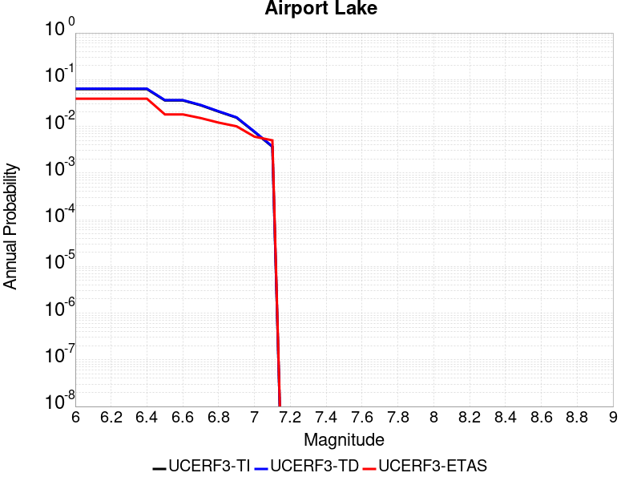 |
|-----|

| Magnitude | UCERF3-TI Prob | UCERF3-TD Prob | UCERF3-ETAS Prob |
|-----|-----|-----|-----|
| 6.0 | 0.0625898 | 0.06388342 | 0.039 |
| 6.1 | 0.0625898 | 0.06388342 | 0.039 |
| 6.2 | 0.0625898 | 0.06388342 | 0.039 |
| 6.3 | 0.0625898 | 0.06388342 | 0.039 |
| 6.4 | 0.0625898 | 0.06388342 | 0.039 |
| 6.5 | 0.03582719 | 0.036458667 | 0.018 |
| 6.6 | 0.03582719 | 0.036458667 | 0.018 |
| 6.7 | 0.02817519 | 0.028671982 | 0.015 |
| 6.8 | 0.020629838 | 0.020992553 | 0.012 |
| 6.9 | 0.015310549 | 0.0155831035 | 0.01 |
| 7.0 | 0.0075687924 | 0.00770728 | 0.006 |
| 7.1 | 0.0036433393 | 0.0037131323 | 0.005 |

## Almanor 2011 CFM
*[(top)](#table-of-contents)*

| 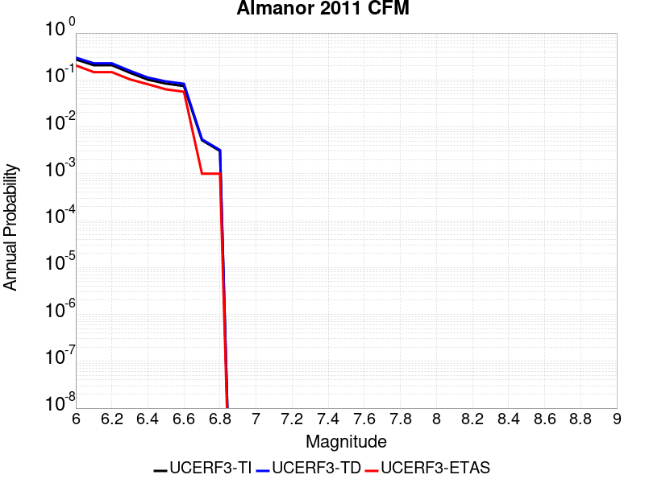 |
|-----|

| Magnitude | UCERF3-TI Prob | UCERF3-TD Prob | UCERF3-ETAS Prob |
|-----|-----|-----|-----|
| 6.0 | 0.2744337 | 0.29971972 | 0.204 |
| 6.1 | 0.20674558 | 0.22650711 | 0.147 |
| 6.2 | 0.20674558 | 0.22650711 | 0.147 |
| 6.3 | 0.14277372 | 0.15698886 | 0.103 |
| 6.4 | 0.10150458 | 0.112301305 | 0.081 |
| 6.5 | 0.083690435 | 0.09311073 | 0.063 |
| 6.6 | 0.074054085 | 0.08274601 | 0.056 |
| 6.7 | 0.005178911 | 0.0054159844 | 0.001 |
| 6.8 | 0.0030562787 | 0.0031968274 | 0.001 |

## Anacapa-Dume alt 1
*[(top)](#table-of-contents)*

|  |
|-----|

| Magnitude | UCERF3-TI Prob | UCERF3-TD Prob | UCERF3-ETAS Prob |
|-----|-----|-----|-----|
| 6.0 | 0.026703034 | 0.026895475 | 0.013 |
| 6.1 | 0.026703034 | 0.026895475 | 0.013 |
| 6.2 | 0.026703034 | 0.026895475 | 0.013 |
| 6.3 | 0.026703034 | 0.026895475 | 0.013 |
| 6.4 | 0.026703034 | 0.026895475 | 0.013 |
| 6.5 | 0.026703034 | 0.026895475 | 0.013 |
| 6.6 | 0.026703034 | 0.026895475 | 0.013 |
| 6.7 | 0.024578733 | 0.024751164 | 0.013 |
| 6.8 | 0.024497604 | 0.024669271 | 0.013 |
| 6.9 | 0.019632967 | 0.019754741 | 0.011 |
| 7.0 | 0.018953018 | 0.019068232 | 0.011 |
| 7.1 | 0.016761158 | 0.016854877 | 0.01 |
| 7.2 | 0.016012378 | 0.016098566 | 0.01 |
| 7.3 | 0.013271057 | 0.013315077 | 0.009 |
| 7.4 | 0.011119082 | 0.0111342175 | 0.009 |
| 7.5 | 0.008953781 | 0.008955628 | 0.008 |
| 7.6 | 0.00496635 | 0.004963623 | 0.005 |
| 7.7 | 0.0014196406 | 0.0013829902 | 0.0 |
| 7.8 | 2.3486989E-4 | 2.1523066E-4 | 0.0 |
| 7.9 | 4.1781627E-6 | 3.0963865E-6 | 0.0 |

## Anaheim
*[(top)](#table-of-contents)*

| 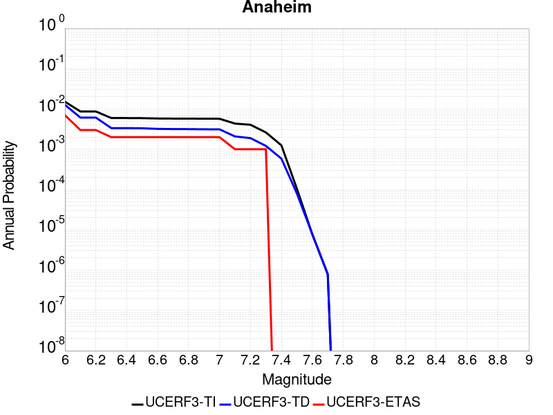 |
|-----|

| Magnitude | UCERF3-TI Prob | UCERF3-TD Prob | UCERF3-ETAS Prob |
|-----|-----|-----|-----|
| 6.0 | 0.015148945 | 0.012650665 | 0.007 |
| 6.1 | 0.0086913435 | 0.0061157923 | 0.003 |
| 6.2 | 0.0086913435 | 0.0061157923 | 0.003 |
| 6.3 | 0.005953559 | 0.0033526607 | 0.002 |
| 6.4 | 0.005953559 | 0.0033526607 | 0.002 |
| 6.5 | 0.0059230886 | 0.0033220202 | 0.002 |
| 6.6 | 0.0058090687 | 0.003207331 | 0.002 |
| 6.7 | 0.005774173 | 0.0031722586 | 0.002 |
| 6.8 | 0.005763457 | 0.0031614925 | 0.002 |
| 6.9 | 0.0057359 | 0.003133815 | 0.002 |
| 7.0 | 0.005719608 | 0.003120627 | 0.002 |
| 7.1 | 0.0043395786 | 0.0020836892 | 0.001 |
| 7.2 | 0.004058755 | 0.0018912116 | 0.001 |
| 7.3 | 0.0026143969 | 0.001210367 | 0.001 |
| 7.4 | 0.0012519285 | 5.8660476E-4 | 0.0 |
| 7.5 | 1.05728424E-4 | 8.0455175E-5 | 0.0 |
| 7.6 | 7.75967E-6 | 7.793137E-6 | 0.0 |
| 7.7 | 7.875461E-7 | 7.9132093E-7 | 0.0 |

## Antelope Valley 2011
*[(top)](#table-of-contents)*

|  |
|-----|

| Magnitude | UCERF3-TI Prob | UCERF3-TD Prob | UCERF3-ETAS Prob |
|-----|-----|-----|-----|
| 6.0 | 0.15221803 | 0.16053323 | 0.091 |
| 6.1 | 0.15221803 | 0.16053323 | 0.091 |
| 6.2 | 0.15221803 | 0.16053323 | 0.091 |
| 6.3 | 0.15221803 | 0.16053323 | 0.091 |
| 6.4 | 0.15221803 | 0.16053323 | 0.091 |
| 6.5 | 0.08980848 | 0.09457948 | 0.055 |
| 6.6 | 0.08980848 | 0.09457948 | 0.055 |
| 6.7 | 0.0683468 | 0.07213613 | 0.042 |
| 6.8 | 0.050183877 | 0.053163648 | 0.031 |
| 6.9 | 0.037239723 | 0.03963747 | 0.022 |

## Ash Hill
*[(top)](#table-of-contents)*

|  |
|-----|

| Magnitude | UCERF3-TI Prob | UCERF3-TD Prob | UCERF3-ETAS Prob |
|-----|-----|-----|-----|
| 6.0 | 0.106334195 | 0.10925942 | 0.102 |
| 6.1 | 0.106334195 | 0.10925942 | 0.102 |
| 6.2 | 0.106334195 | 0.10925942 | 0.102 |
| 6.3 | 0.050967317 | 0.05212688 | 0.045 |
| 6.4 | 0.050967317 | 0.05212688 | 0.045 |
| 6.5 | 0.0356736 | 0.036478736 | 0.031 |
| 6.6 | 0.025711183 | 0.026299063 | 0.023 |
| 6.7 | 0.01893192 | 0.019376121 | 0.019 |
| 6.8 | 0.013268714 | 0.013593214 | 0.016 |
| 6.9 | 0.009185295 | 0.009421892 | 0.013 |

## Baker
*[(top)](#table-of-contents)*

|  |
|-----|

| Magnitude | UCERF3-TI Prob | UCERF3-TD Prob | UCERF3-ETAS Prob |
|-----|-----|-----|-----|
| 6.0 | 0.029281268 | 0.029532712 | 0.02 |
| 6.1 | 0.029281268 | 0.029532712 | 0.02 |
| 6.2 | 0.029281268 | 0.029532712 | 0.02 |
| 6.3 | 0.017069358 | 0.017202543 | 0.009 |
| 6.4 | 0.017069358 | 0.017202543 | 0.009 |
| 6.5 | 0.014412287 | 0.014528201 | 0.008 |
| 6.6 | 0.0120136 | 0.012114454 | 0.007 |
| 6.7 | 0.010572789 | 0.010665392 | 0.005 |
| 6.8 | 0.00953257 | 0.009619464 | 0.005 |
| 6.9 | 0.008474505 | 0.008555449 | 0.005 |
| 7.0 | 0.0062719635 | 0.006341065 | 0.003 |
| 7.1 | 0.0054761325 | 0.0055415644 | 0.003 |
| 7.2 | 0.0052392827 | 0.0053035542 | 0.003 |
| 7.3 | 0.0048718182 | 0.004934209 | 0.002 |
| 7.4 | 0.004587288 | 0.004647804 | 0.002 |
| 7.5 | 0.004317503 | 0.004375909 | 0.002 |
| 7.6 | 0.0039337305 | 0.0039888173 | 0.001 |
| 7.7 | 0.0034007025 | 0.0034502088 | 0.001 |
| 7.8 | 0.0018030588 | 0.0018319617 | 0.0 |
| 7.9 | 1.3353022E-5 | 1.3523625E-5 | 0.0 |

## Bartlett Springs 2011 CFM
*[(top)](#table-of-contents)*

|  |
|-----|

| Magnitude | UCERF3-TI Prob | UCERF3-TD Prob | UCERF3-ETAS Prob |
|-----|-----|-----|-----|
| 6.0 | 0.27763093 | 0.29564896 | 0.242 |
| 6.1 | 0.277444 | 0.29545444 | 0.241 |
| 6.2 | 0.27732572 | 0.29533148 | 0.241 |
| 6.3 | 0.27711776 | 0.29511455 | 0.241 |
| 6.4 | 0.23833866 | 0.25376722 | 0.19 |
| 6.5 | 0.23784488 | 0.2532502 | 0.19 |
| 6.6 | 0.2299849 | 0.24489602 | 0.184 |
| 6.7 | 0.22533183 | 0.23999877 | 0.178 |
| 6.8 | 0.21207686 | 0.22589126 | 0.154 |
| 6.9 | 0.19444853 | 0.20716505 | 0.139 |
| 7.0 | 0.17091231 | 0.18212739 | 0.115 |
| 7.1 | 0.15988572 | 0.17038527 | 0.105 |
| 7.2 | 0.13871963 | 0.14776038 | 0.092 |
| 7.3 | 0.12858078 | 0.13688274 | 0.088 |
| 7.4 | 0.11650221 | 0.12397783 | 0.078 |
| 7.5 | 0.10747043 | 0.114330225 | 0.075 |
| 7.6 | 0.06993806 | 0.07435078 | 0.045 |
| 7.7 | 0.02191135 | 0.023149684 | 0.015 |
| 7.8 | 0.0032013392 | 0.0033317723 | 0.004 |

## Battle Creek 2011 CFM
*[(top)](#table-of-contents)*

| 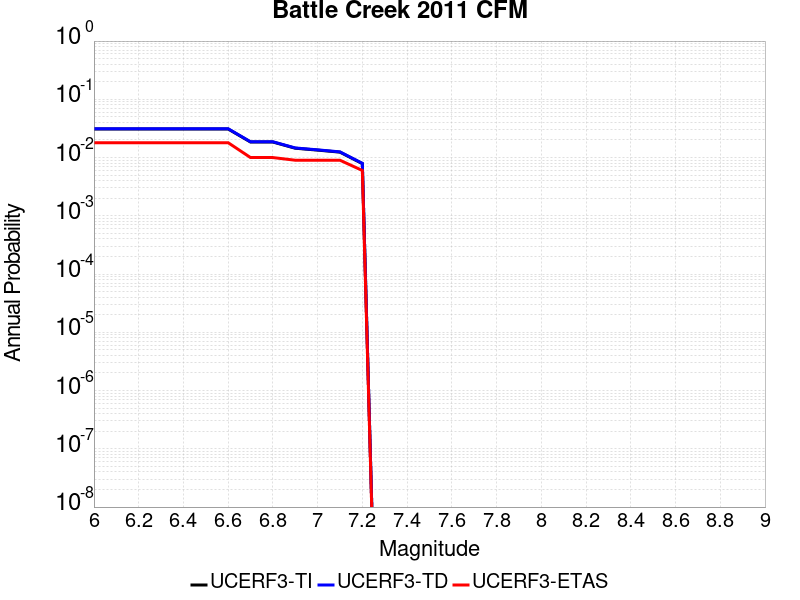 |
|-----|

| Magnitude | UCERF3-TI Prob | UCERF3-TD Prob | UCERF3-ETAS Prob |
|-----|-----|-----|-----|
| 6.0 | 0.030931175 | 0.031251524 | 0.018 |
| 6.1 | 0.030931175 | 0.031251524 | 0.018 |
| 6.2 | 0.030931175 | 0.031251524 | 0.018 |
| 6.3 | 0.030931175 | 0.031251524 | 0.018 |
| 6.4 | 0.030931175 | 0.031251524 | 0.018 |
| 6.5 | 0.030931175 | 0.031251524 | 0.018 |
| 6.6 | 0.030931175 | 0.031251524 | 0.018 |
| 6.7 | 0.018491056 | 0.018681712 | 0.01 |
| 6.8 | 0.018491056 | 0.018681712 | 0.01 |
| 6.9 | 0.014466971 | 0.014621473 | 0.009 |
| 7.0 | 0.013424914 | 0.013570921 | 0.009 |
| 7.1 | 0.012385755 | 0.012523286 | 0.009 |
| 7.2 | 0.007869033 | 0.007964699 | 0.006 |

## Bear River fault zone
*[(top)](#table-of-contents)*

| 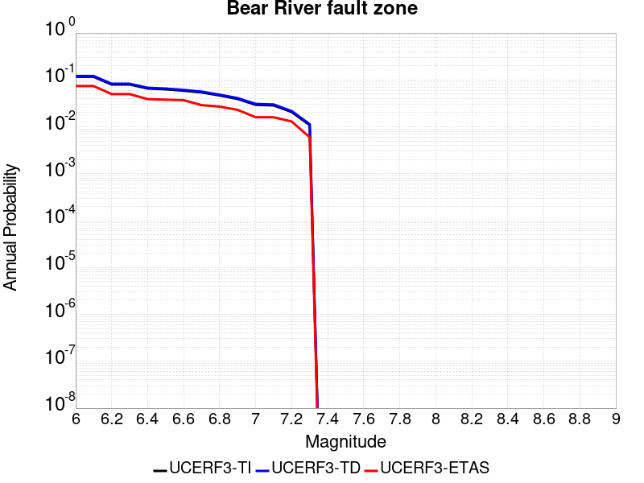 |
|-----|

| Magnitude | UCERF3-TI Prob | UCERF3-TD Prob | UCERF3-ETAS Prob |
|-----|-----|-----|-----|
| 6.0 | 0.11666201 | 0.12149969 | 0.074 |
| 6.1 | 0.11666201 | 0.12149969 | 0.074 |
| 6.2 | 0.07996871 | 0.082946695 | 0.05 |
| 6.3 | 0.07996871 | 0.082946695 | 0.05 |
| 6.4 | 0.065716386 | 0.068147734 | 0.039 |
| 6.5 | 0.063089035 | 0.06544399 | 0.038 |
| 6.6 | 0.05904074 | 0.061276127 | 0.037 |
| 6.7 | 0.054141626 | 0.056232154 | 0.029 |
| 6.8 | 0.046644367 | 0.04852053 | 0.027 |
| 6.9 | 0.039306097 | 0.04098049 | 0.023 |
| 7.0 | 0.029463837 | 0.030836256 | 0.016 |
| 7.1 | 0.028629264 | 0.029965919 | 0.016 |
| 7.2 | 0.020713184 | 0.021667194 | 0.013 |
| 7.3 | 0.010884727 | 0.011389179 | 0.006 |

## Bennett Valley 2011 CFM
*[(top)](#table-of-contents)*

| 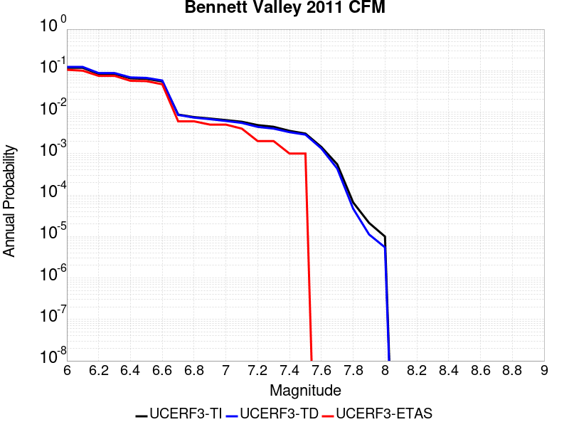 |
|-----|

| Magnitude | UCERF3-TI Prob | UCERF3-TD Prob | UCERF3-ETAS Prob |
|-----|-----|-----|-----|
| 6.0 | 0.11721767 | 0.12313668 | 0.105 |
| 6.1 | 0.11721767 | 0.12313668 | 0.1 |
| 6.2 | 0.08324529 | 0.087539054 | 0.075 |
| 6.3 | 0.08324529 | 0.087539054 | 0.075 |
| 6.4 | 0.06529953 | 0.06882042 | 0.057 |
| 6.5 | 0.063545294 | 0.066972785 | 0.056 |
| 6.6 | 0.05502506 | 0.057981573 | 0.047 |
| 6.7 | 0.008729368 | 0.008562383 | 0.006 |
| 6.8 | 0.007594225 | 0.007374912 | 0.006 |
| 6.9 | 0.0070154206 | 0.0067581143 | 0.005 |
| 7.0 | 0.006422261 | 0.006116337 | 0.005 |
| 7.1 | 0.005859627 | 0.0054972195 | 0.004 |
| 7.2 | 0.0048677227 | 0.004399398 | 0.002 |
| 7.3 | 0.0044274135 | 0.0040036584 | 0.002 |
| 7.4 | 0.0035353585 | 0.0032835866 | 0.001 |
| 7.5 | 0.0030357596 | 0.002863895 | 0.001 |
| 7.6 | 0.0014461211 | 0.0013310483 | 0.0 |
| 7.7 | 5.493358E-4 | 4.342845E-4 | 0.0 |
| 7.8 | 6.633899E-5 | 4.6939687E-5 | 0.0 |
| 7.9 | 2.1267175E-5 | 1.120019E-5 | 0.0 |
| 8.0 | 9.979696E-6 | 5.4728885E-6 | 0.0 |

## Bicycle Lake
*[(top)](#table-of-contents)*

|  |
|-----|

| Magnitude | UCERF3-TI Prob | UCERF3-TD Prob | UCERF3-ETAS Prob |
|-----|-----|-----|-----|
| 6.0 | 0.09731865 | 0.10171107 | 0.128 |
| 6.1 | 0.09731865 | 0.10171107 | 0.128 |
| 6.2 | 0.05082667 | 0.05303054 | 0.077 |
| 6.3 | 0.0488053 | 0.050943673 | 0.075 |
| 6.4 | 0.0488053 | 0.050943673 | 0.075 |
| 6.5 | 0.028582955 | 0.029853933 | 0.039 |
| 6.6 | 0.02511273 | 0.026256006 | 0.032 |
| 6.7 | 0.020609729 | 0.021588955 | 0.025 |

## Big Lagoon - Bald Mtn 2011 CFM
*[(top)](#table-of-contents)*

|  |
|-----|

| Magnitude | UCERF3-TI Prob | UCERF3-TD Prob | UCERF3-ETAS Prob |
|-----|-----|-----|-----|
| 6.0 | 0.09296429 | 0.09488775 | 0.082 |
| 6.1 | 0.09296429 | 0.09488775 | 0.082 |
| 6.2 | 0.09296429 | 0.09488775 | 0.082 |
| 6.3 | 0.09296429 | 0.09488775 | 0.082 |
| 6.4 | 0.09296429 | 0.09488775 | 0.082 |
| 6.5 | 0.09296429 | 0.09488775 | 0.082 |
| 6.6 | 0.09296429 | 0.09488775 | 0.082 |
| 6.7 | 0.09296429 | 0.09488775 | 0.082 |
| 6.8 | 0.059961677 | 0.060938954 | 0.058 |
| 6.9 | 0.059961677 | 0.060938954 | 0.058 |
| 7.0 | 0.04945208 | 0.05022405 | 0.049 |
| 7.1 | 0.04349969 | 0.044167433 | 0.046 |
| 7.2 | 0.037770372 | 0.038342066 | 0.04 |
| 7.3 | 0.03316603 | 0.033658985 | 0.037 |
| 7.4 | 0.030801551 | 0.031257235 | 0.034 |
| 7.5 | 0.025392314 | 0.025765525 | 0.029 |
| 7.6 | 0.020135028 | 0.020424645 | 0.025 |
| 7.7 | 0.014611626 | 0.014819692 | 0.017 |
| 7.8 | 0.010027403 | 0.010172531 | 0.012 |
| 7.9 | 0.0025839934 | 0.002624001 | 0.004 |

## Big Pine (Central)
*[(top)](#table-of-contents)*

|  |
|-----|

| Magnitude | UCERF3-TI Prob | UCERF3-TD Prob | UCERF3-ETAS Prob |
|-----|-----|-----|-----|
| 6.0 | 0.064152226 | 0.063084684 | 0.059 |
| 6.1 | 0.042596713 | 0.04082567 | 0.035 |
| 6.2 | 0.03548321 | 0.033494867 | 0.032 |
| 6.3 | 0.014135542 | 0.011408381 | 0.015 |
| 6.4 | 0.0140599115 | 0.011331031 | 0.015 |
| 6.5 | 0.013974993 | 0.011244154 | 0.014 |
| 6.6 | 0.013830429 | 0.011096357 | 0.014 |
| 6.7 | 0.013684865 | 0.01094784 | 0.014 |
| 6.8 | 0.011303755 | 0.008536453 | 0.009 |
| 6.9 | 0.0074916193 | 0.0048508933 | 0.007 |
| 7.0 | 0.005242375 | 0.0030819585 | 0.005 |
| 7.1 | 0.004657593 | 0.0025434957 | 0.004 |
| 7.2 | 0.0027175006 | 8.8089105E-4 | 0.002 |
| 7.3 | 0.0022945157 | 5.8111147E-4 | 0.001 |
| 7.4 | 0.0018834834 | 2.9755814E-4 | 0.001 |
| 7.5 | 0.0017767617 | 2.6850158E-4 | 0.0 |
| 7.6 | 0.0016385572 | 2.3902494E-4 | 0.0 |
| 7.7 | 9.373547E-4 | 8.62794E-5 | 0.0 |
| 7.8 | 2.5684698E-4 | 3.284598E-5 | 0.0 |
| 7.9 | 1.9204645E-5 | 2.2185811E-6 | 0.0 |

## Big Pine (East)
*[(top)](#table-of-contents)*

|  |
|-----|

| Magnitude | UCERF3-TI Prob | UCERF3-TD Prob | UCERF3-ETAS Prob |
|-----|-----|-----|-----|
| 6.0 | 0.0504293 | 0.04110279 | 0.042 |
| 6.1 | 0.0504293 | 0.04110279 | 0.042 |
| 6.2 | 0.0504293 | 0.04110279 | 0.042 |
| 6.3 | 0.028187532 | 0.01805505 | 0.025 |
| 6.4 | 0.02811298 | 0.01797822 | 0.025 |
| 6.5 | 0.024870934 | 0.014642988 | 0.023 |
| 6.6 | 0.022261921 | 0.011961037 | 0.022 |
| 6.7 | 0.019104613 | 0.009615037 | 0.017 |
| 6.8 | 0.017928274 | 0.008818706 | 0.017 |
| 6.9 | 0.014342834 | 0.0063052573 | 0.014 |
| 7.0 | 0.011141588 | 0.004310739 | 0.007 |
| 7.1 | 0.008840621 | 0.003045651 | 0.005 |
| 7.2 | 0.00653236 | 0.0013570489 | 0.003 |
| 7.3 | 0.005787001 | 0.0011368718 | 0.003 |
| 7.4 | 0.005275475 | 0.0010085987 | 0.003 |
| 7.5 | 0.0049958974 | 9.614004E-4 | 0.002 |
| 7.6 | 0.0041289325 | 7.7977066E-4 | 0.001 |
| 7.7 | 0.002166082 | 2.2550258E-4 | 0.0 |
| 7.8 | 5.9813674E-4 | 8.045173E-5 | 0.0 |
| 7.9 | 1.5251584E-4 | 2.0209935E-5 | 0.0 |

## Big Pine (West)
*[(top)](#table-of-contents)*

| 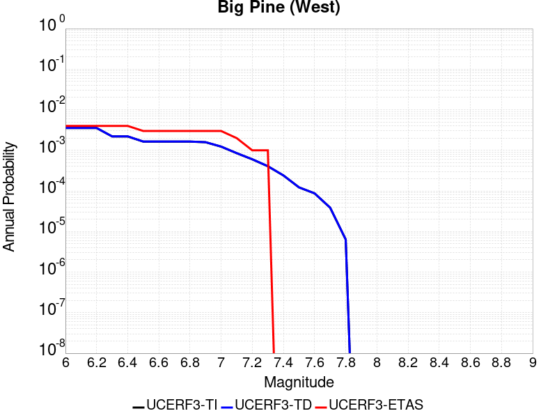 |
|-----|

| Magnitude | UCERF3-TI Prob | UCERF3-TD Prob | UCERF3-ETAS Prob |
|-----|-----|-----|-----|
| 6.0 | 0.0035578175 | 0.0035668933 | 0.004 |
| 6.1 | 0.0035578175 | 0.0035668933 | 0.004 |
| 6.2 | 0.0035578175 | 0.0035668933 | 0.004 |
| 6.3 | 0.0022034976 | 0.0022098206 | 0.004 |
| 6.4 | 0.0022034976 | 0.0022098206 | 0.004 |
| 6.5 | 0.0016442757 | 0.0016497655 | 0.003 |
| 6.6 | 0.0016442757 | 0.0016497655 | 0.003 |
| 6.7 | 0.0016442757 | 0.0016497655 | 0.003 |
| 6.8 | 0.0016442757 | 0.0016497655 | 0.003 |
| 6.9 | 0.0015850804 | 0.0015904369 | 0.003 |
| 7.0 | 0.0012344641 | 0.0012387628 | 0.003 |
| 7.1 | 8.512639E-4 | 8.5432205E-4 | 0.002 |
| 7.2 | 6.011107E-4 | 6.032231E-4 | 0.001 |
| 7.3 | 4.0575242E-4 | 4.070916E-4 | 0.001 |
| 7.4 | 2.4051146E-4 | 2.411801E-4 | 0.0 |
| 7.5 | 1.2229459E-4 | 1.2256217E-4 | 0.0 |
| 7.6 | 8.7133216E-5 | 8.731884E-5 | 0.0 |
| 7.7 | 3.864349E-5 | 3.8719507E-5 | 0.0 |
| 7.8 | 6.360249E-6 | 6.37312E-6 | 0.0 |

## Blackwater
*[(top)](#table-of-contents)*

| 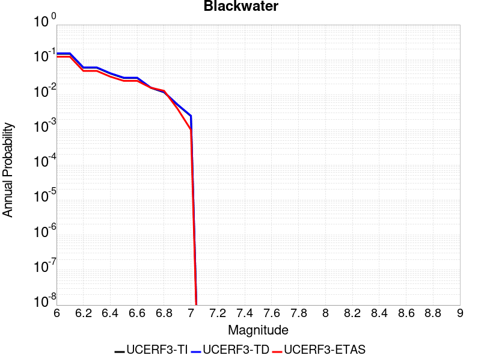 |
|-----|

| Magnitude | UCERF3-TI Prob | UCERF3-TD Prob | UCERF3-ETAS Prob |
|-----|-----|-----|-----|
| 6.0 | 0.14805683 | 0.15226048 | 0.122 |
| 6.1 | 0.14805683 | 0.15226048 | 0.122 |
| 6.2 | 0.059261315 | 0.060541373 | 0.048 |
| 6.3 | 0.059261315 | 0.060541373 | 0.048 |
| 6.4 | 0.040529612 | 0.041368503 | 0.033 |
| 6.5 | 0.030231453 | 0.030848086 | 0.025 |
| 6.6 | 0.030231453 | 0.030848086 | 0.025 |
| 6.7 | 0.015898956 | 0.01622364 | 0.016 |
| 6.8 | 0.011786168 | 0.012029649 | 0.013 |
| 6.9 | 0.0051795617 | 0.005290276 | 0.004 |
| 7.0 | 0.0024694544 | 0.0025235254 | 0.001 |

## Blue Cut
*[(top)](#table-of-contents)*

|  |
|-----|

| Magnitude | UCERF3-TI Prob | UCERF3-TD Prob | UCERF3-ETAS Prob |
|-----|-----|-----|-----|
| 6.0 | 0.1048516 | 0.10738418 | 0.092 |
| 6.1 | 0.1048516 | 0.10738418 | 0.092 |
| 6.2 | 0.1048516 | 0.10738418 | 0.092 |
| 6.3 | 0.058800776 | 0.05997612 | 0.061 |
| 6.4 | 0.058800776 | 0.05997612 | 0.061 |
| 6.5 | 0.045533367 | 0.046420977 | 0.042 |
| 6.6 | 0.03760195 | 0.03833218 | 0.032 |
| 6.7 | 0.032224897 | 0.032855358 | 0.029 |
| 6.8 | 0.028409094 | 0.028971791 | 0.026 |
| 6.9 | 0.024622798 | 0.025119526 | 0.023 |
| 7.0 | 0.020057976 | 0.02047752 | 0.019 |
| 7.1 | 0.014687995 | 0.015014437 | 0.013 |

## Brawley (Seismic Zone) alt 1
*[(top)](#table-of-contents)*

| 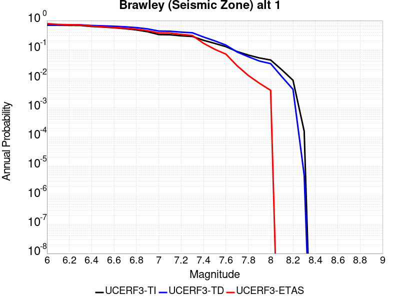 |
|-----|

| Magnitude | UCERF3-TI Prob | UCERF3-TD Prob | UCERF3-ETAS Prob |
|-----|-----|-----|-----|
| 6.0 | 0.69126695 | 0.7199934 | 0.784 |
| 6.1 | 0.69126695 | 0.7199934 | 0.732 |
| 6.2 | 0.6824399 | 0.7143201 | 0.717 |
| 6.3 | 0.67780983 | 0.71116936 | 0.708 |
| 6.4 | 0.62432694 | 0.6750041 | 0.644 |
| 6.5 | 0.5964736 | 0.656874 | 0.607 |
| 6.6 | 0.56422967 | 0.63541687 | 0.576 |
| 6.7 | 0.52504593 | 0.60881996 | 0.542 |
| 6.8 | 0.4763358 | 0.57174456 | 0.504 |
| 6.9 | 0.4121111 | 0.5164654 | 0.445 |
| 7.0 | 0.32955092 | 0.4354654 | 0.375 |
| 7.1 | 0.3243087 | 0.42965975 | 0.372 |
| 7.2 | 0.2982868 | 0.4000304 | 0.335 |
| 7.3 | 0.2838981 | 0.3802128 | 0.306 |
| 7.4 | 0.20955686 | 0.27136233 | 0.165 |
| 7.5 | 0.16399975 | 0.20076688 | 0.103 |
| 7.6 | 0.12677702 | 0.14324988 | 0.07 |
| 7.7 | 0.086277634 | 0.08315974 | 0.028 |
| 7.8 | 0.06522941 | 0.057228822 | 0.013 |
| 7.9 | 0.05183473 | 0.04061772 | 0.007 |
| 8.0 | 0.04413322 | 0.033109684 | 0.004 |
| 8.1 | 0.020332271 | 0.011814844 | 0.0 |
| 8.2 | 0.008883473 | 0.0043378896 | 0.0 |
| 8.3 | 1.5833203E-4 | 4.947523E-6 | 0.0 |

## Breckenridge 2011
*[(top)](#table-of-contents)*

|  |
|-----|

| Magnitude | UCERF3-TI Prob | UCERF3-TD Prob | UCERF3-ETAS Prob |
|-----|-----|-----|-----|
| 6.0 | 0.0059775896 | 0.006012466 | 0.003 |
| 6.1 | 0.0059775896 | 0.006012466 | 0.003 |
| 6.2 | 0.0059775896 | 0.006012466 | 0.003 |
| 6.3 | 0.005539622 | 0.005573258 | 0.003 |
| 6.4 | 0.005539622 | 0.005573258 | 0.003 |
| 6.5 | 0.005539622 | 0.005573258 | 0.003 |
| 6.6 | 0.005539622 | 0.005573258 | 0.003 |
| 6.7 | 0.0049041775 | 0.0049349307 | 0.002 |
| 6.8 | 0.004454669 | 0.0044831815 | 0.002 |
| 6.9 | 0.0040282854 | 0.0040544444 | 0.001 |
| 7.0 | 0.0035508235 | 0.0035741841 | 0.001 |
| 7.1 | 0.0029144268 | 0.0029334982 | 0.0 |
| 7.2 | 0.0020027359 | 0.0020153665 | 0.0 |
| 7.3 | 0.0013768349 | 0.0013851146 | 0.0 |
| 7.4 | 9.3466253E-4 | 9.399943E-4 | 0.0 |
| 7.5 | 7.067021E-4 | 7.1078405E-4 | 0.0 |
| 7.6 | 1.3420706E-4 | 1.3499892E-4 | 0.0 |

## Bullion Mountains
*[(top)](#table-of-contents)*

| 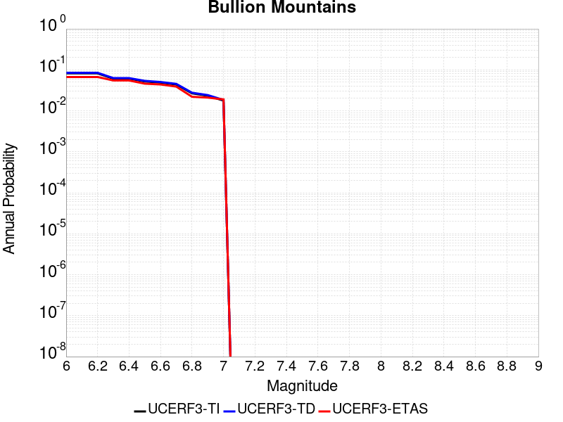 |
|-----|

| Magnitude | UCERF3-TI Prob | UCERF3-TD Prob | UCERF3-ETAS Prob |
|-----|-----|-----|-----|
| 6.0 | 0.08211222 | 0.08485127 | 0.067 |
| 6.1 | 0.08211222 | 0.08485127 | 0.067 |
| 6.2 | 0.08211222 | 0.08485127 | 0.067 |
| 6.3 | 0.06092388 | 0.06295819 | 0.055 |
| 6.4 | 0.06092388 | 0.06295819 | 0.055 |
| 6.5 | 0.05205026 | 0.053827737 | 0.046 |
| 6.6 | 0.04888461 | 0.05057604 | 0.044 |
| 6.7 | 0.043902684 | 0.045454588 | 0.039 |
| 6.8 | 0.026707165 | 0.02766089 | 0.022 |
| 6.9 | 0.023360988 | 0.024218122 | 0.021 |
| 7.0 | 0.017746624 | 0.018432373 | 0.019 |

## Burnt Mtn
*[(top)](#table-of-contents)*

| 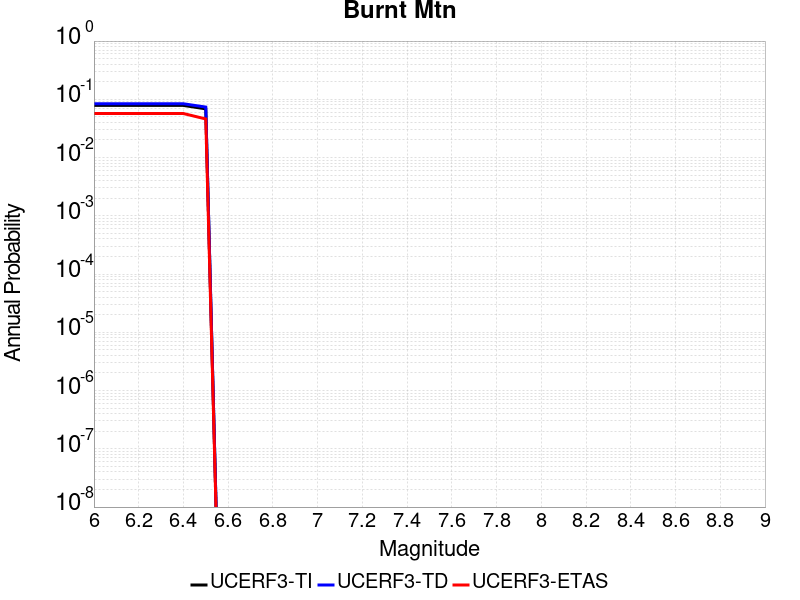 |
|-----|

| Magnitude | UCERF3-TI Prob | UCERF3-TD Prob | UCERF3-ETAS Prob |
|-----|-----|-----|-----|
| 6.0 | 0.07852618 | 0.08385105 | 0.057 |
| 6.1 | 0.07852618 | 0.08385105 | 0.057 |
| 6.2 | 0.07852618 | 0.08385105 | 0.057 |
| 6.3 | 0.07852618 | 0.08385105 | 0.057 |
| 6.4 | 0.07852618 | 0.08385105 | 0.057 |
| 6.5 | 0.068596974 | 0.07359303 | 0.046 |

## Butano 2011 CFM
*[(top)](#table-of-contents)*

|  |
|-----|

| Magnitude | UCERF3-TI Prob | UCERF3-TD Prob | UCERF3-ETAS Prob |
|-----|-----|-----|-----|
| 6.0 | 0.048664868 | 0.036734704 | 0.011 |
| 6.1 | 0.048664868 | 0.036734704 | 0.011 |
| 6.2 | 0.042707417 | 0.030620703 | 0.008 |
| 6.3 | 0.042707417 | 0.030620703 | 0.008 |
| 6.4 | 0.03972343 | 0.027558576 | 0.006 |
| 6.5 | 0.039248083 | 0.02706878 | 0.006 |
| 6.6 | 0.038500752 | 0.026312068 | 0.005 |
| 6.7 | 0.03330783 | 0.020976873 | 0.005 |
| 6.8 | 0.032282777 | 0.01993151 | 0.004 |
| 6.9 | 0.031310383 | 0.018973304 | 0.004 |
| 7.0 | 0.028626267 | 0.016453324 | 0.002 |
| 7.1 | 0.020034544 | 0.0076326057 | 0.0 |
| 7.2 | 0.01914043 | 0.006850807 | 0.0 |
| 7.3 | 0.018238835 | 0.0061303345 | 0.0 |
| 7.4 | 0.017436298 | 0.0055567697 | 0.0 |
| 7.5 | 0.015786687 | 0.0043931245 | 0.0 |
| 7.6 | 0.011506395 | 0.0014656236 | 0.0 |
| 7.7 | 0.009099688 | 7.425817E-4 | 0.0 |
| 7.8 | 0.005971666 | 5.79587E-4 | 0.0 |
| 7.9 | 0.0031858769 | 4.5543493E-4 | 0.0 |
| 8.0 | 0.0024244064 | 4.1764925E-4 | 0.0 |
| 8.1 | 0.0014820868 | 2.8427568E-4 | 0.0 |
| 8.2 | 2.9141546E-4 | 2.3582163E-5 | 0.0 |
| 8.3 | 5.4115526E-7 | 4.456255E-8 | 0.0 |

## Cady
*[(top)](#table-of-contents)*

|  |
|-----|

| Magnitude | UCERF3-TI Prob | UCERF3-TD Prob | UCERF3-ETAS Prob |
|-----|-----|-----|-----|
| 6.0 | 0.09859227 | 0.10200935 | 0.089 |
| 6.1 | 0.09859227 | 0.10200935 | 0.089 |
| 6.2 | 0.09859227 | 0.10200935 | 0.089 |
| 6.3 | 0.056358494 | 0.058132328 | 0.054 |
| 6.4 | 0.056358494 | 0.058132328 | 0.054 |
| 6.5 | 0.031343445 | 0.0322821 | 0.027 |
| 6.6 | 0.029897554 | 0.03080641 | 0.027 |
| 6.7 | 0.02516531 | 0.025938498 | 0.022 |
| 6.8 | 0.009238992 | 0.009492481 | 0.009 |
| 6.9 | 0.003929416 | 0.004043821 | 0.006 |
| 7.0 | 0.0035719506 | 0.0036763325 | 0.004 |

## Calaveras (Central) 2011 CFM
*[(top)](#table-of-contents)*

|  |
|-----|

| Magnitude | UCERF3-TI Prob | UCERF3-TD Prob | UCERF3-ETAS Prob |
|-----|-----|-----|-----|
| 6.0 | 0.5431072 | 0.5775372 | 0.444 |
| 6.1 | 0.5312869 | 0.5649491 | 0.43 |
| 6.2 | 0.5258378 | 0.5591856 | 0.425 |
| 6.3 | 0.5065587 | 0.53869706 | 0.407 |
| 6.4 | 0.49237671 | 0.52353287 | 0.4 |
| 6.5 | 0.4218071 | 0.44391197 | 0.323 |
| 6.6 | 0.41141328 | 0.43285185 | 0.308 |
| 6.7 | 0.39594465 | 0.41635597 | 0.287 |
| 6.8 | 0.37769252 | 0.39807096 | 0.276 |
| 6.9 | 0.31865934 | 0.33725703 | 0.227 |
| 7.0 | 0.25905585 | 0.2716626 | 0.17 |
| 7.1 | 0.22785951 | 0.23677704 | 0.153 |
| 7.2 | 0.1750372 | 0.17672889 | 0.105 |
| 7.3 | 0.12616841 | 0.123102054 | 0.07 |
| 7.4 | 0.08844796 | 0.08063773 | 0.047 |
| 7.5 | 0.07472145 | 0.06672768 | 0.039 |
| 7.6 | 0.041719057 | 0.033684444 | 0.019 |
| 7.7 | 0.017511543 | 0.008918909 | 0.006 |
| 7.8 | 0.01436065 | 0.0071601667 | 0.006 |
| 7.9 | 0.010245281 | 0.005277417 | 0.006 |
| 8.0 | 0.006121196 | 0.0032518213 | 0.002 |
| 8.1 | 0.003911611 | 0.0020918513 | 0.0 |

## Calaveras (No) 2011 CFM
*[(top)](#table-of-contents)*

|  |
|-----|

| Magnitude | UCERF3-TI Prob | UCERF3-TD Prob | UCERF3-ETAS Prob |
|-----|-----|-----|-----|
| 6.0 | 0.22437721 | 0.23887247 | 0.179 |
| 6.1 | 0.22437721 | 0.23887247 | 0.179 |
| 6.2 | 0.21969707 | 0.23379067 | 0.175 |
| 6.3 | 0.216332 | 0.23026201 | 0.169 |
| 6.4 | 0.21452697 | 0.22830139 | 0.167 |
| 6.5 | 0.21224728 | 0.22584075 | 0.164 |
| 6.6 | 0.21130271 | 0.22490722 | 0.164 |
| 6.7 | 0.17561607 | 0.18556392 | 0.123 |
| 6.8 | 0.16919503 | 0.17907503 | 0.118 |
| 6.9 | 0.15794599 | 0.16722369 | 0.107 |
| 7.0 | 0.13449724 | 0.14231922 | 0.082 |
| 7.1 | 0.12101311 | 0.12775852 | 0.076 |
| 7.2 | 0.09791234 | 0.10301811 | 0.053 |
| 7.3 | 0.058750447 | 0.060104445 | 0.029 |
| 7.4 | 0.025169121 | 0.021930108 | 0.009 |
| 7.5 | 0.015825119 | 0.012338621 | 0.005 |
| 7.6 | 0.009166979 | 0.005498958 | 0.001 |
| 7.7 | 0.0068503 | 0.00322842 | 0.001 |
| 7.8 | 0.0049151 | 0.0021405555 | 0.001 |
| 7.9 | 0.0033277406 | 0.0014188774 | 0.001 |
| 8.0 | 0.0016099699 | 6.420532E-4 | 0.0 |
| 8.1 | 8.7233976E-4 | 3.2563895E-4 | 0.0 |

## Calaveras (So) - Paicines extension 2011 CFM
*[(top)](#table-of-contents)*

|  |
|-----|

| Magnitude | UCERF3-TI Prob | UCERF3-TD Prob | UCERF3-ETAS Prob |
|-----|-----|-----|-----|
| 6.0 | 0.5472077 | 0.5296914 | 0.462 |
| 6.1 | 0.543443 | 0.5252231 | 0.456 |
| 6.2 | 0.48572755 | 0.47549024 | 0.392 |
| 6.3 | 0.4519554 | 0.45092985 | 0.358 |
| 6.4 | 0.42844188 | 0.43329456 | 0.329 |
| 6.5 | 0.39707598 | 0.40394834 | 0.293 |
| 6.6 | 0.34316826 | 0.3656222 | 0.249 |
| 6.7 | 0.33490872 | 0.3564871 | 0.234 |
| 6.8 | 0.30472666 | 0.32143864 | 0.199 |
| 6.9 | 0.26114002 | 0.27030227 | 0.161 |
| 7.0 | 0.22910212 | 0.23244007 | 0.131 |
| 7.1 | 0.20031011 | 0.20011798 | 0.113 |
| 7.2 | 0.16475083 | 0.15799835 | 0.085 |
| 7.3 | 0.12553923 | 0.112774685 | 0.059 |
| 7.4 | 0.08966117 | 0.07152132 | 0.036 |
| 7.5 | 0.07815429 | 0.05978592 | 0.031 |
| 7.6 | 0.056323938 | 0.03822312 | 0.021 |
| 7.7 | 0.03190407 | 0.0133212935 | 0.008 |
| 7.8 | 0.027303906 | 0.01144022 | 0.008 |
| 7.9 | 0.017397208 | 0.00860449 | 0.008 |
| 8.0 | 0.010521456 | 0.005357816 | 0.003 |
| 8.1 | 0.0063487417 | 0.0030613781 | 0.0 |

## Calaveras (So) 2011 CFM
*[(top)](#table-of-contents)*

|  |
|-----|

| Magnitude | UCERF3-TI Prob | UCERF3-TD Prob | UCERF3-ETAS Prob |
|-----|-----|-----|-----|
| 6.0 | 0.56497574 | 0.606618 | 0.495 |
| 6.1 | 0.507804 | 0.54610705 | 0.423 |
| 6.2 | 0.45030883 | 0.4866826 | 0.359 |
| 6.3 | 0.36461914 | 0.39711043 | 0.272 |
| 6.4 | 0.3585661 | 0.3906219 | 0.269 |
| 6.5 | 0.35509157 | 0.38687205 | 0.265 |
| 6.6 | 0.34793177 | 0.37914303 | 0.257 |
| 6.7 | 0.34169602 | 0.37238973 | 0.248 |
| 6.8 | 0.31030983 | 0.33648807 | 0.211 |
| 6.9 | 0.25860122 | 0.2766844 | 0.167 |
| 7.0 | 0.22458652 | 0.23710124 | 0.135 |
| 7.1 | 0.20097442 | 0.20991762 | 0.123 |
| 7.2 | 0.15471812 | 0.156145 | 0.086 |
| 7.3 | 0.116584525 | 0.11275805 | 0.06 |
| 7.4 | 0.08008528 | 0.07135937 | 0.037 |
| 7.5 | 0.06954494 | 0.060519103 | 0.032 |
| 7.6 | 0.044965357 | 0.03524639 | 0.019 |
| 7.7 | 0.020835133 | 0.0105130905 | 0.006 |
| 7.8 | 0.017651808 | 0.008786999 | 0.006 |
| 7.9 | 0.012826407 | 0.00659199 | 0.006 |
| 8.0 | 0.007916251 | 0.004141679 | 0.002 |
| 8.1 | 0.005258524 | 0.0027276773 | 0.0 |

## Calico-Hidalgo
*[(top)](#table-of-contents)*

|  |
|-----|

| Magnitude | UCERF3-TI Prob | UCERF3-TD Prob | UCERF3-ETAS Prob |
|-----|-----|-----|-----|
| 6.0 | 0.19220681 | 0.21265063 | 0.17 |
| 6.1 | 0.19220681 | 0.21265063 | 0.17 |
| 6.2 | 0.19220681 | 0.21265063 | 0.17 |
| 6.3 | 0.118823215 | 0.13299239 | 0.101 |
| 6.4 | 0.118823215 | 0.13299239 | 0.101 |
| 6.5 | 0.10044537 | 0.113524705 | 0.086 |
| 6.6 | 0.100362144 | 0.113440916 | 0.086 |
| 6.7 | 0.08963945 | 0.10172913 | 0.073 |
| 6.8 | 0.08707202 | 0.09877043 | 0.071 |
| 6.9 | 0.07735072 | 0.08678091 | 0.064 |
| 7.0 | 0.07375074 | 0.08244921 | 0.059 |
| 7.1 | 0.06626195 | 0.07427975 | 0.049 |
| 7.2 | 0.05640811 | 0.06364381 | 0.039 |
| 7.3 | 0.04989027 | 0.05613366 | 0.037 |
| 7.4 | 0.040595733 | 0.045413192 | 0.03 |
| 7.5 | 0.02428743 | 0.027043605 | 0.018 |
| 7.6 | 0.0011533784 | 0.0012533397 | 0.0 |

## Camp Rock 2011
*[(top)](#table-of-contents)*

|  |
|-----|

| Magnitude | UCERF3-TI Prob | UCERF3-TD Prob | UCERF3-ETAS Prob |
|-----|-----|-----|-----|
| 6.0 | 0.08350183 | 0.08626567 | 0.049 |
| 6.1 | 0.08350183 | 0.08626567 | 0.049 |
| 6.2 | 0.08350183 | 0.08626567 | 0.049 |
| 6.3 | 0.08350183 | 0.08626567 | 0.049 |
| 6.4 | 0.04079793 | 0.041638486 | 0.023 |
| 6.5 | 0.04079793 | 0.041638486 | 0.023 |
| 6.6 | 0.036111947 | 0.0368509 | 0.016 |
| 6.7 | 0.035802275 | 0.036535997 | 0.016 |
| 6.8 | 0.032710526 | 0.033385802 | 0.016 |
| 6.9 | 0.03138953 | 0.032041553 | 0.015 |
| 7.0 | 0.028361447 | 0.028956085 | 0.014 |
| 7.1 | 0.024811624 | 0.025339786 | 0.012 |
| 7.2 | 0.019726401 | 0.02015293 | 0.007 |
| 7.3 | 0.014075219 | 0.0143855885 | 0.007 |
| 7.4 | 0.010842692 | 0.01108394 | 0.004 |
| 7.5 | 0.0060768235 | 0.0062159672 | 0.003 |
| 7.6 | 6.8614166E-4 | 7.033696E-4 | 0.0 |

## Canada David (Detachment)
*[(top)](#table-of-contents)*

|  |
|-----|

| Magnitude | UCERF3-TI Prob | UCERF3-TD Prob | UCERF3-ETAS Prob |
|-----|-----|-----|-----|
| 6.0 | 0.0169363 | 0.014563799 | 0.008 |
| 6.1 | 0.0169363 | 0.014563799 | 0.008 |
| 6.2 | 0.0169363 | 0.014563799 | 0.008 |
| 6.3 | 0.0169363 | 0.014563799 | 0.008 |
| 6.4 | 0.0169363 | 0.014563799 | 0.008 |
| 6.5 | 0.0169363 | 0.014563799 | 0.008 |
| 6.6 | 0.0169363 | 0.014563799 | 0.008 |
| 6.7 | 0.0169363 | 0.014563799 | 0.008 |
| 6.8 | 0.0169363 | 0.014563799 | 0.008 |
| 6.9 | 0.012915768 | 0.010496584 | 0.004 |
| 7.0 | 0.012693335 | 0.010286637 | 0.004 |
| 7.1 | 0.0092900675 | 0.0069451495 | 0.003 |
| 7.2 | 0.005060534 | 0.0033416436 | 0.0 |

## Carlsbad
*[(top)](#table-of-contents)*

| 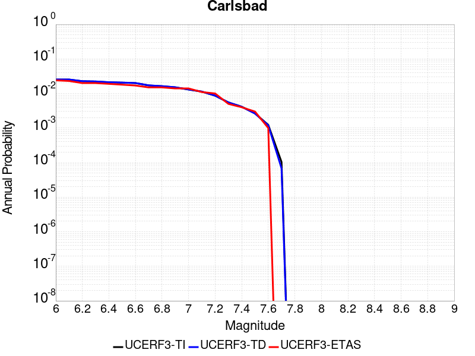 |
|-----|

| Magnitude | UCERF3-TI Prob | UCERF3-TD Prob | UCERF3-ETAS Prob |
|-----|-----|-----|-----|
| 6.0 | 0.02526308 | 0.025405627 | 0.024 |
| 6.1 | 0.02526308 | 0.025405627 | 0.023 |
| 6.2 | 0.022605598 | 0.022731027 | 0.02 |
| 6.3 | 0.022201654 | 0.022323184 | 0.02 |
| 6.4 | 0.021081895 | 0.02119431 | 0.019 |
| 6.5 | 0.020592853 | 0.020700678 | 0.018 |
| 6.6 | 0.019994503 | 0.020097224 | 0.017 |
| 6.7 | 0.017119477 | 0.017191669 | 0.015 |
| 6.8 | 0.01623512 | 0.016322546 | 0.015 |
| 6.9 | 0.015047008 | 0.0151387965 | 0.014 |
| 7.0 | 0.012996531 | 0.013077908 | 0.014 |
| 7.1 | 0.011303721 | 0.011374958 | 0.011 |
| 7.2 | 0.008638946 | 0.008678251 | 0.01 |
| 7.3 | 0.00551355 | 0.0055105486 | 0.005 |
| 7.4 | 0.0041430476 | 0.0041291923 | 0.004 |
| 7.5 | 0.0026598496 | 0.0026249879 | 0.003 |
| 7.6 | 0.001237082 | 0.0011998623 | 0.001 |
| 7.7 | 1.04310755E-4 | 6.791886E-5 | 0.0 |

## Carson Range (Genoa)
*[(top)](#table-of-contents)*

|  |
|-----|

| Magnitude | UCERF3-TI Prob | UCERF3-TD Prob | UCERF3-ETAS Prob |
|-----|-----|-----|-----|
| 6.0 | 0.19373061 | 0.20622857 | 0.136 |
| 6.1 | 0.19373061 | 0.20622857 | 0.136 |
| 6.2 | 0.19373061 | 0.20622857 | 0.136 |
| 6.3 | 0.19373061 | 0.20622857 | 0.136 |
| 6.4 | 0.19373061 | 0.20622857 | 0.136 |
| 6.5 | 0.12539385 | 0.13314714 | 0.079 |
| 6.6 | 0.12539385 | 0.13314714 | 0.079 |
| 6.7 | 0.09895363 | 0.105240926 | 0.062 |
| 6.8 | 0.07423695 | 0.07915862 | 0.043 |
| 6.9 | 0.05413389 | 0.057961695 | 0.034 |
| 7.0 | 0.039204974 | 0.0422059 | 0.028 |

## Casmalia 2011 CFM
*[(top)](#table-of-contents)*

|  |
|-----|

| Magnitude | UCERF3-TI Prob | UCERF3-TD Prob | UCERF3-ETAS Prob |
|-----|-----|-----|-----|
| 6.0 | 0.021525998 | 0.021517223 | 0.023 |
| 6.1 | 0.021525998 | 0.021517223 | 0.023 |
| 6.2 | 0.017878048 | 0.017849127 | 0.018 |
| 6.3 | 0.017878048 | 0.017849127 | 0.018 |
| 6.4 | 0.01602336 | 0.015984448 | 0.017 |
| 6.5 | 0.01602336 | 0.015984448 | 0.017 |
| 6.6 | 0.01525385 | 0.015210486 | 0.016 |
| 6.7 | 0.014830189 | 0.014784218 | 0.015 |
| 6.8 | 0.01450372 | 0.014455604 | 0.015 |
| 6.9 | 0.013222842 | 0.0131642325 | 0.014 |
| 7.0 | 0.011971571 | 0.011902474 | 0.01 |
| 7.1 | 0.010862833 | 0.010784731 | 0.01 |
| 7.2 | 0.010234065 | 0.010150622 | 0.009 |
| 7.3 | 0.008670549 | 0.008572559 | 0.007 |
| 7.4 | 0.0075326646 | 0.0074238186 | 0.007 |
| 7.5 | 0.006381205 | 0.006260679 | 0.006 |
| 7.6 | 0.0048180767 | 0.004680835 | 0.005 |
| 7.7 | 0.0028328218 | 0.0026722199 | 0.002 |
| 7.8 | 9.818181E-4 | 8.2185445E-4 | 0.0 |
| 7.9 | 3.3090202E-4 | 1.8647772E-4 | 0.0 |
| 8.0 | 6.561146E-5 | 1.6171272E-5 | 0.0 |

## Cedar Mtn-Mahogany Mtn
*[(top)](#table-of-contents)*

|  |
|-----|

| Magnitude | UCERF3-TI Prob | UCERF3-TD Prob | UCERF3-ETAS Prob |
|-----|-----|-----|-----|
| 6.0 | 0.1348652 | 0.13785838 | 0.098 |
| 6.1 | 0.080875784 | 0.08240968 | 0.069 |
| 6.2 | 0.080875784 | 0.08240968 | 0.069 |
| 6.3 | 0.049582355 | 0.05042974 | 0.046 |
| 6.4 | 0.049582355 | 0.05042974 | 0.046 |
| 6.5 | 0.03732436 | 0.037941806 | 0.036 |
| 6.6 | 0.029197918 | 0.02967177 | 0.028 |
| 6.7 | 0.018021958 | 0.018309696 | 0.02 |
| 6.8 | 0.014264758 | 0.014493005 | 0.013 |
| 6.9 | 0.008621197 | 0.008761313 | 0.006 |
| 7.0 | 0.0026586892 | 0.002703754 | 0.003 |

## Cerro Prieto
*[(top)](#table-of-contents)*

|  |
|-----|

| Magnitude | UCERF3-TI Prob | UCERF3-TD Prob | UCERF3-ETAS Prob |
|-----|-----|-----|-----|
| 6.0 | 0.781003 | 0.75785154 | 0.832 |
| 6.1 | 0.781003 | 0.75785154 | 0.832 |
| 6.2 | 0.781003 | 0.75785154 | 0.832 |
| 6.3 | 0.781003 | 0.75785154 | 0.832 |
| 6.4 | 0.72994804 | 0.71741533 | 0.784 |
| 6.5 | 0.72994804 | 0.71741533 | 0.784 |
| 6.6 | 0.6980793 | 0.69293123 | 0.739 |
| 6.7 | 0.6408199 | 0.6487098 | 0.66 |
| 6.8 | 0.5540666 | 0.57675076 | 0.52 |
| 6.9 | 0.46678874 | 0.50292975 | 0.419 |
| 7.0 | 0.3853411 | 0.42988572 | 0.333 |
| 7.1 | 0.23083489 | 0.27630028 | 0.167 |
| 7.2 | 3.4142533E-4 | 3.432419E-4 | 0.0 |

## Channel Islands Thrust
*[(top)](#table-of-contents)*

| 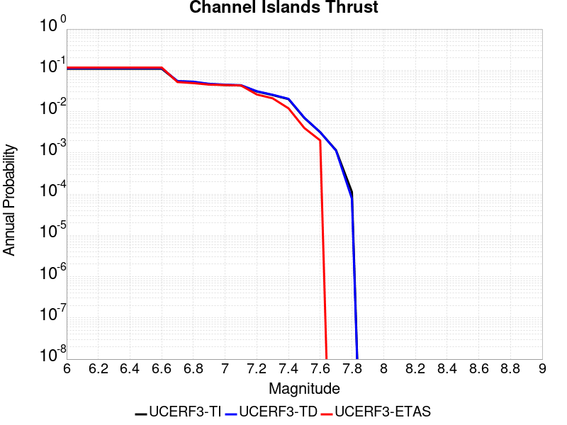 |
|-----|

| Magnitude | UCERF3-TI Prob | UCERF3-TD Prob | UCERF3-ETAS Prob |
|-----|-----|-----|-----|
| 6.0 | 0.10917692 | 0.112642355 | 0.117 |
| 6.1 | 0.10917692 | 0.112642355 | 0.117 |
| 6.2 | 0.10917692 | 0.112642355 | 0.117 |
| 6.3 | 0.10917692 | 0.112642355 | 0.117 |
| 6.4 | 0.10917692 | 0.112642355 | 0.117 |
| 6.5 | 0.10917692 | 0.112642355 | 0.117 |
| 6.6 | 0.10917692 | 0.112642355 | 0.117 |
| 6.7 | 0.053814217 | 0.054938808 | 0.052 |
| 6.8 | 0.052062146 | 0.053147547 | 0.049 |
| 6.9 | 0.046121985 | 0.04706513 | 0.045 |
| 7.0 | 0.044152286 | 0.04505423 | 0.044 |
| 7.1 | 0.04283872 | 0.043715063 | 0.043 |
| 7.2 | 0.030646177 | 0.03121601 | 0.026 |
| 7.3 | 0.025129128 | 0.025586318 | 0.021 |
| 7.4 | 0.020057028 | 0.020413032 | 0.012 |
| 7.5 | 0.0070139803 | 0.0071007092 | 0.004 |
| 7.6 | 0.003156088 | 0.0031687517 | 0.002 |
| 7.7 | 0.001156156 | 0.0011320858 | 0.0 |
| 7.8 | 1.1276772E-4 | 7.739106E-5 | 0.0 |

## Channel Islands Western Deep Ramp
*[(top)](#table-of-contents)*

| 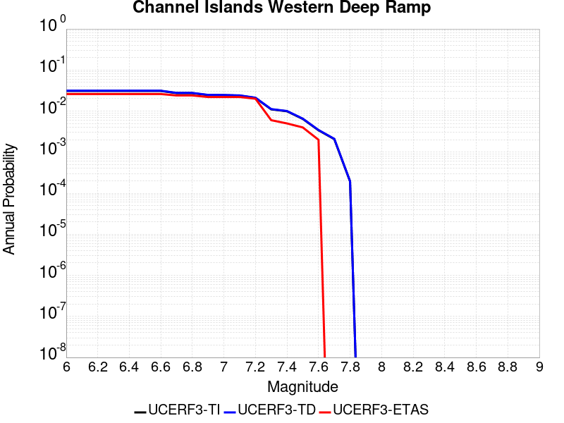 |
|-----|

| Magnitude | UCERF3-TI Prob | UCERF3-TD Prob | UCERF3-ETAS Prob |
|-----|-----|-----|-----|
| 6.0 | 0.030930206 | 0.031325083 | 0.026 |
| 6.1 | 0.030930206 | 0.031325083 | 0.026 |
| 6.2 | 0.030930206 | 0.031325083 | 0.026 |
| 6.3 | 0.030930206 | 0.031325083 | 0.026 |
| 6.4 | 0.030930206 | 0.031325083 | 0.026 |
| 6.5 | 0.030930206 | 0.031325083 | 0.026 |
| 6.6 | 0.030930206 | 0.031325083 | 0.026 |
| 6.7 | 0.027343374 | 0.027703177 | 0.024 |
| 6.8 | 0.027343374 | 0.027703177 | 0.024 |
| 6.9 | 0.024451634 | 0.024783226 | 0.022 |
| 7.0 | 0.024338787 | 0.02466922 | 0.022 |
| 7.1 | 0.023773355 | 0.024097862 | 0.022 |
| 7.2 | 0.020879956 | 0.021170193 | 0.02 |
| 7.3 | 0.01101796 | 0.011180058 | 0.006 |
| 7.4 | 0.0098917615 | 0.010038531 | 0.005 |
| 7.5 | 0.0064536654 | 0.006549899 | 0.004 |
| 7.6 | 0.0034087452 | 0.0034611844 | 0.002 |
| 7.7 | 0.0020776577 | 0.0021094377 | 0.0 |
| 7.8 | 1.9337227E-4 | 1.9573334E-4 | 0.0 |

## Chino alt 1
*[(top)](#table-of-contents)*

|  |
|-----|

| Magnitude | UCERF3-TI Prob | UCERF3-TD Prob | UCERF3-ETAS Prob |
|-----|-----|-----|-----|
| 6.0 | 0.18582895 | 0.18919885 | 0.167 |
| 6.1 | 0.106147476 | 0.10167578 | 0.093 |
| 6.2 | 0.106147476 | 0.10167578 | 0.093 |
| 6.3 | 0.07185546 | 0.06475316 | 0.064 |
| 6.4 | 0.07185546 | 0.06475316 | 0.064 |
| 6.5 | 0.06567059 | 0.058190953 | 0.058 |
| 6.6 | 0.048212443 | 0.041585647 | 0.042 |
| 6.7 | 0.042454705 | 0.0362443 | 0.038 |
| 6.8 | 0.01802319 | 0.01469371 | 0.016 |
| 6.9 | 0.011746809 | 0.008813509 | 0.005 |
| 7.0 | 0.009277882 | 0.00639268 | 0.004 |
| 7.1 | 0.008994273 | 0.0061155986 | 0.004 |
| 7.2 | 0.008318139 | 0.005649281 | 0.004 |
| 7.3 | 0.0069265803 | 0.00472005 | 0.004 |
| 7.4 | 0.00579736 | 0.003930445 | 0.003 |
| 7.5 | 0.0048689363 | 0.0032809721 | 0.002 |
| 7.6 | 0.004436669 | 0.002973487 | 0.002 |
| 7.7 | 0.0011370352 | 6.0432893E-4 | 0.0 |

## Clamshell-Sawpit
*[(top)](#table-of-contents)*

|  |
|-----|

| Magnitude | UCERF3-TI Prob | UCERF3-TD Prob | UCERF3-ETAS Prob |
|-----|-----|-----|-----|
| 6.0 | 0.016573928 | 0.016637528 | 0.014 |
| 6.1 | 0.016573928 | 0.016637528 | 0.014 |
| 6.2 | 0.016573928 | 0.016637528 | 0.014 |
| 6.3 | 0.016573928 | 0.016637528 | 0.014 |
| 6.4 | 0.016573928 | 0.016637528 | 0.014 |
| 6.5 | 0.013404171 | 0.013439261 | 0.013 |
| 6.6 | 0.013404171 | 0.013439261 | 0.013 |
| 6.7 | 0.013404171 | 0.013439261 | 0.013 |
| 6.8 | 0.0124957 | 0.012520272 | 0.011 |
| 6.9 | 0.010419665 | 0.010417069 | 0.008 |
| 7.0 | 0.0094343815 | 0.009420867 | 0.006 |
| 7.1 | 0.008040275 | 0.008005774 | 0.005 |
| 7.2 | 0.007075335 | 0.0070268456 | 0.004 |
| 7.3 | 0.005593307 | 0.0055213 | 0.002 |
| 7.4 | 0.004382167 | 0.0042889924 | 0.0 |
| 7.5 | 0.0032703911 | 0.0031594944 | 0.0 |
| 7.6 | 0.0022839617 | 0.0021589892 | 0.0 |
| 7.7 | 9.7550167E-4 | 8.4816787E-4 | 0.0 |
| 7.8 | 1.8458413E-4 | 1.5432085E-4 | 0.0 |
| 7.9 | 3.9158967E-5 | 3.303629E-5 | 0.0 |
| 8.0 | 8.637658E-7 | 8.7616706E-7 | 0.0 |

## Clayton
*[(top)](#table-of-contents)*

|  |
|-----|

| Magnitude | UCERF3-TI Prob | UCERF3-TD Prob | UCERF3-ETAS Prob |
|-----|-----|-----|-----|
| 6.0 | 0.057813518 | 0.059788816 | 0.035 |
| 6.1 | 0.057813518 | 0.059788816 | 0.035 |
| 6.2 | 0.057813518 | 0.059788816 | 0.035 |
| 6.3 | 0.043575905 | 0.045103498 | 0.026 |
| 6.4 | 0.043575905 | 0.045103498 | 0.026 |
| 6.5 | 0.036859002 | 0.038213547 | 0.021 |
| 6.6 | 0.036751382 | 0.038102448 | 0.021 |
| 6.7 | 0.03184617 | 0.03304673 | 0.019 |
| 6.8 | 0.01882265 | 0.019550879 | 0.008 |
| 6.9 | 0.013731401 | 0.014272291 | 0.006 |
| 7.0 | 0.010745136 | 0.011162893 | 0.004 |
| 7.1 | 0.0062997835 | 0.0065338286 | 0.002 |
| 7.2 | 0.0020610979 | 0.0021116612 | 0.002 |
| 7.3 | 0.0013393423 | 0.0013717408 | 0.0 |
| 7.4 | 7.731435E-4 | 7.915088E-4 | 0.0 |
| 7.5 | 5.110603E-4 | 5.235374E-4 | 0.0 |
| 7.6 | 3.1956434E-4 | 3.2813076E-4 | 0.0 |

## Cleghorn
*[(top)](#table-of-contents)*

|  |
|-----|

| Magnitude | UCERF3-TI Prob | UCERF3-TD Prob | UCERF3-ETAS Prob |
|-----|-----|-----|-----|
| 6.0 | 0.040516958 | 0.03742494 | 0.027 |
| 6.1 | 0.040516958 | 0.03742494 | 0.027 |
| 6.2 | 0.040516958 | 0.03742494 | 0.027 |
| 6.3 | 0.040516958 | 0.03742494 | 0.027 |
| 6.4 | 0.022414122 | 0.018927777 | 0.013 |
| 6.5 | 0.022414122 | 0.018927777 | 0.013 |
| 6.6 | 0.020860108 | 0.01734743 | 0.009 |
| 6.7 | 0.017395673 | 0.013819659 | 0.006 |
| 6.8 | 0.01702169 | 0.013438088 | 0.006 |
| 6.9 | 0.015693754 | 0.012082282 | 0.006 |
| 7.0 | 0.014637353 | 0.010990832 | 0.006 |
| 7.1 | 0.013455618 | 0.009782647 | 0.004 |
| 7.2 | 0.012056825 | 0.0083734095 | 0.004 |
| 7.3 | 0.010675377 | 0.007128742 | 0.004 |
| 7.4 | 0.009377129 | 0.0060253157 | 0.003 |
| 7.5 | 0.007632341 | 0.004354654 | 0.003 |
| 7.6 | 0.0051025725 | 0.0018416039 | 0.001 |
| 7.7 | 0.0038243555 | 6.159344E-4 | 0.0 |
| 7.8 | 0.0033516372 | 2.723319E-4 | 0.0 |
| 7.9 | 0.0018216632 | 1.2291783E-4 | 0.0 |
| 8.0 | 3.504494E-4 | 2.8088001E-5 | 0.0 |
| 8.1 | 1.668788E-4 | 4.1783132E-6 | 0.0 |
| 8.2 | 6.359722E-5 | 1.0550937E-6 | 0.0 |

## Cleghorn Lake
*[(top)](#table-of-contents)*

|  |
|-----|

| Magnitude | UCERF3-TI Prob | UCERF3-TD Prob | UCERF3-ETAS Prob |
|-----|-----|-----|-----|
| 6.0 | 0.0775353 | 0.079857245 | 0.074 |
| 6.1 | 0.0775353 | 0.079857245 | 0.074 |
| 6.2 | 0.06375112 | 0.06567605 | 0.056 |
| 6.3 | 0.06375112 | 0.06567605 | 0.056 |
| 6.4 | 0.04795251 | 0.049408972 | 0.041 |
| 6.5 | 0.04770675 | 0.04915908 | 0.041 |
| 6.6 | 0.039901376 | 0.041193884 | 0.033 |
| 6.7 | 0.011985383 | 0.012187783 | 0.013 |
| 6.8 | 0.0108372215 | 0.011017264 | 0.012 |
| 6.9 | 0.009745787 | 0.0099050775 | 0.012 |
| 7.0 | 0.0079813395 | 0.008110882 | 0.006 |
| 7.1 | 0.005674138 | 0.005765268 | 0.005 |
| 7.2 | 0.0031605028 | 0.0032101772 | 0.004 |

## Cleghorn Pass
*[(top)](#table-of-contents)*

|  |
|-----|

| Magnitude | UCERF3-TI Prob | UCERF3-TD Prob | UCERF3-ETAS Prob |
|-----|-----|-----|-----|
| 6.0 | 0.05342682 | 0.054693982 | 0.062 |
| 6.1 | 0.05342682 | 0.054693982 | 0.062 |
| 6.2 | 0.010921357 | 0.0111212935 | 0.009 |
| 6.3 | 0.010921357 | 0.0111212935 | 0.009 |
| 6.4 | 0.008965558 | 0.009136385 | 0.005 |

## Collayami 2011 CFM
*[(top)](#table-of-contents)*

| 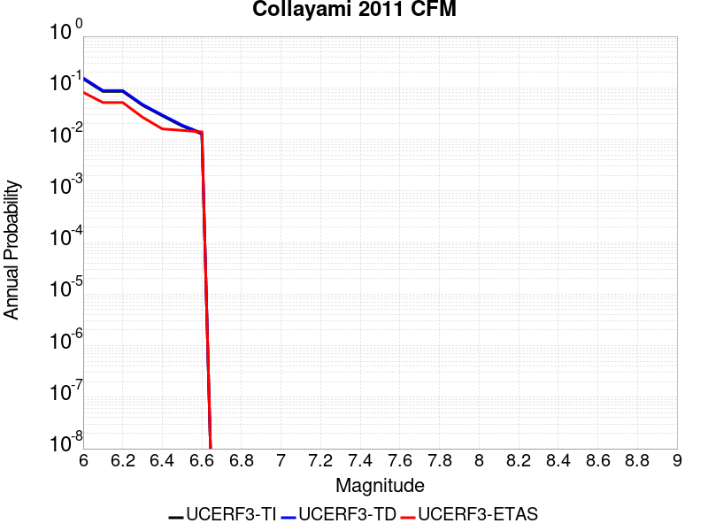 |
|-----|

| Magnitude | UCERF3-TI Prob | UCERF3-TD Prob | UCERF3-ETAS Prob |
|-----|-----|-----|-----|
| 6.0 | 0.14990284 | 0.15601346 | 0.082 |
| 6.1 | 0.08545407 | 0.08868953 | 0.052 |
| 6.2 | 0.08545407 | 0.08868953 | 0.052 |
| 6.3 | 0.04608085 | 0.04776678 | 0.027 |
| 6.4 | 0.028783146 | 0.029848512 | 0.016 |
| 6.5 | 0.018253848 | 0.018955981 | 0.015 |
| 6.6 | 0.012767083 | 0.013281507 | 0.014 |

## Compton
*[(top)](#table-of-contents)*

|  |
|-----|

| Magnitude | UCERF3-TI Prob | UCERF3-TD Prob | UCERF3-ETAS Prob |
|-----|-----|-----|-----|
| 6.0 | 0.053832937 | 0.032108407 | 0.026 |
| 6.1 | 0.053832937 | 0.032108407 | 0.026 |
| 6.2 | 0.053832937 | 0.032108407 | 0.026 |
| 6.3 | 0.053832937 | 0.032108407 | 0.026 |
| 6.4 | 0.053832937 | 0.032108407 | 0.026 |
| 6.5 | 0.053832937 | 0.032108407 | 0.026 |
| 6.6 | 0.053832937 | 0.032108407 | 0.026 |
| 6.7 | 0.053832937 | 0.032108407 | 0.026 |
| 6.8 | 0.053832937 | 0.032108407 | 0.026 |
| 6.9 | 0.053832937 | 0.032108407 | 0.026 |
| 7.0 | 0.03924332 | 0.022278577 | 0.015 |
| 7.1 | 0.036690783 | 0.020427236 | 0.014 |
| 7.2 | 0.03268609 | 0.017777545 | 0.014 |
| 7.3 | 0.02320071 | 0.013822563 | 0.01 |
| 7.4 | 0.015466454 | 0.010440326 | 0.007 |
| 7.5 | 0.0125023415 | 0.008789898 | 0.007 |
| 7.6 | 0.009752889 | 0.006856766 | 0.005 |
| 7.7 | 0.0034714972 | 0.0021793782 | 0.001 |
| 7.8 | 3.6803586E-4 | 1.9404799E-4 | 0.0 |
| 7.9 | 3.8720576E-5 | 1.7872553E-5 | 0.0 |

## Concord 2011 CFM
*[(top)](#table-of-contents)*

|  |
|-----|

| Magnitude | UCERF3-TI Prob | UCERF3-TD Prob | UCERF3-ETAS Prob |
|-----|-----|-----|-----|
| 6.0 | 0.26061803 | 0.31076223 | 0.217 |
| 6.1 | 0.26061803 | 0.31076223 | 0.217 |
| 6.2 | 0.2564558 | 0.30616072 | 0.212 |
| 6.3 | 0.23777156 | 0.28584647 | 0.197 |
| 6.4 | 0.21798092 | 0.26147777 | 0.169 |
| 6.5 | 0.14310741 | 0.16665407 | 0.108 |
| 6.6 | 0.1011809 | 0.11426227 | 0.075 |
| 6.7 | 0.08957708 | 0.1000477 | 0.062 |
| 6.8 | 0.08074679 | 0.089085825 | 0.053 |
| 6.9 | 0.06517557 | 0.07118663 | 0.043 |
| 7.0 | 0.049905818 | 0.054089464 | 0.034 |
| 7.1 | 0.04132868 | 0.04474387 | 0.033 |
| 7.2 | 0.03217375 | 0.034853056 | 0.026 |
| 7.3 | 0.018998709 | 0.020645661 | 0.016 |
| 7.4 | 0.0145266205 | 0.015787108 | 0.011 |
| 7.5 | 0.012742941 | 0.013836716 | 0.011 |
| 7.6 | 0.009199956 | 0.0099829715 | 0.005 |
| 7.7 | 0.0027050483 | 0.0029289802 | 0.001 |

## Contra Costa (Lafayette) 2011 CFM
*[(top)](#table-of-contents)*

| 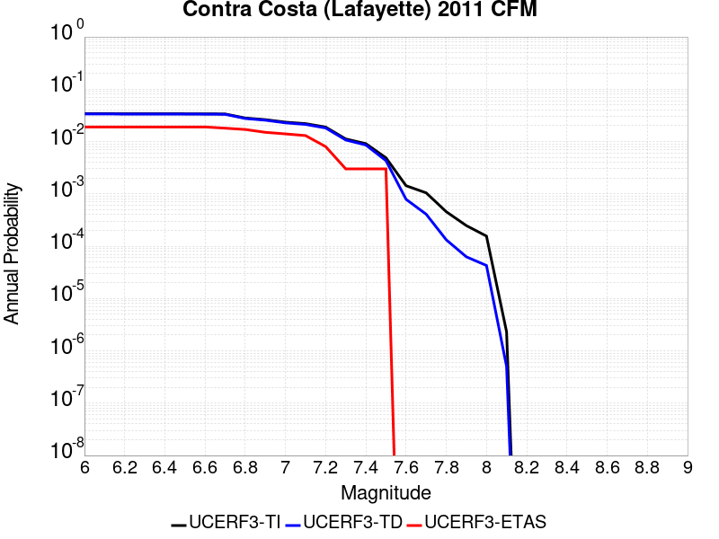 |
|-----|

| Magnitude | UCERF3-TI Prob | UCERF3-TD Prob | UCERF3-ETAS Prob |
|-----|-----|-----|-----|
| 6.0 | 0.034131072 | 0.033670615 | 0.019 |
| 6.1 | 0.034131072 | 0.033670615 | 0.019 |
| 6.2 | 0.03397984 | 0.03351695 | 0.019 |
| 6.3 | 0.03397984 | 0.03351695 | 0.019 |
| 6.4 | 0.03397984 | 0.03351695 | 0.019 |
| 6.5 | 0.033884224 | 0.033419132 | 0.019 |
| 6.6 | 0.033850018 | 0.033383943 | 0.019 |
| 6.7 | 0.033635426 | 0.033164255 | 0.018 |
| 6.8 | 0.028149724 | 0.02755462 | 0.017 |
| 6.9 | 0.026221292 | 0.025581108 | 0.015 |
| 7.0 | 0.023474824 | 0.022768285 | 0.014 |
| 7.1 | 0.021990567 | 0.021250512 | 0.013 |
| 7.2 | 0.01888606 | 0.018147962 | 0.008 |
| 7.3 | 0.011204795 | 0.010703526 | 0.003 |
| 7.4 | 0.009106621 | 0.008591432 | 0.003 |
| 7.5 | 0.0048864833 | 0.0043149027 | 0.003 |
| 7.6 | 0.0014324174 | 7.86667E-4 | 0.0 |
| 7.7 | 0.0010460495 | 4.0886234E-4 | 0.0 |
| 7.8 | 4.559571E-4 | 1.3237586E-4 | 0.0 |
| 7.9 | 2.4730802E-4 | 6.261609E-5 | 0.0 |
| 8.0 | 1.5608732E-4 | 4.2818476E-5 | 0.0 |
| 8.1 | 2.3121406E-6 | 5.067829E-7 | 0.0 |

## Contra Costa Shear Zone (connector) 2011 CFM
*[(top)](#table-of-contents)*

| 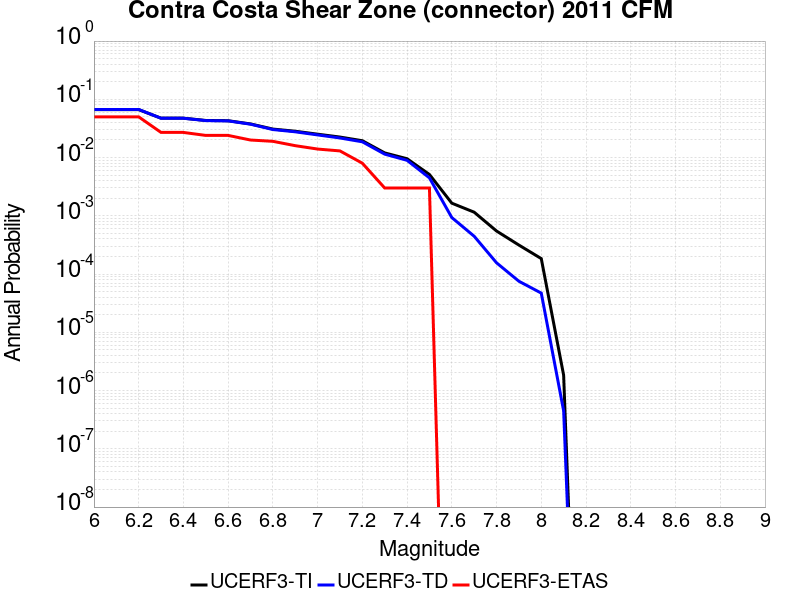 |
|-----|

| Magnitude | UCERF3-TI Prob | UCERF3-TD Prob | UCERF3-ETAS Prob |
|-----|-----|-----|-----|
| 6.0 | 0.0664965 | 0.06698553 | 0.05 |
| 6.1 | 0.0664965 | 0.06698553 | 0.05 |
| 6.2 | 0.0664965 | 0.06698553 | 0.05 |
| 6.3 | 0.047444128 | 0.047277972 | 0.027 |
| 6.4 | 0.047444128 | 0.047277972 | 0.027 |
| 6.5 | 0.043346055 | 0.043080375 | 0.024 |
| 6.6 | 0.04289387 | 0.042615786 | 0.024 |
| 6.7 | 0.037793934 | 0.037394676 | 0.02 |
| 6.8 | 0.030847125 | 0.030278612 | 0.019 |
| 6.9 | 0.028317053 | 0.027677098 | 0.016 |
| 7.0 | 0.025202392 | 0.024478635 | 0.014 |
| 7.1 | 0.022492567 | 0.021679854 | 0.013 |
| 7.2 | 0.019452497 | 0.018640786 | 0.008 |
| 7.3 | 0.012022096 | 0.01144639 | 0.003 |
| 7.4 | 0.009543739 | 0.008966145 | 0.003 |
| 7.5 | 0.0051214714 | 0.004482443 | 0.003 |
| 7.6 | 0.0016476406 | 9.329659E-4 | 0.0 |
| 7.7 | 0.0011538259 | 4.457769E-4 | 0.0 |
| 7.8 | 5.4822315E-4 | 1.5599026E-4 | 0.0 |
| 7.9 | 3.1455178E-4 | 7.525801E-5 | 0.0 |
| 8.0 | 1.8422912E-4 | 4.7110112E-5 | 0.0 |
| 8.1 | 1.8386799E-6 | 4.501671E-7 | 0.0 |

## Coronado Bank alt1
*[(top)](#table-of-contents)*

|  |
|-----|

| Magnitude | UCERF3-TI Prob | UCERF3-TD Prob | UCERF3-ETAS Prob |
|-----|-----|-----|-----|
| 6.0 | 0.3250399 | 0.3454209 | 0.301 |
| 6.1 | 0.19599438 | 0.20621836 | 0.156 |
| 6.2 | 0.19599438 | 0.20621836 | 0.156 |
| 6.3 | 0.1528644 | 0.16013585 | 0.126 |
| 6.4 | 0.14435653 | 0.15116075 | 0.117 |
| 6.5 | 0.1200627 | 0.12556294 | 0.101 |
| 6.6 | 0.10526921 | 0.11000875 | 0.093 |
| 6.7 | 0.09242421 | 0.09653694 | 0.082 |
| 6.8 | 0.07943797 | 0.08296508 | 0.067 |
| 6.9 | 0.06568797 | 0.068621494 | 0.055 |
| 7.0 | 0.05565434 | 0.058174882 | 0.048 |
| 7.1 | 0.044710737 | 0.046783946 | 0.036 |
| 7.2 | 0.0041791094 | 0.0042647654 | 0.005 |
| 7.3 | 0.0019440098 | 0.0019788372 | 0.0 |
| 7.4 | 0.0010720618 | 0.0010913601 | 0.0 |
| 7.5 | 3.5712184E-4 | 3.6372946E-4 | 0.0 |
| 7.6 | 3.1815453E-5 | 3.248398E-5 | 0.0 |

## Coyote Canyon
*[(top)](#table-of-contents)*

|  |
|-----|

| Magnitude | UCERF3-TI Prob | UCERF3-TD Prob | UCERF3-ETAS Prob |
|-----|-----|-----|-----|
| 6.0 | 0.16731344 | 0.17553239 | 0.202 |
| 6.1 | 0.16731344 | 0.17553239 | 0.202 |
| 6.2 | 0.09163364 | 0.09593823 | 0.132 |
| 6.3 | 0.09163364 | 0.09593823 | 0.132 |
| 6.4 | 0.0854663 | 0.08952937 | 0.123 |
| 6.5 | 0.074052304 | 0.07764051 | 0.112 |
| 6.6 | 0.06078208 | 0.06385765 | 0.097 |
| 6.7 | 0.051314287 | 0.054039508 | 0.084 |

## Coyote Lake
*[(top)](#table-of-contents)*

|  |
|-----|

| Magnitude | UCERF3-TI Prob | UCERF3-TD Prob | UCERF3-ETAS Prob |
|-----|-----|-----|-----|
| 6.0 | 0.09817335 | 0.10135254 | 0.078 |
| 6.1 | 0.09817335 | 0.10135254 | 0.078 |
| 6.2 | 0.09817335 | 0.10135254 | 0.078 |
| 6.3 | 0.07694598 | 0.079518065 | 0.053 |
| 6.4 | 0.07694598 | 0.079518065 | 0.053 |
| 6.5 | 0.071365766 | 0.0737965 | 0.05 |
| 6.6 | 0.06786848 | 0.070213795 | 0.048 |
| 6.7 | 0.06571945 | 0.06800135 | 0.047 |
| 6.8 | 0.029280808 | 0.030330725 | 0.023 |
| 6.9 | 0.022624092 | 0.023491845 | 0.019 |

## Cucamonga
*[(top)](#table-of-contents)*

| 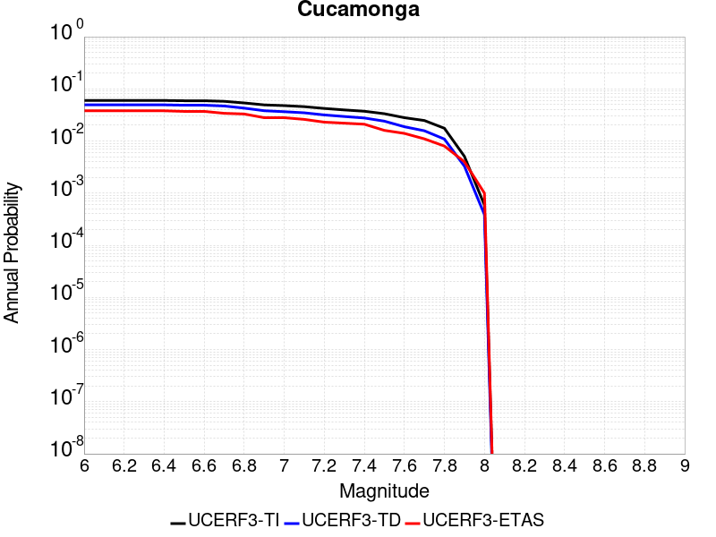 |
|-----|

| Magnitude | UCERF3-TI Prob | UCERF3-TD Prob | UCERF3-ETAS Prob |
|-----|-----|-----|-----|
| 6.0 | 0.059951067 | 0.049407084 | 0.038 |
| 6.1 | 0.059951067 | 0.049407084 | 0.038 |
| 6.2 | 0.059951067 | 0.049407084 | 0.038 |
| 6.3 | 0.059951067 | 0.049407084 | 0.038 |
| 6.4 | 0.059951067 | 0.049407084 | 0.038 |
| 6.5 | 0.05921758 | 0.04864865 | 0.037 |
| 6.6 | 0.05921758 | 0.04864865 | 0.037 |
| 6.7 | 0.05773508 | 0.04696198 | 0.034 |
| 6.8 | 0.05372818 | 0.04271501 | 0.033 |
| 6.9 | 0.04930456 | 0.038096868 | 0.028 |
| 7.0 | 0.047772545 | 0.036508482 | 0.028 |
| 7.1 | 0.045608893 | 0.034756474 | 0.026 |
| 7.2 | 0.042139184 | 0.031645168 | 0.023 |
| 7.3 | 0.03947086 | 0.029527474 | 0.022 |
| 7.4 | 0.037251726 | 0.02765269 | 0.021 |
| 7.5 | 0.033402704 | 0.02403668 | 0.016 |
| 7.6 | 0.028034491 | 0.018790932 | 0.014 |
| 7.7 | 0.024733288 | 0.015716525 | 0.011 |
| 7.8 | 0.017554436 | 0.010893549 | 0.008 |
| 7.9 | 0.0050747804 | 0.0032859521 | 0.004 |
| 8.0 | 5.9145543E-4 | 3.8777007E-4 | 0.001 |

## Davis Creek
*[(top)](#table-of-contents)*

|  |
|-----|

| Magnitude | UCERF3-TI Prob | UCERF3-TD Prob | UCERF3-ETAS Prob |
|-----|-----|-----|-----|
| 6.0 | 0.114545576 | 0.11834548 | 0.08 |
| 6.1 | 0.052857704 | 0.05439521 | 0.045 |
| 6.2 | 0.052857704 | 0.05439521 | 0.045 |
| 6.3 | 0.026424421 | 0.027141495 | 0.022 |
| 6.4 | 0.012952301 | 0.013291222 | 0.009 |
| 6.5 | 0.012880855 | 0.013219498 | 0.009 |
| 6.6 | 0.001080851 | 0.0010854638 | 0.001 |
| 6.7 | 9.150296E-4 | 9.1891614E-4 | 0.001 |
| 6.8 | 6.426541E-4 | 6.4519513E-4 | 0.001 |
| 6.9 | 3.3388697E-4 | 3.3524807E-4 | 0.001 |
| 7.0 | 3.3631488E-5 | 3.3773187E-5 | 0.0 |

## Death Valley (Black Mtns Frontal)
*[(top)](#table-of-contents)*

|  |
|-----|

| Magnitude | UCERF3-TI Prob | UCERF3-TD Prob | UCERF3-ETAS Prob |
|-----|-----|-----|-----|
| 6.0 | 0.08348476 | 0.08618324 | 0.062 |
| 6.1 | 0.08348476 | 0.08618324 | 0.062 |
| 6.2 | 0.08348476 | 0.08618324 | 0.062 |
| 6.3 | 0.08348476 | 0.08618324 | 0.062 |
| 6.4 | 0.07776836 | 0.080281004 | 0.056 |
| 6.5 | 0.07776836 | 0.080281004 | 0.056 |
| 6.6 | 0.07548565 | 0.077927686 | 0.055 |
| 6.7 | 0.07352093 | 0.07590408 | 0.053 |
| 6.8 | 0.07146006 | 0.0737815 | 0.05 |
| 6.9 | 0.06937891 | 0.071638085 | 0.047 |
| 7.0 | 0.06843136 | 0.0706634 | 0.046 |
| 7.1 | 0.06752455 | 0.06973075 | 0.046 |
| 7.2 | 0.066198766 | 0.0683674 | 0.045 |
| 7.3 | 0.065204814 | 0.06734556 | 0.044 |
| 7.4 | 0.06445554 | 0.066575386 | 0.043 |
| 7.5 | 0.06324926 | 0.06533771 | 0.043 |
| 7.6 | 0.05726288 | 0.059166532 | 0.04 |
| 7.7 | 0.046816338 | 0.04838668 | 0.034 |
| 7.8 | 0.0018030588 | 0.0018319617 | 0.0 |
| 7.9 | 1.3353022E-5 | 1.3523625E-5 | 0.0 |

## Death Valley (Fish Lake Valley)
*[(top)](#table-of-contents)*

|  |
|-----|

| Magnitude | UCERF3-TI Prob | UCERF3-TD Prob | UCERF3-ETAS Prob |
|-----|-----|-----|-----|
| 6.0 | 0.1829512 | 0.19423908 | 0.128 |
| 6.1 | 0.1829512 | 0.19423908 | 0.128 |
| 6.2 | 0.1829512 | 0.19423908 | 0.128 |
| 6.3 | 0.13753577 | 0.14436013 | 0.098 |
| 6.4 | 0.13753577 | 0.14436013 | 0.098 |
| 6.5 | 0.119769365 | 0.12527034 | 0.089 |
| 6.6 | 0.105179325 | 0.10969624 | 0.082 |
| 6.7 | 0.09419397 | 0.09803925 | 0.073 |
| 6.8 | 0.083410226 | 0.08661286 | 0.068 |
| 6.9 | 0.07289257 | 0.07549994 | 0.058 |
| 7.0 | 0.06529468 | 0.067522146 | 0.051 |
| 7.1 | 0.06336035 | 0.06550589 | 0.048 |
| 7.2 | 0.06309032 | 0.06522659 | 0.047 |
| 7.3 | 0.062498063 | 0.064615615 | 0.045 |
| 7.4 | 0.061486874 | 0.06357214 | 0.045 |
| 7.5 | 0.05926214 | 0.06128546 | 0.042 |
| 7.6 | 0.052422125 | 0.05421262 | 0.036 |
| 7.7 | 0.045565426 | 0.04712418 | 0.033 |
| 7.8 | 0.0016203995 | 0.0016473002 | 0.0 |
| 7.9 | 1.3353022E-5 | 1.3523625E-5 | 0.0 |

## Death Valley (No)
*[(top)](#table-of-contents)*

|  |
|-----|

| Magnitude | UCERF3-TI Prob | UCERF3-TD Prob | UCERF3-ETAS Prob |
|-----|-----|-----|-----|
| 6.0 | 0.099449046 | 0.10269549 | 0.068 |
| 6.1 | 0.099449046 | 0.10269549 | 0.068 |
| 6.2 | 0.099449046 | 0.10269549 | 0.068 |
| 6.3 | 0.09462342 | 0.09770003 | 0.066 |
| 6.4 | 0.09462342 | 0.09770003 | 0.066 |
| 6.5 | 0.09138815 | 0.09435257 | 0.063 |
| 6.6 | 0.08866928 | 0.09153913 | 0.061 |
| 6.7 | 0.08500534 | 0.08775408 | 0.058 |
| 6.8 | 0.082709186 | 0.08539682 | 0.058 |
| 6.9 | 0.08083903 | 0.08348535 | 0.057 |
| 7.0 | 0.07958894 | 0.08220962 | 0.057 |
| 7.1 | 0.07818527 | 0.08076946 | 0.056 |
| 7.2 | 0.07684503 | 0.07938667 | 0.054 |
| 7.3 | 0.07314003 | 0.07555493 | 0.052 |
| 7.4 | 0.07101466 | 0.07335983 | 0.052 |
| 7.5 | 0.06803389 | 0.07029423 | 0.049 |
| 7.6 | 0.057158336 | 0.059061363 | 0.04 |
| 7.7 | 0.046816338 | 0.04838668 | 0.034 |
| 7.8 | 0.0018030588 | 0.0018319617 | 0.0 |
| 7.9 | 1.3353022E-5 | 1.3523625E-5 | 0.0 |

## Death Valley (So)
*[(top)](#table-of-contents)*

|  |
|-----|

| Magnitude | UCERF3-TI Prob | UCERF3-TD Prob | UCERF3-ETAS Prob |
|-----|-----|-----|-----|
| 6.0 | 0.10230823 | 0.10957616 | 0.095 |
| 6.1 | 0.10230823 | 0.10957616 | 0.095 |
| 6.2 | 0.10230823 | 0.10957616 | 0.095 |
| 6.3 | 0.10022633 | 0.10743701 | 0.091 |
| 6.4 | 0.10022633 | 0.10743701 | 0.091 |
| 6.5 | 0.0989224 | 0.106099635 | 0.089 |
| 6.6 | 0.09408794 | 0.100076765 | 0.078 |
| 6.7 | 0.09259202 | 0.098401256 | 0.078 |
| 6.8 | 0.08884027 | 0.094125204 | 0.076 |
| 6.9 | 0.06624198 | 0.068907596 | 0.052 |
| 7.0 | 0.05827775 | 0.060295742 | 0.046 |
| 7.1 | 0.049432814 | 0.0509235 | 0.033 |
| 7.2 | 0.04703595 | 0.04841044 | 0.032 |
| 7.3 | 0.044899683 | 0.046342447 | 0.03 |
| 7.4 | 0.044424217 | 0.04585969 | 0.029 |
| 7.5 | 0.043945078 | 0.04537231 | 0.029 |
| 7.6 | 0.042479035 | 0.0438699 | 0.028 |
| 7.7 | 0.038236886 | 0.039503157 | 0.024 |
| 7.8 | 0.0018030588 | 0.0018319617 | 0.0 |
| 7.9 | 1.3353022E-5 | 1.3523625E-5 | 0.0 |

## Deep Springs
*[(top)](#table-of-contents)*

| 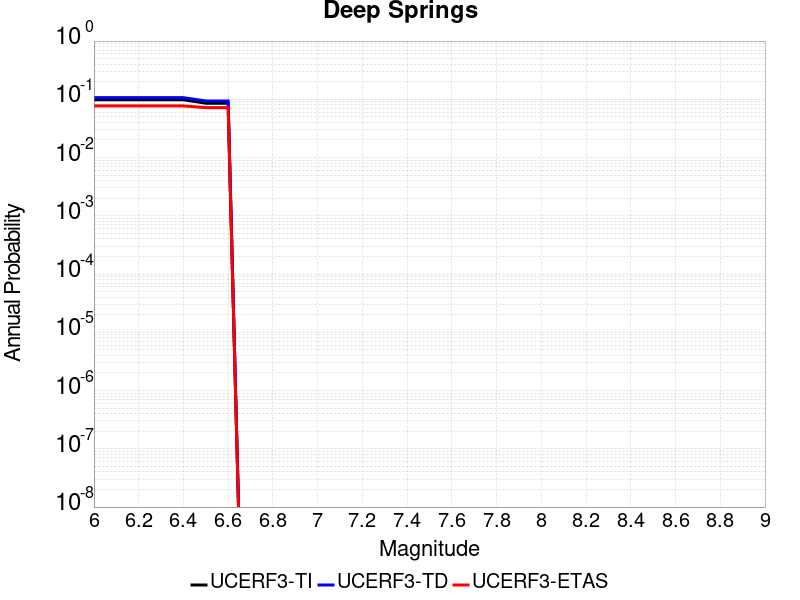 |
|-----|

| Magnitude | UCERF3-TI Prob | UCERF3-TD Prob | UCERF3-ETAS Prob |
|-----|-----|-----|-----|
| 6.0 | 0.09820675 | 0.106683515 | 0.077 |
| 6.1 | 0.09820675 | 0.106683515 | 0.077 |
| 6.2 | 0.09820675 | 0.106683515 | 0.077 |
| 6.3 | 0.09820675 | 0.106683515 | 0.077 |
| 6.4 | 0.09820675 | 0.106683515 | 0.077 |
| 6.5 | 0.08579262 | 0.0937704 | 0.072 |
| 6.6 | 0.08579262 | 0.0937704 | 0.072 |

## Del Valle
*[(top)](#table-of-contents)*

|  |
|-----|

| Magnitude | UCERF3-TI Prob | UCERF3-TD Prob | UCERF3-ETAS Prob |
|-----|-----|-----|-----|
| 6.0 | 0.054380972 | 0.045623165 | 0.034 |
| 6.1 | 0.054380972 | 0.045623165 | 0.034 |
| 6.2 | 0.054380972 | 0.045623165 | 0.034 |
| 6.3 | 0.036516782 | 0.026952965 | 0.023 |
| 6.4 | 0.036516782 | 0.026952965 | 0.023 |
| 6.5 | 0.036516782 | 0.026952965 | 0.023 |
| 6.6 | 0.036516782 | 0.026952965 | 0.023 |
| 6.7 | 0.03648331 | 0.026918313 | 0.023 |
| 6.8 | 0.034637198 | 0.024987383 | 0.019 |
| 6.9 | 0.03420475 | 0.024729604 | 0.019 |
| 7.0 | 0.03242977 | 0.022858381 | 0.018 |
| 7.1 | 0.032079414 | 0.022542233 | 0.018 |
| 7.2 | 0.031030541 | 0.021774376 | 0.018 |
| 7.3 | 0.024577567 | 0.017967055 | 0.012 |
| 7.4 | 0.018365584 | 0.0137574775 | 0.011 |
| 7.5 | 0.01405811 | 0.010644128 | 0.008 |
| 7.6 | 0.009944197 | 0.0075186873 | 0.007 |
| 7.7 | 0.006304324 | 0.0045804107 | 0.007 |
| 7.8 | 0.0032674898 | 0.002394821 | 0.005 |
| 7.9 | 0.00105828 | 7.240491E-4 | 0.001 |
| 8.0 | 2.282287E-4 | 1.3114039E-4 | 0.001 |

## Dog Valley
*[(top)](#table-of-contents)*

|  |
|-----|

| Magnitude | UCERF3-TI Prob | UCERF3-TD Prob | UCERF3-ETAS Prob |
|-----|-----|-----|-----|
| 6.0 | 0.040631503 | 0.041308228 | 0.02 |
| 6.1 | 0.040631503 | 0.041308228 | 0.02 |
| 6.2 | 0.040631503 | 0.041308228 | 0.02 |
| 6.3 | 0.040631503 | 0.041308228 | 0.02 |
| 6.4 | 0.023013867 | 0.023347553 | 0.014 |
| 6.5 | 0.023013867 | 0.023347553 | 0.014 |
| 6.6 | 0.02103433 | 0.021340208 | 0.013 |
| 6.7 | 0.02103433 | 0.021340208 | 0.013 |
| 6.8 | 0.008396378 | 0.008455557 | 0.005 |
| 6.9 | 0.0072538634 | 0.0073056556 | 0.005 |
| 7.0 | 0.0060444507 | 0.0060880687 | 0.004 |
| 7.1 | 0.0040992433 | 0.0041296696 | 0.003 |

## Dry Mountain
*[(top)](#table-of-contents)*

|  |
|-----|

| Magnitude | UCERF3-TI Prob | UCERF3-TD Prob | UCERF3-ETAS Prob |
|-----|-----|-----|-----|
| 6.0 | 0.031948306 | 0.032434724 | 0.019 |
| 6.1 | 0.031948306 | 0.032434724 | 0.019 |
| 6.2 | 0.031948306 | 0.032434724 | 0.019 |
| 6.3 | 0.031948306 | 0.032434724 | 0.019 |
| 6.4 | 0.031948306 | 0.032434724 | 0.019 |
| 6.5 | 0.014775602 | 0.015017194 | 0.01 |
| 6.6 | 0.014775602 | 0.015017194 | 0.01 |
| 6.7 | 0.013171083 | 0.013395647 | 0.008 |

## Earthquake Valley
*[(top)](#table-of-contents)*

|  |
|-----|

| Magnitude | UCERF3-TI Prob | UCERF3-TD Prob | UCERF3-ETAS Prob |
|-----|-----|-----|-----|
| 6.0 | 0.09634977 | 0.10112267 | 0.065 |
| 6.1 | 0.09634977 | 0.10112267 | 0.065 |
| 6.2 | 0.09634977 | 0.10112267 | 0.065 |
| 6.3 | 0.09634977 | 0.10112267 | 0.065 |
| 6.4 | 0.09634977 | 0.10112267 | 0.065 |
| 6.5 | 0.09622138 | 0.10098956 | 0.065 |
| 6.6 | 0.09622138 | 0.10098956 | 0.065 |
| 6.7 | 0.07492398 | 0.07839378 | 0.046 |
| 6.8 | 0.06835976 | 0.07151937 | 0.043 |
| 6.9 | 0.06835976 | 0.07151937 | 0.043 |
| 7.0 | 0.067693815 | 0.07082932 | 0.043 |
| 7.1 | 0.041792225 | 0.04379828 | 0.029 |
| 7.2 | 0.0010776361 | 7.545676E-4 | 0.0 |
| 7.3 | 0.0010671279 | 7.459654E-4 | 0.0 |
| 7.4 | 0.0010519449 | 7.361892E-4 | 0.0 |
| 7.5 | 7.7444455E-4 | 5.4047356E-4 | 0.0 |
| 7.6 | 6.877821E-4 | 4.775557E-4 | 0.0 |
| 7.7 | 1.4927151E-4 | 5.971648E-5 | 0.0 |
| 7.8 | 3.405776E-5 | 1.2363093E-5 | 0.0 |
| 7.9 | 6.730109E-6 | 3.116643E-6 | 0.0 |

## Earthquake Valley (No  Extension)
*[(top)](#table-of-contents)*

|  |
|-----|

| Magnitude | UCERF3-TI Prob | UCERF3-TD Prob | UCERF3-ETAS Prob |
|-----|-----|-----|-----|
| 6.0 | 0.10779741 | 0.11292674 | 0.071 |
| 6.1 | 0.10779741 | 0.11292674 | 0.071 |
| 6.2 | 0.10779741 | 0.11292674 | 0.071 |
| 6.3 | 0.10779741 | 0.11292674 | 0.071 |
| 6.4 | 0.10779741 | 0.11292674 | 0.071 |
| 6.5 | 0.10779741 | 0.11292674 | 0.071 |
| 6.6 | 0.07995237 | 0.08351893 | 0.049 |
| 6.7 | 0.07995237 | 0.08351893 | 0.049 |
| 6.8 | 0.07680322 | 0.080245696 | 0.047 |
| 6.9 | 0.06867274 | 0.07177897 | 0.043 |
| 7.0 | 0.06799965 | 0.07108256 | 0.043 |
| 7.1 | 0.042098112 | 0.044051144 | 0.029 |
| 7.2 | 0.0013821169 | 0.0010056134 | 0.0 |
| 7.3 | 0.0013458481 | 9.768477E-4 | 0.0 |
| 7.4 | 0.0011825052 | 8.404888E-4 | 0.0 |
| 7.5 | 8.112519E-4 | 5.6340604E-4 | 0.0 |
| 7.6 | 7.014841E-4 | 4.8445287E-4 | 0.0 |
| 7.7 | 1.5505958E-4 | 6.1389335E-5 | 0.0 |
| 7.8 | 3.881499E-5 | 1.3695419E-5 | 0.0 |
| 7.9 | 8.021658E-6 | 3.6817262E-6 | 0.0 |

## Earthquake Valley (So Extension)
*[(top)](#table-of-contents)*

| 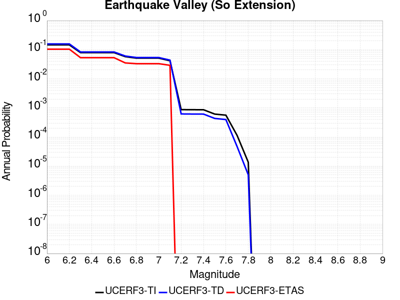 |
|-----|

| Magnitude | UCERF3-TI Prob | UCERF3-TD Prob | UCERF3-ETAS Prob |
|-----|-----|-----|-----|
| 6.0 | 0.14577016 | 0.157276 | 0.104 |
| 6.1 | 0.14577016 | 0.157276 | 0.104 |
| 6.2 | 0.14577016 | 0.157276 | 0.104 |
| 6.3 | 0.07911333 | 0.08327533 | 0.053 |
| 6.4 | 0.07911333 | 0.08327533 | 0.053 |
| 6.5 | 0.07911333 | 0.08327533 | 0.053 |
| 6.6 | 0.07911333 | 0.08327533 | 0.053 |
| 6.7 | 0.05756775 | 0.060395155 | 0.035 |
| 6.8 | 0.05108656 | 0.053600095 | 0.033 |
| 6.9 | 0.05108656 | 0.053600095 | 0.033 |
| 7.0 | 0.05108656 | 0.053600095 | 0.033 |
| 7.1 | 0.041585434 | 0.043659445 | 0.029 |
| 7.2 | 8.73002E-4 | 6.202047E-4 | 0.0 |
| 7.3 | 8.6746365E-4 | 6.154565E-4 | 0.0 |
| 7.4 | 8.64182E-4 | 6.129071E-4 | 0.0 |
| 7.5 | 6.1366934E-4 | 4.3525212E-4 | 0.0 |
| 7.6 | 5.629923E-4 | 3.9774232E-4 | 0.0 |
| 7.7 | 1.1388319E-4 | 4.717573E-5 | 0.0 |
| 7.8 | 1.3654855E-5 | 5.049178E-6 | 0.0 |

## East Huasna 2011 CFM
*[(top)](#table-of-contents)*

|  |
|-----|

| Magnitude | UCERF3-TI Prob | UCERF3-TD Prob | UCERF3-ETAS Prob |
|-----|-----|-----|-----|
| 6.0 | 0.007619385 | 0.0076344754 | 0.005 |
| 6.1 | 0.007619385 | 0.0076344754 | 0.005 |
| 6.2 | 0.007619385 | 0.0076344754 | 0.005 |
| 6.3 | 0.007619385 | 0.0076344754 | 0.005 |
| 6.4 | 0.005457678 | 0.005469411 | 0.003 |
| 6.5 | 0.005457678 | 0.005469411 | 0.003 |
| 6.6 | 0.0044061723 | 0.0044164346 | 0.003 |
| 6.7 | 0.0041012303 | 0.0041108103 | 0.003 |
| 6.8 | 0.0036427605 | 0.0036517147 | 0.002 |
| 6.9 | 0.0030736248 | 0.0030815299 | 0.002 |
| 7.0 | 0.0024982186 | 0.0025050947 | 0.002 |
| 7.1 | 0.0021504115 | 0.0021564658 | 0.002 |
| 7.2 | 0.001471708 | 0.0014760718 | 0.002 |
| 7.3 | 7.9601427E-4 | 7.9845276E-4 | 0.002 |
| 7.4 | 4.1611135E-4 | 4.1739532E-4 | 0.001 |
| 7.5 | 2.2285622E-4 | 2.236242E-4 | 0.001 |
| 7.6 | 1.1378211E-4 | 1.1417593E-4 | 0.0 |
| 7.7 | 2.4625917E-5 | 2.4701147E-5 | 0.0 |
| 7.8 | 3.861217E-7 | 3.8715507E-7 | 0.0 |

## Eaton Roughs 2011 CFM
*[(top)](#table-of-contents)*

|  |
|-----|

| Magnitude | UCERF3-TI Prob | UCERF3-TD Prob | UCERF3-ETAS Prob |
|-----|-----|-----|-----|
| 6.0 | 0.29886922 | 0.32248572 | 0.256 |
| 6.1 | 0.29886922 | 0.32248572 | 0.256 |
| 6.2 | 0.29886922 | 0.32248572 | 0.256 |
| 6.3 | 0.29886922 | 0.32248572 | 0.256 |
| 6.4 | 0.2126953 | 0.22735687 | 0.178 |
| 6.5 | 0.2126953 | 0.22735687 | 0.178 |
| 6.6 | 0.1547579 | 0.16244747 | 0.127 |
| 6.7 | 0.11842242 | 0.12298346 | 0.093 |
| 6.8 | 0.107587725 | 0.11155764 | 0.084 |
| 6.9 | 0.10238425 | 0.106124975 | 0.08 |
| 7.0 | 0.09958652 | 0.103215955 | 0.08 |
| 7.1 | 0.09071575 | 0.093999945 | 0.073 |
| 7.2 | 0.08739484 | 0.09058442 | 0.068 |
| 7.3 | 0.078786165 | 0.08177179 | 0.062 |
| 7.4 | 0.07266184 | 0.07546032 | 0.056 |
| 7.5 | 0.06718144 | 0.06982979 | 0.053 |
| 7.6 | 0.054298826 | 0.05653624 | 0.048 |
| 7.7 | 0.030513829 | 0.03175586 | 0.029 |
| 7.8 | 0.011218678 | 0.011466025 | 0.015 |
| 7.9 | 0.0025839934 | 0.002624001 | 0.004 |

## Elmore Ranch
*[(top)](#table-of-contents)*

|  |
|-----|

| Magnitude | UCERF3-TI Prob | UCERF3-TD Prob | UCERF3-ETAS Prob |
|-----|-----|-----|-----|
| 6.0 | 0.37808767 | 0.4291698 | 0.345 |
| 6.1 | 0.1811732 | 0.20785095 | 0.147 |
| 6.2 | 0.1811732 | 0.20785095 | 0.147 |
| 6.3 | 0.15905154 | 0.1836394 | 0.127 |
| 6.4 | 0.12297989 | 0.14389884 | 0.096 |
| 6.5 | 0.12297989 | 0.14389884 | 0.096 |

## Elsinore (Coyote Mountains)
*[(top)](#table-of-contents)*

| 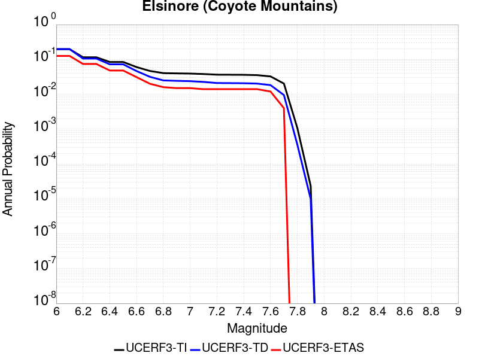 |
|-----|

| Magnitude | UCERF3-TI Prob | UCERF3-TD Prob | UCERF3-ETAS Prob |
|-----|-----|-----|-----|
| 6.0 | 0.19701745 | 0.19723709 | 0.126 |
| 6.1 | 0.19701745 | 0.19723709 | 0.126 |
| 6.2 | 0.11500367 | 0.10570861 | 0.074 |
| 6.3 | 0.11500367 | 0.10570861 | 0.074 |
| 6.4 | 0.08438148 | 0.07233459 | 0.048 |
| 6.5 | 0.08438148 | 0.07233459 | 0.048 |
| 6.6 | 0.060258184 | 0.04630777 | 0.031 |
| 6.7 | 0.046614844 | 0.031621706 | 0.02 |
| 6.8 | 0.040405273 | 0.024978567 | 0.016 |
| 6.9 | 0.039732788 | 0.024277925 | 0.015 |
| 7.0 | 0.039259914 | 0.023784613 | 0.015 |
| 7.1 | 0.038116343 | 0.022629127 | 0.014 |
| 7.2 | 0.036510784 | 0.021036692 | 0.014 |
| 7.3 | 0.03632577 | 0.02088889 | 0.014 |
| 7.4 | 0.036125287 | 0.020718383 | 0.014 |
| 7.5 | 0.03541661 | 0.020246362 | 0.014 |
| 7.6 | 0.032548968 | 0.018317042 | 0.012 |
| 7.7 | 0.0202493 | 0.009498622 | 0.004 |
| 7.8 | 0.0010871352 | 3.6321284E-4 | 0.0 |
| 7.9 | 2.3464328E-5 | 9.88855E-6 | 0.0 |

## Elsinore (Glen Ivy) rev
*[(top)](#table-of-contents)*

|  |
|-----|

| Magnitude | UCERF3-TI Prob | UCERF3-TD Prob | UCERF3-ETAS Prob |
|-----|-----|-----|-----|
| 6.0 | 0.5706894 | 0.5960616 | 0.513 |
| 6.1 | 0.5706894 | 0.5960616 | 0.513 |
| 6.2 | 0.5706894 | 0.5960616 | 0.513 |
| 6.3 | 0.41000587 | 0.42638168 | 0.35 |
| 6.4 | 0.41000587 | 0.42638168 | 0.35 |
| 6.5 | 0.17395498 | 0.14645065 | 0.134 |
| 6.6 | 0.12253295 | 0.092652954 | 0.076 |
| 6.7 | 0.109332725 | 0.0799005 | 0.064 |
| 6.8 | 0.08323205 | 0.05608374 | 0.04 |
| 6.9 | 0.07549086 | 0.04876148 | 0.029 |
| 7.0 | 0.07219731 | 0.04554687 | 0.028 |
| 7.1 | 0.06687706 | 0.04113529 | 0.026 |
| 7.2 | 0.058714442 | 0.03476547 | 0.022 |
| 7.3 | 0.05158758 | 0.02998021 | 0.019 |
| 7.4 | 0.046277028 | 0.026571408 | 0.017 |
| 7.5 | 0.039239116 | 0.022077175 | 0.013 |
| 7.6 | 0.035816256 | 0.019894667 | 0.013 |
| 7.7 | 0.02149034 | 0.009846098 | 0.005 |
| 7.8 | 0.0011833572 | 4.0138586E-4 | 0.0 |
| 7.9 | 3.4838133E-5 | 1.4969513E-5 | 0.0 |

## Elsinore (Julian)
*[(top)](#table-of-contents)*

|  |
|-----|

| Magnitude | UCERF3-TI Prob | UCERF3-TD Prob | UCERF3-ETAS Prob |
|-----|-----|-----|-----|
| 6.0 | 0.059273347 | 0.037585426 | 0.025 |
| 6.1 | 0.059273347 | 0.037585426 | 0.025 |
| 6.2 | 0.059273347 | 0.037585426 | 0.025 |
| 6.3 | 0.059273347 | 0.037585426 | 0.025 |
| 6.4 | 0.059273347 | 0.037585426 | 0.025 |
| 6.5 | 0.059273347 | 0.037585426 | 0.025 |
| 6.6 | 0.058980692 | 0.03726813 | 0.024 |
| 6.7 | 0.058980692 | 0.03726813 | 0.024 |
| 6.8 | 0.057959214 | 0.036251415 | 0.023 |
| 6.9 | 0.057260416 | 0.03553437 | 0.022 |
| 7.0 | 0.056360476 | 0.034700125 | 0.022 |
| 7.1 | 0.054821342 | 0.033250477 | 0.021 |
| 7.2 | 0.052464157 | 0.031057043 | 0.019 |
| 7.3 | 0.04896906 | 0.02893084 | 0.017 |
| 7.4 | 0.04659412 | 0.027411899 | 0.017 |
| 7.5 | 0.040828638 | 0.02336324 | 0.015 |
| 7.6 | 0.035642177 | 0.019783285 | 0.013 |
| 7.7 | 0.021450648 | 0.009824573 | 0.005 |
| 7.8 | 0.0011783998 | 3.9912708E-4 | 0.0 |
| 7.9 | 3.4838133E-5 | 1.4969513E-5 | 0.0 |

## Elsinore (Stepovers Combined)
*[(top)](#table-of-contents)*

|  |
|-----|

| Magnitude | UCERF3-TI Prob | UCERF3-TD Prob | UCERF3-ETAS Prob |
|-----|-----|-----|-----|
| 6.0 | 0.105859645 | 0.07750073 | 0.054 |
| 6.1 | 0.105859645 | 0.07750073 | 0.054 |
| 6.2 | 0.105859645 | 0.07750073 | 0.054 |
| 6.3 | 0.097928785 | 0.06885228 | 0.048 |
| 6.4 | 0.097928785 | 0.06885228 | 0.048 |
| 6.5 | 0.097928785 | 0.06885228 | 0.048 |
| 6.6 | 0.095275484 | 0.06589714 | 0.048 |
| 6.7 | 0.0877838 | 0.05855989 | 0.04 |
| 6.8 | 0.0847485 | 0.055591445 | 0.038 |
| 6.9 | 0.08011391 | 0.051728204 | 0.036 |
| 7.0 | 0.06711566 | 0.042040918 | 0.027 |
| 7.1 | 0.06492633 | 0.040201977 | 0.027 |
| 7.2 | 0.058977902 | 0.035438213 | 0.023 |
| 7.3 | 0.050883148 | 0.029915828 | 0.019 |
| 7.4 | 0.046456438 | 0.026881248 | 0.017 |
| 7.5 | 0.04023559 | 0.022792764 | 0.013 |
| 7.6 | 0.035752703 | 0.019849371 | 0.013 |
| 7.7 | 0.0214811 | 0.0098407725 | 0.005 |
| 7.8 | 0.0011833572 | 4.0138586E-4 | 0.0 |
| 7.9 | 3.4838133E-5 | 1.4969513E-5 | 0.0 |

## Elsinore (Temecula) rev
*[(top)](#table-of-contents)*

| 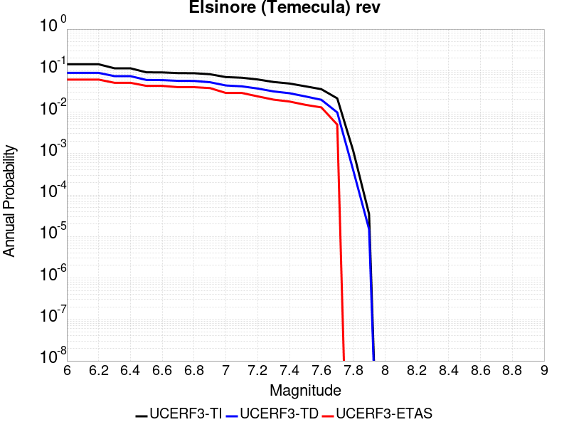 |
|-----|

| Magnitude | UCERF3-TI Prob | UCERF3-TD Prob | UCERF3-ETAS Prob |
|-----|-----|-----|-----|
| 6.0 | 0.14273423 | 0.088489115 | 0.061 |
| 6.1 | 0.14273423 | 0.088489115 | 0.061 |
| 6.2 | 0.14273423 | 0.088489115 | 0.061 |
| 6.3 | 0.11412471 | 0.07379296 | 0.051 |
| 6.4 | 0.11412471 | 0.07379296 | 0.051 |
| 6.5 | 0.09125477 | 0.05974307 | 0.043 |
| 6.6 | 0.090706736 | 0.059146915 | 0.043 |
| 6.7 | 0.08732902 | 0.05689519 | 0.04 |
| 6.8 | 0.08687358 | 0.056590483 | 0.04 |
| 6.9 | 0.082026795 | 0.052621633 | 0.038 |
| 7.0 | 0.070021555 | 0.04394622 | 0.029 |
| 7.1 | 0.067556396 | 0.041931137 | 0.029 |
| 7.2 | 0.061381545 | 0.03705674 | 0.024 |
| 7.3 | 0.053337574 | 0.031573102 | 0.02 |
| 7.4 | 0.04897927 | 0.028565789 | 0.018 |
| 7.5 | 0.041959915 | 0.023924842 | 0.015 |
| 7.6 | 0.035740647 | 0.019842513 | 0.013 |
| 7.7 | 0.021470422 | 0.009834821 | 0.005 |
| 7.8 | 0.0011833572 | 4.0138586E-4 | 0.0 |
| 7.9 | 3.4838133E-5 | 1.4969513E-5 | 0.0 |

## Elysian Park (Lower CFM)
*[(top)](#table-of-contents)*

| 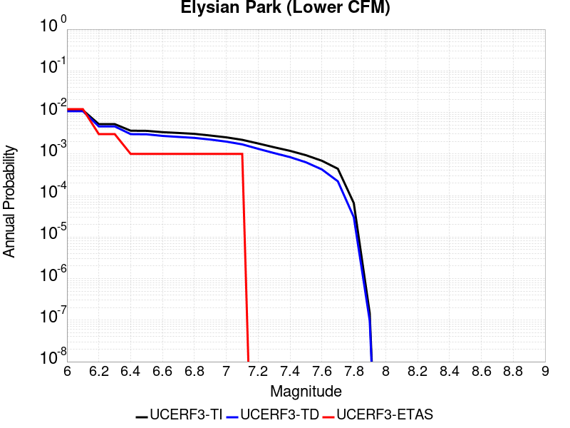 |
|-----|

| Magnitude | UCERF3-TI Prob | UCERF3-TD Prob | UCERF3-ETAS Prob |
|-----|-----|-----|-----|
| 6.0 | 0.011293207 | 0.010708086 | 0.012 |
| 6.1 | 0.011293207 | 0.010708086 | 0.012 |
| 6.2 | 0.005220456 | 0.004599026 | 0.003 |
| 6.3 | 0.005220456 | 0.004599026 | 0.003 |
| 6.4 | 0.003625368 | 0.0029981586 | 0.001 |
| 6.5 | 0.0035948262 | 0.002967507 | 0.001 |
| 6.6 | 0.0033441857 | 0.0027160703 | 0.001 |
| 6.7 | 0.0031979796 | 0.002569444 | 0.001 |
| 6.8 | 0.0030466383 | 0.0024351915 | 0.001 |
| 6.9 | 0.0027735005 | 0.0022190844 | 0.001 |
| 7.0 | 0.0025091 | 0.0019794519 | 0.001 |
| 7.1 | 0.0021856104 | 0.0017008174 | 0.001 |
| 7.2 | 0.0017860678 | 0.0013286123 | 0.0 |
| 7.3 | 0.0014480355 | 0.0010494227 | 0.0 |
| 7.4 | 0.0011866967 | 8.386586E-4 | 0.0 |
| 7.5 | 9.3223416E-4 | 6.2942744E-4 | 0.0 |
| 7.6 | 6.845858E-4 | 4.2353474E-4 | 0.0 |
| 7.7 | 4.4028982E-4 | 2.1966496E-4 | 0.0 |
| 7.8 | 6.5698005E-5 | 3.012539E-5 | 0.0 |
| 7.9 | 1.4779177E-7 | 9.665144E-8 | 0.0 |

## Elysian Park (Upper)
*[(top)](#table-of-contents)*

|  |
|-----|

| Magnitude | UCERF3-TI Prob | UCERF3-TD Prob | UCERF3-ETAS Prob |
|-----|-----|-----|-----|
| 6.0 | 0.15323086 | 0.15916768 | 0.122 |
| 6.1 | 0.15323086 | 0.15916768 | 0.122 |
| 6.2 | 0.15323086 | 0.15916768 | 0.122 |
| 6.3 | 0.15323086 | 0.15916768 | 0.122 |
| 6.4 | 0.09567561 | 0.09577211 | 0.07 |
| 6.5 | 0.09567561 | 0.09577211 | 0.07 |
| 6.6 | 0.049915574 | 0.045945965 | 0.033 |
| 6.7 | 0.049857173 | 0.045886405 | 0.033 |
| 6.8 | 0.04139656 | 0.037112206 | 0.026 |
| 6.9 | 0.031240622 | 0.026489282 | 0.016 |
| 7.0 | 0.028795242 | 0.02411606 | 0.016 |
| 7.1 | 0.024276024 | 0.01982604 | 0.015 |
| 7.2 | 0.018641477 | 0.014484701 | 0.011 |
| 7.3 | 0.012811273 | 0.010208562 | 0.007 |
| 7.4 | 0.0060548866 | 0.0050096624 | 0.005 |
| 7.5 | 0.0026027134 | 0.0024183209 | 0.004 |
| 7.6 | 0.0012863054 | 0.0012113954 | 0.003 |
| 7.7 | 4.294042E-4 | 3.452915E-4 | 0.0 |
| 7.8 | 1.4514658E-4 | 6.559209E-5 | 0.0 |

## Emerson-Copper Mtn 2011
*[(top)](#table-of-contents)*

|  |
|-----|

| Magnitude | UCERF3-TI Prob | UCERF3-TD Prob | UCERF3-ETAS Prob |
|-----|-----|-----|-----|
| 6.0 | 0.10548762 | 0.10847144 | 0.084 |
| 6.1 | 0.10548762 | 0.10847144 | 0.084 |
| 6.2 | 0.10548762 | 0.10847144 | 0.084 |
| 6.3 | 0.08846405 | 0.09097978 | 0.073 |
| 6.4 | 0.08846405 | 0.09097978 | 0.073 |
| 6.5 | 0.07955221 | 0.0818283 | 0.067 |
| 6.6 | 0.07955221 | 0.0818283 | 0.067 |
| 6.7 | 0.07182604 | 0.0738946 | 0.06 |
| 6.8 | 0.06797248 | 0.06994521 | 0.059 |
| 6.9 | 0.061847787 | 0.06366967 | 0.056 |
| 7.0 | 0.055829152 | 0.057504546 | 0.045 |
| 7.1 | 0.04948475 | 0.051001746 | 0.039 |
| 7.2 | 0.020315353 | 0.020812381 | 0.014 |
| 7.3 | 0.013792039 | 0.014102874 | 0.008 |
| 7.4 | 0.010842692 | 0.01108394 | 0.004 |
| 7.5 | 0.0060768235 | 0.0062159672 | 0.003 |
| 7.6 | 6.8614166E-4 | 7.033696E-4 | 0.0 |

## Eureka Peak
*[(top)](#table-of-contents)*

|  |
|-----|

| Magnitude | UCERF3-TI Prob | UCERF3-TD Prob | UCERF3-ETAS Prob |
|-----|-----|-----|-----|
| 6.0 | 0.15355349 | 0.1752087 | 0.119 |
| 6.1 | 0.15355349 | 0.1752087 | 0.119 |
| 6.2 | 0.15355349 | 0.1752087 | 0.119 |
| 6.3 | 0.13294844 | 0.1534466 | 0.109 |
| 6.4 | 0.13294844 | 0.1534466 | 0.109 |
| 6.5 | 5.0800614E-4 | 7.880571E-4 | 0.0 |
| 6.6 | 4.877296E-4 | 7.6768966E-4 | 0.0 |
| 6.7 | 4.877296E-4 | 7.6768966E-4 | 0.0 |
| 6.8 | 4.48188E-4 | 7.2792295E-4 | 0.0 |
| 6.9 | 4.0428777E-4 | 6.8367267E-4 | 0.0 |
| 7.0 | 3.5985638E-4 | 6.3013495E-4 | 0.0 |
| 7.1 | 3.056841E-4 | 5.556967E-4 | 0.0 |
| 7.2 | 2.6803324E-4 | 4.97193E-4 | 0.0 |
| 7.3 | 2.3707861E-4 | 4.3366084E-4 | 0.0 |
| 7.4 | 1.5558011E-4 | 2.662809E-4 | 0.0 |
| 7.5 | 2.2134636E-5 | 3.5662266E-5 | 0.0 |

## Fickle Hill (alt1)
*[(top)](#table-of-contents)*

|  |
|-----|

| Magnitude | UCERF3-TI Prob | UCERF3-TD Prob | UCERF3-ETAS Prob |
|-----|-----|-----|-----|
| 6.0 | 0.028249303 | 0.028765062 | 0.032 |
| 6.1 | 0.028249303 | 0.028765062 | 0.032 |
| 6.2 | 0.028249303 | 0.028765062 | 0.032 |
| 6.3 | 0.028249303 | 0.028765062 | 0.032 |
| 6.4 | 0.028249303 | 0.028765062 | 0.032 |
| 6.5 | 0.028249303 | 0.028765062 | 0.032 |
| 6.6 | 0.028249303 | 0.028765062 | 0.032 |
| 6.7 | 0.028249303 | 0.028765062 | 0.032 |
| 6.8 | 0.02687363 | 0.027374245 | 0.029 |
| 6.9 | 0.026863072 | 0.027363542 | 0.029 |
| 7.0 | 0.022712605 | 0.02316167 | 0.024 |
| 7.1 | 0.01856362 | 0.018950576 | 0.02 |
| 7.2 | 0.014957099 | 0.015293685 | 0.016 |
| 7.3 | 0.011800558 | 0.012086545 | 0.012 |
| 7.4 | 0.010777242 | 0.011046006 | 0.01 |
| 7.5 | 0.008547064 | 0.008770002 | 0.007 |
| 7.6 | 0.0060805483 | 0.0062495186 | 0.006 |
| 7.7 | 0.002078251 | 0.002143067 | 0.002 |
| 7.8 | 5.9620227E-4 | 6.1701477E-4 | 0.0 |

## Fish Slough 2011 CFM
*[(top)](#table-of-contents)*

|  |
|-----|

| Magnitude | UCERF3-TI Prob | UCERF3-TD Prob | UCERF3-ETAS Prob |
|-----|-----|-----|-----|
| 6.0 | 0.022508342 | 0.0183257 | 0.01 |
| 6.1 | 0.022508342 | 0.0183257 | 0.01 |
| 6.2 | 0.022508342 | 0.0183257 | 0.01 |
| 6.3 | 0.022508342 | 0.0183257 | 0.01 |
| 6.4 | 0.022508342 | 0.0183257 | 0.01 |
| 6.5 | 0.015489155 | 0.011208961 | 0.007 |
| 6.6 | 0.015489155 | 0.011208961 | 0.007 |
| 6.7 | 0.014447425 | 0.010153984 | 0.007 |
| 6.8 | 0.010080229 | 0.0057242285 | 0.004 |
| 6.9 | 0.0096414415 | 0.005278971 | 0.004 |
| 7.0 | 0.008641869 | 0.00427903 | 0.004 |
| 7.1 | 0.0074239606 | 0.003104002 | 0.004 |
| 7.2 | 0.0061435453 | 0.0019426548 | 0.003 |
| 7.3 | 0.0051617324 | 0.0011850711 | 0.002 |
| 7.4 | 0.0042967913 | 8.1759784E-4 | 0.002 |
| 7.5 | 0.0027745788 | 4.5177358E-4 | 0.001 |
| 7.6 | 0.0010625955 | 1.7228069E-4 | 0.0 |
| 7.7 | 1.1740129E-4 | 1.0522699E-5 | 0.0 |

## Fitzhugh Creek
*[(top)](#table-of-contents)*

| 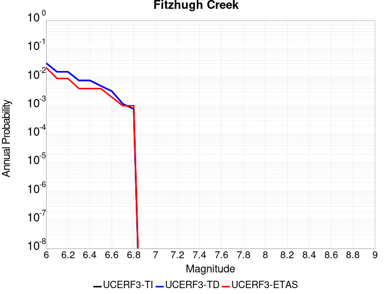 |
|-----|

| Magnitude | UCERF3-TI Prob | UCERF3-TD Prob | UCERF3-ETAS Prob |
|-----|-----|-----|-----|
| 6.0 | 0.031373523 | 0.03157384 | 0.022 |
| 6.1 | 0.015399079 | 0.015482326 | 0.009 |
| 6.2 | 0.015399079 | 0.015482326 | 0.009 |
| 6.3 | 0.0076829577 | 0.007721206 | 0.004 |
| 6.4 | 0.0076829577 | 0.007721206 | 0.004 |
| 6.5 | 0.0049538743 | 0.0049782074 | 0.004 |
| 6.6 | 0.0032358002 | 0.0032517295 | 0.002 |
| 6.7 | 0.0011669687 | 0.0011729073 | 0.001 |
| 6.8 | 7.711639E-4 | 7.7517686E-4 | 0.001 |

## Fontana (Seismicity)
*[(top)](#table-of-contents)*

| 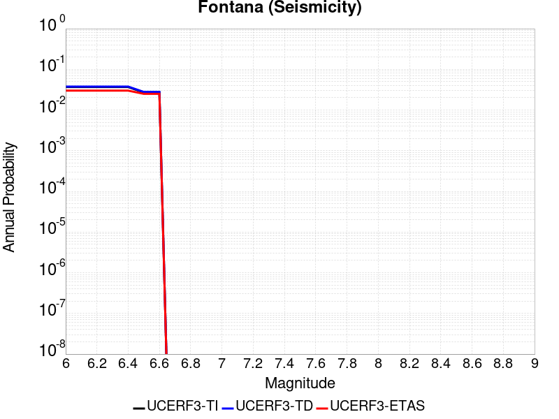 |
|-----|

| Magnitude | UCERF3-TI Prob | UCERF3-TD Prob | UCERF3-ETAS Prob |
|-----|-----|-----|-----|
| 6.0 | 0.03676582 | 0.037722435 | 0.03 |
| 6.1 | 0.03676582 | 0.037722435 | 0.03 |
| 6.2 | 0.03676582 | 0.037722435 | 0.03 |
| 6.3 | 0.03676582 | 0.037722435 | 0.03 |
| 6.4 | 0.03676582 | 0.037722435 | 0.03 |
| 6.5 | 0.027078528 | 0.027868414 | 0.025 |
| 6.6 | 0.027078528 | 0.027868414 | 0.025 |

## Franklin 2011 CFM
*[(top)](#table-of-contents)*

|  |
|-----|

| Magnitude | UCERF3-TI Prob | UCERF3-TD Prob | UCERF3-ETAS Prob |
|-----|-----|-----|-----|
| 6.0 | 0.091810085 | 0.09246955 | 0.064 |
| 6.1 | 0.091810085 | 0.09246955 | 0.064 |
| 6.2 | 0.091810085 | 0.09246955 | 0.064 |
| 6.3 | 0.06954112 | 0.06944435 | 0.047 |
| 6.4 | 0.06954112 | 0.06944435 | 0.047 |
| 6.5 | 0.05730154 | 0.05682481 | 0.04 |
| 6.6 | 0.05485966 | 0.054315325 | 0.038 |
| 6.7 | 0.05433273 | 0.05377211 | 0.037 |
| 6.8 | 0.048081517 | 0.0473092 | 0.033 |
| 6.9 | 0.044381414 | 0.043493733 | 0.031 |
| 7.0 | 0.041257706 | 0.04025723 | 0.027 |
| 7.1 | 0.037560485 | 0.036562342 | 0.026 |
| 7.2 | 0.026641225 | 0.025607789 | 0.014 |
| 7.3 | 0.018210195 | 0.01730312 | 0.007 |
| 7.4 | 0.013346024 | 0.01232144 | 0.006 |
| 7.5 | 0.007092999 | 0.005880183 | 0.002 |
| 7.6 | 0.002776799 | 0.0014467647 | 0.0 |
| 7.7 | 0.0021886465 | 8.7597955E-4 | 0.0 |
| 7.8 | 0.0011778368 | 3.5102747E-4 | 0.0 |
| 7.9 | 7.598927E-4 | 2.0796344E-4 | 0.0 |
| 8.0 | 2.758208E-4 | 8.135666E-5 | 0.0 |
| 8.1 | 1.3850362E-5 | 4.9020964E-6 | 0.0 |

## Garberville - Briceland 2011 CFM
*[(top)](#table-of-contents)*

| 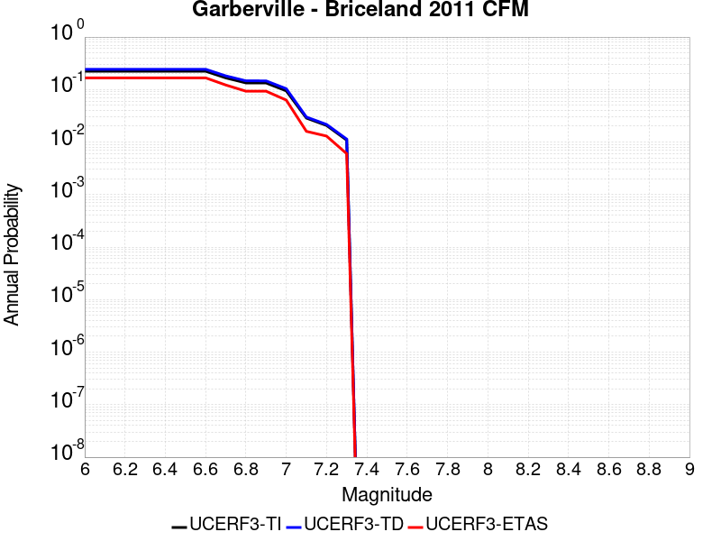 |
|-----|

| Magnitude | UCERF3-TI Prob | UCERF3-TD Prob | UCERF3-ETAS Prob |
|-----|-----|-----|-----|
| 6.0 | 0.22318009 | 0.24333692 | 0.167 |
| 6.1 | 0.22318009 | 0.24333692 | 0.167 |
| 6.2 | 0.22318009 | 0.24333692 | 0.167 |
| 6.3 | 0.22318009 | 0.24333692 | 0.167 |
| 6.4 | 0.22318009 | 0.24333692 | 0.167 |
| 6.5 | 0.22318009 | 0.24333692 | 0.167 |
| 6.6 | 0.22318009 | 0.24333692 | 0.167 |
| 6.7 | 0.16671257 | 0.18211266 | 0.122 |
| 6.8 | 0.13375272 | 0.14651904 | 0.093 |
| 6.9 | 0.13342948 | 0.1461873 | 0.093 |
| 7.0 | 0.09449663 | 0.10387789 | 0.063 |
| 7.1 | 0.028629264 | 0.029965919 | 0.016 |
| 7.2 | 0.020713184 | 0.021667194 | 0.013 |
| 7.3 | 0.010884727 | 0.011389179 | 0.006 |

## Garlic Springs
*[(top)](#table-of-contents)*

|  |
|-----|

| Magnitude | UCERF3-TI Prob | UCERF3-TD Prob | UCERF3-ETAS Prob |
|-----|-----|-----|-----|
| 6.0 | 0.08373725 | 0.08745205 | 0.097 |
| 6.1 | 0.050111417 | 0.052317336 | 0.047 |
| 6.2 | 0.050111417 | 0.052317336 | 0.047 |
| 6.3 | 0.022272572 | 0.023154708 | 0.01 |
| 6.4 | 0.022272572 | 0.023154708 | 0.01 |
| 6.5 | 0.022272572 | 0.023154708 | 0.01 |
| 6.6 | 0.022193689 | 0.023073481 | 0.01 |
| 6.7 | 0.019939352 | 0.020748869 | 0.009 |

## Garlock (Central)
*[(top)](#table-of-contents)*

| 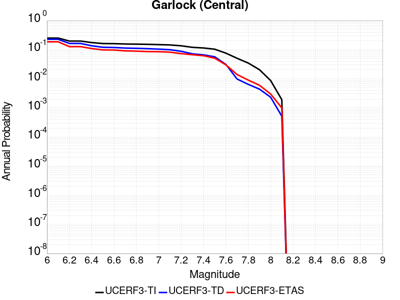 |
|-----|

| Magnitude | UCERF3-TI Prob | UCERF3-TD Prob | UCERF3-ETAS Prob |
|-----|-----|-----|-----|
| 6.0 | 0.2499942 | 0.22760025 | 0.186 |
| 6.1 | 0.2499942 | 0.22760025 | 0.186 |
| 6.2 | 0.19748303 | 0.16342354 | 0.127 |
| 6.3 | 0.19748303 | 0.16342354 | 0.127 |
| 6.4 | 0.17496064 | 0.13589433 | 0.109 |
| 6.5 | 0.16221368 | 0.120612405 | 0.098 |
| 6.6 | 0.16069135 | 0.11853732 | 0.097 |
| 6.7 | 0.15633568 | 0.11328513 | 0.091 |
| 6.8 | 0.1545991 | 0.11117171 | 0.089 |
| 6.9 | 0.15224904 | 0.108257756 | 0.086 |
| 7.0 | 0.14892432 | 0.104187824 | 0.085 |
| 7.1 | 0.1452127 | 0.09958785 | 0.082 |
| 7.2 | 0.13573706 | 0.08790542 | 0.073 |
| 7.3 | 0.12009351 | 0.071808025 | 0.067 |
| 7.4 | 0.11413341 | 0.06626109 | 0.062 |
| 7.5 | 0.10368156 | 0.05679168 | 0.051 |
| 7.6 | 0.0758267 | 0.03102087 | 0.03 |
| 7.7 | 0.0505143 | 0.009815556 | 0.014 |
| 7.8 | 0.03463931 | 0.0064358343 | 0.009 |
| 7.9 | 0.020529725 | 0.004415856 | 0.006 |
| 8.0 | 0.008691251 | 0.0023289444 | 0.003 |
| 8.1 | 0.0019148533 | 5.1669584E-4 | 0.001 |

## Garlock (East)
*[(top)](#table-of-contents)*

|  |
|-----|

| Magnitude | UCERF3-TI Prob | UCERF3-TD Prob | UCERF3-ETAS Prob |
|-----|-----|-----|-----|
| 6.0 | 0.20965962 | 0.2252806 | 0.216 |
| 6.1 | 0.20965962 | 0.2252806 | 0.216 |
| 6.2 | 0.12993352 | 0.12095177 | 0.116 |
| 6.3 | 0.12993352 | 0.12095177 | 0.116 |
| 6.4 | 0.123728715 | 0.112705015 | 0.111 |
| 6.5 | 0.123728715 | 0.112705015 | 0.111 |
| 6.6 | 0.11061352 | 0.09622087 | 0.09 |
| 6.7 | 0.109571695 | 0.094908535 | 0.09 |
| 6.8 | 0.09687913 | 0.08024144 | 0.077 |
| 6.9 | 0.06713532 | 0.046081744 | 0.038 |
| 7.0 | 0.059521805 | 0.03758611 | 0.034 |
| 7.1 | 0.051161557 | 0.02844175 | 0.021 |
| 7.2 | 0.04969519 | 0.026775515 | 0.021 |
| 7.3 | 0.047588967 | 0.02469276 | 0.021 |
| 7.4 | 0.045992263 | 0.023085982 | 0.019 |
| 7.5 | 0.03627481 | 0.014436462 | 0.01 |
| 7.6 | 0.031410683 | 0.010197674 | 0.009 |
| 7.7 | 0.024720201 | 0.0055340193 | 0.005 |
| 7.8 | 0.01759911 | 0.0036899566 | 0.004 |
| 7.9 | 0.013437985 | 0.0030366364 | 0.004 |
| 8.0 | 0.007145592 | 0.0019024229 | 0.002 |
| 8.1 | 0.0019148533 | 5.1669584E-4 | 0.001 |

## Garlock (West)
*[(top)](#table-of-contents)*

|  |
|-----|

| Magnitude | UCERF3-TI Prob | UCERF3-TD Prob | UCERF3-ETAS Prob |
|-----|-----|-----|-----|
| 6.0 | 0.1231298 | 0.06294643 | 0.054 |
| 6.1 | 0.12265385 | 0.06251461 | 0.053 |
| 6.2 | 0.12205113 | 0.061996907 | 0.053 |
| 6.3 | 0.121077724 | 0.061220787 | 0.052 |
| 6.4 | 0.11418796 | 0.054026283 | 0.047 |
| 6.5 | 0.11185009 | 0.05340904 | 0.045 |
| 6.6 | 0.105278656 | 0.048109725 | 0.038 |
| 6.7 | 0.09772385 | 0.04218141 | 0.035 |
| 6.8 | 0.093175955 | 0.04019598 | 0.035 |
| 6.9 | 0.08755249 | 0.036238153 | 0.033 |
| 7.0 | 0.08390184 | 0.0334038 | 0.032 |
| 7.1 | 0.08171638 | 0.03154328 | 0.031 |
| 7.2 | 0.07903981 | 0.02926591 | 0.028 |
| 7.3 | 0.07556783 | 0.027107278 | 0.027 |
| 7.4 | 0.0747429 | 0.02652803 | 0.027 |
| 7.5 | 0.07291312 | 0.025024882 | 0.025 |
| 7.6 | 0.06439617 | 0.018269474 | 0.022 |
| 7.7 | 0.05246883 | 0.010205833 | 0.014 |
| 7.8 | 0.036020353 | 0.0067197266 | 0.009 |
| 7.9 | 0.02096496 | 0.0045619467 | 0.006 |
| 8.0 | 0.008691251 | 0.0023289444 | 0.003 |
| 8.1 | 0.0019148533 | 5.1669584E-4 | 0.001 |

## Gillem - Big Crack 2011 CFM
*[(top)](#table-of-contents)*

|  |
|-----|

| Magnitude | UCERF3-TI Prob | UCERF3-TD Prob | UCERF3-ETAS Prob |
|-----|-----|-----|-----|
| 6.0 | 0.10830387 | 0.11129229 | 0.083 |
| 6.1 | 0.050805204 | 0.052009936 | 0.041 |
| 6.2 | 0.050805204 | 0.052009936 | 0.041 |
| 6.3 | 0.02378158 | 0.024311934 | 0.026 |
| 6.4 | 0.02378158 | 0.024311934 | 0.026 |
| 6.5 | 0.014075437 | 0.014389153 | 0.017 |
| 6.6 | 0.0071842424 | 0.0073468643 | 0.009 |

## Goldstone Lake
*[(top)](#table-of-contents)*

|  |
|-----|

| Magnitude | UCERF3-TI Prob | UCERF3-TD Prob | UCERF3-ETAS Prob |
|-----|-----|-----|-----|
| 6.0 | 0.13011059 | 0.13643193 | 0.169 |
| 6.1 | 0.13011059 | 0.13643193 | 0.169 |
| 6.2 | 0.07140138 | 0.0749647 | 0.095 |
| 6.3 | 0.07140138 | 0.0749647 | 0.095 |
| 6.4 | 0.06674734 | 0.07014803 | 0.089 |
| 6.5 | 0.06674734 | 0.07014803 | 0.089 |
| 6.6 | 0.05739661 | 0.060478684 | 0.083 |
| 6.7 | 0.04413711 | 0.04672724 | 0.058 |
| 6.8 | 0.0053160605 | 0.00569853 | 0.001 |
| 6.9 | 0.0041323714 | 0.0044861916 | 0.001 |
| 7.0 | 0.0038736654 | 0.0042217956 | 0.001 |
| 7.1 | 0.0033707572 | 0.003708632 | 0.0 |
| 7.2 | 0.0033113437 | 0.0036479298 | 0.0 |
| 7.3 | 0.0030059542 | 0.0033133535 | 0.0 |
| 7.4 | 0.0027146288 | 0.0029782804 | 0.0 |
| 7.5 | 0.0023520256 | 0.0025722955 | 0.0 |
| 7.6 | 0.0011533784 | 0.0012533397 | 0.0 |

## Goose Lake 2011 CFM
*[(top)](#table-of-contents)*

|  |
|-----|

| Magnitude | UCERF3-TI Prob | UCERF3-TD Prob | UCERF3-ETAS Prob |
|-----|-----|-----|-----|
| 6.0 | 0.019535253 | 0.019611735 | 0.011 |
| 6.1 | 0.011431781 | 0.011474626 | 0.006 |
| 6.2 | 0.008119603 | 0.008151603 | 0.006 |
| 6.3 | 0.008119603 | 0.008151603 | 0.006 |
| 6.4 | 0.0065346095 | 0.0065619806 | 0.002 |
| 6.5 | 0.0056769853 | 0.005701857 | 0.002 |
| 6.6 | 0.0049688965 | 0.0049915756 | 0.001 |
| 6.7 | 0.004056627 | 0.0040763146 | 0.001 |
| 6.8 | 0.0033190066 | 0.0033358207 | 0.001 |
| 6.9 | 0.0025669439 | 0.0025807412 | 0.001 |
| 7.0 | 0.0016319841 | 0.0016413964 | 0.0 |
| 7.1 | 9.220962E-4 | 9.274834E-4 | 0.0 |
| 7.2 | 2.5376983E-4 | 2.549666E-4 | 0.0 |
| 7.3 | 2.8130034E-5 | 2.8263199E-5 | 0.0 |

## Gravel Hills-Harper Lk
*[(top)](#table-of-contents)*

|  |
|-----|

| Magnitude | UCERF3-TI Prob | UCERF3-TD Prob | UCERF3-ETAS Prob |
|-----|-----|-----|-----|
| 6.0 | 0.14792784 | 0.15416947 | 0.112 |
| 6.1 | 0.14792784 | 0.15416947 | 0.112 |
| 6.2 | 0.075984955 | 0.07802665 | 0.051 |
| 6.3 | 0.075984955 | 0.07802665 | 0.051 |
| 6.4 | 0.06330103 | 0.064867355 | 0.042 |
| 6.5 | 0.056243915 | 0.05757508 | 0.038 |
| 6.6 | 0.049296036 | 0.050418604 | 0.029 |
| 6.7 | 0.045749974 | 0.046776194 | 0.024 |
| 6.8 | 0.03826786 | 0.039099067 | 0.018 |
| 6.9 | 0.032544814 | 0.033241212 | 0.015 |
| 7.0 | 0.026381778 | 0.026931277 | 0.013 |
| 7.1 | 0.022895422 | 0.023379715 | 0.011 |
| 7.2 | 0.018115586 | 0.018504683 | 0.006 |
| 7.3 | 0.013277345 | 0.0135679925 | 0.006 |
| 7.4 | 0.010571913 | 0.010805758 | 0.004 |
| 7.5 | 0.0060768235 | 0.0062159672 | 0.003 |
| 7.6 | 6.8614166E-4 | 7.033696E-4 | 0.0 |

## Great Valley 01
*[(top)](#table-of-contents)*

|  |
|-----|

| Magnitude | UCERF3-TI Prob | UCERF3-TD Prob | UCERF3-ETAS Prob |
|-----|-----|-----|-----|
| 6.0 | 0.017275909 | 0.017345225 | 0.017 |
| 6.1 | 0.00930663 | 0.009340018 | 0.01 |
| 6.2 | 0.00930663 | 0.009340018 | 0.01 |
| 6.3 | 0.0060533904 | 0.0060754283 | 0.006 |
| 6.4 | 0.0045660906 | 0.0045836656 | 0.005 |
| 6.5 | 0.0035175798 | 0.0035320711 | 0.003 |
| 6.6 | 0.0027372919 | 0.002749561 | 0.002 |
| 6.7 | 0.0021581054 | 0.0021687925 | 0.001 |
| 6.8 | 0.0016533738 | 0.0016626093 | 0.001 |
| 6.9 | 0.0013182329 | 0.001326414 | 0.001 |
| 7.0 | 0.0010778293 | 0.0010850712 | 0.001 |
| 7.1 | 8.319848E-4 | 8.3802355E-4 | 0.001 |
| 7.2 | 5.3683756E-4 | 5.41122E-4 | 0.001 |
| 7.3 | 3.433429E-4 | 3.4631306E-4 | 0.001 |
| 7.4 | 1.6237547E-4 | 1.6384812E-4 | 0.0 |

## Great Valley 02
*[(top)](#table-of-contents)*

|  |
|-----|

| Magnitude | UCERF3-TI Prob | UCERF3-TD Prob | UCERF3-ETAS Prob |
|-----|-----|-----|-----|
| 6.0 | 0.011539253 | 0.011632397 | 0.011 |
| 6.1 | 0.011539253 | 0.011632397 | 0.011 |
| 6.2 | 0.008203981 | 0.008278609 | 0.008 |
| 6.3 | 0.0077187438 | 0.0077914107 | 0.007 |
| 6.4 | 0.007416667 | 0.0074884854 | 0.006 |
| 6.5 | 0.006619296 | 0.006687329 | 0.006 |
| 6.6 | 0.0061678463 | 0.0062341616 | 0.005 |
| 6.7 | 0.0054900893 | 0.0055518374 | 0.004 |
| 6.8 | 0.0046788934 | 0.004735207 | 0.003 |
| 6.9 | 0.0039274334 | 0.0039778757 | 0.002 |
| 7.0 | 0.003078862 | 0.0031199155 | 0.001 |
| 7.1 | 0.0022960445 | 0.002328408 | 0.001 |
| 7.2 | 0.0015796754 | 0.0016029632 | 0.001 |
| 7.3 | 9.7531086E-4 | 9.902687E-4 | 0.001 |
| 7.4 | 1.6237547E-4 | 1.6384812E-4 | 0.0 |

## Great Valley 03 Mysterious Ridge
*[(top)](#table-of-contents)*

|  |
|-----|

| Magnitude | UCERF3-TI Prob | UCERF3-TD Prob | UCERF3-ETAS Prob |
|-----|-----|-----|-----|
| 6.0 | 0.15016076 | 0.15737723 | 0.119 |
| 6.1 | 0.15016076 | 0.15737723 | 0.119 |
| 6.2 | 0.15016076 | 0.15737723 | 0.119 |
| 6.3 | 0.104110286 | 0.107963376 | 0.079 |
| 6.4 | 0.104110286 | 0.107963376 | 0.079 |
| 6.5 | 0.09622432 | 0.099720545 | 0.073 |
| 6.6 | 0.096131936 | 0.09962782 | 0.073 |
| 6.7 | 0.083562665 | 0.086494416 | 0.068 |
| 6.8 | 0.07175174 | 0.07421557 | 0.062 |
| 6.9 | 0.06299486 | 0.06513584 | 0.055 |
| 7.0 | 0.04475264 | 0.046241615 | 0.043 |
| 7.1 | 0.031361755 | 0.03241593 | 0.039 |
| 7.2 | 0.015219772 | 0.015719676 | 0.024 |
| 7.3 | 0.0037699672 | 0.0038868864 | 0.004 |
| 7.4 | 1.6237547E-4 | 1.6384812E-4 | 0.0 |

## Great Valley 03a Dunnigan Hills
*[(top)](#table-of-contents)*

| 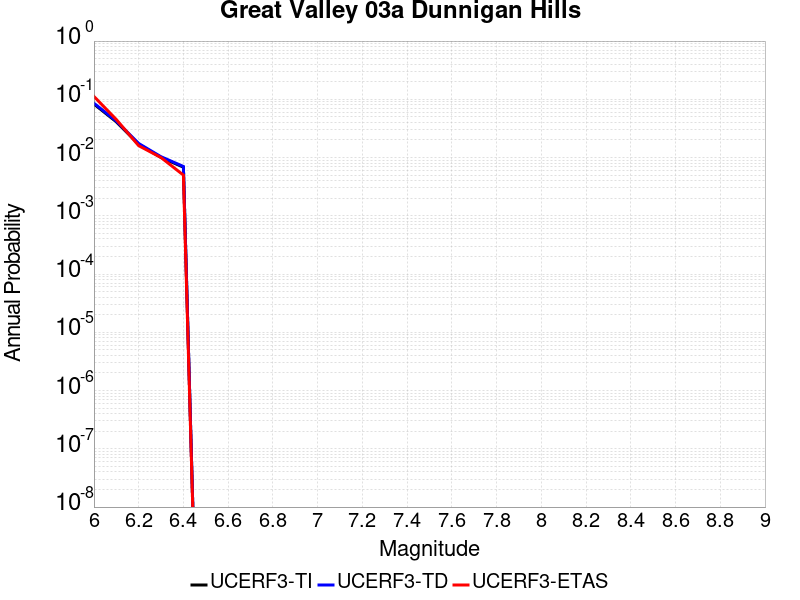 |
|-----|

| Magnitude | UCERF3-TI Prob | UCERF3-TD Prob | UCERF3-ETAS Prob |
|-----|-----|-----|-----|
| 6.0 | 0.08293039 | 0.0856227 | 0.112 |
| 6.1 | 0.041089572 | 0.042322367 | 0.045 |
| 6.2 | 0.01697257 | 0.017450944 | 0.016 |
| 6.3 | 0.010040271 | 0.010328524 | 0.01 |
| 6.4 | 0.0068341834 | 0.007036514 | 0.005 |

## Great Valley 04a Trout Creek
*[(top)](#table-of-contents)*

|  |
|-----|

| Magnitude | UCERF3-TI Prob | UCERF3-TD Prob | UCERF3-ETAS Prob |
|-----|-----|-----|-----|
| 6.0 | 0.070875466 | 0.07320743 | 0.065 |
| 6.1 | 0.070875466 | 0.07320743 | 0.065 |
| 6.2 | 0.070875466 | 0.07320743 | 0.065 |
| 6.3 | 0.0650118 | 0.06715389 | 0.057 |
| 6.4 | 0.0650118 | 0.06715389 | 0.057 |
| 6.5 | 0.06442357 | 0.066548996 | 0.056 |
| 6.6 | 0.06442357 | 0.066548996 | 0.056 |
| 6.7 | 0.06342535 | 0.06552311 | 0.056 |
| 6.8 | 0.060064845 | 0.06206462 | 0.056 |
| 6.9 | 0.053315815 | 0.055099756 | 0.049 |
| 7.0 | 0.043504253 | 0.04498339 | 0.043 |
| 7.1 | 0.030856876 | 0.031908117 | 0.039 |
| 7.2 | 0.015080697 | 0.01557988 | 0.024 |
| 7.3 | 0.0037598952 | 0.003876758 | 0.004 |
| 7.4 | 1.6237547E-4 | 1.6384812E-4 | 0.0 |

## Great Valley 04b Gordon Valley
*[(top)](#table-of-contents)*

|  |
|-----|

| Magnitude | UCERF3-TI Prob | UCERF3-TD Prob | UCERF3-ETAS Prob |
|-----|-----|-----|-----|
| 6.0 | 0.10463313 | 0.10963786 | 0.148 |
| 6.1 | 0.10463313 | 0.10963786 | 0.148 |
| 6.2 | 0.10463313 | 0.10963786 | 0.148 |
| 6.3 | 0.10463313 | 0.10963786 | 0.148 |
| 6.4 | 0.05572281 | 0.057620026 | 0.071 |
| 6.5 | 0.05572281 | 0.057620026 | 0.071 |
| 6.6 | 0.05340201 | 0.05521851 | 0.069 |
| 6.7 | 0.03982833 | 0.04112882 | 0.046 |
| 6.8 | 0.038805064 | 0.04007652 | 0.046 |
| 6.9 | 0.033872426 | 0.03497887 | 0.042 |
| 7.0 | 0.027631614 | 0.028541213 | 0.037 |
| 7.1 | 0.023046639 | 0.023812067 | 0.033 |
| 7.2 | 0.014675432 | 0.015169853 | 0.024 |
| 7.3 | 0.0036503773 | 0.0037664317 | 0.004 |
| 7.4 | 1.6237547E-4 | 1.6384812E-4 | 0.0 |

## Great Valley 05 Pittsburg - Kirby Hills alt1
*[(top)](#table-of-contents)*

| 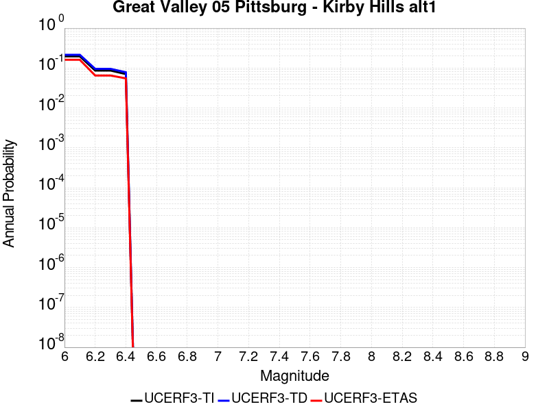 |
|-----|

| Magnitude | UCERF3-TI Prob | UCERF3-TD Prob | UCERF3-ETAS Prob |
|-----|-----|-----|-----|
| 6.0 | 0.19626632 | 0.21506892 | 0.161 |
| 6.1 | 0.19626632 | 0.21506892 | 0.161 |
| 6.2 | 0.086569384 | 0.09541741 | 0.065 |
| 6.3 | 0.086569384 | 0.09541741 | 0.065 |
| 6.4 | 0.07058592 | 0.07836872 | 0.055 |

## Great Valley 06 (Midland) 2011 CFM alt1
*[(top)](#table-of-contents)*

| 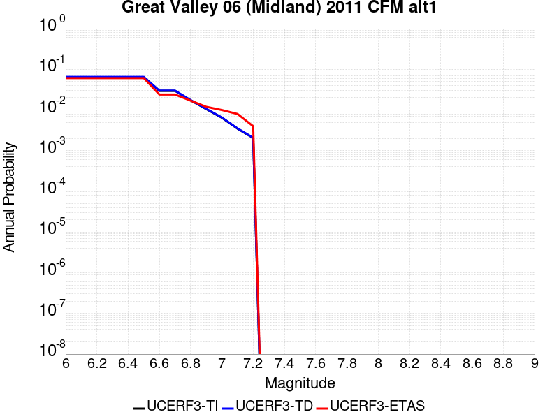 |
|-----|

| Magnitude | UCERF3-TI Prob | UCERF3-TD Prob | UCERF3-ETAS Prob |
|-----|-----|-----|-----|
| 6.0 | 0.064180404 | 0.06514724 | 0.061 |
| 6.1 | 0.064180404 | 0.06514724 | 0.061 |
| 6.2 | 0.064180404 | 0.06514724 | 0.061 |
| 6.3 | 0.064180404 | 0.06514724 | 0.061 |
| 6.4 | 0.064180404 | 0.06514724 | 0.061 |
| 6.5 | 0.064180404 | 0.06514724 | 0.061 |
| 6.6 | 0.029594814 | 0.029954584 | 0.024 |
| 6.7 | 0.029594814 | 0.029954584 | 0.024 |
| 6.8 | 0.017315058 | 0.017515885 | 0.017 |
| 6.9 | 0.010562722 | 0.010683615 | 0.012 |
| 7.0 | 0.006462074 | 0.0065366193 | 0.01 |
| 7.1 | 0.003484899 | 0.0035259475 | 0.008 |
| 7.2 | 0.0020579775 | 0.0020829435 | 0.004 |

## Great Valley 07 (Orestimba)
*[(top)](#table-of-contents)*

| 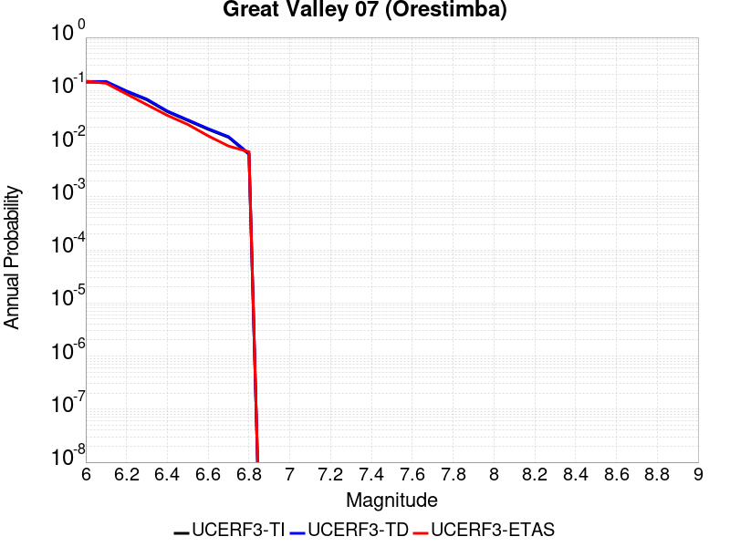 |
|-----|

| Magnitude | UCERF3-TI Prob | UCERF3-TD Prob | UCERF3-ETAS Prob |
|-----|-----|-----|-----|
| 6.0 | 0.14350733 | 0.14797468 | 0.15 |
| 6.1 | 0.14350733 | 0.14797468 | 0.137 |
| 6.2 | 0.095477685 | 0.098260954 | 0.086 |
| 6.3 | 0.06678984 | 0.06867451 | 0.054 |
| 6.4 | 0.039975747 | 0.041084003 | 0.034 |
| 6.5 | 0.027314685 | 0.02807293 | 0.023 |
| 6.6 | 0.018610826 | 0.019133955 | 0.014 |
| 6.7 | 0.0131462775 | 0.013521766 | 0.009 |
| 6.8 | 0.0063019306 | 0.0064880787 | 0.007 |

## Great Valley 08 (Quinto)
*[(top)](#table-of-contents)*

|  |
|-----|

| Magnitude | UCERF3-TI Prob | UCERF3-TD Prob | UCERF3-ETAS Prob |
|-----|-----|-----|-----|
| 6.0 | 0.03957017 | 0.040502287 | 0.065 |
| 6.1 | 0.03957017 | 0.040502287 | 0.065 |
| 6.2 | 0.03957017 | 0.040502287 | 0.065 |
| 6.3 | 0.027651405 | 0.028313188 | 0.035 |
| 6.4 | 0.027651405 | 0.028313188 | 0.035 |
| 6.5 | 0.018886859 | 0.019379104 | 0.022 |
| 6.6 | 0.018682493 | 0.01917053 | 0.021 |
| 6.7 | 0.012867761 | 0.013224729 | 0.013 |
| 6.8 | 0.0024551423 | 0.002526599 | 0.001 |
| 6.9 | 0.002063454 | 0.0021244565 | 0.0 |
| 7.0 | 0.0014093617 | 0.0014521617 | 0.0 |
| 7.1 | 7.7343604E-4 | 7.976935E-4 | 0.0 |

## Great Valley 09 (Laguna Seca)
*[(top)](#table-of-contents)*

|  |
|-----|

| Magnitude | UCERF3-TI Prob | UCERF3-TD Prob | UCERF3-ETAS Prob |
|-----|-----|-----|-----|
| 6.0 | 0.24694374 | 0.26567554 | 0.211 |
| 6.1 | 0.21166047 | 0.2273024 | 0.157 |
| 6.2 | 0.13834728 | 0.14744738 | 0.086 |
| 6.3 | 0.11631825 | 0.123620905 | 0.065 |
| 6.4 | 0.09528734 | 0.1008531 | 0.055 |
| 6.5 | 0.07626398 | 0.080290966 | 0.043 |
| 6.6 | 0.055706345 | 0.057998322 | 0.029 |
| 6.7 | 0.04654528 | 0.048353013 | 0.022 |
| 6.8 | 0.039810147 | 0.041328274 | 0.019 |
| 6.9 | 0.028691359 | 0.029739777 | 0.012 |
| 7.0 | 0.013895143 | 0.014276065 | 0.006 |
| 7.1 | 0.01035617 | 0.010608915 | 0.005 |
| 7.2 | 0.01035617 | 0.010608915 | 0.005 |
| 7.3 | 0.00887642 | 0.009082266 | 0.005 |
| 7.4 | 0.0071772956 | 0.007332483 | 0.004 |
| 7.5 | 0.0071772956 | 0.007332483 | 0.004 |

## Great Valley 10 (Panoche)
*[(top)](#table-of-contents)*

|  |
|-----|

| Magnitude | UCERF3-TI Prob | UCERF3-TD Prob | UCERF3-ETAS Prob |
|-----|-----|-----|-----|
| 6.0 | 0.08016659 | 0.083368756 | 0.05 |
| 6.1 | 0.08016659 | 0.083368756 | 0.047 |
| 6.2 | 0.07855045 | 0.08170316 | 0.047 |
| 6.3 | 0.076553605 | 0.0796327 | 0.045 |
| 6.4 | 0.073935315 | 0.07691416 | 0.044 |
| 6.5 | 0.07084687 | 0.07369578 | 0.042 |
| 6.6 | 0.06654355 | 0.06920854 | 0.038 |
| 6.7 | 0.051711306 | 0.05365655 | 0.025 |
| 6.8 | 0.043671835 | 0.045282517 | 0.021 |
| 6.9 | 0.031563524 | 0.032676727 | 0.013 |
| 7.0 | 0.016717907 | 0.017163925 | 0.007 |
| 7.1 | 0.013189064 | 0.013507518 | 0.006 |
| 7.2 | 0.012691605 | 0.012995537 | 0.005 |
| 7.3 | 0.010670369 | 0.010912435 | 0.005 |
| 7.4 | 0.00897432 | 0.009165884 | 0.004 |
| 7.5 | 0.007797629 | 0.007965436 | 0.004 |

## Great Valley 11
*[(top)](#table-of-contents)*

|  |
|-----|

| Magnitude | UCERF3-TI Prob | UCERF3-TD Prob | UCERF3-ETAS Prob |
|-----|-----|-----|-----|
| 6.0 | 0.13637935 | 0.14257085 | 0.095 |
| 6.1 | 0.12152789 | 0.12694901 | 0.085 |
| 6.2 | 0.12152789 | 0.12694901 | 0.085 |
| 6.3 | 0.100309 | 0.10452964 | 0.067 |
| 6.4 | 0.089907214 | 0.09361768 | 0.061 |
| 6.5 | 0.067922905 | 0.0703037 | 0.041 |
| 6.6 | 0.06533358 | 0.067641884 | 0.038 |
| 6.7 | 0.05712094 | 0.059107725 | 0.028 |
| 6.8 | 0.05001716 | 0.051764213 | 0.025 |
| 6.9 | 0.037989188 | 0.039244 | 0.017 |
| 7.0 | 0.023017742 | 0.023606202 | 0.011 |
| 7.1 | 0.018376753 | 0.018806415 | 0.009 |
| 7.2 | 0.016579038 | 0.016958904 | 0.007 |
| 7.3 | 0.014565759 | 0.014884166 | 0.007 |
| 7.4 | 0.012876389 | 0.013144629 | 0.006 |
| 7.5 | 0.007797629 | 0.007965436 | 0.004 |

## Great Valley 12
*[(top)](#table-of-contents)*

|  |
|-----|

| Magnitude | UCERF3-TI Prob | UCERF3-TD Prob | UCERF3-ETAS Prob |
|-----|-----|-----|-----|
| 6.0 | 0.044665553 | 0.045817766 | 0.034 |
| 6.1 | 0.044665553 | 0.045817766 | 0.031 |
| 6.2 | 0.043378495 | 0.04450795 | 0.031 |
| 6.3 | 0.041818596 | 0.04292002 | 0.03 |
| 6.4 | 0.040783074 | 0.04185525 | 0.029 |
| 6.5 | 0.040237986 | 0.041294847 | 0.029 |
| 6.6 | 0.03841948 | 0.039429303 | 0.028 |
| 6.7 | 0.03651886 | 0.03746801 | 0.025 |
| 6.8 | 0.032724764 | 0.03355722 | 0.023 |
| 6.9 | 0.030364469 | 0.031130869 | 0.018 |
| 7.0 | 0.027397562 | 0.028069695 | 0.016 |
| 7.1 | 0.0223357 | 0.022839352 | 0.014 |
| 7.2 | 0.020545235 | 0.020999435 | 0.012 |
| 7.3 | 0.018540077 | 0.018933225 | 0.012 |
| 7.4 | 0.012876389 | 0.013144629 | 0.006 |
| 7.5 | 0.007797629 | 0.007965436 | 0.004 |

## Great Valley 13 (Coalinga)
*[(top)](#table-of-contents)*

|  |
|-----|

| Magnitude | UCERF3-TI Prob | UCERF3-TD Prob | UCERF3-ETAS Prob |
|-----|-----|-----|-----|
| 6.0 | 0.06348485 | 0.06528334 | 0.043 |
| 6.1 | 0.06348485 | 0.06528334 | 0.043 |
| 6.2 | 0.06348485 | 0.06528334 | 0.043 |
| 6.3 | 0.06348485 | 0.06528334 | 0.043 |
| 6.4 | 0.06348485 | 0.06528334 | 0.043 |
| 6.5 | 0.06348485 | 0.06528334 | 0.043 |
| 6.6 | 0.06348485 | 0.06528334 | 0.043 |
| 6.7 | 0.06348485 | 0.06528334 | 0.043 |
| 6.8 | 0.054402135 | 0.055906527 | 0.036 |
| 6.9 | 0.053241897 | 0.054717712 | 0.034 |
| 7.0 | 0.032491036 | 0.03321155 | 0.021 |
| 7.1 | 0.030933505 | 0.031611536 | 0.02 |
| 7.2 | 0.029158786 | 0.029788136 | 0.018 |
| 7.3 | 0.025157921 | 0.025691682 | 0.017 |
| 7.4 | 0.012876389 | 0.013144629 | 0.006 |
| 7.5 | 0.007797629 | 0.007965436 | 0.004 |

## Great Valley 14 (Kettleman Hills)
*[(top)](#table-of-contents)*

| 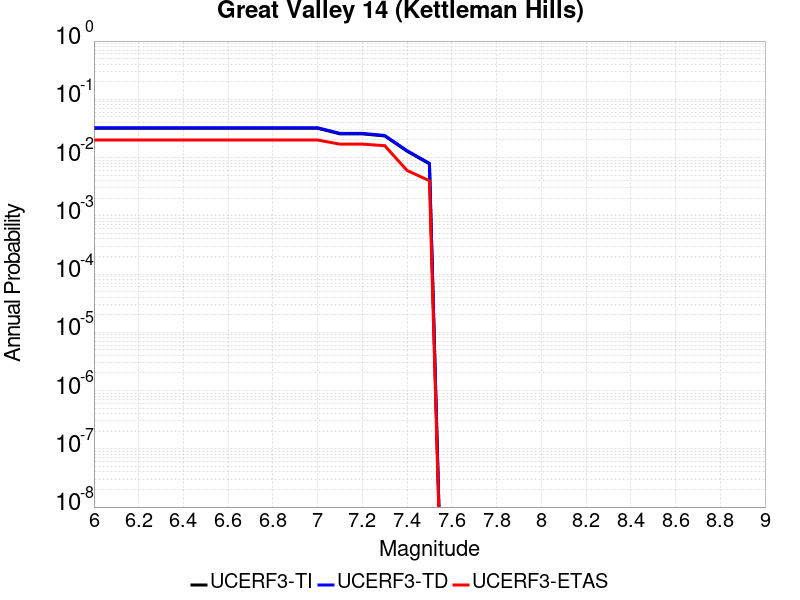 |
|-----|

| Magnitude | UCERF3-TI Prob | UCERF3-TD Prob | UCERF3-ETAS Prob |
|-----|-----|-----|-----|
| 6.0 | 0.031862345 | 0.032492075 | 0.02 |
| 6.1 | 0.031862345 | 0.032492075 | 0.02 |
| 6.2 | 0.031862345 | 0.032492075 | 0.02 |
| 6.3 | 0.031862345 | 0.032492075 | 0.02 |
| 6.4 | 0.031862345 | 0.032492075 | 0.02 |
| 6.5 | 0.031862345 | 0.032492075 | 0.02 |
| 6.6 | 0.031862345 | 0.032492075 | 0.02 |
| 6.7 | 0.031862345 | 0.032492075 | 0.02 |
| 6.8 | 0.031862345 | 0.032492075 | 0.02 |
| 6.9 | 0.031862345 | 0.032492075 | 0.02 |
| 7.0 | 0.031862345 | 0.032492075 | 0.02 |
| 7.1 | 0.025503501 | 0.026023641 | 0.017 |
| 7.2 | 0.025503501 | 0.026023641 | 0.017 |
| 7.3 | 0.02348671 | 0.02397123 | 0.016 |
| 7.4 | 0.012876389 | 0.013144629 | 0.006 |
| 7.5 | 0.007797629 | 0.007965436 | 0.004 |

## Green Valley 2011 CFM
*[(top)](#table-of-contents)*

| 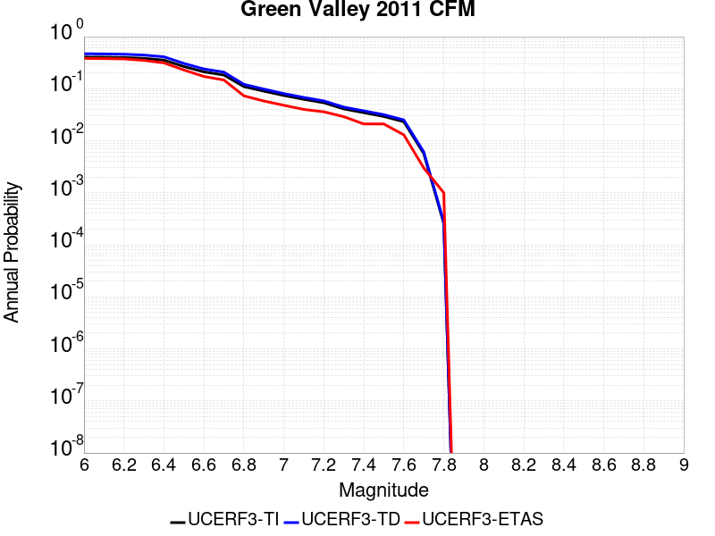 |
|-----|

| Magnitude | UCERF3-TI Prob | UCERF3-TD Prob | UCERF3-ETAS Prob |
|-----|-----|-----|-----|
| 6.0 | 0.40540668 | 0.46868116 | 0.382 |
| 6.1 | 0.4030194 | 0.4658939 | 0.379 |
| 6.2 | 0.3970944 | 0.45920724 | 0.374 |
| 6.3 | 0.38368088 | 0.44338536 | 0.35 |
| 6.4 | 0.35459343 | 0.41043022 | 0.314 |
| 6.5 | 0.2669731 | 0.30618078 | 0.229 |
| 6.6 | 0.21076842 | 0.23965529 | 0.172 |
| 6.7 | 0.18331277 | 0.20814599 | 0.147 |
| 6.8 | 0.109773636 | 0.12143496 | 0.073 |
| 6.9 | 0.089884765 | 0.09835651 | 0.058 |
| 7.0 | 0.074140385 | 0.080637455 | 0.048 |
| 7.1 | 0.06265169 | 0.06796051 | 0.04 |
| 7.2 | 0.05372978 | 0.058237575 | 0.036 |
| 7.3 | 0.040874638 | 0.044265848 | 0.029 |
| 7.4 | 0.034643453 | 0.037525814 | 0.021 |
| 7.5 | 0.029297754 | 0.03172785 | 0.021 |
| 7.6 | 0.023225565 | 0.02514616 | 0.013 |
| 7.7 | 0.0056575993 | 0.0060961246 | 0.003 |
| 7.8 | 2.5759288E-4 | 2.7571793E-4 | 0.001 |

## Greenville (No) 2011 CFM
*[(top)](#table-of-contents)*

|  |
|-----|

| Magnitude | UCERF3-TI Prob | UCERF3-TD Prob | UCERF3-ETAS Prob |
|-----|-----|-----|-----|
| 6.0 | 0.15759614 | 0.16701528 | 0.137 |
| 6.1 | 0.15759614 | 0.16701528 | 0.12 |
| 6.2 | 0.1524437 | 0.16160363 | 0.111 |
| 6.3 | 0.15096246 | 0.16004963 | 0.111 |
| 6.4 | 0.14592044 | 0.15475571 | 0.105 |
| 6.5 | 0.1428363 | 0.15152189 | 0.102 |
| 6.6 | 0.132974 | 0.14113173 | 0.092 |
| 6.7 | 0.12511358 | 0.13298199 | 0.089 |
| 6.8 | 0.09937503 | 0.105791196 | 0.066 |
| 6.9 | 0.081639476 | 0.08716035 | 0.049 |
| 7.0 | 0.061932687 | 0.066115655 | 0.039 |
| 7.1 | 0.045857806 | 0.049074914 | 0.032 |
| 7.2 | 0.03096033 | 0.033247553 | 0.025 |
| 7.3 | 0.016153071 | 0.017379045 | 0.013 |
| 7.4 | 0.010512718 | 0.011342126 | 0.008 |
| 7.5 | 0.008708776 | 0.009410283 | 0.008 |
| 7.6 | 0.006208405 | 0.0067047626 | 0.004 |
| 7.7 | 0.001588316 | 0.0017165776 | 0.001 |

## Greenville (So) 2011 CFM
*[(top)](#table-of-contents)*

|  |
|-----|

| Magnitude | UCERF3-TI Prob | UCERF3-TD Prob | UCERF3-ETAS Prob |
|-----|-----|-----|-----|
| 6.0 | 0.20013559 | 0.21527708 | 0.14 |
| 6.1 | 0.16272673 | 0.17443018 | 0.107 |
| 6.2 | 0.16272673 | 0.17443018 | 0.107 |
| 6.3 | 0.12666681 | 0.13501363 | 0.088 |
| 6.4 | 0.10446416 | 0.111062534 | 0.076 |
| 6.5 | 0.09924298 | 0.10552349 | 0.074 |
| 6.6 | 0.09152279 | 0.09733416 | 0.071 |
| 6.7 | 0.08909283 | 0.09477393 | 0.069 |
| 6.8 | 0.06740272 | 0.071720265 | 0.05 |
| 6.9 | 0.05414985 | 0.057669777 | 0.035 |
| 7.0 | 0.041671734 | 0.044424213 | 0.029 |
| 7.1 | 0.031563886 | 0.033756673 | 0.023 |
| 7.2 | 0.024294283 | 0.026092801 | 0.019 |
| 7.3 | 0.012066601 | 0.012988079 | 0.01 |
| 7.4 | 0.006922984 | 0.007475185 | 0.006 |
| 7.5 | 0.0053926446 | 0.0058323564 | 0.006 |
| 7.6 | 0.0040433584 | 0.004371533 | 0.002 |
| 7.7 | 8.828766E-4 | 9.5413264E-4 | 0.0 |

## Hartley Springs 2011 CFM
*[(top)](#table-of-contents)*

| 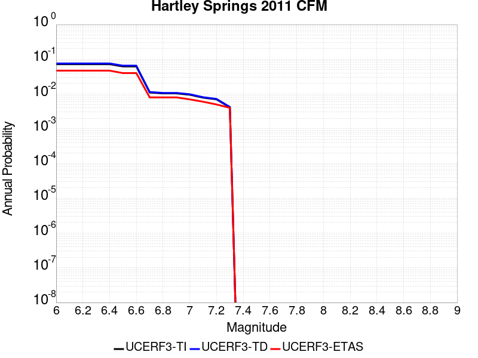 |
|-----|

| Magnitude | UCERF3-TI Prob | UCERF3-TD Prob | UCERF3-ETAS Prob |
|-----|-----|-----|-----|
| 6.0 | 0.0721539 | 0.07580609 | 0.047 |
| 6.1 | 0.0721539 | 0.07580609 | 0.047 |
| 6.2 | 0.0721539 | 0.07580609 | 0.047 |
| 6.3 | 0.0721539 | 0.07580609 | 0.047 |
| 6.4 | 0.0721539 | 0.07580609 | 0.047 |
| 6.5 | 0.06206529 | 0.065386966 | 0.04 |
| 6.6 | 0.06206529 | 0.065386966 | 0.04 |
| 6.7 | 0.0110435365 | 0.011426657 | 0.008 |
| 6.8 | 0.010408106 | 0.010765698 | 0.008 |
| 6.9 | 0.010408106 | 0.010765698 | 0.008 |
| 7.0 | 0.009537731 | 0.009858168 | 0.007 |
| 7.1 | 0.007846976 | 0.0080928225 | 0.006 |
| 7.2 | 0.0070146937 | 0.00723275 | 0.005 |
| 7.3 | 0.0041136323 | 0.0042432984 | 0.004 |

## Hat Creek-McArthur-Mayfield
*[(top)](#table-of-contents)*

|  |
|-----|

| Magnitude | UCERF3-TI Prob | UCERF3-TD Prob | UCERF3-ETAS Prob |
|-----|-----|-----|-----|
| 6.0 | 0.18699689 | 0.19210052 | 0.136 |
| 6.1 | 0.12249947 | 0.1254337 | 0.079 |
| 6.2 | 0.12249947 | 0.1254337 | 0.079 |
| 6.3 | 0.083086774 | 0.08491254 | 0.051 |
| 6.4 | 0.083086774 | 0.08491254 | 0.051 |
| 6.5 | 0.06750626 | 0.06895942 | 0.045 |
| 6.6 | 0.056457885 | 0.05765889 | 0.038 |
| 6.7 | 0.035967074 | 0.036717117 | 0.022 |
| 6.8 | 0.030519638 | 0.03115537 | 0.022 |
| 6.9 | 0.021318393 | 0.021760939 | 0.013 |
| 7.0 | 0.013738848 | 0.014021012 | 0.011 |
| 7.1 | 0.006756417 | 0.006896459 | 0.003 |
| 7.2 | 0.0025889743 | 0.0026443733 | 0.001 |

## Hayward (No) 2011 CFM
*[(top)](#table-of-contents)*

|  |
|-----|

| Magnitude | UCERF3-TI Prob | UCERF3-TD Prob | UCERF3-ETAS Prob |
|-----|-----|-----|-----|
| 6.0 | 0.3846972 | 0.40183794 | 0.271 |
| 6.1 | 0.37657306 | 0.39240006 | 0.267 |
| 6.2 | 0.37498528 | 0.39064363 | 0.265 |
| 6.3 | 0.36931512 | 0.3838048 | 0.254 |
| 6.4 | 0.3591127 | 0.37137747 | 0.244 |
| 6.5 | 0.34649017 | 0.35686338 | 0.234 |
| 6.6 | 0.34083936 | 0.35014695 | 0.229 |
| 6.7 | 0.33358535 | 0.34238994 | 0.224 |
| 6.8 | 0.31777754 | 0.32696483 | 0.213 |
| 6.9 | 0.28608674 | 0.2958707 | 0.184 |
| 7.0 | 0.24497768 | 0.25258973 | 0.15 |
| 7.1 | 0.20642045 | 0.21189436 | 0.126 |
| 7.2 | 0.15800568 | 0.15656285 | 0.092 |
| 7.3 | 0.1201086 | 0.11570081 | 0.065 |
| 7.4 | 0.09358045 | 0.089196324 | 0.047 |
| 7.5 | 0.06381356 | 0.061509937 | 0.033 |
| 7.6 | 0.024054775 | 0.023960875 | 0.012 |
| 7.7 | 0.002001616 | 0.0013383968 | 0.0 |
| 7.8 | 0.0013368443 | 8.1990304E-4 | 0.0 |
| 7.9 | 8.940059E-4 | 5.092889E-4 | 0.0 |
| 8.0 | 6.1598147E-4 | 3.5227175E-4 | 0.0 |
| 8.1 | 2.6808548E-4 | 1.3487738E-4 | 0.0 |

## Hayward (So) 2011 CFM
*[(top)](#table-of-contents)*

| 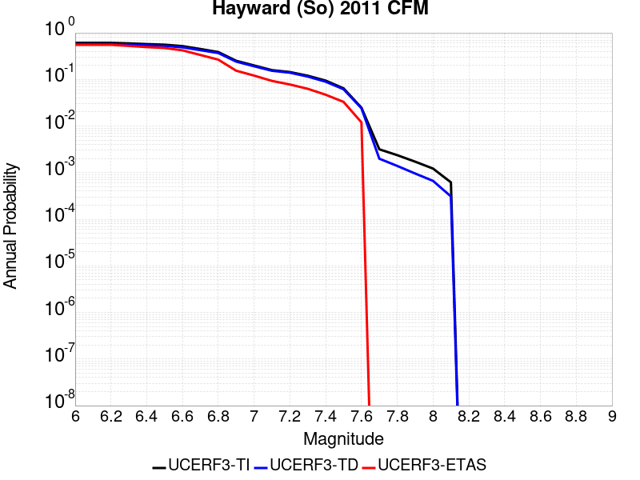 |
|-----|

| Magnitude | UCERF3-TI Prob | UCERF3-TD Prob | UCERF3-ETAS Prob |
|-----|-----|-----|-----|
| 6.0 | 0.6109691 | 0.5743449 | 0.555 |
| 6.1 | 0.6109691 | 0.5743449 | 0.555 |
| 6.2 | 0.6109691 | 0.5743449 | 0.555 |
| 6.3 | 0.5950376 | 0.5597353 | 0.524 |
| 6.4 | 0.57359236 | 0.539287 | 0.494 |
| 6.5 | 0.5569463 | 0.52426475 | 0.473 |
| 6.6 | 0.519513 | 0.48847732 | 0.421 |
| 6.7 | 0.45036823 | 0.424858 | 0.335 |
| 6.8 | 0.38727903 | 0.3686138 | 0.266 |
| 6.9 | 0.25150874 | 0.24133554 | 0.154 |
| 7.0 | 0.19957374 | 0.19173864 | 0.121 |
| 7.1 | 0.15844108 | 0.15355812 | 0.093 |
| 7.2 | 0.14426224 | 0.13958098 | 0.078 |
| 7.3 | 0.12027927 | 0.11512963 | 0.063 |
| 7.4 | 0.09439483 | 0.089446455 | 0.047 |
| 7.5 | 0.064526096 | 0.06165654 | 0.033 |
| 7.6 | 0.024810871 | 0.024151992 | 0.012 |
| 7.7 | 0.0031694195 | 0.001991955 | 0.0 |
| 7.8 | 0.002373538 | 0.0013939397 | 0.0 |
| 7.9 | 0.0017212838 | 9.583419E-4 | 0.0 |
| 8.0 | 0.0012239015 | 6.664177E-4 | 0.0 |
| 8.1 | 6.198083E-4 | 3.0915465E-4 | 0.0 |

## Hayward (So) extension 2011 CFM
*[(top)](#table-of-contents)*

| 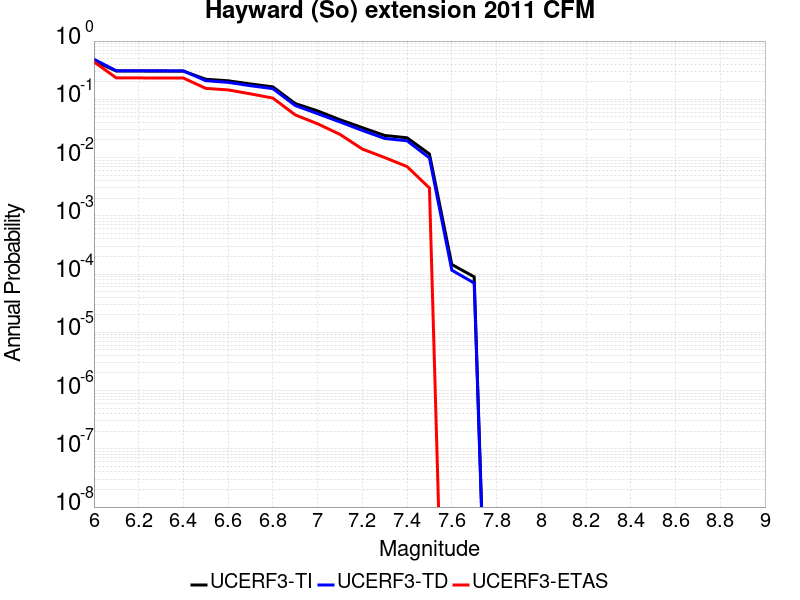 |
|-----|

| Magnitude | UCERF3-TI Prob | UCERF3-TD Prob | UCERF3-ETAS Prob |
|-----|-----|-----|-----|
| 6.0 | 0.45753637 | 0.48756236 | 0.44 |
| 6.1 | 0.30568475 | 0.3095245 | 0.233 |
| 6.2 | 0.30568475 | 0.3095245 | 0.233 |
| 6.3 | 0.30493137 | 0.30871773 | 0.232 |
| 6.4 | 0.30423492 | 0.30795467 | 0.232 |
| 6.5 | 0.22100103 | 0.20885725 | 0.154 |
| 6.6 | 0.20788307 | 0.19537409 | 0.145 |
| 6.7 | 0.18347177 | 0.17111641 | 0.124 |
| 6.8 | 0.16353269 | 0.15236816 | 0.105 |
| 6.9 | 0.084538646 | 0.07829653 | 0.054 |
| 7.0 | 0.063189246 | 0.056689963 | 0.038 |
| 7.1 | 0.044637766 | 0.040881135 | 0.025 |
| 7.2 | 0.0326127 | 0.02920394 | 0.014 |
| 7.3 | 0.023948465 | 0.021265905 | 0.01 |
| 7.4 | 0.021852091 | 0.019395592 | 0.007 |
| 7.5 | 0.011510333 | 0.009868477 | 0.003 |
| 7.6 | 1.4584149E-4 | 1.1641983E-4 | 0.0 |
| 7.7 | 8.970515E-5 | 7.015874E-5 | 0.0 |

## Hector Mine
*[(top)](#table-of-contents)*

|  |
|-----|

| Magnitude | UCERF3-TI Prob | UCERF3-TD Prob | UCERF3-ETAS Prob |
|-----|-----|-----|-----|
| 6.0 | 0.09324991 | 0.09647095 | 0.068 |
| 6.1 | 0.09324991 | 0.09647095 | 0.068 |
| 6.2 | 0.09324991 | 0.09647095 | 0.068 |
| 6.3 | 0.09324991 | 0.09647095 | 0.068 |
| 6.4 | 0.055228923 | 0.057018813 | 0.046 |
| 6.5 | 0.055228923 | 0.057018813 | 0.046 |
| 6.6 | 0.054453067 | 0.05622072 | 0.045 |
| 6.7 | 0.040289685 | 0.041584637 | 0.035 |
| 6.8 | 0.038721114 | 0.03997436 | 0.034 |
| 6.9 | 0.03321152 | 0.03431624 | 0.033 |
| 7.0 | 0.025731606 | 0.026621195 | 0.027 |
| 7.1 | 0.0067589898 | 0.0069397967 | 0.008 |
| 7.2 | 0.0043696174 | 0.0044910545 | 0.005 |
| 7.3 | 0.0016319347 | 0.0016783773 | 0.002 |

## Helendale-So Lockhart
*[(top)](#table-of-contents)*

|  |
|-----|

| Magnitude | UCERF3-TI Prob | UCERF3-TD Prob | UCERF3-ETAS Prob |
|-----|-----|-----|-----|
| 6.0 | 0.08629648 | 0.087622285 | 0.071 |
| 6.1 | 0.08629648 | 0.087622285 | 0.071 |
| 6.2 | 0.08629648 | 0.087622285 | 0.071 |
| 6.3 | 0.054149 | 0.0548551 | 0.045 |
| 6.4 | 0.054149 | 0.0548551 | 0.045 |
| 6.5 | 0.044829447 | 0.04540389 | 0.04 |
| 6.6 | 0.03786102 | 0.038343225 | 0.03 |
| 6.7 | 0.033145845 | 0.033567674 | 0.025 |
| 6.8 | 0.028797831 | 0.029157083 | 0.024 |
| 6.9 | 0.024933796 | 0.02523998 | 0.019 |
| 7.0 | 0.019089017 | 0.019321522 | 0.013 |
| 7.1 | 0.014431232 | 0.014603927 | 0.01 |
| 7.2 | 0.011244489 | 0.011379005 | 0.007 |
| 7.3 | 0.0077048587 | 0.007798211 | 0.004 |
| 7.4 | 0.0022058373 | 0.002233834 | 0.0 |
| 7.5 | 2.9707275E-4 | 3.0089388E-4 | 0.0 |

## Hilton Creek 2011 CFM
*[(top)](#table-of-contents)*

| 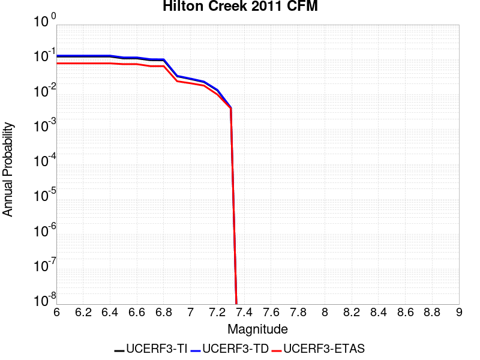 |
|-----|

| Magnitude | UCERF3-TI Prob | UCERF3-TD Prob | UCERF3-ETAS Prob |
|-----|-----|-----|-----|
| 6.0 | 0.12194833 | 0.12957494 | 0.078 |
| 6.1 | 0.12194833 | 0.12957494 | 0.078 |
| 6.2 | 0.12194833 | 0.12957494 | 0.078 |
| 6.3 | 0.12194833 | 0.12957494 | 0.078 |
| 6.4 | 0.12194833 | 0.12957494 | 0.078 |
| 6.5 | 0.10828239 | 0.115225926 | 0.074 |
| 6.6 | 0.10828239 | 0.115225926 | 0.074 |
| 6.7 | 0.0962607 | 0.102584 | 0.065 |
| 6.8 | 0.095201574 | 0.10149542 | 0.065 |
| 6.9 | 0.033250026 | 0.034290895 | 0.024 |
| 7.0 | 0.027723974 | 0.028583506 | 0.021 |
| 7.1 | 0.022785192 | 0.023476202 | 0.018 |
| 7.2 | 0.013142738 | 0.013556731 | 0.01 |
| 7.3 | 0.0041136323 | 0.0042432984 | 0.004 |

## Hollywood
*[(top)](#table-of-contents)*

|  |
|-----|

| Magnitude | UCERF3-TI Prob | UCERF3-TD Prob | UCERF3-ETAS Prob |
|-----|-----|-----|-----|
| 6.0 | 0.06289155 | 0.059873212 | 0.039 |
| 6.1 | 0.06289155 | 0.059873212 | 0.039 |
| 6.2 | 0.06289155 | 0.059873212 | 0.039 |
| 6.3 | 0.06289155 | 0.059873212 | 0.039 |
| 6.4 | 0.06280481 | 0.05978388 | 0.039 |
| 6.5 | 0.05697326 | 0.0538174 | 0.033 |
| 6.6 | 0.056933124 | 0.053776093 | 0.033 |
| 6.7 | 0.056910165 | 0.05375224 | 0.033 |
| 6.8 | 0.052092183 | 0.048761483 | 0.027 |
| 6.9 | 0.047130525 | 0.043626253 | 0.024 |
| 7.0 | 0.043256037 | 0.03962948 | 0.023 |
| 7.1 | 0.03407172 | 0.030229205 | 0.022 |
| 7.2 | 0.028538829 | 0.024683263 | 0.018 |
| 7.3 | 0.022217473 | 0.019142486 | 0.013 |
| 7.4 | 0.014786968 | 0.013030557 | 0.01 |
| 7.5 | 0.010343789 | 0.0091497945 | 0.008 |
| 7.6 | 0.006993889 | 0.0059090997 | 0.006 |
| 7.7 | 0.0040011248 | 0.0029735605 | 0.002 |
| 7.8 | 0.0019059414 | 0.0010659618 | 0.001 |
| 7.9 | 3.9139015E-4 | 2.891194E-4 | 0.0 |

## Holser alt 1
*[(top)](#table-of-contents)*

|  |
|-----|

| Magnitude | UCERF3-TI Prob | UCERF3-TD Prob | UCERF3-ETAS Prob |
|-----|-----|-----|-----|
| 6.0 | 0.032210246 | 0.029852342 | 0.029 |
| 6.1 | 0.032210246 | 0.029852342 | 0.029 |
| 6.2 | 0.032210246 | 0.029852342 | 0.029 |
| 6.3 | 0.032210246 | 0.029852342 | 0.029 |
| 6.4 | 0.032210246 | 0.029852342 | 0.029 |
| 6.5 | 0.032210246 | 0.029852342 | 0.029 |
| 6.6 | 0.01746037 | 0.014767571 | 0.015 |
| 6.7 | 0.01746037 | 0.014767571 | 0.015 |
| 6.8 | 0.017412733 | 0.01471933 | 0.015 |
| 6.9 | 0.016831368 | 0.014129525 | 0.015 |
| 7.0 | 0.015190874 | 0.012464909 | 0.012 |
| 7.1 | 0.015063027 | 0.012344492 | 0.012 |
| 7.2 | 0.014850604 | 0.012145043 | 0.012 |
| 7.3 | 0.014533521 | 0.011888076 | 0.012 |
| 7.4 | 0.013905419 | 0.011468957 | 0.011 |
| 7.5 | 0.012622521 | 0.010505826 | 0.009 |
| 7.6 | 0.0103373425 | 0.008710683 | 0.009 |
| 7.7 | 0.007915052 | 0.0066303075 | 0.006 |
| 7.8 | 0.0033073076 | 0.002717996 | 0.005 |
| 7.9 | 8.063259E-4 | 6.102807E-4 | 0.002 |
| 8.0 | 9.552299E-5 | 5.6174824E-5 | 0.0 |

## Homestead Valley 2011
*[(top)](#table-of-contents)*

|  |
|-----|

| Magnitude | UCERF3-TI Prob | UCERF3-TD Prob | UCERF3-ETAS Prob |
|-----|-----|-----|-----|
| 6.0 | 0.077202 | 0.0790224 | 0.038 |
| 6.1 | 0.077202 | 0.0790224 | 0.038 |
| 6.2 | 0.077202 | 0.0790224 | 0.038 |
| 6.3 | 0.077202 | 0.0790224 | 0.038 |
| 6.4 | 0.077202 | 0.0790224 | 0.038 |
| 6.5 | 0.052153707 | 0.053370025 | 0.025 |
| 6.6 | 0.034177702 | 0.034896854 | 0.015 |
| 6.7 | 0.033828568 | 0.03454091 | 0.015 |
| 6.8 | 0.023961887 | 0.02447441 | 0.012 |
| 6.9 | 0.021384893 | 0.02184814 | 0.009 |
| 7.0 | 0.015877726 | 0.016228428 | 0.006 |
| 7.1 | 0.012139965 | 0.012405675 | 0.004 |
| 7.2 | 0.007151049 | 0.0073000193 | 0.0 |
| 7.3 | 0.0065390663 | 0.006675349 | 0.0 |
| 7.4 | 0.0057202005 | 0.0058401837 | 0.0 |
| 7.5 | 0.002895319 | 0.0029575885 | 0.0 |

## Honey Lake 2011 CFM
*[(top)](#table-of-contents)*

|  |
|-----|

| Magnitude | UCERF3-TI Prob | UCERF3-TD Prob | UCERF3-ETAS Prob |
|-----|-----|-----|-----|
| 6.0 | 0.2747185 | 0.29480463 | 0.216 |
| 6.1 | 0.2747185 | 0.29480463 | 0.204 |
| 6.2 | 0.19401062 | 0.20721276 | 0.14 |
| 6.3 | 0.19401062 | 0.20721276 | 0.14 |
| 6.4 | 0.15551512 | 0.16591828 | 0.113 |
| 6.5 | 0.13234088 | 0.14119498 | 0.097 |
| 6.6 | 0.10234764 | 0.109312505 | 0.068 |
| 6.7 | 0.08993582 | 0.096148506 | 0.059 |
| 6.8 | 0.072745554 | 0.077931486 | 0.045 |
| 6.9 | 0.043704968 | 0.04708204 | 0.028 |

## Hosgri
*[(top)](#table-of-contents)*

| 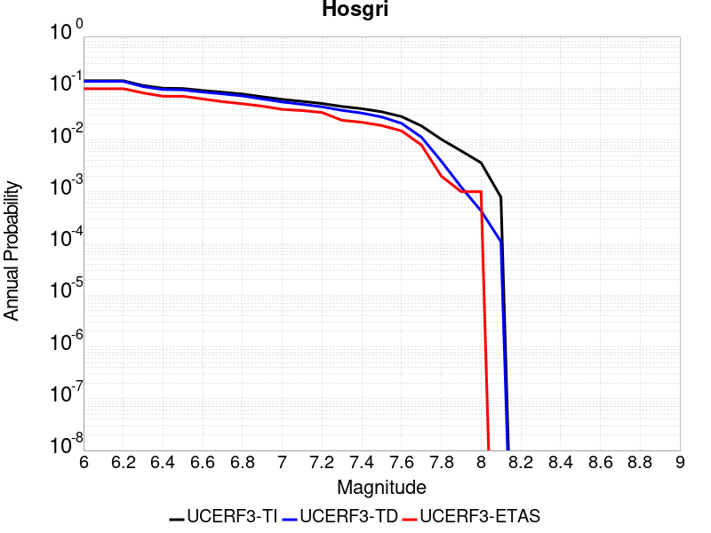 |
|-----|

| Magnitude | UCERF3-TI Prob | UCERF3-TD Prob | UCERF3-ETAS Prob |
|-----|-----|-----|-----|
| 6.0 | 0.13970852 | 0.13559511 | 0.098 |
| 6.1 | 0.13970852 | 0.13559511 | 0.098 |
| 6.2 | 0.13970852 | 0.13559511 | 0.098 |
| 6.3 | 0.11269419 | 0.10751692 | 0.081 |
| 6.4 | 0.10001714 | 0.094432235 | 0.07 |
| 6.5 | 0.09874168 | 0.09312363 | 0.07 |
| 6.6 | 0.090106845 | 0.08424758 | 0.062 |
| 6.7 | 0.083736636 | 0.07770818 | 0.055 |
| 6.8 | 0.0772173 | 0.071017586 | 0.05 |
| 6.9 | 0.068336695 | 0.061902132 | 0.045 |
| 7.0 | 0.06084568 | 0.05421717 | 0.039 |
| 7.1 | 0.055646095 | 0.048893236 | 0.037 |
| 7.2 | 0.0506523 | 0.04378115 | 0.034 |
| 7.3 | 0.04438523 | 0.037368577 | 0.024 |
| 7.4 | 0.04021436 | 0.033107657 | 0.022 |
| 7.5 | 0.035051465 | 0.027828079 | 0.019 |
| 7.6 | 0.028307525 | 0.02096678 | 0.015 |
| 7.7 | 0.018683232 | 0.011326644 | 0.008 |
| 7.8 | 0.010305807 | 0.0038851216 | 0.002 |
| 7.9 | 0.006147886 | 0.0012318345 | 0.001 |
| 8.0 | 0.0036265813 | 4.270125E-4 | 0.001 |
| 8.1 | 7.841067E-4 | 1.08391774E-4 | 0.0 |

## Hosgri (Extension)
*[(top)](#table-of-contents)*

|  |
|-----|

| Magnitude | UCERF3-TI Prob | UCERF3-TD Prob | UCERF3-ETAS Prob |
|-----|-----|-----|-----|
| 6.0 | 0.057597544 | 0.058301397 | 0.046 |
| 6.1 | 0.035538975 | 0.035608668 | 0.019 |
| 6.2 | 0.035538975 | 0.035608668 | 0.019 |
| 6.3 | 0.023453888 | 0.023238799 | 0.012 |
| 6.4 | 0.021769023 | 0.021519873 | 0.011 |
| 6.5 | 0.019209856 | 0.018910514 | 0.01 |
| 6.6 | 0.017894404 | 0.017566489 | 0.009 |
| 6.7 | 0.016165596 | 0.015800042 | 0.008 |
| 6.8 | 0.014653327 | 0.014254724 | 0.007 |
| 6.9 | 0.012723585 | 0.012283247 | 0.007 |
| 7.0 | 0.0109019 | 0.010422848 | 0.006 |
| 7.1 | 0.009060657 | 0.008543254 | 0.004 |
| 7.2 | 0.008032598 | 0.0074941106 | 0.004 |
| 7.3 | 0.0071618976 | 0.0066055423 | 0.001 |
| 7.4 | 0.006317008 | 0.005743218 | 0.001 |
| 7.5 | 0.005256759 | 0.004661575 | 0.001 |
| 7.6 | 0.0042465506 | 0.003630943 | 0.001 |
| 7.7 | 0.002479482 | 0.0018268959 | 0.001 |
| 7.8 | 0.001450965 | 7.7493157E-4 | 0.001 |
| 7.9 | 8.8393607E-4 | 2.5231254E-4 | 0.0 |
| 8.0 | 5.334093E-4 | 8.291404E-5 | 0.0 |
| 8.1 | 7.498371E-5 | 8.492083E-6 | 0.0 |

## Hunter Mountain-Saline Valley
*[(top)](#table-of-contents)*

| 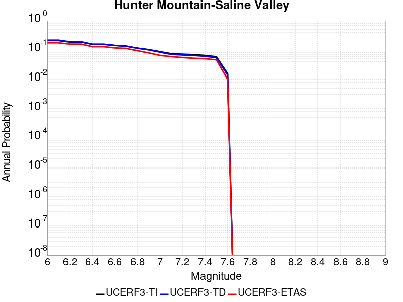 |
|-----|

| Magnitude | UCERF3-TI Prob | UCERF3-TD Prob | UCERF3-ETAS Prob |
|-----|-----|-----|-----|
| 6.0 | 0.20970567 | 0.21587764 | 0.175 |
| 6.1 | 0.20970567 | 0.21587764 | 0.175 |
| 6.2 | 0.18567602 | 0.1898125 | 0.158 |
| 6.3 | 0.18567602 | 0.1898125 | 0.158 |
| 6.4 | 0.15515363 | 0.15662545 | 0.129 |
| 6.5 | 0.15515363 | 0.15662545 | 0.129 |
| 6.6 | 0.14179814 | 0.14234407 | 0.117 |
| 6.7 | 0.13514791 | 0.13526066 | 0.113 |
| 6.8 | 0.11489274 | 0.11365675 | 0.094 |
| 6.9 | 0.10234502 | 0.10026783 | 0.079 |
| 7.0 | 0.08708893 | 0.0839821 | 0.065 |
| 7.1 | 0.07435555 | 0.07046232 | 0.059 |
| 7.2 | 0.071319014 | 0.067259245 | 0.055 |
| 7.3 | 0.06913756 | 0.06497599 | 0.052 |
| 7.4 | 0.06465672 | 0.0603347 | 0.05 |
| 7.5 | 0.058710787 | 0.054626253 | 0.046 |
| 7.6 | 0.015519869 | 0.013972175 | 0.01 |

## Hunting Creek - Bartlett Springs connector 2011
*[(top)](#table-of-contents)*

|  |
|-----|

| Magnitude | UCERF3-TI Prob | UCERF3-TD Prob | UCERF3-ETAS Prob |
|-----|-----|-----|-----|
| 6.0 | 0.22722654 | 0.24605954 | 0.188 |
| 6.1 | 0.22722654 | 0.24605954 | 0.188 |
| 6.2 | 0.20814134 | 0.22514008 | 0.17 |
| 6.3 | 0.20814134 | 0.22514008 | 0.17 |
| 6.4 | 0.18838054 | 0.20341887 | 0.142 |
| 6.5 | 0.18000318 | 0.19429111 | 0.136 |
| 6.6 | 0.17357917 | 0.18730979 | 0.128 |
| 6.7 | 0.16134039 | 0.17398448 | 0.116 |
| 6.8 | 0.14333804 | 0.15430473 | 0.099 |
| 6.9 | 0.13866632 | 0.1491442 | 0.093 |
| 7.0 | 0.13003138 | 0.13971269 | 0.085 |
| 7.1 | 0.12028447 | 0.12906471 | 0.076 |
| 7.2 | 0.112894095 | 0.12108076 | 0.071 |
| 7.3 | 0.104986824 | 0.11256029 | 0.069 |
| 7.4 | 0.093364604 | 0.100120135 | 0.059 |
| 7.5 | 0.08606876 | 0.09227326 | 0.057 |
| 7.6 | 0.05407295 | 0.05800598 | 0.031 |
| 7.7 | 0.017001374 | 0.018083889 | 0.012 |
| 7.8 | 0.0027020678 | 0.0028157046 | 0.003 |

## Hunting Creek - Berryessa 2011 CFM
*[(top)](#table-of-contents)*

|  |
|-----|

| Magnitude | UCERF3-TI Prob | UCERF3-TD Prob | UCERF3-ETAS Prob |
|-----|-----|-----|-----|
| 6.0 | 0.44463897 | 0.5062074 | 0.509 |
| 6.1 | 0.44372272 | 0.5052819 | 0.432 |
| 6.2 | 0.32724717 | 0.36900017 | 0.311 |
| 6.3 | 0.2982633 | 0.33697063 | 0.285 |
| 6.4 | 0.2770237 | 0.31354687 | 0.268 |
| 6.5 | 0.24700193 | 0.2801145 | 0.223 |
| 6.6 | 0.21870908 | 0.24834831 | 0.19 |
| 6.7 | 0.17503452 | 0.1986996 | 0.151 |
| 6.8 | 0.10046923 | 0.11063501 | 0.079 |
| 6.9 | 0.0890337 | 0.09695712 | 0.067 |
| 7.0 | 0.08208878 | 0.088809356 | 0.061 |
| 7.1 | 0.07725947 | 0.08339209 | 0.054 |
| 7.2 | 0.07285567 | 0.07856389 | 0.05 |
| 7.3 | 0.068577714 | 0.07387643 | 0.049 |
| 7.4 | 0.06193298 | 0.066716336 | 0.039 |
| 7.5 | 0.05535337 | 0.059608005 | 0.037 |
| 7.6 | 0.043997526 | 0.047376204 | 0.026 |
| 7.7 | 0.010894411 | 0.011653387 | 0.008 |
| 7.8 | 9.6110074E-4 | 0.0010080574 | 0.002 |

## Imperial
*[(top)](#table-of-contents)*

|  |
|-----|

| Magnitude | UCERF3-TI Prob | UCERF3-TD Prob | UCERF3-ETAS Prob |
|-----|-----|-----|-----|
| 6.0 | 0.7618662 | 0.7717936 | 0.803 |
| 6.1 | 0.7337205 | 0.75072634 | 0.777 |
| 6.2 | 0.7261765 | 0.74575716 | 0.763 |
| 6.3 | 0.7020896 | 0.72916585 | 0.734 |
| 6.4 | 0.6533989 | 0.69607466 | 0.679 |
| 6.5 | 0.6201573 | 0.6742234 | 0.636 |
| 6.6 | 0.57916355 | 0.6466441 | 0.593 |
| 6.7 | 0.52397025 | 0.6081453 | 0.542 |
| 6.8 | 0.4741486 | 0.5702787 | 0.501 |
| 6.9 | 0.40220103 | 0.50824183 | 0.438 |
| 7.0 | 0.3174495 | 0.4254452 | 0.367 |
| 7.1 | 0.3123315 | 0.4198199 | 0.364 |
| 7.2 | 0.28638014 | 0.39038765 | 0.328 |
| 7.3 | 0.27216348 | 0.37100878 | 0.3 |
| 7.4 | 0.19677505 | 0.26083598 | 0.159 |
| 7.5 | 0.15070176 | 0.18957874 | 0.097 |
| 7.6 | 0.11343383 | 0.13211252 | 0.064 |
| 7.7 | 0.073286414 | 0.07244543 | 0.024 |
| 7.8 | 0.052587453 | 0.047016952 | 0.011 |
| 7.9 | 0.041573696 | 0.032932386 | 0.005 |
| 8.0 | 0.035553772 | 0.026900826 | 0.002 |
| 8.1 | 0.017731063 | 0.010469219 | 0.0 |
| 8.2 | 0.007748034 | 0.003930677 | 0.0 |
| 8.3 | 1.3439257E-4 | 4.6809605E-6 | 0.0 |

## Incline Village 2011 CFM
*[(top)](#table-of-contents)*

|  |
|-----|

| Magnitude | UCERF3-TI Prob | UCERF3-TD Prob | UCERF3-ETAS Prob |
|-----|-----|-----|-----|
| 6.0 | 0.0335096 | 0.0047954675 | 0.002 |
| 6.1 | 0.0335096 | 0.0047954675 | 0.002 |
| 6.2 | 0.0335096 | 0.0047954675 | 0.002 |
| 6.3 | 0.0335096 | 0.0047954675 | 0.002 |
| 6.4 | 0.023885911 | 0.004766908 | 0.002 |
| 6.5 | 0.023885911 | 0.004766908 | 0.002 |
| 6.6 | 0.012726118 | 0.0047512716 | 0.002 |
| 6.7 | 0.009612365 | 0.0028567505 | 0.001 |

## Independence rev 2011
*[(top)](#table-of-contents)*

|  |
|-----|

| Magnitude | UCERF3-TI Prob | UCERF3-TD Prob | UCERF3-ETAS Prob |
|-----|-----|-----|-----|
| 6.0 | 0.022810131 | 0.02186443 | 0.027 |
| 6.1 | 0.022810131 | 0.02186443 | 0.027 |
| 6.2 | 0.022810131 | 0.02186443 | 0.027 |
| 6.3 | 0.022810131 | 0.02186443 | 0.027 |
| 6.4 | 0.022810131 | 0.02186443 | 0.027 |
| 6.5 | 0.022810131 | 0.02186443 | 0.027 |
| 6.6 | 0.013802908 | 0.012766955 | 0.017 |
| 6.7 | 0.013802908 | 0.012766955 | 0.017 |
| 6.8 | 0.010235075 | 0.009204143 | 0.013 |
| 6.9 | 0.009755742 | 0.008754143 | 0.013 |
| 7.0 | 0.007819791 | 0.006948518 | 0.011 |
| 7.1 | 0.006616909 | 0.0058261324 | 0.007 |
| 7.2 | 0.0054206434 | 0.0047064093 | 0.006 |
| 7.3 | 0.004137016 | 0.0036237736 | 0.005 |
| 7.4 | 0.0028081334 | 0.0025265042 | 0.003 |
| 7.5 | 0.002025193 | 0.0018609056 | 0.003 |
| 7.6 | 0.0012592821 | 0.0011924237 | 0.002 |
| 7.7 | 3.563058E-4 | 3.5158495E-4 | 0.0 |

## Jess Valley
*[(top)](#table-of-contents)*

| 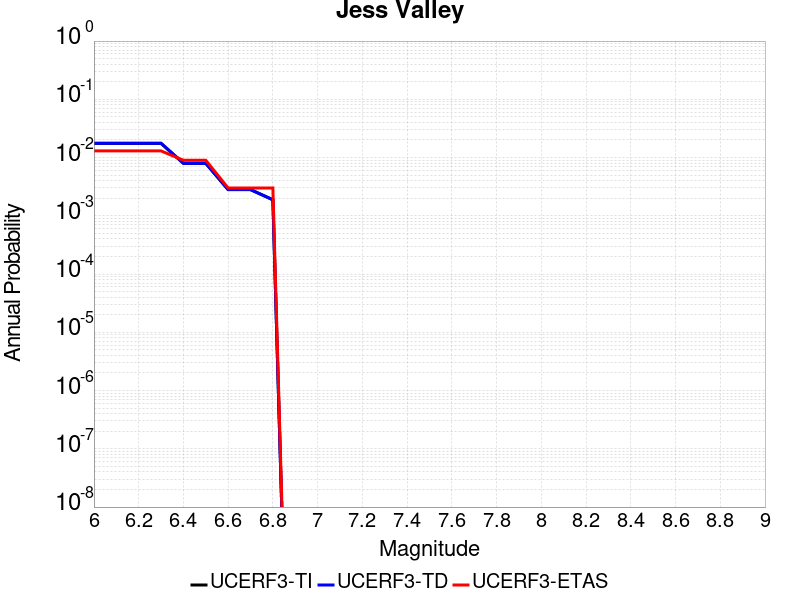 |
|-----|

| Magnitude | UCERF3-TI Prob | UCERF3-TD Prob | UCERF3-ETAS Prob |
|-----|-----|-----|-----|
| 6.0 | 0.01751319 | 0.017616915 | 0.013 |
| 6.1 | 0.01751319 | 0.017616915 | 0.013 |
| 6.2 | 0.01751319 | 0.017616915 | 0.013 |
| 6.3 | 0.01751319 | 0.017616915 | 0.013 |
| 6.4 | 0.007947254 | 0.0079886755 | 0.009 |
| 6.5 | 0.007947254 | 0.0079886755 | 0.009 |
| 6.6 | 0.0028118168 | 0.0028256767 | 0.003 |
| 6.7 | 0.0028118168 | 0.0028256767 | 0.003 |
| 6.8 | 0.001879707 | 0.0018894162 | 0.003 |

## Johnson Valley (No) 2011 rev
*[(top)](#table-of-contents)*

|  |
|-----|

| Magnitude | UCERF3-TI Prob | UCERF3-TD Prob | UCERF3-ETAS Prob |
|-----|-----|-----|-----|
| 6.0 | 0.12584957 | 0.13057141 | 0.076 |
| 6.1 | 0.12584957 | 0.13057141 | 0.076 |
| 6.2 | 0.12584957 | 0.13057141 | 0.076 |
| 6.3 | 0.12584957 | 0.13057141 | 0.076 |
| 6.4 | 0.07671382 | 0.07942677 | 0.039 |
| 6.5 | 0.07671382 | 0.07942677 | 0.039 |
| 6.6 | 0.06699299 | 0.06941682 | 0.033 |
| 6.7 | 0.06699299 | 0.06941682 | 0.033 |
| 6.8 | 0.04253781 | 0.04409082 | 0.027 |
| 6.9 | 0.03705216 | 0.03844275 | 0.021 |
| 7.0 | 0.033423107 | 0.034713928 | 0.019 |
| 7.1 | 0.006066713 | 0.0062102703 | 0.004 |
| 7.2 | 0.0028209002 | 0.0028832008 | 0.0 |
| 7.3 | 0.0026455077 | 0.002703701 | 0.0 |
| 7.4 | 0.002478989 | 0.0025334586 | 0.0 |
| 7.5 | 0.001791055 | 0.0018308465 | 0.0 |

## Joshua Tree (Seismicity)
*[(top)](#table-of-contents)*

| 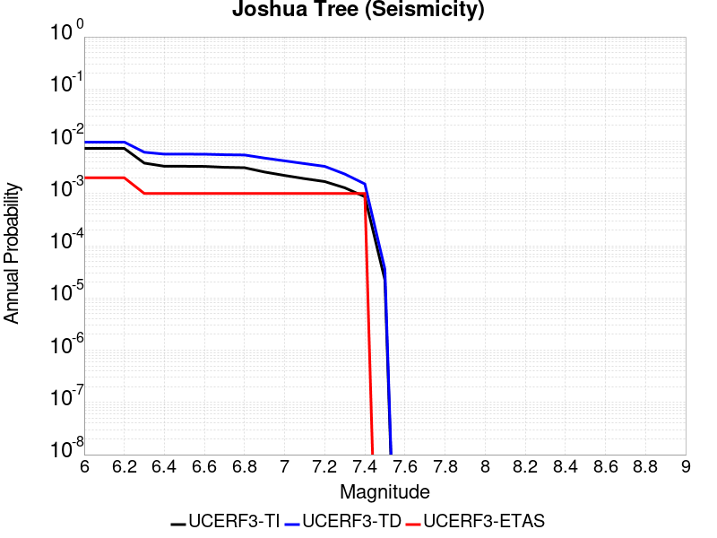 |
|-----|

| Magnitude | UCERF3-TI Prob | UCERF3-TD Prob | UCERF3-ETAS Prob |
|-----|-----|-----|-----|
| 6.0 | 0.0072916425 | 0.009649704 | 0.002 |
| 6.1 | 0.0072916425 | 0.009649704 | 0.002 |
| 6.2 | 0.0072916425 | 0.009649704 | 0.002 |
| 6.3 | 0.003818721 | 0.0061685094 | 0.001 |
| 6.4 | 0.0033247904 | 0.0056744423 | 0.001 |
| 6.5 | 0.0033247904 | 0.0056744423 | 0.001 |
| 6.6 | 0.003304571 | 0.0056541744 | 0.001 |
| 6.7 | 0.0031751583 | 0.005524392 | 0.001 |
| 6.8 | 0.0031179136 | 0.0054617273 | 0.001 |
| 6.9 | 0.0025775868 | 0.0047653983 | 0.001 |
| 7.0 | 0.002215328 | 0.004219827 | 0.001 |
| 7.1 | 0.0019229418 | 0.0037322657 | 0.001 |
| 7.2 | 0.0016930006 | 0.003307965 | 0.001 |
| 7.3 | 0.0012855664 | 0.0023578624 | 0.001 |
| 7.4 | 8.6865365E-4 | 0.001525457 | 0.001 |
| 7.5 | 2.2134636E-5 | 3.5662266E-5 | 0.0 |

## Keddie Ridge 2011 CFM
*[(top)](#table-of-contents)*

|  |
|-----|

| Magnitude | UCERF3-TI Prob | UCERF3-TD Prob | UCERF3-ETAS Prob |
|-----|-----|-----|-----|
| 6.0 | 0.11119986 | 0.11523331 | 0.079 |
| 6.1 | 0.11119986 | 0.11523331 | 0.069 |
| 6.2 | 0.06935486 | 0.07167407 | 0.042 |
| 6.3 | 0.049380902 | 0.05097174 | 0.028 |
| 6.4 | 0.037147988 | 0.038310874 | 0.023 |
| 6.5 | 0.030737747 | 0.03169438 | 0.019 |
| 6.6 | 0.020826932 | 0.021471605 | 0.011 |
| 6.7 | 0.008226944 | 0.008512631 | 0.002 |
| 6.8 | 0.0039149607 | 0.0040694163 | 0.001 |

## Kern Canyon (Lake Isabella) 2011
*[(top)](#table-of-contents)*

| 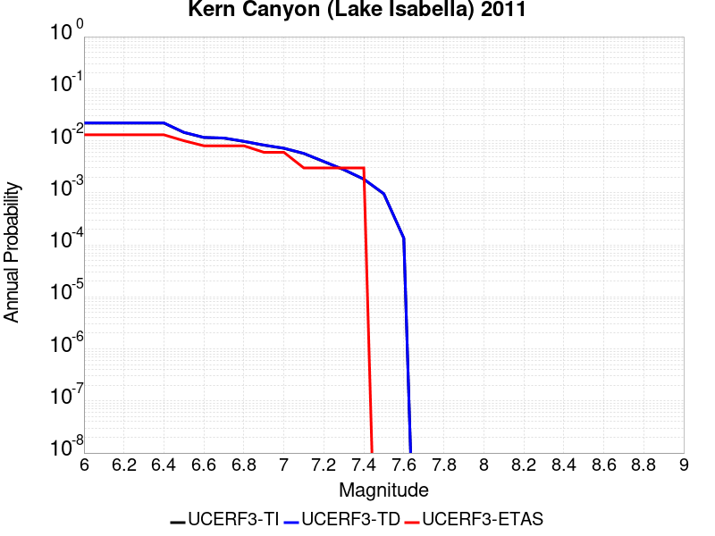 |
|-----|

| Magnitude | UCERF3-TI Prob | UCERF3-TD Prob | UCERF3-ETAS Prob |
|-----|-----|-----|-----|
| 6.0 | 0.021874387 | 0.022023315 | 0.013 |
| 6.1 | 0.021874387 | 0.022023315 | 0.013 |
| 6.2 | 0.021874387 | 0.022023315 | 0.013 |
| 6.3 | 0.021874387 | 0.022023315 | 0.013 |
| 6.4 | 0.021874387 | 0.022023315 | 0.013 |
| 6.5 | 0.01443055 | 0.014517064 | 0.01 |
| 6.6 | 0.011534024 | 0.011600693 | 0.008 |
| 6.7 | 0.011225431 | 0.011290831 | 0.008 |
| 6.8 | 0.009702569 | 0.009759309 | 0.008 |
| 6.9 | 0.00821813 | 0.008266583 | 0.006 |
| 7.0 | 0.007160572 | 0.00720314 | 0.006 |
| 7.1 | 0.0056801434 | 0.005713656 | 0.003 |
| 7.2 | 0.003972118 | 0.003995561 | 0.003 |
| 7.3 | 0.0027754814 | 0.0027914557 | 0.003 |
| 7.4 | 0.0018217715 | 0.0018320574 | 0.003 |
| 7.5 | 9.552997E-4 | 9.60812E-4 | 0.0 |
| 7.6 | 1.3420706E-4 | 1.3499892E-4 | 0.0 |

## Kern Canyon (North Kern) 2011
*[(top)](#table-of-contents)*

|  |
|-----|

| Magnitude | UCERF3-TI Prob | UCERF3-TD Prob | UCERF3-ETAS Prob |
|-----|-----|-----|-----|
| 6.0 | 0.033985063 | 0.034304153 | 0.026 |
| 6.1 | 0.033985063 | 0.034304153 | 0.026 |
| 6.2 | 0.033985063 | 0.034304153 | 0.026 |
| 6.3 | 0.033985063 | 0.034304153 | 0.026 |
| 6.4 | 0.033985063 | 0.034304153 | 0.026 |
| 6.5 | 0.016641786 | 0.016753951 | 0.009 |
| 6.6 | 0.016641786 | 0.016753951 | 0.009 |
| 6.7 | 0.011366342 | 0.011434792 | 0.006 |
| 6.8 | 0.008988295 | 0.009040181 | 0.005 |
| 6.9 | 0.0071231425 | 0.0071631763 | 0.003 |
| 7.0 | 0.005965869 | 0.0059992066 | 0.003 |
| 7.1 | 0.00489029 | 0.0049175043 | 0.003 |
| 7.2 | 0.0035720414 | 0.0035919684 | 0.003 |
| 7.3 | 0.0026628776 | 0.0026777508 | 0.003 |
| 7.4 | 0.0018245532 | 0.0018348017 | 0.003 |
| 7.5 | 8.8776444E-4 | 8.9280144E-4 | 0.0 |
| 7.6 | 1.3420706E-4 | 1.3499892E-4 | 0.0 |

## Kern Canyon (South Kern) 2011
*[(top)](#table-of-contents)*

|  |
|-----|

| Magnitude | UCERF3-TI Prob | UCERF3-TD Prob | UCERF3-ETAS Prob |
|-----|-----|-----|-----|
| 6.0 | 0.021191964 | 0.021313827 | 0.016 |
| 6.1 | 0.021191964 | 0.021313827 | 0.016 |
| 6.2 | 0.021191964 | 0.021313827 | 0.016 |
| 6.3 | 0.021191964 | 0.021313827 | 0.016 |
| 6.4 | 0.021191964 | 0.021313827 | 0.016 |
| 6.5 | 0.0154545605 | 0.015540373 | 0.01 |
| 6.6 | 0.0154545605 | 0.015540373 | 0.01 |
| 6.7 | 0.013864288 | 0.013941095 | 0.01 |
| 6.8 | 0.012075625 | 0.012142689 | 0.007 |
| 6.9 | 0.010883595 | 0.010944309 | 0.006 |
| 7.0 | 0.008899529 | 0.008949438 | 0.005 |
| 7.1 | 0.0073900297 | 0.007431399 | 0.004 |
| 7.2 | 0.004735882 | 0.004762472 | 0.003 |
| 7.3 | 0.003200807 | 0.0032187924 | 0.003 |
| 7.4 | 0.00211092 | 0.0021229284 | 0.003 |
| 7.5 | 0.0010363116 | 0.0010423169 | 0.0 |
| 7.6 | 1.3420706E-4 | 1.3499892E-4 | 0.0 |

## Kickapoo
*[(top)](#table-of-contents)*

| 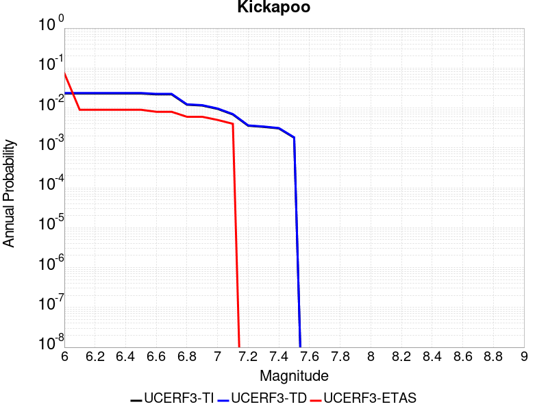 |
|-----|

| Magnitude | UCERF3-TI Prob | UCERF3-TD Prob | UCERF3-ETAS Prob |
|-----|-----|-----|-----|
| 6.0 | 0.023008417 | 0.023690466 | 0.074 |
| 6.1 | 0.023008417 | 0.023690466 | 0.009 |
| 6.2 | 0.023008417 | 0.023690466 | 0.009 |
| 6.3 | 0.023008417 | 0.023690466 | 0.009 |
| 6.4 | 0.023008417 | 0.023690466 | 0.009 |
| 6.5 | 0.023008417 | 0.023690466 | 0.009 |
| 6.6 | 0.02186312 | 0.022508305 | 0.008 |
| 6.7 | 0.02186312 | 0.022508305 | 0.008 |
| 6.8 | 0.012033968 | 0.012316199 | 0.006 |
| 6.9 | 0.011471336 | 0.011741388 | 0.006 |
| 7.0 | 0.009462946 | 0.009685893 | 0.005 |
| 7.1 | 0.006844869 | 0.0070044883 | 0.004 |
| 7.2 | 0.0035732414 | 0.0036511214 | 0.0 |
| 7.3 | 0.0033494157 | 0.0034222084 | 0.0 |
| 7.4 | 0.0030663302 | 0.0031330828 | 0.0 |
| 7.5 | 0.001791055 | 0.0018308465 | 0.0 |

## King Range 2011 CFM
*[(top)](#table-of-contents)*

| 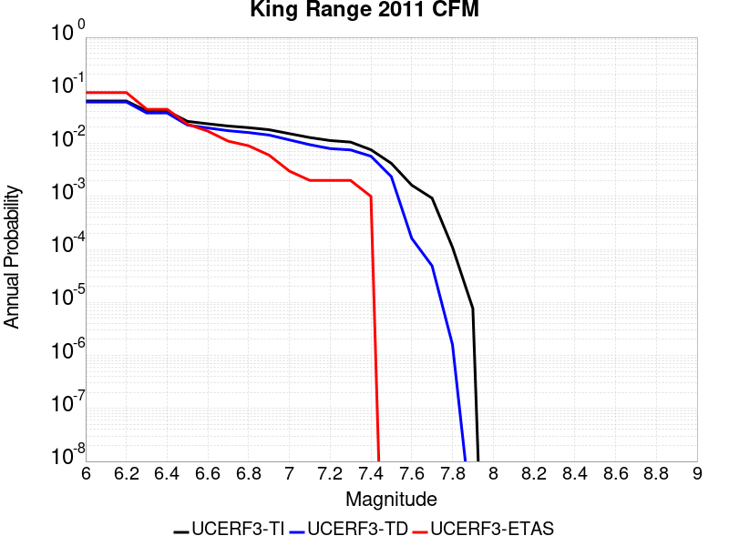 |
|-----|

| Magnitude | UCERF3-TI Prob | UCERF3-TD Prob | UCERF3-ETAS Prob |
|-----|-----|-----|-----|
| 6.0 | 0.062959045 | 0.06034285 | 0.091 |
| 6.1 | 0.062959045 | 0.06034285 | 0.091 |
| 6.2 | 0.062959045 | 0.06034285 | 0.091 |
| 6.3 | 0.040826146 | 0.037451077 | 0.044 |
| 6.4 | 0.040826146 | 0.037451077 | 0.044 |
| 6.5 | 0.026017549 | 0.022182584 | 0.023 |
| 6.6 | 0.023394536 | 0.019527623 | 0.017 |
| 6.7 | 0.021239761 | 0.017340323 | 0.011 |
| 6.8 | 0.019796917 | 0.0159933 | 0.009 |
| 6.9 | 0.018096752 | 0.014352609 | 0.006 |
| 7.0 | 0.0152598545 | 0.011634766 | 0.003 |
| 7.1 | 0.012882817 | 0.009445746 | 0.002 |
| 7.2 | 0.011310648 | 0.00796949 | 0.002 |
| 7.3 | 0.01057689 | 0.007531336 | 0.002 |
| 7.4 | 0.007577247 | 0.005723976 | 0.001 |
| 7.5 | 0.0042012185 | 0.0023595786 | 0.0 |
| 7.6 | 0.0016287015 | 1.6194285E-4 | 0.0 |
| 7.7 | 9.255954E-4 | 4.8909045E-5 | 0.0 |
| 7.8 | 1.0975441E-4 | 1.6045867E-6 | 0.0 |
| 7.9 | 7.713509E-6 | 5.214642E-10 | 0.0 |

## La Panza 2011
*[(top)](#table-of-contents)*

| 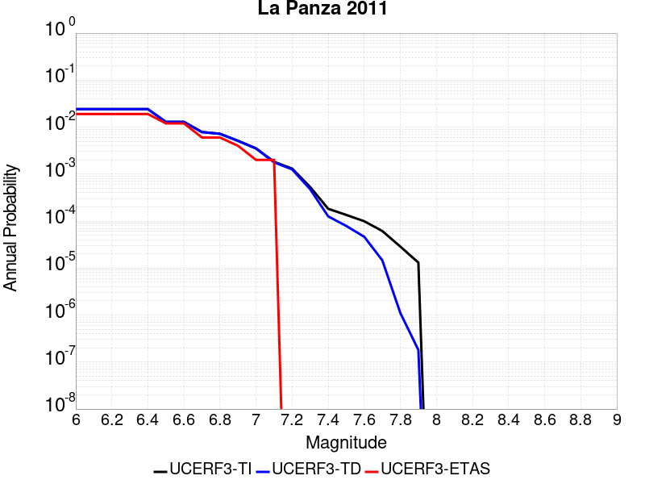 |
|-----|

| Magnitude | UCERF3-TI Prob | UCERF3-TD Prob | UCERF3-ETAS Prob |
|-----|-----|-----|-----|
| 6.0 | 0.024100736 | 0.024156412 | 0.019 |
| 6.1 | 0.024100736 | 0.024156412 | 0.019 |
| 6.2 | 0.024100736 | 0.024156412 | 0.019 |
| 6.3 | 0.024100736 | 0.024156412 | 0.019 |
| 6.4 | 0.024100736 | 0.024156412 | 0.019 |
| 6.5 | 0.012884456 | 0.012882244 | 0.012 |
| 6.6 | 0.012884456 | 0.012882244 | 0.012 |
| 6.7 | 0.0078524165 | 0.007829285 | 0.006 |
| 6.8 | 0.007208891 | 0.007182735 | 0.006 |
| 6.9 | 0.0051142504 | 0.005079791 | 0.004 |
| 7.0 | 0.0035313356 | 0.0034904184 | 0.002 |
| 7.1 | 0.001823533 | 0.0017758843 | 0.002 |
| 7.2 | 0.0013082171 | 0.0012581485 | 0.0 |
| 7.3 | 5.299461E-4 | 4.7570514E-4 | 0.0 |
| 7.4 | 1.8264094E-4 | 1.2592092E-4 | 0.0 |
| 7.5 | 1.35252E-4 | 7.884687E-5 | 0.0 |
| 7.6 | 9.9221594E-5 | 4.6247267E-5 | 0.0 |
| 7.7 | 6.143238E-5 | 1.4621782E-5 | 0.0 |
| 7.8 | 2.864082E-5 | 1.1066232E-6 | 0.0 |
| 7.9 | 1.30868475E-5 | 1.808985E-7 | 0.0 |

## Laguna Salada
*[(top)](#table-of-contents)*

|  |
|-----|

| Magnitude | UCERF3-TI Prob | UCERF3-TD Prob | UCERF3-ETAS Prob |
|-----|-----|-----|-----|
| 6.0 | 0.21530208 | 0.17533706 | 0.23 |
| 6.1 | 0.1876262 | 0.1436879 | 0.084 |
| 6.2 | 0.17155094 | 0.12711683 | 0.068 |
| 6.3 | 0.15756348 | 0.11342711 | 0.054 |
| 6.4 | 0.14101982 | 0.098725945 | 0.046 |
| 6.5 | 0.13175 | 0.0912489 | 0.042 |
| 6.6 | 0.11015817 | 0.07551965 | 0.032 |
| 6.7 | 0.096546225 | 0.065431565 | 0.028 |
| 6.8 | 0.054636236 | 0.038897306 | 0.016 |
| 6.9 | 0.011096254 | 0.008658609 | 0.003 |
| 7.0 | 0.010873411 | 0.008448273 | 0.003 |
| 7.1 | 0.0092900675 | 0.0069451495 | 0.003 |
| 7.2 | 0.005060534 | 0.0033416436 | 0.0 |

## Lake Isabella (Seismicity)
*[(top)](#table-of-contents)*

|  |
|-----|

| Magnitude | UCERF3-TI Prob | UCERF3-TD Prob | UCERF3-ETAS Prob |
|-----|-----|-----|-----|
| 6.0 | 0.048021823 | 0.048609752 | 0.026 |
| 6.1 | 0.048021823 | 0.048609752 | 0.026 |
| 6.2 | 0.048021823 | 0.048609752 | 0.026 |
| 6.3 | 0.048021823 | 0.048609752 | 0.026 |
| 6.4 | 0.026484035 | 0.02675536 | 0.011 |
| 6.5 | 0.026484035 | 0.02675536 | 0.011 |
| 6.6 | 0.017589329 | 0.017755402 | 0.006 |
| 6.7 | 0.017523007 | 0.017688787 | 0.006 |
| 6.8 | 0.013774379 | 0.013904207 | 0.006 |
| 6.9 | 0.012475761 | 0.012594461 | 0.005 |
| 7.0 | 0.0088068815 | 0.008891266 | 0.005 |
| 7.1 | 0.0018253037 | 0.0018362933 | 0.001 |
| 7.2 | 0.0011640049 | 0.0011707409 | 0.0 |
| 7.3 | 8.2201755E-4 | 8.26732E-4 | 0.0 |
| 7.4 | 5.850896E-4 | 5.8846624E-4 | 0.0 |
| 7.5 | 2.548695E-4 | 2.5633833E-4 | 0.0 |
| 7.6 | 7.850971E-6 | 7.893599E-6 | 0.0 |

## Las Positas
*[(top)](#table-of-contents)*

|  |
|-----|

| Magnitude | UCERF3-TI Prob | UCERF3-TD Prob | UCERF3-ETAS Prob |
|-----|-----|-----|-----|
| 6.0 | 0.05410116 | 0.05701494 | 0.051 |
| 6.1 | 0.05410116 | 0.05701494 | 0.051 |
| 6.2 | 0.05410116 | 0.05701494 | 0.051 |
| 6.3 | 0.05410116 | 0.05701494 | 0.051 |

## Last Chance
*[(top)](#table-of-contents)*

| 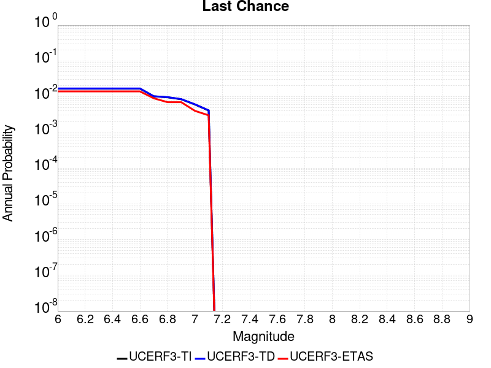 |
|-----|

| Magnitude | UCERF3-TI Prob | UCERF3-TD Prob | UCERF3-ETAS Prob |
|-----|-----|-----|-----|
| 6.0 | 0.016760139 | 0.01688749 | 0.014 |
| 6.1 | 0.016760139 | 0.01688749 | 0.014 |
| 6.2 | 0.016760139 | 0.01688749 | 0.014 |
| 6.3 | 0.016760139 | 0.01688749 | 0.014 |
| 6.4 | 0.016760139 | 0.01688749 | 0.014 |
| 6.5 | 0.016760139 | 0.01688749 | 0.014 |
| 6.6 | 0.016760139 | 0.01688749 | 0.014 |
| 6.7 | 0.010195161 | 0.010264664 | 0.009 |
| 6.8 | 0.009601742 | 0.00966788 | 0.007 |
| 6.9 | 0.008460617 | 0.008519385 | 0.007 |
| 7.0 | 0.0060444507 | 0.0060880687 | 0.004 |
| 7.1 | 0.0040992433 | 0.0041296696 | 0.003 |

## Lenwood-Lockhart-Old Woman Springs
*[(top)](#table-of-contents)*

|  |
|-----|

| Magnitude | UCERF3-TI Prob | UCERF3-TD Prob | UCERF3-ETAS Prob |
|-----|-----|-----|-----|
| 6.0 | 0.17748497 | 0.19431698 | 0.147 |
| 6.1 | 0.17748497 | 0.19431698 | 0.147 |
| 6.2 | 0.17748497 | 0.19431698 | 0.147 |
| 6.3 | 0.10416005 | 0.117347755 | 0.09 |
| 6.4 | 0.10416005 | 0.117347755 | 0.09 |
| 6.5 | 0.08677895 | 0.09692808 | 0.072 |
| 6.6 | 0.076272614 | 0.083668455 | 0.062 |
| 6.7 | 0.06716748 | 0.07270943 | 0.051 |
| 6.8 | 0.058365297 | 0.06252521 | 0.045 |
| 6.9 | 0.05209757 | 0.055494796 | 0.034 |
| 7.0 | 0.041406933 | 0.043683548 | 0.025 |
| 7.1 | 0.034852486 | 0.036650505 | 0.021 |
| 7.2 | 0.029249903 | 0.030718971 | 0.02 |
| 7.3 | 0.021948947 | 0.023081822 | 0.012 |
| 7.4 | 0.013190712 | 0.013968813 | 0.008 |
| 7.5 | 2.2803004E-4 | 2.3099834E-4 | 0.0 |

## Likely 2011 CFM
*[(top)](#table-of-contents)*

| 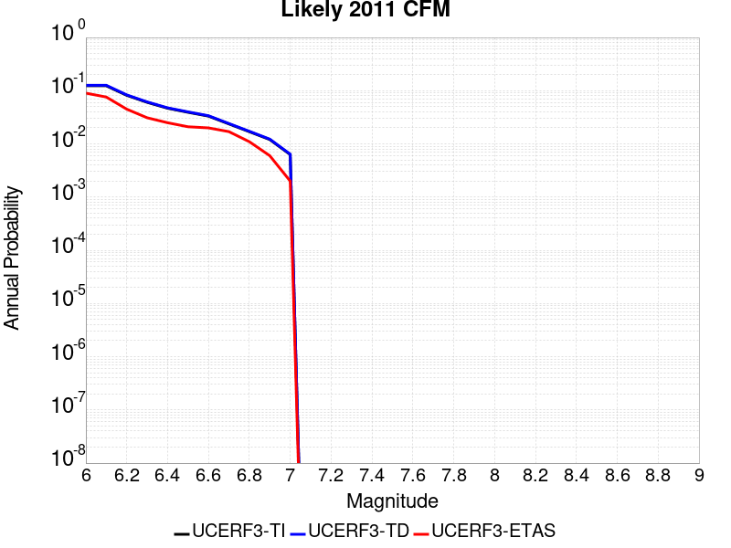 |
|-----|

| Magnitude | UCERF3-TI Prob | UCERF3-TD Prob | UCERF3-ETAS Prob |
|-----|-----|-----|-----|
| 6.0 | 0.12374372 | 0.12649508 | 0.09 |
| 6.1 | 0.12374372 | 0.12649508 | 0.076 |
| 6.2 | 0.08189914 | 0.083527595 | 0.045 |
| 6.3 | 0.0604277 | 0.061572347 | 0.031 |
| 6.4 | 0.046834342 | 0.04769509 | 0.025 |
| 6.5 | 0.039276272 | 0.03998705 | 0.021 |
| 6.6 | 0.033288993 | 0.033886455 | 0.02 |
| 6.7 | 0.023747325 | 0.024169095 | 0.017 |
| 6.8 | 0.016966727 | 0.017268661 | 0.011 |
| 6.9 | 0.012078844 | 0.012296303 | 0.006 |
| 7.0 | 0.006300421 | 0.0064171045 | 0.002 |

## Lions Head 2011 CFM
*[(top)](#table-of-contents)*

| 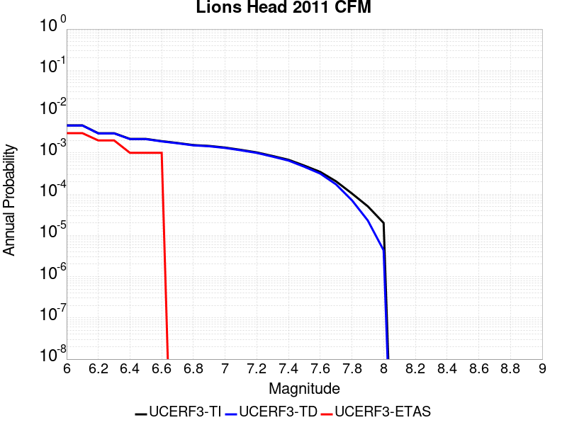 |
|-----|

| Magnitude | UCERF3-TI Prob | UCERF3-TD Prob | UCERF3-ETAS Prob |
|-----|-----|-----|-----|
| 6.0 | 0.004627604 | 0.0046022274 | 0.003 |
| 6.1 | 0.004627604 | 0.0046022274 | 0.003 |
| 6.2 | 0.0029924163 | 0.0029649567 | 0.002 |
| 6.3 | 0.0029924163 | 0.0029649567 | 0.002 |
| 6.4 | 0.00218055 | 0.0021522134 | 0.001 |
| 6.5 | 0.00218055 | 0.0021522134 | 0.001 |
| 6.6 | 0.0019233401 | 0.001894763 | 0.001 |
| 6.7 | 0.0017352017 | 0.0017064573 | 0.0 |
| 6.8 | 0.0015477121 | 0.0015188123 | 0.0 |
| 6.9 | 0.0014732102 | 0.0014442316 | 0.0 |
| 7.0 | 0.0013450137 | 0.001315886 | 0.0 |
| 7.1 | 0.0011826493 | 0.0011532729 | 0.0 |
| 7.2 | 0.0010266319 | 9.970163E-4 | 0.0 |
| 7.3 | 8.397846E-4 | 8.0979656E-4 | 0.0 |
| 7.4 | 6.8056514E-4 | 6.5020414E-4 | 0.0 |
| 7.5 | 4.909119E-4 | 4.6000967E-4 | 0.0 |
| 7.6 | 3.4620138E-4 | 3.1480636E-4 | 0.0 |
| 7.7 | 2.0400206E-4 | 1.7198565E-4 | 0.0 |
| 7.8 | 1.036137E-4 | 7.109777E-5 | 0.0 |
| 7.9 | 5.0704395E-5 | 2.3021186E-5 | 0.0 |
| 8.0 | 2.0035179E-5 | 4.3477016E-6 | 0.0 |

## Little Lake
*[(top)](#table-of-contents)*

|  |
|-----|

| Magnitude | UCERF3-TI Prob | UCERF3-TD Prob | UCERF3-ETAS Prob |
|-----|-----|-----|-----|
| 6.0 | 0.13784198 | 0.1418215 | 0.094 |
| 6.1 | 0.13784198 | 0.1418215 | 0.094 |
| 6.2 | 0.13784198 | 0.1418215 | 0.094 |
| 6.3 | 0.07473393 | 0.075937115 | 0.051 |
| 6.4 | 0.07473393 | 0.075937115 | 0.051 |
| 6.5 | 0.06459564 | 0.06547615 | 0.043 |
| 6.6 | 0.04916491 | 0.049496174 | 0.031 |
| 6.7 | 0.03972137 | 0.03975518 | 0.023 |
| 6.8 | 0.03296164 | 0.032814782 | 0.019 |
| 6.9 | 0.016190905 | 0.015456557 | 0.011 |
| 7.0 | 0.011880912 | 0.011069476 | 0.007 |
| 7.1 | 0.006727577 | 0.005826196 | 0.005 |
| 7.2 | 0.0024576345 | 0.0014746267 | 0.0 |
| 7.3 | 0.0020553358 | 0.0010800918 | 0.0 |
| 7.4 | 0.0018491268 | 9.126168E-4 | 0.0 |
| 7.5 | 0.0013741831 | 6.75792E-4 | 0.0 |
| 7.6 | 6.62403E-4 | 3.6318655E-4 | 0.0 |

## Little Salmon (Offshore)
*[(top)](#table-of-contents)*

| 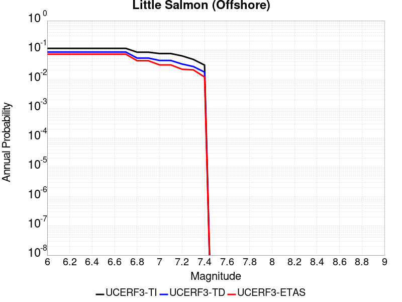 |
|-----|

| Magnitude | UCERF3-TI Prob | UCERF3-TD Prob | UCERF3-ETAS Prob |
|-----|-----|-----|-----|
| 6.0 | 0.113331154 | 0.08495754 | 0.072 |
| 6.1 | 0.113331154 | 0.08495754 | 0.072 |
| 6.2 | 0.113331154 | 0.08495754 | 0.072 |
| 6.3 | 0.113331154 | 0.08495754 | 0.072 |
| 6.4 | 0.113331154 | 0.08495754 | 0.072 |
| 6.5 | 0.113331154 | 0.08495754 | 0.072 |
| 6.6 | 0.113331154 | 0.08495754 | 0.072 |
| 6.7 | 0.113331154 | 0.08495754 | 0.072 |
| 6.8 | 0.08411373 | 0.053048916 | 0.043 |
| 6.9 | 0.08411373 | 0.053048916 | 0.043 |
| 7.0 | 0.07553121 | 0.043846287 | 0.031 |
| 7.1 | 0.07553121 | 0.043846287 | 0.031 |
| 7.2 | 0.0628005 | 0.033197433 | 0.022 |
| 7.3 | 0.047665842 | 0.027296826 | 0.021 |
| 7.4 | 0.03052664 | 0.01761707 | 0.012 |

## Little Salmon (Onshore)
*[(top)](#table-of-contents)*

|  |
|-----|

| Magnitude | UCERF3-TI Prob | UCERF3-TD Prob | UCERF3-ETAS Prob |
|-----|-----|-----|-----|
| 6.0 | 0.1950497 | 0.16625662 | 0.146 |
| 6.1 | 0.1950497 | 0.16625662 | 0.146 |
| 6.2 | 0.1950497 | 0.16625662 | 0.146 |
| 6.3 | 0.1950497 | 0.16625662 | 0.146 |
| 6.4 | 0.1950497 | 0.16625662 | 0.146 |
| 6.5 | 0.1950497 | 0.16625662 | 0.146 |
| 6.6 | 0.1950497 | 0.16625662 | 0.146 |
| 6.7 | 0.1950497 | 0.16625662 | 0.146 |
| 6.8 | 0.16521606 | 0.13448492 | 0.125 |
| 6.9 | 0.16521606 | 0.13448492 | 0.125 |
| 7.0 | 0.09159678 | 0.059525467 | 0.051 |
| 7.1 | 0.08097486 | 0.048927322 | 0.033 |
| 7.2 | 0.07465147 | 0.04301592 | 0.03 |
| 7.3 | 0.047665842 | 0.027296826 | 0.021 |
| 7.4 | 0.03052664 | 0.01761707 | 0.012 |

## Los Alamos 2011 CFM
*[(top)](#table-of-contents)*

|  |
|-----|

| Magnitude | UCERF3-TI Prob | UCERF3-TD Prob | UCERF3-ETAS Prob |
|-----|-----|-----|-----|
| 6.0 | 0.023861311 | 0.023980737 | 0.05 |
| 6.1 | 0.023861311 | 0.023980737 | 0.05 |
| 6.2 | 0.023861311 | 0.023980737 | 0.05 |
| 6.3 | 0.023861311 | 0.023980737 | 0.05 |
| 6.4 | 0.023861311 | 0.023980737 | 0.05 |
| 6.5 | 0.023861311 | 0.023980737 | 0.05 |
| 6.6 | 0.023861311 | 0.023980737 | 0.05 |
| 6.7 | 0.020973584 | 0.021061605 | 0.045 |
| 6.8 | 0.020973584 | 0.021061605 | 0.045 |
| 6.9 | 0.017038774 | 0.017083531 | 0.032 |
| 7.0 | 0.016398378 | 0.016437965 | 0.028 |
| 7.1 | 0.015212783 | 0.015242017 | 0.026 |
| 7.2 | 0.010392143 | 0.010366712 | 0.013 |
| 7.3 | 0.0090195 | 0.0089814095 | 0.01 |
| 7.4 | 0.008168119 | 0.0081223 | 0.009 |
| 7.5 | 0.007196086 | 0.0071405 | 0.008 |
| 7.6 | 0.0056421277 | 0.0055693523 | 0.007 |
| 7.7 | 0.0028890243 | 0.002834012 | 0.002 |
| 7.8 | 0.0010799025 | 0.0010452305 | 0.0 |
| 7.9 | 2.077602E-4 | 1.9735865E-4 | 0.0 |
| 8.0 | 4.1119026E-7 | 4.1665697E-7 | 0.0 |

## Los Alamos extension
*[(top)](#table-of-contents)*

| 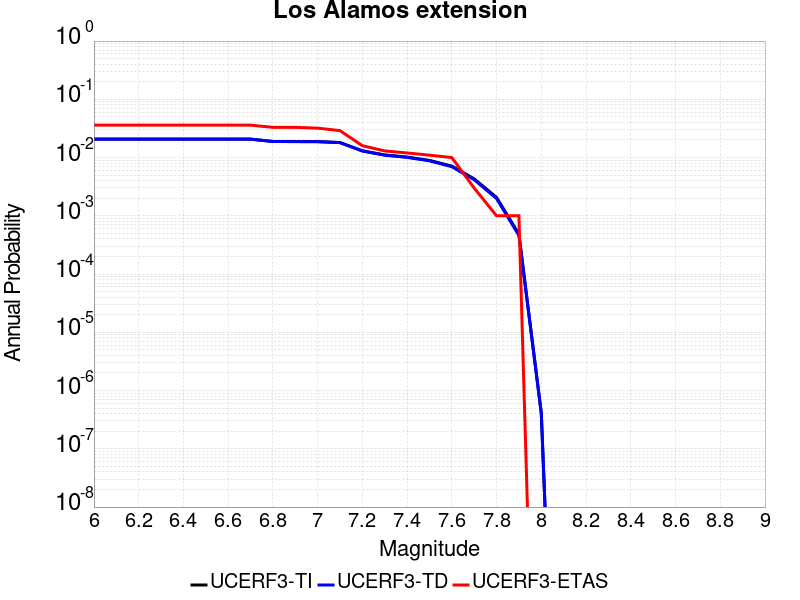 |
|-----|

| Magnitude | UCERF3-TI Prob | UCERF3-TD Prob | UCERF3-ETAS Prob |
|-----|-----|-----|-----|
| 6.0 | 0.020730034 | 0.020709693 | 0.036 |
| 6.1 | 0.020730034 | 0.020709693 | 0.036 |
| 6.2 | 0.020730034 | 0.020709693 | 0.036 |
| 6.3 | 0.020730034 | 0.020709693 | 0.036 |
| 6.4 | 0.020730034 | 0.020709693 | 0.036 |
| 6.5 | 0.020730034 | 0.020709693 | 0.036 |
| 6.6 | 0.020730034 | 0.020709693 | 0.036 |
| 6.7 | 0.020730034 | 0.020709693 | 0.036 |
| 6.8 | 0.018908354 | 0.018869285 | 0.033 |
| 6.9 | 0.018837513 | 0.01879775 | 0.033 |
| 7.0 | 0.018772088 | 0.018731622 | 0.032 |
| 7.1 | 0.018097665 | 0.018050514 | 0.029 |
| 7.2 | 0.013065367 | 0.012959996 | 0.016 |
| 7.3 | 0.011103956 | 0.010978105 | 0.013 |
| 7.4 | 0.010205943 | 0.010070851 | 0.012 |
| 7.5 | 0.008936965 | 0.008787006 | 0.011 |
| 7.6 | 0.007132117 | 0.0069687143 | 0.01 |
| 7.7 | 0.004307205 | 0.0041656215 | 0.003 |
| 7.8 | 0.0020697766 | 0.001977568 | 0.001 |
| 7.9 | 4.8475334E-4 | 4.5956412E-4 | 0.001 |
| 8.0 | 4.1119026E-7 | 4.1665697E-7 | 0.0 |

## Los Medanos - Roe Island
*[(top)](#table-of-contents)*

|  |
|-----|

| Magnitude | UCERF3-TI Prob | UCERF3-TD Prob | UCERF3-ETAS Prob |
|-----|-----|-----|-----|
| 6.0 | 0.004720093 | 0.00488591 | 0.003 |
| 6.1 | 0.004720093 | 0.00488591 | 0.003 |
| 6.2 | 0.004720093 | 0.00488591 | 0.003 |
| 6.3 | 0.004720093 | 0.00488591 | 0.003 |
| 6.4 | 0.004720093 | 0.00488591 | 0.003 |
| 6.5 | 0.004720093 | 0.00488591 | 0.003 |
| 6.6 | 0.004720093 | 0.00488591 | 0.003 |
| 6.7 | 0.0046771113 | 0.0048428443 | 0.003 |
| 6.8 | 0.0044583157 | 0.0046069114 | 0.003 |
| 6.9 | 0.0041581816 | 0.004292083 | 0.002 |
| 7.0 | 0.0035929834 | 0.0036987497 | 0.002 |
| 7.1 | 0.0029039423 | 0.0029847012 | 0.002 |
| 7.2 | 0.0021262353 | 0.0021783365 | 0.002 |
| 7.3 | 0.0013939361 | 0.0014275521 | 0.0 |
| 7.4 | 8.2677865E-4 | 8.463377E-4 | 0.0 |
| 7.5 | 5.568824E-4 | 5.703712E-4 | 0.0 |
| 7.6 | 3.3812362E-4 | 3.471697E-4 | 0.0 |
| 7.7 | 6.252518E-6 | 6.399302E-6 | 0.0 |

## Los Osos 2011
*[(top)](#table-of-contents)*

| 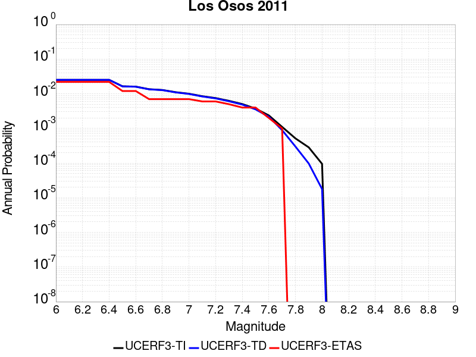 |
|-----|

| Magnitude | UCERF3-TI Prob | UCERF3-TD Prob | UCERF3-ETAS Prob |
|-----|-----|-----|-----|
| 6.0 | 0.025178261 | 0.025174823 | 0.022 |
| 6.1 | 0.025178261 | 0.025174823 | 0.022 |
| 6.2 | 0.025178261 | 0.025174823 | 0.022 |
| 6.3 | 0.025178261 | 0.025174823 | 0.022 |
| 6.4 | 0.025178261 | 0.025174823 | 0.022 |
| 6.5 | 0.016416937 | 0.016319461 | 0.012 |
| 6.6 | 0.016056862 | 0.015956001 | 0.012 |
| 6.7 | 0.013534125 | 0.013414911 | 0.007 |
| 6.8 | 0.01284709 | 0.012722229 | 0.007 |
| 6.9 | 0.011091897 | 0.010953943 | 0.007 |
| 7.0 | 0.010011095 | 0.009865658 | 0.007 |
| 7.1 | 0.008496585 | 0.008340969 | 0.006 |
| 7.2 | 0.0075095277 | 0.0073474026 | 0.006 |
| 7.3 | 0.006249431 | 0.0060789105 | 0.005 |
| 7.4 | 0.005052551 | 0.0048736585 | 0.004 |
| 7.5 | 0.0037367668 | 0.0035479881 | 0.004 |
| 7.6 | 0.002373172 | 0.0021728326 | 0.002 |
| 7.7 | 0.0011041958 | 8.914374E-4 | 0.001 |
| 7.8 | 5.150581E-4 | 2.9943415E-4 | 0.0 |
| 7.9 | 2.838065E-4 | 9.707622E-5 | 0.0 |
| 8.0 | 9.481456E-5 | 1.7790408E-5 | 0.0 |

## Lost Hills
*[(top)](#table-of-contents)*

| 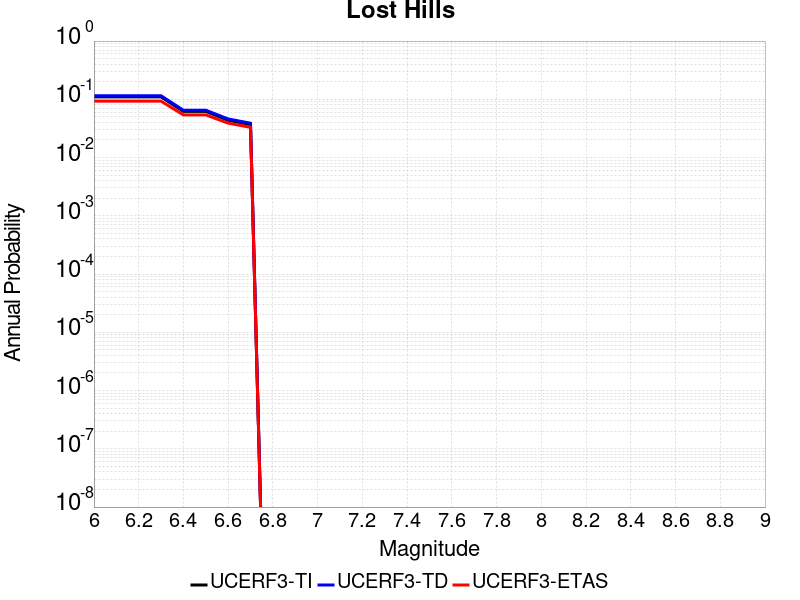 |
|-----|

| Magnitude | UCERF3-TI Prob | UCERF3-TD Prob | UCERF3-ETAS Prob |
|-----|-----|-----|-----|
| 6.0 | 0.110008486 | 0.11501324 | 0.093 |
| 6.1 | 0.110008486 | 0.11501324 | 0.093 |
| 6.2 | 0.110008486 | 0.11501324 | 0.093 |
| 6.3 | 0.110008486 | 0.11501324 | 0.093 |
| 6.4 | 0.06210559 | 0.064986765 | 0.054 |
| 6.5 | 0.06210559 | 0.064986765 | 0.054 |
| 6.6 | 0.043796066 | 0.04602035 | 0.039 |
| 6.7 | 0.036900327 | 0.03889047 | 0.033 |

## Ludlow
*[(top)](#table-of-contents)*

|  |
|-----|

| Magnitude | UCERF3-TI Prob | UCERF3-TD Prob | UCERF3-ETAS Prob |
|-----|-----|-----|-----|
| 6.0 | 0.11034453 | 0.11244106 | 0.095 |
| 6.1 | 0.11034453 | 0.11244106 | 0.095 |
| 6.2 | 0.054702267 | 0.055586006 | 0.04 |
| 6.3 | 0.054702267 | 0.055586006 | 0.04 |
| 6.4 | 0.03995468 | 0.040590037 | 0.027 |
| 6.5 | 0.0333406 | 0.033870663 | 0.024 |
| 6.6 | 0.028706979 | 0.029165413 | 0.023 |
| 6.7 | 0.024153803 | 0.024539324 | 0.022 |
| 6.8 | 0.018396411 | 0.01869117 | 0.015 |
| 6.9 | 0.013129036 | 0.013340473 | 0.013 |
| 7.0 | 0.008874211 | 0.009017857 | 0.006 |
| 7.1 | 0.005674138 | 0.005765268 | 0.005 |
| 7.2 | 0.0031605028 | 0.0032101772 | 0.004 |

## Maacama 2011 CFM
*[(top)](#table-of-contents)*

| 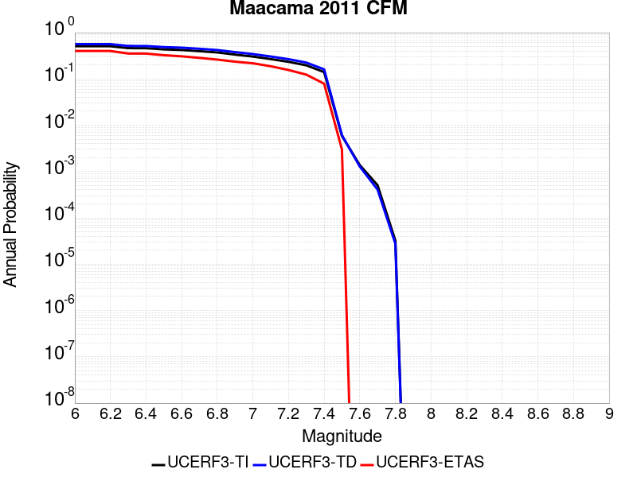 |
|-----|

| Magnitude | UCERF3-TI Prob | UCERF3-TD Prob | UCERF3-ETAS Prob |
|-----|-----|-----|-----|
| 6.0 | 0.51029766 | 0.5662361 | 0.401 |
| 6.1 | 0.51029766 | 0.5662361 | 0.401 |
| 6.2 | 0.50838757 | 0.564306 | 0.401 |
| 6.3 | 0.46305606 | 0.51633584 | 0.354 |
| 6.4 | 0.4614298 | 0.5146678 | 0.353 |
| 6.5 | 0.4352948 | 0.48723167 | 0.326 |
| 6.6 | 0.4219278 | 0.47327122 | 0.308 |
| 6.7 | 0.39842892 | 0.4484437 | 0.285 |
| 6.8 | 0.37377024 | 0.42127204 | 0.262 |
| 6.9 | 0.33569032 | 0.379248 | 0.236 |
| 7.0 | 0.30460665 | 0.34490648 | 0.218 |
| 7.1 | 0.26878622 | 0.3053012 | 0.188 |
| 7.2 | 0.23431174 | 0.26719913 | 0.156 |
| 7.3 | 0.19717051 | 0.22565885 | 0.124 |
| 7.4 | 0.14039001 | 0.16110027 | 0.079 |
| 7.5 | 0.0058748387 | 0.0061142086 | 0.003 |
| 7.6 | 0.0013836196 | 0.0012865068 | 0.0 |
| 7.7 | 5.0745334E-4 | 4.0924834E-4 | 0.0 |
| 7.8 | 3.2318534E-5 | 2.7693322E-5 | 0.0 |

## Mad River (alt1)
*[(top)](#table-of-contents)*

|  |
|-----|

| Magnitude | UCERF3-TI Prob | UCERF3-TD Prob | UCERF3-ETAS Prob |
|-----|-----|-----|-----|
| 6.0 | 0.057037193 | 0.0582881 | 0.06 |
| 6.1 | 0.057037193 | 0.0582881 | 0.06 |
| 6.2 | 0.057037193 | 0.0582881 | 0.06 |
| 6.3 | 0.057037193 | 0.0582881 | 0.06 |
| 6.4 | 0.057037193 | 0.0582881 | 0.06 |
| 6.5 | 0.057037193 | 0.0582881 | 0.06 |
| 6.6 | 0.057037193 | 0.0582881 | 0.06 |
| 6.7 | 0.03615027 | 0.036962315 | 0.035 |
| 6.8 | 0.03615027 | 0.036962315 | 0.035 |
| 6.9 | 0.03449425 | 0.03527891 | 0.032 |
| 7.0 | 0.03436637 | 0.035148527 | 0.032 |
| 7.1 | 0.027166525 | 0.02783178 | 0.023 |
| 7.2 | 0.022740649 | 0.023339735 | 0.019 |
| 7.3 | 0.017615382 | 0.018120755 | 0.012 |
| 7.4 | 0.015824934 | 0.016295457 | 0.01 |
| 7.5 | 0.0138559295 | 0.01428561 | 0.01 |
| 7.6 | 0.0097648585 | 0.010090498 | 0.008 |
| 7.7 | 0.0033657292 | 0.0034928832 | 0.003 |
| 7.8 | 0.001605045 | 0.0016698977 | 0.002 |

## Malibu Coast (Extension) alt 1
*[(top)](#table-of-contents)*

|  |
|-----|

| Magnitude | UCERF3-TI Prob | UCERF3-TD Prob | UCERF3-ETAS Prob |
|-----|-----|-----|-----|
| 6.0 | 0.045530435 | 0.045764327 | 0.037 |
| 6.1 | 0.036871515 | 0.036994796 | 0.028 |
| 6.2 | 0.032702357 | 0.03277051 | 0.026 |
| 6.3 | 0.030904895 | 0.030949237 | 0.025 |
| 6.4 | 0.029863395 | 0.029893141 | 0.025 |
| 6.5 | 0.028173404 | 0.028175578 | 0.023 |
| 6.6 | 0.026881814 | 0.026862515 | 0.022 |
| 6.7 | 0.025923302 | 0.025887895 | 0.022 |
| 6.8 | 0.023551181 | 0.023464266 | 0.017 |
| 6.9 | 0.022086184 | 0.021970136 | 0.017 |
| 7.0 | 0.020549927 | 0.020402163 | 0.016 |
| 7.1 | 0.019494707 | 0.019328075 | 0.016 |
| 7.2 | 0.017712371 | 0.017512824 | 0.012 |
| 7.3 | 0.013972159 | 0.013691687 | 0.008 |
| 7.4 | 0.01149597 | 0.011177738 | 0.007 |
| 7.5 | 0.0062627243 | 0.0060813655 | 0.005 |
| 7.6 | 0.003446051 | 0.0033238826 | 0.003 |
| 7.7 | 0.0013563642 | 0.0012151531 | 0.001 |
| 7.8 | 1.4777515E-4 | 1.0035489E-4 | 0.0 |

## Malibu Coast alt 1
*[(top)](#table-of-contents)*

|  |
|-----|

| Magnitude | UCERF3-TI Prob | UCERF3-TD Prob | UCERF3-ETAS Prob |
|-----|-----|-----|-----|
| 6.0 | 0.082840554 | 0.08305054 | 0.072 |
| 6.1 | 0.082840554 | 0.08305054 | 0.051 |
| 6.2 | 0.05620284 | 0.055506222 | 0.031 |
| 6.3 | 0.051873285 | 0.051044837 | 0.029 |
| 6.4 | 0.046214953 | 0.04521825 | 0.027 |
| 6.5 | 0.03890893 | 0.037709016 | 0.023 |
| 6.6 | 0.03026516 | 0.028820796 | 0.02 |
| 6.7 | 0.029130999 | 0.027664384 | 0.02 |
| 6.8 | 0.028399697 | 0.02692023 | 0.018 |
| 6.9 | 0.027263237 | 0.02575922 | 0.018 |
| 7.0 | 0.026294444 | 0.024771921 | 0.018 |
| 7.1 | 0.024973696 | 0.023423135 | 0.018 |
| 7.2 | 0.023438837 | 0.021855436 | 0.016 |
| 7.3 | 0.019602418 | 0.018002758 | 0.01 |
| 7.4 | 0.014546064 | 0.013453314 | 0.009 |
| 7.5 | 0.009545054 | 0.009021978 | 0.007 |
| 7.6 | 0.0058750324 | 0.0054488108 | 0.004 |
| 7.7 | 0.0026394976 | 0.0022637397 | 0.001 |
| 7.8 | 4.670452E-4 | 2.9936206E-4 | 0.0 |
| 7.9 | 4.1781627E-6 | 3.0963865E-6 | 0.0 |

## Manix-Afton Hills
*[(top)](#table-of-contents)*

| 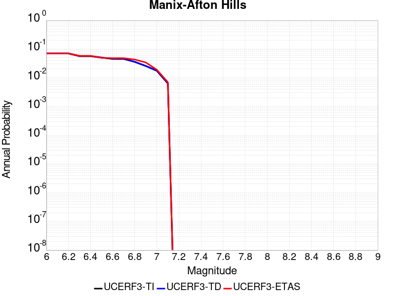 |
|-----|

| Magnitude | UCERF3-TI Prob | UCERF3-TD Prob | UCERF3-ETAS Prob |
|-----|-----|-----|-----|
| 6.0 | 0.069393985 | 0.07086424 | 0.07 |
| 6.1 | 0.069393985 | 0.07086424 | 0.07 |
| 6.2 | 0.069393985 | 0.07086424 | 0.07 |
| 6.3 | 0.056024406 | 0.057185497 | 0.058 |
| 6.4 | 0.056024406 | 0.057185497 | 0.058 |
| 6.5 | 0.049795058 | 0.05084036 | 0.049 |
| 6.6 | 0.04492896 | 0.045886107 | 0.048 |
| 6.7 | 0.044885475 | 0.045841534 | 0.048 |
| 6.8 | 0.035360347 | 0.036139976 | 0.043 |
| 6.9 | 0.025410311 | 0.02596914 | 0.034 |
| 7.0 | 0.01731757 | 0.017716855 | 0.019 |
| 7.1 | 0.006280016 | 0.0064256527 | 0.007 |

## McKinleyville (alt1)
*[(top)](#table-of-contents)*

|  |
|-----|

| Magnitude | UCERF3-TI Prob | UCERF3-TD Prob | UCERF3-ETAS Prob |
|-----|-----|-----|-----|
| 6.0 | 0.055921137 | 0.05716478 | 0.074 |
| 6.1 | 0.055921137 | 0.05716478 | 0.074 |
| 6.2 | 0.055921137 | 0.05716478 | 0.074 |
| 6.3 | 0.055921137 | 0.05716478 | 0.074 |
| 6.4 | 0.055921137 | 0.05716478 | 0.074 |
| 6.5 | 0.055921137 | 0.05716478 | 0.074 |
| 6.6 | 0.055921137 | 0.05716478 | 0.074 |
| 6.7 | 0.033263613 | 0.03395776 | 0.031 |
| 6.8 | 0.033263613 | 0.03395776 | 0.031 |
| 6.9 | 0.02085651 | 0.021311525 | 0.015 |
| 7.0 | 0.019525815 | 0.019961605 | 0.014 |
| 7.1 | 0.018995244 | 0.019423686 | 0.013 |
| 7.2 | 0.0156169 | 0.015994534 | 0.011 |
| 7.3 | 0.011968711 | 0.012280334 | 0.007 |
| 7.4 | 0.0106749665 | 0.010962281 | 0.006 |
| 7.5 | 0.009180116 | 0.0094364295 | 0.005 |
| 7.6 | 0.0067313956 | 0.006930428 | 0.004 |
| 7.7 | 0.003025031 | 0.0031212266 | 0.001 |
| 7.8 | 8.408176E-4 | 8.708758E-4 | 0.001 |

## McLean Lake
*[(top)](#table-of-contents)*

|  |
|-----|

| Magnitude | UCERF3-TI Prob | UCERF3-TD Prob | UCERF3-ETAS Prob |
|-----|-----|-----|-----|
| 6.0 | 0.08660234 | 0.08862549 | 0.116 |
| 6.1 | 0.046187367 | 0.047042813 | 0.071 |
| 6.2 | 0.046187367 | 0.047042813 | 0.071 |
| 6.3 | 0.037160926 | 0.037833326 | 0.052 |
| 6.4 | 0.037160926 | 0.037833326 | 0.052 |
| 6.5 | 0.031155039 | 0.03171899 | 0.047 |
| 6.6 | 0.028790938 | 0.02931606 | 0.042 |
| 6.7 | 0.027006764 | 0.027503598 | 0.039 |
| 6.8 | 0.02077392 | 0.02116757 | 0.032 |
| 6.9 | 0.00356056 | 0.0036104927 | 0.004 |

## Mendocino
*[(top)](#table-of-contents)*

|  |
|-----|

| Magnitude | UCERF3-TI Prob | UCERF3-TD Prob | UCERF3-ETAS Prob |
|-----|-----|-----|-----|
| 6.0 | 0.9445329 | 0.9292766 | 0.865 |
| 6.1 | 0.8912703 | 0.84650344 | 0.793 |
| 6.2 | 0.8912703 | 0.84650344 | 0.793 |
| 6.3 | 0.81920063 | 0.7467365 | 0.677 |
| 6.4 | 0.76087874 | 0.6733016 | 0.566 |
| 6.5 | 0.7139669 | 0.61374044 | 0.49 |
| 6.6 | 0.66616005 | 0.5551197 | 0.425 |
| 6.7 | 0.4816605 | 0.33421037 | 0.159 |
| 6.8 | 0.44739613 | 0.28391168 | 0.117 |
| 6.9 | 0.40428734 | 0.21882188 | 0.082 |
| 7.0 | 0.38022676 | 0.18350469 | 0.06 |
| 7.1 | 0.35101056 | 0.1413922 | 0.045 |
| 7.2 | 0.33524773 | 0.11961693 | 0.037 |
| 7.3 | 0.30191424 | 0.09199431 | 0.03 |
| 7.4 | 0.24908318 | 0.056354318 | 0.021 |
| 7.5 | 0.1845725 | 0.020229708 | 0.007 |
| 7.6 | 0.17303081 | 0.015279779 | 0.005 |
| 7.7 | 0.15076509 | 0.006935653 | 0.001 |
| 7.8 | 0.10888012 | 0.004439619 | 0.001 |
| 7.9 | 0.06382852 | 0.004002876 | 0.001 |
| 8.0 | 0.0336243 | 0.0034141294 | 0.001 |
| 8.1 | 0.016515803 | 0.0021870013 | 0.0 |
| 8.2 | 0.010997703 | 0.0016194438 | 0.0 |
| 8.3 | 0.003924914 | 6.2907103E-4 | 0.0 |

## Mission (connected) 2011 CFM
*[(top)](#table-of-contents)*

| 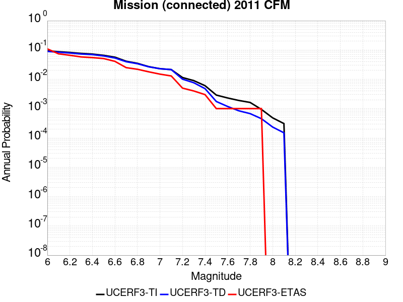 |
|-----|

| Magnitude | UCERF3-TI Prob | UCERF3-TD Prob | UCERF3-ETAS Prob |
|-----|-----|-----|-----|
| 6.0 | 0.09313389 | 0.090026125 | 0.109 |
| 6.1 | 0.08734431 | 0.0840253 | 0.074 |
| 6.2 | 0.082427874 | 0.078919694 | 0.066 |
| 6.3 | 0.07638998 | 0.0728661 | 0.058 |
| 6.4 | 0.07255764 | 0.0695855 | 0.055 |
| 6.5 | 0.065645486 | 0.062693045 | 0.051 |
| 6.6 | 0.05686744 | 0.05333716 | 0.041 |
| 6.7 | 0.041314837 | 0.039824504 | 0.025 |
| 6.8 | 0.03504157 | 0.034064278 | 0.022 |
| 6.9 | 0.027030824 | 0.026696853 | 0.018 |
| 7.0 | 0.023004416 | 0.022940319 | 0.015 |
| 7.1 | 0.021417603 | 0.021457108 | 0.013 |
| 7.2 | 0.011481992 | 0.010117676 | 0.005 |
| 7.3 | 0.009018703 | 0.0076464997 | 0.004 |
| 7.4 | 0.006049171 | 0.004794166 | 0.003 |
| 7.5 | 0.0028974803 | 0.0017496973 | 0.001 |
| 7.6 | 0.0023092406 | 0.0011845704 | 0.001 |
| 7.7 | 0.001897039 | 8.4282504E-4 | 0.001 |
| 7.8 | 0.0016241958 | 6.7554374E-4 | 0.001 |
| 7.9 | 9.4064814E-4 | 4.5422296E-4 | 0.001 |
| 8.0 | 4.8406524E-4 | 2.3508392E-4 | 0.0 |
| 8.1 | 3.0913105E-4 | 1.4971655E-4 | 0.0 |

## Mission Creek
*[(top)](#table-of-contents)*

|  |
|-----|

| Magnitude | UCERF3-TI Prob | UCERF3-TD Prob | UCERF3-ETAS Prob |
|-----|-----|-----|-----|
| 6.0 | 0.058483493 | 0.04977976 | 0.048 |
| 6.1 | 0.058483493 | 0.04977976 | 0.048 |
| 6.2 | 0.058483493 | 0.04977976 | 0.048 |
| 6.3 | 0.058483493 | 0.04977976 | 0.048 |
| 6.4 | 0.058483493 | 0.04977976 | 0.048 |
| 6.5 | 0.058483493 | 0.04977976 | 0.048 |
| 6.6 | 0.04688384 | 0.03782279 | 0.042 |
| 6.7 | 0.045970727 | 0.036884822 | 0.04 |
| 6.8 | 0.044248734 | 0.03510815 | 0.038 |
| 6.9 | 0.035877477 | 0.026460327 | 0.032 |
| 7.0 | 0.030045368 | 0.02081996 | 0.028 |
| 7.1 | 0.028528836 | 0.019262742 | 0.027 |
| 7.2 | 0.022619098 | 0.013488409 | 0.02 |
| 7.3 | 0.019575553 | 0.0105219865 | 0.019 |
| 7.4 | 0.011404616 | 0.0021716596 | 0.009 |
| 7.5 | 0.0106495395 | 0.0016275798 | 0.008 |
| 7.6 | 0.009727226 | 0.0010103493 | 0.007 |
| 7.7 | 0.009561102 | 9.215565E-4 | 0.006 |
| 7.8 | 0.008931597 | 8.7011274E-4 | 0.006 |
| 7.9 | 0.0072965445 | 7.4126804E-4 | 0.005 |
| 8.0 | 0.0020494973 | 2.1138758E-4 | 0.001 |
| 8.1 | 8.328369E-4 | 4.5372828E-5 | 0.0 |
| 8.2 | 2.5565817E-4 | 7.530265E-6 | 0.0 |

## Mission Hills 2011
*[(top)](#table-of-contents)*

| 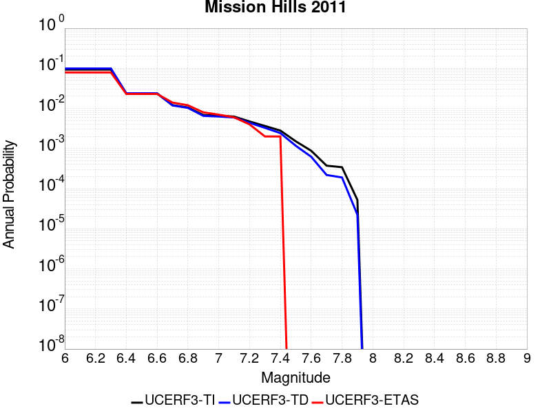 |
|-----|

| Magnitude | UCERF3-TI Prob | UCERF3-TD Prob | UCERF3-ETAS Prob |
|-----|-----|-----|-----|
| 6.0 | 0.09327652 | 0.09946198 | 0.079 |
| 6.1 | 0.09327652 | 0.09946198 | 0.079 |
| 6.2 | 0.09327652 | 0.09946198 | 0.079 |
| 6.3 | 0.09327652 | 0.09946198 | 0.079 |
| 6.4 | 0.02354504 | 0.023884406 | 0.023 |
| 6.5 | 0.02354504 | 0.023884406 | 0.023 |
| 6.6 | 0.02354504 | 0.023884406 | 0.023 |
| 6.7 | 0.012066888 | 0.01190586 | 0.014 |
| 6.8 | 0.01055048 | 0.0103465505 | 0.012 |
| 6.9 | 0.0068567903 | 0.0065392195 | 0.008 |
| 7.0 | 0.00661826 | 0.0062971557 | 0.007 |
| 7.1 | 0.0062750103 | 0.00594803 | 0.006 |
| 7.2 | 0.0047400123 | 0.0043832767 | 0.004 |
| 7.3 | 0.0036564614 | 0.0032813195 | 0.002 |
| 7.4 | 0.0028085075 | 0.002426036 | 0.002 |
| 7.5 | 0.0015157205 | 0.0011745626 | 0.0 |
| 7.6 | 8.8162086E-4 | 6.247452E-4 | 0.0 |
| 7.7 | 3.739499E-4 | 2.1933785E-4 | 0.0 |
| 7.8 | 3.424468E-4 | 1.9016312E-4 | 0.0 |
| 7.9 | 5.23289E-5 | 2.2420676E-5 | 0.0 |

## Mission Ridge-Arroyo Parida-Santa Ana
*[(top)](#table-of-contents)*

| 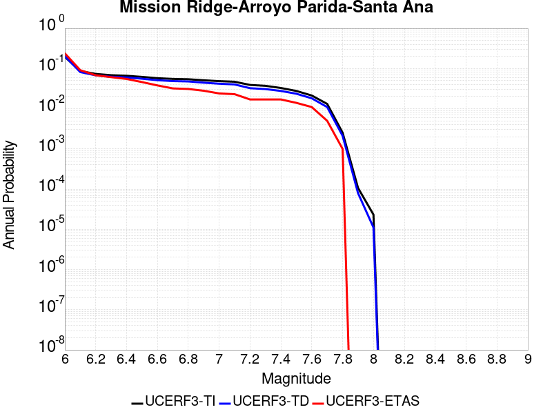 |
|-----|

| Magnitude | UCERF3-TI Prob | UCERF3-TD Prob | UCERF3-ETAS Prob |
|-----|-----|-----|-----|
| 6.0 | 0.19550359 | 0.20316783 | 0.239 |
| 6.1 | 0.0867028 | 0.08168729 | 0.091 |
| 6.2 | 0.07345903 | 0.067756325 | 0.068 |
| 6.3 | 0.06827274 | 0.062365633 | 0.061 |
| 6.4 | 0.066059485 | 0.06007017 | 0.055 |
| 6.5 | 0.061929185 | 0.055792294 | 0.046 |
| 6.6 | 0.057514463 | 0.051222656 | 0.038 |
| 6.7 | 0.055110898 | 0.048721503 | 0.032 |
| 6.8 | 0.054135412 | 0.04771192 | 0.031 |
| 6.9 | 0.051032364 | 0.044474788 | 0.028 |
| 7.0 | 0.048549995 | 0.04189469 | 0.024 |
| 7.1 | 0.046907254 | 0.040202472 | 0.023 |
| 7.2 | 0.03907087 | 0.032401953 | 0.017 |
| 7.3 | 0.037123077 | 0.03083402 | 0.017 |
| 7.4 | 0.032792345 | 0.02768224 | 0.017 |
| 7.5 | 0.027676838 | 0.02360031 | 0.014 |
| 7.6 | 0.02130429 | 0.018158158 | 0.011 |
| 7.7 | 0.013169439 | 0.010998069 | 0.005 |
| 7.8 | 0.0025330978 | 0.0021171905 | 0.001 |
| 7.9 | 1.0681695E-4 | 7.9157624E-5 | 0.0 |
| 8.0 | 2.3185707E-5 | 1.1085192E-5 | 0.0 |

## Mohawk Valley 2011 CFM
*[(top)](#table-of-contents)*

|  |
|-----|

| Magnitude | UCERF3-TI Prob | UCERF3-TD Prob | UCERF3-ETAS Prob |
|-----|-----|-----|-----|
| 6.0 | 0.12424412 | 0.12807265 | 0.078 |
| 6.1 | 0.12424412 | 0.12807265 | 0.078 |
| 6.2 | 0.12424412 | 0.12807265 | 0.078 |
| 6.3 | 0.12424412 | 0.12807265 | 0.078 |
| 6.4 | 0.05977591 | 0.061255578 | 0.031 |
| 6.5 | 0.05977591 | 0.061255578 | 0.031 |
| 6.6 | 0.047576662 | 0.0487516 | 0.023 |
| 6.7 | 0.036199037 | 0.03709455 | 0.018 |
| 6.8 | 0.024768703 | 0.025388418 | 0.012 |
| 6.9 | 0.017667964 | 0.018123206 | 0.009 |
| 7.0 | 0.0130998865 | 0.013450249 | 0.005 |

## Mono Lake 2011 CFM
*[(top)](#table-of-contents)*

|  |
|-----|

| Magnitude | UCERF3-TI Prob | UCERF3-TD Prob | UCERF3-ETAS Prob |
|-----|-----|-----|-----|
| 6.0 | 0.10070214 | 0.10955209 | 0.076 |
| 6.1 | 0.10070214 | 0.10955209 | 0.076 |
| 6.2 | 0.10070214 | 0.10955209 | 0.076 |
| 6.3 | 0.10070214 | 0.10955209 | 0.076 |
| 6.4 | 0.08725977 | 0.0955531 | 0.061 |
| 6.5 | 0.08725977 | 0.0955531 | 0.061 |

## Monte Vista - Shannon 2011 CFM
*[(top)](#table-of-contents)*

| 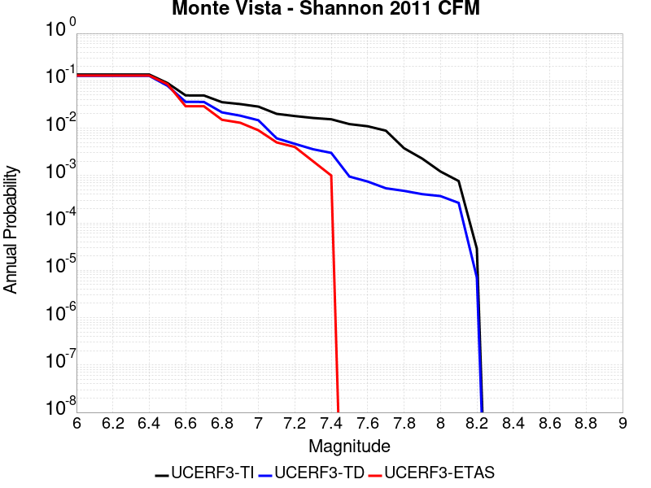 |
|-----|

| Magnitude | UCERF3-TI Prob | UCERF3-TD Prob | UCERF3-ETAS Prob |
|-----|-----|-----|-----|
| 6.0 | 0.13551426 | 0.12686516 | 0.129 |
| 6.1 | 0.13551426 | 0.12686516 | 0.129 |
| 6.2 | 0.13551426 | 0.12686516 | 0.129 |
| 6.3 | 0.13551426 | 0.12686516 | 0.129 |
| 6.4 | 0.13551426 | 0.12686516 | 0.129 |
| 6.5 | 0.08959999 | 0.078584135 | 0.085 |
| 6.6 | 0.049107905 | 0.035851844 | 0.029 |
| 6.7 | 0.048998114 | 0.035756942 | 0.029 |
| 6.8 | 0.03530012 | 0.021501284 | 0.015 |
| 6.9 | 0.03219797 | 0.01833225 | 0.013 |
| 7.0 | 0.02845282 | 0.014658477 | 0.009 |
| 7.1 | 0.020038724 | 0.0060999035 | 0.005 |
| 7.2 | 0.018001303 | 0.0046643447 | 0.004 |
| 7.3 | 0.016395425 | 0.0035853793 | 0.002 |
| 7.4 | 0.015381536 | 0.0030060636 | 0.001 |
| 7.5 | 0.012167911 | 9.501958E-4 | 0.0 |
| 7.6 | 0.010963667 | 7.4635894E-4 | 0.0 |
| 7.7 | 0.008842761 | 5.3845235E-4 | 0.0 |
| 7.8 | 0.0037658801 | 4.7441252E-4 | 0.0 |
| 7.9 | 0.002271799 | 4.043209E-4 | 0.0 |
| 8.0 | 0.0012159353 | 3.6833162E-4 | 0.0 |
| 8.1 | 7.6477346E-4 | 2.6465612E-4 | 0.0 |
| 8.2 | 2.8662205E-5 | 7.010188E-6 | 0.0 |

## Monterey Bay-Tularcitos
*[(top)](#table-of-contents)*

| 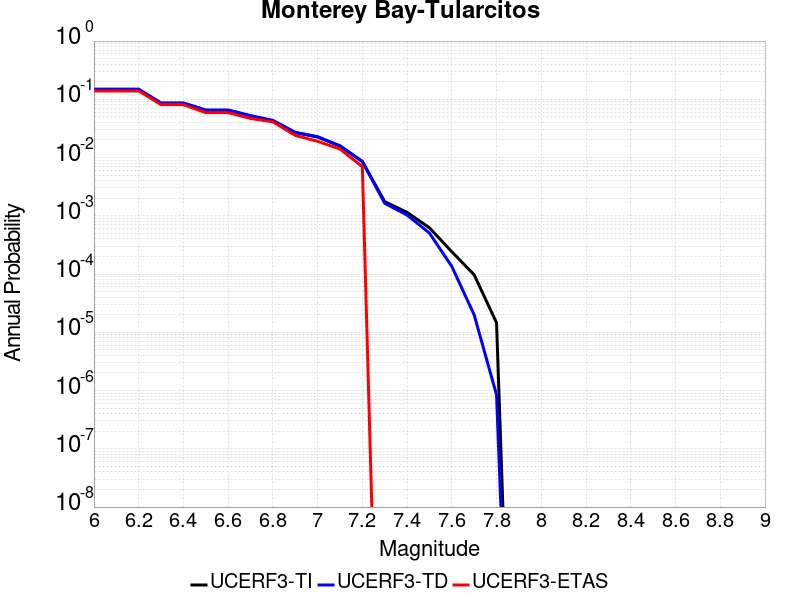 |
|-----|

| Magnitude | UCERF3-TI Prob | UCERF3-TD Prob | UCERF3-ETAS Prob |
|-----|-----|-----|-----|
| 6.0 | 0.14548697 | 0.14966132 | 0.139 |
| 6.1 | 0.14548697 | 0.14966132 | 0.139 |
| 6.2 | 0.14548697 | 0.14966132 | 0.139 |
| 6.3 | 0.084875524 | 0.086780444 | 0.081 |
| 6.4 | 0.084875524 | 0.086780444 | 0.081 |
| 6.5 | 0.064349115 | 0.06568283 | 0.059 |
| 6.6 | 0.064311735 | 0.06564513 | 0.059 |
| 6.7 | 0.05163352 | 0.052641932 | 0.047 |
| 6.8 | 0.04263308 | 0.0434322 | 0.041 |
| 6.9 | 0.026735833 | 0.027173175 | 0.024 |
| 7.0 | 0.022489922 | 0.022839596 | 0.019 |
| 7.1 | 0.015736412 | 0.015946923 | 0.014 |
| 7.2 | 0.008532863 | 0.008589337 | 0.007 |
| 7.3 | 0.0017500195 | 0.001640296 | 0.0 |
| 7.4 | 0.0011458881 | 0.0010306799 | 0.0 |
| 7.5 | 6.230338E-4 | 5.058371E-4 | 0.0 |
| 7.6 | 2.4187364E-4 | 1.3525903E-4 | 0.0 |
| 7.7 | 9.698781E-5 | 1.9897427E-5 | 0.0 |
| 7.8 | 1.4589103E-5 | 8.438985E-7 | 0.0 |

## Morales (East)
*[(top)](#table-of-contents)*

|  |
|-----|

| Magnitude | UCERF3-TI Prob | UCERF3-TD Prob | UCERF3-ETAS Prob |
|-----|-----|-----|-----|
| 6.0 | 0.0077666133 | 0.004950053 | 0.006 |
| 6.1 | 0.0077666133 | 0.004950053 | 0.006 |
| 6.2 | 0.0077666133 | 0.004950053 | 0.006 |
| 6.3 | 0.0077666133 | 0.004950053 | 0.006 |
| 6.4 | 0.004580591 | 0.001739201 | 0.002 |
| 6.5 | 0.0037369044 | 8.9040643E-4 | 0.002 |
| 6.6 | 0.0037369044 | 8.9040643E-4 | 0.002 |
| 6.7 | 0.0037285269 | 8.841239E-4 | 0.002 |
| 6.8 | 0.0036625806 | 8.41513E-4 | 0.002 |
| 6.9 | 0.0036154508 | 8.16137E-4 | 0.002 |
| 7.0 | 0.0032783304 | 6.544024E-4 | 0.002 |
| 7.1 | 0.002928191 | 5.011707E-4 | 0.002 |
| 7.2 | 0.0025589184 | 3.604419E-4 | 0.002 |
| 7.3 | 0.0022400417 | 3.2572684E-4 | 0.002 |
| 7.4 | 0.001967447 | 3.0429356E-4 | 0.002 |
| 7.5 | 5.5310846E-4 | 1.4731639E-4 | 0.0 |
| 7.6 | 5.195836E-4 | 1.3786585E-4 | 0.0 |
| 7.7 | 3.3907546E-4 | 6.205857E-5 | 0.0 |
| 7.8 | 1.1748421E-4 | 1.2278014E-5 | 0.0 |
| 7.9 | 4.43144E-5 | 1.0604923E-6 | 0.0 |
| 8.0 | 7.812063E-6 | 4.2755945E-9 | 0.0 |

## Morales (West)
*[(top)](#table-of-contents)*

|  |
|-----|

| Magnitude | UCERF3-TI Prob | UCERF3-TD Prob | UCERF3-ETAS Prob |
|-----|-----|-----|-----|
| 6.0 | 0.0072924113 | 0.0066146925 | 0.005 |
| 6.1 | 0.0072924113 | 0.0066146925 | 0.005 |
| 6.2 | 0.0072924113 | 0.0066146925 | 0.005 |
| 6.3 | 0.0072924113 | 0.0066146925 | 0.005 |
| 6.4 | 0.0033882044 | 0.0026901711 | 0.003 |
| 6.5 | 0.0033882044 | 0.0026901711 | 0.003 |
| 6.6 | 0.0030247236 | 0.002325601 | 0.003 |
| 6.7 | 0.0029913236 | 0.0022921006 | 0.003 |
| 6.8 | 0.0027613468 | 0.0020937668 | 0.002 |
| 6.9 | 0.0025138985 | 0.0018691438 | 0.001 |
| 7.0 | 0.0022549347 | 0.0016374452 | 0.001 |
| 7.1 | 0.0019489805 | 0.0013882666 | 0.001 |
| 7.2 | 0.001647096 | 0.0011184012 | 0.001 |
| 7.3 | 0.0011825947 | 7.612185E-4 | 0.0 |
| 7.4 | 6.4135756E-4 | 3.597011E-4 | 0.0 |
| 7.5 | 5.197333E-4 | 2.6773117E-4 | 0.0 |
| 7.6 | 4.2390768E-4 | 1.9079681E-4 | 0.0 |
| 7.7 | 2.7030465E-4 | 6.747535E-5 | 0.0 |
| 7.8 | 1.372987E-4 | 6.3889192E-6 | 0.0 |
| 7.9 | 6.484623E-5 | 4.95311E-7 | 0.0 |
| 8.0 | 3.1067757E-5 | 6.726881E-8 | 0.0 |
| 8.1 | 6.5673103E-6 | 1.4699998E-8 | 0.0 |

## Mount Diablo Thrust North CFM
*[(top)](#table-of-contents)*

| 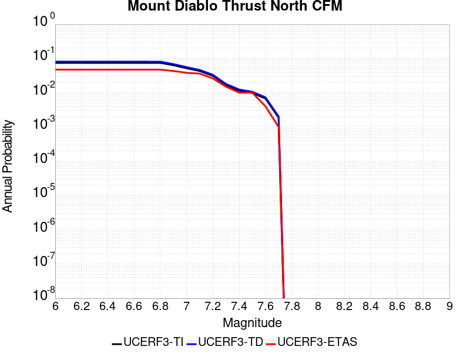 |
|-----|

| Magnitude | UCERF3-TI Prob | UCERF3-TD Prob | UCERF3-ETAS Prob |
|-----|-----|-----|-----|
| 6.0 | 0.07430035 | 0.080499224 | 0.047 |
| 6.1 | 0.07430035 | 0.080499224 | 0.047 |
| 6.2 | 0.07430035 | 0.080499224 | 0.047 |
| 6.3 | 0.07430035 | 0.080499224 | 0.047 |
| 6.4 | 0.07430035 | 0.080499224 | 0.047 |
| 6.5 | 0.07430035 | 0.080499224 | 0.047 |
| 6.6 | 0.074270785 | 0.080468826 | 0.047 |
| 6.7 | 0.074270785 | 0.080468826 | 0.047 |
| 6.8 | 0.07418145 | 0.08037647 | 0.047 |
| 6.9 | 0.06337782 | 0.06833118 | 0.043 |
| 7.0 | 0.051709276 | 0.055656426 | 0.038 |
| 7.1 | 0.042875238 | 0.04606948 | 0.036 |
| 7.2 | 0.03094744 | 0.033336703 | 0.026 |
| 7.3 | 0.016609706 | 0.01794051 | 0.015 |
| 7.4 | 0.011435076 | 0.012379056 | 0.01 |
| 7.5 | 0.009797534 | 0.0106154755 | 0.01 |
| 7.6 | 0.006766721 | 0.007325382 | 0.004 |
| 7.7 | 0.0018784277 | 0.0020301316 | 0.001 |

## Mount Diablo Thrust South
*[(top)](#table-of-contents)*

|  |
|-----|

| Magnitude | UCERF3-TI Prob | UCERF3-TD Prob | UCERF3-ETAS Prob |
|-----|-----|-----|-----|
| 6.0 | 0.110204495 | 0.11767634 | 0.101 |
| 6.1 | 0.110204495 | 0.11767634 | 0.101 |
| 6.2 | 0.110204495 | 0.11767634 | 0.101 |
| 6.3 | 0.110204495 | 0.11767634 | 0.101 |
| 6.4 | 0.061813727 | 0.06550872 | 0.042 |
| 6.5 | 0.061813727 | 0.06550872 | 0.042 |
| 6.6 | 0.061028447 | 0.064681165 | 0.041 |
| 6.7 | 0.058238026 | 0.061757915 | 0.038 |
| 6.8 | 0.044984646 | 0.047988795 | 0.027 |
| 6.9 | 0.041119527 | 0.043973107 | 0.026 |
| 7.0 | 0.03212344 | 0.03437547 | 0.022 |
| 7.1 | 0.018857783 | 0.020170884 | 0.017 |
| 7.2 | 0.01194703 | 0.012865169 | 0.012 |
| 7.3 | 0.0063664913 | 0.0068853246 | 0.008 |
| 7.4 | 0.0026888538 | 0.0029149437 | 0.003 |
| 7.5 | 0.0018521323 | 0.0020108076 | 0.003 |
| 7.6 | 6.845615E-4 | 7.4196386E-4 | 0.0 |
| 7.7 | 1.8883219E-4 | 2.0408977E-4 | 0.0 |

## Nelson Lake
*[(top)](#table-of-contents)*

| 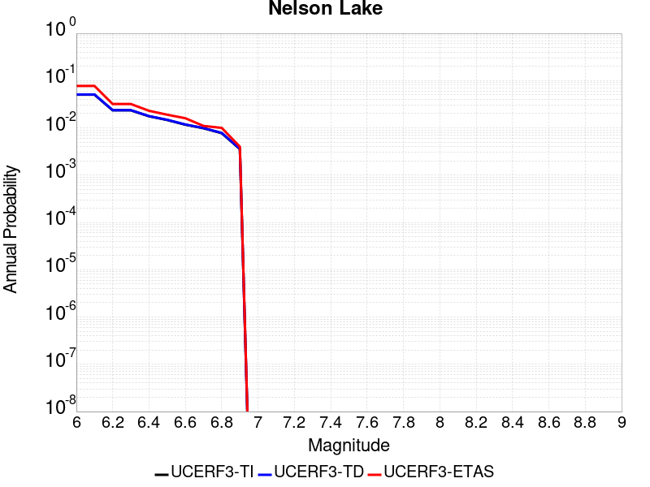 |
|-----|

| Magnitude | UCERF3-TI Prob | UCERF3-TD Prob | UCERF3-ETAS Prob |
|-----|-----|-----|-----|
| 6.0 | 0.05041216 | 0.050927725 | 0.077 |
| 6.1 | 0.05041216 | 0.050927725 | 0.077 |
| 6.2 | 0.02351082 | 0.02373117 | 0.032 |
| 6.3 | 0.02351082 | 0.02373117 | 0.032 |
| 6.4 | 0.017597485 | 0.017769719 | 0.023 |
| 6.5 | 0.014685288 | 0.014834406 | 0.019 |
| 6.6 | 0.011679373 | 0.011804529 | 0.016 |
| 6.7 | 0.009819415 | 0.009929553 | 0.011 |
| 6.8 | 0.0077314293 | 0.007823202 | 0.01 |
| 6.9 | 0.00356056 | 0.0036104927 | 0.004 |

## Newport-Inglewood (Offshore)
*[(top)](#table-of-contents)*

| 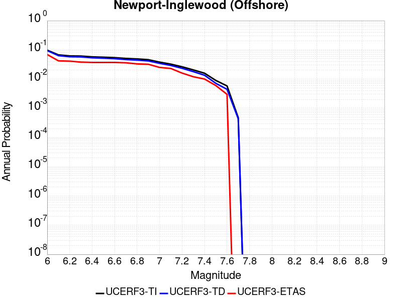 |
|-----|

| Magnitude | UCERF3-TI Prob | UCERF3-TD Prob | UCERF3-ETAS Prob |
|-----|-----|-----|-----|
| 6.0 | 0.097339995 | 0.09431671 | 0.069 |
| 6.1 | 0.06713648 | 0.063285165 | 0.042 |
| 6.2 | 0.06192332 | 0.05794013 | 0.041 |
| 6.3 | 0.061215293 | 0.05721109 | 0.038 |
| 6.4 | 0.057497337 | 0.053401016 | 0.037 |
| 6.5 | 0.055821855 | 0.05168144 | 0.037 |
| 6.6 | 0.053979103 | 0.049789447 | 0.037 |
| 6.7 | 0.050732344 | 0.046460167 | 0.036 |
| 6.8 | 0.048835237 | 0.04453847 | 0.033 |
| 6.9 | 0.045878377 | 0.041716285 | 0.032 |
| 7.0 | 0.037911575 | 0.03453941 | 0.025 |
| 7.1 | 0.032336228 | 0.029230257 | 0.023 |
| 7.2 | 0.026243174 | 0.02334976 | 0.016 |
| 7.3 | 0.02052895 | 0.017961761 | 0.012 |
| 7.4 | 0.015823646 | 0.013498064 | 0.01 |
| 7.5 | 0.008975431 | 0.007149748 | 0.006 |
| 7.6 | 0.005804351 | 0.0044589727 | 0.003 |
| 7.7 | 4.7564966E-4 | 4.3650428E-4 | 0.0 |

## Newport-Inglewood alt 1
*[(top)](#table-of-contents)*

|  |
|-----|

| Magnitude | UCERF3-TI Prob | UCERF3-TD Prob | UCERF3-ETAS Prob |
|-----|-----|-----|-----|
| 6.0 | 0.14342247 | 0.14629641 | 0.108 |
| 6.1 | 0.14342247 | 0.14629641 | 0.108 |
| 6.2 | 0.14342247 | 0.14629641 | 0.108 |
| 6.3 | 0.14342247 | 0.14629641 | 0.108 |
| 6.4 | 0.06440937 | 0.05913139 | 0.042 |
| 6.5 | 0.06440937 | 0.05913139 | 0.042 |
| 6.6 | 0.057037894 | 0.051437575 | 0.036 |
| 6.7 | 0.05333741 | 0.04760512 | 0.034 |
| 6.8 | 0.053195454 | 0.04745948 | 0.034 |
| 6.9 | 0.04625758 | 0.04028984 | 0.029 |
| 7.0 | 0.04456981 | 0.038551148 | 0.027 |
| 7.1 | 0.042840067 | 0.036846127 | 0.026 |
| 7.2 | 0.039866723 | 0.033884007 | 0.024 |
| 7.3 | 0.033215735 | 0.028892267 | 0.021 |
| 7.4 | 0.02769267 | 0.024170905 | 0.019 |
| 7.5 | 0.01885601 | 0.015919795 | 0.013 |
| 7.6 | 0.011881354 | 0.009583597 | 0.007 |
| 7.7 | 0.0031507805 | 0.0022768718 | 0.001 |
| 7.8 | 6.055505E-5 | 6.0903378E-5 | 0.0 |

## North Frontal  (East)
*[(top)](#table-of-contents)*

|  |
|-----|

| Magnitude | UCERF3-TI Prob | UCERF3-TD Prob | UCERF3-ETAS Prob |
|-----|-----|-----|-----|
| 6.0 | 0.036548756 | 0.03725126 | 0.02 |
| 6.1 | 0.036548756 | 0.03725126 | 0.02 |
| 6.2 | 0.036548756 | 0.03725126 | 0.02 |
| 6.3 | 0.036548756 | 0.03725126 | 0.02 |
| 6.4 | 0.036548756 | 0.03725126 | 0.02 |
| 6.5 | 0.036548756 | 0.03725126 | 0.02 |
| 6.6 | 0.036548756 | 0.03725126 | 0.02 |
| 6.7 | 0.036548756 | 0.03725126 | 0.02 |
| 6.8 | 0.030615596 | 0.031209262 | 0.018 |
| 6.9 | 0.011901997 | 0.0120409215 | 0.008 |
| 7.0 | 0.011655389 | 0.011790573 | 0.008 |
| 7.1 | 0.010340707 | 0.010456291 | 0.008 |
| 7.2 | 0.00755006 | 0.007632685 | 0.004 |
| 7.3 | 0.004674811 | 0.0047266376 | 0.003 |
| 7.4 | 0.0040492592 | 0.0040942575 | 0.002 |
| 7.5 | 0.002732722 | 0.0027637922 | 0.002 |
| 7.6 | 8.0790115E-4 | 8.1738376E-4 | 0.001 |

## North Frontal  (West)
*[(top)](#table-of-contents)*

|  |
|-----|

| Magnitude | UCERF3-TI Prob | UCERF3-TD Prob | UCERF3-ETAS Prob |
|-----|-----|-----|-----|
| 6.0 | 0.024386728 | 0.024605397 | 0.012 |
| 6.1 | 0.024386728 | 0.024605397 | 0.012 |
| 6.2 | 0.024386728 | 0.024605397 | 0.012 |
| 6.3 | 0.024386728 | 0.024605397 | 0.012 |
| 6.4 | 0.024386728 | 0.024605397 | 0.012 |
| 6.5 | 0.024386728 | 0.024605397 | 0.012 |
| 6.6 | 0.024386728 | 0.024605397 | 0.012 |
| 6.7 | 0.018292878 | 0.018462077 | 0.009 |
| 6.8 | 0.018292878 | 0.018462077 | 0.009 |
| 6.9 | 0.015751565 | 0.015900757 | 0.009 |
| 7.0 | 0.013159642 | 0.013287603 | 0.009 |
| 7.1 | 0.011629739 | 0.011745282 | 0.007 |
| 7.2 | 0.008586352 | 0.008670259 | 0.003 |
| 7.3 | 0.0053319638 | 0.0053835213 | 0.002 |
| 7.4 | 0.0046354746 | 0.0046801744 | 0.002 |
| 7.5 | 0.0033004202 | 0.0033315646 | 0.002 |
| 7.6 | 0.001308149 | 0.0013172801 | 0.001 |
| 7.7 | 1.7128691E-4 | 1.6683512E-4 | 0.0 |
| 7.8 | 4.5785593E-5 | 3.971503E-5 | 0.0 |

## North Salt Lake
*[(top)](#table-of-contents)*

|  |
|-----|

| Magnitude | UCERF3-TI Prob | UCERF3-TD Prob | UCERF3-ETAS Prob |
|-----|-----|-----|-----|
| 6.0 | 0.009604531 | 0.00978468 | 0.015 |
| 6.1 | 0.009604531 | 0.00978468 | 0.011 |
| 6.2 | 0.009604531 | 0.00978468 | 0.011 |
| 6.3 | 0.009604531 | 0.00978468 | 0.011 |
| 6.4 | 0.009246817 | 0.009426506 | 0.01 |
| 6.5 | 0.003082006 | 0.0031404633 | 0.003 |
| 6.6 | 0.003082006 | 0.0031404633 | 0.003 |
| 6.7 | 0.003082006 | 0.0031404633 | 0.003 |
| 6.8 | 0.0024773015 | 0.0025247445 | 0.001 |
| 6.9 | 0.0018946513 | 0.0019311641 | 0.001 |
| 7.0 | 0.0012560529 | 0.001280704 | 0.001 |
| 7.1 | 4.461084E-4 | 4.536204E-4 | 0.001 |
| 7.2 | 1.2914817E-4 | 1.3089748E-4 | 0.0 |
| 7.3 | 7.937295E-5 | 8.034933E-5 | 0.0 |
| 7.4 | 4.2691598E-5 | 4.3103275E-5 | 0.0 |
| 7.5 | 2.8592995E-5 | 2.8884653E-5 | 0.0 |
| 7.6 | 1.3990924E-6 | 1.4133211E-6 | 0.0 |

## North Tahoe 2011 CFM
*[(top)](#table-of-contents)*

|  |
|-----|

| Magnitude | UCERF3-TI Prob | UCERF3-TD Prob | UCERF3-ETAS Prob |
|-----|-----|-----|-----|
| 6.0 | 0.10613949 | 0.103405915 | 0.086 |
| 6.1 | 0.10613949 | 0.103405915 | 0.086 |
| 6.2 | 0.10613949 | 0.103405915 | 0.086 |
| 6.3 | 0.10613949 | 0.103405915 | 0.086 |
| 6.4 | 0.03765695 | 0.030926358 | 0.026 |
| 6.5 | 0.03765695 | 0.030926358 | 0.026 |
| 6.6 | 0.035115663 | 0.028286027 | 0.022 |
| 6.7 | 0.009612365 | 0.0028567505 | 0.001 |

## Northridge
*[(top)](#table-of-contents)*

|  |
|-----|

| Magnitude | UCERF3-TI Prob | UCERF3-TD Prob | UCERF3-ETAS Prob |
|-----|-----|-----|-----|
| 6.0 | 0.09126415 | 0.08818987 | 0.049 |
| 6.1 | 0.09126415 | 0.08818987 | 0.049 |
| 6.2 | 0.09126415 | 0.08818987 | 0.049 |
| 6.3 | 0.09126415 | 0.08818987 | 0.049 |
| 6.4 | 0.0866103 | 0.08337969 | 0.048 |
| 6.5 | 0.0866103 | 0.08337969 | 0.048 |
| 6.6 | 0.077492066 | 0.07391847 | 0.046 |
| 6.7 | 0.0633296 | 0.059119258 | 0.034 |
| 6.8 | 0.057936598 | 0.053543214 | 0.03 |
| 6.9 | 0.056789547 | 0.052355666 | 0.029 |
| 7.0 | 0.053859457 | 0.049318086 | 0.028 |
| 7.1 | 0.05216222 | 0.04758207 | 0.028 |
| 7.2 | 0.050408576 | 0.045808114 | 0.027 |
| 7.3 | 0.043362472 | 0.038843323 | 0.024 |
| 7.4 | 0.041307665 | 0.03697898 | 0.022 |
| 7.5 | 0.03497059 | 0.031493187 | 0.021 |
| 7.6 | 0.022811372 | 0.021115055 | 0.016 |
| 7.7 | 0.013112926 | 0.012210213 | 0.009 |
| 7.8 | 0.006505329 | 0.00624827 | 0.007 |
| 7.9 | 0.0011796869 | 0.0010472796 | 0.0 |
| 8.0 | 1.4950938E-5 | 8.503857E-6 | 0.0 |

## Northridge Hills
*[(top)](#table-of-contents)*

| 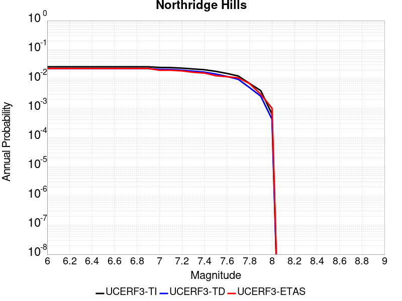 |
|-----|

| Magnitude | UCERF3-TI Prob | UCERF3-TD Prob | UCERF3-ETAS Prob |
|-----|-----|-----|-----|
| 6.0 | 0.026239768 | 0.022761038 | 0.023 |
| 6.1 | 0.026239768 | 0.022761038 | 0.023 |
| 6.2 | 0.026239768 | 0.022761038 | 0.023 |
| 6.3 | 0.026239768 | 0.022761038 | 0.023 |
| 6.4 | 0.026239768 | 0.022761038 | 0.023 |
| 6.5 | 0.026239768 | 0.022761038 | 0.023 |
| 6.6 | 0.026239768 | 0.022761038 | 0.023 |
| 6.7 | 0.026239768 | 0.022761038 | 0.023 |
| 6.8 | 0.026239768 | 0.022761038 | 0.023 |
| 6.9 | 0.026231047 | 0.02275218 | 0.023 |
| 7.0 | 0.024994953 | 0.021493474 | 0.02 |
| 7.1 | 0.02468924 | 0.021182228 | 0.02 |
| 7.2 | 0.023614949 | 0.020087061 | 0.019 |
| 7.3 | 0.022136293 | 0.018583043 | 0.017 |
| 7.4 | 0.020787861 | 0.017228961 | 0.016 |
| 7.5 | 0.018341197 | 0.014843904 | 0.013 |
| 7.6 | 0.01552689 | 0.012234558 | 0.012 |
| 7.7 | 0.012724477 | 0.009794937 | 0.011 |
| 7.8 | 0.007083154 | 0.0051003494 | 0.007 |
| 7.9 | 0.0040183295 | 0.0025909836 | 0.003 |
| 8.0 | 6.32085E-4 | 4.22859E-4 | 0.001 |

## Oak Ridge (Onshore)
*[(top)](#table-of-contents)*

| 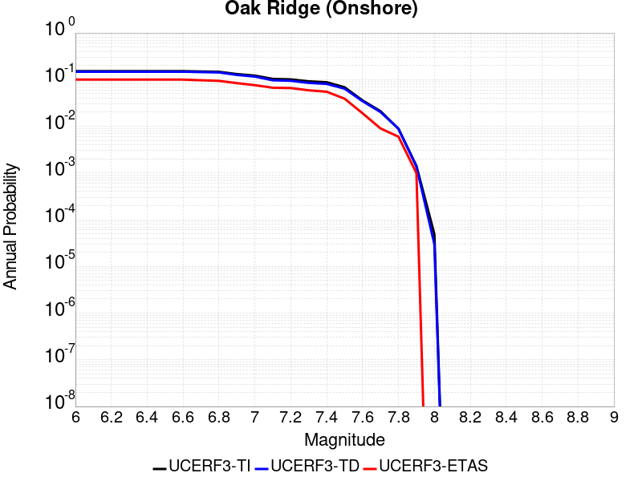 |
|-----|

| Magnitude | UCERF3-TI Prob | UCERF3-TD Prob | UCERF3-ETAS Prob |
|-----|-----|-----|-----|
| 6.0 | 0.15179195 | 0.14761283 | 0.1 |
| 6.1 | 0.15179195 | 0.14761283 | 0.1 |
| 6.2 | 0.15179195 | 0.14761283 | 0.1 |
| 6.3 | 0.15179195 | 0.14761283 | 0.1 |
| 6.4 | 0.15179195 | 0.14761283 | 0.1 |
| 6.5 | 0.15179195 | 0.14761283 | 0.1 |
| 6.6 | 0.15179195 | 0.14761283 | 0.1 |
| 6.7 | 0.14930236 | 0.14498705 | 0.097 |
| 6.8 | 0.14690597 | 0.14246966 | 0.094 |
| 6.9 | 0.13131607 | 0.12598796 | 0.084 |
| 7.0 | 0.12181215 | 0.116004184 | 0.076 |
| 7.1 | 0.10353054 | 0.0967577 | 0.067 |
| 7.2 | 0.10116067 | 0.09430976 | 0.066 |
| 7.3 | 0.09184474 | 0.08500414 | 0.059 |
| 7.4 | 0.08789383 | 0.08098762 | 0.055 |
| 7.5 | 0.06847938 | 0.063906714 | 0.039 |
| 7.6 | 0.03581056 | 0.03455774 | 0.019 |
| 7.7 | 0.021076249 | 0.020209737 | 0.009 |
| 7.8 | 0.008843349 | 0.008863395 | 0.006 |
| 7.9 | 0.0014188889 | 0.0013823195 | 0.001 |
| 8.0 | 4.886015E-5 | 2.9803386E-5 | 0.0 |

## Oceanic - West Huasna
*[(top)](#table-of-contents)*

|  |
|-----|

| Magnitude | UCERF3-TI Prob | UCERF3-TD Prob | UCERF3-ETAS Prob |
|-----|-----|-----|-----|
| 6.0 | 0.1535827 | 0.15590692 | 0.135 |
| 6.1 | 0.104518965 | 0.10548983 | 0.087 |
| 6.2 | 0.08103247 | 0.08141369 | 0.066 |
| 6.3 | 0.068306334 | 0.068400115 | 0.053 |
| 6.4 | 0.06128564 | 0.06123203 | 0.046 |
| 6.5 | 0.057509303 | 0.05738518 | 0.044 |
| 6.6 | 0.050100703 | 0.0498399 | 0.036 |
| 6.7 | 0.045157466 | 0.044813294 | 0.033 |
| 6.8 | 0.03923767 | 0.03879614 | 0.028 |
| 6.9 | 0.03352162 | 0.03298846 | 0.023 |
| 7.0 | 0.028090239 | 0.027471675 | 0.02 |
| 7.1 | 0.023117736 | 0.022422332 | 0.016 |
| 7.2 | 0.014615433 | 0.013778268 | 0.013 |
| 7.3 | 0.010714338 | 0.009823555 | 0.008 |
| 7.4 | 0.008820985 | 0.007905554 | 0.006 |
| 7.5 | 0.0070906943 | 0.0061501074 | 0.005 |
| 7.6 | 0.0051020053 | 0.0041300096 | 0.002 |
| 7.7 | 0.0031186368 | 0.0021168056 | 0.001 |
| 7.8 | 0.0015219237 | 6.505249E-4 | 0.0 |
| 7.9 | 6.289633E-4 | 1.386256E-4 | 0.0 |
| 8.0 | 1.7639533E-5 | 9.4280205E-7 | 0.0 |

## Oceanside alt1
*[(top)](#table-of-contents)*

|  |
|-----|

| Magnitude | UCERF3-TI Prob | UCERF3-TD Prob | UCERF3-ETAS Prob |
|-----|-----|-----|-----|
| 6.0 | 0.058818262 | 0.05830637 | 0.038 |
| 6.1 | 0.058818262 | 0.05830637 | 0.038 |
| 6.2 | 0.058818262 | 0.05830637 | 0.038 |
| 6.3 | 0.058818262 | 0.05830637 | 0.038 |
| 6.4 | 0.058818262 | 0.05830637 | 0.038 |
| 6.5 | 0.058818262 | 0.05830637 | 0.038 |
| 6.6 | 0.03868811 | 0.037674986 | 0.027 |
| 6.7 | 0.0363905 | 0.035341866 | 0.026 |
| 6.8 | 0.032265227 | 0.031154064 | 0.023 |
| 6.9 | 0.03157486 | 0.030453205 | 0.023 |
| 7.0 | 0.027041595 | 0.025856819 | 0.022 |
| 7.1 | 0.024382288 | 0.023178283 | 0.02 |
| 7.2 | 0.01963179 | 0.018419776 | 0.014 |
| 7.3 | 0.01689535 | 0.01576984 | 0.014 |
| 7.4 | 0.013442422 | 0.012466043 | 0.013 |
| 7.5 | 0.0097180065 | 0.0086920615 | 0.009 |
| 7.6 | 0.006369828 | 0.005330422 | 0.004 |
| 7.7 | 0.0026787603 | 0.0018502157 | 0.001 |
| 7.8 | 6.055505E-5 | 6.0903378E-5 | 0.0 |

## Ortigalita (North)
*[(top)](#table-of-contents)*

|  |
|-----|

| Magnitude | UCERF3-TI Prob | UCERF3-TD Prob | UCERF3-ETAS Prob |
|-----|-----|-----|-----|
| 6.0 | 0.3312936 | 0.36293006 | 0.319 |
| 6.1 | 0.21371582 | 0.23072138 | 0.2 |
| 6.2 | 0.21371582 | 0.23072138 | 0.2 |
| 6.3 | 0.15938632 | 0.17134745 | 0.15 |
| 6.4 | 0.13472357 | 0.14465086 | 0.125 |
| 6.5 | 0.13453035 | 0.14445086 | 0.125 |
| 6.6 | 0.1129834 | 0.12133032 | 0.099 |
| 6.7 | 0.098493375 | 0.10610577 | 0.084 |
| 6.8 | 0.03367047 | 0.03513182 | 0.022 |
| 6.9 | 0.028908625 | 0.030153004 | 0.018 |
| 7.0 | 0.020019218 | 0.020891417 | 0.015 |
| 7.1 | 0.008323105 | 0.008694009 | 0.007 |

## Ortigalita (South)
*[(top)](#table-of-contents)*

| 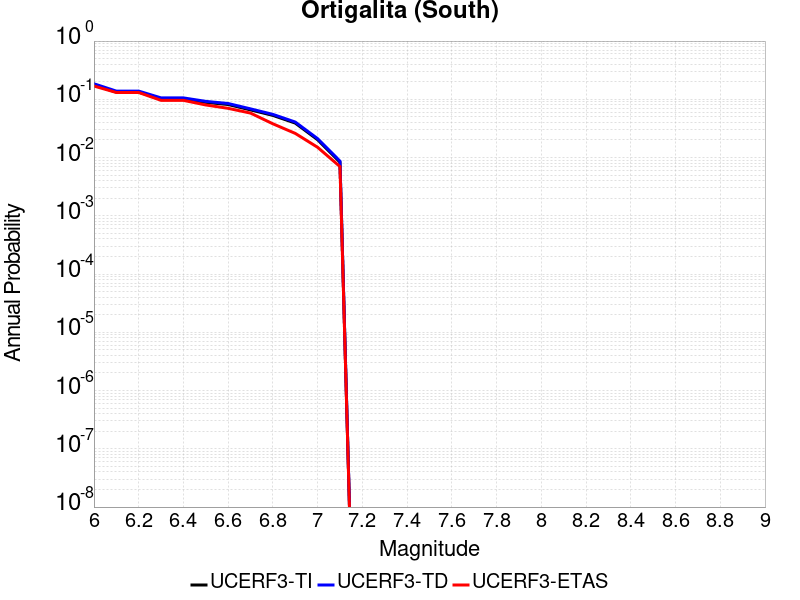 |
|-----|

| Magnitude | UCERF3-TI Prob | UCERF3-TD Prob | UCERF3-ETAS Prob |
|-----|-----|-----|-----|
| 6.0 | 0.17660025 | 0.18474166 | 0.169 |
| 6.1 | 0.13276808 | 0.13838668 | 0.131 |
| 6.2 | 0.13276808 | 0.13838668 | 0.131 |
| 6.3 | 0.10166251 | 0.105784535 | 0.096 |
| 6.4 | 0.10166251 | 0.105784535 | 0.096 |
| 6.5 | 0.08859891 | 0.09219321 | 0.08 |
| 6.6 | 0.08140207 | 0.08471801 | 0.07 |
| 6.7 | 0.06583409 | 0.068570144 | 0.058 |
| 6.8 | 0.052956972 | 0.05514009 | 0.038 |
| 6.9 | 0.039080285 | 0.040719144 | 0.026 |
| 7.0 | 0.020245412 | 0.02112384 | 0.015 |
| 7.1 | 0.008323105 | 0.008694009 | 0.007 |

## Owens Valley
*[(top)](#table-of-contents)*

|  |
|-----|

| Magnitude | UCERF3-TI Prob | UCERF3-TD Prob | UCERF3-ETAS Prob |
|-----|-----|-----|-----|
| 6.0 | 0.22311038 | 0.013020136 | 0.023 |
| 6.1 | 0.22311038 | 0.013020136 | 0.023 |
| 6.2 | 0.22311038 | 0.013020136 | 0.023 |
| 6.3 | 0.1863837 | 0.0126629975 | 0.023 |
| 6.4 | 0.1863837 | 0.0126629975 | 0.023 |
| 6.5 | 0.16506574 | 0.012535049 | 0.023 |
| 6.6 | 0.14991824 | 0.012473118 | 0.023 |
| 6.7 | 0.13624084 | 0.012403899 | 0.022 |
| 6.8 | 0.12342036 | 0.009896905 | 0.013 |
| 6.9 | 0.11172201 | 0.0072958907 | 0.01 |
| 7.0 | 0.10318596 | 0.0070150797 | 0.01 |
| 7.1 | 0.09650486 | 0.0064081927 | 0.009 |
| 7.2 | 0.08905872 | 0.0058143116 | 0.007 |
| 7.3 | 0.06372201 | 0.005137353 | 0.006 |
| 7.4 | 0.038315225 | 0.003847887 | 0.004 |
| 7.5 | 0.012823021 | 0.0026807438 | 0.003 |
| 7.6 | 0.005893794 | 0.0013155274 | 0.001 |
| 7.7 | 0.0025333527 | 3.2343244E-4 | 0.0 |

## Owens Valley Keough Hot Springs
*[(top)](#table-of-contents)*

|  |
|-----|

| Magnitude | UCERF3-TI Prob | UCERF3-TD Prob | UCERF3-ETAS Prob |
|-----|-----|-----|-----|
| 6.0 | 0.078696266 | 0.022964368 | 0.04 |
| 6.1 | 0.078696266 | 0.022964368 | 0.04 |
| 6.2 | 0.078696266 | 0.022964368 | 0.04 |
| 6.3 | 0.078696266 | 0.022964368 | 0.04 |
| 6.4 | 0.07346061 | 0.01719739 | 0.028 |
| 6.5 | 0.0672176 | 0.010317338 | 0.018 |
| 6.6 | 0.0672046 | 0.010303272 | 0.018 |
| 6.7 | 0.06713334 | 0.010253694 | 0.017 |
| 6.8 | 0.06285525 | 0.0076574283 | 0.009 |
| 6.9 | 0.056423236 | 0.0049253525 | 0.006 |
| 7.0 | 0.055712 | 0.0045850817 | 0.006 |
| 7.1 | 0.05307357 | 0.00392346 | 0.005 |
| 7.2 | 0.05078671 | 0.003251773 | 0.004 |
| 7.3 | 0.048189346 | 0.0026653188 | 0.003 |
| 7.4 | 0.03275454 | 0.00189177 | 0.002 |
| 7.5 | 0.008413504 | 0.0011488283 | 0.001 |
| 7.6 | 0.002973015 | 4.1634397E-4 | 0.0 |
| 7.7 | 0.0013551406 | 1.614252E-4 | 0.0 |

## Owl Lake
*[(top)](#table-of-contents)*

| 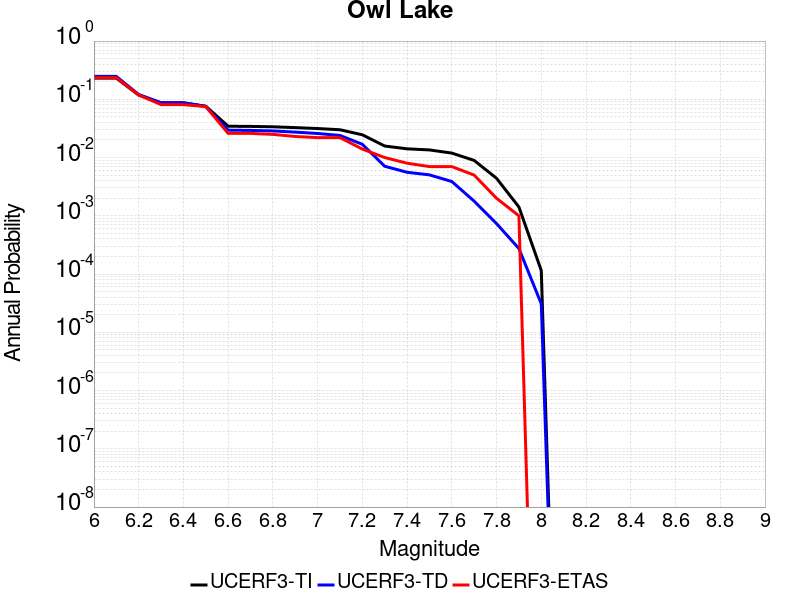 |
|-----|

| Magnitude | UCERF3-TI Prob | UCERF3-TD Prob | UCERF3-ETAS Prob |
|-----|-----|-----|-----|
| 6.0 | 0.23092943 | 0.24730512 | 0.236 |
| 6.1 | 0.23092943 | 0.24730512 | 0.236 |
| 6.2 | 0.11828541 | 0.121068284 | 0.119 |
| 6.3 | 0.08695145 | 0.08716768 | 0.081 |
| 6.4 | 0.08695145 | 0.08716768 | 0.081 |
| 6.5 | 0.07616517 | 0.07548812 | 0.075 |
| 6.6 | 0.034492556 | 0.02953014 | 0.026 |
| 6.7 | 0.034269236 | 0.029248282 | 0.026 |
| 6.8 | 0.033738285 | 0.028633678 | 0.025 |
| 6.9 | 0.03265833 | 0.027338406 | 0.023 |
| 7.0 | 0.031500887 | 0.025888136 | 0.022 |
| 7.1 | 0.030027581 | 0.023962736 | 0.022 |
| 7.2 | 0.02459086 | 0.016882509 | 0.014 |
| 7.3 | 0.015785927 | 0.007093667 | 0.01 |
| 7.4 | 0.014125215 | 0.005590627 | 0.008 |
| 7.5 | 0.013521385 | 0.00504459 | 0.007 |
| 7.6 | 0.011933874 | 0.0038808207 | 0.007 |
| 7.7 | 0.008926475 | 0.001784024 | 0.005 |
| 7.8 | 0.004405251 | 7.342055E-4 | 0.002 |
| 7.9 | 0.001416551 | 2.7438163E-4 | 0.001 |
| 8.0 | 1.1476241E-4 | 3.0879368E-5 | 0.0 |

## Ozena
*[(top)](#table-of-contents)*

|  |
|-----|

| Magnitude | UCERF3-TI Prob | UCERF3-TD Prob | UCERF3-ETAS Prob |
|-----|-----|-----|-----|
| 6.0 | 0.007473934 | 0.007498166 | 0.005 |
| 6.1 | 0.007473934 | 0.007498166 | 0.005 |
| 6.2 | 0.007473934 | 0.007498166 | 0.005 |
| 6.3 | 0.007473934 | 0.007498166 | 0.005 |
| 6.4 | 0.007473934 | 0.007498166 | 0.005 |
| 6.5 | 0.007473934 | 0.007498166 | 0.005 |
| 6.6 | 0.007473934 | 0.007498166 | 0.005 |
| 6.7 | 0.007473934 | 0.007498166 | 0.005 |
| 6.8 | 0.004801004 | 0.0048162485 | 0.004 |
| 6.9 | 0.004758556 | 0.00477372 | 0.004 |
| 7.0 | 0.004564387 | 0.0045790835 | 0.004 |
| 7.1 | 0.004269194 | 0.004283096 | 0.004 |
| 7.2 | 0.0038470398 | 0.0038595463 | 0.004 |
| 7.3 | 0.0033806718 | 0.0033916873 | 0.003 |
| 7.4 | 0.002785963 | 0.0027950227 | 0.002 |
| 7.5 | 0.0015325224 | 0.0015369954 | 0.002 |
| 7.6 | 7.381537E-4 | 7.3976297E-4 | 0.002 |
| 7.7 | 2.3455471E-4 | 2.3502162E-4 | 0.0 |
| 7.8 | 3.1303134E-5 | 3.1369607E-5 | 0.0 |

## Palos Verdes
*[(top)](#table-of-contents)*

|  |
|-----|

| Magnitude | UCERF3-TI Prob | UCERF3-TD Prob | UCERF3-ETAS Prob |
|-----|-----|-----|-----|
| 6.0 | 0.27360332 | 0.29143956 | 0.203 |
| 6.1 | 0.27360332 | 0.29143956 | 0.203 |
| 6.2 | 0.27360332 | 0.29143956 | 0.203 |
| 6.3 | 0.19191776 | 0.20318477 | 0.142 |
| 6.4 | 0.19191776 | 0.20318477 | 0.142 |
| 6.5 | 0.14718251 | 0.15515901 | 0.104 |
| 6.6 | 0.14157082 | 0.14939271 | 0.102 |
| 6.7 | 0.11249763 | 0.118581496 | 0.075 |
| 6.8 | 0.105308205 | 0.11109245 | 0.07 |
| 6.9 | 0.09442868 | 0.099638216 | 0.064 |
| 7.0 | 0.085353985 | 0.090113595 | 0.056 |
| 7.1 | 0.08001375 | 0.084529765 | 0.053 |
| 7.2 | 0.07271332 | 0.07689376 | 0.048 |
| 7.3 | 0.0272161 | 0.02874272 | 0.019 |
| 7.4 | 0.0043108375 | 0.0043317685 | 0.001 |
| 7.5 | 0.003416976 | 0.0034345041 | 0.0 |
| 7.6 | 0.0018255716 | 0.0018354885 | 0.0 |
| 7.7 | 6.252223E-4 | 6.2855583E-4 | 0.0 |
| 7.8 | 1.5884507E-4 | 1.5976056E-4 | 0.0 |

## Panamint Valley
*[(top)](#table-of-contents)*

|  |
|-----|

| Magnitude | UCERF3-TI Prob | UCERF3-TD Prob | UCERF3-ETAS Prob |
|-----|-----|-----|-----|
| 6.0 | 0.1458457 | 0.14129831 | 0.108 |
| 6.1 | 0.1458457 | 0.14129831 | 0.108 |
| 6.2 | 0.1458457 | 0.14129831 | 0.108 |
| 6.3 | 0.13851427 | 0.13374 | 0.102 |
| 6.4 | 0.13851427 | 0.13374 | 0.102 |
| 6.5 | 0.133532 | 0.12863286 | 0.097 |
| 6.6 | 0.12748508 | 0.12224871 | 0.091 |
| 6.7 | 0.11999925 | 0.11443712 | 0.087 |
| 6.8 | 0.10958623 | 0.1046439 | 0.078 |
| 6.9 | 0.09863974 | 0.09396698 | 0.072 |
| 7.0 | 0.09132593 | 0.08690317 | 0.068 |
| 7.1 | 0.0880663 | 0.0835906 | 0.066 |
| 7.2 | 0.081926234 | 0.076952755 | 0.061 |
| 7.3 | 0.07296726 | 0.06825051 | 0.056 |
| 7.4 | 0.06486262 | 0.060469918 | 0.051 |
| 7.5 | 0.058917996 | 0.054762293 | 0.047 |
| 7.6 | 0.015566703 | 0.014003707 | 0.01 |

## Paradise
*[(top)](#table-of-contents)*

|  |
|-----|

| Magnitude | UCERF3-TI Prob | UCERF3-TD Prob | UCERF3-ETAS Prob |
|-----|-----|-----|-----|
| 6.0 | 0.07456594 | 0.0788125 | 0.081 |
| 6.1 | 0.07456594 | 0.0788125 | 0.081 |
| 6.2 | 0.07456594 | 0.0788125 | 0.081 |
| 6.3 | 0.05295247 | 0.056596793 | 0.05 |
| 6.4 | 0.05295247 | 0.056596793 | 0.05 |
| 6.5 | 0.047120485 | 0.05064604 | 0.043 |
| 6.6 | 0.0404046 | 0.043782096 | 0.037 |
| 6.7 | 0.036902893 | 0.040211987 | 0.033 |
| 6.8 | 0.03432989 | 0.037528045 | 0.028 |
| 6.9 | 0.03103513 | 0.034128893 | 0.025 |
| 7.0 | 0.021340149 | 0.024190446 | 0.016 |
| 7.1 | 0.019466292 | 0.022057412 | 0.014 |
| 7.2 | 0.0176178 | 0.019813985 | 0.013 |
| 7.3 | 0.015498292 | 0.017336393 | 0.013 |
| 7.4 | 0.0124704465 | 0.013851044 | 0.01 |
| 7.5 | 0.006610005 | 0.007293508 | 0.005 |
| 7.6 | 0.0011533784 | 0.0012533397 | 0.0 |

## Peralta Hills
*[(top)](#table-of-contents)*

| 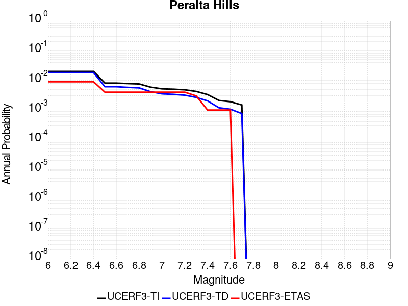 |
|-----|

| Magnitude | UCERF3-TI Prob | UCERF3-TD Prob | UCERF3-ETAS Prob |
|-----|-----|-----|-----|
| 6.0 | 0.020067364 | 0.018280594 | 0.009 |
| 6.1 | 0.020067364 | 0.018280594 | 0.009 |
| 6.2 | 0.020067364 | 0.018280594 | 0.009 |
| 6.3 | 0.020067364 | 0.018280594 | 0.009 |
| 6.4 | 0.020067364 | 0.018280594 | 0.009 |
| 6.5 | 0.008100503 | 0.0061082076 | 0.004 |
| 6.6 | 0.008100503 | 0.0061082076 | 0.004 |
| 6.7 | 0.0078058606 | 0.0058091613 | 0.004 |
| 6.8 | 0.00758101 | 0.005580573 | 0.004 |
| 6.9 | 0.0059215715 | 0.004156578 | 0.004 |
| 7.0 | 0.0051889126 | 0.0035177625 | 0.004 |
| 7.1 | 0.0050404607 | 0.0033834805 | 0.004 |
| 7.2 | 0.00481012 | 0.0031701352 | 0.004 |
| 7.3 | 0.0042480165 | 0.0026779424 | 0.003 |
| 7.4 | 0.003324646 | 0.002035151 | 0.001 |
| 7.5 | 0.0021002037 | 0.0011951705 | 0.001 |
| 7.6 | 0.0019146802 | 0.0010699374 | 0.001 |
| 7.7 | 0.0014842558 | 7.6330244E-4 | 0.0 |

## Pilarcitos 2011 CFM
*[(top)](#table-of-contents)*

|  |
|-----|

| Magnitude | UCERF3-TI Prob | UCERF3-TD Prob | UCERF3-ETAS Prob |
|-----|-----|-----|-----|
| 6.0 | 0.025320012 | 0.014932857 | 0.017 |
| 6.1 | 0.025320012 | 0.014932857 | 0.014 |
| 6.2 | 0.021484407 | 0.011024761 | 0.01 |
| 6.3 | 0.021484407 | 0.011024761 | 0.01 |
| 6.4 | 0.020025875 | 0.009539227 | 0.009 |
| 6.5 | 0.019191055 | 0.008700311 | 0.007 |
| 6.6 | 0.018121751 | 0.0076128794 | 0.006 |
| 6.7 | 0.017537443 | 0.0070337025 | 0.006 |
| 6.8 | 0.016790176 | 0.006302952 | 0.006 |
| 6.9 | 0.016168028 | 0.0056912987 | 0.004 |
| 7.0 | 0.015500949 | 0.00506276 | 0.003 |
| 7.1 | 0.014231864 | 0.0042599943 | 0.003 |
| 7.2 | 0.01343713 | 0.0036372582 | 0.002 |
| 7.3 | 0.012712015 | 0.0031126798 | 0.001 |
| 7.4 | 0.01210955 | 0.0027858985 | 0.001 |
| 7.5 | 0.011082786 | 0.0022496572 | 0.0 |
| 7.6 | 0.008544294 | 9.882401E-4 | 0.0 |
| 7.7 | 0.0070975735 | 6.338912E-4 | 0.0 |
| 7.8 | 0.005464287 | 5.363097E-4 | 0.0 |
| 7.9 | 0.0030511387 | 4.6557427E-4 | 0.0 |
| 8.0 | 0.0023332185 | 4.423185E-4 | 0.0 |
| 8.1 | 0.0013918092 | 3.6477053E-4 | 0.0 |
| 8.2 | 6.8867404E-5 | 8.519331E-6 | 0.0 |

## Pine Mtn
*[(top)](#table-of-contents)*

|  |
|-----|

| Magnitude | UCERF3-TI Prob | UCERF3-TD Prob | UCERF3-ETAS Prob |
|-----|-----|-----|-----|
| 6.0 | 0.03533674 | 0.034774326 | 0.031 |
| 6.1 | 0.03533674 | 0.034774326 | 0.031 |
| 6.2 | 0.03533674 | 0.034774326 | 0.031 |
| 6.3 | 0.03533674 | 0.034774326 | 0.031 |
| 6.4 | 0.03533674 | 0.034774326 | 0.031 |
| 6.5 | 0.03533674 | 0.034774326 | 0.031 |
| 6.6 | 0.03533674 | 0.034774326 | 0.031 |
| 6.7 | 0.03126106 | 0.030657463 | 0.029 |
| 6.8 | 0.029066065 | 0.02844038 | 0.024 |
| 6.9 | 0.023724193 | 0.023035482 | 0.02 |
| 7.0 | 0.02314367 | 0.022450818 | 0.02 |
| 7.1 | 0.016578592 | 0.015820263 | 0.012 |
| 7.2 | 0.011444922 | 0.010830426 | 0.009 |
| 7.3 | 0.0071567604 | 0.006568972 | 0.006 |
| 7.4 | 0.0058508134 | 0.0053457106 | 0.003 |
| 7.5 | 0.0041820495 | 0.003707849 | 0.002 |
| 7.6 | 0.0025510618 | 0.002126047 | 0.002 |
| 7.7 | 3.461203E-4 | 3.485187E-4 | 0.0 |
| 7.8 | 4.8188762E-5 | 4.8578822E-5 | 0.0 |

## Pinto Mtn
*[(top)](#table-of-contents)*

|  |
|-----|

| Magnitude | UCERF3-TI Prob | UCERF3-TD Prob | UCERF3-ETAS Prob |
|-----|-----|-----|-----|
| 6.0 | 0.20594937 | 0.21708281 | 0.162 |
| 6.1 | 0.20594937 | 0.21708281 | 0.162 |
| 6.2 | 0.20594937 | 0.21708281 | 0.162 |
| 6.3 | 0.20594937 | 0.21708281 | 0.162 |
| 6.4 | 0.17685755 | 0.18636566 | 0.139 |
| 6.5 | 0.17685755 | 0.18636566 | 0.139 |
| 6.6 | 0.14581323 | 0.15369786 | 0.111 |
| 6.7 | 0.1442661 | 0.15211016 | 0.109 |
| 6.8 | 0.12147194 | 0.12846737 | 0.094 |
| 6.9 | 0.114529505 | 0.12135806 | 0.092 |
| 7.0 | 0.10760573 | 0.114273064 | 0.088 |
| 7.1 | 0.10219849 | 0.108716786 | 0.084 |
| 7.2 | 0.094338134 | 0.1006719 | 0.073 |
| 7.3 | 0.06721929 | 0.07274438 | 0.057 |
| 7.4 | 0.047934536 | 0.052776325 | 0.035 |
| 7.5 | 0.036922593 | 0.040379632 | 0.029 |
| 7.6 | 0.017052965 | 0.018389331 | 0.013 |
| 7.7 | 0.0133415535 | 0.014275373 | 0.009 |

## Pisgah-Bullion Mtn-Mesquite Lk
*[(top)](#table-of-contents)*

| 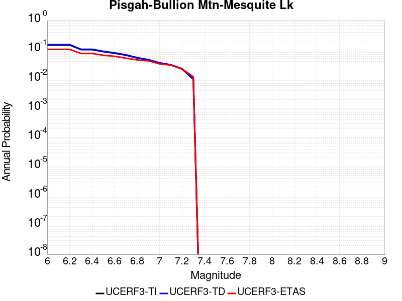 |
|-----|

| Magnitude | UCERF3-TI Prob | UCERF3-TD Prob | UCERF3-ETAS Prob |
|-----|-----|-----|-----|
| 6.0 | 0.14597474 | 0.15108144 | 0.104 |
| 6.1 | 0.14597474 | 0.15108144 | 0.104 |
| 6.2 | 0.14597474 | 0.15108144 | 0.104 |
| 6.3 | 0.101436466 | 0.10440158 | 0.075 |
| 6.4 | 0.101436466 | 0.10440158 | 0.075 |
| 6.5 | 0.086392425 | 0.08886376 | 0.065 |
| 6.6 | 0.07649452 | 0.07866246 | 0.06 |
| 6.7 | 0.06557055 | 0.067413 | 0.052 |
| 6.8 | 0.05259181 | 0.054010715 | 0.045 |
| 6.9 | 0.04496009 | 0.04616913 | 0.042 |
| 7.0 | 0.034976393 | 0.03591316 | 0.033 |
| 7.1 | 0.029997654 | 0.030810904 | 0.03 |
| 7.2 | 0.022075012 | 0.022690475 | 0.022 |
| 7.3 | 0.00976353 | 0.010046953 | 0.012 |

## Pitas Point (Lower West)
*[(top)](#table-of-contents)*

|  |
|-----|

| Magnitude | UCERF3-TI Prob | UCERF3-TD Prob | UCERF3-ETAS Prob |
|-----|-----|-----|-----|
| 6.0 | 0.041641664 | 0.04054242 | 0.049 |
| 6.1 | 0.041641664 | 0.04054242 | 0.049 |
| 6.2 | 0.041641664 | 0.04054242 | 0.049 |
| 6.3 | 0.041641664 | 0.04054242 | 0.049 |
| 6.4 | 0.041641664 | 0.04054242 | 0.049 |
| 6.5 | 0.041641664 | 0.04054242 | 0.049 |
| 6.6 | 0.041641664 | 0.04054242 | 0.049 |
| 6.7 | 0.041641664 | 0.04054242 | 0.049 |
| 6.8 | 0.041641664 | 0.04054242 | 0.049 |
| 6.9 | 0.041641664 | 0.04054242 | 0.049 |
| 7.0 | 0.041401792 | 0.040298425 | 0.047 |
| 7.1 | 0.040149316 | 0.0390235 | 0.042 |
| 7.2 | 0.03973756 | 0.038603175 | 0.04 |
| 7.3 | 0.037848894 | 0.0366718 | 0.04 |
| 7.4 | 0.035688255 | 0.03446437 | 0.038 |
| 7.5 | 0.03411638 | 0.032863047 | 0.037 |
| 7.6 | 0.028864892 | 0.027519183 | 0.027 |
| 7.7 | 0.023179898 | 0.021836633 | 0.02 |
| 7.8 | 0.013513897 | 0.012592737 | 0.011 |
| 7.9 | 0.0021089101 | 0.0019731976 | 0.001 |
| 8.0 | 4.06536E-5 | 3.5102566E-5 | 0.0 |

## Pitas Point (Lower)-Montalvo
*[(top)](#table-of-contents)*

|  |
|-----|

| Magnitude | UCERF3-TI Prob | UCERF3-TD Prob | UCERF3-ETAS Prob |
|-----|-----|-----|-----|
| 6.0 | 0.02704417 | 0.025901798 | 0.032 |
| 6.1 | 0.02704417 | 0.025901798 | 0.032 |
| 6.2 | 0.02704417 | 0.025901798 | 0.032 |
| 6.3 | 0.02704417 | 0.025901798 | 0.032 |
| 6.4 | 0.02704417 | 0.025901798 | 0.032 |
| 6.5 | 0.02704417 | 0.025901798 | 0.032 |
| 6.6 | 0.02704417 | 0.025901798 | 0.032 |
| 6.7 | 0.02704417 | 0.025901798 | 0.032 |
| 6.8 | 0.02704417 | 0.025901798 | 0.032 |
| 6.9 | 0.02704417 | 0.025901798 | 0.032 |
| 7.0 | 0.02704417 | 0.025901798 | 0.032 |
| 7.1 | 0.02704417 | 0.025901798 | 0.032 |
| 7.2 | 0.027001044 | 0.025858093 | 0.032 |
| 7.3 | 0.026903462 | 0.025759099 | 0.032 |
| 7.4 | 0.026822178 | 0.025676552 | 0.032 |
| 7.5 | 0.026375012 | 0.025222683 | 0.031 |
| 7.6 | 0.02514022 | 0.023969825 | 0.025 |
| 7.7 | 0.021081463 | 0.01985839 | 0.021 |
| 7.8 | 0.013189331 | 0.012308556 | 0.012 |
| 7.9 | 0.0021722899 | 0.002029541 | 0.001 |
| 8.0 | 4.06536E-5 | 3.5102566E-5 | 0.0 |

## Pittville 2011 CFM
*[(top)](#table-of-contents)*

| 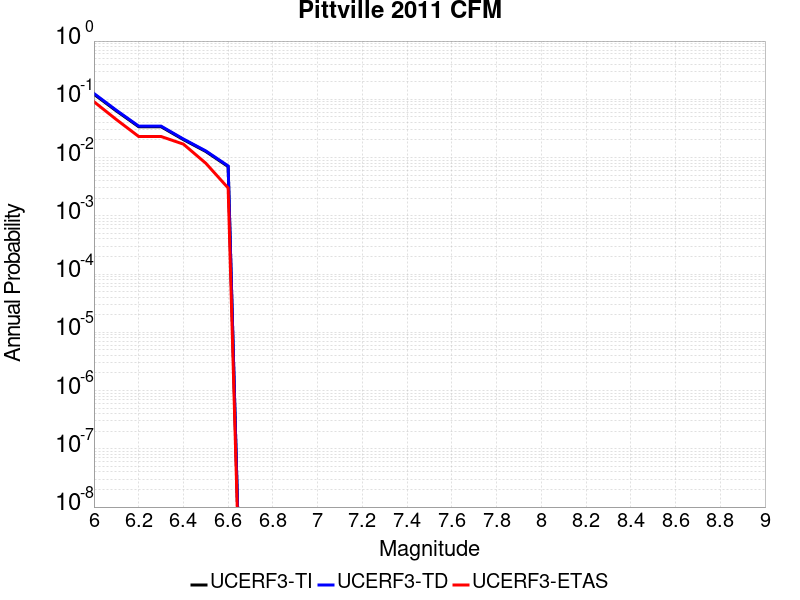 |
|-----|

| Magnitude | UCERF3-TI Prob | UCERF3-TD Prob | UCERF3-ETAS Prob |
|-----|-----|-----|-----|
| 6.0 | 0.12244369 | 0.12595217 | 0.091 |
| 6.1 | 0.06333813 | 0.06491776 | 0.045 |
| 6.2 | 0.033867955 | 0.03466394 | 0.023 |
| 6.3 | 0.033867955 | 0.03466394 | 0.023 |
| 6.4 | 0.020342898 | 0.020816518 | 0.017 |
| 6.5 | 0.0127194375 | 0.013018124 | 0.008 |
| 6.6 | 0.007010224 | 0.007178054 | 0.003 |

## Pleito
*[(top)](#table-of-contents)*

| 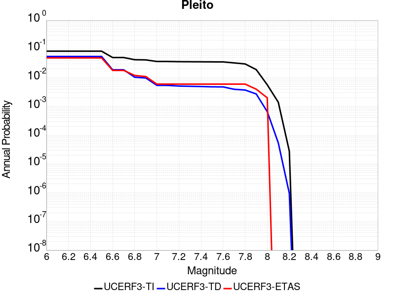 |
|-----|

| Magnitude | UCERF3-TI Prob | UCERF3-TD Prob | UCERF3-ETAS Prob |
|-----|-----|-----|-----|
| 6.0 | 0.083751544 | 0.054968417 | 0.049 |
| 6.1 | 0.083751544 | 0.054968417 | 0.049 |
| 6.2 | 0.083751544 | 0.054968417 | 0.049 |
| 6.3 | 0.083751544 | 0.054968417 | 0.049 |
| 6.4 | 0.083751544 | 0.054968417 | 0.049 |
| 6.5 | 0.083751544 | 0.054968417 | 0.049 |
| 6.6 | 0.0503961 | 0.018899824 | 0.018 |
| 6.7 | 0.0503961 | 0.018899824 | 0.018 |
| 6.8 | 0.04238479 | 0.01040685 | 0.012 |
| 6.9 | 0.041799754 | 0.009814513 | 0.011 |
| 7.0 | 0.036745522 | 0.005443024 | 0.006 |
| 7.1 | 0.03670681 | 0.0054148794 | 0.006 |
| 7.2 | 0.03619291 | 0.0051337704 | 0.006 |
| 7.3 | 0.035970867 | 0.0050421106 | 0.006 |
| 7.4 | 0.035801467 | 0.004946699 | 0.006 |
| 7.5 | 0.035611823 | 0.0048229042 | 0.006 |
| 7.6 | 0.035498515 | 0.0047969697 | 0.006 |
| 7.7 | 0.0328221 | 0.003963968 | 0.006 |
| 7.8 | 0.030146547 | 0.0037274882 | 0.006 |
| 7.9 | 0.019206649 | 0.0027274122 | 0.004 |
| 8.0 | 0.0056733172 | 6.599302E-4 | 0.002 |
| 8.1 | 0.0014023369 | 5.3947377E-5 | 0.0 |
| 8.2 | 2.7637048E-5 | 9.366706E-7 | 0.0 |

## Point Reyes 2011 CFM
*[(top)](#table-of-contents)*

|  |
|-----|

| Magnitude | UCERF3-TI Prob | UCERF3-TD Prob | UCERF3-ETAS Prob |
|-----|-----|-----|-----|
| 6.0 | 0.04520048 | 0.04511915 | 0.04 |
| 6.1 | 0.023341462 | 0.023066526 | 0.018 |
| 6.2 | 0.023341462 | 0.023066526 | 0.018 |
| 6.3 | 0.013908331 | 0.013565647 | 0.01 |
| 6.4 | 0.013908331 | 0.013565647 | 0.01 |
| 6.5 | 0.010010553 | 0.0096436115 | 0.009 |
| 6.6 | 0.0076547526 | 0.007273844 | 0.003 |
| 6.7 | 0.0044629206 | 0.004063571 | 0.001 |
| 6.8 | 0.003476625 | 0.0030717826 | 0.001 |
| 6.9 | 0.0022367495 | 0.001824959 | 0.0 |
| 7.0 | 0.001398076 | 9.833325E-4 | 0.0 |
| 7.1 | 0.0010144226 | 5.991208E-4 | 0.0 |
| 7.2 | 8.717921E-4 | 4.6488E-4 | 0.0 |
| 7.3 | 8.0860633E-4 | 4.16473E-4 | 0.0 |
| 7.4 | 7.4335246E-4 | 3.7720424E-4 | 0.0 |
| 7.5 | 6.629795E-4 | 3.3094047E-4 | 0.0 |
| 7.6 | 5.291963E-4 | 2.6275023E-4 | 0.0 |
| 7.7 | 3.6990514E-4 | 1.7050814E-4 | 0.0 |
| 7.8 | 2.0197353E-4 | 9.522062E-5 | 0.0 |
| 7.9 | 8.90585E-5 | 1.885286E-5 | 0.0 |
| 8.0 | 5.3077718E-5 | 1.313267E-6 | 0.0 |
| 8.1 | 1.9755262E-5 | 3.4533116E-7 | 0.0 |

## Point Reyes 2011 connector
*[(top)](#table-of-contents)*

| 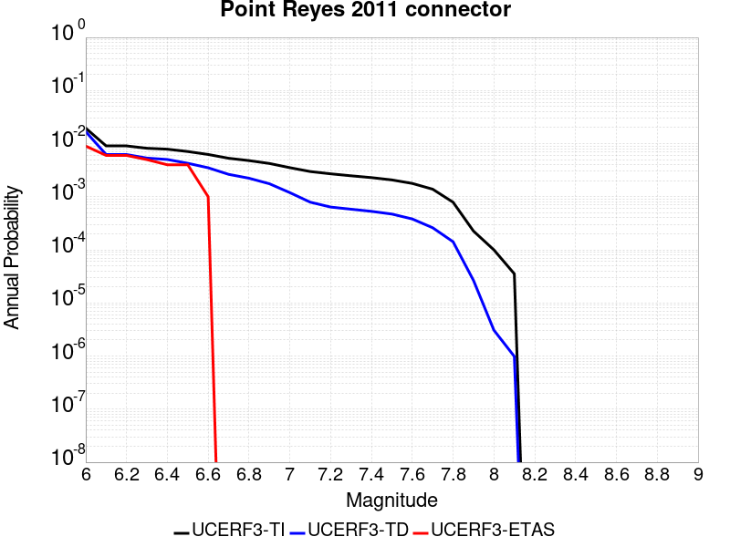 |
|-----|

| Magnitude | UCERF3-TI Prob | UCERF3-TD Prob | UCERF3-ETAS Prob |
|-----|-----|-----|-----|
| 6.0 | 0.019577902 | 0.016837679 | 0.009 |
| 6.1 | 0.009063615 | 0.0062332936 | 0.006 |
| 6.2 | 0.009063615 | 0.0062332936 | 0.006 |
| 6.3 | 0.008178851 | 0.005343152 | 0.005 |
| 6.4 | 0.007867947 | 0.005030431 | 0.004 |
| 6.5 | 0.007103716 | 0.004269093 | 0.004 |
| 6.6 | 0.006253642 | 0.003510886 | 0.001 |
| 6.7 | 0.0053054052 | 0.0026424378 | 0.0 |
| 6.8 | 0.004795318 | 0.002233043 | 0.0 |
| 6.9 | 0.00423345 | 0.0017572654 | 0.0 |
| 7.0 | 0.0035279926 | 0.0011958015 | 0.0 |
| 7.1 | 0.0029842958 | 7.9050555E-4 | 0.0 |
| 7.2 | 0.0027020837 | 6.395675E-4 | 0.0 |
| 7.3 | 0.0024806107 | 5.8250997E-4 | 0.0 |
| 7.4 | 0.0022925679 | 5.3102896E-4 | 0.0 |
| 7.5 | 0.0020745809 | 4.7219545E-4 | 0.0 |
| 7.6 | 0.0017823119 | 3.8164956E-4 | 0.0 |
| 7.7 | 0.0013875833 | 2.6068013E-4 | 0.0 |
| 7.8 | 7.8795524E-4 | 1.4195862E-4 | 0.0 |
| 7.9 | 2.2553316E-4 | 2.6549133E-5 | 0.0 |
| 8.0 | 9.99166E-5 | 3.0698943E-6 | 0.0 |
| 8.1 | 3.5372697E-5 | 9.84086E-7 | 0.0 |

## Polaris 2011 CFM
*[(top)](#table-of-contents)*

| 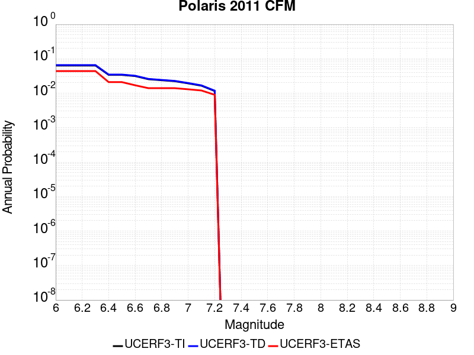 |
|-----|

| Magnitude | UCERF3-TI Prob | UCERF3-TD Prob | UCERF3-ETAS Prob |
|-----|-----|-----|-----|
| 6.0 | 0.063781366 | 0.06560757 | 0.044 |
| 6.1 | 0.063781366 | 0.06560757 | 0.044 |
| 6.2 | 0.063781366 | 0.06560757 | 0.044 |
| 6.3 | 0.063781366 | 0.06560757 | 0.044 |
| 6.4 | 0.03406845 | 0.03479683 | 0.021 |
| 6.5 | 0.03406845 | 0.03479683 | 0.021 |
| 6.6 | 0.031472508 | 0.032145955 | 0.017 |
| 6.7 | 0.025484873 | 0.02602957 | 0.014 |
| 6.8 | 0.02380001 | 0.024313066 | 0.014 |
| 6.9 | 0.022290787 | 0.02277523 | 0.014 |
| 7.0 | 0.01931658 | 0.019742072 | 0.013 |
| 7.1 | 0.01652558 | 0.016895197 | 0.012 |
| 7.2 | 0.011597672 | 0.011864958 | 0.009 |

## Puente Hills
*[(top)](#table-of-contents)*

| 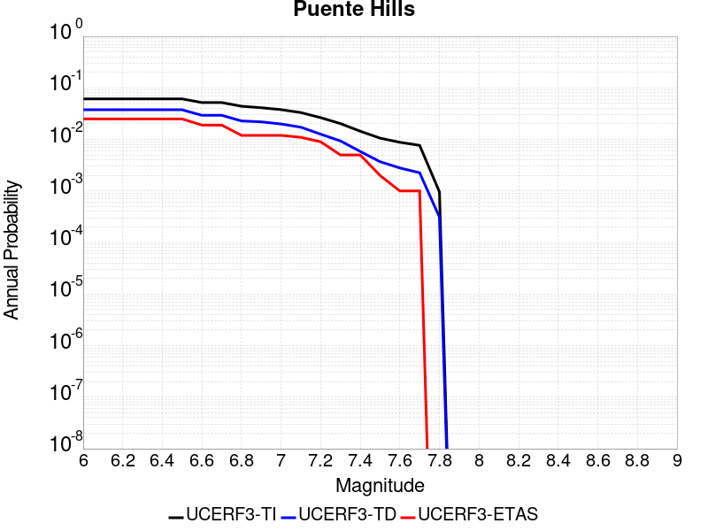 |
|-----|

| Magnitude | UCERF3-TI Prob | UCERF3-TD Prob | UCERF3-ETAS Prob |
|-----|-----|-----|-----|
| 6.0 | 0.061192747 | 0.037596565 | 0.025 |
| 6.1 | 0.061192747 | 0.037596565 | 0.025 |
| 6.2 | 0.061192747 | 0.037596565 | 0.025 |
| 6.3 | 0.061192747 | 0.037596565 | 0.025 |
| 6.4 | 0.061192747 | 0.037596565 | 0.025 |
| 6.5 | 0.061192747 | 0.037596565 | 0.025 |
| 6.6 | 0.051942147 | 0.029387908 | 0.019 |
| 6.7 | 0.051942147 | 0.029387908 | 0.019 |
| 6.8 | 0.044065326 | 0.022830484 | 0.012 |
| 6.9 | 0.041216437 | 0.021926744 | 0.012 |
| 7.0 | 0.03784535 | 0.01994109 | 0.012 |
| 7.1 | 0.03317645 | 0.017268917 | 0.011 |
| 7.2 | 0.026479814 | 0.012648771 | 0.009 |
| 7.3 | 0.020288477 | 0.009353612 | 0.005 |
| 7.4 | 0.014449527 | 0.005846092 | 0.005 |
| 7.5 | 0.010596945 | 0.0037006314 | 0.002 |
| 7.6 | 0.008809967 | 0.0027985256 | 0.001 |
| 7.7 | 0.007676106 | 0.002257549 | 0.001 |
| 7.8 | 9.613407E-4 | 3.1148852E-4 | 0.0 |

## Quien Sabe 2011 CFM
*[(top)](#table-of-contents)*

|  |
|-----|

| Magnitude | UCERF3-TI Prob | UCERF3-TD Prob | UCERF3-ETAS Prob |
|-----|-----|-----|-----|
| 6.0 | 0.17685625 | 0.20421699 | 0.124 |
| 6.1 | 0.08881827 | 0.102035895 | 0.059 |
| 6.2 | 0.025174985 | 0.028641347 | 0.013 |
| 6.3 | 0.019931776 | 0.022671388 | 0.01 |
| 6.4 | 0.015928097 | 0.018112702 | 0.008 |
| 6.5 | 0.013001784 | 0.014781183 | 0.006 |
| 6.6 | 0.009092468 | 0.010327561 | 0.004 |
| 6.7 | 0.007825943 | 0.008896468 | 0.004 |
| 6.8 | 0.0067209303 | 0.007588466 | 0.003 |
| 6.9 | 0.004637039 | 0.0051255887 | 0.003 |
| 7.0 | 0.0034842032 | 0.0038135964 | 0.001 |
| 7.1 | 0.002303897 | 0.0024738372 | 0.0 |
| 7.2 | 8.668823E-4 | 8.465108E-4 | 0.0 |
| 7.3 | 6.3337706E-4 | 6.141414E-4 | 0.0 |
| 7.4 | 1.2622733E-4 | 1.229109E-4 | 0.0 |
| 7.5 | 7.530546E-5 | 7.663462E-5 | 0.0 |

## Raymond
*[(top)](#table-of-contents)*

|  |
|-----|

| Magnitude | UCERF3-TI Prob | UCERF3-TD Prob | UCERF3-ETAS Prob |
|-----|-----|-----|-----|
| 6.0 | 0.07604306 | 0.0760267 | 0.067 |
| 6.1 | 0.07604306 | 0.0760267 | 0.067 |
| 6.2 | 0.07604306 | 0.0760267 | 0.067 |
| 6.3 | 0.07604306 | 0.0760267 | 0.067 |
| 6.4 | 0.07016449 | 0.06994128 | 0.06 |
| 6.5 | 0.07016449 | 0.06994128 | 0.06 |
| 6.6 | 0.053524427 | 0.052600637 | 0.041 |
| 6.7 | 0.053524427 | 0.052600637 | 0.041 |
| 6.8 | 0.05123272 | 0.050261766 | 0.036 |
| 6.9 | 0.03948949 | 0.038090207 | 0.022 |
| 7.0 | 0.036557946 | 0.03507632 | 0.02 |
| 7.1 | 0.029075863 | 0.027386952 | 0.018 |
| 7.2 | 0.02542578 | 0.023643164 | 0.016 |
| 7.3 | 0.021864798 | 0.019999249 | 0.015 |
| 7.4 | 0.018096743 | 0.016145315 | 0.01 |
| 7.5 | 0.014185032 | 0.012178968 | 0.008 |
| 7.6 | 0.009444526 | 0.007494571 | 0.006 |
| 7.7 | 0.0055469787 | 0.0035953363 | 0.001 |
| 7.8 | 0.003600921 | 0.0018323002 | 0.001 |
| 7.9 | 3.8736133E-4 | 2.861205E-4 | 0.0 |

## Red Mountain
*[(top)](#table-of-contents)*

|  |
|-----|

| Magnitude | UCERF3-TI Prob | UCERF3-TD Prob | UCERF3-ETAS Prob |
|-----|-----|-----|-----|
| 6.0 | 0.19600897 | 0.20251983 | 0.184 |
| 6.1 | 0.19600897 | 0.20251983 | 0.184 |
| 6.2 | 0.19600897 | 0.20251983 | 0.184 |
| 6.3 | 0.19600897 | 0.20251983 | 0.184 |
| 6.4 | 0.19600897 | 0.20251983 | 0.184 |
| 6.5 | 0.15176712 | 0.155783 | 0.146 |
| 6.6 | 0.15172641 | 0.15574075 | 0.146 |
| 6.7 | 0.13713494 | 0.14042674 | 0.135 |
| 6.8 | 0.13688977 | 0.14017297 | 0.134 |
| 6.9 | 0.11875456 | 0.121150285 | 0.111 |
| 7.0 | 0.11533308 | 0.117575295 | 0.108 |
| 7.1 | 0.10989893 | 0.11189803 | 0.101 |
| 7.2 | 0.08265596 | 0.08331022 | 0.071 |
| 7.3 | 0.07385012 | 0.074125774 | 0.063 |
| 7.4 | 0.031495597 | 0.029254995 | 0.02 |
| 7.5 | 0.030593462 | 0.02834553 | 0.02 |
| 7.6 | 0.025612995 | 0.023360617 | 0.012 |
| 7.7 | 0.017386362 | 0.015727943 | 0.009 |
| 7.8 | 0.006153178 | 0.0056635495 | 0.003 |
| 7.9 | 0.0011976815 | 0.001130632 | 0.0 |

## Red Pass
*[(top)](#table-of-contents)*

|  |
|-----|

| Magnitude | UCERF3-TI Prob | UCERF3-TD Prob | UCERF3-ETAS Prob |
|-----|-----|-----|-----|
| 6.0 | 0.042175483 | 0.042789225 | 0.039 |
| 6.1 | 0.018864937 | 0.019104471 | 0.02 |
| 6.2 | 0.018864937 | 0.019104471 | 0.02 |
| 6.3 | 0.0072395056 | 0.007329009 | 0.007 |
| 6.4 | 0.0072395056 | 0.007329009 | 0.007 |
| 6.5 | 0.005140325 | 0.005207107 | 0.005 |

## Redondo Canyon alt 1
*[(top)](#table-of-contents)*

| 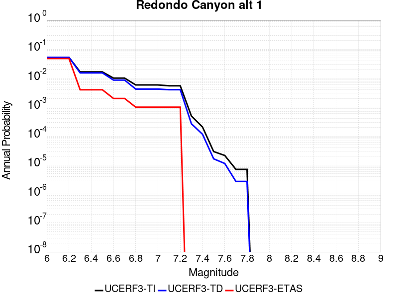 |
|-----|

| Magnitude | UCERF3-TI Prob | UCERF3-TD Prob | UCERF3-ETAS Prob |
|-----|-----|-----|-----|
| 6.0 | 0.052554168 | 0.052939724 | 0.048 |
| 6.1 | 0.052554168 | 0.052939724 | 0.048 |
| 6.2 | 0.052554168 | 0.052939724 | 0.048 |
| 6.3 | 0.016585635 | 0.015358521 | 0.004 |
| 6.4 | 0.016585635 | 0.015358521 | 0.004 |
| 6.5 | 0.016585635 | 0.015358521 | 0.004 |
| 6.6 | 0.010114607 | 0.008638024 | 0.002 |
| 6.7 | 0.010114607 | 0.008638024 | 0.002 |
| 6.8 | 0.005867535 | 0.0042222044 | 0.001 |
| 6.9 | 0.005867535 | 0.0042222044 | 0.001 |
| 7.0 | 0.005867535 | 0.0042222044 | 0.001 |
| 7.1 | 0.0054871957 | 0.0040146858 | 0.001 |
| 7.2 | 0.0054871957 | 0.0040146858 | 0.001 |
| 7.3 | 4.958428E-4 | 2.675933E-4 | 0.0 |
| 7.4 | 2.0619256E-4 | 1.1583759E-4 | 0.0 |
| 7.5 | 2.9289082E-5 | 1.6421049E-5 | 0.0 |
| 7.6 | 2.1426553E-5 | 1.1323388E-5 | 0.0 |
| 7.7 | 7.1065656E-6 | 2.7154206E-6 | 0.0 |
| 7.8 | 7.1065656E-6 | 2.7154206E-6 | 0.0 |

## Reliz 2011 CFM
*[(top)](#table-of-contents)*

|  |
|-----|

| Magnitude | UCERF3-TI Prob | UCERF3-TD Prob | UCERF3-ETAS Prob |
|-----|-----|-----|-----|
| 6.0 | 0.08010825 | 0.07966672 | 0.092 |
| 6.1 | 0.08010825 | 0.07966672 | 0.092 |
| 6.2 | 0.08010825 | 0.07966672 | 0.092 |
| 6.3 | 0.039844293 | 0.038791705 | 0.034 |
| 6.4 | 0.039844293 | 0.038791705 | 0.034 |
| 6.5 | 0.03064997 | 0.02950809 | 0.026 |
| 6.6 | 0.026946208 | 0.025770567 | 0.026 |
| 6.7 | 0.023615599 | 0.022407746 | 0.023 |
| 6.8 | 0.021046022 | 0.019813009 | 0.02 |
| 6.9 | 0.018482449 | 0.017223937 | 0.016 |
| 7.0 | 0.015665185 | 0.0143795535 | 0.015 |
| 7.1 | 0.013403342 | 0.012094927 | 0.012 |
| 7.2 | 0.011146729 | 0.009813707 | 0.007 |
| 7.3 | 0.008931852 | 0.0075763203 | 0.003 |
| 7.4 | 0.0066333753 | 0.005266745 | 0.003 |
| 7.5 | 0.00460525 | 0.0032381667 | 0.001 |
| 7.6 | 0.0027571463 | 0.0014549176 | 0.0 |
| 7.7 | 0.0015465945 | 4.476914E-4 | 0.0 |
| 7.8 | 6.52509E-4 | 2.4092711E-5 | 0.0 |
| 7.9 | 3.2415867E-4 | 6.036709E-6 | 0.0 |
| 8.0 | 3.090922E-5 | 1.7908716E-6 | 0.0 |

## Richfield
*[(top)](#table-of-contents)*

|  |
|-----|

| Magnitude | UCERF3-TI Prob | UCERF3-TD Prob | UCERF3-ETAS Prob |
|-----|-----|-----|-----|
| 6.0 | 0.0078826435 | 0.007926228 | 0.01 |
| 6.1 | 0.0078826435 | 0.007926228 | 0.01 |
| 6.2 | 0.0033719642 | 0.003389594 | 0.003 |
| 6.3 | 0.0033719642 | 0.003389594 | 0.003 |
| 6.4 | 0.0033719642 | 0.003389594 | 0.003 |
| 6.5 | 0.0014575577 | 0.0014637107 | 0.001 |
| 6.6 | 0.0014575577 | 0.0014637107 | 0.001 |
| 6.7 | 5.62186E-4 | 5.605259E-4 | 0.0 |
| 6.8 | 1.1114396E-4 | 1.0684957E-4 | 0.0 |
| 6.9 | 9.6074415E-5 | 9.1737755E-5 | 0.0 |
| 7.0 | 6.412823E-5 | 5.970626E-5 | 0.0 |
| 7.1 | 3.3255837E-5 | 3.180606E-5 | 0.0 |
| 7.2 | 1.9300638E-5 | 1.9359051E-5 | 0.0 |
| 7.3 | 1.0943858E-5 | 1.0979587E-5 | 0.0 |
| 7.4 | 3.042753E-8 | 3.0522887E-8 | 0.0 |

## Rinconada 2011 CFM
*[(top)](#table-of-contents)*

| 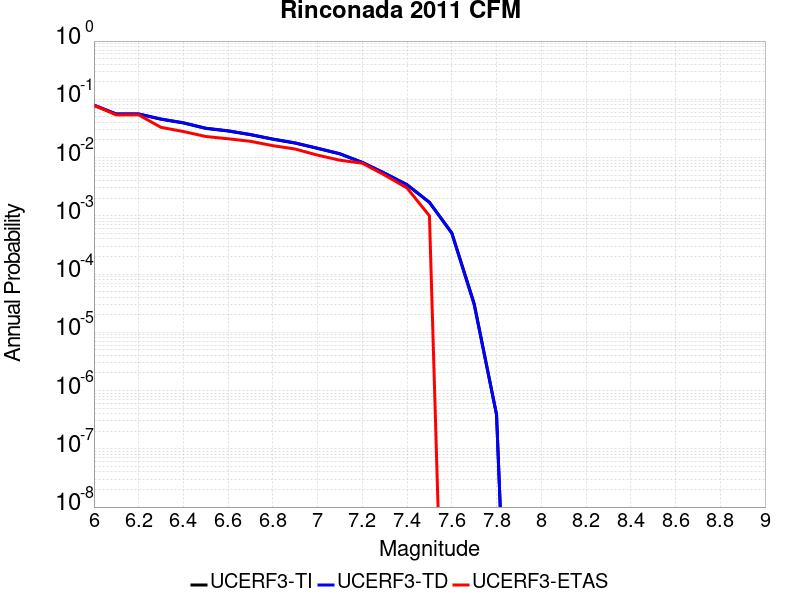 |
|-----|

| Magnitude | UCERF3-TI Prob | UCERF3-TD Prob | UCERF3-ETAS Prob |
|-----|-----|-----|-----|
| 6.0 | 0.07890698 | 0.079675674 | 0.079 |
| 6.1 | 0.055613745 | 0.056135837 | 0.054 |
| 6.2 | 0.055613745 | 0.056135837 | 0.054 |
| 6.3 | 0.04550758 | 0.04592718 | 0.033 |
| 6.4 | 0.039265715 | 0.039622027 | 0.028 |
| 6.5 | 0.03166692 | 0.03194783 | 0.023 |
| 6.6 | 0.028561406 | 0.028812118 | 0.021 |
| 6.7 | 0.024672937 | 0.0248853 | 0.019 |
| 6.8 | 0.02063226 | 0.020803675 | 0.016 |
| 6.9 | 0.017712487 | 0.017853178 | 0.014 |
| 7.0 | 0.014356072 | 0.0144635765 | 0.011 |
| 7.1 | 0.011554774 | 0.0116363345 | 0.009 |
| 7.2 | 0.008219625 | 0.008271794 | 0.008 |
| 7.3 | 0.0053633875 | 0.0053923056 | 0.005 |
| 7.4 | 0.003404345 | 0.0034188991 | 0.003 |
| 7.5 | 0.0017025429 | 0.0017044616 | 0.001 |
| 7.6 | 5.0883816E-4 | 5.0157396E-4 | 0.0 |
| 7.7 | 3.130741E-5 | 2.97939E-5 | 0.0 |
| 7.8 | 3.861217E-7 | 3.8715507E-7 | 0.0 |

## Robinson Creek
*[(top)](#table-of-contents)*

| 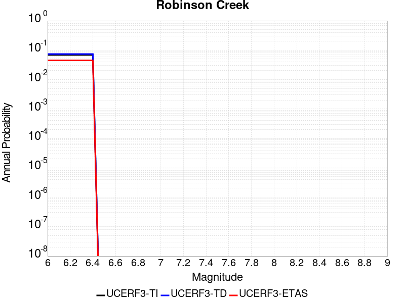 |
|-----|

| Magnitude | UCERF3-TI Prob | UCERF3-TD Prob | UCERF3-ETAS Prob |
|-----|-----|-----|-----|
| 6.0 | 0.069015756 | 0.0738362 | 0.045 |
| 6.1 | 0.069015756 | 0.0738362 | 0.045 |
| 6.2 | 0.069015756 | 0.0738362 | 0.045 |
| 6.3 | 0.069015756 | 0.0738362 | 0.045 |
| 6.4 | 0.069015756 | 0.0738362 | 0.045 |

## Rocky Ledge 2011 CFM
*[(top)](#table-of-contents)*

|  |
|-----|

| Magnitude | UCERF3-TI Prob | UCERF3-TD Prob | UCERF3-ETAS Prob |
|-----|-----|-----|-----|
| 6.0 | 0.044655062 | 0.046490353 | 0.042 |
| 6.1 | 0.044655062 | 0.046490353 | 0.032 |
| 6.2 | 0.038088642 | 0.039765045 | 0.029 |

## Rodgers Creek - Healdsburg 2011 CFM
*[(top)](#table-of-contents)*

| 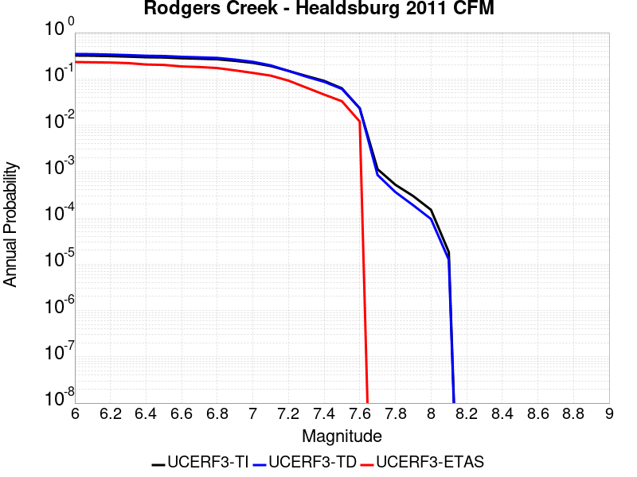 |
|-----|

| Magnitude | UCERF3-TI Prob | UCERF3-TD Prob | UCERF3-ETAS Prob |
|-----|-----|-----|-----|
| 6.0 | 0.3199734 | 0.3459446 | 0.232 |
| 6.1 | 0.31743455 | 0.34325626 | 0.229 |
| 6.2 | 0.3109649 | 0.3358457 | 0.226 |
| 6.3 | 0.30328584 | 0.32729173 | 0.22 |
| 6.4 | 0.29414177 | 0.31678343 | 0.205 |
| 6.5 | 0.29036734 | 0.31268334 | 0.201 |
| 6.6 | 0.2797758 | 0.3005592 | 0.186 |
| 6.7 | 0.27319425 | 0.2930533 | 0.181 |
| 6.8 | 0.26587442 | 0.2847289 | 0.172 |
| 6.9 | 0.24567382 | 0.2616085 | 0.153 |
| 7.0 | 0.22261813 | 0.23435955 | 0.135 |
| 7.1 | 0.18962255 | 0.19671826 | 0.118 |
| 7.2 | 0.14919099 | 0.14890437 | 0.092 |
| 7.3 | 0.11593291 | 0.11199795 | 0.065 |
| 7.4 | 0.09083862 | 0.086822174 | 0.046 |
| 7.5 | 0.062709 | 0.060803168 | 0.033 |
| 7.6 | 0.023090394 | 0.023388343 | 0.012 |
| 7.7 | 0.0011253492 | 8.438682E-4 | 0.0 |
| 7.8 | 5.1968504E-4 | 3.6091957E-4 | 0.0 |
| 7.9 | 2.9604483E-4 | 1.874463E-4 | 0.0 |
| 8.0 | 1.4929431E-4 | 9.459787E-5 | 0.0 |
| 8.1 | 1.8285913E-5 | 1.2506881E-5 | 0.0 |

## Rose Canyon
*[(top)](#table-of-contents)*

|  |
|-----|

| Magnitude | UCERF3-TI Prob | UCERF3-TD Prob | UCERF3-ETAS Prob |
|-----|-----|-----|-----|
| 6.0 | 0.21307805 | 0.19971518 | 0.249 |
| 6.1 | 0.21307805 | 0.19971518 | 0.164 |
| 6.2 | 0.13973075 | 0.12675473 | 0.1 |
| 6.3 | 0.11388397 | 0.10172256 | 0.077 |
| 6.4 | 0.09941049 | 0.08808441 | 0.066 |
| 6.5 | 0.08855276 | 0.07793298 | 0.059 |
| 6.6 | 0.076380245 | 0.06679507 | 0.053 |
| 6.7 | 0.06413828 | 0.05594588 | 0.048 |
| 6.8 | 0.058510665 | 0.051499356 | 0.042 |
| 6.9 | 0.044540532 | 0.039831754 | 0.032 |
| 7.0 | 0.030487148 | 0.027643196 | 0.023 |
| 7.1 | 0.025820129 | 0.023282526 | 0.02 |
| 7.2 | 0.021272086 | 0.019004928 | 0.013 |
| 7.3 | 0.01660023 | 0.014708976 | 0.01 |
| 7.4 | 0.012545138 | 0.010912633 | 0.008 |
| 7.5 | 0.007197004 | 0.005756058 | 0.005 |
| 7.6 | 0.0052154693 | 0.0039607263 | 0.003 |
| 7.7 | 4.570848E-4 | 4.1783592E-4 | 0.0 |

## Round Valley
*[(top)](#table-of-contents)*

|  |
|-----|

| Magnitude | UCERF3-TI Prob | UCERF3-TD Prob | UCERF3-ETAS Prob |
|-----|-----|-----|-----|
| 6.0 | 0.07952751 | 0.08195012 | 0.053 |
| 6.1 | 0.07952751 | 0.08195012 | 0.053 |
| 6.2 | 0.07952751 | 0.08195012 | 0.053 |
| 6.3 | 0.07952751 | 0.08195012 | 0.053 |
| 6.4 | 0.07952751 | 0.08195012 | 0.053 |
| 6.5 | 0.054038733 | 0.05556329 | 0.036 |
| 6.6 | 0.044046234 | 0.045300383 | 0.029 |
| 6.7 | 0.044046234 | 0.045300383 | 0.029 |
| 6.8 | 0.03658976 | 0.03765978 | 0.025 |
| 6.9 | 0.03340835 | 0.034399707 | 0.023 |
| 7.0 | 0.026064262 | 0.026851546 | 0.02 |
| 7.1 | 0.022785192 | 0.023476202 | 0.018 |
| 7.2 | 0.013142738 | 0.013556731 | 0.01 |
| 7.3 | 0.0041136323 | 0.0042432984 | 0.004 |

## Russ 2011 CFM
*[(top)](#table-of-contents)*

|  |
|-----|

| Magnitude | UCERF3-TI Prob | UCERF3-TD Prob | UCERF3-ETAS Prob |
|-----|-----|-----|-----|
| 6.0 | 0.11681421 | 0.12054918 | 0.089 |
| 6.1 | 0.11681421 | 0.12054918 | 0.089 |
| 6.2 | 0.11681421 | 0.12054918 | 0.089 |
| 6.3 | 0.11681421 | 0.12054918 | 0.089 |
| 6.4 | 0.11681421 | 0.12054918 | 0.089 |
| 6.5 | 0.11681421 | 0.12054918 | 0.089 |
| 6.6 | 0.11681421 | 0.12054918 | 0.089 |
| 6.7 | 0.082568385 | 0.08513877 | 0.05 |
| 6.8 | 0.082568385 | 0.08513877 | 0.05 |
| 6.9 | 0.065442584 | 0.06748015 | 0.043 |
| 7.0 | 0.051839825 | 0.053464033 | 0.033 |
| 7.1 | 0.042756133 | 0.044117145 | 0.029 |
| 7.2 | 0.034100693 | 0.035211474 | 0.023 |
| 7.3 | 0.02552283 | 0.02638294 | 0.015 |

## San Andreas (Big Bend)
*[(top)](#table-of-contents)*

|  |
|-----|

| Magnitude | UCERF3-TI Prob | UCERF3-TD Prob | UCERF3-ETAS Prob |
|-----|-----|-----|-----|
| 6.0 | 0.41210285 | 0.22802703 | 0.146 |
| 6.1 | 0.41210285 | 0.22802703 | 0.146 |
| 6.2 | 0.41210285 | 0.22802703 | 0.146 |
| 6.3 | 0.41210285 | 0.22802703 | 0.146 |
| 6.4 | 0.3800916 | 0.19582386 | 0.105 |
| 6.5 | 0.3800916 | 0.19582386 | 0.105 |
| 6.6 | 0.37615442 | 0.19200435 | 0.101 |
| 6.7 | 0.3742323 | 0.19020747 | 0.096 |
| 6.8 | 0.3730398 | 0.18925516 | 0.096 |
| 6.9 | 0.37012282 | 0.18670823 | 0.092 |
| 7.0 | 0.366335 | 0.18382885 | 0.088 |
| 7.1 | 0.36440182 | 0.18250103 | 0.087 |
| 7.2 | 0.3617947 | 0.1802542 | 0.086 |
| 7.3 | 0.36051944 | 0.1796104 | 0.086 |
| 7.4 | 0.35968313 | 0.17920408 | 0.086 |
| 7.5 | 0.35754025 | 0.1775595 | 0.085 |
| 7.6 | 0.34950835 | 0.17068325 | 0.076 |
| 7.7 | 0.30614218 | 0.13662718 | 0.054 |
| 7.8 | 0.28448674 | 0.12759253 | 0.053 |
| 7.9 | 0.22722232 | 0.09793396 | 0.037 |
| 8.0 | 0.16015619 | 0.06326967 | 0.018 |
| 8.1 | 0.09487985 | 0.0278404 | 0.002 |
| 8.2 | 0.044100937 | 0.009239306 | 0.001 |
| 8.3 | 0.0102941245 | 0.001015148 | 0.0 |

## San Andreas (Carrizo) rev
*[(top)](#table-of-contents)*

|  |
|-----|

| Magnitude | UCERF3-TI Prob | UCERF3-TD Prob | UCERF3-ETAS Prob |
|-----|-----|-----|-----|
| 6.0 | 0.4562149 | 0.29290828 | 0.199 |
| 6.1 | 0.4562149 | 0.29290828 | 0.199 |
| 6.2 | 0.4562149 | 0.29290828 | 0.199 |
| 6.3 | 0.4562149 | 0.29290828 | 0.199 |
| 6.4 | 0.4562149 | 0.29290828 | 0.199 |
| 6.5 | 0.4458732 | 0.28062707 | 0.183 |
| 6.6 | 0.4458732 | 0.28062707 | 0.183 |
| 6.7 | 0.4411122 | 0.2749857 | 0.178 |
| 6.8 | 0.4397665 | 0.27351624 | 0.175 |
| 6.9 | 0.43829313 | 0.27190703 | 0.173 |
| 7.0 | 0.43688783 | 0.27046323 | 0.173 |
| 7.1 | 0.4160219 | 0.24760926 | 0.14 |
| 7.2 | 0.407406 | 0.2384115 | 0.134 |
| 7.3 | 0.4008595 | 0.23167677 | 0.131 |
| 7.4 | 0.3928804 | 0.22328587 | 0.125 |
| 7.5 | 0.3430718 | 0.16823474 | 0.077 |
| 7.6 | 0.3377232 | 0.16340339 | 0.073 |
| 7.7 | 0.29530886 | 0.1291464 | 0.051 |
| 7.8 | 0.27442318 | 0.11991559 | 0.05 |
| 7.9 | 0.22008279 | 0.09254142 | 0.034 |
| 8.0 | 0.16061361 | 0.06318847 | 0.018 |
| 8.1 | 0.09521291 | 0.027877906 | 0.002 |
| 8.2 | 0.044100937 | 0.009239306 | 0.001 |
| 8.3 | 0.0102941245 | 0.001015148 | 0.0 |

## San Andreas (Cholame) rev
*[(top)](#table-of-contents)*

|  |
|-----|

| Magnitude | UCERF3-TI Prob | UCERF3-TD Prob | UCERF3-ETAS Prob |
|-----|-----|-----|-----|
| 6.0 | 0.47374377 | 0.32593817 | 0.244 |
| 6.1 | 0.47374377 | 0.32593817 | 0.244 |
| 6.2 | 0.47101948 | 0.3228057 | 0.241 |
| 6.3 | 0.469335 | 0.32084987 | 0.24 |
| 6.4 | 0.4615961 | 0.31133947 | 0.225 |
| 6.5 | 0.45819098 | 0.30678535 | 0.22 |
| 6.6 | 0.44715247 | 0.2935298 | 0.204 |
| 6.7 | 0.44465145 | 0.29041022 | 0.202 |
| 6.8 | 0.44310063 | 0.28849173 | 0.198 |
| 6.9 | 0.441027 | 0.28600934 | 0.196 |
| 7.0 | 0.43572342 | 0.27934638 | 0.191 |
| 7.1 | 0.40432116 | 0.24126072 | 0.141 |
| 7.2 | 0.39709097 | 0.23328376 | 0.135 |
| 7.3 | 0.39000255 | 0.2256334 | 0.132 |
| 7.4 | 0.38191375 | 0.21708374 | 0.126 |
| 7.5 | 0.33144832 | 0.16162835 | 0.078 |
| 7.6 | 0.3260939 | 0.1566565 | 0.074 |
| 7.7 | 0.28310165 | 0.122086264 | 0.052 |
| 7.8 | 0.2635795 | 0.11368542 | 0.051 |
| 7.9 | 0.2131997 | 0.087838136 | 0.035 |
| 8.0 | 0.1579637 | 0.061643105 | 0.018 |
| 8.1 | 0.09522255 | 0.027879085 | 0.002 |
| 8.2 | 0.044100937 | 0.009239306 | 0.001 |
| 8.3 | 0.0102941245 | 0.001015148 | 0.0 |

## San Andreas (Coachella) rev
*[(top)](#table-of-contents)*

| 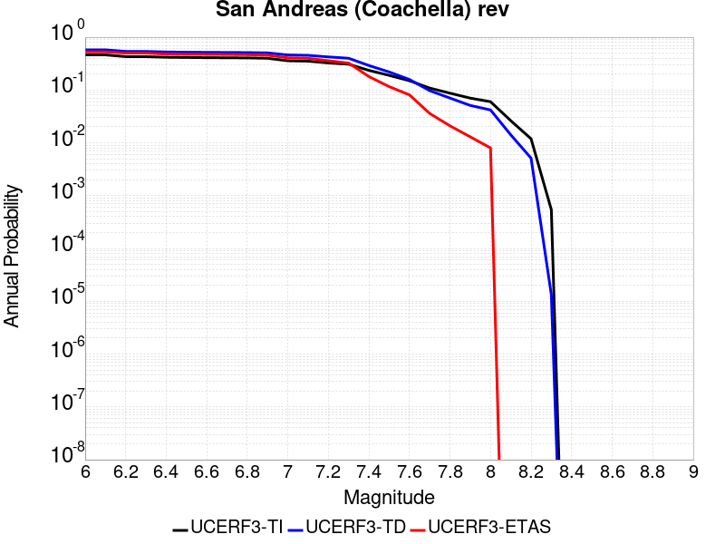 |
|-----|

| Magnitude | UCERF3-TI Prob | UCERF3-TD Prob | UCERF3-ETAS Prob |
|-----|-----|-----|-----|
| 6.0 | 0.46329993 | 0.5770634 | 0.529 |
| 6.1 | 0.46329993 | 0.5770634 | 0.529 |
| 6.2 | 0.42913184 | 0.53874385 | 0.502 |
| 6.3 | 0.4284023 | 0.5380282 | 0.501 |
| 6.4 | 0.41747683 | 0.5254886 | 0.48 |
| 6.5 | 0.4135719 | 0.5209861 | 0.476 |
| 6.6 | 0.4101604 | 0.51725954 | 0.474 |
| 6.7 | 0.4081229 | 0.51503384 | 0.471 |
| 6.8 | 0.40583733 | 0.51233584 | 0.467 |
| 6.9 | 0.39961538 | 0.50554496 | 0.457 |
| 7.0 | 0.3582628 | 0.4609061 | 0.407 |
| 7.1 | 0.3521767 | 0.4539487 | 0.399 |
| 7.2 | 0.32611063 | 0.42404723 | 0.359 |
| 7.3 | 0.30898458 | 0.3997138 | 0.324 |
| 7.4 | 0.23549679 | 0.29138952 | 0.18 |
| 7.5 | 0.1895831 | 0.21973133 | 0.116 |
| 7.6 | 0.15009998 | 0.15847132 | 0.081 |
| 7.7 | 0.10892 | 0.09724006 | 0.036 |
| 7.8 | 0.087196186 | 0.07048128 | 0.021 |
| 7.9 | 0.07028743 | 0.051101472 | 0.013 |
| 8.0 | 0.060142584 | 0.041981116 | 0.008 |
| 8.1 | 0.026264574 | 0.014155965 | 0.0 |
| 8.2 | 0.011931671 | 0.0051375125 | 0.0 |
| 8.3 | 5.437848E-4 | 1.32780115E-5 | 0.0 |

## San Andreas (Creeping Section) 2011 CFM
*[(top)](#table-of-contents)*

|  |
|-----|

| Magnitude | UCERF3-TI Prob | UCERF3-TD Prob | UCERF3-ETAS Prob |
|-----|-----|-----|-----|
| 6.0 | 0.95604527 | 0.8540462 | 0.967 |
| 6.1 | 0.92704445 | 0.81152415 | 0.92 |
| 6.2 | 0.8806676 | 0.7512661 | 0.842 |
| 6.3 | 0.8359904 | 0.7019269 | 0.745 |
| 6.4 | 0.7838312 | 0.6532738 | 0.627 |
| 6.5 | 0.70525014 | 0.5817359 | 0.474 |
| 6.6 | 0.562504 | 0.46262437 | 0.228 |
| 6.7 | 0.5573189 | 0.45666376 | 0.221 |
| 6.8 | 0.5555146 | 0.4542275 | 0.221 |
| 6.9 | 0.54649615 | 0.4413873 | 0.215 |
| 7.0 | 0.53293425 | 0.4223521 | 0.195 |
| 7.1 | 0.4530972 | 0.31854364 | 0.129 |
| 7.2 | 0.41862622 | 0.27096865 | 0.106 |
| 7.3 | 0.3855325 | 0.22343253 | 0.082 |
| 7.4 | 0.36391366 | 0.1939719 | 0.07 |
| 7.5 | 0.3168955 | 0.14045578 | 0.034 |
| 7.6 | 0.28367293 | 0.111554705 | 0.033 |
| 7.7 | 0.24967696 | 0.080838665 | 0.022 |
| 7.8 | 0.23073141 | 0.074053116 | 0.021 |
| 7.9 | 0.17673948 | 0.06025306 | 0.02 |
| 8.0 | 0.13281496 | 0.042819653 | 0.012 |
| 8.1 | 0.08936402 | 0.026284894 | 0.002 |
| 8.2 | 0.044100937 | 0.009239306 | 0.001 |
| 8.3 | 0.0102941245 | 0.001015148 | 0.0 |

## San Andreas (Mojave N)
*[(top)](#table-of-contents)*

|  |
|-----|

| Magnitude | UCERF3-TI Prob | UCERF3-TD Prob | UCERF3-ETAS Prob |
|-----|-----|-----|-----|
| 6.0 | 0.40275556 | 0.19528592 | 0.113 |
| 6.1 | 0.40275556 | 0.19528592 | 0.113 |
| 6.2 | 0.40275556 | 0.19528592 | 0.113 |
| 6.3 | 0.40275556 | 0.19528592 | 0.113 |
| 6.4 | 0.40275556 | 0.19528592 | 0.113 |
| 6.5 | 0.4022502 | 0.19476521 | 0.112 |
| 6.6 | 0.4022502 | 0.19476521 | 0.112 |
| 6.7 | 0.4020567 | 0.19456564 | 0.112 |
| 6.8 | 0.40178287 | 0.19432864 | 0.111 |
| 6.9 | 0.40113714 | 0.19376981 | 0.11 |
| 7.0 | 0.3997492 | 0.19282788 | 0.106 |
| 7.1 | 0.39757302 | 0.19123252 | 0.104 |
| 7.2 | 0.3960529 | 0.19010784 | 0.104 |
| 7.3 | 0.39491528 | 0.18958567 | 0.104 |
| 7.4 | 0.39382654 | 0.18887712 | 0.104 |
| 7.5 | 0.3928261 | 0.18820651 | 0.103 |
| 7.6 | 0.3882619 | 0.18443549 | 0.097 |
| 7.7 | 0.3481844 | 0.1521637 | 0.076 |
| 7.8 | 0.31626585 | 0.14067587 | 0.07 |
| 7.9 | 0.24505983 | 0.103877105 | 0.045 |
| 8.0 | 0.16555339 | 0.065344594 | 0.022 |
| 8.1 | 0.09510401 | 0.02818927 | 0.003 |
| 8.2 | 0.044100937 | 0.009239306 | 0.001 |
| 8.3 | 0.0102941245 | 0.001015148 | 0.0 |

## San Andreas (Mojave S)
*[(top)](#table-of-contents)*

|  |
|-----|

| Magnitude | UCERF3-TI Prob | UCERF3-TD Prob | UCERF3-ETAS Prob |
|-----|-----|-----|-----|
| 6.0 | 0.80232483 | 0.732434 | 0.881 |
| 6.1 | 0.80232483 | 0.732434 | 0.881 |
| 6.2 | 0.80232483 | 0.732434 | 0.881 |
| 6.3 | 0.80232483 | 0.732434 | 0.881 |
| 6.4 | 0.6454856 | 0.53147787 | 0.628 |
| 6.5 | 0.4901933 | 0.3432888 | 0.315 |
| 6.6 | 0.4901933 | 0.3432888 | 0.315 |
| 6.7 | 0.43082377 | 0.27156407 | 0.204 |
| 6.8 | 0.42557925 | 0.26463544 | 0.187 |
| 6.9 | 0.418626 | 0.25513047 | 0.171 |
| 7.0 | 0.41135544 | 0.24525644 | 0.155 |
| 7.1 | 0.4030021 | 0.23361725 | 0.141 |
| 7.2 | 0.39533773 | 0.22299905 | 0.132 |
| 7.3 | 0.37860554 | 0.20083666 | 0.111 |
| 7.4 | 0.3710804 | 0.19077082 | 0.102 |
| 7.5 | 0.36407295 | 0.18148582 | 0.095 |
| 7.6 | 0.35666448 | 0.173898 | 0.085 |
| 7.7 | 0.35011896 | 0.16874707 | 0.08 |
| 7.8 | 0.32191038 | 0.15306011 | 0.074 |
| 7.9 | 0.2399691 | 0.10338627 | 0.043 |
| 8.0 | 0.16168398 | 0.06509752 | 0.02 |
| 8.1 | 0.09281539 | 0.028093563 | 0.003 |
| 8.2 | 0.04359029 | 0.009231935 | 0.001 |
| 8.3 | 0.0102941245 | 0.001015148 | 0.0 |

## San Andreas (North Branch Mill Creek)
*[(top)](#table-of-contents)*

|  |
|-----|

| Magnitude | UCERF3-TI Prob | UCERF3-TD Prob | UCERF3-ETAS Prob |
|-----|-----|-----|-----|
| 6.0 | 0.06782887 | 0.049380116 | 0.031 |
| 6.1 | 0.06782887 | 0.049380116 | 0.031 |
| 6.2 | 0.06782887 | 0.049380116 | 0.031 |
| 6.3 | 0.06782887 | 0.049380116 | 0.031 |
| 6.4 | 0.06782887 | 0.049380116 | 0.031 |
| 6.5 | 0.067778036 | 0.049327422 | 0.031 |
| 6.6 | 0.065946385 | 0.047474984 | 0.029 |
| 6.7 | 0.06582791 | 0.04736386 | 0.029 |
| 6.8 | 0.0651195 | 0.0466452 | 0.028 |
| 6.9 | 0.064936206 | 0.04647006 | 0.028 |
| 7.0 | 0.06312249 | 0.044769924 | 0.027 |
| 7.1 | 0.06290771 | 0.044553306 | 0.027 |
| 7.2 | 0.060708255 | 0.042413894 | 0.027 |
| 7.3 | 0.060319256 | 0.041972898 | 0.027 |
| 7.4 | 0.058783766 | 0.039757516 | 0.026 |
| 7.5 | 0.0559642 | 0.035310414 | 0.023 |
| 7.6 | 0.05440461 | 0.033431455 | 0.023 |
| 7.7 | 0.047249794 | 0.024028923 | 0.016 |
| 7.8 | 0.029985836 | 0.004923157 | 0.006 |
| 7.9 | 0.02417584 | 0.0025462282 | 0.003 |
| 8.0 | 0.015311039 | 0.0014600384 | 0.002 |
| 8.1 | 0.008508794 | 7.775333E-4 | 0.0 |
| 8.2 | 0.003626684 | 1.2773088E-4 | 0.0 |
| 8.3 | 9.323165E-4 | 1.578655E-5 | 0.0 |

## San Andreas (North Coast) 2011 CFM
*[(top)](#table-of-contents)*

|  |
|-----|

| Magnitude | UCERF3-TI Prob | UCERF3-TD Prob | UCERF3-ETAS Prob |
|-----|-----|-----|-----|
| 6.0 | 0.5507394 | 0.09849911 | 0.056 |
| 6.1 | 0.5507394 | 0.09849911 | 0.056 |
| 6.2 | 0.5161633 | 0.086494006 | 0.043 |
| 6.3 | 0.5161633 | 0.086494006 | 0.043 |
| 6.4 | 0.48248947 | 0.07480377 | 0.033 |
| 6.5 | 0.4579563 | 0.06669684 | 0.029 |
| 6.6 | 0.45372128 | 0.06538704 | 0.028 |
| 6.7 | 0.44748327 | 0.06323328 | 0.025 |
| 6.8 | 0.4427202 | 0.06222732 | 0.025 |
| 6.9 | 0.4369001 | 0.061175067 | 0.022 |
| 7.0 | 0.426286 | 0.059271827 | 0.022 |
| 7.1 | 0.42122078 | 0.0583935 | 0.022 |
| 7.2 | 0.41493183 | 0.05730088 | 0.019 |
| 7.3 | 0.4085673 | 0.05680973 | 0.019 |
| 7.4 | 0.39633963 | 0.055873044 | 0.019 |
| 7.5 | 0.36688703 | 0.045186486 | 0.018 |
| 7.6 | 0.33976611 | 0.03802058 | 0.013 |
| 7.7 | 0.2834141 | 0.022670854 | 0.006 |
| 7.8 | 0.19907594 | 0.017301675 | 0.005 |
| 7.9 | 0.111406974 | 0.013990698 | 0.004 |
| 8.0 | 0.0760935 | 0.01230435 | 0.003 |
| 8.1 | 0.054207873 | 0.010364291 | 0.001 |
| 8.2 | 0.042014718 | 0.008566092 | 0.001 |
| 8.3 | 0.0102941245 | 0.001015148 | 0.0 |

## San Andreas (Offshore) 2011 CFM
*[(top)](#table-of-contents)*

|  |
|-----|

| Magnitude | UCERF3-TI Prob | UCERF3-TD Prob | UCERF3-ETAS Prob |
|-----|-----|-----|-----|
| 6.0 | 0.5897176 | 0.25436798 | 0.185 |
| 6.1 | 0.5897176 | 0.25436798 | 0.185 |
| 6.2 | 0.5731127 | 0.24532987 | 0.177 |
| 6.3 | 0.5453064 | 0.22695816 | 0.154 |
| 6.4 | 0.5439906 | 0.22478315 | 0.153 |
| 6.5 | 0.48618004 | 0.18531084 | 0.105 |
| 6.6 | 0.43859395 | 0.15620795 | 0.073 |
| 6.7 | 0.418543 | 0.14317569 | 0.059 |
| 6.8 | 0.4095429 | 0.13646539 | 0.053 |
| 6.9 | 0.40033787 | 0.12784518 | 0.047 |
| 7.0 | 0.38972998 | 0.1183588 | 0.041 |
| 7.1 | 0.37800932 | 0.10749772 | 0.033 |
| 7.2 | 0.36979583 | 0.10177173 | 0.03 |
| 7.3 | 0.33879557 | 0.08138821 | 0.027 |
| 7.4 | 0.28645083 | 0.054059204 | 0.02 |
| 7.5 | 0.22684571 | 0.021519734 | 0.007 |
| 7.6 | 0.21390896 | 0.016727963 | 0.005 |
| 7.7 | 0.18598168 | 0.0083104875 | 0.001 |
| 7.8 | 0.13497151 | 0.0057985657 | 0.001 |
| 7.9 | 0.07964849 | 0.0052716928 | 0.001 |
| 8.0 | 0.04683887 | 0.004590456 | 0.001 |
| 8.1 | 0.02880529 | 0.003234811 | 0.0 |
| 8.2 | 0.022446552 | 0.0026147086 | 0.0 |
| 8.3 | 0.010161097 | 0.0010104718 | 0.0 |

## San Andreas (Parkfield)
*[(top)](#table-of-contents)*

|  |
|-----|

| Magnitude | UCERF3-TI Prob | UCERF3-TD Prob | UCERF3-ETAS Prob |
|-----|-----|-----|-----|
| 6.0 | 0.9449962 | 0.6646052 | 1.0 |
| 6.1 | 0.63394874 | 0.3793789 | 0.564 |
| 6.2 | 0.38866043 | 0.26428437 | 0.177 |
| 6.3 | 0.38393253 | 0.25886062 | 0.171 |
| 6.4 | 0.37927845 | 0.25308892 | 0.164 |
| 6.5 | 0.37477368 | 0.24752598 | 0.158 |
| 6.6 | 0.36856598 | 0.24016729 | 0.147 |
| 6.7 | 0.36616087 | 0.23736016 | 0.145 |
| 6.8 | 0.36523813 | 0.23615152 | 0.145 |
| 6.9 | 0.36424232 | 0.23484759 | 0.142 |
| 7.0 | 0.36014873 | 0.2295985 | 0.137 |
| 7.1 | 0.33526027 | 0.19939631 | 0.099 |
| 7.2 | 0.33056223 | 0.19361132 | 0.095 |
| 7.3 | 0.32577515 | 0.1879091 | 0.093 |
| 7.4 | 0.3210823 | 0.18244705 | 0.089 |
| 7.5 | 0.2744941 | 0.13209258 | 0.047 |
| 7.6 | 0.2712601 | 0.12875898 | 0.046 |
| 7.7 | 0.23625483 | 0.09948841 | 0.03 |
| 7.8 | 0.2219273 | 0.09277379 | 0.029 |
| 7.9 | 0.18711655 | 0.07435516 | 0.023 |
| 8.0 | 0.14034821 | 0.051475108 | 0.013 |
| 8.1 | 0.09360987 | 0.027461443 | 0.002 |
| 8.2 | 0.044100937 | 0.009239306 | 0.001 |
| 8.3 | 0.0102941245 | 0.001015148 | 0.0 |

## San Andreas (Peninsula) 2011 CFM
*[(top)](#table-of-contents)*

| 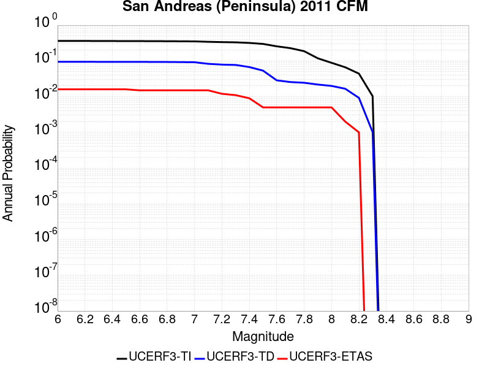 |
|-----|

| Magnitude | UCERF3-TI Prob | UCERF3-TD Prob | UCERF3-ETAS Prob |
|-----|-----|-----|-----|
| 6.0 | 0.36224574 | 0.09446248 | 0.016 |
| 6.1 | 0.36224574 | 0.09446248 | 0.016 |
| 6.2 | 0.36224574 | 0.09446248 | 0.016 |
| 6.3 | 0.35994843 | 0.094177224 | 0.016 |
| 6.4 | 0.35994843 | 0.094177224 | 0.016 |
| 6.5 | 0.3586105 | 0.09401127 | 0.016 |
| 6.6 | 0.35818738 | 0.09392923 | 0.015 |
| 6.7 | 0.35698423 | 0.09367148 | 0.015 |
| 6.8 | 0.35566592 | 0.09336652 | 0.015 |
| 6.9 | 0.35373372 | 0.092642486 | 0.015 |
| 7.0 | 0.3518211 | 0.09185464 | 0.015 |
| 7.1 | 0.34268934 | 0.08278196 | 0.015 |
| 7.2 | 0.3358432 | 0.0788493 | 0.012 |
| 7.3 | 0.33161494 | 0.07709162 | 0.011 |
| 7.4 | 0.3186759 | 0.06725868 | 0.009 |
| 7.5 | 0.2989319 | 0.053447828 | 0.005 |
| 7.6 | 0.25623104 | 0.028577758 | 0.005 |
| 7.7 | 0.22750789 | 0.02560349 | 0.005 |
| 7.8 | 0.18718195 | 0.0244651 | 0.005 |
| 7.9 | 0.118235916 | 0.02179744 | 0.005 |
| 8.0 | 0.088489406 | 0.019954866 | 0.005 |
| 8.1 | 0.066359274 | 0.016628414 | 0.002 |
| 8.2 | 0.04405855 | 0.009237341 | 0.001 |
| 8.3 | 0.0102941245 | 0.001015148 | 0.0 |

## San Andreas (San Bernardino N)
*[(top)](#table-of-contents)*

| 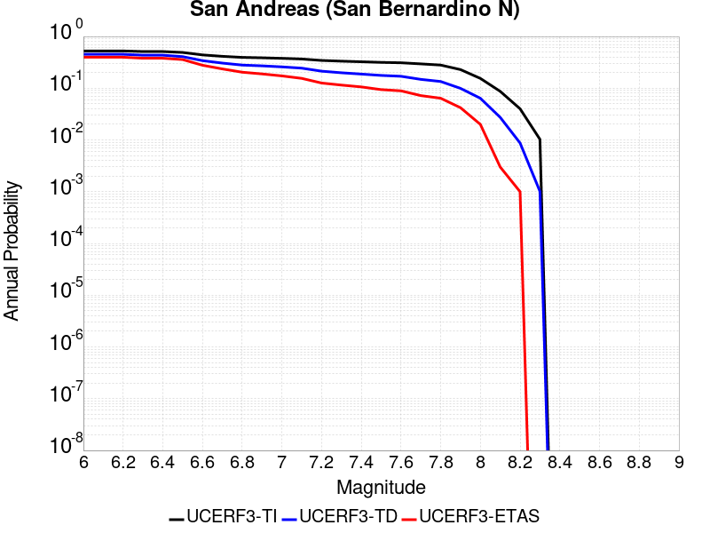 |
|-----|

| Magnitude | UCERF3-TI Prob | UCERF3-TD Prob | UCERF3-ETAS Prob |
|-----|-----|-----|-----|
| 6.0 | 0.52518874 | 0.45232275 | 0.397 |
| 6.1 | 0.52518874 | 0.45232275 | 0.397 |
| 6.2 | 0.52518874 | 0.45232275 | 0.397 |
| 6.3 | 0.51153874 | 0.43458146 | 0.38 |
| 6.4 | 0.51153874 | 0.43458146 | 0.38 |
| 6.5 | 0.49103746 | 0.40775594 | 0.358 |
| 6.6 | 0.4404184 | 0.34110525 | 0.278 |
| 6.7 | 0.413359 | 0.30605105 | 0.236 |
| 6.8 | 0.3943727 | 0.2800516 | 0.204 |
| 6.9 | 0.38728932 | 0.27069274 | 0.189 |
| 7.0 | 0.37808377 | 0.2585829 | 0.173 |
| 7.1 | 0.36725414 | 0.24425414 | 0.155 |
| 7.2 | 0.34412014 | 0.21346575 | 0.126 |
| 7.3 | 0.33320823 | 0.19884035 | 0.115 |
| 7.4 | 0.32457075 | 0.18770172 | 0.106 |
| 7.5 | 0.31586298 | 0.17681019 | 0.094 |
| 7.6 | 0.31026706 | 0.1701044 | 0.089 |
| 7.7 | 0.29540205 | 0.14826033 | 0.072 |
| 7.8 | 0.28019702 | 0.13487938 | 0.064 |
| 7.9 | 0.22895938 | 0.099352755 | 0.042 |
| 8.0 | 0.15471198 | 0.063907556 | 0.02 |
| 8.1 | 0.08695277 | 0.027323764 | 0.003 |
| 8.2 | 0.04004072 | 0.008724218 | 0.001 |
| 8.3 | 0.0102941245 | 0.001015148 | 0.0 |

## San Andreas (San Bernardino S)
*[(top)](#table-of-contents)*

|  |
|-----|

| Magnitude | UCERF3-TI Prob | UCERF3-TD Prob | UCERF3-ETAS Prob |
|-----|-----|-----|-----|
| 6.0 | 0.47466263 | 0.50478125 | 0.432 |
| 6.1 | 0.47466263 | 0.50478125 | 0.432 |
| 6.2 | 0.47466263 | 0.50478125 | 0.432 |
| 6.3 | 0.45728156 | 0.4865058 | 0.422 |
| 6.4 | 0.45728156 | 0.4865058 | 0.422 |
| 6.5 | 0.427516 | 0.4549679 | 0.382 |
| 6.6 | 0.39922985 | 0.42515868 | 0.347 |
| 6.7 | 0.36678702 | 0.38999254 | 0.304 |
| 6.8 | 0.36034292 | 0.3830168 | 0.295 |
| 6.9 | 0.27352798 | 0.28092676 | 0.185 |
| 7.0 | 0.26344314 | 0.2701008 | 0.168 |
| 7.1 | 0.2539249 | 0.2593752 | 0.16 |
| 7.2 | 0.22928864 | 0.2318781 | 0.131 |
| 7.3 | 0.21915977 | 0.22006226 | 0.12 |
| 7.4 | 0.21157186 | 0.21142177 | 0.113 |
| 7.5 | 0.20133498 | 0.19902278 | 0.103 |
| 7.6 | 0.16293983 | 0.13967584 | 0.065 |
| 7.7 | 0.13735276 | 0.100328594 | 0.039 |
| 7.8 | 0.12788112 | 0.09012795 | 0.033 |
| 7.9 | 0.10597988 | 0.07005588 | 0.025 |
| 8.0 | 0.06275212 | 0.04493998 | 0.011 |
| 8.1 | 0.02534404 | 0.014724297 | 0.001 |
| 8.2 | 0.013286817 | 0.005867096 | 0.0 |
| 8.3 | 0.0027538636 | 5.825048E-4 | 0.0 |

## San Andreas (San Gorgonio Pass-Garnet HIll)
*[(top)](#table-of-contents)*

|  |
|-----|

| Magnitude | UCERF3-TI Prob | UCERF3-TD Prob | UCERF3-ETAS Prob |
|-----|-----|-----|-----|
| 6.0 | 0.3520345 | 0.43942922 | 0.357 |
| 6.1 | 0.3520345 | 0.43942922 | 0.357 |
| 6.2 | 0.3520345 | 0.43942922 | 0.357 |
| 6.3 | 0.3520345 | 0.43942922 | 0.357 |
| 6.4 | 0.3432993 | 0.43075308 | 0.349 |
| 6.5 | 0.3432993 | 0.43075308 | 0.349 |
| 6.6 | 0.32805318 | 0.4152384 | 0.335 |
| 6.7 | 0.32176143 | 0.40865493 | 0.325 |
| 6.8 | 0.31938428 | 0.40583465 | 0.322 |
| 6.9 | 0.31590062 | 0.40148535 | 0.317 |
| 7.0 | 0.3096912 | 0.39404106 | 0.315 |
| 7.1 | 0.3070176 | 0.3909799 | 0.31 |
| 7.2 | 0.30052575 | 0.38377684 | 0.298 |
| 7.3 | 0.2921824 | 0.3716797 | 0.282 |
| 7.4 | 0.23385365 | 0.2859487 | 0.172 |
| 7.5 | 0.18541873 | 0.21201533 | 0.107 |
| 7.6 | 0.14423874 | 0.14868096 | 0.068 |
| 7.7 | 0.10441818 | 0.088920355 | 0.028 |
| 7.8 | 0.09359854 | 0.075099796 | 0.022 |
| 7.9 | 0.076037146 | 0.056181397 | 0.015 |
| 8.0 | 0.057778347 | 0.043217238 | 0.01 |
| 8.1 | 0.022447906 | 0.014283263 | 0.001 |
| 8.2 | 0.011951285 | 0.0056646066 | 0.0 |
| 8.3 | 0.0027111531 | 5.736718E-4 | 0.0 |

## San Andreas (Santa Cruz Mts) 2011 CFM
*[(top)](#table-of-contents)*

|  |
|-----|

| Magnitude | UCERF3-TI Prob | UCERF3-TD Prob | UCERF3-ETAS Prob |
|-----|-----|-----|-----|
| 6.0 | 0.5928923 | 0.50046 | 0.216 |
| 6.1 | 0.5928923 | 0.50046 | 0.216 |
| 6.2 | 0.5928923 | 0.50046 | 0.216 |
| 6.3 | 0.5917781 | 0.49977788 | 0.215 |
| 6.4 | 0.5749006 | 0.47808263 | 0.198 |
| 6.5 | 0.56022716 | 0.4621802 | 0.188 |
| 6.6 | 0.4935618 | 0.37625128 | 0.137 |
| 6.7 | 0.48903582 | 0.37101564 | 0.132 |
| 6.8 | 0.48726502 | 0.368797 | 0.131 |
| 6.9 | 0.48431846 | 0.3651989 | 0.129 |
| 7.0 | 0.46621558 | 0.3407875 | 0.121 |
| 7.1 | 0.34297577 | 0.17924364 | 0.039 |
| 7.2 | 0.3093809 | 0.1352021 | 0.028 |
| 7.3 | 0.27616227 | 0.089545034 | 0.011 |
| 7.4 | 0.2652327 | 0.079634435 | 0.009 |
| 7.5 | 0.24651012 | 0.06535387 | 0.005 |
| 7.6 | 0.20641927 | 0.038499646 | 0.005 |
| 7.7 | 0.19336249 | 0.034554638 | 0.005 |
| 7.8 | 0.1686978 | 0.0329803 | 0.005 |
| 7.9 | 0.12623157 | 0.02918748 | 0.005 |
| 8.0 | 0.09805011 | 0.025107926 | 0.005 |
| 8.1 | 0.073762394 | 0.020568319 | 0.002 |
| 8.2 | 0.044073183 | 0.009237796 | 0.001 |
| 8.3 | 0.0102941245 | 0.001015148 | 0.0 |

## San Cayetano
*[(top)](#table-of-contents)*

|  |
|-----|

| Magnitude | UCERF3-TI Prob | UCERF3-TD Prob | UCERF3-ETAS Prob |
|-----|-----|-----|-----|
| 6.0 | 0.115291655 | 0.090071544 | 0.072 |
| 6.1 | 0.115291655 | 0.090071544 | 0.072 |
| 6.2 | 0.115291655 | 0.090071544 | 0.072 |
| 6.3 | 0.115291655 | 0.090071544 | 0.072 |
| 6.4 | 0.115291655 | 0.090071544 | 0.072 |
| 6.5 | 0.115291655 | 0.090071544 | 0.072 |
| 6.6 | 0.115291655 | 0.090071544 | 0.072 |
| 6.7 | 0.115291655 | 0.090071544 | 0.072 |
| 6.8 | 0.11420918 | 0.08909112 | 0.072 |
| 6.9 | 0.111983575 | 0.08690166 | 0.071 |
| 7.0 | 0.11032235 | 0.085322745 | 0.069 |
| 7.1 | 0.10785072 | 0.08328809 | 0.068 |
| 7.2 | 0.102448255 | 0.07888738 | 0.066 |
| 7.3 | 0.09158436 | 0.0719972 | 0.056 |
| 7.4 | 0.08419982 | 0.06683423 | 0.053 |
| 7.5 | 0.06471863 | 0.051449742 | 0.039 |
| 7.6 | 0.028935479 | 0.022612289 | 0.021 |
| 7.7 | 0.018230673 | 0.013742049 | 0.015 |
| 7.8 | 0.007706636 | 0.005932724 | 0.01 |
| 7.9 | 0.0014374336 | 0.0010263666 | 0.002 |
| 8.0 | 2.8213314E-4 | 1.6011272E-4 | 0.001 |

## San Clemente
*[(top)](#table-of-contents)*

| 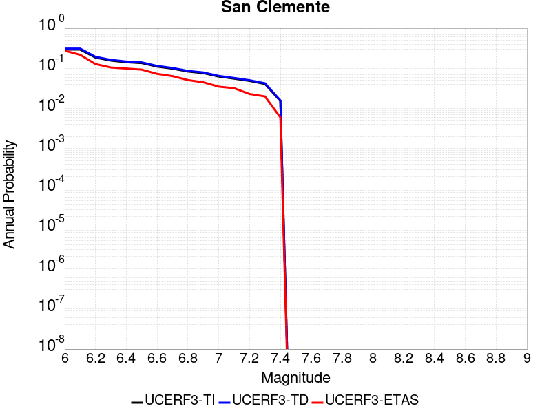 |
|-----|

| Magnitude | UCERF3-TI Prob | UCERF3-TD Prob | UCERF3-ETAS Prob |
|-----|-----|-----|-----|
| 6.0 | 0.29435036 | 0.31149244 | 0.276 |
| 6.1 | 0.29435036 | 0.31149244 | 0.218 |
| 6.2 | 0.1858337 | 0.19425517 | 0.128 |
| 6.3 | 0.1563808 | 0.16298126 | 0.105 |
| 6.4 | 0.14246427 | 0.14832464 | 0.099 |
| 6.5 | 0.1355172 | 0.14105548 | 0.093 |
| 6.6 | 0.11073692 | 0.11503262 | 0.073 |
| 6.7 | 0.09845205 | 0.10218846 | 0.064 |
| 6.8 | 0.083438665 | 0.086542234 | 0.051 |
| 6.9 | 0.076337114 | 0.07915794 | 0.045 |
| 7.0 | 0.06261864 | 0.06491712 | 0.035 |
| 7.1 | 0.05545602 | 0.05749769 | 0.032 |
| 7.2 | 0.04875791 | 0.0505696 | 0.023 |
| 7.3 | 0.040967535 | 0.042516313 | 0.02 |
| 7.4 | 0.015316466 | 0.015939152 | 0.006 |

## San Diego Trough north alt1
*[(top)](#table-of-contents)*

|  |
|-----|

| Magnitude | UCERF3-TI Prob | UCERF3-TD Prob | UCERF3-ETAS Prob |
|-----|-----|-----|-----|
| 6.0 | 0.31780785 | 0.3350314 | 0.276 |
| 6.1 | 0.17960641 | 0.18809433 | 0.131 |
| 6.2 | 0.1388349 | 0.14465776 | 0.1 |
| 6.3 | 0.1388349 | 0.14465776 | 0.1 |
| 6.4 | 0.109401524 | 0.11360198 | 0.075 |
| 6.5 | 0.10380871 | 0.10775156 | 0.07 |
| 6.6 | 0.090622455 | 0.09393483 | 0.061 |
| 6.7 | 0.07954174 | 0.08235457 | 0.055 |
| 6.8 | 0.07205103 | 0.074578054 | 0.046 |
| 6.9 | 0.063504726 | 0.06572998 | 0.04 |
| 7.0 | 0.05520816 | 0.05714103 | 0.033 |
| 7.1 | 0.047830317 | 0.049511693 | 0.028 |
| 7.2 | 0.041838136 | 0.043325122 | 0.026 |
| 7.3 | 0.032177404 | 0.033332203 | 0.02 |
| 7.4 | 0.025676653 | 0.0266075 | 0.015 |
| 7.5 | 0.009084324 | 0.009402751 | 0.003 |
| 7.6 | 8.8605605E-4 | 8.9453947E-4 | 0.0 |

## San Diego Trough south
*[(top)](#table-of-contents)*

|  |
|-----|

| Magnitude | UCERF3-TI Prob | UCERF3-TD Prob | UCERF3-ETAS Prob |
|-----|-----|-----|-----|
| 6.0 | 0.35081017 | 0.37274754 | 0.289 |
| 6.1 | 0.21732989 | 0.22953805 | 0.162 |
| 6.2 | 0.16726835 | 0.17561303 | 0.126 |
| 6.3 | 0.16726835 | 0.17561303 | 0.126 |
| 6.4 | 0.13230194 | 0.1383481 | 0.095 |
| 6.5 | 0.12497162 | 0.1306187 | 0.085 |
| 6.6 | 0.10861168 | 0.113339126 | 0.075 |
| 6.7 | 0.09624824 | 0.10032273 | 0.063 |
| 6.8 | 0.08781731 | 0.09147064 | 0.059 |
| 6.9 | 0.078277424 | 0.08147131 | 0.052 |
| 7.0 | 0.06774725 | 0.07044794 | 0.043 |
| 7.1 | 0.062009025 | 0.06446098 | 0.042 |
| 7.2 | 0.055399474 | 0.057579882 | 0.04 |
| 7.3 | 0.03138177 | 0.032532476 | 0.019 |
| 7.4 | 0.025412261 | 0.026341628 | 0.015 |
| 7.5 | 0.009084324 | 0.009402751 | 0.003 |
| 7.6 | 8.8605605E-4 | 8.9453947E-4 | 0.0 |

## San Gabriel
*[(top)](#table-of-contents)*

|  |
|-----|

| Magnitude | UCERF3-TI Prob | UCERF3-TD Prob | UCERF3-ETAS Prob |
|-----|-----|-----|-----|
| 6.0 | 0.0549809 | 0.037888218 | 0.03 |
| 6.1 | 0.0549809 | 0.037888218 | 0.03 |
| 6.2 | 0.0549809 | 0.037888218 | 0.03 |
| 6.3 | 0.0549809 | 0.037888218 | 0.03 |
| 6.4 | 0.0549809 | 0.037888218 | 0.03 |
| 6.5 | 0.034515854 | 0.01670181 | 0.017 |
| 6.6 | 0.034515854 | 0.01670181 | 0.017 |
| 6.7 | 0.032211334 | 0.014332179 | 0.015 |
| 6.8 | 0.030803068 | 0.01288434 | 0.014 |
| 6.9 | 0.029234698 | 0.011366461 | 0.011 |
| 7.0 | 0.026935622 | 0.009040931 | 0.007 |
| 7.1 | 0.026441406 | 0.0086075645 | 0.007 |
| 7.2 | 0.02569636 | 0.007978979 | 0.007 |
| 7.3 | 0.024846371 | 0.0072586383 | 0.007 |
| 7.4 | 0.024285989 | 0.006818885 | 0.007 |
| 7.5 | 0.02346503 | 0.0062185577 | 0.007 |
| 7.6 | 0.02240961 | 0.005479655 | 0.007 |
| 7.7 | 0.015204109 | 0.0035433508 | 0.002 |
| 7.8 | 0.0075589116 | 8.563198E-4 | 0.001 |
| 7.9 | 0.004217006 | 1.9937374E-4 | 0.001 |
| 8.0 | 0.0027342343 | 3.7602706E-5 | 0.001 |
| 8.1 | 0.0017288701 | 1.4576261E-5 | 0.0 |
| 8.2 | 5.339231E-4 | 7.438689E-6 | 0.0 |

## San Gabriel (Extension)
*[(top)](#table-of-contents)*

|  |
|-----|

| Magnitude | UCERF3-TI Prob | UCERF3-TD Prob | UCERF3-ETAS Prob |
|-----|-----|-----|-----|
| 6.0 | 0.029043613 | 0.02512289 | 0.022 |
| 6.1 | 0.029043613 | 0.02512289 | 0.022 |
| 6.2 | 0.029043613 | 0.02512289 | 0.022 |
| 6.3 | 0.029043613 | 0.02512289 | 0.022 |
| 6.4 | 0.029043613 | 0.02512289 | 0.022 |
| 6.5 | 0.024294222 | 0.020308206 | 0.018 |
| 6.6 | 0.024294222 | 0.020308206 | 0.018 |
| 6.7 | 0.021915957 | 0.017898161 | 0.016 |
| 6.8 | 0.021258289 | 0.017231926 | 0.016 |
| 6.9 | 0.019959237 | 0.015915701 | 0.015 |
| 7.0 | 0.019094002 | 0.015039149 | 0.014 |
| 7.1 | 0.018448615 | 0.0143847745 | 0.012 |
| 7.2 | 0.014515869 | 0.01039661 | 0.007 |
| 7.3 | 0.013394022 | 0.0092707705 | 0.006 |
| 7.4 | 0.012684096 | 0.008574998 | 0.006 |
| 7.5 | 0.010598451 | 0.0067374846 | 0.003 |
| 7.6 | 0.009516989 | 0.0058067287 | 0.003 |
| 7.7 | 0.007685961 | 0.0042115757 | 0.002 |
| 7.8 | 0.00400842 | 0.0013620888 | 0.001 |
| 7.9 | 9.2031504E-4 | 8.588897E-5 | 0.001 |
| 8.0 | 5.4581946E-4 | 1.7881923E-5 | 0.001 |
| 8.1 | 4.1085924E-4 | 4.20162E-6 | 0.0 |
| 8.2 | 6.9480135E-5 | 1.8675294E-7 | 0.0 |

## San Gorgonio Pass
*[(top)](#table-of-contents)*

|  |
|-----|

| Magnitude | UCERF3-TI Prob | UCERF3-TD Prob | UCERF3-ETAS Prob |
|-----|-----|-----|-----|
| 6.0 | 0.039102145 | 0.045143154 | 0.027 |
| 6.1 | 0.039102145 | 0.045143154 | 0.027 |
| 6.2 | 0.039102145 | 0.045143154 | 0.027 |
| 6.3 | 0.039102145 | 0.045143154 | 0.027 |
| 6.4 | 0.039102145 | 0.045143154 | 0.027 |
| 6.5 | 0.039102145 | 0.045143154 | 0.027 |
| 6.6 | 0.039102145 | 0.045143154 | 0.027 |
| 6.7 | 0.03580368 | 0.041803997 | 0.026 |
| 6.8 | 0.03580368 | 0.041803997 | 0.026 |
| 6.9 | 0.02831425 | 0.034204125 | 0.019 |
| 7.0 | 0.028202062 | 0.034090374 | 0.018 |
| 7.1 | 0.028134631 | 0.034021907 | 0.018 |
| 7.2 | 0.028055428 | 0.033941224 | 0.017 |
| 7.3 | 0.027997456 | 0.033884015 | 0.017 |
| 7.4 | 0.027776122 | 0.03365514 | 0.017 |
| 7.5 | 0.02756955 | 0.033405125 | 0.017 |
| 7.6 | 0.02478128 | 0.029228203 | 0.017 |
| 7.7 | 0.008309249 | 0.005497834 | 0.002 |
| 7.8 | 0.004819252 | 0.001053478 | 0.001 |
| 7.9 | 0.0031131147 | 2.751285E-4 | 0.0 |
| 8.0 | 0.0017940481 | 1.100273E-4 | 0.0 |
| 8.1 | 6.1504805E-5 | 3.109143E-6 | 0.0 |

## San Gregorio (North) 2011 CFM
*[(top)](#table-of-contents)*

| 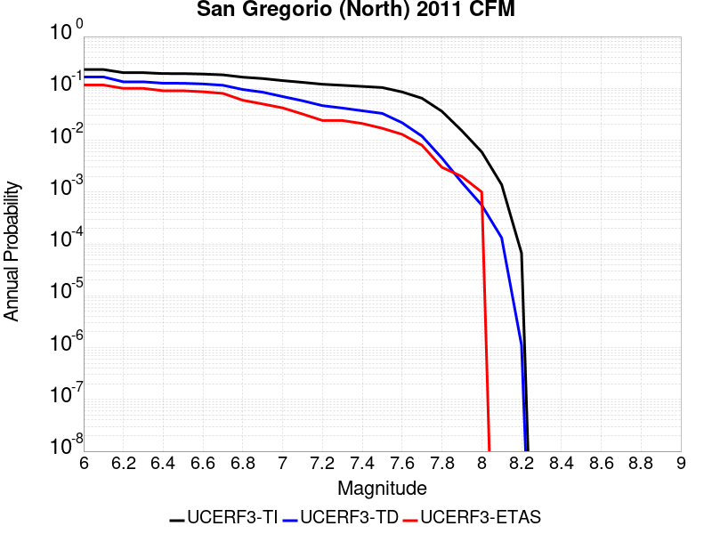 |
|-----|

| Magnitude | UCERF3-TI Prob | UCERF3-TD Prob | UCERF3-ETAS Prob |
|-----|-----|-----|-----|
| 6.0 | 0.23078208 | 0.16605566 | 0.116 |
| 6.1 | 0.23078208 | 0.16605566 | 0.116 |
| 6.2 | 0.20097706 | 0.13380146 | 0.1 |
| 6.3 | 0.20097706 | 0.13380146 | 0.1 |
| 6.4 | 0.19302702 | 0.12578197 | 0.09 |
| 6.5 | 0.19273764 | 0.12545271 | 0.09 |
| 6.6 | 0.18886864 | 0.12175994 | 0.086 |
| 6.7 | 0.18235691 | 0.11483501 | 0.08 |
| 6.8 | 0.16445854 | 0.095079936 | 0.059 |
| 6.9 | 0.15471402 | 0.08438221 | 0.05 |
| 7.0 | 0.14126453 | 0.06953868 | 0.042 |
| 7.1 | 0.13068514 | 0.057685174 | 0.032 |
| 7.2 | 0.12014285 | 0.046456266 | 0.024 |
| 7.3 | 0.11461953 | 0.04173627 | 0.024 |
| 7.4 | 0.10908495 | 0.03698936 | 0.021 |
| 7.5 | 0.10376258 | 0.032923717 | 0.017 |
| 7.6 | 0.08532224 | 0.021757808 | 0.013 |
| 7.7 | 0.06447165 | 0.011956432 | 0.008 |
| 7.8 | 0.036077015 | 0.004526557 | 0.003 |
| 7.9 | 0.015258233 | 0.0015326738 | 0.002 |
| 8.0 | 0.005948015 | 5.6089694E-4 | 0.001 |
| 8.1 | 0.0013909107 | 1.3146781E-4 | 0.0 |
| 8.2 | 6.628843E-5 | 1.1039001E-6 | 0.0 |

## San Gregorio (South) 2011 CFM
*[(top)](#table-of-contents)*

| 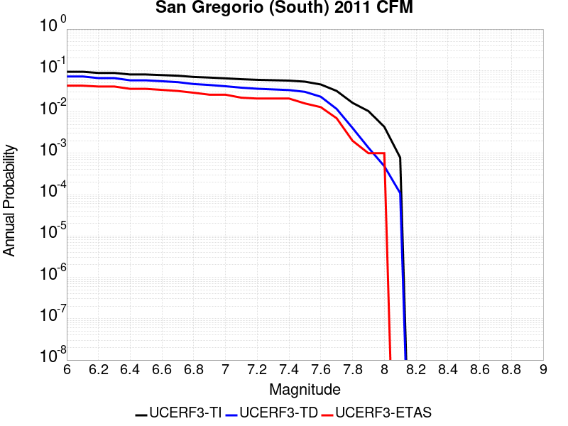 |
|-----|

| Magnitude | UCERF3-TI Prob | UCERF3-TD Prob | UCERF3-ETAS Prob |
|-----|-----|-----|-----|
| 6.0 | 0.09329878 | 0.0718031 | 0.043 |
| 6.1 | 0.09329878 | 0.0718031 | 0.043 |
| 6.2 | 0.08730969 | 0.06549972 | 0.041 |
| 6.3 | 0.08730969 | 0.06549972 | 0.041 |
| 6.4 | 0.080118425 | 0.057913862 | 0.036 |
| 6.5 | 0.080118425 | 0.057913862 | 0.036 |
| 6.6 | 0.07741505 | 0.055069078 | 0.034 |
| 6.7 | 0.07479739 | 0.05231807 | 0.032 |
| 6.8 | 0.0698446 | 0.047103334 | 0.029 |
| 6.9 | 0.06749365 | 0.04463077 | 0.026 |
| 7.0 | 0.0646432 | 0.04163131 | 0.026 |
| 7.1 | 0.061632454 | 0.03844123 | 0.022 |
| 7.2 | 0.05956393 | 0.03624184 | 0.021 |
| 7.3 | 0.058259215 | 0.03490887 | 0.021 |
| 7.4 | 0.057018418 | 0.033654775 | 0.021 |
| 7.5 | 0.053792812 | 0.030512415 | 0.016 |
| 7.6 | 0.045967877 | 0.023212904 | 0.013 |
| 7.7 | 0.0320528 | 0.011759254 | 0.007 |
| 7.8 | 0.016528763 | 0.0040773633 | 0.002 |
| 7.9 | 0.01043227 | 0.0013608584 | 0.001 |
| 8.0 | 0.0043490552 | 4.86145E-4 | 0.001 |
| 8.1 | 7.841067E-4 | 1.08391774E-4 | 0.0 |

## San Jacinto (Anza) rev
*[(top)](#table-of-contents)*

|  |
|-----|

| Magnitude | UCERF3-TI Prob | UCERF3-TD Prob | UCERF3-ETAS Prob |
|-----|-----|-----|-----|
| 6.0 | 0.28022522 | 0.09338519 | 0.049 |
| 6.1 | 0.28022522 | 0.09338519 | 0.049 |
| 6.2 | 0.28022522 | 0.09338519 | 0.049 |
| 6.3 | 0.28022522 | 0.09338519 | 0.049 |
| 6.4 | 0.28022522 | 0.09338519 | 0.049 |
| 6.5 | 0.2615629 | 0.08733428 | 0.043 |
| 6.6 | 0.2615629 | 0.08733428 | 0.043 |
| 6.7 | 0.25775474 | 0.08638166 | 0.042 |
| 6.8 | 0.25714687 | 0.08609773 | 0.042 |
| 6.9 | 0.25420976 | 0.085602485 | 0.041 |
| 7.0 | 0.2470626 | 0.08390567 | 0.04 |
| 7.1 | 0.23522353 | 0.081900604 | 0.04 |
| 7.2 | 0.22095932 | 0.07969289 | 0.04 |
| 7.3 | 0.19740264 | 0.07725468 | 0.04 |
| 7.4 | 0.1894966 | 0.07625116 | 0.038 |
| 7.5 | 0.17533404 | 0.07162508 | 0.036 |
| 7.6 | 0.15380342 | 0.06075254 | 0.032 |
| 7.7 | 0.13284291 | 0.045996327 | 0.022 |
| 7.8 | 0.115246214 | 0.035117377 | 0.015 |
| 7.9 | 0.0925486 | 0.022833765 | 0.01 |
| 8.0 | 0.07750446 | 0.016968194 | 0.008 |
| 8.1 | 0.05076107 | 0.011322489 | 0.002 |
| 8.2 | 0.021281468 | 0.0023942206 | 0.001 |
| 8.3 | 0.006631146 | 4.168264E-4 | 0.0 |

## San Jacinto (Borrego)
*[(top)](#table-of-contents)*

|  |
|-----|

| Magnitude | UCERF3-TI Prob | UCERF3-TD Prob | UCERF3-ETAS Prob |
|-----|-----|-----|-----|
| 6.0 | 0.16883232 | 0.13996674 | 0.066 |
| 6.1 | 0.16875811 | 0.13988414 | 0.066 |
| 6.2 | 0.16556779 | 0.13632248 | 0.066 |
| 6.3 | 0.15416308 | 0.12330292 | 0.062 |
| 6.4 | 0.15302184 | 0.12198532 | 0.062 |
| 6.5 | 0.1518492 | 0.1203439 | 0.062 |
| 6.6 | 0.15142445 | 0.1197018 | 0.062 |
| 6.7 | 0.15034367 | 0.11814277 | 0.057 |
| 6.8 | 0.1494205 | 0.116951875 | 0.056 |
| 6.9 | 0.12978573 | 0.0886407 | 0.037 |
| 7.0 | 0.11703533 | 0.07152296 | 0.027 |
| 7.1 | 0.116198935 | 0.070513 | 0.026 |
| 7.2 | 0.11178076 | 0.06486684 | 0.026 |
| 7.3 | 0.10386187 | 0.056020908 | 0.026 |
| 7.4 | 0.10230537 | 0.05451655 | 0.025 |
| 7.5 | 0.09906909 | 0.051845703 | 0.024 |
| 7.6 | 0.0891222 | 0.044449873 | 0.021 |
| 7.7 | 0.07589055 | 0.03327025 | 0.015 |
| 7.8 | 0.06314641 | 0.024049833 | 0.009 |
| 7.9 | 0.048664194 | 0.015041472 | 0.005 |
| 8.0 | 0.040968806 | 0.011186177 | 0.004 |
| 8.1 | 0.03355903 | 0.009052041 | 0.002 |
| 8.2 | 0.0093317395 | 0.0014683962 | 0.001 |
| 8.3 | 7.911257E-4 | 7.012109E-5 | 0.0 |

## San Jacinto (Clark) rev
*[(top)](#table-of-contents)*

|  |
|-----|

| Magnitude | UCERF3-TI Prob | UCERF3-TD Prob | UCERF3-ETAS Prob |
|-----|-----|-----|-----|
| 6.0 | 0.20856038 | 0.03457912 | 0.016 |
| 6.1 | 0.20856038 | 0.03457912 | 0.016 |
| 6.2 | 0.20856038 | 0.03457912 | 0.016 |
| 6.3 | 0.20856038 | 0.03457912 | 0.016 |
| 6.4 | 0.20856038 | 0.03457912 | 0.016 |
| 6.5 | 0.17683852 | 0.026615534 | 0.013 |
| 6.6 | 0.17683852 | 0.026615534 | 0.013 |
| 6.7 | 0.1714276 | 0.024986342 | 0.012 |
| 6.8 | 0.16706057 | 0.024392558 | 0.012 |
| 6.9 | 0.16409668 | 0.024155974 | 0.012 |
| 7.0 | 0.140247 | 0.021803495 | 0.01 |
| 7.1 | 0.12687895 | 0.019753085 | 0.01 |
| 7.2 | 0.11098135 | 0.01766553 | 0.01 |
| 7.3 | 0.087427355 | 0.017292537 | 0.01 |
| 7.4 | 0.07973417 | 0.017004875 | 0.009 |
| 7.5 | 0.06767211 | 0.015301346 | 0.009 |
| 7.6 | 0.054246075 | 0.01181905 | 0.008 |
| 7.7 | 0.04494069 | 0.008086883 | 0.004 |
| 7.8 | 0.0397843 | 0.0067904135 | 0.003 |
| 7.9 | 0.03356837 | 0.004889345 | 0.002 |
| 8.0 | 0.02803086 | 0.0036361332 | 0.002 |
| 8.1 | 0.014708061 | 0.0016919614 | 0.0 |
| 8.2 | 0.010537621 | 7.638315E-4 | 0.0 |
| 8.3 | 0.005546696 | 3.2584727E-4 | 0.0 |

## San Jacinto (Coyote Creek)
*[(top)](#table-of-contents)*

|  |
|-----|

| Magnitude | UCERF3-TI Prob | UCERF3-TD Prob | UCERF3-ETAS Prob |
|-----|-----|-----|-----|
| 6.0 | 0.13310497 | 0.08041537 | 0.033 |
| 6.1 | 0.13310497 | 0.08041537 | 0.033 |
| 6.2 | 0.13310497 | 0.08041537 | 0.033 |
| 6.3 | 0.13310497 | 0.08041537 | 0.033 |
| 6.4 | 0.13310497 | 0.08041537 | 0.033 |
| 6.5 | 0.13268916 | 0.07994665 | 0.033 |
| 6.6 | 0.13268916 | 0.07994665 | 0.033 |
| 6.7 | 0.13238929 | 0.07960834 | 0.032 |
| 6.8 | 0.13176621 | 0.0789104 | 0.031 |
| 6.9 | 0.13133271 | 0.078469545 | 0.03 |
| 7.0 | 0.1289135 | 0.075758055 | 0.03 |
| 7.1 | 0.1280398 | 0.07472261 | 0.029 |
| 7.2 | 0.12353379 | 0.069001906 | 0.029 |
| 7.3 | 0.114925705 | 0.059891693 | 0.029 |
| 7.4 | 0.11292057 | 0.058172315 | 0.028 |
| 7.5 | 0.10932864 | 0.055269375 | 0.026 |
| 7.6 | 0.09915945 | 0.04766243 | 0.023 |
| 7.7 | 0.08598527 | 0.03645355 | 0.017 |
| 7.8 | 0.07276562 | 0.026937451 | 0.011 |
| 7.9 | 0.056344416 | 0.01690746 | 0.007 |
| 8.0 | 0.04750391 | 0.012621202 | 0.005 |
| 8.1 | 0.035984766 | 0.009545165 | 0.002 |
| 8.2 | 0.01056641 | 0.0016043475 | 0.001 |
| 8.3 | 0.0010456993 | 8.9239824E-5 | 0.0 |

## San Jacinto (Lytle Creek connector)
*[(top)](#table-of-contents)*

|  |
|-----|

| Magnitude | UCERF3-TI Prob | UCERF3-TD Prob | UCERF3-ETAS Prob |
|-----|-----|-----|-----|
| 6.0 | 0.03432547 | 0.011862096 | 0.008 |
| 6.1 | 0.03432547 | 0.011862096 | 0.008 |
| 6.2 | 0.03432547 | 0.011862096 | 0.008 |
| 6.3 | 0.03432547 | 0.011862096 | 0.008 |
| 6.4 | 0.03432547 | 0.011862096 | 0.008 |
| 6.5 | 0.034134947 | 0.011664134 | 0.008 |
| 6.6 | 0.034134947 | 0.011664134 | 0.008 |
| 6.7 | 0.033752028 | 0.011265207 | 0.007 |
| 6.8 | 0.03372888 | 0.011240896 | 0.007 |
| 6.9 | 0.033702668 | 0.011212626 | 0.007 |
| 7.0 | 0.03367216 | 0.0111798 | 0.007 |
| 7.1 | 0.03363696 | 0.011141987 | 0.007 |
| 7.2 | 0.033581454 | 0.0110831745 | 0.007 |
| 7.3 | 0.033531163 | 0.01103672 | 0.007 |
| 7.4 | 0.033483412 | 0.010995903 | 0.007 |
| 7.5 | 0.03340388 | 0.010928013 | 0.007 |
| 7.6 | 0.033230856 | 0.010786254 | 0.007 |
| 7.7 | 0.031659007 | 0.010067516 | 0.006 |
| 7.8 | 0.028312476 | 0.008177189 | 0.004 |
| 7.9 | 0.020089056 | 0.0044366 | 0.003 |
| 8.0 | 0.013827561 | 0.002307137 | 0.002 |
| 8.1 | 0.008268009 | 0.0012918718 | 0.001 |
| 8.2 | 0.0031931754 | 2.1391665E-4 | 0.0 |
| 8.3 | 9.194181E-4 | 3.2168227E-5 | 0.0 |

## San Jacinto (San Bernardino)
*[(top)](#table-of-contents)*

|  |
|-----|

| Magnitude | UCERF3-TI Prob | UCERF3-TD Prob | UCERF3-ETAS Prob |
|-----|-----|-----|-----|
| 6.0 | 0.16297233 | 0.063083634 | 0.032 |
| 6.1 | 0.16297233 | 0.063083634 | 0.032 |
| 6.2 | 0.16297233 | 0.063083634 | 0.032 |
| 6.3 | 0.16297233 | 0.063083634 | 0.032 |
| 6.4 | 0.1625985 | 0.06263756 | 0.032 |
| 6.5 | 0.16000277 | 0.059540577 | 0.03 |
| 6.6 | 0.15978417 | 0.059279457 | 0.03 |
| 6.7 | 0.15975903 | 0.059245225 | 0.03 |
| 6.8 | 0.1593977 | 0.05881235 | 0.03 |
| 6.9 | 0.15921766 | 0.058592543 | 0.03 |
| 7.0 | 0.1590479 | 0.05838248 | 0.03 |
| 7.1 | 0.15875219 | 0.05800923 | 0.03 |
| 7.2 | 0.15833196 | 0.057506688 | 0.03 |
| 7.3 | 0.15799198 | 0.057111345 | 0.03 |
| 7.4 | 0.15781324 | 0.05691995 | 0.03 |
| 7.5 | 0.15738234 | 0.05653268 | 0.03 |
| 7.6 | 0.15607782 | 0.055688865 | 0.03 |
| 7.7 | 0.14618453 | 0.050688874 | 0.026 |
| 7.8 | 0.12830503 | 0.03951082 | 0.019 |
| 7.9 | 0.10266841 | 0.02611394 | 0.014 |
| 8.0 | 0.07884066 | 0.017321985 | 0.008 |
| 8.1 | 0.05136489 | 0.011409914 | 0.002 |
| 8.2 | 0.021621559 | 0.0024278492 | 0.001 |
| 8.3 | 0.0066349525 | 4.171155E-4 | 0.0 |

## San Jacinto (San Jacinto Valley) rev
*[(top)](#table-of-contents)*

|  |
|-----|

| Magnitude | UCERF3-TI Prob | UCERF3-TD Prob | UCERF3-ETAS Prob |
|-----|-----|-----|-----|
| 6.0 | 0.17353345 | 0.067338355 | 0.034 |
| 6.1 | 0.17353345 | 0.067338355 | 0.034 |
| 6.2 | 0.17353345 | 0.067338355 | 0.034 |
| 6.3 | 0.17353345 | 0.067338355 | 0.034 |
| 6.4 | 0.1732853 | 0.067033455 | 0.034 |
| 6.5 | 0.1732853 | 0.067033455 | 0.034 |
| 6.6 | 0.17316923 | 0.066890895 | 0.034 |
| 6.7 | 0.1731244 | 0.06683556 | 0.034 |
| 6.8 | 0.17302725 | 0.06671601 | 0.033 |
| 6.9 | 0.1729029 | 0.066563 | 0.033 |
| 7.0 | 0.17253205 | 0.0661067 | 0.033 |
| 7.1 | 0.17238456 | 0.065930955 | 0.033 |
| 7.2 | 0.17216638 | 0.06567581 | 0.033 |
| 7.3 | 0.17177428 | 0.06530191 | 0.033 |
| 7.4 | 0.17159718 | 0.065152325 | 0.033 |
| 7.5 | 0.17063828 | 0.06459556 | 0.032 |
| 7.6 | 0.15759617 | 0.060403768 | 0.031 |
| 7.7 | 0.1399004 | 0.048366938 | 0.023 |
| 7.8 | 0.122069925 | 0.037246693 | 0.016 |
| 7.9 | 0.09854071 | 0.024644805 | 0.011 |
| 8.0 | 0.07833272 | 0.017194374 | 0.008 |
| 8.1 | 0.05106528 | 0.011362868 | 0.002 |
| 8.2 | 0.02144917 | 0.0024082519 | 0.001 |
| 8.3 | 0.0066349525 | 4.171155E-4 | 0.0 |

## San Jacinto (Stepovers Combined)
*[(top)](#table-of-contents)*

|  |
|-----|

| Magnitude | UCERF3-TI Prob | UCERF3-TD Prob | UCERF3-ETAS Prob |
|-----|-----|-----|-----|
| 6.0 | 0.19119935 | 0.075103104 | 0.039 |
| 6.1 | 0.19119935 | 0.075103104 | 0.039 |
| 6.2 | 0.19119935 | 0.075103104 | 0.039 |
| 6.3 | 0.19119935 | 0.075103104 | 0.039 |
| 6.4 | 0.19081722 | 0.07462291 | 0.039 |
| 6.5 | 0.19081722 | 0.07462291 | 0.039 |
| 6.6 | 0.19065416 | 0.074417956 | 0.039 |
| 6.7 | 0.19056097 | 0.07430112 | 0.039 |
| 6.8 | 0.19046718 | 0.07419539 | 0.038 |
| 6.9 | 0.1903384 | 0.07405807 | 0.038 |
| 7.0 | 0.18991564 | 0.073622756 | 0.038 |
| 7.1 | 0.18982883 | 0.07354813 | 0.038 |
| 7.2 | 0.18946548 | 0.07321169 | 0.038 |
| 7.3 | 0.18812498 | 0.07272338 | 0.038 |
| 7.4 | 0.18719469 | 0.07243023 | 0.037 |
| 7.5 | 0.17572963 | 0.0702243 | 0.036 |
| 7.6 | 0.15792322 | 0.062232994 | 0.033 |
| 7.7 | 0.13699454 | 0.04742757 | 0.023 |
| 7.8 | 0.11922078 | 0.03639415 | 0.016 |
| 7.9 | 0.0961354 | 0.023938252 | 0.011 |
| 8.0 | 0.07809269 | 0.017129157 | 0.008 |
| 8.1 | 0.05096407 | 0.011352108 | 0.002 |
| 8.2 | 0.0213846 | 0.0024037394 | 0.001 |
| 8.3 | 0.006631146 | 4.168264E-4 | 0.0 |

## San Jacinto (Superstition Mtn)
*[(top)](#table-of-contents)*

| 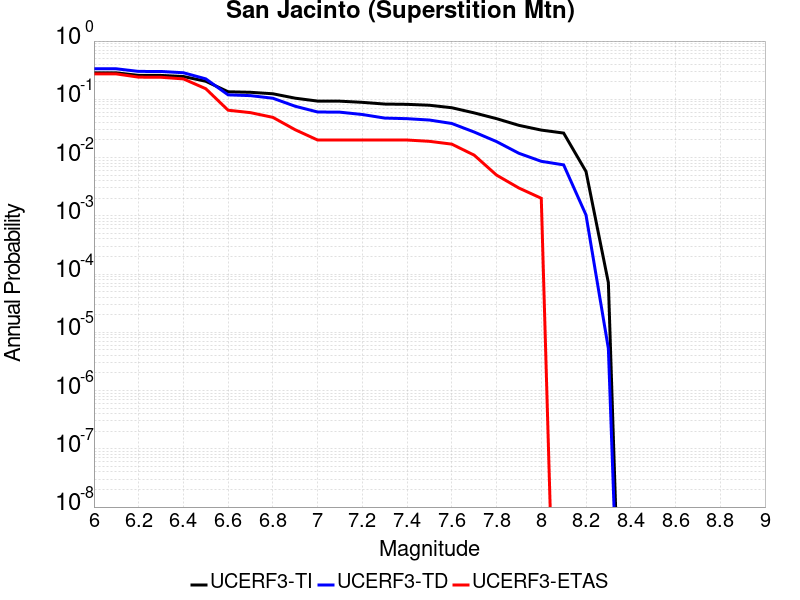 |
|-----|

| Magnitude | UCERF3-TI Prob | UCERF3-TD Prob | UCERF3-ETAS Prob |
|-----|-----|-----|-----|
| 6.0 | 0.28463715 | 0.33405983 | 0.273 |
| 6.1 | 0.28463715 | 0.33405983 | 0.273 |
| 6.2 | 0.25736412 | 0.30112872 | 0.24 |
| 6.3 | 0.2570405 | 0.3006365 | 0.239 |
| 6.4 | 0.24622944 | 0.28585446 | 0.224 |
| 6.5 | 0.20410958 | 0.22435617 | 0.152 |
| 6.6 | 0.13467579 | 0.119164154 | 0.065 |
| 6.7 | 0.13197236 | 0.11563675 | 0.059 |
| 6.8 | 0.12447434 | 0.10436494 | 0.049 |
| 6.9 | 0.10454345 | 0.07595812 | 0.03 |
| 7.0 | 0.09322245 | 0.06059161 | 0.02 |
| 7.1 | 0.09286391 | 0.06012206 | 0.02 |
| 7.2 | 0.08871772 | 0.054841284 | 0.02 |
| 7.3 | 0.08289381 | 0.047623325 | 0.02 |
| 7.4 | 0.081954755 | 0.04650234 | 0.02 |
| 7.5 | 0.07909146 | 0.044068918 | 0.019 |
| 7.6 | 0.07165149 | 0.038456734 | 0.017 |
| 7.7 | 0.058461927 | 0.027437044 | 0.011 |
| 7.8 | 0.046568073 | 0.018806776 | 0.005 |
| 7.9 | 0.03573038 | 0.011841253 | 0.003 |
| 8.0 | 0.029627144 | 0.008619886 | 0.002 |
| 8.1 | 0.026323404 | 0.0074886857 | 0.0 |
| 8.2 | 0.0057626013 | 0.0010321246 | 0.0 |
| 8.3 | 7.087891E-5 | 5.23743E-6 | 0.0 |

## San Joaquin Hills
*[(top)](#table-of-contents)*

|  |
|-----|

| Magnitude | UCERF3-TI Prob | UCERF3-TD Prob | UCERF3-ETAS Prob |
|-----|-----|-----|-----|
| 6.0 | 0.01785375 | 0.016809708 | 0.015 |
| 6.1 | 0.01785375 | 0.016809708 | 0.015 |
| 6.2 | 0.01785375 | 0.016809708 | 0.015 |
| 6.3 | 0.01785375 | 0.016809708 | 0.015 |
| 6.4 | 0.01785375 | 0.016809708 | 0.015 |
| 6.5 | 0.01785375 | 0.016809708 | 0.015 |
| 6.6 | 0.01785375 | 0.016809708 | 0.015 |
| 6.7 | 0.01785375 | 0.016809708 | 0.015 |
| 6.8 | 0.017526142 | 0.016479189 | 0.015 |
| 6.9 | 0.016914785 | 0.015862243 | 0.015 |
| 7.0 | 0.016799243 | 0.0157455 | 0.015 |
| 7.1 | 0.01648923 | 0.015432297 | 0.014 |
| 7.2 | 0.01564505 | 0.014579221 | 0.013 |
| 7.3 | 0.014440144 | 0.013359967 | 0.013 |
| 7.4 | 0.012750717 | 0.011650253 | 0.012 |
| 7.5 | 0.010003221 | 0.008878559 | 0.009 |
| 7.6 | 0.0060392907 | 0.0050921347 | 0.004 |
| 7.7 | 0.0026663407 | 0.0018377175 | 0.001 |
| 7.8 | 6.055505E-5 | 6.0903378E-5 | 0.0 |

## San Jose
*[(top)](#table-of-contents)*

|  |
|-----|

| Magnitude | UCERF3-TI Prob | UCERF3-TD Prob | UCERF3-ETAS Prob |
|-----|-----|-----|-----|
| 6.0 | 0.026184617 | 0.019621078 | 0.009 |
| 6.1 | 0.026184617 | 0.019621078 | 0.009 |
| 6.2 | 0.026184617 | 0.019621078 | 0.009 |
| 6.3 | 0.026184617 | 0.019621078 | 0.009 |
| 6.4 | 0.022245735 | 0.015608254 | 0.006 |
| 6.5 | 0.022245735 | 0.015608254 | 0.006 |
| 6.6 | 0.016098637 | 0.009333925 | 0.003 |
| 6.7 | 0.016098637 | 0.009333925 | 0.003 |
| 6.8 | 0.01479508 | 0.008455632 | 0.003 |
| 6.9 | 0.01121697 | 0.006056838 | 0.002 |
| 7.0 | 0.010218437 | 0.005600064 | 0.002 |
| 7.1 | 0.0083502205 | 0.0045935763 | 0.002 |
| 7.2 | 0.0055320915 | 0.0025508052 | 0.001 |
| 7.3 | 0.003677401 | 0.0018001768 | 0.001 |
| 7.4 | 0.0017556795 | 8.576317E-4 | 0.001 |
| 7.5 | 0.0016314195 | 7.690008E-4 | 0.001 |
| 7.6 | 0.001460385 | 6.363683E-4 | 0.001 |
| 7.7 | 0.0014522225 | 6.2936137E-4 | 0.001 |
| 7.8 | 6.160807E-4 | 4.203934E-4 | 0.001 |

## San Juan
*[(top)](#table-of-contents)*

|  |
|-----|

| Magnitude | UCERF3-TI Prob | UCERF3-TD Prob | UCERF3-ETAS Prob |
|-----|-----|-----|-----|
| 6.0 | 0.04429486 | 0.043923557 | 0.037 |
| 6.1 | 0.04429486 | 0.043923557 | 0.037 |
| 6.2 | 0.04429486 | 0.043923557 | 0.037 |
| 6.3 | 0.032365557 | 0.031821646 | 0.031 |
| 6.4 | 0.031575687 | 0.0310212 | 0.031 |
| 6.5 | 0.026792755 | 0.026182836 | 0.027 |
| 6.6 | 0.02329862 | 0.022646774 | 0.025 |
| 6.7 | 0.020370297 | 0.019687215 | 0.018 |
| 6.8 | 0.01785915 | 0.01715393 | 0.014 |
| 6.9 | 0.015839184 | 0.015115648 | 0.011 |
| 7.0 | 0.01373442 | 0.0129923215 | 0.009 |
| 7.1 | 0.011433942 | 0.010670749 | 0.005 |
| 7.2 | 0.005612543 | 0.004789107 | 0.001 |
| 7.3 | 0.003565999 | 0.0027410693 | 0.0 |
| 7.4 | 0.0027254438 | 0.0018995506 | 0.0 |
| 7.5 | 0.002422553 | 0.0016058605 | 0.0 |
| 7.6 | 0.0020801015 | 0.0013082755 | 0.0 |
| 7.7 | 9.796736E-4 | 3.246433E-4 | 0.0 |
| 7.8 | 5.224575E-4 | 5.603661E-5 | 0.0 |
| 7.9 | 3.219645E-4 | 1.2597543E-5 | 0.0 |
| 8.0 | 7.291466E-5 | 3.549706E-7 | 0.0 |
| 8.1 | 9.602625E-6 | 1.5323835E-7 | 0.0 |

## San Luis Range - Oceano 2011 CFM
*[(top)](#table-of-contents)*

|  |
|-----|

| Magnitude | UCERF3-TI Prob | UCERF3-TD Prob | UCERF3-ETAS Prob |
|-----|-----|-----|-----|
| 6.0 | 0.008327169 | 0.008359001 | 0.007 |
| 6.1 | 0.008327169 | 0.008359001 | 0.007 |
| 6.2 | 0.008327169 | 0.008359001 | 0.007 |
| 6.3 | 0.008327169 | 0.008359001 | 0.007 |
| 6.4 | 0.006045425 | 0.0060684658 | 0.004 |
| 6.5 | 0.006045425 | 0.0060684658 | 0.004 |
| 6.6 | 0.0037314754 | 0.0037448052 | 0.003 |
| 6.7 | 0.0037314754 | 0.0037448052 | 0.003 |
| 6.8 | 0.0034899537 | 0.0035022397 | 0.003 |
| 6.9 | 0.0029478404 | 0.0029579771 | 0.002 |
| 7.0 | 0.0024017158 | 0.0024098624 | 0.002 |
| 7.1 | 0.0020421564 | 0.00204913 | 0.002 |
| 7.2 | 0.0017711839 | 0.0017773376 | 0.002 |
| 7.3 | 0.0015068728 | 0.0015121032 | 0.002 |
| 7.4 | 0.0011410954 | 0.0011451459 | 0.002 |
| 7.5 | 7.0749875E-4 | 7.099253E-4 | 0.002 |
| 7.6 | 3.092108E-4 | 3.1037675E-4 | 0.002 |
| 7.7 | 3.102611E-5 | 3.1167605E-5 | 0.0 |

## San Luis Range - Pecho 2011 CFM
*[(top)](#table-of-contents)*

|  |
|-----|

| Magnitude | UCERF3-TI Prob | UCERF3-TD Prob | UCERF3-ETAS Prob |
|-----|-----|-----|-----|
| 6.0 | 0.008766091 | 0.008681442 | 0.004 |
| 6.1 | 0.008766091 | 0.008681442 | 0.004 |
| 6.2 | 0.0056016287 | 0.005508043 | 0.004 |
| 6.3 | 0.0044373614 | 0.0043409783 | 0.004 |
| 6.4 | 0.0044373614 | 0.0043409783 | 0.004 |
| 6.5 | 0.0036473677 | 0.0035481644 | 0.004 |
| 6.6 | 0.0029093628 | 0.0028076905 | 0.003 |
| 6.7 | 0.002467299 | 0.0023639372 | 0.003 |
| 6.8 | 0.0021613026 | 0.0020567235 | 0.003 |
| 6.9 | 0.0016712719 | 0.0015644361 | 0.002 |
| 7.0 | 0.0013721862 | 0.0012637603 | 0.0 |
| 7.1 | 0.0011385368 | 0.0010286915 | 0.0 |
| 7.2 | 9.07131E-4 | 7.956752E-4 | 0.0 |
| 7.3 | 7.169318E-4 | 6.0405117E-4 | 0.0 |
| 7.4 | 5.693815E-4 | 4.5521557E-4 | 0.0 |
| 7.5 | 4.950673E-4 | 3.8018735E-4 | 0.0 |
| 7.6 | 3.7857142E-4 | 2.6242365E-4 | 0.0 |
| 7.7 | 2.8413837E-4 | 1.668341E-4 | 0.0 |
| 7.8 | 1.870472E-4 | 7.0999224E-5 | 0.0 |
| 7.9 | 1.2828792E-4 | 2.3262102E-5 | 0.0 |
| 8.0 | 9.470881E-5 | 1.1045298E-5 | 0.0 |
| 8.1 | 4.987732E-5 | 6.3335838E-6 | 0.0 |

## San Luis Range 2011 CFM
*[(top)](#table-of-contents)*

| 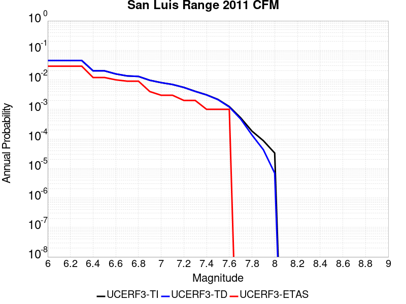 |
|-----|

| Magnitude | UCERF3-TI Prob | UCERF3-TD Prob | UCERF3-ETAS Prob |
|-----|-----|-----|-----|
| 6.0 | 0.045062687 | 0.045352183 | 0.029 |
| 6.1 | 0.045062687 | 0.045352183 | 0.029 |
| 6.2 | 0.045062687 | 0.045352183 | 0.029 |
| 6.3 | 0.045062687 | 0.045352183 | 0.029 |
| 6.4 | 0.020192182 | 0.020261269 | 0.012 |
| 6.5 | 0.020192182 | 0.020261269 | 0.012 |
| 6.6 | 0.015833573 | 0.015877804 | 0.01 |
| 6.7 | 0.013557489 | 0.013589539 | 0.009 |
| 6.8 | 0.013016758 | 0.013045764 | 0.009 |
| 6.9 | 0.009639886 | 0.009651396 | 0.004 |
| 7.0 | 0.008035021 | 0.008038291 | 0.003 |
| 7.1 | 0.006951073 | 0.00694793 | 0.003 |
| 7.2 | 0.0055277874 | 0.0055157277 | 0.002 |
| 7.3 | 0.0040781214 | 0.004056725 | 0.002 |
| 7.4 | 0.0031028725 | 0.0030751587 | 0.001 |
| 7.5 | 0.002169134 | 0.0021356302 | 0.001 |
| 7.6 | 0.001241914 | 0.0012022414 | 0.001 |
| 7.7 | 5.174137E-4 | 4.7255008E-4 | 0.0 |
| 7.8 | 1.8251732E-4 | 1.3487414E-4 | 0.0 |
| 7.9 | 8.674263E-5 | 4.2918335E-5 | 0.0 |
| 8.0 | 3.3055785E-5 | 6.8929107E-6 | 0.0 |

## San Pedro Basin
*[(top)](#table-of-contents)*

|  |
|-----|

| Magnitude | UCERF3-TI Prob | UCERF3-TD Prob | UCERF3-ETAS Prob |
|-----|-----|-----|-----|
| 6.0 | 0.24338211 | 0.25763005 | 0.16 |
| 6.1 | 0.24338211 | 0.25763005 | 0.16 |
| 6.2 | 0.11396662 | 0.11867354 | 0.082 |
| 6.3 | 0.11396662 | 0.11867354 | 0.082 |
| 6.4 | 0.09750037 | 0.10141947 | 0.076 |
| 6.5 | 0.08652003 | 0.089944854 | 0.061 |
| 6.6 | 0.07237475 | 0.075183205 | 0.047 |
| 6.7 | 0.06380121 | 0.06625495 | 0.04 |
| 6.8 | 0.05804873 | 0.06027108 | 0.034 |
| 6.9 | 0.046418 | 0.048178338 | 0.032 |
| 7.0 | 0.030493993 | 0.031581815 | 0.02 |
| 7.1 | 0.011185424 | 0.0112457555 | 0.006 |
| 7.2 | 0.011027734 | 0.011086396 | 0.006 |
| 7.3 | 0.0089065395 | 0.008929769 | 0.006 |
| 7.4 | 0.007520774 | 0.0075250654 | 0.006 |
| 7.5 | 0.006658543 | 0.0066560004 | 0.006 |
| 7.6 | 0.003518464 | 0.0035169425 | 0.004 |
| 7.7 | 3.2407476E-4 | 2.9204073E-4 | 0.0 |
| 7.8 | 1.3869268E-5 | 6.5699273E-6 | 0.0 |

## San Pedro Escarpment
*[(top)](#table-of-contents)*

|  |
|-----|

| Magnitude | UCERF3-TI Prob | UCERF3-TD Prob | UCERF3-ETAS Prob |
|-----|-----|-----|-----|
| 6.0 | 0.0061071888 | 0.0055526607 | 0.003 |
| 6.1 | 0.0061071888 | 0.0055526607 | 0.003 |
| 6.2 | 0.0061071888 | 0.0055526607 | 0.003 |
| 6.3 | 0.0061071888 | 0.0055526607 | 0.003 |
| 6.4 | 0.0061071888 | 0.0055526607 | 0.003 |
| 6.5 | 0.0061071888 | 0.0055526607 | 0.003 |
| 6.6 | 0.0061071888 | 0.0055526607 | 0.003 |
| 6.7 | 0.0061071888 | 0.0055526607 | 0.003 |
| 6.8 | 0.0061071888 | 0.0055526607 | 0.003 |
| 6.9 | 0.0061071888 | 0.0055526607 | 0.003 |
| 7.0 | 0.0061071888 | 0.0055526607 | 0.003 |
| 7.1 | 0.0061071888 | 0.0055526607 | 0.003 |
| 7.2 | 0.0060978713 | 0.0055433125 | 0.003 |
| 7.3 | 0.0059904736 | 0.005435512 | 0.003 |
| 7.4 | 0.0057769706 | 0.005221133 | 0.003 |
| 7.5 | 0.005425054 | 0.0048950315 | 0.003 |
| 7.6 | 0.003655415 | 0.00319276 | 0.003 |
| 7.7 | 0.0016095273 | 0.0012682601 | 0.002 |
| 7.8 | 3.0004783E-4 | 2.1321206E-4 | 0.0 |
| 7.9 | 3.151564E-5 | 1.5477613E-5 | 0.0 |

## San Vicente
*[(top)](#table-of-contents)*

| 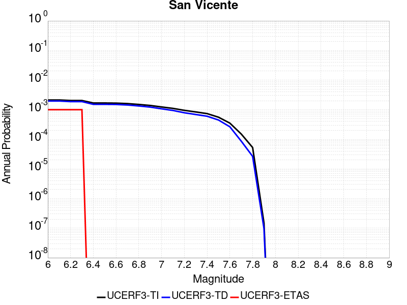 |
|-----|

| Magnitude | UCERF3-TI Prob | UCERF3-TD Prob | UCERF3-ETAS Prob |
|-----|-----|-----|-----|
| 6.0 | 0.0021292912 | 0.0019659398 | 0.001 |
| 6.1 | 0.0021292912 | 0.0019659398 | 0.001 |
| 6.2 | 0.0020433562 | 0.0018799064 | 0.001 |
| 6.3 | 0.0020433562 | 0.0018799064 | 0.001 |
| 6.4 | 0.0016829104 | 0.0015188743 | 0.0 |
| 6.5 | 0.0016829104 | 0.0015188743 | 0.0 |
| 6.6 | 0.0016669377 | 0.0015028828 | 0.0 |
| 6.7 | 0.0016079539 | 0.0014437668 | 0.0 |
| 6.8 | 0.0015032828 | 0.001338792 | 0.0 |
| 6.9 | 0.0013904421 | 0.001225587 | 0.0 |
| 7.0 | 0.0012376162 | 0.001073225 | 0.0 |
| 7.1 | 0.001107497 | 9.4369665E-4 | 0.0 |
| 7.2 | 9.5153775E-4 | 7.8879483E-4 | 0.0 |
| 7.3 | 8.4073166E-4 | 6.8908284E-4 | 0.0 |
| 7.4 | 7.37998E-4 | 6.0212763E-4 | 0.0 |
| 7.5 | 5.586394E-4 | 4.491281E-4 | 0.0 |
| 7.6 | 3.5197314E-4 | 2.6478202E-4 | 0.0 |
| 7.7 | 1.5099476E-4 | 8.676528E-5 | 0.0 |
| 7.8 | 5.296744E-5 | 2.6626662E-5 | 0.0 |
| 7.9 | 1.4779177E-7 | 9.665144E-8 | 0.0 |

## Santa Cruz Catalina Ridge alt1
*[(top)](#table-of-contents)*

|  |
|-----|

| Magnitude | UCERF3-TI Prob | UCERF3-TD Prob | UCERF3-ETAS Prob |
|-----|-----|-----|-----|
| 6.0 | 0.1574495 | 0.16327177 | 0.109 |
| 6.1 | 0.09832405 | 0.10093048 | 0.061 |
| 6.2 | 0.09832405 | 0.10093048 | 0.061 |
| 6.3 | 0.07879074 | 0.08064347 | 0.053 |
| 6.4 | 0.07879074 | 0.08064347 | 0.053 |
| 6.5 | 0.06902745 | 0.070577875 | 0.048 |
| 6.6 | 0.06333666 | 0.06472778 | 0.044 |
| 6.7 | 0.058260903 | 0.059517637 | 0.044 |
| 6.8 | 0.051471595 | 0.052557845 | 0.04 |
| 6.9 | 0.045680076 | 0.046624325 | 0.037 |
| 7.0 | 0.04111811 | 0.041956056 | 0.034 |
| 7.1 | 0.03655073 | 0.037288155 | 0.03 |
| 7.2 | 0.032651242 | 0.03330566 | 0.027 |
| 7.3 | 0.02577281 | 0.026290372 | 0.021 |
| 7.4 | 0.018046286 | 0.018409409 | 0.013 |
| 7.5 | 0.005834765 | 0.0059376787 | 0.002 |
| 7.6 | 0.0014911448 | 0.0015119278 | 0.0 |
| 7.7 | 0.0010837624 | 0.0010985681 | 0.0 |
| 7.8 | 1.8859607E-4 | 1.9090269E-4 | 0.0 |

## Santa Cruz Island
*[(top)](#table-of-contents)*

| 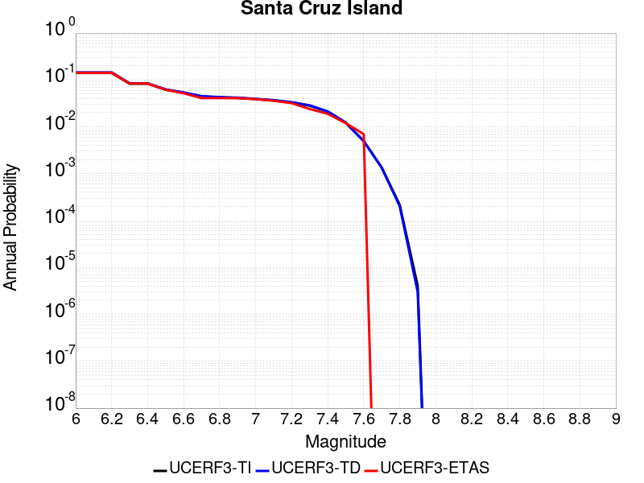 |
|-----|

| Magnitude | UCERF3-TI Prob | UCERF3-TD Prob | UCERF3-ETAS Prob |
|-----|-----|-----|-----|
| 6.0 | 0.14116524 | 0.14540274 | 0.142 |
| 6.1 | 0.14116524 | 0.14540274 | 0.142 |
| 6.2 | 0.14116524 | 0.14540274 | 0.142 |
| 6.3 | 0.08314199 | 0.08490387 | 0.084 |
| 6.4 | 0.08314199 | 0.08490387 | 0.084 |
| 6.5 | 0.061864074 | 0.06301996 | 0.062 |
| 6.6 | 0.053263426 | 0.05422061 | 0.052 |
| 6.7 | 0.044376712 | 0.045140337 | 0.041 |
| 6.8 | 0.04242261 | 0.04314552 | 0.041 |
| 6.9 | 0.041249648 | 0.041948296 | 0.041 |
| 7.0 | 0.03896521 | 0.039616074 | 0.039 |
| 7.1 | 0.036482118 | 0.03708449 | 0.036 |
| 7.2 | 0.03305042 | 0.033599112 | 0.032 |
| 7.3 | 0.028261375 | 0.02872321 | 0.024 |
| 7.4 | 0.021065231 | 0.021390172 | 0.019 |
| 7.5 | 0.0122307865 | 0.012386058 | 0.012 |
| 7.6 | 0.004943762 | 0.0049793213 | 0.007 |
| 7.7 | 0.0013564284 | 0.0013462078 | 0.0 |
| 7.8 | 2.1663377E-4 | 2.0320741E-4 | 0.0 |
| 7.9 | 4.0303717E-6 | 2.9997354E-6 | 0.0 |

## Santa Monica Bay
*[(top)](#table-of-contents)*

|  |
|-----|

| Magnitude | UCERF3-TI Prob | UCERF3-TD Prob | UCERF3-ETAS Prob |
|-----|-----|-----|-----|
| 6.0 | 0.0033824618 | 0.003394809 | 0.002 |
| 6.1 | 0.0033824618 | 0.003394809 | 0.002 |
| 6.2 | 0.0033824618 | 0.003394809 | 0.002 |
| 6.3 | 0.0033824618 | 0.003394809 | 0.002 |
| 6.4 | 0.0033824618 | 0.003394809 | 0.002 |
| 6.5 | 0.0033824618 | 0.003394809 | 0.002 |
| 6.6 | 0.0033824618 | 0.003394809 | 0.002 |
| 6.7 | 0.0033824618 | 0.003394809 | 0.002 |
| 6.8 | 0.0033824618 | 0.003394809 | 0.002 |
| 6.9 | 0.0033824618 | 0.003394809 | 0.002 |
| 7.0 | 0.0033141868 | 0.0033264307 | 0.002 |
| 7.1 | 0.0030198668 | 0.0030315209 | 0.002 |
| 7.2 | 0.0027436675 | 0.0027546908 | 0.001 |
| 7.3 | 0.0023884855 | 0.0023985575 | 0.001 |
| 7.4 | 0.002068854 | 0.002077933 | 0.001 |
| 7.5 | 0.0013113081 | 0.0013175406 | 0.0 |
| 7.6 | 8.56031E-4 | 8.603867E-4 | 0.0 |
| 7.7 | 6.275298E-4 | 6.308737E-4 | 0.0 |
| 7.8 | 1.5933896E-4 | 1.6025697E-4 | 0.0 |

## Santa Monica alt 1
*[(top)](#table-of-contents)*

|  |
|-----|

| Magnitude | UCERF3-TI Prob | UCERF3-TD Prob | UCERF3-ETAS Prob |
|-----|-----|-----|-----|
| 6.0 | 0.05610577 | 0.05510527 | 0.033 |
| 6.1 | 0.05610577 | 0.05510527 | 0.033 |
| 6.2 | 0.05610577 | 0.05510527 | 0.033 |
| 6.3 | 0.05610577 | 0.05510527 | 0.033 |
| 6.4 | 0.05610577 | 0.05510527 | 0.033 |
| 6.5 | 0.041801903 | 0.04029462 | 0.022 |
| 6.6 | 0.04165582 | 0.040144604 | 0.022 |
| 6.7 | 0.04143852 | 0.039922412 | 0.022 |
| 6.8 | 0.039100677 | 0.037522815 | 0.019 |
| 6.9 | 0.037724856 | 0.03611395 | 0.019 |
| 7.0 | 0.036921367 | 0.035294283 | 0.019 |
| 7.1 | 0.028814817 | 0.026940152 | 0.018 |
| 7.2 | 0.024471916 | 0.022473667 | 0.015 |
| 7.3 | 0.019781029 | 0.01784558 | 0.01 |
| 7.4 | 0.013530197 | 0.012325677 | 0.007 |
| 7.5 | 0.009307584 | 0.00868603 | 0.006 |
| 7.6 | 0.005968577 | 0.00544377 | 0.004 |
| 7.7 | 0.002777733 | 0.0023114136 | 0.001 |
| 7.8 | 6.0866424E-4 | 3.5810188E-4 | 0.0 |
| 7.9 | 4.1781627E-6 | 3.0963865E-6 | 0.0 |

## Santa Rosa Island
*[(top)](#table-of-contents)*

| 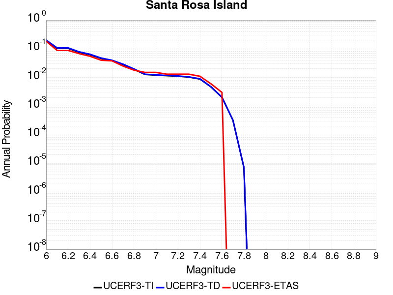 |
|-----|

| Magnitude | UCERF3-TI Prob | UCERF3-TD Prob | UCERF3-ETAS Prob |
|-----|-----|-----|-----|
| 6.0 | 0.19320332 | 0.20147796 | 0.185 |
| 6.1 | 0.10407247 | 0.1079331 | 0.088 |
| 6.2 | 0.10407247 | 0.1079331 | 0.088 |
| 6.3 | 0.07604703 | 0.07871571 | 0.068 |
| 6.4 | 0.062368963 | 0.06449781 | 0.055 |
| 6.5 | 0.046179753 | 0.047693826 | 0.04 |
| 6.6 | 0.03860986 | 0.039845876 | 0.038 |
| 6.7 | 0.028302463 | 0.029161727 | 0.025 |
| 6.8 | 0.019300913 | 0.01982384 | 0.018 |
| 6.9 | 0.012735195 | 0.012988876 | 0.015 |
| 7.0 | 0.012055744 | 0.012288233 | 0.015 |
| 7.1 | 0.011541758 | 0.011759897 | 0.013 |
| 7.2 | 0.0110785235 | 0.011285918 | 0.013 |
| 7.3 | 0.010274863 | 0.010464896 | 0.013 |
| 7.4 | 0.008805898 | 0.00896637 | 0.011 |
| 7.5 | 0.0046784203 | 0.004753835 | 0.006 |
| 7.6 | 0.0020215977 | 0.0020442628 | 0.003 |
| 7.7 | 3.2250572E-4 | 3.2223717E-4 | 0.0 |
| 7.8 | 7.15076E-6 | 7.191492E-6 | 0.0 |

## Santa Susana East (connector)
*[(top)](#table-of-contents)*

|  |
|-----|

| Magnitude | UCERF3-TI Prob | UCERF3-TD Prob | UCERF3-ETAS Prob |
|-----|-----|-----|-----|
| 6.0 | 0.13855943 | 0.14390583 | 0.107 |
| 6.1 | 0.13855943 | 0.14390583 | 0.107 |
| 6.2 | 0.13855943 | 0.14390583 | 0.107 |
| 6.3 | 0.0964414 | 0.097819135 | 0.072 |
| 6.4 | 0.0964414 | 0.097819135 | 0.072 |
| 6.5 | 0.0964414 | 0.097819135 | 0.072 |
| 6.6 | 0.0964414 | 0.097819135 | 0.072 |
| 6.7 | 0.096293435 | 0.09766655 | 0.072 |
| 6.8 | 0.061760183 | 0.060202476 | 0.047 |
| 6.9 | 0.061760183 | 0.060202476 | 0.047 |
| 7.0 | 0.047248494 | 0.04475358 | 0.033 |
| 7.1 | 0.046524074 | 0.04399912 | 0.032 |
| 7.2 | 0.045133308 | 0.042556323 | 0.032 |
| 7.3 | 0.04374715 | 0.041208945 | 0.031 |
| 7.4 | 0.040144227 | 0.03751522 | 0.028 |
| 7.5 | 0.025177015 | 0.024265163 | 0.016 |
| 7.6 | 0.007223762 | 0.0071942345 | 0.003 |
| 7.7 | 0.0015602064 | 0.0014041003 | 0.0 |
| 7.8 | 2.5140942E-4 | 1.5032079E-4 | 0.0 |
| 7.9 | 1.36327335E-5 | 1.38698815E-5 | 0.0 |

## Santa Susana alt 1
*[(top)](#table-of-contents)*

|  |
|-----|

| Magnitude | UCERF3-TI Prob | UCERF3-TD Prob | UCERF3-ETAS Prob |
|-----|-----|-----|-----|
| 6.0 | 0.13027059 | 0.12673922 | 0.087 |
| 6.1 | 0.13027059 | 0.12673922 | 0.087 |
| 6.2 | 0.13027059 | 0.12673922 | 0.087 |
| 6.3 | 0.13027059 | 0.12673922 | 0.087 |
| 6.4 | 0.13027059 | 0.12673922 | 0.087 |
| 6.5 | 0.13027059 | 0.12673922 | 0.087 |
| 6.6 | 0.12981303 | 0.12625234 | 0.087 |
| 6.7 | 0.12981303 | 0.12625234 | 0.087 |
| 6.8 | 0.094730034 | 0.08802029 | 0.061 |
| 6.9 | 0.094582155 | 0.087864466 | 0.061 |
| 7.0 | 0.07970021 | 0.07190748 | 0.048 |
| 7.1 | 0.0790296 | 0.07121417 | 0.047 |
| 7.2 | 0.077291064 | 0.06953545 | 0.047 |
| 7.3 | 0.073033005 | 0.06590484 | 0.045 |
| 7.4 | 0.06489535 | 0.059140522 | 0.04 |
| 7.5 | 0.045016978 | 0.04194968 | 0.027 |
| 7.6 | 0.016832232 | 0.016382052 | 0.009 |
| 7.7 | 0.006631577 | 0.0062150764 | 0.0 |
| 7.8 | 0.0015993207 | 0.0016192733 | 0.0 |
| 7.9 | 3.9767812E-4 | 4.0517177E-4 | 0.0 |

## Santa Ynez (East)
*[(top)](#table-of-contents)*

| 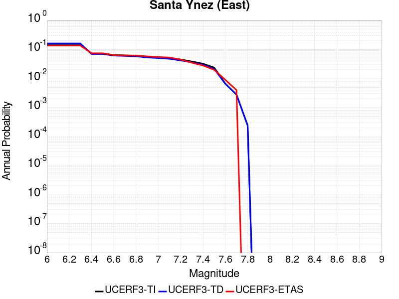 |
|-----|

| Magnitude | UCERF3-TI Prob | UCERF3-TD Prob | UCERF3-ETAS Prob |
|-----|-----|-----|-----|
| 6.0 | 0.15496857 | 0.16161884 | 0.137 |
| 6.1 | 0.15496857 | 0.16161884 | 0.137 |
| 6.2 | 0.15496857 | 0.16161884 | 0.137 |
| 6.3 | 0.15496857 | 0.16161884 | 0.137 |
| 6.4 | 0.07240737 | 0.069877766 | 0.074 |
| 6.5 | 0.07240737 | 0.069877766 | 0.074 |
| 6.6 | 0.064617604 | 0.061722245 | 0.064 |
| 6.7 | 0.06293196 | 0.05997735 | 0.062 |
| 6.8 | 0.0611608 | 0.058150154 | 0.062 |
| 6.9 | 0.05629305 | 0.053147368 | 0.058 |
| 7.0 | 0.05369645 | 0.050472382 | 0.055 |
| 7.1 | 0.050948728 | 0.047652435 | 0.053 |
| 7.2 | 0.045248363 | 0.041852638 | 0.045 |
| 7.3 | 0.03863122 | 0.036076345 | 0.035 |
| 7.4 | 0.032385603 | 0.029789275 | 0.028 |
| 7.5 | 0.023768943 | 0.0214853 | 0.02 |
| 7.6 | 0.00668701 | 0.006535537 | 0.009 |
| 7.7 | 0.002777375 | 0.0028202063 | 0.004 |
| 7.8 | 2.4071947E-4 | 2.436394E-4 | 0.0 |

## Santa Ynez (West)
*[(top)](#table-of-contents)*

|  |
|-----|

| Magnitude | UCERF3-TI Prob | UCERF3-TD Prob | UCERF3-ETAS Prob |
|-----|-----|-----|-----|
| 6.0 | 0.21892631 | 0.22690196 | 0.213 |
| 6.1 | 0.21892631 | 0.22690196 | 0.192 |
| 6.2 | 0.14675452 | 0.14907216 | 0.147 |
| 6.3 | 0.14675452 | 0.14907216 | 0.147 |
| 6.4 | 0.12436594 | 0.12535664 | 0.125 |
| 6.5 | 0.11375546 | 0.11413996 | 0.118 |
| 6.6 | 0.09494416 | 0.09433491 | 0.094 |
| 6.7 | 0.08597228 | 0.08492705 | 0.085 |
| 6.8 | 0.07681389 | 0.07534212 | 0.08 |
| 6.9 | 0.065930314 | 0.06395618 | 0.071 |
| 7.0 | 0.05989534 | 0.057681967 | 0.068 |
| 7.1 | 0.053793844 | 0.051353473 | 0.059 |
| 7.2 | 0.04881375 | 0.046250004 | 0.052 |
| 7.3 | 0.043812398 | 0.04112751 | 0.044 |
| 7.4 | 0.037184794 | 0.034340616 | 0.037 |
| 7.5 | 0.028935619 | 0.026263857 | 0.03 |
| 7.6 | 0.011750153 | 0.011155635 | 0.02 |
| 7.7 | 0.006812024 | 0.006388158 | 0.011 |
| 7.8 | 0.004115678 | 0.003844976 | 0.008 |
| 7.9 | 3.691738E-5 | 3.757855E-5 | 0.0 |

## Santa Ynez River
*[(top)](#table-of-contents)*

|  |
|-----|

| Magnitude | UCERF3-TI Prob | UCERF3-TD Prob | UCERF3-ETAS Prob |
|-----|-----|-----|-----|
| 6.0 | 0.08199741 | 0.08312964 | 0.093 |
| 6.1 | 0.08199741 | 0.08312964 | 0.093 |
| 6.2 | 0.08199741 | 0.08312964 | 0.093 |
| 6.3 | 0.049537335 | 0.049802683 | 0.066 |
| 6.4 | 0.049537335 | 0.049802683 | 0.066 |
| 6.5 | 0.036278386 | 0.036311414 | 0.051 |
| 6.6 | 0.03018103 | 0.030115768 | 0.04 |
| 6.7 | 0.02561611 | 0.025481153 | 0.034 |
| 6.8 | 0.022679187 | 0.022500275 | 0.032 |
| 6.9 | 0.018227745 | 0.017987564 | 0.024 |
| 7.0 | 0.016618082 | 0.016356535 | 0.023 |
| 7.1 | 0.0130086765 | 0.012698819 | 0.018 |
| 7.2 | 0.010647756 | 0.010304886 | 0.013 |
| 7.3 | 0.008751358 | 0.008380979 | 0.009 |
| 7.4 | 0.0070713186 | 0.006670749 | 0.009 |
| 7.5 | 0.0050668847 | 0.004659267 | 0.007 |
| 7.6 | 0.0026404944 | 0.0024507937 | 0.005 |
| 7.7 | 0.001443828 | 0.0013751702 | 0.001 |
| 7.8 | 8.8897086E-4 | 8.41393E-4 | 0.001 |
| 7.9 | 2.5222177E-4 | 2.3859924E-4 | 0.001 |

## Sargent 2011 CFM
*[(top)](#table-of-contents)*

|  |
|-----|

| Magnitude | UCERF3-TI Prob | UCERF3-TD Prob | UCERF3-ETAS Prob |
|-----|-----|-----|-----|
| 6.0 | 0.17698029 | 0.1509029 | 0.13 |
| 6.1 | 0.116653405 | 0.080424346 | 0.059 |
| 6.2 | 0.113611795 | 0.07710895 | 0.055 |
| 6.3 | 0.086244196 | 0.046478562 | 0.028 |
| 6.4 | 0.07450937 | 0.03342 | 0.022 |
| 6.5 | 0.0721856 | 0.030881574 | 0.019 |
| 6.6 | 0.049713947 | 0.0057962025 | 0.005 |
| 6.7 | 0.04961554 | 0.0056910487 | 0.005 |
| 6.8 | 0.04889853 | 0.0050576823 | 0.004 |
| 6.9 | 0.047999598 | 0.004381712 | 0.004 |
| 7.0 | 0.047107216 | 0.0036912283 | 0.004 |
| 7.1 | 0.045852687 | 0.0029161004 | 0.003 |
| 7.2 | 0.04348693 | 0.0015363405 | 0.001 |
| 7.3 | 0.041101918 | 6.4613565E-4 | 0.0 |
| 7.4 | 0.03919233 | 4.4715454E-4 | 0.0 |
| 7.5 | 0.035673123 | 2.9201352E-4 | 0.0 |
| 7.6 | 0.03224896 | 1.687258E-4 | 0.0 |
| 7.7 | 0.025418468 | 4.3448414E-5 | 0.0 |
| 7.8 | 0.0123067405 | 3.6370584E-5 | 0.0 |
| 7.9 | 0.0094659235 | 3.5814137E-5 | 0.0 |
| 8.0 | 9.958609E-4 | 2.14349E-5 | 0.0 |

## Scodie Lineament
*[(top)](#table-of-contents)*

| 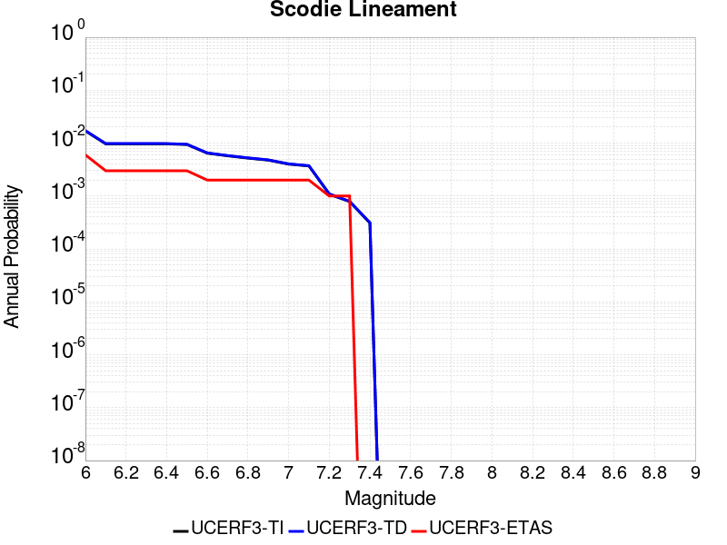 |
|-----|

| Magnitude | UCERF3-TI Prob | UCERF3-TD Prob | UCERF3-ETAS Prob |
|-----|-----|-----|-----|
| 6.0 | 0.017030181 | 0.017231386 | 0.006 |
| 6.1 | 0.009691253 | 0.009806174 | 0.003 |
| 6.2 | 0.009691253 | 0.009806174 | 0.003 |
| 6.3 | 0.009691253 | 0.009806174 | 0.003 |
| 6.4 | 0.009691253 | 0.009806174 | 0.003 |
| 6.5 | 0.009403135 | 0.009514532 | 0.003 |
| 6.6 | 0.00645687 | 0.006530494 | 0.002 |
| 6.7 | 0.0057554822 | 0.0058211666 | 0.002 |
| 6.8 | 0.005207767 | 0.005267468 | 0.002 |
| 6.9 | 0.0047719795 | 0.004827127 | 0.002 |
| 7.0 | 0.0040090503 | 0.0040563736 | 0.002 |
| 7.1 | 0.003699839 | 0.0037440765 | 0.002 |
| 7.2 | 0.001084705 | 0.0010986928 | 0.001 |
| 7.3 | 7.848845E-4 | 7.952888E-4 | 0.001 |
| 7.4 | 3.0955195E-4 | 3.137598E-4 | 0.0 |

## Sheephole
*[(top)](#table-of-contents)*

|  |
|-----|

| Magnitude | UCERF3-TI Prob | UCERF3-TD Prob | UCERF3-ETAS Prob |
|-----|-----|-----|-----|
| 6.0 | 0.023502303 | 0.023835046 | 0.021 |
| 6.1 | 0.023502303 | 0.023835046 | 0.021 |
| 6.2 | 0.013823612 | 0.014016123 | 0.013 |
| 6.3 | 0.013823612 | 0.014016123 | 0.013 |
| 6.4 | 0.011496067 | 0.011666642 | 0.01 |
| 6.5 | 0.011406483 | 0.011575921 | 0.01 |
| 6.6 | 0.007916517 | 0.008038098 | 0.008 |
| 6.7 | 0.006831451 | 0.006938025 | 0.007 |
| 6.8 | 0.0063848454 | 0.0064847446 | 0.007 |
| 6.9 | 0.006157392 | 0.006253767 | 0.007 |
| 7.0 | 0.00512608 | 0.0052059386 | 0.004 |
| 7.1 | 0.0042509893 | 0.0043170988 | 0.004 |
| 7.2 | 0.002985147 | 0.0030316738 | 0.003 |

## Shoreline
*[(top)](#table-of-contents)*

|  |
|-----|

| Magnitude | UCERF3-TI Prob | UCERF3-TD Prob | UCERF3-ETAS Prob |
|-----|-----|-----|-----|
| 6.0 | 0.020598277 | 0.020576993 | 0.02 |
| 6.1 | 0.020598277 | 0.020576993 | 0.02 |
| 6.2 | 0.007298928 | 0.0071366234 | 0.005 |
| 6.3 | 0.007298928 | 0.0071366234 | 0.005 |
| 6.4 | 0.006923063 | 0.006758484 | 0.005 |
| 6.5 | 0.0058202296 | 0.005650338 | 0.005 |
| 6.6 | 0.005096863 | 0.0049228487 | 0.004 |
| 6.7 | 0.0046829795 | 0.0045065177 | 0.002 |
| 6.8 | 0.0041300515 | 0.0039490946 | 0.002 |
| 6.9 | 0.0037220486 | 0.003538293 | 0.002 |
| 7.0 | 0.0033281634 | 0.0031410642 | 0.001 |
| 7.1 | 0.0028293326 | 0.0026375798 | 0.001 |
| 7.2 | 0.0024373573 | 0.0022419551 | 0.001 |
| 7.3 | 0.00213527 | 0.0019373161 | 0.001 |
| 7.4 | 0.0018300933 | 0.0016295767 | 0.001 |
| 7.5 | 0.00149836 | 0.0012950542 | 0.001 |
| 7.6 | 0.0010911914 | 8.8428706E-4 | 0.001 |
| 7.7 | 7.262002E-4 | 5.1561464E-4 | 0.0 |
| 7.8 | 4.229748E-4 | 2.1452337E-4 | 0.0 |
| 7.9 | 2.6534E-4 | 7.510246E-5 | 0.0 |
| 8.0 | 1.657082E-4 | 2.3086543E-5 | 0.0 |
| 8.1 | 6.755799E-5 | 9.390402E-6 | 0.0 |

## Sierra Madre
*[(top)](#table-of-contents)*

|  |
|-----|

| Magnitude | UCERF3-TI Prob | UCERF3-TD Prob | UCERF3-ETAS Prob |
|-----|-----|-----|-----|
| 6.0 | 0.06743099 | 0.06108337 | 0.047 |
| 6.1 | 0.06743099 | 0.06108337 | 0.047 |
| 6.2 | 0.06743099 | 0.06108337 | 0.047 |
| 6.3 | 0.06743099 | 0.06108337 | 0.047 |
| 6.4 | 0.06743099 | 0.06108337 | 0.047 |
| 6.5 | 0.06390593 | 0.057462625 | 0.045 |
| 6.6 | 0.06390593 | 0.057462625 | 0.045 |
| 6.7 | 0.06315416 | 0.056691166 | 0.043 |
| 6.8 | 0.06292189 | 0.05645243 | 0.043 |
| 6.9 | 0.061799582 | 0.055301886 | 0.042 |
| 7.0 | 0.05985842 | 0.0533108 | 0.041 |
| 7.1 | 0.057930756 | 0.051323254 | 0.038 |
| 7.2 | 0.05497434 | 0.048280038 | 0.035 |
| 7.3 | 0.052836873 | 0.04608432 | 0.034 |
| 7.4 | 0.04969547 | 0.042861708 | 0.031 |
| 7.5 | 0.04431621 | 0.03735757 | 0.024 |
| 7.6 | 0.032593656 | 0.025346415 | 0.017 |
| 7.7 | 0.02382967 | 0.016445788 | 0.012 |
| 7.8 | 0.016632952 | 0.010642487 | 0.009 |
| 7.9 | 0.0054076053 | 0.003569797 | 0.004 |
| 8.0 | 6.316741E-4 | 4.2244254E-4 | 0.001 |

## Sierra Madre (San Fernando)
*[(top)](#table-of-contents)*

|  |
|-----|

| Magnitude | UCERF3-TI Prob | UCERF3-TD Prob | UCERF3-ETAS Prob |
|-----|-----|-----|-----|
| 6.0 | 0.05255499 | 0.049676925 | 0.043 |
| 6.1 | 0.05255499 | 0.049676925 | 0.043 |
| 6.2 | 0.05255499 | 0.049676925 | 0.043 |
| 6.3 | 0.05255499 | 0.049676925 | 0.043 |
| 6.4 | 0.052076053 | 0.049185224 | 0.043 |
| 6.5 | 0.052076053 | 0.049185224 | 0.043 |
| 6.6 | 0.050363094 | 0.047425367 | 0.042 |
| 6.7 | 0.05020758 | 0.04726425 | 0.042 |
| 6.8 | 0.048043083 | 0.045025956 | 0.039 |
| 6.9 | 0.044382825 | 0.041242696 | 0.036 |
| 7.0 | 0.04412565 | 0.040978048 | 0.036 |
| 7.1 | 0.04341169 | 0.04023952 | 0.034 |
| 7.2 | 0.041582927 | 0.03834578 | 0.033 |
| 7.3 | 0.04029106 | 0.037017614 | 0.032 |
| 7.4 | 0.038784876 | 0.035474215 | 0.032 |
| 7.5 | 0.03258632 | 0.029061653 | 0.023 |
| 7.6 | 0.022852989 | 0.019089306 | 0.016 |
| 7.7 | 0.015557737 | 0.011802372 | 0.012 |
| 7.8 | 0.009585466 | 0.006678251 | 0.008 |
| 7.9 | 0.0051208325 | 0.003384568 | 0.004 |
| 8.0 | 6.316741E-4 | 4.2244254E-4 | 0.001 |

## Sierra Nevada  (No Extension)
*[(top)](#table-of-contents)*

|  |
|-----|

| Magnitude | UCERF3-TI Prob | UCERF3-TD Prob | UCERF3-ETAS Prob |
|-----|-----|-----|-----|
| 6.0 | 0.039727263 | 0.03461693 | 0.045 |
| 6.1 | 0.039727263 | 0.03461693 | 0.045 |
| 6.2 | 0.039727263 | 0.03461693 | 0.045 |
| 6.3 | 0.039727263 | 0.03461693 | 0.045 |
| 6.4 | 0.039727263 | 0.03461693 | 0.045 |
| 6.5 | 0.039727263 | 0.03461693 | 0.045 |
| 6.6 | 0.0137476185 | 0.007755626 | 0.007 |
| 6.7 | 0.013424628 | 0.007427672 | 0.007 |
| 6.8 | 0.013399624 | 0.0074142814 | 0.007 |
| 6.9 | 0.012744937 | 0.006782058 | 0.007 |
| 7.0 | 0.012620728 | 0.006665815 | 0.007 |
| 7.1 | 0.012265694 | 0.006337499 | 0.005 |
| 7.2 | 0.011785806 | 0.0059177782 | 0.005 |
| 7.3 | 0.011094893 | 0.0053754854 | 0.005 |
| 7.4 | 0.009889783 | 0.0044508297 | 0.004 |
| 7.5 | 0.007989541 | 0.0034849239 | 0.004 |
| 7.6 | 0.0055573434 | 0.0021118864 | 0.002 |
| 7.7 | 0.0028704668 | 6.6344993E-4 | 0.0 |

## Silver Creek 2011 CFM
*[(top)](#table-of-contents)*

|  |
|-----|

| Magnitude | UCERF3-TI Prob | UCERF3-TD Prob | UCERF3-ETAS Prob |
|-----|-----|-----|-----|
| 6.0 | 0.018214166 | 0.015530968 | 0.017 |
| 6.1 | 0.018214166 | 0.015530968 | 0.017 |
| 6.2 | 0.013661795 | 0.010945685 | 0.009 |
| 6.3 | 0.013101634 | 0.0103814695 | 0.009 |
| 6.4 | 0.011303949 | 0.00857113 | 0.006 |
| 6.5 | 0.010557824 | 0.007819818 | 0.005 |
| 6.6 | 0.009790985 | 0.007082769 | 0.005 |
| 6.7 | 0.008750801 | 0.006114624 | 0.004 |
| 6.8 | 0.007887957 | 0.0054434785 | 0.004 |
| 6.9 | 0.006986922 | 0.0048050396 | 0.004 |
| 7.0 | 0.0060155457 | 0.004029775 | 0.004 |
| 7.1 | 0.0044784397 | 0.0027306385 | 0.003 |
| 7.2 | 0.0035358293 | 0.0019947195 | 0.003 |
| 7.3 | 0.0026727682 | 0.0014170851 | 0.002 |
| 7.4 | 0.0019917542 | 9.953193E-4 | 0.002 |
| 7.5 | 0.0011625197 | 4.4277532E-4 | 0.001 |
| 7.6 | 7.4096734E-4 | 1.5311716E-4 | 0.001 |
| 7.7 | 5.868406E-4 | 6.655476E-5 | 0.001 |
| 7.8 | 4.4825752E-4 | 1.9346715E-5 | 0.001 |
| 7.9 | 3.211873E-4 | 1.41102455E-5 | 0.001 |
| 8.0 | 1.525092E-4 | 8.212218E-6 | 0.0 |
| 8.1 | 2.9252034E-5 | 1.9967927E-6 | 0.0 |

## Simi-Santa Rosa
*[(top)](#table-of-contents)*

|  |
|-----|

| Magnitude | UCERF3-TI Prob | UCERF3-TD Prob | UCERF3-ETAS Prob |
|-----|-----|-----|-----|
| 6.0 | 0.10839971 | 0.111580774 | 0.09 |
| 6.1 | 0.10839971 | 0.111580774 | 0.09 |
| 6.2 | 0.08487577 | 0.08719391 | 0.068 |
| 6.3 | 0.08487577 | 0.08719391 | 0.068 |
| 6.4 | 0.07367176 | 0.07559714 | 0.061 |
| 6.5 | 0.07367176 | 0.07559714 | 0.061 |
| 6.6 | 0.07227574 | 0.07415698 | 0.061 |
| 6.7 | 0.06987071 | 0.0716762 | 0.06 |
| 6.8 | 0.051714703 | 0.052843988 | 0.043 |
| 6.9 | 0.049352933 | 0.050396204 | 0.04 |
| 7.0 | 0.03790117 | 0.038482454 | 0.029 |
| 7.1 | 0.020008214 | 0.019798804 | 0.018 |
| 7.2 | 0.017675063 | 0.01740002 | 0.017 |
| 7.3 | 0.009876581 | 0.00934569 | 0.007 |
| 7.4 | 0.007884538 | 0.0073076035 | 0.007 |
| 7.5 | 0.0061315834 | 0.005523438 | 0.005 |
| 7.6 | 0.0035794156 | 0.0029247042 | 0.003 |
| 7.7 | 0.0028722908 | 0.002206675 | 0.002 |
| 7.8 | 0.0017652195 | 0.001169779 | 0.001 |
| 7.9 | 0.001457609 | 8.807052E-4 | 0.001 |
| 8.0 | 2.9350843E-4 | 2.2709338E-4 | 0.0 |

## Sisar
*[(top)](#table-of-contents)*

|  |
|-----|

| Magnitude | UCERF3-TI Prob | UCERF3-TD Prob | UCERF3-ETAS Prob |
|-----|-----|-----|-----|
| 6.0 | 0.023432106 | 0.022346176 | 0.026 |
| 6.1 | 0.023432106 | 0.022346176 | 0.026 |
| 6.2 | 0.023432106 | 0.022346176 | 0.026 |
| 6.3 | 0.023432106 | 0.022346176 | 0.026 |
| 6.4 | 0.023432106 | 0.022346176 | 0.026 |
| 6.5 | 0.023432106 | 0.022346176 | 0.026 |
| 6.6 | 0.023432106 | 0.022346176 | 0.026 |
| 6.7 | 0.023432106 | 0.022346176 | 0.026 |
| 6.8 | 0.023432106 | 0.022346176 | 0.026 |
| 6.9 | 0.023422077 | 0.02233603 | 0.026 |
| 7.0 | 0.023348818 | 0.022261841 | 0.025 |
| 7.1 | 0.023274414 | 0.02218643 | 0.024 |
| 7.2 | 0.0229462 | 0.021853106 | 0.024 |
| 7.3 | 0.022403494 | 0.021324052 | 0.023 |
| 7.4 | 0.02177181 | 0.020769833 | 0.023 |
| 7.5 | 0.020572275 | 0.019675795 | 0.022 |
| 7.6 | 0.014387555 | 0.014225803 | 0.014 |
| 7.7 | 0.009879647 | 0.009721803 | 0.006 |
| 7.8 | 0.0025584789 | 0.002558538 | 0.003 |
| 7.9 | 6.08519E-4 | 6.1103486E-4 | 0.001 |
| 8.0 | 1.30969165E-5 | 9.561298E-6 | 0.0 |

## Skinner Flat 2011 CFM
*[(top)](#table-of-contents)*

|  |
|-----|

| Magnitude | UCERF3-TI Prob | UCERF3-TD Prob | UCERF3-ETAS Prob |
|-----|-----|-----|-----|
| 6.0 | 0.022329375 | 0.022825794 | 0.009 |
| 6.1 | 0.022329375 | 0.022825794 | 0.009 |

## So Sierra Nevada
*[(top)](#table-of-contents)*

|  |
|-----|

| Magnitude | UCERF3-TI Prob | UCERF3-TD Prob | UCERF3-ETAS Prob |
|-----|-----|-----|-----|
| 6.0 | 0.058480937 | 0.05438206 | 0.043 |
| 6.1 | 0.058480937 | 0.05438206 | 0.043 |
| 6.2 | 0.058480937 | 0.05438206 | 0.043 |
| 6.3 | 0.058480937 | 0.05438206 | 0.043 |
| 6.4 | 0.058480937 | 0.05438206 | 0.043 |
| 6.5 | 0.058480937 | 0.05438206 | 0.043 |
| 6.6 | 0.038814884 | 0.034262832 | 0.021 |
| 6.7 | 0.038814884 | 0.034262832 | 0.021 |
| 6.8 | 0.030330041 | 0.025612274 | 0.016 |
| 6.9 | 0.025812414 | 0.02101361 | 0.014 |
| 7.0 | 0.023168558 | 0.018327776 | 0.011 |
| 7.1 | 0.020204578 | 0.01532227 | 0.01 |
| 7.2 | 0.01768724 | 0.012782944 | 0.008 |
| 7.3 | 0.013780358 | 0.008871987 | 0.007 |
| 7.4 | 0.011711764 | 0.0069038775 | 0.004 |
| 7.5 | 0.0077409428 | 0.0033943872 | 0.004 |
| 7.6 | 0.0055573434 | 0.0021118864 | 0.002 |
| 7.7 | 0.0028704668 | 6.6344993E-4 | 0.0 |

## South Cuyama
*[(top)](#table-of-contents)*

| 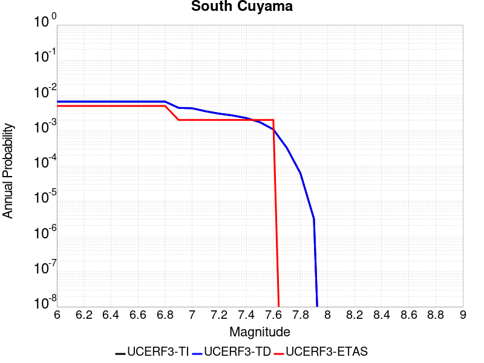 |
|-----|

| Magnitude | UCERF3-TI Prob | UCERF3-TD Prob | UCERF3-ETAS Prob |
|-----|-----|-----|-----|
| 6.0 | 0.006629296 | 0.0066412785 | 0.005 |
| 6.1 | 0.006629296 | 0.0066412785 | 0.005 |
| 6.2 | 0.006629296 | 0.0066412785 | 0.005 |
| 6.3 | 0.006629296 | 0.0066412785 | 0.005 |
| 6.4 | 0.006629296 | 0.0066412785 | 0.005 |
| 6.5 | 0.006629296 | 0.0066412785 | 0.005 |
| 6.6 | 0.006629296 | 0.0066412785 | 0.005 |
| 6.7 | 0.006629296 | 0.0066412785 | 0.005 |
| 6.8 | 0.006629296 | 0.0066412785 | 0.005 |
| 6.9 | 0.0044028307 | 0.0044110133 | 0.002 |
| 7.0 | 0.0042839427 | 0.0042919302 | 0.002 |
| 7.1 | 0.003524277 | 0.0035310858 | 0.002 |
| 7.2 | 0.0030131144 | 0.0030191084 | 0.002 |
| 7.3 | 0.0026766993 | 0.0026821105 | 0.002 |
| 7.4 | 0.002260442 | 0.0022651136 | 0.002 |
| 7.5 | 0.0017330468 | 0.001736751 | 0.002 |
| 7.6 | 0.0010757364 | 0.0010781348 | 0.002 |
| 7.7 | 3.2096982E-4 | 3.2169648E-4 | 0.0 |
| 7.8 | 6.13892E-5 | 6.155943E-5 | 0.0 |
| 7.9 | 3.1506286E-6 | 3.1604745E-6 | 0.0 |

## South Klamath Lake East
*[(top)](#table-of-contents)*

|  |
|-----|

| Magnitude | UCERF3-TI Prob | UCERF3-TD Prob | UCERF3-ETAS Prob |
|-----|-----|-----|-----|
| 6.0 | 0.11558291 | 0.11834761 | 0.119 |
| 6.1 | 0.11558291 | 0.11834761 | 0.119 |
| 6.2 | 0.11558291 | 0.11834761 | 0.119 |
| 6.3 | 0.04988863 | 0.05082007 | 0.06 |
| 6.4 | 0.04988863 | 0.05082007 | 0.06 |
| 6.5 | 0.031792615 | 0.0323502 | 0.032 |
| 6.6 | 0.022540906 | 0.022921285 | 0.023 |
| 6.7 | 0.017383514 | 0.017677434 | 0.018 |
| 6.8 | 0.013365341 | 0.013592248 | 0.015 |
| 6.9 | 0.0051979506 | 0.0052890973 | 0.005 |

## South Klamath Lake West
*[(top)](#table-of-contents)*

| 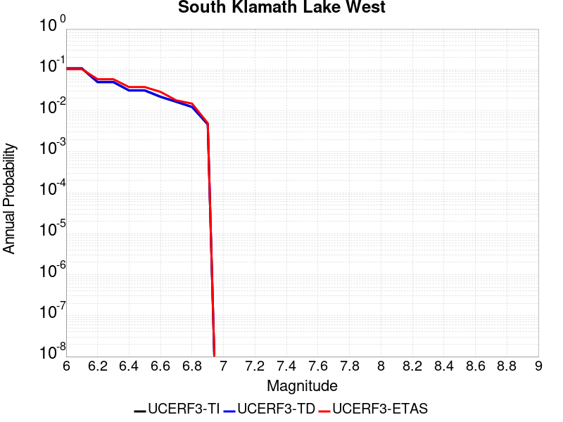 |
|-----|

| Magnitude | UCERF3-TI Prob | UCERF3-TD Prob | UCERF3-ETAS Prob |
|-----|-----|-----|-----|
| 6.0 | 0.10724113 | 0.10960451 | 0.104 |
| 6.1 | 0.10724113 | 0.10960451 | 0.104 |
| 6.2 | 0.050023004 | 0.050920498 | 0.059 |
| 6.3 | 0.050023004 | 0.050920498 | 0.059 |
| 6.4 | 0.03115757 | 0.031679306 | 0.038 |
| 6.5 | 0.03115757 | 0.031679306 | 0.038 |
| 6.6 | 0.021840915 | 0.022194128 | 0.029 |
| 6.7 | 0.016490016 | 0.01675817 | 0.018 |
| 6.8 | 0.012342347 | 0.012544631 | 0.015 |
| 6.9 | 0.00464782 | 0.0047264234 | 0.005 |

## Superstition Hills
*[(top)](#table-of-contents)*

|  |
|-----|

| Magnitude | UCERF3-TI Prob | UCERF3-TD Prob | UCERF3-ETAS Prob |
|-----|-----|-----|-----|
| 6.0 | 0.2945396 | 0.32039008 | 0.317 |
| 6.1 | 0.28930518 | 0.31481454 | 0.276 |
| 6.2 | 0.28930518 | 0.31481454 | 0.276 |
| 6.3 | 0.23923719 | 0.25983182 | 0.221 |
| 6.4 | 0.21101888 | 0.22879827 | 0.182 |
| 6.5 | 0.14344059 | 0.15176652 | 0.105 |
| 6.6 | 0.1271214 | 0.13381054 | 0.093 |
| 6.7 | 0.07340617 | 0.07303358 | 0.04 |
| 6.8 | 0.06587901 | 0.061908286 | 0.03 |
| 6.9 | 0.05303284 | 0.043904074 | 0.016 |
| 7.0 | 0.041113526 | 0.028074086 | 0.006 |
| 7.1 | 0.041113526 | 0.028074086 | 0.006 |
| 7.2 | 0.03775336 | 0.02387256 | 0.006 |
| 7.3 | 0.03388395 | 0.019178448 | 0.006 |
| 7.4 | 0.033000965 | 0.018125003 | 0.006 |
| 7.5 | 0.03119787 | 0.016534168 | 0.005 |
| 7.6 | 0.029297445 | 0.0151512455 | 0.004 |
| 7.7 | 0.026594464 | 0.012916598 | 0.004 |
| 7.8 | 0.019051686 | 0.007483446 | 0.0 |
| 7.9 | 0.015668295 | 0.005305857 | 0.0 |
| 8.0 | 0.013099763 | 0.004042232 | 0.0 |
| 8.1 | 0.01231551 | 0.0038019363 | 0.0 |
| 8.2 | 8.9675805E-6 | 2.1982378E-6 | 0.0 |

## Surprise Valley 2011 CFM
*[(top)](#table-of-contents)*

|  |
|-----|

| Magnitude | UCERF3-TI Prob | UCERF3-TD Prob | UCERF3-ETAS Prob |
|-----|-----|-----|-----|
| 6.0 | 0.1900527 | 0.1969119 | 0.117 |
| 6.1 | 0.1900527 | 0.1969119 | 0.117 |
| 6.2 | 0.10982287 | 0.11286312 | 0.065 |
| 6.3 | 0.07878231 | 0.08075965 | 0.052 |
| 6.4 | 0.07872446 | 0.080701716 | 0.052 |
| 6.5 | 0.0642828 | 0.0658389 | 0.045 |
| 6.6 | 0.05570072 | 0.057027094 | 0.033 |
| 6.7 | 0.046396956 | 0.047484115 | 0.03 |
| 6.8 | 0.031915165 | 0.032645583 | 0.02 |
| 6.9 | 0.021570826 | 0.022061685 | 0.013 |
| 7.0 | 0.014235566 | 0.014564755 | 0.008 |
| 7.1 | 0.004232432 | 0.00432732 | 0.0 |
| 7.2 | 2.5376983E-4 | 2.549666E-4 | 0.0 |
| 7.3 | 2.8130034E-5 | 2.8263199E-5 | 0.0 |

## Swain Ravine - Spenceville
*[(top)](#table-of-contents)*

|  |
|-----|

| Magnitude | UCERF3-TI Prob | UCERF3-TD Prob | UCERF3-ETAS Prob |
|-----|-----|-----|-----|
| 6.0 | 0.028777888 | 0.028909655 | 0.021 |
| 6.1 | 0.028777888 | 0.028909655 | 0.021 |
| 6.2 | 0.028777888 | 0.028909655 | 0.021 |
| 6.3 | 0.028777888 | 0.028909655 | 0.021 |
| 6.4 | 0.014723244 | 0.01477622 | 0.01 |
| 6.5 | 0.009973855 | 0.010007045 | 0.007 |
| 6.6 | 0.009973855 | 0.010007045 | 0.007 |
| 6.7 | 0.0076240306 | 0.007648585 | 0.007 |
| 6.8 | 0.005763123 | 0.0057812626 | 0.007 |
| 6.9 | 0.004432786 | 0.004446573 | 0.005 |
| 7.0 | 0.0025297888 | 0.0025376147 | 0.003 |
| 7.1 | 0.0019960203 | 0.0020022283 | 0.002 |
| 7.2 | 7.681176E-4 | 7.705849E-4 | 0.0 |
| 7.3 | 2.1850313E-4 | 2.1922676E-4 | 0.0 |

## Table Bluff
*[(top)](#table-of-contents)*

|  |
|-----|

| Magnitude | UCERF3-TI Prob | UCERF3-TD Prob | UCERF3-ETAS Prob |
|-----|-----|-----|-----|
| 6.0 | 0.08843293 | 0.08752081 | 0.07 |
| 6.1 | 0.08843293 | 0.08752081 | 0.07 |
| 6.2 | 0.08843293 | 0.08752081 | 0.07 |
| 6.3 | 0.08843293 | 0.08752081 | 0.07 |
| 6.4 | 0.08843293 | 0.08752081 | 0.07 |
| 6.5 | 0.06471669 | 0.0628121 | 0.051 |
| 6.6 | 0.06471669 | 0.0628121 | 0.051 |
| 6.7 | 0.0493052 | 0.04686709 | 0.045 |
| 6.8 | 0.0493052 | 0.04686709 | 0.045 |
| 6.9 | 0.041364312 | 0.0386772 | 0.038 |
| 7.0 | 0.036800925 | 0.033979088 | 0.036 |
| 7.1 | 0.01806468 | 0.01539114 | 0.009 |
| 7.2 | 0.0126451 | 0.010155627 | 0.008 |

## Tank Canyon
*[(top)](#table-of-contents)*

|  |
|-----|

| Magnitude | UCERF3-TI Prob | UCERF3-TD Prob | UCERF3-ETAS Prob |
|-----|-----|-----|-----|
| 6.0 | 0.22271486 | 0.23651911 | 0.181 |
| 6.1 | 0.08867853 | 0.09179862 | 0.085 |
| 6.2 | 0.08867853 | 0.09179862 | 0.085 |
| 6.3 | 0.06809516 | 0.070086576 | 0.063 |
| 6.4 | 0.055140633 | 0.056454003 | 0.041 |
| 6.5 | 0.040707733 | 0.041279305 | 0.033 |
| 6.6 | 0.034011528 | 0.03422804 | 0.028 |
| 6.7 | 0.024702482 | 0.024402458 | 0.016 |
| 6.8 | 0.022609482 | 0.022384245 | 0.016 |
| 6.9 | 0.01414174 | 0.014055196 | 0.009 |
| 7.0 | 0.009858425 | 0.009808775 | 0.007 |
| 7.1 | 0.007759476 | 0.0077090245 | 0.006 |
| 7.2 | 0.00556279 | 0.005497729 | 0.004 |
| 7.3 | 0.0045690113 | 0.0045491564 | 0.004 |
| 7.4 | 0.003935481 | 0.003946313 | 0.004 |
| 7.5 | 0.0029113183 | 0.002923361 | 0.002 |

## Thirty Mile Bank
*[(top)](#table-of-contents)*

|  |
|-----|

| Magnitude | UCERF3-TI Prob | UCERF3-TD Prob | UCERF3-ETAS Prob |
|-----|-----|-----|-----|
| 6.0 | 0.033410396 | 0.033676818 | 0.018 |
| 6.1 | 0.033410396 | 0.033676818 | 0.018 |
| 6.2 | 0.033410396 | 0.033676818 | 0.018 |
| 6.3 | 0.033410396 | 0.033676818 | 0.018 |
| 6.4 | 0.033410396 | 0.033676818 | 0.018 |
| 6.5 | 0.033410396 | 0.033676818 | 0.018 |
| 6.6 | 0.033410396 | 0.033676818 | 0.018 |
| 6.7 | 0.018230567 | 0.018365726 | 0.01 |
| 6.8 | 0.017434318 | 0.017563745 | 0.009 |
| 6.9 | 0.011803986 | 0.011895078 | 0.006 |
| 7.0 | 0.0112162875 | 0.011302396 | 0.006 |
| 7.1 | 0.008262482 | 0.008329606 | 0.003 |
| 7.2 | 0.0067456122 | 0.006801894 | 0.002 |
| 7.3 | 0.0042931065 | 0.0043253656 | 0.001 |
| 7.4 | 0.0022213296 | 0.0022406913 | 0.0 |
| 7.5 | 0.0015609665 | 0.001575358 | 0.0 |
| 7.6 | 8.8605605E-4 | 8.9453947E-4 | 0.0 |

## Tin Mountain
*[(top)](#table-of-contents)*

|  |
|-----|

| Magnitude | UCERF3-TI Prob | UCERF3-TD Prob | UCERF3-ETAS Prob |
|-----|-----|-----|-----|
| 6.0 | 0.021083178 | 0.021271065 | 0.015 |
| 6.1 | 0.021083178 | 0.021271065 | 0.015 |
| 6.2 | 0.021083178 | 0.021271065 | 0.015 |
| 6.3 | 0.021083178 | 0.021271065 | 0.015 |
| 6.4 | 0.021083178 | 0.021271065 | 0.015 |
| 6.5 | 0.012003303 | 0.012101822 | 0.008 |
| 6.6 | 0.012003303 | 0.012101822 | 0.008 |
| 6.7 | 0.008846412 | 0.0089241555 | 0.006 |
| 6.8 | 0.0067160283 | 0.00677993 | 0.006 |
| 6.9 | 0.003058664 | 0.0030969041 | 0.0 |
| 7.0 | 0.0024102868 | 0.002442468 | 0.0 |
| 7.1 | 0.0019832202 | 0.0020115604 | 0.0 |
| 7.2 | 0.0018696274 | 0.0018968293 | 0.0 |
| 7.3 | 0.0017423214 | 0.0017678472 | 0.0 |
| 7.4 | 0.0015491506 | 0.00157178 | 0.0 |
| 7.5 | 7.472681E-4 | 7.5809186E-4 | 0.0 |

## Towne Pass
*[(top)](#table-of-contents)*

| 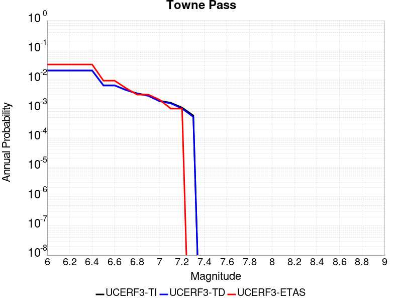 |
|-----|

| Magnitude | UCERF3-TI Prob | UCERF3-TD Prob | UCERF3-ETAS Prob |
|-----|-----|-----|-----|
| 6.0 | 0.019886961 | 0.019930508 | 0.032 |
| 6.1 | 0.019886961 | 0.019930508 | 0.032 |
| 6.2 | 0.019886961 | 0.019930508 | 0.032 |
| 6.3 | 0.019886961 | 0.019930508 | 0.032 |
| 6.4 | 0.019886961 | 0.019930508 | 0.032 |
| 6.5 | 0.006217782 | 0.00615855 | 0.009 |
| 6.6 | 0.006217782 | 0.00615855 | 0.009 |
| 6.7 | 0.004360917 | 0.0042942916 | 0.005 |
| 6.8 | 0.0033236723 | 0.0032531621 | 0.003 |
| 6.9 | 0.002785583 | 0.0027130304 | 0.003 |
| 7.0 | 0.0018546786 | 0.0017779132 | 0.002 |
| 7.1 | 0.0015838993 | 0.0015051747 | 0.001 |
| 7.2 | 0.0010851555 | 0.0010045611 | 0.001 |
| 7.3 | 5.8225146E-4 | 5.2178634E-4 | 0.0 |

## Trinidad (alt1)
*[(top)](#table-of-contents)*

| 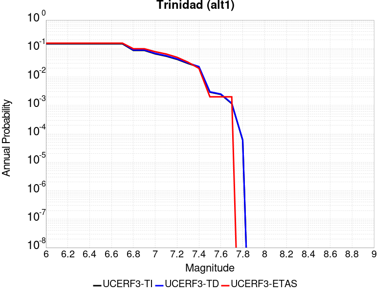 |
|-----|

| Magnitude | UCERF3-TI Prob | UCERF3-TD Prob | UCERF3-ETAS Prob |
|-----|-----|-----|-----|
| 6.0 | 0.1456466 | 0.15177 | 0.154 |
| 6.1 | 0.1456466 | 0.15177 | 0.154 |
| 6.2 | 0.1456466 | 0.15177 | 0.154 |
| 6.3 | 0.1456466 | 0.15177 | 0.154 |
| 6.4 | 0.1456466 | 0.15177 | 0.154 |
| 6.5 | 0.1456466 | 0.15177 | 0.154 |
| 6.6 | 0.1456466 | 0.15177 | 0.154 |
| 6.7 | 0.1456466 | 0.15177 | 0.154 |
| 6.8 | 0.08569896 | 0.08879086 | 0.098 |
| 6.9 | 0.08569896 | 0.08879086 | 0.098 |
| 7.0 | 0.06489328 | 0.0672049 | 0.077 |
| 7.1 | 0.0537507 | 0.055693157 | 0.064 |
| 7.2 | 0.041574467 | 0.043106433 | 0.049 |
| 7.3 | 0.02974723 | 0.030901551 | 0.033 |
| 7.4 | 0.022205178 | 0.023100859 | 0.02 |
| 7.5 | 0.0029210357 | 0.0030008578 | 0.002 |
| 7.6 | 0.002433728 | 0.0025015026 | 0.002 |
| 7.7 | 0.0011514884 | 0.0011851053 | 0.002 |
| 7.8 | 5.968167E-5 | 6.152172E-5 | 0.0 |

## Ventura-Pitas Point
*[(top)](#table-of-contents)*

|  |
|-----|

| Magnitude | UCERF3-TI Prob | UCERF3-TD Prob | UCERF3-ETAS Prob |
|-----|-----|-----|-----|
| 6.0 | 0.15897122 | 0.15650782 | 0.144 |
| 6.1 | 0.15897122 | 0.15650782 | 0.144 |
| 6.2 | 0.15897122 | 0.15650782 | 0.144 |
| 6.3 | 0.15897122 | 0.15650782 | 0.144 |
| 6.4 | 0.09322424 | 0.08564198 | 0.066 |
| 6.5 | 0.09322424 | 0.08564198 | 0.066 |
| 6.6 | 0.07219815 | 0.06356083 | 0.05 |
| 6.7 | 0.07219815 | 0.06356083 | 0.05 |
| 6.8 | 0.06881423 | 0.0600314 | 0.049 |
| 6.9 | 0.06871856 | 0.059931763 | 0.049 |
| 7.0 | 0.06835252 | 0.05957471 | 0.049 |
| 7.1 | 0.06590348 | 0.057263147 | 0.048 |
| 7.2 | 0.062291276 | 0.054078285 | 0.047 |
| 7.3 | 0.055372886 | 0.0489242 | 0.035 |
| 7.4 | 0.052817848 | 0.04691416 | 0.033 |
| 7.5 | 0.04595436 | 0.041068163 | 0.031 |
| 7.6 | 0.025244303 | 0.023315024 | 0.022 |
| 7.7 | 0.020067653 | 0.018548999 | 0.018 |
| 7.8 | 0.0127821015 | 0.011935456 | 0.013 |
| 7.9 | 0.0021348973 | 0.0019957232 | 0.002 |
| 8.0 | 4.06536E-5 | 3.5102566E-5 | 0.0 |

## Verdugo
*[(top)](#table-of-contents)*

| 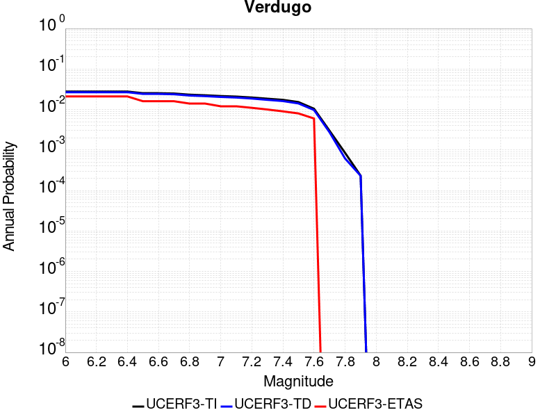 |
|-----|

| Magnitude | UCERF3-TI Prob | UCERF3-TD Prob | UCERF3-ETAS Prob |
|-----|-----|-----|-----|
| 6.0 | 0.027747672 | 0.026713032 | 0.021 |
| 6.1 | 0.027747672 | 0.026713032 | 0.021 |
| 6.2 | 0.027747672 | 0.026713032 | 0.021 |
| 6.3 | 0.027747672 | 0.026713032 | 0.021 |
| 6.4 | 0.027747672 | 0.026713032 | 0.021 |
| 6.5 | 0.025322229 | 0.024257211 | 0.016 |
| 6.6 | 0.025322229 | 0.024257211 | 0.016 |
| 6.7 | 0.024821267 | 0.023750527 | 0.016 |
| 6.8 | 0.023244642 | 0.02214877 | 0.014 |
| 6.9 | 0.022479337 | 0.021371935 | 0.014 |
| 7.0 | 0.021531297 | 0.020409884 | 0.012 |
| 7.1 | 0.020862352 | 0.019729532 | 0.012 |
| 7.2 | 0.019789139 | 0.018638073 | 0.011 |
| 7.3 | 0.018481446 | 0.017307866 | 0.01 |
| 7.4 | 0.017333113 | 0.016151397 | 0.009 |
| 7.5 | 0.015266038 | 0.014111425 | 0.008 |
| 7.6 | 0.0104508195 | 0.009714822 | 0.006 |
| 7.7 | 0.002983514 | 0.0027346844 | 0.0 |
| 7.8 | 8.474488E-4 | 6.1577634E-4 | 0.0 |
| 7.9 | 2.3204114E-4 | 2.3014832E-4 | 0.0 |

## Walker Spring 2011 CFM
*[(top)](#table-of-contents)*

|  |
|-----|

| Magnitude | UCERF3-TI Prob | UCERF3-TD Prob | UCERF3-ETAS Prob |
|-----|-----|-----|-----|
| 6.0 | 0.044835612 | 0.045629255 | 0.028 |
| 6.1 | 0.044835612 | 0.045629255 | 0.023 |
| 6.2 | 0.029073527 | 0.029629048 | 0.017 |
| 6.3 | 0.023674076 | 0.02416405 | 0.014 |
| 6.4 | 0.02189758 | 0.022351949 | 0.012 |
| 6.5 | 0.01781273 | 0.018209975 | 0.011 |
| 6.6 | 0.01392597 | 0.014248515 | 0.009 |
| 6.7 | 0.0030639004 | 0.0031135094 | 0.001 |
| 6.8 | 8.6131436E-4 | 8.753872E-4 | 0.0 |

## West Napa 2011 CFM
*[(top)](#table-of-contents)*

|  |
|-----|

| Magnitude | UCERF3-TI Prob | UCERF3-TD Prob | UCERF3-ETAS Prob |
|-----|-----|-----|-----|
| 6.0 | 0.1787099 | 0.18859698 | 0.136 |
| 6.1 | 0.1787099 | 0.18859698 | 0.136 |
| 6.2 | 0.1787099 | 0.18859698 | 0.136 |
| 6.3 | 0.10602628 | 0.11098797 | 0.08 |
| 6.4 | 0.10602628 | 0.11098797 | 0.08 |
| 6.5 | 0.084320314 | 0.08817026 | 0.059 |
| 6.6 | 0.08415006 | 0.08799449 | 0.059 |
| 6.7 | 0.06751433 | 0.07057528 | 0.048 |
| 6.8 | 0.05152934 | 0.05385101 | 0.041 |
| 6.9 | 0.039688352 | 0.04145518 | 0.03 |
| 7.0 | 0.011469991 | 0.0114802085 | 0.004 |
| 7.1 | 0.009869568 | 0.009817321 | 0.004 |
| 7.2 | 0.009604507 | 0.009543678 | 0.004 |
| 7.3 | 0.009287801 | 0.009223405 | 0.004 |
| 7.4 | 0.008583158 | 0.008527297 | 0.004 |
| 7.5 | 0.0072992863 | 0.00723384 | 0.004 |
| 7.6 | 6.788132E-4 | 4.5121842E-4 | 0.0 |
| 7.7 | 4.4558462E-4 | 2.1789261E-4 | 0.0 |
| 7.8 | 2.9254745E-4 | 9.4697316E-5 | 0.0 |
| 7.9 | 1.5378889E-4 | 3.8074177E-5 | 0.0 |
| 8.0 | 6.958877E-5 | 1.6585283E-5 | 0.0 |
| 8.1 | 1.3874264E-6 | 3.4956395E-7 | 0.0 |

## West Tahoe
*[(top)](#table-of-contents)*

| 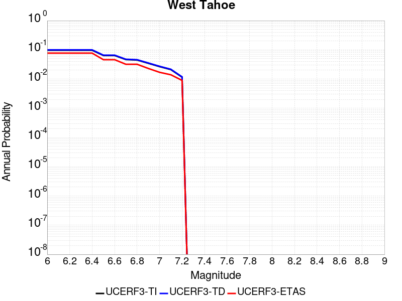 |
|-----|

| Magnitude | UCERF3-TI Prob | UCERF3-TD Prob | UCERF3-ETAS Prob |
|-----|-----|-----|-----|
| 6.0 | 0.09685913 | 0.09957861 | 0.077 |
| 6.1 | 0.09685913 | 0.09957861 | 0.077 |
| 6.2 | 0.09685913 | 0.09957861 | 0.077 |
| 6.3 | 0.09685913 | 0.09957861 | 0.077 |
| 6.4 | 0.09685913 | 0.09957861 | 0.077 |
| 6.5 | 0.064047314 | 0.065612204 | 0.046 |
| 6.6 | 0.064047314 | 0.065612204 | 0.046 |
| 6.7 | 0.046462044 | 0.04752406 | 0.032 |
| 6.8 | 0.04481345 | 0.04584544 | 0.032 |
| 6.9 | 0.03463892 | 0.035423525 | 0.023 |
| 7.0 | 0.026662936 | 0.027269492 | 0.017 |
| 7.1 | 0.021118876 | 0.02160478 | 0.014 |
| 7.2 | 0.011597672 | 0.011864958 | 0.009 |

## White Mountains
*[(top)](#table-of-contents)*

|  |
|-----|

| Magnitude | UCERF3-TI Prob | UCERF3-TD Prob | UCERF3-ETAS Prob |
|-----|-----|-----|-----|
| 6.0 | 0.16707774 | 0.16306376 | 0.175 |
| 6.1 | 0.16707774 | 0.16306376 | 0.175 |
| 6.2 | 0.16707774 | 0.16306376 | 0.175 |
| 6.3 | 0.08878356 | 0.08137381 | 0.087 |
| 6.4 | 0.08878356 | 0.08137381 | 0.087 |
| 6.5 | 0.06751947 | 0.05937599 | 0.057 |
| 6.6 | 0.054886933 | 0.046329807 | 0.04 |
| 6.7 | 0.04621334 | 0.03738769 | 0.033 |
| 6.8 | 0.03735382 | 0.028238777 | 0.024 |
| 6.9 | 0.0319561 | 0.022685792 | 0.02 |
| 7.0 | 0.025690153 | 0.016265007 | 0.016 |
| 7.1 | 0.020784365 | 0.011268231 | 0.01 |
| 7.2 | 0.01721724 | 0.0076981983 | 0.006 |
| 7.3 | 0.012744776 | 0.0034202356 | 0.004 |
| 7.4 | 0.010205638 | 0.001606991 | 0.002 |
| 7.5 | 0.0062492294 | 9.1055094E-4 | 0.001 |
| 7.6 | 0.0013355142 | 2.0652956E-4 | 0.0 |

## White Wolf
*[(top)](#table-of-contents)*

| 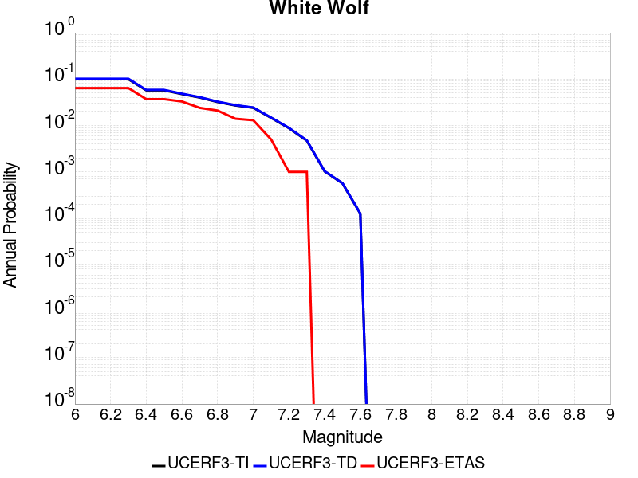 |
|-----|

| Magnitude | UCERF3-TI Prob | UCERF3-TD Prob | UCERF3-ETAS Prob |
|-----|-----|-----|-----|
| 6.0 | 0.09927523 | 0.10160163 | 0.064 |
| 6.1 | 0.09927523 | 0.10160163 | 0.064 |
| 6.2 | 0.09927523 | 0.10160163 | 0.064 |
| 6.3 | 0.09927523 | 0.10160163 | 0.064 |
| 6.4 | 0.05737985 | 0.058420163 | 0.037 |
| 6.5 | 0.05737985 | 0.058420163 | 0.037 |
| 6.6 | 0.04760366 | 0.048431177 | 0.033 |
| 6.7 | 0.040095977 | 0.040761773 | 0.024 |
| 6.8 | 0.032166336 | 0.032664225 | 0.021 |
| 6.9 | 0.027064841 | 0.027469851 | 0.014 |
| 7.0 | 0.024098564 | 0.024454016 | 0.013 |
| 7.1 | 0.014642682 | 0.014823465 | 0.005 |
| 7.2 | 0.008769803 | 0.008879533 | 0.001 |
| 7.3 | 0.0047297818 | 0.004787811 | 0.001 |
| 7.4 | 0.001028296 | 0.0010367164 | 0.0 |
| 7.5 | 5.670072E-4 | 5.7035533E-4 | 0.0 |
| 7.6 | 1.2635709E-4 | 1.2710632E-4 | 0.0 |

## White Wolf (Extension)
*[(top)](#table-of-contents)*

|  |
|-----|

| Magnitude | UCERF3-TI Prob | UCERF3-TD Prob | UCERF3-ETAS Prob |
|-----|-----|-----|-----|
| 6.0 | 0.041996926 | 0.0425765 | 0.03 |
| 6.1 | 0.041996926 | 0.0425765 | 0.03 |
| 6.2 | 0.041996926 | 0.0425765 | 0.03 |
| 6.3 | 0.041996926 | 0.0425765 | 0.03 |
| 6.4 | 0.029920515 | 0.030290062 | 0.018 |
| 6.5 | 0.029638281 | 0.030004453 | 0.018 |
| 6.6 | 0.023938393 | 0.024233552 | 0.014 |
| 6.7 | 0.02041454 | 0.020668814 | 0.011 |
| 6.8 | 0.017777806 | 0.018002307 | 0.009 |
| 6.9 | 0.016233826 | 0.016441599 | 0.008 |
| 7.0 | 0.014657113 | 0.01484841 | 0.008 |
| 7.1 | 0.0124917105 | 0.012657879 | 0.005 |
| 7.2 | 0.0072139064 | 0.0073134806 | 0.001 |
| 7.3 | 0.0036749924 | 0.0037264528 | 0.001 |
| 7.4 | 3.0955195E-4 | 3.137598E-4 | 0.0 |

## Whittier alt 1
*[(top)](#table-of-contents)*

| 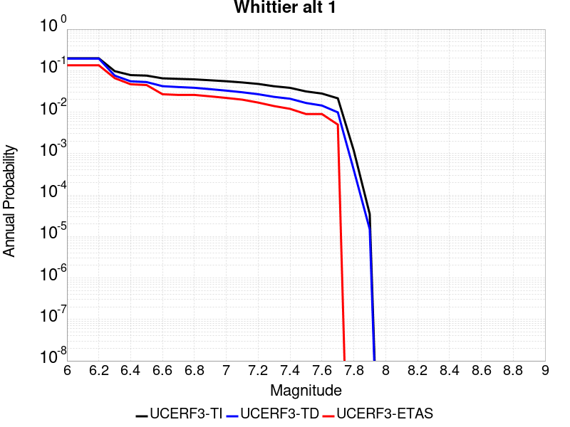 |
|-----|

| Magnitude | UCERF3-TI Prob | UCERF3-TD Prob | UCERF3-ETAS Prob |
|-----|-----|-----|-----|
| 6.0 | 0.19912392 | 0.19550964 | 0.135 |
| 6.1 | 0.19912392 | 0.19550964 | 0.135 |
| 6.2 | 0.19912392 | 0.19550964 | 0.135 |
| 6.3 | 0.09729857 | 0.07594175 | 0.066 |
| 6.4 | 0.078228906 | 0.05538832 | 0.047 |
| 6.5 | 0.076008126 | 0.05305343 | 0.045 |
| 6.6 | 0.06536796 | 0.042275637 | 0.027 |
| 6.7 | 0.063347764 | 0.040238764 | 0.026 |
| 6.8 | 0.0616542 | 0.038642783 | 0.026 |
| 6.9 | 0.05863534 | 0.035775352 | 0.024 |
| 7.0 | 0.055607155 | 0.03300388 | 0.022 |
| 7.1 | 0.051982284 | 0.030131996 | 0.02 |
| 7.2 | 0.04790763 | 0.027047148 | 0.017 |
| 7.3 | 0.04207105 | 0.023332587 | 0.014 |
| 7.4 | 0.038537256 | 0.02104161 | 0.012 |
| 7.5 | 0.031578727 | 0.016627645 | 0.009 |
| 7.6 | 0.028075967 | 0.014418752 | 0.009 |
| 7.7 | 0.021511387 | 0.009864544 | 0.005 |
| 7.8 | 0.0011833572 | 4.0138586E-4 | 0.0 |
| 7.9 | 3.4838133E-5 | 1.4969513E-5 | 0.0 |

## Wight Way 2011 CFM
*[(top)](#table-of-contents)*

|  |
|-----|

| Magnitude | UCERF3-TI Prob | UCERF3-TD Prob | UCERF3-ETAS Prob |
|-----|-----|-----|-----|
| 6.0 | 0.0054180063 | 0.0054345652 | 0.004 |
| 6.1 | 0.0054180063 | 0.0054345652 | 0.004 |
| 6.2 | 0.0054180063 | 0.0054345652 | 0.004 |
| 6.3 | 0.0054180063 | 0.0054345652 | 0.004 |
| 6.4 | 0.0027962495 | 0.0028056945 | 0.003 |
| 6.5 | 0.0027962495 | 0.0028056945 | 0.003 |

## Yorba Linda
*[(top)](#table-of-contents)*

|  |
|-----|

| Magnitude | UCERF3-TI Prob | UCERF3-TD Prob | UCERF3-ETAS Prob |
|-----|-----|-----|-----|
| 6.0 | 0.010044136 | 0.008493257 | 0.007 |
| 6.1 | 0.010044136 | 0.008493257 | 0.007 |
| 6.2 | 0.010044136 | 0.008493257 | 0.007 |
| 6.3 | 0.005738047 | 0.0041539012 | 0.003 |
| 6.4 | 0.005738047 | 0.0041539012 | 0.003 |
| 6.5 | 0.0043968586 | 0.0028054959 | 0.003 |
| 6.6 | 0.004385337 | 0.0027930012 | 0.003 |
| 6.7 | 0.004379629 | 0.0027868235 | 0.003 |
| 6.8 | 0.003953519 | 0.0023568938 | 0.003 |
| 6.9 | 0.0039475635 | 0.002350035 | 0.003 |
| 7.0 | 0.0039261696 | 0.002330656 | 0.003 |
| 7.1 | 0.0031726784 | 0.0017531044 | 0.003 |
| 7.2 | 0.0030477543 | 0.0016567203 | 0.003 |
| 7.3 | 0.0025524856 | 0.0014094982 | 0.003 |
| 7.4 | 0.0020172952 | 0.0011497104 | 0.003 |
| 7.5 | 0.001512329 | 8.844871E-4 | 0.003 |
| 7.6 | 0.0011874173 | 7.0681697E-4 | 0.003 |
| 7.7 | 7.832689E-4 | 4.108809E-4 | 0.002 |
| 7.8 | 2.0325417E-4 | 7.9826525E-5 | 0.0 |
| 7.9 | 3.4690347E-5 | 1.4872863E-5 | 0.0 |

## Zayante-Vergeles 2011 CFM
*[(top)](#table-of-contents)*

| 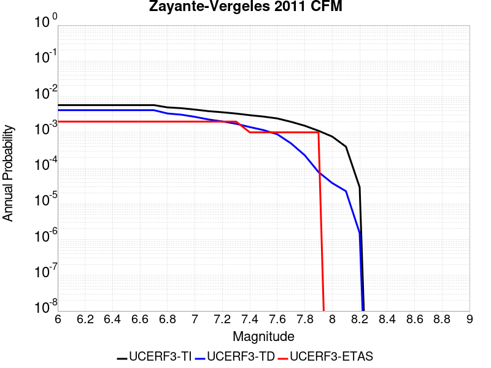 |
|-----|

| Magnitude | UCERF3-TI Prob | UCERF3-TD Prob | UCERF3-ETAS Prob |
|-----|-----|-----|-----|
| 6.0 | 0.005802164 | 0.004183285 | 0.002 |
| 6.1 | 0.005802164 | 0.004183285 | 0.002 |
| 6.2 | 0.005802164 | 0.004183285 | 0.002 |
| 6.3 | 0.005802164 | 0.004183285 | 0.002 |
| 6.4 | 0.005802164 | 0.004183285 | 0.002 |
| 6.5 | 0.005802164 | 0.004183285 | 0.002 |
| 6.6 | 0.005802164 | 0.004183285 | 0.002 |
| 6.7 | 0.005802164 | 0.004183285 | 0.002 |
| 6.8 | 0.005000821 | 0.0033794108 | 0.002 |
| 6.9 | 0.004750531 | 0.0031282476 | 0.002 |
| 7.0 | 0.0043428717 | 0.0027192314 | 0.002 |
| 7.1 | 0.003918671 | 0.0022934927 | 0.002 |
| 7.2 | 0.0036477696 | 0.0020219188 | 0.002 |
| 7.3 | 0.0033601997 | 0.0017373116 | 0.002 |
| 7.4 | 0.0030245052 | 0.001406507 | 0.001 |
| 7.5 | 0.0027633416 | 0.0011570461 | 0.001 |
| 7.6 | 0.0024511726 | 8.8437693E-4 | 0.001 |
| 7.7 | 0.001974128 | 4.915745E-4 | 0.001 |
| 7.8 | 0.0015318242 | 2.2881504E-4 | 0.001 |
| 7.9 | 0.001108187 | 7.769829E-5 | 0.001 |
| 8.0 | 7.6317997E-4 | 3.8115973E-5 | 0.0 |
| 8.1 | 3.977789E-4 | 2.2592785E-5 | 0.0 |
| 8.2 | 2.9032575E-5 | 1.5232902E-6 | 0.0 |

