# Parent Section Magnitude-Probability Distributions

## Table Of Contents

* [Airport Lake](#airport-lake)
* [Almanor 2011 CFM](#almanor-2011-cfm)
* [Anacapa-Dume alt 1](#anacapa-dume-alt-1)
* [Anaheim](#anaheim)
* [Antelope Valley 2011](#antelope-valley-2011)
* [Ash Hill](#ash-hill)
* [Baker](#baker)
* [Bartlett Springs 2011 CFM](#bartlett-springs-2011-cfm)
* [Battle Creek 2011 CFM](#battle-creek-2011-cfm)
* [Bear River fault zone](#bear-river-fault-zone)
* [Bennett Valley 2011 CFM](#bennett-valley-2011-cfm)
* [Bicycle Lake](#bicycle-lake)
* [Big Lagoon - Bald Mtn 2011 CFM](#big-lagoon---bald-mtn-2011-cfm)
* [Big Pine (Central)](#big-pine-central)
* [Big Pine (East)](#big-pine-east)
* [Big Pine (West)](#big-pine-west)
* [Blackwater](#blackwater)
* [Blue Cut](#blue-cut)
* [Brawley (Seismic Zone) alt 1](#brawley-seismic-zone-alt-1)
* [Breckenridge 2011](#breckenridge-2011)
* [Bullion Mountains](#bullion-mountains)
* [Burnt Mtn](#burnt-mtn)
* [Butano 2011 CFM](#butano-2011-cfm)
* [Cady](#cady)
* [Calaveras (Central) 2011 CFM](#calaveras-central-2011-cfm)
* [Calaveras (No) 2011 CFM](#calaveras-no-2011-cfm)
* [Calaveras (So) - Paicines extension 2011 CFM](#calaveras-so---paicines-extension-2011-cfm)
* [Calaveras (So) 2011 CFM](#calaveras-so-2011-cfm)
* [Calico-Hidalgo](#calico-hidalgo)
* [Camp Rock 2011](#camp-rock-2011)
* [Canada David (Detachment)](#canada-david-detachment)
* [Carlsbad](#carlsbad)
* [Carson Range (Genoa)](#carson-range-genoa)
* [Casmalia 2011 CFM](#casmalia-2011-cfm)
* [Cedar Mtn-Mahogany Mtn](#cedar-mtn-mahogany-mtn)
* [Cerro Prieto](#cerro-prieto)
* [Channel Islands Thrust](#channel-islands-thrust)
* [Channel Islands Western Deep Ramp](#channel-islands-western-deep-ramp)
* [Chino alt 1](#chino-alt-1)
* [Clamshell-Sawpit](#clamshell-sawpit)
* [Clayton](#clayton)
* [Cleghorn](#cleghorn)
* [Cleghorn Lake](#cleghorn-lake)
* [Cleghorn Pass](#cleghorn-pass)
* [Collayami 2011 CFM](#collayami-2011-cfm)
* [Compton](#compton)
* [Concord 2011 CFM](#concord-2011-cfm)
* [Contra Costa (Lafayette) 2011 CFM](#contra-costa-lafayette-2011-cfm)
* [Contra Costa Shear Zone (connector) 2011 CFM](#contra-costa-shear-zone-connector-2011-cfm)
* [Coronado Bank alt1](#coronado-bank-alt1)
* [Coyote Canyon](#coyote-canyon)
* [Coyote Lake](#coyote-lake)
* [Cucamonga](#cucamonga)
* [Davis Creek](#davis-creek)
* [Death Valley (Black Mtns Frontal)](#death-valley-black-mtns-frontal)
* [Death Valley (Fish Lake Valley)](#death-valley-fish-lake-valley)
* [Death Valley (No)](#death-valley-no)
* [Death Valley (So)](#death-valley-so)
* [Deep Springs](#deep-springs)
* [Del Valle](#del-valle)
* [Dog Valley](#dog-valley)
* [Dry Mountain](#dry-mountain)
* [Earthquake Valley](#earthquake-valley)
* [Earthquake Valley (No  Extension)](#earthquake-valley-no--extension)
* [Earthquake Valley (So Extension)](#earthquake-valley-so-extension)
* [East Huasna 2011 CFM](#east-huasna-2011-cfm)
* [Eaton Roughs 2011 CFM](#eaton-roughs-2011-cfm)
* [Elmore Ranch](#elmore-ranch)
* [Elsinore (Coyote Mountains)](#elsinore-coyote-mountains)
* [Elsinore (Glen Ivy) rev](#elsinore-glen-ivy-rev)
* [Elsinore (Julian)](#elsinore-julian)
* [Elsinore (Stepovers Combined)](#elsinore-stepovers-combined)
* [Elsinore (Temecula) rev](#elsinore-temecula-rev)
* [Elysian Park (Lower CFM)](#elysian-park-lower-cfm)
* [Elysian Park (Upper)](#elysian-park-upper)
* [Emerson-Copper Mtn 2011](#emerson-copper-mtn-2011)
* [Eureka Peak](#eureka-peak)
* [Fickle Hill (alt1)](#fickle-hill-alt1)
* [Fish Slough 2011 CFM](#fish-slough-2011-cfm)
* [Fitzhugh Creek](#fitzhugh-creek)
* [Fontana (Seismicity)](#fontana-seismicity)
* [Franklin 2011 CFM](#franklin-2011-cfm)
* [Garberville - Briceland 2011 CFM](#garberville---briceland-2011-cfm)
* [Garlic Springs](#garlic-springs)
* [Garlock (Central)](#garlock-central)
* [Garlock (East)](#garlock-east)
* [Garlock (West)](#garlock-west)
* [Gillem - Big Crack 2011 CFM](#gillem---big-crack-2011-cfm)
* [Goldstone Lake](#goldstone-lake)
* [Goose Lake 2011 CFM](#goose-lake-2011-cfm)
* [Gravel Hills-Harper Lk](#gravel-hills-harper-lk)
* [Great Valley 01](#great-valley-01)
* [Great Valley 02](#great-valley-02)
* [Great Valley 03 Mysterious Ridge](#great-valley-03-mysterious-ridge)
* [Great Valley 03a Dunnigan Hills](#great-valley-03a-dunnigan-hills)
* [Great Valley 04a Trout Creek](#great-valley-04a-trout-creek)
* [Great Valley 04b Gordon Valley](#great-valley-04b-gordon-valley)
* [Great Valley 05 Pittsburg - Kirby Hills alt1](#great-valley-05-pittsburg---kirby-hills-alt1)
* [Great Valley 06 (Midland) 2011 CFM alt1](#great-valley-06-midland-2011-cfm-alt1)
* [Great Valley 07 (Orestimba)](#great-valley-07-orestimba)
* [Great Valley 08 (Quinto)](#great-valley-08-quinto)
* [Great Valley 09 (Laguna Seca)](#great-valley-09-laguna-seca)
* [Great Valley 10 (Panoche)](#great-valley-10-panoche)
* [Great Valley 11](#great-valley-11)
* [Great Valley 12](#great-valley-12)
* [Great Valley 13 (Coalinga)](#great-valley-13-coalinga)
* [Great Valley 14 (Kettleman Hills)](#great-valley-14-kettleman-hills)
* [Green Valley 2011 CFM](#green-valley-2011-cfm)
* [Greenville (No) 2011 CFM](#greenville-no-2011-cfm)
* [Greenville (So) 2011 CFM](#greenville-so-2011-cfm)
* [Hartley Springs 2011 CFM](#hartley-springs-2011-cfm)
* [Hat Creek-McArthur-Mayfield](#hat-creek-mcarthur-mayfield)
* [Hayward (No) 2011 CFM](#hayward-no-2011-cfm)
* [Hayward (So) 2011 CFM](#hayward-so-2011-cfm)
* [Hayward (So) extension 2011 CFM](#hayward-so-extension-2011-cfm)
* [Hector Mine](#hector-mine)
* [Helendale-So Lockhart](#helendale-so-lockhart)
* [Hilton Creek 2011 CFM](#hilton-creek-2011-cfm)
* [Hollywood](#hollywood)
* [Holser alt 1](#holser-alt-1)
* [Homestead Valley 2011](#homestead-valley-2011)
* [Honey Lake 2011 CFM](#honey-lake-2011-cfm)
* [Hosgri](#hosgri)
* [Hosgri (Extension)](#hosgri-extension)
* [Hunter Mountain-Saline Valley](#hunter-mountain-saline-valley)
* [Hunting Creek - Bartlett Springs connector 2011](#hunting-creek---bartlett-springs-connector-2011)
* [Hunting Creek - Berryessa 2011 CFM](#hunting-creek---berryessa-2011-cfm)
* [Imperial](#imperial)
* [Incline Village 2011 CFM](#incline-village-2011-cfm)
* [Independence rev 2011](#independence-rev-2011)
* [Jess Valley](#jess-valley)
* [Johnson Valley (No) 2011 rev](#johnson-valley-no-2011-rev)
* [Joshua Tree (Seismicity)](#joshua-tree-seismicity)
* [Keddie Ridge 2011 CFM](#keddie-ridge-2011-cfm)
* [Kern Canyon (Lake Isabella) 2011](#kern-canyon-lake-isabella-2011)
* [Kern Canyon (North Kern) 2011](#kern-canyon-north-kern-2011)
* [Kern Canyon (South Kern) 2011](#kern-canyon-south-kern-2011)
* [Kickapoo](#kickapoo)
* [King Range 2011 CFM](#king-range-2011-cfm)
* [La Panza 2011](#la-panza-2011)
* [Laguna Salada](#laguna-salada)
* [Lake Isabella (Seismicity)](#lake-isabella-seismicity)
* [Las Positas](#las-positas)
* [Last Chance](#last-chance)
* [Lenwood-Lockhart-Old Woman Springs](#lenwood-lockhart-old-woman-springs)
* [Likely 2011 CFM](#likely-2011-cfm)
* [Lions Head 2011 CFM](#lions-head-2011-cfm)
* [Little Lake](#little-lake)
* [Little Salmon (Offshore)](#little-salmon-offshore)
* [Little Salmon (Onshore)](#little-salmon-onshore)
* [Los Alamos 2011 CFM](#los-alamos-2011-cfm)
* [Los Alamos extension](#los-alamos-extension)
* [Los Medanos - Roe Island](#los-medanos---roe-island)
* [Los Osos 2011](#los-osos-2011)
* [Lost Hills](#lost-hills)
* [Ludlow](#ludlow)
* [Maacama 2011 CFM](#maacama-2011-cfm)
* [Mad River (alt1)](#mad-river-alt1)
* [Malibu Coast (Extension) alt 1](#malibu-coast-extension-alt-1)
* [Malibu Coast alt 1](#malibu-coast-alt-1)
* [Manix-Afton Hills](#manix-afton-hills)
* [McKinleyville (alt1)](#mckinleyville-alt1)
* [McLean Lake](#mclean-lake)
* [Mendocino](#mendocino)
* [Mission (connected) 2011 CFM](#mission-connected-2011-cfm)
* [Mission Creek](#mission-creek)
* [Mission Hills 2011](#mission-hills-2011)
* [Mission Ridge-Arroyo Parida-Santa Ana](#mission-ridge-arroyo-parida-santa-ana)
* [Mohawk Valley 2011 CFM](#mohawk-valley-2011-cfm)
* [Mono Lake 2011 CFM](#mono-lake-2011-cfm)
* [Monte Vista - Shannon 2011 CFM](#monte-vista---shannon-2011-cfm)
* [Monterey Bay-Tularcitos](#monterey-bay-tularcitos)
* [Morales (East)](#morales-east)
* [Morales (West)](#morales-west)
* [Mount Diablo Thrust North CFM](#mount-diablo-thrust-north-cfm)
* [Mount Diablo Thrust South](#mount-diablo-thrust-south)
* [Nelson Lake](#nelson-lake)
* [Newport-Inglewood (Offshore)](#newport-inglewood-offshore)
* [Newport-Inglewood alt 1](#newport-inglewood-alt-1)
* [North Frontal  (East)](#north-frontal--east)
* [North Frontal  (West)](#north-frontal--west)
* [North Salt Lake](#north-salt-lake)
* [North Tahoe 2011 CFM](#north-tahoe-2011-cfm)
* [Northridge](#northridge)
* [Northridge Hills](#northridge-hills)
* [Oak Ridge (Onshore)](#oak-ridge-onshore)
* [Oceanic - West Huasna](#oceanic---west-huasna)
* [Oceanside alt1](#oceanside-alt1)
* [Ortigalita (North)](#ortigalita-north)
* [Ortigalita (South)](#ortigalita-south)
* [Owens Valley](#owens-valley)
* [Owens Valley Keough Hot Springs](#owens-valley-keough-hot-springs)
* [Owl Lake](#owl-lake)
* [Ozena](#ozena)
* [Palos Verdes](#palos-verdes)
* [Panamint Valley](#panamint-valley)
* [Paradise](#paradise)
* [Peralta Hills](#peralta-hills)
* [Pilarcitos 2011 CFM](#pilarcitos-2011-cfm)
* [Pine Mtn](#pine-mtn)
* [Pinto Mtn](#pinto-mtn)
* [Pisgah-Bullion Mtn-Mesquite Lk](#pisgah-bullion-mtn-mesquite-lk)
* [Pitas Point (Lower West)](#pitas-point-lower-west)
* [Pitas Point (Lower)-Montalvo](#pitas-point-lower-montalvo)
* [Pittville 2011 CFM](#pittville-2011-cfm)
* [Pleito](#pleito)
* [Point Reyes 2011 CFM](#point-reyes-2011-cfm)
* [Point Reyes 2011 connector](#point-reyes-2011-connector)
* [Polaris 2011 CFM](#polaris-2011-cfm)
* [Puente Hills](#puente-hills)
* [Quien Sabe 2011 CFM](#quien-sabe-2011-cfm)
* [Raymond](#raymond)
* [Red Mountain](#red-mountain)
* [Red Pass](#red-pass)
* [Redondo Canyon alt 1](#redondo-canyon-alt-1)
* [Reliz 2011 CFM](#reliz-2011-cfm)
* [Richfield](#richfield)
* [Rinconada 2011 CFM](#rinconada-2011-cfm)
* [Robinson Creek](#robinson-creek)
* [Rocky Ledge 2011 CFM](#rocky-ledge-2011-cfm)
* [Rodgers Creek - Healdsburg 2011 CFM](#rodgers-creek---healdsburg-2011-cfm)
* [Rose Canyon](#rose-canyon)
* [Round Valley](#round-valley)
* [Russ 2011 CFM](#russ-2011-cfm)
* [San Andreas (Big Bend)](#san-andreas-big-bend)
* [San Andreas (Carrizo) rev](#san-andreas-carrizo-rev)
* [San Andreas (Cholame) rev](#san-andreas-cholame-rev)
* [San Andreas (Coachella) rev](#san-andreas-coachella-rev)
* [San Andreas (Creeping Section) 2011 CFM](#san-andreas-creeping-section-2011-cfm)
* [San Andreas (Mojave N)](#san-andreas-mojave-n)
* [San Andreas (Mojave S)](#san-andreas-mojave-s)
* [San Andreas (North Branch Mill Creek)](#san-andreas-north-branch-mill-creek)
* [San Andreas (North Coast) 2011 CFM](#san-andreas-north-coast-2011-cfm)
* [San Andreas (Offshore) 2011 CFM](#san-andreas-offshore-2011-cfm)
* [San Andreas (Parkfield)](#san-andreas-parkfield)
* [San Andreas (Peninsula) 2011 CFM](#san-andreas-peninsula-2011-cfm)
* [San Andreas (San Bernardino N)](#san-andreas-san-bernardino-n)
* [San Andreas (San Bernardino S)](#san-andreas-san-bernardino-s)
* [San Andreas (San Gorgonio Pass-Garnet HIll)](#san-andreas-san-gorgonio-pass-garnet-hill)
* [San Andreas (Santa Cruz Mts) 2011 CFM](#san-andreas-santa-cruz-mts-2011-cfm)
* [San Cayetano](#san-cayetano)
* [San Clemente](#san-clemente)
* [San Diego Trough north alt1](#san-diego-trough-north-alt1)
* [San Diego Trough south](#san-diego-trough-south)
* [San Gabriel](#san-gabriel)
* [San Gabriel (Extension)](#san-gabriel-extension)
* [San Gorgonio Pass](#san-gorgonio-pass)
* [San Gregorio (North) 2011 CFM](#san-gregorio-north-2011-cfm)
* [San Gregorio (South) 2011 CFM](#san-gregorio-south-2011-cfm)
* [San Jacinto (Anza) rev](#san-jacinto-anza-rev)
* [San Jacinto (Borrego)](#san-jacinto-borrego)
* [San Jacinto (Clark) rev](#san-jacinto-clark-rev)
* [San Jacinto (Coyote Creek)](#san-jacinto-coyote-creek)
* [San Jacinto (Lytle Creek connector)](#san-jacinto-lytle-creek-connector)
* [San Jacinto (San Bernardino)](#san-jacinto-san-bernardino)
* [San Jacinto (San Jacinto Valley) rev](#san-jacinto-san-jacinto-valley-rev)
* [San Jacinto (Stepovers Combined)](#san-jacinto-stepovers-combined)
* [San Jacinto (Superstition Mtn)](#san-jacinto-superstition-mtn)
* [San Joaquin Hills](#san-joaquin-hills)
* [San Jose](#san-jose)
* [San Juan](#san-juan)
* [San Luis Range - Oceano 2011 CFM](#san-luis-range---oceano-2011-cfm)
* [San Luis Range - Pecho 2011 CFM](#san-luis-range---pecho-2011-cfm)
* [San Luis Range 2011 CFM](#san-luis-range-2011-cfm)
* [San Pedro Basin](#san-pedro-basin)
* [San Pedro Escarpment](#san-pedro-escarpment)
* [San Vicente](#san-vicente)
* [Santa Cruz Catalina Ridge alt1](#santa-cruz-catalina-ridge-alt1)
* [Santa Cruz Island](#santa-cruz-island)
* [Santa Monica Bay](#santa-monica-bay)
* [Santa Monica alt 1](#santa-monica-alt-1)
* [Santa Rosa Island](#santa-rosa-island)
* [Santa Susana East (connector)](#santa-susana-east-connector)
* [Santa Susana alt 1](#santa-susana-alt-1)
* [Santa Ynez (East)](#santa-ynez-east)
* [Santa Ynez (West)](#santa-ynez-west)
* [Santa Ynez River](#santa-ynez-river)
* [Sargent 2011 CFM](#sargent-2011-cfm)
* [Scodie Lineament](#scodie-lineament)
* [Sheephole](#sheephole)
* [Shoreline](#shoreline)
* [Sierra Madre](#sierra-madre)
* [Sierra Madre (San Fernando)](#sierra-madre-san-fernando)
* [Sierra Nevada  (No Extension)](#sierra-nevada--no-extension)
* [Silver Creek 2011 CFM](#silver-creek-2011-cfm)
* [Simi-Santa Rosa](#simi-santa-rosa)
* [Sisar](#sisar)
* [Skinner Flat 2011 CFM](#skinner-flat-2011-cfm)
* [So Sierra Nevada](#so-sierra-nevada)
* [South Cuyama](#south-cuyama)
* [South Klamath Lake East](#south-klamath-lake-east)
* [South Klamath Lake West](#south-klamath-lake-west)
* [Superstition Hills](#superstition-hills)
* [Surprise Valley 2011 CFM](#surprise-valley-2011-cfm)
* [Swain Ravine - Spenceville](#swain-ravine---spenceville)
* [Table Bluff](#table-bluff)
* [Tank Canyon](#tank-canyon)
* [Thirty Mile Bank](#thirty-mile-bank)
* [Tin Mountain](#tin-mountain)
* [Towne Pass](#towne-pass)
* [Trinidad (alt1)](#trinidad-alt1)
* [Ventura-Pitas Point](#ventura-pitas-point)
* [Verdugo](#verdugo)
* [Walker Spring 2011 CFM](#walker-spring-2011-cfm)
* [West Napa 2011 CFM](#west-napa-2011-cfm)
* [West Tahoe](#west-tahoe)
* [White Mountains](#white-mountains)
* [White Wolf](#white-wolf)
* [White Wolf (Extension)](#white-wolf-extension)
* [Whittier alt 1](#whittier-alt-1)
* [Wight Way 2011 CFM](#wight-way-2011-cfm)
* [Yorba Linda](#yorba-linda)
* [Zayante-Vergeles 2011 CFM](#zayante-vergeles-2011-cfm)

## Airport Lake
*[(top)](#table-of-contents)*

| 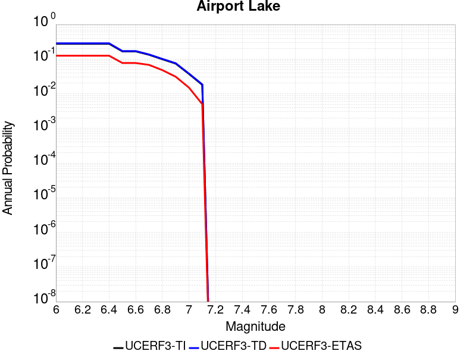 |
|-----|

| Magnitude | UCERF3-TI Prob | UCERF3-TD Prob | UCERF3-ETAS Prob |
|-----|-----|-----|-----|
| 6.0 | 0.27615035 | 0.2854939 | 0.125 |
| 6.1 | 0.27615035 | 0.2854939 | 0.125 |
| 6.2 | 0.27615035 | 0.2854939 | 0.125 |
| 6.3 | 0.27615035 | 0.2854939 | 0.125 |
| 6.4 | 0.27615035 | 0.2854939 | 0.125 |
| 6.5 | 0.16675177 | 0.17039835 | 0.077 |
| 6.6 | 0.16675177 | 0.17039835 | 0.077 |
| 6.7 | 0.13315807 | 0.1360586 | 0.068 |
| 6.8 | 0.09898019 | 0.10115399 | 0.048 |
| 6.9 | 0.07424423 | 0.07595335 | 0.031 |
| 7.0 | 0.037275415 | 0.038144555 | 0.015 |
| 7.1 | 0.01808444 | 0.018565644 | 0.005 |

## Almanor 2011 CFM
*[(top)](#table-of-contents)*

| 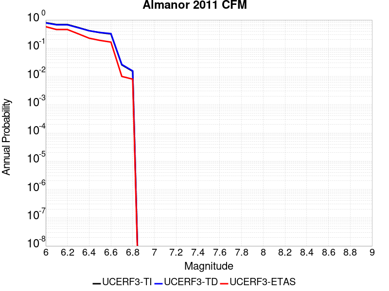 |
|-----|

| Magnitude | UCERF3-TI Prob | UCERF3-TD Prob | UCERF3-ETAS Prob |
|-----|-----|-----|-----|
| 6.0 | 0.7989123 | 0.7822067 | 0.576 |
| 6.1 | 0.68590397 | 0.6707924 | 0.456 |
| 6.2 | 0.68590397 | 0.6707924 | 0.456 |
| 6.3 | 0.53711045 | 0.5270499 | 0.322 |
| 6.4 | 0.41442928 | 0.41264686 | 0.225 |
| 6.5 | 0.35403186 | 0.35854104 | 0.188 |
| 6.6 | 0.31934333 | 0.3280353 | 0.164 |
| 6.7 | 0.02562773 | 0.026464794 | 0.01 |
| 6.8 | 0.01518827 | 0.015700476 | 0.008 |

## Anacapa-Dume alt 1
*[(top)](#table-of-contents)*

| 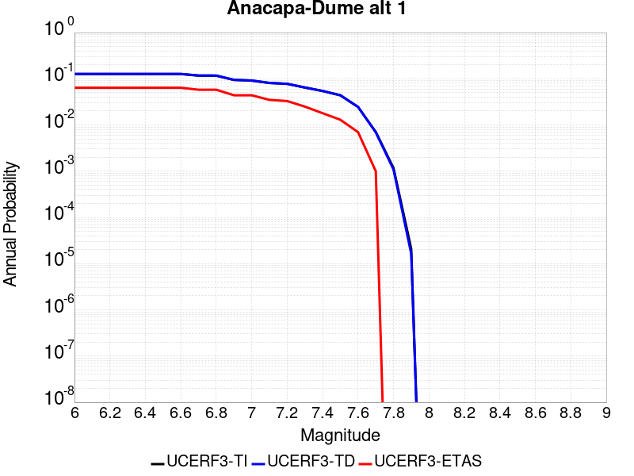 |
|-----|

| Magnitude | UCERF3-TI Prob | UCERF3-TD Prob | UCERF3-ETAS Prob |
|-----|-----|-----|-----|
| 6.0 | 0.12657252 | 0.12767723 | 0.064 |
| 6.1 | 0.12657252 | 0.12767723 | 0.064 |
| 6.2 | 0.12657252 | 0.12767723 | 0.064 |
| 6.3 | 0.12657252 | 0.12767723 | 0.064 |
| 6.4 | 0.12657252 | 0.12767723 | 0.064 |
| 6.5 | 0.12657252 | 0.12767723 | 0.064 |
| 6.6 | 0.12657252 | 0.12767723 | 0.064 |
| 6.7 | 0.116999194 | 0.11800699 | 0.058 |
| 6.8 | 0.11663192 | 0.117636606 | 0.058 |
| 6.9 | 0.094385244 | 0.095081106 | 0.044 |
| 7.0 | 0.09124036 | 0.0919071 | 0.044 |
| 7.1 | 0.08104312 | 0.08159245 | 0.035 |
| 7.2 | 0.077538654 | 0.07805426 | 0.033 |
| 7.3 | 0.06461729 | 0.06492732 | 0.025 |
| 7.4 | 0.05437274 | 0.054544043 | 0.018 |
| 7.5 | 0.043974347 | 0.044067312 | 0.013 |
| 7.6 | 0.024586326 | 0.02461389 | 0.007 |
| 7.7 | 0.0070780776 | 0.006925272 | 0.001 |
| 7.8 | 0.0011737979 | 0.0010894826 | 0.0 |
| 7.9 | 2.0890639E-5 | 1.6282886E-5 | 0.0 |

## Anaheim
*[(top)](#table-of-contents)*

| 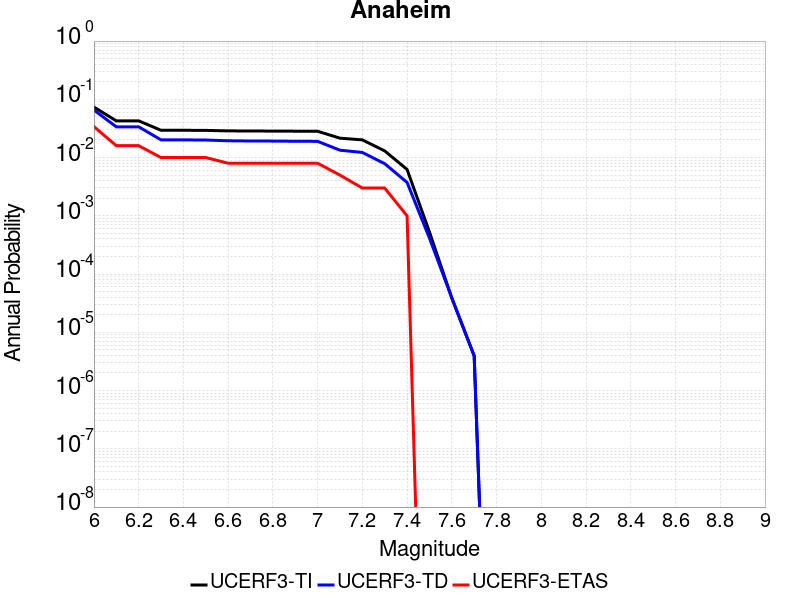 |
|-----|

| Magnitude | UCERF3-TI Prob | UCERF3-TD Prob | UCERF3-ETAS Prob |
|-----|-----|-----|-----|
| 6.0 | 0.073484324 | 0.06546045 | 0.034 |
| 6.1 | 0.04270786 | 0.033716593 | 0.016 |
| 6.2 | 0.04270786 | 0.033716593 | 0.016 |
| 6.3 | 0.029415451 | 0.020133553 | 0.01 |
| 6.4 | 0.029415451 | 0.020133553 | 0.01 |
| 6.5 | 0.029266685 | 0.019982912 | 0.01 |
| 6.6 | 0.028709846 | 0.019418802 | 0.008 |
| 6.7 | 0.028539374 | 0.01924627 | 0.008 |
| 6.8 | 0.028487021 | 0.019193305 | 0.008 |
| 6.9 | 0.028352376 | 0.019057132 | 0.008 |
| 7.0 | 0.028272767 | 0.018991457 | 0.008 |
| 7.1 | 0.021510389 | 0.013380039 | 0.005 |
| 7.2 | 0.020129707 | 0.0122414855 | 0.003 |
| 7.3 | 0.013003811 | 0.00785125 | 0.003 |
| 7.4 | 0.006243989 | 0.0037458094 | 0.001 |
| 7.5 | 5.2853033E-4 | 4.1501562E-4 | 0.0 |
| 7.6 | 3.8797745E-5 | 3.8965132E-5 | 0.0 |
| 7.7 | 3.9377246E-6 | 3.9565994E-6 | 0.0 |

## Antelope Valley 2011
*[(top)](#table-of-contents)*

| 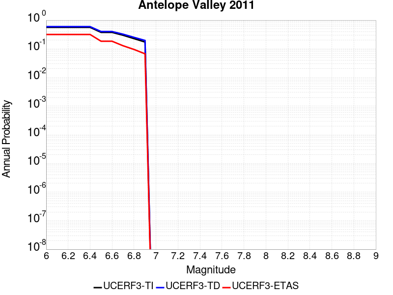 |
|-----|

| Magnitude | UCERF3-TI Prob | UCERF3-TD Prob | UCERF3-ETAS Prob |
|-----|-----|-----|-----|
| 6.0 | 0.5620537 | 0.5955405 | 0.317 |
| 6.1 | 0.5620537 | 0.5955405 | 0.317 |
| 6.2 | 0.5620537 | 0.5955405 | 0.317 |
| 6.3 | 0.5620537 | 0.5955405 | 0.317 |
| 6.4 | 0.5620537 | 0.5955405 | 0.317 |
| 6.5 | 0.3753109 | 0.40168753 | 0.184 |
| 6.6 | 0.3753109 | 0.40168753 | 0.184 |
| 6.7 | 0.2981062 | 0.3241139 | 0.128 |
| 6.8 | 0.22696762 | 0.25128287 | 0.095 |
| 6.9 | 0.17283754 | 0.19604379 | 0.067 |

## Ash Hill
*[(top)](#table-of-contents)*

| 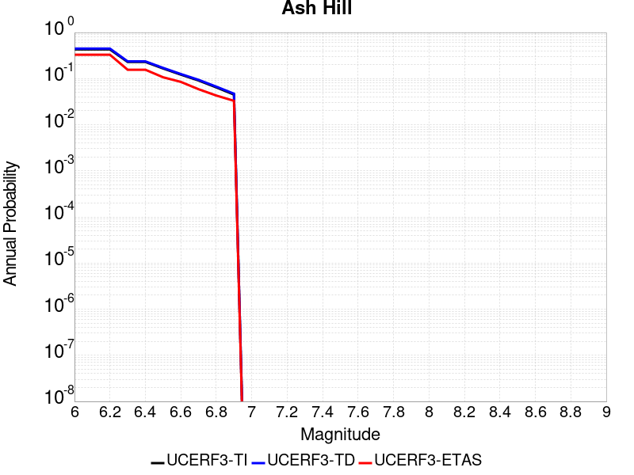 |
|-----|

| Magnitude | UCERF3-TI Prob | UCERF3-TD Prob | UCERF3-ETAS Prob |
|-----|-----|-----|-----|
| 6.0 | 0.4299989 | 0.44860154 | 0.33 |
| 6.1 | 0.4299989 | 0.44860154 | 0.33 |
| 6.2 | 0.4299989 | 0.44860154 | 0.33 |
| 6.3 | 0.23015048 | 0.23685136 | 0.156 |
| 6.4 | 0.23015048 | 0.23685136 | 0.156 |
| 6.5 | 0.1660879 | 0.17100519 | 0.107 |
| 6.6 | 0.12211306 | 0.1259446 | 0.085 |
| 6.7 | 0.09114263 | 0.09425899 | 0.059 |
| 6.8 | 0.06460619 | 0.06708726 | 0.043 |
| 6.9 | 0.04509049 | 0.0471088 | 0.033 |

## Baker
*[(top)](#table-of-contents)*

| 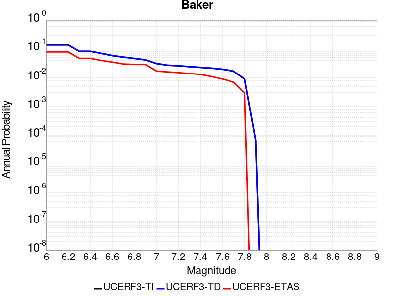 |
|-----|

| Magnitude | UCERF3-TI Prob | UCERF3-TD Prob | UCERF3-ETAS Prob |
|-----|-----|-----|-----|
| 6.0 | 0.1380798 | 0.13994303 | 0.079 |
| 6.1 | 0.1380798 | 0.13994303 | 0.079 |
| 6.2 | 0.1380798 | 0.13994303 | 0.079 |
| 6.3 | 0.08248248 | 0.08319652 | 0.047 |
| 6.4 | 0.08248248 | 0.08319652 | 0.047 |
| 6.5 | 0.070014015 | 0.07062621 | 0.04 |
| 6.6 | 0.05864197 | 0.059163272 | 0.035 |
| 6.7 | 0.05175786 | 0.052234456 | 0.03 |
| 6.8 | 0.046762772 | 0.047209553 | 0.029 |
| 6.9 | 0.04166041 | 0.042074844 | 0.029 |
| 7.0 | 0.0309689 | 0.031310532 | 0.017 |
| 7.1 | 0.02708242 | 0.027404178 | 0.016 |
| 7.2 | 0.025923347 | 0.026239697 | 0.015 |
| 7.3 | 0.0241229 | 0.024430336 | 0.014 |
| 7.4 | 0.02272697 | 0.023025509 | 0.013 |
| 7.5 | 0.02140191 | 0.021690363 | 0.011 |
| 7.6 | 0.019514518 | 0.019787023 | 0.009 |
| 7.7 | 0.016888257 | 0.017133739 | 0.007 |
| 7.8 | 0.008982842 | 0.009127193 | 0.003 |
| 7.9 | 6.676333E-5 | 6.761812E-5 | 0.0 |

## Bartlett Springs 2011 CFM
*[(top)](#table-of-contents)*

| 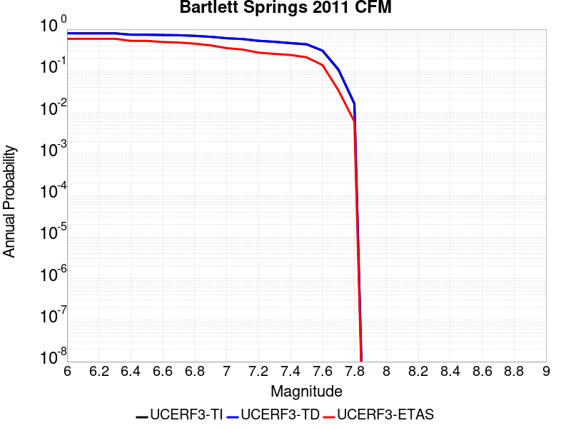 |
|-----|

| Magnitude | UCERF3-TI Prob | UCERF3-TD Prob | UCERF3-ETAS Prob |
|-----|-----|-----|-----|
| 6.0 | 0.8033039 | 0.796789 | 0.592 |
| 6.1 | 0.80304927 | 0.7965393 | 0.592 |
| 6.2 | 0.80288804 | 0.7963805 | 0.592 |
| 6.3 | 0.80260426 | 0.79610527 | 0.591 |
| 6.4 | 0.743664 | 0.73918754 | 0.527 |
| 6.5 | 0.74283206 | 0.73838836 | 0.527 |
| 6.6 | 0.729295 | 0.72594863 | 0.494 |
| 6.7 | 0.72101647 | 0.71805805 | 0.48 |
| 6.8 | 0.69631785 | 0.6939909 | 0.451 |
| 6.9 | 0.6607917 | 0.65923816 | 0.41 |
| 7.0 | 0.608256 | 0.608588 | 0.352 |
| 7.1 | 0.5815035 | 0.58315444 | 0.326 |
| 7.2 | 0.5260607 | 0.530828 | 0.274 |
| 7.3 | 0.49750042 | 0.5030961 | 0.256 |
| 7.4 | 0.46169633 | 0.46769664 | 0.241 |
| 7.5 | 0.43361327 | 0.44000426 | 0.212 |
| 7.6 | 0.30407995 | 0.30970323 | 0.138 |
| 7.7 | 0.104859725 | 0.10971433 | 0.034 |
| 7.8 | 0.015904536 | 0.016538322 | 0.006 |

## Battle Creek 2011 CFM
*[(top)](#table-of-contents)*

| 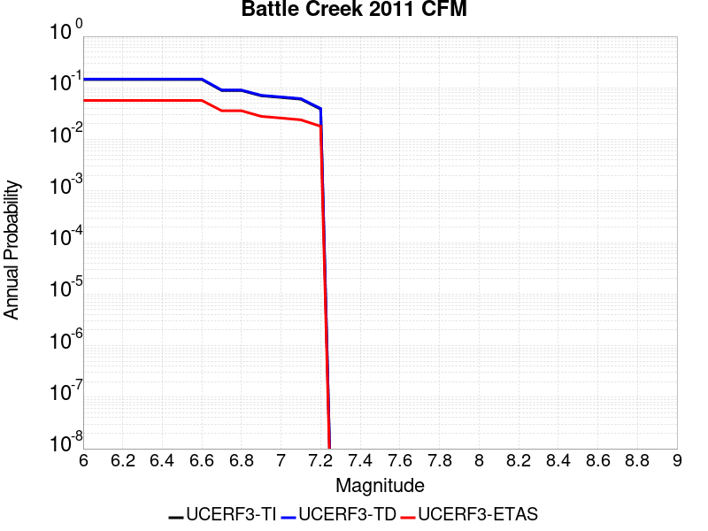 |
|-----|

| Magnitude | UCERF3-TI Prob | UCERF3-TD Prob | UCERF3-ETAS Prob |
|-----|-----|-----|-----|
| 6.0 | 0.14537989 | 0.14800096 | 0.057 |
| 6.1 | 0.14537989 | 0.14800096 | 0.057 |
| 6.2 | 0.14537989 | 0.14800096 | 0.057 |
| 6.3 | 0.14537989 | 0.14800096 | 0.057 |
| 6.4 | 0.14537989 | 0.14800096 | 0.057 |
| 6.5 | 0.14537989 | 0.14800096 | 0.057 |
| 6.6 | 0.14537989 | 0.14800096 | 0.057 |
| 6.7 | 0.08909873 | 0.09074571 | 0.036 |
| 6.8 | 0.08909873 | 0.09074571 | 0.036 |
| 6.9 | 0.070271984 | 0.07171624 | 0.028 |
| 7.0 | 0.06534632 | 0.06675387 | 0.026 |
| 7.1 | 0.06041359 | 0.06178315 | 0.024 |
| 7.2 | 0.0387308 | 0.03982349 | 0.018 |

## Bear River fault zone
*[(top)](#table-of-contents)*

| 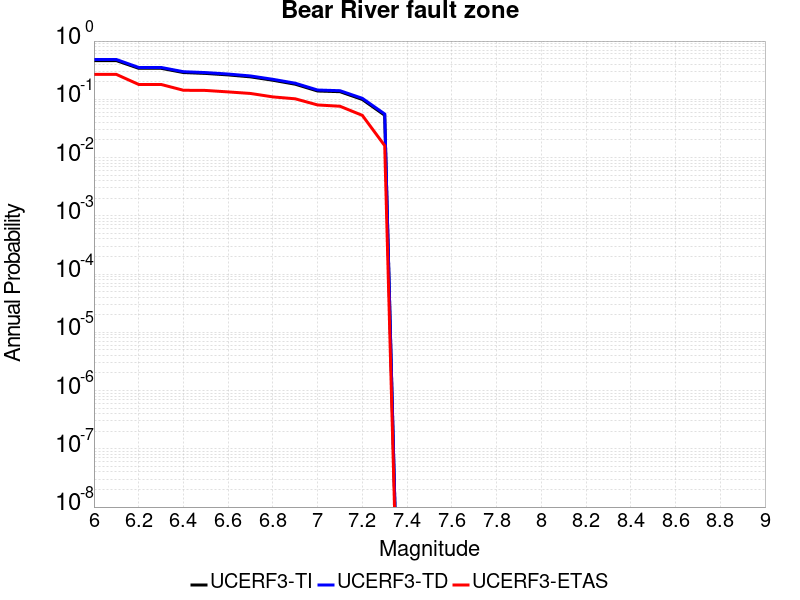 |
|-----|

| Magnitude | UCERF3-TI Prob | UCERF3-TD Prob | UCERF3-ETAS Prob |
|-----|-----|-----|-----|
| 6.0 | 0.46218297 | 0.48259962 | 0.268 |
| 6.1 | 0.46218297 | 0.48259962 | 0.268 |
| 6.2 | 0.3408064 | 0.35248485 | 0.18 |
| 6.3 | 0.3408064 | 0.35248485 | 0.18 |
| 6.4 | 0.28814155 | 0.29786915 | 0.143 |
| 6.5 | 0.27807578 | 0.28765467 | 0.142 |
| 6.6 | 0.26234362 | 0.27160993 | 0.134 |
| 6.7 | 0.24293955 | 0.25174686 | 0.126 |
| 6.8 | 0.21245626 | 0.2205095 | 0.11 |
| 6.9 | 0.18167622 | 0.18895824 | 0.102 |
| 7.0 | 0.13889004 | 0.14433423 | 0.08 |
| 7.1 | 0.1351813 | 0.14054872 | 0.076 |
| 7.2 | 0.09936351 | 0.10402165 | 0.053 |
| 7.3 | 0.05325169 | 0.055969745 | 0.016 |

## Bennett Valley 2011 CFM
*[(top)](#table-of-contents)*

| 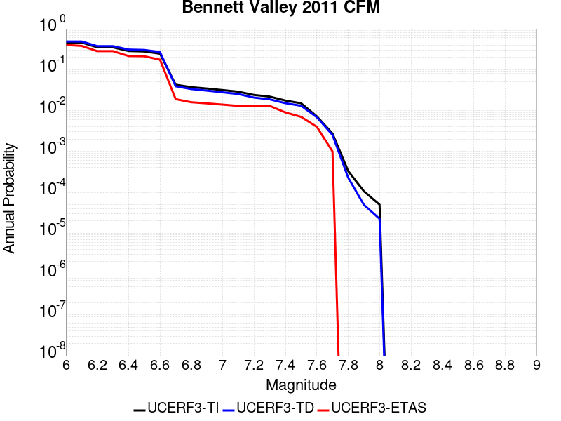 |
|-----|

| Magnitude | UCERF3-TI Prob | UCERF3-TD Prob | UCERF3-ETAS Prob |
|-----|-----|-----|-----|
| 6.0 | 0.4638724 | 0.4907768 | 0.404 |
| 6.1 | 0.4638724 | 0.4907768 | 0.382 |
| 6.2 | 0.35246128 | 0.37690207 | 0.284 |
| 6.3 | 0.35246128 | 0.37690207 | 0.284 |
| 6.4 | 0.28655204 | 0.31050342 | 0.216 |
| 6.5 | 0.2798319 | 0.30394086 | 0.213 |
| 6.6 | 0.24646841 | 0.2709587 | 0.176 |
| 6.7 | 0.042891447 | 0.03935229 | 0.019 |
| 6.8 | 0.037398763 | 0.033583 | 0.016 |
| 6.9 | 0.03458838 | 0.030781219 | 0.015 |
| 7.0 | 0.03170149 | 0.027986033 | 0.014 |
| 7.1 | 0.028956788 | 0.025354156 | 0.013 |
| 7.2 | 0.024102816 | 0.02076179 | 0.013 |
| 7.3 | 0.021941911 | 0.018818252 | 0.013 |
| 7.4 | 0.017552245 | 0.015150421 | 0.009 |
| 7.5 | 0.015086919 | 0.01309967 | 0.007 |
| 7.6 | 0.007209723 | 0.006889641 | 0.004 |
| 7.7 | 0.0027436628 | 0.0025338794 | 0.001 |
| 7.8 | 3.3165092E-4 | 2.2848073E-4 | 0.0 |
| 7.9 | 1.06331354E-4 | 4.9506438E-5 | 0.0 |
| 8.0 | 4.9897484E-5 | 2.2482827E-5 | 0.0 |

## Bicycle Lake
*[(top)](#table-of-contents)*

| 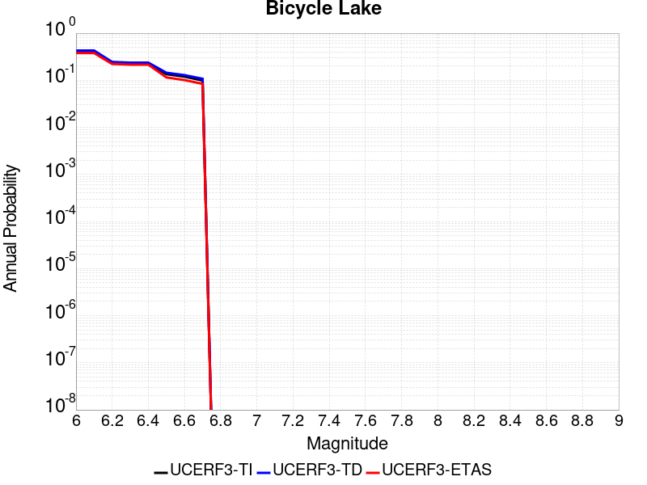 |
|-----|

| Magnitude | UCERF3-TI Prob | UCERF3-TD Prob | UCERF3-ETAS Prob |
|-----|-----|-----|-----|
| 6.0 | 0.40066126 | 0.42841327 | 0.379 |
| 6.1 | 0.40066126 | 0.42841327 | 0.379 |
| 6.2 | 0.22957984 | 0.24506041 | 0.222 |
| 6.3 | 0.22134136 | 0.2367523 | 0.215 |
| 6.4 | 0.22134136 | 0.2367523 | 0.215 |
| 6.5 | 0.13497512 | 0.1444986 | 0.115 |
| 6.6 | 0.11941355 | 0.12858394 | 0.101 |
| 6.7 | 0.098887675 | 0.107608944 | 0.084 |

## Big Lagoon - Bald Mtn 2011 CFM
*[(top)](#table-of-contents)*

| 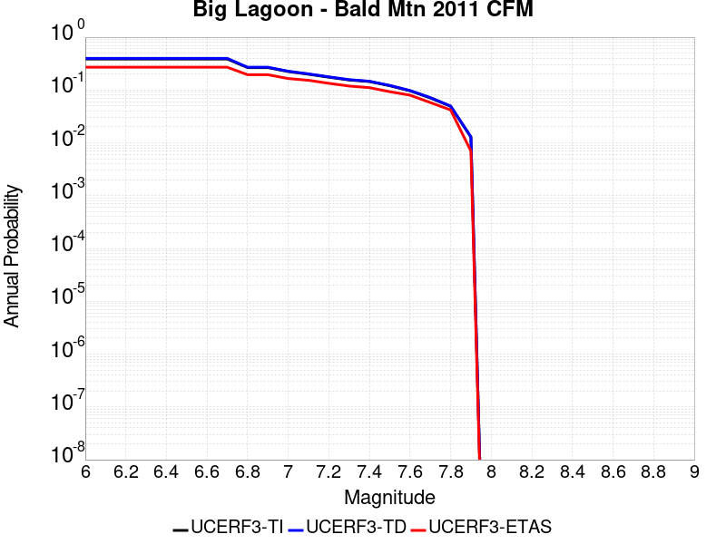 |
|-----|

| Magnitude | UCERF3-TI Prob | UCERF3-TD Prob | UCERF3-ETAS Prob |
|-----|-----|-----|-----|
| 6.0 | 0.38606566 | 0.3974329 | 0.27 |
| 6.1 | 0.38606566 | 0.3974329 | 0.27 |
| 6.2 | 0.38606566 | 0.3974329 | 0.27 |
| 6.3 | 0.38606566 | 0.3974329 | 0.27 |
| 6.4 | 0.38606566 | 0.3974329 | 0.27 |
| 6.5 | 0.38606566 | 0.3974329 | 0.27 |
| 6.6 | 0.38606566 | 0.3974329 | 0.27 |
| 6.7 | 0.38606566 | 0.3974329 | 0.27 |
| 6.8 | 0.26594636 | 0.27046984 | 0.195 |
| 6.9 | 0.26594636 | 0.27046984 | 0.195 |
| 7.0 | 0.22398506 | 0.22749873 | 0.165 |
| 7.1 | 0.19938157 | 0.20242435 | 0.153 |
| 7.2 | 0.17511459 | 0.17771332 | 0.134 |
| 7.3 | 0.1551891 | 0.15745479 | 0.119 |
| 7.4 | 0.14480816 | 0.14691989 | 0.111 |
| 7.5 | 0.12067553 | 0.12242831 | 0.093 |
| 7.6 | 0.09670176 | 0.09808624 | 0.08 |
| 7.7 | 0.07095411 | 0.07196808 | 0.058 |
| 7.8 | 0.04914156 | 0.049863644 | 0.042 |
| 7.9 | 0.012853368 | 0.013055603 | 0.007 |

## Big Pine (Central)
*[(top)](#table-of-contents)*

| 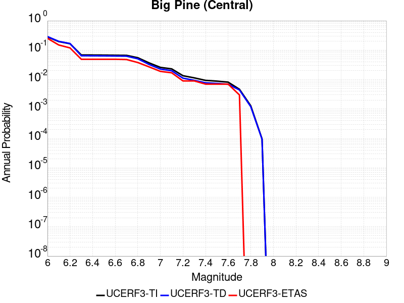 |
|-----|

| Magnitude | UCERF3-TI Prob | UCERF3-TD Prob | UCERF3-ETAS Prob |
|-----|-----|-----|-----|
| 6.0 | 0.28216267 | 0.289947 | 0.253 |
| 6.1 | 0.19559535 | 0.19917743 | 0.15 |
| 6.2 | 0.16526437 | 0.16773048 | 0.119 |
| 6.3 | 0.06870762 | 0.06467383 | 0.049 |
| 6.4 | 0.068350345 | 0.064307876 | 0.049 |
| 6.5 | 0.06794906 | 0.06389674 | 0.049 |
| 6.6 | 0.06726561 | 0.063196905 | 0.049 |
| 6.7 | 0.066577025 | 0.06249321 | 0.048 |
| 6.8 | 0.055255387 | 0.05098098 | 0.038 |
| 6.9 | 0.036901042 | 0.032675985 | 0.027 |
| 7.0 | 0.025938489 | 0.022779778 | 0.019 |
| 7.1 | 0.023072042 | 0.019972883 | 0.017 |
| 7.2 | 0.013513856 | 0.011165342 | 0.009 |
| 7.3 | 0.011420051 | 0.0094092805 | 0.009 |
| 7.4 | 0.009382009 | 0.0077397935 | 0.007 |
| 7.5 | 0.008852296 | 0.007390218 | 0.007 |
| 7.6 | 0.008165982 | 0.0069370223 | 0.007 |
| 7.7 | 0.0046779956 | 0.0044369516 | 0.003 |
| 7.8 | 0.0012835753 | 0.0012011089 | 0.0 |
| 7.9 | 9.601954E-5 | 9.422282E-5 | 0.0 |

## Big Pine (East)
*[(top)](#table-of-contents)*

| 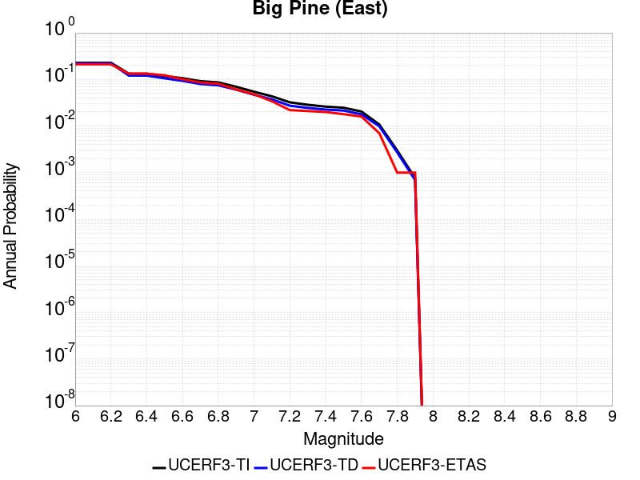 |
|-----|

| Magnitude | UCERF3-TI Prob | UCERF3-TD Prob | UCERF3-ETAS Prob |
|-----|-----|-----|-----|
| 6.0 | 0.22796582 | 0.2226984 | 0.211 |
| 6.1 | 0.22796582 | 0.2226984 | 0.211 |
| 6.2 | 0.22796582 | 0.2226984 | 0.211 |
| 6.3 | 0.13321312 | 0.12110849 | 0.133 |
| 6.4 | 0.13288058 | 0.120764606 | 0.133 |
| 6.5 | 0.11832097 | 0.10565692 | 0.123 |
| 6.6 | 0.106462784 | 0.09335927 | 0.101 |
| 6.7 | 0.09194227 | 0.07967177 | 0.086 |
| 6.8 | 0.08648425 | 0.0749554 | 0.081 |
| 6.9 | 0.06968629 | 0.06038188 | 0.061 |
| 7.0 | 0.054480344 | 0.046969716 | 0.048 |
| 7.1 | 0.04342842 | 0.037370402 | 0.034 |
| 7.2 | 0.03223786 | 0.027311139 | 0.022 |
| 7.3 | 0.028602043 | 0.024484782 | 0.021 |
| 7.4 | 0.026100531 | 0.022582855 | 0.02 |
| 7.5 | 0.024731142 | 0.021501636 | 0.018 |
| 7.6 | 0.020474885 | 0.01785925 | 0.016 |
| 7.7 | 0.010783591 | 0.009850718 | 0.007 |
| 7.8 | 0.002987108 | 0.0027194768 | 0.001 |
| 7.9 | 7.6234667E-4 | 6.932173E-4 | 0.001 |

## Big Pine (West)
*[(top)](#table-of-contents)*

| 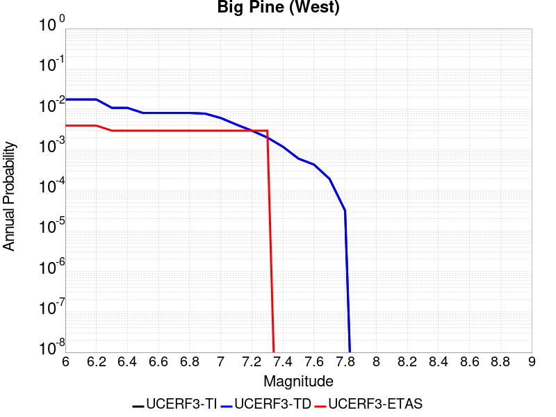 |
|-----|

| Magnitude | UCERF3-TI Prob | UCERF3-TD Prob | UCERF3-ETAS Prob |
|-----|-----|-----|-----|
| 6.0 | 0.017662957 | 0.017728137 | 0.004 |
| 6.1 | 0.017662957 | 0.017728137 | 0.004 |
| 6.2 | 0.017662957 | 0.017728137 | 0.004 |
| 6.3 | 0.010969041 | 0.011004359 | 0.003 |
| 6.4 | 0.010969041 | 0.011004359 | 0.003 |
| 6.5 | 0.008194387 | 0.008222521 | 0.003 |
| 6.6 | 0.008194387 | 0.008222521 | 0.003 |
| 6.7 | 0.008194387 | 0.008222521 | 0.003 |
| 6.8 | 0.008194387 | 0.008222521 | 0.003 |
| 6.9 | 0.007900317 | 0.007927778 | 0.003 |
| 7.0 | 0.0061571007 | 0.0061790873 | 0.003 |
| 7.1 | 0.004249079 | 0.0042646946 | 0.003 |
| 7.2 | 0.0030019423 | 0.003012716 | 0.003 |
| 7.3 | 0.0020271165 | 0.0020339247 | 0.003 |
| 7.4 | 0.001201979 | 0.0012053578 | 0.0 |
| 7.5 | 6.113234E-4 | 6.126664E-4 | 0.0 |
| 7.6 | 4.3559016E-4 | 4.3652207E-4 | 0.0 |
| 7.7 | 1.9320253E-4 | 1.9358424E-4 | 0.0 |
| 7.8 | 3.180084E-5 | 3.1865373E-5 | 0.0 |

## Blackwater
*[(top)](#table-of-contents)*

| 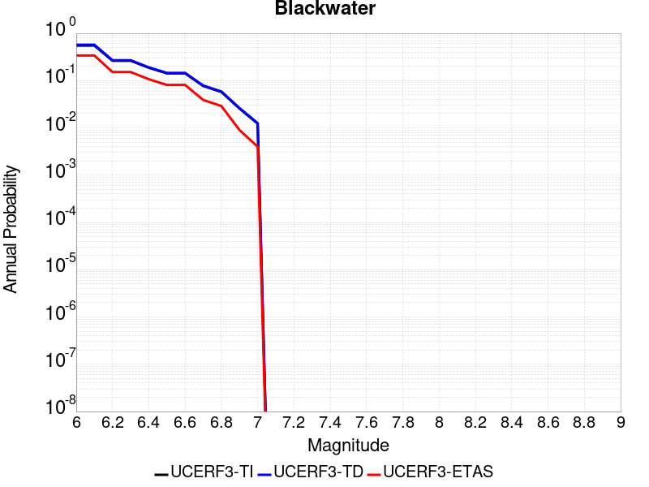 |
|-----|

| Magnitude | UCERF3-TI Prob | UCERF3-TD Prob | UCERF3-ETAS Prob |
|-----|-----|-----|-----|
| 6.0 | 0.55119973 | 0.5748274 | 0.339 |
| 6.1 | 0.55119973 | 0.5748274 | 0.339 |
| 6.2 | 0.2632078 | 0.26955462 | 0.152 |
| 6.3 | 0.2632078 | 0.26955462 | 0.152 |
| 6.4 | 0.18687396 | 0.19104892 | 0.107 |
| 6.5 | 0.14229001 | 0.14543572 | 0.081 |
| 6.6 | 0.14229001 | 0.14543572 | 0.081 |
| 6.7 | 0.077006884 | 0.07874226 | 0.039 |
| 6.8 | 0.05755798 | 0.058890596 | 0.029 |
| 6.9 | 0.025630916 | 0.026273096 | 0.009 |
| 7.0 | 0.01228644 | 0.012617489 | 0.004 |

## Blue Cut
*[(top)](#table-of-contents)*

| 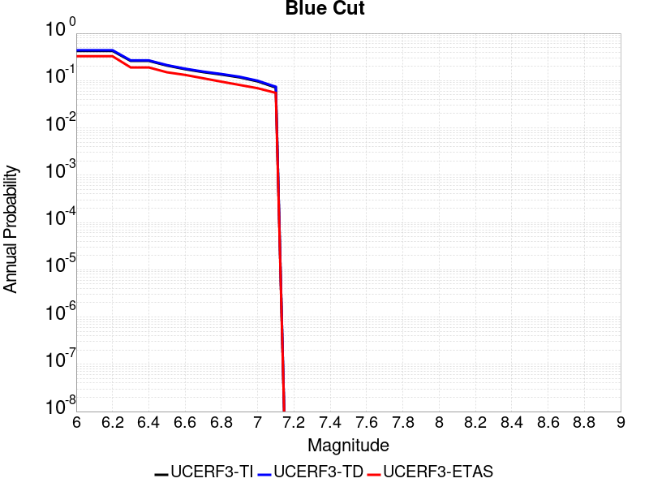 |
|-----|

| Magnitude | UCERF3-TI Prob | UCERF3-TD Prob | UCERF3-ETAS Prob |
|-----|-----|-----|-----|
| 6.0 | 0.42525503 | 0.440127 | 0.328 |
| 6.1 | 0.42525503 | 0.440127 | 0.328 |
| 6.2 | 0.42525503 | 0.440127 | 0.328 |
| 6.3 | 0.26140255 | 0.26785946 | 0.19 |
| 6.4 | 0.26140255 | 0.26785946 | 0.19 |
| 6.5 | 0.2078567 | 0.21302032 | 0.15 |
| 6.6 | 0.17439243 | 0.17888735 | 0.132 |
| 6.7 | 0.15106933 | 0.15515666 | 0.112 |
| 6.8 | 0.13420075 | 0.13801555 | 0.095 |
| 6.9 | 0.11719862 | 0.12073936 | 0.081 |
| 7.0 | 0.09634655 | 0.09957618 | 0.069 |
| 7.1 | 0.07131406 | 0.0741272 | 0.055 |

## Brawley (Seismic Zone) alt 1
*[(top)](#table-of-contents)*

| 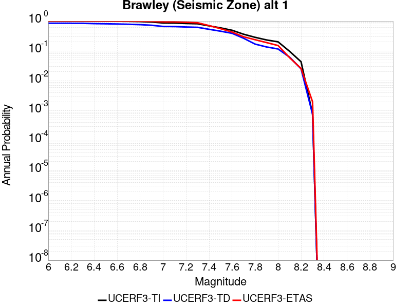 |
|-----|

| Magnitude | UCERF3-TI Prob | UCERF3-TD Prob | UCERF3-ETAS Prob |
|-----|-----|-----|-----|
| 6.0 | 0.9971951 | 0.84851134 | 0.999 |
| 6.1 | 0.9971951 | 0.84851134 | 0.998 |
| 6.2 | 0.99677056 | 0.84524906 | 0.996 |
| 6.3 | 0.99652815 | 0.8433667 | 0.996 |
| 6.4 | 0.9925174 | 0.8221805 | 0.994 |
| 6.5 | 0.9893006 | 0.81143636 | 0.991 |
| 6.6 | 0.98428595 | 0.79849774 | 0.99 |
| 6.7 | 0.97583103 | 0.78214395 | 0.986 |
| 6.8 | 0.960621 | 0.7597599 | 0.984 |
| 6.9 | 0.9297775 | 0.7235472 | 0.974 |
| 7.0 | 0.8645344 | 0.6601527 | 0.943 |
| 7.1 | 0.85915494 | 0.6553679 | 0.938 |
| 7.2 | 0.82986325 | 0.6326166 | 0.909 |
| 7.3 | 0.8116897 | 0.61721295 | 0.878 |
| 7.4 | 0.6914304 | 0.5299569 | 0.706 |
| 7.5 | 0.5916505 | 0.45857608 | 0.557 |
| 7.6 | 0.49227825 | 0.38885164 | 0.43 |
| 7.7 | 0.36309996 | 0.26616663 | 0.299 |
| 7.8 | 0.2862844 | 0.16939412 | 0.238 |
| 7.9 | 0.23366225 | 0.13549347 | 0.191 |
| 8.0 | 0.2020295 | 0.115978494 | 0.152 |
| 8.1 | 0.09761054 | 0.061835904 | 0.06 |
| 8.2 | 0.043635186 | 0.025426308 | 0.026 |
| 8.3 | 7.914095E-4 | 7.722475E-4 | 0.002 |

## Breckenridge 2011
*[(top)](#table-of-contents)*

| 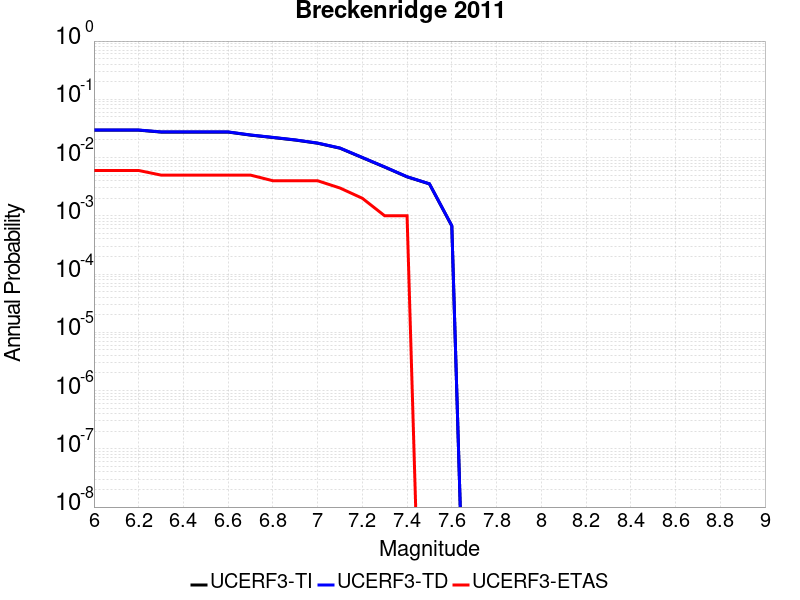 |
|-----|

| Magnitude | UCERF3-TI Prob | UCERF3-TD Prob | UCERF3-ETAS Prob |
|-----|-----|-----|-----|
| 6.0 | 0.02953276 | 0.029710008 | 0.006 |
| 6.1 | 0.02953276 | 0.029710008 | 0.006 |
| 6.2 | 0.02953276 | 0.029710008 | 0.006 |
| 6.3 | 0.027392931 | 0.027562529 | 0.005 |
| 6.4 | 0.027392931 | 0.027562529 | 0.005 |
| 6.5 | 0.027392931 | 0.027562529 | 0.005 |
| 6.6 | 0.027392931 | 0.027562529 | 0.005 |
| 6.7 | 0.024281556 | 0.024435792 | 0.005 |
| 6.8 | 0.022075787 | 0.02221859 | 0.004 |
| 6.9 | 0.019979808 | 0.020110743 | 0.004 |
| 7.0 | 0.01762848 | 0.01774538 | 0.004 |
| 7.1 | 0.014487443 | 0.014582978 | 0.003 |
| 7.2 | 0.00997365 | 0.010036912 | 0.002 |
| 7.3 | 0.006865244 | 0.0069067543 | 0.001 |
| 7.4 | 0.004664585 | 0.004691337 | 0.001 |
| 7.5 | 0.00352852 | 0.0035490198 | 0.0 |
| 7.6 | 6.708552E-4 | 6.748372E-4 | 0.0 |

## Bullion Mountains
*[(top)](#table-of-contents)*

| 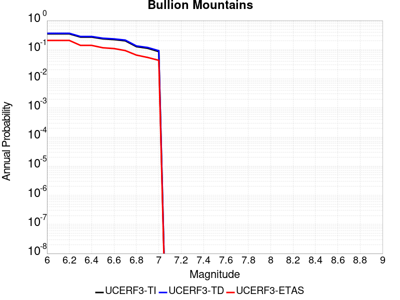 |
|-----|

| Magnitude | UCERF3-TI Prob | UCERF3-TD Prob | UCERF3-ETAS Prob |
|-----|-----|-----|-----|
| 6.0 | 0.3484497 | 0.36455455 | 0.207 |
| 6.1 | 0.3484497 | 0.36455455 | 0.207 |
| 6.2 | 0.3484497 | 0.36455455 | 0.207 |
| 6.3 | 0.2696955 | 0.28297696 | 0.14 |
| 6.4 | 0.2696955 | 0.28297696 | 0.14 |
| 6.5 | 0.23453283 | 0.24709824 | 0.116 |
| 6.6 | 0.22166593 | 0.23405623 | 0.109 |
| 6.7 | 0.20106675 | 0.21309692 | 0.093 |
| 6.8 | 0.12659106 | 0.13423432 | 0.065 |
| 6.9 | 0.11147359 | 0.118756644 | 0.054 |
| 7.0 | 0.08563909 | 0.092114046 | 0.043 |

## Burnt Mtn
*[(top)](#table-of-contents)*

| 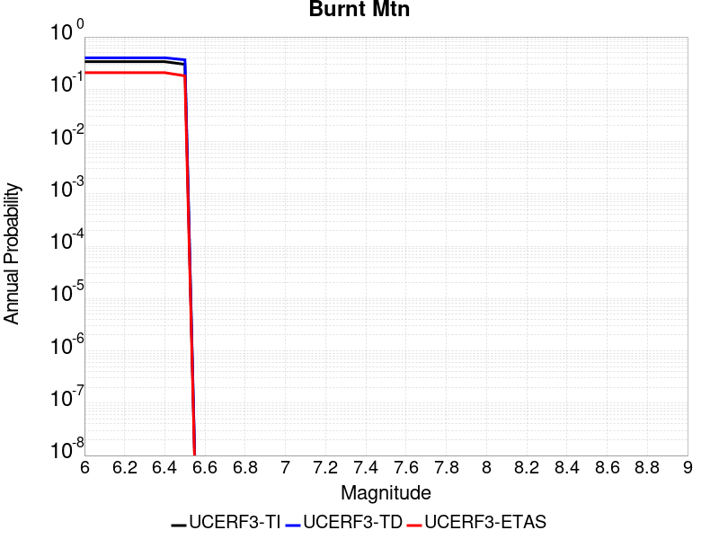 |
|-----|

| Magnitude | UCERF3-TI Prob | UCERF3-TD Prob | UCERF3-ETAS Prob |
|-----|-----|-----|-----|
| 6.0 | 0.33562234 | 0.39879227 | 0.207 |
| 6.1 | 0.33562234 | 0.39879227 | 0.207 |
| 6.2 | 0.33562234 | 0.39879227 | 0.207 |
| 6.3 | 0.33562234 | 0.39879227 | 0.207 |
| 6.4 | 0.33562234 | 0.39879227 | 0.207 |
| 6.5 | 0.29904807 | 0.3643495 | 0.18 |

## Butano 2011 CFM
*[(top)](#table-of-contents)*

| 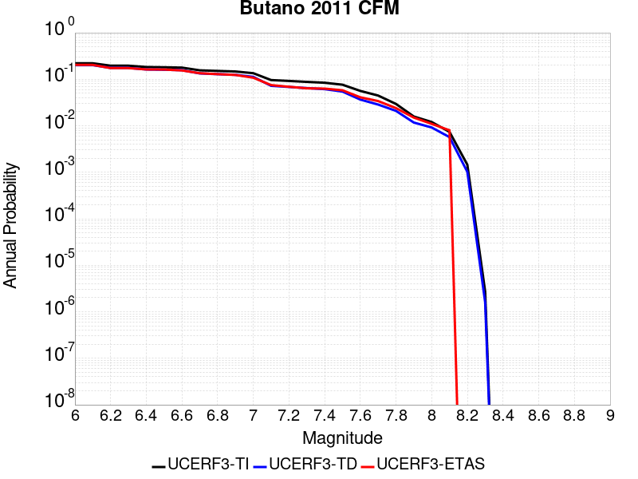 |
|-----|

| Magnitude | UCERF3-TI Prob | UCERF3-TD Prob | UCERF3-ETAS Prob |
|-----|-----|-----|-----|
| 6.0 | 0.22076638 | 0.20148641 | 0.204 |
| 6.1 | 0.22076638 | 0.20148641 | 0.204 |
| 6.2 | 0.19606031 | 0.17571369 | 0.174 |
| 6.3 | 0.19606031 | 0.17571369 | 0.174 |
| 6.4 | 0.1834521 | 0.16257629 | 0.163 |
| 6.5 | 0.1814291 | 0.16046318 | 0.162 |
| 6.6 | 0.17824048 | 0.15717854 | 0.155 |
| 6.7 | 0.15580845 | 0.13359874 | 0.135 |
| 6.8 | 0.15132317 | 0.1289452 | 0.129 |
| 6.9 | 0.1470507 | 0.124611855 | 0.124 |
| 7.0 | 0.13516794 | 0.11281233 | 0.108 |
| 7.1 | 0.09623851 | 0.072349496 | 0.075 |
| 7.2 | 0.09210804 | 0.06843362 | 0.069 |
| 7.3 | 0.087927744 | 0.064639464 | 0.064 |
| 7.4 | 0.084193796 | 0.061343685 | 0.063 |
| 7.5 | 0.07648027 | 0.05443538 | 0.058 |
| 7.6 | 0.05622315 | 0.036629073 | 0.041 |
| 7.7 | 0.0446779 | 0.028595159 | 0.034 |
| 7.8 | 0.029503845 | 0.020920794 | 0.024 |
| 7.9 | 0.015828209 | 0.011737237 | 0.015 |
| 8.0 | 0.012063397 | 0.00919656 | 0.011 |
| 8.1 | 0.007388501 | 0.0057055387 | 0.008 |
| 8.2 | 0.0014562283 | 0.0010222519 | 0.0 |
| 8.3 | 2.7057733E-6 | 1.5767738E-6 | 0.0 |

## Cady
*[(top)](#table-of-contents)*

| 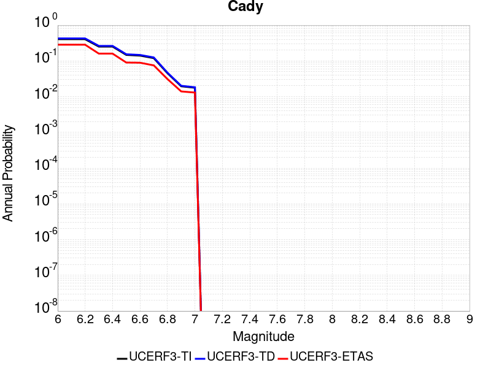 |
|-----|

| Magnitude | UCERF3-TI Prob | UCERF3-TD Prob | UCERF3-ETAS Prob |
|-----|-----|-----|-----|
| 6.0 | 0.40487745 | 0.42619872 | 0.284 |
| 6.1 | 0.40487745 | 0.42619872 | 0.284 |
| 6.2 | 0.40487745 | 0.42619872 | 0.284 |
| 6.3 | 0.2517699 | 0.26313627 | 0.16 |
| 6.4 | 0.2517699 | 0.26313627 | 0.16 |
| 6.5 | 0.14719625 | 0.15337089 | 0.09 |
| 6.6 | 0.1408124 | 0.14687777 | 0.089 |
| 6.7 | 0.119651 | 0.12518138 | 0.075 |
| 6.8 | 0.045349218 | 0.046856802 | 0.031 |
| 6.9 | 0.019493284 | 0.020111851 | 0.014 |
| 7.0 | 0.017732618 | 0.018302415 | 0.013 |

## Calaveras (Central) 2011 CFM
*[(top)](#table-of-contents)*

| 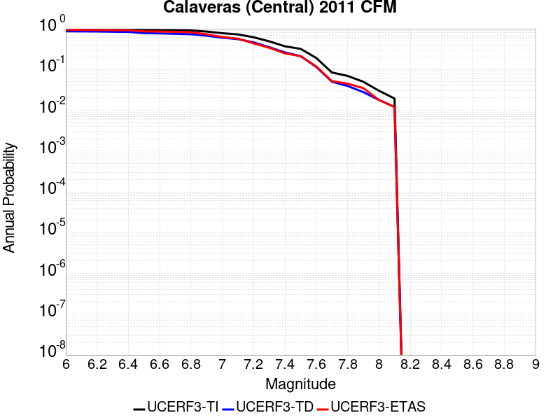 |
|-----|

| Magnitude | UCERF3-TI Prob | UCERF3-TD Prob | UCERF3-ETAS Prob |
|-----|-----|-----|-----|
| 6.0 | 0.98008996 | 0.86703646 | 0.944 |
| 6.1 | 0.9773778 | 0.8597225 | 0.937 |
| 6.2 | 0.97603184 | 0.8563054 | 0.933 |
| 6.3 | 0.9707465 | 0.84395766 | 0.924 |
| 6.4 | 0.966294 | 0.83403975 | 0.918 |
| 6.5 | 0.93538046 | 0.78029937 | 0.863 |
| 6.6 | 0.92935973 | 0.7684671 | 0.856 |
| 6.7 | 0.9195764 | 0.7508926 | 0.839 |
| 6.8 | 0.9066692 | 0.7330168 | 0.818 |
| 6.9 | 0.8531677 | 0.6743921 | 0.732 |
| 7.0 | 0.7766801 | 0.60137564 | 0.627 |
| 7.1 | 0.7255384 | 0.556434 | 0.57 |
| 7.2 | 0.6179046 | 0.46255386 | 0.438 |
| 7.3 | 0.49050644 | 0.3528016 | 0.341 |
| 7.4 | 0.37062812 | 0.26250222 | 0.249 |
| 7.5 | 0.32179266 | 0.21325009 | 0.213 |
| 7.6 | 0.19190156 | 0.11557489 | 0.119 |
| 7.7 | 0.084544405 | 0.050195634 | 0.052 |
| 7.8 | 0.06977037 | 0.039498042 | 0.045 |
| 7.9 | 0.050187446 | 0.028008679 | 0.035 |
| 8.0 | 0.030233575 | 0.017950607 | 0.018 |
| 8.1 | 0.019405646 | 0.012090015 | 0.012 |

## Calaveras (No) 2011 CFM
*[(top)](#table-of-contents)*

| 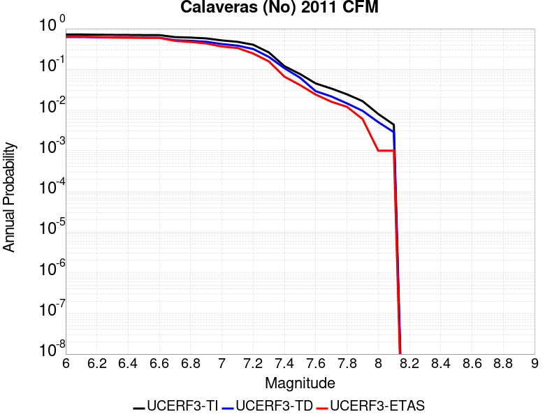 |
|-----|

| Magnitude | UCERF3-TI Prob | UCERF3-TD Prob | UCERF3-ETAS Prob |
|-----|-----|-----|-----|
| 6.0 | 0.7192933 | 0.6249004 | 0.639 |
| 6.1 | 0.7192933 | 0.6249004 | 0.638 |
| 6.2 | 0.7107215 | 0.6158987 | 0.624 |
| 6.3 | 0.70442986 | 0.60922396 | 0.608 |
| 6.4 | 0.70101017 | 0.60567063 | 0.605 |
| 6.5 | 0.69664615 | 0.6011143 | 0.599 |
| 6.6 | 0.694823 | 0.59942037 | 0.596 |
| 6.7 | 0.61924326 | 0.5197498 | 0.501 |
| 6.8 | 0.6041821 | 0.5035038 | 0.472 |
| 6.9 | 0.57664984 | 0.47723302 | 0.433 |
| 7.0 | 0.51432884 | 0.4186884 | 0.364 |
| 7.1 | 0.47529888 | 0.38339344 | 0.335 |
| 7.2 | 0.4026296 | 0.31644106 | 0.245 |
| 7.3 | 0.26120505 | 0.2028117 | 0.157 |
| 7.4 | 0.11966821 | 0.10653449 | 0.066 |
| 7.5 | 0.076660566 | 0.062283546 | 0.041 |
| 7.6 | 0.04500223 | 0.029053045 | 0.024 |
| 7.7 | 0.033785436 | 0.021551223 | 0.016 |
| 7.8 | 0.024335101 | 0.014563453 | 0.012 |
| 7.9 | 0.016528333 | 0.009554248 | 0.006 |
| 8.0 | 0.008023971 | 0.0050507714 | 0.001 |
| 8.1 | 0.0043540956 | 0.0028568413 | 0.001 |

## Calaveras (So) - Paicines extension 2011 CFM
*[(top)](#table-of-contents)*

| 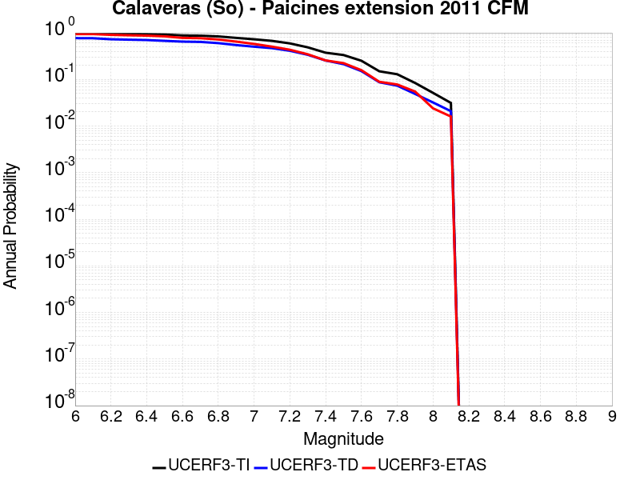 |
|-----|

| Magnitude | UCERF3-TI Prob | UCERF3-TD Prob | UCERF3-ETAS Prob |
|-----|-----|-----|-----|
| 6.0 | 0.9809675 | 0.77028936 | 0.942 |
| 6.1 | 0.98016304 | 0.76608014 | 0.941 |
| 6.2 | 0.9640279 | 0.7287976 | 0.905 |
| 6.3 | 0.9505599 | 0.71338034 | 0.886 |
| 6.4 | 0.9390039 | 0.7007515 | 0.872 |
| 6.5 | 0.9203267 | 0.6738263 | 0.841 |
| 6.6 | 0.87774384 | 0.64859563 | 0.779 |
| 6.7 | 0.86986136 | 0.63878924 | 0.768 |
| 6.8 | 0.8375282 | 0.6020757 | 0.72 |
| 6.9 | 0.77980334 | 0.5472537 | 0.649 |
| 7.0 | 0.72773975 | 0.5046231 | 0.578 |
| 7.1 | 0.6729546 | 0.46952128 | 0.506 |
| 7.2 | 0.59348154 | 0.4123977 | 0.434 |
| 7.3 | 0.48866954 | 0.338111 | 0.347 |
| 7.4 | 0.37480524 | 0.25459725 | 0.256 |
| 7.5 | 0.33428064 | 0.21309909 | 0.224 |
| 7.6 | 0.2516329 | 0.1508902 | 0.158 |
| 7.7 | 0.14966126 | 0.08702778 | 0.089 |
| 7.8 | 0.1292653 | 0.07359986 | 0.078 |
| 7.9 | 0.08401161 | 0.048868936 | 0.055 |
| 8.0 | 0.051511854 | 0.032069795 | 0.024 |
| 8.1 | 0.03134319 | 0.020848209 | 0.016 |

## Calaveras (So) 2011 CFM
*[(top)](#table-of-contents)*

| 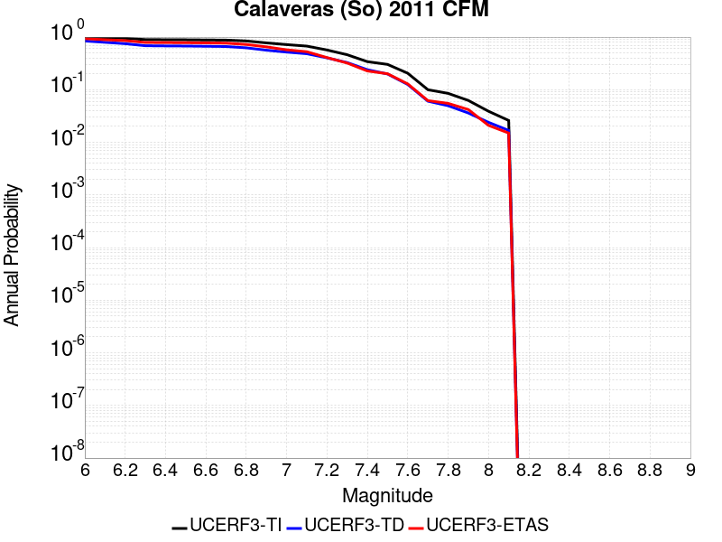 |
|-----|

| Magnitude | UCERF3-TI Prob | UCERF3-TD Prob | UCERF3-ETAS Prob |
|-----|-----|-----|-----|
| 6.0 | 0.98442 | 0.84304297 | 0.934 |
| 6.1 | 0.9711138 | 0.79541034 | 0.891 |
| 6.2 | 0.9498127 | 0.74903506 | 0.858 |
| 6.3 | 0.8964451 | 0.684685 | 0.791 |
| 6.4 | 0.89141756 | 0.6788541 | 0.786 |
| 6.5 | 0.8884447 | 0.67513865 | 0.783 |
| 6.6 | 0.8821132 | 0.66779625 | 0.775 |
| 6.7 | 0.87636757 | 0.6608744 | 0.768 |
| 6.8 | 0.8439477 | 0.6244554 | 0.724 |
| 6.9 | 0.7759941 | 0.56225514 | 0.652 |
| 7.0 | 0.71967185 | 0.51732045 | 0.573 |
| 7.1 | 0.67431074 | 0.48140275 | 0.527 |
| 7.2 | 0.56847316 | 0.4014613 | 0.408 |
| 7.3 | 0.46194705 | 0.3259082 | 0.321 |
| 7.4 | 0.34122387 | 0.23789556 | 0.227 |
| 7.5 | 0.30260792 | 0.1969923 | 0.201 |
| 7.6 | 0.20549683 | 0.12384539 | 0.129 |
| 7.7 | 0.09992415 | 0.05922964 | 0.062 |
| 7.8 | 0.08519769 | 0.048722576 | 0.055 |
| 7.9 | 0.06250784 | 0.035656568 | 0.042 |
| 8.0 | 0.03895953 | 0.02378023 | 0.021 |
| 8.1 | 0.02601755 | 0.01671281 | 0.015 |

## Calico-Hidalgo
*[(top)](#table-of-contents)*

| 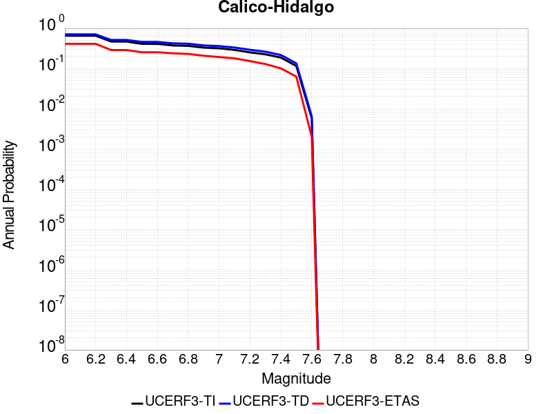 |
|-----|

| Magnitude | UCERF3-TI Prob | UCERF3-TD Prob | UCERF3-ETAS Prob |
|-----|-----|-----|-----|
| 6.0 | 0.65604556 | 0.7076144 | 0.411 |
| 6.1 | 0.65604556 | 0.7076144 | 0.411 |
| 6.2 | 0.65604556 | 0.7076144 | 0.411 |
| 6.3 | 0.46873006 | 0.5143627 | 0.288 |
| 6.4 | 0.46873006 | 0.5143627 | 0.288 |
| 6.5 | 0.4109696 | 0.4592826 | 0.254 |
| 6.6 | 0.41069707 | 0.45902708 | 0.254 |
| 6.7 | 0.37473065 | 0.4236224 | 0.239 |
| 6.8 | 0.36586374 | 0.41423604 | 0.231 |
| 6.9 | 0.33137405 | 0.37577078 | 0.208 |
| 7.0 | 0.31822768 | 0.36129072 | 0.193 |
| 7.1 | 0.2902175 | 0.33246163 | 0.179 |
| 7.2 | 0.2519666 | 0.29281968 | 0.153 |
| 7.3 | 0.22577207 | 0.26236767 | 0.129 |
| 7.4 | 0.18715408 | 0.21681818 | 0.101 |
| 7.5 | 0.1156799 | 0.13428524 | 0.063 |
| 7.6 | 0.0057536047 | 0.0064642406 | 0.002 |

## Camp Rock 2011
*[(top)](#table-of-contents)*

| 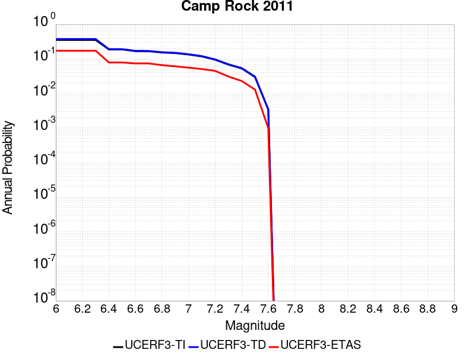 |
|-----|

| Magnitude | UCERF3-TI Prob | UCERF3-TD Prob | UCERF3-ETAS Prob |
|-----|-----|-----|-----|
| 6.0 | 0.3533668 | 0.3763249 | 0.173 |
| 6.1 | 0.3533668 | 0.3763249 | 0.173 |
| 6.2 | 0.3533668 | 0.3763249 | 0.173 |
| 6.3 | 0.3533668 | 0.3763249 | 0.173 |
| 6.4 | 0.18801028 | 0.19182694 | 0.079 |
| 6.5 | 0.18801028 | 0.19182694 | 0.079 |
| 6.6 | 0.1679815 | 0.17133534 | 0.074 |
| 6.7 | 0.16664411 | 0.1699791 | 0.074 |
| 6.8 | 0.15319715 | 0.15628695 | 0.066 |
| 6.9 | 0.1473991 | 0.15040119 | 0.061 |
| 7.0 | 0.13398844 | 0.13673009 | 0.056 |
| 7.1 | 0.11805281 | 0.12052158 | 0.051 |
| 7.2 | 0.0948167 | 0.096841075 | 0.045 |
| 7.3 | 0.06842267 | 0.069914095 | 0.031 |
| 7.4 | 0.0530505 | 0.05422025 | 0.023 |
| 7.5 | 0.030017076 | 0.030707976 | 0.013 |
| 7.6 | 0.0034260035 | 0.003513153 | 0.001 |

## Canada David (Detachment)
*[(top)](#table-of-contents)*

| 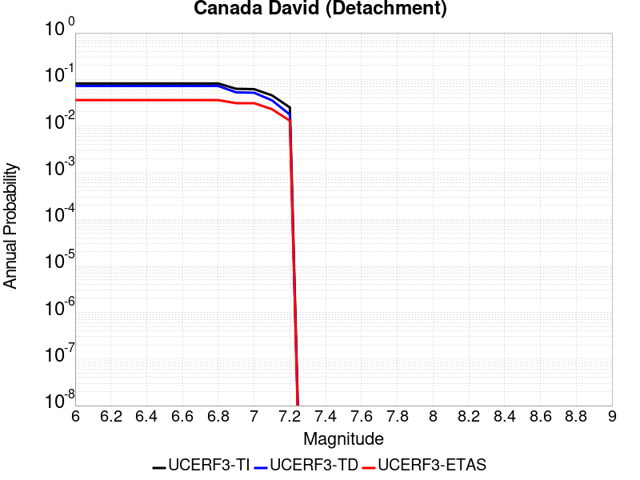 |
|-----|

| Magnitude | UCERF3-TI Prob | UCERF3-TD Prob | UCERF3-ETAS Prob |
|-----|-----|-----|-----|
| 6.0 | 0.081861295 | 0.072336204 | 0.036 |
| 6.1 | 0.081861295 | 0.072336204 | 0.036 |
| 6.2 | 0.081861295 | 0.072336204 | 0.036 |
| 6.3 | 0.081861295 | 0.072336204 | 0.036 |
| 6.4 | 0.081861295 | 0.072336204 | 0.036 |
| 6.5 | 0.081861295 | 0.072336204 | 0.036 |
| 6.6 | 0.081861295 | 0.072336204 | 0.036 |
| 6.7 | 0.081861295 | 0.072336204 | 0.036 |
| 6.8 | 0.081861295 | 0.072336204 | 0.036 |
| 6.9 | 0.062932074 | 0.052885372 | 0.031 |
| 7.0 | 0.06187579 | 0.051872324 | 0.031 |
| 7.1 | 0.045595266 | 0.035653684 | 0.023 |
| 7.2 | 0.025047874 | 0.01762923 | 0.013 |

## Carlsbad
*[(top)](#table-of-contents)*

| 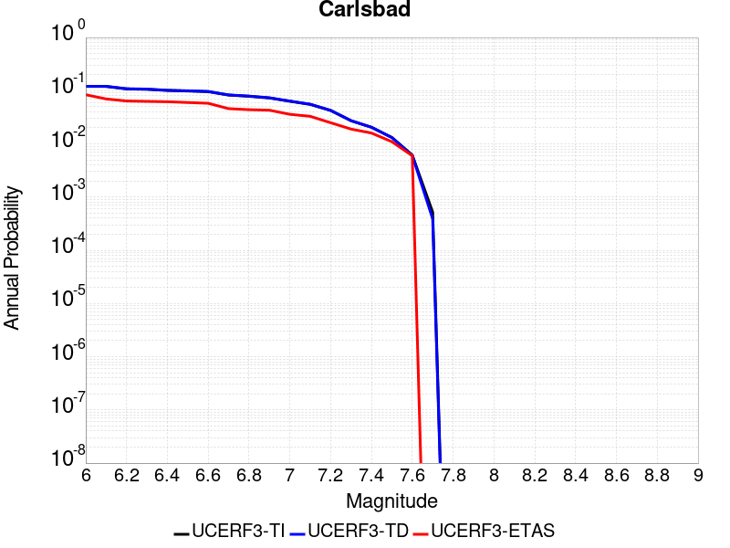 |
|-----|

| Magnitude | UCERF3-TI Prob | UCERF3-TD Prob | UCERF3-ETAS Prob |
|-----|-----|-----|-----|
| 6.0 | 0.12009238 | 0.12114883 | 0.084 |
| 6.1 | 0.12009238 | 0.12114883 | 0.07 |
| 6.2 | 0.10803208 | 0.10900247 | 0.064 |
| 6.3 | 0.10618736 | 0.10714095 | 0.063 |
| 6.4 | 0.10105772 | 0.10197237 | 0.062 |
| 6.5 | 0.09881005 | 0.09970536 | 0.06 |
| 6.6 | 0.09605385 | 0.09692458 | 0.058 |
| 6.7 | 0.08271637 | 0.08338395 | 0.046 |
| 6.8 | 0.07858226 | 0.07927488 | 0.044 |
| 6.9 | 0.07300473 | 0.07367693 | 0.043 |
| 7.0 | 0.06331537 | 0.063897386 | 0.036 |
| 7.1 | 0.055255227 | 0.055766273 | 0.033 |
| 7.2 | 0.04245484 | 0.04278697 | 0.025 |
| 7.3 | 0.027265428 | 0.027364535 | 0.019 |
| 7.4 | 0.020544298 | 0.020575846 | 0.016 |
| 7.5 | 0.013228688 | 0.0131540075 | 0.011 |
| 7.6 | 0.0061701247 | 0.0060619186 | 0.006 |
| 7.7 | 5.2144495E-4 | 3.8931475E-4 | 0.0 |

## Carson Range (Genoa)
*[(top)](#table-of-contents)*

| 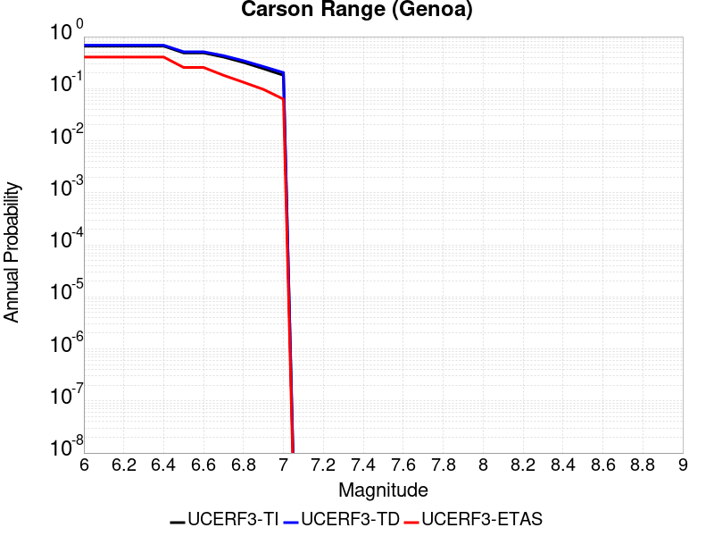 |
|-----|

| Magnitude | UCERF3-TI Prob | UCERF3-TD Prob | UCERF3-ETAS Prob |
|-----|-----|-----|-----|
| 6.0 | 0.65927744 | 0.68561506 | 0.406 |
| 6.1 | 0.65927744 | 0.68561506 | 0.406 |
| 6.2 | 0.65927744 | 0.68561506 | 0.406 |
| 6.3 | 0.65927744 | 0.68561506 | 0.406 |
| 6.4 | 0.65927744 | 0.68561506 | 0.406 |
| 6.5 | 0.48824435 | 0.51228267 | 0.256 |
| 6.6 | 0.48824435 | 0.51228267 | 0.256 |
| 6.7 | 0.4060694 | 0.4320509 | 0.181 |
| 6.8 | 0.3200152 | 0.34471905 | 0.133 |
| 6.9 | 0.24290857 | 0.26632485 | 0.097 |
| 7.0 | 0.18124545 | 0.20396307 | 0.063 |

## Casmalia 2011 CFM
*[(top)](#table-of-contents)*

| 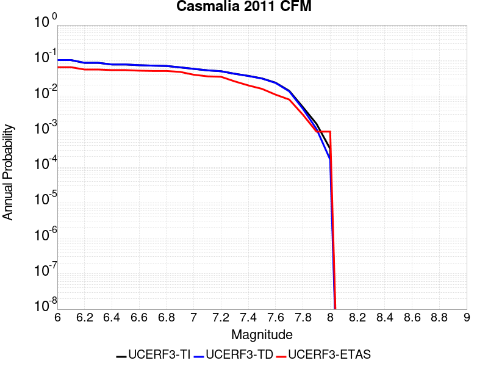 |
|-----|

| Magnitude | UCERF3-TI Prob | UCERF3-TD Prob | UCERF3-ETAS Prob |
|-----|-----|-----|-----|
| 6.0 | 0.10309498 | 0.103389196 | 0.065 |
| 6.1 | 0.10309498 | 0.103389196 | 0.065 |
| 6.2 | 0.08625063 | 0.08643494 | 0.056 |
| 6.3 | 0.08625063 | 0.08643494 | 0.056 |
| 6.4 | 0.07759013 | 0.07772342 | 0.054 |
| 6.5 | 0.07759013 | 0.07772342 | 0.054 |
| 6.6 | 0.07397767 | 0.07408973 | 0.052 |
| 6.7 | 0.07198397 | 0.07208379 | 0.051 |
| 6.8 | 0.070445314 | 0.07053509 | 0.051 |
| 6.9 | 0.06438874 | 0.06442727 | 0.048 |
| 7.0 | 0.05844172 | 0.05842866 | 0.04 |
| 7.1 | 0.053146902 | 0.053089485 | 0.036 |
| 7.2 | 0.05013363 | 0.050050337 | 0.035 |
| 7.3 | 0.04260745 | 0.042451777 | 0.026 |
| 7.4 | 0.03710017 | 0.03689121 | 0.02 |
| 7.5 | 0.031501416 | 0.031234747 | 0.016 |
| 7.6 | 0.023859361 | 0.023509312 | 0.011 |
| 7.7 | 0.014084088 | 0.013615823 | 0.008 |
| 7.8 | 0.0048994604 | 0.0044016135 | 0.003 |
| 7.9 | 0.0016534155 | 0.0011867579 | 0.001 |
| 8.0 | 3.2801426E-4 | 1.6332354E-4 | 0.001 |

## Cedar Mtn-Mahogany Mtn
*[(top)](#table-of-contents)*

| 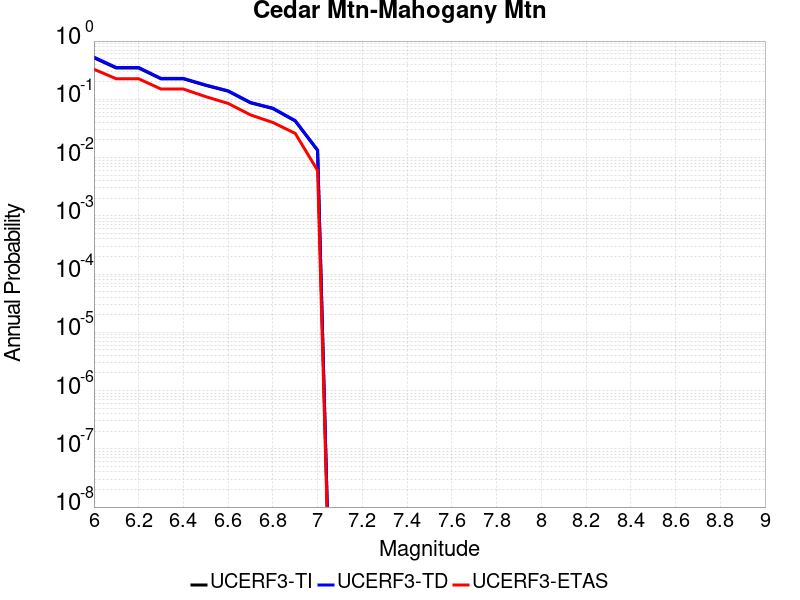 |
|-----|

| Magnitude | UCERF3-TI Prob | UCERF3-TD Prob | UCERF3-ETAS Prob |
|-----|-----|-----|-----|
| 6.0 | 0.5153604 | 0.530618 | 0.328 |
| 6.1 | 0.34404954 | 0.3518411 | 0.225 |
| 6.2 | 0.34404954 | 0.3518411 | 0.225 |
| 6.3 | 0.22451669 | 0.22859986 | 0.15 |
| 6.4 | 0.22451669 | 0.22859986 | 0.15 |
| 6.5 | 0.17320107 | 0.17620845 | 0.111 |
| 6.6 | 0.1377097 | 0.14004688 | 0.085 |
| 6.7 | 0.08691989 | 0.08837258 | 0.054 |
| 6.8 | 0.06931777 | 0.07048503 | 0.04 |
| 6.9 | 0.042369116 | 0.04310584 | 0.026 |
| 7.0 | 0.013222947 | 0.013471437 | 0.006 |

## Cerro Prieto
*[(top)](#table-of-contents)*

| 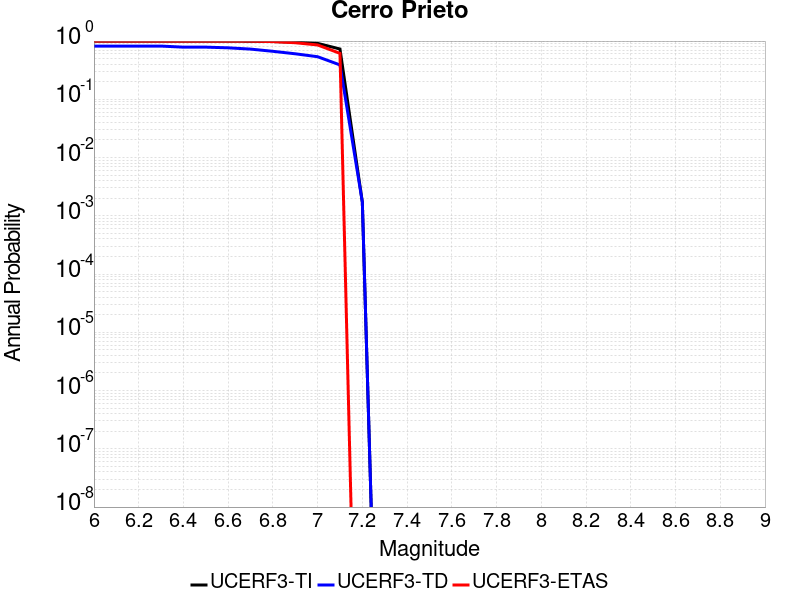 |
|-----|

| Magnitude | UCERF3-TI Prob | UCERF3-TD Prob | UCERF3-ETAS Prob |
|-----|-----|-----|-----|
| 6.0 | 0.9994963 | 0.81974286 | 0.999 |
| 6.1 | 0.9994963 | 0.81974286 | 0.999 |
| 6.2 | 0.9994963 | 0.81974286 | 0.999 |
| 6.3 | 0.9994963 | 0.81974286 | 0.999 |
| 6.4 | 0.9985637 | 0.78634644 | 0.999 |
| 6.5 | 0.9985637 | 0.78634644 | 0.999 |
| 6.6 | 0.9974912 | 0.7653301 | 0.999 |
| 6.7 | 0.99402195 | 0.7279573 | 0.996 |
| 6.8 | 0.982366 | 0.66705585 | 0.978 |
| 6.9 | 0.9568981 | 0.60472953 | 0.936 |
| 7.0 | 0.9122654 | 0.53857493 | 0.857 |
| 7.1 | 0.73078585 | 0.3892527 | 0.615 |
| 7.2 | 0.0017059613 | 0.0017162096 | 0.0 |

## Channel Islands Thrust
*[(top)](#table-of-contents)*

| 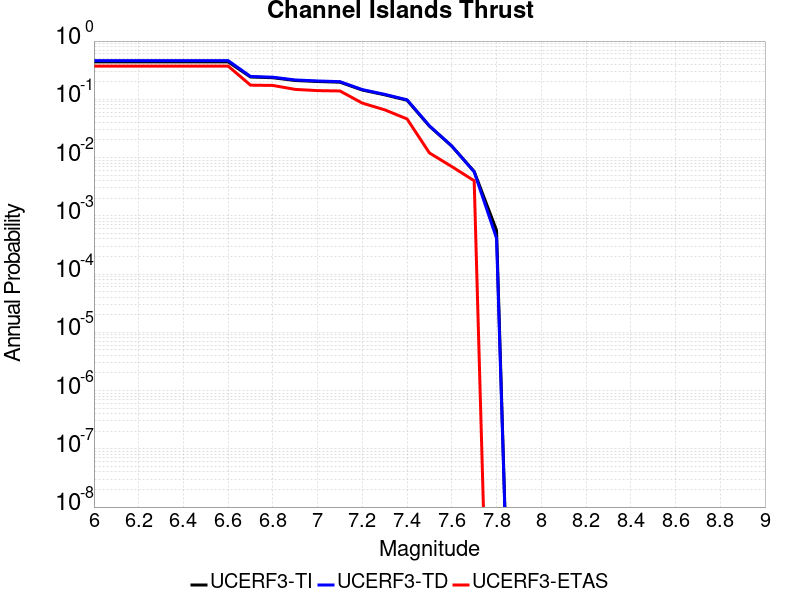 |
|-----|

| Magnitude | UCERF3-TI Prob | UCERF3-TD Prob | UCERF3-ETAS Prob |
|-----|-----|-----|-----|
| 6.0 | 0.4390072 | 0.4618852 | 0.372 |
| 6.1 | 0.4390072 | 0.4618852 | 0.372 |
| 6.2 | 0.4390072 | 0.4618852 | 0.372 |
| 6.3 | 0.4390072 | 0.4618852 | 0.372 |
| 6.4 | 0.4390072 | 0.4618852 | 0.372 |
| 6.5 | 0.4390072 | 0.4618852 | 0.372 |
| 6.6 | 0.4390072 | 0.4618852 | 0.372 |
| 6.7 | 0.24162835 | 0.24687533 | 0.175 |
| 6.8 | 0.23458084 | 0.23969655 | 0.173 |
| 6.9 | 0.21029626 | 0.21485837 | 0.148 |
| 7.0 | 0.20210907 | 0.20653395 | 0.141 |
| 7.1 | 0.1966115 | 0.20095374 | 0.139 |
| 7.2 | 0.14412244 | 0.1467533 | 0.086 |
| 7.3 | 0.119487606 | 0.12165452 | 0.066 |
| 7.4 | 0.096342176 | 0.09808319 | 0.046 |
| 7.5 | 0.03458138 | 0.035039157 | 0.012 |
| 7.6 | 0.015681144 | 0.015775913 | 0.007 |
| 7.7 | 0.0057674283 | 0.005678405 | 0.004 |
| 7.8 | 5.6371145E-4 | 4.114321E-4 | 0.0 |

## Channel Islands Western Deep Ramp
*[(top)](#table-of-contents)*

| 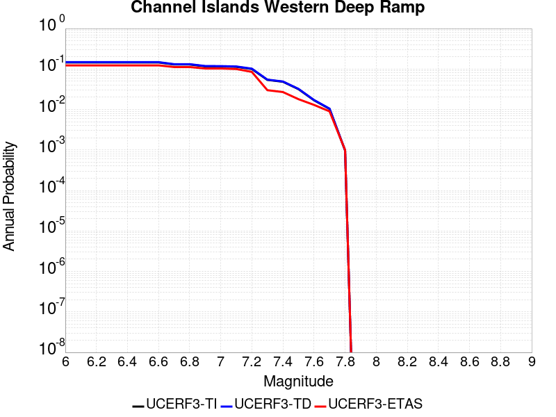 |
|-----|

| Magnitude | UCERF3-TI Prob | UCERF3-TD Prob | UCERF3-ETAS Prob |
|-----|-----|-----|-----|
| 6.0 | 0.14537561 | 0.14793576 | 0.123 |
| 6.1 | 0.14537561 | 0.14793576 | 0.123 |
| 6.2 | 0.14537561 | 0.14793576 | 0.123 |
| 6.3 | 0.14537561 | 0.14793576 | 0.123 |
| 6.4 | 0.14537561 | 0.14793576 | 0.123 |
| 6.5 | 0.14537561 | 0.14793576 | 0.123 |
| 6.6 | 0.14537561 | 0.14793576 | 0.123 |
| 6.7 | 0.12944193 | 0.13181679 | 0.112 |
| 6.8 | 0.12944193 | 0.13181679 | 0.112 |
| 6.9 | 0.116423756 | 0.118635066 | 0.103 |
| 7.0 | 0.1159126 | 0.118119754 | 0.103 |
| 7.1 | 0.11334783 | 0.11553308 | 0.1 |
| 7.2 | 0.10013014 | 0.10215643 | 0.085 |
| 7.3 | 0.053889144 | 0.05467481 | 0.03 |
| 7.4 | 0.04848997 | 0.04920517 | 0.027 |
| 7.5 | 0.031854507 | 0.032327577 | 0.018 |
| 7.6 | 0.016927926 | 0.017189384 | 0.013 |
| 7.7 | 0.010345212 | 0.010505158 | 0.009 |
| 7.8 | 9.6648745E-4 | 9.78309E-4 | 0.001 |

## Chino alt 1
*[(top)](#table-of-contents)*

| 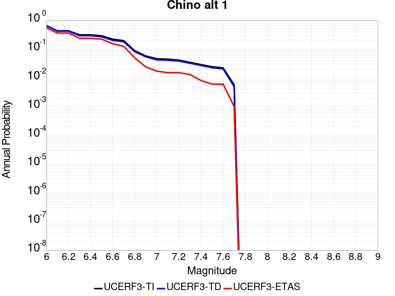 |
|-----|

| Magnitude | UCERF3-TI Prob | UCERF3-TD Prob | UCERF3-ETAS Prob |
|-----|-----|-----|-----|
| 6.0 | 0.64225113 | 0.6612078 | 0.549 |
| 6.1 | 0.42940316 | 0.41837668 | 0.359 |
| 6.2 | 0.42940316 | 0.41837668 | 0.359 |
| 6.3 | 0.3112239 | 0.29026973 | 0.236 |
| 6.4 | 0.3112239 | 0.29026973 | 0.236 |
| 6.5 | 0.28796703 | 0.2660549 | 0.22 |
| 6.6 | 0.21891174 | 0.19981346 | 0.153 |
| 6.7 | 0.1949986 | 0.17961681 | 0.124 |
| 6.8 | 0.08692561 | 0.08029829 | 0.049 |
| 6.9 | 0.057370283 | 0.053592622 | 0.024 |
| 7.0 | 0.04553657 | 0.042030584 | 0.017 |
| 7.1 | 0.04416964 | 0.040660027 | 0.015 |
| 7.2 | 0.040904514 | 0.037975285 | 0.015 |
| 7.3 | 0.034156438 | 0.03193616 | 0.013 |
| 7.4 | 0.02865265 | 0.026726829 | 0.008 |
| 7.5 | 0.024108768 | 0.022309722 | 0.006 |
| 7.6 | 0.021987375 | 0.020278499 | 0.006 |
| 7.7 | 0.0056722625 | 0.00490881 | 0.001 |

## Clamshell-Sawpit
*[(top)](#table-of-contents)*

| 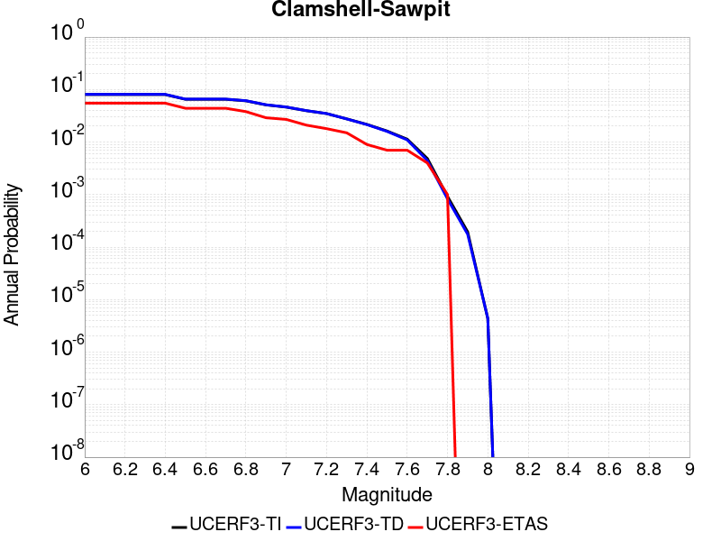 |
|-----|

| Magnitude | UCERF3-TI Prob | UCERF3-TD Prob | UCERF3-ETAS Prob |
|-----|-----|-----|-----|
| 6.0 | 0.080167845 | 0.08086739 | 0.055 |
| 6.1 | 0.080167845 | 0.08086739 | 0.055 |
| 6.2 | 0.080167845 | 0.08086739 | 0.055 |
| 6.3 | 0.080167845 | 0.08086739 | 0.055 |
| 6.4 | 0.080167845 | 0.08086739 | 0.055 |
| 6.5 | 0.06524806 | 0.06572354 | 0.044 |
| 6.6 | 0.06524806 | 0.06572354 | 0.044 |
| 6.7 | 0.06524806 | 0.06572354 | 0.044 |
| 6.8 | 0.060936466 | 0.061356697 | 0.038 |
| 6.9 | 0.051023882 | 0.05128878 | 0.029 |
| 7.0 | 0.046290193 | 0.046500254 | 0.027 |
| 7.1 | 0.039560094 | 0.03966099 | 0.021 |
| 7.2 | 0.034879602 | 0.034911506 | 0.018 |
| 7.3 | 0.02765543 | 0.027569225 | 0.015 |
| 7.4 | 0.021719642 | 0.021527546 | 0.009 |
| 7.5 | 0.01624535 | 0.015964825 | 0.007 |
| 7.6 | 0.011367763 | 0.01100937 | 0.007 |
| 7.7 | 0.0048680017 | 0.004454647 | 0.004 |
| 7.8 | 9.2258E-4 | 8.270797E-4 | 0.001 |
| 7.9 | 1.957795E-4 | 1.7562622E-4 | 0.0 |
| 8.0 | 4.3188215E-6 | 4.3808313E-6 | 0.0 |

## Clayton
*[(top)](#table-of-contents)*

| 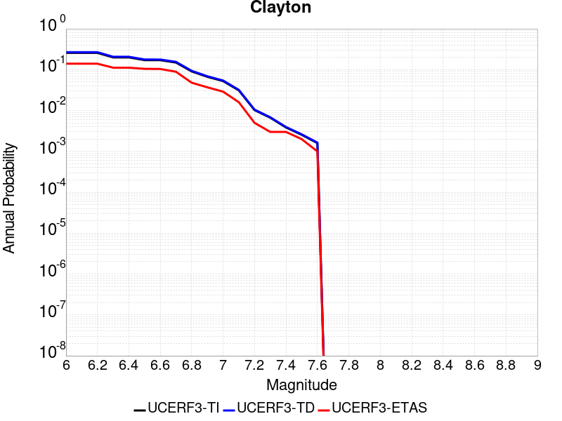 |
|-----|

| Magnitude | UCERF3-TI Prob | UCERF3-TD Prob | UCERF3-ETAS Prob |
|-----|-----|-----|-----|
| 6.0 | 0.2575207 | 0.26789606 | 0.14 |
| 6.1 | 0.2575207 | 0.26789606 | 0.14 |
| 6.2 | 0.2575207 | 0.26789606 | 0.14 |
| 6.3 | 0.1997005 | 0.20714049 | 0.112 |
| 6.4 | 0.1997005 | 0.20714049 | 0.112 |
| 6.5 | 0.17120075 | 0.17772442 | 0.105 |
| 6.6 | 0.1707376 | 0.17725278 | 0.104 |
| 6.7 | 0.14940692 | 0.1554227 | 0.089 |
| 6.8 | 0.09063639 | 0.0936734 | 0.048 |
| 6.9 | 0.066797204 | 0.06903404 | 0.037 |
| 7.0 | 0.052583437 | 0.054309685 | 0.029 |
| 7.1 | 0.031104539 | 0.03210001 | 0.016 |
| 7.2 | 0.010263096 | 0.01053449 | 0.005 |
| 7.3 | 0.0066787973 | 0.0068538277 | 0.003 |
| 7.4 | 0.0038597444 | 0.003959021 | 0.003 |
| 7.5 | 0.002552691 | 0.0026202379 | 0.002 |
| 7.6 | 0.0015968008 | 0.0016428664 | 0.001 |

## Cleghorn
*[(top)](#table-of-contents)*

| 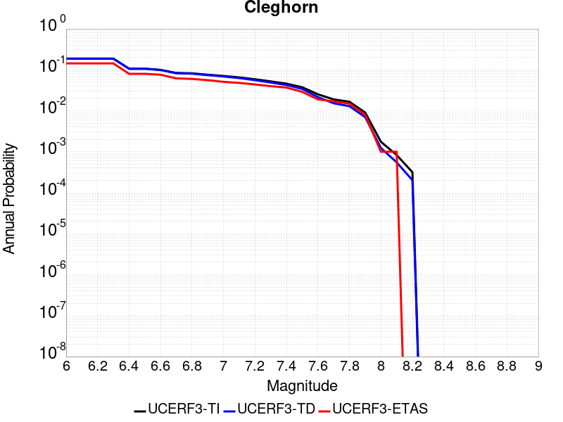 |
|-----|

| Magnitude | UCERF3-TI Prob | UCERF3-TD Prob | UCERF3-ETAS Prob |
|-----|-----|-----|-----|
| 6.0 | 0.18682033 | 0.18891598 | 0.144 |
| 6.1 | 0.18682033 | 0.18891598 | 0.144 |
| 6.2 | 0.18682033 | 0.18891598 | 0.144 |
| 6.3 | 0.18682033 | 0.18891598 | 0.144 |
| 6.4 | 0.107158035 | 0.10609193 | 0.08 |
| 6.5 | 0.107158035 | 0.10609193 | 0.08 |
| 6.6 | 0.10003893 | 0.09885402 | 0.076 |
| 6.7 | 0.084004454 | 0.082441874 | 0.062 |
| 6.8 | 0.08225997 | 0.080660455 | 0.06 |
| 6.9 | 0.07604418 | 0.07424406 | 0.056 |
| 7.0 | 0.07107538 | 0.06884852 | 0.051 |
| 7.1 | 0.06549175 | 0.06298238 | 0.048 |
| 7.2 | 0.058847878 | 0.055961024 | 0.044 |
| 7.3 | 0.05224935 | 0.04909462 | 0.04 |
| 7.4 | 0.046014547 | 0.04269297 | 0.037 |
| 7.5 | 0.03758361 | 0.034125574 | 0.029 |
| 7.6 | 0.025253827 | 0.021597523 | 0.019 |
| 7.7 | 0.01897608 | 0.015251582 | 0.017 |
| 7.8 | 0.016646227 | 0.01296716 | 0.015 |
| 7.9 | 0.009075192 | 0.0070155337 | 0.008 |
| 8.0 | 0.0017510193 | 0.0012361638 | 0.001 |
| 8.1 | 8.3411555E-4 | 5.523228E-4 | 0.001 |
| 8.2 | 3.1794564E-4 | 2.0308065E-4 | 0.0 |

## Cleghorn Lake
*[(top)](#table-of-contents)*

| 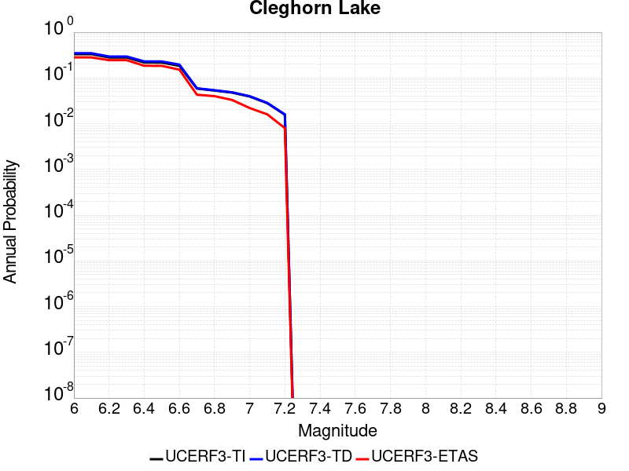 |
|-----|

| Magnitude | UCERF3-TI Prob | UCERF3-TD Prob | UCERF3-ETAS Prob |
|-----|-----|-----|-----|
| 6.0 | 0.3320426 | 0.34755236 | 0.281 |
| 6.1 | 0.3320426 | 0.34755236 | 0.281 |
| 6.2 | 0.280623 | 0.29495075 | 0.245 |
| 6.3 | 0.280623 | 0.29495075 | 0.245 |
| 6.4 | 0.21784458 | 0.23037551 | 0.185 |
| 6.5 | 0.21683453 | 0.2293633 | 0.184 |
| 6.6 | 0.18420838 | 0.19638726 | 0.152 |
| 6.7 | 0.058507536 | 0.059507016 | 0.043 |
| 6.8 | 0.053024314 | 0.053918425 | 0.04 |
| 6.9 | 0.04778834 | 0.048585184 | 0.033 |
| 7.0 | 0.039274745 | 0.039926473 | 0.022 |
| 7.1 | 0.028050553 | 0.028515508 | 0.016 |
| 7.2 | 0.015702942 | 0.015962126 | 0.008 |

## Cleghorn Pass
*[(top)](#table-of-contents)*

| 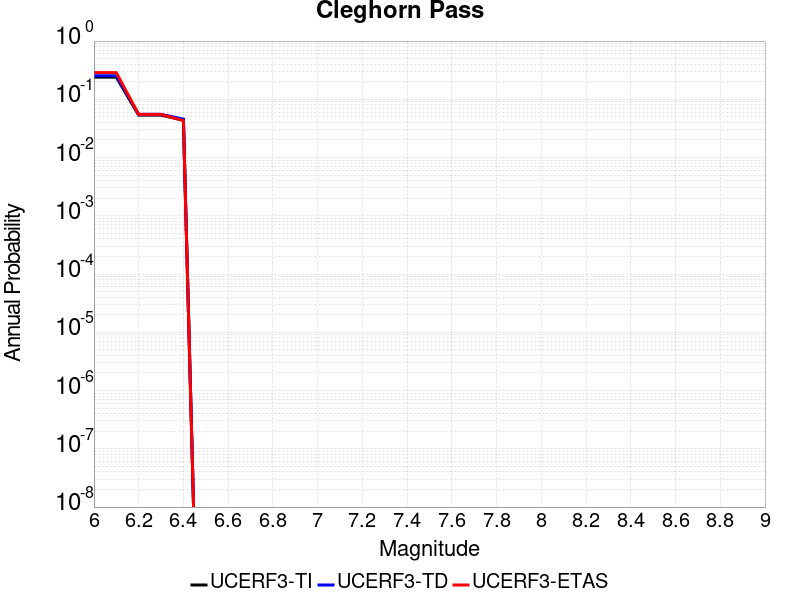 |
|-----|

| Magnitude | UCERF3-TI Prob | UCERF3-TD Prob | UCERF3-ETAS Prob |
|-----|-----|-----|-----|
| 6.0 | 0.24007457 | 0.25394347 | 0.287 |
| 6.1 | 0.24007457 | 0.25394347 | 0.287 |
| 6.2 | 0.053426985 | 0.055220928 | 0.055 |
| 6.3 | 0.053426985 | 0.055220928 | 0.055 |
| 6.4 | 0.044031154 | 0.045681644 | 0.043 |

## Collayami 2011 CFM
*[(top)](#table-of-contents)*

| 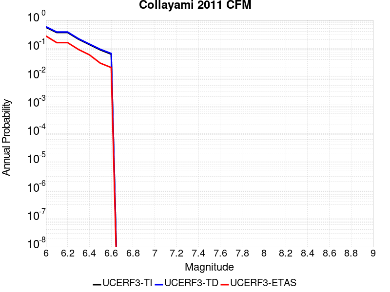 |
|-----|

| Magnitude | UCERF3-TI Prob | UCERF3-TD Prob | UCERF3-ETAS Prob |
|-----|-----|-----|-----|
| 6.0 | 0.556041 | 0.583512 | 0.274 |
| 6.1 | 0.3602245 | 0.37657222 | 0.159 |
| 6.2 | 0.3602245 | 0.37657222 | 0.159 |
| 6.3 | 0.21012597 | 0.21906751 | 0.091 |
| 6.4 | 0.13586608 | 0.14194292 | 0.059 |
| 6.5 | 0.08799748 | 0.09244383 | 0.03 |
| 6.6 | 0.06222611 | 0.065924376 | 0.021 |

## Compton
*[(top)](#table-of-contents)*

| 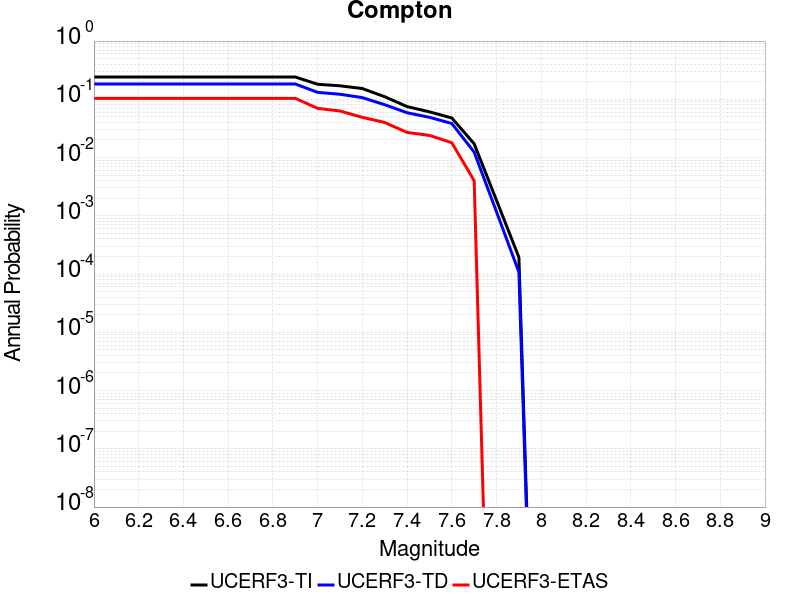 |
|-----|

| Magnitude | UCERF3-TI Prob | UCERF3-TD Prob | UCERF3-ETAS Prob |
|-----|-----|-----|-----|
| 6.0 | 0.24170336 | 0.18341748 | 0.104 |
| 6.1 | 0.24170336 | 0.18341748 | 0.104 |
| 6.2 | 0.24170336 | 0.18341748 | 0.104 |
| 6.3 | 0.24170336 | 0.18341748 | 0.104 |
| 6.4 | 0.24170336 | 0.18341748 | 0.104 |
| 6.5 | 0.24170336 | 0.18341748 | 0.104 |
| 6.6 | 0.24170336 | 0.18341748 | 0.104 |
| 6.7 | 0.24170336 | 0.18341748 | 0.104 |
| 6.8 | 0.24170336 | 0.18341748 | 0.104 |
| 6.9 | 0.24170336 | 0.18341748 | 0.104 |
| 7.0 | 0.18140881 | 0.13160957 | 0.07 |
| 7.1 | 0.17047672 | 0.12215799 | 0.063 |
| 7.2 | 0.15309018 | 0.10693861 | 0.049 |
| 7.3 | 0.11074426 | 0.08072878 | 0.04 |
| 7.4 | 0.07497687 | 0.058842227 | 0.027 |
| 7.5 | 0.060968045 | 0.04909119 | 0.024 |
| 7.6 | 0.04782249 | 0.038428497 | 0.018 |
| 7.7 | 0.017237391 | 0.012410981 | 0.004 |
| 7.8 | 0.0018388254 | 0.0011680146 | 0.0 |
| 7.9 | 1.935879E-4 | 1.0765906E-4 | 0.0 |

## Concord 2011 CFM
*[(top)](#table-of-contents)*

| 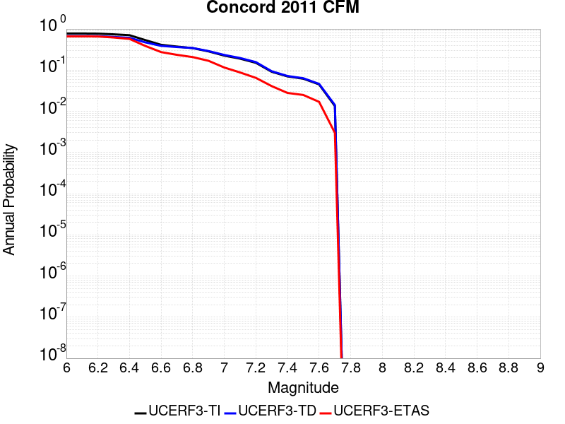 |
|-----|

| Magnitude | UCERF3-TI Prob | UCERF3-TD Prob | UCERF3-ETAS Prob |
|-----|-----|-----|-----|
| 6.0 | 0.7790244 | 0.67634636 | 0.663 |
| 6.1 | 0.7790244 | 0.67634636 | 0.663 |
| 6.2 | 0.7727343 | 0.67028964 | 0.659 |
| 6.3 | 0.7427083 | 0.6412849 | 0.622 |
| 6.4 | 0.7075263 | 0.6106078 | 0.575 |
| 6.5 | 0.5380107 | 0.4737331 | 0.388 |
| 6.6 | 0.4133738 | 0.38926682 | 0.275 |
| 6.7 | 0.37451643 | 0.36508706 | 0.236 |
| 6.8 | 0.34358913 | 0.34558642 | 0.208 |
| 6.9 | 0.28607884 | 0.29141816 | 0.169 |
| 7.0 | 0.22583543 | 0.23454268 | 0.116 |
| 7.1 | 0.19025426 | 0.19752693 | 0.088 |
| 7.2 | 0.15084496 | 0.15703891 | 0.065 |
| 7.3 | 0.09145196 | 0.09422261 | 0.041 |
| 7.4 | 0.07055331 | 0.07225518 | 0.028 |
| 7.5 | 0.062111445 | 0.06370853 | 0.025 |
| 7.6 | 0.045161143 | 0.04645302 | 0.017 |
| 7.7 | 0.013452267 | 0.014233105 | 0.003 |

## Contra Costa (Lafayette) 2011 CFM
*[(top)](#table-of-contents)*

| 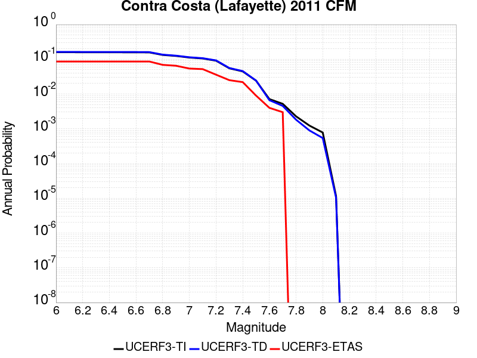 |
|-----|

| Magnitude | UCERF3-TI Prob | UCERF3-TD Prob | UCERF3-ETAS Prob |
|-----|-----|-----|-----|
| 6.0 | 0.15939693 | 0.16256881 | 0.086 |
| 6.1 | 0.15939693 | 0.16256881 | 0.086 |
| 6.2 | 0.15873863 | 0.16190255 | 0.086 |
| 6.3 | 0.15873863 | 0.16190255 | 0.086 |
| 6.4 | 0.15873863 | 0.16190255 | 0.086 |
| 6.5 | 0.1583222 | 0.16147897 | 0.086 |
| 6.6 | 0.1581732 | 0.16132702 | 0.086 |
| 6.7 | 0.15723789 | 0.16037577 | 0.086 |
| 6.8 | 0.13304448 | 0.1354675 | 0.069 |
| 6.9 | 0.12440883 | 0.12664342 | 0.065 |
| 7.0 | 0.111991294 | 0.113939 | 0.054 |
| 7.1 | 0.105222166 | 0.10701335 | 0.052 |
| 7.2 | 0.09093019 | 0.09246166 | 0.036 |
| 7.3 | 0.05478249 | 0.055626374 | 0.025 |
| 7.4 | 0.044711318 | 0.045350872 | 0.022 |
| 7.5 | 0.024194803 | 0.024091411 | 0.009 |
| 7.6 | 0.0071415985 | 0.006356918 | 0.004 |
| 7.7 | 0.005219317 | 0.004426502 | 0.003 |
| 7.8 | 0.0022777077 | 0.0018083875 | 0.0 |
| 7.9 | 0.0012359286 | 8.938107E-4 | 0.0 |
| 8.0 | 7.80193E-4 | 5.400588E-4 | 0.0 |
| 8.1 | 1.156065E-5 | 1.0113113E-5 | 0.0 |

## Contra Costa Shear Zone (connector) 2011 CFM
*[(top)](#table-of-contents)*

| 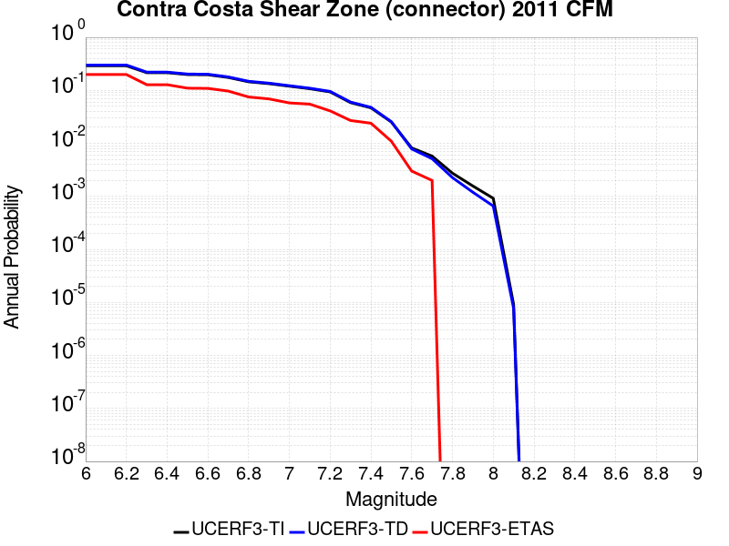 |
|-----|

| Magnitude | UCERF3-TI Prob | UCERF3-TD Prob | UCERF3-ETAS Prob |
|-----|-----|-----|-----|
| 6.0 | 0.29110852 | 0.30053458 | 0.199 |
| 6.1 | 0.29110852 | 0.30053458 | 0.199 |
| 6.2 | 0.29110852 | 0.30053458 | 0.199 |
| 6.3 | 0.21575403 | 0.2205704 | 0.128 |
| 6.4 | 0.21575403 | 0.2205704 | 0.128 |
| 6.5 | 0.1987384 | 0.20313737 | 0.11 |
| 6.6 | 0.19684294 | 0.20120963 | 0.109 |
| 6.7 | 0.17521557 | 0.17898847 | 0.097 |
| 6.8 | 0.1450092 | 0.1479306 | 0.075 |
| 6.9 | 0.13379058 | 0.13643819 | 0.069 |
| 7.0 | 0.11981842 | 0.12213255 | 0.058 |
| 7.1 | 0.1075162 | 0.109474175 | 0.055 |
| 7.2 | 0.09355138 | 0.09522079 | 0.041 |
| 7.3 | 0.058682445 | 0.059717696 | 0.027 |
| 7.4 | 0.046816517 | 0.047517322 | 0.024 |
| 7.5 | 0.025346402 | 0.02526264 | 0.011 |
| 7.6 | 0.0082111005 | 0.0074372226 | 0.003 |
| 7.7 | 0.005755832 | 0.0049563646 | 0.002 |
| 7.8 | 0.002738112 | 0.002214545 | 0.0 |
| 7.9 | 0.0015717698 | 0.0011750784 | 0.0 |
| 8.0 | 9.2080625E-4 | 6.569382E-4 | 0.0 |
| 8.1 | 9.193365E-6 | 7.5936314E-6 | 0.0 |

## Coronado Bank alt1
*[(top)](#table-of-contents)*

| 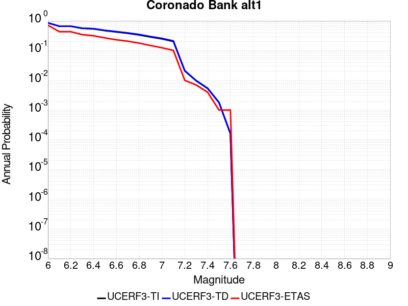 |
|-----|

| Magnitude | UCERF3-TI Prob | UCERF3-TD Prob | UCERF3-ETAS Prob |
|-----|-----|-----|-----|
| 6.0 | 0.8599154 | 0.8631793 | 0.72 |
| 6.1 | 0.6640339 | 0.66596603 | 0.434 |
| 6.2 | 0.6640339 | 0.66596603 | 0.434 |
| 6.3 | 0.56372064 | 0.56987065 | 0.346 |
| 6.4 | 0.5413682 | 0.5486214 | 0.318 |
| 6.5 | 0.47245607 | 0.48202398 | 0.268 |
| 6.6 | 0.42659444 | 0.43712544 | 0.232 |
| 6.7 | 0.38423568 | 0.395617 | 0.208 |
| 6.8 | 0.33890283 | 0.34975287 | 0.179 |
| 6.9 | 0.28803328 | 0.29801127 | 0.149 |
| 7.0 | 0.24897406 | 0.25818935 | 0.125 |
| 7.1 | 0.20443717 | 0.21270946 | 0.102 |
| 7.2 | 0.020721626 | 0.021144733 | 0.01 |
| 7.3 | 0.00968233 | 0.009855254 | 0.007 |
| 7.4 | 0.005348828 | 0.0054449784 | 0.004 |
| 7.5 | 0.0017843343 | 0.0018173486 | 0.001 |
| 7.6 | 1.5906715E-4 | 1.624121E-4 | 0.001 |

## Coyote Canyon
*[(top)](#table-of-contents)*

| 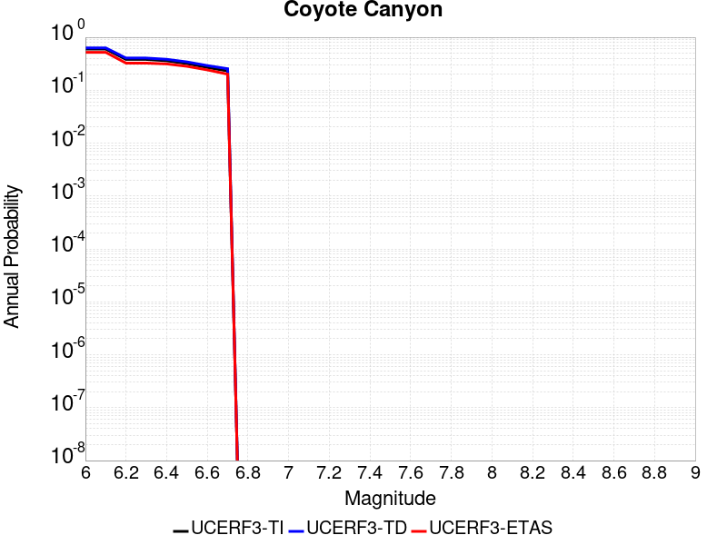 |
|-----|

| Magnitude | UCERF3-TI Prob | UCERF3-TD Prob | UCERF3-ETAS Prob |
|-----|-----|-----|-----|
| 6.0 | 0.5996796 | 0.63132524 | 0.52 |
| 6.1 | 0.5996796 | 0.63132524 | 0.52 |
| 6.2 | 0.38154912 | 0.40490973 | 0.325 |
| 6.3 | 0.38154912 | 0.40490973 | 0.325 |
| 6.4 | 0.36026728 | 0.38382944 | 0.314 |
| 6.5 | 0.3193368 | 0.34250838 | 0.283 |
| 6.6 | 0.26914394 | 0.2921078 | 0.242 |
| 6.7 | 0.23155676 | 0.25457945 | 0.201 |

## Coyote Lake
*[(top)](#table-of-contents)*

| 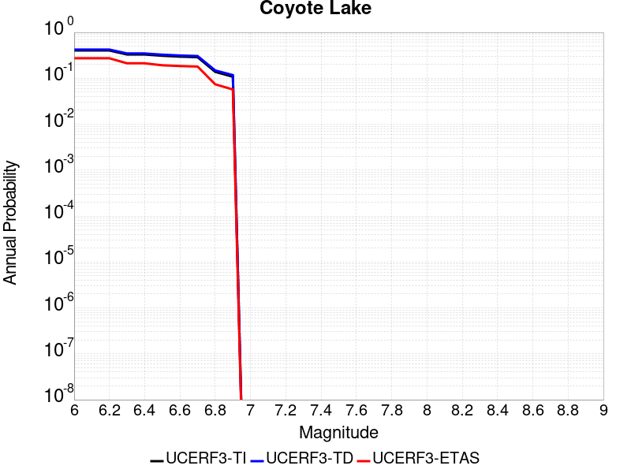 |
|-----|

| Magnitude | UCERF3-TI Prob | UCERF3-TD Prob | UCERF3-ETAS Prob |
|-----|-----|-----|-----|
| 6.0 | 0.40349331 | 0.4222884 | 0.273 |
| 6.1 | 0.40349331 | 0.4222884 | 0.273 |
| 6.2 | 0.40349331 | 0.4222884 | 0.273 |
| 6.3 | 0.32990623 | 0.34737146 | 0.212 |
| 6.4 | 0.32990623 | 0.34737146 | 0.212 |
| 6.5 | 0.30940497 | 0.32675108 | 0.192 |
| 6.6 | 0.29630256 | 0.31360665 | 0.185 |
| 6.7 | 0.2881532 | 0.3054085 | 0.18 |
| 6.8 | 0.13807777 | 0.14811963 | 0.074 |
| 6.9 | 0.10811646 | 0.11743605 | 0.057 |

## Cucamonga
*[(top)](#table-of-contents)*

| 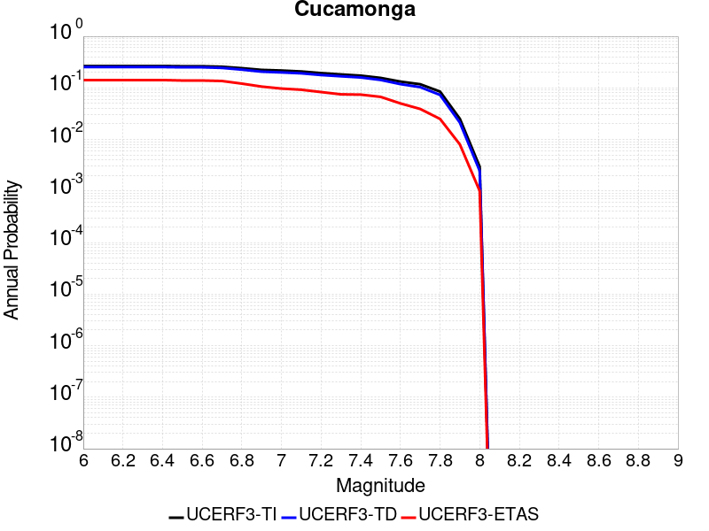 |
|-----|

| Magnitude | UCERF3-TI Prob | UCERF3-TD Prob | UCERF3-ETAS Prob |
|-----|-----|-----|-----|
| 6.0 | 0.26590493 | 0.25375482 | 0.142 |
| 6.1 | 0.26590493 | 0.25375482 | 0.142 |
| 6.2 | 0.26590493 | 0.25375482 | 0.142 |
| 6.3 | 0.26590493 | 0.25375482 | 0.142 |
| 6.4 | 0.26590493 | 0.25375482 | 0.142 |
| 6.5 | 0.26303652 | 0.25077084 | 0.139 |
| 6.6 | 0.26303652 | 0.25077084 | 0.139 |
| 6.7 | 0.2572116 | 0.2441469 | 0.136 |
| 6.8 | 0.24128349 | 0.22597077 | 0.121 |
| 6.9 | 0.22338271 | 0.20623589 | 0.106 |
| 7.0 | 0.21710505 | 0.1994413 | 0.097 |
| 7.1 | 0.20817006 | 0.19164492 | 0.092 |
| 7.2 | 0.19367145 | 0.17759615 | 0.083 |
| 7.3 | 0.1823777 | 0.16792992 | 0.075 |
| 7.4 | 0.1728891 | 0.15925634 | 0.074 |
| 7.5 | 0.15622263 | 0.14258447 | 0.067 |
| 7.6 | 0.13253039 | 0.11832561 | 0.05 |
| 7.7 | 0.11769853 | 0.1034111 | 0.039 |
| 7.8 | 0.084744215 | 0.07307304 | 0.025 |
| 7.9 | 0.025117673 | 0.02119359 | 0.008 |
| 8.0 | 0.002953781 | 0.0024531141 | 0.001 |

## Davis Creek
*[(top)](#table-of-contents)*

| 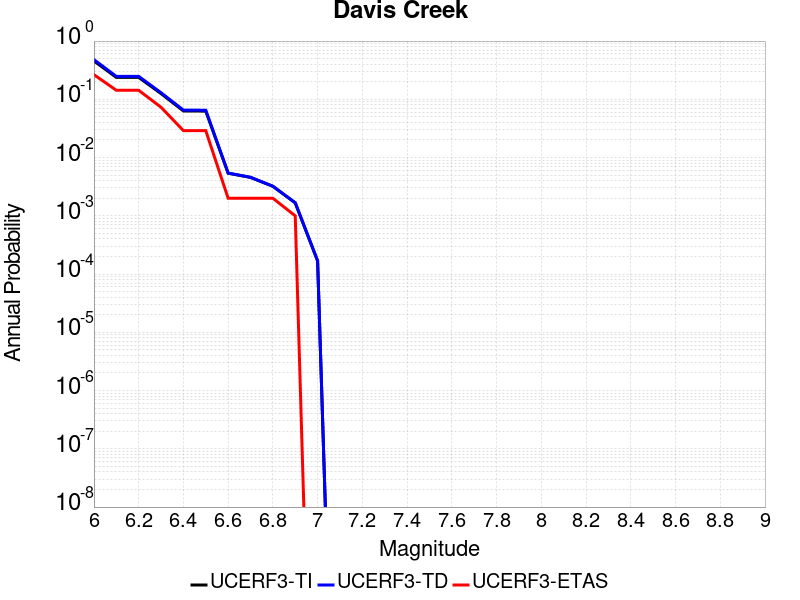 |
|-----|

| Magnitude | UCERF3-TI Prob | UCERF3-TD Prob | UCERF3-ETAS Prob |
|-----|-----|-----|-----|
| 6.0 | 0.45570913 | 0.48000547 | 0.265 |
| 6.1 | 0.23778735 | 0.24781075 | 0.143 |
| 6.2 | 0.23778735 | 0.24781075 | 0.143 |
| 6.3 | 0.12532169 | 0.12988342 | 0.073 |
| 6.4 | 0.06310547 | 0.06530526 | 0.029 |
| 6.5 | 0.06276634 | 0.06496547 | 0.029 |
| 6.6 | 0.005392585 | 0.005415947 | 0.002 |
| 6.7 | 0.004566783 | 0.004586485 | 0.002 |
| 6.8 | 0.003209143 | 0.0032220604 | 0.002 |
| 6.9 | 0.0016683204 | 0.001675257 | 0.001 |
| 7.0 | 1.6814613E-4 | 1.6886594E-4 | 0.0 |

## Death Valley (Black Mtns Frontal)
*[(top)](#table-of-contents)*

| 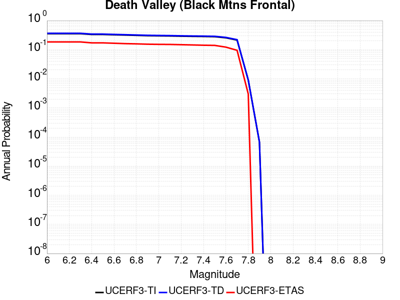 |
|-----|

| Magnitude | UCERF3-TI Prob | UCERF3-TD Prob | UCERF3-ETAS Prob |
|-----|-----|-----|-----|
| 6.0 | 0.35330656 | 0.3634144 | 0.184 |
| 6.1 | 0.35330656 | 0.3634144 | 0.184 |
| 6.2 | 0.35330656 | 0.3634144 | 0.184 |
| 6.3 | 0.35330656 | 0.3634144 | 0.184 |
| 6.4 | 0.33288598 | 0.34254593 | 0.171 |
| 6.5 | 0.33288598 | 0.34254593 | 0.171 |
| 6.6 | 0.32458875 | 0.33411896 | 0.166 |
| 6.7 | 0.31738147 | 0.3268061 | 0.161 |
| 6.8 | 0.3097555 | 0.31902796 | 0.158 |
| 6.9 | 0.3019855 | 0.31110138 | 0.154 |
| 7.0 | 0.2984247 | 0.30747938 | 0.152 |
| 7.1 | 0.29500338 | 0.30399963 | 0.151 |
| 7.2 | 0.2899773 | 0.29888675 | 0.148 |
| 7.3 | 0.28619048 | 0.2950326 | 0.145 |
| 7.4 | 0.28332514 | 0.29211682 | 0.142 |
| 7.5 | 0.27869287 | 0.28741136 | 0.14 |
| 7.6 | 0.25534853 | 0.26356077 | 0.122 |
| 7.7 | 0.21316631 | 0.22036088 | 0.095 |
| 7.8 | 0.008982842 | 0.009127193 | 0.003 |
| 7.9 | 6.676333E-5 | 6.761812E-5 | 0.0 |

## Death Valley (Fish Lake Valley)
*[(top)](#table-of-contents)*

| 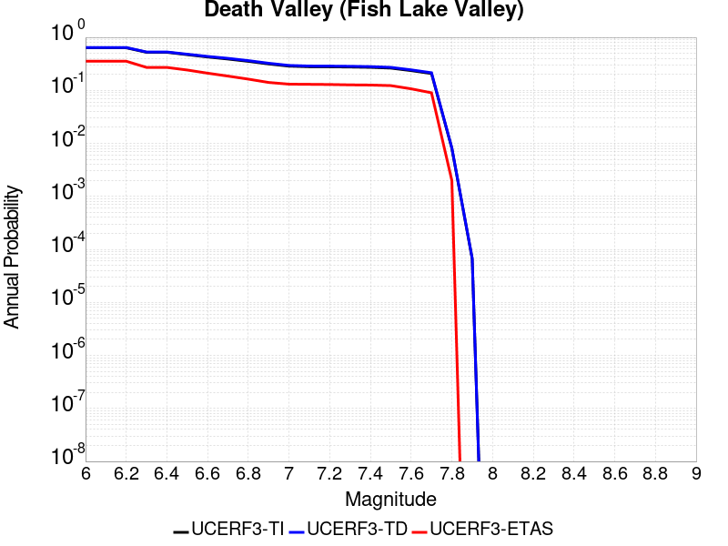 |
|-----|

| Magnitude | UCERF3-TI Prob | UCERF3-TD Prob | UCERF3-ETAS Prob |
|-----|-----|-----|-----|
| 6.0 | 0.6358838 | 0.6437717 | 0.355 |
| 6.1 | 0.6358838 | 0.6437717 | 0.355 |
| 6.2 | 0.6358838 | 0.6437717 | 0.355 |
| 6.3 | 0.5227945 | 0.5304064 | 0.271 |
| 6.4 | 0.5227945 | 0.5304064 | 0.271 |
| 6.5 | 0.47157615 | 0.48140344 | 0.242 |
| 6.6 | 0.42630634 | 0.43755856 | 0.211 |
| 6.7 | 0.390216 | 0.40235046 | 0.186 |
| 6.8 | 0.35304356 | 0.36429858 | 0.163 |
| 6.9 | 0.3150635 | 0.32502326 | 0.141 |
| 7.0 | 0.28653353 | 0.29565048 | 0.131 |
| 7.1 | 0.27912045 | 0.2880581 | 0.13 |
| 7.2 | 0.27808073 | 0.28699785 | 0.129 |
| 7.3 | 0.2757961 | 0.28466558 | 0.127 |
| 7.4 | 0.27188203 | 0.280668 | 0.126 |
| 7.5 | 0.26321104 | 0.27184302 | 0.123 |
| 7.6 | 0.23603307 | 0.24394888 | 0.107 |
| 7.7 | 0.20798972 | 0.21517506 | 0.09 |
| 7.8 | 0.008075784 | 0.008210172 | 0.002 |
| 7.9 | 6.676333E-5 | 6.761812E-5 | 0.0 |

## Death Valley (No)
*[(top)](#table-of-contents)*

| 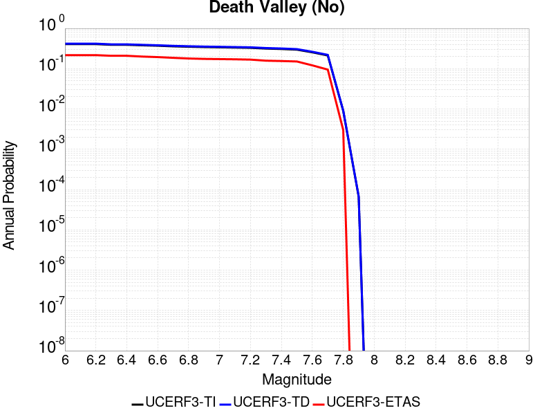 |
|-----|

| Magnitude | UCERF3-TI Prob | UCERF3-TD Prob | UCERF3-ETAS Prob |
|-----|-----|-----|-----|
| 6.0 | 0.4077004 | 0.41839516 | 0.217 |
| 6.1 | 0.4077004 | 0.41839516 | 0.217 |
| 6.2 | 0.4077004 | 0.41839516 | 0.217 |
| 6.3 | 0.39166012 | 0.40217617 | 0.209 |
| 6.4 | 0.39166012 | 0.40217617 | 0.209 |
| 6.5 | 0.38071296 | 0.39112794 | 0.2 |
| 6.6 | 0.37139177 | 0.38172054 | 0.194 |
| 6.7 | 0.35865343 | 0.36886546 | 0.186 |
| 6.8 | 0.3505657 | 0.36068374 | 0.179 |
| 6.9 | 0.34391838 | 0.35398525 | 0.175 |
| 7.0 | 0.33944476 | 0.34948313 | 0.173 |
| 7.1 | 0.3343925 | 0.34437332 | 0.171 |
| 7.2 | 0.32953972 | 0.33944038 | 0.168 |
| 7.3 | 0.31597713 | 0.32555753 | 0.158 |
| 7.4 | 0.30809844 | 0.31751 | 0.155 |
| 7.5 | 0.2969267 | 0.30614647 | 0.151 |
| 7.6 | 0.25493556 | 0.26314902 | 0.121 |
| 7.7 | 0.21316631 | 0.22036088 | 0.095 |
| 7.8 | 0.008982842 | 0.009127193 | 0.003 |
| 7.9 | 6.676333E-5 | 6.761812E-5 | 0.0 |

## Death Valley (So)
*[(top)](#table-of-contents)*

| 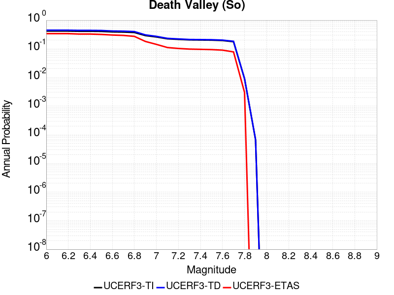 |
|-----|

| Magnitude | UCERF3-TI Prob | UCERF3-TD Prob | UCERF3-ETAS Prob |
|-----|-----|-----|-----|
| 6.0 | 0.4170434 | 0.44735017 | 0.339 |
| 6.1 | 0.4170434 | 0.44735017 | 0.339 |
| 6.2 | 0.4170434 | 0.44735017 | 0.339 |
| 6.3 | 0.4102521 | 0.44073474 | 0.328 |
| 6.4 | 0.4102521 | 0.44073474 | 0.328 |
| 6.5 | 0.40596646 | 0.4365612 | 0.318 |
| 6.6 | 0.389859 | 0.41933587 | 0.303 |
| 6.7 | 0.38480476 | 0.41418263 | 0.294 |
| 6.8 | 0.3719813 | 0.39994898 | 0.272 |
| 6.9 | 0.2901416 | 0.30679205 | 0.181 |
| 7.0 | 0.25934806 | 0.27203128 | 0.143 |
| 7.1 | 0.22390643 | 0.23203559 | 0.111 |
| 7.2 | 0.21407233 | 0.2214437 | 0.103 |
| 7.3 | 0.20522363 | 0.21182667 | 0.098 |
| 7.4 | 0.20324339 | 0.20982963 | 0.096 |
| 7.5 | 0.20124386 | 0.20780937 | 0.094 |
| 7.6 | 0.19510087 | 0.20155546 | 0.09 |
| 7.7 | 0.17711227 | 0.18313292 | 0.078 |
| 7.8 | 0.008982842 | 0.009127193 | 0.003 |
| 7.9 | 6.676333E-5 | 6.761812E-5 | 0.0 |

## Deep Springs
*[(top)](#table-of-contents)*

| 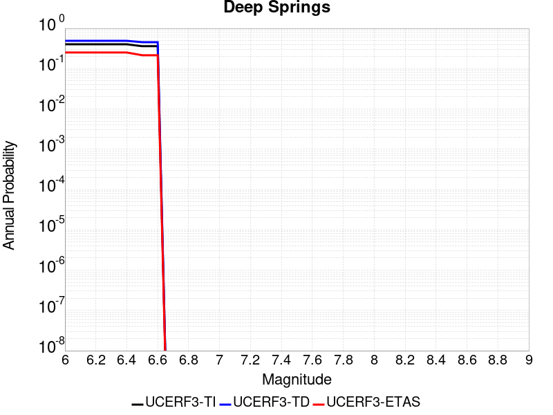 |
|-----|

| Magnitude | UCERF3-TI Prob | UCERF3-TD Prob | UCERF3-ETAS Prob |
|-----|-----|-----|-----|
| 6.0 | 0.40360376 | 0.49191916 | 0.252 |
| 6.1 | 0.40360376 | 0.49191916 | 0.252 |
| 6.2 | 0.40360376 | 0.49191916 | 0.252 |
| 6.3 | 0.40360376 | 0.49191916 | 0.252 |
| 6.4 | 0.40360376 | 0.49191916 | 0.252 |
| 6.5 | 0.36140782 | 0.45481473 | 0.216 |
| 6.6 | 0.36140782 | 0.45481473 | 0.216 |

## Del Valle
*[(top)](#table-of-contents)*

| 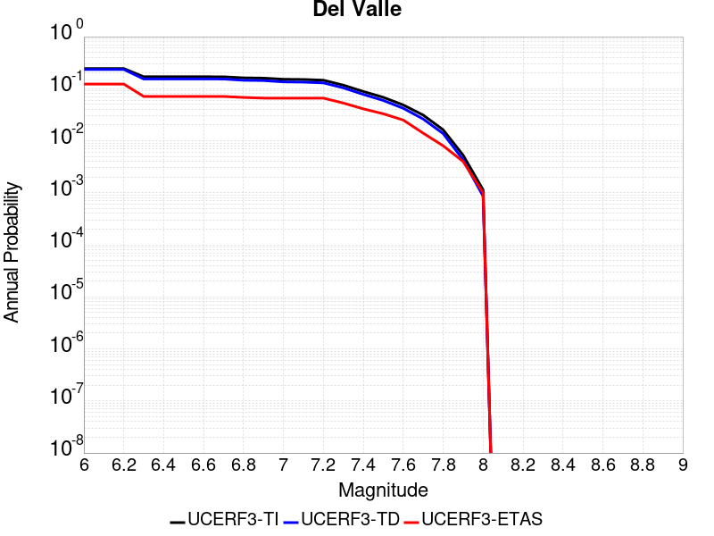 |
|-----|

| Magnitude | UCERF3-TI Prob | UCERF3-TD Prob | UCERF3-ETAS Prob |
|-----|-----|-----|-----|
| 6.0 | 0.2438969 | 0.23493755 | 0.123 |
| 6.1 | 0.2438969 | 0.23493755 | 0.123 |
| 6.2 | 0.2438969 | 0.23493755 | 0.123 |
| 6.3 | 0.16972728 | 0.15385808 | 0.071 |
| 6.4 | 0.16972728 | 0.15385808 | 0.071 |
| 6.5 | 0.16972728 | 0.15385808 | 0.071 |
| 6.6 | 0.16972728 | 0.15385808 | 0.071 |
| 6.7 | 0.16958304 | 0.15370756 | 0.071 |
| 6.8 | 0.16159704 | 0.14528826 | 0.068 |
| 6.9 | 0.15971749 | 0.14364156 | 0.066 |
| 7.0 | 0.15196753 | 0.1354381 | 0.066 |
| 7.1 | 0.15043104 | 0.13390058 | 0.066 |
| 7.2 | 0.14581795 | 0.12949398 | 0.066 |
| 7.3 | 0.11699391 | 0.10391777 | 0.053 |
| 7.4 | 0.088516355 | 0.07780687 | 0.041 |
| 7.5 | 0.06834184 | 0.05952016 | 0.033 |
| 7.6 | 0.0487419 | 0.04214181 | 0.025 |
| 7.7 | 0.031126674 | 0.026211064 | 0.014 |
| 7.8 | 0.016231032 | 0.013779399 | 0.008 |
| 7.9 | 0.0052802125 | 0.0043582604 | 0.004 |
| 8.0 | 0.0011406228 | 8.843633E-4 | 0.001 |

## Dog Valley
*[(top)](#table-of-contents)*

| 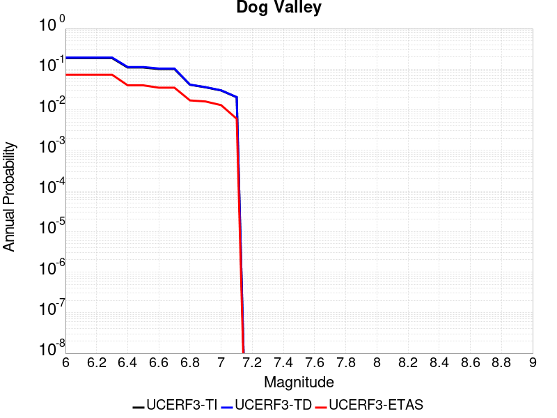 |
|-----|

| Magnitude | UCERF3-TI Prob | UCERF3-TD Prob | UCERF3-ETAS Prob |
|-----|-----|-----|-----|
| 6.0 | 0.1873056 | 0.19359188 | 0.073 |
| 6.1 | 0.1873056 | 0.19359188 | 0.073 |
| 6.2 | 0.1873056 | 0.19359188 | 0.073 |
| 6.3 | 0.1873056 | 0.19359188 | 0.073 |
| 6.4 | 0.10989345 | 0.11312654 | 0.04 |
| 6.5 | 0.10989345 | 0.11312654 | 0.04 |
| 6.6 | 0.10083931 | 0.103946075 | 0.035 |
| 6.7 | 0.10083931 | 0.103946075 | 0.035 |
| 6.8 | 0.041282788 | 0.041681603 | 0.017 |
| 6.9 | 0.035746936 | 0.03609886 | 0.016 |
| 7.0 | 0.029859101 | 0.03016403 | 0.013 |
| 7.1 | 0.020328866 | 0.020542031 | 0.006 |

## Dry Mountain
*[(top)](#table-of-contents)*

| 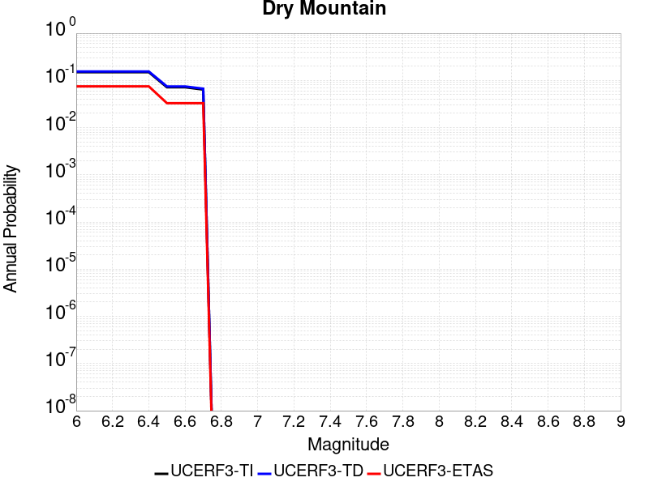 |
|-----|

| Magnitude | UCERF3-TI Prob | UCERF3-TD Prob | UCERF3-ETAS Prob |
|-----|-----|-----|-----|
| 6.0 | 0.1498555 | 0.15492117 | 0.075 |
| 6.1 | 0.1498555 | 0.15492117 | 0.075 |
| 6.2 | 0.1498555 | 0.15492117 | 0.075 |
| 6.3 | 0.1498555 | 0.15492117 | 0.075 |
| 6.4 | 0.1498555 | 0.15492117 | 0.075 |
| 6.5 | 0.07172685 | 0.074633084 | 0.033 |
| 6.6 | 0.07172685 | 0.074633084 | 0.033 |
| 6.7 | 0.064143345 | 0.06697823 | 0.033 |

## Earthquake Valley
*[(top)](#table-of-contents)*

| 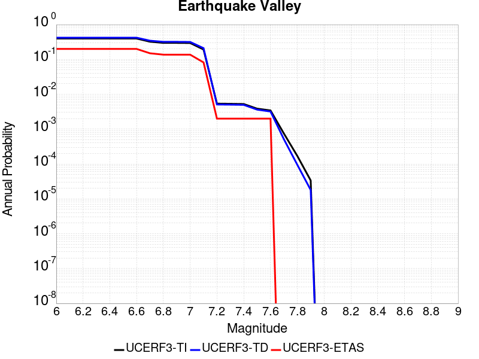 |
|-----|

| Magnitude | UCERF3-TI Prob | UCERF3-TD Prob | UCERF3-ETAS Prob |
|-----|-----|-----|-----|
| 6.0 | 0.39743787 | 0.42089236 | 0.2 |
| 6.1 | 0.39743787 | 0.42089236 | 0.2 |
| 6.2 | 0.39743787 | 0.42089236 | 0.2 |
| 6.3 | 0.39743787 | 0.42089236 | 0.2 |
| 6.4 | 0.39743787 | 0.42089236 | 0.2 |
| 6.5 | 0.3970097 | 0.42047298 | 0.2 |
| 6.6 | 0.3970097 | 0.42047298 | 0.2 |
| 6.7 | 0.3225346 | 0.34440455 | 0.15 |
| 6.8 | 0.29815504 | 0.31963167 | 0.137 |
| 6.9 | 0.29815504 | 0.31963167 | 0.137 |
| 7.0 | 0.295643 | 0.31711063 | 0.137 |
| 7.1 | 0.19221005 | 0.21048714 | 0.082 |
| 7.2 | 0.00537658 | 0.00508598 | 0.002 |
| 7.3 | 0.005324264 | 0.0050310665 | 0.002 |
| 7.4 | 0.0052486705 | 0.00496026 | 0.002 |
| 7.5 | 0.0038662297 | 0.0036242276 | 0.002 |
| 7.6 | 0.0034341833 | 0.0032007166 | 0.002 |
| 7.7 | 7.461348E-4 | 5.121815E-4 | 0.0 |
| 7.8 | 1.702772E-4 | 9.48564E-5 | 0.0 |
| 7.9 | 3.3650093E-5 | 1.7975904E-5 | 0.0 |

## Earthquake Valley (No  Extension)
*[(top)](#table-of-contents)*

| 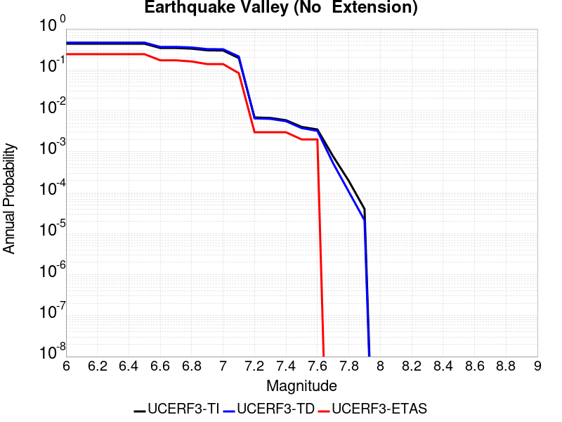 |
|-----|

| Magnitude | UCERF3-TI Prob | UCERF3-TD Prob | UCERF3-ETAS Prob |
|-----|-----|-----|-----|
| 6.0 | 0.43465 | 0.46236622 | 0.241 |
| 6.1 | 0.43465 | 0.46236622 | 0.241 |
| 6.2 | 0.43465 | 0.46236622 | 0.241 |
| 6.3 | 0.43465 | 0.46236622 | 0.241 |
| 6.4 | 0.43465 | 0.46236622 | 0.241 |
| 6.5 | 0.43465 | 0.46236622 | 0.241 |
| 6.6 | 0.34074783 | 0.36297497 | 0.171 |
| 6.7 | 0.34074783 | 0.36297497 | 0.171 |
| 6.8 | 0.32938787 | 0.35153404 | 0.16 |
| 6.9 | 0.29933313 | 0.32073802 | 0.138 |
| 7.0 | 0.29679754 | 0.31819278 | 0.138 |
| 7.1 | 0.19349857 | 0.2117013 | 0.083 |
| 7.2 | 0.006891508 | 0.006541125 | 0.003 |
| 7.3 | 0.0067111515 | 0.006366294 | 0.003 |
| 7.4 | 0.005898559 | 0.0055794474 | 0.003 |
| 7.5 | 0.004049684 | 0.0037850314 | 0.002 |
| 7.6 | 0.0035025033 | 0.0032497179 | 0.002 |
| 7.7 | 7.750575E-4 | 5.2571966E-4 | 0.0 |
| 7.8 | 1.9405987E-4 | 1.05604944E-4 | 0.0 |
| 7.9 | 4.0107643E-5 | 2.1250577E-5 | 0.0 |

## Earthquake Valley (So Extension)
*[(top)](#table-of-contents)*

| 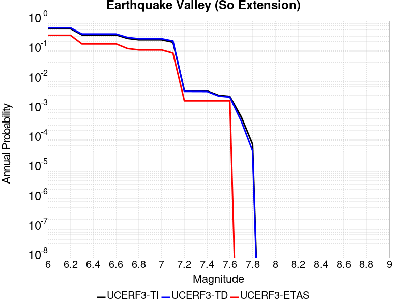 |
|-----|

| Magnitude | UCERF3-TI Prob | UCERF3-TD Prob | UCERF3-ETAS Prob |
|-----|-----|-----|-----|
| 6.0 | 0.54514426 | 0.58158475 | 0.326 |
| 6.1 | 0.54514426 | 0.58158475 | 0.326 |
| 6.2 | 0.54514426 | 0.58158475 | 0.326 |
| 6.3 | 0.3377363 | 0.36024985 | 0.168 |
| 6.4 | 0.3377363 | 0.36024985 | 0.168 |
| 6.5 | 0.3377363 | 0.36024985 | 0.168 |
| 6.6 | 0.3377363 | 0.36024985 | 0.168 |
| 6.7 | 0.25655183 | 0.276884 | 0.117 |
| 6.8 | 0.230634 | 0.25040266 | 0.105 |
| 6.9 | 0.230634 | 0.25040266 | 0.105 |
| 7.0 | 0.230634 | 0.25040266 | 0.105 |
| 7.1 | 0.19133802 | 0.20971152 | 0.082 |
| 7.2 | 0.004357395 | 0.0041690343 | 0.002 |
| 7.3 | 0.0043297997 | 0.0041392394 | 0.002 |
| 7.4 | 0.0043134484 | 0.0041227452 | 0.002 |
| 7.5 | 0.003064583 | 0.0029132334 | 0.002 |
| 7.6 | 0.0028117937 | 0.002664721 | 0.002 |
| 7.7 | 5.6928623E-4 | 4.1196684E-4 | 0.0 |
| 7.8 | 6.827241E-5 | 4.0883453E-5 | 0.0 |

## East Huasna 2011 CFM
*[(top)](#table-of-contents)*

| 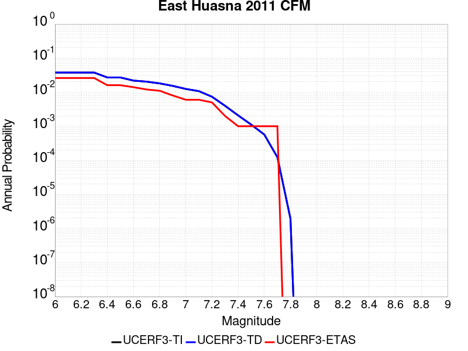 |
|-----|

| Magnitude | UCERF3-TI Prob | UCERF3-TD Prob | UCERF3-ETAS Prob |
|-----|-----|-----|-----|
| 6.0 | 0.03752078 | 0.0376088 | 0.026 |
| 6.1 | 0.03752078 | 0.0376088 | 0.026 |
| 6.2 | 0.03752078 | 0.0376088 | 0.026 |
| 6.3 | 0.03752078 | 0.0376088 | 0.026 |
| 6.4 | 0.026992148 | 0.027053624 | 0.016 |
| 6.5 | 0.026992148 | 0.027053624 | 0.016 |
| 6.6 | 0.02183757 | 0.021889858 | 0.014 |
| 6.7 | 0.02033864 | 0.0203871 | 0.012 |
| 6.8 | 0.018081587 | 0.018126726 | 0.011 |
| 6.9 | 0.015273943 | 0.015313595 | 0.008 |
| 7.0 | 0.012428838 | 0.012463266 | 0.006 |
| 7.1 | 0.010705914 | 0.010736247 | 0.006 |
| 7.2 | 0.007336912 | 0.0073587713 | 0.005 |
| 7.3 | 0.00397374 | 0.0039859414 | 0.002 |
| 7.4 | 0.0020788258 | 0.002085249 | 0.001 |
| 7.5 | 0.0011137845 | 0.0011176268 | 0.001 |
| 7.6 | 5.687811E-4 | 5.707513E-4 | 0.001 |
| 7.7 | 1.2312352E-4 | 1.2349992E-4 | 0.001 |
| 7.8 | 1.9306071E-6 | 1.9357753E-6 | 0.0 |

## Eaton Roughs 2011 CFM
*[(top)](#table-of-contents)*

| 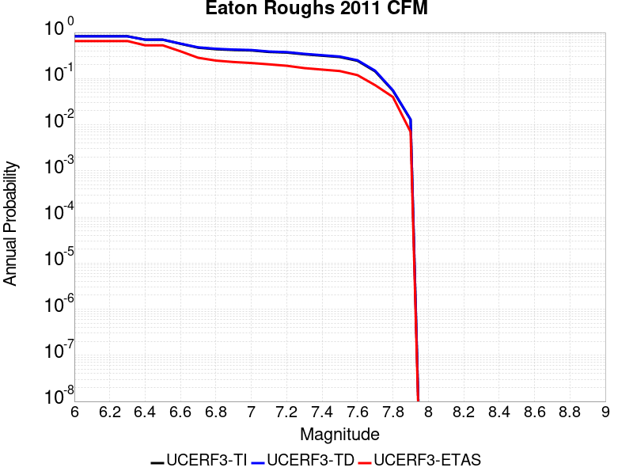 |
|-----|

| Magnitude | UCERF3-TI Prob | UCERF3-TD Prob | UCERF3-ETAS Prob |
|-----|-----|-----|-----|
| 6.0 | 0.83056813 | 0.8248392 | 0.653 |
| 6.1 | 0.83056813 | 0.8248392 | 0.653 |
| 6.2 | 0.83056813 | 0.8248392 | 0.653 |
| 6.3 | 0.83056813 | 0.8248392 | 0.653 |
| 6.4 | 0.6975078 | 0.700057 | 0.527 |
| 6.5 | 0.6975078 | 0.700057 | 0.527 |
| 6.6 | 0.5685747 | 0.57516646 | 0.391 |
| 6.7 | 0.46752074 | 0.47750092 | 0.283 |
| 6.8 | 0.43398535 | 0.44385222 | 0.246 |
| 6.9 | 0.41729018 | 0.42699802 | 0.229 |
| 7.0 | 0.4081523 | 0.4177693 | 0.218 |
| 7.1 | 0.37841812 | 0.38740006 | 0.204 |
| 7.2 | 0.36698413 | 0.37586892 | 0.19 |
| 7.3 | 0.33655906 | 0.34507087 | 0.169 |
| 7.4 | 0.31421077 | 0.3222835 | 0.157 |
| 7.5 | 0.29370537 | 0.3014685 | 0.146 |
| 7.6 | 0.24356844 | 0.25034225 | 0.119 |
| 7.7 | 0.14353801 | 0.14841409 | 0.072 |
| 7.8 | 0.054848842 | 0.05603288 | 0.04 |
| 7.9 | 0.012853368 | 0.013055603 | 0.007 |

## Elmore Ranch
*[(top)](#table-of-contents)*

| 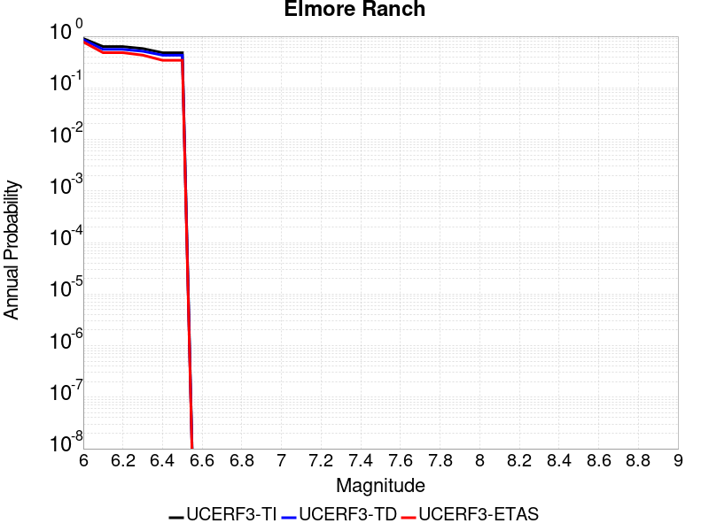 |
|-----|

| Magnitude | UCERF3-TI Prob | UCERF3-TD Prob | UCERF3-ETAS Prob |
|-----|-----|-----|-----|
| 6.0 | 0.90696514 | 0.8611305 | 0.778 |
| 6.1 | 0.6319047 | 0.5586109 | 0.482 |
| 6.2 | 0.6319047 | 0.5586109 | 0.482 |
| 6.3 | 0.57942164 | 0.51397693 | 0.432 |
| 6.4 | 0.48114288 | 0.4314108 | 0.343 |
| 6.5 | 0.48114288 | 0.4314108 | 0.343 |

## Elsinore (Coyote Mountains)
*[(top)](#table-of-contents)*

| 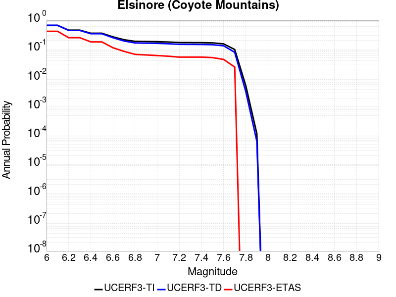 |
|-----|

| Magnitude | UCERF3-TI Prob | UCERF3-TD Prob | UCERF3-ETAS Prob |
|-----|-----|-----|-----|
| 6.0 | 0.666166 | 0.6740016 | 0.416 |
| 6.1 | 0.666166 | 0.6740016 | 0.416 |
| 6.2 | 0.4571156 | 0.44647452 | 0.25 |
| 6.3 | 0.4571156 | 0.44647452 | 0.25 |
| 6.4 | 0.356464 | 0.3425059 | 0.179 |
| 6.5 | 0.356464 | 0.3425059 | 0.179 |
| 6.6 | 0.2671033 | 0.249222 | 0.112 |
| 6.7 | 0.2123343 | 0.1920971 | 0.084 |
| 6.8 | 0.18634695 | 0.1642637 | 0.066 |
| 6.9 | 0.1834919 | 0.16125476 | 0.063 |
| 7.0 | 0.1814795 | 0.15913236 | 0.06 |
| 7.1 | 0.17659646 | 0.15400277 | 0.057 |
| 7.2 | 0.16970143 | 0.14673041 | 0.053 |
| 7.3 | 0.16890393 | 0.1459553 | 0.053 |
| 7.4 | 0.16803907 | 0.14509179 | 0.053 |
| 7.5 | 0.16497612 | 0.14230675 | 0.051 |
| 7.6 | 0.15248974 | 0.13078274 | 0.044 |
| 7.7 | 0.09722835 | 0.077743605 | 0.024 |
| 7.8 | 0.00542387 | 0.0033830404 | 0.0 |
| 7.9 | 1.17316136E-4 | 6.2966676E-5 | 0.0 |

## Elsinore (Glen Ivy) rev
*[(top)](#table-of-contents)*

| 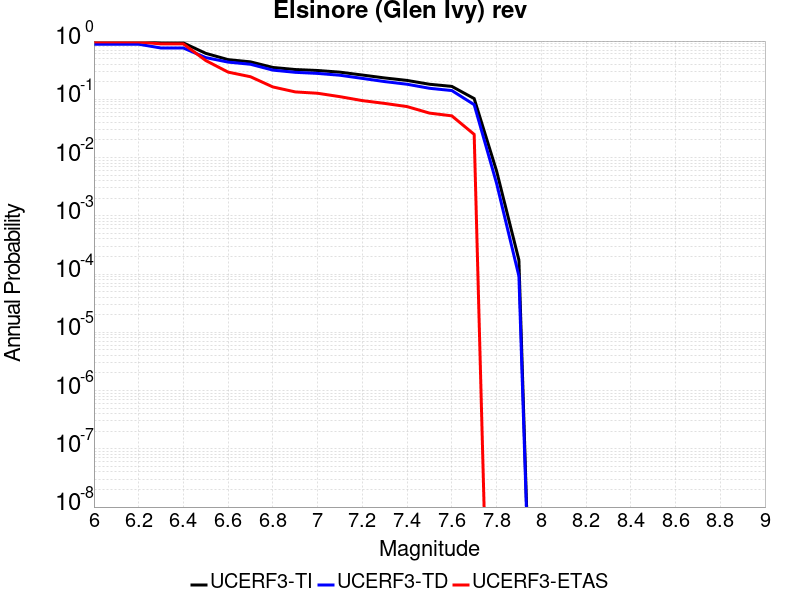 |
|-----|

| Magnitude | UCERF3-TI Prob | UCERF3-TD Prob | UCERF3-ETAS Prob |
|-----|-----|-----|-----|
| 6.0 | 0.98541665 | 0.8832177 | 0.967 |
| 6.1 | 0.98541665 | 0.8832177 | 0.967 |
| 6.2 | 0.98541665 | 0.8832177 | 0.967 |
| 6.3 | 0.92851114 | 0.7595723 | 0.893 |
| 6.4 | 0.92851114 | 0.7595723 | 0.893 |
| 6.5 | 0.61539173 | 0.5201152 | 0.463 |
| 6.6 | 0.47981948 | 0.43515682 | 0.293 |
| 6.7 | 0.4394976 | 0.39965972 | 0.244 |
| 6.8 | 0.35241452 | 0.31704178 | 0.163 |
| 6.9 | 0.3246078 | 0.29064074 | 0.134 |
| 7.0 | 0.31249142 | 0.27837637 | 0.127 |
| 7.1 | 0.2925523 | 0.25885487 | 0.111 |
| 7.2 | 0.26106375 | 0.22858132 | 0.095 |
| 7.3 | 0.23266298 | 0.20148546 | 0.085 |
| 7.4 | 0.21093784 | 0.1814315 | 0.075 |
| 7.5 | 0.1813909 | 0.15468942 | 0.058 |
| 7.6 | 0.16670452 | 0.14135322 | 0.052 |
| 7.7 | 0.10293154 | 0.0809168 | 0.025 |
| 7.8 | 0.005902799 | 0.003634203 | 0.0 |
| 7.9 | 1.7417852E-4 | 9.243E-5 | 0.0 |

## Elsinore (Julian)
*[(top)](#table-of-contents)*

| 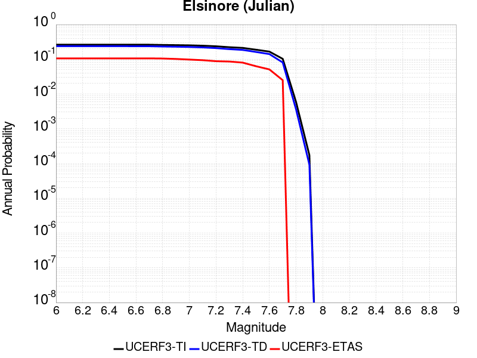 |
|-----|

| Magnitude | UCERF3-TI Prob | UCERF3-TD Prob | UCERF3-ETAS Prob |
|-----|-----|-----|-----|
| 6.0 | 0.2632549 | 0.23795795 | 0.106 |
| 6.1 | 0.2632549 | 0.23795795 | 0.106 |
| 6.2 | 0.2632549 | 0.23795795 | 0.106 |
| 6.3 | 0.2632549 | 0.23795795 | 0.106 |
| 6.4 | 0.2632549 | 0.23795795 | 0.106 |
| 6.5 | 0.2632549 | 0.23795795 | 0.106 |
| 6.6 | 0.2621082 | 0.23666425 | 0.106 |
| 6.7 | 0.2621082 | 0.23666425 | 0.106 |
| 6.8 | 0.2580946 | 0.2323772 | 0.105 |
| 6.9 | 0.25533882 | 0.22946604 | 0.102 |
| 7.0 | 0.25177774 | 0.22576165 | 0.098 |
| 7.1 | 0.24565583 | 0.21935235 | 0.094 |
| 7.2 | 0.2362025 | 0.20934464 | 0.088 |
| 7.3 | 0.2220114 | 0.19549395 | 0.086 |
| 7.4 | 0.2122487 | 0.18576224 | 0.08 |
| 7.5 | 0.18814024 | 0.16209377 | 0.063 |
| 7.6 | 0.16595201 | 0.14081848 | 0.051 |
| 7.7 | 0.102749586 | 0.08080808 | 0.025 |
| 7.8 | 0.0058781286 | 0.0036216292 | 0.0 |
| 7.9 | 1.7417852E-4 | 9.243E-5 | 0.0 |

## Elsinore (Stepovers Combined)
*[(top)](#table-of-contents)*

| 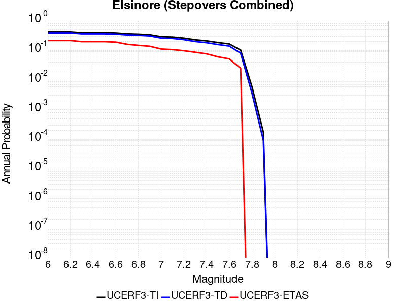 |
|-----|

| Magnitude | UCERF3-TI Prob | UCERF3-TD Prob | UCERF3-ETAS Prob |
|-----|-----|-----|-----|
| 6.0 | 0.42848387 | 0.39490107 | 0.218 |
| 6.1 | 0.42848387 | 0.39490107 | 0.218 |
| 6.2 | 0.42848387 | 0.39490107 | 0.218 |
| 6.3 | 0.40268403 | 0.3669497 | 0.199 |
| 6.4 | 0.40268403 | 0.3669497 | 0.199 |
| 6.5 | 0.40268403 | 0.3669497 | 0.199 |
| 6.6 | 0.39384764 | 0.35846537 | 0.192 |
| 6.7 | 0.36833197 | 0.33682057 | 0.162 |
| 6.8 | 0.35775277 | 0.32815674 | 0.149 |
| 6.9 | 0.34132642 | 0.31147283 | 0.139 |
| 7.0 | 0.2934563 | 0.2637484 | 0.112 |
| 7.1 | 0.2851266 | 0.2555831 | 0.107 |
| 7.2 | 0.2620973 | 0.23301075 | 0.098 |
| 7.3 | 0.22980902 | 0.20098315 | 0.087 |
| 7.4 | 0.21167973 | 0.18321717 | 0.077 |
| 7.5 | 0.18562731 | 0.15886946 | 0.061 |
| 7.6 | 0.16642986 | 0.14114608 | 0.052 |
| 7.7 | 0.10288919 | 0.080890134 | 0.025 |
| 7.8 | 0.005902799 | 0.003634203 | 0.0 |
| 7.9 | 1.7417852E-4 | 9.243E-5 | 0.0 |

## Elsinore (Temecula) rev
*[(top)](#table-of-contents)*

| 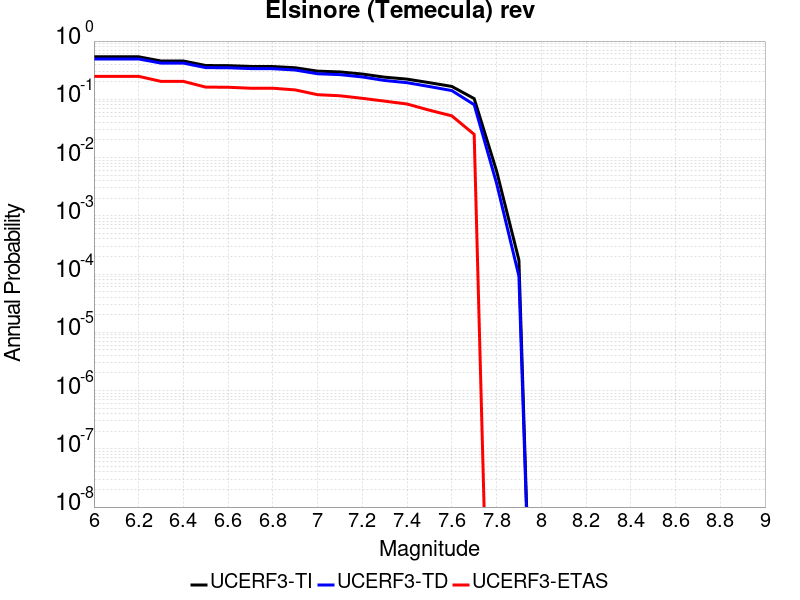 |
|-----|

| Magnitude | UCERF3-TI Prob | UCERF3-TD Prob | UCERF3-ETAS Prob |
|-----|-----|-----|-----|
| 6.0 | 0.5370038 | 0.49266616 | 0.248 |
| 6.1 | 0.5370038 | 0.49266616 | 0.248 |
| 6.2 | 0.5370038 | 0.49266616 | 0.248 |
| 6.3 | 0.45441434 | 0.4182547 | 0.203 |
| 6.4 | 0.45441434 | 0.4182547 | 0.203 |
| 6.5 | 0.3802583 | 0.34991595 | 0.162 |
| 6.6 | 0.3783873 | 0.34794647 | 0.161 |
| 6.7 | 0.36675584 | 0.3369886 | 0.155 |
| 6.8 | 0.36517426 | 0.33546662 | 0.155 |
| 6.9 | 0.34814647 | 0.31822535 | 0.145 |
| 7.0 | 0.30439225 | 0.27439997 | 0.12 |
| 7.1 | 0.2951238 | 0.26525515 | 0.115 |
| 7.2 | 0.27147335 | 0.2419472 | 0.104 |
| 7.3 | 0.23971626 | 0.21041183 | 0.093 |
| 7.4 | 0.22205317 | 0.19297843 | 0.083 |
| 7.5 | 0.19291662 | 0.16556935 | 0.065 |
| 7.6 | 0.16637775 | 0.14111373 | 0.052 |
| 7.7 | 0.10284023 | 0.080860265 | 0.025 |
| 7.8 | 0.005902799 | 0.003634203 | 0.0 |
| 7.9 | 1.7417852E-4 | 9.243E-5 | 0.0 |

## Elysian Park (Lower CFM)
*[(top)](#table-of-contents)*

| 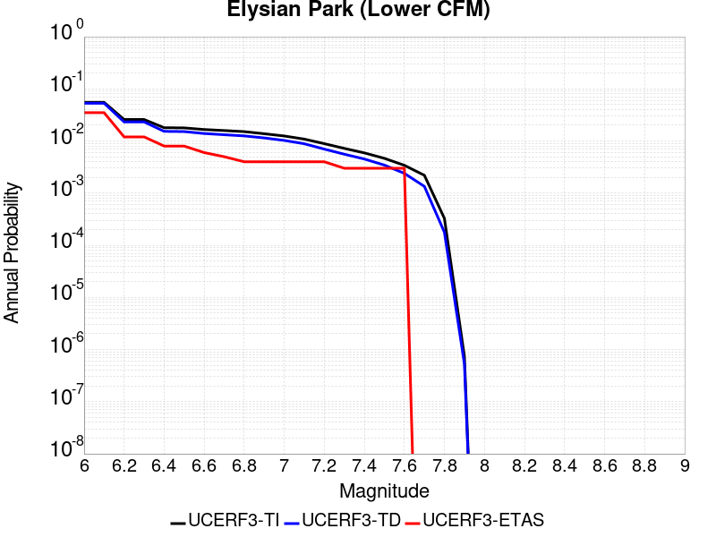 |
|-----|

| Magnitude | UCERF3-TI Prob | UCERF3-TD Prob | UCERF3-ETAS Prob |
|-----|-----|-----|-----|
| 6.0 | 0.055204995 | 0.05311262 | 0.035 |
| 6.1 | 0.055204995 | 0.05311262 | 0.035 |
| 6.2 | 0.025831167 | 0.023224704 | 0.012 |
| 6.3 | 0.025831167 | 0.023224704 | 0.012 |
| 6.4 | 0.017995883 | 0.015324037 | 0.008 |
| 6.5 | 0.017845368 | 0.015172657 | 0.008 |
| 6.6 | 0.016609466 | 0.013930041 | 0.006 |
| 6.7 | 0.015887953 | 0.013204903 | 0.005 |
| 6.8 | 0.0151406545 | 0.012538597 | 0.004 |
| 6.9 | 0.013790793 | 0.011457393 | 0.004 |
| 7.0 | 0.012482702 | 0.010261773 | 0.004 |
| 7.1 | 0.010880386 | 0.008861282 | 0.004 |
| 7.2 | 0.008898496 | 0.006993406 | 0.004 |
| 7.3 | 0.00721924 | 0.0055843885 | 0.003 |
| 7.4 | 0.005919418 | 0.004517585 | 0.003 |
| 7.5 | 0.004652488 | 0.0034536892 | 0.003 |
| 7.6 | 0.0034182456 | 0.002397462 | 0.003 |
| 7.7 | 0.0021995115 | 0.0013473674 | 0.0 |
| 7.8 | 3.2844688E-4 | 1.7791154E-4 | 0.0 |
| 7.9 | 7.389586E-7 | 5.262147E-7 | 0.0 |

## Elysian Park (Upper)
*[(top)](#table-of-contents)*

| 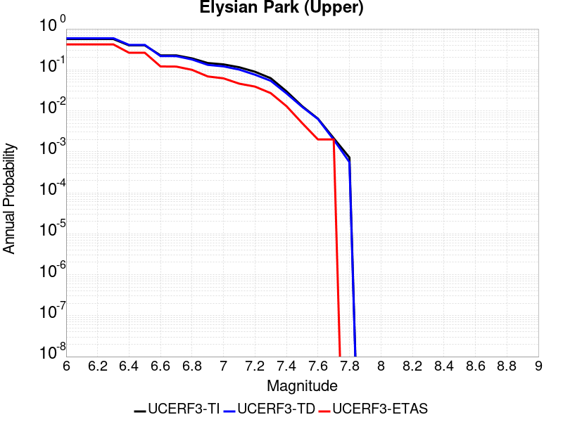 |
|-----|

| Magnitude | UCERF3-TI Prob | UCERF3-TD Prob | UCERF3-ETAS Prob |
|-----|-----|-----|-----|
| 6.0 | 0.56466347 | 0.5921893 | 0.418 |
| 6.1 | 0.56466347 | 0.5921893 | 0.418 |
| 6.2 | 0.56466347 | 0.5921893 | 0.418 |
| 6.3 | 0.56466347 | 0.5921893 | 0.418 |
| 6.4 | 0.39518684 | 0.40627694 | 0.261 |
| 6.5 | 0.39518684 | 0.40627694 | 0.261 |
| 6.6 | 0.22587518 | 0.21635161 | 0.121 |
| 6.7 | 0.22563723 | 0.2161079 | 0.12 |
| 6.8 | 0.19054088 | 0.17909005 | 0.1 |
| 6.9 | 0.14674352 | 0.13229743 | 0.069 |
| 7.0 | 0.1359199 | 0.12145307 | 0.062 |
| 7.1 | 0.115628205 | 0.10147775 | 0.046 |
| 7.2 | 0.08979652 | 0.07611711 | 0.039 |
| 7.3 | 0.06243597 | 0.05399347 | 0.027 |
| 7.4 | 0.02991003 | 0.026644953 | 0.013 |
| 7.5 | 0.012946002 | 0.012465656 | 0.005 |
| 7.6 | 0.0064150025 | 0.0063044424 | 0.002 |
| 7.7 | 0.002145178 | 0.0019808023 | 0.002 |
| 7.8 | 7.2552223E-4 | 5.5983645E-4 | 0.0 |

## Emerson-Copper Mtn 2011
*[(top)](#table-of-contents)*

| 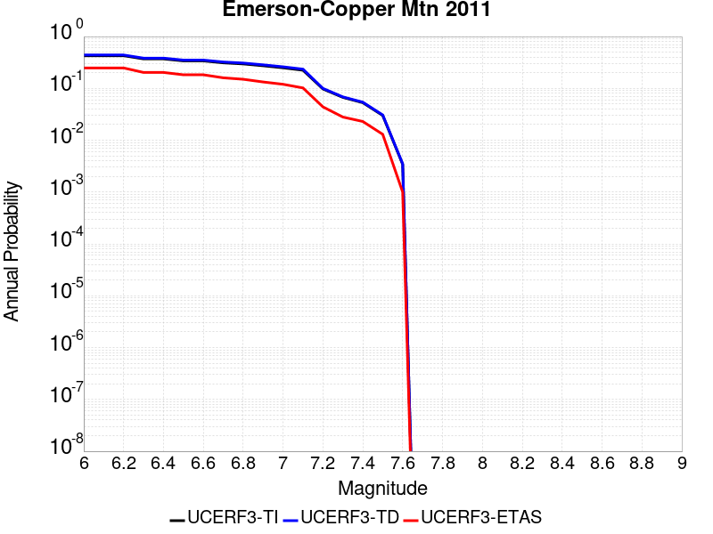 |
|-----|

| Magnitude | UCERF3-TI Prob | UCERF3-TD Prob | UCERF3-ETAS Prob |
|-----|-----|-----|-----|
| 6.0 | 0.42729396 | 0.4408461 | 0.248 |
| 6.1 | 0.42729396 | 0.4408461 | 0.248 |
| 6.2 | 0.42729396 | 0.4408461 | 0.248 |
| 6.3 | 0.37068367 | 0.38336077 | 0.203 |
| 6.4 | 0.37068367 | 0.38336077 | 0.203 |
| 6.5 | 0.33931294 | 0.35154253 | 0.183 |
| 6.6 | 0.33931294 | 0.35154253 | 0.183 |
| 6.7 | 0.31111473 | 0.32299486 | 0.16 |
| 6.8 | 0.29669505 | 0.30841506 | 0.15 |
| 6.9 | 0.27328098 | 0.28472042 | 0.133 |
| 7.0 | 0.24966893 | 0.2608011 | 0.12 |
| 7.1 | 0.22411841 | 0.23489745 | 0.102 |
| 7.2 | 0.09753263 | 0.099908106 | 0.044 |
| 7.3 | 0.067084044 | 0.068574615 | 0.028 |
| 7.4 | 0.0530505 | 0.05422025 | 0.023 |
| 7.5 | 0.030017076 | 0.030707976 | 0.013 |
| 7.6 | 0.0034260035 | 0.003513153 | 0.001 |

## Eureka Peak
*[(top)](#table-of-contents)*

| 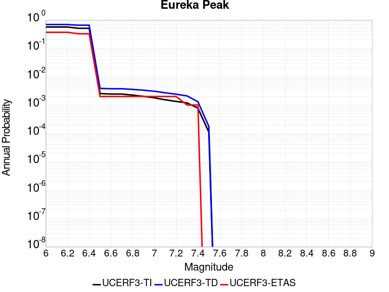 |
|-----|

| Magnitude | UCERF3-TI Prob | UCERF3-TD Prob | UCERF3-ETAS Prob |
|-----|-----|-----|-----|
| 6.0 | 0.56549215 | 0.69154555 | 0.368 |
| 6.1 | 0.56549215 | 0.69154555 | 0.368 |
| 6.2 | 0.56549215 | 0.69154555 | 0.368 |
| 6.3 | 0.5099678 | 0.65458465 | 0.327 |
| 6.4 | 0.5099678 | 0.65458465 | 0.327 |
| 6.5 | 0.0025374512 | 0.0038546077 | 0.002 |
| 6.6 | 0.0024362702 | 0.0037530744 | 0.002 |
| 6.7 | 0.0024362702 | 0.0037530744 | 0.002 |
| 6.8 | 0.002238932 | 0.0035548036 | 0.002 |
| 6.9 | 0.0020198051 | 0.0033341483 | 0.002 |
| 7.0 | 0.0017979874 | 0.0030645854 | 0.002 |
| 7.1 | 0.0015274865 | 0.0026908386 | 0.002 |
| 7.2 | 0.001339448 | 0.0024020153 | 0.002 |
| 7.3 | 0.0011848311 | 0.0020974276 | 0.001 |
| 7.4 | 7.7765854E-4 | 0.0013019624 | 0.001 |
| 7.5 | 1.1066828E-4 | 1.7657313E-4 | 0.0 |

## Fickle Hill (alt1)
*[(top)](#table-of-contents)*

| 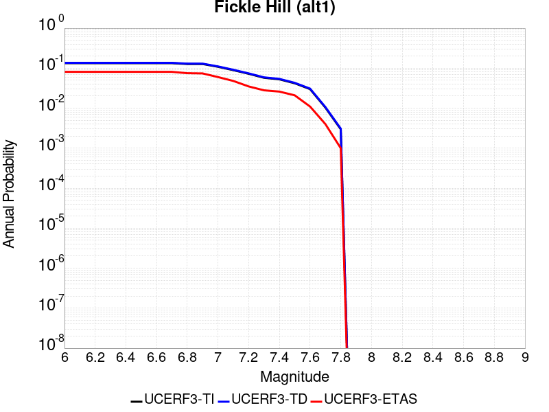 |
|-----|

| Magnitude | UCERF3-TI Prob | UCERF3-TD Prob | UCERF3-ETAS Prob |
|-----|-----|-----|-----|
| 6.0 | 0.13348855 | 0.13619156 | 0.081 |
| 6.1 | 0.13348855 | 0.13619156 | 0.081 |
| 6.2 | 0.13348855 | 0.13619156 | 0.081 |
| 6.3 | 0.13348855 | 0.13619156 | 0.081 |
| 6.4 | 0.13348855 | 0.13619156 | 0.081 |
| 6.5 | 0.13348855 | 0.13619156 | 0.081 |
| 6.6 | 0.13348855 | 0.13619156 | 0.081 |
| 6.7 | 0.13348855 | 0.13619156 | 0.081 |
| 6.8 | 0.12733771 | 0.12997848 | 0.075 |
| 6.9 | 0.12729037 | 0.12993062 | 0.074 |
| 7.0 | 0.10852024 | 0.11080725 | 0.06 |
| 7.1 | 0.0894354 | 0.09136691 | 0.048 |
| 7.2 | 0.07258156 | 0.074210405 | 0.035 |
| 7.3 | 0.057626598 | 0.05901508 | 0.028 |
| 7.4 | 0.05273717 | 0.054047484 | 0.026 |
| 7.5 | 0.04201101 | 0.043101873 | 0.021 |
| 7.6 | 0.030035252 | 0.030870043 | 0.011 |
| 7.7 | 0.010348153 | 0.010671099 | 0.004 |
| 7.8 | 0.0029774588 | 0.0030815545 | 0.001 |

## Fish Slough 2011 CFM
*[(top)](#table-of-contents)*

| 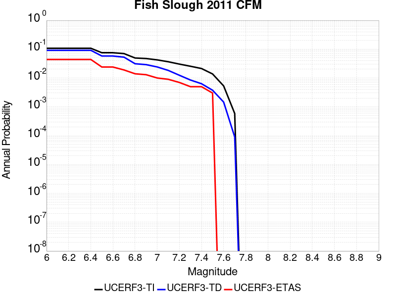 |
|-----|

| Magnitude | UCERF3-TI Prob | UCERF3-TD Prob | UCERF3-ETAS Prob |
|-----|-----|-----|-----|
| 6.0 | 0.10758821 | 0.09147551 | 0.044 |
| 6.1 | 0.10758821 | 0.09147551 | 0.044 |
| 6.2 | 0.10758821 | 0.09147551 | 0.044 |
| 6.3 | 0.10758821 | 0.09147551 | 0.044 |
| 6.4 | 0.10758821 | 0.09147551 | 0.044 |
| 6.5 | 0.07508351 | 0.05781963 | 0.024 |
| 6.6 | 0.07508351 | 0.05781963 | 0.024 |
| 6.7 | 0.07017978 | 0.052778967 | 0.019 |
| 6.8 | 0.049395222 | 0.031215597 | 0.014 |
| 6.9 | 0.047286555 | 0.02904398 | 0.013 |
| 7.0 | 0.04246895 | 0.024138376 | 0.01 |
| 7.1 | 0.03657273 | 0.018303046 | 0.009 |
| 7.2 | 0.030342607 | 0.012441541 | 0.007 |
| 7.3 | 0.0255436 | 0.008508898 | 0.005 |
| 7.4 | 0.021300124 | 0.006328473 | 0.005 |
| 7.5 | 0.013796124 | 0.003764621 | 0.003 |
| 7.6 | 0.005301698 | 0.0014590417 | 0.0 |
| 7.7 | 5.868686E-4 | 9.0124944E-5 | 0.0 |

## Fitzhugh Creek
*[(top)](#table-of-contents)*

| 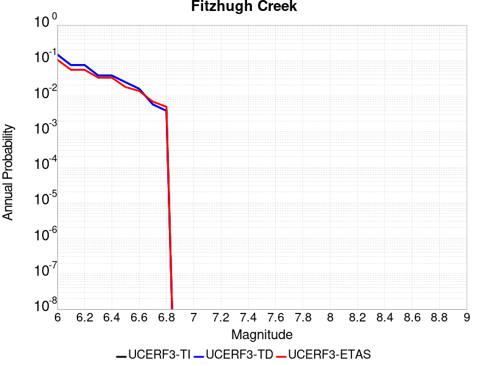 |
|-----|

| Magnitude | UCERF3-TI Prob | UCERF3-TD Prob | UCERF3-ETAS Prob |
|-----|-----|-----|-----|
| 6.0 | 0.14732863 | 0.14904137 | 0.106 |
| 6.1 | 0.07466031 | 0.07523914 | 0.055 |
| 6.2 | 0.07466031 | 0.07523914 | 0.055 |
| 6.3 | 0.037829027 | 0.038056146 | 0.033 |
| 6.4 | 0.037829027 | 0.038056146 | 0.033 |
| 6.5 | 0.024525175 | 0.02466657 | 0.018 |
| 6.6 | 0.016074635 | 0.016167354 | 0.014 |
| 6.7 | 0.0058212415 | 0.0058575952 | 0.007 |
| 6.8 | 0.003849877 | 0.0038758842 | 0.005 |

## Fontana (Seismicity)
*[(top)](#table-of-contents)*

| 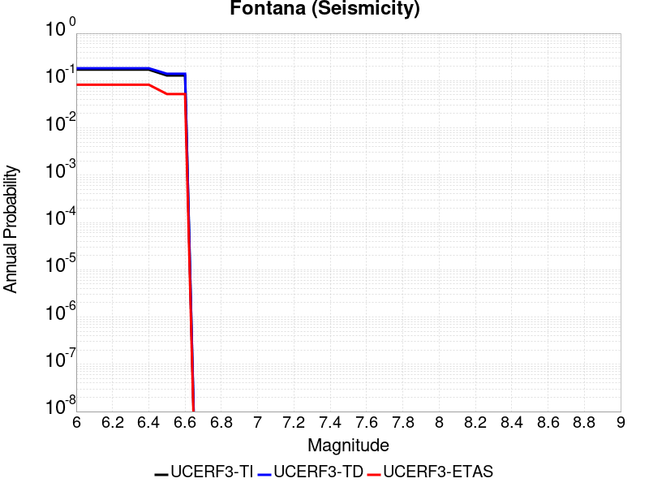 |
|-----|

| Magnitude | UCERF3-TI Prob | UCERF3-TD Prob | UCERF3-ETAS Prob |
|-----|-----|-----|-----|
| 6.0 | 0.17079975 | 0.18251607 | 0.082 |
| 6.1 | 0.17079975 | 0.18251607 | 0.082 |
| 6.2 | 0.17079975 | 0.18251607 | 0.082 |
| 6.3 | 0.17079975 | 0.18251607 | 0.082 |
| 6.4 | 0.17079975 | 0.18251607 | 0.082 |
| 6.5 | 0.12825605 | 0.13934056 | 0.052 |
| 6.6 | 0.12825605 | 0.13934056 | 0.052 |

## Franklin 2011 CFM
*[(top)](#table-of-contents)*

| 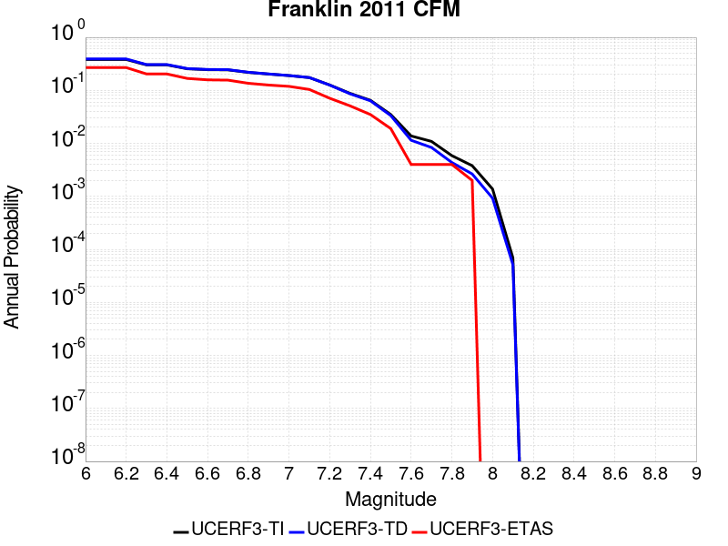 |
|-----|

| Magnitude | UCERF3-TI Prob | UCERF3-TD Prob | UCERF3-ETAS Prob |
|-----|-----|-----|-----|
| 6.0 | 0.38214952 | 0.39081535 | 0.269 |
| 6.1 | 0.38214952 | 0.39081535 | 0.269 |
| 6.2 | 0.38214952 | 0.39081535 | 0.269 |
| 6.3 | 0.30259362 | 0.30654547 | 0.204 |
| 6.4 | 0.30259362 | 0.30654547 | 0.204 |
| 6.5 | 0.25550124 | 0.25748444 | 0.168 |
| 6.6 | 0.24580874 | 0.24754916 | 0.158 |
| 6.7 | 0.24370402 | 0.24539757 | 0.156 |
| 6.8 | 0.21837436 | 0.21930753 | 0.136 |
| 6.9 | 0.20306493 | 0.20356861 | 0.126 |
| 7.0 | 0.18995447 | 0.19003668 | 0.119 |
| 7.1 | 0.17421456 | 0.17411144 | 0.104 |
| 7.2 | 0.12629516 | 0.12536123 | 0.071 |
| 7.3 | 0.0877947 | 0.08566099 | 0.051 |
| 7.4 | 0.06497257 | 0.06311201 | 0.035 |
| 7.5 | 0.034965444 | 0.032901146 | 0.019 |
| 7.6 | 0.013807103 | 0.010975077 | 0.004 |
| 7.7 | 0.010895435 | 0.008135388 | 0.004 |
| 7.8 | 0.005875327 | 0.0042492566 | 0.004 |
| 7.9 | 0.0037936936 | 0.002562254 | 0.002 |
| 8.0 | 0.0013783434 | 9.240087E-4 | 0.0 |
| 8.1 | 6.924989E-5 | 5.088364E-5 | 0.0 |

## Garberville - Briceland 2011 CFM
*[(top)](#table-of-contents)*

| 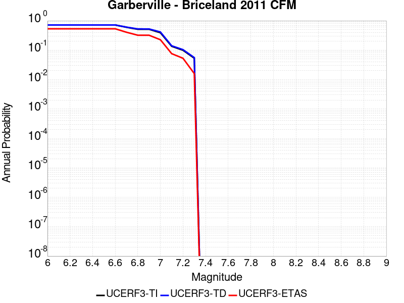 |
|-----|

| Magnitude | UCERF3-TI Prob | UCERF3-TD Prob | UCERF3-ETAS Prob |
|-----|-----|-----|-----|
| 6.0 | 0.7171203 | 0.7171714 | 0.533 |
| 6.1 | 0.7171203 | 0.7171714 | 0.533 |
| 6.2 | 0.7171203 | 0.7171714 | 0.533 |
| 6.3 | 0.7171203 | 0.7171714 | 0.533 |
| 6.4 | 0.7171203 | 0.7171714 | 0.533 |
| 6.5 | 0.7171203 | 0.7171714 | 0.533 |
| 6.6 | 0.7171203 | 0.7171714 | 0.533 |
| 6.7 | 0.5982331 | 0.606486 | 0.406 |
| 6.8 | 0.51223636 | 0.5264514 | 0.322 |
| 6.9 | 0.51132566 | 0.5255368 | 0.321 |
| 7.0 | 0.39123404 | 0.41489837 | 0.226 |
| 7.1 | 0.1351813 | 0.14054872 | 0.076 |
| 7.2 | 0.09936351 | 0.10402165 | 0.053 |
| 7.3 | 0.05325169 | 0.055969745 | 0.016 |

## Garlic Springs
*[(top)](#table-of-contents)*

| 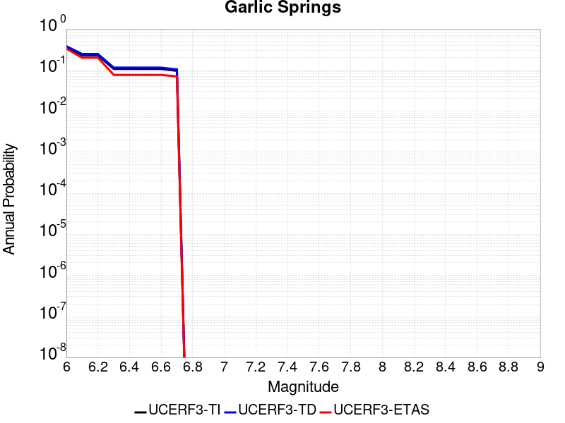 |
|-----|

| Magnitude | UCERF3-TI Prob | UCERF3-TD Prob | UCERF3-ETAS Prob |
|-----|-----|-----|-----|
| 6.0 | 0.35419685 | 0.38007662 | 0.332 |
| 6.1 | 0.22667271 | 0.24584177 | 0.199 |
| 6.2 | 0.22667271 | 0.24584177 | 0.199 |
| 6.3 | 0.10651145 | 0.11462189 | 0.076 |
| 6.4 | 0.10651145 | 0.11462189 | 0.076 |
| 6.5 | 0.10651145 | 0.11462189 | 0.076 |
| 6.6 | 0.106150955 | 0.11425523 | 0.076 |
| 6.7 | 0.09579947 | 0.10367607 | 0.07 |

## Garlock (Central)
*[(top)](#table-of-contents)*

| 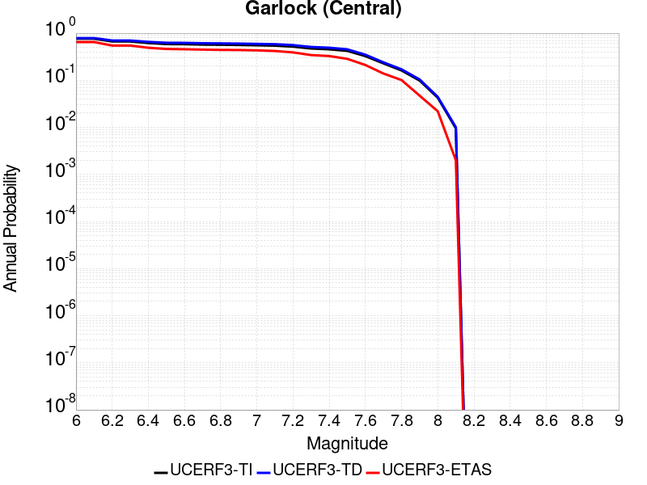 |
|-----|

| Magnitude | UCERF3-TI Prob | UCERF3-TD Prob | UCERF3-ETAS Prob |
|-----|-----|-----|-----|
| 6.0 | 0.76268613 | 0.7864997 | 0.649 |
| 6.1 | 0.76268613 | 0.7864997 | 0.649 |
| 6.2 | 0.66713274 | 0.6990134 | 0.546 |
| 6.3 | 0.66713274 | 0.6990134 | 0.546 |
| 6.4 | 0.6177273 | 0.65378654 | 0.49 |
| 6.5 | 0.5872697 | 0.62560046 | 0.462 |
| 6.6 | 0.5835062 | 0.6220208 | 0.456 |
| 6.7 | 0.5725863 | 0.61187106 | 0.448 |
| 6.8 | 0.5681693 | 0.6075518 | 0.442 |
| 6.9 | 0.5621337 | 0.6016275 | 0.439 |
| 7.0 | 0.55348 | 0.5931215 | 0.432 |
| 7.1 | 0.54365814 | 0.5834341 | 0.419 |
| 7.2 | 0.5177975 | 0.5578825 | 0.391 |
| 7.3 | 0.47254843 | 0.51028824 | 0.343 |
| 7.4 | 0.45444113 | 0.49115425 | 0.327 |
| 7.5 | 0.42148894 | 0.45432648 | 0.285 |
| 7.6 | 0.32583362 | 0.34891525 | 0.211 |
| 7.7 | 0.2283113 | 0.24021362 | 0.139 |
| 7.8 | 0.16160621 | 0.17076422 | 0.101 |
| 7.9 | 0.09851957 | 0.1040827 | 0.047 |
| 8.0 | 0.042707413 | 0.04454822 | 0.022 |
| 8.1 | 0.00953767 | 0.010169163 | 0.002 |

## Garlock (East)
*[(top)](#table-of-contents)*

| 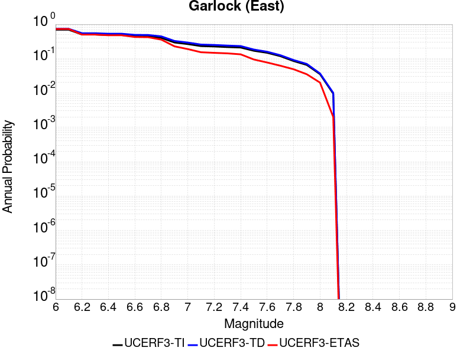 |
|-----|

| Magnitude | UCERF3-TI Prob | UCERF3-TD Prob | UCERF3-ETAS Prob |
|-----|-----|-----|-----|
| 6.0 | 0.6916309 | 0.73406816 | 0.726 |
| 6.1 | 0.6916309 | 0.73406816 | 0.726 |
| 6.2 | 0.5013886 | 0.5467632 | 0.499 |
| 6.3 | 0.5013886 | 0.5467632 | 0.499 |
| 6.4 | 0.4833542 | 0.5296703 | 0.477 |
| 6.5 | 0.4833542 | 0.5296703 | 0.477 |
| 6.6 | 0.44351608 | 0.49014902 | 0.425 |
| 6.7 | 0.44024912 | 0.48683706 | 0.419 |
| 6.8 | 0.39920074 | 0.44308963 | 0.356 |
| 6.9 | 0.29353076 | 0.32578653 | 0.227 |
| 7.0 | 0.26422733 | 0.29320568 | 0.189 |
| 7.1 | 0.23093799 | 0.25617707 | 0.153 |
| 7.2 | 0.22497693 | 0.24955904 | 0.147 |
| 7.3 | 0.2163501 | 0.23955461 | 0.142 |
| 7.4 | 0.20975913 | 0.23177783 | 0.133 |
| 7.5 | 0.16868417 | 0.1832879 | 0.094 |
| 7.6 | 0.14749219 | 0.15846214 | 0.077 |
| 7.7 | 0.117639326 | 0.12564556 | 0.062 |
| 7.8 | 0.084952295 | 0.09092652 | 0.049 |
| 7.9 | 0.06540824 | 0.070018455 | 0.035 |
| 8.0 | 0.035221003 | 0.037015438 | 0.02 |
| 8.1 | 0.00953767 | 0.010169163 | 0.002 |

## Garlock (West)
*[(top)](#table-of-contents)*

| 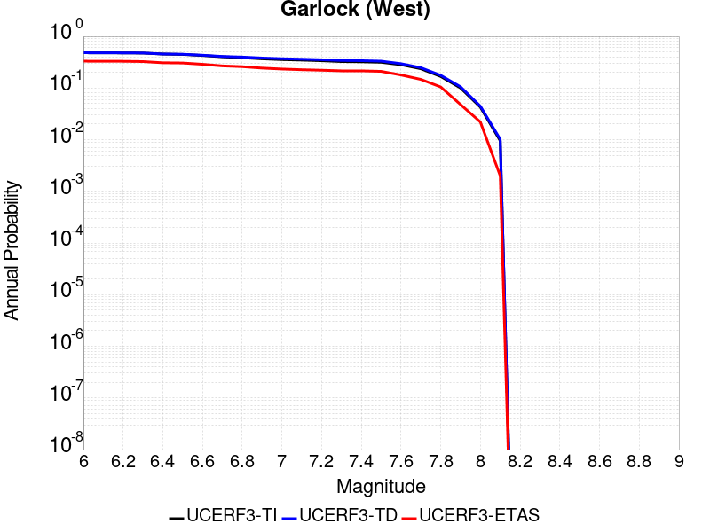 |
|-----|

| Magnitude | UCERF3-TI Prob | UCERF3-TD Prob | UCERF3-ETAS Prob |
|-----|-----|-----|-----|
| 6.0 | 0.48158622 | 0.48166424 | 0.331 |
| 6.1 | 0.48017773 | 0.4803233 | 0.329 |
| 6.2 | 0.47838974 | 0.478689 | 0.329 |
| 6.3 | 0.4754917 | 0.47607696 | 0.325 |
| 6.4 | 0.45460913 | 0.45518437 | 0.308 |
| 6.5 | 0.44737393 | 0.4502835 | 0.305 |
| 6.6 | 0.4266247 | 0.4316591 | 0.288 |
| 6.7 | 0.40200523 | 0.40924424 | 0.268 |
| 6.8 | 0.38678166 | 0.39782092 | 0.259 |
| 6.9 | 0.3675307 | 0.38105473 | 0.243 |
| 7.0 | 0.35477665 | 0.36936525 | 0.233 |
| 7.1 | 0.34704357 | 0.36195242 | 0.226 |
| 7.2 | 0.33747193 | 0.35281518 | 0.221 |
| 7.3 | 0.32488889 | 0.3412816 | 0.215 |
| 7.4 | 0.32187128 | 0.3382763 | 0.215 |
| 7.5 | 0.3151394 | 0.33096698 | 0.21 |
| 7.6 | 0.28309774 | 0.2959597 | 0.179 |
| 7.7 | 0.23622133 | 0.24724251 | 0.147 |
| 7.8 | 0.1675861 | 0.17619659 | 0.105 |
| 7.9 | 0.100520685 | 0.105862595 | 0.048 |
| 8.0 | 0.042707413 | 0.04454822 | 0.022 |
| 8.1 | 0.00953767 | 0.010169163 | 0.002 |

## Gillem - Big Crack 2011 CFM
*[(top)](#table-of-contents)*

| 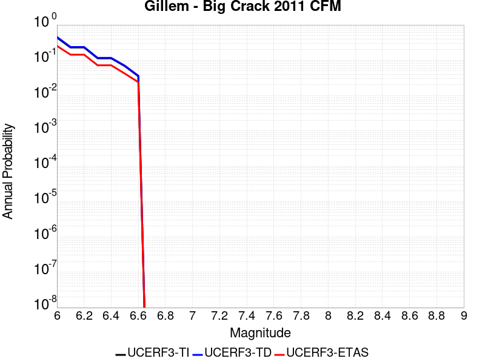 |
|-----|

| Magnitude | UCERF3-TI Prob | UCERF3-TD Prob | UCERF3-ETAS Prob |
|-----|-----|-----|-----|
| 6.0 | 0.43625277 | 0.45599917 | 0.254 |
| 6.1 | 0.22949272 | 0.23718011 | 0.144 |
| 6.2 | 0.22949272 | 0.23718011 | 0.144 |
| 6.3 | 0.11338517 | 0.116554566 | 0.072 |
| 6.4 | 0.11338517 | 0.116554566 | 0.072 |
| 6.5 | 0.068423696 | 0.070340194 | 0.042 |
| 6.6 | 0.035408773 | 0.036426637 | 0.024 |

## Goldstone Lake
*[(top)](#table-of-contents)*

| 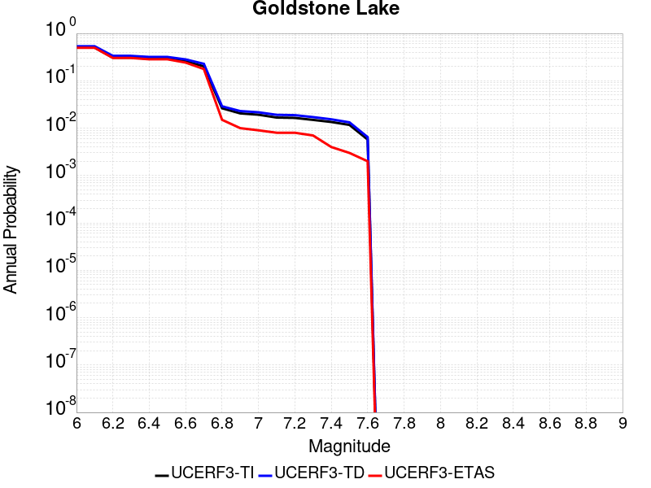 |
|-----|

| Magnitude | UCERF3-TI Prob | UCERF3-TD Prob | UCERF3-ETAS Prob |
|-----|-----|-----|-----|
| 6.0 | 0.5018958 | 0.5352441 | 0.497 |
| 6.1 | 0.5018958 | 0.5352441 | 0.497 |
| 6.2 | 0.30953738 | 0.33558187 | 0.303 |
| 6.3 | 0.30953738 | 0.33558187 | 0.303 |
| 6.4 | 0.29206043 | 0.3182569 | 0.284 |
| 6.5 | 0.29206043 | 0.3182569 | 0.284 |
| 6.6 | 0.25587657 | 0.28213495 | 0.242 |
| 6.7 | 0.20204572 | 0.22797854 | 0.177 |
| 6.8 | 0.026299195 | 0.028869648 | 0.015 |
| 6.9 | 0.020491797 | 0.02292696 | 0.01 |
| 7.0 | 0.019218855 | 0.021628125 | 0.009 |
| 7.1 | 0.01674055 | 0.019103225 | 0.008 |
| 7.2 | 0.01644743 | 0.01880434 | 0.008 |
| 7.3 | 0.014939684 | 0.01710843 | 0.007 |
| 7.4 | 0.013499651 | 0.015362646 | 0.004 |
| 7.5 | 0.011704938 | 0.013263853 | 0.003 |
| 7.6 | 0.0057536047 | 0.0064642406 | 0.002 |

## Goose Lake 2011 CFM
*[(top)](#table-of-contents)*

| 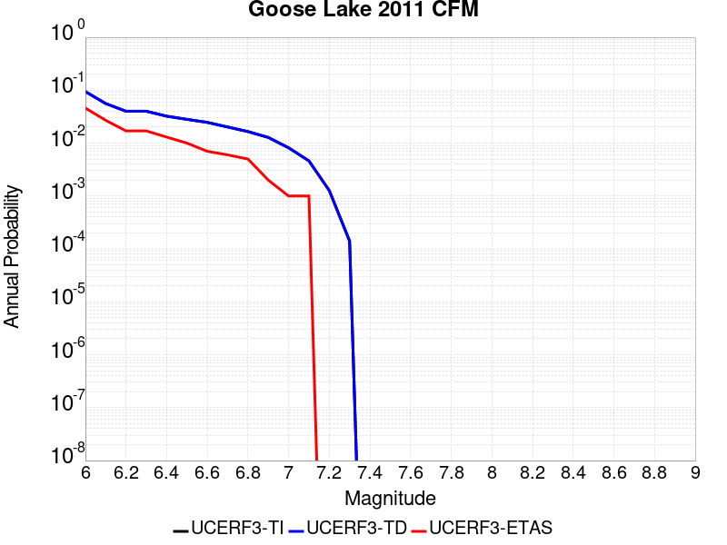 |
|-----|

| Magnitude | UCERF3-TI Prob | UCERF3-TD Prob | UCERF3-ETAS Prob |
|-----|-----|-----|-----|
| 6.0 | 0.093933836 | 0.09450306 | 0.046 |
| 6.1 | 0.0558669 | 0.05610917 | 0.027 |
| 6.2 | 0.039944064 | 0.04010815 | 0.017 |
| 6.3 | 0.039944064 | 0.04010815 | 0.017 |
| 6.4 | 0.032248817 | 0.03238631 | 0.013 |
| 6.5 | 0.028064469 | 0.028188644 | 0.01 |
| 6.6 | 0.024598807 | 0.02471184 | 0.007 |
| 6.7 | 0.020119239 | 0.020217348 | 0.006 |
| 6.8 | 0.01648524 | 0.016569212 | 0.005 |
| 6.9 | 0.012768996 | 0.012838072 | 0.002 |
| 7.0 | 0.00813333 | 0.008180519 | 0.001 |
| 7.1 | 0.004601986 | 0.004629053 | 0.001 |
| 7.2 | 0.0012682052 | 0.0012742083 | 0.0 |
| 7.3 | 1.4064225E-4 | 1.4131138E-4 | 0.0 |

## Gravel Hills-Harper Lk
*[(top)](#table-of-contents)*

| 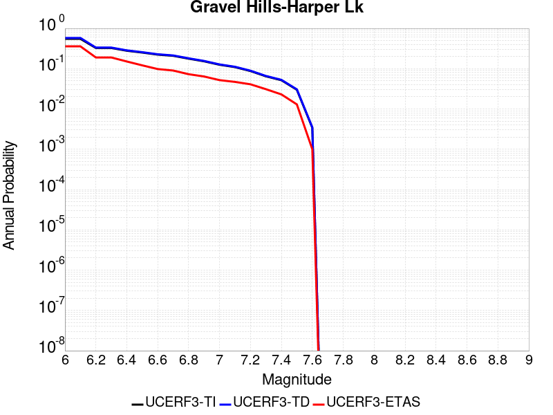 |
|-----|

| Magnitude | UCERF3-TI Prob | UCERF3-TD Prob | UCERF3-ETAS Prob |
|-----|-----|-----|-----|
| 6.0 | 0.5508598 | 0.5806718 | 0.359 |
| 6.1 | 0.5508598 | 0.5806718 | 0.359 |
| 6.2 | 0.32641065 | 0.33432156 | 0.19 |
| 6.3 | 0.32641065 | 0.33432156 | 0.19 |
| 6.4 | 0.27889216 | 0.2853224 | 0.151 |
| 6.5 | 0.25131553 | 0.25701252 | 0.121 |
| 6.6 | 0.2233479 | 0.22829412 | 0.098 |
| 6.7 | 0.20875514 | 0.21337341 | 0.09 |
| 6.8 | 0.17724477 | 0.18106176 | 0.073 |
| 6.9 | 0.15247156 | 0.15573043 | 0.064 |
| 7.0 | 0.12513012 | 0.12769136 | 0.052 |
| 7.1 | 0.10935375 | 0.1116419 | 0.047 |
| 7.2 | 0.0873551 | 0.089218475 | 0.041 |
| 7.3 | 0.0646471 | 0.06604965 | 0.031 |
| 7.4 | 0.051753663 | 0.05288913 | 0.023 |
| 7.5 | 0.030017076 | 0.030707976 | 0.013 |
| 7.6 | 0.0034260035 | 0.003513153 | 0.001 |

## Great Valley 01
*[(top)](#table-of-contents)*

| 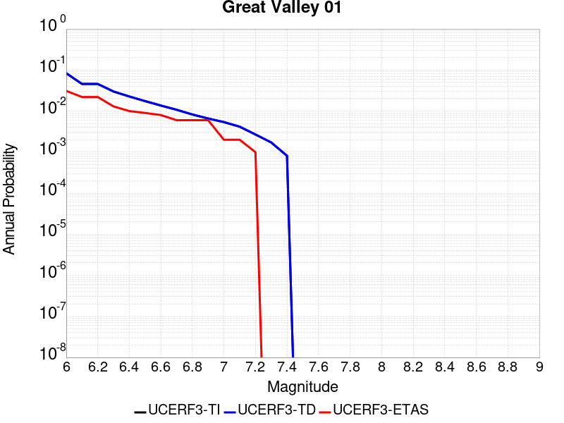 |
|-----|

| Magnitude | UCERF3-TI Prob | UCERF3-TD Prob | UCERF3-ETAS Prob |
|-----|-----|-----|-----|
| 6.0 | 0.08344609 | 0.08401256 | 0.031 |
| 6.1 | 0.045675043 | 0.045876447 | 0.022 |
| 6.2 | 0.045675043 | 0.045876447 | 0.022 |
| 6.3 | 0.029902728 | 0.030019557 | 0.013 |
| 6.4 | 0.022622911 | 0.022713756 | 0.01 |
| 6.5 | 0.017464599 | 0.017538177 | 0.009 |
| 6.6 | 0.013611736 | 0.013673587 | 0.008 |
| 6.7 | 0.010744053 | 0.01079773 | 0.006 |
| 6.8 | 0.0082395775 | 0.008285842 | 0.006 |
| 6.9 | 0.0065738102 | 0.0066147563 | 0.006 |
| 7.0 | 0.0053775418 | 0.0054137805 | 0.002 |
| 7.1 | 0.0041530076 | 0.0041832332 | 0.002 |
| 7.2 | 0.0026813073 | 0.002702752 | 0.001 |
| 7.3 | 0.0017155361 | 0.0017304093 | 0.0 |
| 7.4 | 8.116137E-4 | 8.189901E-4 | 0.0 |

## Great Valley 02
*[(top)](#table-of-contents)*

| 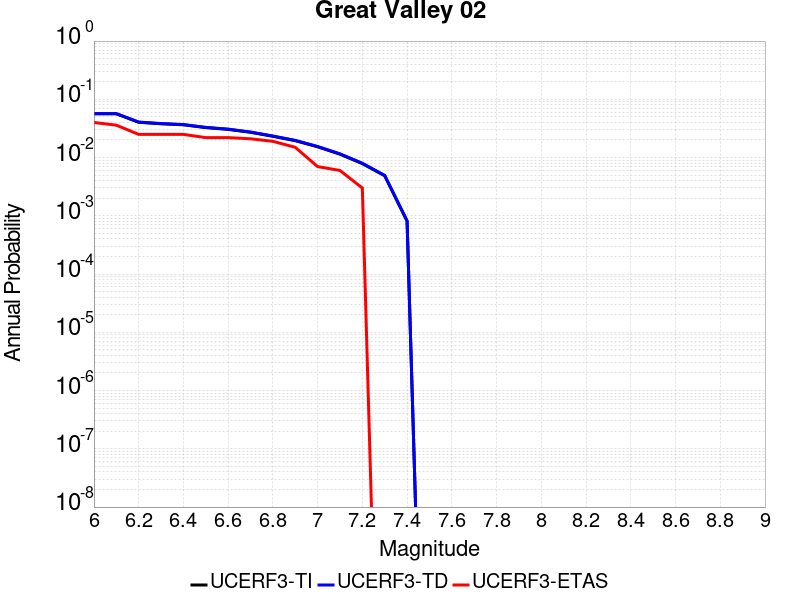 |
|-----|

| Magnitude | UCERF3-TI Prob | UCERF3-TD Prob | UCERF3-ETAS Prob |
|-----|-----|-----|-----|
| 6.0 | 0.056379996 | 0.056927785 | 0.04 |
| 6.1 | 0.056379996 | 0.056927785 | 0.036 |
| 6.2 | 0.040352356 | 0.040722955 | 0.025 |
| 6.3 | 0.03800251 | 0.038362462 | 0.025 |
| 6.4 | 0.03653733 | 0.03689271 | 0.025 |
| 6.5 | 0.03266122 | 0.03299765 | 0.022 |
| 6.6 | 0.030461147 | 0.030789485 | 0.022 |
| 6.7 | 0.027150687 | 0.027456895 | 0.021 |
| 6.8 | 0.02317657 | 0.02345639 | 0.019 |
| 6.9 | 0.019483525 | 0.019734664 | 0.015 |
| 7.0 | 0.015299807 | 0.015504573 | 0.007 |
| 7.1 | 0.011427626 | 0.011589407 | 0.006 |
| 7.2 | 0.0078734625 | 0.007990066 | 0.003 |
| 7.3 | 0.0048670513 | 0.004942102 | 0.0 |
| 7.4 | 8.116137E-4 | 8.189901E-4 | 0.0 |

## Great Valley 03 Mysterious Ridge
*[(top)](#table-of-contents)*

| 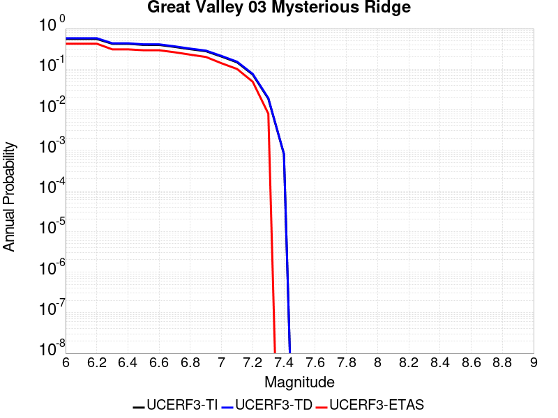 |
|-----|

| Magnitude | UCERF3-TI Prob | UCERF3-TD Prob | UCERF3-ETAS Prob |
|-----|-----|-----|-----|
| 6.0 | 0.5567141 | 0.579793 | 0.425 |
| 6.1 | 0.5567141 | 0.579793 | 0.425 |
| 6.2 | 0.5567141 | 0.579793 | 0.425 |
| 6.3 | 0.4228712 | 0.43551385 | 0.308 |
| 6.4 | 0.4228712 | 0.43551385 | 0.308 |
| 6.5 | 0.39701954 | 0.40958548 | 0.293 |
| 6.6 | 0.3967113 | 0.4092813 | 0.293 |
| 6.7 | 0.35358137 | 0.3652935 | 0.261 |
| 6.8 | 0.31083897 | 0.32117027 | 0.228 |
| 6.9 | 0.2777129 | 0.28708667 | 0.2 |
| 7.0 | 0.20461163 | 0.21164845 | 0.14 |
| 7.1 | 0.14727683 | 0.15265939 | 0.101 |
| 7.2 | 0.07381743 | 0.076461084 | 0.049 |
| 7.3 | 0.018708244 | 0.019365648 | 0.008 |
| 7.4 | 8.116137E-4 | 8.189901E-4 | 0.0 |

## Great Valley 03a Dunnigan Hills
*[(top)](#table-of-contents)*

| 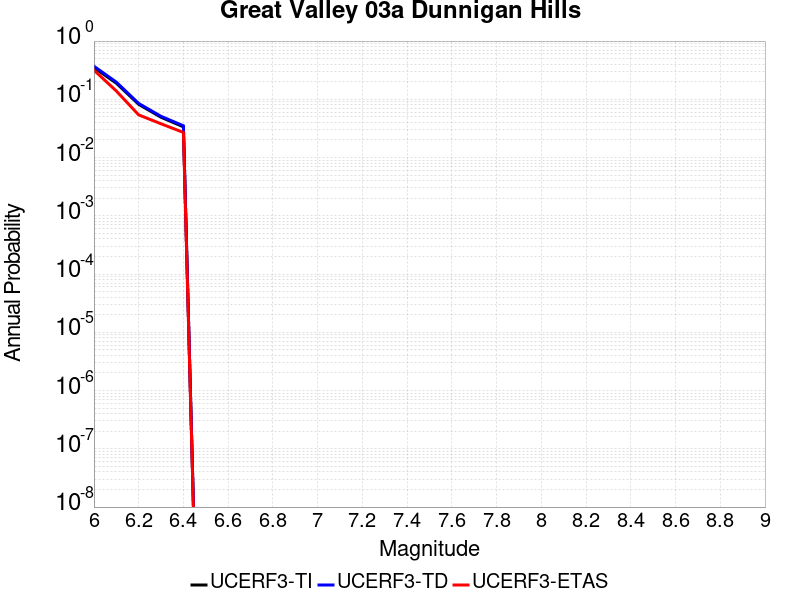 |
|-----|

| Magnitude | UCERF3-TI Prob | UCERF3-TD Prob | UCERF3-ETAS Prob |
|-----|-----|-----|-----|
| 6.0 | 0.35134837 | 0.3694796 | 0.317 |
| 6.1 | 0.18924393 | 0.19747727 | 0.139 |
| 6.2 | 0.08203065 | 0.08488833 | 0.054 |
| 6.3 | 0.049203355 | 0.051045947 | 0.038 |
| 6.4 | 0.033707038 | 0.03512944 | 0.027 |

## Great Valley 04a Trout Creek
*[(top)](#table-of-contents)*

| 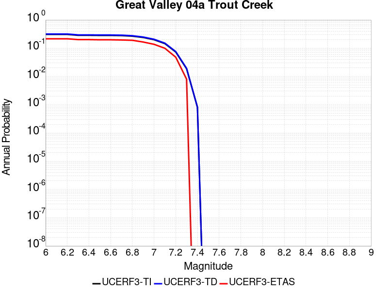 |
|-----|

| Magnitude | UCERF3-TI Prob | UCERF3-TD Prob | UCERF3-ETAS Prob |
|-----|-----|-----|-----|
| 6.0 | 0.30757993 | 0.31742597 | 0.215 |
| 6.1 | 0.30757993 | 0.31742597 | 0.215 |
| 6.2 | 0.30757993 | 0.31742597 | 0.215 |
| 6.3 | 0.28545323 | 0.29467595 | 0.201 |
| 6.4 | 0.28545323 | 0.29467595 | 0.201 |
| 6.5 | 0.2832027 | 0.29239246 | 0.198 |
| 6.6 | 0.2832027 | 0.29239246 | 0.198 |
| 6.7 | 0.27937058 | 0.2885047 | 0.195 |
| 6.8 | 0.26634908 | 0.2752082 | 0.19 |
| 6.9 | 0.2396289 | 0.24772194 | 0.165 |
| 7.0 | 0.19940068 | 0.20643404 | 0.137 |
| 7.1 | 0.14505221 | 0.1504334 | 0.099 |
| 7.2 | 0.07316325 | 0.075805046 | 0.048 |
| 7.3 | 0.01865864 | 0.019315792 | 0.008 |
| 7.4 | 8.116137E-4 | 8.189901E-4 | 0.0 |

## Great Valley 04b Gordon Valley
*[(top)](#table-of-contents)*

| 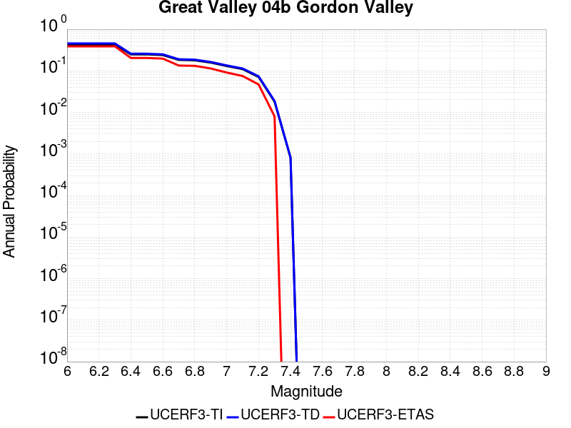 |
|-----|

| Magnitude | UCERF3-TI Prob | UCERF3-TD Prob | UCERF3-ETAS Prob |
|-----|-----|-----|-----|
| 6.0 | 0.42455328 | 0.45598844 | 0.389 |
| 6.1 | 0.42455328 | 0.45598844 | 0.389 |
| 6.2 | 0.42455328 | 0.45598844 | 0.389 |
| 6.3 | 0.42455328 | 0.45598844 | 0.389 |
| 6.4 | 0.24924628 | 0.25848088 | 0.204 |
| 6.5 | 0.24924628 | 0.25848088 | 0.204 |
| 6.6 | 0.23997498 | 0.2490381 | 0.197 |
| 6.7 | 0.18389802 | 0.190083 | 0.134 |
| 6.8 | 0.17954007 | 0.18562515 | 0.132 |
| 6.9 | 0.15827082 | 0.16359836 | 0.114 |
| 7.0 | 0.13073109 | 0.13519134 | 0.091 |
| 7.1 | 0.11004273 | 0.11388355 | 0.075 |
| 7.2 | 0.07125486 | 0.07387856 | 0.047 |
| 7.3 | 0.01811912 | 0.018772576 | 0.008 |
| 7.4 | 8.116137E-4 | 8.189901E-4 | 0.0 |

## Great Valley 05 Pittsburg - Kirby Hills alt1
*[(top)](#table-of-contents)*

| 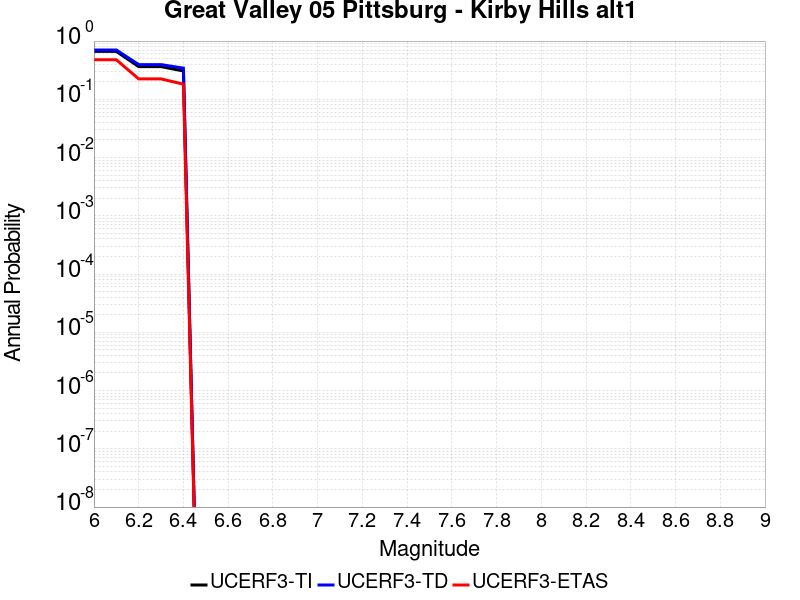 |
|-----|

| Magnitude | UCERF3-TI Prob | UCERF3-TD Prob | UCERF3-ETAS Prob |
|-----|-----|-----|-----|
| 6.0 | 0.66460174 | 0.7028373 | 0.478 |
| 6.1 | 0.66460174 | 0.7028373 | 0.478 |
| 6.2 | 0.36411613 | 0.3947691 | 0.224 |
| 6.3 | 0.36411613 | 0.3947691 | 0.224 |
| 6.4 | 0.30650038 | 0.34264013 | 0.182 |

## Great Valley 06 (Midland) 2011 CFM alt1
*[(top)](#table-of-contents)*

| 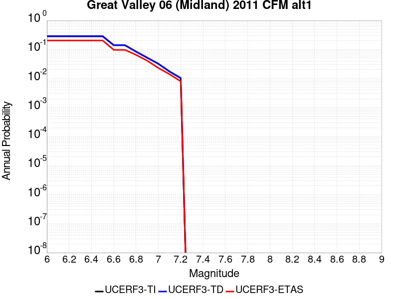 |
|-----|

| Magnitude | UCERF3-TI Prob | UCERF3-TD Prob | UCERF3-ETAS Prob |
|-----|-----|-----|-----|
| 6.0 | 0.2822707 | 0.2898884 | 0.204 |
| 6.1 | 0.2822707 | 0.2898884 | 0.204 |
| 6.2 | 0.2822707 | 0.2898884 | 0.204 |
| 6.3 | 0.2822707 | 0.2898884 | 0.204 |
| 6.4 | 0.2822707 | 0.2898884 | 0.204 |
| 6.5 | 0.2822707 | 0.2898884 | 0.204 |
| 6.6 | 0.13947093 | 0.14177094 | 0.097 |
| 6.7 | 0.13947093 | 0.14177094 | 0.097 |
| 6.8 | 0.08362864 | 0.084850535 | 0.065 |
| 6.9 | 0.05170962 | 0.052434284 | 0.041 |
| 7.0 | 0.031895474 | 0.032349817 | 0.023 |
| 7.1 | 0.017303472 | 0.01755915 | 0.014 |
| 7.2 | 0.010247622 | 0.010414718 | 0.008 |

## Great Valley 07 (Orestimba)
*[(top)](#table-of-contents)*

| 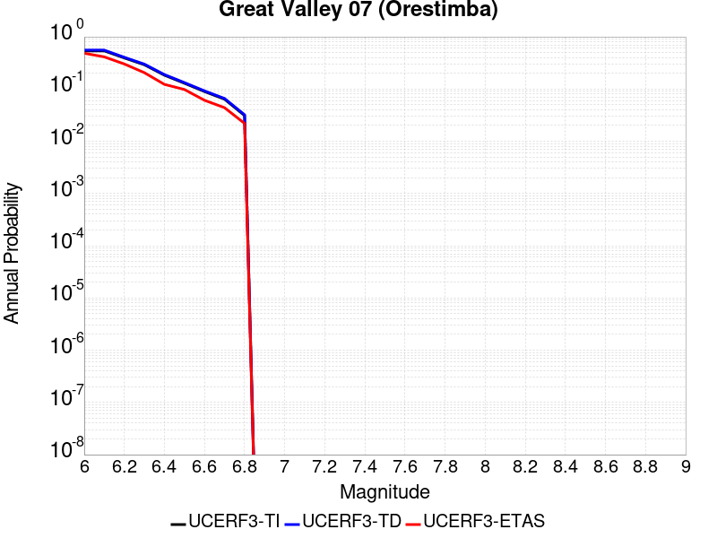 |
|-----|

| Magnitude | UCERF3-TI Prob | UCERF3-TD Prob | UCERF3-ETAS Prob |
|-----|-----|-----|-----|
| 6.0 | 0.5390878 | 0.5561087 | 0.485 |
| 6.1 | 0.5390878 | 0.5561087 | 0.413 |
| 6.2 | 0.39452472 | 0.40561563 | 0.302 |
| 6.3 | 0.29222164 | 0.30003324 | 0.206 |
| 6.4 | 0.18452431 | 0.18948086 | 0.123 |
| 6.5 | 0.12931353 | 0.13290825 | 0.098 |
| 6.6 | 0.08965436 | 0.09228206 | 0.061 |
| 6.7 | 0.064025715 | 0.06602371 | 0.044 |
| 6.8 | 0.031115005 | 0.032192554 | 0.022 |

## Great Valley 08 (Quinto)
*[(top)](#table-of-contents)*

| 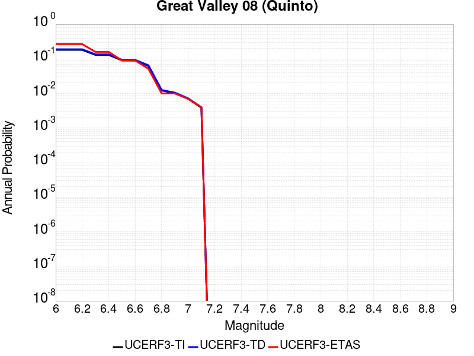 |
|-----|

| Magnitude | UCERF3-TI Prob | UCERF3-TD Prob | UCERF3-ETAS Prob |
|-----|-----|-----|-----|
| 6.0 | 0.1828003 | 0.18993734 | 0.269 |
| 6.1 | 0.1828003 | 0.18993734 | 0.269 |
| 6.2 | 0.1828003 | 0.18993734 | 0.269 |
| 6.3 | 0.13081953 | 0.13575023 | 0.16 |
| 6.4 | 0.13081953 | 0.13575023 | 0.16 |
| 6.5 | 0.0909339 | 0.094502404 | 0.09 |
| 6.6 | 0.08998671 | 0.093539044 | 0.09 |
| 6.7 | 0.06270418 | 0.06547381 | 0.052 |
| 6.8 | 0.012215583 | 0.012566058 | 0.01 |
| 6.9 | 0.010274779 | 0.01057407 | 0.01 |
| 7.0 | 0.0070269736 | 0.0072370316 | 0.007 |
| 7.1 | 0.0038612029 | 0.0039800406 | 0.004 |

## Great Valley 09 (Laguna Seca)
*[(top)](#table-of-contents)*

| 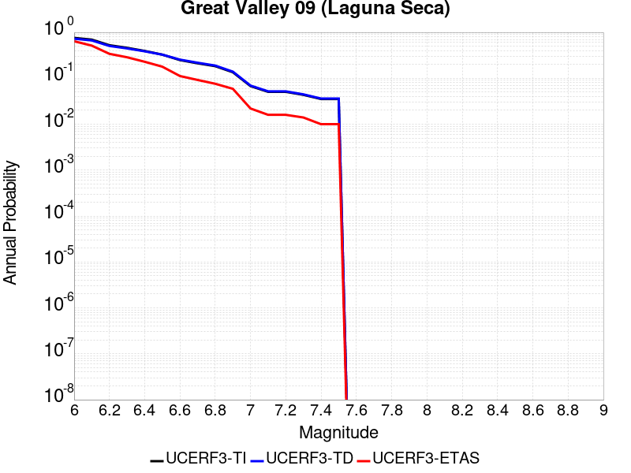 |
|-----|

| Magnitude | UCERF3-TI Prob | UCERF3-TD Prob | UCERF3-ETAS Prob |
|-----|-----|-----|-----|
| 6.0 | 0.75782067 | 0.7279214 | 0.641 |
| 6.1 | 0.69551456 | 0.6675252 | 0.515 |
| 6.2 | 0.5250353 | 0.50618577 | 0.341 |
| 6.3 | 0.46113566 | 0.4474478 | 0.287 |
| 6.4 | 0.39388737 | 0.38708693 | 0.229 |
| 6.5 | 0.32742706 | 0.32725924 | 0.179 |
| 6.6 | 0.24918081 | 0.25502414 | 0.112 |
| 6.7 | 0.21204689 | 0.21822412 | 0.092 |
| 6.8 | 0.18382072 | 0.18923579 | 0.076 |
| 6.9 | 0.13545766 | 0.1394214 | 0.059 |
| 7.0 | 0.0675716 | 0.0693708 | 0.022 |
| 7.1 | 0.0507194 | 0.05198043 | 0.016 |
| 7.2 | 0.0507194 | 0.05198043 | 0.016 |
| 7.3 | 0.043601155 | 0.044641946 | 0.014 |
| 7.4 | 0.035375025 | 0.036174554 | 0.01 |
| 7.5 | 0.035375025 | 0.036174554 | 0.01 |

## Great Valley 10 (Panoche)
*[(top)](#table-of-contents)*

| 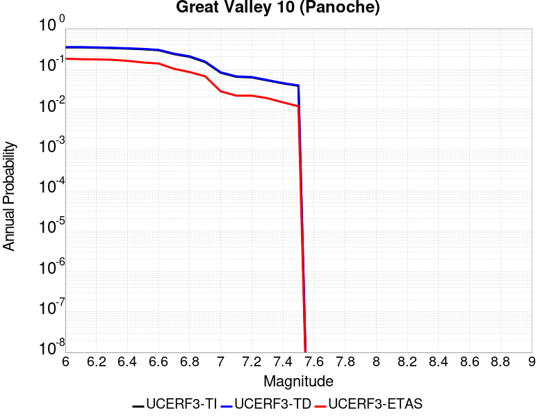 |
|-----|

| Magnitude | UCERF3-TI Prob | UCERF3-TD Prob | UCERF3-ETAS Prob |
|-----|-----|-----|-----|
| 6.0 | 0.34151497 | 0.3485032 | 0.18 |
| 6.1 | 0.34151497 | 0.3485032 | 0.175 |
| 6.2 | 0.33570984 | 0.34260565 | 0.173 |
| 6.3 | 0.32848078 | 0.33528793 | 0.169 |
| 6.4 | 0.3189067 | 0.325616 | 0.159 |
| 6.5 | 0.3074734 | 0.31413522 | 0.145 |
| 6.6 | 0.29128715 | 0.29791763 | 0.137 |
| 6.7 | 0.23316334 | 0.2397543 | 0.101 |
| 6.8 | 0.20010178 | 0.20582464 | 0.084 |
| 6.9 | 0.14816457 | 0.15237583 | 0.066 |
| 7.0 | 0.08084098 | 0.08293256 | 0.028 |
| 7.1 | 0.0642286 | 0.065795615 | 0.022 |
| 7.2 | 0.061867572 | 0.063369475 | 0.022 |
| 7.3 | 0.052225363 | 0.05344109 | 0.019 |
| 7.4 | 0.04407341 | 0.045051683 | 0.015 |
| 7.5 | 0.038384836 | 0.039245408 | 0.012 |

## Great Valley 11
*[(top)](#table-of-contents)*

| 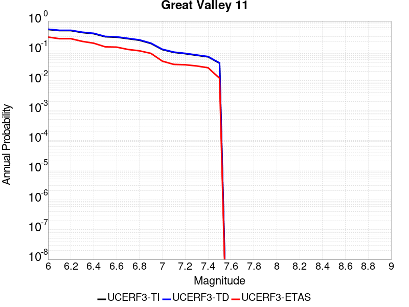 |
|-----|

| Magnitude | UCERF3-TI Prob | UCERF3-TD Prob | UCERF3-ETAS Prob |
|-----|-----|-----|-----|
| 6.0 | 0.5195866 | 0.53066176 | 0.289 |
| 6.1 | 0.47683355 | 0.48810703 | 0.255 |
| 6.2 | 0.47683355 | 0.48810703 | 0.255 |
| 6.3 | 0.41052297 | 0.42123863 | 0.207 |
| 6.4 | 0.37564966 | 0.3865477 | 0.18 |
| 6.5 | 0.29650795 | 0.3041283 | 0.136 |
| 6.6 | 0.28668198 | 0.29416126 | 0.133 |
| 6.7 | 0.2547878 | 0.26173133 | 0.111 |
| 6.8 | 0.22628894 | 0.23246007 | 0.1 |
| 6.9 | 0.17605208 | 0.18080384 | 0.082 |
| 7.0 | 0.1099111 | 0.11264329 | 0.045 |
| 7.1 | 0.0885682 | 0.09066255 | 0.035 |
| 7.2 | 0.08019173 | 0.08206523 | 0.034 |
| 7.3 | 0.07073786 | 0.07233503 | 0.031 |
| 7.4 | 0.06274514 | 0.06411307 | 0.027 |
| 7.5 | 0.038384836 | 0.039245408 | 0.012 |

## Great Valley 12
*[(top)](#table-of-contents)*

| 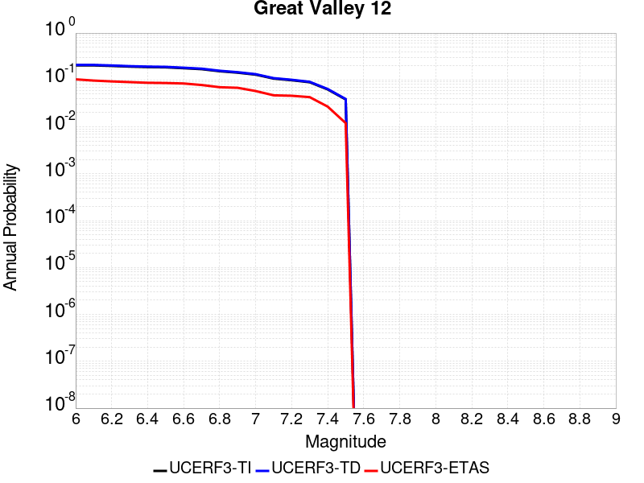 |
|-----|

| Magnitude | UCERF3-TI Prob | UCERF3-TD Prob | UCERF3-ETAS Prob |
|-----|-----|-----|-----|
| 6.0 | 0.20424901 | 0.20918818 | 0.103 |
| 6.1 | 0.20424901 | 0.20918818 | 0.097 |
| 6.2 | 0.19887424 | 0.20373607 | 0.093 |
| 6.3 | 0.19232118 | 0.19707577 | 0.09 |
| 6.4 | 0.18794739 | 0.19260274 | 0.087 |
| 6.5 | 0.18563746 | 0.19024582 | 0.086 |
| 6.6 | 0.17789312 | 0.18234432 | 0.084 |
| 6.7 | 0.16973622 | 0.174007 | 0.078 |
| 6.8 | 0.15325947 | 0.15699999 | 0.07 |
| 6.9 | 0.14287807 | 0.14636415 | 0.068 |
| 7.0 | 0.1296844 | 0.13281041 | 0.058 |
| 7.1 | 0.106799856 | 0.109268025 | 0.047 |
| 7.2 | 0.09859094 | 0.10084662 | 0.046 |
| 7.3 | 0.08932618 | 0.09131549 | 0.043 |
| 7.4 | 0.06274514 | 0.06411307 | 0.027 |
| 7.5 | 0.038384836 | 0.039245408 | 0.012 |

## Great Valley 13 (Coalinga)
*[(top)](#table-of-contents)*

| 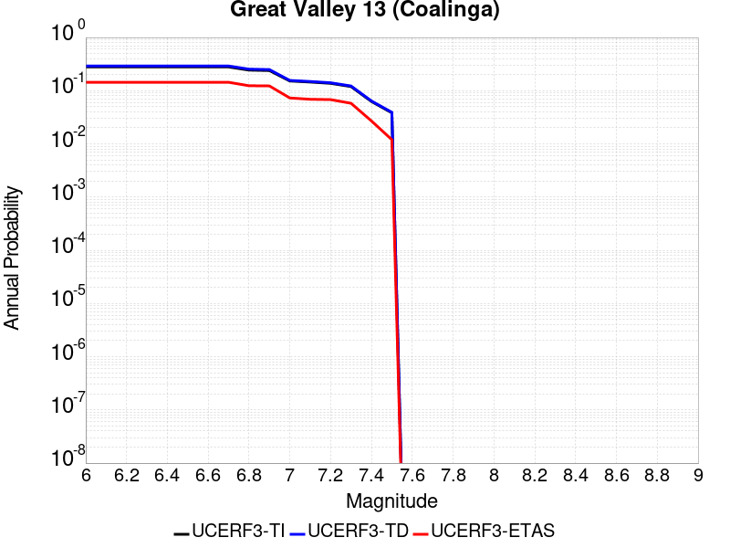 |
|-----|

| Magnitude | UCERF3-TI Prob | UCERF3-TD Prob | UCERF3-ETAS Prob |
|-----|-----|-----|-----|
| 6.0 | 0.27959946 | 0.29126394 | 0.144 |
| 6.1 | 0.27959946 | 0.29126394 | 0.144 |
| 6.2 | 0.27959946 | 0.29126394 | 0.144 |
| 6.3 | 0.27959946 | 0.29126394 | 0.144 |
| 6.4 | 0.27959946 | 0.29126394 | 0.144 |
| 6.5 | 0.27959946 | 0.29126394 | 0.144 |
| 6.6 | 0.27959946 | 0.29126394 | 0.144 |
| 6.7 | 0.27959946 | 0.29126394 | 0.144 |
| 6.8 | 0.24398153 | 0.25426465 | 0.124 |
| 6.9 | 0.23933199 | 0.24955405 | 0.123 |
| 7.0 | 0.15223595 | 0.1560017 | 0.073 |
| 7.1 | 0.14539015 | 0.14899144 | 0.069 |
| 7.2 | 0.1375359 | 0.1409456 | 0.068 |
| 7.3 | 0.11961763 | 0.122614615 | 0.058 |
| 7.4 | 0.06274514 | 0.06411307 | 0.027 |
| 7.5 | 0.038384836 | 0.039245408 | 0.012 |

## Great Valley 14 (Kettleman Hills)
*[(top)](#table-of-contents)*

| 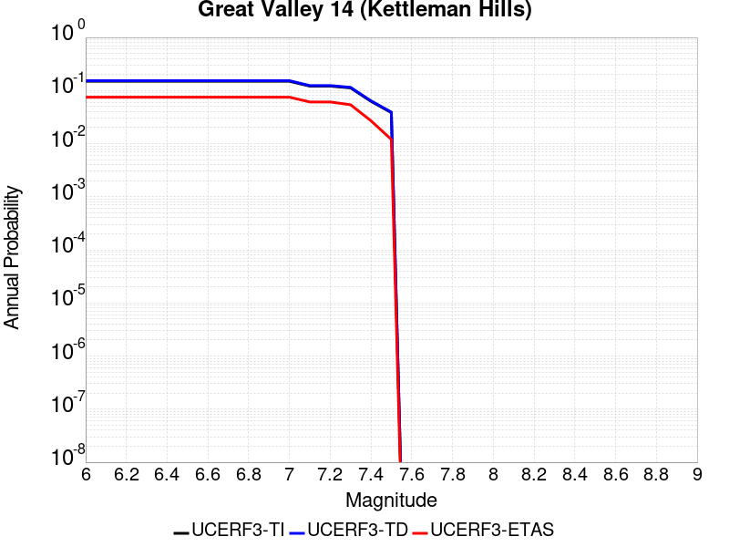 |
|-----|

| Magnitude | UCERF3-TI Prob | UCERF3-TD Prob | UCERF3-ETAS Prob |
|-----|-----|-----|-----|
| 6.0 | 0.14947799 | 0.1532289 | 0.075 |
| 6.1 | 0.14947799 | 0.1532289 | 0.075 |
| 6.2 | 0.14947799 | 0.1532289 | 0.075 |
| 6.3 | 0.14947799 | 0.1532289 | 0.075 |
| 6.4 | 0.14947799 | 0.1532289 | 0.075 |
| 6.5 | 0.14947799 | 0.1532289 | 0.075 |
| 6.6 | 0.14947799 | 0.1532289 | 0.075 |
| 6.7 | 0.14947799 | 0.1532289 | 0.075 |
| 6.8 | 0.14947799 | 0.1532289 | 0.075 |
| 6.9 | 0.14947799 | 0.1532289 | 0.075 |
| 7.0 | 0.14947799 | 0.1532289 | 0.075 |
| 7.1 | 0.121176995 | 0.12414497 | 0.061 |
| 7.2 | 0.121176995 | 0.12414497 | 0.061 |
| 7.3 | 0.11204533 | 0.114838295 | 0.054 |
| 7.4 | 0.06274514 | 0.06411307 | 0.027 |
| 7.5 | 0.038384836 | 0.039245408 | 0.012 |

## Green Valley 2011 CFM
*[(top)](#table-of-contents)*

| 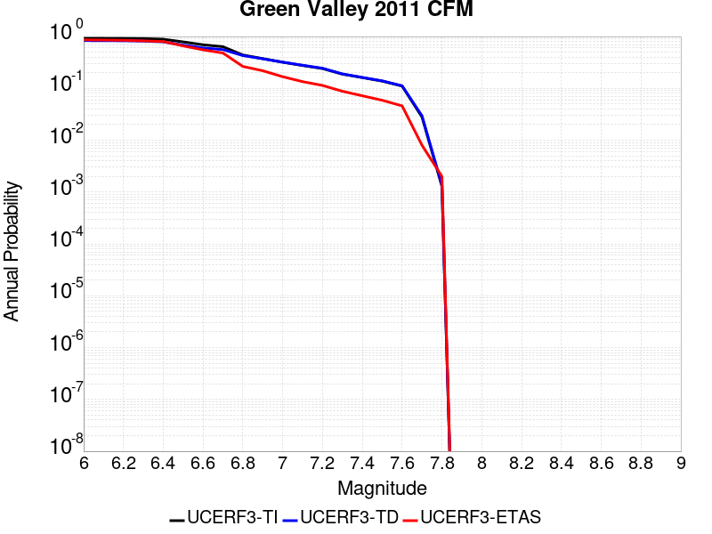 |
|-----|

| Magnitude | UCERF3-TI Prob | UCERF3-TD Prob | UCERF3-ETAS Prob |
|-----|-----|-----|-----|
| 6.0 | 0.92568094 | 0.8335309 | 0.864 |
| 6.1 | 0.924177 | 0.83180416 | 0.857 |
| 6.2 | 0.92033887 | 0.82728255 | 0.846 |
| 6.3 | 0.9110741 | 0.8164984 | 0.825 |
| 6.4 | 0.8880132 | 0.7891286 | 0.802 |
| 6.5 | 0.7883591 | 0.68391913 | 0.66 |
| 6.6 | 0.69378793 | 0.6031804 | 0.554 |
| 6.7 | 0.63668877 | 0.5598139 | 0.481 |
| 6.8 | 0.44088355 | 0.4289626 | 0.265 |
| 6.9 | 0.37557262 | 0.37196082 | 0.219 |
| 7.0 | 0.31966048 | 0.32071462 | 0.168 |
| 7.1 | 0.27638924 | 0.27961105 | 0.135 |
| 7.2 | 0.24128991 | 0.24474277 | 0.114 |
| 7.3 | 0.1883349 | 0.19017479 | 0.088 |
| 7.4 | 0.16162421 | 0.16277961 | 0.072 |
| 7.5 | 0.138153 | 0.13967061 | 0.059 |
| 7.6 | 0.11085739 | 0.11225351 | 0.046 |
| 7.7 | 0.027969718 | 0.029525701 | 0.008 |
| 7.8 | 0.001287301 | 0.0013660516 | 0.002 |

## Greenville (No) 2011 CFM
*[(top)](#table-of-contents)*

| 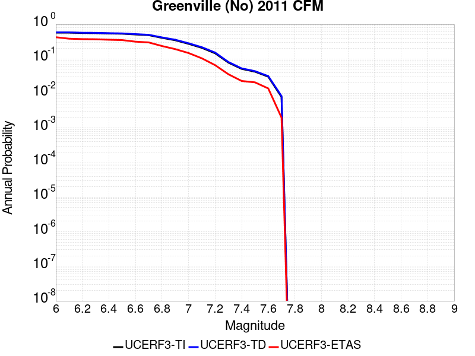 |
|-----|

| Magnitude | UCERF3-TI Prob | UCERF3-TD Prob | UCERF3-ETAS Prob |
|-----|-----|-----|-----|
| 6.0 | 0.5757696 | 0.58471537 | 0.425 |
| 6.1 | 0.5757696 | 0.58471537 | 0.385 |
| 6.2 | 0.56263626 | 0.57210565 | 0.374 |
| 6.3 | 0.55880105 | 0.5684403 | 0.37 |
| 6.4 | 0.5455442 | 0.5557172 | 0.359 |
| 6.5 | 0.53727937 | 0.5477875 | 0.351 |
| 6.6 | 0.51004004 | 0.5213365 | 0.316 |
| 6.7 | 0.48742387 | 0.4991479 | 0.3 |
| 6.8 | 0.40745693 | 0.41929334 | 0.236 |
| 6.9 | 0.34677014 | 0.35869148 | 0.192 |
| 7.0 | 0.27360973 | 0.28375456 | 0.148 |
| 7.1 | 0.2092021 | 0.21808124 | 0.104 |
| 7.2 | 0.14550844 | 0.15250298 | 0.066 |
| 7.3 | 0.07819795 | 0.08137457 | 0.036 |
| 7.4 | 0.051469978 | 0.053229216 | 0.023 |
| 7.5 | 0.04279203 | 0.044258714 | 0.021 |
| 7.6 | 0.030658968 | 0.031800903 | 0.014 |
| 7.7 | 0.007916393 | 0.00840639 | 0.002 |

## Greenville (So) 2011 CFM
*[(top)](#table-of-contents)*

| 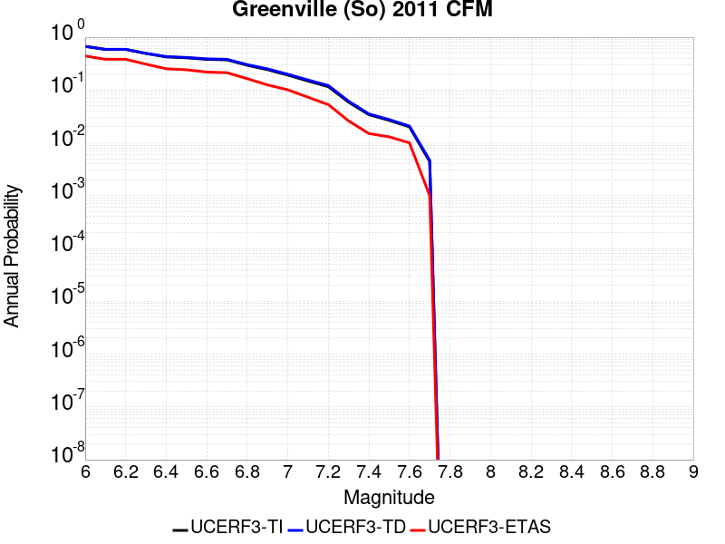 |
|-----|

| Magnitude | UCERF3-TI Prob | UCERF3-TD Prob | UCERF3-ETAS Prob |
|-----|-----|-----|-----|
| 6.0 | 0.6725976 | 0.66958445 | 0.442 |
| 6.1 | 0.5885319 | 0.5894694 | 0.382 |
| 6.2 | 0.5885319 | 0.5894694 | 0.382 |
| 6.3 | 0.49195778 | 0.49591583 | 0.309 |
| 6.4 | 0.42401013 | 0.4306335 | 0.253 |
| 6.5 | 0.4070224 | 0.41455507 | 0.242 |
| 6.6 | 0.38117167 | 0.38971785 | 0.219 |
| 6.7 | 0.3728512 | 0.38171008 | 0.213 |
| 6.8 | 0.29454273 | 0.3029151 | 0.164 |
| 6.9 | 0.24297246 | 0.2513749 | 0.125 |
| 7.0 | 0.19170204 | 0.19919585 | 0.101 |
| 7.1 | 0.14816616 | 0.15497994 | 0.073 |
| 7.2 | 0.115710944 | 0.121595584 | 0.053 |
| 7.3 | 0.058894437 | 0.061483294 | 0.026 |
| 7.4 | 0.03413895 | 0.035342984 | 0.015 |
| 7.5 | 0.026673982 | 0.027612198 | 0.013 |
| 7.6 | 0.020053962 | 0.02080179 | 0.01 |
| 7.7 | 0.004406595 | 0.0046879794 | 0.001 |

## Hartley Springs 2011 CFM
*[(top)](#table-of-contents)*

| 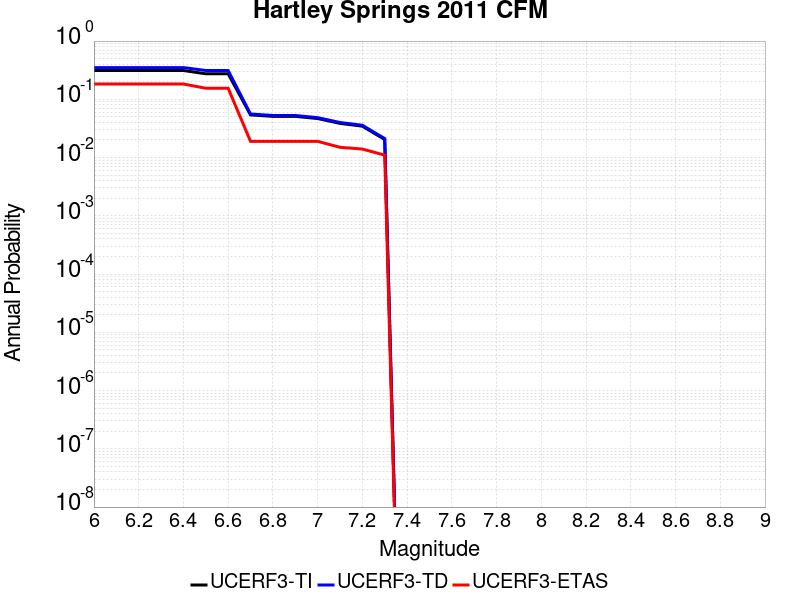 |
|-----|

| Magnitude | UCERF3-TI Prob | UCERF3-TD Prob | UCERF3-ETAS Prob |
|-----|-----|-----|-----|
| 6.0 | 0.31233054 | 0.35062808 | 0.183 |
| 6.1 | 0.31233054 | 0.35062808 | 0.183 |
| 6.2 | 0.31233054 | 0.35062808 | 0.183 |
| 6.3 | 0.31233054 | 0.35062808 | 0.183 |
| 6.4 | 0.31233054 | 0.35062808 | 0.183 |
| 6.5 | 0.27412298 | 0.31253907 | 0.155 |
| 6.6 | 0.27412298 | 0.31253907 | 0.155 |
| 6.7 | 0.054011483 | 0.055954795 | 0.019 |
| 6.8 | 0.05096846 | 0.052808937 | 0.019 |
| 6.9 | 0.05096846 | 0.052808937 | 0.019 |
| 7.0 | 0.04678761 | 0.04848476 | 0.019 |
| 7.1 | 0.03862394 | 0.040023416 | 0.015 |
| 7.2 | 0.03458485 | 0.03585311 | 0.014 |
| 7.3 | 0.020399636 | 0.021216193 | 0.011 |

## Hat Creek-McArthur-Mayfield
*[(top)](#table-of-contents)*

| 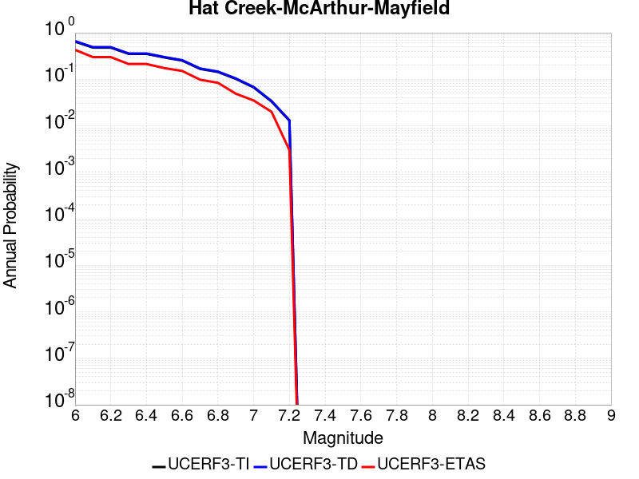 |
|-----|

| Magnitude | UCERF3-TI Prob | UCERF3-TD Prob | UCERF3-ETAS Prob |
|-----|-----|-----|-----|
| 6.0 | 0.6448098 | 0.66297567 | 0.43 |
| 6.1 | 0.47972023 | 0.49118084 | 0.3 |
| 6.2 | 0.47972023 | 0.49118084 | 0.3 |
| 6.3 | 0.35190126 | 0.35924867 | 0.213 |
| 6.4 | 0.35190126 | 0.35924867 | 0.213 |
| 6.5 | 0.29493424 | 0.3010859 | 0.174 |
| 6.6 | 0.25216386 | 0.25744757 | 0.151 |
| 6.7 | 0.16735604 | 0.17084831 | 0.098 |
| 6.8 | 0.14356367 | 0.14658058 | 0.084 |
| 6.9 | 0.10214309 | 0.10430931 | 0.049 |
| 7.0 | 0.06683244 | 0.06824563 | 0.035 |
| 7.1 | 0.033328667 | 0.034051966 | 0.02 |
| 7.2 | 0.0128780175 | 0.0131767895 | 0.003 |

## Hayward (No) 2011 CFM
*[(top)](#table-of-contents)*

| 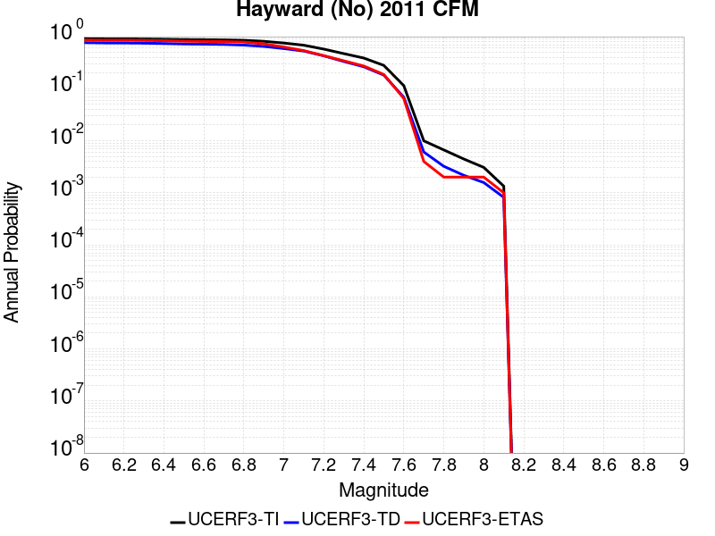 |
|-----|

| Magnitude | UCERF3-TI Prob | UCERF3-TD Prob | UCERF3-ETAS Prob |
|-----|-----|-----|-----|
| 6.0 | 0.9118049 | 0.7671207 | 0.862 |
| 6.1 | 0.9058267 | 0.7582363 | 0.853 |
| 6.2 | 0.90462136 | 0.7562537 | 0.853 |
| 6.3 | 0.90021574 | 0.7500391 | 0.846 |
| 6.4 | 0.89187944 | 0.7386276 | 0.836 |
| 6.5 | 0.8808043 | 0.7239653 | 0.82 |
| 6.6 | 0.87556106 | 0.71700096 | 0.81 |
| 6.7 | 0.86856145 | 0.708287 | 0.804 |
| 6.8 | 0.8522151 | 0.6895537 | 0.788 |
| 6.9 | 0.81454986 | 0.6495401 | 0.729 |
| 7.0 | 0.7546427 | 0.5907006 | 0.633 |
| 7.1 | 0.6852597 | 0.5287939 | 0.54 |
| 7.2 | 0.57679987 | 0.4281534 | 0.432 |
| 7.3 | 0.47259364 | 0.33340377 | 0.344 |
| 7.4 | 0.3881481 | 0.263607 | 0.273 |
| 7.5 | 0.28086284 | 0.1824613 | 0.188 |
| 7.6 | 0.114625074 | 0.068569414 | 0.065 |
| 7.7 | 0.009968095 | 0.0059976615 | 0.004 |
| 7.8 | 0.006666374 | 0.0031881544 | 0.002 |
| 7.9 | 0.004462044 | 0.0021390535 | 0.002 |
| 8.0 | 0.0030761154 | 0.0015569513 | 0.002 |
| 8.1 | 0.0013397089 | 8.075321E-4 | 0.001 |

## Hayward (So) 2011 CFM
*[(top)](#table-of-contents)*

| 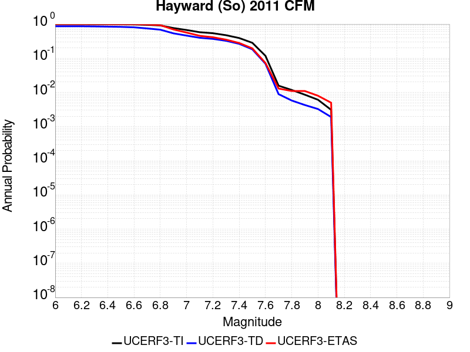 |
|-----|

| Magnitude | UCERF3-TI Prob | UCERF3-TD Prob | UCERF3-ETAS Prob |
|-----|-----|-----|-----|
| 6.0 | 0.9910891 | 0.86425304 | 0.997 |
| 6.1 | 0.9910891 | 0.86425304 | 0.997 |
| 6.2 | 0.9910891 | 0.86425304 | 0.997 |
| 6.3 | 0.98910886 | 0.85480416 | 0.997 |
| 6.4 | 0.9859031 | 0.84151495 | 0.995 |
| 6.5 | 0.9829281 | 0.829355 | 0.994 |
| 6.6 | 0.9743901 | 0.8043317 | 0.992 |
| 6.7 | 0.94983983 | 0.7455139 | 0.971 |
| 6.8 | 0.9136398 | 0.6852974 | 0.93 |
| 6.9 | 0.7650726 | 0.5355778 | 0.696 |
| 7.0 | 0.6714461 | 0.4600879 | 0.565 |
| 7.1 | 0.5778929 | 0.39664966 | 0.453 |
| 7.2 | 0.5411154 | 0.3685794 | 0.412 |
| 7.3 | 0.47310492 | 0.3241034 | 0.35 |
| 7.4 | 0.3908918 | 0.26410803 | 0.28 |
| 7.5 | 0.28359538 | 0.18264852 | 0.195 |
| 7.6 | 0.118049406 | 0.06901837 | 0.073 |
| 7.7 | 0.015746962 | 0.008778189 | 0.013 |
| 7.8 | 0.011811486 | 0.005725691 | 0.011 |
| 7.9 | 0.008576842 | 0.004227864 | 0.011 |
| 8.0 | 0.0061045466 | 0.003230439 | 0.008 |
| 8.1 | 0.0030952024 | 0.0018858446 | 0.005 |

## Hayward (So) extension 2011 CFM
*[(top)](#table-of-contents)*

| 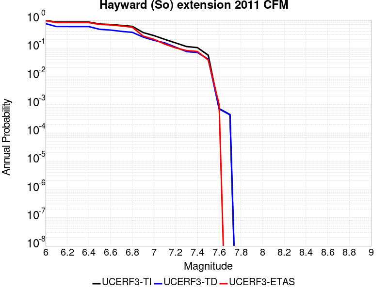 |
|-----|

| Magnitude | UCERF3-TI Prob | UCERF3-TD Prob | UCERF3-ETAS Prob |
|-----|-----|-----|-----|
| 6.0 | 0.9530265 | 0.74069923 | 0.938 |
| 6.1 | 0.83864456 | 0.58081436 | 0.803 |
| 6.2 | 0.83864456 | 0.58081436 | 0.803 |
| 6.3 | 0.8377673 | 0.579256 | 0.802 |
| 6.4 | 0.83695287 | 0.5780464 | 0.802 |
| 6.5 | 0.7131305 | 0.46313572 | 0.692 |
| 6.6 | 0.68814945 | 0.4372095 | 0.663 |
| 6.7 | 0.6370423 | 0.39269212 | 0.61 |
| 6.8 | 0.5905085 | 0.36325753 | 0.551 |
| 6.9 | 0.35701612 | 0.24641798 | 0.266 |
| 7.0 | 0.27846178 | 0.18916328 | 0.205 |
| 7.1 | 0.20413327 | 0.15330411 | 0.139 |
| 7.2 | 0.15276887 | 0.10757406 | 0.102 |
| 7.3 | 0.11414275 | 0.07583397 | 0.082 |
| 7.4 | 0.10458853 | 0.07007442 | 0.076 |
| 7.5 | 0.05624195 | 0.04064777 | 0.038 |
| 7.6 | 7.2899484E-4 | 7.050879E-4 | 0.001 |
| 7.7 | 4.484453E-4 | 4.3528483E-4 | 0.0 |

## Hector Mine
*[(top)](#table-of-contents)*

| 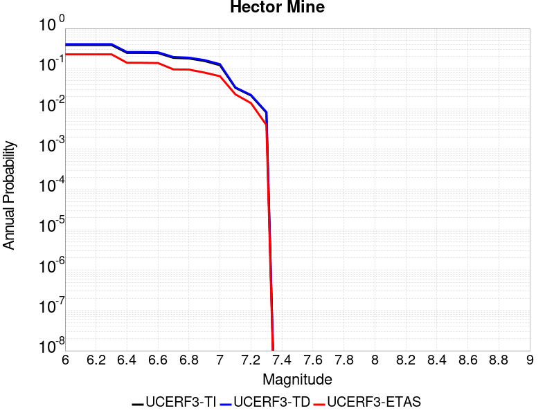 |
|-----|

| Magnitude | UCERF3-TI Prob | UCERF3-TD Prob | UCERF3-ETAS Prob |
|-----|-----|-----|-----|
| 6.0 | 0.38703167 | 0.4066272 | 0.227 |
| 6.1 | 0.38703167 | 0.4066272 | 0.227 |
| 6.2 | 0.38703167 | 0.4066272 | 0.227 |
| 6.3 | 0.38703167 | 0.4066272 | 0.227 |
| 6.4 | 0.24728088 | 0.25868213 | 0.14 |
| 6.5 | 0.24728088 | 0.25868213 | 0.14 |
| 6.6 | 0.2441851 | 0.25555074 | 0.138 |
| 6.7 | 0.18585677 | 0.1945622 | 0.096 |
| 6.8 | 0.17918172 | 0.18776812 | 0.095 |
| 6.9 | 0.15538783 | 0.16349313 | 0.08 |
| 7.0 | 0.12220506 | 0.12942117 | 0.065 |
| 7.1 | 0.033341188 | 0.03428691 | 0.023 |
| 7.2 | 0.021657985 | 0.02229937 | 0.014 |
| 7.3 | 0.0081330845 | 0.008373384 | 0.004 |

## Helendale-So Lockhart
*[(top)](#table-of-contents)*

| 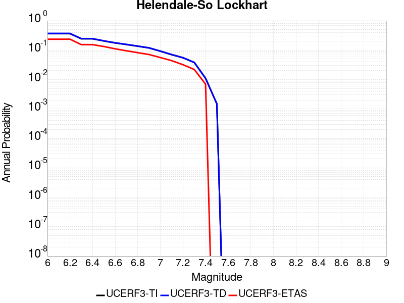 |
|-----|

| Magnitude | UCERF3-TI Prob | UCERF3-TD Prob | UCERF3-ETAS Prob |
|-----|-----|-----|-----|
| 6.0 | 0.36316562 | 0.3705544 | 0.236 |
| 6.1 | 0.36316562 | 0.3705544 | 0.236 |
| 6.2 | 0.36316562 | 0.3705544 | 0.236 |
| 6.3 | 0.24296905 | 0.2462248 | 0.154 |
| 6.4 | 0.24296905 | 0.2462248 | 0.154 |
| 6.5 | 0.20493136 | 0.20757179 | 0.133 |
| 6.6 | 0.17550305 | 0.17773862 | 0.111 |
| 6.7 | 0.15510091 | 0.15707797 | 0.095 |
| 6.8 | 0.13593142 | 0.13763401 | 0.082 |
| 6.9 | 0.11860513 | 0.12007238 | 0.071 |
| 7.0 | 0.09187008 | 0.09300424 | 0.056 |
| 7.1 | 0.07010339 | 0.07095923 | 0.044 |
| 7.2 | 0.054972194 | 0.05565079 | 0.032 |
| 7.3 | 0.0379352 | 0.038418185 | 0.022 |
| 7.4 | 0.010980636 | 0.011128791 | 0.007 |
| 7.5 | 0.0014844815 | 0.001503728 | 0.0 |

## Hilton Creek 2011 CFM
*[(top)](#table-of-contents)*

| 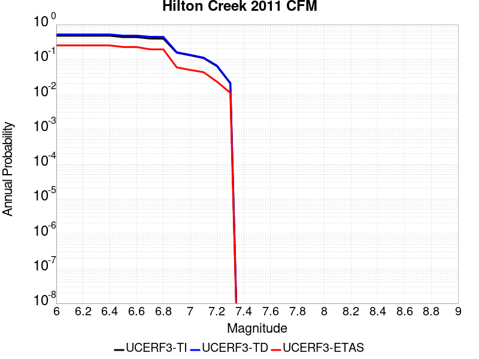 |
|-----|

| Magnitude | UCERF3-TI Prob | UCERF3-TD Prob | UCERF3-ETAS Prob |
|-----|-----|-----|-----|
| 6.0 | 0.4780843 | 0.52216107 | 0.252 |
| 6.1 | 0.4780843 | 0.52216107 | 0.252 |
| 6.2 | 0.4780843 | 0.52216107 | 0.252 |
| 6.3 | 0.4780843 | 0.52216107 | 0.252 |
| 6.4 | 0.4780843 | 0.52216107 | 0.252 |
| 6.5 | 0.43618488 | 0.4831489 | 0.227 |
| 6.6 | 0.43618488 | 0.4831489 | 0.227 |
| 6.7 | 0.39714086 | 0.4467292 | 0.195 |
| 6.8 | 0.39360002 | 0.4433727 | 0.194 |
| 6.9 | 0.15555602 | 0.16083181 | 0.059 |
| 7.0 | 0.13114384 | 0.13568917 | 0.05 |
| 7.1 | 0.10885126 | 0.112734705 | 0.043 |
| 7.2 | 0.06400892 | 0.066561095 | 0.023 |
| 7.3 | 0.020399636 | 0.021216193 | 0.011 |

## Hollywood
*[(top)](#table-of-contents)*

| 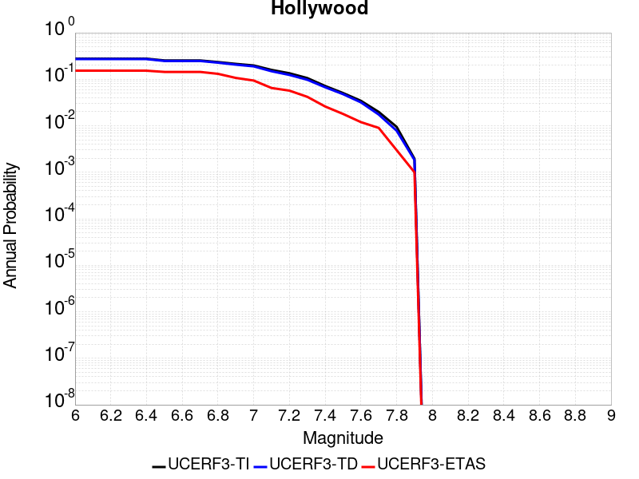 |
|-----|

| Magnitude | UCERF3-TI Prob | UCERF3-TD Prob | UCERF3-ETAS Prob |
|-----|-----|-----|-----|
| 6.0 | 0.27731463 | 0.27182204 | 0.153 |
| 6.1 | 0.27731463 | 0.27182204 | 0.153 |
| 6.2 | 0.27731463 | 0.27182204 | 0.153 |
| 6.3 | 0.27731463 | 0.27182204 | 0.153 |
| 6.4 | 0.2769801 | 0.27147657 | 0.153 |
| 6.5 | 0.25420403 | 0.24775968 | 0.144 |
| 6.6 | 0.2540453 | 0.24759568 | 0.144 |
| 6.7 | 0.25395447 | 0.24750175 | 0.144 |
| 6.8 | 0.2347021 | 0.22741067 | 0.131 |
| 6.9 | 0.21446222 | 0.20628299 | 0.107 |
| 7.0 | 0.19836134 | 0.18953557 | 0.094 |
| 7.1 | 0.15913862 | 0.1488224 | 0.065 |
| 7.2 | 0.13477863 | 0.123959236 | 0.057 |
| 7.3 | 0.10625966 | 0.09766158 | 0.042 |
| 7.4 | 0.07178039 | 0.06736538 | 0.026 |
| 7.5 | 0.050660014 | 0.047920372 | 0.018 |
| 7.6 | 0.03448371 | 0.031906024 | 0.012 |
| 7.7 | 0.019846173 | 0.017426383 | 0.009 |
| 7.8 | 0.00949345 | 0.007848732 | 0.003 |
| 7.9 | 0.0019554193 | 0.0018435472 | 0.001 |

## Holser alt 1
*[(top)](#table-of-contents)*

| 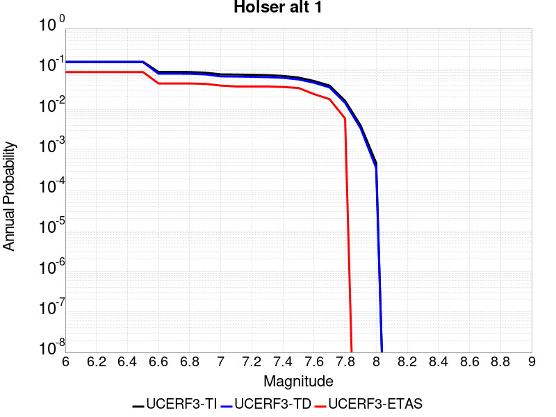 |
|-----|

| Magnitude | UCERF3-TI Prob | UCERF3-TD Prob | UCERF3-ETAS Prob |
|-----|-----|-----|-----|
| 6.0 | 0.15100506 | 0.14738627 | 0.084 |
| 6.1 | 0.15100506 | 0.14738627 | 0.084 |
| 6.2 | 0.15100506 | 0.14738627 | 0.084 |
| 6.3 | 0.15100506 | 0.14738627 | 0.084 |
| 6.4 | 0.15100506 | 0.14738627 | 0.084 |
| 6.5 | 0.15100506 | 0.14738627 | 0.084 |
| 6.6 | 0.08430598 | 0.07670671 | 0.044 |
| 6.7 | 0.08430598 | 0.07670671 | 0.044 |
| 6.8 | 0.084083974 | 0.07648062 | 0.044 |
| 6.9 | 0.08137117 | 0.07371114 | 0.043 |
| 7.0 | 0.07368153 | 0.06583677 | 0.039 |
| 7.1 | 0.07308011 | 0.065253496 | 0.037 |
| 7.2 | 0.07208013 | 0.06428114 | 0.037 |
| 7.3 | 0.07058585 | 0.062963046 | 0.037 |
| 7.4 | 0.06762019 | 0.0606113 | 0.036 |
| 7.5 | 0.06153931 | 0.05542231 | 0.034 |
| 7.6 | 0.050629098 | 0.045862608 | 0.024 |
| 7.7 | 0.038953718 | 0.035140537 | 0.018 |
| 7.8 | 0.016427515 | 0.014616446 | 0.006 |
| 7.9 | 0.0040251333 | 0.0034370322 | 0.0 |
| 8.0 | 4.7752372E-4 | 3.632265E-4 | 0.0 |

## Homestead Valley 2011
*[(top)](#table-of-contents)*

| 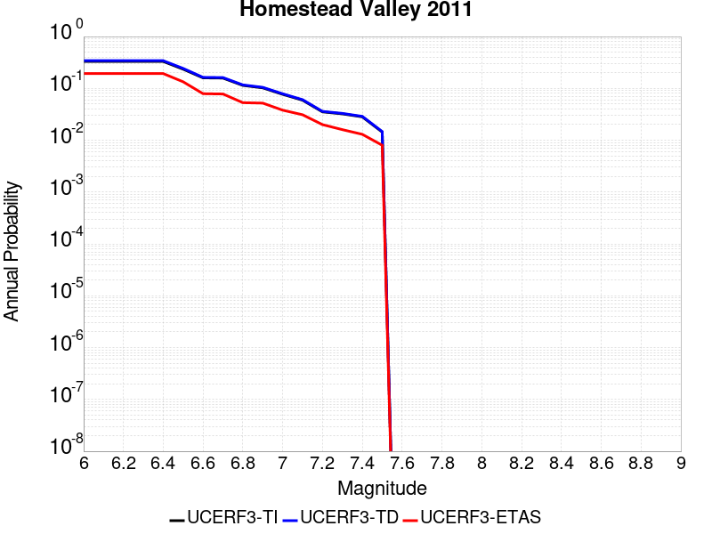 |
|-----|

| Magnitude | UCERF3-TI Prob | UCERF3-TD Prob | UCERF3-ETAS Prob |
|-----|-----|-----|-----|
| 6.0 | 0.33083498 | 0.3423675 | 0.193 |
| 6.1 | 0.33083498 | 0.3423675 | 0.193 |
| 6.2 | 0.33083498 | 0.3423675 | 0.193 |
| 6.3 | 0.33083498 | 0.3423675 | 0.193 |
| 6.4 | 0.33083498 | 0.3423675 | 0.193 |
| 6.5 | 0.23495042 | 0.24295741 | 0.134 |
| 6.6 | 0.15959981 | 0.1632656 | 0.079 |
| 6.7 | 0.15807973 | 0.16172062 | 0.078 |
| 6.8 | 0.114203654 | 0.11675758 | 0.053 |
| 6.9 | 0.10244808 | 0.10478446 | 0.052 |
| 7.0 | 0.076907314 | 0.0786969 | 0.038 |
| 7.1 | 0.05924382 | 0.060592566 | 0.031 |
| 7.2 | 0.035247512 | 0.035982847 | 0.02 |
| 7.3 | 0.032270525 | 0.032945596 | 0.016 |
| 7.4 | 0.028275661 | 0.028873065 | 0.013 |
| 7.5 | 0.014393007 | 0.014709235 | 0.008 |

## Honey Lake 2011 CFM
*[(top)](#table-of-contents)*

| 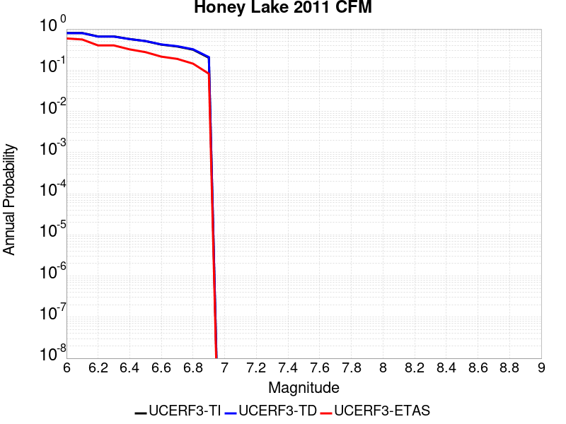 |
|-----|

| Magnitude | UCERF3-TI Prob | UCERF3-TD Prob | UCERF3-ETAS Prob |
|-----|-----|-----|-----|
| 6.0 | 0.79930663 | 0.79414546 | 0.591 |
| 6.1 | 0.79930663 | 0.79414546 | 0.556 |
| 6.2 | 0.6598687 | 0.65407753 | 0.399 |
| 6.3 | 0.6598687 | 0.65407753 | 0.399 |
| 6.4 | 0.5705037 | 0.5683746 | 0.32 |
| 6.5 | 0.5082485 | 0.50916785 | 0.274 |
| 6.6 | 0.41717136 | 0.42239228 | 0.213 |
| 6.7 | 0.37574774 | 0.38276833 | 0.188 |
| 6.8 | 0.31452027 | 0.3218605 | 0.144 |
| 6.9 | 0.20024033 | 0.20775837 | 0.082 |

## Hosgri
*[(top)](#table-of-contents)*

| 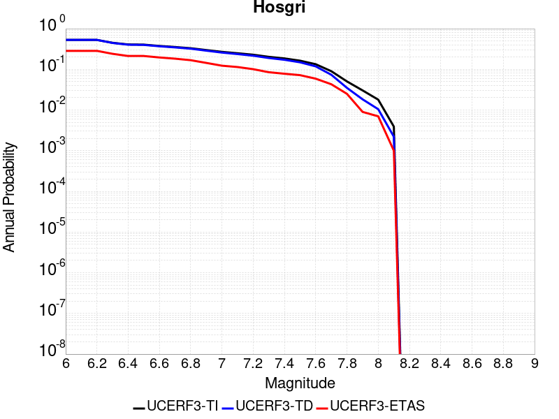 |
|-----|

| Magnitude | UCERF3-TI Prob | UCERF3-TD Prob | UCERF3-ETAS Prob |
|-----|-----|-----|-----|
| 6.0 | 0.5287752 | 0.5293568 | 0.285 |
| 6.1 | 0.5287752 | 0.5293568 | 0.285 |
| 6.2 | 0.5287752 | 0.5293568 | 0.285 |
| 6.3 | 0.449995 | 0.44555634 | 0.241 |
| 6.4 | 0.4095662 | 0.4034138 | 0.213 |
| 6.5 | 0.4053705 | 0.39908585 | 0.213 |
| 6.6 | 0.3763341 | 0.36903706 | 0.196 |
| 6.7 | 0.3541947 | 0.3461689 | 0.183 |
| 6.8 | 0.33089048 | 0.32207167 | 0.168 |
| 6.9 | 0.29806814 | 0.28809255 | 0.144 |
| 7.0 | 0.26939136 | 0.2584 | 0.123 |
| 7.1 | 0.24894127 | 0.237286 | 0.114 |
| 7.2 | 0.22887193 | 0.21656431 | 0.101 |
| 7.3 | 0.20308083 | 0.1899347 | 0.085 |
| 7.4 | 0.18553723 | 0.17184643 | 0.078 |
| 7.5 | 0.16339442 | 0.14898719 | 0.072 |
| 7.6 | 0.13374811 | 0.11841013 | 0.059 |
| 7.7 | 0.08999014 | 0.073514275 | 0.043 |
| 7.8 | 0.05047783 | 0.035112474 | 0.025 |
| 7.9 | 0.030363783 | 0.018368028 | 0.009 |
| 8.0 | 0.018001862 | 0.010503061 | 0.007 |
| 8.1 | 0.00391439 | 0.0022130606 | 0.001 |

## Hosgri (Extension)
*[(top)](#table-of-contents)*

| 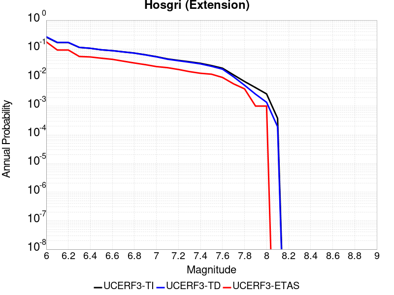 |
|-----|

| Magnitude | UCERF3-TI Prob | UCERF3-TD Prob | UCERF3-ETAS Prob |
|-----|-----|-----|-----|
| 6.0 | 0.25666934 | 0.26401466 | 0.175 |
| 6.1 | 0.16550563 | 0.16772749 | 0.091 |
| 6.2 | 0.16550563 | 0.16772749 | 0.091 |
| 6.3 | 0.111896105 | 0.1123062 | 0.054 |
| 6.4 | 0.10420825 | 0.10445301 | 0.052 |
| 6.5 | 0.0924293 | 0.092423245 | 0.047 |
| 6.6 | 0.08632671 | 0.08618417 | 0.043 |
| 6.7 | 0.078256615 | 0.07793517 | 0.037 |
| 6.8 | 0.07115067 | 0.070669785 | 0.032 |
| 6.9 | 0.062019493 | 0.06133479 | 0.028 |
| 7.0 | 0.05333387 | 0.05245714 | 0.024 |
| 7.1 | 0.044489734 | 0.043420445 | 0.022 |
| 7.2 | 0.039522924 | 0.038347688 | 0.019 |
| 7.3 | 0.03530022 | 0.034034807 | 0.016 |
| 7.4 | 0.031188505 | 0.029834611 | 0.014 |
| 7.5 | 0.02600891 | 0.024545511 | 0.013 |
| 7.6 | 0.021053186 | 0.019484546 | 0.01 |
| 7.7 | 0.012336085 | 0.010575006 | 0.006 |
| 7.8 | 0.007233802 | 0.0053501 | 0.004 |
| 7.9 | 0.004411874 | 0.0026114006 | 0.001 |
| 8.0 | 0.0026642028 | 0.0013609739 | 0.001 |
| 8.1 | 3.7486234E-4 | 1.9108402E-4 | 0.0 |

## Hunter Mountain-Saline Valley
*[(top)](#table-of-contents)*

| 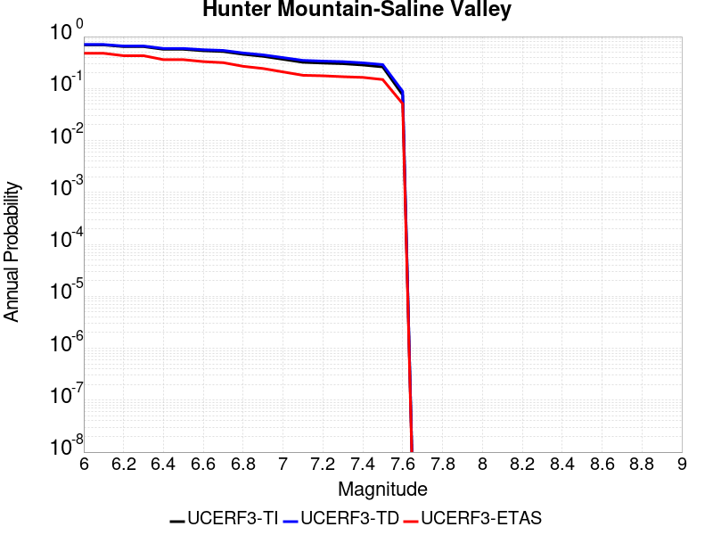 |
|-----|

| Magnitude | UCERF3-TI Prob | UCERF3-TD Prob | UCERF3-ETAS Prob |
|-----|-----|-----|-----|
| 6.0 | 0.6917207 | 0.7048744 | 0.477 |
| 6.1 | 0.6917207 | 0.7048744 | 0.477 |
| 6.2 | 0.641915 | 0.659207 | 0.429 |
| 6.3 | 0.641915 | 0.659207 | 0.429 |
| 6.4 | 0.5695837 | 0.59132576 | 0.36 |
| 6.5 | 0.5695837 | 0.59132576 | 0.36 |
| 6.6 | 0.53447044 | 0.5589368 | 0.33 |
| 6.7 | 0.5161517 | 0.5420544 | 0.315 |
| 6.8 | 0.4567753 | 0.4843257 | 0.268 |
| 6.9 | 0.41716284 | 0.4450421 | 0.243 |
| 7.0 | 0.36592245 | 0.39391592 | 0.209 |
| 7.1 | 0.32045063 | 0.34865037 | 0.18 |
| 7.2 | 0.3092311 | 0.33755195 | 0.176 |
| 7.3 | 0.3010799 | 0.3293732 | 0.169 |
| 7.4 | 0.2840954 | 0.3123189 | 0.164 |
| 7.5 | 0.2610494 | 0.28902075 | 0.149 |
| 7.6 | 0.075227775 | 0.088272825 | 0.051 |

## Hunting Creek - Bartlett Springs connector 2011
*[(top)](#table-of-contents)*

| 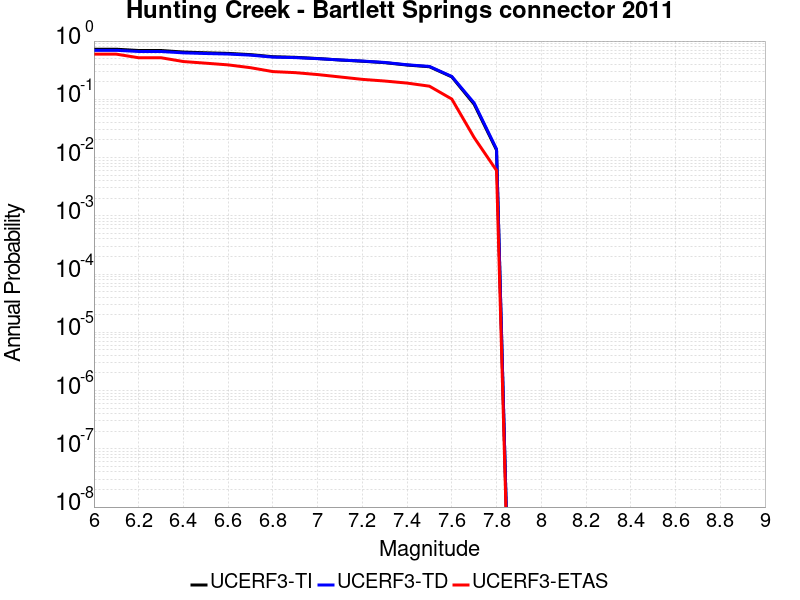 |
|-----|

| Magnitude | UCERF3-TI Prob | UCERF3-TD Prob | UCERF3-ETAS Prob |
|-----|-----|-----|-----|
| 6.0 | 0.72441155 | 0.69363236 | 0.596 |
| 6.1 | 0.72441155 | 0.69363236 | 0.596 |
| 6.2 | 0.6886575 | 0.6622116 | 0.517 |
| 6.3 | 0.6886575 | 0.6622116 | 0.517 |
| 6.4 | 0.64782196 | 0.62673074 | 0.445 |
| 6.5 | 0.62926733 | 0.6109962 | 0.417 |
| 6.6 | 0.6145161 | 0.59846634 | 0.39 |
| 6.7 | 0.5851141 | 0.57310295 | 0.349 |
| 6.8 | 0.53863204 | 0.5299959 | 0.299 |
| 6.9 | 0.52591395 | 0.51989454 | 0.287 |
| 7.0 | 0.50166893 | 0.49879658 | 0.266 |
| 7.1 | 0.4731205 | 0.47404495 | 0.242 |
| 7.2 | 0.4506143 | 0.45364052 | 0.22 |
| 7.3 | 0.42568898 | 0.42955056 | 0.206 |
| 7.4 | 0.38741925 | 0.3916069 | 0.19 |
| 7.5 | 0.36237162 | 0.36701426 | 0.168 |
| 7.6 | 0.24266466 | 0.24667694 | 0.101 |
| 7.7 | 0.08216513 | 0.0863861 | 0.022 |
| 7.8 | 0.013437524 | 0.013989198 | 0.006 |

## Hunting Creek - Berryessa 2011 CFM
*[(top)](#table-of-contents)*

| 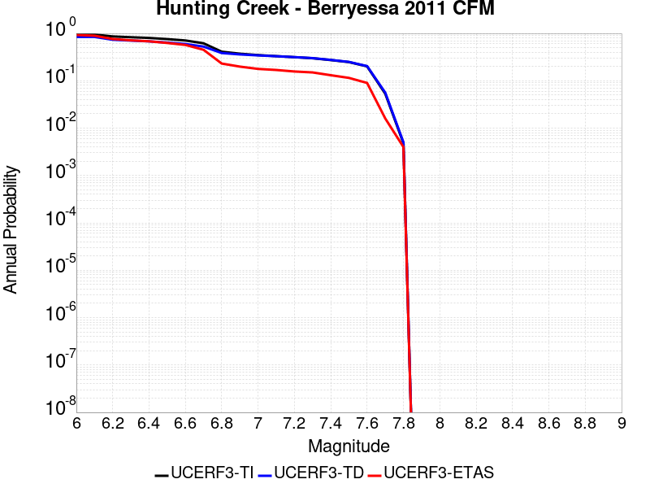 |
|-----|

| Magnitude | UCERF3-TI Prob | UCERF3-TD Prob | UCERF3-ETAS Prob |
|-----|-----|-----|-----|
| 6.0 | 0.94717044 | 0.84346575 | 0.927 |
| 6.1 | 0.9467332 | 0.8426478 | 0.894 |
| 6.2 | 0.86219096 | 0.7353896 | 0.762 |
| 6.3 | 0.82983476 | 0.70477664 | 0.714 |
| 6.4 | 0.8024758 | 0.6793834 | 0.681 |
| 6.5 | 0.7579142 | 0.63956773 | 0.628 |
| 6.6 | 0.7088855 | 0.5978211 | 0.571 |
| 6.7 | 0.6178984 | 0.52634335 | 0.451 |
| 6.8 | 0.4110477 | 0.38502538 | 0.231 |
| 6.9 | 0.3726476 | 0.3598322 | 0.199 |
| 7.0 | 0.34836653 | 0.34328145 | 0.178 |
| 7.1 | 0.33104336 | 0.3297599 | 0.169 |
| 7.2 | 0.3149272 | 0.3156849 | 0.157 |
| 7.3 | 0.29897562 | 0.30075383 | 0.15 |
| 7.4 | 0.27361086 | 0.27568105 | 0.131 |
| 7.5 | 0.2477765 | 0.25025305 | 0.115 |
| 7.6 | 0.20146294 | 0.20395376 | 0.09 |
| 7.7 | 0.053298034 | 0.056154292 | 0.016 |
| 7.8 | 0.0047962754 | 0.0050187213 | 0.004 |

## Imperial
*[(top)](#table-of-contents)*

| 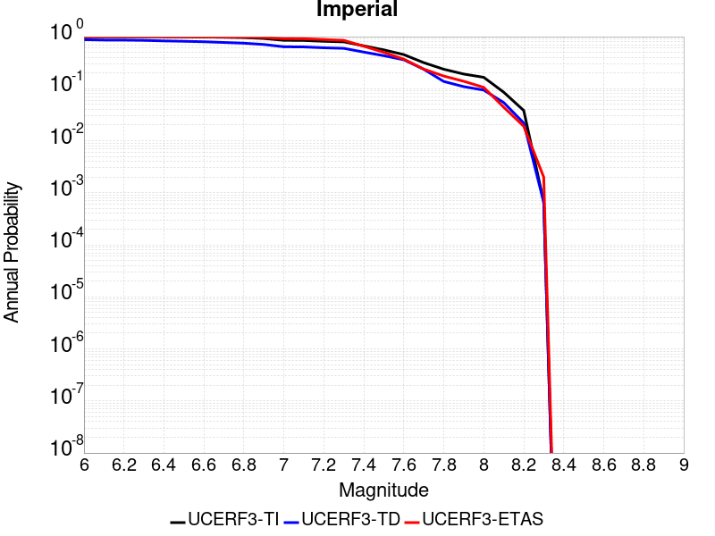 |
|-----|

| Magnitude | UCERF3-TI Prob | UCERF3-TD Prob | UCERF3-ETAS Prob |
|-----|-----|-----|-----|
| 6.0 | 0.9992342 | 0.87607545 | 0.999 |
| 6.1 | 0.9986613 | 0.86225146 | 0.999 |
| 6.2 | 0.9984606 | 0.85934865 | 0.999 |
| 6.3 | 0.9976535 | 0.8493571 | 0.998 |
| 6.4 | 0.9949979 | 0.8296169 | 0.996 |
| 6.5 | 0.99209285 | 0.81632197 | 0.992 |
| 6.6 | 0.9868002 | 0.7992007 | 0.991 |
| 6.7 | 0.97555614 | 0.7741644 | 0.985 |
| 6.8 | 0.9597917 | 0.7504617 | 0.981 |
| 6.9 | 0.92365587 | 0.70793897 | 0.966 |
| 7.0 | 0.85185945 | 0.63987136 | 0.918 |
| 7.1 | 0.8462215 | 0.6350404 | 0.912 |
| 7.2 | 0.81493056 | 0.6116093 | 0.882 |
| 7.3 | 0.7957466 | 0.5969986 | 0.85 |
| 7.4 | 0.6656618 | 0.50568384 | 0.655 |
| 7.5 | 0.5581233 | 0.4310763 | 0.5 |
| 7.6 | 0.45228356 | 0.35983354 | 0.37 |
| 7.7 | 0.3165171 | 0.2360918 | 0.238 |
| 7.8 | 0.23669931 | 0.13774972 | 0.175 |
| 7.9 | 0.19128849 | 0.109558456 | 0.139 |
| 8.0 | 0.16556965 | 0.09411041 | 0.106 |
| 8.1 | 0.085566655 | 0.054135513 | 0.044 |
| 8.2 | 0.038144484 | 0.021924129 | 0.019 |
| 8.3 | 6.717823E-4 | 6.581953E-4 | 0.002 |

## Incline Village 2011 CFM
*[(top)](#table-of-contents)*

| 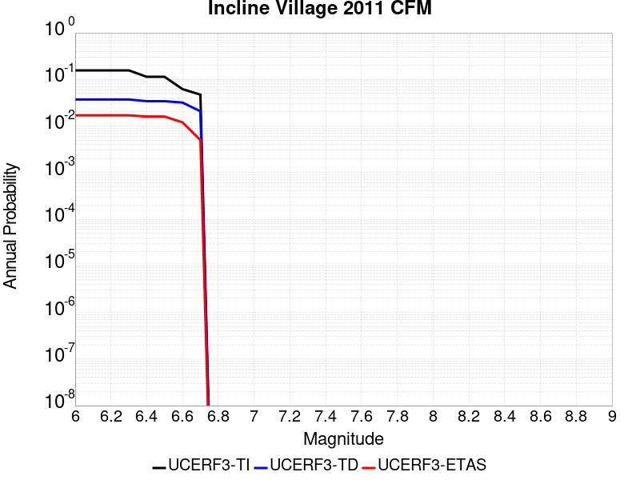 |
|-----|

| Magnitude | UCERF3-TI Prob | UCERF3-TD Prob | UCERF3-ETAS Prob |
|-----|-----|-----|-----|
| 6.0 | 0.15668908 | 0.03715841 | 0.017 |
| 6.1 | 0.15668908 | 0.03715841 | 0.017 |
| 6.2 | 0.15668908 | 0.03715841 | 0.017 |
| 6.3 | 0.15668908 | 0.03715841 | 0.017 |
| 6.4 | 0.11385884 | 0.034169443 | 0.016 |
| 6.5 | 0.11385884 | 0.034169443 | 0.016 |
| 6.6 | 0.062031526 | 0.031897213 | 0.012 |
| 6.7 | 0.04714669 | 0.020748911 | 0.005 |

## Independence rev 2011
*[(top)](#table-of-contents)*

| 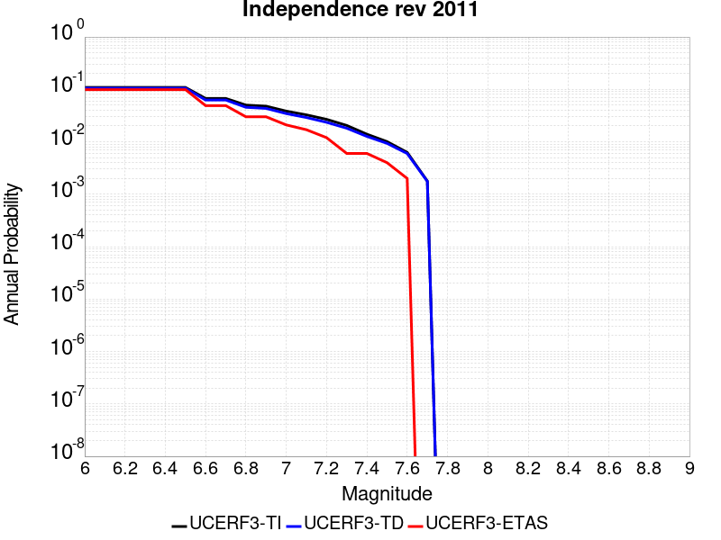 |
|-----|

| Magnitude | UCERF3-TI Prob | UCERF3-TD Prob | UCERF3-ETAS Prob |
|-----|-----|-----|-----|
| 6.0 | 0.10896497 | 0.10554083 | 0.099 |
| 6.1 | 0.10896497 | 0.10554083 | 0.099 |
| 6.2 | 0.10896497 | 0.10554083 | 0.099 |
| 6.3 | 0.10896497 | 0.10554083 | 0.099 |
| 6.4 | 0.10896497 | 0.10554083 | 0.099 |
| 6.5 | 0.10896497 | 0.10554083 | 0.099 |
| 6.6 | 0.06713545 | 0.06265492 | 0.049 |
| 6.7 | 0.06713545 | 0.06265492 | 0.049 |
| 6.8 | 0.050138474 | 0.045536354 | 0.03 |
| 6.9 | 0.047836203 | 0.043356307 | 0.03 |
| 7.0 | 0.03849223 | 0.034557845 | 0.021 |
| 7.1 | 0.0326496 | 0.029060662 | 0.017 |
| 7.2 | 0.026810972 | 0.02355315 | 0.012 |
| 7.3 | 0.020514637 | 0.018171068 | 0.006 |
| 7.4 | 0.013962032 | 0.012676388 | 0.006 |
| 7.5 | 0.010085035 | 0.009337347 | 0.004 |
| 7.6 | 0.0062805726 | 0.005978996 | 0.002 |
| 7.7 | 0.00178026 | 0.0017600388 | 0.0 |

## Jess Valley
*[(top)](#table-of-contents)*

| 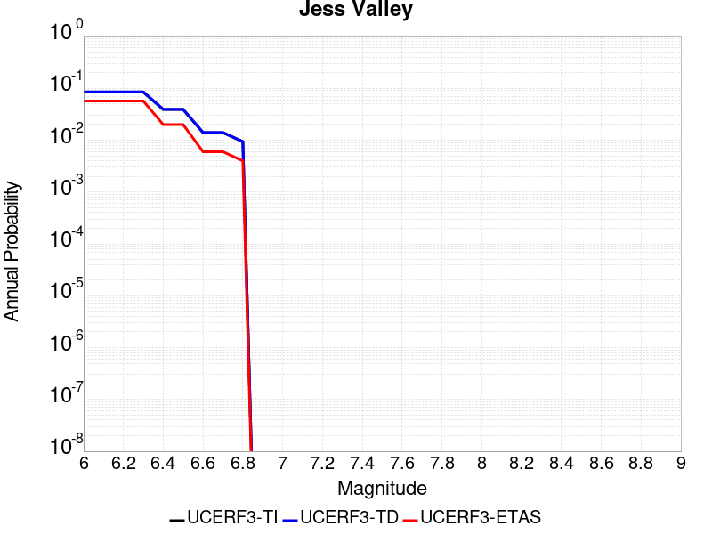 |
|-----|

| Magnitude | UCERF3-TI Prob | UCERF3-TD Prob | UCERF3-ETAS Prob |
|-----|-----|-----|-----|
| 6.0 | 0.08455207 | 0.085594706 | 0.057 |
| 6.1 | 0.08455207 | 0.085594706 | 0.057 |
| 6.2 | 0.08455207 | 0.085594706 | 0.057 |
| 6.3 | 0.08455207 | 0.085594706 | 0.057 |
| 6.4 | 0.039109677 | 0.039475642 | 0.02 |
| 6.5 | 0.039109677 | 0.039475642 | 0.02 |
| 6.6 | 0.013980243 | 0.014088605 | 0.006 |
| 6.7 | 0.013980243 | 0.014088605 | 0.006 |
| 6.8 | 0.0093632685 | 0.009447081 | 0.004 |

## Johnson Valley (No) 2011 rev
*[(top)](#table-of-contents)*

| 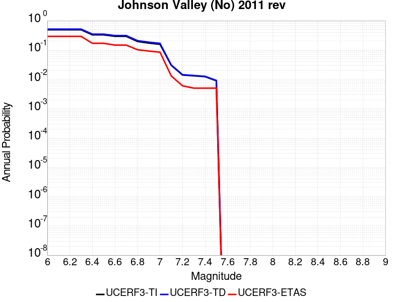 |
|-----|

| Magnitude | UCERF3-TI Prob | UCERF3-TD Prob | UCERF3-ETAS Prob |
|-----|-----|-----|-----|
| 6.0 | 0.48957625 | 0.5142209 | 0.291 |
| 6.1 | 0.48957625 | 0.5142209 | 0.291 |
| 6.2 | 0.48957625 | 0.5142209 | 0.291 |
| 6.3 | 0.48957625 | 0.5142209 | 0.291 |
| 6.4 | 0.32906312 | 0.3459882 | 0.169 |
| 6.5 | 0.32906312 | 0.3459882 | 0.169 |
| 6.6 | 0.29299167 | 0.3095504 | 0.147 |
| 6.7 | 0.29299167 | 0.3095504 | 0.147 |
| 6.8 | 0.19534788 | 0.20802711 | 0.102 |
| 6.9 | 0.17203148 | 0.1842219 | 0.092 |
| 7.0 | 0.15631168 | 0.16825505 | 0.084 |
| 7.1 | 0.029967742 | 0.03072335 | 0.013 |
| 7.2 | 0.014025151 | 0.014339768 | 0.006 |
| 7.3 | 0.0131577365 | 0.013452145 | 0.005 |
| 7.4 | 0.012333644 | 0.012609757 | 0.005 |
| 7.5 | 0.008923254 | 0.009126792 | 0.005 |

## Joshua Tree (Seismicity)
*[(top)](#table-of-contents)*

| 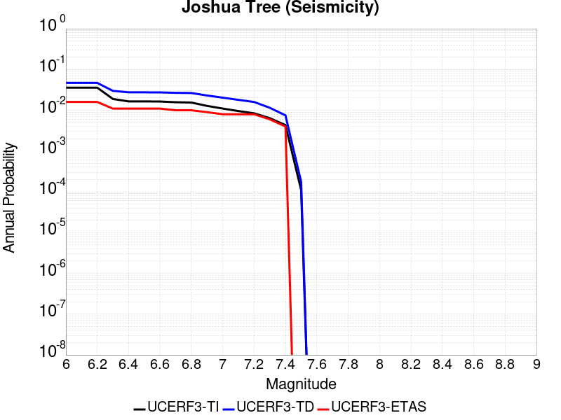 |
|-----|

| Magnitude | UCERF3-TI Prob | UCERF3-TD Prob | UCERF3-ETAS Prob |
|-----|-----|-----|-----|
| 6.0 | 0.035930395 | 0.046967346 | 0.016 |
| 6.1 | 0.035930395 | 0.046967346 | 0.016 |
| 6.2 | 0.035930395 | 0.046967346 | 0.016 |
| 6.3 | 0.018948335 | 0.029979251 | 0.011 |
| 6.4 | 0.016513776 | 0.027563296 | 0.011 |
| 6.5 | 0.016513776 | 0.027563296 | 0.011 |
| 6.6 | 0.016414013 | 0.02746418 | 0.011 |
| 6.7 | 0.015775295 | 0.026829168 | 0.01 |
| 6.8 | 0.015492656 | 0.026521478 | 0.01 |
| 6.9 | 0.012821666 | 0.023084912 | 0.009 |
| 7.0 | 0.011027672 | 0.020400051 | 0.008 |
| 7.1 | 0.009577803 | 0.018027462 | 0.008 |
| 7.2 | 0.008436388 | 0.016002053 | 0.008 |
| 7.3 | 0.006411326 | 0.011524622 | 0.006 |
| 7.4 | 0.004335729 | 0.00751802 | 0.004 |
| 7.5 | 1.1066828E-4 | 1.7657313E-4 | 0.0 |

## Keddie Ridge 2011 CFM
*[(top)](#table-of-contents)*

| 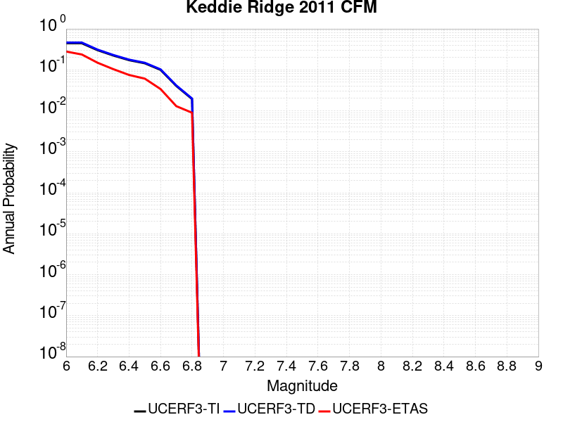 |
|-----|

| Magnitude | UCERF3-TI Prob | UCERF3-TD Prob | UCERF3-ETAS Prob |
|-----|-----|-----|-----|
| 6.0 | 0.44534802 | 0.46356544 | 0.28 |
| 6.1 | 0.44534802 | 0.46356544 | 0.237 |
| 6.2 | 0.3018953 | 0.3117746 | 0.149 |
| 6.3 | 0.22369447 | 0.23050487 | 0.104 |
| 6.4 | 0.17244339 | 0.17758654 | 0.075 |
| 6.5 | 0.14452662 | 0.14891289 | 0.061 |
| 6.6 | 0.099886455 | 0.10281532 | 0.034 |
| 6.7 | 0.04046344 | 0.041544855 | 0.013 |
| 6.8 | 0.019422133 | 0.02000869 | 0.009 |

## Kern Canyon (Lake Isabella) 2011
*[(top)](#table-of-contents)*

| 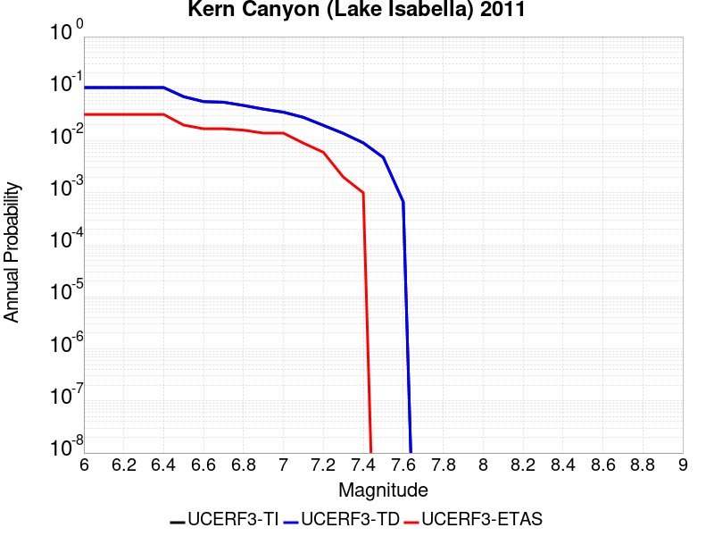 |
|-----|

| Magnitude | UCERF3-TI Prob | UCERF3-TD Prob | UCERF3-ETAS Prob |
|-----|-----|-----|-----|
| 6.0 | 0.104690574 | 0.1057331 | 0.032 |
| 6.1 | 0.104690574 | 0.1057331 | 0.032 |
| 6.2 | 0.104690574 | 0.1057331 | 0.032 |
| 6.3 | 0.104690574 | 0.1057331 | 0.032 |
| 6.4 | 0.104690574 | 0.1057331 | 0.032 |
| 6.5 | 0.07010017 | 0.07057518 | 0.02 |
| 6.6 | 0.05635504 | 0.05669187 | 0.017 |
| 6.7 | 0.05488112 | 0.055211384 | 0.017 |
| 6.8 | 0.047580536 | 0.047864605 | 0.016 |
| 6.9 | 0.0404208 | 0.0406617 | 0.014 |
| 7.0 | 0.03529378 | 0.035505634 | 0.014 |
| 7.1 | 0.028079903 | 0.028247105 | 0.009 |
| 7.2 | 0.019703439 | 0.019820511 | 0.006 |
| 7.3 | 0.0138005875 | 0.013880583 | 0.002 |
| 7.4 | 0.009075729 | 0.009127351 | 0.001 |
| 7.5 | 0.0047673816 | 0.0047950773 | 0.0 |
| 7.6 | 6.708552E-4 | 6.748372E-4 | 0.0 |

## Kern Canyon (North Kern) 2011
*[(top)](#table-of-contents)*

| 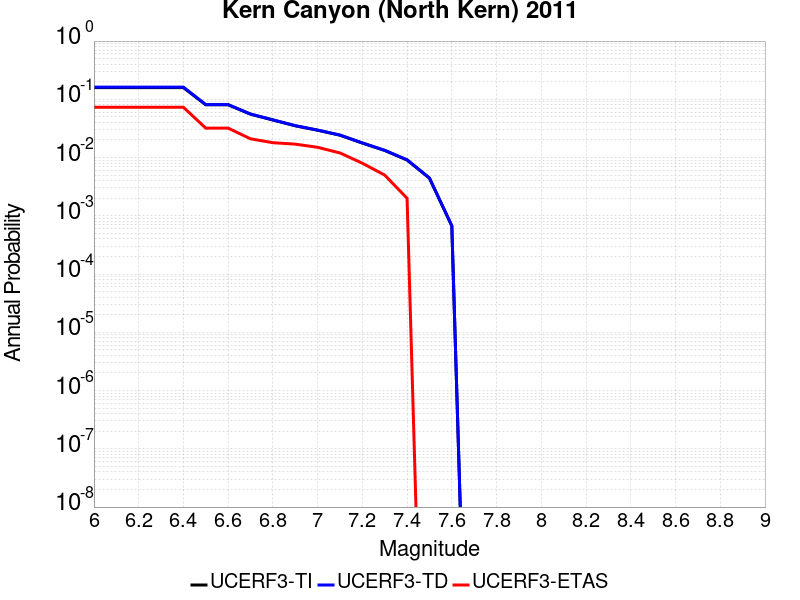 |
|-----|

| Magnitude | UCERF3-TI Prob | UCERF3-TD Prob | UCERF3-ETAS Prob |
|-----|-----|-----|-----|
| 6.0 | 0.15876137 | 0.16161768 | 0.073 |
| 6.1 | 0.15876137 | 0.16161768 | 0.073 |
| 6.2 | 0.15876137 | 0.16161768 | 0.073 |
| 6.3 | 0.15876137 | 0.16161768 | 0.073 |
| 6.4 | 0.15876137 | 0.16161768 | 0.073 |
| 6.5 | 0.08048515 | 0.081167474 | 0.032 |
| 6.6 | 0.08048515 | 0.081167474 | 0.032 |
| 6.7 | 0.055554375 | 0.05592065 | 0.021 |
| 6.8 | 0.044140805 | 0.044411033 | 0.018 |
| 6.9 | 0.035111923 | 0.035315957 | 0.017 |
| 7.0 | 0.029475547 | 0.029644908 | 0.015 |
| 7.1 | 0.024213469 | 0.024350666 | 0.012 |
| 7.2 | 0.017733067 | 0.0178332 | 0.008 |
| 7.3 | 0.013243667 | 0.0133183105 | 0.005 |
| 7.4 | 0.009089537 | 0.009140968 | 0.002 |
| 7.5 | 0.004430948 | 0.0044562668 | 0.0 |
| 7.6 | 6.708552E-4 | 6.748372E-4 | 0.0 |

## Kern Canyon (South Kern) 2011
*[(top)](#table-of-contents)*

| 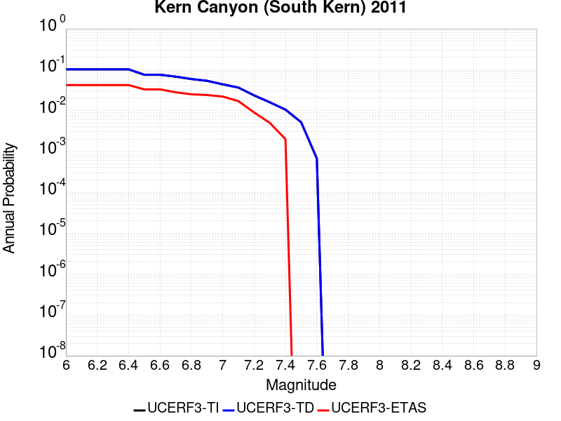 |
|-----|

| Magnitude | UCERF3-TI Prob | UCERF3-TD Prob | UCERF3-ETAS Prob |
|-----|-----|-----|-----|
| 6.0 | 0.10156299 | 0.10224546 | 0.042 |
| 6.1 | 0.10156299 | 0.10224546 | 0.042 |
| 6.2 | 0.10156299 | 0.10224546 | 0.042 |
| 6.3 | 0.10156299 | 0.10224546 | 0.042 |
| 6.4 | 0.10156299 | 0.10224546 | 0.042 |
| 6.5 | 0.074921 | 0.07535386 | 0.033 |
| 6.6 | 0.074921 | 0.07535386 | 0.033 |
| 6.7 | 0.06742572 | 0.067810506 | 0.028 |
| 6.8 | 0.05893742 | 0.05927178 | 0.025 |
| 6.9 | 0.05324627 | 0.053548623 | 0.024 |
| 7.0 | 0.043712646 | 0.043961342 | 0.022 |
| 7.1 | 0.036408044 | 0.036614493 | 0.017 |
| 7.2 | 0.023456184 | 0.023589008 | 0.009 |
| 7.3 | 0.01590191 | 0.015991872 | 0.005 |
| 7.4 | 0.0105101345 | 0.0105702905 | 0.002 |
| 7.5 | 0.0051708296 | 0.0052009863 | 0.0 |
| 7.6 | 6.708552E-4 | 6.748372E-4 | 0.0 |

## Kickapoo
*[(top)](#table-of-contents)*

| 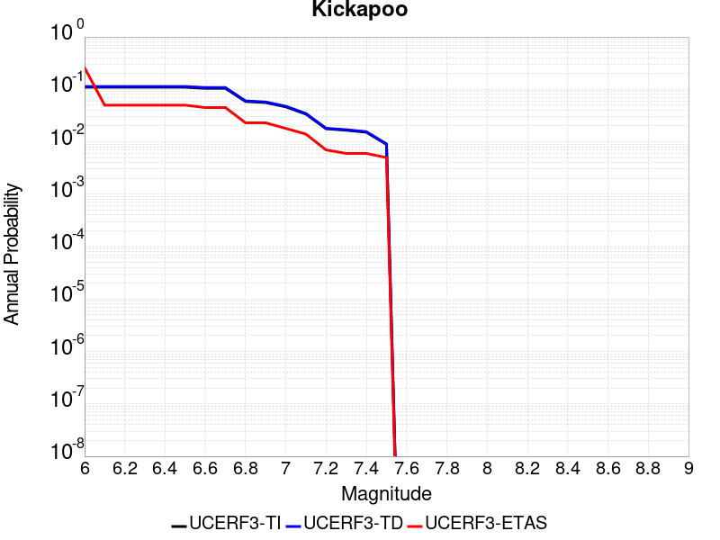 |
|-----|

| Magnitude | UCERF3-TI Prob | UCERF3-TD Prob | UCERF3-ETAS Prob |
|-----|-----|-----|-----|
| 6.0 | 0.10986862 | 0.11363396 | 0.259 |
| 6.1 | 0.10986862 | 0.11363396 | 0.05 |
| 6.2 | 0.10986862 | 0.11363396 | 0.05 |
| 6.3 | 0.10986862 | 0.11363396 | 0.05 |
| 6.4 | 0.10986862 | 0.11363396 | 0.05 |
| 6.5 | 0.10986862 | 0.11363396 | 0.05 |
| 6.6 | 0.10463901 | 0.10829441 | 0.045 |
| 6.7 | 0.10463901 | 0.10829441 | 0.045 |
| 6.8 | 0.058739003 | 0.060207848 | 0.023 |
| 6.9 | 0.056055773 | 0.057467707 | 0.023 |
| 7.0 | 0.04642769 | 0.04761143 | 0.018 |
| 7.1 | 0.03375902 | 0.0345914 | 0.014 |
| 7.2 | 0.017738983 | 0.018130524 | 0.007 |
| 7.3 | 0.016635269 | 0.017001947 | 0.006 |
| 7.4 | 0.015237915 | 0.0155750895 | 0.006 |
| 7.5 | 0.008923254 | 0.009126792 | 0.005 |

## King Range 2011 CFM
*[(top)](#table-of-contents)*

| 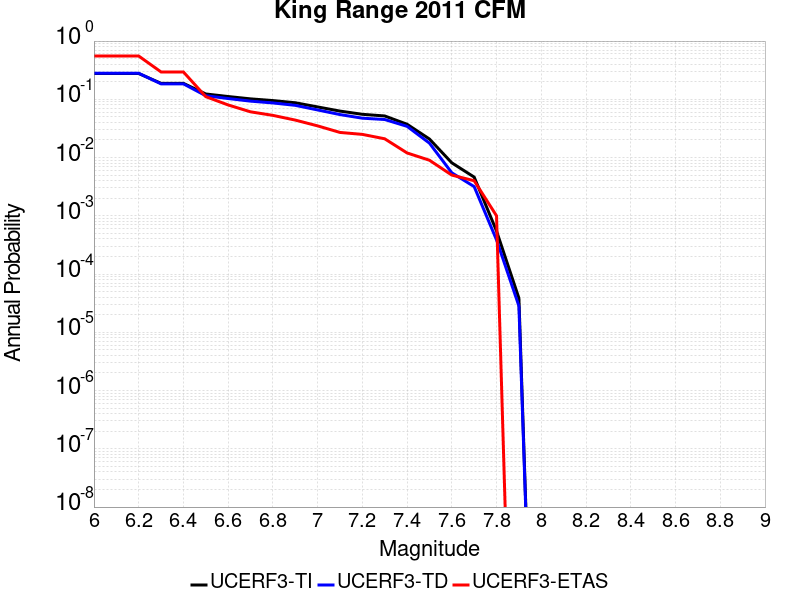 |
|-----|

| Magnitude | UCERF3-TI Prob | UCERF3-TD Prob | UCERF3-ETAS Prob |
|-----|-----|-----|-----|
| 6.0 | 0.27757484 | 0.28015077 | 0.554 |
| 6.1 | 0.27757484 | 0.28015077 | 0.554 |
| 6.2 | 0.27757484 | 0.28015077 | 0.554 |
| 6.3 | 0.1881297 | 0.18430674 | 0.295 |
| 6.4 | 0.1881297 | 0.18430674 | 0.295 |
| 6.5 | 0.12349245 | 0.115289025 | 0.111 |
| 6.6 | 0.111626185 | 0.10312354 | 0.08 |
| 6.7 | 0.10178234 | 0.09302561 | 0.061 |
| 6.8 | 0.09514223 | 0.08661946 | 0.053 |
| 6.9 | 0.08726757 | 0.078824796 | 0.044 |
| 7.0 | 0.0740059 | 0.065690495 | 0.035 |
| 7.1 | 0.06277566 | 0.054717984 | 0.027 |
| 7.2 | 0.055288322 | 0.047429547 | 0.025 |
| 7.3 | 0.05177751 | 0.04500233 | 0.021 |
| 7.4 | 0.037316423 | 0.034354724 | 0.012 |
| 7.5 | 0.020830331 | 0.017679995 | 0.009 |
| 7.6 | 0.008117024 | 0.005473869 | 0.005 |
| 7.7 | 0.0046194177 | 0.0031721934 | 0.004 |
| 7.8 | 5.486516E-4 | 3.860678E-4 | 0.001 |
| 7.9 | 3.856695E-5 | 2.8361088E-5 | 0.0 |

## La Panza 2011
*[(top)](#table-of-contents)*

| 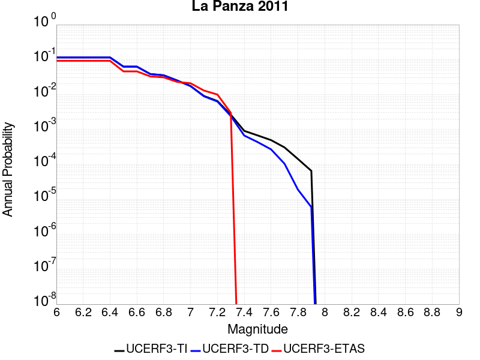 |
|-----|

| Magnitude | UCERF3-TI Prob | UCERF3-TD Prob | UCERF3-ETAS Prob |
|-----|-----|-----|-----|
| 6.0 | 0.114833534 | 0.11550138 | 0.092 |
| 6.1 | 0.114833534 | 0.11550138 | 0.092 |
| 6.2 | 0.114833534 | 0.11550138 | 0.092 |
| 6.3 | 0.114833534 | 0.11550138 | 0.092 |
| 6.4 | 0.114833534 | 0.11550138 | 0.092 |
| 6.5 | 0.062783435 | 0.06289093 | 0.046 |
| 6.6 | 0.062783435 | 0.06289093 | 0.046 |
| 6.7 | 0.038650304 | 0.038601313 | 0.033 |
| 6.8 | 0.035528507 | 0.035462677 | 0.031 |
| 6.9 | 0.02531103 | 0.025194628 | 0.023 |
| 7.0 | 0.017532414 | 0.017378666 | 0.021 |
| 7.1 | 0.009084472 | 0.008892151 | 0.013 |
| 7.2 | 0.0065239933 | 0.006318575 | 0.01 |
| 7.3 | 0.0026469238 | 0.0024183157 | 0.003 |
| 7.4 | 9.1287115E-4 | 6.714868E-4 | 0.0 |
| 7.5 | 6.7607715E-4 | 4.356988E-4 | 0.0 |
| 7.6 | 4.9600954E-4 | 2.6938418E-4 | 0.0 |
| 7.7 | 3.0712417E-4 | 1.04978084E-4 | 0.0 |
| 7.8 | 1.431959E-4 | 1.9027868E-5 | 0.0 |
| 7.9 | 6.543253E-5 | 6.0110424E-6 | 0.0 |

## Laguna Salada
*[(top)](#table-of-contents)*

| 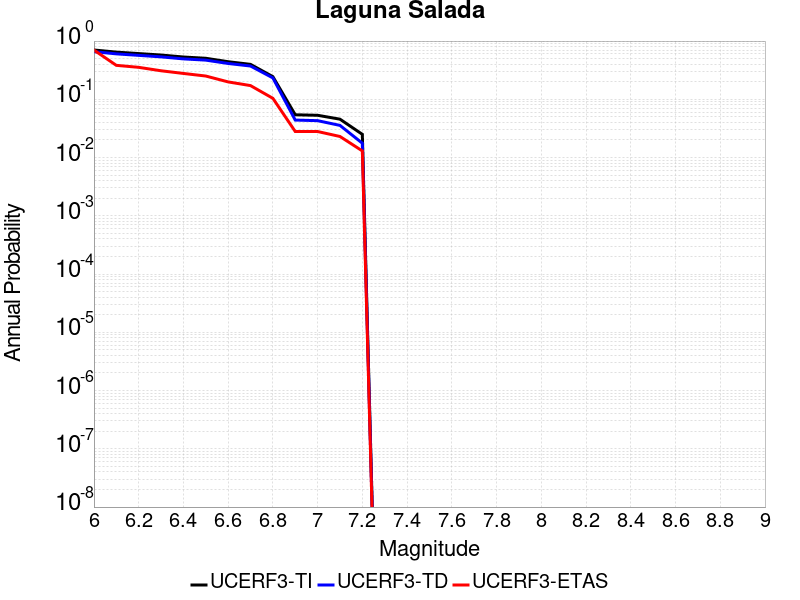 |
|-----|

| Magnitude | UCERF3-TI Prob | UCERF3-TD Prob | UCERF3-ETAS Prob |
|-----|-----|-----|-----|
| 6.0 | 0.7024825 | 0.65796494 | 0.701 |
| 6.1 | 0.6461823 | 0.603059 | 0.383 |
| 6.2 | 0.6097625 | 0.56810224 | 0.354 |
| 6.3 | 0.5756874 | 0.53541815 | 0.309 |
| 6.4 | 0.5323556 | 0.49438193 | 0.278 |
| 6.5 | 0.5065718 | 0.47060296 | 0.251 |
| 6.6 | 0.44209006 | 0.41231906 | 0.199 |
| 6.7 | 0.3980926 | 0.37281352 | 0.172 |
| 6.8 | 0.24491689 | 0.23310126 | 0.104 |
| 6.9 | 0.054263588 | 0.04402334 | 0.028 |
| 7.0 | 0.05319753 | 0.04300081 | 0.028 |
| 7.1 | 0.045595266 | 0.035653684 | 0.023 |
| 7.2 | 0.025047874 | 0.01762923 | 0.013 |

## Lake Isabella (Seismicity)
*[(top)](#table-of-contents)*

| 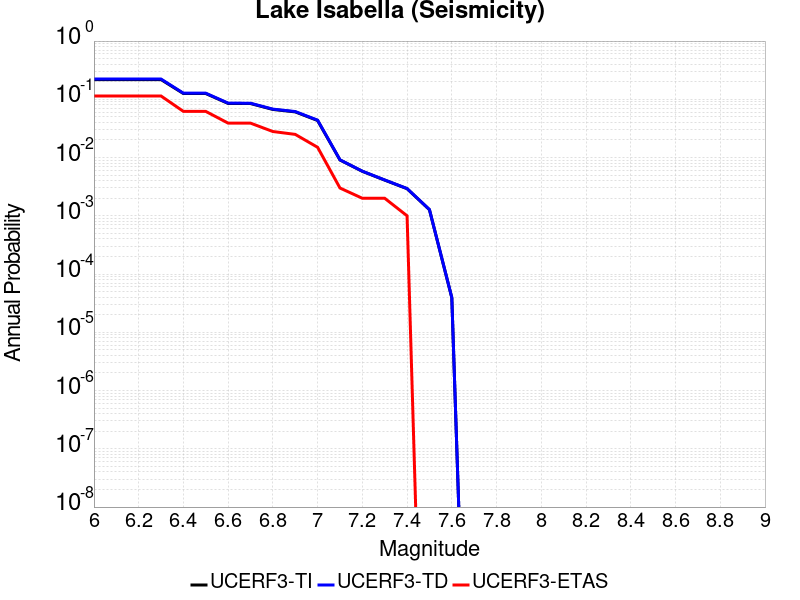 |
|-----|

| Magnitude | UCERF3-TI Prob | UCERF3-TD Prob | UCERF3-ETAS Prob |
|-----|-----|-----|-----|
| 6.0 | 0.21812925 | 0.22272581 | 0.114 |
| 6.1 | 0.21812925 | 0.22272581 | 0.114 |
| 6.2 | 0.21812925 | 0.22272581 | 0.114 |
| 6.3 | 0.21812925 | 0.22272581 | 0.114 |
| 6.4 | 0.12558945 | 0.12744586 | 0.062 |
| 6.5 | 0.12558945 | 0.12744586 | 0.062 |
| 6.6 | 0.08490674 | 0.08599029 | 0.039 |
| 6.7 | 0.08459782 | 0.08568026 | 0.039 |
| 6.8 | 0.067000516 | 0.06788018 | 0.028 |
| 6.9 | 0.060841653 | 0.0616686 | 0.025 |
| 7.0 | 0.0432656 | 0.043885466 | 0.015 |
| 7.1 | 0.009093262 | 0.009148345 | 0.003 |
| 7.2 | 0.0058064912 | 0.005840235 | 0.002 |
| 7.3 | 0.004103336 | 0.0041269655 | 0.002 |
| 7.4 | 0.0029220267 | 0.0029389642 | 0.001 |
| 7.5 | 0.001273698 | 0.0012810744 | 0.0 |
| 7.6 | 3.925424E-5 | 3.9467996E-5 | 0.0 |

## Las Positas
*[(top)](#table-of-contents)*

| 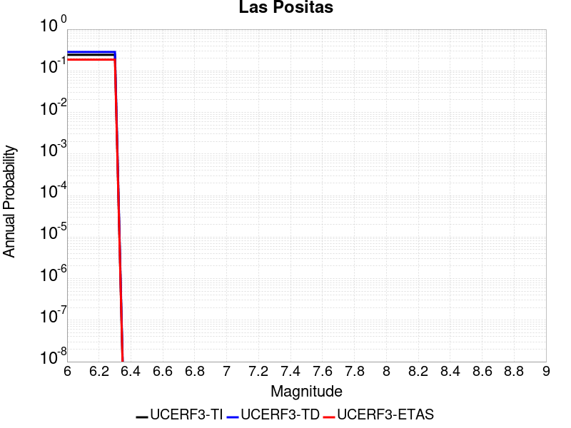 |
|-----|

| Magnitude | UCERF3-TI Prob | UCERF3-TD Prob | UCERF3-ETAS Prob |
|-----|-----|-----|-----|
| 6.0 | 0.24277759 | 0.2847483 | 0.186 |
| 6.1 | 0.24277759 | 0.2847483 | 0.186 |
| 6.2 | 0.24277759 | 0.2847483 | 0.186 |
| 6.3 | 0.24277759 | 0.2847483 | 0.186 |

## Last Chance
*[(top)](#table-of-contents)*

| 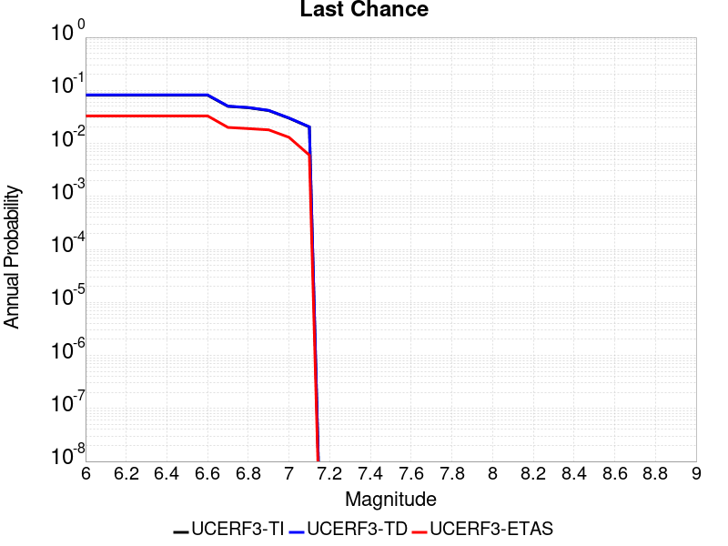 |
|-----|

| Magnitude | UCERF3-TI Prob | UCERF3-TD Prob | UCERF3-ETAS Prob |
|-----|-----|-----|-----|
| 6.0 | 0.08103836 | 0.08212631 | 0.033 |
| 6.1 | 0.08103836 | 0.08212631 | 0.033 |
| 6.2 | 0.08103836 | 0.08212631 | 0.033 |
| 6.3 | 0.08103836 | 0.08212631 | 0.033 |
| 6.4 | 0.08103836 | 0.08212631 | 0.033 |
| 6.5 | 0.08103836 | 0.08212631 | 0.033 |
| 6.6 | 0.08103836 | 0.08212631 | 0.033 |
| 6.7 | 0.049946934 | 0.050409283 | 0.02 |
| 6.8 | 0.047095586 | 0.0475401 | 0.019 |
| 6.9 | 0.041593295 | 0.041991487 | 0.018 |
| 7.0 | 0.029859101 | 0.03016403 | 0.013 |
| 7.1 | 0.020328866 | 0.020542031 | 0.006 |

## Lenwood-Lockhart-Old Woman Springs
*[(top)](#table-of-contents)*

| 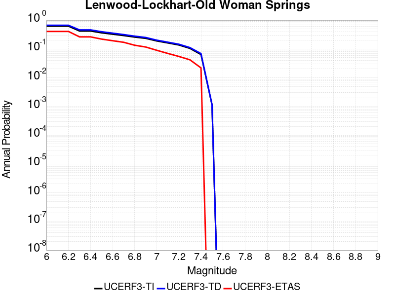 |
|-----|

| Magnitude | UCERF3-TI Prob | UCERF3-TD Prob | UCERF3-ETAS Prob |
|-----|-----|-----|-----|
| 6.0 | 0.6235397 | 0.66783124 | 0.408 |
| 6.1 | 0.6235397 | 0.66783124 | 0.408 |
| 6.2 | 0.6235397 | 0.66783124 | 0.408 |
| 6.3 | 0.42303148 | 0.46196923 | 0.264 |
| 6.4 | 0.42303148 | 0.46196923 | 0.264 |
| 6.5 | 0.36484525 | 0.39881894 | 0.221 |
| 6.6 | 0.3274585 | 0.35574755 | 0.194 |
| 6.7 | 0.29365256 | 0.31755364 | 0.171 |
| 6.8 | 0.25969228 | 0.27892092 | 0.135 |
| 6.9 | 0.23472385 | 0.25117254 | 0.117 |
| 7.0 | 0.19058467 | 0.20236908 | 0.09 |
| 7.1 | 0.16253151 | 0.17233892 | 0.07 |
| 7.2 | 0.13794056 | 0.1463075 | 0.055 |
| 7.3 | 0.10503176 | 0.11177548 | 0.042 |
| 7.4 | 0.06423641 | 0.06917434 | 0.022 |
| 7.5 | 0.0011396303 | 0.001154573 | 0.0 |

## Likely 2011 CFM
*[(top)](#table-of-contents)*

| 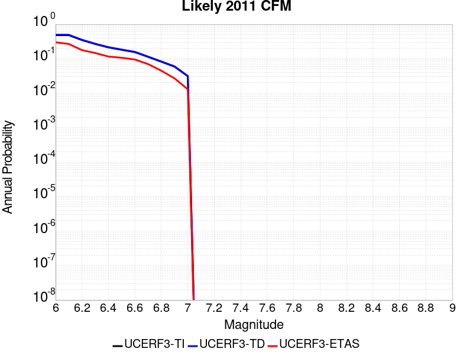 |
|-----|

| Magnitude | UCERF3-TI Prob | UCERF3-TD Prob | UCERF3-ETAS Prob |
|-----|-----|-----|-----|
| 6.0 | 0.48339844 | 0.49598548 | 0.3 |
| 6.1 | 0.48339844 | 0.49598548 | 0.269 |
| 6.2 | 0.3476931 | 0.35500154 | 0.178 |
| 6.3 | 0.2677641 | 0.2729661 | 0.147 |
| 6.4 | 0.21324062 | 0.21720086 | 0.116 |
| 6.5 | 0.18154918 | 0.18487321 | 0.107 |
| 6.6 | 0.1557262 | 0.15856916 | 0.095 |
| 6.7 | 0.1132296 | 0.11529096 | 0.07 |
| 6.8 | 0.08200337 | 0.08351502 | 0.045 |
| 6.9 | 0.058952753 | 0.060070388 | 0.027 |
| 7.0 | 0.031107644 | 0.031735547 | 0.013 |

## Lions Head 2011 CFM
*[(top)](#table-of-contents)*

| 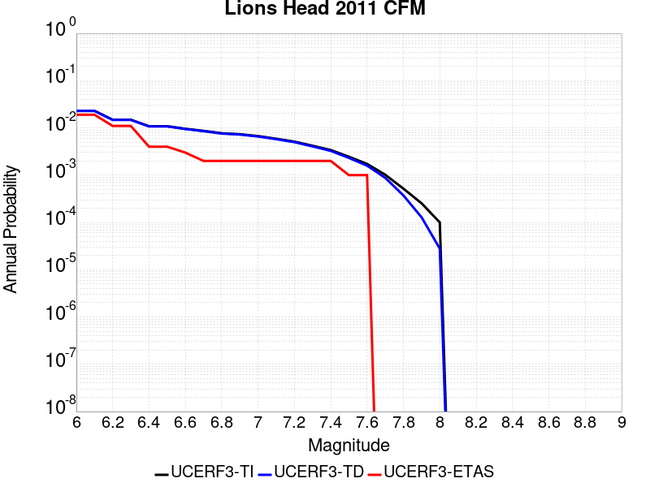 |
|-----|

| Magnitude | UCERF3-TI Prob | UCERF3-TD Prob | UCERF3-ETAS Prob |
|-----|-----|-----|-----|
| 6.0 | 0.022924863 | 0.022830654 | 0.019 |
| 6.1 | 0.022924863 | 0.022830654 | 0.019 |
| 6.2 | 0.014872803 | 0.0147571545 | 0.011 |
| 6.3 | 0.014872803 | 0.0147571545 | 0.011 |
| 6.4 | 0.010855306 | 0.010732296 | 0.004 |
| 6.5 | 0.010855306 | 0.010732296 | 0.004 |
| 6.6 | 0.00957978 | 0.009455213 | 0.003 |
| 6.7 | 0.008645951 | 0.00852033 | 0.002 |
| 6.8 | 0.0077146436 | 0.00758808 | 0.002 |
| 6.9 | 0.0073443796 | 0.007217382 | 0.002 |
| 7.0 | 0.0067070024 | 0.006579188 | 0.002 |
| 7.1 | 0.005899276 | 0.005770126 | 0.002 |
| 7.2 | 0.005122631 | 0.004992202 | 0.002 |
| 7.3 | 0.004191877 | 0.004059489 | 0.002 |
| 7.4 | 0.003398197 | 0.0032638633 | 0.002 |
| 7.5 | 0.0024521507 | 0.0023150123 | 0.001 |
| 7.6 | 0.0017298087 | 0.00159013 | 0.001 |
| 7.7 | 0.0010195943 | 8.7673136E-4 | 0.0 |
| 7.8 | 5.1796116E-4 | 3.7254454E-4 | 0.0 |
| 7.9 | 2.5349628E-4 | 1.2823255E-4 | 0.0 |
| 8.0 | 1.0017188E-4 | 2.7963444E-5 | 0.0 |

## Little Lake
*[(top)](#table-of-contents)*

| 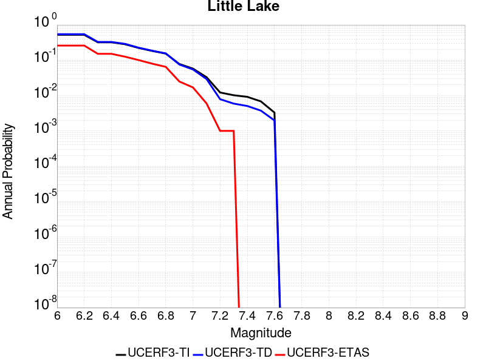 |
|-----|

| Magnitude | UCERF3-TI Prob | UCERF3-TD Prob | UCERF3-ETAS Prob |
|-----|-----|-----|-----|
| 6.0 | 0.523641 | 0.54579705 | 0.26 |
| 6.1 | 0.523641 | 0.54579705 | 0.26 |
| 6.2 | 0.523641 | 0.54579705 | 0.26 |
| 6.3 | 0.3218384 | 0.329747 | 0.152 |
| 6.4 | 0.3218384 | 0.329747 | 0.152 |
| 6.5 | 0.28386164 | 0.2907811 | 0.126 |
| 6.6 | 0.22281215 | 0.22688884 | 0.101 |
| 6.7 | 0.18344335 | 0.1862081 | 0.08 |
| 6.8 | 0.15429576 | 0.15623462 | 0.065 |
| 6.9 | 0.078375176 | 0.0757234 | 0.025 |
| 7.0 | 0.05800967 | 0.05485613 | 0.017 |
| 7.1 | 0.033188317 | 0.02946586 | 0.006 |
| 7.2 | 0.012227922 | 0.007898374 | 0.001 |
| 7.3 | 0.010234522 | 0.0059283087 | 0.001 |
| 7.4 | 0.009211505 | 0.005069976 | 0.0 |
| 7.5 | 0.0068520573 | 0.0037500649 | 0.0 |
| 7.6 | 0.0033076303 | 0.0019778814 | 0.0 |

## Little Salmon (Offshore)
*[(top)](#table-of-contents)*

| 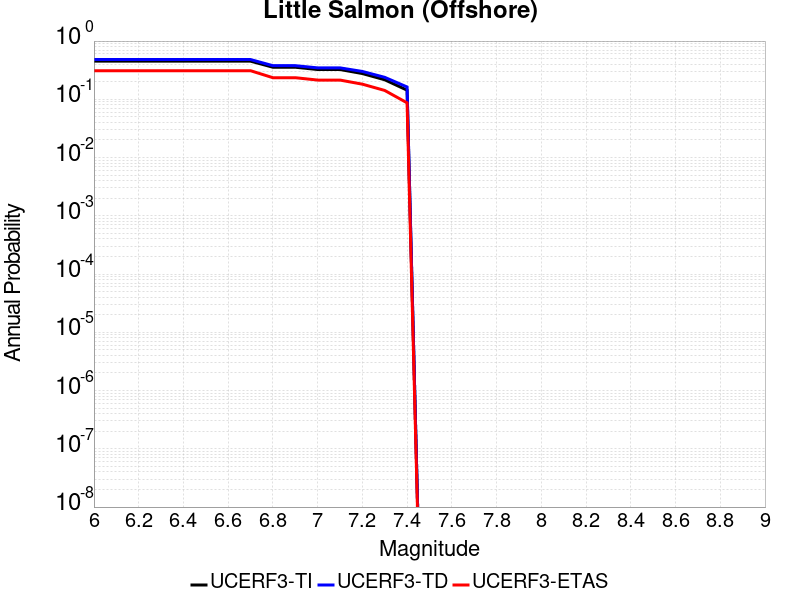 |
|-----|

| Magnitude | UCERF3-TI Prob | UCERF3-TD Prob | UCERF3-ETAS Prob |
|-----|-----|-----|-----|
| 6.0 | 0.45196632 | 0.4816055 | 0.31 |
| 6.1 | 0.45196632 | 0.4816055 | 0.31 |
| 6.2 | 0.45196632 | 0.4816055 | 0.31 |
| 6.3 | 0.45196632 | 0.4816055 | 0.31 |
| 6.4 | 0.45196632 | 0.4816055 | 0.31 |
| 6.5 | 0.45196632 | 0.4816055 | 0.31 |
| 6.6 | 0.45196632 | 0.4816055 | 0.31 |
| 6.7 | 0.45196632 | 0.4816055 | 0.31 |
| 6.8 | 0.35552254 | 0.37800232 | 0.235 |
| 6.9 | 0.35552254 | 0.37800232 | 0.235 |
| 7.0 | 0.32475516 | 0.34669632 | 0.214 |
| 7.1 | 0.32475516 | 0.34669632 | 0.214 |
| 7.2 | 0.27696344 | 0.30085245 | 0.182 |
| 7.3 | 0.21666631 | 0.23848607 | 0.142 |
| 7.4 | 0.1435946 | 0.1629221 | 0.087 |

## Little Salmon (Onshore)
*[(top)](#table-of-contents)*

| 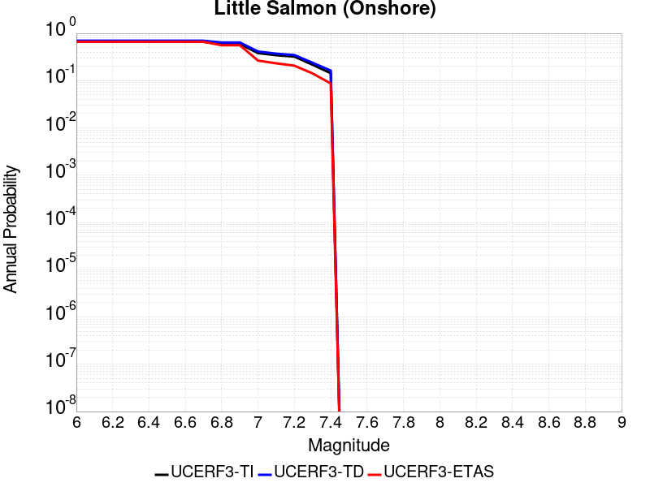 |
|-----|

| Magnitude | UCERF3-TI Prob | UCERF3-TD Prob | UCERF3-ETAS Prob |
|-----|-----|-----|-----|
| 6.0 | 0.66205555 | 0.69738287 | 0.662 |
| 6.1 | 0.66205555 | 0.69738287 | 0.662 |
| 6.2 | 0.66205555 | 0.69738287 | 0.662 |
| 6.3 | 0.66205555 | 0.69738287 | 0.662 |
| 6.4 | 0.66205555 | 0.69738287 | 0.662 |
| 6.5 | 0.66205555 | 0.69738287 | 0.662 |
| 6.6 | 0.66205555 | 0.69738287 | 0.662 |
| 6.7 | 0.66205555 | 0.69738287 | 0.662 |
| 6.8 | 0.5946124 | 0.64072794 | 0.559 |
| 6.9 | 0.5946124 | 0.64072794 | 0.559 |
| 7.0 | 0.38142362 | 0.41287464 | 0.265 |
| 7.1 | 0.344403 | 0.37184334 | 0.232 |
| 7.2 | 0.32153618 | 0.34731162 | 0.207 |
| 7.3 | 0.21666631 | 0.23848607 | 0.142 |
| 7.4 | 0.1435946 | 0.1629221 | 0.087 |

## Los Alamos 2011 CFM
*[(top)](#table-of-contents)*

| 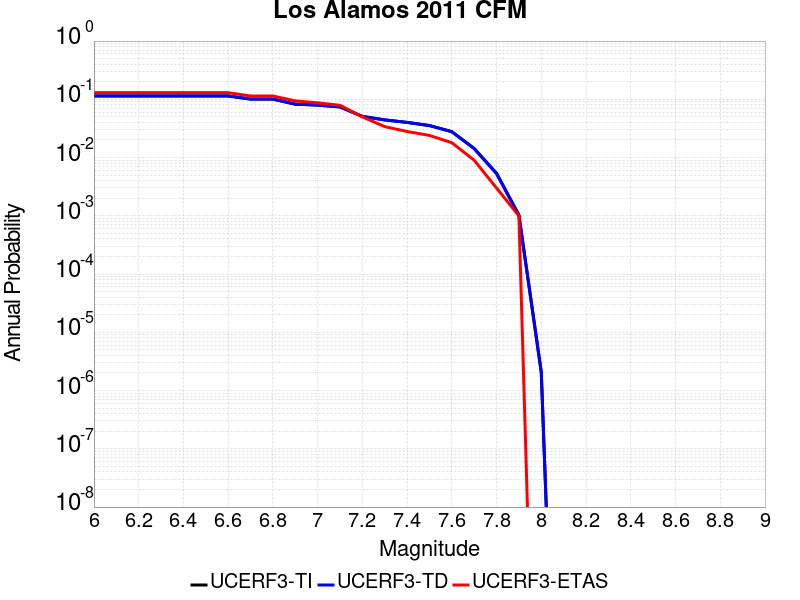 |
|-----|

| Magnitude | UCERF3-TI Prob | UCERF3-TD Prob | UCERF3-ETAS Prob |
|-----|-----|-----|-----|
| 6.0 | 0.11374718 | 0.11480048 | 0.13 |
| 6.1 | 0.11374718 | 0.11480048 | 0.13 |
| 6.2 | 0.11374718 | 0.11480048 | 0.13 |
| 6.3 | 0.11374718 | 0.11480048 | 0.13 |
| 6.4 | 0.11374718 | 0.11480048 | 0.13 |
| 6.5 | 0.11374718 | 0.11480048 | 0.13 |
| 6.6 | 0.11374718 | 0.11480048 | 0.13 |
| 6.7 | 0.1005603 | 0.10143746 | 0.114 |
| 6.8 | 0.1005603 | 0.10143746 | 0.114 |
| 6.9 | 0.08233971 | 0.08291936 | 0.094 |
| 7.0 | 0.07934655 | 0.07990187 | 0.087 |
| 7.1 | 0.07378457 | 0.07428974 | 0.079 |
| 7.2 | 0.050891913 | 0.050973456 | 0.05 |
| 7.3 | 0.04429129 | 0.04430997 | 0.034 |
| 7.4 | 0.040178843 | 0.040160105 | 0.028 |
| 7.5 | 0.035466306 | 0.035400033 | 0.024 |
| 7.6 | 0.027894093 | 0.027743153 | 0.018 |
| 7.7 | 0.014361898 | 0.014214797 | 0.009 |
| 7.8 | 0.0053878636 | 0.00528521 | 0.003 |
| 7.9 | 0.0010383694 | 0.001005138 | 0.001 |
| 8.0 | 2.0559496E-6 | 2.083285E-6 | 0.0 |

## Los Alamos extension
*[(top)](#table-of-contents)*

| 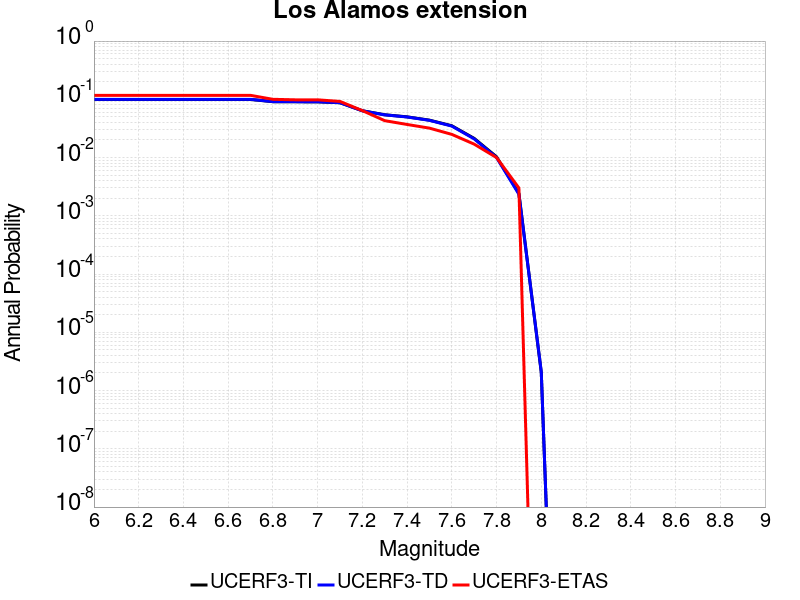 |
|-----|

| Magnitude | UCERF3-TI Prob | UCERF3-TD Prob | UCERF3-ETAS Prob |
|-----|-----|-----|-----|
| 6.0 | 0.099440984 | 0.09990952 | 0.117 |
| 6.1 | 0.099440984 | 0.09990952 | 0.117 |
| 6.2 | 0.099440984 | 0.09990952 | 0.117 |
| 6.3 | 0.099440984 | 0.09990952 | 0.117 |
| 6.4 | 0.099440984 | 0.09990952 | 0.117 |
| 6.5 | 0.099440984 | 0.09990952 | 0.117 |
| 6.6 | 0.099440984 | 0.09990952 | 0.117 |
| 6.7 | 0.099440984 | 0.09990952 | 0.117 |
| 6.8 | 0.09103347 | 0.09138764 | 0.1 |
| 6.9 | 0.09070526 | 0.091056325 | 0.098 |
| 7.0 | 0.09040207 | 0.09074999 | 0.098 |
| 7.1 | 0.08727181 | 0.087586775 | 0.092 |
| 7.2 | 0.06364196 | 0.063518636 | 0.064 |
| 7.3 | 0.05430042 | 0.05407444 | 0.043 |
| 7.4 | 0.049998682 | 0.04972763 | 0.037 |
| 7.5 | 0.04389324 | 0.043549296 | 0.032 |
| 7.6 | 0.03515553 | 0.03472881 | 0.025 |
| 7.7 | 0.0213513 | 0.020937303 | 0.017 |
| 7.8 | 0.010306132 | 0.010025134 | 0.01 |
| 7.9 | 0.002421418 | 0.0023427925 | 0.003 |
| 8.0 | 2.0559496E-6 | 2.083285E-6 | 0.0 |

## Los Medanos - Roe Island
*[(top)](#table-of-contents)*

| 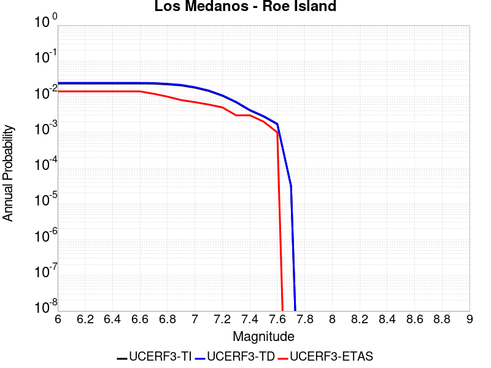 |
|-----|

| Magnitude | UCERF3-TI Prob | UCERF3-TD Prob | UCERF3-ETAS Prob |
|-----|-----|-----|-----|
| 6.0 | 0.023378722 | 0.024228906 | 0.014 |
| 6.1 | 0.023378722 | 0.024228906 | 0.014 |
| 6.2 | 0.023378722 | 0.024228906 | 0.014 |
| 6.3 | 0.023378722 | 0.024228906 | 0.014 |
| 6.4 | 0.023378722 | 0.024228906 | 0.014 |
| 6.5 | 0.023378722 | 0.024228906 | 0.014 |
| 6.6 | 0.023378722 | 0.024228906 | 0.014 |
| 6.7 | 0.023167823 | 0.024017727 | 0.012 |
| 6.8 | 0.022093697 | 0.02285876 | 0.01 |
| 6.9 | 0.020618722 | 0.021310681 | 0.008 |
| 7.0 | 0.017836284 | 0.018386858 | 0.007 |
| 7.1 | 0.0144356275 | 0.014859826 | 0.006 |
| 7.2 | 0.010586064 | 0.01086573 | 0.005 |
| 7.3 | 0.0069502774 | 0.0071319058 | 0.003 |
| 7.4 | 0.0041270633 | 0.0042328415 | 0.003 |
| 7.5 | 0.0027813127 | 0.0028543815 | 0.002 |
| 7.6 | 0.0016894753 | 0.0017381074 | 0.001 |
| 7.7 | 3.12622E-5 | 3.2094216E-5 | 0.0 |

## Los Osos 2011
*[(top)](#table-of-contents)*

| 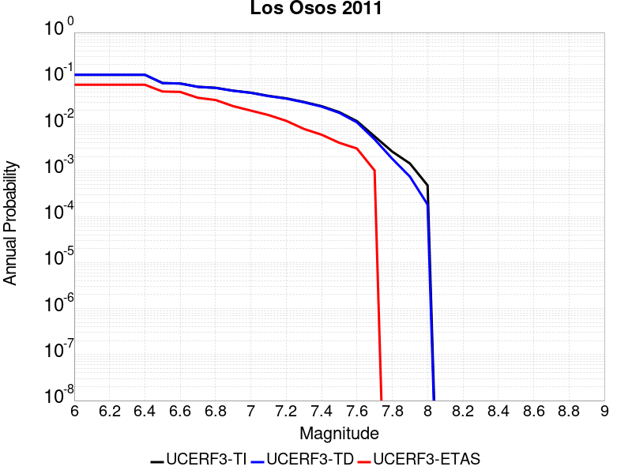 |
|-----|

| Magnitude | UCERF3-TI Prob | UCERF3-TD Prob | UCERF3-ETAS Prob |
|-----|-----|-----|-----|
| 6.0 | 0.11970948 | 0.12049434 | 0.073 |
| 6.1 | 0.11970948 | 0.12049434 | 0.073 |
| 6.2 | 0.11970948 | 0.12049434 | 0.073 |
| 6.3 | 0.11970948 | 0.12049434 | 0.073 |
| 6.4 | 0.11970948 | 0.12049434 | 0.073 |
| 6.5 | 0.07943341 | 0.07928665 | 0.052 |
| 6.6 | 0.07774715 | 0.077583164 | 0.051 |
| 6.7 | 0.06586352 | 0.06559536 | 0.038 |
| 6.8 | 0.062606044 | 0.06230976 | 0.034 |
| 6.9 | 0.054242756 | 0.053877987 | 0.025 |
| 7.0 | 0.049063236 | 0.048660263 | 0.02 |
| 7.1 | 0.041767113 | 0.04131174 | 0.016 |
| 7.2 | 0.036987927 | 0.036499124 | 0.012 |
| 7.3 | 0.030859036 | 0.030326823 | 0.008 |
| 7.4 | 0.02500876 | 0.02443305 | 0.006 |
| 7.5 | 0.01854472 | 0.01791747 | 0.004 |
| 7.6 | 0.011809673 | 0.011121952 | 0.003 |
| 7.7 | 0.0055088 | 0.0047559687 | 0.001 |
| 7.8 | 0.002572639 | 0.0017963848 | 0.0 |
| 7.9 | 0.0014182272 | 7.3435815E-4 | 0.0 |
| 8.0 | 4.7398292E-4 | 1.8181777E-4 | 0.0 |

## Lost Hills
*[(top)](#table-of-contents)*

| 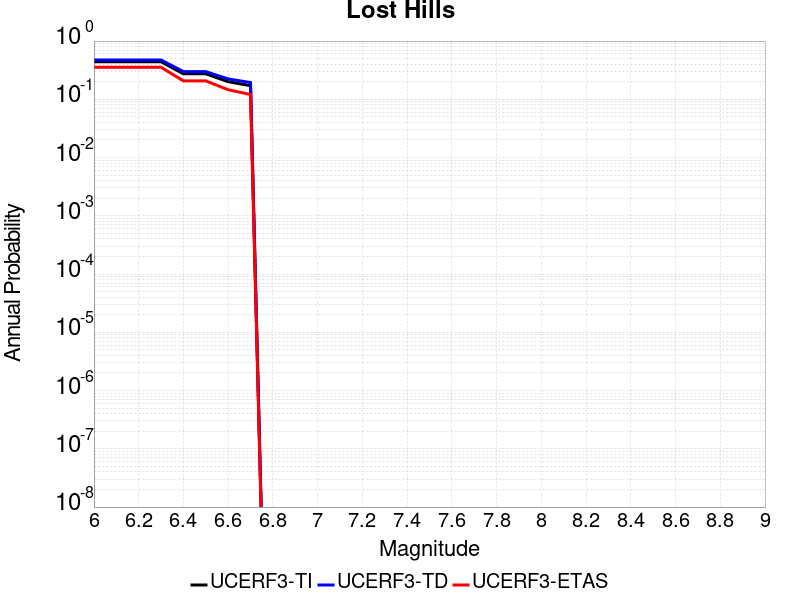 |
|-----|

| Magnitude | UCERF3-TI Prob | UCERF3-TD Prob | UCERF3-ETAS Prob |
|-----|-----|-----|-----|
| 6.0 | 0.44162068 | 0.4736838 | 0.355 |
| 6.1 | 0.44162068 | 0.4736838 | 0.355 |
| 6.2 | 0.44162068 | 0.4736838 | 0.355 |
| 6.3 | 0.44162068 | 0.4736838 | 0.355 |
| 6.4 | 0.2742789 | 0.29860604 | 0.207 |
| 6.5 | 0.2742789 | 0.29860604 | 0.207 |
| 6.6 | 0.20062119 | 0.2235128 | 0.146 |
| 6.7 | 0.17137854 | 0.1940799 | 0.121 |

## Ludlow
*[(top)](#table-of-contents)*

| 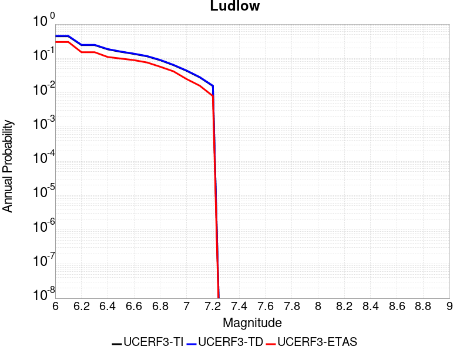 |
|-----|

| Magnitude | UCERF3-TI Prob | UCERF3-TD Prob | UCERF3-ETAS Prob |
|-----|-----|-----|-----|
| 6.0 | 0.44267404 | 0.45442498 | 0.302 |
| 6.1 | 0.44267404 | 0.45442498 | 0.302 |
| 6.2 | 0.24518055 | 0.24932049 | 0.152 |
| 6.3 | 0.24518055 | 0.24932049 | 0.152 |
| 6.4 | 0.18443483 | 0.18735968 | 0.11 |
| 6.5 | 0.15595151 | 0.1584202 | 0.099 |
| 6.6 | 0.13552718 | 0.13768917 | 0.089 |
| 6.7 | 0.11507417 | 0.11692044 | 0.076 |
| 6.8 | 0.088659465 | 0.09010288 | 0.057 |
| 6.9 | 0.063943945 | 0.06499921 | 0.042 |
| 7.0 | 0.043590497 | 0.04431589 | 0.025 |
| 7.1 | 0.028050553 | 0.028515508 | 0.016 |
| 7.2 | 0.015702942 | 0.015962126 | 0.008 |

## Maacama 2011 CFM
*[(top)](#table-of-contents)*

| 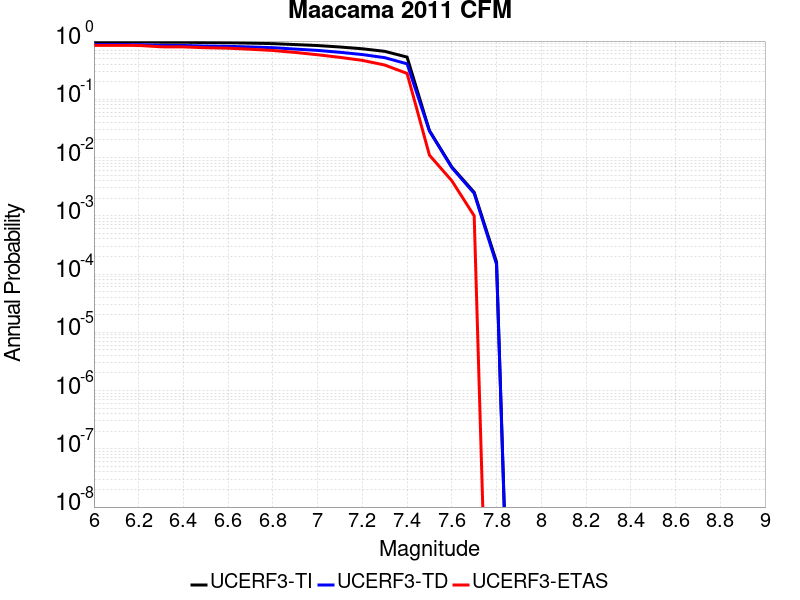 |
|-----|

| Magnitude | UCERF3-TI Prob | UCERF3-TD Prob | UCERF3-ETAS Prob |
|-----|-----|-----|-----|
| 6.0 | 0.9718382 | 0.8717441 | 0.842 |
| 6.1 | 0.9718382 | 0.8717441 | 0.842 |
| 6.2 | 0.9712846 | 0.8702261 | 0.841 |
| 6.3 | 0.95536816 | 0.84148777 | 0.797 |
| 6.4 | 0.9546882 | 0.84000397 | 0.794 |
| 6.5 | 0.94257396 | 0.82166713 | 0.768 |
| 6.6 | 0.93544793 | 0.8114303 | 0.754 |
| 6.7 | 0.9212166 | 0.7917793 | 0.724 |
| 6.8 | 0.90369064 | 0.76921606 | 0.689 |
| 6.9 | 0.87062424 | 0.7282932 | 0.638 |
| 7.0 | 0.837388 | 0.6911543 | 0.582 |
| 7.1 | 0.79096365 | 0.6415197 | 0.525 |
| 7.2 | 0.73681575 | 0.5865377 | 0.466 |
| 7.3 | 0.66648406 | 0.51892996 | 0.388 |
| 7.4 | 0.5306387 | 0.4068063 | 0.278 |
| 7.5 | 0.029031077 | 0.028566316 | 0.011 |
| 7.6 | 0.0068989806 | 0.006725152 | 0.004 |
| 7.7 | 0.0025346929 | 0.0024319373 | 0.001 |
| 7.8 | 1.6158223E-4 | 1.4710968E-4 | 0.0 |

## Mad River (alt1)
*[(top)](#table-of-contents)*

| 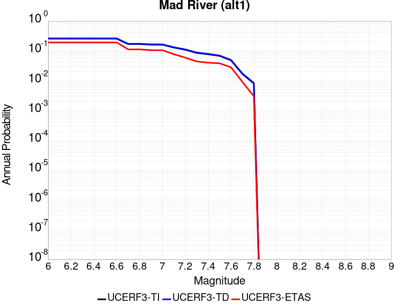 |
|-----|

| Magnitude | UCERF3-TI Prob | UCERF3-TD Prob | UCERF3-ETAS Prob |
|-----|-----|-----|-----|
| 6.0 | 0.2544568 | 0.26162863 | 0.191 |
| 6.1 | 0.2544568 | 0.26162863 | 0.191 |
| 6.2 | 0.2544568 | 0.26162863 | 0.191 |
| 6.3 | 0.2544568 | 0.26162863 | 0.191 |
| 6.4 | 0.2544568 | 0.26162863 | 0.191 |
| 6.5 | 0.2544568 | 0.26162863 | 0.191 |
| 6.6 | 0.2544568 | 0.26162863 | 0.191 |
| 6.7 | 0.16814688 | 0.17201328 | 0.112 |
| 6.8 | 0.16814688 | 0.17201328 | 0.112 |
| 6.9 | 0.16097611 | 0.16474141 | 0.105 |
| 7.0 | 0.16042033 | 0.16417667 | 0.105 |
| 7.1 | 0.1286502 | 0.13178132 | 0.077 |
| 7.2 | 0.10864814 | 0.111441754 | 0.059 |
| 7.3 | 0.085028075 | 0.08741507 | 0.044 |
| 7.4 | 0.0766597 | 0.078897975 | 0.04 |
| 7.5 | 0.067386195 | 0.06944647 | 0.038 |
| 7.6 | 0.047880035 | 0.049463123 | 0.028 |
| 7.7 | 0.016715746 | 0.017345408 | 0.009 |
| 7.8 | 0.007999505 | 0.008322646 | 0.003 |

## Malibu Coast (Extension) alt 1
*[(top)](#table-of-contents)*

| 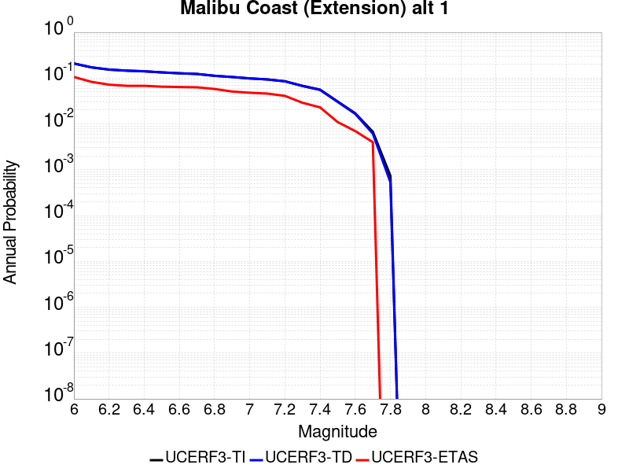 |
|-----|

| Magnitude | UCERF3-TI Prob | UCERF3-TD Prob | UCERF3-ETAS Prob |
|-----|-----|-----|-----|
| 6.0 | 0.20784453 | 0.20955424 | 0.106 |
| 6.1 | 0.17125459 | 0.17236412 | 0.083 |
| 6.2 | 0.15316139 | 0.15400897 | 0.072 |
| 6.3 | 0.14526398 | 0.14600855 | 0.068 |
| 6.4 | 0.14066112 | 0.14134306 | 0.068 |
| 6.5 | 0.1331501 | 0.13371165 | 0.065 |
| 6.6 | 0.12737441 | 0.12784238 | 0.064 |
| 6.7 | 0.123068295 | 0.12346589 | 0.063 |
| 6.8 | 0.112338424 | 0.1124903 | 0.058 |
| 6.9 | 0.10565948 | 0.105675064 | 0.051 |
| 7.0 | 0.09861253 | 0.09847799 | 0.048 |
| 7.1 | 0.09374646 | 0.09352388 | 0.046 |
| 7.2 | 0.085479654 | 0.08510226 | 0.041 |
| 7.3 | 0.06793567 | 0.06715789 | 0.029 |
| 7.4 | 0.056173384 | 0.055194885 | 0.023 |
| 7.5 | 0.030923855 | 0.030274814 | 0.011 |
| 7.6 | 0.01711191 | 0.016616477 | 0.007 |
| 7.7 | 0.006763449 | 0.006158043 | 0.004 |
| 7.8 | 7.3865737E-4 | 5.3480145E-4 | 0.0 |

## Malibu Coast alt 1
*[(top)](#table-of-contents)*

| 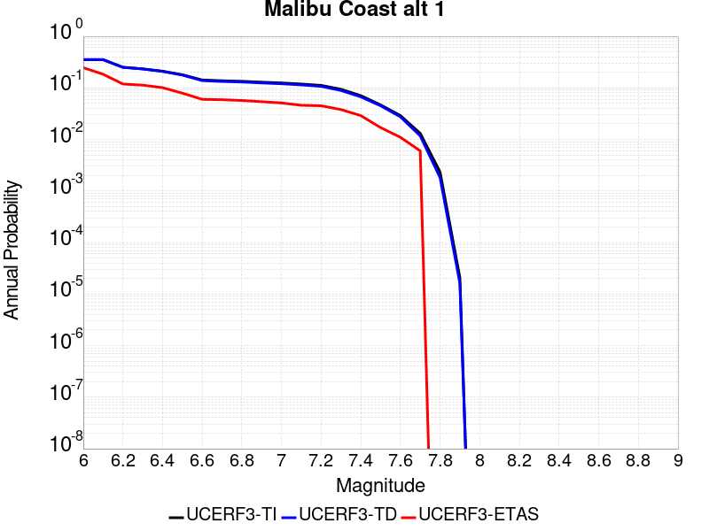 |
|-----|

| Magnitude | UCERF3-TI Prob | UCERF3-TD Prob | UCERF3-ETAS Prob |
|-----|-----|-----|-----|
| 6.0 | 0.35103062 | 0.35531726 | 0.247 |
| 6.1 | 0.35103062 | 0.35531726 | 0.184 |
| 6.2 | 0.2511526 | 0.25067475 | 0.119 |
| 6.3 | 0.23381805 | 0.23279321 | 0.113 |
| 6.4 | 0.21068102 | 0.20887862 | 0.101 |
| 6.5 | 0.17998327 | 0.1772257 | 0.079 |
| 6.6 | 0.14243905 | 0.13837981 | 0.06 |
| 6.7 | 0.13741247 | 0.13323832 | 0.059 |
| 6.8 | 0.13415888 | 0.12991625 | 0.057 |
| 6.9 | 0.12908325 | 0.124711856 | 0.054 |
| 7.0 | 0.124737665 | 0.12026701 | 0.051 |
| 7.1 | 0.11878545 | 0.114164725 | 0.046 |
| 7.2 | 0.11182766 | 0.107032314 | 0.045 |
| 7.3 | 0.09424413 | 0.08918035 | 0.038 |
| 7.4 | 0.070645 | 0.06700715 | 0.029 |
| 7.5 | 0.046822842 | 0.04497217 | 0.017 |
| 7.6 | 0.029032024 | 0.027453732 | 0.011 |
| 7.7 | 0.013128003 | 0.011720253 | 0.006 |
| 7.8 | 0.0023330457 | 0.0018155237 | 0.0 |
| 7.9 | 2.0890639E-5 | 1.6282886E-5 | 0.0 |

## Manix-Afton Hills
*[(top)](#table-of-contents)*

| 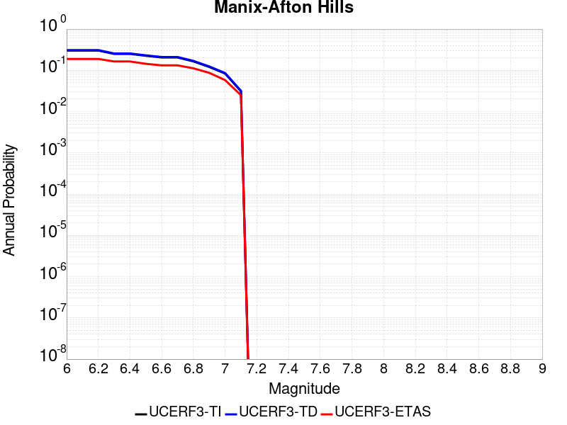 |
|-----|

| Magnitude | UCERF3-TI Prob | UCERF3-TD Prob | UCERF3-ETAS Prob |
|-----|-----|-----|-----|
| 6.0 | 0.30204204 | 0.30999526 | 0.189 |
| 6.1 | 0.30204204 | 0.30999526 | 0.189 |
| 6.2 | 0.30204204 | 0.30999526 | 0.189 |
| 6.3 | 0.25044444 | 0.25660118 | 0.164 |
| 6.4 | 0.25044444 | 0.25660118 | 0.164 |
| 6.5 | 0.22538407 | 0.23107928 | 0.144 |
| 6.6 | 0.20534544 | 0.21073903 | 0.132 |
| 6.7 | 0.20516452 | 0.21055493 | 0.132 |
| 6.8 | 0.16473258 | 0.16947594 | 0.112 |
| 6.9 | 0.120756716 | 0.1243711 | 0.087 |
| 7.0 | 0.08364036 | 0.08625762 | 0.058 |
| 7.1 | 0.031008165 | 0.0320375 | 0.025 |

## McKinleyville (alt1)
*[(top)](#table-of-contents)*

| 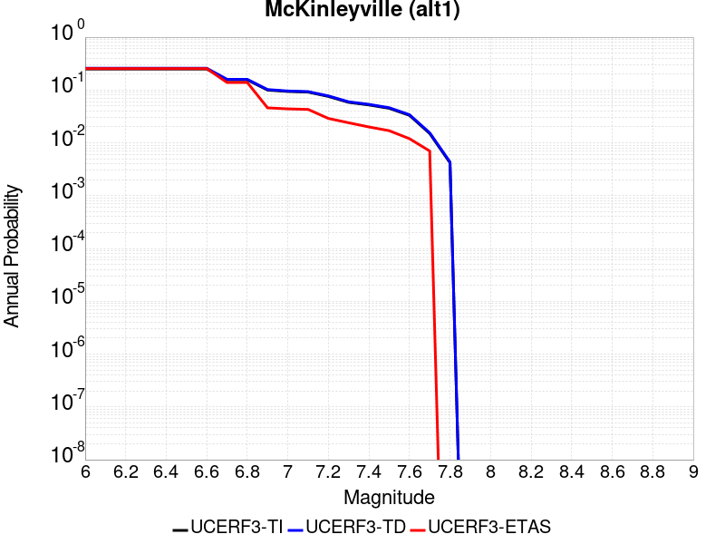 |
|-----|

| Magnitude | UCERF3-TI Prob | UCERF3-TD Prob | UCERF3-ETAS Prob |
|-----|-----|-----|-----|
| 6.0 | 0.25003436 | 0.2590105 | 0.255 |
| 6.1 | 0.25003436 | 0.2590105 | 0.255 |
| 6.2 | 0.25003436 | 0.2590105 | 0.255 |
| 6.3 | 0.25003436 | 0.2590105 | 0.255 |
| 6.4 | 0.25003436 | 0.2590105 | 0.255 |
| 6.5 | 0.25003436 | 0.2590105 | 0.255 |
| 6.6 | 0.25003436 | 0.2590105 | 0.255 |
| 6.7 | 0.15561534 | 0.15973909 | 0.139 |
| 6.8 | 0.15561534 | 0.15973909 | 0.139 |
| 6.9 | 0.10002239 | 0.102210775 | 0.046 |
| 7.0 | 0.09389022 | 0.095993 | 0.044 |
| 7.1 | 0.09143592 | 0.093508884 | 0.043 |
| 7.2 | 0.075683415 | 0.077488326 | 0.029 |
| 7.3 | 0.058428098 | 0.05992669 | 0.024 |
| 7.4 | 0.052247383 | 0.053636167 | 0.02 |
| 7.5 | 0.045065533 | 0.046311755 | 0.017 |
| 7.6 | 0.0332069 | 0.034183715 | 0.012 |
| 7.7 | 0.015033923 | 0.015512186 | 0.007 |
| 7.8 | 0.0041970243 | 0.004347249 | 0.0 |

## McLean Lake
*[(top)](#table-of-contents)*

| 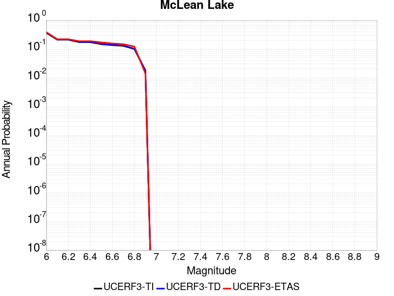 |
|-----|

| Magnitude | UCERF3-TI Prob | UCERF3-TD Prob | UCERF3-ETAS Prob |
|-----|-----|-----|-----|
| 6.0 | 0.3642308 | 0.37762964 | 0.386 |
| 6.1 | 0.21056688 | 0.21552876 | 0.219 |
| 6.2 | 0.21056688 | 0.21552876 | 0.219 |
| 6.3 | 0.17249899 | 0.17659721 | 0.187 |
| 6.4 | 0.17249899 | 0.17659721 | 0.187 |
| 6.5 | 0.14636655 | 0.14999089 | 0.17 |
| 6.6 | 0.13590075 | 0.13937634 | 0.156 |
| 6.7 | 0.1279345 | 0.13130325 | 0.147 |
| 6.8 | 0.09964277 | 0.10256197 | 0.122 |
| 6.9 | 0.017676475 | 0.01798723 | 0.014 |

## Mendocino
*[(top)](#table-of-contents)*

| 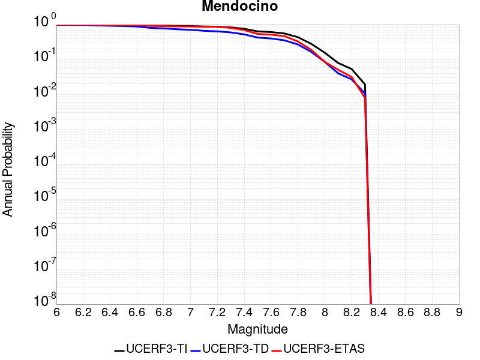 |
|-----|

| Magnitude | UCERF3-TI Prob | UCERF3-TD Prob | UCERF3-ETAS Prob |
|-----|-----|-----|-----|
| 6.0 | 0.99999946 | 0.99475807 | 1.0 |
| 6.1 | 0.9999848 | 0.9790818 | 0.997 |
| 6.2 | 0.9999848 | 0.9790818 | 0.997 |
| 6.3 | 0.9998068 | 0.952496 | 0.994 |
| 6.4 | 0.9992182 | 0.9303839 | 0.986 |
| 6.5 | 0.9980854 | 0.90925205 | 0.976 |
| 6.6 | 0.9958534 | 0.8873102 | 0.969 |
| 6.7 | 0.96258277 | 0.8080449 | 0.918 |
| 6.8 | 0.94846886 | 0.78252345 | 0.908 |
| 6.9 | 0.9249788 | 0.73866355 | 0.892 |
| 7.0 | 0.90855414 | 0.7086299 | 0.885 |
| 7.1 | 0.8848701 | 0.66696525 | 0.875 |
| 7.2 | 0.8701927 | 0.64035755 | 0.866 |
| 7.3 | 0.8342155 | 0.5991036 | 0.807 |
| 7.4 | 0.7612413 | 0.5262289 | 0.697 |
| 7.5 | 0.6394822 | 0.42665732 | 0.541 |
| 7.6 | 0.6132355 | 0.4020314 | 0.516 |
| 7.7 | 0.558288 | 0.35520858 | 0.469 |
| 7.8 | 0.43807203 | 0.27059805 | 0.33 |
| 7.9 | 0.2809203 | 0.16544777 | 0.189 |
| 8.0 | 0.15718937 | 0.08599127 | 0.086 |
| 8.1 | 0.07989597 | 0.0404436 | 0.051 |
| 8.2 | 0.053792253 | 0.027303157 | 0.032 |
| 8.3 | 0.019471124 | 0.010714068 | 0.008 |

## Mission (connected) 2011 CFM
*[(top)](#table-of-contents)*

| 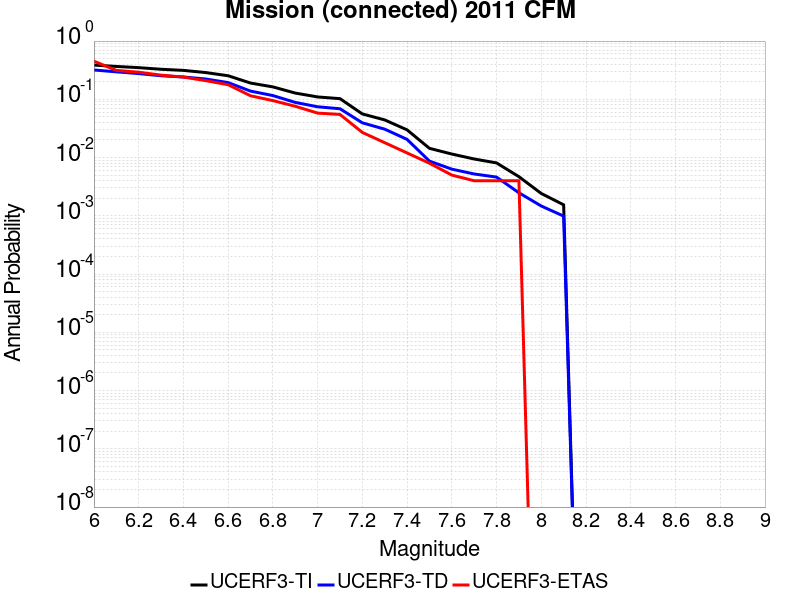 |
|-----|

| Magnitude | UCERF3-TI Prob | UCERF3-TD Prob | UCERF3-ETAS Prob |
|-----|-----|-----|-----|
| 6.0 | 0.38663942 | 0.31884584 | 0.451 |
| 6.1 | 0.36680886 | 0.29616147 | 0.314 |
| 6.2 | 0.34956926 | 0.27654177 | 0.292 |
| 6.3 | 0.32788566 | 0.2535699 | 0.26 |
| 6.4 | 0.3138254 | 0.24168935 | 0.241 |
| 6.5 | 0.2878714 | 0.22310145 | 0.209 |
| 6.6 | 0.2537855 | 0.1936185 | 0.178 |
| 6.7 | 0.19019578 | 0.13833697 | 0.115 |
| 6.8 | 0.16335154 | 0.11600731 | 0.095 |
| 6.9 | 0.12804231 | 0.088462405 | 0.076 |
| 7.0 | 0.1098504 | 0.07446752 | 0.058 |
| 7.1 | 0.10259807 | 0.06884253 | 0.055 |
| 7.2 | 0.05610665 | 0.03946628 | 0.027 |
| 7.3 | 0.04428745 | 0.030733988 | 0.018 |
| 7.4 | 0.029882137 | 0.020512864 | 0.012 |
| 7.5 | 0.01440369 | 0.008694743 | 0.008 |
| 7.6 | 0.011493 | 0.006324161 | 0.005 |
| 7.7 | 0.009449276 | 0.005225331 | 0.004 |
| 7.8 | 0.008094642 | 0.004620378 | 0.004 |
| 7.9 | 0.004694401 | 0.0024858643 | 0.004 |
| 8.0 | 0.0024179842 | 0.0014724843 | 0.0 |
| 8.1 | 0.0015446999 | 9.880954E-4 | 0.0 |

## Mission Creek
*[(top)](#table-of-contents)*

| 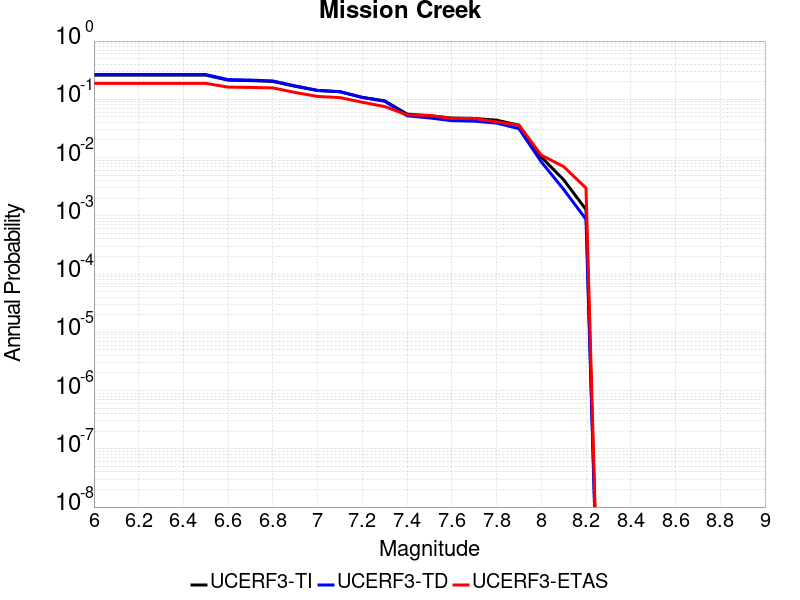 |
|-----|

| Magnitude | UCERF3-TI Prob | UCERF3-TD Prob | UCERF3-ETAS Prob |
|-----|-----|-----|-----|
| 6.0 | 0.26015678 | 0.26621595 | 0.188 |
| 6.1 | 0.26015678 | 0.26621595 | 0.188 |
| 6.2 | 0.26015678 | 0.26621595 | 0.188 |
| 6.3 | 0.26015678 | 0.26621595 | 0.188 |
| 6.4 | 0.26015678 | 0.26621595 | 0.188 |
| 6.5 | 0.26015678 | 0.26621595 | 0.188 |
| 6.6 | 0.21344487 | 0.21788323 | 0.162 |
| 6.7 | 0.20966993 | 0.21405923 | 0.16 |
| 6.8 | 0.20251153 | 0.20673472 | 0.157 |
| 6.9 | 0.16696905 | 0.17019966 | 0.131 |
| 7.0 | 0.14146677 | 0.14250365 | 0.112 |
| 7.1 | 0.13473414 | 0.13553889 | 0.107 |
| 7.2 | 0.10809368 | 0.107323736 | 0.089 |
| 7.3 | 0.094120026 | 0.09267177 | 0.075 |
| 7.4 | 0.055737175 | 0.052070204 | 0.054 |
| 7.5 | 0.052125584 | 0.04795362 | 0.053 |
| 7.6 | 0.047699098 | 0.043006476 | 0.047 |
| 7.7 | 0.046900064 | 0.04218173 | 0.047 |
| 7.8 | 0.043867342 | 0.039039478 | 0.041 |
| 7.9 | 0.035954196 | 0.03136414 | 0.036 |
| 8.0 | 0.010205568 | 0.008445747 | 0.011 |
| 8.1 | 0.004157254 | 0.0028434047 | 0.007 |
| 8.2 | 0.0012776374 | 8.686398E-4 | 0.003 |

## Mission Hills 2011
*[(top)](#table-of-contents)*

| 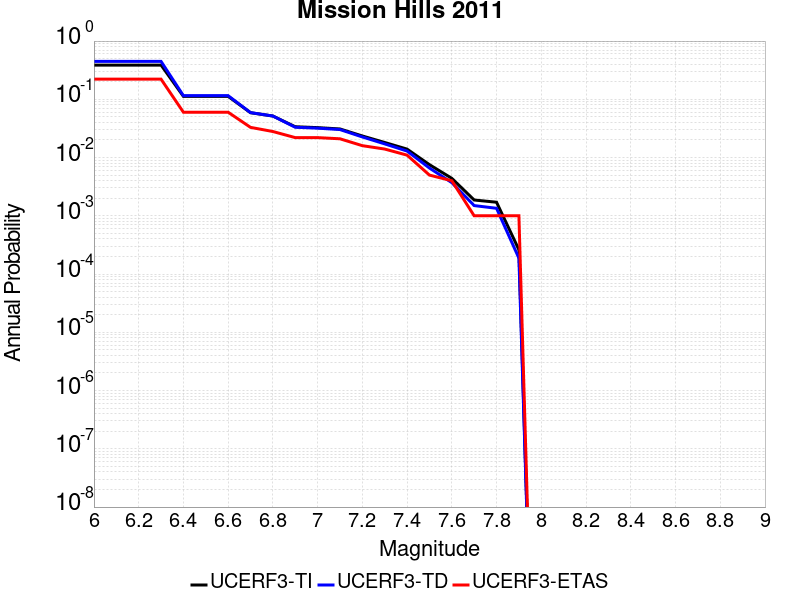 |
|-----|

| Magnitude | UCERF3-TI Prob | UCERF3-TD Prob | UCERF3-ETAS Prob |
|-----|-----|-----|-----|
| 6.0 | 0.38712162 | 0.44797003 | 0.222 |
| 6.1 | 0.38712162 | 0.44797003 | 0.222 |
| 6.2 | 0.38712162 | 0.44797003 | 0.222 |
| 6.3 | 0.38712162 | 0.44797003 | 0.222 |
| 6.4 | 0.11231051 | 0.115431294 | 0.06 |
| 6.5 | 0.11231051 | 0.115431294 | 0.06 |
| 6.6 | 0.11231051 | 0.115431294 | 0.06 |
| 6.7 | 0.058895804 | 0.059113834 | 0.033 |
| 6.8 | 0.051650956 | 0.051655438 | 0.028 |
| 6.9 | 0.03381701 | 0.033139862 | 0.022 |
| 7.0 | 0.032656174 | 0.031961076 | 0.022 |
| 7.1 | 0.030983757 | 0.030258719 | 0.021 |
| 7.2 | 0.023476446 | 0.022597209 | 0.016 |
| 7.3 | 0.018149098 | 0.017175484 | 0.014 |
| 7.4 | 0.013963882 | 0.012939268 | 0.011 |
| 7.5 | 0.007555663 | 0.006612204 | 0.005 |
| 7.6 | 0.0044003385 | 0.0037139053 | 0.004 |
| 7.7 | 0.0018683517 | 0.0015012253 | 0.001 |
| 7.8 | 0.0017110617 | 0.0013489326 | 0.001 |
| 7.9 | 2.6161713E-4 | 1.8977333E-4 | 0.001 |

## Mission Ridge-Arroyo Parida-Santa Ana
*[(top)](#table-of-contents)*

| 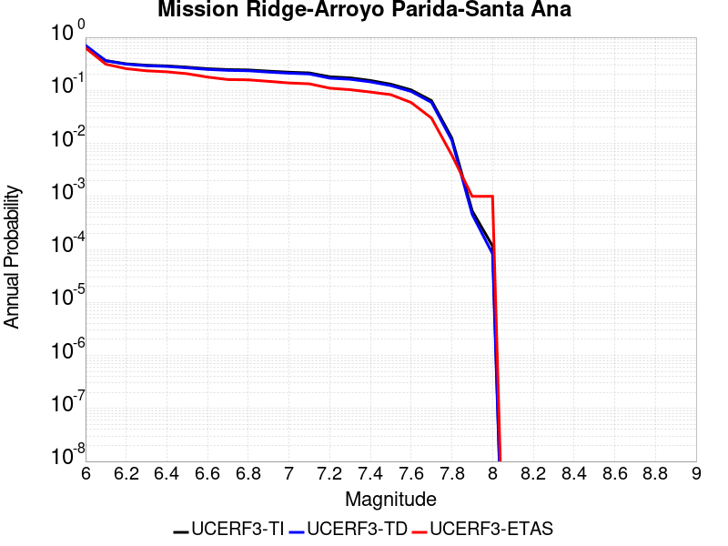 |
|-----|

| Magnitude | UCERF3-TI Prob | UCERF3-TD Prob | UCERF3-ETAS Prob |
|-----|-----|-----|-----|
| 6.0 | 0.66300726 | 0.7097434 | 0.631 |
| 6.1 | 0.36458036 | 0.36054343 | 0.311 |
| 6.2 | 0.31715342 | 0.31140882 | 0.257 |
| 6.3 | 0.29782718 | 0.29138663 | 0.234 |
| 6.4 | 0.28944767 | 0.28270632 | 0.224 |
| 6.5 | 0.27359617 | 0.26625916 | 0.206 |
| 6.6 | 0.25634164 | 0.24829231 | 0.178 |
| 6.7 | 0.2468106 | 0.2384686 | 0.16 |
| 6.8 | 0.24291468 | 0.23442519 | 0.158 |
| 6.9 | 0.23041427 | 0.22134899 | 0.148 |
| 7.0 | 0.22029582 | 0.210803 | 0.138 |
| 7.1 | 0.21354148 | 0.20380484 | 0.133 |
| 7.2 | 0.1806739 | 0.16993554 | 0.11 |
| 7.3 | 0.17233633 | 0.16204616 | 0.103 |
| 7.4 | 0.15355523 | 0.14465511 | 0.093 |
| 7.5 | 0.13093321 | 0.122957915 | 0.083 |
| 7.6 | 0.10207839 | 0.095520034 | 0.059 |
| 7.7 | 0.064135544 | 0.059258588 | 0.03 |
| 7.8 | 0.012601485 | 0.011353991 | 0.006 |
| 7.9 | 5.3397065E-4 | 4.5670822E-4 | 0.001 |
| 8.0 | 1.15923154E-4 | 8.244711E-5 | 0.001 |

## Mohawk Valley 2011 CFM
*[(top)](#table-of-contents)*

| 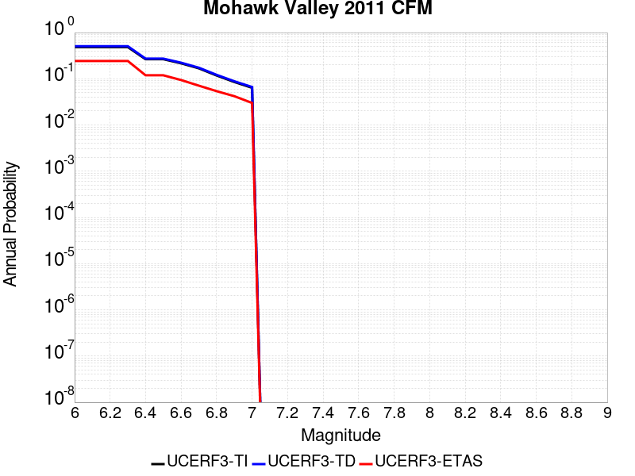 |
|-----|

| Magnitude | UCERF3-TI Prob | UCERF3-TD Prob | UCERF3-ETAS Prob |
|-----|-----|-----|-----|
| 6.0 | 0.48487183 | 0.50712395 | 0.243 |
| 6.1 | 0.48487183 | 0.50712395 | 0.243 |
| 6.2 | 0.48487183 | 0.50712395 | 0.243 |
| 6.3 | 0.48487183 | 0.50712395 | 0.243 |
| 6.4 | 0.2652208 | 0.27304628 | 0.119 |
| 6.5 | 0.2652208 | 0.27304628 | 0.119 |
| 6.6 | 0.21629946 | 0.22291997 | 0.094 |
| 6.7 | 0.1683573 | 0.17371738 | 0.071 |
| 6.8 | 0.1178587 | 0.12178251 | 0.054 |
| 6.9 | 0.085272916 | 0.08838593 | 0.042 |
| 7.0 | 0.06380569 | 0.066395484 | 0.03 |

## Mono Lake 2011 CFM
*[(top)](#table-of-contents)*

| 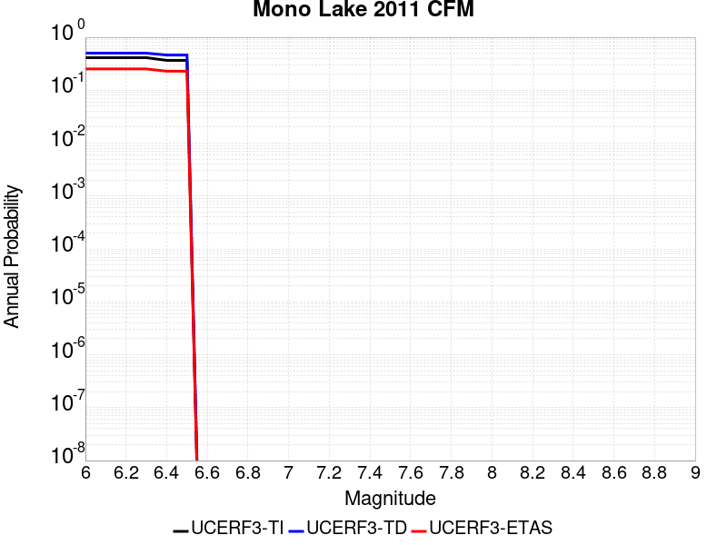 |
|-----|

| Magnitude | UCERF3-TI Prob | UCERF3-TD Prob | UCERF3-ETAS Prob |
|-----|-----|-----|-----|
| 6.0 | 0.41180977 | 0.50157887 | 0.252 |
| 6.1 | 0.41180977 | 0.50157887 | 0.252 |
| 6.2 | 0.41180977 | 0.50157887 | 0.252 |
| 6.3 | 0.41180977 | 0.50157887 | 0.252 |
| 6.4 | 0.36651555 | 0.46197835 | 0.229 |
| 6.5 | 0.36651555 | 0.46197835 | 0.229 |

## Monte Vista - Shannon 2011 CFM
*[(top)](#table-of-contents)*

| 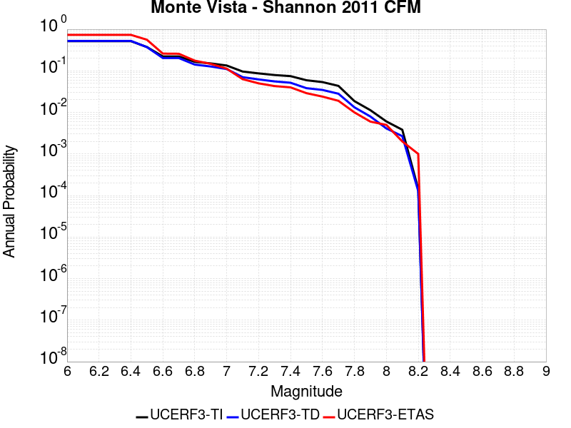 |
|-----|

| Magnitude | UCERF3-TI Prob | UCERF3-TD Prob | UCERF3-ETAS Prob |
|-----|-----|-----|-----|
| 6.0 | 0.5171756 | 0.5257128 | 0.735 |
| 6.1 | 0.5171756 | 0.5257128 | 0.735 |
| 6.2 | 0.5171756 | 0.5257128 | 0.735 |
| 6.3 | 0.5171756 | 0.5257128 | 0.735 |
| 6.4 | 0.5171756 | 0.5257128 | 0.735 |
| 6.5 | 0.3745951 | 0.37248692 | 0.561 |
| 6.6 | 0.22257915 | 0.20353645 | 0.26 |
| 6.7 | 0.22213022 | 0.2031132 | 0.258 |
| 6.8 | 0.16447179 | 0.14142817 | 0.176 |
| 6.9 | 0.15095122 | 0.12732345 | 0.147 |
| 7.0 | 0.13439555 | 0.11046833 | 0.113 |
| 7.1 | 0.096257776 | 0.070407666 | 0.063 |
| 7.2 | 0.08682386 | 0.06218041 | 0.05 |
| 7.3 | 0.07933274 | 0.055689946 | 0.043 |
| 7.4 | 0.074577875 | 0.051714707 | 0.04 |
| 7.5 | 0.05937688 | 0.038251106 | 0.029 |
| 7.6 | 0.053629424 | 0.034710005 | 0.024 |
| 7.7 | 0.043438744 | 0.028126838 | 0.019 |
| 7.8 | 0.018688116 | 0.013257637 | 0.01 |
| 7.9 | 0.011307501 | 0.007964974 | 0.006 |
| 8.0 | 0.0060649095 | 0.0041179536 | 0.005 |
| 8.1 | 0.003818023 | 0.0026780737 | 0.002 |
| 8.2 | 1.4330281E-4 | 1.2706844E-4 | 0.001 |

## Monterey Bay-Tularcitos
*[(top)](#table-of-contents)*

| 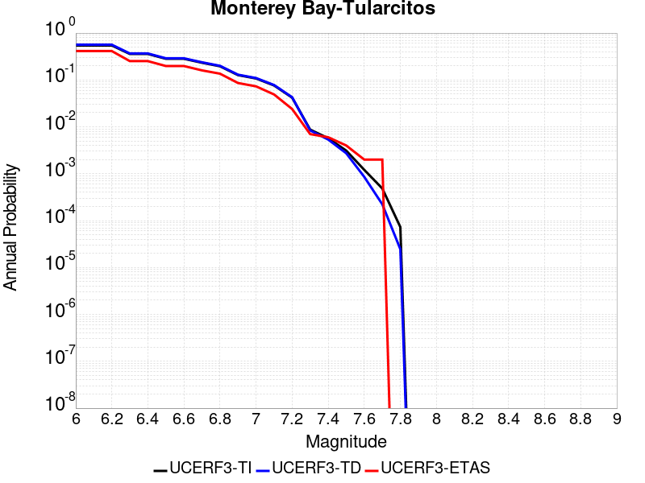 |
|-----|

| Magnitude | UCERF3-TI Prob | UCERF3-TD Prob | UCERF3-ETAS Prob |
|-----|-----|-----|-----|
| 6.0 | 0.5443898 | 0.56446576 | 0.413 |
| 6.1 | 0.5443898 | 0.56446576 | 0.413 |
| 6.2 | 0.5443898 | 0.56446576 | 0.413 |
| 6.3 | 0.35819831 | 0.36715096 | 0.252 |
| 6.4 | 0.35819831 | 0.36715096 | 0.252 |
| 6.5 | 0.28291744 | 0.28956702 | 0.198 |
| 6.6 | 0.28277418 | 0.28942367 | 0.198 |
| 6.7 | 0.23284878 | 0.23814858 | 0.16 |
| 6.8 | 0.19574812 | 0.20016941 | 0.136 |
| 6.9 | 0.12671968 | 0.12942968 | 0.086 |
| 7.0 | 0.10750412 | 0.10981733 | 0.073 |
| 7.1 | 0.07624438 | 0.07791174 | 0.049 |
| 7.2 | 0.041942406 | 0.042815935 | 0.024 |
| 7.3 | 0.008719525 | 0.008384631 | 0.007 |
| 7.4 | 0.005716325 | 0.005353279 | 0.006 |
| 7.5 | 0.0031112898 | 0.0027325368 | 0.004 |
| 7.6 | 0.0012087834 | 8.566558E-4 | 0.002 |
| 7.7 | 4.84845E-4 | 2.2305135E-4 | 0.002 |
| 7.8 | 7.294339E-5 | 2.4602463E-5 | 0.0 |

## Morales (East)
*[(top)](#table-of-contents)*

| 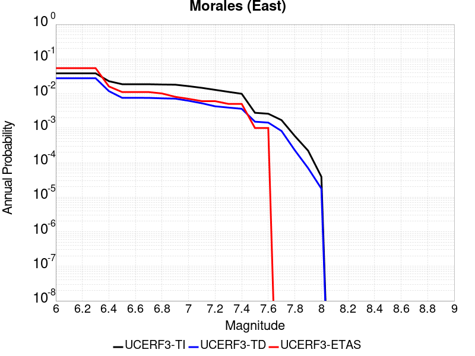 |
|-----|

| Magnitude | UCERF3-TI Prob | UCERF3-TD Prob | UCERF3-ETAS Prob |
|-----|-----|-----|-----|
| 6.0 | 0.03823453 | 0.027599864 | 0.054 |
| 6.1 | 0.03823453 | 0.027599864 | 0.054 |
| 6.2 | 0.03823453 | 0.027599864 | 0.054 |
| 6.3 | 0.03823453 | 0.027599864 | 0.054 |
| 6.4 | 0.022694094 | 0.011708148 | 0.016 |
| 6.5 | 0.018545398 | 0.0074922177 | 0.011 |
| 6.6 | 0.018545398 | 0.0074922177 | 0.011 |
| 6.7 | 0.018504132 | 0.007458978 | 0.011 |
| 6.8 | 0.018179249 | 0.00723475 | 0.01 |
| 6.9 | 0.01794701 | 0.0070940945 | 0.008 |
| 7.0 | 0.01628453 | 0.006149851 | 0.007 |
| 7.1 | 0.014555464 | 0.005208556 | 0.006 |
| 7.2 | 0.012729279 | 0.0042573325 | 0.006 |
| 7.3 | 0.011150143 | 0.0039086477 | 0.005 |
| 7.4 | 0.009798602 | 0.0036053143 | 0.005 |
| 7.5 | 0.0027624848 | 0.0015268888 | 0.001 |
| 7.6 | 0.0025952198 | 0.0014369496 | 0.001 |
| 7.7 | 0.001694228 | 8.2220644E-4 | 0.0 |
| 7.8 | 5.8728305E-4 | 2.2758258E-4 | 0.0 |
| 7.9 | 2.2155237E-4 | 6.933688E-5 | 0.0 |
| 8.0 | 3.90597E-5 | 1.769897E-5 | 0.0 |

## Morales (West)
*[(top)](#table-of-contents)*

| 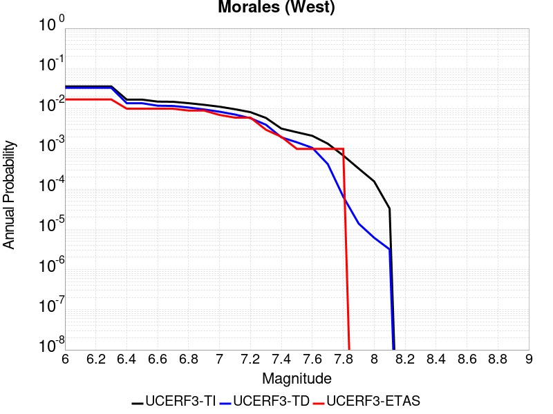 |
|-----|

| Magnitude | UCERF3-TI Prob | UCERF3-TD Prob | UCERF3-ETAS Prob |
|-----|-----|-----|-----|
| 6.0 | 0.035934128 | 0.033073507 | 0.017 |
| 6.1 | 0.035934128 | 0.033073507 | 0.017 |
| 6.2 | 0.035934128 | 0.033073507 | 0.017 |
| 6.3 | 0.035934128 | 0.033073507 | 0.017 |
| 6.4 | 0.016826611 | 0.013673914 | 0.01 |
| 6.5 | 0.016826611 | 0.013673914 | 0.01 |
| 6.6 | 0.015032405 | 0.0118685635 | 0.01 |
| 6.7 | 0.0148674045 | 0.011702641 | 0.01 |
| 6.8 | 0.013730694 | 0.010710574 | 0.009 |
| 6.9 | 0.012506454 | 0.00958775 | 0.009 |
| 7.0 | 0.011223941 | 0.008427423 | 0.007 |
| 7.1 | 0.009706991 | 0.007164956 | 0.006 |
| 7.2 | 0.008208396 | 0.00580543 | 0.006 |
| 7.3 | 0.0058990046 | 0.003993645 | 0.003 |
| 7.4 | 0.003202677 | 0.0019368664 | 0.002 |
| 7.5 | 0.0025959667 | 0.0014622639 | 0.001 |
| 7.6 | 0.0021177423 | 0.0010641932 | 0.001 |
| 7.7 | 0.0013507927 | 4.2023178E-4 | 0.001 |
| 7.8 | 6.8630505E-4 | 6.471001E-5 | 0.001 |
| 7.9 | 3.241891E-4 | 1.3830587E-5 | 0.0 |
| 8.0 | 1.5532914E-4 | 6.157158E-6 | 0.0 |
| 8.1 | 3.283612E-5 | 3.1665281E-6 | 0.0 |

## Mount Diablo Thrust North CFM
*[(top)](#table-of-contents)*

| 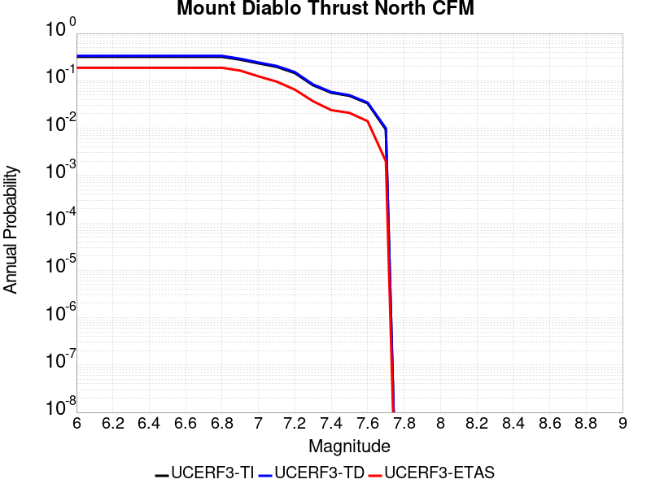 |
|-----|

| Magnitude | UCERF3-TI Prob | UCERF3-TD Prob | UCERF3-ETAS Prob |
|-----|-----|-----|-----|
| 6.0 | 0.320248 | 0.33607194 | 0.188 |
| 6.1 | 0.320248 | 0.33607194 | 0.188 |
| 6.2 | 0.320248 | 0.33607194 | 0.188 |
| 6.3 | 0.320248 | 0.33607194 | 0.188 |
| 6.4 | 0.320248 | 0.33607194 | 0.188 |
| 6.5 | 0.320248 | 0.33607194 | 0.188 |
| 6.6 | 0.32013944 | 0.3359632 | 0.188 |
| 6.7 | 0.32013944 | 0.3359632 | 0.188 |
| 6.8 | 0.31981134 | 0.33563226 | 0.188 |
| 6.9 | 0.2791877 | 0.2917079 | 0.164 |
| 7.0 | 0.23315513 | 0.24334747 | 0.124 |
| 7.1 | 0.19676475 | 0.20537199 | 0.096 |
| 7.2 | 0.14545159 | 0.15249678 | 0.065 |
| 7.3 | 0.08033515 | 0.083609074 | 0.037 |
| 7.4 | 0.055882636 | 0.05780001 | 0.024 |
| 7.5 | 0.04803711 | 0.04968186 | 0.021 |
| 7.6 | 0.03337881 | 0.034635037 | 0.014 |
| 7.7 | 0.00935692 | 0.009929925 | 0.002 |

## Mount Diablo Thrust South
*[(top)](#table-of-contents)*

| 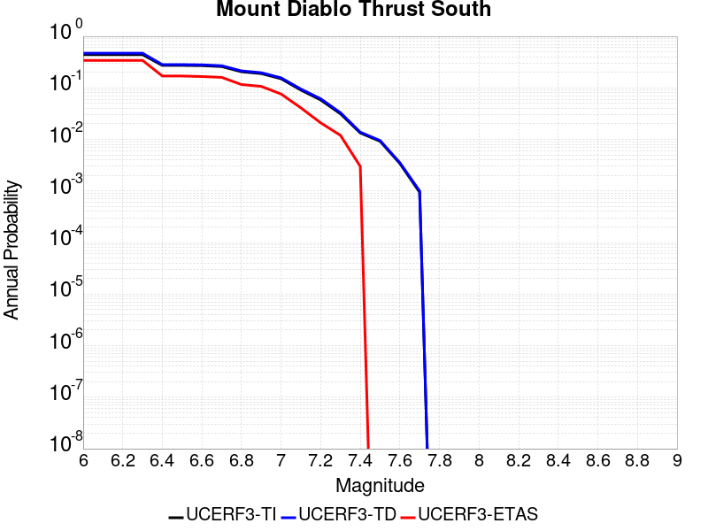 |
|-----|

| Magnitude | UCERF3-TI Prob | UCERF3-TD Prob | UCERF3-ETAS Prob |
|-----|-----|-----|-----|
| 6.0 | 0.4422353 | 0.47161892 | 0.342 |
| 6.1 | 0.4422353 | 0.47161892 | 0.342 |
| 6.2 | 0.4422353 | 0.47161892 | 0.342 |
| 6.3 | 0.4422353 | 0.47161892 | 0.342 |
| 6.4 | 0.273149 | 0.2829877 | 0.17 |
| 6.5 | 0.273149 | 0.2829877 | 0.17 |
| 6.6 | 0.270102 | 0.2800255 | 0.166 |
| 6.7 | 0.25919184 | 0.26929507 | 0.16 |
| 6.8 | 0.20557708 | 0.21360973 | 0.116 |
| 6.9 | 0.18937056 | 0.19704132 | 0.107 |
| 7.0 | 0.15062425 | 0.15670477 | 0.076 |
| 7.1 | 0.09079918 | 0.095027775 | 0.041 |
| 7.2 | 0.058324784 | 0.0615061 | 0.021 |
| 7.3 | 0.031429708 | 0.033027105 | 0.012 |
| 7.4 | 0.013372163 | 0.013838064 | 0.003 |
| 7.5 | 0.009226421 | 0.009527804 | 0.0 |
| 7.6 | 0.0034181245 | 0.0035457958 | 0.0 |
| 7.7 | 9.438044E-4 | 0.0010002134 | 0.0 |

## Nelson Lake
*[(top)](#table-of-contents)*

| 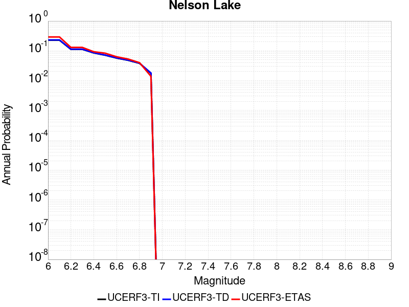 |
|-----|

| Magnitude | UCERF3-TI Prob | UCERF3-TD Prob | UCERF3-ETAS Prob |
|-----|-----|-----|-----|
| 6.0 | 0.22789614 | 0.23171295 | 0.292 |
| 6.1 | 0.22789614 | 0.23171295 | 0.292 |
| 6.2 | 0.112154946 | 0.11339287 | 0.13 |
| 6.3 | 0.112154946 | 0.11339287 | 0.13 |
| 6.4 | 0.084944725 | 0.085907035 | 0.093 |
| 6.5 | 0.071301304 | 0.072149105 | 0.083 |
| 6.6 | 0.057048626 | 0.057768766 | 0.063 |
| 6.7 | 0.04814229 | 0.048787437 | 0.053 |
| 6.8 | 0.038064 | 0.03861272 | 0.04 |
| 6.9 | 0.017676475 | 0.01798723 | 0.014 |

## Newport-Inglewood (Offshore)
*[(top)](#table-of-contents)*

| 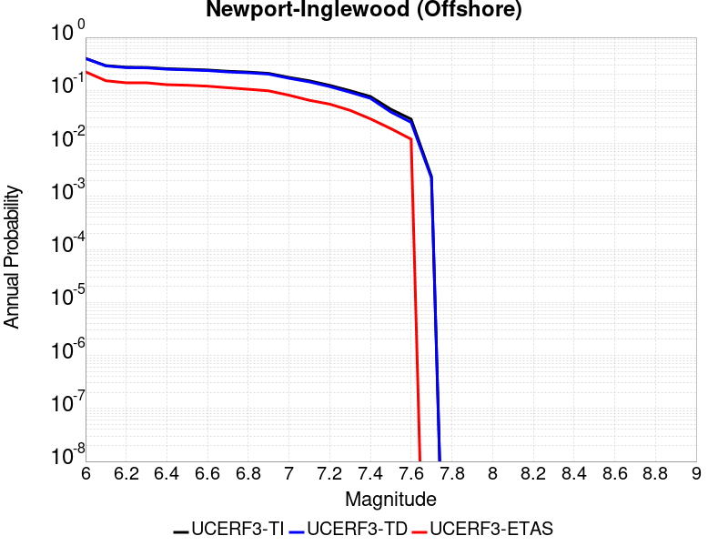 |
|-----|

| Magnitude | UCERF3-TI Prob | UCERF3-TD Prob | UCERF3-ETAS Prob |
|-----|-----|-----|-----|
| 6.0 | 0.40073213 | 0.40067643 | 0.224 |
| 6.1 | 0.29353514 | 0.28912595 | 0.152 |
| 6.2 | 0.2735735 | 0.26854312 | 0.139 |
| 6.3 | 0.27082792 | 0.26570714 | 0.139 |
| 6.4 | 0.25627407 | 0.2507273 | 0.128 |
| 6.5 | 0.24963993 | 0.24389867 | 0.125 |
| 6.6 | 0.2422889 | 0.23632967 | 0.12 |
| 6.7 | 0.22919697 | 0.22285907 | 0.112 |
| 6.8 | 0.22146389 | 0.21492629 | 0.105 |
| 6.9 | 0.20928735 | 0.20264548 | 0.098 |
| 7.0 | 0.17571963 | 0.16905558 | 0.081 |
| 7.1 | 0.1515575 | 0.144805 | 0.065 |
| 7.2 | 0.12450721 | 0.11771592 | 0.055 |
| 7.3 | 0.098516 | 0.09216053 | 0.042 |
| 7.4 | 0.07665365 | 0.07073092 | 0.029 |
| 7.5 | 0.04407877 | 0.039114658 | 0.019 |
| 7.6 | 0.0286868 | 0.024908548 | 0.012 |
| 7.7 | 0.002375987 | 0.0022064825 | 0.0 |

## Newport-Inglewood alt 1
*[(top)](#table-of-contents)*

| 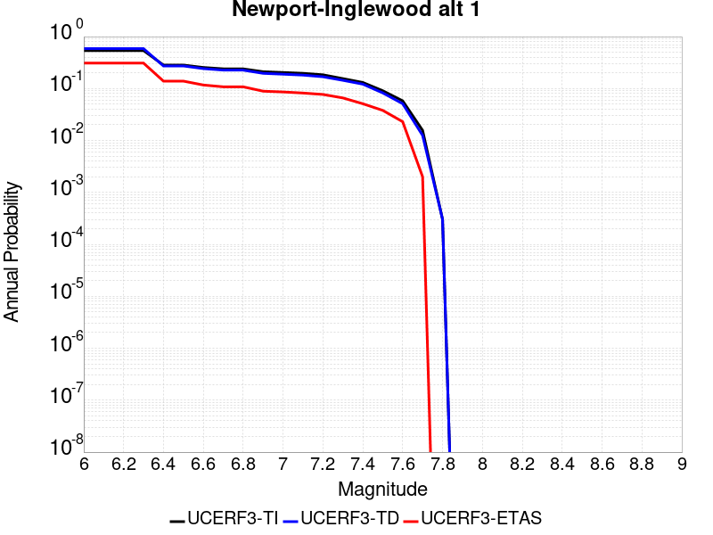 |
|-----|

| Magnitude | UCERF3-TI Prob | UCERF3-TD Prob | UCERF3-ETAS Prob |
|-----|-----|-----|-----|
| 6.0 | 0.53885937 | 0.5867024 | 0.309 |
| 6.1 | 0.53885937 | 0.5867024 | 0.309 |
| 6.2 | 0.53885937 | 0.5867024 | 0.309 |
| 6.3 | 0.53885937 | 0.5867024 | 0.309 |
| 6.4 | 0.2831483 | 0.2722847 | 0.139 |
| 6.5 | 0.2831483 | 0.2722847 | 0.139 |
| 6.6 | 0.25445956 | 0.24204874 | 0.117 |
| 6.7 | 0.2397156 | 0.22660367 | 0.108 |
| 6.8 | 0.2391454 | 0.2260121 | 0.108 |
| 6.9 | 0.21085739 | 0.19630595 | 0.089 |
| 7.0 | 0.20385017 | 0.188987 | 0.086 |
| 7.1 | 0.19661716 | 0.18159628 | 0.082 |
| 7.2 | 0.18406115 | 0.16867064 | 0.077 |
| 7.3 | 0.15540625 | 0.14409137 | 0.066 |
| 7.4 | 0.13100395 | 0.12165214 | 0.051 |
| 7.5 | 0.090790965 | 0.08240785 | 0.038 |
| 7.6 | 0.058011778 | 0.051092323 | 0.023 |
| 7.7 | 0.01565494 | 0.012511297 | 0.002 |
| 7.8 | 3.027386E-4 | 3.045169E-4 | 0.0 |

## North Frontal  (East)
*[(top)](#table-of-contents)*

| 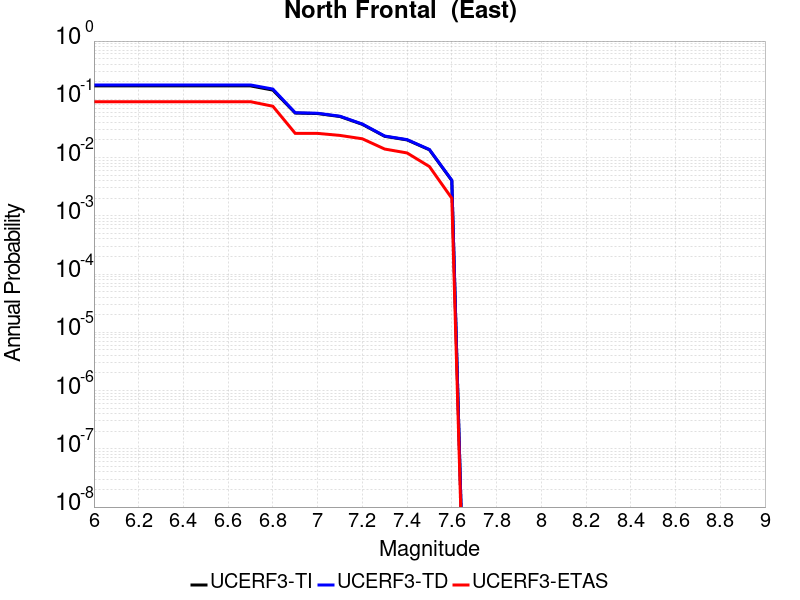 |
|-----|

| Magnitude | UCERF3-TI Prob | UCERF3-TD Prob | UCERF3-ETAS Prob |
|-----|-----|-----|-----|
| 6.0 | 0.16986503 | 0.17647888 | 0.091 |
| 6.1 | 0.16986503 | 0.17647888 | 0.091 |
| 6.2 | 0.16986503 | 0.17647888 | 0.091 |
| 6.3 | 0.16986503 | 0.17647888 | 0.091 |
| 6.4 | 0.16986503 | 0.17647888 | 0.091 |
| 6.5 | 0.16986503 | 0.17647888 | 0.091 |
| 6.6 | 0.16986503 | 0.17647888 | 0.091 |
| 6.7 | 0.16986503 | 0.17647888 | 0.091 |
| 6.8 | 0.14398743 | 0.14998165 | 0.076 |
| 6.9 | 0.058110174 | 0.058864806 | 0.026 |
| 7.0 | 0.056934208 | 0.057671476 | 0.026 |
| 7.1 | 0.050645236 | 0.05128568 | 0.024 |
| 7.2 | 0.03718455 | 0.037635334 | 0.021 |
| 7.3 | 0.023156535 | 0.023434266 | 0.014 |
| 7.4 | 0.020082993 | 0.020326737 | 0.012 |
| 7.5 | 0.013589136 | 0.013756393 | 0.007 |
| 7.6 | 0.004032984 | 0.0040844395 | 0.002 |

## North Frontal  (West)
*[(top)](#table-of-contents)*

| 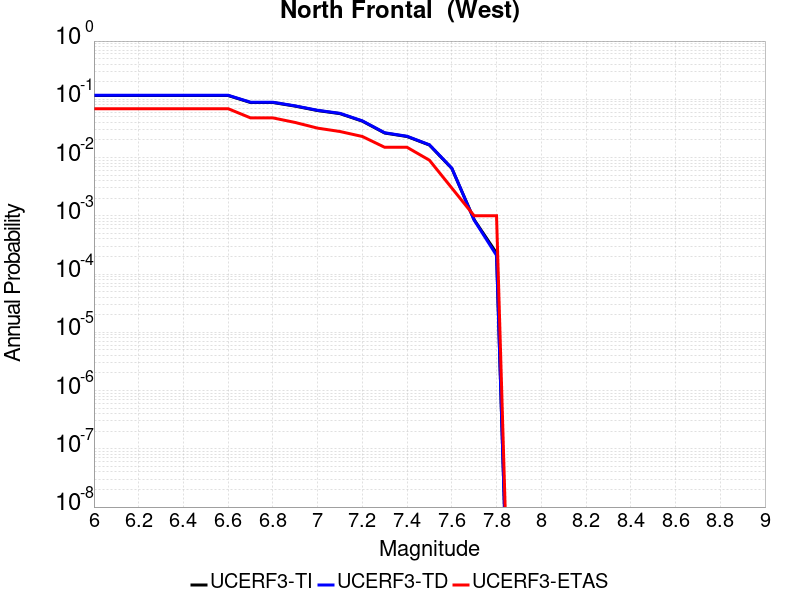 |
|-----|

| Magnitude | UCERF3-TI Prob | UCERF3-TD Prob | UCERF3-ETAS Prob |
|-----|-----|-----|-----|
| 6.0 | 0.116129786 | 0.117404595 | 0.069 |
| 6.1 | 0.116129786 | 0.117404595 | 0.069 |
| 6.2 | 0.116129786 | 0.117404595 | 0.069 |
| 6.3 | 0.116129786 | 0.117404595 | 0.069 |
| 6.4 | 0.116129786 | 0.117404595 | 0.069 |
| 6.5 | 0.116129786 | 0.117404595 | 0.069 |
| 6.6 | 0.116129786 | 0.117404595 | 0.069 |
| 6.7 | 0.08817875 | 0.08912296 | 0.048 |
| 6.8 | 0.08817875 | 0.08912296 | 0.048 |
| 6.9 | 0.07631548 | 0.077157065 | 0.04 |
| 7.0 | 0.06408909 | 0.064798445 | 0.032 |
| 7.1 | 0.056811824 | 0.05746097 | 0.028 |
| 7.2 | 0.042200807 | 0.042667165 | 0.023 |
| 7.3 | 0.026377033 | 0.026663361 | 0.015 |
| 7.4 | 0.02296349 | 0.02321574 | 0.015 |
| 7.5 | 0.016393533 | 0.016571295 | 0.009 |
| 7.6 | 0.0065236543 | 0.0065838965 | 0.003 |
| 7.7 | 8.561412E-4 | 8.4446307E-4 | 0.001 |
| 7.8 | 2.28907E-4 | 2.090985E-4 | 0.001 |

## North Salt Lake
*[(top)](#table-of-contents)*

| 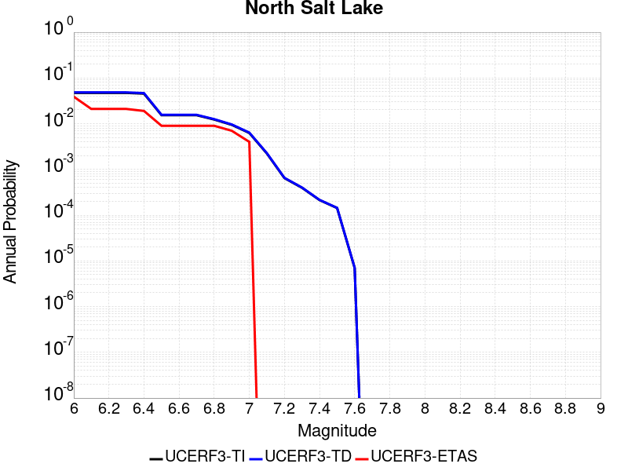 |
|-----|

| Magnitude | UCERF3-TI Prob | UCERF3-TD Prob | UCERF3-ETAS Prob |
|-----|-----|-----|-----|
| 6.0 | 0.047109004 | 0.048371345 | 0.039 |
| 6.1 | 0.047109004 | 0.048371345 | 0.021 |
| 6.2 | 0.047109004 | 0.048371345 | 0.021 |
| 6.3 | 0.047109004 | 0.048371345 | 0.021 |
| 6.4 | 0.045386918 | 0.046647772 | 0.019 |
| 6.5 | 0.015315334 | 0.015611661 | 0.009 |
| 6.6 | 0.015315334 | 0.015611661 | 0.009 |
| 6.7 | 0.015315334 | 0.015611661 | 0.009 |
| 6.8 | 0.012325289 | 0.012564858 | 0.009 |
| 6.9 | 0.009437428 | 0.009621857 | 0.007 |
| 7.0 | 0.006264508 | 0.006389575 | 0.004 |
| 7.1 | 0.0022285527 | 0.0022662748 | 0.0 |
| 7.2 | 6.455741E-4 | 6.543296E-4 | 0.0 |
| 7.3 | 3.9680174E-4 | 4.0168816E-4 | 0.0 |
| 7.4 | 2.1343975E-4 | 2.1549889E-4 | 0.0 |
| 7.5 | 1.429568E-4 | 1.4441575E-4 | 0.0 |
| 7.6 | 6.995442E-6 | 7.066594E-6 | 0.0 |

## North Tahoe 2011 CFM
*[(top)](#table-of-contents)*

| 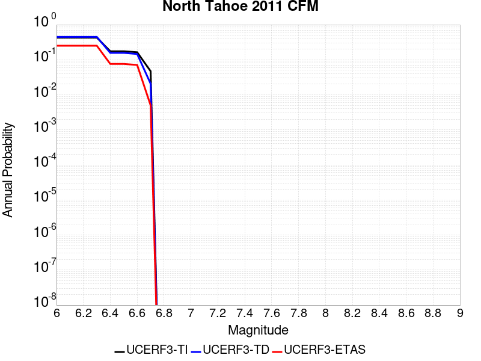 |
|-----|

| Magnitude | UCERF3-TI Prob | UCERF3-TD Prob | UCERF3-ETAS Prob |
|-----|-----|-----|-----|
| 6.0 | 0.42937768 | 0.44842923 | 0.251 |
| 6.1 | 0.42937768 | 0.44842923 | 0.251 |
| 6.2 | 0.42937768 | 0.44842923 | 0.251 |
| 6.3 | 0.42937768 | 0.44842923 | 0.251 |
| 6.4 | 0.17462832 | 0.15737124 | 0.076 |
| 6.5 | 0.17462832 | 0.15737124 | 0.076 |
| 6.6 | 0.16367269 | 0.14585145 | 0.071 |
| 6.7 | 0.04714669 | 0.020748911 | 0.005 |

## Northridge
*[(top)](#table-of-contents)*

| 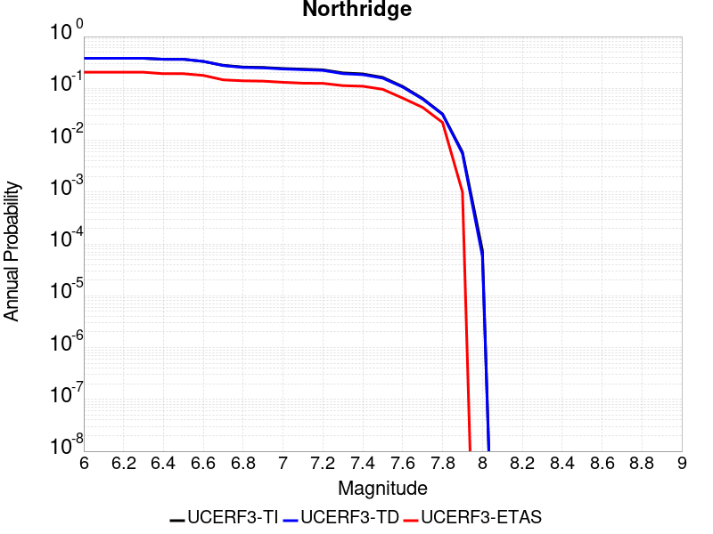 |
|-----|

| Magnitude | UCERF3-TI Prob | UCERF3-TD Prob | UCERF3-ETAS Prob |
|-----|-----|-----|-----|
| 6.0 | 0.3802903 | 0.3814198 | 0.205 |
| 6.1 | 0.3802903 | 0.3814198 | 0.205 |
| 6.2 | 0.3802903 | 0.3814198 | 0.205 |
| 6.3 | 0.3802903 | 0.3814198 | 0.205 |
| 6.4 | 0.36425853 | 0.36492696 | 0.192 |
| 6.5 | 0.36425853 | 0.36492696 | 0.192 |
| 6.6 | 0.33188605 | 0.33101135 | 0.178 |
| 6.7 | 0.27900213 | 0.27524704 | 0.146 |
| 6.8 | 0.25800553 | 0.25335595 | 0.14 |
| 6.9 | 0.25347728 | 0.248668 | 0.138 |
| 7.0 | 0.24180964 | 0.2365663 | 0.131 |
| 7.1 | 0.23498477 | 0.22953041 | 0.126 |
| 7.2 | 0.22788157 | 0.22225486 | 0.125 |
| 7.3 | 0.19880714 | 0.19239545 | 0.113 |
| 7.4 | 0.1901655 | 0.18393834 | 0.11 |
| 7.5 | 0.16304377 | 0.1575705 | 0.096 |
| 7.6 | 0.10897063 | 0.105936356 | 0.065 |
| 7.7 | 0.06386755 | 0.062139302 | 0.043 |
| 7.8 | 0.0321062 | 0.03152978 | 0.022 |
| 7.9 | 0.005884534 | 0.005526461 | 0.001 |
| 8.0 | 7.4752454E-5 | 5.766776E-5 | 0.0 |

## Northridge Hills
*[(top)](#table-of-contents)*

| 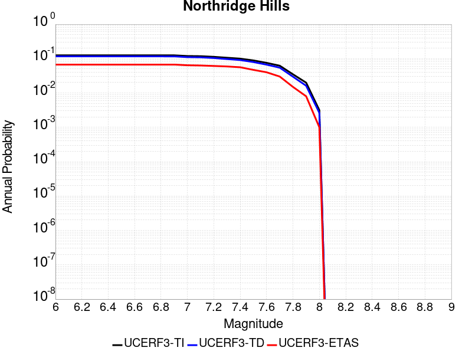 |
|-----|

| Magnitude | UCERF3-TI Prob | UCERF3-TD Prob | UCERF3-ETAS Prob |
|-----|-----|-----|-----|
| 6.0 | 0.12449189 | 0.11598673 | 0.067 |
| 6.1 | 0.12449189 | 0.11598673 | 0.067 |
| 6.2 | 0.12449189 | 0.11598673 | 0.067 |
| 6.3 | 0.12449189 | 0.11598673 | 0.067 |
| 6.4 | 0.12449189 | 0.11598673 | 0.067 |
| 6.5 | 0.12449189 | 0.11598673 | 0.067 |
| 6.6 | 0.12449189 | 0.11598673 | 0.067 |
| 6.7 | 0.12449189 | 0.11598673 | 0.067 |
| 6.8 | 0.12449189 | 0.11598673 | 0.067 |
| 6.9 | 0.12445269 | 0.115946665 | 0.067 |
| 7.0 | 0.1188815 | 0.11022402 | 0.064 |
| 7.1 | 0.11749926 | 0.10880747 | 0.063 |
| 7.2 | 0.11262824 | 0.10380915 | 0.061 |
| 7.3 | 0.10588859 | 0.09690337 | 0.059 |
| 7.4 | 0.09970685 | 0.09062346 | 0.056 |
| 7.5 | 0.08840312 | 0.079344995 | 0.047 |
| 7.6 | 0.07526075 | 0.06665402 | 0.04 |
| 7.7 | 0.062023733 | 0.054372255 | 0.03 |
| 7.8 | 0.0349176 | 0.02972373 | 0.015 |
| 7.9 | 0.019930825 | 0.016205152 | 0.008 |
| 8.0 | 0.0031564322 | 0.0026385232 | 0.001 |

## Oak Ridge (Onshore)
*[(top)](#table-of-contents)*

| 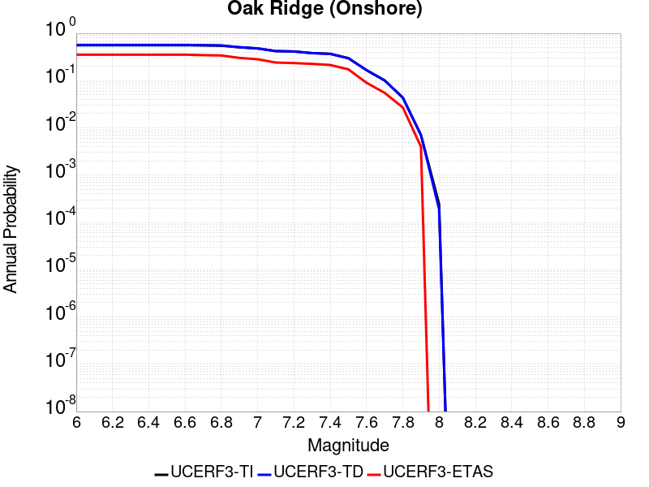 |
|-----|

| Magnitude | UCERF3-TI Prob | UCERF3-TD Prob | UCERF3-ETAS Prob |
|-----|-----|-----|-----|
| 6.0 | 0.56095207 | 0.5680433 | 0.354 |
| 6.1 | 0.56095207 | 0.5680433 | 0.354 |
| 6.2 | 0.56095207 | 0.5680433 | 0.354 |
| 6.3 | 0.56095207 | 0.5680433 | 0.354 |
| 6.4 | 0.56095207 | 0.5680433 | 0.354 |
| 6.5 | 0.56095207 | 0.5680433 | 0.354 |
| 6.6 | 0.56095207 | 0.5680433 | 0.354 |
| 6.7 | 0.55447084 | 0.5615802 | 0.346 |
| 6.8 | 0.54816014 | 0.555113 | 0.34 |
| 6.9 | 0.50533754 | 0.50971013 | 0.302 |
| 7.0 | 0.47767943 | 0.48088896 | 0.283 |
| 7.1 | 0.42100143 | 0.42079368 | 0.241 |
| 7.2 | 0.4133078 | 0.41286692 | 0.235 |
| 7.3 | 0.38226742 | 0.38091418 | 0.226 |
| 7.4 | 0.3687128 | 0.36687952 | 0.214 |
| 7.5 | 0.2986055 | 0.29649985 | 0.173 |
| 7.6 | 0.1666799 | 0.16615163 | 0.09 |
| 7.7 | 0.1010318 | 0.10035559 | 0.055 |
| 7.8 | 0.043441582 | 0.04382025 | 0.027 |
| 7.9 | 0.0070743407 | 0.0070245313 | 0.004 |
| 8.0 | 2.442769E-4 | 1.9072476E-4 | 0.0 |

## Oceanic - West Huasna
*[(top)](#table-of-contents)*

| 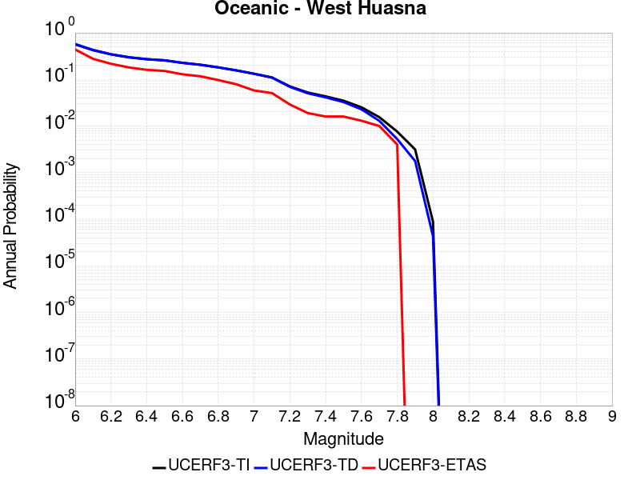 |
|-----|

| Magnitude | UCERF3-TI Prob | UCERF3-TD Prob | UCERF3-ETAS Prob |
|-----|-----|-----|-----|
| 6.0 | 0.56556714 | 0.57621497 | 0.44 |
| 6.1 | 0.42418635 | 0.42987373 | 0.277 |
| 6.2 | 0.34460846 | 0.34794703 | 0.217 |
| 6.3 | 0.29795375 | 0.30017102 | 0.181 |
| 6.4 | 0.2711011 | 0.2727615 | 0.161 |
| 6.5 | 0.25632128 | 0.25773045 | 0.152 |
| 6.6 | 0.2266291 | 0.22750701 | 0.129 |
| 6.7 | 0.20629561 | 0.20684725 | 0.117 |
| 6.8 | 0.18138474 | 0.18154143 | 0.097 |
| 6.9 | 0.15674151 | 0.15650736 | 0.079 |
| 7.0 | 0.13277912 | 0.13216415 | 0.058 |
| 7.1 | 0.11036651 | 0.10939641 | 0.051 |
| 7.2 | 0.07097205 | 0.06928129 | 0.029 |
| 7.3 | 0.052435953 | 0.050468016 | 0.019 |
| 7.4 | 0.043333665 | 0.04123572 | 0.016 |
| 7.5 | 0.034954246 | 0.032723106 | 0.016 |
| 7.6 | 0.025251048 | 0.022852445 | 0.013 |
| 7.7 | 0.015496228 | 0.012918351 | 0.01 |
| 7.8 | 0.0075864913 | 0.005239528 | 0.004 |
| 7.9 | 0.0031408628 | 0.0017752345 | 0.0 |
| 8.0 | 8.819456E-5 | 4.301727E-5 | 0.0 |

## Oceanside alt1
*[(top)](#table-of-contents)*

| 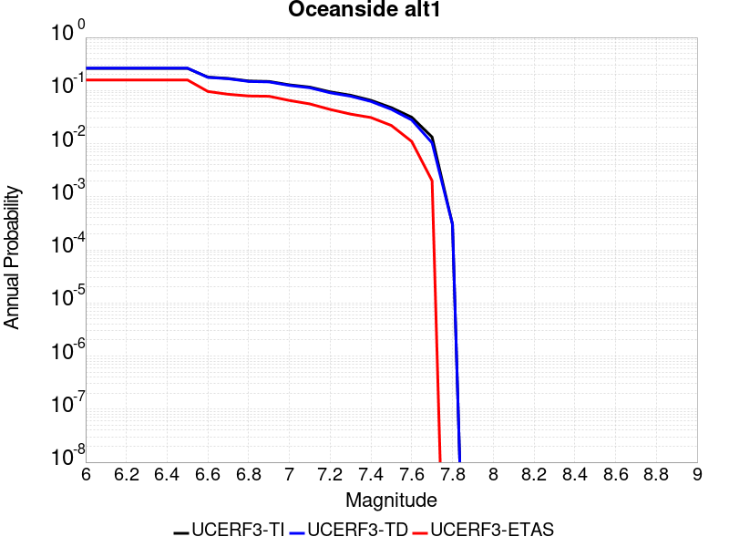 |
|-----|

| Magnitude | UCERF3-TI Prob | UCERF3-TD Prob | UCERF3-ETAS Prob |
|-----|-----|-----|-----|
| 6.0 | 0.26147115 | 0.26372138 | 0.158 |
| 6.1 | 0.26147115 | 0.26372138 | 0.158 |
| 6.2 | 0.26147115 | 0.26372138 | 0.158 |
| 6.3 | 0.26147115 | 0.26372138 | 0.158 |
| 6.4 | 0.26147115 | 0.26372138 | 0.158 |
| 6.5 | 0.26147115 | 0.26372138 | 0.158 |
| 6.6 | 0.1790408 | 0.17680612 | 0.096 |
| 6.7 | 0.16918302 | 0.16673106 | 0.085 |
| 6.8 | 0.1512462 | 0.14844266 | 0.079 |
| 6.9 | 0.14821443 | 0.14535768 | 0.078 |
| 7.0 | 0.12809058 | 0.124855764 | 0.065 |
| 7.1 | 0.11610967 | 0.112717204 | 0.056 |
| 7.2 | 0.0943798 | 0.09074802 | 0.044 |
| 7.3 | 0.081670046 | 0.07821739 | 0.036 |
| 7.4 | 0.06542925 | 0.062343024 | 0.031 |
| 7.5 | 0.04765477 | 0.044279747 | 0.022 |
| 7.6 | 0.03144597 | 0.027919205 | 0.011 |
| 7.7 | 0.013322236 | 0.010362348 | 0.002 |
| 7.8 | 3.027386E-4 | 3.045169E-4 | 0.0 |

## Ortigalita (North)
*[(top)](#table-of-contents)*

| 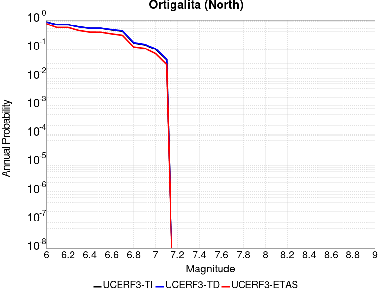 |
|-----|

| Magnitude | UCERF3-TI Prob | UCERF3-TD Prob | UCERF3-ETAS Prob |
|-----|-----|-----|-----|
| 6.0 | 0.86628586 | 0.85827714 | 0.757 |
| 6.1 | 0.6994632 | 0.68686914 | 0.55 |
| 6.2 | 0.6994632 | 0.68686914 | 0.55 |
| 6.3 | 0.58025813 | 0.5773725 | 0.432 |
| 6.4 | 0.51496357 | 0.51815945 | 0.377 |
| 6.5 | 0.51442176 | 0.51761496 | 0.375 |
| 6.6 | 0.45089078 | 0.46059322 | 0.326 |
| 6.7 | 0.40455094 | 0.41738585 | 0.29 |
| 6.8 | 0.15739068 | 0.16255873 | 0.115 |
| 6.9 | 0.13642415 | 0.14105888 | 0.103 |
| 7.0 | 0.09616783 | 0.0995912 | 0.067 |
| 7.1 | 0.040928528 | 0.042455263 | 0.028 |

## Ortigalita (South)
*[(top)](#table-of-contents)*

| 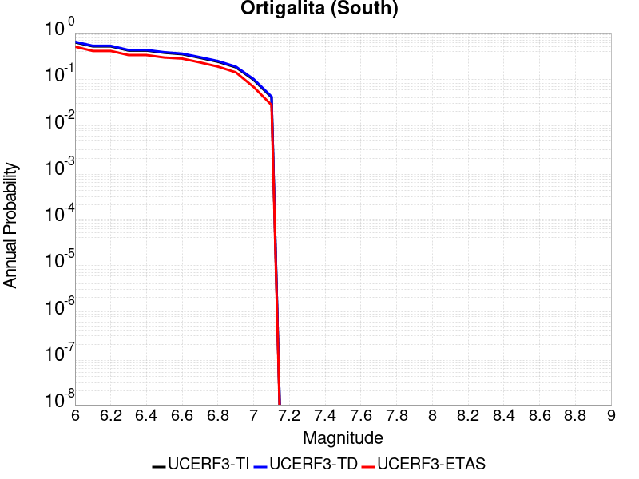 |
|-----|

| Magnitude | UCERF3-TI Prob | UCERF3-TD Prob | UCERF3-ETAS Prob |
|-----|-----|-----|-----|
| 6.0 | 0.6215107 | 0.64046246 | 0.502 |
| 6.1 | 0.50945795 | 0.5235178 | 0.406 |
| 6.2 | 0.50945795 | 0.5235178 | 0.406 |
| 6.3 | 0.41494375 | 0.42587793 | 0.331 |
| 6.4 | 0.41494375 | 0.42587793 | 0.331 |
| 6.5 | 0.37114903 | 0.38135535 | 0.293 |
| 6.6 | 0.34592536 | 0.3558665 | 0.278 |
| 6.7 | 0.28858984 | 0.29769385 | 0.23 |
| 6.8 | 0.23818669 | 0.24620731 | 0.187 |
| 6.9 | 0.18071403 | 0.1871696 | 0.141 |
| 7.0 | 0.097210445 | 0.10065937 | 0.068 |
| 7.1 | 0.040928528 | 0.042455263 | 0.028 |

## Owens Valley
*[(top)](#table-of-contents)*

| 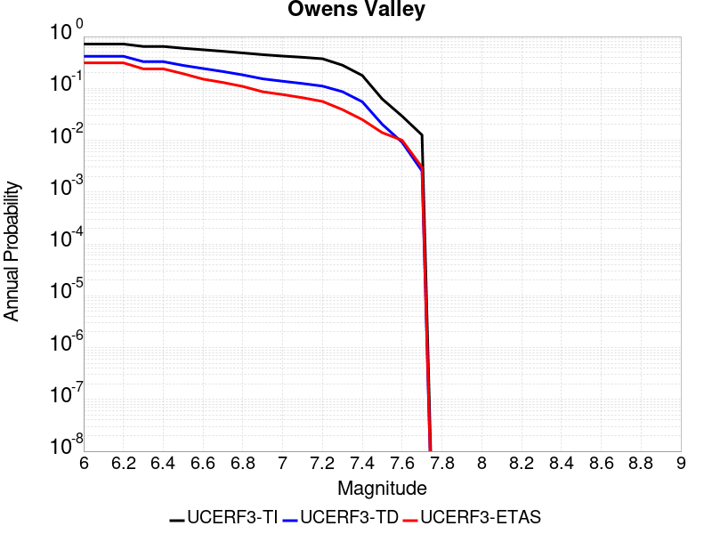 |
|-----|

| Magnitude | UCERF3-TI Prob | UCERF3-TD Prob | UCERF3-ETAS Prob |
|-----|-----|-----|-----|
| 6.0 | 0.7169934 | 0.41642645 | 0.311 |
| 6.1 | 0.7169934 | 0.41642645 | 0.311 |
| 6.2 | 0.7169934 | 0.41642645 | 0.311 |
| 6.3 | 0.6434682 | 0.32790792 | 0.238 |
| 6.4 | 0.6434682 | 0.32790792 | 0.238 |
| 6.5 | 0.5942473 | 0.2773433 | 0.192 |
| 6.6 | 0.5560813 | 0.24170862 | 0.151 |
| 6.7 | 0.5192013 | 0.21134432 | 0.13 |
| 6.8 | 0.48244452 | 0.18187816 | 0.109 |
| 6.9 | 0.44697532 | 0.1527738 | 0.086 |
| 7.0 | 0.4198878 | 0.13731925 | 0.076 |
| 7.1 | 0.3979548 | 0.12414328 | 0.066 |
| 7.2 | 0.37273374 | 0.110671975 | 0.056 |
| 7.3 | 0.28051114 | 0.08647969 | 0.039 |
| 7.4 | 0.17744736 | 0.055216707 | 0.025 |
| 7.5 | 0.062491756 | 0.02028708 | 0.014 |
| 7.6 | 0.029123643 | 0.009123113 | 0.01 |
| 7.7 | 0.012602747 | 0.002547263 | 0.003 |

## Owens Valley Keough Hot Springs
*[(top)](#table-of-contents)*

| 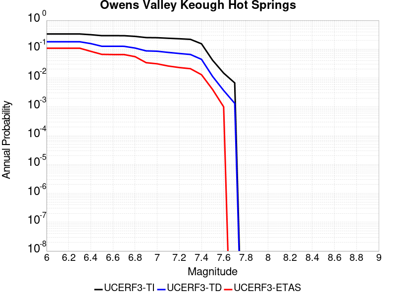 |
|-----|

| Magnitude | UCERF3-TI Prob | UCERF3-TD Prob | UCERF3-ETAS Prob |
|-----|-----|-----|-----|
| 6.0 | 0.33623528 | 0.18046044 | 0.108 |
| 6.1 | 0.33623528 | 0.18046044 | 0.108 |
| 6.2 | 0.33623528 | 0.18046044 | 0.108 |
| 6.3 | 0.33623528 | 0.18046044 | 0.108 |
| 6.4 | 0.31715924 | 0.15594648 | 0.084 |
| 6.5 | 0.2938423 | 0.12584342 | 0.066 |
| 6.6 | 0.29379308 | 0.12578131 | 0.065 |
| 6.7 | 0.29352325 | 0.12549743 | 0.065 |
| 6.8 | 0.27717465 | 0.10920086 | 0.055 |
| 6.9 | 0.25202653 | 0.08711868 | 0.034 |
| 7.0 | 0.2492033 | 0.08464941 | 0.031 |
| 7.1 | 0.23865554 | 0.07709692 | 0.026 |
| 7.2 | 0.22941767 | 0.07064638 | 0.023 |
| 7.3 | 0.21881695 | 0.06543178 | 0.021 |
| 7.4 | 0.15338978 | 0.044312965 | 0.013 |
| 7.5 | 0.041365582 | 0.011367928 | 0.004 |
| 7.6 | 0.014776949 | 0.0036924507 | 0.001 |
| 7.7 | 0.0067573637 | 0.0013206362 | 0.0 |

## Owl Lake
*[(top)](#table-of-contents)*

| 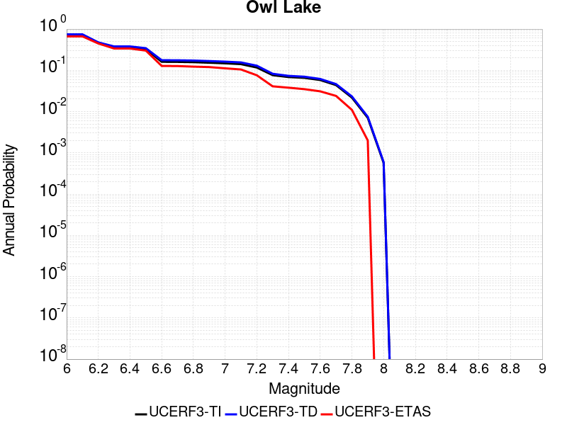 |
|-----|

| Magnitude | UCERF3-TI Prob | UCERF3-TD Prob | UCERF3-ETAS Prob |
|-----|-----|-----|-----|
| 6.0 | 0.73095125 | 0.7449056 | 0.666 |
| 6.1 | 0.73095125 | 0.7449056 | 0.666 |
| 6.2 | 0.46710685 | 0.47587875 | 0.448 |
| 6.3 | 0.36544487 | 0.3797476 | 0.338 |
| 6.4 | 0.36544487 | 0.3797476 | 0.338 |
| 6.5 | 0.32706726 | 0.34467337 | 0.301 |
| 6.6 | 0.16096875 | 0.1761758 | 0.128 |
| 6.7 | 0.15999798 | 0.17520621 | 0.127 |
| 6.8 | 0.15768631 | 0.17283846 | 0.123 |
| 6.9 | 0.15296866 | 0.16794468 | 0.12 |
| 7.0 | 0.14788908 | 0.1626147 | 0.112 |
| 7.1 | 0.14138806 | 0.15572837 | 0.105 |
| 7.2 | 0.117054075 | 0.12967022 | 0.076 |
| 7.3 | 0.07647671 | 0.08260761 | 0.041 |
| 7.4 | 0.06865884 | 0.07354411 | 0.038 |
| 7.5 | 0.06580321 | 0.07022361 | 0.035 |
| 7.6 | 0.05826209 | 0.0618778 | 0.031 |
| 7.7 | 0.043842636 | 0.04641506 | 0.024 |
| 7.8 | 0.021833045 | 0.023301026 | 0.011 |
| 7.9 | 0.007062717 | 0.007490746 | 0.002 |
| 8.0 | 5.736804E-4 | 5.9746864E-4 | 0.0 |

## Ozena
*[(top)](#table-of-contents)*

| 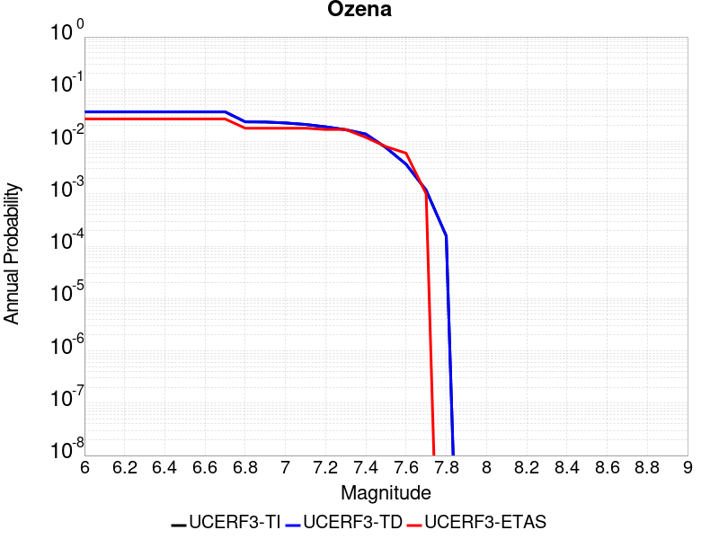 |
|-----|

| Magnitude | UCERF3-TI Prob | UCERF3-TD Prob | UCERF3-ETAS Prob |
|-----|-----|-----|-----|
| 6.0 | 0.036815234 | 0.03698944 | 0.027 |
| 6.1 | 0.036815234 | 0.03698944 | 0.027 |
| 6.2 | 0.036815234 | 0.03698944 | 0.027 |
| 6.3 | 0.036815234 | 0.03698944 | 0.027 |
| 6.4 | 0.036815234 | 0.03698944 | 0.027 |
| 6.5 | 0.036815234 | 0.03698944 | 0.027 |
| 6.6 | 0.036815234 | 0.03698944 | 0.027 |
| 6.7 | 0.036815234 | 0.03698944 | 0.027 |
| 6.8 | 0.023775628 | 0.023858994 | 0.018 |
| 6.9 | 0.023567416 | 0.023650387 | 0.018 |
| 7.0 | 0.022614546 | 0.02269509 | 0.018 |
| 7.1 | 0.021164484 | 0.021240773 | 0.018 |
| 7.2 | 0.01908777 | 0.019156875 | 0.017 |
| 7.3 | 0.016789455 | 0.016851027 | 0.017 |
| 7.4 | 0.013852415 | 0.013903773 | 0.012 |
| 7.5 | 0.007639162 | 0.0076648993 | 0.008 |
| 7.6 | 0.0036853238 | 0.003693515 | 0.006 |
| 7.7 | 0.0011722236 | 0.0011745766 | 0.001 |
| 7.8 | 1.5650586E-4 | 1.5684056E-4 | 0.0 |

## Palos Verdes
*[(top)](#table-of-contents)*

| 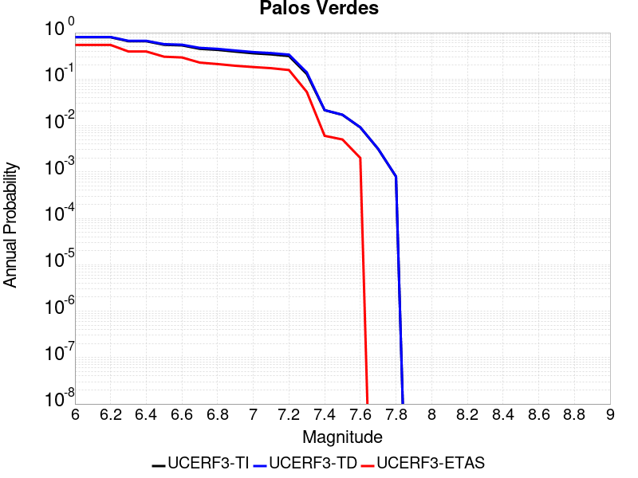 |
|-----|

| Magnitude | UCERF3-TI Prob | UCERF3-TD Prob | UCERF3-ETAS Prob |
|-----|-----|-----|-----|
| 6.0 | 0.79775894 | 0.8081734 | 0.545 |
| 6.1 | 0.79775894 | 0.8081734 | 0.545 |
| 6.2 | 0.79775894 | 0.8081734 | 0.545 |
| 6.3 | 0.6554297 | 0.66870624 | 0.394 |
| 6.4 | 0.6554297 | 0.66870624 | 0.394 |
| 6.5 | 0.548892 | 0.5665533 | 0.304 |
| 6.6 | 0.5338536 | 0.55146 | 0.293 |
| 6.7 | 0.44938555 | 0.47098362 | 0.227 |
| 6.8 | 0.42671937 | 0.44854853 | 0.211 |
| 6.9 | 0.3910056 | 0.41333047 | 0.194 |
| 7.0 | 0.35987434 | 0.38238287 | 0.182 |
| 7.1 | 0.3409677 | 0.36364326 | 0.172 |
| 7.2 | 0.31440112 | 0.33723202 | 0.157 |
| 7.3 | 0.1288722 | 0.1399105 | 0.053 |
| 7.4 | 0.021369152 | 0.02148739 | 0.006 |
| 7.5 | 0.016968522 | 0.01706916 | 0.005 |
| 7.6 | 0.009094592 | 0.009153739 | 0.002 |
| 7.7 | 0.0031222047 | 0.00313892 | 0.0 |
| 7.8 | 7.939731E-4 | 7.985924E-4 | 0.0 |

## Panamint Valley
*[(top)](#table-of-contents)*

| 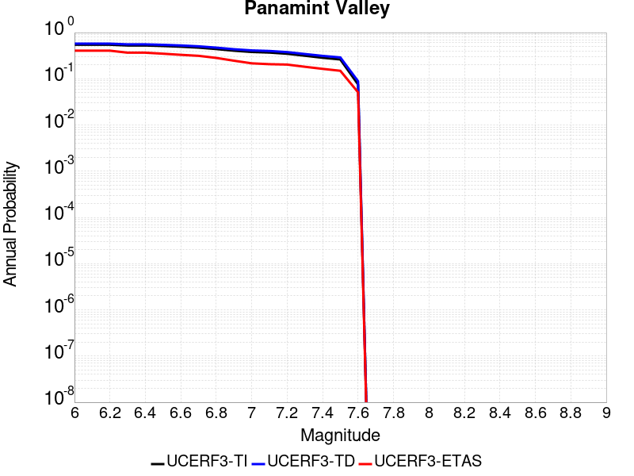 |
|-----|

| Magnitude | UCERF3-TI Prob | UCERF3-TD Prob | UCERF3-ETAS Prob |
|-----|-----|-----|-----|
| 6.0 | 0.5453453 | 0.5755154 | 0.406 |
| 6.1 | 0.5453453 | 0.5755154 | 0.406 |
| 6.2 | 0.5453453 | 0.5755154 | 0.406 |
| 6.3 | 0.5254954 | 0.55641484 | 0.367 |
| 6.4 | 0.5254954 | 0.55641484 | 0.367 |
| 6.5 | 0.5116147 | 0.5429704 | 0.349 |
| 6.6 | 0.49433336 | 0.52613664 | 0.33 |
| 6.7 | 0.47226584 | 0.50438035 | 0.314 |
| 6.8 | 0.4402948 | 0.47219485 | 0.283 |
| 6.9 | 0.40503415 | 0.43610322 | 0.246 |
| 7.0 | 0.3805009 | 0.41112632 | 0.216 |
| 7.1 | 0.36930946 | 0.39980432 | 0.207 |
| 7.2 | 0.34778935 | 0.37786722 | 0.203 |
| 7.3 | 0.31533936 | 0.3438307 | 0.182 |
| 7.4 | 0.28488302 | 0.31313848 | 0.164 |
| 7.5 | 0.26186237 | 0.2898681 | 0.149 |
| 7.6 | 0.07544772 | 0.08850715 | 0.051 |

## Paradise
*[(top)](#table-of-contents)*

| 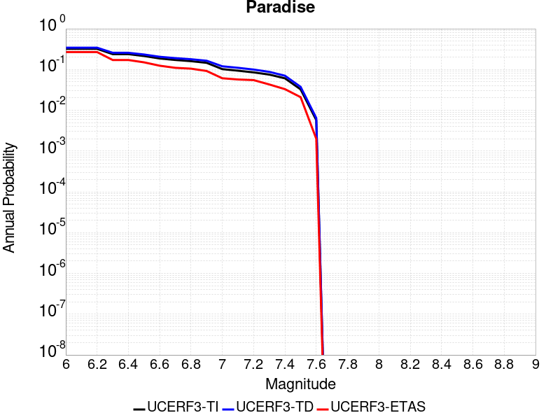 |
|-----|

| Magnitude | UCERF3-TI Prob | UCERF3-TD Prob | UCERF3-ETAS Prob |
|-----|-----|-----|-----|
| 6.0 | 0.32122254 | 0.34301716 | 0.268 |
| 6.1 | 0.32122254 | 0.34301716 | 0.268 |
| 6.2 | 0.32122254 | 0.34301716 | 0.268 |
| 6.3 | 0.23816858 | 0.25729015 | 0.171 |
| 6.4 | 0.23816858 | 0.25729015 | 0.171 |
| 6.5 | 0.21442084 | 0.23342833 | 0.15 |
| 6.6 | 0.18634407 | 0.20520616 | 0.124 |
| 6.7 | 0.17138958 | 0.19022866 | 0.11 |
| 6.8 | 0.16026174 | 0.17880137 | 0.105 |
| 6.9 | 0.14583817 | 0.16416007 | 0.092 |
| 7.0 | 0.10224287 | 0.1199036 | 0.061 |
| 7.1 | 0.093615144 | 0.11017902 | 0.057 |
| 7.2 | 0.08503933 | 0.09973785 | 0.055 |
| 7.3 | 0.075126424 | 0.08762269 | 0.043 |
| 7.4 | 0.060816385 | 0.07038974 | 0.033 |
| 7.5 | 0.032615982 | 0.037570804 | 0.021 |
| 7.6 | 0.0057536047 | 0.0064642406 | 0.002 |

## Peralta Hills
*[(top)](#table-of-contents)*

| 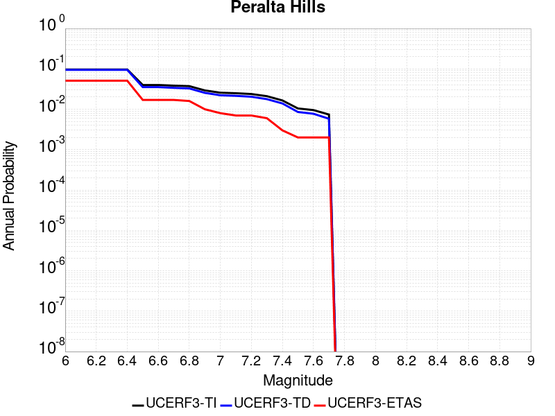 |
|-----|

| Magnitude | UCERF3-TI Prob | UCERF3-TD Prob | UCERF3-ETAS Prob |
|-----|-----|-----|-----|
| 6.0 | 0.09638984 | 0.09439351 | 0.051 |
| 6.1 | 0.09638984 | 0.09439351 | 0.051 |
| 6.2 | 0.09638984 | 0.09439351 | 0.051 |
| 6.3 | 0.09638984 | 0.09439351 | 0.051 |
| 6.4 | 0.09638984 | 0.09439351 | 0.051 |
| 6.5 | 0.03985163 | 0.035320412 | 0.017 |
| 6.6 | 0.03985163 | 0.035320412 | 0.017 |
| 6.7 | 0.038424727 | 0.03386738 | 0.017 |
| 6.8 | 0.037334673 | 0.0327559 | 0.016 |
| 6.9 | 0.02925928 | 0.025449457 | 0.01 |
| 7.0 | 0.025676709 | 0.022170978 | 0.008 |
| 7.1 | 0.024949519 | 0.021482484 | 0.007 |
| 7.2 | 0.023820337 | 0.020393144 | 0.007 |
| 7.3 | 0.021060392 | 0.017792832 | 0.006 |
| 7.4 | 0.016513065 | 0.013917296 | 0.003 |
| 7.5 | 0.010457003 | 0.00855056 | 0.002 |
| 7.6 | 0.009536811 | 0.007733527 | 0.002 |
| 7.7 | 0.0073992815 | 0.005816508 | 0.002 |

## Pilarcitos 2011 CFM
*[(top)](#table-of-contents)*

| 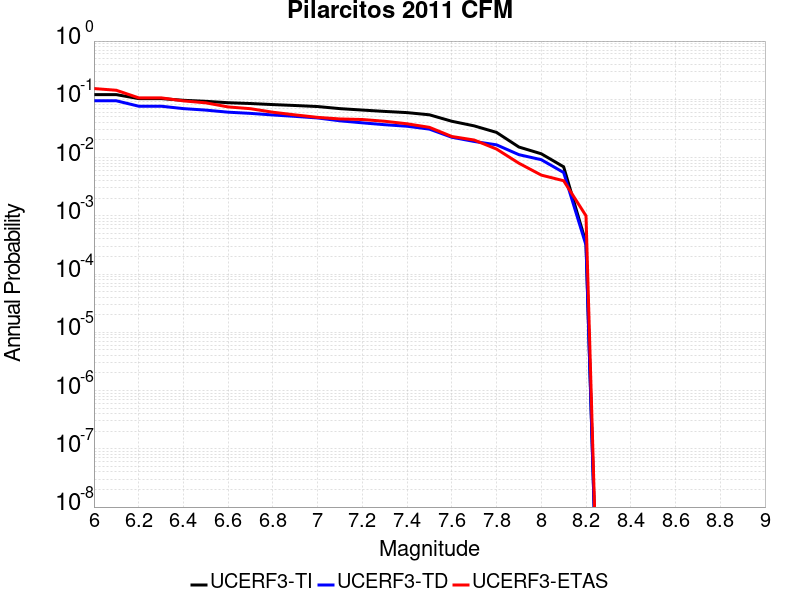 |
|-----|

| Magnitude | UCERF3-TI Prob | UCERF3-TD Prob | UCERF3-ETAS Prob |
|-----|-----|-----|-----|
| 6.0 | 0.12034932 | 0.09433779 | 0.153 |
| 6.1 | 0.12034932 | 0.09433779 | 0.143 |
| 6.2 | 0.10290434 | 0.07618375 | 0.106 |
| 6.3 | 0.10290434 | 0.07618375 | 0.106 |
| 6.4 | 0.09619853 | 0.06921735 | 0.094 |
| 6.5 | 0.09234231 | 0.06525691 | 0.087 |
| 6.6 | 0.08738375 | 0.060114577 | 0.074 |
| 6.7 | 0.08466506 | 0.057353463 | 0.069 |
| 6.8 | 0.08117872 | 0.05385295 | 0.06 |
| 6.9 | 0.078268014 | 0.050916784 | 0.054 |
| 7.0 | 0.07513891 | 0.047852345 | 0.049 |
| 7.1 | 0.06916249 | 0.042723984 | 0.046 |
| 7.2 | 0.065404184 | 0.039474037 | 0.045 |
| 7.3 | 0.061964534 | 0.03664809 | 0.042 |
| 7.4 | 0.05909899 | 0.03448585 | 0.038 |
| 7.5 | 0.054199185 | 0.03078243 | 0.033 |
| 7.6 | 0.041997634 | 0.022319647 | 0.023 |
| 7.7 | 0.034987677 | 0.018895414 | 0.02 |
| 7.8 | 0.027024478 | 0.016530385 | 0.014 |
| 7.9 | 0.015162882 | 0.011211027 | 0.008 |
| 8.0 | 0.01161178 | 0.009192167 | 0.005 |
| 8.1 | 0.0069397017 | 0.0055356584 | 0.004 |
| 8.2 | 3.4428958E-4 | 3.1370873E-4 | 0.001 |

## Pine Mtn
*[(top)](#table-of-contents)*

| 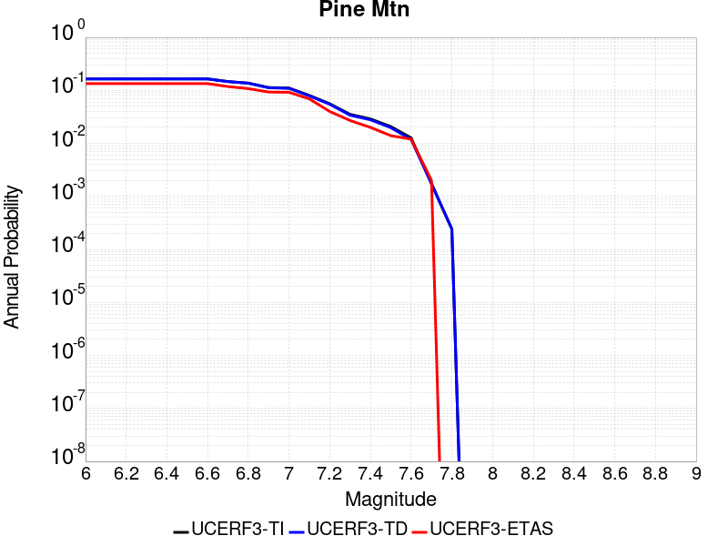 |
|-----|

| Magnitude | UCERF3-TI Prob | UCERF3-TD Prob | UCERF3-ETAS Prob |
|-----|-----|-----|-----|
| 6.0 | 0.16463035 | 0.16437338 | 0.134 |
| 6.1 | 0.16463035 | 0.16437338 | 0.134 |
| 6.2 | 0.16463035 | 0.16437338 | 0.134 |
| 6.3 | 0.16463035 | 0.16437338 | 0.134 |
| 6.4 | 0.16463035 | 0.16437338 | 0.134 |
| 6.5 | 0.16463035 | 0.16437338 | 0.134 |
| 6.6 | 0.16463035 | 0.16437338 | 0.134 |
| 6.7 | 0.14683351 | 0.14625701 | 0.118 |
| 6.8 | 0.13712397 | 0.13642368 | 0.108 |
| 6.9 | 0.11312454 | 0.1120214 | 0.093 |
| 7.0 | 0.110484585 | 0.10936066 | 0.092 |
| 7.1 | 0.08018965 | 0.0785892 | 0.069 |
| 7.2 | 0.05592965 | 0.054685134 | 0.04 |
| 7.3 | 0.03527526 | 0.03397771 | 0.027 |
| 7.4 | 0.028913744 | 0.027881533 | 0.02 |
| 7.5 | 0.020736082 | 0.019779893 | 0.014 |
| 7.6 | 0.012690396 | 0.011851998 | 0.012 |
| 7.7 | 0.001729404 | 0.0017414805 | 0.002 |
| 7.8 | 2.4092059E-4 | 2.4287413E-4 | 0.0 |

## Pinto Mtn
*[(top)](#table-of-contents)*

| 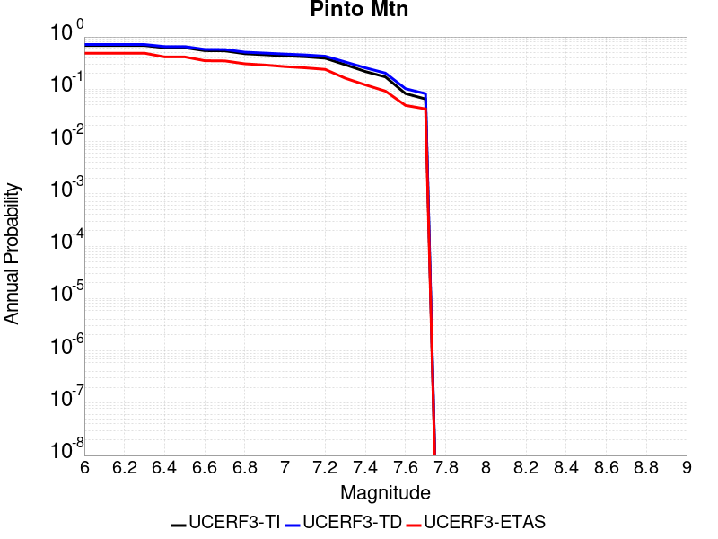 |
|-----|

| Magnitude | UCERF3-TI Prob | UCERF3-TD Prob | UCERF3-ETAS Prob |
|-----|-----|-----|-----|
| 6.0 | 0.68432444 | 0.71489406 | 0.488 |
| 6.1 | 0.68432444 | 0.71489406 | 0.488 |
| 6.2 | 0.68432444 | 0.71489406 | 0.488 |
| 6.3 | 0.68432444 | 0.71489406 | 0.488 |
| 6.4 | 0.62210166 | 0.65377307 | 0.414 |
| 6.5 | 0.62210166 | 0.65377307 | 0.414 |
| 6.6 | 0.5452589 | 0.5778129 | 0.35 |
| 6.7 | 0.5411258 | 0.57387 | 0.347 |
| 6.8 | 0.47666693 | 0.51059777 | 0.306 |
| 6.9 | 0.45565972 | 0.49021962 | 0.29 |
| 7.0 | 0.43404245 | 0.46930513 | 0.27 |
| 7.1 | 0.41668698 | 0.45249015 | 0.256 |
| 7.2 | 0.3907011 | 0.42733166 | 0.239 |
| 7.3 | 0.29384866 | 0.33182594 | 0.162 |
| 7.4 | 0.21777074 | 0.255806 | 0.121 |
| 7.5 | 0.17147432 | 0.20314337 | 0.092 |
| 7.6 | 0.08240596 | 0.102408685 | 0.049 |
| 7.7 | 0.06495138 | 0.082148574 | 0.042 |

## Pisgah-Bullion Mtn-Mesquite Lk
*[(top)](#table-of-contents)*

| 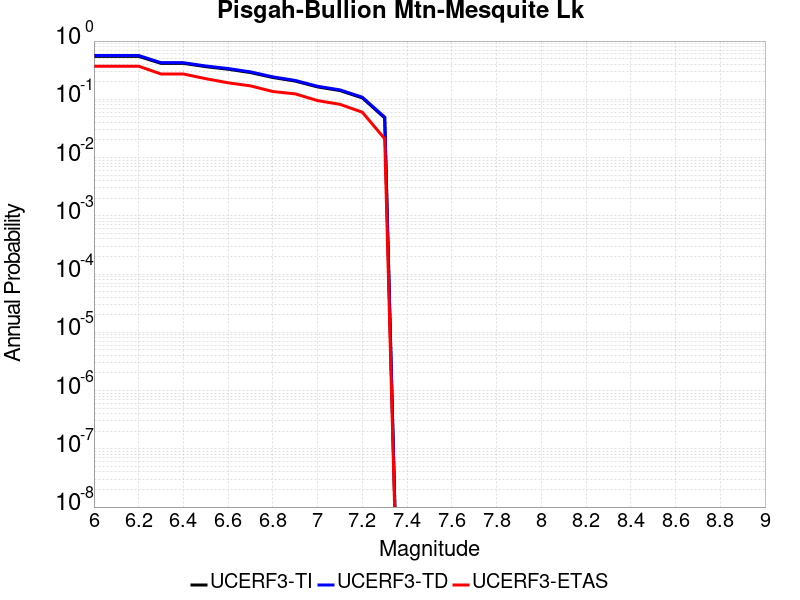 |
|-----|

| Magnitude | UCERF3-TI Prob | UCERF3-TD Prob | UCERF3-ETAS Prob |
|-----|-----|-----|-----|
| 6.0 | 0.5456887 | 0.56567186 | 0.37 |
| 6.1 | 0.5456887 | 0.56567186 | 0.37 |
| 6.2 | 0.5456887 | 0.56567186 | 0.37 |
| 6.3 | 0.4142073 | 0.42541113 | 0.272 |
| 6.4 | 0.4142073 | 0.42541113 | 0.272 |
| 6.5 | 0.3634999 | 0.3735133 | 0.226 |
| 6.6 | 0.3282659 | 0.337521 | 0.192 |
| 6.7 | 0.28758577 | 0.2959187 | 0.17 |
| 6.8 | 0.23671684 | 0.24295878 | 0.136 |
| 6.9 | 0.20547493 | 0.2109459 | 0.124 |
| 7.0 | 0.16306894 | 0.16746818 | 0.095 |
| 7.1 | 0.14125559 | 0.14518483 | 0.082 |
| 7.2 | 0.105608396 | 0.108702905 | 0.06 |
| 7.3 | 0.04787365 | 0.04937409 | 0.021 |

## Pitas Point (Lower West)
*[(top)](#table-of-contents)*

| 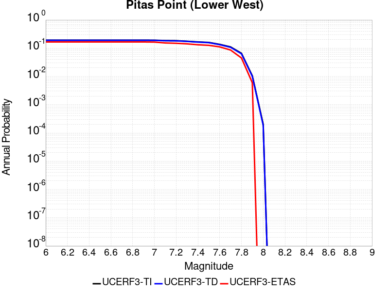 |
|-----|

| Magnitude | UCERF3-TI Prob | UCERF3-TD Prob | UCERF3-ETAS Prob |
|-----|-----|-----|-----|
| 6.0 | 0.1915752 | 0.18980186 | 0.166 |
| 6.1 | 0.1915752 | 0.18980186 | 0.166 |
| 6.2 | 0.1915752 | 0.18980186 | 0.166 |
| 6.3 | 0.1915752 | 0.18980186 | 0.166 |
| 6.4 | 0.1915752 | 0.18980186 | 0.166 |
| 6.5 | 0.1915752 | 0.18980186 | 0.166 |
| 6.6 | 0.1915752 | 0.18980186 | 0.166 |
| 6.7 | 0.1915752 | 0.18980186 | 0.166 |
| 6.8 | 0.1915752 | 0.18980186 | 0.166 |
| 6.9 | 0.1915752 | 0.18980186 | 0.166 |
| 7.0 | 0.19056298 | 0.18877082 | 0.164 |
| 7.1 | 0.1852612 | 0.18336225 | 0.153 |
| 7.2 | 0.18351218 | 0.18157431 | 0.149 |
| 7.3 | 0.1754511 | 0.17330879 | 0.142 |
| 7.4 | 0.16615124 | 0.16377082 | 0.132 |
| 7.5 | 0.15933299 | 0.15681066 | 0.126 |
| 7.6 | 0.1362297 | 0.1331808 | 0.111 |
| 7.7 | 0.11064952 | 0.107350565 | 0.086 |
| 7.8 | 0.06576774 | 0.06330151 | 0.045 |
| 7.9 | 0.010500169 | 0.010105859 | 0.006 |
| 8.0 | 2.0325146E-4 | 1.8586504E-4 | 0.0 |

## Pitas Point (Lower)-Montalvo
*[(top)](#table-of-contents)*

| 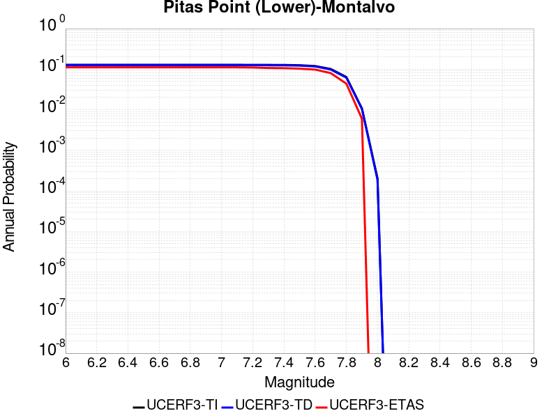 |
|-----|

| Magnitude | UCERF3-TI Prob | UCERF3-TD Prob | UCERF3-ETAS Prob |
|-----|-----|-----|-----|
| 6.0 | 0.12810211 | 0.12553896 | 0.111 |
| 6.1 | 0.12810211 | 0.12553896 | 0.111 |
| 6.2 | 0.12810211 | 0.12553896 | 0.111 |
| 6.3 | 0.12810211 | 0.12553896 | 0.111 |
| 6.4 | 0.12810211 | 0.12553896 | 0.111 |
| 6.5 | 0.12810211 | 0.12553896 | 0.111 |
| 6.6 | 0.12810211 | 0.12553896 | 0.111 |
| 6.7 | 0.12810211 | 0.12553896 | 0.111 |
| 6.8 | 0.12810211 | 0.12553896 | 0.111 |
| 6.9 | 0.12810211 | 0.12553896 | 0.111 |
| 7.0 | 0.12810211 | 0.12553896 | 0.111 |
| 7.1 | 0.12810211 | 0.12553896 | 0.111 |
| 7.2 | 0.12790887 | 0.12534276 | 0.11 |
| 7.3 | 0.12747146 | 0.12489824 | 0.107 |
| 7.4 | 0.12710698 | 0.124527425 | 0.106 |
| 7.5 | 0.12509972 | 0.1224852 | 0.103 |
| 7.6 | 0.1195377 | 0.1168267 | 0.098 |
| 7.7 | 0.101055734 | 0.09802765 | 0.08 |
| 7.8 | 0.06422986 | 0.061872926 | 0.044 |
| 7.9 | 0.010814364 | 0.010398527 | 0.006 |
| 8.0 | 2.0325146E-4 | 1.8586504E-4 | 0.0 |

## Pittville 2011 CFM
*[(top)](#table-of-contents)*

| 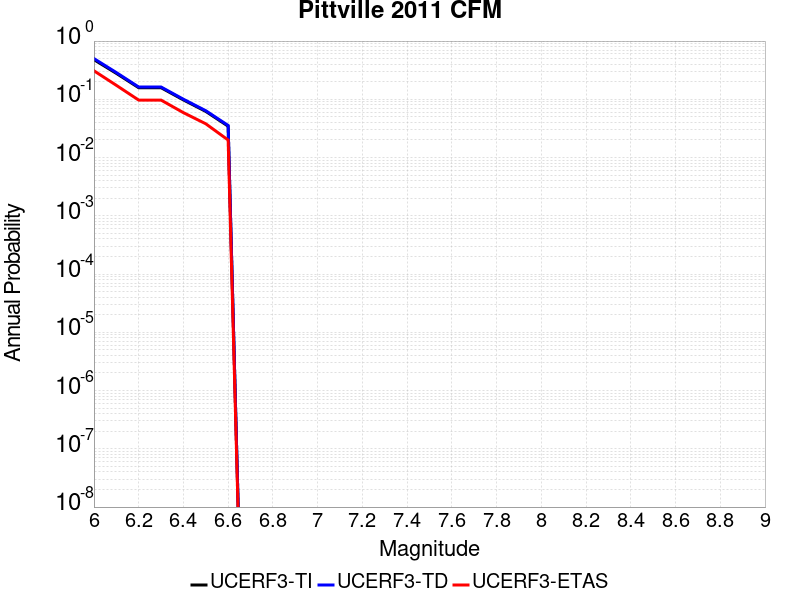 |
|-----|

| Magnitude | UCERF3-TI Prob | UCERF3-TD Prob | UCERF3-ETAS Prob |
|-----|-----|-----|-----|
| 6.0 | 0.47955486 | 0.5000784 | 0.309 |
| 6.1 | 0.27903497 | 0.28822806 | 0.174 |
| 6.2 | 0.15825133 | 0.162735 | 0.097 |
| 6.3 | 0.15825133 | 0.162735 | 0.097 |
| 6.4 | 0.09765949 | 0.10035373 | 0.059 |
| 6.5 | 0.061999794 | 0.06375158 | 0.038 |
| 6.6 | 0.03456312 | 0.035578936 | 0.02 |

## Pleito
*[(top)](#table-of-contents)*

| 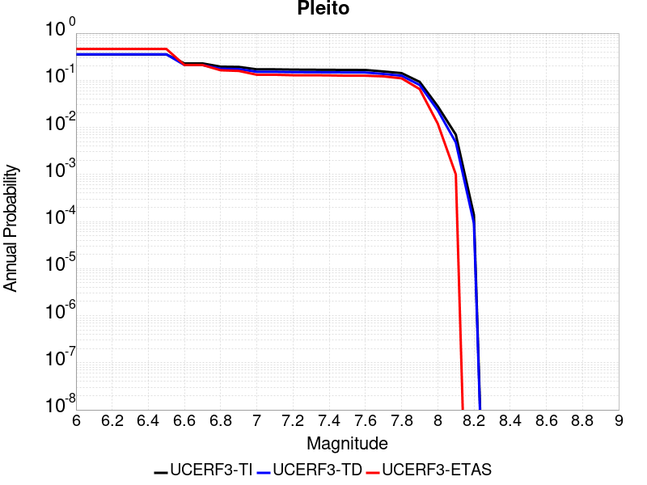 |
|-----|

| Magnitude | UCERF3-TI Prob | UCERF3-TD Prob | UCERF3-ETAS Prob |
|-----|-----|-----|-----|
| 6.0 | 0.35424724 | 0.35486907 | 0.461 |
| 6.1 | 0.35424724 | 0.35486907 | 0.461 |
| 6.2 | 0.35424724 | 0.35486907 | 0.461 |
| 6.3 | 0.35424724 | 0.35486907 | 0.461 |
| 6.4 | 0.35424724 | 0.35486907 | 0.461 |
| 6.5 | 0.35424724 | 0.35486907 | 0.461 |
| 6.6 | 0.22783086 | 0.21064481 | 0.211 |
| 6.7 | 0.22783086 | 0.21064481 | 0.211 |
| 6.8 | 0.19470467 | 0.17550947 | 0.163 |
| 6.9 | 0.19224177 | 0.17295927 | 0.158 |
| 7.0 | 0.17071238 | 0.15119307 | 0.131 |
| 7.1 | 0.17054573 | 0.15103948 | 0.131 |
| 7.2 | 0.16833086 | 0.14899784 | 0.128 |
| 7.3 | 0.16737242 | 0.14812182 | 0.128 |
| 7.4 | 0.16664061 | 0.1474547 | 0.127 |
| 7.5 | 0.16582073 | 0.14674838 | 0.125 |
| 7.6 | 0.16533057 | 0.14630853 | 0.125 |
| 7.7 | 0.1536854 | 0.1360468 | 0.121 |
| 7.8 | 0.14191446 | 0.12490198 | 0.11 |
| 7.9 | 0.09241446 | 0.07940138 | 0.065 |
| 8.0 | 0.028046543 | 0.023068588 | 0.012 |
| 8.1 | 0.0069920467 | 0.0047784396 | 0.001 |
| 8.2 | 1.3817761E-4 | 9.15935E-5 | 0.0 |

## Point Reyes 2011 CFM
*[(top)](#table-of-contents)*

| 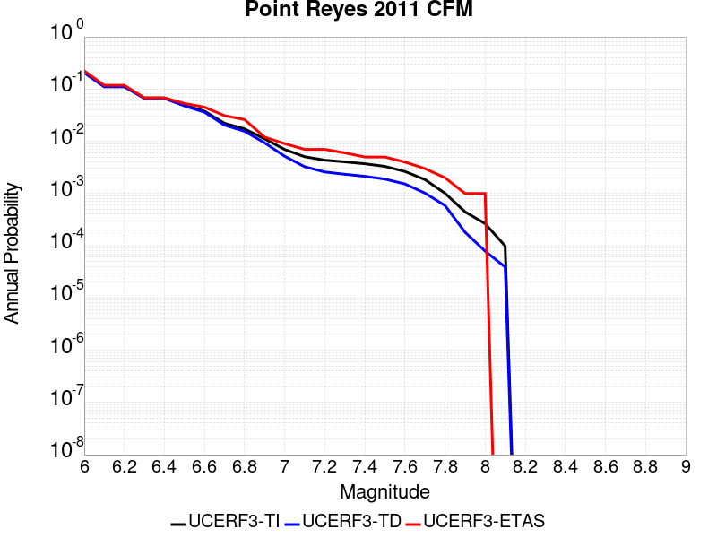 |
|-----|

| Magnitude | UCERF3-TI Prob | UCERF3-TD Prob | UCERF3-ETAS Prob |
|-----|-----|-----|-----|
| 6.0 | 0.20647435 | 0.20742986 | 0.223 |
| 6.1 | 0.11138476 | 0.110569015 | 0.118 |
| 6.2 | 0.11138476 | 0.110569015 | 0.118 |
| 6.3 | 0.06763396 | 0.06630031 | 0.068 |
| 6.4 | 0.06763396 | 0.06630031 | 0.068 |
| 6.5 | 0.049060635 | 0.047567952 | 0.053 |
| 6.6 | 0.03769228 | 0.036110606 | 0.045 |
| 6.7 | 0.022116313 | 0.020417567 | 0.031 |
| 6.8 | 0.017262675 | 0.015529034 | 0.026 |
| 6.9 | 0.011133829 | 0.009356005 | 0.012 |
| 7.0 | 0.006970861 | 0.0051715113 | 0.009 |
| 7.1 | 0.005061833 | 0.003256437 | 0.007 |
| 7.2 | 0.004351367 | 0.002584007 | 0.007 |
| 7.3 | 0.0040364987 | 0.0023375214 | 0.006 |
| 7.4 | 0.0037112408 | 0.0021331413 | 0.005 |
| 7.5 | 0.003310505 | 0.0018902763 | 0.005 |
| 7.6 | 0.0026431826 | 0.0015238085 | 0.004 |
| 7.7 | 0.001848158 | 0.0010172401 | 0.003 |
| 7.8 | 0.0010094597 | 5.883546E-4 | 0.002 |
| 7.9 | 4.452132E-4 | 1.8142465E-4 | 0.001 |
| 8.0 | 2.6536043E-4 | 7.891832E-5 | 0.001 |
| 8.1 | 9.8772405E-5 | 3.9154194E-5 | 0.0 |

## Point Reyes 2011 connector
*[(top)](#table-of-contents)*

| 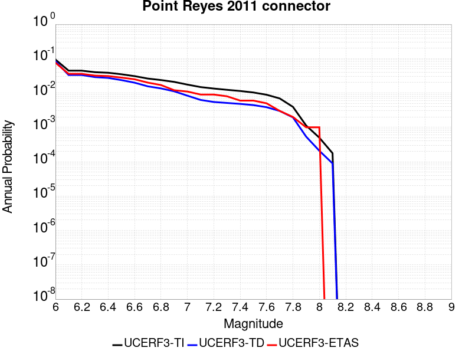 |
|-----|

| Magnitude | UCERF3-TI Prob | UCERF3-TD Prob | UCERF3-ETAS Prob |
|-----|-----|-----|-----|
| 6.0 | 0.09413087 | 0.084172875 | 0.076 |
| 6.1 | 0.044503998 | 0.03326649 | 0.036 |
| 6.2 | 0.044503998 | 0.03326649 | 0.036 |
| 6.3 | 0.040230766 | 0.028926164 | 0.032 |
| 6.4 | 0.03872554 | 0.027398285 | 0.031 |
| 6.5 | 0.035017524 | 0.023664655 | 0.028 |
| 6.6 | 0.030879568 | 0.019901862 | 0.025 |
| 6.7 | 0.026247041 | 0.015588191 | 0.02 |
| 6.8 | 0.02374774 | 0.0135453185 | 0.017 |
| 6.9 | 0.020988787 | 0.01116623 | 0.012 |
| 7.0 | 0.017515935 | 0.008335122 | 0.011 |
| 7.1 | 0.014832685 | 0.0062700654 | 0.009 |
| 7.2 | 0.013437603 | 0.0054629156 | 0.009 |
| 7.3 | 0.012341672 | 0.0051224236 | 0.008 |
| 7.4 | 0.011410401 | 0.0048060045 | 0.006 |
| 7.5 | 0.010329954 | 0.0044372967 | 0.006 |
| 7.6 | 0.00887985 | 0.0038529483 | 0.005 |
| 7.7 | 0.0069186897 | 0.0029906244 | 0.003 |
| 7.8 | 0.003933572 | 0.0019425586 | 0.002 |
| 7.9 | 0.0011271574 | 5.3525117E-4 | 0.001 |
| 8.0 | 4.9948314E-4 | 2.0792375E-4 | 0.001 |
| 8.1 | 1.7685097E-4 | 8.91118E-5 | 0.0 |

## Polaris 2011 CFM
*[(top)](#table-of-contents)*

| 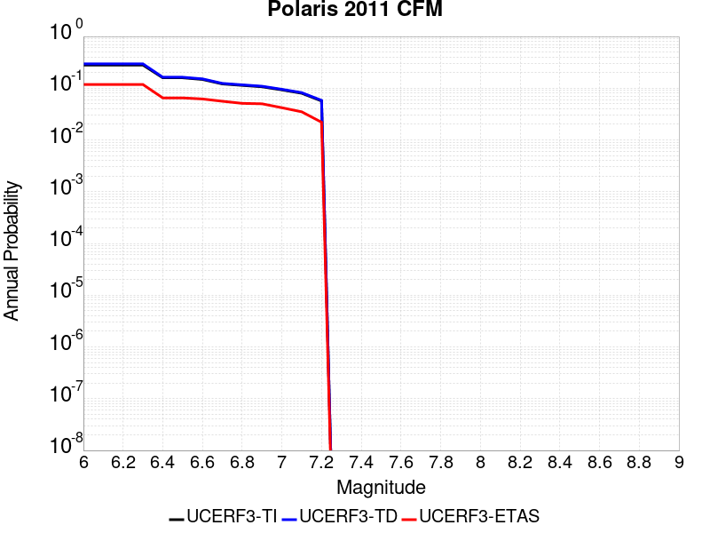 |
|-----|

| Magnitude | UCERF3-TI Prob | UCERF3-TD Prob | UCERF3-ETAS Prob |
|-----|-----|-----|-----|
| 6.0 | 0.2807392 | 0.29568642 | 0.118 |
| 6.1 | 0.2807392 | 0.29568642 | 0.118 |
| 6.2 | 0.2807392 | 0.29568642 | 0.118 |
| 6.3 | 0.2807392 | 0.29568642 | 0.118 |
| 6.4 | 0.15912439 | 0.1631556 | 0.065 |
| 6.5 | 0.15912439 | 0.1631556 | 0.065 |
| 6.6 | 0.14776422 | 0.15154377 | 0.062 |
| 6.7 | 0.121093 | 0.1240424 | 0.056 |
| 6.8 | 0.11346886 | 0.116268784 | 0.051 |
| 6.9 | 0.106594674 | 0.10926912 | 0.05 |
| 7.0 | 0.09292298 | 0.095320985 | 0.042 |
| 7.1 | 0.07994171 | 0.08207728 | 0.035 |
| 7.2 | 0.05665881 | 0.058289655 | 0.022 |

## Puente Hills
*[(top)](#table-of-contents)*

| 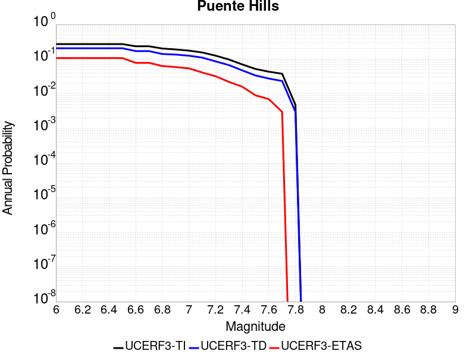 |
|-----|

| Magnitude | UCERF3-TI Prob | UCERF3-TD Prob | UCERF3-ETAS Prob |
|-----|-----|-----|-----|
| 6.0 | 0.27074036 | 0.20541844 | 0.107 |
| 6.1 | 0.27074036 | 0.20541844 | 0.107 |
| 6.2 | 0.27074036 | 0.20541844 | 0.107 |
| 6.3 | 0.27074036 | 0.20541844 | 0.107 |
| 6.4 | 0.27074036 | 0.20541844 | 0.107 |
| 6.5 | 0.27074036 | 0.20541844 | 0.107 |
| 6.6 | 0.23409624 | 0.16983552 | 0.078 |
| 6.7 | 0.23409624 | 0.16983552 | 0.078 |
| 6.8 | 0.20174606 | 0.14029749 | 0.063 |
| 6.9 | 0.1897801 | 0.13515465 | 0.059 |
| 7.0 | 0.17543592 | 0.12514874 | 0.054 |
| 7.1 | 0.15523462 | 0.11030711 | 0.041 |
| 7.2 | 0.12557049 | 0.085833654 | 0.032 |
| 7.3 | 0.09740882 | 0.06708365 | 0.022 |
| 7.4 | 0.0701897 | 0.04725054 | 0.016 |
| 7.5 | 0.05187361 | 0.03368755 | 0.009 |
| 7.6 | 0.043280486 | 0.02742977 | 0.007 |
| 7.7 | 0.03779581 | 0.023361811 | 0.003 |
| 7.8 | 0.0047974703 | 0.003015574 | 0.0 |

## Quien Sabe 2011 CFM
*[(top)](#table-of-contents)*

| 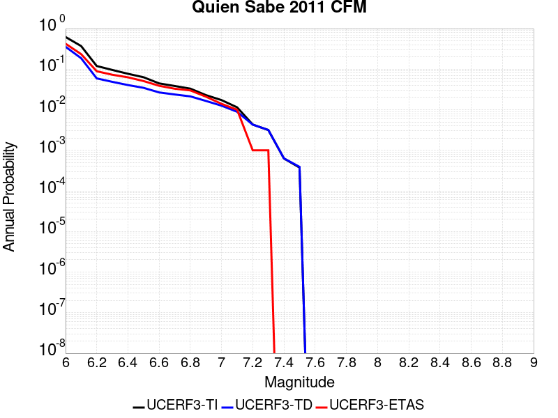 |
|-----|

| Magnitude | UCERF3-TI Prob | UCERF3-TD Prob | UCERF3-ETAS Prob |
|-----|-----|-----|-----|
| 6.0 | 0.6220986 | 0.3573762 | 0.425 |
| 6.1 | 0.37190548 | 0.18645343 | 0.235 |
| 6.2 | 0.11969468 | 0.05930486 | 0.089 |
| 6.3 | 0.095764525 | 0.048750937 | 0.073 |
| 6.4 | 0.077143535 | 0.04065581 | 0.063 |
| 6.5 | 0.06334029 | 0.03472878 | 0.051 |
| 6.6 | 0.044643093 | 0.026748808 | 0.039 |
| 6.7 | 0.038522035 | 0.023809617 | 0.033 |
| 6.8 | 0.03315597 | 0.021369817 | 0.03 |
| 6.9 | 0.022971168 | 0.016500661 | 0.021 |
| 7.0 | 0.017300041 | 0.012608134 | 0.014 |
| 7.1 | 0.011466527 | 0.008928148 | 0.01 |
| 7.2 | 0.0043269033 | 0.0043005613 | 0.001 |
| 7.3 | 0.0031628762 | 0.0031772328 | 0.001 |
| 7.4 | 6.3097733E-4 | 6.333295E-4 | 0.0 |
| 7.5 | 3.7647062E-4 | 3.9215822E-4 | 0.0 |

## Raymond
*[(top)](#table-of-contents)*

| 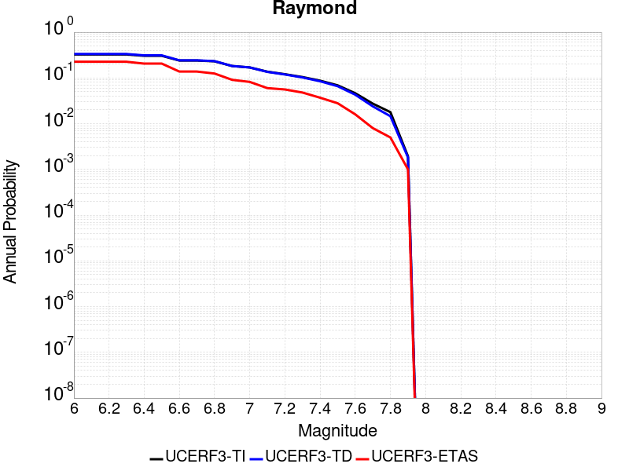 |
|-----|

| Magnitude | UCERF3-TI Prob | UCERF3-TD Prob | UCERF3-ETAS Prob |
|-----|-----|-----|-----|
| 6.0 | 0.32662243 | 0.33407184 | 0.226 |
| 6.1 | 0.32662243 | 0.33407184 | 0.226 |
| 6.2 | 0.32662243 | 0.33407184 | 0.226 |
| 6.3 | 0.32662243 | 0.33407184 | 0.226 |
| 6.4 | 0.30492666 | 0.3117592 | 0.206 |
| 6.5 | 0.30492666 | 0.3117592 | 0.206 |
| 6.6 | 0.2404663 | 0.24284145 | 0.138 |
| 6.7 | 0.2404663 | 0.24284145 | 0.138 |
| 6.8 | 0.23122635 | 0.2334454 | 0.125 |
| 6.9 | 0.18245699 | 0.18256606 | 0.091 |
| 7.0 | 0.16990462 | 0.16966529 | 0.082 |
| 7.1 | 0.13716751 | 0.13591297 | 0.06 |
| 7.2 | 0.12082649 | 0.11914569 | 0.056 |
| 7.3 | 0.10464668 | 0.10257999 | 0.048 |
| 7.4 | 0.087267525 | 0.08475555 | 0.037 |
| 7.5 | 0.06894135 | 0.066013336 | 0.028 |
| 7.6 | 0.046339024 | 0.04310079 | 0.016 |
| 7.7 | 0.027428905 | 0.02392497 | 0.008 |
| 7.8 | 0.017875405 | 0.014578705 | 0.005 |
| 7.9 | 0.0019353067 | 0.0018278193 | 0.001 |

## Red Mountain
*[(top)](#table-of-contents)*

| 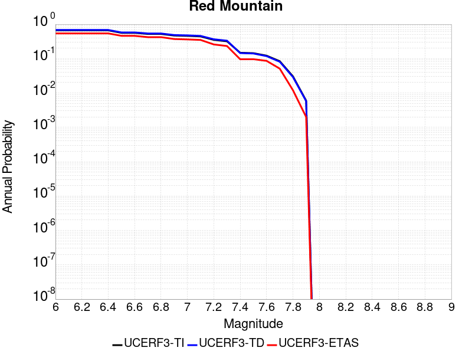 |
|-----|

| Magnitude | UCERF3-TI Prob | UCERF3-TD Prob | UCERF3-ETAS Prob |
|-----|-----|-----|-----|
| 6.0 | 0.6640644 | 0.6815389 | 0.541 |
| 6.1 | 0.6640644 | 0.6815389 | 0.541 |
| 6.2 | 0.6640644 | 0.6815389 | 0.541 |
| 6.3 | 0.6640644 | 0.6815389 | 0.541 |
| 6.4 | 0.6640644 | 0.6815389 | 0.541 |
| 6.5 | 0.5608878 | 0.5773044 | 0.46 |
| 6.6 | 0.56078243 | 0.57720107 | 0.459 |
| 6.7 | 0.5216845 | 0.53878254 | 0.421 |
| 6.8 | 0.5210046 | 0.53810495 | 0.421 |
| 6.9 | 0.4685231 | 0.48492992 | 0.371 |
| 7.0 | 0.4581252 | 0.47451374 | 0.361 |
| 7.1 | 0.4412769 | 0.45760182 | 0.349 |
| 7.2 | 0.35037726 | 0.36491805 | 0.258 |
| 7.3 | 0.31859335 | 0.33233097 | 0.232 |
| 7.4 | 0.1478658 | 0.14470889 | 0.096 |
| 7.5 | 0.1438897 | 0.14065303 | 0.096 |
| 7.6 | 0.121670604 | 0.11804867 | 0.086 |
| 7.7 | 0.083961055 | 0.08091948 | 0.051 |
| 7.8 | 0.030389596 | 0.02906385 | 0.012 |
| 7.9 | 0.0059740804 | 0.005792148 | 0.002 |

## Red Pass
*[(top)](#table-of-contents)*

| 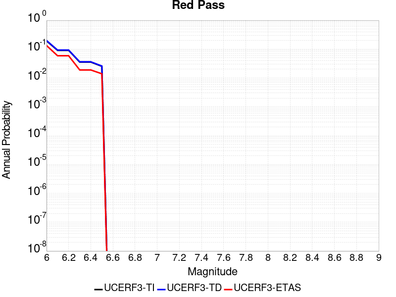 |
|-----|

| Magnitude | UCERF3-TI Prob | UCERF3-TD Prob | UCERF3-ETAS Prob |
|-----|-----|-----|-----|
| 6.0 | 0.19382422 | 0.19950357 | 0.134 |
| 6.1 | 0.09083234 | 0.092861116 | 0.059 |
| 6.2 | 0.09083234 | 0.092861116 | 0.059 |
| 6.3 | 0.035677206 | 0.036400747 | 0.019 |
| 6.4 | 0.035677206 | 0.036400747 | 0.019 |
| 6.5 | 0.02543875 | 0.026035532 | 0.014 |

## Redondo Canyon alt 1
*[(top)](#table-of-contents)*

|  |
|-----|

| Magnitude | UCERF3-TI Prob | UCERF3-TD Prob | UCERF3-ETAS Prob |
|-----|-----|-----|-----|
| 6.0 | 0.23656522 | 0.2534638 | 0.142 |
| 6.1 | 0.23656522 | 0.2534638 | 0.142 |
| 6.2 | 0.23656522 | 0.2534638 | 0.142 |
| 6.3 | 0.08022259 | 0.07759607 | 0.034 |
| 6.4 | 0.08022259 | 0.07759607 | 0.034 |
| 6.5 | 0.08022259 | 0.07759607 | 0.034 |
| 6.6 | 0.04956028 | 0.04547662 | 0.022 |
| 6.7 | 0.04956028 | 0.04547662 | 0.022 |
| 6.8 | 0.02899541 | 0.023889974 | 0.012 |
| 6.9 | 0.02899541 | 0.023889974 | 0.012 |
| 7.0 | 0.02899541 | 0.023889974 | 0.012 |
| 7.1 | 0.027136533 | 0.022403909 | 0.011 |
| 7.2 | 0.027136533 | 0.022403909 | 0.011 |
| 7.3 | 0.0024767565 | 0.0016060079 | 0.003 |
| 7.4 | 0.0010305378 | 7.0582243E-4 | 0.0 |
| 7.5 | 1.4643683E-4 | 1.0419599E-4 | 0.0 |
| 7.6 | 1.0712817E-4 | 7.418278E-5 | 0.0 |
| 7.7 | 3.553232E-5 | 2.1367236E-5 | 0.0 |
| 7.8 | 3.553232E-5 | 2.1367236E-5 | 0.0 |

## Reliz 2011 CFM
*[(top)](#table-of-contents)*

| 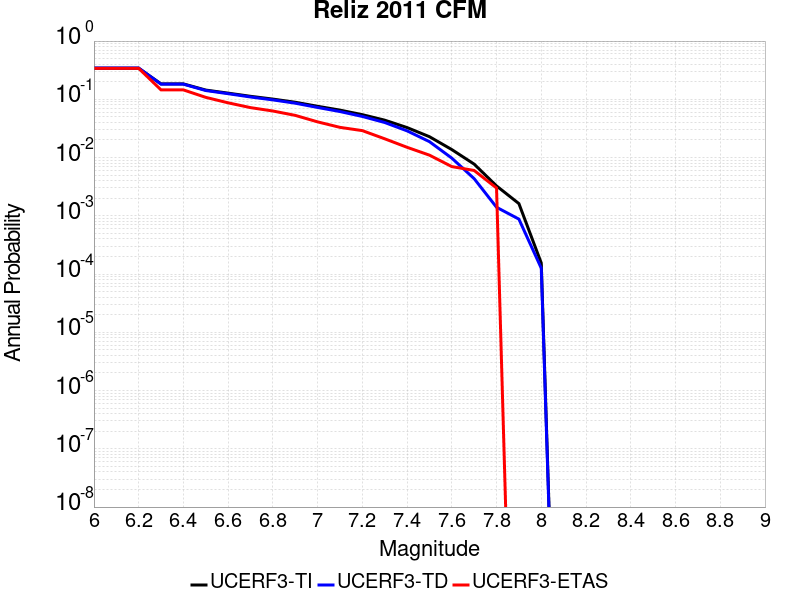 |
|-----|

| Magnitude | UCERF3-TI Prob | UCERF3-TD Prob | UCERF3-ETAS Prob |
|-----|-----|-----|-----|
| 6.0 | 0.34130612 | 0.3444288 | 0.34 |
| 6.1 | 0.34130612 | 0.3444288 | 0.34 |
| 6.2 | 0.34130612 | 0.3444288 | 0.34 |
| 6.3 | 0.18396583 | 0.18190418 | 0.145 |
| 6.4 | 0.18396583 | 0.18190418 | 0.145 |
| 6.5 | 0.14413919 | 0.14152549 | 0.108 |
| 6.6 | 0.12766309 | 0.12485442 | 0.087 |
| 6.7 | 0.11263118 | 0.10963156 | 0.072 |
| 6.8 | 0.100893006 | 0.09774599 | 0.063 |
| 6.9 | 0.089058794 | 0.08576405 | 0.053 |
| 7.0 | 0.075910084 | 0.07245523 | 0.041 |
| 7.1 | 0.06524413 | 0.06165435 | 0.033 |
| 7.2 | 0.05450492 | 0.050769664 | 0.029 |
| 7.3 | 0.04386857 | 0.039993085 | 0.021 |
| 7.4 | 0.032729767 | 0.028741186 | 0.015 |
| 7.5 | 0.02281514 | 0.01875694 | 0.011 |
| 7.6 | 0.013709921 | 0.009778783 | 0.007 |
| 7.7 | 0.00770909 | 0.004340714 | 0.006 |
| 7.8 | 0.00325829 | 0.0014019981 | 0.003 |
| 7.9 | 0.0016197428 | 8.7746576E-4 | 0.0 |
| 8.0 | 1.5453655E-4 | 1.2608315E-4 | 0.0 |

## Richfield
*[(top)](#table-of-contents)*

| 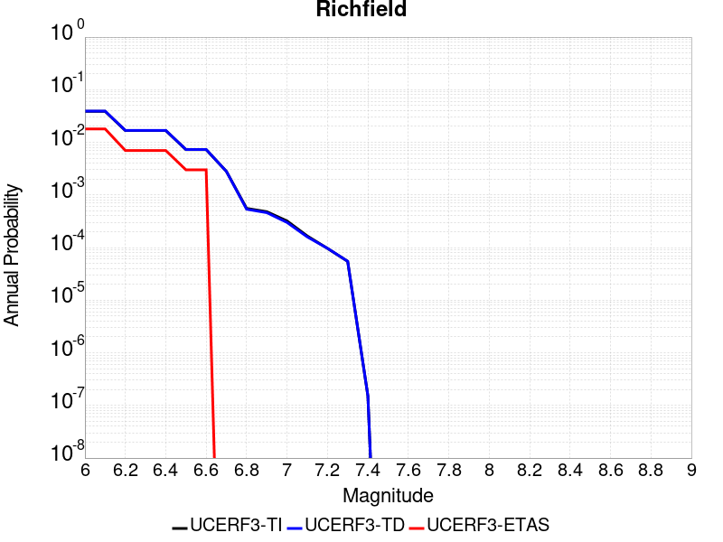 |
|-----|

| Magnitude | UCERF3-TI Prob | UCERF3-TD Prob | UCERF3-ETAS Prob |
|-----|-----|-----|-----|
| 6.0 | 0.038796734 | 0.039239336 | 0.018 |
| 6.1 | 0.038796734 | 0.039239336 | 0.018 |
| 6.2 | 0.016746502 | 0.016862817 | 0.007 |
| 6.3 | 0.016746502 | 0.016862817 | 0.007 |
| 6.4 | 0.016746502 | 0.016862817 | 0.007 |
| 6.5 | 0.0072665745 | 0.0073078386 | 0.003 |
| 6.6 | 0.0072665745 | 0.0073078386 | 0.003 |
| 6.7 | 0.0028077713 | 0.0028020432 | 0.0 |
| 6.8 | 5.555963E-4 | 5.357724E-4 | 0.0 |
| 6.9 | 4.8027976E-4 | 4.6024116E-4 | 0.0 |
| 7.0 | 3.2060005E-4 | 3.0012842E-4 | 0.0 |
| 7.1 | 1.6626813E-4 | 1.5962962E-4 | 0.0 |
| 7.2 | 9.649946E-5 | 9.679195E-5 | 0.0 |
| 7.3 | 5.471809E-5 | 5.4897075E-5 | 0.0 |
| 7.4 | 1.5213764E-7 | 1.5261443E-7 | 0.0 |

## Rinconada 2011 CFM
*[(top)](#table-of-contents)*

| 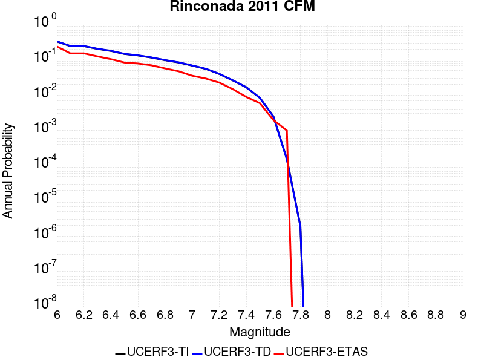 |
|-----|

| Magnitude | UCERF3-TI Prob | UCERF3-TD Prob | UCERF3-ETAS Prob |
|-----|-----|-----|-----|
| 6.0 | 0.33699402 | 0.34020248 | 0.244 |
| 6.1 | 0.24881262 | 0.2510109 | 0.155 |
| 6.2 | 0.24881262 | 0.2510109 | 0.155 |
| 6.3 | 0.2077497 | 0.20955268 | 0.127 |
| 6.4 | 0.18150422 | 0.1830619 | 0.106 |
| 6.5 | 0.14861922 | 0.14987765 | 0.085 |
| 6.6 | 0.13487917 | 0.13601544 | 0.08 |
| 6.7 | 0.1174255 | 0.11840352 | 0.071 |
| 6.8 | 0.09899132 | 0.099794984 | 0.058 |
| 6.9 | 0.08548019 | 0.0861492 | 0.048 |
| 7.0 | 0.06974877 | 0.070269346 | 0.036 |
| 7.1 | 0.05645408 | 0.056856208 | 0.03 |
| 7.2 | 0.04042803 | 0.04069271 | 0.023 |
| 7.3 | 0.026530817 | 0.026684286 | 0.015 |
| 7.4 | 0.016906222 | 0.01698986 | 0.009 |
| 7.5 | 0.008483777 | 0.008505096 | 0.006 |
| 7.6 | 0.002541603 | 0.0025170648 | 0.002 |
| 7.7 | 1.5652725E-4 | 1.5086688E-4 | 0.001 |
| 7.8 | 1.9306071E-6 | 1.9357753E-6 | 0.0 |

## Robinson Creek
*[(top)](#table-of-contents)*

| 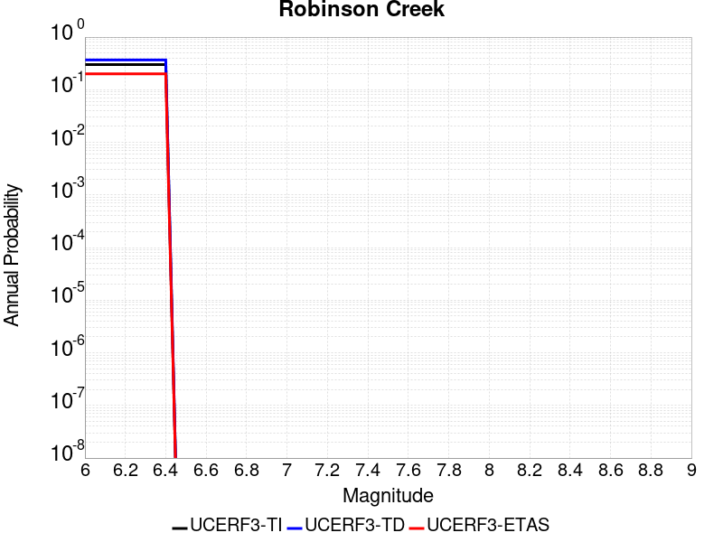 |
|-----|

| Magnitude | UCERF3-TI Prob | UCERF3-TD Prob | UCERF3-ETAS Prob |
|-----|-----|-----|-----|
| 6.0 | 0.30062252 | 0.3669663 | 0.2 |
| 6.1 | 0.30062252 | 0.3669663 | 0.2 |
| 6.2 | 0.30062252 | 0.3669663 | 0.2 |
| 6.3 | 0.30062252 | 0.3669663 | 0.2 |
| 6.4 | 0.30062252 | 0.3669663 | 0.2 |

## Rocky Ledge 2011 CFM
*[(top)](#table-of-contents)*

| 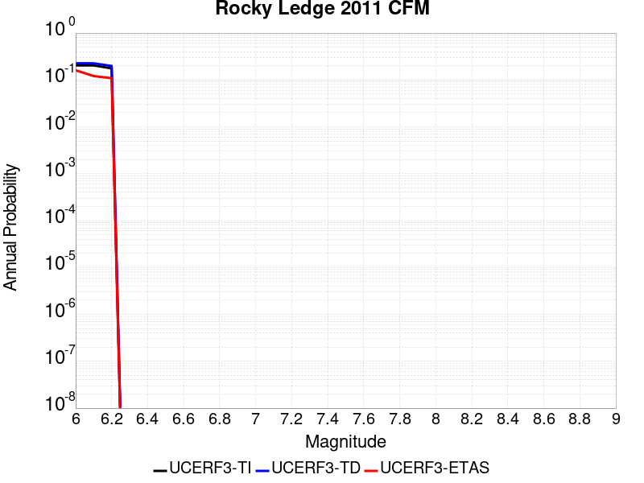 |
|-----|

| Magnitude | UCERF3-TI Prob | UCERF3-TD Prob | UCERF3-ETAS Prob |
|-----|-----|-----|-----|
| 6.0 | 0.20420532 | 0.22650114 | 0.161 |
| 6.1 | 0.20420532 | 0.22650114 | 0.121 |
| 6.2 | 0.1764779 | 0.198661 | 0.109 |

## Rodgers Creek - Healdsburg 2011 CFM
*[(top)](#table-of-contents)*

| 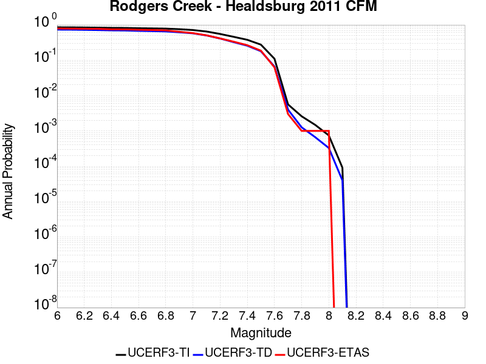 |
|-----|

| Magnitude | UCERF3-TI Prob | UCERF3-TD Prob | UCERF3-ETAS Prob |
|-----|-----|-----|-----|
| 6.0 | 0.8545782 | 0.73715484 | 0.792 |
| 6.1 | 0.85184324 | 0.73317474 | 0.784 |
| 6.2 | 0.8446874 | 0.72446537 | 0.778 |
| 6.3 | 0.8358378 | 0.7139004 | 0.774 |
| 6.4 | 0.8247785 | 0.7010959 | 0.749 |
| 6.5 | 0.8200433 | 0.6946553 | 0.746 |
| 6.6 | 0.80620676 | 0.6776094 | 0.729 |
| 6.7 | 0.7971889 | 0.66648656 | 0.717 |
| 6.8 | 0.7867683 | 0.65382063 | 0.7 |
| 6.9 | 0.75577176 | 0.6173954 | 0.64 |
| 7.0 | 0.7160957 | 0.57759076 | 0.586 |
| 7.1 | 0.6505084 | 0.5031905 | 0.507 |
| 7.2 | 0.55417913 | 0.41234532 | 0.414 |
| 7.3 | 0.45995978 | 0.32456926 | 0.335 |
| 7.4 | 0.37883797 | 0.25770882 | 0.267 |
| 7.5 | 0.27661043 | 0.18016677 | 0.187 |
| 7.6 | 0.110242 | 0.066355884 | 0.063 |
| 7.7 | 0.0056140963 | 0.003961241 | 0.003 |
| 7.8 | 0.0025957257 | 0.0012619123 | 0.001 |
| 7.9 | 0.0014793479 | 6.640657E-4 | 0.001 |
| 8.0 | 7.462487E-4 | 3.289802E-4 | 0.001 |
| 8.1 | 9.142622E-5 | 3.981127E-5 | 0.0 |

## Rose Canyon
*[(top)](#table-of-contents)*

| 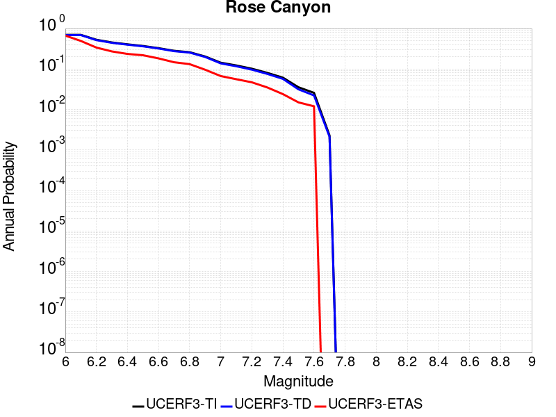 |
|-----|

| Magnitude | UCERF3-TI Prob | UCERF3-TD Prob | UCERF3-ETAS Prob |
|-----|-----|-----|-----|
| 6.0 | 0.69824237 | 0.68914807 | 0.669 |
| 6.1 | 0.69824237 | 0.68914807 | 0.494 |
| 6.2 | 0.52883613 | 0.5173743 | 0.339 |
| 6.3 | 0.45367262 | 0.44419903 | 0.272 |
| 6.4 | 0.40757358 | 0.39967427 | 0.236 |
| 6.5 | 0.37098983 | 0.36368856 | 0.219 |
| 6.6 | 0.32785022 | 0.32127678 | 0.183 |
| 6.7 | 0.28210914 | 0.27631685 | 0.147 |
| 6.8 | 0.26026353 | 0.25476754 | 0.132 |
| 6.9 | 0.20372818 | 0.19831635 | 0.096 |
| 7.0 | 0.14342014 | 0.13774082 | 0.067 |
| 7.1 | 0.122603774 | 0.11701966 | 0.056 |
| 7.2 | 0.10193065 | 0.09659559 | 0.047 |
| 7.3 | 0.08029085 | 0.07564937 | 0.035 |
| 7.4 | 0.061171506 | 0.057098165 | 0.024 |
| 7.5 | 0.035470765 | 0.031560604 | 0.015 |
| 7.6 | 0.025806751 | 0.022276701 | 0.012 |
| 7.7 | 0.0022833357 | 0.0021133004 | 0.0 |

## Round Valley
*[(top)](#table-of-contents)*

| 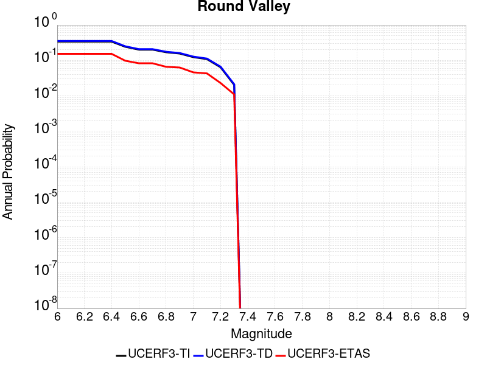 |
|-----|

| Magnitude | UCERF3-TI Prob | UCERF3-TD Prob | UCERF3-ETAS Prob |
|-----|-----|-----|-----|
| 6.0 | 0.3392243 | 0.35348898 | 0.153 |
| 6.1 | 0.3392243 | 0.35348898 | 0.153 |
| 6.2 | 0.3392243 | 0.35348898 | 0.153 |
| 6.3 | 0.3392243 | 0.35348898 | 0.153 |
| 6.4 | 0.3392243 | 0.35348898 | 0.153 |
| 6.5 | 0.24252766 | 0.2503922 | 0.098 |
| 6.6 | 0.20166634 | 0.20808701 | 0.083 |
| 6.7 | 0.20166634 | 0.20808701 | 0.083 |
| 6.8 | 0.17004167 | 0.17553039 | 0.066 |
| 6.9 | 0.15624727 | 0.16144116 | 0.063 |
| 7.0 | 0.12370262 | 0.12800328 | 0.046 |
| 7.1 | 0.10885126 | 0.112734705 | 0.043 |
| 7.2 | 0.06400892 | 0.066561095 | 0.023 |
| 7.3 | 0.020399636 | 0.021216193 | 0.011 |

## Russ 2011 CFM
*[(top)](#table-of-contents)*

| 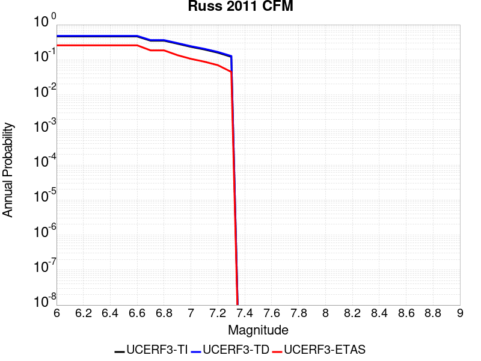 |
|-----|

| Magnitude | UCERF3-TI Prob | UCERF3-TD Prob | UCERF3-ETAS Prob |
|-----|-----|-----|-----|
| 6.0 | 0.46264616 | 0.48005882 | 0.258 |
| 6.1 | 0.46264616 | 0.48005882 | 0.258 |
| 6.2 | 0.46264616 | 0.48005882 | 0.258 |
| 6.3 | 0.46264616 | 0.48005882 | 0.258 |
| 6.4 | 0.46264616 | 0.48005882 | 0.258 |
| 6.5 | 0.46264616 | 0.48005882 | 0.258 |
| 6.6 | 0.46264616 | 0.48005882 | 0.258 |
| 6.7 | 0.3500671 | 0.36330676 | 0.185 |
| 6.8 | 0.3500671 | 0.36330676 | 0.185 |
| 6.9 | 0.2870978 | 0.2983897 | 0.135 |
| 7.0 | 0.23368284 | 0.24332117 | 0.106 |
| 7.1 | 0.19626485 | 0.2048858 | 0.088 |
| 7.2 | 0.15926471 | 0.16684893 | 0.07 |
| 7.3 | 0.12126415 | 0.1277069 | 0.045 |

## San Andreas (Big Bend)
*[(top)](#table-of-contents)*

| 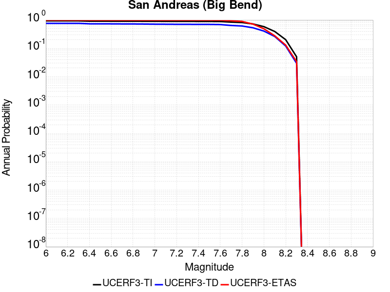 |
|-----|

| Magnitude | UCERF3-TI Prob | UCERF3-TD Prob | UCERF3-ETAS Prob |
|-----|-----|-----|-----|
| 6.0 | 0.92977256 | 0.76187557 | 0.993 |
| 6.1 | 0.92977256 | 0.76187557 | 0.993 |
| 6.2 | 0.92977256 | 0.76187557 | 0.993 |
| 6.3 | 0.92977256 | 0.76187557 | 0.993 |
| 6.4 | 0.90845436 | 0.73239565 | 0.99 |
| 6.5 | 0.90845436 | 0.73239565 | 0.99 |
| 6.6 | 0.90551007 | 0.72864366 | 0.99 |
| 6.7 | 0.9040454 | 0.7247538 | 0.99 |
| 6.8 | 0.9031277 | 0.72303385 | 0.989 |
| 6.9 | 0.90085304 | 0.7179273 | 0.989 |
| 7.0 | 0.89783585 | 0.7107289 | 0.989 |
| 7.1 | 0.8962679 | 0.7074411 | 0.989 |
| 7.2 | 0.8941229 | 0.70281154 | 0.987 |
| 7.3 | 0.89306086 | 0.7010128 | 0.987 |
| 7.4 | 0.89235973 | 0.6998337 | 0.987 |
| 7.5 | 0.8905465 | 0.6976083 | 0.987 |
| 7.6 | 0.88353145 | 0.6895674 | 0.981 |
| 7.7 | 0.8391754 | 0.6399963 | 0.937 |
| 7.8 | 0.8124624 | 0.6131827 | 0.889 |
| 7.9 | 0.72440404 | 0.5307952 | 0.716 |
| 8.0 | 0.58217674 | 0.40618917 | 0.49 |
| 8.1 | 0.39252114 | 0.26104185 | 0.276 |
| 8.2 | 0.20189473 | 0.12080401 | 0.13 |
| 8.3 | 0.050421786 | 0.029699154 | 0.034 |

## San Andreas (Carrizo) rev
*[(top)](#table-of-contents)*

| 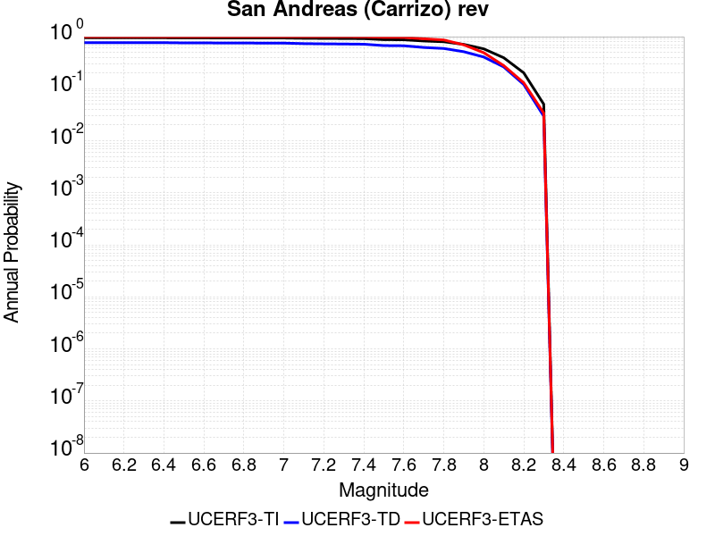 |
|-----|

| Magnitude | UCERF3-TI Prob | UCERF3-TD Prob | UCERF3-ETAS Prob |
|-----|-----|-----|-----|
| 6.0 | 0.9524515 | 0.7659208 | 0.999 |
| 6.1 | 0.9524515 | 0.7659208 | 0.999 |
| 6.2 | 0.9524515 | 0.7659208 | 0.999 |
| 6.3 | 0.9524515 | 0.7659208 | 0.999 |
| 6.4 | 0.9524515 | 0.7659208 | 0.999 |
| 6.5 | 0.94775486 | 0.7580747 | 0.999 |
| 6.6 | 0.94775486 | 0.7580747 | 0.999 |
| 6.7 | 0.9454715 | 0.7544288 | 0.999 |
| 6.8 | 0.9448119 | 0.7533239 | 0.999 |
| 6.9 | 0.9440824 | 0.75214094 | 0.999 |
| 7.0 | 0.9433794 | 0.7509079 | 0.999 |
| 7.1 | 0.93208236 | 0.7338563 | 0.998 |
| 7.2 | 0.9269221 | 0.72661734 | 0.997 |
| 7.3 | 0.92279536 | 0.721364 | 0.996 |
| 7.4 | 0.9175157 | 0.71490145 | 0.994 |
| 7.5 | 0.8776541 | 0.673009 | 0.974 |
| 7.6 | 0.87259173 | 0.66786236 | 0.97 |
| 7.7 | 0.8262223 | 0.61861616 | 0.911 |
| 7.8 | 0.79889774 | 0.5927963 | 0.865 |
| 7.9 | 0.71143574 | 0.51409256 | 0.697 |
| 8.0 | 0.58331335 | 0.40616813 | 0.492 |
| 8.1 | 0.39363798 | 0.2616713 | 0.278 |
| 8.2 | 0.20189473 | 0.12080401 | 0.13 |
| 8.3 | 0.050421786 | 0.029699154 | 0.034 |

## San Andreas (Cholame) rev
*[(top)](#table-of-contents)*

| 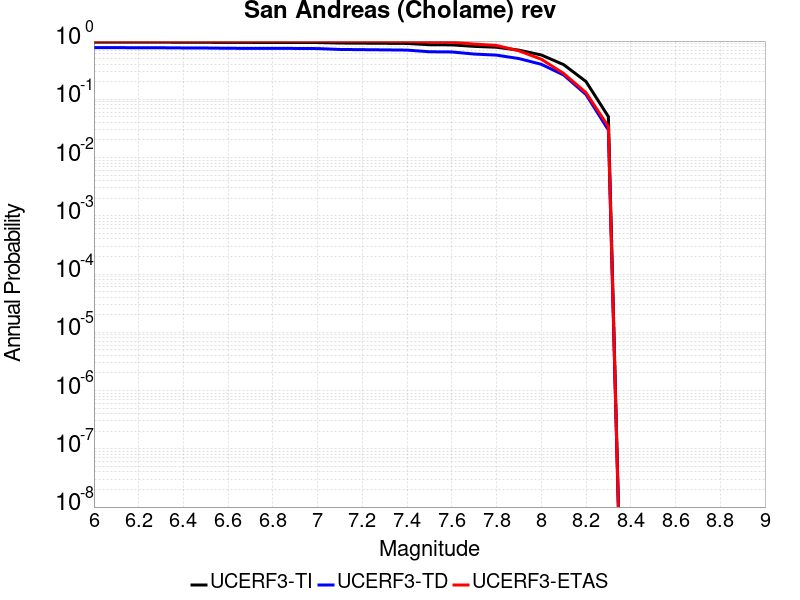 |
|-----|

| Magnitude | UCERF3-TI Prob | UCERF3-TD Prob | UCERF3-ETAS Prob |
|-----|-----|-----|-----|
| 6.0 | 0.95963675 | 0.7705178 | 0.998 |
| 6.1 | 0.95963675 | 0.7705178 | 0.998 |
| 6.2 | 0.9585811 | 0.7683793 | 0.998 |
| 6.3 | 0.95791745 | 0.7670777 | 0.998 |
| 6.4 | 0.9547581 | 0.76138115 | 0.998 |
| 6.5 | 0.95330924 | 0.7591172 | 0.998 |
| 6.6 | 0.94835514 | 0.7514596 | 0.998 |
| 6.7 | 0.9471764 | 0.7496897 | 0.998 |
| 6.8 | 0.9464347 | 0.74855155 | 0.997 |
| 6.9 | 0.94543 | 0.74697274 | 0.997 |
| 7.0 | 0.9427916 | 0.7430146 | 0.997 |
| 7.1 | 0.9250001 | 0.71800417 | 0.993 |
| 7.2 | 0.9203366 | 0.7118794 | 0.992 |
| 7.3 | 0.9155421 | 0.7061943 | 0.991 |
| 7.4 | 0.90979195 | 0.6994194 | 0.987 |
| 7.5 | 0.8664405 | 0.6554799 | 0.961 |
| 7.6 | 0.8610057 | 0.6500775 | 0.956 |
| 7.7 | 0.81064016 | 0.5982648 | 0.889 |
| 7.8 | 0.7834145 | 0.5731661 | 0.841 |
| 7.9 | 0.69847554 | 0.50050294 | 0.679 |
| 8.0 | 0.57669437 | 0.3996047 | 0.488 |
| 8.1 | 0.3936703 | 0.26169202 | 0.278 |
| 8.2 | 0.20189473 | 0.12080401 | 0.13 |
| 8.3 | 0.050421786 | 0.029699154 | 0.034 |

## San Andreas (Coachella) rev
*[(top)](#table-of-contents)*

| 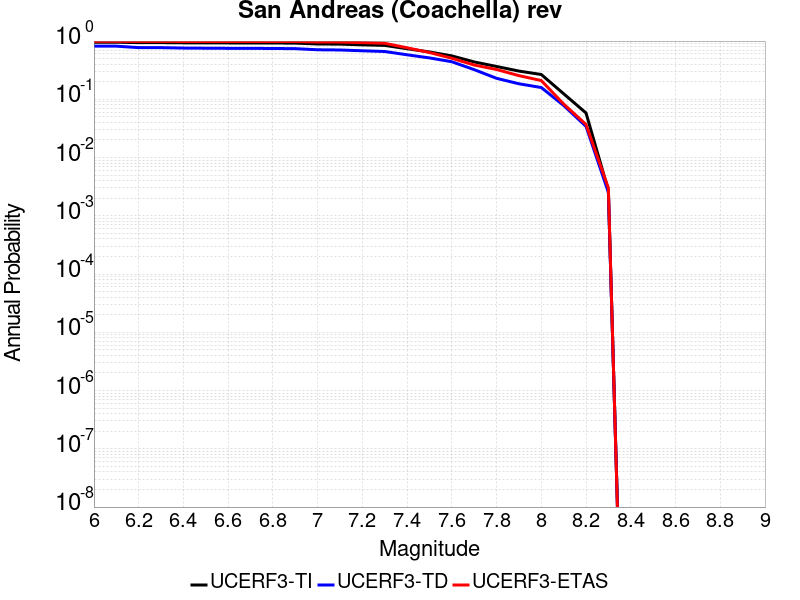 |
|-----|

| Magnitude | UCERF3-TI Prob | UCERF3-TD Prob | UCERF3-ETAS Prob |
|-----|-----|-----|-----|
| 6.0 | 0.9554694 | 0.8178118 | 0.989 |
| 6.1 | 0.9554694 | 0.8178118 | 0.989 |
| 6.2 | 0.93937117 | 0.77115625 | 0.986 |
| 6.3 | 0.9389828 | 0.77067363 | 0.986 |
| 6.4 | 0.93292415 | 0.75822556 | 0.985 |
| 6.5 | 0.93064564 | 0.7538093 | 0.984 |
| 6.6 | 0.9286047 | 0.7503657 | 0.984 |
| 6.7 | 0.92736304 | 0.74836504 | 0.983 |
| 6.8 | 0.9259497 | 0.74613786 | 0.983 |
| 6.9 | 0.92199045 | 0.74055296 | 0.983 |
| 7.0 | 0.8911606 | 0.70873976 | 0.964 |
| 7.1 | 0.88590074 | 0.70279664 | 0.961 |
| 7.2 | 0.86102295 | 0.6810441 | 0.941 |
| 7.3 | 0.84244263 | 0.6618755 | 0.916 |
| 7.4 | 0.73884606 | 0.581338 | 0.767 |
| 7.5 | 0.6504233 | 0.51375294 | 0.636 |
| 7.6 | 0.55655557 | 0.44176272 | 0.507 |
| 7.7 | 0.43819776 | 0.32322928 | 0.388 |
| 7.8 | 0.36629486 | 0.22931843 | 0.325 |
| 7.9 | 0.30538604 | 0.1847982 | 0.255 |
| 8.0 | 0.26665244 | 0.15938823 | 0.21 |
| 8.1 | 0.124603406 | 0.07846667 | 0.083 |
| 8.2 | 0.058251593 | 0.034328446 | 0.037 |
| 8.3 | 0.0027159685 | 0.00253945 | 0.003 |

## San Andreas (Creeping Section) 2011 CFM
*[(top)](#table-of-contents)*

| 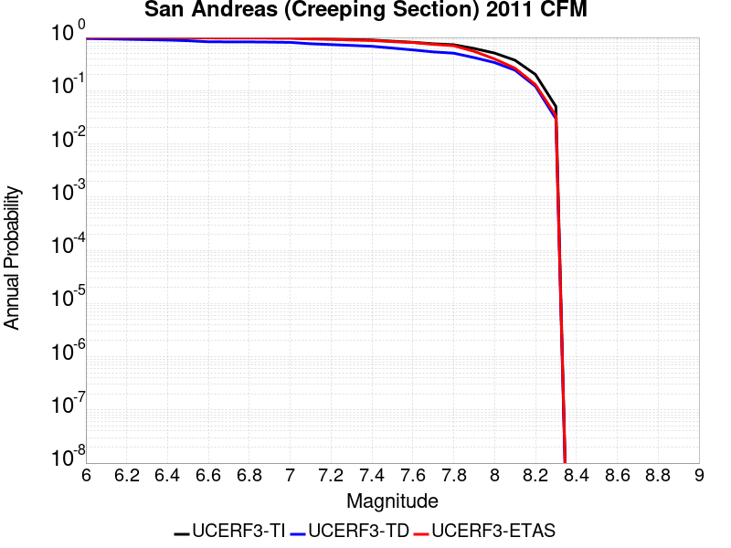 |
|-----|

| Magnitude | UCERF3-TI Prob | UCERF3-TD Prob | UCERF3-ETAS Prob |
|-----|-----|-----|-----|
| 6.0 | 0.9999998 | 0.9571888 | 1.0 |
| 6.1 | 0.9999979 | 0.94436735 | 1.0 |
| 6.2 | 0.9999758 | 0.9256323 | 1.0 |
| 6.3 | 0.9998813 | 0.90973264 | 1.0 |
| 6.4 | 0.999528 | 0.8946311 | 1.0 |
| 6.5 | 0.9977753 | 0.8704625 | 0.998 |
| 6.6 | 0.9839723 | 0.83064485 | 0.981 |
| 6.7 | 0.98299974 | 0.82790744 | 0.979 |
| 6.8 | 0.98265046 | 0.8266328 | 0.979 |
| 6.9 | 0.9808175 | 0.819725 | 0.975 |
| 7.0 | 0.97777253 | 0.80963916 | 0.974 |
| 7.1 | 0.95107275 | 0.762731 | 0.937 |
| 7.2 | 0.9335833 | 0.7359976 | 0.925 |
| 7.3 | 0.9124019 | 0.7095922 | 0.894 |
| 7.4 | 0.89586896 | 0.68333143 | 0.881 |
| 7.5 | 0.8512573 | 0.63238925 | 0.834 |
| 7.6 | 0.81139344 | 0.58414376 | 0.805 |
| 7.7 | 0.7621838 | 0.53628767 | 0.744 |
| 7.8 | 0.7306047 | 0.5072406 | 0.7 |
| 7.9 | 0.6218306 | 0.41890618 | 0.549 |
| 8.0 | 0.5095905 | 0.33830664 | 0.395 |
| 8.1 | 0.3737842 | 0.2431527 | 0.265 |
| 8.2 | 0.20189473 | 0.12080401 | 0.13 |
| 8.3 | 0.050421786 | 0.029699154 | 0.034 |

## San Andreas (Mojave N)
*[(top)](#table-of-contents)*

| 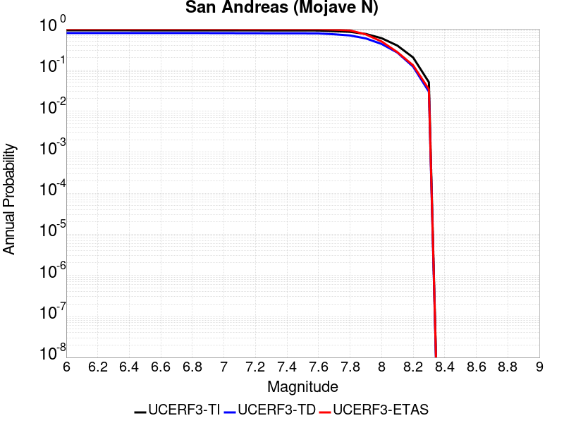 |
|-----|

| Magnitude | UCERF3-TI Prob | UCERF3-TD Prob | UCERF3-ETAS Prob |
|-----|-----|-----|-----|
| 6.0 | 0.92400926 | 0.7934395 | 0.996 |
| 6.1 | 0.92400926 | 0.7934395 | 0.996 |
| 6.2 | 0.92400926 | 0.7934395 | 0.996 |
| 6.3 | 0.92400926 | 0.7934395 | 0.996 |
| 6.4 | 0.92400926 | 0.7934395 | 0.996 |
| 6.5 | 0.9236872 | 0.79306394 | 0.996 |
| 6.6 | 0.9236872 | 0.79306394 | 0.996 |
| 6.7 | 0.9235636 | 0.79292 | 0.996 |
| 6.8 | 0.9233884 | 0.79270285 | 0.996 |
| 6.9 | 0.92297405 | 0.79195577 | 0.996 |
| 7.0 | 0.92207736 | 0.7899927 | 0.996 |
| 7.1 | 0.92065454 | 0.78690547 | 0.995 |
| 7.2 | 0.9196484 | 0.7847732 | 0.995 |
| 7.3 | 0.9188888 | 0.7833354 | 0.995 |
| 7.4 | 0.91815645 | 0.7821703 | 0.995 |
| 7.5 | 0.9174788 | 0.7811058 | 0.995 |
| 7.6 | 0.91433024 | 0.7769505 | 0.992 |
| 7.7 | 0.8823414 | 0.7394527 | 0.961 |
| 7.8 | 0.8505705 | 0.6930252 | 0.92 |
| 7.9 | 0.7547762 | 0.587227 | 0.736 |
| 8.0 | 0.59543085 | 0.43011934 | 0.495 |
| 8.1 | 0.393273 | 0.2657501 | 0.272 |
| 8.2 | 0.20189473 | 0.12080401 | 0.13 |
| 8.3 | 0.050421786 | 0.029699154 | 0.034 |

## San Andreas (Mojave S)
*[(top)](#table-of-contents)*

| 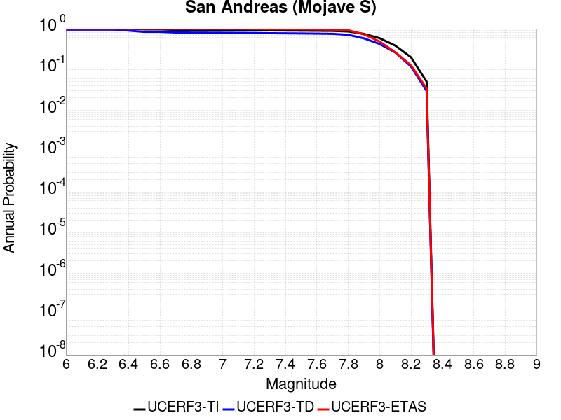 |
|-----|

| Magnitude | UCERF3-TI Prob | UCERF3-TD Prob | UCERF3-ETAS Prob |
|-----|-----|-----|-----|
| 6.0 | 0.99969816 | 0.95080465 | 1.0 |
| 6.1 | 0.99969816 | 0.95080465 | 1.0 |
| 6.2 | 0.99969816 | 0.95080465 | 1.0 |
| 6.3 | 0.99969816 | 0.95080465 | 1.0 |
| 6.4 | 0.99440026 | 0.89962846 | 1.0 |
| 6.5 | 0.9655628 | 0.8337737 | 0.999 |
| 6.6 | 0.9655628 | 0.8337737 | 0.999 |
| 6.7 | 0.94026434 | 0.8068405 | 0.995 |
| 6.8 | 0.9374611 | 0.80435723 | 0.995 |
| 6.9 | 0.9335832 | 0.80079585 | 0.995 |
| 7.0 | 0.92932504 | 0.7965139 | 0.995 |
| 7.1 | 0.924166 | 0.7915232 | 0.993 |
| 7.2 | 0.9191715 | 0.78665686 | 0.989 |
| 7.3 | 0.90735185 | 0.7759516 | 0.98 |
| 7.4 | 0.9016044 | 0.7701913 | 0.978 |
| 7.5 | 0.89599925 | 0.7640238 | 0.971 |
| 7.6 | 0.88979846 | 0.75674886 | 0.961 |
| 7.7 | 0.8840771 | 0.74855006 | 0.953 |
| 7.8 | 0.85663754 | 0.708407 | 0.917 |
| 7.9 | 0.74639595 | 0.5796904 | 0.728 |
| 8.0 | 0.5859633 | 0.4227294 | 0.485 |
| 8.1 | 0.38556156 | 0.2605976 | 0.265 |
| 8.2 | 0.19976068 | 0.11908598 | 0.127 |
| 8.3 | 0.050421786 | 0.029699154 | 0.034 |

## San Andreas (North Branch Mill Creek)
*[(top)](#table-of-contents)*

| 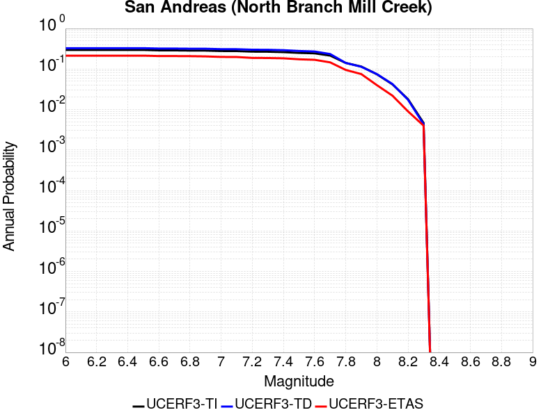 |
|-----|

| Magnitude | UCERF3-TI Prob | UCERF3-TD Prob | UCERF3-ETAS Prob |
|-----|-----|-----|-----|
| 6.0 | 0.29615304 | 0.3272003 | 0.214 |
| 6.1 | 0.29615304 | 0.3272003 | 0.214 |
| 6.2 | 0.29615304 | 0.3272003 | 0.214 |
| 6.3 | 0.29615304 | 0.3272003 | 0.214 |
| 6.4 | 0.29615304 | 0.3272003 | 0.214 |
| 6.5 | 0.2959611 | 0.3270138 | 0.214 |
| 6.6 | 0.28901732 | 0.32040706 | 0.209 |
| 6.7 | 0.2885663 | 0.31999147 | 0.209 |
| 6.8 | 0.28586468 | 0.31740162 | 0.208 |
| 6.9 | 0.28516436 | 0.3167422 | 0.205 |
| 7.0 | 0.27820468 | 0.3095307 | 0.199 |
| 7.1 | 0.27737692 | 0.3087069 | 0.198 |
| 7.2 | 0.26885667 | 0.30022863 | 0.188 |
| 7.3 | 0.26734143 | 0.2986131 | 0.187 |
| 7.4 | 0.2613358 | 0.29203248 | 0.184 |
| 7.5 | 0.2502054 | 0.27878246 | 0.174 |
| 7.6 | 0.2439914 | 0.2710895 | 0.169 |
| 7.7 | 0.21495374 | 0.23460568 | 0.146 |
| 7.8 | 0.14120327 | 0.14142138 | 0.095 |
| 7.9 | 0.115174085 | 0.113675624 | 0.075 |
| 8.0 | 0.07424653 | 0.074964195 | 0.04 |
| 8.1 | 0.041826107 | 0.042634286 | 0.022 |
| 8.2 | 0.018002367 | 0.017455552 | 0.009 |
| 8.3 | 0.0046528983 | 0.004341902 | 0.004 |

## San Andreas (North Coast) 2011 CFM
*[(top)](#table-of-contents)*

| 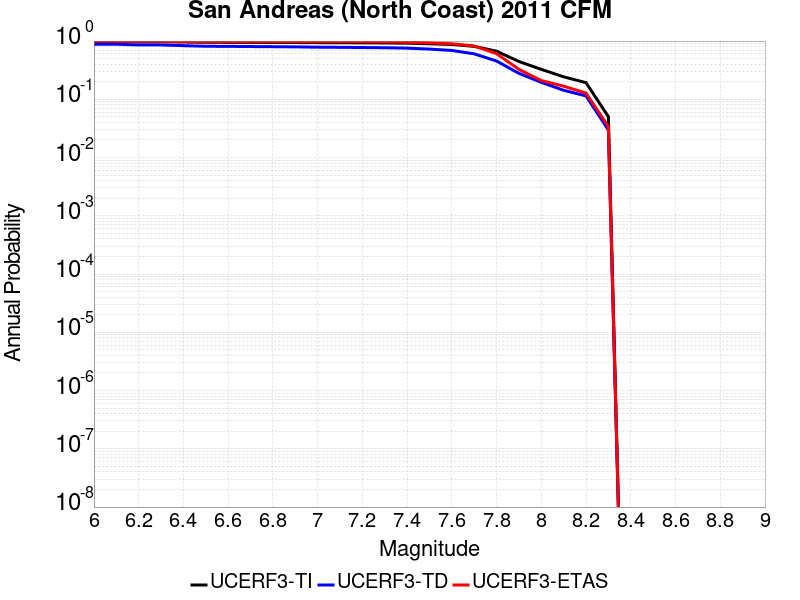 |
|-----|

| Magnitude | UCERF3-TI Prob | UCERF3-TD Prob | UCERF3-ETAS Prob |
|-----|-----|-----|-----|
| 6.0 | 0.9816983 | 0.8820757 | 0.991 |
| 6.1 | 0.9816983 | 0.8820757 | 0.991 |
| 6.2 | 0.9734848 | 0.858648 | 0.986 |
| 6.3 | 0.9734848 | 0.858648 | 0.986 |
| 6.4 | 0.962881 | 0.83380985 | 0.983 |
| 6.5 | 0.953208 | 0.81422293 | 0.981 |
| 6.6 | 0.9513513 | 0.81059694 | 0.98 |
| 6.7 | 0.9485095 | 0.8051304 | 0.979 |
| 6.8 | 0.9462515 | 0.80059737 | 0.977 |
| 6.9 | 0.94338554 | 0.7951443 | 0.977 |
| 7.0 | 0.9378448 | 0.7852218 | 0.972 |
| 7.1 | 0.93505216 | 0.78052217 | 0.972 |
| 7.2 | 0.9314461 | 0.77439815 | 0.971 |
| 7.3 | 0.9276353 | 0.76815504 | 0.968 |
| 7.4 | 0.91983896 | 0.7561206 | 0.955 |
| 7.5 | 0.8982801 | 0.727551 | 0.932 |
| 7.6 | 0.8745447 | 0.6902132 | 0.899 |
| 7.7 | 0.81105244 | 0.6035021 | 0.825 |
| 7.8 | 0.67042315 | 0.45407295 | 0.607 |
| 7.9 | 0.44599396 | 0.27927923 | 0.327 |
| 8.0 | 0.3268062 | 0.19574004 | 0.21 |
| 8.1 | 0.24320462 | 0.14286646 | 0.168 |
| 8.2 | 0.19314744 | 0.11445063 | 0.128 |
| 8.3 | 0.050421786 | 0.029699154 | 0.034 |

## San Andreas (Offshore) 2011 CFM
*[(top)](#table-of-contents)*

| 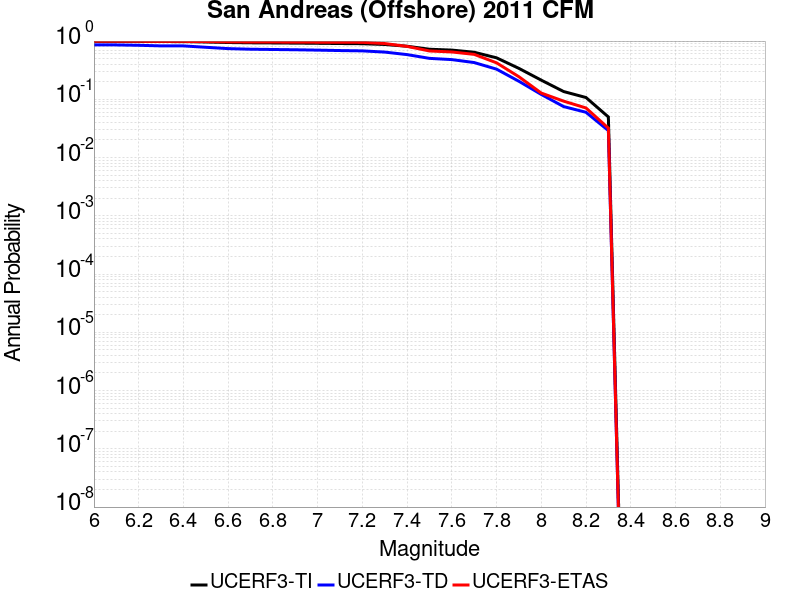 |
|-----|

| Magnitude | UCERF3-TI Prob | UCERF3-TD Prob | UCERF3-ETAS Prob |
|-----|-----|-----|-----|
| 6.0 | 0.9883744 | 0.8583268 | 0.992 |
| 6.1 | 0.9883744 | 0.8583268 | 0.992 |
| 6.2 | 0.9858236 | 0.84610766 | 0.991 |
| 6.3 | 0.98056453 | 0.8265069 | 0.987 |
| 6.4 | 0.9802817 | 0.82569355 | 0.986 |
| 6.5 | 0.96418583 | 0.7821743 | 0.981 |
| 6.6 | 0.944232 | 0.7419478 | 0.97 |
| 6.7 | 0.93353575 | 0.7245156 | 0.964 |
| 6.8 | 0.92823017 | 0.71670854 | 0.962 |
| 6.9 | 0.9224587 | 0.7089936 | 0.96 |
| 7.0 | 0.9153533 | 0.69894886 | 0.956 |
| 7.1 | 0.9069065 | 0.6871804 | 0.955 |
| 7.2 | 0.9005954 | 0.6784168 | 0.951 |
| 7.3 | 0.87361985 | 0.64691764 | 0.907 |
| 7.4 | 0.81502223 | 0.5854491 | 0.81 |
| 7.5 | 0.7237319 | 0.50471425 | 0.676 |
| 7.6 | 0.6998321 | 0.4804647 | 0.65 |
| 7.7 | 0.6425865 | 0.42764676 | 0.591 |
| 7.8 | 0.5156581 | 0.32953855 | 0.423 |
| 7.9 | 0.3396584 | 0.20397615 | 0.244 |
| 8.0 | 0.2132593 | 0.121232204 | 0.128 |
| 8.1 | 0.13596459 | 0.07504091 | 0.093 |
| 8.2 | 0.10730612 | 0.05987775 | 0.071 |
| 8.3 | 0.049783446 | 0.029060084 | 0.032 |

## San Andreas (Parkfield)
*[(top)](#table-of-contents)*

| 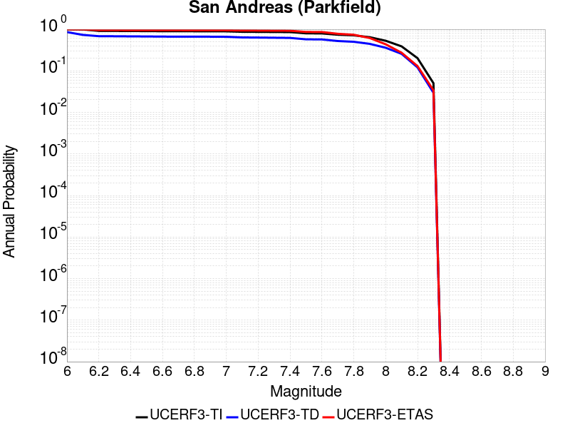 |
|-----|

| Magnitude | UCERF3-TI Prob | UCERF3-TD Prob | UCERF3-ETAS Prob |
|-----|-----|-----|-----|
| 6.0 | 0.9999995 | 0.85632426 | 1.0 |
| 6.1 | 0.9934278 | 0.73319644 | 0.998 |
| 6.2 | 0.9146089 | 0.6828657 | 0.96 |
| 6.3 | 0.91125554 | 0.67995805 | 0.958 |
| 6.4 | 0.9078524 | 0.6756058 | 0.955 |
| 6.5 | 0.9044598 | 0.6721324 | 0.955 |
| 6.6 | 0.89962167 | 0.6673164 | 0.952 |
| 6.7 | 0.89769536 | 0.66536385 | 0.952 |
| 6.8 | 0.8969485 | 0.66453457 | 0.951 |
| 6.9 | 0.89613765 | 0.66354334 | 0.95 |
| 7.0 | 0.8927505 | 0.65983784 | 0.947 |
| 7.1 | 0.8702049 | 0.6367945 | 0.936 |
| 7.2 | 0.865553 | 0.63194317 | 0.933 |
| 7.3 | 0.8606767 | 0.6259506 | 0.927 |
| 7.4 | 0.85576004 | 0.6204721 | 0.923 |
| 7.5 | 0.798996 | 0.5739106 | 0.864 |
| 7.6 | 0.7944759 | 0.5696003 | 0.859 |
| 7.7 | 0.74013823 | 0.521964 | 0.78 |
| 7.8 | 0.71483195 | 0.50042784 | 0.739 |
| 7.9 | 0.6450711 | 0.4461756 | 0.616 |
| 8.0 | 0.5305246 | 0.35976642 | 0.436 |
| 8.1 | 0.38824737 | 0.25649434 | 0.273 |
| 8.2 | 0.20189473 | 0.12080401 | 0.13 |
| 8.3 | 0.050421786 | 0.029699154 | 0.034 |

## San Andreas (Peninsula) 2011 CFM
*[(top)](#table-of-contents)*

| 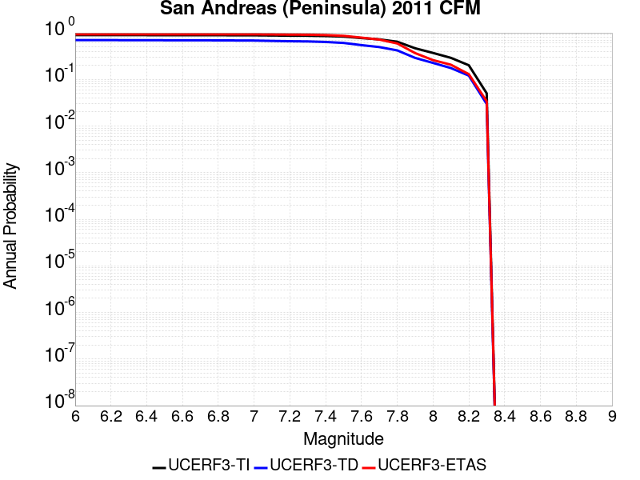 |
|-----|

| Magnitude | UCERF3-TI Prob | UCERF3-TD Prob | UCERF3-ETAS Prob |
|-----|-----|-----|-----|
| 6.0 | 0.8944965 | 0.698394 | 0.932 |
| 6.1 | 0.8944965 | 0.698394 | 0.932 |
| 6.2 | 0.8944965 | 0.698394 | 0.932 |
| 6.3 | 0.89258254 | 0.6953715 | 0.931 |
| 6.4 | 0.89258254 | 0.6953715 | 0.931 |
| 6.5 | 0.8914552 | 0.6936042 | 0.931 |
| 6.6 | 0.89109665 | 0.6930794 | 0.931 |
| 6.7 | 0.89007205 | 0.6915126 | 0.931 |
| 6.8 | 0.8889406 | 0.6896458 | 0.931 |
| 6.9 | 0.8872653 | 0.68664247 | 0.931 |
| 7.0 | 0.8855872 | 0.6836538 | 0.931 |
| 7.1 | 0.8772975 | 0.6718757 | 0.925 |
| 7.2 | 0.870773 | 0.66142565 | 0.918 |
| 7.3 | 0.86660683 | 0.6545191 | 0.913 |
| 7.4 | 0.8531856 | 0.6372877 | 0.896 |
| 7.5 | 0.83064383 | 0.6076866 | 0.864 |
| 7.6 | 0.77239054 | 0.5454461 | 0.79 |
| 7.7 | 0.7249129 | 0.49516192 | 0.717 |
| 7.8 | 0.6452138 | 0.42052156 | 0.592 |
| 7.9 | 0.46695727 | 0.29008546 | 0.368 |
| 8.0 | 0.37077117 | 0.2263034 | 0.26 |
| 8.1 | 0.29058734 | 0.1755436 | 0.207 |
| 8.2 | 0.20171776 | 0.120736025 | 0.13 |
| 8.3 | 0.050421786 | 0.029699154 | 0.034 |

## San Andreas (San Bernardino N)
*[(top)](#table-of-contents)*

| 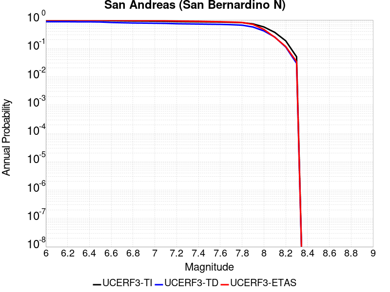 |
|-----|

| Magnitude | UCERF3-TI Prob | UCERF3-TD Prob | UCERF3-ETAS Prob |
|-----|-----|-----|-----|
| 6.0 | 0.97586733 | 0.8680442 | 0.992 |
| 6.1 | 0.97586733 | 0.8680442 | 0.992 |
| 6.2 | 0.97586733 | 0.8680442 | 0.992 |
| 6.3 | 0.97219324 | 0.86064154 | 0.99 |
| 6.4 | 0.97219324 | 0.86064154 | 0.99 |
| 6.5 | 0.96584696 | 0.84902185 | 0.99 |
| 6.6 | 0.94513226 | 0.8154508 | 0.979 |
| 6.7 | 0.93051964 | 0.79861677 | 0.971 |
| 6.8 | 0.91852444 | 0.7830889 | 0.96 |
| 6.9 | 0.91364706 | 0.77653116 | 0.955 |
| 7.0 | 0.9069622 | 0.767672 | 0.952 |
| 7.1 | 0.89857465 | 0.75937337 | 0.942 |
| 7.2 | 0.8786272 | 0.7371245 | 0.921 |
| 7.3 | 0.86818916 | 0.7275269 | 0.907 |
| 7.4 | 0.8594278 | 0.719031 | 0.898 |
| 7.5 | 0.8501297 | 0.7088397 | 0.881 |
| 7.6 | 0.8438993 | 0.70136917 | 0.868 |
| 7.7 | 0.82633716 | 0.68260187 | 0.846 |
| 7.8 | 0.8067728 | 0.6563124 | 0.816 |
| 7.9 | 0.7274876 | 0.5652665 | 0.697 |
| 8.0 | 0.5684575 | 0.4114884 | 0.464 |
| 8.1 | 0.36544946 | 0.24959108 | 0.245 |
| 8.2 | 0.18480022 | 0.11174473 | 0.116 |
| 8.3 | 0.050421786 | 0.029699154 | 0.034 |

## San Andreas (San Bernardino S)
*[(top)](#table-of-contents)*

| 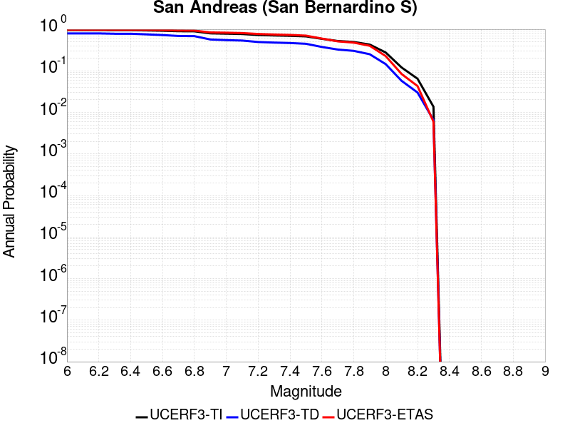 |
|-----|

| Magnitude | UCERF3-TI Prob | UCERF3-TD Prob | UCERF3-ETAS Prob |
|-----|-----|-----|-----|
| 6.0 | 0.9599879 | 0.79528177 | 0.979 |
| 6.1 | 0.9599879 | 0.79528177 | 0.979 |
| 6.2 | 0.9599879 | 0.79528177 | 0.979 |
| 6.3 | 0.952916 | 0.78071254 | 0.975 |
| 6.4 | 0.952916 | 0.78071254 | 0.975 |
| 6.5 | 0.9385083 | 0.7543694 | 0.969 |
| 6.6 | 0.92173964 | 0.72617877 | 0.959 |
| 6.7 | 0.8981997 | 0.69094855 | 0.935 |
| 6.8 | 0.89291316 | 0.6838566 | 0.93 |
| 6.9 | 0.7976541 | 0.5680975 | 0.841 |
| 7.0 | 0.7832139 | 0.5485591 | 0.828 |
| 7.1 | 0.76883996 | 0.53564316 | 0.811 |
| 7.2 | 0.72806895 | 0.49415666 | 0.772 |
| 7.3 | 0.7097241 | 0.47908044 | 0.749 |
| 7.4 | 0.69534343 | 0.46723664 | 0.732 |
| 7.5 | 0.67504495 | 0.44805327 | 0.704 |
| 7.6 | 0.5890553 | 0.37531373 | 0.598 |
| 7.7 | 0.52228796 | 0.32553524 | 0.512 |
| 7.8 | 0.49547994 | 0.30237156 | 0.477 |
| 7.9 | 0.42886806 | 0.25110584 | 0.401 |
| 8.0 | 0.27677682 | 0.14525421 | 0.227 |
| 8.1 | 0.12045774 | 0.057464004 | 0.084 |
| 8.2 | 0.06469199 | 0.030101284 | 0.043 |
| 8.3 | 0.013693689 | 0.0065632067 | 0.006 |

## San Andreas (San Gorgonio Pass-Garnet HIll)
*[(top)](#table-of-contents)*

| 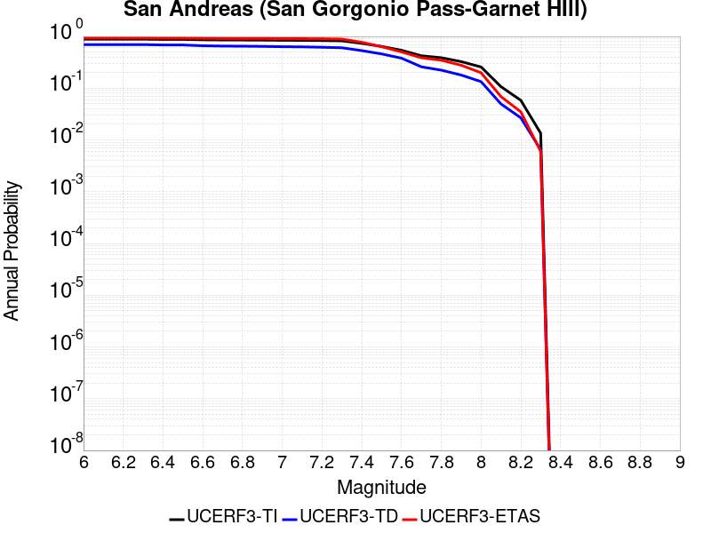 |
|-----|

| Magnitude | UCERF3-TI Prob | UCERF3-TD Prob | UCERF3-ETAS Prob |
|-----|-----|-----|-----|
| 6.0 | 0.88577545 | 0.6968839 | 0.931 |
| 6.1 | 0.88577545 | 0.6968839 | 0.931 |
| 6.2 | 0.88577545 | 0.6968839 | 0.931 |
| 6.3 | 0.88577545 | 0.6968839 | 0.931 |
| 6.4 | 0.8778658 | 0.684882 | 0.925 |
| 6.5 | 0.8778658 | 0.684882 | 0.925 |
| 6.6 | 0.8630145 | 0.66200286 | 0.919 |
| 6.7 | 0.85648 | 0.6522693 | 0.913 |
| 6.8 | 0.85394716 | 0.648788 | 0.913 |
| 6.9 | 0.85017097 | 0.6431236 | 0.912 |
| 7.0 | 0.8432466 | 0.63390446 | 0.908 |
| 7.1 | 0.84018743 | 0.6292477 | 0.907 |
| 7.2 | 0.83256024 | 0.618811 | 0.903 |
| 7.3 | 0.822333 | 0.6050531 | 0.89 |
| 7.4 | 0.73602754 | 0.5330211 | 0.772 |
| 7.5 | 0.64134896 | 0.45988348 | 0.633 |
| 7.6 | 0.5410524 | 0.3806281 | 0.503 |
| 7.7 | 0.42386222 | 0.25916153 | 0.387 |
| 7.8 | 0.38820913 | 0.22326522 | 0.347 |
| 7.9 | 0.32660085 | 0.17974609 | 0.278 |
| 8.0 | 0.25738212 | 0.13408993 | 0.199 |
| 8.1 | 0.1073123 | 0.049733464 | 0.069 |
| 8.2 | 0.05834506 | 0.02680945 | 0.035 |
| 8.3 | 0.013482461 | 0.0064644488 | 0.006 |

## San Andreas (Santa Cruz Mts) 2011 CFM
*[(top)](#table-of-contents)*

| 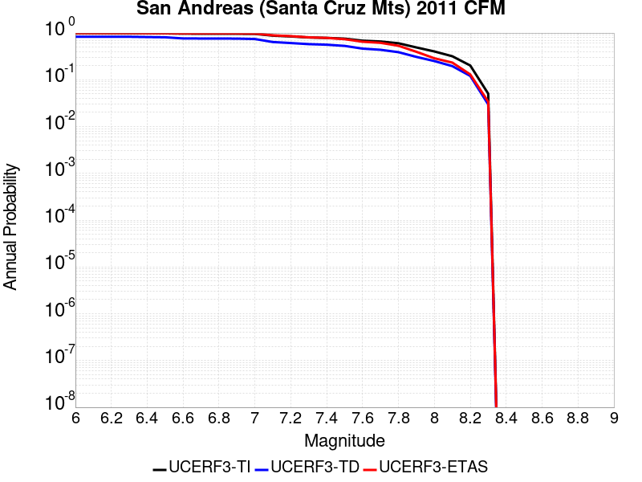 |
|-----|

| Magnitude | UCERF3-TI Prob | UCERF3-TD Prob | UCERF3-ETAS Prob |
|-----|-----|-----|-----|
| 6.0 | 0.9888173 | 0.8310527 | 0.992 |
| 6.1 | 0.9888173 | 0.8310527 | 0.992 |
| 6.2 | 0.9888173 | 0.8310527 | 0.992 |
| 6.3 | 0.98866343 | 0.8303065 | 0.992 |
| 6.4 | 0.98611796 | 0.8194476 | 0.989 |
| 6.5 | 0.9835509 | 0.81012154 | 0.989 |
| 6.6 | 0.9666856 | 0.7644089 | 0.981 |
| 6.7 | 0.9651701 | 0.76148504 | 0.981 |
| 6.8 | 0.96456236 | 0.76007396 | 0.981 |
| 6.9 | 0.9635323 | 0.7575235 | 0.981 |
| 7.0 | 0.95666593 | 0.7432362 | 0.973 |
| 7.1 | 0.8775646 | 0.64111567 | 0.892 |
| 7.2 | 0.8428939 | 0.6096435 | 0.856 |
| 7.3 | 0.80129623 | 0.5778309 | 0.807 |
| 7.4 | 0.7858347 | 0.5617743 | 0.784 |
| 7.5 | 0.7571226 | 0.5299952 | 0.737 |
| 7.6 | 0.6852574 | 0.46323588 | 0.65 |
| 7.7 | 0.65849894 | 0.4376091 | 0.616 |
| 7.8 | 0.60299623 | 0.38883823 | 0.533 |
| 7.9 | 0.49069053 | 0.30818257 | 0.396 |
| 8.0 | 0.40308562 | 0.25113043 | 0.288 |
| 8.1 | 0.31827056 | 0.1958788 | 0.233 |
| 8.2 | 0.20177886 | 0.12079397 | 0.13 |
| 8.3 | 0.050421786 | 0.029699154 | 0.034 |

## San Cayetano
*[(top)](#table-of-contents)*

| 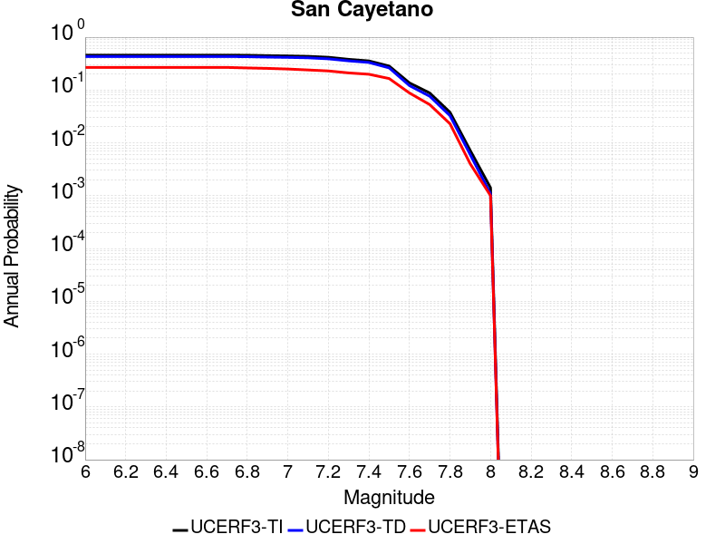 |
|-----|

| Magnitude | UCERF3-TI Prob | UCERF3-TD Prob | UCERF3-ETAS Prob |
|-----|-----|-----|-----|
| 6.0 | 0.45799834 | 0.43137148 | 0.268 |
| 6.1 | 0.45799834 | 0.43137148 | 0.268 |
| 6.2 | 0.45799834 | 0.43137148 | 0.268 |
| 6.3 | 0.45799834 | 0.43137148 | 0.268 |
| 6.4 | 0.45799834 | 0.43137148 | 0.268 |
| 6.5 | 0.45799834 | 0.43137148 | 0.268 |
| 6.6 | 0.45799834 | 0.43137148 | 0.268 |
| 6.7 | 0.45799834 | 0.43137148 | 0.268 |
| 6.8 | 0.45467442 | 0.42796347 | 0.262 |
| 6.9 | 0.44778907 | 0.42069933 | 0.257 |
| 7.0 | 0.44260457 | 0.41523543 | 0.25 |
| 7.1 | 0.4348189 | 0.4073536 | 0.24 |
| 7.2 | 0.4174979 | 0.3900107 | 0.23 |
| 7.3 | 0.38138136 | 0.3569106 | 0.211 |
| 7.4 | 0.3558254 | 0.3329935 | 0.199 |
| 7.5 | 0.28433228 | 0.26261368 | 0.165 |
| 7.6 | 0.13654356 | 0.12139145 | 0.088 |
| 7.7 | 0.08788983 | 0.07632355 | 0.053 |
| 7.8 | 0.037943818 | 0.03274491 | 0.023 |
| 7.9 | 0.0071665356 | 0.0059720157 | 0.004 |
| 8.0 | 0.00140987 | 0.0010800387 | 0.001 |

## San Clemente
*[(top)](#table-of-contents)*

| 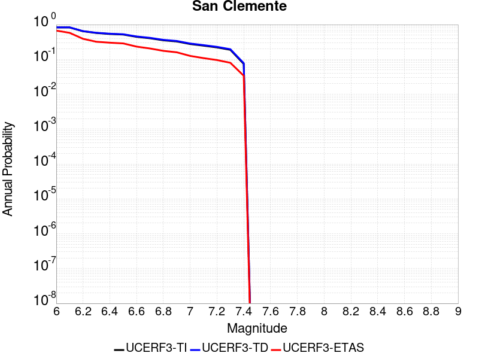 |
|-----|

| Magnitude | UCERF3-TI Prob | UCERF3-TD Prob | UCERF3-ETAS Prob |
|-----|-----|-----|-----|
| 6.0 | 0.82503724 | 0.83215326 | 0.671 |
| 6.1 | 0.82503724 | 0.83215326 | 0.579 |
| 6.2 | 0.64226156 | 0.6483875 | 0.39 |
| 6.3 | 0.5727006 | 0.58172417 | 0.321 |
| 6.4 | 0.5362743 | 0.5466184 | 0.302 |
| 6.5 | 0.51718384 | 0.52805245 | 0.288 |
| 6.6 | 0.44390202 | 0.4557448 | 0.233 |
| 6.7 | 0.40441445 | 0.4164587 | 0.206 |
| 6.8 | 0.35314393 | 0.36434972 | 0.176 |
| 6.9 | 0.32769325 | 0.33842024 | 0.16 |
| 7.0 | 0.2762617 | 0.28584608 | 0.126 |
| 7.1 | 0.24818511 | 0.25714737 | 0.109 |
| 7.2 | 0.22114737 | 0.22950676 | 0.096 |
| 7.3 | 0.18872789 | 0.19625692 | 0.08 |
| 7.4 | 0.074272044 | 0.07803176 | 0.034 |

## San Diego Trough north alt1
*[(top)](#table-of-contents)*

| 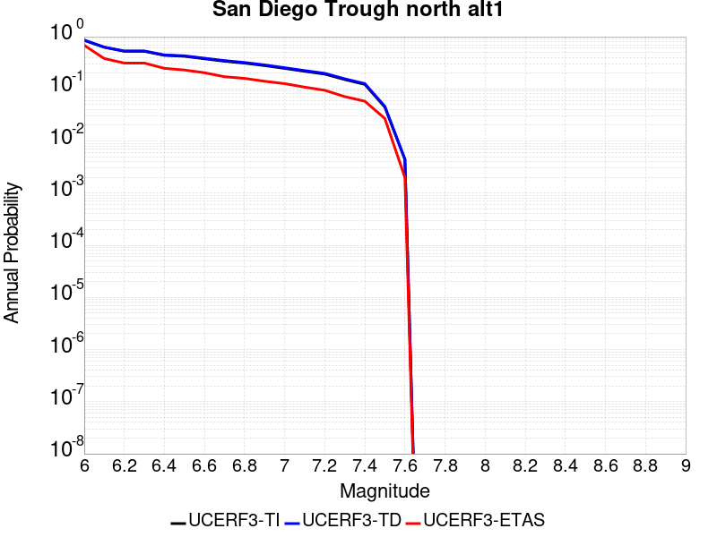 |
|-----|

| Magnitude | UCERF3-TI Prob | UCERF3-TD Prob | UCERF3-ETAS Prob |
|-----|-----|-----|-----|
| 6.0 | 0.85224795 | 0.86329424 | 0.686 |
| 6.1 | 0.62836957 | 0.63282967 | 0.382 |
| 6.2 | 0.52637774 | 0.5328125 | 0.313 |
| 6.3 | 0.52637774 | 0.5328125 | 0.313 |
| 6.4 | 0.43971404 | 0.44843647 | 0.248 |
| 6.5 | 0.42189917 | 0.4309284 | 0.23 |
| 6.6 | 0.37809917 | 0.3875149 | 0.204 |
| 6.7 | 0.3392754 | 0.34868065 | 0.171 |
| 6.8 | 0.31194925 | 0.32086366 | 0.159 |
| 6.9 | 0.2796759 | 0.28795317 | 0.14 |
| 7.0 | 0.24719818 | 0.2547377 | 0.126 |
| 7.1 | 0.21734251 | 0.22417107 | 0.108 |
| 7.2 | 0.19240354 | 0.19864191 | 0.094 |
| 7.3 | 0.150861 | 0.15589999 | 0.071 |
| 7.4 | 0.12195748 | 0.12614176 | 0.058 |
| 7.5 | 0.044603836 | 0.046147056 | 0.027 |
| 7.6 | 0.0044224365 | 0.00446512 | 0.002 |

## San Diego Trough south
*[(top)](#table-of-contents)*

| 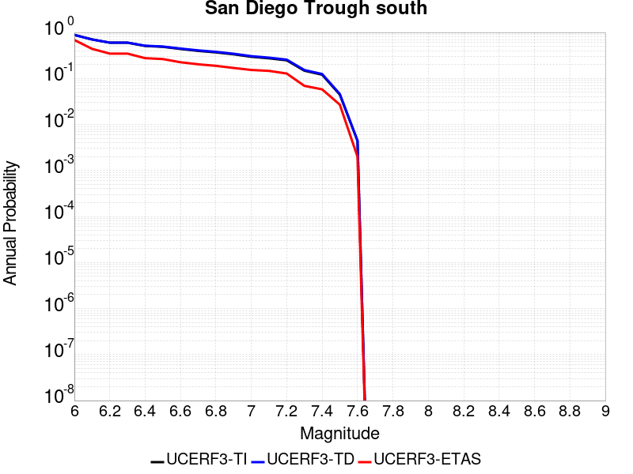 |
|-----|

| Magnitude | UCERF3-TI Prob | UCERF3-TD Prob | UCERF3-ETAS Prob |
|-----|-----|-----|-----|
| 6.0 | 0.88469225 | 0.8820884 | 0.687 |
| 6.1 | 0.7063069 | 0.701897 | 0.44 |
| 6.2 | 0.59957117 | 0.6007475 | 0.347 |
| 6.3 | 0.59957117 | 0.6007475 | 0.347 |
| 6.4 | 0.5081382 | 0.51496345 | 0.276 |
| 6.5 | 0.4870079 | 0.49475121 | 0.264 |
| 6.6 | 0.43722513 | 0.44668493 | 0.225 |
| 6.7 | 0.3970993 | 0.40765965 | 0.203 |
| 6.8 | 0.368448 | 0.37891278 | 0.188 |
| 6.9 | 0.3347251 | 0.3448948 | 0.169 |
| 7.0 | 0.29584482 | 0.30547974 | 0.153 |
| 7.1 | 0.27390525 | 0.28314644 | 0.146 |
| 7.2 | 0.24796005 | 0.25666136 | 0.128 |
| 7.3 | 0.14736493 | 0.15240195 | 0.069 |
| 7.4 | 0.12076551 | 0.1249475 | 0.058 |
| 7.5 | 0.044603836 | 0.046147056 | 0.027 |
| 7.6 | 0.0044224365 | 0.00446512 | 0.002 |

## San Gabriel
*[(top)](#table-of-contents)*

| 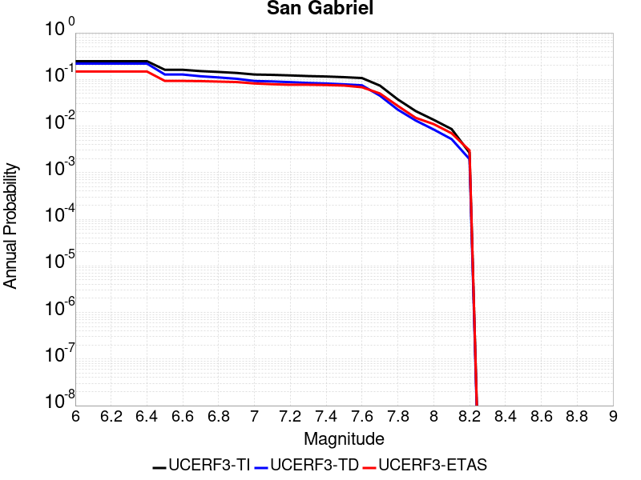 |
|-----|

| Magnitude | UCERF3-TI Prob | UCERF3-TD Prob | UCERF3-ETAS Prob |
|-----|-----|-----|-----|
| 6.0 | 0.24629234 | 0.21929842 | 0.148 |
| 6.1 | 0.24629234 | 0.21929842 | 0.148 |
| 6.2 | 0.24629234 | 0.21929842 | 0.148 |
| 6.3 | 0.24629234 | 0.21929842 | 0.148 |
| 6.4 | 0.24629234 | 0.21929842 | 0.148 |
| 6.5 | 0.16106999 | 0.12753251 | 0.093 |
| 6.6 | 0.16106999 | 0.12753251 | 0.093 |
| 6.7 | 0.15100983 | 0.116953455 | 0.092 |
| 6.8 | 0.14481483 | 0.110442616 | 0.09 |
| 6.9 | 0.13787304 | 0.103387676 | 0.088 |
| 7.0 | 0.12761565 | 0.09268182 | 0.082 |
| 7.1 | 0.12539798 | 0.09056884 | 0.079 |
| 7.2 | 0.12204627 | 0.08749174 | 0.077 |
| 7.3 | 0.11820992 | 0.084009185 | 0.077 |
| 7.4 | 0.11567336 | 0.08180949 | 0.076 |
| 7.5 | 0.11194677 | 0.078717105 | 0.074 |
| 7.6 | 0.107137434 | 0.07473769 | 0.068 |
| 7.7 | 0.073743775 | 0.044815496 | 0.05 |
| 7.8 | 0.03722749 | 0.022446258 | 0.027 |
| 7.9 | 0.020907946 | 0.013120966 | 0.015 |
| 8.0 | 0.013596615 | 0.008429189 | 0.011 |
| 8.1 | 0.008614512 | 0.0052378336 | 0.007 |
| 8.2 | 0.0026667663 | 0.0019502809 | 0.003 |

## San Gabriel (Extension)
*[(top)](#table-of-contents)*

| 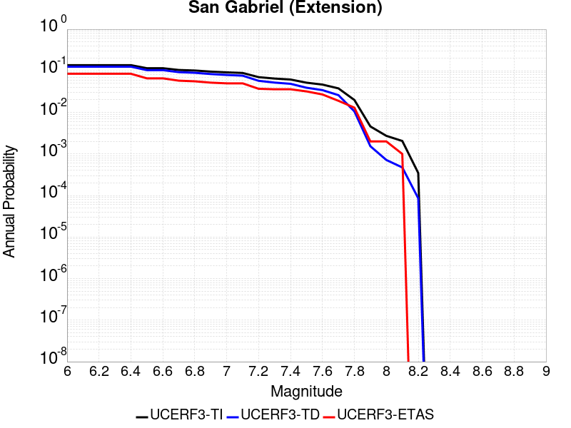 |
|-----|

| Magnitude | UCERF3-TI Prob | UCERF3-TD Prob | UCERF3-ETAS Prob |
|-----|-----|-----|-----|
| 6.0 | 0.13702421 | 0.12588908 | 0.085 |
| 6.1 | 0.13702421 | 0.12588908 | 0.085 |
| 6.2 | 0.13702421 | 0.12588908 | 0.085 |
| 6.3 | 0.13702421 | 0.12588908 | 0.085 |
| 6.4 | 0.13702421 | 0.12588908 | 0.085 |
| 6.5 | 0.11571067 | 0.1040106 | 0.066 |
| 6.6 | 0.11571067 | 0.1040106 | 0.066 |
| 6.7 | 0.10488081 | 0.09291236 | 0.058 |
| 6.8 | 0.10186735 | 0.08983015 | 0.056 |
| 6.9 | 0.0958912 | 0.08371203 | 0.052 |
| 7.0 | 0.09189315 | 0.07962177 | 0.05 |
| 7.1 | 0.08890177 | 0.07655066 | 0.05 |
| 7.2 | 0.0705026 | 0.05757559 | 0.037 |
| 7.3 | 0.06519998 | 0.052152794 | 0.036 |
| 7.4 | 0.061831895 | 0.048746064 | 0.036 |
| 7.5 | 0.05188082 | 0.039230715 | 0.032 |
| 7.6 | 0.046687793 | 0.034350067 | 0.027 |
| 7.7 | 0.03784359 | 0.026006812 | 0.019 |
| 7.8 | 0.019882068 | 0.010561262 | 0.013 |
| 7.9 | 0.004593113 | 0.0015341213 | 0.002 |
| 8.0 | 0.0027261197 | 7.165981E-4 | 0.002 |
| 8.1 | 0.0020526089 | 4.7316702E-4 | 0.001 |
| 8.2 | 3.473524E-4 | 8.550925E-5 | 0.0 |

## San Gorgonio Pass
*[(top)](#table-of-contents)*

| 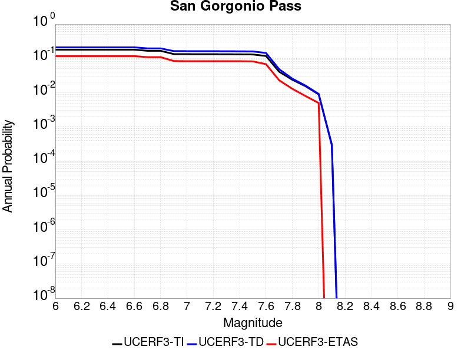 |
|-----|

| Magnitude | UCERF3-TI Prob | UCERF3-TD Prob | UCERF3-ETAS Prob |
|-----|-----|-----|-----|
| 6.0 | 0.1808072 | 0.21044505 | 0.117 |
| 6.1 | 0.1808072 | 0.21044505 | 0.117 |
| 6.2 | 0.1808072 | 0.21044505 | 0.117 |
| 6.3 | 0.1808072 | 0.21044505 | 0.117 |
| 6.4 | 0.1808072 | 0.21044505 | 0.117 |
| 6.5 | 0.1808072 | 0.21044505 | 0.117 |
| 6.6 | 0.1808072 | 0.21044505 | 0.117 |
| 6.7 | 0.16665018 | 0.19646823 | 0.109 |
| 6.8 | 0.16665018 | 0.19646823 | 0.109 |
| 6.9 | 0.13377808 | 0.16356207 | 0.084 |
| 7.0 | 0.13327791 | 0.16306934 | 0.083 |
| 7.1 | 0.13297717 | 0.1627727 | 0.083 |
| 7.2 | 0.13262382 | 0.1624231 | 0.083 |
| 7.3 | 0.13236511 | 0.16216928 | 0.083 |
| 7.4 | 0.13137682 | 0.16116259 | 0.083 |
| 7.5 | 0.13045362 | 0.16012742 | 0.082 |
| 7.6 | 0.117915586 | 0.14434928 | 0.068 |
| 7.7 | 0.04086152 | 0.048462026 | 0.023 |
| 7.8 | 0.023865124 | 0.02568286 | 0.013 |
| 7.9 | 0.015468961 | 0.016125014 | 0.008 |
| 8.0 | 0.008938112 | 0.009233265 | 0.005 |
| 8.1 | 3.074862E-4 | 2.922673E-4 | 0.0 |

## San Gregorio (North) 2011 CFM
*[(top)](#table-of-contents)*

| 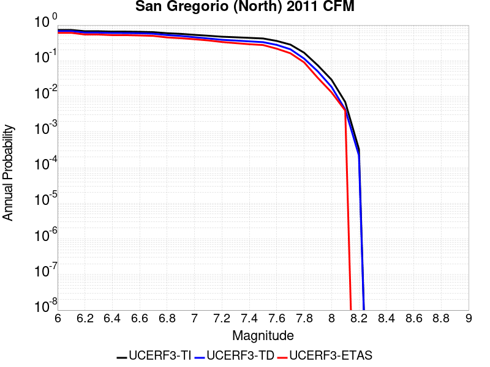 |
|-----|

| Magnitude | UCERF3-TI Prob | UCERF3-TD Prob | UCERF3-ETAS Prob |
|-----|-----|-----|-----|
| 6.0 | 0.7306934 | 0.68503 | 0.607 |
| 6.1 | 0.7306934 | 0.68503 | 0.607 |
| 6.2 | 0.67431617 | 0.6233188 | 0.545 |
| 6.3 | 0.67431617 | 0.6233188 | 0.545 |
| 6.4 | 0.6577882 | 0.60572165 | 0.523 |
| 6.5 | 0.65717417 | 0.6050368 | 0.523 |
| 6.6 | 0.6488797 | 0.5962272 | 0.512 |
| 6.7 | 0.63455766 | 0.58071834 | 0.498 |
| 6.8 | 0.59276974 | 0.5333445 | 0.451 |
| 6.9 | 0.5684627 | 0.50594825 | 0.429 |
| 7.0 | 0.53302133 | 0.4660517 | 0.401 |
| 7.1 | 0.50353855 | 0.43269008 | 0.372 |
| 7.2 | 0.47269627 | 0.39803717 | 0.336 |
| 7.3 | 0.4559364 | 0.37964308 | 0.312 |
| 7.4 | 0.43871754 | 0.36087584 | 0.291 |
| 7.5 | 0.42175037 | 0.34326035 | 0.276 |
| 7.6 | 0.35976326 | 0.28278342 | 0.218 |
| 7.7 | 0.28338686 | 0.21316293 | 0.162 |
| 7.8 | 0.1678307 | 0.11765619 | 0.09 |
| 7.9 | 0.07399828 | 0.050702292 | 0.033 |
| 8.0 | 0.029388385 | 0.018683597 | 0.013 |
| 8.1 | 0.006935234 | 0.004294995 | 0.004 |
| 8.2 | 3.3139822E-4 | 2.200182E-4 | 0.0 |

## San Gregorio (South) 2011 CFM
*[(top)](#table-of-contents)*

| 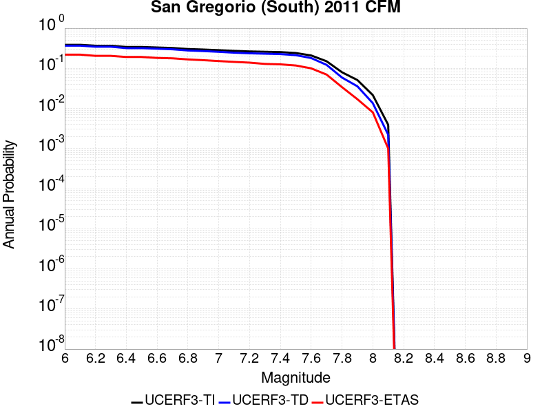 |
|-----|

| Magnitude | UCERF3-TI Prob | UCERF3-TD Prob | UCERF3-ETAS Prob |
|-----|-----|-----|-----|
| 6.0 | 0.38719684 | 0.368267 | 0.22 |
| 6.1 | 0.38719684 | 0.368267 | 0.22 |
| 6.2 | 0.36668876 | 0.3464714 | 0.205 |
| 6.3 | 0.36668876 | 0.3464714 | 0.205 |
| 6.4 | 0.34134257 | 0.31931272 | 0.192 |
| 6.5 | 0.34134257 | 0.31931272 | 0.192 |
| 6.6 | 0.3316071 | 0.3089721 | 0.182 |
| 6.7 | 0.32207096 | 0.298854 | 0.178 |
| 6.8 | 0.30373022 | 0.27932602 | 0.167 |
| 6.9 | 0.29488656 | 0.26993507 | 0.16 |
| 7.0 | 0.28404364 | 0.25841466 | 0.152 |
| 7.1 | 0.27244657 | 0.2460935 | 0.145 |
| 7.2 | 0.2643921 | 0.23754828 | 0.139 |
| 7.3 | 0.25927517 | 0.23212454 | 0.129 |
| 7.4 | 0.25438258 | 0.2269677 | 0.126 |
| 7.5 | 0.24154256 | 0.21357544 | 0.118 |
| 7.6 | 0.20965813 | 0.18089907 | 0.1 |
| 7.7 | 0.15031424 | 0.12225169 | 0.07 |
| 7.8 | 0.0799566 | 0.059040647 | 0.034 |
| 7.9 | 0.051084325 | 0.035722442 | 0.017 |
| 8.0 | 0.021556953 | 0.0135833025 | 0.008 |
| 8.1 | 0.00391439 | 0.0022130606 | 0.001 |

## San Jacinto (Anza) rev
*[(top)](#table-of-contents)*

| 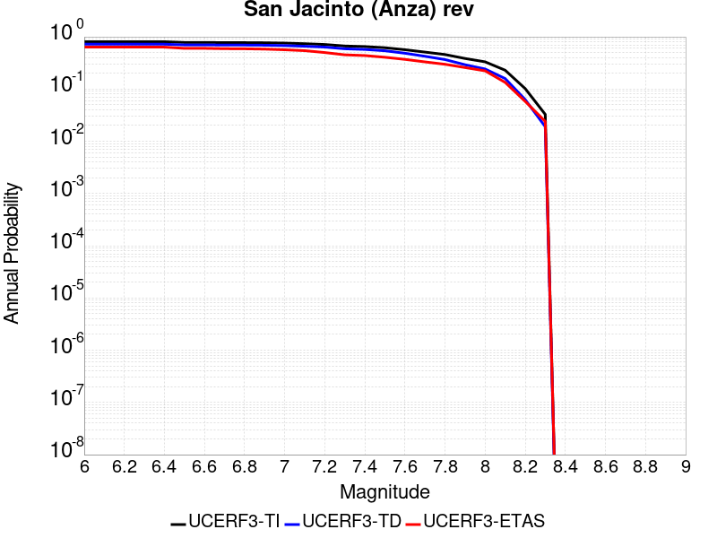 |
|-----|

| Magnitude | UCERF3-TI Prob | UCERF3-TD Prob | UCERF3-ETAS Prob |
|-----|-----|-----|-----|
| 6.0 | 0.8068107 | 0.72193176 | 0.635 |
| 6.1 | 0.8068107 | 0.72193176 | 0.635 |
| 6.2 | 0.8068107 | 0.72193176 | 0.635 |
| 6.3 | 0.8068107 | 0.72193176 | 0.635 |
| 6.4 | 0.8068107 | 0.72193176 | 0.635 |
| 6.5 | 0.7804328 | 0.69965714 | 0.602 |
| 6.6 | 0.7804328 | 0.69965714 | 0.602 |
| 6.7 | 0.7747125 | 0.6949711 | 0.593 |
| 6.8 | 0.77378845 | 0.6940374 | 0.59 |
| 6.9 | 0.7692809 | 0.68997175 | 0.582 |
| 7.0 | 0.7580117 | 0.67923295 | 0.565 |
| 7.1 | 0.738379 | 0.6604591 | 0.543 |
| 7.2 | 0.71305364 | 0.63631856 | 0.5 |
| 7.3 | 0.66696596 | 0.5900478 | 0.452 |
| 7.4 | 0.6502367 | 0.5734827 | 0.438 |
| 7.5 | 0.61859155 | 0.5404328 | 0.406 |
| 7.6 | 0.56613326 | 0.48484358 | 0.37 |
| 7.7 | 0.50966954 | 0.42408285 | 0.331 |
| 7.8 | 0.45785913 | 0.3665616 | 0.298 |
| 7.9 | 0.38465756 | 0.29207337 | 0.258 |
| 8.0 | 0.33193094 | 0.24208833 | 0.223 |
| 8.1 | 0.22931358 | 0.1587324 | 0.134 |
| 8.2 | 0.10197369 | 0.062831484 | 0.058 |
| 8.3 | 0.032718915 | 0.019017605 | 0.024 |

## San Jacinto (Borrego)
*[(top)](#table-of-contents)*

| 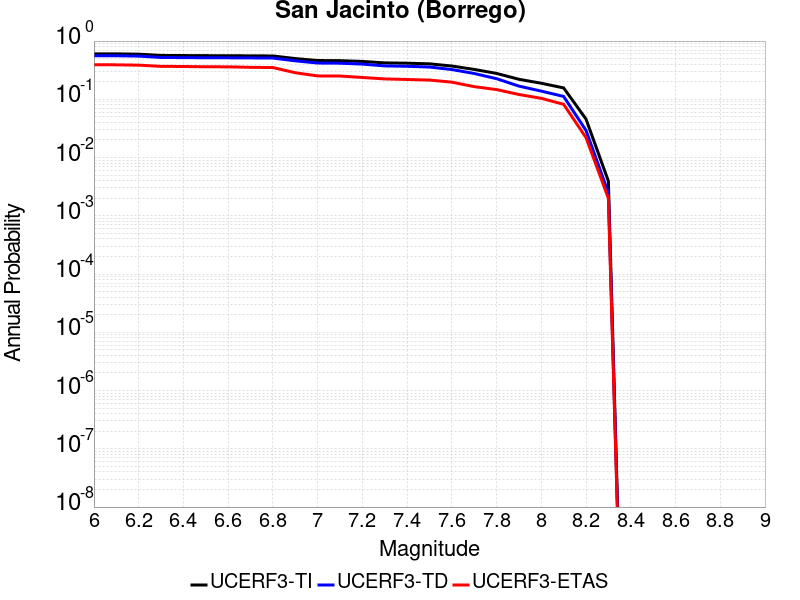 |
|-----|

| Magnitude | UCERF3-TI Prob | UCERF3-TD Prob | UCERF3-ETAS Prob |
|-----|-----|-----|-----|
| 6.0 | 0.6033173 | 0.55979633 | 0.393 |
| 6.1 | 0.6031402 | 0.55961627 | 0.391 |
| 6.2 | 0.5954657 | 0.5518433 | 0.386 |
| 6.3 | 0.56705457 | 0.52284586 | 0.368 |
| 6.4 | 0.56412596 | 0.5198835 | 0.366 |
| 6.5 | 0.5611002 | 0.516954 | 0.362 |
| 6.6 | 0.5600001 | 0.5159759 | 0.361 |
| 6.7 | 0.55719095 | 0.5134781 | 0.354 |
| 6.8 | 0.5547801 | 0.51100975 | 0.351 |
| 6.9 | 0.500965 | 0.45783588 | 0.286 |
| 7.0 | 0.4633185 | 0.4195191 | 0.252 |
| 7.1 | 0.46077177 | 0.41680062 | 0.251 |
| 7.2 | 0.44715822 | 0.40237257 | 0.237 |
| 7.3 | 0.4220706 | 0.37452114 | 0.224 |
| 7.4 | 0.41703412 | 0.3690827 | 0.219 |
| 7.5 | 0.4064498 | 0.35813525 | 0.214 |
| 7.6 | 0.37295228 | 0.32454994 | 0.197 |
| 7.7 | 0.32606646 | 0.27745542 | 0.165 |
| 7.8 | 0.27829683 | 0.22608191 | 0.147 |
| 7.9 | 0.22076362 | 0.16851419 | 0.121 |
| 8.0 | 0.18873326 | 0.13827287 | 0.104 |
| 8.1 | 0.15690471 | 0.112010665 | 0.082 |
| 8.2 | 0.04579597 | 0.029248537 | 0.022 |
| 8.3 | 0.003949375 | 0.0024841172 | 0.002 |

## San Jacinto (Clark) rev
*[(top)](#table-of-contents)*

| 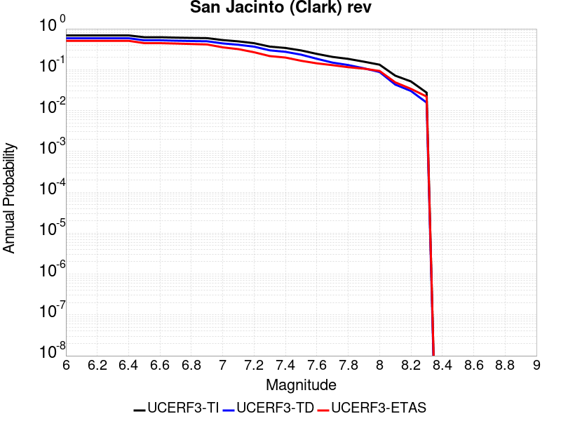 |
|-----|

| Magnitude | UCERF3-TI Prob | UCERF3-TD Prob | UCERF3-ETAS Prob |
|-----|-----|-----|-----|
| 6.0 | 0.6894805 | 0.58803654 | 0.508 |
| 6.1 | 0.6894805 | 0.58803654 | 0.508 |
| 6.2 | 0.6894805 | 0.58803654 | 0.508 |
| 6.3 | 0.6894805 | 0.58803654 | 0.508 |
| 6.4 | 0.6894805 | 0.58803654 | 0.508 |
| 6.5 | 0.622058 | 0.5239227 | 0.446 |
| 6.6 | 0.622058 | 0.5239227 | 0.446 |
| 6.7 | 0.60947186 | 0.5121561 | 0.436 |
| 6.8 | 0.5990713 | 0.5023223 | 0.425 |
| 6.9 | 0.5918872 | 0.49570978 | 0.414 |
| 7.0 | 0.53024817 | 0.43932348 | 0.352 |
| 7.1 | 0.49257448 | 0.40690455 | 0.318 |
| 7.2 | 0.44466588 | 0.36584568 | 0.267 |
| 7.3 | 0.3670969 | 0.2972186 | 0.215 |
| 7.4 | 0.33996573 | 0.27352428 | 0.198 |
| 7.5 | 0.29556102 | 0.2330007 | 0.165 |
| 7.6 | 0.24335745 | 0.18480231 | 0.143 |
| 7.7 | 0.20539424 | 0.14900431 | 0.129 |
| 7.8 | 0.18371087 | 0.12988842 | 0.115 |
| 7.9 | 0.15694545 | 0.10811929 | 0.106 |
| 8.0 | 0.13251418 | 0.08773337 | 0.093 |
| 8.1 | 0.071408615 | 0.043273717 | 0.049 |
| 8.2 | 0.05158933 | 0.030102344 | 0.034 |
| 8.3 | 0.027427524 | 0.015666962 | 0.022 |

## San Jacinto (Coyote Creek)
*[(top)](#table-of-contents)*

| 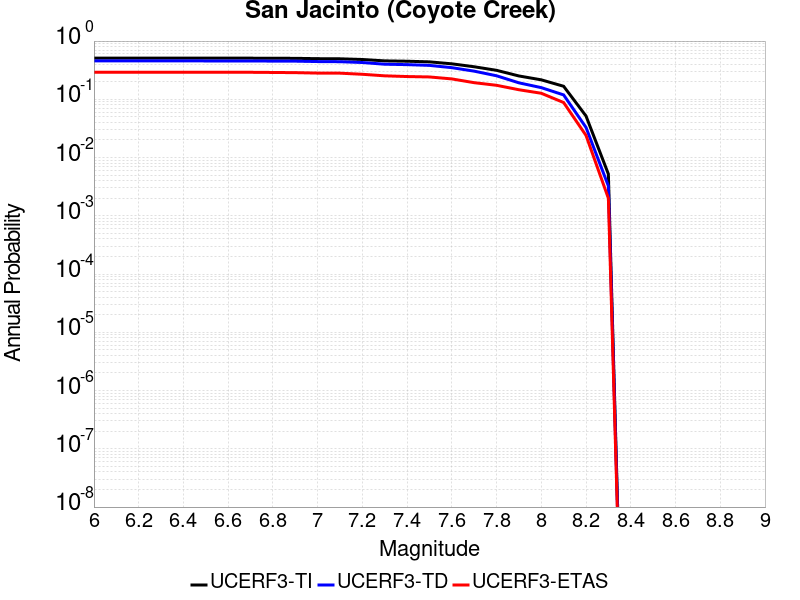 |
|-----|

| Magnitude | UCERF3-TI Prob | UCERF3-TD Prob | UCERF3-ETAS Prob |
|-----|-----|-----|-----|
| 6.0 | 0.51040995 | 0.46237198 | 0.291 |
| 6.1 | 0.51040995 | 0.46237198 | 0.291 |
| 6.2 | 0.51040995 | 0.46237198 | 0.291 |
| 6.3 | 0.51040995 | 0.46237198 | 0.291 |
| 6.4 | 0.51040995 | 0.46237198 | 0.291 |
| 6.5 | 0.50923467 | 0.4611243 | 0.291 |
| 6.6 | 0.50923467 | 0.4611243 | 0.291 |
| 6.7 | 0.5083857 | 0.46022633 | 0.291 |
| 6.8 | 0.5066179 | 0.4583142 | 0.289 |
| 6.9 | 0.5053849 | 0.4570182 | 0.287 |
| 7.0 | 0.49845904 | 0.44948143 | 0.282 |
| 7.1 | 0.49593878 | 0.44677237 | 0.281 |
| 7.2 | 0.48277932 | 0.43267426 | 0.269 |
| 7.3 | 0.45687643 | 0.40389425 | 0.253 |
| 7.4 | 0.45069626 | 0.3972996 | 0.246 |
| 7.5 | 0.43948475 | 0.38562378 | 0.242 |
| 7.6 | 0.4067474 | 0.35237977 | 0.224 |
| 7.7 | 0.36208037 | 0.3069186 | 0.193 |
| 7.8 | 0.31459442 | 0.25551626 | 0.174 |
| 7.9 | 0.25171408 | 0.19258454 | 0.146 |
| 8.0 | 0.2160001 | 0.15888864 | 0.127 |
| 8.1 | 0.16743244 | 0.11904715 | 0.088 |
| 8.2 | 0.05172729 | 0.032918897 | 0.024 |
| 8.3 | 0.005217573 | 0.0032621995 | 0.002 |

## San Jacinto (Lytle Creek connector)
*[(top)](#table-of-contents)*

| 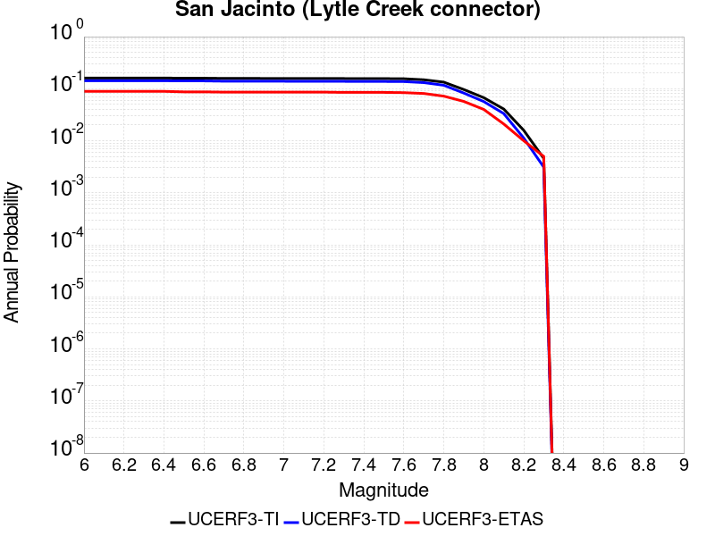 |
|-----|

| Magnitude | UCERF3-TI Prob | UCERF3-TD Prob | UCERF3-ETAS Prob |
|-----|-----|-----|-----|
| 6.0 | 0.16024251 | 0.14223434 | 0.089 |
| 6.1 | 0.16024251 | 0.14223434 | 0.089 |
| 6.2 | 0.16024251 | 0.14223434 | 0.089 |
| 6.3 | 0.16024251 | 0.14223434 | 0.089 |
| 6.4 | 0.16024251 | 0.14223434 | 0.089 |
| 6.5 | 0.15941378 | 0.14137453 | 0.087 |
| 6.6 | 0.15941378 | 0.14137453 | 0.087 |
| 6.7 | 0.15774621 | 0.13963813 | 0.086 |
| 6.8 | 0.15764531 | 0.1395306 | 0.086 |
| 6.9 | 0.15753104 | 0.13940147 | 0.086 |
| 7.0 | 0.15739806 | 0.1392519 | 0.086 |
| 7.1 | 0.15724458 | 0.13908134 | 0.086 |
| 7.2 | 0.15700251 | 0.13881302 | 0.086 |
| 7.3 | 0.15678315 | 0.13857141 | 0.085 |
| 7.4 | 0.15657482 | 0.13834482 | 0.085 |
| 7.5 | 0.15622775 | 0.13798462 | 0.085 |
| 7.6 | 0.1554723 | 0.13722111 | 0.084 |
| 7.7 | 0.14858443 | 0.13103473 | 0.081 |
| 7.8 | 0.13377017 | 0.11654866 | 0.072 |
| 7.9 | 0.09648984 | 0.08252982 | 0.057 |
| 8.0 | 0.06725205 | 0.05665879 | 0.04 |
| 8.1 | 0.040662073 | 0.033283167 | 0.021 |
| 8.2 | 0.015864238 | 0.011258063 | 0.01 |
| 8.3 | 0.004588645 | 0.003114899 | 0.005 |

## San Jacinto (San Bernardino)
*[(top)](#table-of-contents)*

| 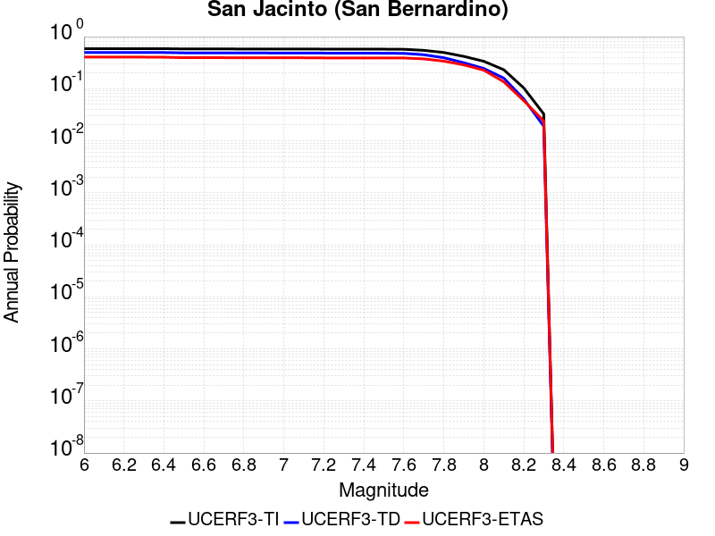 |
|-----|

| Magnitude | UCERF3-TI Prob | UCERF3-TD Prob | UCERF3-ETAS Prob |
|-----|-----|-----|-----|
| 6.0 | 0.58913505 | 0.4989573 | 0.405 |
| 6.1 | 0.58913505 | 0.4989573 | 0.405 |
| 6.2 | 0.58913505 | 0.4989573 | 0.405 |
| 6.3 | 0.58913505 | 0.4989573 | 0.405 |
| 6.4 | 0.5882167 | 0.49788776 | 0.403 |
| 6.5 | 0.5817949 | 0.4903124 | 0.395 |
| 6.6 | 0.5812505 | 0.48968163 | 0.395 |
| 6.7 | 0.58118784 | 0.48961595 | 0.395 |
| 6.8 | 0.58028656 | 0.48853716 | 0.394 |
| 6.9 | 0.5798369 | 0.48801935 | 0.394 |
| 7.0 | 0.5794126 | 0.4875449 | 0.394 |
| 7.1 | 0.5786725 | 0.48674455 | 0.393 |
| 7.2 | 0.5776192 | 0.4855259 | 0.391 |
| 7.3 | 0.5767654 | 0.4845579 | 0.391 |
| 7.4 | 0.576316 | 0.48407483 | 0.391 |
| 7.5 | 0.575231 | 0.48289958 | 0.391 |
| 7.6 | 0.57193273 | 0.47939414 | 0.39 |
| 7.7 | 0.5462464 | 0.45182875 | 0.374 |
| 7.8 | 0.4967049 | 0.39541718 | 0.339 |
| 7.9 | 0.418212 | 0.3167 | 0.287 |
| 8.0 | 0.33675528 | 0.24548775 | 0.227 |
| 8.1 | 0.23176168 | 0.16015765 | 0.136 |
| 8.2 | 0.10353287 | 0.06370183 | 0.059 |
| 8.3 | 0.03273745 | 0.019029519 | 0.024 |

## San Jacinto (San Jacinto Valley) rev
*[(top)](#table-of-contents)*

| 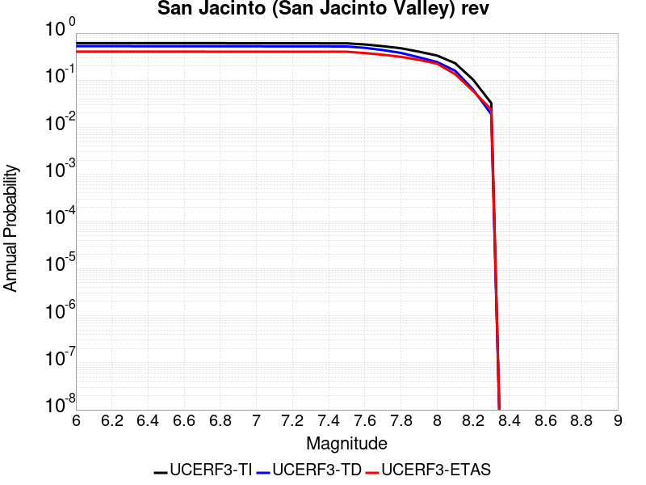 |
|-----|

| Magnitude | UCERF3-TI Prob | UCERF3-TD Prob | UCERF3-ETAS Prob |
|-----|-----|-----|-----|
| 6.0 | 0.61440945 | 0.5306824 | 0.406 |
| 6.1 | 0.61440945 | 0.5306824 | 0.406 |
| 6.2 | 0.61440945 | 0.5306824 | 0.406 |
| 6.3 | 0.61440945 | 0.5306824 | 0.406 |
| 6.4 | 0.6138302 | 0.5300769 | 0.405 |
| 6.5 | 0.6138302 | 0.5300769 | 0.405 |
| 6.6 | 0.61355907 | 0.5297927 | 0.405 |
| 6.7 | 0.6134543 | 0.5296861 | 0.405 |
| 6.8 | 0.6132271 | 0.52943885 | 0.404 |
| 6.9 | 0.61293626 | 0.52912194 | 0.404 |
| 7.0 | 0.61206776 | 0.52817625 | 0.404 |
| 7.1 | 0.6117219 | 0.52777845 | 0.403 |
| 7.2 | 0.6112098 | 0.5272081 | 0.403 |
| 7.3 | 0.6102882 | 0.5261917 | 0.403 |
| 7.4 | 0.6098714 | 0.52573866 | 0.403 |
| 7.5 | 0.6076082 | 0.5233995 | 0.403 |
| 7.6 | 0.5757697 | 0.49042484 | 0.379 |
| 7.7 | 0.5293005 | 0.44000906 | 0.348 |
| 7.8 | 0.47844556 | 0.38279292 | 0.315 |
| 7.9 | 0.40470725 | 0.30736163 | 0.271 |
| 8.0 | 0.33492464 | 0.24444507 | 0.225 |
| 8.1 | 0.23054773 | 0.15950935 | 0.135 |
| 8.2 | 0.1027428 | 0.06329146 | 0.059 |
| 8.3 | 0.03273745 | 0.019029519 | 0.024 |

## San Jacinto (Stepovers Combined)
*[(top)](#table-of-contents)*

| 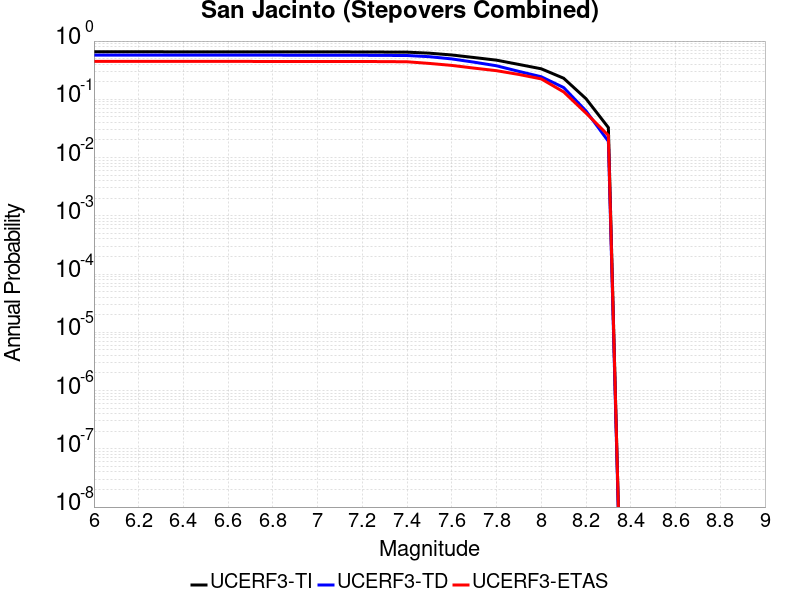 |
|-----|

| Magnitude | UCERF3-TI Prob | UCERF3-TD Prob | UCERF3-ETAS Prob |
|-----|-----|-----|-----|
| 6.0 | 0.6538953 | 0.5738539 | 0.448 |
| 6.1 | 0.6538953 | 0.5738539 | 0.448 |
| 6.2 | 0.6538953 | 0.5738539 | 0.448 |
| 6.3 | 0.6538953 | 0.5738539 | 0.448 |
| 6.4 | 0.65307695 | 0.5730346 | 0.447 |
| 6.5 | 0.65307695 | 0.5730346 | 0.447 |
| 6.6 | 0.65272725 | 0.5726847 | 0.447 |
| 6.7 | 0.6525273 | 0.57248175 | 0.447 |
| 6.8 | 0.6523259 | 0.5722714 | 0.446 |
| 6.9 | 0.6520493 | 0.5719872 | 0.446 |
| 7.0 | 0.65114 | 0.5710554 | 0.446 |
| 7.1 | 0.650953 | 0.57087076 | 0.446 |
| 7.2 | 0.65016955 | 0.5700717 | 0.446 |
| 7.3 | 0.64726716 | 0.56720823 | 0.444 |
| 7.4 | 0.6452416 | 0.56520796 | 0.441 |
| 7.5 | 0.61950547 | 0.5389103 | 0.413 |
| 7.6 | 0.5765926 | 0.4936851 | 0.382 |
| 7.7 | 0.5212953 | 0.4337484 | 0.343 |
| 7.8 | 0.46992746 | 0.37628335 | 0.31 |
| 7.9 | 0.39672282 | 0.301443 | 0.267 |
| 8.0 | 0.33405817 | 0.24389614 | 0.224 |
| 8.1 | 0.23013729 | 0.15925124 | 0.134 |
| 8.2 | 0.10244674 | 0.06311165 | 0.058 |
| 8.3 | 0.032718915 | 0.019017605 | 0.024 |

## San Jacinto (Superstition Mtn)
*[(top)](#table-of-contents)*

| 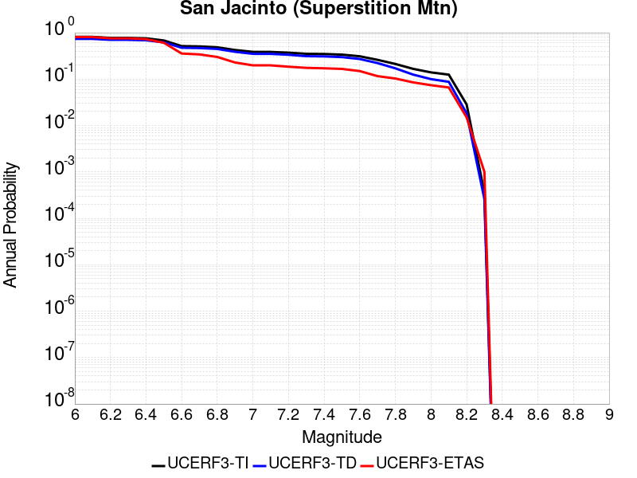 |
|-----|

| Magnitude | UCERF3-TI Prob | UCERF3-TD Prob | UCERF3-ETAS Prob |
|-----|-----|-----|-----|
| 6.0 | 0.8126594 | 0.7366509 | 0.805 |
| 6.1 | 0.8126594 | 0.7366509 | 0.805 |
| 6.2 | 0.7741191 | 0.7015203 | 0.757 |
| 6.3 | 0.77362645 | 0.7009651 | 0.757 |
| 6.4 | 0.7566699 | 0.6864809 | 0.727 |
| 6.5 | 0.6806504 | 0.62119013 | 0.607 |
| 6.6 | 0.51482964 | 0.47325078 | 0.356 |
| 6.7 | 0.50720334 | 0.46661645 | 0.341 |
| 6.8 | 0.48554856 | 0.44688576 | 0.3 |
| 6.9 | 0.42426506 | 0.38768697 | 0.228 |
| 7.0 | 0.38693884 | 0.35082826 | 0.198 |
| 7.1 | 0.38572586 | 0.349576 | 0.198 |
| 7.2 | 0.37155885 | 0.33489704 | 0.185 |
| 7.3 | 0.351219 | 0.31226876 | 0.175 |
| 7.4 | 0.34789065 | 0.30857873 | 0.171 |
| 7.5 | 0.3376577 | 0.2981292 | 0.166 |
| 7.6 | 0.31046674 | 0.2712423 | 0.149 |
| 7.7 | 0.26007205 | 0.22157328 | 0.116 |
| 7.8 | 0.2121411 | 0.17073543 | 0.103 |
| 7.9 | 0.16633336 | 0.12501016 | 0.085 |
| 8.0 | 0.13961427 | 0.09994426 | 0.074 |
| 8.1 | 0.12486782 | 0.08742664 | 0.066 |
| 8.2 | 0.028482838 | 0.018302707 | 0.015 |
| 8.3 | 3.5434432E-4 | 2.5803424E-4 | 0.001 |

## San Joaquin Hills
*[(top)](#table-of-contents)*

| 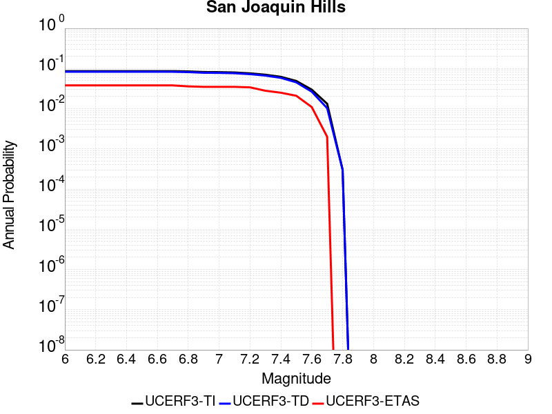 |
|-----|

| Magnitude | UCERF3-TI Prob | UCERF3-TD Prob | UCERF3-ETAS Prob |
|-----|-----|-----|-----|
| 6.0 | 0.086137585 | 0.08289149 | 0.038 |
| 6.1 | 0.086137585 | 0.08289149 | 0.038 |
| 6.2 | 0.086137585 | 0.08289149 | 0.038 |
| 6.3 | 0.086137585 | 0.08289149 | 0.038 |
| 6.4 | 0.086137585 | 0.08289149 | 0.038 |
| 6.5 | 0.086137585 | 0.08289149 | 0.038 |
| 6.6 | 0.086137585 | 0.08289149 | 0.038 |
| 6.7 | 0.086137585 | 0.08289149 | 0.038 |
| 6.8 | 0.084612414 | 0.08134823 | 0.036 |
| 6.9 | 0.08176082 | 0.07846029 | 0.035 |
| 7.0 | 0.08122108 | 0.07791349 | 0.035 |
| 7.1 | 0.07977167 | 0.07644496 | 0.035 |
| 7.2 | 0.075815566 | 0.07243553 | 0.034 |
| 7.3 | 0.070145436 | 0.06668146 | 0.028 |
| 7.4 | 0.062148374 | 0.058564197 | 0.025 |
| 7.5 | 0.04902542 | 0.045270834 | 0.021 |
| 7.6 | 0.029833918 | 0.026565874 | 0.011 |
| 7.7 | 0.013260799 | 0.010300386 | 0.002 |
| 7.8 | 3.027386E-4 | 3.045169E-4 | 0.0 |

## San Jose
*[(top)](#table-of-contents)*

| 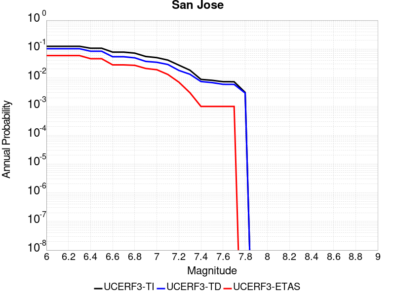 |
|-----|

| Magnitude | UCERF3-TI Prob | UCERF3-TD Prob | UCERF3-ETAS Prob |
|-----|-----|-----|-----|
| 6.0 | 0.12424394 | 0.10230367 | 0.059 |
| 6.1 | 0.12424394 | 0.10230367 | 0.059 |
| 6.2 | 0.12424394 | 0.10230367 | 0.059 |
| 6.3 | 0.12424394 | 0.10230367 | 0.059 |
| 6.4 | 0.106388815 | 0.08370054 | 0.046 |
| 6.5 | 0.106388815 | 0.08370054 | 0.046 |
| 6.6 | 0.07794291 | 0.05373496 | 0.028 |
| 6.7 | 0.07794291 | 0.05373496 | 0.028 |
| 6.8 | 0.0718186 | 0.04929504 | 0.027 |
| 6.9 | 0.05484068 | 0.03695061 | 0.021 |
| 7.0 | 0.050058633 | 0.034485653 | 0.019 |
| 7.1 | 0.04105964 | 0.02889071 | 0.013 |
| 7.2 | 0.027356105 | 0.017936016 | 0.007 |
| 7.3 | 0.018252268 | 0.0131997485 | 0.003 |
| 7.4 | 0.008747627 | 0.0073596947 | 0.001 |
| 7.5 | 0.008130525 | 0.006769515 | 0.001 |
| 7.6 | 0.007280629 | 0.005900669 | 0.001 |
| 7.7 | 0.0072400537 | 0.005858327 | 0.001 |
| 7.8 | 0.0030766104 | 0.0029293243 | 0.0 |

## San Juan
*[(top)](#table-of-contents)*

| 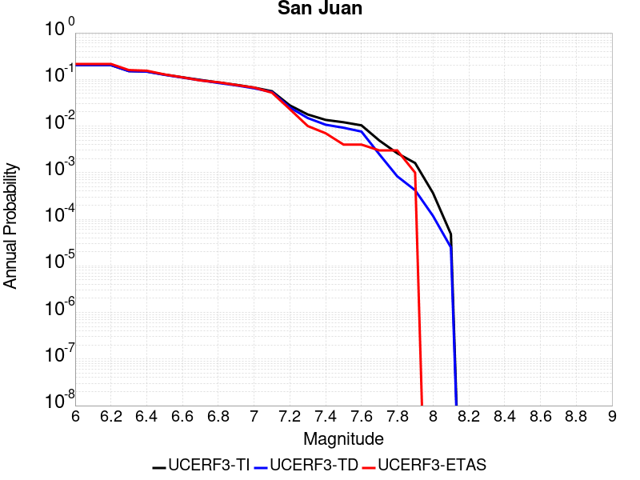 |
|-----|

| Magnitude | UCERF3-TI Prob | UCERF3-TD Prob | UCERF3-ETAS Prob |
|-----|-----|-----|-----|
| 6.0 | 0.20270395 | 0.2030057 | 0.215 |
| 6.1 | 0.20270395 | 0.2030057 | 0.215 |
| 6.2 | 0.20270395 | 0.2030057 | 0.215 |
| 6.3 | 0.15168607 | 0.15065433 | 0.159 |
| 6.4 | 0.14821808 | 0.14713192 | 0.154 |
| 6.5 | 0.12697503 | 0.12554884 | 0.128 |
| 6.6 | 0.11118985 | 0.109526366 | 0.111 |
| 6.7 | 0.09778567 | 0.095939554 | 0.095 |
| 6.8 | 0.086162716 | 0.08418652 | 0.087 |
| 6.9 | 0.07672654 | 0.07464275 | 0.076 |
| 7.0 | 0.06681149 | 0.064619415 | 0.067 |
| 7.1 | 0.055877227 | 0.05356236 | 0.052 |
| 7.2 | 0.027749471 | 0.024984876 | 0.023 |
| 7.3 | 0.017703284 | 0.014845036 | 0.01 |
| 7.4 | 0.013553141 | 0.010672317 | 0.007 |
| 7.5 | 0.01205422 | 0.009191307 | 0.004 |
| 7.6 | 0.01035733 | 0.0076149474 | 0.004 |
| 7.7 | 0.0048887795 | 0.0024784687 | 0.003 |
| 7.8 | 0.0026095596 | 8.3516724E-4 | 0.003 |
| 7.9 | 0.0016087863 | 4.1968076E-4 | 0.001 |
| 8.0 | 3.6452015E-4 | 1.17834425E-4 | 0.0 |
| 8.1 | 4.8012203E-5 | 2.4873594E-5 | 0.0 |

## San Luis Range - Oceano 2011 CFM
*[(top)](#table-of-contents)*

| 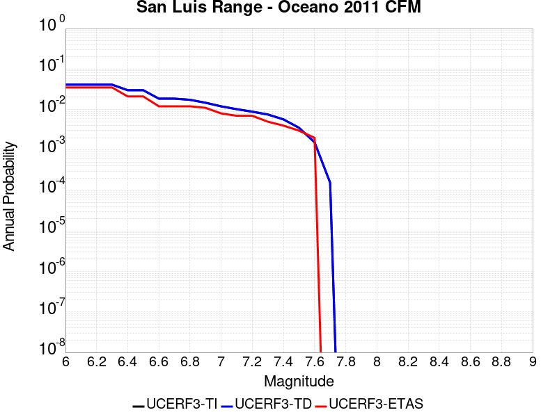 |
|-----|

| Magnitude | UCERF3-TI Prob | UCERF3-TD Prob | UCERF3-ETAS Prob |
|-----|-----|-----|-----|
| 6.0 | 0.04094818 | 0.041188408 | 0.035 |
| 6.1 | 0.04094818 | 0.041188408 | 0.035 |
| 6.2 | 0.04094818 | 0.041188408 | 0.035 |
| 6.3 | 0.04094818 | 0.041188408 | 0.035 |
| 6.4 | 0.029863855 | 0.030033307 | 0.021 |
| 6.5 | 0.029863855 | 0.030033307 | 0.021 |
| 6.6 | 0.018518656 | 0.018588107 | 0.012 |
| 6.7 | 0.018518656 | 0.018588107 | 0.012 |
| 6.8 | 0.017328395 | 0.017392475 | 0.012 |
| 6.9 | 0.01465256 | 0.014704945 | 0.011 |
| 7.0 | 0.011951036 | 0.011992013 | 0.008 |
| 7.1 | 0.010169163 | 0.010204074 | 0.007 |
| 7.2 | 0.008824605 | 0.008855394 | 0.007 |
| 7.3 | 0.0075116917 | 0.0075378725 | 0.005 |
| 7.4 | 0.005692471 | 0.0057127574 | 0.004 |
| 7.5 | 0.0035324919 | 0.0035446605 | 0.003 |
| 7.6 | 0.0015450981 | 0.0015509474 | 0.002 |
| 7.7 | 1.5512091E-4 | 1.5583022E-4 | 0.0 |

## San Luis Range - Pecho 2011 CFM
*[(top)](#table-of-contents)*

| 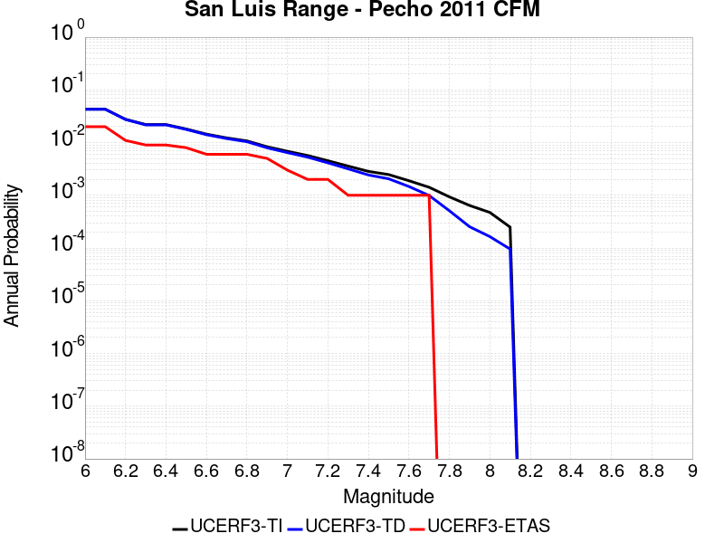 |
|-----|

| Magnitude | UCERF3-TI Prob | UCERF3-TD Prob | UCERF3-ETAS Prob |
|-----|-----|-----|-----|
| 6.0 | 0.043068722 | 0.042862296 | 0.02 |
| 6.1 | 0.043068722 | 0.042862296 | 0.02 |
| 6.2 | 0.027696114 | 0.027406074 | 0.011 |
| 6.3 | 0.021990778 | 0.02167925 | 0.009 |
| 6.4 | 0.021990778 | 0.02167925 | 0.009 |
| 6.5 | 0.01810429 | 0.017774766 | 0.008 |
| 6.6 | 0.014462415 | 0.0141177755 | 0.006 |
| 6.7 | 0.01227577 | 0.011921605 | 0.006 |
| 6.8 | 0.010759901 | 0.010399077 | 0.006 |
| 6.9 | 0.008328474 | 0.007955402 | 0.005 |
| 7.0 | 0.006842128 | 0.006460594 | 0.003 |
| 7.1 | 0.005679736 | 0.0052907467 | 0.002 |
| 7.2 | 0.004527434 | 0.004130042 | 0.002 |
| 7.3 | 0.003579523 | 0.0031747217 | 0.001 |
| 7.4 | 0.0028436673 | 0.0024322243 | 0.001 |
| 7.5 | 0.0024728866 | 0.0020577656 | 0.001 |
| 7.6 | 0.0018914244 | 0.0014697915 | 0.001 |
| 7.7 | 0.0014198847 | 9.923269E-4 | 0.001 |
| 7.8 | 9.348862E-4 | 5.0947146E-4 | 0.0 |
| 7.9 | 6.41275E-4 | 2.5329698E-4 | 0.0 |
| 8.0 | 4.734544E-4 | 1.645411E-4 | 0.0 |
| 8.1 | 2.4936174E-4 | 9.555594E-5 | 0.0 |

## San Luis Range 2011 CFM
*[(top)](#table-of-contents)*

| 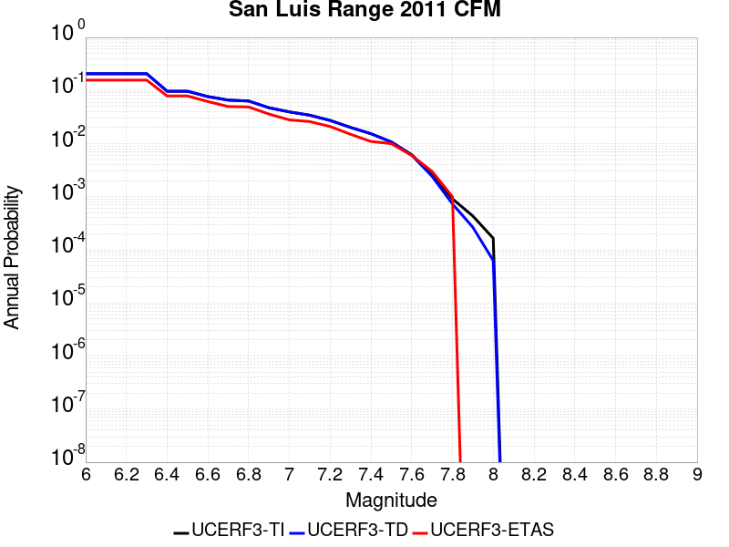 |
|-----|

| Magnitude | UCERF3-TI Prob | UCERF3-TD Prob | UCERF3-ETAS Prob |
|-----|-----|-----|-----|
| 6.0 | 0.20590161 | 0.20851333 | 0.157 |
| 6.1 | 0.20590161 | 0.20851333 | 0.157 |
| 6.2 | 0.20590161 | 0.20851333 | 0.157 |
| 6.3 | 0.20590161 | 0.20851333 | 0.157 |
| 6.4 | 0.096965164 | 0.097391434 | 0.079 |
| 6.5 | 0.096965164 | 0.097391434 | 0.079 |
| 6.6 | 0.076700225 | 0.07698531 | 0.062 |
| 6.7 | 0.065974146 | 0.066192925 | 0.05 |
| 6.8 | 0.06341134 | 0.06361569 | 0.049 |
| 6.9 | 0.04727907 | 0.04739464 | 0.036 |
| 7.0 | 0.03953466 | 0.039608497 | 0.028 |
| 7.1 | 0.03427554 | 0.03431814 | 0.026 |
| 7.2 | 0.027335057 | 0.027333988 | 0.021 |
| 7.3 | 0.020224974 | 0.020177756 | 0.015 |
| 7.4 | 0.015418382 | 0.0153397415 | 0.011 |
| 7.5 | 0.010798721 | 0.010691061 | 0.01 |
| 7.6 | 0.0061941654 | 0.006055401 | 0.006 |
| 7.7 | 0.002584393 | 0.0024193262 | 0.003 |
| 7.8 | 9.1225357E-4 | 7.3288364E-4 | 0.001 |
| 7.9 | 4.336379E-4 | 2.6617356E-4 | 0.0 |
| 8.0 | 1.6526801E-4 | 6.292696E-5 | 0.0 |

## San Pedro Basin
*[(top)](#table-of-contents)*

| 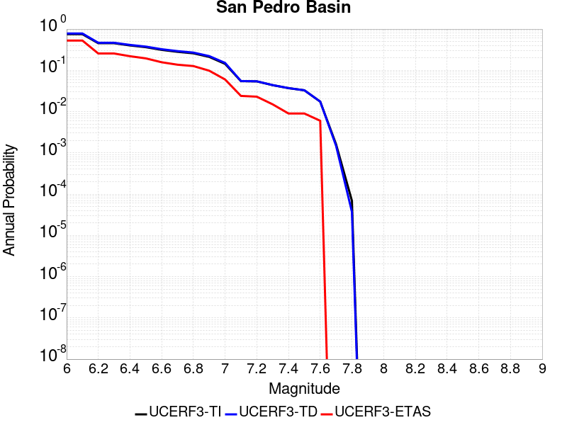 |
|-----|

| Magnitude | UCERF3-TI Prob | UCERF3-TD Prob | UCERF3-ETAS Prob |
|-----|-----|-----|-----|
| 6.0 | 0.7520392 | 0.7818768 | 0.527 |
| 6.1 | 0.7520392 | 0.7818768 | 0.527 |
| 6.2 | 0.45392737 | 0.46618086 | 0.256 |
| 6.3 | 0.45392737 | 0.46618086 | 0.256 |
| 6.4 | 0.40126428 | 0.41377306 | 0.22 |
| 6.5 | 0.36394432 | 0.3764663 | 0.195 |
| 6.6 | 0.3131486 | 0.32520902 | 0.157 |
| 6.7 | 0.2808154 | 0.2926116 | 0.137 |
| 6.8 | 0.25844702 | 0.26974082 | 0.127 |
| 6.9 | 0.21152084 | 0.22162184 | 0.098 |
| 7.0 | 0.1434504 | 0.15122753 | 0.06 |
| 7.1 | 0.054689903 | 0.05505038 | 0.024 |
| 7.2 | 0.053935897 | 0.054288562 | 0.023 |
| 7.3 | 0.043746468 | 0.04391941 | 0.015 |
| 7.4 | 0.037042487 | 0.037121035 | 0.009 |
| 7.5 | 0.032852296 | 0.032896254 | 0.009 |
| 7.6 | 0.01746896 | 0.017498339 | 0.006 |
| 7.7 | 0.001619324 | 0.0014814531 | 0.0 |
| 7.8 | 6.9344416E-5 | 3.7021724E-5 | 0.0 |

## San Pedro Escarpment
*[(top)](#table-of-contents)*

| 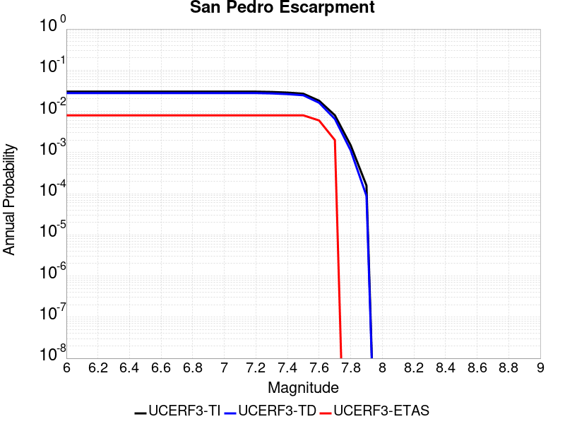 |
|-----|

| Magnitude | UCERF3-TI Prob | UCERF3-TD Prob | UCERF3-ETAS Prob |
|-----|-----|-----|-----|
| 6.0 | 0.030165238 | 0.027788233 | 0.008 |
| 6.1 | 0.030165238 | 0.027788233 | 0.008 |
| 6.2 | 0.030165238 | 0.027788233 | 0.008 |
| 6.3 | 0.030165238 | 0.027788233 | 0.008 |
| 6.4 | 0.030165238 | 0.027788233 | 0.008 |
| 6.5 | 0.030165238 | 0.027788233 | 0.008 |
| 6.6 | 0.030165238 | 0.027788233 | 0.008 |
| 6.7 | 0.030165238 | 0.027788233 | 0.008 |
| 6.8 | 0.030165238 | 0.027788233 | 0.008 |
| 6.9 | 0.030165238 | 0.027788233 | 0.008 |
| 7.0 | 0.030165238 | 0.027788233 | 0.008 |
| 7.1 | 0.030165238 | 0.027788233 | 0.008 |
| 7.2 | 0.030119777 | 0.027742537 | 0.008 |
| 7.3 | 0.029595653 | 0.027215427 | 0.008 |
| 7.4 | 0.028553043 | 0.026166502 | 0.008 |
| 7.5 | 0.02683255 | 0.024556974 | 0.008 |
| 7.6 | 0.018143943 | 0.016144073 | 0.006 |
| 7.7 | 0.008021772 | 0.0065261684 | 0.002 |
| 7.8 | 0.0014993392 | 0.0011225314 | 0.0 |
| 7.9 | 1.5756825E-4 | 8.8257955E-5 | 0.0 |

## San Vicente
*[(top)](#table-of-contents)*

| 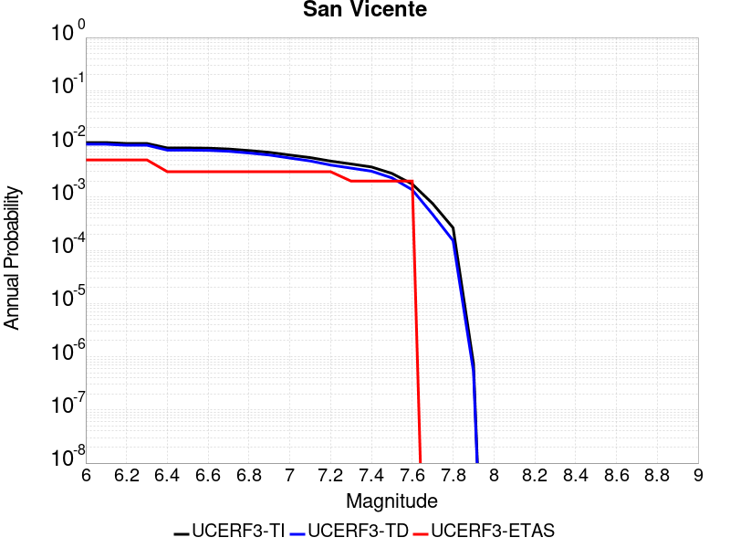 |
|-----|

| Magnitude | UCERF3-TI Prob | UCERF3-TD Prob | UCERF3-ETAS Prob |
|-----|-----|-----|-----|
| 6.0 | 0.010601213 | 0.009862808 | 0.005 |
| 6.1 | 0.010601213 | 0.009862808 | 0.005 |
| 6.2 | 0.010175114 | 0.009435898 | 0.005 |
| 6.3 | 0.010175114 | 0.009435898 | 0.005 |
| 6.4 | 0.008386278 | 0.0076418063 | 0.003 |
| 6.5 | 0.008386278 | 0.0076418063 | 0.003 |
| 6.6 | 0.008306948 | 0.007562334 | 0.003 |
| 6.7 | 0.008013956 | 0.007268492 | 0.003 |
| 6.8 | 0.0074938494 | 0.006746542 | 0.003 |
| 6.9 | 0.006932904 | 0.006183435 | 0.003 |
| 7.0 | 0.0061727827 | 0.005425097 | 0.003 |
| 7.1 | 0.005525233 | 0.0047800173 | 0.003 |
| 7.2 | 0.004748643 | 0.00400801 | 0.003 |
| 7.3 | 0.004196596 | 0.003509572 | 0.002 |
| 7.4 | 0.0036845475 | 0.0030728888 | 0.002 |
| 7.5 | 0.002790078 | 0.002302638 | 0.002 |
| 7.6 | 0.0017586274 | 0.0013735661 | 0.002 |
| 7.7 | 7.5474585E-4 | 4.737089E-4 | 0.0 |
| 7.8 | 2.6480915E-4 | 1.5351018E-4 | 0.0 |
| 7.9 | 7.389586E-7 | 5.262147E-7 | 0.0 |

## Santa Cruz Catalina Ridge alt1
*[(top)](#table-of-contents)*

| 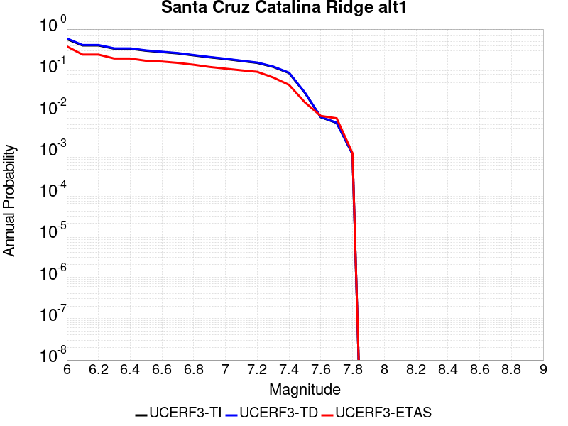 |
|-----|

| Magnitude | UCERF3-TI Prob | UCERF3-TD Prob | UCERF3-ETAS Prob |
|-----|-----|-----|-----|
| 6.0 | 0.5754003 | 0.59873587 | 0.385 |
| 6.1 | 0.40399155 | 0.41358843 | 0.243 |
| 6.2 | 0.40399155 | 0.41358843 | 0.243 |
| 6.3 | 0.33657554 | 0.34361768 | 0.195 |
| 6.4 | 0.33657554 | 0.34361768 | 0.195 |
| 6.5 | 0.30066642 | 0.30679977 | 0.172 |
| 6.6 | 0.2790293 | 0.28467804 | 0.165 |
| 6.7 | 0.2592818 | 0.26448777 | 0.153 |
| 6.8 | 0.23219363 | 0.23679876 | 0.138 |
| 6.9 | 0.20846531 | 0.2125363 | 0.122 |
| 7.0 | 0.18936458 | 0.19302908 | 0.111 |
| 7.1 | 0.16987354 | 0.17316073 | 0.101 |
| 7.2 | 0.15293762 | 0.15590708 | 0.093 |
| 7.3 | 0.12239067 | 0.12481191 | 0.068 |
| 7.4 | 0.08703299 | 0.088789195 | 0.045 |
| 7.5 | 0.02883536 | 0.029343883 | 0.017 |
| 7.6 | 0.007433522 | 0.0075370986 | 0.008 |
| 7.7 | 0.005407079 | 0.005480978 | 0.007 |
| 7.8 | 9.4262476E-4 | 9.5417426E-4 | 0.001 |

## Santa Cruz Island
*[(top)](#table-of-contents)*

| 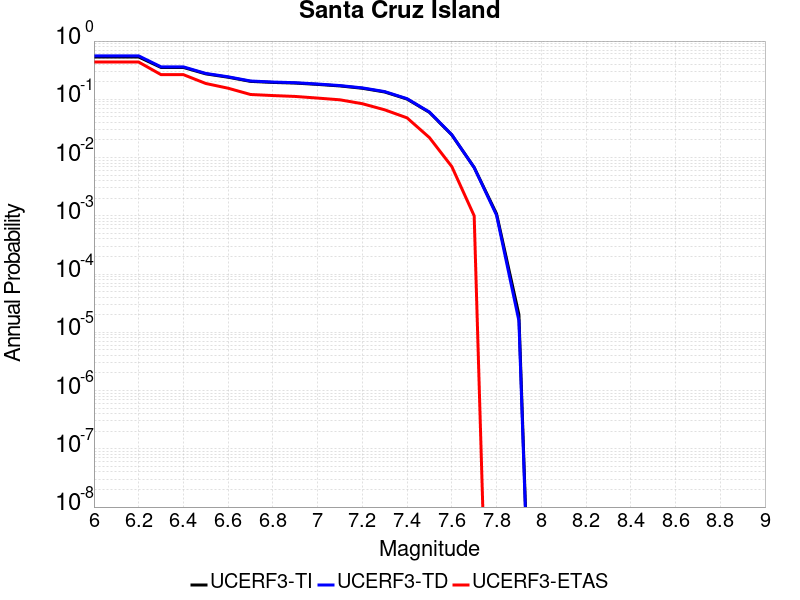 |
|-----|

| Magnitude | UCERF3-TI Prob | UCERF3-TD Prob | UCERF3-ETAS Prob |
|-----|-----|-----|-----|
| 6.0 | 0.5327513 | 0.55716383 | 0.436 |
| 6.1 | 0.5327513 | 0.55716383 | 0.436 |
| 6.2 | 0.5327513 | 0.55716383 | 0.436 |
| 6.3 | 0.35209635 | 0.3606108 | 0.265 |
| 6.4 | 0.35209635 | 0.3606108 | 0.265 |
| 6.5 | 0.27334404 | 0.27831864 | 0.187 |
| 6.6 | 0.23941846 | 0.24359012 | 0.155 |
| 6.7 | 0.20304534 | 0.20632075 | 0.121 |
| 6.8 | 0.19486369 | 0.19797543 | 0.116 |
| 6.9 | 0.18992043 | 0.19294442 | 0.112 |
| 7.0 | 0.18022335 | 0.18307307 | 0.105 |
| 7.1 | 0.16957791 | 0.17224531 | 0.098 |
| 7.2 | 0.1546839 | 0.15713342 | 0.084 |
| 7.3 | 0.13354237 | 0.1356488 | 0.066 |
| 7.4 | 0.10098121 | 0.102501236 | 0.048 |
| 7.5 | 0.059676196 | 0.06043982 | 0.022 |
| 7.6 | 0.024475608 | 0.024667982 | 0.007 |
| 7.7 | 0.0067637675 | 0.006726893 | 0.001 |
| 7.8 | 0.0010826996 | 0.0010253808 | 0.0 |
| 7.9 | 2.0151696E-5 | 1.575668E-5 | 0.0 |

## Santa Monica Bay
*[(top)](#table-of-contents)*

| 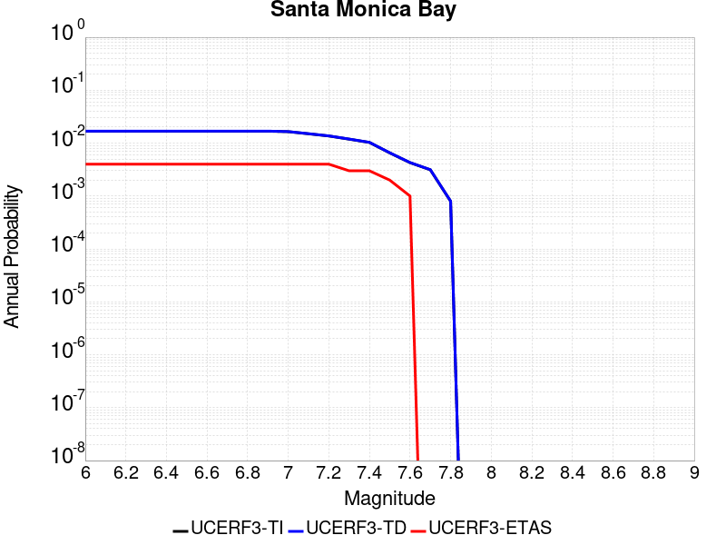 |
|-----|

| Magnitude | UCERF3-TI Prob | UCERF3-TD Prob | UCERF3-ETAS Prob |
|-----|-----|-----|-----|
| 6.0 | 0.016798286 | 0.016863056 | 0.004 |
| 6.1 | 0.016798286 | 0.016863056 | 0.004 |
| 6.2 | 0.016798286 | 0.016863056 | 0.004 |
| 6.3 | 0.016798286 | 0.016863056 | 0.004 |
| 6.4 | 0.016798286 | 0.016863056 | 0.004 |
| 6.5 | 0.016798286 | 0.016863056 | 0.004 |
| 6.6 | 0.016798286 | 0.016863056 | 0.004 |
| 6.7 | 0.016798286 | 0.016863056 | 0.004 |
| 6.8 | 0.016798286 | 0.016863056 | 0.004 |
| 6.9 | 0.016798286 | 0.016863056 | 0.004 |
| 7.0 | 0.01646146 | 0.016525691 | 0.004 |
| 7.1 | 0.015008413 | 0.015069356 | 0.004 |
| 7.2 | 0.013643266 | 0.0137008075 | 0.004 |
| 7.3 | 0.011885515 | 0.011938073 | 0.003 |
| 7.4 | 0.010301556 | 0.01034905 | 0.003 |
| 7.5 | 0.0065393676 | 0.00657161 | 0.002 |
| 7.6 | 0.0042728335 | 0.0042946455 | 0.001 |
| 7.7 | 0.0031337135 | 0.0031504806 | 0.0 |
| 7.8 | 7.9644093E-4 | 8.010729E-4 | 0.0 |

## Santa Monica alt 1
*[(top)](#table-of-contents)*

| 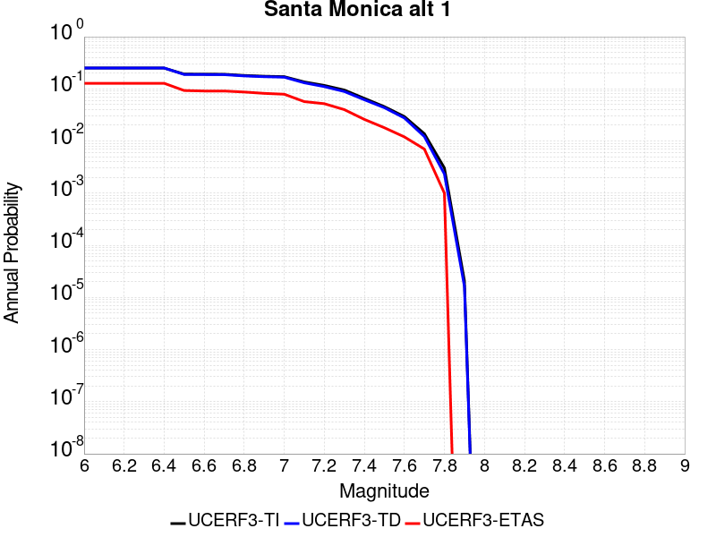 |
|-----|

| Magnitude | UCERF3-TI Prob | UCERF3-TD Prob | UCERF3-ETAS Prob |
|-----|-----|-----|-----|
| 6.0 | 0.2507674 | 0.25141612 | 0.128 |
| 6.1 | 0.2507674 | 0.25141612 | 0.128 |
| 6.2 | 0.2507674 | 0.25141612 | 0.128 |
| 6.3 | 0.2507674 | 0.25141612 | 0.128 |
| 6.4 | 0.2507674 | 0.25141612 | 0.128 |
| 6.5 | 0.19225083 | 0.18892573 | 0.093 |
| 6.6 | 0.19163491 | 0.18829218 | 0.091 |
| 6.7 | 0.19071802 | 0.187353 | 0.091 |
| 6.8 | 0.18080094 | 0.17711967 | 0.087 |
| 6.9 | 0.17491947 | 0.17107679 | 0.082 |
| 7.0 | 0.17146905 | 0.16754563 | 0.079 |
| 7.1 | 0.13600697 | 0.13072075 | 0.057 |
| 7.2 | 0.11651561 | 0.1105465 | 0.052 |
| 7.3 | 0.095068894 | 0.08900119 | 0.04 |
| 7.4 | 0.06584492 | 0.06188474 | 0.026 |
| 7.5 | 0.045679633 | 0.043576844 | 0.018 |
| 7.6 | 0.029488767 | 0.02765467 | 0.012 |
| 7.7 | 0.0138117215 | 0.012181481 | 0.007 |
| 7.8 | 0.0030396187 | 0.0023321805 | 0.001 |
| 7.9 | 2.0890639E-5 | 1.6282886E-5 | 0.0 |

## Santa Rosa Island
*[(top)](#table-of-contents)*

| 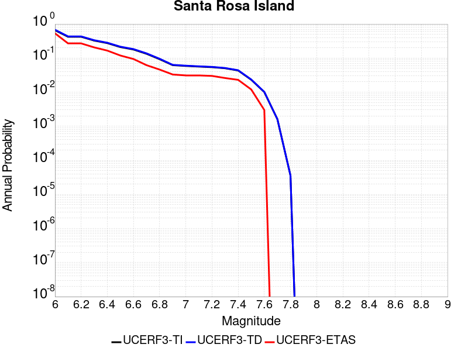 |
|-----|

| Magnitude | UCERF3-TI Prob | UCERF3-TD Prob | UCERF3-ETAS Prob |
|-----|-----|-----|-----|
| 6.0 | 0.6581619 | 0.6798464 | 0.534 |
| 6.1 | 0.42274937 | 0.4335734 | 0.27 |
| 6.2 | 0.42274937 | 0.4335734 | 0.27 |
| 6.3 | 0.32663688 | 0.33493617 | 0.206 |
| 6.4 | 0.2752973 | 0.28251502 | 0.166 |
| 6.5 | 0.21053536 | 0.21638846 | 0.119 |
| 6.6 | 0.17870663 | 0.18382367 | 0.094 |
| 6.7 | 0.13372554 | 0.13778977 | 0.062 |
| 6.8 | 0.09285053 | 0.09555009 | 0.046 |
| 6.9 | 0.06207465 | 0.063280754 | 0.033 |
| 7.0 | 0.05884273 | 0.059954196 | 0.031 |
| 7.1 | 0.05639195 | 0.057438213 | 0.031 |
| 7.2 | 0.0541788 | 0.05517582 | 0.03 |
| 7.3 | 0.050329376 | 0.051246285 | 0.026 |
| 7.4 | 0.043260846 | 0.044040494 | 0.023 |
| 7.5 | 0.023174247 | 0.023548985 | 0.012 |
| 7.6 | 0.010067202 | 0.010183392 | 0.003 |
| 7.7 | 0.0016114889 | 0.0016118749 | 0.0 |
| 7.8 | 3.5753288E-5 | 3.595713E-5 | 0.0 |

## Santa Susana East (connector)
*[(top)](#table-of-contents)*

| 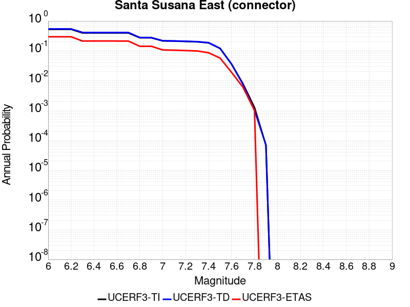 |
|-----|

| Magnitude | UCERF3-TI Prob | UCERF3-TD Prob | UCERF3-ETAS Prob |
|-----|-----|-----|-----|
| 6.0 | 0.52561975 | 0.5443051 | 0.296 |
| 6.1 | 0.52561975 | 0.5443051 | 0.296 |
| 6.2 | 0.52561975 | 0.5443051 | 0.296 |
| 6.3 | 0.39774334 | 0.41286987 | 0.213 |
| 6.4 | 0.39774334 | 0.41286987 | 0.213 |
| 6.5 | 0.39774334 | 0.41286987 | 0.213 |
| 6.6 | 0.39774334 | 0.41286987 | 0.213 |
| 6.7 | 0.39725006 | 0.4123761 | 0.212 |
| 6.8 | 0.2729416 | 0.27829137 | 0.142 |
| 6.9 | 0.2729416 | 0.27829137 | 0.142 |
| 7.0 | 0.21494837 | 0.21797226 | 0.107 |
| 7.1 | 0.21195927 | 0.21490118 | 0.105 |
| 7.2 | 0.20619519 | 0.2089748 | 0.102 |
| 7.3 | 0.2004167 | 0.20314674 | 0.099 |
| 7.4 | 0.18523961 | 0.18744758 | 0.086 |
| 7.5 | 0.119703844 | 0.12145463 | 0.057 |
| 7.6 | 0.035600737 | 0.036075614 | 0.019 |
| 7.7 | 0.007776728 | 0.007480393 | 0.006 |
| 7.8 | 0.0012564153 | 0.0010224106 | 0.001 |
| 7.9 | 6.816181E-5 | 6.934941E-5 | 0.0 |

## Santa Susana alt 1
*[(top)](#table-of-contents)*

| 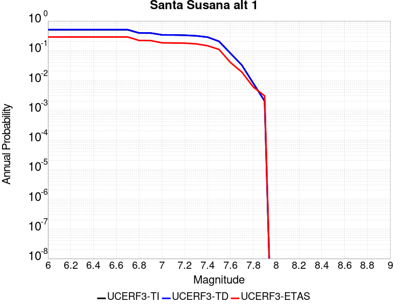 |
|-----|

| Magnitude | UCERF3-TI Prob | UCERF3-TD Prob | UCERF3-ETAS Prob |
|-----|-----|-----|-----|
| 6.0 | 0.50235367 | 0.5123744 | 0.289 |
| 6.1 | 0.50235367 | 0.5123744 | 0.289 |
| 6.2 | 0.50235367 | 0.5123744 | 0.289 |
| 6.3 | 0.50235367 | 0.5123744 | 0.289 |
| 6.4 | 0.50235367 | 0.5123744 | 0.289 |
| 6.5 | 0.50235367 | 0.5123744 | 0.289 |
| 6.6 | 0.50104326 | 0.51112056 | 0.288 |
| 6.7 | 0.50104326 | 0.51112056 | 0.288 |
| 6.8 | 0.39201823 | 0.39329144 | 0.22 |
| 6.9 | 0.39152148 | 0.3927795 | 0.219 |
| 7.0 | 0.33984393 | 0.33867562 | 0.183 |
| 7.1 | 0.3374352 | 0.336196 | 0.181 |
| 7.2 | 0.33115786 | 0.32982334 | 0.179 |
| 7.3 | 0.31558213 | 0.31448504 | 0.169 |
| 7.4 | 0.28500816 | 0.28469783 | 0.146 |
| 7.5 | 0.20571154 | 0.20547312 | 0.11 |
| 7.6 | 0.08137521 | 0.08186791 | 0.04 |
| 7.7 | 0.032721013 | 0.03245838 | 0.019 |
| 7.8 | 0.007971066 | 0.008090014 | 0.006 |
| 7.9 | 0.0019868098 | 0.002024639 | 0.003 |

## Santa Ynez (East)
*[(top)](#table-of-contents)*

| 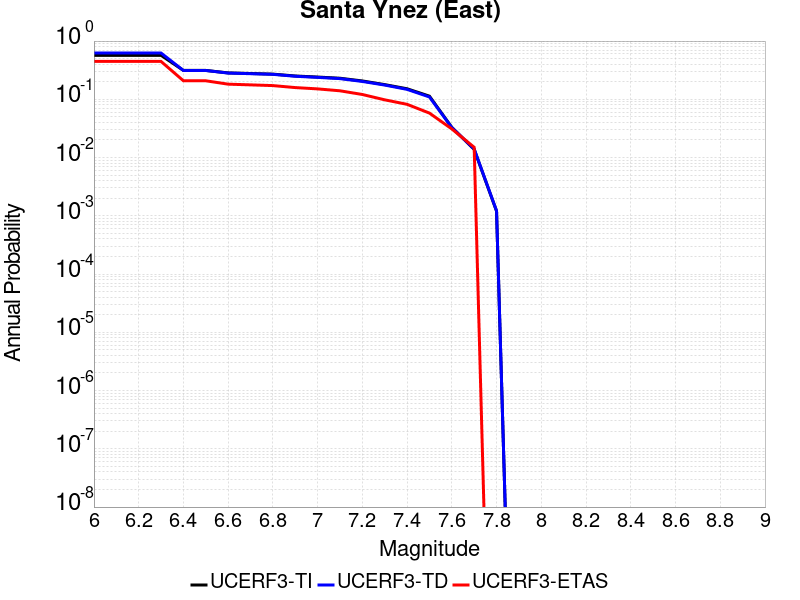 |
|-----|

| Magnitude | UCERF3-TI Prob | UCERF3-TD Prob | UCERF3-ETAS Prob |
|-----|-----|-----|-----|
| 6.0 | 0.5691121 | 0.62336606 | 0.447 |
| 6.1 | 0.5691121 | 0.62336606 | 0.447 |
| 6.2 | 0.5691121 | 0.62336606 | 0.447 |
| 6.3 | 0.5691121 | 0.62336606 | 0.447 |
| 6.4 | 0.31326932 | 0.31250983 | 0.208 |
| 6.5 | 0.31326932 | 0.31250983 | 0.208 |
| 6.6 | 0.2839457 | 0.28206673 | 0.182 |
| 6.7 | 0.27747044 | 0.27539495 | 0.177 |
| 6.8 | 0.27061626 | 0.26832002 | 0.172 |
| 6.9 | 0.2515104 | 0.248641 | 0.159 |
| 7.0 | 0.24115628 | 0.23796594 | 0.151 |
| 7.1 | 0.23007508 | 0.22657685 | 0.14 |
| 7.2 | 0.20667332 | 0.20257641 | 0.121 |
| 7.3 | 0.17879786 | 0.17567644 | 0.098 |
| 7.4 | 0.15177394 | 0.14813928 | 0.082 |
| 7.5 | 0.11332779 | 0.109744005 | 0.058 |
| 7.6 | 0.03299087 | 0.032702878 | 0.031 |
| 7.7 | 0.01380995 | 0.014030273 | 0.015 |
| 7.8 | 0.001203018 | 0.0012176243 | 0.0 |

## Santa Ynez (West)
*[(top)](#table-of-contents)*

| 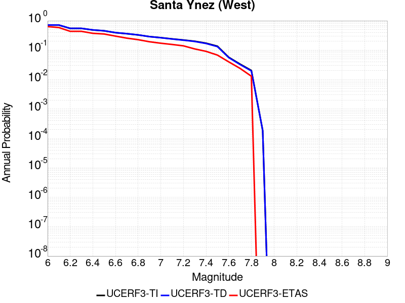 |
|-----|

| Magnitude | UCERF3-TI Prob | UCERF3-TD Prob | UCERF3-ETAS Prob |
|-----|-----|-----|-----|
| 6.0 | 0.70928997 | 0.7173226 | 0.633 |
| 6.1 | 0.70928997 | 0.7173226 | 0.587 |
| 6.2 | 0.54775894 | 0.5500945 | 0.436 |
| 6.3 | 0.54775894 | 0.5500945 | 0.436 |
| 6.4 | 0.48523 | 0.48776132 | 0.373 |
| 6.5 | 0.45327634 | 0.45598143 | 0.354 |
| 6.6 | 0.3927369 | 0.39506447 | 0.3 |
| 6.7 | 0.36203504 | 0.36394483 | 0.256 |
| 6.8 | 0.32942665 | 0.3303035 | 0.227 |
| 6.9 | 0.28895617 | 0.28830096 | 0.193 |
| 7.0 | 0.26568732 | 0.26419 | 0.172 |
| 7.1 | 0.24154669 | 0.23917927 | 0.156 |
| 7.2 | 0.22137594 | 0.21849206 | 0.14 |
| 7.3 | 0.20068946 | 0.19727334 | 0.11 |
| 7.4 | 0.17260155 | 0.16841637 | 0.091 |
| 7.5 | 0.13654418 | 0.13209257 | 0.068 |
| 7.6 | 0.057386234 | 0.05593646 | 0.04 |
| 7.7 | 0.033599235 | 0.03250486 | 0.024 |
| 7.8 | 0.020409696 | 0.019699937 | 0.013 |
| 7.9 | 1.8457326E-4 | 1.8788315E-4 | 0.0 |

## Santa Ynez River
*[(top)](#table-of-contents)*

| 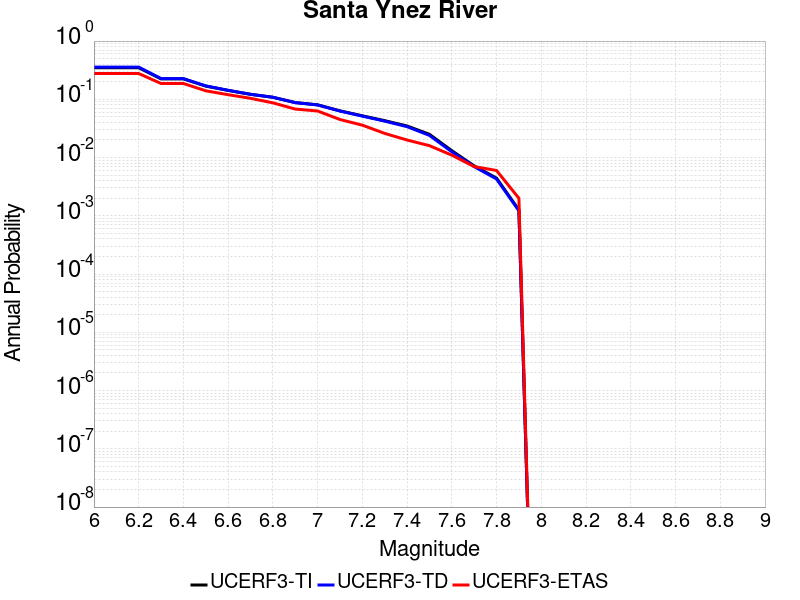 |
|-----|

| Magnitude | UCERF3-TI Prob | UCERF3-TD Prob | UCERF3-ETAS Prob |
|-----|-----|-----|-----|
| 6.0 | 0.34804213 | 0.35762823 | 0.277 |
| 6.1 | 0.34804213 | 0.35762823 | 0.277 |
| 6.2 | 0.34804213 | 0.35762823 | 0.277 |
| 6.3 | 0.22433302 | 0.22699891 | 0.187 |
| 6.4 | 0.22433302 | 0.22699891 | 0.187 |
| 6.5 | 0.16869958 | 0.16995831 | 0.14 |
| 6.6 | 0.142067 | 0.14280327 | 0.12 |
| 6.7 | 0.12168464 | 0.12205812 | 0.104 |
| 6.8 | 0.108367816 | 0.10852424 | 0.087 |
| 6.9 | 0.08787623 | 0.08772004 | 0.068 |
| 7.0 | 0.08037432 | 0.08011526 | 0.063 |
| 7.1 | 0.063373 | 0.06286894 | 0.045 |
| 7.2 | 0.052117042 | 0.051449142 | 0.036 |
| 7.3 | 0.042997602 | 0.04219083 | 0.026 |
| 7.4 | 0.034860082 | 0.03390151 | 0.02 |
| 7.5 | 0.025078988 | 0.024015604 | 0.016 |
| 7.6 | 0.0131329335 | 0.012576848 | 0.011 |
| 7.7 | 0.0071983235 | 0.0069895224 | 0.007 |
| 7.8 | 0.0044369586 | 0.004289627 | 0.006 |
| 7.9 | 0.0012604729 | 0.0012184471 | 0.002 |

## Sargent 2011 CFM
*[(top)](#table-of-contents)*

| 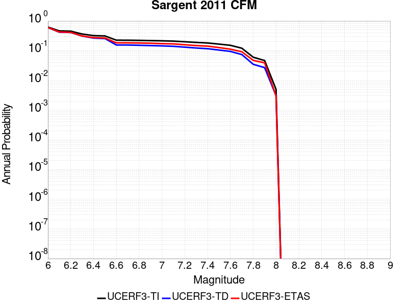 |
|-----|

| Magnitude | UCERF3-TI Prob | UCERF3-TD Prob | UCERF3-ETAS Prob |
|-----|-----|-----|-----|
| 6.0 | 0.6223833 | 0.598546 | 0.604 |
| 6.1 | 0.46215677 | 0.41811216 | 0.425 |
| 6.2 | 0.45283306 | 0.40782526 | 0.413 |
| 6.3 | 0.3629834 | 0.3103083 | 0.311 |
| 6.4 | 0.32101506 | 0.26479775 | 0.274 |
| 6.5 | 0.312448 | 0.25547203 | 0.267 |
| 6.6 | 0.2250534 | 0.15509711 | 0.183 |
| 6.7 | 0.22465207 | 0.15465036 | 0.183 |
| 6.8 | 0.22172287 | 0.15163484 | 0.181 |
| 6.9 | 0.218038 | 0.14812762 | 0.178 |
| 7.0 | 0.21436614 | 0.14457466 | 0.172 |
| 7.1 | 0.20918088 | 0.13991357 | 0.169 |
| 7.2 | 0.19932817 | 0.13120797 | 0.158 |
| 7.3 | 0.18929613 | 0.12267015 | 0.148 |
| 7.4 | 0.18119156 | 0.1162849 | 0.142 |
| 7.5 | 0.16608584 | 0.104901545 | 0.127 |
| 7.6 | 0.15117486 | 0.09440398 | 0.112 |
| 7.7 | 0.12079351 | 0.073890455 | 0.092 |
| 7.8 | 0.06003767 | 0.034759037 | 0.047 |
| 7.9 | 0.04644202 | 0.026796566 | 0.039 |
| 8.0 | 0.0049693966 | 0.0030562812 | 0.003 |

## Scodie Lineament
*[(top)](#table-of-contents)*

| 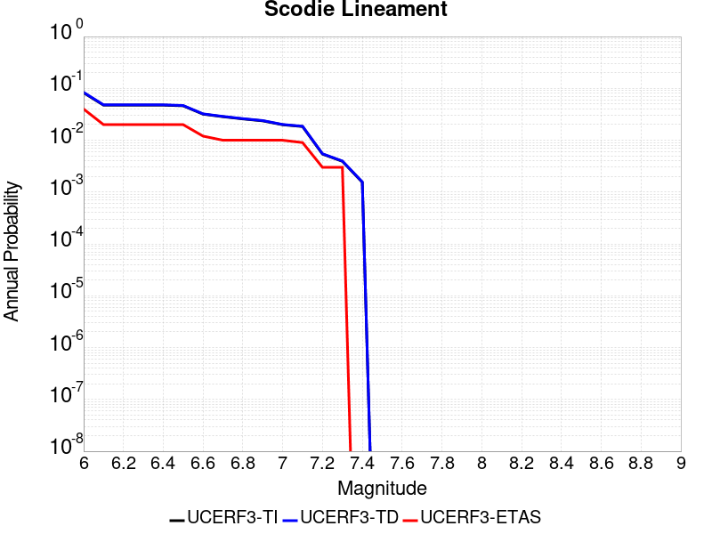 |
|-----|

| Magnitude | UCERF3-TI Prob | UCERF3-TD Prob | UCERF3-ETAS Prob |
|-----|-----|-----|-----|
| 6.0 | 0.082299605 | 0.083877146 | 0.04 |
| 6.1 | 0.04752612 | 0.048190244 | 0.02 |
| 6.2 | 0.04752612 | 0.048190244 | 0.02 |
| 6.3 | 0.04752612 | 0.048190244 | 0.02 |
| 6.4 | 0.04752612 | 0.048190244 | 0.02 |
| 6.5 | 0.046139758 | 0.04678745 | 0.02 |
| 6.6 | 0.031870123 | 0.032259427 | 0.012 |
| 6.7 | 0.028448056 | 0.028796285 | 0.01 |
| 6.8 | 0.025769034 | 0.02608688 | 0.01 |
| 6.9 | 0.023633264 | 0.02392852 | 0.01 |
| 7.0 | 0.01988517 | 0.020139076 | 0.01 |
| 7.1 | 0.018362813 | 0.018601079 | 0.009 |
| 7.2 | 0.0054117716 | 0.0054821842 | 0.003 |
| 7.3 | 0.003918267 | 0.003970782 | 0.003 |
| 7.4 | 0.0015468019 | 0.0015681955 | 0.0 |

## Sheephole
*[(top)](#table-of-contents)*

| 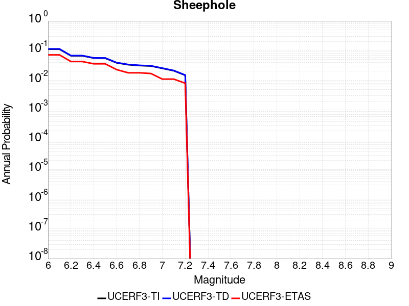 |
|-----|

| Magnitude | UCERF3-TI Prob | UCERF3-TD Prob | UCERF3-ETAS Prob |
|-----|-----|-----|-----|
| 6.0 | 0.11211623 | 0.11468318 | 0.072 |
| 6.1 | 0.11211623 | 0.11468318 | 0.072 |
| 6.2 | 0.06723337 | 0.06835307 | 0.043 |
| 6.3 | 0.06723337 | 0.06835307 | 0.043 |
| 6.4 | 0.056173846 | 0.057146233 | 0.036 |
| 6.5 | 0.055746093 | 0.05671335 | 0.036 |
| 6.6 | 0.038960814 | 0.039586835 | 0.023 |
| 6.7 | 0.033693746 | 0.034239862 | 0.018 |
| 6.8 | 0.03151916 | 0.03203267 | 0.018 |
| 6.9 | 0.030410154 | 0.030906562 | 0.017 |
| 7.0 | 0.025368977 | 0.025780436 | 0.011 |
| 7.1 | 0.021075003 | 0.021417424 | 0.011 |
| 7.2 | 0.01483689 | 0.015080396 | 0.008 |

## Shoreline
*[(top)](#table-of-contents)*

| 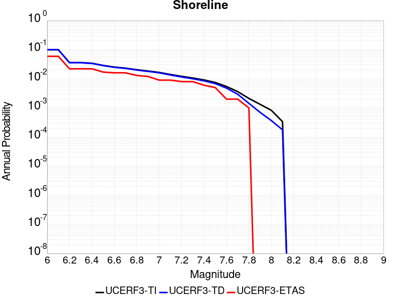 |
|-----|

| Magnitude | UCERF3-TI Prob | UCERF3-TD Prob | UCERF3-ETAS Prob |
|-----|-----|-----|-----|
| 6.0 | 0.098835 | 0.10018196 | 0.059 |
| 6.1 | 0.098835 | 0.10018196 | 0.059 |
| 6.2 | 0.03596577 | 0.035551216 | 0.022 |
| 6.3 | 0.03596577 | 0.035551216 | 0.022 |
| 6.4 | 0.034139335 | 0.03371194 | 0.022 |
| 6.5 | 0.028764363 | 0.028303474 | 0.017 |
| 6.6 | 0.025225855 | 0.024741082 | 0.016 |
| 6.7 | 0.023196619 | 0.022698486 | 0.016 |
| 6.8 | 0.020480387 | 0.019958386 | 0.013 |
| 6.9 | 0.01847222 | 0.017935347 | 0.012 |
| 7.0 | 0.016530419 | 0.015976084 | 0.009 |
| 7.1 | 0.014066839 | 0.013488273 | 0.009 |
| 7.2 | 0.012127524 | 0.011530011 | 0.008 |
| 7.3 | 0.010630854 | 0.010020043 | 0.008 |
| 7.4 | 0.009117035 | 0.008492842 | 0.006 |
| 7.5 | 0.0074693826 | 0.006830598 | 0.005 |
| 7.6 | 0.0054440633 | 0.0047864458 | 0.002 |
| 7.7 | 0.0036257312 | 0.0029489147 | 0.002 |
| 7.8 | 0.0021130857 | 0.0014345198 | 0.001 |
| 7.9 | 0.0013259961 | 7.020394E-4 | 0.0 |
| 8.0 | 8.282665E-4 | 3.6730643E-4 | 0.0 |
| 8.1 | 3.377443E-4 | 1.7711759E-4 | 0.0 |

## Sierra Madre
*[(top)](#table-of-contents)*

| 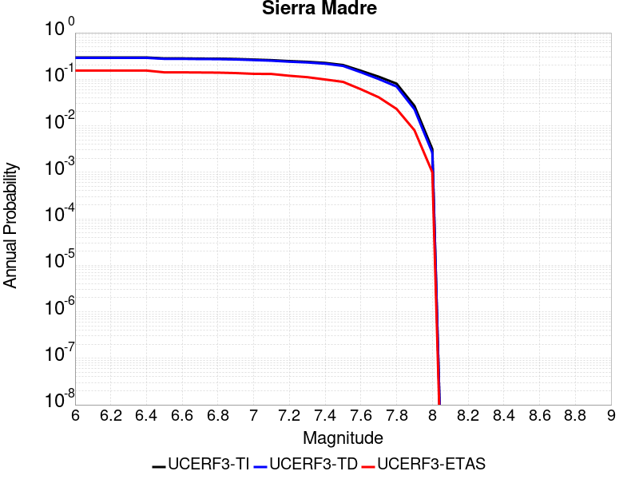 |
|-----|

| Magnitude | UCERF3-TI Prob | UCERF3-TD Prob | UCERF3-ETAS Prob |
|-----|-----|-----|-----|
| 6.0 | 0.29464963 | 0.2887689 | 0.154 |
| 6.1 | 0.29464963 | 0.2887689 | 0.154 |
| 6.2 | 0.29464963 | 0.2887689 | 0.154 |
| 6.3 | 0.29464963 | 0.2887689 | 0.154 |
| 6.4 | 0.29464963 | 0.2887689 | 0.154 |
| 6.5 | 0.28121755 | 0.2748936 | 0.141 |
| 6.6 | 0.28121755 | 0.2748936 | 0.141 |
| 6.7 | 0.27832666 | 0.27191913 | 0.14 |
| 6.8 | 0.2774316 | 0.27099702 | 0.139 |
| 6.9 | 0.27309424 | 0.26653907 | 0.136 |
| 7.0 | 0.26554313 | 0.258773 | 0.131 |
| 7.1 | 0.25798255 | 0.2508663 | 0.13 |
| 7.2 | 0.24626617 | 0.23869377 | 0.119 |
| 7.3 | 0.23770352 | 0.22983582 | 0.111 |
| 7.4 | 0.22497806 | 0.21665923 | 0.099 |
| 7.5 | 0.20279302 | 0.19370568 | 0.088 |
| 7.6 | 0.15268546 | 0.14144118 | 0.061 |
| 7.7 | 0.11360354 | 0.10107707 | 0.041 |
| 7.8 | 0.080443844 | 0.06981825 | 0.023 |
| 7.9 | 0.026747182 | 0.02267565 | 0.008 |
| 8.0 | 0.0031543828 | 0.0026364455 | 0.001 |

## Sierra Madre (San Fernando)
*[(top)](#table-of-contents)*

| 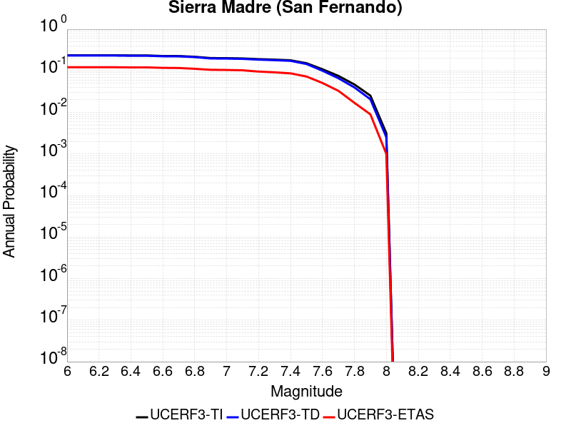 |
|-----|

| Magnitude | UCERF3-TI Prob | UCERF3-TD Prob | UCERF3-ETAS Prob |
|-----|-----|-----|-----|
| 6.0 | 0.23656853 | 0.23347567 | 0.122 |
| 6.1 | 0.23656853 | 0.23347567 | 0.122 |
| 6.2 | 0.23656853 | 0.23347567 | 0.122 |
| 6.3 | 0.23656853 | 0.23347567 | 0.122 |
| 6.4 | 0.23463698 | 0.23149014 | 0.121 |
| 6.5 | 0.23463698 | 0.23149014 | 0.121 |
| 6.6 | 0.22769664 | 0.22432968 | 0.118 |
| 6.7 | 0.22706407 | 0.22367738 | 0.117 |
| 6.8 | 0.21821655 | 0.21450031 | 0.112 |
| 6.9 | 0.20307082 | 0.19870716 | 0.106 |
| 7.0 | 0.20199789 | 0.19760177 | 0.105 |
| 7.1 | 0.19901322 | 0.1945178 | 0.103 |
| 7.2 | 0.19132744 | 0.18654883 | 0.096 |
| 7.3 | 0.1858626 | 0.18091528 | 0.092 |
| 7.4 | 0.17945391 | 0.17432438 | 0.087 |
| 7.5 | 0.15265335 | 0.14640965 | 0.073 |
| 7.6 | 0.10916034 | 0.1013088 | 0.051 |
| 7.7 | 0.07540562 | 0.066962 | 0.033 |
| 7.8 | 0.047017284 | 0.04053952 | 0.017 |
| 7.9 | 0.025343271 | 0.02129197 | 0.009 |
| 8.0 | 0.0031543828 | 0.0026364455 | 0.001 |

## Sierra Nevada  (No Extension)
*[(top)](#table-of-contents)*

| 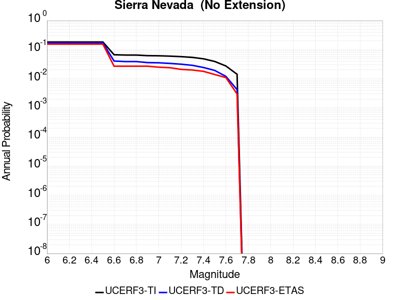 |
|-----|

| Magnitude | UCERF3-TI Prob | UCERF3-TD Prob | UCERF3-ETAS Prob |
|-----|-----|-----|-----|
| 6.0 | 0.1834684 | 0.17047654 | 0.155 |
| 6.1 | 0.1834684 | 0.17047654 | 0.155 |
| 6.2 | 0.1834684 | 0.17047654 | 0.155 |
| 6.3 | 0.1834684 | 0.17047654 | 0.155 |
| 6.4 | 0.1834684 | 0.17047654 | 0.155 |
| 6.5 | 0.1834684 | 0.17047654 | 0.155 |
| 6.6 | 0.06687393 | 0.040640354 | 0.027 |
| 6.7 | 0.06534497 | 0.039052956 | 0.027 |
| 6.8 | 0.06522652 | 0.038982958 | 0.027 |
| 6.9 | 0.06212092 | 0.03590297 | 0.027 |
| 7.0 | 0.06153079 | 0.03533448 | 0.025 |
| 7.1 | 0.05984234 | 0.033725597 | 0.024 |
| 7.2 | 0.057556257 | 0.031656206 | 0.021 |
| 7.3 | 0.054257084 | 0.028974514 | 0.02 |
| 7.4 | 0.048480466 | 0.024382694 | 0.018 |
| 7.5 | 0.039314453 | 0.0193548 | 0.014 |
| 7.6 | 0.027479587 | 0.012091224 | 0.011 |
| 7.7 | 0.014270174 | 0.0042425166 | 0.003 |

## Silver Creek 2011 CFM
*[(top)](#table-of-contents)*

| 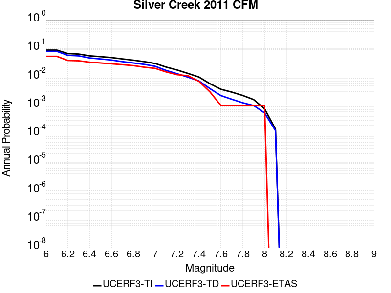 |
|-----|

| Magnitude | UCERF3-TI Prob | UCERF3-TD Prob | UCERF3-ETAS Prob |
|-----|-----|-----|-----|
| 6.0 | 0.08781315 | 0.07954824 | 0.053 |
| 6.1 | 0.08781315 | 0.07954824 | 0.053 |
| 6.2 | 0.06646786 | 0.05784886 | 0.038 |
| 6.3 | 0.063813984 | 0.055156633 | 0.037 |
| 6.4 | 0.05525632 | 0.046477683 | 0.033 |
| 6.5 | 0.05168615 | 0.0428583 | 0.031 |
| 6.6 | 0.048005633 | 0.039254613 | 0.029 |
| 6.7 | 0.042994913 | 0.034447875 | 0.027 |
| 6.8 | 0.038822476 | 0.030998623 | 0.025 |
| 6.9 | 0.034449838 | 0.02762703 | 0.022 |
| 7.0 | 0.02971803 | 0.023631549 | 0.02 |
| 7.1 | 0.02219253 | 0.016910246 | 0.015 |
| 7.2 | 0.017554566 | 0.012986774 | 0.012 |
| 7.3 | 0.013292595 | 0.00977186 | 0.011 |
| 7.4 | 0.00991918 | 0.007223269 | 0.007 |
| 7.5 | 0.0057990993 | 0.0038956124 | 0.003 |
| 7.6 | 0.0036993504 | 0.0022190942 | 0.001 |
| 7.7 | 0.0029307613 | 0.0016451075 | 0.001 |
| 7.8 | 0.002239279 | 0.0012391789 | 0.001 |
| 7.9 | 0.0016049052 | 9.897294E-4 | 0.001 |
| 8.0 | 7.623134E-4 | 5.442775E-4 | 0.001 |
| 8.1 | 1.4625162E-4 | 1.2945871E-4 | 0.0 |

## Simi-Santa Rosa
*[(top)](#table-of-contents)*

| 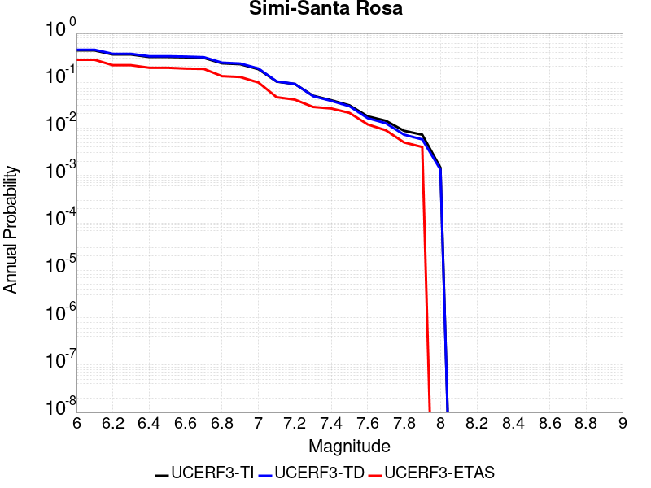 |
|-----|

| Magnitude | UCERF3-TI Prob | UCERF3-TD Prob | UCERF3-ETAS Prob |
|-----|-----|-----|-----|
| 6.0 | 0.43655568 | 0.450581 | 0.277 |
| 6.1 | 0.43655568 | 0.450581 | 0.277 |
| 6.2 | 0.35819918 | 0.36989602 | 0.213 |
| 6.3 | 0.35819918 | 0.36989602 | 0.213 |
| 6.4 | 0.31793696 | 0.32863888 | 0.188 |
| 6.5 | 0.31793696 | 0.32863888 | 0.188 |
| 6.6 | 0.31278196 | 0.32342488 | 0.181 |
| 6.7 | 0.30382794 | 0.3143541 | 0.178 |
| 6.8 | 0.23317708 | 0.24095084 | 0.125 |
| 6.9 | 0.22358027 | 0.2311191 | 0.12 |
| 7.0 | 0.17567508 | 0.18134291 | 0.092 |
| 7.1 | 0.09611708 | 0.09691796 | 0.045 |
| 7.2 | 0.085305974 | 0.0858244 | 0.04 |
| 7.3 | 0.048417024 | 0.04751336 | 0.028 |
| 7.4 | 0.038805913 | 0.037673295 | 0.026 |
| 7.5 | 0.03028425 | 0.028993623 | 0.021 |
| 7.6 | 0.017769413 | 0.01623744 | 0.012 |
| 7.7 | 0.0142791895 | 0.012685596 | 0.009 |
| 7.8 | 0.008794992 | 0.007286119 | 0.005 |
| 7.9 | 0.0072668297 | 0.0057852697 | 0.004 |
| 8.0 | 0.0014666809 | 0.0013354014 | 0.0 |

## Sisar
*[(top)](#table-of-contents)*

| 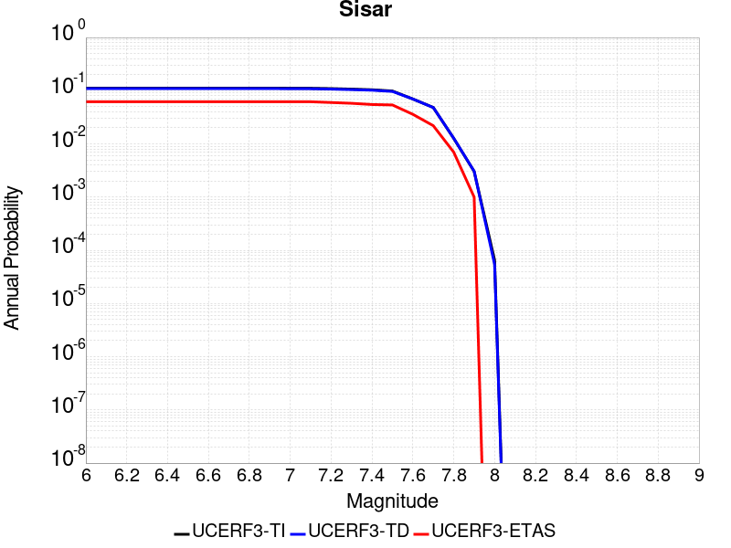 |
|-----|

| Magnitude | UCERF3-TI Prob | UCERF3-TD Prob | UCERF3-ETAS Prob |
|-----|-----|-----|-----|
| 6.0 | 0.11179705 | 0.10950787 | 0.062 |
| 6.1 | 0.11179705 | 0.10950787 | 0.062 |
| 6.2 | 0.11179705 | 0.10950787 | 0.062 |
| 6.3 | 0.11179705 | 0.10950787 | 0.062 |
| 6.4 | 0.11179705 | 0.10950787 | 0.062 |
| 6.5 | 0.11179705 | 0.10950787 | 0.062 |
| 6.6 | 0.11179705 | 0.10950787 | 0.062 |
| 6.7 | 0.11179705 | 0.10950787 | 0.062 |
| 6.8 | 0.11179705 | 0.10950787 | 0.062 |
| 6.9 | 0.11175144 | 0.10946166 | 0.062 |
| 7.0 | 0.111418225 | 0.10912371 | 0.062 |
| 7.1 | 0.1110797 | 0.108780086 | 0.062 |
| 7.2 | 0.10958515 | 0.10725984 | 0.06 |
| 7.3 | 0.107109495 | 0.10481113 | 0.058 |
| 7.4 | 0.104221016 | 0.102146246 | 0.055 |
| 7.5 | 0.098715365 | 0.09692218 | 0.054 |
| 7.6 | 0.06989733 | 0.069825344 | 0.036 |
| 7.7 | 0.048431754 | 0.048231628 | 0.022 |
| 7.8 | 0.012727103 | 0.012793831 | 0.007 |
| 7.9 | 0.0030388944 | 0.0030639349 | 0.001 |
| 8.0 | 6.548287E-5 | 5.447173E-5 | 0.0 |

## Skinner Flat 2011 CFM
*[(top)](#table-of-contents)*

| 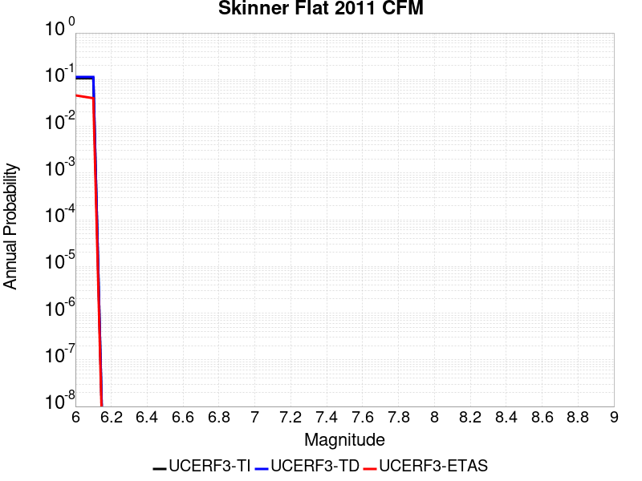 |
|-----|

| Magnitude | UCERF3-TI Prob | UCERF3-TD Prob | UCERF3-ETAS Prob |
|-----|-----|-----|-----|
| 6.0 | 0.10677096 | 0.11412896 | 0.046 |
| 6.1 | 0.10677096 | 0.11412896 | 0.04 |

## So Sierra Nevada
*[(top)](#table-of-contents)*

| 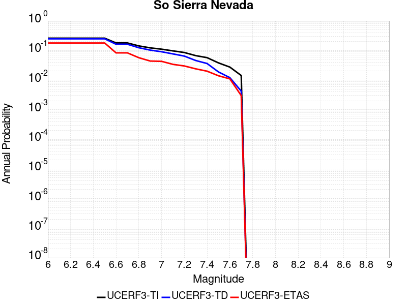 |
|-----|

| Magnitude | UCERF3-TI Prob | UCERF3-TD Prob | UCERF3-ETAS Prob |
|-----|-----|-----|-----|
| 6.0 | 0.26014677 | 0.24773015 | 0.179 |
| 6.1 | 0.26014677 | 0.24773015 | 0.179 |
| 6.2 | 0.26014677 | 0.24773015 | 0.179 |
| 6.3 | 0.26014677 | 0.24773015 | 0.179 |
| 6.4 | 0.26014677 | 0.24773015 | 0.179 |
| 6.5 | 0.26014677 | 0.24773015 | 0.179 |
| 6.6 | 0.179582 | 0.16246158 | 0.083 |
| 6.7 | 0.179582 | 0.16246158 | 0.083 |
| 6.8 | 0.1427259 | 0.1239501 | 0.057 |
| 6.9 | 0.12256904 | 0.103000045 | 0.044 |
| 7.0 | 0.11059791 | 0.09060946 | 0.043 |
| 7.1 | 0.09702229 | 0.07658637 | 0.034 |
| 7.2 | 0.08536266 | 0.06459701 | 0.03 |
| 7.3 | 0.0670288 | 0.04585441 | 0.024 |
| 7.4 | 0.057203136 | 0.03627857 | 0.02 |
| 7.5 | 0.03811011 | 0.018849384 | 0.014 |
| 7.6 | 0.027479587 | 0.012091224 | 0.011 |
| 7.7 | 0.014270174 | 0.0042425166 | 0.003 |

## South Cuyama
*[(top)](#table-of-contents)*

| 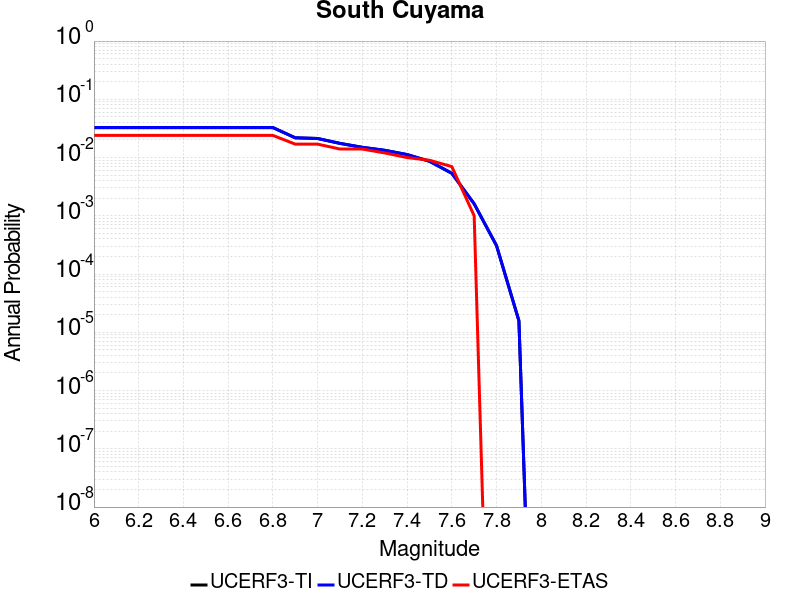 |
|-----|

| Magnitude | UCERF3-TI Prob | UCERF3-TD Prob | UCERF3-ETAS Prob |
|-----|-----|-----|-----|
| 6.0 | 0.032709908 | 0.03278314 | 0.024 |
| 6.1 | 0.032709908 | 0.03278314 | 0.024 |
| 6.2 | 0.032709908 | 0.03278314 | 0.024 |
| 6.3 | 0.032709908 | 0.03278314 | 0.024 |
| 6.4 | 0.032709908 | 0.03278314 | 0.024 |
| 6.5 | 0.032709908 | 0.03278314 | 0.024 |
| 6.6 | 0.032709908 | 0.03278314 | 0.024 |
| 6.7 | 0.032709908 | 0.03278314 | 0.024 |
| 6.8 | 0.032709908 | 0.03278314 | 0.024 |
| 6.9 | 0.021821156 | 0.02186357 | 0.017 |
| 7.0 | 0.021236977 | 0.021278378 | 0.017 |
| 7.1 | 0.017497616 | 0.017532023 | 0.014 |
| 7.2 | 0.014975057 | 0.015005201 | 0.014 |
| 7.3 | 0.013312041 | 0.013339249 | 0.012 |
| 7.4 | 0.011251229 | 0.011274739 | 0.01 |
| 7.5 | 0.008635252 | 0.008653925 | 0.009 |
| 7.6 | 0.005367122 | 0.0053792475 | 0.007 |
| 7.7 | 0.0016038193 | 0.00160747 | 0.001 |
| 7.8 | 3.069083E-4 | 3.0776198E-4 | 0.0 |
| 7.9 | 1.5753045E-5 | 1.5802327E-5 | 0.0 |

## South Klamath Lake East
*[(top)](#table-of-contents)*

| 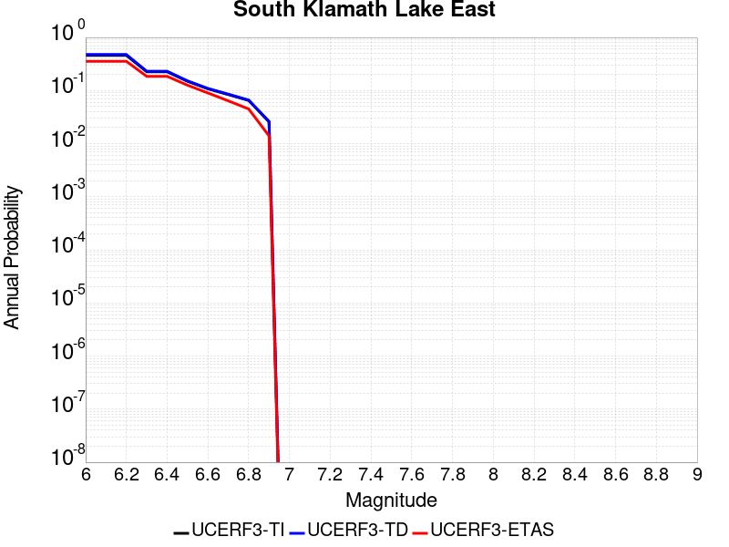 |
|-----|

| Magnitude | UCERF3-TI Prob | UCERF3-TD Prob | UCERF3-ETAS Prob |
|-----|-----|-----|-----|
| 6.0 | 0.45888993 | 0.47680423 | 0.355 |
| 6.1 | 0.45888993 | 0.47680423 | 0.355 |
| 6.2 | 0.45888993 | 0.47680423 | 0.355 |
| 6.3 | 0.22576539 | 0.23085968 | 0.185 |
| 6.4 | 0.22576539 | 0.23085968 | 0.185 |
| 6.5 | 0.14917164 | 0.15209669 | 0.126 |
| 6.6 | 0.107736856 | 0.10967524 | 0.09 |
| 6.7 | 0.08394778 | 0.08546678 | 0.064 |
| 6.8 | 0.0650641 | 0.06625516 | 0.045 |
| 6.9 | 0.025720967 | 0.026231859 | 0.014 |

## South Klamath Lake West
*[(top)](#table-of-contents)*

| 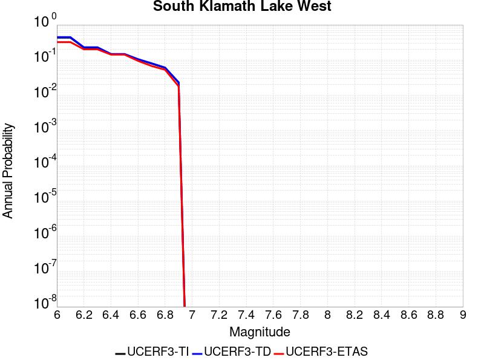 |
|-----|

| Magnitude | UCERF3-TI Prob | UCERF3-TD Prob | UCERF3-ETAS Prob |
|-----|-----|-----|-----|
| 6.0 | 0.43288535 | 0.4482312 | 0.324 |
| 6.1 | 0.43288535 | 0.4482312 | 0.324 |
| 6.2 | 0.22631274 | 0.23138723 | 0.202 |
| 6.3 | 0.22631274 | 0.23138723 | 0.202 |
| 6.4 | 0.1463777 | 0.14914435 | 0.143 |
| 6.5 | 0.1463777 | 0.14914435 | 0.143 |
| 6.6 | 0.104537375 | 0.10633915 | 0.095 |
| 6.7 | 0.07977535 | 0.08115593 | 0.068 |
| 6.8 | 0.060207084 | 0.061257698 | 0.053 |
| 6.9 | 0.023024078 | 0.023453454 | 0.018 |

## Superstition Hills
*[(top)](#table-of-contents)*

| 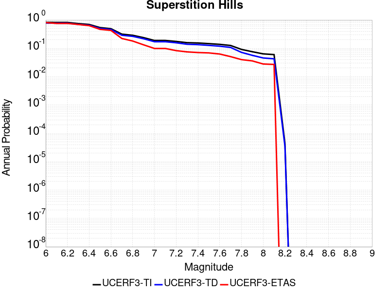 |
|-----|

| Magnitude | UCERF3-TI Prob | UCERF3-TD Prob | UCERF3-ETAS Prob |
|-----|-----|-----|-----|
| 6.0 | 0.8252717 | 0.778385 | 0.808 |
| 6.1 | 0.8186925 | 0.7717313 | 0.758 |
| 6.2 | 0.8186925 | 0.7717313 | 0.758 |
| 6.3 | 0.74517244 | 0.6994816 | 0.694 |
| 6.4 | 0.69427353 | 0.6523634 | 0.632 |
| 6.5 | 0.5389081 | 0.5019998 | 0.467 |
| 6.6 | 0.49327865 | 0.46232724 | 0.429 |
| 6.7 | 0.3169586 | 0.28962004 | 0.223 |
| 6.8 | 0.28876087 | 0.26497564 | 0.181 |
| 6.9 | 0.23849179 | 0.21815833 | 0.133 |
| 7.0 | 0.1893452 | 0.17132749 | 0.099 |
| 7.1 | 0.1893452 | 0.17132749 | 0.099 |
| 7.2 | 0.17504166 | 0.15707111 | 0.083 |
| 7.3 | 0.15832102 | 0.13919695 | 0.075 |
| 7.4 | 0.15446769 | 0.13505341 | 0.071 |
| 7.5 | 0.14655522 | 0.12717581 | 0.069 |
| 7.6 | 0.13815163 | 0.119115315 | 0.063 |
| 7.7 | 0.12608527 | 0.10759644 | 0.051 |
| 7.8 | 0.09169725 | 0.072093144 | 0.04 |
| 7.9 | 0.07592469 | 0.056607496 | 0.036 |
| 8.0 | 0.0638051 | 0.04570661 | 0.028 |
| 8.1 | 0.060079396 | 0.04274588 | 0.027 |
| 8.2 | 4.48371E-5 | 3.5369267E-5 | 0.0 |

## Surprise Valley 2011 CFM
*[(top)](#table-of-contents)*

| 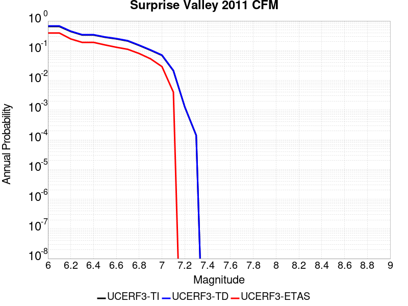 |
|-----|

| Magnitude | UCERF3-TI Prob | UCERF3-TD Prob | UCERF3-ETAS Prob |
|-----|-----|-----|-----|
| 6.0 | 0.65143496 | 0.6774936 | 0.393 |
| 6.1 | 0.65143496 | 0.6774936 | 0.393 |
| 6.2 | 0.44103816 | 0.45288616 | 0.248 |
| 6.3 | 0.3365452 | 0.34463805 | 0.19 |
| 6.4 | 0.33633685 | 0.3444315 | 0.19 |
| 6.5 | 0.2826633 | 0.28937882 | 0.156 |
| 6.6 | 0.24915846 | 0.25511694 | 0.13 |
| 6.7 | 0.21143383 | 0.21650141 | 0.111 |
| 6.8 | 0.14970997 | 0.15327364 | 0.08 |
| 6.9 | 0.103300415 | 0.10581207 | 0.053 |
| 7.0 | 0.06917996 | 0.0709544 | 0.029 |
| 7.1 | 0.020983784 | 0.021563198 | 0.004 |
| 7.2 | 0.0012682052 | 0.0012742083 | 0.0 |
| 7.3 | 1.4064225E-4 | 1.4131138E-4 | 0.0 |

## Swain Ravine - Spenceville
*[(top)](#table-of-contents)*

| 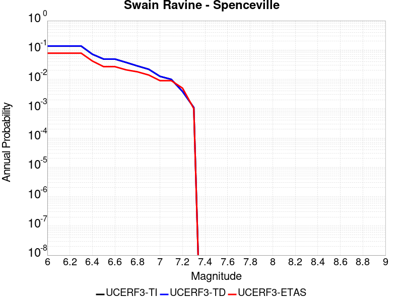 |
|-----|

| Magnitude | UCERF3-TI Prob | UCERF3-TD Prob | UCERF3-ETAS Prob |
|-----|-----|-----|-----|
| 6.0 | 0.1358427 | 0.1369394 | 0.078 |
| 6.1 | 0.1358427 | 0.1369394 | 0.078 |
| 6.2 | 0.1358427 | 0.1369394 | 0.078 |
| 6.3 | 0.1358427 | 0.1369394 | 0.078 |
| 6.4 | 0.07148016 | 0.07180742 | 0.042 |
| 6.5 | 0.04888437 | 0.049071543 | 0.027 |
| 6.6 | 0.04888437 | 0.049071543 | 0.027 |
| 6.7 | 0.03754331 | 0.037678573 | 0.021 |
| 6.8 | 0.028485386 | 0.028583411 | 0.018 |
| 6.9 | 0.021968303 | 0.022042142 | 0.014 |
| 7.0 | 0.012585107 | 0.012626651 | 0.009 |
| 7.1 | 0.009940339 | 0.009973435 | 0.009 |
| 7.2 | 0.0038346925 | 0.0038481557 | 0.005 |
| 7.3 | 0.0010920384 | 0.0010961338 | 0.001 |

## Table Bluff
*[(top)](#table-of-contents)*

| 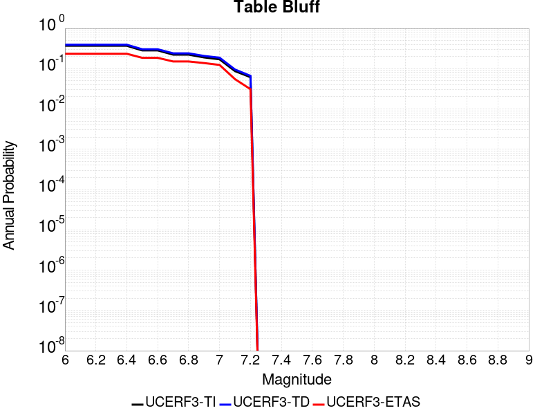 |
|-----|

| Magnitude | UCERF3-TI Prob | UCERF3-TD Prob | UCERF3-ETAS Prob |
|-----|-----|-----|-----|
| 6.0 | 0.37057623 | 0.3940668 | 0.235 |
| 6.1 | 0.37057623 | 0.3940668 | 0.235 |
| 6.2 | 0.37057623 | 0.3940668 | 0.235 |
| 6.3 | 0.37057623 | 0.3940668 | 0.235 |
| 6.4 | 0.37057623 | 0.3940668 | 0.235 |
| 6.5 | 0.28432488 | 0.30346084 | 0.186 |
| 6.6 | 0.28432488 | 0.30346084 | 0.186 |
| 6.7 | 0.22338533 | 0.24081989 | 0.151 |
| 6.8 | 0.22338533 | 0.24081989 | 0.151 |
| 6.9 | 0.19040473 | 0.2072177 | 0.138 |
| 7.0 | 0.17095083 | 0.18751453 | 0.124 |
| 7.1 | 0.08711849 | 0.09535399 | 0.055 |
| 7.2 | 0.061646607 | 0.06645116 | 0.031 |

## Tank Canyon
*[(top)](#table-of-contents)*

| 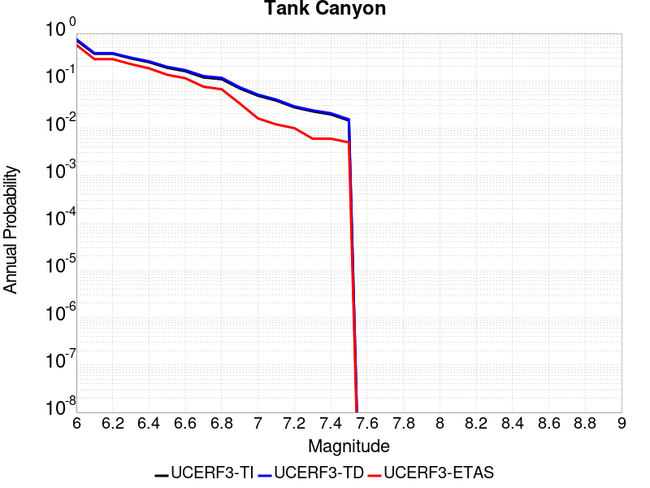 |
|-----|

| Magnitude | UCERF3-TI Prob | UCERF3-TD Prob | UCERF3-ETAS Prob |
|-----|-----|-----|-----|
| 6.0 | 0.71627223 | 0.7533143 | 0.572 |
| 6.1 | 0.3714237 | 0.38227707 | 0.286 |
| 6.2 | 0.3714237 | 0.38227707 | 0.286 |
| 6.3 | 0.2971578 | 0.3075742 | 0.225 |
| 6.4 | 0.2469291 | 0.25709617 | 0.183 |
| 6.5 | 0.18762843 | 0.19682369 | 0.134 |
| 6.6 | 0.1588766 | 0.16776106 | 0.113 |
| 6.7 | 0.11755917 | 0.12544557 | 0.075 |
| 6.8 | 0.1080498 | 0.11521128 | 0.066 |
| 6.9 | 0.068736896 | 0.07267356 | 0.033 |
| 7.0 | 0.048329774 | 0.050850622 | 0.016 |
| 7.1 | 0.03819994 | 0.04009361 | 0.012 |
| 7.2 | 0.027506221 | 0.028806556 | 0.01 |
| 7.3 | 0.02263725 | 0.023735931 | 0.006 |
| 7.4 | 0.019523134 | 0.020640878 | 0.006 |
| 7.5 | 0.01447208 | 0.015328997 | 0.005 |

## Thirty Mile Bank
*[(top)](#table-of-contents)*

| 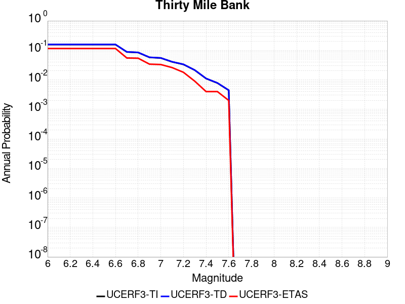 |
|-----|

| Magnitude | UCERF3-TI Prob | UCERF3-TD Prob | UCERF3-ETAS Prob |
|-----|-----|-----|-----|
| 6.0 | 0.1562562 | 0.15821263 | 0.115 |
| 6.1 | 0.1562562 | 0.15821263 | 0.115 |
| 6.2 | 0.1562562 | 0.15821263 | 0.115 |
| 6.3 | 0.1562562 | 0.15821263 | 0.115 |
| 6.4 | 0.1562562 | 0.15821263 | 0.115 |
| 6.5 | 0.1562562 | 0.15821263 | 0.115 |
| 6.6 | 0.1562562 | 0.15821263 | 0.115 |
| 6.7 | 0.087889336 | 0.0886443 | 0.055 |
| 6.8 | 0.084184565 | 0.08490936 | 0.054 |
| 6.9 | 0.057642937 | 0.058127012 | 0.034 |
| 7.0 | 0.05483742 | 0.05529786 | 0.033 |
| 7.1 | 0.04063534 | 0.040986266 | 0.026 |
| 7.2 | 0.03327609 | 0.03357143 | 0.018 |
| 7.3 | 0.021282015 | 0.021453379 | 0.009 |
| 7.4 | 0.011057414 | 0.0111541785 | 0.004 |
| 7.5 | 0.007780504 | 0.007852555 | 0.004 |
| 7.6 | 0.0044224365 | 0.00446512 | 0.002 |

## Tin Mountain
*[(top)](#table-of-contents)*

| 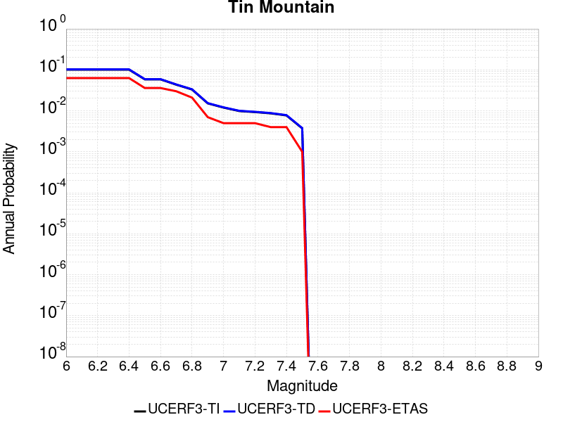 |
|-----|

| Magnitude | UCERF3-TI Prob | UCERF3-TD Prob | UCERF3-ETAS Prob |
|-----|-----|-----|-----|
| 6.0 | 0.10106362 | 0.102651104 | 0.063 |
| 6.1 | 0.10106362 | 0.102651104 | 0.063 |
| 6.2 | 0.10106362 | 0.102651104 | 0.063 |
| 6.3 | 0.10106362 | 0.102651104 | 0.063 |
| 6.4 | 0.10106362 | 0.102651104 | 0.063 |
| 6.5 | 0.05859291 | 0.05921765 | 0.036 |
| 6.6 | 0.05859291 | 0.05921765 | 0.036 |
| 6.7 | 0.043456364 | 0.043941066 | 0.03 |
| 6.8 | 0.03313211 | 0.033534456 | 0.021 |
| 6.9 | 0.0152000515 | 0.015397383 | 0.007 |
| 7.0 | 0.011993478 | 0.012160459 | 0.005 |
| 7.1 | 0.009876847 | 0.01002436 | 0.005 |
| 7.2 | 0.009313247 | 0.009455083 | 0.005 |
| 7.3 | 0.008681303 | 0.008814865 | 0.004 |
| 7.4 | 0.007721791 | 0.007841026 | 0.004 |
| 7.5 | 0.0037307607 | 0.0037904594 | 0.001 |

## Towne Pass
*[(top)](#table-of-contents)*

| 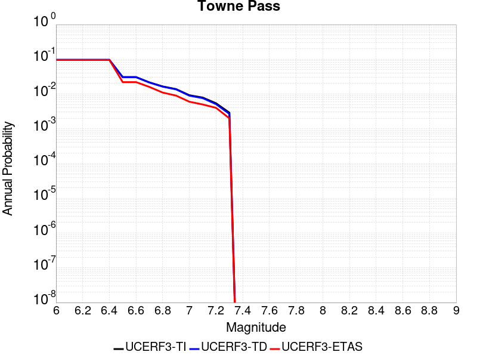 |
|-----|

| Magnitude | UCERF3-TI Prob | UCERF3-TD Prob | UCERF3-ETAS Prob |
|-----|-----|-----|-----|
| 6.0 | 0.09555777 | 0.09672593 | 0.096 |
| 6.1 | 0.09555777 | 0.09672593 | 0.096 |
| 6.2 | 0.09555777 | 0.09672593 | 0.096 |
| 6.3 | 0.09555777 | 0.09672593 | 0.096 |
| 6.4 | 0.09555777 | 0.09672593 | 0.096 |
| 6.5 | 0.030704698 | 0.030546393 | 0.022 |
| 6.6 | 0.030704698 | 0.030546393 | 0.022 |
| 6.7 | 0.021615237 | 0.021406787 | 0.016 |
| 6.8 | 0.01650826 | 0.016275808 | 0.011 |
| 6.9 | 0.013850536 | 0.013606483 | 0.009 |
| 7.0 | 0.009239058 | 0.008967909 | 0.006 |
| 7.1 | 0.007894448 | 0.0076130996 | 0.005 |
| 7.2 | 0.005414015 | 0.0051194434 | 0.004 |
| 7.3 | 0.0029078692 | 0.0026815934 | 0.002 |

## Trinidad (alt1)
*[(top)](#table-of-contents)*

| 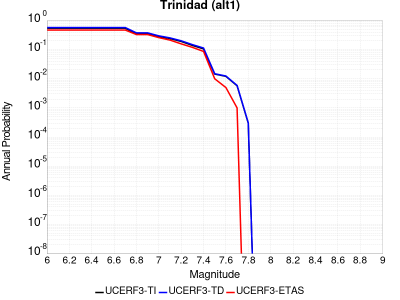 |
|-----|

| Magnitude | UCERF3-TI Prob | UCERF3-TD Prob | UCERF3-ETAS Prob |
|-----|-----|-----|-----|
| 6.0 | 0.5448152 | 0.5746404 | 0.471 |
| 6.1 | 0.5448152 | 0.5746404 | 0.471 |
| 6.2 | 0.5448152 | 0.5746404 | 0.471 |
| 6.3 | 0.5448152 | 0.5746404 | 0.471 |
| 6.4 | 0.5448152 | 0.5746404 | 0.471 |
| 6.5 | 0.5448152 | 0.5746404 | 0.471 |
| 6.6 | 0.5448152 | 0.5746404 | 0.471 |
| 6.7 | 0.5448152 | 0.5746404 | 0.471 |
| 6.8 | 0.36108062 | 0.376939 | 0.33 |
| 6.9 | 0.36108062 | 0.376939 | 0.33 |
| 7.0 | 0.28500026 | 0.29810265 | 0.259 |
| 7.1 | 0.24137376 | 0.2533303 | 0.213 |
| 7.2 | 0.19129175 | 0.20167235 | 0.158 |
| 7.3 | 0.14014651 | 0.1489057 | 0.12 |
| 7.4 | 0.10620347 | 0.113804124 | 0.087 |
| 7.5 | 0.014520103 | 0.014917472 | 0.01 |
| 7.6 | 0.012109553 | 0.01244778 | 0.005 |
| 7.7 | 0.0057441983 | 0.0059126555 | 0.001 |
| 7.8 | 2.9837273E-4 | 3.076086E-4 | 0.0 |

## Ventura-Pitas Point
*[(top)](#table-of-contents)*

| 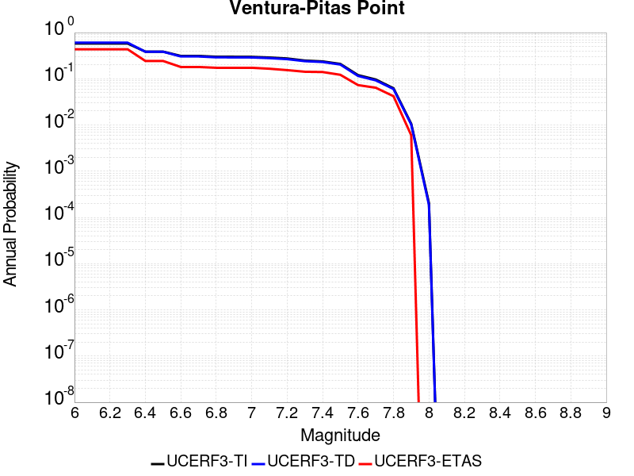 |
|-----|

| Magnitude | UCERF3-TI Prob | UCERF3-TD Prob | UCERF3-ETAS Prob |
|-----|-----|-----|-----|
| 6.0 | 0.5792208 | 0.6045508 | 0.435 |
| 6.1 | 0.5792208 | 0.6045508 | 0.435 |
| 6.2 | 0.5792208 | 0.6045508 | 0.435 |
| 6.3 | 0.5792208 | 0.6045508 | 0.435 |
| 6.4 | 0.38694492 | 0.38459304 | 0.243 |
| 6.5 | 0.38694492 | 0.38459304 | 0.243 |
| 6.6 | 0.31249452 | 0.304218 | 0.18 |
| 6.7 | 0.31249452 | 0.304218 | 0.18 |
| 6.8 | 0.29986522 | 0.2909751 | 0.173 |
| 6.9 | 0.29950547 | 0.2905997 | 0.173 |
| 7.0 | 0.29812777 | 0.28918433 | 0.173 |
| 7.1 | 0.288854 | 0.2797386 | 0.165 |
| 7.2 | 0.27499706 | 0.265919 | 0.154 |
| 7.3 | 0.2478542 | 0.24046412 | 0.142 |
| 7.4 | 0.23762695 | 0.2307193 | 0.14 |
| 7.5 | 0.20960215 | 0.20335752 | 0.122 |
| 7.6 | 0.12000763 | 0.1152454 | 0.073 |
| 7.7 | 0.09639116 | 0.09244087 | 0.064 |
| 7.8 | 0.062297437 | 0.06007829 | 0.042 |
| 7.9 | 0.010629006 | 0.010224602 | 0.006 |
| 8.0 | 2.0325146E-4 | 1.8586504E-4 | 0.0 |

## Verdugo
*[(top)](#table-of-contents)*

| 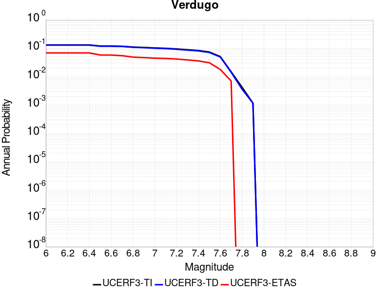 |
|-----|

| Magnitude | UCERF3-TI Prob | UCERF3-TD Prob | UCERF3-ETAS Prob |
|-----|-----|-----|-----|
| 6.0 | 0.13124973 | 0.12953304 | 0.069 |
| 6.1 | 0.13124973 | 0.12953304 | 0.069 |
| 6.2 | 0.13124973 | 0.12953304 | 0.069 |
| 6.3 | 0.13124973 | 0.12953304 | 0.069 |
| 6.4 | 0.13124973 | 0.12953304 | 0.069 |
| 6.5 | 0.12035932 | 0.118445516 | 0.058 |
| 6.6 | 0.12035932 | 0.118445516 | 0.058 |
| 6.7 | 0.11809642 | 0.116152085 | 0.055 |
| 6.8 | 0.11094422 | 0.108867876 | 0.049 |
| 6.9 | 0.1074558 | 0.105319 | 0.047 |
| 7.0 | 0.10311927 | 0.100910746 | 0.045 |
| 7.1 | 0.10004924 | 0.0977837 | 0.044 |
| 7.2 | 0.095106326 | 0.09274912 | 0.042 |
| 7.3 | 0.08905414 | 0.08658179 | 0.039 |
| 7.4 | 0.08371282 | 0.08117279 | 0.036 |
| 7.5 | 0.074034974 | 0.07147539 | 0.031 |
| 7.6 | 0.051173255 | 0.04958968 | 0.018 |
| 7.7 | 0.014828821 | 0.014278595 | 0.007 |
| 7.8 | 0.0042300685 | 0.003631769 | 0.0 |
| 7.9 | 0.0011596675 | 0.0011596656 | 0.0 |

## Walker Spring 2011 CFM
*[(top)](#table-of-contents)*

| 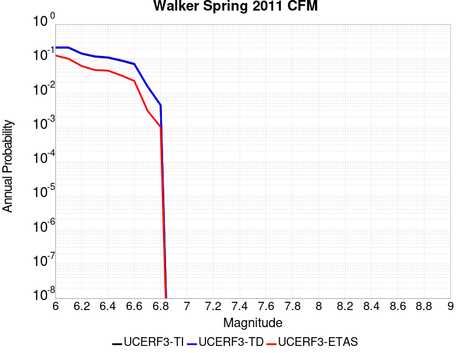 |
|-----|

| Magnitude | UCERF3-TI Prob | UCERF3-TD Prob | UCERF3-ETAS Prob |
|-----|-----|-----|-----|
| 6.0 | 0.20495702 | 0.21000487 | 0.122 |
| 6.1 | 0.20495702 | 0.21000487 | 0.098 |
| 6.2 | 0.13715713 | 0.14045645 | 0.06 |
| 6.3 | 0.11289688 | 0.115858495 | 0.046 |
| 6.4 | 0.10479672 | 0.107594505 | 0.044 |
| 6.5 | 0.08594674 | 0.08849257 | 0.032 |
| 6.6 | 0.067717336 | 0.069924064 | 0.022 |
| 6.7 | 0.015225914 | 0.015490002 | 0.003 |
| 6.8 | 0.0042991596 | 0.004376935 | 0.001 |

## West Napa 2011 CFM
*[(top)](#table-of-contents)*

| 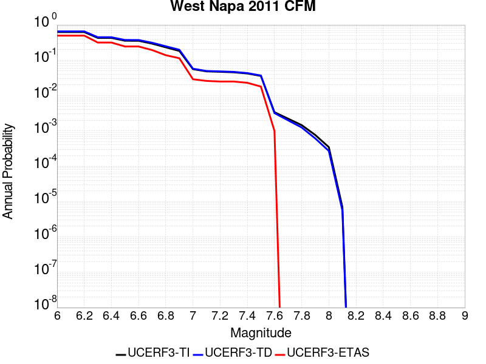 |
|-----|

| Magnitude | UCERF3-TI Prob | UCERF3-TD Prob | UCERF3-ETAS Prob |
|-----|-----|-----|-----|
| 6.0 | 0.62633455 | 0.65497047 | 0.498 |
| 6.1 | 0.62633455 | 0.65497047 | 0.498 |
| 6.2 | 0.62633455 | 0.65497047 | 0.498 |
| 6.3 | 0.4290162 | 0.4475746 | 0.317 |
| 6.4 | 0.4290162 | 0.4475746 | 0.317 |
| 6.5 | 0.35624903 | 0.3743055 | 0.245 |
| 6.6 | 0.35565034 | 0.37370884 | 0.245 |
| 6.7 | 0.29496476 | 0.3126572 | 0.194 |
| 6.8 | 0.23242733 | 0.2482957 | 0.139 |
| 6.9 | 0.18330297 | 0.19791152 | 0.114 |
| 7.0 | 0.05604935 | 0.057637405 | 0.029 |
| 7.1 | 0.048383325 | 0.049716305 | 0.026 |
| 7.2 | 0.04710889 | 0.048404414 | 0.025 |
| 7.3 | 0.045584343 | 0.046839576 | 0.025 |
| 7.4 | 0.04218538 | 0.043362748 | 0.023 |
| 7.5 | 0.03596751 | 0.0369517 | 0.018 |
| 7.6 | 0.0033894612 | 0.0031954926 | 0.001 |
| 7.7 | 0.0022259385 | 0.0019982609 | 0.0 |
| 7.8 | 0.0014618817 | 0.0012532127 | 0.0 |
| 7.9 | 7.68708E-4 | 6.1413035E-4 | 0.0 |
| 8.0 | 3.4789543E-4 | 2.7216846E-4 | 0.0 |
| 8.1 | 6.937113E-6 | 5.5872515E-6 | 0.0 |

## West Tahoe
*[(top)](#table-of-contents)*

| 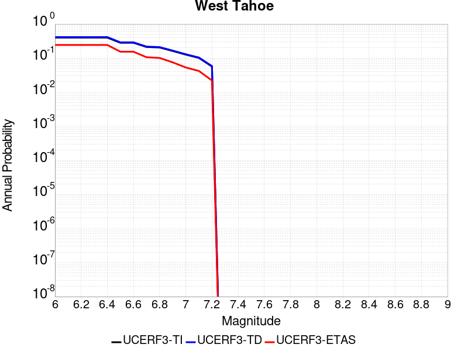 |
|-----|

| Magnitude | UCERF3-TI Prob | UCERF3-TD Prob | UCERF3-ETAS Prob |
|-----|-----|-----|-----|
| 6.0 | 0.3991342 | 0.41442314 | 0.243 |
| 6.1 | 0.3991342 | 0.41442314 | 0.243 |
| 6.2 | 0.3991342 | 0.41442314 | 0.243 |
| 6.3 | 0.3991342 | 0.41442314 | 0.243 |
| 6.4 | 0.3991342 | 0.41442314 | 0.243 |
| 6.5 | 0.2817602 | 0.289987 | 0.154 |
| 6.6 | 0.2817602 | 0.289987 | 0.154 |
| 6.7 | 0.2117029 | 0.21719755 | 0.106 |
| 6.8 | 0.20486477 | 0.21025063 | 0.101 |
| 6.9 | 0.16160451 | 0.16579418 | 0.075 |
| 7.0 | 0.1263926 | 0.12976956 | 0.053 |
| 7.1 | 0.10122751 | 0.104062855 | 0.042 |
| 7.2 | 0.05665881 | 0.058289655 | 0.022 |

## White Mountains
*[(top)](#table-of-contents)*

| 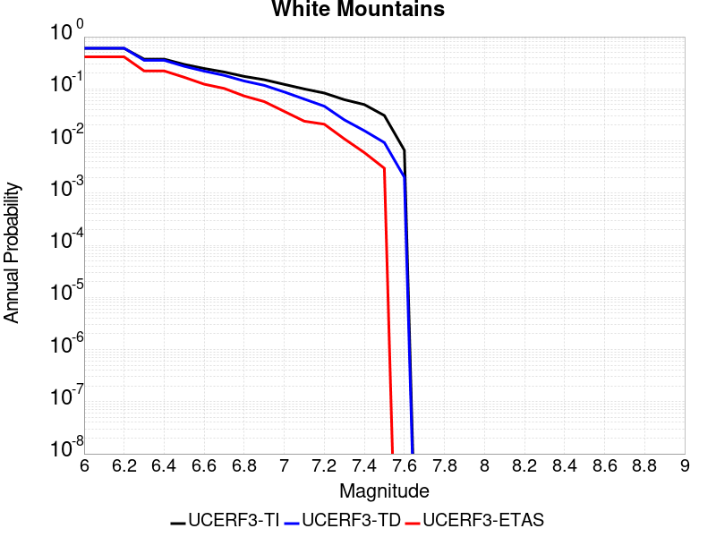 |
|-----|

| Magnitude | UCERF3-TI Prob | UCERF3-TD Prob | UCERF3-ETAS Prob |
|-----|-----|-----|-----|
| 6.0 | 0.59911263 | 0.60318625 | 0.411 |
| 6.1 | 0.59911263 | 0.60318625 | 0.411 |
| 6.2 | 0.59911263 | 0.60318625 | 0.411 |
| 6.3 | 0.37178582 | 0.35359558 | 0.221 |
| 6.4 | 0.37178582 | 0.35359558 | 0.221 |
| 6.5 | 0.2949842 | 0.27140188 | 0.167 |
| 6.6 | 0.24591754 | 0.21907248 | 0.123 |
| 6.7 | 0.21067435 | 0.1815896 | 0.102 |
| 6.8 | 0.17332757 | 0.14159824 | 0.073 |
| 6.9 | 0.14988972 | 0.11667932 | 0.057 |
| 7.0 | 0.12201831 | 0.08720975 | 0.037 |
| 7.1 | 0.09969078 | 0.063692816 | 0.024 |
| 7.2 | 0.08317246 | 0.04654405 | 0.021 |
| 7.3 | 0.062120155 | 0.025477659 | 0.011 |
| 7.4 | 0.049997214 | 0.015778562 | 0.006 |
| 7.5 | 0.030858051 | 0.009337813 | 0.003 |
| 7.6 | 0.006659759 | 0.002019649 | 0.0 |

## White Wolf
*[(top)](#table-of-contents)*

| 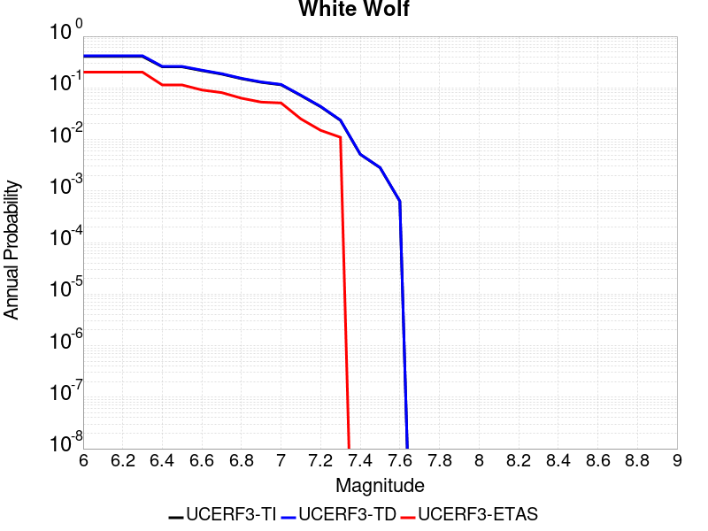 |
|-----|

| Magnitude | UCERF3-TI Prob | UCERF3-TD Prob | UCERF3-ETAS Prob |
|-----|-----|-----|-----|
| 6.0 | 0.40712854 | 0.42072764 | 0.202 |
| 6.1 | 0.40712854 | 0.42072764 | 0.202 |
| 6.2 | 0.40712854 | 0.42072764 | 0.202 |
| 6.3 | 0.40712854 | 0.42072764 | 0.202 |
| 6.4 | 0.2558104 | 0.26095518 | 0.114 |
| 6.5 | 0.2558104 | 0.26095518 | 0.114 |
| 6.6 | 0.21641053 | 0.2206518 | 0.091 |
| 6.7 | 0.18503481 | 0.18851334 | 0.081 |
| 6.8 | 0.15081243 | 0.15339725 | 0.063 |
| 6.9 | 0.12819473 | 0.1303449 | 0.053 |
| 7.0 | 0.114823684 | 0.11675376 | 0.051 |
| 7.1 | 0.071100496 | 0.072021544 | 0.025 |
| 7.2 | 0.043086637 | 0.043656405 | 0.015 |
| 7.3 | 0.023426257 | 0.023736289 | 0.011 |
| 7.4 | 0.0051309164 | 0.0051733777 | 0.0 |
| 7.5 | 0.002831823 | 0.0028486485 | 0.0 |
| 7.6 | 6.3162576E-4 | 6.3539424E-4 | 0.0 |

## White Wolf (Extension)
*[(top)](#table-of-contents)*

| 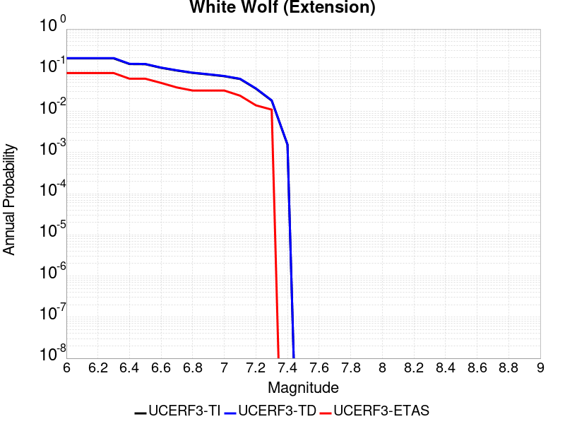 |
|-----|

| Magnitude | UCERF3-TI Prob | UCERF3-TD Prob | UCERF3-ETAS Prob |
|-----|-----|-----|-----|
| 6.0 | 0.19307251 | 0.19670117 | 0.085 |
| 6.1 | 0.19307251 | 0.19670117 | 0.085 |
| 6.2 | 0.19307251 | 0.19670117 | 0.085 |
| 6.3 | 0.19307251 | 0.19670117 | 0.085 |
| 6.4 | 0.14091408 | 0.14280976 | 0.062 |
| 6.5 | 0.13966365 | 0.14154643 | 0.062 |
| 6.6 | 0.114097044 | 0.115581356 | 0.049 |
| 6.7 | 0.09798938 | 0.09926163 | 0.038 |
| 6.8 | 0.08578422 | 0.08691117 | 0.032 |
| 6.9 | 0.07857619 | 0.07962776 | 0.032 |
| 7.0 | 0.07116851 | 0.07214374 | 0.032 |
| 7.1 | 0.060917497 | 0.06177637 | 0.024 |
| 7.2 | 0.035552867 | 0.036076475 | 0.014 |
| 7.3 | 0.018240402 | 0.018519152 | 0.011 |
| 7.4 | 0.0015468019 | 0.0015681955 | 0.0 |

## Whittier alt 1
*[(top)](#table-of-contents)*

| 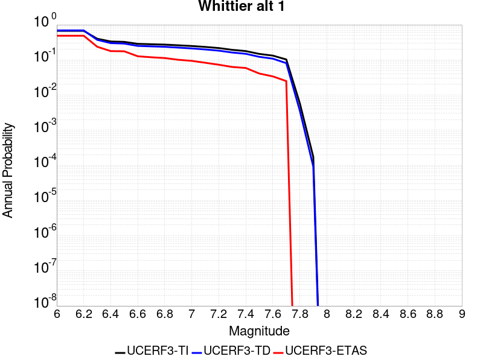 |
|-----|

| Magnitude | UCERF3-TI Prob | UCERF3-TD Prob | UCERF3-ETAS Prob |
|-----|-----|-----|-----|
| 6.0 | 0.67052186 | 0.6906342 | 0.488 |
| 6.1 | 0.67052186 | 0.6906342 | 0.488 |
| 6.2 | 0.67052186 | 0.6906342 | 0.488 |
| 6.3 | 0.4005946 | 0.3728665 | 0.237 |
| 6.4 | 0.33455 | 0.3006029 | 0.178 |
| 6.5 | 0.3264951 | 0.29199636 | 0.176 |
| 6.6 | 0.28681317 | 0.25068015 | 0.127 |
| 6.7 | 0.27907205 | 0.24275155 | 0.119 |
| 6.8 | 0.27253085 | 0.2360595 | 0.113 |
| 6.9 | 0.26075318 | 0.22413756 | 0.101 |
| 7.0 | 0.2487864 | 0.21219559 | 0.094 |
| 7.1 | 0.23425835 | 0.19847107 | 0.083 |
| 7.2 | 0.2176602 | 0.18349965 | 0.073 |
| 7.3 | 0.19338462 | 0.16222373 | 0.063 |
| 7.4 | 0.17839646 | 0.14933994 | 0.059 |
| 7.5 | 0.14823145 | 0.12240649 | 0.041 |
| 7.6 | 0.13271546 | 0.10858609 | 0.034 |
| 7.7 | 0.103028014 | 0.081004 | 0.025 |
| 7.8 | 0.005902799 | 0.003634203 | 0.0 |
| 7.9 | 1.7417852E-4 | 9.243E-5 | 0.0 |

## Wight Way 2011 CFM
*[(top)](#table-of-contents)*

| 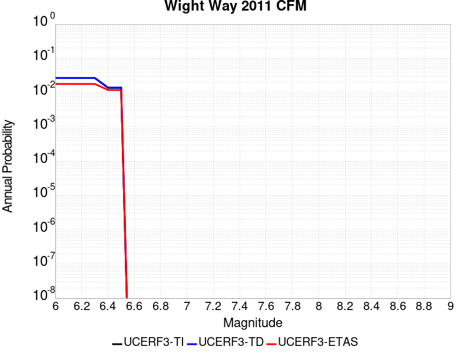 |
|-----|

| Magnitude | UCERF3-TI Prob | UCERF3-TD Prob | UCERF3-ETAS Prob |
|-----|-----|-----|-----|
| 6.0 | 0.02679807 | 0.02699059 | 0.018 |
| 6.1 | 0.02679807 | 0.02699059 | 0.018 |
| 6.2 | 0.02679807 | 0.02699059 | 0.018 |
| 6.3 | 0.02679807 | 0.02699059 | 0.018 |
| 6.4 | 0.013903275 | 0.014028472 | 0.012 |
| 6.5 | 0.013903275 | 0.014028472 | 0.012 |

## Yorba Linda
*[(top)](#table-of-contents)*

| 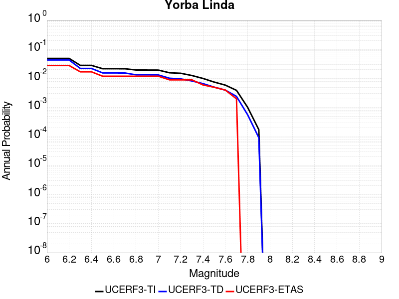 |
|-----|

| Magnitude | UCERF3-TI Prob | UCERF3-TD Prob | UCERF3-ETAS Prob |
|-----|-----|-----|-----|
| 6.0 | 0.049221918 | 0.043545045 | 0.028 |
| 6.1 | 0.049221918 | 0.043545045 | 0.028 |
| 6.2 | 0.049221918 | 0.043545045 | 0.028 |
| 6.3 | 0.028362866 | 0.02224338 | 0.017 |
| 6.4 | 0.028362866 | 0.02224338 | 0.017 |
| 6.5 | 0.021791818 | 0.015596417 | 0.012 |
| 6.6 | 0.021735214 | 0.0155347185 | 0.012 |
| 6.7 | 0.021707173 | 0.015504185 | 0.012 |
| 6.8 | 0.019611908 | 0.013379059 | 0.012 |
| 6.9 | 0.019582598 | 0.013344875 | 0.012 |
| 7.0 | 0.019477304 | 0.013247243 | 0.012 |
| 7.1 | 0.015763052 | 0.010210387 | 0.009 |
| 7.2 | 0.015146166 | 0.0096993605 | 0.009 |
| 7.3 | 0.012697442 | 0.008237304 | 0.009 |
| 7.4 | 0.010045864 | 0.0066672657 | 0.006 |
| 7.5 | 0.0075388076 | 0.005042308 | 0.005 |
| 7.6 | 0.0059230034 | 0.003984597 | 0.004 |
| 7.7 | 0.003910214 | 0.0024210648 | 0.002 |
| 7.8 | 0.0010158578 | 5.6258915E-4 | 0.0 |
| 7.9 | 1.734397E-4 | 9.1903836E-5 | 0.0 |

## Zayante-Vergeles 2011 CFM
*[(top)](#table-of-contents)*

| 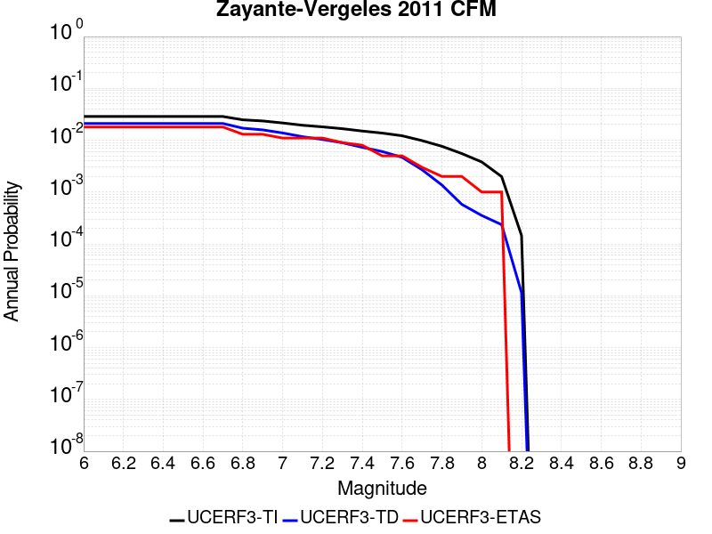 |
|-----|

| Magnitude | UCERF3-TI Prob | UCERF3-TD Prob | UCERF3-ETAS Prob |
|-----|-----|-----|-----|
| 6.0 | 0.028676117 | 0.021023266 | 0.018 |
| 6.1 | 0.028676117 | 0.021023266 | 0.018 |
| 6.2 | 0.028676117 | 0.021023266 | 0.018 |
| 6.3 | 0.028676117 | 0.021023266 | 0.018 |
| 6.4 | 0.028676117 | 0.021023266 | 0.018 |
| 6.5 | 0.028676117 | 0.021023266 | 0.018 |
| 6.6 | 0.028676117 | 0.021023266 | 0.018 |
| 6.7 | 0.028676117 | 0.021023266 | 0.018 |
| 6.8 | 0.02475527 | 0.017063566 | 0.013 |
| 6.9 | 0.02352805 | 0.015823983 | 0.013 |
| 7.0 | 0.02152657 | 0.0138030965 | 0.011 |
| 7.1 | 0.019440396 | 0.0116961785 | 0.011 |
| 7.2 | 0.01810627 | 0.010350269 | 0.011 |
| 7.3 | 0.016688468 | 0.008937245 | 0.009 |
| 7.4 | 0.015031327 | 0.007292434 | 0.008 |
| 7.5 | 0.013740559 | 0.006048513 | 0.005 |
| 7.6 | 0.012195927 | 0.004679727 | 0.005 |
| 7.7 | 0.009831744 | 0.0026997663 | 0.003 |
| 7.8 | 0.007635692 | 0.0013661486 | 0.002 |
| 7.9 | 0.005528668 | 5.789588E-4 | 0.002 |
| 8.0 | 0.0038100798 | 3.5349562E-4 | 0.001 |
| 8.1 | 0.0019873127 | 2.3513785E-4 | 0.001 |
| 8.2 | 1.4515444E-4 | 1.1423027E-5 | 0.0 |

