# Parent Section Magnitude-Probability Distributions

## Table Of Contents

* [Airport Lake](#airport-lake)
* [Almanor 2011 CFM](#almanor-2011-cfm)
* [Anacapa-Dume alt 1](#anacapa-dume-alt-1)
* [Anaheim](#anaheim)
* [Antelope Valley 2011](#antelope-valley-2011)
* [Ash Hill](#ash-hill)
* [Baker](#baker)
* [Bartlett Springs 2011 CFM](#bartlett-springs-2011-cfm)
* [Battle Creek 2011 CFM](#battle-creek-2011-cfm)
* [Bear River fault zone](#bear-river-fault-zone)
* [Bennett Valley 2011 CFM](#bennett-valley-2011-cfm)
* [Bicycle Lake](#bicycle-lake)
* [Big Lagoon - Bald Mtn 2011 CFM](#big-lagoon---bald-mtn-2011-cfm)
* [Big Pine (Central)](#big-pine-central)
* [Big Pine (East)](#big-pine-east)
* [Big Pine (West)](#big-pine-west)
* [Blackwater](#blackwater)
* [Blue Cut](#blue-cut)
* [Brawley (Seismic Zone) alt 1](#brawley-seismic-zone-alt-1)
* [Breckenridge 2011](#breckenridge-2011)
* [Bullion Mountains](#bullion-mountains)
* [Burnt Mtn](#burnt-mtn)
* [Butano 2011 CFM](#butano-2011-cfm)
* [Cady](#cady)
* [Calaveras (Central) 2011 CFM](#calaveras-central-2011-cfm)
* [Calaveras (No) 2011 CFM](#calaveras-no-2011-cfm)
* [Calaveras (So) - Paicines extension 2011 CFM](#calaveras-so---paicines-extension-2011-cfm)
* [Calaveras (So) 2011 CFM](#calaveras-so-2011-cfm)
* [Calico-Hidalgo](#calico-hidalgo)
* [Camp Rock 2011](#camp-rock-2011)
* [Canada David (Detachment)](#canada-david-detachment)
* [Carlsbad](#carlsbad)
* [Carson Range (Genoa)](#carson-range-genoa)
* [Casmalia 2011 CFM](#casmalia-2011-cfm)
* [Cedar Mtn-Mahogany Mtn](#cedar-mtn-mahogany-mtn)
* [Cerro Prieto](#cerro-prieto)
* [Channel Islands Thrust](#channel-islands-thrust)
* [Channel Islands Western Deep Ramp](#channel-islands-western-deep-ramp)
* [Chino alt 1](#chino-alt-1)
* [Clamshell-Sawpit](#clamshell-sawpit)
* [Clayton](#clayton)
* [Cleghorn](#cleghorn)
* [Cleghorn Lake](#cleghorn-lake)
* [Cleghorn Pass](#cleghorn-pass)
* [Collayami 2011 CFM](#collayami-2011-cfm)
* [Compton](#compton)
* [Concord 2011 CFM](#concord-2011-cfm)
* [Contra Costa (Lafayette) 2011 CFM](#contra-costa-lafayette-2011-cfm)
* [Contra Costa Shear Zone (connector) 2011 CFM](#contra-costa-shear-zone-connector-2011-cfm)
* [Coronado Bank alt1](#coronado-bank-alt1)
* [Coyote Canyon](#coyote-canyon)
* [Coyote Lake](#coyote-lake)
* [Cucamonga](#cucamonga)
* [Davis Creek](#davis-creek)
* [Death Valley (Black Mtns Frontal)](#death-valley-black-mtns-frontal)
* [Death Valley (Fish Lake Valley)](#death-valley-fish-lake-valley)
* [Death Valley (No)](#death-valley-no)
* [Death Valley (So)](#death-valley-so)
* [Deep Springs](#deep-springs)
* [Del Valle](#del-valle)
* [Dog Valley](#dog-valley)
* [Dry Mountain](#dry-mountain)
* [Earthquake Valley](#earthquake-valley)
* [Earthquake Valley (No  Extension)](#earthquake-valley-no--extension)
* [Earthquake Valley (So Extension)](#earthquake-valley-so-extension)
* [East Huasna 2011 CFM](#east-huasna-2011-cfm)
* [Eaton Roughs 2011 CFM](#eaton-roughs-2011-cfm)
* [Elmore Ranch](#elmore-ranch)
* [Elsinore (Coyote Mountains)](#elsinore-coyote-mountains)
* [Elsinore (Glen Ivy) rev](#elsinore-glen-ivy-rev)
* [Elsinore (Julian)](#elsinore-julian)
* [Elsinore (Stepovers Combined)](#elsinore-stepovers-combined)
* [Elsinore (Temecula) rev](#elsinore-temecula-rev)
* [Elysian Park (Lower CFM)](#elysian-park-lower-cfm)
* [Elysian Park (Upper)](#elysian-park-upper)
* [Emerson-Copper Mtn 2011](#emerson-copper-mtn-2011)
* [Eureka Peak](#eureka-peak)
* [Fickle Hill (alt1)](#fickle-hill-alt1)
* [Fish Slough 2011 CFM](#fish-slough-2011-cfm)
* [Fitzhugh Creek](#fitzhugh-creek)
* [Fontana (Seismicity)](#fontana-seismicity)
* [Franklin 2011 CFM](#franklin-2011-cfm)
* [Garberville - Briceland 2011 CFM](#garberville---briceland-2011-cfm)
* [Garlic Springs](#garlic-springs)
* [Garlock (Central)](#garlock-central)
* [Garlock (East)](#garlock-east)
* [Garlock (West)](#garlock-west)
* [Gillem - Big Crack 2011 CFM](#gillem---big-crack-2011-cfm)
* [Goldstone Lake](#goldstone-lake)
* [Goose Lake 2011 CFM](#goose-lake-2011-cfm)
* [Gravel Hills-Harper Lk](#gravel-hills-harper-lk)
* [Great Valley 01](#great-valley-01)
* [Great Valley 02](#great-valley-02)
* [Great Valley 03 Mysterious Ridge](#great-valley-03-mysterious-ridge)
* [Great Valley 03a Dunnigan Hills](#great-valley-03a-dunnigan-hills)
* [Great Valley 04a Trout Creek](#great-valley-04a-trout-creek)
* [Great Valley 04b Gordon Valley](#great-valley-04b-gordon-valley)
* [Great Valley 05 Pittsburg - Kirby Hills alt1](#great-valley-05-pittsburg---kirby-hills-alt1)
* [Great Valley 06 (Midland) 2011 CFM alt1](#great-valley-06-midland-2011-cfm-alt1)
* [Great Valley 07 (Orestimba)](#great-valley-07-orestimba)
* [Great Valley 08 (Quinto)](#great-valley-08-quinto)
* [Great Valley 09 (Laguna Seca)](#great-valley-09-laguna-seca)
* [Great Valley 10 (Panoche)](#great-valley-10-panoche)
* [Great Valley 11](#great-valley-11)
* [Great Valley 12](#great-valley-12)
* [Great Valley 13 (Coalinga)](#great-valley-13-coalinga)
* [Great Valley 14 (Kettleman Hills)](#great-valley-14-kettleman-hills)
* [Green Valley 2011 CFM](#green-valley-2011-cfm)
* [Greenville (No) 2011 CFM](#greenville-no-2011-cfm)
* [Greenville (So) 2011 CFM](#greenville-so-2011-cfm)
* [Hartley Springs 2011 CFM](#hartley-springs-2011-cfm)
* [Hat Creek-McArthur-Mayfield](#hat-creek-mcarthur-mayfield)
* [Hayward (No) 2011 CFM](#hayward-no-2011-cfm)
* [Hayward (So) 2011 CFM](#hayward-so-2011-cfm)
* [Hayward (So) extension 2011 CFM](#hayward-so-extension-2011-cfm)
* [Hector Mine](#hector-mine)
* [Helendale-So Lockhart](#helendale-so-lockhart)
* [Hilton Creek 2011 CFM](#hilton-creek-2011-cfm)
* [Hollywood](#hollywood)
* [Holser alt 1](#holser-alt-1)
* [Homestead Valley 2011](#homestead-valley-2011)
* [Honey Lake 2011 CFM](#honey-lake-2011-cfm)
* [Hosgri](#hosgri)
* [Hosgri (Extension)](#hosgri-extension)
* [Hunter Mountain-Saline Valley](#hunter-mountain-saline-valley)
* [Hunting Creek - Bartlett Springs connector 2011](#hunting-creek---bartlett-springs-connector-2011)
* [Hunting Creek - Berryessa 2011 CFM](#hunting-creek---berryessa-2011-cfm)
* [Imperial](#imperial)
* [Incline Village 2011 CFM](#incline-village-2011-cfm)
* [Independence rev 2011](#independence-rev-2011)
* [Jess Valley](#jess-valley)
* [Johnson Valley (No) 2011 rev](#johnson-valley-no-2011-rev)
* [Joshua Tree (Seismicity)](#joshua-tree-seismicity)
* [Keddie Ridge 2011 CFM](#keddie-ridge-2011-cfm)
* [Kern Canyon (Lake Isabella) 2011](#kern-canyon-lake-isabella-2011)
* [Kern Canyon (North Kern) 2011](#kern-canyon-north-kern-2011)
* [Kern Canyon (South Kern) 2011](#kern-canyon-south-kern-2011)
* [Kickapoo](#kickapoo)
* [King Range 2011 CFM](#king-range-2011-cfm)
* [La Panza 2011](#la-panza-2011)
* [Laguna Salada](#laguna-salada)
* [Lake Isabella (Seismicity)](#lake-isabella-seismicity)
* [Las Positas](#las-positas)
* [Last Chance](#last-chance)
* [Lenwood-Lockhart-Old Woman Springs](#lenwood-lockhart-old-woman-springs)
* [Likely 2011 CFM](#likely-2011-cfm)
* [Lions Head 2011 CFM](#lions-head-2011-cfm)
* [Little Lake](#little-lake)
* [Little Salmon (Offshore)](#little-salmon-offshore)
* [Little Salmon (Onshore)](#little-salmon-onshore)
* [Los Alamos 2011 CFM](#los-alamos-2011-cfm)
* [Los Alamos extension](#los-alamos-extension)
* [Los Medanos - Roe Island](#los-medanos---roe-island)
* [Los Osos 2011](#los-osos-2011)
* [Lost Hills](#lost-hills)
* [Ludlow](#ludlow)
* [Maacama 2011 CFM](#maacama-2011-cfm)
* [Mad River (alt1)](#mad-river-alt1)
* [Malibu Coast (Extension) alt 1](#malibu-coast-extension-alt-1)
* [Malibu Coast alt 1](#malibu-coast-alt-1)
* [Manix-Afton Hills](#manix-afton-hills)
* [McKinleyville (alt1)](#mckinleyville-alt1)
* [McLean Lake](#mclean-lake)
* [Mendocino](#mendocino)
* [Mission (connected) 2011 CFM](#mission-connected-2011-cfm)
* [Mission Creek](#mission-creek)
* [Mission Hills 2011](#mission-hills-2011)
* [Mission Ridge-Arroyo Parida-Santa Ana](#mission-ridge-arroyo-parida-santa-ana)
* [Mohawk Valley 2011 CFM](#mohawk-valley-2011-cfm)
* [Mono Lake 2011 CFM](#mono-lake-2011-cfm)
* [Monte Vista - Shannon 2011 CFM](#monte-vista---shannon-2011-cfm)
* [Monterey Bay-Tularcitos](#monterey-bay-tularcitos)
* [Morales (East)](#morales-east)
* [Morales (West)](#morales-west)
* [Mount Diablo Thrust North CFM](#mount-diablo-thrust-north-cfm)
* [Mount Diablo Thrust South](#mount-diablo-thrust-south)
* [Nelson Lake](#nelson-lake)
* [Newport-Inglewood (Offshore)](#newport-inglewood-offshore)
* [Newport-Inglewood alt 1](#newport-inglewood-alt-1)
* [North Frontal  (East)](#north-frontal--east)
* [North Frontal  (West)](#north-frontal--west)
* [North Salt Lake](#north-salt-lake)
* [North Tahoe 2011 CFM](#north-tahoe-2011-cfm)
* [Northridge](#northridge)
* [Northridge Hills](#northridge-hills)
* [Oak Ridge (Onshore)](#oak-ridge-onshore)
* [Oceanic - West Huasna](#oceanic---west-huasna)
* [Oceanside alt1](#oceanside-alt1)
* [Ortigalita (North)](#ortigalita-north)
* [Ortigalita (South)](#ortigalita-south)
* [Owens Valley](#owens-valley)
* [Owens Valley Keough Hot Springs](#owens-valley-keough-hot-springs)
* [Owl Lake](#owl-lake)
* [Ozena](#ozena)
* [Palos Verdes](#palos-verdes)
* [Panamint Valley](#panamint-valley)
* [Paradise](#paradise)
* [Peralta Hills](#peralta-hills)
* [Pilarcitos 2011 CFM](#pilarcitos-2011-cfm)
* [Pine Mtn](#pine-mtn)
* [Pinto Mtn](#pinto-mtn)
* [Pisgah-Bullion Mtn-Mesquite Lk](#pisgah-bullion-mtn-mesquite-lk)
* [Pitas Point (Lower West)](#pitas-point-lower-west)
* [Pitas Point (Lower)-Montalvo](#pitas-point-lower-montalvo)
* [Pittville 2011 CFM](#pittville-2011-cfm)
* [Pleito](#pleito)
* [Point Reyes 2011 CFM](#point-reyes-2011-cfm)
* [Point Reyes 2011 connector](#point-reyes-2011-connector)
* [Polaris 2011 CFM](#polaris-2011-cfm)
* [Puente Hills](#puente-hills)
* [Quien Sabe 2011 CFM](#quien-sabe-2011-cfm)
* [Raymond](#raymond)
* [Red Mountain](#red-mountain)
* [Red Pass](#red-pass)
* [Redondo Canyon alt 1](#redondo-canyon-alt-1)
* [Reliz 2011 CFM](#reliz-2011-cfm)
* [Richfield](#richfield)
* [Rinconada 2011 CFM](#rinconada-2011-cfm)
* [Robinson Creek](#robinson-creek)
* [Rocky Ledge 2011 CFM](#rocky-ledge-2011-cfm)
* [Rodgers Creek - Healdsburg 2011 CFM](#rodgers-creek---healdsburg-2011-cfm)
* [Rose Canyon](#rose-canyon)
* [Round Valley](#round-valley)
* [Russ 2011 CFM](#russ-2011-cfm)
* [San Andreas (Big Bend)](#san-andreas-big-bend)
* [San Andreas (Carrizo) rev](#san-andreas-carrizo-rev)
* [San Andreas (Cholame) rev](#san-andreas-cholame-rev)
* [San Andreas (Coachella) rev](#san-andreas-coachella-rev)
* [San Andreas (Creeping Section) 2011 CFM](#san-andreas-creeping-section-2011-cfm)
* [San Andreas (Mojave N)](#san-andreas-mojave-n)
* [San Andreas (Mojave S)](#san-andreas-mojave-s)
* [San Andreas (North Branch Mill Creek)](#san-andreas-north-branch-mill-creek)
* [San Andreas (North Coast) 2011 CFM](#san-andreas-north-coast-2011-cfm)
* [San Andreas (Offshore) 2011 CFM](#san-andreas-offshore-2011-cfm)
* [San Andreas (Parkfield)](#san-andreas-parkfield)
* [San Andreas (Peninsula) 2011 CFM](#san-andreas-peninsula-2011-cfm)
* [San Andreas (San Bernardino N)](#san-andreas-san-bernardino-n)
* [San Andreas (San Bernardino S)](#san-andreas-san-bernardino-s)
* [San Andreas (San Gorgonio Pass-Garnet HIll)](#san-andreas-san-gorgonio-pass-garnet-hill)
* [San Andreas (Santa Cruz Mts) 2011 CFM](#san-andreas-santa-cruz-mts-2011-cfm)
* [San Cayetano](#san-cayetano)
* [San Clemente](#san-clemente)
* [San Diego Trough north alt1](#san-diego-trough-north-alt1)
* [San Diego Trough south](#san-diego-trough-south)
* [San Gabriel](#san-gabriel)
* [San Gabriel (Extension)](#san-gabriel-extension)
* [San Gorgonio Pass](#san-gorgonio-pass)
* [San Gregorio (North) 2011 CFM](#san-gregorio-north-2011-cfm)
* [San Gregorio (South) 2011 CFM](#san-gregorio-south-2011-cfm)
* [San Jacinto (Anza) rev](#san-jacinto-anza-rev)
* [San Jacinto (Borrego)](#san-jacinto-borrego)
* [San Jacinto (Clark) rev](#san-jacinto-clark-rev)
* [San Jacinto (Coyote Creek)](#san-jacinto-coyote-creek)
* [San Jacinto (Lytle Creek connector)](#san-jacinto-lytle-creek-connector)
* [San Jacinto (San Bernardino)](#san-jacinto-san-bernardino)
* [San Jacinto (San Jacinto Valley) rev](#san-jacinto-san-jacinto-valley-rev)
* [San Jacinto (Stepovers Combined)](#san-jacinto-stepovers-combined)
* [San Jacinto (Superstition Mtn)](#san-jacinto-superstition-mtn)
* [San Joaquin Hills](#san-joaquin-hills)
* [San Jose](#san-jose)
* [San Juan](#san-juan)
* [San Luis Range - Oceano 2011 CFM](#san-luis-range---oceano-2011-cfm)
* [San Luis Range - Pecho 2011 CFM](#san-luis-range---pecho-2011-cfm)
* [San Luis Range 2011 CFM](#san-luis-range-2011-cfm)
* [San Pedro Basin](#san-pedro-basin)
* [San Pedro Escarpment](#san-pedro-escarpment)
* [San Vicente](#san-vicente)
* [Santa Cruz Catalina Ridge alt1](#santa-cruz-catalina-ridge-alt1)
* [Santa Cruz Island](#santa-cruz-island)
* [Santa Monica Bay](#santa-monica-bay)
* [Santa Monica alt 1](#santa-monica-alt-1)
* [Santa Rosa Island](#santa-rosa-island)
* [Santa Susana East (connector)](#santa-susana-east-connector)
* [Santa Susana alt 1](#santa-susana-alt-1)
* [Santa Ynez (East)](#santa-ynez-east)
* [Santa Ynez (West)](#santa-ynez-west)
* [Santa Ynez River](#santa-ynez-river)
* [Sargent 2011 CFM](#sargent-2011-cfm)
* [Scodie Lineament](#scodie-lineament)
* [Sheephole](#sheephole)
* [Shoreline](#shoreline)
* [Sierra Madre](#sierra-madre)
* [Sierra Madre (San Fernando)](#sierra-madre-san-fernando)
* [Sierra Nevada  (No Extension)](#sierra-nevada--no-extension)
* [Silver Creek 2011 CFM](#silver-creek-2011-cfm)
* [Simi-Santa Rosa](#simi-santa-rosa)
* [Sisar](#sisar)
* [Skinner Flat 2011 CFM](#skinner-flat-2011-cfm)
* [So Sierra Nevada](#so-sierra-nevada)
* [South Cuyama](#south-cuyama)
* [South Klamath Lake East](#south-klamath-lake-east)
* [South Klamath Lake West](#south-klamath-lake-west)
* [Superstition Hills](#superstition-hills)
* [Surprise Valley 2011 CFM](#surprise-valley-2011-cfm)
* [Swain Ravine - Spenceville](#swain-ravine---spenceville)
* [Table Bluff](#table-bluff)
* [Tank Canyon](#tank-canyon)
* [Thirty Mile Bank](#thirty-mile-bank)
* [Tin Mountain](#tin-mountain)
* [Towne Pass](#towne-pass)
* [Trinidad (alt1)](#trinidad-alt1)
* [Ventura-Pitas Point](#ventura-pitas-point)
* [Verdugo](#verdugo)
* [Walker Spring 2011 CFM](#walker-spring-2011-cfm)
* [West Napa 2011 CFM](#west-napa-2011-cfm)
* [West Tahoe](#west-tahoe)
* [White Mountains](#white-mountains)
* [White Wolf](#white-wolf)
* [White Wolf (Extension)](#white-wolf-extension)
* [Whittier alt 1](#whittier-alt-1)
* [Wight Way 2011 CFM](#wight-way-2011-cfm)
* [Yorba Linda](#yorba-linda)
* [Zayante-Vergeles 2011 CFM](#zayante-vergeles-2011-cfm)

## Airport Lake
*[(top)](#table-of-contents)*

| 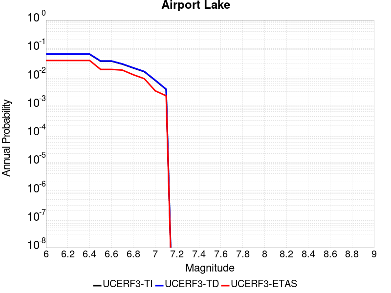 |
|-----|

| Magnitude | UCERF3-TI Prob | UCERF3-TD Prob | UCERF3-ETAS Prob |
|-----|-----|-----|-----|
| 6.0 | 0.0625898 | 0.06388342 | 0.037960954 |
| 6.1 | 0.0625898 | 0.06388342 | 0.037960954 |
| 6.2 | 0.0625898 | 0.06388342 | 0.037960954 |
| 6.3 | 0.0625898 | 0.06388342 | 0.037960954 |
| 6.4 | 0.0625898 | 0.06388342 | 0.037960954 |
| 6.5 | 0.03582719 | 0.036458667 | 0.018438177 |
| 6.6 | 0.03582719 | 0.036458667 | 0.018438177 |
| 6.7 | 0.02817519 | 0.028671982 | 0.01735358 |
| 6.8 | 0.020629838 | 0.020992553 | 0.011930586 |
| 6.9 | 0.015310549 | 0.0155831035 | 0.00867679 |
| 7.0 | 0.0075687924 | 0.00770728 | 0.0032537961 |
| 7.1 | 0.0036433393 | 0.0037131323 | 0.0021691974 |

## Almanor 2011 CFM
*[(top)](#table-of-contents)*

| 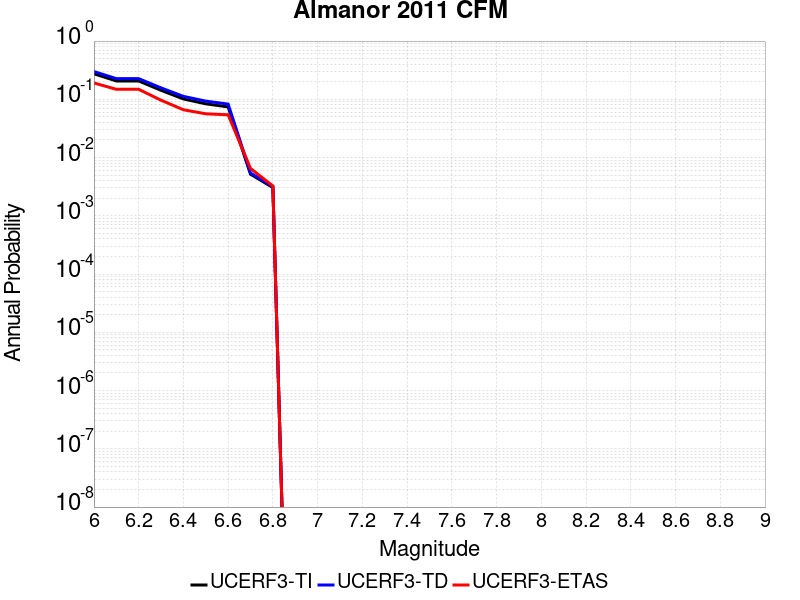 |
|-----|

| Magnitude | UCERF3-TI Prob | UCERF3-TD Prob | UCERF3-ETAS Prob |
|-----|-----|-----|-----|
| 6.0 | 0.2744337 | 0.29971877 | 0.19088937 |
| 6.1 | 0.20674558 | 0.22650641 | 0.14859003 |
| 6.2 | 0.20674558 | 0.22650641 | 0.14859003 |
| 6.3 | 0.14277372 | 0.15698837 | 0.09652928 |
| 6.4 | 0.10150458 | 0.11230094 | 0.06616052 |
| 6.5 | 0.083690435 | 0.09311042 | 0.056399133 |
| 6.6 | 0.074054085 | 0.08274572 | 0.054229934 |
| 6.7 | 0.005178911 | 0.0054159844 | 0.0065075923 |
| 6.8 | 0.0030562787 | 0.0031968274 | 0.0032537961 |

## Anacapa-Dume alt 1
*[(top)](#table-of-contents)*

| 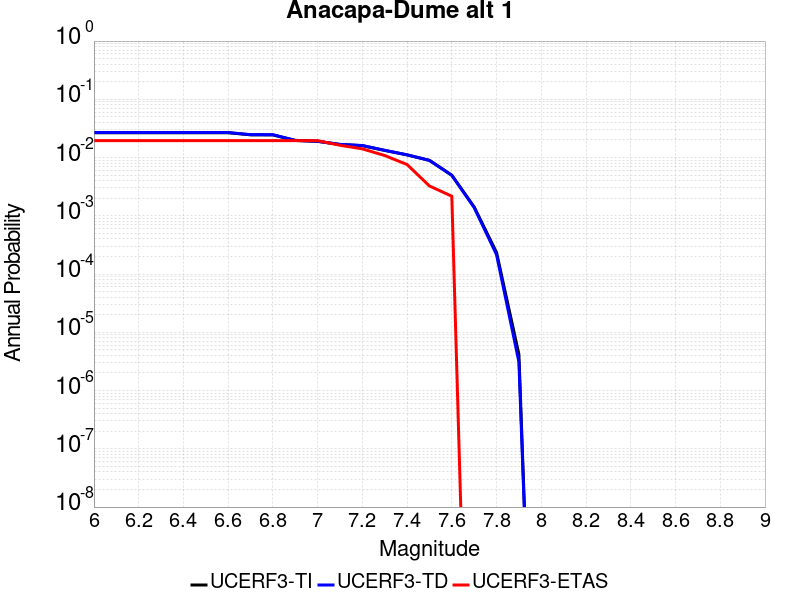 |
|-----|

| Magnitude | UCERF3-TI Prob | UCERF3-TD Prob | UCERF3-ETAS Prob |
|-----|-----|-----|-----|
| 6.0 | 0.026703034 | 0.026895462 | 0.019522777 |
| 6.1 | 0.026703034 | 0.026895462 | 0.019522777 |
| 6.2 | 0.026703034 | 0.026895462 | 0.019522777 |
| 6.3 | 0.026703034 | 0.026895462 | 0.019522777 |
| 6.4 | 0.026703034 | 0.026895462 | 0.019522777 |
| 6.5 | 0.026703034 | 0.026895462 | 0.019522777 |
| 6.6 | 0.026703034 | 0.026895462 | 0.019522777 |
| 6.7 | 0.024578733 | 0.02475115 | 0.019522777 |
| 6.8 | 0.024497604 | 0.024669258 | 0.019522777 |
| 6.9 | 0.019632967 | 0.019754726 | 0.019522777 |
| 7.0 | 0.018953018 | 0.019068217 | 0.019522777 |
| 7.1 | 0.016761158 | 0.016854862 | 0.01626898 |
| 7.2 | 0.016012378 | 0.016098553 | 0.014099783 |
| 7.3 | 0.013271057 | 0.013315063 | 0.010845987 |
| 7.4 | 0.011119082 | 0.0111342035 | 0.007592191 |
| 7.5 | 0.008953781 | 0.008955616 | 0.0032537961 |
| 7.6 | 0.00496635 | 0.004963615 | 0.0021691974 |
| 7.7 | 0.0014196406 | 0.0013829757 | 0.0 |
| 7.8 | 2.3486989E-4 | 2.1522192E-4 | 0.0 |
| 7.9 | 4.1781627E-6 | 3.095605E-6 | 0.0 |

## Anaheim
*[(top)](#table-of-contents)*

| 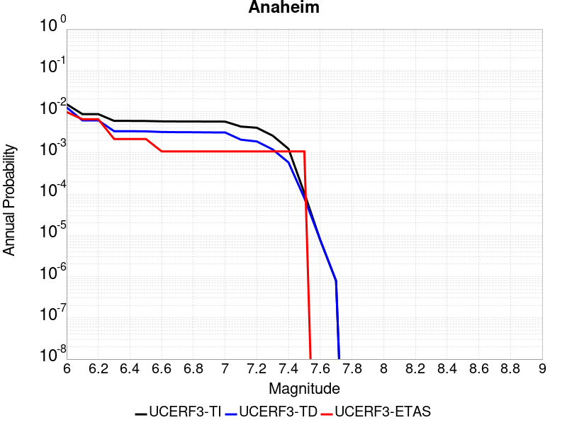 |
|-----|

| Magnitude | UCERF3-TI Prob | UCERF3-TD Prob | UCERF3-ETAS Prob |
|-----|-----|-----|-----|
| 6.0 | 0.015148945 | 0.012650186 | 0.009761388 |
| 6.1 | 0.0086913435 | 0.006115311 | 0.0065075923 |
| 6.2 | 0.0086913435 | 0.006115311 | 0.0065075923 |
| 6.3 | 0.005953559 | 0.003352178 | 0.0021691974 |
| 6.4 | 0.005953559 | 0.003352178 | 0.0021691974 |
| 6.5 | 0.0059230886 | 0.0033215375 | 0.0021691974 |
| 6.6 | 0.0058090687 | 0.0032068484 | 0.0010845987 |
| 6.7 | 0.005774173 | 0.003171776 | 0.0010845987 |
| 6.8 | 0.005763457 | 0.0031610096 | 0.0010845987 |
| 6.9 | 0.0057359 | 0.0031333321 | 0.0010845987 |
| 7.0 | 0.005719608 | 0.0031201441 | 0.0010845987 |
| 7.1 | 0.0043395786 | 0.0020837905 | 0.0010845987 |
| 7.2 | 0.004058755 | 0.0018913049 | 0.0010845987 |
| 7.3 | 0.0026143969 | 0.0012104373 | 0.0010845987 |
| 7.4 | 0.0012519285 | 5.866248E-4 | 0.0010845987 |
| 7.5 | 1.05728424E-4 | 8.044587E-5 | 0.0010845987 |
| 7.6 | 7.75967E-6 | 7.793137E-6 | 0.0 |
| 7.7 | 7.875461E-7 | 7.9132093E-7 | 0.0 |

## Antelope Valley 2011
*[(top)](#table-of-contents)*

| 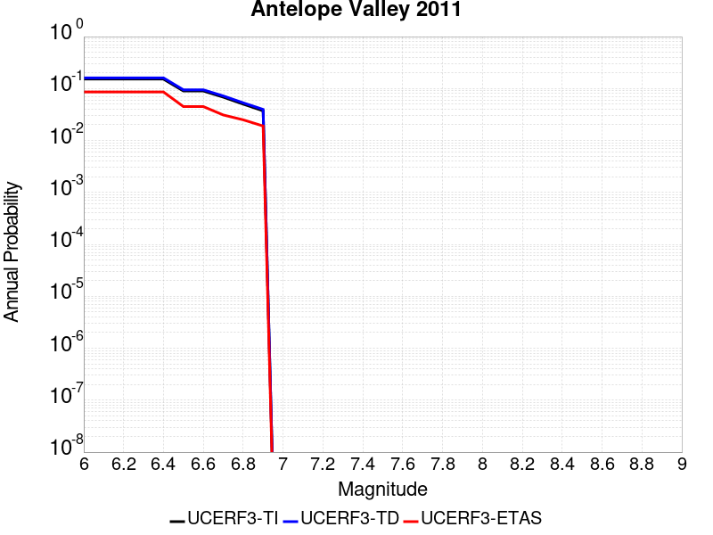 |
|-----|

| Magnitude | UCERF3-TI Prob | UCERF3-TD Prob | UCERF3-ETAS Prob |
|-----|-----|-----|-----|
| 6.0 | 0.15221803 | 0.16053323 | 0.0889371 |
| 6.1 | 0.15221803 | 0.16053323 | 0.0889371 |
| 6.2 | 0.15221803 | 0.16053323 | 0.0889371 |
| 6.3 | 0.15221803 | 0.16053323 | 0.0889371 |
| 6.4 | 0.15221803 | 0.16053323 | 0.0889371 |
| 6.5 | 0.08980848 | 0.09457948 | 0.047722343 |
| 6.6 | 0.08980848 | 0.09457948 | 0.047722343 |
| 6.7 | 0.0683468 | 0.07213613 | 0.03253796 |
| 6.8 | 0.050183877 | 0.053163648 | 0.027114967 |
| 6.9 | 0.037239723 | 0.03963747 | 0.020607375 |

## Ash Hill
*[(top)](#table-of-contents)*

| 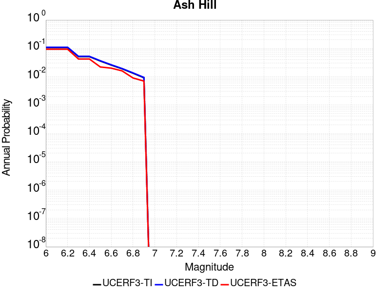 |
|-----|

| Magnitude | UCERF3-TI Prob | UCERF3-TD Prob | UCERF3-ETAS Prob |
|-----|-----|-----|-----|
| 6.0 | 0.106334195 | 0.10925942 | 0.09219089 |
| 6.1 | 0.106334195 | 0.10925942 | 0.09219089 |
| 6.2 | 0.106334195 | 0.10925942 | 0.09219089 |
| 6.3 | 0.050967317 | 0.05212688 | 0.04229935 |
| 6.4 | 0.050967317 | 0.05212688 | 0.04229935 |
| 6.5 | 0.0356736 | 0.036478736 | 0.022776572 |
| 6.6 | 0.025711183 | 0.026299063 | 0.020607375 |
| 6.7 | 0.01893192 | 0.019376121 | 0.01626898 |
| 6.8 | 0.013268714 | 0.013593214 | 0.00867679 |
| 6.9 | 0.009185295 | 0.009421892 | 0.0065075923 |

## Baker
*[(top)](#table-of-contents)*

| 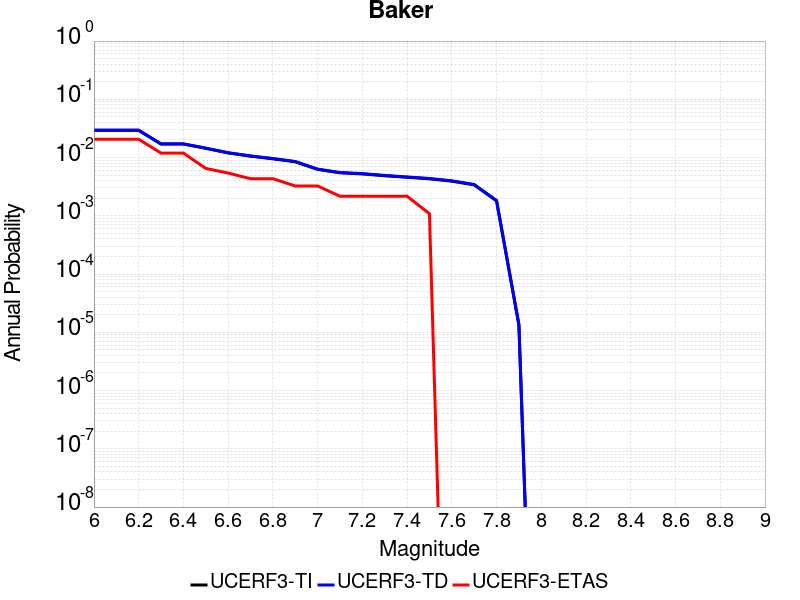 |
|-----|

| Magnitude | UCERF3-TI Prob | UCERF3-TD Prob | UCERF3-ETAS Prob |
|-----|-----|-----|-----|
| 6.0 | 0.029281268 | 0.029532712 | 0.020607375 |
| 6.1 | 0.029281268 | 0.029532712 | 0.020607375 |
| 6.2 | 0.029281268 | 0.029532712 | 0.020607375 |
| 6.3 | 0.017069358 | 0.017202543 | 0.011930586 |
| 6.4 | 0.017069358 | 0.017202543 | 0.011930586 |
| 6.5 | 0.014412287 | 0.014528201 | 0.0065075923 |
| 6.6 | 0.0120136 | 0.012114454 | 0.0054229936 |
| 6.7 | 0.010572789 | 0.010665392 | 0.004338395 |
| 6.8 | 0.00953257 | 0.009619464 | 0.004338395 |
| 6.9 | 0.008474505 | 0.008555449 | 0.0032537961 |
| 7.0 | 0.0062719635 | 0.006341065 | 0.0032537961 |
| 7.1 | 0.0054761325 | 0.0055415644 | 0.0021691974 |
| 7.2 | 0.0052392827 | 0.0053035542 | 0.0021691974 |
| 7.3 | 0.0048718182 | 0.004934209 | 0.0021691974 |
| 7.4 | 0.004587288 | 0.004647804 | 0.0021691974 |
| 7.5 | 0.004317503 | 0.004375909 | 0.0010845987 |
| 7.6 | 0.0039337305 | 0.0039888173 | 0.0 |
| 7.7 | 0.0034007025 | 0.0034502088 | 0.0 |
| 7.8 | 0.0018030588 | 0.0018319617 | 0.0 |
| 7.9 | 1.3353022E-5 | 1.3523625E-5 | 0.0 |

## Bartlett Springs 2011 CFM
*[(top)](#table-of-contents)*

| 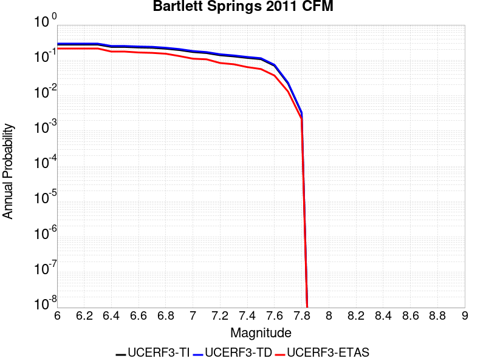 |
|-----|

| Magnitude | UCERF3-TI Prob | UCERF3-TD Prob | UCERF3-ETAS Prob |
|-----|-----|-----|-----|
| 6.0 | 0.27763093 | 0.2956486 | 0.21475054 |
| 6.1 | 0.277444 | 0.2954541 | 0.21475054 |
| 6.2 | 0.27732572 | 0.29533115 | 0.21475054 |
| 6.3 | 0.27711776 | 0.2951142 | 0.21475054 |
| 6.4 | 0.23833866 | 0.25376695 | 0.17570499 |
| 6.5 | 0.23784488 | 0.25324997 | 0.17570499 |
| 6.6 | 0.2299849 | 0.24489579 | 0.16594361 |
| 6.7 | 0.22533183 | 0.23999853 | 0.16160521 |
| 6.8 | 0.21207686 | 0.22589102 | 0.15292841 |
| 6.9 | 0.19444853 | 0.20716481 | 0.13123645 |
| 7.0 | 0.17091231 | 0.18212713 | 0.11062907 |
| 7.1 | 0.15988572 | 0.17038502 | 0.106290676 |
| 7.2 | 0.13871963 | 0.14776011 | 0.0835141 |
| 7.3 | 0.12858078 | 0.13688245 | 0.077006504 |
| 7.4 | 0.11650221 | 0.12397757 | 0.06399132 |
| 7.5 | 0.10747043 | 0.114330105 | 0.056399133 |
| 7.6 | 0.06993806 | 0.07435075 | 0.036876354 |
| 7.7 | 0.02191135 | 0.023149569 | 0.013015185 |
| 7.8 | 0.0032013392 | 0.003331766 | 0.0021691974 |

## Battle Creek 2011 CFM
*[(top)](#table-of-contents)*

| 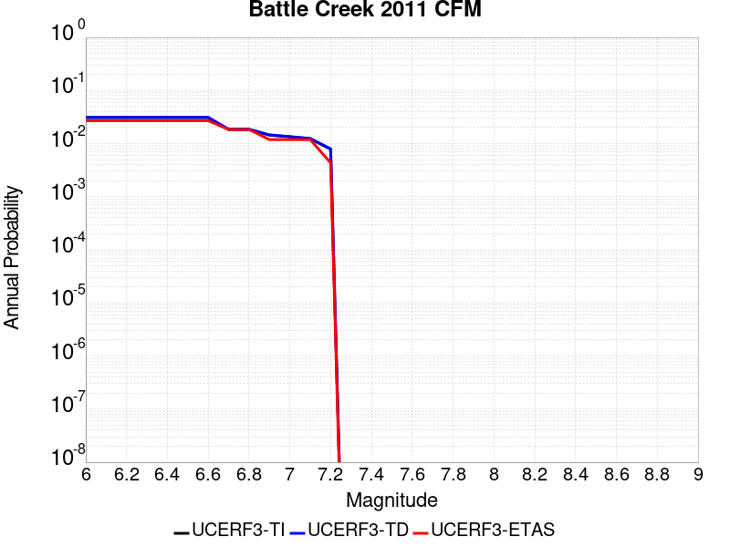 |
|-----|

| Magnitude | UCERF3-TI Prob | UCERF3-TD Prob | UCERF3-ETAS Prob |
|-----|-----|-----|-----|
| 6.0 | 0.030931175 | 0.031251524 | 0.027114967 |
| 6.1 | 0.030931175 | 0.031251524 | 0.027114967 |
| 6.2 | 0.030931175 | 0.031251524 | 0.027114967 |
| 6.3 | 0.030931175 | 0.031251524 | 0.027114967 |
| 6.4 | 0.030931175 | 0.031251524 | 0.027114967 |
| 6.5 | 0.030931175 | 0.031251524 | 0.027114967 |
| 6.6 | 0.030931175 | 0.031251524 | 0.027114967 |
| 6.7 | 0.018491056 | 0.018681712 | 0.018438177 |
| 6.8 | 0.018491056 | 0.018681712 | 0.018438177 |
| 6.9 | 0.014466971 | 0.014621473 | 0.011930586 |
| 7.0 | 0.013424914 | 0.013570921 | 0.011930586 |
| 7.1 | 0.012385755 | 0.012523286 | 0.011930586 |
| 7.2 | 0.007869033 | 0.007964699 | 0.004338395 |

## Bear River fault zone
*[(top)](#table-of-contents)*

| 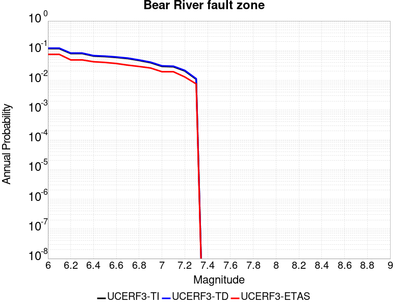 |
|-----|

| Magnitude | UCERF3-TI Prob | UCERF3-TD Prob | UCERF3-ETAS Prob |
|-----|-----|-----|-----|
| 6.0 | 0.11666201 | 0.12149969 | 0.07483731 |
| 6.1 | 0.11666201 | 0.12149969 | 0.07483731 |
| 6.2 | 0.07996871 | 0.082946695 | 0.048806943 |
| 6.3 | 0.07996871 | 0.082946695 | 0.048806943 |
| 6.4 | 0.065716386 | 0.068147734 | 0.04229935 |
| 6.5 | 0.063089035 | 0.06544399 | 0.040130153 |
| 6.6 | 0.05904074 | 0.061276127 | 0.036876354 |
| 6.7 | 0.054141626 | 0.056232154 | 0.03253796 |
| 6.8 | 0.046644367 | 0.04852053 | 0.029284164 |
| 6.9 | 0.039306097 | 0.04098049 | 0.02603037 |
| 7.0 | 0.029463837 | 0.030836256 | 0.019522777 |
| 7.1 | 0.028629264 | 0.029965919 | 0.019522777 |
| 7.2 | 0.020713184 | 0.021667194 | 0.013015185 |
| 7.3 | 0.010884727 | 0.011389179 | 0.007592191 |

## Bennett Valley 2011 CFM
*[(top)](#table-of-contents)*

| 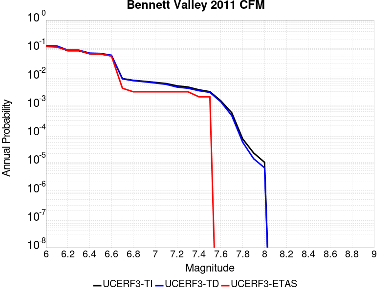 |
|-----|

| Magnitude | UCERF3-TI Prob | UCERF3-TD Prob | UCERF3-ETAS Prob |
|-----|-----|-----|-----|
| 6.0 | 0.11721767 | 0.12313456 | 0.11822126 |
| 6.1 | 0.11721767 | 0.12313456 | 0.112798266 |
| 6.2 | 0.08324529 | 0.08753685 | 0.08568329 |
| 6.3 | 0.08324529 | 0.08753685 | 0.08568329 |
| 6.4 | 0.06529953 | 0.06881817 | 0.06399132 |
| 6.5 | 0.063545294 | 0.06697054 | 0.06290673 |
| 6.6 | 0.05502506 | 0.057979316 | 0.053145338 |
| 6.7 | 0.008729368 | 0.008560155 | 0.0032537961 |
| 6.8 | 0.007594225 | 0.0073726913 | 0.0021691974 |
| 6.9 | 0.0070154206 | 0.0067558964 | 0.0021691974 |
| 7.0 | 0.006422261 | 0.006114112 | 0.0021691974 |
| 7.1 | 0.005859627 | 0.0054949904 | 0.0021691974 |
| 7.2 | 0.0048677227 | 0.004397229 | 0.0021691974 |
| 7.3 | 0.0044274135 | 0.0040024295 | 0.0021691974 |
| 7.4 | 0.0035353585 | 0.00328595 | 0.0010845987 |
| 7.5 | 0.0030357596 | 0.0028678745 | 0.0010845987 |
| 7.6 | 0.0014461211 | 0.0013376584 | 0.0 |
| 7.7 | 5.493358E-4 | 4.3847304E-4 | 0.0 |
| 7.8 | 6.633899E-5 | 5.085881E-5 | 0.0 |
| 7.9 | 2.1267175E-5 | 1.33502335E-5 | 0.0 |
| 8.0 | 9.979696E-6 | 6.4041187E-6 | 0.0 |

## Bicycle Lake
*[(top)](#table-of-contents)*

| 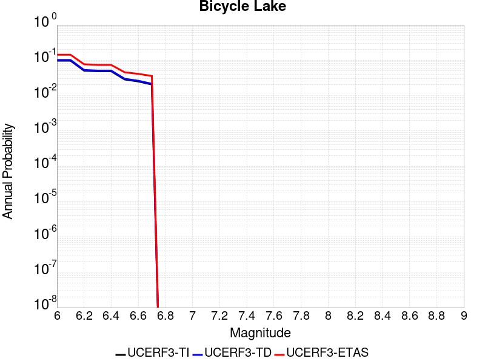 |
|-----|

| Magnitude | UCERF3-TI Prob | UCERF3-TD Prob | UCERF3-ETAS Prob |
|-----|-----|-----|-----|
| 6.0 | 0.09731865 | 0.10171107 | 0.14316703 |
| 6.1 | 0.09731865 | 0.10171107 | 0.14316703 |
| 6.2 | 0.05082667 | 0.05303054 | 0.077006504 |
| 6.3 | 0.0488053 | 0.050943673 | 0.07375271 |
| 6.4 | 0.0488053 | 0.050943673 | 0.07375271 |
| 6.5 | 0.028582955 | 0.029853933 | 0.045553144 |
| 6.6 | 0.02511273 | 0.026256006 | 0.04121475 |
| 6.7 | 0.020609729 | 0.021588955 | 0.03579176 |

## Big Lagoon - Bald Mtn 2011 CFM
*[(top)](#table-of-contents)*

| 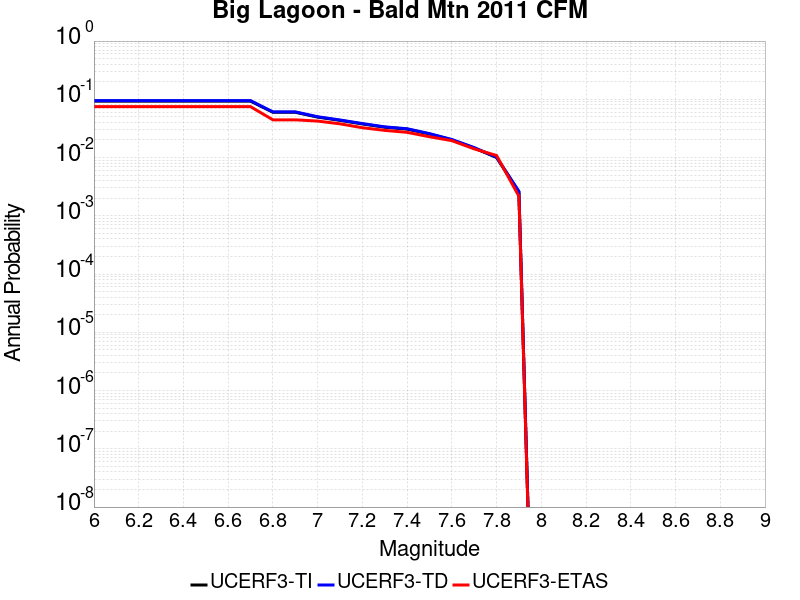 |
|-----|

| Magnitude | UCERF3-TI Prob | UCERF3-TD Prob | UCERF3-ETAS Prob |
|-----|-----|-----|-----|
| 6.0 | 0.09296429 | 0.09488775 | 0.07483731 |
| 6.1 | 0.09296429 | 0.09488775 | 0.07483731 |
| 6.2 | 0.09296429 | 0.09488775 | 0.07483731 |
| 6.3 | 0.09296429 | 0.09488775 | 0.07483731 |
| 6.4 | 0.09296429 | 0.09488775 | 0.07483731 |
| 6.5 | 0.09296429 | 0.09488775 | 0.07483731 |
| 6.6 | 0.09296429 | 0.09488775 | 0.07483731 |
| 6.7 | 0.09296429 | 0.09488775 | 0.07483731 |
| 6.8 | 0.059961677 | 0.060938954 | 0.04446855 |
| 6.9 | 0.059961677 | 0.060938954 | 0.04446855 |
| 7.0 | 0.04945208 | 0.05022405 | 0.04229935 |
| 7.1 | 0.04349969 | 0.044167433 | 0.037960954 |
| 7.2 | 0.037770372 | 0.038342066 | 0.03253796 |
| 7.3 | 0.03316603 | 0.033658985 | 0.029284164 |
| 7.4 | 0.030801551 | 0.031257235 | 0.027114967 |
| 7.5 | 0.025392314 | 0.025765525 | 0.022776572 |
| 7.6 | 0.020135028 | 0.020424645 | 0.019522777 |
| 7.7 | 0.014611626 | 0.014819692 | 0.014099783 |
| 7.8 | 0.010027403 | 0.010172531 | 0.010845987 |
| 7.9 | 0.0025839934 | 0.002624001 | 0.0021691974 |

## Big Pine (Central)
*[(top)](#table-of-contents)*

| 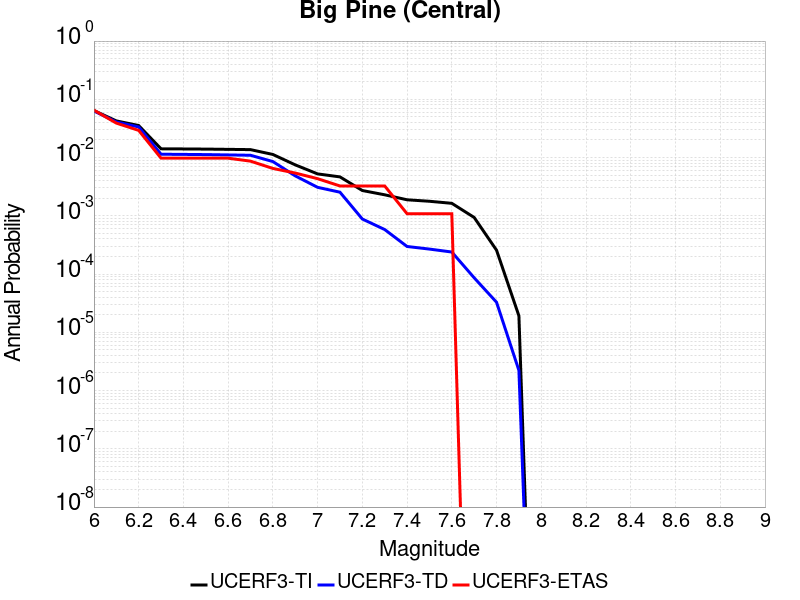 |
|-----|

| Magnitude | UCERF3-TI Prob | UCERF3-TD Prob | UCERF3-ETAS Prob |
|-----|-----|-----|-----|
| 6.0 | 0.064152226 | 0.06308421 | 0.06507592 |
| 6.1 | 0.042596713 | 0.04082518 | 0.039045554 |
| 6.2 | 0.03548321 | 0.033494372 | 0.029284164 |
| 6.3 | 0.014135542 | 0.0114078745 | 0.009761388 |
| 6.4 | 0.0140599115 | 0.011330525 | 0.009761388 |
| 6.5 | 0.013974993 | 0.011243647 | 0.009761388 |
| 6.6 | 0.013830429 | 0.011095851 | 0.009761388 |
| 6.7 | 0.013684865 | 0.010947334 | 0.00867679 |
| 6.8 | 0.011303755 | 0.008535946 | 0.0065075923 |
| 6.9 | 0.0074916193 | 0.004850431 | 0.0054229936 |
| 7.0 | 0.005242375 | 0.0030816863 | 0.004338395 |
| 7.1 | 0.004657593 | 0.002543244 | 0.0032537961 |
| 7.2 | 0.0027175006 | 8.807527E-4 | 0.0032537961 |
| 7.3 | 0.0022945157 | 5.8099267E-4 | 0.0032537961 |
| 7.4 | 0.0018834834 | 2.9745352E-4 | 0.0010845987 |
| 7.5 | 0.0017767617 | 2.684068E-4 | 0.0010845987 |
| 7.6 | 0.0016385572 | 2.3894479E-4 | 0.0010845987 |
| 7.7 | 9.373547E-4 | 8.6234315E-5 | 0.0 |
| 7.8 | 2.5684698E-4 | 3.282993E-5 | 0.0 |
| 7.9 | 1.9204645E-5 | 2.2162596E-6 | 0.0 |

## Big Pine (East)
*[(top)](#table-of-contents)*

| 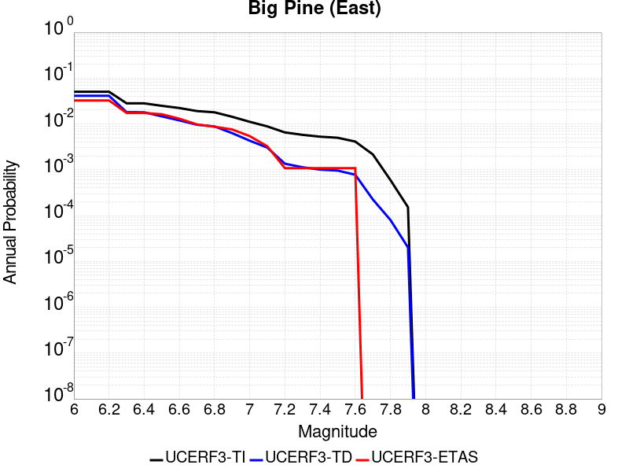 |
|-----|

| Magnitude | UCERF3-TI Prob | UCERF3-TD Prob | UCERF3-ETAS Prob |
|-----|-----|-----|-----|
| 6.0 | 0.0504293 | 0.041100524 | 0.03253796 |
| 6.1 | 0.0504293 | 0.041100524 | 0.03253796 |
| 6.2 | 0.0504293 | 0.041100524 | 0.03253796 |
| 6.3 | 0.028187532 | 0.018052729 | 0.01735358 |
| 6.4 | 0.02811298 | 0.017975898 | 0.01735358 |
| 6.5 | 0.024870934 | 0.014640659 | 0.01626898 |
| 6.6 | 0.022261921 | 0.011958702 | 0.013015185 |
| 6.7 | 0.019104613 | 0.009613235 | 0.009761388 |
| 6.8 | 0.017928274 | 0.008817028 | 0.00867679 |
| 6.9 | 0.014342834 | 0.0063039074 | 0.007592191 |
| 7.0 | 0.011141588 | 0.004309833 | 0.0054229936 |
| 7.1 | 0.008840621 | 0.003044632 | 0.0032537961 |
| 7.2 | 0.00653236 | 0.001356253 | 0.0010845987 |
| 7.3 | 0.005787001 | 0.0011361294 | 0.0010845987 |
| 7.4 | 0.005275475 | 0.0010078922 | 0.0010845987 |
| 7.5 | 0.0049958974 | 9.6071884E-4 | 0.0010845987 |
| 7.6 | 0.0041289325 | 7.792712E-4 | 0.0010845987 |
| 7.7 | 0.002166082 | 2.2538309E-4 | 0.0 |
| 7.8 | 5.9813674E-4 | 8.040904E-5 | 0.0 |
| 7.9 | 1.5251584E-4 | 2.0192823E-5 | 0.0 |

## Big Pine (West)
*[(top)](#table-of-contents)*

| 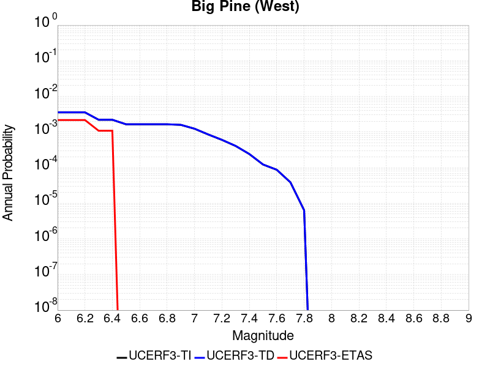 |
|-----|

| Magnitude | UCERF3-TI Prob | UCERF3-TD Prob | UCERF3-ETAS Prob |
|-----|-----|-----|-----|
| 6.0 | 0.0035578175 | 0.0035668933 | 0.0021691974 |
| 6.1 | 0.0035578175 | 0.0035668933 | 0.0021691974 |
| 6.2 | 0.0035578175 | 0.0035668933 | 0.0021691974 |
| 6.3 | 0.0022034976 | 0.0022098206 | 0.0010845987 |
| 6.4 | 0.0022034976 | 0.0022098206 | 0.0010845987 |
| 6.5 | 0.0016442757 | 0.0016497655 | 0.0 |
| 6.6 | 0.0016442757 | 0.0016497655 | 0.0 |
| 6.7 | 0.0016442757 | 0.0016497655 | 0.0 |
| 6.8 | 0.0016442757 | 0.0016497655 | 0.0 |
| 6.9 | 0.0015850804 | 0.0015904369 | 0.0 |
| 7.0 | 0.0012344641 | 0.0012387628 | 0.0 |
| 7.1 | 8.512639E-4 | 8.5432205E-4 | 0.0 |
| 7.2 | 6.011107E-4 | 6.032231E-4 | 0.0 |
| 7.3 | 4.0575242E-4 | 4.070916E-4 | 0.0 |
| 7.4 | 2.4051146E-4 | 2.411801E-4 | 0.0 |
| 7.5 | 1.2229459E-4 | 1.2256217E-4 | 0.0 |
| 7.6 | 8.7133216E-5 | 8.731884E-5 | 0.0 |
| 7.7 | 3.864349E-5 | 3.8719507E-5 | 0.0 |
| 7.8 | 6.360249E-6 | 6.37312E-6 | 0.0 |

## Blackwater
*[(top)](#table-of-contents)*

| 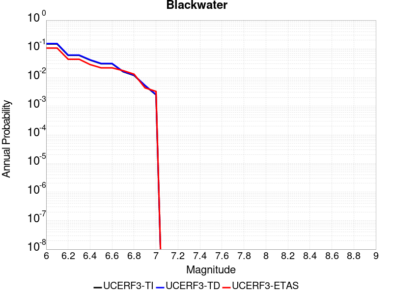 |
|-----|

| Magnitude | UCERF3-TI Prob | UCERF3-TD Prob | UCERF3-ETAS Prob |
|-----|-----|-----|-----|
| 6.0 | 0.14805683 | 0.15226048 | 0.106290676 |
| 6.1 | 0.14805683 | 0.15226048 | 0.106290676 |
| 6.2 | 0.059261315 | 0.060541373 | 0.04338395 |
| 6.3 | 0.059261315 | 0.060541373 | 0.04338395 |
| 6.4 | 0.040529612 | 0.041368503 | 0.028199567 |
| 6.5 | 0.030231453 | 0.030848086 | 0.021691974 |
| 6.6 | 0.030231453 | 0.030848086 | 0.021691974 |
| 6.7 | 0.015898956 | 0.01622364 | 0.01735358 |
| 6.8 | 0.011786168 | 0.012029649 | 0.013015185 |
| 6.9 | 0.0051795617 | 0.005290276 | 0.004338395 |
| 7.0 | 0.0024694544 | 0.0025235254 | 0.0032537961 |

## Blue Cut
*[(top)](#table-of-contents)*

| 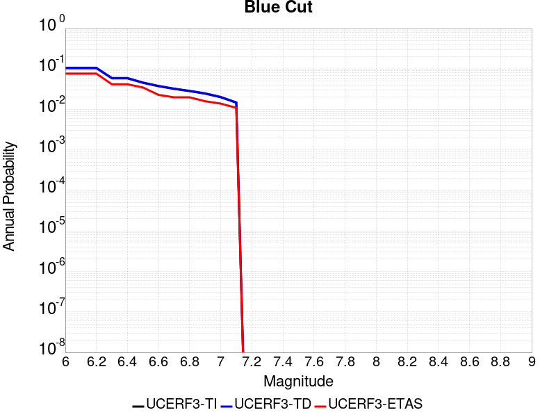 |
|-----|

| Magnitude | UCERF3-TI Prob | UCERF3-TD Prob | UCERF3-ETAS Prob |
|-----|-----|-----|-----|
| 6.0 | 0.1048516 | 0.10738418 | 0.07809111 |
| 6.1 | 0.1048516 | 0.10738418 | 0.07809111 |
| 6.2 | 0.1048516 | 0.10738418 | 0.07809111 |
| 6.3 | 0.058800776 | 0.05997612 | 0.04121475 |
| 6.4 | 0.058800776 | 0.05997612 | 0.04121475 |
| 6.5 | 0.045533367 | 0.046420977 | 0.03362256 |
| 6.6 | 0.03760195 | 0.03833218 | 0.021691974 |
| 6.7 | 0.032224897 | 0.032855358 | 0.018438177 |
| 6.8 | 0.028409094 | 0.028971791 | 0.018438177 |
| 6.9 | 0.024622798 | 0.025119526 | 0.015184382 |
| 7.0 | 0.020057976 | 0.02047752 | 0.013015185 |
| 7.1 | 0.014687995 | 0.015014437 | 0.009761388 |

## Brawley (Seismic Zone) alt 1
*[(top)](#table-of-contents)*

| 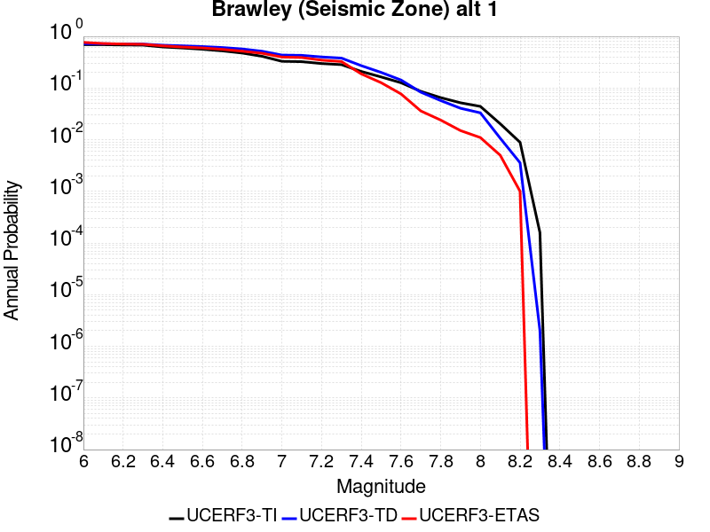 |
|-----|

| Magnitude | UCERF3-TI Prob | UCERF3-TD Prob | UCERF3-ETAS Prob |
|-----|-----|-----|-----|
| 6.0 | 0.69126695 | 0.71998847 | 0.76464206 |
| 6.1 | 0.69126695 | 0.71998847 | 0.7245119 |
| 6.2 | 0.6824399 | 0.71431506 | 0.7093276 |
| 6.3 | 0.67780983 | 0.7111643 | 0.7017354 |
| 6.4 | 0.62432694 | 0.67499846 | 0.6529284 |
| 6.5 | 0.5964736 | 0.656868 | 0.62147504 |
| 6.6 | 0.56422967 | 0.63541055 | 0.5943601 |
| 6.7 | 0.52504593 | 0.6088132 | 0.56073755 |
| 6.8 | 0.4763358 | 0.57173735 | 0.5151844 |
| 6.9 | 0.4121111 | 0.5164577 | 0.46963122 |
| 7.0 | 0.32955092 | 0.43545726 | 0.39587852 |
| 7.1 | 0.3243087 | 0.42965156 | 0.38828632 |
| 7.2 | 0.2982868 | 0.40002182 | 0.3449024 |
| 7.3 | 0.2838981 | 0.38020423 | 0.3253796 |
| 7.4 | 0.20955686 | 0.2713541 | 0.18872017 |
| 7.5 | 0.16399975 | 0.20075975 | 0.12689805 |
| 7.6 | 0.12677702 | 0.14324473 | 0.077006504 |
| 7.7 | 0.086277634 | 0.08315493 | 0.03362256 |
| 7.8 | 0.06522941 | 0.05722538 | 0.023861172 |
| 7.9 | 0.05183473 | 0.04061712 | 0.015184382 |
| 8.0 | 0.04413322 | 0.033111185 | 0.010845987 |
| 8.1 | 0.020332271 | 0.010678921 | 0.0054229936 |
| 8.2 | 0.008883473 | 0.0035709117 | 0.0010845987 |
| 8.3 | 1.5833203E-4 | 2.0023263E-6 | 0.0 |

## Breckenridge 2011
*[(top)](#table-of-contents)*

| 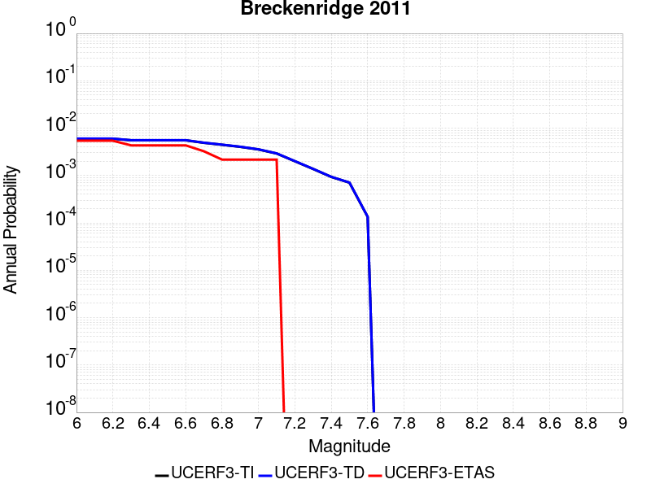 |
|-----|

| Magnitude | UCERF3-TI Prob | UCERF3-TD Prob | UCERF3-ETAS Prob |
|-----|-----|-----|-----|
| 6.0 | 0.0059775896 | 0.006012466 | 0.0054229936 |
| 6.1 | 0.0059775896 | 0.006012466 | 0.0054229936 |
| 6.2 | 0.0059775896 | 0.006012466 | 0.0054229936 |
| 6.3 | 0.005539622 | 0.005573258 | 0.004338395 |
| 6.4 | 0.005539622 | 0.005573258 | 0.004338395 |
| 6.5 | 0.005539622 | 0.005573258 | 0.004338395 |
| 6.6 | 0.005539622 | 0.005573258 | 0.004338395 |
| 6.7 | 0.0049041775 | 0.0049349307 | 0.0032537961 |
| 6.8 | 0.004454669 | 0.0044831815 | 0.0021691974 |
| 6.9 | 0.0040282854 | 0.0040544444 | 0.0021691974 |
| 7.0 | 0.0035508235 | 0.0035741841 | 0.0021691974 |
| 7.1 | 0.0029144268 | 0.0029334982 | 0.0021691974 |
| 7.2 | 0.0020027359 | 0.0020153665 | 0.0 |
| 7.3 | 0.0013768349 | 0.0013851146 | 0.0 |
| 7.4 | 9.3466253E-4 | 9.399943E-4 | 0.0 |
| 7.5 | 7.067021E-4 | 7.1078405E-4 | 0.0 |
| 7.6 | 1.3420706E-4 | 1.3499892E-4 | 0.0 |

## Bullion Mountains
*[(top)](#table-of-contents)*

| 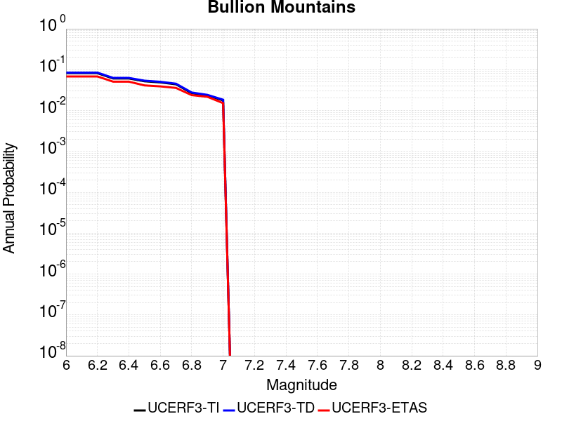 |
|-----|

| Magnitude | UCERF3-TI Prob | UCERF3-TD Prob | UCERF3-ETAS Prob |
|-----|-----|-----|-----|
| 6.0 | 0.08211222 | 0.08485127 | 0.06832972 |
| 6.1 | 0.08211222 | 0.08485127 | 0.06832972 |
| 6.2 | 0.08211222 | 0.08485127 | 0.06832972 |
| 6.3 | 0.06092388 | 0.06295819 | 0.05097614 |
| 6.4 | 0.06092388 | 0.06295819 | 0.05097614 |
| 6.5 | 0.05205026 | 0.053827737 | 0.04121475 |
| 6.6 | 0.04888461 | 0.05057604 | 0.039045554 |
| 6.7 | 0.043902684 | 0.045454588 | 0.03579176 |
| 6.8 | 0.026707165 | 0.02766089 | 0.023861172 |
| 6.9 | 0.023360988 | 0.024218122 | 0.021691974 |
| 7.0 | 0.017746624 | 0.018432373 | 0.015184382 |

## Burnt Mtn
*[(top)](#table-of-contents)*

| 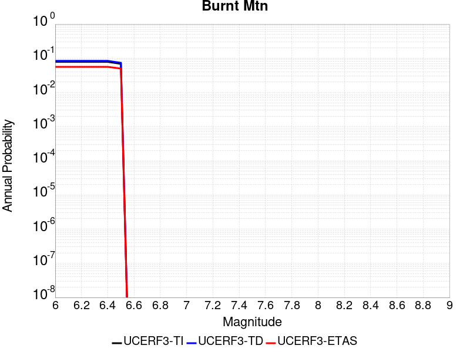 |
|-----|

| Magnitude | UCERF3-TI Prob | UCERF3-TD Prob | UCERF3-ETAS Prob |
|-----|-----|-----|-----|
| 6.0 | 0.07852618 | 0.08385105 | 0.056399133 |
| 6.1 | 0.07852618 | 0.08385105 | 0.056399133 |
| 6.2 | 0.07852618 | 0.08385105 | 0.056399133 |
| 6.3 | 0.07852618 | 0.08385105 | 0.056399133 |
| 6.4 | 0.07852618 | 0.08385105 | 0.056399133 |
| 6.5 | 0.068596974 | 0.07359303 | 0.05097614 |

## Butano 2011 CFM
*[(top)](#table-of-contents)*

| 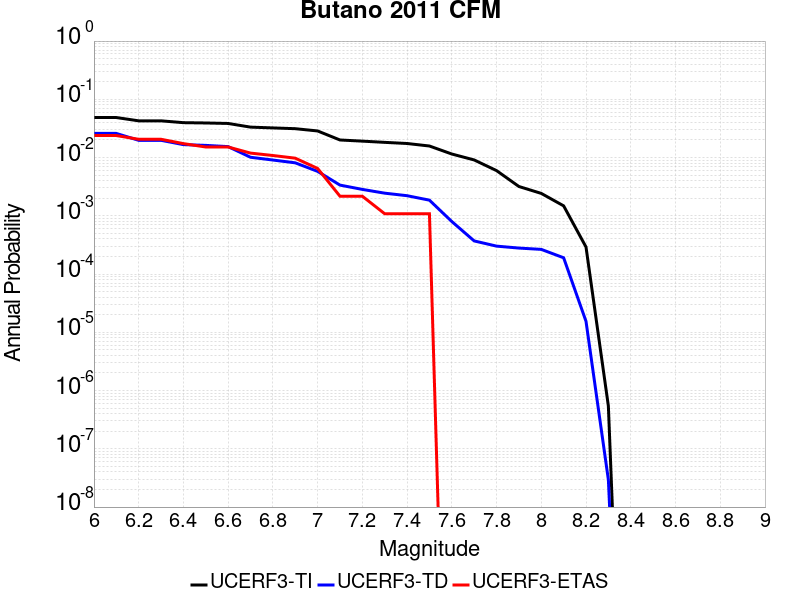 |
|-----|

| Magnitude | UCERF3-TI Prob | UCERF3-TD Prob | UCERF3-ETAS Prob |
|-----|-----|-----|-----|
| 6.0 | 0.048664868 | 0.025956849 | 0.023861172 |
| 6.1 | 0.048664868 | 0.025956849 | 0.023861172 |
| 6.2 | 0.042707417 | 0.019774439 | 0.020607375 |
| 6.3 | 0.042707417 | 0.019774439 | 0.020607375 |
| 6.4 | 0.03972343 | 0.016678048 | 0.01735358 |
| 6.5 | 0.039248083 | 0.016182773 | 0.015184382 |
| 6.6 | 0.038500752 | 0.015417616 | 0.015184382 |
| 6.7 | 0.03330783 | 0.010120114 | 0.011930586 |
| 6.8 | 0.032282777 | 0.009071364 | 0.010845987 |
| 6.9 | 0.031310383 | 0.008121914 | 0.009761388 |
| 7.0 | 0.028626267 | 0.005795382 | 0.0065075923 |
| 7.1 | 0.020034544 | 0.003366363 | 0.0021691974 |
| 7.2 | 0.01914043 | 0.0028403483 | 0.0021691974 |
| 7.3 | 0.018238835 | 0.0024476426 | 0.0010845987 |
| 7.4 | 0.017436298 | 0.0022141612 | 0.0010845987 |
| 7.5 | 0.015786687 | 0.0018563342 | 0.0010845987 |
| 7.6 | 0.011506395 | 7.976854E-4 | 0.0 |
| 7.7 | 0.009099688 | 3.7063446E-4 | 0.0 |
| 7.8 | 0.005971666 | 3.0172846E-4 | 0.0 |
| 7.9 | 0.0031858769 | 2.7940483E-4 | 0.0 |
| 8.0 | 0.0024244064 | 2.6527472E-4 | 0.0 |
| 8.1 | 0.0014820868 | 1.903007E-4 | 0.0 |
| 8.2 | 2.9141546E-4 | 1.546652E-5 | 0.0 |
| 8.3 | 5.4115526E-7 | 2.9438432E-8 | 0.0 |

## Cady
*[(top)](#table-of-contents)*

| 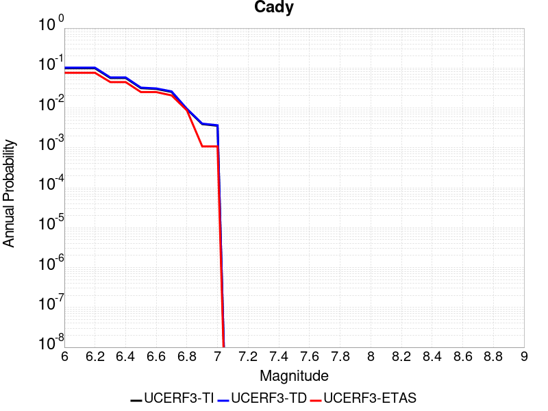 |
|-----|

| Magnitude | UCERF3-TI Prob | UCERF3-TD Prob | UCERF3-ETAS Prob |
|-----|-----|-----|-----|
| 6.0 | 0.09859227 | 0.10200935 | 0.07592191 |
| 6.1 | 0.09859227 | 0.10200935 | 0.07592191 |
| 6.2 | 0.09859227 | 0.10200935 | 0.07592191 |
| 6.3 | 0.056358494 | 0.058132328 | 0.04446855 |
| 6.4 | 0.056358494 | 0.058132328 | 0.04446855 |
| 6.5 | 0.031343445 | 0.0322821 | 0.02494577 |
| 6.6 | 0.029897554 | 0.03080641 | 0.02494577 |
| 6.7 | 0.02516531 | 0.025938498 | 0.020607375 |
| 6.8 | 0.009238992 | 0.009492481 | 0.00867679 |
| 6.9 | 0.003929416 | 0.004043821 | 0.0010845987 |
| 7.0 | 0.0035719506 | 0.0036763325 | 0.0010845987 |

## Calaveras (Central) 2011 CFM
*[(top)](#table-of-contents)*

| 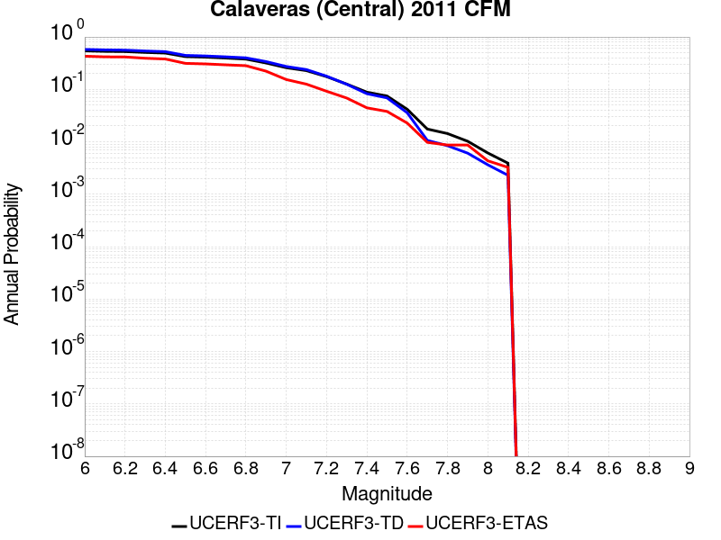 |
|-----|

| Magnitude | UCERF3-TI Prob | UCERF3-TD Prob | UCERF3-ETAS Prob |
|-----|-----|-----|-----|
| 6.0 | 0.5431072 | 0.57832146 | 0.4295011 |
| 6.1 | 0.5312869 | 0.565757 | 0.4175705 |
| 6.2 | 0.5258378 | 0.56000423 | 0.4154013 |
| 6.3 | 0.5065587 | 0.53955406 | 0.39262474 |
| 6.4 | 0.49237671 | 0.5244183 | 0.37960956 |
| 6.5 | 0.4218071 | 0.44494677 | 0.31344903 |
| 6.6 | 0.41141328 | 0.4339106 | 0.30585682 |
| 6.7 | 0.39594465 | 0.4174522 | 0.29392624 |
| 6.8 | 0.37769252 | 0.3992623 | 0.28308025 |
| 6.9 | 0.31865934 | 0.33874568 | 0.22234273 |
| 7.0 | 0.25905585 | 0.27336657 | 0.15401301 |
| 7.1 | 0.22785951 | 0.23857383 | 0.12581345 |
| 7.2 | 0.1750372 | 0.17865962 | 0.09219089 |
| 7.3 | 0.12616841 | 0.12516528 | 0.06832972 |
| 7.4 | 0.08844796 | 0.08275433 | 0.04446855 |
| 7.5 | 0.07472145 | 0.0688085 | 0.037960954 |
| 7.6 | 0.041719057 | 0.035818253 | 0.022776572 |
| 7.7 | 0.017511543 | 0.010641416 | 0.009761388 |
| 7.8 | 0.01436065 | 0.008429706 | 0.00867679 |
| 7.9 | 0.010245281 | 0.006074278 | 0.00867679 |
| 8.0 | 0.006121196 | 0.003639488 | 0.004338395 |
| 8.1 | 0.003911611 | 0.0023009123 | 0.0032537961 |

## Calaveras (No) 2011 CFM
*[(top)](#table-of-contents)*

| 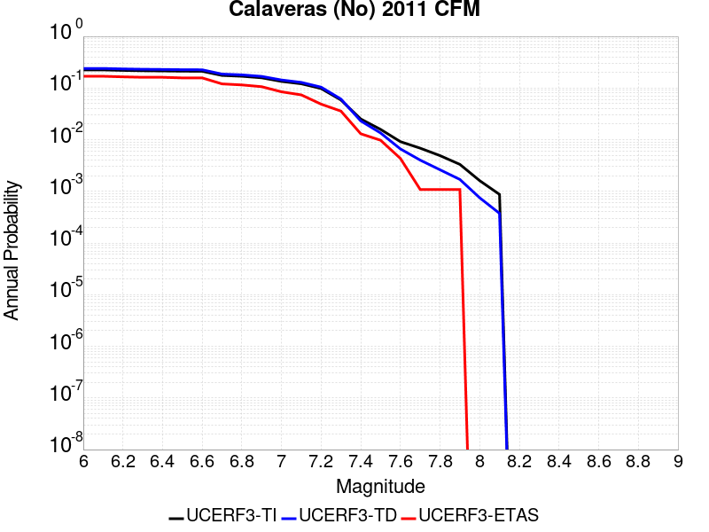 |
|-----|

| Magnitude | UCERF3-TI Prob | UCERF3-TD Prob | UCERF3-ETAS Prob |
|-----|-----|-----|-----|
| 6.0 | 0.22437721 | 0.23976648 | 0.1691974 |
| 6.1 | 0.22437721 | 0.23976648 | 0.1691974 |
| 6.2 | 0.21969707 | 0.23469067 | 0.164859 |
| 6.3 | 0.216332 | 0.23116621 | 0.16160521 |
| 6.4 | 0.21452697 | 0.2292079 | 0.16160521 |
| 6.5 | 0.21224728 | 0.22675017 | 0.15726681 |
| 6.6 | 0.21130271 | 0.2258191 | 0.15726681 |
| 6.7 | 0.17561607 | 0.1865285 | 0.12039045 |
| 6.8 | 0.16919503 | 0.18005021 | 0.114967465 |
| 6.9 | 0.15794599 | 0.16821574 | 0.106290676 |
| 7.0 | 0.13449724 | 0.14334615 | 0.0845987 |
| 7.1 | 0.12101311 | 0.1288043 | 0.07375271 |
| 7.2 | 0.09791234 | 0.10409534 | 0.048806943 |
| 7.3 | 0.058750447 | 0.061229397 | 0.03579176 |
| 7.4 | 0.025169121 | 0.02308791 | 0.013015185 |
| 7.5 | 0.015825119 | 0.013488793 | 0.009761388 |
| 7.6 | 0.009166979 | 0.0066284696 | 0.004338395 |
| 7.7 | 0.0068503 | 0.0040209033 | 0.0010845987 |
| 7.8 | 0.0049151 | 0.0026137477 | 0.0010845987 |
| 7.9 | 0.0033277406 | 0.0016999089 | 0.0010845987 |
| 8.0 | 0.0016099699 | 7.499858E-4 | 0.0 |
| 8.1 | 8.7233976E-4 | 3.7473123E-4 | 0.0 |

## Calaveras (So) - Paicines extension 2011 CFM
*[(top)](#table-of-contents)*

| 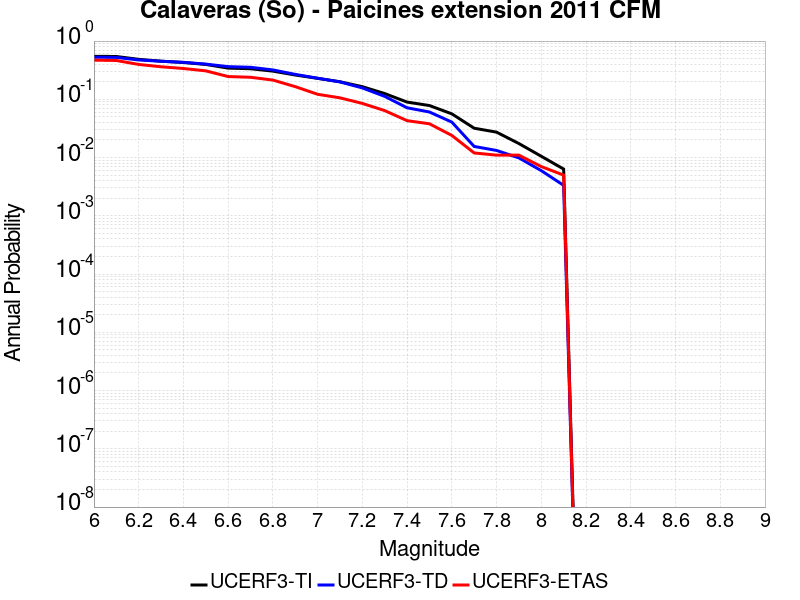 |
|-----|

| Magnitude | UCERF3-TI Prob | UCERF3-TD Prob | UCERF3-ETAS Prob |
|-----|-----|-----|-----|
| 6.0 | 0.5472077 | 0.5283586 | 0.47071582 |
| 6.1 | 0.543443 | 0.5238776 | 0.46529284 |
| 6.2 | 0.48572755 | 0.47400278 | 0.39370933 |
| 6.3 | 0.4519554 | 0.44936365 | 0.35791758 |
| 6.4 | 0.42844188 | 0.431669 | 0.335141 |
| 6.5 | 0.39707598 | 0.4022285 | 0.30368763 |
| 6.6 | 0.34316826 | 0.36378607 | 0.23644252 |
| 6.7 | 0.33490872 | 0.3546159 | 0.22885032 |
| 6.8 | 0.30472666 | 0.3194493 | 0.20715836 |
| 6.9 | 0.26114002 | 0.26813993 | 0.159436 |
| 7.0 | 0.22910212 | 0.23013823 | 0.11713666 |
| 7.1 | 0.20031011 | 0.1988766 | 0.09978308 |
| 7.2 | 0.16475083 | 0.15680969 | 0.0813449 |
| 7.3 | 0.12553923 | 0.112352915 | 0.060737528 |
| 7.4 | 0.08966117 | 0.071541615 | 0.040130153 |
| 7.5 | 0.07815429 | 0.06054168 | 0.036876354 |
| 7.6 | 0.056323938 | 0.040666692 | 0.02603037 |
| 7.7 | 0.03190407 | 0.015518815 | 0.013015185 |
| 7.8 | 0.027303906 | 0.013244973 | 0.011930586 |
| 7.9 | 0.017397208 | 0.009872761 | 0.011930586 |
| 8.0 | 0.010521456 | 0.005962001 | 0.007592191 |
| 8.1 | 0.0063487417 | 0.0033329092 | 0.0054229936 |

## Calaveras (So) 2011 CFM
*[(top)](#table-of-contents)*

| 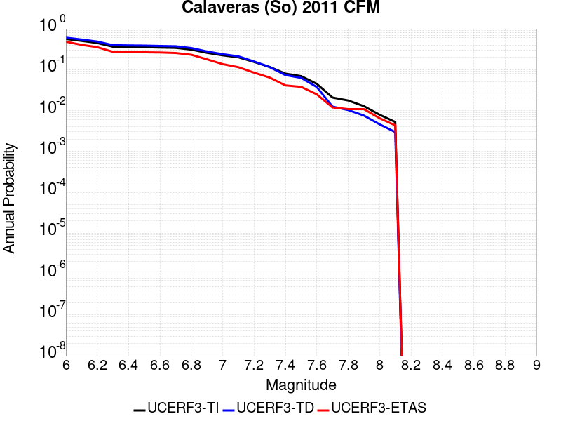 |
|-----|

| Magnitude | UCERF3-TI Prob | UCERF3-TD Prob | UCERF3-ETAS Prob |
|-----|-----|-----|-----|
| 6.0 | 0.56497574 | 0.6077276 | 0.48373103 |
| 6.1 | 0.507804 | 0.54738826 | 0.40563992 |
| 6.2 | 0.45030883 | 0.48813242 | 0.3557484 |
| 6.3 | 0.36461914 | 0.3988139 | 0.2733189 |
| 6.4 | 0.3585661 | 0.39234382 | 0.27006507 |
| 6.5 | 0.35509157 | 0.3886046 | 0.26681128 |
| 6.6 | 0.34793177 | 0.38089752 | 0.2635575 |
| 6.7 | 0.34169602 | 0.37416342 | 0.2559653 |
| 6.8 | 0.31030983 | 0.33836377 | 0.23210412 |
| 6.9 | 0.25860122 | 0.27872854 | 0.17895879 |
| 7.0 | 0.22458652 | 0.23923907 | 0.13665944 |
| 7.1 | 0.20097442 | 0.21212079 | 0.114967465 |
| 7.2 | 0.15471812 | 0.15848005 | 0.0845987 |
| 7.3 | 0.116584525 | 0.11520531 | 0.06399132 |
| 7.4 | 0.08008528 | 0.07386355 | 0.04121475 |
| 7.5 | 0.06954494 | 0.062956385 | 0.037960954 |
| 7.6 | 0.044965357 | 0.037649807 | 0.02494577 |
| 7.7 | 0.020835133 | 0.012503882 | 0.011930586 |
| 7.8 | 0.017651808 | 0.010303021 | 0.010845987 |
| 7.9 | 0.012826407 | 0.007551058 | 0.010845987 |
| 8.0 | 0.007916251 | 0.0046093054 | 0.0065075923 |
| 8.1 | 0.005258524 | 0.0029806274 | 0.004338395 |

## Calico-Hidalgo
*[(top)](#table-of-contents)*

| 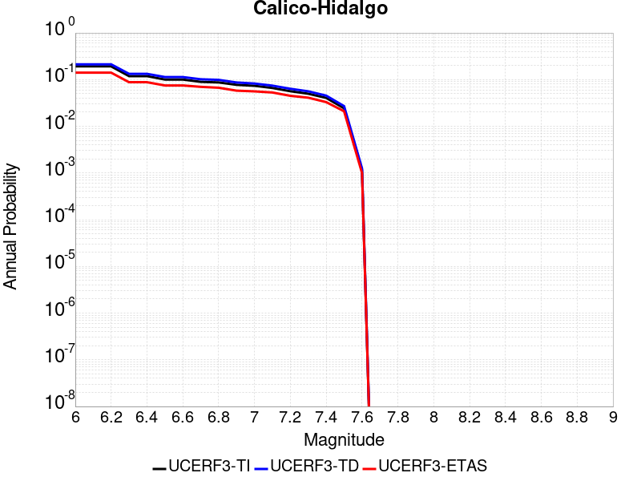 |
|-----|

| Magnitude | UCERF3-TI Prob | UCERF3-TD Prob | UCERF3-ETAS Prob |
|-----|-----|-----|-----|
| 6.0 | 0.19220681 | 0.21264602 | 0.13774404 |
| 6.1 | 0.19220681 | 0.21264602 | 0.13774404 |
| 6.2 | 0.19220681 | 0.21264602 | 0.13774404 |
| 6.3 | 0.118823215 | 0.13299274 | 0.08785249 |
| 6.4 | 0.118823215 | 0.13299274 | 0.08785249 |
| 6.5 | 0.10044537 | 0.11352417 | 0.07375271 |
| 6.6 | 0.100362144 | 0.11344039 | 0.07375271 |
| 6.7 | 0.08963945 | 0.10173232 | 0.06832972 |
| 6.8 | 0.08707202 | 0.0987697 | 0.06507592 |
| 6.9 | 0.07735072 | 0.08677775 | 0.057483733 |
| 7.0 | 0.07375074 | 0.082449175 | 0.055314533 |
| 7.1 | 0.06626195 | 0.0742798 | 0.05206074 |
| 7.2 | 0.05640811 | 0.06364462 | 0.04446855 |
| 7.3 | 0.04989027 | 0.05613233 | 0.040130153 |
| 7.4 | 0.040595733 | 0.045413014 | 0.03253796 |
| 7.5 | 0.02428743 | 0.027043441 | 0.021691974 |
| 7.6 | 0.0011533784 | 0.0012534978 | 0.0010845987 |

## Camp Rock 2011
*[(top)](#table-of-contents)*

| 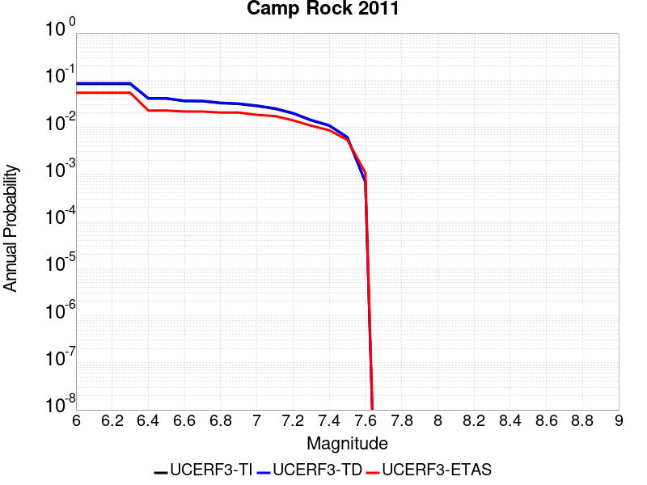 |
|-----|

| Magnitude | UCERF3-TI Prob | UCERF3-TD Prob | UCERF3-ETAS Prob |
|-----|-----|-----|-----|
| 6.0 | 0.08350183 | 0.08626567 | 0.054229934 |
| 6.1 | 0.08350183 | 0.08626567 | 0.054229934 |
| 6.2 | 0.08350183 | 0.08626567 | 0.054229934 |
| 6.3 | 0.08350183 | 0.08626567 | 0.054229934 |
| 6.4 | 0.04079793 | 0.041638486 | 0.022776572 |
| 6.5 | 0.04079793 | 0.041638486 | 0.022776572 |
| 6.6 | 0.036111947 | 0.0368509 | 0.021691974 |
| 6.7 | 0.035802275 | 0.036535997 | 0.021691974 |
| 6.8 | 0.032710526 | 0.033385802 | 0.020607375 |
| 6.9 | 0.03138953 | 0.032041553 | 0.020607375 |
| 7.0 | 0.028361447 | 0.028956085 | 0.018438177 |
| 7.1 | 0.024811624 | 0.025339786 | 0.01735358 |
| 7.2 | 0.019726401 | 0.02015293 | 0.014099783 |
| 7.3 | 0.014075219 | 0.0143855885 | 0.010845987 |
| 7.4 | 0.010842692 | 0.01108394 | 0.00867679 |
| 7.5 | 0.0060768235 | 0.0062159672 | 0.0054229936 |
| 7.6 | 6.8614166E-4 | 7.033696E-4 | 0.0010845987 |

## Canada David (Detachment)
*[(top)](#table-of-contents)*

| 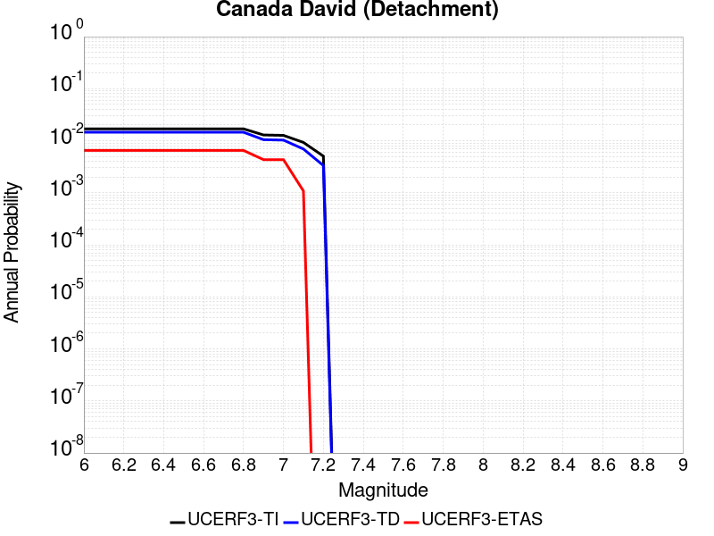 |
|-----|

| Magnitude | UCERF3-TI Prob | UCERF3-TD Prob | UCERF3-ETAS Prob |
|-----|-----|-----|-----|
| 6.0 | 0.0169363 | 0.014562352 | 0.0065075923 |
| 6.1 | 0.0169363 | 0.014562352 | 0.0065075923 |
| 6.2 | 0.0169363 | 0.014562352 | 0.0065075923 |
| 6.3 | 0.0169363 | 0.014562352 | 0.0065075923 |
| 6.4 | 0.0169363 | 0.014562352 | 0.0065075923 |
| 6.5 | 0.0169363 | 0.014562352 | 0.0065075923 |
| 6.6 | 0.0169363 | 0.014562352 | 0.0065075923 |
| 6.7 | 0.0169363 | 0.014562352 | 0.0065075923 |
| 6.8 | 0.0169363 | 0.014562352 | 0.0065075923 |
| 6.9 | 0.012915768 | 0.010495131 | 0.004338395 |
| 7.0 | 0.012693335 | 0.010285167 | 0.004338395 |
| 7.1 | 0.0092900675 | 0.006943691 | 0.0010845987 |
| 7.2 | 0.005060534 | 0.003340054 | 0.0 |

## Carlsbad
*[(top)](#table-of-contents)*

| 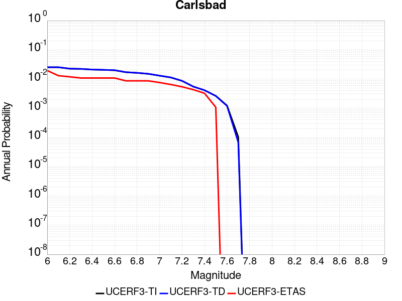 |
|-----|

| Magnitude | UCERF3-TI Prob | UCERF3-TD Prob | UCERF3-ETAS Prob |
|-----|-----|-----|-----|
| 6.0 | 0.02526308 | 0.02540562 | 0.019522777 |
| 6.1 | 0.02526308 | 0.02540562 | 0.013015185 |
| 6.2 | 0.022605598 | 0.02273102 | 0.011930586 |
| 6.3 | 0.022201654 | 0.022323176 | 0.010845987 |
| 6.4 | 0.021081895 | 0.021194302 | 0.010845987 |
| 6.5 | 0.020592853 | 0.02070067 | 0.010845987 |
| 6.6 | 0.019994503 | 0.020097237 | 0.010845987 |
| 6.7 | 0.017119477 | 0.017191686 | 0.00867679 |
| 6.8 | 0.01623512 | 0.016322562 | 0.00867679 |
| 6.9 | 0.015047008 | 0.015138813 | 0.00867679 |
| 7.0 | 0.012996531 | 0.013077924 | 0.007592191 |
| 7.1 | 0.011303721 | 0.011374964 | 0.0065075923 |
| 7.2 | 0.008638946 | 0.008678269 | 0.0054229936 |
| 7.3 | 0.00551355 | 0.005510566 | 0.004338395 |
| 7.4 | 0.0041430476 | 0.004129208 | 0.0032537961 |
| 7.5 | 0.0026598496 | 0.0026250158 | 0.0010845987 |
| 7.6 | 0.001237082 | 0.0011998357 | 0.0 |
| 7.7 | 1.04310755E-4 | 6.788921E-5 | 0.0 |

## Carson Range (Genoa)
*[(top)](#table-of-contents)*

| 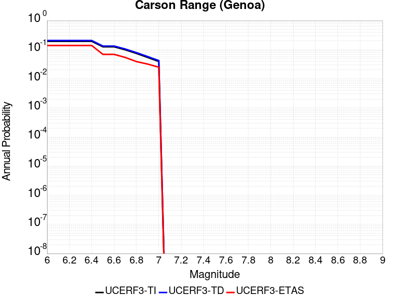 |
|-----|

| Magnitude | UCERF3-TI Prob | UCERF3-TD Prob | UCERF3-ETAS Prob |
|-----|-----|-----|-----|
| 6.0 | 0.19373061 | 0.20622854 | 0.13882864 |
| 6.1 | 0.19373061 | 0.20622854 | 0.13882864 |
| 6.2 | 0.19373061 | 0.20622854 | 0.13882864 |
| 6.3 | 0.19373061 | 0.20622854 | 0.13882864 |
| 6.4 | 0.19373061 | 0.20622854 | 0.13882864 |
| 6.5 | 0.12539385 | 0.13314714 | 0.06941432 |
| 6.6 | 0.12539385 | 0.13314714 | 0.06941432 |
| 6.7 | 0.09895363 | 0.105240926 | 0.054229934 |
| 6.8 | 0.07423695 | 0.07915862 | 0.04121475 |
| 6.9 | 0.05413389 | 0.057961695 | 0.03362256 |
| 7.0 | 0.039204974 | 0.0422059 | 0.02603037 |

## Casmalia 2011 CFM
*[(top)](#table-of-contents)*

| 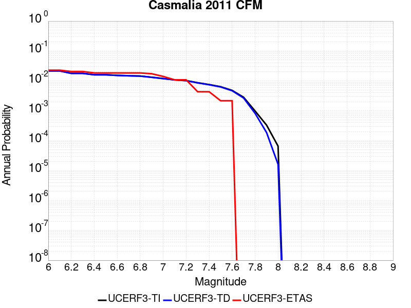 |
|-----|

| Magnitude | UCERF3-TI Prob | UCERF3-TD Prob | UCERF3-ETAS Prob |
|-----|-----|-----|-----|
| 6.0 | 0.021525998 | 0.02151712 | 0.022776572 |
| 6.1 | 0.021525998 | 0.02151712 | 0.022776572 |
| 6.2 | 0.017878048 | 0.017849024 | 0.020607375 |
| 6.3 | 0.017878048 | 0.017849024 | 0.020607375 |
| 6.4 | 0.01602336 | 0.015984345 | 0.018438177 |
| 6.5 | 0.01602336 | 0.015984345 | 0.018438177 |
| 6.6 | 0.01525385 | 0.015210383 | 0.018438177 |
| 6.7 | 0.014830189 | 0.014784114 | 0.018438177 |
| 6.8 | 0.01450372 | 0.014455501 | 0.018438177 |
| 6.9 | 0.013222842 | 0.013164128 | 0.01735358 |
| 7.0 | 0.011971571 | 0.0119023705 | 0.014099783 |
| 7.1 | 0.010862833 | 0.010784627 | 0.010845987 |
| 7.2 | 0.010234065 | 0.010150517 | 0.010845987 |
| 7.3 | 0.008670549 | 0.008572455 | 0.004338395 |
| 7.4 | 0.0075326646 | 0.0074237143 | 0.004338395 |
| 7.5 | 0.006381205 | 0.0062605743 | 0.0021691974 |
| 7.6 | 0.0048180767 | 0.004680731 | 0.0021691974 |
| 7.7 | 0.0028328218 | 0.002672115 | 0.0 |
| 7.8 | 9.818181E-4 | 8.2175113E-4 | 0.0 |
| 7.9 | 3.3090202E-4 | 1.8636862E-4 | 0.0 |
| 8.0 | 6.561146E-5 | 1.6132362E-5 | 0.0 |

## Cedar Mtn-Mahogany Mtn
*[(top)](#table-of-contents)*

| 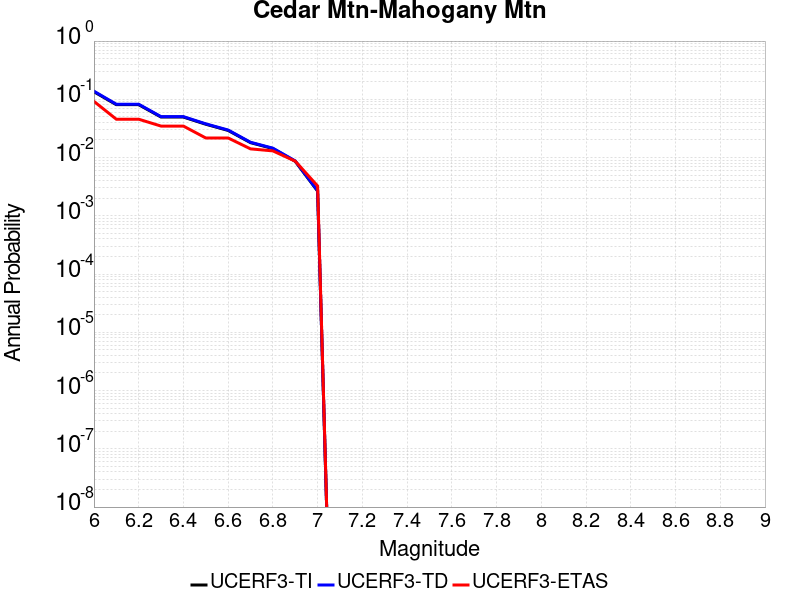 |
|-----|

| Magnitude | UCERF3-TI Prob | UCERF3-TD Prob | UCERF3-ETAS Prob |
|-----|-----|-----|-----|
| 6.0 | 0.1348652 | 0.13785838 | 0.09219089 |
| 6.1 | 0.080875784 | 0.08240968 | 0.045553144 |
| 6.2 | 0.080875784 | 0.08240968 | 0.045553144 |
| 6.3 | 0.049582355 | 0.05042974 | 0.03470716 |
| 6.4 | 0.049582355 | 0.05042974 | 0.03470716 |
| 6.5 | 0.03732436 | 0.037941806 | 0.021691974 |
| 6.6 | 0.029197918 | 0.02967177 | 0.021691974 |
| 6.7 | 0.018021958 | 0.018309696 | 0.014099783 |
| 6.8 | 0.014264758 | 0.014493005 | 0.013015185 |
| 6.9 | 0.008621197 | 0.008761313 | 0.00867679 |
| 7.0 | 0.0026586892 | 0.002703754 | 0.0032537961 |

## Cerro Prieto
*[(top)](#table-of-contents)*

| 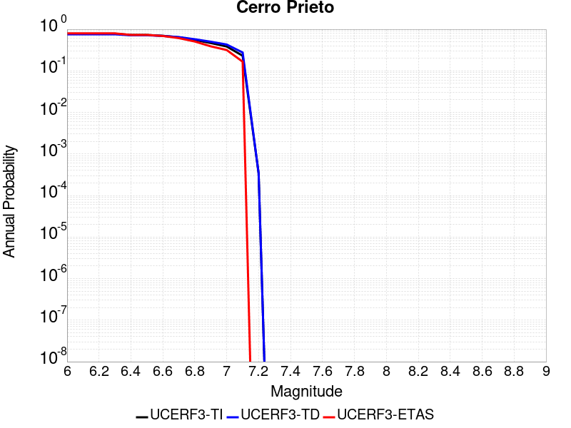 |
|-----|

| Magnitude | UCERF3-TI Prob | UCERF3-TD Prob | UCERF3-ETAS Prob |
|-----|-----|-----|-----|
| 6.0 | 0.781003 | 0.7578566 | 0.7982646 |
| 6.1 | 0.781003 | 0.7578566 | 0.7982646 |
| 6.2 | 0.781003 | 0.7578566 | 0.7982646 |
| 6.3 | 0.781003 | 0.7578566 | 0.7982646 |
| 6.4 | 0.72994804 | 0.71742123 | 0.7288503 |
| 6.5 | 0.72994804 | 0.71742123 | 0.7288503 |
| 6.6 | 0.6980793 | 0.69292855 | 0.68872017 |
| 6.7 | 0.6408199 | 0.6487068 | 0.60954446 |
| 6.8 | 0.5540666 | 0.5767473 | 0.5043384 |
| 6.9 | 0.46678874 | 0.502926 | 0.38720173 |
| 7.0 | 0.3853411 | 0.4298817 | 0.3167028 |
| 7.1 | 0.23083489 | 0.27629644 | 0.16594361 |
| 7.2 | 3.4142533E-4 | 3.432419E-4 | 0.0 |

## Channel Islands Thrust
*[(top)](#table-of-contents)*

| 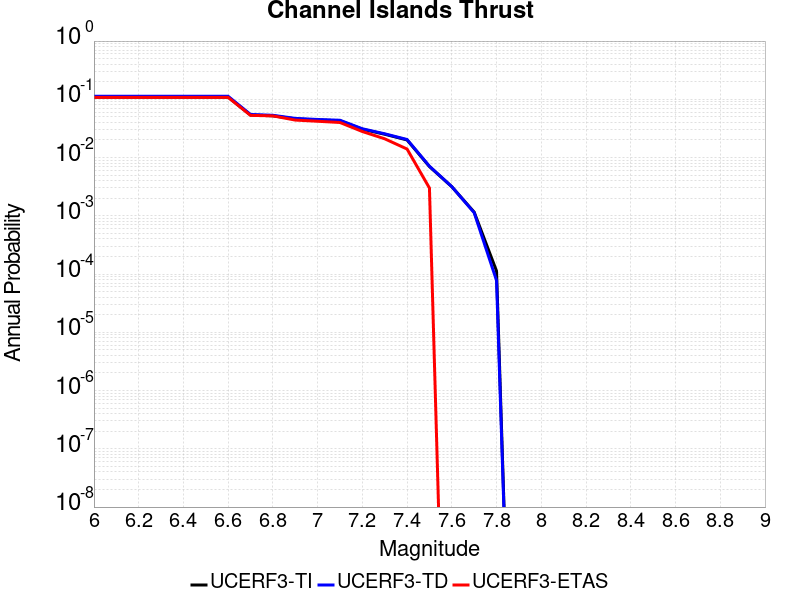 |
|-----|

| Magnitude | UCERF3-TI Prob | UCERF3-TD Prob | UCERF3-ETAS Prob |
|-----|-----|-----|-----|
| 6.0 | 0.10917692 | 0.112642355 | 0.106290676 |
| 6.1 | 0.10917692 | 0.112642355 | 0.106290676 |
| 6.2 | 0.10917692 | 0.112642355 | 0.106290676 |
| 6.3 | 0.10917692 | 0.112642355 | 0.106290676 |
| 6.4 | 0.10917692 | 0.112642355 | 0.106290676 |
| 6.5 | 0.10917692 | 0.112642355 | 0.106290676 |
| 6.6 | 0.10917692 | 0.112642355 | 0.106290676 |
| 6.7 | 0.053814217 | 0.054938808 | 0.055314533 |
| 6.8 | 0.052062146 | 0.053147547 | 0.054229934 |
| 6.9 | 0.046121985 | 0.047065128 | 0.046637744 |
| 7.0 | 0.044152286 | 0.045054227 | 0.04446855 |
| 7.1 | 0.04283872 | 0.043715063 | 0.04229935 |
| 7.2 | 0.030646177 | 0.031216009 | 0.030368764 |
| 7.3 | 0.025129128 | 0.025586316 | 0.022776572 |
| 7.4 | 0.020057028 | 0.020413028 | 0.015184382 |
| 7.5 | 0.0070139803 | 0.0071007074 | 0.0032537961 |
| 7.6 | 0.003156088 | 0.0031687517 | 0.0 |
| 7.7 | 0.001156156 | 0.0011320839 | 0.0 |
| 7.8 | 1.1276772E-4 | 7.739128E-5 | 0.0 |

## Channel Islands Western Deep Ramp
*[(top)](#table-of-contents)*

| 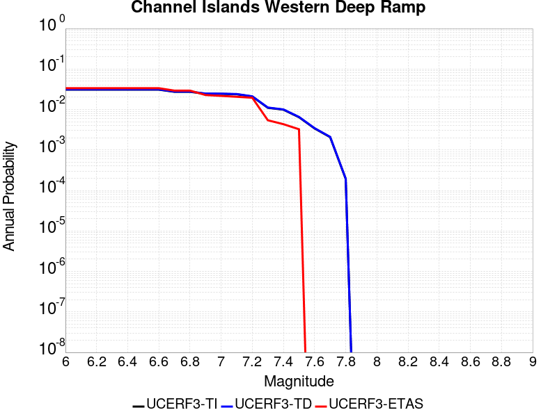 |
|-----|

| Magnitude | UCERF3-TI Prob | UCERF3-TD Prob | UCERF3-ETAS Prob |
|-----|-----|-----|-----|
| 6.0 | 0.030930206 | 0.031325083 | 0.03362256 |
| 6.1 | 0.030930206 | 0.031325083 | 0.03362256 |
| 6.2 | 0.030930206 | 0.031325083 | 0.03362256 |
| 6.3 | 0.030930206 | 0.031325083 | 0.03362256 |
| 6.4 | 0.030930206 | 0.031325083 | 0.03362256 |
| 6.5 | 0.030930206 | 0.031325083 | 0.03362256 |
| 6.6 | 0.030930206 | 0.031325083 | 0.03362256 |
| 6.7 | 0.027343374 | 0.027703177 | 0.029284164 |
| 6.8 | 0.027343374 | 0.027703177 | 0.029284164 |
| 6.9 | 0.024451634 | 0.024783226 | 0.022776572 |
| 7.0 | 0.024338787 | 0.02466922 | 0.021691974 |
| 7.1 | 0.023773355 | 0.024097862 | 0.020607375 |
| 7.2 | 0.020879956 | 0.021170193 | 0.019522777 |
| 7.3 | 0.01101796 | 0.011180058 | 0.0054229936 |
| 7.4 | 0.0098917615 | 0.010038531 | 0.004338395 |
| 7.5 | 0.0064536654 | 0.006549899 | 0.0032537961 |
| 7.6 | 0.0034087452 | 0.0034611844 | 0.0 |
| 7.7 | 0.0020776577 | 0.0021094377 | 0.0 |
| 7.8 | 1.9337227E-4 | 1.9573334E-4 | 0.0 |

## Chino alt 1
*[(top)](#table-of-contents)*

| 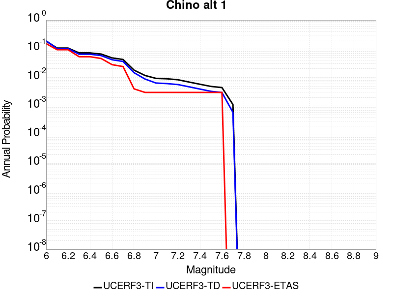 |
|-----|

| Magnitude | UCERF3-TI Prob | UCERF3-TD Prob | UCERF3-ETAS Prob |
|-----|-----|-----|-----|
| 6.0 | 0.18582895 | 0.18920152 | 0.15509762 |
| 6.1 | 0.106147476 | 0.101678796 | 0.09327549 |
| 6.2 | 0.106147476 | 0.101678796 | 0.09327549 |
| 6.3 | 0.07185546 | 0.064756304 | 0.054229934 |
| 6.4 | 0.07185546 | 0.064756304 | 0.054229934 |
| 6.5 | 0.06567059 | 0.058194127 | 0.047722343 |
| 6.6 | 0.048212443 | 0.041588992 | 0.029284164 |
| 6.7 | 0.042454705 | 0.036247738 | 0.02494577 |
| 6.8 | 0.01802319 | 0.014693733 | 0.004338395 |
| 6.9 | 0.011746809 | 0.008813543 | 0.0032537961 |
| 7.0 | 0.009277882 | 0.0063928314 | 0.0032537961 |
| 7.1 | 0.008994273 | 0.0061157537 | 0.0032537961 |
| 7.2 | 0.008318139 | 0.005649419 | 0.0032537961 |
| 7.3 | 0.0069265803 | 0.004720163 | 0.0032537961 |
| 7.4 | 0.00579736 | 0.0039305408 | 0.0032537961 |
| 7.5 | 0.0048689363 | 0.0032810606 | 0.0032537961 |
| 7.6 | 0.004436669 | 0.0029735928 | 0.0032537961 |
| 7.7 | 0.0011370352 | 6.043748E-4 | 0.0 |

## Clamshell-Sawpit
*[(top)](#table-of-contents)*

| 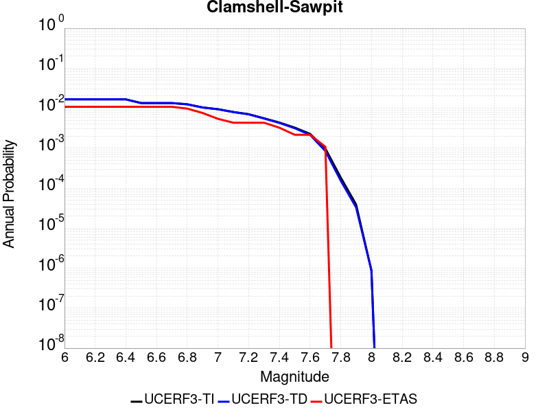 |
|-----|

| Magnitude | UCERF3-TI Prob | UCERF3-TD Prob | UCERF3-ETAS Prob |
|-----|-----|-----|-----|
| 6.0 | 0.016573928 | 0.016637538 | 0.010845987 |
| 6.1 | 0.016573928 | 0.016637538 | 0.010845987 |
| 6.2 | 0.016573928 | 0.016637538 | 0.010845987 |
| 6.3 | 0.016573928 | 0.016637538 | 0.010845987 |
| 6.4 | 0.016573928 | 0.016637538 | 0.010845987 |
| 6.5 | 0.013404171 | 0.013439271 | 0.010845987 |
| 6.6 | 0.013404171 | 0.013439271 | 0.010845987 |
| 6.7 | 0.013404171 | 0.013439271 | 0.010845987 |
| 6.8 | 0.0124957 | 0.012520282 | 0.009761388 |
| 6.9 | 0.010419665 | 0.010417079 | 0.007592191 |
| 7.0 | 0.0094343815 | 0.009420876 | 0.0054229936 |
| 7.1 | 0.008040275 | 0.008005783 | 0.004338395 |
| 7.2 | 0.007075335 | 0.007026855 | 0.004338395 |
| 7.3 | 0.005593307 | 0.005521309 | 0.004338395 |
| 7.4 | 0.004382167 | 0.0042890017 | 0.0032537961 |
| 7.5 | 0.0032703911 | 0.003159504 | 0.0021691974 |
| 7.6 | 0.0022839617 | 0.002159 | 0.0021691974 |
| 7.7 | 9.7550167E-4 | 8.481955E-4 | 0.0010845987 |
| 7.8 | 1.8458413E-4 | 1.543428E-4 | 0.0 |
| 7.9 | 3.9158967E-5 | 3.3052394E-5 | 0.0 |
| 8.0 | 8.637658E-7 | 8.7616706E-7 | 0.0 |

## Clayton
*[(top)](#table-of-contents)*

| 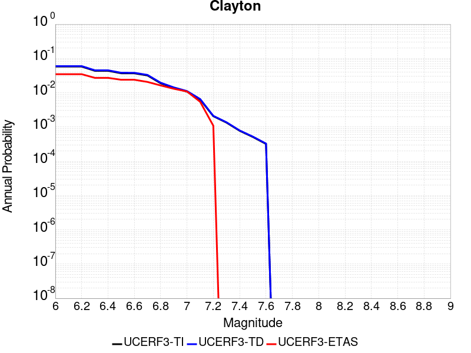 |
|-----|

| Magnitude | UCERF3-TI Prob | UCERF3-TD Prob | UCERF3-ETAS Prob |
|-----|-----|-----|-----|
| 6.0 | 0.057813518 | 0.05978843 | 0.03470716 |
| 6.1 | 0.057813518 | 0.05978843 | 0.03470716 |
| 6.2 | 0.057813518 | 0.05978843 | 0.03470716 |
| 6.3 | 0.043575905 | 0.045103107 | 0.027114967 |
| 6.4 | 0.043575905 | 0.045103107 | 0.027114967 |
| 6.5 | 0.036859002 | 0.038213152 | 0.023861172 |
| 6.6 | 0.036751382 | 0.03810205 | 0.023861172 |
| 6.7 | 0.03184617 | 0.03304633 | 0.020607375 |
| 6.8 | 0.01882265 | 0.019550476 | 0.01626898 |
| 6.9 | 0.013731401 | 0.014271886 | 0.013015185 |
| 7.0 | 0.010745136 | 0.011162491 | 0.010845987 |
| 7.1 | 0.0062997835 | 0.0065334346 | 0.0054229936 |
| 7.2 | 0.0020610979 | 0.0021114475 | 0.0010845987 |
| 7.3 | 0.0013393423 | 0.0013716274 | 0.0 |
| 7.4 | 7.731435E-4 | 7.914221E-4 | 0.0 |
| 7.5 | 5.110603E-4 | 5.2355055E-4 | 0.0 |
| 7.6 | 3.1956434E-4 | 3.2814388E-4 | 0.0 |

## Cleghorn
*[(top)](#table-of-contents)*

| 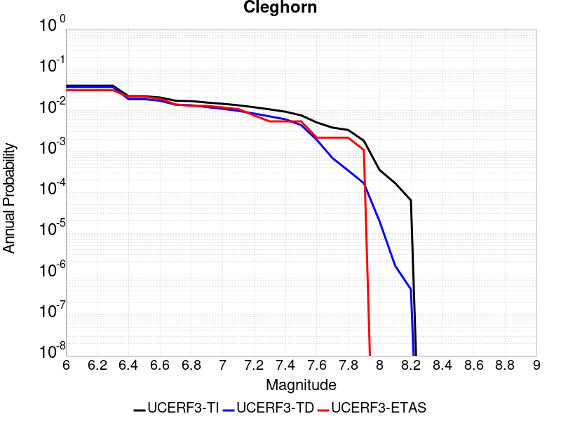 |
|-----|

| Magnitude | UCERF3-TI Prob | UCERF3-TD Prob | UCERF3-ETAS Prob |
|-----|-----|-----|-----|
| 6.0 | 0.040516958 | 0.037490454 | 0.031453364 |
| 6.1 | 0.040516958 | 0.037490454 | 0.031453364 |
| 6.2 | 0.040516958 | 0.037490454 | 0.031453364 |
| 6.3 | 0.040516958 | 0.037490454 | 0.031453364 |
| 6.4 | 0.022414122 | 0.01899455 | 0.021691974 |
| 6.5 | 0.022414122 | 0.01899455 | 0.021691974 |
| 6.6 | 0.020860108 | 0.017414311 | 0.019522777 |
| 6.7 | 0.017395673 | 0.013886778 | 0.014099783 |
| 6.8 | 0.01702169 | 0.013505233 | 0.013015185 |
| 6.9 | 0.015693754 | 0.012149543 | 0.013015185 |
| 7.0 | 0.014637353 | 0.011058311 | 0.011930586 |
| 7.1 | 0.013455618 | 0.009850303 | 0.010845987 |
| 7.2 | 0.012056825 | 0.008441333 | 0.007592191 |
| 7.3 | 0.010675377 | 0.007196914 | 0.0054229936 |
| 7.4 | 0.009377129 | 0.006093709 | 0.0054229936 |
| 7.5 | 0.007632341 | 0.0044232085 | 0.0054229936 |
| 7.6 | 0.0051025725 | 0.0019103505 | 0.0021691974 |
| 7.7 | 0.0038243555 | 6.8478554E-4 | 0.0021691974 |
| 7.8 | 0.0033516372 | 3.4120894E-4 | 0.0021691974 |
| 7.9 | 0.0018216632 | 1.6676527E-4 | 0.0010845987 |
| 8.0 | 3.504494E-4 | 1.9506078E-5 | 0.0 |
| 8.1 | 1.668788E-4 | 1.578578E-6 | 0.0 |
| 8.2 | 6.359722E-5 | 4.2224514E-7 | 0.0 |

## Cleghorn Lake
*[(top)](#table-of-contents)*

| 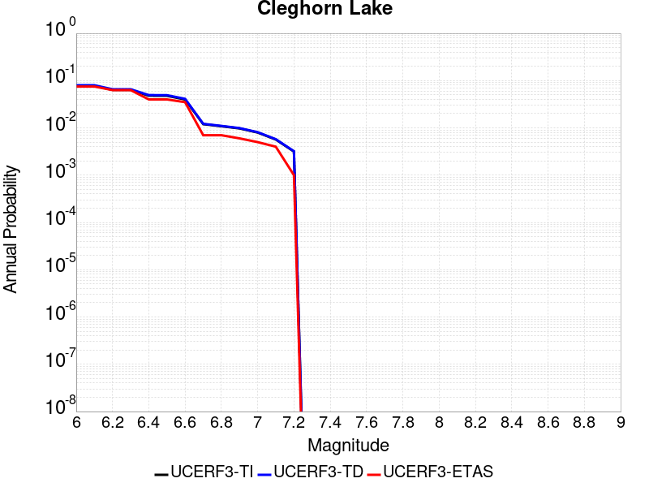 |
|-----|

| Magnitude | UCERF3-TI Prob | UCERF3-TD Prob | UCERF3-ETAS Prob |
|-----|-----|-----|-----|
| 6.0 | 0.0775353 | 0.079857245 | 0.07266811 |
| 6.1 | 0.0775353 | 0.079857245 | 0.07266811 |
| 6.2 | 0.06375112 | 0.06567605 | 0.060737528 |
| 6.3 | 0.06375112 | 0.06567605 | 0.060737528 |
| 6.4 | 0.04795251 | 0.049408972 | 0.040130153 |
| 6.5 | 0.04770675 | 0.04915908 | 0.040130153 |
| 6.6 | 0.039901376 | 0.041193884 | 0.03470716 |
| 6.7 | 0.011985383 | 0.012187783 | 0.0065075923 |
| 6.8 | 0.0108372215 | 0.011017264 | 0.0065075923 |
| 6.9 | 0.009745787 | 0.0099050775 | 0.0065075923 |
| 7.0 | 0.0079813395 | 0.008110882 | 0.0054229936 |
| 7.1 | 0.005674138 | 0.005765268 | 0.004338395 |
| 7.2 | 0.0031605028 | 0.0032101772 | 0.0010845987 |

## Cleghorn Pass
*[(top)](#table-of-contents)*

| 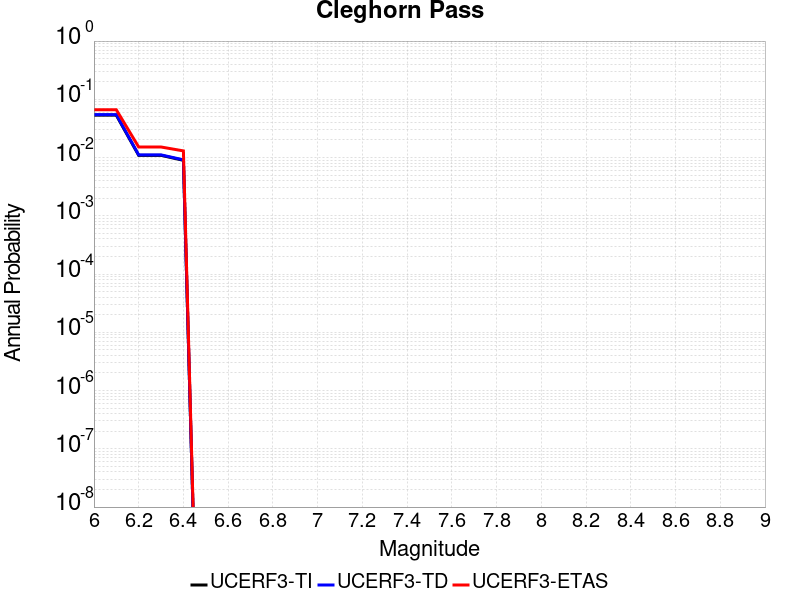 |
|-----|

| Magnitude | UCERF3-TI Prob | UCERF3-TD Prob | UCERF3-ETAS Prob |
|-----|-----|-----|-----|
| 6.0 | 0.05342682 | 0.054693982 | 0.06616052 |
| 6.1 | 0.05342682 | 0.054693982 | 0.06616052 |
| 6.2 | 0.010921357 | 0.0111212935 | 0.015184382 |
| 6.3 | 0.010921357 | 0.0111212935 | 0.015184382 |
| 6.4 | 0.008965558 | 0.009136385 | 0.013015185 |

## Collayami 2011 CFM
*[(top)](#table-of-contents)*

| 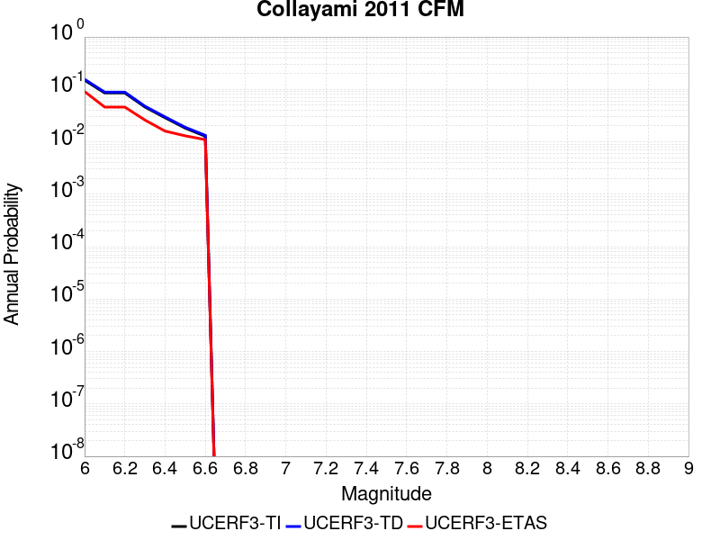 |
|-----|

| Magnitude | UCERF3-TI Prob | UCERF3-TD Prob | UCERF3-ETAS Prob |
|-----|-----|-----|-----|
| 6.0 | 0.14990284 | 0.15601346 | 0.09436008 |
| 6.1 | 0.08545407 | 0.08868953 | 0.048806943 |
| 6.2 | 0.08545407 | 0.08868953 | 0.048806943 |
| 6.3 | 0.04608085 | 0.04776678 | 0.027114967 |
| 6.4 | 0.028783146 | 0.029848512 | 0.01626898 |
| 6.5 | 0.018253848 | 0.018955981 | 0.013015185 |
| 6.6 | 0.012767083 | 0.013281507 | 0.010845987 |

## Compton
*[(top)](#table-of-contents)*

| 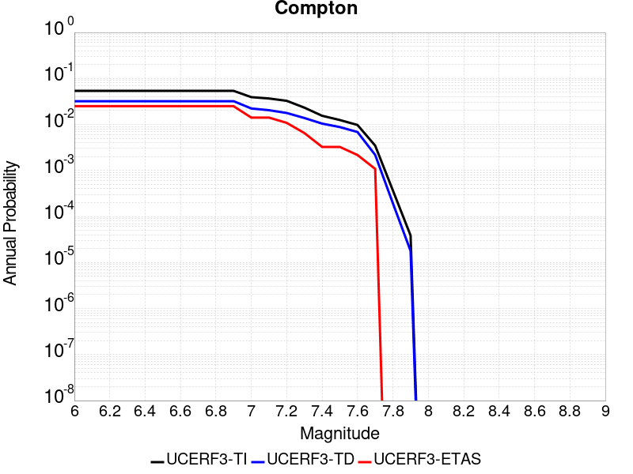 |
|-----|

| Magnitude | UCERF3-TI Prob | UCERF3-TD Prob | UCERF3-ETAS Prob |
|-----|-----|-----|-----|
| 6.0 | 0.053832937 | 0.032087293 | 0.02494577 |
| 6.1 | 0.053832937 | 0.032087293 | 0.02494577 |
| 6.2 | 0.053832937 | 0.032087293 | 0.02494577 |
| 6.3 | 0.053832937 | 0.032087293 | 0.02494577 |
| 6.4 | 0.053832937 | 0.032087293 | 0.02494577 |
| 6.5 | 0.053832937 | 0.032087293 | 0.02494577 |
| 6.6 | 0.053832937 | 0.032087293 | 0.02494577 |
| 6.7 | 0.053832937 | 0.032087293 | 0.02494577 |
| 6.8 | 0.053832937 | 0.032087293 | 0.02494577 |
| 6.9 | 0.053832937 | 0.032087293 | 0.02494577 |
| 7.0 | 0.03924332 | 0.022267714 | 0.014099783 |
| 7.1 | 0.036690783 | 0.020417107 | 0.014099783 |
| 7.2 | 0.03268609 | 0.017768329 | 0.010845987 |
| 7.3 | 0.02320071 | 0.013814661 | 0.0065075923 |
| 7.4 | 0.015466454 | 0.010440332 | 0.0032537961 |
| 7.5 | 0.0125023415 | 0.008789938 | 0.0032537961 |
| 7.6 | 0.009752889 | 0.006856582 | 0.0021691974 |
| 7.7 | 0.0034714972 | 0.002179291 | 0.0010845987 |
| 7.8 | 3.6803586E-4 | 1.9404721E-4 | 0.0 |
| 7.9 | 3.8720576E-5 | 1.7871427E-5 | 0.0 |

## Concord 2011 CFM
*[(top)](#table-of-contents)*

| 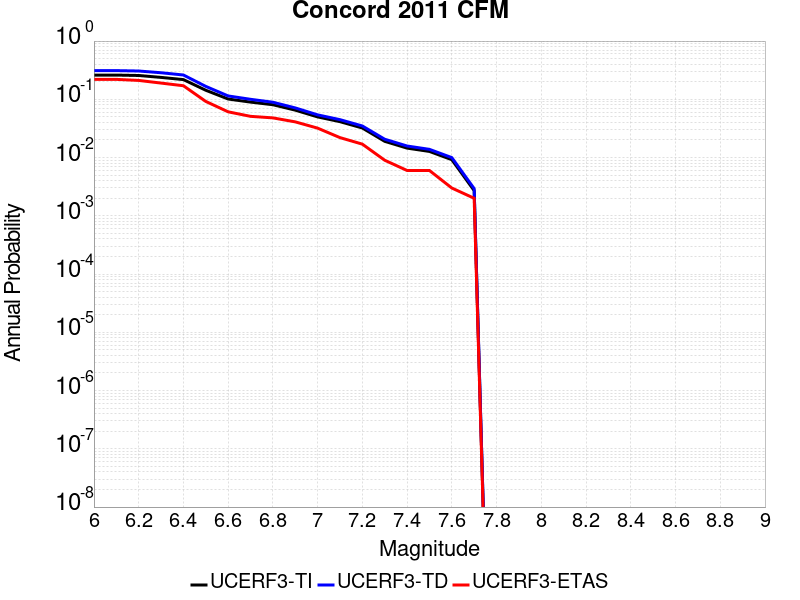 |
|-----|

| Magnitude | UCERF3-TI Prob | UCERF3-TD Prob | UCERF3-ETAS Prob |
|-----|-----|-----|-----|
| 6.0 | 0.26061803 | 0.31075332 | 0.21800433 |
| 6.1 | 0.26061803 | 0.31075332 | 0.21800433 |
| 6.2 | 0.2564558 | 0.30615175 | 0.20932755 |
| 6.3 | 0.23777156 | 0.2858378 | 0.18872017 |
| 6.4 | 0.21798092 | 0.26147032 | 0.1691974 |
| 6.5 | 0.14310741 | 0.16665323 | 0.09002169 |
| 6.6 | 0.1011809 | 0.11426181 | 0.057483733 |
| 6.7 | 0.08957708 | 0.10004738 | 0.04989154 |
| 6.8 | 0.08074679 | 0.08908569 | 0.046637744 |
| 6.9 | 0.06517557 | 0.07118617 | 0.039045554 |
| 7.0 | 0.049905818 | 0.054088976 | 0.030368764 |
| 7.1 | 0.04132868 | 0.044743463 | 0.021691974 |
| 7.2 | 0.03217375 | 0.034852896 | 0.01735358 |
| 7.3 | 0.018998709 | 0.020645669 | 0.009761388 |
| 7.4 | 0.0145266205 | 0.015787063 | 0.0065075923 |
| 7.5 | 0.012742941 | 0.013836751 | 0.0065075923 |
| 7.6 | 0.009199956 | 0.009983086 | 0.0032537961 |
| 7.7 | 0.0027050483 | 0.002928931 | 0.0021691974 |

## Contra Costa (Lafayette) 2011 CFM
*[(top)](#table-of-contents)*

| 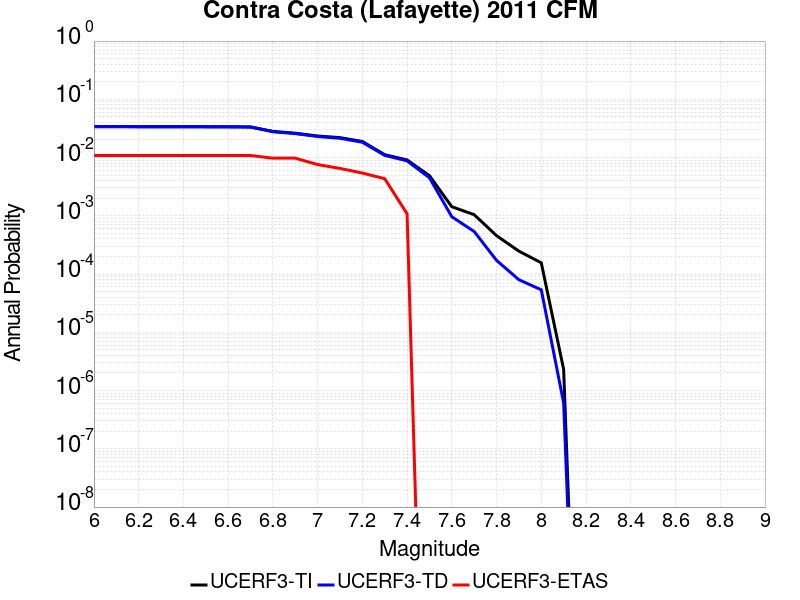 |
|-----|

| Magnitude | UCERF3-TI Prob | UCERF3-TD Prob | UCERF3-ETAS Prob |
|-----|-----|-----|-----|
| 6.0 | 0.034131072 | 0.03385662 | 0.010845987 |
| 6.1 | 0.034131072 | 0.03385662 | 0.010845987 |
| 6.2 | 0.03397984 | 0.033702984 | 0.010845987 |
| 6.3 | 0.03397984 | 0.033702984 | 0.010845987 |
| 6.4 | 0.03397984 | 0.033702984 | 0.010845987 |
| 6.5 | 0.033884224 | 0.033605184 | 0.010845987 |
| 6.6 | 0.033850018 | 0.033570003 | 0.010845987 |
| 6.7 | 0.033635426 | 0.033350356 | 0.010845987 |
| 6.8 | 0.028149724 | 0.027741803 | 0.009761388 |
| 6.9 | 0.026221292 | 0.025768671 | 0.009761388 |
| 7.0 | 0.023474824 | 0.022956409 | 0.007592191 |
| 7.1 | 0.021990567 | 0.021438958 | 0.0065075923 |
| 7.2 | 0.01888606 | 0.018337201 | 0.0054229936 |
| 7.3 | 0.011204795 | 0.010893269 | 0.004338395 |
| 7.4 | 0.009106621 | 0.008781364 | 0.0010845987 |
| 7.5 | 0.0048864833 | 0.004501246 | 0.0 |
| 7.6 | 0.0014324174 | 9.6374034E-4 | 0.0 |
| 7.7 | 0.0010460495 | 5.374902E-4 | 0.0 |
| 7.8 | 4.559571E-4 | 1.7191475E-4 | 0.0 |
| 7.9 | 2.4730802E-4 | 7.986595E-5 | 0.0 |
| 8.0 | 1.5608732E-4 | 5.369991E-5 | 0.0 |
| 8.1 | 2.3121406E-6 | 6.1406763E-7 | 0.0 |

## Contra Costa Shear Zone (connector) 2011 CFM
*[(top)](#table-of-contents)*

| 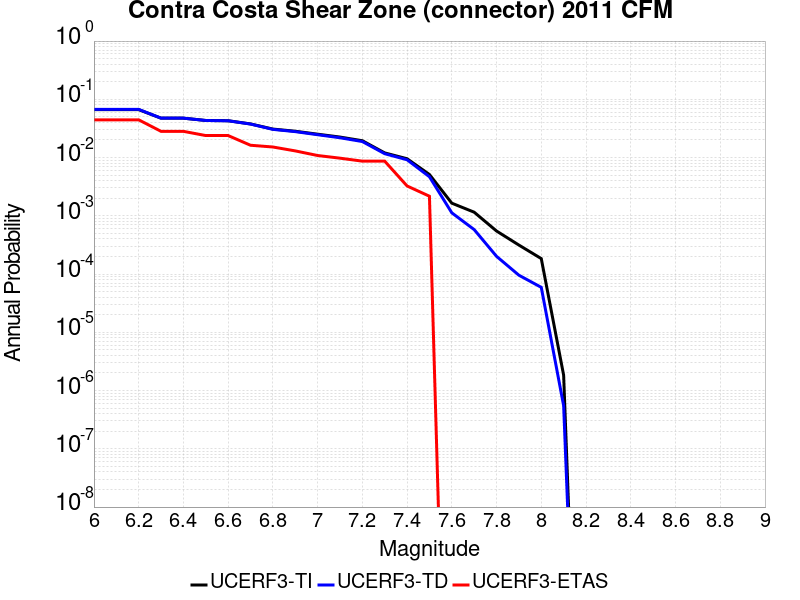 |
|-----|

| Magnitude | UCERF3-TI Prob | UCERF3-TD Prob | UCERF3-ETAS Prob |
|-----|-----|-----|-----|
| 6.0 | 0.0664965 | 0.06717688 | 0.04446855 |
| 6.1 | 0.0664965 | 0.06717688 | 0.04446855 |
| 6.2 | 0.0664965 | 0.06717688 | 0.04446855 |
| 6.3 | 0.047444128 | 0.04747336 | 0.028199567 |
| 6.4 | 0.047444128 | 0.04747336 | 0.028199567 |
| 6.5 | 0.043346055 | 0.043276623 | 0.023861172 |
| 6.6 | 0.04289387 | 0.042812128 | 0.023861172 |
| 6.7 | 0.037793934 | 0.037592087 | 0.01626898 |
| 6.8 | 0.030847125 | 0.030477485 | 0.015184382 |
| 6.9 | 0.028317053 | 0.027876506 | 0.013015185 |
| 7.0 | 0.025202392 | 0.024678698 | 0.010845987 |
| 7.1 | 0.022492567 | 0.021880506 | 0.009761388 |
| 7.2 | 0.019452497 | 0.018842243 | 0.00867679 |
| 7.3 | 0.012022096 | 0.011648387 | 0.00867679 |
| 7.4 | 0.009543739 | 0.009168718 | 0.0032537961 |
| 7.5 | 0.0051214714 | 0.004682871 | 0.0021691974 |
| 7.6 | 0.0016476406 | 0.0011252933 | 0.0 |
| 7.7 | 0.0011538259 | 5.8014086E-4 | 0.0 |
| 7.8 | 5.4822315E-4 | 2.014397E-4 | 0.0 |
| 7.9 | 3.1455178E-4 | 9.556139E-5 | 0.0 |
| 8.0 | 1.8422912E-4 | 5.9140988E-5 | 0.0 |
| 8.1 | 1.8386799E-6 | 5.465357E-7 | 0.0 |

## Coronado Bank alt1
*[(top)](#table-of-contents)*

| 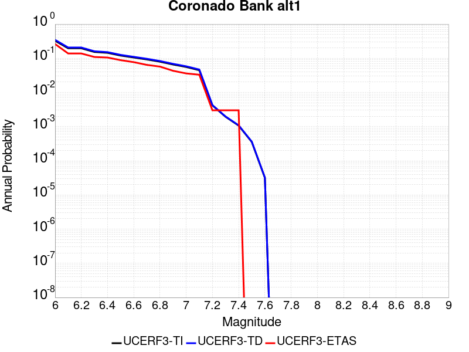 |
|-----|

| Magnitude | UCERF3-TI Prob | UCERF3-TD Prob | UCERF3-ETAS Prob |
|-----|-----|-----|-----|
| 6.0 | 0.3250399 | 0.34542057 | 0.2537961 |
| 6.1 | 0.19599438 | 0.20621827 | 0.13557483 |
| 6.2 | 0.19599438 | 0.20621827 | 0.13557483 |
| 6.3 | 0.1528644 | 0.16013582 | 0.10737527 |
| 6.4 | 0.14435653 | 0.15116072 | 0.10303687 |
| 6.5 | 0.1200627 | 0.12556292 | 0.0845987 |
| 6.6 | 0.10526921 | 0.11000874 | 0.07375271 |
| 6.7 | 0.09242421 | 0.09653694 | 0.06290673 |
| 6.8 | 0.07943797 | 0.08296508 | 0.056399133 |
| 6.9 | 0.06568797 | 0.068621494 | 0.04229935 |
| 7.0 | 0.05565434 | 0.058174882 | 0.03579176 |
| 7.1 | 0.044710737 | 0.046783946 | 0.03253796 |
| 7.2 | 0.0041791094 | 0.0042647654 | 0.0021691974 |
| 7.3 | 0.0019440098 | 0.0019788372 | 0.0021691974 |
| 7.4 | 0.0010720618 | 0.0010913601 | 0.0021691974 |
| 7.5 | 3.5712184E-4 | 3.6372946E-4 | 0.0 |
| 7.6 | 3.1815453E-5 | 3.248398E-5 | 0.0 |

## Coyote Canyon
*[(top)](#table-of-contents)*

| 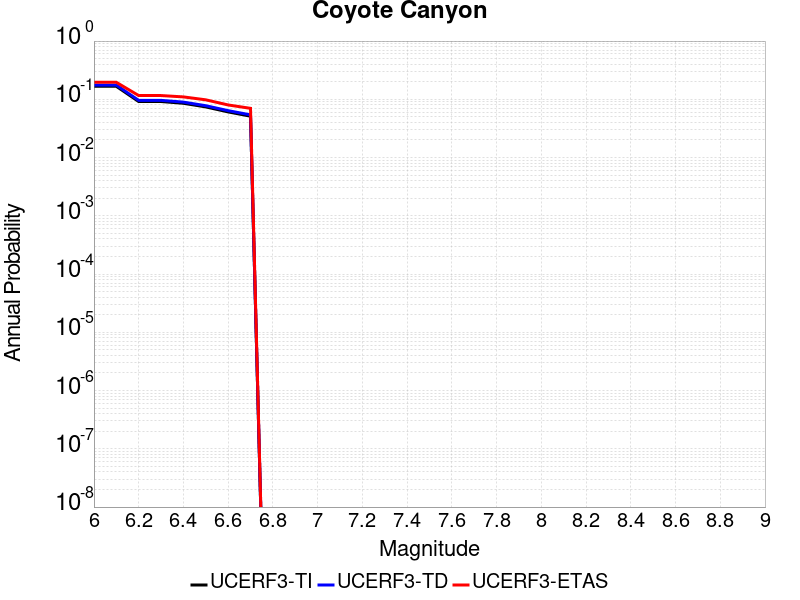 |
|-----|

| Magnitude | UCERF3-TI Prob | UCERF3-TD Prob | UCERF3-ETAS Prob |
|-----|-----|-----|-----|
| 6.0 | 0.16731344 | 0.17553239 | 0.19197397 |
| 6.1 | 0.16731344 | 0.17553239 | 0.19197397 |
| 6.2 | 0.09163364 | 0.09593823 | 0.11171366 |
| 6.3 | 0.09163364 | 0.09593823 | 0.11171366 |
| 6.4 | 0.0854663 | 0.08952937 | 0.106290676 |
| 6.5 | 0.074052304 | 0.07764051 | 0.09436008 |
| 6.6 | 0.06078208 | 0.06385765 | 0.077006504 |
| 6.7 | 0.051314287 | 0.054039508 | 0.06832972 |

## Coyote Lake
*[(top)](#table-of-contents)*

| 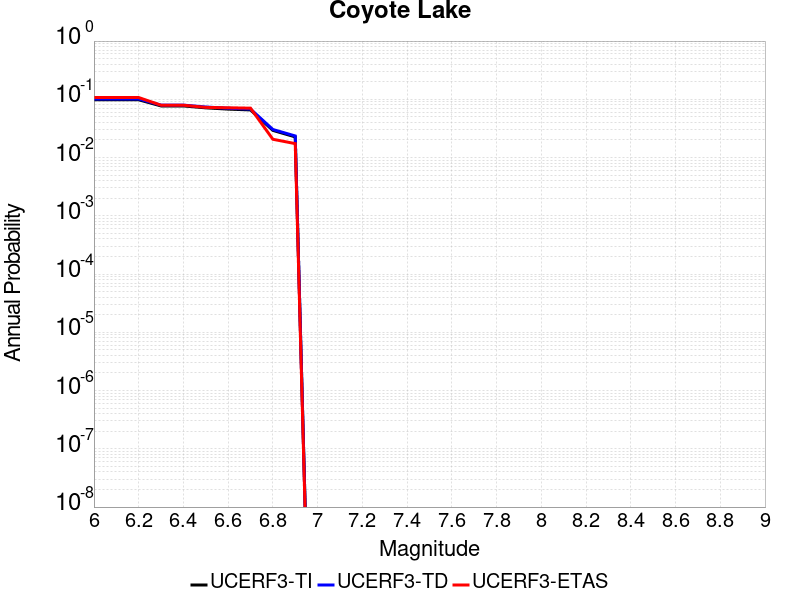 |
|-----|

| Magnitude | UCERF3-TI Prob | UCERF3-TD Prob | UCERF3-ETAS Prob |
|-----|-----|-----|-----|
| 6.0 | 0.09817335 | 0.10135254 | 0.10737527 |
| 6.1 | 0.09817335 | 0.10135254 | 0.10737527 |
| 6.2 | 0.09817335 | 0.10135254 | 0.10737527 |
| 6.3 | 0.07694598 | 0.079518065 | 0.0791757 |
| 6.4 | 0.07694598 | 0.079518065 | 0.0791757 |
| 6.5 | 0.071365766 | 0.0737965 | 0.07266811 |
| 6.6 | 0.06786848 | 0.070213795 | 0.07158352 |
| 6.7 | 0.06571945 | 0.06800135 | 0.07049891 |
| 6.8 | 0.029280808 | 0.030330725 | 0.020607375 |
| 6.9 | 0.022624092 | 0.023491845 | 0.01735358 |

## Cucamonga
*[(top)](#table-of-contents)*

| 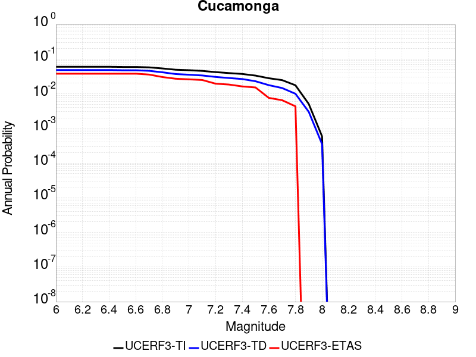 |
|-----|

| Magnitude | UCERF3-TI Prob | UCERF3-TD Prob | UCERF3-ETAS Prob |
|-----|-----|-----|-----|
| 6.0 | 0.059951067 | 0.04834798 | 0.037960954 |
| 6.1 | 0.059951067 | 0.04834798 | 0.037960954 |
| 6.2 | 0.059951067 | 0.04834798 | 0.037960954 |
| 6.3 | 0.059951067 | 0.04834798 | 0.037960954 |
| 6.4 | 0.059951067 | 0.04834798 | 0.037960954 |
| 6.5 | 0.05921758 | 0.047588702 | 0.037960954 |
| 6.6 | 0.05921758 | 0.047588702 | 0.037960954 |
| 6.7 | 0.05773508 | 0.045900155 | 0.03579176 |
| 6.8 | 0.05372818 | 0.041648466 | 0.030368764 |
| 6.9 | 0.04930456 | 0.037025325 | 0.027114967 |
| 7.0 | 0.047772545 | 0.035435155 | 0.02603037 |
| 7.1 | 0.045608893 | 0.033681225 | 0.02494577 |
| 7.2 | 0.042139184 | 0.030566443 | 0.019522777 |
| 7.3 | 0.03947086 | 0.028446369 | 0.018438177 |
| 7.4 | 0.037251726 | 0.026569562 | 0.01626898 |
| 7.5 | 0.033402704 | 0.022949513 | 0.015184382 |
| 7.6 | 0.028034491 | 0.017697886 | 0.007592191 |
| 7.7 | 0.024733288 | 0.014620135 | 0.0065075923 |
| 7.8 | 0.017554436 | 0.009993208 | 0.004338395 |
| 7.9 | 0.0050747804 | 0.0030116595 | 0.0 |
| 8.0 | 5.9145543E-4 | 3.5358663E-4 | 0.0 |

## Davis Creek
*[(top)](#table-of-contents)*

| 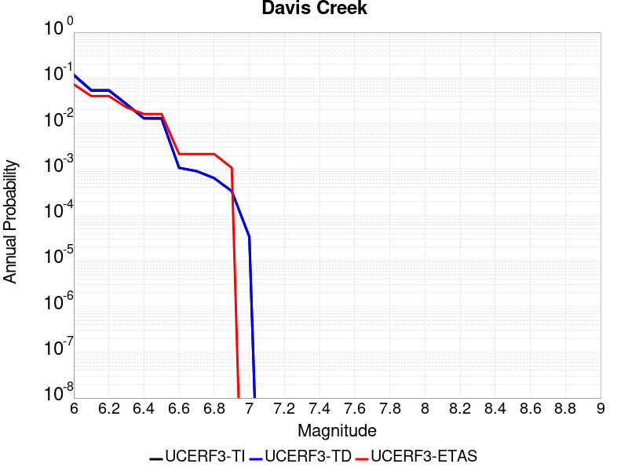 |
|-----|

| Magnitude | UCERF3-TI Prob | UCERF3-TD Prob | UCERF3-ETAS Prob |
|-----|-----|-----|-----|
| 6.0 | 0.114545576 | 0.11834548 | 0.07266811 |
| 6.1 | 0.052857704 | 0.05439521 | 0.040130153 |
| 6.2 | 0.052857704 | 0.05439521 | 0.040130153 |
| 6.3 | 0.026424421 | 0.027141495 | 0.022776572 |
| 6.4 | 0.012952301 | 0.013291222 | 0.01626898 |
| 6.5 | 0.012880855 | 0.013219498 | 0.01626898 |
| 6.6 | 0.001080851 | 0.0010854638 | 0.0021691974 |
| 6.7 | 9.150296E-4 | 9.1891614E-4 | 0.0021691974 |
| 6.8 | 6.426541E-4 | 6.4519513E-4 | 0.0021691974 |
| 6.9 | 3.3388697E-4 | 3.3524807E-4 | 0.0010845987 |
| 7.0 | 3.3631488E-5 | 3.3773187E-5 | 0.0 |

## Death Valley (Black Mtns Frontal)
*[(top)](#table-of-contents)*

| 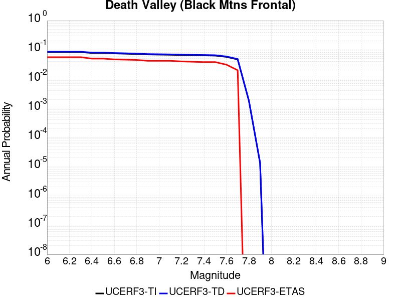 |
|-----|

| Magnitude | UCERF3-TI Prob | UCERF3-TD Prob | UCERF3-ETAS Prob |
|-----|-----|-----|-----|
| 6.0 | 0.08348476 | 0.08618324 | 0.055314533 |
| 6.1 | 0.08348476 | 0.08618324 | 0.055314533 |
| 6.2 | 0.08348476 | 0.08618324 | 0.055314533 |
| 6.3 | 0.08348476 | 0.08618324 | 0.055314533 |
| 6.4 | 0.07776836 | 0.080281004 | 0.04989154 |
| 6.5 | 0.07776836 | 0.080281004 | 0.04989154 |
| 6.6 | 0.07548565 | 0.077927686 | 0.046637744 |
| 6.7 | 0.07352093 | 0.07590408 | 0.045553144 |
| 6.8 | 0.07146006 | 0.0737815 | 0.04446855 |
| 6.9 | 0.06937891 | 0.071638085 | 0.04121475 |
| 7.0 | 0.06843136 | 0.0706634 | 0.04121475 |
| 7.1 | 0.06752455 | 0.06973075 | 0.04121475 |
| 7.2 | 0.066198766 | 0.0683674 | 0.039045554 |
| 7.3 | 0.065204814 | 0.06734556 | 0.037960954 |
| 7.4 | 0.06445554 | 0.066575386 | 0.036876354 |
| 7.5 | 0.06324926 | 0.06533771 | 0.036876354 |
| 7.6 | 0.05726288 | 0.059166532 | 0.030368764 |
| 7.7 | 0.046816338 | 0.04838668 | 0.018438177 |
| 7.8 | 0.0018030588 | 0.0018319617 | 0.0 |
| 7.9 | 1.3353022E-5 | 1.3523625E-5 | 0.0 |

## Death Valley (Fish Lake Valley)
*[(top)](#table-of-contents)*

| 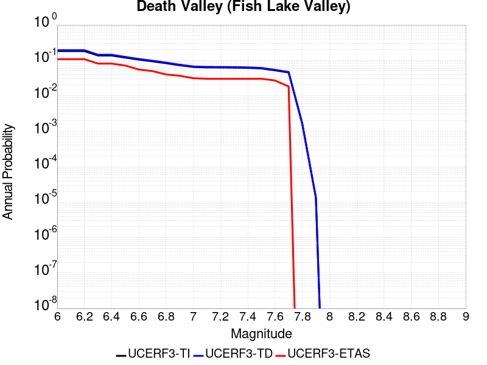 |
|-----|

| Magnitude | UCERF3-TI Prob | UCERF3-TD Prob | UCERF3-ETAS Prob |
|-----|-----|-----|-----|
| 6.0 | 0.1829512 | 0.19423893 | 0.10845987 |
| 6.1 | 0.1829512 | 0.19423893 | 0.10845987 |
| 6.2 | 0.1829512 | 0.19423893 | 0.10845987 |
| 6.3 | 0.13753577 | 0.14436007 | 0.0813449 |
| 6.4 | 0.13753577 | 0.14436007 | 0.0813449 |
| 6.5 | 0.119769365 | 0.12527032 | 0.07158352 |
| 6.6 | 0.105179325 | 0.10969623 | 0.055314533 |
| 6.7 | 0.09419397 | 0.09803925 | 0.04989154 |
| 6.8 | 0.083410226 | 0.08661286 | 0.040130153 |
| 6.9 | 0.07289257 | 0.07549994 | 0.036876354 |
| 7.0 | 0.06529468 | 0.067522146 | 0.031453364 |
| 7.1 | 0.06336035 | 0.06550589 | 0.030368764 |
| 7.2 | 0.06309032 | 0.06522659 | 0.030368764 |
| 7.3 | 0.062498063 | 0.064615615 | 0.030368764 |
| 7.4 | 0.061486874 | 0.06357214 | 0.030368764 |
| 7.5 | 0.05926214 | 0.06128546 | 0.030368764 |
| 7.6 | 0.052422125 | 0.05421262 | 0.027114967 |
| 7.7 | 0.045565426 | 0.04712418 | 0.018438177 |
| 7.8 | 0.0016203995 | 0.0016473002 | 0.0 |
| 7.9 | 1.3353022E-5 | 1.3523625E-5 | 0.0 |

## Death Valley (No)
*[(top)](#table-of-contents)*

| 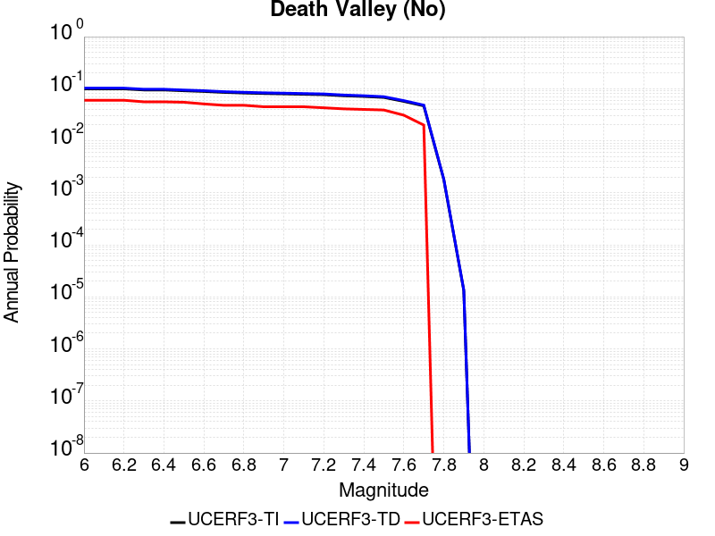 |
|-----|

| Magnitude | UCERF3-TI Prob | UCERF3-TD Prob | UCERF3-ETAS Prob |
|-----|-----|-----|-----|
| 6.0 | 0.099449046 | 0.10269549 | 0.05965293 |
| 6.1 | 0.099449046 | 0.10269549 | 0.05965293 |
| 6.2 | 0.099449046 | 0.10269549 | 0.05965293 |
| 6.3 | 0.09462342 | 0.09770003 | 0.055314533 |
| 6.4 | 0.09462342 | 0.09770003 | 0.055314533 |
| 6.5 | 0.09138815 | 0.09435257 | 0.054229934 |
| 6.6 | 0.08866928 | 0.09153913 | 0.04989154 |
| 6.7 | 0.08500534 | 0.08775408 | 0.046637744 |
| 6.8 | 0.082709186 | 0.08539682 | 0.046637744 |
| 6.9 | 0.08083903 | 0.08348535 | 0.04338395 |
| 7.0 | 0.07958894 | 0.08220962 | 0.04338395 |
| 7.1 | 0.07818527 | 0.08076946 | 0.04338395 |
| 7.2 | 0.07684503 | 0.07938667 | 0.04121475 |
| 7.3 | 0.07314003 | 0.07555493 | 0.039045554 |
| 7.4 | 0.07101466 | 0.07335983 | 0.037960954 |
| 7.5 | 0.06803389 | 0.07029423 | 0.037960954 |
| 7.6 | 0.057158336 | 0.059061363 | 0.030368764 |
| 7.7 | 0.046816338 | 0.04838668 | 0.018438177 |
| 7.8 | 0.0018030588 | 0.0018319617 | 0.0 |
| 7.9 | 1.3353022E-5 | 1.3523625E-5 | 0.0 |

## Death Valley (So)
*[(top)](#table-of-contents)*

| 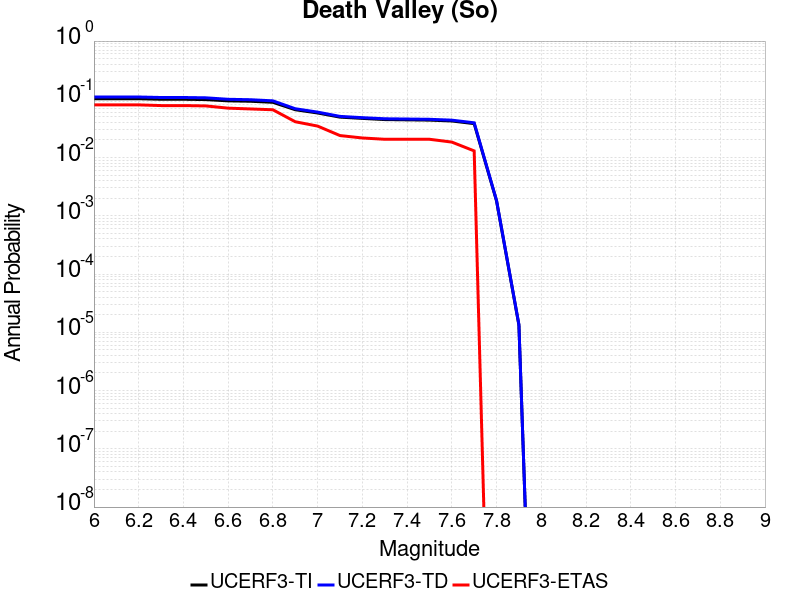 |
|-----|

| Magnitude | UCERF3-TI Prob | UCERF3-TD Prob | UCERF3-ETAS Prob |
|-----|-----|-----|-----|
| 6.0 | 0.10230823 | 0.10957583 | 0.08026031 |
| 6.1 | 0.10230823 | 0.10957583 | 0.08026031 |
| 6.2 | 0.10230823 | 0.10957583 | 0.08026031 |
| 6.3 | 0.10022633 | 0.10743669 | 0.07809111 |
| 6.4 | 0.10022633 | 0.10743669 | 0.07809111 |
| 6.5 | 0.0989224 | 0.10609931 | 0.077006504 |
| 6.6 | 0.09408794 | 0.10007654 | 0.07049891 |
| 6.7 | 0.09259202 | 0.09840105 | 0.06832972 |
| 6.8 | 0.08884027 | 0.09412557 | 0.06616052 |
| 6.9 | 0.06624198 | 0.068908066 | 0.04121475 |
| 7.0 | 0.05827775 | 0.06029648 | 0.03470716 |
| 7.1 | 0.049432814 | 0.05092337 | 0.023861172 |
| 7.2 | 0.04703595 | 0.048410438 | 0.021691974 |
| 7.3 | 0.044899683 | 0.046342447 | 0.020607375 |
| 7.4 | 0.044424217 | 0.04585969 | 0.020607375 |
| 7.5 | 0.043945078 | 0.04537231 | 0.020607375 |
| 7.6 | 0.042479035 | 0.0438699 | 0.018438177 |
| 7.7 | 0.038236886 | 0.039503157 | 0.013015185 |
| 7.8 | 0.0018030588 | 0.0018319617 | 0.0 |
| 7.9 | 1.3353022E-5 | 1.3523625E-5 | 0.0 |

## Deep Springs
*[(top)](#table-of-contents)*

| 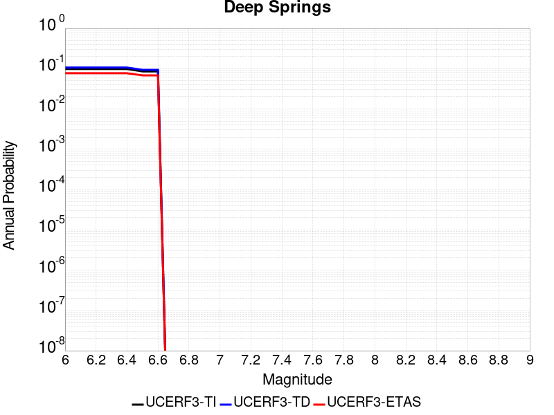 |
|-----|

| Magnitude | UCERF3-TI Prob | UCERF3-TD Prob | UCERF3-ETAS Prob |
|-----|-----|-----|-----|
| 6.0 | 0.09820675 | 0.10668351 | 0.077006504 |
| 6.1 | 0.09820675 | 0.10668351 | 0.077006504 |
| 6.2 | 0.09820675 | 0.10668351 | 0.077006504 |
| 6.3 | 0.09820675 | 0.10668351 | 0.077006504 |
| 6.4 | 0.09820675 | 0.10668351 | 0.077006504 |
| 6.5 | 0.08579262 | 0.09377039 | 0.06832972 |
| 6.6 | 0.08579262 | 0.09377039 | 0.06832972 |

## Del Valle
*[(top)](#table-of-contents)*

| 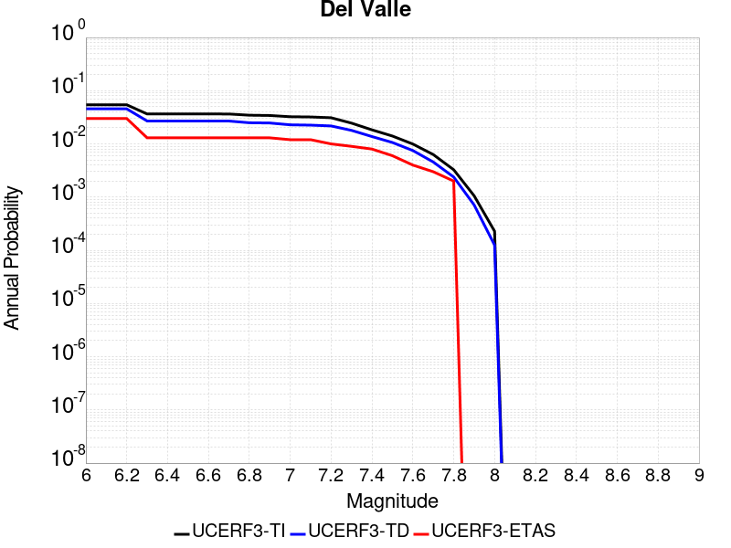 |
|-----|

| Magnitude | UCERF3-TI Prob | UCERF3-TD Prob | UCERF3-ETAS Prob |
|-----|-----|-----|-----|
| 6.0 | 0.054380972 | 0.045611307 | 0.028199567 |
| 6.1 | 0.054380972 | 0.045611307 | 0.028199567 |
| 6.2 | 0.054380972 | 0.045611307 | 0.028199567 |
| 6.3 | 0.036516782 | 0.026940875 | 0.011930586 |
| 6.4 | 0.036516782 | 0.026940875 | 0.011930586 |
| 6.5 | 0.036516782 | 0.026940875 | 0.011930586 |
| 6.6 | 0.036516782 | 0.026940875 | 0.011930586 |
| 6.7 | 0.03648331 | 0.02690622 | 0.011930586 |
| 6.8 | 0.034637198 | 0.024975268 | 0.011930586 |
| 6.9 | 0.03420475 | 0.02471747 | 0.011930586 |
| 7.0 | 0.03242977 | 0.022846224 | 0.010845987 |
| 7.1 | 0.032079414 | 0.022530071 | 0.010845987 |
| 7.2 | 0.031030541 | 0.021762181 | 0.00867679 |
| 7.3 | 0.024577567 | 0.01795475 | 0.007592191 |
| 7.4 | 0.018365584 | 0.013745142 | 0.0065075923 |
| 7.5 | 0.01405811 | 0.010631705 | 0.004338395 |
| 7.6 | 0.009944197 | 0.007506211 | 0.0021691974 |
| 7.7 | 0.006304324 | 0.0045679254 | 0.0010845987 |
| 7.8 | 0.0032674898 | 0.0023824205 | 0.0010845987 |
| 7.9 | 0.00105828 | 7.1155763E-4 | 0.0 |
| 8.0 | 2.282287E-4 | 1.2510661E-4 | 0.0 |

## Dog Valley
*[(top)](#table-of-contents)*

| 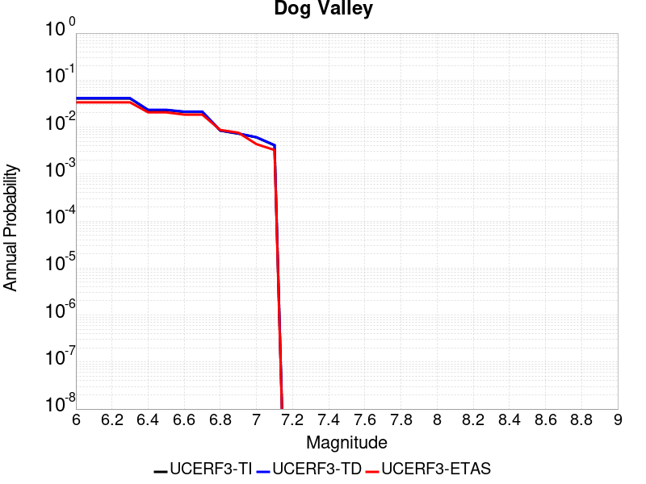 |
|-----|

| Magnitude | UCERF3-TI Prob | UCERF3-TD Prob | UCERF3-ETAS Prob |
|-----|-----|-----|-----|
| 6.0 | 0.040631503 | 0.041308228 | 0.03362256 |
| 6.1 | 0.040631503 | 0.041308228 | 0.03362256 |
| 6.2 | 0.040631503 | 0.041308228 | 0.03362256 |
| 6.3 | 0.040631503 | 0.041308228 | 0.03362256 |
| 6.4 | 0.023013867 | 0.023347553 | 0.020607375 |
| 6.5 | 0.023013867 | 0.023347553 | 0.020607375 |
| 6.6 | 0.02103433 | 0.021340208 | 0.018438177 |
| 6.7 | 0.02103433 | 0.021340208 | 0.018438177 |
| 6.8 | 0.008396378 | 0.008455557 | 0.00867679 |
| 6.9 | 0.0072538634 | 0.0073056556 | 0.007592191 |
| 7.0 | 0.0060444507 | 0.0060880687 | 0.004338395 |
| 7.1 | 0.0040992433 | 0.0041296696 | 0.0032537961 |

## Dry Mountain
*[(top)](#table-of-contents)*

| 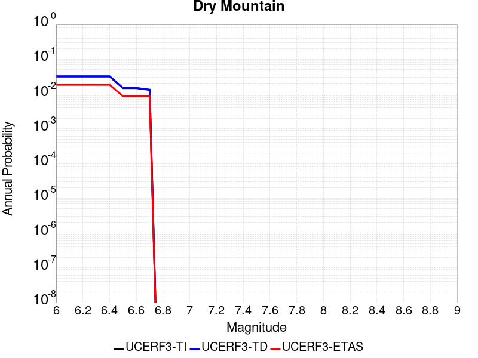 |
|-----|

| Magnitude | UCERF3-TI Prob | UCERF3-TD Prob | UCERF3-ETAS Prob |
|-----|-----|-----|-----|
| 6.0 | 0.031948306 | 0.032434724 | 0.018438177 |
| 6.1 | 0.031948306 | 0.032434724 | 0.018438177 |
| 6.2 | 0.031948306 | 0.032434724 | 0.018438177 |
| 6.3 | 0.031948306 | 0.032434724 | 0.018438177 |
| 6.4 | 0.031948306 | 0.032434724 | 0.018438177 |
| 6.5 | 0.014775602 | 0.015017194 | 0.00867679 |
| 6.6 | 0.014775602 | 0.015017194 | 0.00867679 |
| 6.7 | 0.013171083 | 0.013395647 | 0.00867679 |

## Earthquake Valley
*[(top)](#table-of-contents)*

| 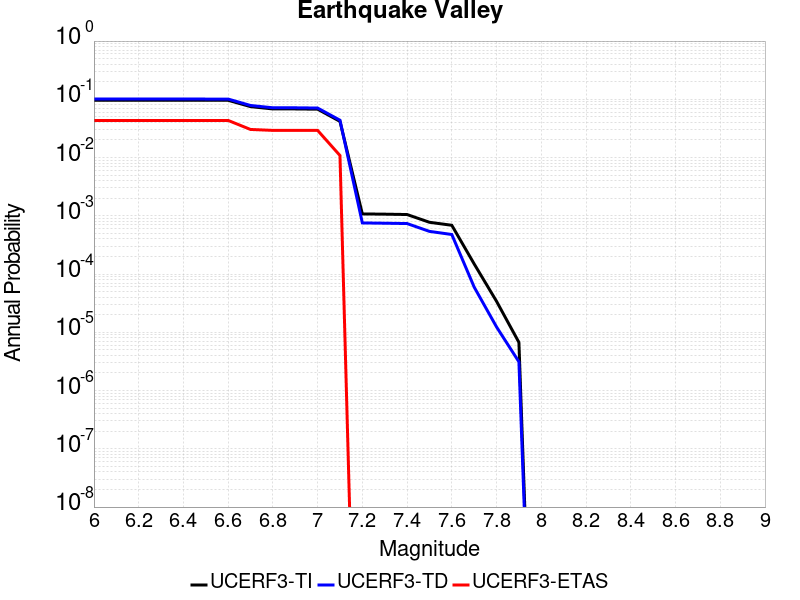 |
|-----|

| Magnitude | UCERF3-TI Prob | UCERF3-TD Prob | UCERF3-ETAS Prob |
|-----|-----|-----|-----|
| 6.0 | 0.09634977 | 0.101122744 | 0.04338395 |
| 6.1 | 0.09634977 | 0.101122744 | 0.04338395 |
| 6.2 | 0.09634977 | 0.101122744 | 0.04338395 |
| 6.3 | 0.09634977 | 0.101122744 | 0.04338395 |
| 6.4 | 0.09634977 | 0.101122744 | 0.04338395 |
| 6.5 | 0.09622138 | 0.10098963 | 0.04338395 |
| 6.6 | 0.09622138 | 0.10098963 | 0.04338395 |
| 6.7 | 0.07492398 | 0.07839386 | 0.030368764 |
| 6.8 | 0.06835976 | 0.07151944 | 0.029284164 |
| 6.9 | 0.06835976 | 0.07151944 | 0.029284164 |
| 7.0 | 0.067693815 | 0.0708294 | 0.029284164 |
| 7.1 | 0.041792225 | 0.043798357 | 0.010845987 |
| 7.2 | 0.0010776361 | 7.546533E-4 | 0.0 |
| 7.3 | 0.0010671279 | 7.460511E-4 | 0.0 |
| 7.4 | 0.0010519449 | 7.362744E-4 | 0.0 |
| 7.5 | 7.7444455E-4 | 5.405695E-4 | 0.0 |
| 7.6 | 6.877821E-4 | 4.7765046E-4 | 0.0 |
| 7.7 | 1.4927151E-4 | 5.9724072E-5 | 0.0 |
| 7.8 | 3.405776E-5 | 1.23653535E-5 | 0.0 |
| 7.9 | 6.730109E-6 | 3.1155998E-6 | 0.0 |

## Earthquake Valley (No  Extension)
*[(top)](#table-of-contents)*

| 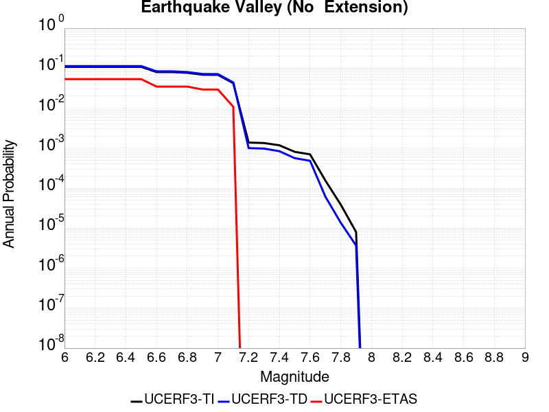 |
|-----|

| Magnitude | UCERF3-TI Prob | UCERF3-TD Prob | UCERF3-ETAS Prob |
|-----|-----|-----|-----|
| 6.0 | 0.10779741 | 0.11292682 | 0.053145338 |
| 6.1 | 0.10779741 | 0.11292682 | 0.053145338 |
| 6.2 | 0.10779741 | 0.11292682 | 0.053145338 |
| 6.3 | 0.10779741 | 0.11292682 | 0.053145338 |
| 6.4 | 0.10779741 | 0.11292682 | 0.053145338 |
| 6.5 | 0.10779741 | 0.11292682 | 0.053145338 |
| 6.6 | 0.07995237 | 0.08351902 | 0.03470716 |
| 6.7 | 0.07995237 | 0.08351902 | 0.03470716 |
| 6.8 | 0.07680322 | 0.080245785 | 0.03470716 |
| 6.9 | 0.06867274 | 0.07177906 | 0.029284164 |
| 7.0 | 0.06799965 | 0.07108265 | 0.029284164 |
| 7.1 | 0.042098112 | 0.044051234 | 0.010845987 |
| 7.2 | 0.0013821169 | 0.0010057098 | 0.0 |
| 7.3 | 0.0013458481 | 9.76944E-4 | 0.0 |
| 7.4 | 0.0011825052 | 8.4057794E-4 | 0.0 |
| 7.5 | 8.112519E-4 | 5.635025E-4 | 0.0 |
| 7.6 | 7.014841E-4 | 4.8454804E-4 | 0.0 |
| 7.7 | 1.5505958E-4 | 6.139655E-5 | 0.0 |
| 7.8 | 3.881499E-5 | 1.36972385E-5 | 0.0 |
| 7.9 | 8.021658E-6 | 3.680629E-6 | 0.0 |

## Earthquake Valley (So Extension)
*[(top)](#table-of-contents)*

| 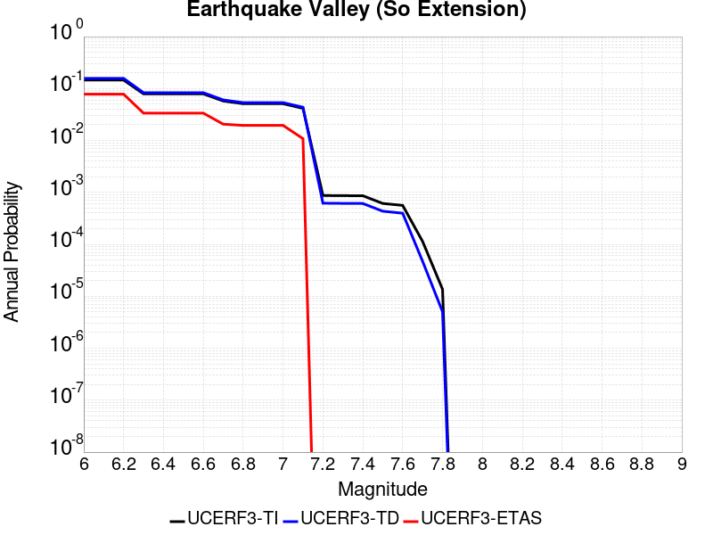 |
|-----|

| Magnitude | UCERF3-TI Prob | UCERF3-TD Prob | UCERF3-ETAS Prob |
|-----|-----|-----|-----|
| 6.0 | 0.14577016 | 0.15727593 | 0.07809111 |
| 6.1 | 0.14577016 | 0.15727593 | 0.07809111 |
| 6.2 | 0.14577016 | 0.15727593 | 0.07809111 |
| 6.3 | 0.07911333 | 0.0832754 | 0.03362256 |
| 6.4 | 0.07911333 | 0.0832754 | 0.03362256 |
| 6.5 | 0.07911333 | 0.0832754 | 0.03362256 |
| 6.6 | 0.07911333 | 0.0832754 | 0.03362256 |
| 6.7 | 0.05756775 | 0.060395233 | 0.020607375 |
| 6.8 | 0.05108656 | 0.05360017 | 0.019522777 |
| 6.9 | 0.05108656 | 0.05360017 | 0.019522777 |
| 7.0 | 0.05108656 | 0.05360017 | 0.019522777 |
| 7.1 | 0.041585434 | 0.04365952 | 0.010845987 |
| 7.2 | 8.73002E-4 | 6.2028493E-4 | 0.0 |
| 7.3 | 8.6746365E-4 | 6.155368E-4 | 0.0 |
| 7.4 | 8.64182E-4 | 6.129873E-4 | 0.0 |
| 7.5 | 6.1366934E-4 | 4.353421E-4 | 0.0 |
| 7.6 | 5.629923E-4 | 3.9783164E-4 | 0.0 |
| 7.7 | 1.1388319E-4 | 4.7180787E-5 | 0.0 |
| 7.8 | 1.3654855E-5 | 5.0500244E-6 | 0.0 |

## East Huasna 2011 CFM
*[(top)](#table-of-contents)*

| 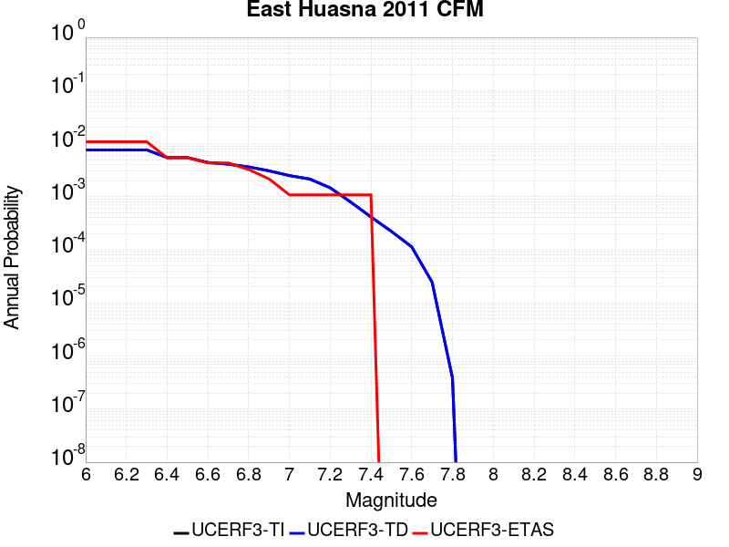 |
|-----|

| Magnitude | UCERF3-TI Prob | UCERF3-TD Prob | UCERF3-ETAS Prob |
|-----|-----|-----|-----|
| 6.0 | 0.007619385 | 0.0076344754 | 0.010845987 |
| 6.1 | 0.007619385 | 0.0076344754 | 0.010845987 |
| 6.2 | 0.007619385 | 0.0076344754 | 0.010845987 |
| 6.3 | 0.007619385 | 0.0076344754 | 0.010845987 |
| 6.4 | 0.005457678 | 0.005469411 | 0.0054229936 |
| 6.5 | 0.005457678 | 0.005469411 | 0.0054229936 |
| 6.6 | 0.0044061723 | 0.0044164346 | 0.004338395 |
| 6.7 | 0.0041012303 | 0.0041108103 | 0.004338395 |
| 6.8 | 0.0036427605 | 0.0036517147 | 0.0032537961 |
| 6.9 | 0.0030736248 | 0.0030815299 | 0.0021691974 |
| 7.0 | 0.0024982186 | 0.0025050947 | 0.0010845987 |
| 7.1 | 0.0021504115 | 0.0021564658 | 0.0010845987 |
| 7.2 | 0.001471708 | 0.0014760718 | 0.0010845987 |
| 7.3 | 7.9601427E-4 | 7.9845276E-4 | 0.0010845987 |
| 7.4 | 4.1611135E-4 | 4.1739532E-4 | 0.0010845987 |
| 7.5 | 2.2285622E-4 | 2.236242E-4 | 0.0 |
| 7.6 | 1.1378211E-4 | 1.1417593E-4 | 0.0 |
| 7.7 | 2.4625917E-5 | 2.4701147E-5 | 0.0 |
| 7.8 | 3.861217E-7 | 3.8715507E-7 | 0.0 |

## Eaton Roughs 2011 CFM
*[(top)](#table-of-contents)*

| 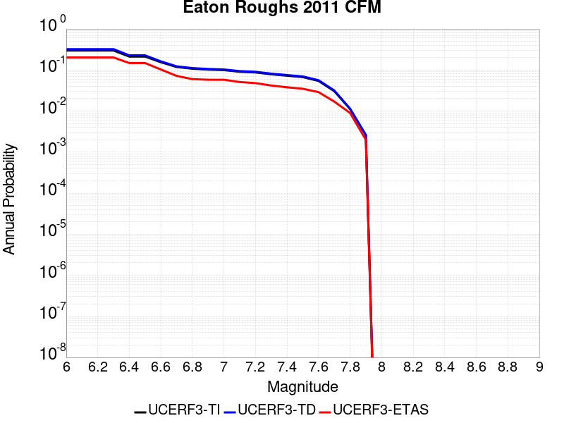 |
|-----|

| Magnitude | UCERF3-TI Prob | UCERF3-TD Prob | UCERF3-ETAS Prob |
|-----|-----|-----|-----|
| 6.0 | 0.29886922 | 0.3224847 | 0.20498915 |
| 6.1 | 0.29886922 | 0.3224847 | 0.20498915 |
| 6.2 | 0.29886922 | 0.3224847 | 0.20498915 |
| 6.3 | 0.29886922 | 0.3224847 | 0.20498915 |
| 6.4 | 0.2126953 | 0.22735637 | 0.14967462 |
| 6.5 | 0.2126953 | 0.22735637 | 0.14967462 |
| 6.6 | 0.1547579 | 0.16244729 | 0.10520607 |
| 6.7 | 0.11842242 | 0.122983344 | 0.07592191 |
| 6.8 | 0.107587725 | 0.11155752 | 0.06290673 |
| 6.9 | 0.10238425 | 0.106124856 | 0.061822128 |
| 7.0 | 0.09958652 | 0.103215836 | 0.061822128 |
| 7.1 | 0.09071575 | 0.093999825 | 0.054229934 |
| 7.2 | 0.08739484 | 0.0905843 | 0.05097614 |
| 7.3 | 0.078786165 | 0.081771664 | 0.045553144 |
| 7.4 | 0.07266184 | 0.0754602 | 0.04121475 |
| 7.5 | 0.06718144 | 0.069829665 | 0.037960954 |
| 7.6 | 0.054298826 | 0.056536112 | 0.031453364 |
| 7.7 | 0.030513829 | 0.031755764 | 0.018438177 |
| 7.8 | 0.011218678 | 0.011466019 | 0.009761388 |
| 7.9 | 0.0025839934 | 0.002624001 | 0.0021691974 |

## Elmore Ranch
*[(top)](#table-of-contents)*

| 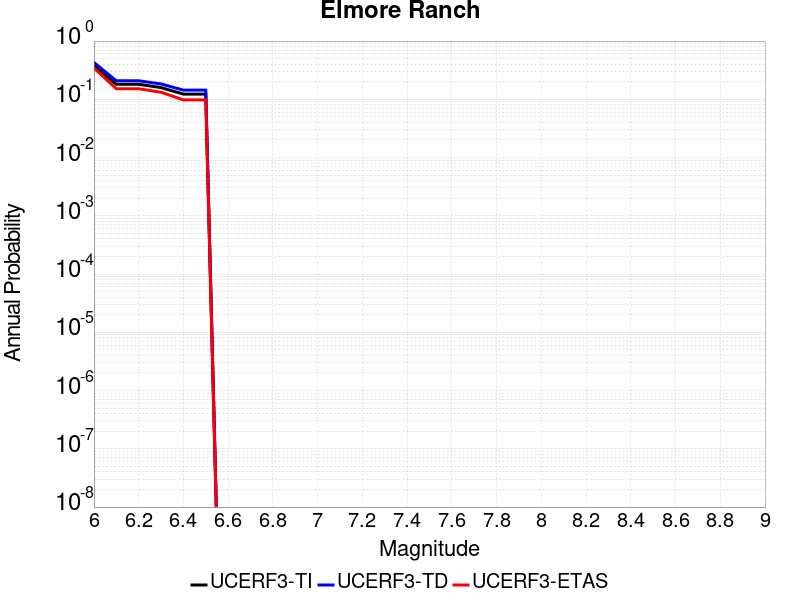 |
|-----|

| Magnitude | UCERF3-TI Prob | UCERF3-TD Prob | UCERF3-ETAS Prob |
|-----|-----|-----|-----|
| 6.0 | 0.37808767 | 0.42916623 | 0.3449024 |
| 6.1 | 0.1811732 | 0.20784874 | 0.15184382 |
| 6.2 | 0.1811732 | 0.20784874 | 0.15184382 |
| 6.3 | 0.15905154 | 0.18363741 | 0.13232104 |
| 6.4 | 0.12297989 | 0.14389722 | 0.097613886 |
| 6.5 | 0.12297989 | 0.14389722 | 0.097613886 |

## Elsinore (Coyote Mountains)
*[(top)](#table-of-contents)*

| 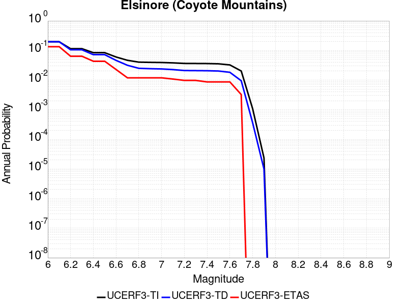 |
|-----|

| Magnitude | UCERF3-TI Prob | UCERF3-TD Prob | UCERF3-ETAS Prob |
|-----|-----|-----|-----|
| 6.0 | 0.19701745 | 0.1972384 | 0.13449024 |
| 6.1 | 0.19701745 | 0.1972384 | 0.13449024 |
| 6.2 | 0.11500367 | 0.10571027 | 0.06399132 |
| 6.3 | 0.11500367 | 0.10571027 | 0.06399132 |
| 6.4 | 0.08438148 | 0.072336346 | 0.04338395 |
| 6.5 | 0.08438148 | 0.072336346 | 0.04338395 |
| 6.6 | 0.060258184 | 0.046309583 | 0.022776572 |
| 6.7 | 0.046614844 | 0.03162355 | 0.011930586 |
| 6.8 | 0.040405273 | 0.024980424 | 0.011930586 |
| 6.9 | 0.039732788 | 0.024279783 | 0.011930586 |
| 7.0 | 0.039259914 | 0.023786472 | 0.011930586 |
| 7.1 | 0.038116343 | 0.02263094 | 0.010845987 |
| 7.2 | 0.036510784 | 0.021038542 | 0.009761388 |
| 7.3 | 0.03632577 | 0.020890737 | 0.009761388 |
| 7.4 | 0.036125287 | 0.020720242 | 0.00867679 |
| 7.5 | 0.03541661 | 0.02024823 | 0.00867679 |
| 7.6 | 0.032548968 | 0.018318987 | 0.00867679 |
| 7.7 | 0.0202493 | 0.009500031 | 0.0032537961 |
| 7.8 | 0.0010871352 | 3.6327177E-4 | 0.0 |
| 7.9 | 2.3464328E-5 | 9.888317E-6 | 0.0 |

## Elsinore (Glen Ivy) rev
*[(top)](#table-of-contents)*

| 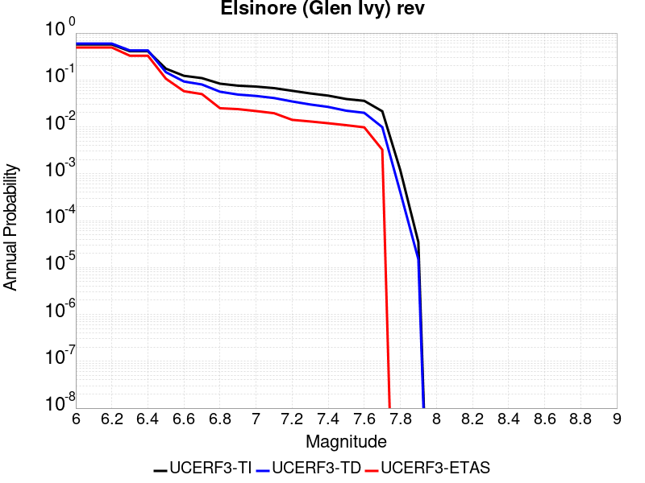 |
|-----|

| Magnitude | UCERF3-TI Prob | UCERF3-TD Prob | UCERF3-ETAS Prob |
|-----|-----|-----|-----|
| 6.0 | 0.5706894 | 0.5960478 | 0.4924078 |
| 6.1 | 0.5706894 | 0.5960478 | 0.4924078 |
| 6.2 | 0.5706894 | 0.5960478 | 0.4924078 |
| 6.3 | 0.41000587 | 0.4263754 | 0.3286334 |
| 6.4 | 0.41000587 | 0.4263754 | 0.3286334 |
| 6.5 | 0.17395498 | 0.14646134 | 0.106290676 |
| 6.6 | 0.12253295 | 0.09265804 | 0.057483733 |
| 6.7 | 0.109332725 | 0.07990577 | 0.04989154 |
| 6.8 | 0.08323205 | 0.056085836 | 0.02494577 |
| 6.9 | 0.07549086 | 0.048763614 | 0.023861172 |
| 7.0 | 0.07219731 | 0.045549102 | 0.021691974 |
| 7.1 | 0.06687706 | 0.041137535 | 0.019522777 |
| 7.2 | 0.058714442 | 0.03476774 | 0.014099783 |
| 7.3 | 0.05158758 | 0.029982433 | 0.013015185 |
| 7.4 | 0.046277028 | 0.026573539 | 0.011930586 |
| 7.5 | 0.039239116 | 0.022079155 | 0.010845987 |
| 7.6 | 0.035816256 | 0.01989658 | 0.009761388 |
| 7.7 | 0.02149034 | 0.009847578 | 0.0032537961 |
| 7.8 | 0.0011833572 | 4.0144814E-4 | 0.0 |
| 7.9 | 3.4838133E-5 | 1.4969215E-5 | 0.0 |

## Elsinore (Julian)
*[(top)](#table-of-contents)*

| 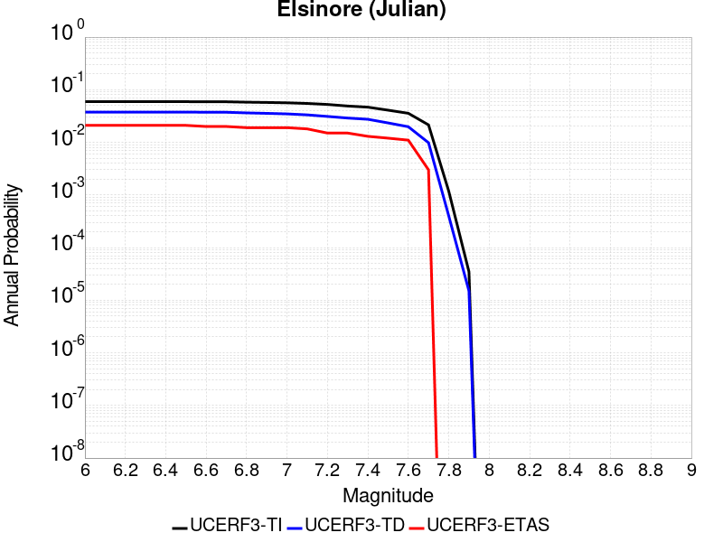 |
|-----|

| Magnitude | UCERF3-TI Prob | UCERF3-TD Prob | UCERF3-ETAS Prob |
|-----|-----|-----|-----|
| 6.0 | 0.059273347 | 0.037588045 | 0.020607375 |
| 6.1 | 0.059273347 | 0.037588045 | 0.020607375 |
| 6.2 | 0.059273347 | 0.037588045 | 0.020607375 |
| 6.3 | 0.059273347 | 0.037588045 | 0.020607375 |
| 6.4 | 0.059273347 | 0.037588045 | 0.020607375 |
| 6.5 | 0.059273347 | 0.037588045 | 0.020607375 |
| 6.6 | 0.058980692 | 0.03727075 | 0.019522777 |
| 6.7 | 0.058980692 | 0.03727075 | 0.019522777 |
| 6.8 | 0.057959214 | 0.03625411 | 0.018438177 |
| 6.9 | 0.057260416 | 0.035537068 | 0.018438177 |
| 7.0 | 0.056360476 | 0.0347027 | 0.018438177 |
| 7.1 | 0.054821342 | 0.033253167 | 0.01735358 |
| 7.2 | 0.052464157 | 0.031059746 | 0.014099783 |
| 7.3 | 0.04896906 | 0.028933536 | 0.014099783 |
| 7.4 | 0.04659412 | 0.027414547 | 0.011930586 |
| 7.5 | 0.040828638 | 0.023365112 | 0.010845987 |
| 7.6 | 0.035642177 | 0.019785192 | 0.009761388 |
| 7.7 | 0.021450648 | 0.009826043 | 0.0032537961 |
| 7.8 | 0.0011783998 | 3.9918962E-4 | 0.0 |
| 7.9 | 3.4838133E-5 | 1.4969215E-5 | 0.0 |

## Elsinore (Stepovers Combined)
*[(top)](#table-of-contents)*

| 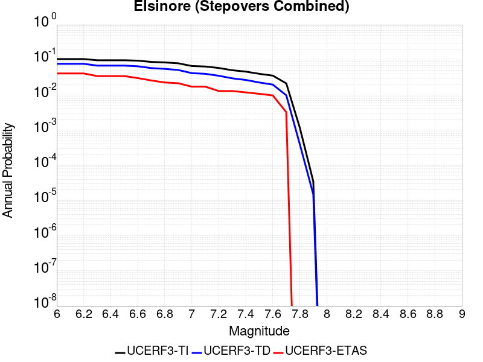 |
|-----|

| Magnitude | UCERF3-TI Prob | UCERF3-TD Prob | UCERF3-ETAS Prob |
|-----|-----|-----|-----|
| 6.0 | 0.105859645 | 0.07750328 | 0.04121475 |
| 6.1 | 0.105859645 | 0.07750328 | 0.04121475 |
| 6.2 | 0.105859645 | 0.07750328 | 0.04121475 |
| 6.3 | 0.097928785 | 0.06885485 | 0.03470716 |
| 6.4 | 0.097928785 | 0.06885485 | 0.03470716 |
| 6.5 | 0.097928785 | 0.06885485 | 0.03470716 |
| 6.6 | 0.095275484 | 0.06589973 | 0.030368764 |
| 6.7 | 0.0877838 | 0.05856254 | 0.02603037 |
| 6.8 | 0.0847485 | 0.055594135 | 0.022776572 |
| 6.9 | 0.08011391 | 0.051730927 | 0.021691974 |
| 7.0 | 0.06711566 | 0.042043243 | 0.01735358 |
| 7.1 | 0.06492633 | 0.040204246 | 0.01735358 |
| 7.2 | 0.058977902 | 0.03544049 | 0.013015185 |
| 7.3 | 0.050883148 | 0.029918078 | 0.013015185 |
| 7.4 | 0.046456438 | 0.026883425 | 0.011930586 |
| 7.5 | 0.04023559 | 0.02279486 | 0.010845987 |
| 7.6 | 0.035752703 | 0.019851282 | 0.009761388 |
| 7.7 | 0.0214811 | 0.009842247 | 0.0032537961 |
| 7.8 | 0.0011833572 | 4.0144814E-4 | 0.0 |
| 7.9 | 3.4838133E-5 | 1.4969215E-5 | 0.0 |

## Elsinore (Temecula) rev
*[(top)](#table-of-contents)*

| 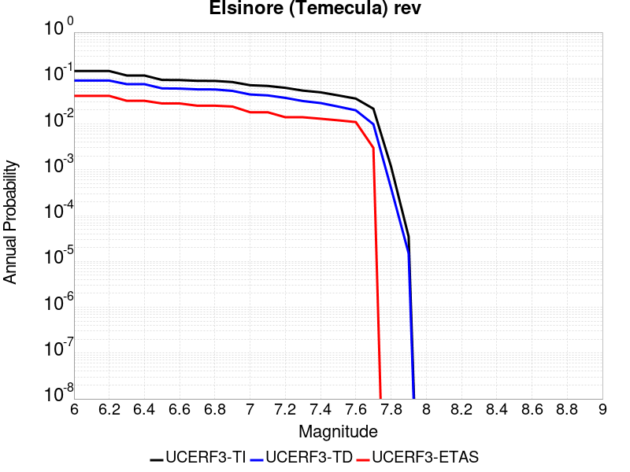 |
|-----|

| Magnitude | UCERF3-TI Prob | UCERF3-TD Prob | UCERF3-ETAS Prob |
|-----|-----|-----|-----|
| 6.0 | 0.14273423 | 0.08851293 | 0.039045554 |
| 6.1 | 0.14273423 | 0.08851293 | 0.039045554 |
| 6.2 | 0.14273423 | 0.08851293 | 0.039045554 |
| 6.3 | 0.11412471 | 0.073799 | 0.030368764 |
| 6.4 | 0.11412471 | 0.073799 | 0.030368764 |
| 6.5 | 0.09125477 | 0.059745908 | 0.02603037 |
| 6.6 | 0.090706736 | 0.059149757 | 0.02603037 |
| 6.7 | 0.08732902 | 0.056897826 | 0.022776572 |
| 6.8 | 0.08687358 | 0.056593154 | 0.022776572 |
| 6.9 | 0.082026795 | 0.0526248 | 0.021691974 |
| 7.0 | 0.070021555 | 0.04394889 | 0.01735358 |
| 7.1 | 0.067556396 | 0.041933894 | 0.01735358 |
| 7.2 | 0.061381545 | 0.037059493 | 0.013015185 |
| 7.3 | 0.053337574 | 0.031575833 | 0.013015185 |
| 7.4 | 0.04897927 | 0.028568448 | 0.011930586 |
| 7.5 | 0.041959915 | 0.023926737 | 0.010845987 |
| 7.6 | 0.035740647 | 0.019844418 | 0.009761388 |
| 7.7 | 0.021470422 | 0.009836287 | 0.0032537961 |
| 7.8 | 0.0011833572 | 4.0144814E-4 | 0.0 |
| 7.9 | 3.4838133E-5 | 1.4969215E-5 | 0.0 |

## Elysian Park (Lower CFM)
*[(top)](#table-of-contents)*

| 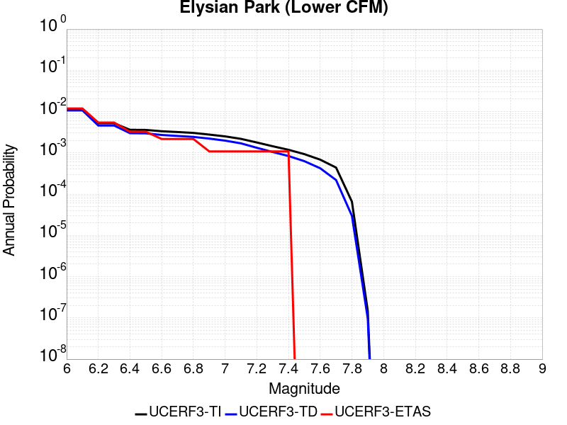 |
|-----|

| Magnitude | UCERF3-TI Prob | UCERF3-TD Prob | UCERF3-ETAS Prob |
|-----|-----|-----|-----|
| 6.0 | 0.011293207 | 0.010707788 | 0.011930586 |
| 6.1 | 0.011293207 | 0.010707788 | 0.011930586 |
| 6.2 | 0.005220456 | 0.004598726 | 0.0054229936 |
| 6.3 | 0.005220456 | 0.004598726 | 0.0054229936 |
| 6.4 | 0.003625368 | 0.0029978582 | 0.0032537961 |
| 6.5 | 0.0035948262 | 0.0029672068 | 0.0032537961 |
| 6.6 | 0.0033441857 | 0.0027157697 | 0.0021691974 |
| 6.7 | 0.0031979796 | 0.0025691434 | 0.0021691974 |
| 6.8 | 0.0030466383 | 0.0024348905 | 0.0021691974 |
| 6.9 | 0.0027735005 | 0.0022187484 | 0.0010845987 |
| 7.0 | 0.0025091 | 0.0019791122 | 0.0010845987 |
| 7.1 | 0.0021856104 | 0.0017004799 | 0.0010845987 |
| 7.2 | 0.0017860678 | 0.0013282767 | 0.0010845987 |
| 7.3 | 0.0014480355 | 0.0010490867 | 0.0010845987 |
| 7.4 | 0.0011866967 | 8.383168E-4 | 0.0010845987 |
| 7.5 | 9.3223416E-4 | 6.290953E-4 | 0.0 |
| 7.6 | 6.845858E-4 | 4.2323314E-4 | 0.0 |
| 7.7 | 4.4028982E-4 | 2.1934848E-4 | 0.0 |
| 7.8 | 6.5698005E-5 | 2.9791698E-5 | 0.0 |
| 7.9 | 1.4779177E-7 | 9.6675066E-8 | 0.0 |

## Elysian Park (Upper)
*[(top)](#table-of-contents)*

| 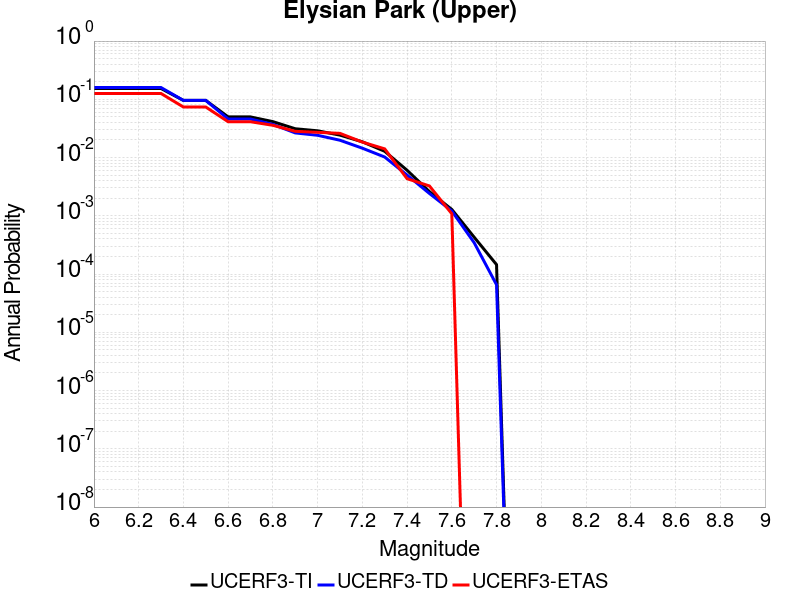 |
|-----|

| Magnitude | UCERF3-TI Prob | UCERF3-TD Prob | UCERF3-ETAS Prob |
|-----|-----|-----|-----|
| 6.0 | 0.15323086 | 0.15916768 | 0.12581345 |
| 6.1 | 0.15323086 | 0.15916768 | 0.12581345 |
| 6.2 | 0.15323086 | 0.15916768 | 0.12581345 |
| 6.3 | 0.15323086 | 0.15916768 | 0.12581345 |
| 6.4 | 0.09567561 | 0.095772155 | 0.07375271 |
| 6.5 | 0.09567561 | 0.095772155 | 0.07375271 |
| 6.6 | 0.049915574 | 0.045946024 | 0.04121475 |
| 6.7 | 0.049857173 | 0.045886464 | 0.04121475 |
| 6.8 | 0.04139656 | 0.037112266 | 0.03579176 |
| 6.9 | 0.031240622 | 0.026489342 | 0.028199567 |
| 7.0 | 0.028795242 | 0.024116082 | 0.027114967 |
| 7.1 | 0.024276024 | 0.019826064 | 0.02603037 |
| 7.2 | 0.018641477 | 0.014484783 | 0.018438177 |
| 7.3 | 0.012811273 | 0.010208596 | 0.014099783 |
| 7.4 | 0.0060548866 | 0.005009671 | 0.004338395 |
| 7.5 | 0.0026027134 | 0.0024182866 | 0.0032537961 |
| 7.6 | 0.0012863054 | 0.0012113597 | 0.0010845987 |
| 7.7 | 4.294042E-4 | 3.4525443E-4 | 0.0 |
| 7.8 | 1.4514658E-4 | 6.556189E-5 | 0.0 |

## Emerson-Copper Mtn 2011
*[(top)](#table-of-contents)*

| 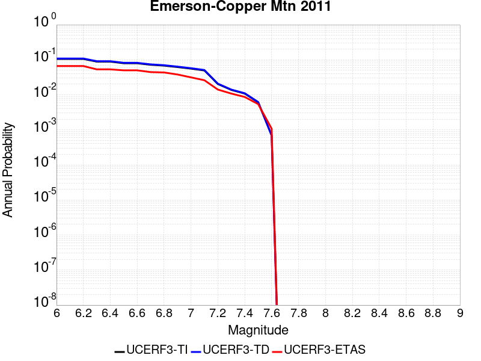 |
|-----|

| Magnitude | UCERF3-TI Prob | UCERF3-TD Prob | UCERF3-ETAS Prob |
|-----|-----|-----|-----|
| 6.0 | 0.10548762 | 0.10847144 | 0.06616052 |
| 6.1 | 0.10548762 | 0.10847144 | 0.06616052 |
| 6.2 | 0.10548762 | 0.10847144 | 0.06616052 |
| 6.3 | 0.08846405 | 0.09097978 | 0.053145338 |
| 6.4 | 0.08846405 | 0.09097978 | 0.053145338 |
| 6.5 | 0.07955221 | 0.0818283 | 0.04989154 |
| 6.6 | 0.07955221 | 0.0818283 | 0.04989154 |
| 6.7 | 0.07182604 | 0.0738946 | 0.04446855 |
| 6.8 | 0.06797248 | 0.06994521 | 0.04338395 |
| 6.9 | 0.061847787 | 0.06366967 | 0.037960954 |
| 7.0 | 0.055829152 | 0.057504546 | 0.031453364 |
| 7.1 | 0.04948475 | 0.051001746 | 0.02603037 |
| 7.2 | 0.020315353 | 0.020812381 | 0.014099783 |
| 7.3 | 0.013792039 | 0.014102874 | 0.010845987 |
| 7.4 | 0.010842692 | 0.01108394 | 0.00867679 |
| 7.5 | 0.0060768235 | 0.0062159672 | 0.0054229936 |
| 7.6 | 6.8614166E-4 | 7.033696E-4 | 0.0010845987 |

## Eureka Peak
*[(top)](#table-of-contents)*

| 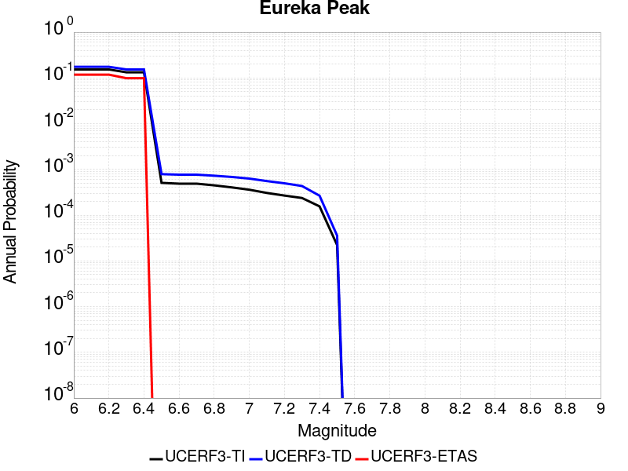 |
|-----|

| Magnitude | UCERF3-TI Prob | UCERF3-TD Prob | UCERF3-ETAS Prob |
|-----|-----|-----|-----|
| 6.0 | 0.15355349 | 0.17520837 | 0.11822126 |
| 6.1 | 0.15355349 | 0.17520837 | 0.11822126 |
| 6.2 | 0.15355349 | 0.17520837 | 0.11822126 |
| 6.3 | 0.13294844 | 0.1534463 | 0.09869848 |
| 6.4 | 0.13294844 | 0.1534463 | 0.09869848 |
| 6.5 | 5.0800614E-4 | 7.880261E-4 | 0.0 |
| 6.6 | 4.877296E-4 | 7.676586E-4 | 0.0 |
| 6.7 | 4.877296E-4 | 7.676586E-4 | 0.0 |
| 6.8 | 4.48188E-4 | 7.2789186E-4 | 0.0 |
| 6.9 | 4.0428777E-4 | 6.8364164E-4 | 0.0 |
| 7.0 | 3.5985638E-4 | 6.301126E-4 | 0.0 |
| 7.1 | 3.056841E-4 | 5.5566715E-4 | 0.0 |
| 7.2 | 2.6803324E-4 | 4.971598E-4 | 0.0 |
| 7.3 | 2.3707861E-4 | 4.336341E-4 | 0.0 |
| 7.4 | 1.5558011E-4 | 2.6626352E-4 | 0.0 |
| 7.5 | 2.2134636E-5 | 3.5662782E-5 | 0.0 |

## Fickle Hill (alt1)
*[(top)](#table-of-contents)*

| 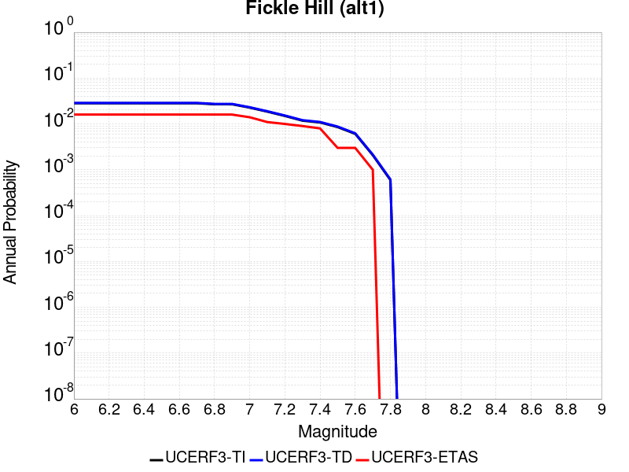 |
|-----|

| Magnitude | UCERF3-TI Prob | UCERF3-TD Prob | UCERF3-ETAS Prob |
|-----|-----|-----|-----|
| 6.0 | 0.028249303 | 0.028765062 | 0.01735358 |
| 6.1 | 0.028249303 | 0.028765062 | 0.01735358 |
| 6.2 | 0.028249303 | 0.028765062 | 0.01735358 |
| 6.3 | 0.028249303 | 0.028765062 | 0.01735358 |
| 6.4 | 0.028249303 | 0.028765062 | 0.01735358 |
| 6.5 | 0.028249303 | 0.028765062 | 0.01735358 |
| 6.6 | 0.028249303 | 0.028765062 | 0.01735358 |
| 6.7 | 0.028249303 | 0.028765062 | 0.01735358 |
| 6.8 | 0.02687363 | 0.027374245 | 0.01735358 |
| 6.9 | 0.026863072 | 0.027363542 | 0.01735358 |
| 7.0 | 0.022712605 | 0.02316167 | 0.015184382 |
| 7.1 | 0.01856362 | 0.018950576 | 0.011930586 |
| 7.2 | 0.014957099 | 0.015293685 | 0.010845987 |
| 7.3 | 0.011800558 | 0.012086545 | 0.009761388 |
| 7.4 | 0.010777242 | 0.011046006 | 0.00867679 |
| 7.5 | 0.008547064 | 0.008770002 | 0.0032537961 |
| 7.6 | 0.0060805483 | 0.0062495186 | 0.0032537961 |
| 7.7 | 0.002078251 | 0.002143067 | 0.0010845987 |
| 7.8 | 5.9620227E-4 | 6.1701477E-4 | 0.0 |

## Fish Slough 2011 CFM
*[(top)](#table-of-contents)*

| 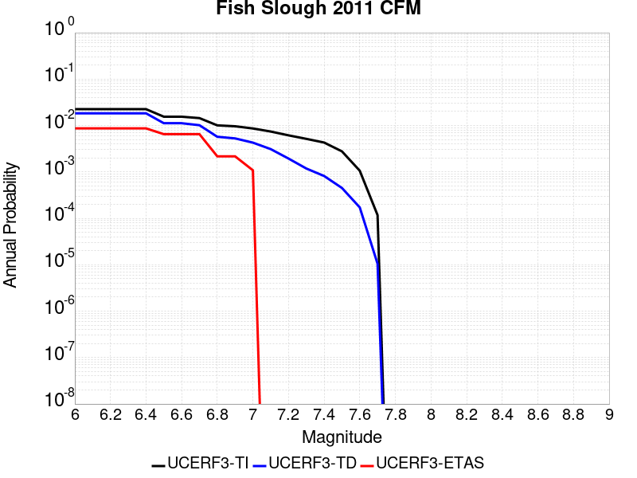 |
|-----|

| Magnitude | UCERF3-TI Prob | UCERF3-TD Prob | UCERF3-ETAS Prob |
|-----|-----|-----|-----|
| 6.0 | 0.022508342 | 0.018324979 | 0.00867679 |
| 6.1 | 0.022508342 | 0.018324979 | 0.00867679 |
| 6.2 | 0.022508342 | 0.018324979 | 0.00867679 |
| 6.3 | 0.022508342 | 0.018324979 | 0.00867679 |
| 6.4 | 0.022508342 | 0.018324979 | 0.00867679 |
| 6.5 | 0.015489155 | 0.011208234 | 0.0065075923 |
| 6.6 | 0.015489155 | 0.011208234 | 0.0065075923 |
| 6.7 | 0.014447425 | 0.010153256 | 0.0065075923 |
| 6.8 | 0.010080229 | 0.0057234983 | 0.0021691974 |
| 6.9 | 0.0096414415 | 0.00527824 | 0.0021691974 |
| 7.0 | 0.008641869 | 0.00427829 | 0.0010845987 |
| 7.1 | 0.0074239606 | 0.0031032814 | 0.0 |
| 7.2 | 0.0061435453 | 0.0019419864 | 0.0 |
| 7.3 | 0.0051617324 | 0.0011844657 | 0.0 |
| 7.4 | 0.0042967913 | 8.17079E-4 | 0.0 |
| 7.5 | 0.0027745788 | 4.5141004E-4 | 0.0 |
| 7.6 | 0.0010625955 | 1.7213255E-4 | 0.0 |
| 7.7 | 1.1740129E-4 | 1.0514252E-5 | 0.0 |

## Fitzhugh Creek
*[(top)](#table-of-contents)*

| 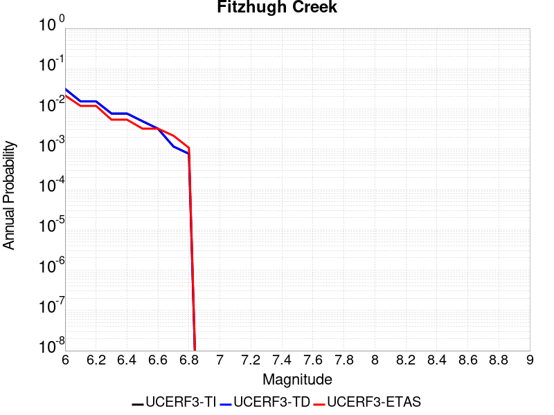 |
|-----|

| Magnitude | UCERF3-TI Prob | UCERF3-TD Prob | UCERF3-ETAS Prob |
|-----|-----|-----|-----|
| 6.0 | 0.031373523 | 0.03157384 | 0.021691974 |
| 6.1 | 0.015399079 | 0.015482326 | 0.011930586 |
| 6.2 | 0.015399079 | 0.015482326 | 0.011930586 |
| 6.3 | 0.0076829577 | 0.007721206 | 0.0054229936 |
| 6.4 | 0.0076829577 | 0.007721206 | 0.0054229936 |
| 6.5 | 0.0049538743 | 0.0049782074 | 0.0032537961 |
| 6.6 | 0.0032358002 | 0.0032517295 | 0.0032537961 |
| 6.7 | 0.0011669687 | 0.0011729073 | 0.0021691974 |
| 6.8 | 7.711639E-4 | 7.7517686E-4 | 0.0010845987 |

## Fontana (Seismicity)
*[(top)](#table-of-contents)*

| 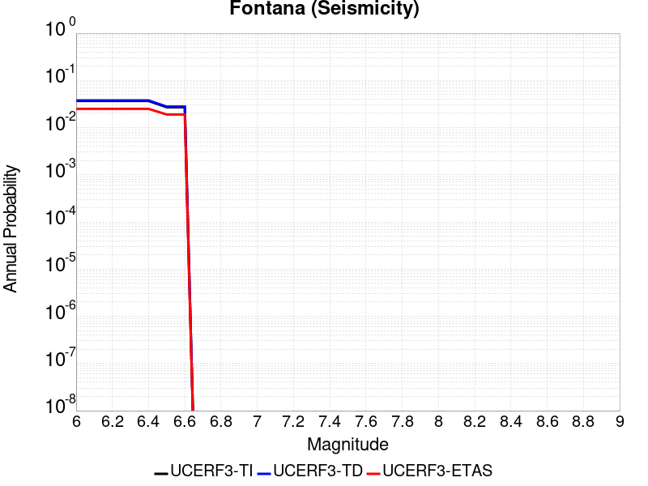 |
|-----|

| Magnitude | UCERF3-TI Prob | UCERF3-TD Prob | UCERF3-ETAS Prob |
|-----|-----|-----|-----|
| 6.0 | 0.03676582 | 0.037722435 | 0.02494577 |
| 6.1 | 0.03676582 | 0.037722435 | 0.02494577 |
| 6.2 | 0.03676582 | 0.037722435 | 0.02494577 |
| 6.3 | 0.03676582 | 0.037722435 | 0.02494577 |
| 6.4 | 0.03676582 | 0.037722435 | 0.02494577 |
| 6.5 | 0.027078528 | 0.027868414 | 0.018438177 |
| 6.6 | 0.027078528 | 0.027868414 | 0.018438177 |

## Franklin 2011 CFM
*[(top)](#table-of-contents)*

| 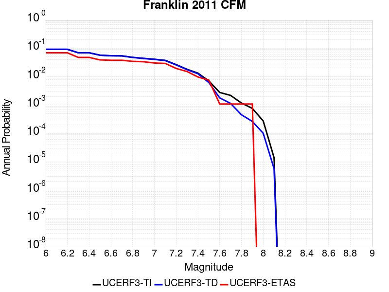 |
|-----|

| Magnitude | UCERF3-TI Prob | UCERF3-TD Prob | UCERF3-ETAS Prob |
|-----|-----|-----|-----|
| 6.0 | 0.091810085 | 0.09279016 | 0.06941432 |
| 6.1 | 0.091810085 | 0.09279016 | 0.06941432 |
| 6.2 | 0.091810085 | 0.09279016 | 0.06941432 |
| 6.3 | 0.06954112 | 0.06977309 | 0.047722343 |
| 6.4 | 0.06954112 | 0.06977309 | 0.047722343 |
| 6.5 | 0.05730154 | 0.057158016 | 0.039045554 |
| 6.6 | 0.05485966 | 0.054649413 | 0.037960954 |
| 6.7 | 0.05433273 | 0.054106392 | 0.037960954 |
| 6.8 | 0.048081517 | 0.047645766 | 0.03470716 |
| 6.9 | 0.044381414 | 0.04383165 | 0.03362256 |
| 7.0 | 0.041257706 | 0.0405963 | 0.030368764 |
| 7.1 | 0.037560485 | 0.0369033 | 0.029284164 |
| 7.2 | 0.026641225 | 0.025954206 | 0.019522777 |
| 7.3 | 0.018210195 | 0.017652795 | 0.015184382 |
| 7.4 | 0.013346024 | 0.012672894 | 0.009761388 |
| 7.5 | 0.007092999 | 0.0062295715 | 0.007592191 |
| 7.6 | 0.002776799 | 0.0017858474 | 0.0010845987 |
| 7.7 | 0.0021886465 | 0.0011416496 | 0.0010845987 |
| 7.8 | 0.0011778368 | 4.5306623E-4 | 0.0010845987 |
| 7.9 | 7.598927E-4 | 2.6468572E-4 | 0.0010845987 |
| 8.0 | 2.758208E-4 | 1.0100145E-4 | 0.0 |
| 8.1 | 1.3850362E-5 | 5.6955705E-6 | 0.0 |

## Garberville - Briceland 2011 CFM
*[(top)](#table-of-contents)*

| 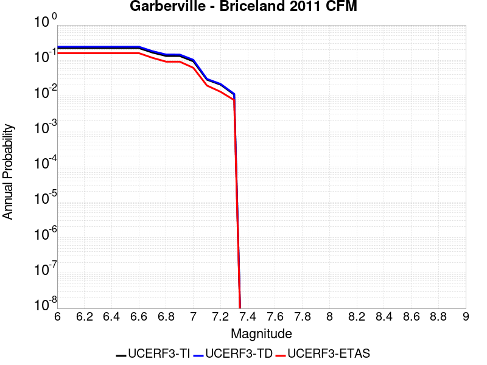 |
|-----|

| Magnitude | UCERF3-TI Prob | UCERF3-TD Prob | UCERF3-ETAS Prob |
|-----|-----|-----|-----|
| 6.0 | 0.22318009 | 0.2433367 | 0.16052061 |
| 6.1 | 0.22318009 | 0.2433367 | 0.16052061 |
| 6.2 | 0.22318009 | 0.2433367 | 0.16052061 |
| 6.3 | 0.22318009 | 0.2433367 | 0.16052061 |
| 6.4 | 0.22318009 | 0.2433367 | 0.16052061 |
| 6.5 | 0.22318009 | 0.2433367 | 0.16052061 |
| 6.6 | 0.22318009 | 0.2433367 | 0.16052061 |
| 6.7 | 0.16671257 | 0.1821126 | 0.11822126 |
| 6.8 | 0.13375272 | 0.14651899 | 0.09219089 |
| 6.9 | 0.13342948 | 0.14618726 | 0.09219089 |
| 7.0 | 0.09449663 | 0.103877865 | 0.061822128 |
| 7.1 | 0.028629264 | 0.029965919 | 0.019522777 |
| 7.2 | 0.020713184 | 0.021667194 | 0.013015185 |
| 7.3 | 0.010884727 | 0.011389179 | 0.007592191 |

## Garlic Springs
*[(top)](#table-of-contents)*

| 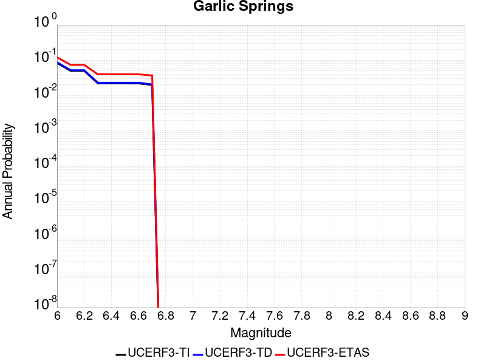 |
|-----|

| Magnitude | UCERF3-TI Prob | UCERF3-TD Prob | UCERF3-ETAS Prob |
|-----|-----|-----|-----|
| 6.0 | 0.08373725 | 0.08745205 | 0.12039045 |
| 6.1 | 0.050111417 | 0.052317336 | 0.07375271 |
| 6.2 | 0.050111417 | 0.052317336 | 0.07375271 |
| 6.3 | 0.022272572 | 0.023154708 | 0.04121475 |
| 6.4 | 0.022272572 | 0.023154708 | 0.04121475 |
| 6.5 | 0.022272572 | 0.023154708 | 0.04121475 |
| 6.6 | 0.022193689 | 0.023073481 | 0.04121475 |
| 6.7 | 0.019939352 | 0.020748869 | 0.039045554 |

## Garlock (Central)
*[(top)](#table-of-contents)*

| 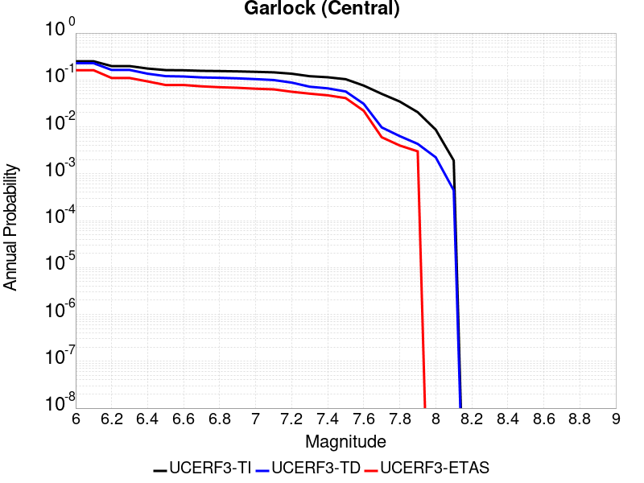 |
|-----|

| Magnitude | UCERF3-TI Prob | UCERF3-TD Prob | UCERF3-ETAS Prob |
|-----|-----|-----|-----|
| 6.0 | 0.2499942 | 0.22754516 | 0.15509762 |
| 6.1 | 0.2499942 | 0.22754516 | 0.15509762 |
| 6.2 | 0.19748303 | 0.16336322 | 0.10520607 |
| 6.3 | 0.19748303 | 0.16336322 | 0.10520607 |
| 6.4 | 0.17496064 | 0.1358288 | 0.09002169 |
| 6.5 | 0.16221368 | 0.12053427 | 0.07592191 |
| 6.6 | 0.16069135 | 0.1184582 | 0.07592191 |
| 6.7 | 0.15633568 | 0.11320357 | 0.07049891 |
| 6.8 | 0.1545991 | 0.11108979 | 0.06724512 |
| 6.9 | 0.15224904 | 0.108175136 | 0.06616052 |
| 7.0 | 0.14892432 | 0.104105696 | 0.06399132 |
| 7.1 | 0.1452127 | 0.09950542 | 0.061822128 |
| 7.2 | 0.13573706 | 0.087822564 | 0.055314533 |
| 7.3 | 0.12009351 | 0.071723804 | 0.05206074 |
| 7.4 | 0.11413341 | 0.066176414 | 0.047722343 |
| 7.5 | 0.10368156 | 0.056706134 | 0.04229935 |
| 7.6 | 0.0758267 | 0.03093298 | 0.022776572 |
| 7.7 | 0.0505143 | 0.009725636 | 0.0065075923 |
| 7.8 | 0.03463931 | 0.006345658 | 0.004338395 |
| 7.9 | 0.020529725 | 0.004325773 | 0.0032537961 |
| 8.0 | 0.008691251 | 0.002239008 | 0.0 |
| 8.1 | 0.0019148533 | 4.43909E-4 | 0.0 |

## Garlock (East)
*[(top)](#table-of-contents)*

| 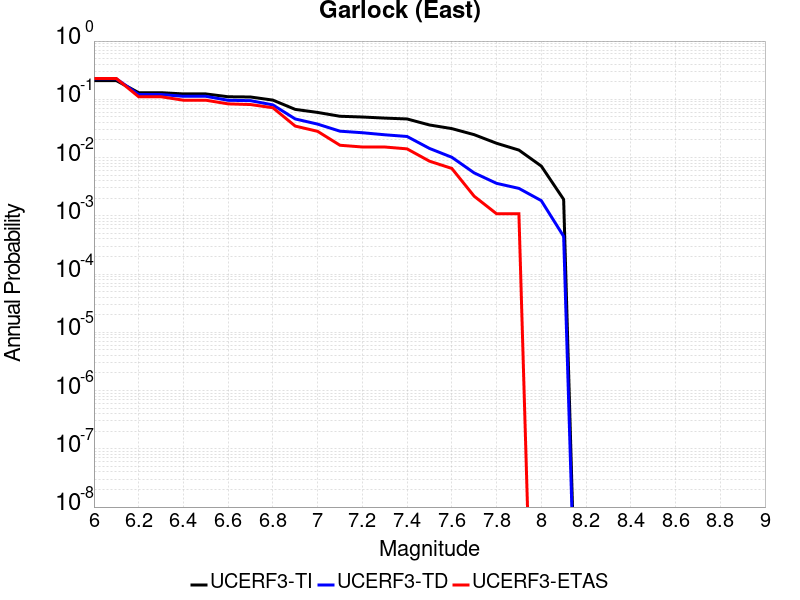 |
|-----|

| Magnitude | UCERF3-TI Prob | UCERF3-TD Prob | UCERF3-ETAS Prob |
|-----|-----|-----|-----|
| 6.0 | 0.20965962 | 0.22518013 | 0.22776572 |
| 6.1 | 0.20965962 | 0.22518013 | 0.22776572 |
| 6.2 | 0.12993352 | 0.1208877 | 0.11062907 |
| 6.3 | 0.12993352 | 0.1208877 | 0.11062907 |
| 6.4 | 0.123728715 | 0.11263399 | 0.09652928 |
| 6.5 | 0.123728715 | 0.11263399 | 0.09652928 |
| 6.6 | 0.11061352 | 0.096149884 | 0.0835141 |
| 6.7 | 0.109571695 | 0.09483764 | 0.0813449 |
| 6.8 | 0.09687913 | 0.080167376 | 0.07158352 |
| 6.9 | 0.06713532 | 0.04600598 | 0.03470716 |
| 7.0 | 0.059521805 | 0.037509944 | 0.028199567 |
| 7.1 | 0.051161557 | 0.028363984 | 0.01626898 |
| 7.2 | 0.04969519 | 0.026697757 | 0.015184382 |
| 7.3 | 0.047588967 | 0.024614854 | 0.015184382 |
| 7.4 | 0.045992263 | 0.02300798 | 0.014099783 |
| 7.5 | 0.03627481 | 0.014357696 | 0.00867679 |
| 7.6 | 0.031410683 | 0.010118545 | 0.0065075923 |
| 7.7 | 0.024720201 | 0.0054543717 | 0.0021691974 |
| 7.8 | 0.01759911 | 0.0036101174 | 0.0010845987 |
| 7.9 | 0.013437985 | 0.002956765 | 0.0010845987 |
| 8.0 | 0.007145592 | 0.0018226509 | 0.0 |
| 8.1 | 0.0019148533 | 4.43909E-4 | 0.0 |

## Garlock (West)
*[(top)](#table-of-contents)*

| 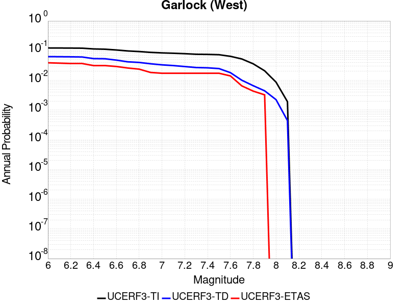 |
|-----|

| Magnitude | UCERF3-TI Prob | UCERF3-TD Prob | UCERF3-ETAS Prob |
|-----|-----|-----|-----|
| 6.0 | 0.1231298 | 0.06283582 | 0.039045554 |
| 6.1 | 0.12265385 | 0.062403247 | 0.037960954 |
| 6.2 | 0.12205113 | 0.061885487 | 0.036876354 |
| 6.3 | 0.121077724 | 0.061109327 | 0.036876354 |
| 6.4 | 0.11418796 | 0.053913858 | 0.031453364 |
| 6.5 | 0.11185009 | 0.053296756 | 0.031453364 |
| 6.6 | 0.105278656 | 0.04799727 | 0.029284164 |
| 6.7 | 0.09772385 | 0.04206836 | 0.02603037 |
| 6.8 | 0.093175955 | 0.040082533 | 0.023861172 |
| 6.9 | 0.08755249 | 0.03612427 | 0.018438177 |
| 7.0 | 0.08390184 | 0.03328966 | 0.01735358 |
| 7.1 | 0.08171638 | 0.031428948 | 0.01735358 |
| 7.2 | 0.07903981 | 0.029151315 | 0.01735358 |
| 7.3 | 0.07556783 | 0.02699244 | 0.01735358 |
| 7.4 | 0.0747429 | 0.02641315 | 0.01735358 |
| 7.5 | 0.07291312 | 0.024909891 | 0.01735358 |
| 7.6 | 0.06439617 | 0.018153822 | 0.014099783 |
| 7.7 | 0.05246883 | 0.010089506 | 0.0065075923 |
| 7.8 | 0.036020353 | 0.0066030915 | 0.004338395 |
| 7.9 | 0.02096496 | 0.004445382 | 0.0032537961 |
| 8.0 | 0.008691251 | 0.002239008 | 0.0 |
| 8.1 | 0.0019148533 | 4.43909E-4 | 0.0 |

## Gillem - Big Crack 2011 CFM
*[(top)](#table-of-contents)*

| 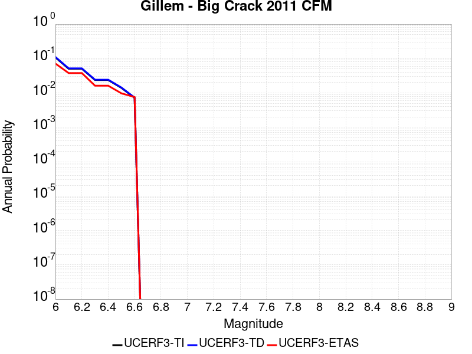 |
|-----|

| Magnitude | UCERF3-TI Prob | UCERF3-TD Prob | UCERF3-ETAS Prob |
|-----|-----|-----|-----|
| 6.0 | 0.10830387 | 0.11129229 | 0.07158352 |
| 6.1 | 0.050805204 | 0.052009936 | 0.037960954 |
| 6.2 | 0.050805204 | 0.052009936 | 0.037960954 |
| 6.3 | 0.02378158 | 0.024311934 | 0.01626898 |
| 6.4 | 0.02378158 | 0.024311934 | 0.01626898 |
| 6.5 | 0.014075437 | 0.014389153 | 0.009761388 |
| 6.6 | 0.0071842424 | 0.0073468643 | 0.007592191 |

## Goldstone Lake
*[(top)](#table-of-contents)*

| 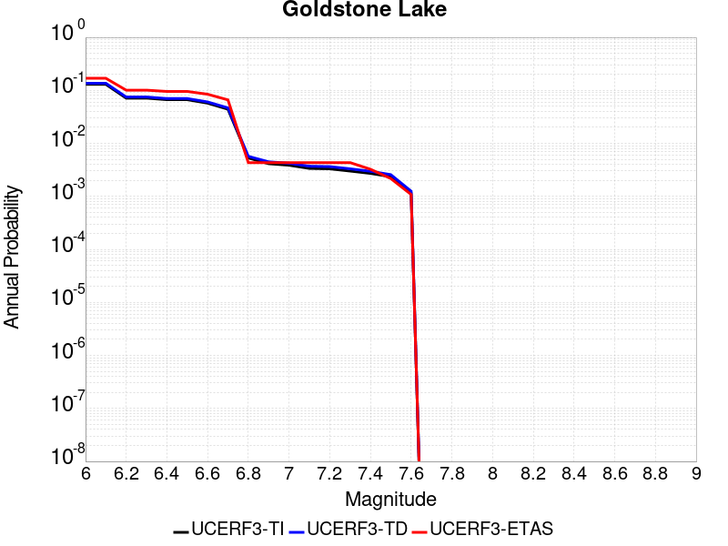 |
|-----|

| Magnitude | UCERF3-TI Prob | UCERF3-TD Prob | UCERF3-ETAS Prob |
|-----|-----|-----|-----|
| 6.0 | 0.13011059 | 0.13643208 | 0.1691974 |
| 6.1 | 0.13011059 | 0.13643208 | 0.1691974 |
| 6.2 | 0.07140138 | 0.07496486 | 0.10086768 |
| 6.3 | 0.07140138 | 0.07496486 | 0.10086768 |
| 6.4 | 0.06674734 | 0.07014819 | 0.09544469 |
| 6.5 | 0.06674734 | 0.07014819 | 0.09544469 |
| 6.6 | 0.05739661 | 0.060478847 | 0.0845987 |
| 6.7 | 0.04413711 | 0.046727404 | 0.06616052 |
| 6.8 | 0.0053160605 | 0.0056987023 | 0.004338395 |
| 6.9 | 0.0041323714 | 0.004486364 | 0.004338395 |
| 7.0 | 0.0038736654 | 0.0042219684 | 0.004338395 |
| 7.1 | 0.0033707572 | 0.0037088047 | 0.004338395 |
| 7.2 | 0.0033113437 | 0.0036481025 | 0.004338395 |
| 7.3 | 0.0030059542 | 0.0033135242 | 0.004338395 |
| 7.4 | 0.0027146288 | 0.0029784567 | 0.0032537961 |
| 7.5 | 0.0023520256 | 0.0025724722 | 0.0021691974 |
| 7.6 | 0.0011533784 | 0.0012534978 | 0.0010845987 |

## Goose Lake 2011 CFM
*[(top)](#table-of-contents)*

| 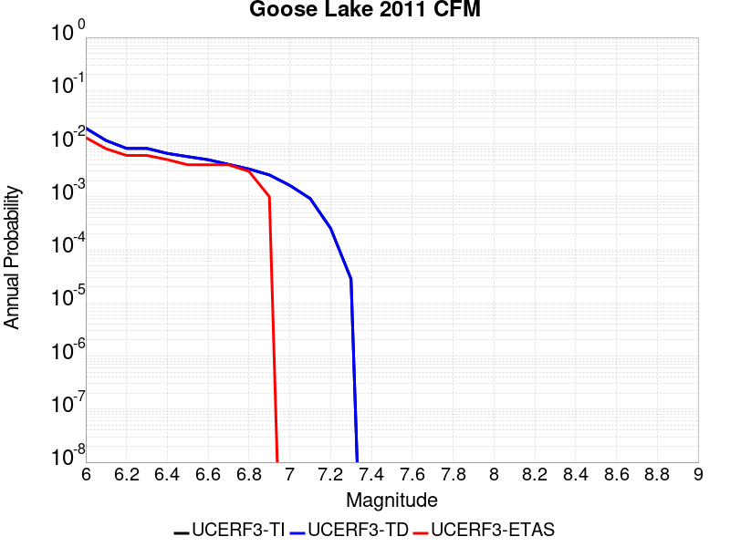 |
|-----|

| Magnitude | UCERF3-TI Prob | UCERF3-TD Prob | UCERF3-ETAS Prob |
|-----|-----|-----|-----|
| 6.0 | 0.019535253 | 0.019611735 | 0.013015185 |
| 6.1 | 0.011431781 | 0.011474626 | 0.007592191 |
| 6.2 | 0.008119603 | 0.008151603 | 0.0054229936 |
| 6.3 | 0.008119603 | 0.008151603 | 0.0054229936 |
| 6.4 | 0.0065346095 | 0.0065619806 | 0.004338395 |
| 6.5 | 0.0056769853 | 0.005701857 | 0.004338395 |
| 6.6 | 0.0049688965 | 0.0049915756 | 0.004338395 |
| 6.7 | 0.004056627 | 0.0040763146 | 0.004338395 |
| 6.8 | 0.0033190066 | 0.0033358207 | 0.0032537961 |
| 6.9 | 0.0025669439 | 0.0025807412 | 0.0010845987 |
| 7.0 | 0.0016319841 | 0.0016413964 | 0.0 |
| 7.1 | 9.220962E-4 | 9.274834E-4 | 0.0 |
| 7.2 | 2.5376983E-4 | 2.549666E-4 | 0.0 |
| 7.3 | 2.8130034E-5 | 2.8263199E-5 | 0.0 |

## Gravel Hills-Harper Lk
*[(top)](#table-of-contents)*

| 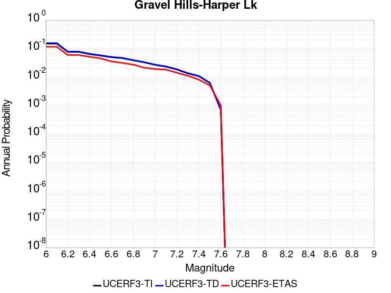 |
|-----|

| Magnitude | UCERF3-TI Prob | UCERF3-TD Prob | UCERF3-ETAS Prob |
|-----|-----|-----|-----|
| 6.0 | 0.14792784 | 0.15416947 | 0.11388286 |
| 6.1 | 0.14792784 | 0.15416947 | 0.11388286 |
| 6.2 | 0.075984955 | 0.07802665 | 0.05965293 |
| 6.3 | 0.075984955 | 0.07802665 | 0.05965293 |
| 6.4 | 0.06330103 | 0.064867355 | 0.05097614 |
| 6.5 | 0.056243915 | 0.05757508 | 0.04446855 |
| 6.6 | 0.049296036 | 0.050418604 | 0.03470716 |
| 6.7 | 0.045749974 | 0.046776194 | 0.030368764 |
| 6.8 | 0.03826786 | 0.039099067 | 0.02603037 |
| 6.9 | 0.032544814 | 0.033241212 | 0.019522777 |
| 7.0 | 0.026381778 | 0.026931277 | 0.01735358 |
| 7.1 | 0.022895422 | 0.023379715 | 0.01626898 |
| 7.2 | 0.018115586 | 0.018504683 | 0.013015185 |
| 7.3 | 0.013277345 | 0.0135679925 | 0.010845987 |
| 7.4 | 0.010571913 | 0.010805758 | 0.00867679 |
| 7.5 | 0.0060768235 | 0.0062159672 | 0.0054229936 |
| 7.6 | 6.8614166E-4 | 7.033696E-4 | 0.0010845987 |

## Great Valley 01
*[(top)](#table-of-contents)*

| 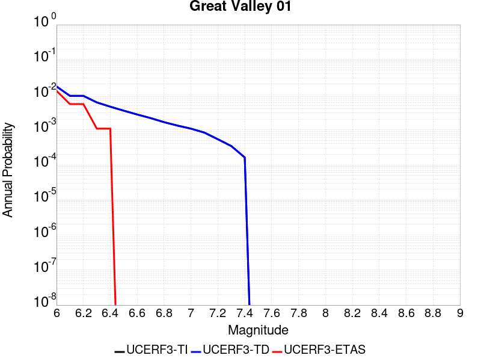 |
|-----|

| Magnitude | UCERF3-TI Prob | UCERF3-TD Prob | UCERF3-ETAS Prob |
|-----|-----|-----|-----|
| 6.0 | 0.017275909 | 0.017345225 | 0.013015185 |
| 6.1 | 0.00930663 | 0.009340018 | 0.0054229936 |
| 6.2 | 0.00930663 | 0.009340018 | 0.0054229936 |
| 6.3 | 0.0060533904 | 0.0060754283 | 0.0010845987 |
| 6.4 | 0.0045660906 | 0.0045836656 | 0.0010845987 |
| 6.5 | 0.0035175798 | 0.0035320711 | 0.0 |
| 6.6 | 0.0027372919 | 0.002749561 | 0.0 |
| 6.7 | 0.0021581054 | 0.0021687925 | 0.0 |
| 6.8 | 0.0016533738 | 0.0016626093 | 0.0 |
| 6.9 | 0.0013182329 | 0.001326414 | 0.0 |
| 7.0 | 0.0010778293 | 0.0010850712 | 0.0 |
| 7.1 | 8.319848E-4 | 8.3802355E-4 | 0.0 |
| 7.2 | 5.3683756E-4 | 5.41122E-4 | 0.0 |
| 7.3 | 3.433429E-4 | 3.4631306E-4 | 0.0 |
| 7.4 | 1.6237547E-4 | 1.6384812E-4 | 0.0 |

## Great Valley 02
*[(top)](#table-of-contents)*

| 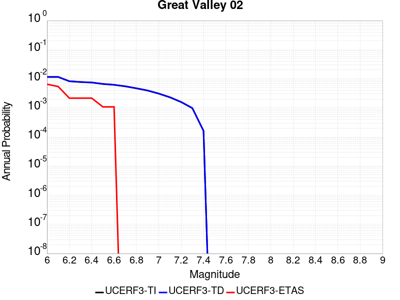 |
|-----|

| Magnitude | UCERF3-TI Prob | UCERF3-TD Prob | UCERF3-ETAS Prob |
|-----|-----|-----|-----|
| 6.0 | 0.011539253 | 0.011632397 | 0.0065075923 |
| 6.1 | 0.011539253 | 0.011632397 | 0.0054229936 |
| 6.2 | 0.008203981 | 0.008278609 | 0.0021691974 |
| 6.3 | 0.0077187438 | 0.0077914107 | 0.0021691974 |
| 6.4 | 0.007416667 | 0.0074884854 | 0.0021691974 |
| 6.5 | 0.006619296 | 0.006687329 | 0.0010845987 |
| 6.6 | 0.0061678463 | 0.0062341616 | 0.0010845987 |
| 6.7 | 0.0054900893 | 0.0055518374 | 0.0 |
| 6.8 | 0.0046788934 | 0.004735207 | 0.0 |
| 6.9 | 0.0039274334 | 0.0039778757 | 0.0 |
| 7.0 | 0.003078862 | 0.0031199155 | 0.0 |
| 7.1 | 0.0022960445 | 0.002328408 | 0.0 |
| 7.2 | 0.0015796754 | 0.0016029632 | 0.0 |
| 7.3 | 9.7531086E-4 | 9.902687E-4 | 0.0 |
| 7.4 | 1.6237547E-4 | 1.6384812E-4 | 0.0 |

## Great Valley 03 Mysterious Ridge
*[(top)](#table-of-contents)*

| 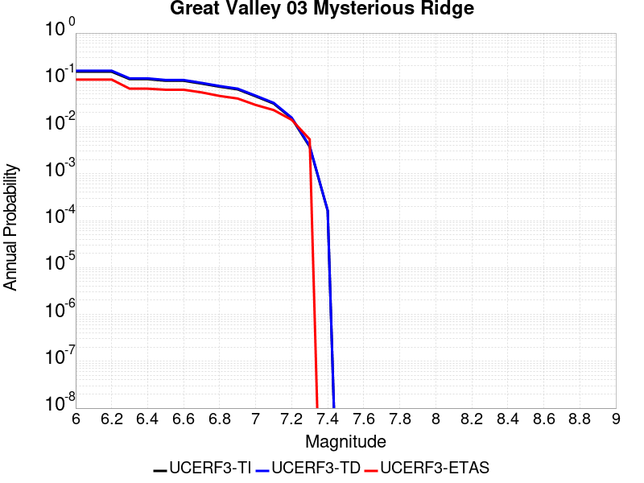 |
|-----|

| Magnitude | UCERF3-TI Prob | UCERF3-TD Prob | UCERF3-ETAS Prob |
|-----|-----|-----|-----|
| 6.0 | 0.15016076 | 0.15737723 | 0.10195228 |
| 6.1 | 0.15016076 | 0.15737723 | 0.10195228 |
| 6.2 | 0.15016076 | 0.15737723 | 0.10195228 |
| 6.3 | 0.104110286 | 0.107963376 | 0.06507592 |
| 6.4 | 0.104110286 | 0.107963376 | 0.06507592 |
| 6.5 | 0.09622432 | 0.099720545 | 0.061822128 |
| 6.6 | 0.096131936 | 0.09962782 | 0.061822128 |
| 6.7 | 0.083562665 | 0.086494416 | 0.054229934 |
| 6.8 | 0.07175174 | 0.07421557 | 0.045553144 |
| 6.9 | 0.06299486 | 0.06513584 | 0.040130153 |
| 7.0 | 0.04475264 | 0.046241615 | 0.029284164 |
| 7.1 | 0.031361755 | 0.03241593 | 0.022776572 |
| 7.2 | 0.015219772 | 0.015719676 | 0.014099783 |
| 7.3 | 0.0037699672 | 0.0038868864 | 0.0054229936 |
| 7.4 | 1.6237547E-4 | 1.6384812E-4 | 0.0 |

## Great Valley 03a Dunnigan Hills
*[(top)](#table-of-contents)*

| 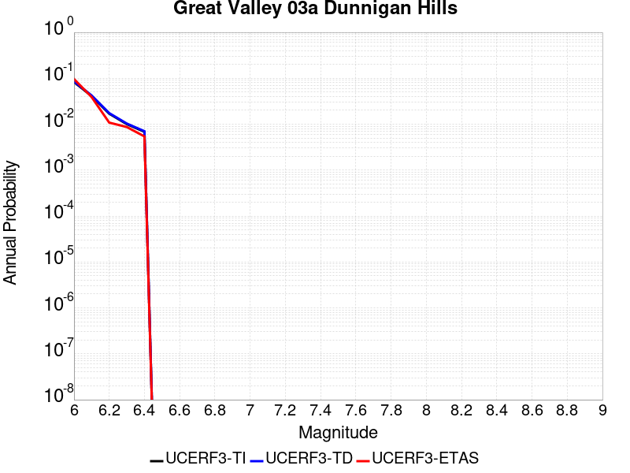 |
|-----|

| Magnitude | UCERF3-TI Prob | UCERF3-TD Prob | UCERF3-ETAS Prob |
|-----|-----|-----|-----|
| 6.0 | 0.08293039 | 0.0856227 | 0.09652928 |
| 6.1 | 0.041089572 | 0.042322367 | 0.039045554 |
| 6.2 | 0.01697257 | 0.017450944 | 0.010845987 |
| 6.3 | 0.010040271 | 0.010328524 | 0.00867679 |
| 6.4 | 0.0068341834 | 0.007036514 | 0.0054229936 |

## Great Valley 04a Trout Creek
*[(top)](#table-of-contents)*

| 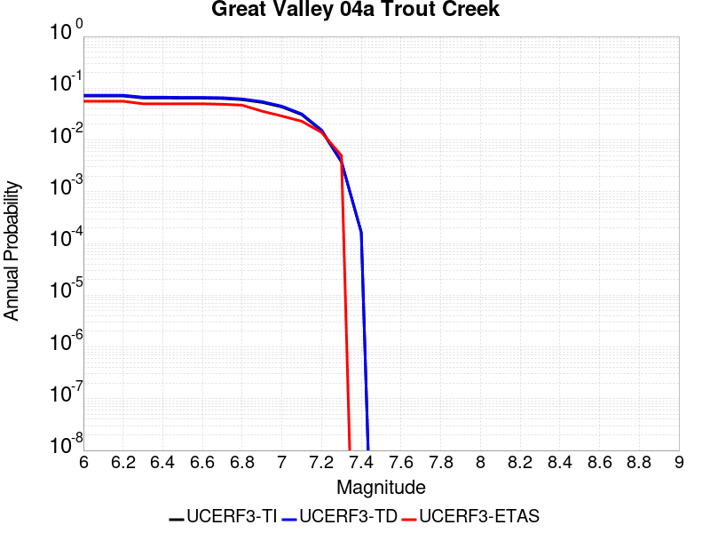 |
|-----|

| Magnitude | UCERF3-TI Prob | UCERF3-TD Prob | UCERF3-ETAS Prob |
|-----|-----|-----|-----|
| 6.0 | 0.070875466 | 0.07320743 | 0.057483733 |
| 6.1 | 0.070875466 | 0.07320743 | 0.057483733 |
| 6.2 | 0.070875466 | 0.07320743 | 0.057483733 |
| 6.3 | 0.0650118 | 0.06715389 | 0.05097614 |
| 6.4 | 0.0650118 | 0.06715389 | 0.05097614 |
| 6.5 | 0.06442357 | 0.066548996 | 0.05097614 |
| 6.6 | 0.06442357 | 0.066548996 | 0.05097614 |
| 6.7 | 0.06342535 | 0.06552311 | 0.04989154 |
| 6.8 | 0.060064845 | 0.06206462 | 0.047722343 |
| 6.9 | 0.053315815 | 0.055099756 | 0.036876354 |
| 7.0 | 0.043504253 | 0.04498339 | 0.029284164 |
| 7.1 | 0.030856876 | 0.031908117 | 0.022776572 |
| 7.2 | 0.015080697 | 0.01557988 | 0.014099783 |
| 7.3 | 0.0037598952 | 0.003876758 | 0.0054229936 |
| 7.4 | 1.6237547E-4 | 1.6384812E-4 | 0.0 |

## Great Valley 04b Gordon Valley
*[(top)](#table-of-contents)*

| 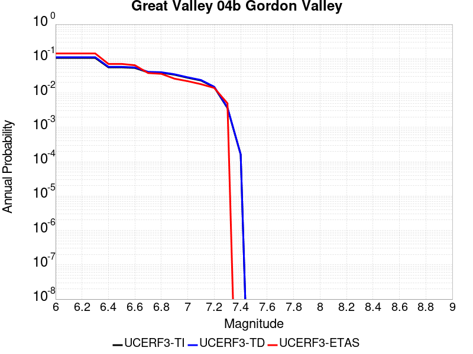 |
|-----|

| Magnitude | UCERF3-TI Prob | UCERF3-TD Prob | UCERF3-ETAS Prob |
|-----|-----|-----|-----|
| 6.0 | 0.10463313 | 0.10963786 | 0.13882864 |
| 6.1 | 0.10463313 | 0.10963786 | 0.13882864 |
| 6.2 | 0.10463313 | 0.10963786 | 0.13882864 |
| 6.3 | 0.10463313 | 0.10963786 | 0.13882864 |
| 6.4 | 0.05572281 | 0.057620026 | 0.06941432 |
| 6.5 | 0.05572281 | 0.057620026 | 0.06941432 |
| 6.6 | 0.05340201 | 0.05521851 | 0.06399132 |
| 6.7 | 0.03982833 | 0.04112882 | 0.037960954 |
| 6.8 | 0.038805064 | 0.04007652 | 0.03579176 |
| 6.9 | 0.033872426 | 0.03497887 | 0.02603037 |
| 7.0 | 0.027631614 | 0.028541213 | 0.021691974 |
| 7.1 | 0.023046639 | 0.023812067 | 0.01735358 |
| 7.2 | 0.014675432 | 0.015169853 | 0.014099783 |
| 7.3 | 0.0036503773 | 0.0037664317 | 0.0054229936 |
| 7.4 | 1.6237547E-4 | 1.6384812E-4 | 0.0 |

## Great Valley 05 Pittsburg - Kirby Hills alt1
*[(top)](#table-of-contents)*

| 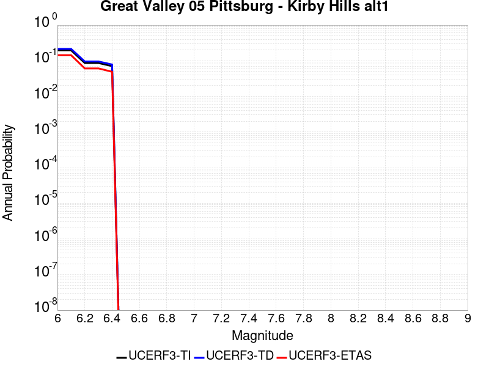 |
|-----|

| Magnitude | UCERF3-TI Prob | UCERF3-TD Prob | UCERF3-ETAS Prob |
|-----|-----|-----|-----|
| 6.0 | 0.19626632 | 0.2150687 | 0.14642082 |
| 6.1 | 0.19626632 | 0.2150687 | 0.14642082 |
| 6.2 | 0.086569384 | 0.095417306 | 0.060737528 |
| 6.3 | 0.086569384 | 0.095417306 | 0.060737528 |
| 6.4 | 0.07058592 | 0.078368634 | 0.048806943 |

## Great Valley 06 (Midland) 2011 CFM alt1
*[(top)](#table-of-contents)*

| 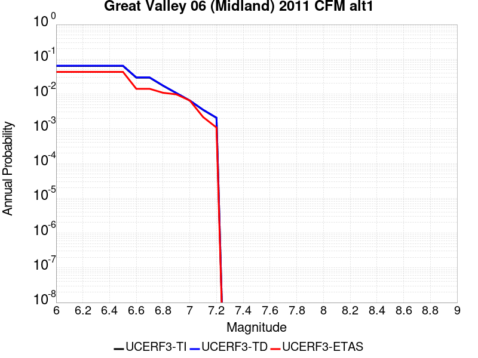 |
|-----|

| Magnitude | UCERF3-TI Prob | UCERF3-TD Prob | UCERF3-ETAS Prob |
|-----|-----|-----|-----|
| 6.0 | 0.064180404 | 0.06514724 | 0.04338395 |
| 6.1 | 0.064180404 | 0.06514724 | 0.04338395 |
| 6.2 | 0.064180404 | 0.06514724 | 0.04338395 |
| 6.3 | 0.064180404 | 0.06514724 | 0.04338395 |
| 6.4 | 0.064180404 | 0.06514724 | 0.04338395 |
| 6.5 | 0.064180404 | 0.06514724 | 0.04338395 |
| 6.6 | 0.029594814 | 0.029954584 | 0.014099783 |
| 6.7 | 0.029594814 | 0.029954584 | 0.014099783 |
| 6.8 | 0.017315058 | 0.017515885 | 0.010845987 |
| 6.9 | 0.010562722 | 0.010683615 | 0.009761388 |
| 7.0 | 0.006462074 | 0.0065366193 | 0.0065075923 |
| 7.1 | 0.003484899 | 0.0035259475 | 0.0021691974 |
| 7.2 | 0.0020579775 | 0.0020829435 | 0.0010845987 |

## Great Valley 07 (Orestimba)
*[(top)](#table-of-contents)*

| 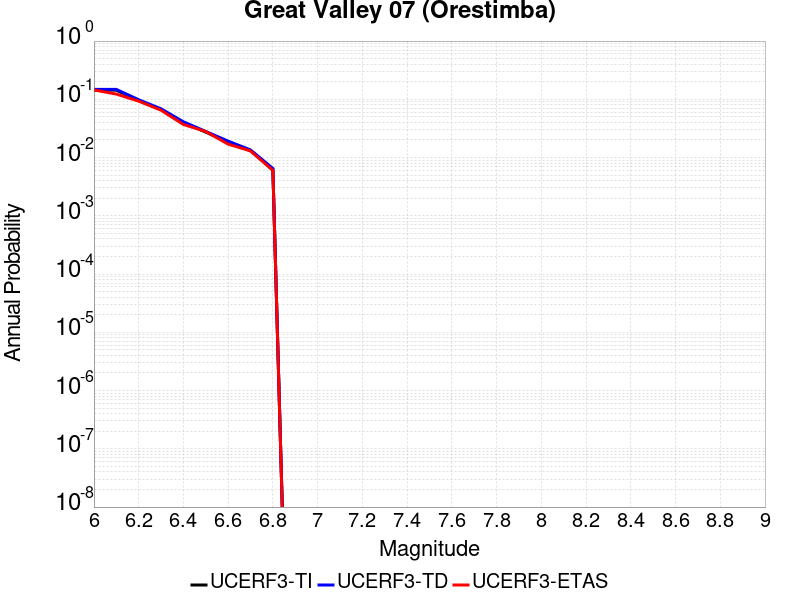 |
|-----|

| Magnitude | UCERF3-TI Prob | UCERF3-TD Prob | UCERF3-ETAS Prob |
|-----|-----|-----|-----|
| 6.0 | 0.14350733 | 0.14797468 | 0.13774404 |
| 6.1 | 0.14350733 | 0.14797468 | 0.11713666 |
| 6.2 | 0.095477685 | 0.098260954 | 0.0867679 |
| 6.3 | 0.06678984 | 0.06867451 | 0.061822128 |
| 6.4 | 0.039975747 | 0.041084003 | 0.03579176 |
| 6.5 | 0.027314685 | 0.02807293 | 0.02603037 |
| 6.6 | 0.018610826 | 0.019133955 | 0.01626898 |
| 6.7 | 0.0131462775 | 0.013521766 | 0.013015185 |
| 6.8 | 0.0063019306 | 0.0064880787 | 0.0065075923 |

## Great Valley 08 (Quinto)
*[(top)](#table-of-contents)*

| 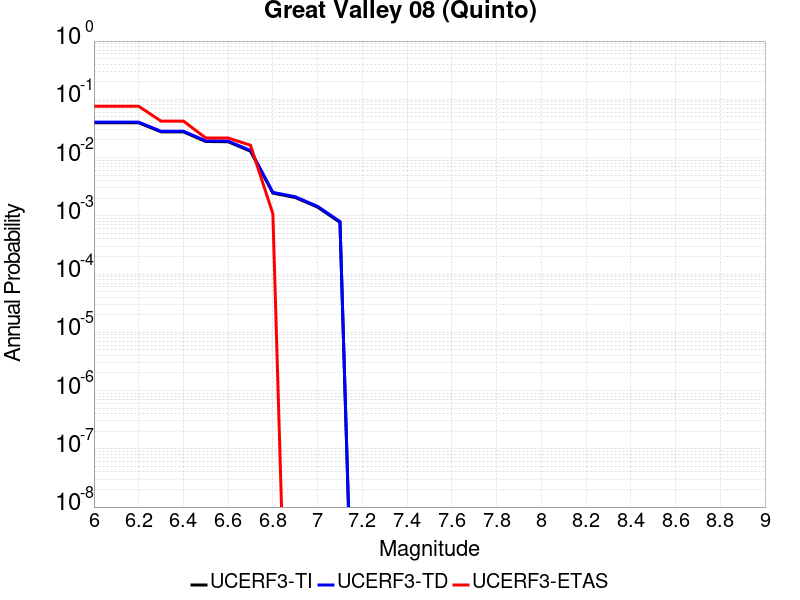 |
|-----|

| Magnitude | UCERF3-TI Prob | UCERF3-TD Prob | UCERF3-ETAS Prob |
|-----|-----|-----|-----|
| 6.0 | 0.03957017 | 0.040502287 | 0.07592191 |
| 6.1 | 0.03957017 | 0.040502287 | 0.07592191 |
| 6.2 | 0.03957017 | 0.040502287 | 0.07592191 |
| 6.3 | 0.027651405 | 0.028313188 | 0.04229935 |
| 6.4 | 0.027651405 | 0.028313188 | 0.04229935 |
| 6.5 | 0.018886859 | 0.019379104 | 0.021691974 |
| 6.6 | 0.018682493 | 0.01917053 | 0.021691974 |
| 6.7 | 0.012867761 | 0.013224729 | 0.01626898 |
| 6.8 | 0.0024551423 | 0.002526599 | 0.0010845987 |
| 6.9 | 0.002063454 | 0.0021244565 | 0.0 |
| 7.0 | 0.0014093617 | 0.0014521617 | 0.0 |
| 7.1 | 7.7343604E-4 | 7.976935E-4 | 0.0 |

## Great Valley 09 (Laguna Seca)
*[(top)](#table-of-contents)*

| 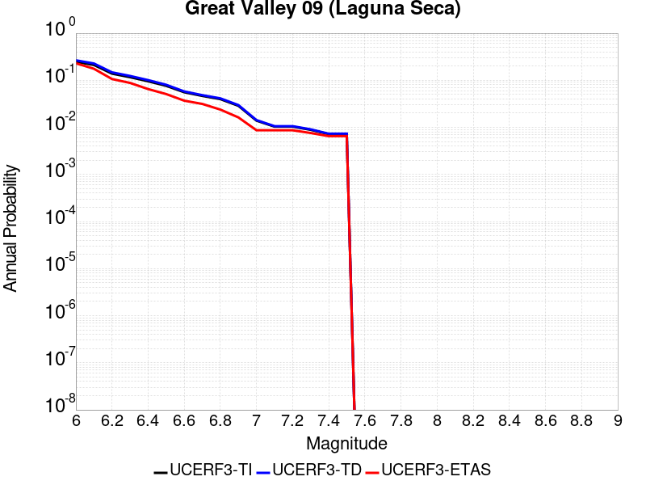 |
|-----|

| Magnitude | UCERF3-TI Prob | UCERF3-TD Prob | UCERF3-ETAS Prob |
|-----|-----|-----|-----|
| 6.0 | 0.24694374 | 0.2656748 | 0.22993493 |
| 6.1 | 0.21166047 | 0.2273018 | 0.17570499 |
| 6.2 | 0.13834728 | 0.14744711 | 0.106290676 |
| 6.3 | 0.11631825 | 0.123620726 | 0.08785249 |
| 6.4 | 0.09528734 | 0.100853 | 0.06507592 |
| 6.5 | 0.07626398 | 0.080290906 | 0.05097614 |
| 6.6 | 0.055706345 | 0.05799832 | 0.036876354 |
| 6.7 | 0.04654528 | 0.048353013 | 0.031453364 |
| 6.8 | 0.039810147 | 0.041328274 | 0.023861172 |
| 6.9 | 0.028691359 | 0.029739777 | 0.01626898 |
| 7.0 | 0.013895143 | 0.014276065 | 0.00867679 |
| 7.1 | 0.01035617 | 0.010608915 | 0.00867679 |
| 7.2 | 0.01035617 | 0.010608915 | 0.00867679 |
| 7.3 | 0.00887642 | 0.009082266 | 0.007592191 |
| 7.4 | 0.0071772956 | 0.007332483 | 0.0065075923 |
| 7.5 | 0.0071772956 | 0.007332483 | 0.0065075923 |

## Great Valley 10 (Panoche)
*[(top)](#table-of-contents)*

| 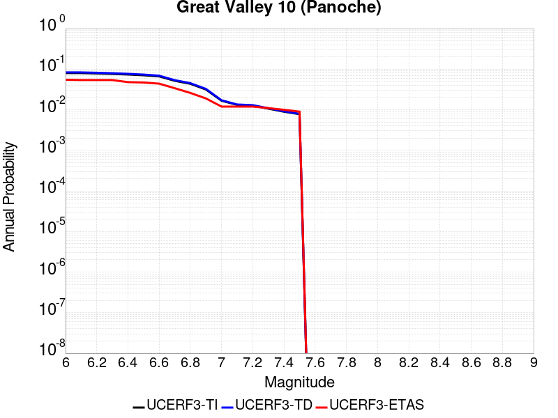 |
|-----|

| Magnitude | UCERF3-TI Prob | UCERF3-TD Prob | UCERF3-ETAS Prob |
|-----|-----|-----|-----|
| 6.0 | 0.08016659 | 0.083368756 | 0.05206074 |
| 6.1 | 0.08016659 | 0.083368756 | 0.05097614 |
| 6.2 | 0.07855045 | 0.08170316 | 0.05097614 |
| 6.3 | 0.076553605 | 0.07963269 | 0.05097614 |
| 6.4 | 0.073935315 | 0.07691416 | 0.046637744 |
| 6.5 | 0.07084687 | 0.07369578 | 0.045553144 |
| 6.6 | 0.06654355 | 0.06920854 | 0.04229935 |
| 6.7 | 0.051711306 | 0.05365655 | 0.03362256 |
| 6.8 | 0.043671835 | 0.045282517 | 0.02603037 |
| 6.9 | 0.031563524 | 0.032676727 | 0.018438177 |
| 7.0 | 0.016717907 | 0.017163925 | 0.010845987 |
| 7.1 | 0.013189064 | 0.013507518 | 0.010845987 |
| 7.2 | 0.012691605 | 0.012995537 | 0.010845987 |
| 7.3 | 0.010670369 | 0.010912435 | 0.009761388 |
| 7.4 | 0.00897432 | 0.009165884 | 0.00867679 |
| 7.5 | 0.007797629 | 0.007965436 | 0.007592191 |

## Great Valley 11
*[(top)](#table-of-contents)*

| 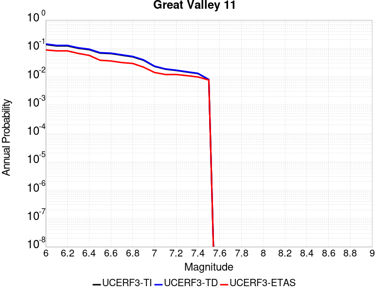 |
|-----|

| Magnitude | UCERF3-TI Prob | UCERF3-TD Prob | UCERF3-ETAS Prob |
|-----|-----|-----|-----|
| 6.0 | 0.13637935 | 0.14257085 | 0.08785249 |
| 6.1 | 0.12152789 | 0.126949 | 0.0813449 |
| 6.2 | 0.12152789 | 0.126949 | 0.0813449 |
| 6.3 | 0.100309 | 0.104529634 | 0.06616052 |
| 6.4 | 0.089907214 | 0.09361768 | 0.056399133 |
| 6.5 | 0.067922905 | 0.0703037 | 0.037960954 |
| 6.6 | 0.06533358 | 0.067641884 | 0.03579176 |
| 6.7 | 0.05712094 | 0.059107725 | 0.031453364 |
| 6.8 | 0.05001716 | 0.051764213 | 0.029284164 |
| 6.9 | 0.037989188 | 0.039244 | 0.021691974 |
| 7.0 | 0.023017742 | 0.023606202 | 0.014099783 |
| 7.1 | 0.018376753 | 0.018806415 | 0.011930586 |
| 7.2 | 0.016579038 | 0.016958904 | 0.011930586 |
| 7.3 | 0.014565759 | 0.014884166 | 0.010845987 |
| 7.4 | 0.012876389 | 0.013144629 | 0.009761388 |
| 7.5 | 0.007797629 | 0.007965436 | 0.007592191 |

## Great Valley 12
*[(top)](#table-of-contents)*

| 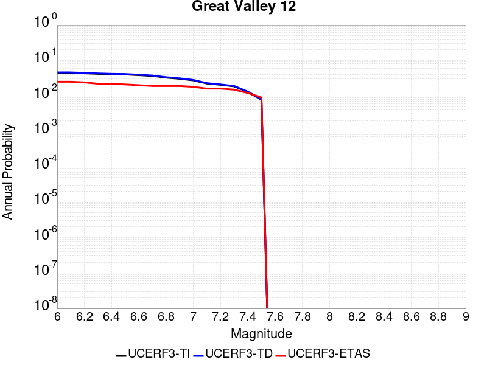 |
|-----|

| Magnitude | UCERF3-TI Prob | UCERF3-TD Prob | UCERF3-ETAS Prob |
|-----|-----|-----|-----|
| 6.0 | 0.044665553 | 0.045817766 | 0.022776572 |
| 6.1 | 0.044665553 | 0.045817766 | 0.022776572 |
| 6.2 | 0.043378495 | 0.04450795 | 0.022776572 |
| 6.3 | 0.041818596 | 0.04292002 | 0.020607375 |
| 6.4 | 0.040783074 | 0.04185525 | 0.020607375 |
| 6.5 | 0.040237986 | 0.041294847 | 0.019522777 |
| 6.6 | 0.03841948 | 0.039429303 | 0.018438177 |
| 6.7 | 0.03651886 | 0.03746801 | 0.01735358 |
| 6.8 | 0.032724764 | 0.03355722 | 0.01735358 |
| 6.9 | 0.030364469 | 0.031130869 | 0.01735358 |
| 7.0 | 0.027397562 | 0.028069695 | 0.01626898 |
| 7.1 | 0.0223357 | 0.022839352 | 0.014099783 |
| 7.2 | 0.020545235 | 0.020999435 | 0.014099783 |
| 7.3 | 0.018540077 | 0.018933225 | 0.013015185 |
| 7.4 | 0.012876389 | 0.013144629 | 0.009761388 |
| 7.5 | 0.007797629 | 0.007965436 | 0.007592191 |

## Great Valley 13 (Coalinga)
*[(top)](#table-of-contents)*

| 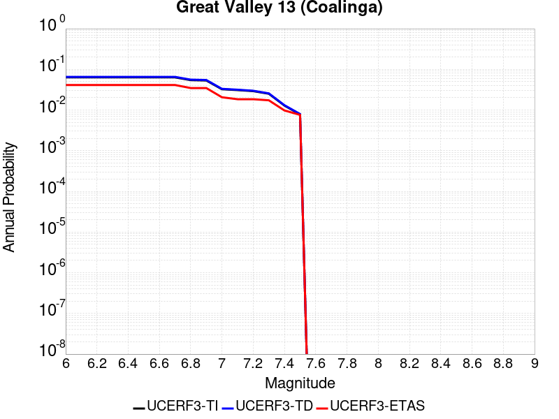 |
|-----|

| Magnitude | UCERF3-TI Prob | UCERF3-TD Prob | UCERF3-ETAS Prob |
|-----|-----|-----|-----|
| 6.0 | 0.06348485 | 0.06528334 | 0.04121475 |
| 6.1 | 0.06348485 | 0.06528334 | 0.04121475 |
| 6.2 | 0.06348485 | 0.06528334 | 0.04121475 |
| 6.3 | 0.06348485 | 0.06528334 | 0.04121475 |
| 6.4 | 0.06348485 | 0.06528334 | 0.04121475 |
| 6.5 | 0.06348485 | 0.06528334 | 0.04121475 |
| 6.6 | 0.06348485 | 0.06528334 | 0.04121475 |
| 6.7 | 0.06348485 | 0.06528334 | 0.04121475 |
| 6.8 | 0.054402135 | 0.055906527 | 0.03470716 |
| 6.9 | 0.053241897 | 0.054717712 | 0.03470716 |
| 7.0 | 0.032491036 | 0.03321155 | 0.020607375 |
| 7.1 | 0.030933505 | 0.031611536 | 0.018438177 |
| 7.2 | 0.029158786 | 0.029788136 | 0.018438177 |
| 7.3 | 0.025157921 | 0.025691682 | 0.01735358 |
| 7.4 | 0.012876389 | 0.013144629 | 0.009761388 |
| 7.5 | 0.007797629 | 0.007965436 | 0.007592191 |

## Great Valley 14 (Kettleman Hills)
*[(top)](#table-of-contents)*

| 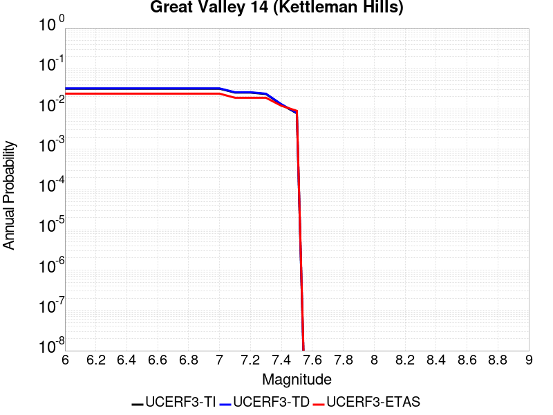 |
|-----|

| Magnitude | UCERF3-TI Prob | UCERF3-TD Prob | UCERF3-ETAS Prob |
|-----|-----|-----|-----|
| 6.0 | 0.031862345 | 0.032492075 | 0.021691974 |
| 6.1 | 0.031862345 | 0.032492075 | 0.021691974 |
| 6.2 | 0.031862345 | 0.032492075 | 0.021691974 |
| 6.3 | 0.031862345 | 0.032492075 | 0.021691974 |
| 6.4 | 0.031862345 | 0.032492075 | 0.021691974 |
| 6.5 | 0.031862345 | 0.032492075 | 0.021691974 |
| 6.6 | 0.031862345 | 0.032492075 | 0.021691974 |
| 6.7 | 0.031862345 | 0.032492075 | 0.021691974 |
| 6.8 | 0.031862345 | 0.032492075 | 0.021691974 |
| 6.9 | 0.031862345 | 0.032492075 | 0.021691974 |
| 7.0 | 0.031862345 | 0.032492075 | 0.021691974 |
| 7.1 | 0.025503501 | 0.026023641 | 0.01626898 |
| 7.2 | 0.025503501 | 0.026023641 | 0.01626898 |
| 7.3 | 0.02348671 | 0.02397123 | 0.01626898 |
| 7.4 | 0.012876389 | 0.013144629 | 0.009761388 |
| 7.5 | 0.007797629 | 0.007965436 | 0.007592191 |

## Green Valley 2011 CFM
*[(top)](#table-of-contents)*

| 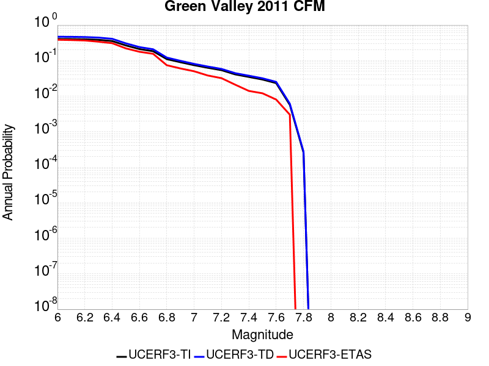 |
|-----|

| Magnitude | UCERF3-TI Prob | UCERF3-TD Prob | UCERF3-ETAS Prob |
|-----|-----|-----|-----|
| 6.0 | 0.40540668 | 0.46867207 | 0.38503253 |
| 6.1 | 0.4030194 | 0.4658848 | 0.37852496 |
| 6.2 | 0.3970944 | 0.4591981 | 0.36876357 |
| 6.3 | 0.38368088 | 0.4433764 | 0.3394794 |
| 6.4 | 0.35459343 | 0.4104222 | 0.30911064 |
| 6.5 | 0.2669731 | 0.30617815 | 0.22234273 |
| 6.6 | 0.21076842 | 0.2396532 | 0.1778742 |
| 6.7 | 0.18331277 | 0.20814423 | 0.1583514 |
| 6.8 | 0.109773636 | 0.12143388 | 0.077006504 |
| 6.9 | 0.089884765 | 0.09835514 | 0.061822128 |
| 7.0 | 0.074140385 | 0.080636054 | 0.05206074 |
| 7.1 | 0.06265169 | 0.06795926 | 0.04121475 |
| 7.2 | 0.05372978 | 0.05823697 | 0.03470716 |
| 7.3 | 0.040874638 | 0.044265483 | 0.022776572 |
| 7.4 | 0.034643453 | 0.037525434 | 0.015184382 |
| 7.5 | 0.029297754 | 0.031727724 | 0.013015185 |
| 7.6 | 0.023225565 | 0.025146134 | 0.00867679 |
| 7.7 | 0.0056575993 | 0.006096007 | 0.0032537961 |
| 7.8 | 2.5759288E-4 | 2.7571167E-4 | 0.0 |

## Greenville (No) 2011 CFM
*[(top)](#table-of-contents)*

| 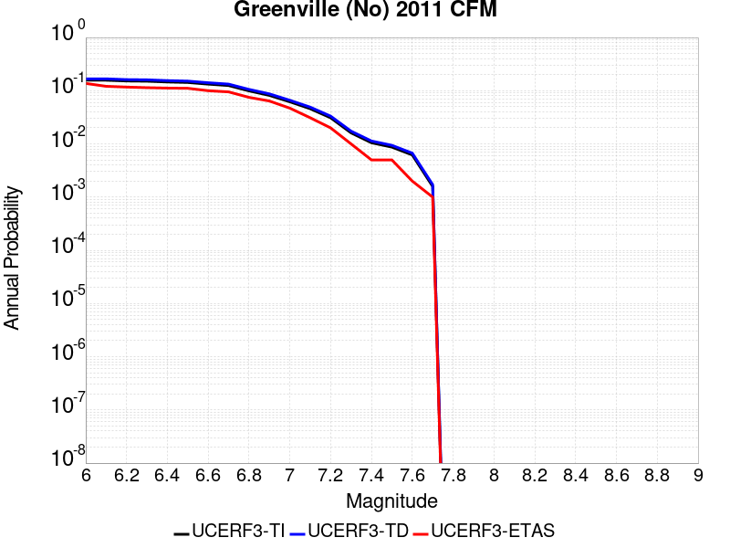 |
|-----|

| Magnitude | UCERF3-TI Prob | UCERF3-TD Prob | UCERF3-ETAS Prob |
|-----|-----|-----|-----|
| 6.0 | 0.15759614 | 0.16701482 | 0.13449024 |
| 6.1 | 0.15759614 | 0.16701482 | 0.12039045 |
| 6.2 | 0.1524437 | 0.16160317 | 0.11713666 |
| 6.3 | 0.15096246 | 0.16004917 | 0.11388286 |
| 6.4 | 0.14592044 | 0.15475525 | 0.11171366 |
| 6.5 | 0.1428363 | 0.15152143 | 0.11062907 |
| 6.6 | 0.132974 | 0.14113127 | 0.09869848 |
| 6.7 | 0.12511358 | 0.13298152 | 0.09327549 |
| 6.8 | 0.09937503 | 0.10579071 | 0.07266811 |
| 6.9 | 0.081639476 | 0.08715986 | 0.06290673 |
| 7.0 | 0.061932687 | 0.06611504 | 0.046637744 |
| 7.1 | 0.045857806 | 0.049074307 | 0.031453364 |
| 7.2 | 0.03096033 | 0.033247225 | 0.020607375 |
| 7.3 | 0.016153071 | 0.017379003 | 0.010845987 |
| 7.4 | 0.010512718 | 0.011342048 | 0.0054229936 |
| 7.5 | 0.008708776 | 0.009410376 | 0.0054229936 |
| 7.6 | 0.006208405 | 0.0067049065 | 0.0021691974 |
| 7.7 | 0.001588316 | 0.0017165638 | 0.0010845987 |

## Greenville (So) 2011 CFM
*[(top)](#table-of-contents)*

| 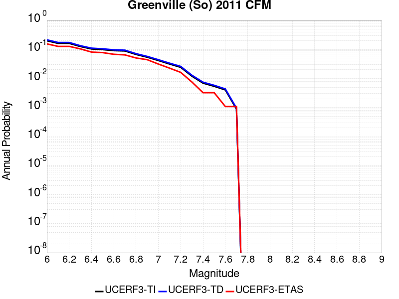 |
|-----|

| Magnitude | UCERF3-TI Prob | UCERF3-TD Prob | UCERF3-ETAS Prob |
|-----|-----|-----|-----|
| 6.0 | 0.20013559 | 0.21527655 | 0.15618221 |
| 6.1 | 0.16272673 | 0.17442976 | 0.12798265 |
| 6.2 | 0.16272673 | 0.17442976 | 0.12798265 |
| 6.3 | 0.12666681 | 0.13501333 | 0.10520607 |
| 6.4 | 0.10446416 | 0.11106226 | 0.0813449 |
| 6.5 | 0.09924298 | 0.105523214 | 0.07809111 |
| 6.6 | 0.09152279 | 0.097333886 | 0.06832972 |
| 6.7 | 0.08909283 | 0.09477366 | 0.06507592 |
| 6.8 | 0.06740272 | 0.07171999 | 0.05097614 |
| 6.9 | 0.05414985 | 0.057669494 | 0.04446855 |
| 7.0 | 0.041671734 | 0.044423927 | 0.031453364 |
| 7.1 | 0.031563886 | 0.033756383 | 0.022776572 |
| 7.2 | 0.024294283 | 0.02609257 | 0.01626898 |
| 7.3 | 0.012066601 | 0.012988125 | 0.007592191 |
| 7.4 | 0.006922984 | 0.0074752034 | 0.0032537961 |
| 7.5 | 0.0053926446 | 0.005832488 | 0.0032537961 |
| 7.6 | 0.0040433584 | 0.0043716957 | 0.0010845987 |
| 7.7 | 8.828766E-4 | 9.5413195E-4 | 0.0010845987 |

## Hartley Springs 2011 CFM
*[(top)](#table-of-contents)*

| 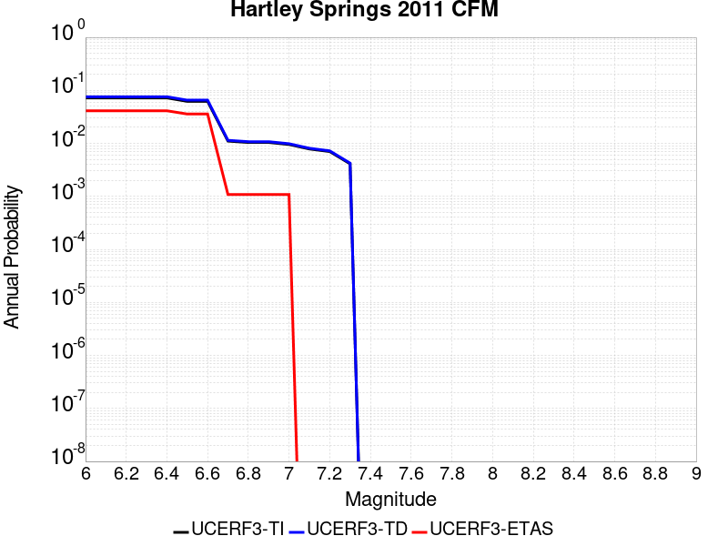 |
|-----|

| Magnitude | UCERF3-TI Prob | UCERF3-TD Prob | UCERF3-ETAS Prob |
|-----|-----|-----|-----|
| 6.0 | 0.0721539 | 0.07580609 | 0.04121475 |
| 6.1 | 0.0721539 | 0.07580609 | 0.04121475 |
| 6.2 | 0.0721539 | 0.07580609 | 0.04121475 |
| 6.3 | 0.0721539 | 0.07580609 | 0.04121475 |
| 6.4 | 0.0721539 | 0.07580609 | 0.04121475 |
| 6.5 | 0.06206529 | 0.065386966 | 0.03579176 |
| 6.6 | 0.06206529 | 0.065386966 | 0.03579176 |
| 6.7 | 0.0110435365 | 0.011426657 | 0.0010845987 |
| 6.8 | 0.010408106 | 0.010765698 | 0.0010845987 |
| 6.9 | 0.010408106 | 0.010765698 | 0.0010845987 |
| 7.0 | 0.009537731 | 0.009858168 | 0.0010845987 |
| 7.1 | 0.007846976 | 0.0080928225 | 0.0 |
| 7.2 | 0.0070146937 | 0.00723275 | 0.0 |
| 7.3 | 0.0041136323 | 0.0042432984 | 0.0 |

## Hat Creek-McArthur-Mayfield
*[(top)](#table-of-contents)*

| 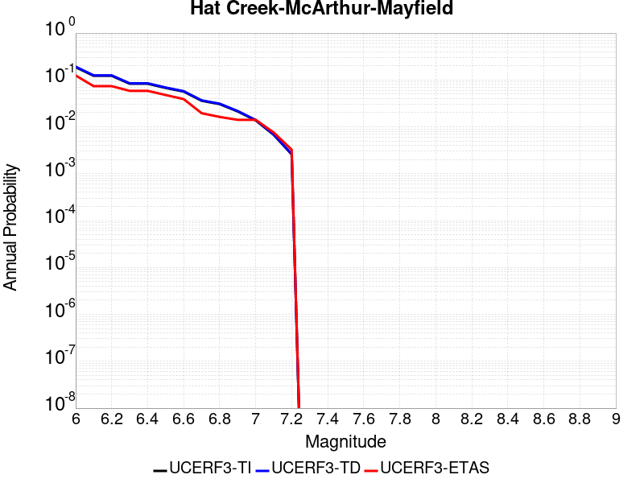 |
|-----|

| Magnitude | UCERF3-TI Prob | UCERF3-TD Prob | UCERF3-ETAS Prob |
|-----|-----|-----|-----|
| 6.0 | 0.18699689 | 0.19210052 | 0.12472885 |
| 6.1 | 0.12249947 | 0.1254337 | 0.07375271 |
| 6.2 | 0.12249947 | 0.1254337 | 0.07375271 |
| 6.3 | 0.083086774 | 0.08491254 | 0.05856833 |
| 6.4 | 0.083086774 | 0.08491254 | 0.05856833 |
| 6.5 | 0.06750626 | 0.06895942 | 0.047722343 |
| 6.6 | 0.056457885 | 0.05765889 | 0.039045554 |
| 6.7 | 0.035967074 | 0.036717117 | 0.019522777 |
| 6.8 | 0.030519638 | 0.03115537 | 0.01626898 |
| 6.9 | 0.021318393 | 0.021760939 | 0.014099783 |
| 7.0 | 0.013738848 | 0.014021012 | 0.014099783 |
| 7.1 | 0.006756417 | 0.006896459 | 0.007592191 |
| 7.2 | 0.0025889743 | 0.0026443733 | 0.0032537961 |

## Hayward (No) 2011 CFM
*[(top)](#table-of-contents)*

| 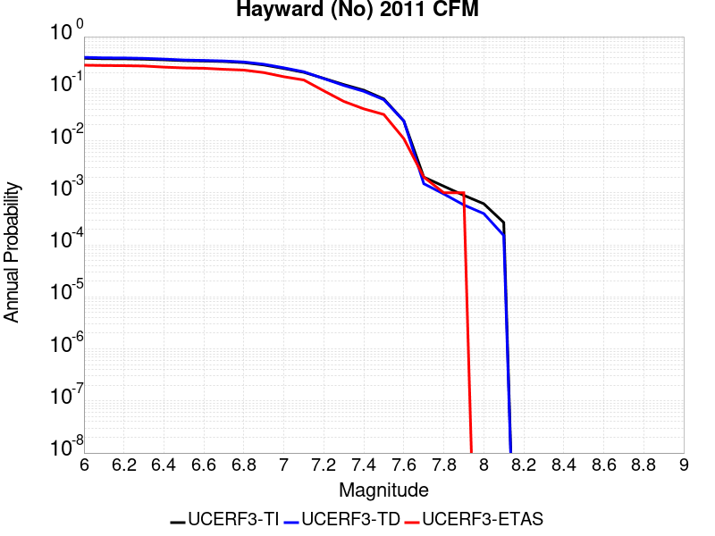 |
|-----|

| Magnitude | UCERF3-TI Prob | UCERF3-TD Prob | UCERF3-ETAS Prob |
|-----|-----|-----|-----|
| 6.0 | 0.3846972 | 0.4012663 | 0.28633407 |
| 6.1 | 0.37657306 | 0.3918173 | 0.28416485 |
| 6.2 | 0.37498528 | 0.39005923 | 0.28199565 |
| 6.3 | 0.36931512 | 0.38321412 | 0.27765727 |
| 6.4 | 0.3591127 | 0.3707765 | 0.2635575 |
| 6.5 | 0.34649017 | 0.35625872 | 0.2537961 |
| 6.6 | 0.34083936 | 0.34953633 | 0.2494577 |
| 6.7 | 0.33358535 | 0.34178486 | 0.23861171 |
| 6.8 | 0.31777754 | 0.32640898 | 0.23101953 |
| 6.9 | 0.28608674 | 0.29542243 | 0.20498915 |
| 7.0 | 0.24497768 | 0.25224787 | 0.17028199 |
| 7.1 | 0.20642045 | 0.21165612 | 0.14642082 |
| 7.2 | 0.15800568 | 0.15635845 | 0.09110629 |
| 7.3 | 0.1201086 | 0.115539804 | 0.055314533 |
| 7.4 | 0.09358045 | 0.08910302 | 0.040130153 |
| 7.5 | 0.06381356 | 0.061519932 | 0.031453364 |
| 7.6 | 0.024054775 | 0.024090892 | 0.011930586 |
| 7.7 | 0.002001616 | 0.0014954435 | 0.0021691974 |
| 7.8 | 0.0013368443 | 9.491191E-4 | 0.0010845987 |
| 7.9 | 8.940059E-4 | 5.8415736E-4 | 0.0010845987 |
| 8.0 | 6.1598147E-4 | 3.9858458E-4 | 0.0 |
| 8.1 | 2.6808548E-4 | 1.5116118E-4 | 0.0 |

## Hayward (So) 2011 CFM
*[(top)](#table-of-contents)*

| 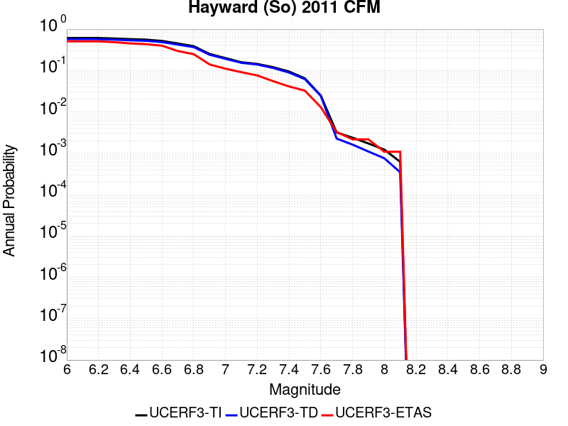 |
|-----|

| Magnitude | UCERF3-TI Prob | UCERF3-TD Prob | UCERF3-ETAS Prob |
|-----|-----|-----|-----|
| 6.0 | 0.6109691 | 0.5721539 | 0.5065076 |
| 6.1 | 0.6109691 | 0.5721539 | 0.5065076 |
| 6.2 | 0.6109691 | 0.5721539 | 0.5065076 |
| 6.3 | 0.5950376 | 0.5575803 | 0.48373103 |
| 6.4 | 0.57359236 | 0.53717965 | 0.45227766 |
| 6.5 | 0.5569463 | 0.52221316 | 0.43383947 |
| 6.6 | 0.519513 | 0.48651788 | 0.39804772 |
| 6.7 | 0.45036823 | 0.42314643 | 0.29609543 |
| 6.8 | 0.38727903 | 0.367249 | 0.2483731 |
| 6.9 | 0.25150874 | 0.24067825 | 0.13991323 |
| 7.0 | 0.19957374 | 0.19133642 | 0.11062907 |
| 7.1 | 0.15844108 | 0.15340011 | 0.09110629 |
| 7.2 | 0.14426224 | 0.13947816 | 0.07592191 |
| 7.3 | 0.12027927 | 0.115113765 | 0.055314533 |
| 7.4 | 0.09439483 | 0.08950806 | 0.04121475 |
| 7.5 | 0.064526096 | 0.061806526 | 0.03253796 |
| 7.6 | 0.024810871 | 0.024410008 | 0.013015185 |
| 7.7 | 0.0031694195 | 0.0022603497 | 0.0032537961 |
| 7.8 | 0.002373538 | 0.0016156127 | 0.0021691974 |
| 7.9 | 0.0017212838 | 0.0010988745 | 0.0021691974 |
| 8.0 | 0.0012239015 | 7.550756E-4 | 0.0010845987 |
| 8.1 | 6.198083E-4 | 3.4651786E-4 | 0.0010845987 |

## Hayward (So) extension 2011 CFM
*[(top)](#table-of-contents)*

| 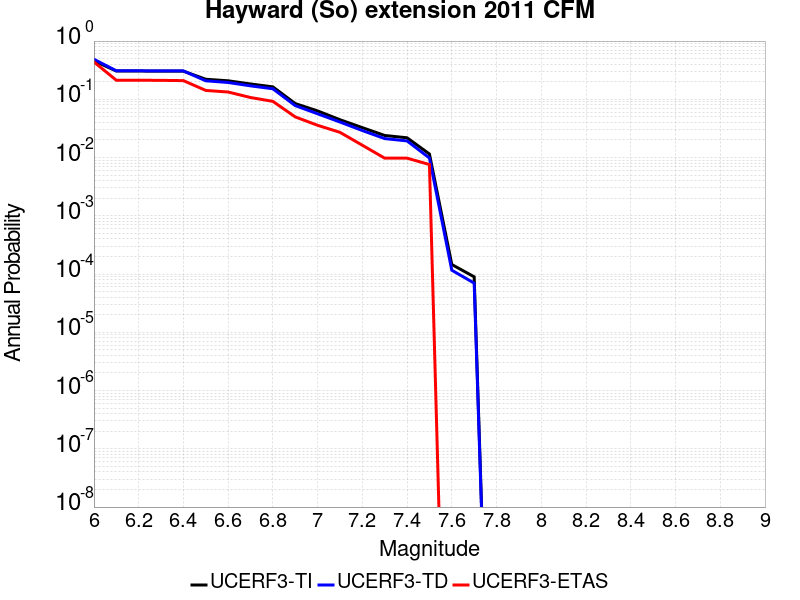 |
|-----|

| Magnitude | UCERF3-TI Prob | UCERF3-TD Prob | UCERF3-ETAS Prob |
|-----|-----|-----|-----|
| 6.0 | 0.45753637 | 0.48693106 | 0.43817788 |
| 6.1 | 0.30568475 | 0.30867684 | 0.21258135 |
| 6.2 | 0.30568475 | 0.30867684 | 0.21258135 |
| 6.3 | 0.30493137 | 0.3078691 | 0.21149674 |
| 6.4 | 0.30423492 | 0.3071051 | 0.20932755 |
| 6.5 | 0.22100103 | 0.20790425 | 0.14208242 |
| 6.6 | 0.20788307 | 0.1944373 | 0.13340564 |
| 6.7 | 0.18347177 | 0.1702355 | 0.10737527 |
| 6.8 | 0.16353269 | 0.15158907 | 0.09219089 |
| 6.9 | 0.084538646 | 0.077979274 | 0.04989154 |
| 7.0 | 0.063189246 | 0.05641731 | 0.03579176 |
| 7.1 | 0.044637766 | 0.040739276 | 0.027114967 |
| 7.2 | 0.0326127 | 0.029081976 | 0.01626898 |
| 7.3 | 0.023948465 | 0.021166936 | 0.009761388 |
| 7.4 | 0.021852091 | 0.019304875 | 0.009761388 |
| 7.5 | 0.011510333 | 0.009822774 | 0.007592191 |
| 7.6 | 1.4584149E-4 | 1.163434E-4 | 0.0 |
| 7.7 | 8.970515E-5 | 6.991908E-5 | 0.0 |

## Hector Mine
*[(top)](#table-of-contents)*

| 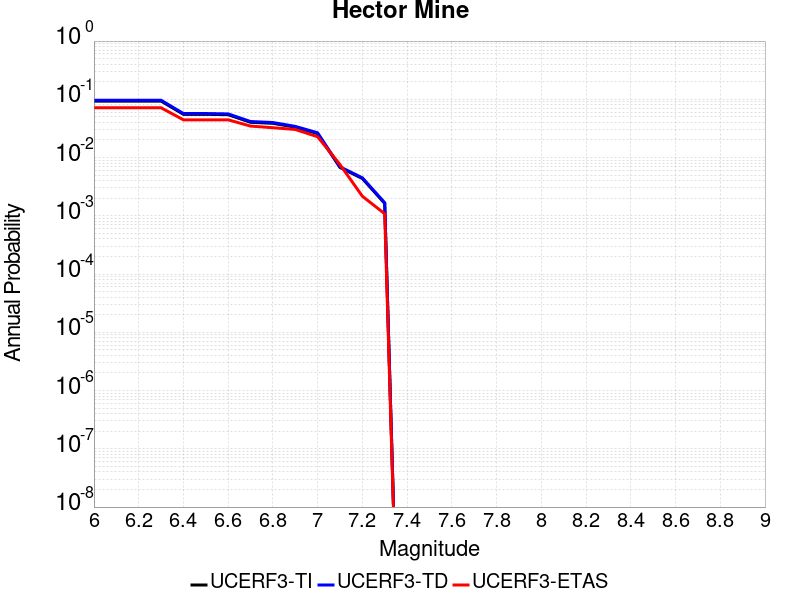 |
|-----|

| Magnitude | UCERF3-TI Prob | UCERF3-TD Prob | UCERF3-ETAS Prob |
|-----|-----|-----|-----|
| 6.0 | 0.09324991 | 0.09647095 | 0.07158352 |
| 6.1 | 0.09324991 | 0.09647095 | 0.07158352 |
| 6.2 | 0.09324991 | 0.09647095 | 0.07158352 |
| 6.3 | 0.09324991 | 0.09647095 | 0.07158352 |
| 6.4 | 0.055228923 | 0.057018813 | 0.04446855 |
| 6.5 | 0.055228923 | 0.057018813 | 0.04446855 |
| 6.6 | 0.054453067 | 0.05622072 | 0.04446855 |
| 6.7 | 0.040289685 | 0.041584637 | 0.03470716 |
| 6.8 | 0.038721114 | 0.03997436 | 0.03253796 |
| 6.9 | 0.03321152 | 0.03431624 | 0.030368764 |
| 7.0 | 0.025731606 | 0.026621195 | 0.022776572 |
| 7.1 | 0.0067589898 | 0.0069397967 | 0.007592191 |
| 7.2 | 0.0043696174 | 0.0044910545 | 0.0021691974 |
| 7.3 | 0.0016319347 | 0.0016783773 | 0.0010845987 |

## Helendale-So Lockhart
*[(top)](#table-of-contents)*

| 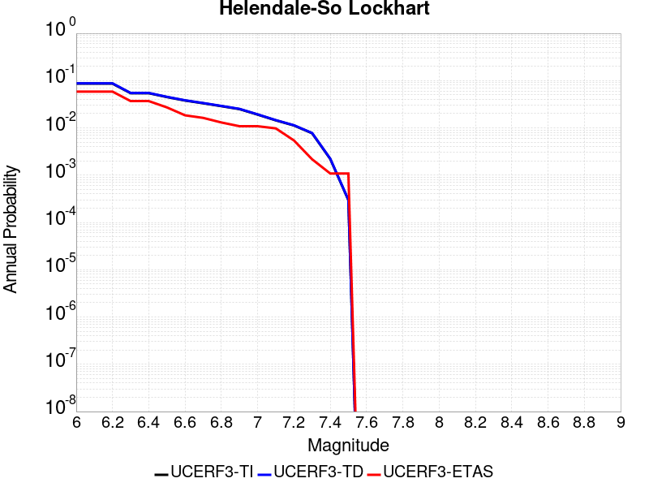 |
|-----|

| Magnitude | UCERF3-TI Prob | UCERF3-TD Prob | UCERF3-ETAS Prob |
|-----|-----|-----|-----|
| 6.0 | 0.08629648 | 0.087622285 | 0.05856833 |
| 6.1 | 0.08629648 | 0.087622285 | 0.05856833 |
| 6.2 | 0.08629648 | 0.087622285 | 0.05856833 |
| 6.3 | 0.054149 | 0.0548551 | 0.036876354 |
| 6.4 | 0.054149 | 0.0548551 | 0.036876354 |
| 6.5 | 0.044829447 | 0.04540389 | 0.027114967 |
| 6.6 | 0.03786102 | 0.038343225 | 0.018438177 |
| 6.7 | 0.033145845 | 0.033567674 | 0.01626898 |
| 6.8 | 0.028797831 | 0.029157083 | 0.013015185 |
| 6.9 | 0.024933796 | 0.02523998 | 0.010845987 |
| 7.0 | 0.019089017 | 0.019321522 | 0.010845987 |
| 7.1 | 0.014431232 | 0.014603927 | 0.009761388 |
| 7.2 | 0.011244489 | 0.011379005 | 0.0054229936 |
| 7.3 | 0.0077048587 | 0.007798211 | 0.0021691974 |
| 7.4 | 0.0022058373 | 0.002233834 | 0.0010845987 |
| 7.5 | 2.9707275E-4 | 3.0089388E-4 | 0.0010845987 |

## Hilton Creek 2011 CFM
*[(top)](#table-of-contents)*

| 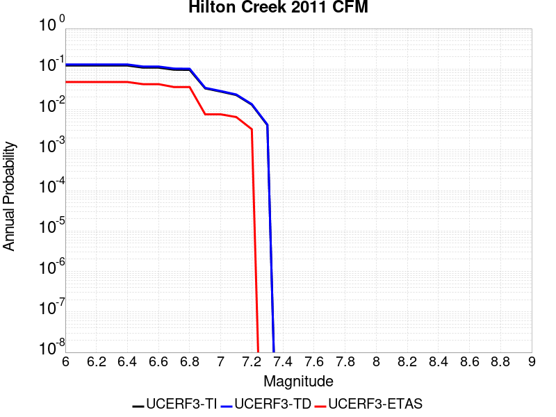 |
|-----|

| Magnitude | UCERF3-TI Prob | UCERF3-TD Prob | UCERF3-ETAS Prob |
|-----|-----|-----|-----|
| 6.0 | 0.12194833 | 0.12957494 | 0.047722343 |
| 6.1 | 0.12194833 | 0.12957494 | 0.047722343 |
| 6.2 | 0.12194833 | 0.12957494 | 0.047722343 |
| 6.3 | 0.12194833 | 0.12957494 | 0.047722343 |
| 6.4 | 0.12194833 | 0.12957494 | 0.047722343 |
| 6.5 | 0.10828239 | 0.115225926 | 0.04229935 |
| 6.6 | 0.10828239 | 0.115225926 | 0.04229935 |
| 6.7 | 0.0962607 | 0.102584 | 0.03579176 |
| 6.8 | 0.095201574 | 0.10149542 | 0.03579176 |
| 6.9 | 0.033250026 | 0.034290895 | 0.007592191 |
| 7.0 | 0.027723974 | 0.028583506 | 0.007592191 |
| 7.1 | 0.022785192 | 0.023476202 | 0.0065075923 |
| 7.2 | 0.013142738 | 0.013556731 | 0.0032537961 |
| 7.3 | 0.0041136323 | 0.0042432984 | 0.0 |

## Hollywood
*[(top)](#table-of-contents)*

| 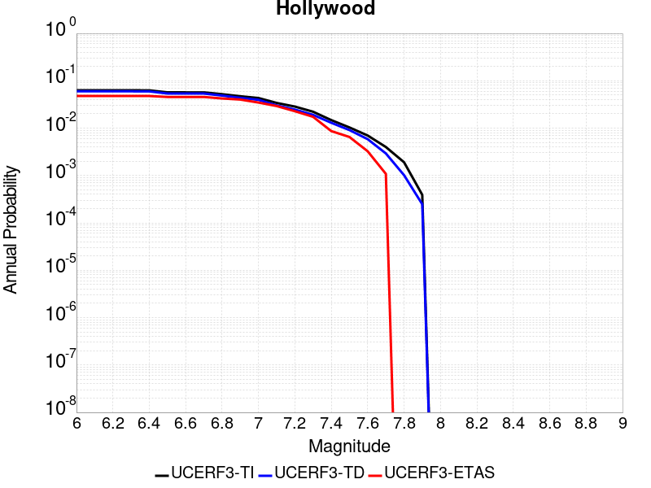 |
|-----|

| Magnitude | UCERF3-TI Prob | UCERF3-TD Prob | UCERF3-ETAS Prob |
|-----|-----|-----|-----|
| 6.0 | 0.06289155 | 0.059827466 | 0.047722343 |
| 6.1 | 0.06289155 | 0.059827466 | 0.047722343 |
| 6.2 | 0.06289155 | 0.059827466 | 0.047722343 |
| 6.3 | 0.06289155 | 0.059827466 | 0.047722343 |
| 6.4 | 0.06280481 | 0.05973813 | 0.047722343 |
| 6.5 | 0.05697326 | 0.053771354 | 0.045553144 |
| 6.6 | 0.056933124 | 0.05373005 | 0.045553144 |
| 6.7 | 0.056910165 | 0.053706195 | 0.045553144 |
| 6.8 | 0.052092183 | 0.048715193 | 0.04229935 |
| 6.9 | 0.047130525 | 0.043579713 | 0.040130153 |
| 7.0 | 0.043256037 | 0.039582748 | 0.03470716 |
| 7.1 | 0.03407172 | 0.030182032 | 0.029284164 |
| 7.2 | 0.028538829 | 0.02463589 | 0.022776572 |
| 7.3 | 0.022217473 | 0.019094823 | 0.01735358 |
| 7.4 | 0.014786968 | 0.01298258 | 0.00867679 |
| 7.5 | 0.010343789 | 0.009101605 | 0.0065075923 |
| 7.6 | 0.006993889 | 0.005860771 | 0.0032537961 |
| 7.7 | 0.0040011248 | 0.0029250956 | 0.0010845987 |
| 7.8 | 0.0019059414 | 0.0010173823 | 0.0 |
| 7.9 | 3.9139015E-4 | 2.4798317E-4 | 0.0 |

## Holser alt 1
*[(top)](#table-of-contents)*

| 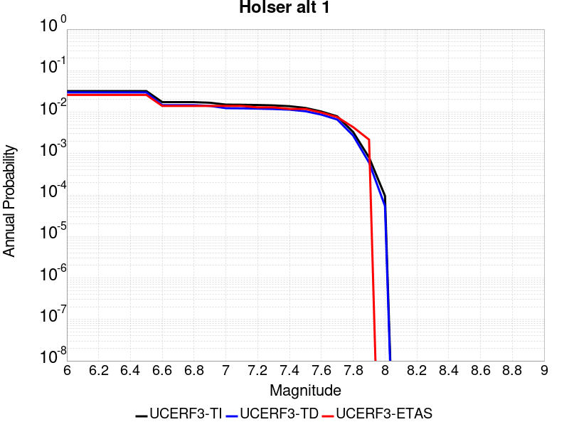 |
|-----|

| Magnitude | UCERF3-TI Prob | UCERF3-TD Prob | UCERF3-ETAS Prob |
|-----|-----|-----|-----|
| 6.0 | 0.032210246 | 0.029849214 | 0.02603037 |
| 6.1 | 0.032210246 | 0.029849214 | 0.02603037 |
| 6.2 | 0.032210246 | 0.029849214 | 0.02603037 |
| 6.3 | 0.032210246 | 0.029849214 | 0.02603037 |
| 6.4 | 0.032210246 | 0.029849214 | 0.02603037 |
| 6.5 | 0.032210246 | 0.029849214 | 0.02603037 |
| 6.6 | 0.01746037 | 0.014764396 | 0.014099783 |
| 6.7 | 0.01746037 | 0.014764396 | 0.014099783 |
| 6.8 | 0.017412733 | 0.014716153 | 0.014099783 |
| 6.9 | 0.016831368 | 0.014126347 | 0.014099783 |
| 7.0 | 0.015190874 | 0.012461725 | 0.014099783 |
| 7.1 | 0.015063027 | 0.012341308 | 0.014099783 |
| 7.2 | 0.014850604 | 0.012141859 | 0.013015185 |
| 7.3 | 0.014533521 | 0.011884883 | 0.013015185 |
| 7.4 | 0.013905419 | 0.011465767 | 0.011930586 |
| 7.5 | 0.012622521 | 0.010502689 | 0.011930586 |
| 7.6 | 0.0103373425 | 0.008707568 | 0.009761388 |
| 7.7 | 0.007915052 | 0.006627228 | 0.007592191 |
| 7.8 | 0.0033073076 | 0.0027149527 | 0.004338395 |
| 7.9 | 8.063259E-4 | 6.0726475E-4 | 0.0021691974 |
| 8.0 | 9.552299E-5 | 5.4546945E-5 | 0.0 |

## Homestead Valley 2011
*[(top)](#table-of-contents)*

| 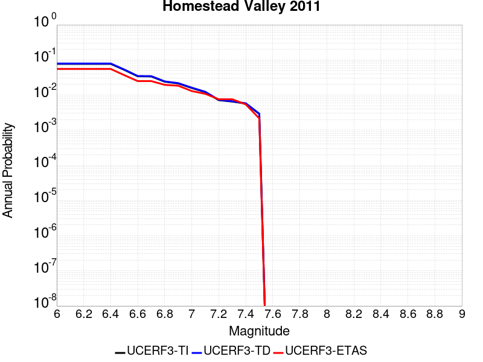 |
|-----|

| Magnitude | UCERF3-TI Prob | UCERF3-TD Prob | UCERF3-ETAS Prob |
|-----|-----|-----|-----|
| 6.0 | 0.077202 | 0.0790224 | 0.055314533 |
| 6.1 | 0.077202 | 0.0790224 | 0.055314533 |
| 6.2 | 0.077202 | 0.0790224 | 0.055314533 |
| 6.3 | 0.077202 | 0.0790224 | 0.055314533 |
| 6.4 | 0.077202 | 0.0790224 | 0.055314533 |
| 6.5 | 0.052153707 | 0.053370025 | 0.036876354 |
| 6.6 | 0.034177702 | 0.034896854 | 0.02494577 |
| 6.7 | 0.033828568 | 0.03454091 | 0.02494577 |
| 6.8 | 0.023961887 | 0.02447441 | 0.019522777 |
| 6.9 | 0.021384893 | 0.02184814 | 0.018438177 |
| 7.0 | 0.015877726 | 0.016228428 | 0.013015185 |
| 7.1 | 0.012139965 | 0.012405675 | 0.010845987 |
| 7.2 | 0.007151049 | 0.0073000193 | 0.007592191 |
| 7.3 | 0.0065390663 | 0.006675349 | 0.007592191 |
| 7.4 | 0.0057202005 | 0.0058401837 | 0.0054229936 |
| 7.5 | 0.002895319 | 0.0029575885 | 0.0021691974 |

## Honey Lake 2011 CFM
*[(top)](#table-of-contents)*

| 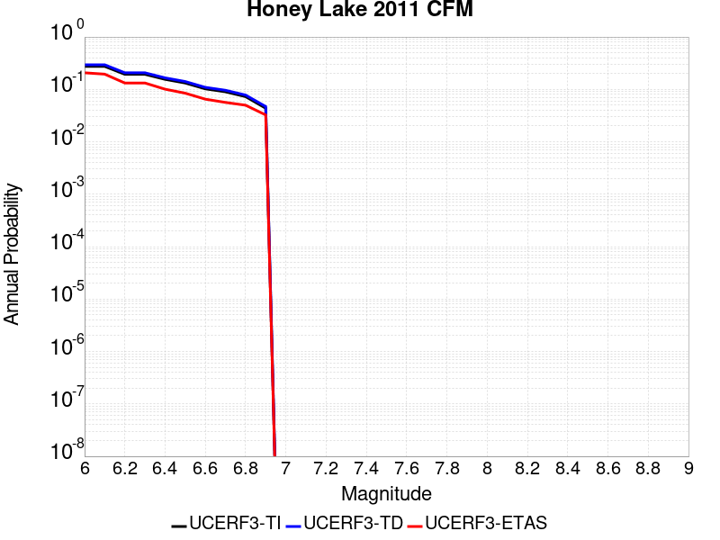 |
|-----|

| Magnitude | UCERF3-TI Prob | UCERF3-TD Prob | UCERF3-ETAS Prob |
|-----|-----|-----|-----|
| 6.0 | 0.2747185 | 0.29480425 | 0.20715836 |
| 6.1 | 0.2747185 | 0.29480425 | 0.19522777 |
| 6.2 | 0.19401062 | 0.2072126 | 0.13232104 |
| 6.3 | 0.19401062 | 0.2072126 | 0.13232104 |
| 6.4 | 0.15551512 | 0.1659182 | 0.10086768 |
| 6.5 | 0.13234088 | 0.14119494 | 0.0845987 |
| 6.6 | 0.10234764 | 0.1093125 | 0.06507592 |
| 6.7 | 0.08993582 | 0.096148506 | 0.056399133 |
| 6.8 | 0.072745554 | 0.07793148 | 0.04989154 |
| 6.9 | 0.043704968 | 0.04708204 | 0.03253796 |

## Hosgri
*[(top)](#table-of-contents)*

| 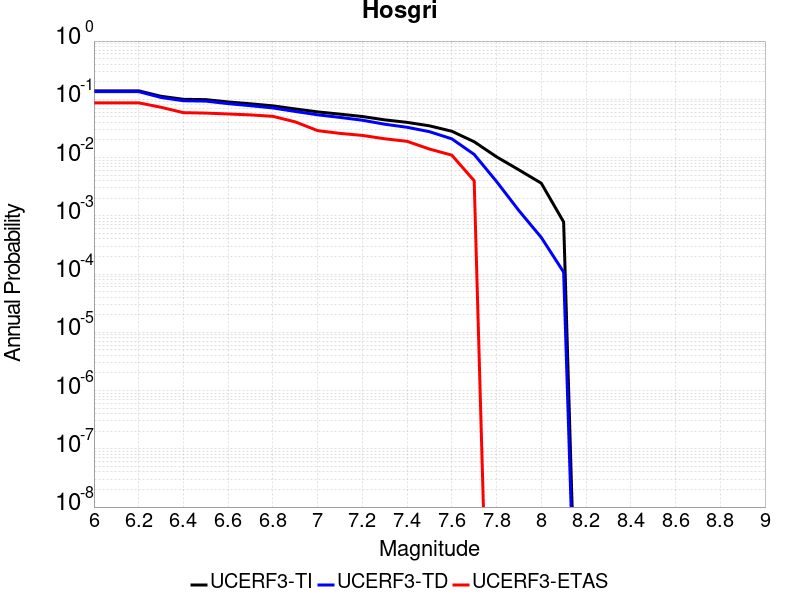 |
|-----|

| Magnitude | UCERF3-TI Prob | UCERF3-TD Prob | UCERF3-ETAS Prob |
|-----|-----|-----|-----|
| 6.0 | 0.13970852 | 0.13559055 | 0.0889371 |
| 6.1 | 0.13970852 | 0.13559055 | 0.0889371 |
| 6.2 | 0.13970852 | 0.13559055 | 0.0889371 |
| 6.3 | 0.11269419 | 0.10751222 | 0.07375271 |
| 6.4 | 0.10001714 | 0.09442747 | 0.05965293 |
| 6.5 | 0.09874168 | 0.093118854 | 0.05856833 |
| 6.6 | 0.090106845 | 0.08424276 | 0.056399133 |
| 6.7 | 0.083736636 | 0.07770332 | 0.054229934 |
| 6.8 | 0.0772173 | 0.07101269 | 0.05097614 |
| 6.9 | 0.068336695 | 0.061897192 | 0.040130153 |
| 7.0 | 0.06084568 | 0.054212186 | 0.027114967 |
| 7.1 | 0.055646095 | 0.048888225 | 0.02494577 |
| 7.2 | 0.0506523 | 0.043776117 | 0.023861172 |
| 7.3 | 0.04438523 | 0.037363507 | 0.020607375 |
| 7.4 | 0.04021436 | 0.033102565 | 0.018438177 |
| 7.5 | 0.035051465 | 0.027822958 | 0.014099783 |
| 7.6 | 0.028307525 | 0.02096164 | 0.010845987 |
| 7.7 | 0.018683232 | 0.011321478 | 0.004338395 |
| 7.8 | 0.010305807 | 0.0038807224 | 0.0 |
| 7.9 | 0.006147886 | 0.0012287537 | 0.0 |
| 8.0 | 0.0036265813 | 4.2517795E-4 | 0.0 |
| 8.1 | 7.841067E-4 | 1.0794174E-4 | 0.0 |

## Hosgri (Extension)
*[(top)](#table-of-contents)*

| 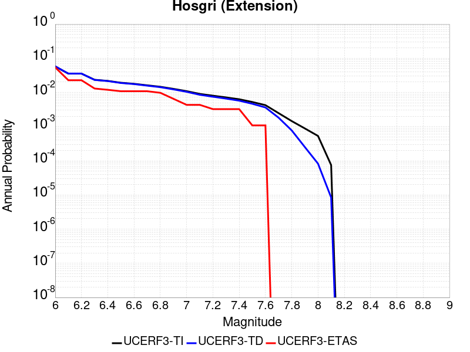 |
|-----|

| Magnitude | UCERF3-TI Prob | UCERF3-TD Prob | UCERF3-ETAS Prob |
|-----|-----|-----|-----|
| 6.0 | 0.057597544 | 0.058300912 | 0.054229934 |
| 6.1 | 0.035538975 | 0.035608172 | 0.022776572 |
| 6.2 | 0.035538975 | 0.035608172 | 0.022776572 |
| 6.3 | 0.023453888 | 0.023238298 | 0.013015185 |
| 6.4 | 0.021769023 | 0.02151937 | 0.011930586 |
| 6.5 | 0.019209856 | 0.018910011 | 0.010845987 |
| 6.6 | 0.017894404 | 0.017565984 | 0.010845987 |
| 6.7 | 0.016165596 | 0.015799537 | 0.010845987 |
| 6.8 | 0.014653327 | 0.014254218 | 0.009761388 |
| 6.9 | 0.012723585 | 0.01228274 | 0.0065075923 |
| 7.0 | 0.0109019 | 0.010422341 | 0.004338395 |
| 7.1 | 0.009060657 | 0.008542745 | 0.004338395 |
| 7.2 | 0.008032598 | 0.0074936016 | 0.0032537961 |
| 7.3 | 0.0071618976 | 0.006605033 | 0.0032537961 |
| 7.4 | 0.006317008 | 0.005742708 | 0.0032537961 |
| 7.5 | 0.005256759 | 0.0046610646 | 0.0010845987 |
| 7.6 | 0.0042465506 | 0.0036304316 | 0.0010845987 |
| 7.7 | 0.002479482 | 0.0018263839 | 0.0 |
| 7.8 | 0.001450965 | 7.74419E-4 | 0.0 |
| 7.9 | 8.8393607E-4 | 2.5184572E-4 | 0.0 |
| 8.0 | 5.334093E-4 | 8.2623985E-5 | 0.0 |
| 8.1 | 7.498371E-5 | 8.4530975E-6 | 0.0 |

## Hunter Mountain-Saline Valley
*[(top)](#table-of-contents)*

| 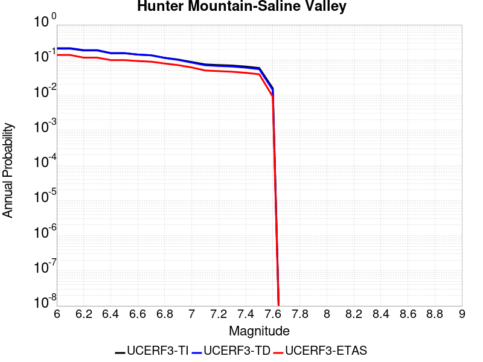 |
|-----|

| Magnitude | UCERF3-TI Prob | UCERF3-TD Prob | UCERF3-ETAS Prob |
|-----|-----|-----|-----|
| 6.0 | 0.20970567 | 0.21587577 | 0.13449024 |
| 6.1 | 0.20970567 | 0.21587577 | 0.13449024 |
| 6.2 | 0.18567602 | 0.18981062 | 0.11171366 |
| 6.3 | 0.18567602 | 0.18981062 | 0.11171366 |
| 6.4 | 0.15515363 | 0.15662356 | 0.09652928 |
| 6.5 | 0.15515363 | 0.15662356 | 0.09652928 |
| 6.6 | 0.14179814 | 0.14234217 | 0.09002169 |
| 6.7 | 0.13514791 | 0.13525875 | 0.0867679 |
| 6.8 | 0.11489274 | 0.11365478 | 0.077006504 |
| 6.9 | 0.10234502 | 0.10026583 | 0.06941432 |
| 7.0 | 0.08708893 | 0.08398007 | 0.05965293 |
| 7.1 | 0.07435555 | 0.07046026 | 0.047722343 |
| 7.2 | 0.071319014 | 0.06725717 | 0.046637744 |
| 7.3 | 0.06913756 | 0.064973876 | 0.045553144 |
| 7.4 | 0.06465672 | 0.060332596 | 0.04338395 |
| 7.5 | 0.058710787 | 0.05462428 | 0.040130153 |
| 7.6 | 0.015519869 | 0.01397219 | 0.009761388 |

## Hunting Creek - Bartlett Springs connector 2011
*[(top)](#table-of-contents)*

| 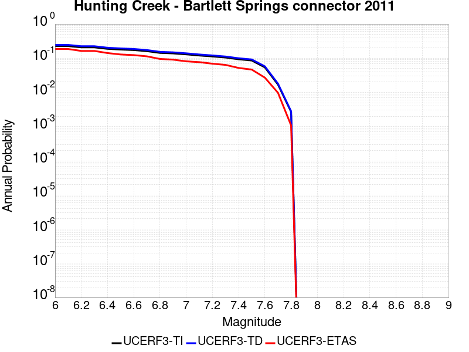 |
|-----|

| Magnitude | UCERF3-TI Prob | UCERF3-TD Prob | UCERF3-ETAS Prob |
|-----|-----|-----|-----|
| 6.0 | 0.22722654 | 0.24605848 | 0.18655097 |
| 6.1 | 0.22722654 | 0.24605848 | 0.18655097 |
| 6.2 | 0.20814134 | 0.22513917 | 0.1637744 |
| 6.3 | 0.20814134 | 0.22513917 | 0.1637744 |
| 6.4 | 0.18838054 | 0.20341806 | 0.14208242 |
| 6.5 | 0.18000318 | 0.19429037 | 0.12906724 |
| 6.6 | 0.17357917 | 0.18730906 | 0.123644255 |
| 6.7 | 0.16134039 | 0.17398383 | 0.11388286 |
| 6.8 | 0.14333804 | 0.15430407 | 0.09544469 |
| 6.9 | 0.13866632 | 0.14914358 | 0.09110629 |
| 7.0 | 0.13003138 | 0.13971207 | 0.0813449 |
| 7.1 | 0.12028447 | 0.12906416 | 0.077006504 |
| 7.2 | 0.112894095 | 0.121080436 | 0.06941432 |
| 7.3 | 0.104986824 | 0.11255994 | 0.06399132 |
| 7.4 | 0.093364604 | 0.10011979 | 0.05206074 |
| 7.5 | 0.08606876 | 0.092273146 | 0.046637744 |
| 7.6 | 0.05407295 | 0.058005955 | 0.027114967 |
| 7.7 | 0.017001374 | 0.018083774 | 0.009761388 |
| 7.8 | 0.0027020678 | 0.0028156983 | 0.0010845987 |

## Hunting Creek - Berryessa 2011 CFM
*[(top)](#table-of-contents)*

| 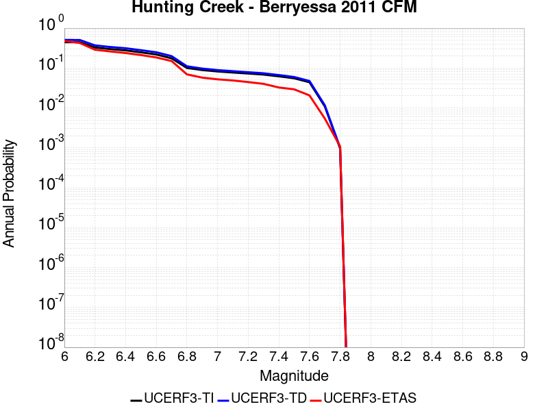 |
|-----|

| Magnitude | UCERF3-TI Prob | UCERF3-TD Prob | UCERF3-ETAS Prob |
|-----|-----|-----|-----|
| 6.0 | 0.44463897 | 0.5062021 | 0.47722343 |
| 6.1 | 0.44372272 | 0.50527656 | 0.4251627 |
| 6.2 | 0.32724717 | 0.36899638 | 0.28741866 |
| 6.3 | 0.2982633 | 0.3369673 | 0.26030368 |
| 6.4 | 0.2770237 | 0.31354383 | 0.23752712 |
| 6.5 | 0.24700193 | 0.2801119 | 0.21149674 |
| 6.6 | 0.21870908 | 0.24834614 | 0.18438178 |
| 6.7 | 0.17503452 | 0.19869792 | 0.14967462 |
| 6.8 | 0.10046923 | 0.11063402 | 0.06941432 |
| 6.9 | 0.0890337 | 0.09695625 | 0.057483733 |
| 7.0 | 0.08208878 | 0.08880856 | 0.05206074 |
| 7.1 | 0.07725947 | 0.08339136 | 0.048806943 |
| 7.2 | 0.07285567 | 0.07856353 | 0.04446855 |
| 7.3 | 0.068577714 | 0.07387603 | 0.040130153 |
| 7.4 | 0.06193298 | 0.06671597 | 0.03253796 |
| 7.5 | 0.05535337 | 0.059607886 | 0.029284164 |
| 7.6 | 0.043997526 | 0.04737618 | 0.020607375 |
| 7.7 | 0.010894411 | 0.01165327 | 0.0054229936 |
| 7.8 | 9.6110074E-4 | 0.0010080511 | 0.0010845987 |

## Imperial
*[(top)](#table-of-contents)*

| 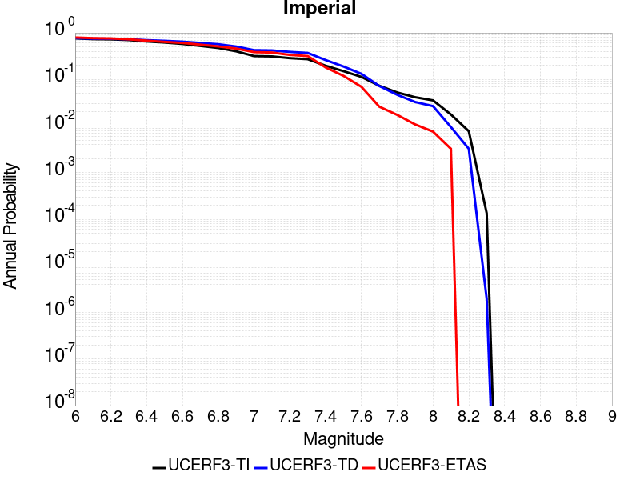 |
|-----|

| Magnitude | UCERF3-TI Prob | UCERF3-TD Prob | UCERF3-ETAS Prob |
|-----|-----|-----|-----|
| 6.0 | 0.7618662 | 0.7717569 | 0.79392624 |
| 6.1 | 0.7337205 | 0.7506863 | 0.7689805 |
| 6.2 | 0.7261765 | 0.7457164 | 0.7581345 |
| 6.3 | 0.7020896 | 0.7291224 | 0.7266811 |
| 6.4 | 0.6533989 | 0.6960259 | 0.6800434 |
| 6.5 | 0.6201573 | 0.6741712 | 0.63991326 |
| 6.6 | 0.57916355 | 0.64658755 | 0.6084599 |
| 6.7 | 0.52397025 | 0.60808265 | 0.55748373 |
| 6.8 | 0.4741486 | 0.5702102 | 0.5119306 |
| 6.9 | 0.40220103 | 0.50816387 | 0.45986986 |
| 7.0 | 0.3174495 | 0.42535508 | 0.38611713 |
| 7.1 | 0.3123315 | 0.4197289 | 0.37852496 |
| 7.2 | 0.28638014 | 0.39029214 | 0.3362256 |
| 7.3 | 0.27216348 | 0.37091047 | 0.3177874 |
| 7.4 | 0.19677505 | 0.26072234 | 0.18112798 |
| 7.5 | 0.15070176 | 0.18945606 | 0.11930586 |
| 7.6 | 0.11343383 | 0.13198361 | 0.06941432 |
| 7.7 | 0.073286414 | 0.072308294 | 0.02603037 |
| 7.8 | 0.052587453 | 0.046877466 | 0.01735358 |
| 7.9 | 0.041573696 | 0.032793093 | 0.010845987 |
| 8.0 | 0.035553772 | 0.026762247 | 0.007592191 |
| 8.1 | 0.017731063 | 0.009515963 | 0.0032537961 |
| 8.2 | 0.007748034 | 0.0032489 | 0.0 |
| 8.3 | 1.3439257E-4 | 1.9154713E-6 | 0.0 |

## Incline Village 2011 CFM
*[(top)](#table-of-contents)*

| 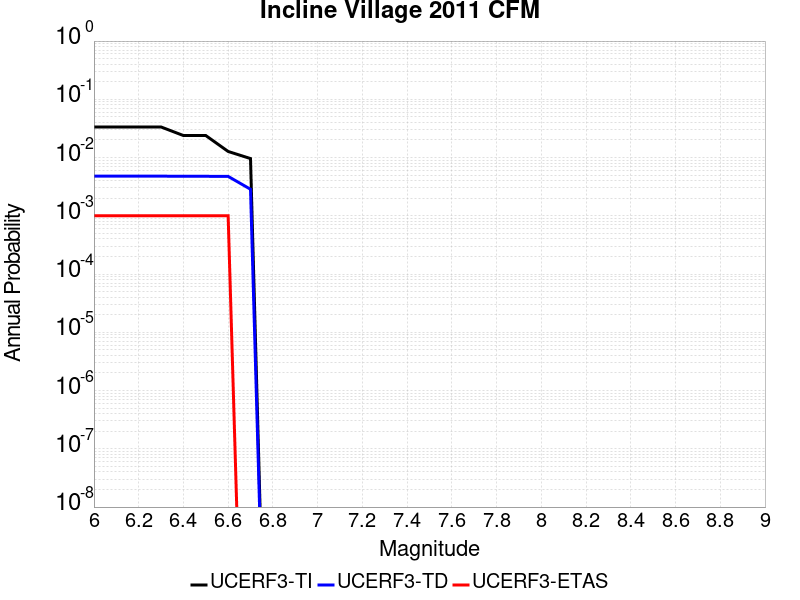 |
|-----|

| Magnitude | UCERF3-TI Prob | UCERF3-TD Prob | UCERF3-ETAS Prob |
|-----|-----|-----|-----|
| 6.0 | 0.0335096 | 0.0047971704 | 0.0 |
| 6.1 | 0.0335096 | 0.0047971704 | 0.0 |
| 6.2 | 0.0335096 | 0.0047971704 | 0.0 |
| 6.3 | 0.0335096 | 0.0047971704 | 0.0 |
| 6.4 | 0.023885911 | 0.004767974 | 0.0 |
| 6.5 | 0.023885911 | 0.004767974 | 0.0 |
| 6.6 | 0.012726118 | 0.004751801 | 0.0 |
| 6.7 | 0.009612365 | 0.0028569808 | 0.0 |

## Independence rev 2011
*[(top)](#table-of-contents)*

| 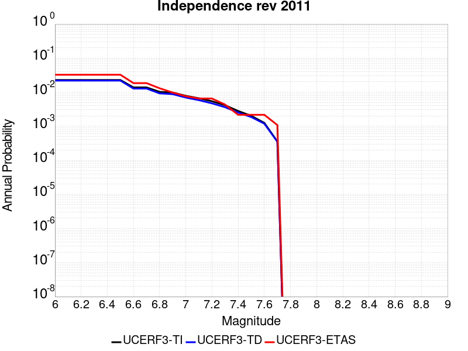 |
|-----|

| Magnitude | UCERF3-TI Prob | UCERF3-TD Prob | UCERF3-ETAS Prob |
|-----|-----|-----|-----|
| 6.0 | 0.022810131 | 0.021864114 | 0.03253796 |
| 6.1 | 0.022810131 | 0.021864114 | 0.03253796 |
| 6.2 | 0.022810131 | 0.021864114 | 0.03253796 |
| 6.3 | 0.022810131 | 0.021864114 | 0.03253796 |
| 6.4 | 0.022810131 | 0.021864114 | 0.03253796 |
| 6.5 | 0.022810131 | 0.021864114 | 0.03253796 |
| 6.6 | 0.013802908 | 0.012766637 | 0.018438177 |
| 6.7 | 0.013802908 | 0.012766637 | 0.018438177 |
| 6.8 | 0.010235075 | 0.00920383 | 0.013015185 |
| 6.9 | 0.009755742 | 0.008753846 | 0.009761388 |
| 7.0 | 0.007819791 | 0.0069482643 | 0.007592191 |
| 7.1 | 0.006616909 | 0.00582592 | 0.0065075923 |
| 7.2 | 0.0054206434 | 0.004706197 | 0.0065075923 |
| 7.3 | 0.004137016 | 0.0036235712 | 0.004338395 |
| 7.4 | 0.0028081334 | 0.0025264372 | 0.0021691974 |
| 7.5 | 0.002025193 | 0.0018608585 | 0.0021691974 |
| 7.6 | 0.0012592821 | 0.0011924453 | 0.0021691974 |
| 7.7 | 3.563058E-4 | 3.5158033E-4 | 0.0010845987 |

## Jess Valley
*[(top)](#table-of-contents)*

| 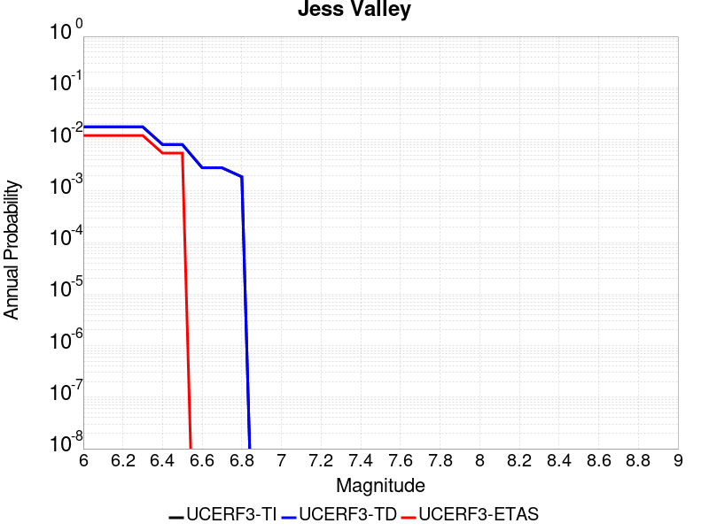 |
|-----|

| Magnitude | UCERF3-TI Prob | UCERF3-TD Prob | UCERF3-ETAS Prob |
|-----|-----|-----|-----|
| 6.0 | 0.01751319 | 0.017616915 | 0.011930586 |
| 6.1 | 0.01751319 | 0.017616915 | 0.011930586 |
| 6.2 | 0.01751319 | 0.017616915 | 0.011930586 |
| 6.3 | 0.01751319 | 0.017616915 | 0.011930586 |
| 6.4 | 0.007947254 | 0.0079886755 | 0.0054229936 |
| 6.5 | 0.007947254 | 0.0079886755 | 0.0054229936 |
| 6.6 | 0.0028118168 | 0.0028256767 | 0.0 |
| 6.7 | 0.0028118168 | 0.0028256767 | 0.0 |
| 6.8 | 0.001879707 | 0.0018894162 | 0.0 |

## Johnson Valley (No) 2011 rev
*[(top)](#table-of-contents)*

| 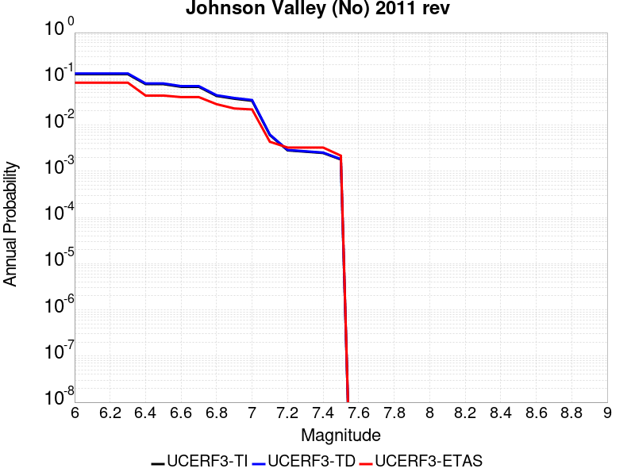 |
|-----|

| Magnitude | UCERF3-TI Prob | UCERF3-TD Prob | UCERF3-ETAS Prob |
|-----|-----|-----|-----|
| 6.0 | 0.12584957 | 0.13057141 | 0.0824295 |
| 6.1 | 0.12584957 | 0.13057141 | 0.0824295 |
| 6.2 | 0.12584957 | 0.13057141 | 0.0824295 |
| 6.3 | 0.12584957 | 0.13057141 | 0.0824295 |
| 6.4 | 0.07671382 | 0.07942677 | 0.04338395 |
| 6.5 | 0.07671382 | 0.07942677 | 0.04338395 |
| 6.6 | 0.06699299 | 0.06941682 | 0.040130153 |
| 6.7 | 0.06699299 | 0.06941682 | 0.040130153 |
| 6.8 | 0.04253781 | 0.04409082 | 0.028199567 |
| 6.9 | 0.03705216 | 0.03844275 | 0.022776572 |
| 7.0 | 0.033423107 | 0.034713928 | 0.021691974 |
| 7.1 | 0.006066713 | 0.0062102703 | 0.004338395 |
| 7.2 | 0.0028209002 | 0.0028832008 | 0.0032537961 |
| 7.3 | 0.0026455077 | 0.002703701 | 0.0032537961 |
| 7.4 | 0.002478989 | 0.0025334586 | 0.0032537961 |
| 7.5 | 0.001791055 | 0.0018308465 | 0.0021691974 |

## Joshua Tree (Seismicity)
*[(top)](#table-of-contents)*

| 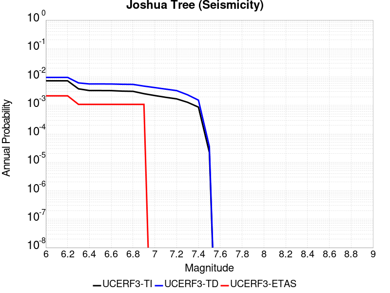 |
|-----|

| Magnitude | UCERF3-TI Prob | UCERF3-TD Prob | UCERF3-ETAS Prob |
|-----|-----|-----|-----|
| 6.0 | 0.0072916425 | 0.009649423 | 0.0021691974 |
| 6.1 | 0.0072916425 | 0.009649423 | 0.0021691974 |
| 6.2 | 0.0072916425 | 0.009649423 | 0.0021691974 |
| 6.3 | 0.003818721 | 0.0061682276 | 0.0010845987 |
| 6.4 | 0.0033247904 | 0.00567416 | 0.0010845987 |
| 6.5 | 0.0033247904 | 0.00567416 | 0.0010845987 |
| 6.6 | 0.003304571 | 0.005653892 | 0.0010845987 |
| 6.7 | 0.0031751583 | 0.0055241096 | 0.0010845987 |
| 6.8 | 0.0031179136 | 0.005461443 | 0.0010845987 |
| 6.9 | 0.0025775868 | 0.0047652596 | 0.0010845987 |
| 7.0 | 0.002215328 | 0.0042197052 | 0.0 |
| 7.1 | 0.0019229418 | 0.003732202 | 0.0 |
| 7.2 | 0.0016930006 | 0.0033079141 | 0.0 |
| 7.3 | 0.0012855664 | 0.0023579055 | 0.0 |
| 7.4 | 8.6865365E-4 | 0.0015254009 | 0.0 |
| 7.5 | 2.2134636E-5 | 3.5662782E-5 | 0.0 |

## Keddie Ridge 2011 CFM
*[(top)](#table-of-contents)*

| 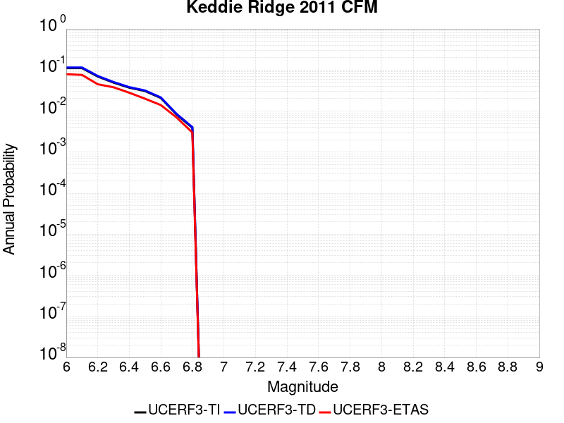 |
|-----|

| Magnitude | UCERF3-TI Prob | UCERF3-TD Prob | UCERF3-ETAS Prob |
|-----|-----|-----|-----|
| 6.0 | 0.11119986 | 0.11523331 | 0.08026031 |
| 6.1 | 0.11119986 | 0.11523331 | 0.077006504 |
| 6.2 | 0.06935486 | 0.07167407 | 0.046637744 |
| 6.3 | 0.049380902 | 0.05097174 | 0.040130153 |
| 6.4 | 0.037147988 | 0.038310874 | 0.029284164 |
| 6.5 | 0.030737747 | 0.03169438 | 0.021691974 |
| 6.6 | 0.020826932 | 0.021471605 | 0.015184382 |
| 6.7 | 0.008226944 | 0.008512631 | 0.007592191 |
| 6.8 | 0.0039149607 | 0.0040694163 | 0.0032537961 |

## Kern Canyon (Lake Isabella) 2011
*[(top)](#table-of-contents)*

| 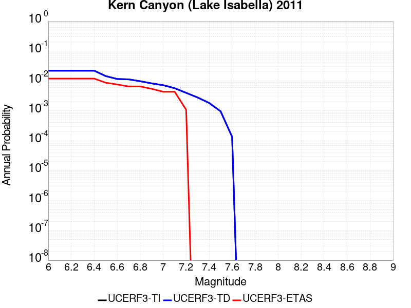 |
|-----|

| Magnitude | UCERF3-TI Prob | UCERF3-TD Prob | UCERF3-ETAS Prob |
|-----|-----|-----|-----|
| 6.0 | 0.021874387 | 0.022023315 | 0.011930586 |
| 6.1 | 0.021874387 | 0.022023315 | 0.011930586 |
| 6.2 | 0.021874387 | 0.022023315 | 0.011930586 |
| 6.3 | 0.021874387 | 0.022023315 | 0.011930586 |
| 6.4 | 0.021874387 | 0.022023315 | 0.011930586 |
| 6.5 | 0.01443055 | 0.014517064 | 0.00867679 |
| 6.6 | 0.011534024 | 0.011600693 | 0.007592191 |
| 6.7 | 0.011225431 | 0.011290831 | 0.0065075923 |
| 6.8 | 0.009702569 | 0.009759309 | 0.0065075923 |
| 6.9 | 0.00821813 | 0.008266583 | 0.0054229936 |
| 7.0 | 0.007160572 | 0.00720314 | 0.004338395 |
| 7.1 | 0.0056801434 | 0.005713656 | 0.004338395 |
| 7.2 | 0.003972118 | 0.003995561 | 0.0010845987 |
| 7.3 | 0.0027754814 | 0.0027914557 | 0.0 |
| 7.4 | 0.0018217715 | 0.0018320574 | 0.0 |
| 7.5 | 9.552997E-4 | 9.60812E-4 | 0.0 |
| 7.6 | 1.3420706E-4 | 1.3499892E-4 | 0.0 |

## Kern Canyon (North Kern) 2011
*[(top)](#table-of-contents)*

| 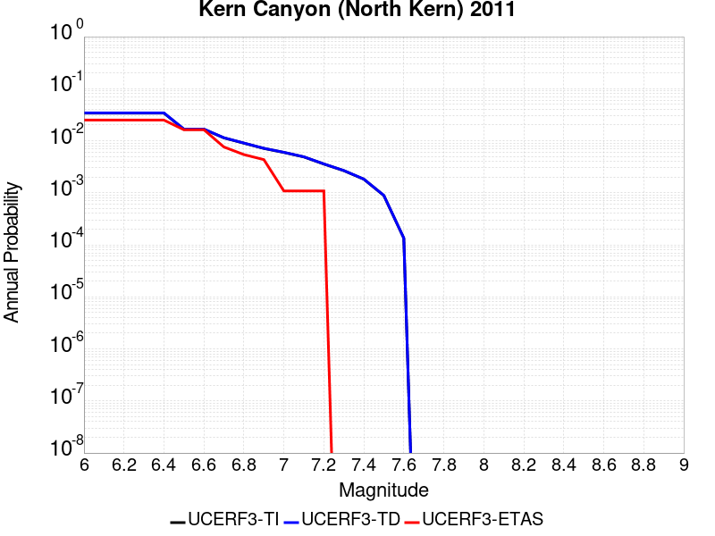 |
|-----|

| Magnitude | UCERF3-TI Prob | UCERF3-TD Prob | UCERF3-ETAS Prob |
|-----|-----|-----|-----|
| 6.0 | 0.033985063 | 0.034304153 | 0.02494577 |
| 6.1 | 0.033985063 | 0.034304153 | 0.02494577 |
| 6.2 | 0.033985063 | 0.034304153 | 0.02494577 |
| 6.3 | 0.033985063 | 0.034304153 | 0.02494577 |
| 6.4 | 0.033985063 | 0.034304153 | 0.02494577 |
| 6.5 | 0.016641786 | 0.016753951 | 0.01626898 |
| 6.6 | 0.016641786 | 0.016753951 | 0.01626898 |
| 6.7 | 0.011366342 | 0.011434792 | 0.007592191 |
| 6.8 | 0.008988295 | 0.009040181 | 0.0054229936 |
| 6.9 | 0.0071231425 | 0.0071631763 | 0.004338395 |
| 7.0 | 0.005965869 | 0.0059992066 | 0.0010845987 |
| 7.1 | 0.00489029 | 0.0049175043 | 0.0010845987 |
| 7.2 | 0.0035720414 | 0.0035919684 | 0.0010845987 |
| 7.3 | 0.0026628776 | 0.0026777508 | 0.0 |
| 7.4 | 0.0018245532 | 0.0018348017 | 0.0 |
| 7.5 | 8.8776444E-4 | 8.9280144E-4 | 0.0 |
| 7.6 | 1.3420706E-4 | 1.3499892E-4 | 0.0 |

## Kern Canyon (South Kern) 2011
*[(top)](#table-of-contents)*

| 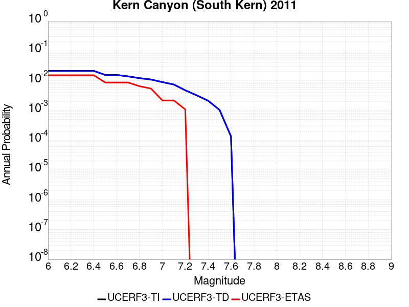 |
|-----|

| Magnitude | UCERF3-TI Prob | UCERF3-TD Prob | UCERF3-ETAS Prob |
|-----|-----|-----|-----|
| 6.0 | 0.021191964 | 0.021313827 | 0.015184382 |
| 6.1 | 0.021191964 | 0.021313827 | 0.015184382 |
| 6.2 | 0.021191964 | 0.021313827 | 0.015184382 |
| 6.3 | 0.021191964 | 0.021313827 | 0.015184382 |
| 6.4 | 0.021191964 | 0.021313827 | 0.015184382 |
| 6.5 | 0.0154545605 | 0.015540373 | 0.00867679 |
| 6.6 | 0.0154545605 | 0.015540373 | 0.00867679 |
| 6.7 | 0.013864288 | 0.013941095 | 0.00867679 |
| 6.8 | 0.012075625 | 0.012142689 | 0.0065075923 |
| 6.9 | 0.010883595 | 0.010944309 | 0.0054229936 |
| 7.0 | 0.008899529 | 0.008949438 | 0.0021691974 |
| 7.1 | 0.0073900297 | 0.007431399 | 0.0021691974 |
| 7.2 | 0.004735882 | 0.004762472 | 0.0010845987 |
| 7.3 | 0.003200807 | 0.0032187924 | 0.0 |
| 7.4 | 0.00211092 | 0.0021229284 | 0.0 |
| 7.5 | 0.0010363116 | 0.0010423169 | 0.0 |
| 7.6 | 1.3420706E-4 | 1.3499892E-4 | 0.0 |

## Kickapoo
*[(top)](#table-of-contents)*

| 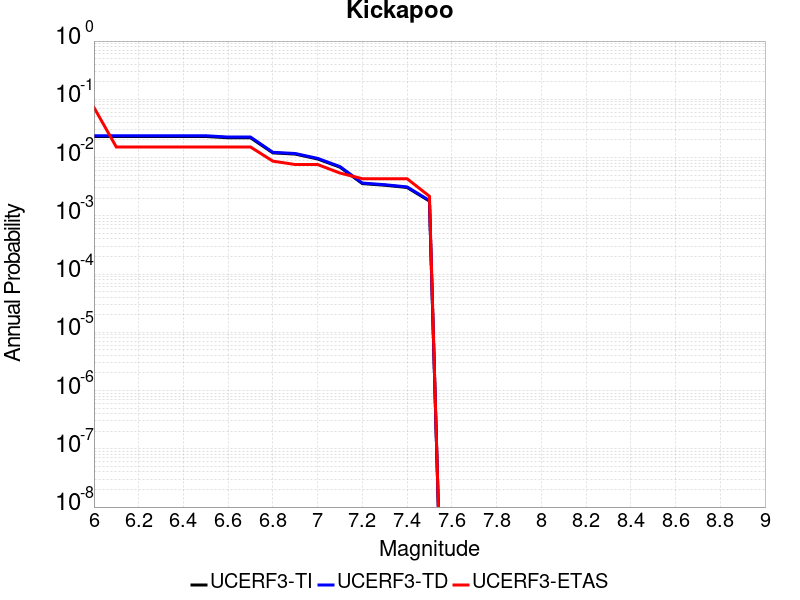 |
|-----|

| Magnitude | UCERF3-TI Prob | UCERF3-TD Prob | UCERF3-ETAS Prob |
|-----|-----|-----|-----|
| 6.0 | 0.023008417 | 0.023690466 | 0.07266811 |
| 6.1 | 0.023008417 | 0.023690466 | 0.015184382 |
| 6.2 | 0.023008417 | 0.023690466 | 0.015184382 |
| 6.3 | 0.023008417 | 0.023690466 | 0.015184382 |
| 6.4 | 0.023008417 | 0.023690466 | 0.015184382 |
| 6.5 | 0.023008417 | 0.023690466 | 0.015184382 |
| 6.6 | 0.02186312 | 0.022508305 | 0.015184382 |
| 6.7 | 0.02186312 | 0.022508305 | 0.015184382 |
| 6.8 | 0.012033968 | 0.012316199 | 0.00867679 |
| 6.9 | 0.011471336 | 0.011741388 | 0.007592191 |
| 7.0 | 0.009462946 | 0.009685893 | 0.007592191 |
| 7.1 | 0.006844869 | 0.0070044883 | 0.0054229936 |
| 7.2 | 0.0035732414 | 0.0036511214 | 0.004338395 |
| 7.3 | 0.0033494157 | 0.0034222084 | 0.004338395 |
| 7.4 | 0.0030663302 | 0.0031330828 | 0.004338395 |
| 7.5 | 0.001791055 | 0.0018308465 | 0.0021691974 |

## King Range 2011 CFM
*[(top)](#table-of-contents)*

| 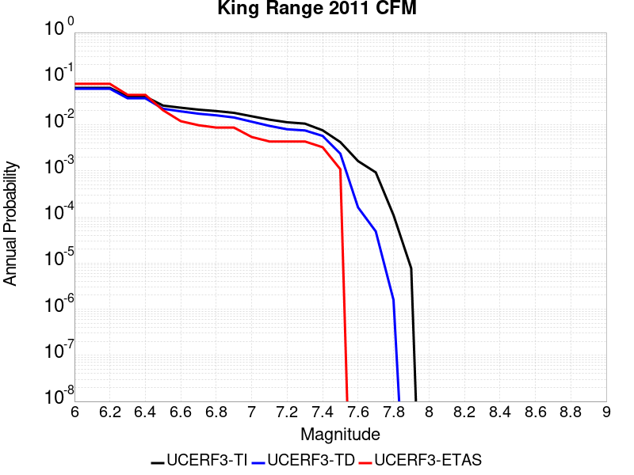 |
|-----|

| Magnitude | UCERF3-TI Prob | UCERF3-TD Prob | UCERF3-ETAS Prob |
|-----|-----|-----|-----|
| 6.0 | 0.062959045 | 0.06033852 | 0.077006504 |
| 6.1 | 0.062959045 | 0.06033852 | 0.077006504 |
| 6.2 | 0.062959045 | 0.06033852 | 0.077006504 |
| 6.3 | 0.040826146 | 0.037446644 | 0.04446855 |
| 6.4 | 0.040826146 | 0.037446644 | 0.04446855 |
| 6.5 | 0.026017549 | 0.022178078 | 0.020607375 |
| 6.6 | 0.023394536 | 0.019523162 | 0.011930586 |
| 6.7 | 0.021239761 | 0.017335873 | 0.009761388 |
| 6.8 | 0.019796917 | 0.015989093 | 0.00867679 |
| 6.9 | 0.018096752 | 0.014348574 | 0.00867679 |
| 7.0 | 0.0152598545 | 0.011631104 | 0.0054229936 |
| 7.1 | 0.012882817 | 0.009442429 | 0.004338395 |
| 7.2 | 0.011310648 | 0.007966337 | 0.004338395 |
| 7.3 | 0.01057689 | 0.0075283498 | 0.004338395 |
| 7.4 | 0.007577247 | 0.005722036 | 0.0032537961 |
| 7.5 | 0.0042012185 | 0.002357964 | 0.0010845987 |
| 7.6 | 0.0016287015 | 1.610594E-4 | 0.0 |
| 7.7 | 9.255954E-4 | 4.8599748E-5 | 0.0 |
| 7.8 | 1.0975441E-4 | 1.5907497E-6 | 0.0 |
| 7.9 | 7.713509E-6 | 1.9106938E-13 | 0.0 |

## La Panza 2011
*[(top)](#table-of-contents)*

| 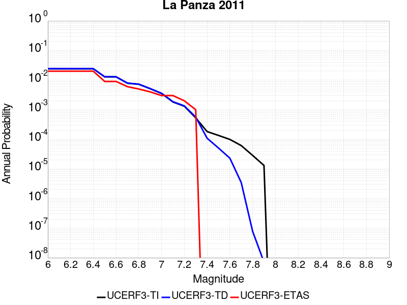 |
|-----|

| Magnitude | UCERF3-TI Prob | UCERF3-TD Prob | UCERF3-ETAS Prob |
|-----|-----|-----|-----|
| 6.0 | 0.024100736 | 0.024242034 | 0.019522777 |
| 6.1 | 0.024100736 | 0.024242034 | 0.019522777 |
| 6.2 | 0.024100736 | 0.024242034 | 0.019522777 |
| 6.3 | 0.024100736 | 0.024242034 | 0.019522777 |
| 6.4 | 0.024100736 | 0.024242034 | 0.019522777 |
| 6.5 | 0.012884456 | 0.012968856 | 0.007592191 |
| 6.6 | 0.012884456 | 0.012968856 | 0.007592191 |
| 6.7 | 0.0078524165 | 0.007916342 | 0.0054229936 |
| 6.8 | 0.007208891 | 0.0072698477 | 0.0054229936 |
| 6.9 | 0.0051142504 | 0.005167088 | 0.004338395 |
| 7.0 | 0.0035313356 | 0.003577855 | 0.0032537961 |
| 7.1 | 0.001823533 | 0.0018634713 | 0.0032537961 |
| 7.2 | 0.0013082171 | 0.0013457808 | 0.0021691974 |
| 7.3 | 5.299461E-4 | 5.634062E-4 | 0.0010845987 |
| 7.4 | 1.8264094E-4 | 1.0893233E-4 | 0.0 |
| 7.5 | 1.35252E-4 | 5.0772407E-5 | 0.0 |
| 7.6 | 9.9221594E-5 | 2.3115113E-5 | 0.0 |
| 7.7 | 6.143238E-5 | 3.4644386E-6 | 0.0 |
| 7.8 | 2.864082E-5 | 7.8149E-8 | 0.0 |
| 7.9 | 1.30868475E-5 | 7.11096E-9 | 0.0 |

## Laguna Salada
*[(top)](#table-of-contents)*

| 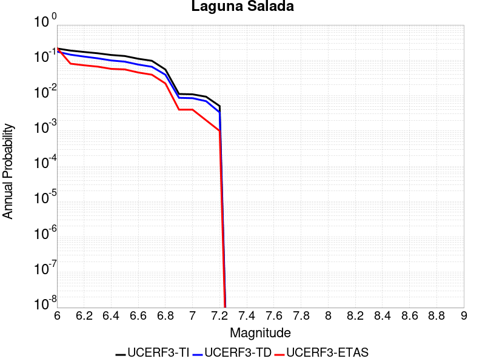 |
|-----|

| Magnitude | UCERF3-TI Prob | UCERF3-TD Prob | UCERF3-ETAS Prob |
|-----|-----|-----|-----|
| 6.0 | 0.21530208 | 0.17528492 | 0.21583514 |
| 6.1 | 0.1876262 | 0.14363398 | 0.07375271 |
| 6.2 | 0.17155094 | 0.12706403 | 0.06616052 |
| 6.3 | 0.15756348 | 0.11337968 | 0.060737528 |
| 6.4 | 0.14101982 | 0.09868364 | 0.05206074 |
| 6.5 | 0.13175 | 0.091207735 | 0.04989154 |
| 6.6 | 0.11015817 | 0.0754787 | 0.039045554 |
| 6.7 | 0.096546225 | 0.06539092 | 0.03470716 |
| 6.8 | 0.054636236 | 0.03886496 | 0.019522777 |
| 6.9 | 0.011096254 | 0.008657154 | 0.0021691974 |
| 7.0 | 0.010873411 | 0.0084468 | 0.0021691974 |
| 7.1 | 0.0092900675 | 0.006943691 | 0.0010845987 |
| 7.2 | 0.005060534 | 0.003340054 | 0.0 |

## Lake Isabella (Seismicity)
*[(top)](#table-of-contents)*

| 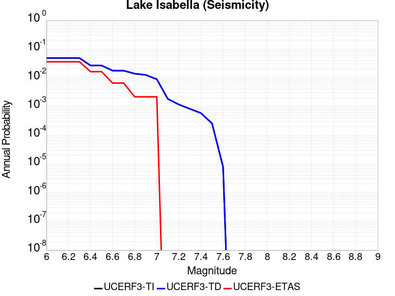 |
|-----|

| Magnitude | UCERF3-TI Prob | UCERF3-TD Prob | UCERF3-ETAS Prob |
|-----|-----|-----|-----|
| 6.0 | 0.048021823 | 0.048609752 | 0.03579176 |
| 6.1 | 0.048021823 | 0.048609752 | 0.03579176 |
| 6.2 | 0.048021823 | 0.048609752 | 0.03579176 |
| 6.3 | 0.048021823 | 0.048609752 | 0.03579176 |
| 6.4 | 0.026484035 | 0.02675536 | 0.01626898 |
| 6.5 | 0.026484035 | 0.02675536 | 0.01626898 |
| 6.6 | 0.017589329 | 0.017755402 | 0.0065075923 |
| 6.7 | 0.017523007 | 0.017688787 | 0.0065075923 |
| 6.8 | 0.013774379 | 0.013904207 | 0.0021691974 |
| 6.9 | 0.012475761 | 0.012594461 | 0.0021691974 |
| 7.0 | 0.0088068815 | 0.008891266 | 0.0021691974 |
| 7.1 | 0.0018253037 | 0.0018362933 | 0.0 |
| 7.2 | 0.0011640049 | 0.0011707409 | 0.0 |
| 7.3 | 8.2201755E-4 | 8.26732E-4 | 0.0 |
| 7.4 | 5.850896E-4 | 5.8846624E-4 | 0.0 |
| 7.5 | 2.548695E-4 | 2.5633833E-4 | 0.0 |
| 7.6 | 7.850971E-6 | 7.893599E-6 | 0.0 |

## Las Positas
*[(top)](#table-of-contents)*

| 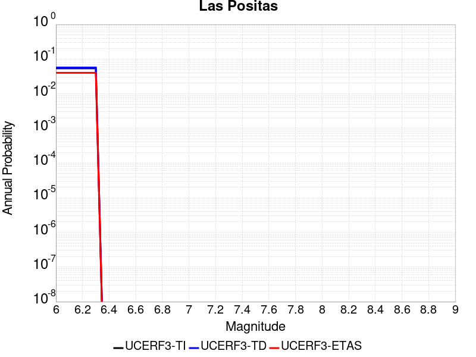 |
|-----|

| Magnitude | UCERF3-TI Prob | UCERF3-TD Prob | UCERF3-ETAS Prob |
|-----|-----|-----|-----|
| 6.0 | 0.05410116 | 0.05701494 | 0.040130153 |
| 6.1 | 0.05410116 | 0.05701494 | 0.040130153 |
| 6.2 | 0.05410116 | 0.05701494 | 0.040130153 |
| 6.3 | 0.05410116 | 0.05701494 | 0.040130153 |

## Last Chance
*[(top)](#table-of-contents)*

| 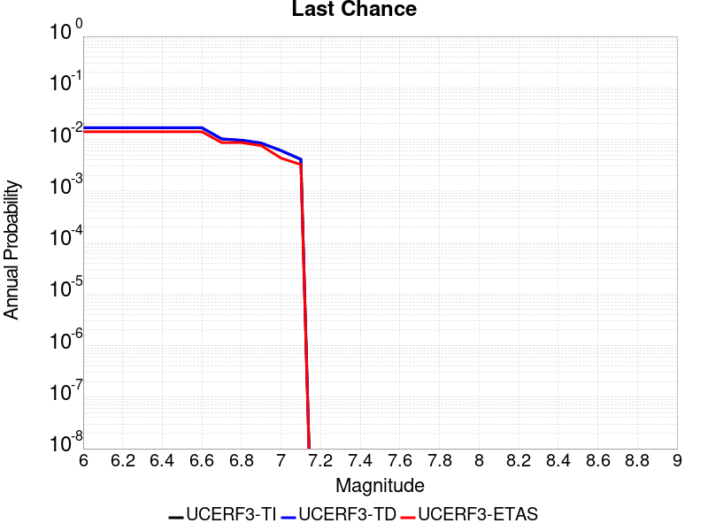 |
|-----|

| Magnitude | UCERF3-TI Prob | UCERF3-TD Prob | UCERF3-ETAS Prob |
|-----|-----|-----|-----|
| 6.0 | 0.016760139 | 0.01688749 | 0.014099783 |
| 6.1 | 0.016760139 | 0.01688749 | 0.014099783 |
| 6.2 | 0.016760139 | 0.01688749 | 0.014099783 |
| 6.3 | 0.016760139 | 0.01688749 | 0.014099783 |
| 6.4 | 0.016760139 | 0.01688749 | 0.014099783 |
| 6.5 | 0.016760139 | 0.01688749 | 0.014099783 |
| 6.6 | 0.016760139 | 0.01688749 | 0.014099783 |
| 6.7 | 0.010195161 | 0.010264664 | 0.00867679 |
| 6.8 | 0.009601742 | 0.00966788 | 0.00867679 |
| 6.9 | 0.008460617 | 0.008519385 | 0.007592191 |
| 7.0 | 0.0060444507 | 0.0060880687 | 0.004338395 |
| 7.1 | 0.0040992433 | 0.0041296696 | 0.0032537961 |

## Lenwood-Lockhart-Old Woman Springs
*[(top)](#table-of-contents)*

| 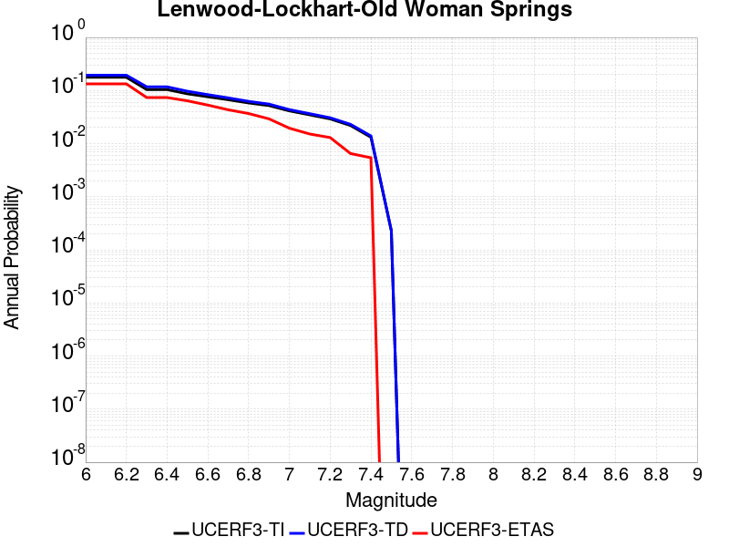 |
|-----|

| Magnitude | UCERF3-TI Prob | UCERF3-TD Prob | UCERF3-ETAS Prob |
|-----|-----|-----|-----|
| 6.0 | 0.17748497 | 0.19434474 | 0.13340564 |
| 6.1 | 0.17748497 | 0.19434474 | 0.13340564 |
| 6.2 | 0.17748497 | 0.19434474 | 0.13340564 |
| 6.3 | 0.10416005 | 0.117371626 | 0.07375271 |
| 6.4 | 0.10416005 | 0.117371626 | 0.07375271 |
| 6.5 | 0.08677895 | 0.096953765 | 0.06399132 |
| 6.6 | 0.076272614 | 0.083643876 | 0.053145338 |
| 6.7 | 0.06716748 | 0.072709955 | 0.04338395 |
| 6.8 | 0.058365297 | 0.06253112 | 0.036876354 |
| 6.9 | 0.05209757 | 0.0555025 | 0.029284164 |
| 7.0 | 0.041406933 | 0.0436646 | 0.019522777 |
| 7.1 | 0.034852486 | 0.036642235 | 0.015184382 |
| 7.2 | 0.029249903 | 0.03070797 | 0.013015185 |
| 7.3 | 0.021948947 | 0.023075186 | 0.0065075923 |
| 7.4 | 0.013190712 | 0.013967517 | 0.0054229936 |
| 7.5 | 2.2803004E-4 | 2.3099834E-4 | 0.0 |

## Likely 2011 CFM
*[(top)](#table-of-contents)*

| 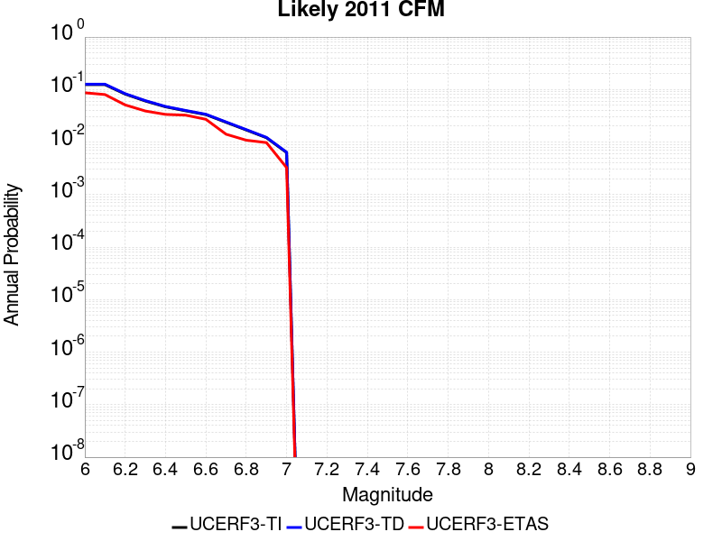 |
|-----|

| Magnitude | UCERF3-TI Prob | UCERF3-TD Prob | UCERF3-ETAS Prob |
|-----|-----|-----|-----|
| 6.0 | 0.12374372 | 0.12649508 | 0.0867679 |
| 6.1 | 0.12374372 | 0.12649508 | 0.08026031 |
| 6.2 | 0.08189914 | 0.083527595 | 0.05097614 |
| 6.3 | 0.0604277 | 0.061572347 | 0.039045554 |
| 6.4 | 0.046834342 | 0.04769509 | 0.03362256 |
| 6.5 | 0.039276272 | 0.03998705 | 0.03253796 |
| 6.6 | 0.033288993 | 0.033886455 | 0.027114967 |
| 6.7 | 0.023747325 | 0.024169095 | 0.014099783 |
| 6.8 | 0.016966727 | 0.017268661 | 0.010845987 |
| 6.9 | 0.012078844 | 0.012296303 | 0.009761388 |
| 7.0 | 0.006300421 | 0.0064171045 | 0.0032537961 |

## Lions Head 2011 CFM
*[(top)](#table-of-contents)*

| 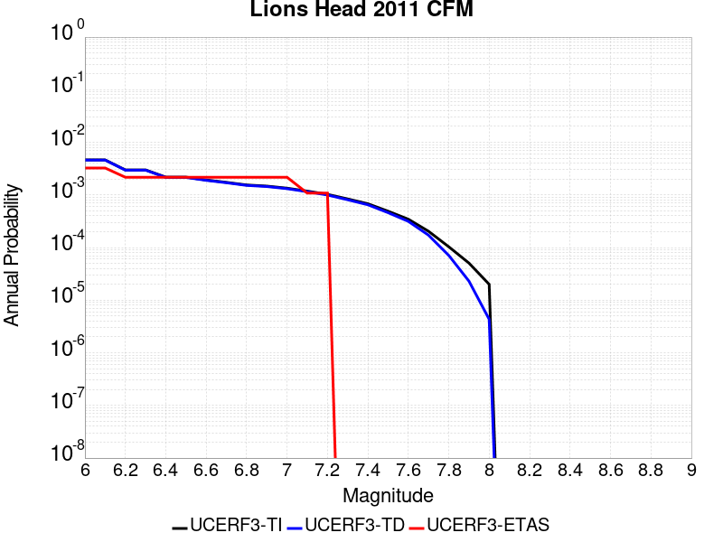 |
|-----|

| Magnitude | UCERF3-TI Prob | UCERF3-TD Prob | UCERF3-ETAS Prob |
|-----|-----|-----|-----|
| 6.0 | 0.004627604 | 0.0046022264 | 0.0032537961 |
| 6.1 | 0.004627604 | 0.0046022264 | 0.0032537961 |
| 6.2 | 0.0029924163 | 0.0029649553 | 0.0021691974 |
| 6.3 | 0.0029924163 | 0.0029649553 | 0.0021691974 |
| 6.4 | 0.00218055 | 0.0021522122 | 0.0021691974 |
| 6.5 | 0.00218055 | 0.0021522122 | 0.0021691974 |
| 6.6 | 0.0019233401 | 0.0018947617 | 0.0021691974 |
| 6.7 | 0.0017352017 | 0.0017064561 | 0.0021691974 |
| 6.8 | 0.0015477121 | 0.001518811 | 0.0021691974 |
| 6.9 | 0.0014732102 | 0.0014442303 | 0.0021691974 |
| 7.0 | 0.0013450137 | 0.0013158848 | 0.0021691974 |
| 7.1 | 0.0011826493 | 0.0011532716 | 0.0010845987 |
| 7.2 | 0.0010266319 | 9.97015E-4 | 0.0010845987 |
| 7.3 | 8.397846E-4 | 8.097953E-4 | 0.0 |
| 7.4 | 6.8056514E-4 | 6.5020286E-4 | 0.0 |
| 7.5 | 4.909119E-4 | 4.6000836E-4 | 0.0 |
| 7.6 | 3.4620138E-4 | 3.1480507E-4 | 0.0 |
| 7.7 | 2.0400206E-4 | 1.7198437E-4 | 0.0 |
| 7.8 | 1.036137E-4 | 7.109648E-5 | 0.0 |
| 7.9 | 5.0704395E-5 | 2.3016146E-5 | 0.0 |
| 8.0 | 2.0035179E-5 | 4.33779E-6 | 0.0 |

## Little Lake
*[(top)](#table-of-contents)*

| 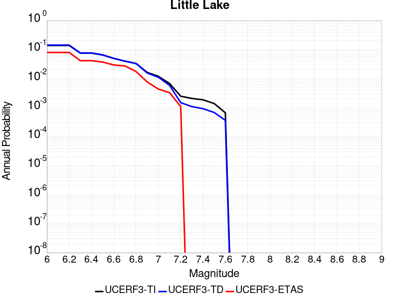 |
|-----|

| Magnitude | UCERF3-TI Prob | UCERF3-TD Prob | UCERF3-ETAS Prob |
|-----|-----|-----|-----|
| 6.0 | 0.13784198 | 0.14182128 | 0.0791757 |
| 6.1 | 0.13784198 | 0.14182128 | 0.0791757 |
| 6.2 | 0.13784198 | 0.14182128 | 0.0791757 |
| 6.3 | 0.07473393 | 0.07593688 | 0.04121475 |
| 6.4 | 0.07473393 | 0.07593688 | 0.04121475 |
| 6.5 | 0.06459564 | 0.06547591 | 0.036876354 |
| 6.6 | 0.04916491 | 0.049495935 | 0.029284164 |
| 6.7 | 0.03972137 | 0.03975494 | 0.027114967 |
| 6.8 | 0.03296164 | 0.03281454 | 0.01735358 |
| 6.9 | 0.016190905 | 0.0154563105 | 0.007592191 |
| 7.0 | 0.011880912 | 0.011069228 | 0.004338395 |
| 7.1 | 0.006727577 | 0.0058259466 | 0.0032537961 |
| 7.2 | 0.0024576345 | 0.0014743762 | 0.0010845987 |
| 7.3 | 0.0020553358 | 0.0010798454 | 0.0 |
| 7.4 | 0.0018491268 | 9.123912E-4 | 0.0 |
| 7.5 | 0.0013741831 | 6.7565177E-4 | 0.0 |
| 7.6 | 6.62403E-4 | 3.6313097E-4 | 0.0 |

## Little Salmon (Offshore)
*[(top)](#table-of-contents)*

| 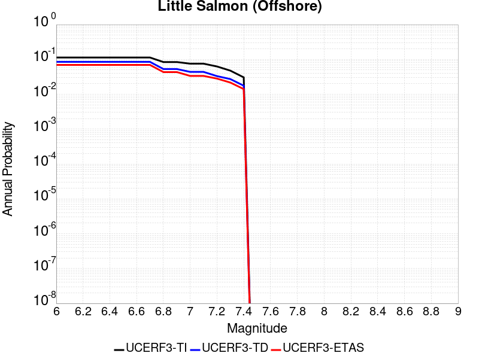 |
|-----|

| Magnitude | UCERF3-TI Prob | UCERF3-TD Prob | UCERF3-ETAS Prob |
|-----|-----|-----|-----|
| 6.0 | 0.113331154 | 0.084972605 | 0.06941432 |
| 6.1 | 0.113331154 | 0.084972605 | 0.06941432 |
| 6.2 | 0.113331154 | 0.084972605 | 0.06941432 |
| 6.3 | 0.113331154 | 0.084972605 | 0.06941432 |
| 6.4 | 0.113331154 | 0.084972605 | 0.06941432 |
| 6.5 | 0.113331154 | 0.084972605 | 0.06941432 |
| 6.6 | 0.113331154 | 0.084972605 | 0.06941432 |
| 6.7 | 0.113331154 | 0.084972605 | 0.06941432 |
| 6.8 | 0.08411373 | 0.053064518 | 0.04338395 |
| 6.9 | 0.08411373 | 0.053064518 | 0.04338395 |
| 7.0 | 0.07553121 | 0.0438619 | 0.03362256 |
| 7.1 | 0.07553121 | 0.0438619 | 0.03362256 |
| 7.2 | 0.0628005 | 0.033202525 | 0.028199567 |
| 7.3 | 0.047665842 | 0.027300227 | 0.021691974 |
| 7.4 | 0.03052664 | 0.017618299 | 0.014099783 |

## Little Salmon (Onshore)
*[(top)](#table-of-contents)*

| 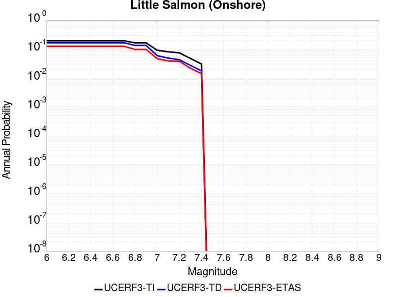 |
|-----|

| Magnitude | UCERF3-TI Prob | UCERF3-TD Prob | UCERF3-ETAS Prob |
|-----|-----|-----|-----|
| 6.0 | 0.1950497 | 0.16629378 | 0.12581345 |
| 6.1 | 0.1950497 | 0.16629378 | 0.12581345 |
| 6.2 | 0.1950497 | 0.16629378 | 0.12581345 |
| 6.3 | 0.1950497 | 0.16629378 | 0.12581345 |
| 6.4 | 0.1950497 | 0.16629378 | 0.12581345 |
| 6.5 | 0.1950497 | 0.16629378 | 0.12581345 |
| 6.6 | 0.1950497 | 0.16629378 | 0.12581345 |
| 6.7 | 0.1950497 | 0.16629378 | 0.12581345 |
| 6.8 | 0.16521606 | 0.1345125 | 0.097613886 |
| 6.9 | 0.16521606 | 0.1345125 | 0.097613886 |
| 7.0 | 0.09159678 | 0.059530795 | 0.046637744 |
| 7.1 | 0.08097486 | 0.048932757 | 0.039045554 |
| 7.2 | 0.07465147 | 0.0430209 | 0.037960954 |
| 7.3 | 0.047665842 | 0.027300227 | 0.021691974 |
| 7.4 | 0.03052664 | 0.017618299 | 0.014099783 |

## Los Alamos 2011 CFM
*[(top)](#table-of-contents)*

| 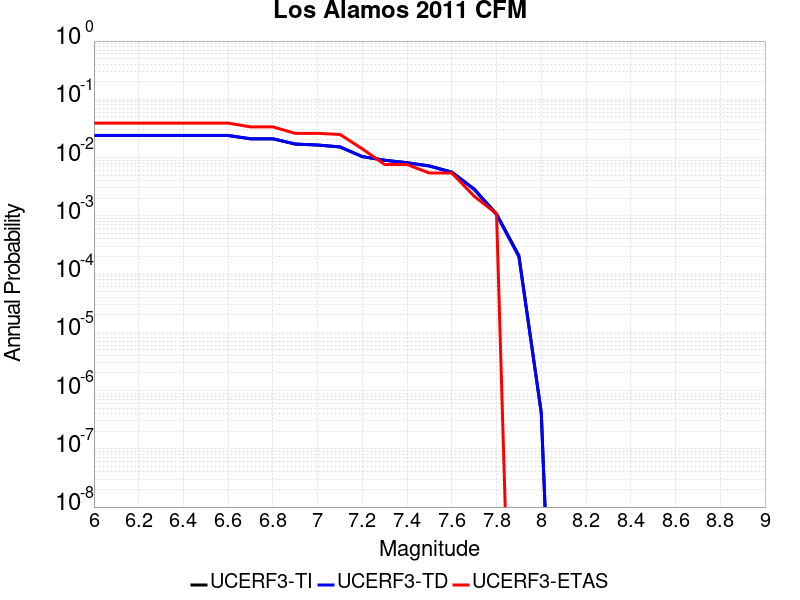 |
|-----|

| Magnitude | UCERF3-TI Prob | UCERF3-TD Prob | UCERF3-ETAS Prob |
|-----|-----|-----|-----|
| 6.0 | 0.023861311 | 0.023980645 | 0.039045554 |
| 6.1 | 0.023861311 | 0.023980645 | 0.039045554 |
| 6.2 | 0.023861311 | 0.023980645 | 0.039045554 |
| 6.3 | 0.023861311 | 0.023980645 | 0.039045554 |
| 6.4 | 0.023861311 | 0.023980645 | 0.039045554 |
| 6.5 | 0.023861311 | 0.023980645 | 0.039045554 |
| 6.6 | 0.023861311 | 0.023980645 | 0.039045554 |
| 6.7 | 0.020973584 | 0.021061512 | 0.03362256 |
| 6.8 | 0.020973584 | 0.021061512 | 0.03362256 |
| 6.9 | 0.017038774 | 0.01708344 | 0.02603037 |
| 7.0 | 0.016398378 | 0.016437871 | 0.02603037 |
| 7.1 | 0.015212783 | 0.015241925 | 0.02494577 |
| 7.2 | 0.010392143 | 0.010366619 | 0.014099783 |
| 7.3 | 0.0090195 | 0.008981316 | 0.007592191 |
| 7.4 | 0.008168119 | 0.008122207 | 0.007592191 |
| 7.5 | 0.007196086 | 0.007140407 | 0.0054229936 |
| 7.6 | 0.0056421277 | 0.005569259 | 0.0054229936 |
| 7.7 | 0.0028890243 | 0.002834002 | 0.0021691974 |
| 7.8 | 0.0010799025 | 0.0010452282 | 0.0010845987 |
| 7.9 | 2.077602E-4 | 1.9735341E-4 | 0.0 |
| 8.0 | 4.1119026E-7 | 4.1665697E-7 | 0.0 |

## Los Alamos extension
*[(top)](#table-of-contents)*

| 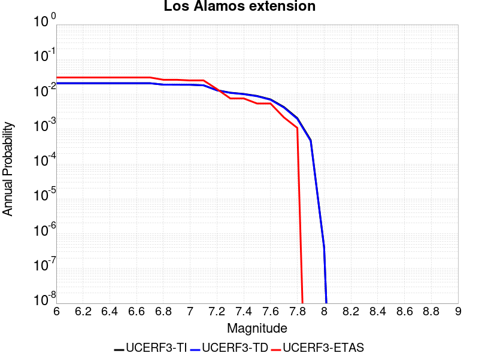 |
|-----|

| Magnitude | UCERF3-TI Prob | UCERF3-TD Prob | UCERF3-ETAS Prob |
|-----|-----|-----|-----|
| 6.0 | 0.020730034 | 0.0207096 | 0.030368764 |
| 6.1 | 0.020730034 | 0.0207096 | 0.030368764 |
| 6.2 | 0.020730034 | 0.0207096 | 0.030368764 |
| 6.3 | 0.020730034 | 0.0207096 | 0.030368764 |
| 6.4 | 0.020730034 | 0.0207096 | 0.030368764 |
| 6.5 | 0.020730034 | 0.0207096 | 0.030368764 |
| 6.6 | 0.020730034 | 0.0207096 | 0.030368764 |
| 6.7 | 0.020730034 | 0.0207096 | 0.030368764 |
| 6.8 | 0.018908354 | 0.018869193 | 0.02603037 |
| 6.9 | 0.018837513 | 0.018797658 | 0.02603037 |
| 7.0 | 0.018772088 | 0.01873153 | 0.02494577 |
| 7.1 | 0.018097665 | 0.018050421 | 0.02494577 |
| 7.2 | 0.013065367 | 0.012959903 | 0.014099783 |
| 7.3 | 0.011103956 | 0.010978011 | 0.007592191 |
| 7.4 | 0.010205943 | 0.010070758 | 0.007592191 |
| 7.5 | 0.008936965 | 0.008786912 | 0.0054229936 |
| 7.6 | 0.007132117 | 0.0069686226 | 0.0054229936 |
| 7.7 | 0.004307205 | 0.004165617 | 0.0021691974 |
| 7.8 | 0.0020697766 | 0.0019775745 | 0.0010845987 |
| 7.9 | 4.8475334E-4 | 4.5956607E-4 | 0.0 |
| 8.0 | 4.1119026E-7 | 4.1665697E-7 | 0.0 |

## Los Medanos - Roe Island
*[(top)](#table-of-contents)*

| 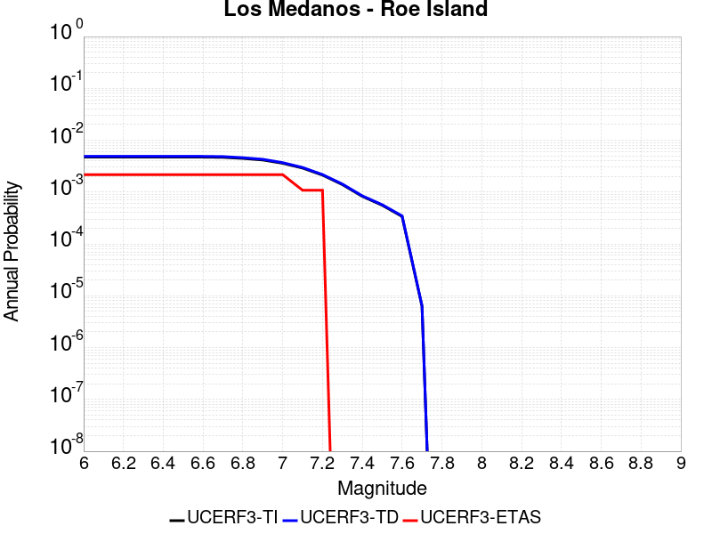 |
|-----|

| Magnitude | UCERF3-TI Prob | UCERF3-TD Prob | UCERF3-ETAS Prob |
|-----|-----|-----|-----|
| 6.0 | 0.004720093 | 0.004885202 | 0.0021691974 |
| 6.1 | 0.004720093 | 0.004885202 | 0.0021691974 |
| 6.2 | 0.004720093 | 0.004885202 | 0.0021691974 |
| 6.3 | 0.004720093 | 0.004885202 | 0.0021691974 |
| 6.4 | 0.004720093 | 0.004885202 | 0.0021691974 |
| 6.5 | 0.004720093 | 0.004885202 | 0.0021691974 |
| 6.6 | 0.004720093 | 0.004885202 | 0.0021691974 |
| 6.7 | 0.0046771113 | 0.004842136 | 0.0021691974 |
| 6.8 | 0.0044583157 | 0.0046062134 | 0.0021691974 |
| 6.9 | 0.0041581816 | 0.0042913873 | 0.0021691974 |
| 7.0 | 0.0035929834 | 0.003698058 | 0.0021691974 |
| 7.1 | 0.0029039423 | 0.0029840192 | 0.0010845987 |
| 7.2 | 0.0021262353 | 0.0021781165 | 0.0010845987 |
| 7.3 | 0.0013939361 | 0.0014274309 | 0.0 |
| 7.4 | 8.2677865E-4 | 8.462432E-4 | 0.0 |
| 7.5 | 5.568824E-4 | 5.703772E-4 | 0.0 |
| 7.6 | 3.3812362E-4 | 3.4717232E-4 | 0.0 |
| 7.7 | 6.252518E-6 | 6.399853E-6 | 0.0 |

## Los Osos 2011
*[(top)](#table-of-contents)*

| 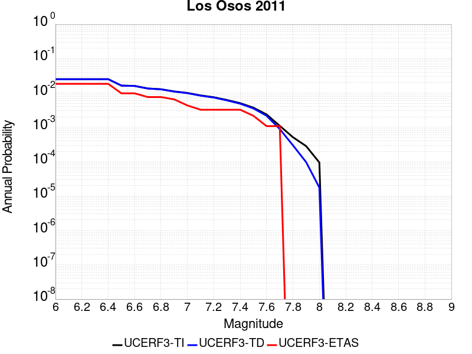 |
|-----|

| Magnitude | UCERF3-TI Prob | UCERF3-TD Prob | UCERF3-ETAS Prob |
|-----|-----|-----|-----|
| 6.0 | 0.025178261 | 0.025174735 | 0.018438177 |
| 6.1 | 0.025178261 | 0.025174735 | 0.018438177 |
| 6.2 | 0.025178261 | 0.025174735 | 0.018438177 |
| 6.3 | 0.025178261 | 0.025174735 | 0.018438177 |
| 6.4 | 0.025178261 | 0.025174735 | 0.018438177 |
| 6.5 | 0.016416937 | 0.016319374 | 0.009761388 |
| 6.6 | 0.016056862 | 0.015955914 | 0.009761388 |
| 6.7 | 0.013534125 | 0.013414822 | 0.007592191 |
| 6.8 | 0.01284709 | 0.012722139 | 0.007592191 |
| 6.9 | 0.011091897 | 0.010953854 | 0.0065075923 |
| 7.0 | 0.010011095 | 0.009865569 | 0.004338395 |
| 7.1 | 0.008496585 | 0.008340879 | 0.0032537961 |
| 7.2 | 0.0075095277 | 0.0073473128 | 0.0032537961 |
| 7.3 | 0.006249431 | 0.0060788207 | 0.0032537961 |
| 7.4 | 0.005052551 | 0.0048735687 | 0.0032537961 |
| 7.5 | 0.0037367668 | 0.003547898 | 0.0021691974 |
| 7.6 | 0.002373172 | 0.0021727423 | 0.0010845987 |
| 7.7 | 0.0011041958 | 8.91347E-4 | 0.0010845987 |
| 7.8 | 5.150581E-4 | 2.9933822E-4 | 0.0 |
| 7.9 | 2.838065E-4 | 9.693052E-5 | 0.0 |
| 8.0 | 9.481456E-5 | 1.7739278E-5 | 0.0 |

## Lost Hills
*[(top)](#table-of-contents)*

| 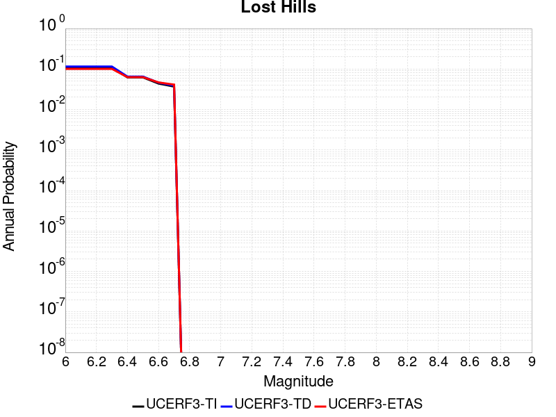 |
|-----|

| Magnitude | UCERF3-TI Prob | UCERF3-TD Prob | UCERF3-ETAS Prob |
|-----|-----|-----|-----|
| 6.0 | 0.110008486 | 0.11501324 | 0.10086768 |
| 6.1 | 0.110008486 | 0.11501324 | 0.10086768 |
| 6.2 | 0.110008486 | 0.11501324 | 0.10086768 |
| 6.3 | 0.110008486 | 0.11501324 | 0.10086768 |
| 6.4 | 0.06210559 | 0.064986765 | 0.06290673 |
| 6.5 | 0.06210559 | 0.064986765 | 0.06290673 |
| 6.6 | 0.043796066 | 0.04602035 | 0.046637744 |
| 6.7 | 0.036900327 | 0.03889047 | 0.04121475 |

## Ludlow
*[(top)](#table-of-contents)*

| 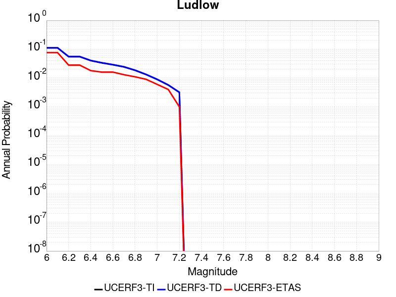 |
|-----|

| Magnitude | UCERF3-TI Prob | UCERF3-TD Prob | UCERF3-ETAS Prob |
|-----|-----|-----|-----|
| 6.0 | 0.11034453 | 0.11244106 | 0.0791757 |
| 6.1 | 0.11034453 | 0.11244106 | 0.0791757 |
| 6.2 | 0.054702267 | 0.055586006 | 0.029284164 |
| 6.3 | 0.054702267 | 0.055586006 | 0.029284164 |
| 6.4 | 0.03995468 | 0.040590037 | 0.018438177 |
| 6.5 | 0.0333406 | 0.033870663 | 0.01735358 |
| 6.6 | 0.028706979 | 0.029165413 | 0.01735358 |
| 6.7 | 0.024153803 | 0.024539324 | 0.014099783 |
| 6.8 | 0.018396411 | 0.01869117 | 0.011930586 |
| 6.9 | 0.013129036 | 0.013340473 | 0.009761388 |
| 7.0 | 0.008874211 | 0.009017857 | 0.0065075923 |
| 7.1 | 0.005674138 | 0.005765268 | 0.004338395 |
| 7.2 | 0.0031605028 | 0.0032101772 | 0.0010845987 |

## Maacama 2011 CFM
*[(top)](#table-of-contents)*

| 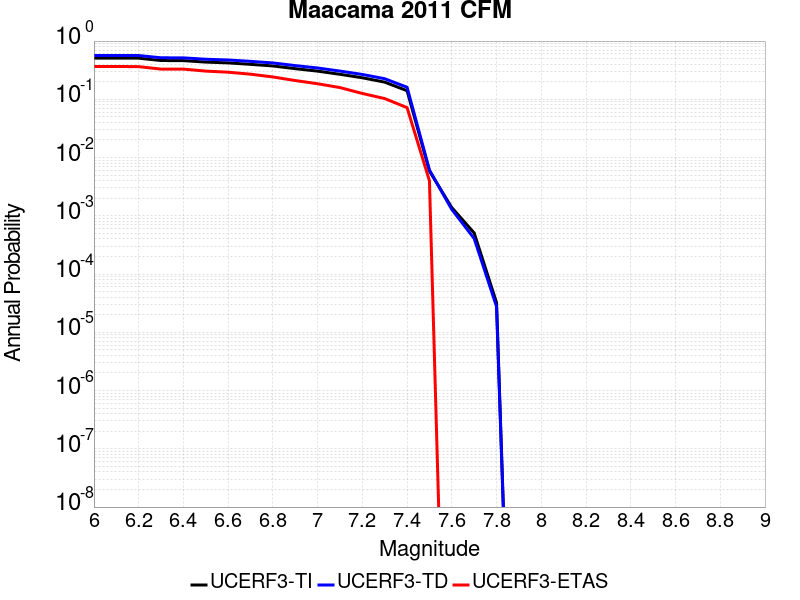 |
|-----|

| Magnitude | UCERF3-TI Prob | UCERF3-TD Prob | UCERF3-ETAS Prob |
|-----|-----|-----|-----|
| 6.0 | 0.51029766 | 0.5662317 | 0.35900217 |
| 6.1 | 0.51029766 | 0.5662317 | 0.35900217 |
| 6.2 | 0.50838757 | 0.5643017 | 0.35683298 |
| 6.3 | 0.46305606 | 0.51633173 | 0.32321042 |
| 6.4 | 0.4614298 | 0.5146637 | 0.32321042 |
| 6.5 | 0.4352948 | 0.48722783 | 0.29826465 |
| 6.6 | 0.4219278 | 0.47326747 | 0.28524947 |
| 6.7 | 0.39842892 | 0.44844016 | 0.26681128 |
| 6.8 | 0.37377024 | 0.42126873 | 0.24295011 |
| 6.9 | 0.33569032 | 0.37924492 | 0.20932755 |
| 7.0 | 0.30460665 | 0.34490362 | 0.18329719 |
| 7.1 | 0.26878622 | 0.3052986 | 0.15618221 |
| 7.2 | 0.23431174 | 0.26719674 | 0.12255965 |
| 7.3 | 0.19717051 | 0.22565645 | 0.097613886 |
| 7.4 | 0.14039001 | 0.16109791 | 0.06941432 |
| 7.5 | 0.0058748387 | 0.00611189 | 0.004338395 |
| 7.6 | 0.0013836196 | 0.0012845463 | 0.0 |
| 7.7 | 5.0745334E-4 | 4.0801152E-4 | 0.0 |
| 7.8 | 3.2318534E-5 | 2.7617423E-5 | 0.0 |

## Mad River (alt1)
*[(top)](#table-of-contents)*

| 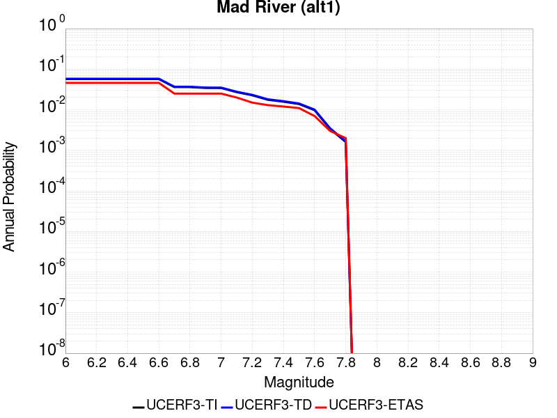 |
|-----|

| Magnitude | UCERF3-TI Prob | UCERF3-TD Prob | UCERF3-ETAS Prob |
|-----|-----|-----|-----|
| 6.0 | 0.057037193 | 0.0582881 | 0.047722343 |
| 6.1 | 0.057037193 | 0.0582881 | 0.047722343 |
| 6.2 | 0.057037193 | 0.0582881 | 0.047722343 |
| 6.3 | 0.057037193 | 0.0582881 | 0.047722343 |
| 6.4 | 0.057037193 | 0.0582881 | 0.047722343 |
| 6.5 | 0.057037193 | 0.0582881 | 0.047722343 |
| 6.6 | 0.057037193 | 0.0582881 | 0.047722343 |
| 6.7 | 0.03615027 | 0.036962315 | 0.027114967 |
| 6.8 | 0.03615027 | 0.036962315 | 0.027114967 |
| 6.9 | 0.03449425 | 0.03527891 | 0.027114967 |
| 7.0 | 0.03436637 | 0.035148527 | 0.027114967 |
| 7.1 | 0.027166525 | 0.02783178 | 0.021691974 |
| 7.2 | 0.022740649 | 0.023339735 | 0.01626898 |
| 7.3 | 0.017615382 | 0.018120755 | 0.014099783 |
| 7.4 | 0.015824934 | 0.016295457 | 0.013015185 |
| 7.5 | 0.0138559295 | 0.01428561 | 0.011930586 |
| 7.6 | 0.0097648585 | 0.010090498 | 0.007592191 |
| 7.7 | 0.0033657292 | 0.0034928832 | 0.0032537961 |
| 7.8 | 0.001605045 | 0.0016698977 | 0.0021691974 |

## Malibu Coast (Extension) alt 1
*[(top)](#table-of-contents)*

| 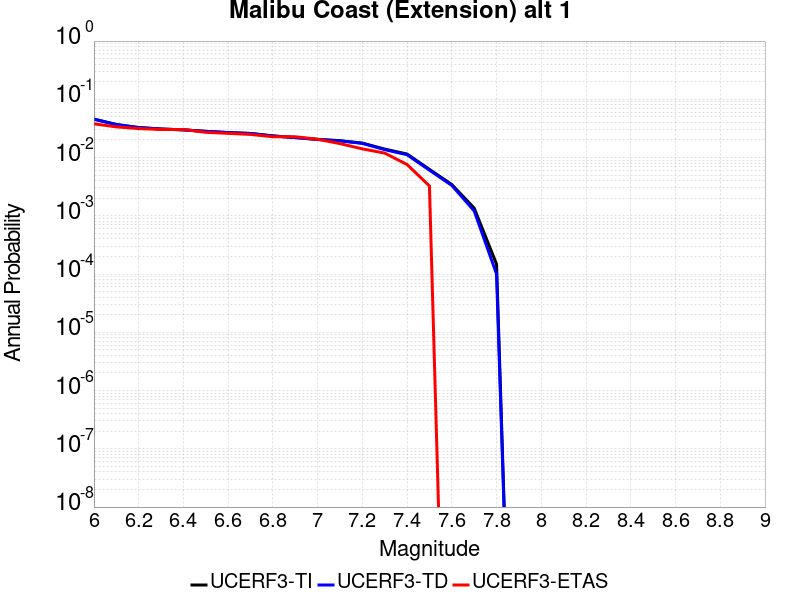 |
|-----|

| Magnitude | UCERF3-TI Prob | UCERF3-TD Prob | UCERF3-ETAS Prob |
|-----|-----|-----|-----|
| 6.0 | 0.045530435 | 0.045764275 | 0.037960954 |
| 6.1 | 0.036871515 | 0.036994744 | 0.03362256 |
| 6.2 | 0.032702357 | 0.032770455 | 0.031453364 |
| 6.3 | 0.030904895 | 0.030949185 | 0.030368764 |
| 6.4 | 0.029863395 | 0.029893087 | 0.030368764 |
| 6.5 | 0.028173404 | 0.028175524 | 0.027114967 |
| 6.6 | 0.026881814 | 0.026862463 | 0.02603037 |
| 6.7 | 0.025923302 | 0.025887843 | 0.02494577 |
| 6.8 | 0.023551181 | 0.023464214 | 0.022776572 |
| 6.9 | 0.022086184 | 0.021970084 | 0.022776572 |
| 7.0 | 0.020549927 | 0.02040211 | 0.020607375 |
| 7.1 | 0.019494707 | 0.01932802 | 0.01735358 |
| 7.2 | 0.017712371 | 0.01751277 | 0.014099783 |
| 7.3 | 0.013972159 | 0.013691633 | 0.011930586 |
| 7.4 | 0.01149597 | 0.011177684 | 0.007592191 |
| 7.5 | 0.0062627243 | 0.0060813064 | 0.0032537961 |
| 7.6 | 0.003446051 | 0.0033238358 | 0.0 |
| 7.7 | 0.0013563642 | 0.0012150994 | 0.0 |
| 7.8 | 1.4777515E-4 | 1.0037642E-4 | 0.0 |

## Malibu Coast alt 1
*[(top)](#table-of-contents)*

| 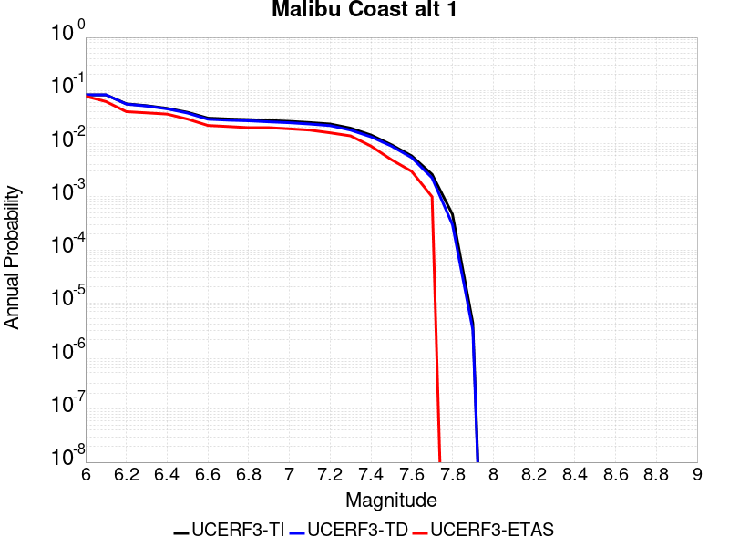 |
|-----|

| Magnitude | UCERF3-TI Prob | UCERF3-TD Prob | UCERF3-ETAS Prob |
|-----|-----|-----|-----|
| 6.0 | 0.082840554 | 0.083050475 | 0.0791757 |
| 6.1 | 0.082840554 | 0.083050475 | 0.06290673 |
| 6.2 | 0.05620284 | 0.05550615 | 0.04121475 |
| 6.3 | 0.051873285 | 0.051044766 | 0.040130153 |
| 6.4 | 0.046214953 | 0.04521818 | 0.037960954 |
| 6.5 | 0.03890893 | 0.037708946 | 0.030368764 |
| 6.6 | 0.03026516 | 0.028820725 | 0.023861172 |
| 6.7 | 0.029130999 | 0.027664313 | 0.022776572 |
| 6.8 | 0.028399697 | 0.026920158 | 0.021691974 |
| 6.9 | 0.027263237 | 0.02575915 | 0.021691974 |
| 7.0 | 0.026294444 | 0.024771849 | 0.020607375 |
| 7.1 | 0.024973696 | 0.023423063 | 0.019522777 |
| 7.2 | 0.023438837 | 0.021855364 | 0.01735358 |
| 7.3 | 0.019602418 | 0.018002685 | 0.015184382 |
| 7.4 | 0.014546064 | 0.013453256 | 0.009761388 |
| 7.5 | 0.009545054 | 0.009021893 | 0.0054229936 |
| 7.6 | 0.0058750324 | 0.0054487693 | 0.0032537961 |
| 7.7 | 0.0026394976 | 0.0022636931 | 0.0010845987 |
| 7.8 | 4.670452E-4 | 2.9930682E-4 | 0.0 |
| 7.9 | 4.1781627E-6 | 3.095605E-6 | 0.0 |

## Manix-Afton Hills
*[(top)](#table-of-contents)*

| 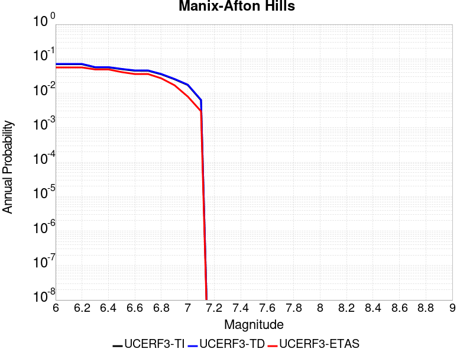 |
|-----|

| Magnitude | UCERF3-TI Prob | UCERF3-TD Prob | UCERF3-ETAS Prob |
|-----|-----|-----|-----|
| 6.0 | 0.069393985 | 0.07086424 | 0.055314533 |
| 6.1 | 0.069393985 | 0.07086424 | 0.055314533 |
| 6.2 | 0.069393985 | 0.07086424 | 0.055314533 |
| 6.3 | 0.056024406 | 0.057185497 | 0.04989154 |
| 6.4 | 0.056024406 | 0.057185497 | 0.04989154 |
| 6.5 | 0.049795058 | 0.05084036 | 0.04121475 |
| 6.6 | 0.04492896 | 0.045886107 | 0.03579176 |
| 6.7 | 0.044885475 | 0.045841534 | 0.03579176 |
| 6.8 | 0.035360347 | 0.036139976 | 0.027114967 |
| 6.9 | 0.025410311 | 0.02596914 | 0.01735358 |
| 7.0 | 0.01731757 | 0.017716855 | 0.00867679 |
| 7.1 | 0.006280016 | 0.0064256527 | 0.0032537961 |

## McKinleyville (alt1)
*[(top)](#table-of-contents)*

| 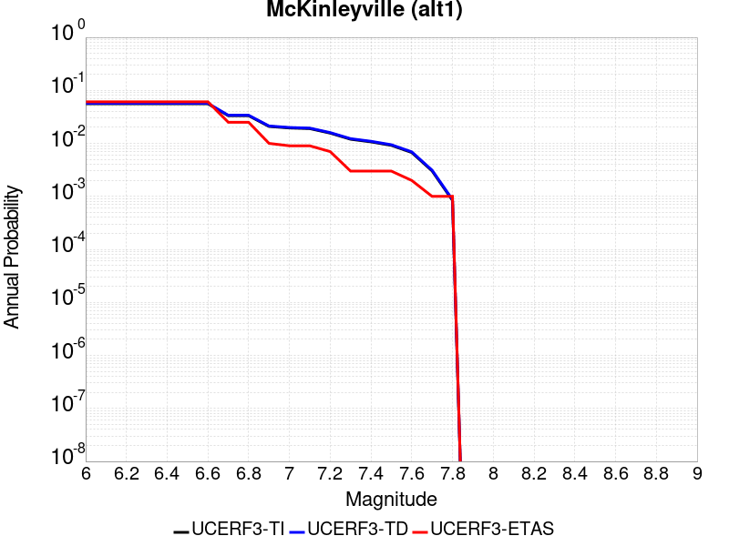 |
|-----|

| Magnitude | UCERF3-TI Prob | UCERF3-TD Prob | UCERF3-ETAS Prob |
|-----|-----|-----|-----|
| 6.0 | 0.055921137 | 0.05716478 | 0.06290673 |
| 6.1 | 0.055921137 | 0.05716478 | 0.06290673 |
| 6.2 | 0.055921137 | 0.05716478 | 0.06290673 |
| 6.3 | 0.055921137 | 0.05716478 | 0.06290673 |
| 6.4 | 0.055921137 | 0.05716478 | 0.06290673 |
| 6.5 | 0.055921137 | 0.05716478 | 0.06290673 |
| 6.6 | 0.055921137 | 0.05716478 | 0.06290673 |
| 6.7 | 0.033263613 | 0.03395776 | 0.027114967 |
| 6.8 | 0.033263613 | 0.03395776 | 0.027114967 |
| 6.9 | 0.02085651 | 0.021311525 | 0.010845987 |
| 7.0 | 0.019525815 | 0.019961605 | 0.009761388 |
| 7.1 | 0.018995244 | 0.019423686 | 0.009761388 |
| 7.2 | 0.0156169 | 0.015994534 | 0.007592191 |
| 7.3 | 0.011968711 | 0.012280334 | 0.0032537961 |
| 7.4 | 0.0106749665 | 0.010962281 | 0.0032537961 |
| 7.5 | 0.009180116 | 0.0094364295 | 0.0032537961 |
| 7.6 | 0.0067313956 | 0.006930428 | 0.0021691974 |
| 7.7 | 0.003025031 | 0.0031212266 | 0.0010845987 |
| 7.8 | 8.408176E-4 | 8.708758E-4 | 0.0010845987 |

## McLean Lake
*[(top)](#table-of-contents)*

| 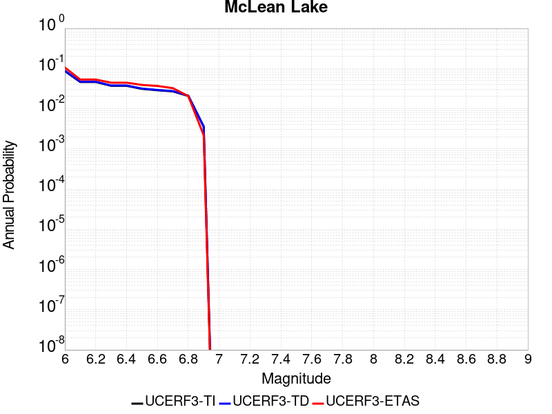 |
|-----|

| Magnitude | UCERF3-TI Prob | UCERF3-TD Prob | UCERF3-ETAS Prob |
|-----|-----|-----|-----|
| 6.0 | 0.08660234 | 0.08862549 | 0.106290676 |
| 6.1 | 0.046187367 | 0.047042813 | 0.053145338 |
| 6.2 | 0.046187367 | 0.047042813 | 0.053145338 |
| 6.3 | 0.037160926 | 0.037833326 | 0.04446855 |
| 6.4 | 0.037160926 | 0.037833326 | 0.04446855 |
| 6.5 | 0.031155039 | 0.03171899 | 0.039045554 |
| 6.6 | 0.028790938 | 0.02931606 | 0.036876354 |
| 6.7 | 0.027006764 | 0.027503598 | 0.03253796 |
| 6.8 | 0.02077392 | 0.02116757 | 0.020607375 |
| 6.9 | 0.00356056 | 0.0036104927 | 0.0021691974 |

## Mendocino
*[(top)](#table-of-contents)*

| 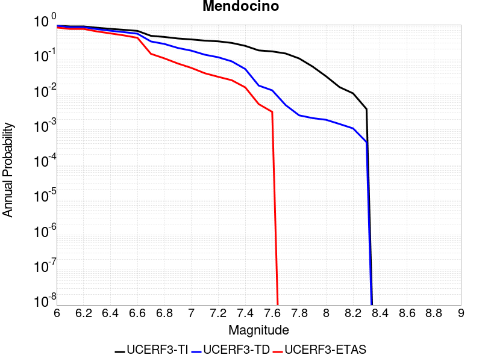 |
|-----|

| Magnitude | UCERF3-TI Prob | UCERF3-TD Prob | UCERF3-ETAS Prob |
|-----|-----|-----|-----|
| 6.0 | 0.9445329 | 0.92910635 | 0.8308026 |
| 6.1 | 0.8912703 | 0.84613526 | 0.7581345 |
| 6.2 | 0.8912703 | 0.84613526 | 0.7581345 |
| 6.3 | 0.81920063 | 0.74613017 | 0.64208245 |
| 6.4 | 0.76087874 | 0.6725205 | 0.56507593 |
| 6.5 | 0.7139669 | 0.61281806 | 0.49457702 |
| 6.6 | 0.66616005 | 0.5540593 | 0.42299348 |
| 6.7 | 0.4816605 | 0.3326264 | 0.14750542 |
| 6.8 | 0.44739613 | 0.28220963 | 0.10954447 |
| 6.9 | 0.40428734 | 0.21696834 | 0.07809111 |
| 7.0 | 0.38022676 | 0.18157263 | 0.05856833 |
| 7.1 | 0.35101056 | 0.13937086 | 0.04121475 |
| 7.2 | 0.33524773 | 0.117552884 | 0.03253796 |
| 7.3 | 0.30191424 | 0.08995645 | 0.02603037 |
| 7.4 | 0.24908318 | 0.054371957 | 0.01626898 |
| 7.5 | 0.1845725 | 0.018331977 | 0.0054229936 |
| 7.6 | 0.17303081 | 0.01339208 | 0.0032537961 |
| 7.7 | 0.15076509 | 0.005072401 | 0.0 |
| 7.8 | 0.10888012 | 0.0025919157 | 0.0 |
| 7.9 | 0.06382852 | 0.0021609939 | 0.0 |
| 8.0 | 0.0336243 | 0.0019334086 | 0.0 |
| 8.1 | 0.016515803 | 0.0014666333 | 0.0 |
| 8.2 | 0.010997703 | 0.0011000275 | 0.0 |
| 8.3 | 0.003924914 | 4.4703513E-4 | 0.0 |

## Mission (connected) 2011 CFM
*[(top)](#table-of-contents)*

| 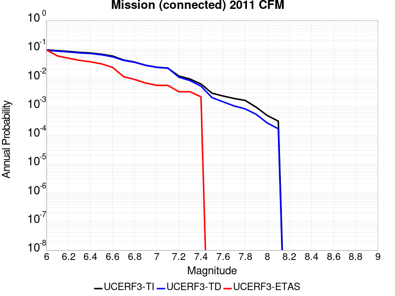 |
|-----|

| Magnitude | UCERF3-TI Prob | UCERF3-TD Prob | UCERF3-ETAS Prob |
|-----|-----|-----|-----|
| 6.0 | 0.09313389 | 0.09008209 | 0.09327549 |
| 6.1 | 0.08734431 | 0.084081635 | 0.057483733 |
| 6.2 | 0.082427874 | 0.07897634 | 0.047722343 |
| 6.3 | 0.07638998 | 0.07293491 | 0.040130153 |
| 6.4 | 0.07255764 | 0.06969117 | 0.03579176 |
| 6.5 | 0.065645486 | 0.06282663 | 0.030368764 |
| 6.6 | 0.05686744 | 0.053482737 | 0.022776572 |
| 6.7 | 0.041314837 | 0.040056575 | 0.010845987 |
| 6.8 | 0.03504157 | 0.03431723 | 0.00867679 |
| 6.9 | 0.027030824 | 0.026982628 | 0.0065075923 |
| 7.0 | 0.023004416 | 0.023241695 | 0.0054229936 |
| 7.1 | 0.021417603 | 0.021763716 | 0.0054229936 |
| 7.2 | 0.011481992 | 0.010430129 | 0.0032537961 |
| 7.3 | 0.009018703 | 0.007954631 | 0.0032537961 |
| 7.4 | 0.006049171 | 0.005089734 | 0.0021691974 |
| 7.5 | 0.0028974803 | 0.002029866 | 0.0 |
| 7.6 | 0.0023092406 | 0.0014516347 | 0.0 |
| 7.7 | 0.001897039 | 0.0010411793 | 0.0 |
| 7.8 | 0.0016241958 | 8.241807E-4 | 0.0 |
| 7.9 | 9.4064814E-4 | 5.3197757E-4 | 0.0 |
| 8.0 | 4.8406524E-4 | 2.6668087E-4 | 0.0 |
| 8.1 | 3.0913105E-4 | 1.6714018E-4 | 0.0 |

## Mission Creek
*[(top)](#table-of-contents)*

| 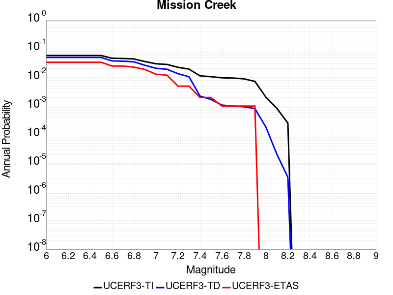 |
|-----|

| Magnitude | UCERF3-TI Prob | UCERF3-TD Prob | UCERF3-ETAS Prob |
|-----|-----|-----|-----|
| 6.0 | 0.058483493 | 0.04985215 | 0.03579176 |
| 6.1 | 0.058483493 | 0.04985215 | 0.03579176 |
| 6.2 | 0.058483493 | 0.04985215 | 0.03579176 |
| 6.3 | 0.058483493 | 0.04985215 | 0.03579176 |
| 6.4 | 0.058483493 | 0.04985215 | 0.03579176 |
| 6.5 | 0.058483493 | 0.04985215 | 0.03579176 |
| 6.6 | 0.04688384 | 0.037896093 | 0.02603037 |
| 6.7 | 0.045970727 | 0.036958195 | 0.02603037 |
| 6.8 | 0.044248734 | 0.035181656 | 0.023861172 |
| 6.9 | 0.035877477 | 0.026534494 | 0.019522777 |
| 7.0 | 0.030045368 | 0.020894632 | 0.013015185 |
| 7.1 | 0.028528836 | 0.019337531 | 0.011930586 |
| 7.2 | 0.022619098 | 0.0135636255 | 0.0054229936 |
| 7.3 | 0.019575553 | 0.010597405 | 0.0054229936 |
| 7.4 | 0.011404616 | 0.0022477007 | 0.0021691974 |
| 7.5 | 0.0106495395 | 0.0017037984 | 0.0021691974 |
| 7.6 | 0.009727226 | 0.0010868085 | 0.0010845987 |
| 7.7 | 0.009561102 | 9.98053E-4 | 0.0010845987 |
| 7.8 | 0.008931597 | 9.4663096E-4 | 0.0010845987 |
| 7.9 | 0.0072965445 | 8.1785105E-4 | 0.0010845987 |
| 8.0 | 0.0020494973 | 1.8486046E-4 | 0.0 |
| 8.1 | 8.328369E-4 | 2.0859146E-5 | 0.0 |
| 8.2 | 2.5565817E-4 | 3.258031E-6 | 0.0 |

## Mission Hills 2011
*[(top)](#table-of-contents)*

| 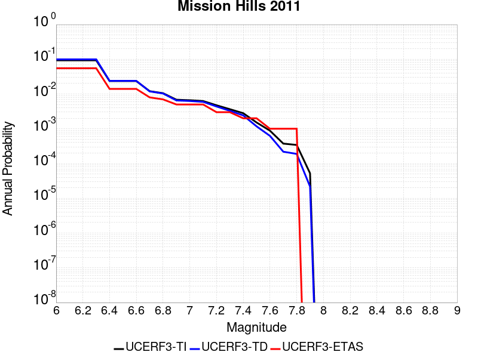 |
|-----|

| Magnitude | UCERF3-TI Prob | UCERF3-TD Prob | UCERF3-ETAS Prob |
|-----|-----|-----|-----|
| 6.0 | 0.09327652 | 0.09946131 | 0.055314533 |
| 6.1 | 0.09327652 | 0.09946131 | 0.055314533 |
| 6.2 | 0.09327652 | 0.09946131 | 0.055314533 |
| 6.3 | 0.09327652 | 0.09946131 | 0.055314533 |
| 6.4 | 0.02354504 | 0.023883687 | 0.015184382 |
| 6.5 | 0.02354504 | 0.023883687 | 0.015184382 |
| 6.6 | 0.02354504 | 0.023883687 | 0.015184382 |
| 6.7 | 0.012066888 | 0.011905133 | 0.00867679 |
| 6.8 | 0.01055048 | 0.010345822 | 0.007592191 |
| 6.9 | 0.0068567903 | 0.006538488 | 0.0054229936 |
| 7.0 | 0.00661826 | 0.006296424 | 0.0054229936 |
| 7.1 | 0.0062750103 | 0.005947298 | 0.0054229936 |
| 7.2 | 0.0047400123 | 0.0043825437 | 0.0032537961 |
| 7.3 | 0.0036564614 | 0.0032805856 | 0.0032537961 |
| 7.4 | 0.0028085075 | 0.0024253014 | 0.0021691974 |
| 7.5 | 0.0015157205 | 0.0011738531 | 0.0021691974 |
| 7.6 | 8.8162086E-4 | 6.239672E-4 | 0.0010845987 |
| 7.7 | 3.739499E-4 | 2.1857469E-4 | 0.0010845987 |
| 7.8 | 3.424468E-4 | 1.8940278E-4 | 0.0010845987 |
| 7.9 | 5.23289E-5 | 2.1707307E-5 | 0.0 |

## Mission Ridge-Arroyo Parida-Santa Ana
*[(top)](#table-of-contents)*

| 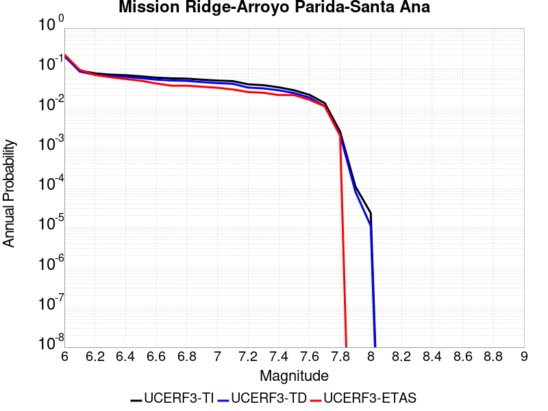 |
|-----|

| Magnitude | UCERF3-TI Prob | UCERF3-TD Prob | UCERF3-ETAS Prob |
|-----|-----|-----|-----|
| 6.0 | 0.19550359 | 0.20316748 | 0.22017354 |
| 6.1 | 0.0867028 | 0.081687026 | 0.0889371 |
| 6.2 | 0.07345903 | 0.067756064 | 0.06832972 |
| 6.3 | 0.06827274 | 0.06236537 | 0.05965293 |
| 6.4 | 0.066059485 | 0.060069907 | 0.053145338 |
| 6.5 | 0.061929185 | 0.05579203 | 0.047722343 |
| 6.6 | 0.057514463 | 0.05122239 | 0.040130153 |
| 6.7 | 0.055110898 | 0.048721235 | 0.03470716 |
| 6.8 | 0.054135412 | 0.047711655 | 0.03470716 |
| 6.9 | 0.051032364 | 0.044474524 | 0.03253796 |
| 7.0 | 0.048549995 | 0.04189442 | 0.030368764 |
| 7.1 | 0.046907254 | 0.040202208 | 0.027114967 |
| 7.2 | 0.03907087 | 0.032401692 | 0.022776572 |
| 7.3 | 0.037123077 | 0.030833771 | 0.022776572 |
| 7.4 | 0.032792345 | 0.02768212 | 0.019522777 |
| 7.5 | 0.027676838 | 0.023600105 | 0.019522777 |
| 7.6 | 0.02130429 | 0.018157937 | 0.01626898 |
| 7.7 | 0.013169439 | 0.010997995 | 0.010845987 |
| 7.8 | 0.0025330978 | 0.0021171796 | 0.0021691974 |
| 7.9 | 1.0681695E-4 | 7.9150894E-5 | 0.0 |
| 8.0 | 2.3185707E-5 | 1.1081812E-5 | 0.0 |

## Mohawk Valley 2011 CFM
*[(top)](#table-of-contents)*

| 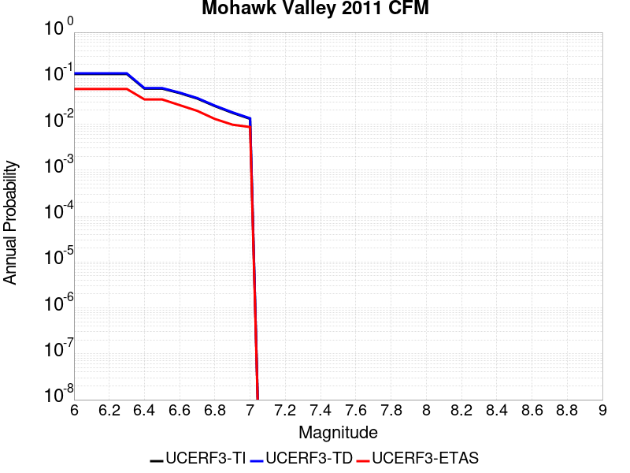 |
|-----|

| Magnitude | UCERF3-TI Prob | UCERF3-TD Prob | UCERF3-ETAS Prob |
|-----|-----|-----|-----|
| 6.0 | 0.12424412 | 0.12807265 | 0.05856833 |
| 6.1 | 0.12424412 | 0.12807265 | 0.05856833 |
| 6.2 | 0.12424412 | 0.12807265 | 0.05856833 |
| 6.3 | 0.12424412 | 0.12807265 | 0.05856833 |
| 6.4 | 0.05977591 | 0.061255578 | 0.03470716 |
| 6.5 | 0.05977591 | 0.061255578 | 0.03470716 |
| 6.6 | 0.047576662 | 0.0487516 | 0.02603037 |
| 6.7 | 0.036199037 | 0.03709455 | 0.019522777 |
| 6.8 | 0.024768703 | 0.025388418 | 0.013015185 |
| 6.9 | 0.017667964 | 0.018123206 | 0.009761388 |
| 7.0 | 0.0130998865 | 0.013450249 | 0.00867679 |

## Mono Lake 2011 CFM
*[(top)](#table-of-contents)*

| 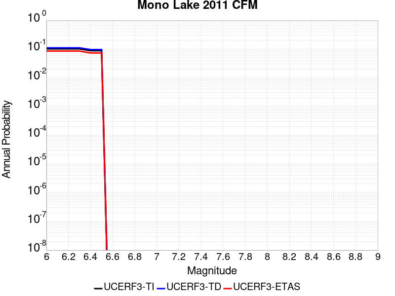 |
|-----|

| Magnitude | UCERF3-TI Prob | UCERF3-TD Prob | UCERF3-ETAS Prob |
|-----|-----|-----|-----|
| 6.0 | 0.10070214 | 0.109552085 | 0.0845987 |
| 6.1 | 0.10070214 | 0.109552085 | 0.0845987 |
| 6.2 | 0.10070214 | 0.109552085 | 0.0845987 |
| 6.3 | 0.10070214 | 0.109552085 | 0.0845987 |
| 6.4 | 0.08725977 | 0.09555309 | 0.07266811 |
| 6.5 | 0.08725977 | 0.09555309 | 0.07266811 |

## Monte Vista - Shannon 2011 CFM
*[(top)](#table-of-contents)*

| 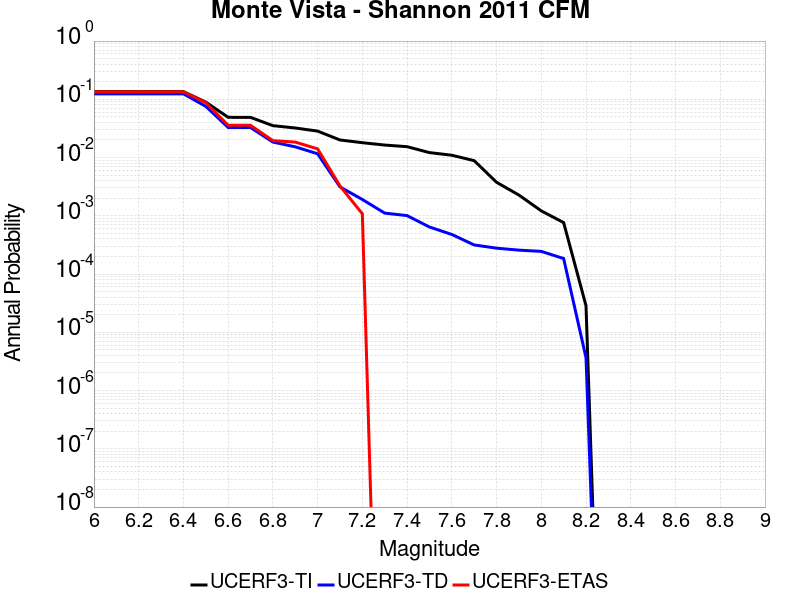 |
|-----|

| Magnitude | UCERF3-TI Prob | UCERF3-TD Prob | UCERF3-ETAS Prob |
|-----|-----|-----|-----|
| 6.0 | 0.13551426 | 0.12416006 | 0.13449024 |
| 6.1 | 0.13551426 | 0.12416006 | 0.13449024 |
| 6.2 | 0.13551426 | 0.12416006 | 0.13449024 |
| 6.3 | 0.13551426 | 0.12416006 | 0.13449024 |
| 6.4 | 0.13551426 | 0.12416006 | 0.13449024 |
| 6.5 | 0.08959999 | 0.07572945 | 0.08785249 |
| 6.6 | 0.049107905 | 0.032864776 | 0.03579176 |
| 6.7 | 0.048998114 | 0.03276961 | 0.03579176 |
| 6.8 | 0.03530012 | 0.018469827 | 0.019522777 |
| 6.9 | 0.03219797 | 0.015291043 | 0.018438177 |
| 7.0 | 0.02845282 | 0.011612848 | 0.014099783 |
| 7.1 | 0.020038724 | 0.003136625 | 0.0032537961 |
| 7.2 | 0.018001303 | 0.0019073734 | 0.0010845987 |
| 7.3 | 0.016395425 | 0.0011126446 | 0.0 |
| 7.4 | 0.015381536 | 0.0010080958 | 0.0 |
| 7.5 | 0.012167911 | 6.423489E-4 | 0.0 |
| 7.6 | 0.010963667 | 4.788591E-4 | 0.0 |
| 7.7 | 0.008842761 | 3.1600168E-4 | 0.0 |
| 7.8 | 0.0037658801 | 2.7828463E-4 | 0.0 |
| 7.9 | 0.002271799 | 2.574926E-4 | 0.0 |
| 8.0 | 0.0012159353 | 2.451104E-4 | 0.0 |
| 8.1 | 7.6477346E-4 | 1.8481063E-4 | 0.0 |
| 8.2 | 2.8662205E-5 | 3.6798149E-6 | 0.0 |

## Monterey Bay-Tularcitos
*[(top)](#table-of-contents)*

| 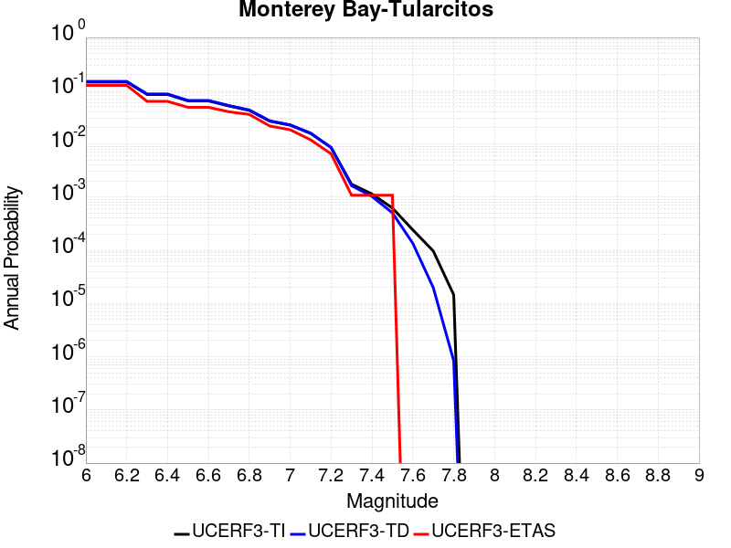 |
|-----|

| Magnitude | UCERF3-TI Prob | UCERF3-TD Prob | UCERF3-ETAS Prob |
|-----|-----|-----|-----|
| 6.0 | 0.14548697 | 0.14966124 | 0.12581345 |
| 6.1 | 0.14548697 | 0.14966124 | 0.12581345 |
| 6.2 | 0.14548697 | 0.14966124 | 0.12581345 |
| 6.3 | 0.084875524 | 0.08678037 | 0.06290673 |
| 6.4 | 0.084875524 | 0.08678037 | 0.06290673 |
| 6.5 | 0.064349115 | 0.065682754 | 0.048806943 |
| 6.6 | 0.064311735 | 0.065645054 | 0.048806943 |
| 6.7 | 0.05163352 | 0.052641857 | 0.040130153 |
| 6.8 | 0.04263308 | 0.043432124 | 0.03579176 |
| 6.9 | 0.026735833 | 0.027173098 | 0.021691974 |
| 7.0 | 0.022489922 | 0.02283952 | 0.018438177 |
| 7.1 | 0.015736412 | 0.015946846 | 0.011930586 |
| 7.2 | 0.008532863 | 0.008589258 | 0.0065075923 |
| 7.3 | 0.0017500195 | 0.001640217 | 0.0010845987 |
| 7.4 | 0.0011458881 | 0.0010306011 | 0.0010845987 |
| 7.5 | 6.230338E-4 | 5.0575996E-4 | 0.0010845987 |
| 7.6 | 2.4187364E-4 | 1.3518646E-4 | 0.0 |
| 7.7 | 9.698781E-5 | 1.9855881E-5 | 0.0 |
| 7.8 | 1.4589103E-5 | 8.3929893E-7 | 0.0 |

## Morales (East)
*[(top)](#table-of-contents)*

| 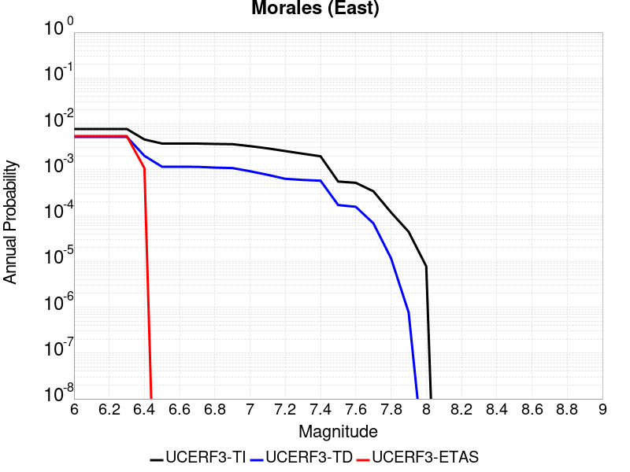 |
|-----|

| Magnitude | UCERF3-TI Prob | UCERF3-TD Prob | UCERF3-ETAS Prob |
|-----|-----|-----|-----|
| 6.0 | 0.0077666133 | 0.005222751 | 0.0054229936 |
| 6.1 | 0.0077666133 | 0.005222751 | 0.0054229936 |
| 6.2 | 0.0077666133 | 0.005222751 | 0.0054229936 |
| 6.3 | 0.0077666133 | 0.005222751 | 0.0054229936 |
| 6.4 | 0.004580591 | 0.002012779 | 0.0010845987 |
| 6.5 | 0.0037369044 | 0.001164217 | 0.0 |
| 6.6 | 0.0037369044 | 0.001164217 | 0.0 |
| 6.7 | 0.0037285269 | 0.0011579385 | 0.0 |
| 6.8 | 0.0036625806 | 0.0011153443 | 0.0 |
| 6.9 | 0.0036154508 | 0.0010899783 | 0.0 |
| 7.0 | 0.0032783304 | 9.2836935E-4 | 0.0 |
| 7.1 | 0.002928191 | 7.7525777E-4 | 0.0 |
| 7.2 | 0.0025589184 | 6.3466275E-4 | 0.0 |
| 7.3 | 0.0022400417 | 5.999905E-4 | 0.0 |
| 7.4 | 0.001967447 | 5.7791907E-4 | 0.0 |
| 7.5 | 5.5310846E-4 | 1.6983903E-4 | 0.0 |
| 7.6 | 5.195836E-4 | 1.5547326E-4 | 0.0 |
| 7.7 | 3.3907546E-4 | 6.782314E-5 | 0.0 |
| 7.8 | 1.1748421E-4 | 1.1755988E-5 | 0.0 |
| 7.9 | 4.43144E-5 | 7.7090016E-7 | 0.0 |
| 8.0 | 7.812063E-6 | 1.3870505E-10 | 0.0 |

## Morales (West)
*[(top)](#table-of-contents)*

| 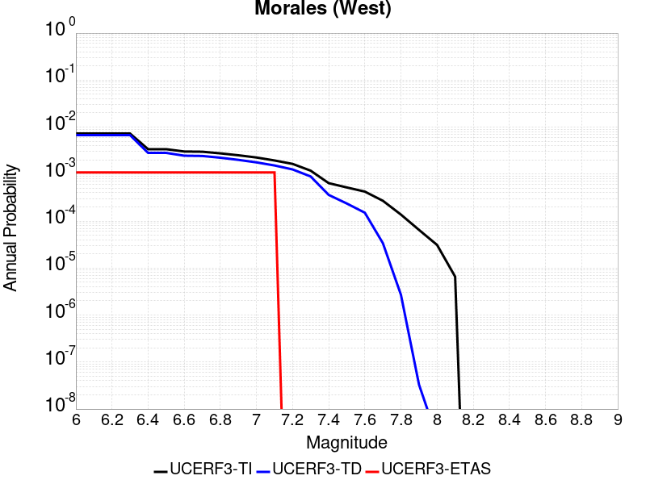 |
|-----|

| Magnitude | UCERF3-TI Prob | UCERF3-TD Prob | UCERF3-ETAS Prob |
|-----|-----|-----|-----|
| 6.0 | 0.0072924113 | 0.006751277 | 0.0010845987 |
| 6.1 | 0.0072924113 | 0.006751277 | 0.0010845987 |
| 6.2 | 0.0072924113 | 0.006751277 | 0.0010845987 |
| 6.3 | 0.0072924113 | 0.006751277 | 0.0010845987 |
| 6.4 | 0.0033882044 | 0.002827295 | 0.0010845987 |
| 6.5 | 0.0033882044 | 0.002827295 | 0.0010845987 |
| 6.6 | 0.0030247236 | 0.0024627752 | 0.0010845987 |
| 6.7 | 0.0029913236 | 0.0024292793 | 0.0010845987 |
| 6.8 | 0.0027613468 | 0.0022309893 | 0.0010845987 |
| 6.9 | 0.0025138985 | 0.0020064083 | 0.0010845987 |
| 7.0 | 0.0022549347 | 0.0017747544 | 0.0010845987 |
| 7.1 | 0.0019489805 | 0.0015256344 | 0.0010845987 |
| 7.2 | 0.001647096 | 0.001255811 | 0.0 |
| 7.3 | 0.0011825947 | 8.902869E-4 | 0.0 |
| 7.4 | 6.4135756E-4 | 3.6053773E-4 | 0.0 |
| 7.5 | 5.197333E-4 | 2.3670078E-4 | 0.0 |
| 7.6 | 4.2390768E-4 | 1.5063917E-4 | 0.0 |
| 7.7 | 2.7030465E-4 | 3.3833574E-5 | 0.0 |
| 7.8 | 1.372987E-4 | 2.693517E-6 | 0.0 |
| 7.9 | 6.484623E-5 | 3.3010103E-8 | 0.0 |
| 8.0 | 3.1067757E-5 | 2.448493E-9 | 0.0 |
| 8.1 | 6.5673103E-6 | 1.0535341E-9 | 0.0 |

## Mount Diablo Thrust North CFM
*[(top)](#table-of-contents)*

| 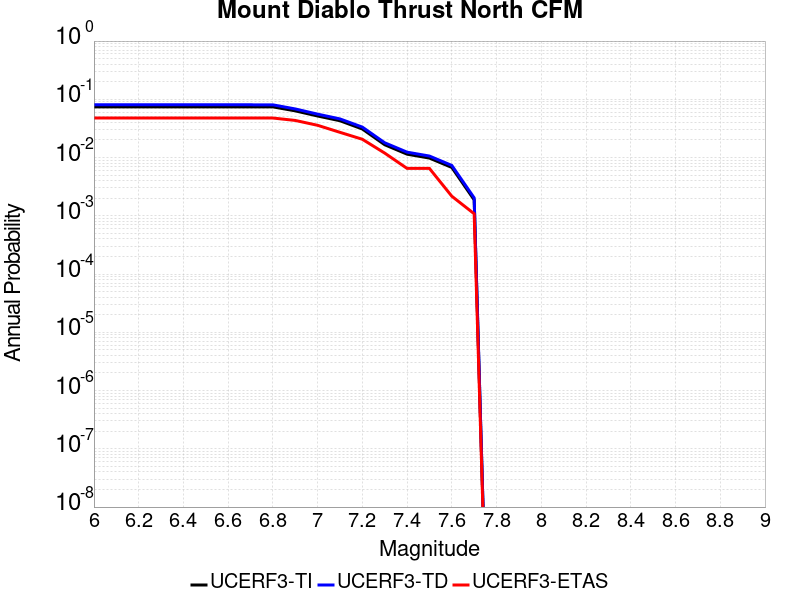 |
|-----|

| Magnitude | UCERF3-TI Prob | UCERF3-TD Prob | UCERF3-ETAS Prob |
|-----|-----|-----|-----|
| 6.0 | 0.07430035 | 0.08049926 | 0.047722343 |
| 6.1 | 0.07430035 | 0.08049926 | 0.047722343 |
| 6.2 | 0.07430035 | 0.08049926 | 0.047722343 |
| 6.3 | 0.07430035 | 0.08049926 | 0.047722343 |
| 6.4 | 0.07430035 | 0.08049926 | 0.047722343 |
| 6.5 | 0.07430035 | 0.08049926 | 0.047722343 |
| 6.6 | 0.074270785 | 0.08046886 | 0.047722343 |
| 6.7 | 0.074270785 | 0.08046886 | 0.047722343 |
| 6.8 | 0.07418145 | 0.08037651 | 0.047722343 |
| 6.9 | 0.06337782 | 0.068330824 | 0.04338395 |
| 7.0 | 0.051709276 | 0.055655975 | 0.03579176 |
| 7.1 | 0.042875238 | 0.04606911 | 0.027114967 |
| 7.2 | 0.03094744 | 0.033336572 | 0.020607375 |
| 7.3 | 0.016609706 | 0.017940545 | 0.011930586 |
| 7.4 | 0.011435076 | 0.012379037 | 0.0065075923 |
| 7.5 | 0.009797534 | 0.010615528 | 0.0065075923 |
| 7.6 | 0.006766721 | 0.0073255063 | 0.0021691974 |
| 7.7 | 0.0018784277 | 0.002030113 | 0.0010845987 |

## Mount Diablo Thrust South
*[(top)](#table-of-contents)*

| 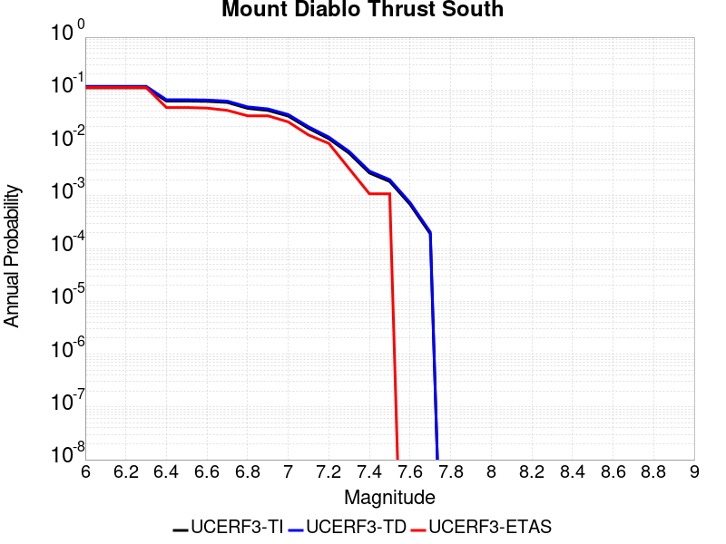 |
|-----|

| Magnitude | UCERF3-TI Prob | UCERF3-TD Prob | UCERF3-ETAS Prob |
|-----|-----|-----|-----|
| 6.0 | 0.110204495 | 0.11767613 | 0.11171366 |
| 6.1 | 0.110204495 | 0.11767613 | 0.11171366 |
| 6.2 | 0.110204495 | 0.11767613 | 0.11171366 |
| 6.3 | 0.110204495 | 0.11767613 | 0.11171366 |
| 6.4 | 0.061813727 | 0.065508515 | 0.046637744 |
| 6.5 | 0.061813727 | 0.065508515 | 0.046637744 |
| 6.6 | 0.061028447 | 0.06468096 | 0.045553144 |
| 6.7 | 0.058238026 | 0.061757706 | 0.04121475 |
| 6.8 | 0.044984646 | 0.047988582 | 0.03253796 |
| 6.9 | 0.041119527 | 0.04397289 | 0.03253796 |
| 7.0 | 0.03212344 | 0.034375276 | 0.02494577 |
| 7.1 | 0.018857783 | 0.020170772 | 0.014099783 |
| 7.2 | 0.01194703 | 0.012865141 | 0.009761388 |
| 7.3 | 0.0063664913 | 0.0068853083 | 0.0032537961 |
| 7.4 | 0.0026888538 | 0.0029148797 | 0.0010845987 |
| 7.5 | 0.0018521323 | 0.0020107816 | 0.0010845987 |
| 7.6 | 6.845615E-4 | 7.4196095E-4 | 0.0 |
| 7.7 | 1.8883219E-4 | 2.0408885E-4 | 0.0 |

## Nelson Lake
*[(top)](#table-of-contents)*

| 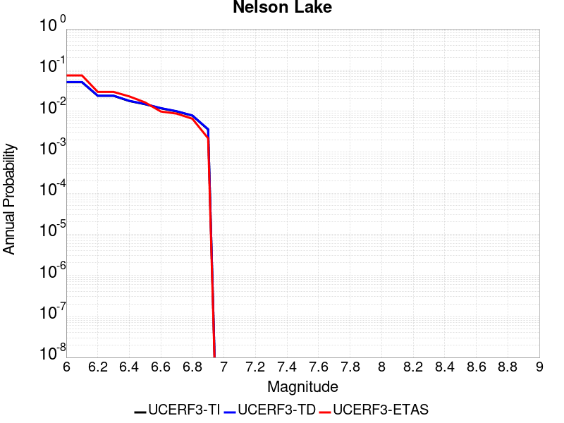 |
|-----|

| Magnitude | UCERF3-TI Prob | UCERF3-TD Prob | UCERF3-ETAS Prob |
|-----|-----|-----|-----|
| 6.0 | 0.05041216 | 0.050927725 | 0.07375271 |
| 6.1 | 0.05041216 | 0.050927725 | 0.07375271 |
| 6.2 | 0.02351082 | 0.02373117 | 0.029284164 |
| 6.3 | 0.02351082 | 0.02373117 | 0.029284164 |
| 6.4 | 0.017597485 | 0.017769719 | 0.022776572 |
| 6.5 | 0.014685288 | 0.014834406 | 0.01626898 |
| 6.6 | 0.011679373 | 0.011804529 | 0.009761388 |
| 6.7 | 0.009819415 | 0.009929553 | 0.00867679 |
| 6.8 | 0.0077314293 | 0.007823202 | 0.0065075923 |
| 6.9 | 0.00356056 | 0.0036104927 | 0.0021691974 |

## Newport-Inglewood (Offshore)
*[(top)](#table-of-contents)*

| 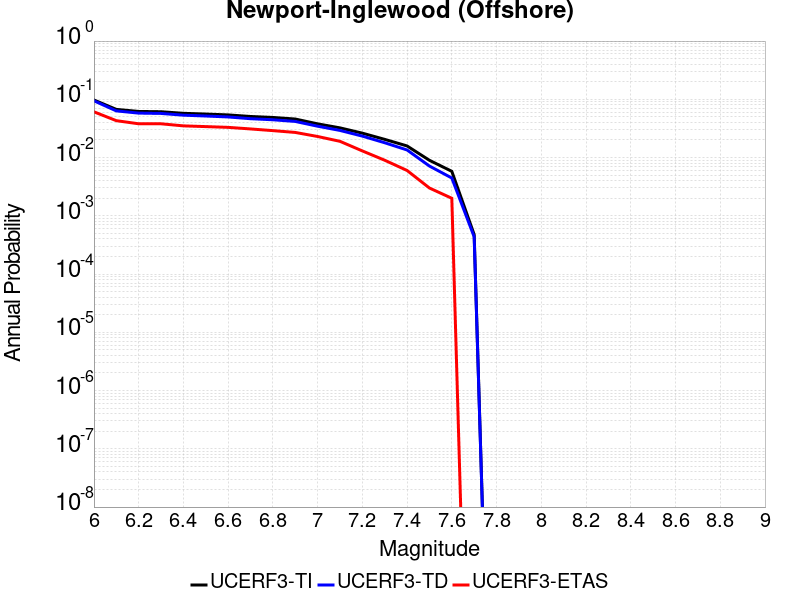 |
|-----|

| Magnitude | UCERF3-TI Prob | UCERF3-TD Prob | UCERF3-ETAS Prob |
|-----|-----|-----|-----|
| 6.0 | 0.097339995 | 0.09431707 | 0.055314533 |
| 6.1 | 0.06713648 | 0.06328554 | 0.040130153 |
| 6.2 | 0.06192332 | 0.0579405 | 0.03470716 |
| 6.3 | 0.061215293 | 0.057211462 | 0.03470716 |
| 6.4 | 0.057497337 | 0.053401392 | 0.031453364 |
| 6.5 | 0.055821855 | 0.051681817 | 0.030368764 |
| 6.6 | 0.053979103 | 0.049789824 | 0.029284164 |
| 6.7 | 0.050732344 | 0.046460543 | 0.027114967 |
| 6.8 | 0.048835237 | 0.044538848 | 0.02494577 |
| 6.9 | 0.045878377 | 0.04171667 | 0.022776572 |
| 7.0 | 0.037911575 | 0.03453972 | 0.019522777 |
| 7.1 | 0.032336228 | 0.029230554 | 0.01626898 |
| 7.2 | 0.026243174 | 0.023350103 | 0.011930586 |
| 7.3 | 0.02052895 | 0.017961904 | 0.007592191 |
| 7.4 | 0.015823646 | 0.013497506 | 0.0054229936 |
| 7.5 | 0.008975431 | 0.0071493657 | 0.0032537961 |
| 7.6 | 0.005804351 | 0.0044587757 | 0.0021691974 |
| 7.7 | 4.7564966E-4 | 4.3647605E-4 | 0.0 |

## Newport-Inglewood alt 1
*[(top)](#table-of-contents)*

| 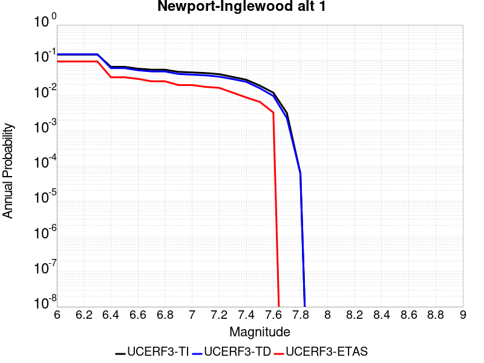 |
|-----|

| Magnitude | UCERF3-TI Prob | UCERF3-TD Prob | UCERF3-ETAS Prob |
|-----|-----|-----|-----|
| 6.0 | 0.14342247 | 0.14629608 | 0.09110629 |
| 6.1 | 0.14342247 | 0.14629608 | 0.09110629 |
| 6.2 | 0.14342247 | 0.14629608 | 0.09110629 |
| 6.3 | 0.14342247 | 0.14629608 | 0.09110629 |
| 6.4 | 0.06440937 | 0.059131052 | 0.03253796 |
| 6.5 | 0.06440937 | 0.059131052 | 0.03253796 |
| 6.6 | 0.057037894 | 0.051437233 | 0.029284164 |
| 6.7 | 0.05333741 | 0.047604773 | 0.02494577 |
| 6.8 | 0.053195454 | 0.047459137 | 0.02494577 |
| 6.9 | 0.04625758 | 0.040289495 | 0.019522777 |
| 7.0 | 0.04456981 | 0.0385508 | 0.019522777 |
| 7.1 | 0.042840067 | 0.03684586 | 0.01735358 |
| 7.2 | 0.039866723 | 0.033883754 | 0.01626898 |
| 7.3 | 0.033215735 | 0.028891876 | 0.011930586 |
| 7.4 | 0.02769267 | 0.024170447 | 0.00867679 |
| 7.5 | 0.01885601 | 0.015919631 | 0.0065075923 |
| 7.6 | 0.011881354 | 0.009583358 | 0.0032537961 |
| 7.7 | 0.0031507805 | 0.002276716 | 0.0 |
| 7.8 | 6.055505E-5 | 6.0903378E-5 | 0.0 |

## North Frontal  (East)
*[(top)](#table-of-contents)*

| 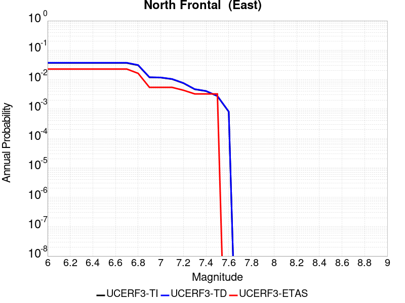 |
|-----|

| Magnitude | UCERF3-TI Prob | UCERF3-TD Prob | UCERF3-ETAS Prob |
|-----|-----|-----|-----|
| 6.0 | 0.036548756 | 0.03725126 | 0.022776572 |
| 6.1 | 0.036548756 | 0.03725126 | 0.022776572 |
| 6.2 | 0.036548756 | 0.03725126 | 0.022776572 |
| 6.3 | 0.036548756 | 0.03725126 | 0.022776572 |
| 6.4 | 0.036548756 | 0.03725126 | 0.022776572 |
| 6.5 | 0.036548756 | 0.03725126 | 0.022776572 |
| 6.6 | 0.036548756 | 0.03725126 | 0.022776572 |
| 6.7 | 0.036548756 | 0.03725126 | 0.022776572 |
| 6.8 | 0.030615596 | 0.031209262 | 0.01626898 |
| 6.9 | 0.011901997 | 0.0120409215 | 0.0054229936 |
| 7.0 | 0.011655389 | 0.011790573 | 0.0054229936 |
| 7.1 | 0.010340707 | 0.010456291 | 0.0054229936 |
| 7.2 | 0.00755006 | 0.007632685 | 0.004338395 |
| 7.3 | 0.004674811 | 0.0047266376 | 0.0032537961 |
| 7.4 | 0.0040492592 | 0.0040942575 | 0.0032537961 |
| 7.5 | 0.002732722 | 0.0027637922 | 0.0032537961 |
| 7.6 | 8.0790115E-4 | 8.1738376E-4 | 0.0 |

## North Frontal  (West)
*[(top)](#table-of-contents)*

| 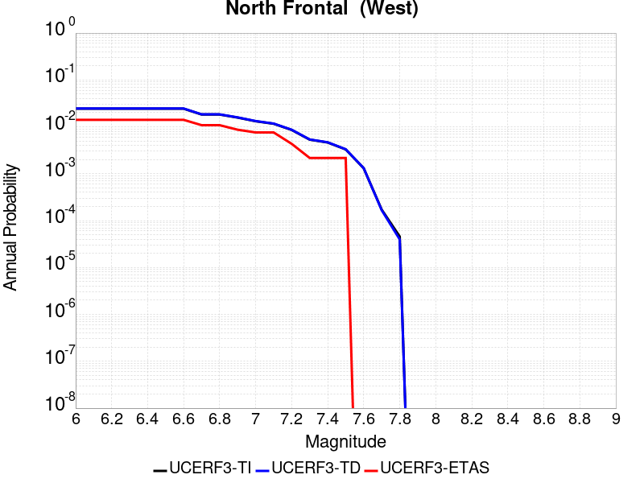 |
|-----|

| Magnitude | UCERF3-TI Prob | UCERF3-TD Prob | UCERF3-ETAS Prob |
|-----|-----|-----|-----|
| 6.0 | 0.024386728 | 0.024605397 | 0.014099783 |
| 6.1 | 0.024386728 | 0.024605397 | 0.014099783 |
| 6.2 | 0.024386728 | 0.024605397 | 0.014099783 |
| 6.3 | 0.024386728 | 0.024605397 | 0.014099783 |
| 6.4 | 0.024386728 | 0.024605397 | 0.014099783 |
| 6.5 | 0.024386728 | 0.024605397 | 0.014099783 |
| 6.6 | 0.024386728 | 0.024605397 | 0.014099783 |
| 6.7 | 0.018292878 | 0.018462077 | 0.010845987 |
| 6.8 | 0.018292878 | 0.018462077 | 0.010845987 |
| 6.9 | 0.015751565 | 0.015900757 | 0.00867679 |
| 7.0 | 0.013159642 | 0.013287603 | 0.007592191 |
| 7.1 | 0.011629739 | 0.011745282 | 0.007592191 |
| 7.2 | 0.008586352 | 0.008670259 | 0.004338395 |
| 7.3 | 0.0053319638 | 0.005383522 | 0.0021691974 |
| 7.4 | 0.0046354746 | 0.0046801744 | 0.0021691974 |
| 7.5 | 0.0033004202 | 0.0033315648 | 0.0021691974 |
| 7.6 | 0.001308149 | 0.0013172802 | 0.0 |
| 7.7 | 1.7128691E-4 | 1.6683525E-4 | 0.0 |
| 7.8 | 4.5785593E-5 | 3.971516E-5 | 0.0 |

## North Salt Lake
*[(top)](#table-of-contents)*

| 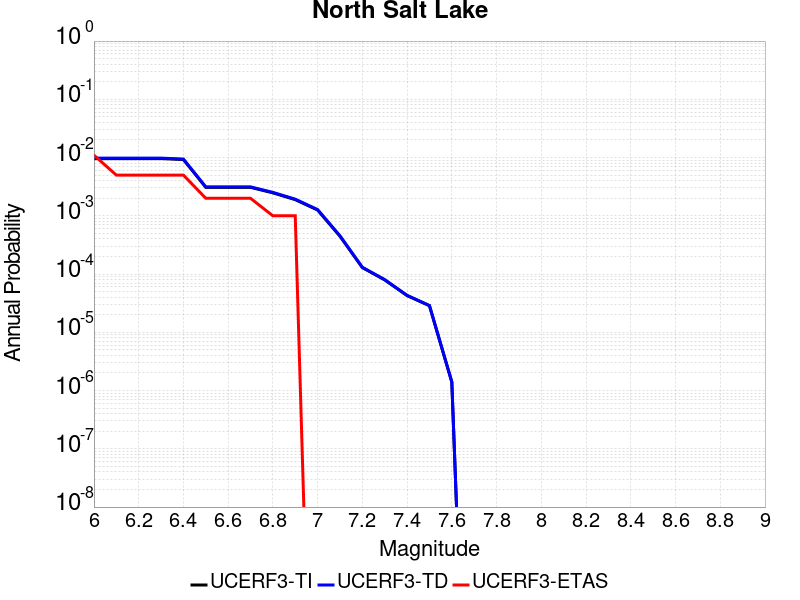 |
|-----|

| Magnitude | UCERF3-TI Prob | UCERF3-TD Prob | UCERF3-ETAS Prob |
|-----|-----|-----|-----|
| 6.0 | 0.009604531 | 0.00978468 | 0.009761388 |
| 6.1 | 0.009604531 | 0.00978468 | 0.004338395 |
| 6.2 | 0.009604531 | 0.00978468 | 0.004338395 |
| 6.3 | 0.009604531 | 0.00978468 | 0.004338395 |
| 6.4 | 0.009246817 | 0.009426506 | 0.004338395 |
| 6.5 | 0.003082006 | 0.0031404633 | 0.0021691974 |
| 6.6 | 0.003082006 | 0.0031404633 | 0.0021691974 |
| 6.7 | 0.003082006 | 0.0031404633 | 0.0021691974 |
| 6.8 | 0.0024773015 | 0.0025247445 | 0.0010845987 |
| 6.9 | 0.0018946513 | 0.0019311641 | 0.0010845987 |
| 7.0 | 0.0012560529 | 0.001280704 | 0.0 |
| 7.1 | 4.461084E-4 | 4.536204E-4 | 0.0 |
| 7.2 | 1.2914817E-4 | 1.3089748E-4 | 0.0 |
| 7.3 | 7.937295E-5 | 8.034933E-5 | 0.0 |
| 7.4 | 4.2691598E-5 | 4.3103275E-5 | 0.0 |
| 7.5 | 2.8592995E-5 | 2.8884653E-5 | 0.0 |
| 7.6 | 1.3990924E-6 | 1.4133211E-6 | 0.0 |

## North Tahoe 2011 CFM
*[(top)](#table-of-contents)*

|  |
|-----|

| Magnitude | UCERF3-TI Prob | UCERF3-TD Prob | UCERF3-ETAS Prob |
|-----|-----|-----|-----|
| 6.0 | 0.10613949 | 0.10340639 | 0.07592191 |
| 6.1 | 0.10613949 | 0.10340639 | 0.07592191 |
| 6.2 | 0.10613949 | 0.10340639 | 0.07592191 |
| 6.3 | 0.10613949 | 0.10340639 | 0.07592191 |
| 6.4 | 0.03765695 | 0.030926874 | 0.02603037 |
| 6.5 | 0.03765695 | 0.030926874 | 0.02603037 |
| 6.6 | 0.035115663 | 0.028286545 | 0.022776572 |
| 6.7 | 0.009612365 | 0.0028569808 | 0.0 |

## Northridge
*[(top)](#table-of-contents)*

| 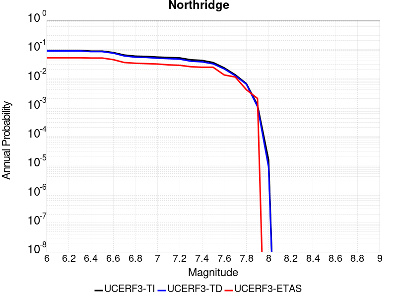 |
|-----|

| Magnitude | UCERF3-TI Prob | UCERF3-TD Prob | UCERF3-ETAS Prob |
|-----|-----|-----|-----|
| 6.0 | 0.09126415 | 0.08818951 | 0.05206074 |
| 6.1 | 0.09126415 | 0.08818951 | 0.05206074 |
| 6.2 | 0.09126415 | 0.08818951 | 0.05206074 |
| 6.3 | 0.09126415 | 0.08818951 | 0.05206074 |
| 6.4 | 0.0866103 | 0.08337933 | 0.05206074 |
| 6.5 | 0.0866103 | 0.08337933 | 0.05206074 |
| 6.6 | 0.077492066 | 0.073918104 | 0.047722343 |
| 6.7 | 0.0633296 | 0.059118886 | 0.037960954 |
| 6.8 | 0.057936598 | 0.053542838 | 0.03579176 |
| 6.9 | 0.056789547 | 0.05235529 | 0.03470716 |
| 7.0 | 0.053859457 | 0.04931771 | 0.03362256 |
| 7.1 | 0.05216222 | 0.047581695 | 0.031453364 |
| 7.2 | 0.050408576 | 0.045807734 | 0.030368764 |
| 7.3 | 0.043362472 | 0.03884297 | 0.027114967 |
| 7.4 | 0.041307665 | 0.036978636 | 0.02603037 |
| 7.5 | 0.03497059 | 0.031492814 | 0.02603037 |
| 7.6 | 0.022811372 | 0.021114841 | 0.014099783 |
| 7.7 | 0.013112926 | 0.012210248 | 0.011930586 |
| 7.8 | 0.006505329 | 0.006248184 | 0.004338395 |
| 7.9 | 0.0011796869 | 0.0010472236 | 0.0021691974 |
| 8.0 | 1.4950938E-5 | 8.502826E-6 | 0.0 |

## Northridge Hills
*[(top)](#table-of-contents)*

| 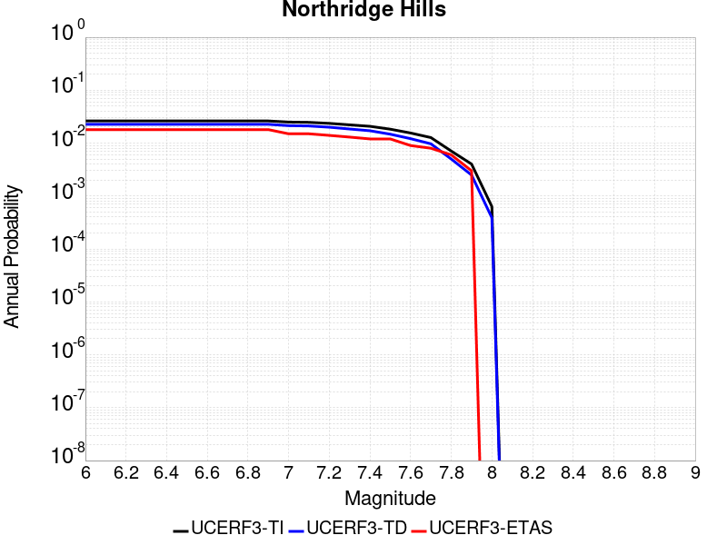 |
|-----|

| Magnitude | UCERF3-TI Prob | UCERF3-TD Prob | UCERF3-ETAS Prob |
|-----|-----|-----|-----|
| 6.0 | 0.026239768 | 0.022665692 | 0.01626898 |
| 6.1 | 0.026239768 | 0.022665692 | 0.01626898 |
| 6.2 | 0.026239768 | 0.022665692 | 0.01626898 |
| 6.3 | 0.026239768 | 0.022665692 | 0.01626898 |
| 6.4 | 0.026239768 | 0.022665692 | 0.01626898 |
| 6.5 | 0.026239768 | 0.022665692 | 0.01626898 |
| 6.6 | 0.026239768 | 0.022665692 | 0.01626898 |
| 6.7 | 0.026239768 | 0.022665692 | 0.01626898 |
| 6.8 | 0.026239768 | 0.022665692 | 0.01626898 |
| 6.9 | 0.026231047 | 0.022656836 | 0.01626898 |
| 7.0 | 0.024994953 | 0.021398006 | 0.013015185 |
| 7.1 | 0.02468924 | 0.02108673 | 0.013015185 |
| 7.2 | 0.023614949 | 0.019991456 | 0.011930586 |
| 7.3 | 0.022136293 | 0.018487291 | 0.010845987 |
| 7.4 | 0.020787861 | 0.017133076 | 0.009761388 |
| 7.5 | 0.018341197 | 0.0147478385 | 0.009761388 |
| 7.6 | 0.01552689 | 0.012138203 | 0.0065075923 |
| 7.7 | 0.012724477 | 0.009698339 | 0.0054229936 |
| 7.8 | 0.007083154 | 0.005003403 | 0.0032537961 |
| 7.9 | 0.0040183295 | 0.0024938118 | 0.0010845987 |
| 8.0 | 6.32085E-4 | 3.8867927E-4 | 0.0 |

## Oak Ridge (Onshore)
*[(top)](#table-of-contents)*

| 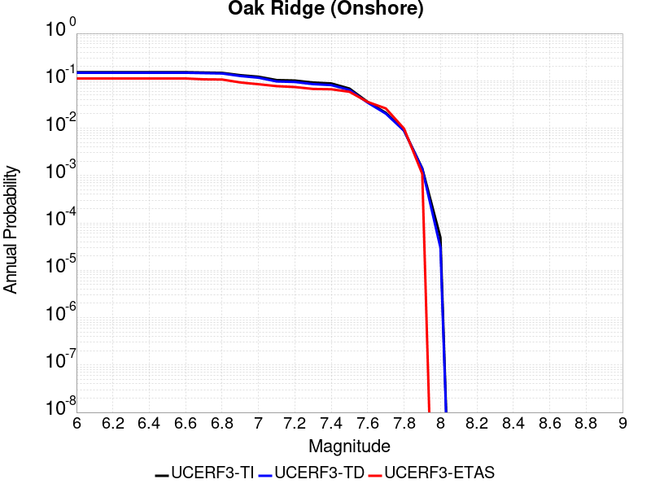 |
|-----|

| Magnitude | UCERF3-TI Prob | UCERF3-TD Prob | UCERF3-ETAS Prob |
|-----|-----|-----|-----|
| 6.0 | 0.15179195 | 0.1476136 | 0.11171366 |
| 6.1 | 0.15179195 | 0.1476136 | 0.11171366 |
| 6.2 | 0.15179195 | 0.1476136 | 0.11171366 |
| 6.3 | 0.15179195 | 0.1476136 | 0.11171366 |
| 6.4 | 0.15179195 | 0.1476136 | 0.11171366 |
| 6.5 | 0.15179195 | 0.1476136 | 0.11171366 |
| 6.6 | 0.15179195 | 0.1476136 | 0.11171366 |
| 6.7 | 0.14930236 | 0.14498782 | 0.10737527 |
| 6.8 | 0.14690597 | 0.14247045 | 0.106290676 |
| 6.9 | 0.13131607 | 0.12598877 | 0.09219089 |
| 7.0 | 0.12181215 | 0.11600499 | 0.0845987 |
| 7.1 | 0.10353054 | 0.09675852 | 0.077006504 |
| 7.2 | 0.10116067 | 0.09431058 | 0.07375271 |
| 7.3 | 0.09184474 | 0.08500498 | 0.06724512 |
| 7.4 | 0.08789383 | 0.08098845 | 0.06616052 |
| 7.5 | 0.06847938 | 0.06390644 | 0.05856833 |
| 7.6 | 0.03581056 | 0.03455753 | 0.03579176 |
| 7.7 | 0.021076249 | 0.020209804 | 0.02603037 |
| 7.8 | 0.008843349 | 0.008863361 | 0.009761388 |
| 7.9 | 0.0014188889 | 0.0013822983 | 0.0010845987 |
| 8.0 | 4.886015E-5 | 2.979852E-5 | 0.0 |

## Oceanic - West Huasna
*[(top)](#table-of-contents)*

| 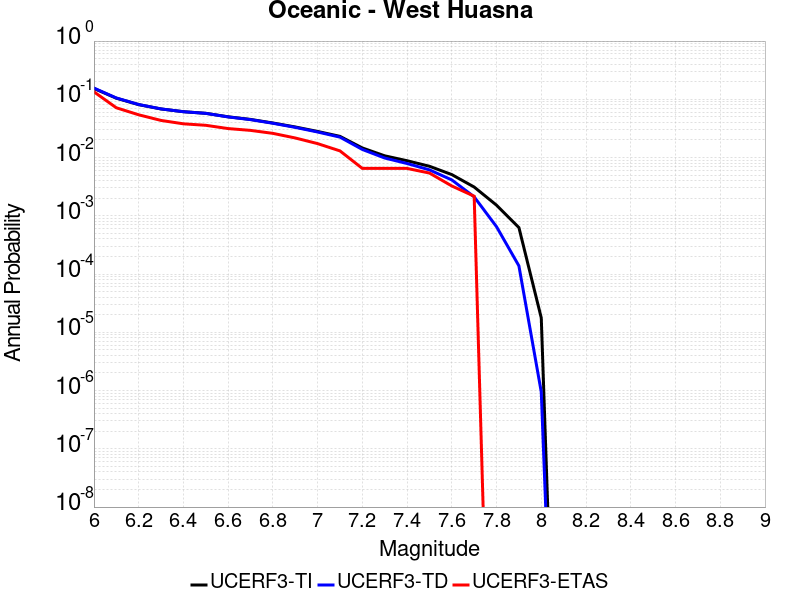 |
|-----|

| Magnitude | UCERF3-TI Prob | UCERF3-TD Prob | UCERF3-ETAS Prob |
|-----|-----|-----|-----|
| 6.0 | 0.1535827 | 0.1559062 | 0.13449024 |
| 6.1 | 0.104518965 | 0.10548907 | 0.07158352 |
| 6.2 | 0.08103247 | 0.081412904 | 0.054229934 |
| 6.3 | 0.068306334 | 0.06839932 | 0.04338395 |
| 6.4 | 0.06128564 | 0.061231233 | 0.037960954 |
| 6.5 | 0.057509303 | 0.05738438 | 0.03579176 |
| 6.6 | 0.050100703 | 0.04983909 | 0.031453364 |
| 6.7 | 0.045157466 | 0.04481248 | 0.029284164 |
| 6.8 | 0.03923767 | 0.038795326 | 0.02603037 |
| 6.9 | 0.03352162 | 0.03298764 | 0.021691974 |
| 7.0 | 0.028090239 | 0.027470848 | 0.01735358 |
| 7.1 | 0.023117736 | 0.022421502 | 0.013015185 |
| 7.2 | 0.014615433 | 0.01377743 | 0.0065075923 |
| 7.3 | 0.010714338 | 0.009822713 | 0.0065075923 |
| 7.4 | 0.008820985 | 0.00790471 | 0.0065075923 |
| 7.5 | 0.0070906943 | 0.0061492627 | 0.0054229936 |
| 7.6 | 0.0051020053 | 0.004129163 | 0.0032537961 |
| 7.7 | 0.0031186368 | 0.0021159614 | 0.0021691974 |
| 7.8 | 0.0015219237 | 6.49755E-4 | 0.0 |
| 7.9 | 6.289633E-4 | 1.3827618E-4 | 0.0 |
| 8.0 | 1.7639533E-5 | 9.364778E-7 | 0.0 |

## Oceanside alt1
*[(top)](#table-of-contents)*

| 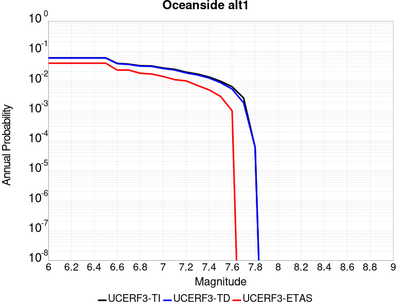 |
|-----|

| Magnitude | UCERF3-TI Prob | UCERF3-TD Prob | UCERF3-ETAS Prob |
|-----|-----|-----|-----|
| 6.0 | 0.058818262 | 0.0583073 | 0.040130153 |
| 6.1 | 0.058818262 | 0.0583073 | 0.040130153 |
| 6.2 | 0.058818262 | 0.0583073 | 0.040130153 |
| 6.3 | 0.058818262 | 0.0583073 | 0.040130153 |
| 6.4 | 0.058818262 | 0.0583073 | 0.040130153 |
| 6.5 | 0.058818262 | 0.0583073 | 0.040130153 |
| 6.6 | 0.03868811 | 0.037675936 | 0.022776572 |
| 6.7 | 0.0363905 | 0.03534282 | 0.022776572 |
| 6.8 | 0.032265227 | 0.031155024 | 0.018438177 |
| 6.9 | 0.03157486 | 0.030454164 | 0.01735358 |
| 7.0 | 0.027041595 | 0.025857782 | 0.014099783 |
| 7.1 | 0.024382288 | 0.02317924 | 0.011930586 |
| 7.2 | 0.01963179 | 0.018420774 | 0.010845987 |
| 7.3 | 0.01689535 | 0.015770875 | 0.007592191 |
| 7.4 | 0.013442422 | 0.012466365 | 0.0054229936 |
| 7.5 | 0.0097180065 | 0.008692395 | 0.0032537961 |
| 7.6 | 0.006369828 | 0.005330386 | 0.0010845987 |
| 7.7 | 0.0026787603 | 0.001850087 | 0.0 |
| 7.8 | 6.055505E-5 | 6.0903378E-5 | 0.0 |

## Ortigalita (North)
*[(top)](#table-of-contents)*

| 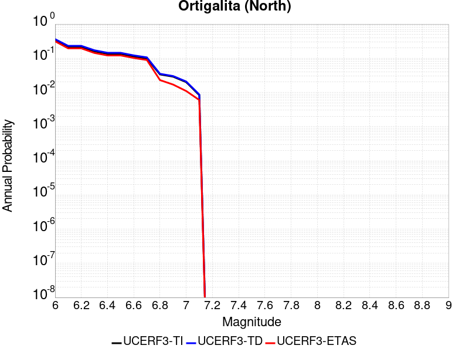 |
|-----|

| Magnitude | UCERF3-TI Prob | UCERF3-TD Prob | UCERF3-ETAS Prob |
|-----|-----|-----|-----|
| 6.0 | 0.3312936 | 0.36292872 | 0.30802602 |
| 6.1 | 0.21371582 | 0.23072097 | 0.18980478 |
| 6.2 | 0.21371582 | 0.23072097 | 0.18980478 |
| 6.3 | 0.15938632 | 0.17134728 | 0.14208242 |
| 6.4 | 0.13472357 | 0.14465077 | 0.11822126 |
| 6.5 | 0.13453035 | 0.14445077 | 0.11822126 |
| 6.6 | 0.1129834 | 0.121330276 | 0.09869848 |
| 6.7 | 0.098493375 | 0.10610575 | 0.0867679 |
| 6.8 | 0.03367047 | 0.03513182 | 0.021691974 |
| 6.9 | 0.028908625 | 0.030153004 | 0.015184382 |
| 7.0 | 0.020019218 | 0.020891417 | 0.009761388 |
| 7.1 | 0.008323105 | 0.008694009 | 0.0054229936 |

## Ortigalita (South)
*[(top)](#table-of-contents)*

| 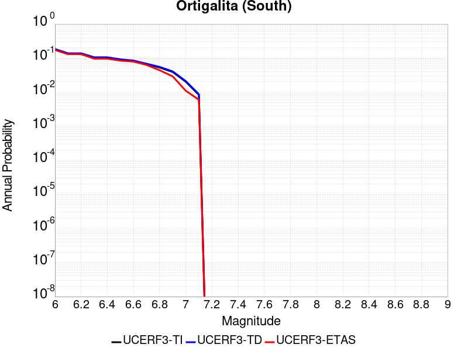 |
|-----|

| Magnitude | UCERF3-TI Prob | UCERF3-TD Prob | UCERF3-ETAS Prob |
|-----|-----|-----|-----|
| 6.0 | 0.17660025 | 0.18474165 | 0.16594361 |
| 6.1 | 0.13276808 | 0.13838667 | 0.123644255 |
| 6.2 | 0.13276808 | 0.13838667 | 0.123644255 |
| 6.3 | 0.10166251 | 0.105784535 | 0.09436008 |
| 6.4 | 0.10166251 | 0.105784535 | 0.09436008 |
| 6.5 | 0.08859891 | 0.09219321 | 0.0824295 |
| 6.6 | 0.08140207 | 0.08471801 | 0.077006504 |
| 6.7 | 0.06583409 | 0.068570144 | 0.060737528 |
| 6.8 | 0.052956972 | 0.05514009 | 0.04229935 |
| 6.9 | 0.039080285 | 0.040719144 | 0.027114967 |
| 7.0 | 0.020245412 | 0.02112384 | 0.009761388 |
| 7.1 | 0.008323105 | 0.008694009 | 0.0054229936 |

## Owens Valley
*[(top)](#table-of-contents)*

| 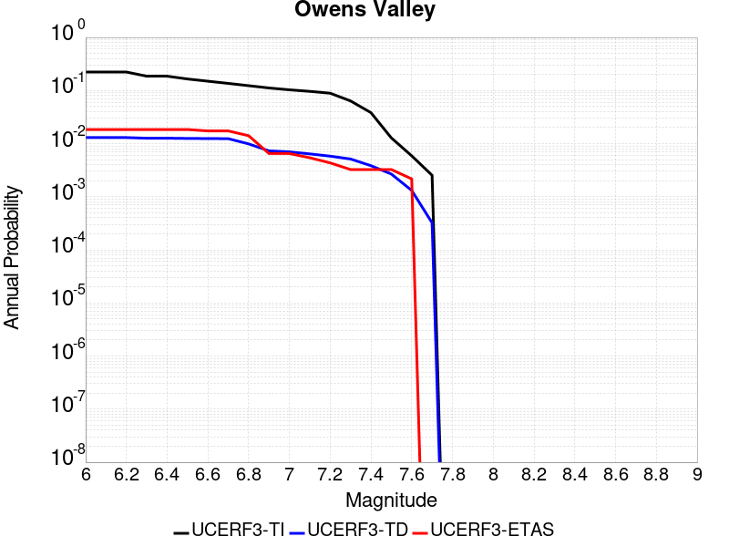 |
|-----|

| Magnitude | UCERF3-TI Prob | UCERF3-TD Prob | UCERF3-ETAS Prob |
|-----|-----|-----|-----|
| 6.0 | 0.22311038 | 0.013007707 | 0.018438177 |
| 6.1 | 0.22311038 | 0.013007707 | 0.018438177 |
| 6.2 | 0.22311038 | 0.013007707 | 0.018438177 |
| 6.3 | 0.1863837 | 0.012655042 | 0.018438177 |
| 6.4 | 0.1863837 | 0.012655042 | 0.018438177 |
| 6.5 | 0.16506574 | 0.0125281615 | 0.018438177 |
| 6.6 | 0.14991824 | 0.012466441 | 0.01735358 |
| 6.7 | 0.13624084 | 0.012397668 | 0.01735358 |
| 6.8 | 0.12342036 | 0.009891479 | 0.014099783 |
| 6.9 | 0.11172201 | 0.007292016 | 0.0065075923 |
| 7.0 | 0.10318596 | 0.007011362 | 0.0065075923 |
| 7.1 | 0.09650486 | 0.0064049996 | 0.0054229936 |
| 7.2 | 0.08905872 | 0.005811432 | 0.004338395 |
| 7.3 | 0.06372201 | 0.005134635 | 0.0032537961 |
| 7.4 | 0.038315225 | 0.0038456244 | 0.0032537961 |
| 7.5 | 0.012823021 | 0.002679132 | 0.0032537961 |
| 7.6 | 0.005893794 | 0.0013148639 | 0.0021691974 |
| 7.7 | 0.0025333527 | 3.2320662E-4 | 0.0 |

## Owens Valley Keough Hot Springs
*[(top)](#table-of-contents)*

| 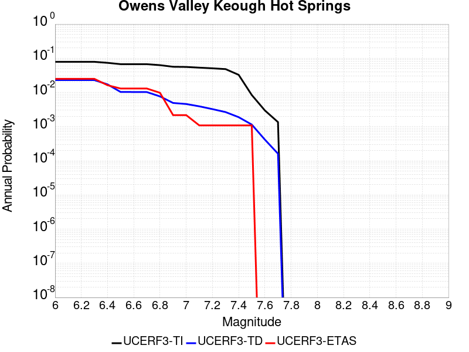 |
|-----|

| Magnitude | UCERF3-TI Prob | UCERF3-TD Prob | UCERF3-ETAS Prob |
|-----|-----|-----|-----|
| 6.0 | 0.078696266 | 0.022959279 | 0.02494577 |
| 6.1 | 0.078696266 | 0.022959279 | 0.02494577 |
| 6.2 | 0.078696266 | 0.022959279 | 0.02494577 |
| 6.3 | 0.078696266 | 0.022959279 | 0.02494577 |
| 6.4 | 0.07346061 | 0.017192269 | 0.01626898 |
| 6.5 | 0.0672176 | 0.010312182 | 0.013015185 |
| 6.6 | 0.0672046 | 0.010298116 | 0.013015185 |
| 6.7 | 0.06713334 | 0.010248555 | 0.013015185 |
| 6.8 | 0.06285525 | 0.0076530804 | 0.009761388 |
| 6.9 | 0.056423236 | 0.0049225306 | 0.0021691974 |
| 7.0 | 0.055712 | 0.0045823692 | 0.0021691974 |
| 7.1 | 0.05307357 | 0.0039212187 | 0.0010845987 |
| 7.2 | 0.05078671 | 0.0032498352 | 0.0010845987 |
| 7.3 | 0.048189346 | 0.002663516 | 0.0010845987 |
| 7.4 | 0.03275454 | 0.0018902431 | 0.0010845987 |
| 7.5 | 0.008413504 | 0.0011477965 | 0.0010845987 |
| 7.6 | 0.002973015 | 4.159699E-4 | 0.0 |
| 7.7 | 0.0013551406 | 1.6128107E-4 | 0.0 |

## Owl Lake
*[(top)](#table-of-contents)*

| 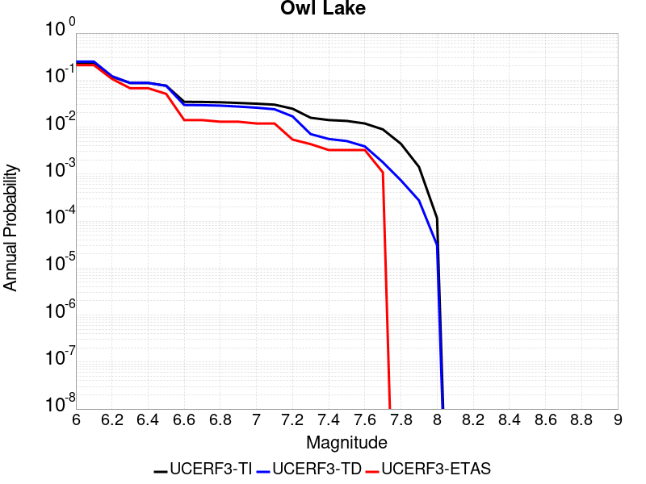 |
|-----|

| Magnitude | UCERF3-TI Prob | UCERF3-TD Prob | UCERF3-ETAS Prob |
|-----|-----|-----|-----|
| 6.0 | 0.23092943 | 0.24730381 | 0.20824295 |
| 6.1 | 0.23092943 | 0.24730381 | 0.20824295 |
| 6.2 | 0.11828541 | 0.12106731 | 0.106290676 |
| 6.3 | 0.08695145 | 0.08716673 | 0.06724512 |
| 6.4 | 0.08695145 | 0.08716673 | 0.06724512 |
| 6.5 | 0.07616517 | 0.07548719 | 0.05097614 |
| 6.6 | 0.034492556 | 0.029529242 | 0.014099783 |
| 6.7 | 0.034269236 | 0.02924743 | 0.014099783 |
| 6.8 | 0.033738285 | 0.028632894 | 0.013015185 |
| 6.9 | 0.03265833 | 0.027337678 | 0.013015185 |
| 7.0 | 0.031500887 | 0.025887443 | 0.011930586 |
| 7.1 | 0.030027581 | 0.02396211 | 0.011930586 |
| 7.2 | 0.02459086 | 0.016882401 | 0.0054229936 |
| 7.3 | 0.015785927 | 0.007093584 | 0.004338395 |
| 7.4 | 0.014125215 | 0.0055905413 | 0.0032537961 |
| 7.5 | 0.013521385 | 0.0050445297 | 0.0032537961 |
| 7.6 | 0.011933874 | 0.0038807532 | 0.0032537961 |
| 7.7 | 0.008926475 | 0.001783954 | 0.0010845987 |
| 7.8 | 0.004405251 | 7.340895E-4 | 0.0 |
| 7.9 | 0.001416551 | 2.7430226E-4 | 0.0 |
| 8.0 | 1.1476241E-4 | 3.0836287E-5 | 0.0 |

## Ozena
*[(top)](#table-of-contents)*

| 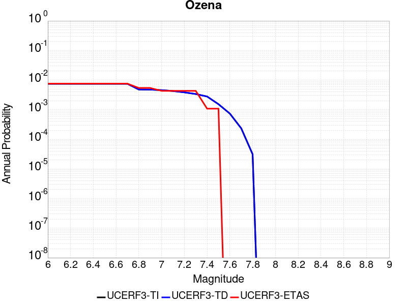 |
|-----|

| Magnitude | UCERF3-TI Prob | UCERF3-TD Prob | UCERF3-ETAS Prob |
|-----|-----|-----|-----|
| 6.0 | 0.007473934 | 0.007498166 | 0.007592191 |
| 6.1 | 0.007473934 | 0.007498166 | 0.007592191 |
| 6.2 | 0.007473934 | 0.007498166 | 0.007592191 |
| 6.3 | 0.007473934 | 0.007498166 | 0.007592191 |
| 6.4 | 0.007473934 | 0.007498166 | 0.007592191 |
| 6.5 | 0.007473934 | 0.007498166 | 0.007592191 |
| 6.6 | 0.007473934 | 0.007498166 | 0.007592191 |
| 6.7 | 0.007473934 | 0.007498166 | 0.007592191 |
| 6.8 | 0.004801004 | 0.0048162485 | 0.0054229936 |
| 6.9 | 0.004758556 | 0.00477372 | 0.0054229936 |
| 7.0 | 0.004564387 | 0.0045790835 | 0.004338395 |
| 7.1 | 0.004269194 | 0.004283096 | 0.004338395 |
| 7.2 | 0.0038470398 | 0.0038595463 | 0.004338395 |
| 7.3 | 0.0033806718 | 0.0033916873 | 0.004338395 |
| 7.4 | 0.002785963 | 0.0027950227 | 0.0010845987 |
| 7.5 | 0.0015325224 | 0.0015369954 | 0.0010845987 |
| 7.6 | 7.381537E-4 | 7.3976297E-4 | 0.0 |
| 7.7 | 2.3455471E-4 | 2.3502162E-4 | 0.0 |
| 7.8 | 3.1303134E-5 | 3.1369607E-5 | 0.0 |

## Palos Verdes
*[(top)](#table-of-contents)*

| 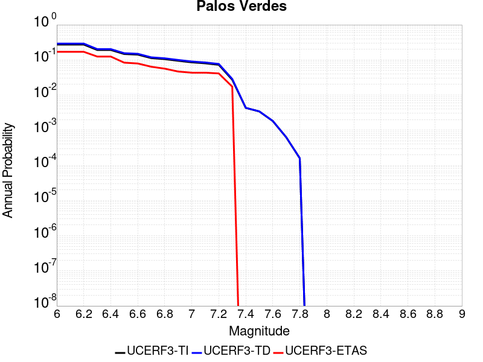 |
|-----|

| Magnitude | UCERF3-TI Prob | UCERF3-TD Prob | UCERF3-ETAS Prob |
|-----|-----|-----|-----|
| 6.0 | 0.27360332 | 0.29143935 | 0.17028199 |
| 6.1 | 0.27360332 | 0.29143935 | 0.17028199 |
| 6.2 | 0.27360332 | 0.29143935 | 0.17028199 |
| 6.3 | 0.19191776 | 0.20318468 | 0.12472885 |
| 6.4 | 0.19191776 | 0.20318468 | 0.12472885 |
| 6.5 | 0.14718251 | 0.155159 | 0.0835141 |
| 6.6 | 0.14157082 | 0.14939268 | 0.0791757 |
| 6.7 | 0.11249763 | 0.118581496 | 0.06399132 |
| 6.8 | 0.105308205 | 0.11109245 | 0.056399133 |
| 6.9 | 0.09442868 | 0.099638216 | 0.046637744 |
| 7.0 | 0.085353985 | 0.090113595 | 0.04338395 |
| 7.1 | 0.08001375 | 0.084529765 | 0.04338395 |
| 7.2 | 0.07271332 | 0.07689376 | 0.04121475 |
| 7.3 | 0.0272161 | 0.02874272 | 0.01735358 |
| 7.4 | 0.0043108375 | 0.0043317685 | 0.0 |
| 7.5 | 0.003416976 | 0.0034345041 | 0.0 |
| 7.6 | 0.0018255716 | 0.0018354885 | 0.0 |
| 7.7 | 6.252223E-4 | 6.2855583E-4 | 0.0 |
| 7.8 | 1.5884507E-4 | 1.5976056E-4 | 0.0 |

## Panamint Valley
*[(top)](#table-of-contents)*

| 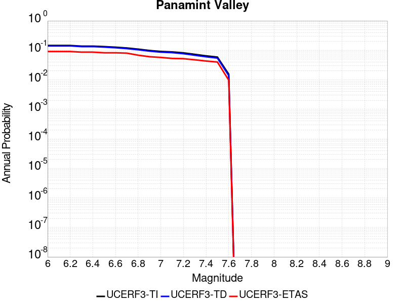 |
|-----|

| Magnitude | UCERF3-TI Prob | UCERF3-TD Prob | UCERF3-ETAS Prob |
|-----|-----|-----|-----|
| 6.0 | 0.1458457 | 0.14130238 | 0.09110629 |
| 6.1 | 0.1458457 | 0.14130238 | 0.09110629 |
| 6.2 | 0.1458457 | 0.14130238 | 0.09110629 |
| 6.3 | 0.13851427 | 0.13374175 | 0.0867679 |
| 6.4 | 0.13851427 | 0.13374175 | 0.0867679 |
| 6.5 | 0.133532 | 0.12863526 | 0.0824295 |
| 6.6 | 0.12748508 | 0.12225113 | 0.0824295 |
| 6.7 | 0.11999925 | 0.11443822 | 0.08026031 |
| 6.8 | 0.10958623 | 0.10464748 | 0.06832972 |
| 6.9 | 0.09863974 | 0.09397088 | 0.060737528 |
| 7.0 | 0.09132593 | 0.08690363 | 0.057483733 |
| 7.1 | 0.0880663 | 0.083590396 | 0.053145338 |
| 7.2 | 0.081926234 | 0.07695274 | 0.05206074 |
| 7.3 | 0.07296726 | 0.0682485 | 0.047722343 |
| 7.4 | 0.06486262 | 0.06046782 | 0.04338395 |
| 7.5 | 0.058917996 | 0.05476033 | 0.040130153 |
| 7.6 | 0.015566703 | 0.0140037285 | 0.009761388 |

## Paradise
*[(top)](#table-of-contents)*

| 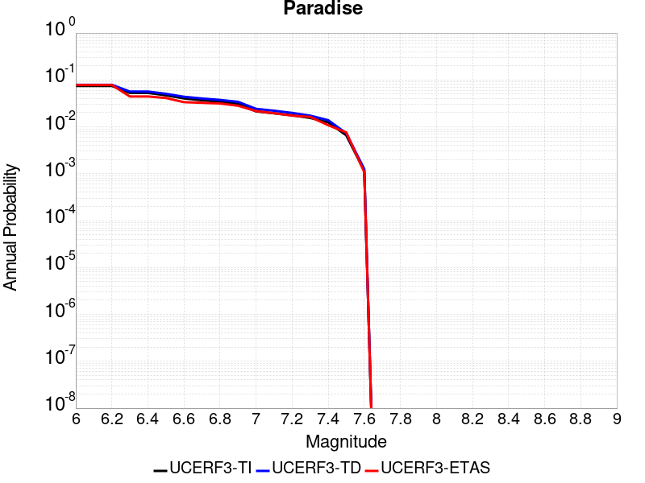 |
|-----|

| Magnitude | UCERF3-TI Prob | UCERF3-TD Prob | UCERF3-ETAS Prob |
|-----|-----|-----|-----|
| 6.0 | 0.07456594 | 0.07881241 | 0.07809111 |
| 6.1 | 0.07456594 | 0.07881241 | 0.07809111 |
| 6.2 | 0.07456594 | 0.07881241 | 0.07809111 |
| 6.3 | 0.05295247 | 0.056596704 | 0.04446855 |
| 6.4 | 0.05295247 | 0.056596704 | 0.04446855 |
| 6.5 | 0.047120485 | 0.05064595 | 0.04121475 |
| 6.6 | 0.0404046 | 0.043782007 | 0.03362256 |
| 6.7 | 0.036902893 | 0.040211897 | 0.03253796 |
| 6.8 | 0.03432989 | 0.037527967 | 0.031453364 |
| 6.9 | 0.03103513 | 0.034128826 | 0.028199567 |
| 7.0 | 0.021340149 | 0.024190402 | 0.021691974 |
| 7.1 | 0.019466292 | 0.022057384 | 0.019522777 |
| 7.2 | 0.0176178 | 0.019813973 | 0.01735358 |
| 7.3 | 0.015498292 | 0.017336458 | 0.01626898 |
| 7.4 | 0.0124704465 | 0.013851293 | 0.010845987 |
| 7.5 | 0.006610005 | 0.0072938227 | 0.007592191 |
| 7.6 | 0.0011533784 | 0.0012534978 | 0.0010845987 |

## Peralta Hills
*[(top)](#table-of-contents)*

| 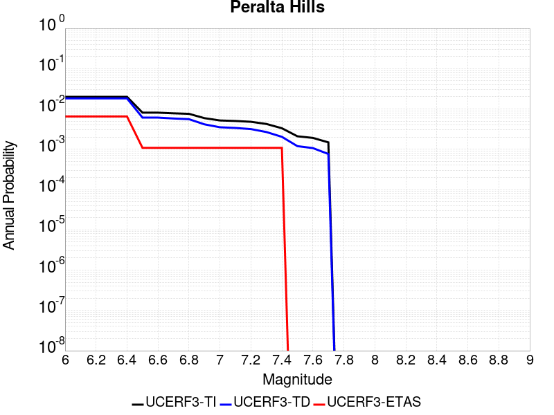 |
|-----|

| Magnitude | UCERF3-TI Prob | UCERF3-TD Prob | UCERF3-ETAS Prob |
|-----|-----|-----|-----|
| 6.0 | 0.020067364 | 0.01828064 | 0.0065075923 |
| 6.1 | 0.020067364 | 0.01828064 | 0.0065075923 |
| 6.2 | 0.020067364 | 0.01828064 | 0.0065075923 |
| 6.3 | 0.020067364 | 0.01828064 | 0.0065075923 |
| 6.4 | 0.020067364 | 0.01828064 | 0.0065075923 |
| 6.5 | 0.008100503 | 0.0061082537 | 0.0010845987 |
| 6.6 | 0.008100503 | 0.0061082537 | 0.0010845987 |
| 6.7 | 0.0078058606 | 0.005809207 | 0.0010845987 |
| 6.8 | 0.00758101 | 0.005580619 | 0.0010845987 |
| 6.9 | 0.0059215715 | 0.004156655 | 0.0010845987 |
| 7.0 | 0.0051889126 | 0.0035178408 | 0.0010845987 |
| 7.1 | 0.0050404607 | 0.0033835482 | 0.0010845987 |
| 7.2 | 0.00481012 | 0.0031701932 | 0.0010845987 |
| 7.3 | 0.0042480165 | 0.0026779978 | 0.0010845987 |
| 7.4 | 0.003324646 | 0.0020352122 | 0.0010845987 |
| 7.5 | 0.0021002037 | 0.0011951125 | 0.0 |
| 7.6 | 0.0019146802 | 0.0010698976 | 0.0 |
| 7.7 | 0.0014842558 | 7.632883E-4 | 0.0 |

## Pilarcitos 2011 CFM
*[(top)](#table-of-contents)*

| 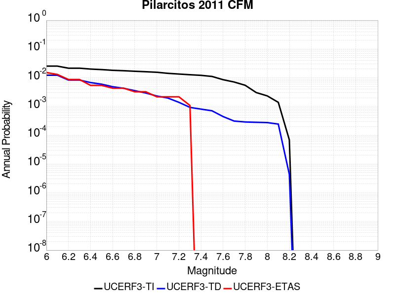 |
|-----|

| Magnitude | UCERF3-TI Prob | UCERF3-TD Prob | UCERF3-ETAS Prob |
|-----|-----|-----|-----|
| 6.0 | 0.025320012 | 0.012207274 | 0.015184382 |
| 6.1 | 0.025320012 | 0.012207274 | 0.013015185 |
| 6.2 | 0.021484407 | 0.008288365 | 0.00867679 |
| 6.3 | 0.021484407 | 0.008288365 | 0.00867679 |
| 6.4 | 0.020025875 | 0.0067987205 | 0.0054229936 |
| 6.5 | 0.019191055 | 0.0059574977 | 0.0054229936 |
| 6.6 | 0.018121751 | 0.004867062 | 0.004338395 |
| 6.7 | 0.017537443 | 0.004286303 | 0.004338395 |
| 6.8 | 0.016790176 | 0.0035535616 | 0.0032537961 |
| 6.9 | 0.016168028 | 0.002940247 | 0.0032537961 |
| 7.0 | 0.015500949 | 0.0023136484 | 0.0021691974 |
| 7.1 | 0.014231864 | 0.001964042 | 0.0021691974 |
| 7.2 | 0.01343713 | 0.0013940609 | 0.0021691974 |
| 7.3 | 0.012712015 | 9.287168E-4 | 0.0010845987 |
| 7.4 | 0.01210955 | 8.0870715E-4 | 0.0 |
| 7.5 | 0.011082786 | 7.067291E-4 | 0.0 |
| 7.6 | 0.008544294 | 4.4525758E-4 | 0.0 |
| 7.7 | 0.0070975735 | 3.107794E-4 | 0.0 |
| 7.8 | 0.005464287 | 2.8892973E-4 | 0.0 |
| 7.9 | 0.0030511387 | 2.814131E-4 | 0.0 |
| 8.0 | 0.0023332185 | 2.7470064E-4 | 0.0 |
| 8.1 | 0.0013918092 | 2.4390065E-4 | 0.0 |
| 8.2 | 6.8867404E-5 | 4.3192395E-6 | 0.0 |

## Pine Mtn
*[(top)](#table-of-contents)*

| 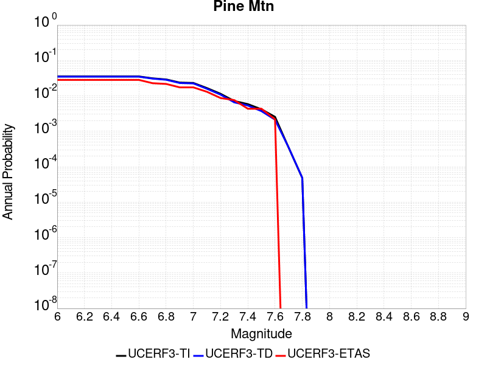 |
|-----|

| Magnitude | UCERF3-TI Prob | UCERF3-TD Prob | UCERF3-ETAS Prob |
|-----|-----|-----|-----|
| 6.0 | 0.03533674 | 0.03477421 | 0.028199567 |
| 6.1 | 0.03533674 | 0.03477421 | 0.028199567 |
| 6.2 | 0.03533674 | 0.03477421 | 0.028199567 |
| 6.3 | 0.03533674 | 0.03477421 | 0.028199567 |
| 6.4 | 0.03533674 | 0.03477421 | 0.028199567 |
| 6.5 | 0.03533674 | 0.03477421 | 0.028199567 |
| 6.6 | 0.03533674 | 0.03477421 | 0.028199567 |
| 6.7 | 0.03126106 | 0.030657344 | 0.022776572 |
| 6.8 | 0.029066065 | 0.028440261 | 0.021691974 |
| 6.9 | 0.023724193 | 0.023035362 | 0.01735358 |
| 7.0 | 0.02314367 | 0.022450697 | 0.01735358 |
| 7.1 | 0.016578592 | 0.015820142 | 0.013015185 |
| 7.2 | 0.011444922 | 0.010830385 | 0.00867679 |
| 7.3 | 0.0071567604 | 0.0065689436 | 0.007592191 |
| 7.4 | 0.0058508134 | 0.0053456924 | 0.004338395 |
| 7.5 | 0.0041820495 | 0.0037078373 | 0.004338395 |
| 7.6 | 0.0025510618 | 0.0021260432 | 0.0021691974 |
| 7.7 | 3.461203E-4 | 3.485187E-4 | 0.0 |
| 7.8 | 4.8188762E-5 | 4.8578822E-5 | 0.0 |

## Pinto Mtn
*[(top)](#table-of-contents)*

| 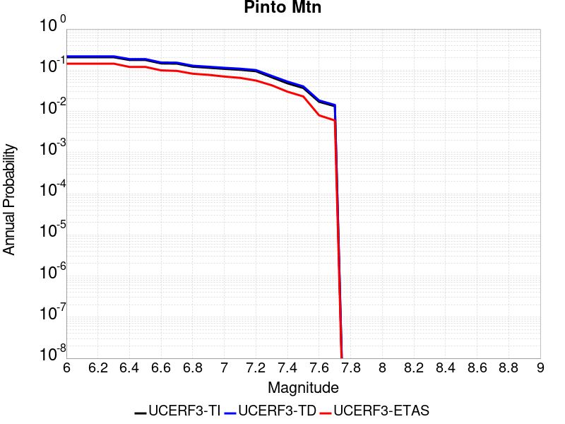 |
|-----|

| Magnitude | UCERF3-TI Prob | UCERF3-TD Prob | UCERF3-ETAS Prob |
|-----|-----|-----|-----|
| 6.0 | 0.20594937 | 0.21708214 | 0.14533623 |
| 6.1 | 0.20594937 | 0.21708214 | 0.14533623 |
| 6.2 | 0.20594937 | 0.21708214 | 0.14533623 |
| 6.3 | 0.20594937 | 0.21708214 | 0.14533623 |
| 6.4 | 0.17685755 | 0.18636498 | 0.12039045 |
| 6.5 | 0.17685755 | 0.18636498 | 0.12039045 |
| 6.6 | 0.14581323 | 0.15369716 | 0.09978308 |
| 6.7 | 0.1442661 | 0.15210944 | 0.09652928 |
| 6.8 | 0.12147194 | 0.12846664 | 0.0824295 |
| 6.9 | 0.114529505 | 0.12135732 | 0.077006504 |
| 7.0 | 0.10760573 | 0.11427232 | 0.07049891 |
| 7.1 | 0.10219849 | 0.10871603 | 0.06507592 |
| 7.2 | 0.094338134 | 0.10067115 | 0.056399133 |
| 7.3 | 0.06721929 | 0.072743595 | 0.04338395 |
| 7.4 | 0.047934536 | 0.052775603 | 0.030368764 |
| 7.5 | 0.036922593 | 0.04037885 | 0.023861172 |
| 7.6 | 0.017052965 | 0.018389039 | 0.007592191 |
| 7.7 | 0.0133415535 | 0.014275018 | 0.0054229936 |

## Pisgah-Bullion Mtn-Mesquite Lk
*[(top)](#table-of-contents)*

| 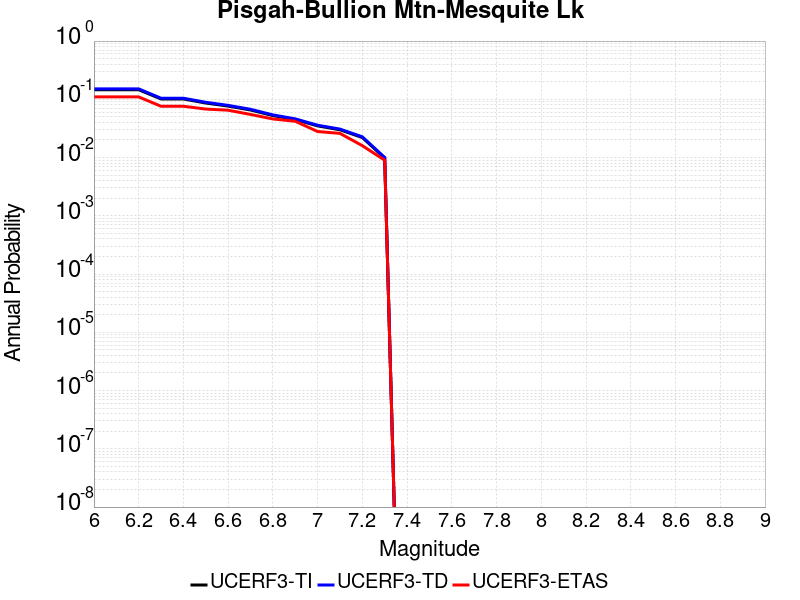 |
|-----|

| Magnitude | UCERF3-TI Prob | UCERF3-TD Prob | UCERF3-ETAS Prob |
|-----|-----|-----|-----|
| 6.0 | 0.14597474 | 0.15108144 | 0.112798266 |
| 6.1 | 0.14597474 | 0.15108144 | 0.112798266 |
| 6.2 | 0.14597474 | 0.15108144 | 0.112798266 |
| 6.3 | 0.101436466 | 0.10440158 | 0.07809111 |
| 6.4 | 0.101436466 | 0.10440158 | 0.07809111 |
| 6.5 | 0.086392425 | 0.08886376 | 0.06941432 |
| 6.6 | 0.07649452 | 0.07866246 | 0.06616052 |
| 6.7 | 0.06557055 | 0.067413 | 0.055314533 |
| 6.8 | 0.05259181 | 0.054010715 | 0.046637744 |
| 6.9 | 0.04496009 | 0.04616913 | 0.04229935 |
| 7.0 | 0.034976393 | 0.03591316 | 0.030368764 |
| 7.1 | 0.029997654 | 0.030810904 | 0.028199567 |
| 7.2 | 0.022075012 | 0.022690475 | 0.01735358 |
| 7.3 | 0.00976353 | 0.010046953 | 0.009761388 |

## Pitas Point (Lower West)
*[(top)](#table-of-contents)*

| 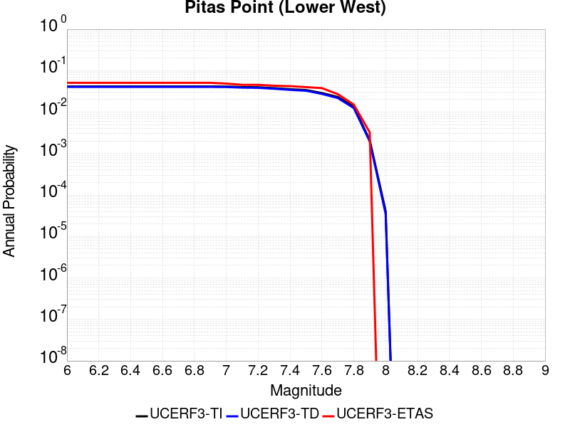 |
|-----|

| Magnitude | UCERF3-TI Prob | UCERF3-TD Prob | UCERF3-ETAS Prob |
|-----|-----|-----|-----|
| 6.0 | 0.041641664 | 0.040542446 | 0.05097614 |
| 6.1 | 0.041641664 | 0.040542446 | 0.05097614 |
| 6.2 | 0.041641664 | 0.040542446 | 0.05097614 |
| 6.3 | 0.041641664 | 0.040542446 | 0.05097614 |
| 6.4 | 0.041641664 | 0.040542446 | 0.05097614 |
| 6.5 | 0.041641664 | 0.040542446 | 0.05097614 |
| 6.6 | 0.041641664 | 0.040542446 | 0.05097614 |
| 6.7 | 0.041641664 | 0.040542446 | 0.05097614 |
| 6.8 | 0.041641664 | 0.040542446 | 0.05097614 |
| 6.9 | 0.041641664 | 0.040542446 | 0.05097614 |
| 7.0 | 0.041401792 | 0.04029845 | 0.048806943 |
| 7.1 | 0.040149316 | 0.039023526 | 0.045553144 |
| 7.2 | 0.03973756 | 0.038603205 | 0.045553144 |
| 7.3 | 0.037848894 | 0.03667183 | 0.04338395 |
| 7.4 | 0.035688255 | 0.034464397 | 0.04229935 |
| 7.5 | 0.03411638 | 0.032863077 | 0.040130153 |
| 7.6 | 0.028864892 | 0.027519219 | 0.037960954 |
| 7.7 | 0.023179898 | 0.021836676 | 0.027114967 |
| 7.8 | 0.013513897 | 0.012592721 | 0.015184382 |
| 7.9 | 0.0021089101 | 0.0019731296 | 0.0032537961 |
| 8.0 | 4.06536E-5 | 3.5105066E-5 | 0.0 |

## Pitas Point (Lower)-Montalvo
*[(top)](#table-of-contents)*

| 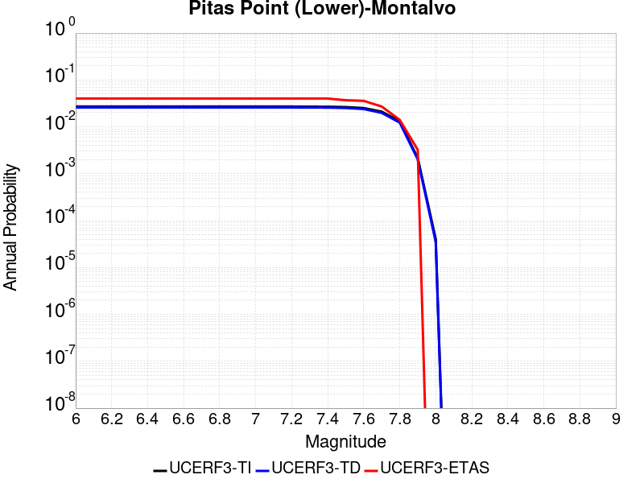 |
|-----|

| Magnitude | UCERF3-TI Prob | UCERF3-TD Prob | UCERF3-ETAS Prob |
|-----|-----|-----|-----|
| 6.0 | 0.02704417 | 0.025901766 | 0.040130153 |
| 6.1 | 0.02704417 | 0.025901766 | 0.040130153 |
| 6.2 | 0.02704417 | 0.025901766 | 0.040130153 |
| 6.3 | 0.02704417 | 0.025901766 | 0.040130153 |
| 6.4 | 0.02704417 | 0.025901766 | 0.040130153 |
| 6.5 | 0.02704417 | 0.025901766 | 0.040130153 |
| 6.6 | 0.02704417 | 0.025901766 | 0.040130153 |
| 6.7 | 0.02704417 | 0.025901766 | 0.040130153 |
| 6.8 | 0.02704417 | 0.025901766 | 0.040130153 |
| 6.9 | 0.02704417 | 0.025901766 | 0.040130153 |
| 7.0 | 0.02704417 | 0.025901766 | 0.040130153 |
| 7.1 | 0.02704417 | 0.025901766 | 0.040130153 |
| 7.2 | 0.027001044 | 0.025858061 | 0.040130153 |
| 7.3 | 0.026903462 | 0.025759067 | 0.040130153 |
| 7.4 | 0.026822178 | 0.02567652 | 0.040130153 |
| 7.5 | 0.026375012 | 0.025222652 | 0.036876354 |
| 7.6 | 0.02514022 | 0.023969792 | 0.03579176 |
| 7.7 | 0.021081463 | 0.019858345 | 0.027114967 |
| 7.8 | 0.013189331 | 0.012308505 | 0.014099783 |
| 7.9 | 0.0021722899 | 0.0020294297 | 0.0032537961 |
| 8.0 | 4.06536E-5 | 3.5105066E-5 | 0.0 |

## Pittville 2011 CFM
*[(top)](#table-of-contents)*

| 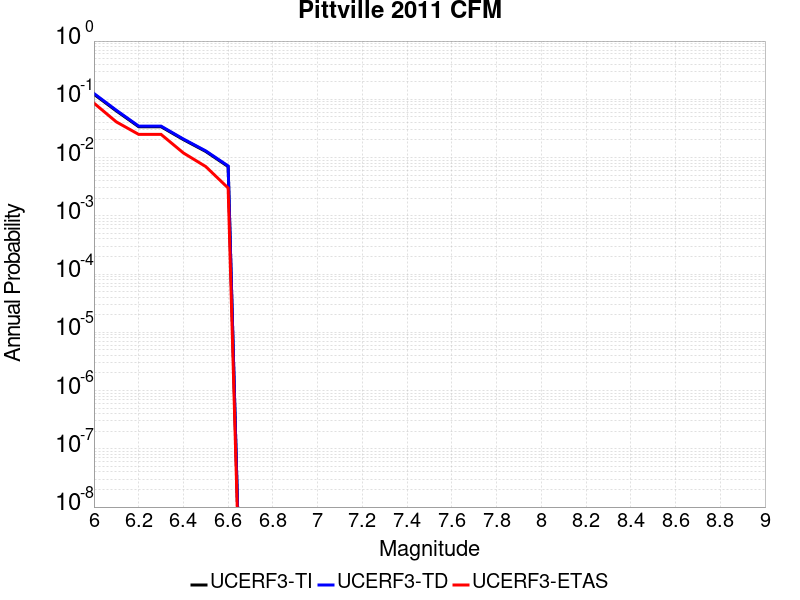 |
|-----|

| Magnitude | UCERF3-TI Prob | UCERF3-TD Prob | UCERF3-ETAS Prob |
|-----|-----|-----|-----|
| 6.0 | 0.12244369 | 0.12595217 | 0.08568329 |
| 6.1 | 0.06333813 | 0.06491776 | 0.04229935 |
| 6.2 | 0.033867955 | 0.03466394 | 0.02494577 |
| 6.3 | 0.033867955 | 0.03466394 | 0.02494577 |
| 6.4 | 0.020342898 | 0.020816518 | 0.011930586 |
| 6.5 | 0.0127194375 | 0.013018124 | 0.007592191 |
| 6.6 | 0.007010224 | 0.007178054 | 0.0032537961 |

## Pleito
*[(top)](#table-of-contents)*

| 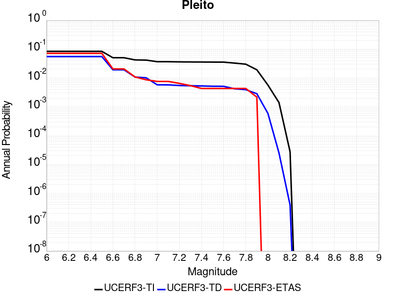 |
|-----|

| Magnitude | UCERF3-TI Prob | UCERF3-TD Prob | UCERF3-ETAS Prob |
|-----|-----|-----|-----|
| 6.0 | 0.083751544 | 0.055303287 | 0.07158352 |
| 6.1 | 0.083751544 | 0.055303287 | 0.07158352 |
| 6.2 | 0.083751544 | 0.055303287 | 0.07158352 |
| 6.3 | 0.083751544 | 0.055303287 | 0.07158352 |
| 6.4 | 0.083751544 | 0.055303287 | 0.07158352 |
| 6.5 | 0.083751544 | 0.055303287 | 0.07158352 |
| 6.6 | 0.0503961 | 0.019247476 | 0.020607375 |
| 6.7 | 0.0503961 | 0.019247476 | 0.020607375 |
| 6.8 | 0.04238479 | 0.010757511 | 0.010845987 |
| 6.9 | 0.041799754 | 0.010165391 | 0.00867679 |
| 7.0 | 0.036745522 | 0.005795816 | 0.007592191 |
| 7.1 | 0.03670681 | 0.0057676747 | 0.007592191 |
| 7.2 | 0.03619291 | 0.00548677 | 0.0065075923 |
| 7.3 | 0.035970867 | 0.005395173 | 0.0054229936 |
| 7.4 | 0.035801467 | 0.0052997647 | 0.004338395 |
| 7.5 | 0.035611823 | 0.005176028 | 0.004338395 |
| 7.6 | 0.035498515 | 0.0051501235 | 0.004338395 |
| 7.7 | 0.0328221 | 0.004209424 | 0.004338395 |
| 7.8 | 0.030146547 | 0.0039458824 | 0.004338395 |
| 7.9 | 0.019206649 | 0.002847185 | 0.0021691974 |
| 8.0 | 0.0056733172 | 5.8955693E-4 | 0.0 |
| 8.1 | 0.0014023369 | 2.5033745E-5 | 0.0 |
| 8.2 | 2.7637048E-5 | 3.919172E-7 | 0.0 |

## Point Reyes 2011 CFM
*[(top)](#table-of-contents)*

| 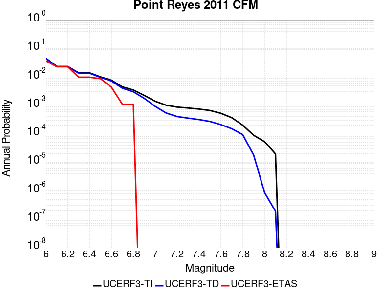 |
|-----|

| Magnitude | UCERF3-TI Prob | UCERF3-TD Prob | UCERF3-ETAS Prob |
|-----|-----|-----|-----|
| 6.0 | 0.04520048 | 0.045062236 | 0.036876354 |
| 6.1 | 0.023341462 | 0.023008298 | 0.022776572 |
| 6.2 | 0.023341462 | 0.023008298 | 0.022776572 |
| 6.3 | 0.013908331 | 0.013506852 | 0.009761388 |
| 6.4 | 0.013908331 | 0.013506852 | 0.009761388 |
| 6.5 | 0.010010553 | 0.009584583 | 0.00867679 |
| 6.6 | 0.0076547526 | 0.0072146743 | 0.004338395 |
| 6.7 | 0.0044629206 | 0.00400421 | 0.0010845987 |
| 6.8 | 0.003476625 | 0.0030123624 | 0.0010845987 |
| 6.9 | 0.0022367495 | 0.0017654643 | 0.0 |
| 7.0 | 0.001398076 | 9.237898E-4 | 0.0 |
| 7.1 | 0.0010144226 | 5.395571E-4 | 0.0 |
| 7.2 | 8.717921E-4 | 4.0533656E-4 | 0.0 |
| 7.3 | 8.0860633E-4 | 3.56935E-4 | 0.0 |
| 7.4 | 7.4335246E-4 | 3.176773E-4 | 0.0 |
| 7.5 | 6.629795E-4 | 2.7276238E-4 | 0.0 |
| 7.6 | 5.291963E-4 | 2.1156165E-4 | 0.0 |
| 7.7 | 3.6990514E-4 | 1.5087154E-4 | 0.0 |
| 7.8 | 2.0197353E-4 | 9.4223746E-5 | 0.0 |
| 7.9 | 8.90585E-5 | 1.8061246E-5 | 0.0 |
| 8.0 | 5.3077718E-5 | 8.649143E-7 | 0.0 |
| 8.1 | 1.9755262E-5 | 1.9027047E-7 | 0.0 |

## Point Reyes 2011 connector
*[(top)](#table-of-contents)*

| 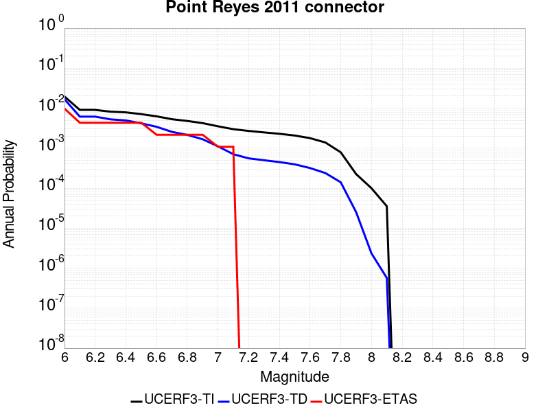 |
|-----|

| Magnitude | UCERF3-TI Prob | UCERF3-TD Prob | UCERF3-ETAS Prob |
|-----|-----|-----|-----|
| 6.0 | 0.019577902 | 0.016755821 | 0.009761388 |
| 6.1 | 0.009063615 | 0.006150553 | 0.004338395 |
| 6.2 | 0.009063615 | 0.006150553 | 0.004338395 |
| 6.3 | 0.008178851 | 0.005260337 | 0.004338395 |
| 6.4 | 0.007867947 | 0.00494759 | 0.004338395 |
| 6.5 | 0.007103716 | 0.0041862056 | 0.004338395 |
| 6.6 | 0.006253642 | 0.0034280668 | 0.0021691974 |
| 6.7 | 0.0053054052 | 0.0025596481 | 0.0021691974 |
| 6.8 | 0.004795318 | 0.0021502813 | 0.0021691974 |
| 6.9 | 0.00423345 | 0.0016745236 | 0.0021691974 |
| 7.0 | 0.0035279926 | 0.001113091 | 0.0010845987 |
| 7.1 | 0.0029842958 | 7.078221E-4 | 0.0010845987 |
| 7.2 | 0.0027020837 | 5.5694557E-4 | 0.0 |
| 7.3 | 0.0024806107 | 4.999155E-4 | 0.0 |
| 7.4 | 0.0022925679 | 4.4971038E-4 | 0.0 |
| 7.5 | 0.0020745809 | 3.949602E-4 | 0.0 |
| 7.6 | 0.0017823119 | 3.18724E-4 | 0.0 |
| 7.7 | 0.0013875833 | 2.3875113E-4 | 0.0 |
| 7.8 | 7.8795524E-4 | 1.4046117E-4 | 0.0 |
| 7.9 | 2.2553316E-4 | 2.5273544E-5 | 0.0 |
| 8.0 | 9.99166E-5 | 2.354629E-6 | 0.0 |
| 8.1 | 3.5372697E-5 | 5.6948045E-7 | 0.0 |

## Polaris 2011 CFM
*[(top)](#table-of-contents)*

| 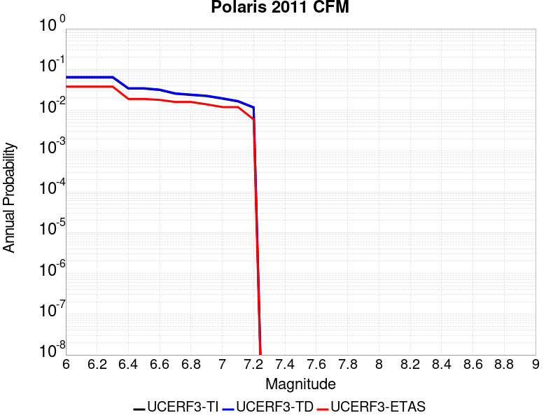 |
|-----|

| Magnitude | UCERF3-TI Prob | UCERF3-TD Prob | UCERF3-ETAS Prob |
|-----|-----|-----|-----|
| 6.0 | 0.063781366 | 0.06560757 | 0.037960954 |
| 6.1 | 0.063781366 | 0.06560757 | 0.037960954 |
| 6.2 | 0.063781366 | 0.06560757 | 0.037960954 |
| 6.3 | 0.063781366 | 0.06560757 | 0.037960954 |
| 6.4 | 0.03406845 | 0.03479683 | 0.018438177 |
| 6.5 | 0.03406845 | 0.03479683 | 0.018438177 |
| 6.6 | 0.031472508 | 0.032145955 | 0.018438177 |
| 6.7 | 0.025484873 | 0.02602957 | 0.01626898 |
| 6.8 | 0.02380001 | 0.024313066 | 0.01626898 |
| 6.9 | 0.022290787 | 0.02277523 | 0.014099783 |
| 7.0 | 0.01931658 | 0.019742072 | 0.011930586 |
| 7.1 | 0.01652558 | 0.016895197 | 0.011930586 |
| 7.2 | 0.011597672 | 0.011864958 | 0.0065075923 |

## Puente Hills
*[(top)](#table-of-contents)*

| 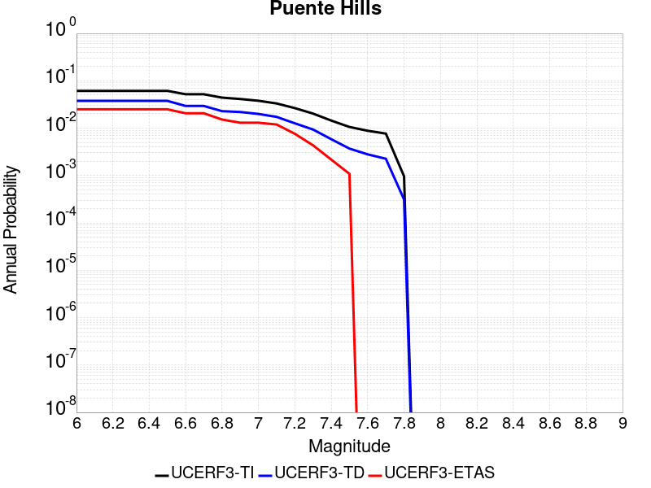 |
|-----|

| Magnitude | UCERF3-TI Prob | UCERF3-TD Prob | UCERF3-ETAS Prob |
|-----|-----|-----|-----|
| 6.0 | 0.061192747 | 0.037599046 | 0.02494577 |
| 6.1 | 0.061192747 | 0.037599046 | 0.02494577 |
| 6.2 | 0.061192747 | 0.037599046 | 0.02494577 |
| 6.3 | 0.061192747 | 0.037599046 | 0.02494577 |
| 6.4 | 0.061192747 | 0.037599046 | 0.02494577 |
| 6.5 | 0.061192747 | 0.037599046 | 0.02494577 |
| 6.6 | 0.051942147 | 0.029389162 | 0.020607375 |
| 6.7 | 0.051942147 | 0.029389162 | 0.020607375 |
| 6.8 | 0.044065326 | 0.022831524 | 0.015184382 |
| 6.9 | 0.041216437 | 0.021927137 | 0.013015185 |
| 7.0 | 0.03784535 | 0.019941743 | 0.013015185 |
| 7.1 | 0.03317645 | 0.017269565 | 0.011930586 |
| 7.2 | 0.026479814 | 0.01264936 | 0.007592191 |
| 7.3 | 0.020288477 | 0.009354099 | 0.004338395 |
| 7.4 | 0.014449527 | 0.005846528 | 0.0021691974 |
| 7.5 | 0.010596945 | 0.0037009984 | 0.0010845987 |
| 7.6 | 0.008809967 | 0.0027988493 | 0.0 |
| 7.7 | 0.007676106 | 0.002258061 | 0.0 |
| 7.8 | 9.613407E-4 | 3.1151934E-4 | 0.0 |

## Quien Sabe 2011 CFM
*[(top)](#table-of-contents)*

| 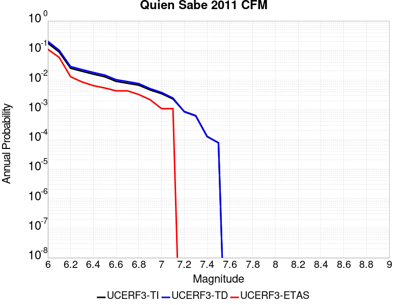 |
|-----|

| Magnitude | UCERF3-TI Prob | UCERF3-TD Prob | UCERF3-ETAS Prob |
|-----|-----|-----|-----|
| 6.0 | 0.17685625 | 0.204214 | 0.10954447 |
| 6.1 | 0.08881827 | 0.102034025 | 0.05856833 |
| 6.2 | 0.025174985 | 0.0286406 | 0.013015185 |
| 6.3 | 0.019931776 | 0.022670714 | 0.00867679 |
| 6.4 | 0.015928097 | 0.018112103 | 0.0065075923 |
| 6.5 | 0.013001784 | 0.014780622 | 0.0054229936 |
| 6.6 | 0.009092468 | 0.010327063 | 0.004338395 |
| 6.7 | 0.007825943 | 0.00889599 | 0.004338395 |
| 6.8 | 0.0067209303 | 0.007588007 | 0.0032537961 |
| 6.9 | 0.004637039 | 0.005125167 | 0.0021691974 |
| 7.0 | 0.0034842032 | 0.0038131867 | 0.0010845987 |
| 7.1 | 0.002303897 | 0.0024734482 | 0.0010845987 |
| 7.2 | 8.668823E-4 | 8.462068E-4 | 0.0 |
| 7.3 | 6.3337706E-4 | 6.1391736E-4 | 0.0 |
| 7.4 | 1.2622733E-4 | 1.2286099E-4 | 0.0 |
| 7.5 | 7.530546E-5 | 7.6634395E-5 | 0.0 |

## Raymond
*[(top)](#table-of-contents)*

| 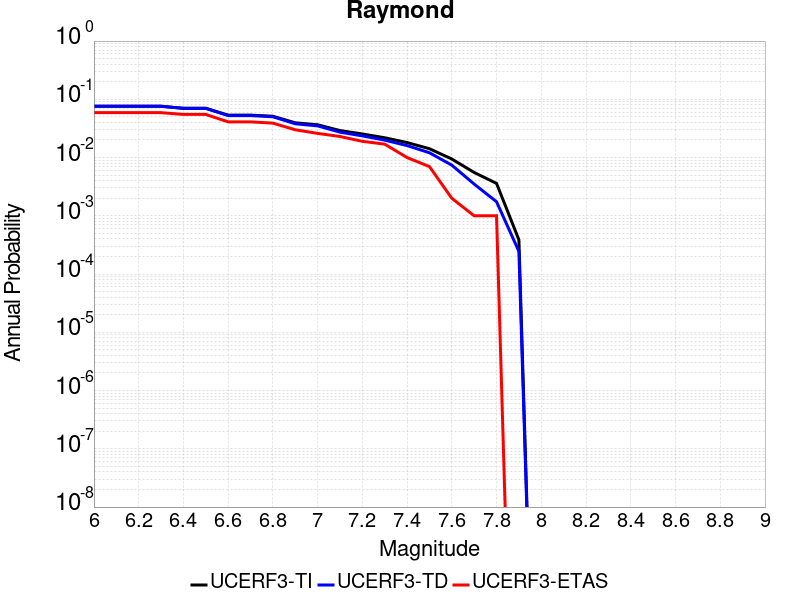 |
|-----|

| Magnitude | UCERF3-TI Prob | UCERF3-TD Prob | UCERF3-ETAS Prob |
|-----|-----|-----|-----|
| 6.0 | 0.07604306 | 0.07594449 | 0.061822128 |
| 6.1 | 0.07604306 | 0.07594449 | 0.061822128 |
| 6.2 | 0.07604306 | 0.07594449 | 0.061822128 |
| 6.3 | 0.07604306 | 0.07594449 | 0.061822128 |
| 6.4 | 0.07016449 | 0.06985853 | 0.057483733 |
| 6.5 | 0.07016449 | 0.06985853 | 0.057483733 |
| 6.6 | 0.053524427 | 0.05251634 | 0.04338395 |
| 6.7 | 0.053524427 | 0.05251634 | 0.04338395 |
| 6.8 | 0.05123272 | 0.05017726 | 0.04121475 |
| 6.9 | 0.03948949 | 0.03800462 | 0.03253796 |
| 7.0 | 0.036557946 | 0.034990467 | 0.028199567 |
| 7.1 | 0.029075863 | 0.027300412 | 0.02494577 |
| 7.2 | 0.02542578 | 0.02355629 | 0.020607375 |
| 7.3 | 0.021864798 | 0.019912051 | 0.018438177 |
| 7.4 | 0.018096743 | 0.016057784 | 0.010845987 |
| 7.5 | 0.014185032 | 0.012091085 | 0.007592191 |
| 7.6 | 0.009444526 | 0.0074063158 | 0.0021691974 |
| 7.7 | 0.0055469787 | 0.0035067282 | 0.0010845987 |
| 7.8 | 0.003600921 | 0.0017436531 | 0.0010845987 |
| 7.9 | 3.8736133E-4 | 2.4498499E-4 | 0.0 |

## Red Mountain
*[(top)](#table-of-contents)*

| 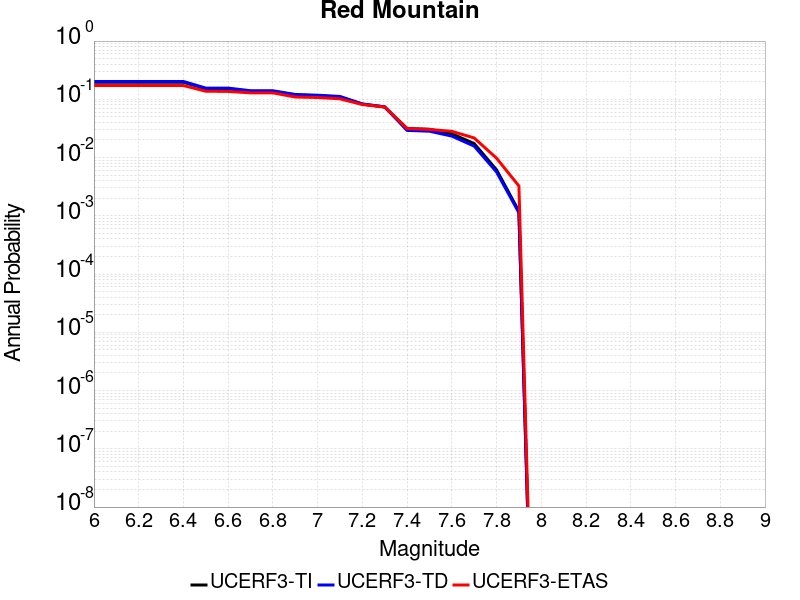 |
|-----|

| Magnitude | UCERF3-TI Prob | UCERF3-TD Prob | UCERF3-ETAS Prob |
|-----|-----|-----|-----|
| 6.0 | 0.19600897 | 0.20251967 | 0.1724512 |
| 6.1 | 0.19600897 | 0.20251967 | 0.1724512 |
| 6.2 | 0.19600897 | 0.20251967 | 0.1724512 |
| 6.3 | 0.19600897 | 0.20251967 | 0.1724512 |
| 6.4 | 0.19600897 | 0.20251967 | 0.1724512 |
| 6.5 | 0.15176712 | 0.15578282 | 0.13774404 |
| 6.6 | 0.15172641 | 0.15574059 | 0.13665944 |
| 6.7 | 0.13713494 | 0.14042656 | 0.12906724 |
| 6.8 | 0.13688977 | 0.1401728 | 0.12906724 |
| 6.9 | 0.11875456 | 0.121150106 | 0.10954447 |
| 7.0 | 0.11533308 | 0.117575124 | 0.10737527 |
| 7.1 | 0.10989893 | 0.11189785 | 0.10195228 |
| 7.2 | 0.08265596 | 0.08331003 | 0.0813449 |
| 7.3 | 0.07385012 | 0.07412559 | 0.07375271 |
| 7.4 | 0.031495597 | 0.0292548 | 0.031453364 |
| 7.5 | 0.030593462 | 0.028345337 | 0.030368764 |
| 7.6 | 0.025612995 | 0.023360413 | 0.028199567 |
| 7.7 | 0.017386362 | 0.015727872 | 0.021691974 |
| 7.8 | 0.006153178 | 0.0056635574 | 0.009761388 |
| 7.9 | 0.0011976815 | 0.0011305652 | 0.0032537961 |

## Red Pass
*[(top)](#table-of-contents)*

| 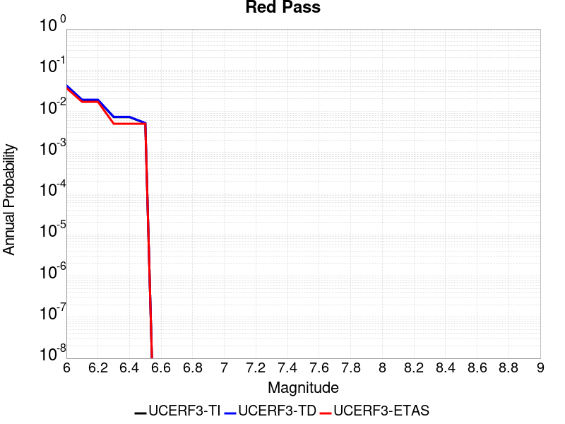 |
|-----|

| Magnitude | UCERF3-TI Prob | UCERF3-TD Prob | UCERF3-ETAS Prob |
|-----|-----|-----|-----|
| 6.0 | 0.042175483 | 0.042789225 | 0.037960954 |
| 6.1 | 0.018864937 | 0.019104471 | 0.018438177 |
| 6.2 | 0.018864937 | 0.019104471 | 0.018438177 |
| 6.3 | 0.0072395056 | 0.007329009 | 0.0054229936 |
| 6.4 | 0.0072395056 | 0.007329009 | 0.0054229936 |
| 6.5 | 0.005140325 | 0.005207107 | 0.0054229936 |

## Redondo Canyon alt 1
*[(top)](#table-of-contents)*

| 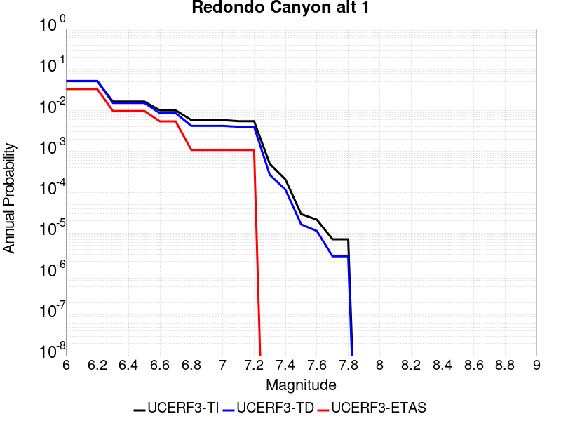 |
|-----|

| Magnitude | UCERF3-TI Prob | UCERF3-TD Prob | UCERF3-ETAS Prob |
|-----|-----|-----|-----|
| 6.0 | 0.052554168 | 0.05293977 | 0.03362256 |
| 6.1 | 0.052554168 | 0.05293977 | 0.03362256 |
| 6.2 | 0.052554168 | 0.05293977 | 0.03362256 |
| 6.3 | 0.016585635 | 0.01535857 | 0.009761388 |
| 6.4 | 0.016585635 | 0.01535857 | 0.009761388 |
| 6.5 | 0.016585635 | 0.01535857 | 0.009761388 |
| 6.6 | 0.010114607 | 0.008638073 | 0.0054229936 |
| 6.7 | 0.010114607 | 0.008638073 | 0.0054229936 |
| 6.8 | 0.005867535 | 0.004222254 | 0.0010845987 |
| 6.9 | 0.005867535 | 0.004222254 | 0.0010845987 |
| 7.0 | 0.005867535 | 0.004222254 | 0.0010845987 |
| 7.1 | 0.0054871957 | 0.0040147337 | 0.0010845987 |
| 7.2 | 0.0054871957 | 0.0040147337 | 0.0010845987 |
| 7.3 | 4.958428E-4 | 2.6763478E-4 | 0.0 |
| 7.4 | 2.0619256E-4 | 1.1585125E-4 | 0.0 |
| 7.5 | 2.9289082E-5 | 1.6423084E-5 | 0.0 |
| 7.6 | 2.1426553E-5 | 1.1325495E-5 | 0.0 |
| 7.7 | 7.1065656E-6 | 2.716114E-6 | 0.0 |
| 7.8 | 7.1065656E-6 | 2.716114E-6 | 0.0 |

## Reliz 2011 CFM
*[(top)](#table-of-contents)*

| 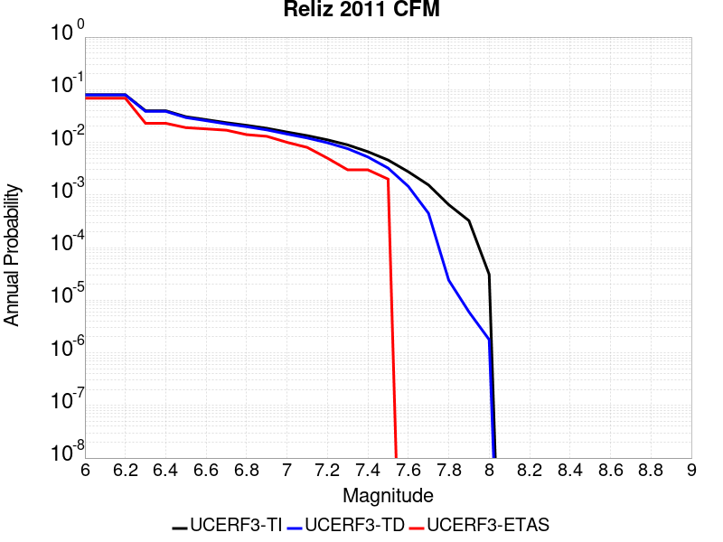 |
|-----|

| Magnitude | UCERF3-TI Prob | UCERF3-TD Prob | UCERF3-ETAS Prob |
|-----|-----|-----|-----|
| 6.0 | 0.08010825 | 0.07966619 | 0.06616052 |
| 6.1 | 0.08010825 | 0.07966619 | 0.06616052 |
| 6.2 | 0.08010825 | 0.07966619 | 0.06616052 |
| 6.3 | 0.039844293 | 0.03879115 | 0.022776572 |
| 6.4 | 0.039844293 | 0.03879115 | 0.022776572 |
| 6.5 | 0.03064997 | 0.029507529 | 0.019522777 |
| 6.6 | 0.026946208 | 0.025770005 | 0.018438177 |
| 6.7 | 0.023615599 | 0.022407183 | 0.01735358 |
| 6.8 | 0.021046022 | 0.019812444 | 0.014099783 |
| 6.9 | 0.018482449 | 0.017223371 | 0.013015185 |
| 7.0 | 0.015665185 | 0.014378985 | 0.009761388 |
| 7.1 | 0.013403342 | 0.012094358 | 0.007592191 |
| 7.2 | 0.011146729 | 0.009813136 | 0.004338395 |
| 7.3 | 0.008931852 | 0.007575748 | 0.0021691974 |
| 7.4 | 0.0066333753 | 0.005266169 | 0.0021691974 |
| 7.5 | 0.00460525 | 0.0032375932 | 0.0010845987 |
| 7.6 | 0.0027571463 | 0.0014543843 | 0.0 |
| 7.7 | 0.0015465945 | 4.4733268E-4 | 0.0 |
| 7.8 | 6.52509E-4 | 2.3960722E-5 | 0.0 |
| 7.9 | 3.2415867E-4 | 5.9828753E-6 | 0.0 |
| 8.0 | 3.090922E-5 | 1.7784341E-6 | 0.0 |

## Richfield
*[(top)](#table-of-contents)*

| 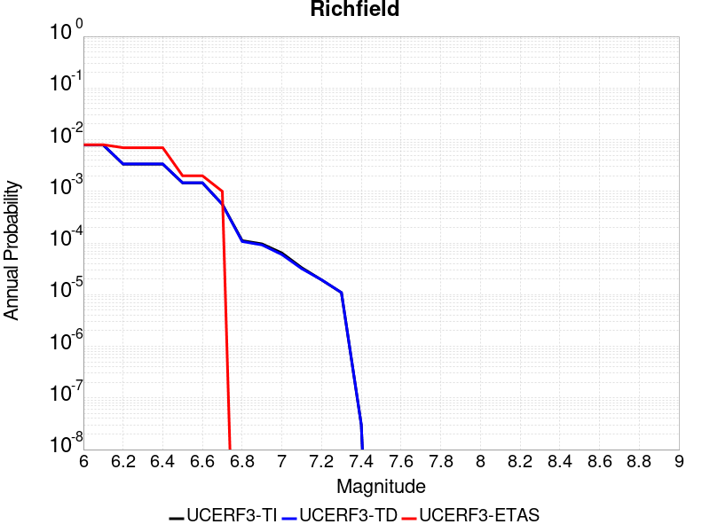 |
|-----|

| Magnitude | UCERF3-TI Prob | UCERF3-TD Prob | UCERF3-ETAS Prob |
|-----|-----|-----|-----|
| 6.0 | 0.0078826435 | 0.00792623 | 0.007592191 |
| 6.1 | 0.0078826435 | 0.00792623 | 0.007592191 |
| 6.2 | 0.0033719642 | 0.0033895958 | 0.0065075923 |
| 6.3 | 0.0033719642 | 0.0033895958 | 0.0065075923 |
| 6.4 | 0.0033719642 | 0.0033895958 | 0.0065075923 |
| 6.5 | 0.0014575577 | 0.0014637125 | 0.0021691974 |
| 6.6 | 0.0014575577 | 0.0014637125 | 0.0021691974 |
| 6.7 | 5.62186E-4 | 5.605278E-4 | 0.0010845987 |
| 6.8 | 1.1114396E-4 | 1.06851425E-4 | 0.0 |
| 6.9 | 9.6074415E-5 | 9.173961E-5 | 0.0 |
| 7.0 | 6.412823E-5 | 5.970812E-5 | 0.0 |
| 7.1 | 3.3255837E-5 | 3.1807296E-5 | 0.0 |
| 7.2 | 1.9300638E-5 | 1.9359051E-5 | 0.0 |
| 7.3 | 1.0943858E-5 | 1.0979587E-5 | 0.0 |
| 7.4 | 3.042753E-8 | 3.0522887E-8 | 0.0 |

## Rinconada 2011 CFM
*[(top)](#table-of-contents)*

| 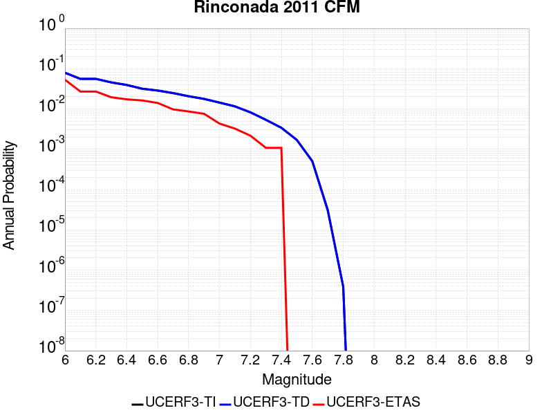 |
|-----|

| Magnitude | UCERF3-TI Prob | UCERF3-TD Prob | UCERF3-ETAS Prob |
|-----|-----|-----|-----|
| 6.0 | 0.07890698 | 0.0796757 | 0.053145338 |
| 6.1 | 0.055613745 | 0.056135867 | 0.027114967 |
| 6.2 | 0.055613745 | 0.056135867 | 0.027114967 |
| 6.3 | 0.04550758 | 0.04592721 | 0.019522777 |
| 6.4 | 0.039265715 | 0.039622057 | 0.01735358 |
| 6.5 | 0.03166692 | 0.03194786 | 0.01626898 |
| 6.6 | 0.028561406 | 0.028812146 | 0.014099783 |
| 6.7 | 0.024672937 | 0.024885328 | 0.009761388 |
| 6.8 | 0.02063226 | 0.020803703 | 0.00867679 |
| 6.9 | 0.017712487 | 0.017853206 | 0.007592191 |
| 7.0 | 0.014356072 | 0.014463604 | 0.004338395 |
| 7.1 | 0.011554774 | 0.011636362 | 0.0032537961 |
| 7.2 | 0.008219625 | 0.008271822 | 0.0021691974 |
| 7.3 | 0.0053633875 | 0.0053923335 | 0.0010845987 |
| 7.4 | 0.003404345 | 0.0034189273 | 0.0010845987 |
| 7.5 | 0.0017025429 | 0.0017044899 | 0.0 |
| 7.6 | 5.0883816E-4 | 5.016017E-4 | 0.0 |
| 7.7 | 3.130741E-5 | 2.9792862E-5 | 0.0 |
| 7.8 | 3.861217E-7 | 3.8715507E-7 | 0.0 |

## Robinson Creek
*[(top)](#table-of-contents)*

| 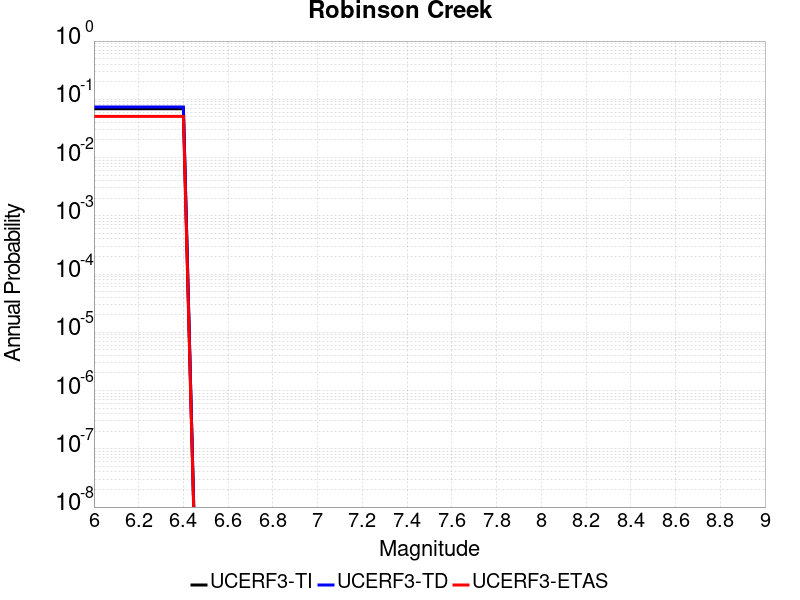 |
|-----|

| Magnitude | UCERF3-TI Prob | UCERF3-TD Prob | UCERF3-ETAS Prob |
|-----|-----|-----|-----|
| 6.0 | 0.069015756 | 0.0738362 | 0.05097614 |
| 6.1 | 0.069015756 | 0.0738362 | 0.05097614 |
| 6.2 | 0.069015756 | 0.0738362 | 0.05097614 |
| 6.3 | 0.069015756 | 0.0738362 | 0.05097614 |
| 6.4 | 0.069015756 | 0.0738362 | 0.05097614 |

## Rocky Ledge 2011 CFM
*[(top)](#table-of-contents)*

| 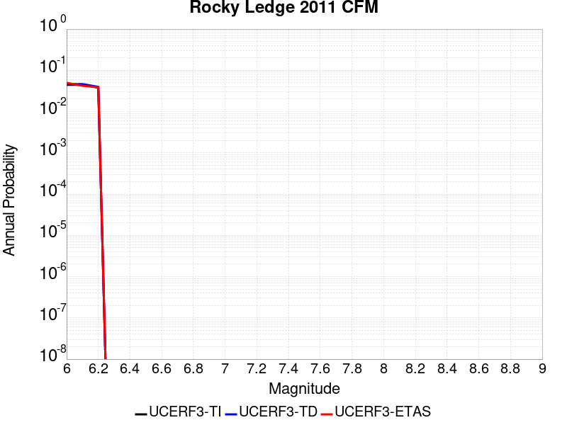 |
|-----|

| Magnitude | UCERF3-TI Prob | UCERF3-TD Prob | UCERF3-ETAS Prob |
|-----|-----|-----|-----|
| 6.0 | 0.044655062 | 0.046490353 | 0.04989154 |
| 6.1 | 0.044655062 | 0.046490353 | 0.04229935 |
| 6.2 | 0.038088642 | 0.039765045 | 0.039045554 |

## Rodgers Creek - Healdsburg 2011 CFM
*[(top)](#table-of-contents)*

| 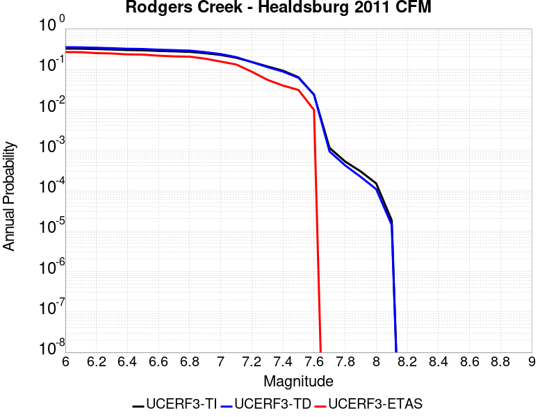 |
|-----|

| Magnitude | UCERF3-TI Prob | UCERF3-TD Prob | UCERF3-ETAS Prob |
|-----|-----|-----|-----|
| 6.0 | 0.3199734 | 0.345725 | 0.2624729 |
| 6.1 | 0.31743455 | 0.3430358 | 0.26030368 |
| 6.2 | 0.3109649 | 0.33561948 | 0.24728851 |
| 6.3 | 0.30328584 | 0.3270642 | 0.24186552 |
| 6.4 | 0.29414177 | 0.3165539 | 0.22993493 |
| 6.5 | 0.29036734 | 0.3124525 | 0.22668113 |
| 6.6 | 0.2797758 | 0.30032447 | 0.21366595 |
| 6.7 | 0.27319425 | 0.29281634 | 0.20498915 |
| 6.8 | 0.26587442 | 0.28448942 | 0.20173536 |
| 6.9 | 0.24567382 | 0.2613618 | 0.18004338 |
| 7.0 | 0.22261813 | 0.23410401 | 0.15292841 |
| 7.1 | 0.18962255 | 0.19645087 | 0.12906724 |
| 7.2 | 0.14919099 | 0.14862427 | 0.08568329 |
| 7.3 | 0.11593291 | 0.11172738 | 0.054229934 |
| 7.4 | 0.09083862 | 0.08661219 | 0.039045554 |
| 7.5 | 0.062709 | 0.060698945 | 0.030368764 |
| 7.6 | 0.023090394 | 0.023423763 | 0.009761388 |
| 7.7 | 0.0011253492 | 9.208183E-4 | 0.0 |
| 7.8 | 5.1968504E-4 | 4.177482E-4 | 0.0 |
| 7.9 | 2.9604483E-4 | 2.1734423E-4 | 0.0 |
| 8.0 | 1.4929431E-4 | 1.078756E-4 | 0.0 |
| 8.1 | 1.8285913E-5 | 1.4010698E-5 | 0.0 |

## Rose Canyon
*[(top)](#table-of-contents)*

| 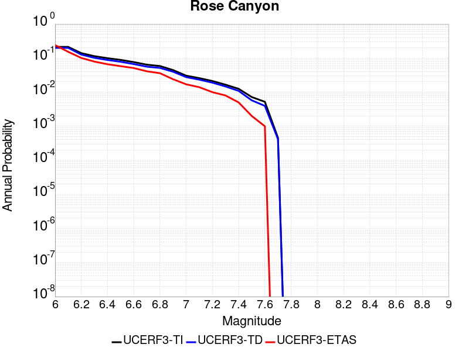 |
|-----|

| Magnitude | UCERF3-TI Prob | UCERF3-TD Prob | UCERF3-ETAS Prob |
|-----|-----|-----|-----|
| 6.0 | 0.21307805 | 0.19972014 | 0.23752712 |
| 6.1 | 0.21307805 | 0.19972014 | 0.15401301 |
| 6.2 | 0.13973075 | 0.12676513 | 0.10195228 |
| 6.3 | 0.11388397 | 0.10173348 | 0.07809111 |
| 6.4 | 0.09941049 | 0.08809309 | 0.06507592 |
| 6.5 | 0.08855276 | 0.0779454 | 0.05856833 |
| 6.6 | 0.076380245 | 0.0668038 | 0.05097614 |
| 6.7 | 0.06413828 | 0.055953786 | 0.040130153 |
| 6.8 | 0.058510665 | 0.051502917 | 0.03470716 |
| 6.9 | 0.044540532 | 0.03983527 | 0.021691974 |
| 7.0 | 0.030487148 | 0.027643593 | 0.015184382 |
| 7.1 | 0.025820129 | 0.0232829 | 0.013015185 |
| 7.2 | 0.021272086 | 0.019005362 | 0.009761388 |
| 7.3 | 0.01660023 | 0.01470921 | 0.007592191 |
| 7.4 | 0.012545138 | 0.01091216 | 0.004338395 |
| 7.5 | 0.007197004 | 0.0057557807 | 0.0021691974 |
| 7.6 | 0.0052154693 | 0.0039605265 | 0.0010845987 |
| 7.7 | 4.570848E-4 | 4.178077E-4 | 0.0 |

## Round Valley
*[(top)](#table-of-contents)*

| 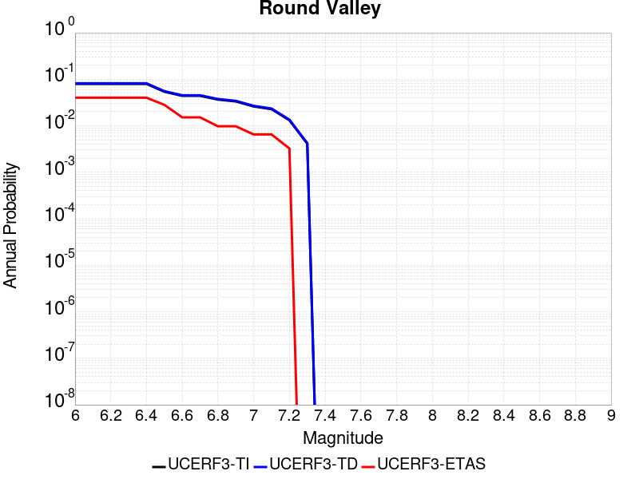 |
|-----|

| Magnitude | UCERF3-TI Prob | UCERF3-TD Prob | UCERF3-ETAS Prob |
|-----|-----|-----|-----|
| 6.0 | 0.07952751 | 0.08195012 | 0.040130153 |
| 6.1 | 0.07952751 | 0.08195012 | 0.040130153 |
| 6.2 | 0.07952751 | 0.08195012 | 0.040130153 |
| 6.3 | 0.07952751 | 0.08195012 | 0.040130153 |
| 6.4 | 0.07952751 | 0.08195012 | 0.040130153 |
| 6.5 | 0.054038733 | 0.05556329 | 0.028199567 |
| 6.6 | 0.044046234 | 0.045300383 | 0.015184382 |
| 6.7 | 0.044046234 | 0.045300383 | 0.015184382 |
| 6.8 | 0.03658976 | 0.03765978 | 0.009761388 |
| 6.9 | 0.03340835 | 0.034399707 | 0.009761388 |
| 7.0 | 0.026064262 | 0.026851546 | 0.0065075923 |
| 7.1 | 0.022785192 | 0.023476202 | 0.0065075923 |
| 7.2 | 0.013142738 | 0.013556731 | 0.0032537961 |
| 7.3 | 0.0041136323 | 0.0042432984 | 0.0 |

## Russ 2011 CFM
*[(top)](#table-of-contents)*

| 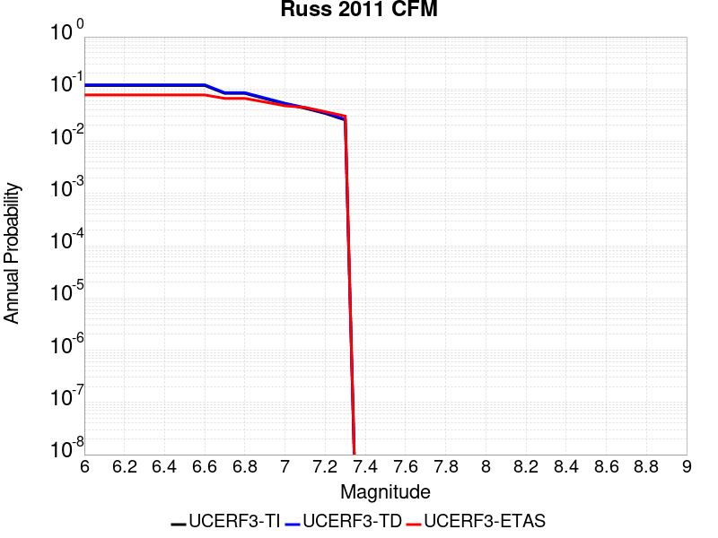 |
|-----|

| Magnitude | UCERF3-TI Prob | UCERF3-TD Prob | UCERF3-ETAS Prob |
|-----|-----|-----|-----|
| 6.0 | 0.11681421 | 0.12054918 | 0.077006504 |
| 6.1 | 0.11681421 | 0.12054918 | 0.077006504 |
| 6.2 | 0.11681421 | 0.12054918 | 0.077006504 |
| 6.3 | 0.11681421 | 0.12054918 | 0.077006504 |
| 6.4 | 0.11681421 | 0.12054918 | 0.077006504 |
| 6.5 | 0.11681421 | 0.12054918 | 0.077006504 |
| 6.6 | 0.11681421 | 0.12054918 | 0.077006504 |
| 6.7 | 0.082568385 | 0.08513877 | 0.06616052 |
| 6.8 | 0.082568385 | 0.08513877 | 0.06616052 |
| 6.9 | 0.065442584 | 0.06748015 | 0.056399133 |
| 7.0 | 0.051839825 | 0.053464033 | 0.047722343 |
| 7.1 | 0.042756133 | 0.044117145 | 0.04446855 |
| 7.2 | 0.034100693 | 0.035211474 | 0.036876354 |
| 7.3 | 0.02552283 | 0.02638294 | 0.030368764 |

## San Andreas (Big Bend)
*[(top)](#table-of-contents)*

| 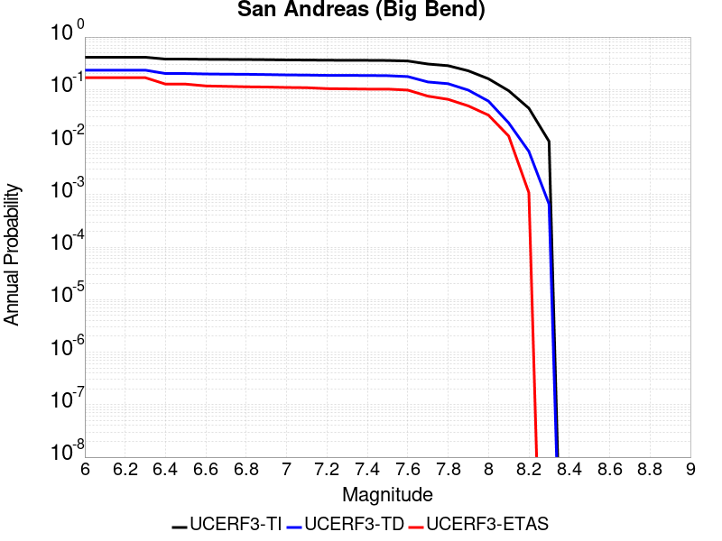 |
|-----|

| Magnitude | UCERF3-TI Prob | UCERF3-TD Prob | UCERF3-ETAS Prob |
|-----|-----|-----|-----|
| 6.0 | 0.41210285 | 0.23371482 | 0.1681128 |
| 6.1 | 0.41210285 | 0.23371482 | 0.1681128 |
| 6.2 | 0.41210285 | 0.23371482 | 0.1681128 |
| 6.3 | 0.41210285 | 0.23371482 | 0.1681128 |
| 6.4 | 0.3800916 | 0.20177047 | 0.12689805 |
| 6.5 | 0.3800916 | 0.20177047 | 0.12689805 |
| 6.6 | 0.37615442 | 0.1979811 | 0.11713666 |
| 6.7 | 0.3742323 | 0.19619794 | 0.114967465 |
| 6.8 | 0.3730398 | 0.19525295 | 0.112798266 |
| 6.9 | 0.37012282 | 0.19272538 | 0.11171366 |
| 7.0 | 0.366335 | 0.18986815 | 0.10954447 |
| 7.1 | 0.36440182 | 0.18855035 | 0.10845987 |
| 7.2 | 0.3617947 | 0.18632092 | 0.10412148 |
| 7.3 | 0.36051944 | 0.18568215 | 0.10303687 |
| 7.4 | 0.35968313 | 0.18527903 | 0.10195228 |
| 7.5 | 0.35754025 | 0.18362941 | 0.10195228 |
| 7.6 | 0.34950835 | 0.17653875 | 0.097613886 |
| 7.7 | 0.30614218 | 0.13938273 | 0.07483731 |
| 7.8 | 0.28448674 | 0.12916592 | 0.06507592 |
| 7.9 | 0.22722232 | 0.09740015 | 0.048806943 |
| 8.0 | 0.16015619 | 0.060110617 | 0.03253796 |
| 8.1 | 0.09487985 | 0.023162004 | 0.013015185 |
| 8.2 | 0.044100937 | 0.0066363257 | 0.0010845987 |
| 8.3 | 0.0102941245 | 6.576036E-4 | 0.0 |

## San Andreas (Carrizo) rev
*[(top)](#table-of-contents)*

| 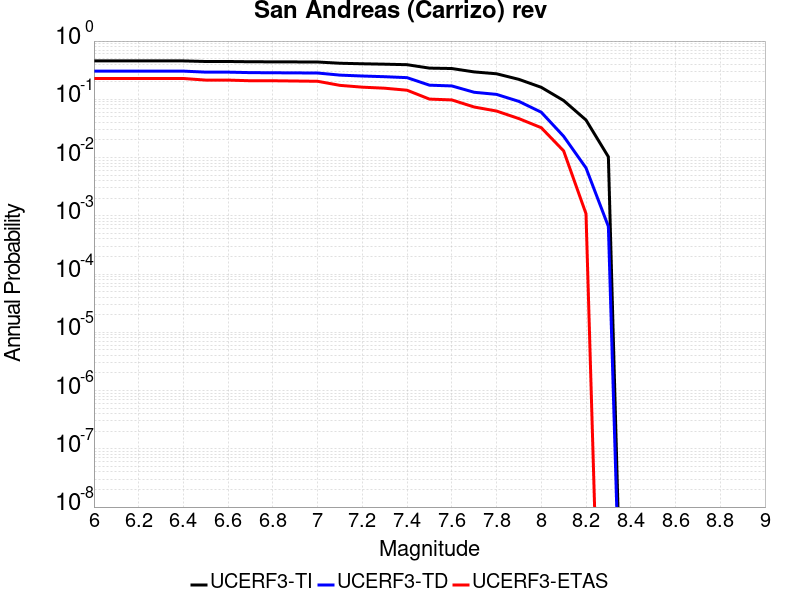 |
|-----|

| Magnitude | UCERF3-TI Prob | UCERF3-TD Prob | UCERF3-ETAS Prob |
|-----|-----|-----|-----|
| 6.0 | 0.4562149 | 0.30473655 | 0.22776572 |
| 6.1 | 0.4562149 | 0.30473655 | 0.22776572 |
| 6.2 | 0.4562149 | 0.30473655 | 0.22776572 |
| 6.3 | 0.4562149 | 0.30473655 | 0.22776572 |
| 6.4 | 0.4562149 | 0.30473655 | 0.22776572 |
| 6.5 | 0.4458732 | 0.29266238 | 0.21366595 |
| 6.6 | 0.4458732 | 0.29266238 | 0.21366595 |
| 6.7 | 0.4411122 | 0.28711587 | 0.20824295 |
| 6.8 | 0.4397665 | 0.2856715 | 0.20824295 |
| 6.9 | 0.43829313 | 0.28408974 | 0.20607375 |
| 7.0 | 0.43688783 | 0.2826703 | 0.20390455 |
| 7.1 | 0.4160219 | 0.26020813 | 0.1735358 |
| 7.2 | 0.407406 | 0.25115925 | 0.16160521 |
| 7.3 | 0.4008595 | 0.24433304 | 0.15509762 |
| 7.4 | 0.3928804 | 0.235485 | 0.14316703 |
| 7.5 | 0.3430718 | 0.17483304 | 0.10086768 |
| 7.6 | 0.3377232 | 0.16970399 | 0.097613886 |
| 7.7 | 0.29530886 | 0.13208571 | 0.07375271 |
| 7.8 | 0.27442318 | 0.12150082 | 0.06290673 |
| 7.9 | 0.22008279 | 0.09207767 | 0.046637744 |
| 8.0 | 0.16061361 | 0.060009405 | 0.03253796 |
| 8.1 | 0.09521291 | 0.023180611 | 0.013015185 |
| 8.2 | 0.044100937 | 0.0066363257 | 0.0010845987 |
| 8.3 | 0.0102941245 | 6.576036E-4 | 0.0 |

## San Andreas (Cholame) rev
*[(top)](#table-of-contents)*

| 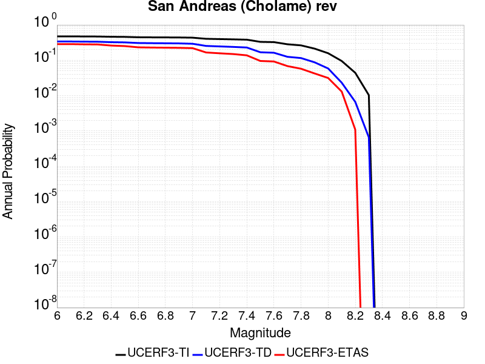 |
|-----|

| Magnitude | UCERF3-TI Prob | UCERF3-TD Prob | UCERF3-ETAS Prob |
|-----|-----|-----|-----|
| 6.0 | 0.47374377 | 0.33925846 | 0.28633407 |
| 6.1 | 0.47374377 | 0.33925846 | 0.28633407 |
| 6.2 | 0.47101948 | 0.3361882 | 0.28199565 |
| 6.3 | 0.469335 | 0.33427113 | 0.27982646 |
| 6.4 | 0.4615961 | 0.32490146 | 0.26030368 |
| 6.5 | 0.45819098 | 0.32038257 | 0.2516269 |
| 6.6 | 0.44715247 | 0.30722648 | 0.23210412 |
| 6.7 | 0.44465145 | 0.30412018 | 0.22885032 |
| 6.8 | 0.44310063 | 0.30218804 | 0.22668113 |
| 6.9 | 0.441027 | 0.29968953 | 0.22451194 |
| 7.0 | 0.43572342 | 0.29276276 | 0.22017354 |
| 7.1 | 0.40432116 | 0.2542177 | 0.16594361 |
| 7.2 | 0.39709097 | 0.24625757 | 0.15726681 |
| 7.3 | 0.39000255 | 0.23847547 | 0.14967462 |
| 7.4 | 0.38191375 | 0.22943436 | 0.13774404 |
| 7.5 | 0.33144832 | 0.16830933 | 0.09544469 |
| 7.6 | 0.3260939 | 0.16303429 | 0.09219089 |
| 7.7 | 0.28310165 | 0.12507984 | 0.06832972 |
| 7.8 | 0.2635795 | 0.11531667 | 0.057483733 |
| 7.9 | 0.2131997 | 0.08741366 | 0.04229935 |
| 8.0 | 0.1579637 | 0.058501583 | 0.031453364 |
| 8.1 | 0.09522255 | 0.023181153 | 0.013015185 |
| 8.2 | 0.044100937 | 0.0066363257 | 0.0010845987 |
| 8.3 | 0.0102941245 | 6.576036E-4 | 0.0 |

## San Andreas (Coachella) rev
*[(top)](#table-of-contents)*

| 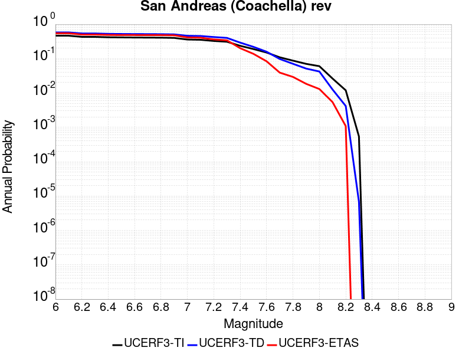 |
|-----|

| Magnitude | UCERF3-TI Prob | UCERF3-TD Prob | UCERF3-ETAS Prob |
|-----|-----|-----|-----|
| 6.0 | 0.46329993 | 0.5770933 | 0.5466378 |
| 6.1 | 0.46329993 | 0.5770933 | 0.5466378 |
| 6.2 | 0.42913184 | 0.53878206 | 0.5 |
| 6.3 | 0.4284023 | 0.53806645 | 0.5 |
| 6.4 | 0.41747683 | 0.52553415 | 0.489154 |
| 6.5 | 0.4135719 | 0.52103025 | 0.48373103 |
| 6.6 | 0.4101604 | 0.5173041 | 0.48373103 |
| 6.7 | 0.4081229 | 0.5150786 | 0.48264644 |
| 6.8 | 0.40583733 | 0.5123809 | 0.4815618 |
| 6.9 | 0.39961538 | 0.5055908 | 0.47613883 |
| 7.0 | 0.3582628 | 0.4609616 | 0.41323212 |
| 7.1 | 0.3521767 | 0.45400503 | 0.40563992 |
| 7.2 | 0.32611063 | 0.42410678 | 0.36117136 |
| 7.3 | 0.30898458 | 0.39977628 | 0.3394794 |
| 7.4 | 0.23549679 | 0.29146513 | 0.20065077 |
| 7.5 | 0.1895831 | 0.21981655 | 0.13774404 |
| 7.6 | 0.15009998 | 0.1585659 | 0.0835141 |
| 7.7 | 0.10892 | 0.09734232 | 0.039045554 |
| 7.8 | 0.087196186 | 0.07058826 | 0.029284164 |
| 7.9 | 0.07028743 | 0.05121445 | 0.018438177 |
| 8.0 | 0.060142584 | 0.042098008 | 0.013015185 |
| 8.1 | 0.026264574 | 0.012606566 | 0.0054229936 |
| 8.2 | 0.011931671 | 0.0041759415 | 0.0010845987 |
| 8.3 | 5.437848E-4 | 6.8106624E-6 | 0.0 |

## San Andreas (Creeping Section) 2011 CFM
*[(top)](#table-of-contents)*

| 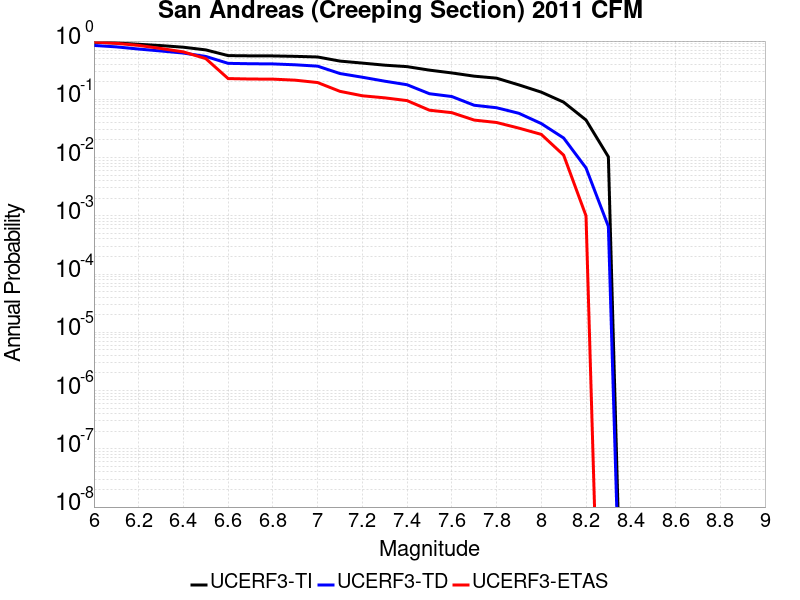 |
|-----|

| Magnitude | UCERF3-TI Prob | UCERF3-TD Prob | UCERF3-ETAS Prob |
|-----|-----|-----|-----|
| 6.0 | 0.95604527 | 0.84111124 | 0.9609544 |
| 6.1 | 0.92704445 | 0.7947663 | 0.9110629 |
| 6.2 | 0.8806676 | 0.72913486 | 0.83622557 |
| 6.3 | 0.8359904 | 0.6753897 | 0.73752713 |
| 6.4 | 0.7838312 | 0.62239414 | 0.6475054 |
| 6.5 | 0.70525014 | 0.54448014 | 0.49566162 |
| 6.6 | 0.562504 | 0.41431743 | 0.22451194 |
| 6.7 | 0.5573189 | 0.40782544 | 0.22017354 |
| 6.8 | 0.5555146 | 0.40519053 | 0.21908894 |
| 6.9 | 0.54649615 | 0.39130256 | 0.21041214 |
| 7.0 | 0.53293425 | 0.37080488 | 0.19088937 |
| 7.1 | 0.4530972 | 0.27693653 | 0.13449024 |
| 7.2 | 0.41862622 | 0.2394058 | 0.11388286 |
| 7.3 | 0.3855325 | 0.20477414 | 0.106290676 |
| 7.4 | 0.36391366 | 0.1778619 | 0.09652928 |
| 7.5 | 0.3168955 | 0.124701 | 0.06616052 |
| 7.6 | 0.28367293 | 0.111654095 | 0.05965293 |
| 7.7 | 0.24967696 | 0.079051726 | 0.04338395 |
| 7.8 | 0.23073141 | 0.0716872 | 0.039045554 |
| 7.9 | 0.17673948 | 0.05752645 | 0.031453364 |
| 8.0 | 0.13281496 | 0.03834021 | 0.023861172 |
| 8.1 | 0.08936402 | 0.021663502 | 0.010845987 |
| 8.2 | 0.044100937 | 0.0066363257 | 0.0010845987 |
| 8.3 | 0.0102941245 | 6.576036E-4 | 0.0 |

## San Andreas (Mojave N)
*[(top)](#table-of-contents)*

| 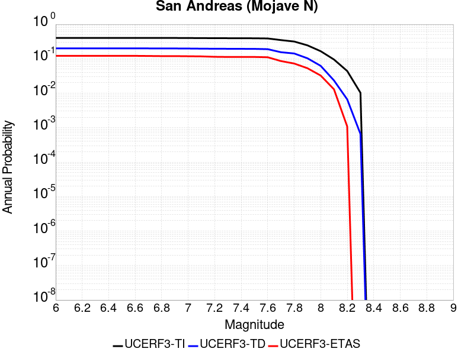 |
|-----|

| Magnitude | UCERF3-TI Prob | UCERF3-TD Prob | UCERF3-ETAS Prob |
|-----|-----|-----|-----|
| 6.0 | 0.40275556 | 0.20044224 | 0.121475056 |
| 6.1 | 0.40275556 | 0.20044224 | 0.121475056 |
| 6.2 | 0.40275556 | 0.20044224 | 0.121475056 |
| 6.3 | 0.40275556 | 0.20044224 | 0.121475056 |
| 6.4 | 0.40275556 | 0.20044224 | 0.121475056 |
| 6.5 | 0.4022502 | 0.19992504 | 0.121475056 |
| 6.6 | 0.4022502 | 0.19992504 | 0.121475056 |
| 6.7 | 0.4020567 | 0.19972682 | 0.12039045 |
| 6.8 | 0.40178287 | 0.19949149 | 0.11930586 |
| 6.9 | 0.40113714 | 0.1989366 | 0.11930586 |
| 7.0 | 0.3997492 | 0.19800104 | 0.11822126 |
| 7.1 | 0.39757302 | 0.19641604 | 0.11713666 |
| 7.2 | 0.3960529 | 0.19529891 | 0.11388286 |
| 7.3 | 0.39491528 | 0.19478029 | 0.112798266 |
| 7.4 | 0.39382654 | 0.19407655 | 0.112798266 |
| 7.5 | 0.3928261 | 0.19341059 | 0.112798266 |
| 7.6 | 0.3882619 | 0.18966417 | 0.11062907 |
| 7.7 | 0.3481844 | 0.15478694 | 0.08568329 |
| 7.8 | 0.31626585 | 0.14222038 | 0.07266811 |
| 7.9 | 0.24505983 | 0.103190005 | 0.053145338 |
| 8.0 | 0.16555339 | 0.062198736 | 0.03253796 |
| 8.1 | 0.09510401 | 0.02351303 | 0.013015185 |
| 8.2 | 0.044100937 | 0.0066363257 | 0.0010845987 |
| 8.3 | 0.0102941245 | 6.576036E-4 | 0.0 |

## San Andreas (Mojave S)
*[(top)](#table-of-contents)*

| 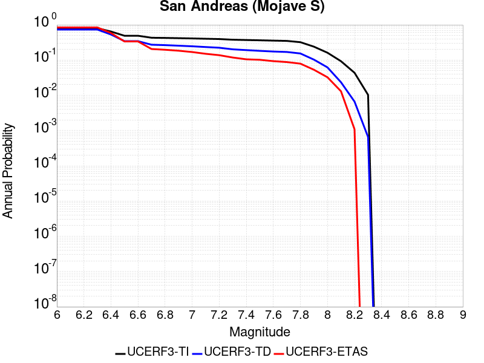 |
|-----|

| Magnitude | UCERF3-TI Prob | UCERF3-TD Prob | UCERF3-ETAS Prob |
|-----|-----|-----|-----|
| 6.0 | 0.80232483 | 0.73277867 | 0.8427332 |
| 6.1 | 0.80232483 | 0.73277867 | 0.8427332 |
| 6.2 | 0.80232483 | 0.73277867 | 0.8427332 |
| 6.3 | 0.80232483 | 0.73277867 | 0.8427332 |
| 6.4 | 0.6454856 | 0.53208786 | 0.5856833 |
| 6.5 | 0.4901933 | 0.34418234 | 0.3373102 |
| 6.6 | 0.4901933 | 0.34418234 | 0.3373102 |
| 6.7 | 0.43082377 | 0.27256104 | 0.20607375 |
| 6.8 | 0.42557925 | 0.26564294 | 0.19631237 |
| 6.9 | 0.418626 | 0.25615138 | 0.18438178 |
| 7.0 | 0.41135544 | 0.24629237 | 0.1691974 |
| 7.1 | 0.4030021 | 0.23467049 | 0.15075922 |
| 7.2 | 0.39533773 | 0.22406757 | 0.13774404 |
| 7.3 | 0.37860554 | 0.2019417 | 0.11822126 |
| 7.4 | 0.3710804 | 0.19189125 | 0.10520607 |
| 7.5 | 0.36407295 | 0.18262124 | 0.10195228 |
| 7.6 | 0.35666448 | 0.17504536 | 0.09327549 |
| 7.7 | 0.35011896 | 0.16990376 | 0.08785249 |
| 7.8 | 0.32191038 | 0.1539295 | 0.0791757 |
| 7.9 | 0.2399691 | 0.102916494 | 0.053145338 |
| 8.0 | 0.16168398 | 0.062073406 | 0.03253796 |
| 8.1 | 0.09281539 | 0.023462266 | 0.013015185 |
| 8.2 | 0.04359029 | 0.006634119 | 0.0010845987 |
| 8.3 | 0.0102941245 | 6.576036E-4 | 0.0 |

## San Andreas (North Branch Mill Creek)
*[(top)](#table-of-contents)*

| 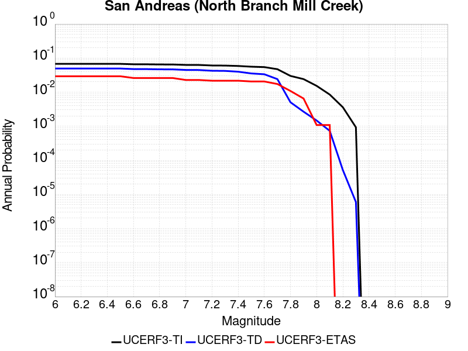 |
|-----|

| Magnitude | UCERF3-TI Prob | UCERF3-TD Prob | UCERF3-ETAS Prob |
|-----|-----|-----|-----|
| 6.0 | 0.06782887 | 0.04950393 | 0.029284164 |
| 6.1 | 0.06782887 | 0.04950393 | 0.029284164 |
| 6.2 | 0.06782887 | 0.04950393 | 0.029284164 |
| 6.3 | 0.06782887 | 0.04950393 | 0.029284164 |
| 6.4 | 0.06782887 | 0.04950393 | 0.029284164 |
| 6.5 | 0.067778036 | 0.049451243 | 0.029284164 |
| 6.6 | 0.065946385 | 0.047598943 | 0.02603037 |
| 6.7 | 0.06582791 | 0.047487773 | 0.02603037 |
| 6.8 | 0.0651195 | 0.04676925 | 0.02603037 |
| 6.9 | 0.064936206 | 0.0465941 | 0.02603037 |
| 7.0 | 0.06312249 | 0.04489302 | 0.022776572 |
| 7.1 | 0.06290771 | 0.044676434 | 0.022776572 |
| 7.2 | 0.060708255 | 0.042537834 | 0.021691974 |
| 7.3 | 0.060319256 | 0.042096782 | 0.021691974 |
| 7.4 | 0.058783766 | 0.039881684 | 0.021691974 |
| 7.5 | 0.0559642 | 0.03543542 | 0.020607375 |
| 7.6 | 0.05440461 | 0.03355676 | 0.020607375 |
| 7.7 | 0.047249794 | 0.02415489 | 0.01735358 |
| 7.8 | 0.029985836 | 0.005052472 | 0.010845987 |
| 7.9 | 0.02417584 | 0.002676319 | 0.0065075923 |
| 8.0 | 0.015311039 | 0.0014715559 | 0.0010845987 |
| 8.1 | 0.008508794 | 7.3299353E-4 | 0.0010845987 |
| 8.2 | 0.003626684 | 5.2210133E-5 | 0.0 |
| 8.3 | 9.323165E-4 | 5.9778968E-6 | 0.0 |

## San Andreas (North Coast) 2011 CFM
*[(top)](#table-of-contents)*

| 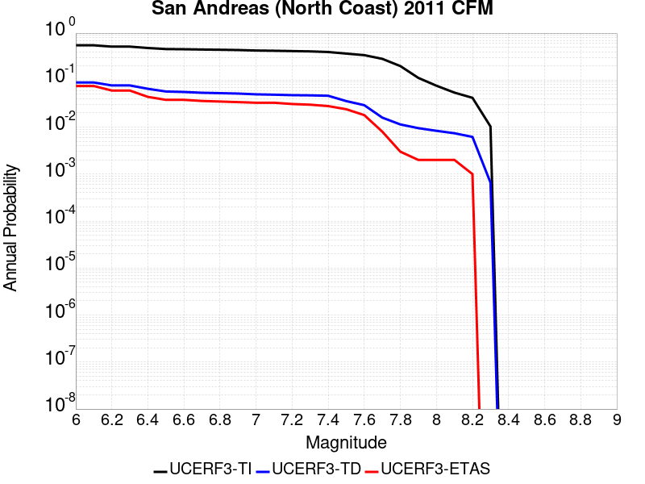 |
|-----|

| Magnitude | UCERF3-TI Prob | UCERF3-TD Prob | UCERF3-ETAS Prob |
|-----|-----|-----|-----|
| 6.0 | 0.5507394 | 0.0890244 | 0.0791757 |
| 6.1 | 0.5507394 | 0.0890244 | 0.0791757 |
| 6.2 | 0.5161633 | 0.07703321 | 0.06399132 |
| 6.3 | 0.5161633 | 0.07703321 | 0.06399132 |
| 6.4 | 0.48248947 | 0.06534924 | 0.046637744 |
| 6.5 | 0.4579563 | 0.05724929 | 0.040130153 |
| 6.6 | 0.45372128 | 0.055940438 | 0.040130153 |
| 6.7 | 0.44748327 | 0.053785425 | 0.037960954 |
| 6.8 | 0.4427202 | 0.052777413 | 0.036876354 |
| 6.9 | 0.4369001 | 0.051725805 | 0.03579176 |
| 7.0 | 0.426286 | 0.049824517 | 0.03470716 |
| 7.1 | 0.42122078 | 0.048947882 | 0.03470716 |
| 7.2 | 0.41493183 | 0.047856975 | 0.03253796 |
| 7.3 | 0.4085673 | 0.047365654 | 0.031453364 |
| 7.4 | 0.39633963 | 0.046430875 | 0.029284164 |
| 7.5 | 0.36688703 | 0.035775326 | 0.02494577 |
| 7.6 | 0.33976611 | 0.029278966 | 0.018438177 |
| 7.7 | 0.2834141 | 0.015915327 | 0.007592191 |
| 7.8 | 0.19907594 | 0.011390989 | 0.0021691974 |
| 7.9 | 0.111406974 | 0.009492951 | 0.0010845987 |
| 8.0 | 0.0760935 | 0.008339788 | 0.0010845987 |
| 8.1 | 0.054207873 | 0.007399787 | 0.0010845987 |
| 8.2 | 0.042014718 | 0.0061820834 | 0.0010845987 |
| 8.3 | 0.0102941245 | 6.576036E-4 | 0.0 |

## San Andreas (Offshore) 2011 CFM
*[(top)](#table-of-contents)*

| 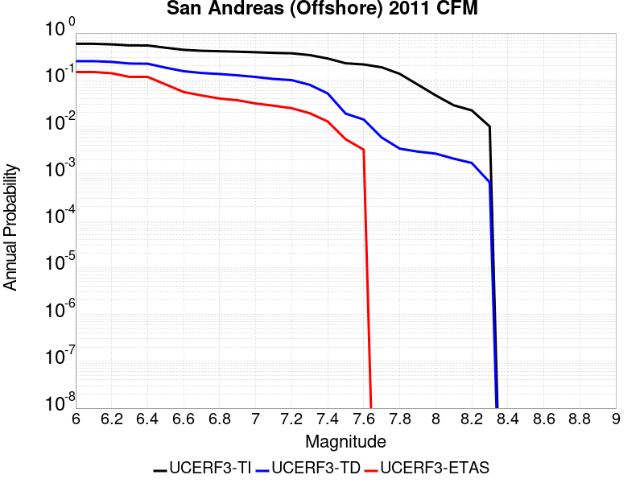 |
|-----|

| Magnitude | UCERF3-TI Prob | UCERF3-TD Prob | UCERF3-ETAS Prob |
|-----|-----|-----|-----|
| 6.0 | 0.5897176 | 0.25141162 | 0.14750542 |
| 6.1 | 0.5897176 | 0.25141162 | 0.14750542 |
| 6.2 | 0.5731127 | 0.24241607 | 0.13882864 |
| 6.3 | 0.5453064 | 0.22411005 | 0.11605206 |
| 6.4 | 0.5439906 | 0.2219285 | 0.11605206 |
| 6.5 | 0.48618004 | 0.18260019 | 0.08026031 |
| 6.6 | 0.43859395 | 0.15360034 | 0.055314533 |
| 6.7 | 0.418543 | 0.14061007 | 0.046637744 |
| 6.8 | 0.4095429 | 0.13389695 | 0.040130153 |
| 6.9 | 0.40033787 | 0.12526545 | 0.036876354 |
| 7.0 | 0.38972998 | 0.11576883 | 0.031453364 |
| 7.1 | 0.37800932 | 0.104897924 | 0.028199567 |
| 7.2 | 0.36979583 | 0.099175036 | 0.02494577 |
| 7.3 | 0.33879557 | 0.07882872 | 0.019522777 |
| 7.4 | 0.28645083 | 0.05156658 | 0.013015185 |
| 7.5 | 0.22684571 | 0.019102208 | 0.0054229936 |
| 7.6 | 0.21390896 | 0.014319068 | 0.0032537961 |
| 7.7 | 0.18598168 | 0.0059235967 | 0.0 |
| 7.8 | 0.13497151 | 0.003426297 | 0.0 |
| 7.9 | 0.07964849 | 0.002962442 | 0.0 |
| 8.0 | 0.04683887 | 0.0026841708 | 0.0 |
| 8.1 | 0.02880529 | 0.0020958057 | 0.0 |
| 8.2 | 0.022446552 | 0.0016978933 | 0.0 |
| 8.3 | 0.010161097 | 6.556894E-4 | 0.0 |

## San Andreas (Parkfield)
*[(top)](#table-of-contents)*

| 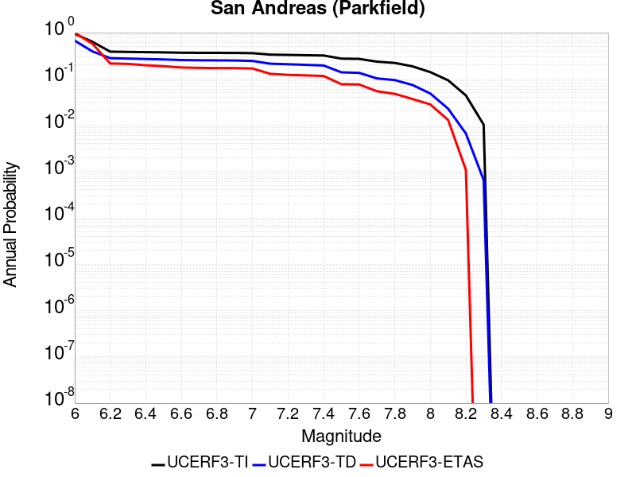 |
|-----|

| Magnitude | UCERF3-TI Prob | UCERF3-TD Prob | UCERF3-ETAS Prob |
|-----|-----|-----|-----|
| 6.0 | 0.9449962 | 0.67229265 | 0.9978308 |
| 6.1 | 0.63394874 | 0.39344636 | 0.5737527 |
| 6.2 | 0.38866043 | 0.28091997 | 0.21583514 |
| 6.3 | 0.38393253 | 0.2755831 | 0.21149674 |
| 6.4 | 0.37927845 | 0.26941732 | 0.19739696 |
| 6.5 | 0.37477368 | 0.2638662 | 0.18872017 |
| 6.6 | 0.36856598 | 0.25603968 | 0.17678958 |
| 6.7 | 0.36616087 | 0.2530683 | 0.1735358 |
| 6.8 | 0.36523813 | 0.25175512 | 0.17136659 |
| 6.9 | 0.36424232 | 0.25032282 | 0.17136659 |
| 7.0 | 0.36014873 | 0.24465065 | 0.1681128 |
| 7.1 | 0.33526027 | 0.21363127 | 0.12906724 |
| 7.2 | 0.33056223 | 0.20777841 | 0.12255965 |
| 7.3 | 0.32577515 | 0.20151334 | 0.11930586 |
| 7.4 | 0.3210823 | 0.19529353 | 0.11605206 |
| 7.5 | 0.2744941 | 0.13895835 | 0.077006504 |
| 7.6 | 0.2712601 | 0.13536055 | 0.07592191 |
| 7.7 | 0.23625483 | 0.10261189 | 0.054229934 |
| 7.8 | 0.2219273 | 0.09454975 | 0.047722343 |
| 7.9 | 0.18711655 | 0.07405532 | 0.036876354 |
| 8.0 | 0.14034821 | 0.048455317 | 0.028199567 |
| 8.1 | 0.09360987 | 0.022828538 | 0.013015185 |
| 8.2 | 0.044100937 | 0.0066363257 | 0.0010845987 |
| 8.3 | 0.0102941245 | 6.576036E-4 | 0.0 |

## San Andreas (Peninsula) 2011 CFM
*[(top)](#table-of-contents)*

| 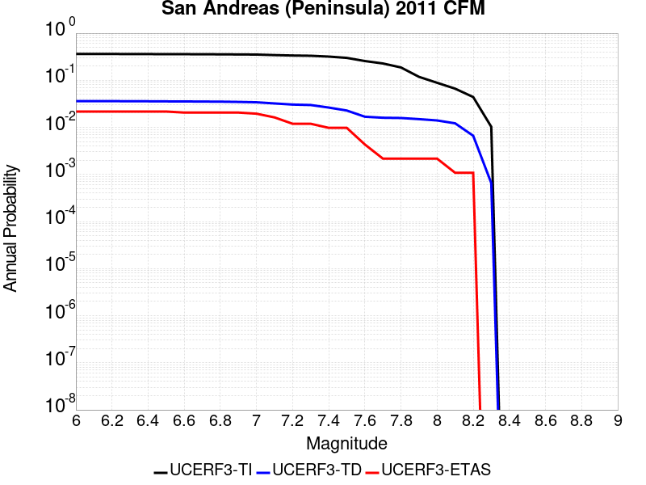 |
|-----|

| Magnitude | UCERF3-TI Prob | UCERF3-TD Prob | UCERF3-ETAS Prob |
|-----|-----|-----|-----|
| 6.0 | 0.36224574 | 0.03608626 | 0.021691974 |
| 6.1 | 0.36224574 | 0.03608626 | 0.021691974 |
| 6.2 | 0.36224574 | 0.03608626 | 0.021691974 |
| 6.3 | 0.35994843 | 0.035786714 | 0.021691974 |
| 6.4 | 0.35994843 | 0.035786714 | 0.021691974 |
| 6.5 | 0.3586105 | 0.035612255 | 0.021691974 |
| 6.6 | 0.35818738 | 0.035525616 | 0.020607375 |
| 6.7 | 0.35698423 | 0.035316326 | 0.020607375 |
| 6.8 | 0.35566592 | 0.03516283 | 0.020607375 |
| 6.9 | 0.35373372 | 0.034705993 | 0.020607375 |
| 7.0 | 0.3518211 | 0.034088727 | 0.019522777 |
| 7.1 | 0.34268934 | 0.03222032 | 0.01626898 |
| 7.2 | 0.3358432 | 0.030490436 | 0.011930586 |
| 7.3 | 0.33161494 | 0.029829923 | 0.011930586 |
| 7.4 | 0.3186759 | 0.026345657 | 0.009761388 |
| 7.5 | 0.2989319 | 0.022780566 | 0.009761388 |
| 7.6 | 0.25623104 | 0.016827423 | 0.004338395 |
| 7.7 | 0.22750789 | 0.016005069 | 0.0021691974 |
| 7.8 | 0.18718195 | 0.015810411 | 0.0021691974 |
| 7.9 | 0.118235916 | 0.014952153 | 0.0021691974 |
| 8.0 | 0.088489406 | 0.014024392 | 0.0021691974 |
| 8.1 | 0.066359274 | 0.012182774 | 0.0010845987 |
| 8.2 | 0.04405855 | 0.006634484 | 0.0010845987 |
| 8.3 | 0.0102941245 | 6.576036E-4 | 0.0 |

## San Andreas (San Bernardino N)
*[(top)](#table-of-contents)*

| 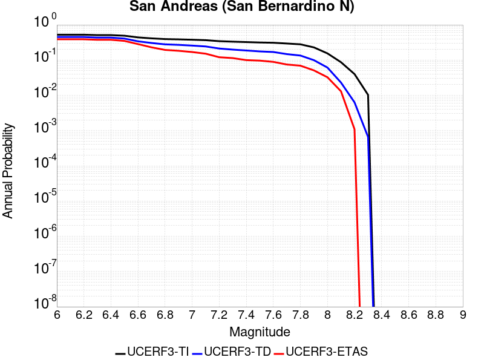 |
|-----|

| Magnitude | UCERF3-TI Prob | UCERF3-TD Prob | UCERF3-ETAS Prob |
|-----|-----|-----|-----|
| 6.0 | 0.52518874 | 0.4518931 | 0.38937092 |
| 6.1 | 0.52518874 | 0.4518931 | 0.38937092 |
| 6.2 | 0.52518874 | 0.4518931 | 0.38937092 |
| 6.3 | 0.51153874 | 0.43414012 | 0.37635574 |
| 6.4 | 0.51153874 | 0.43414012 | 0.37635574 |
| 6.5 | 0.49103746 | 0.40729427 | 0.34924078 |
| 6.6 | 0.4404184 | 0.34060794 | 0.28416485 |
| 6.7 | 0.413359 | 0.3055322 | 0.22993493 |
| 6.8 | 0.3943727 | 0.27952254 | 0.19414316 |
| 6.9 | 0.38728932 | 0.27015647 | 0.18329719 |
| 7.0 | 0.37808377 | 0.2580393 | 0.1691974 |
| 7.1 | 0.36725414 | 0.24370095 | 0.15184382 |
| 7.2 | 0.34412014 | 0.21289596 | 0.12039045 |
| 7.3 | 0.33320823 | 0.19826059 | 0.11388286 |
| 7.4 | 0.32457075 | 0.1871151 | 0.09978308 |
| 7.5 | 0.31586298 | 0.1762177 | 0.09652928 |
| 7.6 | 0.31026706 | 0.16950822 | 0.0889371 |
| 7.7 | 0.29540205 | 0.14765057 | 0.07483731 |
| 7.8 | 0.28019702 | 0.13452207 | 0.06941432 |
| 7.9 | 0.22895938 | 0.09934864 | 0.05097614 |
| 8.0 | 0.15471198 | 0.061290912 | 0.03253796 |
| 8.1 | 0.08695277 | 0.02298134 | 0.013015185 |
| 8.2 | 0.04004072 | 0.0063080895 | 0.0010845987 |
| 8.3 | 0.0102941245 | 6.576036E-4 | 0.0 |

## San Andreas (San Bernardino S)
*[(top)](#table-of-contents)*

| 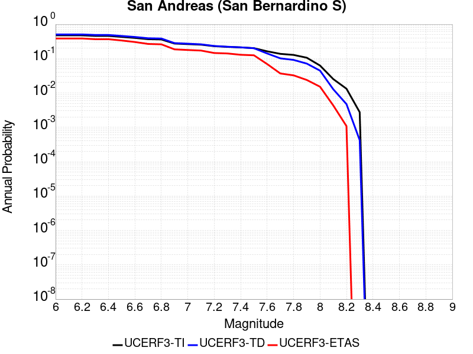 |
|-----|

| Magnitude | UCERF3-TI Prob | UCERF3-TD Prob | UCERF3-ETAS Prob |
|-----|-----|-----|-----|
| 6.0 | 0.47466263 | 0.50553375 | 0.38503253 |
| 6.1 | 0.47466263 | 0.50553375 | 0.38503253 |
| 6.2 | 0.47466263 | 0.50553375 | 0.38503253 |
| 6.3 | 0.45728156 | 0.48728856 | 0.36659437 |
| 6.4 | 0.45728156 | 0.48728856 | 0.36659437 |
| 6.5 | 0.427516 | 0.45580095 | 0.3362256 |
| 6.6 | 0.39922985 | 0.42603952 | 0.30368763 |
| 6.7 | 0.36678702 | 0.39092946 | 0.26681128 |
| 6.8 | 0.36034292 | 0.38396633 | 0.26030368 |
| 6.9 | 0.27352798 | 0.281994 | 0.18546638 |
| 7.0 | 0.26344314 | 0.27118635 | 0.1778742 |
| 7.1 | 0.2539249 | 0.2604772 | 0.17136659 |
| 7.2 | 0.22928864 | 0.23302595 | 0.14533623 |
| 7.3 | 0.21915977 | 0.2212276 | 0.14099783 |
| 7.4 | 0.21157186 | 0.21260041 | 0.12906724 |
| 7.5 | 0.20133498 | 0.20022137 | 0.12472885 |
| 7.6 | 0.16293983 | 0.1409666 | 0.06941432 |
| 7.7 | 0.13735276 | 0.10167968 | 0.036876354 |
| 7.8 | 0.12788112 | 0.09149578 | 0.03253796 |
| 7.9 | 0.10597988 | 0.07145919 | 0.023861172 |
| 8.0 | 0.06275212 | 0.044596113 | 0.015184382 |
| 8.1 | 0.02534404 | 0.012825973 | 0.004338395 |
| 8.2 | 0.013286817 | 0.0047347317 | 0.0010845987 |
| 8.3 | 0.0027538636 | 4.2301256E-4 | 0.0 |

## San Andreas (San Gorgonio Pass-Garnet HIll)
*[(top)](#table-of-contents)*

| 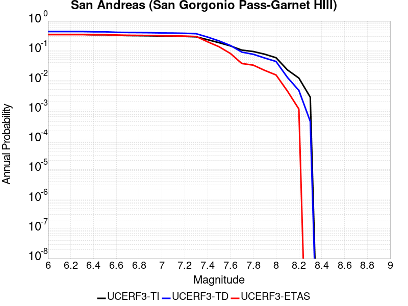 |
|-----|

| Magnitude | UCERF3-TI Prob | UCERF3-TD Prob | UCERF3-ETAS Prob |
|-----|-----|-----|-----|
| 6.0 | 0.3520345 | 0.43966502 | 0.3470716 |
| 6.1 | 0.3520345 | 0.43966502 | 0.3470716 |
| 6.2 | 0.3520345 | 0.43966502 | 0.3470716 |
| 6.3 | 0.3520345 | 0.43966502 | 0.3470716 |
| 6.4 | 0.3432993 | 0.43099263 | 0.34273317 |
| 6.5 | 0.3432993 | 0.43099263 | 0.34273317 |
| 6.6 | 0.32805318 | 0.41548467 | 0.3362256 |
| 6.7 | 0.32176143 | 0.40890405 | 0.329718 |
| 6.8 | 0.31938428 | 0.406085 | 0.3264642 |
| 6.9 | 0.31590062 | 0.40173772 | 0.324295 |
| 7.0 | 0.3096912 | 0.3942968 | 0.3167028 |
| 7.1 | 0.3070176 | 0.391237 | 0.31453362 |
| 7.2 | 0.30052575 | 0.38403714 | 0.30911064 |
| 7.3 | 0.2921824 | 0.3719454 | 0.29934925 |
| 7.4 | 0.23385365 | 0.2862523 | 0.19848156 |
| 7.5 | 0.18541873 | 0.21235293 | 0.13557483 |
| 7.6 | 0.14423874 | 0.14904884 | 0.08026031 |
| 7.7 | 0.10441818 | 0.089314826 | 0.036876354 |
| 7.8 | 0.09359854 | 0.0755019 | 0.03253796 |
| 7.9 | 0.076037146 | 0.056595758 | 0.021691974 |
| 8.0 | 0.057778347 | 0.043187212 | 0.015184382 |
| 8.1 | 0.022447906 | 0.012525903 | 0.004338395 |
| 8.2 | 0.011951285 | 0.004593871 | 0.0010845987 |
| 8.3 | 0.0027111531 | 4.1666033E-4 | 0.0 |

## San Andreas (Santa Cruz Mts) 2011 CFM
*[(top)](#table-of-contents)*

| 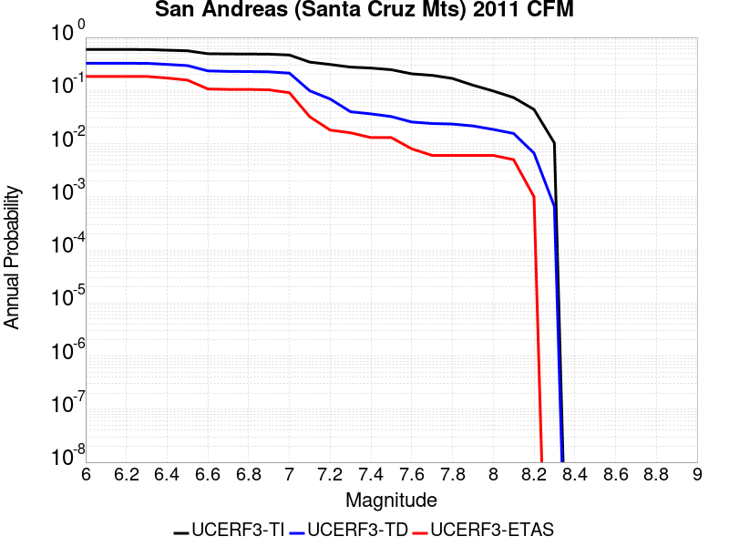 |
|-----|

| Magnitude | UCERF3-TI Prob | UCERF3-TD Prob | UCERF3-ETAS Prob |
|-----|-----|-----|-----|
| 6.0 | 0.5928923 | 0.32622495 | 0.18438178 |
| 6.1 | 0.5928923 | 0.32622495 | 0.18438178 |
| 6.2 | 0.5928923 | 0.32622495 | 0.18438178 |
| 6.3 | 0.5917781 | 0.3253105 | 0.18438178 |
| 6.4 | 0.5749006 | 0.31052035 | 0.17136659 |
| 6.5 | 0.56022716 | 0.29470417 | 0.15618221 |
| 6.6 | 0.4935618 | 0.23435509 | 0.10520607 |
| 6.7 | 0.48903582 | 0.2291112 | 0.10303687 |
| 6.8 | 0.48726502 | 0.22765337 | 0.10303687 |
| 6.9 | 0.48431846 | 0.22478345 | 0.10195228 |
| 7.0 | 0.46621558 | 0.21261941 | 0.09002169 |
| 7.1 | 0.34297577 | 0.09872756 | 0.031453364 |
| 7.2 | 0.3093809 | 0.069277175 | 0.01735358 |
| 7.3 | 0.27616227 | 0.03984249 | 0.015184382 |
| 7.4 | 0.2652327 | 0.036330923 | 0.013015185 |
| 7.5 | 0.24651012 | 0.032361638 | 0.013015185 |
| 7.6 | 0.20641927 | 0.025540968 | 0.007592191 |
| 7.7 | 0.19336249 | 0.02394354 | 0.0054229936 |
| 7.8 | 0.1686978 | 0.023370512 | 0.0054229936 |
| 7.9 | 0.12623157 | 0.021560464 | 0.0054229936 |
| 8.0 | 0.09805011 | 0.018514417 | 0.0054229936 |
| 8.1 | 0.073762394 | 0.015545356 | 0.004338395 |
| 8.2 | 0.044073183 | 0.006634684 | 0.0010845987 |
| 8.3 | 0.0102941245 | 6.576036E-4 | 0.0 |

## San Cayetano
*[(top)](#table-of-contents)*

| 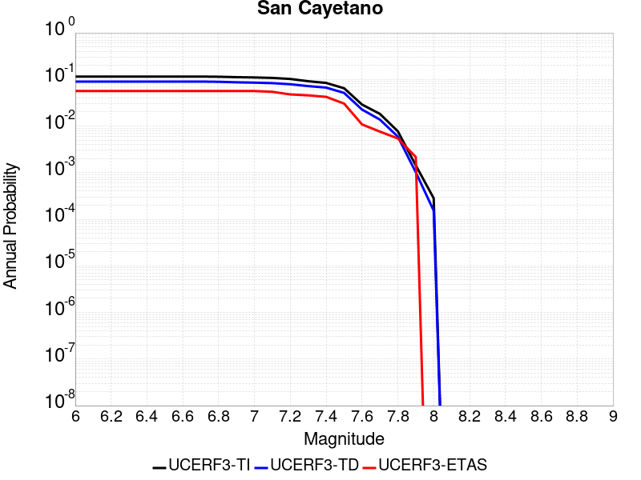 |
|-----|

| Magnitude | UCERF3-TI Prob | UCERF3-TD Prob | UCERF3-ETAS Prob |
|-----|-----|-----|-----|
| 6.0 | 0.115291655 | 0.09006553 | 0.056399133 |
| 6.1 | 0.115291655 | 0.09006553 | 0.056399133 |
| 6.2 | 0.115291655 | 0.09006553 | 0.056399133 |
| 6.3 | 0.115291655 | 0.09006553 | 0.056399133 |
| 6.4 | 0.115291655 | 0.09006553 | 0.056399133 |
| 6.5 | 0.115291655 | 0.09006553 | 0.056399133 |
| 6.6 | 0.115291655 | 0.09006553 | 0.056399133 |
| 6.7 | 0.115291655 | 0.09006553 | 0.056399133 |
| 6.8 | 0.11420918 | 0.089085124 | 0.056399133 |
| 6.9 | 0.111983575 | 0.08689562 | 0.056399133 |
| 7.0 | 0.11032235 | 0.08531667 | 0.056399133 |
| 7.1 | 0.10785072 | 0.08328159 | 0.054229934 |
| 7.2 | 0.102448255 | 0.078880824 | 0.047722343 |
| 7.3 | 0.09158436 | 0.07199032 | 0.045553144 |
| 7.4 | 0.08419982 | 0.06682729 | 0.04229935 |
| 7.5 | 0.06471863 | 0.051441424 | 0.030368764 |
| 7.6 | 0.028935479 | 0.022604935 | 0.010845987 |
| 7.7 | 0.018230673 | 0.01373505 | 0.007592191 |
| 7.8 | 0.007706636 | 0.005925728 | 0.0054229936 |
| 7.9 | 0.0014374336 | 0.001019278 | 0.0021691974 |
| 8.0 | 2.8213314E-4 | 1.5316556E-4 | 0.0 |

## San Clemente
*[(top)](#table-of-contents)*

| 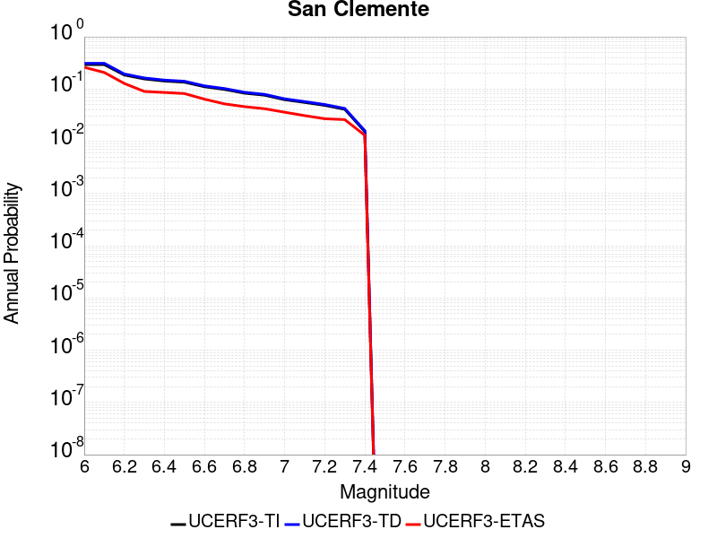 |
|-----|

| Magnitude | UCERF3-TI Prob | UCERF3-TD Prob | UCERF3-ETAS Prob |
|-----|-----|-----|-----|
| 6.0 | 0.29435036 | 0.31149226 | 0.2548807 |
| 6.1 | 0.29435036 | 0.31149226 | 0.20498915 |
| 6.2 | 0.1858337 | 0.19425514 | 0.12581345 |
| 6.3 | 0.1563808 | 0.16298124 | 0.09002169 |
| 6.4 | 0.14246427 | 0.14832464 | 0.0867679 |
| 6.5 | 0.1355172 | 0.14105546 | 0.0824295 |
| 6.6 | 0.11073692 | 0.11503262 | 0.06507592 |
| 6.7 | 0.09845205 | 0.10218846 | 0.053145338 |
| 6.8 | 0.083438665 | 0.086542234 | 0.046637744 |
| 6.9 | 0.076337114 | 0.07915794 | 0.04229935 |
| 7.0 | 0.06261864 | 0.06491712 | 0.03579176 |
| 7.1 | 0.05545602 | 0.05749769 | 0.031453364 |
| 7.2 | 0.04875791 | 0.0505696 | 0.027114967 |
| 7.3 | 0.040967535 | 0.042516313 | 0.02603037 |
| 7.4 | 0.015316466 | 0.015939152 | 0.013015185 |

## San Diego Trough north alt1
*[(top)](#table-of-contents)*

| 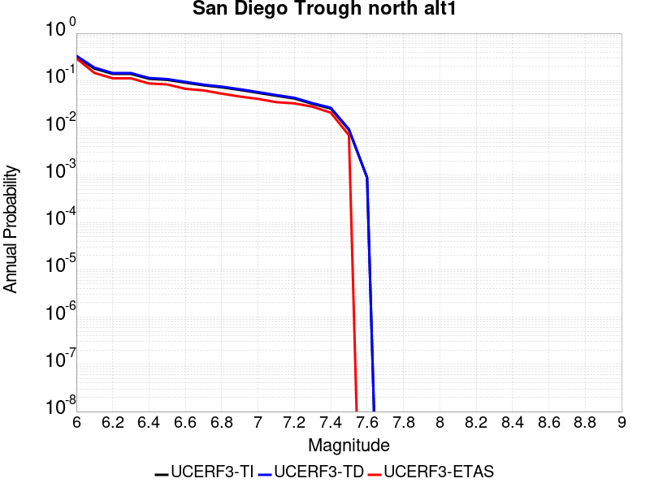 |
|-----|

| Magnitude | UCERF3-TI Prob | UCERF3-TD Prob | UCERF3-ETAS Prob |
|-----|-----|-----|-----|
| 6.0 | 0.31780785 | 0.3350312 | 0.30477223 |
| 6.1 | 0.17960641 | 0.18809426 | 0.14750542 |
| 6.2 | 0.1388349 | 0.14465773 | 0.112798266 |
| 6.3 | 0.1388349 | 0.14465773 | 0.112798266 |
| 6.4 | 0.109401524 | 0.11360198 | 0.0867679 |
| 6.5 | 0.10380871 | 0.107751556 | 0.0824295 |
| 6.6 | 0.090622455 | 0.09393483 | 0.06616052 |
| 6.7 | 0.07954174 | 0.08235457 | 0.060737528 |
| 6.8 | 0.07205103 | 0.074578054 | 0.05097614 |
| 6.9 | 0.063504726 | 0.06572998 | 0.045553144 |
| 7.0 | 0.05520816 | 0.05714103 | 0.040130153 |
| 7.1 | 0.047830317 | 0.049511693 | 0.03362256 |
| 7.2 | 0.041838136 | 0.043325122 | 0.031453364 |
| 7.3 | 0.032177404 | 0.033332203 | 0.027114967 |
| 7.4 | 0.025676653 | 0.0266075 | 0.021691974 |
| 7.5 | 0.009084324 | 0.009402751 | 0.007592191 |
| 7.6 | 8.8605605E-4 | 8.9453947E-4 | 0.0 |

## San Diego Trough south
*[(top)](#table-of-contents)*

| 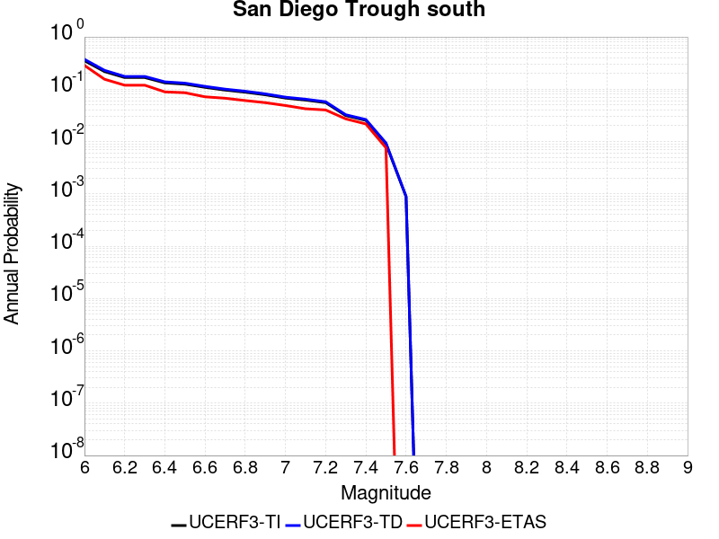 |
|-----|

| Magnitude | UCERF3-TI Prob | UCERF3-TD Prob | UCERF3-ETAS Prob |
|-----|-----|-----|-----|
| 6.0 | 0.35081017 | 0.3727469 | 0.28524947 |
| 6.1 | 0.21732989 | 0.2295378 | 0.15509762 |
| 6.2 | 0.16726835 | 0.17561296 | 0.11930586 |
| 6.3 | 0.16726835 | 0.17561296 | 0.11930586 |
| 6.4 | 0.13230194 | 0.13834807 | 0.0889371 |
| 6.5 | 0.12497162 | 0.13061869 | 0.08568329 |
| 6.6 | 0.10861168 | 0.113339126 | 0.07158352 |
| 6.7 | 0.09624824 | 0.10032273 | 0.06724512 |
| 6.8 | 0.08781731 | 0.09147064 | 0.060737528 |
| 6.9 | 0.078277424 | 0.08147131 | 0.055314533 |
| 7.0 | 0.06774725 | 0.07044794 | 0.048806943 |
| 7.1 | 0.062009025 | 0.06446098 | 0.04229935 |
| 7.2 | 0.055399474 | 0.057579882 | 0.040130153 |
| 7.3 | 0.03138177 | 0.032532476 | 0.027114967 |
| 7.4 | 0.025412261 | 0.026341628 | 0.021691974 |
| 7.5 | 0.009084324 | 0.009402751 | 0.007592191 |
| 7.6 | 8.8605605E-4 | 8.9453947E-4 | 0.0 |

## San Gabriel
*[(top)](#table-of-contents)*

| 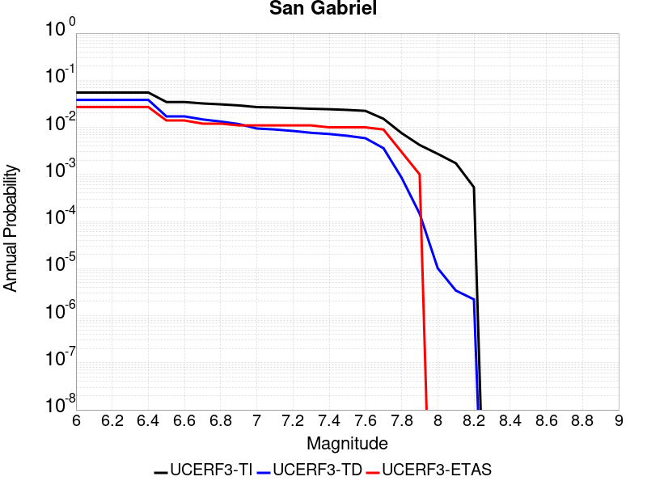 |
|-----|

| Magnitude | UCERF3-TI Prob | UCERF3-TD Prob | UCERF3-ETAS Prob |
|-----|-----|-----|-----|
| 6.0 | 0.0549809 | 0.0382796 | 0.02494577 |
| 6.1 | 0.0549809 | 0.0382796 | 0.02494577 |
| 6.2 | 0.0549809 | 0.0382796 | 0.02494577 |
| 6.3 | 0.0549809 | 0.0382796 | 0.02494577 |
| 6.4 | 0.0549809 | 0.0382796 | 0.02494577 |
| 6.5 | 0.034515854 | 0.017101813 | 0.015184382 |
| 6.6 | 0.034515854 | 0.017101813 | 0.015184382 |
| 6.7 | 0.032211334 | 0.014733145 | 0.013015185 |
| 6.8 | 0.030803068 | 0.013285895 | 0.013015185 |
| 6.9 | 0.029234698 | 0.011768666 | 0.011930586 |
| 7.0 | 0.026935622 | 0.009444075 | 0.011930586 |
| 7.1 | 0.026441406 | 0.009010908 | 0.011930586 |
| 7.2 | 0.02569636 | 0.008382619 | 0.011930586 |
| 7.3 | 0.024846371 | 0.0076626055 | 0.011930586 |
| 7.4 | 0.024285989 | 0.0072230063 | 0.010845987 |
| 7.5 | 0.02346503 | 0.00662299 | 0.010845987 |
| 7.6 | 0.02240961 | 0.005884402 | 0.010845987 |
| 7.7 | 0.015204109 | 0.003611669 | 0.009761388 |
| 7.8 | 0.0075589116 | 8.55637E-4 | 0.0032537961 |
| 7.9 | 0.004217006 | 1.4638255E-4 | 0.0010845987 |
| 8.0 | 0.0027342343 | 1.0173087E-5 | 0.0 |
| 8.1 | 0.0017288701 | 3.4179482E-6 | 0.0 |
| 8.2 | 5.339231E-4 | 2.221402E-6 | 0.0 |

## San Gabriel (Extension)
*[(top)](#table-of-contents)*

| 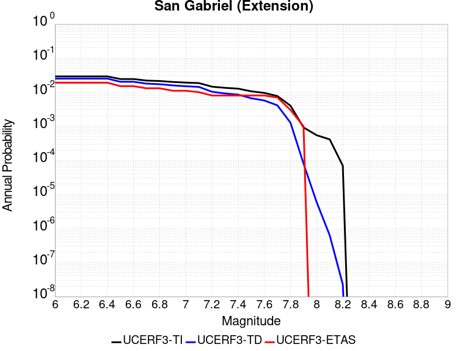 |
|-----|

| Magnitude | UCERF3-TI Prob | UCERF3-TD Prob | UCERF3-ETAS Prob |
|-----|-----|-----|-----|
| 6.0 | 0.029043613 | 0.025020234 | 0.020607375 |
| 6.1 | 0.029043613 | 0.025020234 | 0.020607375 |
| 6.2 | 0.029043613 | 0.025020234 | 0.020607375 |
| 6.3 | 0.029043613 | 0.025020234 | 0.020607375 |
| 6.4 | 0.029043613 | 0.025020234 | 0.020607375 |
| 6.5 | 0.024294222 | 0.020205041 | 0.01626898 |
| 6.6 | 0.024294222 | 0.020205041 | 0.01626898 |
| 6.7 | 0.021915957 | 0.017794743 | 0.014099783 |
| 6.8 | 0.021258289 | 0.017128438 | 0.014099783 |
| 6.9 | 0.019959237 | 0.015812075 | 0.011930586 |
| 7.0 | 0.019094002 | 0.01493543 | 0.011930586 |
| 7.1 | 0.018448615 | 0.014280986 | 0.010845987 |
| 7.2 | 0.014515869 | 0.010292402 | 0.00867679 |
| 7.3 | 0.013394022 | 0.009166438 | 0.00867679 |
| 7.4 | 0.012684096 | 0.008470601 | 0.00867679 |
| 7.5 | 0.010598451 | 0.006632894 | 0.00867679 |
| 7.6 | 0.009516989 | 0.005701974 | 0.00867679 |
| 7.7 | 0.007685961 | 0.004106756 | 0.007592191 |
| 7.8 | 0.00400842 | 0.0012705476 | 0.0032537961 |
| 7.9 | 9.2031504E-4 | 7.985704E-5 | 0.0010845987 |
| 8.0 | 5.4581946E-4 | 5.933974E-6 | 0.0 |
| 8.1 | 4.1085924E-4 | 6.2834545E-7 | 0.0 |
| 8.2 | 6.9480135E-5 | 2.2616263E-8 | 0.0 |

## San Gorgonio Pass
*[(top)](#table-of-contents)*

| 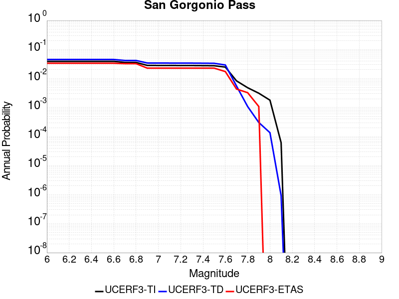 |
|-----|

| Magnitude | UCERF3-TI Prob | UCERF3-TD Prob | UCERF3-ETAS Prob |
|-----|-----|-----|-----|
| 6.0 | 0.039102145 | 0.045171693 | 0.03362256 |
| 6.1 | 0.039102145 | 0.045171693 | 0.03362256 |
| 6.2 | 0.039102145 | 0.045171693 | 0.03362256 |
| 6.3 | 0.039102145 | 0.045171693 | 0.03362256 |
| 6.4 | 0.039102145 | 0.045171693 | 0.03362256 |
| 6.5 | 0.039102145 | 0.045171693 | 0.03362256 |
| 6.6 | 0.039102145 | 0.045171693 | 0.03362256 |
| 6.7 | 0.03580368 | 0.041832637 | 0.03253796 |
| 6.8 | 0.03580368 | 0.041832637 | 0.03253796 |
| 6.9 | 0.02831425 | 0.034232993 | 0.022776572 |
| 7.0 | 0.028202062 | 0.034119245 | 0.022776572 |
| 7.1 | 0.028134631 | 0.034050778 | 0.022776572 |
| 7.2 | 0.028055428 | 0.0339701 | 0.022776572 |
| 7.3 | 0.027997456 | 0.033912893 | 0.022776572 |
| 7.4 | 0.027776122 | 0.033684023 | 0.022776572 |
| 7.5 | 0.02756955 | 0.033434015 | 0.022776572 |
| 7.6 | 0.02478128 | 0.029257396 | 0.01735358 |
| 7.7 | 0.008309249 | 0.005527421 | 0.004338395 |
| 7.8 | 0.004819252 | 0.0010836669 | 0.0032537961 |
| 7.9 | 0.0031131147 | 3.0553396E-4 | 0.0010845987 |
| 8.0 | 0.0017940481 | 1.360496E-4 | 0.0 |
| 8.1 | 6.1504805E-5 | 9.31895E-7 | 0.0 |

## San Gregorio (North) 2011 CFM
*[(top)](#table-of-contents)*

| 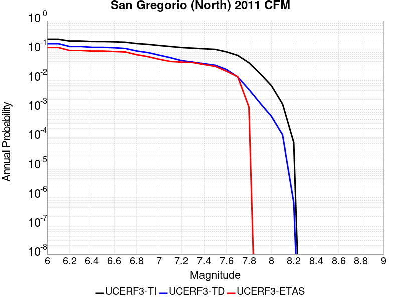 |
|-----|

| Magnitude | UCERF3-TI Prob | UCERF3-TD Prob | UCERF3-ETAS Prob |
|-----|-----|-----|-----|
| 6.0 | 0.23078208 | 0.16289099 | 0.12039045 |
| 6.1 | 0.23078208 | 0.16289099 | 0.12039045 |
| 6.2 | 0.20097706 | 0.13051642 | 0.09544469 |
| 6.3 | 0.20097706 | 0.13051642 | 0.09544469 |
| 6.4 | 0.19302702 | 0.12246679 | 0.09110629 |
| 6.5 | 0.19273764 | 0.122136295 | 0.09110629 |
| 6.6 | 0.18886864 | 0.11843024 | 0.08785249 |
| 6.7 | 0.18235691 | 0.11147834 | 0.0845987 |
| 6.8 | 0.16445854 | 0.09164907 | 0.06832972 |
| 6.9 | 0.15471402 | 0.080911085 | 0.05856833 |
| 7.0 | 0.14126453 | 0.066011764 | 0.047722343 |
| 7.1 | 0.13068514 | 0.05411363 | 0.040130153 |
| 7.2 | 0.12014285 | 0.042849157 | 0.037960954 |
| 7.3 | 0.11461953 | 0.03813816 | 0.036876354 |
| 7.4 | 0.10908495 | 0.03345763 | 0.031453364 |
| 7.5 | 0.10376258 | 0.029670702 | 0.027114967 |
| 7.6 | 0.08532224 | 0.021133577 | 0.018438177 |
| 7.7 | 0.06447165 | 0.011714789 | 0.011930586 |
| 7.8 | 0.036077015 | 0.004377267 | 0.0010845987 |
| 7.9 | 0.015258233 | 0.00148452 | 0.0 |
| 8.0 | 0.005948015 | 5.266463E-4 | 0.0 |
| 8.1 | 0.0013909107 | 1.214962E-4 | 0.0 |
| 8.2 | 6.628843E-5 | 5.9012973E-7 | 0.0 |

## San Gregorio (South) 2011 CFM
*[(top)](#table-of-contents)*

| 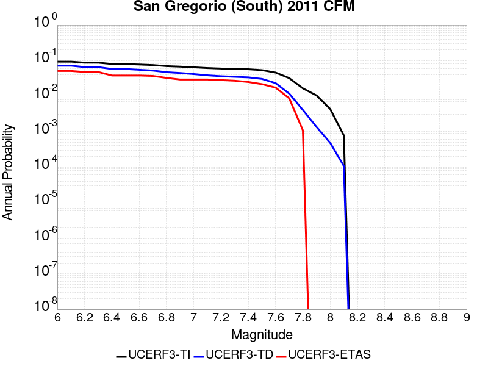 |
|-----|

| Magnitude | UCERF3-TI Prob | UCERF3-TD Prob | UCERF3-ETAS Prob |
|-----|-----|-----|-----|
| 6.0 | 0.09329878 | 0.071789436 | 0.05097614 |
| 6.1 | 0.09329878 | 0.071789436 | 0.05097614 |
| 6.2 | 0.08730969 | 0.06548597 | 0.047722343 |
| 6.3 | 0.08730969 | 0.06548597 | 0.047722343 |
| 6.4 | 0.080118425 | 0.057899997 | 0.037960954 |
| 6.5 | 0.080118425 | 0.057899997 | 0.037960954 |
| 6.6 | 0.07741505 | 0.055055168 | 0.037960954 |
| 6.7 | 0.07479739 | 0.05230412 | 0.036876354 |
| 6.8 | 0.0698446 | 0.04708931 | 0.03253796 |
| 6.9 | 0.06749365 | 0.044616707 | 0.029284164 |
| 7.0 | 0.0646432 | 0.041617204 | 0.029284164 |
| 7.1 | 0.061632454 | 0.038427077 | 0.029284164 |
| 7.2 | 0.05956393 | 0.036227655 | 0.028199567 |
| 7.3 | 0.058259215 | 0.034894664 | 0.027114967 |
| 7.4 | 0.057018418 | 0.033640545 | 0.02494577 |
| 7.5 | 0.053792812 | 0.03049823 | 0.021691974 |
| 7.6 | 0.045967877 | 0.023199407 | 0.01735358 |
| 7.7 | 0.0320528 | 0.011749091 | 0.00867679 |
| 7.8 | 0.016528763 | 0.0040712007 | 0.0010845987 |
| 7.9 | 0.01043227 | 0.0013566641 | 0.0 |
| 8.0 | 0.0043490552 | 4.839519E-4 | 0.0 |
| 8.1 | 7.841067E-4 | 1.0794174E-4 | 0.0 |

## San Jacinto (Anza) rev
*[(top)](#table-of-contents)*

| 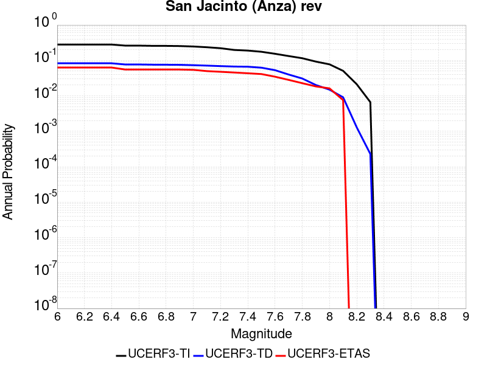 |
|-----|

| Magnitude | UCERF3-TI Prob | UCERF3-TD Prob | UCERF3-ETAS Prob |
|-----|-----|-----|-----|
| 6.0 | 0.28022522 | 0.082886145 | 0.06290673 |
| 6.1 | 0.28022522 | 0.082886145 | 0.06290673 |
| 6.2 | 0.28022522 | 0.082886145 | 0.06290673 |
| 6.3 | 0.28022522 | 0.082886145 | 0.06290673 |
| 6.4 | 0.28022522 | 0.082886145 | 0.06290673 |
| 6.5 | 0.2615629 | 0.07678131 | 0.055314533 |
| 6.6 | 0.2615629 | 0.07678131 | 0.055314533 |
| 6.7 | 0.25775474 | 0.07582269 | 0.055314533 |
| 6.8 | 0.25714687 | 0.07553586 | 0.055314533 |
| 6.9 | 0.25420976 | 0.0750373 | 0.055314533 |
| 7.0 | 0.2470626 | 0.07332414 | 0.054229934 |
| 7.1 | 0.23522353 | 0.07130078 | 0.04989154 |
| 7.2 | 0.22095932 | 0.0690753 | 0.047722343 |
| 7.3 | 0.19740264 | 0.067192614 | 0.045553144 |
| 7.4 | 0.1894966 | 0.06635684 | 0.04338395 |
| 7.5 | 0.17533404 | 0.0623331 | 0.04121475 |
| 7.6 | 0.15380342 | 0.053033665 | 0.03470716 |
| 7.7 | 0.13284291 | 0.03995082 | 0.028199567 |
| 7.8 | 0.115246214 | 0.03085639 | 0.022776572 |
| 7.9 | 0.0925486 | 0.020191746 | 0.018438177 |
| 8.0 | 0.07750446 | 0.014971257 | 0.01626898 |
| 8.1 | 0.05076107 | 0.009100319 | 0.007592191 |
| 8.2 | 0.021281468 | 0.0012918286 | 0.0 |
| 8.3 | 0.006631146 | 2.2855181E-4 | 0.0 |

## San Jacinto (Borrego)
*[(top)](#table-of-contents)*

| 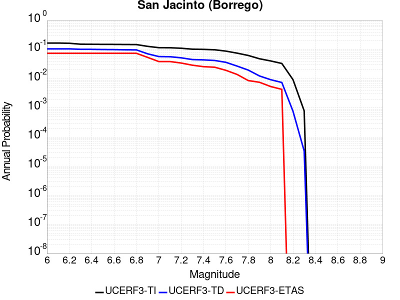 |
|-----|

| Magnitude | UCERF3-TI Prob | UCERF3-TD Prob | UCERF3-ETAS Prob |
|-----|-----|-----|-----|
| 6.0 | 0.16883232 | 0.10657784 | 0.07483731 |
| 6.1 | 0.16875811 | 0.10652237 | 0.07483731 |
| 6.2 | 0.16556779 | 0.106436834 | 0.07483731 |
| 6.3 | 0.15416308 | 0.10284662 | 0.07483731 |
| 6.4 | 0.15302184 | 0.102499984 | 0.07483731 |
| 6.5 | 0.1518492 | 0.10119838 | 0.07483731 |
| 6.6 | 0.15142445 | 0.10055839 | 0.07483731 |
| 6.7 | 0.15034367 | 0.09903031 | 0.07483731 |
| 6.8 | 0.1494205 | 0.0981623 | 0.07483731 |
| 6.9 | 0.12978573 | 0.07192915 | 0.054229934 |
| 7.0 | 0.11703533 | 0.057933025 | 0.039045554 |
| 7.1 | 0.116198935 | 0.057143185 | 0.039045554 |
| 7.2 | 0.11178076 | 0.052428093 | 0.03470716 |
| 7.3 | 0.10386187 | 0.04567298 | 0.029284164 |
| 7.4 | 0.10230537 | 0.044532597 | 0.02603037 |
| 7.5 | 0.09906909 | 0.04249652 | 0.02494577 |
| 7.6 | 0.0891222 | 0.036735103 | 0.019522777 |
| 7.7 | 0.07589055 | 0.027281204 | 0.014099783 |
| 7.8 | 0.06314641 | 0.0198768 | 0.00867679 |
| 7.9 | 0.048664194 | 0.0125142755 | 0.007592191 |
| 8.0 | 0.040968806 | 0.009314151 | 0.0054229936 |
| 8.1 | 0.03355903 | 0.007464324 | 0.004338395 |
| 8.2 | 0.0093317395 | 7.6662115E-4 | 0.0 |
| 8.3 | 7.911257E-4 | 3.3095148E-5 | 0.0 |

## San Jacinto (Clark) rev
*[(top)](#table-of-contents)*

| 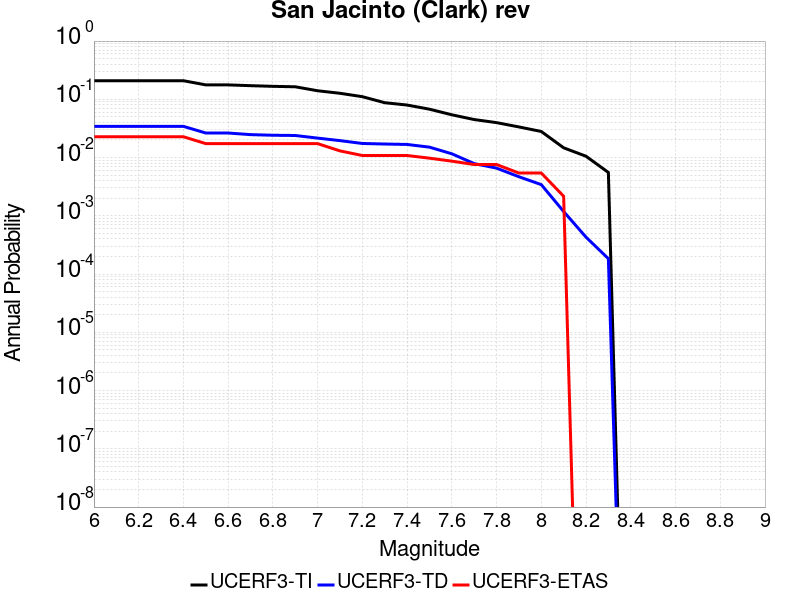 |
|-----|

| Magnitude | UCERF3-TI Prob | UCERF3-TD Prob | UCERF3-ETAS Prob |
|-----|-----|-----|-----|
| 6.0 | 0.20856038 | 0.03434478 | 0.022776572 |
| 6.1 | 0.20856038 | 0.03434478 | 0.022776572 |
| 6.2 | 0.20856038 | 0.03434478 | 0.022776572 |
| 6.3 | 0.20856038 | 0.03434478 | 0.022776572 |
| 6.4 | 0.20856038 | 0.03434478 | 0.022776572 |
| 6.5 | 0.17683852 | 0.026386652 | 0.01735358 |
| 6.6 | 0.17683852 | 0.026386652 | 0.01735358 |
| 6.7 | 0.1714276 | 0.024757557 | 0.01735358 |
| 6.8 | 0.16706057 | 0.024163676 | 0.01735358 |
| 6.9 | 0.16409668 | 0.023927333 | 0.01735358 |
| 7.0 | 0.140247 | 0.021578401 | 0.01735358 |
| 7.1 | 0.12687895 | 0.01953257 | 0.013015185 |
| 7.2 | 0.11098135 | 0.017451098 | 0.010845987 |
| 7.3 | 0.087427355 | 0.017079458 | 0.010845987 |
| 7.4 | 0.07973417 | 0.016792374 | 0.010845987 |
| 7.5 | 0.06767211 | 0.01509095 | 0.009761388 |
| 7.6 | 0.054246075 | 0.011611349 | 0.00867679 |
| 7.7 | 0.04494069 | 0.0078806905 | 0.007592191 |
| 7.8 | 0.0397843 | 0.0065849572 | 0.007592191 |
| 7.9 | 0.03356837 | 0.0046845167 | 0.0054229936 |
| 8.0 | 0.02803086 | 0.0034319027 | 0.0054229936 |
| 8.1 | 0.014708061 | 0.0011869551 | 0.0021691974 |
| 8.2 | 0.010537621 | 4.302643E-4 | 0.0 |
| 8.3 | 0.005546696 | 1.8370675E-4 | 0.0 |

## San Jacinto (Coyote Creek)
*[(top)](#table-of-contents)*

| 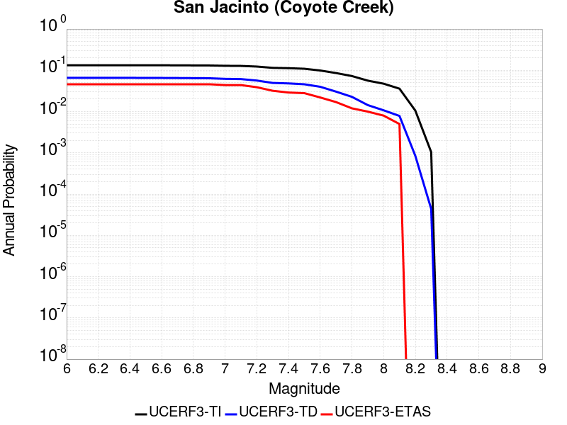 |
|-----|

| Magnitude | UCERF3-TI Prob | UCERF3-TD Prob | UCERF3-ETAS Prob |
|-----|-----|-----|-----|
| 6.0 | 0.13310497 | 0.06588387 | 0.046637744 |
| 6.1 | 0.13310497 | 0.06588387 | 0.046637744 |
| 6.2 | 0.13310497 | 0.06588387 | 0.046637744 |
| 6.3 | 0.13310497 | 0.06588387 | 0.046637744 |
| 6.4 | 0.13310497 | 0.06588387 | 0.046637744 |
| 6.5 | 0.13268916 | 0.065407746 | 0.046637744 |
| 6.6 | 0.13268916 | 0.065407746 | 0.046637744 |
| 6.7 | 0.13238929 | 0.065091506 | 0.046637744 |
| 6.8 | 0.13176621 | 0.064668484 | 0.046637744 |
| 6.9 | 0.13133271 | 0.064341255 | 0.046637744 |
| 7.0 | 0.1289135 | 0.062226783 | 0.04446855 |
| 7.1 | 0.1280398 | 0.06141004 | 0.04446855 |
| 7.2 | 0.12353379 | 0.056614913 | 0.040130153 |
| 7.3 | 0.114925705 | 0.049583368 | 0.03362256 |
| 7.4 | 0.11292057 | 0.04822438 | 0.030368764 |
| 7.5 | 0.10932864 | 0.045951553 | 0.029284164 |
| 7.6 | 0.09915945 | 0.039971314 | 0.023861172 |
| 7.7 | 0.08598527 | 0.030481951 | 0.018438177 |
| 7.8 | 0.07276562 | 0.022774676 | 0.013015185 |
| 7.9 | 0.056344416 | 0.0143835675 | 0.010845987 |
| 8.0 | 0.04750391 | 0.010750658 | 0.00867679 |
| 8.1 | 0.035984766 | 0.007853576 | 0.0054229936 |
| 8.2 | 0.01056641 | 8.4615947E-4 | 0.0 |
| 8.3 | 0.0010456993 | 4.3987904E-5 | 0.0 |

## San Jacinto (Lytle Creek connector)
*[(top)](#table-of-contents)*

| 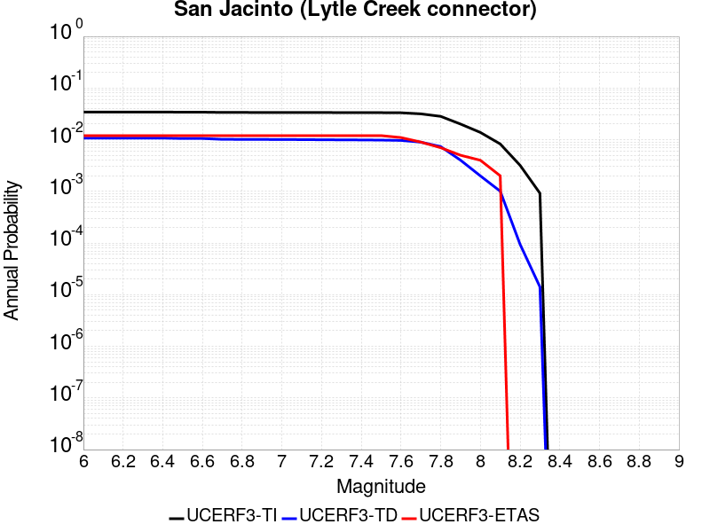 |
|-----|

| Magnitude | UCERF3-TI Prob | UCERF3-TD Prob | UCERF3-ETAS Prob |
|-----|-----|-----|-----|
| 6.0 | 0.03432547 | 0.010760836 | 0.010845987 |
| 6.1 | 0.03432547 | 0.010760836 | 0.010845987 |
| 6.2 | 0.03432547 | 0.010760836 | 0.010845987 |
| 6.3 | 0.03432547 | 0.010760836 | 0.010845987 |
| 6.4 | 0.03432547 | 0.010760836 | 0.010845987 |
| 6.5 | 0.034134947 | 0.010562654 | 0.010845987 |
| 6.6 | 0.034134947 | 0.010562654 | 0.010845987 |
| 6.7 | 0.033752028 | 0.010163283 | 0.010845987 |
| 6.8 | 0.03372888 | 0.010138944 | 0.010845987 |
| 6.9 | 0.033702668 | 0.010110647 | 0.010845987 |
| 7.0 | 0.03367216 | 0.0100777885 | 0.010845987 |
| 7.1 | 0.03363696 | 0.010039938 | 0.010845987 |
| 7.2 | 0.033581454 | 0.009981072 | 0.010845987 |
| 7.3 | 0.033531163 | 0.009934574 | 0.010845987 |
| 7.4 | 0.033483412 | 0.009893719 | 0.010845987 |
| 7.5 | 0.03340388 | 0.009825767 | 0.010845987 |
| 7.6 | 0.033230856 | 0.009683876 | 0.010845987 |
| 7.7 | 0.031659007 | 0.008967428 | 0.00867679 |
| 7.8 | 0.028312476 | 0.0073601734 | 0.0065075923 |
| 7.9 | 0.020089056 | 0.00401474 | 0.004338395 |
| 8.0 | 0.013827561 | 0.001992781 | 0.004338395 |
| 8.1 | 0.008268009 | 0.0010058961 | 0.0021691974 |
| 8.2 | 0.0031931754 | 9.4289404E-5 | 0.0 |
| 8.3 | 9.194181E-4 | 1.4118759E-5 | 0.0 |

## San Jacinto (San Bernardino)
*[(top)](#table-of-contents)*

| 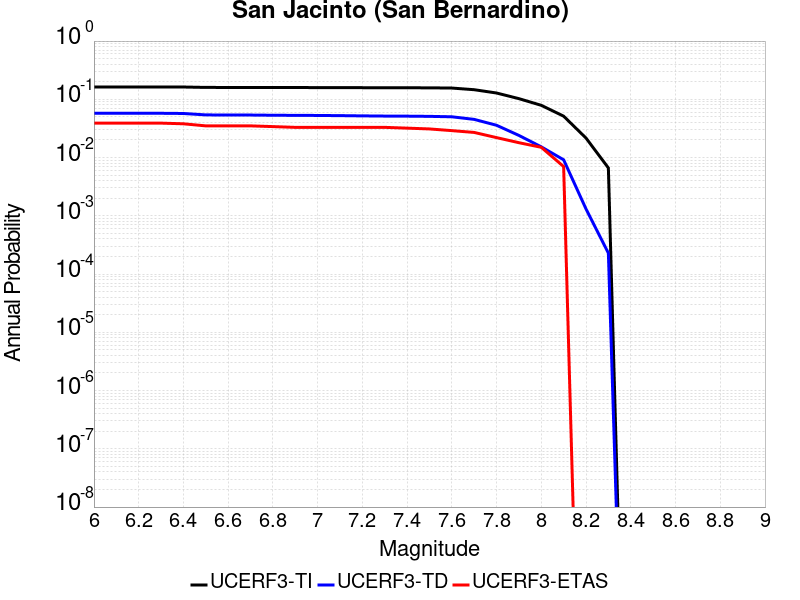 |
|-----|

| Magnitude | UCERF3-TI Prob | UCERF3-TD Prob | UCERF3-ETAS Prob |
|-----|-----|-----|-----|
| 6.0 | 0.16297233 | 0.05755816 | 0.039045554 |
| 6.1 | 0.16297233 | 0.05755816 | 0.039045554 |
| 6.2 | 0.16297233 | 0.05755816 | 0.039045554 |
| 6.3 | 0.16297233 | 0.05755816 | 0.039045554 |
| 6.4 | 0.1625985 | 0.057109464 | 0.037960954 |
| 6.5 | 0.16000277 | 0.053994212 | 0.03579176 |
| 6.6 | 0.15978417 | 0.053731553 | 0.03579176 |
| 6.7 | 0.15975903 | 0.05369712 | 0.03579176 |
| 6.8 | 0.1593977 | 0.053261694 | 0.03470716 |
| 6.9 | 0.15921766 | 0.053040594 | 0.03362256 |
| 7.0 | 0.1590479 | 0.052829307 | 0.03362256 |
| 7.1 | 0.15875219 | 0.052453883 | 0.03362256 |
| 7.2 | 0.15833196 | 0.0519484 | 0.03362256 |
| 7.3 | 0.15799198 | 0.05155076 | 0.03362256 |
| 7.4 | 0.15781324 | 0.051358283 | 0.03253796 |
| 7.5 | 0.15738234 | 0.05096887 | 0.031453364 |
| 7.6 | 0.15607782 | 0.050120518 | 0.030368764 |
| 7.7 | 0.14618453 | 0.045241117 | 0.028199567 |
| 7.8 | 0.12830503 | 0.03584291 | 0.022776572 |
| 7.9 | 0.10266841 | 0.023993162 | 0.018438177 |
| 8.0 | 0.07884066 | 0.015274411 | 0.01626898 |
| 8.1 | 0.05136489 | 0.0091537805 | 0.007592191 |
| 8.2 | 0.021621559 | 0.0013120405 | 0.0 |
| 8.3 | 0.0066349525 | 2.2871379E-4 | 0.0 |

## San Jacinto (San Jacinto Valley) rev
*[(top)](#table-of-contents)*

| 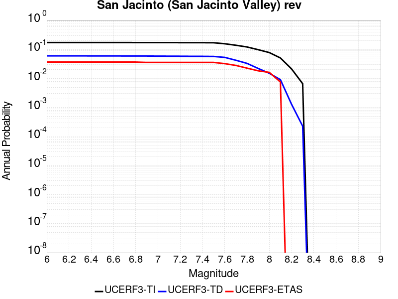 |
|-----|

| Magnitude | UCERF3-TI Prob | UCERF3-TD Prob | UCERF3-ETAS Prob |
|-----|-----|-----|-----|
| 6.0 | 0.17353345 | 0.060304377 | 0.036876354 |
| 6.1 | 0.17353345 | 0.060304377 | 0.036876354 |
| 6.2 | 0.17353345 | 0.060304377 | 0.036876354 |
| 6.3 | 0.17353345 | 0.060304377 | 0.036876354 |
| 6.4 | 0.1732853 | 0.059997182 | 0.036876354 |
| 6.5 | 0.1732853 | 0.059997182 | 0.036876354 |
| 6.6 | 0.17316923 | 0.059853543 | 0.036876354 |
| 6.7 | 0.1731244 | 0.05979779 | 0.036876354 |
| 6.8 | 0.17302725 | 0.059677333 | 0.036876354 |
| 6.9 | 0.1729029 | 0.05952318 | 0.03579176 |
| 7.0 | 0.17253205 | 0.059063435 | 0.03579176 |
| 7.1 | 0.17238456 | 0.058886368 | 0.03579176 |
| 7.2 | 0.17216638 | 0.05862931 | 0.03579176 |
| 7.3 | 0.17177428 | 0.058252707 | 0.03579176 |
| 7.4 | 0.17159718 | 0.058102056 | 0.03579176 |
| 7.5 | 0.17063828 | 0.05754146 | 0.03579176 |
| 7.6 | 0.15759617 | 0.053412203 | 0.03253796 |
| 7.7 | 0.1399004 | 0.042556055 | 0.028199567 |
| 7.8 | 0.122069925 | 0.03321689 | 0.022776572 |
| 7.9 | 0.09854071 | 0.022232143 | 0.018438177 |
| 8.0 | 0.07833272 | 0.015175225 | 0.01626898 |
| 8.1 | 0.05106528 | 0.009124351 | 0.007592191 |
| 8.2 | 0.02144917 | 0.0012998403 | 0.0 |
| 8.3 | 0.0066349525 | 2.2871379E-4 | 0.0 |

## San Jacinto (Stepovers Combined)
*[(top)](#table-of-contents)*

| 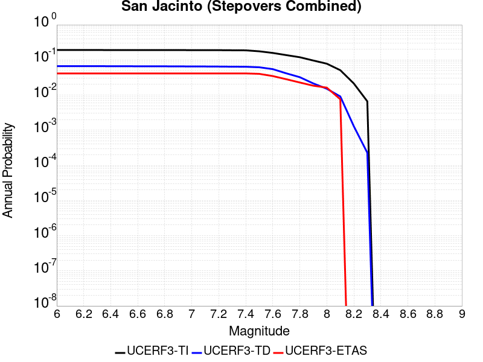 |
|-----|

| Magnitude | UCERF3-TI Prob | UCERF3-TD Prob | UCERF3-ETAS Prob |
|-----|-----|-----|-----|
| 6.0 | 0.19119935 | 0.066647045 | 0.04121475 |
| 6.1 | 0.19119935 | 0.066647045 | 0.04121475 |
| 6.2 | 0.19119935 | 0.066647045 | 0.04121475 |
| 6.3 | 0.19119935 | 0.066647045 | 0.04121475 |
| 6.4 | 0.19081722 | 0.06616246 | 0.04121475 |
| 6.5 | 0.19081722 | 0.06616246 | 0.04121475 |
| 6.6 | 0.19065416 | 0.06595564 | 0.04121475 |
| 6.7 | 0.19056097 | 0.06583774 | 0.04121475 |
| 6.8 | 0.19046718 | 0.065731056 | 0.04121475 |
| 6.9 | 0.1903384 | 0.06559251 | 0.04121475 |
| 7.0 | 0.18991564 | 0.065153345 | 0.04121475 |
| 7.1 | 0.18982883 | 0.06507808 | 0.04121475 |
| 7.2 | 0.18946548 | 0.06473872 | 0.04121475 |
| 7.3 | 0.18812498 | 0.06424649 | 0.04121475 |
| 7.4 | 0.18719469 | 0.06395103 | 0.04121475 |
| 7.5 | 0.17572963 | 0.06176056 | 0.040130153 |
| 7.6 | 0.15792322 | 0.0546475 | 0.03470716 |
| 7.7 | 0.13699454 | 0.04151404 | 0.028199567 |
| 7.8 | 0.11922078 | 0.032262925 | 0.022776572 |
| 7.9 | 0.0961354 | 0.021424796 | 0.018438177 |
| 8.0 | 0.07809269 | 0.015125108 | 0.01626898 |
| 8.1 | 0.05096407 | 0.009118094 | 0.007592191 |
| 8.2 | 0.0213846 | 0.0012973051 | 0.0 |
| 8.3 | 0.006631146 | 2.2855181E-4 | 0.0 |

## San Jacinto (Superstition Mtn)
*[(top)](#table-of-contents)*

| 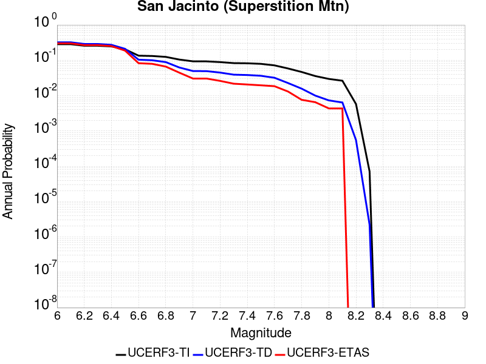 |
|-----|

| Magnitude | UCERF3-TI Prob | UCERF3-TD Prob | UCERF3-ETAS Prob |
|-----|-----|-----|-----|
| 6.0 | 0.28463715 | 0.3222607 | 0.30043384 |
| 6.1 | 0.28463715 | 0.3222607 | 0.30043384 |
| 6.2 | 0.25736412 | 0.28873563 | 0.26789588 |
| 6.3 | 0.2570405 | 0.2882347 | 0.26789588 |
| 6.4 | 0.24622944 | 0.27319086 | 0.2516269 |
| 6.5 | 0.20410958 | 0.210628 | 0.18763557 |
| 6.6 | 0.13467579 | 0.103590585 | 0.0824295 |
| 6.7 | 0.13197236 | 0.10003923 | 0.0791757 |
| 6.8 | 0.12447434 | 0.08864256 | 0.06616052 |
| 6.9 | 0.10454345 | 0.06232425 | 0.04446855 |
| 7.0 | 0.09322245 | 0.049565256 | 0.030368764 |
| 7.1 | 0.09286391 | 0.049188673 | 0.030368764 |
| 7.2 | 0.08871772 | 0.04476972 | 0.02603037 |
| 7.3 | 0.08289381 | 0.03909827 | 0.021691974 |
| 7.4 | 0.081954755 | 0.038192105 | 0.020607375 |
| 7.5 | 0.07909146 | 0.036318824 | 0.019522777 |
| 7.6 | 0.07165149 | 0.031939473 | 0.018438177 |
| 7.7 | 0.058461927 | 0.022632858 | 0.013015185 |
| 7.8 | 0.046568073 | 0.01570269 | 0.007592191 |
| 7.9 | 0.03573038 | 0.009995568 | 0.0065075923 |
| 8.0 | 0.029627144 | 0.0073132394 | 0.004338395 |
| 8.1 | 0.026323404 | 0.0063765817 | 0.004338395 |
| 8.2 | 0.0057626013 | 5.521897E-4 | 0.0 |
| 8.3 | 7.087891E-5 | 2.2211343E-6 | 0.0 |

## San Joaquin Hills
*[(top)](#table-of-contents)*

| 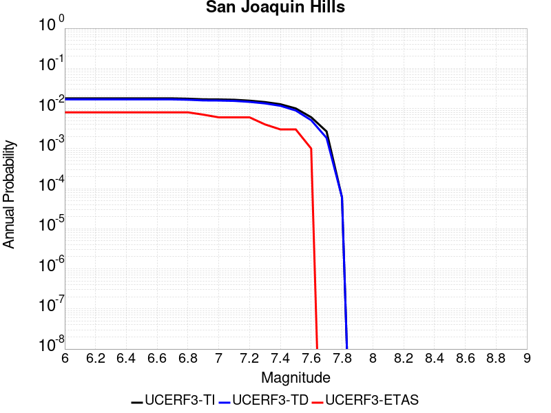 |
|-----|

| Magnitude | UCERF3-TI Prob | UCERF3-TD Prob | UCERF3-ETAS Prob |
|-----|-----|-----|-----|
| 6.0 | 0.01785375 | 0.016809966 | 0.00867679 |
| 6.1 | 0.01785375 | 0.016809966 | 0.00867679 |
| 6.2 | 0.01785375 | 0.016809966 | 0.00867679 |
| 6.3 | 0.01785375 | 0.016809966 | 0.00867679 |
| 6.4 | 0.01785375 | 0.016809966 | 0.00867679 |
| 6.5 | 0.01785375 | 0.016809966 | 0.00867679 |
| 6.6 | 0.01785375 | 0.016809966 | 0.00867679 |
| 6.7 | 0.01785375 | 0.016809966 | 0.00867679 |
| 6.8 | 0.017526142 | 0.016479447 | 0.00867679 |
| 6.9 | 0.016914785 | 0.015862502 | 0.007592191 |
| 7.0 | 0.016799243 | 0.015745759 | 0.0065075923 |
| 7.1 | 0.01648923 | 0.015432557 | 0.0065075923 |
| 7.2 | 0.01564505 | 0.0145794805 | 0.0065075923 |
| 7.3 | 0.014440144 | 0.013360227 | 0.004338395 |
| 7.4 | 0.012750717 | 0.011650514 | 0.0032537961 |
| 7.5 | 0.010003221 | 0.008878832 | 0.0032537961 |
| 7.6 | 0.0060392907 | 0.005092096 | 0.0010845987 |
| 7.7 | 0.0026663407 | 0.0018375887 | 0.0 |
| 7.8 | 6.055505E-5 | 6.0903378E-5 | 0.0 |

## San Jose
*[(top)](#table-of-contents)*

| 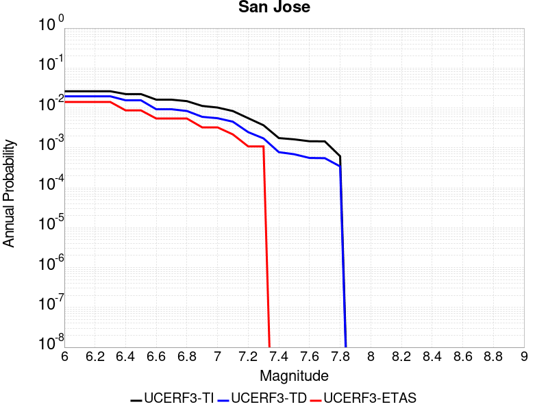 |
|-----|

| Magnitude | UCERF3-TI Prob | UCERF3-TD Prob | UCERF3-ETAS Prob |
|-----|-----|-----|-----|
| 6.0 | 0.026184617 | 0.019544333 | 0.014099783 |
| 6.1 | 0.026184617 | 0.019544333 | 0.014099783 |
| 6.2 | 0.026184617 | 0.019544333 | 0.014099783 |
| 6.3 | 0.026184617 | 0.019544333 | 0.014099783 |
| 6.4 | 0.022245735 | 0.015531194 | 0.00867679 |
| 6.5 | 0.022245735 | 0.015531194 | 0.00867679 |
| 6.6 | 0.016098637 | 0.009256375 | 0.0054229936 |
| 6.7 | 0.016098637 | 0.009256375 | 0.0054229936 |
| 6.8 | 0.01479508 | 0.008378088 | 0.0054229936 |
| 6.9 | 0.01121697 | 0.005979024 | 0.0032537961 |
| 7.0 | 0.010218437 | 0.0055221324 | 0.0032537961 |
| 7.1 | 0.0083502205 | 0.004515586 | 0.0021691974 |
| 7.2 | 0.0055320915 | 0.0024725941 | 0.0010845987 |
| 7.3 | 0.003677401 | 0.0017218674 | 0.0010845987 |
| 7.4 | 0.0017556795 | 7.792697E-4 | 0.0 |
| 7.5 | 0.0016314195 | 6.906261E-4 | 0.0 |
| 7.6 | 0.001460385 | 5.57984E-4 | 0.0 |
| 7.7 | 0.0014522225 | 5.5097684E-4 | 0.0 |
| 7.8 | 6.160807E-4 | 3.4213922E-4 | 0.0 |

## San Juan
*[(top)](#table-of-contents)*

| 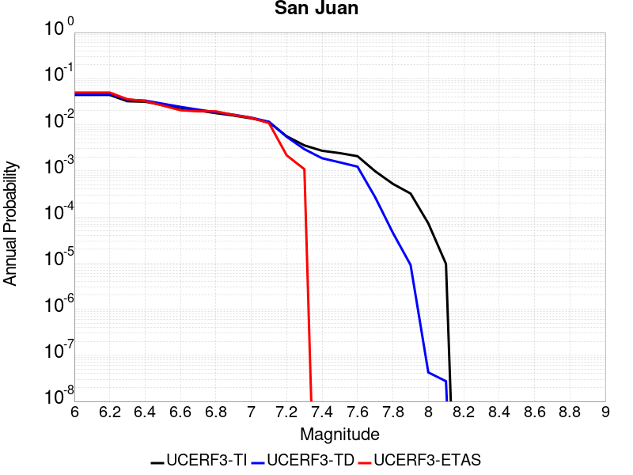 |
|-----|

| Magnitude | UCERF3-TI Prob | UCERF3-TD Prob | UCERF3-ETAS Prob |
|-----|-----|-----|-----|
| 6.0 | 0.04429486 | 0.046862397 | 0.04989154 |
| 6.1 | 0.04429486 | 0.046862397 | 0.04989154 |
| 6.2 | 0.04429486 | 0.046862397 | 0.04989154 |
| 6.3 | 0.032365557 | 0.034797687 | 0.03579176 |
| 6.4 | 0.031575687 | 0.03340487 | 0.03253796 |
| 6.5 | 0.026792755 | 0.028532488 | 0.02603037 |
| 6.6 | 0.02329862 | 0.02442258 | 0.020607375 |
| 6.7 | 0.020370297 | 0.021252623 | 0.019522777 |
| 6.8 | 0.01785915 | 0.018637827 | 0.019522777 |
| 6.9 | 0.015839184 | 0.016506694 | 0.01626898 |
| 7.0 | 0.01373442 | 0.014268288 | 0.014099783 |
| 7.1 | 0.011433942 | 0.011558453 | 0.010845987 |
| 7.2 | 0.005612543 | 0.0054711825 | 0.0021691974 |
| 7.3 | 0.003565999 | 0.00294886 | 0.0010845987 |
| 7.4 | 0.0027254438 | 0.0018778987 | 0.0 |
| 7.5 | 0.002422553 | 0.0015274452 | 0.0 |
| 7.6 | 0.0020801015 | 0.0012338163 | 0.0 |
| 7.7 | 9.796736E-4 | 2.674016E-4 | 0.0 |
| 7.8 | 5.224575E-4 | 4.530658E-5 | 0.0 |
| 7.9 | 3.219645E-4 | 9.106779E-6 | 0.0 |
| 8.0 | 7.291466E-5 | 4.264597E-8 | 0.0 |
| 8.1 | 9.602625E-6 | 2.7433815E-8 | 0.0 |

## San Luis Range - Oceano 2011 CFM
*[(top)](#table-of-contents)*

| 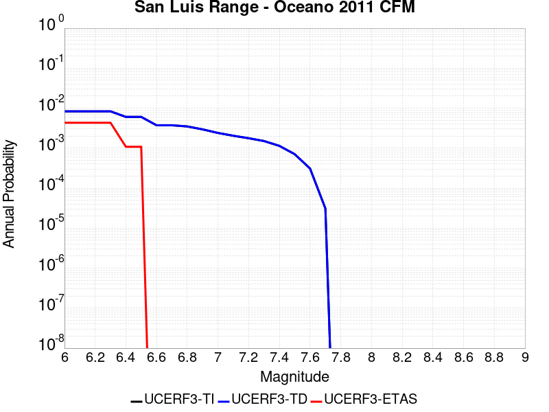 |
|-----|

| Magnitude | UCERF3-TI Prob | UCERF3-TD Prob | UCERF3-ETAS Prob |
|-----|-----|-----|-----|
| 6.0 | 0.008327169 | 0.008359001 | 0.004338395 |
| 6.1 | 0.008327169 | 0.008359001 | 0.004338395 |
| 6.2 | 0.008327169 | 0.008359001 | 0.004338395 |
| 6.3 | 0.008327169 | 0.008359001 | 0.004338395 |
| 6.4 | 0.006045425 | 0.0060684658 | 0.0010845987 |
| 6.5 | 0.006045425 | 0.0060684658 | 0.0010845987 |
| 6.6 | 0.0037314754 | 0.0037448052 | 0.0 |
| 6.7 | 0.0037314754 | 0.0037448052 | 0.0 |
| 6.8 | 0.0034899537 | 0.0035022397 | 0.0 |
| 6.9 | 0.0029478404 | 0.0029579771 | 0.0 |
| 7.0 | 0.0024017158 | 0.0024098624 | 0.0 |
| 7.1 | 0.0020421564 | 0.00204913 | 0.0 |
| 7.2 | 0.0017711839 | 0.0017773376 | 0.0 |
| 7.3 | 0.0015068728 | 0.0015121032 | 0.0 |
| 7.4 | 0.0011410954 | 0.0011451459 | 0.0 |
| 7.5 | 7.0749875E-4 | 7.099253E-4 | 0.0 |
| 7.6 | 3.092108E-4 | 3.1037675E-4 | 0.0 |
| 7.7 | 3.102611E-5 | 3.1167605E-5 | 0.0 |

## San Luis Range - Pecho 2011 CFM
*[(top)](#table-of-contents)*

| 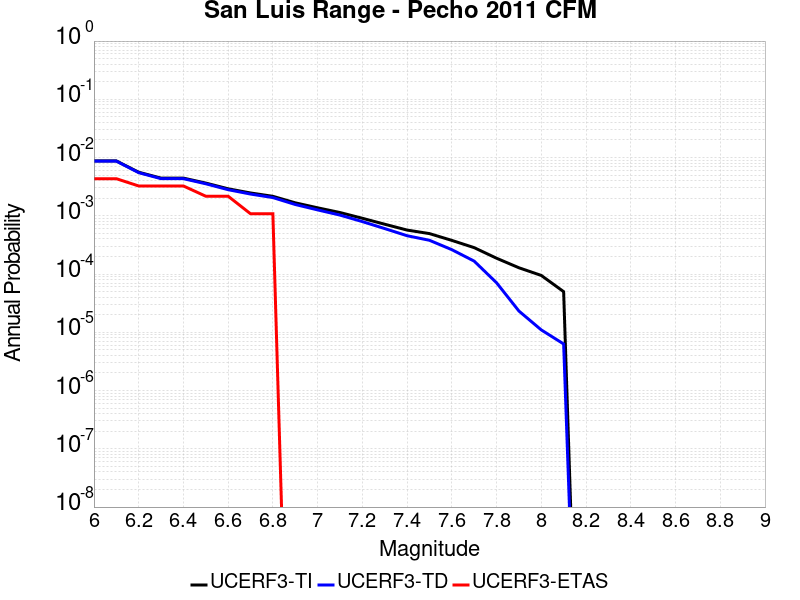 |
|-----|

| Magnitude | UCERF3-TI Prob | UCERF3-TD Prob | UCERF3-ETAS Prob |
|-----|-----|-----|-----|
| 6.0 | 0.008766091 | 0.0086813755 | 0.004338395 |
| 6.1 | 0.008766091 | 0.0086813755 | 0.004338395 |
| 6.2 | 0.0056016287 | 0.0055079763 | 0.0032537961 |
| 6.3 | 0.0044373614 | 0.0043409113 | 0.0032537961 |
| 6.4 | 0.0044373614 | 0.0043409113 | 0.0032537961 |
| 6.5 | 0.0036473677 | 0.0035480973 | 0.0021691974 |
| 6.6 | 0.0029093628 | 0.0028076235 | 0.0021691974 |
| 6.7 | 0.002467299 | 0.0023638702 | 0.0010845987 |
| 6.8 | 0.0021613026 | 0.0020566564 | 0.0010845987 |
| 6.9 | 0.0016712719 | 0.001564369 | 0.0 |
| 7.0 | 0.0013721862 | 0.0012636931 | 0.0 |
| 7.1 | 0.0011385368 | 0.0010286244 | 0.0 |
| 7.2 | 9.07131E-4 | 7.95608E-4 | 0.0 |
| 7.3 | 7.169318E-4 | 6.0398394E-4 | 0.0 |
| 7.4 | 5.693815E-4 | 4.5514834E-4 | 0.0 |
| 7.5 | 4.950673E-4 | 3.8012012E-4 | 0.0 |
| 7.6 | 3.7857142E-4 | 2.623564E-4 | 0.0 |
| 7.7 | 2.8413837E-4 | 1.6676685E-4 | 0.0 |
| 7.8 | 1.870472E-4 | 7.093393E-5 | 0.0 |
| 7.9 | 1.2828792E-4 | 2.3194209E-5 | 0.0 |
| 8.0 | 9.470881E-5 | 1.099742E-5 | 0.0 |
| 8.1 | 4.987732E-5 | 6.306801E-6 | 0.0 |

## San Luis Range 2011 CFM
*[(top)](#table-of-contents)*

| 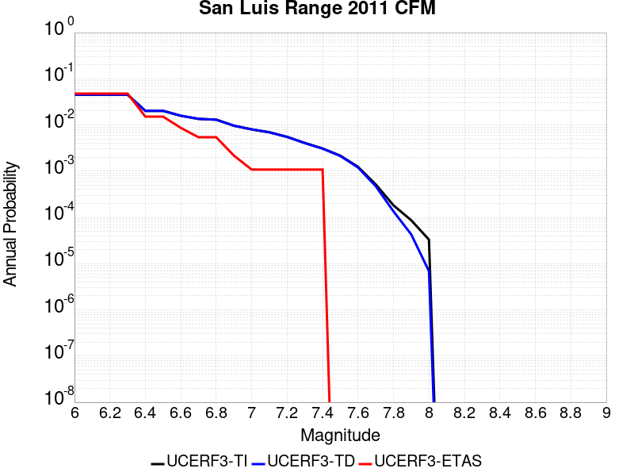 |
|-----|

| Magnitude | UCERF3-TI Prob | UCERF3-TD Prob | UCERF3-ETAS Prob |
|-----|-----|-----|-----|
| 6.0 | 0.045062687 | 0.045352146 | 0.047722343 |
| 6.1 | 0.045062687 | 0.045352146 | 0.047722343 |
| 6.2 | 0.045062687 | 0.045352146 | 0.047722343 |
| 6.3 | 0.045062687 | 0.045352146 | 0.047722343 |
| 6.4 | 0.020192182 | 0.02026123 | 0.015184382 |
| 6.5 | 0.020192182 | 0.02026123 | 0.015184382 |
| 6.6 | 0.015833573 | 0.015877765 | 0.00867679 |
| 6.7 | 0.013557489 | 0.0135894995 | 0.0054229936 |
| 6.8 | 0.013016758 | 0.0130457245 | 0.0054229936 |
| 6.9 | 0.009639886 | 0.009651357 | 0.0021691974 |
| 7.0 | 0.008035021 | 0.008038252 | 0.0010845987 |
| 7.1 | 0.006951073 | 0.006947891 | 0.0010845987 |
| 7.2 | 0.0055277874 | 0.005515688 | 0.0010845987 |
| 7.3 | 0.0040781214 | 0.0040566856 | 0.0010845987 |
| 7.4 | 0.0031028725 | 0.0030751193 | 0.0010845987 |
| 7.5 | 0.002169134 | 0.0021355907 | 0.0 |
| 7.6 | 0.001241914 | 0.0012022018 | 0.0 |
| 7.7 | 5.174137E-4 | 4.725105E-4 | 0.0 |
| 7.8 | 1.8251732E-4 | 1.3483467E-4 | 0.0 |
| 7.9 | 8.674263E-5 | 4.2883446E-5 | 0.0 |
| 8.0 | 3.3055785E-5 | 6.8751915E-6 | 0.0 |

## San Pedro Basin
*[(top)](#table-of-contents)*

| 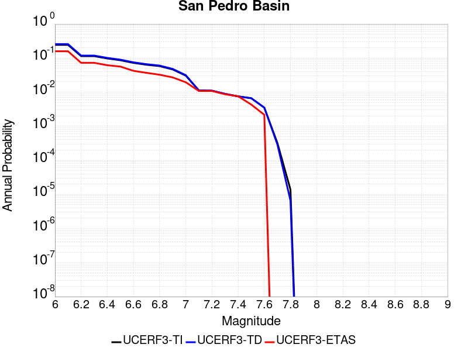 |
|-----|

| Magnitude | UCERF3-TI Prob | UCERF3-TD Prob | UCERF3-ETAS Prob |
|-----|-----|-----|-----|
| 6.0 | 0.24338211 | 0.25763026 | 0.1583514 |
| 6.1 | 0.24338211 | 0.25763026 | 0.1583514 |
| 6.2 | 0.11396662 | 0.11867383 | 0.07266811 |
| 6.3 | 0.11396662 | 0.11867383 | 0.07266811 |
| 6.4 | 0.09750037 | 0.10141976 | 0.061822128 |
| 6.5 | 0.08652003 | 0.08994515 | 0.056399133 |
| 6.6 | 0.07237475 | 0.07518351 | 0.04229935 |
| 6.7 | 0.06380121 | 0.06625526 | 0.036876354 |
| 6.8 | 0.05804873 | 0.06027139 | 0.03253796 |
| 6.9 | 0.046418 | 0.04817865 | 0.027114967 |
| 7.0 | 0.030493993 | 0.031582136 | 0.019522777 |
| 7.1 | 0.011185424 | 0.011246083 | 0.010845987 |
| 7.2 | 0.011027734 | 0.011086723 | 0.010845987 |
| 7.3 | 0.0089065395 | 0.008930096 | 0.00867679 |
| 7.4 | 0.007520774 | 0.0075253937 | 0.007592191 |
| 7.5 | 0.006658543 | 0.0066563287 | 0.004338395 |
| 7.6 | 0.003518464 | 0.0035172745 | 0.0021691974 |
| 7.7 | 3.2407476E-4 | 2.9237408E-4 | 0.0 |
| 7.8 | 1.3869268E-5 | 6.569873E-6 | 0.0 |

## San Pedro Escarpment
*[(top)](#table-of-contents)*

| 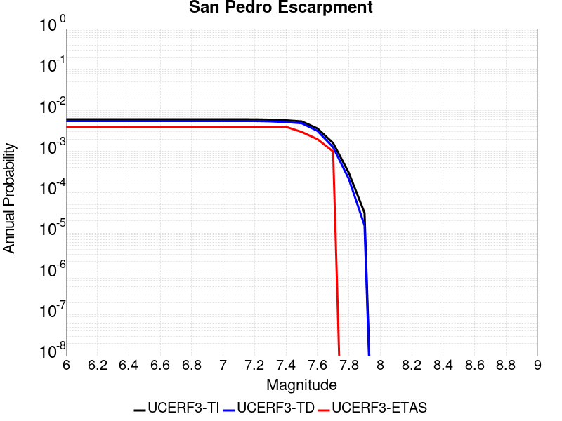 |
|-----|

| Magnitude | UCERF3-TI Prob | UCERF3-TD Prob | UCERF3-ETAS Prob |
|-----|-----|-----|-----|
| 6.0 | 0.0061071888 | 0.0055526276 | 0.004338395 |
| 6.1 | 0.0061071888 | 0.0055526276 | 0.004338395 |
| 6.2 | 0.0061071888 | 0.0055526276 | 0.004338395 |
| 6.3 | 0.0061071888 | 0.0055526276 | 0.004338395 |
| 6.4 | 0.0061071888 | 0.0055526276 | 0.004338395 |
| 6.5 | 0.0061071888 | 0.0055526276 | 0.004338395 |
| 6.6 | 0.0061071888 | 0.0055526276 | 0.004338395 |
| 6.7 | 0.0061071888 | 0.0055526276 | 0.004338395 |
| 6.8 | 0.0061071888 | 0.0055526276 | 0.004338395 |
| 6.9 | 0.0061071888 | 0.0055526276 | 0.004338395 |
| 7.0 | 0.0061071888 | 0.0055526276 | 0.004338395 |
| 7.1 | 0.0061071888 | 0.0055526276 | 0.004338395 |
| 7.2 | 0.0060978713 | 0.0055432795 | 0.004338395 |
| 7.3 | 0.0059904736 | 0.005435479 | 0.004338395 |
| 7.4 | 0.0057769706 | 0.0052211 | 0.004338395 |
| 7.5 | 0.005425054 | 0.004894998 | 0.0032537961 |
| 7.6 | 0.003655415 | 0.0031927375 | 0.0021691974 |
| 7.7 | 0.0016095273 | 0.0012682592 | 0.0010845987 |
| 7.8 | 3.0004783E-4 | 2.1320285E-4 | 0.0 |
| 7.9 | 3.151564E-5 | 1.5476558E-5 | 0.0 |

## San Vicente
*[(top)](#table-of-contents)*

| 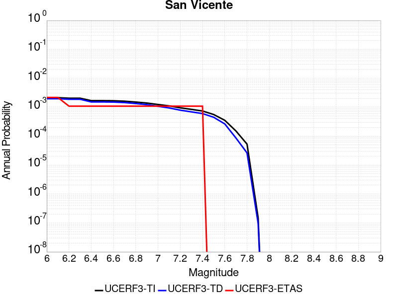 |
|-----|

| Magnitude | UCERF3-TI Prob | UCERF3-TD Prob | UCERF3-ETAS Prob |
|-----|-----|-----|-----|
| 6.0 | 0.0021292912 | 0.0019655896 | 0.0021691974 |
| 6.1 | 0.0021292912 | 0.0019655896 | 0.0021691974 |
| 6.2 | 0.0020433562 | 0.0018795563 | 0.0010845987 |
| 6.3 | 0.0020433562 | 0.0018795563 | 0.0010845987 |
| 6.4 | 0.0016829104 | 0.001518524 | 0.0010845987 |
| 6.5 | 0.0016829104 | 0.001518524 | 0.0010845987 |
| 6.6 | 0.0016669377 | 0.0015025325 | 0.0010845987 |
| 6.7 | 0.0016079539 | 0.0014434165 | 0.0010845987 |
| 6.8 | 0.0015032828 | 0.0013384417 | 0.0010845987 |
| 6.9 | 0.0013904421 | 0.0012252367 | 0.0010845987 |
| 7.0 | 0.0012376162 | 0.0010728746 | 0.0010845987 |
| 7.1 | 0.001107497 | 9.433461E-4 | 0.0010845987 |
| 7.2 | 9.5153775E-4 | 7.8844425E-4 | 0.0010845987 |
| 7.3 | 8.4073166E-4 | 6.88732E-4 | 0.0010845987 |
| 7.4 | 7.37998E-4 | 6.0177606E-4 | 0.0010845987 |
| 7.5 | 5.586394E-4 | 4.4877667E-4 | 0.0 |
| 7.6 | 3.5197314E-4 | 2.644629E-4 | 0.0 |
| 7.7 | 1.5099476E-4 | 8.643471E-5 | 0.0 |
| 7.8 | 5.296744E-5 | 2.6292862E-5 | 0.0 |
| 7.9 | 1.4779177E-7 | 9.6675066E-8 | 0.0 |

## Santa Cruz Catalina Ridge alt1
*[(top)](#table-of-contents)*

| 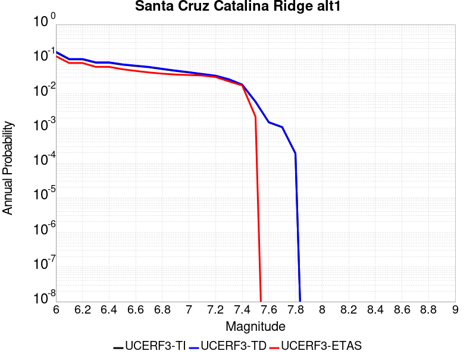 |
|-----|

| Magnitude | UCERF3-TI Prob | UCERF3-TD Prob | UCERF3-ETAS Prob |
|-----|-----|-----|-----|
| 6.0 | 0.1574495 | 0.16327175 | 0.121475056 |
| 6.1 | 0.09832405 | 0.10093048 | 0.077006504 |
| 6.2 | 0.09832405 | 0.10093048 | 0.077006504 |
| 6.3 | 0.07879074 | 0.08064347 | 0.05965293 |
| 6.4 | 0.07879074 | 0.08064347 | 0.05965293 |
| 6.5 | 0.06902745 | 0.070577875 | 0.05097614 |
| 6.6 | 0.06333666 | 0.06472778 | 0.045553144 |
| 6.7 | 0.058260903 | 0.059517637 | 0.04121475 |
| 6.8 | 0.051471595 | 0.052557845 | 0.037960954 |
| 6.9 | 0.045680076 | 0.046624325 | 0.03579176 |
| 7.0 | 0.04111811 | 0.041956056 | 0.03470716 |
| 7.1 | 0.03655073 | 0.037288155 | 0.03362256 |
| 7.2 | 0.032651242 | 0.03330566 | 0.030368764 |
| 7.3 | 0.02577281 | 0.026290372 | 0.022776572 |
| 7.4 | 0.018046286 | 0.018409409 | 0.01735358 |
| 7.5 | 0.005834765 | 0.0059376787 | 0.0021691974 |
| 7.6 | 0.0014911448 | 0.0015119278 | 0.0 |
| 7.7 | 0.0010837624 | 0.0010985681 | 0.0 |
| 7.8 | 1.8859607E-4 | 1.9090269E-4 | 0.0 |

## Santa Cruz Island
*[(top)](#table-of-contents)*

| 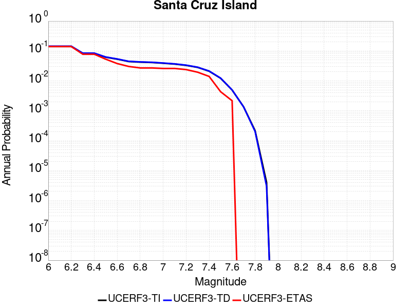 |
|-----|

| Magnitude | UCERF3-TI Prob | UCERF3-TD Prob | UCERF3-ETAS Prob |
|-----|-----|-----|-----|
| 6.0 | 0.14116524 | 0.14540274 | 0.14099783 |
| 6.1 | 0.14116524 | 0.14540274 | 0.14099783 |
| 6.2 | 0.14116524 | 0.14540274 | 0.14099783 |
| 6.3 | 0.08314199 | 0.08490387 | 0.07809111 |
| 6.4 | 0.08314199 | 0.08490387 | 0.07809111 |
| 6.5 | 0.061864074 | 0.06301996 | 0.053145338 |
| 6.6 | 0.053263426 | 0.05422061 | 0.037960954 |
| 6.7 | 0.044376712 | 0.045140337 | 0.030368764 |
| 6.8 | 0.04242261 | 0.04314552 | 0.027114967 |
| 6.9 | 0.041249648 | 0.041948292 | 0.027114967 |
| 7.0 | 0.03896521 | 0.039616074 | 0.02603037 |
| 7.1 | 0.036482118 | 0.03708449 | 0.02603037 |
| 7.2 | 0.03305042 | 0.033599112 | 0.023861172 |
| 7.3 | 0.028261375 | 0.02872321 | 0.019522777 |
| 7.4 | 0.021065231 | 0.02139017 | 0.014099783 |
| 7.5 | 0.0122307865 | 0.0123860575 | 0.004338395 |
| 7.6 | 0.004943762 | 0.0049793245 | 0.0021691974 |
| 7.7 | 0.0013564284 | 0.0013462045 | 0.0 |
| 7.8 | 2.1663377E-4 | 2.0320054E-4 | 0.0 |
| 7.9 | 4.0303717E-6 | 2.9989303E-6 | 0.0 |

## Santa Monica Bay
*[(top)](#table-of-contents)*

| 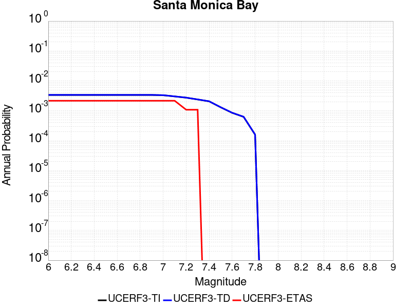 |
|-----|

| Magnitude | UCERF3-TI Prob | UCERF3-TD Prob | UCERF3-ETAS Prob |
|-----|-----|-----|-----|
| 6.0 | 0.0033824618 | 0.003394809 | 0.0021691974 |
| 6.1 | 0.0033824618 | 0.003394809 | 0.0021691974 |
| 6.2 | 0.0033824618 | 0.003394809 | 0.0021691974 |
| 6.3 | 0.0033824618 | 0.003394809 | 0.0021691974 |
| 6.4 | 0.0033824618 | 0.003394809 | 0.0021691974 |
| 6.5 | 0.0033824618 | 0.003394809 | 0.0021691974 |
| 6.6 | 0.0033824618 | 0.003394809 | 0.0021691974 |
| 6.7 | 0.0033824618 | 0.003394809 | 0.0021691974 |
| 6.8 | 0.0033824618 | 0.003394809 | 0.0021691974 |
| 6.9 | 0.0033824618 | 0.003394809 | 0.0021691974 |
| 7.0 | 0.0033141868 | 0.0033264307 | 0.0021691974 |
| 7.1 | 0.0030198668 | 0.0030315209 | 0.0021691974 |
| 7.2 | 0.0027436675 | 0.0027546908 | 0.0010845987 |
| 7.3 | 0.0023884855 | 0.0023985575 | 0.0010845987 |
| 7.4 | 0.002068854 | 0.002077933 | 0.0 |
| 7.5 | 0.0013113081 | 0.0013175406 | 0.0 |
| 7.6 | 8.56031E-4 | 8.603867E-4 | 0.0 |
| 7.7 | 6.275298E-4 | 6.308737E-4 | 0.0 |
| 7.8 | 1.5933896E-4 | 1.6025697E-4 | 0.0 |

## Santa Monica alt 1
*[(top)](#table-of-contents)*

| 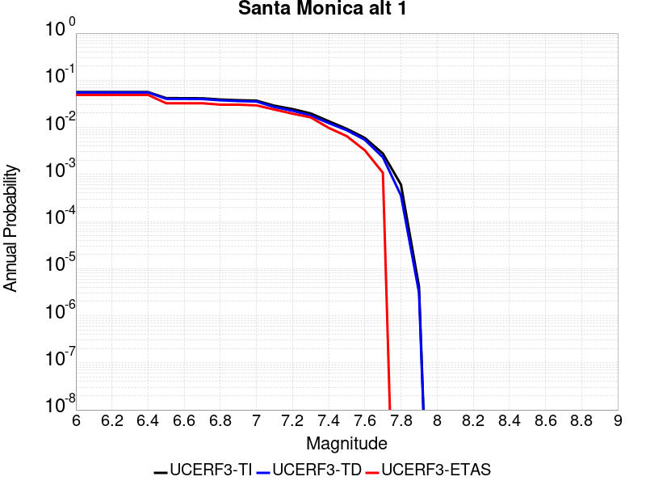 |
|-----|

| Magnitude | UCERF3-TI Prob | UCERF3-TD Prob | UCERF3-ETAS Prob |
|-----|-----|-----|-----|
| 6.0 | 0.05610577 | 0.05510521 | 0.048806943 |
| 6.1 | 0.05610577 | 0.05510521 | 0.048806943 |
| 6.2 | 0.05610577 | 0.05510521 | 0.048806943 |
| 6.3 | 0.05610577 | 0.05510521 | 0.048806943 |
| 6.4 | 0.05610577 | 0.05510521 | 0.048806943 |
| 6.5 | 0.041801903 | 0.040294558 | 0.03253796 |
| 6.6 | 0.04165582 | 0.04014454 | 0.03253796 |
| 6.7 | 0.04143852 | 0.03992235 | 0.03253796 |
| 6.8 | 0.039100677 | 0.03752275 | 0.030368764 |
| 6.9 | 0.037724856 | 0.036113888 | 0.030368764 |
| 7.0 | 0.036921367 | 0.03529422 | 0.029284164 |
| 7.1 | 0.028814817 | 0.026940089 | 0.023861172 |
| 7.2 | 0.024471916 | 0.022473605 | 0.019522777 |
| 7.3 | 0.019781029 | 0.017845511 | 0.01626898 |
| 7.4 | 0.013530197 | 0.012325615 | 0.009761388 |
| 7.5 | 0.009307584 | 0.008685942 | 0.0065075923 |
| 7.6 | 0.005968577 | 0.0054437243 | 0.0032537961 |
| 7.7 | 0.002777733 | 0.002311369 | 0.0010845987 |
| 7.8 | 6.0866424E-4 | 3.5802668E-4 | 0.0 |
| 7.9 | 4.1781627E-6 | 3.095605E-6 | 0.0 |

## Santa Rosa Island
*[(top)](#table-of-contents)*

| 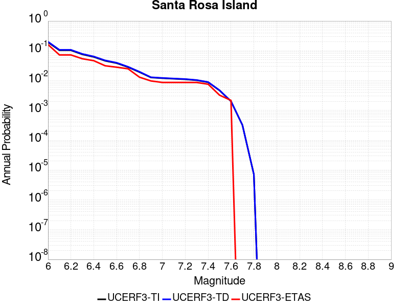 |
|-----|

| Magnitude | UCERF3-TI Prob | UCERF3-TD Prob | UCERF3-ETAS Prob |
|-----|-----|-----|-----|
| 6.0 | 0.19320332 | 0.20147796 | 0.16160521 |
| 6.1 | 0.10407247 | 0.1079331 | 0.07266811 |
| 6.2 | 0.10407247 | 0.1079331 | 0.07266811 |
| 6.3 | 0.07604703 | 0.07871571 | 0.054229934 |
| 6.4 | 0.062368963 | 0.06449781 | 0.046637744 |
| 6.5 | 0.046179753 | 0.047693826 | 0.031453364 |
| 6.6 | 0.03860986 | 0.039845873 | 0.028199567 |
| 6.7 | 0.028302463 | 0.029161725 | 0.02494577 |
| 6.8 | 0.019300913 | 0.019823838 | 0.013015185 |
| 6.9 | 0.012735195 | 0.012988873 | 0.009761388 |
| 7.0 | 0.012055744 | 0.0122882305 | 0.00867679 |
| 7.1 | 0.011541758 | 0.011759894 | 0.00867679 |
| 7.2 | 0.0110785235 | 0.011285915 | 0.00867679 |
| 7.3 | 0.010274863 | 0.010464894 | 0.00867679 |
| 7.4 | 0.008805898 | 0.008966367 | 0.007592191 |
| 7.5 | 0.0046784203 | 0.0047538322 | 0.0032537961 |
| 7.6 | 0.0020215977 | 0.0020442598 | 0.0021691974 |
| 7.7 | 3.2250572E-4 | 3.2223485E-4 | 0.0 |
| 7.8 | 7.15076E-6 | 7.191492E-6 | 0.0 |

## Santa Susana East (connector)
*[(top)](#table-of-contents)*

| 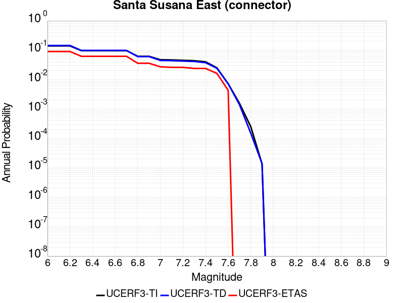 |
|-----|

| Magnitude | UCERF3-TI Prob | UCERF3-TD Prob | UCERF3-ETAS Prob |
|-----|-----|-----|-----|
| 6.0 | 0.13855943 | 0.14390682 | 0.09002169 |
| 6.1 | 0.13855943 | 0.14390682 | 0.09002169 |
| 6.2 | 0.13855943 | 0.14390682 | 0.09002169 |
| 6.3 | 0.0964414 | 0.097820215 | 0.061822128 |
| 6.4 | 0.0964414 | 0.097820215 | 0.061822128 |
| 6.5 | 0.0964414 | 0.097820215 | 0.061822128 |
| 6.6 | 0.0964414 | 0.097820215 | 0.061822128 |
| 6.7 | 0.096293435 | 0.09766763 | 0.061822128 |
| 6.8 | 0.061760183 | 0.060203597 | 0.03579176 |
| 6.9 | 0.061760183 | 0.060203597 | 0.03579176 |
| 7.0 | 0.047248494 | 0.04475472 | 0.027114967 |
| 7.1 | 0.046524074 | 0.04400026 | 0.02603037 |
| 7.2 | 0.045133308 | 0.042557467 | 0.02603037 |
| 7.3 | 0.04374715 | 0.041210085 | 0.023861172 |
| 7.4 | 0.040144227 | 0.03751636 | 0.023861172 |
| 7.5 | 0.025177015 | 0.024265165 | 0.01626898 |
| 7.6 | 0.007223762 | 0.007194189 | 0.004338395 |
| 7.7 | 0.0015602064 | 0.0014040569 | 0.0 |
| 7.8 | 2.5140942E-4 | 1.502691E-4 | 0.0 |
| 7.9 | 1.36327335E-5 | 1.38698815E-5 | 0.0 |

## Santa Susana alt 1
*[(top)](#table-of-contents)*

| 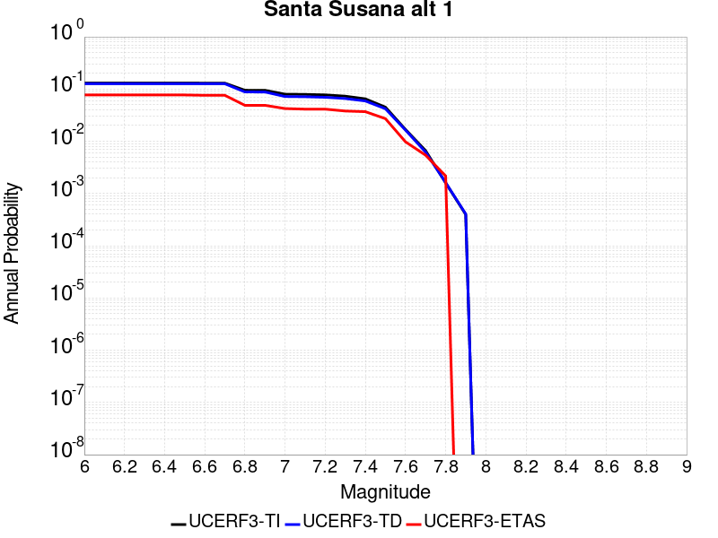 |
|-----|

| Magnitude | UCERF3-TI Prob | UCERF3-TD Prob | UCERF3-ETAS Prob |
|-----|-----|-----|-----|
| 6.0 | 0.13027059 | 0.12674041 | 0.077006504 |
| 6.1 | 0.13027059 | 0.12674041 | 0.077006504 |
| 6.2 | 0.13027059 | 0.12674041 | 0.077006504 |
| 6.3 | 0.13027059 | 0.12674041 | 0.077006504 |
| 6.4 | 0.13027059 | 0.12674041 | 0.077006504 |
| 6.5 | 0.13027059 | 0.12674041 | 0.077006504 |
| 6.6 | 0.12981303 | 0.12625353 | 0.07592191 |
| 6.7 | 0.12981303 | 0.12625353 | 0.07592191 |
| 6.8 | 0.094730034 | 0.08802153 | 0.048806943 |
| 6.9 | 0.094582155 | 0.08786571 | 0.048806943 |
| 7.0 | 0.07970021 | 0.07190875 | 0.04229935 |
| 7.1 | 0.0790296 | 0.071215436 | 0.04121475 |
| 7.2 | 0.077291064 | 0.06953671 | 0.04121475 |
| 7.3 | 0.073033005 | 0.065905966 | 0.037960954 |
| 7.4 | 0.06489535 | 0.059141684 | 0.036876354 |
| 7.5 | 0.045016978 | 0.0419497 | 0.027114967 |
| 7.6 | 0.016832232 | 0.01638197 | 0.009761388 |
| 7.7 | 0.006631577 | 0.006215051 | 0.0054229936 |
| 7.8 | 0.0015993207 | 0.0016192712 | 0.0021691974 |
| 7.9 | 3.9767812E-4 | 4.0517177E-4 | 0.0 |

## Santa Ynez (East)
*[(top)](#table-of-contents)*

| 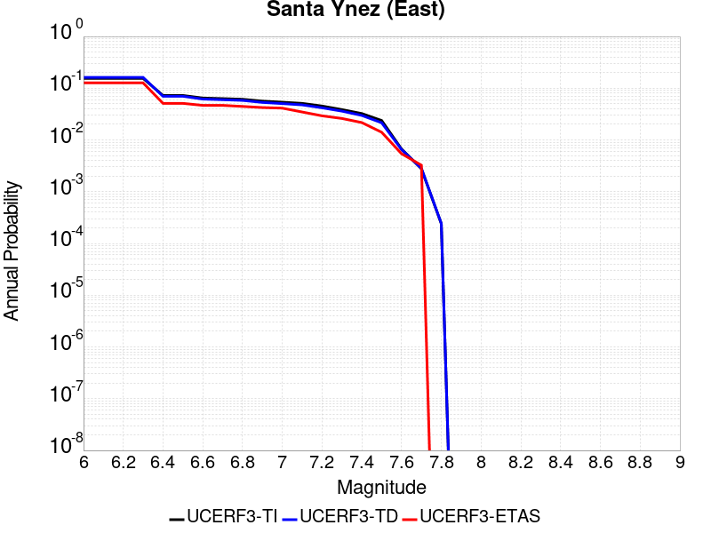 |
|-----|

| Magnitude | UCERF3-TI Prob | UCERF3-TD Prob | UCERF3-ETAS Prob |
|-----|-----|-----|-----|
| 6.0 | 0.15496857 | 0.1616181 | 0.12689805 |
| 6.1 | 0.15496857 | 0.1616181 | 0.12689805 |
| 6.2 | 0.15496857 | 0.1616181 | 0.12689805 |
| 6.3 | 0.15496857 | 0.1616181 | 0.12689805 |
| 6.4 | 0.07240737 | 0.069876954 | 0.05097614 |
| 6.5 | 0.07240737 | 0.069876954 | 0.05097614 |
| 6.6 | 0.064617604 | 0.061721426 | 0.046637744 |
| 6.7 | 0.06293196 | 0.05997653 | 0.046637744 |
| 6.8 | 0.0611608 | 0.05814933 | 0.04446855 |
| 6.9 | 0.05629305 | 0.053146545 | 0.04229935 |
| 7.0 | 0.05369645 | 0.050471555 | 0.04121475 |
| 7.1 | 0.050948728 | 0.047651608 | 0.03470716 |
| 7.2 | 0.045248363 | 0.041851804 | 0.029284164 |
| 7.3 | 0.03863122 | 0.036075234 | 0.02603037 |
| 7.4 | 0.032385603 | 0.029788155 | 0.021691974 |
| 7.5 | 0.023768943 | 0.021484055 | 0.014099783 |
| 7.6 | 0.00668701 | 0.0065354668 | 0.0054229936 |
| 7.7 | 0.002777375 | 0.0028202059 | 0.0032537961 |
| 7.8 | 2.4071947E-4 | 2.436394E-4 | 0.0 |

## Santa Ynez (West)
*[(top)](#table-of-contents)*

| 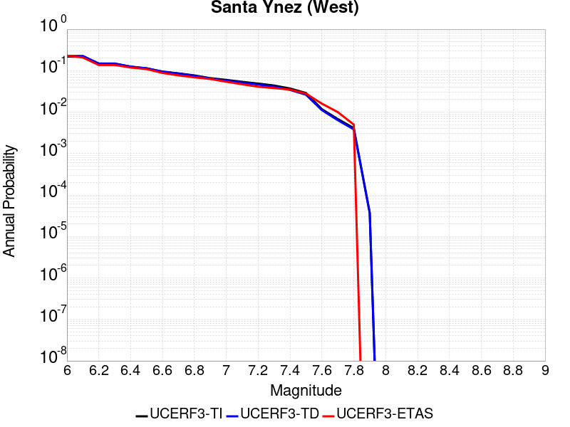 |
|-----|

| Magnitude | UCERF3-TI Prob | UCERF3-TD Prob | UCERF3-ETAS Prob |
|-----|-----|-----|-----|
| 6.0 | 0.21892631 | 0.226901 | 0.22776572 |
| 6.1 | 0.21892631 | 0.226901 | 0.20715836 |
| 6.2 | 0.14675452 | 0.14907117 | 0.13557483 |
| 6.3 | 0.14675452 | 0.14907117 | 0.13557483 |
| 6.4 | 0.12436594 | 0.12535565 | 0.11605206 |
| 6.5 | 0.11375546 | 0.11413895 | 0.10520607 |
| 6.6 | 0.09494416 | 0.09433389 | 0.0824295 |
| 6.7 | 0.08597228 | 0.08492602 | 0.07158352 |
| 6.8 | 0.07681389 | 0.075341076 | 0.06507592 |
| 6.9 | 0.065930314 | 0.06395512 | 0.061822128 |
| 7.0 | 0.05989534 | 0.0576809 | 0.053145338 |
| 7.1 | 0.053793844 | 0.0513524 | 0.045553144 |
| 7.2 | 0.04881375 | 0.046248924 | 0.039045554 |
| 7.3 | 0.043812398 | 0.041126426 | 0.03579176 |
| 7.4 | 0.037184794 | 0.034339525 | 0.03253796 |
| 7.5 | 0.028935619 | 0.02626264 | 0.02494577 |
| 7.6 | 0.011750153 | 0.0111555895 | 0.01626898 |
| 7.7 | 0.006812024 | 0.00638819 | 0.009761388 |
| 7.8 | 0.004115678 | 0.00384498 | 0.004338395 |
| 7.9 | 3.691738E-5 | 3.757855E-5 | 0.0 |

## Santa Ynez River
*[(top)](#table-of-contents)*

| 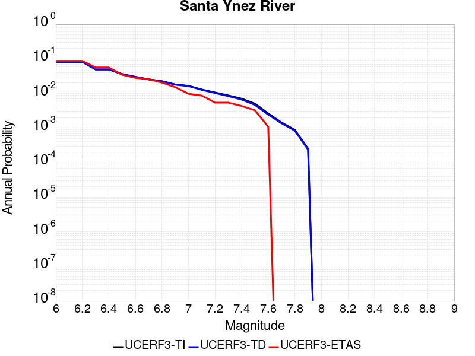 |
|-----|

| Magnitude | UCERF3-TI Prob | UCERF3-TD Prob | UCERF3-ETAS Prob |
|-----|-----|-----|-----|
| 6.0 | 0.08199741 | 0.08312963 | 0.08785249 |
| 6.1 | 0.08199741 | 0.08312963 | 0.08785249 |
| 6.2 | 0.08199741 | 0.08312963 | 0.08785249 |
| 6.3 | 0.049537335 | 0.049802676 | 0.056399133 |
| 6.4 | 0.049537335 | 0.049802676 | 0.056399133 |
| 6.5 | 0.036278386 | 0.03631141 | 0.03470716 |
| 6.6 | 0.03018103 | 0.030115763 | 0.028199567 |
| 6.7 | 0.02561611 | 0.025481146 | 0.02603037 |
| 6.8 | 0.022679187 | 0.02250027 | 0.020607375 |
| 6.9 | 0.018227745 | 0.017987559 | 0.015184382 |
| 7.0 | 0.016618082 | 0.01635653 | 0.009761388 |
| 7.1 | 0.0130086765 | 0.012698812 | 0.00867679 |
| 7.2 | 0.010647756 | 0.01030488 | 0.0054229936 |
| 7.3 | 0.008751358 | 0.008380974 | 0.0054229936 |
| 7.4 | 0.0070713186 | 0.0066707428 | 0.004338395 |
| 7.5 | 0.0050668847 | 0.0046592574 | 0.0032537961 |
| 7.6 | 0.0026404944 | 0.002450801 | 0.0010845987 |
| 7.7 | 0.001443828 | 0.0013751733 | 0.0 |
| 7.8 | 8.8897086E-4 | 8.4139744E-4 | 0.0 |
| 7.9 | 2.5222177E-4 | 2.386066E-4 | 0.0 |

## Sargent 2011 CFM
*[(top)](#table-of-contents)*

| 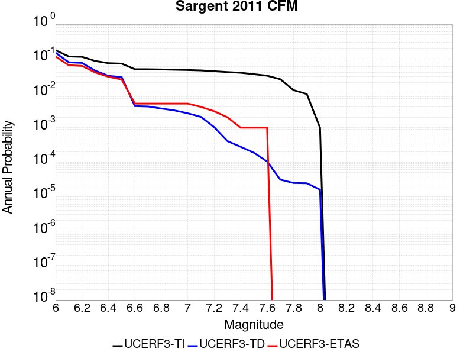 |
|-----|

| Magnitude | UCERF3-TI Prob | UCERF3-TD Prob | UCERF3-ETAS Prob |
|-----|-----|-----|-----|
| 6.0 | 0.17698029 | 0.14956486 | 0.11822126 |
| 6.1 | 0.116653405 | 0.07897543 | 0.06616052 |
| 6.2 | 0.113611795 | 0.07565481 | 0.06290673 |
| 6.3 | 0.086244196 | 0.04497619 | 0.040130153 |
| 6.4 | 0.07450937 | 0.03189706 | 0.029284164 |
| 6.5 | 0.0721856 | 0.029354636 | 0.023861172 |
| 6.6 | 0.049713947 | 0.0042297435 | 0.004338395 |
| 6.7 | 0.04961554 | 0.004124424 | 0.004338395 |
| 6.8 | 0.04889853 | 0.0035995068 | 0.004338395 |
| 6.9 | 0.047999598 | 0.0031662113 | 0.004338395 |
| 7.0 | 0.047107216 | 0.0026166278 | 0.004338395 |
| 7.1 | 0.045852687 | 0.0020534885 | 0.004338395 |
| 7.2 | 0.04348693 | 0.0010342221 | 0.0032537961 |
| 7.3 | 0.041101918 | 4.074357E-4 | 0.0021691974 |
| 7.4 | 0.03919233 | 2.7872185E-4 | 0.0010845987 |
| 7.5 | 0.035673123 | 1.8758189E-4 | 0.0010845987 |
| 7.6 | 0.03224896 | 1.0455396E-4 | 0.0010845987 |
| 7.7 | 0.025418468 | 3.1018182E-5 | 0.0 |
| 7.8 | 0.0123067405 | 2.4847455E-5 | 0.0 |
| 7.9 | 0.0094659235 | 2.4409437E-5 | 0.0 |
| 8.0 | 9.958609E-4 | 1.5898693E-5 | 0.0 |

## Scodie Lineament
*[(top)](#table-of-contents)*

| 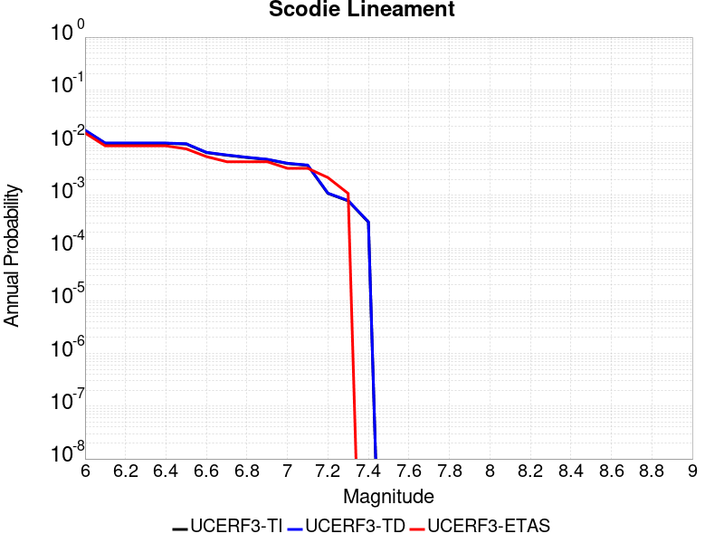 |
|-----|

| Magnitude | UCERF3-TI Prob | UCERF3-TD Prob | UCERF3-ETAS Prob |
|-----|-----|-----|-----|
| 6.0 | 0.017030181 | 0.017231386 | 0.015184382 |
| 6.1 | 0.009691253 | 0.009806174 | 0.00867679 |
| 6.2 | 0.009691253 | 0.009806174 | 0.00867679 |
| 6.3 | 0.009691253 | 0.009806174 | 0.00867679 |
| 6.4 | 0.009691253 | 0.009806174 | 0.00867679 |
| 6.5 | 0.009403135 | 0.009514532 | 0.007592191 |
| 6.6 | 0.00645687 | 0.006530494 | 0.0054229936 |
| 6.7 | 0.0057554822 | 0.0058211666 | 0.004338395 |
| 6.8 | 0.005207767 | 0.005267468 | 0.004338395 |
| 6.9 | 0.0047719795 | 0.004827127 | 0.004338395 |
| 7.0 | 0.0040090503 | 0.0040563736 | 0.0032537961 |
| 7.1 | 0.003699839 | 0.0037440765 | 0.0032537961 |
| 7.2 | 0.001084705 | 0.0010986928 | 0.0021691974 |
| 7.3 | 7.848845E-4 | 7.952888E-4 | 0.0010845987 |
| 7.4 | 3.0955195E-4 | 3.137598E-4 | 0.0 |

## Sheephole
*[(top)](#table-of-contents)*

| 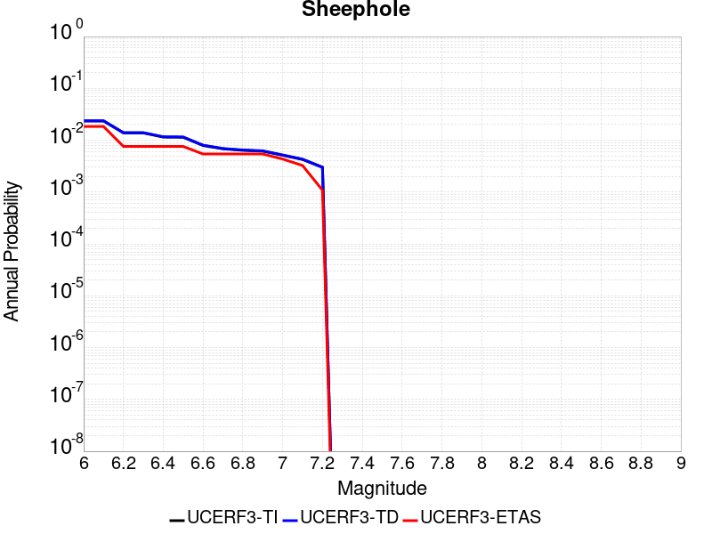 |
|-----|

| Magnitude | UCERF3-TI Prob | UCERF3-TD Prob | UCERF3-ETAS Prob |
|-----|-----|-----|-----|
| 6.0 | 0.023502303 | 0.023835046 | 0.018438177 |
| 6.1 | 0.023502303 | 0.023835046 | 0.018438177 |
| 6.2 | 0.013823612 | 0.014016123 | 0.007592191 |
| 6.3 | 0.013823612 | 0.014016123 | 0.007592191 |
| 6.4 | 0.011496067 | 0.011666642 | 0.007592191 |
| 6.5 | 0.011406483 | 0.011575921 | 0.007592191 |
| 6.6 | 0.007916517 | 0.008038098 | 0.0054229936 |
| 6.7 | 0.006831451 | 0.006938025 | 0.0054229936 |
| 6.8 | 0.0063848454 | 0.0064847446 | 0.0054229936 |
| 6.9 | 0.006157392 | 0.006253767 | 0.0054229936 |
| 7.0 | 0.00512608 | 0.0052059386 | 0.004338395 |
| 7.1 | 0.0042509893 | 0.0043170988 | 0.0032537961 |
| 7.2 | 0.002985147 | 0.0030316738 | 0.0010845987 |

## Shoreline
*[(top)](#table-of-contents)*

| 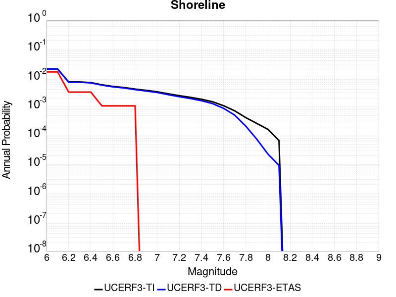 |
|-----|

| Magnitude | UCERF3-TI Prob | UCERF3-TD Prob | UCERF3-ETAS Prob |
|-----|-----|-----|-----|
| 6.0 | 0.020598277 | 0.020576876 | 0.01626898 |
| 6.1 | 0.020598277 | 0.020576876 | 0.01626898 |
| 6.2 | 0.007298928 | 0.0071365056 | 0.0032537961 |
| 6.3 | 0.007298928 | 0.0071365056 | 0.0032537961 |
| 6.4 | 0.006923063 | 0.0067583662 | 0.0032537961 |
| 6.5 | 0.0058202296 | 0.0056502195 | 0.0010845987 |
| 6.6 | 0.005096863 | 0.0049227304 | 0.0010845987 |
| 6.7 | 0.0046829795 | 0.0045063994 | 0.0010845987 |
| 6.8 | 0.0041300515 | 0.0039489763 | 0.0010845987 |
| 6.9 | 0.0037220486 | 0.0035381746 | 0.0 |
| 7.0 | 0.0033281634 | 0.003140946 | 0.0 |
| 7.1 | 0.0028293326 | 0.0026374613 | 0.0 |
| 7.2 | 0.0024373573 | 0.0022418366 | 0.0 |
| 7.3 | 0.00213527 | 0.0019371975 | 0.0 |
| 7.4 | 0.0018300933 | 0.001629458 | 0.0 |
| 7.5 | 0.00149836 | 0.0012949356 | 0.0 |
| 7.6 | 0.0010911914 | 8.8416843E-4 | 0.0 |
| 7.7 | 7.262002E-4 | 5.154959E-4 | 0.0 |
| 7.8 | 4.229748E-4 | 2.1440687E-4 | 0.0 |
| 7.9 | 2.6534E-4 | 7.497222E-5 | 0.0 |
| 8.0 | 1.657082E-4 | 2.3000222E-5 | 0.0 |
| 8.1 | 6.755799E-5 | 9.352995E-6 | 0.0 |

## Sierra Madre
*[(top)](#table-of-contents)*

| 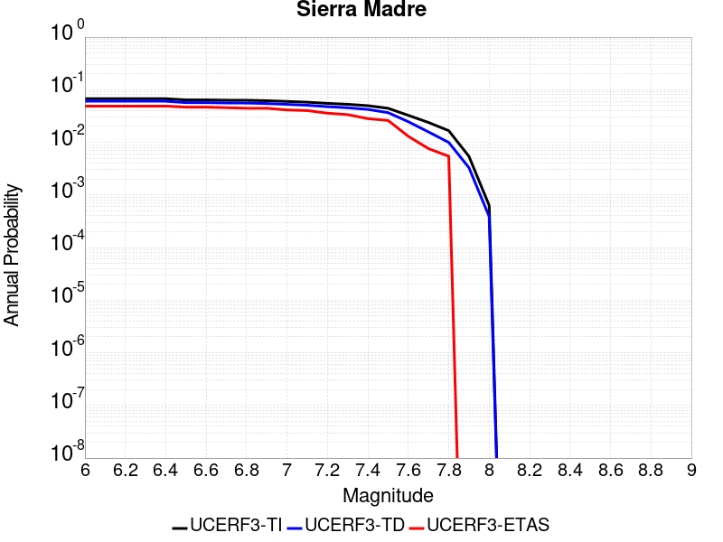 |
|-----|

| Magnitude | UCERF3-TI Prob | UCERF3-TD Prob | UCERF3-ETAS Prob |
|-----|-----|-----|-----|
| 6.0 | 0.06743099 | 0.060416106 | 0.048806943 |
| 6.1 | 0.06743099 | 0.060416106 | 0.048806943 |
| 6.2 | 0.06743099 | 0.060416106 | 0.048806943 |
| 6.3 | 0.06743099 | 0.060416106 | 0.048806943 |
| 6.4 | 0.06743099 | 0.060416106 | 0.048806943 |
| 6.5 | 0.06390593 | 0.05679279 | 0.046637744 |
| 6.6 | 0.06390593 | 0.05679279 | 0.046637744 |
| 6.7 | 0.06315416 | 0.056020785 | 0.045553144 |
| 6.8 | 0.06292189 | 0.055781875 | 0.04446855 |
| 6.9 | 0.061799582 | 0.054630514 | 0.04446855 |
| 7.0 | 0.05985842 | 0.052638013 | 0.04121475 |
| 7.1 | 0.057930756 | 0.05064906 | 0.040130153 |
| 7.2 | 0.05497434 | 0.04760371 | 0.03579176 |
| 7.3 | 0.052836873 | 0.04540643 | 0.03362256 |
| 7.4 | 0.04969547 | 0.042181544 | 0.028199567 |
| 7.5 | 0.04431621 | 0.0366735 | 0.02603037 |
| 7.6 | 0.032593656 | 0.02465384 | 0.013015185 |
| 7.7 | 0.02382967 | 0.01574687 | 0.007592191 |
| 7.8 | 0.016632952 | 0.009959271 | 0.0054229936 |
| 7.9 | 0.0054076053 | 0.0032956246 | 0.0 |
| 8.0 | 6.316741E-4 | 3.882628E-4 | 0.0 |

## Sierra Madre (San Fernando)
*[(top)](#table-of-contents)*

| 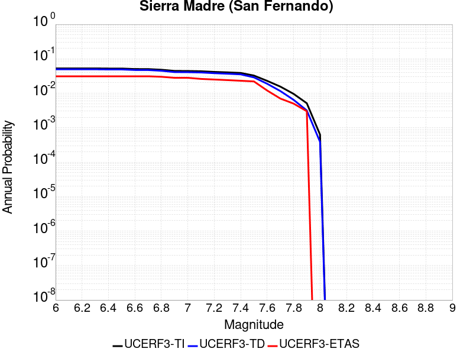 |
|-----|

| Magnitude | UCERF3-TI Prob | UCERF3-TD Prob | UCERF3-ETAS Prob |
|-----|-----|-----|-----|
| 6.0 | 0.05255499 | 0.049439877 | 0.029284164 |
| 6.1 | 0.05255499 | 0.049439877 | 0.029284164 |
| 6.2 | 0.05255499 | 0.049439877 | 0.029284164 |
| 6.3 | 0.05255499 | 0.049439877 | 0.029284164 |
| 6.4 | 0.052076053 | 0.04894805 | 0.029284164 |
| 6.5 | 0.052076053 | 0.04894805 | 0.029284164 |
| 6.6 | 0.050363094 | 0.047187753 | 0.029284164 |
| 6.7 | 0.05020758 | 0.0470266 | 0.029284164 |
| 6.8 | 0.048043083 | 0.044787746 | 0.028199567 |
| 6.9 | 0.044382825 | 0.041003544 | 0.02603037 |
| 7.0 | 0.04412565 | 0.04073883 | 0.02603037 |
| 7.1 | 0.04341169 | 0.04000012 | 0.023861172 |
| 7.2 | 0.041582927 | 0.038105905 | 0.022776572 |
| 7.3 | 0.04029106 | 0.036777407 | 0.021691974 |
| 7.4 | 0.038784876 | 0.035233624 | 0.020607375 |
| 7.5 | 0.03258632 | 0.02881947 | 0.019522777 |
| 7.6 | 0.022852989 | 0.018844627 | 0.010845987 |
| 7.7 | 0.015557737 | 0.011555861 | 0.0054229936 |
| 7.8 | 0.009585466 | 0.0064305873 | 0.0032537961 |
| 7.9 | 0.0051208325 | 0.0031660413 | 0.0010845987 |
| 8.0 | 6.316741E-4 | 3.882628E-4 | 0.0 |

## Sierra Nevada  (No Extension)
*[(top)](#table-of-contents)*

| 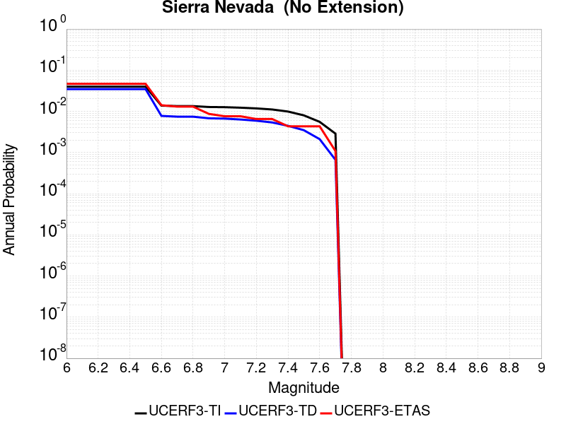 |
|-----|

| Magnitude | UCERF3-TI Prob | UCERF3-TD Prob | UCERF3-ETAS Prob |
|-----|-----|-----|-----|
| 6.0 | 0.039727263 | 0.034615874 | 0.046637744 |
| 6.1 | 0.039727263 | 0.034615874 | 0.046637744 |
| 6.2 | 0.039727263 | 0.034615874 | 0.046637744 |
| 6.3 | 0.039727263 | 0.034615874 | 0.046637744 |
| 6.4 | 0.039727263 | 0.034615874 | 0.046637744 |
| 6.5 | 0.039727263 | 0.034615874 | 0.046637744 |
| 6.6 | 0.0137476185 | 0.0077545433 | 0.014099783 |
| 6.7 | 0.013424628 | 0.0074265893 | 0.013015185 |
| 6.8 | 0.013399624 | 0.0074132066 | 0.013015185 |
| 6.9 | 0.012744937 | 0.0067809955 | 0.00867679 |
| 7.0 | 0.012620728 | 0.0066647567 | 0.007592191 |
| 7.1 | 0.012265694 | 0.006336454 | 0.007592191 |
| 7.2 | 0.011785806 | 0.0059167463 | 0.0065075923 |
| 7.3 | 0.011094893 | 0.005374477 | 0.0065075923 |
| 7.4 | 0.009889783 | 0.0044498695 | 0.004338395 |
| 7.5 | 0.007989541 | 0.003484135 | 0.004338395 |
| 7.6 | 0.0055573434 | 0.0021114107 | 0.004338395 |
| 7.7 | 0.0028704668 | 6.632242E-4 | 0.0010845987 |

## Silver Creek 2011 CFM
*[(top)](#table-of-contents)*

| 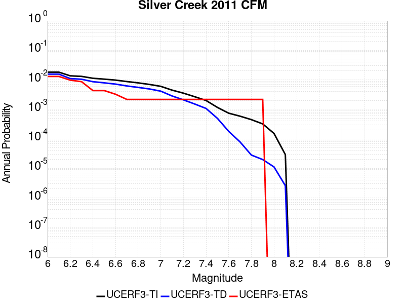 |
|-----|

| Magnitude | UCERF3-TI Prob | UCERF3-TD Prob | UCERF3-ETAS Prob |
|-----|-----|-----|-----|
| 6.0 | 0.018214166 | 0.015616609 | 0.013015185 |
| 6.1 | 0.018214166 | 0.015616609 | 0.013015185 |
| 6.2 | 0.013661795 | 0.011031725 | 0.009761388 |
| 6.3 | 0.013101634 | 0.010467559 | 0.00867679 |
| 6.4 | 0.011303949 | 0.008657376 | 0.004338395 |
| 6.5 | 0.010557824 | 0.0079061305 | 0.004338395 |
| 6.6 | 0.009790985 | 0.007170661 | 0.0032537961 |
| 6.7 | 0.008750801 | 0.0062058377 | 0.0021691974 |
| 6.8 | 0.007887957 | 0.0055380743 | 0.0021691974 |
| 6.9 | 0.006986922 | 0.0049033584 | 0.0021691974 |
| 7.0 | 0.0060155457 | 0.0041307877 | 0.0021691974 |
| 7.1 | 0.0044784397 | 0.0028349133 | 0.0021691974 |
| 7.2 | 0.0035358293 | 0.002095455 | 0.0021691974 |
| 7.3 | 0.0026727682 | 0.0015133991 | 0.0021691974 |
| 7.4 | 0.0019917542 | 0.0010711793 | 0.0021691974 |
| 7.5 | 0.0011625197 | 4.959198E-4 | 0.0021691974 |
| 7.6 | 7.4096734E-4 | 1.7941717E-4 | 0.0021691974 |
| 7.7 | 5.868406E-4 | 7.864215E-5 | 0.0021691974 |
| 7.8 | 4.4825752E-4 | 2.8219963E-5 | 0.0021691974 |
| 7.9 | 3.211873E-4 | 1.990011E-5 | 0.0021691974 |
| 8.0 | 1.525092E-4 | 1.1177155E-5 | 0.0 |
| 8.1 | 2.9252034E-5 | 2.5913873E-6 | 0.0 |

## Simi-Santa Rosa
*[(top)](#table-of-contents)*

| 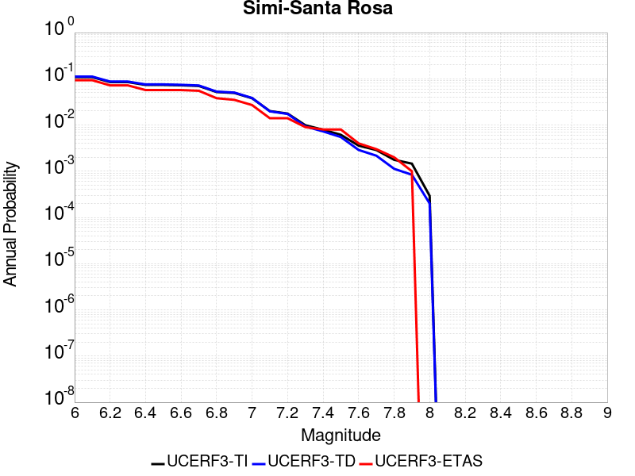 |
|-----|

| Magnitude | UCERF3-TI Prob | UCERF3-TD Prob | UCERF3-ETAS Prob |
|-----|-----|-----|-----|
| 6.0 | 0.10839971 | 0.11154374 | 0.09327549 |
| 6.1 | 0.10839971 | 0.11154374 | 0.09327549 |
| 6.2 | 0.08487577 | 0.087155856 | 0.07049891 |
| 6.3 | 0.08487577 | 0.087155856 | 0.07049891 |
| 6.4 | 0.07367176 | 0.0755586 | 0.054229934 |
| 6.5 | 0.07367176 | 0.0755586 | 0.054229934 |
| 6.6 | 0.07227574 | 0.07411838 | 0.054229934 |
| 6.7 | 0.06987071 | 0.07163751 | 0.05206074 |
| 6.8 | 0.051714703 | 0.052804504 | 0.03470716 |
| 6.9 | 0.049352933 | 0.05035662 | 0.031453364 |
| 7.0 | 0.03790117 | 0.038442373 | 0.022776572 |
| 7.1 | 0.020008214 | 0.019757945 | 0.013015185 |
| 7.2 | 0.017675063 | 0.017359061 | 0.013015185 |
| 7.3 | 0.009876581 | 0.009304394 | 0.00867679 |
| 7.4 | 0.007884538 | 0.0072662225 | 0.007592191 |
| 7.5 | 0.0061315834 | 0.005481983 | 0.007592191 |
| 7.6 | 0.0035794156 | 0.002883141 | 0.0032537961 |
| 7.7 | 0.0028722908 | 0.0021650833 | 0.0021691974 |
| 7.8 | 0.0017652195 | 0.0011281549 | 0.0010845987 |
| 7.9 | 0.001457609 | 8.390997E-4 | 0.0 |
| 8.0 | 2.9350843E-4 | 2.0056899E-4 | 0.0 |

## Sisar
*[(top)](#table-of-contents)*

| 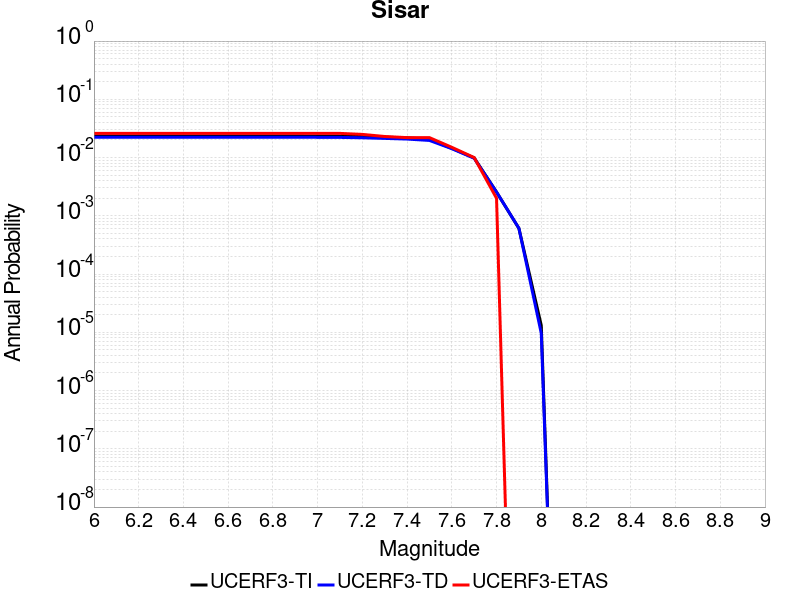 |
|-----|

| Magnitude | UCERF3-TI Prob | UCERF3-TD Prob | UCERF3-ETAS Prob |
|-----|-----|-----|-----|
| 6.0 | 0.023432106 | 0.022346087 | 0.023861172 |
| 6.1 | 0.023432106 | 0.022346087 | 0.023861172 |
| 6.2 | 0.023432106 | 0.022346087 | 0.023861172 |
| 6.3 | 0.023432106 | 0.022346087 | 0.023861172 |
| 6.4 | 0.023432106 | 0.022346087 | 0.023861172 |
| 6.5 | 0.023432106 | 0.022346087 | 0.023861172 |
| 6.6 | 0.023432106 | 0.022346087 | 0.023861172 |
| 6.7 | 0.023432106 | 0.022346087 | 0.023861172 |
| 6.8 | 0.023432106 | 0.022346087 | 0.023861172 |
| 6.9 | 0.023422077 | 0.02233594 | 0.023861172 |
| 7.0 | 0.023348818 | 0.022261752 | 0.023861172 |
| 7.1 | 0.023274414 | 0.022186339 | 0.023861172 |
| 7.2 | 0.0229462 | 0.021853017 | 0.022776572 |
| 7.3 | 0.022403494 | 0.02132397 | 0.022776572 |
| 7.4 | 0.02177181 | 0.020769747 | 0.021691974 |
| 7.5 | 0.020572275 | 0.019675694 | 0.021691974 |
| 7.6 | 0.014387555 | 0.014225747 | 0.01626898 |
| 7.7 | 0.009879647 | 0.009721752 | 0.010845987 |
| 7.8 | 0.0025584789 | 0.0025585291 | 0.0021691974 |
| 7.9 | 6.08519E-4 | 6.1103044E-4 | 0.0 |
| 8.0 | 1.30969165E-5 | 9.560143E-6 | 0.0 |

## Skinner Flat 2011 CFM
*[(top)](#table-of-contents)*

| 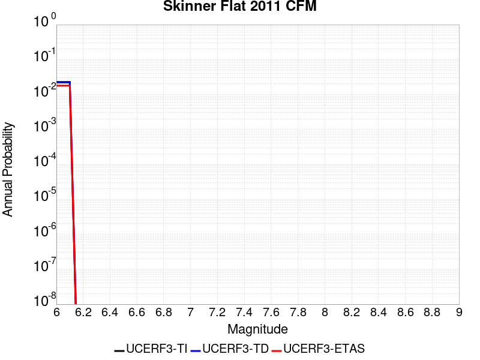 |
|-----|

| Magnitude | UCERF3-TI Prob | UCERF3-TD Prob | UCERF3-ETAS Prob |
|-----|-----|-----|-----|
| 6.0 | 0.022329375 | 0.022825794 | 0.018438177 |
| 6.1 | 0.022329375 | 0.022825794 | 0.018438177 |

## So Sierra Nevada
*[(top)](#table-of-contents)*

| 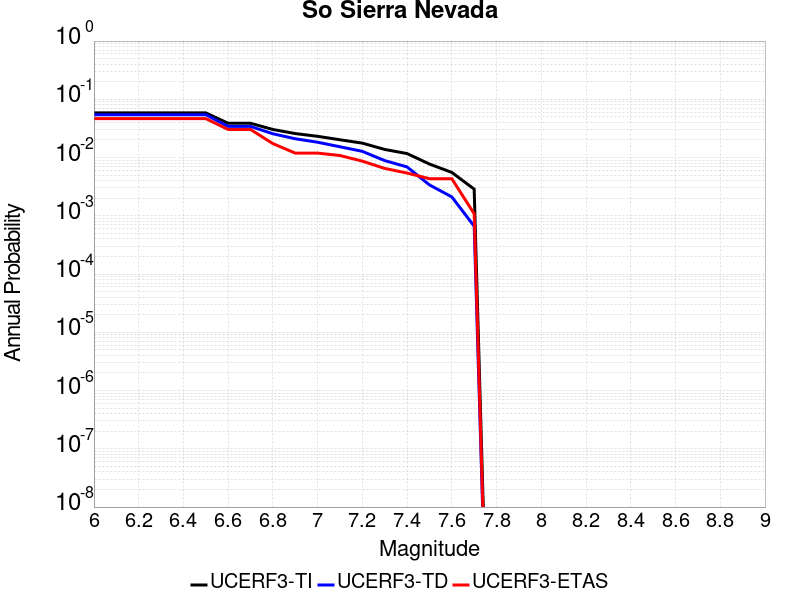 |
|-----|

| Magnitude | UCERF3-TI Prob | UCERF3-TD Prob | UCERF3-ETAS Prob |
|-----|-----|-----|-----|
| 6.0 | 0.058480937 | 0.05438113 | 0.046637744 |
| 6.1 | 0.058480937 | 0.05438113 | 0.046637744 |
| 6.2 | 0.058480937 | 0.05438113 | 0.046637744 |
| 6.3 | 0.058480937 | 0.05438113 | 0.046637744 |
| 6.4 | 0.058480937 | 0.05438113 | 0.046637744 |
| 6.5 | 0.058480937 | 0.05438113 | 0.046637744 |
| 6.6 | 0.038814884 | 0.03426188 | 0.030368764 |
| 6.7 | 0.038814884 | 0.03426188 | 0.030368764 |
| 6.8 | 0.030330041 | 0.025611313 | 0.01735358 |
| 6.9 | 0.025812414 | 0.021012645 | 0.011930586 |
| 7.0 | 0.023168558 | 0.01832681 | 0.011930586 |
| 7.1 | 0.020204578 | 0.015321309 | 0.010845987 |
| 7.2 | 0.01768724 | 0.012781986 | 0.00867679 |
| 7.3 | 0.013780358 | 0.008871042 | 0.0065075923 |
| 7.4 | 0.011711764 | 0.006902979 | 0.0054229936 |
| 7.5 | 0.0077409428 | 0.0033936396 | 0.004338395 |
| 7.6 | 0.0055573434 | 0.0021114107 | 0.004338395 |
| 7.7 | 0.0028704668 | 6.632242E-4 | 0.0010845987 |

## South Cuyama
*[(top)](#table-of-contents)*

| 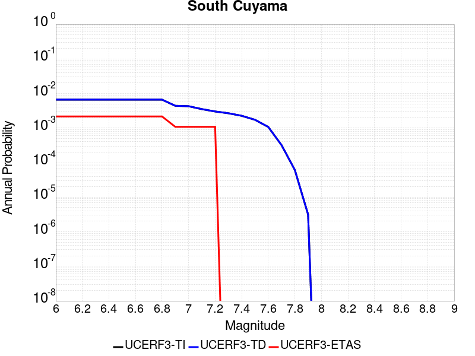 |
|-----|

| Magnitude | UCERF3-TI Prob | UCERF3-TD Prob | UCERF3-ETAS Prob |
|-----|-----|-----|-----|
| 6.0 | 0.006629296 | 0.0066412785 | 0.0021691974 |
| 6.1 | 0.006629296 | 0.0066412785 | 0.0021691974 |
| 6.2 | 0.006629296 | 0.0066412785 | 0.0021691974 |
| 6.3 | 0.006629296 | 0.0066412785 | 0.0021691974 |
| 6.4 | 0.006629296 | 0.0066412785 | 0.0021691974 |
| 6.5 | 0.006629296 | 0.0066412785 | 0.0021691974 |
| 6.6 | 0.006629296 | 0.0066412785 | 0.0021691974 |
| 6.7 | 0.006629296 | 0.0066412785 | 0.0021691974 |
| 6.8 | 0.006629296 | 0.0066412785 | 0.0021691974 |
| 6.9 | 0.0044028307 | 0.0044110133 | 0.0010845987 |
| 7.0 | 0.0042839427 | 0.0042919302 | 0.0010845987 |
| 7.1 | 0.003524277 | 0.0035310858 | 0.0010845987 |
| 7.2 | 0.0030131144 | 0.0030191084 | 0.0010845987 |
| 7.3 | 0.0026766993 | 0.0026821105 | 0.0 |
| 7.4 | 0.002260442 | 0.0022651136 | 0.0 |
| 7.5 | 0.0017330468 | 0.001736751 | 0.0 |
| 7.6 | 0.0010757364 | 0.0010781348 | 0.0 |
| 7.7 | 3.2096982E-4 | 3.2169648E-4 | 0.0 |
| 7.8 | 6.13892E-5 | 6.155943E-5 | 0.0 |
| 7.9 | 3.1506286E-6 | 3.1604745E-6 | 0.0 |

## South Klamath Lake East
*[(top)](#table-of-contents)*

| 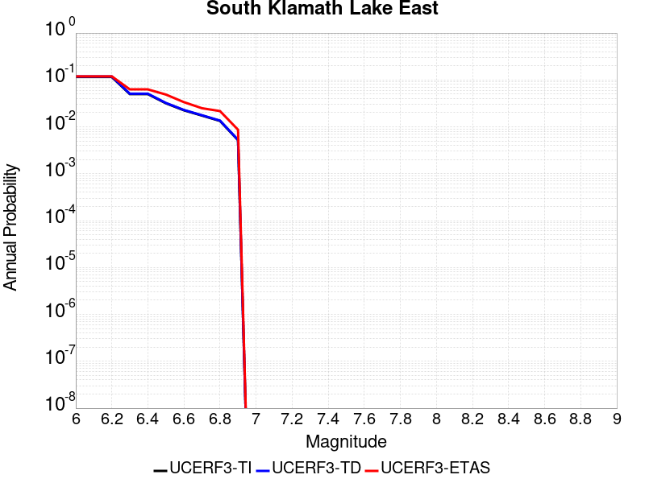 |
|-----|

| Magnitude | UCERF3-TI Prob | UCERF3-TD Prob | UCERF3-ETAS Prob |
|-----|-----|-----|-----|
| 6.0 | 0.11558291 | 0.11834761 | 0.11930586 |
| 6.1 | 0.11558291 | 0.11834761 | 0.11930586 |
| 6.2 | 0.11558291 | 0.11834761 | 0.11930586 |
| 6.3 | 0.04988863 | 0.05082007 | 0.06290673 |
| 6.4 | 0.04988863 | 0.05082007 | 0.06290673 |
| 6.5 | 0.031792615 | 0.0323502 | 0.048806943 |
| 6.6 | 0.022540906 | 0.022921285 | 0.03362256 |
| 6.7 | 0.017383514 | 0.017677434 | 0.02494577 |
| 6.8 | 0.013365341 | 0.013592248 | 0.021691974 |
| 6.9 | 0.0051979506 | 0.0052890973 | 0.00867679 |

## South Klamath Lake West
*[(top)](#table-of-contents)*

| 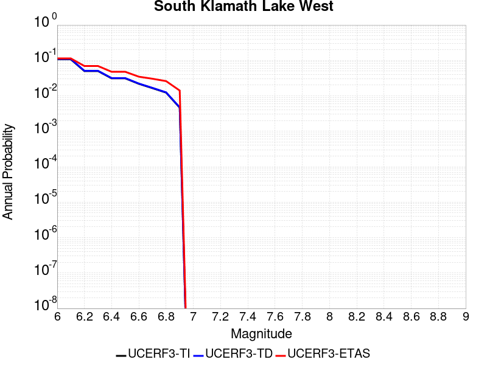 |
|-----|

| Magnitude | UCERF3-TI Prob | UCERF3-TD Prob | UCERF3-ETAS Prob |
|-----|-----|-----|-----|
| 6.0 | 0.10724113 | 0.10960451 | 0.11388286 |
| 6.1 | 0.10724113 | 0.10960451 | 0.11388286 |
| 6.2 | 0.050023004 | 0.050920498 | 0.06941432 |
| 6.3 | 0.050023004 | 0.050920498 | 0.06941432 |
| 6.4 | 0.03115757 | 0.031679306 | 0.047722343 |
| 6.5 | 0.03115757 | 0.031679306 | 0.047722343 |
| 6.6 | 0.021840915 | 0.022194128 | 0.03470716 |
| 6.7 | 0.016490016 | 0.01675817 | 0.030368764 |
| 6.8 | 0.012342347 | 0.012544631 | 0.02603037 |
| 6.9 | 0.00464782 | 0.0047264234 | 0.014099783 |

## Superstition Hills
*[(top)](#table-of-contents)*

| 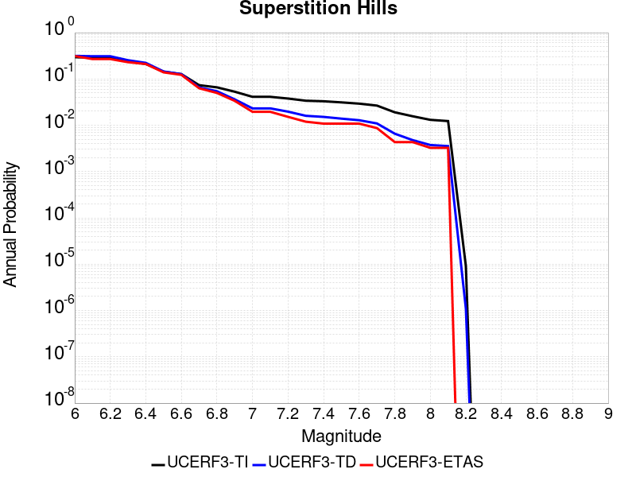 |
|-----|

| Magnitude | UCERF3-TI Prob | UCERF3-TD Prob | UCERF3-ETAS Prob |
|-----|-----|-----|-----|
| 6.0 | 0.2945396 | 0.3148538 | 0.31236443 |
| 6.1 | 0.28930518 | 0.3092329 | 0.26898047 |
| 6.2 | 0.28930518 | 0.3092329 | 0.26898047 |
| 6.3 | 0.23923719 | 0.2538028 | 0.22993493 |
| 6.4 | 0.21101888 | 0.22251676 | 0.21041214 |
| 6.5 | 0.14344059 | 0.14485812 | 0.13882864 |
| 6.6 | 0.1271214 | 0.126756 | 0.12255965 |
| 6.7 | 0.07340617 | 0.06548443 | 0.06290673 |
| 6.8 | 0.06587901 | 0.05426872 | 0.04989154 |
| 6.9 | 0.05303284 | 0.036219176 | 0.03362256 |
| 7.0 | 0.041113526 | 0.02315715 | 0.019522777 |
| 7.1 | 0.041113526 | 0.02315715 | 0.019522777 |
| 7.2 | 0.03775336 | 0.019667504 | 0.015184382 |
| 7.3 | 0.03388395 | 0.016002923 | 0.011930586 |
| 7.4 | 0.033000965 | 0.015150617 | 0.010845987 |
| 7.5 | 0.03119787 | 0.013905752 | 0.010845987 |
| 7.6 | 0.029297445 | 0.012840893 | 0.010845987 |
| 7.7 | 0.026594464 | 0.010946062 | 0.00867679 |
| 7.8 | 0.019051686 | 0.006581124 | 0.004338395 |
| 7.9 | 0.015668295 | 0.0047866628 | 0.004338395 |
| 8.0 | 0.013099763 | 0.0037445237 | 0.0032537961 |
| 8.1 | 0.01231551 | 0.003548551 | 0.0032537961 |
| 8.2 | 8.9675805E-6 | 1.1079546E-6 | 0.0 |

## Surprise Valley 2011 CFM
*[(top)](#table-of-contents)*

| 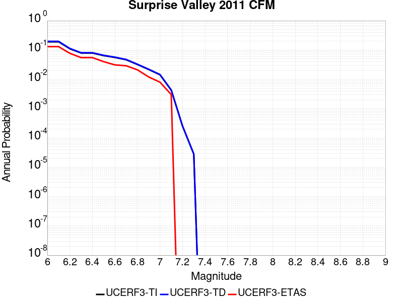 |
|-----|

| Magnitude | UCERF3-TI Prob | UCERF3-TD Prob | UCERF3-ETAS Prob |
|-----|-----|-----|-----|
| 6.0 | 0.1900527 | 0.1969119 | 0.12689805 |
| 6.1 | 0.1900527 | 0.1969119 | 0.12689805 |
| 6.2 | 0.10982287 | 0.11286312 | 0.0791757 |
| 6.3 | 0.07878231 | 0.08075965 | 0.055314533 |
| 6.4 | 0.07872446 | 0.080701716 | 0.055314533 |
| 6.5 | 0.0642828 | 0.0658389 | 0.040130153 |
| 6.6 | 0.05570072 | 0.057027094 | 0.030368764 |
| 6.7 | 0.046396956 | 0.047484115 | 0.028199567 |
| 6.8 | 0.031915165 | 0.032645583 | 0.021691974 |
| 6.9 | 0.021570826 | 0.022061685 | 0.011930586 |
| 7.0 | 0.014235566 | 0.014564755 | 0.007592191 |
| 7.1 | 0.004232432 | 0.00432732 | 0.0021691974 |
| 7.2 | 2.5376983E-4 | 2.549666E-4 | 0.0 |
| 7.3 | 2.8130034E-5 | 2.8263199E-5 | 0.0 |

## Swain Ravine - Spenceville
*[(top)](#table-of-contents)*

| 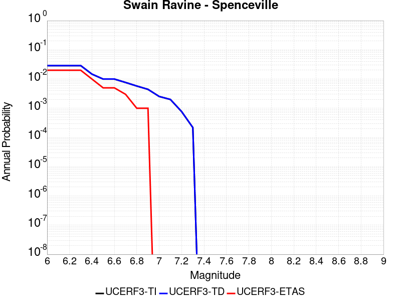 |
|-----|

| Magnitude | UCERF3-TI Prob | UCERF3-TD Prob | UCERF3-ETAS Prob |
|-----|-----|-----|-----|
| 6.0 | 0.028777888 | 0.028909655 | 0.020607375 |
| 6.1 | 0.028777888 | 0.028909655 | 0.020607375 |
| 6.2 | 0.028777888 | 0.028909655 | 0.020607375 |
| 6.3 | 0.028777888 | 0.028909655 | 0.020607375 |
| 6.4 | 0.014723244 | 0.01477622 | 0.009761388 |
| 6.5 | 0.009973855 | 0.010007045 | 0.0054229936 |
| 6.6 | 0.009973855 | 0.010007045 | 0.0054229936 |
| 6.7 | 0.0076240306 | 0.007648585 | 0.0032537961 |
| 6.8 | 0.005763123 | 0.0057812626 | 0.0010845987 |
| 6.9 | 0.004432786 | 0.004446573 | 0.0010845987 |
| 7.0 | 0.0025297888 | 0.0025376147 | 0.0 |
| 7.1 | 0.0019960203 | 0.0020022283 | 0.0 |
| 7.2 | 7.681176E-4 | 7.705849E-4 | 0.0 |
| 7.3 | 2.1850313E-4 | 2.1922676E-4 | 0.0 |

## Table Bluff
*[(top)](#table-of-contents)*

| 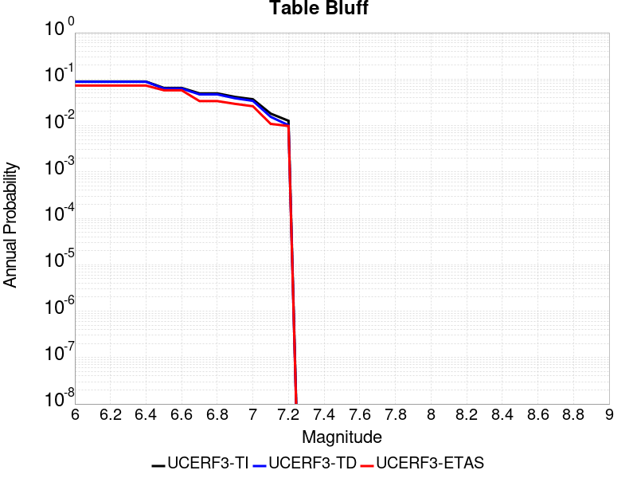 |
|-----|

| Magnitude | UCERF3-TI Prob | UCERF3-TD Prob | UCERF3-ETAS Prob |
|-----|-----|-----|-----|
| 6.0 | 0.08843293 | 0.0875211 | 0.07266811 |
| 6.1 | 0.08843293 | 0.0875211 | 0.07266811 |
| 6.2 | 0.08843293 | 0.0875211 | 0.07266811 |
| 6.3 | 0.08843293 | 0.0875211 | 0.07266811 |
| 6.4 | 0.08843293 | 0.0875211 | 0.07266811 |
| 6.5 | 0.06471669 | 0.0628124 | 0.057483733 |
| 6.6 | 0.06471669 | 0.0628124 | 0.057483733 |
| 6.7 | 0.0493052 | 0.046867397 | 0.03362256 |
| 6.8 | 0.0493052 | 0.046867397 | 0.03362256 |
| 6.9 | 0.041364312 | 0.03867751 | 0.029284164 |
| 7.0 | 0.036800925 | 0.033979397 | 0.02603037 |
| 7.1 | 0.01806468 | 0.015391506 | 0.010845987 |
| 7.2 | 0.0126451 | 0.010155566 | 0.009761388 |

## Tank Canyon
*[(top)](#table-of-contents)*

| 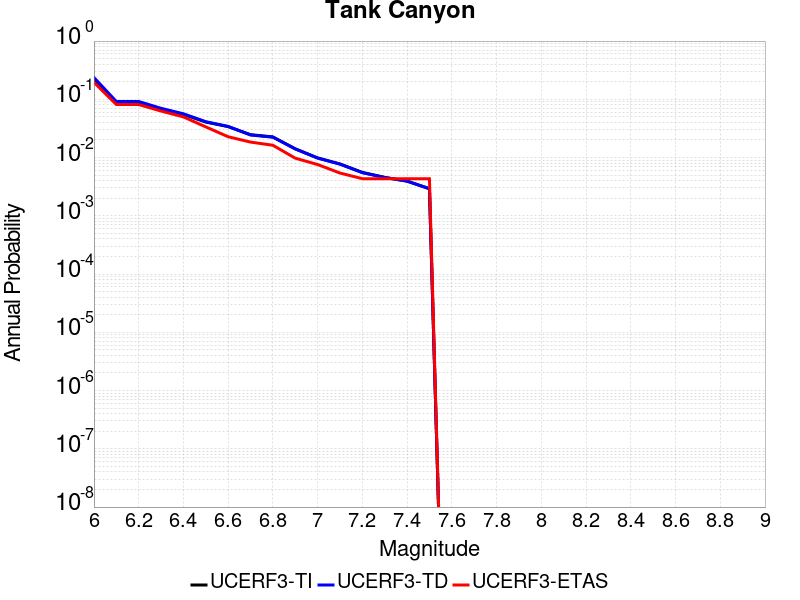 |
|-----|

| Magnitude | UCERF3-TI Prob | UCERF3-TD Prob | UCERF3-ETAS Prob |
|-----|-----|-----|-----|
| 6.0 | 0.22271486 | 0.23651896 | 0.19631237 |
| 6.1 | 0.08867853 | 0.09179853 | 0.0813449 |
| 6.2 | 0.08867853 | 0.09179853 | 0.0813449 |
| 6.3 | 0.06809516 | 0.07008649 | 0.06290673 |
| 6.4 | 0.055140633 | 0.056453913 | 0.04989154 |
| 6.5 | 0.040707733 | 0.041279223 | 0.03362256 |
| 6.6 | 0.034011528 | 0.03422799 | 0.022776572 |
| 6.7 | 0.024702482 | 0.024402404 | 0.018438177 |
| 6.8 | 0.022609482 | 0.022384176 | 0.01626898 |
| 6.9 | 0.01414174 | 0.014055242 | 0.009761388 |
| 7.0 | 0.009858425 | 0.009809067 | 0.007592191 |
| 7.1 | 0.007759476 | 0.007709321 | 0.0054229936 |
| 7.2 | 0.00556279 | 0.005497929 | 0.004338395 |
| 7.3 | 0.0045690113 | 0.0045493045 | 0.004338395 |
| 7.4 | 0.003935481 | 0.003946352 | 0.004338395 |
| 7.5 | 0.0029113183 | 0.002923413 | 0.004338395 |

## Thirty Mile Bank
*[(top)](#table-of-contents)*

| 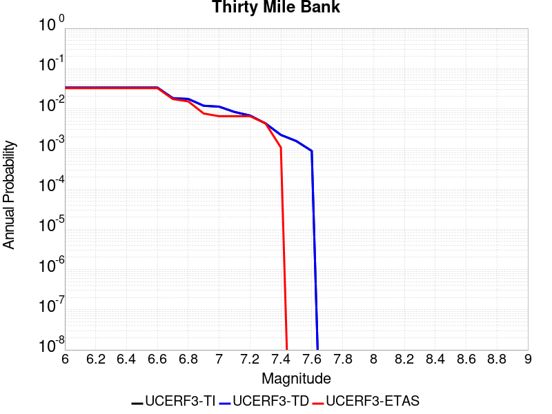 |
|-----|

| Magnitude | UCERF3-TI Prob | UCERF3-TD Prob | UCERF3-ETAS Prob |
|-----|-----|-----|-----|
| 6.0 | 0.033410396 | 0.033676818 | 0.03253796 |
| 6.1 | 0.033410396 | 0.033676818 | 0.03253796 |
| 6.2 | 0.033410396 | 0.033676818 | 0.03253796 |
| 6.3 | 0.033410396 | 0.033676818 | 0.03253796 |
| 6.4 | 0.033410396 | 0.033676818 | 0.03253796 |
| 6.5 | 0.033410396 | 0.033676818 | 0.03253796 |
| 6.6 | 0.033410396 | 0.033676818 | 0.03253796 |
| 6.7 | 0.018230567 | 0.018365726 | 0.01735358 |
| 6.8 | 0.017434318 | 0.017563745 | 0.015184382 |
| 6.9 | 0.011803986 | 0.011895078 | 0.007592191 |
| 7.0 | 0.0112162875 | 0.011302396 | 0.0065075923 |
| 7.1 | 0.008262482 | 0.008329606 | 0.0065075923 |
| 7.2 | 0.0067456122 | 0.006801894 | 0.0065075923 |
| 7.3 | 0.0042931065 | 0.0043253656 | 0.004338395 |
| 7.4 | 0.0022213296 | 0.0022406913 | 0.0010845987 |
| 7.5 | 0.0015609665 | 0.001575358 | 0.0 |
| 7.6 | 8.8605605E-4 | 8.9453947E-4 | 0.0 |

## Tin Mountain
*[(top)](#table-of-contents)*

| 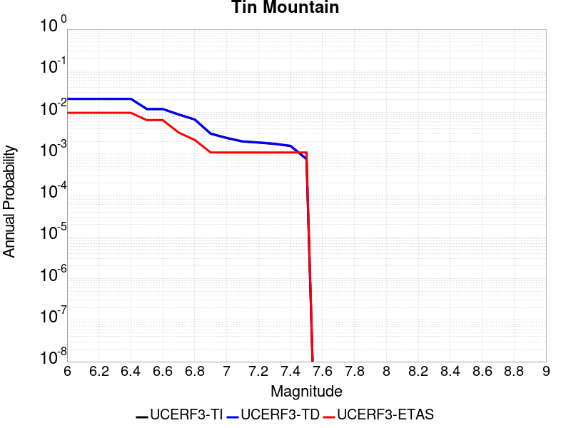 |
|-----|

| Magnitude | UCERF3-TI Prob | UCERF3-TD Prob | UCERF3-ETAS Prob |
|-----|-----|-----|-----|
| 6.0 | 0.021083178 | 0.021271065 | 0.009761388 |
| 6.1 | 0.021083178 | 0.021271065 | 0.009761388 |
| 6.2 | 0.021083178 | 0.021271065 | 0.009761388 |
| 6.3 | 0.021083178 | 0.021271065 | 0.009761388 |
| 6.4 | 0.021083178 | 0.021271065 | 0.009761388 |
| 6.5 | 0.012003303 | 0.012101822 | 0.0065075923 |
| 6.6 | 0.012003303 | 0.012101822 | 0.0065075923 |
| 6.7 | 0.008846412 | 0.0089241555 | 0.0032537961 |
| 6.8 | 0.0067160283 | 0.00677993 | 0.0021691974 |
| 6.9 | 0.003058664 | 0.0030969041 | 0.0010845987 |
| 7.0 | 0.0024102868 | 0.002442468 | 0.0010845987 |
| 7.1 | 0.0019832202 | 0.0020115604 | 0.0010845987 |
| 7.2 | 0.0018696274 | 0.0018968293 | 0.0010845987 |
| 7.3 | 0.0017423214 | 0.0017678472 | 0.0010845987 |
| 7.4 | 0.0015491506 | 0.00157178 | 0.0010845987 |
| 7.5 | 7.472681E-4 | 7.5809186E-4 | 0.0010845987 |

## Towne Pass
*[(top)](#table-of-contents)*

| 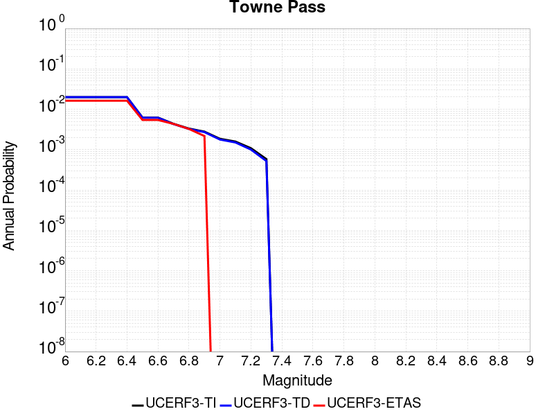 |
|-----|

| Magnitude | UCERF3-TI Prob | UCERF3-TD Prob | UCERF3-ETAS Prob |
|-----|-----|-----|-----|
| 6.0 | 0.019886961 | 0.019930625 | 0.01626898 |
| 6.1 | 0.019886961 | 0.019930625 | 0.01626898 |
| 6.2 | 0.019886961 | 0.019930625 | 0.01626898 |
| 6.3 | 0.019886961 | 0.019930625 | 0.01626898 |
| 6.4 | 0.019886961 | 0.019930625 | 0.01626898 |
| 6.5 | 0.006217782 | 0.0061586676 | 0.0054229936 |
| 6.6 | 0.006217782 | 0.0061586676 | 0.0054229936 |
| 6.7 | 0.004360917 | 0.0042944094 | 0.004338395 |
| 6.8 | 0.0033236723 | 0.0032532804 | 0.0032537961 |
| 6.9 | 0.002785583 | 0.0027131485 | 0.0021691974 |
| 7.0 | 0.0018546786 | 0.0017780315 | 0.0 |
| 7.1 | 0.0015838993 | 0.0015052931 | 0.0 |
| 7.2 | 0.0010851555 | 0.0010046721 | 0.0 |
| 7.3 | 5.8225146E-4 | 5.219068E-4 | 0.0 |

## Trinidad (alt1)
*[(top)](#table-of-contents)*

| 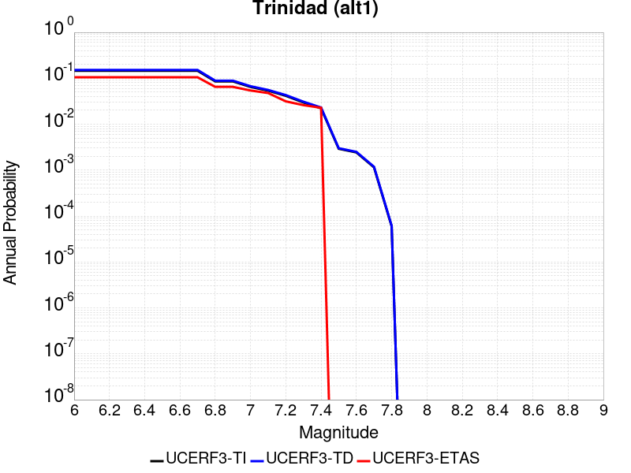 |
|-----|

| Magnitude | UCERF3-TI Prob | UCERF3-TD Prob | UCERF3-ETAS Prob |
|-----|-----|-----|-----|
| 6.0 | 0.1456466 | 0.15177 | 0.10520607 |
| 6.1 | 0.1456466 | 0.15177 | 0.10520607 |
| 6.2 | 0.1456466 | 0.15177 | 0.10520607 |
| 6.3 | 0.1456466 | 0.15177 | 0.10520607 |
| 6.4 | 0.1456466 | 0.15177 | 0.10520607 |
| 6.5 | 0.1456466 | 0.15177 | 0.10520607 |
| 6.6 | 0.1456466 | 0.15177 | 0.10520607 |
| 6.7 | 0.1456466 | 0.15177 | 0.10520607 |
| 6.8 | 0.08569896 | 0.08879086 | 0.06507592 |
| 6.9 | 0.08569896 | 0.08879086 | 0.06507592 |
| 7.0 | 0.06489328 | 0.0672049 | 0.054229934 |
| 7.1 | 0.0537507 | 0.055693157 | 0.047722343 |
| 7.2 | 0.041574467 | 0.043106433 | 0.031453364 |
| 7.3 | 0.02974723 | 0.030901551 | 0.02603037 |
| 7.4 | 0.022205178 | 0.023100859 | 0.022776572 |
| 7.5 | 0.0029210357 | 0.0030008578 | 0.0 |
| 7.6 | 0.002433728 | 0.0025015026 | 0.0 |
| 7.7 | 0.0011514884 | 0.0011851053 | 0.0 |
| 7.8 | 5.968167E-5 | 6.152172E-5 | 0.0 |

## Ventura-Pitas Point
*[(top)](#table-of-contents)*

| 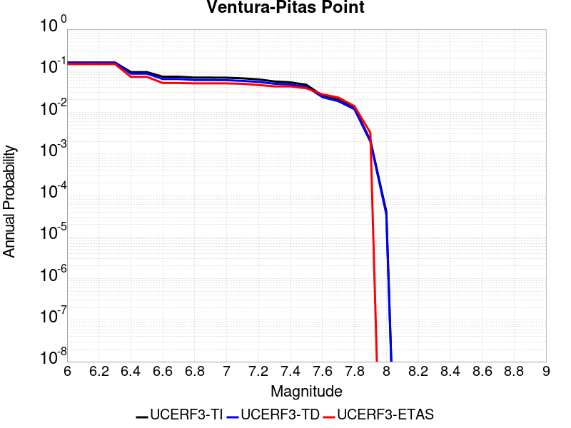 |
|-----|

| Magnitude | UCERF3-TI Prob | UCERF3-TD Prob | UCERF3-ETAS Prob |
|-----|-----|-----|-----|
| 6.0 | 0.15897122 | 0.15650778 | 0.14533623 |
| 6.1 | 0.15897122 | 0.15650778 | 0.14533623 |
| 6.2 | 0.15897122 | 0.15650778 | 0.14533623 |
| 6.3 | 0.15897122 | 0.15650778 | 0.14533623 |
| 6.4 | 0.09322424 | 0.08564194 | 0.07158352 |
| 6.5 | 0.09322424 | 0.08564194 | 0.07158352 |
| 6.6 | 0.07219815 | 0.063560784 | 0.05097614 |
| 6.7 | 0.07219815 | 0.063560784 | 0.05097614 |
| 6.8 | 0.06881423 | 0.060031354 | 0.04989154 |
| 6.9 | 0.06871856 | 0.059931718 | 0.04989154 |
| 7.0 | 0.06835252 | 0.059574667 | 0.04989154 |
| 7.1 | 0.06590348 | 0.057263102 | 0.048806943 |
| 7.2 | 0.062291276 | 0.05407822 | 0.045553144 |
| 7.3 | 0.055372886 | 0.048924208 | 0.04229935 |
| 7.4 | 0.052817848 | 0.046914123 | 0.04229935 |
| 7.5 | 0.04595436 | 0.041068118 | 0.037960954 |
| 7.6 | 0.025244303 | 0.023314837 | 0.027114967 |
| 7.7 | 0.020067653 | 0.018548978 | 0.022776572 |
| 7.8 | 0.0127821015 | 0.011935425 | 0.014099783 |
| 7.9 | 0.0021348973 | 0.001995613 | 0.0032537961 |
| 8.0 | 4.06536E-5 | 3.5105066E-5 | 0.0 |

## Verdugo
*[(top)](#table-of-contents)*

| 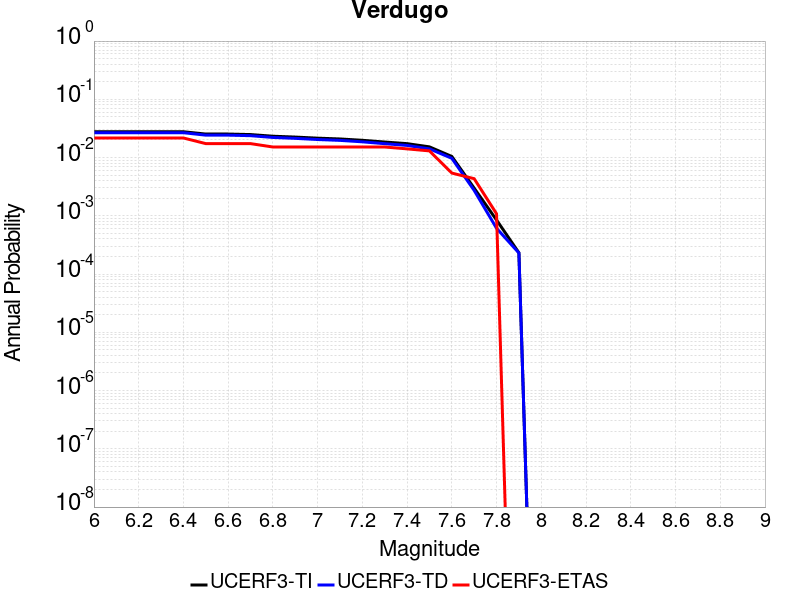 |
|-----|

| Magnitude | UCERF3-TI Prob | UCERF3-TD Prob | UCERF3-ETAS Prob |
|-----|-----|-----|-----|
| 6.0 | 0.027747672 | 0.02670839 | 0.021691974 |
| 6.1 | 0.027747672 | 0.02670839 | 0.021691974 |
| 6.2 | 0.027747672 | 0.02670839 | 0.021691974 |
| 6.3 | 0.027747672 | 0.02670839 | 0.021691974 |
| 6.4 | 0.027747672 | 0.02670839 | 0.021691974 |
| 6.5 | 0.025322229 | 0.024252558 | 0.01735358 |
| 6.6 | 0.025322229 | 0.024252558 | 0.01735358 |
| 6.7 | 0.024821267 | 0.023745872 | 0.01735358 |
| 6.8 | 0.023244642 | 0.022144107 | 0.015184382 |
| 6.9 | 0.022479337 | 0.021367269 | 0.015184382 |
| 7.0 | 0.021531297 | 0.020405212 | 0.015184382 |
| 7.1 | 0.020862352 | 0.019724859 | 0.015184382 |
| 7.2 | 0.019789139 | 0.018633394 | 0.015184382 |
| 7.3 | 0.018481446 | 0.017303182 | 0.015184382 |
| 7.4 | 0.017333113 | 0.016146712 | 0.014099783 |
| 7.5 | 0.015266038 | 0.014106696 | 0.013015185 |
| 7.6 | 0.0104508195 | 0.009710155 | 0.0054229936 |
| 7.7 | 0.002983514 | 0.0027301928 | 0.004338395 |
| 7.8 | 8.474488E-4 | 6.1131973E-4 | 0.0010845987 |
| 7.9 | 2.3204114E-4 | 2.3014327E-4 | 0.0 |

## Walker Spring 2011 CFM
*[(top)](#table-of-contents)*

| 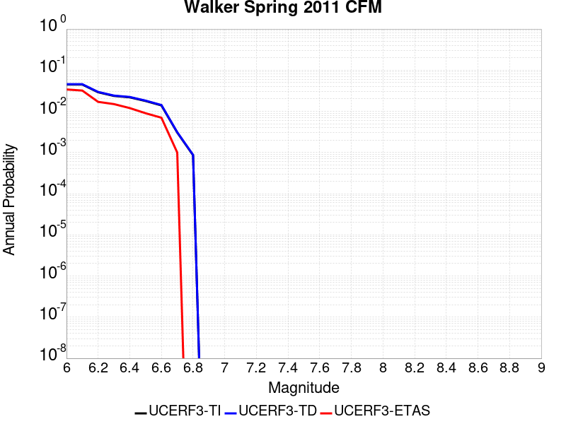 |
|-----|

| Magnitude | UCERF3-TI Prob | UCERF3-TD Prob | UCERF3-ETAS Prob |
|-----|-----|-----|-----|
| 6.0 | 0.044835612 | 0.045629255 | 0.03362256 |
| 6.1 | 0.044835612 | 0.045629255 | 0.031453364 |
| 6.2 | 0.029073527 | 0.029629048 | 0.018438177 |
| 6.3 | 0.023674076 | 0.02416405 | 0.01626898 |
| 6.4 | 0.02189758 | 0.022351949 | 0.013015185 |
| 6.5 | 0.01781273 | 0.018209975 | 0.009761388 |
| 6.6 | 0.01392597 | 0.014248515 | 0.007592191 |
| 6.7 | 0.0030639004 | 0.0031135094 | 0.0010845987 |
| 6.8 | 8.6131436E-4 | 8.753872E-4 | 0.0 |

## West Napa 2011 CFM
*[(top)](#table-of-contents)*

| 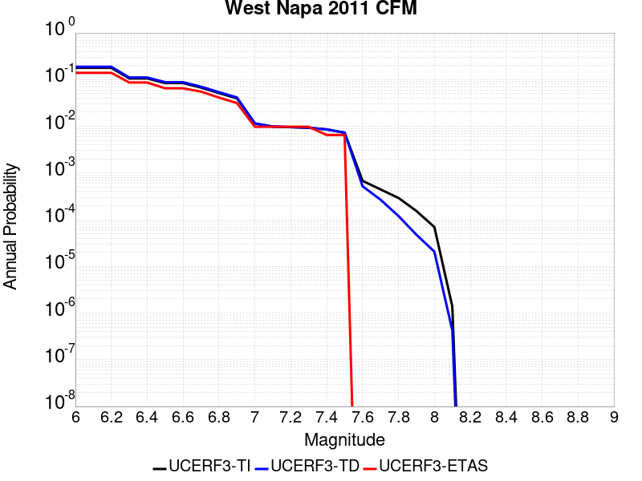 |
|-----|

| Magnitude | UCERF3-TI Prob | UCERF3-TD Prob | UCERF3-ETAS Prob |
|-----|-----|-----|-----|
| 6.0 | 0.1787099 | 0.18865736 | 0.13991323 |
| 6.1 | 0.1787099 | 0.18865736 | 0.13991323 |
| 6.2 | 0.1787099 | 0.18865736 | 0.13991323 |
| 6.3 | 0.10602628 | 0.11105415 | 0.0867679 |
| 6.4 | 0.10602628 | 0.11105415 | 0.0867679 |
| 6.5 | 0.084320314 | 0.08823814 | 0.06507592 |
| 6.6 | 0.08415006 | 0.08806239 | 0.06507592 |
| 6.7 | 0.06751433 | 0.070644476 | 0.055314533 |
| 6.8 | 0.05152934 | 0.05392145 | 0.04121475 |
| 6.9 | 0.039688352 | 0.04152654 | 0.031453364 |
| 7.0 | 0.011469991 | 0.011553802 | 0.009761388 |
| 7.1 | 0.009869568 | 0.009891038 | 0.009761388 |
| 7.2 | 0.009604507 | 0.009617415 | 0.009761388 |
| 7.3 | 0.009287801 | 0.009297186 | 0.009761388 |
| 7.4 | 0.008583158 | 0.008601212 | 0.0065075923 |
| 7.5 | 0.0072992863 | 0.0073078847 | 0.0065075923 |
| 7.6 | 6.788132E-4 | 5.2054384E-4 | 0.0 |
| 7.7 | 4.4558462E-4 | 2.6851197E-4 | 0.0 |
| 7.8 | 2.9254745E-4 | 1.2001155E-4 | 0.0 |
| 7.9 | 1.5378889E-4 | 4.767419E-5 | 0.0 |
| 8.0 | 6.958877E-5 | 2.068724E-5 | 0.0 |
| 8.1 | 1.3874264E-6 | 4.258711E-7 | 0.0 |

## West Tahoe
*[(top)](#table-of-contents)*

| 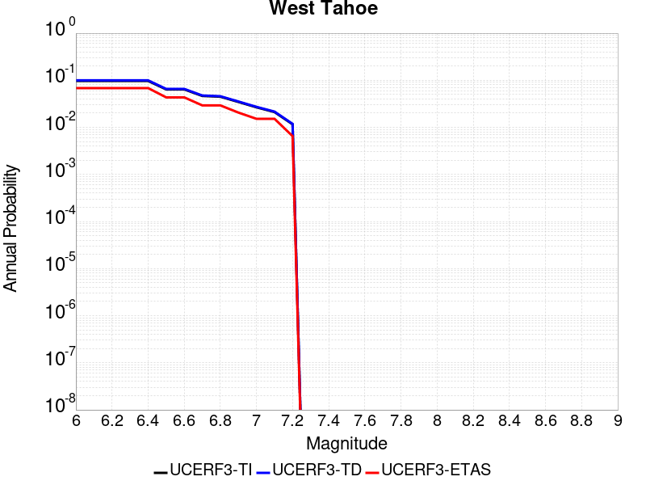 |
|-----|

| Magnitude | UCERF3-TI Prob | UCERF3-TD Prob | UCERF3-ETAS Prob |
|-----|-----|-----|-----|
| 6.0 | 0.09685913 | 0.09957861 | 0.06832972 |
| 6.1 | 0.09685913 | 0.09957861 | 0.06832972 |
| 6.2 | 0.09685913 | 0.09957861 | 0.06832972 |
| 6.3 | 0.09685913 | 0.09957861 | 0.06832972 |
| 6.4 | 0.09685913 | 0.09957861 | 0.06832972 |
| 6.5 | 0.064047314 | 0.065612204 | 0.04338395 |
| 6.6 | 0.064047314 | 0.065612204 | 0.04338395 |
| 6.7 | 0.046462044 | 0.04752406 | 0.029284164 |
| 6.8 | 0.04481345 | 0.04584544 | 0.029284164 |
| 6.9 | 0.03463892 | 0.035423525 | 0.020607375 |
| 7.0 | 0.026662936 | 0.027269492 | 0.015184382 |
| 7.1 | 0.021118876 | 0.02160478 | 0.015184382 |
| 7.2 | 0.011597672 | 0.011864958 | 0.0065075923 |

## White Mountains
*[(top)](#table-of-contents)*

| 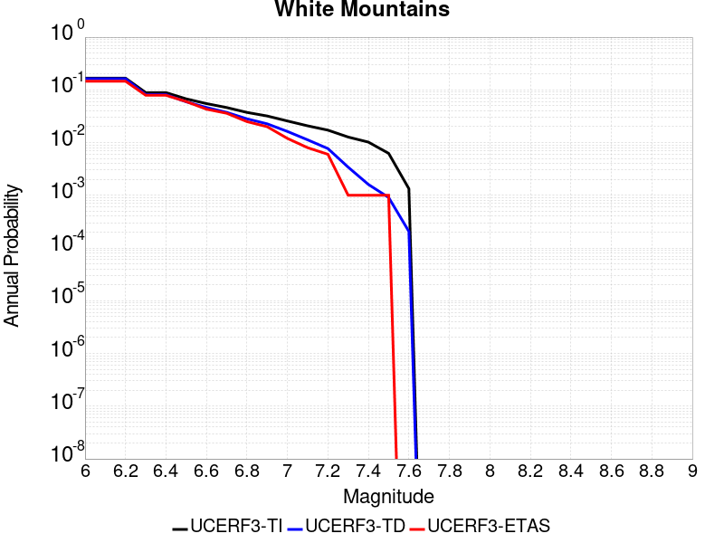 |
|-----|

| Magnitude | UCERF3-TI Prob | UCERF3-TD Prob | UCERF3-ETAS Prob |
|-----|-----|-----|-----|
| 6.0 | 0.16707774 | 0.1630625 | 0.14316703 |
| 6.1 | 0.16707774 | 0.1630625 | 0.14316703 |
| 6.2 | 0.16707774 | 0.1630625 | 0.14316703 |
| 6.3 | 0.08878356 | 0.081372425 | 0.07592191 |
| 6.4 | 0.08878356 | 0.081372425 | 0.07592191 |
| 6.5 | 0.06751947 | 0.05937457 | 0.055314533 |
| 6.6 | 0.054886933 | 0.04632837 | 0.040130153 |
| 6.7 | 0.04621334 | 0.03738624 | 0.03253796 |
| 6.8 | 0.03735382 | 0.02823731 | 0.021691974 |
| 6.9 | 0.0319561 | 0.022684319 | 0.01626898 |
| 7.0 | 0.025690153 | 0.016263528 | 0.009761388 |
| 7.1 | 0.020784365 | 0.011266759 | 0.007592191 |
| 7.2 | 0.01721724 | 0.0076967617 | 0.0054229936 |
| 7.3 | 0.012744776 | 0.0034188665 | 0.0010845987 |
| 7.4 | 0.010205638 | 0.0016058175 | 0.0010845987 |
| 7.5 | 0.0062492294 | 9.0974977E-4 | 0.0010845987 |
| 7.6 | 0.0013355142 | 2.0634187E-4 | 0.0 |

## White Wolf
*[(top)](#table-of-contents)*

| 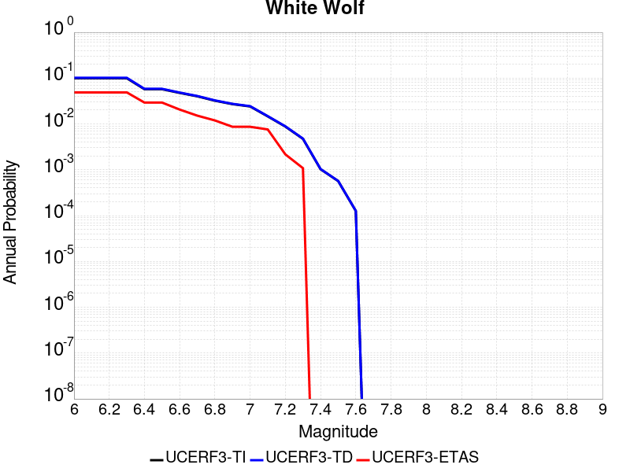 |
|-----|

| Magnitude | UCERF3-TI Prob | UCERF3-TD Prob | UCERF3-ETAS Prob |
|-----|-----|-----|-----|
| 6.0 | 0.09927523 | 0.10160163 | 0.048806943 |
| 6.1 | 0.09927523 | 0.10160163 | 0.048806943 |
| 6.2 | 0.09927523 | 0.10160163 | 0.048806943 |
| 6.3 | 0.09927523 | 0.10160163 | 0.048806943 |
| 6.4 | 0.05737985 | 0.058420163 | 0.029284164 |
| 6.5 | 0.05737985 | 0.058420163 | 0.029284164 |
| 6.6 | 0.04760366 | 0.048431177 | 0.020607375 |
| 6.7 | 0.040095977 | 0.040761773 | 0.015184382 |
| 6.8 | 0.032166336 | 0.032664225 | 0.011930586 |
| 6.9 | 0.027064841 | 0.027469851 | 0.00867679 |
| 7.0 | 0.024098564 | 0.024454016 | 0.00867679 |
| 7.1 | 0.014642682 | 0.014823465 | 0.007592191 |
| 7.2 | 0.008769803 | 0.008879533 | 0.0021691974 |
| 7.3 | 0.0047297818 | 0.004787811 | 0.0010845987 |
| 7.4 | 0.001028296 | 0.0010367164 | 0.0 |
| 7.5 | 5.670072E-4 | 5.7035533E-4 | 0.0 |
| 7.6 | 1.2635709E-4 | 1.2710632E-4 | 0.0 |

## White Wolf (Extension)
*[(top)](#table-of-contents)*

| 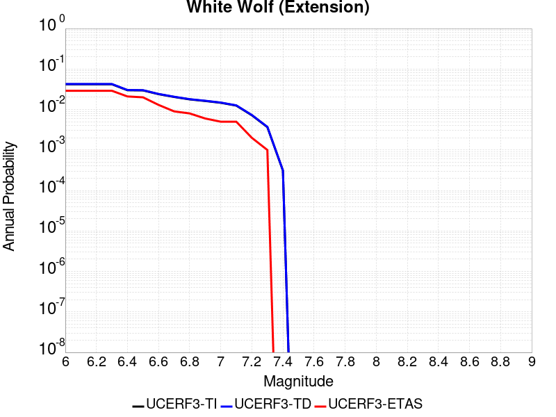 |
|-----|

| Magnitude | UCERF3-TI Prob | UCERF3-TD Prob | UCERF3-ETAS Prob |
|-----|-----|-----|-----|
| 6.0 | 0.041996926 | 0.0425765 | 0.031453364 |
| 6.1 | 0.041996926 | 0.0425765 | 0.031453364 |
| 6.2 | 0.041996926 | 0.0425765 | 0.031453364 |
| 6.3 | 0.041996926 | 0.0425765 | 0.031453364 |
| 6.4 | 0.029920515 | 0.030290062 | 0.022776572 |
| 6.5 | 0.029638281 | 0.030004453 | 0.021691974 |
| 6.6 | 0.023938393 | 0.024233552 | 0.014099783 |
| 6.7 | 0.02041454 | 0.020668814 | 0.009761388 |
| 6.8 | 0.017777806 | 0.018002307 | 0.00867679 |
| 6.9 | 0.016233826 | 0.016441599 | 0.0065075923 |
| 7.0 | 0.014657113 | 0.01484841 | 0.0054229936 |
| 7.1 | 0.0124917105 | 0.012657879 | 0.0054229936 |
| 7.2 | 0.0072139064 | 0.0073134806 | 0.0021691974 |
| 7.3 | 0.0036749924 | 0.0037264528 | 0.0010845987 |
| 7.4 | 3.0955195E-4 | 3.137598E-4 | 0.0 |

## Whittier alt 1
*[(top)](#table-of-contents)*

| 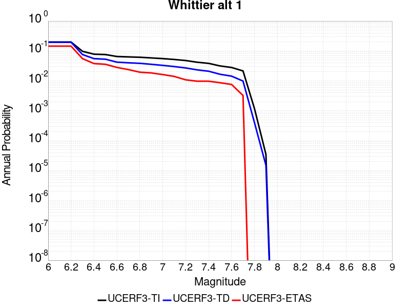 |
|-----|

| Magnitude | UCERF3-TI Prob | UCERF3-TD Prob | UCERF3-ETAS Prob |
|-----|-----|-----|-----|
| 6.0 | 0.19912392 | 0.19540574 | 0.14533623 |
| 6.1 | 0.19912392 | 0.19540574 | 0.14533623 |
| 6.2 | 0.19912392 | 0.19540574 | 0.14533623 |
| 6.3 | 0.09729857 | 0.075943634 | 0.055314533 |
| 6.4 | 0.078228906 | 0.055390436 | 0.037960954 |
| 6.5 | 0.076008126 | 0.05305555 | 0.03579176 |
| 6.6 | 0.06536796 | 0.042277355 | 0.028199567 |
| 6.7 | 0.063347764 | 0.04024076 | 0.023861172 |
| 6.8 | 0.0616542 | 0.038644806 | 0.019522777 |
| 6.9 | 0.05863534 | 0.03577711 | 0.018438177 |
| 7.0 | 0.055607155 | 0.033005632 | 0.01626898 |
| 7.1 | 0.051982284 | 0.030133802 | 0.014099783 |
| 7.2 | 0.04790763 | 0.027048927 | 0.010845987 |
| 7.3 | 0.04207105 | 0.023334308 | 0.009761388 |
| 7.4 | 0.038537256 | 0.021043291 | 0.009761388 |
| 7.5 | 0.031578727 | 0.016629286 | 0.00867679 |
| 7.6 | 0.028075967 | 0.014420328 | 0.007592191 |
| 7.7 | 0.021511387 | 0.009866042 | 0.0032537961 |
| 7.8 | 0.0011833572 | 4.0144814E-4 | 0.0 |
| 7.9 | 3.4838133E-5 | 1.4969215E-5 | 0.0 |

## Wight Way 2011 CFM
*[(top)](#table-of-contents)*

| 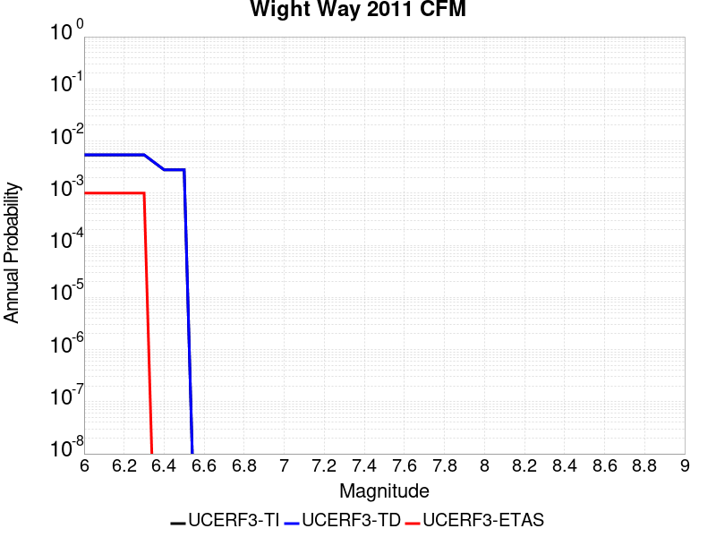 |
|-----|

| Magnitude | UCERF3-TI Prob | UCERF3-TD Prob | UCERF3-ETAS Prob |
|-----|-----|-----|-----|
| 6.0 | 0.0054180063 | 0.0054345652 | 0.0010845987 |
| 6.1 | 0.0054180063 | 0.0054345652 | 0.0010845987 |
| 6.2 | 0.0054180063 | 0.0054345652 | 0.0010845987 |
| 6.3 | 0.0054180063 | 0.0054345652 | 0.0010845987 |
| 6.4 | 0.0027962495 | 0.0028056945 | 0.0 |
| 6.5 | 0.0027962495 | 0.0028056945 | 0.0 |

## Yorba Linda
*[(top)](#table-of-contents)*

| 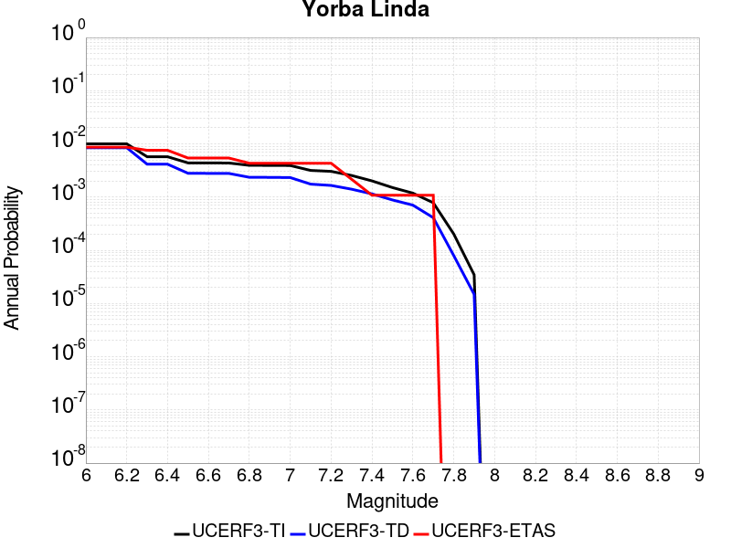 |
|-----|

| Magnitude | UCERF3-TI Prob | UCERF3-TD Prob | UCERF3-ETAS Prob |
|-----|-----|-----|-----|
| 6.0 | 0.010044136 | 0.008493179 | 0.00867679 |
| 6.1 | 0.010044136 | 0.008493179 | 0.00867679 |
| 6.2 | 0.010044136 | 0.008493179 | 0.00867679 |
| 6.3 | 0.005738047 | 0.004153824 | 0.007592191 |
| 6.4 | 0.005738047 | 0.004153824 | 0.007592191 |
| 6.5 | 0.0043968586 | 0.0028054186 | 0.0054229936 |
| 6.6 | 0.004385337 | 0.002792923 | 0.0054229936 |
| 6.7 | 0.004379629 | 0.0027867453 | 0.0054229936 |
| 6.8 | 0.003953519 | 0.002356816 | 0.004338395 |
| 6.9 | 0.0039475635 | 0.0023499583 | 0.004338395 |
| 7.0 | 0.0039261696 | 0.0023305793 | 0.004338395 |
| 7.1 | 0.0031726784 | 0.0017531292 | 0.004338395 |
| 7.2 | 0.0030477543 | 0.0016567376 | 0.004338395 |
| 7.3 | 0.0025524856 | 0.0014094932 | 0.0021691974 |
| 7.4 | 0.0020172952 | 0.0011496706 | 0.0010845987 |
| 7.5 | 0.001512329 | 8.845166E-4 | 0.0010845987 |
| 7.6 | 0.0011874173 | 7.06844E-4 | 0.0010845987 |
| 7.7 | 7.832689E-4 | 4.109188E-4 | 0.0010845987 |
| 7.8 | 2.0325417E-4 | 7.983273E-5 | 0.0 |
| 7.9 | 3.4690347E-5 | 1.4872541E-5 | 0.0 |

## Zayante-Vergeles 2011 CFM
*[(top)](#table-of-contents)*

| 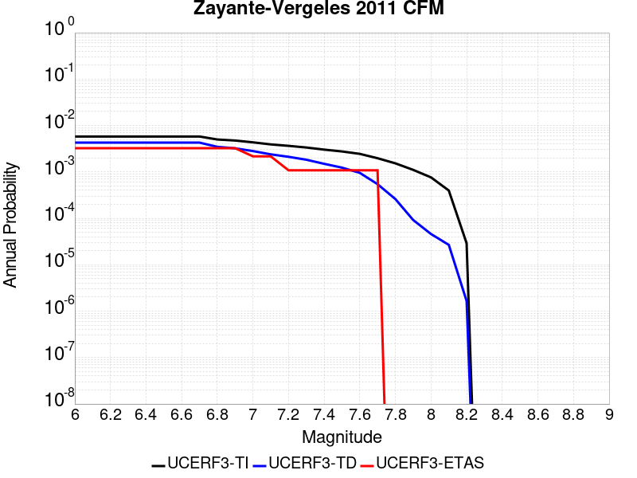 |
|-----|

| Magnitude | UCERF3-TI Prob | UCERF3-TD Prob | UCERF3-ETAS Prob |
|-----|-----|-----|-----|
| 6.0 | 0.005802164 | 0.0042821025 | 0.0032537961 |
| 6.1 | 0.005802164 | 0.0042821025 | 0.0032537961 |
| 6.2 | 0.005802164 | 0.0042821025 | 0.0032537961 |
| 6.3 | 0.005802164 | 0.0042821025 | 0.0032537961 |
| 6.4 | 0.005802164 | 0.0042821025 | 0.0032537961 |
| 6.5 | 0.005802164 | 0.0042821025 | 0.0032537961 |
| 6.6 | 0.005802164 | 0.0042821025 | 0.0032537961 |
| 6.7 | 0.005802164 | 0.0042821025 | 0.0032537961 |
| 6.8 | 0.005000821 | 0.0034783077 | 0.0032537961 |
| 6.9 | 0.004750531 | 0.0032271694 | 0.0032537961 |
| 7.0 | 0.0043428717 | 0.002818194 | 0.0021691974 |
| 7.1 | 0.003918671 | 0.0023917663 | 0.0021691974 |
| 7.2 | 0.0036477696 | 0.0021186736 | 0.0010845987 |
| 7.3 | 0.0033601997 | 0.0018322485 | 0.0010845987 |
| 7.4 | 0.0030245052 | 0.0014962215 | 0.0010845987 |
| 7.5 | 0.0027633416 | 0.001238076 | 0.0010845987 |
| 7.6 | 0.0024511726 | 9.562398E-4 | 0.0010845987 |
| 7.7 | 0.001974128 | 5.450236E-4 | 0.0010845987 |
| 7.8 | 0.0015318242 | 2.6046834E-4 | 0.0 |
| 7.9 | 0.001108187 | 9.2034235E-5 | 0.0 |
| 8.0 | 7.6317997E-4 | 4.597529E-5 | 0.0 |
| 8.1 | 3.977789E-4 | 2.6819424E-5 | 0.0 |
| 8.2 | 2.9032575E-5 | 1.6529261E-6 | 0.0 |

