# Parent Section Magnitude-Probability Distributions

Only fault sections with at least one triggered aftershock are plotted. Sections are sorted by total supraseismogenic trigger rate (decreasing)

## Table Of Contents

* [Garlock (Central)](#garlock-central)
* [Little Lake](#little-lake)
* [Airport Lake](#airport-lake)
* [Tank Canyon](#tank-canyon)
* [Owl Lake](#owl-lake)
* [Panamint Valley](#panamint-valley)
* [Garlock (East)](#garlock-east)
* [Hunter Mountain-Saline Valley](#hunter-mountain-saline-valley)
* [Garlock (West)](#garlock-west)
* [Blackwater](#blackwater)
* [Ash Hill](#ash-hill)
* [San Andreas (Mojave N)](#san-andreas-mojave-n)
* [Gravel Hills-Harper Lk](#gravel-hills-harper-lk)
* [San Andreas (Mojave S)](#san-andreas-mojave-s)
* [San Andreas (San Bernardino N)](#san-andreas-san-bernardino-n)
* [So Sierra Nevada](#so-sierra-nevada)
* [Goldstone Lake](#goldstone-lake)
* [McLean Lake](#mclean-lake)
* [Lenwood-Lockhart-Old Woman Springs](#lenwood-lockhart-old-woman-springs)
* [Death Valley (So)](#death-valley-so)
* [San Andreas (San Bernardino S)](#san-andreas-san-bernardino-s)
* [Coyote Canyon](#coyote-canyon)
* [Towne Pass](#towne-pass)
* [Nelson Lake](#nelson-lake)
* [San Jacinto (San Bernardino)](#san-jacinto-san-bernardino)
* [Paradise](#paradise)
* [Garlic Springs](#garlic-springs)
* [San Andreas (Parkfield)](#san-andreas-parkfield)
* [Death Valley (Black Mtns Frontal)](#death-valley-black-mtns-frontal)
* [Coyote Lake](#coyote-lake)
* [Helendale-So Lockhart](#helendale-so-lockhart)
* [Death Valley (No)](#death-valley-no)
* [Bicycle Lake](#bicycle-lake)
* [San Andreas (San Gorgonio Pass-Garnet HIll)](#san-andreas-san-gorgonio-pass-garnet-hill)
* [San Andreas (Coachella) rev](#san-andreas-coachella-rev)
* [San Andreas (Big Bend)](#san-andreas-big-bend)
* [San Jacinto (San Jacinto Valley) rev](#san-jacinto-san-jacinto-valley-rev)
* [San Jacinto (Lytle Creek connector)](#san-jacinto-lytle-creek-connector)
* [White Wolf (Extension)](#white-wolf-extension)
* [Cady](#cady)
* [San Andreas (North Branch Mill Creek)](#san-andreas-north-branch-mill-creek)
* [Sierra Nevada  (No Extension)](#sierra-nevada--no-extension)
* [Mission Creek](#mission-creek)
* [Scodie Lineament](#scodie-lineament)
* [Lake Isabella (Seismicity)](#lake-isabella-seismicity)
* [Red Pass](#red-pass)
* [San Jacinto (Stepovers Combined)](#san-jacinto-stepovers-combined)
* [Death Valley (Fish Lake Valley)](#death-valley-fish-lake-valley)
* [San Andreas (Carrizo) rev](#san-andreas-carrizo-rev)
* [Calico-Hidalgo](#calico-hidalgo)
* [Ludlow](#ludlow)
* [Kern Canyon (North Kern) 2011](#kern-canyon-north-kern-2011)
* [Cleghorn Pass](#cleghorn-pass)
* [San Jacinto (Anza) rev](#san-jacinto-anza-rev)
* [Baker](#baker)
* [San Andreas (Cholame) rev](#san-andreas-cholame-rev)
* [San Jacinto (Coyote Creek)](#san-jacinto-coyote-creek)
* [San Andreas (Creeping Section) 2011 CFM](#san-andreas-creeping-section-2011-cfm)
* [San Jacinto (Borrego)](#san-jacinto-borrego)
* [Owens Valley](#owens-valley)
* [Tin Mountain](#tin-mountain)
* [White Wolf](#white-wolf)
* [Pinto Mtn](#pinto-mtn)
* [Hunting Creek - Berryessa 2011 CFM](#hunting-creek---berryessa-2011-cfm)
* [White Mountains](#white-mountains)
* [Manix-Afton Hills](#manix-afton-hills)
* [Cleghorn Lake](#cleghorn-lake)
* [Deep Springs](#deep-springs)
* [Rose Canyon](#rose-canyon)
* [Elsinore (Glen Ivy) rev](#elsinore-glen-ivy-rev)
* [San Pedro Basin](#san-pedro-basin)
* [Hayward (No) 2011 CFM](#hayward-no-2011-cfm)
* [Lost Hills](#lost-hills)
* [Cucamonga](#cucamonga)
* [Reliz 2011 CFM](#reliz-2011-cfm)
* [Breckenridge 2011](#breckenridge-2011)
* [Santa Ynez (West)](#santa-ynez-west)
* [Channel Islands Thrust](#channel-islands-thrust)
* [Palos Verdes](#palos-verdes)
* [San Luis Range 2011 CFM](#san-luis-range-2011-cfm)
* [Hayward (So) 2011 CFM](#hayward-so-2011-cfm)
* [Camp Rock 2011](#camp-rock-2011)
* [Blue Cut](#blue-cut)
* [Ventura-Pitas Point](#ventura-pitas-point)
* [Point Reyes 2011 CFM](#point-reyes-2011-cfm)
* [San Gabriel (Extension)](#san-gabriel-extension)
* [Pittville 2011 CFM](#pittville-2011-cfm)
* [San Clemente](#san-clemente)
* [Rinconada 2011 CFM](#rinconada-2011-cfm)
* [Morales (East)](#morales-east)
* [San Diego Trough north alt1](#san-diego-trough-north-alt1)
* [Dry Mountain](#dry-mountain)

## Garlock (Central)
*[(top)](#table-of-contents)*

| 1 Week | 1 Month | 1 Year | 10 Year |
|-----|-----|-----|-----|
| 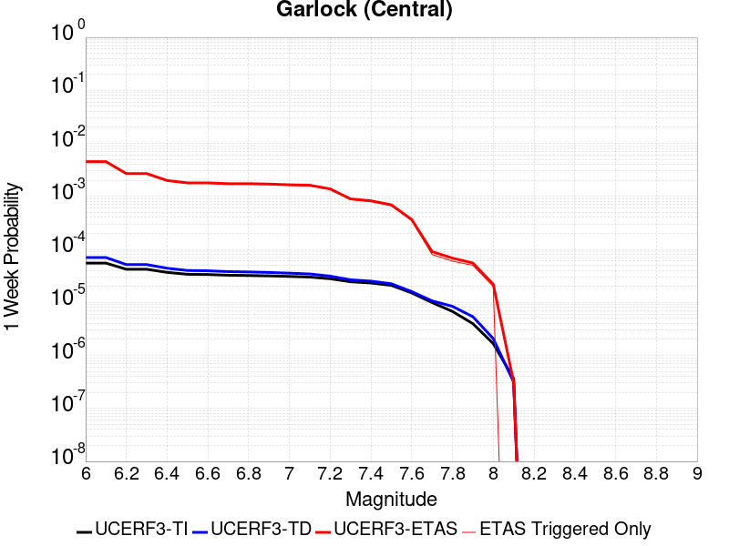 | 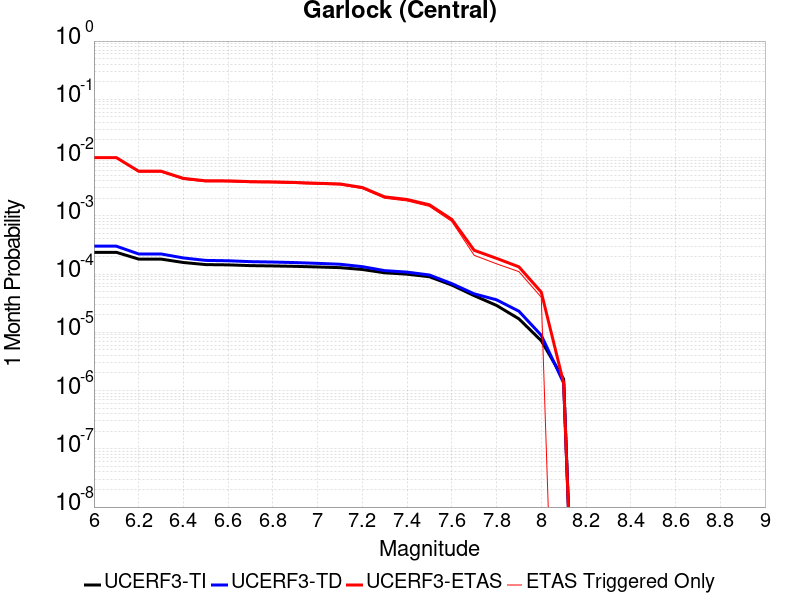 | 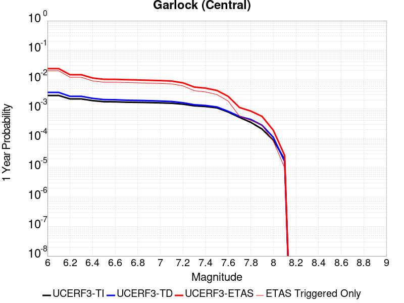 | 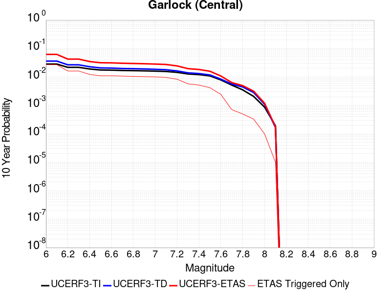 |

| Magnitude | 1 wk TI Prob | 1 wk TD Prob | 1 wk ETAS Prob | 1 wk ETAS/TD Gain | 1 wk ETAS Triggered Only | 1 mo TI Prob | 1 mo TD Prob | 1 mo ETAS Prob | 1 mo ETAS/TD Gain | 1 mo ETAS Triggered Only | 1 yr TI Prob | 1 yr TD Prob | 1 yr ETAS Prob | 1 yr ETAS/TD Gain | 1 yr ETAS Triggered Only | 10 yr TI Prob | 10 yr TD Prob | 10 yr ETAS Prob | 10 yr ETAS/TD Gain | 10 yr ETAS Triggered Only |
|-----|-----|-----|-----|-----|-----|-----|-----|-----|-----|-----|-----|-----|-----|-----|-----|-----|-----|-----|-----|-----|
| 6.0 | 5.5131142E-5 | 7.0252914E-5 | 0.0045199404 | 64.33811 | 0.00445 | 2.3625491E-4 | 3.0104956E-4 | 0.009988132 | 33.177704 | 0.00969 | 0.0028726095 | 0.0036591839 | 0.023546146 | 6.4348083 | 0.01996 | 0.028357591 | 0.03608289 | 0.061983343 | 1.7178043 | 0.02687 |
| 6.1 | 5.5131142E-5 | 7.0252914E-5 | 0.0045199404 | 64.33811 | 0.00445 | 2.3625491E-4 | 3.0104956E-4 | 0.009988132 | 33.177704 | 0.00969 | 0.0028726095 | 0.0036591839 | 0.023546146 | 6.4348083 | 0.01996 | 0.028357591 | 0.03608289 | 0.061983343 | 1.7178043 | 0.02687 |
| 6.2 | 4.216245E-5 | 5.166702E-5 | 0.0026915306 | 52.09379 | 0.00264 | 1.806837E-4 | 2.2141146E-4 | 0.005840167 | 26.376987 | 0.00562 | 0.0021976046 | 0.0026923837 | 0.014620183 | 5.4302 | 0.01196 | 0.021759989 | 0.02669258 | 0.042460162 | 1.5907102 | 0.0162 |
| 6.3 | 4.216245E-5 | 5.166702E-5 | 0.0026915306 | 52.09379 | 0.00264 | 1.806837E-4 | 2.2141146E-4 | 0.005840167 | 26.376987 | 0.00562 | 0.0021976046 | 0.0026923837 | 0.014620183 | 5.4302 | 0.01196 | 0.021759989 | 0.02669258 | 0.042460162 | 1.5907102 | 0.0162 |
| 6.4 | 3.6858168E-5 | 4.411584E-5 | 0.0019940299 | 45.19986 | 0.00195 | 1.5795401E-4 | 1.8905434E-4 | 0.0043982584 | 23.26452 | 0.00421 | 0.0019213937 | 0.0022993318 | 0.011278638 | 4.9051805 | 0.009 | 0.019048655 | 0.02285164 | 0.034802165 | 1.5229614 | 0.01223 |
| 6.5 | 3.39199E-5 | 4.0023286E-5 | 0.0017999528 | 44.97264 | 0.00176 | 1.453629E-4 | 1.7151721E-4 | 0.003990862 | 23.267998 | 0.00382 | 0.0017683565 | 0.0020862438 | 0.010209261 | 4.893609 | 0.00814 | 0.017543508 | 0.02076252 | 0.031543925 | 1.5192724 | 0.01101 |
| 6.6 | 3.3571985E-5 | 3.947746E-5 | 0.001799408 | 45.580643 | 0.00176 | 1.4387199E-4 | 1.6917827E-4 | 0.003988532 | 23.575912 | 0.00382 | 0.0017502342 | 0.0020578213 | 0.01018107 | 4.9474998 | 0.00814 | 0.017365133 | 0.02048383 | 0.031258505 | 1.526009 | 0.011 |
| 6.7 | 3.2580007E-5 | 3.8093858E-5 | 0.0017380291 | 45.62492 | 0.0017 | 1.3962112E-4 | 1.632493E-4 | 0.0038626452 | 23.661024 | 0.0037 | 0.0016985617 | 0.0019857697 | 0.009900022 | 4.9854836 | 0.00793 | 0.016856372 | 0.019776449 | 0.030274643 | 1.5308433 | 0.01071 |
| 6.8 | 3.2185937E-5 | 3.7521055E-5 | 0.0017374572 | 46.306194 | 0.0017 | 1.3793244E-4 | 1.6079473E-4 | 0.0038302047 | 23.820461 | 0.00367 | 0.0016780337 | 0.0019559395 | 0.009690781 | 4.9545403 | 0.00775 | 0.016654192 | 0.01948324 | 0.02972964 | 1.5259085 | 0.01045 |
| 6.9 | 3.165394E-5 | 3.672561E-5 | 0.0017066643 | 46.470684 | 0.00167 | 1.3565269E-4 | 1.5738611E-4 | 0.0037368226 | 23.743029 | 0.00358 | 0.0016503202 | 0.0019145131 | 0.009460039 | 4.9412246 | 0.00756 | 0.01638118 | 0.01907586 | 0.029100904 | 1.5255357 | 0.01022 |
| 7.0 | 3.0903822E-5 | 3.5630834E-5 | 0.0016555731 | 46.464615 | 0.00162 | 1.3243823E-4 | 1.5269476E-4 | 0.003622165 | 23.721605 | 0.00347 | 0.0016112428 | 0.0018574947 | 0.009213805 | 4.9603395 | 0.00737 | 0.015996104 | 0.018515008 | 0.028310228 | 1.5290421 | 0.00998 |
| 7.1 | 3.0069863E-5 | 3.4397097E-5 | 0.0016243424 | 47.22324 | 0.00159 | 1.2886449E-4 | 1.4740792E-4 | 0.0035269097 | 23.926188 | 0.00338 | 0.0015677959 | 0.0017932352 | 0.008890485 | 4.957791 | 0.00711 | 0.01556781 | 0.017882649 | 0.02735026 | 1.52943 | 0.00964 |
| 7.2 | 2.7957109E-5 | 3.1286367E-5 | 0.0013812442 | 44.148434 | 0.00135 | 1.1981068E-4 | 1.3407765E-4 | 0.0030636848 | 22.850079 | 0.00293 | 0.0014577188 | 0.0016311926 | 0.007731226 | 4.7396154 | 0.00611 | 0.014481937 | 0.016286217 | 0.02445104 | 1.5013335 | 0.0083 |
| 7.3 | 2.4519275E-5 | 2.6719412E-5 | 8.966962E-4 | 33.559727 | 8.7E-4 | 1.0507837E-4 | 1.14506816E-4 | 0.0021142778 | 18.464209 | 0.002 | 0.0012785783 | 0.0013932437 | 0.00556742 | 3.9960132 | 0.00418 | 0.012712469 | 0.013930428 | 0.019560885 | 1.4041841 | 0.00571 |
| 7.4 | 2.3225532E-5 | 2.5203923E-5 | 8.2518376E-4 | 32.74029 | 8.0E-4 | 9.95342E-5 | 1.0801242E-4 | 0.001907818 | 17.66295 | 0.0018 | 0.0012111551 | 0.0013142723 | 0.005109278 | 3.887534 | 0.0038 | 0.012045753 | 0.013148054 | 0.018269815 | 1.3895452 | 0.00519 |
| 7.5 | 2.097765E-5 | 2.2487986E-5 | 6.924729E-4 | 30.793016 | 6.7E-4 | 8.9901114E-5 | 9.637359E-5 | 0.0015462339 | 16.044167 | 0.00145 | 0.0010939965 | 0.0011727286 | 0.0042690933 | 3.6403077 | 0.0031 | 0.010886264 | 0.011742581 | 0.015883379 | 1.3526311 | 0.00419 |
| 7.6 | 1.511254E-5 | 1.5995334E-5 | 3.6598975E-4 | 22.881031 | 3.5E-4 | 6.476642E-5 | 6.854967E-5 | 8.6849486E-4 | 12.669569 | 8.0E-4 | 7.882459E-4 | 8.342805E-4 | 0.0026927288 | 3.2276058 | 0.00186 | 0.007854558 | 0.008385628 | 0.010805167 | 1.288534 | 0.00244 |
| 7.7 | 9.934069E-6 | 1.0682508E-5 | 9.068166E-5 | 8.488798 | 8.0E-5 | 4.2573887E-5 | 4.5781377E-5 | 2.5577177E-4 | 5.586808 | 2.1E-4 | 5.182138E-4 | 5.572461E-4 | 0.0011269285 | 2.0223174 | 5.7E-4 | 0.00517007 | 0.0056296107 | 0.0063356133 | 1.1254089 | 7.1E-4 |
| 7.8 | 6.7562896E-6 | 8.431477E-6 | 6.843097E-5 | 8.116131 | 6.0E-5 | 2.8955206E-5 | 3.61344E-5 | 1.8612898E-4 | 5.151019 | 1.5E-4 | 3.5247262E-4 | 4.3984767E-4 | 8.4966735E-4 | 1.9317309 | 4.1E-4 | 0.0035191406 | 0.0044482257 | 0.0049460013 | 1.1119044 | 5.0E-4 |
| 7.9 | 3.975453E-6 | 5.3728795E-6 | 5.537261E-5 | 10.305946 | 5.0E-5 | 1.7037546E-5 | 2.3026425E-5 | 1.3302389E-4 | 5.7770104 | 1.1E-4 | 2.0741238E-4 | 2.8031075E-4 | 5.6023226E-4 | 1.9986115 | 2.8E-4 | 0.002072189 | 0.0028345888 | 0.0031636534 | 1.116089 | 3.3E-4 |
| 8.0 | 1.6729537E-6 | 2.078155E-6 | 2.2078113E-5 | 10.623901 | 2.0E-5 | 7.169782E-6 | 8.906349E-6 | 4.8905993E-5 | 5.4911385 | 4.0E-5 | 8.7288594E-5 | 1.08429434E-4 | 1.8842076E-4 | 1.737727 | 8.0E-5 | 8.7254314E-4 | 0.001097267 | 0.0011971573 | 1.0910355 | 1.0E-4 |
| 8.1 | 3.6733252E-7 | 3.1499187E-7 | 3.1499187E-7 | 1.0 | 0.0 | 1.5742813E-6 | 1.3499646E-6 | 1.3499646E-6 | 1.0 | 0.0 | 1.9166706E-5 | 1.643571E-5 | 2.6435546E-5 | 1.6084212 | 1.0E-5 | 1.9165053E-4 | 1.6643589E-4 | 1.7643423E-4 | 1.0600731 | 1.0E-5 |

## Little Lake
*[(top)](#table-of-contents)*

| 1 Week | 1 Month | 1 Year | 10 Year |
|-----|-----|-----|-----|
| 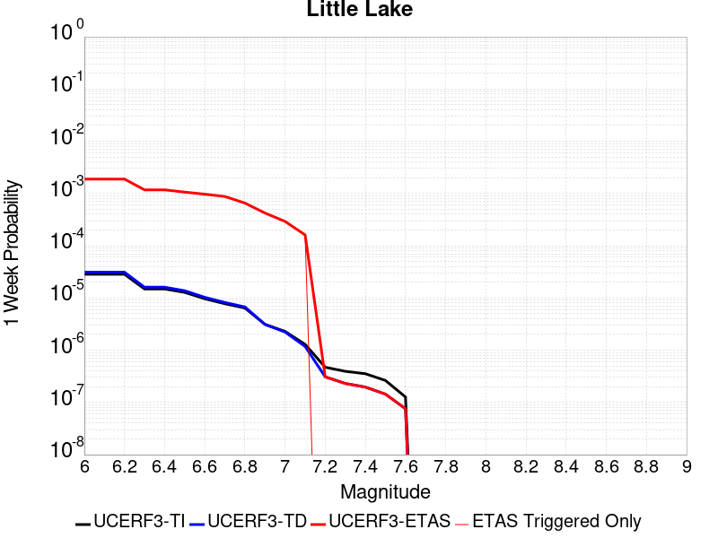 | 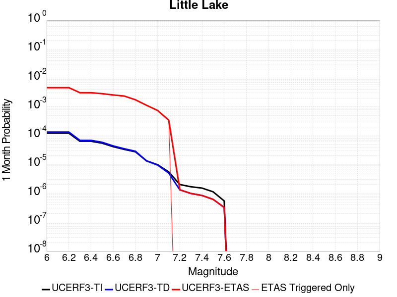 | 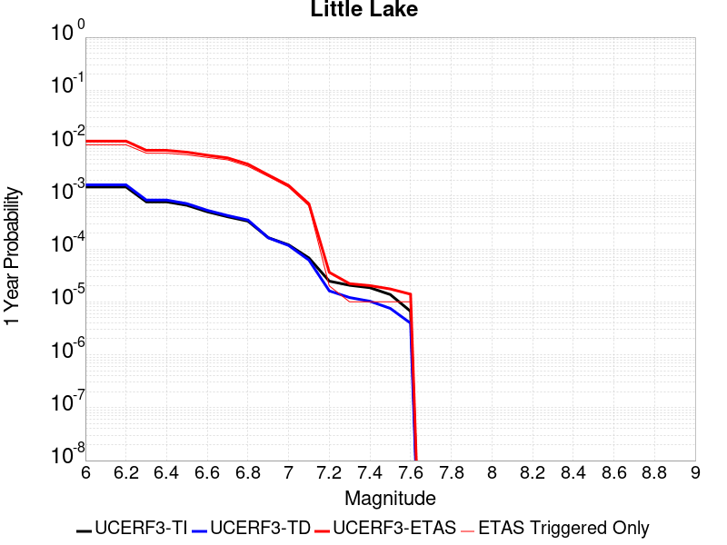 | 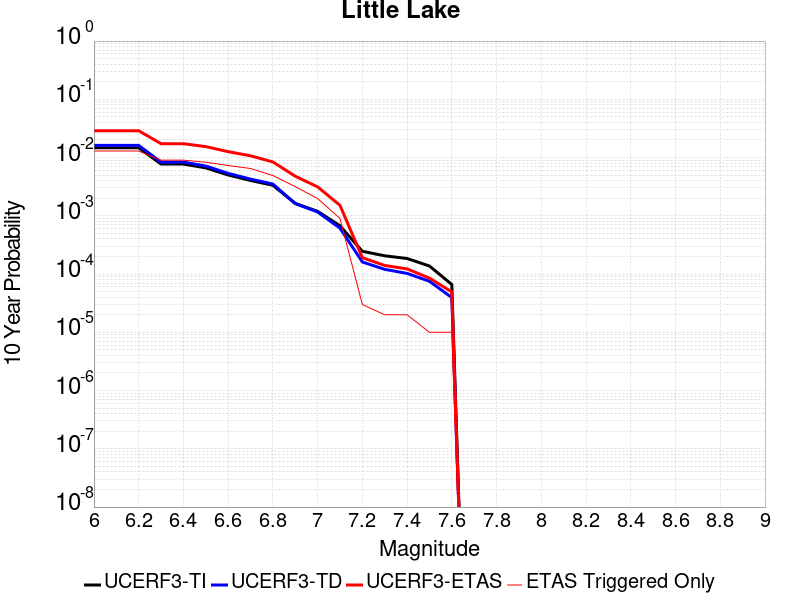 |

| Magnitude | 1 wk TI Prob | 1 wk TD Prob | 1 wk ETAS Prob | 1 wk ETAS/TD Gain | 1 wk ETAS Triggered Only | 1 mo TI Prob | 1 mo TD Prob | 1 mo ETAS Prob | 1 mo ETAS/TD Gain | 1 mo ETAS Triggered Only | 1 yr TI Prob | 1 yr TD Prob | 1 yr ETAS Prob | 1 yr ETAS/TD Gain | 1 yr ETAS Triggered Only | 10 yr TI Prob | 10 yr TD Prob | 10 yr ETAS Prob | 10 yr ETAS/TD Gain | 10 yr ETAS Triggered Only |
|-----|-----|-----|-----|-----|-----|-----|-----|-----|-----|-----|-----|-----|-----|-----|-----|-----|-----|-----|-----|-----|
| 6.0 | 2.8424427E-5 | 3.120616E-5 | 0.0018911482 | 60.601757 | 0.00186 | 1.2181328E-4 | 1.3373457E-4 | 0.0046431315 | 34.719006 | 0.00451 | 0.0014820677 | 0.0016271356 | 0.010921987 | 6.7124014 | 0.00931 | 0.014722223 | 0.016165627 | 0.028886605 | 1.7869153 | 0.01293 |
| 6.1 | 2.8424427E-5 | 3.120616E-5 | 0.0018911482 | 60.601757 | 0.00186 | 1.2181328E-4 | 1.3373457E-4 | 0.0046431315 | 34.719006 | 0.00451 | 0.0014820677 | 0.0016271356 | 0.010921987 | 6.7124014 | 0.00931 | 0.014722223 | 0.016165627 | 0.028886605 | 1.7869153 | 0.01293 |
| 6.2 | 2.8424427E-5 | 3.120616E-5 | 0.0018911482 | 60.601757 | 0.00186 | 1.2181328E-4 | 1.3373457E-4 | 0.0046431315 | 34.719006 | 0.00451 | 0.0014820677 | 0.0016271356 | 0.010921987 | 6.7124014 | 0.00931 | 0.014722223 | 0.016165627 | 0.028886605 | 1.7869153 | 0.01293 |
| 6.3 | 1.48860645E-5 | 1.6081593E-5 | 0.001176063 | 73.131 | 0.00116 | 6.379586E-5 | 6.891945E-5 | 0.0030987107 | 44.961334 | 0.00303 | 7.7643775E-4 | 8.387995E-4 | 0.007293381 | 8.695023 | 0.00646 | 0.007737305 | 0.008359154 | 0.017303754 | 2.0700366 | 0.00902 |
| 6.4 | 1.48860645E-5 | 1.6081593E-5 | 0.001176063 | 73.131 | 0.00116 | 6.379586E-5 | 6.891945E-5 | 0.0030987107 | 44.961334 | 0.00303 | 7.7643775E-4 | 8.387995E-4 | 0.007293381 | 8.695023 | 0.00646 | 0.007737305 | 0.008359154 | 0.017303754 | 2.0700366 | 0.00902 |
| 6.5 | 1.2797581E-5 | 1.3765735E-5 | 0.0010637513 | 77.2753 | 0.00105 | 5.4845623E-5 | 5.899482E-5 | 0.002868829 | 48.62849 | 0.00281 | 6.675408E-4 | 7.180509E-4 | 0.006733728 | 9.377787 | 0.00602 | 0.006655392 | 0.0071598585 | 0.015420289 | 2.1537142 | 0.00832 |
| 6.6 | 9.661896E-6 | 1.0289158E-5 | 9.702793E-4 | 94.30113 | 9.6E-4 | 4.1407468E-5 | 4.4095737E-5 | 0.0025839838 | 58.5994 | 0.00254 | 5.040193E-4 | 5.367496E-4 | 0.005903867 | 10.999295 | 0.00537 | 0.005028777 | 0.0053561367 | 0.012626983 | 2.3574796 | 0.00731 |
| 6.7 | 7.767871E-6 | 8.199779E-6 | 8.7819266E-4 | 107.099556 | 8.7E-4 | 3.329045E-5 | 3.514151E-5 | 0.0023650597 | 67.301025 | 0.00233 | 4.0523586E-4 | 4.2777765E-4 | 0.0052557113 | 12.286083 | 0.00483 | 0.004044977 | 0.0042708935 | 0.010733176 | 2.5130982 | 0.00649 |
| 6.8 | 6.4235196E-6 | 6.735819E-6 | 6.567314E-4 | 97.49838 | 6.5E-4 | 2.752908E-5 | 2.886755E-5 | 0.0017588176 | 60.927155 | 0.00173 | 3.35115E-4 | 3.5141854E-4 | 0.0040001357 | 11.382825 | 0.00365 | 0.003346101 | 0.0035098887 | 0.00841262 | 2.396834 | 0.00492 |
| 6.9 | 3.1283696E-6 | 3.1122067E-6 | 4.231109E-4 | 135.95206 | 4.2E-4 | 1.3407229E-5 | 1.3337969E-5 | 0.0011333231 | 84.96968 | 0.00112 | 1.6322079E-4 | 1.6237919E-4 | 0.0025019993 | 15.408374 | 0.00234 | 0.0016310095 | 0.0016227537 | 0.0047876094 | 2.9502995 | 0.00317 |
| 7.0 | 2.290603E-6 | 2.2287015E-6 | 2.9222807E-4 | 131.12032 | 2.9E-4 | 9.816834E-6 | 9.551549E-6 | 7.495445E-4 | 78.47361 | 7.4E-4 | 1.19513395E-4 | 1.16284944E-4 | 0.001586114 | 13.639892 | 0.00147 | 0.0011944914 | 0.0011623431 | 0.0031400416 | 2.7014756 | 0.00198 |
| 7.1 | 1.293693E-6 | 1.1776951E-6 | 1.6117751E-4 | 136.85843 | 1.6E-4 | 5.5443866E-6 | 5.047259E-6 | 3.4504556E-4 | 68.36295 | 3.4E-4 | 6.750081E-5 | 6.144935E-5 | 7.114094E-4 | 11.577168 | 6.5E-4 | 6.7480316E-4 | 6.14392E-4 | 0.001513839 | 2.4639628 | 9.0E-4 |
| 7.2 | 4.715842E-7 | 3.0918443E-7 | 3.0918443E-7 | 1.0 | 0.0 | 2.0210737E-6 | 1.3250755E-6 | 1.3250755E-6 | 1.0 | 0.0 | 2.4606294E-5 | 1.613268E-5 | 3.613236E-5 | 2.2396996 | 2.0E-5 | 2.460357E-4 | 1.6131563E-4 | 1.9131078E-4 | 1.1859409 | 3.0E-5 |
| 7.3 | 3.9430947E-7 | 2.3098025E-7 | 2.3098025E-7 | 1.0 | 0.0 | 1.6898966E-6 | 9.89915E-7 | 9.89915E-7 | 1.0 | 0.0 | 2.0574296E-5 | 1.2052149E-5 | 2.2052029E-5 | 1.8297175 | 1.0E-5 | 2.0572392E-4 | 1.20515026E-4 | 1.4051262E-4 | 1.1659344 | 2.0E-5 |
| 7.4 | 3.547123E-7 | 1.9679635E-7 | 1.9679635E-7 | 1.0 | 0.0 | 1.5201948E-6 | 8.4341264E-7 | 8.4341264E-7 | 1.0 | 0.0 | 1.8508214E-5 | 1.0268501E-5 | 2.0268399E-5 | 1.9738419 | 1.0E-5 | 1.8506673E-4 | 1.0268033E-4 | 1.2267828E-4 | 1.1947592 | 2.0E-5 |
| 7.5 | 2.6354266E-7 | 1.4423487E-7 | 1.4423487E-7 | 1.0 | 0.0 | 1.129468E-6 | 6.1814933E-7 | 6.1814933E-7 | 1.0 | 0.0 | 1.3751187E-5 | 7.5259427E-6 | 1.7525866E-5 | 2.3287272 | 1.0E-5 | 1.3750336E-4 | 7.525693E-5 | 8.525618E-5 | 1.1328682 | 1.0E-5 |
| 7.6 | 1.269913E-7 | 7.5727044E-8 | 7.5727044E-8 | 1.0 | 0.0 | 5.4424834E-7 | 3.2454443E-7 | 3.2454443E-7 | 1.0 | 0.0 | 6.6262032E-6 | 3.9513216E-6 | 1.3951282E-5 | 3.5307887 | 1.0E-5 | 6.626006E-5 | 3.951255E-5 | 4.9512157E-5 | 1.2530742 | 1.0E-5 |

## Airport Lake
*[(top)](#table-of-contents)*

| 1 Week | 1 Month | 1 Year | 10 Year |
|-----|-----|-----|-----|
|  |  |  |  |

| Magnitude | 1 wk TI Prob | 1 wk TD Prob | 1 wk ETAS Prob | 1 wk ETAS/TD Gain | 1 wk ETAS Triggered Only | 1 mo TI Prob | 1 mo TD Prob | 1 mo ETAS Prob | 1 mo ETAS/TD Gain | 1 mo ETAS Triggered Only | 1 yr TI Prob | 1 yr TD Prob | 1 yr ETAS Prob | 1 yr ETAS/TD Gain | 1 yr ETAS Triggered Only | 10 yr TI Prob | 10 yr TD Prob | 10 yr ETAS Prob | 10 yr ETAS/TD Gain | 10 yr ETAS Triggered Only |
|-----|-----|-----|-----|-----|-----|-----|-----|-----|-----|-----|-----|-----|-----|-----|-----|-----|-----|-----|-----|-----|
| 6.0 | 1.2387061E-5 | 1.31032575E-5 | 0.0018830787 | 143.71074 | 0.00187 | 5.3086325E-5 | 5.6155768E-5 | 0.004555903 | 81.129745 | 0.0045 | 6.461343E-4 | 6.835104E-4 | 0.009737317 | 14.246041 | 0.00906 | 0.0064425888 | 0.0068168915 | 0.01906284 | 2.7964122 | 0.01233 |
| 6.1 | 1.2387061E-5 | 1.31032575E-5 | 0.0018830787 | 143.71074 | 0.00187 | 5.3086325E-5 | 5.6155768E-5 | 0.004555903 | 81.129745 | 0.0045 | 6.461343E-4 | 6.835104E-4 | 0.009737317 | 14.246041 | 0.00906 | 0.0064425888 | 0.0068168915 | 0.01906284 | 2.7964122 | 0.01233 |
| 6.2 | 1.2387061E-5 | 1.31032575E-5 | 0.0018830787 | 143.71074 | 0.00187 | 5.3086325E-5 | 5.6155768E-5 | 0.004555903 | 81.129745 | 0.0045 | 6.461343E-4 | 6.835104E-4 | 0.009737317 | 14.246041 | 0.00906 | 0.0064425888 | 0.0068168915 | 0.01906284 | 2.7964122 | 0.01233 |
| 6.3 | 1.2387061E-5 | 1.31032575E-5 | 0.0018830787 | 143.71074 | 0.00187 | 5.3086325E-5 | 5.6155768E-5 | 0.004555903 | 81.129745 | 0.0045 | 6.461343E-4 | 6.835104E-4 | 0.009737317 | 14.246041 | 0.00906 | 0.0064425888 | 0.0068168915 | 0.01906284 | 2.7964122 | 0.01233 |
| 6.4 | 1.2387061E-5 | 1.31032575E-5 | 0.0018830787 | 143.71074 | 0.00187 | 5.3086325E-5 | 5.6155768E-5 | 0.004555903 | 81.129745 | 0.0045 | 6.461343E-4 | 6.835104E-4 | 0.009737317 | 14.246041 | 0.00906 | 0.0064425888 | 0.0068168915 | 0.01906284 | 2.7964122 | 0.01233 |
| 6.5 | 6.9922594E-6 | 7.38498E-6 | 0.0013273752 | 179.73985 | 0.00132 | 2.996648E-5 | 3.164956E-5 | 0.0034115426 | 107.791145 | 0.00338 | 3.6478083E-4 | 3.8527072E-4 | 0.0070127165 | 18.20205 | 0.00663 | 0.003641826 | 0.0038465653 | 0.01283187 | 3.3359292 | 0.00902 |
| 6.6 | 6.9922594E-6 | 7.38498E-6 | 0.0013273752 | 179.73985 | 0.00132 | 2.996648E-5 | 3.164956E-5 | 0.0034115426 | 107.791145 | 0.00338 | 3.6478083E-4 | 3.8527072E-4 | 0.0070127165 | 18.20205 | 0.00663 | 0.003641826 | 0.0038465653 | 0.01283187 | 3.3359292 | 0.00902 |
| 6.7 | 5.477277E-6 | 5.7861116E-6 | 0.0011557795 | 199.75063 | 0.00115 | 2.3473833E-5 | 2.4797408E-5 | 0.0029247254 | 117.94481 | 0.0029 | 2.8575645E-4 | 3.0187052E-4 | 0.006010147 | 19.909685 | 0.00571 | 0.0028538927 | 0.0030149885 | 0.010771532 | 3.5726612 | 0.00778 |
| 6.8 | 3.9950432E-6 | 4.2191186E-6 | 8.342156E-4 | 197.72273 | 8.3E-4 | 1.7121502E-5 | 1.8081826E-5 | 0.0021580432 | 119.34873 | 0.00214 | 2.0843433E-4 | 2.2012675E-4 | 0.0043592155 | 19.803205 | 0.00414 | 0.0020823893 | 0.002199358 | 0.007876844 | 3.5814285 | 0.00569 |
| 6.9 | 2.95695E-6 | 3.1230477E-6 | 6.031212E-4 | 193.11943 | 6.0E-4 | 1.2672582E-5 | 1.3384434E-5 | 0.0015633637 | 116.80462 | 0.00155 | 1.5427776E-4 | 1.6294557E-4 | 0.0032024502 | 19.653498 | 0.00304 | 0.001541707 | 0.0016284833 | 0.0057817088 | 3.5503643 | 0.00416 |
| 7.0 | 1.456072E-6 | 1.5408239E-6 | 2.715404E-4 | 176.23065 | 2.7E-4 | 6.2402937E-6 | 6.60352E-6 | 7.065989E-4 | 107.00337 | 7.0E-4 | 7.597293E-5 | 8.03959E-5 | 0.0014402865 | 17.914927 | 0.00136 | 7.594696E-4 | 8.03767E-4 | 0.002662272 | 3.3122435 | 0.00186 |
| 7.1 | 6.995192E-7 | 7.4090326E-7 | 1.5074079E-4 | 203.45543 | 1.5E-4 | 2.997936E-6 | 3.1752998E-6 | 3.231743E-4 | 101.77757 | 3.2E-4 | 3.649926E-5 | 3.8659273E-5 | 6.486357E-4 | 16.778269 | 6.1E-4 | 3.6493264E-4 | 3.8659273E-4 | 0.0012362641 | 3.1978462 | 8.5E-4 |

## Tank Canyon
*[(top)](#table-of-contents)*

| 1 Week | 1 Month | 1 Year | 10 Year |
|-----|-----|-----|-----|
| 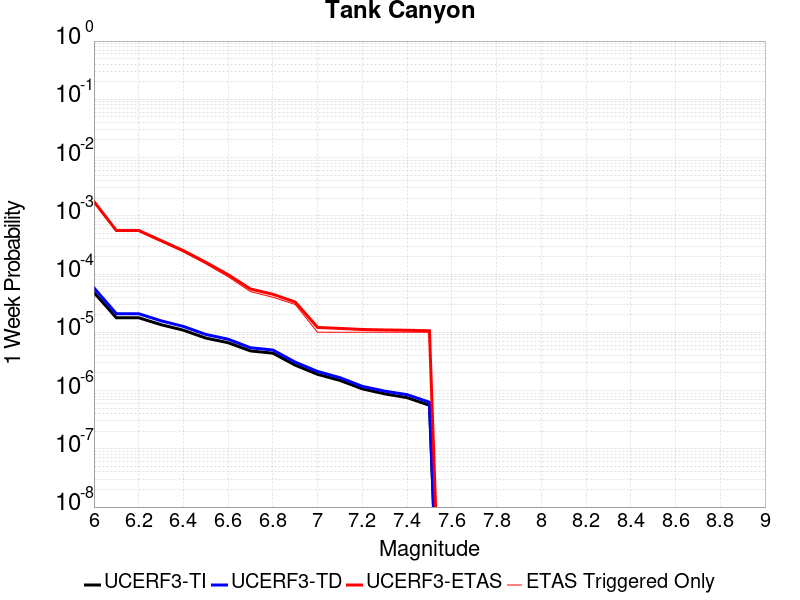 | 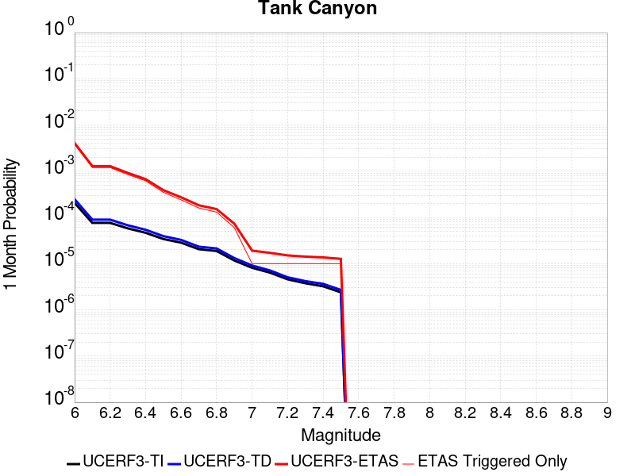 | 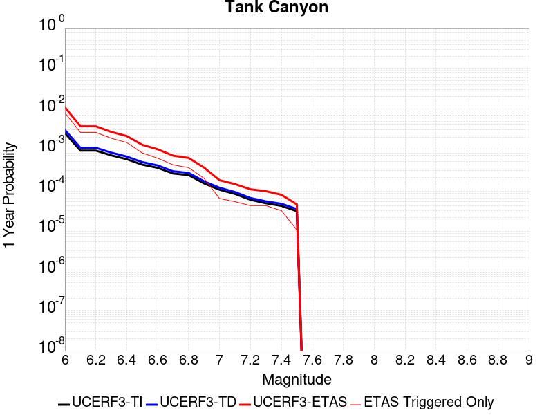 | 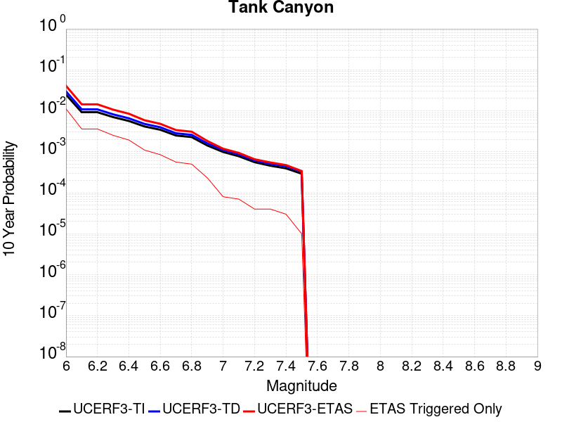 |

| Magnitude | 1 wk TI Prob | 1 wk TD Prob | 1 wk ETAS Prob | 1 wk ETAS/TD Gain | 1 wk ETAS Triggered Only | 1 mo TI Prob | 1 mo TD Prob | 1 mo ETAS Prob | 1 mo ETAS/TD Gain | 1 mo ETAS Triggered Only | 1 yr TI Prob | 1 yr TD Prob | 1 yr ETAS Prob | 1 yr ETAS/TD Gain | 1 yr ETAS Triggered Only | 10 yr TI Prob | 10 yr TD Prob | 10 yr ETAS Prob | 10 yr ETAS/TD Gain | 10 yr ETAS Triggered Only |
|-----|-----|-----|-----|-----|-----|-----|-----|-----|-----|-----|-----|-----|-----|-----|-----|-----|-----|-----|-----|-----|
| 6.0 | 4.8284557E-5 | 5.796635E-5 | 0.0017578678 | 30.32566 | 0.0017 | 2.0691741E-4 | 2.484074E-4 | 0.004077456 | 16.41439 | 0.00383 | 0.0025163088 | 0.0030208372 | 0.011056489 | 3.6600745 | 0.00806 | 0.02488006 | 0.029864404 | 0.04072022 | 1.3635036 | 0.01119 |
| 6.1 | 1.7796336E-5 | 2.0873764E-5 | 5.608625E-4 | 26.869255 | 5.4E-4 | 7.626778E-5 | 8.945614E-5 | 0.0012893488 | 14.413196 | 0.0012 | 9.281647E-4 | 0.0010886216 | 0.0037157584 | 3.4132693 | 0.00263 | 0.009242975 | 0.010836975 | 0.014407854 | 1.3295088 | 0.00361 |
| 6.2 | 1.7796336E-5 | 2.0873764E-5 | 5.608625E-4 | 26.869255 | 5.4E-4 | 7.626778E-5 | 8.945614E-5 | 0.0012893488 | 14.413196 | 0.0012 | 9.281647E-4 | 0.0010886216 | 0.0037157584 | 3.4132693 | 0.00263 | 0.009242975 | 0.010836975 | 0.014407854 | 1.3295088 | 0.00361 |
| 6.3 | 1.3515912E-5 | 1.575988E-5 | 3.757542E-4 | 23.842453 | 3.6E-4 | 5.792405E-5 | 6.7540735E-5 | 9.174833E-4 | 13.584148 | 8.5E-4 | 7.049971E-4 | 8.220222E-4 | 0.002690485 | 3.2730076 | 0.00187 | 0.007027647 | 0.008192427 | 0.010691782 | 1.3050811 | 0.00252 |
| 6.4 | 1.0870146E-5 | 1.2618259E-5 | 2.5261522E-4 | 20.019817 | 2.4E-4 | 4.658551E-5 | 5.407723E-5 | 6.740437E-4 | 12.464464 | 6.2E-4 | 5.67031E-4 | 6.582093E-4 | 0.0021272418 | 3.231862 | 0.00147 | 0.005655863 | 0.006564614 | 0.008491878 | 1.2935839 | 0.00194 |
| 6.5 | 7.964826E-6 | 9.196251E-6 | 1.5919487E-4 | 17.310844 | 1.5E-4 | 3.4134522E-5 | 3.941197E-5 | 3.8939816E-4 | 9.8802 | 3.5E-4 | 4.1550855E-4 | 4.7974577E-4 | 0.0012893572 | 2.6875842 | 8.1E-4 | 0.0041473247 | 0.0047884025 | 0.0058831354 | 1.2286217 | 0.0011 |
| 6.6 | 6.6317E-6 | 7.6124184E-6 | 9.761173E-5 | 12.822697 | 9.0E-5 | 2.8421264E-5 | 3.2624295E-5 | 2.7261645E-4 | 8.356241 | 2.4E-4 | 3.4597394E-4 | 3.971375E-4 | 9.968992E-4 | 2.5102117 | 6.0E-4 | 0.0034543579 | 0.00396543 | 0.0048120595 | 1.2135025 | 8.5E-4 |
| 6.7 | 4.793663E-6 | 5.4308543E-6 | 5.5430584E-5 | 10.206605 | 5.0E-5 | 2.0544108E-5 | 2.3274906E-5 | 1.8327119E-4 | 7.874196 | 1.6E-4 | 2.500958E-4 | 2.8333953E-4 | 6.932234E-4 | 2.4466171 | 4.1E-4 | 0.0024981452 | 0.0028304753 | 0.0033888903 | 1.1972866 | 5.6E-4 |
| 6.8 | 4.382823E-6 | 4.969316E-6 | 4.4969118E-5 | 9.049357 | 4.0E-5 | 1.8783392E-5 | 2.1296917E-5 | 1.5129415E-4 | 7.1040397 | 1.3E-4 | 2.286638E-4 | 2.5926338E-4 | 6.091726E-4 | 2.3496284 | 3.5E-4 | 0.0022842865 | 0.0025902835 | 0.0030889884 | 1.1925291 | 5.0E-4 |
| 6.9 | 2.729601E-6 | 3.0735694E-6 | 3.3073477E-5 | 10.760609 | 3.0E-5 | 1.1698237E-5 | 1.317238E-5 | 7.317159E-5 | 5.5549254 | 6.0E-5 | 1.4241673E-4 | 1.6036315E-4 | 3.5033267E-4 | 2.1846209 | 1.9E-4 | 0.001423255 | 0.0016026403 | 0.0018322716 | 1.1432831 | 2.3E-4 |
| 7.0 | 1.8987357E-6 | 2.126954E-6 | 1.2126933E-5 | 5.701549 | 1.0E-5 | 8.137413E-6 | 9.115489E-6 | 1.9115398E-5 | 2.0970237 | 1.0E-5 | 9.90685E-5 | 1.1097613E-4 | 1.7096948E-4 | 1.5405968 | 6.0E-5 | 9.902435E-4 | 0.0011092757 | 0.001189187 | 1.0720391 | 8.0E-5 |
| 7.1 | 1.4928986E-6 | 1.6641375E-6 | 1.166412E-5 | 7.009109 | 1.0E-5 | 6.398121E-6 | 7.1320014E-6 | 1.713193E-5 | 2.4021208 | 1.0E-5 | 7.789434E-5 | 8.682925E-5 | 1.368249E-4 | 1.5757928 | 5.0E-5 | 7.786704E-4 | 8.680111E-4 | 9.3795033E-4 | 1.0805742 | 7.0E-5 |
| 7.2 | 1.069082E-6 | 1.1828638E-6 | 1.1182852E-5 | 9.454049 | 1.0E-5 | 4.581772E-6 | 5.0694093E-6 | 1.5069359E-5 | 2.9726064 | 1.0E-5 | 5.5781646E-5 | 6.171884E-5 | 1.01716374E-4 | 1.6480603 | 4.0E-5 | 5.576765E-4 | 6.170693E-4 | 6.5704464E-4 | 1.0647825 | 4.0E-5 |
| 7.3 | 8.776551E-7 | 9.770052E-7 | 1.0976995E-5 | 11.23535 | 1.0E-5 | 3.7613736E-6 | 4.1871617E-6 | 1.418712E-5 | 3.3882427 | 1.0E-5 | 4.579376E-5 | 5.097802E-5 | 9.097598E-5 | 1.7846119 | 4.0E-5 | 4.5784327E-4 | 5.0971424E-4 | 5.496939E-4 | 1.0784353 | 4.0E-5 |
| 7.4 | 7.55721E-7 | 8.510284E-7 | 1.085102E-5 | 12.75048 | 1.0E-5 | 3.2388E-6 | 3.6472622E-6 | 1.3647226E-5 | 3.7417724 | 1.0E-5 | 3.9431678E-5 | 4.440503E-5 | 7.44037E-5 | 1.675569 | 3.0E-5 | 3.942468E-4 | 4.4401243E-4 | 4.7399913E-4 | 1.0675356 | 3.0E-5 |
| 7.5 | 5.587665E-7 | 6.305647E-7 | 1.0630559E-5 | 16.85879 | 1.0E-5 | 2.3947114E-6 | 2.7024203E-6 | 1.2702393E-5 | 4.7003765 | 1.0E-5 | 2.915522E-5 | 3.2901968E-5 | 4.290164E-5 | 1.3039232 | 1.0E-5 | 2.9151395E-4 | 3.2901968E-4 | 3.3901638E-4 | 1.0303833 | 1.0E-5 |

## Owl Lake
*[(top)](#table-of-contents)*

| 1 Week | 1 Month | 1 Year | 10 Year |
|-----|-----|-----|-----|
| 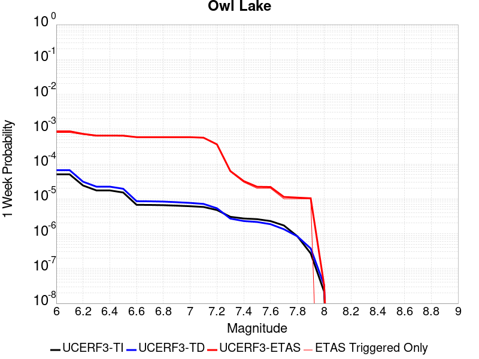 | 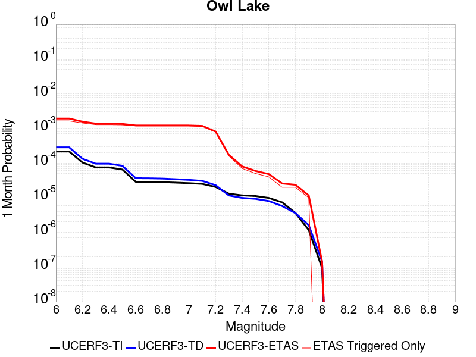 | 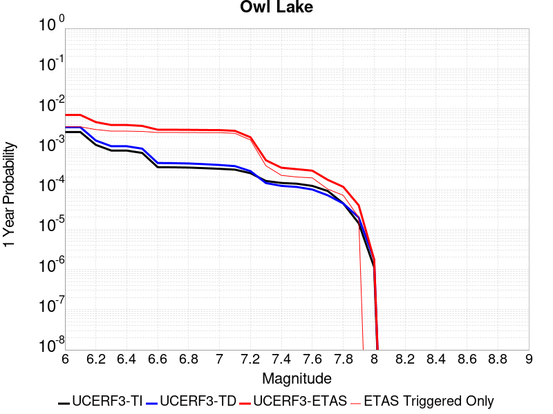 | 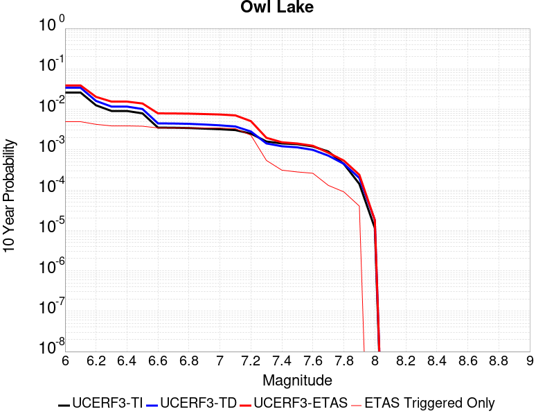 |

| Magnitude | 1 wk TI Prob | 1 wk TD Prob | 1 wk ETAS Prob | 1 wk ETAS/TD Gain | 1 wk ETAS Triggered Only | 1 mo TI Prob | 1 mo TD Prob | 1 mo ETAS Prob | 1 mo ETAS/TD Gain | 1 mo ETAS Triggered Only | 1 yr TI Prob | 1 yr TD Prob | 1 yr ETAS Prob | 1 yr ETAS/TD Gain | 1 yr ETAS Triggered Only | 10 yr TI Prob | 10 yr TD Prob | 10 yr ETAS Prob | 10 yr ETAS/TD Gain | 10 yr ETAS Triggered Only |
|-----|-----|-----|-----|-----|-----|-----|-----|-----|-----|-----|-----|-----|-----|-----|-----|-----|-----|-----|-----|-----|
| 6.0 | 5.0320643E-5 | 6.636149E-5 | 8.663084E-4 | 13.054383 | 8.0E-4 | 2.1564208E-4 | 2.8438168E-4 | 0.0019239153 | 6.7652574 | 0.00164 | 0.0026222812 | 0.00345791 | 0.0069956346 | 2.0230818 | 0.00355 | 0.02591553 | 0.0341423 | 0.038894318 | 1.1391828 | 0.00492 |
| 6.1 | 5.0320643E-5 | 6.636149E-5 | 8.663084E-4 | 13.054383 | 8.0E-4 | 2.1564208E-4 | 2.8438168E-4 | 0.0019239153 | 6.7652574 | 0.00164 | 0.0026222812 | 0.00345791 | 0.0069956346 | 2.0230818 | 0.00355 | 0.02591553 | 0.0341423 | 0.038894318 | 1.1391828 | 0.00492 |
| 6.2 | 2.4125871E-5 | 3.098269E-5 | 7.30961E-4 | 23.59256 | 7.0E-4 | 1.0339249E-4 | 1.3277736E-4 | 0.0015625875 | 11.768477 | 0.00143 | 0.0012580766 | 0.0016155228 | 0.0046406277 | 2.8725238 | 0.00303 | 0.012509781 | 0.016071297 | 0.020233316 | 1.2589722 | 0.00423 |
| 6.3 | 1.7433485E-5 | 2.2356835E-5 | 6.5234274E-4 | 29.17867 | 6.3E-4 | 7.471279E-5 | 9.5812386E-5 | 0.0013756898 | 14.358162 | 0.00128 | 9.0924866E-4 | 0.0011660426 | 0.0039328127 | 3.3727863 | 0.00277 | 0.009055373 | 0.01162957 | 0.015454563 | 1.3289024 | 0.00387 |
| 6.4 | 1.7433485E-5 | 2.2356835E-5 | 6.5234274E-4 | 29.17867 | 6.3E-4 | 7.471279E-5 | 9.5812386E-5 | 0.0013756898 | 14.358162 | 0.00128 | 9.0924866E-4 | 0.0011660426 | 0.0039328127 | 3.3727863 | 0.00277 | 0.009055373 | 0.01162957 | 0.015454563 | 1.3289024 | 0.00387 |
| 6.5 | 1.5182742E-5 | 1.9430352E-5 | 6.494181E-4 | 33.422867 | 6.3E-4 | 6.506727E-5 | 8.327114E-5 | 0.0013431662 | 16.130033 | 0.00126 | 7.919061E-4 | 0.0010135059 | 0.003730749 | 3.6810336 | 0.00272 | 0.0078909 | 0.010119047 | 0.013880595 | 1.3717295 | 0.0038 |
| 6.6 | 6.7271576E-6 | 8.548157E-6 | 5.885432E-4 | 68.8503 | 5.8E-4 | 2.8830356E-5 | 3.6634476E-5 | 0.0012165912 | 33.208916 | 0.00118 | 3.5095305E-4 | 4.4593913E-4 | 0.0030047975 | 6.738134 | 0.00256 | 0.0035039932 | 0.004468226 | 0.00790281 | 1.7686685 | 0.00345 |
| 6.7 | 6.682835E-6 | 8.4806015E-6 | 5.8847567E-4 | 69.39079 | 5.8E-4 | 2.8640408E-5 | 3.634496E-5 | 0.001216302 | 33.465492 | 0.00118 | 3.4864116E-4 | 4.424157E-4 | 0.0030012832 | 6.783853 | 0.00256 | 0.003480947 | 0.004433152 | 0.007867857 | 1.7747774 | 0.00345 |
| 6.8 | 6.5774975E-6 | 8.327072E-6 | 5.8832223E-4 | 70.65176 | 5.8E-4 | 2.8188972E-5 | 3.5686993E-5 | 0.0012156449 | 34.064087 | 0.00118 | 3.4314668E-4 | 4.3440814E-4 | 0.0029833005 | 6.8675056 | 0.00255 | 0.0034261728 | 0.0043532955 | 0.00777832 | 1.7867659 | 0.00344 |
| 6.9 | 6.363419E-6 | 8.0002355E-6 | 5.879956E-4 | 73.497284 | 5.8E-4 | 2.727151E-5 | 3.4286306E-5 | 0.0012142458 | 35.414894 | 0.00118 | 3.3198006E-4 | 4.173614E-4 | 0.0029563012 | 7.0833125 | 0.00254 | 0.0033148455 | 0.004183282 | 0.0075989338 | 1.8165003 | 0.00343 |
| 7.0 | 6.1342453E-6 | 7.632424E-6 | 5.87628E-4 | 76.991005 | 5.8E-4 | 2.6289357E-5 | 3.271001E-5 | 0.0012126714 | 37.073406 | 0.00118 | 3.2002592E-4 | 3.981771E-4 | 0.0029371658 | 7.376531 | 0.00254 | 0.0031956544 | 0.00399197 | 0.0074082776 | 1.8557949 | 0.00343 |
| 7.1 | 5.842926E-6 | 7.142961E-6 | 5.6713895E-4 | 79.3983 | 5.6E-4 | 2.504087E-5 | 3.0612362E-5 | 0.0011805772 | 38.565376 | 0.00115 | 3.0482994E-4 | 3.7264716E-4 | 0.0028117378 | 7.5453086 | 0.00244 | 0.0030441214 | 0.0037374226 | 0.007035052 | 1.8823271 | 0.00331 |
| 7.2 | 4.77173E-6 | 5.3591634E-6 | 3.6535723E-4 | 68.1743 | 3.6E-4 | 2.045011E-5 | 2.2967664E-5 | 8.129495E-4 | 35.395393 | 7.9E-4 | 2.4895166E-4 | 2.7959948E-4 | 0.0019491325 | 6.9711595 | 0.00167 | 0.0024867293 | 0.0028089995 | 0.005072623 | 1.8058469 | 0.00227 |
| 7.3 | 3.0494948E-6 | 2.7109647E-6 | 6.27108E-5 | 23.132282 | 6.0E-5 | 1.3069198E-5 | 1.1618369E-5 | 1.7161651E-4 | 14.771135 | 1.6E-4 | 1.5910587E-4 | 1.4144463E-4 | 5.213909E-4 | 3.6861837 | 3.8E-4 | 0.0015899199 | 0.0014235033 | 0.0019627346 | 1.3788058 | 5.4E-4 |
| 7.4 | 2.7263884E-6 | 2.3061473E-6 | 3.2306078E-5 | 14.008679 | 3.0E-5 | 1.1684469E-5 | 9.883452E-6 | 7.988276E-5 | 8.082476 | 7.0E-5 | 1.4224913E-4 | 1.2032448E-4 | 3.4029802E-4 | 2.8281693 | 2.2E-4 | 0.0014215811 | 0.0012114698 | 0.0015210942 | 1.2555776 | 3.1E-4 |
| 7.5 | 2.6090431E-6 | 2.1660758E-6 | 2.2166032E-5 | 10.233268 | 2.0E-5 | 1.1181565E-5 | 9.283149E-6 | 5.9282684E-5 | 6.386053 | 5.0E-5 | 1.3612706E-4 | 1.1301658E-4 | 3.1299397E-4 | 2.7694519 | 2.0E-4 | 0.001360437 | 0.001138222 | 0.0014179033 | 1.2457176 | 2.8E-4 |
| 7.6 | 2.3008756E-6 | 1.8732376E-6 | 2.18732E-5 | 11.676682 | 2.0E-5 | 9.860858E-6 | 8.028137E-6 | 4.8027814E-5 | 5.982436 | 4.0E-5 | 1.20049335E-4 | 9.7738266E-5 | 2.8771968E-4 | 2.9437773 | 1.9E-4 | 0.001199845 | 9.852252E-4 | 0.001244969 | 1.2636391 | 2.6E-4 |
| 7.7 | 1.7184348E-6 | 1.3423282E-6 | 1.1342315E-5 | 8.449733 | 1.0E-5 | 7.3646997E-6 | 5.7528227E-6 | 2.5752708E-5 | 4.4765344 | 2.0E-5 | 8.966153E-5 | 7.0038404E-5 | 1.700314E-4 | 2.4276881 | 1.0E-4 | 8.962536E-4 | 7.080495E-4 | 8.379575E-4 | 1.183473 | 1.3E-4 |
| 7.8 | 8.4612907E-7 | 8.4087924E-7 | 1.0840871E-5 | 12.892303 | 1.0E-5 | 3.6262625E-6 | 3.6037634E-6 | 2.3603692E-5 | 6.549734 | 2.0E-5 | 4.4148852E-5 | 4.3874956E-5 | 1.1387189E-4 | 2.5953732 | 7.0E-5 | 4.414008E-4 | 4.4413717E-4 | 5.340972E-4 | 1.20255 | 9.0E-5 |
| 7.9 | 2.716738E-7 | 3.7694025E-7 | 1.0376936E-5 | 27.529392 | 1.0E-5 | 1.1643157E-6 | 1.6154573E-6 | 1.16154415E-5 | 7.1901875 | 1.0E-5 | 1.4175452E-5 | 1.9668027E-5 | 3.9667633E-5 | 2.0168588 | 2.0E-5 | 1.4174548E-4 | 1.9843443E-4 | 2.384265E-4 | 1.201538 | 4.0E-5 |
| 8.0 | 2.1995428E-8 | 3.386013E-8 | 3.386013E-8 | 1.0 | 0.0 | 9.426611E-8 | 1.4511484E-7 | 1.4511484E-7 | 1.0 | 0.0 | 1.1476893E-6 | 1.7667724E-6 | 1.7667724E-6 | 1.0 | 0.0 | 1.14768345E-5 | 1.7968985E-5 | 1.7968985E-5 | 1.0 | 0.0 |

## Panamint Valley
*[(top)](#table-of-contents)*

| 1 Week | 1 Month | 1 Year | 10 Year |
|-----|-----|-----|-----|
| 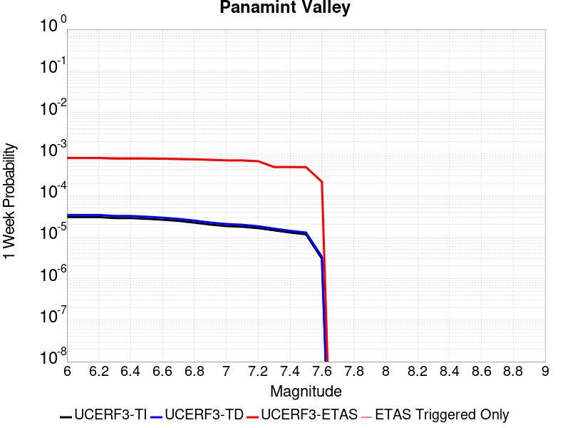 | 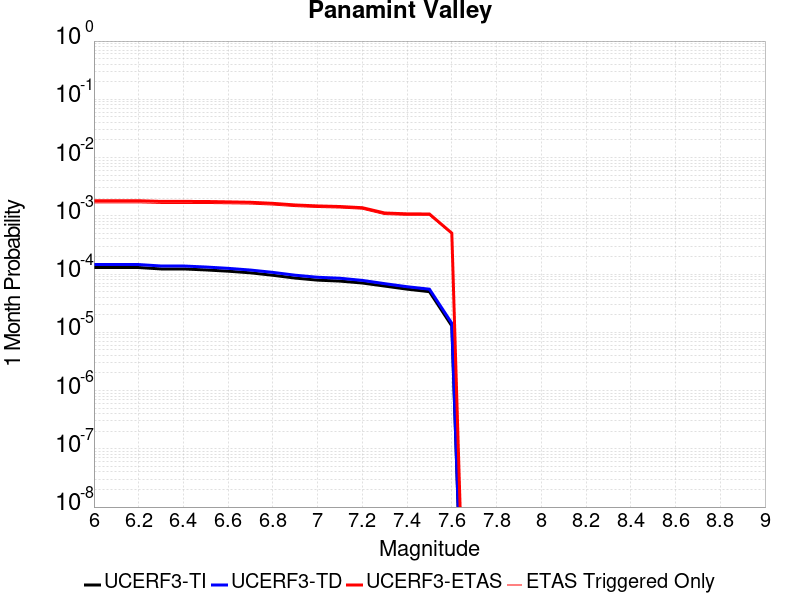 | 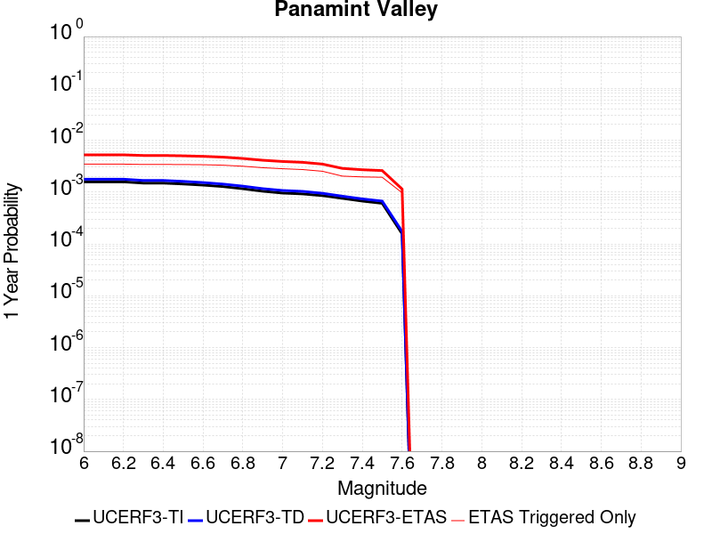 | 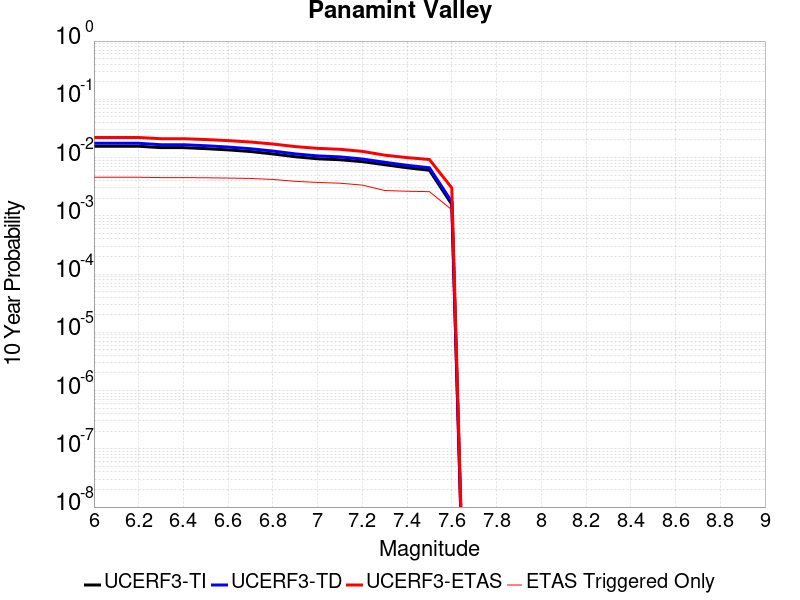 |

| Magnitude | 1 wk TI Prob | 1 wk TD Prob | 1 wk ETAS Prob | 1 wk ETAS/TD Gain | 1 wk ETAS Triggered Only | 1 mo TI Prob | 1 mo TD Prob | 1 mo ETAS Prob | 1 mo ETAS/TD Gain | 1 mo ETAS Triggered Only | 1 yr TI Prob | 1 yr TD Prob | 1 yr ETAS Prob | 1 yr ETAS/TD Gain | 1 yr ETAS Triggered Only | 10 yr TI Prob | 10 yr TD Prob | 10 yr ETAS Prob | 10 yr ETAS/TD Gain | 10 yr ETAS Triggered Only |
|-----|-----|-----|-----|-----|-----|-----|-----|-----|-----|-----|-----|-----|-----|-----|-----|-----|-----|-----|-----|-----|
| 6.0 | 3.0211835E-5 | 3.3985398E-5 | 8.039592E-4 | 23.65602 | 7.7E-4 | 1.2947287E-4 | 1.4564373E-4 | 0.0018154006 | 12.464665 | 0.00167 | 0.0015751923 | 0.0017717998 | 0.0052256696 | 2.9493566 | 0.00346 | 0.015640736 | 0.01758359 | 0.022092883 | 1.2564489 | 0.00459 |
| 6.1 | 3.0211835E-5 | 3.3985398E-5 | 8.039592E-4 | 23.65602 | 7.7E-4 | 1.2947287E-4 | 1.4564373E-4 | 0.0018154006 | 12.464665 | 0.00167 | 0.0015751923 | 0.0017717998 | 0.0052256696 | 2.9493566 | 0.00346 | 0.015640736 | 0.01758359 | 0.022092883 | 1.2564489 | 0.00459 |
| 6.2 | 3.0211835E-5 | 3.3985398E-5 | 8.039592E-4 | 23.65602 | 7.7E-4 | 1.2947287E-4 | 1.4564373E-4 | 0.0018154006 | 12.464665 | 0.00167 | 0.0015751923 | 0.0017717998 | 0.0052256696 | 2.9493566 | 0.00346 | 0.015640736 | 0.01758359 | 0.022092883 | 1.2564489 | 0.00459 |
| 6.3 | 2.8573924E-5 | 3.2103522E-5 | 7.8207947E-4 | 24.361174 | 7.5E-4 | 1.2245393E-4 | 1.3757942E-4 | 0.0017673551 | 12.846072 | 0.00163 | 0.001489857 | 0.0016737703 | 0.005078063 | 3.0339067 | 0.00341 | 0.01479908 | 0.016618231 | 0.021072952 | 1.2680621 | 0.00453 |
| 6.4 | 2.8573924E-5 | 3.2103522E-5 | 7.8207947E-4 | 24.361174 | 7.5E-4 | 1.2245393E-4 | 1.3757942E-4 | 0.0017673551 | 12.846072 | 0.00163 | 0.001489857 | 0.0016737703 | 0.005078063 | 3.0339067 | 0.00341 | 0.01479908 | 0.016618231 | 0.021072952 | 1.2680621 | 0.00453 |
| 6.5 | 2.7468774E-5 | 3.0829244E-5 | 7.808061E-4 | 25.326801 | 7.5E-4 | 1.1771801E-4 | 1.3211879E-4 | 0.0017619034 | 13.335752 | 0.00163 | 0.0014322745 | 0.0016073869 | 0.0050019217 | 3.1118345 | 0.0034 | 0.014230782 | 0.015964093 | 0.020392254 | 1.2773826 | 0.0045 |
| 6.6 | 2.6135967E-5 | 2.9253257E-5 | 7.692316E-4 | 26.29559 | 7.4E-4 | 1.1200648E-4 | 1.2536523E-4 | 0.0017351634 | 13.840867 | 0.00161 | 0.0013628257 | 0.0015252795 | 0.004890139 | 3.2060611 | 0.00337 | 0.013544982 | 0.015154443 | 0.019537006 | 1.2891933 | 0.00445 |
| 6.7 | 2.4498746E-5 | 2.7342086E-5 | 7.573221E-4 | 27.698036 | 7.3E-4 | 1.04990395E-4 | 1.1717525E-4 | 0.0017069889 | 14.567828 | 0.00159 | 0.0012775084 | 0.0014257001 | 0.004720995 | 3.3113523 | 0.0033 | 0.012701893 | 0.014171662 | 0.01848959 | 1.3046875 | 0.00438 |
| 6.8 | 2.2244329E-5 | 2.4936131E-5 | 7.449182E-4 | 29.873045 | 7.2E-4 | 9.532935E-5 | 1.0686488E-4 | 0.0016367014 | 15.315615 | 0.00153 | 0.0011600169 | 0.0013003252 | 0.004446229 | 3.419321 | 0.00315 | 0.011539802 | 0.012932883 | 0.017088436 | 1.3213168 | 0.00421 |
| 6.9 | 1.9902658E-5 | 2.2290924E-5 | 7.2227535E-4 | 32.402218 | 7.0E-4 | 8.529431E-5 | 9.552913E-5 | 0.0015353916 | 16.072495 | 0.00144 | 0.0010379635 | 0.0011624652 | 0.0041090357 | 3.5347605 | 0.00295 | 0.010331288 | 0.011568946 | 0.015433712 | 1.3340638 | 0.00391 |
| 7.0 | 1.8353881E-5 | 2.056681E-5 | 7.0055283E-4 | 34.0623 | 6.8E-4 | 7.865712E-5 | 8.814059E-5 | 0.0014780181 | 16.76887 | 0.00139 | 9.5722964E-4 | 0.0010726011 | 0.0038895763 | 3.626303 | 0.00282 | 0.009531168 | 0.0106791705 | 0.01437923 | 1.3464745 | 0.00374 |
| 7.1 | 1.7667631E-5 | 1.9773222E-5 | 6.9975975E-4 | 35.389263 | 6.8E-4 | 7.571623E-5 | 8.473973E-5 | 0.0014446245 | 17.047783 | 0.00136 | 9.2145515E-4 | 0.0010312354 | 0.0037484304 | 3.634893 | 0.00272 | 0.009176437 | 0.010269388 | 0.01386211 | 1.3498478 | 0.00363 |
| 7.2 | 1.6381597E-5 | 1.8158824E-5 | 6.68147E-4 | 36.79462 | 6.5E-4 | 7.020495E-5 | 7.782131E-5 | 0.0013777202 | 17.703636 | 0.0013 | 8.544101E-4 | 9.4707985E-4 | 0.0034646932 | 3.6582906 | 0.00252 | 0.008511325 | 0.009435088 | 0.012773292 | 1.3538073 | 0.00337 |
| 7.3 | 1.4520491E-5 | 1.5966963E-5 | 4.8595946E-4 | 30.435308 | 4.7E-4 | 6.222919E-5 | 6.842814E-5 | 0.0011183562 | 16.343515 | 0.00105 | 7.57377E-4 | 8.3281036E-4 | 0.0028611198 | 3.4354997 | 0.00203 | 0.0075480095 | 0.008300003 | 0.010997427 | 1.3249907 | 0.00272 |
| 7.4 | 1.2852287E-5 | 1.4145856E-5 | 4.8413922E-4 | 34.224808 | 4.7E-4 | 5.5080065E-5 | 6.0623777E-5 | 0.0010805619 | 17.82406 | 0.00102 | 6.7039346E-4 | 7.3786033E-4 | 0.0026964142 | 3.654369 | 0.00196 | 0.0066837464 | 0.007357025 | 0.009977602 | 1.3562007 | 0.00264 |
| 7.5 | 1.1637851E-5 | 1.2837149E-5 | 4.8283112E-4 | 37.61202 | 4.7E-4 | 4.987555E-5 | 5.5015284E-5 | 0.0010749592 | 19.539282 | 0.00102 | 6.070656E-4 | 6.6962093E-4 | 0.0025983285 | 3.880298 | 0.00193 | 0.006054099 | 0.0066789286 | 0.009261563 | 1.386684 | 0.0026 |
| 7.6 | 3.0068115E-6 | 3.3331687E-6 | 2.1333247E-4 | 64.0029 | 2.1E-4 | 1.2886271E-5 | 1.4284972E-5 | 5.04278E-4 | 35.301292 | 4.9E-4 | 1.5687906E-4 | 1.7391294E-4 | 0.0011437442 | 6.5765333 | 9.7E-4 | 0.0015676835 | 0.001739208 | 0.0030069991 | 1.7289474 | 0.00127 |

## Garlock (East)
*[(top)](#table-of-contents)*

| 1 Week | 1 Month | 1 Year | 10 Year |
|-----|-----|-----|-----|
| 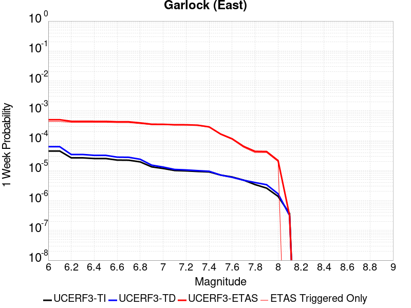 | 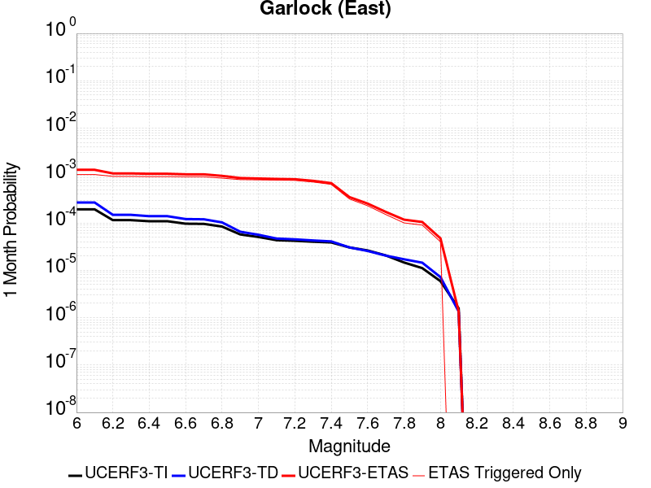 | 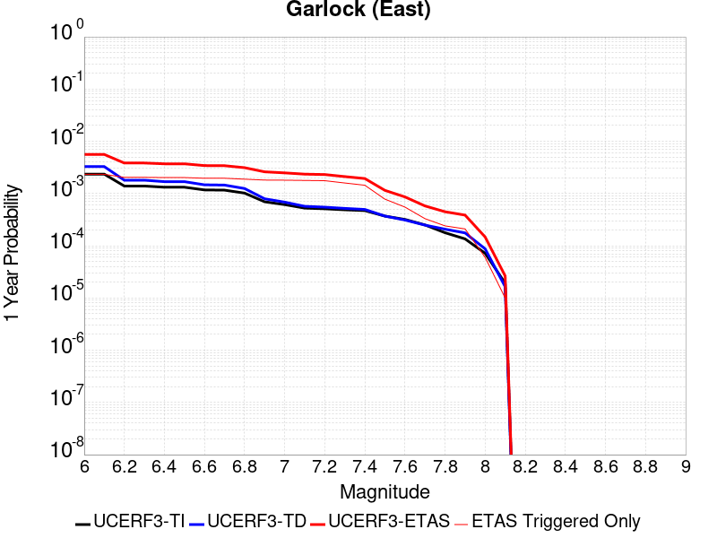 | 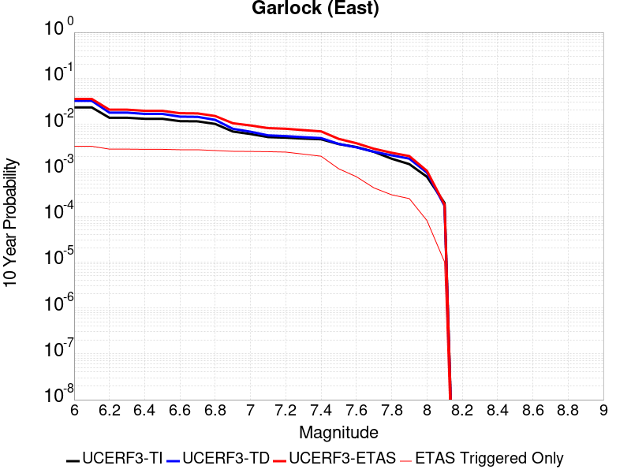 |

| Magnitude | 1 wk TI Prob | 1 wk TD Prob | 1 wk ETAS Prob | 1 wk ETAS/TD Gain | 1 wk ETAS Triggered Only | 1 mo TI Prob | 1 mo TD Prob | 1 mo ETAS Prob | 1 mo ETAS/TD Gain | 1 mo ETAS Triggered Only | 1 yr TI Prob | 1 yr TD Prob | 1 yr ETAS Prob | 1 yr ETAS/TD Gain | 1 yr ETAS Triggered Only | 10 yr TI Prob | 10 yr TD Prob | 10 yr ETAS Prob | 10 yr ETAS/TD Gain | 10 yr ETAS Triggered Only |
|-----|-----|-----|-----|-----|-----|-----|-----|-----|-----|-----|-----|-----|-----|-----|-----|-----|-----|-----|-----|-----|
| 6.0 | 4.5092507E-5 | 6.2906794E-5 | 5.028791E-4 | 7.9940352 | 4.4E-4 | 1.9323928E-4 | 2.695752E-4 | 0.0013192921 | 4.893967 | 0.00105 | 0.0023501497 | 0.0032775842 | 0.0055999476 | 1.7085594 | 0.00233 | 0.023254504 | 0.03235364 | 0.03555655 | 1.0989969 | 0.00331 |
| 6.1 | 4.5092507E-5 | 6.2906794E-5 | 5.028791E-4 | 7.9940352 | 4.4E-4 | 1.9323928E-4 | 2.695752E-4 | 0.0013192921 | 4.893967 | 0.00105 | 0.0023501497 | 0.0032775842 | 0.0055999476 | 1.7085594 | 0.00233 | 0.023254504 | 0.03235364 | 0.03555655 | 1.0989969 | 0.00331 |
| 6.2 | 2.6674514E-5 | 3.4512483E-5 | 4.4449832E-4 | 12.87935 | 4.1E-4 | 1.1431433E-4 | 1.4790244E-4 | 0.0011077605 | 7.489805 | 9.6E-4 | 0.0013908884 | 0.001799258 | 0.0038355875 | 2.1317606 | 0.00204 | 0.01382215 | 0.017891733 | 0.020710383 | 1.1575392 | 0.00287 |
| 6.3 | 2.6674514E-5 | 3.4512483E-5 | 4.4449832E-4 | 12.87935 | 4.1E-4 | 1.1431433E-4 | 1.4790244E-4 | 0.0011077605 | 7.489805 | 9.6E-4 | 0.0013908884 | 0.001799258 | 0.0038355875 | 2.1317606 | 0.00204 | 0.01382215 | 0.017891733 | 0.020710383 | 1.1575392 | 0.00287 |
| 6.4 | 2.5312667E-5 | 3.2341675E-5 | 4.4232843E-4 | 13.676732 | 4.1E-4 | 1.0847834E-4 | 1.3859998E-4 | 0.0010884684 | 7.8533077 | 9.5E-4 | 0.0013199237 | 0.001686178 | 0.0037027718 | 2.1959555 | 0.00202 | 0.013121112 | 0.01677974 | 0.019572085 | 1.1664118 | 0.00284 |
| 6.5 | 2.5312667E-5 | 3.2341675E-5 | 4.4232843E-4 | 13.676732 | 4.1E-4 | 1.0847834E-4 | 1.3859998E-4 | 0.0010884684 | 7.8533077 | 9.5E-4 | 0.0013199237 | 0.001686178 | 0.0037027718 | 2.1959555 | 0.00202 | 0.013121112 | 0.01677974 | 0.019572085 | 1.1664118 | 0.00284 |
| 6.6 | 2.246556E-5 | 2.813642E-5 | 4.2812517E-4 | 15.21605 | 4.0E-4 | 9.627742E-5 | 1.20579214E-4 | 0.0010604658 | 8.794765 | 9.4E-4 | 0.0011715472 | 0.0014670868 | 0.0034242114 | 2.3340209 | 0.00196 | 0.011653901 | 0.014620015 | 0.017359372 | 1.1873703 | 0.00278 |
| 6.7 | 2.2241198E-5 | 2.7806154E-5 | 4.2779502E-4 | 15.384905 | 4.0E-4 | 9.531594E-5 | 1.1916392E-4 | 0.001059052 | 8.887354 | 9.4E-4 | 0.0011598538 | 0.0014498787 | 0.003407037 | 2.3498774 | 0.00196 | 0.011538187 | 0.0144502055 | 0.017190034 | 1.1896048 | 0.00278 |
| 6.8 | 1.9528685E-5 | 2.3900653E-5 | 3.9389182E-4 | 16.48038 | 3.7E-4 | 8.369167E-5 | 1.0242746E-4 | 9.823373E-4 | 9.590567 | 8.8E-4 | 0.0010184698 | 0.0012463606 | 0.0031240173 | 2.5065117 | 0.00188 | 0.010138147 | 0.012437694 | 0.015074485 | 1.212 | 0.00267 |
| 6.9 | 1.3318621E-5 | 1.5201007E-5 | 3.5519584E-4 | 23.3666 | 3.4E-4 | 5.7078556E-5 | 6.514558E-5 | 8.8509213E-4 | 13.586373 | 8.2E-4 | 6.9470983E-4 | 7.928645E-4 | 0.0026014294 | 3.2810516 | 0.00181 | 0.0069254204 | 0.007940986 | 0.010490578 | 1.3210675 | 0.00257 |
| 7.0 | 1.1760853E-5 | 1.3109839E-5 | 3.531054E-4 | 26.934381 | 3.4E-4 | 5.0402683E-5 | 5.618384E-5 | 8.661383E-4 | 15.416147 | 8.1E-4 | 6.134799E-4 | 6.838286E-4 | 0.0024825977 | 3.6304386 | 0.0018 | 0.0061178906 | 0.006857582 | 0.009390095 | 1.3693012 | 0.00255 |
| 7.1 | 1.0064758E-5 | 1.090491E-5 | 3.4090132E-4 | 31.261269 | 3.3E-4 | 4.3133965E-5 | 4.673451E-5 | 8.4669713E-4 | 18.117172 | 8.0E-4 | 5.2502943E-4 | 5.688476E-4 | 0.002347835 | 4.127353 | 0.00178 | 0.005237907 | 0.005714025 | 0.008219626 | 1.4385002 | 0.00252 |
| 7.2 | 9.768808E-6 | 1.0500772E-5 | 3.404973E-4 | 32.42593 | 3.3E-4 | 4.186565E-5 | 4.500255E-5 | 8.34967E-4 | 18.55377 | 7.9E-4 | 5.095951E-4 | 5.477718E-4 | 0.0023068078 | 4.2112565 | 0.00176 | 0.0050842804 | 0.005504284 | 0.007960688 | 1.4462714 | 0.00247 |
| 7.3 | 9.344516E-6 | 9.946395E-6 | 3.299432E-4 | 33.17214 | 3.2E-4 | 4.004731E-5 | 4.2626732E-5 | 7.7259564E-4 | 18.124674 | 7.3E-4 | 4.8746695E-4 | 5.1886035E-4 | 0.0021080354 | 4.0628185 | 0.00159 | 0.0048639905 | 0.005215945 | 0.0074343137 | 1.4253051 | 0.00223 |
| 7.4 | 9.023491E-6 | 9.49255E-6 | 2.894899E-4 | 30.496536 | 2.8E-4 | 3.867153E-5 | 4.068174E-5 | 6.906553E-4 | 16.977034 | 6.5E-4 | 4.7072413E-4 | 4.95191E-4 | 0.001934478 | 3.906529 | 0.00144 | 0.004697283 | 0.004979378 | 0.0069793696 | 1.4016548 | 0.00201 |
| 7.5 | 7.081253E-6 | 7.0893525E-6 | 1.6708822E-4 | 23.568897 | 1.6E-4 | 3.0347876E-5 | 3.038259E-5 | 3.5037287E-4 | 11.532028 | 3.2E-4 | 3.6942272E-4 | 3.6984598E-4 | 0.0011495575 | 3.108206 | 7.8E-4 | 0.003688092 | 0.0037251879 | 0.004791202 | 1.2861638 | 0.00107 |
| 7.6 | 6.116396E-6 | 5.9608415E-6 | 1.1596019E-4 | 19.45366 | 1.1E-4 | 2.6212863E-5 | 2.5546216E-5 | 2.5554033E-4 | 10.00306 | 2.3E-4 | 3.1909486E-4 | 3.1098103E-4 | 8.6081E-4 | 2.7680466 | 5.5E-4 | 0.0031863707 | 0.003136586 | 0.0038543276 | 1.2288289 | 7.2E-4 |
| 7.7 | 4.797145E-6 | 4.7587923E-6 | 6.4758504E-5 | 13.608181 | 6.0E-5 | 2.055903E-5 | 2.0394666E-5 | 1.703916E-4 | 8.354714 | 1.5E-4 | 2.5027743E-4 | 2.482769E-4 | 5.78195E-4 | 2.3288312 | 3.3E-4 | 0.0024999576 | 0.002510134 | 0.0029191049 | 1.1629279 | 4.1E-4 |
| 7.8 | 3.4028885E-6 | 3.979809E-6 | 4.397965E-5 | 11.050693 | 4.0E-5 | 1.4583726E-5 | 1.7056214E-5 | 1.1705451E-4 | 6.8628654 | 1.0E-4 | 1.775424E-4 | 2.076397E-4 | 4.4758987E-4 | 2.1556084 | 2.4E-4 | 0.0017740062 | 0.0021019245 | 0.0023913148 | 1.1376787 | 2.9E-4 |
| 7.9 | 2.5928412E-6 | 3.373588E-6 | 4.3373453E-5 | 12.856772 | 4.0E-5 | 1.1112129E-5 | 1.44581545E-5 | 1.04456856E-4 | 7.224771 | 9.0E-5 | 1.3528178E-4 | 1.7601387E-4 | 3.8597692E-4 | 2.1928778 | 2.1E-4 | 0.0013519945 | 0.0017818334 | 0.0020214056 | 1.1344527 | 2.4E-4 |
| 8.0 | 1.3743648E-6 | 1.673991E-6 | 2.1673957E-5 | 12.947475 | 2.0E-5 | 5.8901214E-6 | 7.174228E-6 | 4.717394E-5 | 6.575473 | 4.0E-5 | 7.1709874E-5 | 8.7342756E-5 | 1.4733752E-4 | 1.6868888 | 6.0E-5 | 7.1686733E-4 | 8.839922E-4 | 9.639214E-4 | 1.0904186 | 8.0E-5 |
| 8.1 | 3.6733252E-7 | 3.1499187E-7 | 3.1499187E-7 | 1.0 | 0.0 | 1.5742813E-6 | 1.3499646E-6 | 1.3499646E-6 | 1.0 | 0.0 | 1.9166706E-5 | 1.643571E-5 | 2.6435546E-5 | 1.6084212 | 1.0E-5 | 1.9165053E-4 | 1.6643589E-4 | 1.7643423E-4 | 1.0600731 | 1.0E-5 |

## Hunter Mountain-Saline Valley
*[(top)](#table-of-contents)*

| 1 Week | 1 Month | 1 Year | 10 Year |
|-----|-----|-----|-----|
| 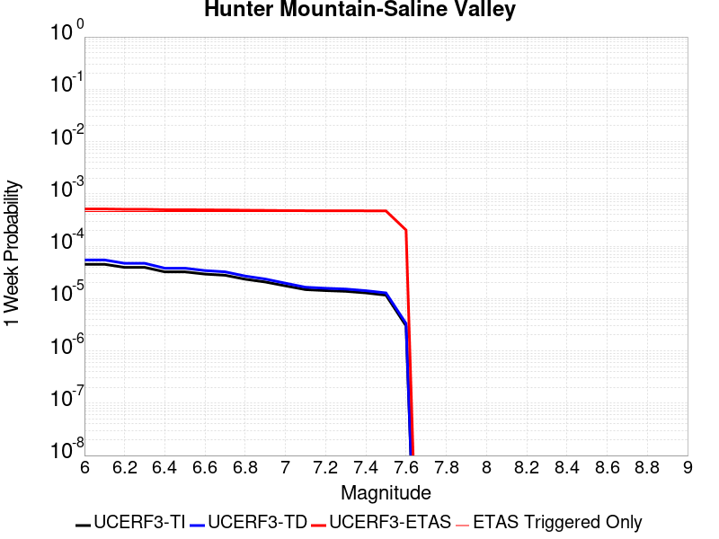 | 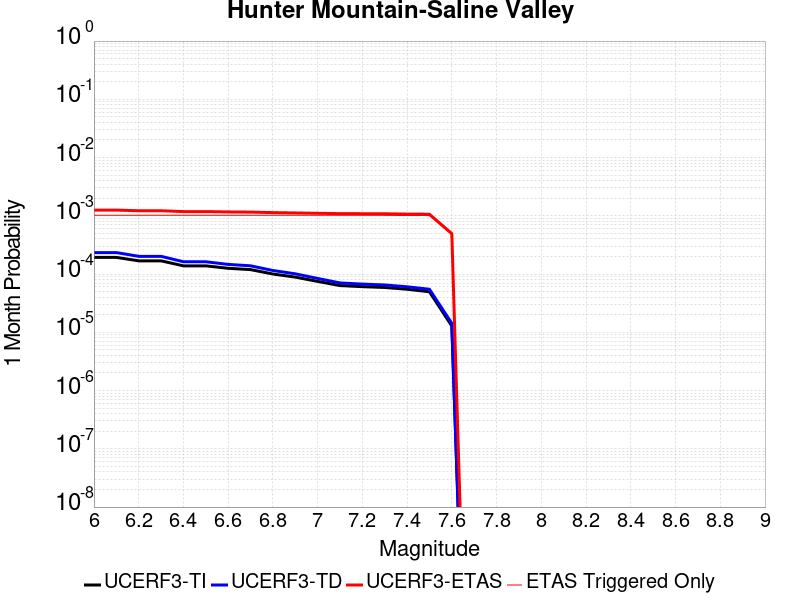 | 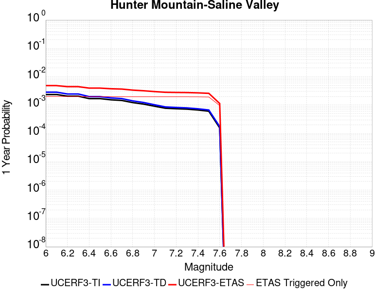 | 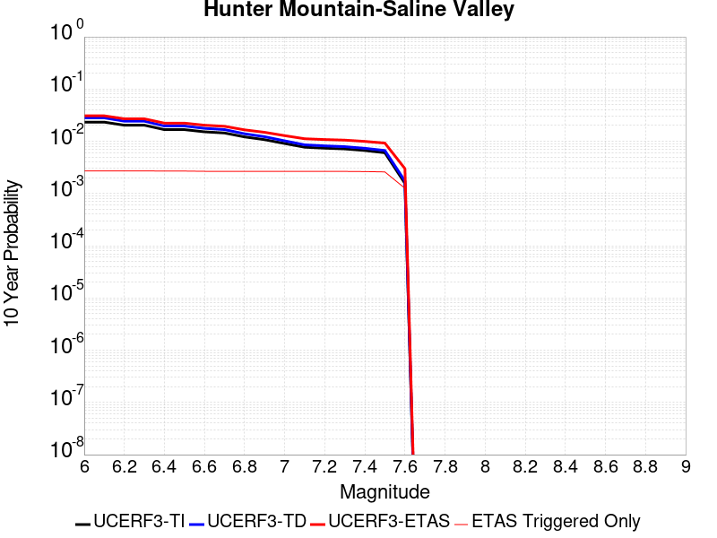 |

| Magnitude | 1 wk TI Prob | 1 wk TD Prob | 1 wk ETAS Prob | 1 wk ETAS/TD Gain | 1 wk ETAS Triggered Only | 1 mo TI Prob | 1 mo TD Prob | 1 mo ETAS Prob | 1 mo ETAS/TD Gain | 1 mo ETAS Triggered Only | 1 yr TI Prob | 1 yr TD Prob | 1 yr ETAS Prob | 1 yr ETAS/TD Gain | 1 yr ETAS Triggered Only | 10 yr TI Prob | 10 yr TD Prob | 10 yr ETAS Prob | 10 yr ETAS/TD Gain | 10 yr ETAS Triggered Only |
|-----|-----|-----|-----|-----|-----|-----|-----|-----|-----|-----|-----|-----|-----|-----|-----|-----|-----|-----|-----|-----|
| 6.0 | 4.5103672E-5 | 5.4571992E-5 | 5.145469E-4 | 9.428772 | 4.6E-4 | 1.9328714E-4 | 2.3385909E-4 | 0.0012536206 | 5.360581 | 0.00102 | 0.002350731 | 0.0028436056 | 0.0048379186 | 1.7013324 | 0.002 | 0.023260195 | 0.028092787 | 0.030726656 | 1.0937561 | 0.00271 |
| 6.1 | 4.5103672E-5 | 5.4571992E-5 | 5.145469E-4 | 9.428772 | 4.6E-4 | 1.9328714E-4 | 2.3385909E-4 | 0.0012536206 | 5.360581 | 0.00102 | 0.002350731 | 0.0028436056 | 0.0048379186 | 1.7013324 | 0.002 | 0.023260195 | 0.028092787 | 0.030726656 | 1.0937561 | 0.00271 |
| 6.2 | 3.9363465E-5 | 4.7064877E-5 | 5.070432E-4 | 10.773283 | 4.6E-4 | 1.6868966E-4 | 2.0169078E-4 | 0.0012214851 | 6.0562267 | 0.00102 | 0.002051862 | 0.0024528939 | 0.0044479882 | 1.8133634 | 0.002 | 0.020330196 | 0.024274237 | 0.026918454 | 1.108931 | 0.00271 |
| 6.3 | 3.9363465E-5 | 4.7064877E-5 | 5.070432E-4 | 10.773283 | 4.6E-4 | 1.6868966E-4 | 2.0169078E-4 | 0.0012214851 | 6.0562267 | 0.00102 | 0.002051862 | 0.0024528939 | 0.0044479882 | 1.8133634 | 0.002 | 0.020330196 | 0.024274237 | 0.026918454 | 1.108931 | 0.00271 |
| 6.4 | 3.2311684E-5 | 3.795214E-5 | 4.979347E-4 | 13.120069 | 4.6E-4 | 1.384713E-4 | 1.626423E-4 | 0.0011824764 | 7.2704115 | 0.00102 | 0.0016845843 | 0.0019784442 | 0.003954527 | 1.9988064 | 0.00198 | 0.016718714 | 0.019617062 | 0.022254292 | 1.1344355 | 0.00269 |
| 6.5 | 3.2311684E-5 | 3.795214E-5 | 4.979347E-4 | 13.120069 | 4.6E-4 | 1.384713E-4 | 1.626423E-4 | 0.0011824764 | 7.2704115 | 0.00102 | 0.0016845843 | 0.0019784442 | 0.003954527 | 1.9988064 | 0.00198 | 0.016718714 | 0.019617062 | 0.022254292 | 1.1344355 | 0.00269 |
| 6.6 | 2.9305844E-5 | 3.4182853E-5 | 4.9416715E-4 | 14.456579 | 4.6E-4 | 1.2559042E-4 | 1.4649007E-4 | 0.0011663407 | 7.9619093 | 0.00102 | 0.0015279909 | 0.0017821203 | 0.0037486095 | 2.1034548 | 0.00197 | 0.015175272 | 0.017686214 | 0.02029917 | 1.1477396 | 0.00266 |
| 6.7 | 2.7826512E-5 | 3.2345237E-5 | 4.9233035E-4 | 15.2211075 | 4.6E-4 | 1.19251024E-4 | 1.3861542E-4 | 0.001158474 | 8.357469 | 0.00102 | 0.0014509142 | 0.0016863967 | 0.0036530744 | 2.1662014 | 0.00197 | 0.014414776 | 0.01674368 | 0.019359143 | 1.1562059 | 0.00266 |
| 6.8 | 2.3389874E-5 | 2.6867507E-5 | 4.8685513E-4 | 18.120592 | 4.6E-4 | 1.0023846E-4 | 1.1514164E-4 | 0.0011350242 | 9.857635 | 0.00102 | 0.00121972 | 0.0014009953 | 0.0033582493 | 2.3970454 | 0.00196 | 0.01213047 | 0.013927842 | 0.016540933 | 1.1876163 | 0.00265 |
| 6.9 | 2.069209E-5 | 2.3570727E-5 | 4.8355988E-4 | 20.515272 | 4.6E-4 | 8.867737E-5 | 1.0101369E-4 | 0.0011209106 | 11.096621 | 0.00102 | 0.0010791123 | 0.001229184 | 0.003186775 | 2.5925937 | 0.00196 | 0.010738871 | 0.012228882 | 0.014846476 | 1.21405 | 0.00265 |
| 7.0 | 1.7462342E-5 | 1.9634126E-5 | 4.796251E-4 | 24.428135 | 4.6E-4 | 7.483646E-5 | 8.414367E-5 | 0.0011040579 | 13.121104 | 0.00102 | 9.1075303E-4 | 0.0010239903 | 0.0029819834 | 2.9121206 | 0.00196 | 0.009070295 | 0.010196352 | 0.012819332 | 1.2572469 | 0.00265 |
| 7.1 | 1.4807709E-5 | 1.6442245E-5 | 4.7643468E-4 | 28.976255 | 4.6E-4 | 6.3460066E-5 | 7.046495E-5 | 0.001090393 | 15.474261 | 0.00102 | 7.723524E-4 | 8.575896E-4 | 0.0028159088 | 3.2835155 | 0.00196 | 0.007696735 | 0.008545788 | 0.011173142 | 1.3074443 | 0.00265 |
| 7.2 | 1.4180048E-5 | 1.5698814E-5 | 4.756916E-4 | 30.301117 | 4.6E-4 | 6.077022E-5 | 6.727898E-5 | 0.0010872104 | 16.15973 | 0.00102 | 7.396263E-4 | 8.1883004E-4 | 0.002777225 | 3.391699 | 0.00196 | 0.0073716943 | 0.00816108 | 0.010789453 | 1.3220619 | 0.00265 |
| 7.3 | 1.3730402E-5 | 1.5172541E-5 | 4.7516555E-4 | 31.317469 | 4.6E-4 | 5.8843252E-5 | 6.502365E-5 | 0.0010849573 | 16.685581 | 0.00102 | 7.161811E-4 | 7.913914E-4 | 0.0027498403 | 3.4746907 | 0.00196 | 0.007138774 | 0.007888664 | 0.010517758 | 1.3332751 | 0.00265 |
| 7.4 | 1.2810095E-5 | 1.410972E-5 | 4.7410323E-4 | 33.60118 | 4.6E-4 | 5.489925E-5 | 6.0468916E-5 | 0.0010704078 | 17.701786 | 0.00101 | 6.681934E-4 | 7.359762E-4 | 0.002684541 | 3.6475923 | 0.00195 | 0.006661878 | 0.0073382827 | 0.009948983 | 1.3557645 | 0.00263 |
| 7.5 | 1.1595659E-5 | 1.2801013E-5 | 4.7279513E-4 | 36.934196 | 4.6E-4 | 4.9694736E-5 | 5.4860422E-5 | 0.001064805 | 19.409348 | 0.00101 | 6.0486543E-4 | 6.677366E-4 | 0.0025864546 | 3.8734653 | 0.00192 | 0.006032217 | 0.0066601736 | 0.009232923 | 1.3862888 | 0.00259 |
| 7.6 | 2.997694E-6 | 3.3252948E-6 | 2.0332463E-4 | 61.144844 | 2.0E-4 | 1.28471975E-5 | 1.4251226E-5 | 4.942444E-4 | 34.680832 | 4.8E-4 | 1.564034E-4 | 1.7350215E-4 | 0.0011333356 | 6.532113 | 9.6E-4 | 0.0015629337 | 0.0017351025 | 0.0029929162 | 1.724922 | 0.00126 |

## Garlock (West)
*[(top)](#table-of-contents)*

| 1 Week | 1 Month | 1 Year | 10 Year |
|-----|-----|-----|-----|
| 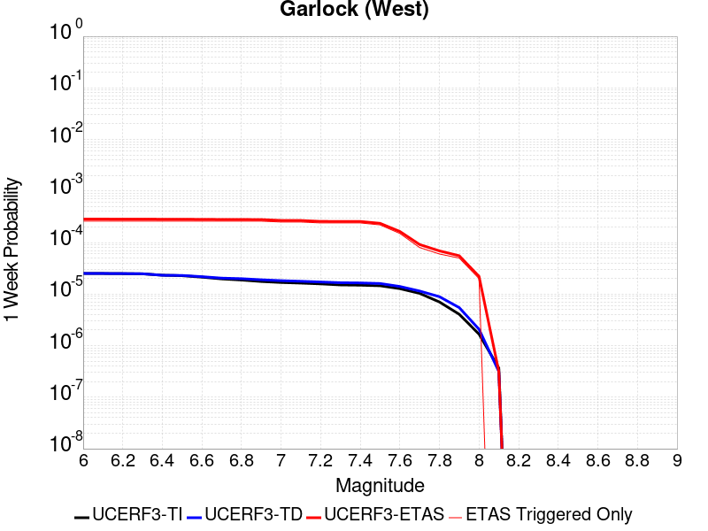 | 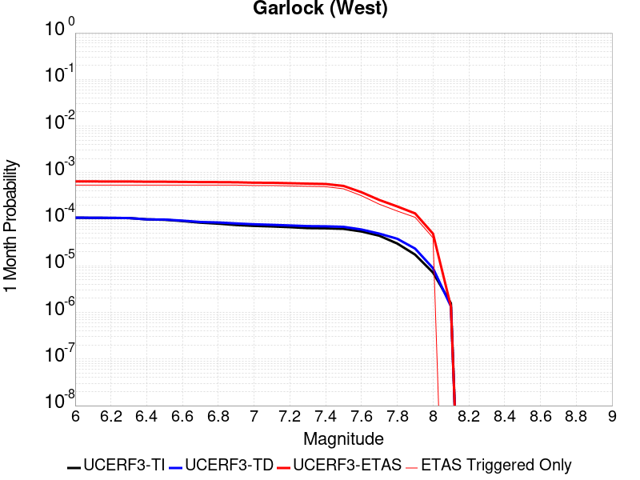 | 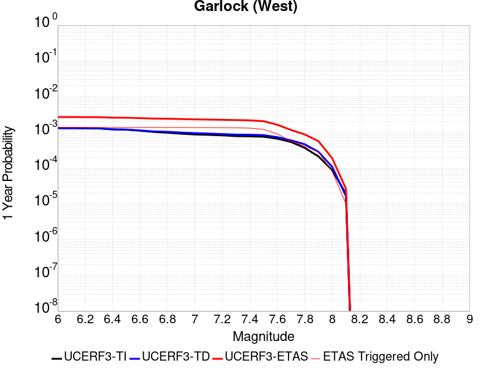 | 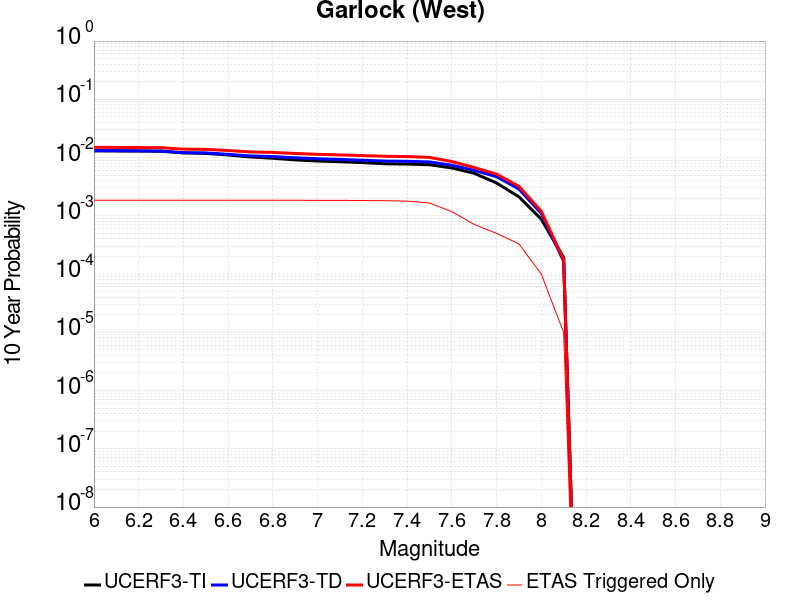 |

| Magnitude | 1 wk TI Prob | 1 wk TD Prob | 1 wk ETAS Prob | 1 wk ETAS/TD Gain | 1 wk ETAS Triggered Only | 1 mo TI Prob | 1 mo TD Prob | 1 mo ETAS Prob | 1 mo ETAS/TD Gain | 1 mo ETAS Triggered Only | 1 yr TI Prob | 1 yr TD Prob | 1 yr ETAS Prob | 1 yr ETAS/TD Gain | 1 yr ETAS Triggered Only | 10 yr TI Prob | 10 yr TD Prob | 10 yr ETAS Prob | 10 yr ETAS/TD Gain | 10 yr ETAS Triggered Only |
|-----|-----|-----|-----|-----|-----|-----|-----|-----|-----|-----|-----|-----|-----|-----|-----|-----|-----|-----|-----|-----|
| 6.0 | 2.5181727E-5 | 2.5202135E-5 | 2.851956E-4 | 11.316326 | 2.6E-4 | 1.0791722E-4 | 1.080047E-4 | 6.479464E-4 | 5.999243 | 5.4E-4 | 0.0013131002 | 0.0013141674 | 0.002682367 | 2.041115 | 0.00137 | 0.013053683 | 0.013144457 | 0.01497014 | 1.1388937 | 0.00185 |
| 6.1 | 2.5077732E-5 | 2.5103205E-5 | 2.8509667E-4 | 11.356983 | 2.6E-4 | 1.0747157E-4 | 1.07580745E-4 | 6.475226E-4 | 6.0189457 | 5.4E-4 | 0.001307681 | 0.0013090121 | 0.0026772188 | 2.0452209 | 0.00137 | 0.013000126 | 0.0130935125 | 0.014919289 | 1.1394414 | 0.00185 |
| 6.2 | 2.494612E-5 | 2.498488E-5 | 2.849784E-4 | 11.4060335 | 2.6E-4 | 1.0690756E-4 | 1.07073676E-4 | 6.4701587E-4 | 6.042716 | 5.4E-4 | 0.0013008224 | 0.0013028459 | 0.002671061 | 2.0501742 | 0.00137 | 0.012932341 | 0.013032575 | 0.014858465 | 1.140102 | 0.00185 |
| 6.3 | 2.4733758E-5 | 2.4804243E-5 | 2.847978E-4 | 11.481817 | 2.6E-4 | 1.0599751E-4 | 1.0629959E-4 | 6.462422E-4 | 6.079442 | 5.4E-4 | 0.0012897556 | 0.0012934325 | 0.0026616605 | 2.0578272 | 0.00137 | 0.012822957 | 0.012939542 | 0.0147656035 | 1.1411226 | 0.00185 |
| 6.4 | 2.3237335E-5 | 2.318352E-5 | 2.831775E-4 | 12.214603 | 2.6E-4 | 9.958477E-5 | 9.935417E-5 | 6.393005E-4 | 6.4345613 | 5.4E-4 | 0.0012117702 | 0.0012089686 | 0.0025773123 | 2.1318274 | 0.00137 | 0.012051838 | 0.012104375 | 0.013931982 | 1.1509873 | 0.00185 |
| 6.5 | 2.2732203E-5 | 2.2998063E-5 | 2.8299208E-4 | 12.30504 | 2.6E-4 | 9.742009E-5 | 9.8559416E-5 | 6.385062E-4 | 6.4783883 | 5.4E-4 | 0.0011854442 | 0.0011993032 | 0.00256766 | 2.14096 | 0.00137 | 0.011791403 | 0.012008769 | 0.013836553 | 1.152204 | 0.00185 |
| 6.6 | 2.1319436E-5 | 2.1778224E-5 | 2.8177255E-4 | 12.9382715 | 2.6E-4 | 9.136581E-5 | 9.333192E-5 | 6.3328154E-4 | 6.785262 | 5.4E-4 | 0.001111811 | 0.001135726 | 0.0025041702 | 2.204907 | 0.00137 | 0.011062649 | 0.0113796545 | 0.013208602 | 1.1607208 | 0.00185 |
| 6.7 | 1.970802E-5 | 2.0398069E-5 | 2.8039276E-4 | 13.746044 | 2.6E-4 | 8.446021E-5 | 8.741738E-5 | 6.2737014E-4 | 7.1767216 | 5.4E-4 | 0.001027818 | 0.0010637887 | 0.0024323312 | 2.2864797 | 0.00137 | 0.010230771 | 0.010667368 | 0.012497634 | 1.1715761 | 0.00185 |
| 6.8 | 1.8744462E-5 | 1.9905692E-5 | 2.799005E-4 | 14.061331 | 2.6E-4 | 8.033094E-5 | 8.530733E-5 | 6.252613E-4 | 7.3295145 | 5.4E-4 | 9.775903E-4 | 0.0010381235 | 0.0024067012 | 2.3183188 | 0.00137 | 0.009733009 | 0.010413141 | 0.012243877 | 1.1758101 | 0.00185 |
| 6.9 | 1.7559682E-5 | 1.895803E-5 | 2.789531E-4 | 14.714245 | 2.6E-4 | 7.5253614E-5 | 8.124618E-5 | 6.212023E-4 | 7.6459265 | 5.4E-4 | 9.158276E-4 | 9.887248E-4 | 0.0023573702 | 2.3842533 | 0.00137 | 0.0091206245 | 0.009923607 | 0.0117552485 | 1.1845741 | 0.00185 |
| 7.0 | 1.6794445E-5 | 1.8220819E-5 | 2.6821627E-4 | 14.720319 | 2.5E-4 | 7.197421E-5 | 7.8086894E-5 | 6.080455E-4 | 7.786781 | 5.3E-4 | 8.759337E-4 | 9.5029466E-4 | 0.0023090022 | 2.429775 | 0.00136 | 0.008724891 | 0.0095425 | 0.0113649415 | 1.1909816 | 0.00184 |
| 7.1 | 1.6337795E-5 | 1.7721602E-5 | 2.6771717E-4 | 15.106827 | 2.5E-4 | 7.0017246E-5 | 7.5947515E-5 | 6.059073E-4 | 7.9779735 | 5.3E-4 | 8.521265E-4 | 9.2427013E-4 | 0.0022830132 | 2.4700713 | 0.00136 | 0.008488664 | 0.009284343 | 0.011107259 | 1.1963431 | 0.00184 |
| 7.2 | 1.5780008E-5 | 1.7170225E-5 | 2.571661E-4 | 14.977446 | 2.4E-4 | 6.762685E-5 | 7.358461E-5 | 5.9354637E-4 | 8.066175 | 5.2E-4 | 8.2304585E-4 | 8.955257E-4 | 0.0022443167 | 2.5061445 | 0.00135 | 0.008200042 | 0.008999176 | 0.010812708 | 1.201522 | 0.00183 |
| 7.3 | 1.5058865E-5 | 1.6623266E-5 | 2.5661927E-4 | 15.437356 | 2.4E-4 | 6.45364E-5 | 7.124063E-5 | 5.812043E-4 | 8.158326 | 5.1E-4 | 7.854473E-4 | 8.6701073E-4 | 0.002205849 | 2.5442004 | 0.00134 | 0.00782677 | 0.00871586 | 0.010519996 | 1.2069948 | 0.00182 |
| 7.4 | 1.4887923E-5 | 1.6459222E-5 | 2.5645527E-4 | 15.581252 | 2.4E-4 | 6.380382E-5 | 7.053762E-5 | 5.7050237E-4 | 8.087916 | 5.0E-4 | 7.7653467E-4 | 8.5845834E-4 | 0.0021673338 | 2.5246813 | 0.00131 | 0.0077382675 | 0.0086307125 | 0.010405264 | 1.2056088 | 0.00179 |
| 7.5 | 1.4509299E-5 | 1.6051208E-5 | 2.3604768E-4 | 14.705914 | 2.2E-4 | 6.218123E-5 | 6.8789086E-5 | 5.1875814E-4 | 7.5412855 | 4.5E-4 | 7.567935E-4 | 8.3718647E-4 | 0.0020561651 | 2.456042 | 0.00122 | 0.0075422134 | 0.008419003 | 0.0100650275 | 1.195513 | 0.00166 |
| 7.6 | 1.2756717E-5 | 1.4055129E-5 | 1.6405302E-4 | 11.672111 | 1.5E-4 | 5.4670498E-5 | 6.023488E-5 | 3.802156E-4 | 6.3122163 | 3.2E-4 | 6.6541E-4 | 7.331136E-4 | 0.0016324538 | 2.2267406 | 9.0E-4 | 0.006634211 | 0.007383898 | 0.008555185 | 1.1586272 | 0.00118 |
| 7.7 | 1.0328985E-5 | 1.1464573E-5 | 9.1463655E-5 | 7.9779387 | 8.0E-5 | 4.4266326E-5 | 4.913296E-5 | 2.5912264E-4 | 5.2739067 | 2.1E-4 | 5.388092E-4 | 5.9803E-4 | 0.0011676891 | 1.9525595 | 5.7E-4 | 0.0053750467 | 0.0060405903 | 0.0067463014 | 1.1168282 | 7.1E-4 |
| 7.8 | 7.0306583E-6 | 8.902813E-6 | 6.890228E-5 | 7.739383 | 6.0E-5 | 3.0131043E-5 | 3.8154354E-5 | 1.8814862E-4 | 4.931249 | 1.5E-4 | 3.667837E-4 | 4.644304E-4 | 8.7424E-4 | 1.8823918 | 4.1E-4 | 0.003661789 | 0.0046969377 | 0.0051945895 | 1.1059524 | 5.0E-4 |
| 7.9 | 4.060633E-6 | 5.4672782E-6 | 5.5467004E-5 | 10.145268 | 5.0E-5 | 1.7402595E-5 | 2.3430983E-5 | 1.334284E-4 | 5.694529 | 1.1E-4 | 2.11856E-4 | 2.8523497E-4 | 5.651551E-4 | 1.9813669 | 2.8E-4 | 0.0021165414 | 0.0028851798 | 0.0032142277 | 1.1140476 | 3.3E-4 |
| 8.0 | 1.6729537E-6 | 2.078155E-6 | 2.2078113E-5 | 10.623901 | 2.0E-5 | 7.169782E-6 | 8.906349E-6 | 4.8905993E-5 | 5.4911385 | 4.0E-5 | 8.7288594E-5 | 1.08429434E-4 | 1.8842076E-4 | 1.737727 | 8.0E-5 | 8.7254314E-4 | 0.001097267 | 0.0011971573 | 1.0910355 | 1.0E-4 |
| 8.1 | 3.6733252E-7 | 3.1499187E-7 | 3.1499187E-7 | 1.0 | 0.0 | 1.5742813E-6 | 1.3499646E-6 | 1.3499646E-6 | 1.0 | 0.0 | 1.9166706E-5 | 1.643571E-5 | 2.6435546E-5 | 1.6084212 | 1.0E-5 | 1.9165053E-4 | 1.6643589E-4 | 1.7643423E-4 | 1.0600731 | 1.0E-5 |

## Blackwater
*[(top)](#table-of-contents)*

| 1 Week | 1 Month | 1 Year | 10 Year |
|-----|-----|-----|-----|
|  |  |  |  |

| Magnitude | 1 wk TI Prob | 1 wk TD Prob | 1 wk ETAS Prob | 1 wk ETAS/TD Gain | 1 wk ETAS Triggered Only | 1 mo TI Prob | 1 mo TD Prob | 1 mo ETAS Prob | 1 mo ETAS/TD Gain | 1 mo ETAS Triggered Only | 1 yr TI Prob | 1 yr TD Prob | 1 yr ETAS Prob | 1 yr ETAS/TD Gain | 1 yr ETAS Triggered Only | 10 yr TI Prob | 10 yr TD Prob | 10 yr ETAS Prob | 10 yr ETAS/TD Gain | 10 yr ETAS Triggered Only |
|-----|-----|-----|-----|-----|-----|-----|-----|-----|-----|-----|-----|-----|-----|-----|-----|-----|-----|-----|-----|-----|
| 6.0 | 3.0708583E-5 | 3.309619E-5 | 1.9309089E-4 | 5.8342333 | 1.6E-4 | 1.3160157E-4 | 1.4183388E-4 | 5.617743E-4 | 3.9607909 | 4.2E-4 | 0.0016010714 | 0.0017255963 | 0.002554164 | 1.4801631 | 8.3E-4 | 0.015895851 | 0.017135808 | 0.018334903 | 1.069976 | 0.00122 |
| 6.1 | 3.0708583E-5 | 3.309619E-5 | 1.9309089E-4 | 5.8342333 | 1.6E-4 | 1.3160157E-4 | 1.4183388E-4 | 5.617743E-4 | 3.9607909 | 4.2E-4 | 0.0016010714 | 0.0017255963 | 0.002554164 | 1.4801631 | 8.3E-4 | 0.015895851 | 0.017135808 | 0.018334903 | 1.069976 | 0.00122 |
| 6.2 | 1.1707779E-5 | 1.2545242E-5 | 5.254474E-5 | 4.18842 | 4.0E-5 | 5.017523E-5 | 5.3764266E-5 | 1.6375835E-4 | 3.0458586 | 1.1E-4 | 6.107122E-4 | 6.5439293E-4 | 9.84177E-4 | 1.5039542 | 3.3E-4 | 0.006090366 | 0.006525631 | 0.0070223683 | 1.076121 | 5.0E-4 |
| 6.3 | 1.1707779E-5 | 1.2545242E-5 | 5.254474E-5 | 4.18842 | 4.0E-5 | 5.017523E-5 | 5.3764266E-5 | 1.6375835E-4 | 3.0458586 | 1.1E-4 | 6.107122E-4 | 6.5439293E-4 | 9.84177E-4 | 1.5039542 | 3.3E-4 | 0.006090366 | 0.006525631 | 0.0070223683 | 1.076121 | 5.0E-4 |
| 6.4 | 7.929244E-6 | 8.480176E-6 | 2.8480006E-5 | 3.3584216 | 2.0E-5 | 3.3982033E-5 | 3.6343128E-5 | 1.1634022E-4 | 3.2011614 | 8.0E-5 | 4.136527E-4 | 4.4239179E-4 | 6.6229445E-4 | 1.4970767 | 2.2E-4 | 0.0041288356 | 0.0044155167 | 0.0047540152 | 1.0766612 | 3.4E-4 |
| 6.5 | 5.8832115E-6 | 6.286048E-6 | 2.6285923E-5 | 4.181629 | 2.0E-5 | 2.521352E-5 | 2.6939942E-5 | 6.693886E-5 | 2.4847443 | 4.0E-5 | 3.0693135E-4 | 3.2794697E-4 | 4.6790106E-4 | 1.4267583 | 1.4E-4 | 0.0030650778 | 0.0032748834 | 0.0035041303 | 1.0700015 | 2.3E-4 |
| 6.6 | 5.8832115E-6 | 6.286048E-6 | 2.6285923E-5 | 4.181629 | 2.0E-5 | 2.521352E-5 | 2.6939942E-5 | 6.693886E-5 | 2.4847443 | 4.0E-5 | 3.0693135E-4 | 3.2794697E-4 | 4.6790106E-4 | 1.4267583 | 1.4E-4 | 0.0030650778 | 0.0032748834 | 0.0035041303 | 1.0700015 | 2.3E-4 |
| 6.7 | 3.0715053E-6 | 3.281496E-6 | 1.3281463E-5 | 4.0473804 | 1.0E-5 | 1.3163528E-5 | 1.4063485E-5 | 3.4063203E-5 | 2.4221027 | 2.0E-5 | 1.6025416E-4 | 1.7121063E-4 | 2.5119694E-4 | 1.4671807 | 8.0E-5 | 0.0016013865 | 0.0017109019 | 0.0018207137 | 1.0641836 | 1.1E-4 |
| 6.8 | 2.2722281E-6 | 2.4287758E-6 | 2.4287758E-6 | 1.0 | 0.0 | 9.738084E-6 | 1.0409003E-5 | 2.04089E-5 | 1.9606968 | 1.0E-5 | 1.1855473E-4 | 1.2672316E-4 | 1.9671429E-4 | 1.5523152 | 7.0E-5 | 0.001184915 | 0.0012665992 | 0.0013464978 | 1.0630813 | 8.0E-5 |
| 6.9 | 9.952399E-7 | 1.0653588E-6 | 1.0653588E-6 | 1.0 | 0.0 | 4.265307E-6 | 4.5658185E-6 | 4.5658185E-6 | 1.0 | 0.0 | 5.1928873E-5 | 5.5587938E-5 | 8.558627E-5 | 1.5396554 | 3.0E-5 | 5.191674E-4 | 5.5579096E-4 | 5.8577425E-4 | 1.0539471 | 3.0E-5 |
| 7.0 | 4.7385504E-7 | 5.0756074E-7 | 5.0756074E-7 | 1.0 | 0.0 | 2.0308057E-6 | 2.1752603E-6 | 2.1752603E-6 | 1.0 | 0.0 | 2.4724779E-5 | 2.6483794E-5 | 5.6483E-5 | 2.132738 | 3.0E-5 | 2.4722028E-4 | 2.6483793E-4 | 2.9482998E-4 | 1.1132468 | 3.0E-5 |

## Ash Hill
*[(top)](#table-of-contents)*

| 1 Week | 1 Month | 1 Year | 10 Year |
|-----|-----|-----|-----|
| 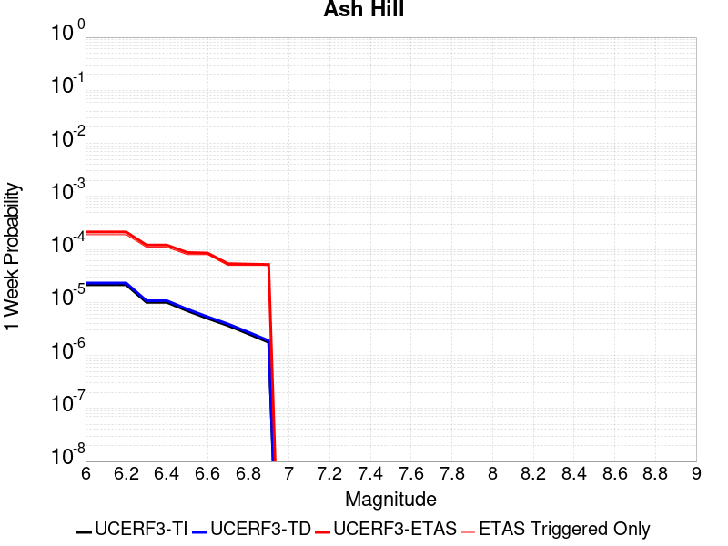 |  |  |  |

| Magnitude | 1 wk TI Prob | 1 wk TD Prob | 1 wk ETAS Prob | 1 wk ETAS/TD Gain | 1 wk ETAS Triggered Only | 1 mo TI Prob | 1 mo TD Prob | 1 mo ETAS Prob | 1 mo ETAS/TD Gain | 1 mo ETAS Triggered Only | 1 yr TI Prob | 1 yr TD Prob | 1 yr ETAS Prob | 1 yr ETAS/TD Gain | 1 yr ETAS Triggered Only | 10 yr TI Prob | 10 yr TD Prob | 10 yr ETAS Prob | 10 yr ETAS/TD Gain | 10 yr ETAS Triggered Only |
|-----|-----|-----|-----|-----|-----|-----|-----|-----|-----|-----|-----|-----|-----|-----|-----|-----|-----|-----|-----|-----|
| 6.0 | 2.1545662E-5 | 2.3194681E-5 | 2.1319027E-4 | 9.191342 | 1.9E-4 | 9.2335285E-5 | 9.9402445E-5 | 4.7936468E-4 | 4.8224635 | 3.8E-4 | 0.0011236023 | 0.0012096328 | 0.0018688345 | 1.5449601 | 6.6E-4 | 0.011179381 | 0.01203847 | 0.013016552 | 1.0812464 | 9.9E-4 |
| 6.1 | 2.1545662E-5 | 2.3194681E-5 | 2.1319027E-4 | 9.191342 | 1.9E-4 | 9.2335285E-5 | 9.9402445E-5 | 4.7936468E-4 | 4.8224635 | 3.8E-4 | 0.0011236023 | 0.0012096328 | 0.0018688345 | 1.5449601 | 6.6E-4 | 0.011179381 | 0.01203847 | 0.013016552 | 1.0812464 | 9.9E-4 |
| 6.2 | 2.1545662E-5 | 2.3194681E-5 | 2.1319027E-4 | 9.191342 | 1.9E-4 | 9.2335285E-5 | 9.9402445E-5 | 4.7936468E-4 | 4.8224635 | 3.8E-4 | 0.0011236023 | 0.0012096328 | 0.0018688345 | 1.5449601 | 6.6E-4 | 0.011179381 | 0.01203847 | 0.013016552 | 1.0812464 | 9.9E-4 |
| 6.3 | 1.0025529E-5 | 1.0747037E-5 | 1.20745855E-4 | 11.23527 | 1.1E-4 | 4.2965847E-5 | 4.605799E-5 | 2.0605062E-4 | 4.4737215 | 1.6E-4 | 5.229836E-4 | 5.60625E-4 | 8.104848E-4 | 1.4456809 | 2.5E-4 | 0.005217545 | 0.0055934195 | 0.005951406 | 1.0640013 | 3.6E-4 |
| 6.4 | 1.0025529E-5 | 1.0747037E-5 | 1.20745855E-4 | 11.23527 | 1.1E-4 | 4.2965847E-5 | 4.605799E-5 | 2.0605062E-4 | 4.4737215 | 1.6E-4 | 5.229836E-4 | 5.60625E-4 | 8.104848E-4 | 1.4456809 | 2.5E-4 | 0.005217545 | 0.0055934195 | 0.005951406 | 1.0640013 | 3.6E-4 |
| 6.5 | 6.9617327E-6 | 7.456704E-6 | 8.745611E-5 | 11.72852 | 8.0E-5 | 2.9835655E-5 | 3.1956963E-5 | 1.619528E-4 | 5.067841 | 1.3E-4 | 3.6318856E-4 | 3.8901521E-4 | 5.789413E-4 | 1.4882227 | 1.9E-4 | 0.0036259557 | 0.0038841967 | 0.0041531483 | 1.0692425 | 2.7E-4 |
| 6.6 | 4.9919777E-6 | 5.346739E-6 | 8.534631E-5 | 15.962312 | 8.0E-5 | 2.1394015E-5 | 2.2914432E-5 | 1.3291191E-4 | 5.8003583 | 1.1E-4 | 2.60441E-4 | 2.789542E-4 | 4.2891235E-4 | 1.5375727 | 1.5E-4 | 0.0026013597 | 0.0027866988 | 0.0029961136 | 1.075148 | 2.1E-4 |
| 6.7 | 3.6630722E-6 | 3.9246606E-6 | 5.3924465E-5 | 13.739904 | 5.0E-5 | 1.5698786E-5 | 1.6819899E-5 | 8.681872E-5 | 5.1616673 | 7.0E-5 | 1.9111596E-4 | 2.0476876E-4 | 3.0474828E-4 | 1.4882557 | 1.0E-4 | 0.0019095168 | 0.002046364 | 0.0022060366 | 1.0780275 | 1.6E-4 |
| 6.8 | 2.5599613E-6 | 2.7449514E-6 | 5.2744814E-5 | 19.215208 | 5.0E-5 | 1.0971216E-5 | 1.1764052E-5 | 7.1763345E-5 | 6.1002235 | 6.0E-5 | 1.3356637E-4 | 1.4322287E-4 | 2.1321284E-4 | 1.4886788 | 7.0E-5 | 0.0013348613 | 0.0014317906 | 0.0015416332 | 1.0767169 | 1.1E-4 |
| 6.9 | 1.7684905E-6 | 1.896889E-6 | 5.1896794E-5 | 27.358898 | 5.0E-5 | 7.579223E-6 | 8.129524E-6 | 5.8129117E-5 | 7.1503716 | 5.0E-5 | 9.2273134E-5 | 9.8976954E-5 | 1.48972E-4 | 1.5051181 | 5.0E-5 | 9.223483E-4 | 9.897696E-4 | 0.0010497102 | 1.0605602 | 6.0E-5 |

## San Andreas (Mojave N)
*[(top)](#table-of-contents)*

| 1 Week | 1 Month | 1 Year | 10 Year |
|-----|-----|-----|-----|
| 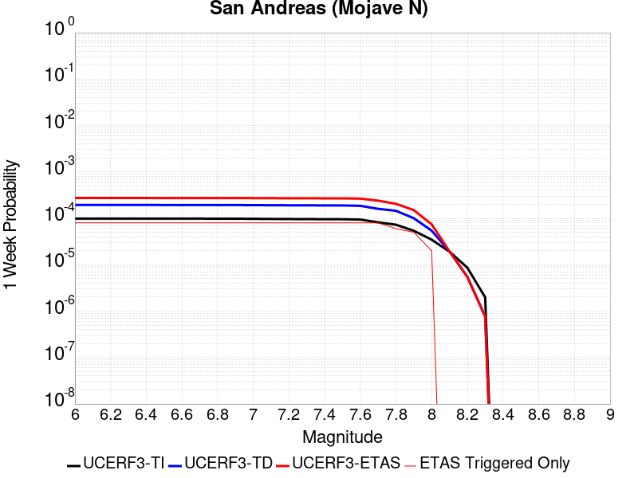 | 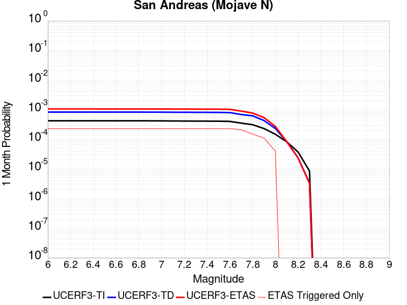 | 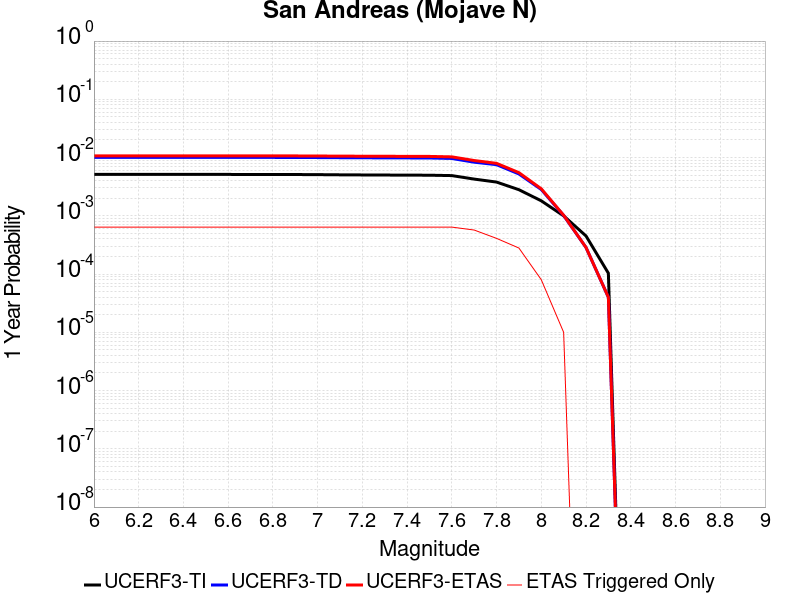 | 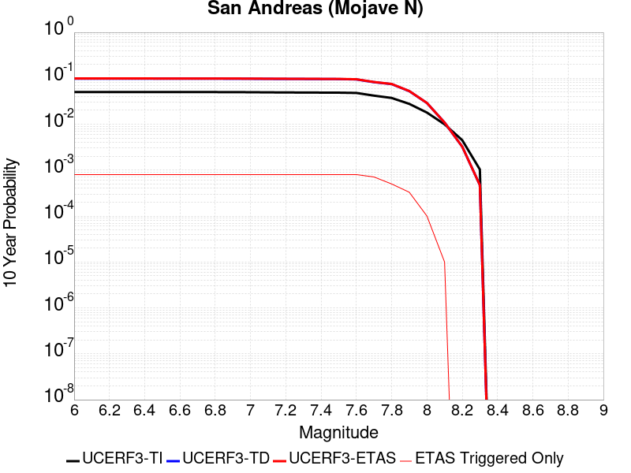 |

| Magnitude | 1 wk TI Prob | 1 wk TD Prob | 1 wk ETAS Prob | 1 wk ETAS/TD Gain | 1 wk ETAS Triggered Only | 1 mo TI Prob | 1 mo TD Prob | 1 mo ETAS Prob | 1 mo ETAS/TD Gain | 1 mo ETAS Triggered Only | 1 yr TI Prob | 1 yr TD Prob | 1 yr ETAS Prob | 1 yr ETAS/TD Gain | 1 yr ETAS Triggered Only | 10 yr TI Prob | 10 yr TD Prob | 10 yr ETAS Prob | 10 yr ETAS/TD Gain | 10 yr ETAS Triggered Only |
|-----|-----|-----|-----|-----|-----|-----|-----|-----|-----|-----|-----|-----|-----|-----|-----|-----|-----|-----|-----|-----|
| 6.0 | 9.877682E-5 | 1.9409315E-4 | 2.7407764E-4 | 1.4120932 | 8.0E-5 | 4.2326056E-4 | 8.315628E-4 | 0.0010613715 | 1.2763577 | 2.3E-4 | 0.0051410277 | 0.010077406 | 0.0107109565 | 1.0628684 | 6.4E-4 | 0.05023708 | 0.09835201 | 0.09907332 | 1.007334 | 8.0E-4 |
| 6.1 | 9.877682E-5 | 1.9409315E-4 | 2.7407764E-4 | 1.4120932 | 8.0E-5 | 4.2326056E-4 | 8.315628E-4 | 0.0010613715 | 1.2763577 | 2.3E-4 | 0.0051410277 | 0.010077406 | 0.0107109565 | 1.0628684 | 6.4E-4 | 0.05023708 | 0.09835201 | 0.09907332 | 1.007334 | 8.0E-4 |
| 6.2 | 9.877682E-5 | 1.9409315E-4 | 2.7407764E-4 | 1.4120932 | 8.0E-5 | 4.2326056E-4 | 8.315628E-4 | 0.0010613715 | 1.2763577 | 2.3E-4 | 0.0051410277 | 0.010077406 | 0.0107109565 | 1.0628684 | 6.4E-4 | 0.05023708 | 0.09835201 | 0.09907332 | 1.007334 | 8.0E-4 |
| 6.3 | 9.877682E-5 | 1.9409315E-4 | 2.7407764E-4 | 1.4120932 | 8.0E-5 | 4.2326056E-4 | 8.315628E-4 | 0.0010613715 | 1.2763577 | 2.3E-4 | 0.0051410277 | 0.010077406 | 0.0107109565 | 1.0628684 | 6.4E-4 | 0.05023708 | 0.09835201 | 0.09907332 | 1.007334 | 8.0E-4 |
| 6.4 | 9.877682E-5 | 1.9409315E-4 | 2.7407764E-4 | 1.4120932 | 8.0E-5 | 4.2326056E-4 | 8.315628E-4 | 0.0010613715 | 1.2763577 | 2.3E-4 | 0.0051410277 | 0.010077406 | 0.0107109565 | 1.0628684 | 6.4E-4 | 0.05023708 | 0.09835201 | 0.09907332 | 1.007334 | 8.0E-4 |
| 6.5 | 9.861474E-5 | 1.9383078E-4 | 2.738153E-4 | 1.4126512 | 8.0E-5 | 4.2256617E-4 | 8.304391E-4 | 0.0010602481 | 1.2767318 | 2.3E-4 | 0.0051326132 | 0.010063851 | 0.01069741 | 1.062954 | 6.4E-4 | 0.050156746 | 0.098229796 | 0.098951206 | 1.0073441 | 8.0E-4 |
| 6.6 | 9.861474E-5 | 1.9383078E-4 | 2.738153E-4 | 1.4126512 | 8.0E-5 | 4.2256617E-4 | 8.304391E-4 | 0.0010602481 | 1.2767318 | 2.3E-4 | 0.0051326132 | 0.010063851 | 0.01069741 | 1.062954 | 6.4E-4 | 0.050156746 | 0.098229796 | 0.098951206 | 1.0073441 | 8.0E-4 |
| 6.7 | 9.8552715E-5 | 1.9373032E-4 | 2.737148E-4 | 1.4128652 | 8.0E-5 | 4.223004E-4 | 8.3000876E-4 | 0.0010598178 | 1.2768755 | 2.3E-4 | 0.0051293927 | 0.01005866 | 0.010692223 | 1.0629867 | 6.4E-4 | 0.050125998 | 0.098182976 | 0.09890443 | 1.0073481 | 8.0E-4 |
| 6.8 | 9.8464974E-5 | 1.9358192E-4 | 2.7356643E-4 | 1.4131818 | 8.0E-5 | 4.219245E-4 | 8.293732E-4 | 0.0010591825 | 1.2770878 | 2.3E-4 | 0.0051248376 | 0.010050993 | 0.010684561 | 1.0630352 | 6.4E-4 | 0.05008251 | 0.09811299 | 0.09883451 | 1.0073539 | 8.0E-4 |
| 6.9 | 9.825824E-5 | 1.9326196E-4 | 2.732465E-4 | 1.4138659 | 8.0E-5 | 4.2103877E-4 | 8.280028E-4 | 0.0010578124 | 1.2775469 | 2.3E-4 | 0.0051141046 | 0.010034463 | 0.010668041 | 1.0631402 | 6.4E-4 | 0.049980022 | 0.09796208 | 0.09868371 | 1.0073664 | 8.0E-4 |
| 7.0 | 9.781462E-5 | 1.9257552E-4 | 2.725601E-4 | 1.4153414 | 8.0E-5 | 4.1913814E-4 | 8.250628E-4 | 0.0010548731 | 1.2785367 | 2.3E-4 | 0.005091073 | 0.009998998 | 0.010632599 | 1.0633664 | 6.4E-4 | 0.04976007 | 0.097638436 | 0.09836033 | 1.0073935 | 8.0E-4 |
| 7.1 | 9.7121134E-5 | 1.9159251E-4 | 2.7157718E-4 | 1.4174728 | 8.0E-5 | 4.1616702E-4 | 8.208525E-4 | 0.0010506638 | 1.2799665 | 2.3E-4 | 0.005055068 | 0.009948207 | 0.01058184 | 1.0636932 | 6.4E-4 | 0.04941613 | 0.097174905 | 0.097897165 | 1.0074326 | 8.0E-4 |
| 7.2 | 9.663819E-5 | 1.9090026E-4 | 2.7088498E-4 | 1.418987 | 8.0E-5 | 4.1409794E-4 | 8.178876E-4 | 0.0010476995 | 1.2809823 | 2.3E-4 | 0.0050299936 | 0.009912439 | 0.010546095 | 1.0639254 | 6.4E-4 | 0.049176537 | 0.09684814 | 0.09757066 | 1.0074604 | 8.0E-4 |
| 7.3 | 9.6277574E-5 | 1.9042526E-4 | 2.7041003E-4 | 1.4200324 | 8.0E-5 | 4.125529E-4 | 8.158532E-4 | 0.0010456656 | 1.2816834 | 2.3E-4 | 0.0050112694 | 0.009887895 | 0.0105215665 | 1.0640856 | 6.4E-4 | 0.04899759 | 0.09662155 | 0.09734426 | 1.0074797 | 8.0E-4 |
| 7.4 | 9.593308E-5 | 1.8982294E-4 | 2.6980776E-4 | 1.4213654 | 8.0E-5 | 4.1107697E-4 | 8.132734E-4 | 0.0010430864 | 1.2825778 | 2.3E-4 | 0.0049933824 | 0.00985677 | 0.010490462 | 1.06429 | 6.4E-4 | 0.04882661 | 0.09633968 | 0.09706261 | 1.007504 | 8.0E-4 |
| 7.5 | 9.561707E-5 | 1.8928363E-4 | 2.692685E-4 | 1.4225662 | 8.0E-5 | 4.0972308E-4 | 8.109635E-4 | 0.001040777 | 1.2833833 | 2.3E-4 | 0.0049769743 | 0.009828901 | 0.010462611 | 1.0644741 | 6.4E-4 | 0.048669744 | 0.09608582 | 0.09680895 | 1.0075259 | 8.0E-4 |
| 7.6 | 9.418194E-5 | 1.8580563E-4 | 2.6579076E-4 | 1.4304775 | 8.0E-5 | 4.0357444E-4 | 7.96067E-4 | 0.001025884 | 1.2886904 | 2.3E-4 | 0.004902454 | 0.009649157 | 0.010282981 | 1.0656871 | 6.4E-4 | 0.047957025 | 0.09446791 | 0.095192336 | 1.0076685 | 8.0E-4 |
| 7.7 | 8.202141E-5 | 1.6029038E-4 | 2.4027756E-4 | 1.4990143 | 8.0E-5 | 3.51473E-4 | 6.86778E-4 | 8.966337E-4 | 1.3055657 | 2.1E-4 | 0.00427079 | 0.008329522 | 0.008894773 | 1.0678613 | 5.7E-4 | 0.04189639 | 0.08226675 | 0.08291834 | 1.0079205 | 7.1E-4 |
| 7.8 | 7.2859846E-5 | 1.4523414E-4 | 2.0522543E-4 | 1.413066 | 6.0E-5 | 3.1221908E-4 | 6.2228355E-4 | 7.721902E-4 | 1.2408977 | 1.5E-4 | 0.003794643 | 0.007550025 | 0.0079569295 | 1.0538944 | 4.1E-4 | 0.037304975 | 0.074755974 | 0.075218596 | 1.0061884 | 5.0E-4 |
| 7.9 | 5.3874453E-5 | 1.0050546E-4 | 1.5050043E-4 | 1.4974355 | 5.0E-5 | 2.3087008E-4 | 4.3066658E-4 | 5.406192E-4 | 1.255308 | 1.1E-4 | 0.0028072202 | 0.005230771 | 0.005509306 | 1.0532494 | 2.8E-4 | 0.02772022 | 0.052447177 | 0.05275987 | 1.005962 | 3.3E-4 |
| 8.0 | 3.468538E-5 | 5.4288335E-5 | 7.428725E-5 | 1.3683833 | 2.0E-5 | 1.4864317E-4 | 2.3264355E-4 | 2.7263424E-4 | 1.1718968 | 4.0E-5 | 0.0018082283 | 0.0028287582 | 0.0029085318 | 1.028201 | 8.0E-5 | 0.017935853 | 0.028961267 | 0.029058373 | 1.0033529 | 1.0E-4 |
| 8.1 | 1.9152367E-5 | 1.9415891E-5 | 1.9415891E-5 | 1.0 | 0.0 | 8.207899E-5 | 8.320831E-5 | 8.320831E-5 | 1.0 | 0.0 | 9.988535E-4 | 0.0010125911 | 0.0010225809 | 1.0098656 | 1.0E-5 | 0.009943757 | 0.010863188 | 0.010873079 | 1.0009105 | 1.0E-5 |
| 8.2 | 8.643924E-6 | 5.4798497E-6 | 5.4798497E-6 | 1.0 | 0.0 | 3.704486E-5 | 2.348486E-5 | 2.348486E-5 | 1.0 | 0.0 | 4.5092785E-4 | 2.858907E-4 | 2.858907E-4 | 1.0 | 0.0 | 0.0045001395 | 0.0032514327 | 0.0032514327 | 1.0 | 0.0 |
| 8.3 | 1.983087E-6 | 7.668296E-7 | 7.668296E-7 | 1.0 | 0.0 | 8.498917E-6 | 3.2864084E-6 | 3.2864084E-6 | 1.0 | 0.0 | 1.034694E-4 | 4.0011306E-5 | 4.0011306E-5 | 1.0 | 0.0 | 0.0010342124 | 4.724499E-4 | 4.724499E-4 | 1.0 | 0.0 |

## Gravel Hills-Harper Lk
*[(top)](#table-of-contents)*

| 1 Week | 1 Month | 1 Year | 10 Year |
|-----|-----|-----|-----|
| 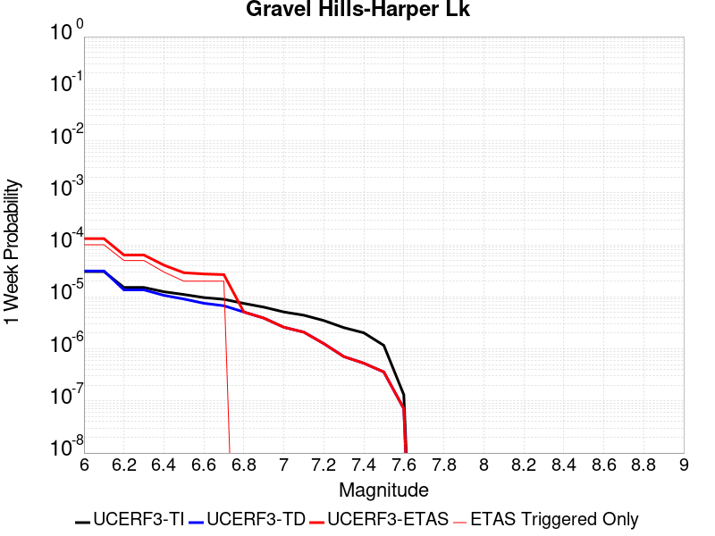 | 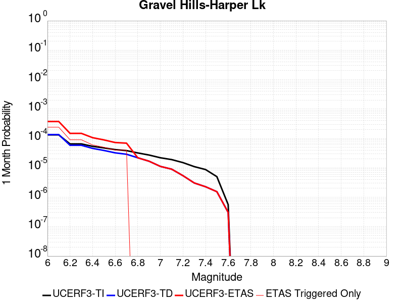 | 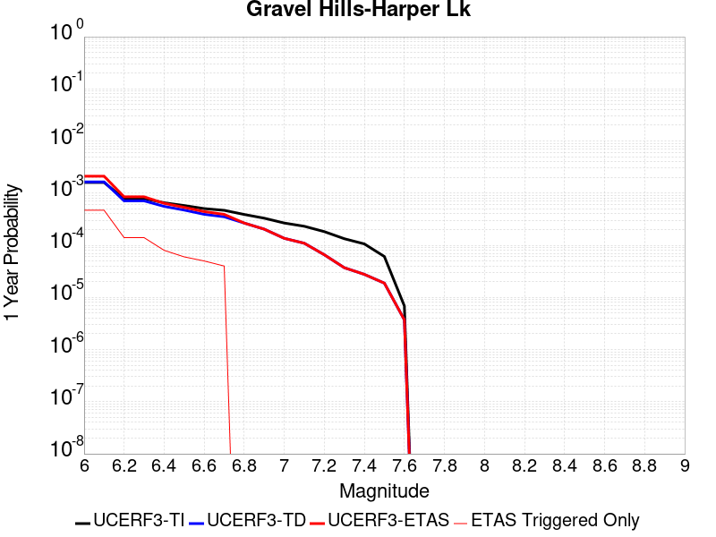 | 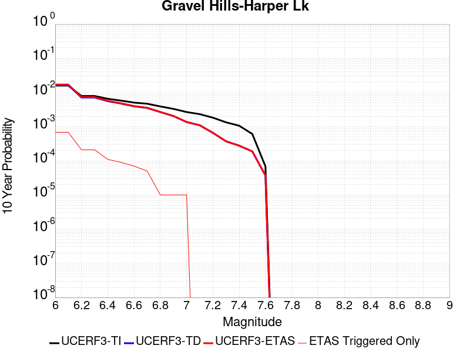 |

| Magnitude | 1 wk TI Prob | 1 wk TD Prob | 1 wk ETAS Prob | 1 wk ETAS/TD Gain | 1 wk ETAS Triggered Only | 1 mo TI Prob | 1 mo TD Prob | 1 mo ETAS Prob | 1 mo ETAS/TD Gain | 1 mo ETAS Triggered Only | 1 yr TI Prob | 1 yr TD Prob | 1 yr ETAS Prob | 1 yr ETAS/TD Gain | 1 yr ETAS Triggered Only | 10 yr TI Prob | 10 yr TD Prob | 10 yr ETAS Prob | 10 yr ETAS/TD Gain | 10 yr ETAS Triggered Only |
|-----|-----|-----|-----|-----|-----|-----|-----|-----|-----|-----|-----|-----|-----|-----|-----|-----|-----|-----|-----|-----|
| 6.0 | 3.0679566E-5 | 3.1465184E-5 | 1.3146203E-4 | 4.1780157 | 1.0E-4 | 1.3147724E-4 | 1.3484505E-4 | 3.748127E-4 | 2.7795806 | 2.4E-4 | 0.0015995599 | 0.0016407187 | 0.0021099474 | 1.2859899 | 4.7E-4 | 0.015880952 | 0.016307615 | 0.016976526 | 1.0410184 | 6.8E-4 |
| 6.1 | 3.0679566E-5 | 3.1465184E-5 | 1.3146203E-4 | 4.1780157 | 1.0E-4 | 1.3147724E-4 | 1.3484505E-4 | 3.748127E-4 | 2.7795806 | 2.4E-4 | 0.0015995599 | 0.0016407187 | 0.0021099474 | 1.2859899 | 4.7E-4 | 0.015880952 | 0.016307615 | 0.016976526 | 1.0410184 | 6.8E-4 |
| 6.2 | 1.514536E-5 | 1.3635392E-5 | 6.363471E-5 | 4.6668777 | 5.0E-5 | 6.490707E-5 | 5.843615E-5 | 1.4843089E-4 | 2.5400524 | 9.0E-5 | 7.8995706E-4 | 7.112398E-4 | 8.5114024E-4 | 1.1966994 | 1.4E-4 | 0.007871548 | 0.0070908363 | 0.0072993473 | 1.0294057 | 2.1E-4 |
| 6.3 | 1.514536E-5 | 1.3635392E-5 | 6.363471E-5 | 4.6668777 | 5.0E-5 | 6.490707E-5 | 5.843615E-5 | 1.4843089E-4 | 2.5400524 | 9.0E-5 | 7.8995706E-4 | 7.112398E-4 | 8.5114024E-4 | 1.1966994 | 1.4E-4 | 0.007871548 | 0.0070908363 | 0.0072993473 | 1.0294057 | 2.1E-4 |
| 6.4 | 1.2532521E-5 | 1.0689826E-5 | 4.0689505E-5 | 3.8063767 | 3.0E-5 | 5.37097E-5 | 4.581277E-5 | 1.0581002E-4 | 2.3096185 | 6.0E-5 | 6.537194E-4 | 5.576335E-4 | 6.375889E-4 | 1.1433834 | 8.0E-5 | 0.0065179965 | 0.0055629327 | 0.005672321 | 1.0196637 | 1.1E-4 |
| 6.5 | 1.1094058E-5 | 9.083774E-6 | 2.9083592E-5 | 3.201708 | 2.0E-5 | 4.7545094E-5 | 3.89299E-5 | 8.8927954E-5 | 2.2843099 | 5.0E-5 | 5.787078E-4 | 4.738725E-4 | 5.3384405E-4 | 1.1265564 | 6.0E-5 | 0.0057720304 | 0.004729028 | 0.004818602 | 1.0189414 | 9.0E-5 |
| 6.6 | 9.688328E-6 | 7.531784E-6 | 2.7531632E-5 | 3.6553934 | 2.0E-5 | 4.1520743E-5 | 3.2278687E-5 | 7.22774E-5 | 2.2391677 | 4.0E-5 | 5.053978E-4 | 3.929247E-4 | 4.4290506E-4 | 1.1272008 | 5.0E-5 | 0.0050424994 | 0.0039225565 | 0.003992282 | 1.0177755 | 7.0E-5 |
| 6.7 | 8.974824E-6 | 6.7494916E-6 | 2.6749356E-5 | 3.9631662 | 2.0E-5 | 3.8462964E-5 | 2.8926084E-5 | 6.892493E-5 | 2.3827949 | 4.0E-5 | 4.6818596E-4 | 3.5212038E-4 | 3.9210627E-4 | 1.1135575 | 4.0E-5 | 0.004672008 | 0.0035158454 | 0.0035656695 | 1.0141714 | 5.0E-5 |
| 6.8 | 7.4780046E-6 | 5.116252E-6 | 5.116252E-6 | 1.0 | 0.0 | 3.20482E-5 | 2.1926619E-5 | 2.1926619E-5 | 1.0 | 0.0 | 3.9011694E-4 | 2.6692526E-4 | 2.6692526E-4 | 1.0 | 0.0 | 0.0038943281 | 0.002666185 | 0.0026761582 | 1.0037407 | 1.0E-5 |
| 6.9 | 6.3409307E-6 | 3.9075426E-6 | 3.9075426E-6 | 1.0 | 0.0 | 2.7175134E-5 | 1.674651E-5 | 1.674651E-5 | 1.0 | 0.0 | 3.3080703E-4 | 2.0387067E-4 | 2.0387067E-4 | 1.0 | 0.0 | 0.0033031502 | 0.0020369345 | 0.002046914 | 1.0048994 | 1.0E-5 |
| 7.0 | 5.1239335E-6 | 2.6058885E-6 | 2.6058885E-6 | 1.0 | 0.0 | 2.195953E-5 | 1.11680465E-5 | 1.11680465E-5 | 1.0 | 0.0 | 2.6732447E-4 | 1.3596273E-4 | 1.3596273E-4 | 1.0 | 0.0 | 0.0026700313 | 0.0013588208 | 0.0013688073 | 1.0073494 | 1.0E-5 |
| 7.1 | 4.438899E-6 | 2.0984994E-6 | 2.0984994E-6 | 1.0 | 0.0 | 1.9023713E-5 | 8.993539E-6 | 8.993539E-6 | 1.0 | 0.0 | 2.315891E-4 | 1.0949106E-4 | 1.0949106E-4 | 1.0 | 0.0 | 0.002313479 | 0.0010943931 | 0.0010943931 | 1.0 | 0.0 |
| 7.2 | 3.50367E-6 | 1.2615911E-6 | 1.2615911E-6 | 1.0 | 0.0 | 1.5015643E-5 | 5.406808E-6 | 5.406808E-6 | 1.0 | 0.0 | 1.8280011E-4 | 6.582599E-5 | 6.582599E-5 | 1.0 | 0.0 | 0.0018264982 | 6.580731E-4 | 6.580731E-4 | 1.0 | 0.0 |
| 7.3 | 2.561638E-6 | 7.119307E-7 | 7.119307E-7 | 1.0 | 0.0 | 1.0978401E-5 | 3.051128E-6 | 3.051128E-6 | 1.0 | 0.0 | 1.3365384E-4 | 3.714687E-5 | 3.714687E-5 | 1.0 | 0.0 | 0.0013357349 | 3.7140862E-4 | 3.7140862E-4 | 1.0 | 0.0 |
| 7.4 | 2.0368864E-6 | 5.304955E-7 | 5.304955E-7 | 1.0 | 0.0 | 8.729483E-6 | 2.2735503E-6 | 2.2735503E-6 | 1.0 | 0.0 | 1.06276275E-4 | 2.768013E-5 | 2.768013E-5 | 1.0 | 0.0 | 0.0010622547 | 2.7676736E-4 | 2.7676736E-4 | 1.0 | 0.0 |
| 7.5 | 1.1681728E-6 | 3.6031287E-7 | 3.6031287E-7 | 1.0 | 0.0 | 5.0064455E-6 | 1.5441972E-6 | 1.5441972E-6 | 1.0 | 0.0 | 6.0951766E-5 | 1.8800443E-5 | 1.8800443E-5 | 1.0 | 0.0 | 6.093505E-4 | 1.8798899E-4 | 1.8798899E-4 | 1.0 | 0.0 |
| 7.6 | 1.3154387E-7 | 7.1198265E-8 | 7.1198265E-8 | 1.0 | 0.0 | 5.6375933E-7 | 3.051354E-7 | 3.051354E-7 | 1.0 | 0.0 | 6.863748E-6 | 3.7150185E-6 | 3.7150185E-6 | 1.0 | 0.0 | 6.863536E-5 | 3.7149723E-5 | 3.7149723E-5 | 1.0 | 0.0 |

## San Andreas (Mojave S)
*[(top)](#table-of-contents)*

| 1 Week | 1 Month | 1 Year | 10 Year |
|-----|-----|-----|-----|
| 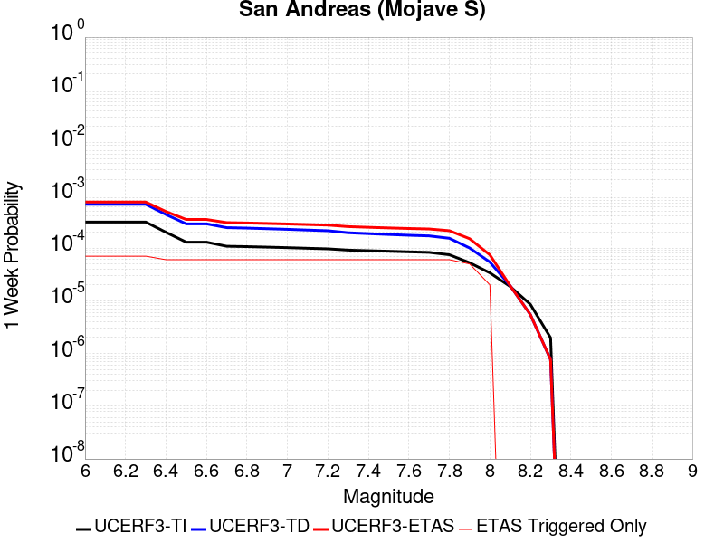 | 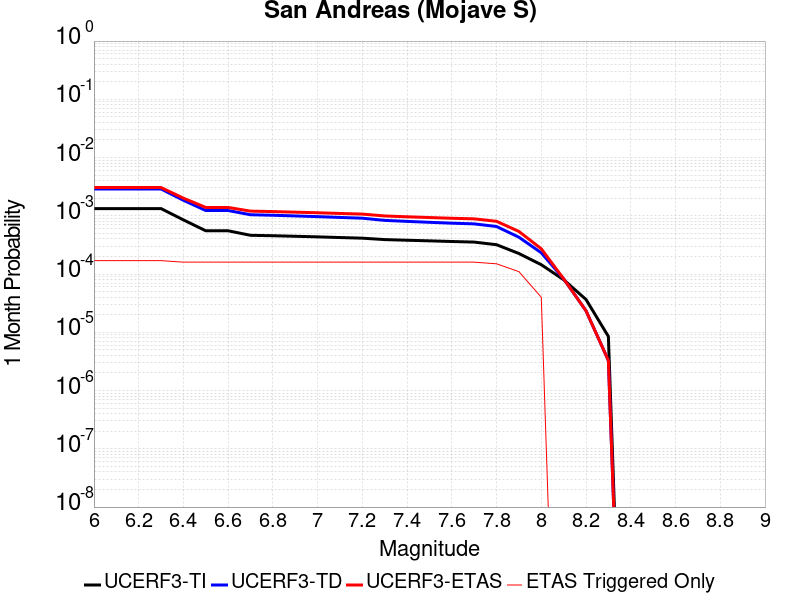 | 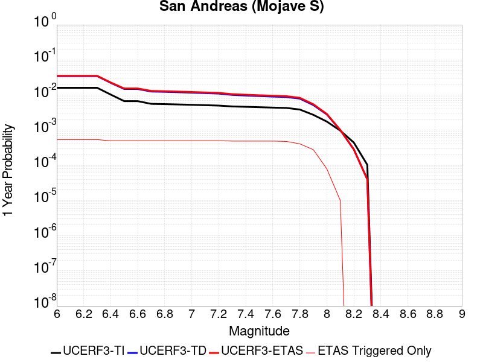 |  |

| Magnitude | 1 wk TI Prob | 1 wk TD Prob | 1 wk ETAS Prob | 1 wk ETAS/TD Gain | 1 wk ETAS Triggered Only | 1 mo TI Prob | 1 mo TD Prob | 1 mo ETAS Prob | 1 mo ETAS/TD Gain | 1 mo ETAS Triggered Only | 1 yr TI Prob | 1 yr TD Prob | 1 yr ETAS Prob | 1 yr ETAS/TD Gain | 1 yr ETAS Triggered Only | 10 yr TI Prob | 10 yr TD Prob | 10 yr ETAS Prob | 10 yr ETAS/TD Gain | 10 yr ETAS Triggered Only |
|-----|-----|-----|-----|-----|-----|-----|-----|-----|-----|-----|-----|-----|-----|-----|-----|-----|-----|-----|-----|-----|
| 6.0 | 3.1064058E-4 | 6.747043E-4 | 7.4465707E-4 | 1.1036792 | 7.0E-5 | 0.0013306376 | 0.002888514 | 0.0030580228 | 1.0586838 | 1.7E-4 | 0.016080605 | 0.03462661 | 0.035147913 | 1.015055 | 5.4E-4 | 0.1496549 | 0.28663692 | 0.2871006 | 1.0016177 | 6.5E-4 |
| 6.1 | 3.1064058E-4 | 6.747043E-4 | 7.4465707E-4 | 1.1036792 | 7.0E-5 | 0.0013306376 | 0.002888514 | 0.0030580228 | 1.0586838 | 1.7E-4 | 0.016080605 | 0.03462661 | 0.035147913 | 1.015055 | 5.4E-4 | 0.1496549 | 0.28663692 | 0.2871006 | 1.0016177 | 6.5E-4 |
| 6.2 | 3.1064058E-4 | 6.747043E-4 | 7.4465707E-4 | 1.1036792 | 7.0E-5 | 0.0013306376 | 0.002888514 | 0.0030580228 | 1.0586838 | 1.7E-4 | 0.016080605 | 0.03462661 | 0.035147913 | 1.015055 | 5.4E-4 | 0.1496549 | 0.28663692 | 0.2871006 | 1.0016177 | 6.5E-4 |
| 6.3 | 3.1064058E-4 | 6.747043E-4 | 7.4465707E-4 | 1.1036792 | 7.0E-5 | 0.0013306376 | 0.002888514 | 0.0030580228 | 1.0586838 | 1.7E-4 | 0.016080605 | 0.03462661 | 0.035147913 | 1.015055 | 5.4E-4 | 0.1496549 | 0.28663692 | 0.2871006 | 1.0016177 | 6.5E-4 |
| 6.4 | 1.9872203E-4 | 4.318848E-4 | 4.918589E-4 | 1.138866 | 6.0E-5 | 8.5138786E-4 | 0.0018496502 | 0.0020093543 | 1.0863428 | 1.6E-4 | 0.010316478 | 0.022293096 | 0.022781951 | 1.0219284 | 5.0E-4 | 0.098504856 | 0.19703239 | 0.19751418 | 1.0024452 | 6.0E-4 |
| 6.5 | 1.291105E-4 | 2.8761322E-4 | 3.4759595E-4 | 1.2085536 | 6.0E-5 | 5.5321335E-4 | 0.0012320485 | 0.0013918513 | 1.1297051 | 1.6E-4 | 0.006714592 | 0.0148978485 | 0.015390399 | 1.0330619 | 5.0E-4 | 0.065152965 | 0.13807017 | 0.13858733 | 1.0037457 | 6.0E-4 |
| 6.6 | 1.291105E-4 | 2.8761322E-4 | 3.4759595E-4 | 1.2085536 | 6.0E-5 | 5.5321335E-4 | 0.0012320485 | 0.0013918513 | 1.1297051 | 1.6E-4 | 0.006714592 | 0.0148978485 | 0.015390399 | 1.0330619 | 5.0E-4 | 0.065152965 | 0.13807017 | 0.13858733 | 1.0037457 | 6.0E-4 |
| 6.7 | 1.08001186E-4 | 2.4342406E-4 | 3.0340944E-4 | 1.2464235 | 6.0E-5 | 4.6278012E-4 | 0.0010428295 | 0.0012026626 | 1.1532687 | 1.6E-4 | 0.0056198016 | 0.012622835 | 0.013116524 | 1.0391108 | 5.0E-4 | 0.054797906 | 0.11921291 | 0.11974138 | 1.004433 | 6.0E-4 |
| 6.8 | 1.0624356E-4 | 2.3860046E-4 | 2.9858615E-4 | 1.2514064 | 6.0E-5 | 4.5525006E-4 | 0.0010221732 | 0.0011820097 | 1.1563692 | 1.6E-4 | 0.0055285925 | 0.01237422 | 0.012868034 | 1.0399066 | 5.0E-4 | 0.053930566 | 0.117162056 | 0.117691755 | 1.0045211 | 6.0E-4 |
| 6.9 | 1.0393785E-4 | 2.3230357E-4 | 2.9228965E-4 | 1.2582227 | 6.0E-5 | 4.4537184E-4 | 9.952073E-4 | 0.0011550481 | 1.1606106 | 1.6E-4 | 0.0054089287 | 0.012049583 | 0.012543558 | 1.0409952 | 5.0E-4 | 0.05279156 | 0.11445948 | 0.11499081 | 1.004642 | 6.0E-4 |
| 7.0 | 1.0155622E-4 | 2.2599897E-4 | 2.859854E-4 | 1.265428 | 6.0E-5 | 4.3516833E-4 | 9.682079E-4 | 0.001128053 | 1.1650938 | 1.6E-4 | 0.005285311 | 0.011724443 | 0.0122185815 | 1.042146 | 5.0E-4 | 0.05161361 | 0.11171984 | 0.11225281 | 1.0047705 | 6.0E-4 |
| 7.1 | 9.885595E-5 | 2.1888265E-4 | 2.788695E-4 | 1.2740595 | 6.0E-5 | 4.2359953E-4 | 9.377316E-4 | 0.0010975816 | 1.1704645 | 1.6E-4 | 0.0051451353 | 0.011357316 | 0.011851638 | 1.0435245 | 5.0E-4 | 0.05027629 | 0.10860426 | 0.1091391 | 1.0049247 | 6.0E-4 |
| 7.2 | 9.6411415E-5 | 2.125122E-4 | 2.7249946E-4 | 1.2822767 | 6.0E-5 | 4.1312634E-4 | 9.1044896E-4 | 0.0010703033 | 1.1755775 | 1.6E-4 | 0.005018219 | 0.01102856 | 0.011523046 | 1.0448369 | 5.0E-4 | 0.049064007 | 0.10579402 | 0.106330544 | 1.0050714 | 6.0E-4 |
| 7.3 | 9.1180635E-5 | 1.9479371E-4 | 2.5478203E-4 | 1.3079581 | 6.0E-5 | 3.907156E-4 | 8.345632E-4 | 9.944297E-4 | 1.191557 | 1.6E-4 | 0.004746591 | 0.010113581 | 0.010598626 | 1.0479597 | 4.9E-4 | 0.046464786 | 0.09798661 | 0.098518796 | 1.0054312 | 5.9E-4 |
| 7.4 | 8.887388E-5 | 1.8727897E-4 | 2.4726774E-4 | 1.3203176 | 6.0E-5 | 3.8083247E-4 | 8.023774E-4 | 9.62249E-4 | 1.1992474 | 1.6E-4 | 0.0046267817 | 0.009725285 | 0.01021052 | 1.0498941 | 4.9E-4 | 0.045316286 | 0.09462135 | 0.09515552 | 1.0056454 | 5.9E-4 |
| 7.5 | 8.6750515E-5 | 1.8059391E-4 | 2.4058307E-4 | 1.3321772 | 6.0E-5 | 3.7173493E-4 | 7.7374437E-4 | 9.336206E-4 | 1.2066267 | 1.6E-4 | 0.004516484 | 0.009379733 | 0.009865138 | 1.0517503 | 4.9E-4 | 0.04425787 | 0.09158487 | 0.09212083 | 1.0058521 | 5.9E-4 |
| 7.6 | 8.453092E-5 | 1.7446902E-4 | 2.3445857E-4 | 1.3438406 | 6.0E-5 | 3.6222505E-4 | 7.475102E-4 | 9.073906E-4 | 1.2138839 | 1.6E-4 | 0.0044011753 | 0.009063034 | 0.009548593 | 1.0535758 | 4.9E-4 | 0.04315024 | 0.088743635 | 0.089281276 | 1.0060583 | 5.9E-4 |
| 7.7 | 8.259102E-5 | 1.6968958E-4 | 2.296794E-4 | 1.3535268 | 6.0E-5 | 3.539135E-4 | 7.270384E-4 | 8.869221E-4 | 1.2199109 | 1.6E-4 | 0.004300386 | 0.008815835 | 0.009291604 | 1.0539675 | 4.8E-4 | 0.042181134 | 0.08649418 | 0.08702401 | 1.0061257 | 5.8E-4 |
| 7.8 | 7.444844E-5 | 1.5290553E-4 | 2.1289637E-4 | 1.3923391 | 6.0E-5 | 3.1902574E-4 | 6.551449E-4 | 8.0504664E-4 | 1.228807 | 1.5E-4 | 0.0038772223 | 0.007947266 | 0.008354008 | 1.0511801 | 4.1E-4 | 0.03810269 | 0.07832232 | 0.07878316 | 1.0058839 | 5.0E-4 |
| 7.9 | 5.2586525E-5 | 1.0011239E-4 | 1.5010739E-4 | 1.4993887 | 5.0E-5 | 2.2535135E-4 | 4.2898257E-4 | 5.3893536E-4 | 1.2563107 | 1.1E-4 | 0.0027402006 | 0.005210366 | 0.0054889075 | 1.053459 | 2.8E-4 | 0.027066574 | 0.052222524 | 0.05253529 | 1.0059891 | 3.3E-4 |
| 8.0 | 3.379877E-5 | 5.4101976E-5 | 7.410089E-5 | 1.3696523 | 2.0E-5 | 1.4484383E-4 | 2.3184501E-4 | 2.7183574E-4 | 1.172489 | 4.0E-5 | 0.0017620471 | 0.002819061 | 0.0028988356 | 1.0282983 | 8.0E-5 | 0.017481409 | 0.028848516 | 0.028945632 | 1.0033664 | 1.0E-4 |
| 8.1 | 1.8668277E-5 | 1.9322531E-5 | 1.9322531E-5 | 1.0 | 0.0 | 8.000444E-5 | 8.280823E-5 | 8.280823E-5 | 1.0 | 0.0 | 9.736188E-4 | 0.0010077246 | 0.0010177144 | 1.0099133 | 1.0E-5 | 0.009693642 | 0.010805754 | 0.010815646 | 1.0009154 | 1.0E-5 |
| 8.2 | 8.541571E-6 | 5.465789E-6 | 5.465789E-6 | 1.0 | 0.0 | 3.660622E-5 | 2.34246E-5 | 2.34246E-5 | 1.0 | 0.0 | 4.455896E-4 | 2.8515726E-4 | 2.8515726E-4 | 1.0 | 0.0 | 0.0044469717 | 0.0032435213 | 0.0032435213 | 1.0 | 0.0 |
| 8.3 | 1.983087E-6 | 7.668296E-7 | 7.668296E-7 | 1.0 | 0.0 | 8.498917E-6 | 3.2864084E-6 | 3.2864084E-6 | 1.0 | 0.0 | 1.034694E-4 | 4.0011306E-5 | 4.0011306E-5 | 1.0 | 0.0 | 0.0010342124 | 4.724499E-4 | 4.724499E-4 | 1.0 | 0.0 |

## San Andreas (San Bernardino N)
*[(top)](#table-of-contents)*

| 1 Week | 1 Month | 1 Year | 10 Year |
|-----|-----|-----|-----|
| 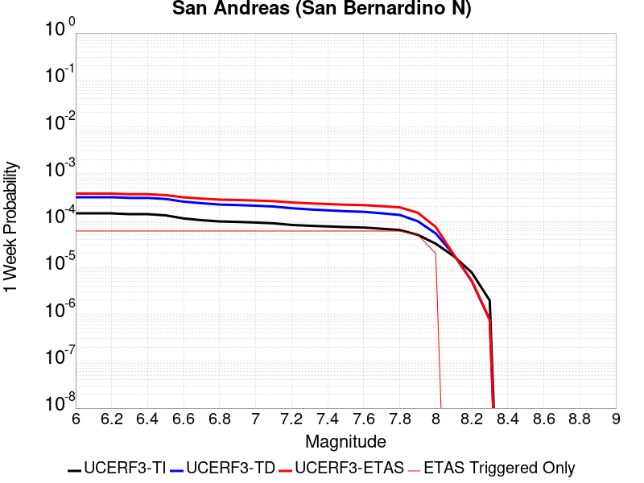 | 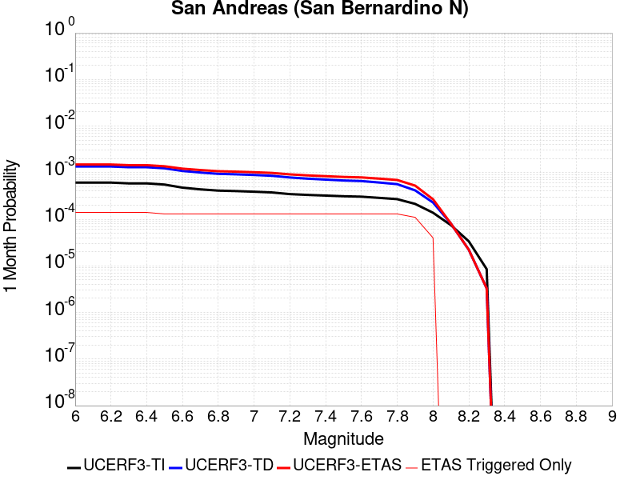 | 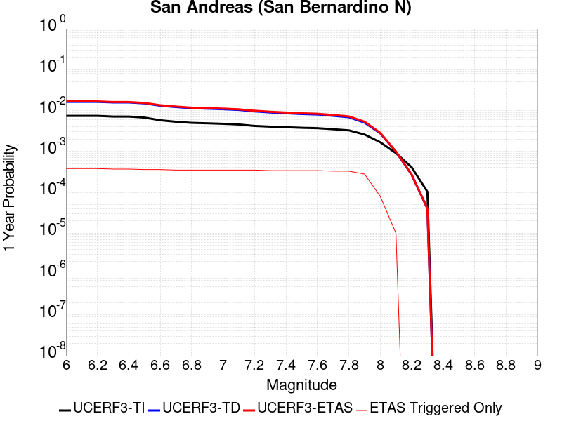 | 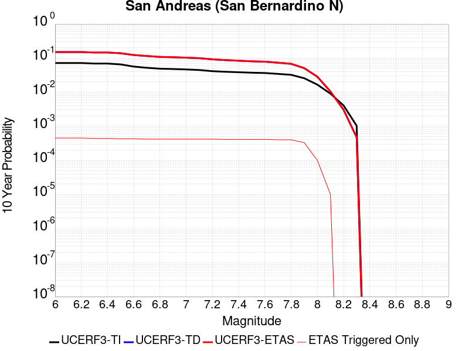 |

| Magnitude | 1 wk TI Prob | 1 wk TD Prob | 1 wk ETAS Prob | 1 wk ETAS/TD Gain | 1 wk ETAS Triggered Only | 1 mo TI Prob | 1 mo TD Prob | 1 mo ETAS Prob | 1 mo ETAS/TD Gain | 1 mo ETAS Triggered Only | 1 yr TI Prob | 1 yr TD Prob | 1 yr ETAS Prob | 1 yr ETAS/TD Gain | 1 yr ETAS Triggered Only | 10 yr TI Prob | 10 yr TD Prob | 10 yr ETAS Prob | 10 yr ETAS/TD Gain | 10 yr ETAS Triggered Only |
|-----|-----|-----|-----|-----|-----|-----|-----|-----|-----|-----|-----|-----|-----|-----|-----|-----|-----|-----|-----|-----|
| 6.0 | 1.4273766E-4 | 3.161376E-4 | 3.761186E-4 | 1.1897308 | 6.0E-5 | 6.115894E-4 | 0.0013541778 | 0.0014939882 | 1.1032437 | 1.4E-4 | 0.0074207084 | 0.016363978 | 0.01673776 | 1.0228417 | 3.8E-4 | 0.07177748 | 0.15029658 | 0.15067895 | 1.002544 | 4.5E-4 |
| 6.1 | 1.4273766E-4 | 3.161376E-4 | 3.761186E-4 | 1.1897308 | 6.0E-5 | 6.115894E-4 | 0.0013541778 | 0.0014939882 | 1.1032437 | 1.4E-4 | 0.0074207084 | 0.016363978 | 0.01673776 | 1.0228417 | 3.8E-4 | 0.07177748 | 0.15029658 | 0.15067895 | 1.002544 | 4.5E-4 |
| 6.2 | 1.4273766E-4 | 3.161376E-4 | 3.761186E-4 | 1.1897308 | 6.0E-5 | 6.115894E-4 | 0.0013541778 | 0.0014939882 | 1.1032437 | 1.4E-4 | 0.0074207084 | 0.016363978 | 0.01673776 | 1.0228417 | 3.8E-4 | 0.07177748 | 0.15029658 | 0.15067895 | 1.002544 | 4.5E-4 |
| 6.3 | 1.3730655E-4 | 3.0518573E-4 | 3.6516745E-4 | 1.1965415 | 6.0E-5 | 5.883239E-4 | 0.001307289 | 0.001447106 | 1.1069518 | 1.4E-4 | 0.0071393442 | 0.01580149 | 0.016165644 | 1.0230455 | 3.7E-4 | 0.06914291 | 0.14559646 | 0.1459724 | 1.0025821 | 4.4E-4 |
| 6.4 | 1.3730655E-4 | 3.0518573E-4 | 3.6516745E-4 | 1.1965415 | 6.0E-5 | 5.883239E-4 | 0.001307289 | 0.001447106 | 1.1069518 | 1.4E-4 | 0.0071393442 | 0.01580149 | 0.016165644 | 1.0230455 | 3.7E-4 | 0.06914291 | 0.14559646 | 0.1459724 | 1.0025821 | 4.4E-4 |
| 6.5 | 1.2942807E-4 | 2.8932988E-4 | 3.4931253E-4 | 1.2073157 | 6.0E-5 | 5.545738E-4 | 0.0012394012 | 0.00136924 | 1.1047593 | 1.3E-4 | 0.0067310524 | 0.014986552 | 0.015341157 | 1.0236615 | 3.6E-4 | 0.06530788 | 0.13873914 | 0.13910948 | 1.0026693 | 4.3E-4 |
| 6.6 | 1.1125901E-4 | 2.537176E-4 | 3.1370236E-4 | 1.2364234 | 6.0E-5 | 4.767372E-4 | 0.0010869103 | 0.001216769 | 1.1194751 | 1.3E-4 | 0.005788839 | 0.013153472 | 0.013508737 | 1.0270092 | 3.6E-4 | 0.056403454 | 0.12302898 | 0.123406075 | 1.0030651 | 4.3E-4 |
| 6.7 | 1.02209575E-4 | 2.3506685E-4 | 2.9505274E-4 | 1.2551866 | 6.0E-5 | 4.3796748E-4 | 0.0010070418 | 0.0011369109 | 1.128961 | 1.3E-4 | 0.0053192247 | 0.01219223 | 0.012537963 | 1.0283568 | 3.5E-4 | 0.051936906 | 0.11482068 | 0.11519246 | 1.0032378 | 4.2E-4 |
| 6.8 | 9.610582E-5 | 2.2032406E-4 | 2.8031084E-4 | 1.2722661 | 6.0E-5 | 4.1181705E-4 | 9.439049E-4 | 0.0010737822 | 1.1375958 | 1.3E-4 | 0.0050023515 | 0.011431754 | 0.011777752 | 1.0302665 | 3.5E-4 | 0.048912346 | 0.1082225 | 0.10859705 | 1.0034609 | 4.2E-4 |
| 6.9 | 9.3877505E-5 | 2.1487933E-4 | 2.7486644E-4 | 1.2791665 | 6.0E-5 | 4.0227012E-4 | 9.2058704E-4 | 0.0010504674 | 1.1410842 | 1.3E-4 | 0.0048866454 | 0.011150793 | 0.01149689 | 1.0310379 | 3.5E-4 | 0.04780577 | 0.10581279 | 0.10618835 | 1.0035492 | 4.2E-4 |
| 7.0 | 9.1019785E-5 | 2.0814833E-4 | 2.6813583E-4 | 1.288196 | 6.0E-5 | 3.900265E-4 | 8.917599E-4 | 0.001021644 | 1.1456492 | 1.3E-4 | 0.0047382377 | 0.010803353 | 0.011149571 | 1.0320474 | 3.5E-4 | 0.046384744 | 0.10278319 | 0.103160016 | 1.0036663 | 4.2E-4 |
| 7.1 | 8.771155E-5 | 1.9989353E-4 | 2.5988155E-4 | 1.3000997 | 6.0E-5 | 3.758525E-4 | 8.564058E-4 | 9.862945E-4 | 1.1516672 | 1.3E-4 | 0.0045664064 | 0.01037709 | 0.010723458 | 1.0333781 | 3.5E-4 | 0.044737056 | 0.09909467 | 0.099473044 | 1.0038184 | 4.2E-4 |
| 7.2 | 8.0830236E-5 | 1.8394848E-4 | 2.4393744E-4 | 1.3261182 | 6.0E-5 | 3.4636928E-4 | 7.881126E-4 | 9.1801013E-4 | 1.164821 | 1.3E-4 | 0.0042088944 | 0.009553162 | 0.009899818 | 1.0362871 | 3.5E-4 | 0.041300658 | 0.09182531 | 0.09220674 | 1.0041538 | 4.2E-4 |
| 7.3 | 7.7668235E-5 | 1.7338296E-4 | 2.3337256E-4 | 1.3459948 | 6.0E-5 | 3.328214E-4 | 7.428583E-4 | 8.727617E-4 | 1.1748698 | 1.3E-4 | 0.0040445733 | 0.009006873 | 0.00934381 | 1.037409 | 3.4E-4 | 0.03971748 | 0.087092124 | 0.08746642 | 1.0042976 | 4.1E-4 |
| 7.4 | 7.520177E-5 | 1.6558339E-4 | 2.2557346E-4 | 1.3622952 | 6.0E-5 | 3.2225347E-4 | 7.0945016E-4 | 8.3935796E-4 | 1.1831105 | 1.3E-4 | 0.0039163795 | 0.0086034145 | 0.008940489 | 1.0391792 | 3.4E-4 | 0.038480744 | 0.08354814 | 0.08392389 | 1.0044974 | 4.1E-4 |
| 7.5 | 7.274697E-5 | 1.5845922E-4 | 2.1844971E-4 | 1.3785863 | 6.0E-5 | 3.1173544E-4 | 6.789343E-4 | 8.0884603E-4 | 1.1913465 | 1.3E-4 | 0.003788775 | 0.008234753 | 0.008571953 | 1.0409484 | 3.4E-4 | 0.03724827 | 0.08026466 | 0.08064175 | 1.0046982 | 4.1E-4 |
| 7.6 | 7.1185845E-5 | 1.5415733E-4 | 2.1414808E-4 | 1.3891528 | 6.0E-5 | 3.0504653E-4 | 6.6050707E-4 | 7.9042115E-4 | 1.1966885 | 1.3E-4 | 0.0037076178 | 0.008012074 | 0.00834935 | 1.0420959 | 3.4E-4 | 0.036463667 | 0.078254156 | 0.07863207 | 1.0048293 | 4.1E-4 |
| 7.7 | 6.709961E-5 | 1.4324463E-4 | 2.0323604E-4 | 1.4188039 | 6.0E-5 | 2.8753807E-4 | 6.1376113E-4 | 7.4368133E-4 | 1.2116787 | 1.3E-4 | 0.003495157 | 0.007446978 | 0.00777452 | 1.0439832 | 3.3E-4 | 0.034406938 | 0.073082365 | 0.073453136 | 1.0050733 | 4.0E-4 |
| 7.8 | 6.300812E-5 | 1.3208245E-4 | 1.9207453E-4 | 1.4542017 | 6.0E-5 | 2.7000686E-4 | 5.659449E-4 | 6.958713E-4 | 1.2295743 | 1.3E-4 | 0.0032823787 | 0.0068686386 | 0.007196372 | 1.0477145 | 3.3E-4 | 0.032343175 | 0.06773997 | 0.06811287 | 1.005505 | 4.0E-4 |
| 7.9 | 4.983037E-5 | 9.728091E-5 | 1.4727605E-4 | 1.5139254 | 5.0E-5 | 2.1354125E-4 | 4.1685157E-4 | 5.268057E-4 | 1.2637728 | 1.1E-4 | 0.0025967648 | 0.005063368 | 0.0053419503 | 1.0550191 | 2.8E-4 | 0.025666296 | 0.0506703 | 0.050983578 | 1.0061827 | 3.3E-4 |
| 8.0 | 3.2211527E-5 | 5.333152E-5 | 7.3330455E-5 | 1.3749927 | 2.0E-5 | 1.380421E-4 | 2.2854365E-4 | 2.6853452E-4 | 1.1749812 | 4.0E-5 | 0.0016793669 | 0.0027789702 | 0.002858748 | 1.0287076 | 8.0E-5 | 0.016667323 | 0.02837451 | 0.028471671 | 1.0034243 | 1.0E-4 |
| 8.1 | 1.743376E-5 | 1.8836954E-5 | 1.8836954E-5 | 1.0 | 0.0 | 7.471398E-5 | 8.07273E-5 | 8.07273E-5 | 1.0 | 0.0 | 9.0926304E-4 | 9.824124E-4 | 9.924026E-4 | 1.010169 | 1.0E-5 | 0.009055517 | 0.010490617 | 0.010500512 | 1.0009432 | 1.0E-5 |
| 8.2 | 7.831616E-6 | 5.1597067E-6 | 5.1597067E-6 | 1.0 | 0.0 | 3.3563636E-5 | 2.2112841E-5 | 2.2112841E-5 | 1.0 | 0.0 | 4.0856065E-4 | 2.6919067E-4 | 2.6919067E-4 | 1.0 | 0.0 | 0.004078103 | 0.003044315 | 0.003044315 | 1.0 | 0.0 |
| 8.3 | 1.983087E-6 | 7.668296E-7 | 7.668296E-7 | 1.0 | 0.0 | 8.498917E-6 | 3.2864084E-6 | 3.2864084E-6 | 1.0 | 0.0 | 1.034694E-4 | 4.0011306E-5 | 4.0011306E-5 | 1.0 | 0.0 | 0.0010342124 | 4.724499E-4 | 4.724499E-4 | 1.0 | 0.0 |

## So Sierra Nevada
*[(top)](#table-of-contents)*

| 1 Week | 1 Month | 1 Year | 10 Year |
|-----|-----|-----|-----|
| 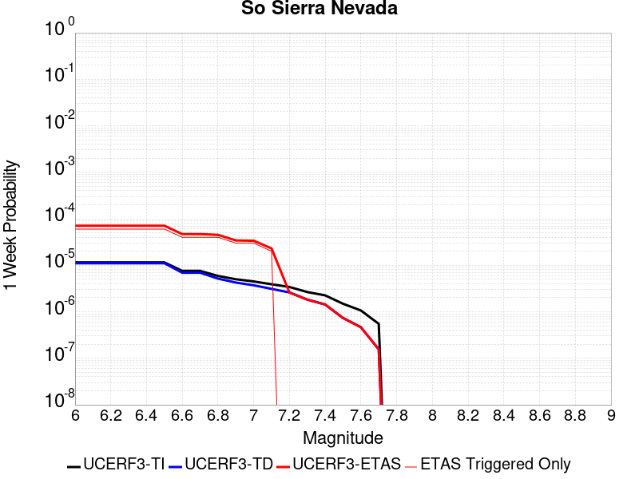 | 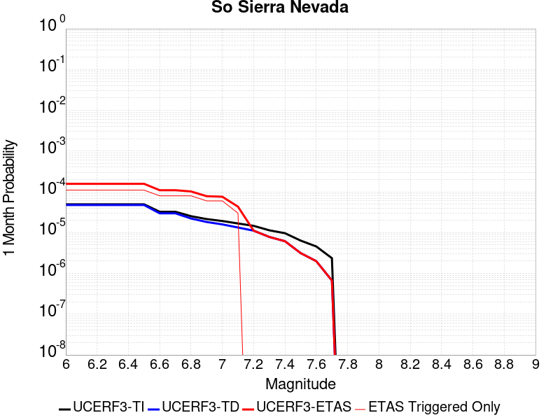 | 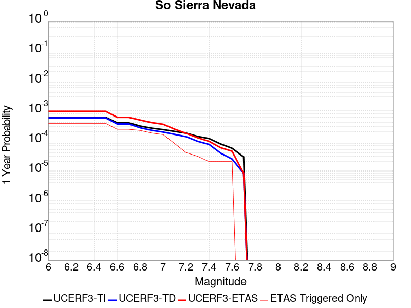 | 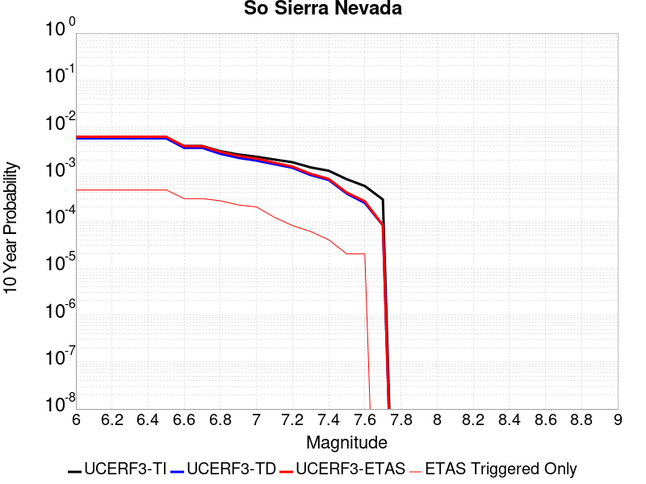 |

| Magnitude | 1 wk TI Prob | 1 wk TD Prob | 1 wk ETAS Prob | 1 wk ETAS/TD Gain | 1 wk ETAS Triggered Only | 1 mo TI Prob | 1 mo TD Prob | 1 mo ETAS Prob | 1 mo ETAS/TD Gain | 1 mo ETAS Triggered Only | 1 yr TI Prob | 1 yr TD Prob | 1 yr ETAS Prob | 1 yr ETAS/TD Gain | 1 yr ETAS Triggered Only | 10 yr TI Prob | 10 yr TD Prob | 10 yr ETAS Prob | 10 yr ETAS/TD Gain | 10 yr ETAS Triggered Only |
|-----|-----|-----|-----|-----|-----|-----|-----|-----|-----|-----|-----|-----|-----|-----|-----|-----|-----|-----|-----|-----|
| 6.0 | 1.15488665E-5 | 1.1079722E-5 | 7.1079055E-5 | 6.4152384 | 6.0E-5 | 4.9494203E-5 | 4.748373E-5 | 1.574785E-4 | 3.316473 | 1.1E-4 | 6.024253E-4 | 5.779738E-4 | 9.5775415E-4 | 1.6570892 | 3.8E-4 | 0.006007948 | 0.005765975 | 0.006223323 | 1.0793184 | 4.6E-4 |
| 6.1 | 1.15488665E-5 | 1.1079722E-5 | 7.1079055E-5 | 6.4152384 | 6.0E-5 | 4.9494203E-5 | 4.748373E-5 | 1.574785E-4 | 3.316473 | 1.1E-4 | 6.024253E-4 | 5.779738E-4 | 9.5775415E-4 | 1.6570892 | 3.8E-4 | 0.006007948 | 0.005765975 | 0.006223323 | 1.0793184 | 4.6E-4 |
| 6.2 | 1.15488665E-5 | 1.1079722E-5 | 7.1079055E-5 | 6.4152384 | 6.0E-5 | 4.9494203E-5 | 4.748373E-5 | 1.574785E-4 | 3.316473 | 1.1E-4 | 6.024253E-4 | 5.779738E-4 | 9.5775415E-4 | 1.6570892 | 3.8E-4 | 0.006007948 | 0.005765975 | 0.006223323 | 1.0793184 | 4.6E-4 |
| 6.3 | 1.15488665E-5 | 1.1079722E-5 | 7.1079055E-5 | 6.4152384 | 6.0E-5 | 4.9494203E-5 | 4.748373E-5 | 1.574785E-4 | 3.316473 | 1.1E-4 | 6.024253E-4 | 5.779738E-4 | 9.5775415E-4 | 1.6570892 | 3.8E-4 | 0.006007948 | 0.005765975 | 0.006223323 | 1.0793184 | 4.6E-4 |
| 6.4 | 1.15488665E-5 | 1.1079722E-5 | 7.1079055E-5 | 6.4152384 | 6.0E-5 | 4.9494203E-5 | 4.748373E-5 | 1.574785E-4 | 3.316473 | 1.1E-4 | 6.024253E-4 | 5.779738E-4 | 9.5775415E-4 | 1.6570892 | 3.8E-4 | 0.006007948 | 0.005765975 | 0.006223323 | 1.0793184 | 4.6E-4 |
| 6.5 | 1.15488665E-5 | 1.1079722E-5 | 7.1079055E-5 | 6.4152384 | 6.0E-5 | 4.9494203E-5 | 4.748373E-5 | 1.574785E-4 | 3.316473 | 1.1E-4 | 6.024253E-4 | 5.779738E-4 | 9.5775415E-4 | 1.6570892 | 3.8E-4 | 0.006007948 | 0.005765975 | 0.006223323 | 1.0793184 | 4.6E-4 |
| 6.6 | 7.587044E-6 | 6.935689E-6 | 4.6935413E-5 | 6.7672315 | 4.0E-5 | 3.2515498E-5 | 2.9724059E-5 | 1.0972168E-4 | 3.6913426 | 8.0E-5 | 3.9580427E-4 | 3.6183326E-4 | 6.0174643E-4 | 1.663049 | 2.4E-4 | 0.003951 | 0.0036127327 | 0.003911649 | 1.0827396 | 3.0E-4 |
| 6.7 | 7.587044E-6 | 6.935689E-6 | 4.6935413E-5 | 6.7672315 | 4.0E-5 | 3.2515498E-5 | 2.9724059E-5 | 1.0972168E-4 | 3.6913426 | 8.0E-5 | 3.9580427E-4 | 3.6183326E-4 | 6.0174643E-4 | 1.663049 | 2.4E-4 | 0.003951 | 0.0036127327 | 0.003911649 | 1.0827396 | 3.0E-4 |
| 6.8 | 5.9026956E-6 | 5.1794364E-6 | 4.517923E-5 | 8.722808 | 4.0E-5 | 2.5297022E-5 | 2.2197402E-5 | 1.0219563E-4 | 4.6039453 | 8.0E-5 | 3.0794772E-4 | 2.7022103E-4 | 4.901616E-4 | 1.8139284 | 2.2E-4 | 0.0030752132 | 0.0026990408 | 0.002968312 | 1.0997655 | 2.7E-4 |
| 6.9 | 5.0118915E-6 | 4.2524644E-6 | 3.4252338E-5 | 8.054703 | 3.0E-5 | 2.1479358E-5 | 1.8224722E-5 | 7.822363E-5 | 4.292171 | 6.0E-5 | 2.614798E-4 | 2.2186415E-4 | 4.0182422E-4 | 1.8111273 | 1.8E-4 | 0.0026117235 | 0.002216499 | 0.0024360113 | 1.0990356 | 2.2E-4 |
| 7.0 | 4.4924795E-6 | 3.713954E-6 | 3.371384E-5 | 9.077615 | 3.0E-5 | 1.925334E-5 | 1.5916852E-5 | 7.5915894E-5 | 4.76953 | 6.0E-5 | 2.3438422E-4 | 1.9377106E-4 | 3.5374006E-4 | 1.8255566 | 1.6E-4 | 0.0023413717 | 0.001936084 | 0.0021356968 | 1.1031013 | 2.0E-4 |
| 7.1 | 3.9118436E-6 | 3.1120105E-6 | 2.3111948E-5 | 7.4266934 | 2.0E-5 | 1.6764936E-5 | 1.3337123E-5 | 4.3336724E-5 | 3.2493308 | 3.0E-5 | 2.0409399E-4 | 1.6236794E-4 | 2.4235496E-4 | 1.4926281 | 8.0E-5 | 0.0020390663 | 0.0016225493 | 0.0017423545 | 1.0738376 | 1.2E-4 |
| 7.2 | 3.4200818E-6 | 2.6054847E-6 | 2.6054847E-6 | 1.0 | 0.0 | 1.4657411E-5 | 1.11663185E-5 | 1.11663185E-5 | 1.0 | 0.0 | 1.7843937E-4 | 1.3594194E-4 | 1.7593651E-4 | 1.2942033 | 4.0E-5 | 0.0017829615 | 0.0013586376 | 0.0014385289 | 1.0588025 | 8.0E-5 |
| 7.3 | 2.6593618E-6 | 1.8284468E-6 | 1.8284468E-6 | 1.0 | 0.0 | 1.13972155E-5 | 7.836179E-6 | 7.836179E-6 | 1.0 | 0.0 | 1.3875226E-4 | 9.540159E-5 | 1.2539873E-4 | 1.3144301 | 3.0E-5 | 0.0013866565 | 9.536353E-4 | 0.0010135781 | 1.0628572 | 6.0E-5 |
| 7.4 | 2.2577992E-6 | 1.4364622E-6 | 1.4364622E-6 | 1.0 | 0.0 | 9.676246E-6 | 6.1562537E-6 | 6.1562537E-6 | 1.0 | 0.0 | 1.1780193E-4 | 7.495006E-5 | 9.494857E-5 | 1.2668244 | 2.0E-5 | 0.001177395 | 7.4927293E-4 | 7.89243E-4 | 1.0533451 | 4.0E-5 |
| 7.5 | 1.489319E-6 | 7.3541264E-7 | 7.3541264E-7 | 1.0 | 0.0 | 6.3827797E-6 | 3.1517645E-6 | 3.1517645E-6 | 1.0 | 0.0 | 7.770758E-5 | 3.837206E-5 | 5.8371297E-5 | 1.5211926 | 2.0E-5 | 7.7680405E-4 | 3.836548E-4 | 4.0364714E-4 | 1.0521102 | 2.0E-5 |
| 7.6 | 1.0680322E-6 | 4.659796E-7 | 4.659796E-7 | 1.0 | 0.0 | 4.577273E-6 | 1.997054E-6 | 1.997054E-6 | 1.0 | 0.0 | 5.5726876E-5 | 2.4313864E-5 | 4.4313376E-5 | 1.822556 | 2.0E-5 | 5.5712904E-4 | 2.431123E-4 | 2.6310742E-4 | 1.0822465 | 2.0E-5 |
| 7.7 | 5.509146E-7 | 1.5581199E-7 | 1.5581199E-7 | 1.0 | 0.0 | 2.3610605E-6 | 6.677655E-7 | 6.677655E-7 | 1.0 | 0.0 | 2.8745531E-5 | 8.130016E-6 | 8.130016E-6 | 1.0 | 0.0 | 2.8741814E-4 | 8.12973E-5 | 8.12973E-5 | 1.0 | 0.0 |

## Goldstone Lake
*[(top)](#table-of-contents)*

| 1 Week | 1 Month | 1 Year | 10 Year |
|-----|-----|-----|-----|
|  | 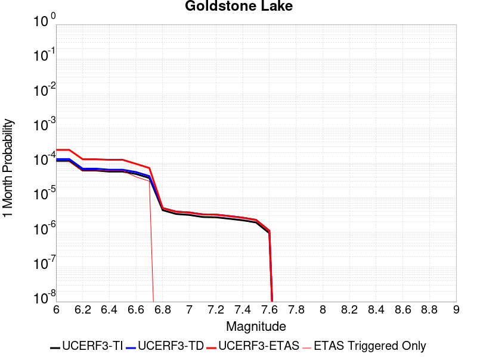 | 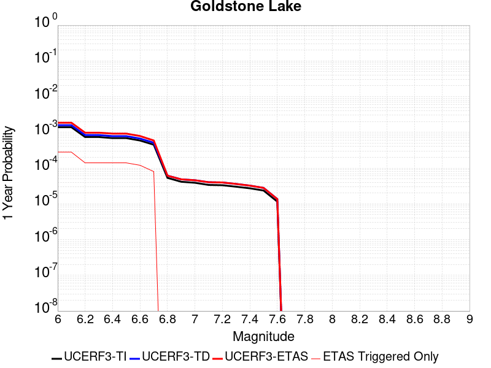 | 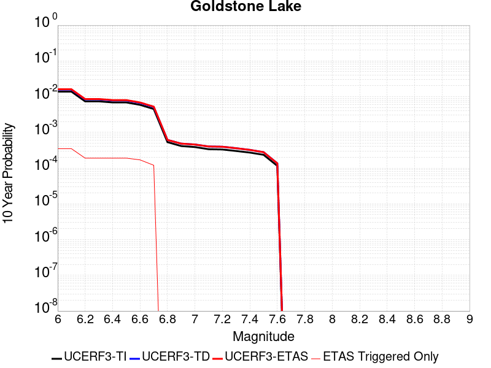 |

| Magnitude | 1 wk TI Prob | 1 wk TD Prob | 1 wk ETAS Prob | 1 wk ETAS/TD Gain | 1 wk ETAS Triggered Only | 1 mo TI Prob | 1 mo TD Prob | 1 mo ETAS Prob | 1 mo ETAS/TD Gain | 1 mo ETAS Triggered Only | 1 yr TI Prob | 1 yr TD Prob | 1 yr ETAS Prob | 1 yr ETAS/TD Gain | 1 yr ETAS Triggered Only | 10 yr TI Prob | 10 yr TD Prob | 10 yr ETAS Prob | 10 yr ETAS/TD Gain | 10 yr ETAS Triggered Only |
|-----|-----|-----|-----|-----|-----|-----|-----|-----|-----|-----|-----|-----|-----|-----|-----|-----|-----|-----|-----|-----|
| 6.0 | 2.671352E-5 | 3.0376628E-5 | 6.0375718E-5 | 1.9875714 | 3.0E-5 | 1.1448149E-4 | 1.3018015E-4 | 2.4016584E-4 | 1.8448728 | 1.1E-4 | 0.001392921 | 0.0015839875 | 0.001863544 | 1.1764891 | 2.8E-4 | 0.013842222 | 0.015746472 | 0.016090961 | 1.0218772 | 3.5E-4 |
| 6.1 | 2.671352E-5 | 3.0376628E-5 | 6.0375718E-5 | 1.9875714 | 3.0E-5 | 1.1448149E-4 | 1.3018015E-4 | 2.4016584E-4 | 1.8448728 | 1.1E-4 | 0.001392921 | 0.0015839875 | 0.001863544 | 1.1764891 | 2.8E-4 | 0.013842222 | 0.015746472 | 0.016090961 | 1.0218772 | 3.5E-4 |
| 6.2 | 1.4197047E-5 | 1.6096516E-5 | 2.6096355E-5 | 1.6212424 | 1.0E-5 | 6.0843064E-5 | 6.89838E-5 | 1.2897966E-4 | 1.8697095 | 6.0E-5 | 7.4051257E-4 | 8.396528E-4 | 9.795352E-4 | 1.1665956 | 1.4E-4 | 0.007380498 | 0.008374499 | 0.0085629085 | 1.0224979 | 1.9E-4 |
| 6.3 | 1.4197047E-5 | 1.6096516E-5 | 2.6096355E-5 | 1.6212424 | 1.0E-5 | 6.0843064E-5 | 6.89838E-5 | 1.2897966E-4 | 1.8697095 | 6.0E-5 | 7.4051257E-4 | 8.396528E-4 | 9.795352E-4 | 1.1665956 | 1.4E-4 | 0.007380498 | 0.008374499 | 0.0085629085 | 1.0224979 | 1.9E-4 |
| 6.4 | 1.3238931E-5 | 1.5008711E-5 | 2.5008561E-5 | 1.6662698 | 1.0E-5 | 5.6737044E-5 | 6.432201E-5 | 1.2431816E-4 | 1.9327466 | 6.0E-5 | 6.9055456E-4 | 7.8293716E-4 | 9.228275E-4 | 1.1786739 | 1.4E-4 | 0.006884126 | 0.007811414 | 0.00799993 | 1.0241333 | 1.9E-4 |
| 6.5 | 1.3238931E-5 | 1.5008711E-5 | 2.5008561E-5 | 1.6662698 | 1.0E-5 | 5.6737044E-5 | 6.432201E-5 | 1.2431816E-4 | 1.9327466 | 6.0E-5 | 6.9055456E-4 | 7.8293716E-4 | 9.228275E-4 | 1.1786739 | 1.4E-4 | 0.006884126 | 0.007811414 | 0.00799993 | 1.0241333 | 1.9E-4 |
| 6.6 | 1.1328278E-5 | 1.2855381E-5 | 1.2855381E-5 | 1.0 | 0.0 | 4.8548856E-5 | 5.5093864E-5 | 9.509166E-5 | 1.7259936 | 4.0E-5 | 5.90922E-4 | 6.706571E-4 | 7.9057657E-4 | 1.178809 | 1.2E-4 | 0.0058935313 | 0.0066957204 | 0.006864582 | 1.0252193 | 1.7E-4 |
| 6.7 | 8.651175E-6 | 9.8247265E-6 | 9.8247265E-6 | 1.0 | 0.0 | 3.707594E-5 | 4.2105803E-5 | 7.2104536E-5 | 1.7124609 | 3.0E-5 | 4.5130608E-4 | 5.126081E-4 | 5.925671E-4 | 1.1559846 | 8.0E-5 | 0.0045039062 | 0.0051231356 | 0.005242521 | 1.0233032 | 1.2E-4 |
| 6.8 | 1.0215377E-6 | 1.1754793E-6 | 1.1754793E-6 | 1.0 | 0.0 | 4.378012E-6 | 5.037759E-6 | 5.037759E-6 | 1.0 | 0.0 | 5.3300988E-5 | 6.133311E-5 | 6.133311E-5 | 1.0 | 0.0 | 5.3288206E-4 | 6.13173E-4 | 6.13173E-4 | 1.0 | 0.0 |
| 6.9 | 7.9360774E-7 | 9.2834586E-7 | 9.2834586E-7 | 1.0 | 0.0 | 3.4011714E-6 | 3.9786196E-6 | 3.9786196E-6 | 1.0 | 0.0 | 4.1408475E-5 | 4.8438687E-5 | 4.8438687E-5 | 1.0 | 0.0 | 4.140076E-4 | 4.842883E-4 | 4.842883E-4 | 1.0 | 0.0 |
| 7.0 | 7.4382757E-7 | 8.7473853E-7 | 8.7473853E-7 | 1.0 | 0.0 | 3.1878285E-6 | 3.7488744E-6 | 3.7488744E-6 | 1.0 | 0.0 | 3.8811122E-5 | 4.5641656E-5 | 4.5641656E-5 | 1.0 | 0.0 | 3.8804344E-4 | 4.563295E-4 | 4.563295E-4 | 1.0 | 0.0 |
| 7.1 | 6.4709513E-7 | 7.711347E-7 | 7.711347E-7 | 1.0 | 0.0 | 2.773262E-6 | 3.304859E-6 | 3.304859E-6 | 1.0 | 0.0 | 3.376394E-5 | 4.0235976E-5 | 4.0235976E-5 | 1.0 | 0.0 | 3.375881E-4 | 4.0229288E-4 | 4.0229288E-4 | 1.0 | 0.0 |
| 7.2 | 6.356704E-7 | 7.5884054E-7 | 7.5884054E-7 | 1.0 | 0.0 | 2.7242988E-6 | 3.25217E-6 | 3.25217E-6 | 1.0 | 0.0 | 3.3167835E-5 | 3.959451E-5 | 3.959451E-5 | 1.0 | 0.0 | 3.3162883E-4 | 3.958805E-4 | 3.958805E-4 | 1.0 | 0.0 |
| 7.3 | 5.7695723E-7 | 6.8966074E-7 | 6.8966074E-7 | 1.0 | 0.0 | 2.4726714E-6 | 2.9556859E-6 | 2.9556859E-6 | 1.0 | 0.0 | 3.0104358E-5 | 3.598494E-5 | 3.598494E-5 | 1.0 | 0.0 | 3.0100282E-4 | 3.5979686E-4 | 3.5979686E-4 | 1.0 | 0.0 |
| 7.4 | 5.209647E-7 | 6.193549E-7 | 6.193549E-7 | 1.0 | 0.0 | 2.232704E-6 | 2.654376E-6 | 2.654376E-6 | 1.0 | 0.0 | 2.718283E-5 | 3.2316606E-5 | 3.2316606E-5 | 1.0 | 0.0 | 2.7179506E-4 | 3.231246E-4 | 3.231246E-4 | 1.0 | 0.0 |
| 7.5 | 4.512955E-7 | 5.3489146E-7 | 5.3489146E-7 | 1.0 | 0.0 | 1.934122E-6 | 2.2923903E-6 | 2.2923903E-6 | 1.0 | 0.0 | 2.3547682E-5 | 2.7909547E-5 | 2.7909547E-5 | 1.0 | 0.0 | 2.3545188E-4 | 2.7906572E-4 | 2.7906572E-4 | 1.0 | 0.0 |
| 7.6 | 2.21172E-7 | 2.6039737E-7 | 2.6039737E-7 | 1.0 | 0.0 | 9.478797E-7 | 1.1159884E-6 | 1.1159884E-6 | 1.0 | 0.0 | 1.1540374E-5 | 1.3587103E-5 | 1.3587103E-5 | 1.0 | 0.0 | 1.1539775E-4 | 1.3586554E-4 | 1.3586554E-4 | 1.0 | 0.0 |

## McLean Lake
*[(top)](#table-of-contents)*

| 1 Week | 1 Month | 1 Year | 10 Year |
|-----|-----|-----|-----|
| 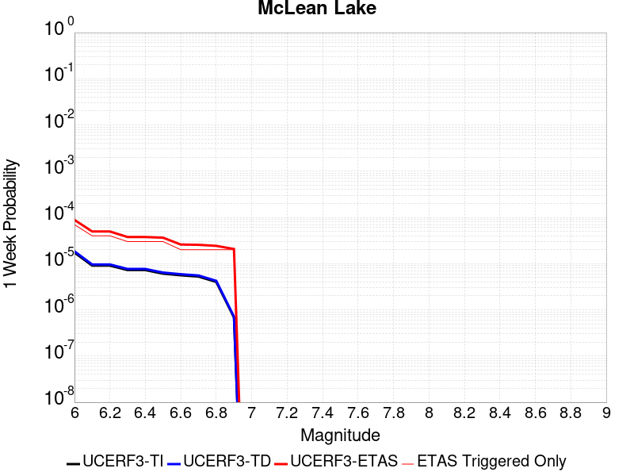 |  |  |  |

| Magnitude | 1 wk TI Prob | 1 wk TD Prob | 1 wk ETAS Prob | 1 wk ETAS/TD Gain | 1 wk ETAS Triggered Only | 1 mo TI Prob | 1 mo TD Prob | 1 mo ETAS Prob | 1 mo ETAS/TD Gain | 1 mo ETAS Triggered Only | 1 yr TI Prob | 1 yr TD Prob | 1 yr ETAS Prob | 1 yr ETAS/TD Gain | 1 yr ETAS Triggered Only | 10 yr TI Prob | 10 yr TD Prob | 10 yr ETAS Prob | 10 yr ETAS/TD Gain | 10 yr ETAS Triggered Only |
|-----|-----|-----|-----|-----|-----|-----|-----|-----|-----|-----|-----|-----|-----|-----|-----|-----|-----|-----|-----|-----|
| 6.0 | 1.7360222E-5 | 1.8501789E-5 | 8.850049E-5 | 4.783348 | 7.0E-5 | 7.439883E-5 | 7.929125E-5 | 1.9928173E-4 | 2.513288 | 1.2E-4 | 9.0542925E-4 | 9.64992E-4 | 0.0011947701 | 1.238114 | 2.3E-4 | 0.009017491 | 0.009612858 | 0.009929782 | 1.0329688 | 3.2E-4 |
| 6.1 | 9.062689E-6 | 9.592268E-6 | 4.9591883E-5 | 5.1699853 | 4.0E-5 | 3.8839516E-5 | 4.110912E-5 | 1.11106245E-4 | 2.7027152 | 7.0E-5 | 4.727685E-4 | 5.003975E-4 | 6.2033744E-4 | 1.2396894 | 1.2E-4 | 0.0047176396 | 0.0049935905 | 0.0051627415 | 1.0338737 | 1.7E-4 |
| 6.2 | 9.062689E-6 | 9.592268E-6 | 4.9591883E-5 | 5.1699853 | 4.0E-5 | 3.8839516E-5 | 4.110912E-5 | 1.11106245E-4 | 2.7027152 | 7.0E-5 | 4.727685E-4 | 5.003975E-4 | 6.2033744E-4 | 1.2396894 | 1.2E-4 | 0.0047176396 | 0.0049935905 | 0.0051627415 | 1.0338737 | 1.7E-4 |
| 6.3 | 7.2575485E-6 | 7.667767E-6 | 3.7667538E-5 | 4.912452 | 3.0E-5 | 3.110341E-5 | 3.2861484E-5 | 9.285951E-5 | 2.8257856 | 6.0E-5 | 3.786182E-4 | 4.0002225E-4 | 4.9998227E-4 | 1.249886 | 1.0E-4 | 0.0037797375 | 0.003993727 | 0.0041431277 | 1.037409 | 1.5E-4 |
| 6.4 | 7.2575485E-6 | 7.667767E-6 | 3.7667538E-5 | 4.912452 | 3.0E-5 | 3.110341E-5 | 3.2861484E-5 | 9.285951E-5 | 2.8257856 | 6.0E-5 | 3.786182E-4 | 4.0002225E-4 | 4.9998227E-4 | 1.249886 | 1.0E-4 | 0.0037797375 | 0.003993727 | 0.0041431277 | 1.037409 | 1.5E-4 |
| 6.5 | 6.06582E-6 | 6.4039245E-6 | 3.6403733E-5 | 5.6845975 | 3.0E-5 | 2.5996113E-5 | 2.7445138E-5 | 6.744404E-5 | 2.457413 | 4.0E-5 | 3.164567E-4 | 3.340998E-4 | 4.140731E-4 | 1.2393694 | 8.0E-5 | 0.0031600643 | 0.0033366138 | 0.0034462467 | 1.0328575 | 1.1E-4 |
| 6.6 | 5.598744E-6 | 5.910306E-6 | 2.5910187E-5 | 4.3838997 | 2.0E-5 | 2.3994397E-5 | 2.5329673E-5 | 5.5328914E-5 | 2.1843517 | 3.0E-5 | 2.9209262E-4 | 3.083515E-4 | 3.7832992E-4 | 1.2269436 | 7.0E-5 | 0.0029170897 | 0.0030798658 | 0.0031795579 | 1.0323689 | 1.0E-4 |
| 6.7 | 5.246996E-6 | 5.539203E-6 | 2.5539091E-5 | 4.6106076 | 2.0E-5 | 2.2486933E-5 | 2.3739261E-5 | 5.373855E-5 | 2.2636993 | 3.0E-5 | 2.73744E-4 | 2.8899353E-4 | 3.4897617E-4 | 1.2075571 | 6.0E-5 | 0.0027340704 | 0.002886801 | 0.0029765412 | 1.0310863 | 9.0E-5 |
| 6.8 | 4.02324E-6 | 4.246936E-6 | 2.424685E-5 | 5.7092576 | 2.0E-5 | 1.7242342E-5 | 1.820106E-5 | 4.8200513E-5 | 2.6482255 | 3.0E-5 | 2.099053E-4 | 2.2158133E-4 | 2.8156803E-4 | 1.270721 | 6.0E-5 | 0.0020970714 | 0.0022141882 | 0.002303989 | 1.0405569 | 9.0E-5 |
| 6.9 | 6.835972E-7 | 7.1399705E-7 | 2.0713982E-5 | 29.011301 | 2.0E-5 | 2.9296991E-6 | 3.0599856E-6 | 2.3059923E-5 | 7.535959 | 2.0E-5 | 3.56685E-5 | 3.7255006E-5 | 6.725389E-5 | 1.805231 | 3.0E-5 | 3.5662777E-4 | 3.7251884E-4 | 4.1250396E-4 | 1.1073371 | 4.0E-5 |

## Lenwood-Lockhart-Old Woman Springs
*[(top)](#table-of-contents)*

| 1 Week | 1 Month | 1 Year | 10 Year |
|-----|-----|-----|-----|
| 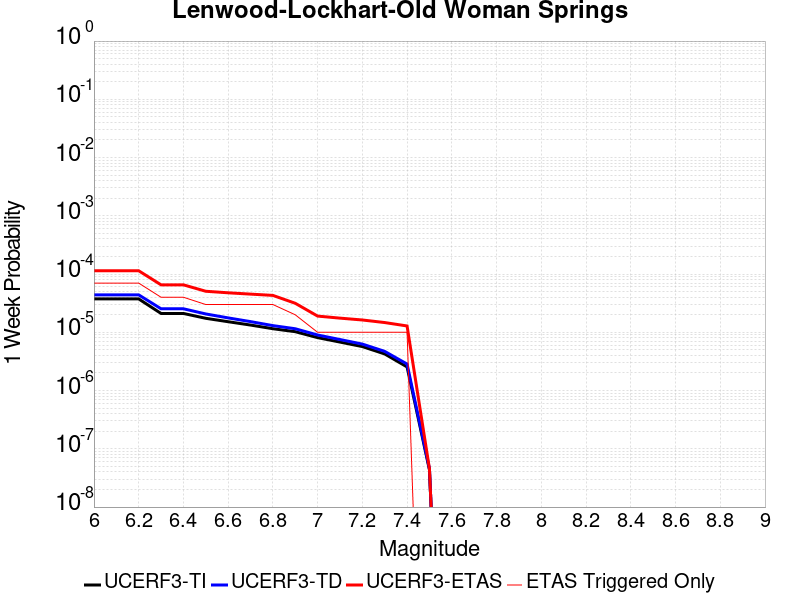 | 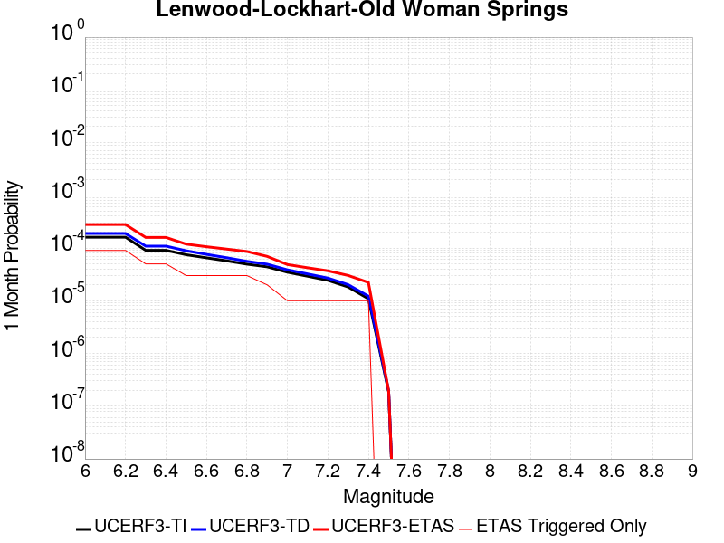 | 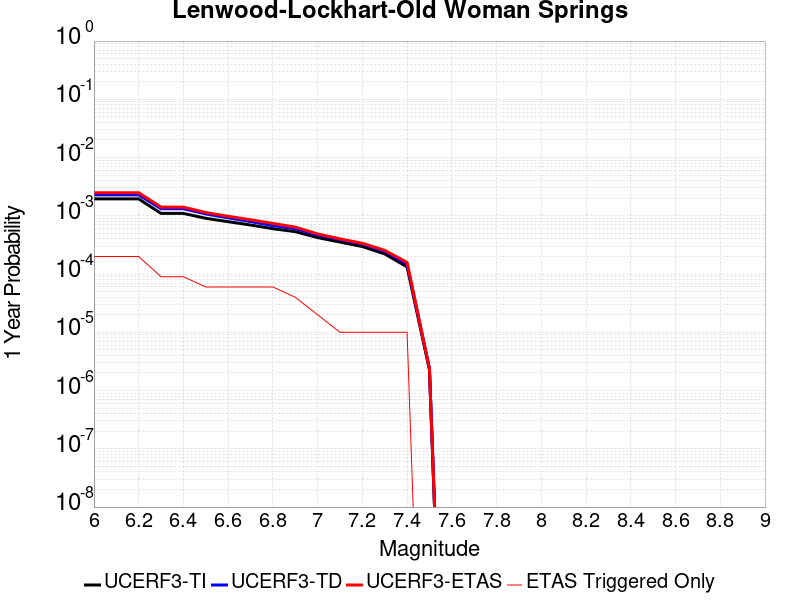 | 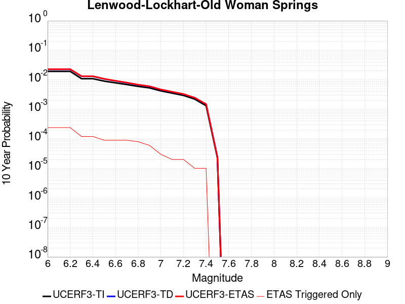 |

| Magnitude | 1 wk TI Prob | 1 wk TD Prob | 1 wk ETAS Prob | 1 wk ETAS/TD Gain | 1 wk ETAS Triggered Only | 1 mo TI Prob | 1 mo TD Prob | 1 mo ETAS Prob | 1 mo ETAS/TD Gain | 1 mo ETAS Triggered Only | 1 yr TI Prob | 1 yr TD Prob | 1 yr ETAS Prob | 1 yr ETAS/TD Gain | 1 yr ETAS Triggered Only | 10 yr TI Prob | 10 yr TD Prob | 10 yr ETAS Prob | 10 yr ETAS/TD Gain | 10 yr ETAS Triggered Only |
|-----|-----|-----|-----|-----|-----|-----|-----|-----|-----|-----|-----|-----|-----|-----|-----|-----|-----|-----|-----|-----|
| 6.0 | 3.744542E-5 | 4.3962966E-5 | 1.1395989E-4 | 2.5921793 | 7.0E-5 | 1.604705E-4 | 1.8840008E-4 | 2.7838312E-4 | 1.4776168 | 9.0E-5 | 0.0019519776 | 0.0022915301 | 0.0024910718 | 1.087078 | 2.0E-4 | 0.019349206 | 0.022697017 | 0.022931568 | 1.0103341 | 2.4E-4 |
| 6.1 | 3.744542E-5 | 4.3962966E-5 | 1.1395989E-4 | 2.5921793 | 7.0E-5 | 1.604705E-4 | 1.8840008E-4 | 2.7838312E-4 | 1.4776168 | 9.0E-5 | 0.0019519776 | 0.0022915301 | 0.0024910718 | 1.087078 | 2.0E-4 | 0.019349206 | 0.022697017 | 0.022931568 | 1.0103341 | 2.4E-4 |
| 6.2 | 3.744542E-5 | 4.3962966E-5 | 1.1395989E-4 | 2.5921793 | 7.0E-5 | 1.604705E-4 | 1.8840008E-4 | 2.7838312E-4 | 1.4776168 | 9.0E-5 | 0.0019519776 | 0.0022915301 | 0.0024910718 | 1.087078 | 2.0E-4 | 0.019349206 | 0.022697017 | 0.022931568 | 1.0103341 | 2.4E-4 |
| 6.3 | 2.1079984E-5 | 2.5353596E-5 | 6.5352586E-5 | 2.5776455 | 4.0E-5 | 9.0339665E-5 | 1.0865386E-4 | 1.5864843E-4 | 1.460127 | 5.0E-5 | 0.0010993304 | 0.0013220779 | 0.001411959 | 1.0679847 | 9.0E-5 | 0.010939079 | 0.013144341 | 0.013262764 | 1.0090094 | 1.2E-4 |
| 6.4 | 2.1079984E-5 | 2.5353596E-5 | 6.5352586E-5 | 2.5776455 | 4.0E-5 | 9.0339665E-5 | 1.0865386E-4 | 1.5864843E-4 | 1.460127 | 5.0E-5 | 0.0010993304 | 0.0013220779 | 0.001411959 | 1.0679847 | 9.0E-5 | 0.010939079 | 0.013144341 | 0.013262764 | 1.0090094 | 1.2E-4 |
| 6.5 | 1.7397282E-5 | 2.0662535E-5 | 5.0661914E-5 | 2.451873 | 3.0E-5 | 7.455765E-5 | 8.855078E-5 | 1.1854813E-4 | 1.3387586 | 3.0E-5 | 9.073613E-4 | 0.0010775843 | 0.0011375197 | 1.0556201 | 6.0E-5 | 0.009036654 | 0.010724886 | 0.010813921 | 1.0083017 | 9.0E-5 |
| 6.6 | 1.52050325E-5 | 1.76798E-5 | 4.767927E-5 | 2.696822 | 3.0E-5 | 6.51628E-5 | 7.576841E-5 | 1.0576614E-4 | 1.3959134 | 3.0E-5 | 7.9306826E-4 | 9.220979E-4 | 9.820426E-4 | 1.065009 | 6.0E-5 | 0.007902439 | 0.009183581 | 0.009272754 | 1.0097101 | 9.0E-5 |
| 6.7 | 1.332523E-5 | 1.5264091E-5 | 4.5263634E-5 | 2.965367 | 3.0E-5 | 5.7106878E-5 | 6.541593E-5 | 9.541396E-5 | 1.4585739 | 3.0E-5 | 6.950544E-4 | 7.9615373E-4 | 8.5610594E-4 | 1.0753024 | 6.0E-5 | 0.006928845 | 0.007933645 | 0.0080229305 | 1.0112541 | 9.0E-5 |
| 6.8 | 1.1525329E-5 | 1.303105E-5 | 4.3030657E-5 | 3.3021636 | 3.0E-5 | 4.9393333E-5 | 5.5846183E-5 | 8.5844506E-5 | 1.5371598 | 3.0E-5 | 6.011979E-4 | 6.7971944E-4 | 7.396786E-4 | 1.0882118 | 6.0E-5 | 0.00599574 | 0.006776856 | 0.0068563134 | 1.0117248 | 8.0E-5 |
| 6.9 | 1.0253909E-5 | 1.15144985E-5 | 3.1514268E-5 | 2.7369206 | 2.0E-5 | 4.3944583E-5 | 4.9346934E-5 | 6.934595E-5 | 1.4052737 | 2.0E-5 | 5.3489394E-4 | 6.0063694E-4 | 6.406129E-4 | 1.066556 | 4.0E-5 | 0.0053360825 | 0.005990515 | 0.0060501555 | 1.0099559 | 6.0E-5 |
| 7.0 | 8.104563E-6 | 8.991321E-6 | 1.8991232E-5 | 2.1121736 | 1.0E-5 | 3.4733377E-5 | 3.8533675E-5 | 4.853329E-5 | 1.2595032 | 1.0E-5 | 4.2279682E-4 | 4.6904891E-4 | 4.890395E-4 | 1.0426195 | 2.0E-5 | 0.0042199334 | 0.0046808375 | 0.004710697 | 1.0063791 | 3.0E-5 |
| 7.1 | 6.7986157E-6 | 7.515848E-6 | 1.7515773E-5 | 2.3305118 | 1.0E-5 | 2.91366E-5 | 3.221039E-5 | 4.221007E-5 | 1.3104488 | 1.0E-5 | 3.5468035E-4 | 3.9209312E-4 | 4.0208918E-4 | 1.0254941 | 1.0E-5 | 0.003541148 | 0.0039142296 | 0.003934151 | 1.0050895 | 2.0E-5 |
| 7.2 | 5.6893327E-6 | 6.280039E-6 | 1.6279977E-5 | 2.592337 | 1.0E-5 | 2.4382627E-5 | 2.6914187E-5 | 3.6913916E-5 | 1.3715413 | 1.0E-5 | 2.9681803E-4 | 3.2763294E-4 | 3.3762967E-4 | 1.030512 | 1.0E-5 | 0.002964219 | 0.0032716978 | 0.0032916323 | 1.006093 | 2.0E-5 |
| 7.3 | 4.253348E-6 | 4.706927E-6 | 1.470688E-5 | 3.1245184 | 1.0E-5 | 1.8228506E-5 | 2.01724E-5 | 3.0172198E-5 | 1.4957168 | 1.0E-5 | 2.2190946E-4 | 2.4557312E-4 | 2.5557066E-4 | 1.040711 | 1.0E-5 | 0.00221688 | 0.0024531984 | 0.0024631738 | 1.0040663 | 1.0E-5 |
| 7.4 | 2.5448119E-6 | 2.8520535E-6 | 1.2852025E-5 | 4.5062356 | 1.0E-5 | 1.0906291E-5 | 1.22230385E-5 | 2.2222916E-5 | 1.8181173 | 1.0E-5 | 1.3277601E-4 | 1.4880698E-4 | 1.5880549E-4 | 1.0671911 | 1.0E-5 | 0.001326967 | 0.0014872355 | 0.0014972207 | 1.0067139 | 1.0E-5 |
| 7.5 | 4.3706837E-8 | 4.5629356E-8 | 4.5629356E-8 | 1.0 | 0.0 | 1.8731501E-7 | 1.9555438E-7 | 1.9555438E-7 | 1.0 | 0.0 | 2.2805577E-6 | 2.3808725E-6 | 2.3808725E-6 | 1.0 | 0.0 | 2.2805343E-5 | 2.3808525E-5 | 2.3808525E-5 | 1.0 | 0.0 |

## Death Valley (So)
*[(top)](#table-of-contents)*

| 1 Week | 1 Month | 1 Year | 10 Year |
|-----|-----|-----|-----|
| 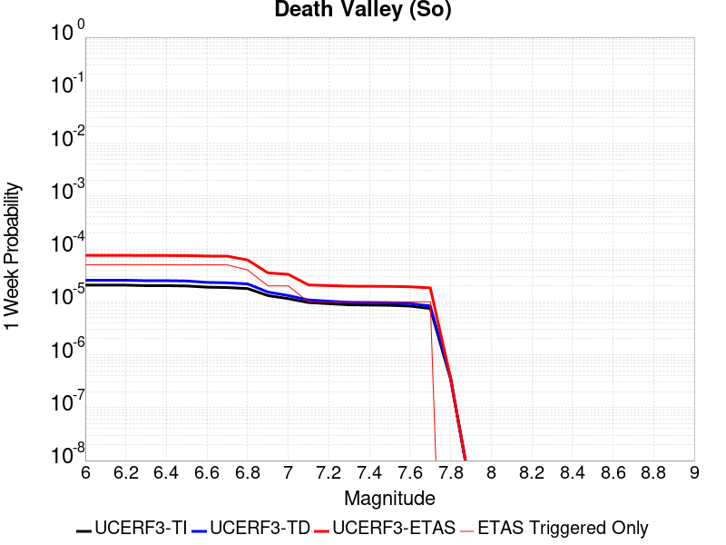 | 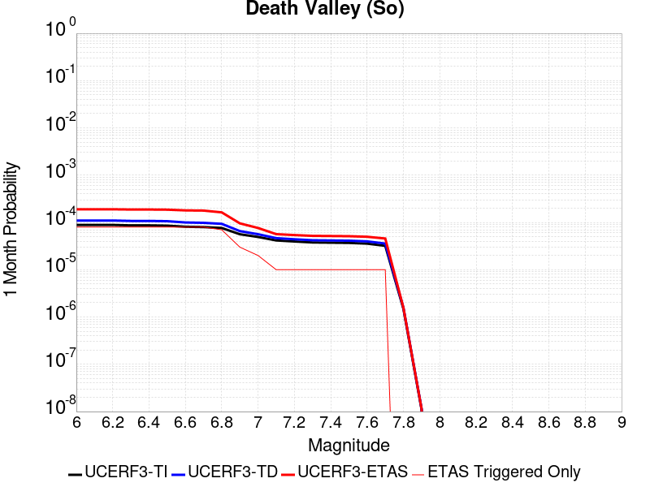 | 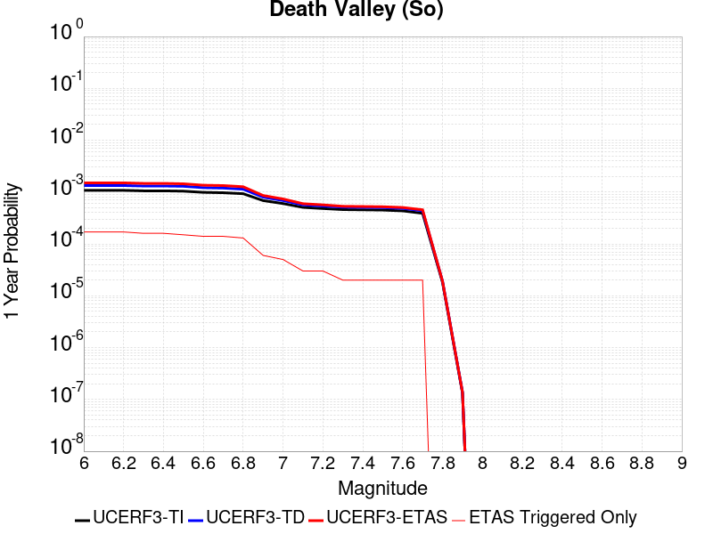 | 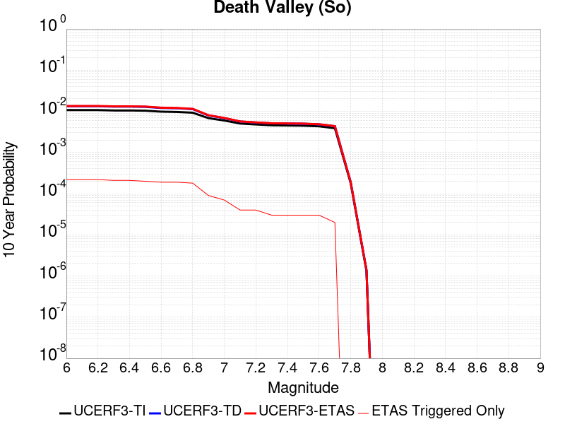 |

| Magnitude | 1 wk TI Prob | 1 wk TD Prob | 1 wk ETAS Prob | 1 wk ETAS/TD Gain | 1 wk ETAS Triggered Only | 1 mo TI Prob | 1 mo TD Prob | 1 mo ETAS Prob | 1 mo ETAS/TD Gain | 1 mo ETAS Triggered Only | 1 yr TI Prob | 1 yr TD Prob | 1 yr ETAS Prob | 1 yr ETAS/TD Gain | 1 yr ETAS Triggered Only | 10 yr TI Prob | 10 yr TD Prob | 10 yr ETAS Prob | 10 yr ETAS/TD Gain | 10 yr ETAS Triggered Only |
|-----|-----|-----|-----|-----|-----|-----|-----|-----|-----|-----|-----|-----|-----|-----|-----|-----|-----|-----|-----|-----|
| 6.0 | 2.0684236E-5 | 2.5618423E-5 | 7.561714E-5 | 2.9516704 | 5.0E-5 | 8.864371E-5 | 1.09788714E-4 | 1.8977992E-4 | 1.7285924 | 8.0E-5 | 0.0010787029 | 0.0013358749 | 0.0015056478 | 1.1270875 | 1.7E-4 | 0.010734817 | 0.013281729 | 0.013498806 | 1.0163441 | 2.2E-4 |
| 6.1 | 2.0684236E-5 | 2.5618423E-5 | 7.561714E-5 | 2.9516704 | 5.0E-5 | 8.864371E-5 | 1.09788714E-4 | 1.8977992E-4 | 1.7285924 | 8.0E-5 | 0.0010787029 | 0.0013358749 | 0.0015056478 | 1.1270875 | 1.7E-4 | 0.010734817 | 0.013281729 | 0.013498806 | 1.0163441 | 2.2E-4 |
| 6.2 | 2.0684236E-5 | 2.5618423E-5 | 7.561714E-5 | 2.9516704 | 5.0E-5 | 8.864371E-5 | 1.09788714E-4 | 1.8977992E-4 | 1.7285924 | 8.0E-5 | 0.0010787029 | 0.0013358749 | 0.0015056478 | 1.1270875 | 1.7E-4 | 0.010734817 | 0.013281729 | 0.013498806 | 1.0163441 | 2.2E-4 |
| 6.3 | 2.0240292E-5 | 2.5118497E-5 | 7.511724E-5 | 2.9905148 | 5.0E-5 | 8.6741224E-5 | 1.0764636E-4 | 1.8763775E-4 | 1.7430942 | 8.0E-5 | 0.0010555626 | 0.0013098232 | 0.0014696136 | 1.1219939 | 1.6E-4 | 0.010505628 | 0.013024284 | 0.0132315485 | 1.0159137 | 2.1E-4 |
| 6.4 | 2.0240292E-5 | 2.5118497E-5 | 7.511724E-5 | 2.9905148 | 5.0E-5 | 8.6741224E-5 | 1.0764636E-4 | 1.8763775E-4 | 1.7430942 | 8.0E-5 | 0.0010555626 | 0.0013098232 | 0.0014696136 | 1.1219939 | 1.6E-4 | 0.010505628 | 0.013024284 | 0.0132315485 | 1.0159137 | 2.1E-4 |
| 6.5 | 1.9962767E-5 | 2.4807747E-5 | 7.480651E-5 | 3.0154495 | 5.0E-5 | 8.55519E-5 | 1.0631468E-4 | 1.8630618E-4 | 1.7524031 | 8.0E-5 | 0.0010410968 | 0.0012936293 | 0.0014434352 | 1.1158029 | 1.5E-4 | 0.010362327 | 0.012864228 | 0.013061655 | 1.015347 | 2.0E-4 |
| 6.6 | 1.8937297E-5 | 2.3311568E-5 | 7.33104E-5 | 3.1448078 | 5.0E-5 | 8.115732E-5 | 9.990298E-5 | 1.7989498E-4 | 1.800697 | 8.0E-5 | 9.876423E-4 | 0.0012156547 | 0.0013554845 | 1.1150243 | 1.4E-4 | 0.009832645 | 0.0120931 | 0.012280801 | 1.0155214 | 1.9E-4 |
| 6.7 | 1.8621096E-5 | 2.2912203E-5 | 7.291106E-5 | 3.1821933 | 5.0E-5 | 7.980225E-5 | 9.8191544E-5 | 1.7818369E-4 | 1.8146541 | 8.0E-5 | 9.711593E-4 | 0.0011948409 | 0.0013346736 | 1.1170304 | 1.4E-4 | 0.009669261 | 0.011887211 | 0.012074953 | 1.0157936 | 1.9E-4 |
| 6.8 | 1.7830353E-5 | 2.1806247E-5 | 6.1805375E-5 | 2.8342967 | 4.0E-5 | 7.641356E-5 | 9.345208E-5 | 1.6344554E-4 | 1.7489771 | 7.0E-5 | 9.29938E-4 | 0.0011371992 | 0.0012670513 | 1.1141859 | 1.3E-4 | 0.009260561 | 0.011316643 | 0.011494606 | 1.0157257 | 1.8E-4 |
| 6.9 | 1.3135183E-5 | 1.5304242E-5 | 3.5303936E-5 | 2.3068073 | 2.0E-5 | 5.6292425E-5 | 6.558799E-5 | 9.558602E-5 | 1.4573708 | 3.0E-5 | 6.8514474E-4 | 7.982477E-4 | 8.5819984E-4 | 1.0751046 | 6.0E-5 | 0.006830362 | 0.007954813 | 0.008044097 | 1.0112239 | 9.0E-5 |
| 7.0 | 1.1507512E-5 | 1.3154444E-5 | 3.315418E-5 | 2.5203788 | 2.0E-5 | 4.9316975E-5 | 5.6375004E-5 | 7.637388E-5 | 1.3547472 | 2.0E-5 | 6.002687E-4 | 6.861553E-4 | 7.36121E-4 | 1.0728198 | 5.0E-5 | 0.0059864987 | 0.006841068 | 0.0069105895 | 1.0101624 | 7.0E-5 |
| 7.1 | 9.715903E-6 | 1.0865454E-5 | 2.0865346E-5 | 1.9203382 | 1.0E-5 | 4.1638916E-5 | 4.6565423E-5 | 5.6564957E-5 | 1.2147416 | 1.0E-5 | 5.068359E-4 | 5.667908E-4 | 5.967738E-4 | 1.0528996 | 3.0E-5 | 0.0050568148 | 0.0056539057 | 0.0056936797 | 1.0070348 | 4.0E-5 |
| 7.2 | 9.233269E-6 | 1.0286473E-5 | 2.028637E-5 | 1.9721406 | 1.0E-5 | 3.9570554E-5 | 4.4084165E-5 | 5.408372E-5 | 1.2268288 | 1.0E-5 | 4.81665E-4 | 5.3659675E-4 | 5.665806E-4 | 1.0558779 | 3.0E-5 | 0.0048062233 | 0.005353442 | 0.005393228 | 1.0074319 | 4.0E-5 |
| 7.3 | 8.8041315E-6 | 9.808313E-6 | 1.9808214E-5 | 2.0195334 | 1.0E-5 | 3.7731446E-5 | 4.2034975E-5 | 5.2034553E-5 | 1.2378871 | 1.0E-5 | 4.592835E-4 | 5.1165983E-4 | 5.316496E-4 | 1.0390685 | 2.0E-5 | 0.0045833546 | 0.0051052445 | 0.0051350915 | 1.0058463 | 3.0E-5 |
| 7.4 | 8.708749E-6 | 9.707323E-6 | 1.9707226E-5 | 2.0301402 | 1.0E-5 | 3.7322676E-5 | 4.1602176E-5 | 5.1601757E-5 | 1.240362 | 1.0E-5 | 4.5430884E-4 | 5.06393E-4 | 5.263828E-4 | 1.039475 | 2.0E-5 | 0.004533812 | 0.0050528166 | 0.005082665 | 1.0059073 | 3.0E-5 |
| 7.5 | 8.612678E-6 | 9.604964E-6 | 1.9604868E-5 | 2.0411181 | 1.0E-5 | 3.6910955E-5 | 4.116351E-5 | 5.1163097E-5 | 1.2429236 | 1.0E-5 | 4.492982E-4 | 5.010547E-4 | 5.2104465E-4 | 1.0398958 | 2.0E-5 | 0.004483909 | 0.0049996753 | 0.005029525 | 1.0059704 | 3.0E-5 |
| 7.6 | 8.319024E-6 | 9.28406E-6 | 1.9283967E-5 | 2.077105 | 1.0E-5 | 3.5652476E-5 | 3.9788243E-5 | 4.9787846E-5 | 1.2513205 | 1.0E-5 | 4.3398244E-4 | 4.8431839E-4 | 5.0430873E-4 | 1.0412751 | 2.0E-5 | 0.0043313587 | 0.004833053 | 0.004862908 | 1.0061773 | 3.0E-5 |
| 7.7 | 7.4718328E-6 | 8.3453E-6 | 1.8345216E-5 | 2.1982694 | 1.0E-5 | 3.2021748E-5 | 3.57651E-5 | 4.5764744E-5 | 1.2795922 | 1.0E-5 | 3.8979502E-4 | 4.3535716E-4 | 4.5534846E-4 | 1.0459193 | 2.0E-5 | 0.00389112 | 0.004345448 | 0.0043653613 | 1.0045825 | 2.0E-5 |
| 7.8 | 3.4586725E-7 | 3.648288E-7 | 3.648288E-7 | 1.0 | 0.0 | 1.4822873E-6 | 1.5635511E-6 | 1.5635511E-6 | 1.0 | 0.0 | 1.80467E-5 | 1.9036073E-5 | 1.9036073E-5 | 1.0 | 0.0 | 1.8045233E-4 | 1.9034486E-4 | 1.9034486E-4 | 1.0 | 0.0 |
| 7.9 | 2.5591178E-9 | 2.6696871E-9 | 2.6696871E-9 | 1.0 | 0.0 | 1.0967647E-8 | 1.1441516E-8 | 1.1441516E-8 | 1.0 | 0.0 | 1.335311E-7 | 1.3930045E-7 | 1.3930045E-7 | 1.0 | 0.0 | 1.3353102E-6 | 1.3930046E-6 | 1.3930046E-6 | 1.0 | 0.0 |

## San Andreas (San Bernardino S)
*[(top)](#table-of-contents)*

| 1 Week | 1 Month | 1 Year | 10 Year |
|-----|-----|-----|-----|
| 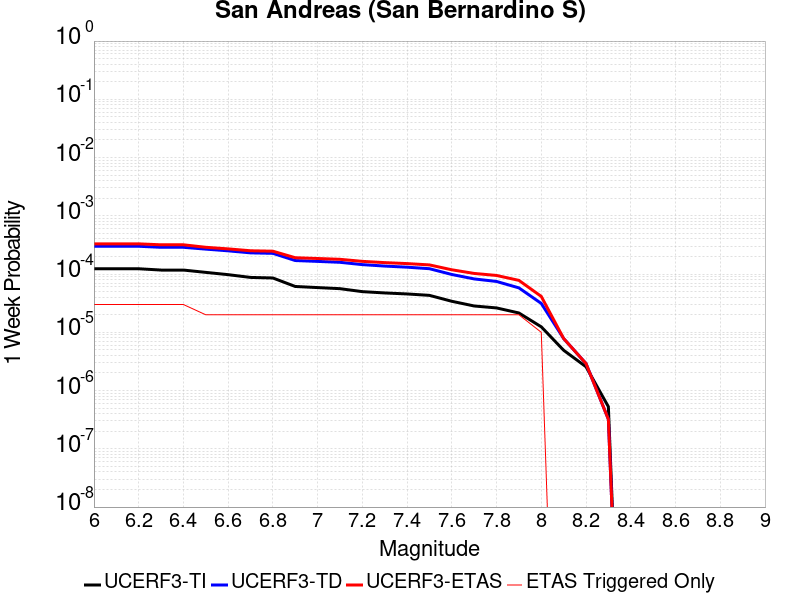 | 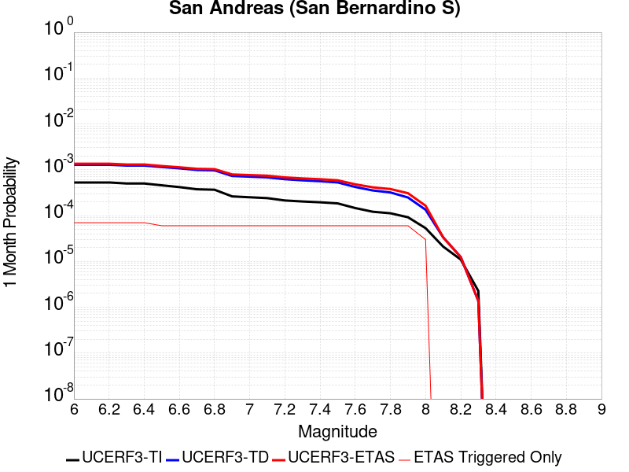 | 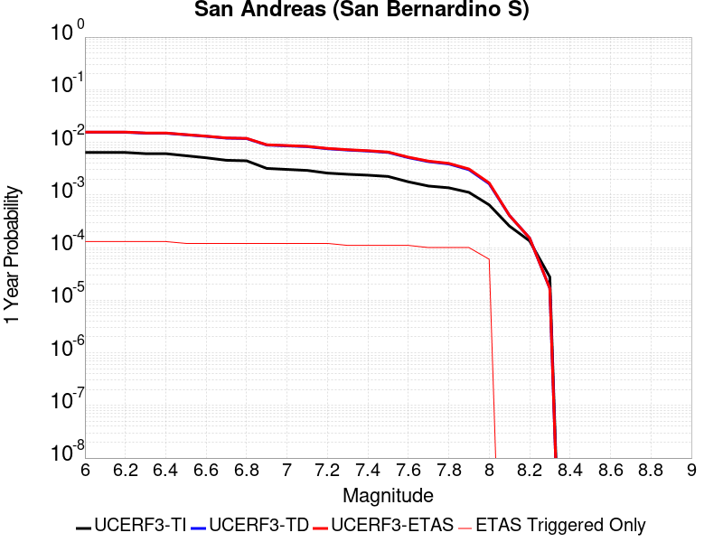 | 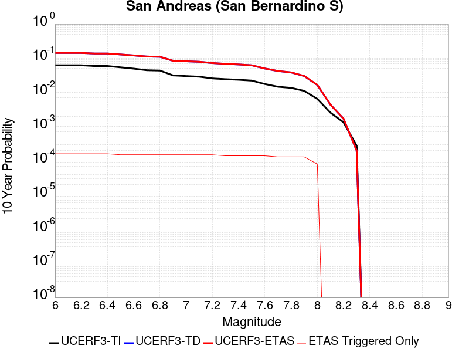 |

| Magnitude | 1 wk TI Prob | 1 wk TD Prob | 1 wk ETAS Prob | 1 wk ETAS/TD Gain | 1 wk ETAS Triggered Only | 1 mo TI Prob | 1 mo TD Prob | 1 mo ETAS Prob | 1 mo ETAS/TD Gain | 1 mo ETAS Triggered Only | 1 yr TI Prob | 1 yr TD Prob | 1 yr ETAS Prob | 1 yr ETAS/TD Gain | 1 yr ETAS Triggered Only | 10 yr TI Prob | 10 yr TD Prob | 10 yr ETAS Prob | 10 yr ETAS/TD Gain | 10 yr ETAS Triggered Only |
|-----|-----|-----|-----|-----|-----|-----|-----|-----|-----|-----|-----|-----|-----|-----|-----|-----|-----|-----|-----|-----|
| 6.0 | 1.2336002E-4 | 3.0008948E-4 | 3.3008048E-4 | 1.0999402 | 3.0E-5 | 5.2857865E-4 | 0.0012854899 | 0.0013554 | 1.054384 | 7.0E-5 | 0.006416472 | 0.015543484 | 0.015671464 | 1.0082337 | 1.3E-4 | 0.06234337 | 0.14285627 | 0.14299342 | 1.00096 | 1.6E-4 |
| 6.1 | 1.2336002E-4 | 3.0008948E-4 | 3.3008048E-4 | 1.0999402 | 3.0E-5 | 5.2857865E-4 | 0.0012854899 | 0.0013554 | 1.054384 | 7.0E-5 | 0.006416472 | 0.015543484 | 0.015671464 | 1.0082337 | 1.3E-4 | 0.06234337 | 0.14285627 | 0.14299342 | 1.00096 | 1.6E-4 |
| 6.2 | 1.2336002E-4 | 3.0008948E-4 | 3.3008048E-4 | 1.0999402 | 3.0E-5 | 5.2857865E-4 | 0.0012854899 | 0.0013554 | 1.054384 | 7.0E-5 | 0.006416472 | 0.015543484 | 0.015671464 | 1.0082337 | 1.3E-4 | 0.06234337 | 0.14285627 | 0.14299342 | 1.00096 | 1.6E-4 |
| 6.3 | 1.1712257E-4 | 2.8797207E-4 | 3.1796342E-4 | 1.1041467 | 3.0E-5 | 5.018573E-4 | 0.001233608 | 0.0013035216 | 1.0566741 | 7.0E-5 | 0.006093008 | 0.01492059 | 0.01504865 | 1.0085828 | 1.3E-4 | 0.059286322 | 0.13756467 | 0.13770266 | 1.0010031 | 1.6E-4 |
| 6.4 | 1.1712257E-4 | 2.8797207E-4 | 3.1796342E-4 | 1.1041467 | 3.0E-5 | 5.018573E-4 | 0.001233608 | 0.0013035216 | 1.0566741 | 7.0E-5 | 0.006093008 | 0.01492059 | 0.01504865 | 1.0085828 | 1.3E-4 | 0.059286322 | 0.13756467 | 0.13770266 | 1.0010031 | 1.6E-4 |
| 6.5 | 1.0689076E-4 | 2.6809986E-4 | 2.880945E-4 | 1.0745791 | 2.0E-5 | 4.5802278E-4 | 0.0011485183 | 0.0012084494 | 1.0521812 | 6.0E-5 | 0.0055621783 | 0.013898174 | 0.014016506 | 1.0085143 | 1.2E-4 | 0.05425003 | 0.12881182 | 0.1289425 | 1.0010145 | 1.5E-4 |
| 6.6 | 9.7648895E-5 | 2.5054725E-4 | 2.7054225E-4 | 1.0798053 | 2.0E-5 | 4.1842813E-4 | 0.0010733557 | 0.0011332913 | 1.0558394 | 6.0E-5 | 0.005082469 | 0.012994168 | 0.013112609 | 1.0091149 | 1.2E-4 | 0.049677886 | 0.12097161 | 0.121103466 | 1.0010899 | 1.5E-4 |
| 6.7 | 8.757013E-5 | 2.3125445E-4 | 2.5124985E-4 | 1.0864648 | 2.0E-5 | 3.7524657E-4 | 9.907364E-4 | 0.0010506769 | 1.060501 | 6.0E-5 | 0.00455906 | 0.011999588 | 0.012118149 | 1.0098803 | 1.2E-4 | 0.04466656 | 0.11227982 | 0.112412974 | 1.0011859 | 1.5E-4 |
| 6.8 | 8.562978E-5 | 2.2685292E-4 | 2.468484E-4 | 1.0881429 | 2.0E-5 | 3.6693315E-4 | 9.7188674E-4 | 0.0010318285 | 1.0616755 | 6.0E-5 | 0.004458263 | 0.01177259 | 0.011891177 | 1.0100732 | 1.2E-4 | 0.043698758 | 0.11029001 | 0.110423476 | 1.0012101 | 1.5E-4 |
| 6.9 | 6.124075E-5 | 1.7069813E-4 | 1.9069471E-4 | 1.1171459 | 2.0E-5 | 2.6243398E-4 | 7.313591E-4 | 7.913152E-4 | 1.081979 | 6.0E-5 | 0.0031904527 | 0.00886815 | 0.008987087 | 1.0134115 | 1.2E-4 | 0.031450346 | 0.08419993 | 0.0843373 | 1.0016315 | 1.5E-4 |
| 7.0 | 5.8598747E-5 | 1.6498787E-4 | 1.8498457E-4 | 1.121201 | 2.0E-5 | 2.5111332E-4 | 7.069001E-4 | 7.6685764E-4 | 1.0848176 | 6.0E-5 | 0.0030530186 | 0.008572741 | 0.008691712 | 1.0138779 | 1.2E-4 | 0.03011414 | 0.08151753 | 0.0816553 | 1.0016901 | 1.5E-4 |
| 7.1 | 5.613814E-5 | 1.5917298E-4 | 1.791698E-4 | 1.1256294 | 2.0E-5 | 2.4056983E-4 | 6.819924E-4 | 7.4195146E-4 | 1.0879176 | 6.0E-5 | 0.0029250039 | 0.008271826 | 0.008390834 | 1.0143871 | 1.2E-4 | 0.028868021 | 0.078816354 | 0.07895453 | 1.0017532 | 1.5E-4 |
| 7.2 | 4.991222E-5 | 1.4523676E-4 | 1.6523384E-4 | 1.1376861 | 2.0E-5 | 2.1389198E-4 | 6.2229513E-4 | 6.822578E-4 | 1.0963572 | 6.0E-5 | 0.002601025 | 0.0075502265 | 0.0076693203 | 1.0157735 | 1.2E-4 | 0.025707912 | 0.072269924 | 0.072409086 | 1.0019256 | 1.5E-4 |
| 7.3 | 4.7410045E-5 | 1.3717797E-4 | 1.5717522E-4 | 1.145776 | 2.0E-5 | 2.0317009E-4 | 5.8777345E-4 | 6.4773817E-4 | 1.1020201 | 6.0E-5 | 0.0024707897 | 0.0071327467 | 0.007241962 | 1.0153118 | 1.1E-4 | 0.024434982 | 0.06855203 | 0.06868243 | 1.0019022 | 1.4E-4 |
| 7.4 | 4.5556746E-5 | 1.3125638E-4 | 1.5125377E-4 | 1.1523535 | 2.0E-5 | 1.952286E-4 | 5.6240644E-4 | 6.2237267E-4 | 1.1066244 | 6.0E-5 | 0.002374317 | 0.006825879 | 0.0069351285 | 1.0160052 | 1.1E-4 | 0.023491086 | 0.065804236 | 0.06593502 | 1.0019876 | 1.4E-4 |
| 7.5 | 4.3084514E-5 | 1.2360894E-4 | 1.4360648E-4 | 1.1617806 | 2.0E-5 | 1.8463485E-4 | 5.2964536E-4 | 5.8961357E-4 | 1.1132233 | 6.0E-5 | 0.0022456115 | 0.006429438 | 0.0065387306 | 1.0169988 | 1.1E-4 | 0.022230545 | 0.062204733 | 0.062336024 | 1.0021106 | 1.4E-4 |
| 7.6 | 3.408608E-5 | 9.838868E-5 | 1.18386706E-4 | 1.2032554 | 2.0E-5 | 1.4607502E-4 | 4.215977E-4 | 4.815724E-4 | 1.1422558 | 6.0E-5 | 0.0017770125 | 0.005120897 | 0.005230334 | 1.0213706 | 1.1E-4 | 0.017628696 | 0.050035115 | 0.05016811 | 1.002658 | 1.4E-4 |
| 7.7 | 2.8315713E-5 | 8.251823E-5 | 1.02516584E-4 | 1.2423507 | 2.0E-5 | 1.2134742E-4 | 3.5360164E-4 | 4.1358045E-4 | 1.1696224 | 6.0E-5 | 0.0014764034 | 0.004296611 | 0.004396181 | 1.0231742 | 1.0E-4 | 0.01466633 | 0.04228543 | 0.042409934 | 1.0029444 | 1.3E-4 |
| 7.8 | 2.6222975E-5 | 7.4660275E-5 | 9.465878E-5 | 1.26786 | 2.0E-5 | 1.1237934E-4 | 3.1993337E-4 | 3.7991419E-4 | 1.187479 | 6.0E-5 | 0.0013673597 | 0.003888238 | 0.003987849 | 1.0256186 | 1.0E-4 | 0.013589768 | 0.03844993 | 0.038574927 | 1.0032511 | 1.3E-4 |
| 7.9 | 2.1469694E-5 | 5.7903162E-5 | 7.7902005E-5 | 1.3453842 | 2.0E-5 | 9.200973E-5 | 2.4813283E-4 | 3.0811795E-4 | 1.241746 | 6.0E-5 | 0.0011196428 | 0.003016835 | 0.0031165334 | 1.0330473 | 1.0E-4 | 0.011140184 | 0.030163256 | 0.030289335 | 1.0041798 | 1.3E-4 |
| 8.0 | 1.2420249E-5 | 3.1332525E-5 | 4.133221E-5 | 1.3191472 | 1.0E-5 | 5.322855E-5 | 1.3427534E-4 | 1.6427132E-4 | 1.2233915 | 3.0E-5 | 6.478649E-4 | 0.0016335774 | 0.0016934794 | 1.0366693 | 6.0E-5 | 0.0064597935 | 0.016528832 | 0.01660751 | 1.00476 | 8.0E-5 |
| 8.1 | 4.9197724E-6 | 7.827271E-6 | 7.827271E-6 | 1.0 | 0.0 | 2.1084568E-5 | 3.3545013E-5 | 3.3545013E-5 | 1.0 | 0.0 | 2.566744E-4 | 4.0833413E-4 | 4.0833413E-4 | 1.0 | 0.0 | 0.002563781 | 0.0043868436 | 0.0043868436 | 1.0 | 0.0 |
| 8.2 | 2.5634774E-6 | 2.9089954E-6 | 2.9089954E-6 | 1.0 | 0.0 | 1.0986286E-5 | 1.2467063E-5 | 1.2467063E-5 | 1.0 | 0.0 | 1.3374983E-4 | 1.5177597E-4 | 1.5177597E-4 | 1.0 | 0.0 | 0.0013366934 | 0.0017061684 | 0.0017061684 | 1.0 | 0.0 |
| 8.3 | 5.2850464E-7 | 3.211945E-7 | 3.211945E-7 | 1.0 | 0.0 | 2.2650179E-6 | 1.3765473E-6 | 1.3765473E-6 | 1.0 | 0.0 | 2.7576245E-5 | 1.6759346E-5 | 1.6759346E-5 | 1.0 | 0.0 | 2.7572823E-4 | 1.9887649E-4 | 1.9887649E-4 | 1.0 | 0.0 |

## Coyote Canyon
*[(top)](#table-of-contents)*

| 1 Week | 1 Month | 1 Year | 10 Year |
|-----|-----|-----|-----|
|  |  | 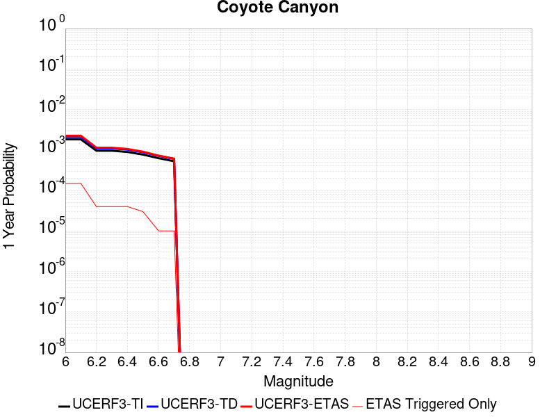 |  |

| Magnitude | 1 wk TI Prob | 1 wk TD Prob | 1 wk ETAS Prob | 1 wk ETAS/TD Gain | 1 wk ETAS Triggered Only | 1 mo TI Prob | 1 mo TD Prob | 1 mo ETAS Prob | 1 mo ETAS/TD Gain | 1 mo ETAS Triggered Only | 1 yr TI Prob | 1 yr TD Prob | 1 yr ETAS Prob | 1 yr ETAS/TD Gain | 1 yr ETAS Triggered Only | 10 yr TI Prob | 10 yr TD Prob | 10 yr ETAS Prob | 10 yr ETAS/TD Gain | 10 yr ETAS Triggered Only |
|-----|-----|-----|-----|-----|-----|-----|-----|-----|-----|-----|-----|-----|-----|-----|-----|-----|-----|-----|-----|-----|
| 6.0 | 3.5090034E-5 | 4.036513E-5 | 7.0363916E-5 | 1.7431858 | 3.0E-5 | 1.503772E-4 | 1.7298339E-4 | 2.6296783E-4 | 1.5201912 | 9.0E-5 | 0.0018293047 | 0.0021042947 | 0.002253979 | 1.0711328 | 1.5E-4 | 0.018143194 | 0.020869615 | 0.021026274 | 1.0075066 | 1.6E-4 |
| 6.1 | 3.5090034E-5 | 4.036513E-5 | 7.0363916E-5 | 1.7431858 | 3.0E-5 | 1.503772E-4 | 1.7298339E-4 | 2.6296783E-4 | 1.5201912 | 9.0E-5 | 0.0018293047 | 0.0021042947 | 0.002253979 | 1.0711328 | 1.5E-4 | 0.018143194 | 0.020869615 | 0.021026274 | 1.0075066 | 1.6E-4 |
| 6.2 | 1.841879E-5 | 2.1060194E-5 | 2.1060194E-5 | 1.0 | 0.0 | 7.8935285E-5 | 9.0255424E-5 | 1.2025272E-4 | 1.33236 | 3.0E-5 | 9.606133E-4 | 0.0010984079 | 0.001138364 | 1.0363764 | 4.0E-5 | 0.0095647145 | 0.010939874 | 0.010989327 | 1.0045204 | 5.0E-5 |
| 6.3 | 1.841879E-5 | 2.1060194E-5 | 2.1060194E-5 | 1.0 | 0.0 | 7.8935285E-5 | 9.0255424E-5 | 1.2025272E-4 | 1.33236 | 3.0E-5 | 9.606133E-4 | 0.0010984079 | 0.001138364 | 1.0363764 | 4.0E-5 | 0.0095647145 | 0.010939874 | 0.010989327 | 1.0045204 | 5.0E-5 |
| 6.4 | 1.712201E-5 | 1.9565581E-5 | 1.9565581E-5 | 1.0 | 0.0 | 7.337798E-5 | 8.385037E-5 | 1.13847855E-4 | 1.3577502 | 3.0E-5 | 8.930107E-4 | 0.0010205007 | 0.0010604598 | 1.0391564 | 4.0E-5 | 0.008894307 | 0.0101680625 | 0.010217554 | 1.0048673 | 5.0E-5 |
| 6.5 | 1.4744935E-5 | 1.6837288E-5 | 1.6837288E-5 | 1.0 | 0.0 | 6.3191044E-5 | 7.215834E-5 | 1.0215618E-4 | 1.4157224 | 3.0E-5 | 7.6907943E-4 | 8.7826716E-4 | 9.0824085E-4 | 1.0341282 | 3.0E-5 | 0.007664232 | 0.008757159 | 0.008796808 | 1.0045277 | 4.0E-5 |
| 6.6 | 1.2017839E-5 | 1.3724348E-5 | 1.3724348E-5 | 1.0 | 0.0 | 5.150401E-5 | 5.8817808E-5 | 6.8817215E-5 | 1.1700065 | 1.0E-5 | 6.268809E-4 | 7.159601E-4 | 7.259529E-4 | 1.0139573 | 1.0E-5 | 0.0062511545 | 0.007145228 | 0.007165085 | 1.0027791 | 2.0E-5 |
| 6.7 | 1.00956095E-5 | 1.1533734E-5 | 1.1533734E-5 | 1.0 | 0.0 | 4.326618E-5 | 4.9429844E-5 | 5.942935E-5 | 1.202297 | 1.0E-5 | 5.266384E-4 | 6.0172915E-4 | 6.1172317E-4 | 1.0166087 | 1.0E-5 | 0.005253921 | 0.006009526 | 0.0060294056 | 1.003308 | 2.0E-5 |

## Towne Pass
*[(top)](#table-of-contents)*

| 1 Week | 1 Month | 1 Year | 10 Year |
|-----|-----|-----|-----|
| 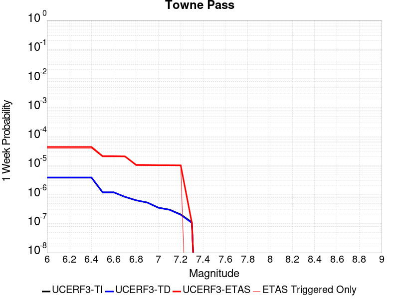 |  | 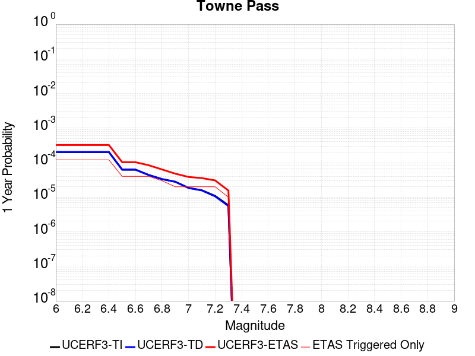 |  |

| Magnitude | 1 wk TI Prob | 1 wk TD Prob | 1 wk ETAS Prob | 1 wk ETAS/TD Gain | 1 wk ETAS Triggered Only | 1 mo TI Prob | 1 mo TD Prob | 1 mo ETAS Prob | 1 mo ETAS/TD Gain | 1 mo ETAS Triggered Only | 1 yr TI Prob | 1 yr TD Prob | 1 yr ETAS Prob | 1 yr ETAS/TD Gain | 1 yr ETAS Triggered Only | 10 yr TI Prob | 10 yr TD Prob | 10 yr ETAS Prob | 10 yr ETAS/TD Gain | 10 yr ETAS Triggered Only |
|-----|-----|-----|-----|-----|-----|-----|-----|-----|-----|-----|-----|-----|-----|-----|-----|-----|-----|-----|-----|-----|
| 6.0 | 3.849728E-6 | 3.8945495E-6 | 4.3894393E-5 | 11.270724 | 4.0E-5 | 1.649873E-5 | 1.6690845E-5 | 7.6689845E-5 | 4.594725 | 6.0E-5 | 2.0085352E-4 | 2.0319645E-4 | 3.2317208E-4 | 1.5904415 | 1.2E-4 | 0.0020067208 | 0.0020305358 | 0.0021802313 | 1.0737221 | 1.5E-4 |
| 6.1 | 3.849728E-6 | 3.8945495E-6 | 4.3894393E-5 | 11.270724 | 4.0E-5 | 1.649873E-5 | 1.6690845E-5 | 7.6689845E-5 | 4.594725 | 6.0E-5 | 2.0085352E-4 | 2.0319645E-4 | 3.2317208E-4 | 1.5904415 | 1.2E-4 | 0.0020067208 | 0.0020305358 | 0.0021802313 | 1.0737221 | 1.5E-4 |
| 6.2 | 3.849728E-6 | 3.8945495E-6 | 4.3894393E-5 | 11.270724 | 4.0E-5 | 1.649873E-5 | 1.6690845E-5 | 7.6689845E-5 | 4.594725 | 6.0E-5 | 2.0085352E-4 | 2.0319645E-4 | 3.2317208E-4 | 1.5904415 | 1.2E-4 | 0.0020067208 | 0.0020305358 | 0.0021802313 | 1.0737221 | 1.5E-4 |
| 6.3 | 3.849728E-6 | 3.8945495E-6 | 4.3894393E-5 | 11.270724 | 4.0E-5 | 1.649873E-5 | 1.6690845E-5 | 7.6689845E-5 | 4.594725 | 6.0E-5 | 2.0085352E-4 | 2.0319645E-4 | 3.2317208E-4 | 1.5904415 | 1.2E-4 | 0.0020067208 | 0.0020305358 | 0.0021802313 | 1.0737221 | 1.5E-4 |
| 6.4 | 3.849728E-6 | 3.8945495E-6 | 4.3894393E-5 | 11.270724 | 4.0E-5 | 1.649873E-5 | 1.6690845E-5 | 7.6689845E-5 | 4.594725 | 6.0E-5 | 2.0085352E-4 | 2.0319645E-4 | 3.2317208E-4 | 1.5904415 | 1.2E-4 | 0.0020067208 | 0.0020305358 | 0.0021802313 | 1.0737221 | 1.5E-4 |
| 6.5 | 1.1953545E-6 | 1.2030553E-6 | 2.1203032E-5 | 17.624321 | 2.0E-5 | 5.1229376E-6 | 5.155942E-6 | 2.5155838E-5 | 4.8789997 | 2.0E-5 | 6.236998E-5 | 6.27719E-5 | 1.0276939E-4 | 1.6371878 | 4.0E-5 | 6.235248E-4 | 6.2755344E-4 | 6.675283E-4 | 1.0636996 | 4.0E-5 |
| 6.6 | 1.1953545E-6 | 1.2030553E-6 | 2.1203032E-5 | 17.624321 | 2.0E-5 | 5.1229376E-6 | 5.155942E-6 | 2.5155838E-5 | 4.8789997 | 2.0E-5 | 6.236998E-5 | 6.27719E-5 | 1.0276939E-4 | 1.6371878 | 4.0E-5 | 6.235248E-4 | 6.2755344E-4 | 6.675283E-4 | 1.0636996 | 4.0E-5 |
| 6.7 | 8.375951E-7 | 8.410697E-7 | 2.0841053E-5 | 24.77922 | 2.0E-5 | 3.5896885E-6 | 3.60458E-6 | 2.3604507E-5 | 6.5484767 | 2.0E-5 | 4.370358E-5 | 4.3884935E-5 | 8.388318E-5 | 1.9114345 | 4.0E-5 | 4.3694986E-4 | 4.387684E-4 | 4.7875085E-4 | 1.0911243 | 4.0E-5 |
| 6.8 | 6.38041E-7 | 6.39218E-7 | 1.0639212E-5 | 16.644104 | 1.0E-5 | 2.7344586E-6 | 2.739503E-6 | 1.2739476E-5 | 4.650287 | 1.0E-5 | 3.3291526E-5 | 3.335298E-5 | 6.335198E-5 | 1.8994399 | 3.0E-5 | 3.3286537E-4 | 3.3348353E-4 | 3.6347355E-4 | 1.0899295 | 3.0E-5 |
| 6.9 | 5.3460053E-7 | 5.345355E-7 | 1.053453E-5 | 19.70782 | 1.0E-5 | 2.2911431E-6 | 2.2908646E-6 | 1.2290841E-5 | 5.365154 | 1.0E-5 | 2.789431E-5 | 2.7890954E-5 | 4.7890397E-5 | 1.7170584 | 2.0E-5 | 2.789081E-4 | 2.7887785E-4 | 2.9887227E-4 | 1.071696 | 2.0E-5 |
| 7.0 | 3.557783E-7 | 3.5324413E-7 | 1.035324E-5 | 29.309023 | 1.0E-5 | 1.5247632E-6 | 1.5139026E-6 | 1.1513887E-5 | 7.605435 | 1.0E-5 | 1.8563835E-5 | 1.8431618E-5 | 3.8431248E-5 | 2.085072 | 2.0E-5 | 1.8562283E-4 | 1.8430172E-4 | 2.0429803E-4 | 1.1084977 | 2.0E-5 |
| 7.1 | 3.037942E-7 | 3.0002388E-7 | 1.0300021E-5 | 34.33067 | 1.0E-5 | 1.3019744E-6 | 1.2858161E-6 | 1.1285803E-5 | 8.777152 | 1.0E-5 | 1.5851423E-5 | 1.5654707E-5 | 3.5654393E-5 | 2.2775512 | 2.0E-5 | 1.5850292E-4 | 1.5653679E-4 | 1.7653365E-4 | 1.1277455 | 2.0E-5 |
| 7.2 | 2.0808248E-7 | 2.021783E-7 | 1.0202176E-5 | 50.461285 | 1.0E-5 | 8.917818E-7 | 8.6647816E-7 | 1.086647E-5 | 12.540962 | 1.0E-5 | 1.0857389E-5 | 1.0549325E-5 | 3.0549116E-5 | 2.8958359 | 2.0E-5 | 1.0856859E-4 | 1.054887E-4 | 1.254866E-4 | 1.1895738 | 2.0E-5 |
| 7.3 | 1.1162073E-7 | 1.06369825E-7 | 1.06369825E-7 | 1.0 | 0.0 | 4.7837443E-7 | 4.5587063E-7 | 4.5587063E-7 | 1.0 | 0.0 | 5.8241935E-6 | 5.550213E-6 | 1.5550157E-5 | 2.8017228 | 1.0E-5 | 5.8240406E-5 | 5.5500943E-5 | 6.550039E-5 | 1.1801671 | 1.0E-5 |

## Nelson Lake
*[(top)](#table-of-contents)*

| 1 Week | 1 Month | 1 Year | 10 Year |
|-----|-----|-----|-----|
|  |  |  |  |

| Magnitude | 1 wk TI Prob | 1 wk TD Prob | 1 wk ETAS Prob | 1 wk ETAS/TD Gain | 1 wk ETAS Triggered Only | 1 mo TI Prob | 1 mo TD Prob | 1 mo ETAS Prob | 1 mo ETAS/TD Gain | 1 mo ETAS Triggered Only | 1 yr TI Prob | 1 yr TD Prob | 1 yr ETAS Prob | 1 yr ETAS/TD Gain | 1 yr ETAS Triggered Only | 10 yr TI Prob | 10 yr TD Prob | 10 yr ETAS Prob | 10 yr ETAS/TD Gain | 10 yr ETAS Triggered Only |
|-----|-----|-----|-----|-----|-----|-----|-----|-----|-----|-----|-----|-----|-----|-----|-----|-----|-----|-----|-----|-----|
| 6.0 | 9.913453E-6 | 1.0192293E-5 | 3.019209E-5 | 2.962247 | 2.0E-5 | 4.2485535E-5 | 4.3680586E-5 | 8.367884E-5 | 1.9156986 | 4.0E-5 | 5.1713863E-4 | 5.316917E-4 | 6.116491E-4 | 1.1503831 | 8.0E-5 | 0.0051593683 | 0.0053052236 | 0.00541464 | 1.0206243 | 1.1E-4 |
| 6.1 | 9.913453E-6 | 1.0192293E-5 | 3.019209E-5 | 2.962247 | 2.0E-5 | 4.2485535E-5 | 4.3680586E-5 | 8.367884E-5 | 1.9156986 | 4.0E-5 | 5.1713863E-4 | 5.316917E-4 | 6.116491E-4 | 1.1503831 | 8.0E-5 | 0.0051593683 | 0.0053052236 | 0.00541464 | 1.0206243 | 1.1E-4 |
| 6.2 | 4.5596407E-6 | 4.696332E-6 | 2.4696237E-5 | 5.258623 | 2.0E-5 | 1.954117E-5 | 2.0126989E-5 | 5.0126386E-5 | 2.490506 | 3.0E-5 | 2.3788778E-4 | 2.450198E-4 | 3.050051E-4 | 1.2448182 | 6.0E-5 | 0.0023763329 | 0.0024476226 | 0.0025174513 | 1.0285292 | 7.0E-5 |
| 6.3 | 4.5596407E-6 | 4.696332E-6 | 2.4696237E-5 | 5.258623 | 2.0E-5 | 1.954117E-5 | 2.0126989E-5 | 5.0126386E-5 | 2.490506 | 3.0E-5 | 2.3788778E-4 | 2.450198E-4 | 3.050051E-4 | 1.2448182 | 6.0E-5 | 0.0023763329 | 0.0024476226 | 0.0025174513 | 1.0285292 | 7.0E-5 |
| 6.4 | 3.4025713E-6 | 3.509912E-6 | 2.3509841E-5 | 6.6981287 | 2.0E-5 | 1.4582367E-5 | 1.50423975E-5 | 3.5042096E-5 | 2.3295553 | 2.0E-5 | 1.7752586E-4 | 1.8312664E-4 | 2.3311749E-4 | 1.2729851 | 5.0E-5 | 0.001773841 | 0.0018298404 | 0.0018897306 | 1.0327297 | 6.0E-5 |
| 6.5 | 2.8352947E-6 | 2.9278688E-6 | 2.292781E-5 | 7.8308873 | 2.0E-5 | 1.2151207E-5 | 1.2547953E-5 | 3.25477E-5 | 2.5938654 | 2.0E-5 | 1.479309E-4 | 1.5276136E-4 | 1.8275679E-4 | 1.1963547 | 3.0E-5 | 0.0014783246 | 0.0015266375 | 0.0015665764 | 1.0261614 | 4.0E-5 |
| 6.6 | 2.251518E-6 | 2.3290781E-6 | 2.2329032E-5 | 9.587069 | 2.0E-5 | 9.649328E-6 | 9.981729E-6 | 2.998153E-5 | 3.003641 | 2.0E-5 | 1.1747423E-4 | 1.2152141E-4 | 1.5151776E-4 | 1.2468401 | 3.0E-5 | 0.0011741214 | 0.0012146112 | 0.0012545626 | 1.0328923 | 4.0E-5 |
| 6.7 | 1.8911853E-6 | 1.9591491E-6 | 2.195911E-5 | 11.208494 | 2.0E-5 | 8.105055E-6 | 8.39633E-6 | 2.8396162E-5 | 3.3819733 | 2.0E-5 | 9.867457E-5 | 1.022211E-4 | 1.3221803E-4 | 1.2934514 | 3.0E-5 | 9.863076E-4 | 0.0010217984 | 0.0010617574 | 1.0391067 | 4.0E-5 |
| 6.8 | 1.4874814E-6 | 1.5438383E-6 | 2.1543807E-5 | 13.954705 | 2.0E-5 | 6.374905E-6 | 6.6164357E-6 | 2.6616304E-5 | 4.0227556 | 2.0E-5 | 7.76117E-5 | 8.055265E-5 | 1.1055023E-4 | 1.3723972 | 3.0E-5 | 7.75846E-4 | 8.052856E-4 | 8.452534E-4 | 1.0496318 | 4.0E-5 |
| 6.9 | 6.835972E-7 | 7.1399705E-7 | 2.0713982E-5 | 29.011301 | 2.0E-5 | 2.9296991E-6 | 3.0599856E-6 | 2.3059923E-5 | 7.535959 | 2.0E-5 | 3.56685E-5 | 3.7255006E-5 | 6.725389E-5 | 1.805231 | 3.0E-5 | 3.5662777E-4 | 3.7251884E-4 | 4.1250396E-4 | 1.1073371 | 4.0E-5 |

## San Jacinto (San Bernardino)
*[(top)](#table-of-contents)*

| 1 Week | 1 Month | 1 Year | 10 Year |
|-----|-----|-----|-----|
| 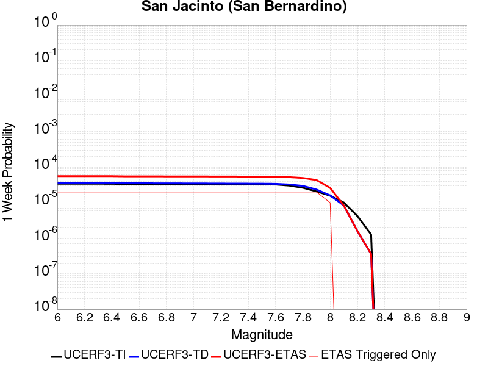 | 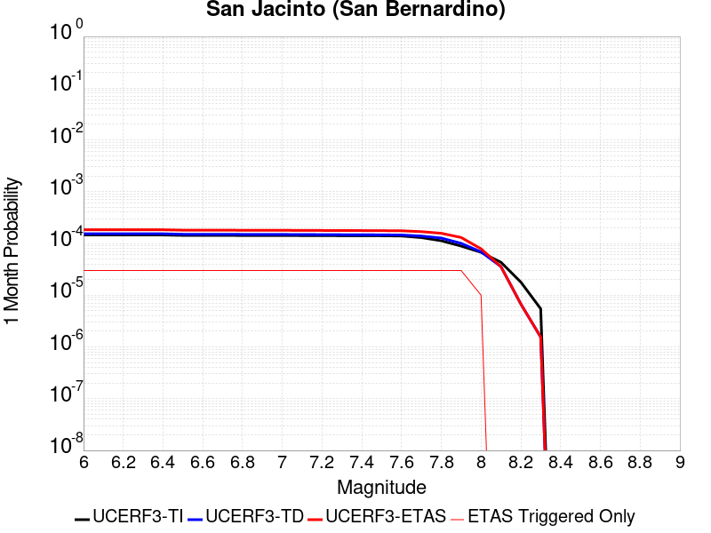 | 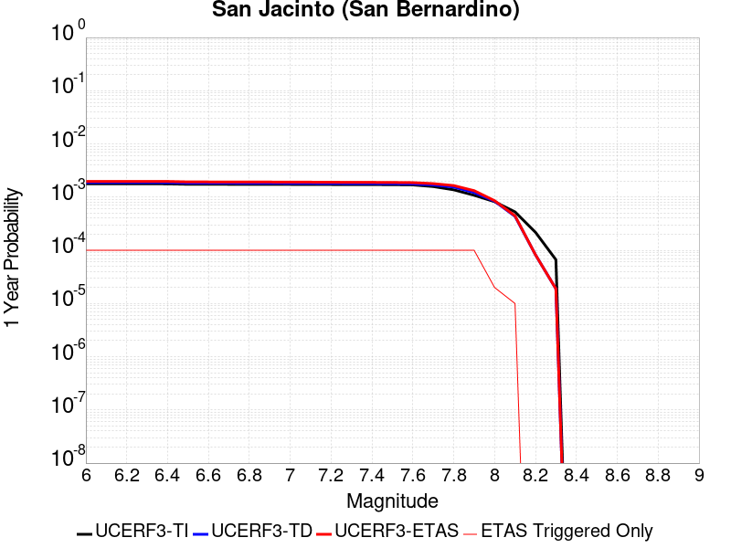 | 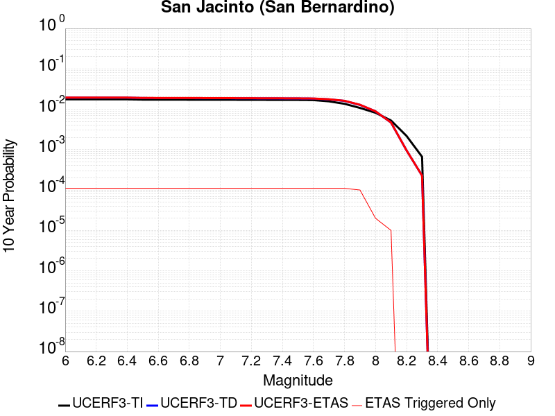 |

| Magnitude | 1 wk TI Prob | 1 wk TD Prob | 1 wk ETAS Prob | 1 wk ETAS/TD Gain | 1 wk ETAS Triggered Only | 1 mo TI Prob | 1 mo TD Prob | 1 mo ETAS Prob | 1 mo ETAS/TD Gain | 1 mo ETAS Triggered Only | 1 yr TI Prob | 1 yr TD Prob | 1 yr ETAS Prob | 1 yr ETAS/TD Gain | 1 yr ETAS Triggered Only | 10 yr TI Prob | 10 yr TD Prob | 10 yr ETAS Prob | 10 yr ETAS/TD Gain | 10 yr ETAS Triggered Only |
|-----|-----|-----|-----|-----|-----|-----|-----|-----|-----|-----|-----|-----|-----|-----|-----|-----|-----|-----|-----|-----|
| 6.0 | 3.409352E-5 | 3.600249E-5 | 5.6001772E-5 | 1.5554972 | 2.0E-5 | 1.461069E-4 | 1.5428728E-4 | 1.8428265E-4 | 1.1944125 | 3.0E-5 | 0.0017774 | 0.001876831 | 0.0019766435 | 1.0531813 | 1.0E-4 | 0.01763251 | 0.019358097 | 0.019465968 | 1.0055723 | 1.1E-4 |
| 6.1 | 3.409352E-5 | 3.600249E-5 | 5.6001772E-5 | 1.5554972 | 2.0E-5 | 1.461069E-4 | 1.5428728E-4 | 1.8428265E-4 | 1.1944125 | 3.0E-5 | 0.0017774 | 0.001876831 | 0.0019766435 | 1.0531813 | 1.0E-4 | 0.01763251 | 0.019358097 | 0.019465968 | 1.0055723 | 1.1E-4 |
| 6.2 | 3.409352E-5 | 3.600249E-5 | 5.6001772E-5 | 1.5554972 | 2.0E-5 | 1.461069E-4 | 1.5428728E-4 | 1.8428265E-4 | 1.1944125 | 3.0E-5 | 0.0017774 | 0.001876831 | 0.0019766435 | 1.0531813 | 1.0E-4 | 0.01763251 | 0.019358097 | 0.019465968 | 1.0055723 | 1.1E-4 |
| 6.3 | 3.409352E-5 | 3.600249E-5 | 5.6001772E-5 | 1.5554972 | 2.0E-5 | 1.461069E-4 | 1.5428728E-4 | 1.8428265E-4 | 1.1944125 | 3.0E-5 | 0.0017774 | 0.001876831 | 0.0019766435 | 1.0531813 | 1.0E-4 | 0.01763251 | 0.019358097 | 0.019465968 | 1.0055723 | 1.1E-4 |
| 6.4 | 3.400795E-5 | 3.589515E-5 | 5.589443E-5 | 1.5571584 | 2.0E-5 | 1.4574021E-4 | 1.5382729E-4 | 1.8382269E-4 | 1.1949939 | 3.0E-5 | 0.0017729428 | 0.0018712406 | 0.0019710534 | 1.0533404 | 1.0E-4 | 0.017588645 | 0.019303178 | 0.019411055 | 1.0055885 | 1.1E-4 |
| 6.5 | 3.341482E-5 | 3.5155765E-5 | 5.5155062E-5 | 1.5688767 | 2.0E-5 | 1.4319851E-4 | 1.5065886E-4 | 1.8065434E-4 | 1.1990954 | 3.0E-5 | 0.0017420477 | 0.0018327299 | 0.0019325466 | 1.0544634 | 1.0E-4 | 0.017284546 | 0.018924711 | 0.01903263 | 1.0057025 | 1.1E-4 |
| 6.6 | 3.3364955E-5 | 3.509298E-5 | 5.5092278E-5 | 1.5698946 | 2.0E-5 | 1.4298483E-4 | 1.5038982E-4 | 1.8038531E-4 | 1.1994516 | 3.0E-5 | 0.0017394501 | 0.0018294598 | 0.0019292769 | 1.0545609 | 1.0E-4 | 0.017258976 | 0.018892575 | 0.019000497 | 1.0057124 | 1.1E-4 |
| 6.7 | 3.335922E-5 | 3.5082754E-5 | 5.508205E-5 | 1.5700606 | 2.0E-5 | 1.4296026E-4 | 1.5034601E-4 | 1.8034149E-4 | 1.1995097 | 3.0E-5 | 0.0017391514 | 0.0018289272 | 0.0019287444 | 1.0545769 | 1.0E-4 | 0.017256035 | 0.018887365 | 0.018995289 | 1.0057139 | 1.1E-4 |
| 6.8 | 3.327683E-5 | 3.4976816E-5 | 5.4976117E-5 | 1.5717874 | 2.0E-5 | 1.4260718E-4 | 1.4989203E-4 | 1.7988755E-4 | 1.200114 | 3.0E-5 | 0.0017348597 | 0.0018234095 | 0.0019232271 | 1.0547423 | 1.0E-4 | 0.017213784 | 0.018833136 | 0.018941065 | 1.0057307 | 1.1E-4 |
| 6.9 | 3.3235785E-5 | 3.4917768E-5 | 5.491707E-5 | 1.5727543 | 2.0E-5 | 1.4243131E-4 | 1.49639E-4 | 1.7963452E-4 | 1.2004524 | 3.0E-5 | 0.0017327217 | 0.0018203339 | 0.0019201519 | 1.054835 | 1.0E-4 | 0.017192734 | 0.018803004 | 0.018910935 | 1.0057402 | 1.1E-4 |
| 7.0 | 3.3197095E-5 | 3.4857694E-5 | 5.4857E-5 | 1.5737414 | 2.0E-5 | 1.422655E-4 | 1.4938158E-4 | 1.793771E-4 | 1.200798 | 3.0E-5 | 0.0017307063 | 0.001817205 | 0.0019170232 | 1.0549296 | 1.0E-4 | 0.017172894 | 0.01877238 | 0.018880315 | 1.0057497 | 1.1E-4 |
| 7.1 | 3.3129716E-5 | 3.47379E-5 | 5.4737207E-5 | 1.5757201 | 2.0E-5 | 1.4197677E-4 | 1.4886823E-4 | 1.7886376E-4 | 1.2014905 | 3.0E-5 | 0.0017271966 | 0.0018109654 | 0.0019107843 | 1.0551192 | 1.0E-4 | 0.017138338 | 0.018711457 | 0.0188194 | 1.0057688 | 1.1E-4 |
| 7.2 | 3.3034008E-5 | 3.4605342E-5 | 5.460465E-5 | 1.5779254 | 2.0E-5 | 1.4156665E-4 | 1.4830018E-4 | 1.7829574E-4 | 1.2022624 | 3.0E-5 | 0.0017222111 | 0.001804061 | 0.0019038805 | 1.0553305 | 1.0E-4 | 0.017089253 | 0.018643849 | 0.018751796 | 1.0057901 | 1.1E-4 |
| 7.3 | 3.2956614E-5 | 3.447309E-5 | 5.4472403E-5 | 1.5801426 | 2.0E-5 | 1.4123498E-4 | 1.4773346E-4 | 1.7772903E-4 | 1.2030385 | 3.0E-5 | 0.0017181796 | 0.0017971725 | 0.0018969927 | 1.055543 | 1.0E-4 | 0.017049557 | 0.018576592 | 0.01868455 | 1.0058115 | 1.1E-4 |
| 7.4 | 3.2915937E-5 | 3.439478E-5 | 5.439409E-5 | 1.5814636 | 2.0E-5 | 1.4106068E-4 | 1.4739788E-4 | 1.7739345E-4 | 1.2035007 | 3.0E-5 | 0.0017160608 | 0.0017930934 | 0.0018929141 | 1.0556695 | 1.0E-4 | 0.017028693 | 0.018536855 | 0.018644815 | 1.0058241 | 1.1E-4 |
| 7.5 | 3.281791E-5 | 3.4259683E-5 | 5.4258995E-5 | 1.5837566 | 2.0E-5 | 1.406406E-4 | 1.4681896E-4 | 1.7681454E-4 | 1.2043033 | 3.0E-5 | 0.0017109542 | 0.0017860567 | 0.001885878 | 1.0558892 | 1.0E-4 | 0.016978411 | 0.018467735 | 0.018575706 | 1.0058464 | 1.1E-4 |
| 7.6 | 3.2521442E-5 | 3.39846E-5 | 5.3983924E-5 | 1.5884818 | 2.0E-5 | 1.3937015E-4 | 1.4564018E-4 | 1.7563581E-4 | 1.2059572 | 3.0E-5 | 0.0016955109 | 0.0017717284 | 0.0018715513 | 1.056342 | 1.0E-4 | 0.016826328 | 0.01832535 | 0.018433334 | 1.0058926 | 1.1E-4 |
| 7.7 | 3.0287873E-5 | 3.246845E-5 | 5.2467803E-5 | 1.6159625 | 2.0E-5 | 1.297987E-4 | 1.391431E-4 | 1.6913892E-4 | 1.2155753 | 3.0E-5 | 0.0015791537 | 0.001692752 | 0.0017925827 | 1.0589755 | 1.0E-4 | 0.01567979 | 0.017536119 | 0.017644191 | 1.0061628 | 1.1E-4 |
| 7.8 | 2.6316151E-5 | 2.9678711E-5 | 4.9678118E-5 | 1.6738636 | 2.0E-5 | 1.1277862E-4 | 1.2718828E-4 | 1.5718446E-4 | 1.2358408 | 3.0E-5 | 0.0013722149 | 0.0015474184 | 0.0016472636 | 1.0645238 | 1.0E-4 | 0.013637724 | 0.016077382 | 0.016185613 | 1.0067319 | 1.1E-4 |
| 7.9 | 2.0761147E-5 | 2.3431265E-5 | 4.3430795E-5 | 1.8535404 | 2.0E-5 | 8.897331E-5 | 1.0041584E-4 | 1.3041284E-4 | 1.2987276 | 3.0E-5 | 0.0010827117 | 0.0012218781 | 0.0013217559 | 1.0817412 | 1.0E-4 | 0.010774517 | 0.012799971 | 0.012898691 | 1.0077125 | 1.0E-4 |
| 8.0 | 1.5738568E-5 | 1.6043394E-5 | 2.6043233E-5 | 1.6232995 | 1.0E-5 | 6.744926E-5 | 6.8755595E-5 | 7.875491E-5 | 1.1454327 | 1.0E-5 | 8.2088535E-4 | 8.3677855E-4 | 8.567618E-4 | 1.0238812 | 2.0E-5 | 0.008178596 | 0.008871087 | 0.00889091 | 1.0022345 | 2.0E-5 |
| 8.1 | 1.0105832E-5 | 8.336244E-6 | 8.336244E-6 | 1.0 | 0.0 | 4.3309992E-5 | 3.5726272E-5 | 3.5726272E-5 | 1.0 | 0.0 | 5.2717153E-4 | 4.3488108E-4 | 4.4487673E-4 | 1.0229847 | 1.0E-5 | 0.005259227 | 0.00468032 | 0.004690273 | 1.0021266 | 1.0E-5 |
| 8.2 | 4.189207E-6 | 1.5801045E-6 | 1.5801045E-6 | 1.0 | 0.0 | 1.7953622E-5 | 6.771859E-6 | 6.771859E-6 | 1.0 | 0.0 | 2.1856341E-4 | 8.244429E-5 | 8.244429E-5 | 1.0 | 0.0 | 0.0021834858 | 9.575395E-4 | 9.575395E-4 | 1.0 | 0.0 |
| 8.3 | 1.2758221E-6 | 3.6194777E-7 | 3.6194777E-7 | 1.0 | 0.0 | 5.4677976E-6 | 1.5512038E-6 | 1.5512038E-6 | 1.0 | 0.0 | 6.65684E-5 | 1.8885747E-5 | 1.8885747E-5 | 1.0 | 0.0 | 6.6548464E-4 | 2.2777634E-4 | 2.2777634E-4 | 1.0 | 0.0 |

## Paradise
*[(top)](#table-of-contents)*

| 1 Week | 1 Month | 1 Year | 10 Year |
|-----|-----|-----|-----|
| 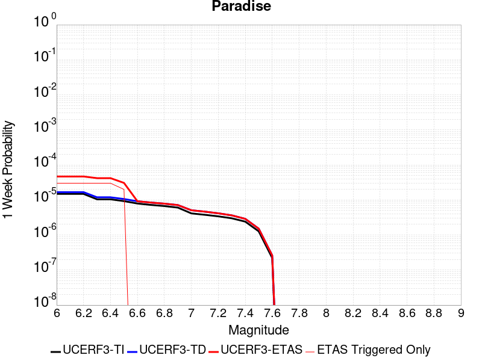 | 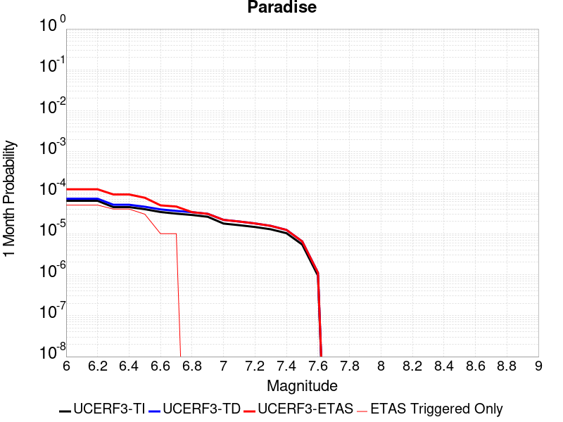 | 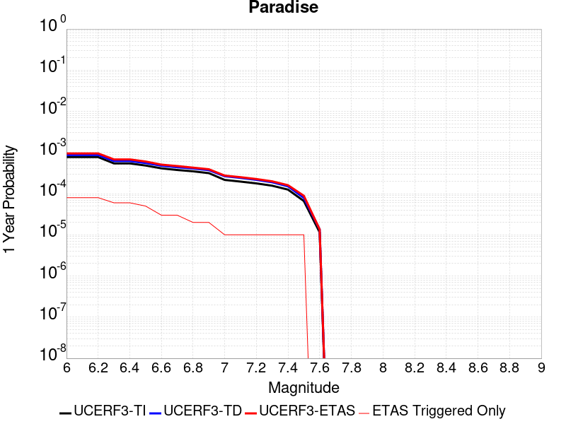 | 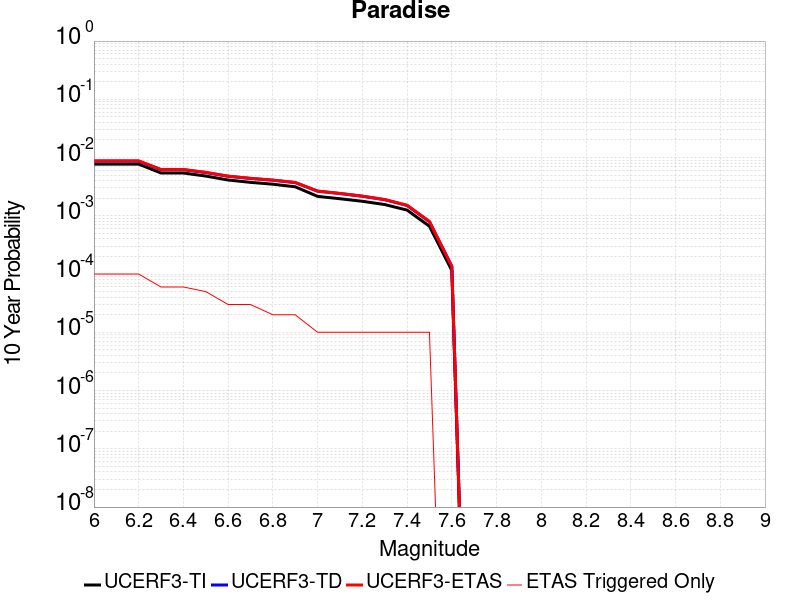 |

| Magnitude | 1 wk TI Prob | 1 wk TD Prob | 1 wk ETAS Prob | 1 wk ETAS/TD Gain | 1 wk ETAS Triggered Only | 1 mo TI Prob | 1 mo TD Prob | 1 mo ETAS Prob | 1 mo ETAS/TD Gain | 1 mo ETAS Triggered Only | 1 yr TI Prob | 1 yr TD Prob | 1 yr ETAS Prob | 1 yr ETAS/TD Gain | 1 yr ETAS Triggered Only | 10 yr TI Prob | 10 yr TD Prob | 10 yr ETAS Prob | 10 yr ETAS/TD Gain | 10 yr ETAS Triggered Only |
|-----|-----|-----|-----|-----|-----|-----|-----|-----|-----|-----|-----|-----|-----|-----|-----|-----|-----|-----|-----|-----|
| 6.0 | 1.4851273E-5 | 1.6694854E-5 | 4.6694353E-5 | 2.796931 | 3.0E-5 | 6.364676E-5 | 7.154755E-5 | 1.2154397E-4 | 1.698786 | 5.0E-5 | 7.7462377E-4 | 8.707668E-4 | 9.5069717E-4 | 1.0917931 | 8.0E-5 | 0.0077192914 | 0.008675928 | 0.008775061 | 1.0114261 | 1.0E-4 |
| 6.1 | 1.4851273E-5 | 1.6694854E-5 | 4.6694353E-5 | 2.796931 | 3.0E-5 | 6.364676E-5 | 7.154755E-5 | 1.2154397E-4 | 1.698786 | 5.0E-5 | 7.7462377E-4 | 8.707668E-4 | 9.5069717E-4 | 1.0917931 | 8.0E-5 | 0.0077192914 | 0.008675928 | 0.008775061 | 1.0114261 | 1.0E-4 |
| 6.2 | 1.4851273E-5 | 1.6694854E-5 | 4.6694353E-5 | 2.796931 | 3.0E-5 | 6.364676E-5 | 7.154755E-5 | 1.2154397E-4 | 1.698786 | 5.0E-5 | 7.7462377E-4 | 8.707668E-4 | 9.5069717E-4 | 1.0917931 | 8.0E-5 | 0.0077192914 | 0.008675928 | 0.008775061 | 1.0114261 | 1.0E-4 |
| 6.3 | 1.0426831E-5 | 1.1888727E-5 | 4.1888372E-5 | 3.5233688 | 3.0E-5 | 4.4685654E-5 | 5.0950726E-5 | 9.094869E-5 | 1.7850322 | 4.0E-5 | 5.43912E-4 | 6.201545E-4 | 6.801173E-4 | 1.09669 | 6.0E-5 | 0.0054258266 | 0.006184847 | 0.006244476 | 1.0096412 | 6.0E-5 |
| 6.4 | 1.0426831E-5 | 1.1888727E-5 | 4.1888372E-5 | 3.5233688 | 3.0E-5 | 4.4685654E-5 | 5.0950726E-5 | 9.094869E-5 | 1.7850322 | 4.0E-5 | 5.43912E-4 | 6.201545E-4 | 6.801173E-4 | 1.09669 | 6.0E-5 | 0.0054258266 | 0.006184847 | 0.006244476 | 1.0096412 | 6.0E-5 |
| 6.5 | 9.25027E-6 | 1.0620054E-5 | 3.061984E-5 | 2.8832097 | 2.0E-5 | 3.964341E-5 | 4.551375E-5 | 7.5512384E-5 | 1.6591115 | 3.0E-5 | 4.8255164E-4 | 5.539939E-4 | 6.0396624E-4 | 1.0902036 | 5.0E-5 | 0.0048150513 | 0.0055266283 | 0.0055763517 | 1.0089971 | 5.0E-5 |
| 6.6 | 7.904275E-6 | 9.159603E-6 | 9.159603E-6 | 1.0 | 0.0 | 3.3875025E-5 | 3.925487E-5 | 4.925448E-5 | 1.2547355 | 1.0E-5 | 4.1235037E-4 | 4.7782718E-4 | 5.0781283E-4 | 1.0627542 | 3.0E-5 | 0.0041158604 | 0.004768395 | 0.0047982517 | 1.0062615 | 3.0E-5 |
| 6.7 | 7.2061953E-6 | 8.407318E-6 | 8.407318E-6 | 1.0 | 0.0 | 3.088333E-5 | 3.6030888E-5 | 4.6030527E-5 | 1.2775297 | 1.0E-5 | 3.7593965E-4 | 4.385914E-4 | 4.6857825E-4 | 1.0683708 | 3.0E-5 | 0.003753043 | 0.0043776273 | 0.0044074957 | 1.0068231 | 3.0E-5 |
| 6.8 | 6.6948724E-6 | 7.84223E-6 | 7.84223E-6 | 1.0 | 0.0 | 2.8691995E-5 | 3.3609143E-5 | 3.3609143E-5 | 1.0 | 0.0 | 3.4926904E-4 | 4.0911807E-4 | 4.291099E-4 | 1.0488657 | 2.0E-5 | 0.003487206 | 0.0040840064 | 0.004103925 | 1.0048772 | 2.0E-5 |
| 6.9 | 6.0421025E-6 | 7.130678E-6 | 7.130678E-6 | 1.0 | 0.0 | 2.5894467E-5 | 3.055971E-5 | 3.055971E-5 | 1.0 | 0.0 | 3.1521954E-4 | 3.7200435E-4 | 3.919969E-4 | 1.0537428 | 2.0E-5 | 0.0031477278 | 0.0037141545 | 0.0037340804 | 1.0053648 | 2.0E-5 |
| 7.0 | 4.134091E-6 | 5.0803487E-6 | 5.0803487E-6 | 1.0 | 0.0 | 1.7717413E-5 | 2.177275E-5 | 2.177275E-5 | 1.0 | 0.0 | 2.1568815E-4 | 2.6505254E-4 | 2.7504988E-4 | 1.0377184 | 1.0E-5 | 0.0021547892 | 0.0026475172 | 0.0026574908 | 1.0037671 | 1.0E-5 |
| 7.1 | 3.7674888E-6 | 4.6319055E-6 | 4.6319055E-6 | 1.0 | 0.0 | 1.6146281E-5 | 1.985088E-5 | 1.985088E-5 | 1.0 | 0.0 | 1.9656324E-4 | 2.4165919E-4 | 2.5165678E-4 | 1.0413706 | 1.0E-5 | 0.0019638946 | 0.0024141145 | 0.0024240904 | 1.0041323 | 1.0E-5 |
| 7.2 | 3.4065345E-6 | 4.156755E-6 | 4.156755E-6 | 1.0 | 0.0 | 1.4599351E-5 | 1.7814553E-5 | 1.7814553E-5 | 1.0 | 0.0 | 1.777326E-4 | 2.1687208E-4 | 2.2686992E-4 | 1.0461001 | 1.0E-5 | 0.0017759053 | 0.0021667527 | 0.002176731 | 1.0046052 | 1.0E-5 |
| 7.3 | 2.9934936E-6 | 3.6293434E-6 | 3.6293434E-6 | 1.0 | 0.0 | 1.2829195E-5 | 1.5554244E-5 | 1.5554244E-5 | 1.0 | 0.0 | 1.5618425E-4 | 1.8935793E-4 | 1.9935604E-4 | 1.0528 | 1.0E-5 | 0.0015607453 | 0.0018921113 | 0.0019020924 | 1.0052751 | 1.0E-5 |
| 7.4 | 2.4049796E-6 | 2.8890036E-6 | 2.8890036E-6 | 1.0 | 0.0 | 1.0307015E-5 | 1.2381393E-5 | 1.2381393E-5 | 1.0 | 0.0 | 1.2548068E-4 | 1.5073447E-4 | 1.6073298E-4 | 1.0663319 | 1.0E-5 | 0.0012540985 | 0.0015064639 | 0.0015164487 | 1.006628 | 1.0E-5 |
| 7.5 | 1.2710091E-6 | 1.5134775E-6 | 1.5134775E-6 | 1.0 | 0.0 | 5.44717E-6 | 6.486323E-6 | 6.486323E-6 | 1.0 | 0.0 | 6.631728E-5 | 7.896937E-5 | 8.896858E-5 | 1.1266214 | 1.0E-5 | 6.6297496E-4 | 7.8953576E-4 | 7.9952786E-4 | 1.0126556 | 1.0E-5 |
| 7.6 | 2.21172E-7 | 2.6039737E-7 | 2.6039737E-7 | 1.0 | 0.0 | 9.478797E-7 | 1.1159884E-6 | 1.1159884E-6 | 1.0 | 0.0 | 1.1540374E-5 | 1.3587103E-5 | 1.3587103E-5 | 1.0 | 0.0 | 1.1539775E-4 | 1.3586554E-4 | 1.3586554E-4 | 1.0 | 0.0 |

## Garlic Springs
*[(top)](#table-of-contents)*

| 1 Week | 1 Month | 1 Year | 10 Year |
|-----|-----|-----|-----|
|  |  |  | 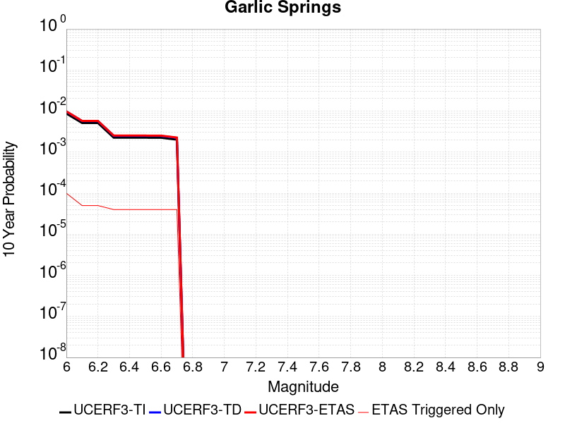 |

| Magnitude | 1 wk TI Prob | 1 wk TD Prob | 1 wk ETAS Prob | 1 wk ETAS/TD Gain | 1 wk ETAS Triggered Only | 1 mo TI Prob | 1 mo TD Prob | 1 mo ETAS Prob | 1 mo ETAS/TD Gain | 1 mo ETAS Triggered Only | 1 yr TI Prob | 1 yr TD Prob | 1 yr ETAS Prob | 1 yr ETAS/TD Gain | 1 yr ETAS Triggered Only | 10 yr TI Prob | 10 yr TD Prob | 10 yr ETAS Prob | 10 yr ETAS/TD Gain | 10 yr ETAS Triggered Only |
|-----|-----|-----|-----|-----|-----|-----|-----|-----|-----|-----|-----|-----|-----|-----|-----|-----|-----|-----|-----|-----|
| 6.0 | 1.6760017E-5 | 1.8777133E-5 | 4.877657E-5 | 2.5976582 | 3.0E-5 | 7.182667E-5 | 8.0471604E-5 | 1.4046677E-4 | 1.7455447 | 6.0E-5 | 8.7413884E-4 | 9.794189E-4 | 0.0010593404 | 1.0816011 | 8.0E-5 | 0.008707083 | 0.009762568 | 0.009861592 | 1.0101432 | 1.0E-4 |
| 6.1 | 9.852767E-6 | 1.0973752E-5 | 3.0973533E-5 | 2.8225107 | 2.0E-5 | 4.222546E-5 | 4.702992E-5 | 7.702851E-5 | 1.6378618 | 3.0E-5 | 5.139737E-4 | 5.7250983E-4 | 6.2248117E-4 | 1.0872848 | 5.0E-5 | 0.005127866 | 0.0057173073 | 0.005767022 | 1.0086954 | 5.0E-5 |
| 6.2 | 9.852767E-6 | 1.0973752E-5 | 3.0973533E-5 | 2.8225107 | 2.0E-5 | 4.222546E-5 | 4.702992E-5 | 7.702851E-5 | 1.6378618 | 3.0E-5 | 5.139737E-4 | 5.7250983E-4 | 6.2248117E-4 | 1.0872848 | 5.0E-5 | 0.005127866 | 0.0057173073 | 0.005767022 | 1.0086954 | 5.0E-5 |
| 6.3 | 4.3167724E-6 | 4.7780964E-6 | 1.4778048E-5 | 3.0928738 | 1.0E-5 | 1.8500323E-5 | 2.0477524E-5 | 4.0477116E-5 | 1.9766605 | 2.0E-5 | 2.2521814E-4 | 2.4930836E-4 | 2.892984E-4 | 1.1604038 | 4.0E-5 | 0.0022499003 | 0.0024925452 | 0.0025324456 | 1.0160079 | 4.0E-5 |
| 6.4 | 4.3167724E-6 | 4.7780964E-6 | 1.4778048E-5 | 3.0928738 | 1.0E-5 | 1.8500323E-5 | 2.0477524E-5 | 4.0477116E-5 | 1.9766605 | 2.0E-5 | 2.2521814E-4 | 2.4930836E-4 | 2.892984E-4 | 1.1604038 | 4.0E-5 | 0.0022499003 | 0.0024925452 | 0.0025324456 | 1.0160079 | 4.0E-5 |
| 6.5 | 4.3167724E-6 | 4.7780964E-6 | 1.4778048E-5 | 3.0928738 | 1.0E-5 | 1.8500323E-5 | 2.0477524E-5 | 4.0477116E-5 | 1.9766605 | 2.0E-5 | 2.2521814E-4 | 2.4930836E-4 | 2.892984E-4 | 1.1604038 | 4.0E-5 | 0.0022499003 | 0.0024925452 | 0.0025324456 | 1.0160079 | 4.0E-5 |
| 6.6 | 4.301311E-6 | 4.7609647E-6 | 1.4760917E-5 | 3.1004047 | 1.0E-5 | 1.8434059E-5 | 2.0404104E-5 | 4.0403695E-5 | 1.980175 | 2.0E-5 | 2.2441156E-4 | 2.4841467E-4 | 2.8840473E-4 | 1.160981 | 4.0E-5 | 0.0022418506 | 0.0024836282 | 0.0025235289 | 1.0160655 | 4.0E-5 |
| 6.7 | 3.8599724E-6 | 4.2711204E-6 | 1.4271078E-5 | 3.3412962 | 1.0E-5 | 1.6542634E-5 | 1.8304801E-5 | 3.8304435E-5 | 2.0925896 | 2.0E-5 | 2.0138794E-4 | 2.2286095E-4 | 2.6285203E-4 | 1.1794441 | 4.0E-5 | 0.0020120554 | 0.0022286095 | 0.0022685204 | 1.0179085 | 4.0E-5 |

## San Andreas (Parkfield)
*[(top)](#table-of-contents)*

| 1 Week | 1 Month | 1 Year | 10 Year |
|-----|-----|-----|-----|
| 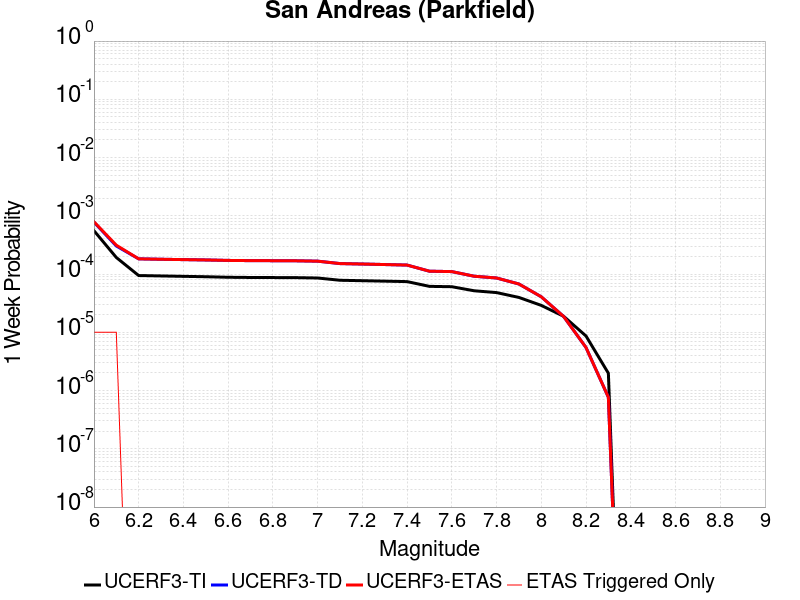 | 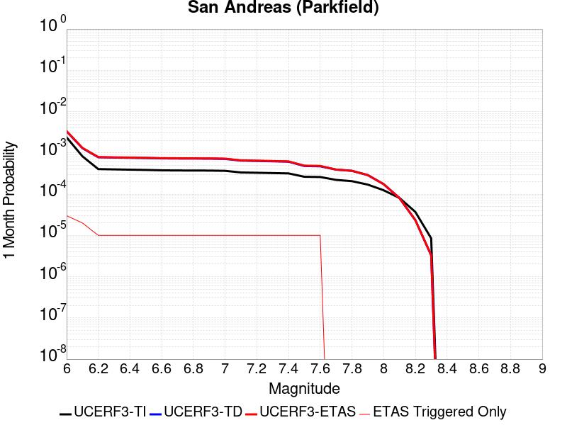 | 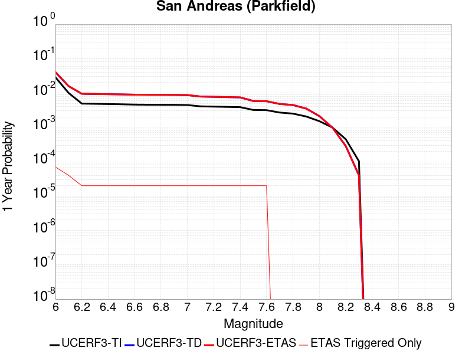 | 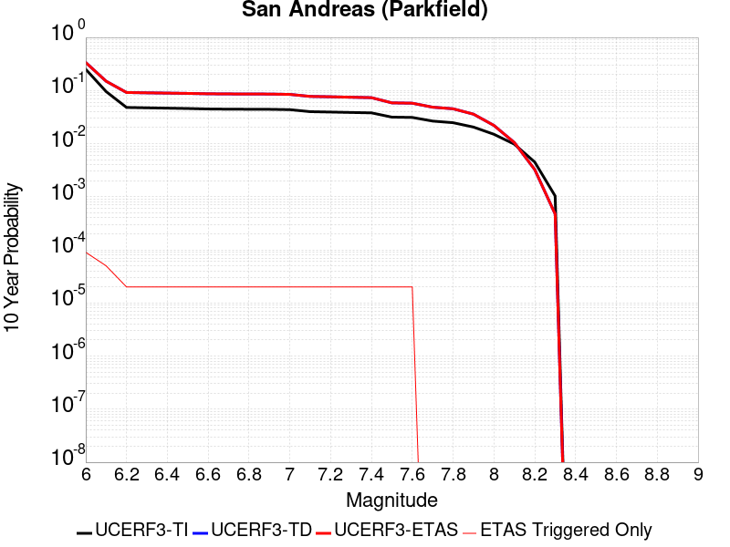 |

| Magnitude | 1 wk TI Prob | 1 wk TD Prob | 1 wk ETAS Prob | 1 wk ETAS/TD Gain | 1 wk ETAS Triggered Only | 1 mo TI Prob | 1 mo TD Prob | 1 mo ETAS Prob | 1 mo ETAS/TD Gain | 1 mo ETAS Triggered Only | 1 yr TI Prob | 1 yr TD Prob | 1 yr ETAS Prob | 1 yr ETAS/TD Gain | 1 yr ETAS Triggered Only | 10 yr TI Prob | 10 yr TD Prob | 10 yr ETAS Prob | 10 yr ETAS/TD Gain | 10 yr ETAS Triggered Only |
|-----|-----|-----|-----|-----|-----|-----|-----|-----|-----|-----|-----|-----|-----|-----|-----|-----|-----|-----|-----|-----|
| 6.0 | 5.556969E-4 | 7.788437E-4 | 7.888359E-4 | 1.0128295 | 1.0E-5 | 0.0023793848 | 0.0033341812 | 0.003364081 | 1.0089678 | 3.0E-5 | 0.028586963 | 0.04023991 | 0.040307093 | 1.0016695 | 7.0E-5 | 0.25176284 | 0.33731642 | 0.3373761 | 1.0001768 | 9.0E-5 |
| 6.1 | 1.925858E-4 | 3.0304783E-4 | 3.1304482E-4 | 1.0329881 | 1.0E-5 | 8.2510663E-4 | 0.0012982241 | 0.001318198 | 1.0153856 | 2.0E-5 | 0.0099994885 | 0.015792182 | 0.015831549 | 1.0024929 | 4.0E-5 | 0.095613256 | 0.14979222 | 0.14983474 | 1.0002838 | 5.0E-5 |
| 6.2 | 9.4306815E-5 | 1.8250331E-4 | 1.8250331E-4 | 1.0 | 0.0 | 4.0410945E-4 | 7.819238E-4 | 7.91916E-4 | 1.012779 | 1.0E-5 | 0.0049089384 | 0.009478576 | 0.009498386 | 1.00209 | 2.0E-5 | 0.048019063 | 0.09188674 | 0.09190489 | 1.0001976 | 2.0E-5 |
| 6.3 | 9.283051E-5 | 1.7946832E-4 | 1.7946832E-4 | 1.0 | 0.0 | 3.9778434E-4 | 7.689244E-4 | 7.7891676E-4 | 1.0129951 | 1.0E-5 | 0.0048322747 | 0.009321672 | 0.009341486 | 1.0021255 | 2.0E-5 | 0.047285385 | 0.09053965 | 0.090557836 | 1.0002009 | 2.0E-5 |
| 6.4 | 9.138826E-5 | 1.770899E-4 | 1.770899E-4 | 1.0 | 0.0 | 3.916052E-4 | 7.5873715E-4 | 7.6872954E-4 | 1.0131698 | 1.0E-5 | 0.0047573745 | 0.009198696 | 0.009218513 | 1.0021542 | 2.0E-5 | 0.046568092 | 0.089441724 | 0.08945993 | 1.0002036 | 2.0E-5 |
| 6.5 | 9.000255E-5 | 1.746699E-4 | 1.746699E-4 | 1.0 | 0.0 | 3.8566816E-4 | 7.483717E-4 | 7.583642E-4 | 1.0133524 | 1.0E-5 | 0.0046854047 | 0.009073567 | 0.009093385 | 1.0021842 | 2.0E-5 | 0.045878403 | 0.08832737 | 0.0883456 | 1.0002065 | 2.0E-5 |
| 6.6 | 8.8109264E-5 | 1.7148067E-4 | 1.7148067E-4 | 1.0 | 0.0 | 3.7755648E-4 | 7.3471136E-4 | 7.44704E-4 | 1.0136008 | 1.0E-5 | 0.0045870654 | 0.008908638 | 0.00892846 | 1.002225 | 2.0E-5 | 0.04493529 | 0.086858675 | 0.086876936 | 1.0002103 | 2.0E-5 |
| 6.7 | 8.738073E-5 | 1.7015127E-4 | 1.7015127E-4 | 1.0 | 0.0 | 3.7443507E-4 | 7.290171E-4 | 7.390098E-4 | 1.013707 | 1.0E-5 | 0.0045492216 | 0.008839916 | 0.00885974 | 1.0022424 | 2.0E-5 | 0.04457213 | 0.086258985 | 0.08627726 | 1.0002118 | 2.0E-5 |
| 6.8 | 8.710195E-5 | 1.6960612E-4 | 1.6960612E-4 | 1.0 | 0.0 | 3.7324068E-4 | 7.266821E-4 | 7.366748E-4 | 1.0137511 | 1.0E-5 | 0.0045347405 | 0.008811726 | 0.008831549 | 1.0022497 | 2.0E-5 | 0.04443313 | 0.08600653 | 0.08602481 | 1.0002126 | 2.0E-5 |
| 6.9 | 8.6801556E-5 | 1.6901553E-4 | 1.6901553E-4 | 1.0 | 0.0 | 3.7195362E-4 | 7.2415237E-4 | 7.341451E-4 | 1.0137992 | 1.0E-5 | 0.0045191357 | 0.008781176 | 0.008801 | 1.0022576 | 2.0E-5 | 0.044283327 | 0.08573254 | 0.08575083 | 1.0002133 | 2.0E-5 |
| 7.0 | 8.5571606E-5 | 1.6654332E-4 | 1.6654332E-4 | 1.0 | 0.0 | 3.6668387E-4 | 7.13563E-4 | 7.2355586E-4 | 1.0140042 | 1.0E-5 | 0.004455241 | 0.008653281 | 0.008673108 | 1.0022912 | 2.0E-5 | 0.043669727 | 0.08458075 | 0.08459906 | 1.0002165 | 2.0E-5 |
| 7.1 | 7.82589E-5 | 1.5135074E-4 | 1.5135074E-4 | 1.0 | 0.0 | 3.3535215E-4 | 6.484855E-4 | 6.5847905E-4 | 1.0154105 | 1.0E-5 | 0.0040752706 | 0.0078668995 | 0.007886742 | 1.0025223 | 2.0E-5 | 0.040013418 | 0.077491894 | 0.07751035 | 1.0002381 | 2.0E-5 |
| 7.2 | 7.690929E-5 | 1.4872287E-4 | 1.4872287E-4 | 1.0 | 0.0 | 3.2956956E-4 | 6.372288E-4 | 6.4722245E-4 | 1.0156829 | 1.0E-5 | 0.004005129 | 0.007730829 | 0.0077506746 | 1.002567 | 2.0E-5 | 0.0393371 | 0.07626493 | 0.07628341 | 1.0002422 | 2.0E-5 |
| 7.3 | 7.5543794E-5 | 1.4568791E-4 | 1.4568791E-4 | 1.0 | 0.0 | 3.2371894E-4 | 6.242281E-4 | 6.342218E-4 | 1.0160098 | 1.0E-5 | 0.003934157 | 0.007573656 | 0.0075935046 | 1.0026207 | 2.0E-5 | 0.038652334 | 0.07482772 | 0.07484623 | 1.0002472 | 2.0E-5 |
| 7.4 | 7.4214564E-5 | 1.4269682E-4 | 1.4269682E-4 | 1.0 | 0.0 | 3.1802364E-4 | 6.114152E-4 | 6.214091E-4 | 1.0163455 | 1.0E-5 | 0.003865065 | 0.007418731 | 0.007438583 | 1.0026759 | 2.0E-5 | 0.03798529 | 0.07340127 | 0.07341981 | 1.0002525 | 2.0E-5 |
| 7.5 | 6.149578E-5 | 1.1196503E-4 | 1.1196503E-4 | 1.0 | 0.0 | 2.6352672E-4 | 4.7976198E-4 | 4.8975716E-4 | 1.0208336 | 1.0E-5 | 0.0032037178 | 0.00582549 | 0.0058453735 | 1.0034132 | 2.0E-5 | 0.03157923 | 0.058584154 | 0.05860298 | 1.0003214 | 2.0E-5 |
| 7.6 | 6.0643448E-5 | 1.10251094E-4 | 1.10251094E-4 | 1.0 | 0.0 | 2.598746E-4 | 4.7241923E-4 | 4.824145E-4 | 1.0211576 | 1.0E-5 | 0.0031593828 | 0.0057365666 | 0.0057564517 | 1.0034664 | 2.0E-5 | 0.031148417 | 0.057744972 | 0.05776382 | 1.0003264 | 2.0E-5 |
| 7.7 | 5.1652263E-5 | 9.179838E-5 | 9.179838E-5 | 1.0 | 0.0 | 2.2134806E-4 | 3.9336234E-4 | 3.9336234E-4 | 1.0 | 0.0 | 0.002691582 | 0.0047786795 | 0.0047786795 | 1.0 | 0.0 | 0.026592141 | 0.048560265 | 0.048560265 | 1.0 | 0.0 |
| 7.8 | 4.8090482E-5 | 8.564368E-5 | 8.564368E-5 | 1.0 | 0.0 | 2.060858E-4 | 3.6699275E-4 | 3.6699275E-4 | 1.0 | 0.0 | 0.0025062072 | 0.004458991 | 0.004458991 | 1.0 | 0.0 | 0.024781305 | 0.045324653 | 0.045324653 | 1.0 | 0.0 |
| 7.9 | 3.970278E-5 | 6.754111E-5 | 6.754111E-5 | 1.0 | 0.0 | 1.7014367E-4 | 2.894298E-4 | 2.894298E-4 | 1.0 | 0.0 | 0.002069531 | 0.0035181176 | 0.0035181176 | 1.0 | 0.0 | 0.020503636 | 0.03589899 | 0.03589899 | 1.0 | 0.0 |
| 8.0 | 2.8982335E-5 | 4.072124E-5 | 4.072124E-5 | 1.0 | 0.0 | 1.2420409E-4 | 1.7450792E-4 | 1.7450792E-4 | 1.0 | 0.0 | 0.0015111357 | 0.002122565 | 0.002122565 | 1.0 | 0.0 | 0.015009012 | 0.02202231 | 0.02202231 | 1.0 | 0.0 |
| 8.1 | 1.8836186E-5 | 1.8694205E-5 | 1.8694205E-5 | 1.0 | 0.0 | 8.0724014E-5 | 8.011556E-5 | 8.011556E-5 | 1.0 | 0.0 | 9.823717E-4 | 9.749711E-4 | 9.749711E-4 | 1.0 | 0.0 | 0.009780403 | 0.010494972 | 0.010494972 | 1.0 | 0.0 |
| 8.2 | 8.643924E-6 | 5.4798497E-6 | 5.4798497E-6 | 1.0 | 0.0 | 3.704486E-5 | 2.348486E-5 | 2.348486E-5 | 1.0 | 0.0 | 4.5092785E-4 | 2.858907E-4 | 2.858907E-4 | 1.0 | 0.0 | 0.0045001395 | 0.0032514327 | 0.0032514327 | 1.0 | 0.0 |
| 8.3 | 1.983087E-6 | 7.668296E-7 | 7.668296E-7 | 1.0 | 0.0 | 8.498917E-6 | 3.2864084E-6 | 3.2864084E-6 | 1.0 | 0.0 | 1.034694E-4 | 4.0011306E-5 | 4.0011306E-5 | 1.0 | 0.0 | 0.0010342124 | 4.724499E-4 | 4.724499E-4 | 1.0 | 0.0 |

## Death Valley (Black Mtns Frontal)
*[(top)](#table-of-contents)*

| 1 Week | 1 Month | 1 Year | 10 Year |
|-----|-----|-----|-----|
|  |  |  |  |

| Magnitude | 1 wk TI Prob | 1 wk TD Prob | 1 wk ETAS Prob | 1 wk ETAS/TD Gain | 1 wk ETAS Triggered Only | 1 mo TI Prob | 1 mo TD Prob | 1 mo ETAS Prob | 1 mo ETAS/TD Gain | 1 mo ETAS Triggered Only | 1 yr TI Prob | 1 yr TD Prob | 1 yr ETAS Prob | 1 yr ETAS/TD Gain | 1 yr ETAS Triggered Only | 10 yr TI Prob | 10 yr TD Prob | 10 yr ETAS Prob | 10 yr ETAS/TD Gain | 10 yr ETAS Triggered Only |
|-----|-----|-----|-----|-----|-----|-----|-----|-----|-----|-----|-----|-----|-----|-----|-----|-----|-----|-----|-----|-----|
| 6.0 | 1.6707214E-5 | 1.867056E-5 | 4.867E-5 | 2.6067777 | 3.0E-5 | 7.160038E-5 | 8.001427E-5 | 1.10011875E-4 | 1.3749031 | 3.0E-5 | 8.71386E-4 | 9.7374606E-4 | 0.0010236973 | 1.0512981 | 5.0E-5 | 0.00867977 | 0.009695647 | 0.009784775 | 1.0091925 | 9.0E-5 |
| 6.1 | 1.6707214E-5 | 1.867056E-5 | 4.867E-5 | 2.6067777 | 3.0E-5 | 7.160038E-5 | 8.001427E-5 | 1.10011875E-4 | 1.3749031 | 3.0E-5 | 8.71386E-4 | 9.7374606E-4 | 0.0010236973 | 1.0512981 | 5.0E-5 | 0.00867977 | 0.009695647 | 0.009784775 | 1.0091925 | 9.0E-5 |
| 6.2 | 1.6707214E-5 | 1.867056E-5 | 4.867E-5 | 2.6067777 | 3.0E-5 | 7.160038E-5 | 8.001427E-5 | 1.10011875E-4 | 1.3749031 | 3.0E-5 | 8.71386E-4 | 9.7374606E-4 | 0.0010236973 | 1.0512981 | 5.0E-5 | 0.00867977 | 0.009695647 | 0.009784775 | 1.0091925 | 9.0E-5 |
| 6.3 | 1.6707214E-5 | 1.867056E-5 | 4.867E-5 | 2.6067777 | 3.0E-5 | 7.160038E-5 | 8.001427E-5 | 1.10011875E-4 | 1.3749031 | 3.0E-5 | 8.71386E-4 | 9.7374606E-4 | 0.0010236973 | 1.0512981 | 5.0E-5 | 0.00867977 | 0.009695647 | 0.009784775 | 1.0091925 | 9.0E-5 |
| 6.4 | 1.5515609E-5 | 1.7338483E-5 | 4.7337962E-5 | 2.730225 | 3.0E-5 | 6.649377E-5 | 7.430571E-5 | 1.0430348E-4 | 1.4037075 | 3.0E-5 | 8.0926094E-4 | 9.0430264E-4 | 9.542574E-4 | 1.0552412 | 5.0E-5 | 0.008063202 | 0.009006913 | 0.009086193 | 1.008802 | 8.0E-5 |
| 6.5 | 1.5515609E-5 | 1.7338483E-5 | 4.7337962E-5 | 2.730225 | 3.0E-5 | 6.649377E-5 | 7.430571E-5 | 1.0430348E-4 | 1.4037075 | 3.0E-5 | 8.0926094E-4 | 9.0430264E-4 | 9.542574E-4 | 1.0552412 | 5.0E-5 | 0.008063202 | 0.009006913 | 0.009086193 | 1.008802 | 8.0E-5 |
| 6.6 | 1.5041828E-5 | 1.6809407E-5 | 4.6808902E-5 | 2.784685 | 3.0E-5 | 6.4463384E-5 | 7.203836E-5 | 1.020362E-4 | 1.4164147 | 3.0E-5 | 7.8455906E-4 | 8.7672E-4 | 9.266762E-4 | 1.0569807 | 5.0E-5 | 0.00781795 | 0.008733268 | 0.00881257 | 1.0090804 | 8.0E-5 |
| 6.7 | 1.4634985E-5 | 1.6356273E-5 | 4.635578E-5 | 2.8341289 | 3.0E-5 | 6.271985E-5 | 7.009646E-5 | 1.0009435E-4 | 1.4279517 | 3.0E-5 | 7.6334673E-4 | 8.53096E-4 | 9.030533E-4 | 1.05856 | 5.0E-5 | 0.007607299 | 0.008498848 | 0.008578168 | 1.009333 | 8.0E-5 |
| 6.8 | 1.4209158E-5 | 1.5882297E-5 | 4.588182E-5 | 2.8888657 | 3.0E-5 | 6.089497E-5 | 6.806524E-5 | 9.8063196E-5 | 1.4407237 | 3.0E-5 | 7.4114406E-4 | 8.2838483E-4 | 8.783434E-4 | 1.0603085 | 5.0E-5 | 0.007386771 | 0.008253585 | 0.008323007 | 1.0084112 | 7.0E-5 |
| 6.9 | 1.3780098E-5 | 1.5404834E-5 | 3.5404526E-5 | 2.2982738 | 2.0E-5 | 5.9056227E-5 | 6.601908E-5 | 8.601776E-5 | 1.3029227 | 2.0E-5 | 7.1877235E-4 | 8.0349133E-4 | 8.434592E-4 | 1.0497427 | 4.0E-5 | 0.0071645193 | 0.008006458 | 0.008065977 | 1.0074339 | 6.0E-5 |
| 7.0 | 1.3585064E-5 | 1.5188394E-5 | 3.518809E-5 | 2.3167748 | 2.0E-5 | 5.8220405E-5 | 6.5091524E-5 | 8.509022E-5 | 1.3072397 | 2.0E-5 | 7.086029E-4 | 7.922066E-4 | 8.321749E-4 | 1.0504519 | 4.0E-5 | 0.007063476 | 0.007894417 | 0.007953944 | 1.0075403 | 6.0E-5 |
| 7.1 | 1.3398601E-5 | 1.4981575E-5 | 3.4981276E-5 | 2.334953 | 2.0E-5 | 5.742131E-5 | 6.4205204E-5 | 8.4203915E-5 | 1.3114812 | 2.0E-5 | 6.9888023E-4 | 7.814234E-4 | 8.2139217E-4 | 1.0511487 | 4.0E-5 | 0.0069668638 | 0.007787346 | 0.007846879 | 1.0076448 | 6.0E-5 |
| 7.2 | 1.3126312E-5 | 1.4679792E-5 | 3.46795E-5 | 2.3623972 | 2.0E-5 | 5.6254412E-5 | 6.291191E-5 | 8.291065E-5 | 1.3178848 | 2.0E-5 | 6.846822E-4 | 7.656887E-4 | 8.056581E-4 | 1.0522006 | 4.0E-5 | 0.006825765 | 0.00763109 | 0.007690632 | 1.0078026 | 6.0E-5 |
| 7.3 | 1.2922429E-5 | 1.4454016E-5 | 3.4453726E-5 | 2.3836784 | 2.0E-5 | 5.5380664E-5 | 6.1944345E-5 | 8.19431E-5 | 1.3228505 | 2.0E-5 | 6.74051E-4 | 7.5391686E-4 | 7.9388666E-4 | 1.0530163 | 4.0E-5 | 0.006720101 | 0.0075141727 | 0.0075637973 | 1.0066041 | 5.0E-5 |
| 7.4 | 1.2768878E-5 | 1.4283997E-5 | 3.4283712E-5 | 2.4001484 | 2.0E-5 | 5.4722615E-5 | 6.1215724E-5 | 8.12145E-5 | 1.3266934 | 2.0E-5 | 6.660441E-4 | 7.45052E-4 | 7.850222E-4 | 1.0536475 | 4.0E-5 | 0.0066405144 | 0.0074261203 | 0.007475749 | 1.006683 | 5.0E-5 |
| 7.5 | 1.2521929E-5 | 1.40122365E-5 | 3.4011955E-5 | 2.4273038 | 2.0E-5 | 5.366431E-5 | 6.0051094E-5 | 8.004989E-5 | 1.3330297 | 2.0E-5 | 6.531671E-4 | 7.308822E-4 | 7.7085296E-4 | 1.0546883 | 4.0E-5 | 0.006512506 | 0.0072853607 | 0.0073349965 | 1.006813 | 5.0E-5 |
| 7.6 | 1.1301089E-5 | 1.2648349E-5 | 3.2648095E-5 | 2.581214 | 2.0E-5 | 4.8432343E-5 | 5.4206117E-5 | 7.420503E-5 | 1.368942 | 2.0E-5 | 5.895042E-4 | 6.597649E-4 | 6.997385E-4 | 1.0605876 | 4.0E-5 | 0.0058794282 | 0.0065786145 | 0.006628285 | 1.0075504 | 5.0E-5 |
| 7.7 | 9.189108E-6 | 1.0283521E-5 | 3.0283316E-5 | 2.944839 | 2.0E-5 | 3.93813E-5 | 4.407152E-5 | 6.4070635E-5 | 1.4537878 | 2.0E-5 | 4.7936183E-4 | 5.3644367E-4 | 5.664276E-4 | 1.0558939 | 3.0E-5 | 0.004783291 | 0.0053519984 | 0.005381838 | 1.0055754 | 3.0E-5 |
| 7.8 | 3.4586725E-7 | 3.648288E-7 | 3.648288E-7 | 1.0 | 0.0 | 1.4822873E-6 | 1.5635511E-6 | 1.5635511E-6 | 1.0 | 0.0 | 1.80467E-5 | 1.9036073E-5 | 1.9036073E-5 | 1.0 | 0.0 | 1.8045233E-4 | 1.9034486E-4 | 1.9034486E-4 | 1.0 | 0.0 |
| 7.9 | 2.5591178E-9 | 2.6696871E-9 | 2.6696871E-9 | 1.0 | 0.0 | 1.0967647E-8 | 1.1441516E-8 | 1.1441516E-8 | 1.0 | 0.0 | 1.335311E-7 | 1.3930045E-7 | 1.3930045E-7 | 1.0 | 0.0 | 1.3353102E-6 | 1.3930046E-6 | 1.3930046E-6 | 1.0 | 0.0 |

## Coyote Lake
*[(top)](#table-of-contents)*

| 1 Week | 1 Month | 1 Year | 10 Year |
|-----|-----|-----|-----|
|  |  |  |  |

| Magnitude | 1 wk TI Prob | 1 wk TD Prob | 1 wk ETAS Prob | 1 wk ETAS/TD Gain | 1 wk ETAS Triggered Only | 1 mo TI Prob | 1 mo TD Prob | 1 mo ETAS Prob | 1 mo ETAS/TD Gain | 1 mo ETAS Triggered Only | 1 yr TI Prob | 1 yr TD Prob | 1 yr ETAS Prob | 1 yr ETAS/TD Gain | 1 yr ETAS Triggered Only | 10 yr TI Prob | 10 yr TD Prob | 10 yr ETAS Prob | 10 yr ETAS/TD Gain | 10 yr ETAS Triggered Only |
|-----|-----|-----|-----|-----|-----|-----|-----|-----|-----|-----|-----|-----|-----|-----|-----|-----|-----|-----|-----|-----|
| 6.0 | 1.980352E-5 | 2.1707021E-5 | 3.1706804E-5 | 1.4606705 | 1.0E-5 | 8.486947E-5 | 9.302718E-5 | 1.230244E-4 | 1.3224564 | 3.0E-5 | 0.0010327959 | 0.0011320895 | 0.0012020102 | 1.0617626 | 7.0E-5 | 0.010280091 | 0.011270401 | 0.011339612 | 1.006141 | 7.0E-5 |
| 6.1 | 1.980352E-5 | 2.1707021E-5 | 3.1706804E-5 | 1.4606705 | 1.0E-5 | 8.486947E-5 | 9.302718E-5 | 1.230244E-4 | 1.3224564 | 3.0E-5 | 0.0010327959 | 0.0011320895 | 0.0012020102 | 1.0617626 | 7.0E-5 | 0.010280091 | 0.011270401 | 0.011339612 | 1.006141 | 7.0E-5 |
| 6.2 | 1.980352E-5 | 2.1707021E-5 | 3.1706804E-5 | 1.4606705 | 1.0E-5 | 8.486947E-5 | 9.302718E-5 | 1.230244E-4 | 1.3224564 | 3.0E-5 | 0.0010327959 | 0.0011320895 | 0.0012020102 | 1.0617626 | 7.0E-5 | 0.010280091 | 0.011270401 | 0.011339612 | 1.006141 | 7.0E-5 |
| 6.3 | 1.5344787E-5 | 1.6820884E-5 | 2.6820715E-5 | 1.5944891 | 1.0E-5 | 6.576172E-5 | 7.208785E-5 | 1.02085694E-4 | 1.4161289 | 3.0E-5 | 8.003548E-4 | 8.7737746E-4 | 9.373248E-4 | 1.0683256 | 6.0E-5 | 0.007974784 | 0.00874518 | 0.008804656 | 1.0068009 | 6.0E-5 |
| 6.4 | 1.5344787E-5 | 1.6820884E-5 | 2.6820715E-5 | 1.5944891 | 1.0E-5 | 6.576172E-5 | 7.208785E-5 | 1.02085694E-4 | 1.4161289 | 3.0E-5 | 8.003548E-4 | 8.7737746E-4 | 9.373248E-4 | 1.0683256 | 6.0E-5 | 0.007974784 | 0.00874518 | 0.008804656 | 1.0068009 | 6.0E-5 |
| 6.5 | 1.4189697E-5 | 1.5558186E-5 | 2.555803E-5 | 1.6427385 | 1.0E-5 | 6.081157E-5 | 6.667658E-5 | 9.667457E-5 | 1.4499031 | 3.0E-5 | 7.401293E-4 | 8.1154524E-4 | 8.7149657E-4 | 1.073873 | 6.0E-5 | 0.0073766913 | 0.008091759 | 0.008151273 | 1.007355 | 6.0E-5 |
| 6.6 | 1.3469301E-5 | 1.47717665E-5 | 2.477162E-5 | 1.6769571 | 1.0E-5 | 5.7724297E-5 | 6.3306376E-5 | 9.330447E-5 | 1.473856 | 3.0E-5 | 7.025667E-4 | 7.7054254E-4 | 8.304963E-4 | 1.0778072 | 6.0E-5 | 0.0070034964 | 0.0076846126 | 0.0077441516 | 1.0077478 | 6.0E-5 |
| 6.7 | 1.3027966E-5 | 1.4281927E-5 | 2.4281784E-5 | 1.7001756 | 1.0E-5 | 5.5832945E-5 | 6.120716E-5 | 9.120532E-5 | 1.4901087 | 3.0E-5 | 6.7955407E-4 | 7.450021E-4 | 8.0495747E-4 | 1.0804766 | 6.0E-5 | 0.006774798 | 0.007430923 | 0.0074904775 | 1.0080143 | 6.0E-5 |
| 6.8 | 5.695434E-6 | 6.2244944E-6 | 6.2244944E-6 | 1.0 | 0.0 | 2.4408775E-5 | 2.6676302E-5 | 3.6676036E-5 | 1.3748546 | 1.0E-5 | 2.971363E-4 | 3.2476554E-4 | 3.4475906E-4 | 1.0615629 | 2.0E-5 | 0.0029673933 | 0.0032458503 | 0.0032657855 | 1.0061417 | 2.0E-5 |
| 6.9 | 4.385688E-6 | 4.7931144E-6 | 4.7931144E-6 | 1.0 | 0.0 | 1.879567E-5 | 2.0541918E-5 | 3.0541712E-5 | 1.4867995 | 1.0E-5 | 2.2881327E-4 | 2.5009786E-4 | 2.7009286E-4 | 1.0799487 | 2.0E-5 | 0.002285778 | 0.0025009785 | 0.0025209286 | 1.0079769 | 2.0E-5 |

## Helendale-So Lockhart
*[(top)](#table-of-contents)*

| 1 Week | 1 Month | 1 Year | 10 Year |
|-----|-----|-----|-----|
|  | 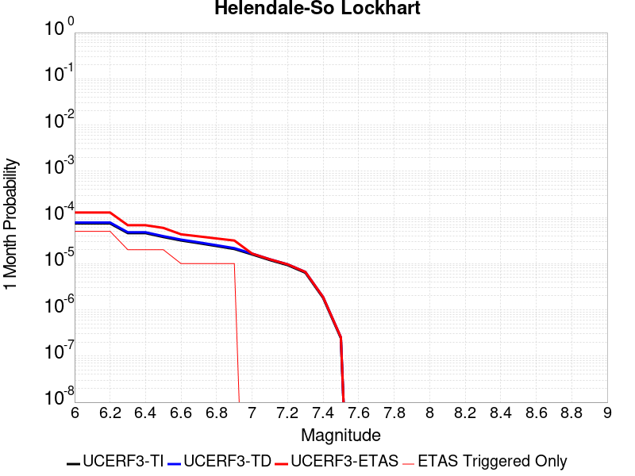 | 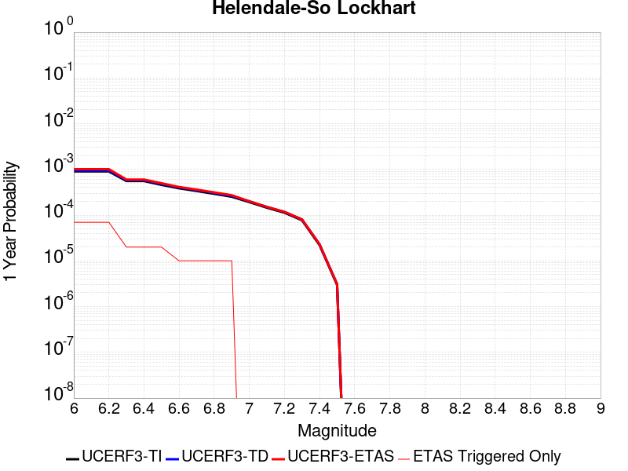 |  |

| Magnitude | 1 wk TI Prob | 1 wk TD Prob | 1 wk ETAS Prob | 1 wk ETAS/TD Gain | 1 wk ETAS Triggered Only | 1 mo TI Prob | 1 mo TD Prob | 1 mo ETAS Prob | 1 mo ETAS/TD Gain | 1 mo ETAS Triggered Only | 1 yr TI Prob | 1 yr TD Prob | 1 yr ETAS Prob | 1 yr ETAS/TD Gain | 1 yr ETAS Triggered Only | 10 yr TI Prob | 10 yr TD Prob | 10 yr ETAS Prob | 10 yr ETAS/TD Gain | 10 yr ETAS Triggered Only |
|-----|-----|-----|-----|-----|-----|-----|-----|-----|-----|-----|-----|-----|-----|-----|-----|-----|-----|-----|-----|-----|
| 6.0 | 1.7296055E-5 | 1.8103841E-5 | 4.81033E-5 | 2.6570768 | 3.0E-5 | 7.412385E-5 | 7.7585704E-5 | 1.2758182E-4 | 1.6443987 | 5.0E-5 | 9.0208417E-4 | 9.442173E-4 | 0.0010141513 | 1.0740654 | 7.0E-5 | 0.008984311 | 0.009404174 | 0.009483422 | 1.0084269 | 8.0E-5 |
| 6.1 | 1.7296055E-5 | 1.8103841E-5 | 4.81033E-5 | 2.6570768 | 3.0E-5 | 7.412385E-5 | 7.7585704E-5 | 1.2758182E-4 | 1.6443987 | 5.0E-5 | 9.0208417E-4 | 9.442173E-4 | 0.0010141513 | 1.0740654 | 7.0E-5 | 0.008984311 | 0.009404174 | 0.009483422 | 1.0084269 | 8.0E-5 |
| 6.2 | 1.7296055E-5 | 1.8103841E-5 | 4.81033E-5 | 2.6570768 | 3.0E-5 | 7.412385E-5 | 7.7585704E-5 | 1.2758182E-4 | 1.6443987 | 5.0E-5 | 9.0208417E-4 | 9.442173E-4 | 0.0010141513 | 1.0740654 | 7.0E-5 | 0.008984311 | 0.009404174 | 0.009483422 | 1.0084269 | 8.0E-5 |
| 6.3 | 1.0669118E-5 | 1.1135489E-5 | 3.1135267E-5 | 2.7960393 | 2.0E-5 | 4.5723988E-5 | 4.7722668E-5 | 6.772171E-5 | 1.4190681 | 2.0E-5 | 5.5654737E-4 | 5.8087136E-4 | 6.0085976E-4 | 1.0344111 | 2.0E-5 | 0.0055515557 | 0.005793827 | 0.005823653 | 1.0051479 | 3.0E-5 |
| 6.4 | 1.0669118E-5 | 1.1135489E-5 | 3.1135267E-5 | 2.7960393 | 2.0E-5 | 4.5723988E-5 | 4.7722668E-5 | 6.772171E-5 | 1.4190681 | 2.0E-5 | 5.5654737E-4 | 5.8087136E-4 | 6.0085976E-4 | 1.0344111 | 2.0E-5 | 0.0055515557 | 0.005793827 | 0.005823653 | 1.0051479 | 3.0E-5 |
| 6.5 | 8.790038E-6 | 9.1702495E-6 | 2.9170065E-5 | 3.1809456 | 2.0E-5 | 3.767105E-5 | 3.9300485E-5 | 5.92997E-5 | 1.5088795 | 2.0E-5 | 4.585485E-4 | 4.7837992E-4 | 4.983703E-4 | 1.0417877 | 2.0E-5 | 0.0045760344 | 0.0047736657 | 0.0048035225 | 1.0062544 | 3.0E-5 |
| 6.6 | 7.396949E-6 | 7.715581E-6 | 1.7715503E-5 | 2.2960687 | 1.0E-5 | 3.1700827E-5 | 3.3066364E-5 | 4.3066033E-5 | 1.3024122 | 1.0E-5 | 3.858892E-4 | 4.025096E-4 | 4.125056E-4 | 1.0248342 | 1.0E-5 | 0.003852198 | 0.004017913 | 0.0040378324 | 1.0049577 | 2.0E-5 |
| 6.7 | 6.4600285E-6 | 6.7380697E-6 | 1.6738002E-5 | 2.4840946 | 1.0E-5 | 2.7685543E-5 | 2.8877126E-5 | 3.887684E-5 | 1.3462849 | 1.0E-5 | 3.3701936E-4 | 3.5152308E-4 | 3.6151955E-4 | 1.0284376 | 1.0E-5 | 0.0033650869 | 0.003509752 | 0.0035296818 | 1.0056784 | 2.0E-5 |
| 6.8 | 5.600104E-6 | 5.836042E-6 | 1.5835984E-5 | 2.71348 | 1.0E-5 | 2.4000226E-5 | 2.5011372E-5 | 3.5011122E-5 | 1.3998082 | 1.0E-5 | 2.9216358E-4 | 3.044715E-4 | 3.1446846E-4 | 1.0328338 | 1.0E-5 | 0.0029177975 | 0.003040605 | 0.0030605441 | 1.0065576 | 2.0E-5 |
| 6.9 | 4.839122E-6 | 5.039537E-6 | 1.5039486E-5 | 2.9842992 | 1.0E-5 | 2.0738931E-5 | 2.159784E-5 | 3.1597625E-5 | 1.4629992 | 1.0E-5 | 2.5246723E-4 | 2.6292243E-4 | 2.729198E-4 | 1.0380241 | 1.0E-5 | 0.002521806 | 0.002626161 | 0.0026461086 | 1.0075957 | 2.0E-5 |
| 7.0 | 3.6937633E-6 | 3.845229E-6 | 3.845229E-6 | 1.0 | 0.0 | 1.5830317E-5 | 1.6479451E-5 | 1.6479451E-5 | 1.0 | 0.0 | 1.9271708E-4 | 2.0061915E-4 | 2.0061915E-4 | 1.0 | 0.0 | 0.0019255003 | 0.0020044118 | 0.0020143918 | 1.004979 | 1.0E-5 |
| 7.1 | 2.7858857E-6 | 2.8978693E-6 | 2.8978693E-6 | 1.0 | 0.0 | 1.1939455E-5 | 1.2419382E-5 | 1.2419382E-5 | 1.0 | 0.0 | 1.4535317E-4 | 1.511957E-4 | 1.511957E-4 | 1.0 | 0.0 | 0.0014525814 | 0.0015109498 | 0.0015209347 | 1.0066084 | 1.0E-5 |
| 7.2 | 2.1672065E-6 | 2.2540248E-6 | 2.2540248E-6 | 1.0 | 0.0 | 9.2879945E-6 | 9.660072E-6 | 9.660072E-6 | 1.0 | 0.0 | 1.1307546E-4 | 1.176052E-4 | 1.176052E-4 | 1.0 | 0.0 | 0.0011301794 | 0.0011754478 | 0.0011854362 | 1.0084974 | 1.0E-5 |
| 7.3 | 1.4823496E-6 | 1.5422185E-6 | 1.5422185E-6 | 1.0 | 0.0 | 6.3529114E-6 | 6.6094917E-6 | 6.6094917E-6 | 1.0 | 0.0 | 7.734395E-5 | 8.046775E-5 | 8.046775E-5 | 1.0 | 0.0 | 7.731704E-4 | 8.044012E-4 | 8.044012E-4 | 1.0 | 0.0 |
| 7.4 | 4.2321457E-7 | 4.4109012E-7 | 4.4109012E-7 | 1.0 | 0.0 | 1.8137755E-6 | 1.8903852E-6 | 1.8903852E-6 | 1.0 | 0.0 | 2.2082493E-5 | 2.3015242E-5 | 2.3015242E-5 | 1.0 | 0.0 | 2.2080299E-4 | 2.3013311E-4 | 2.3013311E-4 | 1.0 | 0.0 |
| 7.5 | 5.6942316E-8 | 5.941599E-8 | 5.941599E-8 | 1.0 | 0.0 | 2.440385E-7 | 2.5463993E-7 | 2.5463993E-7 | 1.0 | 0.0 | 2.9711643E-6 | 3.1002376E-6 | 3.1002376E-6 | 1.0 | 0.0 | 2.9711247E-5 | 3.1002022E-5 | 3.1002022E-5 | 1.0 | 0.0 |

## Death Valley (No)
*[(top)](#table-of-contents)*

| 1 Week | 1 Month | 1 Year | 10 Year |
|-----|-----|-----|-----|
|  |  |  | 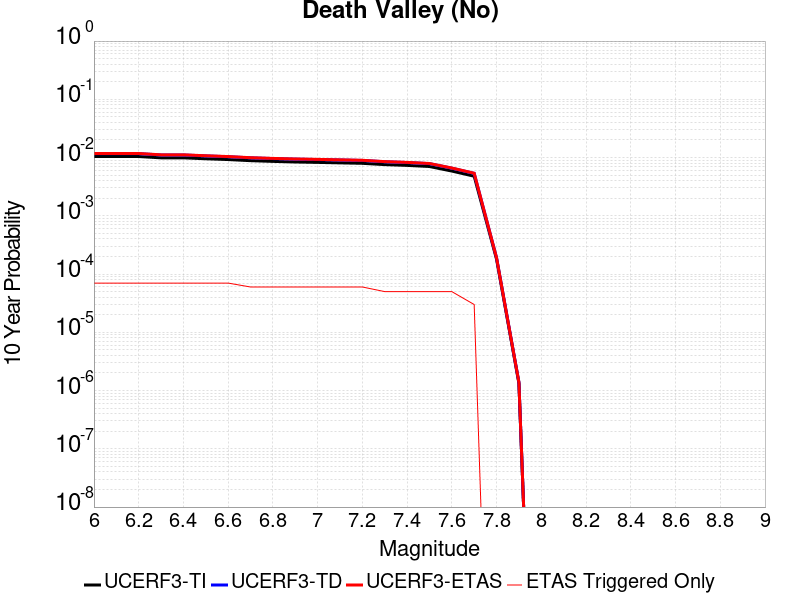 |

| Magnitude | 1 wk TI Prob | 1 wk TD Prob | 1 wk ETAS Prob | 1 wk ETAS/TD Gain | 1 wk ETAS Triggered Only | 1 mo TI Prob | 1 mo TD Prob | 1 mo ETAS Prob | 1 mo ETAS/TD Gain | 1 mo ETAS Triggered Only | 1 yr TI Prob | 1 yr TD Prob | 1 yr ETAS Prob | 1 yr ETAS/TD Gain | 1 yr ETAS Triggered Only | 10 yr TI Prob | 10 yr TD Prob | 10 yr ETAS Prob | 10 yr ETAS/TD Gain | 10 yr ETAS Triggered Only |
|-----|-----|-----|-----|-----|-----|-----|-----|-----|-----|-----|-----|-----|-----|-----|-----|-----|-----|-----|-----|-----|
| 6.0 | 2.0074807E-5 | 2.2500446E-5 | 4.2499996E-5 | 1.8888513 | 2.0E-5 | 8.603206E-5 | 9.642696E-5 | 1.2642407E-4 | 1.3110863 | 3.0E-5 | 0.001046937 | 0.0011733733 | 0.0012233147 | 1.0425621 | 5.0E-5 | 0.010420183 | 0.011672693 | 0.011741877 | 1.0059268 | 7.0E-5 |
| 6.1 | 2.0074807E-5 | 2.2500446E-5 | 4.2499996E-5 | 1.8888513 | 2.0E-5 | 8.603206E-5 | 9.642696E-5 | 1.2642407E-4 | 1.3110863 | 3.0E-5 | 0.001046937 | 0.0011733733 | 0.0012233147 | 1.0425621 | 5.0E-5 | 0.010420183 | 0.011672693 | 0.011741877 | 1.0059268 | 7.0E-5 |
| 6.2 | 2.0074807E-5 | 2.2500446E-5 | 4.2499996E-5 | 1.8888513 | 2.0E-5 | 8.603206E-5 | 9.642696E-5 | 1.2642407E-4 | 1.3110863 | 3.0E-5 | 0.001046937 | 0.0011733733 | 0.0012233147 | 1.0425621 | 5.0E-5 | 0.010420183 | 0.011672693 | 0.011741877 | 1.0059268 | 7.0E-5 |
| 6.3 | 1.9050609E-5 | 2.1337288E-5 | 4.133686E-5 | 1.9373062 | 2.0E-5 | 8.164292E-5 | 9.144236E-5 | 1.2143961E-4 | 1.3280455 | 3.0E-5 | 9.935491E-4 | 0.0011127489 | 0.0011626933 | 1.0448837 | 5.0E-5 | 0.009891188 | 0.011072595 | 0.01114182 | 1.0062519 | 7.0E-5 |
| 6.4 | 1.9050609E-5 | 2.1337288E-5 | 4.133686E-5 | 1.9373062 | 2.0E-5 | 8.164292E-5 | 9.144236E-5 | 1.2143961E-4 | 1.3280455 | 3.0E-5 | 9.935491E-4 | 0.0011127489 | 0.0011626933 | 1.0448837 | 5.0E-5 | 0.009891188 | 0.011072595 | 0.01114182 | 1.0062519 | 7.0E-5 |
| 6.5 | 1.8367004E-5 | 2.0561336E-5 | 4.0560924E-5 | 1.9726795 | 2.0E-5 | 7.8713354E-5 | 8.811707E-5 | 1.18114425E-4 | 1.3404262 | 3.0E-5 | 9.5791375E-4 | 0.0010723039 | 0.0011222502 | 1.0465785 | 5.0E-5 | 0.009537951 | 0.010672084 | 0.010741337 | 1.0064892 | 7.0E-5 |
| 6.6 | 1.779439E-5 | 1.9911244E-5 | 3.9910847E-5 | 2.0044377 | 2.0E-5 | 7.625944E-5 | 8.533114E-5 | 1.15328585E-4 | 1.3515415 | 3.0E-5 | 9.280632E-4 | 0.0010384179 | 0.001088366 | 1.0481001 | 5.0E-5 | 0.009241969 | 0.010336416 | 0.010405692 | 1.0067022 | 7.0E-5 |
| 6.7 | 1.7025437E-5 | 1.9043726E-5 | 3.9043345E-5 | 2.0501947 | 2.0E-5 | 7.296412E-5 | 8.161345E-5 | 1.0161182E-4 | 1.2450377 | 2.0E-5 | 8.87976E-4 | 9.93197E-4 | 0.0010331572 | 1.040234 | 4.0E-5 | 0.008844362 | 0.009888301 | 0.009947708 | 1.0060078 | 6.0E-5 |
| 6.8 | 1.6545107E-5 | 1.851284E-5 | 3.851247E-5 | 2.0803113 | 2.0E-5 | 7.090568E-5 | 7.933836E-5 | 9.933677E-5 | 1.2520648 | 2.0E-5 | 8.629347E-4 | 9.655226E-4 | 0.0010054839 | 1.0413884 | 4.0E-5 | 0.008595915 | 0.009613981 | 0.009673404 | 1.0061809 | 6.0E-5 |
| 6.9 | 1.615478E-5 | 1.8087881E-5 | 3.808752E-5 | 2.1056926 | 2.0E-5 | 6.9232934E-5 | 7.751722E-5 | 9.751567E-5 | 1.2579871 | 2.0E-5 | 8.4258494E-4 | 9.433697E-4 | 9.833319E-4 | 1.0423611 | 4.0E-5 | 0.008393973 | 0.009394345 | 0.009453781 | 1.0063268 | 6.0E-5 |
| 7.0 | 1.5894311E-5 | 1.7805834E-5 | 3.780548E-5 | 2.1232073 | 2.0E-5 | 6.81167E-5 | 7.6308526E-5 | 9.6307E-5 | 1.2620739 | 2.0E-5 | 8.2900526E-4 | 9.286663E-4 | 9.686292E-4 | 1.0430325 | 4.0E-5 | 0.008259195 | 0.009248544 | 0.00930799 | 1.0064275 | 6.0E-5 |
| 7.1 | 1.5602263E-5 | 1.7483784E-5 | 3.7483434E-5 | 2.143897 | 2.0E-5 | 6.6865134E-5 | 7.4928386E-5 | 9.492689E-5 | 1.2669015 | 2.0E-5 | 8.137789E-4 | 9.118773E-4 | 9.518409E-4 | 1.0438255 | 4.0E-5 | 0.008108052 | 0.009082039 | 0.009141494 | 1.0065465 | 6.0E-5 |
| 7.2 | 1.5323829E-5 | 1.7170905E-5 | 3.717056E-5 | 2.164741 | 2.0E-5 | 6.56719E-5 | 7.358755E-5 | 9.358608E-5 | 1.2717651 | 2.0E-5 | 7.99262E-4 | 8.9556625E-4 | 9.3553046E-4 | 1.0446244 | 4.0E-5 | 0.007963934 | 0.008920249 | 0.008979714 | 1.0066663 | 6.0E-5 |
| 7.3 | 1.4556212E-5 | 1.6302716E-5 | 3.630239E-5 | 2.2267694 | 2.0E-5 | 6.238227E-5 | 6.986695E-5 | 8.986555E-5 | 1.2862384 | 2.0E-5 | 7.592395E-4 | 8.503039E-4 | 8.902699E-4 | 1.047002 | 4.0E-5 | 0.0075665074 | 0.008471149 | 0.008520725 | 1.0058523 | 5.0E-5 |
| 7.4 | 1.411725E-5 | 1.5808211E-5 | 3.5807894E-5 | 2.2651453 | 2.0E-5 | 6.0501097E-5 | 6.774775E-5 | 8.77464E-5 | 1.2951927 | 2.0E-5 | 7.363519E-4 | 8.245226E-4 | 8.644896E-4 | 1.0484729 | 4.0E-5 | 0.0073391674 | 0.008215268 | 0.008264858 | 1.0060363 | 5.0E-5 |
| 7.5 | 1.3503312E-5 | 1.5126531E-5 | 3.5126228E-5 | 2.3221602 | 2.0E-5 | 5.7870053E-5 | 6.482641E-5 | 8.4825115E-5 | 1.3084962 | 2.0E-5 | 7.043401E-4 | 7.8898156E-4 | 8.2895E-4 | 1.0506582 | 4.0E-5 | 0.007021119 | 0.007862429 | 0.007912036 | 1.0063094 | 5.0E-5 |
| 7.6 | 1.1279839E-5 | 1.2626528E-5 | 3.2626274E-5 | 2.5839467 | 2.0E-5 | 4.834127E-5 | 5.4112596E-5 | 7.4111515E-5 | 1.3695797 | 2.0E-5 | 5.88396E-4 | 6.58627E-4 | 6.9860066E-4 | 1.0606924 | 4.0E-5 | 0.005868405 | 0.0065673026 | 0.0066169742 | 1.0075635 | 5.0E-5 |
| 7.7 | 9.189108E-6 | 1.0283521E-5 | 3.0283316E-5 | 2.944839 | 2.0E-5 | 3.93813E-5 | 4.407152E-5 | 6.4070635E-5 | 1.4537878 | 2.0E-5 | 4.7936183E-4 | 5.3644367E-4 | 5.664276E-4 | 1.0558939 | 3.0E-5 | 0.004783291 | 0.0053519984 | 0.005381838 | 1.0055754 | 3.0E-5 |
| 7.8 | 3.4586725E-7 | 3.648288E-7 | 3.648288E-7 | 1.0 | 0.0 | 1.4822873E-6 | 1.5635511E-6 | 1.5635511E-6 | 1.0 | 0.0 | 1.80467E-5 | 1.9036073E-5 | 1.9036073E-5 | 1.0 | 0.0 | 1.8045233E-4 | 1.9034486E-4 | 1.9034486E-4 | 1.0 | 0.0 |
| 7.9 | 2.5591178E-9 | 2.6696871E-9 | 2.6696871E-9 | 1.0 | 0.0 | 1.0967647E-8 | 1.1441516E-8 | 1.1441516E-8 | 1.0 | 0.0 | 1.335311E-7 | 1.3930045E-7 | 1.3930045E-7 | 1.0 | 0.0 | 1.3353102E-6 | 1.3930046E-6 | 1.3930046E-6 | 1.0 | 0.0 |

## Bicycle Lake
*[(top)](#table-of-contents)*

| 1 Week | 1 Month | 1 Year | 10 Year |
|-----|-----|-----|-----|
|  | 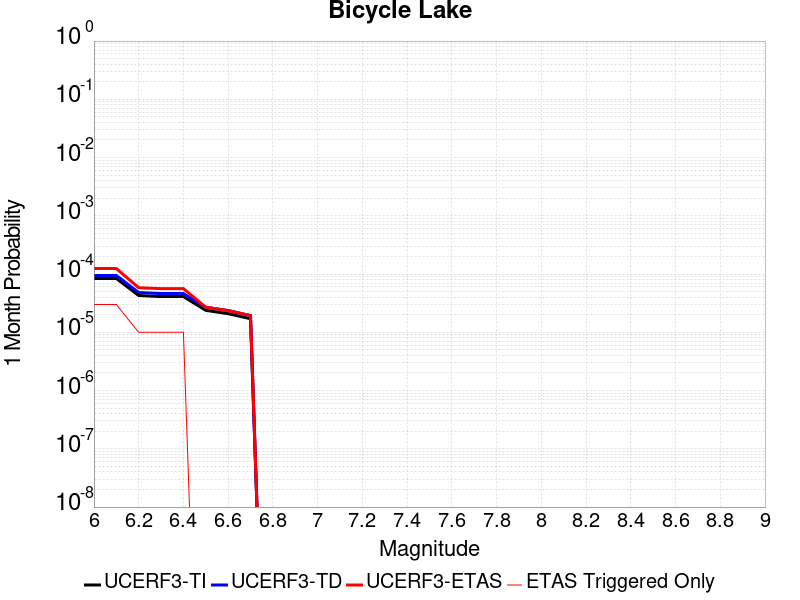 |  |  |

| Magnitude | 1 wk TI Prob | 1 wk TD Prob | 1 wk ETAS Prob | 1 wk ETAS/TD Gain | 1 wk ETAS Triggered Only | 1 mo TI Prob | 1 mo TD Prob | 1 mo ETAS Prob | 1 mo ETAS/TD Gain | 1 mo ETAS Triggered Only | 1 yr TI Prob | 1 yr TD Prob | 1 yr ETAS Prob | 1 yr ETAS/TD Gain | 1 yr ETAS Triggered Only | 10 yr TI Prob | 10 yr TD Prob | 10 yr ETAS Prob | 10 yr ETAS/TD Gain | 10 yr ETAS Triggered Only |
|-----|-----|-----|-----|-----|-----|-----|-----|-----|-----|-----|-----|-----|-----|-----|-----|-----|-----|-----|-----|-----|
| 6.0 | 1.9621975E-5 | 2.2097447E-5 | 4.2097006E-5 | 1.9050618 | 2.0E-5 | 8.4091465E-5 | 9.470067E-5 | 1.2469784E-4 | 1.3167576 | 3.0E-5 | 0.0010233327 | 0.0011525059 | 0.0012224251 | 1.0606673 | 7.0E-5 | 0.01018633 | 0.011478599 | 0.0115477955 | 1.0060283 | 7.0E-5 |
| 6.1 | 1.9621975E-5 | 2.2097447E-5 | 4.2097006E-5 | 1.9050618 | 2.0E-5 | 8.4091465E-5 | 9.470067E-5 | 1.2469784E-4 | 1.3167576 | 3.0E-5 | 0.0010233327 | 0.0011525059 | 0.0012224251 | 1.0606673 | 7.0E-5 | 0.01018633 | 0.011478599 | 0.0115477955 | 1.0060283 | 7.0E-5 |
| 6.2 | 9.9971285E-6 | 1.1255827E-5 | 2.1255715E-5 | 1.8884187 | 1.0E-5 | 4.2844134E-5 | 4.823866E-5 | 5.823818E-5 | 1.2072926 | 1.0E-5 | 5.2150246E-4 | 5.8719947E-4 | 6.2717596E-4 | 1.06808 | 4.0E-5 | 0.0052028033 | 0.005861584 | 0.0059013497 | 1.0067841 | 4.0E-5 |
| 6.3 | 9.589428E-6 | 1.0798527E-5 | 2.079842E-5 | 1.9260423 | 1.0E-5 | 4.10969E-5 | 4.627887E-5 | 5.6278408E-5 | 1.2160714 | 1.0E-5 | 5.002399E-4 | 5.6335144E-4 | 6.033289E-4 | 1.0709636 | 4.0E-5 | 0.0049911533 | 0.0056243236 | 0.0056640985 | 1.007072 | 4.0E-5 |
| 6.4 | 9.589428E-6 | 1.0798527E-5 | 2.079842E-5 | 1.9260423 | 1.0E-5 | 4.10969E-5 | 4.627887E-5 | 5.6278408E-5 | 1.2160714 | 1.0E-5 | 5.002399E-4 | 5.6335144E-4 | 6.033289E-4 | 1.0709636 | 4.0E-5 | 0.0049911533 | 0.0056243236 | 0.0056640985 | 1.007072 | 4.0E-5 |
| 6.5 | 5.557707E-6 | 6.2857107E-6 | 6.2857107E-6 | 1.0 | 0.0 | 2.3818526E-5 | 2.6938633E-5 | 2.6938633E-5 | 1.0 | 0.0 | 2.8995197E-4 | 3.2795538E-4 | 3.2795538E-4 | 1.0 | 0.0 | 0.0028957394 | 0.0032773502 | 0.0032773502 | 1.0 | 0.0 |
| 6.6 | 4.8742945E-6 | 5.5133855E-6 | 5.5133855E-6 | 1.0 | 0.0 | 2.0889667E-5 | 2.3628729E-5 | 2.3628729E-5 | 1.0 | 0.0 | 2.54302E-4 | 2.87668E-4 | 2.87668E-4 | 1.0 | 0.0 | 0.002540112 | 0.0028755253 | 0.0028755253 | 1.0 | 0.0 |
| 6.7 | 3.991108E-6 | 4.515989E-6 | 4.515989E-6 | 1.0 | 0.0 | 1.7104636E-5 | 1.9354238E-5 | 1.9354238E-5 | 1.0 | 0.0 | 2.0822904E-4 | 2.3563785E-4 | 2.3563785E-4 | 1.0 | 0.0 | 0.0020803404 | 0.0023563786 | 0.0023563786 | 1.0 | 0.0 |

## San Andreas (San Gorgonio Pass-Garnet HIll)
*[(top)](#table-of-contents)*

| 1 Week | 1 Month | 1 Year | 10 Year |
|-----|-----|-----|-----|
| 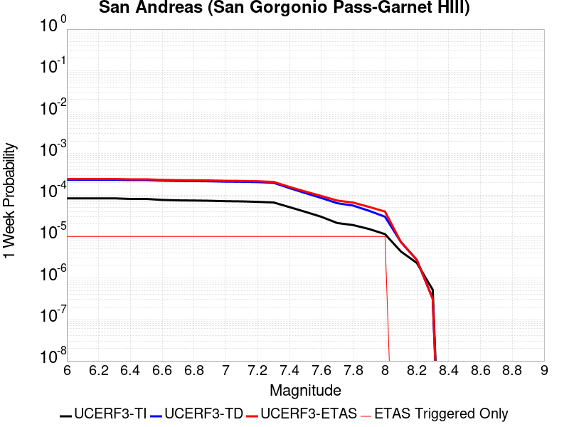 | 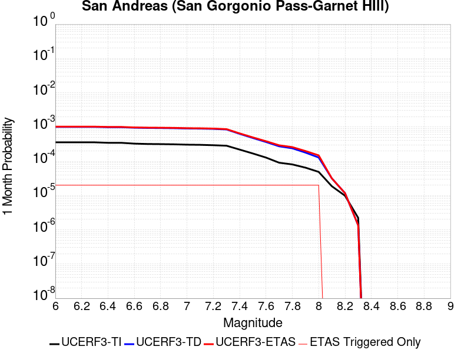 | 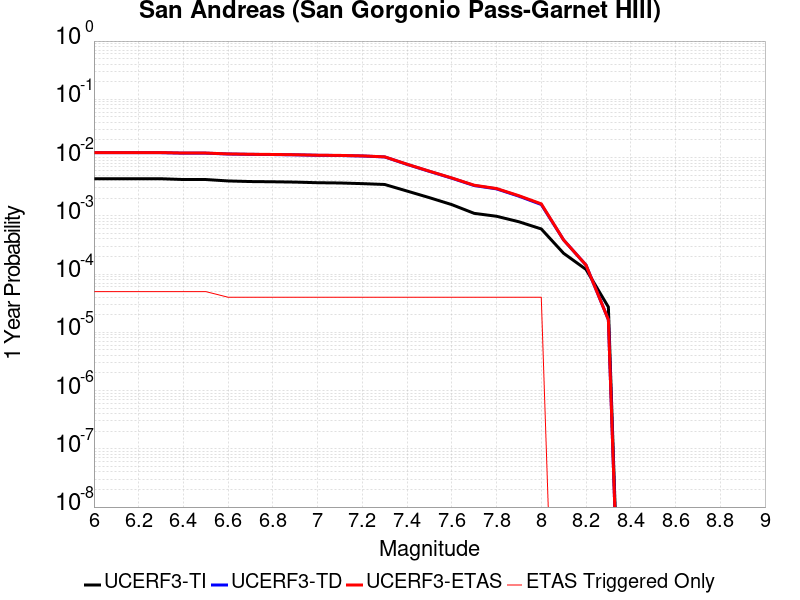 | 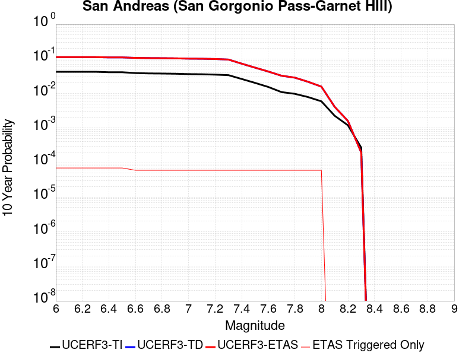 |

| Magnitude | 1 wk TI Prob | 1 wk TD Prob | 1 wk ETAS Prob | 1 wk ETAS/TD Gain | 1 wk ETAS Triggered Only | 1 mo TI Prob | 1 mo TD Prob | 1 mo ETAS Prob | 1 mo ETAS/TD Gain | 1 mo ETAS Triggered Only | 1 yr TI Prob | 1 yr TD Prob | 1 yr ETAS Prob | 1 yr ETAS/TD Gain | 1 yr ETAS Triggered Only | 10 yr TI Prob | 10 yr TD Prob | 10 yr ETAS Prob | 10 yr ETAS/TD Gain | 10 yr ETAS Triggered Only |
|-----|-----|-----|-----|-----|-----|-----|-----|-----|-----|-----|-----|-----|-----|-----|-----|-----|-----|-----|-----|-----|
| 6.0 | 8.31567E-5 | 2.3386451E-4 | 2.4386217E-4 | 1.0427498 | 1.0E-5 | 3.5633717E-4 | 0.0010018935 | 0.0010218736 | 1.0199422 | 2.0E-5 | 0.004329778 | 0.012129918 | 0.012179311 | 1.0040721 | 5.0E-5 | 0.042463828 | 0.11259502 | 0.11265714 | 1.0005517 | 7.0E-5 |
| 6.1 | 8.31567E-5 | 2.3386451E-4 | 2.4386217E-4 | 1.0427498 | 1.0E-5 | 3.5633717E-4 | 0.0010018935 | 0.0010218736 | 1.0199422 | 2.0E-5 | 0.004329778 | 0.012129918 | 0.012179311 | 1.0040721 | 5.0E-5 | 0.042463828 | 0.11259502 | 0.11265714 | 1.0005517 | 7.0E-5 |
| 6.2 | 8.31567E-5 | 2.3386451E-4 | 2.4386217E-4 | 1.0427498 | 1.0E-5 | 3.5633717E-4 | 0.0010018935 | 0.0010218736 | 1.0199422 | 2.0E-5 | 0.004329778 | 0.012129918 | 0.012179311 | 1.0040721 | 5.0E-5 | 0.042463828 | 0.11259502 | 0.11265714 | 1.0005517 | 7.0E-5 |
| 6.3 | 8.31567E-5 | 2.3386451E-4 | 2.4386217E-4 | 1.0427498 | 1.0E-5 | 3.5633717E-4 | 0.0010018935 | 0.0010218736 | 1.0199422 | 2.0E-5 | 0.004329778 | 0.012129918 | 0.012179311 | 1.0040721 | 5.0E-5 | 0.042463828 | 0.11259502 | 0.11265714 | 1.0005517 | 7.0E-5 |
| 6.4 | 8.059055E-5 | 2.2944735E-4 | 2.3944506E-4 | 1.043573 | 1.0E-5 | 3.4534236E-4 | 9.829777E-4 | 0.001002958 | 1.0203264 | 2.0E-5 | 0.0041964394 | 0.011902156 | 0.011951561 | 1.0041509 | 5.0E-5 | 0.041180745 | 0.110576175 | 0.11063844 | 1.000563 | 7.0E-5 |
| 6.5 | 8.059055E-5 | 2.2944735E-4 | 2.3944506E-4 | 1.043573 | 1.0E-5 | 3.4534236E-4 | 9.829777E-4 | 0.001002958 | 1.0203264 | 2.0E-5 | 0.0041964394 | 0.011902156 | 0.011951561 | 1.0041509 | 5.0E-5 | 0.041180745 | 0.110576175 | 0.11063844 | 1.000563 | 7.0E-5 |
| 6.6 | 7.619237E-5 | 2.2189032E-4 | 2.318881E-4 | 1.0450573 | 1.0E-5 | 3.2649786E-4 | 9.506143E-4 | 9.705953E-4 | 1.021019 | 2.0E-5 | 0.0039678677 | 0.0115128625 | 0.011552402 | 1.0034344 | 4.0E-5 | 0.03897764 | 0.10711278 | 0.10716635 | 1.0005002 | 6.0E-5 |
| 6.7 | 7.440636E-5 | 2.1864849E-4 | 2.2864631E-4 | 1.0457255 | 1.0E-5 | 3.188454E-4 | 9.367307E-4 | 9.56712E-4 | 1.0213308 | 2.0E-5 | 0.0038750346 | 0.011345596 | 0.011385143 | 1.0034856 | 4.0E-5 | 0.038081564 | 0.10562121 | 0.10567487 | 1.0005081 | 6.0E-5 |
| 6.8 | 7.3735864E-5 | 2.1712016E-4 | 2.2711798E-4 | 1.0460474 | 1.0E-5 | 3.1597257E-4 | 9.3018543E-4 | 9.501668E-4 | 1.021481 | 2.0E-5 | 0.0038401815 | 0.011266734 | 0.011306284 | 1.0035102 | 4.0E-5 | 0.03774495 | 0.10492276 | 0.10497646 | 1.0005119 | 6.0E-5 |
| 6.9 | 7.27575E-5 | 2.1480983E-4 | 2.2480768E-4 | 1.0465428 | 1.0E-5 | 3.117806E-4 | 9.20291E-4 | 9.402726E-4 | 1.0217123 | 2.0E-5 | 0.003789323 | 0.011147508 | 0.011187063 | 1.0035483 | 4.0E-5 | 0.037253562 | 0.10387066 | 0.10392443 | 1.0005176 | 6.0E-5 |
| 7.0 | 7.102591E-5 | 2.1065009E-4 | 2.2064798E-4 | 1.0474621 | 1.0E-5 | 3.0436125E-4 | 9.0247596E-4 | 9.2245796E-4 | 1.0221412 | 2.0E-5 | 0.003699303 | 0.010932805 | 0.010972368 | 1.0036187 | 4.0E-5 | 0.03638325 | 0.101972826 | 0.10202671 | 1.0005283 | 6.0E-5 |
| 7.1 | 7.028513E-5 | 2.0900648E-4 | 2.1900439E-4 | 1.0478354 | 1.0E-5 | 3.0118722E-4 | 8.954368E-4 | 9.154189E-4 | 1.0223155 | 2.0E-5 | 0.0036607897 | 0.01084796 | 0.010887526 | 1.0036473 | 4.0E-5 | 0.036010686 | 0.10121585 | 0.101269774 | 1.0005327 | 6.0E-5 |
| 7.2 | 6.8498244E-5 | 2.0508505E-4 | 2.15083E-4 | 1.0487503 | 1.0E-5 | 2.9353087E-4 | 8.78642E-4 | 8.986245E-4 | 1.0227424 | 2.0E-5 | 0.003567883 | 0.010645497 | 0.010685071 | 1.0037174 | 4.0E-5 | 0.035111405 | 0.09940783 | 0.09946187 | 1.0005436 | 6.0E-5 |
| 7.3 | 6.622592E-5 | 1.973576E-4 | 2.0735562E-4 | 1.0506594 | 1.0E-5 | 2.8379448E-4 | 8.4554625E-4 | 8.6552935E-4 | 1.0236334 | 2.0E-5 | 0.0034497243 | 0.010246415 | 0.010286004 | 1.0038638 | 4.0E-5 | 0.033966612 | 0.09590419 | 0.095958434 | 1.0005656 | 6.0E-5 |
| 7.4 | 5.1050705E-5 | 1.4692261E-4 | 1.5692115E-4 | 1.068053 | 1.0E-5 | 2.1877038E-4 | 6.295173E-4 | 6.495047E-4 | 1.0317503 | 2.0E-5 | 0.002660276 | 0.0076376316 | 0.007677326 | 1.0051972 | 4.0E-5 | 0.02628654 | 0.07287696 | 0.072932586 | 1.0007633 | 6.0E-5 |
| 7.5 | 3.9302922E-5 | 1.11326524E-4 | 1.2132541E-4 | 1.0898159 | 1.0E-5 | 1.6843023E-4 | 4.7702674E-4 | 4.970172E-4 | 1.0419064 | 2.0E-5 | 0.0020487092 | 0.005792404 | 0.0058321725 | 1.0068656 | 4.0E-5 | 0.020299247 | 0.05602189 | 0.05607853 | 1.001011 | 6.0E-5 |
| 7.6 | 2.9851626E-5 | 8.49747E-5 | 9.497385E-5 | 1.1176721 | 1.0E-5 | 1.2792926E-4 | 3.6412658E-4 | 3.841193E-4 | 1.054906 | 2.0E-5 | 0.0015564259 | 0.004424255 | 0.004464078 | 1.009001 | 4.0E-5 | 0.0154556995 | 0.043204896 | 0.043262303 | 1.0013287 | 6.0E-5 |
| 7.7 | 2.1135214E-5 | 6.355116E-5 | 7.3550524E-5 | 1.1573435 | 1.0E-5 | 9.0576345E-5 | 2.723337E-4 | 2.9232824E-4 | 1.0734193 | 2.0E-5 | 0.0011022091 | 0.003310627 | 0.0033504947 | 1.0120423 | 4.0E-5 | 0.010967582 | 0.032592565 | 0.032650612 | 1.0017809 | 6.0E-5 |
| 7.8 | 1.883379E-5 | 5.5660596E-5 | 6.566004E-5 | 1.1796503 | 1.0E-5 | 8.0713755E-5 | 2.3852361E-4 | 2.5851885E-4 | 1.0838292 | 2.0E-5 | 9.822468E-4 | 0.0029001608 | 0.002940045 | 1.0137523 | 4.0E-5 | 0.0097791655 | 0.028704397 | 0.028762676 | 1.0020303 | 6.0E-5 |
| 7.9 | 1.5156185E-5 | 4.1675128E-5 | 5.1674713E-5 | 1.2399412 | 1.0E-5 | 6.495346E-5 | 1.7859548E-4 | 1.9859191E-4 | 1.111965 | 2.0E-5 | 7.9052144E-4 | 0.0021722328 | 0.002212146 | 1.0183742 | 4.0E-5 | 0.007877152 | 0.02176709 | 0.021825783 | 1.0026965 | 6.0E-5 |
| 8.0 | 1.1405907E-5 | 2.9986788E-5 | 3.9986488E-5 | 1.3334702 | 1.0E-5 | 4.8881542E-5 | 1.2850849E-4 | 1.4850592E-4 | 1.1556118 | 2.0E-5 | 5.9497025E-4 | 0.0015634688 | 0.0016034064 | 1.0255442 | 4.0E-5 | 0.005933798 | 0.015778678 | 0.01583773 | 1.0037426 | 6.0E-5 |
| 8.1 | 4.3511436E-6 | 7.373693E-6 | 7.373693E-6 | 1.0 | 0.0 | 1.8647626E-5 | 3.160116E-5 | 3.160116E-5 | 1.0 | 0.0 | 2.2701119E-4 | 3.8467633E-4 | 3.8467633E-4 | 1.0 | 0.0 | 0.0022677942 | 0.004118566 | 0.004118566 | 1.0 | 0.0 |
| 8.2 | 2.3042528E-6 | 2.7350309E-6 | 2.7350309E-6 | 1.0 | 0.0 | 9.875332E-6 | 1.1721509E-5 | 1.1721509E-5 | 1.0 | 0.0 | 1.2022553E-4 | 1.4270007E-4 | 1.4270007E-4 | 1.0 | 0.0 | 0.0012016051 | 0.0015990696 | 0.0015990696 | 1.0 | 0.0 |
| 8.3 | 5.202968E-7 | 3.1628537E-7 | 3.1628537E-7 | 1.0 | 0.0 | 2.2298414E-6 | 1.3555081E-6 | 1.3555081E-6 | 1.0 | 0.0 | 2.714798E-5 | 1.6503198E-5 | 1.6503198E-5 | 1.0 | 0.0 | 2.7144665E-4 | 1.9580164E-4 | 1.9580164E-4 | 1.0 | 0.0 |

## San Andreas (Coachella) rev
*[(top)](#table-of-contents)*

| 1 Week | 1 Month | 1 Year | 10 Year |
|-----|-----|-----|-----|
|  | 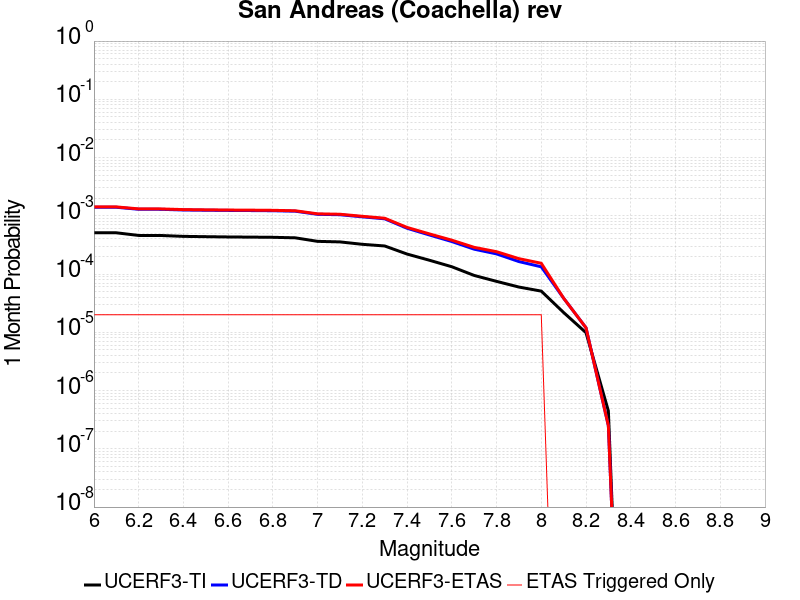 |  | 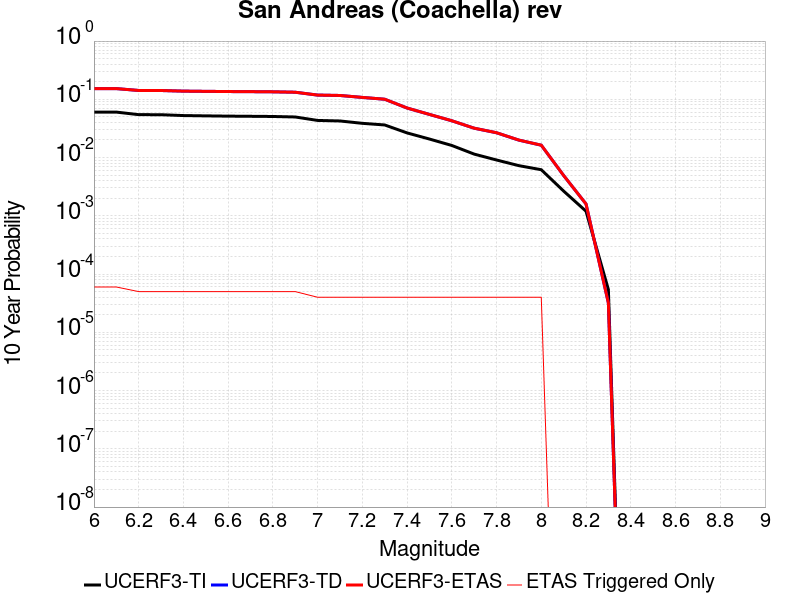 |

| Magnitude | 1 wk TI Prob | 1 wk TD Prob | 1 wk ETAS Prob | 1 wk ETAS/TD Gain | 1 wk ETAS Triggered Only | 1 mo TI Prob | 1 mo TD Prob | 1 mo ETAS Prob | 1 mo ETAS/TD Gain | 1 mo ETAS Triggered Only | 1 yr TI Prob | 1 yr TD Prob | 1 yr ETAS Prob | 1 yr ETAS/TD Gain | 1 yr ETAS Triggered Only | 10 yr TI Prob | 10 yr TD Prob | 10 yr ETAS Prob | 10 yr ETAS/TD Gain | 10 yr ETAS Triggered Only |
|-----|-----|-----|-----|-----|-----|-----|-----|-----|-----|-----|-----|-----|-----|-----|-----|-----|-----|-----|-----|-----|
| 6.0 | 1.1925945E-4 | 3.2733803E-4 | 3.3733476E-4 | 1.0305395 | 1.0E-5 | 5.110118E-4 | 0.0014021277 | 0.0014220997 | 1.0142441 | 2.0E-5 | 0.0062038354 | 0.016938623 | 0.016987776 | 1.0029018 | 5.0E-5 | 0.060334753 | 0.15267034 | 0.15272118 | 1.000333 | 6.0E-5 |
| 6.1 | 1.1925945E-4 | 3.2733803E-4 | 3.3733476E-4 | 1.0305395 | 1.0E-5 | 5.110118E-4 | 0.0014021277 | 0.0014220997 | 1.0142441 | 2.0E-5 | 0.0062038354 | 0.016938623 | 0.016987776 | 1.0029018 | 5.0E-5 | 0.060334753 | 0.15267034 | 0.15272118 | 1.000333 | 6.0E-5 |
| 6.2 | 1.07432395E-4 | 3.0234526E-4 | 3.1234222E-4 | 1.0330647 | 1.0E-5 | 4.603433E-4 | 0.0012951259 | 0.0013151 | 1.0154225 | 2.0E-5 | 0.005590286 | 0.015655253 | 0.015694628 | 1.0025151 | 4.0E-5 | 0.05451731 | 0.14184146 | 0.14188436 | 1.0003026 | 5.0E-5 |
| 6.3 | 1.0718766E-4 | 3.017983E-4 | 3.117953E-4 | 1.0331247 | 1.0E-5 | 4.592948E-4 | 0.0012927842 | 0.0013127583 | 1.0154505 | 2.0E-5 | 0.005577586 | 0.015627153 | 0.015666528 | 1.0025196 | 4.0E-5 | 0.054396555 | 0.14160971 | 0.14165264 | 1.000303 | 5.0E-5 |
| 6.4 | 1.0355944E-4 | 2.9387916E-4 | 3.038762E-4 | 1.0340176 | 1.0E-5 | 4.4375064E-4 | 0.0012588782 | 0.0012788529 | 1.0158671 | 2.0E-5 | 0.0053892885 | 0.015220184 | 0.015259575 | 1.002588 | 4.0E-5 | 0.052604496 | 0.13816981 | 0.1382129 | 1.0003119 | 5.0E-5 |
| 6.5 | 1.0227914E-4 | 2.910735E-4 | 3.0107057E-4 | 1.0343456 | 1.0E-5 | 4.382655E-4 | 0.0012468654 | 0.0012668404 | 1.0160202 | 2.0E-5 | 0.0053228354 | 0.015075962 | 0.015115359 | 1.0026132 | 4.0E-5 | 0.051971316 | 0.136949 | 0.13699216 | 1.0003151 | 5.0E-5 |
| 6.6 | 1.0116757E-4 | 2.8873098E-4 | 2.987281E-4 | 1.0346243 | 1.0E-5 | 4.3350324E-4 | 0.0012368355 | 0.0012568109 | 1.0161504 | 2.0E-5 | 0.0052651367 | 0.014955532 | 0.014994933 | 1.0026346 | 4.0E-5 | 0.051421247 | 0.13592719 | 0.1359704 | 1.0003178 | 5.0E-5 |
| 6.7 | 1.0050676E-4 | 2.873166E-4 | 2.9731373E-4 | 1.0347948 | 1.0E-5 | 4.3067214E-4 | 0.0012307797 | 0.001250755 | 1.0162299 | 2.0E-5 | 0.005230834 | 0.01488281 | 0.014922216 | 1.0026476 | 4.0E-5 | 0.051094085 | 0.13531192 | 0.13535514 | 1.0003195 | 5.0E-5 |
| 6.8 | 9.976819E-5 | 2.853531E-4 | 2.9535027E-4 | 1.0350343 | 1.0E-5 | 4.2750788E-4 | 0.0012223726 | 0.0012423482 | 1.0163416 | 2.0E-5 | 0.0051924936 | 0.014781849 | 0.014821258 | 1.002666 | 4.0E-5 | 0.050728295 | 0.13446361 | 0.13450688 | 1.0003219 | 5.0E-5 |
| 6.9 | 9.77719E-5 | 2.8032195E-4 | 2.9031915E-4 | 1.0356632 | 1.0E-5 | 4.1895514E-4 | 0.0012008306 | 0.0012208065 | 1.0166352 | 2.0E-5 | 0.0050888555 | 0.014523101 | 0.014562519 | 1.0027143 | 4.0E-5 | 0.049738888 | 0.13229203 | 0.13233542 | 1.000328 | 5.0E-5 |
| 7.0 | 8.500761E-5 | 2.4766565E-4 | 2.5766317E-4 | 1.040367 | 1.0E-5 | 3.6426744E-4 | 0.0010609957 | 0.0010809745 | 1.0188302 | 2.0E-5 | 0.0044259406 | 0.012841888 | 0.012881374 | 1.0030748 | 4.0E-5 | 0.04338823 | 0.11814933 | 0.11818461 | 1.0002985 | 4.0E-5 |
| 7.1 | 8.319876E-5 | 2.4369264E-4 | 2.536902E-4 | 1.0410253 | 1.0E-5 | 3.5651738E-4 | 0.0010439822 | 0.0010639614 | 1.0191374 | 2.0E-5 | 0.004331963 | 0.012637171 | 0.012676666 | 1.0031253 | 4.0E-5 | 0.042484846 | 0.116369456 | 0.1164048 | 1.0003037 | 4.0E-5 |
| 7.2 | 7.563917E-5 | 2.2417592E-4 | 2.3417368E-4 | 1.0445979 | 1.0E-5 | 3.2412758E-4 | 9.6040324E-4 | 9.803841E-4 | 1.0208046 | 2.0E-5 | 0.0039391145 | 0.0116309095 | 0.011670444 | 1.0033991 | 4.0E-5 | 0.03870018 | 0.10777538 | 0.10781107 | 1.0003312 | 4.0E-5 |
| 7.3 | 7.082985E-5 | 2.073362E-4 | 2.1733412E-4 | 1.0482209 | 1.0E-5 | 3.0352117E-4 | 8.88284E-4 | 9.082662E-4 | 1.0224953 | 2.0E-5 | 0.0036891096 | 0.010761855 | 0.010801424 | 1.0036768 | 4.0E-5 | 0.03628465 | 0.10029767 | 0.10033365 | 1.0003588 | 4.0E-5 |
| 7.4 | 5.146215E-5 | 1.4276853E-4 | 1.527671E-4 | 1.0700334 | 1.0E-5 | 2.2053342E-4 | 6.117225E-4 | 6.317103E-4 | 1.0326746 | 2.0E-5 | 0.0026816884 | 0.007422478 | 0.0074621807 | 1.005349 | 4.0E-5 | 0.02649557 | 0.07086292 | 0.07090008 | 1.0005245 | 4.0E-5 |
| 7.5 | 4.0285166E-5 | 1.0944253E-4 | 1.19441436E-4 | 1.0913621 | 1.0E-5 | 1.7263928E-4 | 4.689554E-4 | 4.8894604E-4 | 1.0426279 | 2.0E-5 | 0.002099857 | 0.005694655 | 0.005734427 | 1.0069841 | 4.0E-5 | 0.020801254 | 0.055022955 | 0.055060755 | 1.000687 | 4.0E-5 |
| 7.6 | 3.1168736E-5 | 8.441267E-5 | 9.441183E-5 | 1.1184556 | 1.0E-5 | 1.3357346E-4 | 3.6171856E-4 | 3.8171132E-4 | 1.0552716 | 2.0E-5 | 0.0016250437 | 0.004395057 | 0.0044348813 | 1.0090611 | 4.0E-5 | 0.016132116 | 0.042820677 | 0.042858962 | 1.0008941 | 4.0E-5 |
| 7.7 | 2.2100989E-5 | 6.2408275E-5 | 7.240765E-5 | 1.1602252 | 1.0E-5 | 9.4715084E-5 | 2.6743664E-4 | 2.874313E-4 | 1.074764 | 2.0E-5 | 0.001152546 | 0.003251186 | 0.003291056 | 1.0122632 | 4.0E-5 | 0.011465867 | 0.03190961 | 0.03194833 | 1.0012136 | 4.0E-5 |
| 7.8 | 1.7484861E-5 | 5.1814186E-5 | 6.181367E-5 | 1.1929873 | 1.0E-5 | 7.493296E-5 | 2.2204191E-4 | 2.4203748E-4 | 1.0900531 | 2.0E-5 | 9.1192697E-4 | 0.002700012 | 0.0027399037 | 1.0147748 | 4.0E-5 | 0.009081938 | 0.026648527 | 0.026687462 | 1.001461 | 4.0E-5 |
| 7.9 | 1.3967285E-5 | 3.8237675E-5 | 4.8237293E-5 | 1.2615122 | 1.0E-5 | 5.985842E-5 | 1.6386545E-4 | 1.8386218E-4 | 1.1220313 | 2.0E-5 | 7.2853256E-4 | 0.0019932375 | 0.002033158 | 1.0200279 | 4.0E-5 | 0.0072614877 | 0.019916428 | 0.019955633 | 1.0019684 | 4.0E-5 |
| 8.0 | 1.1887396E-5 | 3.107819E-5 | 4.1077878E-5 | 1.3217591 | 1.0E-5 | 5.094499E-5 | 1.3318544E-4 | 1.5318279E-4 | 1.1501466 | 2.0E-5 | 6.200787E-4 | 0.0016203277 | 0.0016602629 | 1.0246464 | 4.0E-5 | 0.006183513 | 0.016285317 | 0.016324665 | 1.0024163 | 4.0E-5 |
| 8.1 | 5.100864E-6 | 8.978668E-6 | 8.978668E-6 | 1.0 | 0.0 | 2.1860664E-5 | 3.847944E-5 | 3.847944E-5 | 1.0 | 0.0 | 2.6612106E-4 | 4.6838663E-4 | 4.6838663E-4 | 1.0 | 0.0 | 0.002658026 | 0.004920349 | 0.004920349 | 1.0 | 0.0 |
| 8.2 | 2.3004484E-6 | 2.7885583E-6 | 2.7885583E-6 | 1.0 | 0.0 | 9.859027E-6 | 1.19509095E-5 | 1.19509095E-5 | 1.0 | 0.0 | 1.2002704E-4 | 1.4549264E-4 | 1.4549264E-4 | 1.0 | 0.0 | 0.0011996223 | 0.0015984807 | 0.0015984807 | 1.0 | 0.0 |
| 8.3 | 1.0424446E-7 | 5.8219563E-8 | 5.8219563E-8 | 1.0 | 0.0 | 4.4676187E-7 | 2.495124E-7 | 2.495124E-7 | 1.0 | 0.0 | 5.439312E-6 | 3.0378094E-6 | 3.0378094E-6 | 1.0 | 0.0 | 5.4391792E-5 | 3.193819E-5 | 3.193819E-5 | 1.0 | 0.0 |

## San Andreas (Big Bend)
*[(top)](#table-of-contents)*

| 1 Week | 1 Month | 1 Year | 10 Year |
|-----|-----|-----|-----|
|  | 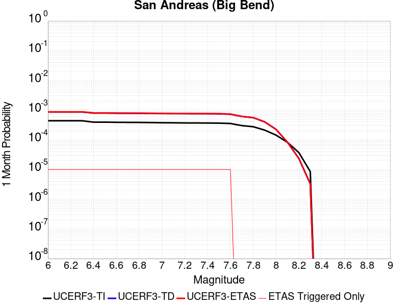 | 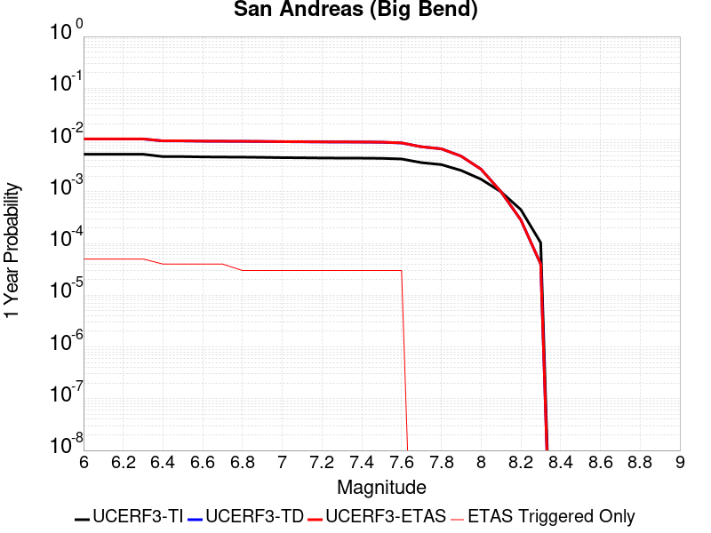 | 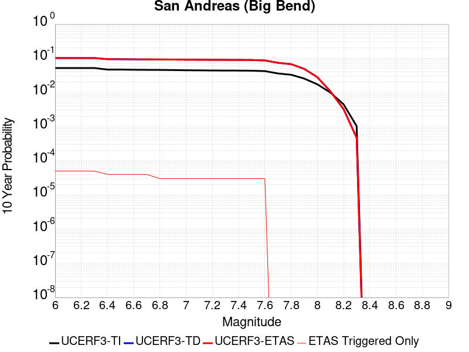 |

| Magnitude | 1 wk TI Prob | 1 wk TD Prob | 1 wk ETAS Prob | 1 wk ETAS/TD Gain | 1 wk ETAS Triggered Only | 1 mo TI Prob | 1 mo TD Prob | 1 mo ETAS Prob | 1 mo ETAS/TD Gain | 1 mo ETAS Triggered Only | 1 yr TI Prob | 1 yr TD Prob | 1 yr ETAS Prob | 1 yr ETAS/TD Gain | 1 yr ETAS Triggered Only | 10 yr TI Prob | 10 yr TD Prob | 10 yr ETAS Prob | 10 yr ETAS/TD Gain | 10 yr ETAS Triggered Only |
|-----|-----|-----|-----|-----|-----|-----|-----|-----|-----|-----|-----|-----|-----|-----|-----|-----|-----|-----|-----|-----|
| 6.0 | 1.0179969E-4 | 2.0080687E-4 | 2.0080687E-4 | 1.0 | 0.0 | 4.362114E-4 | 8.60318E-4 | 8.703094E-4 | 1.0116136 | 1.0E-5 | 0.0052979486 | 0.010424351 | 0.01047383 | 1.0047464 | 5.0E-5 | 0.051734097 | 0.1014857 | 0.10153062 | 1.0004426 | 5.0E-5 |
| 6.1 | 1.0179969E-4 | 2.0080687E-4 | 2.0080687E-4 | 1.0 | 0.0 | 4.362114E-4 | 8.60318E-4 | 8.703094E-4 | 1.0116136 | 1.0E-5 | 0.0052979486 | 0.010424351 | 0.01047383 | 1.0047464 | 5.0E-5 | 0.051734097 | 0.1014857 | 0.10153062 | 1.0004426 | 5.0E-5 |
| 6.2 | 1.0179969E-4 | 2.0080687E-4 | 2.0080687E-4 | 1.0 | 0.0 | 4.362114E-4 | 8.60318E-4 | 8.703094E-4 | 1.0116136 | 1.0E-5 | 0.0052979486 | 0.010424351 | 0.01047383 | 1.0047464 | 5.0E-5 | 0.051734097 | 0.1014857 | 0.10153062 | 1.0004426 | 5.0E-5 |
| 6.3 | 1.0179969E-4 | 2.0080687E-4 | 2.0080687E-4 | 1.0 | 0.0 | 4.362114E-4 | 8.60318E-4 | 8.703094E-4 | 1.0116136 | 1.0E-5 | 0.0052979486 | 0.010424351 | 0.01047383 | 1.0047464 | 5.0E-5 | 0.051734097 | 0.1014857 | 0.10153062 | 1.0004426 | 5.0E-5 |
| 6.4 | 9.1639464E-5 | 1.8437792E-4 | 1.8437792E-4 | 1.0 | 0.0 | 3.9268145E-4 | 7.89952E-4 | 7.999441E-4 | 1.0126489 | 1.0E-5 | 0.0047704205 | 0.009575372 | 0.009614988 | 1.0041374 | 4.0E-5 | 0.046693064 | 0.09381153 | 0.093847774 | 1.0003864 | 4.0E-5 |
| 6.5 | 9.1639464E-5 | 1.8437792E-4 | 1.8437792E-4 | 1.0 | 0.0 | 3.9268145E-4 | 7.89952E-4 | 7.999441E-4 | 1.0126489 | 1.0E-5 | 0.0047704205 | 0.009575372 | 0.009614988 | 1.0041374 | 4.0E-5 | 0.046693064 | 0.09381153 | 0.093847774 | 1.0003864 | 4.0E-5 |
| 6.6 | 9.042622E-5 | 1.8244829E-4 | 1.8244829E-4 | 1.0 | 0.0 | 3.8748336E-4 | 7.8168715E-4 | 7.916793E-4 | 1.0127828 | 1.0E-5 | 0.0047074095 | 0.009475624 | 0.009515245 | 1.0041814 | 4.0E-5 | 0.046089325 | 0.09290548 | 0.09294176 | 1.0003905 | 4.0E-5 |
| 6.7 | 8.9836685E-5 | 1.8159159E-4 | 1.8159159E-4 | 1.0 | 0.0 | 3.8495753E-4 | 7.7801774E-4 | 7.8800996E-4 | 1.0128431 | 1.0E-5 | 0.00467679 | 0.009431336 | 0.009470958 | 1.0042012 | 4.0E-5 | 0.045795817 | 0.09249973 | 0.09253604 | 1.0003924 | 4.0E-5 |
| 6.8 | 8.9471854E-5 | 1.8105932E-4 | 1.8105932E-4 | 1.0 | 0.0 | 3.8339442E-4 | 7.75738E-4 | 7.8573026E-4 | 1.0128809 | 1.0E-5 | 0.004657841 | 0.00940382 | 0.009433538 | 1.0031602 | 3.0E-5 | 0.04561414 | 0.09224692 | 0.09227415 | 1.0002952 | 3.0E-5 |
| 6.9 | 8.858234E-5 | 1.7987892E-4 | 1.7987892E-4 | 1.0 | 0.0 | 3.7958333E-4 | 7.706821E-4 | 7.806744E-4 | 1.0129656 | 1.0E-5 | 0.004611638 | 0.009342793 | 0.009372514 | 1.003181 | 3.0E-5 | 0.04517103 | 0.091686994 | 0.09171424 | 1.0002972 | 3.0E-5 |
| 7.0 | 8.7433385E-5 | 1.7826671E-4 | 1.7826671E-4 | 1.0 | 0.0 | 3.746607E-4 | 7.6377665E-4 | 7.7376905E-4 | 1.0130829 | 1.0E-5 | 0.004551957 | 0.009259437 | 0.009289159 | 1.00321 | 3.0E-5 | 0.044598386 | 0.09092137 | 0.09094864 | 1.0002999 | 3.0E-5 |
| 7.1 | 8.684964E-5 | 1.7738611E-4 | 1.7738611E-4 | 1.0 | 0.0 | 3.7215967E-4 | 7.600049E-4 | 7.699973E-4 | 1.0131478 | 1.0E-5 | 0.0045216335 | 0.009213906 | 0.009243629 | 1.0032259 | 3.0E-5 | 0.04430731 | 0.09050287 | 0.09053016 | 1.0003015 | 3.0E-5 |
| 7.2 | 8.606521E-5 | 1.7629213E-4 | 1.7629213E-4 | 1.0 | 0.0 | 3.6879873E-4 | 7.5531914E-4 | 7.653116E-4 | 1.0132295 | 1.0E-5 | 0.0044808835 | 0.009157337 | 0.009187062 | 1.0032461 | 3.0E-5 | 0.043916024 | 0.08998334 | 0.09001064 | 1.0003034 | 3.0E-5 |
| 7.3 | 8.568266E-5 | 1.7571205E-4 | 1.7571205E-4 | 1.0 | 0.0 | 3.6715972E-4 | 7.528345E-4 | 7.6282694E-4 | 1.0132731 | 1.0E-5 | 0.0044610105 | 0.00912734 | 0.009157066 | 1.0032568 | 3.0E-5 | 0.043725148 | 0.08970444 | 0.089731745 | 1.0003045 | 3.0E-5 |
| 7.4 | 8.5432206E-5 | 1.7533782E-4 | 1.7533782E-4 | 1.0 | 0.0 | 3.6608664E-4 | 7.5123156E-4 | 7.612241E-4 | 1.0133015 | 1.0E-5 | 0.004447999 | 0.009107988 | 0.009137715 | 1.0032638 | 3.0E-5 | 0.043600157 | 0.08952458 | 0.089551896 | 1.000305 | 3.0E-5 |
| 7.5 | 8.4791965E-5 | 1.7403076E-4 | 1.7403076E-4 | 1.0 | 0.0 | 3.633435E-4 | 7.4563315E-4 | 7.5562566E-4 | 1.0134014 | 1.0E-5 | 0.0044147377 | 0.009040395 | 0.009070124 | 1.0032884 | 3.0E-5 | 0.043280575 | 0.0889021 | 0.08892943 | 1.0003074 | 3.0E-5 |
| 7.6 | 8.241105E-5 | 1.684837E-4 | 1.684837E-4 | 1.0 | 0.0 | 3.531424E-4 | 7.2187337E-4 | 7.318661E-4 | 1.0138428 | 1.0E-5 | 0.0042910352 | 0.008753479 | 0.0087832175 | 1.0033972 | 3.0E-5 | 0.042091176 | 0.08627858 | 0.08630599 | 1.0003177 | 3.0E-5 |
| 7.7 | 7.00432E-5 | 1.4211683E-4 | 1.4211683E-4 | 1.0 | 0.0 | 3.001506E-4 | 6.0893E-4 | 6.0893E-4 | 1.0 | 0.0 | 0.0036482112 | 0.007388561 | 0.007388561 | 1.0 | 0.0 | 0.035888977 | 0.07354971 | 0.07354971 | 1.0 | 0.0 |
| 7.8 | 6.415362E-5 | 1.297541E-4 | 1.297541E-4 | 1.0 | 0.0 | 2.749151E-4 | 5.5597053E-4 | 5.5597053E-4 | 1.0 | 0.0 | 0.0033419547 | 0.006747963 | 0.006747963 | 1.0 | 0.0 | 0.03292141 | 0.0672817 | 0.0672817 | 1.0 | 0.0 |
| 7.9 | 4.939911E-5 | 9.345801E-5 | 9.345801E-5 | 1.0 | 0.0 | 2.116933E-4 | 4.0047284E-4 | 4.0047284E-4 | 1.0 | 0.0 | 0.0025743195 | 0.0048648654 | 0.0048648654 | 1.0 | 0.0 | 0.025447013 | 0.048936196 | 0.048936196 | 1.0 | 0.0 |
| 8.0 | 3.344983E-5 | 5.225443E-5 | 5.225443E-5 | 1.0 | 0.0 | 1.4334853E-4 | 2.2392833E-4 | 2.2392833E-4 | 1.0 | 0.0 | 0.0017438711 | 0.0027229206 | 0.0027229206 | 1.0 | 0.0 | 0.017302496 | 0.02793573 | 0.02793573 | 1.0 | 0.0 |
| 8.1 | 1.9104898E-5 | 1.9186356E-5 | 1.9186356E-5 | 1.0 | 0.0 | 8.1875565E-5 | 8.222465E-5 | 8.222465E-5 | 1.0 | 0.0 | 9.963791E-4 | 0.001000626 | 0.001000626 | 1.0 | 0.0 | 0.009919235 | 0.010756767 | 0.010756767 | 1.0 | 0.0 |
| 8.2 | 8.643924E-6 | 5.4798497E-6 | 5.4798497E-6 | 1.0 | 0.0 | 3.704486E-5 | 2.348486E-5 | 2.348486E-5 | 1.0 | 0.0 | 4.5092785E-4 | 2.858907E-4 | 2.858907E-4 | 1.0 | 0.0 | 0.0045001395 | 0.0032514327 | 0.0032514327 | 1.0 | 0.0 |
| 8.3 | 1.983087E-6 | 7.668296E-7 | 7.668296E-7 | 1.0 | 0.0 | 8.498917E-6 | 3.2864084E-6 | 3.2864084E-6 | 1.0 | 0.0 | 1.034694E-4 | 4.0011306E-5 | 4.0011306E-5 | 1.0 | 0.0 | 0.0010342124 | 4.724499E-4 | 4.724499E-4 | 1.0 | 0.0 |

## San Jacinto (San Jacinto Valley) rev
*[(top)](#table-of-contents)*

| 1 Week | 1 Month | 1 Year | 10 Year |
|-----|-----|-----|-----|
| 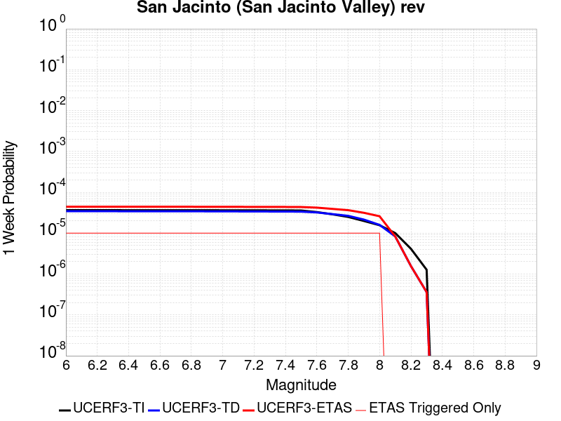 |  | 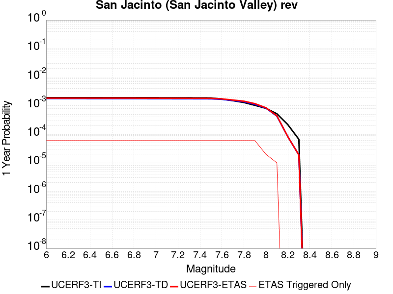 | 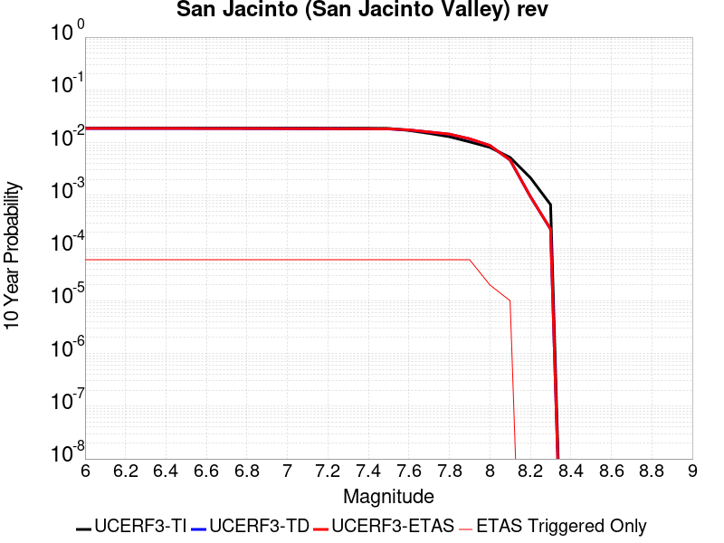 |

| Magnitude | 1 wk TI Prob | 1 wk TD Prob | 1 wk ETAS Prob | 1 wk ETAS/TD Gain | 1 wk ETAS Triggered Only | 1 mo TI Prob | 1 mo TD Prob | 1 mo ETAS Prob | 1 mo ETAS/TD Gain | 1 mo ETAS Triggered Only | 1 yr TI Prob | 1 yr TD Prob | 1 yr ETAS Prob | 1 yr ETAS/TD Gain | 1 yr ETAS Triggered Only | 10 yr TI Prob | 10 yr TD Prob | 10 yr ETAS Prob | 10 yr ETAS/TD Gain | 10 yr ETAS Triggered Only |
|-----|-----|-----|-----|-----|-----|-----|-----|-----|-----|-----|-----|-----|-----|-----|-----|-----|-----|-----|-----|-----|
| 6.0 | 3.652694E-5 | 3.4417048E-5 | 4.4416705E-5 | 1.2905437 | 1.0E-5 | 1.5653463E-4 | 1.4749331E-4 | 1.5749183E-4 | 1.0677897 | 1.0E-5 | 0.0019041431 | 0.0017942534 | 0.0018541458 | 1.0333802 | 6.0E-5 | 0.018879099 | 0.018534157 | 0.018593045 | 1.0031773 | 6.0E-5 |
| 6.1 | 3.652694E-5 | 3.4417048E-5 | 4.4416705E-5 | 1.2905437 | 1.0E-5 | 1.5653463E-4 | 1.4749331E-4 | 1.5749183E-4 | 1.0677897 | 1.0E-5 | 0.0019041431 | 0.0017942534 | 0.0018541458 | 1.0333802 | 6.0E-5 | 0.018879099 | 0.018534157 | 0.018593045 | 1.0031773 | 6.0E-5 |
| 6.2 | 3.652694E-5 | 3.4417048E-5 | 4.4416705E-5 | 1.2905437 | 1.0E-5 | 1.5653463E-4 | 1.4749331E-4 | 1.5749183E-4 | 1.0677897 | 1.0E-5 | 0.0019041431 | 0.0017942534 | 0.0018541458 | 1.0333802 | 6.0E-5 | 0.018879099 | 0.018534157 | 0.018593045 | 1.0031773 | 6.0E-5 |
| 6.3 | 3.652694E-5 | 3.4417048E-5 | 4.4416705E-5 | 1.2905437 | 1.0E-5 | 1.5653463E-4 | 1.4749331E-4 | 1.5749183E-4 | 1.0677897 | 1.0E-5 | 0.0019041431 | 0.0017942534 | 0.0018541458 | 1.0333802 | 6.0E-5 | 0.018879099 | 0.018534157 | 0.018593045 | 1.0031773 | 6.0E-5 |
| 6.4 | 3.646941E-5 | 3.433862E-5 | 4.4338278E-5 | 1.2912073 | 1.0E-5 | 1.5628811E-4 | 1.4715722E-4 | 1.5715575E-4 | 1.0679445 | 1.0E-5 | 0.0019011468 | 0.0017901688 | 0.0018500615 | 1.0334564 | 6.0E-5 | 0.018849645 | 0.018494038 | 0.018552927 | 1.0031843 | 6.0E-5 |
| 6.5 | 3.646941E-5 | 3.433862E-5 | 4.4338278E-5 | 1.2912073 | 1.0E-5 | 1.5628811E-4 | 1.4715722E-4 | 1.5715575E-4 | 1.0679445 | 1.0E-5 | 0.0019011468 | 0.0017901688 | 0.0018500615 | 1.0334564 | 6.0E-5 | 0.018849645 | 0.018494038 | 0.018552927 | 1.0031843 | 6.0E-5 |
| 6.6 | 3.6442503E-5 | 3.4302004E-5 | 4.430166E-5 | 1.2915181 | 1.0E-5 | 1.561728E-4 | 1.4700032E-4 | 1.5699884E-4 | 1.068017 | 1.0E-5 | 0.0018997455 | 0.0017882616 | 0.0018481544 | 1.0334921 | 6.0E-5 | 0.018835869 | 0.018475305 | 0.018534197 | 1.0031875 | 6.0E-5 |
| 6.7 | 3.6432113E-5 | 3.4287576E-5 | 4.4287233E-5 | 1.2916409 | 1.0E-5 | 1.5612828E-4 | 1.4693849E-4 | 1.5693702E-4 | 1.0680457 | 1.0E-5 | 0.0018992044 | 0.0017875104 | 0.0018474031 | 1.0335063 | 6.0E-5 | 0.018830549 | 0.01846793 | 0.01852682 | 1.0031888 | 6.0E-5 |
| 6.8 | 3.6409598E-5 | 3.425663E-5 | 4.425629E-5 | 1.2919043 | 1.0E-5 | 1.560318E-4 | 1.4680588E-4 | 1.5680441E-4 | 1.0681071 | 1.0E-5 | 0.0018980318 | 0.0017858985 | 0.0018457914 | 1.0335366 | 6.0E-5 | 0.018819023 | 0.018452084 | 0.018510975 | 1.0031917 | 6.0E-5 |
| 6.9 | 3.638078E-5 | 3.4217053E-5 | 4.421671E-5 | 1.2922419 | 1.0E-5 | 1.5590832E-4 | 1.4663627E-4 | 1.5663481E-4 | 1.0681859 | 1.0E-5 | 0.0018965311 | 0.001783837 | 0.00184373 | 1.0335754 | 6.0E-5 | 0.018804269 | 0.018431816 | 0.01849071 | 1.0031953 | 6.0E-5 |
| 7.0 | 3.6294874E-5 | 3.4099063E-5 | 4.409872E-5 | 1.2932532 | 1.0E-5 | 1.5554018E-4 | 1.4613067E-4 | 1.561292E-4 | 1.068422 | 1.0E-5 | 0.0018920569 | 0.0017776915 | 0.0018375849 | 1.0336916 | 6.0E-5 | 0.018760284 | 0.018371396 | 0.018430293 | 1.0032059 | 6.0E-5 |
| 7.1 | 3.6260717E-5 | 3.405534E-5 | 4.4055003E-5 | 1.2936296 | 1.0E-5 | 1.5539382E-4 | 1.4594331E-4 | 1.5594186E-4 | 1.0685097 | 1.0E-5 | 0.001890278 | 0.0017754143 | 0.0018353078 | 1.0337349 | 6.0E-5 | 0.018742796 | 0.018348996 | 0.018407894 | 1.00321 | 6.0E-5 |
| 7.2 | 3.6210204E-5 | 3.398956E-5 | 4.3989217E-5 | 1.294198 | 1.0E-5 | 1.5517735E-4 | 1.4566141E-4 | 1.5565996E-4 | 1.0686424 | 1.0E-5 | 0.001887647 | 0.0017719879 | 0.0018318816 | 1.0338002 | 6.0E-5 | 0.01871693 | 0.018315274 | 0.018374175 | 1.0032159 | 6.0E-5 |
| 7.3 | 3.6119454E-5 | 3.3877837E-5 | 4.38775E-5 | 1.2951683 | 1.0E-5 | 1.5478847E-4 | 1.4518267E-4 | 1.5518122E-4 | 1.0688688 | 1.0E-5 | 0.0018829206 | 0.0017661685 | 0.0018260626 | 1.0339118 | 6.0E-5 | 0.018670462 | 0.018257825 | 0.018316729 | 1.0032263 | 6.0E-5 |
| 7.4 | 3.607848E-5 | 3.3825334E-5 | 4.3824995E-5 | 1.2956264 | 1.0E-5 | 1.5461289E-4 | 1.4495767E-4 | 1.5495623E-4 | 1.0689757 | 1.0E-5 | 0.0018807866 | 0.0017634337 | 0.0018233279 | 1.0339645 | 6.0E-5 | 0.018649481 | 0.018230818 | 0.018289724 | 1.0032312 | 6.0E-5 |
| 7.5 | 3.5856774E-5 | 3.3635082E-5 | 4.3634747E-5 | 1.2972987 | 1.0E-5 | 1.5366284E-4 | 1.4414241E-4 | 1.5414097E-4 | 1.0693659 | 1.0E-5 | 0.0018692396 | 0.0017535238 | 0.0018134186 | 1.0341568 | 6.0E-5 | 0.018535944 | 0.018131904 | 0.018190818 | 1.003249 | 6.0E-5 |
| 7.6 | 3.286655E-5 | 3.215777E-5 | 4.215745E-5 | 1.3109568 | 1.0E-5 | 1.4084904E-4 | 1.3781176E-4 | 1.4781038E-4 | 1.0725528 | 1.0E-5 | 0.001713488 | 0.0016765689 | 0.0017364683 | 1.0357274 | 6.0E-5 | 0.017003361 | 0.017351432 | 0.01741039 | 1.003398 | 6.0E-5 |
| 7.7 | 2.8882527E-5 | 2.9250317E-5 | 3.9250026E-5 | 1.3418666 | 1.0E-5 | 1.237764E-4 | 1.2535248E-4 | 1.3535123E-4 | 1.0797651 | 1.0E-5 | 0.0015059357 | 0.0015250992 | 0.0015850076 | 1.0392817 | 6.0E-5 | 0.014957713 | 0.015837716 | 0.015896766 | 1.0037284 | 6.0E-5 |
| 7.8 | 2.4950225E-5 | 2.6540692E-5 | 3.6540427E-5 | 1.3767699 | 1.0E-5 | 1.0692515E-4 | 1.1374087E-4 | 1.2373972E-4 | 1.0879091 | 1.0E-5 | 0.0013010362 | 0.0013839162 | 0.0014438332 | 1.0432953 | 6.0E-5 | 0.012934455 | 0.0144187445 | 0.014477879 | 1.0041013 | 6.0E-5 |
| 7.9 | 1.9881603E-5 | 2.1519538E-5 | 3.151932E-5 | 1.464684 | 1.0E-5 | 8.520408E-5 | 9.222333E-5 | 1.0222241E-4 | 1.1084224 | 1.0E-5 | 0.001036866 | 0.0011222415 | 0.0011821742 | 1.0534045 | 6.0E-5 | 0.010320415 | 0.011783319 | 0.011842611 | 1.005032 | 6.0E-5 |
| 8.0 | 1.563292E-5 | 1.5947082E-5 | 2.5946923E-5 | 1.627064 | 1.0E-5 | 6.6996516E-5 | 6.834285E-5 | 7.834217E-5 | 1.146311 | 1.0E-5 | 8.153773E-4 | 8.3175726E-4 | 8.5174065E-4 | 1.0240254 | 2.0E-5 | 0.00812392 | 0.008815629 | 0.008835453 | 1.0022486 | 2.0E-5 |
| 8.1 | 1.0045313E-5 | 8.307514E-6 | 8.307514E-6 | 1.0 | 0.0 | 4.305063E-5 | 3.5603145E-5 | 3.5603145E-5 | 1.0 | 0.0 | 5.2401534E-4 | 4.333826E-4 | 4.4337826E-4 | 1.0230643 | 1.0E-5 | 0.0052278144 | 0.0046621817 | 0.004672135 | 1.0021349 | 1.0E-5 |
| 8.2 | 4.1554413E-6 | 1.5672123E-6 | 1.5672123E-6 | 1.0 | 0.0 | 1.7808914E-5 | 6.716607E-6 | 6.716607E-6 | 1.0 | 0.0 | 2.1680194E-4 | 8.177165E-5 | 8.177165E-5 | 1.0 | 0.0 | 0.0021659054 | 9.492334E-4 | 9.492334E-4 | 1.0 | 0.0 |
| 8.3 | 1.2758221E-6 | 3.6194777E-7 | 3.6194777E-7 | 1.0 | 0.0 | 5.4677976E-6 | 1.5512038E-6 | 1.5512038E-6 | 1.0 | 0.0 | 6.65684E-5 | 1.8885747E-5 | 1.8885747E-5 | 1.0 | 0.0 | 6.6548464E-4 | 2.2777634E-4 | 2.2777634E-4 | 1.0 | 0.0 |

## San Jacinto (Lytle Creek connector)
*[(top)](#table-of-contents)*

| 1 Week | 1 Month | 1 Year | 10 Year |
|-----|-----|-----|-----|
| 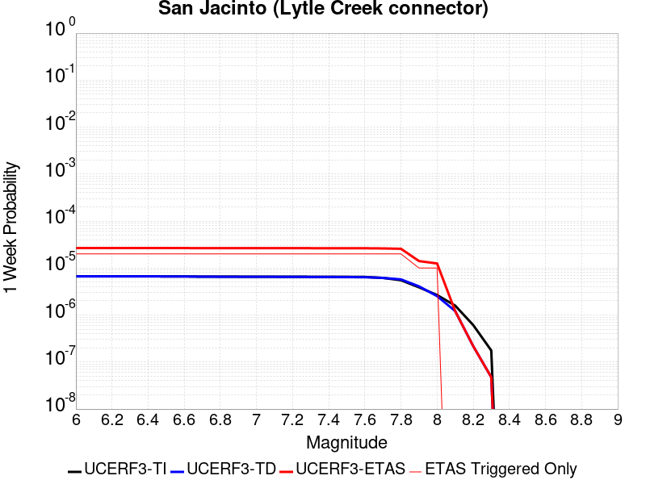 | 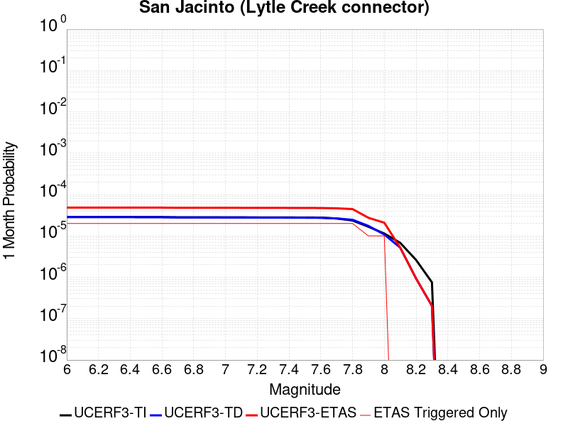 | 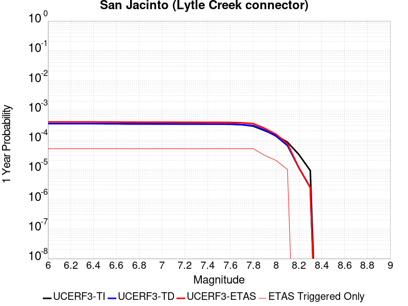 | 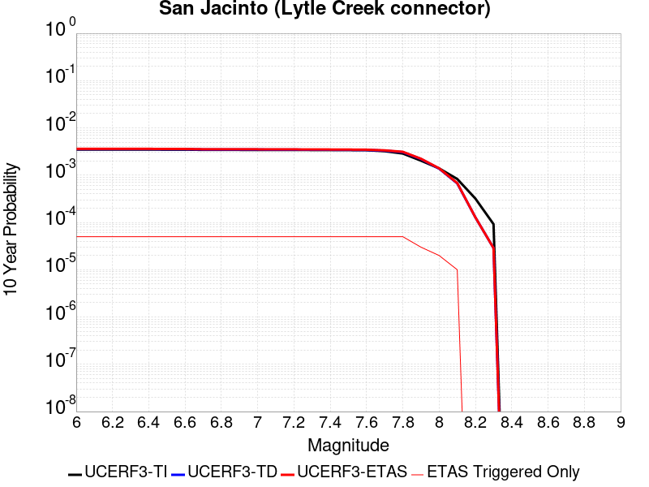 |

| Magnitude | 1 wk TI Prob | 1 wk TD Prob | 1 wk ETAS Prob | 1 wk ETAS/TD Gain | 1 wk ETAS Triggered Only | 1 mo TI Prob | 1 mo TD Prob | 1 mo ETAS Prob | 1 mo ETAS/TD Gain | 1 mo ETAS Triggered Only | 1 yr TI Prob | 1 yr TD Prob | 1 yr ETAS Prob | 1 yr ETAS/TD Gain | 1 yr ETAS Triggered Only | 10 yr TI Prob | 10 yr TD Prob | 10 yr ETAS Prob | 10 yr ETAS/TD Gain | 10 yr ETAS Triggered Only |
|-----|-----|-----|-----|-----|-----|-----|-----|-----|-----|-----|-----|-----|-----|-----|-----|-----|-----|-----|-----|-----|
| 6.0 | 6.693995E-6 | 6.662972E-6 | 2.666284E-5 | 4.0016437 | 2.0E-5 | 2.8688235E-5 | 2.8555281E-5 | 4.855471E-5 | 1.7003758 | 2.0E-5 | 3.492233E-4 | 3.4760518E-4 | 3.9758778E-4 | 1.1437913 | 5.0E-5 | 0.00348675 | 0.0035508168 | 0.0036006393 | 1.0140313 | 5.0E-5 |
| 6.1 | 6.693995E-6 | 6.662972E-6 | 2.666284E-5 | 4.0016437 | 2.0E-5 | 2.8688235E-5 | 2.8555281E-5 | 4.855471E-5 | 1.7003758 | 2.0E-5 | 3.492233E-4 | 3.4760518E-4 | 3.9758778E-4 | 1.1437913 | 5.0E-5 | 0.00348675 | 0.0035508168 | 0.0036006393 | 1.0140313 | 5.0E-5 |
| 6.2 | 6.693995E-6 | 6.662972E-6 | 2.666284E-5 | 4.0016437 | 2.0E-5 | 2.8688235E-5 | 2.8555281E-5 | 4.855471E-5 | 1.7003758 | 2.0E-5 | 3.492233E-4 | 3.4760518E-4 | 3.9758778E-4 | 1.1437913 | 5.0E-5 | 0.00348675 | 0.0035508168 | 0.0036006393 | 1.0140313 | 5.0E-5 |
| 6.3 | 6.693995E-6 | 6.662972E-6 | 2.666284E-5 | 4.0016437 | 2.0E-5 | 2.8688235E-5 | 2.8555281E-5 | 4.855471E-5 | 1.7003758 | 2.0E-5 | 3.492233E-4 | 3.4760518E-4 | 3.9758778E-4 | 1.1437913 | 5.0E-5 | 0.00348675 | 0.0035508168 | 0.0036006393 | 1.0140313 | 5.0E-5 |
| 6.4 | 6.693995E-6 | 6.662972E-6 | 2.666284E-5 | 4.0016437 | 2.0E-5 | 2.8688235E-5 | 2.8555281E-5 | 4.855471E-5 | 1.7003758 | 2.0E-5 | 3.492233E-4 | 3.4760518E-4 | 3.9758778E-4 | 1.1437913 | 5.0E-5 | 0.00348675 | 0.0035508168 | 0.0036006393 | 1.0140313 | 5.0E-5 |
| 6.5 | 6.6561875E-6 | 6.6231896E-6 | 2.6623056E-5 | 4.019673 | 2.0E-5 | 2.8526205E-5 | 2.838479E-5 | 4.8384223E-5 | 1.7045827 | 2.0E-5 | 3.472512E-4 | 3.455301E-4 | 3.9551282E-4 | 1.1446552 | 5.0E-5 | 0.0034670907 | 0.0035301324 | 0.0035799558 | 1.0141138 | 5.0E-5 |
| 6.6 | 6.6561875E-6 | 6.6231896E-6 | 2.6623056E-5 | 4.019673 | 2.0E-5 | 2.8526205E-5 | 2.838479E-5 | 4.8384223E-5 | 1.7045827 | 2.0E-5 | 3.472512E-4 | 3.455301E-4 | 3.9551282E-4 | 1.1446552 | 5.0E-5 | 0.0034670907 | 0.0035301324 | 0.0035799558 | 1.0141138 | 5.0E-5 |
| 6.7 | 6.5802237E-6 | 6.5423656E-6 | 2.6542235E-5 | 4.056978 | 2.0E-5 | 2.8200653E-5 | 2.803841E-5 | 4.8037848E-5 | 1.7132872 | 2.0E-5 | 3.4328885E-4 | 3.4131424E-4 | 3.9129716E-4 | 1.1464425 | 5.0E-5 | 0.0034275902 | 0.0034881064 | 0.003537932 | 1.0142844 | 5.0E-5 |
| 6.8 | 6.575632E-6 | 6.5368554E-6 | 2.6536725E-5 | 4.059555 | 2.0E-5 | 2.8180975E-5 | 2.8014794E-5 | 4.8014233E-5 | 1.7138885 | 2.0E-5 | 3.4304935E-4 | 3.410268E-4 | 3.9100976E-4 | 1.146566 | 5.0E-5 | 0.0034252026 | 0.0034852412 | 0.0035350667 | 1.0142962 | 5.0E-5 |
| 6.9 | 6.570433E-6 | 6.528249E-6 | 2.6528118E-5 | 4.0635886 | 2.0E-5 | 2.8158694E-5 | 2.797791E-5 | 4.797735E-5 | 1.7148297 | 2.0E-5 | 3.4277816E-4 | 3.4057788E-4 | 3.9056086E-4 | 1.1467593 | 5.0E-5 | 0.0034224992 | 0.003480766 | 0.003530592 | 1.0143147 | 5.0E-5 |
| 7.0 | 6.5643826E-6 | 6.5183694E-6 | 2.6518239E-5 | 4.068232 | 2.0E-5 | 2.8132765E-5 | 2.7935572E-5 | 4.7935013E-5 | 1.715913 | 2.0E-5 | 3.424626E-4 | 3.4006257E-4 | 3.9004558E-4 | 1.1469817 | 5.0E-5 | 0.0034193532 | 0.003475629 | 0.0035254552 | 1.0143359 | 5.0E-5 |
| 7.1 | 6.557402E-6 | 6.5070813E-6 | 2.650695E-5 | 4.073555 | 2.0E-5 | 2.8102848E-5 | 2.7887192E-5 | 4.7886635E-5 | 1.7171551 | 2.0E-5 | 3.4209844E-4 | 3.3947374E-4 | 3.8945678E-4 | 1.1472368 | 5.0E-5 | 0.0034157229 | 0.0034697603 | 0.0035195868 | 1.0143602 | 5.0E-5 |
| 7.2 | 6.546394E-6 | 6.489047E-6 | 2.6488917E-5 | 4.0820966 | 2.0E-5 | 2.8055672E-5 | 2.7809905E-5 | 4.780935E-5 | 1.7191483 | 2.0E-5 | 3.4152428E-4 | 3.3853305E-4 | 3.8851614E-4 | 1.1476461 | 5.0E-5 | 0.0034099987 | 0.003460387 | 0.003510214 | 1.0143993 | 5.0E-5 |
| 7.3 | 6.5364216E-6 | 6.469831E-6 | 2.6469701E-5 | 4.091251 | 2.0E-5 | 2.8012933E-5 | 2.7727552E-5 | 4.7726997E-5 | 1.7212842 | 2.0E-5 | 3.4100408E-4 | 3.3753074E-4 | 3.8751386E-4 | 1.1480846 | 5.0E-5 | 0.003404813 | 0.0034504079 | 0.0035002353 | 1.014441 | 5.0E-5 |
| 7.4 | 6.5269523E-6 | 6.4509163E-6 | 2.6450787E-5 | 4.1003146 | 2.0E-5 | 2.7972354E-5 | 2.764649E-5 | 4.764594E-5 | 1.7233992 | 2.0E-5 | 3.4051016E-4 | 3.3654412E-4 | 3.8652727E-4 | 1.1485189 | 5.0E-5 | 0.0033998888 | 0.003440589 | 0.003490417 | 1.0144824 | 5.0E-5 |
| 7.5 | 6.5111835E-6 | 6.4271885E-6 | 2.642706E-5 | 4.1117606 | 2.0E-5 | 2.7904773E-5 | 2.7544802E-5 | 4.754425E-5 | 1.7260698 | 2.0E-5 | 3.3968766E-4 | 3.3530645E-4 | 3.8528966E-4 | 1.1490673 | 5.0E-5 | 0.0033916887 | 0.003428261 | 0.0034780896 | 1.0145347 | 5.0E-5 |
| 7.6 | 6.4768806E-6 | 6.3862944E-6 | 2.6386168E-5 | 4.1316867 | 2.0E-5 | 2.7757764E-5 | 2.7369546E-5 | 4.7368998E-5 | 1.7307192 | 2.0E-5 | 3.3789838E-4 | 3.3317335E-4 | 3.831567E-4 | 1.150022 | 5.0E-5 | 0.0033738504 | 0.0034069915 | 0.0034568212 | 1.0146257 | 5.0E-5 |
| 7.7 | 6.1655364E-6 | 6.1787587E-6 | 2.6178635E-5 | 4.236876 | 2.0E-5 | 2.642346E-5 | 2.6480126E-5 | 4.6479596E-5 | 1.7552634 | 2.0E-5 | 3.2165812E-4 | 3.2234789E-4 | 3.7233176E-4 | 1.155062 | 5.0E-5 | 0.0032119295 | 0.003298596 | 0.003348431 | 1.015108 | 5.0E-5 |
| 7.8 | 5.5043524E-6 | 5.7397438E-6 | 2.573963E-5 | 4.484456 | 2.0E-5 | 2.3589868E-5 | 2.459867E-5 | 4.459818E-5 | 1.813032 | 2.0E-5 | 2.871688E-4 | 2.994477E-4 | 3.4943275E-4 | 1.166924 | 5.0E-5 | 0.0028679797 | 0.0030686588 | 0.0031185055 | 1.0162438 | 5.0E-5 |
| 7.9 | 3.889249E-6 | 4.0789296E-6 | 1.4078889E-5 | 3.4516137 | 1.0E-5 | 1.6668104E-5 | 1.748101E-5 | 2.7480835E-5 | 1.5720394 | 1.0E-5 | 2.0291525E-4 | 2.1281054E-4 | 2.4280416E-4 | 1.1409404 | 3.0E-5 | 0.0020273007 | 0.0021954647 | 0.0022253988 | 1.0136346 | 3.0E-5 |
| 8.0 | 2.668535E-6 | 2.5329996E-6 | 1.2532974E-5 | 4.9478784 | 1.0E-5 | 1.1436528E-5 | 1.0855668E-5 | 2.085556E-5 | 1.9211677 | 1.0E-5 | 1.3923083E-4 | 1.3215977E-4 | 1.5215712E-4 | 1.151312 | 2.0E-5 | 0.0013914363 | 0.0013765821 | 0.0013965546 | 1.0145087 | 2.0E-5 |
| 8.1 | 1.5911459E-6 | 1.2194711E-6 | 1.2194711E-6 | 1.0 | 0.0 | 6.8191785E-6 | 5.226294E-6 | 5.226294E-6 | 1.0 | 0.0 | 8.3020335E-5 | 6.362829E-5 | 7.3627656E-5 | 1.1571528 | 1.0E-5 | 8.298933E-4 | 6.6975754E-4 | 6.7975087E-4 | 1.0149208 | 1.0E-5 |
| 8.2 | 6.1294963E-7 | 2.1835329E-7 | 2.1835329E-7 | 1.0 | 0.0 | 2.6269242E-6 | 9.357995E-7 | 9.357995E-7 | 1.0 | 0.0 | 3.1982334E-5 | 1.1393299E-5 | 1.1393299E-5 | 1.0 | 0.0 | 3.1977732E-4 | 1.2797497E-4 | 1.2797497E-4 | 1.0 | 0.0 |
| 8.3 | 1.762871E-7 | 4.7604622E-8 | 4.7604622E-8 | 1.0 | 0.0 | 7.5551594E-7 | 2.0401978E-7 | 2.0401978E-7 | 1.0 | 0.0 | 9.1983675E-6 | 2.4839383E-6 | 2.4839383E-6 | 1.0 | 0.0 | 9.197987E-5 | 2.8720697E-5 | 2.8720697E-5 | 1.0 | 0.0 |

## White Wolf (Extension)
*[(top)](#table-of-contents)*

| 1 Week | 1 Month | 1 Year | 10 Year |
|-----|-----|-----|-----|
| 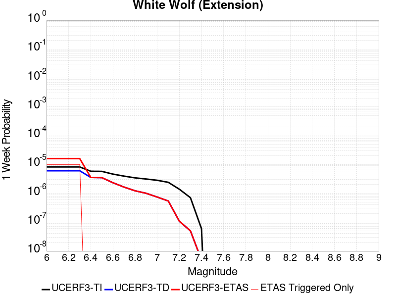 | 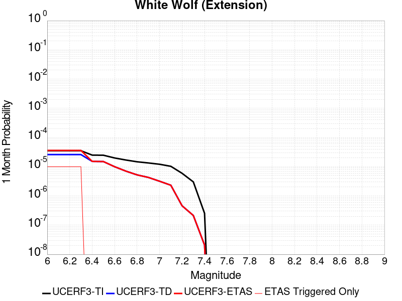 | 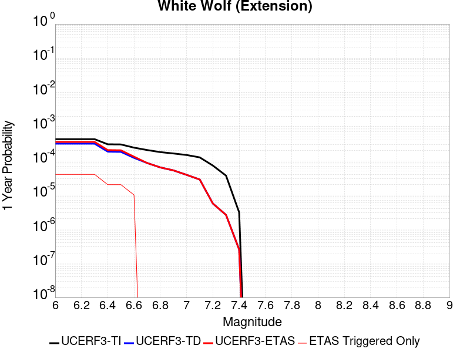 | 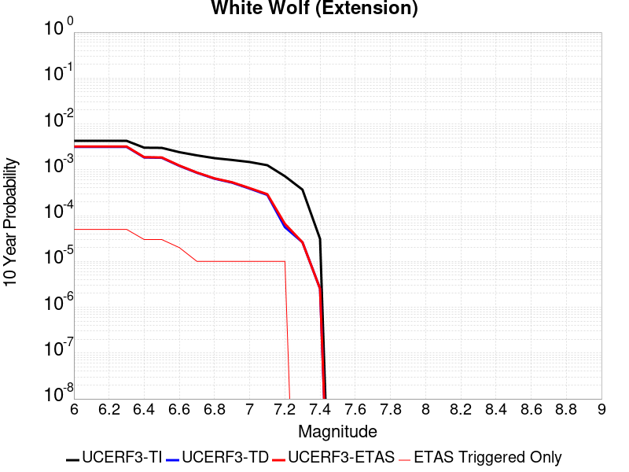 |

| Magnitude | 1 wk TI Prob | 1 wk TD Prob | 1 wk ETAS Prob | 1 wk ETAS/TD Gain | 1 wk ETAS Triggered Only | 1 mo TI Prob | 1 mo TD Prob | 1 mo ETAS Prob | 1 mo ETAS/TD Gain | 1 mo ETAS Triggered Only | 1 yr TI Prob | 1 yr TD Prob | 1 yr ETAS Prob | 1 yr ETAS/TD Gain | 1 yr ETAS Triggered Only | 10 yr TI Prob | 10 yr TD Prob | 10 yr ETAS Prob | 10 yr ETAS/TD Gain | 10 yr ETAS Triggered Only |
|-----|-----|-----|-----|-----|-----|-----|-----|-----|-----|-----|-----|-----|-----|-----|-----|-----|-----|-----|-----|-----|
| 6.0 | 8.222555E-6 | 6.0667057E-6 | 1.6066646E-5 | 2.648331 | 1.0E-5 | 3.5239045E-5 | 2.5999947E-5 | 3.5999685E-5 | 1.3846061 | 1.0E-5 | 4.289509E-4 | 3.1650998E-4 | 3.5649733E-4 | 1.1263384 | 4.0E-5 | 0.0042812387 | 0.0031612439 | 0.003211086 | 1.0157665 | 5.0E-5 |
| 6.1 | 8.222555E-6 | 6.0667057E-6 | 1.6066646E-5 | 2.648331 | 1.0E-5 | 3.5239045E-5 | 2.5999947E-5 | 3.5999685E-5 | 1.3846061 | 1.0E-5 | 4.289509E-4 | 3.1650998E-4 | 3.5649733E-4 | 1.1263384 | 4.0E-5 | 0.0042812387 | 0.0031612439 | 0.003211086 | 1.0157665 | 5.0E-5 |
| 6.2 | 8.222555E-6 | 6.0667057E-6 | 1.6066646E-5 | 2.648331 | 1.0E-5 | 3.5239045E-5 | 2.5999947E-5 | 3.5999685E-5 | 1.3846061 | 1.0E-5 | 4.289509E-4 | 3.1650998E-4 | 3.5649733E-4 | 1.1263384 | 4.0E-5 | 0.0042812387 | 0.0031612439 | 0.003211086 | 1.0157665 | 5.0E-5 |
| 6.3 | 8.222555E-6 | 6.0667057E-6 | 1.6066646E-5 | 2.648331 | 1.0E-5 | 3.5239045E-5 | 2.5999947E-5 | 3.5999685E-5 | 1.3846061 | 1.0E-5 | 4.289509E-4 | 3.1650998E-4 | 3.5649733E-4 | 1.1263384 | 4.0E-5 | 0.0042812387 | 0.0031612439 | 0.003211086 | 1.0157665 | 5.0E-5 |
| 6.4 | 5.821773E-6 | 3.5572016E-6 | 3.5572016E-6 | 1.0 | 0.0 | 2.4950215E-5 | 1.5245067E-5 | 1.5245067E-5 | 1.0 | 0.0 | 3.0372653E-4 | 1.8559398E-4 | 2.0559027E-4 | 1.1077421 | 2.0E-5 | 0.0030331176 | 0.0018544982 | 0.0018844425 | 1.0161469 | 3.0E-5 |
| 6.5 | 5.766023E-6 | 3.4991353E-6 | 3.4991353E-6 | 1.0 | 0.0 | 2.4711293E-5 | 1.4996214E-5 | 1.4996214E-5 | 1.0 | 0.0 | 3.0081844E-4 | 1.8256472E-4 | 2.0256106E-4 | 1.1095302 | 2.0E-5 | 0.0030041158 | 0.0018242556 | 0.0018542007 | 1.0164151 | 3.0E-5 |
| 6.6 | 4.643576E-6 | 2.332643E-6 | 2.332643E-6 | 1.0 | 0.0 | 1.9900888E-5 | 9.997005E-6 | 9.997005E-6 | 1.0 | 0.0 | 2.4226638E-4 | 1.2170716E-4 | 1.3170595E-4 | 1.0821544 | 1.0E-5 | 0.0024200242 | 0.0012164476 | 0.0012364232 | 1.0164213 | 2.0E-5 |
| 6.7 | 3.9529173E-6 | 1.6483629E-6 | 1.6483629E-6 | 1.0 | 0.0 | 1.6940963E-5 | 7.064394E-6 | 7.064394E-6 | 1.0 | 0.0 | 2.0623671E-4 | 8.600579E-5 | 8.600579E-5 | 1.0 | 0.0 | 0.002060454 | 8.5974357E-4 | 8.6973497E-4 | 1.0116214 | 1.0E-5 |
| 6.8 | 3.4377522E-6 | 1.2245362E-6 | 1.2245362E-6 | 1.0 | 0.0 | 1.473314E-5 | 5.2480023E-6 | 5.2480023E-6 | 1.0 | 0.0 | 1.7936122E-4 | 6.389264E-5 | 6.389264E-5 | 1.0 | 0.0 | 0.0017921652 | 6.3875184E-4 | 6.4874545E-4 | 1.0156455 | 1.0E-5 |
| 6.9 | 3.1367306E-6 | 1.0033893E-6 | 1.0033893E-6 | 1.0 | 0.0 | 1.3443062E-5 | 4.3002333E-6 | 4.3002333E-6 | 1.0 | 0.0 | 1.63657E-4 | 5.235416E-5 | 5.235416E-5 | 1.0 | 0.0 | 0.0016353652 | 5.234259E-4 | 5.3342065E-4 | 1.019095 | 1.0E-5 |
| 7.0 | 2.8298145E-6 | 7.4287595E-7 | 7.4287595E-7 | 1.0 | 0.0 | 1.2127721E-5 | 3.1837506E-6 | 3.1837506E-6 | 1.0 | 0.0 | 1.47645E-4 | 3.8761526E-5 | 3.8761526E-5 | 1.0 | 0.0 | 0.0014754693 | 3.8755263E-4 | 3.9754875E-4 | 1.025793 | 1.0E-5 |
| 7.1 | 2.4091064E-6 | 5.4228286E-7 | 5.4228286E-7 | 1.0 | 0.0 | 1.03247E-5 | 2.3240675E-6 | 2.3240675E-6 | 1.0 | 0.0 | 1.2569598E-4 | 2.8295197E-5 | 2.8295197E-5 | 1.0 | 0.0 | 0.001256249 | 2.8291997E-4 | 2.9291716E-4 | 1.0353357 | 1.0E-5 |
| 7.2 | 1.3875518E-6 | 1.07434374E-7 | 1.07434374E-7 | 1.0 | 0.0 | 5.9466374E-6 | 4.6043297E-7 | 4.6043297E-7 | 1.0 | 0.0 | 7.23979E-5 | 5.6057584E-6 | 5.6057584E-6 | 1.0 | 0.0 | 7.2374323E-4 | 5.605628E-5 | 6.605572E-5 | 1.1783822 | 1.0E-5 |
| 7.3 | 7.056077E-7 | 5.0022493E-8 | 5.0022493E-8 | 1.0 | 0.0 | 3.0240296E-6 | 2.143821E-7 | 2.143821E-7 | 1.0 | 0.0 | 3.681694E-5 | 2.6100993E-6 | 2.6100993E-6 | 1.0 | 0.0 | 3.681084E-4 | 2.6100734E-5 | 2.6100734E-5 | 1.0 | 0.0 |
| 7.4 | 5.9334678E-8 | 4.8685624E-9 | 4.8685624E-9 | 1.0 | 0.0 | 2.5429145E-7 | 2.0865269E-8 | 2.0865269E-8 | 1.0 | 0.0 | 3.095994E-6 | 2.5403463E-7 | 2.5403463E-7 | 1.0 | 0.0 | 3.095951E-5 | 2.5403444E-6 | 2.5403444E-6 | 1.0 | 0.0 |

## Cady
*[(top)](#table-of-contents)*

| 1 Week | 1 Month | 1 Year | 10 Year |
|-----|-----|-----|-----|
|  |  |  |  |

| Magnitude | 1 wk TI Prob | 1 wk TD Prob | 1 wk ETAS Prob | 1 wk ETAS/TD Gain | 1 wk ETAS Triggered Only | 1 mo TI Prob | 1 mo TD Prob | 1 mo ETAS Prob | 1 mo ETAS/TD Gain | 1 mo ETAS Triggered Only | 1 yr TI Prob | 1 yr TD Prob | 1 yr ETAS Prob | 1 yr ETAS/TD Gain | 1 yr ETAS Triggered Only | 10 yr TI Prob | 10 yr TD Prob | 10 yr ETAS Prob | 10 yr ETAS/TD Gain | 10 yr ETAS Triggered Only |
|-----|-----|-----|-----|-----|-----|-----|-----|-----|-----|-----|-----|-----|-----|-----|-----|-----|-----|-----|-----|-----|
| 6.0 | 1.9892565E-5 | 2.1859016E-5 | 2.1859016E-5 | 1.0 | 0.0 | 8.525106E-5 | 9.3678645E-5 | 9.3678645E-5 | 1.0 | 0.0 | 0.0010374374 | 0.0011400316 | 0.0011899746 | 1.0438085 | 5.0E-5 | 0.010326075 | 0.011350849 | 0.011400281 | 1.004355 | 5.0E-5 |
| 6.1 | 1.9892565E-5 | 2.1859016E-5 | 2.1859016E-5 | 1.0 | 0.0 | 8.525106E-5 | 9.3678645E-5 | 9.3678645E-5 | 1.0 | 0.0 | 0.0010374374 | 0.0011400316 | 0.0011899746 | 1.0438085 | 5.0E-5 | 0.010326075 | 0.011350849 | 0.011400281 | 1.004355 | 5.0E-5 |
| 6.2 | 1.9892565E-5 | 2.1859016E-5 | 2.1859016E-5 | 1.0 | 0.0 | 8.525106E-5 | 9.3678645E-5 | 9.3678645E-5 | 1.0 | 0.0 | 0.0010374374 | 0.0011400316 | 0.0011899746 | 1.0438085 | 5.0E-5 | 0.010326075 | 0.011350849 | 0.011400281 | 1.004355 | 5.0E-5 |
| 6.3 | 1.1117327E-5 | 1.2176738E-5 | 1.2176738E-5 | 1.0 | 0.0 | 4.764482E-5 | 5.218515E-5 | 5.218515E-5 | 1.0 | 0.0 | 5.7992124E-4 | 6.3520053E-4 | 6.851688E-4 | 1.0786653 | 5.0E-5 | 0.0057841022 | 0.0063369554 | 0.0063866386 | 1.0078403 | 5.0E-5 |
| 6.4 | 1.1117327E-5 | 1.2176738E-5 | 1.2176738E-5 | 1.0 | 0.0 | 4.764482E-5 | 5.218515E-5 | 5.218515E-5 | 1.0 | 0.0 | 5.7992124E-4 | 6.3520053E-4 | 6.851688E-4 | 1.0786653 | 5.0E-5 | 0.0057841022 | 0.0063369554 | 0.0063866386 | 1.0078403 | 5.0E-5 |
| 6.5 | 6.103093E-6 | 6.672103E-6 | 6.672103E-6 | 1.0 | 0.0 | 2.615585E-5 | 2.8594486E-5 | 2.8594486E-5 | 1.0 | 0.0 | 3.1840094E-4 | 3.4809482E-4 | 3.6808784E-4 | 1.0574356 | 2.0E-5 | 0.0031794512 | 0.0034767296 | 0.0034966602 | 1.0057325 | 2.0E-5 |
| 6.6 | 5.817237E-6 | 6.365738E-6 | 6.365738E-6 | 1.0 | 0.0 | 2.4930776E-5 | 2.728152E-5 | 2.728152E-5 | 1.0 | 0.0 | 3.034899E-4 | 3.3211432E-4 | 3.521077E-4 | 1.0602002 | 2.0E-5 | 0.0030307577 | 0.003317402 | 0.0033373358 | 1.0060089 | 2.0E-5 |
| 6.7 | 4.8846314E-6 | 5.3406343E-6 | 5.3406343E-6 | 1.0 | 0.0 | 2.0933967E-5 | 2.2888298E-5 | 2.2888298E-5 | 1.0 | 0.0 | 2.5484123E-4 | 2.7864118E-4 | 2.986356E-4 | 1.071757 | 2.0E-5 | 0.0025454918 | 0.0027840736 | 0.0028040179 | 1.0071638 | 2.0E-5 |
| 6.8 | 1.7788773E-6 | 1.9399313E-6 | 1.9399313E-6 | 1.0 | 0.0 | 7.6237375E-6 | 8.313974E-6 | 8.313974E-6 | 1.0 | 0.0 | 9.281505E-5 | 1.01219506E-4 | 1.1121849E-4 | 1.0987852 | 1.0E-5 | 9.2776294E-4 | 0.0010118886 | 0.0010218786 | 1.0098726 | 1.0E-5 |
| 6.9 | 7.5455404E-7 | 8.297202E-7 | 8.297202E-7 | 1.0 | 0.0 | 3.233799E-6 | 3.5559406E-6 | 3.5559406E-6 | 1.0 | 0.0 | 3.937079E-5 | 4.3293054E-5 | 4.3293054E-5 | 1.0 | 0.0 | 3.9363815E-4 | 4.3287914E-4 | 4.3287914E-4 | 1.0 | 0.0 |
| 7.0 | 6.8578805E-7 | 7.541916E-7 | 7.541916E-7 | 1.0 | 0.0 | 2.9390883E-6 | 3.2322475E-6 | 3.2322475E-6 | 1.0 | 0.0 | 3.578281E-5 | 3.9352235E-5 | 3.9352235E-5 | 1.0 | 0.0 | 3.577705E-4 | 3.9348513E-4 | 3.9348513E-4 | 1.0 | 0.0 |

## San Andreas (North Branch Mill Creek)
*[(top)](#table-of-contents)*

| 1 Week | 1 Month | 1 Year | 10 Year |
|-----|-----|-----|-----|
| 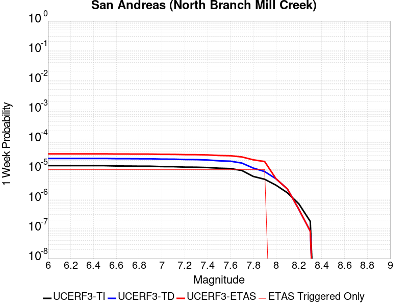 | 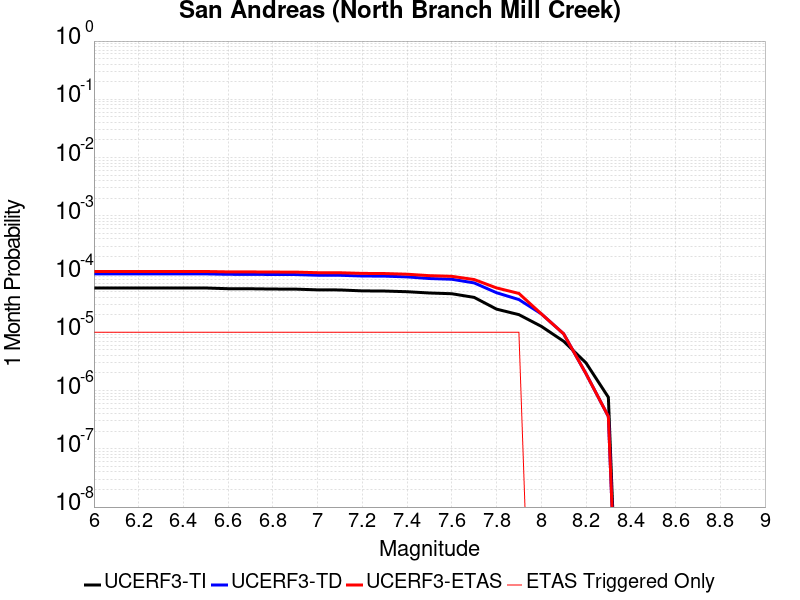 | 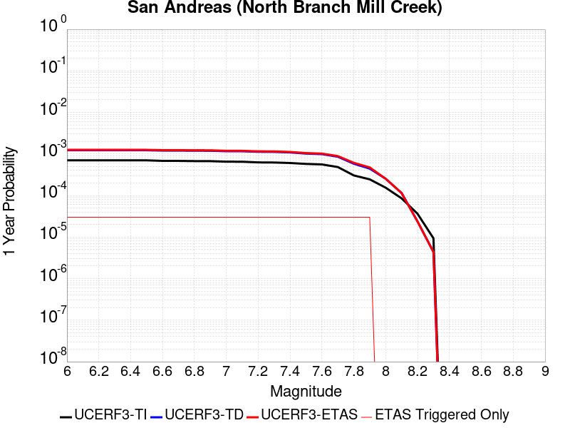 | 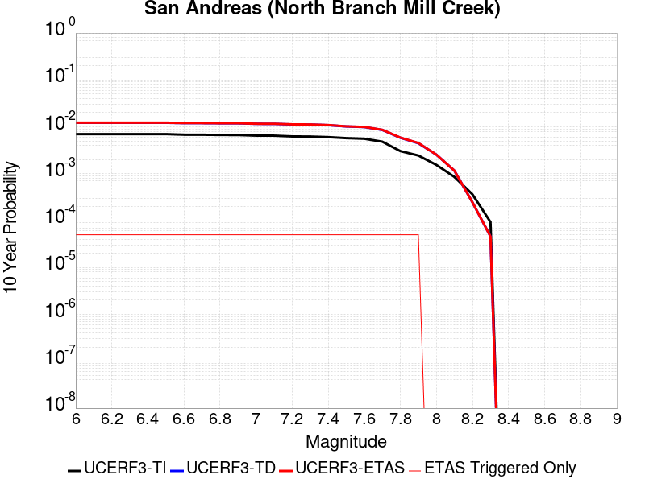 |

| Magnitude | 1 wk TI Prob | 1 wk TD Prob | 1 wk ETAS Prob | 1 wk ETAS/TD Gain | 1 wk ETAS Triggered Only | 1 mo TI Prob | 1 mo TD Prob | 1 mo ETAS Prob | 1 mo ETAS/TD Gain | 1 mo ETAS Triggered Only | 1 yr TI Prob | 1 yr TD Prob | 1 yr ETAS Prob | 1 yr ETAS/TD Gain | 1 yr ETAS Triggered Only | 10 yr TI Prob | 10 yr TD Prob | 10 yr ETAS Prob | 10 yr ETAS/TD Gain | 10 yr ETAS Triggered Only |
|-----|-----|-----|-----|-----|-----|-----|-----|-----|-----|-----|-----|-----|-----|-----|-----|-----|-----|-----|-----|-----|
| 6.0 | 1.3461156E-5 | 2.3506776E-5 | 3.350654E-5 | 1.4253993 | 1.0E-5 | 5.7689394E-5 | 1.0073945E-4 | 1.10738445E-4 | 1.0992559 | 1.0E-5 | 7.02142E-4 | 0.0012258161 | 0.0012557793 | 1.0244435 | 3.0E-5 | 0.0069992766 | 0.012233093 | 0.012282481 | 1.0040373 | 5.0E-5 |
| 6.1 | 1.3461156E-5 | 2.3506776E-5 | 3.350654E-5 | 1.4253993 | 1.0E-5 | 5.7689394E-5 | 1.0073945E-4 | 1.10738445E-4 | 1.0992559 | 1.0E-5 | 7.02142E-4 | 0.0012258161 | 0.0012557793 | 1.0244435 | 3.0E-5 | 0.0069992766 | 0.012233093 | 0.012282481 | 1.0040373 | 5.0E-5 |
| 6.2 | 1.3461156E-5 | 2.3506776E-5 | 3.350654E-5 | 1.4253993 | 1.0E-5 | 5.7689394E-5 | 1.0073945E-4 | 1.10738445E-4 | 1.0992559 | 1.0E-5 | 7.02142E-4 | 0.0012258161 | 0.0012557793 | 1.0244435 | 3.0E-5 | 0.0069992766 | 0.012233093 | 0.012282481 | 1.0040373 | 5.0E-5 |
| 6.3 | 1.3461156E-5 | 2.3506776E-5 | 3.350654E-5 | 1.4253993 | 1.0E-5 | 5.7689394E-5 | 1.0073945E-4 | 1.10738445E-4 | 1.0992559 | 1.0E-5 | 7.02142E-4 | 0.0012258161 | 0.0012557793 | 1.0244435 | 3.0E-5 | 0.0069992766 | 0.012233093 | 0.012282481 | 1.0040373 | 5.0E-5 |
| 6.4 | 1.3461156E-5 | 2.3506776E-5 | 3.350654E-5 | 1.4253993 | 1.0E-5 | 5.7689394E-5 | 1.0073945E-4 | 1.10738445E-4 | 1.0992559 | 1.0E-5 | 7.02142E-4 | 0.0012258161 | 0.0012557793 | 1.0244435 | 3.0E-5 | 0.0069992766 | 0.012233093 | 0.012282481 | 1.0040373 | 5.0E-5 |
| 6.5 | 1.3450706E-5 | 2.3495735E-5 | 3.34955E-5 | 1.4255991 | 1.0E-5 | 5.764461E-5 | 1.0069214E-4 | 1.1069114E-4 | 1.0993026 | 1.0E-5 | 7.0159714E-4 | 0.0012252406 | 0.001255204 | 1.024455 | 3.0E-5 | 0.006993862 | 0.012227403 | 0.012276792 | 1.0040392 | 5.0E-5 |
| 6.6 | 1.3074523E-5 | 2.3110017E-5 | 3.3109784E-5 | 1.4327028 | 1.0E-5 | 5.6032466E-5 | 9.9039185E-5 | 1.0903819E-4 | 1.1009601 | 1.0E-5 | 6.8198174E-4 | 0.0012051383 | 0.0012351022 | 1.0248634 | 3.0E-5 | 0.006798926 | 0.0120285675 | 0.012077966 | 1.0041068 | 5.0E-5 |
| 6.7 | 1.3050216E-5 | 2.3085311E-5 | 3.308508E-5 | 1.4331659 | 1.0E-5 | 5.59283E-5 | 9.893332E-5 | 1.0893233E-4 | 1.1010681 | 1.0E-5 | 6.8071426E-4 | 0.0012038508 | 0.0012338146 | 1.0248901 | 3.0E-5 | 0.0067863287 | 0.012015832 | 0.012065231 | 1.0041112 | 5.0E-5 |
| 6.8 | 1.29049395E-5 | 2.293372E-5 | 3.293349E-5 | 1.4360292 | 1.0E-5 | 5.530571E-5 | 9.828369E-5 | 1.082827E-4 | 1.1017363 | 1.0E-5 | 6.73139E-4 | 0.0011959502 | 0.0012259143 | 1.0250547 | 3.0E-5 | 0.0067110364 | 0.011937677 | 0.01198708 | 1.0041385 | 5.0E-5 |
| 6.9 | 1.2867369E-5 | 2.2893122E-5 | 3.2892895E-5 | 1.4368024 | 1.0E-5 | 5.51447E-5 | 9.810971E-5 | 1.08108725E-4 | 1.1019167 | 1.0E-5 | 6.711799E-4 | 0.0011938344 | 0.0012237986 | 1.0250992 | 3.0E-5 | 0.006691564 | 0.011916745 | 0.011966149 | 1.0041457 | 5.0E-5 |
| 7.0 | 1.2495996E-5 | 2.2293154E-5 | 3.2292934E-5 | 1.4485582 | 1.0E-5 | 5.3553173E-5 | 9.5538606E-5 | 1.05537656E-4 | 1.1046597 | 1.0E-5 | 6.518148E-4 | 0.0011625647 | 0.0011925298 | 1.025775 | 3.0E-5 | 0.0064990623 | 0.011607327 | 0.011656746 | 1.0042577 | 5.0E-5 |
| 7.1 | 1.2452067E-5 | 2.2238226E-5 | 3.2238004E-5 | 1.4496661 | 1.0E-5 | 5.3364907E-5 | 9.5303214E-5 | 1.05302264E-4 | 1.1049182 | 1.0E-5 | 6.4952404E-4 | 0.0011597018 | 0.001189667 | 1.0258387 | 3.0E-5 | 0.0064762887 | 0.011578998 | 0.011628418 | 1.0042682 | 5.0E-5 |
| 7.2 | 1.2002777E-5 | 2.1616754E-5 | 3.161654E-5 | 1.4625942 | 1.0E-5 | 5.143946E-5 | 9.263996E-5 | 1.0263903E-4 | 1.1079348 | 1.0E-5 | 6.2609545E-4 | 0.0011273106 | 0.0011572767 | 1.026582 | 3.0E-5 | 0.006243344 | 0.011258403 | 0.011307839 | 1.0043911 | 5.0E-5 |
| 7.3 | 1.1923425E-5 | 2.1486576E-5 | 3.148636E-5 | 1.4653969 | 1.0E-5 | 5.109939E-5 | 9.208209E-5 | 1.0208117E-4 | 1.1085887 | 1.0E-5 | 6.219575E-4 | 0.0011205255 | 0.0011504919 | 1.0267432 | 3.0E-5 | 0.0062021962 | 0.011191265 | 0.011240705 | 1.0044178 | 5.0E-5 |
| 7.4 | 1.16105175E-5 | 2.0860489E-5 | 3.086028E-5 | 1.4793651 | 1.0E-5 | 4.975841E-5 | 8.9399044E-5 | 9.939815E-5 | 1.111848 | 1.0E-5 | 6.0564023E-4 | 0.0010878925 | 0.0011178599 | 1.0275463 | 3.0E-5 | 0.006039923 | 0.01086884 | 0.010918296 | 1.0045503 | 5.0E-5 |
| 7.5 | 1.1037265E-5 | 1.956039E-5 | 2.9560193E-5 | 1.5112273 | 1.0E-5 | 4.7301706E-5 | 8.382756E-5 | 9.382672E-5 | 1.1192825 | 1.0E-5 | 5.757461E-4 | 0.0010201249 | 0.0010500943 | 1.0293782 | 3.0E-5 | 0.005742567 | 0.010198223 | 0.010247714 | 1.0048528 | 5.0E-5 |
| 7.6 | 1.0720915E-5 | 1.900222E-5 | 2.9002029E-5 | 1.5262443 | 1.0E-5 | 4.5945973E-5 | 8.143555E-5 | 9.143474E-5 | 1.1227865 | 1.0E-5 | 5.592486E-4 | 9.910291E-4 | 0.0010209994 | 1.0302416 | 3.0E-5 | 0.005578433 | 0.009909907 | 0.009959412 | 1.0049955 | 5.0E-5 |
| 7.7 | 9.276279E-6 | 1.6447744E-5 | 2.644758E-5 | 1.6079761 | 1.0E-5 | 3.9754876E-5 | 7.048844E-5 | 8.0487735E-5 | 1.1418573 | 1.0E-5 | 4.839081E-4 | 8.578605E-4 | 8.8783476E-4 | 1.0349407 | 3.0E-5 | 0.0048285574 | 0.008589173 | 0.008638743 | 1.0057713 | 5.0E-5 |
| 7.8 | 5.8346777E-6 | 1.1159965E-5 | 2.1159853E-5 | 1.8960502 | 1.0E-5 | 2.5005522E-5 | 4.7827543E-5 | 5.7827063E-5 | 1.2090745 | 1.0E-5 | 3.043997E-4 | 5.821449E-4 | 6.121274E-4 | 1.0515035 | 3.0E-5 | 0.0030398308 | 0.005849473 | 0.0058991807 | 1.0084978 | 5.0E-5 |
| 7.9 | 4.690204E-6 | 8.513225E-6 | 1.851314E-5 | 2.174633 | 1.0E-5 | 2.0100719E-5 | 3.648474E-5 | 4.6484376E-5 | 1.2740772 | 1.0E-5 | 2.4469878E-4 | 4.4411127E-4 | 4.7409793E-4 | 1.0675206 | 3.0E-5 | 0.002444295 | 0.0044728746 | 0.0045226505 | 1.0111285 | 5.0E-5 |
| 8.0 | 2.9570454E-6 | 4.8494758E-6 | 4.8494758E-6 | 1.0 | 0.0 | 1.267299E-5 | 2.0783302E-5 | 2.0783302E-5 | 1.0 | 0.0 | 1.5428272E-4 | 2.5300734E-4 | 2.5300734E-4 | 1.0 | 0.0 | 0.0015417566 | 0.0025509594 | 0.0025509594 | 1.0 | 0.0 |
| 8.1 | 1.6376824E-6 | 2.198225E-6 | 2.198225E-6 | 1.0 | 0.0 | 7.01862E-6 | 9.420931E-6 | 9.420931E-6 | 1.0 | 0.0 | 8.544835E-5 | 1.1469381E-4 | 1.1469381E-4 | 1.0 | 0.0 | 8.54155E-4 | 0.0011613552 | 0.0011613552 | 1.0 | 0.0 |
| 8.2 | 6.9631557E-7 | 4.5401492E-7 | 4.5401492E-7 | 1.0 | 0.0 | 2.984206E-6 | 1.9457768E-6 | 1.9457768E-6 | 1.0 | 0.0 | 3.63321E-5 | 2.3689576E-5 | 2.3689576E-5 | 1.0 | 0.0 | 3.6326164E-4 | 2.453756E-4 | 2.453756E-4 | 1.0 | 0.0 |
| 8.3 | 1.7876137E-7 | 8.368747E-8 | 8.368747E-8 | 1.0 | 0.0 | 7.661199E-7 | 3.5866054E-7 | 3.5866054E-7 | 1.0 | 0.0 | 9.32747E-6 | 4.3666837E-6 | 4.3666837E-6 | 1.0 | 0.0 | 9.3270784E-5 | 4.5861943E-5 | 4.5861943E-5 | 1.0 | 0.0 |

## Sierra Nevada  (No Extension)
*[(top)](#table-of-contents)*

| 1 Week | 1 Month | 1 Year | 10 Year |
|-----|-----|-----|-----|
| 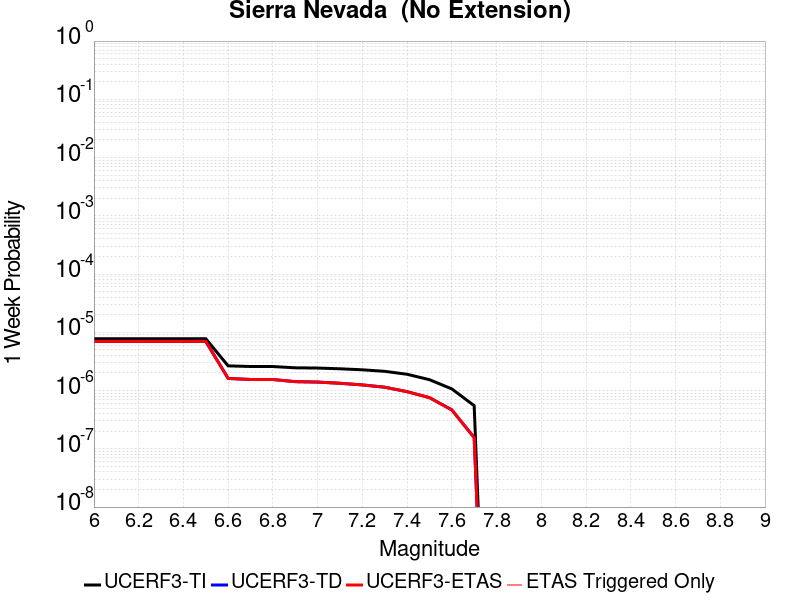 |  | 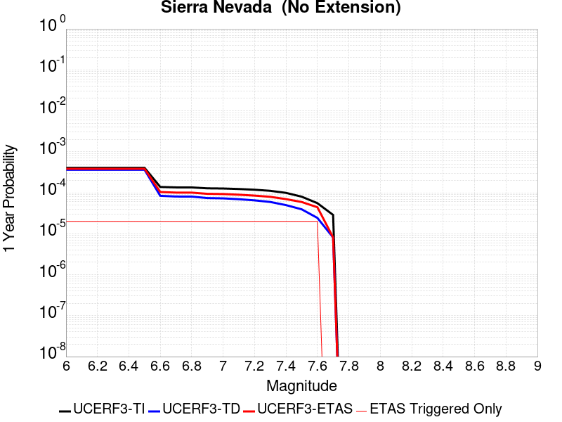 | 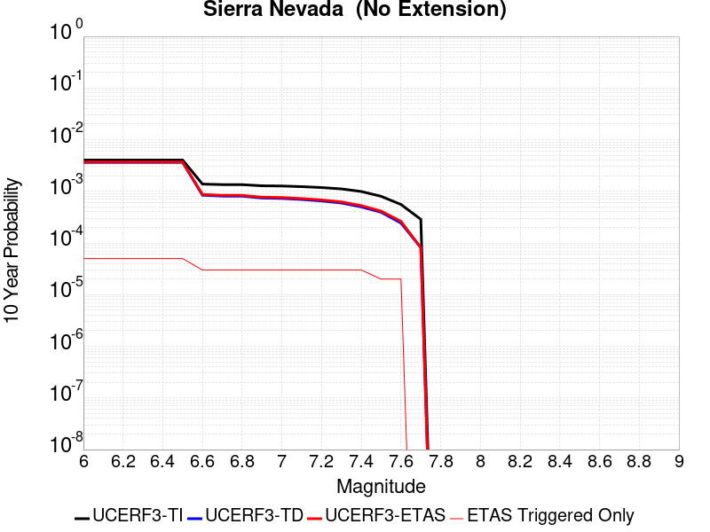 |

| Magnitude | 1 wk TI Prob | 1 wk TD Prob | 1 wk ETAS Prob | 1 wk ETAS/TD Gain | 1 wk ETAS Triggered Only | 1 mo TI Prob | 1 mo TD Prob | 1 mo ETAS Prob | 1 mo ETAS/TD Gain | 1 mo ETAS Triggered Only | 1 yr TI Prob | 1 yr TD Prob | 1 yr ETAS Prob | 1 yr ETAS/TD Gain | 1 yr ETAS Triggered Only | 10 yr TI Prob | 10 yr TD Prob | 10 yr ETAS Prob | 10 yr ETAS/TD Gain | 10 yr ETAS Triggered Only |
|-----|-----|-----|-----|-----|-----|-----|-----|-----|-----|-----|-----|-----|-----|-----|-----|-----|-----|-----|-----|-----|
| 6.0 | 7.7690465E-6 | 6.9763832E-6 | 6.9763832E-6 | 1.0 | 0.0 | 3.329549E-5 | 2.9898645E-5 | 2.9898645E-5 | 1.0 | 0.0 | 4.0529718E-4 | 3.6399104E-4 | 3.8398377E-4 | 1.0549264 | 2.0E-5 | 0.004045588 | 0.0036374647 | 0.0036872828 | 1.0136958 | 5.0E-5 |
| 6.1 | 7.7690465E-6 | 6.9763832E-6 | 6.9763832E-6 | 1.0 | 0.0 | 3.329549E-5 | 2.9898645E-5 | 2.9898645E-5 | 1.0 | 0.0 | 4.0529718E-4 | 3.6399104E-4 | 3.8398377E-4 | 1.0549264 | 2.0E-5 | 0.004045588 | 0.0036374647 | 0.0036872828 | 1.0136958 | 5.0E-5 |
| 6.2 | 7.7690465E-6 | 6.9763832E-6 | 6.9763832E-6 | 1.0 | 0.0 | 3.329549E-5 | 2.9898645E-5 | 2.9898645E-5 | 1.0 | 0.0 | 4.0529718E-4 | 3.6399104E-4 | 3.8398377E-4 | 1.0549264 | 2.0E-5 | 0.004045588 | 0.0036374647 | 0.0036872828 | 1.0136958 | 5.0E-5 |
| 6.3 | 7.7690465E-6 | 6.9763832E-6 | 6.9763832E-6 | 1.0 | 0.0 | 3.329549E-5 | 2.9898645E-5 | 2.9898645E-5 | 1.0 | 0.0 | 4.0529718E-4 | 3.6399104E-4 | 3.8398377E-4 | 1.0549264 | 2.0E-5 | 0.004045588 | 0.0036374647 | 0.0036872828 | 1.0136958 | 5.0E-5 |
| 6.4 | 7.7690465E-6 | 6.9763832E-6 | 6.9763832E-6 | 1.0 | 0.0 | 3.329549E-5 | 2.9898645E-5 | 2.9898645E-5 | 1.0 | 0.0 | 4.0529718E-4 | 3.6399104E-4 | 3.8398377E-4 | 1.0549264 | 2.0E-5 | 0.004045588 | 0.0036374647 | 0.0036872828 | 1.0136958 | 5.0E-5 |
| 6.5 | 7.7690465E-6 | 6.9763832E-6 | 6.9763832E-6 | 1.0 | 0.0 | 3.329549E-5 | 2.9898645E-5 | 2.9898645E-5 | 1.0 | 0.0 | 4.0529718E-4 | 3.6399104E-4 | 3.8398377E-4 | 1.0549264 | 2.0E-5 | 0.004045588 | 0.0036374647 | 0.0036872828 | 1.0136958 | 5.0E-5 |
| 6.6 | 2.653E-6 | 1.6148814E-6 | 1.6148814E-6 | 1.0 | 0.0 | 1.136995E-5 | 6.920902E-6 | 6.920902E-6 | 1.0 | 0.0 | 1.3842035E-4 | 8.4258754E-5 | 1.0425707E-4 | 1.237344 | 2.0E-5 | 0.0013833415 | 8.4227155E-4 | 8.722463E-4 | 1.035588 | 3.0E-5 |
| 6.7 | 2.5902466E-6 | 1.5502146E-6 | 1.5502146E-6 | 1.0 | 0.0 | 1.11010095E-5 | 6.64376E-6 | 6.64376E-6 | 1.0 | 0.0 | 1.351464E-4 | 8.0884805E-5 | 1.0088319E-4 | 1.2472452 | 2.0E-5 | 0.0013506424 | 8.085567E-4 | 8.385324E-4 | 1.0370731 | 3.0E-5 |
| 6.8 | 2.5853892E-6 | 1.5470148E-6 | 1.5470148E-6 | 1.0 | 0.0 | 1.1080193E-5 | 6.6300463E-6 | 6.6300463E-6 | 1.0 | 0.0 | 1.34893E-4 | 8.071786E-5 | 1.0071624E-4 | 1.2477566 | 2.0E-5 | 0.0013481114 | 8.0688833E-4 | 8.368642E-4 | 1.0371499 | 3.0E-5 |
| 6.9 | 2.458257E-6 | 1.4220883E-6 | 1.4220883E-6 | 1.0 | 0.0 | 1.0535345E-5 | 6.0946504E-6 | 6.0946504E-6 | 1.0 | 0.0 | 1.2826028E-4 | 7.419986E-5 | 9.4198374E-5 | 1.2695223 | 2.0E-5 | 0.0012818627 | 7.417528E-4 | 7.7173056E-4 | 1.0404147 | 3.0E-5 |
| 7.0 | 2.4341468E-6 | 1.399052E-6 | 1.399052E-6 | 1.0 | 0.0 | 1.0432016E-5 | 5.995924E-6 | 5.995924E-6 | 1.0 | 0.0 | 1.270024E-4 | 7.2997944E-5 | 9.299649E-5 | 1.2739604 | 2.0E-5 | 0.0012692984 | 7.297416E-4 | 7.597197E-4 | 1.0410805 | 3.0E-5 |
| 7.1 | 2.3652476E-6 | 1.3340014E-6 | 1.3340014E-6 | 1.0 | 0.0 | 1.0136736E-5 | 5.717136E-6 | 5.717136E-6 | 1.0 | 0.0 | 1.2340778E-4 | 6.960393E-5 | 8.960253E-5 | 1.2873201 | 2.0E-5 | 0.0012333926 | 6.9582294E-4 | 7.258021E-4 | 1.0430844 | 3.0E-5 |
| 7.2 | 2.272158E-6 | 1.2503074E-6 | 1.2503074E-6 | 1.0 | 0.0 | 9.737784E-6 | 5.3584495E-6 | 5.3584495E-6 | 1.0 | 0.0 | 1.1855107E-4 | 6.523718E-5 | 8.523588E-5 | 1.3065536 | 2.0E-5 | 0.0011848784 | 6.5218186E-4 | 6.8216224E-4 | 1.0459695 | 3.0E-5 |
| 7.3 | 2.1382127E-6 | 1.1419947E-6 | 1.1419947E-6 | 1.0 | 0.0 | 9.163737E-6 | 4.8942543E-6 | 4.8942543E-6 | 1.0 | 0.0 | 1.1156279E-4 | 5.9585927E-5 | 7.958474E-5 | 1.3356297 | 2.0E-5 | 0.001115068 | 5.957007E-4 | 6.256828E-4 | 1.0503309 | 3.0E-5 |
| 7.4 | 1.9048055E-6 | 9.575474E-7 | 9.575474E-7 | 1.0 | 0.0 | 8.163426E-6 | 4.1037683E-6 | 4.1037683E-6 | 1.0 | 0.0 | 9.9385186E-5 | 4.996224E-5 | 6.996124E-5 | 1.4002823 | 2.0E-5 | 9.934074E-4 | 4.995108E-4 | 5.2949577E-4 | 1.0600288 | 3.0E-5 |
| 7.5 | 1.5373403E-6 | 7.5602395E-7 | 7.5602395E-7 | 1.0 | 0.0 | 6.5885843E-6 | 3.2400987E-6 | 3.2400987E-6 | 1.0 | 0.0 | 8.021306E-5 | 3.9447492E-5 | 5.9446706E-5 | 1.506983 | 2.0E-5 | 8.0184115E-4 | 3.944054E-4 | 4.1439748E-4 | 1.0506892 | 2.0E-5 |
| 7.6 | 1.0680322E-6 | 4.659796E-7 | 4.659796E-7 | 1.0 | 0.0 | 4.577273E-6 | 1.997054E-6 | 1.997054E-6 | 1.0 | 0.0 | 5.5726876E-5 | 2.4313864E-5 | 4.4313376E-5 | 1.822556 | 2.0E-5 | 5.5712904E-4 | 2.431123E-4 | 2.6310742E-4 | 1.0822465 | 2.0E-5 |
| 7.7 | 5.509146E-7 | 1.5581199E-7 | 1.5581199E-7 | 1.0 | 0.0 | 2.3610605E-6 | 6.677655E-7 | 6.677655E-7 | 1.0 | 0.0 | 2.8745531E-5 | 8.130016E-6 | 8.130016E-6 | 1.0 | 0.0 | 2.8741814E-4 | 8.12973E-5 | 8.12973E-5 | 1.0 | 0.0 |

## Mission Creek
*[(top)](#table-of-contents)*

| 1 Week | 1 Month | 1 Year | 10 Year |
|-----|-----|-----|-----|
| 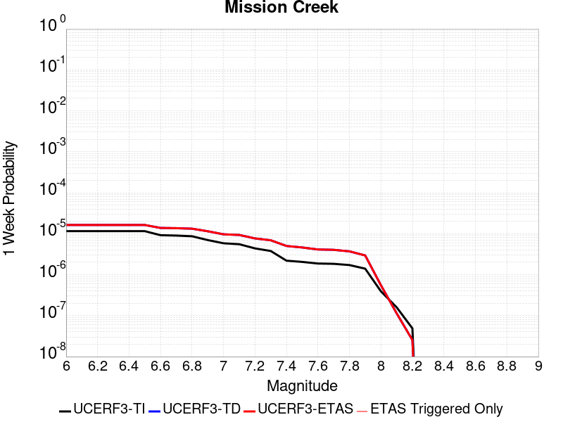 | 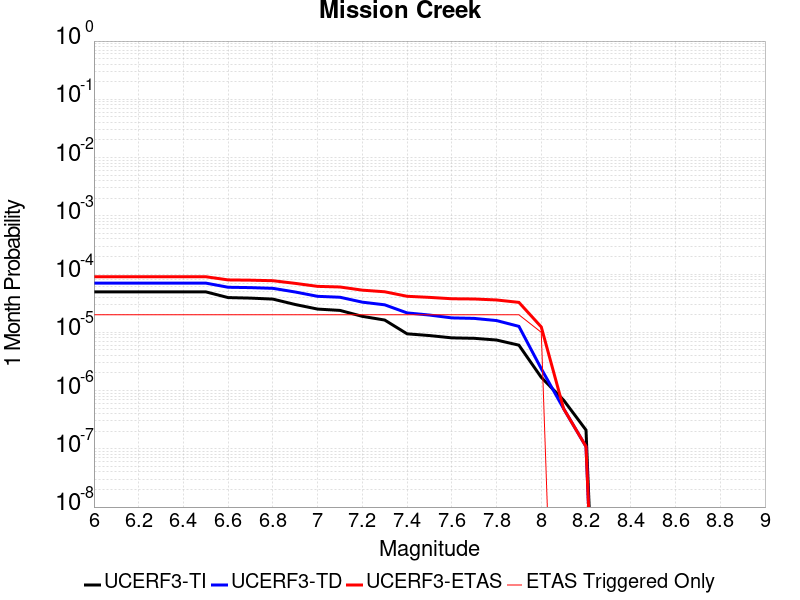 | 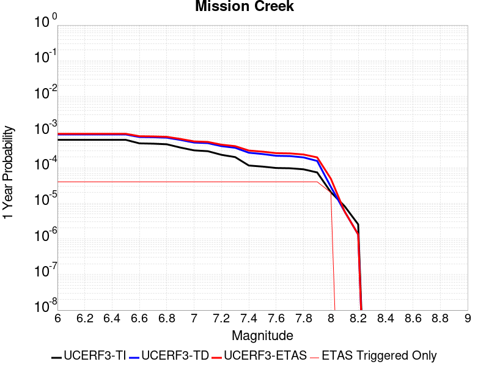 | 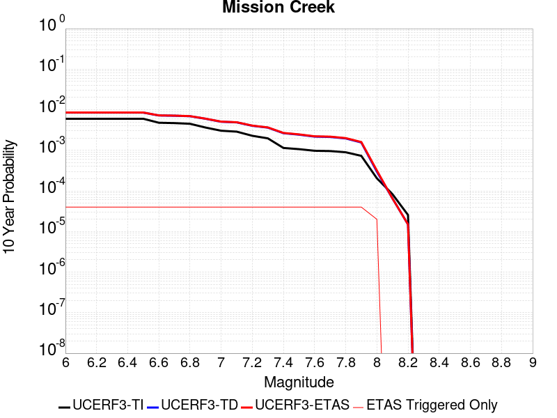 |

| Magnitude | 1 wk TI Prob | 1 wk TD Prob | 1 wk ETAS Prob | 1 wk ETAS/TD Gain | 1 wk ETAS Triggered Only | 1 mo TI Prob | 1 mo TD Prob | 1 mo ETAS Prob | 1 mo ETAS/TD Gain | 1 mo ETAS Triggered Only | 1 yr TI Prob | 1 yr TD Prob | 1 yr ETAS Prob | 1 yr ETAS/TD Gain | 1 yr ETAS Triggered Only | 10 yr TI Prob | 10 yr TD Prob | 10 yr ETAS Prob | 10 yr ETAS/TD Gain | 10 yr ETAS Triggered Only |
|-----|-----|-----|-----|-----|-----|-----|-----|-----|-----|-----|-----|-----|-----|-----|-----|-----|-----|-----|-----|-----|
| 6.0 | 1.1549387E-5 | 1.6324713E-5 | 1.6324713E-5 | 1.0 | 0.0 | 4.9496433E-5 | 6.9961265E-5 | 8.995987E-5 | 1.2858524 | 2.0E-5 | 6.0245243E-4 | 8.5146056E-4 | 8.914265E-4 | 1.0469381 | 4.0E-5 | 0.006008218 | 0.008511184 | 0.008550844 | 1.0046597 | 4.0E-5 |
| 6.1 | 1.1549387E-5 | 1.6324713E-5 | 1.6324713E-5 | 1.0 | 0.0 | 4.9496433E-5 | 6.9961265E-5 | 8.995987E-5 | 1.2858524 | 2.0E-5 | 6.0245243E-4 | 8.5146056E-4 | 8.914265E-4 | 1.0469381 | 4.0E-5 | 0.006008218 | 0.008511184 | 0.008550844 | 1.0046597 | 4.0E-5 |
| 6.2 | 1.1549387E-5 | 1.6324713E-5 | 1.6324713E-5 | 1.0 | 0.0 | 4.9496433E-5 | 6.9961265E-5 | 8.995987E-5 | 1.2858524 | 2.0E-5 | 6.0245243E-4 | 8.5146056E-4 | 8.914265E-4 | 1.0469381 | 4.0E-5 | 0.006008218 | 0.008511184 | 0.008550844 | 1.0046597 | 4.0E-5 |
| 6.3 | 1.1549387E-5 | 1.6324713E-5 | 1.6324713E-5 | 1.0 | 0.0 | 4.9496433E-5 | 6.9961265E-5 | 8.995987E-5 | 1.2858524 | 2.0E-5 | 6.0245243E-4 | 8.5146056E-4 | 8.914265E-4 | 1.0469381 | 4.0E-5 | 0.006008218 | 0.008511184 | 0.008550844 | 1.0046597 | 4.0E-5 |
| 6.4 | 1.1549387E-5 | 1.6324713E-5 | 1.6324713E-5 | 1.0 | 0.0 | 4.9496433E-5 | 6.9961265E-5 | 8.995987E-5 | 1.2858524 | 2.0E-5 | 6.0245243E-4 | 8.5146056E-4 | 8.914265E-4 | 1.0469381 | 4.0E-5 | 0.006008218 | 0.008511184 | 0.008550844 | 1.0046597 | 4.0E-5 |
| 6.5 | 1.1549387E-5 | 1.6324713E-5 | 1.6324713E-5 | 1.0 | 0.0 | 4.9496433E-5 | 6.9961265E-5 | 8.995987E-5 | 1.2858524 | 2.0E-5 | 6.0245243E-4 | 8.5146056E-4 | 8.914265E-4 | 1.0469381 | 4.0E-5 | 0.006008218 | 0.008511184 | 0.008550844 | 1.0046597 | 4.0E-5 |
| 6.6 | 9.202681E-6 | 1.3847972E-5 | 1.3847972E-5 | 1.0 | 0.0 | 3.9439463E-5 | 5.9347152E-5 | 7.934596E-5 | 1.3369802 | 2.0E-5 | 4.800697E-4 | 7.2232104E-4 | 7.622922E-4 | 1.0553371 | 4.0E-5 | 0.004790339 | 0.0072283596 | 0.0072680707 | 1.0054938 | 4.0E-5 |
| 6.7 | 9.019164E-6 | 1.365364E-5 | 1.365364E-5 | 1.0 | 0.0 | 3.8652986E-5 | 5.8514335E-5 | 7.851316E-5 | 1.3417766 | 2.0E-5 | 4.7049852E-4 | 7.121882E-4 | 7.521597E-4 | 1.0561249 | 4.0E-5 | 0.004695036 | 0.0071276836 | 0.0071673985 | 1.005572 | 4.0E-5 |
| 6.8 | 8.673558E-6 | 1.3275746E-5 | 1.3275746E-5 | 1.0 | 0.0 | 3.717186E-5 | 5.6894864E-5 | 7.6893724E-5 | 1.3515056 | 2.0E-5 | 4.524734E-4 | 6.924836E-4 | 7.324559E-4 | 1.057723 | 4.0E-5 | 0.0045155324 | 0.0069318693 | 0.006971592 | 1.0057304 | 4.0E-5 |
| 6.9 | 7.002255E-6 | 1.1479958E-5 | 1.1479958E-5 | 1.0 | 0.0 | 3.000932E-5 | 4.9198927E-5 | 6.9197944E-5 | 1.406493 | 2.0E-5 | 3.653022E-4 | 5.988392E-4 | 6.388152E-4 | 1.0667559 | 4.0E-5 | 0.0036470229 | 0.0060006846 | 0.0060404446 | 1.0066259 | 4.0E-5 |
| 7.0 | 5.84644E-6 | 9.677164E-6 | 9.677164E-6 | 1.0 | 0.0 | 2.5055931E-5 | 4.1472922E-5 | 6.147209E-5 | 1.4822223 | 2.0E-5 | 3.0501327E-4 | 5.0482043E-4 | 5.4480025E-4 | 1.0791961 | 4.0E-5 | 0.0030459496 | 0.0050649596 | 0.005104757 | 1.0078574 | 4.0E-5 |
| 7.1 | 5.54703E-6 | 9.331631E-6 | 9.331631E-6 | 1.0 | 0.0 | 2.377277E-5 | 3.999212E-5 | 5.999132E-5 | 1.5000786 | 2.0E-5 | 2.8939504E-4 | 4.8679972E-4 | 5.2678026E-4 | 1.0821294 | 4.0E-5 | 0.0028901845 | 0.0048855497 | 0.0049253544 | 1.0081474 | 4.0E-5 |
| 7.2 | 4.384709E-6 | 7.6836495E-6 | 7.6836495E-6 | 1.0 | 0.0 | 1.8791474E-5 | 3.292953E-5 | 5.292887E-5 | 1.6073376 | 2.0E-5 | 2.2876218E-4 | 4.0084694E-4 | 4.408309E-4 | 1.0997487 | 4.0E-5 | 0.0022852682 | 0.0040294197 | 0.0040692585 | 1.009887 | 4.0E-5 |
| 7.3 | 3.7888456E-6 | 6.9174894E-6 | 6.9174894E-6 | 1.0 | 0.0 | 1.623781E-5 | 2.9646066E-5 | 4.9645474E-5 | 1.6746057 | 2.0E-5 | 1.9767738E-4 | 3.608844E-4 | 4.0087E-4 | 1.1107988 | 4.0E-5 | 0.0019750162 | 0.0036311483 | 0.003671003 | 1.0109758 | 4.0E-5 |
| 7.4 | 2.1982462E-6 | 5.0257536E-6 | 5.0257536E-6 | 1.0 | 0.0 | 9.421021E-6 | 2.1538768E-5 | 4.1538337E-5 | 1.9285382 | 2.0E-5 | 1.1469489E-4 | 2.6220313E-4 | 3.0219264E-4 | 1.1525135 | 4.0E-5 | 0.0011463572 | 0.0026468872 | 0.0026867813 | 1.0150721 | 4.0E-5 |
| 7.5 | 2.051923E-6 | 4.6169393E-6 | 4.6169393E-6 | 1.0 | 0.0 | 8.793926E-6 | 1.9786734E-5 | 3.9786337E-5 | 2.0107582 | 2.0E-5 | 1.0706078E-4 | 2.40877E-4 | 2.8086736E-4 | 1.1660199 | 4.0E-5 | 0.0010700922 | 0.0024345173 | 0.0024744198 | 1.0163903 | 4.0E-5 |
| 7.6 | 1.8733427E-6 | 4.1252324E-6 | 4.1252324E-6 | 1.0 | 0.0 | 8.028587E-6 | 1.767945E-5 | 3.7679096E-5 | 2.131237 | 2.0E-5 | 9.774366E-5 | 2.1522611E-4 | 2.5521748E-4 | 1.185811 | 4.0E-5 | 9.770069E-4 | 0.0021790217 | 0.0022189345 | 1.0183169 | 4.0E-5 |
| 7.7 | 1.8411953E-6 | 4.044895E-6 | 4.044895E-6 | 1.0 | 0.0 | 7.890813E-6 | 1.733515E-5 | 3.73348E-5 | 2.1537054 | 2.0E-5 | 9.606641E-5 | 2.1103508E-4 | 2.5102665E-4 | 1.189502 | 4.0E-5 | 9.6024893E-4 | 0.0021373003 | 0.002177215 | 1.0186752 | 4.0E-5 |
| 7.8 | 1.7194251E-6 | 3.7121463E-6 | 3.7121463E-6 | 1.0 | 0.0 | 7.368944E-6 | 1.5909101E-5 | 3.5908783E-5 | 2.257122 | 2.0E-5 | 8.97132E-5 | 1.9367617E-4 | 2.3366843E-4 | 1.2064903 | 4.0E-5 | 8.967699E-4 | 0.0019632233 | 0.0020031447 | 1.0203346 | 4.0E-5 |
| 7.9 | 1.4035052E-6 | 2.9514722E-6 | 2.9514722E-6 | 1.0 | 0.0 | 6.0150082E-6 | 1.2649106E-5 | 3.264885E-5 | 2.5811193 | 2.0E-5 | 7.3230265E-5 | 1.5399205E-4 | 1.9398588E-4 | 1.2597136 | 4.0E-5 | 7.3206134E-4 | 0.0015638224 | 0.0016037598 | 1.0255383 | 4.0E-5 |
| 8.0 | 3.9318823E-7 | 5.5319464E-7 | 5.5319464E-7 | 1.0 | 0.0 | 1.6850913E-6 | 2.3708321E-6 | 1.2370809E-5 | 5.2179184 | 1.0E-5 | 2.0515794E-5 | 2.8864504E-5 | 4.8863927E-5 | 1.6928725 | 2.0E-5 | 2.0513899E-4 | 2.9916913E-4 | 3.1916314E-4 | 1.0668318 | 2.0E-5 |
| 8.1 | 1.596793E-7 | 1.1391901E-7 | 1.1391901E-7 | 1.0 | 0.0 | 6.8433974E-7 | 4.8822426E-7 | 4.8822426E-7 | 1.0 | 0.0 | 8.331805E-6 | 5.944114E-6 | 5.944114E-6 | 1.0 | 0.0 | 8.331492E-5 | 6.5564316E-5 | 6.5564316E-5 | 1.0 | 0.0 |
| 8.2 | 4.9003038E-8 | 2.5475106E-8 | 2.5475106E-8 | 1.0 | 0.0 | 2.10013E-7 | 1.0917902E-7 | 1.0917902E-7 | 1.0 | 0.0 | 2.5569052E-6 | 1.3292538E-6 | 1.3292538E-6 | 1.0 | 0.0 | 2.556876E-5 | 1.4973085E-5 | 1.4973085E-5 | 1.0 | 0.0 |

## Scodie Lineament
*[(top)](#table-of-contents)*

| 1 Week | 1 Month | 1 Year | 10 Year |
|-----|-----|-----|-----|
| 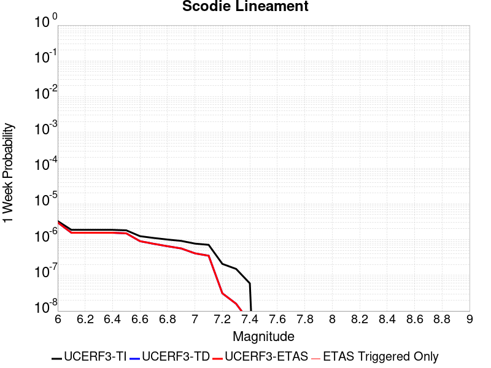 | 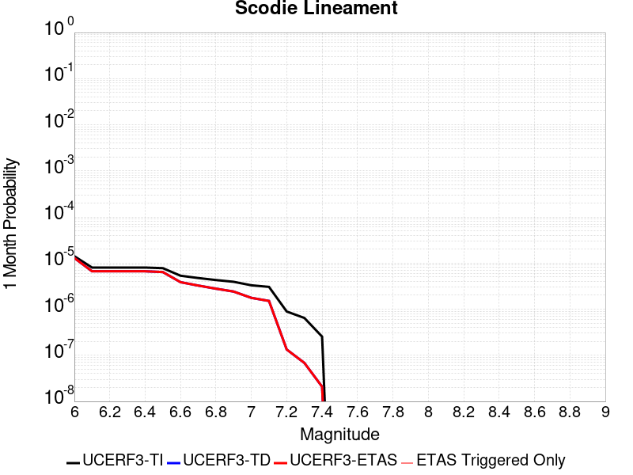 | 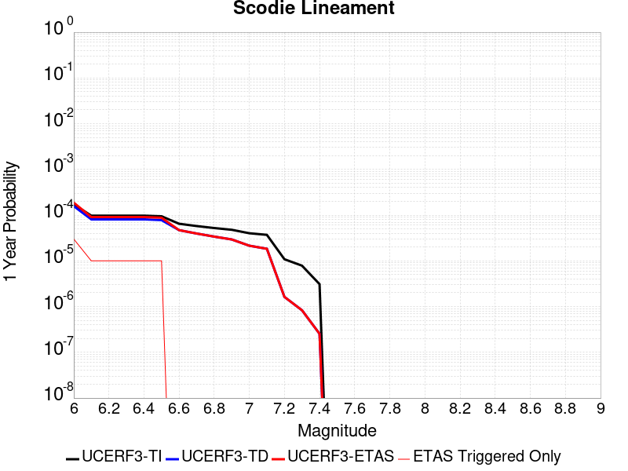 |  |

| Magnitude | 1 wk TI Prob | 1 wk TD Prob | 1 wk ETAS Prob | 1 wk ETAS/TD Gain | 1 wk ETAS Triggered Only | 1 mo TI Prob | 1 mo TD Prob | 1 mo ETAS Prob | 1 mo ETAS/TD Gain | 1 mo ETAS Triggered Only | 1 yr TI Prob | 1 yr TD Prob | 1 yr ETAS Prob | 1 yr ETAS/TD Gain | 1 yr ETAS Triggered Only | 10 yr TI Prob | 10 yr TD Prob | 10 yr ETAS Prob | 10 yr ETAS/TD Gain | 10 yr ETAS Triggered Only |
|-----|-----|-----|-----|-----|-----|-----|-----|-----|-----|-----|-----|-----|-----|-----|-----|-----|-----|-----|-----|-----|
| 6.0 | 3.2919327E-6 | 3.0133565E-6 | 3.0133565E-6 | 1.0 | 0.0 | 1.4108206E-5 | 1.2914339E-5 | 1.2914339E-5 | 1.0 | 0.0 | 1.7175387E-4 | 1.5722391E-4 | 1.872192E-4 | 1.1907806 | 3.0E-5 | 0.0017162118 | 0.0015714383 | 0.0016113755 | 1.0254143 | 4.0E-5 |
| 6.1 | 1.8663811E-6 | 1.5490589E-6 | 1.5490589E-6 | 1.0 | 0.0 | 7.998751E-6 | 6.6388097E-6 | 6.6388097E-6 | 1.0 | 0.0 | 9.738045E-5 | 8.082501E-5 | 9.08242E-5 | 1.1237141 | 1.0E-5 | 9.7337784E-4 | 8.0800493E-4 | 8.279888E-4 | 1.0247324 | 2.0E-5 |
| 6.2 | 1.8663811E-6 | 1.5490589E-6 | 1.5490589E-6 | 1.0 | 0.0 | 7.998751E-6 | 6.6388097E-6 | 6.6388097E-6 | 1.0 | 0.0 | 9.738045E-5 | 8.082501E-5 | 9.08242E-5 | 1.1237141 | 1.0E-5 | 9.7337784E-4 | 8.0800493E-4 | 8.279888E-4 | 1.0247324 | 2.0E-5 |
| 6.3 | 1.8663811E-6 | 1.5490589E-6 | 1.5490589E-6 | 1.0 | 0.0 | 7.998751E-6 | 6.6388097E-6 | 6.6388097E-6 | 1.0 | 0.0 | 9.738045E-5 | 8.082501E-5 | 9.08242E-5 | 1.1237141 | 1.0E-5 | 9.7337784E-4 | 8.0800493E-4 | 8.279888E-4 | 1.0247324 | 2.0E-5 |
| 6.4 | 1.8663811E-6 | 1.5490589E-6 | 1.5490589E-6 | 1.0 | 0.0 | 7.998751E-6 | 6.6388097E-6 | 6.6388097E-6 | 1.0 | 0.0 | 9.738045E-5 | 8.082501E-5 | 9.08242E-5 | 1.1237141 | 1.0E-5 | 9.7337784E-4 | 8.0800493E-4 | 8.279888E-4 | 1.0247324 | 2.0E-5 |
| 6.5 | 1.8106311E-6 | 1.4909926E-6 | 1.4909926E-6 | 1.0 | 0.0 | 7.759824E-6 | 6.3899556E-6 | 6.3899556E-6 | 1.0 | 0.0 | 9.447177E-5 | 7.779543E-5 | 8.7794644E-5 | 1.1285323 | 1.0E-5 | 9.4431615E-4 | 7.777306E-4 | 7.9771504E-4 | 1.0256958 | 2.0E-5 |
| 6.6 | 1.2414679E-6 | 8.9976135E-7 | 8.9976135E-7 | 1.0 | 0.0 | 5.320566E-6 | 3.8561147E-6 | 3.8561147E-6 | 1.0 | 0.0 | 6.477596E-5 | 4.6947276E-5 | 4.6947276E-5 | 1.0 | 0.0 | 6.475708E-4 | 4.6938224E-4 | 4.7937754E-4 | 1.0212946 | 1.0E-5 |
| 6.7 | 1.1062215E-6 | 7.5943603E-7 | 7.5943603E-7 | 1.0 | 0.0 | 4.7409408E-6 | 3.254722E-6 | 3.254722E-6 | 1.0 | 0.0 | 5.7719422E-5 | 3.9625593E-5 | 3.9625593E-5 | 1.0 | 0.0 | 5.770443E-4 | 3.9619225E-4 | 4.0618828E-4 | 1.0252303 | 1.0E-5 |
| 6.8 | 1.0006736E-6 | 6.5004406E-7 | 6.5004406E-7 | 1.0 | 0.0 | 4.288594E-6 | 2.7859005E-6 | 2.7859005E-6 | 1.0 | 0.0 | 5.221238E-5 | 3.3917873E-5 | 3.3917873E-5 | 1.0 | 0.0 | 5.220012E-4 | 3.3913302E-4 | 3.4912964E-4 | 1.029477 | 1.0E-5 |
| 6.9 | 9.167364E-7 | 5.6316645E-7 | 5.6316645E-7 | 1.0 | 0.0 | 3.9288643E-6 | 2.4135686E-6 | 2.4135686E-6 | 1.0 | 0.0 | 4.7832873E-5 | 2.9384859E-5 | 2.9384859E-5 | 1.0 | 0.0 | 4.782258E-4 | 2.9381542E-4 | 3.0381247E-4 | 1.034025 | 1.0E-5 |
| 7.0 | 7.6987664E-7 | 4.113416E-7 | 4.113416E-7 | 1.0 | 0.0 | 3.2994672E-6 | 1.7628915E-6 | 1.7628915E-6 | 1.0 | 0.0 | 4.0170275E-5 | 2.1463033E-5 | 2.1463033E-5 | 1.0 | 0.0 | 4.0163012E-4 | 2.1461345E-4 | 2.2461131E-4 | 1.0465854 | 1.0E-5 |
| 7.1 | 7.1038727E-7 | 3.5211795E-7 | 3.5211795E-7 | 1.0 | 0.0 | 3.0445133E-6 | 1.5090762E-6 | 1.5090762E-6 | 1.0 | 0.0 | 3.706632E-5 | 1.8372884E-5 | 1.8372884E-5 | 1.0 | 0.0 | 3.7060137E-4 | 1.8371714E-4 | 1.9371531E-4 | 1.0544215 | 1.0E-5 |
| 7.2 | 2.0799602E-7 | 3.1187685E-8 | 3.1187685E-8 | 1.0 | 0.0 | 8.914113E-7 | 1.336615E-7 | 1.336615E-7 | 1.0 | 0.0 | 1.0852878E-5 | 1.6273277E-6 | 1.6273277E-6 | 1.0 | 0.0 | 1.08523476E-4 | 1.6273165E-5 | 2.6273003E-5 | 1.6144986 | 1.0E-5 |
| 7.3 | 1.5048182E-7 | 1.5946263E-8 | 1.5946263E-8 | 1.0 | 0.0 | 6.449219E-7 | 6.834112E-8 | 6.834112E-8 | 1.0 | 0.0 | 7.851896E-6 | 8.320529E-7 | 8.320529E-7 | 1.0 | 0.0 | 7.851618E-5 | 8.3205005E-6 | 8.3205005E-6 | 1.0 | 0.0 |
| 7.4 | 5.9334678E-8 | 4.8685624E-9 | 4.8685624E-9 | 1.0 | 0.0 | 2.5429145E-7 | 2.0865269E-8 | 2.0865269E-8 | 1.0 | 0.0 | 3.095994E-6 | 2.5403463E-7 | 2.5403463E-7 | 1.0 | 0.0 | 3.095951E-5 | 2.5403444E-6 | 2.5403444E-6 | 1.0 | 0.0 |

## Lake Isabella (Seismicity)
*[(top)](#table-of-contents)*

| 1 Week | 1 Month | 1 Year | 10 Year |
|-----|-----|-----|-----|
|  |  |  |  |

| Magnitude | 1 wk TI Prob | 1 wk TD Prob | 1 wk ETAS Prob | 1 wk ETAS/TD Gain | 1 wk ETAS Triggered Only | 1 mo TI Prob | 1 mo TD Prob | 1 mo ETAS Prob | 1 mo ETAS/TD Gain | 1 mo ETAS Triggered Only | 1 yr TI Prob | 1 yr TD Prob | 1 yr ETAS Prob | 1 yr ETAS/TD Gain | 1 yr ETAS Triggered Only | 10 yr TI Prob | 10 yr TD Prob | 10 yr ETAS Prob | 10 yr ETAS/TD Gain | 10 yr ETAS Triggered Only |
|-----|-----|-----|-----|-----|-----|-----|-----|-----|-----|-----|-----|-----|-----|-----|-----|-----|-----|-----|-----|-----|
| 6.0 | 9.431637E-6 | 9.741694E-6 | 2.9741499E-5 | 3.053011 | 2.0E-5 | 4.0420677E-5 | 4.1749525E-5 | 6.174869E-5 | 1.4790274 | 2.0E-5 | 4.920106E-4 | 5.0819496E-4 | 5.381797E-4 | 1.0590025 | 3.0E-5 | 0.004909227 | 0.005071621 | 0.005111418 | 1.0078471 | 4.0E-5 |
| 6.1 | 9.431637E-6 | 9.741694E-6 | 2.9741499E-5 | 3.053011 | 2.0E-5 | 4.0420677E-5 | 4.1749525E-5 | 6.174869E-5 | 1.4790274 | 2.0E-5 | 4.920106E-4 | 5.0819496E-4 | 5.381797E-4 | 1.0590025 | 3.0E-5 | 0.004909227 | 0.005071621 | 0.005111418 | 1.0078471 | 4.0E-5 |
| 6.2 | 9.431637E-6 | 9.741694E-6 | 2.9741499E-5 | 3.053011 | 2.0E-5 | 4.0420677E-5 | 4.1749525E-5 | 6.174869E-5 | 1.4790274 | 2.0E-5 | 4.920106E-4 | 5.0819496E-4 | 5.381797E-4 | 1.0590025 | 3.0E-5 | 0.004909227 | 0.005071621 | 0.005111418 | 1.0078471 | 4.0E-5 |
| 6.3 | 9.431637E-6 | 9.741694E-6 | 2.9741499E-5 | 3.053011 | 2.0E-5 | 4.0420677E-5 | 4.1749525E-5 | 6.174869E-5 | 1.4790274 | 2.0E-5 | 4.920106E-4 | 5.0819496E-4 | 5.381797E-4 | 1.0590025 | 3.0E-5 | 0.004909227 | 0.005071621 | 0.005111418 | 1.0078471 | 4.0E-5 |
| 6.4 | 5.144063E-6 | 5.3000977E-6 | 1.5300044E-5 | 2.8867478 | 1.0E-5 | 2.2045799E-5 | 2.2714525E-5 | 3.27143E-5 | 1.4402369 | 1.0E-5 | 2.6837454E-4 | 2.765177E-4 | 2.9651218E-4 | 1.0723081 | 2.0E-5 | 0.0026805066 | 0.002762077 | 0.0027820216 | 1.007221 | 2.0E-5 |
| 6.5 | 5.144063E-6 | 5.3000977E-6 | 1.5300044E-5 | 2.8867478 | 1.0E-5 | 2.2045799E-5 | 2.2714525E-5 | 3.27143E-5 | 1.4402369 | 1.0E-5 | 2.6837454E-4 | 2.765177E-4 | 2.9651218E-4 | 1.0723081 | 2.0E-5 | 0.0026805066 | 0.002762077 | 0.0027820216 | 1.007221 | 2.0E-5 |
| 6.6 | 3.4009804E-6 | 3.4987995E-6 | 1.3498765E-5 | 3.8581133 | 1.0E-5 | 1.4575549E-5 | 1.4994778E-5 | 2.4994628E-5 | 1.6668888 | 1.0E-5 | 1.7744285E-4 | 1.8254772E-4 | 1.9254591E-4 | 1.0547702 | 1.0E-5 | 0.0017730123 | 0.0018241355 | 0.0018341173 | 1.0054721 | 1.0E-5 |
| 6.7 | 3.3880428E-6 | 3.4856662E-6 | 1.3485631E-5 | 3.8688822 | 1.0E-5 | 1.4520103E-5 | 1.4938492E-5 | 2.4938343E-5 | 1.6694016 | 1.0E-5 | 1.767679E-4 | 1.8186258E-4 | 1.9186074E-4 | 1.0549766 | 1.0E-5 | 0.0017662736 | 0.0018172951 | 0.001827277 | 1.0054927 | 1.0E-5 |
| 6.8 | 2.6582E-6 | 2.7337105E-6 | 2.7337105E-6 | 1.0 | 0.0 | 1.1392236E-5 | 1.1715857E-5 | 1.1715857E-5 | 1.0 | 0.0 | 1.3869164E-4 | 1.4263256E-4 | 1.4263256E-4 | 1.0 | 0.0 | 0.0013860512 | 0.0014255423 | 0.0014255423 | 1.0 | 0.0 |
| 6.9 | 2.406011E-6 | 2.474338E-6 | 2.474338E-6 | 1.0 | 0.0 | 1.0311434E-5 | 1.0604271E-5 | 1.0604271E-5 | 1.0 | 0.0 | 1.2553448E-4 | 1.2910066E-4 | 1.2910066E-4 | 1.0 | 0.0 | 0.0012546359 | 0.0012903863 | 0.0012903863 | 1.0 | 0.0 |
| 7.0 | 1.6953097E-6 | 1.7429437E-6 | 1.7429437E-6 | 1.0 | 0.0 | 7.265593E-6 | 7.469743E-6 | 7.469743E-6 | 1.0 | 0.0 | 8.8455E-5 | 9.094137E-5 | 9.094137E-5 | 1.0 | 0.0 | 8.84198E-4 | 9.0914435E-4 | 9.0914435E-4 | 1.0 | 0.0 |
| 7.1 | 3.5013824E-7 | 3.571492E-7 | 3.571492E-7 | 1.0 | 0.0 | 1.5005916E-6 | 1.5306384E-6 | 1.5306384E-6 | 1.0 | 0.0 | 1.826955E-5 | 1.8635366E-5 | 1.8635366E-5 | 1.0 | 0.0 | 1.8268047E-4 | 1.863383E-4 | 1.863383E-4 | 1.0 | 0.0 |
| 7.2 | 2.2321095E-7 | 2.2750632E-7 | 2.2750632E-7 | 1.0 | 0.0 | 9.56618E-7 | 9.750268E-7 | 9.750268E-7 | 1.0 | 0.0 | 1.1646762E-5 | 1.1870887E-5 | 1.1870887E-5 | 1.0 | 0.0 | 1.1646151E-4 | 1.1870263E-4 | 1.1870263E-4 | 1.0 | 0.0 |
| 7.3 | 1.5760406E-7 | 1.6060963E-7 | 1.6060963E-7 | 1.0 | 0.0 | 6.7544585E-7 | 6.883268E-7 | 6.883268E-7 | 1.0 | 0.0 | 8.223522E-6 | 8.380347E-6 | 8.380347E-6 | 1.0 | 0.0 | 8.2232174E-5 | 8.3800376E-5 | 8.3800376E-5 | 1.0 | 0.0 |
| 7.4 | 1.1216497E-7 | 1.1431735E-7 | 1.1431735E-7 | 1.0 | 0.0 | 4.8070694E-7 | 4.8993144E-7 | 4.8993144E-7 | 1.0 | 0.0 | 5.852591E-6 | 5.964899E-6 | 5.964899E-6 | 1.0 | 0.0 | 5.8524372E-5 | 5.9647435E-5 | 5.9647435E-5 | 1.0 | 0.0 |
| 7.5 | 4.885185E-8 | 4.9787864E-8 | 4.9787864E-8 | 1.0 | 0.0 | 2.0936506E-7 | 2.1337654E-7 | 2.1337654E-7 | 1.0 | 0.0 | 2.5490165E-6 | 2.5978566E-6 | 2.5978566E-6 | 1.0 | 0.0 | 2.5489873E-5 | 2.597828E-5 | 2.597828E-5 | 1.0 | 0.0 |
| 7.6 | 1.504641E-9 | 1.5317939E-9 | 1.5317939E-9 | 1.0 | 0.0 | 6.4484613E-9 | 6.5648313E-9 | 6.5648313E-9 | 1.0 | 0.0 | 7.851001E-8 | 7.992682E-8 | 7.992682E-8 | 1.0 | 0.0 | 7.8509987E-7 | 7.992682E-7 | 7.992682E-7 | 1.0 | 0.0 |

## Red Pass
*[(top)](#table-of-contents)*

| 1 Week | 1 Month | 1 Year | 10 Year |
|-----|-----|-----|-----|
|  |  |  |  |

| Magnitude | 1 wk TI Prob | 1 wk TD Prob | 1 wk ETAS Prob | 1 wk ETAS/TD Gain | 1 wk ETAS Triggered Only | 1 mo TI Prob | 1 mo TD Prob | 1 mo ETAS Prob | 1 mo ETAS/TD Gain | 1 mo ETAS Triggered Only | 1 yr TI Prob | 1 yr TD Prob | 1 yr ETAS Prob | 1 yr ETAS/TD Gain | 1 yr ETAS Triggered Only | 10 yr TI Prob | 10 yr TD Prob | 10 yr ETAS Prob | 10 yr ETAS/TD Gain | 10 yr ETAS Triggered Only |
|-----|-----|-----|-----|-----|-----|-----|-----|-----|-----|-----|-----|-----|-----|-----|-----|-----|-----|-----|-----|-----|
| 6.0 | 8.258278E-6 | 8.551305E-6 | 8.551305E-6 | 1.0 | 0.0 | 3.539214E-5 | 3.6648038E-5 | 4.664767E-5 | 1.2728559 | 1.0E-5 | 4.308141E-4 | 4.4611638E-4 | 4.7610298E-4 | 1.067217 | 3.0E-5 | 0.0042997985 | 0.004453966 | 0.0044937874 | 1.0089408 | 4.0E-5 |
| 6.1 | 3.649988E-6 | 3.7753332E-6 | 3.7753332E-6 | 1.0 | 0.0 | 1.5642712E-5 | 1.6179927E-5 | 2.6179765E-5 | 1.6180398 | 1.0E-5 | 1.9043336E-4 | 1.9697756E-4 | 2.2697165E-4 | 1.1522716 | 3.0E-5 | 0.0019027026 | 0.001968497 | 0.0020084183 | 1.0202801 | 4.0E-5 |
| 6.2 | 3.649988E-6 | 3.7753332E-6 | 3.7753332E-6 | 1.0 | 0.0 | 1.5642712E-5 | 1.6179927E-5 | 2.6179765E-5 | 1.6180398 | 1.0E-5 | 1.9043336E-4 | 1.9697756E-4 | 2.2697165E-4 | 1.1522716 | 3.0E-5 | 0.0019027026 | 0.001968497 | 0.0020084183 | 1.0202801 | 4.0E-5 |
| 6.3 | 1.3924937E-6 | 1.4411233E-6 | 1.4411233E-6 | 1.0 | 0.0 | 5.9678164E-6 | 6.176236E-6 | 6.176236E-6 | 1.0 | 0.0 | 7.265574E-5 | 7.51945E-5 | 7.51945E-5 | 1.0 | 0.0 | 7.263199E-4 | 7.518293E-4 | 7.518293E-4 | 1.0 | 0.0 |
| 6.4 | 1.3924937E-6 | 1.4411233E-6 | 1.4411233E-6 | 1.0 | 0.0 | 5.9678164E-6 | 6.176236E-6 | 6.176236E-6 | 1.0 | 0.0 | 7.265574E-5 | 7.51945E-5 | 7.51945E-5 | 1.0 | 0.0 | 7.263199E-4 | 7.518293E-4 | 7.518293E-4 | 1.0 | 0.0 |
| 6.5 | 9.876812E-7 | 1.022196E-6 | 1.022196E-6 | 1.0 | 0.0 | 4.2329125E-6 | 4.38084E-6 | 4.38084E-6 | 1.0 | 0.0 | 5.153449E-5 | 5.3336724E-5 | 5.3336724E-5 | 1.0 | 0.0 | 5.1522546E-4 | 5.333672E-4 | 5.333672E-4 | 1.0 | 0.0 |

## San Jacinto (Stepovers Combined)
*[(top)](#table-of-contents)*

| 1 Week | 1 Month | 1 Year | 10 Year |
|-----|-----|-----|-----|
|  | 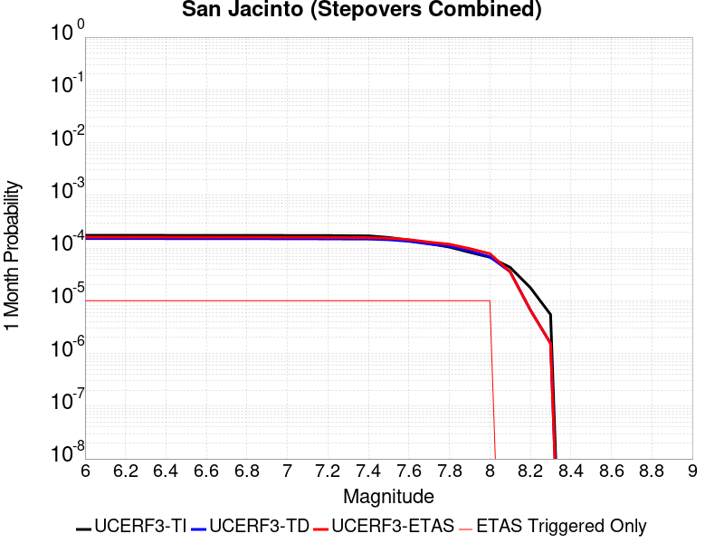 | 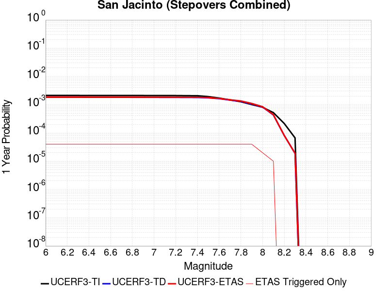 | 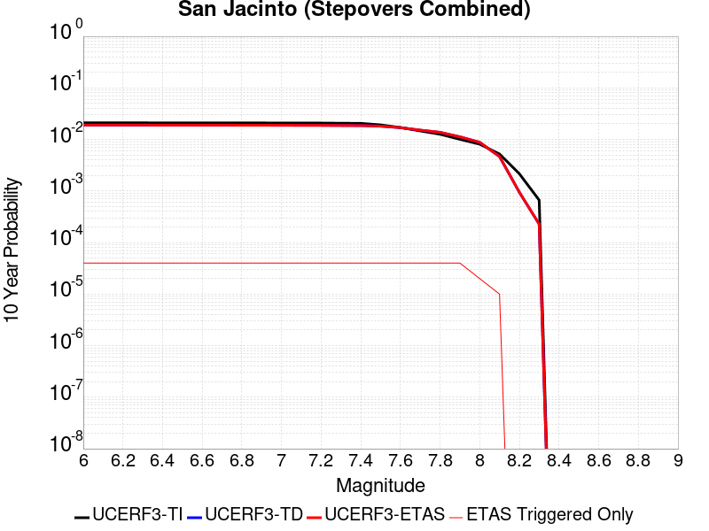 |

| Magnitude | 1 wk TI Prob | 1 wk TD Prob | 1 wk ETAS Prob | 1 wk ETAS/TD Gain | 1 wk ETAS Triggered Only | 1 mo TI Prob | 1 mo TD Prob | 1 mo ETAS Prob | 1 mo ETAS/TD Gain | 1 mo ETAS Triggered Only | 1 yr TI Prob | 1 yr TD Prob | 1 yr ETAS Prob | 1 yr ETAS/TD Gain | 1 yr ETAS Triggered Only | 10 yr TI Prob | 10 yr TD Prob | 10 yr ETAS Prob | 10 yr ETAS/TD Gain | 10 yr ETAS Triggered Only |
|-----|-----|-----|-----|-----|-----|-----|-----|-----|-----|-----|-----|-----|-----|-----|-----|-----|-----|-----|-----|-----|
| 6.0 | 4.0667746E-5 | 3.5287198E-5 | 4.5286844E-5 | 1.283379 | 1.0E-5 | 1.742787E-4 | 1.5122209E-4 | 1.6122058E-4 | 1.0661179 | 1.0E-5 | 0.0021197782 | 0.0018395748 | 0.0018795012 | 1.0217042 | 4.0E-5 | 0.020996714 | 0.018994363 | 0.019033603 | 1.0020659 | 4.0E-5 |
| 6.1 | 4.0667746E-5 | 3.5287198E-5 | 4.5286844E-5 | 1.283379 | 1.0E-5 | 1.742787E-4 | 1.5122209E-4 | 1.6122058E-4 | 1.0661179 | 1.0E-5 | 0.0021197782 | 0.0018395748 | 0.0018795012 | 1.0217042 | 4.0E-5 | 0.020996714 | 0.018994363 | 0.019033603 | 1.0020659 | 4.0E-5 |
| 6.2 | 4.0667746E-5 | 3.5287198E-5 | 4.5286844E-5 | 1.283379 | 1.0E-5 | 1.742787E-4 | 1.5122209E-4 | 1.6122058E-4 | 1.0661179 | 1.0E-5 | 0.0021197782 | 0.0018395748 | 0.0018795012 | 1.0217042 | 4.0E-5 | 0.020996714 | 0.018994363 | 0.019033603 | 1.0020659 | 4.0E-5 |
| 6.3 | 4.0667746E-5 | 3.5287198E-5 | 4.5286844E-5 | 1.283379 | 1.0E-5 | 1.742787E-4 | 1.5122209E-4 | 1.6122058E-4 | 1.0661179 | 1.0E-5 | 0.0021197782 | 0.0018395748 | 0.0018795012 | 1.0217042 | 4.0E-5 | 0.020996714 | 0.018994363 | 0.019033603 | 1.0020659 | 4.0E-5 |
| 6.4 | 4.0577226E-5 | 3.515909E-5 | 4.5158737E-5 | 1.2844114 | 1.0E-5 | 1.738908E-4 | 1.5067312E-4 | 1.6067161E-4 | 1.0663588 | 1.0E-5 | 0.0021150648 | 0.0018329041 | 0.0018728308 | 1.0217832 | 4.0E-5 | 0.020950472 | 0.018928928 | 0.018968172 | 1.0020732 | 4.0E-5 |
| 6.5 | 4.0577226E-5 | 3.515909E-5 | 4.5158737E-5 | 1.2844114 | 1.0E-5 | 1.738908E-4 | 1.5067312E-4 | 1.6067161E-4 | 1.0663588 | 1.0E-5 | 0.0021150648 | 0.0018329041 | 0.0018728308 | 1.0217832 | 4.0E-5 | 0.020950472 | 0.018928928 | 0.018968172 | 1.0020732 | 4.0E-5 |
| 6.6 | 4.053861E-5 | 3.5104433E-5 | 4.5104083E-5 | 1.2848543 | 1.0E-5 | 1.7372532E-4 | 1.5043891E-4 | 1.604374E-4 | 1.0664622 | 1.0E-5 | 0.0021130538 | 0.0018300572 | 0.0018699841 | 1.0218172 | 4.0E-5 | 0.020930743 | 0.018901005 | 0.01894025 | 1.0020763 | 4.0E-5 |
| 6.7 | 4.0516545E-5 | 3.50735E-5 | 4.5073146E-5 | 1.2851056 | 1.0E-5 | 1.7363077E-4 | 1.5030634E-4 | 1.6030484E-4 | 1.0665208 | 1.0E-5 | 0.002111905 | 0.0018284466 | 0.0018683735 | 1.0218365 | 4.0E-5 | 0.020919468 | 0.018885203 | 0.018924447 | 1.002078 | 4.0E-5 |
| 6.8 | 4.049434E-5 | 3.504506E-5 | 4.5044708E-5 | 1.285337 | 1.0E-5 | 1.7353562E-4 | 1.5018447E-4 | 1.6018297E-4 | 1.0665748 | 1.0E-5 | 0.0021107488 | 0.0018269654 | 0.0018668922 | 1.0218543 | 4.0E-5 | 0.020908125 | 0.018870614 | 0.01890986 | 1.0020797 | 4.0E-5 |
| 6.9 | 4.046386E-5 | 3.500762E-5 | 4.500727E-5 | 1.2856421 | 1.0E-5 | 1.73405E-4 | 1.5002403E-4 | 1.6002252E-4 | 1.066646 | 1.0E-5 | 0.0021091616 | 0.0018250152 | 0.0018649423 | 1.0218776 | 4.0E-5 | 0.020892553 | 0.018851386 | 0.018890632 | 1.0020819 | 4.0E-5 |
| 7.0 | 4.036382E-5 | 3.4888177E-5 | 4.4887827E-5 | 1.28662 | 1.0E-5 | 1.7297632E-4 | 1.4951221E-4 | 1.5951072E-4 | 1.0668741 | 1.0E-5 | 0.0021039525 | 0.0018187946 | 0.0018587218 | 1.0219526 | 4.0E-5 | 0.02084144 | 0.018789997 | 0.018829247 | 1.0020888 | 4.0E-5 |
| 7.1 | 4.0343282E-5 | 3.486664E-5 | 4.486629E-5 | 1.2867972 | 1.0E-5 | 1.7288832E-4 | 1.4941991E-4 | 1.5941841E-4 | 1.0669155 | 1.0E-5 | 0.002102883 | 0.0018176727 | 0.0018576001 | 1.0219662 | 4.0E-5 | 0.020830948 | 0.018778874 | 0.018818123 | 1.0020901 | 4.0E-5 |
| 7.2 | 4.0257353E-5 | 3.4771132E-5 | 4.4770786E-5 | 1.2875849 | 1.0E-5 | 1.725201E-4 | 1.4901065E-4 | 1.5900916E-4 | 1.0670993 | 1.0E-5 | 0.0020984085 | 0.0018126983 | 0.0018526257 | 1.0220265 | 4.0E-5 | 0.020787042 | 0.01872961 | 0.018768862 | 1.0020957 | 4.0E-5 |
| 7.3 | 3.9940667E-5 | 3.4598754E-5 | 4.4598408E-5 | 1.2890178 | 1.0E-5 | 1.7116306E-4 | 1.4827197E-4 | 1.5827049E-4 | 1.0674336 | 1.0E-5 | 0.0020819185 | 0.0018037198 | 0.0018436476 | 1.0221364 | 4.0E-5 | 0.020625217 | 0.018638225 | 0.01867748 | 1.0021061 | 4.0E-5 |
| 7.4 | 3.9721202E-5 | 3.4484117E-5 | 4.4483775E-5 | 1.2899786 | 1.0E-5 | 1.7022261E-4 | 1.4778072E-4 | 1.5777924E-4 | 1.0676578 | 1.0E-5 | 0.0020704903 | 0.0017977487 | 0.0018376769 | 1.02221 | 4.0E-5 | 0.020513052 | 0.018577335 | 0.01861659 | 1.0021131 | 4.0E-5 |
| 7.5 | 3.7036873E-5 | 3.355129E-5 | 4.3550954E-5 | 1.2980411 | 1.0E-5 | 1.5871979E-4 | 1.4378333E-4 | 1.5378189E-4 | 1.0695391 | 1.0E-5 | 0.0019307006 | 0.0017491594 | 0.0017890894 | 1.0228281 | 4.0E-5 | 0.019140124 | 0.018078765 | 0.01811804 | 1.0021726 | 4.0E-5 |
| 7.6 | 3.2940967E-5 | 3.133173E-5 | 4.1331416E-5 | 1.3191553 | 1.0E-5 | 1.4116794E-4 | 1.3427193E-4 | 1.442706E-4 | 1.0744658 | 1.0E-5 | 0.0017173645 | 0.0016335372 | 0.0016734719 | 1.0244467 | 4.0E-5 | 0.01704153 | 0.016911475 | 0.0169508 | 1.0023253 | 4.0E-5 |
| 7.7 | 2.8236149E-5 | 2.7897275E-5 | 3.7896996E-5 | 1.3584479 | 1.0E-5 | 1.2100645E-4 | 1.1955428E-4 | 1.2955308E-4 | 1.083634 | 1.0E-5 | 0.0014722579 | 0.0014546025 | 0.0014945443 | 1.0274589 | 4.0E-5 | 0.014625421 | 0.015122045 | 0.015161441 | 1.0026052 | 4.0E-5 |
| 7.8 | 2.4329287E-5 | 2.5220394E-5 | 3.5220142E-5 | 1.3964945 | 1.0E-5 | 1.042642E-4 | 1.0808293E-4 | 1.1808185E-4 | 1.0925115 | 1.0E-5 | 0.0012686774 | 0.0013151162 | 0.0013550635 | 1.0303756 | 4.0E-5 | 0.012614589 | 0.013719083 | 0.013758534 | 1.0028757 | 4.0E-5 |
| 7.9 | 1.9370926E-5 | 2.0433014E-5 | 3.043281E-5 | 1.4893941 | 1.0E-5 | 8.301561E-5 | 8.7567125E-5 | 9.756625E-5 | 1.1141881 | 1.0E-5 | 0.0010102465 | 0.001065609 | 0.0011055664 | 1.0374972 | 4.0E-5 | 0.0100566605 | 0.011205519 | 0.011245071 | 1.0035297 | 4.0E-5 |
| 8.0 | 1.5583017E-5 | 1.5896165E-5 | 2.5896006E-5 | 1.6290725 | 1.0E-5 | 6.6782646E-5 | 6.8124646E-5 | 7.8123965E-5 | 1.1467798 | 1.0E-5 | 8.127754E-4 | 8.2910265E-4 | 8.490861E-4 | 1.0241024 | 2.0E-5 | 0.008098091 | 0.008786912 | 0.008806736 | 1.0022562 | 2.0E-5 |
| 8.1 | 1.0024873E-5 | 8.298104E-6 | 8.298104E-6 | 1.0 | 0.0 | 4.2963035E-5 | 3.556282E-5 | 3.556282E-5 | 1.0 | 0.0 | 5.229494E-4 | 4.3289183E-4 | 4.428875E-4 | 1.0230905 | 1.0E-5 | 0.0052172043 | 0.0046564727 | 0.0046664258 | 1.0021375 | 1.0E-5 |
| 8.2 | 4.142796E-6 | 1.5626505E-6 | 1.5626505E-6 | 1.0 | 0.0 | 1.775472E-5 | 6.697056E-6 | 6.697056E-6 | 1.0 | 0.0 | 2.1614227E-4 | 8.153364E-5 | 8.153364E-5 | 1.0 | 0.0 | 0.0021593217 | 9.464045E-4 | 9.464045E-4 | 1.0 | 0.0 |
| 8.3 | 1.2750878E-6 | 3.6166134E-7 | 3.6166134E-7 | 1.0 | 0.0 | 5.4646503E-6 | 1.5499762E-6 | 1.5499762E-6 | 1.0 | 0.0 | 6.653009E-5 | 1.8870802E-5 | 1.8870802E-5 | 1.0 | 0.0 | 6.6510175E-4 | 2.2760578E-4 | 2.2760578E-4 | 1.0 | 0.0 |

## Death Valley (Fish Lake Valley)
*[(top)](#table-of-contents)*

| 1 Week | 1 Month | 1 Year | 10 Year |
|-----|-----|-----|-----|
| 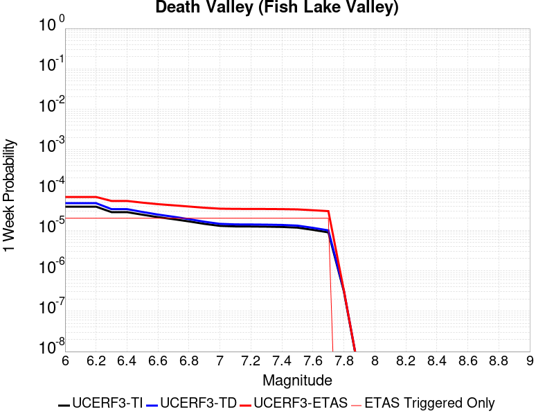 | 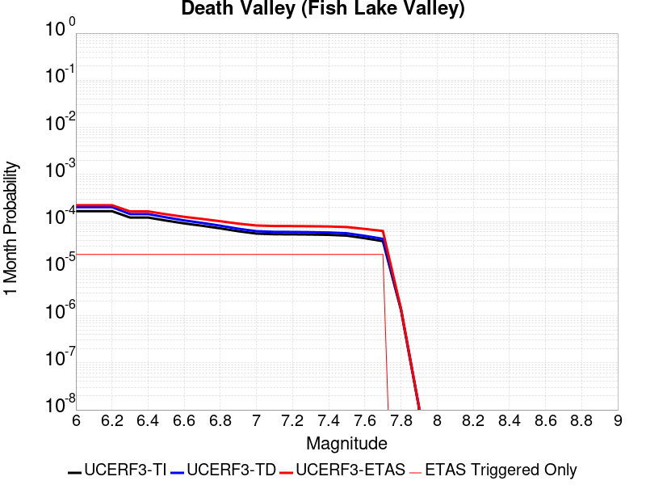 | 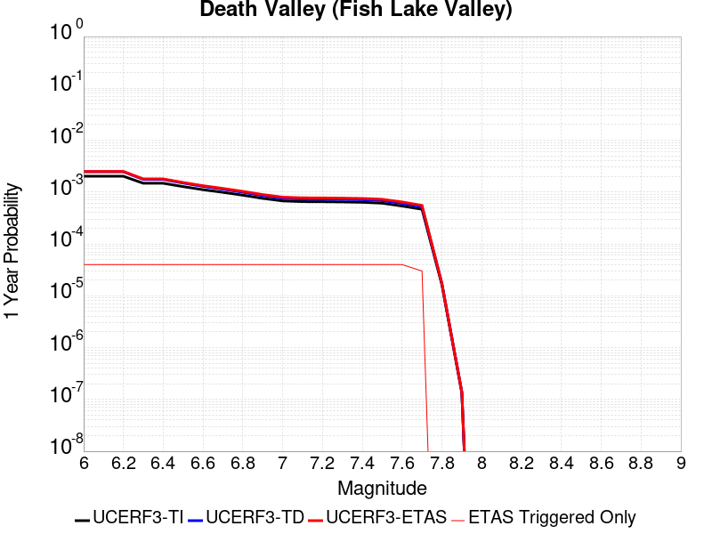 | 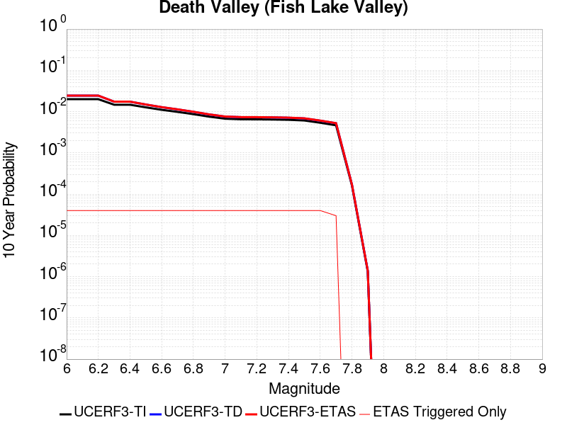 |

| Magnitude | 1 wk TI Prob | 1 wk TD Prob | 1 wk ETAS Prob | 1 wk ETAS/TD Gain | 1 wk ETAS Triggered Only | 1 mo TI Prob | 1 mo TD Prob | 1 mo ETAS Prob | 1 mo ETAS/TD Gain | 1 mo ETAS Triggered Only | 1 yr TI Prob | 1 yr TD Prob | 1 yr ETAS Prob | 1 yr ETAS/TD Gain | 1 yr ETAS Triggered Only | 10 yr TI Prob | 10 yr TD Prob | 10 yr ETAS Prob | 10 yr ETAS/TD Gain | 10 yr ETAS Triggered Only |
|-----|-----|-----|-----|-----|-----|-----|-----|-----|-----|-----|-----|-----|-----|-----|-----|-----|-----|-----|-----|-----|
| 6.0 | 3.872328E-5 | 4.7268895E-5 | 6.7267945E-5 | 1.4230913 | 2.0E-5 | 1.6594635E-4 | 2.0256694E-4 | 2.2256289E-4 | 1.0987128 | 2.0E-5 | 0.0020185246 | 0.0024636039 | 0.0025035052 | 1.0161964 | 4.0E-5 | 0.02000288 | 0.024388881 | 0.024427906 | 1.0016001 | 4.0E-5 |
| 6.1 | 3.872328E-5 | 4.7268895E-5 | 6.7267945E-5 | 1.4230913 | 2.0E-5 | 1.6594635E-4 | 2.0256694E-4 | 2.2256289E-4 | 1.0987128 | 2.0E-5 | 0.0020185246 | 0.0024636039 | 0.0025035052 | 1.0161964 | 4.0E-5 | 0.02000288 | 0.024388881 | 0.024427906 | 1.0016001 | 4.0E-5 |
| 6.2 | 3.872328E-5 | 4.7268895E-5 | 6.7267945E-5 | 1.4230913 | 2.0E-5 | 1.6594635E-4 | 2.0256694E-4 | 2.2256289E-4 | 1.0987128 | 2.0E-5 | 0.0020185246 | 0.0024636039 | 0.0025035052 | 1.0161964 | 4.0E-5 | 0.02000288 | 0.024388881 | 0.024427906 | 1.0016001 | 4.0E-5 |
| 6.3 | 2.8356371E-5 | 3.3610693E-5 | 5.361002E-5 | 1.5950288 | 2.0E-5 | 1.2152165E-4 | 1.4403832E-4 | 1.6403545E-4 | 1.138832 | 2.0E-5 | 0.0014785219 | 0.001752335 | 0.0017922649 | 1.0227867 | 4.0E-5 | 0.014687235 | 0.01739221 | 0.017431514 | 1.0022599 | 4.0E-5 |
| 6.4 | 2.8356371E-5 | 3.3610693E-5 | 5.361002E-5 | 1.5950288 | 2.0E-5 | 1.2152165E-4 | 1.4403832E-4 | 1.6403545E-4 | 1.138832 | 2.0E-5 | 0.0014785219 | 0.001752335 | 0.0017922649 | 1.0227867 | 4.0E-5 | 0.014687235 | 0.01739221 | 0.017431514 | 1.0022599 | 4.0E-5 |
| 6.5 | 2.4448687E-5 | 2.8608209E-5 | 4.8607635E-5 | 1.6990801 | 2.0E-5 | 1.0477588E-4 | 1.2260114E-4 | 1.4259868E-4 | 1.1631106 | 2.0E-5 | 0.0012748998 | 0.0014916973 | 0.0015316376 | 1.0267751 | 4.0E-5 | 0.012676105 | 0.014821712 | 0.014861119 | 1.0026587 | 4.0E-5 |
| 6.6 | 2.1298161E-5 | 2.4660607E-5 | 4.466011E-5 | 1.8109901 | 2.0E-5 | 9.127464E-5 | 1.0568422E-4 | 1.2568211E-4 | 1.189223 | 2.0E-5 | 0.0011107022 | 0.0012859798 | 0.0013259284 | 1.0310646 | 4.0E-5 | 0.011051672 | 0.012788794 | 0.012828283 | 1.0030878 | 4.0E-5 |
| 6.7 | 1.8959729E-5 | 2.178146E-5 | 4.1781022E-5 | 1.9181921 | 2.0E-5 | 8.125345E-5 | 9.3345916E-5 | 1.1334405E-4 | 1.2142369 | 2.0E-5 | 9.888117E-4 | 0.0011359196 | 0.0011758741 | 1.0351738 | 4.0E-5 | 0.009844234 | 0.011303794 | 0.011343342 | 1.0034987 | 4.0E-5 |
| 6.8 | 1.6691629E-5 | 1.9018706E-5 | 3.9018327E-5 | 2.0515761 | 2.0E-5 | 7.153359E-5 | 8.150629E-5 | 1.0150466E-4 | 1.2453598 | 2.0E-5 | 8.7057345E-4 | 9.919042E-4 | 0.0010318644 | 1.0402864 | 4.0E-5 | 0.008671708 | 0.009876527 | 0.009916131 | 1.00401 | 4.0E-5 |
| 6.9 | 1.450505E-5 | 1.6389824E-5 | 3.6389494E-5 | 2.2202494 | 2.0E-5 | 6.216302E-5 | 7.024026E-5 | 9.023886E-5 | 1.284717 | 2.0E-5 | 7.5657194E-4 | 8.548484E-4 | 8.948142E-4 | 1.046752 | 4.0E-5 | 0.007540013 | 0.008516532 | 0.008556192 | 1.0046568 | 4.0E-5 |
| 7.0 | 1.2940855E-5 | 1.453821E-5 | 3.453792E-5 | 2.3756652 | 2.0E-5 | 5.545963E-5 | 6.230516E-5 | 8.2303915E-5 | 1.3209807 | 2.0E-5 | 6.750118E-4 | 7.583071E-4 | 7.982768E-4 | 1.0527091 | 4.0E-5 | 0.006729651 | 0.0075578135 | 0.007597511 | 1.0052525 | 4.0E-5 |
| 7.1 | 1.2544658E-5 | 1.4078437E-5 | 3.4078155E-5 | 2.4205923 | 2.0E-5 | 5.3761712E-5 | 6.033479E-5 | 8.0333586E-5 | 1.3314637 | 2.0E-5 | 6.5435225E-4 | 7.343341E-4 | 7.7430473E-4 | 1.0544311 | 4.0E-5 | 0.006524288 | 0.0073196692 | 0.0073593766 | 1.0054247 | 4.0E-5 |
| 7.2 | 1.2489416E-5 | 1.4015902E-5 | 3.4015622E-5 | 2.4269307 | 2.0E-5 | 5.3524967E-5 | 6.00668E-5 | 8.00656E-5 | 1.3329426 | 2.0E-5 | 6.514716E-4 | 7.310735E-4 | 7.710443E-4 | 1.054674 | 4.0E-5 | 0.006495651 | 0.007287278 | 0.007326986 | 1.005449 | 4.0E-5 |
| 7.3 | 1.2368307E-5 | 1.3880038E-5 | 3.387976E-5 | 2.4408982 | 2.0E-5 | 5.3005948E-5 | 5.948455E-5 | 7.948336E-5 | 1.3362018 | 2.0E-5 | 6.451563E-4 | 7.239894E-4 | 7.639604E-4 | 1.0552094 | 4.0E-5 | 0.0064328653 | 0.0072168987 | 0.00725661 | 1.0055026 | 4.0E-5 |
| 7.4 | 1.2161707E-5 | 1.3648089E-5 | 3.3647815E-5 | 2.4653866 | 2.0E-5 | 5.212056E-5 | 5.8490532E-5 | 7.8489364E-5 | 1.3419157 | 2.0E-5 | 6.3438306E-4 | 7.118952E-4 | 7.5186667E-4 | 1.056148 | 4.0E-5 | 0.006325751 | 0.0070967353 | 0.0071364515 | 1.0055964 | 4.0E-5 |
| 7.5 | 1.1707948E-5 | 1.314573E-5 | 3.3145465E-5 | 2.5213866 | 2.0E-5 | 5.0175953E-5 | 5.6337656E-5 | 7.633653E-5 | 1.3549824 | 2.0E-5 | 6.10721E-4 | 6.857007E-4 | 7.256733E-4 | 1.0582945 | 4.0E-5 | 0.0060904534 | 0.0068364325 | 0.006876159 | 1.005811 | 4.0E-5 |
| 7.6 | 1.0319538E-5 | 1.157981E-5 | 3.1579577E-5 | 2.727124 | 2.0E-5 | 4.4225842E-5 | 4.9626844E-5 | 6.962585E-5 | 1.4029877 | 2.0E-5 | 5.383166E-4 | 6.040445E-4 | 6.440203E-4 | 1.0661803 | 4.0E-5 | 0.0053701443 | 0.0060245576 | 0.0060643167 | 1.0065995 | 4.0E-5 |
| 7.7 | 8.937764E-6 | 1.0022941E-5 | 3.002274E-5 | 2.9954023 | 2.0E-5 | 3.830414E-5 | 4.295478E-5 | 6.295392E-5 | 1.465586 | 2.0E-5 | 4.6625308E-4 | 5.2285404E-4 | 5.528383E-4 | 1.0573474 | 3.0E-5 | 0.0046527605 | 0.005216748 | 0.0052465918 | 1.0057207 | 3.0E-5 |
| 7.8 | 3.108007E-7 | 3.2846788E-7 | 3.2846788E-7 | 1.0 | 0.0 | 1.3320023E-6 | 1.4077187E-6 | 1.4077187E-6 | 1.0 | 0.0 | 1.6217007E-5 | 1.7138846E-5 | 1.7138846E-5 | 1.0 | 0.0 | 1.6215823E-4 | 1.713756E-4 | 1.713756E-4 | 1.0 | 0.0 |
| 7.9 | 2.5591178E-9 | 2.6696871E-9 | 2.6696871E-9 | 1.0 | 0.0 | 1.0967647E-8 | 1.1441516E-8 | 1.1441516E-8 | 1.0 | 0.0 | 1.335311E-7 | 1.3930045E-7 | 1.3930045E-7 | 1.0 | 0.0 | 1.3353102E-6 | 1.3930046E-6 | 1.3930046E-6 | 1.0 | 0.0 |

## San Andreas (Carrizo) rev
*[(top)](#table-of-contents)*

| 1 Week | 1 Month | 1 Year | 10 Year |
|-----|-----|-----|-----|
| 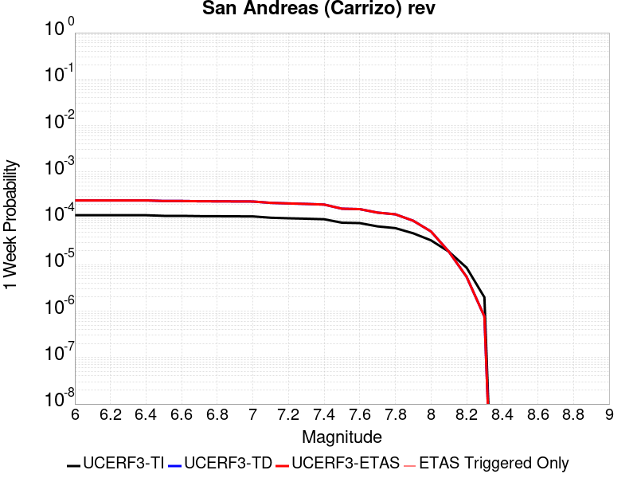 | 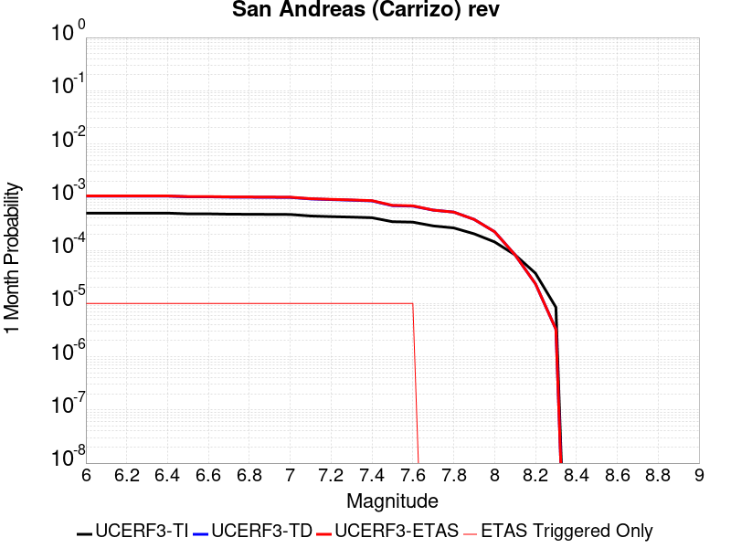 | 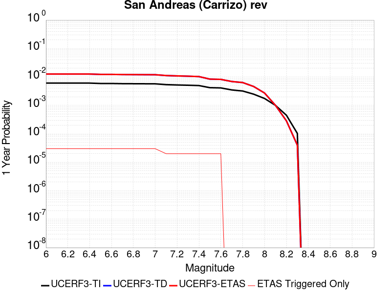 | 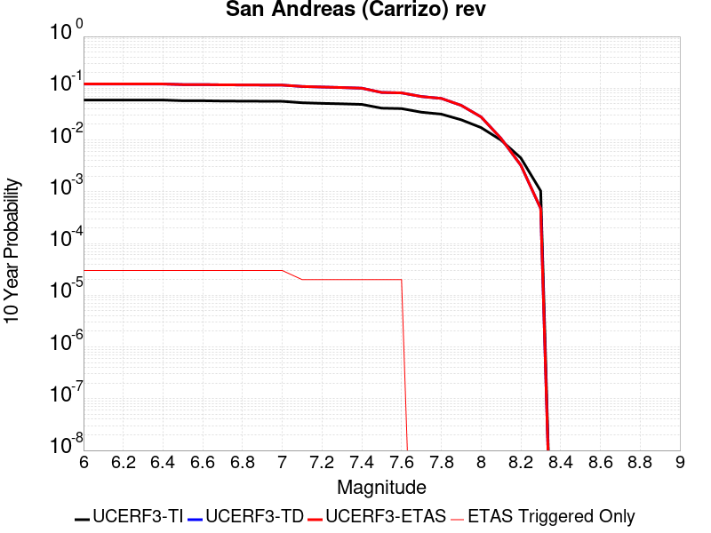 |

| Magnitude | 1 wk TI Prob | 1 wk TD Prob | 1 wk ETAS Prob | 1 wk ETAS/TD Gain | 1 wk ETAS Triggered Only | 1 mo TI Prob | 1 mo TD Prob | 1 mo ETAS Prob | 1 mo ETAS/TD Gain | 1 mo ETAS Triggered Only | 1 yr TI Prob | 1 yr TD Prob | 1 yr ETAS Prob | 1 yr ETAS/TD Gain | 1 yr ETAS Triggered Only | 10 yr TI Prob | 10 yr TD Prob | 10 yr ETAS Prob | 10 yr ETAS/TD Gain | 10 yr ETAS Triggered Only |
|-----|-----|-----|-----|-----|-----|-----|-----|-----|-----|-----|-----|-----|-----|-----|-----|-----|-----|-----|-----|-----|
| 6.0 | 1.1674632E-4 | 2.4332498E-4 | 2.4332498E-4 | 1.0 | 0.0 | 5.002454E-4 | 0.0010424062 | 0.0010523958 | 1.0095832 | 1.0E-5 | 0.006073493 | 0.012617926 | 0.012647548 | 1.0023476 | 3.0E-5 | 0.0591016 | 0.12065402 | 0.1206804 | 1.0002186 | 3.0E-5 |
| 6.1 | 1.1674632E-4 | 2.4332498E-4 | 2.4332498E-4 | 1.0 | 0.0 | 5.002454E-4 | 0.0010424062 | 0.0010523958 | 1.0095832 | 1.0E-5 | 0.006073493 | 0.012617926 | 0.012647548 | 1.0023476 | 3.0E-5 | 0.0591016 | 0.12065402 | 0.1206804 | 1.0002186 | 3.0E-5 |
| 6.2 | 1.1674632E-4 | 2.4332498E-4 | 2.4332498E-4 | 1.0 | 0.0 | 5.002454E-4 | 0.0010424062 | 0.0010523958 | 1.0095832 | 1.0E-5 | 0.006073493 | 0.012617926 | 0.012647548 | 1.0023476 | 3.0E-5 | 0.0591016 | 0.12065402 | 0.1206804 | 1.0002186 | 3.0E-5 |
| 6.3 | 1.1674632E-4 | 2.4332498E-4 | 2.4332498E-4 | 1.0 | 0.0 | 5.002454E-4 | 0.0010424062 | 0.0010523958 | 1.0095832 | 1.0E-5 | 0.006073493 | 0.012617926 | 0.012647548 | 1.0023476 | 3.0E-5 | 0.0591016 | 0.12065402 | 0.1206804 | 1.0002186 | 3.0E-5 |
| 6.4 | 1.1674632E-4 | 2.4332498E-4 | 2.4332498E-4 | 1.0 | 0.0 | 5.002454E-4 | 0.0010424062 | 0.0010523958 | 1.0095832 | 1.0E-5 | 0.006073493 | 0.012617926 | 0.012647548 | 1.0023476 | 3.0E-5 | 0.0591016 | 0.12065402 | 0.1206804 | 1.0002186 | 3.0E-5 |
| 6.5 | 1.13136164E-4 | 2.3652466E-4 | 2.3652466E-4 | 1.0 | 0.0 | 4.847792E-4 | 0.0010132849 | 0.0010232747 | 1.0098588 | 1.0E-5 | 0.0058862255 | 0.012267408 | 0.01229704 | 1.0024155 | 3.0E-5 | 0.057327334 | 0.11762535 | 0.11765182 | 1.0002251 | 3.0E-5 |
| 6.6 | 1.13136164E-4 | 2.3652466E-4 | 2.3652466E-4 | 1.0 | 0.0 | 4.847792E-4 | 0.0010132849 | 0.0010232747 | 1.0098588 | 1.0E-5 | 0.0058862255 | 0.012267408 | 0.01229704 | 1.0024155 | 3.0E-5 | 0.057327334 | 0.11762535 | 0.11765182 | 1.0002251 | 3.0E-5 |
| 6.7 | 1.1149675E-4 | 2.3343669E-4 | 2.3343669E-4 | 1.0 | 0.0 | 4.777557E-4 | 0.0010000608 | 0.0010100509 | 1.0099894 | 1.0E-5 | 0.0058011734 | 0.012108203 | 0.0121378405 | 1.0024476 | 3.0E-5 | 0.05652051 | 0.11624688 | 0.11627339 | 1.000228 | 3.0E-5 |
| 6.8 | 1.1103589E-4 | 2.3245816E-4 | 2.3245816E-4 | 1.0 | 0.0 | 4.7578133E-4 | 9.958703E-4 | 0.0010058604 | 1.0100315 | 1.0E-5 | 0.005777263 | 0.0120577505 | 0.012087388 | 1.002458 | 3.0E-5 | 0.056293584 | 0.11580715 | 0.11583368 | 1.000229 | 3.0E-5 |
| 6.9 | 1.1053259E-4 | 2.3138185E-4 | 2.3138185E-4 | 1.0 | 0.0 | 4.7362508E-4 | 9.912612E-4 | 0.0010012513 | 1.0100782 | 1.0E-5 | 0.0057511497 | 0.012002253 | 0.012031892 | 1.0024695 | 3.0E-5 | 0.05604569 | 0.11532332 | 0.11534986 | 1.0002302 | 3.0E-5 |
| 7.0 | 1.1005377E-4 | 2.3039016E-4 | 2.3039016E-4 | 1.0 | 0.0 | 4.7157376E-4 | 9.870143E-4 | 9.970044E-4 | 1.0101216 | 1.0E-5 | 0.0057263062 | 0.011951115 | 0.011980756 | 1.0024803 | 3.0E-5 | 0.055809796 | 0.11487561 | 0.11490216 | 1.0002311 | 3.0E-5 |
| 7.1 | 1.0308142E-4 | 2.1548544E-4 | 2.1548544E-4 | 1.0 | 0.0 | 4.417027E-4 | 9.231832E-4 | 9.33174E-4 | 1.010822 | 1.0E-5 | 0.0053644776 | 0.011182146 | 0.011201922 | 1.0017686 | 2.0E-5 | 0.052368138 | 0.108131535 | 0.10814938 | 1.000165 | 2.0E-5 |
| 7.2 | 1.0027479E-4 | 2.0956367E-4 | 2.0956367E-4 | 1.0 | 0.0 | 4.296783E-4 | 8.978219E-4 | 9.078129E-4 | 1.0111281 | 1.0E-5 | 0.0052187922 | 0.0108764935 | 0.010896276 | 1.0018188 | 2.0E-5 | 0.050979212 | 0.10543535 | 0.10545324 | 1.0001696 | 2.0E-5 |
| 7.3 | 9.816942E-5 | 2.0431461E-4 | 2.0431461E-4 | 1.0 | 0.0 | 4.2065824E-4 | 8.753412E-4 | 8.853324E-4 | 1.0114142 | 1.0E-5 | 0.005109493 | 0.010605487 | 0.010625275 | 1.0018659 | 2.0E-5 | 0.049935985 | 0.103018686 | 0.10303663 | 1.0001742 | 2.0E-5 |
| 7.4 | 9.5634205E-5 | 1.9800827E-4 | 1.9800827E-4 | 1.0 | 0.0 | 4.0979648E-4 | 8.4833184E-4 | 8.5832336E-4 | 1.0117779 | 1.0E-5 | 0.0049778637 | 0.0102797905 | 0.010299585 | 1.0019256 | 2.0E-5 | 0.048678253 | 0.100104466 | 0.10012247 | 1.0001798 | 2.0E-5 |
| 7.5 | 8.052417E-5 | 1.6120363E-4 | 1.6120363E-4 | 1.0 | 0.0 | 3.4505792E-4 | 6.9068995E-4 | 7.0068304E-4 | 1.0144683 | 1.0E-5 | 0.0041929903 | 0.008376808 | 0.00839664 | 1.0023675 | 2.0E-5 | 0.04114753 | 0.08284498 | 0.08286332 | 1.0002214 | 2.0E-5 |
| 7.6 | 7.897024E-5 | 1.5773512E-4 | 1.5773512E-4 | 1.0 | 0.0 | 3.384E-4 | 6.758327E-4 | 6.8582594E-4 | 1.0147866 | 1.0E-5 | 0.0041122385 | 0.008197296 | 0.008217132 | 1.0024198 | 2.0E-5 | 0.040369697 | 0.081185855 | 0.081204236 | 1.0002264 | 2.0E-5 |
| 7.7 | 6.707427E-5 | 1.3282998E-4 | 1.3282998E-4 | 1.0 | 0.0 | 2.8742946E-4 | 5.691472E-4 | 5.691472E-4 | 1.0 | 0.0 | 0.003493839 | 0.0069073834 | 0.0069073834 | 1.0 | 0.0 | 0.034394164 | 0.06907934 | 0.06907934 | 1.0 | 0.0 |
| 7.8 | 6.147705E-5 | 1.2203727E-4 | 1.2203727E-4 | 1.0 | 0.0 | 2.6344648E-4 | 5.229121E-4 | 5.229121E-4 | 1.0 | 0.0 | 0.0032027436 | 0.006347895 | 0.006347895 | 1.0 | 0.0 | 0.031569764 | 0.063543044 | 0.063543044 | 1.0 | 0.0 |
| 7.9 | 4.7636717E-5 | 8.88427E-5 | 8.88427E-5 | 1.0 | 0.0 | 2.0414138E-4 | 3.806989E-4 | 3.806989E-4 | 1.0 | 0.0 | 0.0024825884 | 0.0046251663 | 0.0046251663 | 1.0 | 0.0 | 0.024550365 | 0.046649244 | 0.046649244 | 1.0 | 0.0 |
| 8.0 | 3.3554235E-5 | 5.2164494E-5 | 5.2164494E-5 | 1.0 | 0.0 | 1.4379594E-4 | 2.2354297E-4 | 2.2354297E-4 | 1.0 | 0.0 | 0.0017493097 | 0.0027182405 | 0.0027182405 | 1.0 | 0.0 | 0.017356034 | 0.027894506 | 0.027894506 | 1.0 | 0.0 |
| 8.1 | 1.9175432E-5 | 1.9198285E-5 | 1.9198285E-5 | 1.0 | 0.0 | 8.217783E-5 | 8.227578E-5 | 8.227578E-5 | 1.0 | 0.0 | 0.0010000558 | 0.0010012479 | 0.0010012479 | 1.0 | 0.0 | 0.009955673 | 0.010765004 | 0.010765004 | 1.0 | 0.0 |
| 8.2 | 8.643924E-6 | 5.4798497E-6 | 5.4798497E-6 | 1.0 | 0.0 | 3.704486E-5 | 2.348486E-5 | 2.348486E-5 | 1.0 | 0.0 | 4.5092785E-4 | 2.858907E-4 | 2.858907E-4 | 1.0 | 0.0 | 0.0045001395 | 0.0032514327 | 0.0032514327 | 1.0 | 0.0 |
| 8.3 | 1.983087E-6 | 7.668296E-7 | 7.668296E-7 | 1.0 | 0.0 | 8.498917E-6 | 3.2864084E-6 | 3.2864084E-6 | 1.0 | 0.0 | 1.034694E-4 | 4.0011306E-5 | 4.0011306E-5 | 1.0 | 0.0 | 0.0010342124 | 4.724499E-4 | 4.724499E-4 | 1.0 | 0.0 |

## Calico-Hidalgo
*[(top)](#table-of-contents)*

| 1 Week | 1 Month | 1 Year | 10 Year |
|-----|-----|-----|-----|
| 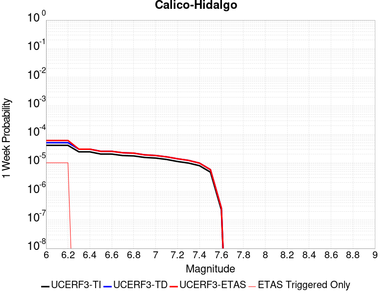 | 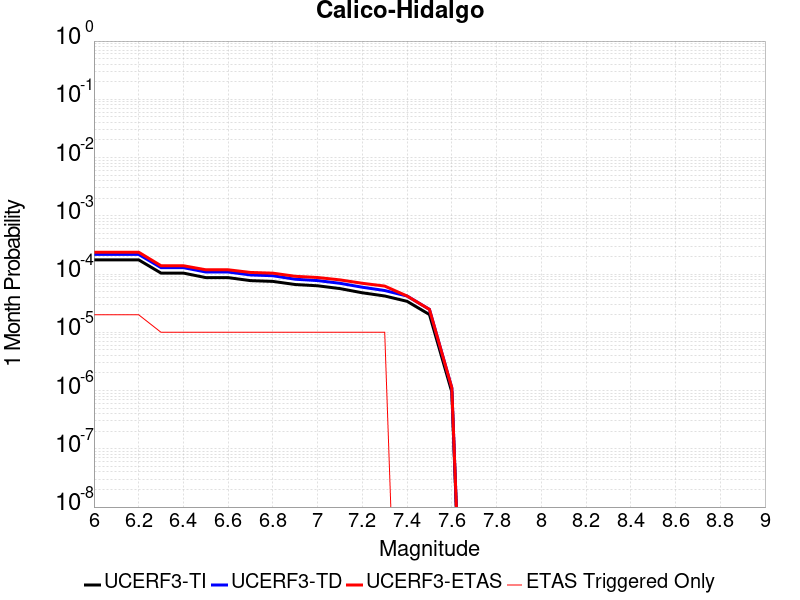 | 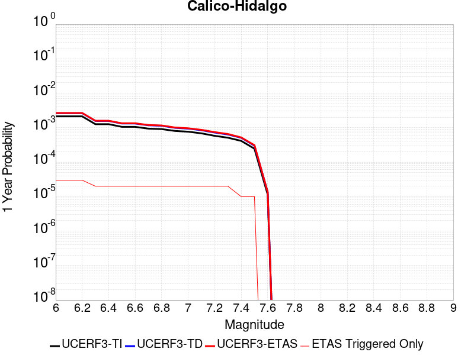 | 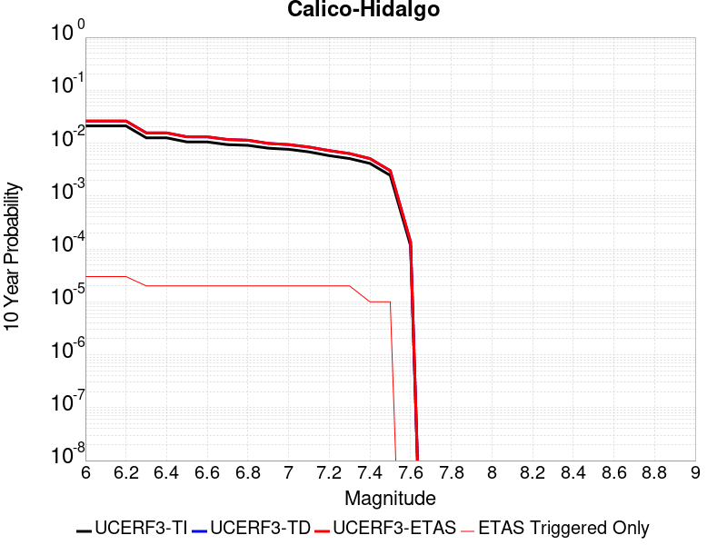 |

| Magnitude | 1 wk TI Prob | 1 wk TD Prob | 1 wk ETAS Prob | 1 wk ETAS/TD Gain | 1 wk ETAS Triggered Only | 1 mo TI Prob | 1 mo TD Prob | 1 mo ETAS Prob | 1 mo ETAS/TD Gain | 1 mo ETAS Triggered Only | 1 yr TI Prob | 1 yr TD Prob | 1 yr ETAS Prob | 1 yr ETAS/TD Gain | 1 yr ETAS Triggered Only | 10 yr TI Prob | 10 yr TD Prob | 10 yr ETAS Prob | 10 yr ETAS/TD Gain | 10 yr ETAS Triggered Only |
|-----|-----|-----|-----|-----|-----|-----|-----|-----|-----|-----|-----|-----|-----|-----|-----|-----|-----|-----|-----|-----|
| 6.0 | 4.0906612E-5 | 5.0704653E-5 | 6.0704144E-5 | 1.1972106 | 1.0E-5 | 1.7530227E-4 | 2.1728984E-4 | 2.372855E-4 | 1.092023 | 2.0E-5 | 0.0021322158 | 0.0026426981 | 0.002672619 | 1.011322 | 3.0E-5 | 0.02111873 | 0.026153097 | 0.026182313 | 1.0011171 | 3.0E-5 |
| 6.1 | 4.0906612E-5 | 5.0704653E-5 | 6.0704144E-5 | 1.1972106 | 1.0E-5 | 1.7530227E-4 | 2.1728984E-4 | 2.372855E-4 | 1.092023 | 2.0E-5 | 0.0021322158 | 0.0026426981 | 0.002672619 | 1.011322 | 3.0E-5 | 0.02111873 | 0.026153097 | 0.026182313 | 1.0011171 | 3.0E-5 |
| 6.2 | 4.0906612E-5 | 5.0704653E-5 | 6.0704144E-5 | 1.1972106 | 1.0E-5 | 1.7530227E-4 | 2.1728984E-4 | 2.372855E-4 | 1.092023 | 2.0E-5 | 0.0021322158 | 0.0026426981 | 0.002672619 | 1.011322 | 3.0E-5 | 0.02111873 | 0.026153097 | 0.026182313 | 1.0011171 | 3.0E-5 |
| 6.3 | 2.4242801E-5 | 3.009103E-5 | 3.009103E-5 | 1.0 | 0.0 | 1.0389358E-4 | 1.2895538E-4 | 1.3895408E-4 | 1.0775362 | 1.0E-5 | 0.0012641704 | 0.001568934 | 0.0015889026 | 1.0127275 | 2.0E-5 | 0.01257003 | 0.015582247 | 0.015601935 | 1.0012635 | 2.0E-5 |
| 6.4 | 2.4242801E-5 | 3.009103E-5 | 3.009103E-5 | 1.0 | 0.0 | 1.0389358E-4 | 1.2895538E-4 | 1.3895408E-4 | 1.0775362 | 1.0E-5 | 0.0012641704 | 0.001568934 | 0.0015889026 | 1.0127275 | 2.0E-5 | 0.01257003 | 0.015582247 | 0.015601935 | 1.0012635 | 2.0E-5 |
| 6.5 | 2.0286952E-5 | 2.5315985E-5 | 2.5315985E-5 | 1.0 | 0.0 | 8.694118E-5 | 1.0849266E-4 | 1.1849158E-4 | 1.0921621 | 1.0E-5 | 0.0010579949 | 0.0013201149 | 0.0013400886 | 1.0151302 | 2.0E-5 | 0.010529719 | 0.013124665 | 0.013144403 | 1.0015038 | 2.0E-5 |
| 6.6 | 2.0269223E-5 | 2.5296935E-5 | 2.5296935E-5 | 1.0 | 0.0 | 8.6865206E-5 | 1.08411026E-4 | 1.1840994E-4 | 1.0922315 | 1.0E-5 | 0.0010570707 | 0.0013191222 | 0.0013390958 | 1.0151416 | 2.0E-5 | 0.010520565 | 0.013114855 | 0.013134592 | 1.001505 | 2.0E-5 |
| 6.7 | 1.799852E-5 | 2.25408E-5 | 2.25408E-5 | 1.0 | 0.0 | 7.713423E-5 | 9.6599935E-5 | 1.0659897E-4 | 1.1035098 | 1.0E-5 | 9.3870464E-4 | 0.0011754843 | 0.0011954607 | 1.0169942 | 2.0E-5 | 0.009347493 | 0.011694277 | 0.011714043 | 1.0016903 | 2.0E-5 |
| 6.8 | 1.7458793E-5 | 2.1842314E-5 | 2.1842314E-5 | 1.0 | 0.0 | 7.4821255E-5 | 9.3606635E-5 | 1.036057E-4 | 1.10682 | 1.0E-5 | 9.10568E-4 | 0.0011390795 | 0.0011590567 | 1.0175381 | 2.0E-5 | 0.009068459 | 0.011333993 | 0.011353767 | 1.0017446 | 2.0E-5 |
| 6.9 | 1.542884E-5 | 1.9026087E-5 | 1.9026087E-5 | 1.0 | 0.0 | 6.612192E-5 | 8.1537895E-5 | 9.1537084E-5 | 1.1226324 | 1.0E-5 | 8.04737E-4 | 9.92285E-4 | 0.0010122651 | 1.0201355 | 2.0E-5 | 0.008018291 | 0.00987994 | 0.009899743 | 1.0020043 | 2.0E-5 |
| 7.0 | 1.468253E-5 | 1.8030747E-5 | 1.8030747E-5 | 1.0 | 0.0 | 6.292361E-5 | 7.7272416E-5 | 8.727164E-5 | 1.1294023 | 1.0E-5 | 7.658257E-4 | 9.403986E-4 | 9.603798E-4 | 1.0212476 | 2.0E-5 | 0.0076319184 | 0.009365558 | 0.009385371 | 1.0021155 | 2.0E-5 |
| 7.1 | 1.3139281E-5 | 1.620107E-5 | 1.620107E-5 | 1.0 | 0.0 | 5.6309986E-5 | 6.943138E-5 | 7.943068E-5 | 1.1440171 | 1.0E-5 | 6.853584E-4 | 8.4501173E-4 | 8.649949E-4 | 1.0236483 | 2.0E-5 | 0.0068324856 | 0.008419285 | 0.008439116 | 1.0023555 | 2.0E-5 |
| 7.2 | 1.1127404E-5 | 1.3866703E-5 | 1.3866703E-5 | 1.0 | 0.0 | 4.7688E-5 | 5.9427435E-5 | 6.942684E-5 | 1.1682625 | 1.0E-5 | 5.8044674E-4 | 7.2329975E-4 | 7.432852E-4 | 1.027631 | 2.0E-5 | 0.0057893298 | 0.0072105634 | 0.007230419 | 1.0027537 | 2.0E-5 |
| 7.3 | 9.808154E-6 | 1.2176301E-5 | 1.2176301E-5 | 1.0 | 0.0 | 4.2034266E-5 | 5.2183164E-5 | 6.218264E-5 | 1.1916227 | 1.0E-5 | 5.11647E-4 | 6.3515553E-4 | 6.551428E-4 | 1.0314684 | 2.0E-5 | 0.0051047057 | 0.0063344776 | 0.006354351 | 1.0031374 | 2.0E-5 |
| 7.4 | 7.942452E-6 | 9.7922075E-6 | 9.7922075E-6 | 1.0 | 0.0 | 3.4038632E-5 | 4.196598E-5 | 4.196598E-5 | 1.0 | 0.0 | 4.1434157E-4 | 5.1082554E-4 | 5.2082044E-4 | 1.0195662 | 1.0E-5 | 0.0041356985 | 0.0050974544 | 0.0051074033 | 1.0019518 | 1.0E-5 |
| 7.5 | 4.7121216E-6 | 5.772871E-6 | 5.772871E-6 | 1.0 | 0.0 | 2.019465E-5 | 2.4740684E-5 | 2.4740684E-5 | 1.0 | 0.0 | 2.4584212E-4 | 3.0118387E-4 | 3.1118086E-4 | 1.0331923 | 1.0E-5 | 0.0024557032 | 0.0030085093 | 0.003018479 | 1.0033139 | 1.0E-5 |
| 7.6 | 2.21172E-7 | 2.6039737E-7 | 2.6039737E-7 | 1.0 | 0.0 | 9.478797E-7 | 1.1159884E-6 | 1.1159884E-6 | 1.0 | 0.0 | 1.1540374E-5 | 1.3587103E-5 | 1.3587103E-5 | 1.0 | 0.0 | 1.1539775E-4 | 1.3586554E-4 | 1.3586554E-4 | 1.0 | 0.0 |

## Ludlow
*[(top)](#table-of-contents)*

| 1 Week | 1 Month | 1 Year | 10 Year |
|-----|-----|-----|-----|
| 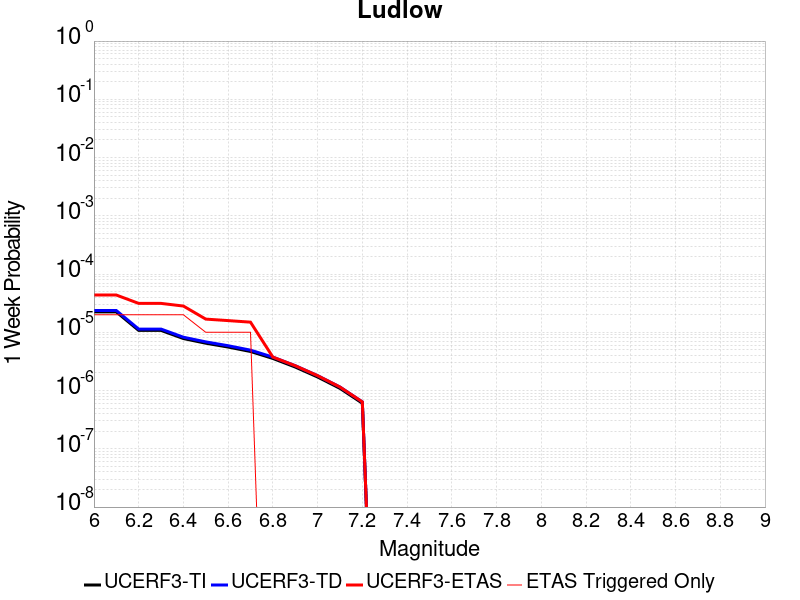 |  |  |  |

| Magnitude | 1 wk TI Prob | 1 wk TD Prob | 1 wk ETAS Prob | 1 wk ETAS/TD Gain | 1 wk ETAS Triggered Only | 1 mo TI Prob | 1 mo TD Prob | 1 mo ETAS Prob | 1 mo ETAS/TD Gain | 1 mo ETAS Triggered Only | 1 yr TI Prob | 1 yr TD Prob | 1 yr ETAS Prob | 1 yr ETAS/TD Gain | 1 yr ETAS Triggered Only | 10 yr TI Prob | 10 yr TD Prob | 10 yr ETAS Prob | 10 yr ETAS/TD Gain | 10 yr ETAS Triggered Only |
|-----|-----|-----|-----|-----|-----|-----|-----|-----|-----|-----|-----|-----|-----|-----|-----|-----|-----|-----|-----|-----|
| 6.0 | 2.2407607E-5 | 2.3657429E-5 | 4.3656957E-5 | 1.8453804 | 2.0E-5 | 9.602906E-5 | 1.0138529E-4 | 1.2138326E-4 | 1.1972473 | 2.0E-5 | 0.0011685267 | 0.001233711 | 0.001263674 | 1.0242869 | 3.0E-5 | 0.011624013 | 0.012273132 | 0.012302764 | 1.0024143 | 3.0E-5 |
| 6.1 | 2.2407607E-5 | 2.3657429E-5 | 4.3656957E-5 | 1.8453804 | 2.0E-5 | 9.602906E-5 | 1.0138529E-4 | 1.2138326E-4 | 1.1972473 | 2.0E-5 | 0.0011685267 | 0.001233711 | 0.001263674 | 1.0242869 | 3.0E-5 | 0.011624013 | 0.012273132 | 0.012302764 | 1.0024143 | 3.0E-5 |
| 6.2 | 1.0781252E-5 | 1.1365745E-5 | 3.136552E-5 | 2.7596533 | 2.0E-5 | 4.620455E-5 | 4.870945E-5 | 6.8708476E-5 | 1.4105779 | 2.0E-5 | 5.623952E-4 | 5.9288024E-4 | 6.1286835E-4 | 1.0337136 | 2.0E-5 | 0.00560974 | 0.005913404 | 0.005933285 | 1.0033622 | 2.0E-5 |
| 6.3 | 1.0781252E-5 | 1.1365745E-5 | 3.136552E-5 | 2.7596533 | 2.0E-5 | 4.620455E-5 | 4.870945E-5 | 6.8708476E-5 | 1.4105779 | 2.0E-5 | 5.623952E-4 | 5.9288024E-4 | 6.1286835E-4 | 1.0337136 | 2.0E-5 | 0.00560974 | 0.005913404 | 0.005933285 | 1.0033622 | 2.0E-5 |
| 6.4 | 7.814439E-6 | 8.237788E-6 | 2.8237624E-5 | 3.4278162 | 2.0E-5 | 3.3490025E-5 | 3.5304336E-5 | 5.530363E-5 | 1.5664827 | 2.0E-5 | 4.0766477E-4 | 4.2974693E-4 | 4.4973832E-4 | 1.046519 | 2.0E-5 | 0.0040691774 | 0.0042893053 | 0.0043092193 | 1.0046427 | 2.0E-5 |
| 6.5 | 6.4986366E-6 | 6.850969E-6 | 1.68509E-5 | 2.4596376 | 1.0E-5 | 2.7851002E-5 | 2.936097E-5 | 3.9360675E-5 | 1.3405782 | 1.0E-5 | 3.390332E-4 | 3.574121E-4 | 3.6740853E-4 | 1.0279689 | 1.0E-5 | 0.003385164 | 0.0035684688 | 0.0035784333 | 1.0027924 | 1.0E-5 |
| 6.6 | 5.582177E-6 | 5.8860483E-6 | 1.588599E-5 | 2.6989229 | 1.0E-5 | 2.3923398E-5 | 2.522568E-5 | 3.522543E-5 | 1.3964114 | 1.0E-5 | 2.9122844E-4 | 3.070801E-4 | 3.17077E-4 | 1.0325547 | 1.0E-5 | 0.0029084706 | 0.003066631 | 0.0030766004 | 1.003251 | 1.0E-5 |
| 6.7 | 4.6858763E-6 | 4.940463E-6 | 1.4940413E-5 | 3.024092 | 1.0E-5 | 2.0082172E-5 | 2.1173244E-5 | 3.1173033E-5 | 1.4722842 | 1.0E-5 | 2.4447302E-4 | 2.577543E-4 | 2.6775172E-4 | 1.0387866 | 1.0E-5 | 0.0024420423 | 0.0025746098 | 0.002584584 | 1.0038741 | 1.0E-5 |
| 6.8 | 3.5584908E-6 | 3.7520454E-6 | 3.7520454E-6 | 1.0 | 0.0 | 1.5250586E-5 | 1.6080097E-5 | 1.6080097E-5 | 1.0 | 0.0 | 1.8566006E-4 | 1.9575801E-4 | 1.9575801E-4 | 1.0 | 0.0 | 0.0018550502 | 0.0019558968 | 0.0019558968 | 1.0 | 0.0 |
| 6.9 | 2.532834E-6 | 2.6710227E-6 | 2.6710227E-6 | 1.0 | 0.0 | 1.0854958E-5 | 1.1447192E-5 | 1.1447192E-5 | 1.0 | 0.0 | 1.3215111E-4 | 1.3936093E-4 | 1.3936093E-4 | 1.0 | 0.0 | 0.0013207254 | 0.0013927629 | 0.0013927629 | 1.0 | 0.0 |
| 7.0 | 1.7083285E-6 | 1.801957E-6 | 1.801957E-6 | 1.0 | 0.0 | 7.3213873E-6 | 7.7226505E-6 | 7.7226505E-6 | 1.0 | 0.0 | 8.913424E-5 | 9.4019386E-5 | 9.4019386E-5 | 1.0 | 0.0 | 8.9098496E-4 | 9.3981257E-4 | 9.3981257E-4 | 1.0 | 0.0 |
| 7.1 | 1.0905424E-6 | 1.1497702E-6 | 1.1497702E-6 | 1.0 | 0.0 | 4.6737446E-6 | 4.927578E-6 | 4.927578E-6 | 1.0 | 0.0 | 5.6901354E-5 | 5.999171E-5 | 5.999171E-5 | 1.0 | 0.0 | 5.6886784E-4 | 5.997649E-4 | 5.997649E-4 | 1.0 | 0.0 |
| 7.2 | 6.06668E-7 | 6.387322E-7 | 6.387322E-7 | 1.0 | 0.0 | 2.600003E-6 | 2.7374213E-6 | 2.7374213E-6 | 1.0 | 0.0 | 3.1654577E-5 | 3.3327666E-5 | 3.3327666E-5 | 1.0 | 0.0 | 3.1650066E-4 | 3.332335E-4 | 3.332335E-4 | 1.0 | 0.0 |

## Kern Canyon (North Kern) 2011
*[(top)](#table-of-contents)*

| 1 Week | 1 Month | 1 Year | 10 Year |
|-----|-----|-----|-----|
|  |  |  |  |

| Magnitude | 1 wk TI Prob | 1 wk TD Prob | 1 wk ETAS Prob | 1 wk ETAS/TD Gain | 1 wk ETAS Triggered Only | 1 mo TI Prob | 1 mo TD Prob | 1 mo ETAS Prob | 1 mo ETAS/TD Gain | 1 mo ETAS Triggered Only | 1 yr TI Prob | 1 yr TD Prob | 1 yr ETAS Prob | 1 yr ETAS/TD Gain | 1 yr ETAS Triggered Only | 10 yr TI Prob | 10 yr TD Prob | 10 yr ETAS Prob | 10 yr ETAS/TD Gain | 10 yr ETAS Triggered Only |
|-----|-----|-----|-----|-----|-----|-----|-----|-----|-----|-----|-----|-----|-----|-----|-----|-----|-----|-----|-----|-----|
| 6.0 | 6.6264497E-6 | 6.7573515E-6 | 6.7573515E-6 | 1.0 | 0.0 | 2.8398761E-5 | 2.8959801E-5 | 2.8959801E-5 | 1.0 | 0.0 | 3.4570007E-4 | 3.5253653E-4 | 3.725295E-4 | 1.0567117 | 2.0E-5 | 0.0034516277 | 0.0035205614 | 0.0035504557 | 1.0084914 | 3.0E-5 |
| 6.1 | 6.6264497E-6 | 6.7573515E-6 | 6.7573515E-6 | 1.0 | 0.0 | 2.8398761E-5 | 2.8959801E-5 | 2.8959801E-5 | 1.0 | 0.0 | 3.4570007E-4 | 3.5253653E-4 | 3.725295E-4 | 1.0567117 | 2.0E-5 | 0.0034516277 | 0.0035205614 | 0.0035504557 | 1.0084914 | 3.0E-5 |
| 6.2 | 6.6264497E-6 | 6.7573515E-6 | 6.7573515E-6 | 1.0 | 0.0 | 2.8398761E-5 | 2.8959801E-5 | 2.8959801E-5 | 1.0 | 0.0 | 3.4570007E-4 | 3.5253653E-4 | 3.725295E-4 | 1.0567117 | 2.0E-5 | 0.0034516277 | 0.0035205614 | 0.0035504557 | 1.0084914 | 3.0E-5 |
| 6.3 | 6.6264497E-6 | 6.7573515E-6 | 6.7573515E-6 | 1.0 | 0.0 | 2.8398761E-5 | 2.8959801E-5 | 2.8959801E-5 | 1.0 | 0.0 | 3.4570007E-4 | 3.5253653E-4 | 3.725295E-4 | 1.0567117 | 2.0E-5 | 0.0034516277 | 0.0035205614 | 0.0035504557 | 1.0084914 | 3.0E-5 |
| 6.4 | 6.6264497E-6 | 6.7573515E-6 | 6.7573515E-6 | 1.0 | 0.0 | 2.8398761E-5 | 2.8959801E-5 | 2.8959801E-5 | 1.0 | 0.0 | 3.4570007E-4 | 3.5253653E-4 | 3.725295E-4 | 1.0567117 | 2.0E-5 | 0.0034516277 | 0.0035205614 | 0.0035504557 | 1.0084914 | 3.0E-5 |
| 6.5 | 3.2162225E-6 | 3.2571006E-6 | 3.2571006E-6 | 1.0 | 0.0 | 1.3783738E-5 | 1.3958933E-5 | 1.3958933E-5 | 1.0 | 0.0 | 1.6780409E-4 | 1.6993756E-4 | 1.6993756E-4 | 1.0 | 0.0 | 0.0016767744 | 0.0016981558 | 0.0016981558 | 1.0 | 0.0 |
| 6.6 | 3.2162225E-6 | 3.2571006E-6 | 3.2571006E-6 | 1.0 | 0.0 | 1.3783738E-5 | 1.3958933E-5 | 1.3958933E-5 | 1.0 | 0.0 | 1.6780409E-4 | 1.6993756E-4 | 1.6993756E-4 | 1.0 | 0.0 | 0.0016767744 | 0.0016981558 | 0.0016981558 | 1.0 | 0.0 |
| 6.7 | 2.1908265E-6 | 2.2071279E-6 | 2.2071279E-6 | 1.0 | 0.0 | 9.389223E-6 | 9.459087E-6 | 9.459087E-6 | 1.0 | 0.0 | 1.1430779E-4 | 1.1515849E-4 | 1.1515849E-4 | 1.0 | 0.0 | 0.0011424901 | 0.0011510076 | 0.0011510076 | 1.0 | 0.0 |
| 6.8 | 1.7303895E-6 | 1.7365574E-6 | 1.7365574E-6 | 1.0 | 0.0 | 7.415934E-6 | 7.442368E-6 | 7.442368E-6 | 1.0 | 0.0 | 9.028525E-5 | 9.060716E-5 | 9.060716E-5 | 1.0 | 0.0 | 9.024858E-4 | 9.057119E-4 | 9.057119E-4 | 1.0 | 0.0 |
| 6.9 | 1.3700314E-6 | 1.3688657E-6 | 1.3688657E-6 | 1.0 | 0.0 | 5.87155E-6 | 5.866554E-6 | 5.866554E-6 | 1.0 | 0.0 | 7.148377E-5 | 7.1423005E-5 | 7.1423005E-5 | 1.0 | 0.0 | 7.146078E-4 | 7.1400503E-4 | 7.1400503E-4 | 1.0 | 0.0 |
| 7.0 | 1.1467797E-6 | 1.1413833E-6 | 1.1413833E-6 | 1.0 | 0.0 | 4.9147607E-6 | 4.8916336E-6 | 4.8916336E-6 | 1.0 | 0.0 | 5.983557E-5 | 5.9554044E-5 | 5.9554044E-5 | 1.0 | 0.0 | 5.981946E-4 | 5.95384E-4 | 5.95384E-4 | 1.0 | 0.0 |
| 7.1 | 9.3952065E-7 | 9.302714E-7 | 9.302714E-7 | 1.0 | 0.0 | 4.026511E-6 | 3.9868714E-6 | 3.9868714E-6 | 1.0 | 0.0 | 4.9021666E-5 | 4.8539096E-5 | 4.8539096E-5 | 1.0 | 0.0 | 4.901085E-4 | 4.8528673E-4 | 4.8528673E-4 | 1.0 | 0.0 |
| 7.2 | 6.858055E-7 | 6.719318E-7 | 6.719318E-7 | 1.0 | 0.0 | 2.939163E-6 | 2.8797044E-6 | 2.8797044E-6 | 1.0 | 0.0 | 3.5783723E-5 | 3.5059846E-5 | 3.5059846E-5 | 1.0 | 0.0 | 3.5777962E-4 | 3.5054405E-4 | 3.5054405E-4 | 1.0 | 0.0 |
| 7.3 | 5.1101983E-7 | 4.939313E-7 | 4.939313E-7 | 1.0 | 0.0 | 2.1900833E-6 | 2.1168466E-6 | 2.1168466E-6 | 1.0 | 0.0 | 2.6663936E-5 | 2.5772308E-5 | 2.5772308E-5 | 1.0 | 0.0 | 2.6660739E-4 | 2.5769367E-4 | 2.5769367E-4 | 1.0 | 0.0 |
| 7.4 | 3.4999414E-7 | 3.2995996E-7 | 3.2995996E-7 | 1.0 | 0.0 | 1.499974E-6 | 1.4141134E-6 | 1.4141134E-6 | 1.0 | 0.0 | 1.8262032E-5 | 1.7216697E-5 | 1.7216697E-5 | 1.0 | 0.0 | 1.826053E-4 | 1.7215387E-4 | 1.7215387E-4 | 1.0 | 0.0 |
| 7.5 | 1.7021522E-7 | 1.4750091E-7 | 1.4750091E-7 | 1.0 | 0.0 | 7.2949354E-7 | 6.3214657E-7 | 6.3214657E-7 | 1.0 | 0.0 | 8.881548E-6 | 7.696359E-6 | 7.696359E-6 | 1.0 | 0.0 | 8.8811925E-5 | 7.6961E-5 | 7.6961E-5 | 1.0 | 0.0 |
| 7.6 | 2.572245E-8 | 1.7352637E-8 | 1.7352637E-8 | 1.0 | 0.0 | 1.10239064E-7 | 7.4368444E-8 | 7.4368444E-8 | 1.0 | 0.0 | 1.3421597E-6 | 9.0543546E-7 | 9.0543546E-7 | 1.0 | 0.0 | 1.3421517E-5 | 9.0543235E-6 | 9.0543235E-6 | 1.0 | 0.0 |

## Cleghorn Pass
*[(top)](#table-of-contents)*

| 1 Week | 1 Month | 1 Year | 10 Year |
|-----|-----|-----|-----|
|  |  | 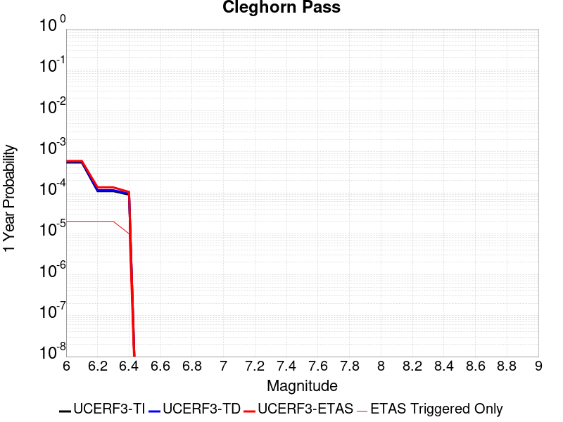 |  |

| Magnitude | 1 wk TI Prob | 1 wk TD Prob | 1 wk ETAS Prob | 1 wk ETAS/TD Gain | 1 wk ETAS Triggered Only | 1 mo TI Prob | 1 mo TD Prob | 1 mo ETAS Prob | 1 mo ETAS/TD Gain | 1 mo ETAS Triggered Only | 1 yr TI Prob | 1 yr TD Prob | 1 yr ETAS Prob | 1 yr ETAS/TD Gain | 1 yr ETAS Triggered Only | 10 yr TI Prob | 10 yr TD Prob | 10 yr ETAS Prob | 10 yr ETAS/TD Gain | 10 yr ETAS Triggered Only |
|-----|-----|-----|-----|-----|-----|-----|-----|-----|-----|-----|-----|-----|-----|-----|-----|-----|-----|-----|-----|-----|
| 6.0 | 1.0522846E-5 | 1.1040714E-5 | 2.1040603E-5 | 1.9057286 | 1.0E-5 | 4.509713E-5 | 4.7316782E-5 | 5.731631E-5 | 1.2113315 | 1.0E-5 | 5.4891926E-4 | 5.759822E-4 | 5.9597066E-4 | 1.0347033 | 2.0E-5 | 0.0054756533 | 0.005750059 | 0.0057699443 | 1.0034583 | 2.0E-5 |
| 6.1 | 1.0522846E-5 | 1.1040714E-5 | 2.1040603E-5 | 1.9057286 | 1.0E-5 | 4.509713E-5 | 4.7316782E-5 | 5.731631E-5 | 1.2113315 | 1.0E-5 | 5.4891926E-4 | 5.759822E-4 | 5.9597066E-4 | 1.0347033 | 2.0E-5 | 0.0054756533 | 0.005750059 | 0.0057699443 | 1.0034583 | 2.0E-5 |
| 6.2 | 2.1045846E-6 | 2.2082168E-6 | 1.2208195E-5 | 5.5285306 | 1.0E-5 | 9.019617E-6 | 9.463776E-6 | 1.9463681E-5 | 2.0566506 | 1.0E-5 | 1.098083E-4 | 1.1521958E-4 | 1.3521727E-4 | 1.1735616 | 2.0E-5 | 0.0010975406 | 0.0011520098 | 0.0011719867 | 1.017341 | 2.0E-5 |
| 6.3 | 2.1045846E-6 | 2.2082168E-6 | 1.2208195E-5 | 5.5285306 | 1.0E-5 | 9.019617E-6 | 9.463776E-6 | 1.9463681E-5 | 2.0566506 | 1.0E-5 | 1.098083E-4 | 1.1521958E-4 | 1.3521727E-4 | 1.1735616 | 2.0E-5 | 0.0010975406 | 0.0011520098 | 0.0011719867 | 1.017341 | 2.0E-5 |
| 6.4 | 1.7259927E-6 | 1.8108889E-6 | 1.8108889E-6 | 1.0 | 0.0 | 7.3970905E-6 | 7.760952E-6 | 7.760952E-6 | 1.0 | 0.0 | 9.005586E-5 | 9.4489595E-5 | 1.0448865E-4 | 1.1058217 | 1.0E-5 | 9.001937E-4 | 9.4489596E-4 | 9.548865E-4 | 1.0105731 | 1.0E-5 |

## San Jacinto (Anza) rev
*[(top)](#table-of-contents)*

| 1 Week | 1 Month | 1 Year | 10 Year |
|-----|-----|-----|-----|
| 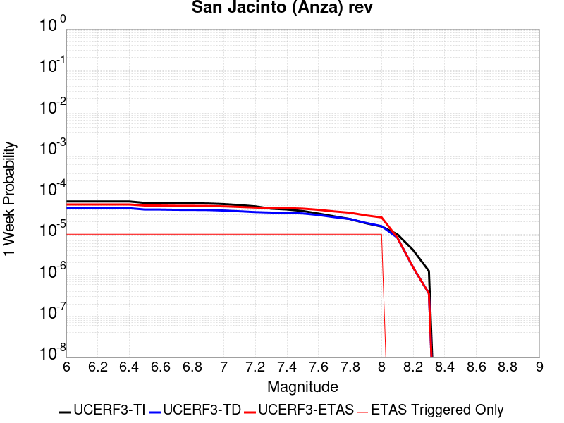 | 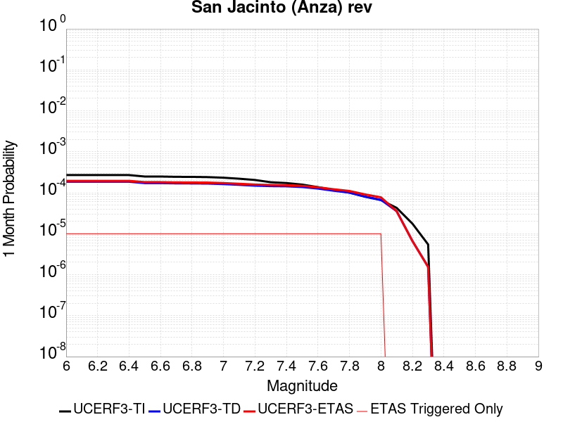 |  | 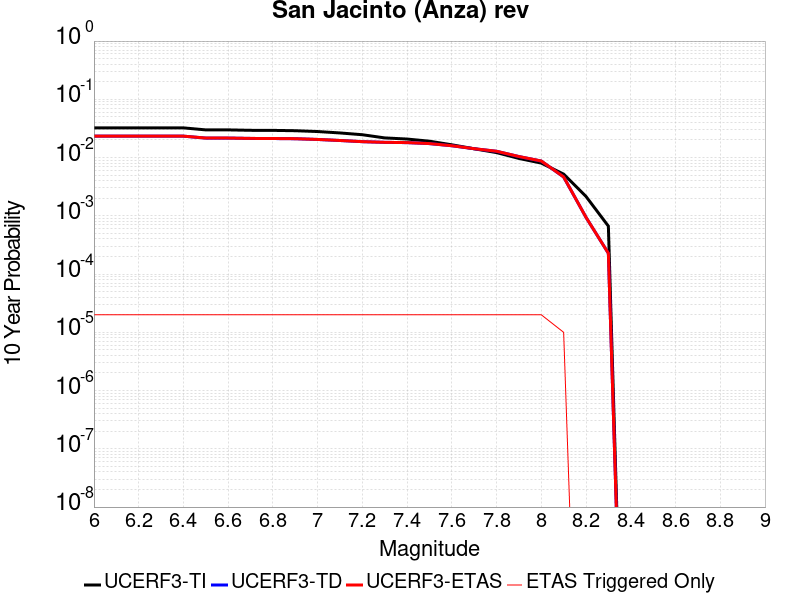 |

| Magnitude | 1 wk TI Prob | 1 wk TD Prob | 1 wk ETAS Prob | 1 wk ETAS/TD Gain | 1 wk ETAS Triggered Only | 1 mo TI Prob | 1 mo TD Prob | 1 mo ETAS Prob | 1 mo ETAS/TD Gain | 1 mo ETAS Triggered Only | 1 yr TI Prob | 1 yr TD Prob | 1 yr ETAS Prob | 1 yr ETAS/TD Gain | 1 yr ETAS Triggered Only | 10 yr TI Prob | 10 yr TD Prob | 10 yr ETAS Prob | 10 yr ETAS/TD Gain | 10 yr ETAS Triggered Only |
|-----|-----|-----|-----|-----|-----|-----|-----|-----|-----|-----|-----|-----|-----|-----|-----|-----|-----|-----|-----|-----|
| 6.0 | 6.3015636E-5 | 4.3319626E-5 | 5.3319192E-5 | 1.2308322 | 1.0E-5 | 2.7003905E-4 | 1.8564239E-4 | 1.9564053E-4 | 1.053857 | 1.0E-5 | 0.0032827691 | 0.0022578652 | 0.0022778201 | 1.0088379 | 2.0E-5 | 0.032346968 | 0.02330496 | 0.023324493 | 1.0008382 | 2.0E-5 |
| 6.1 | 6.3015636E-5 | 4.3319626E-5 | 5.3319192E-5 | 1.2308322 | 1.0E-5 | 2.7003905E-4 | 1.8564239E-4 | 1.9564053E-4 | 1.053857 | 1.0E-5 | 0.0032827691 | 0.0022578652 | 0.0022778201 | 1.0088379 | 2.0E-5 | 0.032346968 | 0.02330496 | 0.023324493 | 1.0008382 | 2.0E-5 |
| 6.2 | 6.3015636E-5 | 4.3319626E-5 | 5.3319192E-5 | 1.2308322 | 1.0E-5 | 2.7003905E-4 | 1.8564239E-4 | 1.9564053E-4 | 1.053857 | 1.0E-5 | 0.0032827691 | 0.0022578652 | 0.0022778201 | 1.0088379 | 2.0E-5 | 0.032346968 | 0.02330496 | 0.023324493 | 1.0008382 | 2.0E-5 |
| 6.3 | 6.3015636E-5 | 4.3319626E-5 | 5.3319192E-5 | 1.2308322 | 1.0E-5 | 2.7003905E-4 | 1.8564239E-4 | 1.9564053E-4 | 1.053857 | 1.0E-5 | 0.0032827691 | 0.0022578652 | 0.0022778201 | 1.0088379 | 2.0E-5 | 0.032346968 | 0.02330496 | 0.023324493 | 1.0008382 | 2.0E-5 |
| 6.4 | 6.3015636E-5 | 4.3319626E-5 | 5.3319192E-5 | 1.2308322 | 1.0E-5 | 2.7003905E-4 | 1.8564239E-4 | 1.9564053E-4 | 1.053857 | 1.0E-5 | 0.0032827691 | 0.0022578652 | 0.0022778201 | 1.0088379 | 2.0E-5 | 0.032346968 | 0.02330496 | 0.023324493 | 1.0008382 | 2.0E-5 |
| 6.5 | 5.811017E-5 | 4.0098632E-5 | 5.009823E-5 | 1.2493751 | 1.0E-5 | 2.4901982E-4 | 1.7184E-4 | 1.8183827E-4 | 1.0581837 | 1.0E-5 | 0.0030276014 | 0.00209015 | 0.0021101083 | 1.0095487 | 2.0E-5 | 0.02986684 | 0.021602087 | 0.021621654 | 1.0009059 | 2.0E-5 |
| 6.6 | 5.811017E-5 | 4.0098632E-5 | 5.009823E-5 | 1.2493751 | 1.0E-5 | 2.4901982E-4 | 1.7184E-4 | 1.8183827E-4 | 1.0581837 | 1.0E-5 | 0.0030276014 | 0.00209015 | 0.0021101083 | 1.0095487 | 2.0E-5 | 0.02986684 | 0.021602087 | 0.021621654 | 1.0009059 | 2.0E-5 |
| 6.7 | 5.712442E-5 | 3.952116E-5 | 4.9520764E-5 | 1.253019 | 1.0E-5 | 2.4479596E-4 | 1.6936543E-4 | 1.7936373E-4 | 1.0590339 | 1.0E-5 | 0.0029763177 | 0.0020600795 | 0.0020800384 | 1.0096884 | 2.0E-5 | 0.029367693 | 0.021293823 | 0.021313397 | 1.0009192 | 2.0E-5 |
| 6.8 | 5.6967532E-5 | 3.9377548E-5 | 4.9377155E-5 | 1.2539418 | 1.0E-5 | 2.4412372E-4 | 1.6875003E-4 | 1.7874835E-4 | 1.0592493 | 1.0E-5 | 0.0029681553 | 0.0020526012 | 0.0020725601 | 1.0097238 | 2.0E-5 | 0.029288229 | 0.021218529 | 0.021238104 | 1.0009226 | 2.0E-5 |
| 6.9 | 5.6211324E-5 | 3.9082228E-5 | 4.908184E-5 | 1.2558608 | 1.0E-5 | 2.4088343E-4 | 1.6748454E-4 | 1.7748287E-4 | 1.059697 | 1.0E-5 | 0.0029288116 | 0.0020372227 | 0.002057182 | 1.0097973 | 2.0E-5 | 0.028905109 | 0.021057902 | 0.02107748 | 1.0009297 | 2.0E-5 |
| 7.0 | 5.4383527E-5 | 3.7942387E-5 | 4.7942005E-5 | 1.2635475 | 1.0E-5 | 2.3305144E-4 | 1.6260012E-4 | 1.7259849E-4 | 1.0614905 | 1.0E-5 | 0.0028337094 | 0.001977864 | 0.0019978243 | 1.0100919 | 2.0E-5 | 0.027978465 | 0.020448677 | 0.020468267 | 1.0009581 | 2.0E-5 |
| 7.1 | 5.1393665E-5 | 3.640475E-5 | 4.6404384E-5 | 1.2746794 | 1.0E-5 | 2.2023996E-4 | 1.5601104E-4 | 1.6600947E-4 | 1.064088 | 1.0E-5 | 0.0026781242 | 0.0018977838 | 0.0019177458 | 1.0105186 | 2.0E-5 | 0.026460782 | 0.019622007 | 0.019641614 | 1.0009992 | 2.0E-5 |
| 7.2 | 4.785222E-5 | 3.475601E-5 | 4.4755663E-5 | 1.2877101 | 1.0E-5 | 2.0506482E-4 | 1.4894584E-4 | 1.5894436E-4 | 1.0671285 | 1.0E-5 | 0.0024938055 | 0.0018119109 | 0.0018318746 | 1.011018 | 2.0E-5 | 0.024660049 | 0.018736389 | 0.018756015 | 1.0010475 | 2.0E-5 |
| 7.3 | 4.2143256E-5 | 3.3850083E-5 | 4.3849745E-5 | 1.2954103 | 1.0E-5 | 1.8060145E-4 | 1.4506375E-4 | 1.550623E-4 | 1.0689253 | 1.0E-5 | 0.002196605 | 0.0017647238 | 0.0017846884 | 1.0113132 | 2.0E-5 | 0.02175019 | 0.018244414 | 0.01826405 | 1.0010762 | 2.0E-5 |
| 7.4 | 4.0264713E-5 | 3.3488133E-5 | 4.34878E-5 | 1.2986032 | 1.0E-5 | 1.7255165E-4 | 1.435127E-4 | 1.5351127E-4 | 1.0696702 | 1.0E-5 | 0.002098792 | 0.0017458702 | 0.0017658353 | 1.0114356 | 2.0E-5 | 0.020790804 | 0.018048922 | 0.018068561 | 1.0010881 | 2.0E-5 |
| 7.5 | 3.694492E-5 | 3.2201835E-5 | 4.2201515E-5 | 1.3105313 | 1.0E-5 | 1.5832575E-4 | 1.3800059E-4 | 1.479992E-4 | 1.0724535 | 1.0E-5 | 0.0019259118 | 0.0016788654 | 0.0016988318 | 1.0118928 | 2.0E-5 | 0.01909306 | 0.017365217 | 0.01738487 | 1.0011318 | 2.0E-5 |
| 7.6 | 3.200565E-5 | 2.9517045E-5 | 3.9516748E-5 | 1.3387773 | 1.0E-5 | 1.3715986E-4 | 1.2649549E-4 | 1.3649423E-4 | 1.0790442 | 1.0E-5 | 0.001668642 | 0.0015389969 | 0.0015589661 | 1.0129755 | 2.0E-5 | 0.01656168 | 0.015953032 | 0.015972713 | 1.0012337 | 2.0E-5 |
| 7.7 | 2.731642E-5 | 2.610537E-5 | 3.610511E-5 | 1.383053 | 1.0E-5 | 1.1706512E-4 | 1.11875364E-4 | 1.2187425E-4 | 1.0893751 | 1.0E-5 | 0.001424336 | 0.0013612325 | 0.0013812053 | 1.0146725 | 2.0E-5 | 0.014152412 | 0.0141735645 | 0.0141932815 | 1.001391 | 2.0E-5 |
| 7.8 | 2.3466424E-5 | 2.3516895E-5 | 3.351666E-5 | 1.4252162 | 1.0E-5 | 1.0056651E-4 | 1.007828E-4 | 1.10781795E-4 | 1.0992132 | 1.0E-5 | 0.0012237094 | 0.0012263408 | 0.0012463162 | 1.0162886 | 2.0E-5 | 0.012169928 | 0.012815201 | 0.012834944 | 1.0015407 | 2.0E-5 |
| 7.9 | 1.8611925E-5 | 1.8918972E-5 | 2.8918783E-5 | 1.5285599 | 1.0E-5 | 7.9762955E-5 | 8.107879E-5 | 9.107798E-5 | 1.1233268 | 1.0E-5 | 9.7068126E-4 | 9.86688E-4 | 0.0010066682 | 1.0202498 | 2.0E-5 | 0.0096645225 | 0.010399517 | 0.010419308 | 1.0019032 | 2.0E-5 |
| 8.0 | 1.5460775E-5 | 1.5750582E-5 | 2.5750425E-5 | 1.6348871 | 1.0E-5 | 6.6258784E-5 | 6.7500754E-5 | 7.750008E-5 | 1.1481365 | 1.0E-5 | 8.0640207E-4 | 8.215125E-4 | 8.4149605E-4 | 1.0243254 | 2.0E-5 | 0.008034821 | 0.008707945 | 0.008727771 | 1.0022768 | 2.0E-5 |
| 8.1 | 9.983884E-6 | 8.275629E-6 | 8.275629E-6 | 1.0 | 0.0 | 4.2787375E-5 | 3.54665E-5 | 3.54665E-5 | 1.0 | 0.0 | 5.2081177E-4 | 4.3171959E-4 | 4.4171527E-4 | 1.0231532 | 1.0E-5 | 0.0051959283 | 0.004643071 | 0.0046530245 | 1.0021437 | 1.0E-5 |
| 8.2 | 4.1226E-6 | 1.5546157E-6 | 1.5546157E-6 | 1.0 | 0.0 | 1.7668166E-5 | 6.6626217E-6 | 6.6626217E-6 | 1.0 | 0.0 | 2.1508869E-4 | 8.111443E-5 | 8.111443E-5 | 1.0 | 0.0 | 0.0021488064 | 9.4143586E-4 | 9.4143586E-4 | 1.0 | 0.0 |
| 8.3 | 1.2750878E-6 | 3.6166134E-7 | 3.6166134E-7 | 1.0 | 0.0 | 5.4646503E-6 | 1.5499762E-6 | 1.5499762E-6 | 1.0 | 0.0 | 6.653009E-5 | 1.8870802E-5 | 1.8870802E-5 | 1.0 | 0.0 | 6.6510175E-4 | 2.2760578E-4 | 2.2760578E-4 | 1.0 | 0.0 |

## Baker
*[(top)](#table-of-contents)*

| 1 Week | 1 Month | 1 Year | 10 Year |
|-----|-----|-----|-----|
|  |  | 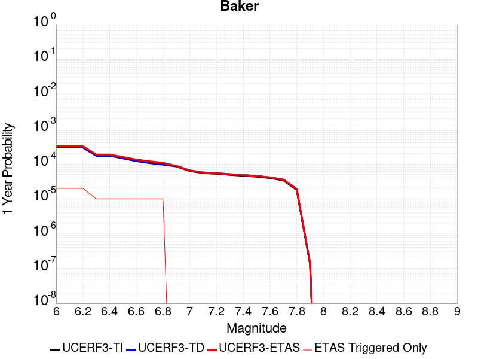 | 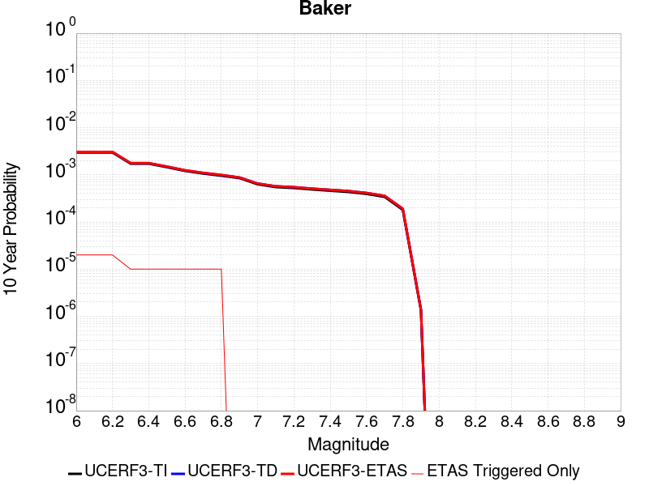 |

| Magnitude | 1 wk TI Prob | 1 wk TD Prob | 1 wk ETAS Prob | 1 wk ETAS/TD Gain | 1 wk ETAS Triggered Only | 1 mo TI Prob | 1 mo TD Prob | 1 mo ETAS Prob | 1 mo ETAS/TD Gain | 1 mo ETAS Triggered Only | 1 yr TI Prob | 1 yr TD Prob | 1 yr ETAS Prob | 1 yr ETAS/TD Gain | 1 yr ETAS Triggered Only | 10 yr TI Prob | 10 yr TD Prob | 10 yr ETAS Prob | 10 yr ETAS/TD Gain | 10 yr ETAS Triggered Only |
|-----|-----|-----|-----|-----|-----|-----|-----|-----|-----|-----|-----|-----|-----|-----|-----|-----|-----|-----|-----|-----|
| 6.0 | 5.695525E-6 | 5.834856E-6 | 5.834856E-6 | 1.0 | 0.0 | 2.4409164E-5 | 2.500631E-5 | 2.500631E-5 | 1.0 | 0.0 | 2.9714106E-4 | 3.044133E-4 | 3.244072E-4 | 1.0656801 | 2.0E-5 | 0.0029674405 | 0.0030403587 | 0.0030602978 | 1.0065582 | 2.0E-5 |
| 6.1 | 5.695525E-6 | 5.834856E-6 | 5.834856E-6 | 1.0 | 0.0 | 2.4409164E-5 | 2.500631E-5 | 2.500631E-5 | 1.0 | 0.0 | 2.9714106E-4 | 3.044133E-4 | 3.244072E-4 | 1.0656801 | 2.0E-5 | 0.0029674405 | 0.0030403587 | 0.0030602978 | 1.0065582 | 2.0E-5 |
| 6.2 | 5.695525E-6 | 5.834856E-6 | 5.834856E-6 | 1.0 | 0.0 | 2.4409164E-5 | 2.500631E-5 | 2.500631E-5 | 1.0 | 0.0 | 2.9714106E-4 | 3.044133E-4 | 3.244072E-4 | 1.0656801 | 2.0E-5 | 0.0029674405 | 0.0030403587 | 0.0030602978 | 1.0065582 | 2.0E-5 |
| 6.3 | 3.2995713E-6 | 3.3836786E-6 | 3.3836786E-6 | 1.0 | 0.0 | 1.4140943E-5 | 1.4501402E-5 | 1.4501402E-5 | 1.0 | 0.0 | 1.7215237E-4 | 1.7654074E-4 | 1.8653898E-4 | 1.0566342 | 1.0E-5 | 0.0017201907 | 0.0017640521 | 0.0017740343 | 1.0056587 | 1.0E-5 |
| 6.4 | 3.2995713E-6 | 3.3836786E-6 | 3.3836786E-6 | 1.0 | 0.0 | 1.4140943E-5 | 1.4501402E-5 | 1.4501402E-5 | 1.0 | 0.0 | 1.7215237E-4 | 1.7654074E-4 | 1.8653898E-4 | 1.0566342 | 1.0E-5 | 0.0017201907 | 0.0017640521 | 0.0017740343 | 1.0056587 | 1.0E-5 |
| 6.5 | 2.782202E-6 | 2.8558507E-6 | 2.8558507E-6 | 1.0 | 0.0 | 1.1923668E-5 | 1.2239304E-5 | 1.2239304E-5 | 1.0 | 0.0 | 1.4516099E-4 | 1.4900367E-4 | 1.5900217E-4 | 1.0671024 | 1.0E-5 | 0.001450662 | 0.0014890704 | 0.0014990554 | 1.0067056 | 1.0E-5 |
| 6.6 | 2.3163404E-6 | 2.380929E-6 | 2.380929E-6 | 1.0 | 0.0 | 9.927136E-6 | 1.0203942E-5 | 1.0203942E-5 | 1.0 | 0.0 | 1.20856166E-4 | 1.2422612E-4 | 1.3422487E-4 | 1.0804883 | 1.0E-5 | 0.0012079047 | 0.001241587 | 0.0012515745 | 1.0080442 | 1.0E-5 |
| 6.7 | 2.037056E-6 | 2.0965088E-6 | 2.0965088E-6 | 1.0 | 0.0 | 8.7302105E-6 | 8.985007E-6 | 8.985007E-6 | 1.0 | 0.0 | 1.0628513E-4 | 1.0938713E-4 | 1.1938604E-4 | 1.0914084 | 1.0E-5 | 0.0010623431 | 0.0010933491 | 0.0011033381 | 1.0091362 | 1.0E-5 |
| 6.8 | 1.8356744E-6 | 1.8915364E-6 | 1.8915364E-6 | 1.0 | 0.0 | 7.867153E-6 | 8.10656E-6 | 8.10656E-6 | 1.0 | 0.0 | 9.577837E-5 | 9.869304E-5 | 1.0869205E-4 | 1.1013143 | 1.0E-5 | 9.57371E-4 | 9.865061E-4 | 9.964962E-4 | 1.0101268 | 1.0E-5 |
| 6.9 | 1.6310546E-6 | 1.6832144E-6 | 1.6832144E-6 | 1.0 | 0.0 | 6.9902153E-6 | 7.213757E-6 | 7.213757E-6 | 1.0 | 0.0 | 8.510255E-5 | 8.782406E-5 | 8.782406E-5 | 1.0 | 0.0 | 8.5069967E-4 | 8.779048E-4 | 8.779048E-4 | 1.0 | 0.0 |
| 7.0 | 1.2058036E-6 | 1.2508729E-6 | 1.2508729E-6 | 1.0 | 0.0 | 5.1677193E-6 | 5.3608724E-6 | 5.3608724E-6 | 1.0 | 0.0 | 6.291517E-5 | 6.526669E-5 | 6.526669E-5 | 1.0 | 0.0 | 6.289736E-4 | 6.5247755E-4 | 6.5247755E-4 | 1.0 | 0.0 |
| 7.1 | 1.052382E-6 | 1.0951668E-6 | 1.0951668E-6 | 1.0 | 0.0 | 4.5102006E-6 | 4.693564E-6 | 4.693564E-6 | 1.0 | 0.0 | 5.491031E-5 | 5.7142646E-5 | 5.7142646E-5 | 1.0 | 0.0 | 5.4896745E-4 | 5.712804E-4 | 5.712804E-4 | 1.0 | 0.0 |
| 7.2 | 1.0067454E-6 | 1.0487769E-6 | 1.0487769E-6 | 1.0 | 0.0 | 4.3146156E-6 | 4.4947506E-6 | 4.4947506E-6 | 1.0 | 0.0 | 5.252918E-5 | 5.4722223E-5 | 5.4722223E-5 | 1.0 | 0.0 | 5.251676E-4 | 5.4708833E-4 | 5.4708833E-4 | 1.0 | 0.0 |
| 7.3 | 9.3596316E-7 | 9.76778E-7 | 9.76778E-7 | 1.0 | 0.0 | 4.0112645E-6 | 4.186185E-6 | 4.186185E-6 | 1.0 | 0.0 | 4.8836053E-5 | 5.0965617E-5 | 5.0965617E-5 | 1.0 | 0.0 | 4.8825322E-4 | 5.095401E-4 | 5.095401E-4 | 1.0 | 0.0 |
| 7.4 | 8.8117395E-7 | 9.2077187E-7 | 9.2077187E-7 | 1.0 | 0.0 | 3.7764542E-6 | 3.9461593E-6 | 3.9461593E-6 | 1.0 | 0.0 | 4.5977362E-5 | 4.8043436E-5 | 4.8043436E-5 | 1.0 | 0.0 | 4.596785E-4 | 4.8033125E-4 | 4.8033125E-4 | 1.0 | 0.0 |
| 7.5 | 8.292386E-7 | 8.674649E-7 | 8.674649E-7 | 1.0 | 0.0 | 3.5538749E-6 | 3.7177015E-6 | 3.7177015E-6 | 1.0 | 0.0 | 4.326757E-5 | 4.5262084E-5 | 4.5262084E-5 | 1.0 | 0.0 | 4.3259145E-4 | 4.5252938E-4 | 4.5252938E-4 | 1.0 | 0.0 |
| 7.6 | 7.553842E-7 | 7.9145207E-7 | 7.9145207E-7 | 1.0 | 0.0 | 3.2373566E-6 | 3.3919332E-6 | 3.3919332E-6 | 1.0 | 0.0 | 3.9414106E-5 | 4.129601E-5 | 4.129601E-5 | 1.0 | 0.0 | 3.9407116E-4 | 4.1288408E-4 | 4.1288408E-4 | 1.0 | 0.0 |
| 7.7 | 6.5285366E-7 | 6.852842E-7 | 6.852842E-7 | 1.0 | 0.0 | 2.797941E-6 | 2.9369291E-6 | 2.9369291E-6 | 1.0 | 0.0 | 3.40644E-5 | 3.5756533E-5 | 3.5756533E-5 | 1.0 | 0.0 | 3.405918E-4 | 3.5750846E-4 | 3.5750846E-4 | 1.0 | 0.0 |
| 7.8 | 3.4586725E-7 | 3.648288E-7 | 3.648288E-7 | 1.0 | 0.0 | 1.4822873E-6 | 1.5635511E-6 | 1.5635511E-6 | 1.0 | 0.0 | 1.80467E-5 | 1.9036073E-5 | 1.9036073E-5 | 1.0 | 0.0 | 1.8045233E-4 | 1.9034486E-4 | 1.9034486E-4 | 1.0 | 0.0 |
| 7.9 | 2.5591178E-9 | 2.6696871E-9 | 2.6696871E-9 | 1.0 | 0.0 | 1.0967647E-8 | 1.1441516E-8 | 1.1441516E-8 | 1.0 | 0.0 | 1.335311E-7 | 1.3930045E-7 | 1.3930045E-7 | 1.0 | 0.0 | 1.3353102E-6 | 1.3930046E-6 | 1.3930046E-6 | 1.0 | 0.0 |

## San Andreas (Cholame) rev
*[(top)](#table-of-contents)*

| 1 Week | 1 Month | 1 Year | 10 Year |
|-----|-----|-----|-----|
|  | 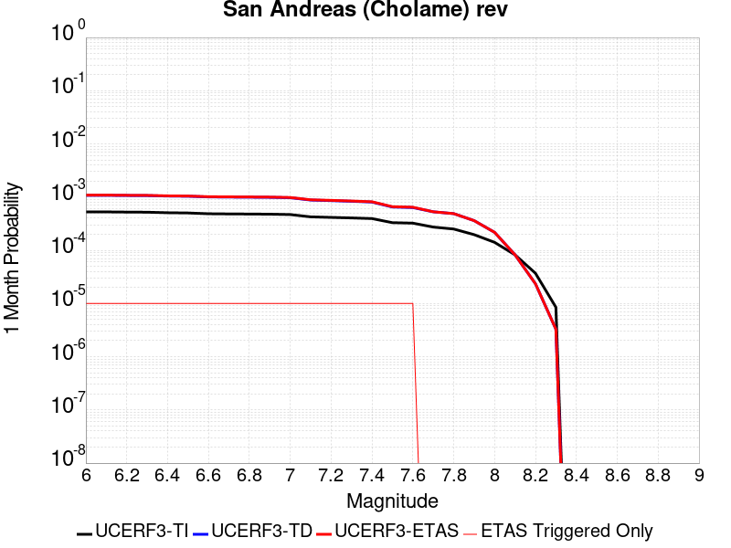 | 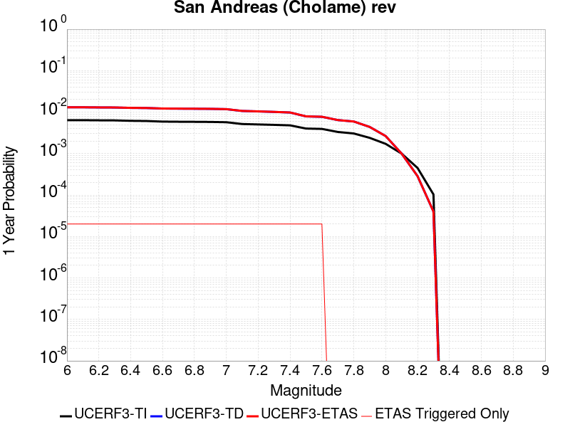 |  |

| Magnitude | 1 wk TI Prob | 1 wk TD Prob | 1 wk ETAS Prob | 1 wk ETAS/TD Gain | 1 wk ETAS Triggered Only | 1 mo TI Prob | 1 mo TD Prob | 1 mo ETAS Prob | 1 mo ETAS/TD Gain | 1 mo ETAS Triggered Only | 1 yr TI Prob | 1 yr TD Prob | 1 yr ETAS Prob | 1 yr ETAS/TD Gain | 1 yr ETAS Triggered Only | 10 yr TI Prob | 10 yr TD Prob | 10 yr ETAS Prob | 10 yr ETAS/TD Gain | 10 yr ETAS Triggered Only |
|-----|-----|-----|-----|-----|-----|-----|-----|-----|-----|-----|-----|-----|-----|-----|-----|-----|-----|-----|-----|-----|
| 6.0 | 1.2302514E-4 | 2.5213862E-4 | 2.5213862E-4 | 1.0 | 0.0 | 5.27144E-4 | 0.0010801482 | 0.0010901374 | 1.009248 | 1.0E-5 | 0.0063991086 | 0.013072014 | 0.013091752 | 1.00151 | 2.0E-5 | 0.06217949 | 0.12443058 | 0.12444809 | 1.0001408 | 2.0E-5 |
| 6.1 | 1.2302514E-4 | 2.5213862E-4 | 2.5213862E-4 | 1.0 | 0.0 | 5.27144E-4 | 0.0010801482 | 0.0010901374 | 1.009248 | 1.0E-5 | 0.0063991086 | 0.013072014 | 0.013091752 | 1.00151 | 2.0E-5 | 0.06217949 | 0.12443058 | 0.12444809 | 1.0001408 | 2.0E-5 |
| 6.2 | 1.2203569E-4 | 2.5030645E-4 | 2.5030645E-4 | 1.0 | 0.0 | 5.2290526E-4 | 0.0010723026 | 0.0010822918 | 1.0093157 | 1.0E-5 | 0.006347804 | 0.0129776355 | 0.012997376 | 1.0015211 | 2.0E-5 | 0.061695136 | 0.12361675 | 0.12363427 | 1.0001417 | 2.0E-5 |
| 6.3 | 1.2142645E-4 | 2.491661E-4 | 2.491661E-4 | 1.0 | 0.0 | 5.202953E-4 | 0.0010674193 | 0.0010774087 | 1.0093584 | 1.0E-5 | 0.006316212 | 0.012918889 | 0.012938631 | 1.0015281 | 2.0E-5 | 0.06139677 | 0.12311087 | 0.1231284 | 1.0001425 | 2.0E-5 |
| 6.4 | 1.1865206E-4 | 2.4422092E-4 | 2.4422092E-4 | 1.0 | 0.0 | 5.0840975E-4 | 0.0010462429 | 0.0010562325 | 1.0095481 | 1.0E-5 | 0.006172335 | 0.012664088 | 0.012683835 | 1.0015593 | 2.0E-5 | 0.060036868 | 0.12090351 | 0.12092109 | 1.0001454 | 2.0E-5 |
| 6.5 | 1.17443946E-4 | 2.421537E-4 | 2.421537E-4 | 1.0 | 0.0 | 5.032341E-4 | 0.0010373904 | 0.00104738 | 1.0096296 | 1.0E-5 | 0.006109677 | 0.012557554 | 0.012577303 | 1.0015726 | 2.0E-5 | 0.059444077 | 0.11997763 | 0.11999524 | 1.0001467 | 2.0E-5 |
| 6.6 | 1.13579066E-4 | 2.3524289E-4 | 2.3524289E-4 | 1.0 | 0.0 | 4.866766E-4 | 0.0010077958 | 0.0010177857 | 1.0099126 | 1.0E-5 | 0.0059092017 | 0.012201327 | 0.012221083 | 1.0016192 | 2.0E-5 | 0.057545185 | 0.11689143 | 0.11690909 | 1.0001512 | 2.0E-5 |
| 6.7 | 1.1271412E-4 | 2.336858E-4 | 2.336858E-4 | 1.0 | 0.0 | 4.829711E-4 | 0.0010011276 | 0.0010111177 | 1.0099788 | 1.0E-5 | 0.005864331 | 0.01212105 | 0.012140808 | 1.0016301 | 2.0E-5 | 0.057119697 | 0.11619493 | 0.116212614 | 1.0001521 | 2.0E-5 |
| 6.8 | 1.1217975E-4 | 2.3256983E-4 | 2.3256983E-4 | 1.0 | 0.0 | 4.8068175E-4 | 9.963487E-4 | 0.0010063386 | 1.0100267 | 1.0E-5 | 0.005836608 | 0.012063511 | 0.01208327 | 1.0016379 | 2.0E-5 | 0.056856725 | 0.11569312 | 0.11571081 | 1.0001528 | 2.0E-5 |
| 6.9 | 1.1146753E-4 | 2.3105709E-4 | 2.3105709E-4 | 1.0 | 0.0 | 4.7763053E-4 | 9.898704E-4 | 9.998605E-4 | 1.0100924 | 1.0E-5 | 0.0057996577 | 0.011985509 | 0.012005269 | 1.0016487 | 2.0E-5 | 0.056506127 | 0.11501348 | 0.11503118 | 1.0001539 | 2.0E-5 |
| 7.0 | 1.0965793E-4 | 2.2728977E-4 | 2.2728977E-4 | 1.0 | 0.0 | 4.698779E-4 | 9.7373687E-4 | 9.837272E-4 | 1.0102597 | 1.0E-5 | 0.005705768 | 0.0117912255 | 0.01181099 | 1.0016762 | 2.0E-5 | 0.055614736 | 0.11331484 | 0.11333257 | 1.0001565 | 2.0E-5 |
| 7.1 | 9.927982E-5 | 2.0547757E-4 | 2.0547757E-4 | 1.0 | 0.0 | 4.2541555E-4 | 8.80322E-4 | 8.903132E-4 | 1.0113494 | 1.0E-5 | 0.0051671406 | 0.010665542 | 0.010685329 | 1.0018553 | 2.0E-5 | 0.05048634 | 0.10340853 | 0.10342646 | 1.0001734 | 2.0E-5 |
| 7.2 | 9.696786E-5 | 2.0051954E-4 | 2.0051954E-4 | 1.0 | 0.0 | 4.1551032E-4 | 8.5908745E-4 | 8.6907885E-4 | 1.0116303 | 1.0E-5 | 0.00504711 | 0.010409511 | 0.010429302 | 1.0019013 | 2.0E-5 | 0.04934009 | 0.10114636 | 0.10116434 | 1.0001777 | 2.0E-5 |
| 7.3 | 9.4727984E-5 | 1.9481099E-4 | 1.9481099E-4 | 1.0 | 0.0 | 4.0591392E-4 | 8.346381E-4 | 8.446297E-4 | 1.0119712 | 1.0E-5 | 0.0049308087 | 0.010114641 | 0.010134439 | 1.0019573 | 2.0E-5 | 0.048228268 | 0.09851684 | 0.09853487 | 1.000183 | 2.0E-5 |
| 7.4 | 9.220358E-5 | 1.885154E-4 | 1.885154E-4 | 1.0 | 0.0 | 3.9509835E-4 | 8.076739E-4 | 8.1766583E-4 | 1.0123712 | 1.0E-5 | 0.004799717 | 0.009789341 | 0.009809146 | 1.002023 | 2.0E-5 | 0.046973653 | 0.09559427 | 0.09561236 | 1.0001892 | 2.0E-5 |
| 7.5 | 7.71631E-5 | 1.5185357E-4 | 1.5185357E-4 | 1.0 | 0.0 | 3.306571E-4 | 6.506389E-4 | 6.606324E-4 | 1.0153595 | 1.0E-5 | 0.0040183207 | 0.007892828 | 0.00791267 | 1.002514 | 2.0E-5 | 0.03946433 | 0.07831838 | 0.07833682 | 1.0002353 | 2.0E-5 |
| 7.6 | 7.5634416E-5 | 1.4844738E-4 | 1.4844738E-4 | 1.0 | 0.0 | 3.241072E-4 | 6.360481E-4 | 6.460417E-4 | 1.015712 | 1.0E-5 | 0.0039388672 | 0.007716457 | 0.0077363024 | 1.0025718 | 2.0E-5 | 0.038697794 | 0.076681465 | 0.07669993 | 1.0002408 | 2.0E-5 |
| 7.7 | 6.3783E-5 | 1.2365259E-4 | 1.2365259E-4 | 1.0 | 0.0 | 2.7332708E-4 | 5.2983203E-4 | 5.2983203E-4 | 1.0 | 0.0 | 0.0033226798 | 0.0064316522 | 0.0064316522 | 1.0 | 0.0 | 0.032734364 | 0.064570144 | 0.064570144 | 1.0 | 0.0 |
| 7.8 | 5.863422E-5 | 1.142205E-4 | 1.142205E-4 | 1.0 | 0.0 | 2.512653E-4 | 4.894246E-4 | 4.894246E-4 | 1.0 | 0.0 | 0.003054864 | 0.0059424853 | 0.0059424853 | 1.0 | 0.0 | 0.030132094 | 0.059686445 | 0.059686445 | 1.0 | 0.0 |
| 7.9 | 4.595283E-5 | 8.4306725E-5 | 8.4306725E-5 | 1.0 | 0.0 | 1.9692584E-4 | 3.612645E-4 | 3.612645E-4 | 1.0 | 0.0 | 0.0023949358 | 0.0043895314 | 0.0043895314 | 1.0 | 0.0 | 0.023692891 | 0.044382483 | 0.044382483 | 1.0 | 0.0 |
| 8.0 | 3.2950178E-5 | 5.08E-5 | 5.08E-5 | 1.0 | 0.0 | 1.412074E-4 | 2.1769613E-4 | 2.1769613E-4 | 1.0 | 0.0 | 0.0017178444 | 0.0026472306 | 0.0026472306 | 1.0 | 0.0 | 0.017046256 | 0.027193451 | 0.027193451 | 1.0 | 0.0 |
| 8.1 | 1.9177472E-5 | 1.9198456E-5 | 1.9198456E-5 | 1.0 | 0.0 | 8.218658E-5 | 8.227651E-5 | 8.227651E-5 | 1.0 | 0.0 | 0.0010001622 | 0.0010012568 | 0.0010012568 | 1.0 | 0.0 | 0.009956728 | 0.01076512 | 0.01076512 | 1.0 | 0.0 |
| 8.2 | 8.643924E-6 | 5.4798497E-6 | 5.4798497E-6 | 1.0 | 0.0 | 3.704486E-5 | 2.348486E-5 | 2.348486E-5 | 1.0 | 0.0 | 4.5092785E-4 | 2.858907E-4 | 2.858907E-4 | 1.0 | 0.0 | 0.0045001395 | 0.0032514327 | 0.0032514327 | 1.0 | 0.0 |
| 8.3 | 1.983087E-6 | 7.668296E-7 | 7.668296E-7 | 1.0 | 0.0 | 8.498917E-6 | 3.2864084E-6 | 3.2864084E-6 | 1.0 | 0.0 | 1.034694E-4 | 4.0011306E-5 | 4.0011306E-5 | 1.0 | 0.0 | 0.0010342124 | 4.724499E-4 | 4.724499E-4 | 1.0 | 0.0 |

## San Jacinto (Coyote Creek)
*[(top)](#table-of-contents)*

| 1 Week | 1 Month | 1 Year | 10 Year |
|-----|-----|-----|-----|
| 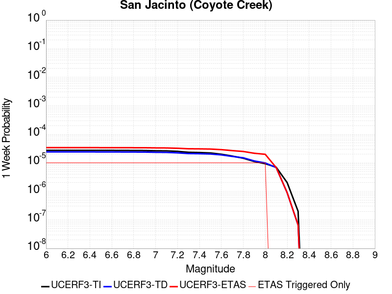 | 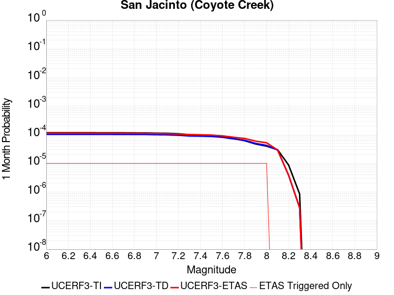 | 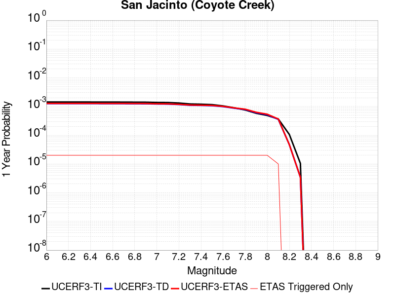 | 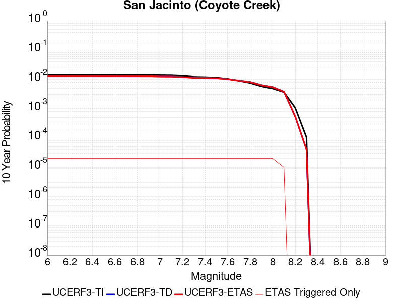 |

| Magnitude | 1 wk TI Prob | 1 wk TD Prob | 1 wk ETAS Prob | 1 wk ETAS/TD Gain | 1 wk ETAS Triggered Only | 1 mo TI Prob | 1 mo TD Prob | 1 mo ETAS Prob | 1 mo ETAS/TD Gain | 1 mo ETAS Triggered Only | 1 yr TI Prob | 1 yr TD Prob | 1 yr ETAS Prob | 1 yr ETAS/TD Gain | 1 yr ETAS Triggered Only | 10 yr TI Prob | 10 yr TD Prob | 10 yr ETAS Prob | 10 yr ETAS/TD Gain | 10 yr ETAS Triggered Only |
|-----|-----|-----|-----|-----|-----|-----|-----|-----|-----|-----|-----|-----|-----|-----|-----|-----|-----|-----|-----|-----|
| 6.0 | 2.7374346E-5 | 2.415327E-5 | 3.415303E-5 | 1.4140126 | 1.0E-5 | 1.1731335E-4 | 1.0350993E-4 | 1.1350889E-4 | 1.0965991 | 1.0E-5 | 0.0014273542 | 0.0012595074 | 0.0012794822 | 1.0158592 | 2.0E-5 | 0.01418221 | 0.01293251 | 0.012952251 | 1.0015265 | 2.0E-5 |
| 6.1 | 2.7374346E-5 | 2.415327E-5 | 3.415303E-5 | 1.4140126 | 1.0E-5 | 1.1731335E-4 | 1.0350993E-4 | 1.1350889E-4 | 1.0965991 | 1.0E-5 | 0.0014273542 | 0.0012595074 | 0.0012794822 | 1.0158592 | 2.0E-5 | 0.01418221 | 0.01293251 | 0.012952251 | 1.0015265 | 2.0E-5 |
| 6.2 | 2.7374346E-5 | 2.415327E-5 | 3.415303E-5 | 1.4140126 | 1.0E-5 | 1.1731335E-4 | 1.0350993E-4 | 1.1350889E-4 | 1.0965991 | 1.0E-5 | 0.0014273542 | 0.0012595074 | 0.0012794822 | 1.0158592 | 2.0E-5 | 0.01418221 | 0.01293251 | 0.012952251 | 1.0015265 | 2.0E-5 |
| 6.3 | 2.7374346E-5 | 2.415327E-5 | 3.415303E-5 | 1.4140126 | 1.0E-5 | 1.1731335E-4 | 1.0350993E-4 | 1.1350889E-4 | 1.0965991 | 1.0E-5 | 0.0014273542 | 0.0012595074 | 0.0012794822 | 1.0158592 | 2.0E-5 | 0.01418221 | 0.01293251 | 0.012952251 | 1.0015265 | 2.0E-5 |
| 6.4 | 2.7374346E-5 | 2.415327E-5 | 3.415303E-5 | 1.4140126 | 1.0E-5 | 1.1731335E-4 | 1.0350993E-4 | 1.1350889E-4 | 1.0965991 | 1.0E-5 | 0.0014273542 | 0.0012595074 | 0.0012794822 | 1.0158592 | 2.0E-5 | 0.01418221 | 0.01293251 | 0.012952251 | 1.0015265 | 2.0E-5 |
| 6.5 | 2.7282445E-5 | 2.4039346E-5 | 3.4039105E-5 | 1.4159747 | 1.0E-5 | 1.16919524E-4 | 1.0302171E-4 | 1.1302068E-4 | 1.0970569 | 1.0E-5 | 0.0014225657 | 0.0012535703 | 0.0012735452 | 1.0159345 | 2.0E-5 | 0.014134934 | 0.012873836 | 0.012893579 | 1.0015335 | 2.0E-5 |
| 6.6 | 2.7282445E-5 | 2.4039346E-5 | 3.4039105E-5 | 1.4159747 | 1.0E-5 | 1.16919524E-4 | 1.0302171E-4 | 1.1302068E-4 | 1.0970569 | 1.0E-5 | 0.0014225657 | 0.0012535703 | 0.0012735452 | 1.0159345 | 2.0E-5 | 0.014134934 | 0.012873836 | 0.012893579 | 1.0015335 | 2.0E-5 |
| 6.7 | 2.7216198E-5 | 2.3964463E-5 | 3.3964225E-5 | 1.4172745 | 1.0E-5 | 1.1663563E-4 | 1.0270082E-4 | 1.1269979E-4 | 1.0973603 | 1.0E-5 | 0.0014191137 | 0.0012496678 | 0.0012696428 | 1.0159843 | 2.0E-5 | 0.014100855 | 0.0128352465 | 0.01285499 | 1.0015382 | 2.0E-5 |
| 6.8 | 2.7078617E-5 | 2.3881676E-5 | 3.388144E-5 | 1.4187211 | 1.0E-5 | 1.1604605E-4 | 1.0234604E-4 | 1.1234502E-4 | 1.0976977 | 1.0E-5 | 0.001411945 | 0.0012453535 | 0.0012653285 | 1.0160397 | 2.0E-5 | 0.014030075 | 0.012792386 | 0.01281213 | 1.0015434 | 2.0E-5 |
| 6.9 | 2.6982952E-5 | 2.3801183E-5 | 3.3800945E-5 | 1.4201372 | 1.0E-5 | 1.15636096E-4 | 1.020011E-4 | 1.12000074E-4 | 1.0980282 | 1.0E-5 | 0.0014069602 | 0.0012411585 | 0.0012611337 | 1.016094 | 2.0E-5 | 0.013980856 | 0.012750699 | 0.012770444 | 1.0015485 | 2.0E-5 |
| 7.0 | 2.6449972E-5 | 2.3378187E-5 | 3.3377954E-5 | 1.4277391 | 1.0E-5 | 1.1335209E-4 | 1.001884E-4 | 1.1018739E-4 | 1.0998019 | 1.0E-5 | 0.001379188 | 0.0012191138 | 0.0012390894 | 1.0163853 | 2.0E-5 | 0.0137065975 | 0.0125320535 | 0.012551802 | 1.001576 | 2.0E-5 |
| 7.1 | 2.6257849E-5 | 2.3204217E-5 | 3.3203985E-5 | 1.4309461 | 1.0E-5 | 1.1252879E-4 | 9.944286E-5 | 1.0944187E-4 | 1.1005503 | 1.0E-5 | 0.0013691769 | 0.001210047 | 0.0012300229 | 1.0165083 | 2.0E-5 | 0.013607717 | 0.012441914 | 0.012461665 | 1.0015875 | 2.0E-5 |
| 7.2 | 2.5270041E-5 | 2.2398921E-5 | 3.2398697E-5 | 1.4464401 | 1.0E-5 | 1.0829568E-4 | 9.5991854E-5 | 1.059909E-4 | 1.1041656 | 1.0E-5 | 0.0013177024 | 0.0011680766 | 0.0011880533 | 1.0171021 | 2.0E-5 | 0.013099162 | 0.012022921 | 0.01204268 | 1.0016435 | 2.0E-5 |
| 7.3 | 2.339701E-5 | 2.1130656E-5 | 3.1130447E-5 | 1.4732361 | 1.0E-5 | 1.0026905E-4 | 9.055682E-5 | 1.00555924E-4 | 1.1104178 | 1.0E-5 | 0.001220092 | 0.0011019738 | 0.0011219517 | 1.0181292 | 2.0E-5 | 0.012134149 | 0.011361783 | 0.011381556 | 1.0017403 | 2.0E-5 |
| 7.4 | 2.296333E-5 | 2.0860984E-5 | 3.0860774E-5 | 1.4793538 | 1.0E-5 | 9.841056E-5 | 8.940117E-5 | 9.940027E-5 | 1.1118454 | 1.0E-5 | 0.0011974899 | 0.0010879177 | 0.001107896 | 1.0183637 | 2.0E-5 | 0.011910575 | 0.011220883 | 0.011240658 | 1.0017624 | 2.0E-5 |
| 7.5 | 2.2188895E-5 | 2.0383844E-5 | 3.038364E-5 | 1.4905746 | 1.0E-5 | 9.50918E-5 | 8.735642E-5 | 9.735554E-5 | 1.1144636 | 1.0E-5 | 0.0011571277 | 0.0010630476 | 0.0010830263 | 1.0187938 | 2.0E-5 | 0.011511209 | 0.010970469 | 0.01099025 | 1.001803 | 2.0E-5 |
| 7.6 | 2.0013189E-5 | 1.8969942E-5 | 2.8969753E-5 | 1.5271397 | 1.0E-5 | 8.5767984E-5 | 8.1297236E-5 | 9.129642E-5 | 1.1229954 | 1.0E-5 | 0.001043725 | 9.893461E-4 | 0.0010093263 | 1.0201954 | 2.0E-5 | 0.010388365 | 0.010228388 | 0.010248183 | 1.0019354 | 2.0E-5 |
| 7.7 | 1.7230794E-5 | 1.6751088E-5 | 2.675092E-5 | 1.5969661 | 1.0E-5 | 7.384417E-5 | 7.17884E-5 | 8.1787686E-5 | 1.1392883 | 1.0E-5 | 8.986819E-4 | 8.736742E-4 | 8.936567E-4 | 1.0228719 | 2.0E-5 | 0.008950562 | 0.009066812 | 0.00908663 | 1.0021858 | 2.0E-5 |
| 7.8 | 1.4478809E-5 | 1.49981E-5 | 2.499795E-5 | 1.6667411 | 1.0E-5 | 6.205057E-5 | 6.427599E-5 | 7.427535E-5 | 1.1555691 | 1.0E-5 | 7.552038E-4 | 7.822799E-4 | 8.022642E-4 | 1.0255463 | 2.0E-5 | 0.0075264242 | 0.008145113 | 0.00816495 | 1.0024354 | 2.0E-5 |
| 7.9 | 1.1114467E-5 | 1.1651392E-5 | 2.1651276E-5 | 1.8582566 | 1.0E-5 | 4.7632562E-5 | 4.9933584E-5 | 5.9933085E-5 | 1.200256 | 1.0E-5 | 5.797721E-4 | 6.077724E-4 | 6.2776025E-4 | 1.0328871 | 2.0E-5 | 0.0057826187 | 0.0063836263 | 0.006403499 | 1.003113 | 2.0E-5 |
| 8.0 | 9.327402E-6 | 9.904865E-6 | 1.9904766E-5 | 2.009595 | 1.0E-5 | 3.9973966E-5 | 4.2448733E-5 | 5.2448308E-5 | 1.2355683 | 1.0E-5 | 4.8657437E-4 | 5.166913E-4 | 5.36681E-4 | 1.0386878 | 2.0E-5 | 0.0048551033 | 0.0054529547 | 0.0054728454 | 1.0036477 | 2.0E-5 |
| 8.1 | 7.0235833E-6 | 6.83171E-6 | 6.83171E-6 | 1.0 | 0.0 | 3.0100724E-5 | 2.9278432E-5 | 2.9278432E-5 | 1.0 | 0.0 | 3.664147E-4 | 3.5640708E-4 | 3.6640352E-4 | 1.0280478 | 1.0E-5 | 0.003658111 | 0.0037898365 | 0.0037997987 | 1.0026287 | 1.0E-5 |
| 8.2 | 2.0358202E-6 | 9.0030267E-7 | 9.0030267E-7 | 1.0 | 0.0 | 8.724915E-6 | 3.8584344E-6 | 3.8584344E-6 | 1.0 | 0.0 | 1.06220665E-4 | 4.697545E-5 | 4.697545E-5 | 1.0 | 0.0 | 0.001061699 | 5.3301745E-4 | 5.3301745E-4 | 1.0 | 0.0 |
| 8.3 | 2.0051264E-7 | 6.6244816E-8 | 6.6244816E-8 | 1.0 | 0.0 | 8.5933965E-7 | 2.8390633E-7 | 2.8390633E-7 | 1.0 | 0.0 | 1.046241E-5 | 3.4565546E-6 | 3.4565546E-6 | 1.0 | 0.0 | 1.0461917E-4 | 4.018022E-5 | 4.018022E-5 | 1.0 | 0.0 |

## San Andreas (Creeping Section) 2011 CFM
*[(top)](#table-of-contents)*

| 1 Week | 1 Month | 1 Year | 10 Year |
|-----|-----|-----|-----|
| 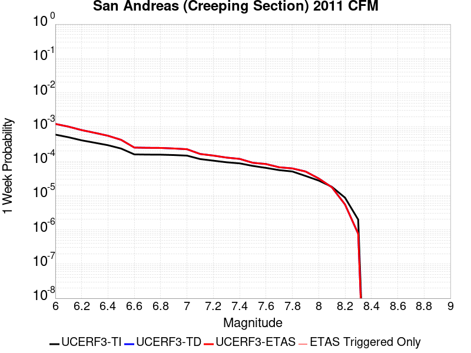 | 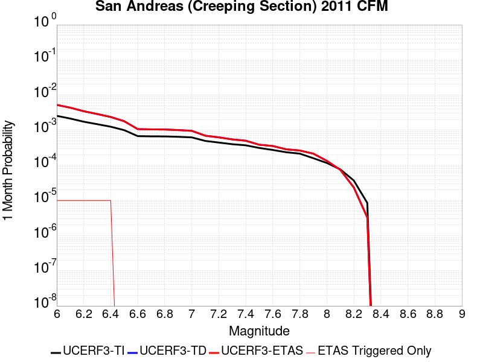 | 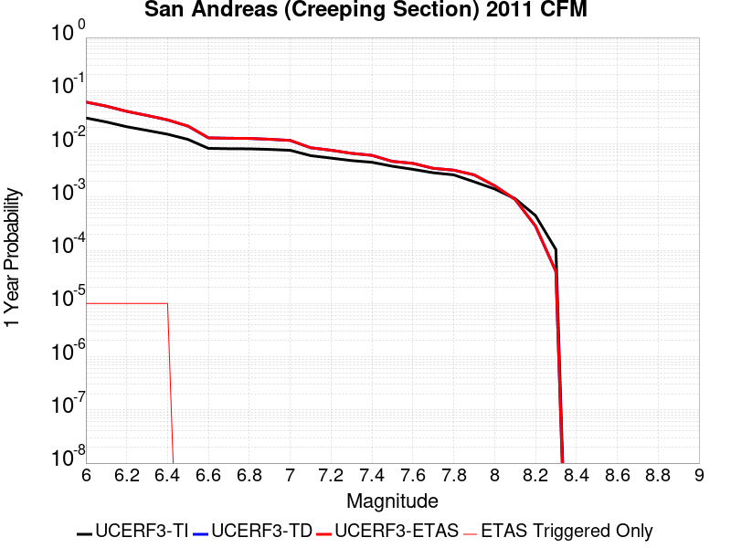 | 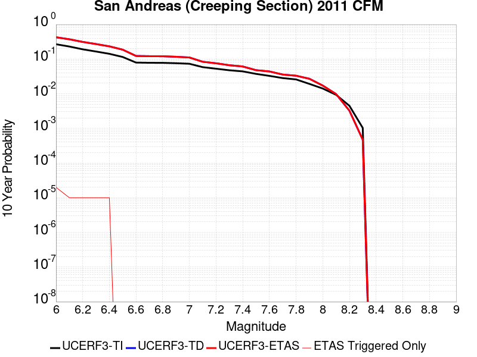 |

| Magnitude | 1 wk TI Prob | 1 wk TD Prob | 1 wk ETAS Prob | 1 wk ETAS/TD Gain | 1 wk ETAS Triggered Only | 1 mo TI Prob | 1 mo TD Prob | 1 mo ETAS Prob | 1 mo ETAS/TD Gain | 1 mo ETAS Triggered Only | 1 yr TI Prob | 1 yr TD Prob | 1 yr ETAS Prob | 1 yr ETAS/TD Gain | 1 yr ETAS Triggered Only | 10 yr TI Prob | 10 yr TD Prob | 10 yr ETAS Prob | 10 yr ETAS/TD Gain | 10 yr ETAS Triggered Only |
|-----|-----|-----|-----|-----|-----|-----|-----|-----|-----|-----|-----|-----|-----|-----|-----|-----|-----|-----|-----|-----|
| 6.0 | 5.986481E-4 | 0.0012278741 | 0.0012278741 | 1.0 | 0.0 | 0.0025631124 | 0.0052457973 | 0.0052557453 | 1.0018963 | 1.0E-5 | 0.030762846 | 0.061208665 | 0.061218053 | 1.0001534 | 1.0E-5 | 0.26835477 | 0.4259623 | 0.42597377 | 1.000027 | 2.0E-5 |
| 6.1 | 5.015945E-4 | 0.0010222398 | 0.0010222398 | 1.0 | 0.0 | 0.00214792 | 0.004368119 | 0.0043780752 | 1.0022793 | 1.0E-5 | 0.025839351 | 0.0512512 | 0.051260687 | 1.0001851 | 1.0E-5 | 0.23032776 | 0.37288252 | 0.3728888 | 1.0000168 | 1.0E-5 |
| 6.2 | 4.073338E-4 | 8.109135E-4 | 8.109135E-4 | 1.0 | 0.0 | 0.0017445484 | 0.0034676173 | 0.0034775827 | 1.0028738 | 1.0E-5 | 0.021034058 | 0.040936444 | 0.040946033 | 1.0002342 | 1.0E-5 | 0.19150782 | 0.3130621 | 0.31306896 | 1.0000219 | 1.0E-5 |
| 6.3 | 3.464099E-4 | 6.7394925E-4 | 6.7394925E-4 | 1.0 | 0.0 | 0.0014837692 | 0.00288274 | 0.002892711 | 1.003459 | 1.0E-5 | 0.017915873 | 0.034192428 | 0.034202084 | 1.0002824 | 1.0E-5 | 0.16538359 | 0.27134693 | 0.2713542 | 1.0000268 | 1.0E-5 |
| 6.4 | 2.935057E-4 | 5.545115E-4 | 5.545115E-4 | 1.0 | 0.0 | 0.0012572751 | 0.0023718805 | 0.0023818568 | 1.0042061 | 1.0E-5 | 0.015200248 | 0.028267467 | 0.028277185 | 1.0003438 | 1.0E-5 | 0.14201577 | 0.2330172 | 0.23302488 | 1.0000329 | 1.0E-5 |
| 6.5 | 2.3409708E-4 | 4.2095222E-4 | 4.2095222E-4 | 1.0 | 0.0 | 0.0010028875 | 0.0018015768 | 0.0018015768 | 1.0 | 0.0 | 0.012141965 | 0.021591473 | 0.021591473 | 1.0 | 0.0 | 0.11499573 | 0.18685804 | 0.18685804 | 1.0 | 0.0 |
| 6.6 | 1.5842178E-4 | 2.5079807E-4 | 2.5079807E-4 | 1.0 | 0.0 | 6.7877385E-4 | 0.0010744074 | 0.0010744074 | 1.0 | 0.0 | 0.0082328 | 0.013001034 | 0.013001034 | 1.0 | 0.0 | 0.07934396 | 0.12318426 | 0.12318426 | 1.0 | 0.0 |
| 6.7 | 1.5616413E-4 | 2.461632E-4 | 2.461632E-4 | 1.0 | 0.0 | 6.691031E-4 | 0.0010545597 | 0.0010545597 | 1.0 | 0.0 | 0.0081159435 | 0.012762894 | 0.012762894 | 1.0 | 0.0 | 0.0782586 | 0.12121142 | 0.12121142 | 1.0 | 0.0 |
| 6.8 | 1.5538467E-4 | 2.4440174E-4 | 2.4440174E-4 | 1.0 | 0.0 | 6.6576427E-4 | 0.0010470168 | 0.0010470168 | 1.0 | 0.0 | 0.008075596 | 0.012672268 | 0.012672268 | 1.0 | 0.0 | 0.07788358 | 0.12044227 | 0.12044227 | 1.0 | 0.0 |
| 6.9 | 1.5153569E-4 | 2.3549511E-4 | 2.3549511E-4 | 1.0 | 0.0 | 6.49277E-4 | 0.0010088764 | 0.0010088764 | 1.0 | 0.0 | 0.007876333 | 0.012214421 | 0.012214421 | 1.0 | 0.0 | 0.07602952 | 0.11651233 | 0.11651233 | 1.0 | 0.0 |
| 7.0 | 1.4588932E-4 | 2.2406683E-4 | 2.2406683E-4 | 1.0 | 0.0 | 6.250901E-4 | 9.5993496E-4 | 9.5993496E-4 | 1.0 | 0.0 | 0.0075839474 | 0.011625077 | 0.011625077 | 1.0 | 0.0 | 0.073302895 | 0.111358546 | 0.111358546 | 1.0 | 0.0 |
| 7.1 | 1.1565079E-4 | 1.6290719E-4 | 1.6290719E-4 | 1.0 | 0.0 | 4.955521E-4 | 6.9798774E-4 | 6.9798774E-4 | 1.0 | 0.0 | 0.006016669 | 0.008465091 | 0.008465091 | 1.0 | 0.0 | 0.058563538 | 0.08370675 | 0.08370675 | 1.0 | 0.0 |
| 7.2 | 1.0393792E-4 | 1.4624344E-4 | 1.4624344E-4 | 1.0 | 0.0 | 4.4537216E-4 | 6.2660786E-4 | 6.2660786E-4 | 1.0 | 0.0 | 0.005408933 | 0.007602434 | 0.007602434 | 1.0 | 0.0 | 0.052791595 | 0.07565546 | 0.07565546 | 1.0 | 0.0 |
| 7.3 | 9.332884E-5 | 1.2788197E-4 | 1.2788197E-4 | 1.0 | 0.0 | 3.999194E-4 | 5.479511E-4 | 5.479511E-4 | 1.0 | 0.0 | 0.0048581534 | 0.0066510327 | 0.0066510327 | 1.0 | 0.0 | 0.047533102 | 0.06651482 | 0.06651482 | 1.0 | 0.0 |
| 7.4 | 8.670252E-5 | 1.17095995E-4 | 1.17095995E-4 | 1.0 | 0.0 | 3.715293E-4 | 5.0174404E-4 | 5.0174404E-4 | 1.0 | 0.0 | 0.004513991 | 0.006091744 | 0.006091744 | 1.0 | 0.0 | 0.044233937 | 0.061179653 | 0.061179653 | 1.0 | 0.0 |
| 7.5 | 7.3036405E-5 | 9.011144E-5 | 9.011144E-5 | 1.0 | 0.0 | 3.129756E-4 | 3.861348E-4 | 3.861348E-4 | 1.0 | 0.0 | 0.0038038217 | 0.004691079 | 0.004691079 | 1.0 | 0.0 | 0.03739367 | 0.047901772 | 0.047901772 | 1.0 | 0.0 |
| 7.6 | 6.3935775E-5 | 8.284792E-5 | 8.284792E-5 | 1.0 | 0.0 | 2.7398168E-4 | 3.550143E-4 | 3.550143E-4 | 1.0 | 0.0 | 0.0033306254 | 0.004313751 | 0.004313751 | 1.0 | 0.0 | 0.032811474 | 0.04401211 | 0.04401211 | 1.0 | 0.0 |
| 7.7 | 5.5050095E-5 | 6.6657536E-5 | 6.6657536E-5 | 1.0 | 0.0 | 2.3590765E-4 | 2.8564388E-4 | 2.8564388E-4 | 1.0 | 0.0 | 0.0028683927 | 0.0034721727 | 0.0034721727 | 1.0 | 0.0 | 0.0283165 | 0.035814673 | 0.035814673 | 1.0 | 0.0 |
| 7.8 | 5.027131E-5 | 6.166444E-5 | 6.166444E-5 | 1.0 | 0.0 | 2.1543067E-4 | 2.6424942E-4 | 2.6424942E-4 | 1.0 | 0.0 | 0.0026197135 | 0.0032124936 | 0.0032124936 | 1.0 | 0.0 | 0.025890453 | 0.033143617 | 0.033143617 | 1.0 | 0.0 |
| 7.9 | 3.7271806E-5 | 5.0253755E-5 | 5.0253755E-5 | 1.0 | 0.0 | 1.5972654E-4 | 2.1535547E-4 | 2.1535547E-4 | 1.0 | 0.0 | 0.0019429359 | 0.0026188022 | 0.0026188022 | 1.0 | 0.0 | 0.019260362 | 0.027081102 | 0.027081102 | 1.0 | 0.0 |
| 8.0 | 2.7310243E-5 | 3.144777E-5 | 3.144777E-5 | 1.0 | 0.0 | 1.17038646E-4 | 1.3476919E-4 | 1.3476919E-4 | 1.0 | 0.0 | 0.0014240141 | 0.0016395808 | 0.0016395808 | 1.0 | 0.0 | 0.014149235 | 0.0172237 | 0.0172237 | 1.0 | 0.0 |
| 8.1 | 1.7940547E-5 | 1.7413187E-5 | 1.7413187E-5 | 1.0 | 0.0 | 7.688579E-5 | 7.4625816E-5 | 7.4625816E-5 | 1.0 | 0.0 | 9.3568244E-4 | 9.081911E-4 | 9.081911E-4 | 1.0 | 0.0 | 0.009317525 | 0.009805583 | 0.009805583 | 1.0 | 0.0 |
| 8.2 | 8.643924E-6 | 5.4798497E-6 | 5.4798497E-6 | 1.0 | 0.0 | 3.704486E-5 | 2.348486E-5 | 2.348486E-5 | 1.0 | 0.0 | 4.5092785E-4 | 2.858907E-4 | 2.858907E-4 | 1.0 | 0.0 | 0.0045001395 | 0.0032514327 | 0.0032514327 | 1.0 | 0.0 |
| 8.3 | 1.983087E-6 | 7.668296E-7 | 7.668296E-7 | 1.0 | 0.0 | 8.498917E-6 | 3.2864084E-6 | 3.2864084E-6 | 1.0 | 0.0 | 1.034694E-4 | 4.0011306E-5 | 4.0011306E-5 | 1.0 | 0.0 | 0.0010342124 | 4.724499E-4 | 4.724499E-4 | 1.0 | 0.0 |

## San Jacinto (Borrego)
*[(top)](#table-of-contents)*

| 1 Week | 1 Month | 1 Year | 10 Year |
|-----|-----|-----|-----|
| 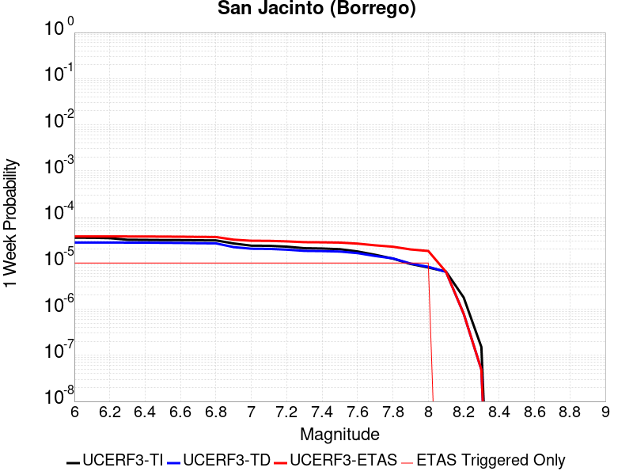 | 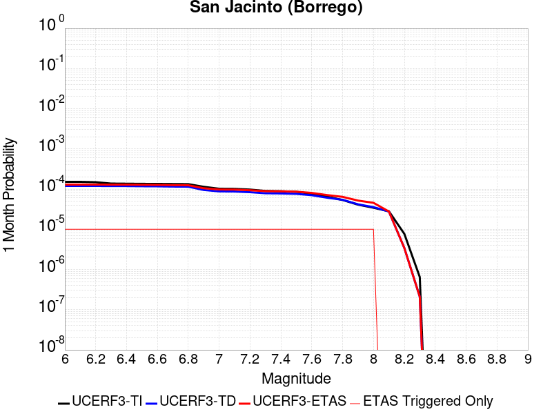 | 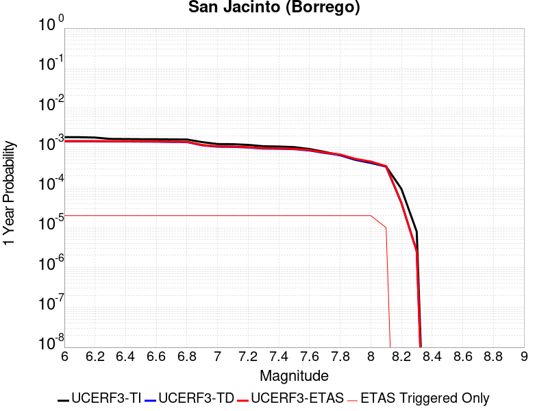 | 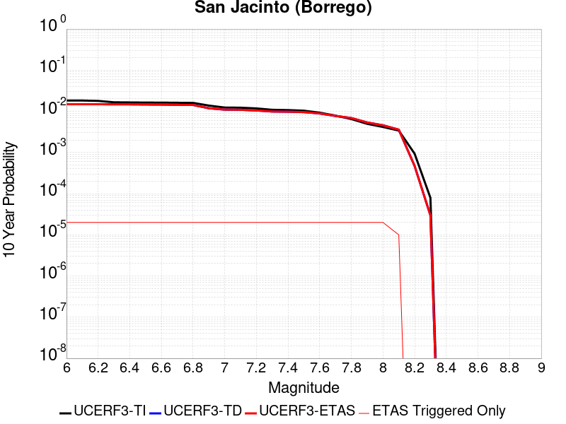 |

| Magnitude | 1 wk TI Prob | 1 wk TD Prob | 1 wk ETAS Prob | 1 wk ETAS/TD Gain | 1 wk ETAS Triggered Only | 1 mo TI Prob | 1 mo TD Prob | 1 mo ETAS Prob | 1 mo ETAS/TD Gain | 1 mo ETAS Triggered Only | 1 yr TI Prob | 1 yr TD Prob | 1 yr ETAS Prob | 1 yr ETAS/TD Gain | 1 yr ETAS Triggered Only | 10 yr TI Prob | 10 yr TD Prob | 10 yr ETAS Prob | 10 yr ETAS/TD Gain | 10 yr ETAS Triggered Only |
|-----|-----|-----|-----|-----|-----|-----|-----|-----|-----|-----|-----|-----|-----|-----|-----|-----|-----|-----|-----|-----|
| 6.0 | 3.543992E-5 | 2.7934115E-5 | 3.7933834E-5 | 1.3579752 | 1.0E-5 | 1.5187653E-4 | 1.1971221E-4 | 1.2971101E-4 | 1.0835236 | 1.0E-5 | 0.0018475284 | 0.001456534 | 0.0014765048 | 1.0137112 | 2.0E-5 | 0.018322436 | 0.014873597 | 0.014893299 | 1.0013247 | 2.0E-5 |
| 6.1 | 3.542281E-5 | 2.7934115E-5 | 3.7933834E-5 | 1.3579752 | 1.0E-5 | 1.5180321E-4 | 1.1971221E-4 | 1.2971101E-4 | 1.0835236 | 1.0E-5 | 0.0018466372 | 0.001456534 | 0.0014765048 | 1.0137112 | 2.0E-5 | 0.018313672 | 0.014873597 | 0.014893299 | 1.0013247 | 2.0E-5 |
| 6.2 | 3.4688688E-5 | 2.7934115E-5 | 3.7933834E-5 | 1.3579752 | 1.0E-5 | 1.4865733E-4 | 1.1971221E-4 | 1.2971101E-4 | 1.0835236 | 1.0E-5 | 0.0018084005 | 0.0014565339 | 0.0014765048 | 1.0137112 | 2.0E-5 | 0.017937548 | 0.014873596 | 0.014893299 | 1.0013247 | 2.0E-5 |
| 6.3 | 3.2087122E-5 | 2.7779462E-5 | 3.7779184E-5 | 1.3599682 | 1.0E-5 | 1.3750899E-4 | 1.1904947E-4 | 1.2904829E-4 | 1.0839887 | 1.0E-5 | 0.0016728862 | 0.0014484759 | 0.0014684469 | 1.0137876 | 2.0E-5 | 0.016603488 | 0.01479463 | 0.014814334 | 1.0013318 | 2.0E-5 |
| 6.4 | 3.1828724E-5 | 2.7746448E-5 | 3.774617E-5 | 1.3603965 | 1.0E-5 | 1.364017E-4 | 1.18908E-4 | 1.289068E-4 | 1.0840887 | 1.0E-5 | 0.0016594254 | 0.0014467557 | 0.0014667268 | 1.0138041 | 2.0E-5 | 0.016470885 | 0.014777708 | 0.014797413 | 1.0013334 | 2.0E-5 |
| 6.5 | 3.1563577E-5 | 2.7486154E-5 | 3.748588E-5 | 1.3638096 | 1.0E-5 | 1.3526545E-4 | 1.1779256E-4 | 1.2779138E-4 | 1.084885 | 1.0E-5 | 0.0016456128 | 0.0014331931 | 0.0014531645 | 1.0139349 | 2.0E-5 | 0.0163348 | 0.014644288 | 0.014663995 | 1.0013458 | 2.0E-5 |
| 6.6 | 3.1467625E-5 | 2.7330374E-5 | 3.73301E-5 | 1.3658832 | 1.0E-5 | 1.3485427E-4 | 1.1712498E-4 | 1.2712381E-4 | 1.0853689 | 1.0E-5 | 0.0016406142 | 0.001425076 | 0.0014450476 | 1.0140144 | 2.0E-5 | 0.016285548 | 0.014564533 | 0.014584241 | 1.0013531 | 2.0E-5 |
| 6.7 | 3.1223695E-5 | 2.6948383E-5 | 3.6948113E-5 | 1.3710698 | 1.0E-5 | 1.3380898E-4 | 1.1548802E-4 | 1.2548687E-4 | 1.0865791 | 1.0E-5 | 0.0016279068 | 0.0014051719 | 0.0014251438 | 1.0142131 | 2.0E-5 | 0.01616033 | 0.014368899 | 0.0143886125 | 1.0013719 | 2.0E-5 |
| 6.8 | 3.1015585E-5 | 2.6769376E-5 | 3.676911E-5 | 1.3735511 | 1.0E-5 | 1.3291716E-4 | 1.14720926E-4 | 1.2471978E-4 | 1.0871581 | 1.0E-5 | 0.001617065 | 0.0013958444 | 0.0014158165 | 1.0143082 | 2.0E-5 | 0.016053487 | 0.014276173 | 0.014295887 | 1.0013809 | 2.0E-5 |
| 6.9 | 2.6641965E-5 | 2.2191349E-5 | 3.219113E-5 | 1.450616 | 1.0E-5 | 1.1417485E-4 | 9.510233E-5 | 1.0510138E-4 | 1.1051399 | 1.0E-5 | 0.0013891924 | 0.0011572598 | 0.0011772367 | 1.0172622 | 2.0E-5 | 0.0138054015 | 0.011886145 | 0.011905907 | 1.0016626 | 2.0E-5 |
| 7.0 | 2.3854353E-5 | 2.048587E-5 | 3.0485666E-5 | 1.4881313 | 1.0E-5 | 1.02228936E-4 | 8.779365E-5 | 9.779277E-5 | 1.1138935 | 1.0E-5 | 0.0012439266 | 0.0010683661 | 0.0010883447 | 1.0187001 | 2.0E-5 | 0.012369866 | 0.010986375 | 0.011006155 | 1.0018004 | 2.0E-5 |
| 7.1 | 2.3672901E-5 | 2.032235E-5 | 3.0322148E-5 | 1.4920591 | 1.0E-5 | 1.0145135E-4 | 8.709289E-5 | 9.709202E-5 | 1.1148099 | 1.0E-5 | 0.0012344702 | 0.0010598428 | 0.0010798215 | 1.0188507 | 2.0E-5 | 0.0122763505 | 0.010901547 | 0.010921329 | 1.0018146 | 2.0E-5 |
| 7.2 | 2.2717244E-5 | 1.9549674E-5 | 2.954948E-5 | 1.5115075 | 1.0E-5 | 9.735599E-5 | 8.378164E-5 | 9.378081E-5 | 1.1193479 | 1.0E-5 | 0.0011846646 | 0.0010195666 | 0.0010395461 | 1.0195962 | 2.0E-5 | 0.01178369 | 0.010498884 | 0.010518674 | 1.0018849 | 2.0E-5 |
| 7.3 | 2.1016205E-5 | 1.8391213E-5 | 2.8391029E-5 | 1.543728 | 1.0E-5 | 9.006634E-5 | 7.881711E-5 | 8.881633E-5 | 1.126866 | 1.0E-5 | 0.001096006 | 9.5917797E-4 | 9.791588E-4 | 1.0208312 | 2.0E-5 | 0.010906163 | 0.009894462 | 0.009914264 | 1.0020013 | 2.0E-5 |
| 7.4 | 2.0683625E-5 | 1.8193714E-5 | 2.8193532E-5 | 1.5496304 | 1.0E-5 | 8.86411E-5 | 7.797074E-5 | 8.7969966E-5 | 1.1282432 | 1.0E-5 | 0.001078671 | 9.488824E-4 | 9.6886343E-4 | 1.0210575 | 2.0E-5 | 0.010734501 | 0.009791178 | 0.009810981 | 1.0020226 | 2.0E-5 |
| 7.5 | 1.9993966E-5 | 1.7788683E-5 | 2.7788505E-5 | 1.5621452 | 1.0E-5 | 8.568561E-5 | 7.6234996E-5 | 8.6234235E-5 | 1.1311634 | 1.0E-5 | 0.001042723 | 9.2776783E-4 | 9.477493E-4 | 1.0215371 | 2.0E-5 | 0.010378438 | 0.00957807 | 0.009597878 | 1.0020682 | 2.0E-5 |
| 7.6 | 1.788966E-5 | 1.6441732E-5 | 2.6441567E-5 | 1.6081984 | 1.0E-5 | 7.666772E-5 | 7.046267E-5 | 8.046196E-5 | 1.1419091 | 1.0E-5 | 9.3302975E-4 | 8.575471E-4 | 8.7752996E-4 | 1.0233023 | 2.0E-5 | 0.00929122 | 0.0088698575 | 0.00888968 | 1.0022348 | 2.0E-5 |
| 7.7 | 1.5125781E-5 | 1.4243621E-5 | 2.4243478E-5 | 1.7020587 | 1.0E-5 | 6.4823165E-5 | 6.1042665E-5 | 7.104206E-5 | 1.1638099 | 1.0E-5 | 7.889362E-4 | 7.4294186E-4 | 7.62927E-4 | 1.0269 | 2.0E-5 | 0.007861412 | 0.0077174758 | 0.007737322 | 1.0025715 | 2.0E-5 |
| 7.8 | 1.250089E-5 | 1.2636515E-5 | 2.2636388E-5 | 1.7913475 | 1.0E-5 | 5.3574146E-5 | 5.415537E-5 | 6.4154825E-5 | 1.1846439 | 1.0E-5 | 6.5207E-4 | 6.591428E-4 | 6.791296E-4 | 1.0303224 | 2.0E-5 | 0.006501599 | 0.00687092 | 0.006890782 | 1.0028908 | 2.0E-5 |
| 7.9 | 9.561E-6 | 9.759914E-6 | 1.9759816E-5 | 2.024589 | 1.0E-5 | 4.0975072E-5 | 4.1827538E-5 | 5.182712E-5 | 1.239067 | 1.0E-5 | 4.987573E-4 | 5.091318E-4 | 5.2912167E-4 | 1.0392625 | 2.0E-5 | 0.0049763937 | 0.0053551346 | 0.0053750277 | 1.0037147 | 2.0E-5 |
| 8.0 | 8.01699E-6 | 8.2982915E-6 | 1.8298208E-5 | 2.2050574 | 1.0E-5 | 3.4358076E-5 | 3.5563622E-5 | 4.556327E-5 | 1.2811762 | 1.0E-5 | 4.1822926E-4 | 4.329016E-4 | 4.5289297E-4 | 1.0461799 | 2.0E-5 | 0.0041744304 | 0.0045759073 | 0.0045958157 | 1.0043507 | 2.0E-5 |
| 8.1 | 6.541947E-6 | 6.466171E-6 | 6.466171E-6 | 1.0 | 0.0 | 2.8036617E-5 | 2.7711869E-5 | 2.7711869E-5 | 1.0 | 0.0 | 3.4129233E-4 | 3.3734026E-4 | 3.473369E-4 | 1.0296336 | 1.0E-5 | 0.0034076865 | 0.0035827826 | 0.0035927468 | 1.0027812 | 1.0E-5 |
| 8.2 | 1.7968189E-6 | 7.978815E-7 | 7.978815E-7 | 1.0 | 0.0 | 7.70063E-6 | 3.419488E-6 | 3.419488E-6 | 1.0 | 0.0 | 9.3751136E-5 | 4.163149E-5 | 4.163149E-5 | 1.0 | 0.0 | 9.371159E-4 | 4.7162327E-4 | 4.7162327E-4 | 1.0 | 0.0 |
| 8.3 | 1.5167889E-7 | 4.9030522E-8 | 4.9030522E-8 | 1.0 | 0.0 | 6.500522E-7 | 2.1013079E-7 | 2.1013079E-7 | 1.0 | 0.0 | 7.9143565E-6 | 2.55834E-6 | 2.55834E-6 | 1.0 | 0.0 | 7.914075E-5 | 2.9725656E-5 | 2.9725656E-5 | 1.0 | 0.0 |

## Owens Valley
*[(top)](#table-of-contents)*

| 1 Week | 1 Month | 1 Year | 10 Year |
|-----|-----|-----|-----|
|  | 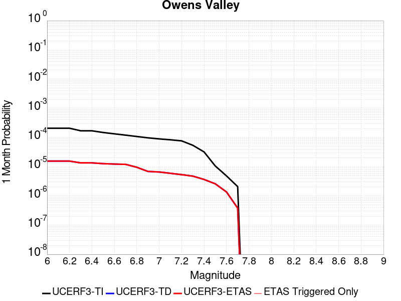 | 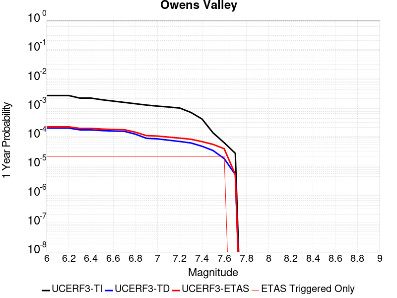 | 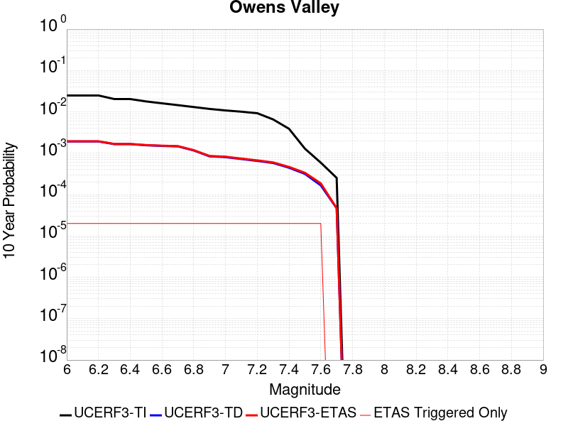 |

| Magnitude | 1 wk TI Prob | 1 wk TD Prob | 1 wk ETAS Prob | 1 wk ETAS/TD Gain | 1 wk ETAS Triggered Only | 1 mo TI Prob | 1 mo TD Prob | 1 mo ETAS Prob | 1 mo ETAS/TD Gain | 1 mo ETAS Triggered Only | 1 yr TI Prob | 1 yr TD Prob | 1 yr ETAS Prob | 1 yr ETAS/TD Gain | 1 yr ETAS Triggered Only | 10 yr TI Prob | 10 yr TD Prob | 10 yr ETAS Prob | 10 yr ETAS/TD Gain | 10 yr ETAS Triggered Only |
|-----|-----|-----|-----|-----|-----|-----|-----|-----|-----|-----|-----|-----|-----|-----|-----|-----|-----|-----|-----|-----|
| 6.0 | 4.83821E-5 | 3.627396E-6 | 3.627396E-6 | 1.0 | 0.0 | 2.0733538E-4 | 1.5545897E-5 | 1.5545897E-5 | 1.0 | 0.0 | 0.002521386 | 1.8925584E-4 | 2.0925206E-4 | 1.1056571 | 2.0E-5 | 0.024929691 | 0.0019254381 | 0.0019453996 | 1.0103673 | 2.0E-5 |
| 6.1 | 4.83821E-5 | 3.627396E-6 | 3.627396E-6 | 1.0 | 0.0 | 2.0733538E-4 | 1.5545897E-5 | 1.5545897E-5 | 1.0 | 0.0 | 0.002521386 | 1.8925584E-4 | 2.0925206E-4 | 1.1056571 | 2.0E-5 | 0.024929691 | 0.0019254381 | 0.0019453996 | 1.0103673 | 2.0E-5 |
| 6.2 | 4.83821E-5 | 3.627396E-6 | 3.627396E-6 | 1.0 | 0.0 | 2.0733538E-4 | 1.5545897E-5 | 1.5545897E-5 | 1.0 | 0.0 | 0.002521386 | 1.8925584E-4 | 2.0925206E-4 | 1.1056571 | 2.0E-5 | 0.024929691 | 0.0019254381 | 0.0019453996 | 1.0103673 | 2.0E-5 |
| 6.3 | 3.953008E-5 | 3.1558448E-6 | 3.1558448E-6 | 1.0 | 0.0 | 1.6940363E-4 | 1.3524983E-5 | 1.3524983E-5 | 1.0 | 0.0 | 0.002060538 | 1.6465495E-4 | 1.8465167E-4 | 1.1214461 | 2.0E-5 | 0.020415364 | 0.0016594394 | 0.0016794062 | 1.0120323 | 2.0E-5 |
| 6.4 | 3.953008E-5 | 3.1558448E-6 | 3.1558448E-6 | 1.0 | 0.0 | 1.6940363E-4 | 1.3524983E-5 | 1.3524983E-5 | 1.0 | 0.0 | 0.002060538 | 1.6465495E-4 | 1.8465167E-4 | 1.1214461 | 2.0E-5 | 0.020415364 | 0.0016594394 | 0.0016794062 | 1.0120323 | 2.0E-5 |
| 6.5 | 3.457342E-5 | 2.9718876E-6 | 2.9718876E-6 | 1.0 | 0.0 | 1.4816338E-4 | 1.2736603E-5 | 1.2736603E-5 | 1.0 | 0.0 | 0.0018023965 | 1.5505782E-4 | 1.7505471E-4 | 1.1289642 | 2.0E-5 | 0.017878477 | 0.0015558768 | 0.0015758456 | 1.0128344 | 2.0E-5 |
| 6.6 | 3.1127765E-5 | 2.8746979E-6 | 2.8746979E-6 | 1.0 | 0.0 | 1.3339789E-4 | 1.232008E-5 | 1.232008E-5 | 1.0 | 0.0 | 0.0016229092 | 1.4998733E-4 | 1.6998433E-4 | 1.1333246 | 2.0E-5 | 0.016111081 | 0.001501365 | 0.0015213349 | 1.0133013 | 2.0E-5 |
| 6.7 | 2.806885E-5 | 2.810566E-6 | 2.810566E-6 | 1.0 | 0.0 | 1.2028952E-4 | 1.2045231E-5 | 1.2045231E-5 | 1.0 | 0.0 | 0.001463541 | 1.4664151E-4 | 1.6663858E-4 | 1.1363671 | 2.0E-5 | 0.014539397 | 0.001465831 | 0.0014858017 | 1.0136242 | 2.0E-5 |
| 6.8 | 2.524524E-5 | 2.235501E-6 | 2.235501E-6 | 1.0 | 0.0 | 1.0818939E-4 | 9.5806845E-6 | 9.5806845E-6 | 1.0 | 0.0 | 0.0013164099 | 1.1663889E-4 | 1.3663656E-4 | 1.1714494 | 2.0E-5 | 0.01308639 | 0.0011660501 | 0.0011860268 | 1.0171319 | 2.0E-5 |
| 6.9 | 2.2704568E-5 | 1.6082656E-6 | 1.6082656E-6 | 1.0 | 0.0 | 9.730166E-5 | 6.8925488E-6 | 6.8925488E-6 | 1.0 | 0.0 | 0.0011840039 | 8.391357E-5 | 1.0391189E-4 | 1.2383205 | 2.0E-5 | 0.011777153 | 8.390308E-4 | 8.59014E-4 | 1.0238171 | 2.0E-5 |
| 7.0 | 2.0871712E-5 | 1.5396373E-6 | 1.5396373E-6 | 1.0 | 0.0 | 8.944713E-5 | 6.598429E-6 | 6.598429E-6 | 1.0 | 0.0 | 0.0010884746 | 8.033293E-5 | 1.0033132E-4 | 1.2489439 | 2.0E-5 | 0.010831586 | 8.0321095E-4 | 8.2319486E-4 | 1.02488 | 2.0E-5 |
| 7.1 | 1.944928E-5 | 1.3864965E-6 | 1.3864965E-6 | 1.0 | 0.0 | 8.335139E-5 | 5.942114E-6 | 5.942114E-6 | 1.0 | 0.0 | 0.0010143308 | 7.2342846E-5 | 9.23414E-5 | 1.2764413 | 2.0E-5 | 0.010097133 | 7.233511E-4 | 7.433366E-4 | 1.0276291 | 2.0E-5 |
| 7.2 | 1.7876306E-5 | 1.2489834E-6 | 1.2489834E-6 | 1.0 | 0.0 | 7.6610486E-5 | 5.3527747E-6 | 5.3527747E-6 | 1.0 | 0.0 | 9.3233347E-4 | 6.516809E-5 | 8.516679E-5 | 1.3068787 | 2.0E-5 | 0.009284316 | 6.516274E-4 | 6.7161437E-4 | 1.0306724 | 2.0E-5 |
| 7.3 | 1.2618672E-5 | 1.1115851E-6 | 1.1115851E-6 | 1.0 | 0.0 | 5.40789E-5 | 4.763928E-6 | 4.763928E-6 | 1.0 | 0.0 | 6.582117E-4 | 5.799928E-5 | 7.799812E-5 | 1.3448118 | 2.0E-5 | 0.0065626553 | 5.799741E-4 | 5.999625E-4 | 1.0344642 | 2.0E-5 |
| 7.4 | 7.4874442E-6 | 8.549184E-7 | 8.549184E-7 | 1.0 | 0.0 | 3.208865E-5 | 3.663931E-6 | 3.663931E-6 | 1.0 | 0.0 | 3.906093E-4 | 4.4607452E-5 | 6.460656E-5 | 1.4483355 | 2.0E-5 | 0.003899234 | 4.4607726E-4 | 4.6606833E-4 | 1.0448153 | 2.0E-5 |
| 7.5 | 2.4734156E-6 | 6.068976E-7 | 6.068976E-7 | 1.0 | 0.0 | 1.060031E-5 | 2.6009868E-6 | 2.6009868E-6 | 1.0 | 0.0 | 1.2905113E-4 | 3.1666557E-5 | 5.1665924E-5 | 1.6315612 | 2.0E-5 | 0.0012897621 | 3.1662078E-4 | 3.3661447E-4 | 1.0631471 | 2.0E-5 |
| 7.6 | 1.1328841E-6 | 3.1967096E-7 | 3.1967096E-7 | 1.0 | 0.0 | 4.8552088E-6 | 1.3700177E-6 | 1.3700177E-6 | 1.0 | 0.0 | 5.9110564E-5 | 1.6679838E-5 | 3.6679507E-5 | 2.1990323 | 2.0E-5 | 5.9094845E-4 | 1.6678606E-4 | 1.8678272E-4 | 1.1198941 | 2.0E-5 |
| 7.7 | 4.8613185E-7 | 8.965384E-8 | 8.965384E-8 | 1.0 | 0.0 | 2.0834207E-6 | 3.842307E-7 | 3.842307E-7 | 1.0 | 0.0 | 2.536535E-5 | 4.677999E-6 | 4.677999E-6 | 1.0 | 0.0 | 2.5362454E-4 | 4.6779078E-5 | 4.6779078E-5 | 1.0 | 0.0 |

## Tin Mountain
*[(top)](#table-of-contents)*

| 1 Week | 1 Month | 1 Year | 10 Year |
|-----|-----|-----|-----|
|  |  |  |  |

| Magnitude | 1 wk TI Prob | 1 wk TD Prob | 1 wk ETAS Prob | 1 wk ETAS/TD Gain | 1 wk ETAS Triggered Only | 1 mo TI Prob | 1 mo TD Prob | 1 mo ETAS Prob | 1 mo ETAS/TD Gain | 1 mo ETAS Triggered Only | 1 yr TI Prob | 1 yr TD Prob | 1 yr ETAS Prob | 1 yr ETAS/TD Gain | 1 yr ETAS Triggered Only | 10 yr TI Prob | 10 yr TD Prob | 10 yr ETAS Prob | 10 yr ETAS/TD Gain | 10 yr ETAS Triggered Only |
|-----|-----|-----|-----|-----|-----|-----|-----|-----|-----|-----|-----|-----|-----|-----|-----|-----|-----|-----|-----|-----|
| 6.0 | 4.083776E-6 | 4.18155E-6 | 4.18155E-6 | 1.0 | 0.0 | 1.750178E-5 | 1.7920827E-5 | 1.7920827E-5 | 1.0 | 0.0 | 2.1306332E-4 | 2.1816794E-4 | 2.3816357E-4 | 1.0916525 | 2.0E-5 | 0.0021285915 | 0.0021799032 | 0.0021998596 | 1.0091547 | 2.0E-5 |
| 6.1 | 4.083776E-6 | 4.18155E-6 | 4.18155E-6 | 1.0 | 0.0 | 1.750178E-5 | 1.7920827E-5 | 1.7920827E-5 | 1.0 | 0.0 | 2.1306332E-4 | 2.1816794E-4 | 2.3816357E-4 | 1.0916525 | 2.0E-5 | 0.0021285915 | 0.0021799032 | 0.0021998596 | 1.0091547 | 2.0E-5 |
| 6.2 | 4.083776E-6 | 4.18155E-6 | 4.18155E-6 | 1.0 | 0.0 | 1.750178E-5 | 1.7920827E-5 | 1.7920827E-5 | 1.0 | 0.0 | 2.1306332E-4 | 2.1816794E-4 | 2.3816357E-4 | 1.0916525 | 2.0E-5 | 0.0021285915 | 0.0021799032 | 0.0021998596 | 1.0091547 | 2.0E-5 |
| 6.3 | 4.083776E-6 | 4.18155E-6 | 4.18155E-6 | 1.0 | 0.0 | 1.750178E-5 | 1.7920827E-5 | 1.7920827E-5 | 1.0 | 0.0 | 2.1306332E-4 | 2.1816794E-4 | 2.3816357E-4 | 1.0916525 | 2.0E-5 | 0.0021285915 | 0.0021799032 | 0.0021998596 | 1.0091547 | 2.0E-5 |
| 6.4 | 4.083776E-6 | 4.18155E-6 | 4.18155E-6 | 1.0 | 0.0 | 1.750178E-5 | 1.7920827E-5 | 1.7920827E-5 | 1.0 | 0.0 | 2.1306332E-4 | 2.1816794E-4 | 2.3816357E-4 | 1.0916525 | 2.0E-5 | 0.0021285915 | 0.0021799032 | 0.0021998596 | 1.0091547 | 2.0E-5 |
| 6.5 | 2.3143427E-6 | 2.3731652E-6 | 2.3731652E-6 | 1.0 | 0.0 | 9.9185745E-6 | 1.0170673E-5 | 1.0170673E-5 | 1.0 | 0.0 | 1.2075195E-4 | 1.2382168E-4 | 1.3382045E-4 | 1.0807513 | 1.0E-5 | 0.0012068636 | 0.0012376028 | 0.0012475904 | 1.0080701 | 1.0E-5 |
| 6.6 | 2.3143427E-6 | 2.3731652E-6 | 2.3731652E-6 | 1.0 | 0.0 | 9.9185745E-6 | 1.0170673E-5 | 1.0170673E-5 | 1.0 | 0.0 | 1.2075195E-4 | 1.2382168E-4 | 1.3382045E-4 | 1.0807513 | 1.0E-5 | 0.0012068636 | 0.0012376028 | 0.0012475904 | 1.0080701 | 1.0E-5 |
| 6.7 | 1.7029532E-6 | 1.7497979E-6 | 1.7497979E-6 | 1.0 | 0.0 | 7.2983503E-6 | 7.4991153E-6 | 7.4991153E-6 | 1.0 | 0.0 | 8.885379E-5 | 9.129844E-5 | 1.01297526E-4 | 1.1095209 | 1.0E-5 | 8.881827E-4 | 9.1266196E-4 | 9.2265283E-4 | 1.010947 | 1.0E-5 |
| 6.8 | 1.2914646E-6 | 1.3299432E-6 | 1.3299432E-6 | 1.0 | 0.0 | 5.534837E-6 | 5.6997465E-6 | 5.6997465E-6 | 1.0 | 0.0 | 6.738455E-5 | 6.939264E-5 | 7.939195E-5 | 1.1440974 | 1.0E-5 | 6.736412E-4 | 6.937531E-4 | 7.0374616E-4 | 1.0144043 | 1.0E-5 |
| 6.9 | 5.8708974E-7 | 6.117028E-7 | 6.117028E-7 | 1.0 | 0.0 | 2.5160964E-6 | 2.621581E-6 | 2.621581E-6 | 1.0 | 0.0 | 3.0633044E-5 | 3.1917323E-5 | 3.1917323E-5 | 1.0 | 0.0 | 3.0628822E-4 | 3.191315E-4 | 3.191315E-4 | 1.0 | 0.0 |
| 7.0 | 4.6248786E-7 | 4.832044E-7 | 4.832044E-7 | 1.0 | 0.0 | 1.9820893E-6 | 2.0708746E-6 | 2.0708746E-6 | 1.0 | 0.0 | 2.413167E-5 | 2.5212645E-5 | 2.5212645E-5 | 1.0 | 0.0 | 2.412905E-4 | 2.5210154E-4 | 2.5210154E-4 | 1.0 | 0.0 |
| 7.1 | 3.804606E-7 | 3.9871725E-7 | 3.9871725E-7 | 1.0 | 0.0 | 1.6305444E-6 | 1.7087873E-6 | 1.7087873E-6 | 1.0 | 0.0 | 1.9851697E-5 | 2.080432E-5 | 2.080432E-5 | 1.0 | 0.0 | 1.9849923E-4 | 2.080271E-4 | 2.080271E-4 | 1.0 | 0.0 |
| 7.2 | 3.5864858E-7 | 3.7617107E-7 | 3.7617107E-7 | 1.0 | 0.0 | 1.5370645E-6 | 1.6121609E-6 | 1.6121609E-6 | 1.0 | 0.0 | 1.87136E-5 | 1.9627916E-5 | 1.9627916E-5 | 1.0 | 0.0 | 1.8712023E-4 | 1.9626514E-4 | 1.9626514E-4 | 1.0 | 0.0 |
| 7.3 | 3.342063E-7 | 3.50637E-7 | 3.50637E-7 | 1.0 | 0.0 | 1.4323119E-6 | 1.5027293E-6 | 1.5027293E-6 | 1.0 | 0.0 | 1.7438259E-5 | 1.829561E-5 | 1.829561E-5 | 1.0 | 0.0 | 1.743689E-4 | 1.8294434E-4 | 1.8294434E-4 | 1.0 | 0.0 |
| 7.4 | 2.971242E-7 | 3.116602E-7 | 3.116602E-7 | 1.0 | 0.0 | 1.2733886E-6 | 1.3356861E-6 | 1.3356861E-6 | 1.0 | 0.0 | 1.5503398E-5 | 1.626189E-5 | 1.626189E-5 | 1.0 | 0.0 | 1.5502315E-4 | 1.6261027E-4 | 1.6261027E-4 | 1.0 | 0.0 |
| 7.5 | 1.4326713E-7 | 1.501262E-7 | 1.501262E-7 | 1.0 | 0.0 | 6.140018E-7 | 6.43398E-7 | 6.43398E-7 | 1.0 | 0.0 | 7.4754466E-6 | 7.833371E-6 | 7.833371E-6 | 1.0 | 0.0 | 7.475195E-5 | 7.83337E-5 | 7.83337E-5 | 1.0 | 0.0 |

## White Wolf
*[(top)](#table-of-contents)*

| 1 Week | 1 Month | 1 Year | 10 Year |
|-----|-----|-----|-----|
| 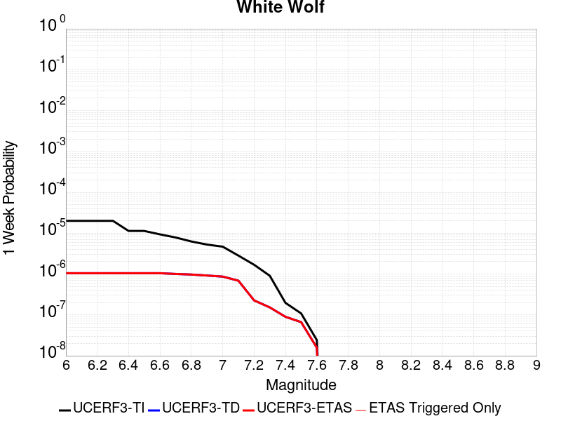 | 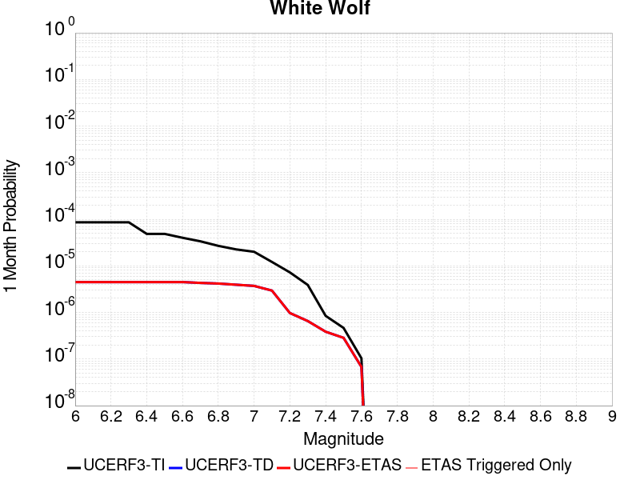 |  | 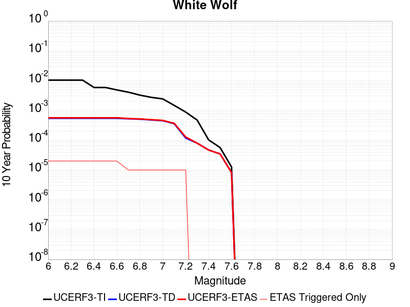 |

| Magnitude | 1 wk TI Prob | 1 wk TD Prob | 1 wk ETAS Prob | 1 wk ETAS/TD Gain | 1 wk ETAS Triggered Only | 1 mo TI Prob | 1 mo TD Prob | 1 mo ETAS Prob | 1 mo ETAS/TD Gain | 1 mo ETAS Triggered Only | 1 yr TI Prob | 1 yr TD Prob | 1 yr ETAS Prob | 1 yr ETAS/TD Gain | 1 yr ETAS Triggered Only | 10 yr TI Prob | 10 yr TD Prob | 10 yr ETAS Prob | 10 yr ETAS/TD Gain | 10 yr ETAS Triggered Only |
|-----|-----|-----|-----|-----|-----|-----|-----|-----|-----|-----|-----|-----|-----|-----|-----|-----|-----|-----|-----|-----|
| 6.0 | 2.0037822E-5 | 1.0469304E-6 | 1.0469304E-6 | 1.0 | 0.0 | 8.587355E-5 | 4.486837E-6 | 4.486837E-6 | 1.0 | 0.0 | 0.001045009 | 5.462592E-5 | 6.4625376E-5 | 1.1830533 | 1.0E-5 | 0.010401085 | 5.4613E-4 | 5.661191E-4 | 1.0366013 | 2.0E-5 |
| 6.1 | 2.0037822E-5 | 1.0469304E-6 | 1.0469304E-6 | 1.0 | 0.0 | 8.587355E-5 | 4.486837E-6 | 4.486837E-6 | 1.0 | 0.0 | 0.001045009 | 5.462592E-5 | 6.4625376E-5 | 1.1830533 | 1.0E-5 | 0.010401085 | 5.4613E-4 | 5.661191E-4 | 1.0366013 | 2.0E-5 |
| 6.2 | 2.0037822E-5 | 1.0469304E-6 | 1.0469304E-6 | 1.0 | 0.0 | 8.587355E-5 | 4.486837E-6 | 4.486837E-6 | 1.0 | 0.0 | 0.001045009 | 5.462592E-5 | 6.4625376E-5 | 1.1830533 | 1.0E-5 | 0.010401085 | 5.4613E-4 | 5.661191E-4 | 1.0366013 | 2.0E-5 |
| 6.3 | 2.0037822E-5 | 1.0469304E-6 | 1.0469304E-6 | 1.0 | 0.0 | 8.587355E-5 | 4.486837E-6 | 4.486837E-6 | 1.0 | 0.0 | 0.001045009 | 5.462592E-5 | 6.4625376E-5 | 1.1830533 | 1.0E-5 | 0.010401085 | 5.4613E-4 | 5.661191E-4 | 1.0366013 | 2.0E-5 |
| 6.4 | 1.132487E-5 | 1.0469304E-6 | 1.0469304E-6 | 1.0 | 0.0 | 4.8534253E-5 | 4.486837E-6 | 4.486837E-6 | 1.0 | 0.0 | 5.907443E-4 | 5.462592E-5 | 6.4625376E-5 | 1.1830533 | 1.0E-5 | 0.005891764 | 5.4613E-4 | 5.661191E-4 | 1.0366013 | 2.0E-5 |
| 6.5 | 1.132487E-5 | 1.0469304E-6 | 1.0469304E-6 | 1.0 | 0.0 | 4.8534253E-5 | 4.486837E-6 | 4.486837E-6 | 1.0 | 0.0 | 5.907443E-4 | 5.462592E-5 | 6.4625376E-5 | 1.1830533 | 1.0E-5 | 0.005891764 | 5.4613E-4 | 5.661191E-4 | 1.0366013 | 2.0E-5 |
| 6.6 | 9.347473E-6 | 1.0469304E-6 | 1.0469304E-6 | 1.0 | 0.0 | 4.0059982E-5 | 4.486837E-6 | 4.486837E-6 | 1.0 | 0.0 | 4.8762115E-4 | 5.462592E-5 | 6.4625376E-5 | 1.1830533 | 1.0E-5 | 0.0048655253 | 5.4613E-4 | 5.661191E-4 | 1.0366013 | 2.0E-5 |
| 6.7 | 7.842647E-6 | 1.0048476E-6 | 1.0048476E-6 | 1.0 | 0.0 | 3.361091E-5 | 4.306483E-6 | 4.306483E-6 | 1.0 | 0.0 | 4.0913603E-4 | 5.243022E-5 | 5.243022E-5 | 1.0 | 0.0 | 0.004083836 | 5.2418344E-4 | 5.341782E-4 | 1.0190673 | 1.0E-5 |
| 6.8 | 6.26597E-6 | 9.734948E-7 | 9.734948E-7 | 1.0 | 0.0 | 2.685388E-5 | 4.172114E-6 | 4.172114E-6 | 1.0 | 0.0 | 3.2689696E-4 | 5.079436E-5 | 5.079436E-5 | 1.0 | 0.0 | 0.003264165 | 5.078324E-4 | 5.178273E-4 | 1.0196816 | 1.0E-5 |
| 6.9 | 5.258436E-6 | 9.183371E-7 | 9.183371E-7 | 1.0 | 0.0 | 2.2535958E-5 | 3.9357246E-6 | 3.9357246E-6 | 1.0 | 0.0 | 2.7434074E-4 | 4.7916445E-5 | 4.7916445E-5 | 1.0 | 0.0 | 0.0027400232 | 4.7906593E-4 | 4.890611E-4 | 1.020864 | 1.0E-5 |
| 7.0 | 4.675028E-6 | 8.66129E-7 | 8.66129E-7 | 1.0 | 0.0 | 2.003568E-5 | 3.7119764E-6 | 3.7119764E-6 | 1.0 | 0.0 | 2.4390711E-4 | 4.5192424E-5 | 4.5192424E-5 | 1.0 | 0.0 | 0.0024363957 | 4.5183706E-4 | 4.6183253E-4 | 1.0221219 | 1.0E-5 |
| 7.1 | 2.8270078E-6 | 6.8742594E-7 | 6.8742594E-7 | 1.0 | 0.0 | 1.2115692E-5 | 2.9461082E-6 | 2.9461082E-6 | 1.0 | 0.0 | 1.4749856E-4 | 3.5868317E-5 | 3.5868317E-5 | 1.0 | 0.0 | 0.001474007 | 3.586294E-4 | 3.686258E-4 | 1.027874 | 1.0E-5 |
| 7.2 | 1.6881406E-6 | 2.2706854E-7 | 2.2706854E-7 | 1.0 | 0.0 | 7.2348685E-6 | 9.731506E-7 | 9.731506E-7 | 1.0 | 0.0 | 8.808096E-5 | 1.1848045E-5 | 1.1848045E-5 | 1.0 | 0.0 | 8.8046055E-4 | 1.1847429E-4 | 1.284731E-4 | 1.0843965 | 1.0E-5 |
| 7.3 | 9.086107E-7 | 1.5266669E-7 | 1.5266669E-7 | 1.0 | 0.0 | 3.8940398E-6 | 6.5428566E-7 | 6.5428566E-7 | 1.0 | 0.0 | 4.7408903E-5 | 7.965899E-6 | 7.965899E-6 | 1.0 | 0.0 | 4.739879E-4 | 7.965622E-5 | 7.965622E-5 | 1.0 | 0.0 |
| 7.4 | 1.9717383E-7 | 9.003981E-8 | 9.003981E-8 | 1.0 | 0.0 | 8.450304E-7 | 3.8588485E-7 | 3.8588485E-7 | 1.0 | 0.0 | 1.0288197E-5 | 4.698138E-6 | 4.698138E-6 | 1.0 | 0.0 | 1.028772E-4 | 4.6980418E-5 | 4.6980418E-5 | 1.0 | 0.0 |
| 7.5 | 1.086975E-7 | 6.659757E-8 | 6.659757E-8 | 1.0 | 0.0 | 4.6584634E-7 | 2.8541814E-7 | 2.8541814E-7 | 1.0 | 0.0 | 5.6716644E-6 | 3.4749605E-6 | 3.4749605E-6 | 1.0 | 0.0 | 5.6715195E-5 | 3.4749086E-5 | 3.4749086E-5 | 1.0 | 0.0 |
| 7.6 | 2.4217808E-8 | 1.5820843E-8 | 1.5820843E-8 | 1.0 | 0.0 | 1.03790605E-7 | 6.780361E-8 | 6.780361E-8 | 1.0 | 0.0 | 1.2636499E-6 | 8.255087E-7 | 8.255087E-7 | 1.0 | 0.0 | 1.2636427E-5 | 8.255061E-6 | 8.255061E-6 | 1.0 | 0.0 |

## Pinto Mtn
*[(top)](#table-of-contents)*

| 1 Week | 1 Month | 1 Year | 10 Year |
|-----|-----|-----|-----|
| 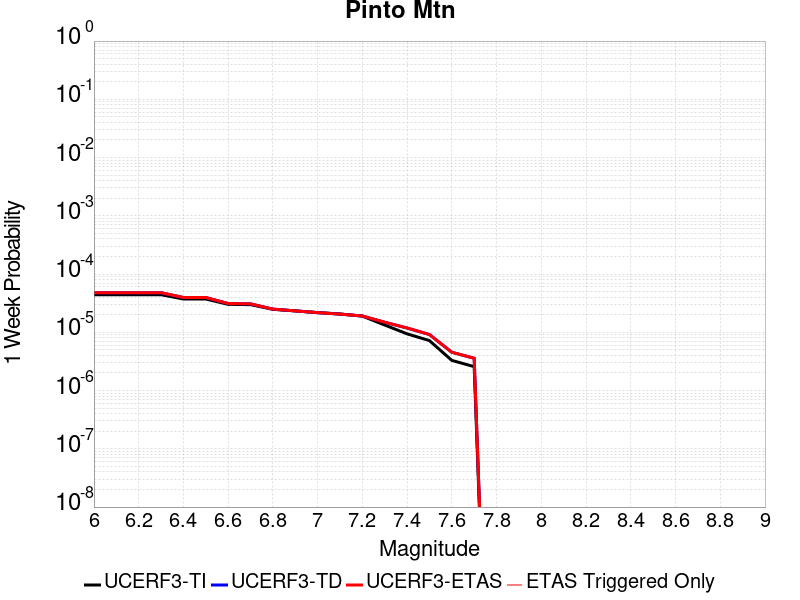 | 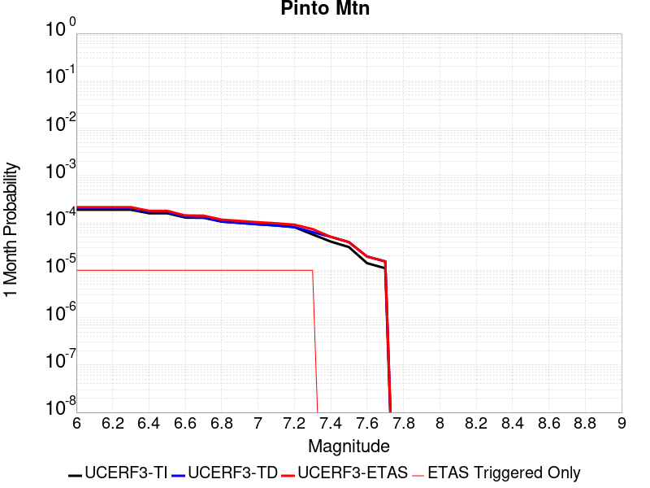 | 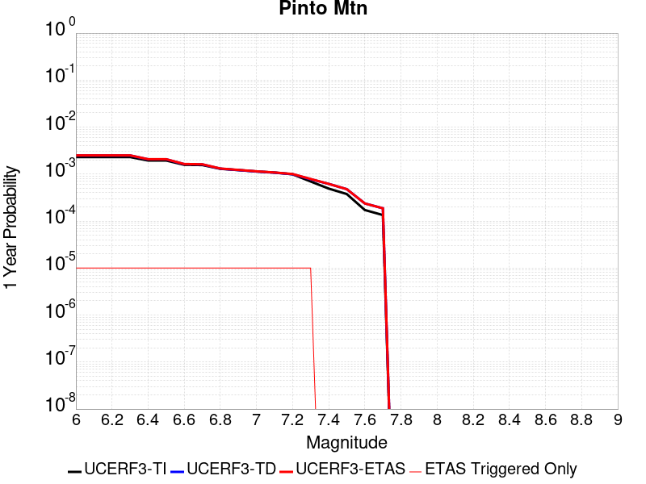 | 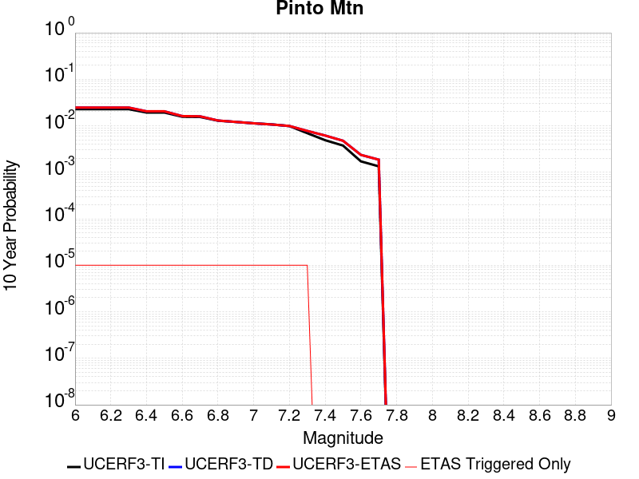 |

| Magnitude | 1 wk TI Prob | 1 wk TD Prob | 1 wk ETAS Prob | 1 wk ETAS/TD Gain | 1 wk ETAS Triggered Only | 1 mo TI Prob | 1 mo TD Prob | 1 mo ETAS Prob | 1 mo ETAS/TD Gain | 1 mo ETAS Triggered Only | 1 yr TI Prob | 1 yr TD Prob | 1 yr ETAS Prob | 1 yr ETAS/TD Gain | 1 yr ETAS Triggered Only | 10 yr TI Prob | 10 yr TD Prob | 10 yr ETAS Prob | 10 yr ETAS/TD Gain | 10 yr ETAS Triggered Only |
|-----|-----|-----|-----|-----|-----|-----|-----|-----|-----|-----|-----|-----|-----|-----|-----|-----|-----|-----|-----|-----|
| 6.0 | 4.4194956E-5 | 4.785523E-5 | 4.785523E-5 | 1.0 | 0.0 | 1.893932E-4 | 2.0507864E-4 | 2.150766E-4 | 1.0487518 | 1.0E-5 | 0.0023034236 | 0.002494138 | 0.0025041131 | 1.0039994 | 1.0E-5 | 0.022796938 | 0.024678964 | 0.024688717 | 1.0003952 | 1.0E-5 |
| 6.1 | 4.4194956E-5 | 4.785523E-5 | 4.785523E-5 | 1.0 | 0.0 | 1.893932E-4 | 2.0507864E-4 | 2.150766E-4 | 1.0487518 | 1.0E-5 | 0.0023034236 | 0.002494138 | 0.0025041131 | 1.0039994 | 1.0E-5 | 0.022796938 | 0.024678964 | 0.024688717 | 1.0003952 | 1.0E-5 |
| 6.2 | 4.4194956E-5 | 4.785523E-5 | 4.785523E-5 | 1.0 | 0.0 | 1.893932E-4 | 2.0507864E-4 | 2.150766E-4 | 1.0487518 | 1.0E-5 | 0.0023034236 | 0.002494138 | 0.0025041131 | 1.0039994 | 1.0E-5 | 0.022796938 | 0.024678964 | 0.024688717 | 1.0003952 | 1.0E-5 |
| 6.3 | 4.4194956E-5 | 4.785523E-5 | 4.785523E-5 | 1.0 | 0.0 | 1.893932E-4 | 2.0507864E-4 | 2.150766E-4 | 1.0487518 | 1.0E-5 | 0.0023034236 | 0.002494138 | 0.0025041131 | 1.0039994 | 1.0E-5 | 0.022796938 | 0.024678964 | 0.024688717 | 1.0003952 | 1.0E-5 |
| 6.4 | 3.729929E-5 | 3.960458E-5 | 3.960458E-5 | 1.0 | 0.0 | 1.5984432E-4 | 1.697234E-4 | 1.797217E-4 | 1.0589094 | 1.0E-5 | 0.0019443673 | 0.0020645177 | 0.002074497 | 1.0048337 | 1.0E-5 | 0.019274427 | 0.020463403 | 0.020473199 | 1.0004786 | 1.0E-5 |
| 6.5 | 3.729929E-5 | 3.960458E-5 | 3.960458E-5 | 1.0 | 0.0 | 1.5984432E-4 | 1.697234E-4 | 1.797217E-4 | 1.0589094 | 1.0E-5 | 0.0019443673 | 0.0020645177 | 0.002074497 | 1.0048337 | 1.0E-5 | 0.019274427 | 0.020463403 | 0.020473199 | 1.0004786 | 1.0E-5 |
| 6.6 | 3.0204548E-5 | 3.1206488E-5 | 3.1206488E-5 | 1.0 | 0.0 | 1.2944164E-4 | 1.3373543E-4 | 1.4373408E-4 | 1.0747645 | 1.0E-5 | 0.0015748127 | 0.0016270474 | 0.0016370311 | 1.0061361 | 1.0E-5 | 0.015636992 | 0.01615522 | 0.016165059 | 1.000609 | 1.0E-5 |
| 6.7 | 2.9857754E-5 | 3.0815863E-5 | 3.0815863E-5 | 1.0 | 0.0 | 1.2795553E-4 | 1.320615E-4 | 1.4206018E-4 | 1.0757123 | 1.0E-5 | 0.0015567453 | 0.0016066976 | 0.0016166815 | 1.0062139 | 1.0E-5 | 0.015458848 | 0.015954657 | 0.015964497 | 1.0006168 | 1.0E-5 |
| 6.8 | 2.4819734E-5 | 2.5010428E-5 | 2.5010428E-5 | 1.0 | 0.0 | 1.0636595E-4 | 1.0718327E-4 | 1.1718219E-4 | 1.0932882 | 1.0E-5 | 0.0012942362 | 0.0013041968 | 0.0013141837 | 1.0076575 | 1.0E-5 | 0.012867244 | 0.012967796 | 0.012977666 | 1.0007612 | 1.0E-5 |
| 6.9 | 2.331124E-5 | 2.3338684E-5 | 2.3338684E-5 | 1.0 | 0.0 | 9.990149E-5 | 1.00019206E-4 | 1.10018205E-4 | 1.0999708 | 1.0E-5 | 0.001215622 | 0.001217074 | 0.0012270617 | 1.0082065 | 1.0E-5 | 0.012089936 | 0.012106278 | 0.0121161565 | 1.000816 | 1.0E-5 |
| 7.0 | 2.1818534E-5 | 2.1761793E-5 | 2.1761793E-5 | 1.0 | 0.0 | 9.3504656E-5 | 9.32616E-5 | 1.03260674E-4 | 1.1072153 | 1.0E-5 | 0.0011378246 | 0.0011348884 | 0.001144877 | 1.0088015 | 1.0E-5 | 0.011320163 | 0.01129303 | 0.011302917 | 1.0008755 | 1.0E-5 |
| 7.1 | 2.066081E-5 | 2.054142E-5 | 2.054142E-5 | 1.0 | 0.0 | 8.854332E-5 | 8.80318E-5 | 9.803091E-5 | 1.1135854 | 1.0E-5 | 0.0010774818 | 0.0010712796 | 0.001081269 | 1.0093247 | 1.0E-5 | 0.010722724 | 0.010663206 | 0.010673099 | 1.0009278 | 1.0E-5 |
| 7.2 | 1.8990233E-5 | 1.9054683E-5 | 1.9054683E-5 | 1.0 | 0.0 | 8.138417E-5 | 8.166048E-5 | 9.165967E-5 | 1.1224482 | 1.0E-5 | 9.904018E-4 | 9.937823E-4 | 0.0010037724 | 1.0100526 | 1.0E-5 | 0.009859995 | 0.0098953815 | 0.009905282 | 1.0010005 | 1.0E-5 |
| 7.3 | 1.3335872E-5 | 1.4907276E-5 | 1.4907276E-5 | 1.0 | 0.0 | 5.7152483E-5 | 6.388683E-5 | 7.388619E-5 | 1.1565168 | 1.0E-5 | 6.956093E-4 | 7.775574E-4 | 7.875496E-4 | 1.0128508 | 1.0E-5 | 0.006934359 | 0.0077496674 | 0.0077595897 | 1.0012804 | 1.0E-5 |
| 7.4 | 9.414066E-6 | 1.186147E-5 | 1.186147E-5 | 1.0 | 0.0 | 4.0345374E-5 | 5.0833933E-5 | 5.0833933E-5 | 1.0 | 0.0 | 4.910942E-4 | 6.187368E-4 | 6.187368E-4 | 1.0 | 0.0 | 0.0049001034 | 0.0061710896 | 0.0061710896 | 1.0 | 0.0 |
| 7.5 | 7.2101157E-6 | 9.158733E-6 | 9.158733E-6 | 1.0 | 0.0 | 3.090013E-5 | 3.9251165E-5 | 3.9251165E-5 | 1.0 | 0.0 | 3.7614413E-4 | 4.7778594E-4 | 4.7778594E-4 | 1.0 | 0.0 | 0.0037550807 | 0.0047683627 | 0.0047683627 | 1.0 | 0.0 |
| 7.6 | 3.296375E-6 | 4.546122E-6 | 4.546122E-6 | 1.0 | 0.0 | 1.4127245E-5 | 1.9483241E-5 | 1.9483241E-5 | 1.0 | 0.0 | 1.7198564E-4 | 2.3718402E-4 | 2.3718402E-4 | 1.0 | 0.0 | 0.0017185259 | 0.0023694462 | 0.0023694462 | 1.0 | 0.0 |
| 7.7 | 2.5741092E-6 | 3.5850085E-6 | 3.5850085E-6 | 1.0 | 0.0 | 1.103185E-5 | 1.536424E-5 | 1.536424E-5 | 1.0 | 0.0 | 1.3430449E-4 | 1.8704488E-4 | 1.8704488E-4 | 1.0 | 0.0 | 0.0013422335 | 0.0018690043 | 0.0018690043 | 1.0 | 0.0 |

## Hunting Creek - Berryessa 2011 CFM
*[(top)](#table-of-contents)*

| 1 Week | 1 Month | 1 Year | 10 Year |
|-----|-----|-----|-----|
| 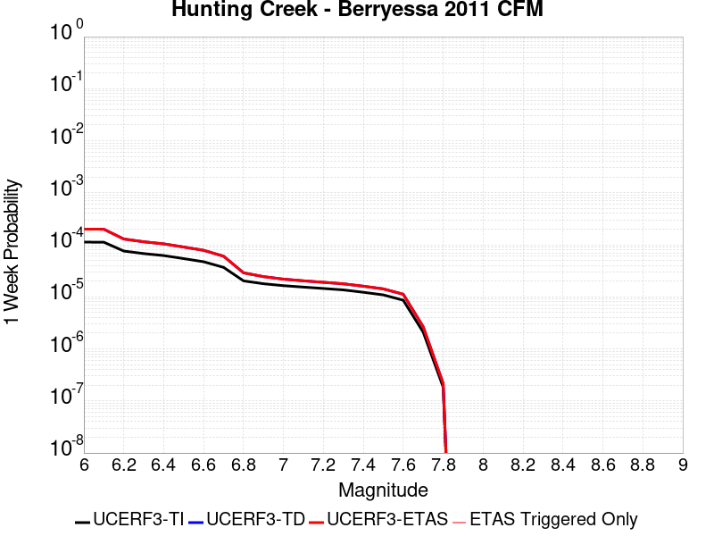 | 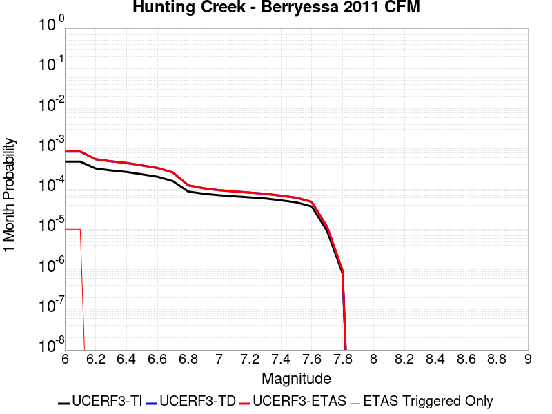 | 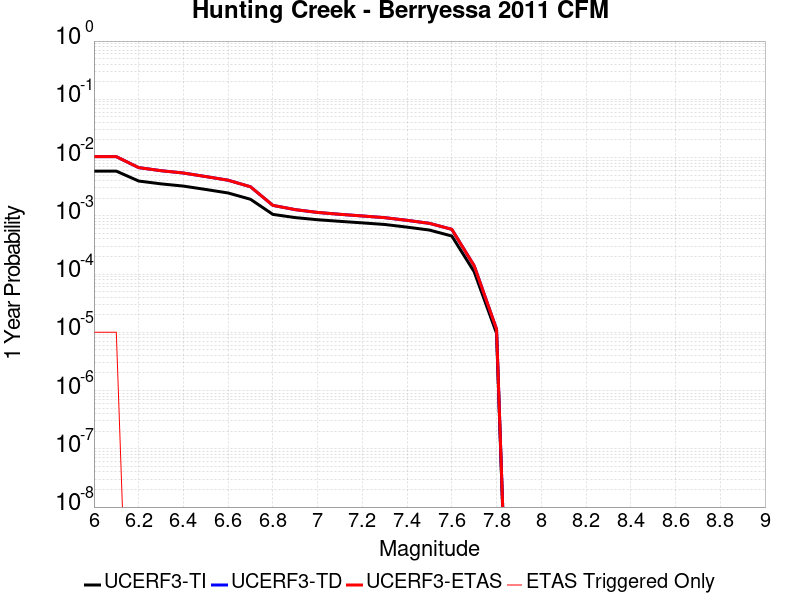 |  |

| Magnitude | 1 wk TI Prob | 1 wk TD Prob | 1 wk ETAS Prob | 1 wk ETAS/TD Gain | 1 wk ETAS Triggered Only | 1 mo TI Prob | 1 mo TD Prob | 1 mo ETAS Prob | 1 mo ETAS/TD Gain | 1 mo ETAS Triggered Only | 1 yr TI Prob | 1 yr TD Prob | 1 yr ETAS Prob | 1 yr ETAS/TD Gain | 1 yr ETAS Triggered Only | 10 yr TI Prob | 10 yr TD Prob | 10 yr ETAS Prob | 10 yr ETAS/TD Gain | 10 yr ETAS Triggered Only |
|-----|-----|-----|-----|-----|-----|-----|-----|-----|-----|-----|-----|-----|-----|-----|-----|-----|-----|-----|-----|-----|
| 6.0 | 1.1270982E-4 | 2.0014354E-4 | 2.0014354E-4 | 1.0 | 0.0 | 4.8295266E-4 | 8.574329E-4 | 8.6742436E-4 | 1.0116527 | 1.0E-5 | 0.0058641075 | 0.010387073 | 0.0103969695 | 1.0009527 | 1.0E-5 | 0.057117578 | 0.09804065 | 0.09804967 | 1.000092 | 1.0E-5 |
| 6.1 | 1.1239393E-4 | 1.9962489E-4 | 1.9962489E-4 | 1.0 | 0.0 | 4.8159933E-4 | 8.552116E-4 | 8.6520304E-4 | 1.011683 | 1.0E-5 | 0.0058477195 | 0.010360309 | 0.010370206 | 1.0009552 | 1.0E-5 | 0.056962132 | 0.09779912 | 0.097808145 | 1.0000923 | 1.0E-5 |
| 6.2 | 7.596265E-5 | 1.2941175E-4 | 1.2941175E-4 | 1.0 | 0.0 | 3.2551357E-4 | 5.544276E-4 | 5.544276E-4 | 1.0 | 0.0 | 0.0039559277 | 0.0067212153 | 0.0067212153 | 1.0 | 0.0 | 0.038862433 | 0.0645938 | 0.0645938 | 1.0 | 0.0 |
| 6.3 | 6.78794E-5 | 1.145196E-4 | 1.145196E-4 | 1.0 | 0.0 | 2.9087928E-4 | 4.9066654E-4 | 4.9066654E-4 | 1.0 | 0.0 | 0.003535705 | 0.0059528556 | 0.0059528556 | 1.0 | 0.0 | 0.034799766 | 0.05746746 | 0.05746746 | 1.0 | 0.0 |
| 6.4 | 6.2165134E-5 | 1.0437306E-4 | 1.0437306E-4 | 1.0 | 0.0 | 2.6639478E-4 | 4.4723987E-4 | 4.4723987E-4 | 1.0 | 0.0 | 0.0032385332 | 0.005427739 | 0.005427739 | 1.0 | 0.0 | 0.03191742 | 0.052552443 | 0.052552443 | 1.0 | 0.0 |
| 6.5 | 5.4368087E-5 | 9.071981E-5 | 9.071981E-5 | 1.0 | 0.0 | 2.3298527E-4 | 3.887444E-4 | 3.887444E-4 | 1.0 | 0.0 | 0.0028329059 | 0.004720021 | 0.004720021 | 1.0 | 0.0 | 0.027970633 | 0.045881823 | 0.045881823 | 1.0 | 0.0 |
| 6.6 | 4.729947E-5 | 7.848042E-5 | 7.848042E-5 | 1.0 | 0.0 | 2.0269625E-4 | 3.363043E-4 | 3.363043E-4 | 1.0 | 0.0 | 0.002465034 | 0.0040850975 | 0.0040850975 | 1.0 | 0.0 | 0.02437869 | 0.039853033 | 0.039853033 | 1.0 | 0.0 |
| 6.7 | 3.6875328E-5 | 6.0455113E-5 | 6.0455113E-5 | 1.0 | 0.0 | 1.5802756E-4 | 2.5907016E-4 | 2.5907016E-4 | 1.0 | 0.0 | 0.0019222875 | 0.0031483201 | 0.0031483201 | 1.0 | 0.0 | 0.019057442 | 0.030893533 | 0.030893533 | 1.0 | 0.0 |
| 6.8 | 2.0292036E-5 | 2.897696E-5 | 2.897696E-5 | 1.0 | 0.0 | 8.6962966E-5 | 1.241811E-4 | 1.241811E-4 | 1.0 | 0.0 | 0.0010582599 | 0.00151084 | 0.00151084 | 1.0 | 0.0 | 0.010532344 | 0.014978847 | 0.014978847 | 1.0 | 0.0 |
| 6.9 | 1.7871042E-5 | 2.4472789E-5 | 2.4472789E-5 | 1.0 | 0.0 | 7.658793E-5 | 1.048792E-4 | 1.048792E-4 | 1.0 | 0.0 | 9.320591E-4 | 0.0012761577 | 0.0012761577 | 1.0 | 0.0 | 0.009281595 | 0.012680048 | 0.012680048 | 1.0 | 0.0 |
| 7.0 | 1.6415532E-5 | 2.1906764E-5 | 2.1906764E-5 | 1.0 | 0.0 | 7.035038E-5 | 9.388277E-5 | 9.388277E-5 | 1.0 | 0.0 | 8.561793E-4 | 0.0011424269 | 0.0011424269 | 1.0 | 0.0 | 0.008528882 | 0.011364769 | 0.011364769 | 1.0 | 0.0 |
| 7.1 | 1.5409885E-5 | 2.03468E-5 | 2.03468E-5 | 1.0 | 0.0 | 6.6040695E-5 | 8.719768E-5 | 8.719768E-5 | 1.0 | 0.0 | 8.0374884E-4 | 0.0010611176 | 0.0010611176 | 1.0 | 0.0 | 0.00800848 | 0.010560832 | 0.010560832 | 1.0 | 0.0 |
| 7.2 | 1.4497423E-5 | 1.905539E-5 | 1.905539E-5 | 1.0 | 0.0 | 6.213033E-5 | 8.166341E-5 | 8.166341E-5 | 1.0 | 0.0 | 7.5617427E-4 | 9.938016E-4 | 9.938016E-4 | 1.0 | 0.0 | 0.0075360634 | 0.009894148 | 0.009894148 | 1.0 | 0.0 |
| 7.3 | 1.3615175E-5 | 1.7826538E-5 | 1.7826538E-5 | 1.0 | 0.0 | 5.8349444E-5 | 7.639723E-5 | 7.639723E-5 | 1.0 | 0.0 | 7.101729E-4 | 9.2974224E-4 | 9.2974224E-4 | 1.0 | 0.0 | 0.0070790765 | 0.009259034 | 0.009259034 | 1.0 | 0.0 |
| 7.4 | 1.2252825E-5 | 1.6026612E-5 | 1.6026612E-5 | 1.0 | 0.0 | 5.251105E-5 | 6.868369E-5 | 6.868369E-5 | 1.0 | 0.0 | 6.391345E-4 | 8.359059E-4 | 8.359059E-4 | 1.0 | 0.0 | 0.0063729943 | 0.008328059 | 0.008328059 | 1.0 | 0.0 |
| 7.5 | 1.0913301E-5 | 1.4241439E-5 | 1.4241439E-5 | 1.0 | 0.0 | 4.6770452E-5 | 6.103333E-5 | 6.103333E-5 | 1.0 | 0.0 | 5.6928146E-4 | 7.4283016E-4 | 7.4283016E-4 | 1.0 | 0.0 | 0.0056782532 | 0.0074038464 | 0.0074038464 | 1.0 | 0.0 |
| 7.6 | 8.623192E-6 | 1.1234897E-5 | 1.1234897E-5 | 1.0 | 0.0 | 3.6956015E-5 | 4.8148686E-5 | 4.8148686E-5 | 1.0 | 0.0 | 4.4984656E-4 | 5.860551E-4 | 5.860551E-4 | 1.0 | 0.0 | 0.00448937 | 0.0058454107 | 0.0058454107 | 1.0 | 0.0 |
| 7.7 | 2.0993634E-6 | 2.6626365E-6 | 2.6626365E-6 | 1.0 | 0.0 | 8.997241E-6 | 1.141125E-5 | 1.141125E-5 | 1.0 | 0.0 | 1.09535904E-4 | 1.3892318E-4 | 1.3892318E-4 | 1.0 | 0.0 | 0.0010948193 | 0.0013883698 | 0.0013883698 | 1.0 | 0.0 |
| 7.8 | 1.8428308E-7 | 2.167475E-7 | 2.167475E-7 | 1.0 | 0.0 | 7.897844E-7 | 9.2891753E-7 | 9.2891753E-7 | 1.0 | 0.0 | 9.615583E-6 | 1.1309516E-5 | 1.1309516E-5 | 1.0 | 0.0 | 9.615166E-5 | 1.13088005E-4 | 1.13088005E-4 | 1.0 | 0.0 |

## White Mountains
*[(top)](#table-of-contents)*

| 1 Week | 1 Month | 1 Year | 10 Year |
|-----|-----|-----|-----|
| 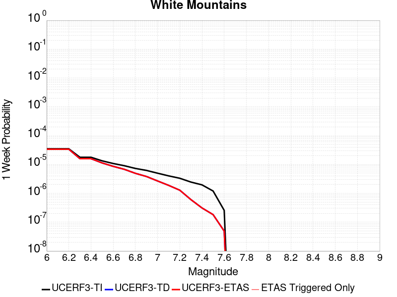 | 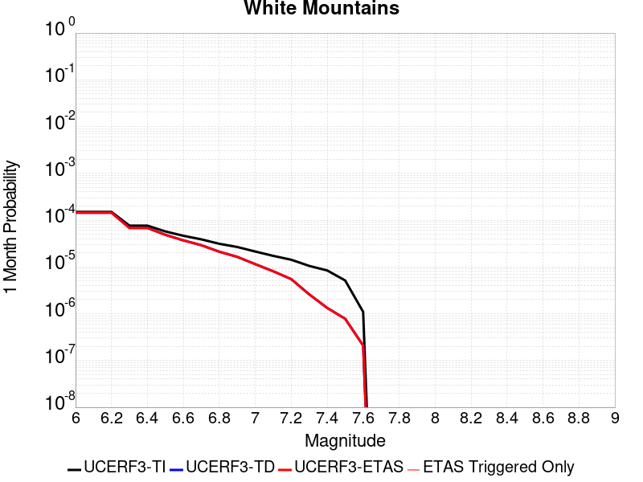 | 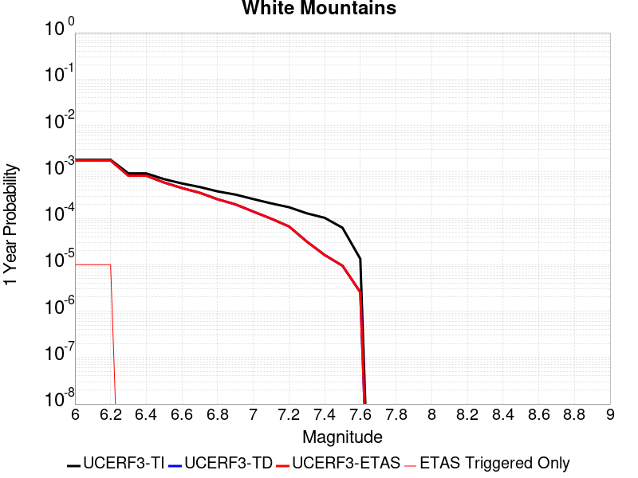 |  |

| Magnitude | 1 wk TI Prob | 1 wk TD Prob | 1 wk ETAS Prob | 1 wk ETAS/TD Gain | 1 wk ETAS Triggered Only | 1 mo TI Prob | 1 mo TD Prob | 1 mo ETAS Prob | 1 mo ETAS/TD Gain | 1 mo ETAS Triggered Only | 1 yr TI Prob | 1 yr TD Prob | 1 yr ETAS Prob | 1 yr ETAS/TD Gain | 1 yr ETAS Triggered Only | 10 yr TI Prob | 10 yr TD Prob | 10 yr ETAS Prob | 10 yr ETAS/TD Gain | 10 yr ETAS Triggered Only |
|-----|-----|-----|-----|-----|-----|-----|-----|-----|-----|-----|-----|-----|-----|-----|-----|-----|-----|-----|-----|-----|
| 6.0 | 3.503579E-5 | 3.3784425E-5 | 3.3784425E-5 | 1.0 | 0.0 | 1.5014476E-4 | 1.4478304E-4 | 1.4478304E-4 | 1.0 | 0.0 | 0.0018264796 | 0.0017614291 | 0.0017714115 | 1.0056672 | 1.0E-5 | 0.018115403 | 0.017487012 | 0.017496835 | 1.0005618 | 1.0E-5 |
| 6.1 | 3.503579E-5 | 3.3784425E-5 | 3.3784425E-5 | 1.0 | 0.0 | 1.5014476E-4 | 1.4478304E-4 | 1.4478304E-4 | 1.0 | 0.0 | 0.0018264796 | 0.0017614291 | 0.0017714115 | 1.0056672 | 1.0E-5 | 0.018115403 | 0.017487012 | 0.017496835 | 1.0005618 | 1.0E-5 |
| 6.2 | 3.503579E-5 | 3.3784425E-5 | 3.3784425E-5 | 1.0 | 0.0 | 1.5014476E-4 | 1.4478304E-4 | 1.4478304E-4 | 1.0 | 0.0 | 0.0018264796 | 0.0017614291 | 0.0017714115 | 1.0056672 | 1.0E-5 | 0.018115403 | 0.017487012 | 0.017496835 | 1.0005618 | 1.0E-5 |
| 6.3 | 1.7818425E-5 | 1.5916237E-5 | 1.5916237E-5 | 1.0 | 0.0 | 7.636245E-5 | 6.821074E-5 | 6.821074E-5 | 1.0 | 0.0 | 9.293162E-4 | 8.301636E-4 | 8.301636E-4 | 1.0 | 0.0 | 0.009254395 | 0.0082720835 | 0.0082720835 | 1.0 | 0.0 |
| 6.4 | 1.7818425E-5 | 1.5916237E-5 | 1.5916237E-5 | 1.0 | 0.0 | 7.636245E-5 | 6.821074E-5 | 6.821074E-5 | 1.0 | 0.0 | 9.293162E-4 | 8.301636E-4 | 8.301636E-4 | 1.0 | 0.0 | 0.009254395 | 0.0082720835 | 0.0082720835 | 1.0 | 0.0 |
| 6.5 | 1.3397557E-5 | 1.1336382E-5 | 1.1336382E-5 | 1.0 | 0.0 | 5.741684E-5 | 4.8583628E-5 | 4.8583628E-5 | 1.0 | 0.0 | 6.988258E-4 | 5.913521E-4 | 5.913521E-4 | 1.0 | 0.0 | 0.006966323 | 0.0058984905 | 0.0058984905 | 1.0 | 0.0 |
| 6.6 | 1.0818695E-5 | 8.625452E-6 | 8.625452E-6 | 1.0 | 0.0 | 4.6365014E-5 | 3.6965725E-5 | 3.6965725E-5 | 1.0 | 0.0 | 5.6434784E-4 | 4.499691E-4 | 4.499691E-4 | 1.0 | 0.0 | 0.005629168 | 0.0044910167 | 0.0044910167 | 1.0 | 0.0 |
| 6.7 | 9.067908E-6 | 6.8025106E-6 | 6.8025106E-6 | 1.0 | 0.0 | 3.8861883E-5 | 2.915331E-5 | 2.915331E-5 | 1.0 | 0.0 | 4.7304068E-4 | 3.5488693E-4 | 3.5488693E-4 | 1.0 | 0.0 | 0.00472035 | 0.0035435192 | 0.0035435192 | 1.0 | 0.0 |
| 6.8 | 7.295947E-6 | 4.9364417E-6 | 4.9364417E-6 | 1.0 | 0.0 | 3.126797E-5 | 2.1156015E-5 | 2.1156015E-5 | 1.0 | 0.0 | 3.8062103E-4 | 2.5754515E-4 | 2.5754515E-4 | 1.0 | 0.0 | 0.0037996976 | 0.0025725798 | 0.0025725798 | 1.0 | 0.0 |
| 6.9 | 6.2243444E-6 | 3.832255E-6 | 3.832255E-6 | 1.0 | 0.0 | 2.6675489E-5 | 1.6423848E-5 | 1.6423848E-5 | 1.0 | 0.0 | 3.2472567E-4 | 1.9994254E-4 | 1.9994254E-4 | 1.0 | 0.0 | 0.0032425157 | 0.0019976792 | 0.0019976792 | 1.0 | 0.0 |
| 7.0 | 4.9878413E-6 | 2.6795697E-6 | 2.6795697E-6 | 1.0 | 0.0 | 2.1376287E-5 | 1.1483821E-5 | 1.1483821E-5 | 1.0 | 0.0 | 2.602252E-4 | 1.3980681E-4 | 1.3980681E-4 | 1.0 | 0.0 | 0.002599207 | 0.0013972148 | 0.0013972148 | 1.0 | 0.0 |
| 7.1 | 4.0252844E-6 | 1.88579E-6 | 1.88579E-6 | 1.0 | 0.0 | 1.7251105E-5 | 8.081933E-6 | 8.081933E-6 | 1.0 | 0.0 | 2.1001195E-4 | 9.839322E-5 | 9.839322E-5 | 1.0 | 0.0 | 0.0020981359 | 9.835094E-4 | 9.835094E-4 | 1.0 | 0.0 |
| 7.2 | 3.3284066E-6 | 1.2819944E-6 | 1.2819944E-6 | 1.0 | 0.0 | 1.4264522E-5 | 5.4942507E-6 | 5.4942507E-6 | 1.0 | 0.0 | 1.736567E-4 | 6.689055E-5 | 6.689055E-5 | 1.0 | 0.0 | 0.0017352107 | 6.6871423E-4 | 6.6871423E-4 | 1.0 | 0.0 |
| 7.3 | 2.458226E-6 | 6.057493E-7 | 6.057493E-7 | 1.0 | 0.0 | 1.0535211E-5 | 2.596066E-6 | 2.596066E-6 | 1.0 | 0.0 | 1.2825865E-4 | 3.1606683E-5 | 3.1606683E-5 | 1.0 | 0.0 | 0.0012818464 | 3.1602563E-4 | 3.1602563E-4 | 1.0 | 0.0 |
| 7.4 | 1.965953E-6 | 3.1091668E-7 | 3.1091668E-7 | 1.0 | 0.0 | 8.425486E-6 | 1.3324994E-6 | 1.3324994E-6 | 1.0 | 0.0 | 1.0257547E-4 | 1.622306E-5 | 1.622306E-5 | 1.0 | 0.0 | 0.0010252813 | 1.6221889E-4 | 1.6221889E-4 | 1.0 | 0.0 |
| 7.5 | 1.2014192E-6 | 1.824589E-7 | 1.824589E-7 | 1.0 | 0.0 | 5.148929E-6 | 7.819665E-7 | 7.819665E-7 | 1.0 | 0.0 | 6.2686406E-5 | 9.520401E-6 | 9.520401E-6 | 1.0 | 0.0 | 6.266873E-4 | 9.520002E-5 | 9.520002E-5 | 1.0 | 0.0 |
| 7.6 | 2.5612175E-7 | 4.8950795E-8 | 4.8950795E-8 | 1.0 | 0.0 | 1.0976642E-6 | 2.097891E-7 | 2.097891E-7 | 1.0 | 0.0 | 1.3363979E-5 | 2.5541797E-6 | 2.5541797E-6 | 1.0 | 0.0 | 1.3363175E-4 | 2.554154E-5 | 2.554154E-5 | 1.0 | 0.0 |

## Manix-Afton Hills
*[(top)](#table-of-contents)*

| 1 Week | 1 Month | 1 Year | 10 Year |
|-----|-----|-----|-----|
|  |  | 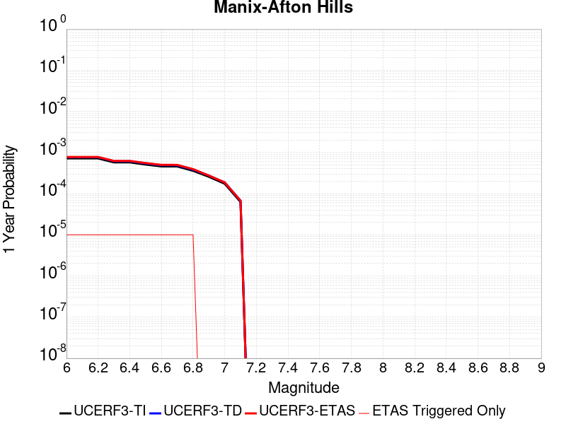 | 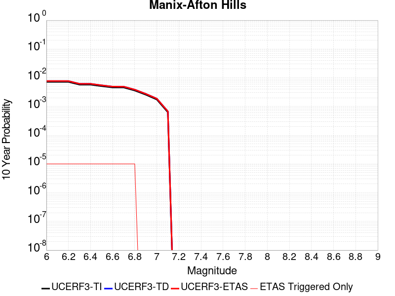 |

| Magnitude | 1 wk TI Prob | 1 wk TD Prob | 1 wk ETAS Prob | 1 wk ETAS/TD Gain | 1 wk ETAS Triggered Only | 1 mo TI Prob | 1 mo TD Prob | 1 mo ETAS Prob | 1 mo ETAS/TD Gain | 1 mo ETAS Triggered Only | 1 yr TI Prob | 1 yr TD Prob | 1 yr ETAS Prob | 1 yr ETAS/TD Gain | 1 yr ETAS Triggered Only | 10 yr TI Prob | 10 yr TD Prob | 10 yr ETAS Prob | 10 yr ETAS/TD Gain | 10 yr ETAS Triggered Only |
|-----|-----|-----|-----|-----|-----|-----|-----|-----|-----|-----|-----|-----|-----|-----|-----|-----|-----|-----|-----|-----|
| 6.0 | 1.3783202E-5 | 1.4711221E-5 | 1.4711221E-5 | 1.0 | 0.0 | 5.906953E-5 | 6.304667E-5 | 6.304667E-5 | 1.0 | 0.0 | 7.189342E-4 | 7.673403E-4 | 7.7733264E-4 | 1.0130221 | 1.0E-5 | 0.0071661277 | 0.007648664 | 0.007658588 | 1.0012975 | 1.0E-5 |
| 6.1 | 1.3783202E-5 | 1.4711221E-5 | 1.4711221E-5 | 1.0 | 0.0 | 5.906953E-5 | 6.304667E-5 | 6.304667E-5 | 1.0 | 0.0 | 7.189342E-4 | 7.673403E-4 | 7.7733264E-4 | 1.0130221 | 1.0E-5 | 0.0071661277 | 0.007648664 | 0.007658588 | 1.0012975 | 1.0E-5 |
| 6.2 | 1.3783202E-5 | 1.4711221E-5 | 1.4711221E-5 | 1.0 | 0.0 | 5.906953E-5 | 6.304667E-5 | 6.304667E-5 | 1.0 | 0.0 | 7.189342E-4 | 7.673403E-4 | 7.7733264E-4 | 1.0130221 | 1.0E-5 | 0.0071661277 | 0.007648664 | 0.007658588 | 1.0012975 | 1.0E-5 |
| 6.3 | 1.10494875E-5 | 1.1793241E-5 | 1.1793241E-5 | 1.0 | 0.0 | 4.7354086E-5 | 5.054154E-5 | 5.054154E-5 | 1.0 | 0.0 | 5.763835E-4 | 6.151799E-4 | 6.2517374E-4 | 1.0162454 | 1.0E-5 | 0.005748908 | 0.00613581 | 0.006145749 | 1.0016198 | 1.0E-5 |
| 6.4 | 1.10494875E-5 | 1.1793241E-5 | 1.1793241E-5 | 1.0 | 0.0 | 4.7354086E-5 | 5.054154E-5 | 5.054154E-5 | 1.0 | 0.0 | 5.763835E-4 | 6.151799E-4 | 6.2517374E-4 | 1.0162454 | 1.0E-5 | 0.005748908 | 0.00613581 | 0.006145749 | 1.0016198 | 1.0E-5 |
| 6.5 | 9.788949E-6 | 1.0454414E-5 | 1.0454414E-5 | 1.0 | 0.0 | 4.1951964E-5 | 4.4803914E-5 | 4.4803914E-5 | 1.0 | 0.0 | 5.1064545E-4 | 5.4536044E-4 | 5.55355E-4 | 1.0183265 | 1.0E-5 | 0.0050947363 | 0.005441148 | 0.0054510934 | 1.0018278 | 1.0E-5 |
| 6.6 | 8.810006E-6 | 9.413714E-6 | 9.413714E-6 | 1.0 | 0.0 | 3.775662E-5 | 4.0343915E-5 | 4.0343915E-5 | 1.0 | 0.0 | 4.5958988E-4 | 4.9108535E-4 | 5.010804E-4 | 1.0203531 | 1.0E-5 | 0.0045864056 | 0.004900884 | 0.0049108346 | 1.0020305 | 1.0E-5 |
| 6.7 | 8.80128E-6 | 9.404193E-6 | 9.404193E-6 | 1.0 | 0.0 | 3.7719226E-5 | 4.0303115E-5 | 4.0303115E-5 | 1.0 | 0.0 | 4.591348E-4 | 4.9058883E-4 | 5.005839E-4 | 1.0203737 | 1.0E-5 | 0.004581874 | 0.0048959404 | 0.0049058916 | 1.0020325 | 1.0E-5 |
| 6.8 | 6.8994877E-6 | 7.3801443E-6 | 7.3801443E-6 | 1.0 | 0.0 | 2.9568899E-5 | 3.1628853E-5 | 3.1628853E-5 | 1.0 | 0.0 | 3.5994186E-4 | 3.850214E-4 | 3.9501756E-4 | 1.0259626 | 1.0E-5 | 0.003593594 | 0.0038443485 | 0.00385431 | 1.0025913 | 1.0E-5 |
| 6.9 | 4.9328037E-6 | 5.2710093E-6 | 5.2710093E-6 | 1.0 | 0.0 | 2.1140417E-5 | 2.258988E-5 | 2.258988E-5 | 1.0 | 0.0 | 2.5735417E-4 | 2.7500323E-4 | 2.7500323E-4 | 1.0 | 0.0 | 0.0025705635 | 0.0027472344 | 0.0027472344 | 1.0 | 0.0 |
| 7.0 | 3.347973E-6 | 3.5900646E-6 | 3.5900646E-6 | 1.0 | 0.0 | 1.4348378E-5 | 1.5385924E-5 | 1.5385924E-5 | 1.0 | 0.0 | 1.746775E-4 | 1.8731161E-4 | 1.8731161E-4 | 1.0 | 0.0 | 0.0017454025 | 0.00187194 | 0.00187194 | 1.0 | 0.0 |
| 7.1 | 1.2073567E-6 | 1.2934943E-6 | 1.2934943E-6 | 1.0 | 0.0 | 5.1743755E-6 | 5.5435444E-6 | 5.5435444E-6 | 1.0 | 0.0 | 6.29962E-5 | 6.74922E-5 | 6.74922E-5 | 1.0 | 0.0 | 6.297835E-4 | 6.7487714E-4 | 6.7487714E-4 | 1.0 | 0.0 |

## Cleghorn Lake
*[(top)](#table-of-contents)*

| 1 Week | 1 Month | 1 Year | 10 Year |
|-----|-----|-----|-----|
|  | 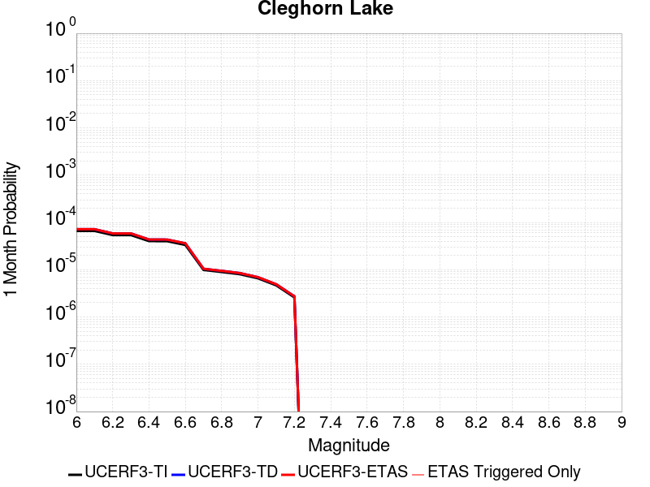 |  |  |

| Magnitude | 1 wk TI Prob | 1 wk TD Prob | 1 wk ETAS Prob | 1 wk ETAS/TD Gain | 1 wk ETAS Triggered Only | 1 mo TI Prob | 1 mo TD Prob | 1 mo ETAS Prob | 1 mo ETAS/TD Gain | 1 mo ETAS Triggered Only | 1 yr TI Prob | 1 yr TD Prob | 1 yr ETAS Prob | 1 yr ETAS/TD Gain | 1 yr ETAS Triggered Only | 10 yr TI Prob | 10 yr TD Prob | 10 yr ETAS Prob | 10 yr ETAS/TD Gain | 10 yr ETAS Triggered Only |
|-----|-----|-----|-----|-----|-----|-----|-----|-----|-----|-----|-----|-----|-----|-----|-----|-----|-----|-----|-----|-----|
| 6.0 | 1.5467183E-5 | 1.6794396E-5 | 1.6794396E-5 | 1.0 | 0.0 | 6.6286244E-5 | 7.1974304E-5 | 7.1974304E-5 | 1.0 | 0.0 | 8.067362E-4 | 8.7598973E-4 | 8.8598096E-4 | 1.0114057 | 1.0E-5 | 0.008038137 | 0.008730795 | 0.008740707 | 1.0011353 | 1.0E-5 |
| 6.1 | 1.5467183E-5 | 1.6794396E-5 | 1.6794396E-5 | 1.0 | 0.0 | 6.6286244E-5 | 7.1974304E-5 | 7.1974304E-5 | 1.0 | 0.0 | 8.067362E-4 | 8.7598973E-4 | 8.8598096E-4 | 1.0114057 | 1.0E-5 | 0.008038137 | 0.008730795 | 0.008740707 | 1.0011353 | 1.0E-5 |
| 6.2 | 1.2624631E-5 | 1.3681697E-5 | 1.3681697E-5 | 1.0 | 0.0 | 5.410444E-5 | 5.86348E-5 | 5.86348E-5 | 1.0 | 0.0 | 6.585225E-4 | 7.1369356E-4 | 7.236864E-4 | 1.0140016 | 1.0E-5 | 0.0065657445 | 0.007118811 | 0.0071287397 | 1.0013947 | 1.0E-5 |
| 6.3 | 1.2624631E-5 | 1.3681697E-5 | 1.3681697E-5 | 1.0 | 0.0 | 5.410444E-5 | 5.86348E-5 | 5.86348E-5 | 1.0 | 0.0 | 6.585225E-4 | 7.1369356E-4 | 7.236864E-4 | 1.0140016 | 1.0E-5 | 0.0065657445 | 0.007118811 | 0.0071287397 | 1.0013947 | 1.0E-5 |
| 6.4 | 9.417684E-6 | 1.0170226E-5 | 1.0170226E-5 | 1.0 | 0.0 | 4.036088E-5 | 4.3586184E-5 | 4.3586184E-5 | 1.0 | 0.0 | 4.912829E-4 | 5.305737E-4 | 5.405684E-4 | 1.0188376 | 1.0E-5 | 0.004901982 | 0.0052971053 | 0.0053070523 | 1.0018778 | 1.0E-5 |
| 6.5 | 9.368219E-6 | 1.0117652E-5 | 1.0117652E-5 | 1.0 | 0.0 | 4.014889E-5 | 4.3360877E-5 | 4.3360877E-5 | 1.0 | 0.0 | 4.8870314E-4 | 5.278319E-4 | 5.378266E-4 | 1.0189354 | 1.0E-5 | 0.004876298 | 0.0052698175 | 0.005279765 | 1.0018876 | 1.0E-5 |
| 6.6 | 7.803798E-6 | 8.441923E-6 | 8.441923E-6 | 1.0 | 0.0 | 3.3444423E-5 | 3.6179394E-5 | 3.6179394E-5 | 1.0 | 0.0 | 4.0710976E-4 | 4.40435E-4 | 4.504306E-4 | 1.0226948 | 1.0E-5 | 0.0040636472 | 0.004399538 | 0.0044094943 | 1.002263 | 1.0E-5 |
| 6.7 | 2.3108669E-6 | 2.4438523E-6 | 2.4438523E-6 | 1.0 | 0.0 | 9.903678E-6 | 1.0473612E-5 | 1.0473612E-5 | 1.0 | 0.0 | 1.205706E-4 | 1.2750895E-4 | 1.2750895E-4 | 1.0 | 0.0 | 0.001205052 | 0.0012743765 | 0.0012743765 | 1.0 | 0.0 |
| 6.8 | 2.0882828E-6 | 2.2062986E-6 | 2.2062986E-6 | 1.0 | 0.0 | 8.949753E-6 | 9.455533E-6 | 9.455533E-6 | 1.0 | 0.0 | 1.08957785E-4 | 1.15115196E-4 | 1.15115196E-4 | 1.0 | 0.0 | 0.0010890438 | 0.0011505726 | 0.0011505726 | 1.0 | 0.0 |
| 6.9 | 1.876935E-6 | 1.9810657E-6 | 1.9810657E-6 | 1.0 | 0.0 | 8.043982E-6 | 8.490254E-6 | 8.490254E-6 | 1.0 | 0.0 | 9.7931086E-5 | 1.033641E-4 | 1.033641E-4 | 1.0 | 0.0 | 9.788794E-4 | 0.0010331762 | 0.0010331762 | 1.0 | 0.0 |
| 7.0 | 1.5357559E-6 | 1.6202926E-6 | 1.6202926E-6 | 1.0 | 0.0 | 6.5817944E-6 | 6.944093E-6 | 6.944093E-6 | 1.0 | 0.0 | 8.01304E-5 | 8.454118E-5 | 8.454118E-5 | 1.0 | 0.0 | 8.010151E-4 | 8.4510265E-4 | 8.4510265E-4 | 1.0 | 0.0 |
| 7.1 | 1.0905424E-6 | 1.1497702E-6 | 1.1497702E-6 | 1.0 | 0.0 | 4.6737446E-6 | 4.927578E-6 | 4.927578E-6 | 1.0 | 0.0 | 5.6901354E-5 | 5.999171E-5 | 5.999171E-5 | 1.0 | 0.0 | 5.6886784E-4 | 5.997649E-4 | 5.997649E-4 | 1.0 | 0.0 |
| 7.2 | 6.06668E-7 | 6.387322E-7 | 6.387322E-7 | 1.0 | 0.0 | 2.600003E-6 | 2.7374213E-6 | 2.7374213E-6 | 1.0 | 0.0 | 3.1654577E-5 | 3.3327666E-5 | 3.3327666E-5 | 1.0 | 0.0 | 3.1650066E-4 | 3.332335E-4 | 3.332335E-4 | 1.0 | 0.0 |

## Deep Springs
*[(top)](#table-of-contents)*

| 1 Week | 1 Month | 1 Year | 10 Year |
|-----|-----|-----|-----|
|  |  | 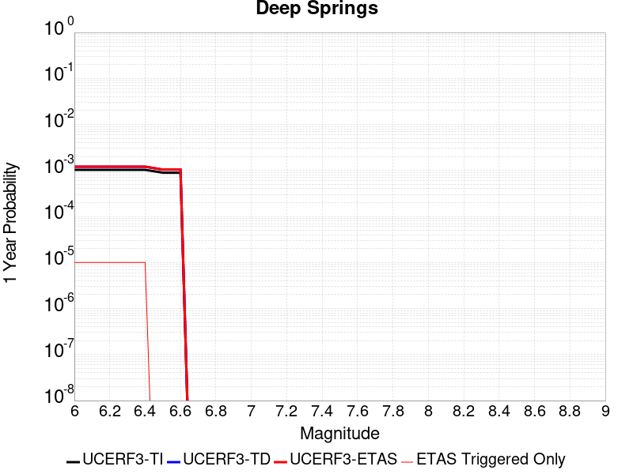 |  |

| Magnitude | 1 wk TI Prob | 1 wk TD Prob | 1 wk ETAS Prob | 1 wk ETAS/TD Gain | 1 wk ETAS Triggered Only | 1 mo TI Prob | 1 mo TD Prob | 1 mo ETAS Prob | 1 mo ETAS/TD Gain | 1 mo ETAS Triggered Only | 1 yr TI Prob | 1 yr TD Prob | 1 yr ETAS Prob | 1 yr ETAS/TD Gain | 1 yr ETAS Triggered Only | 10 yr TI Prob | 10 yr TD Prob | 10 yr ETAS Prob | 10 yr ETAS/TD Gain | 10 yr ETAS Triggered Only |
|-----|-----|-----|-----|-----|-----|-----|-----|-----|-----|-----|-----|-----|-----|-----|-----|-----|-----|-----|-----|-----|
| 6.0 | 1.9810619E-5 | 2.311303E-5 | 2.311303E-5 | 1.0 | 0.0 | 8.489989E-5 | 9.905495E-5 | 9.905495E-5 | 1.0 | 0.0 | 0.001033166 | 0.0012058346 | 0.0012158225 | 1.008283 | 1.0E-5 | 0.010283757 | 0.01204269 | 0.0120525705 | 1.0008204 | 1.0E-5 |
| 6.1 | 1.9810619E-5 | 2.311303E-5 | 2.311303E-5 | 1.0 | 0.0 | 8.489989E-5 | 9.905495E-5 | 9.905495E-5 | 1.0 | 0.0 | 0.001033166 | 0.0012058346 | 0.0012158225 | 1.008283 | 1.0E-5 | 0.010283757 | 0.01204269 | 0.0120525705 | 1.0008204 | 1.0E-5 |
| 6.2 | 1.9810619E-5 | 2.311303E-5 | 2.311303E-5 | 1.0 | 0.0 | 8.489989E-5 | 9.905495E-5 | 9.905495E-5 | 1.0 | 0.0 | 0.001033166 | 0.0012058346 | 0.0012158225 | 1.008283 | 1.0E-5 | 0.010283757 | 0.01204269 | 0.0120525705 | 1.0008204 | 1.0E-5 |
| 6.3 | 1.9810619E-5 | 2.311303E-5 | 2.311303E-5 | 1.0 | 0.0 | 8.489989E-5 | 9.905495E-5 | 9.905495E-5 | 1.0 | 0.0 | 0.001033166 | 0.0012058346 | 0.0012158225 | 1.008283 | 1.0E-5 | 0.010283757 | 0.01204269 | 0.0120525705 | 1.0008204 | 1.0E-5 |
| 6.4 | 1.9810619E-5 | 2.311303E-5 | 2.311303E-5 | 1.0 | 0.0 | 8.489989E-5 | 9.905495E-5 | 9.905495E-5 | 1.0 | 0.0 | 0.001033166 | 0.0012058346 | 0.0012158225 | 1.008283 | 1.0E-5 | 0.010283757 | 0.01204269 | 0.0120525705 | 1.0008204 | 1.0E-5 |
| 6.5 | 1.7190405E-5 | 2.0050999E-5 | 2.0050999E-5 | 1.0 | 0.0 | 7.367108E-5 | 8.593285E-5 | 8.593285E-5 | 1.0 | 0.0 | 8.9657627E-4 | 0.0010462324 | 0.0010462324 | 1.0 | 0.0 | 0.008929676 | 0.010462287 | 0.010462287 | 1.0 | 0.0 |
| 6.6 | 1.7190405E-5 | 2.0050999E-5 | 2.0050999E-5 | 1.0 | 0.0 | 7.367108E-5 | 8.593285E-5 | 8.593285E-5 | 1.0 | 0.0 | 8.9657627E-4 | 0.0010462324 | 0.0010462324 | 1.0 | 0.0 | 0.008929676 | 0.010462287 | 0.010462287 | 1.0 | 0.0 |

## Rose Canyon
*[(top)](#table-of-contents)*

| 1 Week | 1 Month | 1 Year | 10 Year |
|-----|-----|-----|-----|
| 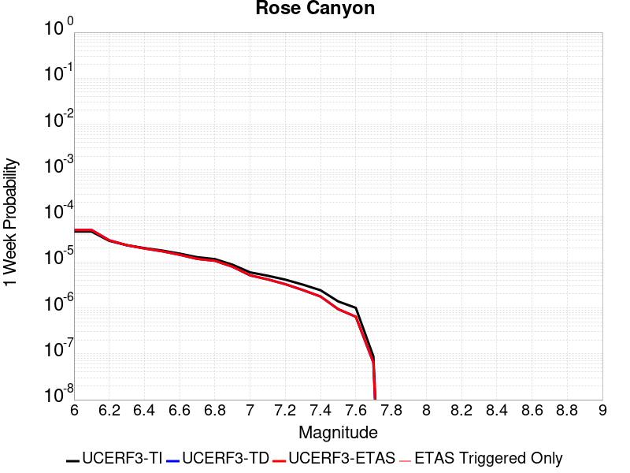 |  | 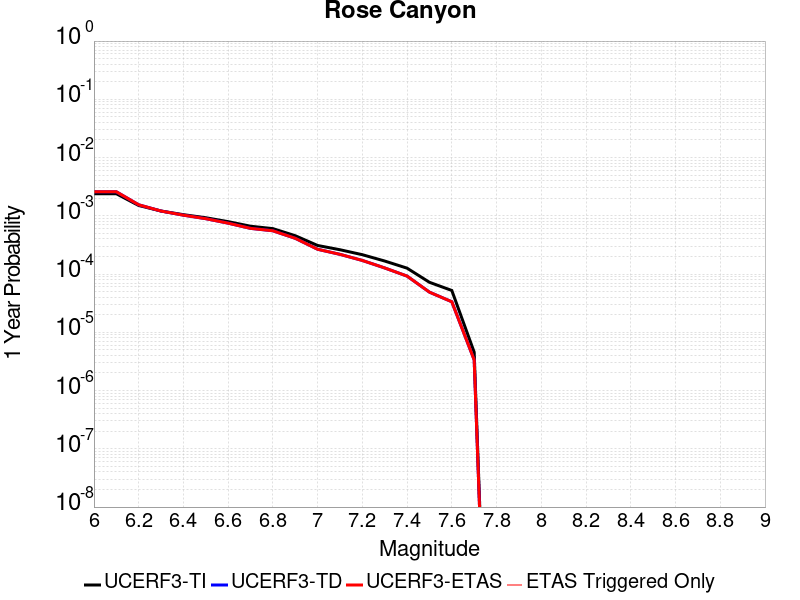 | 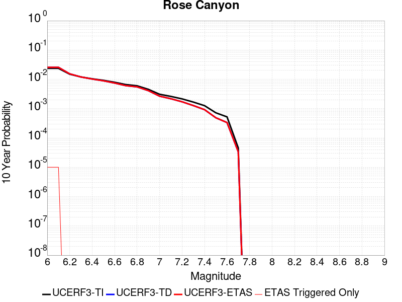 |

| Magnitude | 1 wk TI Prob | 1 wk TD Prob | 1 wk ETAS Prob | 1 wk ETAS/TD Gain | 1 wk ETAS Triggered Only | 1 mo TI Prob | 1 mo TD Prob | 1 mo ETAS Prob | 1 mo ETAS/TD Gain | 1 mo ETAS Triggered Only | 1 yr TI Prob | 1 yr TD Prob | 1 yr ETAS Prob | 1 yr ETAS/TD Gain | 1 yr ETAS Triggered Only | 10 yr TI Prob | 10 yr TD Prob | 10 yr ETAS Prob | 10 yr ETAS/TD Gain | 10 yr ETAS Triggered Only |
|-----|-----|-----|-----|-----|-----|-----|-----|-----|-----|-----|-----|-----|-----|-----|-----|-----|-----|-----|-----|-----|
| 6.0 | 4.5923203E-5 | 4.9715825E-5 | 4.9715825E-5 | 1.0 | 0.0 | 1.9679888E-4 | 2.1305127E-4 | 2.1305127E-4 | 1.0 | 0.0 | 0.0023933933 | 0.0025910123 | 0.0025910123 | 1.0 | 0.0 | 0.023677798 | 0.025640773 | 0.025650516 | 1.00038 | 1.0E-5 |
| 6.1 | 4.5923203E-5 | 4.9715825E-5 | 4.9715825E-5 | 1.0 | 0.0 | 1.9679888E-4 | 2.1305127E-4 | 2.1305127E-4 | 1.0 | 0.0 | 0.0023933933 | 0.0025910123 | 0.0025910123 | 1.0 | 0.0 | 0.023677798 | 0.025640773 | 0.025650516 | 1.00038 | 1.0E-5 |
| 6.2 | 2.8844734E-5 | 2.9669445E-5 | 2.9669445E-5 | 1.0 | 0.0 | 1.2361443E-4 | 1.2714828E-4 | 1.2714828E-4 | 1.0 | 0.0 | 0.0015039665 | 0.0015469306 | 0.0015469306 | 1.0 | 0.0 | 0.0149382865 | 0.01537464 | 0.01537464 | 1.0 | 0.0 |
| 6.3 | 2.3171577E-5 | 2.3161689E-5 | 2.3161689E-5 | 1.0 | 0.0 | 9.9302975E-5 | 9.926068E-5 | 9.926068E-5 | 1.0 | 0.0 | 0.0012083431 | 0.0012078421 | 0.0012078421 | 1.0 | 0.0 | 0.012017938 | 0.0120226685 | 0.0120226685 | 1.0 | 0.0 |
| 6.4 | 2.0066604E-5 | 1.9667403E-5 | 1.9667403E-5 | 1.0 | 0.0 | 8.599689E-5 | 8.42862E-5 | 8.42862E-5 | 1.0 | 0.0 | 0.0010465092 | 0.0010257114 | 0.0010257114 | 1.0 | 0.0 | 0.010415946 | 0.010217753 | 0.010217753 | 1.0 | 0.0 |
| 6.5 | 1.776989E-5 | 1.7114124E-5 | 1.7114124E-5 | 1.0 | 0.0 | 7.615444E-5 | 7.334422E-5 | 7.334422E-5 | 1.0 | 0.0 | 9.267859E-4 | 8.92607E-4 | 8.92607E-4 | 1.0 | 0.0 | 0.009229303 | 0.008896374 | 0.008896374 | 1.0 | 0.0 |
| 6.6 | 1.5227364E-5 | 1.43395055E-5 | 1.43395055E-5 | 1.0 | 0.0 | 6.52585E-5 | 6.1453604E-5 | 6.1453604E-5 | 1.0 | 0.0 | 7.942326E-4 | 7.47946E-4 | 7.47946E-4 | 1.0 | 0.0 | 0.007914 | 0.007458486 | 0.007458486 | 1.0 | 0.0 |
| 6.7 | 1.2703898E-5 | 1.167345E-5 | 1.167345E-5 | 1.0 | 0.0 | 5.4444143E-5 | 5.002814E-5 | 5.002814E-5 | 1.0 | 0.0 | 6.626558E-4 | 6.089266E-4 | 6.089266E-4 | 1.0 | 0.0 | 0.006606833 | 0.006075177 | 0.006075177 | 1.0 | 0.0 |
| 6.8 | 1.1554917E-5 | 1.0609485E-5 | 1.0609485E-5 | 1.0 | 0.0 | 4.9520135E-5 | 4.5468452E-5 | 4.5468452E-5 | 1.0 | 0.0 | 6.0274085E-4 | 5.534419E-4 | 5.534419E-4 | 1.0 | 0.0 | 0.0060110865 | 0.005522644 | 0.005522644 | 1.0 | 0.0 |
| 6.9 | 8.732078E-6 | 7.881448E-6 | 7.881448E-6 | 1.0 | 0.0 | 3.7422655E-5 | 3.3777214E-5 | 3.3777214E-5 | 1.0 | 0.0 | 4.5552556E-4 | 4.111629E-4 | 4.111629E-4 | 1.0 | 0.0 | 0.0045459294 | 0.0041048555 | 0.0041048555 | 1.0 | 0.0 |
| 7.0 | 5.9337494E-6 | 5.107531E-6 | 5.107531E-6 | 1.0 | 0.0 | 2.5430107E-5 | 2.1889235E-5 | 2.1889235E-5 | 1.0 | 0.0 | 3.0956755E-4 | 2.66469E-4 | 2.66469E-4 | 1.0 | 0.0 | 0.0030913667 | 0.0026615104 | 0.0026615104 | 1.0 | 0.0 |
| 7.1 | 5.013409E-6 | 4.177419E-6 | 4.177419E-6 | 1.0 | 0.0 | 2.1485863E-5 | 1.7903103E-5 | 1.7903103E-5 | 1.0 | 0.0 | 2.6155898E-4 | 2.1794859E-4 | 2.1794859E-4 | 1.0 | 0.0 | 0.0026125133 | 0.00217736 | 0.00217736 | 1.0 | 0.0 |
| 7.2 | 4.120763E-6 | 3.2821677E-6 | 3.2821677E-6 | 1.0 | 0.0 | 1.7660293E-5 | 1.4066358E-5 | 1.4066358E-5 | 1.0 | 0.0 | 2.1499286E-4 | 1.7124454E-4 | 1.7124454E-4 | 1.0 | 0.0 | 0.0021478499 | 0.0017111353 | 0.0017111353 | 1.0 | 0.0 |
| 7.3 | 3.2081239E-6 | 2.4405597E-6 | 2.4405597E-6 | 1.0 | 0.0 | 1.374903E-5 | 1.04595E-5 | 1.04595E-5 | 1.0 | 0.0 | 1.6738157E-4 | 1.2733703E-4 | 1.2733703E-4 | 1.0 | 0.0 | 0.0016725556 | 0.0012726476 | 0.0012726476 | 1.0 | 0.0 |
| 7.4 | 2.4194755E-6 | 1.7680803E-6 | 1.7680803E-6 | 1.0 | 0.0 | 1.0369139E-5 | 7.5774656E-6 | 7.5774656E-6 | 1.0 | 0.0 | 1.2623696E-4 | 9.2251794E-5 | 9.2251794E-5 | 1.0 | 0.0 | 0.0012616527 | 9.221403E-4 | 9.221403E-4 | 1.0 | 0.0 |
| 7.5 | 1.3842889E-6 | 9.378737E-7 | 9.378737E-7 | 1.0 | 0.0 | 5.9326535E-6 | 4.0194527E-6 | 4.0194527E-6 | 1.0 | 0.0 | 7.222766E-5 | 4.8935777E-5 | 4.8935777E-5 | 1.0 | 0.0 | 7.220419E-4 | 4.8925355E-4 | 4.8925355E-4 | 1.0 | 0.0 |
| 7.6 | 1.0021575E-6 | 6.411548E-7 | 6.411548E-7 | 1.0 | 0.0 | 4.2949537E-6 | 2.7478038E-6 | 2.7478038E-6 | 1.0 | 0.0 | 5.2289808E-5 | 3.345402E-5 | 3.345402E-5 | 1.0 | 0.0 | 5.2277505E-4 | 3.3449198E-4 | 3.3449198E-4 | 1.0 | 0.0 |
| 7.7 | 8.7620116E-8 | 6.449284E-8 | 6.449284E-8 | 1.0 | 0.0 | 3.7551473E-7 | 2.7639786E-7 | 2.7639786E-7 | 1.0 | 0.0 | 4.5718825E-6 | 3.365139E-6 | 3.365139E-6 | 1.0 | 0.0 | 4.5717883E-5 | 3.365091E-5 | 3.365091E-5 | 1.0 | 0.0 |

## Elsinore (Glen Ivy) rev
*[(top)](#table-of-contents)*

| 1 Week | 1 Month | 1 Year | 10 Year |
|-----|-----|-----|-----|
| 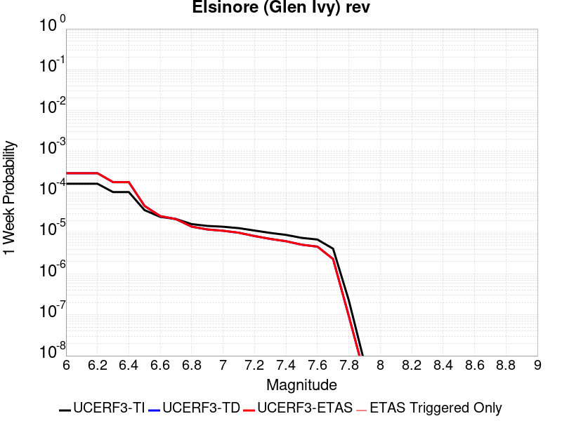 | 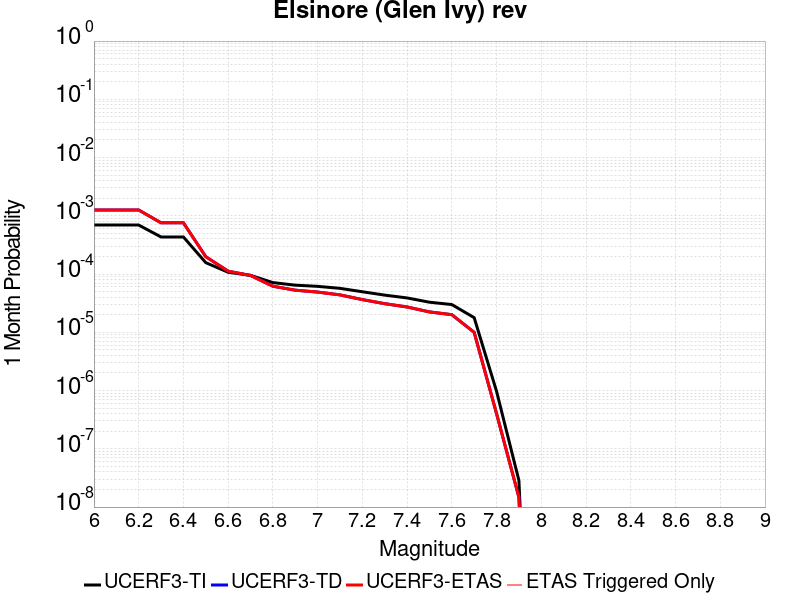 | 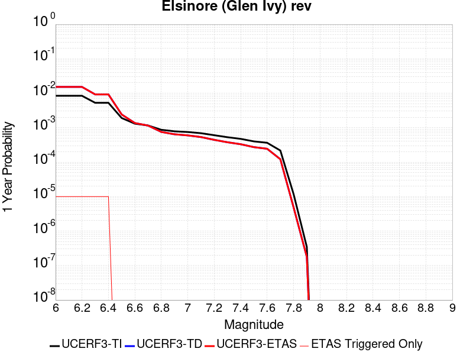 | 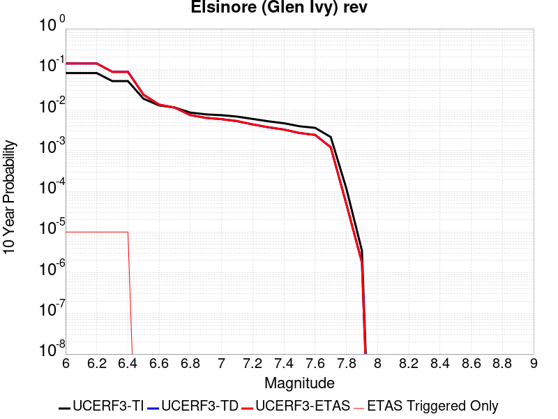 |

| Magnitude | 1 wk TI Prob | 1 wk TD Prob | 1 wk ETAS Prob | 1 wk ETAS/TD Gain | 1 wk ETAS Triggered Only | 1 mo TI Prob | 1 mo TD Prob | 1 mo ETAS Prob | 1 mo ETAS/TD Gain | 1 mo ETAS Triggered Only | 1 yr TI Prob | 1 yr TD Prob | 1 yr ETAS Prob | 1 yr ETAS/TD Gain | 1 yr ETAS Triggered Only | 10 yr TI Prob | 10 yr TD Prob | 10 yr ETAS Prob | 10 yr ETAS/TD Gain | 10 yr ETAS Triggered Only |
|-----|-----|-----|-----|-----|-----|-----|-----|-----|-----|-----|-----|-----|-----|-----|-----|-----|-----|-----|-----|-----|
| 6.0 | 1.6204086E-4 | 2.9362022E-4 | 2.9362022E-4 | 1.0 | 0.0 | 6.94276E-4 | 0.0012579202 | 0.0012579202 | 1.0 | 0.0 | 0.008420097 | 0.015235162 | 0.01524501 | 1.0006464 | 1.0E-5 | 0.081081145 | 0.13969512 | 0.13970374 | 1.0000616 | 1.0E-5 |
| 6.1 | 1.6204086E-4 | 2.9362022E-4 | 2.9362022E-4 | 1.0 | 0.0 | 6.94276E-4 | 0.0012579202 | 0.0012579202 | 1.0 | 0.0 | 0.008420097 | 0.015235162 | 0.01524501 | 1.0006464 | 1.0E-5 | 0.081081145 | 0.13969512 | 0.13970374 | 1.0000616 | 1.0E-5 |
| 6.2 | 1.6204086E-4 | 2.9362022E-4 | 2.9362022E-4 | 1.0 | 0.0 | 6.94276E-4 | 0.0012579202 | 0.0012579202 | 1.0 | 0.0 | 0.008420097 | 0.015235162 | 0.01524501 | 1.0006464 | 1.0E-5 | 0.081081145 | 0.13969512 | 0.13970374 | 1.0000616 | 1.0E-5 |
| 6.3 | 1.0111737E-4 | 1.7703768E-4 | 1.7703768E-4 | 1.0 | 0.0 | 4.332882E-4 | 7.58629E-4 | 7.58629E-4 | 1.0 | 0.0 | 0.005262531 | 0.0092178825 | 0.009227791 | 1.0010748 | 1.0E-5 | 0.0513964 | 0.08702082 | 0.08702996 | 1.0001049 | 1.0E-5 |
| 6.4 | 1.0111737E-4 | 1.7703768E-4 | 1.7703768E-4 | 1.0 | 0.0 | 4.332882E-4 | 7.58629E-4 | 7.58629E-4 | 1.0 | 0.0 | 0.005262531 | 0.0092178825 | 0.009227791 | 1.0010748 | 1.0E-5 | 0.0513964 | 0.08702082 | 0.08702996 | 1.0001049 | 1.0E-5 |
| 6.5 | 3.6624708E-5 | 4.639301E-5 | 4.639301E-5 | 1.0 | 0.0 | 1.569536E-4 | 1.9881407E-4 | 1.9881407E-4 | 1.0 | 0.0 | 0.001909235 | 0.0024182373 | 0.0024182373 | 1.0 | 0.0 | 0.01892915 | 0.023740914 | 0.023740914 | 1.0 | 0.0 |
| 6.6 | 2.5051324E-5 | 2.614908E-5 | 2.614908E-5 | 1.0 | 0.0 | 1.073584E-4 | 1.1206293E-4 | 1.1206293E-4 | 1.0 | 0.0 | 0.0013063047 | 0.0013635567 | 0.0013635567 | 1.0 | 0.0 | 0.012986525 | 0.013565315 | 0.013565315 | 1.0 | 0.0 |
| 6.7 | 2.2189772E-5 | 2.207403E-5 | 2.207403E-5 | 1.0 | 0.0 | 9.509556E-5 | 9.459976E-5 | 9.459976E-5 | 1.0 | 0.0 | 0.0011571734 | 0.0011511799 | 0.0011511799 | 1.0 | 0.0 | 0.011511663 | 0.011466023 | 0.011466023 | 1.0 | 0.0 |
| 6.8 | 1.6654378E-5 | 1.4438445E-5 | 1.4438445E-5 | 1.0 | 0.0 | 7.137396E-5 | 6.187761E-5 | 6.187761E-5 | 1.0 | 0.0 | 8.686314E-4 | 7.531047E-4 | 7.531047E-4 | 1.0 | 0.0 | 0.008652439 | 0.0075108632 | 0.0075108632 | 1.0 | 0.0 |
| 6.9 | 1.5042909E-5 | 1.23326745E-5 | 1.23326745E-5 | 1.0 | 0.0 | 6.446802E-5 | 5.2853266E-5 | 5.2853266E-5 | 1.0 | 0.0 | 7.8461546E-4 | 6.433017E-4 | 6.433017E-4 | 1.0 | 0.0 | 0.007818509 | 0.006418618 | 0.006418618 | 1.0 | 0.0 |
| 7.0 | 1.4361385E-5 | 1.14519435E-5 | 1.14519435E-5 | 1.0 | 0.0 | 6.154734E-5 | 4.907885E-5 | 4.907885E-5 | 1.0 | 0.0 | 7.490812E-4 | 5.973741E-4 | 5.973741E-4 | 1.0 | 0.0 | 0.007465612 | 0.0059616743 | 0.0059616743 | 1.0 | 0.0 |
| 7.1 | 1.3265571E-5 | 1.0245398E-5 | 1.0245398E-5 | 1.0 | 0.0 | 5.6851208E-5 | 4.3908123E-5 | 4.3908123E-5 | 1.0 | 0.0 | 6.919436E-4 | 5.344528E-4 | 5.344528E-4 | 1.0 | 0.0 | 0.006897931 | 0.0053350315 | 0.0053350315 | 1.0 | 0.0 |
| 7.2 | 1.1596403E-5 | 8.50544E-6 | 8.50544E-6 | 1.0 | 0.0 | 4.9697923E-5 | 3.6451387E-5 | 3.6451387E-5 | 1.0 | 0.0 | 6.049042E-4 | 4.4370696E-4 | 4.4370696E-4 | 1.0 | 0.0 | 0.006032603 | 0.004429626 | 0.004429626 | 1.0 | 0.0 |
| 7.3 | 1.0150827E-5 | 7.23907E-6 | 7.23907E-6 | 1.0 | 0.0 | 4.3502816E-5 | 3.1024225E-5 | 3.1024225E-5 | 1.0 | 0.0 | 5.2951806E-4 | 3.776559E-4 | 3.776559E-4 | 1.0 | 0.0 | 0.005282581 | 0.0037705277 | 0.0037705277 | 1.0 | 0.0 |
| 7.4 | 9.080705E-6 | 6.352785E-6 | 6.352785E-6 | 1.0 | 0.0 | 3.8916725E-5 | 2.7225946E-5 | 2.7225946E-5 | 1.0 | 0.0 | 4.7370812E-4 | 3.3142683E-4 | 3.3142683E-4 | 1.0 | 0.0 | 0.004726996 | 0.0033094764 | 0.0033094764 | 1.0 | 0.0 |
| 7.5 | 7.671649E-6 | 5.2258497E-6 | 5.2258497E-6 | 1.0 | 0.0 | 3.287808E-5 | 2.2396314E-5 | 2.2396314E-5 | 1.0 | 0.0 | 4.0021708E-4 | 2.7264224E-4 | 2.7264224E-4 | 1.0 | 0.0 | 0.0039949706 | 0.0027232026 | 0.0027232026 | 1.0 | 0.0 |
| 7.6 | 6.990086E-6 | 4.687739E-6 | 4.687739E-6 | 1.0 | 0.0 | 2.9957167E-5 | 2.0090161E-5 | 2.0090161E-5 | 1.0 | 0.0 | 3.6466747E-4 | 2.4457145E-4 | 2.4457145E-4 | 1.0 | 0.0 | 0.0036406964 | 0.002443139 | 0.002443139 | 1.0 | 0.0 |
| 7.7 | 4.163505E-6 | 2.3296475E-6 | 2.3296475E-6 | 1.0 | 0.0 | 1.7843471E-5 | 9.984169E-6 | 9.984169E-6 | 1.0 | 0.0 | 2.172226E-4 | 1.21551224E-4 | 1.21551224E-4 | 1.0 | 0.0 | 0.0021701038 | 0.0012149204 | 0.0012149204 | 1.0 | 0.0 |
| 7.8 | 2.2692414E-7 | 9.385943E-8 | 9.385943E-8 | 1.0 | 0.0 | 9.725317E-7 | 4.0225464E-7 | 4.0225464E-7 | 1.0 | 0.0 | 1.1840509E-5 | 4.8974425E-6 | 4.8974425E-6 | 1.0 | 0.0 | 1.1839878E-4 | 4.8973674E-5 | 4.8973674E-5 | 1.0 | 0.0 |
| 7.9 | 6.676829E-9 | 3.4399772E-9 | 3.4399772E-9 | 1.0 | 0.0 | 2.861498E-8 | 1.4742759E-8 | 1.4742759E-8 | 1.0 | 0.0 | 3.4838732E-7 | 1.7949307E-7 | 1.7949307E-7 | 1.0 | 0.0 | 3.4838679E-6 | 1.7949295E-6 | 1.7949295E-6 | 1.0 | 0.0 |

## San Pedro Basin
*[(top)](#table-of-contents)*

| 1 Week | 1 Month | 1 Year | 10 Year |
|-----|-----|-----|-----|
| 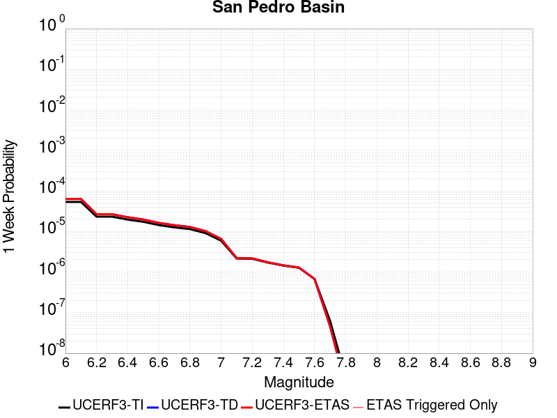 |  | 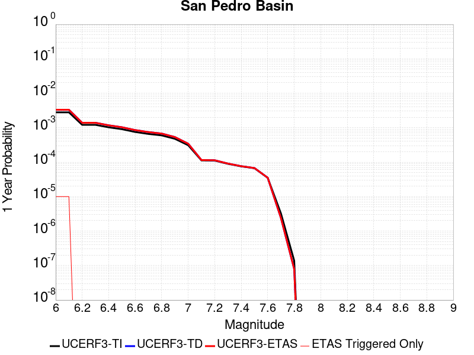 | 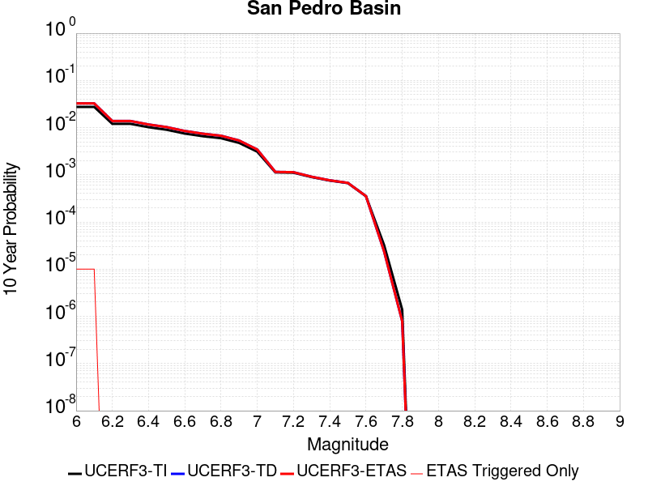 |

| Magnitude | 1 wk TI Prob | 1 wk TD Prob | 1 wk ETAS Prob | 1 wk ETAS/TD Gain | 1 wk ETAS Triggered Only | 1 mo TI Prob | 1 mo TD Prob | 1 mo ETAS Prob | 1 mo ETAS/TD Gain | 1 mo ETAS Triggered Only | 1 yr TI Prob | 1 yr TD Prob | 1 yr ETAS Prob | 1 yr ETAS/TD Gain | 1 yr ETAS Triggered Only | 10 yr TI Prob | 10 yr TD Prob | 10 yr ETAS Prob | 10 yr ETAS/TD Gain | 10 yr ETAS Triggered Only |
|-----|-----|-----|-----|-----|-----|-----|-----|-----|-----|-----|-----|-----|-----|-----|-----|-----|-----|-----|-----|-----|
| 6.0 | 5.3449043E-5 | 6.3371124E-5 | 6.3371124E-5 | 1.0 | 0.0 | 2.2904722E-4 | 2.7156572E-4 | 2.7156572E-4 | 1.0 | 0.0 | 0.0027850836 | 0.0033019078 | 0.0033118748 | 1.0030185 | 1.0E-5 | 0.027504366 | 0.032590248 | 0.032599922 | 1.0002968 | 1.0E-5 |
| 6.1 | 5.3449043E-5 | 6.3371124E-5 | 6.3371124E-5 | 1.0 | 0.0 | 2.2904722E-4 | 2.7156572E-4 | 2.7156572E-4 | 1.0 | 0.0 | 0.0027850836 | 0.0033019078 | 0.0033118748 | 1.0030185 | 1.0E-5 | 0.027504366 | 0.032590248 | 0.032599922 | 1.0002968 | 1.0E-5 |
| 6.2 | 2.3189454E-5 | 2.6643334E-5 | 2.6643334E-5 | 1.0 | 0.0 | 9.9379584E-5 | 1.14180984E-4 | 1.14180984E-4 | 1.0 | 0.0 | 0.0012092749 | 0.0013893144 | 0.0013893144 | 1.0 | 0.0 | 0.012027155 | 0.013811161 | 0.013811161 | 1.0 | 0.0 |
| 6.3 | 2.3189454E-5 | 2.6643334E-5 | 2.6643334E-5 | 1.0 | 0.0 | 9.9379584E-5 | 1.14180984E-4 | 1.14180984E-4 | 1.0 | 0.0 | 0.0012092749 | 0.0013893144 | 0.0013893144 | 1.0 | 0.0 | 0.012027155 | 0.013811161 | 0.013811161 | 1.0 | 0.0 |
| 6.4 | 1.966056E-5 | 2.2463848E-5 | 2.2463848E-5 | 1.0 | 0.0 | 8.425682E-5 | 9.627031E-5 | 9.627031E-5 | 1.0 | 0.0 | 0.001025344 | 0.001171501 | 0.001171501 | 1.0 | 0.0 | 0.010206259 | 0.011657341 | 0.011657341 | 1.0 | 0.0 |
| 6.5 | 1.7342953E-5 | 1.9745521E-5 | 1.9745521E-5 | 1.0 | 0.0 | 7.4324824E-5 | 8.4621126E-5 | 8.4621126E-5 | 1.0 | 0.0 | 9.04529E-4 | 0.0010298121 | 0.0010298121 | 1.0 | 0.0 | 0.009008561 | 0.010254124 | 0.010254124 | 1.0 | 0.0 |
| 6.6 | 1.439804E-5 | 1.6323014E-5 | 1.6323014E-5 | 1.0 | 0.0 | 6.170443E-5 | 6.995408E-5 | 6.995408E-5 | 1.0 | 0.0 | 7.509924E-4 | 8.513903E-4 | 8.513903E-4 | 1.0 | 0.0 | 0.0074845953 | 0.008484487 | 0.008484487 | 1.0 | 0.0 |
| 6.7 | 1.2634884E-5 | 1.4285554E-5 | 1.4285554E-5 | 1.0 | 0.0 | 5.414838E-5 | 6.1222534E-5 | 6.1222534E-5 | 1.0 | 0.0 | 6.590571E-4 | 7.451599E-4 | 7.451599E-4 | 1.0 | 0.0 | 0.006571059 | 0.007429634 | 0.007429634 | 1.0 | 0.0 |
| 6.8 | 1.146091E-5 | 1.2933421E-5 | 1.2933421E-5 | 1.0 | 0.0 | 4.911726E-5 | 5.542794E-5 | 5.542794E-5 | 1.0 | 0.0 | 5.9783855E-4 | 6.7465595E-4 | 6.7465595E-4 | 1.0 | 0.0 | 0.0059623276 | 0.0067290184 | 0.0067290184 | 1.0 | 0.0 |
| 6.9 | 9.109035E-6 | 1.0235189E-5 | 1.0235189E-5 | 1.0 | 0.0 | 3.9038136E-5 | 4.3864515E-5 | 4.3864515E-5 | 1.0 | 0.0 | 4.7518566E-4 | 5.339476E-4 | 5.339476E-4 | 1.0 | 0.0 | 0.0047417083 | 0.0053294008 | 0.0053294008 | 1.0 | 0.0 |
| 7.0 | 5.9351028E-6 | 6.584068E-6 | 6.584068E-6 | 1.0 | 0.0 | 2.5435906E-5 | 2.8217262E-5 | 2.8217262E-5 | 1.0 | 0.0 | 3.0963816E-4 | 3.4351464E-4 | 3.4351464E-4 | 1.0 | 0.0 | 0.0030920706 | 0.0034321535 | 0.0034321535 | 1.0 | 0.0 |
| 7.1 | 2.1557585E-6 | 2.2096608E-6 | 2.2096608E-6 | 1.0 | 0.0 | 9.238933E-6 | 9.469942E-6 | 9.469942E-6 | 1.0 | 0.0 | 1.1247819E-4 | 1.1529059E-4 | 1.1529059E-4 | 1.0 | 0.0 | 0.0011242128 | 0.0011523232 | 0.0011523232 | 1.0 | 0.0 |
| 7.2 | 2.1251979E-6 | 2.178007E-6 | 2.178007E-6 | 1.0 | 0.0 | 9.107958E-6 | 9.334282E-6 | 9.334282E-6 | 1.0 | 0.0 | 1.1088375E-4 | 1.1363912E-4 | 1.1363912E-4 | 1.0 | 0.0 | 0.0011082845 | 0.0011358254 | 0.0011358254 | 1.0 | 0.0 |
| 7.3 | 1.7145798E-6 | 1.7442967E-6 | 1.7442967E-6 | 1.0 | 0.0 | 7.3481783E-6 | 7.475536E-6 | 7.475536E-6 | 1.0 | 0.0 | 8.94604E-5 | 9.1010945E-5 | 9.1010945E-5 | 1.0 | 0.0 | 8.9424395E-4 | 9.0974587E-4 | 9.0974587E-4 | 1.0 | 0.0 |
| 7.4 | 1.4467993E-6 | 1.4641943E-6 | 1.4641943E-6 | 1.0 | 0.0 | 6.200554E-6 | 6.2751037E-6 | 6.2751037E-6 | 1.0 | 0.0 | 7.548913E-5 | 7.6396784E-5 | 7.6396784E-5 | 1.0 | 0.0 | 7.546349E-4 | 7.637125E-4 | 7.637125E-4 | 1.0 | 0.0 |
| 7.5 | 1.2803735E-6 | 1.2931564E-6 | 1.2931564E-6 | 1.0 | 0.0 | 5.487303E-6 | 5.5420874E-6 | 5.5420874E-6 | 1.0 | 0.0 | 6.680587E-5 | 6.7472894E-5 | 6.7472894E-5 | 1.0 | 0.0 | 6.678579E-4 | 6.7453115E-4 | 6.7453115E-4 | 1.0 | 0.0 |
| 7.6 | 6.755009E-7 | 6.769501E-7 | 6.769501E-7 | 1.0 | 0.0 | 2.8950008E-6 | 2.9012117E-6 | 2.9012117E-6 | 1.0 | 0.0 | 3.5246063E-5 | 3.5321737E-5 | 3.5321737E-5 | 1.0 | 0.0 | 3.5240475E-4 | 3.5316695E-4 | 3.5316695E-4 | 1.0 | 0.0 |
| 7.7 | 6.211885E-8 | 4.5699863E-8 | 4.5699863E-8 | 1.0 | 0.0 | 2.6622362E-7 | 1.9585654E-7 | 1.9585654E-7 | 1.0 | 0.0 | 3.2412677E-6 | 2.384551E-6 | 2.384551E-6 | 1.0 | 0.0 | 3.2412205E-5 | 2.3845274E-5 | 2.3845274E-5 | 1.0 | 0.0 |
| 7.8 | 2.6580573E-9 | 1.5138681E-9 | 1.5138681E-9 | 1.0 | 0.0 | 1.1391674E-8 | 6.488006E-9 | 6.488006E-9 | 1.0 | 0.0 | 1.3869362E-7 | 7.899148E-8 | 7.899148E-8 | 1.0 | 0.0 | 1.3869354E-6 | 7.8991474E-7 | 7.8991474E-7 | 1.0 | 0.0 |

## Hayward (No) 2011 CFM
*[(top)](#table-of-contents)*

| 1 Week | 1 Month | 1 Year | 10 Year |
|-----|-----|-----|-----|
| 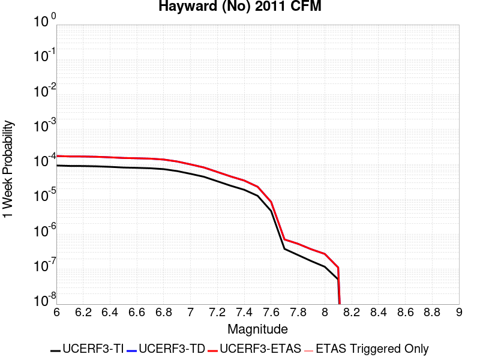 | 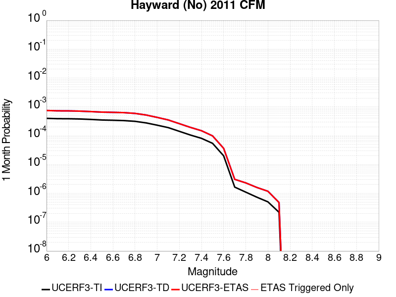 |  | 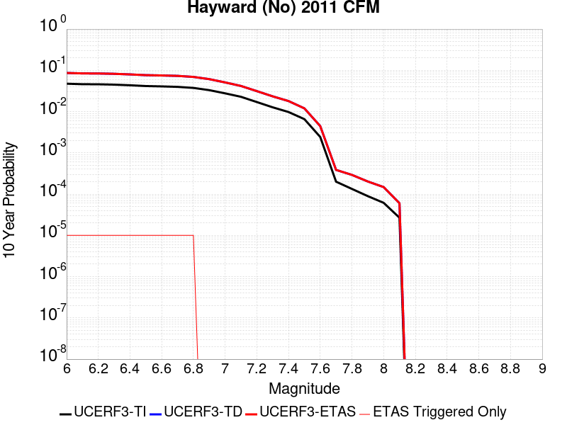 |

| Magnitude | 1 wk TI Prob | 1 wk TD Prob | 1 wk ETAS Prob | 1 wk ETAS/TD Gain | 1 wk ETAS Triggered Only | 1 mo TI Prob | 1 mo TD Prob | 1 mo ETAS Prob | 1 mo ETAS/TD Gain | 1 mo ETAS Triggered Only | 1 yr TI Prob | 1 yr TD Prob | 1 yr ETAS Prob | 1 yr ETAS/TD Gain | 1 yr ETAS Triggered Only | 10 yr TI Prob | 10 yr TD Prob | 10 yr ETAS Prob | 10 yr ETAS/TD Gain | 10 yr ETAS Triggered Only |
|-----|-----|-----|-----|-----|-----|-----|-----|-----|-----|-----|-----|-----|-----|-----|-----|-----|-----|-----|-----|-----|
| 6.0 | 9.3068506E-5 | 1.7397478E-4 | 1.7397478E-4 | 1.0 | 0.0 | 3.9880406E-4 | 7.453825E-4 | 7.453825E-4 | 1.0 | 0.0 | 0.0048446343 | 0.009037196 | 0.009037196 | 1.0 | 0.0 | 0.047403704 | 0.08638188 | 0.08639102 | 1.0001057 | 1.0E-5 |
| 6.1 | 9.055486E-5 | 1.6948568E-4 | 1.6948568E-4 | 1.0 | 0.0 | 3.880345E-4 | 7.261632E-4 | 7.261632E-4 | 1.0 | 0.0 | 0.0047140904 | 0.008805285 | 0.008805285 | 1.0 | 0.0 | 0.046153355 | 0.08427502 | 0.08428418 | 1.0001086 | 1.0E-5 |
| 6.2 | 9.006742E-5 | 1.686916E-4 | 1.686916E-4 | 1.0 | 0.0 | 3.859461E-4 | 7.2276185E-4 | 7.2276185E-4 | 1.0 | 0.0 | 0.0046887742 | 0.008764258 | 0.008764258 | 1.0 | 0.0 | 0.0459107 | 0.083899245 | 0.08390841 | 1.0001092 | 1.0E-5 |
| 6.3 | 8.8336754E-5 | 1.6548682E-4 | 1.6548682E-4 | 1.0 | 0.0 | 3.7853114E-4 | 7.090373E-4 | 7.090373E-4 | 1.0 | 0.0 | 0.004598882 | 0.00859853 | 0.00859853 | 1.0 | 0.0 | 0.04504866 | 0.08239243 | 0.08240161 | 1.0001113 | 1.0E-5 |
| 6.4 | 8.526157E-5 | 1.5975675E-4 | 1.5975675E-4 | 1.0 | 0.0 | 3.6535555E-4 | 6.844929E-4 | 6.844929E-4 | 1.0 | 0.0 | 0.0044391346 | 0.008302015 | 0.008302015 | 1.0 | 0.0 | 0.043514993 | 0.079689264 | 0.079698466 | 1.0001155 | 1.0E-5 |
| 6.5 | 8.152396E-5 | 1.5308043E-4 | 1.5308043E-4 | 1.0 | 0.0 | 3.493416E-4 | 6.5589475E-4 | 6.5589475E-4 | 1.0 | 0.0 | 0.0042449418 | 0.007956429 | 0.007956429 | 1.0 | 0.0 | 0.04164765 | 0.076520085 | 0.07652932 | 1.0001206 | 1.0E-5 |
| 6.6 | 7.987405E-5 | 1.5012249E-4 | 1.5012249E-4 | 1.0 | 0.0 | 3.4227243E-4 | 6.4322416E-4 | 6.4322416E-4 | 1.0 | 0.0 | 0.0041592065 | 0.0078032906 | 0.0078032906 | 1.0 | 0.0 | 0.04082218 | 0.0751126 | 0.07512185 | 1.0001231 | 1.0E-5 |
| 6.7 | 7.777665E-5 | 1.4651503E-4 | 1.4651503E-4 | 1.0 | 0.0 | 3.332859E-4 | 6.277711E-4 | 6.277711E-4 | 1.0 | 0.0 | 0.004050208 | 0.007616483 | 0.007616483 | 1.0 | 0.0 | 0.039771806 | 0.073388964 | 0.07339823 | 1.0001262 | 1.0E-5 |
| 6.8 | 7.3284005E-5 | 1.3802089E-4 | 1.3802089E-4 | 1.0 | 0.0 | 3.140365E-4 | 5.913846E-4 | 5.913846E-4 | 1.0 | 0.0 | 0.0038166929 | 0.0071764747 | 0.0071764747 | 1.0 | 0.0 | 0.037518036 | 0.06930231 | 0.06931162 | 1.0001343 | 1.0E-5 |
| 6.9 | 6.458263E-5 | 1.2132651E-4 | 1.2132651E-4 | 1.0 | 0.0 | 2.7675333E-4 | 5.1986764E-4 | 5.1986764E-4 | 1.0 | 0.0 | 0.0033642664 | 0.0063111205 | 0.0063111205 | 1.0 | 0.0 | 0.033137884 | 0.061230626 | 0.061230626 | 1.0 | 0.0 |
| 7.0 | 5.3853604E-5 | 1.002612E-4 | 1.002612E-4 | 1.0 | 0.0 | 2.3078074E-4 | 4.2962038E-4 | 4.2962038E-4 | 1.0 | 0.0 | 0.0028061352 | 0.0052181478 | 0.0052181478 | 1.0 | 0.0 | 0.027709642 | 0.05096286 | 0.05096286 | 1.0 | 0.0 |
| 7.1 | 4.4308683E-5 | 8.171591E-5 | 8.171591E-5 | 1.0 | 0.0 | 1.8988053E-4 | 3.5016425E-4 | 3.5016425E-4 | 1.0 | 0.0 | 0.0023093442 | 0.004254957 | 0.004254957 | 1.0 | 0.0 | 0.022854926 | 0.04182932 | 0.04182932 | 1.0 | 0.0 |
| 7.2 | 3.295973E-5 | 6.0780003E-5 | 6.0780003E-5 | 1.0 | 0.0 | 1.4124835E-4 | 2.6045984E-4 | 2.6045984E-4 | 1.0 | 0.0 | 0.0017183421 | 0.0031665103 | 0.0031665103 | 1.0 | 0.0 | 0.017051157 | 0.031374145 | 0.031374145 | 1.0 | 0.0 |
| 7.3 | 2.452256E-5 | 4.5188142E-5 | 4.5188142E-5 | 1.0 | 0.0 | 1.05092455E-4 | 1.9364918E-4 | 1.9364918E-4 | 1.0 | 0.0 | 0.0012787496 | 0.0023551432 | 0.0023551432 | 1.0 | 0.0 | 0.0127141625 | 0.023444904 | 0.023444904 | 1.0 | 0.0 |
| 7.4 | 1.8829967E-5 | 3.460924E-5 | 3.460924E-5 | 1.0 | 0.0 | 8.069736E-5 | 1.4831693E-4 | 1.4831693E-4 | 1.0 | 0.0 | 9.820475E-4 | 0.0018042729 | 0.0018042729 | 1.0 | 0.0 | 0.009777189 | 0.018022776 | 0.018022776 | 1.0 | 0.0 |
| 7.5 | 1.26374125E-5 | 2.292422E-5 | 2.292422E-5 | 1.0 | 0.0 | 5.4159216E-5 | 9.8242985E-5 | 9.8242985E-5 | 1.0 | 0.0 | 6.5918895E-4 | 0.0011954579 | 0.0011954579 | 1.0 | 0.0 | 0.00657237 | 0.011990363 | 0.011990363 | 1.0 | 0.0 |
| 7.6 | 4.666429E-6 | 8.48047E-6 | 8.48047E-6 | 1.0 | 0.0 | 1.9998828E-5 | 3.634437E-5 | 3.634437E-5 | 1.0 | 0.0 | 2.4345852E-4 | 4.424041E-4 | 4.424041E-4 | 1.0 | 0.0 | 0.0024319198 | 0.0044597466 | 0.0044597466 | 1.0 | 0.0 |
| 7.7 | 3.8399318E-7 | 7.136995E-7 | 7.136995E-7 | 1.0 | 0.0 | 1.6456839E-6 | 3.0587082E-6 | 3.0587082E-6 | 1.0 | 0.0 | 2.003602E-5 | 3.723914E-5 | 3.723914E-5 | 1.0 | 0.0 | 2.0034213E-4 | 3.8630242E-4 | 3.8630242E-4 | 1.0 | 0.0 |
| 7.8 | 2.5637698E-7 | 5.3688825E-7 | 5.3688825E-7 | 1.0 | 0.0 | 1.098758E-6 | 2.3009477E-6 | 2.3009477E-6 | 1.0 | 0.0 | 1.3377297E-5 | 2.801368E-5 | 2.801368E-5 | 1.0 | 0.0 | 1.3376492E-4 | 2.9257344E-4 | 2.9257344E-4 | 1.0 | 0.0 |
| 7.9 | 1.7141245E-7 | 3.7309206E-7 | 3.7309206E-7 | 1.0 | 0.0 | 7.3462456E-7 | 1.5989649E-6 | 1.5989649E-6 | 1.0 | 0.0 | 8.944017E-6 | 1.9467225E-5 | 1.9467225E-5 | 1.0 | 0.0 | 8.943657E-5 | 2.0254472E-4 | 2.0254472E-4 | 1.0 | 0.0 |
| 8.0 | 1.1808895E-7 | 2.7523066E-7 | 2.7523066E-7 | 1.0 | 0.0 | 5.060954E-7 | 1.1795595E-6 | 1.1795595E-6 | 1.0 | 0.0 | 6.161694E-6 | 1.4361042E-5 | 1.4361042E-5 | 1.0 | 0.0 | 6.161523E-5 | 1.4822849E-4 | 1.4822849E-4 | 1.0 | 0.0 |
| 8.1 | 5.138535E-8 | 1.1235469E-7 | 1.1235469E-7 | 1.0 | 0.0 | 2.2022292E-7 | 4.8152003E-7 | 4.8152003E-7 | 1.0 | 0.0 | 2.6812106E-6 | 5.8624905E-6 | 5.8624905E-6 | 1.0 | 0.0 | 2.6811784E-5 | 6.018607E-5 | 6.018607E-5 | 1.0 | 0.0 |

## Lost Hills
*[(top)](#table-of-contents)*

| 1 Week | 1 Month | 1 Year | 10 Year |
|-----|-----|-----|-----|
|  | 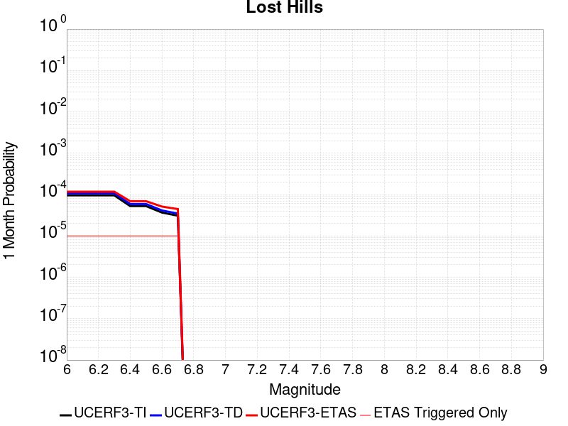 |  | 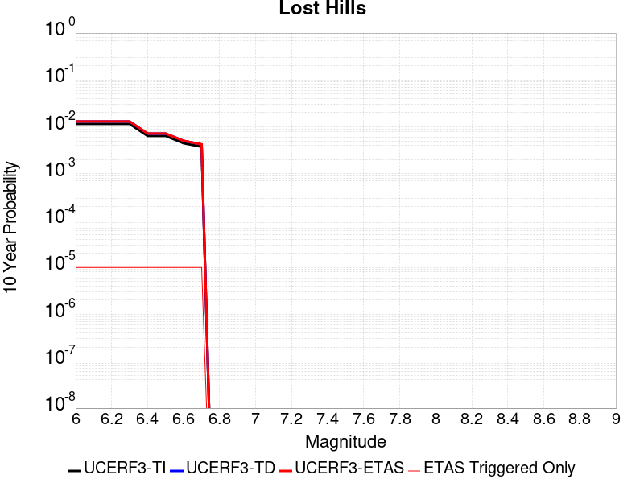 |

| Magnitude | 1 wk TI Prob | 1 wk TD Prob | 1 wk ETAS Prob | 1 wk ETAS/TD Gain | 1 wk ETAS Triggered Only | 1 mo TI Prob | 1 mo TD Prob | 1 mo ETAS Prob | 1 mo ETAS/TD Gain | 1 mo ETAS Triggered Only | 1 yr TI Prob | 1 yr TD Prob | 1 yr ETAS Prob | 1 yr ETAS/TD Gain | 1 yr ETAS Triggered Only | 10 yr TI Prob | 10 yr TD Prob | 10 yr ETAS Prob | 10 yr ETAS/TD Gain | 10 yr ETAS Triggered Only |
|-----|-----|-----|-----|-----|-----|-----|-----|-----|-----|-----|-----|-----|-----|-----|-----|-----|-----|-----|-----|-----|
| 6.0 | 2.233523E-5 | 2.5106996E-5 | 3.5106743E-5 | 1.3982854 | 1.0E-5 | 9.571891E-5 | 1.0759792E-4 | 1.1759684E-4 | 1.0929286 | 1.0E-5 | 0.0011647546 | 0.0013093855 | 0.0013193724 | 1.0076271 | 1.0E-5 | 0.011586686 | 0.013033304 | 0.013043174 | 1.0007572 | 1.0E-5 |
| 6.1 | 2.233523E-5 | 2.5106996E-5 | 3.5106743E-5 | 1.3982854 | 1.0E-5 | 9.571891E-5 | 1.0759792E-4 | 1.1759684E-4 | 1.0929286 | 1.0E-5 | 0.0011647546 | 0.0013093855 | 0.0013193724 | 1.0076271 | 1.0E-5 | 0.011586686 | 0.013033304 | 0.013043174 | 1.0007572 | 1.0E-5 |
| 6.2 | 2.233523E-5 | 2.5106996E-5 | 3.5106743E-5 | 1.3982854 | 1.0E-5 | 9.571891E-5 | 1.0759792E-4 | 1.1759684E-4 | 1.0929286 | 1.0E-5 | 0.0011647546 | 0.0013093855 | 0.0013193724 | 1.0076271 | 1.0E-5 | 0.011586686 | 0.013033304 | 0.013043174 | 1.0007572 | 1.0E-5 |
| 6.3 | 2.233523E-5 | 2.5106996E-5 | 3.5106743E-5 | 1.3982854 | 1.0E-5 | 9.571891E-5 | 1.0759792E-4 | 1.1759684E-4 | 1.0929286 | 1.0E-5 | 0.0011647546 | 0.0013093855 | 0.0013193724 | 1.0076271 | 1.0E-5 | 0.011586686 | 0.013033304 | 0.013043174 | 1.0007572 | 1.0E-5 |
| 6.4 | 1.2288092E-5 | 1.37813295E-5 | 2.3781191E-5 | 1.7256094 | 1.0E-5 | 5.2662188E-5 | 5.9062033E-5 | 6.906144E-5 | 1.1693035 | 1.0E-5 | 6.409735E-4 | 7.189368E-4 | 7.289296E-4 | 1.0138994 | 1.0E-5 | 0.006391279 | 0.007175316 | 0.0071852445 | 1.0013837 | 1.0E-5 |
| 6.5 | 1.2288092E-5 | 1.37813295E-5 | 2.3781191E-5 | 1.7256094 | 1.0E-5 | 5.2662188E-5 | 5.9062033E-5 | 6.906144E-5 | 1.1693035 | 1.0E-5 | 6.409735E-4 | 7.189368E-4 | 7.289296E-4 | 1.0138994 | 1.0E-5 | 0.006391279 | 0.007175316 | 0.0071852445 | 1.0013837 | 1.0E-5 |
| 6.6 | 8.58281E-6 | 9.633926E-6 | 1.963383E-5 | 2.0379884 | 1.0E-5 | 3.6782953E-5 | 4.1288073E-5 | 5.1287658E-5 | 1.2421907 | 1.0E-5 | 4.4774043E-4 | 5.026495E-4 | 5.1264453E-4 | 1.0198846 | 1.0E-5 | 0.0044683935 | 0.0050232867 | 0.0050332365 | 1.0019808 | 1.0E-5 |
| 6.7 | 7.205685E-6 | 8.088433E-6 | 1.8088353E-5 | 2.2363234 | 1.0E-5 | 3.088114E-5 | 3.4664714E-5 | 4.4664368E-5 | 1.2884678 | 1.0E-5 | 3.7591302E-4 | 4.2204288E-4 | 4.3203865E-4 | 1.0236843 | 1.0E-5 | 0.0037527776 | 0.004220429 | 0.0042303866 | 1.0023594 | 1.0E-5 |

## Cucamonga
*[(top)](#table-of-contents)*

| 1 Week | 1 Month | 1 Year | 10 Year |
|-----|-----|-----|-----|
| 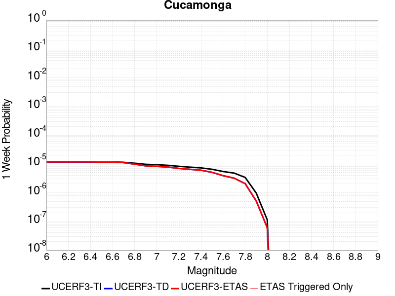 | 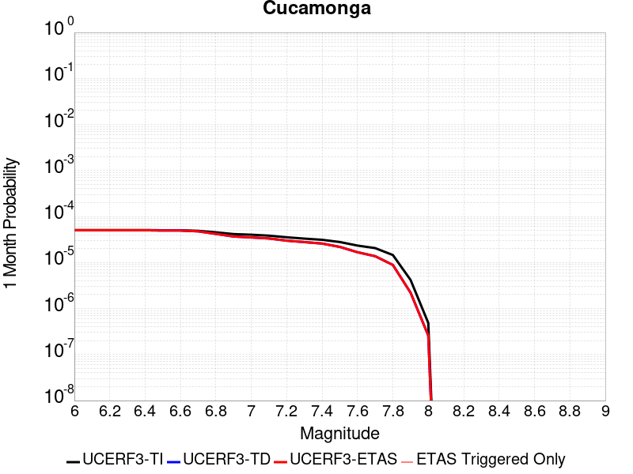 | 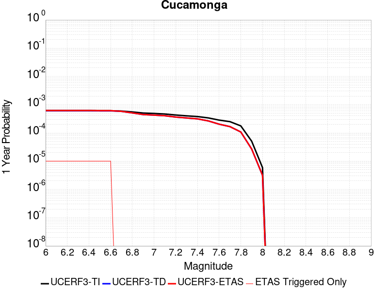 | 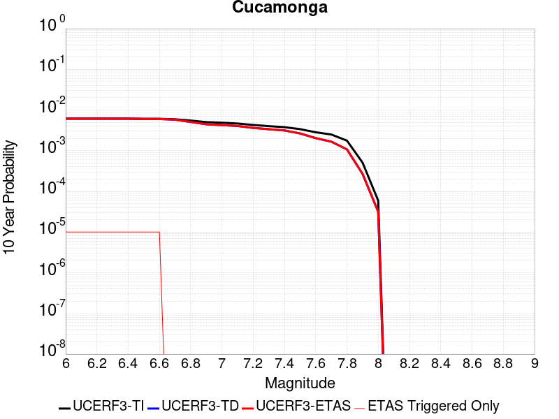 |

| Magnitude | 1 wk TI Prob | 1 wk TD Prob | 1 wk ETAS Prob | 1 wk ETAS/TD Gain | 1 wk ETAS Triggered Only | 1 mo TI Prob | 1 mo TD Prob | 1 mo ETAS Prob | 1 mo ETAS/TD Gain | 1 mo ETAS Triggered Only | 1 yr TI Prob | 1 yr TD Prob | 1 yr ETAS Prob | 1 yr ETAS/TD Gain | 1 yr ETAS Triggered Only | 10 yr TI Prob | 10 yr TD Prob | 10 yr ETAS Prob | 10 yr ETAS/TD Gain | 10 yr ETAS Triggered Only |
|-----|-----|-----|-----|-----|-----|-----|-----|-----|-----|-----|-----|-----|-----|-----|-----|-----|-----|-----|-----|-----|
| 6.0 | 1.1848348E-5 | 1.1737756E-5 | 1.1737756E-5 | 1.0 | 0.0 | 5.0777642E-5 | 5.0303715E-5 | 5.0303715E-5 | 1.0 | 0.0 | 6.180424E-4 | 6.122783E-4 | 6.222722E-4 | 1.0163225 | 1.0E-5 | 0.0061632637 | 0.0061070886 | 0.0061170273 | 1.0016274 | 1.0E-5 |
| 6.1 | 1.1848348E-5 | 1.1737756E-5 | 1.1737756E-5 | 1.0 | 0.0 | 5.0777642E-5 | 5.0303715E-5 | 5.0303715E-5 | 1.0 | 0.0 | 6.180424E-4 | 6.122783E-4 | 6.222722E-4 | 1.0163225 | 1.0E-5 | 0.0061632637 | 0.0061070886 | 0.0061170273 | 1.0016274 | 1.0E-5 |
| 6.2 | 1.1848348E-5 | 1.1737756E-5 | 1.1737756E-5 | 1.0 | 0.0 | 5.0777642E-5 | 5.0303715E-5 | 5.0303715E-5 | 1.0 | 0.0 | 6.180424E-4 | 6.122783E-4 | 6.222722E-4 | 1.0163225 | 1.0E-5 | 0.0061632637 | 0.0061070886 | 0.0061170273 | 1.0016274 | 1.0E-5 |
| 6.3 | 1.1848348E-5 | 1.1737756E-5 | 1.1737756E-5 | 1.0 | 0.0 | 5.0777642E-5 | 5.0303715E-5 | 5.0303715E-5 | 1.0 | 0.0 | 6.180424E-4 | 6.122783E-4 | 6.222722E-4 | 1.0163225 | 1.0E-5 | 0.0061632637 | 0.0061070886 | 0.0061170273 | 1.0016274 | 1.0E-5 |
| 6.4 | 1.1848348E-5 | 1.1737756E-5 | 1.1737756E-5 | 1.0 | 0.0 | 5.0777642E-5 | 5.0303715E-5 | 5.0303715E-5 | 1.0 | 0.0 | 6.180424E-4 | 6.122783E-4 | 6.222722E-4 | 1.0163225 | 1.0E-5 | 0.0061632637 | 0.0061070886 | 0.0061170273 | 1.0016274 | 1.0E-5 |
| 6.5 | 1.16988695E-5 | 1.1576785E-5 | 1.1576785E-5 | 1.0 | 0.0 | 5.013705E-5 | 4.9613864E-5 | 4.9613864E-5 | 1.0 | 0.0 | 6.102476E-4 | 6.0388405E-4 | 6.13878E-4 | 1.0165495 | 1.0E-5 | 0.006085745 | 0.006023602 | 0.0060335416 | 1.0016501 | 1.0E-5 |
| 6.6 | 1.16988695E-5 | 1.1576785E-5 | 1.1576785E-5 | 1.0 | 0.0 | 5.013705E-5 | 4.9613864E-5 | 4.9613864E-5 | 1.0 | 0.0 | 6.102476E-4 | 6.0388405E-4 | 6.13878E-4 | 1.0165495 | 1.0E-5 | 0.006085745 | 0.006023602 | 0.0060335416 | 1.0016501 | 1.0E-5 |
| 6.7 | 1.1397107E-5 | 1.1115677E-5 | 1.1115677E-5 | 1.0 | 0.0 | 4.884383E-5 | 4.7637757E-5 | 4.7637757E-5 | 1.0 | 0.0 | 5.9451134E-4 | 5.798378E-4 | 5.798378E-4 | 1.0 | 0.0 | 0.005929234 | 0.0057844 | 0.0057844 | 1.0 | 0.0 |
| 6.8 | 1.058387E-5 | 9.785641E-6 | 9.785641E-6 | 1.0 | 0.0 | 4.5358654E-5 | 4.1937794E-5 | 4.1937794E-5 | 1.0 | 0.0 | 5.521017E-4 | 5.1047414E-4 | 5.1047414E-4 | 1.0 | 0.0 | 0.00550732 | 0.0050940234 | 0.0050940234 | 1.0 | 0.0 |
| 6.9 | 9.690046E-6 | 8.5800775E-6 | 8.5800775E-6 | 1.0 | 0.0 | 4.1528107E-5 | 3.6771246E-5 | 3.6771246E-5 | 1.0 | 0.0 | 5.054874E-4 | 4.4759834E-4 | 4.4759834E-4 | 1.0 | 0.0 | 0.005043391 | 0.004467903 | 0.004467903 | 1.0 | 0.0 |
| 7.0 | 9.381461E-6 | 8.187685E-6 | 8.187685E-6 | 1.0 | 0.0 | 4.020564E-5 | 3.5089608E-5 | 3.5089608E-5 | 1.0 | 0.0 | 4.893937E-4 | 4.271326E-4 | 4.271326E-4 | 1.0 | 0.0 | 0.0048831734 | 0.0042640497 | 0.0042640497 | 1.0 | 0.0 |
| 7.1 | 8.946492E-6 | 7.78246E-6 | 7.78246E-6 | 1.0 | 0.0 | 3.8341543E-5 | 3.335297E-5 | 3.335297E-5 | 1.0 | 0.0 | 4.667083E-4 | 4.059971E-4 | 4.059971E-4 | 1.0 | 0.0 | 0.0046572937 | 0.0040534893 | 0.0040534893 | 1.0 | 0.0 |
| 7.2 | 8.251016E-6 | 6.9758194E-6 | 6.9758194E-6 | 1.0 | 0.0 | 3.5361016E-5 | 2.9896028E-5 | 2.9896028E-5 | 1.0 | 0.0 | 4.3043532E-4 | 3.6392358E-4 | 3.6392358E-4 | 1.0 | 0.0 | 0.0042960253 | 0.0036342086 | 0.0036342086 | 1.0 | 0.0 |
| 7.3 | 7.717881E-6 | 6.486875E-6 | 6.486875E-6 | 1.0 | 0.0 | 3.3076216E-5 | 2.7800597E-5 | 2.7800597E-5 | 1.0 | 0.0 | 4.026285E-4 | 3.3841992E-4 | 3.3841992E-4 | 1.0 | 0.0 | 0.004018998 | 0.0033799817 | 0.0033799817 | 1.0 | 0.0 |
| 7.4 | 7.275623E-6 | 6.0325037E-6 | 6.0325037E-6 | 1.0 | 0.0 | 3.118087E-5 | 2.5853333E-5 | 2.5853333E-5 | 1.0 | 0.0 | 3.7956095E-4 | 3.1471907E-4 | 3.1471907E-4 | 1.0 | 0.0 | 0.0037891332 | 0.0031436686 | 0.0031436686 | 1.0 | 0.0 |
| 7.5 | 6.5109502E-6 | 5.101059E-6 | 5.101059E-6 | 1.0 | 0.0 | 2.7903774E-5 | 2.1861499E-5 | 2.1861499E-5 | 1.0 | 0.0 | 3.3967546E-4 | 2.661314E-4 | 2.661314E-4 | 1.0 | 0.0 | 0.0033915674 | 0.00265905 | 0.00265905 | 1.0 | 0.0 |
| 7.6 | 5.4495326E-6 | 3.9089846E-6 | 3.9089846E-6 | 1.0 | 0.0 | 2.335493E-5 | 1.6752683E-5 | 1.6752683E-5 | 1.0 | 0.0 | 2.8430918E-4 | 2.0394489E-4 | 2.0394489E-4 | 1.0 | 0.0 | 0.0028394572 | 0.0020384968 | 0.0020384968 | 1.0 | 0.0 |
| 7.7 | 4.7997164E-6 | 3.2006355E-6 | 3.2006355E-6 | 1.0 | 0.0 | 2.057005E-5 | 1.3716938E-5 | 1.3716938E-5 | 1.0 | 0.0 | 2.504116E-4 | 1.6699095E-4 | 1.6699095E-4 | 1.0 | 0.0 | 0.002501296 | 0.001669585 | 0.001669585 | 1.0 | 0.0 |
| 7.8 | 3.3941733E-6 | 2.0644336E-6 | 2.0644336E-6 | 1.0 | 0.0 | 1.4546376E-5 | 8.847543E-6 | 8.847543E-6 | 1.0 | 0.0 | 1.7708774E-4 | 1.07713524E-4 | 1.07713524E-4 | 1.0 | 0.0 | 0.0017694668 | 0.0010768501 | 0.0010768501 | 1.0 | 0.0 |
| 7.9 | 9.750552E-7 | 5.1567173E-7 | 5.1567173E-7 | 1.0 | 0.0 | 4.178801E-6 | 2.2100198E-6 | 2.2100198E-6 | 1.0 | 0.0 | 5.0875715E-5 | 2.6906664E-5 | 2.6906664E-5 | 1.0 | 0.0 | 5.086407E-4 | 2.6903447E-4 | 2.6903447E-4 | 1.0 | 0.0 |
| 8.0 | 1.133857E-7 | 6.0540515E-8 | 6.0540515E-8 | 1.0 | 0.0 | 4.8593864E-7 | 2.5945934E-7 | 2.5945934E-7 | 1.0 | 0.0 | 5.9162867E-6 | 3.158913E-6 | 3.158913E-6 | 1.0 | 0.0 | 5.916129E-5 | 3.1588697E-5 | 3.1588697E-5 | 1.0 | 0.0 |

## Reliz 2011 CFM
*[(top)](#table-of-contents)*

| 1 Week | 1 Month | 1 Year | 10 Year |
|-----|-----|-----|-----|
|  | 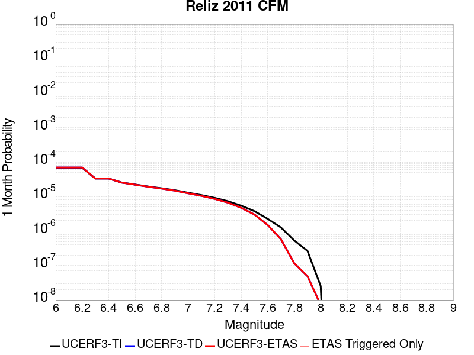 | 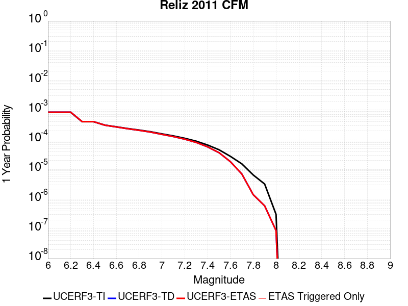 | 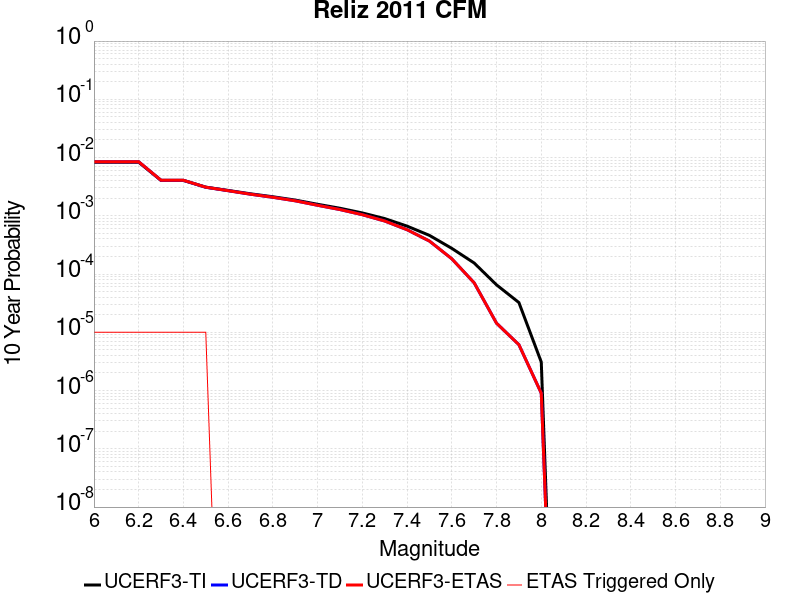 |

| Magnitude | 1 wk TI Prob | 1 wk TD Prob | 1 wk ETAS Prob | 1 wk ETAS/TD Gain | 1 wk ETAS Triggered Only | 1 mo TI Prob | 1 mo TD Prob | 1 mo ETAS Prob | 1 mo ETAS/TD Gain | 1 mo ETAS Triggered Only | 1 yr TI Prob | 1 yr TD Prob | 1 yr ETAS Prob | 1 yr ETAS/TD Gain | 1 yr ETAS Triggered Only | 10 yr TI Prob | 10 yr TD Prob | 10 yr ETAS Prob | 10 yr ETAS/TD Gain | 10 yr ETAS Triggered Only |
|-----|-----|-----|-----|-----|-----|-----|-----|-----|-----|-----|-----|-----|-----|-----|-----|-----|-----|-----|-----|-----|
| 6.0 | 1.6002472E-5 | 1.6282896E-5 | 1.6282896E-5 | 1.0 | 0.0 | 6.8580215E-5 | 6.978209E-5 | 6.978209E-5 | 1.0 | 0.0 | 8.3464425E-4 | 8.492855E-4 | 8.492855E-4 | 1.0 | 0.0 | 0.008315164 | 0.008462595 | 0.008472511 | 1.0011717 | 1.0E-5 |
| 6.1 | 1.6002472E-5 | 1.6282896E-5 | 1.6282896E-5 | 1.0 | 0.0 | 6.8580215E-5 | 6.978209E-5 | 6.978209E-5 | 1.0 | 0.0 | 8.3464425E-4 | 8.492855E-4 | 8.492855E-4 | 1.0 | 0.0 | 0.008315164 | 0.008462595 | 0.008472511 | 1.0011717 | 1.0E-5 |
| 6.2 | 1.6002472E-5 | 1.6282896E-5 | 1.6282896E-5 | 1.0 | 0.0 | 6.8580215E-5 | 6.978209E-5 | 6.978209E-5 | 1.0 | 0.0 | 8.3464425E-4 | 8.492855E-4 | 8.492855E-4 | 1.0 | 0.0 | 0.008315164 | 0.008462595 | 0.008472511 | 1.0011717 | 1.0E-5 |
| 6.3 | 7.792404E-6 | 7.8038565E-6 | 7.8038565E-6 | 1.0 | 0.0 | 3.339559E-5 | 3.3444678E-5 | 3.3444678E-5 | 1.0 | 0.0 | 4.0651546E-4 | 4.0711364E-4 | 4.0711364E-4 | 1.0 | 0.0 | 0.0040577264 | 0.004063955 | 0.004073914 | 1.0024507 | 1.0E-5 |
| 6.4 | 7.792404E-6 | 7.8038565E-6 | 7.8038565E-6 | 1.0 | 0.0 | 3.339559E-5 | 3.3444678E-5 | 3.3444678E-5 | 1.0 | 0.0 | 4.0651546E-4 | 4.0711364E-4 | 4.0711364E-4 | 1.0 | 0.0 | 0.0040577264 | 0.004063955 | 0.004073914 | 1.0024507 | 1.0E-5 |
| 6.5 | 5.9659374E-6 | 5.9287863E-6 | 5.9287863E-6 | 1.0 | 0.0 | 2.5568053E-5 | 2.5408837E-5 | 2.5408837E-5 | 1.0 | 0.0 | 3.1124658E-4 | 3.093089E-4 | 3.093089E-4 | 1.0 | 0.0 | 0.00310811 | 0.0030890019 | 0.003098971 | 1.0032272 | 1.0E-5 |
| 6.6 | 5.2350692E-6 | 5.1790316E-6 | 5.1790316E-6 | 1.0 | 0.0 | 2.2435817E-5 | 2.2195662E-5 | 2.2195662E-5 | 1.0 | 0.0 | 2.7312184E-4 | 2.701988E-4 | 2.701988E-4 | 1.0 | 0.0 | 0.002727864 | 0.002698913 | 0.002698913 | 1.0 | 0.0 |
| 6.7 | 4.580206E-6 | 4.5061634E-6 | 4.5061634E-6 | 1.0 | 0.0 | 1.9629308E-5 | 1.9311987E-5 | 1.9311987E-5 | 1.0 | 0.0 | 2.389606E-4 | 2.3509814E-4 | 2.3509814E-4 | 1.0 | 0.0 | 0.002387038 | 0.002348696 | 0.002348696 | 1.0 | 0.0 |
| 6.8 | 4.0765017E-6 | 3.9882793E-6 | 3.9882793E-6 | 1.0 | 0.0 | 1.7470604E-5 | 1.7092514E-5 | 1.7092514E-5 | 1.0 | 0.0 | 2.1268385E-4 | 2.0808152E-4 | 2.0808152E-4 | 1.0 | 0.0 | 0.002124804 | 0.002079065 | 0.002079065 | 1.0 | 0.0 |
| 6.9 | 3.5752896E-6 | 3.4725567E-6 | 3.4725567E-6 | 1.0 | 0.0 | 1.532258E-5 | 1.4882301E-5 | 1.4882301E-5 | 1.0 | 0.0 | 1.8653645E-4 | 1.8117698E-4 | 1.8117698E-4 | 1.0 | 0.0 | 0.0018637994 | 0.0018104891 | 0.0018104891 | 1.0 | 0.0 |
| 7.0 | 3.0259848E-6 | 2.9079788E-6 | 2.9079788E-6 | 1.0 | 0.0 | 1.2968442E-5 | 1.2462707E-5 | 1.2462707E-5 | 1.0 | 0.0 | 1.5787935E-4 | 1.517229E-4 | 1.517229E-4 | 1.0 | 0.0 | 0.0015776722 | 0.0015163884 | 0.0015163884 | 1.0 | 0.0 |
| 7.1 | 2.5861116E-6 | 2.4552023E-6 | 2.4552023E-6 | 1.0 | 0.0 | 1.1083288E-5 | 1.0522253E-5 | 1.0522253E-5 | 1.0 | 0.0 | 1.3493067E-4 | 1.2810092E-4 | 1.2810092E-4 | 1.0 | 0.0 | 0.0013484878 | 0.0012804654 | 0.0012804654 | 1.0 | 0.0 |
| 7.2 | 2.1482588E-6 | 2.00327E-6 | 2.00327E-6 | 1.0 | 0.0 | 9.20679E-6 | 8.585415E-6 | 8.585415E-6 | 1.0 | 0.0 | 1.12086906E-4 | 1.0452242E-4 | 1.0452242E-4 | 1.0 | 0.0 | 0.0011203039 | 0.0010449268 | 0.0010449268 | 1.0 | 0.0 |
| 7.3 | 1.7194744E-6 | 1.5611555E-6 | 1.5611555E-6 | 1.0 | 0.0 | 7.3691554E-6 | 6.6906496E-6 | 6.6906496E-6 | 1.0 | 0.0 | 8.971577E-5 | 8.145561E-5 | 8.145561E-5 | 1.0 | 0.0 | 8.967956E-4 | 8.144516E-4 | 8.144516E-4 | 1.0 | 0.0 |
| 7.4 | 1.2755178E-6 | 1.1056595E-6 | 1.1056595E-6 | 1.0 | 0.0 | 5.4664933E-6 | 4.738532E-6 | 4.738532E-6 | 1.0 | 0.0 | 6.655252E-5 | 5.7690104E-5 | 5.7690104E-5 | 1.0 | 0.0 | 6.6532596E-4 | 5.7694514E-4 | 5.7694514E-4 | 1.0 | 0.0 |
| 7.5 | 8.8463224E-7 | 7.0583064E-7 | 7.0583064E-7 | 1.0 | 0.0 | 3.7912755E-6 | 3.0249848E-6 | 3.0249848E-6 | 1.0 | 0.0 | 4.6157802E-5 | 3.682857E-5 | 3.682857E-5 | 1.0 | 0.0 | 4.6148215E-4 | 3.6841843E-4 | 3.6841843E-4 | 1.0 | 0.0 |
| 7.6 | 5.291355E-7 | 3.5010314E-7 | 3.5010314E-7 | 1.0 | 0.0 | 2.2677216E-6 | 1.5004412E-6 | 1.5004412E-6 | 1.0 | 0.0 | 2.760916E-5 | 1.8267718E-5 | 1.8267718E-5 | 1.0 | 0.0 | 2.760573E-4 | 1.82855E-4 | 1.82855E-4 | 1.0 | 0.0 |
| 7.7 | 2.9663357E-7 | 1.3513149E-7 | 1.3513149E-7 | 1.0 | 0.0 | 1.2712861E-6 | 5.791348E-7 | 5.791348E-7 | 1.0 | 0.0 | 1.5477797E-5 | 7.0509436E-6 | 7.0509436E-6 | 1.0 | 0.0 | 1.547672E-4 | 7.069193E-5 | 7.069193E-5 | 1.0 | 0.0 |
| 7.8 | 1.2509386E-7 | 2.7168449E-8 | 2.7168449E-8 | 1.0 | 0.0 | 5.3611643E-7 | 1.1643621E-7 | 1.1643621E-7 | 1.0 | 0.0 | 6.527198E-6 | 1.41761E-6 | 1.41761E-6 | 1.0 | 0.0 | 6.527006E-5 | 1.4332477E-5 | 1.4332477E-5 | 1.0 | 0.0 |
| 7.9 | 6.213493E-8 | 1.1488184E-8 | 1.1488184E-8 | 1.0 | 0.0 | 2.6629255E-7 | 4.9235076E-8 | 4.9235076E-8 | 1.0 | 0.0 | 3.242107E-6 | 5.994369E-7 | 5.994369E-7 | 1.0 | 0.0 | 3.2420594E-5 | 6.1256383E-6 | 6.1256383E-6 | 1.0 | 0.0 |
| 8.0 | 5.92383E-9 | 1.6785642E-9 | 1.6785642E-9 | 1.0 | 0.0 | 2.5387841E-8 | 7.1938473E-9 | 7.1938473E-9 | 1.0 | 0.0 | 3.0909692E-7 | 8.7585086E-8 | 8.7585086E-8 | 1.0 | 0.0 | 3.090965E-6 | 9.0066555E-7 | 9.0066555E-7 | 1.0 | 0.0 |

## Breckenridge 2011
*[(top)](#table-of-contents)*

| 1 Week | 1 Month | 1 Year | 10 Year |
|-----|-----|-----|-----|
|  | 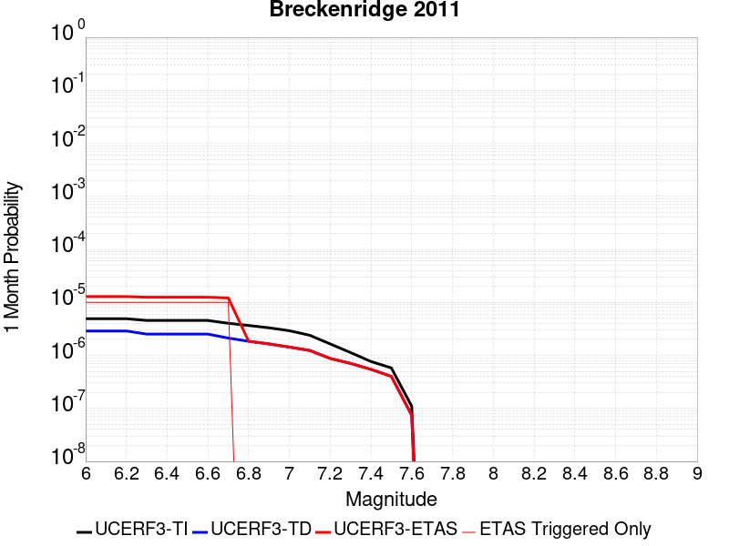 |  | 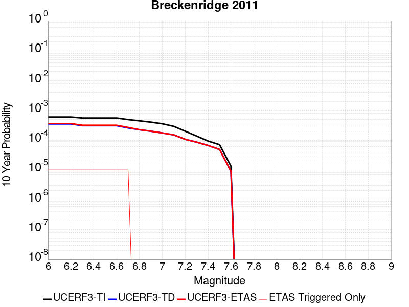 |

| Magnitude | 1 wk TI Prob | 1 wk TD Prob | 1 wk ETAS Prob | 1 wk ETAS/TD Gain | 1 wk ETAS Triggered Only | 1 mo TI Prob | 1 mo TD Prob | 1 mo ETAS Prob | 1 mo ETAS/TD Gain | 1 mo ETAS Triggered Only | 1 yr TI Prob | 1 yr TD Prob | 1 yr ETAS Prob | 1 yr ETAS/TD Gain | 1 yr ETAS Triggered Only | 10 yr TI Prob | 10 yr TD Prob | 10 yr ETAS Prob | 10 yr ETAS/TD Gain | 10 yr ETAS Triggered Only |
|-----|-----|-----|-----|-----|-----|-----|-----|-----|-----|-----|-----|-----|-----|-----|-----|-----|-----|-----|-----|-----|
| 6.0 | 1.1490393E-6 | 6.7381137E-7 | 1.0673804E-5 | 15.8409395 | 1.0E-5 | 4.924445E-6 | 2.8877598E-6 | 1.2887731E-5 | 4.462882 | 1.0E-5 | 5.995347E-5 | 3.515793E-5 | 4.515758E-5 | 1.2844208 | 1.0E-5 | 5.9937296E-4 | 3.5152573E-4 | 3.6152222E-4 | 1.0284374 | 1.0E-5 |
| 6.1 | 1.1490393E-6 | 6.7381137E-7 | 1.0673804E-5 | 15.8409395 | 1.0E-5 | 4.924445E-6 | 2.8877598E-6 | 1.2887731E-5 | 4.462882 | 1.0E-5 | 5.995347E-5 | 3.515793E-5 | 4.515758E-5 | 1.2844208 | 1.0E-5 | 5.9937296E-4 | 3.5152573E-4 | 3.6152222E-4 | 1.0284374 | 1.0E-5 |
| 6.2 | 1.1490393E-6 | 6.7381137E-7 | 1.0673804E-5 | 15.8409395 | 1.0E-5 | 4.924445E-6 | 2.8877598E-6 | 1.2887731E-5 | 4.462882 | 1.0E-5 | 5.995347E-5 | 3.515793E-5 | 4.515758E-5 | 1.2844208 | 1.0E-5 | 5.9937296E-4 | 3.5152573E-4 | 3.6152222E-4 | 1.0284374 | 1.0E-5 |
| 6.3 | 1.064617E-6 | 5.88651E-7 | 1.0588645E-5 | 17.987984 | 1.0E-5 | 4.5626366E-6 | 2.5227878E-6 | 1.25227625E-5 | 4.963859 | 1.0E-5 | 5.5548684E-5 | 3.071452E-5 | 4.0714214E-5 | 1.3255689 | 1.0E-5 | 5.55348E-4 | 3.071039E-4 | 3.1710084E-4 | 1.0325522 | 1.0E-5 |
| 6.4 | 1.064617E-6 | 5.88651E-7 | 1.0588645E-5 | 17.987984 | 1.0E-5 | 4.5626366E-6 | 2.5227878E-6 | 1.25227625E-5 | 4.963859 | 1.0E-5 | 5.5548684E-5 | 3.071452E-5 | 4.0714214E-5 | 1.3255689 | 1.0E-5 | 5.55348E-4 | 3.071039E-4 | 3.1710084E-4 | 1.0325522 | 1.0E-5 |
| 6.5 | 1.064617E-6 | 5.88651E-7 | 1.0588645E-5 | 17.987984 | 1.0E-5 | 4.5626366E-6 | 2.5227878E-6 | 1.25227625E-5 | 4.963859 | 1.0E-5 | 5.5548684E-5 | 3.071452E-5 | 4.0714214E-5 | 1.3255689 | 1.0E-5 | 5.55348E-4 | 3.071039E-4 | 3.1710084E-4 | 1.0325522 | 1.0E-5 |
| 6.6 | 1.064617E-6 | 5.88651E-7 | 1.0588645E-5 | 17.987984 | 1.0E-5 | 4.5626366E-6 | 2.5227878E-6 | 1.25227625E-5 | 4.963859 | 1.0E-5 | 5.5548684E-5 | 3.071452E-5 | 4.0714214E-5 | 1.3255689 | 1.0E-5 | 5.55348E-4 | 3.071039E-4 | 3.1710084E-4 | 1.0325522 | 1.0E-5 |
| 6.7 | 9.4219524E-7 | 4.954108E-7 | 1.0495406E-5 | 21.185257 | 1.0E-5 | 4.037973E-6 | 2.1231876E-6 | 1.2123166E-5 | 5.7098894 | 1.0E-5 | 4.916122E-5 | 2.5849507E-5 | 3.584925E-5 | 1.3868445 | 1.0E-5 | 4.9150345E-4 | 2.5846568E-4 | 2.6846307E-4 | 1.0386798 | 1.0E-5 |
| 6.8 | 8.556422E-7 | 4.3120028E-7 | 4.3120028E-7 | 1.0 | 0.0 | 3.667033E-6 | 1.8479999E-6 | 1.8479999E-6 | 1.0 | 0.0 | 4.464521E-5 | 2.249917E-5 | 2.249917E-5 | 1.0 | 0.0 | 4.4636242E-4 | 2.2496932E-4 | 2.2496932E-4 | 1.0 | 0.0 |
| 6.9 | 7.7357794E-7 | 3.8420595E-7 | 3.8420595E-7 | 1.0 | 0.0 | 3.3153299E-6 | 1.6465958E-6 | 1.6465958E-6 | 1.0 | 0.0 | 4.0363393E-5 | 2.0047124E-5 | 2.0047124E-5 | 1.0 | 0.0 | 4.035606E-4 | 2.0045345E-4 | 2.0045345E-4 | 1.0 | 0.0 |
| 7.0 | 6.8172454E-7 | 3.3471633E-7 | 3.3471633E-7 | 1.0 | 0.0 | 2.9216735E-6 | 1.4344978E-6 | 1.4344978E-6 | 1.0 | 0.0 | 3.5570793E-5 | 1.7464874E-5 | 1.7464874E-5 | 1.0 | 0.0 | 3.55651E-4 | 1.7463524E-4 | 1.7463524E-4 | 1.0 | 0.0 |
| 7.1 | 5.5936397E-7 | 2.890983E-7 | 2.890983E-7 | 1.0 | 0.0 | 2.397272E-6 | 1.2389921E-6 | 1.2389921E-6 | 1.0 | 0.0 | 2.9186394E-5 | 1.5084626E-5 | 1.5084626E-5 | 1.0 | 0.0 | 2.9182562E-4 | 1.508362E-4 | 1.508362E-4 | 1.0 | 0.0 |
| 7.2 | 3.8420822E-7 | 2.0468455E-7 | 2.0468455E-7 | 1.0 | 0.0 | 1.6466057E-6 | 8.7721924E-7 | 8.7721924E-7 | 1.0 | 0.0 | 2.004724E-5 | 1.0680093E-5 | 1.0680093E-5 | 1.0 | 0.0 | 2.004543E-4 | 1.0679587E-4 | 1.0679587E-4 | 1.0 | 0.0 |
| 7.3 | 2.6405158E-7 | 1.6473311E-7 | 1.6473311E-7 | 1.0 | 0.0 | 1.1316491E-6 | 7.0599884E-7 | 7.0599884E-7 | 1.0 | 0.0 | 1.37777415E-5 | 8.595503E-6 | 8.595503E-6 | 1.0 | 0.0 | 1.3776887E-4 | 8.595177E-5 | 8.595177E-5 | 1.0 | 0.0 |
| 7.4 | 1.792114E-7 | 1.2725371E-7 | 1.2725371E-7 | 1.0 | 0.0 | 7.6804866E-7 | 5.45373E-7 | 5.45373E-7 | 1.0 | 0.0 | 9.3509525E-6 | 6.639896E-6 | 6.639896E-6 | 1.0 | 0.0 | 9.350559E-5 | 6.639703E-5 | 6.639703E-5 | 1.0 | 0.0 |
| 7.5 | 1.3548703E-7 | 9.385447E-8 | 9.385447E-8 | 1.0 | 0.0 | 5.8065854E-7 | 4.0223338E-7 | 4.0223338E-7 | 1.0 | 0.0 | 7.0694946E-6 | 4.8971806E-6 | 4.8971806E-6 | 1.0 | 0.0 | 7.0692695E-5 | 4.8970764E-5 | 4.8970764E-5 | 1.0 | 0.0 |
| 7.6 | 2.572245E-8 | 1.7352637E-8 | 1.7352637E-8 | 1.0 | 0.0 | 1.10239064E-7 | 7.4368444E-8 | 7.4368444E-8 | 1.0 | 0.0 | 1.3421597E-6 | 9.0543546E-7 | 9.0543546E-7 | 1.0 | 0.0 | 1.3421517E-5 | 9.0543235E-6 | 9.0543235E-6 | 1.0 | 0.0 |

## Santa Ynez (West)
*[(top)](#table-of-contents)*

| 1 Week | 1 Month | 1 Year | 10 Year |
|-----|-----|-----|-----|
| 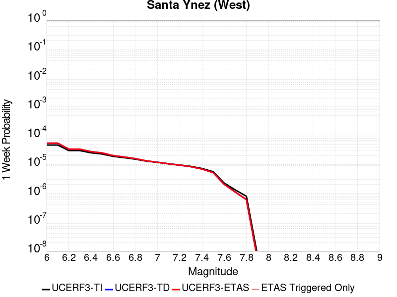 | 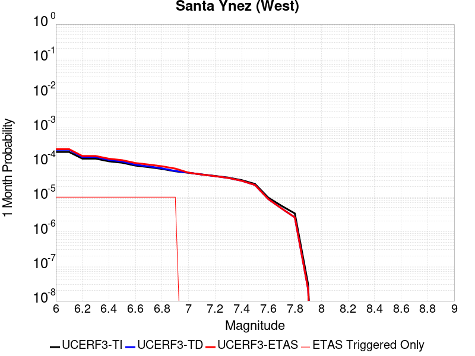 | 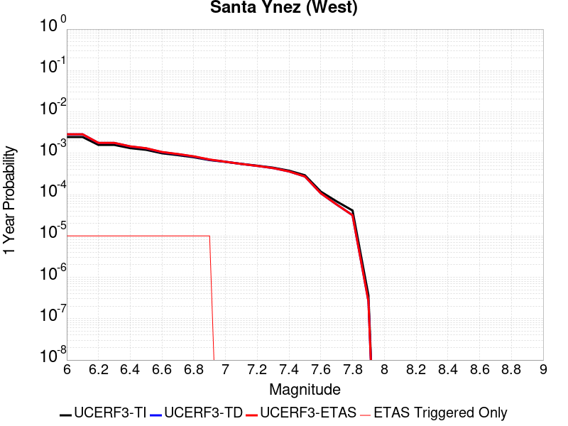 | 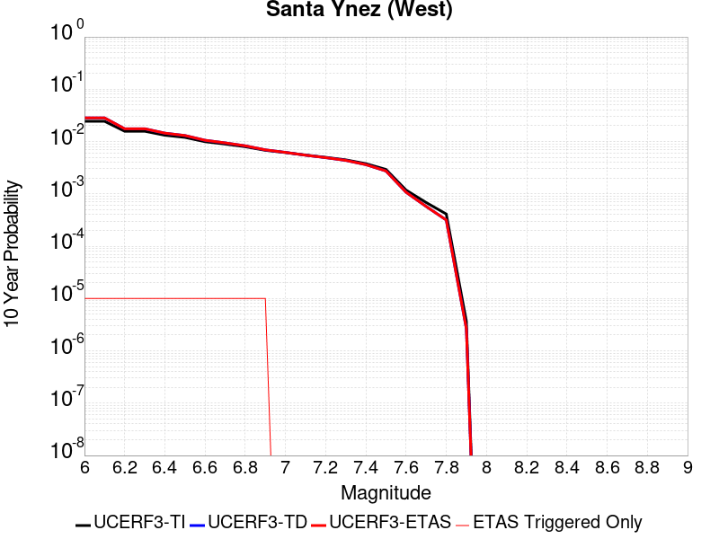 |

| Magnitude | 1 wk TI Prob | 1 wk TD Prob | 1 wk ETAS Prob | 1 wk ETAS/TD Gain | 1 wk ETAS Triggered Only | 1 mo TI Prob | 1 mo TD Prob | 1 mo ETAS Prob | 1 mo ETAS/TD Gain | 1 mo ETAS Triggered Only | 1 yr TI Prob | 1 yr TD Prob | 1 yr ETAS Prob | 1 yr ETAS/TD Gain | 1 yr ETAS Triggered Only | 10 yr TI Prob | 10 yr TD Prob | 10 yr ETAS Prob | 10 yr ETAS/TD Gain | 10 yr ETAS Triggered Only |
|-----|-----|-----|-----|-----|-----|-----|-----|-----|-----|-----|-----|-----|-----|-----|-----|-----|-----|-----|-----|-----|
| 6.0 | 4.7352758E-5 | 5.497349E-5 | 5.497349E-5 | 1.0 | 0.0 | 2.0292461E-4 | 2.3558107E-4 | 2.455787E-4 | 1.0424383 | 1.0E-5 | 0.0024678076 | 0.0028645964 | 0.0028745676 | 1.0034809 | 1.0E-5 | 0.024405818 | 0.028305095 | 0.028314812 | 1.0003433 | 1.0E-5 |
| 6.1 | 4.7352758E-5 | 5.497349E-5 | 5.497349E-5 | 1.0 | 0.0 | 2.0292461E-4 | 2.3558107E-4 | 2.455787E-4 | 1.0424383 | 1.0E-5 | 0.0024678076 | 0.0028645964 | 0.0028745676 | 1.0034809 | 1.0E-5 | 0.024405818 | 0.028305095 | 0.028314812 | 1.0003433 | 1.0E-5 |
| 6.2 | 3.0415853E-5 | 3.3925786E-5 | 3.3925786E-5 | 1.0 | 0.0 | 1.3034715E-4 | 1.4538833E-4 | 1.5538688E-4 | 1.0687714 | 1.0E-5 | 0.0015858212 | 0.0017687011 | 0.0017786834 | 1.0056438 | 1.0E-5 | 0.015745522 | 0.01755015 | 0.017559975 | 1.0005598 | 1.0E-5 |
| 6.3 | 3.0415853E-5 | 3.3925786E-5 | 3.3925786E-5 | 1.0 | 0.0 | 1.3034715E-4 | 1.4538833E-4 | 1.5538688E-4 | 1.0687714 | 1.0E-5 | 0.0015858212 | 0.0017687011 | 0.0017786834 | 1.0056438 | 1.0E-5 | 0.015745522 | 0.01755015 | 0.017559975 | 1.0005598 | 1.0E-5 |
| 6.4 | 2.5452082E-5 | 2.7912925E-5 | 2.7912925E-5 | 1.0 | 0.0 | 1.09075794E-4 | 1.1962145E-4 | 1.2962025E-4 | 1.083587 | 1.0E-5 | 0.0013271887 | 0.001455435 | 0.0014654204 | 1.0068609 | 1.0E-5 | 0.013192902 | 0.014461209 | 0.014471064 | 1.0006815 | 1.0E-5 |
| 6.5 | 2.3143784E-5 | 2.5128682E-5 | 2.5128682E-5 | 1.0 | 0.0 | 9.9183875E-5 | 1.0768999E-4 | 1.1768891E-4 | 1.0928491 | 1.0E-5 | 0.0012068948 | 0.0013103489 | 0.0013203358 | 1.0076215 | 1.0E-5 | 0.012003611 | 0.013027899 | 0.013037769 | 1.0007576 | 1.0E-5 |
| 6.6 | 1.9118515E-5 | 2.0354646E-5 | 2.0354646E-5 | 1.0 | 0.0 | 8.193392E-5 | 8.723133E-5 | 9.7230455E-5 | 1.1146277 | 1.0E-5 | 9.97089E-4 | 0.001061532 | 0.0010715213 | 1.0094104 | 1.0E-5 | 0.00992627 | 0.010565523 | 0.010575417 | 1.0009365 | 1.0E-5 |
| 6.7 | 1.722807E-5 | 1.8146604E-5 | 1.8146604E-5 | 1.0 | 0.0 | 7.3832496E-5 | 7.776888E-5 | 8.7768094E-5 | 1.1285762 | 1.0E-5 | 8.985399E-4 | 9.464303E-4 | 9.564209E-4 | 1.010556 | 1.0E-5 | 0.008949154 | 0.009424643 | 0.009434548 | 1.0010511 | 1.0E-5 |
| 6.8 | 1.5317364E-5 | 1.5926695E-5 | 1.5926695E-5 | 1.0 | 0.0 | 6.56442E-5 | 6.82555E-5 | 7.8254816E-5 | 1.1464983 | 1.0E-5 | 7.98925E-4 | 8.306982E-4 | 8.4068987E-4 | 1.0120281 | 1.0E-5 | 0.007960589 | 0.008276418 | 0.0082863355 | 1.0011983 | 1.0E-5 |
| 6.9 | 1.3071226E-5 | 1.3329779E-5 | 1.3329779E-5 | 1.0 | 0.0 | 5.6018336E-5 | 5.7126388E-5 | 6.712582E-5 | 1.1750405 | 1.0E-5 | 6.8180985E-4 | 6.9529406E-4 | 7.052871E-4 | 1.0143723 | 1.0E-5 | 0.0067972173 | 0.0069314474 | 0.006941378 | 1.0014327 | 1.0E-5 |
| 7.0 | 1.1836986E-5 | 1.19329125E-5 | 1.19329125E-5 | 1.0 | 0.0 | 5.0728955E-5 | 5.1140058E-5 | 5.1140058E-5 | 1.0 | 0.0 | 6.1745E-4 | 6.2245404E-4 | 6.2245404E-4 | 1.0 | 0.0 | 0.006157372 | 0.006207299 | 0.006207299 | 1.0 | 0.0 |
| 7.1 | 1.0597169E-5 | 1.0542309E-5 | 1.0542309E-5 | 1.0 | 0.0 | 4.541565E-5 | 4.5180546E-5 | 4.5180546E-5 | 1.0 | 0.0 | 5.5279525E-4 | 5.4993544E-4 | 5.4993544E-4 | 1.0 | 0.0 | 0.0055142213 | 0.005485877 | 0.005485877 | 1.0 | 0.0 |
| 7.2 | 9.59113E-6 | 9.459241E-6 | 9.459241E-6 | 1.0 | 0.0 | 4.11042E-5 | 4.053898E-5 | 4.053898E-5 | 1.0 | 0.0 | 5.0032866E-4 | 4.9345137E-4 | 4.9345137E-4 | 1.0 | 0.0 | 0.004992037 | 0.0049236757 | 0.0049236757 | 1.0 | 0.0 |
| 7.3 | 8.586084E-6 | 8.379669E-6 | 8.379669E-6 | 1.0 | 0.0 | 3.679698E-5 | 3.591238E-5 | 3.591238E-5 | 1.0 | 0.0 | 4.4791115E-4 | 4.3714655E-4 | 4.3714655E-4 | 1.0 | 0.0 | 0.004470094 | 0.0043629776 | 0.0043629776 | 1.0 | 0.0 |
| 7.4 | 7.2622997E-6 | 6.951613E-6 | 6.951613E-6 | 1.0 | 0.0 | 3.112377E-5 | 2.9792294E-5 | 2.9792294E-5 | 1.0 | 0.0 | 3.78866E-4 | 3.6266178E-4 | 3.6266178E-4 | 1.0 | 0.0 | 0.0037822074 | 0.0036207996 | 0.0036207996 | 1.0 | 0.0 |
| 7.5 | 5.627296E-6 | 5.251639E-6 | 5.251639E-6 | 1.0 | 0.0 | 2.411676E-5 | 2.2506834E-5 | 2.2506834E-5 | 1.0 | 0.0 | 2.9358198E-4 | 2.7398695E-4 | 2.7398695E-4 | 1.0 | 0.0 | 0.0029319443 | 0.0027365636 | 0.0027365636 | 1.0 | 0.0 |
| 7.6 | 2.265244E-6 | 2.0608784E-6 | 2.0608784E-6 | 1.0 | 0.0 | 9.708152E-6 | 8.832307E-6 | 8.832307E-6 | 1.0 | 0.0 | 1.18190335E-4 | 1.0752812E-4 | 1.0752812E-4 | 1.0 | 0.0 | 0.001181275 | 0.0010747695 | 0.0010747695 | 1.0 | 0.0 |
| 7.7 | 1.3099874E-6 | 1.1016341E-6 | 1.1016341E-6 | 1.0 | 0.0 | 5.61422E-6 | 4.7212807E-6 | 4.7212807E-6 | 1.0 | 0.0 | 6.8350986E-5 | 5.74801E-5 | 5.74801E-5 | 1.0 | 0.0 | 6.832996E-4 | 5.746547E-4 | 5.746547E-4 | 1.0 | 0.0 |
| 7.8 | 7.903951E-7 | 6.071191E-7 | 6.071191E-7 | 1.0 | 0.0 | 3.3874032E-6 | 2.6019363E-6 | 2.6019363E-6 | 1.0 | 0.0 | 4.1240855E-5 | 3.1678126E-5 | 3.1678126E-5 | 1.0 | 0.0 | 4.12332E-4 | 3.1673745E-4 | 3.1673745E-4 | 1.0 | 0.0 |
| 7.9 | 7.0753297E-9 | 5.089978E-9 | 5.089978E-9 | 1.0 | 0.0 | 3.032284E-8 | 2.1814193E-8 | 2.1814193E-8 | 1.0 | 0.0 | 3.6918053E-7 | 2.6558777E-7 | 2.6558777E-7 | 1.0 | 0.0 | 3.691799E-6 | 2.6558755E-6 | 2.6558755E-6 | 1.0 | 0.0 |

## Channel Islands Thrust
*[(top)](#table-of-contents)*

| 1 Week | 1 Month | 1 Year | 10 Year |
|-----|-----|-----|-----|
| 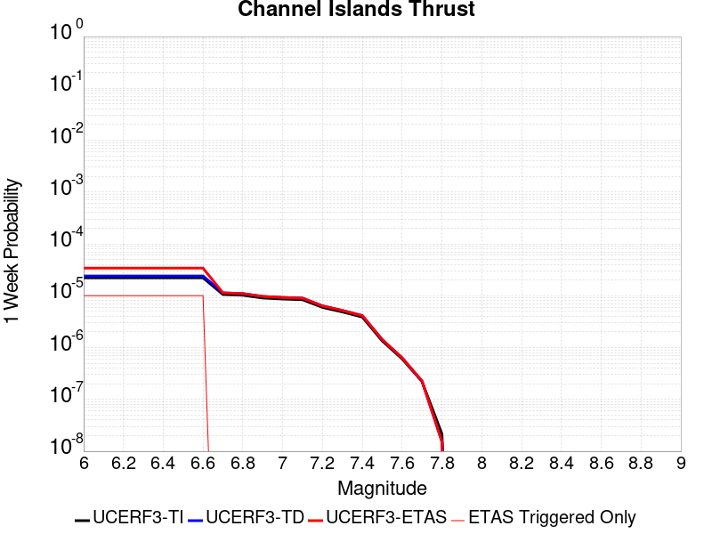 |  |  |  |

| Magnitude | 1 wk TI Prob | 1 wk TD Prob | 1 wk ETAS Prob | 1 wk ETAS/TD Gain | 1 wk ETAS Triggered Only | 1 mo TI Prob | 1 mo TD Prob | 1 mo ETAS Prob | 1 mo ETAS/TD Gain | 1 mo ETAS Triggered Only | 1 yr TI Prob | 1 yr TD Prob | 1 yr ETAS Prob | 1 yr ETAS/TD Gain | 1 yr ETAS Triggered Only | 10 yr TI Prob | 10 yr TD Prob | 10 yr ETAS Prob | 10 yr ETAS/TD Gain | 10 yr ETAS Triggered Only |
|-----|-----|-----|-----|-----|-----|-----|-----|-----|-----|-----|-----|-----|-----|-----|-----|-----|-----|-----|-----|-----|
| 6.0 | 2.2156251E-5 | 2.4092304E-5 | 3.4092063E-5 | 1.4150603 | 1.0E-5 | 9.495191E-5 | 1.03249244E-4 | 1.1324821E-4 | 1.096843 | 1.0E-5 | 0.0011554264 | 0.0012564411 | 0.0012664286 | 1.007949 | 1.0E-5 | 0.011494373 | 0.012503966 | 0.012513841 | 1.0007898 | 1.0E-5 |
| 6.1 | 2.2156251E-5 | 2.4092304E-5 | 3.4092063E-5 | 1.4150603 | 1.0E-5 | 9.495191E-5 | 1.03249244E-4 | 1.1324821E-4 | 1.096843 | 1.0E-5 | 0.0011554264 | 0.0012564411 | 0.0012664286 | 1.007949 | 1.0E-5 | 0.011494373 | 0.012503966 | 0.012513841 | 1.0007898 | 1.0E-5 |
| 6.2 | 2.2156251E-5 | 2.4092304E-5 | 3.4092063E-5 | 1.4150603 | 1.0E-5 | 9.495191E-5 | 1.03249244E-4 | 1.1324821E-4 | 1.096843 | 1.0E-5 | 0.0011554264 | 0.0012564411 | 0.0012664286 | 1.007949 | 1.0E-5 | 0.011494373 | 0.012503966 | 0.012513841 | 1.0007898 | 1.0E-5 |
| 6.3 | 2.2156251E-5 | 2.4092304E-5 | 3.4092063E-5 | 1.4150603 | 1.0E-5 | 9.495191E-5 | 1.03249244E-4 | 1.1324821E-4 | 1.096843 | 1.0E-5 | 0.0011554264 | 0.0012564411 | 0.0012664286 | 1.007949 | 1.0E-5 | 0.011494373 | 0.012503966 | 0.012513841 | 1.0007898 | 1.0E-5 |
| 6.4 | 2.2156251E-5 | 2.4092304E-5 | 3.4092063E-5 | 1.4150603 | 1.0E-5 | 9.495191E-5 | 1.03249244E-4 | 1.1324821E-4 | 1.096843 | 1.0E-5 | 0.0011554264 | 0.0012564411 | 0.0012664286 | 1.007949 | 1.0E-5 | 0.011494373 | 0.012503966 | 0.012513841 | 1.0007898 | 1.0E-5 |
| 6.5 | 2.2156251E-5 | 2.4092304E-5 | 3.4092063E-5 | 1.4150603 | 1.0E-5 | 9.495191E-5 | 1.03249244E-4 | 1.1324821E-4 | 1.096843 | 1.0E-5 | 0.0011554264 | 0.0012564411 | 0.0012664286 | 1.007949 | 1.0E-5 | 0.011494373 | 0.012503966 | 0.012513841 | 1.0007898 | 1.0E-5 |
| 6.6 | 2.2156251E-5 | 2.4092304E-5 | 3.4092063E-5 | 1.4150603 | 1.0E-5 | 9.495191E-5 | 1.03249244E-4 | 1.1324821E-4 | 1.096843 | 1.0E-5 | 0.0011554264 | 0.0012564411 | 0.0012664286 | 1.007949 | 1.0E-5 | 0.011494373 | 0.012503966 | 0.012513841 | 1.0007898 | 1.0E-5 |
| 6.7 | 1.0601296E-5 | 1.1379656E-5 | 1.1379656E-5 | 1.0 | 0.0 | 4.5433335E-5 | 4.876907E-5 | 4.876907E-5 | 1.0 | 0.0 | 5.5301044E-4 | 5.9360656E-4 | 5.9360656E-4 | 1.0 | 0.0 | 0.005516363 | 0.0059207114 | 0.0059207114 | 1.0 | 0.0 |
| 6.8 | 1.0246747E-5 | 1.0996777E-5 | 1.0996777E-5 | 1.0 | 0.0 | 4.391389E-5 | 4.712822E-5 | 4.712822E-5 | 1.0 | 0.0 | 5.345204E-4 | 5.736398E-4 | 5.736398E-4 | 1.0 | 0.0 | 0.0053323656 | 0.005722081 | 0.005722081 | 1.0 | 0.0 |
| 6.9 | 9.049551E-6 | 9.699738E-6 | 9.699738E-6 | 1.0 | 0.0 | 3.878322E-5 | 4.1569667E-5 | 4.1569667E-5 | 1.0 | 0.0 | 4.7208337E-4 | 5.059973E-4 | 5.059973E-4 | 1.0 | 0.0 | 0.0047108172 | 0.005048869 | 0.005048869 | 1.0 | 0.0 |
| 7.0 | 8.6542195E-6 | 9.274692E-6 | 9.274692E-6 | 1.0 | 0.0 | 3.7088983E-5 | 3.97481E-5 | 3.97481E-5 | 1.0 | 0.0 | 4.5146482E-4 | 4.8382973E-4 | 4.8382973E-4 | 1.0 | 0.0 | 0.004505487 | 0.0048281755 | 0.0048281755 | 1.0 | 0.0 |
| 7.1 | 8.391028E-6 | 8.993012E-6 | 8.993012E-6 | 1.0 | 0.0 | 3.5961057E-5 | 3.8540933E-5 | 3.8540933E-5 | 1.0 | 0.0 | 4.3773788E-4 | 4.691389E-4 | 4.691389E-4 | 1.0 | 0.0 | 0.004368766 | 0.0046818955 | 0.0046818955 | 1.0 | 0.0 |
| 7.2 | 5.965188E-6 | 6.3717544E-6 | 6.3717544E-6 | 1.0 | 0.0 | 2.556484E-5 | 2.7307235E-5 | 2.7307235E-5 | 1.0 | 0.0 | 3.1120746E-4 | 3.3241542E-4 | 3.3241542E-4 | 1.0 | 0.0 | 0.00310772 | 0.00331924 | 0.00331924 | 1.0 | 0.0 |
| 7.3 | 4.877518E-6 | 5.2060545E-6 | 5.2060545E-6 | 1.0 | 0.0 | 2.0903482E-5 | 2.2311473E-5 | 2.2311473E-5 | 1.0 | 0.0 | 2.5447016E-4 | 2.7160876E-4 | 2.7160876E-4 | 1.0 | 0.0 | 0.0025417898 | 0.0027128144 | 0.0027128144 | 1.0 | 0.0 |
| 7.4 | 3.8829853E-6 | 4.1419007E-6 | 4.1419007E-6 | 1.0 | 0.0 | 1.664126E-5 | 1.7750885E-5 | 1.7750885E-5 | 1.0 | 0.0 | 2.0258849E-4 | 2.16096E-4 | 2.16096E-4 | 1.0 | 0.0 | 0.002024039 | 0.0021589005 | 0.0021589005 | 1.0 | 0.0 |
| 7.5 | 1.3489616E-6 | 1.4278027E-6 | 1.4278027E-6 | 1.0 | 0.0 | 5.7812517E-6 | 6.1191404E-6 | 6.1191404E-6 | 1.0 | 0.0 | 7.038446E-5 | 7.449803E-5 | 7.449803E-5 | 1.0 | 0.0 | 7.036218E-4 | 7.447345E-4 | 7.447345E-4 | 1.0 | 0.0 |
| 7.6 | 6.058192E-7 | 6.353832E-7 | 6.353832E-7 | 1.0 | 0.0 | 2.5963652E-6 | 2.723068E-6 | 2.723068E-6 | 1.0 | 0.0 | 3.161029E-5 | 3.3152864E-5 | 3.3152864E-5 | 1.0 | 0.0 | 3.1605794E-4 | 3.314808E-4 | 3.314808E-4 | 1.0 | 0.0 |
| 7.7 | 2.2170494E-7 | 2.260808E-7 | 2.260808E-7 | 1.0 | 0.0 | 9.5016367E-7 | 9.689174E-7 | 9.689174E-7 | 1.0 | 0.0 | 1.1568181E-5 | 1.1796516E-5 | 1.1796516E-5 | 1.0 | 0.0 | 1.1567579E-4 | 1.17960015E-4 | 1.17960015E-4 | 1.0 | 0.0 |
| 7.8 | 2.1613102E-8 | 1.5466789E-8 | 1.5466789E-8 | 1.0 | 0.0 | 9.262757E-8 | 6.628623E-8 | 6.628623E-8 | 1.0 | 0.0 | 1.1277401E-6 | 8.0703467E-7 | 8.0703467E-7 | 1.0 | 0.0 | 1.1277344E-5 | 8.070325E-6 | 8.070325E-6 | 1.0 | 0.0 |

## Palos Verdes
*[(top)](#table-of-contents)*

| 1 Week | 1 Month | 1 Year | 10 Year |
|-----|-----|-----|-----|
|  | 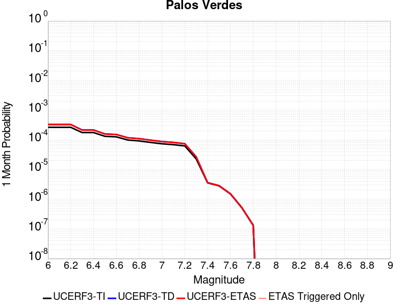 | 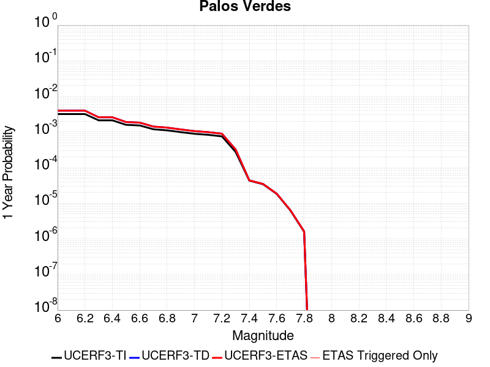 | 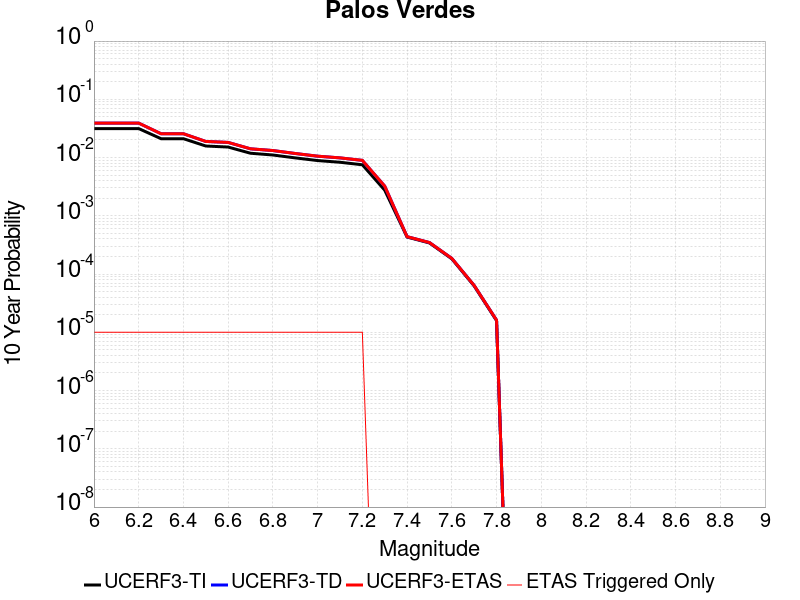 |

| Magnitude | 1 wk TI Prob | 1 wk TD Prob | 1 wk ETAS Prob | 1 wk ETAS/TD Gain | 1 wk ETAS Triggered Only | 1 mo TI Prob | 1 mo TD Prob | 1 mo ETAS Prob | 1 mo ETAS/TD Gain | 1 mo ETAS Triggered Only | 1 yr TI Prob | 1 yr TD Prob | 1 yr ETAS Prob | 1 yr ETAS/TD Gain | 1 yr ETAS Triggered Only | 10 yr TI Prob | 10 yr TD Prob | 10 yr ETAS Prob | 10 yr ETAS/TD Gain | 10 yr ETAS Triggered Only |
|-----|-----|-----|-----|-----|-----|-----|-----|-----|-----|-----|-----|-----|-----|-----|-----|-----|-----|-----|-----|-----|
| 6.0 | 6.126063E-5 | 7.622862E-5 | 7.622862E-5 | 1.0 | 0.0 | 2.6251914E-4 | 3.2665656E-4 | 3.2665656E-4 | 1.0 | 0.0 | 0.0031914865 | 0.0039702994 | 0.0039702994 | 1.0 | 0.0 | 0.031460393 | 0.039050125 | 0.039059732 | 1.000246 | 1.0E-5 |
| 6.1 | 6.126063E-5 | 7.622862E-5 | 7.622862E-5 | 1.0 | 0.0 | 2.6251914E-4 | 3.2665656E-4 | 3.2665656E-4 | 1.0 | 0.0 | 0.0031914865 | 0.0039702994 | 0.0039702994 | 1.0 | 0.0 | 0.031460393 | 0.039050125 | 0.039059732 | 1.000246 | 1.0E-5 |
| 6.2 | 6.126063E-5 | 7.622862E-5 | 7.622862E-5 | 1.0 | 0.0 | 2.6251914E-4 | 3.2665656E-4 | 3.2665656E-4 | 1.0 | 0.0 | 0.0031914865 | 0.0039702994 | 0.0039702994 | 1.0 | 0.0 | 0.031460393 | 0.039050125 | 0.039059732 | 1.000246 | 1.0E-5 |
| 6.3 | 4.0838047E-5 | 4.975089E-5 | 4.975089E-5 | 1.0 | 0.0 | 1.7500846E-4 | 2.1320196E-4 | 2.1320196E-4 | 1.0 | 0.0 | 0.0021286458 | 0.0025928554 | 0.0025928554 | 1.0 | 0.0 | 0.021083709 | 0.025647415 | 0.025657158 | 1.0003799 | 1.0E-5 |
| 6.4 | 4.0838047E-5 | 4.975089E-5 | 4.975089E-5 | 1.0 | 0.0 | 1.7500846E-4 | 2.1320196E-4 | 2.1320196E-4 | 1.0 | 0.0 | 0.0021286458 | 0.0025928554 | 0.0025928554 | 1.0 | 0.0 | 0.021083709 | 0.025647415 | 0.025657158 | 1.0003799 | 1.0E-5 |
| 6.5 | 3.0512005E-5 | 3.6562593E-5 | 3.6562593E-5 | 1.0 | 0.0 | 1.3075917E-4 | 1.566881E-4 | 1.566881E-4 | 1.0 | 0.0 | 0.0015908304 | 0.001906127 | 0.001906127 | 1.0 | 0.0 | 0.015794903 | 0.01890965 | 0.01891946 | 1.0005188 | 1.0E-5 |
| 6.6 | 2.9255087E-5 | 3.5155368E-5 | 3.5155368E-5 | 1.0 | 0.0 | 1.2537291E-4 | 1.5065783E-4 | 1.5065783E-4 | 1.0 | 0.0 | 0.0015253464 | 0.0018328319 | 0.0018328319 | 1.0 | 0.0 | 0.015149189 | 0.01818871 | 0.018198527 | 1.0005398 | 1.0E-5 |
| 6.7 | 2.287198E-5 | 2.7248976E-5 | 2.7248976E-5 | 1.0 | 0.0 | 9.801909E-5 | 1.1677662E-4 | 1.1677662E-4 | 1.0 | 0.0 | 0.001192729 | 0.0014209197 | 0.0014209197 | 1.0 | 0.0 | 0.011863477 | 0.014127577 | 0.014137435 | 1.0006979 | 1.0E-5 |
| 6.8 | 2.1325764E-5 | 2.5432531E-5 | 2.5432531E-5 | 1.0 | 0.0 | 9.139293E-5 | 1.0899252E-4 | 1.0899252E-4 | 1.0 | 0.0 | 0.001112141 | 0.0013262664 | 0.0013262664 | 1.0 | 0.0 | 0.011065915 | 0.013192548 | 0.013202417 | 1.000748 | 1.0E-5 |
| 6.9 | 1.9009392E-5 | 2.2614122E-5 | 2.2614122E-5 | 1.0 | 0.0 | 8.1466285E-5 | 9.6914555E-5 | 9.6914555E-5 | 1.0 | 0.0 | 9.914007E-4 | 0.0011793834 | 0.0011793834 | 1.0 | 0.0 | 0.009869894 | 0.011739929 | 0.0117498115 | 1.0008417 | 1.0E-5 |
| 7.0 | 1.7098473E-5 | 2.0319867E-5 | 2.0319867E-5 | 1.0 | 0.0 | 7.3277115E-5 | 8.708272E-5 | 8.708272E-5 | 1.0 | 0.0 | 8.917837E-4 | 0.0010598017 | 0.0010598017 | 1.0 | 0.0 | 0.008882134 | 0.010555912 | 0.010565806 | 1.0009373 | 1.0E-5 |
| 7.1 | 1.5982785E-5 | 1.8995239E-5 | 1.8995239E-5 | 1.0 | 0.0 | 6.849585E-5 | 8.1406106E-5 | 8.1406106E-5 | 1.0 | 0.0 | 8.336179E-4 | 9.907534E-4 | 9.907534E-4 | 1.0 | 0.0 | 0.008304977 | 0.009871728 | 0.009881629 | 1.001003 | 1.0E-5 |
| 7.2 | 1.4468002E-5 | 1.719767E-5 | 1.719767E-5 | 1.0 | 0.0 | 6.200425E-5 | 7.370269E-5 | 7.370269E-5 | 1.0 | 0.0 | 7.546402E-4 | 8.970449E-4 | 8.970449E-4 | 1.0 | 0.0 | 0.007520827 | 0.008942509 | 0.008952419 | 1.0011083 | 1.0E-5 |
| 7.3 | 5.288233E-6 | 6.2038207E-6 | 6.2038207E-6 | 1.0 | 0.0 | 2.2663658E-5 | 2.658773E-5 | 2.658773E-5 | 1.0 | 0.0 | 2.7589512E-4 | 3.2369242E-4 | 3.2369242E-4 | 1.0 | 0.0 | 0.0027555283 | 0.0032356323 | 0.0032356323 | 1.0 | 0.0 |
| 7.4 | 8.279556E-7 | 8.408364E-7 | 8.408364E-7 | 1.0 | 0.0 | 3.5483763E-6 | 3.60358E-6 | 3.60358E-6 | 1.0 | 0.0 | 4.3200624E-5 | 4.3872777E-5 | 4.3872777E-5 | 1.0 | 0.0 | 4.3192226E-4 | 4.3864836E-4 | 4.3864836E-4 | 1.0 | 0.0 |
| 7.5 | 6.559831E-7 | 6.667243E-7 | 6.667243E-7 | 1.0 | 0.0 | 2.8113532E-6 | 2.8573872E-6 | 2.8573872E-6 | 1.0 | 0.0 | 3.4227687E-5 | 3.47882E-5 | 3.47882E-5 | 1.0 | 0.0 | 3.4222414E-4 | 3.478342E-4 | 3.478342E-4 | 1.0 | 0.0 |
| 7.6 | 3.5018968E-7 | 3.562011E-7 | 3.562011E-7 | 1.0 | 0.0 | 1.500812E-6 | 1.5265755E-6 | 1.5265755E-6 | 1.0 | 0.0 | 1.8272232E-5 | 1.8585944E-5 | 1.8585944E-5 | 1.0 | 0.0 | 1.8270731E-4 | 1.858485E-4 | 1.858485E-4 | 1.0 | 0.0 |
| 7.7 | 1.1986104E-7 | 1.2198406E-7 | 1.2198406E-7 | 1.0 | 0.0 | 5.1369005E-7 | 5.227887E-7 | 5.227887E-7 | 1.0 | 0.0 | 6.2541585E-6 | 6.364934E-6 | 6.364934E-6 | 1.0 | 0.0 | 6.2539824E-5 | 6.364756E-5 | 6.364756E-5 | 1.0 | 0.0 |
| 7.8 | 3.0445005E-8 | 3.1027664E-8 | 3.1027664E-8 | 1.0 | 0.0 | 1.3047858E-7 | 1.3297569E-7 | 1.3297569E-7 | 1.0 | 0.0 | 1.5885756E-6 | 1.6189781E-6 | 1.6189781E-6 | 1.0 | 0.0 | 1.5885644E-5 | 1.6189684E-5 | 1.6189684E-5 | 1.0 | 0.0 |

## San Luis Range 2011 CFM
*[(top)](#table-of-contents)*

| 1 Week | 1 Month | 1 Year | 10 Year |
|-----|-----|-----|-----|
| 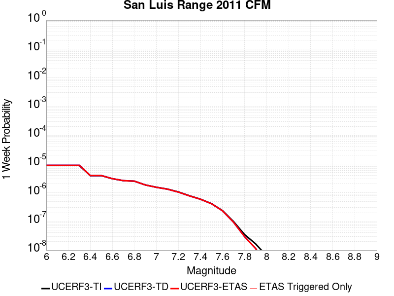 | 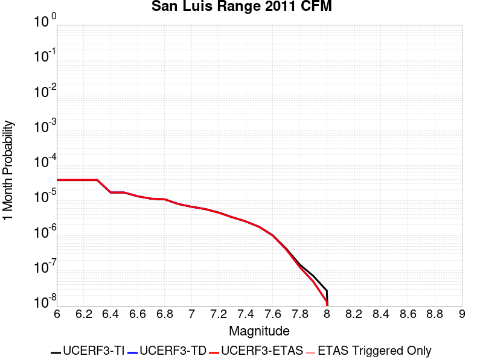 | 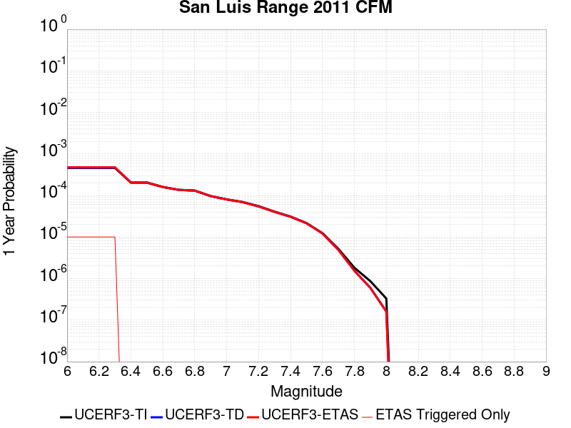 | 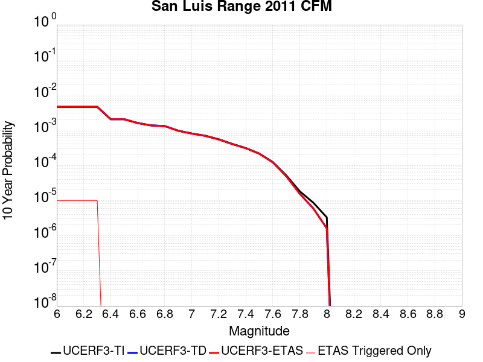 |

| Magnitude | 1 wk TI Prob | 1 wk TD Prob | 1 wk ETAS Prob | 1 wk ETAS/TD Gain | 1 wk ETAS Triggered Only | 1 mo TI Prob | 1 mo TD Prob | 1 mo ETAS Prob | 1 mo ETAS/TD Gain | 1 mo ETAS Triggered Only | 1 yr TI Prob | 1 yr TD Prob | 1 yr ETAS Prob | 1 yr ETAS/TD Gain | 1 yr ETAS Triggered Only | 10 yr TI Prob | 10 yr TD Prob | 10 yr ETAS Prob | 10 yr ETAS/TD Gain | 10 yr ETAS Triggered Only |
|-----|-----|-----|-----|-----|-----|-----|-----|-----|-----|-----|-----|-----|-----|-----|-----|-----|-----|-----|-----|-----|
| 6.0 | 8.8368415E-6 | 8.965477E-6 | 8.965477E-6 | 1.0 | 0.0 | 3.787163E-5 | 3.8422953E-5 | 3.8422953E-5 | 1.0 | 0.0 | 4.609895E-4 | 4.677069E-4 | 4.7770224E-4 | 1.0213709 | 1.0E-5 | 0.0046003438 | 0.0046680085 | 0.0046779616 | 1.0021323 | 1.0E-5 |
| 6.1 | 8.8368415E-6 | 8.965477E-6 | 8.965477E-6 | 1.0 | 0.0 | 3.787163E-5 | 3.8422953E-5 | 3.8422953E-5 | 1.0 | 0.0 | 4.609895E-4 | 4.677069E-4 | 4.7770224E-4 | 1.0213709 | 1.0E-5 | 0.0046003438 | 0.0046680085 | 0.0046779616 | 1.0021323 | 1.0E-5 |
| 6.2 | 8.8368415E-6 | 8.965477E-6 | 8.965477E-6 | 1.0 | 0.0 | 3.787163E-5 | 3.8422953E-5 | 3.8422953E-5 | 1.0 | 0.0 | 4.609895E-4 | 4.677069E-4 | 4.7770224E-4 | 1.0213709 | 1.0E-5 | 0.0046003438 | 0.0046680085 | 0.0046779616 | 1.0021323 | 1.0E-5 |
| 6.3 | 8.8368415E-6 | 8.965477E-6 | 8.965477E-6 | 1.0 | 0.0 | 3.787163E-5 | 3.8422953E-5 | 3.8422953E-5 | 1.0 | 0.0 | 4.609895E-4 | 4.677069E-4 | 4.7770224E-4 | 1.0213709 | 1.0E-5 | 0.0046003438 | 0.0046680085 | 0.0046779616 | 1.0021323 | 1.0E-5 |
| 6.4 | 3.9094193E-6 | 3.941213E-6 | 3.941213E-6 | 1.0 | 0.0 | 1.6754546E-5 | 1.6890806E-5 | 1.6890806E-5 | 1.0 | 0.0 | 2.039675E-4 | 2.0562643E-4 | 2.0562643E-4 | 1.0 | 0.0 | 0.0020378039 | 0.0020543905 | 0.0020543905 | 1.0 | 0.0 |
| 6.5 | 3.9094193E-6 | 3.941213E-6 | 3.941213E-6 | 1.0 | 0.0 | 1.6754546E-5 | 1.6890806E-5 | 1.6890806E-5 | 1.0 | 0.0 | 2.039675E-4 | 2.0562643E-4 | 2.0562643E-4 | 1.0 | 0.0 | 0.0020378039 | 0.0020543905 | 0.0020543905 | 1.0 | 0.0 |
| 6.6 | 3.0587726E-6 | 3.0753965E-6 | 3.0753965E-6 | 1.0 | 0.0 | 1.3108959E-5 | 1.3180205E-5 | 1.3180205E-5 | 1.0 | 0.0 | 1.595899E-4 | 1.604573E-4 | 1.604573E-4 | 1.0 | 0.0 | 0.0015947534 | 0.0016034264 | 0.0016034264 | 1.0 | 0.0 |
| 6.7 | 2.6160574E-6 | 2.6251346E-6 | 2.6251346E-6 | 1.0 | 0.0 | 1.1211626E-5 | 1.1250529E-5 | 1.1250529E-5 | 1.0 | 0.0 | 1.3649299E-4 | 1.3696664E-4 | 1.3696664E-4 | 1.0 | 0.0 | 0.0013640919 | 0.0013688284 | 0.0013688284 | 1.0 | 0.0 |
| 6.8 | 2.5110312E-6 | 2.5181473E-6 | 2.5181473E-6 | 1.0 | 0.0 | 1.0761518E-5 | 1.0792015E-5 | 1.0792015E-5 | 1.0 | 0.0 | 1.310136E-4 | 1.3138492E-4 | 1.3138492E-4 | 1.0 | 0.0 | 0.0013093639 | 0.0013130783 | 0.0013130783 | 1.0 | 0.0 |
| 6.9 | 1.8564405E-6 | 1.8524926E-6 | 1.8524926E-6 | 1.0 | 0.0 | 7.95615E-6 | 7.93923E-6 | 7.93923E-6 | 1.0 | 0.0 | 9.686181E-5 | 9.665586E-5 | 9.665586E-5 | 1.0 | 0.0 | 9.68196E-4 | 9.661402E-4 | 9.661402E-4 | 1.0 | 0.0 |
| 7.0 | 1.546127E-6 | 1.5369586E-6 | 1.5369586E-6 | 1.0 | 0.0 | 6.626242E-6 | 6.586949E-6 | 6.586949E-6 | 1.0 | 0.0 | 8.06715E-5 | 8.019316E-5 | 8.019316E-5 | 1.0 | 0.0 | 8.0642226E-4 | 8.016429E-4 | 8.016429E-4 | 1.0 | 0.0 |
| 7.1 | 1.3368208E-6 | 1.3235369E-6 | 1.3235369E-6 | 1.0 | 0.0 | 5.7292195E-6 | 5.672289E-6 | 5.672289E-6 | 1.0 | 0.0 | 6.975101E-5 | 6.905793E-5 | 6.905793E-5 | 1.0 | 0.0 | 6.972912E-4 | 6.903652E-4 | 6.903652E-4 | 1.0 | 0.0 |
| 7.2 | 1.0623363E-6 | 1.0454403E-6 | 1.0454403E-6 | 1.0 | 0.0 | 4.5528623E-6 | 4.480451E-6 | 4.480451E-6 | 1.0 | 0.0 | 5.5429686E-5 | 5.4548127E-5 | 5.4548127E-5 | 1.0 | 0.0 | 5.5415864E-4 | 5.4534763E-4 | 5.4534763E-4 | 1.0 | 0.0 |
| 7.3 | 7.831679E-7 | 7.7274194E-7 | 7.7274194E-7 | 1.0 | 0.0 | 3.3564295E-6 | 3.311747E-6 | 3.311747E-6 | 1.0 | 0.0 | 4.086376E-5 | 4.0319774E-5 | 4.0319774E-5 | 1.0 | 0.0 | 4.0856248E-4 | 4.0312472E-4 | 4.0312472E-4 | 1.0 | 0.0 |
| 7.4 | 5.9558846E-7 | 5.91066E-7 | 5.91066E-7 | 1.0 | 0.0 | 2.5525194E-6 | 2.5331376E-6 | 2.5331376E-6 | 1.0 | 0.0 | 3.107648E-5 | 3.0840514E-5 | 3.0840514E-5 | 1.0 | 0.0 | 3.1072134E-4 | 3.0836245E-4 | 3.0836245E-4 | 1.0 | 0.0 |
| 7.5 | 4.1616502E-7 | 4.1196506E-7 | 4.1196506E-7 | 1.0 | 0.0 | 1.7835631E-6 | 1.7655633E-6 | 1.7655633E-6 | 1.0 | 0.0 | 2.1714664E-5 | 2.1495522E-5 | 2.1495522E-5 | 1.0 | 0.0 | 2.1712543E-4 | 2.1493447E-4 | 2.1493447E-4 | 1.0 | 0.0 |
| 7.6 | 2.3816014E-7 | 2.3376697E-7 | 2.3376697E-7 | 1.0 | 0.0 | 1.0206859E-6 | 1.001858E-6 | 1.001858E-6 | 1.0 | 0.0 | 1.242678E-5 | 1.2197554E-5 | 1.2197554E-5 | 1.0 | 0.0 | 1.2426086E-4 | 1.2196886E-4 | 1.2196886E-4 | 1.0 | 0.0 |
| 7.7 | 9.918777E-8 | 9.386869E-8 | 9.386869E-8 | 1.0 | 0.0 | 4.2509038E-7 | 4.0229432E-7 | 4.0229432E-7 | 1.0 | 0.0 | 5.1754632E-6 | 4.8979223E-6 | 4.8979223E-6 | 1.0 | 0.0 | 5.1753424E-5 | 4.897815E-5 | 4.897815E-5 | 1.0 | 0.0 |
| 7.8 | 3.4982556E-8 | 2.9687454E-8 | 2.9687454E-8 | 1.0 | 0.0 | 1.4992524E-7 | 1.2723194E-7 | 1.2723194E-7 | 1.0 | 0.0 | 1.8253382E-6 | 1.5490477E-6 | 1.5490477E-6 | 1.0 | 0.0 | 1.8253233E-5 | 1.549037E-5 | 1.549037E-5 | 1.0 | 0.0 |
| 7.9 | 1.6624908E-8 | 1.1477859E-8 | 1.1477859E-8 | 1.0 | 0.0 | 7.12496E-8 | 4.919082E-8 | 4.919082E-8 | 1.0 | 0.0 | 8.6746354E-7 | 5.9889805E-7 | 5.9889805E-7 | 1.0 | 0.0 | 8.674601E-6 | 5.988965E-6 | 5.988965E-6 | 1.0 | 0.0 |
| 8.0 | 6.3352315E-9 | 3.0893488E-9 | 3.0893488E-9 | 1.0 | 0.0 | 2.715099E-8 | 1.3240064E-8 | 1.3240064E-8 | 1.0 | 0.0 | 3.3056327E-7 | 1.6119778E-7 | 1.6119778E-7 | 1.0 | 0.0 | 3.3056278E-6 | 1.6119766E-6 | 1.6119766E-6 | 1.0 | 0.0 |

## Hayward (So) 2011 CFM
*[(top)](#table-of-contents)*

| 1 Week | 1 Month | 1 Year | 10 Year |
|-----|-----|-----|-----|
| 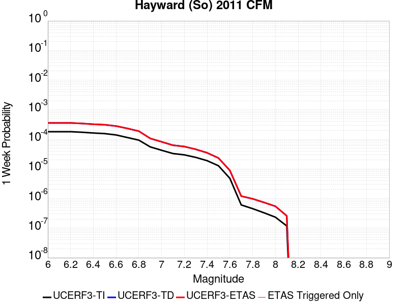 | 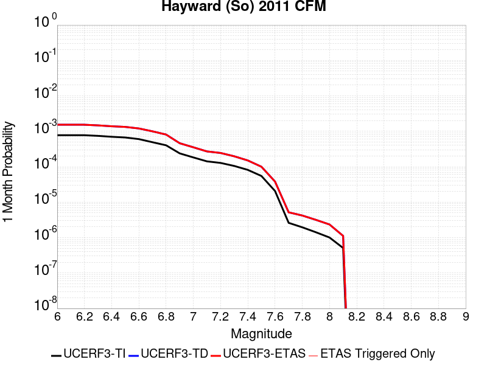 | 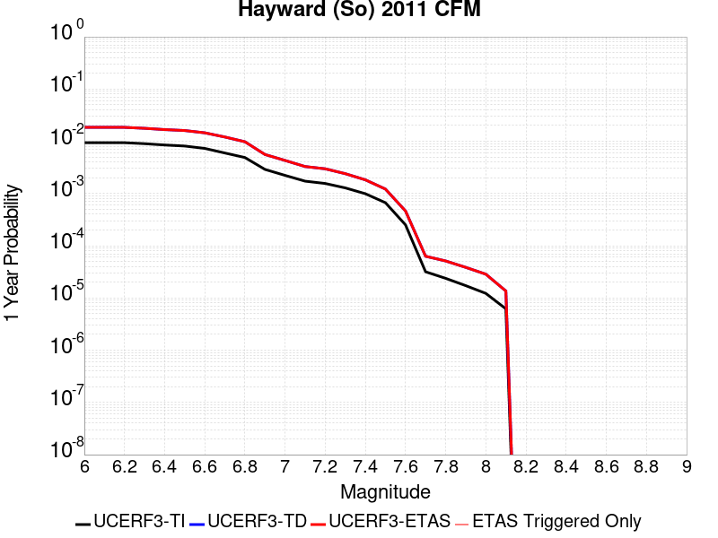 | 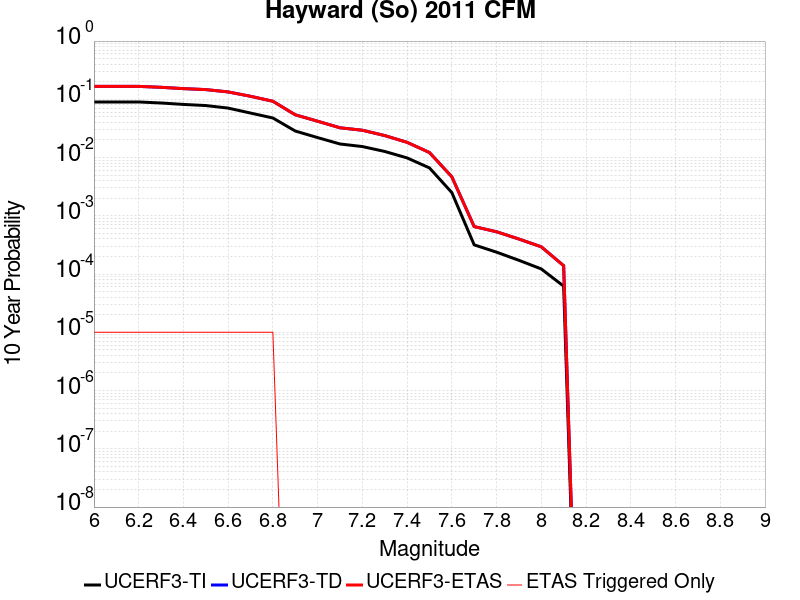 |

| Magnitude | 1 wk TI Prob | 1 wk TD Prob | 1 wk ETAS Prob | 1 wk ETAS/TD Gain | 1 wk ETAS Triggered Only | 1 mo TI Prob | 1 mo TD Prob | 1 mo ETAS Prob | 1 mo ETAS/TD Gain | 1 mo ETAS Triggered Only | 1 yr TI Prob | 1 yr TD Prob | 1 yr ETAS Prob | 1 yr ETAS/TD Gain | 1 yr ETAS Triggered Only | 10 yr TI Prob | 10 yr TD Prob | 10 yr ETAS Prob | 10 yr ETAS/TD Gain | 10 yr ETAS Triggered Only |
|-----|-----|-----|-----|-----|-----|-----|-----|-----|-----|-----|-----|-----|-----|-----|-----|-----|-----|-----|-----|-----|
| 6.0 | 1.8091932E-4 | 3.5709047E-4 | 3.5709047E-4 | 1.0 | 0.0 | 7.751381E-4 | 0.0015295 | 0.0015295 | 1.0 | 0.0 | 0.00939654 | 0.018465072 | 0.018465072 | 1.0 | 0.0 | 0.090090066 | 0.1667456 | 0.16675393 | 1.00005 | 1.0E-5 |
| 6.1 | 1.8091932E-4 | 3.5709047E-4 | 3.5709047E-4 | 1.0 | 0.0 | 7.751381E-4 | 0.0015295 | 0.0015295 | 1.0 | 0.0 | 0.00939654 | 0.018465072 | 0.018465072 | 1.0 | 0.0 | 0.090090066 | 0.1667456 | 0.16675393 | 1.00005 | 1.0E-5 |
| 6.2 | 1.8091932E-4 | 3.5709047E-4 | 3.5709047E-4 | 1.0 | 0.0 | 7.751381E-4 | 0.0015295 | 0.0015295 | 1.0 | 0.0 | 0.00939654 | 0.018465072 | 0.018465072 | 1.0 | 0.0 | 0.090090066 | 0.1667456 | 0.16675393 | 1.00005 | 1.0E-5 |
| 6.3 | 1.7322872E-4 | 3.426588E-4 | 3.426588E-4 | 1.0 | 0.0 | 7.4219756E-4 | 0.001467721 | 0.001467721 | 1.0 | 0.0 | 0.0089988755 | 0.017725362 | 0.017725362 | 1.0 | 0.0 | 0.08643075 | 0.16068102 | 0.16068941 | 1.0000522 | 1.0E-5 |
| 6.4 | 1.6334097E-4 | 3.2347543E-4 | 3.2347543E-4 | 1.0 | 0.0 | 6.998449E-4 | 0.0013855953 | 0.0013855953 | 1.0 | 0.0 | 0.008487372 | 0.016741147 | 0.016741147 | 1.0 | 0.0 | 0.081704415 | 0.15256941 | 0.15257788 | 1.0000556 | 1.0E-5 |
| 6.5 | 1.5600289E-4 | 3.1022163E-4 | 3.1022163E-4 | 1.0 | 0.0 | 6.684125E-4 | 0.0013288521 | 0.0013288521 | 1.0 | 0.0 | 0.008107598 | 0.016060648 | 0.016060648 | 1.0 | 0.0 | 0.078181036 | 0.1468459 | 0.14685443 | 1.000058 | 1.0E-5 |
| 6.6 | 1.4046066E-4 | 2.803607E-4 | 2.803607E-4 | 1.0 | 0.0 | 6.018354E-4 | 0.0012009992 | 0.0012009992 | 1.0 | 0.0 | 0.0073027555 | 0.014525633 | 0.014525633 | 1.0 | 0.0 | 0.07067384 | 0.13393258 | 0.13394123 | 1.0000646 | 1.0E-5 |
| 6.7 | 1.14696966E-4 | 2.327433E-4 | 2.327433E-4 | 1.0 | 0.0 | 4.914658E-4 | 9.970951E-4 | 9.970951E-4 | 1.0 | 0.0 | 0.0059671924 | 0.012073125 | 0.012073125 | 1.0 | 0.0 | 0.058094822 | 0.11275855 | 0.11276742 | 1.0000787 | 1.0E-5 |
| 6.8 | 9.3874296E-5 | 1.8863835E-4 | 1.8863835E-4 | 1.0 | 0.0 | 4.0225635E-4 | 8.082033E-4 | 8.082033E-4 | 1.0 | 0.0 | 0.0048864787 | 0.009796215 | 0.009796215 | 1.0 | 0.0 | 0.047804173 | 0.092608735 | 0.09261781 | 1.000098 | 1.0E-5 |
| 6.9 | 5.551852E-5 | 1.0731048E-4 | 1.0731048E-4 | 1.0 | 0.0 | 2.3791482E-4 | 4.598216E-4 | 4.598216E-4 | 1.0 | 0.0 | 0.0028927654 | 0.005584076 | 0.005584076 | 1.0 | 0.0 | 0.028553981 | 0.054252647 | 0.054252647 | 1.0 | 0.0 |
| 7.0 | 4.2662363E-5 | 8.2477156E-5 | 8.2477156E-5 | 1.0 | 0.0 | 1.8282588E-4 | 3.5342603E-4 | 3.5342603E-4 | 1.0 | 0.0 | 0.0022236328 | 0.0042945454 | 0.0042945454 | 1.0 | 0.0 | 0.022015138 | 0.042070437 | 0.042070437 | 1.0 | 0.0 |
| 7.1 | 3.305886E-5 | 6.3029416E-5 | 6.3029416E-5 | 1.0 | 0.0 | 1.4167312E-4 | 2.7009821E-4 | 2.7009821E-4 | 1.0 | 0.0 | 0.0017235056 | 0.0032835058 | 0.0032835058 | 1.0 | 0.0 | 0.017101998 | 0.032457817 | 0.032457817 | 1.0 | 0.0 |
| 7.2 | 2.9856887E-5 | 5.702347E-5 | 5.702347E-5 | 1.0 | 0.0 | 1.2795182E-4 | 2.443635E-4 | 2.443635E-4 | 1.0 | 0.0 | 0.0015567001 | 0.0029710834 | 0.0029710834 | 1.0 | 0.0 | 0.015458403 | 0.029458297 | 0.029458297 | 1.0 | 0.0 |
| 7.3 | 2.4559737E-5 | 4.599918E-5 | 4.599918E-5 | 1.0 | 0.0 | 1.0525176E-4 | 1.9712451E-4 | 1.9712451E-4 | 1.0 | 0.0 | 0.0012806869 | 0.0023973624 | 0.0023973624 | 1.0 | 0.0 | 0.012733313 | 0.023861503 | 0.023861503 | 1.0 | 0.0 |
| 7.4 | 1.9002231E-5 | 3.505627E-5 | 3.505627E-5 | 1.0 | 0.0 | 8.143559E-5 | 1.5023256E-4 | 1.5023256E-4 | 1.0 | 0.0 | 9.910273E-4 | 0.0018275568 | 0.0018275568 | 1.0 | 0.0 | 0.009866194 | 0.018261688 | 0.018261688 | 1.0 | 0.0 |
| 7.5 | 1.2783333E-5 | 2.333344E-5 | 2.333344E-5 | 1.0 | 0.0 | 5.4784563E-5 | 9.999665E-5 | 9.999665E-5 | 1.0 | 0.0 | 6.667979E-4 | 0.001216785 | 0.001216785 | 1.0 | 0.0 | 0.006648007 | 0.012211235 | 0.012211235 | 1.0 | 0.0 |
| 7.6 | 4.8149627E-6 | 8.889109E-6 | 8.889109E-6 | 1.0 | 0.0 | 2.063539E-5 | 3.8095633E-5 | 3.8095633E-5 | 1.0 | 0.0 | 2.5120692E-4 | 4.6371686E-4 | 4.6371686E-4 | 1.0 | 0.0 | 0.0025092314 | 0.0046820138 | 0.0046820138 | 1.0 | 0.0 |
| 7.7 | 6.0838227E-7 | 1.2062297E-6 | 1.2062297E-6 | 1.0 | 0.0 | 2.6073499E-6 | 5.1695456E-6 | 5.1695456E-6 | 1.0 | 0.0 | 3.174402E-5 | 6.2937404E-5 | 6.2937404E-5 | 1.0 | 0.0 | 3.1739488E-4 | 6.5320614E-4 | 6.5320614E-4 | 1.0 | 0.0 |
| 7.8 | 4.5542808E-7 | 9.797042E-7 | 9.797042E-7 | 1.0 | 0.0 | 1.9518332E-6 | 4.1987255E-6 | 4.1987255E-6 | 1.0 | 0.0 | 2.376331E-5 | 5.1118284E-5 | 5.1118284E-5 | 1.0 | 0.0 | 2.3760769E-4 | 5.3237256E-4 | 5.3237256E-4 | 1.0 | 0.0 |
| 7.9 | 3.3016747E-7 | 7.389937E-7 | 7.389937E-7 | 1.0 | 0.0 | 1.4150027E-6 | 3.1671123E-6 | 3.1671123E-6 | 1.0 | 0.0 | 1.7227521E-5 | 3.8558912E-5 | 3.8558912E-5 | 1.0 | 0.0 | 1.7226185E-4 | 3.9948142E-4 | 3.9948142E-4 | 1.0 | 0.0 |
| 8.0 | 2.347038E-7 | 5.474045E-7 | 5.474045E-7 | 1.0 | 0.0 | 1.0058731E-6 | 2.3460173E-6 | 2.3460173E-6 | 1.0 | 0.0 | 1.2246436E-5 | 2.8562388E-5 | 2.8562388E-5 | 1.0 | 0.0 | 1.2245761E-4 | 2.9367572E-4 | 2.9367572E-4 | 1.0 | 0.0 |
| 8.1 | 1.18822804E-7 | 2.6070907E-7 | 2.6070907E-7 | 1.0 | 0.0 | 5.092405E-7 | 1.1173241E-6 | 1.1173241E-6 | 1.0 | 0.0 | 6.1999854E-6 | 1.3603338E-5 | 1.3603338E-5 | 1.0 | 0.0 | 6.199812E-5 | 1.3923709E-4 | 1.3923709E-4 | 1.0 | 0.0 |

## Camp Rock 2011
*[(top)](#table-of-contents)*

| 1 Week | 1 Month | 1 Year | 10 Year |
|-----|-----|-----|-----|
| 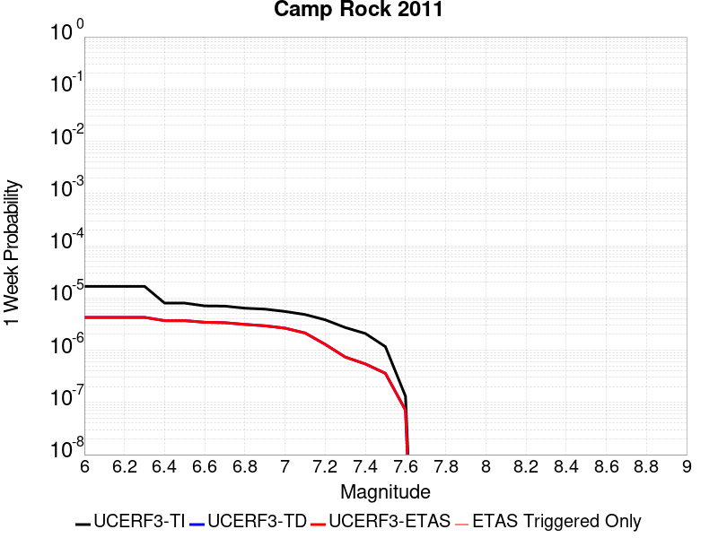 | 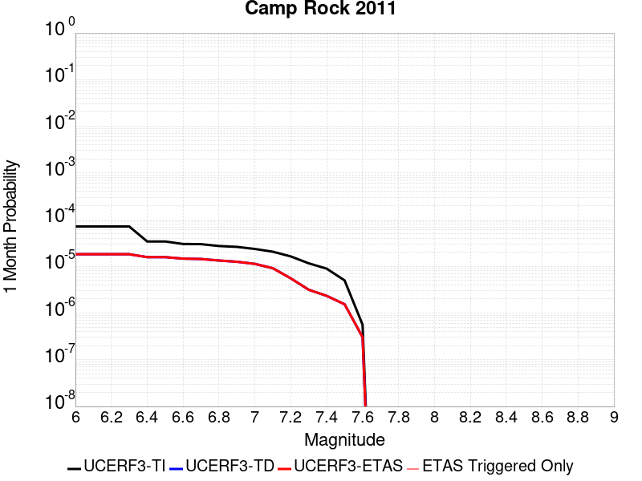 | 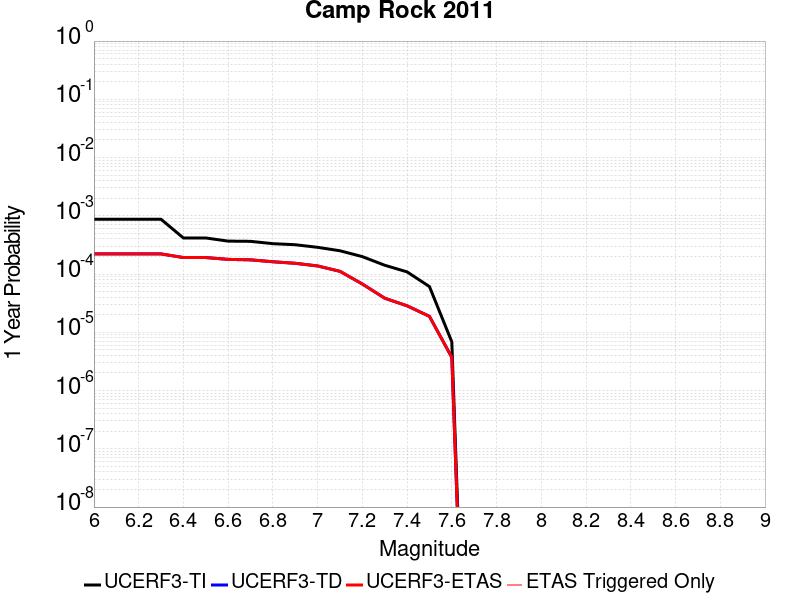 | 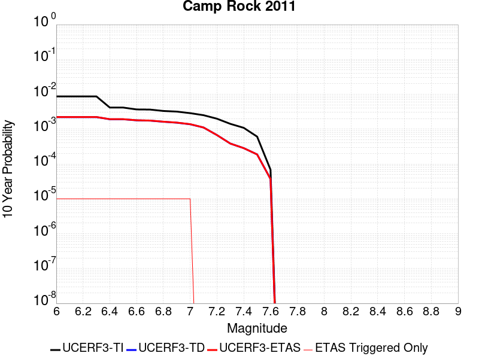 |

| Magnitude | 1 wk TI Prob | 1 wk TD Prob | 1 wk ETAS Prob | 1 wk ETAS/TD Gain | 1 wk ETAS Triggered Only | 1 mo TI Prob | 1 mo TD Prob | 1 mo ETAS Prob | 1 mo ETAS/TD Gain | 1 mo ETAS Triggered Only | 1 yr TI Prob | 1 yr TD Prob | 1 yr ETAS Prob | 1 yr ETAS/TD Gain | 1 yr ETAS Triggered Only | 10 yr TI Prob | 10 yr TD Prob | 10 yr ETAS Prob | 10 yr ETAS/TD Gain | 10 yr ETAS Triggered Only |
|-----|-----|-----|-----|-----|-----|-----|-----|-----|-----|-----|-----|-----|-----|-----|-----|-----|-----|-----|-----|-----|
| 6.0 | 1.6710783E-5 | 4.2503107E-6 | 4.2503107E-6 | 1.0 | 0.0 | 7.161568E-5 | 1.8215493E-5 | 1.8215493E-5 | 1.0 | 0.0 | 8.7157206E-4 | 2.2175159E-4 | 2.2175159E-4 | 1.0 | 0.0 | 0.008681616 | 0.0022153559 | 0.0022253338 | 1.004504 | 1.0E-5 |
| 6.1 | 1.6710783E-5 | 4.2503107E-6 | 4.2503107E-6 | 1.0 | 0.0 | 7.161568E-5 | 1.8215493E-5 | 1.8215493E-5 | 1.0 | 0.0 | 8.7157206E-4 | 2.2175159E-4 | 2.2175159E-4 | 1.0 | 0.0 | 0.008681616 | 0.0022153559 | 0.0022253338 | 1.004504 | 1.0E-5 |
| 6.2 | 1.6710783E-5 | 4.2503107E-6 | 4.2503107E-6 | 1.0 | 0.0 | 7.161568E-5 | 1.8215493E-5 | 1.8215493E-5 | 1.0 | 0.0 | 8.7157206E-4 | 2.2175159E-4 | 2.2175159E-4 | 1.0 | 0.0 | 0.008681616 | 0.0022153559 | 0.0022253338 | 1.004504 | 1.0E-5 |
| 6.3 | 1.6710783E-5 | 4.2503107E-6 | 4.2503107E-6 | 1.0 | 0.0 | 7.161568E-5 | 1.8215493E-5 | 1.8215493E-5 | 1.0 | 0.0 | 8.7157206E-4 | 2.2175159E-4 | 2.2175159E-4 | 1.0 | 0.0 | 0.008681616 | 0.0022153559 | 0.0022253338 | 1.004504 | 1.0E-5 |
| 6.4 | 7.982846E-6 | 3.6821327E-6 | 3.6821327E-6 | 1.0 | 0.0 | 3.421175E-5 | 1.5780475E-5 | 1.5780475E-5 | 1.0 | 0.0 | 4.1644843E-4 | 1.921107E-4 | 1.921107E-4 | 1.0 | 0.0 | 0.0041566887 | 0.0019194811 | 0.001929462 | 1.0051998 | 1.0E-5 |
| 6.5 | 7.982846E-6 | 3.6821327E-6 | 3.6821327E-6 | 1.0 | 0.0 | 3.421175E-5 | 1.5780475E-5 | 1.5780475E-5 | 1.0 | 0.0 | 4.1644843E-4 | 1.921107E-4 | 1.921107E-4 | 1.0 | 0.0 | 0.0041566887 | 0.0019194811 | 0.001929462 | 1.0051998 | 1.0E-5 |
| 6.6 | 7.048869E-6 | 3.4243997E-6 | 3.4243997E-6 | 1.0 | 0.0 | 3.0209088E-5 | 1.4675918E-5 | 1.4675918E-5 | 1.0 | 0.0 | 3.677336E-4 | 1.7866497E-4 | 1.7866497E-4 | 1.0 | 0.0 | 0.0036712566 | 0.0017852448 | 0.0017952269 | 1.0055915 | 1.0E-5 |
| 6.7 | 6.987307E-6 | 3.3623767E-6 | 3.3623767E-6 | 1.0 | 0.0 | 2.9945259E-5 | 1.4410108E-5 | 1.4410108E-5 | 1.0 | 0.0 | 3.6452254E-4 | 1.7542925E-4 | 1.7542925E-4 | 1.0 | 0.0 | 0.0036392517 | 0.0017529388 | 0.0017629212 | 1.0056947 | 1.0E-5 |
| 6.8 | 6.3737602E-6 | 3.117947E-6 | 3.117947E-6 | 1.0 | 0.0 | 2.731583E-5 | 1.3362564E-5 | 1.3362564E-5 | 1.0 | 0.0 | 3.3251947E-4 | 1.6267736E-4 | 1.6267736E-4 | 1.0 | 0.0 | 0.0033202237 | 0.0016256113 | 0.0016355951 | 1.0061415 | 1.0E-5 |
| 6.9 | 6.112211E-6 | 2.9331534E-6 | 2.9331534E-6 | 1.0 | 0.0 | 2.6194928E-5 | 1.2570598E-5 | 1.2570598E-5 | 1.0 | 0.0 | 3.1887658E-4 | 1.5303657E-4 | 1.5303657E-4 | 1.0 | 0.0 | 0.003184194 | 0.0015293396 | 0.0015393243 | 1.0065287 | 1.0E-5 |
| 7.0 | 5.5140117E-6 | 2.6419564E-6 | 2.6419564E-6 | 1.0 | 0.0 | 2.3631264E-5 | 1.1322622E-5 | 1.1322622E-5 | 1.0 | 0.0 | 2.8767265E-4 | 1.3784446E-4 | 1.3784446E-4 | 1.0 | 0.0 | 0.0028730053 | 0.0013776148 | 0.001387601 | 1.0072489 | 1.0E-5 |
| 7.1 | 4.8151105E-6 | 2.1342985E-6 | 2.1342985E-6 | 1.0 | 0.0 | 2.0636026E-5 | 9.146962E-6 | 9.146962E-6 | 1.0 | 0.0 | 2.5121463E-4 | 1.1135879E-4 | 1.1135879E-4 | 1.0 | 0.0 | 0.0025093083 | 0.0011130519 | 0.0011130519 | 1.0 | 0.0 |
| 7.2 | 3.818335E-6 | 1.293763E-6 | 1.293763E-6 | 1.0 | 0.0 | 1.6364189E-5 | 5.5446876E-6 | 5.5446876E-6 | 1.0 | 0.0 | 1.9921579E-4 | 6.750456E-5 | 6.750456E-5 | 1.0 | 0.0 | 0.0019903728 | 6.748488E-4 | 6.748488E-4 | 1.0 | 0.0 |
| 7.3 | 2.7166698E-6 | 7.383734E-7 | 7.383734E-7 | 1.0 | 0.0 | 1.1642818E-5 | 3.1644536E-6 | 3.1644536E-6 | 1.0 | 0.0 | 1.4174209E-4 | 3.8526563E-5 | 3.8526563E-5 | 1.0 | 0.0 | 0.0014165172 | 3.8520084E-4 | 3.8520084E-4 | 1.0 | 0.0 |
| 7.4 | 2.0893426E-6 | 5.461961E-7 | 5.461961E-7 | 1.0 | 0.0 | 8.954295E-6 | 2.3408381E-6 | 2.3408381E-6 | 1.0 | 0.0 | 1.0901308E-4 | 2.8499337E-5 | 2.8499337E-5 | 1.0 | 0.0 | 0.0010895962 | 2.8495738E-4 | 2.8495738E-4 | 1.0 | 0.0 |
| 7.5 | 1.1681728E-6 | 3.6031287E-7 | 3.6031287E-7 | 1.0 | 0.0 | 5.0064455E-6 | 1.5441972E-6 | 1.5441972E-6 | 1.0 | 0.0 | 6.0951766E-5 | 1.8800443E-5 | 1.8800443E-5 | 1.0 | 0.0 | 6.093505E-4 | 1.8798899E-4 | 1.8798899E-4 | 1.0 | 0.0 |
| 7.6 | 1.3154387E-7 | 7.1198265E-8 | 7.1198265E-8 | 1.0 | 0.0 | 5.6375933E-7 | 3.051354E-7 | 3.051354E-7 | 1.0 | 0.0 | 6.863748E-6 | 3.7150185E-6 | 3.7150185E-6 | 1.0 | 0.0 | 6.863536E-5 | 3.7149723E-5 | 3.7149723E-5 | 1.0 | 0.0 |

## Blue Cut
*[(top)](#table-of-contents)*

| 1 Week | 1 Month | 1 Year | 10 Year |
|-----|-----|-----|-----|
|  |  |  |  |

| Magnitude | 1 wk TI Prob | 1 wk TD Prob | 1 wk ETAS Prob | 1 wk ETAS/TD Gain | 1 wk ETAS Triggered Only | 1 mo TI Prob | 1 mo TD Prob | 1 mo ETAS Prob | 1 mo ETAS/TD Gain | 1 mo ETAS Triggered Only | 1 yr TI Prob | 1 yr TD Prob | 1 yr ETAS Prob | 1 yr ETAS/TD Gain | 1 yr ETAS Triggered Only | 10 yr TI Prob | 10 yr TD Prob | 10 yr ETAS Prob | 10 yr ETAS/TD Gain | 10 yr ETAS Triggered Only |
|-----|-----|-----|-----|-----|-----|-----|-----|-----|-----|-----|-----|-----|-----|-----|-----|-----|-----|-----|-----|-----|
| 6.0 | 2.1227985E-5 | 2.2719787E-5 | 3.271956E-5 | 1.440135 | 1.0E-5 | 9.097391E-5 | 9.736721E-5 | 1.07366235E-4 | 1.102694 | 1.0E-5 | 0.0011070445 | 0.0011848592 | 0.0011948473 | 1.0084298 | 1.0E-5 | 0.011015458 | 0.011791261 | 0.011801143 | 1.000838 | 1.0E-5 |
| 6.1 | 2.1227985E-5 | 2.2719787E-5 | 3.271956E-5 | 1.440135 | 1.0E-5 | 9.097391E-5 | 9.736721E-5 | 1.07366235E-4 | 1.102694 | 1.0E-5 | 0.0011070445 | 0.0011848592 | 0.0011948473 | 1.0084298 | 1.0E-5 | 0.011015458 | 0.011791261 | 0.011801143 | 1.000838 | 1.0E-5 |
| 6.2 | 2.1227985E-5 | 2.2719787E-5 | 3.271956E-5 | 1.440135 | 1.0E-5 | 9.097391E-5 | 9.736721E-5 | 1.07366235E-4 | 1.102694 | 1.0E-5 | 0.0011070445 | 0.0011848592 | 0.0011948473 | 1.0084298 | 1.0E-5 | 0.011015458 | 0.011791261 | 0.011801143 | 1.000838 | 1.0E-5 |
| 6.3 | 1.1613981E-5 | 1.23536465E-5 | 2.2353523E-5 | 1.8094676 | 1.0E-5 | 4.9773254E-5 | 5.2943193E-5 | 6.2942665E-5 | 1.1888717 | 1.0E-5 | 6.0582085E-4 | 6.444052E-4 | 6.5439875E-4 | 1.0155082 | 1.0E-5 | 0.0060417196 | 0.0064266133 | 0.006436549 | 1.001546 | 1.0E-5 |
| 6.4 | 1.1613981E-5 | 1.23536465E-5 | 2.2353523E-5 | 1.8094676 | 1.0E-5 | 4.9773254E-5 | 5.2943193E-5 | 6.2942665E-5 | 1.1888717 | 1.0E-5 | 6.0582085E-4 | 6.444052E-4 | 6.5439875E-4 | 1.0155082 | 1.0E-5 | 0.0060417196 | 0.0064266133 | 0.006436549 | 1.001546 | 1.0E-5 |
| 6.5 | 8.931326E-6 | 9.481677E-6 | 1.9481582E-5 | 2.0546558 | 1.0E-5 | 3.8276554E-5 | 4.063518E-5 | 5.063477E-5 | 1.2460822 | 1.0E-5 | 4.6591737E-4 | 4.9463013E-4 | 5.046252E-4 | 1.0202072 | 1.0E-5 | 0.0046494175 | 0.0049362015 | 0.004946152 | 1.0020158 | 1.0E-5 |
| 6.6 | 7.345353E-6 | 7.790341E-6 | 1.7790264E-5 | 2.2836308 | 1.0E-5 | 3.1479703E-5 | 3.3386797E-5 | 4.3386462E-5 | 1.2995096 | 1.0E-5 | 3.83198E-4 | 4.0641645E-4 | 4.164124E-4 | 1.0245953 | 1.0E-5 | 0.0038253788 | 0.0040575233 | 0.004067483 | 1.0024545 | 1.0E-5 |
| 6.7 | 6.2775666E-6 | 6.655202E-6 | 1.6655136E-5 | 2.502574 | 1.0E-5 | 2.690358E-5 | 2.8522025E-5 | 3.852174E-5 | 1.3505962 | 1.0E-5 | 3.2750185E-4 | 3.4720785E-4 | 3.5720438E-4 | 1.0287912 | 1.0E-5 | 0.0032701963 | 0.0034673947 | 0.0034773601 | 1.002874 | 1.0E-5 |
| 6.8 | 5.5234095E-6 | 5.8551577E-6 | 1.58551E-5 | 2.707886 | 1.0E-5 | 2.367154E-5 | 2.5093334E-5 | 3.5093082E-5 | 1.3985022 | 1.0E-5 | 2.8816288E-4 | 3.0547578E-4 | 3.1547272E-4 | 1.0327258 | 1.0E-5 | 0.002877895 | 0.003051275 | 0.0030612443 | 1.0032673 | 1.0E-5 |
| 6.9 | 4.7780054E-6 | 5.0654608E-6 | 1.50654105E-5 | 2.974144 | 1.0E-5 | 2.0477004E-5 | 2.1708976E-5 | 3.170876E-5 | 1.460629 | 1.0E-5 | 2.4927902E-4 | 2.6428179E-4 | 2.7427915E-4 | 1.0378284 | 1.0E-5 | 0.0024899957 | 0.0026403673 | 0.0026503408 | 1.0037774 | 1.0E-5 |
| 7.0 | 3.883171E-6 | 4.1185203E-6 | 1.4118479E-5 | 3.4280465 | 1.0E-5 | 1.6642054E-5 | 1.765072E-5 | 2.7650543E-5 | 1.5665392 | 1.0E-5 | 2.0259817E-4 | 2.1488321E-4 | 2.2488106E-4 | 1.0465269 | 1.0E-5 | 0.0020241356 | 0.00214743 | 0.0021574085 | 1.0046468 | 1.0E-5 |
| 7.1 | 2.8358215E-6 | 3.0097403E-6 | 1.30097105E-5 | 4.3225355 | 1.0E-5 | 1.2153464E-5 | 1.289886E-5 | 2.2898732E-5 | 1.7752522 | 1.0E-5 | 1.4795837E-4 | 1.5703888E-4 | 1.6703732E-4 | 1.0636685 | 1.0E-5 | 0.001478599 | 0.0015699244 | 0.0015799087 | 1.0063597 | 1.0E-5 |

## Ventura-Pitas Point
*[(top)](#table-of-contents)*

| 1 Week | 1 Month | 1 Year | 10 Year |
|-----|-----|-----|-----|
|  | 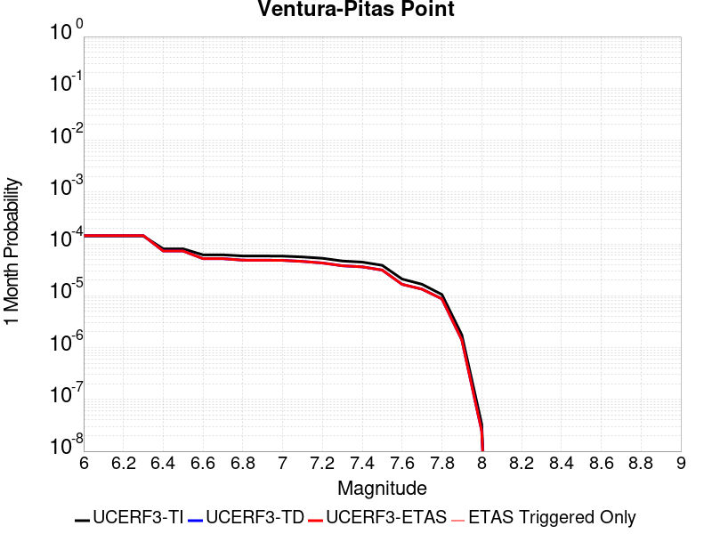 | 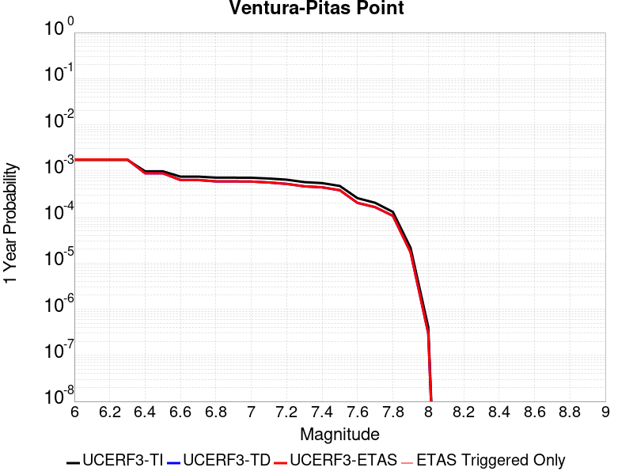 | 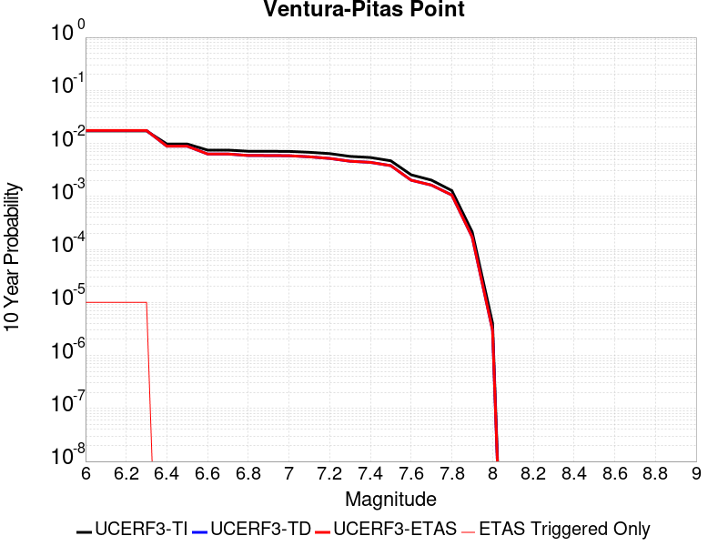 |

| Magnitude | 1 wk TI Prob | 1 wk TD Prob | 1 wk ETAS Prob | 1 wk ETAS/TD Gain | 1 wk ETAS Triggered Only | 1 mo TI Prob | 1 mo TD Prob | 1 mo ETAS Prob | 1 mo ETAS/TD Gain | 1 mo ETAS Triggered Only | 1 yr TI Prob | 1 yr TD Prob | 1 yr ETAS Prob | 1 yr ETAS/TD Gain | 1 yr ETAS Triggered Only | 10 yr TI Prob | 10 yr TD Prob | 10 yr ETAS Prob | 10 yr ETAS/TD Gain | 10 yr ETAS Triggered Only |
|-----|-----|-----|-----|-----|-----|-----|-----|-----|-----|-----|-----|-----|-----|-----|-----|-----|-----|-----|-----|-----|
| 6.0 | 3.3179622E-5 | 3.3735807E-5 | 3.3735807E-5 | 1.0 | 0.0 | 1.4219063E-4 | 1.4457546E-4 | 1.4457546E-4 | 1.0 | 0.0 | 0.0017297962 | 0.001759042 | 0.001759042 | 1.0 | 0.0 | 0.017163932 | 0.01747672 | 0.017486546 | 1.0005622 | 1.0E-5 |
| 6.1 | 3.3179622E-5 | 3.3735807E-5 | 3.3735807E-5 | 1.0 | 0.0 | 1.4219063E-4 | 1.4457546E-4 | 1.4457546E-4 | 1.0 | 0.0 | 0.0017297962 | 0.001759042 | 0.001759042 | 1.0 | 0.0 | 0.017163932 | 0.01747672 | 0.017486546 | 1.0005622 | 1.0E-5 |
| 6.2 | 3.3179622E-5 | 3.3735807E-5 | 3.3735807E-5 | 1.0 | 0.0 | 1.4219063E-4 | 1.4457546E-4 | 1.4457546E-4 | 1.0 | 0.0 | 0.0017297962 | 0.001759042 | 0.001759042 | 1.0 | 0.0 | 0.017163932 | 0.01747672 | 0.017486546 | 1.0005622 | 1.0E-5 |
| 6.3 | 3.3179622E-5 | 3.3735807E-5 | 3.3735807E-5 | 1.0 | 0.0 | 1.4219063E-4 | 1.4457546E-4 | 1.4457546E-4 | 1.0 | 0.0 | 0.0017297962 | 0.001759042 | 0.001759042 | 1.0 | 0.0 | 0.017163932 | 0.01747672 | 0.017486546 | 1.0005622 | 1.0E-5 |
| 6.4 | 1.8754668E-5 | 1.701988E-5 | 1.701988E-5 | 1.0 | 0.0 | 8.037467E-5 | 7.2940435E-5 | 7.2940435E-5 | 1.0 | 0.0 | 9.781223E-4 | 8.87711E-4 | 8.87711E-4 | 1.0 | 0.0 | 0.009738282 | 0.008843987 | 0.008843987 | 1.0 | 0.0 |
| 6.5 | 1.8754668E-5 | 1.701988E-5 | 1.701988E-5 | 1.0 | 0.0 | 8.037467E-5 | 7.2940435E-5 | 7.2940435E-5 | 1.0 | 0.0 | 9.781223E-4 | 8.87711E-4 | 8.87711E-4 | 1.0 | 0.0 | 0.009738282 | 0.008843987 | 0.008843987 | 1.0 | 0.0 |
| 6.6 | 1.4361558E-5 | 1.2122469E-5 | 1.2122469E-5 | 1.0 | 0.0 | 6.154808E-5 | 5.195242E-5 | 5.195242E-5 | 1.0 | 0.0 | 7.490902E-4 | 6.323394E-4 | 6.323394E-4 | 1.0 | 0.0 | 0.0074657016 | 0.0063056583 | 0.0063056583 | 1.0 | 0.0 |
| 6.7 | 1.4361558E-5 | 1.2122469E-5 | 1.2122469E-5 | 1.0 | 0.0 | 6.154808E-5 | 5.195242E-5 | 5.195242E-5 | 1.0 | 0.0 | 7.490902E-4 | 6.323394E-4 | 6.323394E-4 | 1.0 | 0.0 | 0.0074657016 | 0.0063056583 | 0.0063056583 | 1.0 | 0.0 |
| 6.8 | 1.3663846E-5 | 1.13446E-5 | 1.13446E-5 | 1.0 | 0.0 | 5.8558027E-5 | 4.8618822E-5 | 4.8618822E-5 | 1.0 | 0.0 | 7.127108E-4 | 5.917753E-4 | 5.917753E-4 | 1.0 | 0.0 | 0.007104293 | 0.0059022107 | 0.0059022107 | 1.0 | 0.0 |
| 6.9 | 1.3644157E-5 | 1.1322701E-5 | 1.1322701E-5 | 1.0 | 0.0 | 5.8473648E-5 | 4.852497E-5 | 4.852497E-5 | 1.0 | 0.0 | 7.116841E-4 | 5.9063325E-4 | 5.9063325E-4 | 1.0 | 0.0 | 0.007094092 | 0.005890851 | 0.005890851 | 1.0 | 0.0 |
| 7.0 | 1.3568845E-5 | 1.1242266E-5 | 1.1242266E-5 | 1.0 | 0.0 | 5.8150898E-5 | 4.818026E-5 | 4.818026E-5 | 1.0 | 0.0 | 7.077572E-4 | 5.8643875E-4 | 5.8643875E-4 | 1.0 | 0.0 | 0.007055073 | 0.005849127 | 0.005849127 | 1.0 | 0.0 |
| 7.1 | 1.306572E-5 | 1.0720711E-5 | 1.0720711E-5 | 1.0 | 0.0 | 5.599474E-5 | 4.5945108E-5 | 4.5945108E-5 | 1.0 | 0.0 | 6.815227E-4 | 5.5923994E-4 | 5.5923994E-4 | 1.0 | 0.0 | 0.0067943637 | 0.0055785314 | 0.0055785314 | 1.0 | 0.0 |
| 7.2 | 1.232604E-5 | 9.995298E-6 | 9.995298E-6 | 1.0 | 0.0 | 5.2824813E-5 | 4.28363E-5 | 4.28363E-5 | 1.0 | 0.0 | 6.429523E-4 | 5.2140886E-4 | 5.2140886E-4 | 1.0 | 0.0 | 0.0064109527 | 0.005202047 | 0.005202047 | 1.0 | 0.0 |
| 7.3 | 1.0917261E-5 | 8.843967E-6 | 8.843967E-6 | 1.0 | 0.0 | 4.678742E-5 | 3.7902173E-5 | 3.7902173E-5 | 1.0 | 0.0 | 5.69488E-4 | 4.6136283E-4 | 4.6136283E-4 | 1.0 | 0.0 | 0.0056803077 | 0.0046042157 | 0.0046042157 | 1.0 | 0.0 |
| 7.4 | 1.039959E-5 | 8.423679E-6 | 8.423679E-6 | 1.0 | 0.0 | 4.456891E-5 | 3.610099E-5 | 3.610099E-5 | 1.0 | 0.0 | 5.424914E-4 | 4.3944246E-4 | 4.3944246E-4 | 1.0 | 0.0 | 0.0054116896 | 0.004385897 | 0.004385897 | 1.0 | 0.0 |
| 7.5 | 9.015877E-6 | 7.297639E-6 | 7.297639E-6 | 1.0 | 0.0 | 3.86389E-5 | 3.1275227E-5 | 3.1275227E-5 | 1.0 | 0.0 | 4.7032707E-4 | 3.807108E-4 | 3.807108E-4 | 1.0 | 0.0 | 0.004693329 | 0.003800731 | 0.003800731 | 1.0 | 0.0 |
| 7.6 | 4.900162E-6 | 3.8741514E-6 | 3.8741514E-6 | 1.0 | 0.0 | 2.1000526E-5 | 1.66034E-5 | 1.66034E-5 | 1.0 | 0.0 | 2.556514E-4 | 2.0212779E-4 | 2.0212779E-4 | 1.0 | 0.0 | 0.0025535747 | 0.002019453 | 0.002019453 | 1.0 | 0.0 |
| 7.7 | 3.8850626E-6 | 3.126758E-6 | 3.126758E-6 | 1.0 | 0.0 | 1.6650163E-5 | 1.3400323E-5 | 1.3400323E-5 | 1.0 | 0.0 | 2.0269687E-4 | 1.631368E-4 | 1.631368E-4 | 1.0 | 0.0 | 0.002025121 | 0.0016301798 | 0.0016301798 | 1.0 | 0.0 |
| 7.8 | 2.4654719E-6 | 2.029892E-6 | 2.029892E-6 | 1.0 | 0.0 | 1.0566265E-5 | 8.699508E-6 | 8.699508E-6 | 1.0 | 0.0 | 1.2863669E-4 | 1.0591141E-4 | 1.0591141E-4 | 1.0 | 0.0 | 0.0012856225 | 0.001058614 | 0.001058614 | 1.0 | 0.0 |
| 7.9 | 4.095894E-7 | 3.2765047E-7 | 3.2765047E-7 | 1.0 | 0.0 | 1.7553821E-6 | 1.4042156E-6 | 1.4042156E-6 | 1.0 | 0.0 | 2.1371567E-5 | 1.7096194E-5 | 1.7096194E-5 | 1.0 | 0.0 | 2.1369511E-4 | 1.7094909E-4 | 1.7094909E-4 | 1.0 | 0.0 |
| 8.0 | 7.791402E-9 | 5.683553E-9 | 5.683553E-9 | 1.0 | 0.0 | 3.3391725E-8 | 2.4358085E-8 | 2.4358085E-8 | 1.0 | 0.0 | 4.0654416E-7 | 2.9655968E-7 | 2.9655968E-7 | 1.0 | 0.0 | 4.065434E-6 | 2.9655946E-6 | 2.9655946E-6 | 1.0 | 0.0 |

## Point Reyes 2011 CFM
*[(top)](#table-of-contents)*

| 1 Week | 1 Month | 1 Year | 10 Year |
|-----|-----|-----|-----|
| 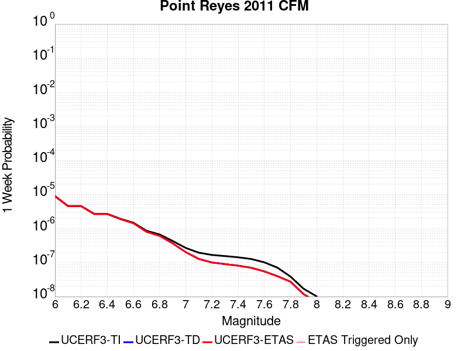 | 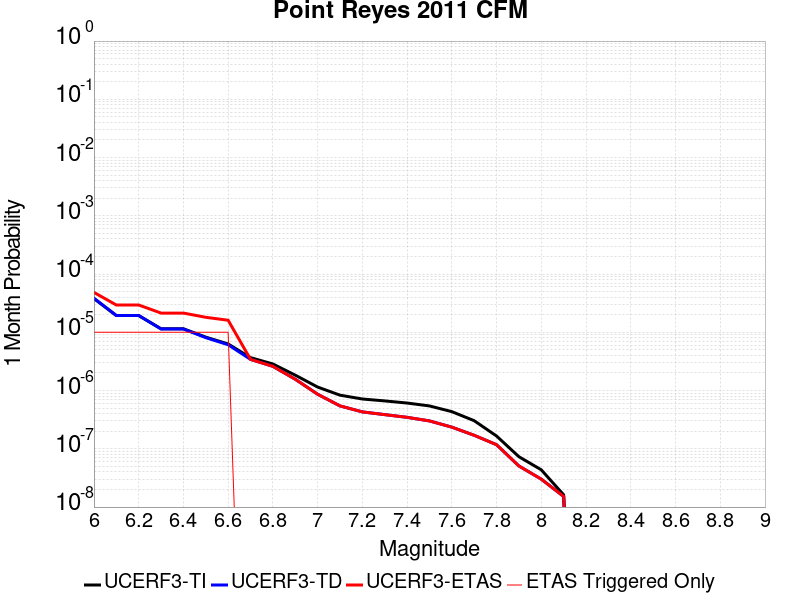 | 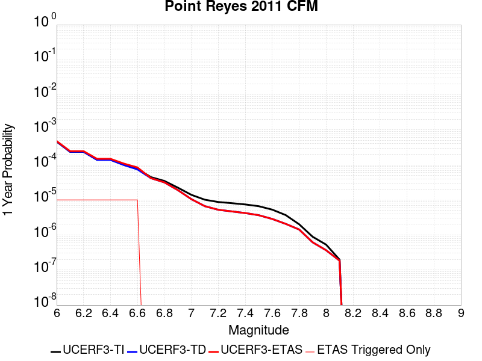 |  |

| Magnitude | 1 wk TI Prob | 1 wk TD Prob | 1 wk ETAS Prob | 1 wk ETAS/TD Gain | 1 wk ETAS Triggered Only | 1 mo TI Prob | 1 mo TD Prob | 1 mo ETAS Prob | 1 mo ETAS/TD Gain | 1 mo ETAS Triggered Only | 1 yr TI Prob | 1 yr TD Prob | 1 yr ETAS Prob | 1 yr ETAS/TD Gain | 1 yr ETAS Triggered Only | 10 yr TI Prob | 10 yr TD Prob | 10 yr ETAS Prob | 10 yr ETAS/TD Gain | 10 yr ETAS Triggered Only |
|-----|-----|-----|-----|-----|-----|-----|-----|-----|-----|-----|-----|-----|-----|-----|-----|-----|-----|-----|-----|-----|
| 6.0 | 8.8644965E-6 | 8.967201E-6 | 8.967201E-6 | 1.0 | 0.0 | 3.7990147E-5 | 3.843033E-5 | 4.842995E-5 | 1.2602011 | 1.0E-5 | 4.624319E-4 | 4.6779512E-4 | 4.7779045E-4 | 1.0213668 | 1.0E-5 | 0.0046147075 | 0.0046687326 | 0.004678686 | 1.0021319 | 1.0E-5 |
| 6.1 | 4.526405E-6 | 4.5392444E-6 | 4.5392444E-6 | 1.0 | 0.0 | 1.9398734E-5 | 1.9453766E-5 | 2.9453571E-5 | 1.5140293 | 1.0E-5 | 2.36154E-4 | 2.368249E-4 | 2.468225E-4 | 1.0422153 | 1.0E-5 | 0.002359032 | 0.0023658313 | 0.0023758076 | 1.0042168 | 1.0E-5 |
| 6.2 | 4.526405E-6 | 4.5392444E-6 | 4.5392444E-6 | 1.0 | 0.0 | 1.9398734E-5 | 1.9453766E-5 | 2.9453571E-5 | 1.5140293 | 1.0E-5 | 2.36154E-4 | 2.368249E-4 | 2.468225E-4 | 1.0422153 | 1.0E-5 | 0.002359032 | 0.0023658313 | 0.0023758076 | 1.0042168 | 1.0E-5 |
| 6.3 | 2.6842322E-6 | 2.6606972E-6 | 2.6606972E-6 | 1.0 | 0.0 | 1.1503801E-5 | 1.1402939E-5 | 2.1402824E-5 | 1.8769569 | 1.0E-5 | 1.4004979E-4 | 1.3882213E-4 | 1.4882075E-4 | 1.0720246 | 1.0E-5 | 0.0013996155 | 0.0013873759 | 0.0013973621 | 1.0071979 | 1.0E-5 |
| 6.4 | 2.6842322E-6 | 2.6606972E-6 | 2.6606972E-6 | 1.0 | 0.0 | 1.1503801E-5 | 1.1402939E-5 | 2.1402824E-5 | 1.8769569 | 1.0E-5 | 1.4004979E-4 | 1.3882213E-4 | 1.4882075E-4 | 1.0720246 | 1.0E-5 | 0.0013996155 | 0.0013873759 | 0.0013973621 | 1.0071979 | 1.0E-5 |
| 6.5 | 1.9281833E-6 | 1.8906454E-6 | 1.8906454E-6 | 1.0 | 0.0 | 8.263617E-6 | 8.102741E-6 | 1.810266E-5 | 2.2341402 | 1.0E-5 | 1.0060489E-4 | 9.8646495E-5 | 1.0864551E-4 | 1.1013621 | 1.0E-5 | 0.0010055936 | 9.860379E-4 | 9.960281E-4 | 1.0101316 | 1.0E-5 |
| 6.6 | 1.4726726E-6 | 1.4269757E-6 | 1.4269757E-6 | 1.0 | 0.0 | 6.3114385E-6 | 6.115596E-6 | 1.6115535E-5 | 2.6351535 | 1.0E-5 | 7.683905E-5 | 7.445489E-5 | 8.445414E-5 | 1.1342995 | 1.0E-5 | 7.6812494E-4 | 7.443066E-4 | 7.5429917E-4 | 1.0134254 | 1.0E-5 |
| 6.7 | 8.572307E-7 | 8.007378E-7 | 8.007378E-7 | 1.0 | 0.0 | 3.6738406E-6 | 3.4317288E-6 | 3.4317288E-6 | 1.0 | 0.0 | 4.472809E-5 | 4.1780513E-5 | 4.1780513E-5 | 1.0 | 0.0 | 4.471909E-4 | 4.177305E-4 | 4.177305E-4 | 1.0 | 0.0 |
| 6.8 | 6.6745434E-7 | 6.0774613E-7 | 6.0774613E-7 | 1.0 | 0.0 | 2.8605155E-6 | 2.6046237E-6 | 2.6046237E-6 | 1.0 | 0.0 | 3.482622E-5 | 3.1710842E-5 | 3.1710842E-5 | 1.0 | 0.0 | 3.4820763E-4 | 3.1706647E-4 | 3.1706647E-4 | 1.0 | 0.0 |
| 6.9 | 4.291521E-7 | 3.65375E-7 | 3.65375E-7 | 1.0 | 0.0 | 1.839222E-6 | 1.5658918E-6 | 1.5658918E-6 | 1.0 | 0.0 | 2.2392298E-5 | 1.906457E-5 | 1.906457E-5 | 1.0 | 0.0 | 2.2390042E-4 | 1.90632E-4 | 1.90632E-4 | 1.0 | 0.0 |
| 7.0 | 2.6812808E-7 | 2.0188939E-7 | 2.0188939E-7 | 1.0 | 0.0 | 1.1491198E-6 | 8.6523994E-7 | 8.6523994E-7 | 1.0 | 0.0 | 1.3990444E-5 | 1.0534246E-5 | 1.0534246E-5 | 1.0 | 0.0 | 1.3989564E-4 | 1.05339815E-4 | 1.05339815E-4 | 1.0 | 0.0 |
| 7.1 | 1.9451231E-7 | 1.2727004E-7 | 1.2727004E-7 | 1.0 | 0.0 | 8.336239E-7 | 5.454429E-7 | 5.454429E-7 | 1.0 | 0.0 | 1.0149324E-5 | 6.640747E-6 | 6.640747E-6 | 1.0 | 0.0 | 1.014886E-4 | 6.640777E-5 | 6.640777E-5 | 1.0 | 0.0 |
| 7.2 | 1.6715143E-7 | 1.0044323E-7 | 1.0044323E-7 | 1.0 | 0.0 | 7.1636305E-7 | 4.304709E-7 | 4.304709E-7 | 1.0 | 0.0 | 8.721685E-6 | 5.2409705E-6 | 5.2409705E-6 | 1.0 | 0.0 | 8.721343E-5 | 5.2410738E-5 | 5.2410738E-5 | 1.0 | 0.0 |
| 7.3 | 1.5503173E-7 | 9.014564E-8 | 9.014564E-8 | 1.0 | 0.0 | 6.644215E-7 | 3.8633837E-7 | 3.8633837E-7 | 1.0 | 0.0 | 8.089301E-6 | 4.703659E-6 | 4.703659E-6 | 1.0 | 0.0 | 8.089007E-5 | 4.703787E-5 | 4.703787E-5 | 1.0 | 0.0 |
| 7.4 | 1.4251614E-7 | 8.099046E-8 | 8.099046E-8 | 1.0 | 0.0 | 6.1078333E-7 | 3.4710192E-7 | 3.4710192E-7 | 1.0 | 0.0 | 7.4362615E-6 | 4.2259576E-6 | 4.2259576E-6 | 1.0 | 0.0 | 7.436013E-5 | 4.2261043E-5 | 4.2261043E-5 | 1.0 | 0.0 |
| 7.5 | 1.2710186E-7 | 7.031006E-8 | 7.031006E-8 | 1.0 | 0.0 | 5.447221E-7 | 3.0132875E-7 | 3.0132875E-7 | 1.0 | 0.0 | 6.6319717E-6 | 3.6686715E-6 | 3.6686715E-6 | 1.0 | 0.0 | 6.6317734E-5 | 3.668838E-5 | 3.668838E-5 | 1.0 | 0.0 |
| 7.6 | 1.0144708E-7 | 5.496477E-8 | 5.496477E-8 | 1.0 | 0.0 | 4.347731E-7 | 2.3556325E-7 | 2.3556325E-7 | 1.0 | 0.0 | 5.2933497E-6 | 2.8679788E-6 | 2.8679788E-6 | 1.0 | 0.0 | 5.293224E-5 | 2.8681687E-5 | 2.8681687E-5 | 1.0 | 0.0 |
| 7.7 | 7.090527E-8 | 3.9833534E-8 | 3.9833534E-8 | 1.0 | 0.0 | 3.038797E-7 | 1.7071513E-7 | 1.7071513E-7 | 1.0 | 0.0 | 3.699729E-6 | 2.0784546E-6 | 2.0784546E-6 | 1.0 | 0.0 | 3.6996673E-5 | 2.0786621E-5 | 2.0786621E-5 | 1.0 | 0.0 |
| 7.8 | 3.8712045E-8 | 2.7448936E-8 | 2.7448936E-8 | 1.0 | 0.0 | 1.6590876E-7 | 1.17638294E-7 | 1.17638294E-7 | 1.0 | 0.0 | 2.0199373E-6 | 1.4322452E-6 | 1.4322452E-6 | 1.0 | 0.0 | 2.0199188E-5 | 1.432463E-5 | 1.432463E-5 | 1.0 | 0.0 |
| 7.9 | 1.7068782E-8 | 1.18407035E-8 | 1.18407035E-8 | 1.0 | 0.0 | 7.315192E-8 | 5.0745875E-8 | 5.0745875E-8 | 1.0 | 0.0 | 8.906242E-7 | 6.1783084E-7 | 6.1783084E-7 | 1.0 | 0.0 | 8.906207E-6 | 6.1805604E-6 | 6.1805604E-6 | 1.0 | 0.0 |
| 8.0 | 1.0172592E-8 | 7.0342603E-9 | 7.0342603E-9 | 1.0 | 0.0 | 4.359682E-8 | 3.0146833E-8 | 3.0146833E-8 | 1.0 | 0.0 | 5.3079117E-7 | 3.6703761E-7 | 3.6703761E-7 | 1.0 | 0.0 | 5.307899E-6 | 3.6726397E-6 | 3.6726397E-6 | 1.0 | 0.0 |
| 8.1 | 3.7861243E-9 | 3.5482264E-9 | 3.5482264E-9 | 1.0 | 0.0 | 1.6226247E-8 | 1.5206684E-8 | 1.5206684E-8 | 1.0 | 0.0 | 1.9755454E-7 | 1.8514133E-7 | 1.8514133E-7 | 1.0 | 0.0 | 1.9755437E-6 | 1.8534101E-6 | 1.8534101E-6 | 1.0 | 0.0 |

## San Gabriel (Extension)
*[(top)](#table-of-contents)*

| 1 Week | 1 Month | 1 Year | 10 Year |
|-----|-----|-----|-----|
|  | 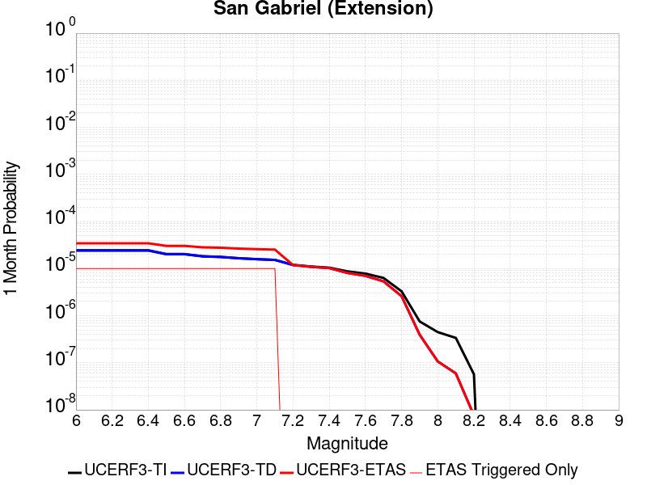 | 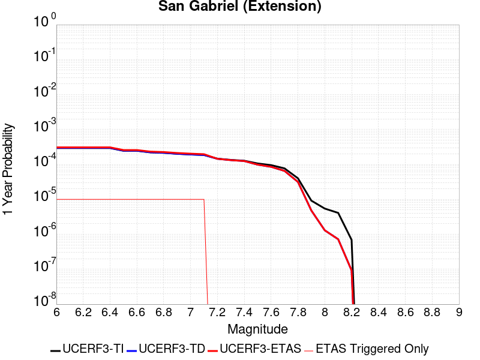 | 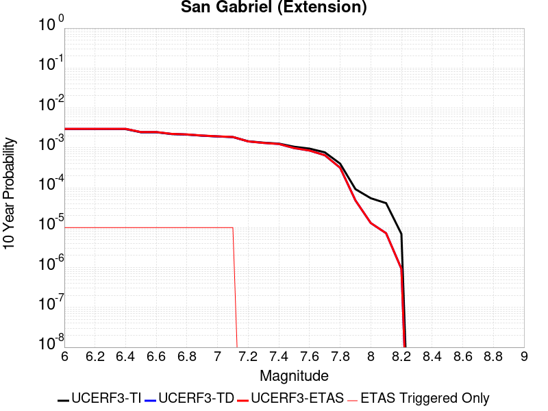 |

| Magnitude | 1 wk TI Prob | 1 wk TD Prob | 1 wk ETAS Prob | 1 wk ETAS/TD Gain | 1 wk ETAS Triggered Only | 1 mo TI Prob | 1 mo TD Prob | 1 mo ETAS Prob | 1 mo ETAS/TD Gain | 1 mo ETAS Triggered Only | 1 yr TI Prob | 1 yr TD Prob | 1 yr ETAS Prob | 1 yr ETAS/TD Gain | 1 yr ETAS Triggered Only | 10 yr TI Prob | 10 yr TD Prob | 10 yr ETAS Prob | 10 yr ETAS/TD Gain | 10 yr ETAS Triggered Only |
|-----|-----|-----|-----|-----|-----|-----|-----|-----|-----|-----|-----|-----|-----|-----|-----|-----|-----|-----|-----|-----|
| 6.0 | 5.6486106E-6 | 5.7171446E-6 | 1.5717087E-5 | 2.749115 | 1.0E-5 | 2.4208108E-5 | 2.4501825E-5 | 3.450158E-5 | 1.4081229 | 1.0E-5 | 2.9469383E-4 | 2.9827014E-4 | 3.0826716E-4 | 1.0335166 | 1.0E-5 | 0.0029430336 | 0.0029788287 | 0.0029887988 | 1.003347 | 1.0E-5 |
| 6.1 | 5.6486106E-6 | 5.7171446E-6 | 1.5717087E-5 | 2.749115 | 1.0E-5 | 2.4208108E-5 | 2.4501825E-5 | 3.450158E-5 | 1.4081229 | 1.0E-5 | 2.9469383E-4 | 2.9827014E-4 | 3.0826716E-4 | 1.0335166 | 1.0E-5 | 0.0029430336 | 0.0029788287 | 0.0029887988 | 1.003347 | 1.0E-5 |
| 6.2 | 5.6486106E-6 | 5.7171446E-6 | 1.5717087E-5 | 2.749115 | 1.0E-5 | 2.4208108E-5 | 2.4501825E-5 | 3.450158E-5 | 1.4081229 | 1.0E-5 | 2.9469383E-4 | 2.9827014E-4 | 3.0826716E-4 | 1.0335166 | 1.0E-5 | 0.0029430336 | 0.0029788287 | 0.0029887988 | 1.003347 | 1.0E-5 |
| 6.3 | 5.6486106E-6 | 5.7171446E-6 | 1.5717087E-5 | 2.749115 | 1.0E-5 | 2.4208108E-5 | 2.4501825E-5 | 3.450158E-5 | 1.4081229 | 1.0E-5 | 2.9469383E-4 | 2.9827014E-4 | 3.0826716E-4 | 1.0335166 | 1.0E-5 | 0.0029430336 | 0.0029788287 | 0.0029887988 | 1.003347 | 1.0E-5 |
| 6.4 | 5.6486106E-6 | 5.7171446E-6 | 1.5717087E-5 | 2.749115 | 1.0E-5 | 2.4208108E-5 | 2.4501825E-5 | 3.450158E-5 | 1.4081229 | 1.0E-5 | 2.9469383E-4 | 2.9827014E-4 | 3.0826716E-4 | 1.0335166 | 1.0E-5 | 0.0029430336 | 0.0029788287 | 0.0029887988 | 1.003347 | 1.0E-5 |
| 6.5 | 4.7134554E-6 | 4.754565E-6 | 1.4754517E-5 | 3.103232 | 1.0E-5 | 2.0200367E-5 | 2.0376552E-5 | 3.0376348E-5 | 1.4907502 | 1.0E-5 | 2.459117E-4 | 2.4805713E-4 | 2.5805464E-4 | 1.0403033 | 1.0E-5 | 0.0024563975 | 0.0024778906 | 0.002487866 | 1.0040257 | 1.0E-5 |
| 6.6 | 4.7134554E-6 | 4.754565E-6 | 1.4754517E-5 | 3.103232 | 1.0E-5 | 2.0200367E-5 | 2.0376552E-5 | 3.0376348E-5 | 1.4907502 | 1.0E-5 | 2.459117E-4 | 2.4805713E-4 | 2.5805464E-4 | 1.0403033 | 1.0E-5 | 0.0024563975 | 0.0024778906 | 0.002487866 | 1.0040257 | 1.0E-5 |
| 6.7 | 4.2468837E-6 | 4.2743804E-6 | 1.4274337E-5 | 3.3395104 | 1.0E-5 | 1.8200803E-5 | 1.8318648E-5 | 2.8318465E-5 | 1.5458817 | 1.0E-5 | 2.2157225E-4 | 2.2300745E-4 | 2.3300521E-4 | 1.0448315 | 1.0E-5 | 0.0022135144 | 0.0022279124 | 0.0022378901 | 1.0044785 | 1.0E-5 |
| 6.8 | 4.1180615E-6 | 4.1417693E-6 | 1.4141728E-5 | 3.414417 | 1.0E-5 | 1.7648716E-5 | 1.7750324E-5 | 2.7750146E-5 | 1.56336 | 1.0E-5 | 2.1485193E-4 | 2.1608948E-4 | 2.2608732E-4 | 1.0462672 | 1.0E-5 | 0.0021464431 | 0.0021588686 | 0.002168847 | 1.0046221 | 1.0E-5 |
| 6.9 | 3.863861E-6 | 3.8800836E-6 | 1.3880045E-5 | 3.577254 | 1.0E-5 | 1.65593E-5 | 1.6628828E-5 | 2.6628662E-5 | 1.6013553 | 1.0E-5 | 2.0159081E-4 | 2.0243786E-4 | 2.1243583E-4 | 1.0493879 | 1.0E-5 | 0.0020140803 | 0.0020226059 | 0.0020325857 | 1.0049341 | 1.0E-5 |
| 7.0 | 3.6947372E-6 | 3.7059822E-6 | 1.3705945E-5 | 3.69833 | 1.0E-5 | 1.5834492E-5 | 1.5882688E-5 | 2.588253E-5 | 1.6296064 | 1.0E-5 | 1.9276788E-4 | 1.9335524E-4 | 2.0335331E-4 | 1.0517082 | 1.0E-5 | 0.0019260074 | 0.0019319403 | 0.001941921 | 1.0051662 | 1.0E-5 |
| 7.1 | 3.5686835E-6 | 3.5732016E-6 | 1.3573166E-5 | 3.7986007 | 1.0E-5 | 1.5294268E-5 | 1.5313635E-5 | 2.5313482E-5 | 1.6530029 | 1.0E-5 | 1.861918E-4 | 1.8642822E-4 | 1.9642636E-4 | 1.05363 | 1.0E-5 | 0.0018603588 | 0.0018627879 | 0.0018727693 | 1.0053583 | 1.0E-5 |
| 7.2 | 2.8023446E-6 | 2.7770893E-6 | 2.7770893E-6 | 1.0 | 0.0 | 1.2009994E-5 | 1.1901758E-5 | 1.1901758E-5 | 1.0 | 0.0 | 1.4621185E-4 | 1.4489438E-4 | 1.4489438E-4 | 1.0 | 0.0 | 0.001461157 | 0.0014480136 | 0.0014480136 | 1.0 | 0.0 |
| 7.3 | 2.5843012E-6 | 2.546262E-6 | 2.546262E-6 | 1.0 | 0.0 | 1.1075529E-5 | 1.0912507E-5 | 1.0912507E-5 | 1.0 | 0.0 | 1.3483623E-4 | 1.3285177E-4 | 1.3285177E-4 | 1.0 | 0.0 | 0.0013475444 | 0.001327737 | 0.001327737 | 1.0 | 0.0 |
| 7.4 | 2.4464468E-6 | 2.3969585E-6 | 2.3969585E-6 | 1.0 | 0.0 | 1.04847295E-5 | 1.027264E-5 | 1.027264E-5 | 1.0 | 0.0 | 1.276441E-4 | 1.250623E-4 | 1.250623E-4 | 1.0 | 0.0 | 0.0012757082 | 0.0012499326 | 0.0012499326 | 1.0 | 0.0 |
| 7.5 | 2.0420266E-6 | 1.8913017E-6 | 1.8913017E-6 | 1.0 | 0.0 | 8.751514E-6 | 8.105554E-6 | 8.105554E-6 | 1.0 | 0.0 | 1.0654447E-4 | 9.8680684E-5 | 9.8680684E-5 | 1.0 | 0.0 | 0.001064934 | 9.863758E-4 | 9.863758E-4 | 1.0 | 0.0 |
| 7.6 | 1.8326596E-6 | 1.640076E-6 | 1.640076E-6 | 1.0 | 0.0 | 7.854232E-6 | 7.0288784E-6 | 7.0288784E-6 | 1.0 | 0.0 | 9.562107E-5 | 8.557326E-5 | 8.557326E-5 | 1.0 | 0.0 | 9.5579936E-4 | 8.5540896E-4 | 8.5540896E-4 | 1.0 | 0.0 |
| 7.7 | 1.4786998E-6 | 1.2526061E-6 | 1.2526061E-6 | 1.0 | 0.0 | 6.3372695E-6 | 5.368301E-6 | 5.368301E-6 | 1.0 | 0.0 | 7.715353E-5 | 6.535712E-5 | 6.535712E-5 | 1.0 | 0.0 | 7.7126746E-4 | 6.533867E-4 | 6.533867E-4 | 1.0 | 0.0 |
| 7.8 | 7.6975533E-7 | 6.071264E-7 | 6.071264E-7 | 1.0 | 0.0 | 3.2989474E-6 | 2.601968E-6 | 2.601968E-6 | 1.0 | 0.0 | 4.0163945E-5 | 3.16785E-5 | 3.16785E-5 | 1.0 | 0.0 | 4.0156685E-4 | 3.1674592E-4 | 3.1674592E-4 | 1.0 | 0.0 |
| 7.9 | 1.7645915E-7 | 9.218553E-8 | 9.218553E-8 | 1.0 | 0.0 | 7.562533E-7 | 3.9508078E-7 | 3.9508078E-7 | 1.0 | 0.0 | 9.207345E-6 | 4.810098E-6 | 4.810098E-6 | 1.0 | 0.0 | 9.206964E-5 | 4.810463E-5 | 4.810463E-5 | 1.0 | 0.0 |
| 8.0 | 1.0463461E-7 | 2.4971815E-8 | 2.4971815E-8 | 1.0 | 0.0 | 4.4843398E-7 | 1.0702206E-7 | 1.0702206E-7 | 1.0 | 0.0 | 5.45967E-6 | 1.3029928E-6 | 1.3029928E-6 | 1.0 | 0.0 | 5.459536E-5 | 1.3034539E-5 | 1.3034539E-5 | 1.0 | 0.0 |
| 8.1 | 7.875717E-8 | 1.38816025E-8 | 1.38816025E-8 | 1.0 | 0.0 | 3.3753068E-7 | 5.949258E-8 | 5.949258E-8 | 1.0 | 0.0 | 4.109428E-6 | 7.243219E-7 | 7.243219E-7 | 1.0 | 0.0 | 4.109352E-5 | 7.247882E-6 | 7.247882E-6 | 1.0 | 0.0 |
| 8.2 | 1.33163E-8 | 1.7755355E-9 | 1.7755355E-9 | 1.0 | 0.0 | 5.7069855E-8 | 7.609438E-9 | 7.609438E-9 | 1.0 | 0.0 | 6.9482525E-7 | 9.26449E-8 | 9.26449E-8 | 1.0 | 0.0 | 6.9482307E-6 | 9.284174E-7 | 9.284174E-7 | 1.0 | 0.0 |

## Pittville 2011 CFM
*[(top)](#table-of-contents)*

| 1 Week | 1 Month | 1 Year | 10 Year |
|-----|-----|-----|-----|
|  |  |  |  |

| Magnitude | 1 wk TI Prob | 1 wk TD Prob | 1 wk ETAS Prob | 1 wk ETAS/TD Gain | 1 wk ETAS Triggered Only | 1 mo TI Prob | 1 mo TD Prob | 1 mo ETAS Prob | 1 mo ETAS/TD Gain | 1 mo ETAS Triggered Only | 1 yr TI Prob | 1 yr TD Prob | 1 yr ETAS Prob | 1 yr ETAS/TD Gain | 1 yr ETAS Triggered Only | 10 yr TI Prob | 10 yr TD Prob | 10 yr ETAS Prob | 10 yr ETAS/TD Gain | 10 yr ETAS Triggered Only |
|-----|-----|-----|-----|-----|-----|-----|-----|-----|-----|-----|-----|-----|-----|-----|-----|-----|-----|-----|-----|-----|
| 6.0 | 2.5031832E-5 | 2.705726E-5 | 2.705726E-5 | 1.0 | 0.0 | 1.0727487E-4 | 1.1595508E-4 | 1.1595508E-4 | 1.0 | 0.0 | 0.001305289 | 0.0014109362 | 0.0014109362 | 1.0 | 0.0 | 0.012976485 | 0.014029565 | 0.014039425 | 1.0007027 | 1.0E-5 |
| 6.1 | 1.2540113E-5 | 1.3513205E-5 | 1.3513205E-5 | 1.0 | 0.0 | 5.3742235E-5 | 5.7912577E-5 | 5.7912577E-5 | 1.0 | 0.0 | 6.541153E-4 | 7.0488005E-4 | 7.0488005E-4 | 1.0 | 0.0 | 0.0065219323 | 0.0070286766 | 0.007038606 | 1.0014127 | 1.0E-5 |
| 6.2 | 6.603218E-6 | 7.107261E-6 | 7.107261E-6 | 1.0 | 0.0 | 2.8299199E-5 | 3.045937E-5 | 3.045937E-5 | 1.0 | 0.0 | 3.4448825E-4 | 3.7078623E-4 | 3.7078623E-4 | 1.0 | 0.0 | 0.0034395473 | 0.0037023167 | 0.0037023167 | 1.0 | 0.0 |
| 6.3 | 6.603218E-6 | 7.107261E-6 | 7.107261E-6 | 1.0 | 0.0 | 2.8299199E-5 | 3.045937E-5 | 3.045937E-5 | 1.0 | 0.0 | 3.4448825E-4 | 3.7078623E-4 | 3.7078623E-4 | 1.0 | 0.0 | 0.0034395473 | 0.0037023167 | 0.0037023167 | 1.0 | 0.0 |
| 6.4 | 3.9389015E-6 | 4.239218E-6 | 4.239218E-6 | 1.0 | 0.0 | 1.6880897E-5 | 1.8167968E-5 | 1.8167968E-5 | 1.0 | 0.0 | 2.0550552E-4 | 2.2117565E-4 | 2.2117565E-4 | 1.0 | 0.0 | 0.0020531558 | 0.0022098604 | 0.0022098604 | 1.0 | 0.0 |
| 6.5 | 2.4533072E-6 | 2.6412954E-6 | 2.6412954E-6 | 1.0 | 0.0 | 1.0514132E-5 | 1.1319799E-5 | 1.1319799E-5 | 1.0 | 0.0 | 1.2800204E-4 | 1.3781177E-4 | 1.3781177E-4 | 1.0 | 0.0 | 0.0012792832 | 0.0013774533 | 0.0013774533 | 1.0 | 0.0 |
| 6.6 | 1.3482367E-6 | 1.453008E-6 | 1.453008E-6 | 1.0 | 0.0 | 5.778144E-6 | 6.227169E-6 | 6.227169E-6 | 1.0 | 0.0 | 7.0346636E-5 | 7.581428E-5 | 7.581428E-5 | 1.0 | 0.0 | 7.032437E-4 | 7.5799524E-4 | 7.5799524E-4 | 1.0 | 0.0 |

## San Clemente
*[(top)](#table-of-contents)*

| 1 Week | 1 Month | 1 Year | 10 Year |
|-----|-----|-----|-----|
| 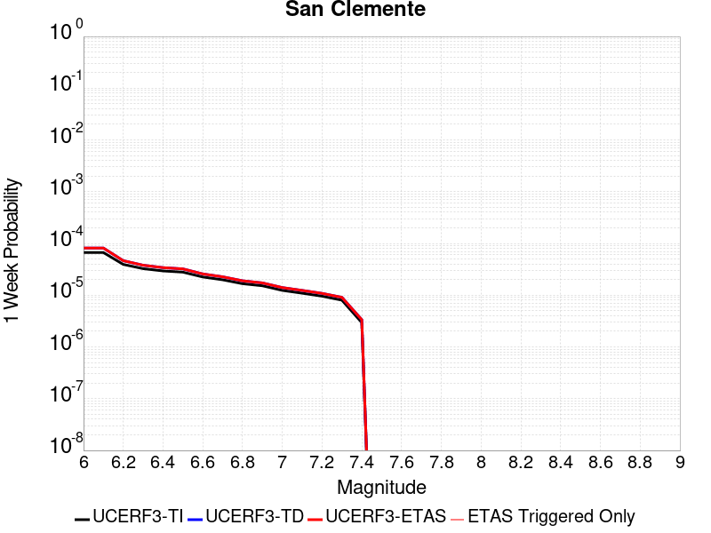 |  | 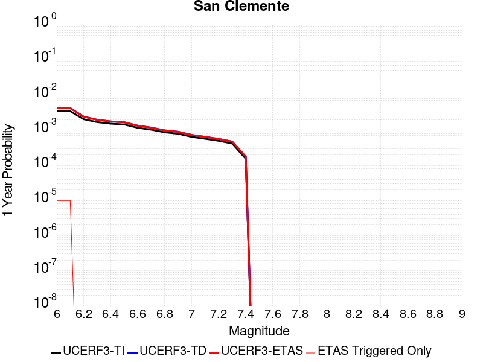 | 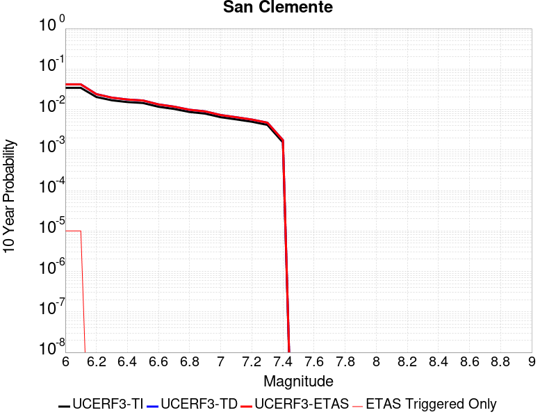 |

| Magnitude | 1 wk TI Prob | 1 wk TD Prob | 1 wk ETAS Prob | 1 wk ETAS/TD Gain | 1 wk ETAS Triggered Only | 1 mo TI Prob | 1 mo TD Prob | 1 mo ETAS Prob | 1 mo ETAS/TD Gain | 1 mo ETAS Triggered Only | 1 yr TI Prob | 1 yr TD Prob | 1 yr ETAS Prob | 1 yr ETAS/TD Gain | 1 yr ETAS Triggered Only | 10 yr TI Prob | 10 yr TD Prob | 10 yr ETAS Prob | 10 yr ETAS/TD Gain | 10 yr ETAS Triggered Only |
|-----|-----|-----|-----|-----|-----|-----|-----|-----|-----|-----|-----|-----|-----|-----|-----|-----|-----|-----|-----|-----|
| 6.0 | 6.681379E-5 | 8.163669E-5 | 8.163669E-5 | 1.0 | 0.0 | 2.8631336E-4 | 3.4982787E-4 | 3.4982787E-4 | 1.0 | 0.0 | 0.003480294 | 0.004251416 | 0.004261373 | 1.0023421 | 1.0E-5 | 0.03426291 | 0.041756913 | 0.0417665 | 1.0002295 | 1.0E-5 |
| 6.1 | 6.681379E-5 | 8.163669E-5 | 8.163669E-5 | 1.0 | 0.0 | 2.8631336E-4 | 3.4982787E-4 | 3.4982787E-4 | 1.0 | 0.0 | 0.003480294 | 0.004251416 | 0.004261373 | 1.0023421 | 1.0E-5 | 0.03426291 | 0.041756913 | 0.0417665 | 1.0002295 | 1.0E-5 |
| 6.2 | 3.9400576E-5 | 4.6453104E-5 | 4.6453104E-5 | 1.0 | 0.0 | 1.6884868E-4 | 1.9906988E-4 | 1.9906988E-4 | 1.0 | 0.0 | 0.0020537945 | 0.0024210429 | 0.0024210429 | 1.0 | 0.0 | 0.020349167 | 0.023953425 | 0.023953425 | 1.0 | 0.0 |
| 6.3 | 3.2590255E-5 | 3.792992E-5 | 3.792992E-5 | 1.0 | 0.0 | 1.3966505E-4 | 1.6254683E-4 | 1.6254683E-4 | 1.0 | 0.0 | 0.0016990956 | 0.0019772416 | 0.0019772416 | 1.0 | 0.0 | 0.01686163 | 0.019600289 | 0.019600289 | 1.0 | 0.0 |
| 6.4 | 2.9454652E-5 | 3.4098495E-5 | 3.4098495E-5 | 1.0 | 0.0 | 1.2622811E-4 | 1.4612835E-4 | 1.4612835E-4 | 1.0 | 0.0 | 0.0015357438 | 0.0017776854 | 0.0017776854 | 1.0 | 0.0 | 0.015251739 | 0.017637825 | 0.017637825 | 1.0 | 0.0 |
| 6.5 | 2.790836E-5 | 3.2248132E-5 | 3.2248132E-5 | 1.0 | 0.0 | 1.1960178E-4 | 1.3819907E-4 | 1.3819907E-4 | 1.0 | 0.0 | 0.001455179 | 0.0016812999 | 0.0016812999 | 1.0 | 0.0 | 0.014456868 | 0.016688818 | 0.016688818 | 1.0 | 0.0 |
| 6.6 | 2.2492153E-5 | 2.5763205E-5 | 2.5763205E-5 | 1.0 | 0.0 | 9.639138E-5 | 1.1040914E-4 | 1.1040914E-4 | 1.0 | 0.0 | 0.0011729331 | 0.0013434167 | 0.0013434167 | 1.0 | 0.0 | 0.011667615 | 0.013354672 | 0.013354672 | 1.0 | 0.0 |
| 6.7 | 1.9862755E-5 | 2.2666847E-5 | 2.2666847E-5 | 1.0 | 0.0 | 8.512331E-5 | 9.714008E-5 | 9.714008E-5 | 1.0 | 0.0 | 0.0010358836 | 0.0011820501 | 0.0011820501 | 1.0 | 0.0 | 0.010310682 | 0.01175892 | 0.01175892 | 1.0 | 0.0 |
| 6.8 | 1.6697575E-5 | 1.8978053E-5 | 1.8978053E-5 | 1.0 | 0.0 | 7.155907E-5 | 8.133203E-5 | 8.133203E-5 | 1.0 | 0.0 | 8.7088346E-4 | 9.89777E-4 | 9.89777E-4 | 1.0 | 0.0 | 0.008674784 | 0.009854714 | 0.009854714 | 1.0 | 0.0 |
| 6.9 | 1.5218415E-5 | 1.726971E-5 | 1.726971E-5 | 1.0 | 0.0 | 6.522015E-5 | 7.401099E-5 | 7.401099E-5 | 1.0 | 0.0 | 7.93766E-4 | 9.0072013E-4 | 9.0072013E-4 | 1.0 | 0.0 | 0.007909367 | 0.00897164 | 0.00897164 | 1.0 | 0.0 |
| 7.0 | 1.2392958E-5 | 1.4033262E-5 | 1.4033262E-5 | 1.0 | 0.0 | 5.3111595E-5 | 6.0141207E-5 | 6.0141207E-5 | 1.0 | 0.0 | 6.4644177E-4 | 7.319808E-4 | 7.319808E-4 | 1.0 | 0.0 | 0.0064456454 | 0.0072964844 | 0.0072964844 | 1.0 | 0.0 |
| 7.1 | 1.0934128E-5 | 1.2375354E-5 | 1.2375354E-5 | 1.0 | 0.0 | 4.6859706E-5 | 5.3036194E-5 | 5.3036194E-5 | 1.0 | 0.0 | 5.7036756E-4 | 6.455317E-4 | 6.455317E-4 | 1.0 | 0.0 | 0.0056890585 | 0.006437312 | 0.006437312 | 1.0 | 0.0 |
| 7.2 | 9.5798805E-6 | 1.0845125E-5 | 1.0845125E-5 | 1.0 | 0.0 | 4.1055984E-5 | 4.647832E-5 | 4.647832E-5 | 1.0 | 0.0 | 4.9974193E-4 | 5.657338E-4 | 5.657338E-4 | 1.0 | 0.0 | 0.0049861963 | 0.00564366 | 0.00564366 | 1.0 | 0.0 |
| 7.3 | 8.0167365E-6 | 9.084078E-6 | 9.084078E-6 | 1.0 | 0.0 | 3.4356988E-5 | 3.8931223E-5 | 3.8931223E-5 | 1.0 | 0.0 | 4.1821605E-4 | 4.738916E-4 | 4.738916E-4 | 1.0 | 0.0 | 0.0041742986 | 0.004729513 | 0.004729513 | 1.0 | 0.0 |
| 7.4 | 2.9581017E-6 | 3.36244E-6 | 3.36244E-6 | 1.0 | 0.0 | 1.2677518E-5 | 1.4410407E-5 | 1.4410407E-5 | 1.0 | 0.0 | 1.5433785E-4 | 1.7543763E-4 | 1.7543763E-4 | 1.0 | 0.0 | 0.001542307 | 0.0017534863 | 0.0017534863 | 1.0 | 0.0 |

## Rinconada 2011 CFM
*[(top)](#table-of-contents)*

| 1 Week | 1 Month | 1 Year | 10 Year |
|-----|-----|-----|-----|
|  | 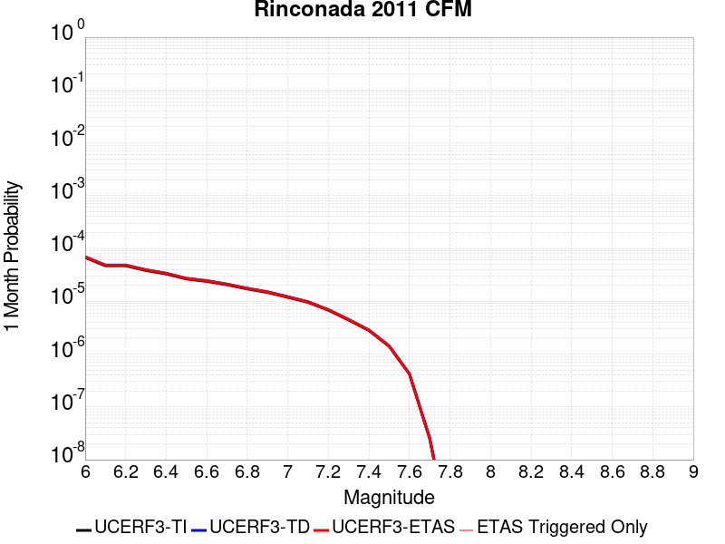 | 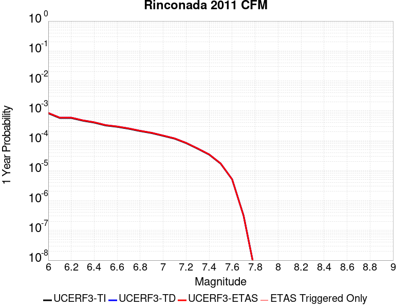 |  |

| Magnitude | 1 wk TI Prob | 1 wk TD Prob | 1 wk ETAS Prob | 1 wk ETAS/TD Gain | 1 wk ETAS Triggered Only | 1 mo TI Prob | 1 mo TD Prob | 1 mo ETAS Prob | 1 mo ETAS/TD Gain | 1 mo ETAS Triggered Only | 1 yr TI Prob | 1 yr TD Prob | 1 yr ETAS Prob | 1 yr ETAS/TD Gain | 1 yr ETAS Triggered Only | 10 yr TI Prob | 10 yr TD Prob | 10 yr ETAS Prob | 10 yr ETAS/TD Gain | 10 yr ETAS Triggered Only |
|-----|-----|-----|-----|-----|-----|-----|-----|-----|-----|-----|-----|-----|-----|-----|-----|-----|-----|-----|-----|-----|
| 6.0 | 1.5752368E-5 | 1.6274787E-5 | 1.6274787E-5 | 1.0 | 0.0 | 6.75084E-5 | 6.974724E-5 | 6.974724E-5 | 1.0 | 0.0 | 8.2160486E-4 | 8.48845E-4 | 8.48845E-4 | 1.0 | 0.0 | 0.008185739 | 0.008456407 | 0.008466323 | 1.0011725 | 1.0E-5 |
| 6.1 | 1.0966133E-5 | 1.1323078E-5 | 1.1323078E-5 | 1.0 | 0.0 | 4.6996865E-5 | 4.8526577E-5 | 4.8526577E-5 | 1.0 | 0.0 | 5.720366E-4 | 5.9065165E-4 | 5.9065165E-4 | 1.0 | 0.0 | 0.0057056635 | 0.0058909142 | 0.0058909142 | 1.0 | 0.0 |
| 6.2 | 1.0966133E-5 | 1.1323078E-5 | 1.1323078E-5 | 1.0 | 0.0 | 4.6996865E-5 | 4.8526577E-5 | 4.8526577E-5 | 1.0 | 0.0 | 5.720366E-4 | 5.9065165E-4 | 5.9065165E-4 | 1.0 | 0.0 | 0.0057056635 | 0.0058909142 | 0.0058909142 | 1.0 | 0.0 |
| 6.3 | 8.926149E-6 | 9.212811E-6 | 9.212811E-6 | 1.0 | 0.0 | 3.8254362E-5 | 3.9482882E-5 | 3.9482882E-5 | 1.0 | 0.0 | 4.6564735E-4 | 4.8059836E-4 | 4.8059836E-4 | 1.0 | 0.0 | 0.0046467283 | 0.004795635 | 0.004795635 | 1.0 | 0.0 |
| 6.4 | 7.676955E-6 | 7.920225E-6 | 7.920225E-6 | 1.0 | 0.0 | 3.290082E-5 | 3.394338E-5 | 3.394338E-5 | 1.0 | 0.0 | 4.0049385E-4 | 4.1318245E-4 | 4.1318245E-4 | 1.0 | 0.0 | 0.0039977287 | 0.004124169 | 0.004124169 | 1.0 | 0.0 |
| 6.5 | 6.1671026E-6 | 6.3589814E-6 | 6.3589814E-6 | 1.0 | 0.0 | 2.6430173E-5 | 2.7252492E-5 | 2.7252492E-5 | 1.0 | 0.0 | 3.2173982E-4 | 3.3174866E-4 | 3.3174866E-4 | 1.0 | 0.0 | 0.003212744 | 0.0033125463 | 0.0033125463 | 1.0 | 0.0 |
| 6.6 | 5.553456E-6 | 5.7248362E-6 | 5.7248362E-6 | 1.0 | 0.0 | 2.3800309E-5 | 2.4534782E-5 | 2.4534782E-5 | 1.0 | 0.0 | 2.897302E-4 | 2.986701E-4 | 2.986701E-4 | 1.0 | 0.0 | 0.0028935277 | 0.0029826954 | 0.0029826954 | 1.0 | 0.0 |
| 6.7 | 4.787857E-6 | 4.93333E-6 | 4.93333E-6 | 1.0 | 0.0 | 2.0519226E-5 | 2.114267E-5 | 2.114267E-5 | 1.0 | 0.0 | 2.4979294E-4 | 2.5738165E-4 | 2.5738165E-4 | 1.0 | 0.0 | 0.0024951235 | 0.0025708412 | 0.0025708412 | 1.0 | 0.0 |
| 6.8 | 3.9955166E-6 | 4.1134927E-6 | 4.1134927E-6 | 1.0 | 0.0 | 1.7123532E-5 | 1.7629134E-5 | 1.7629134E-5 | 1.0 | 0.0 | 2.0845905E-4 | 2.146136E-4 | 2.146136E-4 | 1.0 | 0.0 | 0.002082636 | 0.002144067 | 0.002144067 | 1.0 | 0.0 |
| 6.9 | 3.4250072E-6 | 3.5224598E-6 | 3.5224598E-6 | 1.0 | 0.0 | 1.46785205E-5 | 1.509617E-5 | 1.509617E-5 | 1.0 | 0.0 | 1.7869633E-4 | 1.8378037E-4 | 1.8378037E-4 | 1.0 | 0.0 | 0.001785527 | 0.0018362864 | 0.0018362864 | 1.0 | 0.0 |
| 7.0 | 2.7712713E-6 | 2.8467105E-6 | 2.8467105E-6 | 1.0 | 0.0 | 1.1876823E-5 | 1.2200131E-5 | 1.2200131E-5 | 1.0 | 0.0 | 1.4459073E-4 | 1.4852648E-4 | 1.4852648E-4 | 1.0 | 0.0 | 0.0014449668 | 0.0014842737 | 0.0014842737 | 1.0 | 0.0 |
| 7.1 | 2.227358E-6 | 2.2857066E-6 | 2.2857066E-6 | 1.0 | 0.0 | 9.545785E-6 | 9.795849E-6 | 9.795849E-6 | 1.0 | 0.0 | 1.16213734E-4 | 1.19257944E-4 | 1.19257944E-4 | 1.0 | 0.0 | 0.0011615298 | 0.0011919405 | 0.0011919405 | 1.0 | 0.0 |
| 7.2 | 1.581796E-6 | 1.6209067E-6 | 1.6209067E-6 | 1.0 | 0.0 | 6.779108E-6 | 6.9467246E-6 | 6.9467246E-6 | 1.0 | 0.0 | 8.253252E-5 | 8.457309E-5 | 8.457309E-5 | 1.0 | 0.0 | 8.250187E-4 | 8.4540964E-4 | 8.4540964E-4 | 1.0 | 0.0 |
| 7.3 | 1.0306567E-6 | 1.0546512E-6 | 1.0546512E-6 | 1.0 | 0.0 | 4.4170924E-6 | 4.519926E-6 | 4.519926E-6 | 1.0 | 0.0 | 5.3776774E-5 | 5.5028708E-5 | 5.5028708E-5 | 1.0 | 0.0 | 5.376376E-4 | 5.5015105E-4 | 5.5015105E-4 | 1.0 | 0.0 |
| 7.4 | 6.535541E-7 | 6.682764E-7 | 6.682764E-7 | 1.0 | 0.0 | 2.800943E-6 | 2.8640386E-6 | 2.8640386E-6 | 1.0 | 0.0 | 3.4100947E-5 | 3.4869114E-5 | 3.4869114E-5 | 1.0 | 0.0 | 3.4095717E-4 | 3.4863656E-4 | 3.4863656E-4 | 1.0 | 0.0 |
| 7.5 | 3.2656962E-7 | 3.33168E-7 | 3.33168E-7 | 1.0 | 0.0 | 1.3995833E-6 | 1.427862E-6 | 1.427862E-6 | 1.0 | 0.0 | 1.7039794E-5 | 1.7384082E-5 | 1.7384082E-5 | 1.0 | 0.0 | 1.7038487E-4 | 1.7382725E-4 | 1.7382725E-4 | 1.0 | 0.0 |
| 7.6 | 9.754343E-8 | 9.821022E-8 | 9.821022E-8 | 1.0 | 0.0 | 4.180432E-7 | 4.2090088E-7 | 4.2090088E-7 | 1.0 | 0.0 | 5.089664E-6 | 5.1244565E-6 | 5.1244565E-6 | 1.0 | 0.0 | 5.0895473E-5 | 5.124339E-5 | 5.124339E-5 | 1.0 | 0.0 |
| 7.7 | 6.0001453E-9 | 5.8490692E-9 | 5.8490692E-9 | 1.0 | 0.0 | 2.5714908E-8 | 2.506744E-8 | 2.506744E-8 | 1.0 | 0.0 | 3.1307894E-7 | 3.0519604E-7 | 3.0519604E-7 | 1.0 | 0.0 | 3.1307852E-6 | 3.0519564E-6 | 3.0519564E-6 | 1.0 | 0.0 |
| 7.8 | 7.400003E-11 | 7.4654505E-11 | 7.4654505E-11 | 1.0 | 0.0 | 3.171432E-10 | 3.1994807E-10 | 3.1994807E-10 | 1.0 | 0.0 | 3.861218E-9 | 3.8953676E-9 | 3.8953676E-9 | 1.0 | 0.0 | 3.861218E-8 | 3.8953676E-8 | 3.8953676E-8 | 1.0 | 0.0 |

## Morales (East)
*[(top)](#table-of-contents)*

| 1 Week | 1 Month | 1 Year | 10 Year |
|-----|-----|-----|-----|
| 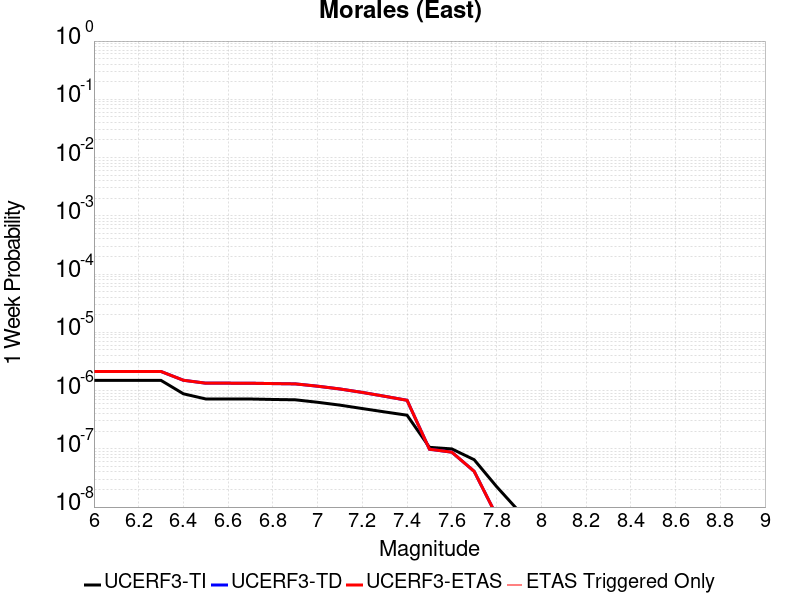 | 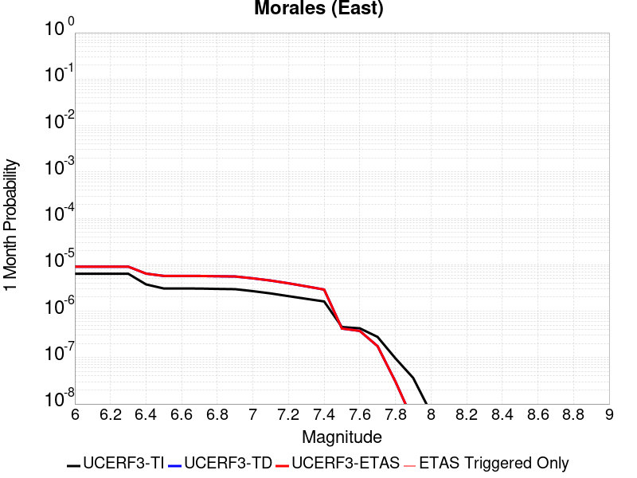 | 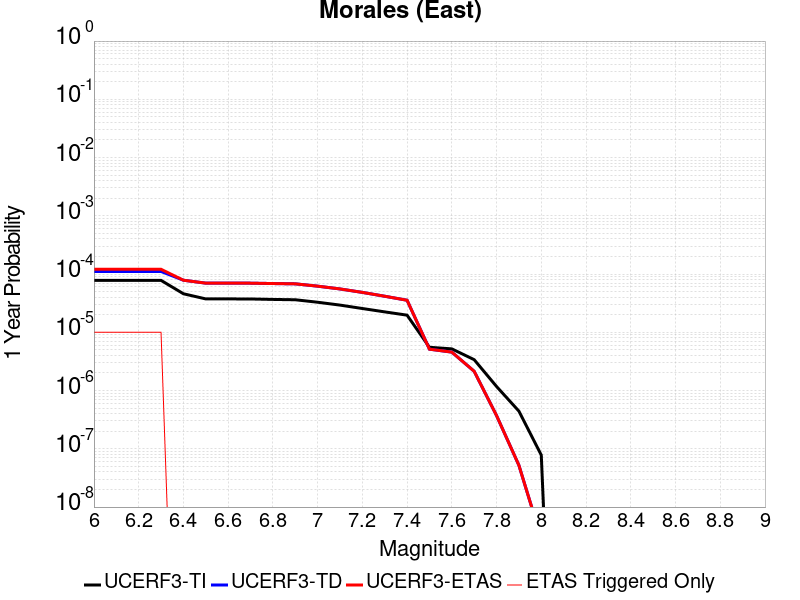 | 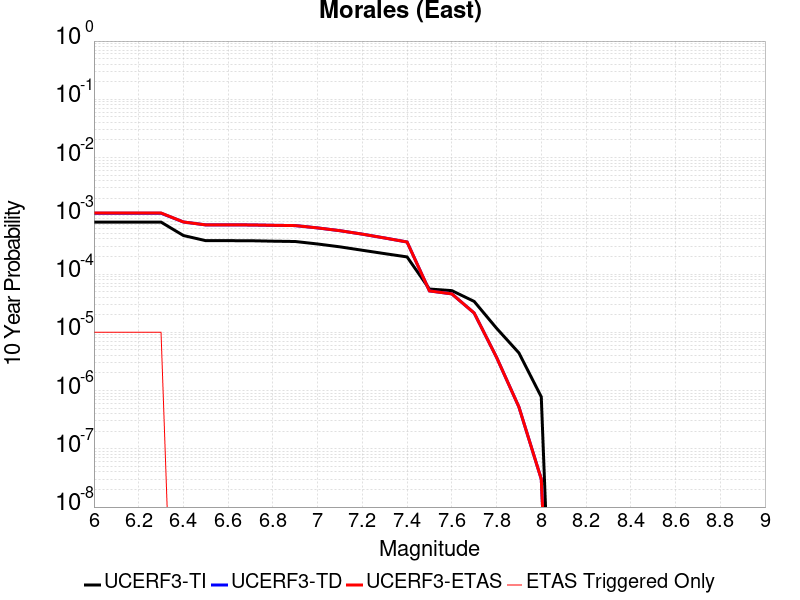 |

| Magnitude | 1 wk TI Prob | 1 wk TD Prob | 1 wk ETAS Prob | 1 wk ETAS/TD Gain | 1 wk ETAS Triggered Only | 1 mo TI Prob | 1 mo TD Prob | 1 mo ETAS Prob | 1 mo ETAS/TD Gain | 1 mo ETAS Triggered Only | 1 yr TI Prob | 1 yr TD Prob | 1 yr ETAS Prob | 1 yr ETAS/TD Gain | 1 yr ETAS Triggered Only | 10 yr TI Prob | 10 yr TD Prob | 10 yr ETAS Prob | 10 yr ETAS/TD Gain | 10 yr ETAS Triggered Only |
|-----|-----|-----|-----|-----|-----|-----|-----|-----|-----|-----|-----|-----|-----|-----|-----|-----|-----|-----|-----|-----|
| 6.0 | 1.4942771E-6 | 2.1238216E-6 | 2.1238216E-6 | 1.0 | 0.0 | 6.404029E-6 | 9.102064E-6 | 9.102064E-6 | 1.0 | 0.0 | 7.7966266E-5 | 1.1081258E-4 | 1.2081147E-4 | 1.0902325 | 1.0E-5 | 7.793892E-4 | 0.001107633 | 0.0011176219 | 1.0090183 | 1.0E-5 |
| 6.1 | 1.4942771E-6 | 2.1238216E-6 | 2.1238216E-6 | 1.0 | 0.0 | 6.404029E-6 | 9.102064E-6 | 9.102064E-6 | 1.0 | 0.0 | 7.7966266E-5 | 1.1081258E-4 | 1.2081147E-4 | 1.0902325 | 1.0E-5 | 7.793892E-4 | 0.001107633 | 0.0011176219 | 1.0090183 | 1.0E-5 |
| 6.2 | 1.4942771E-6 | 2.1238216E-6 | 2.1238216E-6 | 1.0 | 0.0 | 6.404029E-6 | 9.102064E-6 | 9.102064E-6 | 1.0 | 0.0 | 7.7966266E-5 | 1.1081258E-4 | 1.2081147E-4 | 1.0902325 | 1.0E-5 | 7.793892E-4 | 0.001107633 | 0.0011176219 | 1.0090183 | 1.0E-5 |
| 6.3 | 1.4942771E-6 | 2.1238216E-6 | 2.1238216E-6 | 1.0 | 0.0 | 6.404029E-6 | 9.102064E-6 | 9.102064E-6 | 1.0 | 0.0 | 7.7966266E-5 | 1.1081258E-4 | 1.2081147E-4 | 1.0902325 | 1.0E-5 | 7.793892E-4 | 0.001107633 | 0.0011176219 | 1.0090183 | 1.0E-5 |
| 6.4 | 8.798845E-7 | 1.5026149E-6 | 1.5026149E-6 | 1.0 | 0.0 | 3.7709283E-6 | 6.4397623E-6 | 6.4397623E-6 | 1.0 | 0.0 | 4.5910085E-5 | 7.84014E-5 | 7.84014E-5 | 1.0 | 0.0 | 4.59006E-4 | 7.8375085E-4 | 7.8375085E-4 | 1.0 | 0.0 |
| 6.5 | 7.1751725E-7 | 1.3387644E-6 | 1.3387644E-6 | 1.0 | 0.0 | 3.0750705E-6 | 5.7375496E-6 | 5.7375496E-6 | 1.0 | 0.0 | 3.7438338E-5 | 6.9852504E-5 | 6.9852504E-5 | 1.0 | 0.0 | 3.743203E-4 | 6.983156E-4 | 6.983156E-4 | 1.0 | 0.0 |
| 6.6 | 7.1751725E-7 | 1.3387644E-6 | 1.3387644E-6 | 1.0 | 0.0 | 3.0750705E-6 | 5.7375496E-6 | 5.7375496E-6 | 1.0 | 0.0 | 3.7438338E-5 | 6.9852504E-5 | 6.9852504E-5 | 1.0 | 0.0 | 3.743203E-4 | 6.983156E-4 | 6.983156E-4 | 1.0 | 0.0 |
| 6.7 | 7.159057E-7 | 1.3362303E-6 | 1.3362303E-6 | 1.0 | 0.0 | 3.0681638E-6 | 5.726689E-6 | 5.726689E-6 | 1.0 | 0.0 | 3.7354253E-5 | 6.9720285E-5 | 6.9720285E-5 | 1.0 | 0.0 | 3.7347974E-4 | 6.969943E-4 | 6.969943E-4 | 1.0 | 0.0 |
| 6.8 | 7.032203E-7 | 1.3177836E-6 | 1.3177836E-6 | 1.0 | 0.0 | 3.0137978E-6 | 5.647632E-6 | 5.647632E-6 | 1.0 | 0.0 | 3.669237E-5 | 6.875783E-5 | 6.875783E-5 | 1.0 | 0.0 | 3.6686313E-4 | 6.8737566E-4 | 6.8737566E-4 | 1.0 | 0.0 |
| 6.9 | 6.941549E-7 | 1.3028435E-6 | 1.3028435E-6 | 1.0 | 0.0 | 2.974946E-6 | 5.5836035E-6 | 5.5836035E-6 | 1.0 | 0.0 | 3.6219368E-5 | 6.797833E-5 | 6.797833E-5 | 1.0 | 0.0 | 3.6213463E-4 | 6.7958544E-4 | 6.7958544E-4 | 1.0 | 0.0 |
| 7.0 | 6.2932247E-7 | 1.1880632E-6 | 1.1880632E-6 | 1.0 | 0.0 | 2.6970936E-6 | 5.0916897E-6 | 5.0916897E-6 | 1.0 | 0.0 | 3.283662E-5 | 6.1989624E-5 | 6.1989624E-5 | 1.0 | 0.0 | 3.283177E-4 | 6.197322E-4 | 6.197322E-4 | 1.0 | 0.0 |
| 7.1 | 5.6200963E-7 | 1.064345E-6 | 1.064345E-6 | 1.0 | 0.0 | 2.4086105E-6 | 4.561471E-6 | 4.561471E-6 | 1.0 | 0.0 | 2.9324437E-5 | 5.5534543E-5 | 5.5534543E-5 | 1.0 | 0.0 | 2.9320567E-4 | 5.552139E-4 | 5.552139E-4 | 1.0 | 0.0 |
| 7.2 | 4.91044E-7 | 9.288623E-7 | 9.288623E-7 | 1.0 | 0.0 | 2.1044725E-6 | 3.9808324E-6 | 3.9808324E-6 | 1.0 | 0.0 | 2.5621652E-5 | 4.8465598E-5 | 4.8465598E-5 | 1.0 | 0.0 | 2.56187E-4 | 4.8455657E-4 | 4.8455657E-4 | 1.0 | 0.0 |
| 7.3 | 4.2978448E-7 | 7.976601E-7 | 7.976601E-7 | 1.0 | 0.0 | 1.8419321E-6 | 3.418539E-6 | 3.418539E-6 | 1.0 | 0.0 | 2.2425293E-5 | 4.161995E-5 | 4.161995E-5 | 1.0 | 0.0 | 2.242303E-4 | 4.1612718E-4 | 4.1612718E-4 | 1.0 | 0.0 |
| 7.4 | 3.774317E-7 | 6.8091E-7 | 6.8091E-7 | 1.0 | 0.0 | 1.6175634E-6 | 2.9181824E-6 | 2.9181824E-6 | 1.0 | 0.0 | 1.9693656E-5 | 3.552832E-5 | 3.552832E-5 | 1.0 | 0.0 | 1.969191E-4 | 3.552317E-4 | 3.552317E-4 | 1.0 | 0.0 |
| 7.5 | 1.0603232E-7 | 9.845574E-8 | 9.845574E-8 | 1.0 | 0.0 | 4.5442414E-7 | 4.2195313E-7 | 4.2195313E-7 | 1.0 | 0.0 | 5.5326E-6 | 5.137267E-6 | 5.137267E-6 | 1.0 | 0.0 | 5.532462E-5 | 5.137406E-5 | 5.137406E-5 | 1.0 | 0.0 |
| 7.6 | 9.960384E-8 | 8.759612E-8 | 8.759612E-8 | 1.0 | 0.0 | 4.2687353E-7 | 3.754119E-7 | 3.754119E-7 | 1.0 | 0.0 | 5.197173E-6 | 4.57063E-6 | 4.57063E-6 | 1.0 | 0.0 | 5.1970514E-5 | 4.5707933E-5 | 4.5707933E-5 | 1.0 | 0.0 |
| 7.7 | 6.499468E-8 | 4.1063267E-8 | 4.1063267E-8 | 1.0 | 0.0 | 2.785486E-7 | 1.7598542E-7 | 1.7598542E-7 | 1.0 | 0.0 | 3.3913238E-6 | 2.1426206E-6 | 2.1426206E-6 | 1.0 | 0.0 | 3.3912722E-5 | 2.1428561E-5 | 2.1428561E-5 | 1.0 | 0.0 |
| 7.8 | 2.2517119E-8 | 7.136171E-9 | 7.136171E-9 | 1.0 | 0.0 | 9.6501935E-8 | 3.0583593E-8 | 3.0583593E-8 | 1.0 | 0.0 | 1.1749105E-6 | 3.723552E-7 | 3.723552E-7 | 1.0 | 0.0 | 1.1749043E-5 | 3.7260882E-6 | 3.7260882E-6 | 1.0 | 0.0 |
| 7.9 | 8.493023E-9 | 9.981242E-10 | 9.981242E-10 | 1.0 | 0.0 | 3.639867E-8 | 4.2776787E-9 | 4.2776787E-9 | 1.0 | 0.0 | 4.4315374E-7 | 5.2080743E-8 | 5.2080743E-8 | 1.0 | 0.0 | 4.4315284E-6 | 5.2291637E-7 | 5.2291637E-7 | 1.0 | 0.0 |
| 8.0 | 1.4971842E-9 | 5.5577654E-11 | 5.5577654E-11 | 1.0 | 0.0 | 6.4165038E-9 | 2.3819113E-10 | 2.3819113E-10 | 1.0 | 0.0 | 7.812093E-8 | 2.8999798E-9 | 2.8999798E-9 | 1.0 | 0.0 | 7.81209E-7 | 3.025809E-8 | 3.025809E-8 | 1.0 | 0.0 |

## San Diego Trough north alt1
*[(top)](#table-of-contents)*

| 1 Week | 1 Month | 1 Year | 10 Year |
|-----|-----|-----|-----|
| 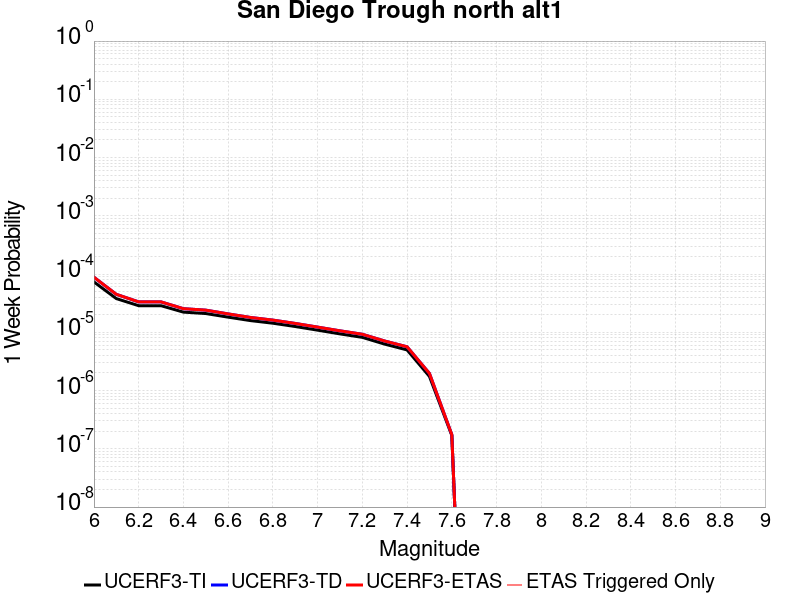 | 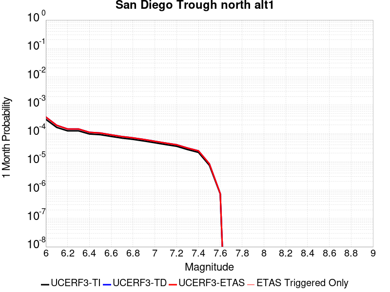 | 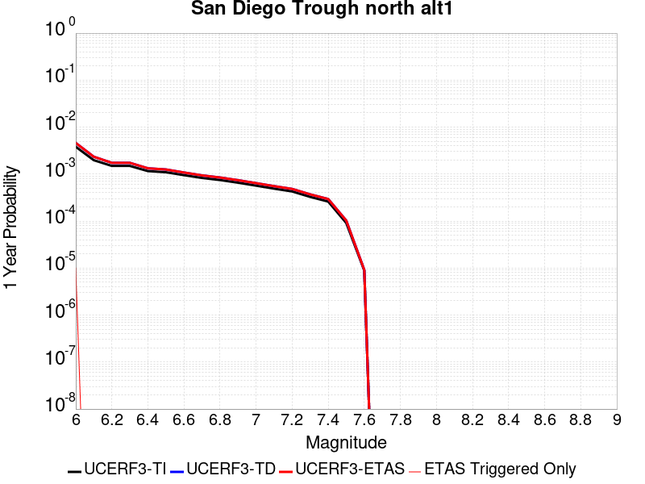 |  |

| Magnitude | 1 wk TI Prob | 1 wk TD Prob | 1 wk ETAS Prob | 1 wk ETAS/TD Gain | 1 wk ETAS Triggered Only | 1 mo TI Prob | 1 mo TD Prob | 1 mo ETAS Prob | 1 mo ETAS/TD Gain | 1 mo ETAS Triggered Only | 1 yr TI Prob | 1 yr TD Prob | 1 yr ETAS Prob | 1 yr ETAS/TD Gain | 1 yr ETAS Triggered Only | 10 yr TI Prob | 10 yr TD Prob | 10 yr ETAS Prob | 10 yr ETAS/TD Gain | 10 yr ETAS Triggered Only |
|-----|-----|-----|-----|-----|-----|-----|-----|-----|-----|-----|-----|-----|-----|-----|-----|-----|-----|-----|-----|-----|
| 6.0 | 7.329252E-5 | 8.821339E-5 | 8.821339E-5 | 1.0 | 0.0 | 3.14073E-4 | 3.7800625E-4 | 3.7800625E-4 | 1.0 | 0.0 | 0.0038171355 | 0.0045931544 | 0.0046031084 | 1.0021671 | 1.0E-5 | 0.03752231 | 0.045046188 | 0.045055736 | 1.000212 | 1.0E-5 |
| 6.1 | 3.7940346E-5 | 4.488612E-5 | 4.488612E-5 | 1.0 | 0.0 | 1.6259136E-4 | 1.9235547E-4 | 1.9235547E-4 | 1.0 | 0.0 | 0.0019777524 | 0.002339501 | 0.002339501 | 1.0 | 0.0 | 0.019602431 | 0.023157248 | 0.023157248 | 1.0 | 0.0 |
| 6.2 | 2.8645263E-5 | 3.329751E-5 | 3.329751E-5 | 1.0 | 0.0 | 1.2275964E-4 | 1.4269596E-4 | 1.4269596E-4 | 1.0 | 0.0 | 0.0014935739 | 0.0017359565 | 0.0017359565 | 1.0 | 0.0 | 0.0148357535 | 0.01722662 | 0.01722662 | 1.0 | 0.0 |
| 6.3 | 2.8645263E-5 | 3.329751E-5 | 3.329751E-5 | 1.0 | 0.0 | 1.2275964E-4 | 1.4269596E-4 | 1.4269596E-4 | 1.0 | 0.0 | 0.0014935739 | 0.0017359565 | 0.0017359565 | 1.0 | 0.0 | 0.0148357535 | 0.01722662 | 0.01722662 | 1.0 | 0.0 |
| 6.4 | 2.2204576E-5 | 2.5448817E-5 | 2.5448817E-5 | 1.0 | 0.0 | 9.5159E-5 | 1.0906186E-4 | 1.0906186E-4 | 1.0 | 0.0 | 0.001157945 | 0.0013270293 | 0.0013270293 | 1.0 | 0.0 | 0.011519298 | 0.013192211 | 0.013192211 | 1.0 | 0.0 |
| 6.5 | 2.1004838E-5 | 2.4025157E-5 | 2.4025157E-5 | 1.0 | 0.0 | 9.0017624E-5 | 1.0296095E-4 | 1.0296095E-4 | 1.0 | 0.0 | 0.0010954136 | 0.001252838 | 0.001252838 | 1.0 | 0.0 | 0.010900296 | 0.012458827 | 0.012458827 | 1.0 | 0.0 |
| 6.6 | 1.820557E-5 | 2.0705167E-5 | 2.0705167E-5 | 1.0 | 0.0 | 7.802154E-5 | 8.873344E-5 | 8.873344E-5 | 1.0 | 0.0 | 9.4949827E-4 | 0.0010797997 | 0.0010797997 | 1.0 | 0.0 | 0.009454516 | 0.010746201 | 0.010746201 | 1.0 | 0.0 |
| 6.7 | 1.5884485E-5 | 1.7983964E-5 | 1.7983964E-5 | 1.0 | 0.0 | 6.807459E-5 | 7.707187E-5 | 7.707187E-5 | 1.0 | 0.0 | 8.284929E-4 | 9.379488E-4 | 9.379488E-4 | 1.0 | 0.0 | 0.008254109 | 0.009340268 | 0.009340268 | 1.0 | 0.0 |
| 6.8 | 1.4331171E-5 | 1.6201348E-5 | 1.6201348E-5 | 1.0 | 0.0 | 6.141786E-5 | 6.9432506E-5 | 6.9432506E-5 | 1.0 | 0.0 | 7.4750587E-4 | 8.4501493E-4 | 8.4501493E-4 | 1.0 | 0.0 | 0.0074499645 | 0.008418285 | 0.008418285 | 1.0 | 0.0 |
| 6.9 | 1.2574203E-5 | 1.4206081E-5 | 1.4206081E-5 | 1.0 | 0.0 | 5.3888325E-5 | 6.088179E-5 | 6.088179E-5 | 1.0 | 0.0 | 6.558929E-4 | 7.4098515E-4 | 7.4098515E-4 | 1.0 | 0.0 | 0.0065396037 | 0.0073853307 | 0.0073853307 | 1.0 | 0.0 |
| 7.0 | 1.0883844E-5 | 1.22894735E-5 | 1.22894735E-5 | 1.0 | 0.0 | 4.664421E-5 | 5.2668114E-5 | 5.2668114E-5 | 1.0 | 0.0 | 5.677453E-4 | 6.410466E-4 | 6.410466E-4 | 1.0 | 0.0 | 0.00566297 | 0.0063921027 | 0.0063921027 | 1.0 | 0.0 |
| 7.1 | 9.393088E-6 | 1.0607203E-5 | 1.0607203E-5 | 1.0 | 0.0 | 4.025547E-5 | 4.5458655E-5 | 4.5458655E-5 | 1.0 | 0.0 | 4.900001E-4 | 5.5331935E-4 | 5.5331935E-4 | 1.0 | 0.0 | 0.0048892107 | 0.005519513 | 0.005519513 | 1.0 | 0.0 |
| 7.2 | 8.190791E-6 | 9.258787E-6 | 9.258787E-6 | 1.0 | 0.0 | 3.510292E-5 | 3.9679915E-5 | 3.9679915E-5 | 1.0 | 0.0 | 4.2729423E-4 | 4.8299658E-4 | 4.8299658E-4 | 1.0 | 0.0 | 0.0042647356 | 0.004819548 | 0.004819548 | 1.0 | 0.0 |
| 7.3 | 6.268162E-6 | 7.08984E-6 | 7.08984E-6 | 1.0 | 0.0 | 2.6863276E-5 | 3.0384675E-5 | 3.0384675E-5 | 1.0 | 0.0 | 3.2701128E-4 | 3.6987104E-4 | 3.6987104E-4 | 1.0 | 0.0 | 0.003265305 | 0.0036926004 | 0.0036926004 | 1.0 | 0.0 |
| 7.4 | 4.985186E-6 | 5.6427807E-6 | 5.6427807E-6 | 1.0 | 0.0 | 2.1364907E-5 | 2.4183124E-5 | 2.4183124E-5 | 1.0 | 0.0 | 2.600867E-4 | 2.9439016E-4 | 2.9439016E-4 | 1.0 | 0.0 | 0.002597825 | 0.002940043 | 0.002940043 | 1.0 | 0.0 |
| 7.5 | 1.7489613E-6 | 1.9697113E-6 | 1.9697113E-6 | 1.0 | 0.0 | 7.495527E-6 | 8.441594E-6 | 8.441594E-6 | 1.0 | 0.0 | 9.125422E-5 | 1.0277178E-4 | 1.0277178E-4 | 1.0 | 0.0 | 9.1216754E-4 | 0.0010272645 | 0.0010272645 | 1.0 | 0.0 |
| 7.6 | 1.6988751E-7 | 1.7533898E-7 | 1.7533898E-7 | 1.0 | 0.0 | 7.2808916E-7 | 7.5145255E-7 | 7.5145255E-7 | 1.0 | 0.0 | 8.864449E-6 | 9.148898E-6 | 9.148898E-6 | 1.0 | 0.0 | 8.8640954E-5 | 9.148542E-5 | 9.148542E-5 | 1.0 | 0.0 |

## Dry Mountain
*[(top)](#table-of-contents)*

| 1 Week | 1 Month | 1 Year | 10 Year |
|-----|-----|-----|-----|
|  |  |  |  |

| Magnitude | 1 wk TI Prob | 1 wk TD Prob | 1 wk ETAS Prob | 1 wk ETAS/TD Gain | 1 wk ETAS Triggered Only | 1 mo TI Prob | 1 mo TD Prob | 1 mo ETAS Prob | 1 mo ETAS/TD Gain | 1 mo ETAS Triggered Only | 1 yr TI Prob | 1 yr TD Prob | 1 yr ETAS Prob | 1 yr ETAS/TD Gain | 1 yr ETAS Triggered Only | 10 yr TI Prob | 10 yr TD Prob | 10 yr ETAS Prob | 10 yr ETAS/TD Gain | 10 yr ETAS Triggered Only |
|-----|-----|-----|-----|-----|-----|-----|-----|-----|-----|-----|-----|-----|-----|-----|-----|-----|-----|-----|-----|-----|
| 6.0 | 6.222801E-6 | 6.439411E-6 | 6.439411E-6 | 1.0 | 0.0 | 2.6668875E-5 | 2.7597274E-5 | 2.7597274E-5 | 1.0 | 0.0 | 3.2464517E-4 | 3.359609E-4 | 3.359609E-4 | 1.0 | 0.0 | 0.0032417132 | 0.0033560924 | 0.0033660587 | 1.0029696 | 1.0E-5 |
| 6.1 | 6.222801E-6 | 6.439411E-6 | 6.439411E-6 | 1.0 | 0.0 | 2.6668875E-5 | 2.7597274E-5 | 2.7597274E-5 | 1.0 | 0.0 | 3.2464517E-4 | 3.359609E-4 | 3.359609E-4 | 1.0 | 0.0 | 0.0032417132 | 0.0033560924 | 0.0033660587 | 1.0029696 | 1.0E-5 |
| 6.2 | 6.222801E-6 | 6.439411E-6 | 6.439411E-6 | 1.0 | 0.0 | 2.6668875E-5 | 2.7597274E-5 | 2.7597274E-5 | 1.0 | 0.0 | 3.2464517E-4 | 3.359609E-4 | 3.359609E-4 | 1.0 | 0.0 | 0.0032417132 | 0.0033560924 | 0.0033660587 | 1.0029696 | 1.0E-5 |
| 6.3 | 6.222801E-6 | 6.439411E-6 | 6.439411E-6 | 1.0 | 0.0 | 2.6668875E-5 | 2.7597274E-5 | 2.7597274E-5 | 1.0 | 0.0 | 3.2464517E-4 | 3.359609E-4 | 3.359609E-4 | 1.0 | 0.0 | 0.0032417132 | 0.0033560924 | 0.0033660587 | 1.0029696 | 1.0E-5 |
| 6.4 | 6.222801E-6 | 6.439411E-6 | 6.439411E-6 | 1.0 | 0.0 | 2.6668875E-5 | 2.7597274E-5 | 2.7597274E-5 | 1.0 | 0.0 | 3.2464517E-4 | 3.359609E-4 | 3.359609E-4 | 1.0 | 0.0 | 0.0032417132 | 0.0033560924 | 0.0033660587 | 1.0029696 | 1.0E-5 |
| 6.5 | 2.8528623E-6 | 2.952182E-6 | 2.952182E-6 | 1.0 | 0.0 | 1.22264955E-5 | 1.2652196E-5 | 1.2652196E-5 | 1.0 | 0.0 | 1.4884741E-4 | 1.5403831E-4 | 1.5403831E-4 | 1.0 | 0.0 | 0.0014874774 | 0.0015401688 | 0.0015401688 | 1.0 | 0.0 |
| 6.6 | 2.8528623E-6 | 2.952182E-6 | 2.952182E-6 | 1.0 | 0.0 | 1.22264955E-5 | 1.2652196E-5 | 1.2652196E-5 | 1.0 | 0.0 | 1.4884741E-4 | 1.5403831E-4 | 1.5403831E-4 | 1.0 | 0.0 | 0.0014874774 | 0.0015401688 | 0.0015401688 | 1.0 | 0.0 |
| 6.7 | 2.541E-6 | 2.62937E-6 | 2.62937E-6 | 1.0 | 0.0 | 1.0889954E-5 | 1.12687285E-5 | 1.12687285E-5 | 1.0 | 0.0 | 1.3257713E-4 | 1.3719677E-4 | 1.3719677E-4 | 1.0 | 0.0 | 0.0013249806 | 0.0013719677 | 0.0013719677 | 1.0 | 0.0 |

