# Parent Section Magnitude-Probability Distributions

Only fault sections with at least one triggered aftershock are plotted. Sections are sorted by total supraseismogenic trigger rate (decreasing)

## Table Of Contents

* [Garlock (Central)](#garlock-central)
* [Little Lake](#little-lake)
* [Airport Lake](#airport-lake)
* [Tank Canyon](#tank-canyon)
* [Owl Lake](#owl-lake)
* [Panamint Valley](#panamint-valley)
* [Garlock (East)](#garlock-east)
* [Hunter Mountain-Saline Valley](#hunter-mountain-saline-valley)
* [Garlock (West)](#garlock-west)
* [Blackwater](#blackwater)
* [Ash Hill](#ash-hill)
* [San Andreas (Mojave N)](#san-andreas-mojave-n)
* [Gravel Hills-Harper Lk](#gravel-hills-harper-lk)
* [San Andreas (Mojave S)](#san-andreas-mojave-s)
* [San Andreas (San Bernardino N)](#san-andreas-san-bernardino-n)
* [So Sierra Nevada](#so-sierra-nevada)
* [Goldstone Lake](#goldstone-lake)
* [McLean Lake](#mclean-lake)
* [Lenwood-Lockhart-Old Woman Springs](#lenwood-lockhart-old-woman-springs)
* [Death Valley (So)](#death-valley-so)
* [Coyote Canyon](#coyote-canyon)
* [San Andreas (San Bernardino S)](#san-andreas-san-bernardino-s)
* [Towne Pass](#towne-pass)
* [Nelson Lake](#nelson-lake)
* [San Jacinto (San Bernardino)](#san-jacinto-san-bernardino)
* [Garlic Springs](#garlic-springs)
* [Paradise](#paradise)
* [Death Valley (Black Mtns Frontal)](#death-valley-black-mtns-frontal)
* [San Andreas (Parkfield)](#san-andreas-parkfield)
* [Coyote Lake](#coyote-lake)
* [Helendale-So Lockhart](#helendale-so-lockhart)
* [Bicycle Lake](#bicycle-lake)
* [San Andreas (San Gorgonio Pass-Garnet HIll)](#san-andreas-san-gorgonio-pass-garnet-hill)
* [Death Valley (No)](#death-valley-no)
* [San Jacinto (San Jacinto Valley) rev](#san-jacinto-san-jacinto-valley-rev)
* [San Andreas (Big Bend)](#san-andreas-big-bend)
* [San Andreas (Coachella) rev](#san-andreas-coachella-rev)
* [Cady](#cady)
* [San Andreas (North Branch Mill Creek)](#san-andreas-north-branch-mill-creek)
* [San Jacinto (Lytle Creek connector)](#san-jacinto-lytle-creek-connector)
* [White Wolf (Extension)](#white-wolf-extension)
* [Sierra Nevada  (No Extension)](#sierra-nevada--no-extension)
* [San Jacinto (Stepovers Combined)](#san-jacinto-stepovers-combined)
* [Red Pass](#red-pass)
* [Mission Creek](#mission-creek)
* [Death Valley (Fish Lake Valley)](#death-valley-fish-lake-valley)
* [Scodie Lineament](#scodie-lineament)
* [Lake Isabella (Seismicity)](#lake-isabella-seismicity)
* [Calico-Hidalgo](#calico-hidalgo)
* [Kern Canyon (North Kern) 2011](#kern-canyon-north-kern-2011)
* [San Andreas (Carrizo) rev](#san-andreas-carrizo-rev)
* [Ludlow](#ludlow)
* [White Wolf](#white-wolf)
* [Baker](#baker)
* [Cleghorn Pass](#cleghorn-pass)
* [San Jacinto (Borrego)](#san-jacinto-borrego)
* [Owens Valley](#owens-valley)
* [San Jacinto (Coyote Creek)](#san-jacinto-coyote-creek)
* [San Andreas (Cholame) rev](#san-andreas-cholame-rev)
* [San Andreas (Creeping Section) 2011 CFM](#san-andreas-creeping-section-2011-cfm)
* [Tin Mountain](#tin-mountain)
* [San Jacinto (Anza) rev](#san-jacinto-anza-rev)
* [Elsinore (Glen Ivy) rev](#elsinore-glen-ivy-rev)
* [Deep Springs](#deep-springs)
* [Rose Canyon](#rose-canyon)
* [Cucamonga](#cucamonga)
* [Manix-Afton Hills](#manix-afton-hills)
* [San Diego Trough north alt1](#san-diego-trough-north-alt1)
* [Point Reyes 2011 CFM](#point-reyes-2011-cfm)
* [Ventura-Pitas Point](#ventura-pitas-point)
* [Santa Ynez (West)](#santa-ynez-west)
* [Camp Rock 2011](#camp-rock-2011)
* [San Luis Range 2011 CFM](#san-luis-range-2011-cfm)
* [San Gabriel (Extension)](#san-gabriel-extension)
* [Channel Islands Thrust](#channel-islands-thrust)
* [White Mountains](#white-mountains)
* [Morales (East)](#morales-east)
* [Dry Mountain](#dry-mountain)
* [Palos Verdes](#palos-verdes)
* [Reliz 2011 CFM](#reliz-2011-cfm)
* [Lost Hills](#lost-hills)
* [Cleghorn Lake](#cleghorn-lake)
* [San Clemente](#san-clemente)
* [Pinto Mtn](#pinto-mtn)
* [Pittville 2011 CFM](#pittville-2011-cfm)
* [Hayward (No) 2011 CFM](#hayward-no-2011-cfm)
* [Breckenridge 2011](#breckenridge-2011)
* [Hunting Creek - Berryessa 2011 CFM](#hunting-creek---berryessa-2011-cfm)
* [San Pedro Basin](#san-pedro-basin)
* [Rinconada 2011 CFM](#rinconada-2011-cfm)
* [Blue Cut](#blue-cut)
* [Hayward (So) 2011 CFM](#hayward-so-2011-cfm)

## Garlock (Central)
*[(top)](#table-of-contents)*

| 1 Week | 1 Month | 1 Year | 10 Year |
|-----|-----|-----|-----|
|  |  | 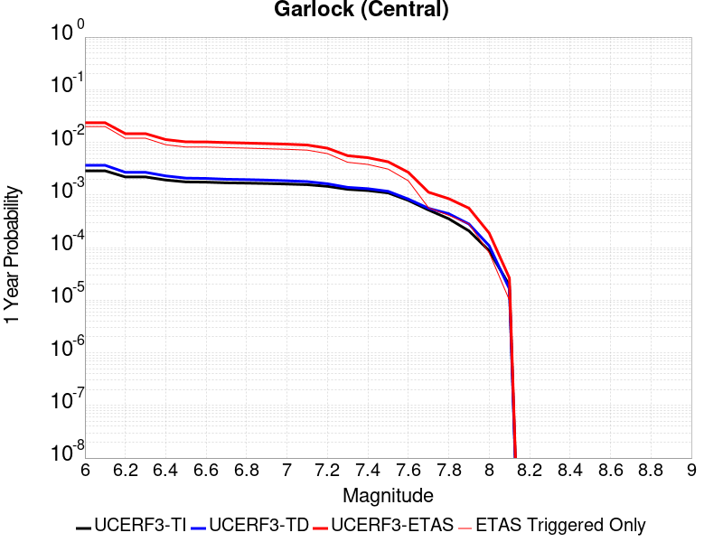 |  |

| Magnitude | 1 wk TI Prob | 1 wk TD Prob | 1 wk ETAS Prob | 1 wk ETAS/TD Gain | 1 wk ETAS Triggered Only | 1 mo TI Prob | 1 mo TD Prob | 1 mo ETAS Prob | 1 mo ETAS/TD Gain | 1 mo ETAS Triggered Only | 1 yr TI Prob | 1 yr TD Prob | 1 yr ETAS Prob | 1 yr ETAS/TD Gain | 1 yr ETAS Triggered Only | 10 yr TI Prob | 10 yr TD Prob | 10 yr ETAS Prob | 10 yr ETAS/TD Gain | 10 yr ETAS Triggered Only |
|-----|-----|-----|-----|-----|-----|-----|-----|-----|-----|-----|-----|-----|-----|-----|-----|-----|-----|-----|-----|-----|
| 6.0 | 5.5131142E-5 | 7.0252936E-5 | 0.0045199404 | 64.338104 | 0.00445 | 2.3625491E-4 | 3.0104961E-4 | 0.009988133 | 33.177696 | 0.00969 | 0.0028726095 | 0.0036591832 | 0.023546146 | 6.434809 | 0.01996 | 0.028357591 | 0.0361412 | 0.062040087 | 1.7166028 | 0.02687 |
| 6.1 | 5.5131142E-5 | 7.0252936E-5 | 0.0045199404 | 64.338104 | 0.00445 | 2.3625491E-4 | 3.0104961E-4 | 0.009988133 | 33.177696 | 0.00969 | 0.0028726095 | 0.0036591832 | 0.023546146 | 6.434809 | 0.01996 | 0.028357591 | 0.0361412 | 0.062040087 | 1.7166028 | 0.02687 |
| 6.2 | 4.216245E-5 | 5.166702E-5 | 0.0026915306 | 52.09379 | 0.00264 | 1.806837E-4 | 2.2141145E-4 | 0.005840167 | 26.376987 | 0.00562 | 0.0021976046 | 0.0026923835 | 0.014620182 | 5.4302006 | 0.01196 | 0.021759989 | 0.026704067 | 0.04247146 | 1.5904491 | 0.0162 |
| 6.3 | 4.216245E-5 | 5.166702E-5 | 0.0026915306 | 52.09379 | 0.00264 | 1.806837E-4 | 2.2141145E-4 | 0.005840167 | 26.376987 | 0.00562 | 0.0021976046 | 0.0026923835 | 0.014620182 | 5.4302006 | 0.01196 | 0.021759989 | 0.026704067 | 0.04247146 | 1.5904491 | 0.0162 |
| 6.4 | 3.6858168E-5 | 4.411544E-5 | 0.0019940294 | 45.200264 | 0.00195 | 1.5795401E-4 | 1.890526E-4 | 0.0043982565 | 23.264723 | 0.00421 | 0.0019213937 | 0.0022993109 | 0.011278617 | 4.905216 | 0.009 | 0.019048655 | 0.022868566 | 0.034818884 | 1.5225652 | 0.01223 |
| 6.5 | 3.39199E-5 | 4.0023602E-5 | 0.0017999532 | 44.972294 | 0.00176 | 1.453629E-4 | 1.7151856E-4 | 0.0039908634 | 23.26782 | 0.00382 | 0.0017683565 | 0.0020862604 | 0.010209278 | 4.893578 | 0.00814 | 0.017543508 | 0.020761253 | 0.031542674 | 1.5193048 | 0.01101 |
| 6.6 | 3.3571985E-5 | 3.9477756E-5 | 0.0017994082 | 45.58031 | 0.00176 | 1.4387199E-4 | 1.6917953E-4 | 0.0039885333 | 23.575745 | 0.00382 | 0.0017502342 | 0.0020578366 | 0.010181086 | 4.9474707 | 0.00814 | 0.017365133 | 0.020482505 | 0.031257197 | 1.5260437 | 0.011 |
| 6.7 | 3.2580007E-5 | 3.8094186E-5 | 0.0017380294 | 45.62453 | 0.0017 | 1.3962112E-4 | 1.632507E-4 | 0.0038626466 | 23.660828 | 0.0037 | 0.0016985617 | 0.001985787 | 0.00990004 | 4.9854493 | 0.00793 | 0.016856372 | 0.019771622 | 0.030269869 | 1.5309755 | 0.01071 |
| 6.8 | 3.2185937E-5 | 3.7521368E-5 | 0.0017374576 | 46.305817 | 0.0017 | 1.3793244E-4 | 1.6079607E-4 | 0.0038302059 | 23.82027 | 0.00367 | 0.0016780337 | 0.0019559558 | 0.009690797 | 4.9545074 | 0.00775 | 0.016654192 | 0.01947876 | 0.029725209 | 1.5260317 | 0.01045 |
| 6.9 | 3.165394E-5 | 3.672589E-5 | 0.0017066646 | 46.470337 | 0.00167 | 1.3565269E-4 | 1.573873E-4 | 0.0037368238 | 23.742855 | 0.00358 | 0.0016503202 | 0.0019145276 | 0.009460053 | 4.9411945 | 0.00756 | 0.01638118 | 0.01907232 | 0.0290974 | 1.5256351 | 0.01022 |
| 7.0 | 3.0903822E-5 | 3.5631027E-5 | 0.0016555733 | 46.464375 | 0.00162 | 1.3243823E-4 | 1.5269557E-4 | 0.0036221656 | 23.721485 | 0.00347 | 0.0016112428 | 0.0018575046 | 0.0092138145 | 4.9603186 | 0.00737 | 0.015996104 | 0.018513773 | 0.028309004 | 1.5290781 | 0.00998 |
| 7.1 | 3.0069863E-5 | 3.439724E-5 | 0.0016243425 | 47.223053 | 0.00159 | 1.2886449E-4 | 1.4740853E-4 | 0.0035269102 | 23.926094 | 0.00338 | 0.0015677959 | 0.0017932425 | 0.008890493 | 4.957775 | 0.00711 | 0.01556781 | 0.017881477 | 0.0273491 | 1.5294653 | 0.00964 |
| 7.2 | 2.7957109E-5 | 3.1286352E-5 | 0.0013812442 | 44.148453 | 0.00135 | 1.1981068E-4 | 1.3407759E-4 | 0.0030636848 | 22.850088 | 0.00293 | 0.0014577188 | 0.0016311919 | 0.0077312253 | 4.7396173 | 0.00611 | 0.014481937 | 0.01628507 | 0.024449904 | 1.5013694 | 0.0083 |
| 7.3 | 2.4519275E-5 | 2.6719234E-5 | 8.96696E-4 | 33.559944 | 8.7E-4 | 1.0507837E-4 | 1.1450605E-4 | 0.002114277 | 18.464325 | 0.002 | 0.0012785783 | 0.0013932344 | 0.0055674105 | 3.9960332 | 0.00418 | 0.012712469 | 0.013929329 | 0.019559791 | 1.4042164 | 0.00571 |
| 7.4 | 2.3225532E-5 | 2.52037E-5 | 8.251835E-4 | 32.74057 | 8.0E-4 | 9.95342E-5 | 1.08011474E-4 | 0.0019078171 | 17.663095 | 0.0018 | 0.0012111551 | 0.0013142608 | 0.005109267 | 3.8875592 | 0.0038 | 0.012045753 | 0.013146927 | 0.018268693 | 1.389579 | 0.00519 |
| 7.5 | 2.097765E-5 | 2.2487684E-5 | 6.924726E-4 | 30.793417 | 6.7E-4 | 8.9901114E-5 | 9.637229E-5 | 0.0015462325 | 16.044369 | 0.00145 | 0.0010939965 | 0.0011727129 | 0.0042690774 | 3.6403432 | 0.0031 | 0.010886264 | 0.011741684 | 0.015882486 | 1.3526583 | 0.00419 |
| 7.6 | 1.511254E-5 | 1.599496E-5 | 3.6598937E-4 | 22.881544 | 3.5E-4 | 6.476642E-5 | 6.854807E-5 | 8.684932E-4 | 12.669843 | 8.0E-4 | 7.882459E-4 | 8.34261E-4 | 0.0026927092 | 3.227658 | 0.00186 | 0.007854558 | 0.008384922 | 0.010804462 | 1.2885586 | 0.00244 |
| 7.7 | 9.934069E-6 | 1.0682194E-5 | 9.068134E-5 | 8.489018 | 8.0E-5 | 4.2573887E-5 | 4.578003E-5 | 2.5577043E-4 | 5.5869427 | 2.1E-4 | 5.182138E-4 | 5.5722974E-4 | 0.0011269121 | 2.0223475 | 5.7E-4 | 0.00517007 | 0.0056296214 | 0.0063356245 | 1.1254086 | 7.1E-4 |
| 7.8 | 6.7562896E-6 | 8.431359E-6 | 6.8430854E-5 | 8.116231 | 6.0E-5 | 2.8955206E-5 | 3.6133893E-5 | 1.8612847E-4 | 5.151077 | 1.5E-4 | 3.5247262E-4 | 4.3984153E-4 | 8.496612E-4 | 1.931744 | 4.1E-4 | 0.0035191406 | 0.004448285 | 0.004946061 | 1.1119028 | 5.0E-4 |
| 7.9 | 3.975453E-6 | 5.3728804E-6 | 5.5372613E-5 | 10.305945 | 5.0E-5 | 1.7037546E-5 | 2.3026427E-5 | 1.3302389E-4 | 5.77701 | 1.1E-4 | 2.0741238E-4 | 2.8031078E-4 | 5.6023226E-4 | 1.9986113 | 2.8E-4 | 0.002072189 | 0.00283465 | 0.0031637144 | 1.1160865 | 3.3E-4 |
| 8.0 | 1.6729537E-6 | 2.0781215E-6 | 2.207808E-5 | 10.624057 | 2.0E-5 | 7.169782E-6 | 8.906205E-6 | 4.8905848E-5 | 5.491211 | 4.0E-5 | 8.7288594E-5 | 1.0842768E-4 | 1.8841901E-4 | 1.737739 | 8.0E-5 | 8.7254314E-4 | 0.0010973068 | 0.0011971971 | 1.0910323 | 1.0E-4 |
| 8.1 | 3.6733252E-7 | 3.1497066E-7 | 3.1497066E-7 | 1.0 | 0.0 | 1.5742813E-6 | 1.3498736E-6 | 1.3498736E-6 | 1.0 | 0.0 | 1.9166706E-5 | 1.6434604E-5 | 2.643444E-5 | 1.6084622 | 1.0E-5 | 1.9165053E-4 | 1.6648426E-4 | 1.764826E-4 | 1.0600557 | 1.0E-5 |

## Little Lake
*[(top)](#table-of-contents)*

| 1 Week | 1 Month | 1 Year | 10 Year |
|-----|-----|-----|-----|
|  | 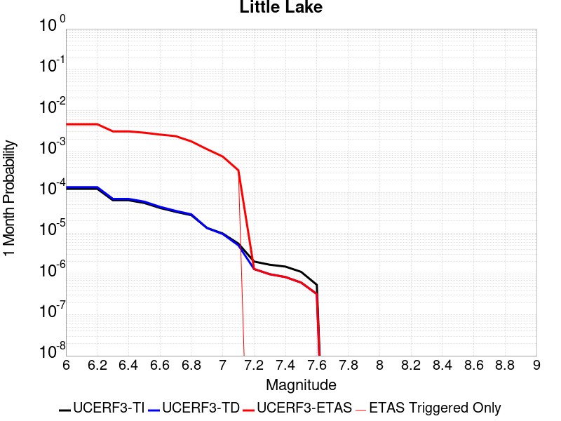 |  |  |

| Magnitude | 1 wk TI Prob | 1 wk TD Prob | 1 wk ETAS Prob | 1 wk ETAS/TD Gain | 1 wk ETAS Triggered Only | 1 mo TI Prob | 1 mo TD Prob | 1 mo ETAS Prob | 1 mo ETAS/TD Gain | 1 mo ETAS Triggered Only | 1 yr TI Prob | 1 yr TD Prob | 1 yr ETAS Prob | 1 yr ETAS/TD Gain | 1 yr ETAS Triggered Only | 10 yr TI Prob | 10 yr TD Prob | 10 yr ETAS Prob | 10 yr ETAS/TD Gain | 10 yr ETAS Triggered Only |
|-----|-----|-----|-----|-----|-----|-----|-----|-----|-----|-----|-----|-----|-----|-----|-----|-----|-----|-----|-----|-----|
| 6.0 | 2.8424427E-5 | 3.1206153E-5 | 0.0018911482 | 60.60177 | 0.00186 | 1.2181328E-4 | 1.3373456E-4 | 0.0046431315 | 34.71901 | 0.00451 | 0.0014820677 | 0.0016271353 | 0.010921987 | 6.7124023 | 0.00931 | 0.014722223 | 0.016165623 | 0.028886603 | 1.7869154 | 0.01293 |
| 6.1 | 2.8424427E-5 | 3.1206153E-5 | 0.0018911482 | 60.60177 | 0.00186 | 1.2181328E-4 | 1.3373456E-4 | 0.0046431315 | 34.71901 | 0.00451 | 0.0014820677 | 0.0016271353 | 0.010921987 | 6.7124023 | 0.00931 | 0.014722223 | 0.016165623 | 0.028886603 | 1.7869154 | 0.01293 |
| 6.2 | 2.8424427E-5 | 3.1206153E-5 | 0.0018911482 | 60.60177 | 0.00186 | 1.2181328E-4 | 1.3373456E-4 | 0.0046431315 | 34.71901 | 0.00451 | 0.0014820677 | 0.0016271353 | 0.010921987 | 6.7124023 | 0.00931 | 0.014722223 | 0.016165623 | 0.028886603 | 1.7869154 | 0.01293 |
| 6.3 | 1.48860645E-5 | 1.6081587E-5 | 0.001176063 | 73.13102 | 0.00116 | 6.379586E-5 | 6.891943E-5 | 0.0030987107 | 44.96135 | 0.00303 | 7.7643775E-4 | 8.387992E-4 | 0.007293381 | 8.695025 | 0.00646 | 0.007737305 | 0.00835915 | 0.017303752 | 2.0700371 | 0.00902 |
| 6.4 | 1.48860645E-5 | 1.6081587E-5 | 0.001176063 | 73.13102 | 0.00116 | 6.379586E-5 | 6.891943E-5 | 0.0030987107 | 44.96135 | 0.00303 | 7.7643775E-4 | 8.387992E-4 | 0.007293381 | 8.695025 | 0.00646 | 0.007737305 | 0.00835915 | 0.017303752 | 2.0700371 | 0.00902 |
| 6.5 | 1.2797581E-5 | 1.376573E-5 | 0.0010637513 | 77.27533 | 0.00105 | 5.4845623E-5 | 5.8994796E-5 | 0.002868829 | 48.62851 | 0.00281 | 6.675408E-4 | 7.1805064E-4 | 0.006733728 | 9.37779 | 0.00602 | 0.006655392 | 0.0071598557 | 0.015420285 | 2.1537147 | 0.00832 |
| 6.6 | 9.661896E-6 | 1.0289153E-5 | 9.702793E-4 | 94.301186 | 9.6E-4 | 4.1407468E-5 | 4.4095712E-5 | 0.0025839838 | 58.59943 | 0.00254 | 5.040193E-4 | 5.367493E-4 | 0.005903867 | 10.999301 | 0.00537 | 0.005028777 | 0.005356134 | 0.01262698 | 2.3574803 | 0.00731 |
| 6.7 | 7.767871E-6 | 8.199772E-6 | 8.7819266E-4 | 107.09963 | 8.7E-4 | 3.329045E-5 | 3.5141486E-5 | 0.0023650597 | 67.30107 | 0.00233 | 4.0523586E-4 | 4.2777733E-4 | 0.0052557113 | 12.286091 | 0.00483 | 0.004044977 | 0.0042708907 | 0.010733172 | 2.5130994 | 0.00649 |
| 6.8 | 6.4235196E-6 | 6.7358133E-6 | 6.567314E-4 | 97.49847 | 6.5E-4 | 2.752908E-5 | 2.8867524E-5 | 0.0017588176 | 60.927208 | 0.00173 | 3.35115E-4 | 3.5141825E-4 | 0.0040001357 | 11.382834 | 0.00365 | 0.003346101 | 0.0035098856 | 0.008412617 | 2.396835 | 0.00492 |
| 6.9 | 3.1283696E-6 | 3.112201E-6 | 4.231109E-4 | 135.9523 | 4.2E-4 | 1.3407229E-5 | 1.3337944E-5 | 0.001133323 | 84.96984 | 0.00112 | 1.6322079E-4 | 1.6237888E-4 | 0.002501999 | 15.408401 | 0.00234 | 0.0016310095 | 0.0016227507 | 0.0047876067 | 2.9503033 | 0.00317 |
| 7.0 | 2.290603E-6 | 2.2286956E-6 | 2.9222804E-4 | 131.12067 | 2.9E-4 | 9.816834E-6 | 9.551524E-6 | 7.495445E-4 | 78.47381 | 7.4E-4 | 1.19513395E-4 | 1.1628464E-4 | 0.0015861137 | 13.639925 | 0.00147 | 0.0011944914 | 0.00116234 | 0.0031400386 | 2.7014802 | 0.00198 |
| 7.1 | 1.293693E-6 | 1.1776893E-6 | 1.6117751E-4 | 136.8591 | 1.6E-4 | 5.5443866E-6 | 5.047234E-6 | 3.4504553E-4 | 68.36329 | 3.4E-4 | 6.750081E-5 | 6.144904E-5 | 7.114091E-4 | 11.57722 | 6.5E-4 | 6.7480316E-4 | 6.1438896E-4 | 0.0015138361 | 2.46397 | 9.0E-4 |
| 7.2 | 4.715842E-7 | 3.0917863E-7 | 3.0917863E-7 | 1.0 | 0.0 | 2.0210737E-6 | 1.3250507E-6 | 1.3250507E-6 | 1.0 | 0.0 | 2.4606294E-5 | 1.6132379E-5 | 3.6132056E-5 | 2.2397227 | 2.0E-5 | 2.460357E-4 | 1.6131261E-4 | 1.9130777E-4 | 1.1859443 | 3.0E-5 |
| 7.3 | 3.9430947E-7 | 2.3097442E-7 | 2.3097442E-7 | 1.0 | 0.0 | 1.6898966E-6 | 9.8989E-7 | 9.8989E-7 | 1.0 | 0.0 | 2.0574296E-5 | 1.2051845E-5 | 2.2051725E-5 | 1.8297385 | 1.0E-5 | 2.0572392E-4 | 1.2051199E-4 | 1.4050958E-4 | 1.1659386 | 2.0E-5 |
| 7.4 | 3.547123E-7 | 1.9679048E-7 | 1.9679048E-7 | 1.0 | 0.0 | 1.5201948E-6 | 8.433875E-7 | 8.433875E-7 | 1.0 | 0.0 | 1.8508214E-5 | 1.0268195E-5 | 2.0268093E-5 | 1.973871 | 1.0E-5 | 1.8506673E-4 | 1.0267727E-4 | 1.2267522E-4 | 1.1947651 | 2.0E-5 |
| 7.5 | 2.6354266E-7 | 1.4423068E-7 | 1.4423068E-7 | 1.0 | 0.0 | 1.129468E-6 | 6.1813137E-7 | 6.1813137E-7 | 1.0 | 0.0 | 1.3751187E-5 | 7.525724E-6 | 1.7525648E-5 | 2.3287659 | 1.0E-5 | 1.3750336E-4 | 7.525474E-5 | 8.525399E-5 | 1.132872 | 1.0E-5 |
| 7.6 | 1.269913E-7 | 7.572499E-8 | 7.572499E-8 | 1.0 | 0.0 | 5.4424834E-7 | 3.2453565E-7 | 3.2453565E-7 | 1.0 | 0.0 | 6.6262032E-6 | 3.9512147E-6 | 1.3951175E-5 | 3.5308573 | 1.0E-5 | 6.626006E-5 | 3.951148E-5 | 4.9511083E-5 | 1.253081 | 1.0E-5 |

## Airport Lake
*[(top)](#table-of-contents)*

| 1 Week | 1 Month | 1 Year | 10 Year |
|-----|-----|-----|-----|
| 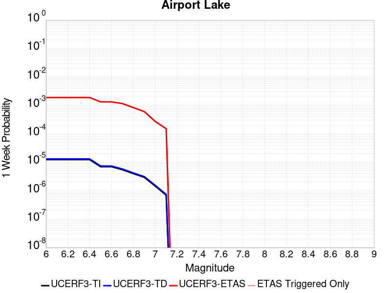 |  | 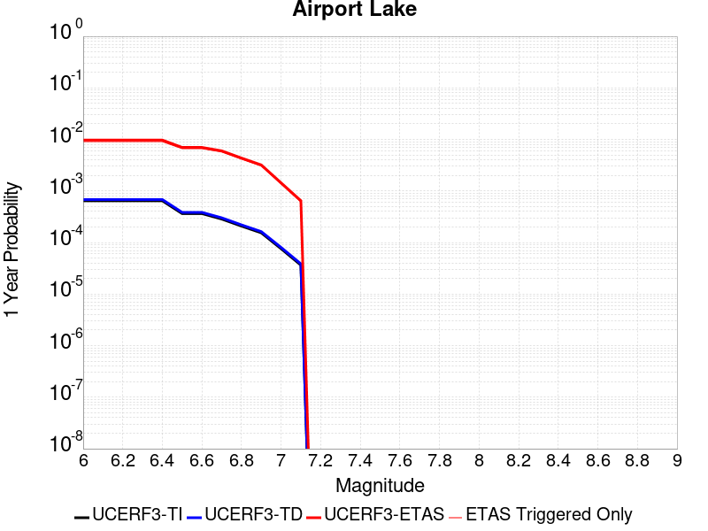 |  |

| Magnitude | 1 wk TI Prob | 1 wk TD Prob | 1 wk ETAS Prob | 1 wk ETAS/TD Gain | 1 wk ETAS Triggered Only | 1 mo TI Prob | 1 mo TD Prob | 1 mo ETAS Prob | 1 mo ETAS/TD Gain | 1 mo ETAS Triggered Only | 1 yr TI Prob | 1 yr TD Prob | 1 yr ETAS Prob | 1 yr ETAS/TD Gain | 1 yr ETAS Triggered Only | 10 yr TI Prob | 10 yr TD Prob | 10 yr ETAS Prob | 10 yr ETAS/TD Gain | 10 yr ETAS Triggered Only |
|-----|-----|-----|-----|-----|-----|-----|-----|-----|-----|-----|-----|-----|-----|-----|-----|-----|-----|-----|-----|-----|
| 6.0 | 1.2387061E-5 | 1.31032575E-5 | 0.0018830787 | 143.71074 | 0.00187 | 5.3086325E-5 | 5.6155768E-5 | 0.004555903 | 81.129745 | 0.0045 | 6.461343E-4 | 6.835104E-4 | 0.009737317 | 14.246041 | 0.00906 | 0.0064425888 | 0.0068168915 | 0.01906284 | 2.7964122 | 0.01233 |
| 6.1 | 1.2387061E-5 | 1.31032575E-5 | 0.0018830787 | 143.71074 | 0.00187 | 5.3086325E-5 | 5.6155768E-5 | 0.004555903 | 81.129745 | 0.0045 | 6.461343E-4 | 6.835104E-4 | 0.009737317 | 14.246041 | 0.00906 | 0.0064425888 | 0.0068168915 | 0.01906284 | 2.7964122 | 0.01233 |
| 6.2 | 1.2387061E-5 | 1.31032575E-5 | 0.0018830787 | 143.71074 | 0.00187 | 5.3086325E-5 | 5.6155768E-5 | 0.004555903 | 81.129745 | 0.0045 | 6.461343E-4 | 6.835104E-4 | 0.009737317 | 14.246041 | 0.00906 | 0.0064425888 | 0.0068168915 | 0.01906284 | 2.7964122 | 0.01233 |
| 6.3 | 1.2387061E-5 | 1.31032575E-5 | 0.0018830787 | 143.71074 | 0.00187 | 5.3086325E-5 | 5.6155768E-5 | 0.004555903 | 81.129745 | 0.0045 | 6.461343E-4 | 6.835104E-4 | 0.009737317 | 14.246041 | 0.00906 | 0.0064425888 | 0.0068168915 | 0.01906284 | 2.7964122 | 0.01233 |
| 6.4 | 1.2387061E-5 | 1.31032575E-5 | 0.0018830787 | 143.71074 | 0.00187 | 5.3086325E-5 | 5.6155768E-5 | 0.004555903 | 81.129745 | 0.0045 | 6.461343E-4 | 6.835104E-4 | 0.009737317 | 14.246041 | 0.00906 | 0.0064425888 | 0.0068168915 | 0.01906284 | 2.7964122 | 0.01233 |
| 6.5 | 6.9922594E-6 | 7.38498E-6 | 0.0013273752 | 179.73985 | 0.00132 | 2.996648E-5 | 3.164956E-5 | 0.0034115426 | 107.791145 | 0.00338 | 3.6478083E-4 | 3.8527072E-4 | 0.0070127165 | 18.20205 | 0.00663 | 0.003641826 | 0.0038465653 | 0.01283187 | 3.3359292 | 0.00902 |
| 6.6 | 6.9922594E-6 | 7.38498E-6 | 0.0013273752 | 179.73985 | 0.00132 | 2.996648E-5 | 3.164956E-5 | 0.0034115426 | 107.791145 | 0.00338 | 3.6478083E-4 | 3.8527072E-4 | 0.0070127165 | 18.20205 | 0.00663 | 0.003641826 | 0.0038465653 | 0.01283187 | 3.3359292 | 0.00902 |
| 6.7 | 5.477277E-6 | 5.7861116E-6 | 0.0011557795 | 199.75063 | 0.00115 | 2.3473833E-5 | 2.4797408E-5 | 0.0029247254 | 117.94481 | 0.0029 | 2.8575645E-4 | 3.0187052E-4 | 0.006010147 | 19.909685 | 0.00571 | 0.0028538927 | 0.0030149885 | 0.010771532 | 3.5726612 | 0.00778 |
| 6.8 | 3.9950432E-6 | 4.2191186E-6 | 8.342156E-4 | 197.72273 | 8.3E-4 | 1.7121502E-5 | 1.8081826E-5 | 0.0021580432 | 119.34873 | 0.00214 | 2.0843433E-4 | 2.2012675E-4 | 0.0043592155 | 19.803205 | 0.00414 | 0.0020823893 | 0.002199358 | 0.007876844 | 3.5814285 | 0.00569 |
| 6.9 | 2.95695E-6 | 3.1230477E-6 | 6.031212E-4 | 193.11943 | 6.0E-4 | 1.2672582E-5 | 1.3384434E-5 | 0.0015633637 | 116.80462 | 0.00155 | 1.5427776E-4 | 1.6294557E-4 | 0.0032024502 | 19.653498 | 0.00304 | 0.001541707 | 0.0016284833 | 0.0057817088 | 3.5503643 | 0.00416 |
| 7.0 | 1.456072E-6 | 1.5408239E-6 | 2.715404E-4 | 176.23065 | 2.7E-4 | 6.2402937E-6 | 6.60352E-6 | 7.065989E-4 | 107.00337 | 7.0E-4 | 7.597293E-5 | 8.03959E-5 | 0.0014402865 | 17.914927 | 0.00136 | 7.594696E-4 | 8.03767E-4 | 0.002662272 | 3.3122435 | 0.00186 |
| 7.1 | 6.995192E-7 | 7.4090326E-7 | 1.5074079E-4 | 203.45543 | 1.5E-4 | 2.997936E-6 | 3.1752998E-6 | 3.231743E-4 | 101.77757 | 3.2E-4 | 3.649926E-5 | 3.8659273E-5 | 6.486357E-4 | 16.778269 | 6.1E-4 | 3.6493264E-4 | 3.8659273E-4 | 0.0012362641 | 3.1978462 | 8.5E-4 |

## Tank Canyon
*[(top)](#table-of-contents)*

| 1 Week | 1 Month | 1 Year | 10 Year |
|-----|-----|-----|-----|
| 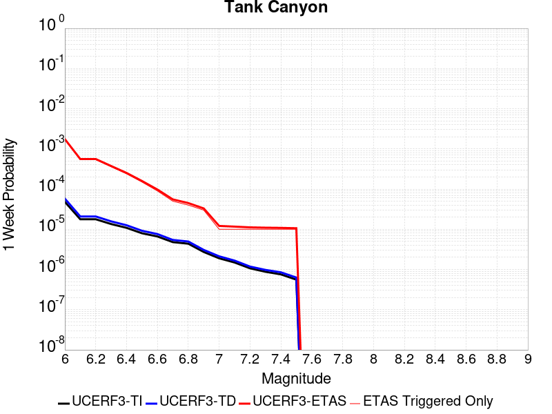 | 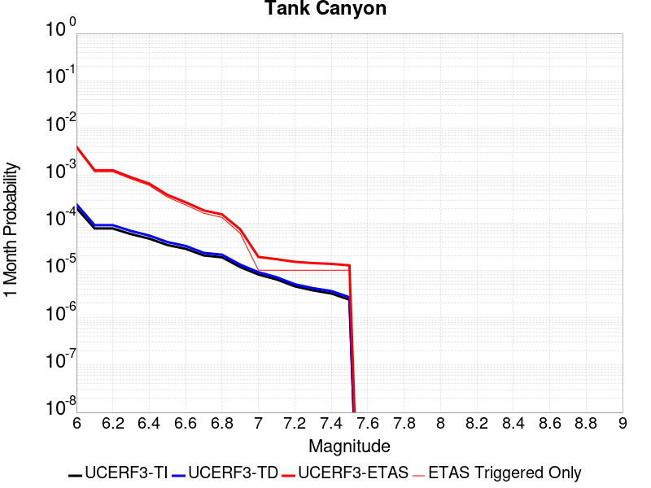 |  |  |

| Magnitude | 1 wk TI Prob | 1 wk TD Prob | 1 wk ETAS Prob | 1 wk ETAS/TD Gain | 1 wk ETAS Triggered Only | 1 mo TI Prob | 1 mo TD Prob | 1 mo ETAS Prob | 1 mo ETAS/TD Gain | 1 mo ETAS Triggered Only | 1 yr TI Prob | 1 yr TD Prob | 1 yr ETAS Prob | 1 yr ETAS/TD Gain | 1 yr ETAS Triggered Only | 10 yr TI Prob | 10 yr TD Prob | 10 yr ETAS Prob | 10 yr ETAS/TD Gain | 10 yr ETAS Triggered Only |
|-----|-----|-----|-----|-----|-----|-----|-----|-----|-----|-----|-----|-----|-----|-----|-----|-----|-----|-----|-----|-----|
| 6.0 | 4.8284557E-5 | 5.7965928E-5 | 0.0017578674 | 30.325872 | 0.0017 | 2.0691741E-4 | 2.484056E-4 | 0.004077454 | 16.414503 | 0.00383 | 0.0025163088 | 0.00302081 | 0.011056462 | 3.6600986 | 0.00806 | 0.02488006 | 0.029864373 | 0.04072019 | 1.3635039 | 0.01119 |
| 6.1 | 1.7796336E-5 | 2.0873778E-5 | 5.6086254E-4 | 26.869236 | 5.4E-4 | 7.626778E-5 | 8.94562E-5 | 0.0012893488 | 14.413185 | 0.0012 | 9.281647E-4 | 0.0010886233 | 0.0037157603 | 3.4132655 | 0.00263 | 0.009242975 | 0.010836863 | 0.014407742 | 1.3295122 | 0.00361 |
| 6.2 | 1.7796336E-5 | 2.0873778E-5 | 5.6086254E-4 | 26.869236 | 5.4E-4 | 7.626778E-5 | 8.94562E-5 | 0.0012893488 | 14.413185 | 0.0012 | 9.281647E-4 | 0.0010886233 | 0.0037157603 | 3.4132655 | 0.00263 | 0.009242975 | 0.010836863 | 0.014407742 | 1.3295122 | 0.00361 |
| 6.3 | 1.3515912E-5 | 1.575992E-5 | 3.7575426E-4 | 23.842394 | 3.6E-4 | 5.792405E-5 | 6.754091E-5 | 9.1748347E-4 | 13.584116 | 8.5E-4 | 7.049971E-4 | 8.2202395E-4 | 0.0026904868 | 3.2730029 | 0.00187 | 0.007027647 | 0.00819231 | 0.010691665 | 1.3050855 | 0.00252 |
| 6.4 | 1.0870146E-5 | 1.2618305E-5 | 2.5261528E-4 | 20.019747 | 2.4E-4 | 4.658551E-5 | 5.407743E-5 | 6.740439E-4 | 12.464422 | 6.2E-4 | 5.67031E-4 | 6.5821153E-4 | 0.002127244 | 3.2318544 | 0.00147 | 0.005655863 | 0.006564494 | 0.008491759 | 1.2935892 | 0.00194 |
| 6.5 | 7.964826E-6 | 9.196297E-6 | 1.5919491E-4 | 17.310764 | 1.5E-4 | 3.4134522E-5 | 3.9412163E-5 | 3.8939837E-4 | 9.8801565 | 3.5E-4 | 4.1550855E-4 | 4.79748E-4 | 0.0012893594 | 2.6875763 | 8.1E-4 | 0.0041473247 | 0.004788282 | 0.0058830143 | 1.2286276 | 0.0011 |
| 6.6 | 6.6317E-6 | 7.6124547E-6 | 9.7611766E-5 | 12.82264 | 9.0E-5 | 2.8421264E-5 | 3.2624448E-5 | 2.7261663E-4 | 8.356206 | 2.4E-4 | 3.4597394E-4 | 3.9713932E-4 | 9.969011E-4 | 2.5102048 | 6.0E-4 | 0.0034543579 | 0.0039653047 | 0.004811934 | 1.2135093 | 8.5E-4 |
| 6.7 | 4.793663E-6 | 5.4308844E-6 | 5.5430613E-5 | 10.206553 | 5.0E-5 | 2.0544108E-5 | 2.3275035E-5 | 1.8327132E-4 | 7.8741584 | 1.6E-4 | 2.500958E-4 | 2.833411E-4 | 6.932249E-4 | 2.4466093 | 4.1E-4 | 0.0024981452 | 0.0028303456 | 0.0033887608 | 1.1972957 | 5.6E-4 |
| 6.8 | 4.382823E-6 | 4.969349E-6 | 4.496915E-5 | 9.049304 | 4.0E-5 | 1.8783392E-5 | 2.129706E-5 | 1.512943E-4 | 7.1039987 | 1.3E-4 | 2.286638E-4 | 2.5926513E-4 | 6.0917437E-4 | 2.3496194 | 3.5E-4 | 0.0022842865 | 0.0025901678 | 0.0030888729 | 1.1925377 | 5.0E-4 |
| 6.9 | 2.729601E-6 | 3.0735978E-6 | 3.3073506E-5 | 10.760518 | 3.0E-5 | 1.1698237E-5 | 1.3172503E-5 | 7.3171715E-5 | 5.554883 | 6.0E-5 | 1.4241673E-4 | 1.6036464E-4 | 3.5033416E-4 | 2.18461 | 1.9E-4 | 0.001423255 | 0.0016027512 | 0.0018323825 | 1.1432732 | 2.3E-4 |
| 7.0 | 1.8987357E-6 | 2.1269796E-6 | 1.2126959E-5 | 5.701493 | 1.0E-5 | 8.137413E-6 | 9.115598E-6 | 1.9115507E-5 | 2.0970106 | 1.0E-5 | 9.90685E-5 | 1.1097746E-4 | 1.709708E-4 | 1.5405903 | 6.0E-5 | 9.902435E-4 | 0.001109289 | 0.0011892003 | 1.0720383 | 8.0E-5 |
| 7.1 | 1.4928986E-6 | 1.6641586E-6 | 1.1664142E-5 | 7.0090322 | 1.0E-5 | 6.398121E-6 | 7.1320924E-6 | 1.713202E-5 | 2.4021032 | 1.0E-5 | 7.789434E-5 | 8.6830354E-5 | 1.3682601E-4 | 1.5757855 | 5.0E-5 | 7.786704E-4 | 8.6802215E-4 | 9.379614E-4 | 1.0805731 | 7.0E-5 |
| 7.2 | 1.069082E-6 | 1.1828818E-6 | 1.11828695E-5 | 9.45392 | 1.0E-5 | 4.581772E-6 | 5.069486E-6 | 1.5069436E-5 | 2.9725764 | 1.0E-5 | 5.5781646E-5 | 6.171978E-5 | 1.0171731E-4 | 1.6480504 | 4.0E-5 | 5.576765E-4 | 6.170787E-4 | 6.5705396E-4 | 1.0647815 | 4.0E-5 |
| 7.3 | 8.776551E-7 | 9.770191E-7 | 1.0977009E-5 | 11.235204 | 1.0E-5 | 3.7613736E-6 | 4.1872213E-6 | 1.4187179E-5 | 3.3882089 | 1.0E-5 | 4.579376E-5 | 5.0978742E-5 | 9.0976704E-5 | 1.7846007 | 4.0E-5 | 4.5784327E-4 | 5.097215E-4 | 5.497011E-4 | 1.0784342 | 4.0E-5 |
| 7.4 | 7.55721E-7 | 8.510419E-7 | 1.0851033E-5 | 12.750293 | 1.0E-5 | 3.2388E-6 | 3.64732E-6 | 1.3647284E-5 | 3.741729 | 1.0E-5 | 3.9431678E-5 | 4.4405737E-5 | 7.44044E-5 | 1.6755584 | 3.0E-5 | 3.942468E-4 | 4.4401948E-4 | 4.7400617E-4 | 1.0675346 | 3.0E-5 |
| 7.5 | 5.587665E-7 | 6.3057325E-7 | 1.0630567E-5 | 16.858576 | 1.0E-5 | 2.3947114E-6 | 2.7024569E-6 | 1.270243E-5 | 4.7003264 | 1.0E-5 | 2.915522E-5 | 3.290241E-5 | 4.2902084E-5 | 1.3039191 | 1.0E-5 | 2.9151395E-4 | 3.2902413E-4 | 3.3902083E-4 | 1.0303829 | 1.0E-5 |

## Owl Lake
*[(top)](#table-of-contents)*

| 1 Week | 1 Month | 1 Year | 10 Year |
|-----|-----|-----|-----|
|  |  | 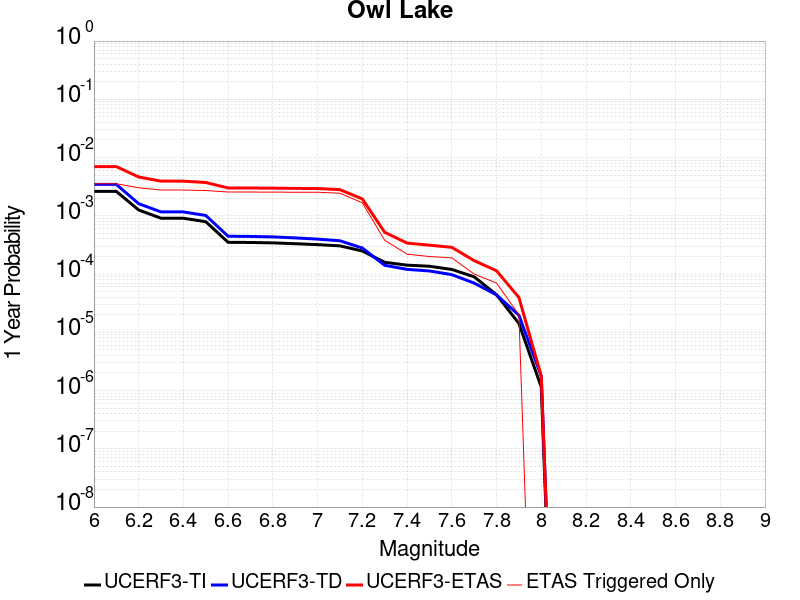 |  |

| Magnitude | 1 wk TI Prob | 1 wk TD Prob | 1 wk ETAS Prob | 1 wk ETAS/TD Gain | 1 wk ETAS Triggered Only | 1 mo TI Prob | 1 mo TD Prob | 1 mo ETAS Prob | 1 mo ETAS/TD Gain | 1 mo ETAS Triggered Only | 1 yr TI Prob | 1 yr TD Prob | 1 yr ETAS Prob | 1 yr ETAS/TD Gain | 1 yr ETAS Triggered Only | 10 yr TI Prob | 10 yr TD Prob | 10 yr ETAS Prob | 10 yr ETAS/TD Gain | 10 yr ETAS Triggered Only |
|-----|-----|-----|-----|-----|-----|-----|-----|-----|-----|-----|-----|-----|-----|-----|-----|-----|-----|-----|-----|-----|
| 6.0 | 5.0320643E-5 | 6.636041E-5 | 8.663073E-4 | 13.054581 | 8.0E-4 | 2.1564208E-4 | 2.84377E-4 | 0.0019239106 | 6.7653527 | 0.00164 | 0.0026222812 | 0.0034577118 | 0.0069954367 | 2.0231407 | 0.00355 | 0.02591553 | 0.034142397 | 0.038894415 | 1.1391823 | 0.00492 |
| 6.1 | 5.0320643E-5 | 6.636041E-5 | 8.663073E-4 | 13.054581 | 8.0E-4 | 2.1564208E-4 | 2.84377E-4 | 0.0019239106 | 6.7653527 | 0.00164 | 0.0026222812 | 0.0034577118 | 0.0069954367 | 2.0231407 | 0.00355 | 0.02591553 | 0.034142397 | 0.038894415 | 1.1391823 | 0.00492 |
| 6.2 | 2.4125871E-5 | 3.098217E-5 | 7.3096046E-4 | 23.592941 | 7.0E-4 | 1.0339249E-4 | 1.3277512E-4 | 0.0015625852 | 11.76866 | 0.00143 | 0.0012580766 | 0.0016155102 | 0.004640615 | 2.8725386 | 0.00303 | 0.012509781 | 0.016071098 | 0.020233117 | 1.2589754 | 0.00423 |
| 6.3 | 1.7433485E-5 | 2.2356866E-5 | 6.523428E-4 | 29.178633 | 6.3E-4 | 7.471279E-5 | 9.58125E-5 | 0.0013756899 | 14.358146 | 0.00128 | 9.0924866E-4 | 0.0011660301 | 0.0039328 | 3.372812 | 0.00277 | 0.009055373 | 0.011629325 | 0.015454319 | 1.3289094 | 0.00387 |
| 6.4 | 1.7433485E-5 | 2.2356866E-5 | 6.523428E-4 | 29.178633 | 6.3E-4 | 7.471279E-5 | 9.58125E-5 | 0.0013756899 | 14.358146 | 0.00128 | 9.0924866E-4 | 0.0011660301 | 0.0039328 | 3.372812 | 0.00277 | 0.009055373 | 0.011629325 | 0.015454319 | 1.3289094 | 0.00387 |
| 6.5 | 1.5182742E-5 | 1.9430483E-5 | 6.494182E-4 | 33.42265 | 6.3E-4 | 6.506727E-5 | 8.32717E-5 | 0.0013431668 | 16.129932 | 0.00126 | 7.919061E-4 | 0.0010134967 | 0.00373074 | 3.681058 | 0.00272 | 0.0078909 | 0.010118797 | 0.013880347 | 1.3717387 | 0.0038 |
| 6.6 | 6.7271576E-6 | 8.548313E-6 | 5.8854336E-4 | 68.84906 | 5.8E-4 | 2.8830356E-5 | 3.6635145E-5 | 0.0012165919 | 33.20833 | 0.00118 | 3.5095305E-4 | 4.4594728E-4 | 0.0030048057 | 6.738029 | 0.00256 | 0.0035039932 | 0.004467926 | 0.007902511 | 1.7687203 | 0.00345 |
| 6.7 | 6.682835E-6 | 8.480754E-6 | 5.8847584E-4 | 69.389565 | 5.8E-4 | 2.8640408E-5 | 3.6345617E-5 | 0.0012163027 | 33.46491 | 0.00118 | 3.4864116E-4 | 4.4242368E-4 | 0.003001291 | 6.7837486 | 0.00256 | 0.003480947 | 0.00443287 | 0.007867577 | 1.7748268 | 0.00345 |
| 6.8 | 6.5774975E-6 | 8.32722E-6 | 5.883224E-4 | 70.65052 | 5.8E-4 | 2.8188972E-5 | 3.5687626E-5 | 0.0012156455 | 34.0635 | 0.00118 | 3.4314668E-4 | 4.3441588E-4 | 0.0029833082 | 6.867401 | 0.00255 | 0.0034261728 | 0.0043530487 | 0.0077780746 | 1.7868108 | 0.00344 |
| 6.9 | 6.363419E-6 | 8.000376E-6 | 5.8799575E-4 | 73.49602 | 5.8E-4 | 2.727151E-5 | 3.4286906E-5 | 0.0012142465 | 35.41429 | 0.00118 | 3.3198006E-4 | 4.173687E-4 | 0.0029563087 | 7.083206 | 0.00254 | 0.0033148455 | 0.004183012 | 0.007598664 | 1.8165534 | 0.00343 |
| 7.0 | 6.1342453E-6 | 7.632552E-6 | 5.876281E-4 | 76.98973 | 5.8E-4 | 2.6289357E-5 | 3.271056E-5 | 0.001212672 | 37.0728 | 0.00118 | 3.2002592E-4 | 3.9818377E-4 | 0.0029371723 | 7.3764243 | 0.00254 | 0.0031956544 | 0.003991678 | 0.007407986 | 1.8558578 | 0.00343 |
| 7.1 | 5.842926E-6 | 7.1430604E-6 | 5.6713907E-4 | 79.39721 | 5.6E-4 | 2.504087E-5 | 3.0612788E-5 | 0.0011805776 | 38.56485 | 0.00115 | 3.0482994E-4 | 3.7265237E-4 | 0.0028117432 | 7.5452175 | 0.00244 | 0.0030441214 | 0.0037372818 | 0.0070349113 | 1.8823605 | 0.00331 |
| 7.2 | 4.77173E-6 | 5.359158E-6 | 3.6535723E-4 | 68.17437 | 3.6E-4 | 2.045011E-5 | 2.296764E-5 | 8.129495E-4 | 35.395428 | 7.9E-4 | 2.4895166E-4 | 2.795992E-4 | 0.0019491323 | 6.971165 | 0.00167 | 0.0024867293 | 0.002808747 | 0.005072371 | 1.8059195 | 0.00227 |
| 7.3 | 3.0494948E-6 | 2.7108347E-6 | 6.271067E-5 | 23.133345 | 6.0E-5 | 1.3069198E-5 | 1.1617813E-5 | 1.7161596E-4 | 14.771796 | 1.6E-4 | 1.5910587E-4 | 1.4143785E-4 | 5.213841E-4 | 3.6863124 | 3.8E-4 | 0.0015899199 | 0.0014233418 | 0.0019625733 | 1.3788488 | 5.4E-4 |
| 7.4 | 2.7263884E-6 | 2.3060104E-6 | 3.230594E-5 | 14.009452 | 3.0E-5 | 1.1684469E-5 | 9.882864E-6 | 7.988217E-5 | 8.082896 | 7.0E-5 | 1.4224913E-4 | 1.2031734E-4 | 3.4029086E-4 | 2.8282778 | 2.2E-4 | 0.0014215811 | 0.0012113012 | 0.0015209257 | 1.2556131 | 3.1E-4 |
| 7.5 | 2.6090431E-6 | 2.1659357E-6 | 2.2165892E-5 | 10.233865 | 2.0E-5 | 1.1181565E-5 | 9.282549E-6 | 5.9282083E-5 | 6.386401 | 5.0E-5 | 1.3612706E-4 | 1.1300927E-4 | 3.1298667E-4 | 2.7695663 | 2.0E-4 | 0.001360437 | 0.0011380832 | 0.0014177645 | 1.2457477 | 2.8E-4 |
| 7.6 | 2.3008756E-6 | 1.8730968E-6 | 2.187306E-5 | 11.6774845 | 2.0E-5 | 9.860858E-6 | 8.027534E-6 | 4.8027214E-5 | 5.9828105 | 4.0E-5 | 1.20049335E-4 | 9.7730925E-5 | 2.8771235E-4 | 2.9439235 | 1.9E-4 | 0.001199845 | 9.851726E-4 | 0.0012449163 | 1.2636532 | 2.6E-4 |
| 7.7 | 1.7184348E-6 | 1.3421906E-6 | 1.13421775E-5 | 8.450497 | 1.0E-5 | 7.3646997E-6 | 5.752233E-6 | 2.5752119E-5 | 4.4768906 | 2.0E-5 | 8.966153E-5 | 7.003123E-5 | 1.7002423E-4 | 2.4278345 | 1.0E-4 | 8.962536E-4 | 7.08018E-4 | 8.37926E-4 | 1.1834811 | 1.3E-4 |
| 7.8 | 8.4612907E-7 | 8.408234E-7 | 1.0840815E-5 | 12.893093 | 1.0E-5 | 3.6262625E-6 | 3.6035242E-6 | 2.3603452E-5 | 6.550102 | 2.0E-5 | 4.4148852E-5 | 4.3872045E-5 | 1.1386898E-4 | 2.595479 | 7.0E-5 | 4.414008E-4 | 4.440713E-4 | 5.3403137E-4 | 1.2025801 | 9.0E-5 |
| 7.9 | 2.716738E-7 | 3.7693766E-7 | 1.03769335E-5 | 27.529575 | 1.0E-5 | 1.1643157E-6 | 1.6154462E-6 | 1.161543E-5 | 7.19023 | 1.0E-5 | 1.4175452E-5 | 1.9667892E-5 | 3.96675E-5 | 2.0168657 | 2.0E-5 | 1.4174548E-4 | 1.9836401E-4 | 2.3835608E-4 | 1.2016095 | 4.0E-5 |
| 8.0 | 2.1995428E-8 | 3.38572E-8 | 3.38572E-8 | 1.0 | 0.0 | 9.426611E-8 | 1.4510229E-7 | 1.4510229E-7 | 1.0 | 0.0 | 1.1476893E-6 | 1.7666197E-6 | 1.7666197E-6 | 1.0 | 0.0 | 1.14768345E-5 | 1.7871007E-5 | 1.7871007E-5 | 1.0 | 0.0 |

## Panamint Valley
*[(top)](#table-of-contents)*

| 1 Week | 1 Month | 1 Year | 10 Year |
|-----|-----|-----|-----|
|  | 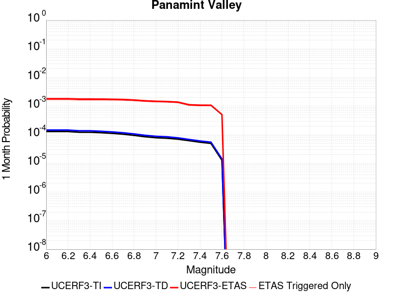 | 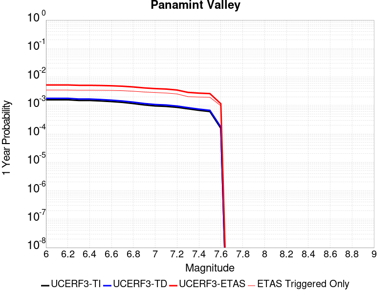 |  |

| Magnitude | 1 wk TI Prob | 1 wk TD Prob | 1 wk ETAS Prob | 1 wk ETAS/TD Gain | 1 wk ETAS Triggered Only | 1 mo TI Prob | 1 mo TD Prob | 1 mo ETAS Prob | 1 mo ETAS/TD Gain | 1 mo ETAS Triggered Only | 1 yr TI Prob | 1 yr TD Prob | 1 yr ETAS Prob | 1 yr ETAS/TD Gain | 1 yr ETAS Triggered Only | 10 yr TI Prob | 10 yr TD Prob | 10 yr ETAS Prob | 10 yr ETAS/TD Gain | 10 yr ETAS Triggered Only |
|-----|-----|-----|-----|-----|-----|-----|-----|-----|-----|-----|-----|-----|-----|-----|-----|-----|-----|-----|-----|-----|
| 6.0 | 3.0211835E-5 | 3.3984965E-5 | 8.039588E-4 | 23.656307 | 7.7E-4 | 1.2947287E-4 | 1.4564188E-4 | 0.0018153987 | 12.464811 | 0.00167 | 0.0015751923 | 0.0017717773 | 0.005225647 | 2.9493814 | 0.00346 | 0.015640736 | 0.017582124 | 0.022091422 | 1.2564706 | 0.00459 |
| 6.1 | 3.0211835E-5 | 3.3984965E-5 | 8.039588E-4 | 23.656307 | 7.7E-4 | 1.2947287E-4 | 1.4564188E-4 | 0.0018153987 | 12.464811 | 0.00167 | 0.0015751923 | 0.0017717773 | 0.005225647 | 2.9493814 | 0.00346 | 0.015640736 | 0.017582124 | 0.022091422 | 1.2564706 | 0.00459 |
| 6.2 | 3.0211835E-5 | 3.3984965E-5 | 8.039588E-4 | 23.656307 | 7.7E-4 | 1.2947287E-4 | 1.4564188E-4 | 0.0018153987 | 12.464811 | 0.00167 | 0.0015751923 | 0.0017717773 | 0.005225647 | 2.9493814 | 0.00346 | 0.015640736 | 0.017582124 | 0.022091422 | 1.2564706 | 0.00459 |
| 6.3 | 2.8573924E-5 | 3.2103115E-5 | 7.8207906E-4 | 24.36147 | 7.5E-4 | 1.2245393E-4 | 1.3757768E-4 | 0.0017673534 | 12.846223 | 0.00163 | 0.001489857 | 0.0016737491 | 0.0050780415 | 3.0339324 | 0.00341 | 0.01479908 | 0.01661714 | 0.021071864 | 1.2680801 | 0.00453 |
| 6.4 | 2.8573924E-5 | 3.2103115E-5 | 7.8207906E-4 | 24.36147 | 7.5E-4 | 1.2245393E-4 | 1.3757768E-4 | 0.0017673534 | 12.846223 | 0.00163 | 0.001489857 | 0.0016737491 | 0.0050780415 | 3.0339324 | 0.00341 | 0.01479908 | 0.01661714 | 0.021071864 | 1.2680801 | 0.00453 |
| 6.5 | 2.7468774E-5 | 3.0828793E-5 | 7.8080565E-4 | 25.327158 | 7.5E-4 | 1.1771801E-4 | 1.3211685E-4 | 0.0017619015 | 13.335933 | 0.00163 | 0.0014322745 | 0.0016073632 | 0.0050018984 | 3.1118655 | 0.0034 | 0.014230782 | 0.015962977 | 0.020391142 | 1.2774023 | 0.0045 |
| 6.6 | 2.6135967E-5 | 2.925278E-5 | 7.692311E-4 | 26.296001 | 7.4E-4 | 1.1200648E-4 | 1.2536318E-4 | 0.0017351613 | 13.841076 | 0.00161 | 0.0013628257 | 0.0015252546 | 0.0048901145 | 3.2060971 | 0.00337 | 0.013544982 | 0.015153424 | 0.01953599 | 1.2892131 | 0.00445 |
| 6.7 | 2.4498746E-5 | 2.7341659E-5 | 7.573217E-4 | 27.698454 | 7.3E-4 | 1.04990395E-4 | 1.1717342E-4 | 0.0017069872 | 14.568041 | 0.00159 | 0.0012775084 | 0.0014256779 | 0.0047209733 | 3.3113883 | 0.0033 | 0.012701893 | 0.014170669 | 0.0184886 | 1.3047092 | 0.00438 |
| 6.8 | 2.2244329E-5 | 2.4935984E-5 | 7.44918E-4 | 29.873217 | 7.2E-4 | 9.532935E-5 | 1.06864245E-4 | 0.0016367007 | 15.315701 | 0.00153 | 0.0011600169 | 0.0013003175 | 0.0044462215 | 3.4193354 | 0.00315 | 0.011539802 | 0.012932051 | 0.017087607 | 1.3213377 | 0.00421 |
| 6.9 | 1.9902658E-5 | 2.2290773E-5 | 7.222752E-4 | 32.402428 | 7.0E-4 | 8.529431E-5 | 9.552849E-5 | 0.001535391 | 16.072598 | 0.00144 | 0.0010379635 | 0.0011624574 | 0.0041090283 | 3.5347776 | 0.00295 | 0.010331288 | 0.011568334 | 0.015433101 | 1.3340816 | 0.00391 |
| 7.0 | 1.8353881E-5 | 2.0566635E-5 | 7.0055266E-4 | 34.06258 | 6.8E-4 | 7.865712E-5 | 8.8139845E-5 | 0.0014780173 | 16.769003 | 0.00139 | 9.5722964E-4 | 0.001072592 | 0.0038895672 | 3.6263251 | 0.00282 | 0.009531168 | 0.010678438 | 0.0143785 | 1.3464985 | 0.00374 |
| 7.1 | 1.7667631E-5 | 1.9773011E-5 | 6.997596E-4 | 35.38963 | 6.8E-4 | 7.571623E-5 | 8.473882E-5 | 0.0014446236 | 17.047955 | 0.00136 | 9.2145515E-4 | 0.0010312245 | 0.0037484195 | 3.634921 | 0.00272 | 0.009176437 | 0.010268626 | 0.01386135 | 1.349874 | 0.00363 |
| 7.2 | 1.6381597E-5 | 1.8158586E-5 | 6.6814676E-4 | 36.79509 | 6.5E-4 | 7.020495E-5 | 7.782029E-5 | 0.0013777191 | 17.703856 | 0.0013 | 8.544101E-4 | 9.4706746E-4 | 0.0034646809 | 3.6583254 | 0.00252 | 0.008511325 | 0.009434342 | 0.012772549 | 1.3538356 | 0.00337 |
| 7.3 | 1.4520491E-5 | 1.596705E-5 | 4.8595955E-4 | 30.435146 | 4.7E-4 | 6.222919E-5 | 6.842852E-5 | 0.0011183567 | 16.34343 | 0.00105 | 7.57377E-4 | 8.3281496E-4 | 0.0028611242 | 3.4354863 | 0.00203 | 0.0075480095 | 0.008299384 | 0.01099681 | 1.3250152 | 0.00272 |
| 7.4 | 1.2852287E-5 | 1.4145931E-5 | 4.8413928E-4 | 34.224632 | 4.7E-4 | 5.5080065E-5 | 6.06241E-5 | 0.0010805622 | 17.823973 | 0.00102 | 6.7039346E-4 | 7.378643E-4 | 0.002696418 | 3.654355 | 0.00196 | 0.0066837464 | 0.0073563983 | 0.0099769775 | 1.3562313 | 0.00264 |
| 7.5 | 1.1637851E-5 | 1.28372185E-5 | 4.8283118E-4 | 37.611824 | 4.7E-4 | 4.987555E-5 | 5.501558E-5 | 0.0010749594 | 19.539183 | 0.00102 | 6.070656E-4 | 6.696245E-4 | 0.0025983322 | 3.8802824 | 0.00193 | 0.006054099 | 0.0066782837 | 0.00926092 | 1.3867216 | 0.0026 |
| 7.6 | 3.0068115E-6 | 3.3332262E-6 | 2.1333253E-4 | 64.001816 | 2.1E-4 | 1.2886271E-5 | 1.4285218E-5 | 5.042782E-4 | 35.3007 | 4.9E-4 | 1.5687906E-4 | 1.7391593E-4 | 0.0011437472 | 6.5764375 | 9.7E-4 | 0.0015676835 | 0.0017386783 | 0.0030064702 | 1.7291698 | 0.00127 |

## Garlock (East)
*[(top)](#table-of-contents)*

| 1 Week | 1 Month | 1 Year | 10 Year |
|-----|-----|-----|-----|
|  |  | 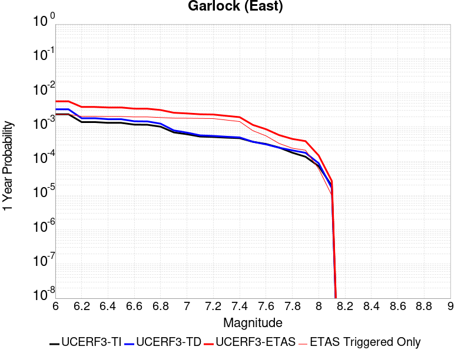 | 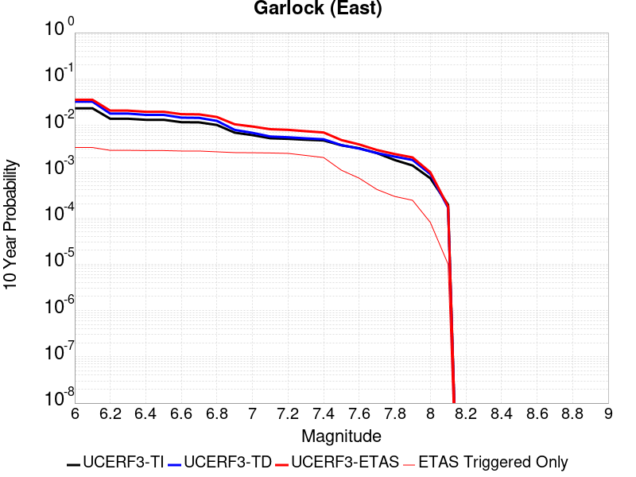 |

| Magnitude | 1 wk TI Prob | 1 wk TD Prob | 1 wk ETAS Prob | 1 wk ETAS/TD Gain | 1 wk ETAS Triggered Only | 1 mo TI Prob | 1 mo TD Prob | 1 mo ETAS Prob | 1 mo ETAS/TD Gain | 1 mo ETAS Triggered Only | 1 yr TI Prob | 1 yr TD Prob | 1 yr ETAS Prob | 1 yr ETAS/TD Gain | 1 yr ETAS Triggered Only | 10 yr TI Prob | 10 yr TD Prob | 10 yr ETAS Prob | 10 yr ETAS/TD Gain | 10 yr ETAS Triggered Only |
|-----|-----|-----|-----|-----|-----|-----|-----|-----|-----|-----|-----|-----|-----|-----|-----|-----|-----|-----|-----|-----|
| 6.0 | 4.5092507E-5 | 6.290799E-5 | 5.028803E-4 | 7.993902 | 4.4E-4 | 1.9323928E-4 | 2.695803E-4 | 0.0013192972 | 4.8938932 | 0.00105 | 0.0023501497 | 0.0032776468 | 0.00560001 | 1.7085459 | 0.00233 | 0.023254504 | 0.032344494 | 0.035547435 | 1.0990258 | 0.00331 |
| 6.1 | 4.5092507E-5 | 6.290799E-5 | 5.028803E-4 | 7.993902 | 4.4E-4 | 1.9323928E-4 | 2.695803E-4 | 0.0013192972 | 4.8938932 | 0.00105 | 0.0023501497 | 0.0032776468 | 0.00560001 | 1.7085459 | 0.00233 | 0.023254504 | 0.032344494 | 0.035547435 | 1.0990258 | 0.00331 |
| 6.2 | 2.6674514E-5 | 3.451465E-5 | 4.445005E-4 | 12.878604 | 4.1E-4 | 1.1431433E-4 | 1.4791173E-4 | 0.0011077698 | 7.4893975 | 9.6E-4 | 0.0013908884 | 0.0017993709 | 0.0038357002 | 2.1316895 | 0.00204 | 0.01382215 | 0.017863318 | 0.02068205 | 1.1577945 | 0.00287 |
| 6.3 | 2.6674514E-5 | 3.451465E-5 | 4.445005E-4 | 12.878604 | 4.1E-4 | 1.1431433E-4 | 1.4791173E-4 | 0.0011077698 | 7.4893975 | 9.6E-4 | 0.0013908884 | 0.0017993709 | 0.0038357002 | 2.1316895 | 0.00204 | 0.01382215 | 0.017863318 | 0.02068205 | 1.1577945 | 0.00287 |
| 6.4 | 2.5312667E-5 | 3.2343483E-5 | 4.4233023E-4 | 13.6760235 | 4.1E-4 | 1.0847834E-4 | 1.3860772E-4 | 0.001088476 | 7.852925 | 9.5E-4 | 0.0013199237 | 0.0016862722 | 0.003702866 | 2.1958885 | 0.00202 | 0.013121112 | 0.016764186 | 0.019556576 | 1.1665688 | 0.00284 |
| 6.5 | 2.5312667E-5 | 3.2343483E-5 | 4.4233023E-4 | 13.6760235 | 4.1E-4 | 1.0847834E-4 | 1.3860772E-4 | 0.001088476 | 7.852925 | 9.5E-4 | 0.0013199237 | 0.0016862722 | 0.003702866 | 2.1958885 | 0.00202 | 0.013121112 | 0.016764186 | 0.019556576 | 1.1665688 | 0.00284 |
| 6.6 | 2.246556E-5 | 2.8137678E-5 | 4.2812643E-4 | 15.215415 | 4.0E-4 | 9.627742E-5 | 1.20584606E-4 | 0.0010604713 | 8.794416 | 9.4E-4 | 0.0011715472 | 0.0014671524 | 0.0034242768 | 2.3339612 | 0.00196 | 0.011653901 | 0.014604934 | 0.017344331 | 1.1875666 | 0.00278 |
| 6.7 | 2.2241198E-5 | 2.7807404E-5 | 4.2779627E-4 | 15.384258 | 4.0E-4 | 9.531594E-5 | 1.1916928E-4 | 0.0010590573 | 8.886999 | 9.4E-4 | 0.0011598538 | 0.0014499439 | 0.0034071018 | 2.3498166 | 0.00196 | 0.011538187 | 0.014434824 | 0.017174695 | 1.1898098 | 0.00278 |
| 6.8 | 1.9528685E-5 | 2.3901322E-5 | 3.938925E-4 | 16.479946 | 3.7E-4 | 8.369167E-5 | 1.0243033E-4 | 9.823402E-4 | 9.590325 | 8.8E-4 | 0.0010184698 | 0.0012463954 | 0.0031240522 | 2.5064695 | 0.00188 | 0.010138147 | 0.012438075 | 0.015074865 | 1.2119935 | 0.00267 |
| 6.9 | 1.3318621E-5 | 1.5200952E-5 | 3.5519578E-4 | 23.36668 | 3.4E-4 | 5.7078556E-5 | 6.514534E-5 | 8.850919E-4 | 13.586419 | 8.2E-4 | 6.9470983E-4 | 7.928616E-4 | 0.0026014266 | 3.28106 | 0.00181 | 0.0069254204 | 0.007940963 | 0.010490554 | 1.3210684 | 0.00257 |
| 7.0 | 1.1760853E-5 | 1.3109707E-5 | 3.5310525E-4 | 26.934643 | 3.4E-4 | 5.0402683E-5 | 5.6183275E-5 | 8.661378E-4 | 15.416292 | 8.1E-4 | 6.134799E-4 | 6.838217E-4 | 0.0024825907 | 3.630465 | 0.0018 | 0.0061178906 | 0.006857492 | 0.009390005 | 1.3693061 | 0.00255 |
| 7.1 | 1.0064758E-5 | 1.0904764E-5 | 3.4090117E-4 | 31.261673 | 3.3E-4 | 4.3133965E-5 | 4.6733887E-5 | 8.466965E-4 | 18.1174 | 8.0E-4 | 5.2502943E-4 | 5.6884E-4 | 0.0023478274 | 4.127395 | 0.00178 | 0.005237907 | 0.005713798 | 0.0082193995 | 1.4385176 | 0.00252 |
| 7.2 | 9.768808E-6 | 1.0500609E-5 | 3.4049715E-4 | 32.42642 | 3.3E-4 | 4.186565E-5 | 4.5001856E-5 | 8.349663E-4 | 18.554043 | 7.9E-4 | 5.095951E-4 | 5.477633E-4 | 0.0023067992 | 4.2113066 | 0.00176 | 0.0050842804 | 0.0055042095 | 0.007960615 | 1.4462774 | 0.00247 |
| 7.3 | 9.344516E-6 | 9.946213E-6 | 3.2994302E-4 | 33.17273 | 3.2E-4 | 4.004731E-5 | 4.262595E-5 | 7.725948E-4 | 18.124989 | 7.3E-4 | 4.8746695E-4 | 5.188508E-4 | 0.0021080258 | 4.062875 | 0.00159 | 0.0048639905 | 0.005215881 | 0.00743425 | 1.4253104 | 0.00223 |
| 7.4 | 9.023491E-6 | 9.492341E-6 | 2.894897E-4 | 30.497185 | 2.8E-4 | 3.867153E-5 | 4.0680847E-5 | 6.906544E-4 | 16.977386 | 6.5E-4 | 4.7072413E-4 | 4.951801E-4 | 0.001934467 | 3.9065928 | 0.00144 | 0.004697283 | 0.0049793427 | 0.006979334 | 1.4016577 | 0.00201 |
| 7.5 | 7.081253E-6 | 7.089067E-6 | 1.6708793E-4 | 23.569807 | 1.6E-4 | 3.0347876E-5 | 3.0381365E-5 | 3.5037164E-4 | 11.532453 | 3.2E-4 | 3.6942272E-4 | 3.6983108E-4 | 0.0011495426 | 3.108291 | 7.8E-4 | 0.003688092 | 0.0037253548 | 0.0047913687 | 1.2861509 | 0.00107 |
| 7.6 | 6.116396E-6 | 5.960529E-6 | 1.15959876E-4 | 19.454628 | 1.1E-4 | 2.6212863E-5 | 2.5544876E-5 | 2.55539E-4 | 10.003533 | 2.3E-4 | 3.1909486E-4 | 3.1096474E-4 | 8.607937E-4 | 2.7681394 | 5.5E-4 | 0.0031863707 | 0.003136776 | 0.0038545174 | 1.2288151 | 7.2E-4 |
| 7.7 | 4.797145E-6 | 4.758607E-6 | 6.475832E-5 | 13.608672 | 6.0E-5 | 2.055903E-5 | 2.039387E-5 | 1.703908E-4 | 8.3550005 | 1.5E-4 | 2.5027743E-4 | 2.4826723E-4 | 5.781853E-4 | 2.328883 | 3.3E-4 | 0.0024999576 | 0.002510294 | 0.0029192648 | 1.1629175 | 4.1E-4 |
| 7.8 | 3.4028885E-6 | 3.9797173E-6 | 4.397956E-5 | 11.050925 | 4.0E-5 | 1.4583726E-5 | 1.7055821E-5 | 1.17054115E-4 | 6.863001 | 1.0E-4 | 1.775424E-4 | 2.076349E-4 | 4.4758507E-4 | 2.155635 | 2.4E-4 | 0.0017740062 | 0.00210206 | 0.0023914506 | 1.1376699 | 2.9E-4 |
| 7.9 | 2.5928412E-6 | 3.3735669E-6 | 4.337343E-5 | 12.856847 | 4.0E-5 | 1.1112129E-5 | 1.4458064E-5 | 1.0445676E-4 | 7.22481 | 9.0E-5 | 1.3528178E-4 | 1.7601276E-4 | 3.859758E-4 | 2.1928852 | 2.1E-4 | 0.0013519945 | 0.0017819697 | 0.002021542 | 1.1344424 | 2.4E-4 |
| 8.0 | 1.3743648E-6 | 1.6739597E-6 | 2.1673926E-5 | 12.9477 | 2.0E-5 | 5.8901214E-6 | 7.1740933E-6 | 4.7173806E-5 | 6.5755777 | 4.0E-5 | 7.1709874E-5 | 8.734111E-5 | 1.4733587E-4 | 1.6869017 | 6.0E-5 | 7.1686733E-4 | 8.841624E-4 | 9.640916E-4 | 1.0904012 | 8.0E-5 |
| 8.1 | 3.6733252E-7 | 3.1497066E-7 | 3.1497066E-7 | 1.0 | 0.0 | 1.5742813E-6 | 1.3498736E-6 | 1.3498736E-6 | 1.0 | 0.0 | 1.9166706E-5 | 1.6434604E-5 | 2.643444E-5 | 1.6084622 | 1.0E-5 | 1.9165053E-4 | 1.6648426E-4 | 1.764826E-4 | 1.0600557 | 1.0E-5 |

## Hunter Mountain-Saline Valley
*[(top)](#table-of-contents)*

| 1 Week | 1 Month | 1 Year | 10 Year |
|-----|-----|-----|-----|
|  |  |  | 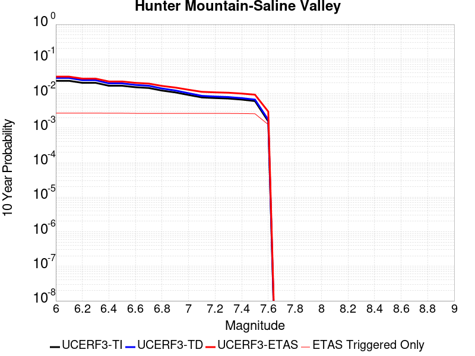 |

| Magnitude | 1 wk TI Prob | 1 wk TD Prob | 1 wk ETAS Prob | 1 wk ETAS/TD Gain | 1 wk ETAS Triggered Only | 1 mo TI Prob | 1 mo TD Prob | 1 mo ETAS Prob | 1 mo ETAS/TD Gain | 1 mo ETAS Triggered Only | 1 yr TI Prob | 1 yr TD Prob | 1 yr ETAS Prob | 1 yr ETAS/TD Gain | 1 yr ETAS Triggered Only | 10 yr TI Prob | 10 yr TD Prob | 10 yr ETAS Prob | 10 yr ETAS/TD Gain | 10 yr ETAS Triggered Only |
|-----|-----|-----|-----|-----|-----|-----|-----|-----|-----|-----|-----|-----|-----|-----|-----|-----|-----|-----|-----|-----|
| 6.0 | 4.5103672E-5 | 5.4570846E-5 | 5.1454577E-4 | 9.428949 | 4.6E-4 | 1.9328714E-4 | 2.3385457E-4 | 0.0012536161 | 5.3606653 | 0.00102 | 0.002350731 | 0.0028436389 | 0.0048379516 | 1.7013242 | 0.002 | 0.023260195 | 0.02809229 | 0.030726159 | 1.0937577 | 0.00271 |
| 6.1 | 4.5103672E-5 | 5.4570846E-5 | 5.1454577E-4 | 9.428949 | 4.6E-4 | 1.9328714E-4 | 2.3385457E-4 | 0.0012536161 | 5.3606653 | 0.00102 | 0.002350731 | 0.0028436389 | 0.0048379516 | 1.7013242 | 0.002 | 0.023260195 | 0.02809229 | 0.030726159 | 1.0937577 | 0.00271 |
| 6.2 | 3.9363465E-5 | 4.7064215E-5 | 5.0704257E-4 | 10.77342 | 4.6E-4 | 1.6868966E-4 | 2.0168893E-4 | 0.0012214832 | 6.056273 | 0.00102 | 0.002051862 | 0.0024529307 | 0.004448025 | 1.8133512 | 0.002 | 0.020330196 | 0.024273701 | 0.02691792 | 1.1089334 | 0.00271 |
| 6.3 | 3.9363465E-5 | 4.7064215E-5 | 5.0704257E-4 | 10.77342 | 4.6E-4 | 1.6868966E-4 | 2.0168893E-4 | 0.0012214832 | 6.056273 | 0.00102 | 0.002051862 | 0.0024529307 | 0.004448025 | 1.8133512 | 0.002 | 0.020330196 | 0.024273701 | 0.02691792 | 1.1089334 | 0.00271 |
| 6.4 | 3.2311684E-5 | 3.7952268E-5 | 4.979348E-4 | 13.1200285 | 4.6E-4 | 1.384713E-4 | 1.6264283E-4 | 0.0011824769 | 7.270391 | 0.00102 | 0.0016845843 | 0.0019784467 | 0.0039545293 | 1.9988052 | 0.00198 | 0.016718714 | 0.019616457 | 0.022253688 | 1.1344397 | 0.00269 |
| 6.5 | 3.2311684E-5 | 3.7952268E-5 | 4.979348E-4 | 13.1200285 | 4.6E-4 | 1.384713E-4 | 1.6264283E-4 | 0.0011824769 | 7.270391 | 0.00102 | 0.0016845843 | 0.0019784467 | 0.0039545293 | 1.9988052 | 0.00198 | 0.016718714 | 0.019616457 | 0.022253688 | 1.1344397 | 0.00269 |
| 6.6 | 2.9305844E-5 | 3.4182984E-5 | 4.9416727E-4 | 14.456528 | 4.6E-4 | 1.2559042E-4 | 1.4649061E-4 | 0.0011663412 | 7.9618835 | 0.00102 | 0.0015279909 | 0.0017821258 | 0.003748615 | 2.1034515 | 0.00197 | 0.015175272 | 0.017685596 | 0.020298552 | 1.1477449 | 0.00266 |
| 6.7 | 2.7826512E-5 | 3.2345313E-5 | 4.923304E-4 | 15.221074 | 4.6E-4 | 1.19251024E-4 | 1.3861575E-4 | 0.0011584744 | 8.357451 | 0.00102 | 0.0014509142 | 0.0016864006 | 0.0036530783 | 2.1661985 | 0.00197 | 0.014414776 | 0.01674306 | 0.019358523 | 1.1562119 | 0.00266 |
| 6.8 | 2.3389874E-5 | 2.6867581E-5 | 4.8685522E-4 | 18.120544 | 4.6E-4 | 1.0023846E-4 | 1.15141964E-4 | 0.0011350245 | 9.85761 | 0.00102 | 0.00121972 | 0.0014009993 | 0.0033582533 | 2.3970416 | 0.00196 | 0.01213047 | 0.0139272185 | 0.016540311 | 1.1876249 | 0.00265 |
| 6.9 | 2.069209E-5 | 2.3570803E-5 | 4.8355997E-4 | 20.51521 | 4.6E-4 | 8.867737E-5 | 1.0101402E-4 | 0.001120911 | 11.096588 | 0.00102 | 0.0010791123 | 0.0012291879 | 0.0031867789 | 2.5925887 | 0.00196 | 0.010738871 | 0.012228257 | 0.014845852 | 1.2140611 | 0.00265 |
| 7.0 | 1.7462342E-5 | 1.9634203E-5 | 4.7962516E-4 | 24.428045 | 4.6E-4 | 7.483646E-5 | 8.4144E-5 | 0.0011040581 | 13.121057 | 0.00102 | 9.1075303E-4 | 0.0010239943 | 0.0029819873 | 2.9121132 | 0.00196 | 0.009070295 | 0.0101957265 | 0.012818707 | 1.2572628 | 0.00265 |
| 7.1 | 1.4807709E-5 | 1.644232E-5 | 4.7643477E-4 | 28.976128 | 4.6E-4 | 6.3460066E-5 | 7.046528E-5 | 0.0010903934 | 15.474195 | 0.00102 | 7.723524E-4 | 8.5759355E-4 | 0.0028159127 | 3.283505 | 0.00196 | 0.007696735 | 0.00854516 | 0.011172515 | 1.3074671 | 0.00265 |
| 7.2 | 1.4180048E-5 | 1.5698888E-5 | 4.7569166E-4 | 30.300978 | 4.6E-4 | 6.077022E-5 | 6.727931E-5 | 0.0010872107 | 16.159658 | 0.00102 | 7.396263E-4 | 8.1883394E-4 | 0.002777229 | 3.3916876 | 0.00196 | 0.0073716943 | 0.008160452 | 0.010788827 | 1.3220869 | 0.00265 |
| 7.3 | 1.3730402E-5 | 1.5172614E-5 | 4.7516564E-4 | 31.317322 | 4.6E-4 | 5.8843252E-5 | 6.502396E-5 | 0.0010849576 | 16.685505 | 0.00102 | 7.161811E-4 | 7.9139526E-4 | 0.0027498442 | 3.4746785 | 0.00196 | 0.007138774 | 0.007888035 | 0.010517132 | 1.3333019 | 0.00265 |
| 7.4 | 1.2810095E-5 | 1.4109794E-5 | 4.741033E-4 | 33.601006 | 4.6E-4 | 5.489925E-5 | 6.0469236E-5 | 0.0010704082 | 17.701698 | 0.00101 | 6.681934E-4 | 7.359801E-4 | 0.002684545 | 3.6475782 | 0.00195 | 0.006661878 | 0.007337654 | 0.009948356 | 1.3557951 | 0.00263 |
| 7.5 | 1.1595659E-5 | 1.2801082E-5 | 4.727952E-4 | 36.934002 | 4.6E-4 | 4.9694736E-5 | 5.4860713E-5 | 0.0010648053 | 19.40925 | 0.00101 | 6.0486543E-4 | 6.677402E-4 | 0.002586458 | 3.8734498 | 0.00192 | 0.006032217 | 0.006659527 | 0.009232279 | 1.3863266 | 0.00259 |
| 7.6 | 2.997694E-6 | 3.3253514E-6 | 2.0332469E-4 | 61.143818 | 2.0E-4 | 1.28471975E-5 | 1.4251469E-5 | 4.942446E-4 | 34.680256 | 4.8E-4 | 1.564034E-4 | 1.735051E-4 | 0.0011333385 | 6.5320187 | 9.6E-4 | 0.0015629337 | 0.0017345662 | 0.0029923806 | 1.7251464 | 0.00126 |

## Garlock (West)
*[(top)](#table-of-contents)*

| 1 Week | 1 Month | 1 Year | 10 Year |
|-----|-----|-----|-----|
| 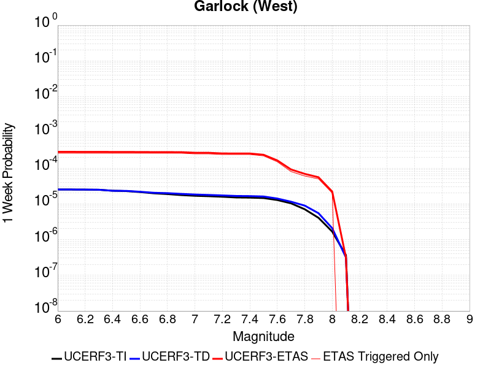 |  |  |  |

| Magnitude | 1 wk TI Prob | 1 wk TD Prob | 1 wk ETAS Prob | 1 wk ETAS/TD Gain | 1 wk ETAS Triggered Only | 1 mo TI Prob | 1 mo TD Prob | 1 mo ETAS Prob | 1 mo ETAS/TD Gain | 1 mo ETAS Triggered Only | 1 yr TI Prob | 1 yr TD Prob | 1 yr ETAS Prob | 1 yr ETAS/TD Gain | 1 yr ETAS Triggered Only | 10 yr TI Prob | 10 yr TD Prob | 10 yr ETAS Prob | 10 yr ETAS/TD Gain | 10 yr ETAS Triggered Only |
|-----|-----|-----|-----|-----|-----|-----|-----|-----|-----|-----|-----|-----|-----|-----|-----|-----|-----|-----|-----|-----|
| 6.0 | 2.5181727E-5 | 2.5201914E-5 | 2.8519536E-4 | 11.316417 | 2.6E-4 | 1.0791722E-4 | 1.08003755E-4 | 6.4794545E-4 | 5.999286 | 5.4E-4 | 0.0013131002 | 0.0013141559 | 0.0026823555 | 2.0411243 | 0.00137 | 0.013053683 | 0.01314424 | 0.0149699235 | 1.1388961 | 0.00185 |
| 6.1 | 2.5077732E-5 | 2.5102956E-5 | 2.8509644E-4 | 11.357086 | 2.6E-4 | 1.0747157E-4 | 1.07579675E-4 | 6.475216E-4 | 6.0189953 | 5.4E-4 | 0.001307681 | 0.001308999 | 0.0026772057 | 2.0452313 | 0.00137 | 0.013000126 | 0.013093281 | 0.0149190575 | 1.1394439 | 0.00185 |
| 6.2 | 2.494612E-5 | 2.4984645E-5 | 2.8497816E-4 | 11.406132 | 2.6E-4 | 1.0690756E-4 | 1.0707267E-4 | 6.470149E-4 | 6.0427637 | 5.4E-4 | 0.0013008224 | 0.0013028337 | 0.0026710487 | 2.050184 | 0.00137 | 0.012932341 | 0.013032351 | 0.014858241 | 1.1401044 | 0.00185 |
| 6.3 | 2.4733758E-5 | 2.4804003E-5 | 2.8479754E-4 | 11.481918 | 2.6E-4 | 1.0599751E-4 | 1.0629856E-4 | 6.462412E-4 | 6.079491 | 5.4E-4 | 0.0012897556 | 0.0012934201 | 0.002661648 | 2.0578372 | 0.00137 | 0.012822957 | 0.012939315 | 0.014765377 | 1.1411251 | 0.00185 |
| 6.4 | 2.3237335E-5 | 2.3183304E-5 | 2.8317727E-4 | 12.214708 | 2.6E-4 | 9.958477E-5 | 9.9353245E-5 | 6.392996E-4 | 6.4346123 | 5.4E-4 | 0.0012117702 | 0.0012089573 | 0.002577301 | 2.1318378 | 0.00137 | 0.012051838 | 0.01210416 | 0.013931768 | 1.15099 | 0.00185 |
| 6.5 | 2.2732203E-5 | 2.299767E-5 | 2.8299168E-4 | 12.305233 | 2.6E-4 | 9.742009E-5 | 9.8557735E-5 | 6.385045E-4 | 6.4784822 | 5.4E-4 | 0.0011854442 | 0.0011992827 | 0.0025676396 | 2.1409795 | 0.00137 | 0.011791403 | 0.012008464 | 0.013836248 | 1.152208 | 0.00185 |
| 6.6 | 2.1319436E-5 | 2.1777872E-5 | 2.817722E-4 | 12.938464 | 2.6E-4 | 9.136581E-5 | 9.333041E-5 | 6.3328E-4 | 6.7853556 | 5.4E-4 | 0.001111811 | 0.0011357077 | 0.0025041518 | 2.2049263 | 0.00137 | 0.011062649 | 0.01137937 | 0.013208318 | 1.1607249 | 0.00185 |
| 6.7 | 1.970802E-5 | 2.039774E-5 | 2.8039244E-4 | 13.74625 | 2.6E-4 | 8.446021E-5 | 8.741597E-5 | 6.2736875E-4 | 7.176821 | 5.4E-4 | 0.001027818 | 0.0010637715 | 0.0024323142 | 2.2865007 | 0.00137 | 0.010230771 | 0.010667094 | 0.01249736 | 1.1715806 | 0.00185 |
| 6.8 | 1.8744462E-5 | 1.9905396E-5 | 2.799002E-4 | 14.061524 | 2.6E-4 | 8.033094E-5 | 8.530606E-5 | 6.2526E-4 | 7.329608 | 5.4E-4 | 9.775903E-4 | 0.0010381081 | 0.0024066858 | 2.3183384 | 0.00137 | 0.009733009 | 0.010412897 | 0.012243633 | 1.1758143 | 0.00185 |
| 6.9 | 1.7559682E-5 | 1.8957733E-5 | 2.789528E-4 | 14.71446 | 2.6E-4 | 7.5253614E-5 | 8.124491E-5 | 6.21201E-4 | 7.6460304 | 5.4E-4 | 9.158276E-4 | 9.887093E-4 | 0.0023573549 | 2.384275 | 0.00137 | 0.0091206245 | 0.009923427 | 0.011755069 | 1.1845776 | 0.00185 |
| 7.0 | 1.6794445E-5 | 1.8220519E-5 | 2.6821595E-4 | 14.720546 | 2.5E-4 | 7.197421E-5 | 7.8085606E-5 | 6.080442E-4 | 7.786893 | 5.3E-4 | 8.759337E-4 | 9.5027895E-4 | 0.0023089866 | 2.4297986 | 0.00136 | 0.008724891 | 0.009542331 | 0.011364773 | 1.190985 | 0.00184 |
| 7.1 | 1.6337795E-5 | 1.7721295E-5 | 2.6771685E-4 | 15.107071 | 2.5E-4 | 7.0017246E-5 | 7.5946205E-5 | 6.0590595E-4 | 7.9780936 | 5.3E-4 | 8.521265E-4 | 9.242542E-4 | 0.0022829971 | 2.4700968 | 0.00136 | 0.008488664 | 0.0092840865 | 0.011107003 | 1.1963485 | 0.00184 |
| 7.2 | 1.5780008E-5 | 1.716991E-5 | 2.5716578E-4 | 14.977702 | 2.4E-4 | 6.762685E-5 | 7.358326E-5 | 5.93545E-4 | 8.066304 | 5.2E-4 | 8.2304585E-4 | 8.9550926E-4 | 0.0022443004 | 2.5061722 | 0.00135 | 0.008200042 | 0.008998912 | 0.010812444 | 1.201528 | 0.00183 |
| 7.3 | 1.5058865E-5 | 1.6622957E-5 | 2.5661898E-4 | 15.437625 | 2.4E-4 | 6.45364E-5 | 7.12393E-5 | 5.8120297E-4 | 8.15846 | 5.1E-4 | 7.854473E-4 | 8.669946E-4 | 0.0022058329 | 2.544229 | 0.00134 | 0.00782677 | 0.00871559 | 0.010519728 | 1.2070012 | 0.00182 |
| 7.4 | 1.4887923E-5 | 1.6458913E-5 | 2.5645495E-4 | 15.581525 | 2.4E-4 | 6.380382E-5 | 7.05363E-5 | 5.70501E-4 | 8.088049 | 5.0E-4 | 7.7653467E-4 | 8.584423E-4 | 0.0021673178 | 2.52471 | 0.00131 | 0.0077382675 | 0.008630417 | 0.010404969 | 1.205616 | 0.00179 |
| 7.5 | 1.4509299E-5 | 1.6050892E-5 | 2.3604736E-4 | 14.706184 | 2.2E-4 | 6.218123E-5 | 6.8787725E-5 | 5.1875674E-4 | 7.5414147 | 4.5E-4 | 7.567935E-4 | 8.3716994E-4 | 0.0020561486 | 2.4560707 | 0.00122 | 0.0075422134 | 0.008418757 | 0.010064782 | 1.1955187 | 0.00166 |
| 7.6 | 1.2756717E-5 | 1.40547745E-5 | 1.6405266E-4 | 11.67238 | 1.5E-4 | 5.4670498E-5 | 6.023336E-5 | 3.8021407E-4 | 6.3123507 | 3.2E-4 | 6.6541E-4 | 7.3309505E-4 | 0.0016324352 | 2.2267716 | 9.0E-4 | 0.006634211 | 0.00738374 | 0.008555028 | 1.1586306 | 0.00118 |
| 7.7 | 1.0328985E-5 | 1.1464304E-5 | 9.1463386E-5 | 7.9781017 | 8.0E-5 | 4.4266326E-5 | 4.913181E-5 | 2.591215E-4 | 5.274007 | 2.1E-4 | 5.388092E-4 | 5.98016E-4 | 0.0011676751 | 1.9525818 | 5.7E-4 | 0.0053750467 | 0.0060406122 | 0.0067463233 | 1.1168277 | 7.1E-4 |
| 7.8 | 7.0306583E-6 | 8.902713E-6 | 6.8902176E-5 | 7.7394586 | 6.0E-5 | 3.0131043E-5 | 3.815393E-5 | 1.881482E-4 | 4.9312935 | 1.5E-4 | 3.667837E-4 | 4.6442522E-4 | 8.7423477E-4 | 1.8824017 | 4.1E-4 | 0.003661789 | 0.004697 | 0.0051946514 | 1.105951 | 5.0E-4 |
| 7.9 | 4.060633E-6 | 5.467275E-6 | 5.5467E-5 | 10.145274 | 5.0E-5 | 1.7402595E-5 | 2.3430968E-5 | 1.3342839E-4 | 5.694532 | 1.1E-4 | 2.11856E-4 | 2.852348E-4 | 5.6515494E-4 | 1.9813675 | 2.8E-4 | 0.0021165414 | 0.0028852404 | 0.0032142883 | 1.1140453 | 3.3E-4 |
| 8.0 | 1.6729537E-6 | 2.0781215E-6 | 2.207808E-5 | 10.624057 | 2.0E-5 | 7.169782E-6 | 8.906205E-6 | 4.8905848E-5 | 5.491211 | 4.0E-5 | 8.7288594E-5 | 1.0842768E-4 | 1.8841901E-4 | 1.737739 | 8.0E-5 | 8.7254314E-4 | 0.0010973068 | 0.0011971971 | 1.0910323 | 1.0E-4 |
| 8.1 | 3.6733252E-7 | 3.1497066E-7 | 3.1497066E-7 | 1.0 | 0.0 | 1.5742813E-6 | 1.3498736E-6 | 1.3498736E-6 | 1.0 | 0.0 | 1.9166706E-5 | 1.6434604E-5 | 2.643444E-5 | 1.6084622 | 1.0E-5 | 1.9165053E-4 | 1.6648426E-4 | 1.764826E-4 | 1.0600557 | 1.0E-5 |

## Blackwater
*[(top)](#table-of-contents)*

| 1 Week | 1 Month | 1 Year | 10 Year |
|-----|-----|-----|-----|
|  | 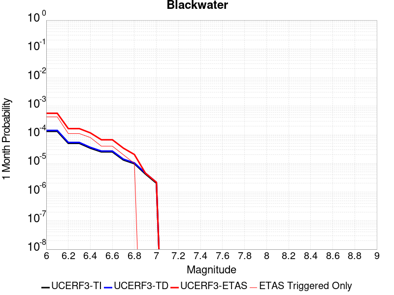 | 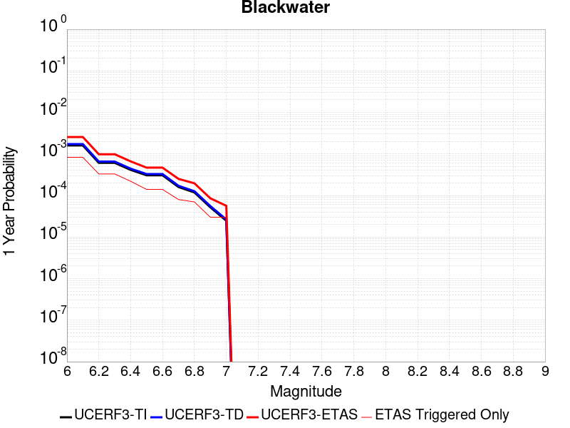 |  |

| Magnitude | 1 wk TI Prob | 1 wk TD Prob | 1 wk ETAS Prob | 1 wk ETAS/TD Gain | 1 wk ETAS Triggered Only | 1 mo TI Prob | 1 mo TD Prob | 1 mo ETAS Prob | 1 mo ETAS/TD Gain | 1 mo ETAS Triggered Only | 1 yr TI Prob | 1 yr TD Prob | 1 yr ETAS Prob | 1 yr ETAS/TD Gain | 1 yr ETAS Triggered Only | 10 yr TI Prob | 10 yr TD Prob | 10 yr ETAS Prob | 10 yr ETAS/TD Gain | 10 yr ETAS Triggered Only |
|-----|-----|-----|-----|-----|-----|-----|-----|-----|-----|-----|-----|-----|-----|-----|-----|-----|-----|-----|-----|-----|
| 6.0 | 3.0708583E-5 | 3.309619E-5 | 1.9309089E-4 | 5.8342333 | 1.6E-4 | 1.3160157E-4 | 1.4183388E-4 | 5.617743E-4 | 3.9607909 | 4.2E-4 | 0.0016010714 | 0.0017255963 | 0.002554164 | 1.4801631 | 8.3E-4 | 0.015895851 | 0.017135808 | 0.018334903 | 1.069976 | 0.00122 |
| 6.1 | 3.0708583E-5 | 3.309619E-5 | 1.9309089E-4 | 5.8342333 | 1.6E-4 | 1.3160157E-4 | 1.4183388E-4 | 5.617743E-4 | 3.9607909 | 4.2E-4 | 0.0016010714 | 0.0017255963 | 0.002554164 | 1.4801631 | 8.3E-4 | 0.015895851 | 0.017135808 | 0.018334903 | 1.069976 | 0.00122 |
| 6.2 | 1.1707779E-5 | 1.2545242E-5 | 5.254474E-5 | 4.18842 | 4.0E-5 | 5.017523E-5 | 5.3764266E-5 | 1.6375835E-4 | 3.0458586 | 1.1E-4 | 6.107122E-4 | 6.5439293E-4 | 9.84177E-4 | 1.5039542 | 3.3E-4 | 0.006090366 | 0.006525631 | 0.0070223683 | 1.076121 | 5.0E-4 |
| 6.3 | 1.1707779E-5 | 1.2545242E-5 | 5.254474E-5 | 4.18842 | 4.0E-5 | 5.017523E-5 | 5.3764266E-5 | 1.6375835E-4 | 3.0458586 | 1.1E-4 | 6.107122E-4 | 6.5439293E-4 | 9.84177E-4 | 1.5039542 | 3.3E-4 | 0.006090366 | 0.006525631 | 0.0070223683 | 1.076121 | 5.0E-4 |
| 6.4 | 7.929244E-6 | 8.480176E-6 | 2.8480006E-5 | 3.3584216 | 2.0E-5 | 3.3982033E-5 | 3.6343128E-5 | 1.1634022E-4 | 3.2011614 | 8.0E-5 | 4.136527E-4 | 4.4239179E-4 | 6.6229445E-4 | 1.4970767 | 2.2E-4 | 0.0041288356 | 0.0044155167 | 0.0047540152 | 1.0766612 | 3.4E-4 |
| 6.5 | 5.8832115E-6 | 6.286048E-6 | 2.6285923E-5 | 4.181629 | 2.0E-5 | 2.521352E-5 | 2.6939942E-5 | 6.693886E-5 | 2.4847443 | 4.0E-5 | 3.0693135E-4 | 3.2794697E-4 | 4.6790106E-4 | 1.4267583 | 1.4E-4 | 0.0030650778 | 0.0032748834 | 0.0035041303 | 1.0700015 | 2.3E-4 |
| 6.6 | 5.8832115E-6 | 6.286048E-6 | 2.6285923E-5 | 4.181629 | 2.0E-5 | 2.521352E-5 | 2.6939942E-5 | 6.693886E-5 | 2.4847443 | 4.0E-5 | 3.0693135E-4 | 3.2794697E-4 | 4.6790106E-4 | 1.4267583 | 1.4E-4 | 0.0030650778 | 0.0032748834 | 0.0035041303 | 1.0700015 | 2.3E-4 |
| 6.7 | 3.0715053E-6 | 3.281496E-6 | 1.3281463E-5 | 4.0473804 | 1.0E-5 | 1.3163528E-5 | 1.4063485E-5 | 3.4063203E-5 | 2.4221027 | 2.0E-5 | 1.6025416E-4 | 1.7121063E-4 | 2.5119694E-4 | 1.4671807 | 8.0E-5 | 0.0016013865 | 0.0017109019 | 0.0018207137 | 1.0641836 | 1.1E-4 |
| 6.8 | 2.2722281E-6 | 2.4287758E-6 | 2.4287758E-6 | 1.0 | 0.0 | 9.738084E-6 | 1.0409003E-5 | 2.04089E-5 | 1.9606968 | 1.0E-5 | 1.1855473E-4 | 1.2672316E-4 | 1.9671429E-4 | 1.5523152 | 7.0E-5 | 0.001184915 | 0.0012665992 | 0.0013464978 | 1.0630813 | 8.0E-5 |
| 6.9 | 9.952399E-7 | 1.0653588E-6 | 1.0653588E-6 | 1.0 | 0.0 | 4.265307E-6 | 4.5658185E-6 | 4.5658185E-6 | 1.0 | 0.0 | 5.1928873E-5 | 5.5587938E-5 | 8.558627E-5 | 1.5396554 | 3.0E-5 | 5.191674E-4 | 5.5579096E-4 | 5.8577425E-4 | 1.0539471 | 3.0E-5 |
| 7.0 | 4.7385504E-7 | 5.0756074E-7 | 5.0756074E-7 | 1.0 | 0.0 | 2.0308057E-6 | 2.1752603E-6 | 2.1752603E-6 | 1.0 | 0.0 | 2.4724779E-5 | 2.6483794E-5 | 5.6483E-5 | 2.132738 | 3.0E-5 | 2.4722028E-4 | 2.6483793E-4 | 2.9482998E-4 | 1.1132468 | 3.0E-5 |

## Ash Hill
*[(top)](#table-of-contents)*

| 1 Week | 1 Month | 1 Year | 10 Year |
|-----|-----|-----|-----|
|  | 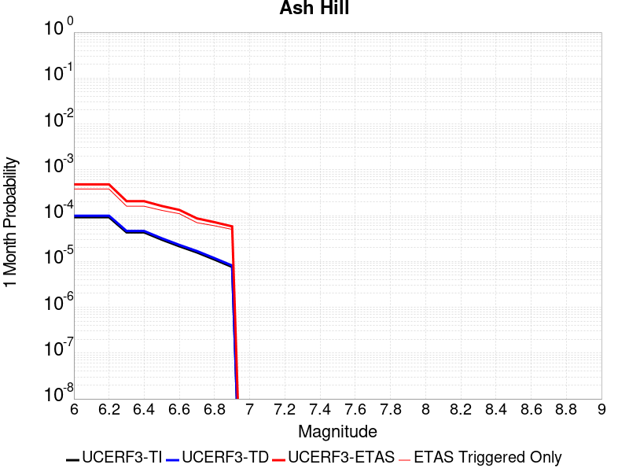 | 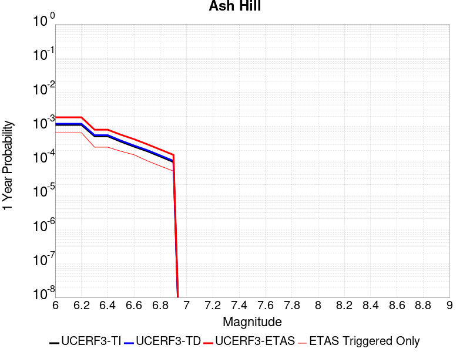 |  |

| Magnitude | 1 wk TI Prob | 1 wk TD Prob | 1 wk ETAS Prob | 1 wk ETAS/TD Gain | 1 wk ETAS Triggered Only | 1 mo TI Prob | 1 mo TD Prob | 1 mo ETAS Prob | 1 mo ETAS/TD Gain | 1 mo ETAS Triggered Only | 1 yr TI Prob | 1 yr TD Prob | 1 yr ETAS Prob | 1 yr ETAS/TD Gain | 1 yr ETAS Triggered Only | 10 yr TI Prob | 10 yr TD Prob | 10 yr ETAS Prob | 10 yr ETAS/TD Gain | 10 yr ETAS Triggered Only |
|-----|-----|-----|-----|-----|-----|-----|-----|-----|-----|-----|-----|-----|-----|-----|-----|-----|-----|-----|-----|-----|
| 6.0 | 2.1545662E-5 | 2.3194681E-5 | 2.1319027E-4 | 9.191342 | 1.9E-4 | 9.2335285E-5 | 9.9402445E-5 | 4.7936468E-4 | 4.8224635 | 3.8E-4 | 0.0011236023 | 0.0012096328 | 0.0018688345 | 1.5449601 | 6.6E-4 | 0.011179381 | 0.01203847 | 0.013016552 | 1.0812464 | 9.9E-4 |
| 6.1 | 2.1545662E-5 | 2.3194681E-5 | 2.1319027E-4 | 9.191342 | 1.9E-4 | 9.2335285E-5 | 9.9402445E-5 | 4.7936468E-4 | 4.8224635 | 3.8E-4 | 0.0011236023 | 0.0012096328 | 0.0018688345 | 1.5449601 | 6.6E-4 | 0.011179381 | 0.01203847 | 0.013016552 | 1.0812464 | 9.9E-4 |
| 6.2 | 2.1545662E-5 | 2.3194681E-5 | 2.1319027E-4 | 9.191342 | 1.9E-4 | 9.2335285E-5 | 9.9402445E-5 | 4.7936468E-4 | 4.8224635 | 3.8E-4 | 0.0011236023 | 0.0012096328 | 0.0018688345 | 1.5449601 | 6.6E-4 | 0.011179381 | 0.01203847 | 0.013016552 | 1.0812464 | 9.9E-4 |
| 6.3 | 1.0025529E-5 | 1.0747037E-5 | 1.20745855E-4 | 11.23527 | 1.1E-4 | 4.2965847E-5 | 4.605799E-5 | 2.0605062E-4 | 4.4737215 | 1.6E-4 | 5.229836E-4 | 5.60625E-4 | 8.104848E-4 | 1.4456809 | 2.5E-4 | 0.005217545 | 0.0055934195 | 0.005951406 | 1.0640013 | 3.6E-4 |
| 6.4 | 1.0025529E-5 | 1.0747037E-5 | 1.20745855E-4 | 11.23527 | 1.1E-4 | 4.2965847E-5 | 4.605799E-5 | 2.0605062E-4 | 4.4737215 | 1.6E-4 | 5.229836E-4 | 5.60625E-4 | 8.104848E-4 | 1.4456809 | 2.5E-4 | 0.005217545 | 0.0055934195 | 0.005951406 | 1.0640013 | 3.6E-4 |
| 6.5 | 6.9617327E-6 | 7.456704E-6 | 8.745611E-5 | 11.72852 | 8.0E-5 | 2.9835655E-5 | 3.1956963E-5 | 1.619528E-4 | 5.067841 | 1.3E-4 | 3.6318856E-4 | 3.8901521E-4 | 5.789413E-4 | 1.4882227 | 1.9E-4 | 0.0036259557 | 0.0038841967 | 0.0041531483 | 1.0692425 | 2.7E-4 |
| 6.6 | 4.9919777E-6 | 5.346739E-6 | 8.534631E-5 | 15.962312 | 8.0E-5 | 2.1394015E-5 | 2.2914432E-5 | 1.3291191E-4 | 5.8003583 | 1.1E-4 | 2.60441E-4 | 2.789542E-4 | 4.2891235E-4 | 1.5375727 | 1.5E-4 | 0.0026013597 | 0.0027866988 | 0.0029961136 | 1.075148 | 2.1E-4 |
| 6.7 | 3.6630722E-6 | 3.9246606E-6 | 5.3924465E-5 | 13.739904 | 5.0E-5 | 1.5698786E-5 | 1.6819899E-5 | 8.681872E-5 | 5.1616673 | 7.0E-5 | 1.9111596E-4 | 2.0476876E-4 | 3.0474828E-4 | 1.4882557 | 1.0E-4 | 0.0019095168 | 0.002046364 | 0.0022060366 | 1.0780275 | 1.6E-4 |
| 6.8 | 2.5599613E-6 | 2.7449514E-6 | 5.2744814E-5 | 19.215208 | 5.0E-5 | 1.0971216E-5 | 1.1764052E-5 | 7.1763345E-5 | 6.1002235 | 6.0E-5 | 1.3356637E-4 | 1.4322287E-4 | 2.1321284E-4 | 1.4886788 | 7.0E-5 | 0.0013348613 | 0.0014317906 | 0.0015416332 | 1.0767169 | 1.1E-4 |
| 6.9 | 1.7684905E-6 | 1.896889E-6 | 5.1896794E-5 | 27.358898 | 5.0E-5 | 7.579223E-6 | 8.129524E-6 | 5.8129117E-5 | 7.1503716 | 5.0E-5 | 9.2273134E-5 | 9.8976954E-5 | 1.48972E-4 | 1.5051181 | 5.0E-5 | 9.223483E-4 | 9.897696E-4 | 0.0010497102 | 1.0605602 | 6.0E-5 |

## San Andreas (Mojave N)
*[(top)](#table-of-contents)*

| 1 Week | 1 Month | 1 Year | 10 Year |
|-----|-----|-----|-----|
|  |  | 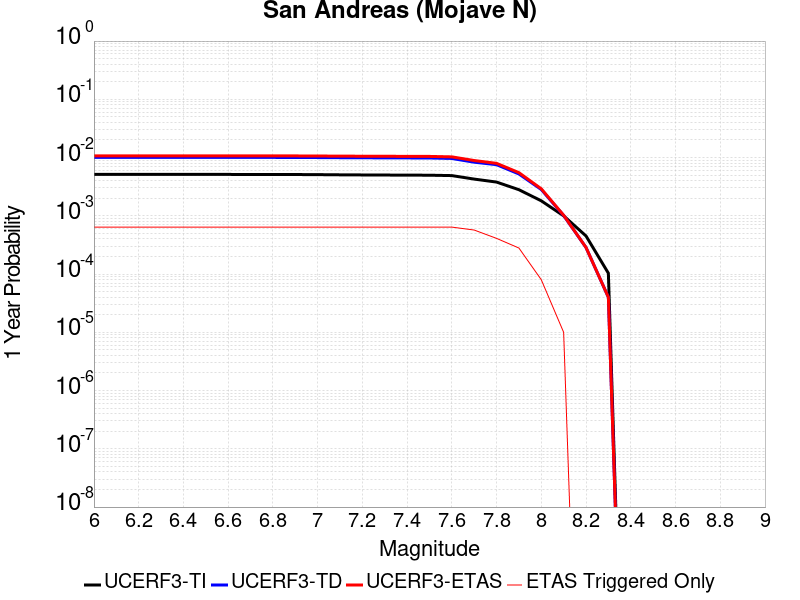 |  |

| Magnitude | 1 wk TI Prob | 1 wk TD Prob | 1 wk ETAS Prob | 1 wk ETAS/TD Gain | 1 wk ETAS Triggered Only | 1 mo TI Prob | 1 mo TD Prob | 1 mo ETAS Prob | 1 mo ETAS/TD Gain | 1 mo ETAS Triggered Only | 1 yr TI Prob | 1 yr TD Prob | 1 yr ETAS Prob | 1 yr ETAS/TD Gain | 1 yr ETAS Triggered Only | 10 yr TI Prob | 10 yr TD Prob | 10 yr ETAS Prob | 10 yr ETAS/TD Gain | 10 yr ETAS Triggered Only |
|-----|-----|-----|-----|-----|-----|-----|-----|-----|-----|-----|-----|-----|-----|-----|-----|-----|-----|-----|-----|-----|
| 6.0 | 9.877682E-5 | 1.9410432E-4 | 2.740888E-4 | 1.4120696 | 8.0E-5 | 4.2326056E-4 | 8.3161064E-4 | 0.0010614194 | 1.2763418 | 2.3E-4 | 0.0051410277 | 0.010077983 | 0.010711533 | 1.0628648 | 6.4E-4 | 0.05023708 | 0.098361015 | 0.09908232 | 1.0073333 | 8.0E-4 |
| 6.1 | 9.877682E-5 | 1.9410432E-4 | 2.740888E-4 | 1.4120696 | 8.0E-5 | 4.2326056E-4 | 8.3161064E-4 | 0.0010614194 | 1.2763418 | 2.3E-4 | 0.0051410277 | 0.010077983 | 0.010711533 | 1.0628648 | 6.4E-4 | 0.05023708 | 0.098361015 | 0.09908232 | 1.0073333 | 8.0E-4 |
| 6.2 | 9.877682E-5 | 1.9410432E-4 | 2.740888E-4 | 1.4120696 | 8.0E-5 | 4.2326056E-4 | 8.3161064E-4 | 0.0010614194 | 1.2763418 | 2.3E-4 | 0.0051410277 | 0.010077983 | 0.010711533 | 1.0628648 | 6.4E-4 | 0.05023708 | 0.098361015 | 0.09908232 | 1.0073333 | 8.0E-4 |
| 6.3 | 9.877682E-5 | 1.9410432E-4 | 2.740888E-4 | 1.4120696 | 8.0E-5 | 4.2326056E-4 | 8.3161064E-4 | 0.0010614194 | 1.2763418 | 2.3E-4 | 0.0051410277 | 0.010077983 | 0.010711533 | 1.0628648 | 6.4E-4 | 0.05023708 | 0.098361015 | 0.09908232 | 1.0073333 | 8.0E-4 |
| 6.4 | 9.877682E-5 | 1.9410432E-4 | 2.740888E-4 | 1.4120696 | 8.0E-5 | 4.2326056E-4 | 8.3161064E-4 | 0.0010614194 | 1.2763418 | 2.3E-4 | 0.0051410277 | 0.010077983 | 0.010711533 | 1.0628648 | 6.4E-4 | 0.05023708 | 0.098361015 | 0.09908232 | 1.0073333 | 8.0E-4 |
| 6.5 | 9.861474E-5 | 1.9384196E-4 | 2.7382644E-4 | 1.4126273 | 8.0E-5 | 4.2256617E-4 | 8.3048694E-4 | 0.001060296 | 1.276716 | 2.3E-4 | 0.0051326132 | 0.010064429 | 0.010697987 | 1.0629503 | 6.4E-4 | 0.050156746 | 0.09823856 | 0.09895997 | 1.0073434 | 8.0E-4 |
| 6.6 | 9.861474E-5 | 1.9384196E-4 | 2.7382644E-4 | 1.4126273 | 8.0E-5 | 4.2256617E-4 | 8.3048694E-4 | 0.001060296 | 1.276716 | 2.3E-4 | 0.0051326132 | 0.010064429 | 0.010697987 | 1.0629503 | 6.4E-4 | 0.050156746 | 0.09823856 | 0.09895997 | 1.0073434 | 8.0E-4 |
| 6.7 | 9.8552715E-5 | 1.9374148E-4 | 2.7372598E-4 | 1.4128413 | 8.0E-5 | 4.223004E-4 | 8.300566E-4 | 0.0010598657 | 1.2768595 | 2.3E-4 | 0.0051293927 | 0.0100592375 | 0.010692799 | 1.0629832 | 6.4E-4 | 0.050125998 | 0.098191775 | 0.098913215 | 1.0073473 | 8.0E-4 |
| 6.8 | 9.8464974E-5 | 1.9359306E-4 | 2.7357758E-4 | 1.4131579 | 8.0E-5 | 4.219245E-4 | 8.294209E-4 | 0.0010592302 | 1.277072 | 2.3E-4 | 0.0051248376 | 0.01005157 | 0.010685137 | 1.0630317 | 6.4E-4 | 0.05008251 | 0.09812213 | 0.09884363 | 1.0073531 | 8.0E-4 |
| 6.9 | 9.825824E-5 | 1.9327311E-4 | 2.7325764E-4 | 1.4138421 | 8.0E-5 | 4.2103877E-4 | 8.2805054E-4 | 0.0010578601 | 1.2775308 | 2.3E-4 | 0.0051141046 | 0.010035039 | 0.010668617 | 1.0631366 | 6.4E-4 | 0.049980022 | 0.09797137 | 0.09869299 | 1.0073657 | 8.0E-4 |
| 7.0 | 9.781462E-5 | 1.9258665E-4 | 2.7257125E-4 | 1.4153174 | 8.0E-5 | 4.1913814E-4 | 8.251105E-4 | 0.0010549207 | 1.2785206 | 2.3E-4 | 0.005091073 | 0.009999573 | 0.010633173 | 1.0633627 | 6.4E-4 | 0.04976007 | 0.09764758 | 0.098369464 | 1.0073928 | 8.0E-4 |
| 7.1 | 9.7121134E-5 | 1.9160361E-4 | 2.715883E-4 | 1.4174486 | 8.0E-5 | 4.1616702E-4 | 8.2090014E-4 | 0.0010507114 | 1.2799503 | 2.3E-4 | 0.005055068 | 0.009948781 | 0.0105824135 | 1.0636895 | 6.4E-4 | 0.04941613 | 0.09718397 | 0.097906224 | 1.0074319 | 8.0E-4 |
| 7.2 | 9.663819E-5 | 1.9091136E-4 | 2.708961E-4 | 1.4189626 | 8.0E-5 | 4.1409794E-4 | 8.179352E-4 | 0.0010477471 | 1.2809659 | 2.3E-4 | 0.0050299936 | 0.009913012 | 0.0105466675 | 1.0639216 | 6.4E-4 | 0.049176537 | 0.09685706 | 0.097579576 | 1.0074596 | 8.0E-4 |
| 7.3 | 9.6277574E-5 | 1.9043636E-4 | 2.7042112E-4 | 1.4200078 | 8.0E-5 | 4.125529E-4 | 8.1590074E-4 | 0.0010457131 | 1.281667 | 2.3E-4 | 0.0050112694 | 0.009888468 | 0.010522139 | 1.0640819 | 6.4E-4 | 0.04899759 | 0.09663044 | 0.09735313 | 1.007479 | 8.0E-4 |
| 7.4 | 9.593308E-5 | 1.8983395E-4 | 2.6981876E-4 | 1.421341 | 8.0E-5 | 4.1107697E-4 | 8.133206E-4 | 0.0010431336 | 1.2825613 | 2.3E-4 | 0.0049933824 | 0.00985734 | 0.010491031 | 1.0642862 | 6.4E-4 | 0.04882661 | 0.09634874 | 0.09707166 | 1.0075032 | 8.0E-4 |
| 7.5 | 9.561707E-5 | 1.892946E-4 | 2.6927947E-4 | 1.4225416 | 8.0E-5 | 4.0972308E-4 | 8.1101054E-4 | 0.001040824 | 1.2833668 | 2.3E-4 | 0.0049769743 | 0.009829468 | 0.010463177 | 1.0644703 | 6.4E-4 | 0.048669744 | 0.09609495 | 0.096818075 | 1.0075251 | 8.0E-4 |
| 7.6 | 9.418194E-5 | 1.858169E-4 | 2.6580205E-4 | 1.4304514 | 8.0E-5 | 4.0357444E-4 | 7.961153E-4 | 0.0010259321 | 1.2886729 | 2.3E-4 | 0.004902454 | 0.009649739 | 0.010283563 | 1.065683 | 6.4E-4 | 0.047957025 | 0.094475985 | 0.095200405 | 1.0076678 | 8.0E-4 |
| 7.7 | 8.202141E-5 | 1.6029968E-4 | 2.4028686E-4 | 1.4989853 | 8.0E-5 | 3.51473E-4 | 6.868178E-4 | 8.966736E-4 | 1.305548 | 2.1E-4 | 0.00427079 | 0.008330002 | 0.008895255 | 1.0678574 | 5.7E-4 | 0.04189639 | 0.08226986 | 0.08292145 | 1.0079201 | 7.1E-4 |
| 7.8 | 7.2859846E-5 | 1.452426E-4 | 2.0523388E-4 | 1.413042 | 6.0E-5 | 3.1221908E-4 | 6.223198E-4 | 7.722264E-4 | 1.2408836 | 1.5E-4 | 0.003794643 | 0.007550463 | 0.007957367 | 1.0538913 | 4.1E-4 | 0.037304975 | 0.074759446 | 0.07522207 | 1.0061882 | 5.0E-4 |
| 7.9 | 5.3874453E-5 | 1.0051061E-4 | 1.5050558E-4 | 1.4974099 | 5.0E-5 | 2.3087008E-4 | 4.3068864E-4 | 5.4064125E-4 | 1.2552949 | 1.1E-4 | 0.0028072202 | 0.005231038 | 0.0055095735 | 1.0532466 | 2.8E-4 | 0.02772022 | 0.052449387 | 0.052762076 | 1.0059618 | 3.3E-4 |
| 8.0 | 3.468538E-5 | 5.4289703E-5 | 7.428862E-5 | 1.368374 | 2.0E-5 | 1.4864317E-4 | 2.3264941E-4 | 2.726401E-4 | 1.1718925 | 4.0E-5 | 0.0018082283 | 0.0028288292 | 0.002908603 | 1.0282003 | 8.0E-5 | 0.017935853 | 0.028961731 | 0.029058836 | 1.0033529 | 1.0E-4 |
| 8.1 | 1.9152367E-5 | 1.9414629E-5 | 1.9414629E-5 | 1.0 | 0.0 | 8.207899E-5 | 8.3202896E-5 | 8.3202896E-5 | 1.0 | 0.0 | 9.988535E-4 | 0.0010125252 | 0.001022515 | 1.0098664 | 1.0E-5 | 0.009943757 | 0.010862543 | 0.010872435 | 1.0009106 | 1.0E-5 |
| 8.2 | 8.643924E-6 | 5.478665E-6 | 5.478665E-6 | 1.0 | 0.0 | 3.704486E-5 | 2.3479783E-5 | 2.3479783E-5 | 1.0 | 0.0 | 4.5092785E-4 | 2.8582895E-4 | 2.8582895E-4 | 1.0 | 0.0 | 0.0045001395 | 0.0032508469 | 0.0032508469 | 1.0 | 0.0 |
| 8.3 | 1.983087E-6 | 7.6647797E-7 | 7.6647797E-7 | 1.0 | 0.0 | 8.498917E-6 | 3.2849016E-6 | 3.2849016E-6 | 1.0 | 0.0 | 1.034694E-4 | 3.999296E-5 | 3.999296E-5 | 1.0 | 0.0 | 0.0010342124 | 4.7228087E-4 | 4.7228087E-4 | 1.0 | 0.0 |

## Gravel Hills-Harper Lk
*[(top)](#table-of-contents)*

| 1 Week | 1 Month | 1 Year | 10 Year |
|-----|-----|-----|-----|
|  | 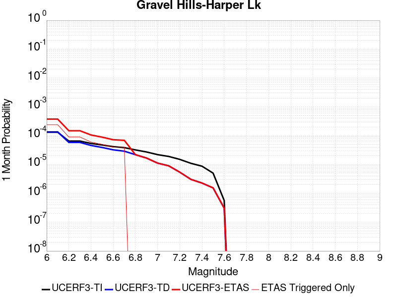 |  | 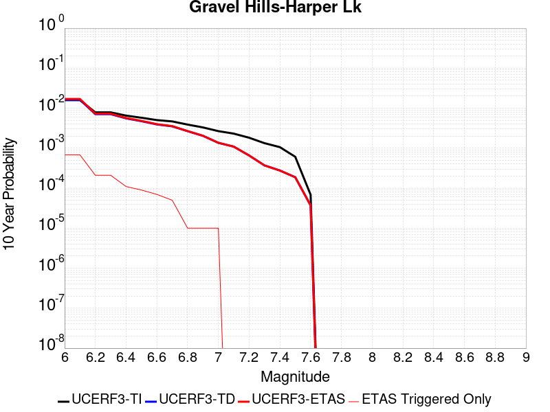 |

| Magnitude | 1 wk TI Prob | 1 wk TD Prob | 1 wk ETAS Prob | 1 wk ETAS/TD Gain | 1 wk ETAS Triggered Only | 1 mo TI Prob | 1 mo TD Prob | 1 mo ETAS Prob | 1 mo ETAS/TD Gain | 1 mo ETAS Triggered Only | 1 yr TI Prob | 1 yr TD Prob | 1 yr ETAS Prob | 1 yr ETAS/TD Gain | 1 yr ETAS Triggered Only | 10 yr TI Prob | 10 yr TD Prob | 10 yr ETAS Prob | 10 yr ETAS/TD Gain | 10 yr ETAS Triggered Only |
|-----|-----|-----|-----|-----|-----|-----|-----|-----|-----|-----|-----|-----|-----|-----|-----|-----|-----|-----|-----|-----|
| 6.0 | 3.0679566E-5 | 3.146516E-5 | 1.3146202E-4 | 4.1780186 | 1.0E-4 | 1.3147724E-4 | 1.3484493E-4 | 3.7481257E-4 | 2.779582 | 2.4E-4 | 0.0015995599 | 0.0016407177 | 0.0021099467 | 1.28599 | 4.7E-4 | 0.015880952 | 0.016307613 | 0.016976522 | 1.0410184 | 6.8E-4 |
| 6.1 | 3.0679566E-5 | 3.146516E-5 | 1.3146202E-4 | 4.1780186 | 1.0E-4 | 1.3147724E-4 | 1.3484493E-4 | 3.7481257E-4 | 2.779582 | 2.4E-4 | 0.0015995599 | 0.0016407177 | 0.0021099467 | 1.28599 | 4.7E-4 | 0.015880952 | 0.016307613 | 0.016976522 | 1.0410184 | 6.8E-4 |
| 6.2 | 1.514536E-5 | 1.363538E-5 | 6.3634696E-5 | 4.666881 | 5.0E-5 | 6.490707E-5 | 5.84361E-5 | 1.4843085E-4 | 2.5400538 | 9.0E-5 | 7.8995706E-4 | 7.112392E-4 | 8.511396E-4 | 1.1966995 | 1.4E-4 | 0.007871548 | 0.0070908302 | 0.007299341 | 1.0294057 | 2.1E-4 |
| 6.3 | 1.514536E-5 | 1.363538E-5 | 6.3634696E-5 | 4.666881 | 5.0E-5 | 6.490707E-5 | 5.84361E-5 | 1.4843085E-4 | 2.5400538 | 9.0E-5 | 7.8995706E-4 | 7.112392E-4 | 8.511396E-4 | 1.1966995 | 1.4E-4 | 0.007871548 | 0.0070908302 | 0.007299341 | 1.0294057 | 2.1E-4 |
| 6.4 | 1.2532521E-5 | 1.0689813E-5 | 4.0689494E-5 | 3.80638 | 3.0E-5 | 5.37097E-5 | 4.5812714E-5 | 1.05809966E-4 | 2.3096201 | 6.0E-5 | 6.537194E-4 | 5.576329E-4 | 6.3758827E-4 | 1.1433835 | 8.0E-5 | 0.0065179965 | 0.0055629266 | 0.0056723147 | 1.0196638 | 1.1E-4 |
| 6.5 | 1.1094058E-5 | 9.083761E-6 | 2.908358E-5 | 3.2017112 | 2.0E-5 | 4.7545094E-5 | 3.8929848E-5 | 8.89279E-5 | 2.2843115 | 5.0E-5 | 5.787078E-4 | 4.7387183E-4 | 5.338434E-4 | 1.1265565 | 6.0E-5 | 0.0057720304 | 0.0047290213 | 0.0048185955 | 1.0189414 | 9.0E-5 |
| 6.6 | 9.688328E-6 | 7.531771E-6 | 2.7531622E-5 | 3.655398 | 2.0E-5 | 4.1520743E-5 | 3.2278636E-5 | 7.227734E-5 | 2.2391698 | 4.0E-5 | 5.053978E-4 | 3.9292406E-4 | 4.4290442E-4 | 1.1272011 | 5.0E-5 | 0.0050424994 | 0.00392255 | 0.0039922753 | 1.0177755 | 7.0E-5 |
| 6.7 | 8.974824E-6 | 6.7494793E-6 | 2.6749343E-5 | 3.9631717 | 2.0E-5 | 3.8462964E-5 | 2.8926032E-5 | 6.892488E-5 | 2.3827975 | 4.0E-5 | 4.6818596E-4 | 3.521197E-4 | 3.9210563E-4 | 1.1135577 | 4.0E-5 | 0.004672008 | 0.0035158389 | 0.003565663 | 1.0141714 | 5.0E-5 |
| 6.8 | 7.4780046E-6 | 5.1162397E-6 | 5.1162397E-6 | 1.0 | 0.0 | 3.20482E-5 | 2.1926564E-5 | 2.1926564E-5 | 1.0 | 0.0 | 3.9011694E-4 | 2.6692462E-4 | 2.6692462E-4 | 1.0 | 0.0 | 0.0038943281 | 0.0026661782 | 0.0026761517 | 1.0037407 | 1.0E-5 |
| 6.9 | 6.3409307E-6 | 3.9075294E-6 | 3.9075294E-6 | 1.0 | 0.0 | 2.7175134E-5 | 1.6746453E-5 | 1.6746453E-5 | 1.0 | 0.0 | 3.3080703E-4 | 2.0386997E-4 | 2.0386997E-4 | 1.0 | 0.0 | 0.0033031502 | 0.0020369277 | 0.0020469073 | 1.0048994 | 1.0E-5 |
| 7.0 | 5.1239335E-6 | 2.605876E-6 | 2.605876E-6 | 1.0 | 0.0 | 2.195953E-5 | 1.1167994E-5 | 1.1167994E-5 | 1.0 | 0.0 | 2.6732447E-4 | 1.359621E-4 | 1.359621E-4 | 1.0 | 0.0 | 0.0026700313 | 0.0013588143 | 0.0013688008 | 1.0073494 | 1.0E-5 |
| 7.1 | 4.438899E-6 | 2.0984924E-6 | 2.0984924E-6 | 1.0 | 0.0 | 1.9023713E-5 | 8.993509E-6 | 8.993509E-6 | 1.0 | 0.0 | 2.315891E-4 | 1.0949069E-4 | 1.0949069E-4 | 1.0 | 0.0 | 0.002313479 | 0.0010943894 | 0.0010943894 | 1.0 | 0.0 |
| 7.2 | 3.50367E-6 | 1.2615886E-6 | 1.2615886E-6 | 1.0 | 0.0 | 1.5015643E-5 | 5.4067978E-6 | 5.4067978E-6 | 1.0 | 0.0 | 1.8280011E-4 | 6.582586E-5 | 6.582586E-5 | 1.0 | 0.0 | 0.0018264982 | 6.5807183E-4 | 6.5807183E-4 | 1.0 | 0.0 |
| 7.3 | 2.561638E-6 | 7.1188435E-7 | 7.1188435E-7 | 1.0 | 0.0 | 1.0978401E-5 | 3.0509295E-6 | 3.0509295E-6 | 1.0 | 0.0 | 1.3365384E-4 | 3.7144455E-5 | 3.7144455E-5 | 1.0 | 0.0 | 0.0013357349 | 3.7138443E-4 | 3.7138443E-4 | 1.0 | 0.0 |
| 7.4 | 2.0368864E-6 | 5.3046045E-7 | 5.3046045E-7 | 1.0 | 0.0 | 8.729483E-6 | 2.2734E-6 | 2.2734E-6 | 1.0 | 0.0 | 1.06276275E-4 | 2.7678298E-5 | 2.7678298E-5 | 1.0 | 0.0 | 0.0010622547 | 2.7674905E-4 | 2.7674905E-4 | 1.0 | 0.0 |
| 7.5 | 1.1681728E-6 | 3.6029326E-7 | 3.6029326E-7 | 1.0 | 0.0 | 5.0064455E-6 | 1.544113E-6 | 1.544113E-6 | 1.0 | 0.0 | 6.0951766E-5 | 1.879942E-5 | 1.879942E-5 | 1.0 | 0.0 | 6.093505E-4 | 1.8797876E-4 | 1.8797876E-4 | 1.0 | 0.0 |
| 7.6 | 1.3154387E-7 | 7.119745E-8 | 7.119745E-8 | 1.0 | 0.0 | 5.6375933E-7 | 3.051319E-7 | 3.051319E-7 | 1.0 | 0.0 | 6.863748E-6 | 3.7149762E-6 | 3.7149762E-6 | 1.0 | 0.0 | 6.863536E-5 | 3.7149297E-5 | 3.7149297E-5 | 1.0 | 0.0 |

## San Andreas (Mojave S)
*[(top)](#table-of-contents)*

| 1 Week | 1 Month | 1 Year | 10 Year |
|-----|-----|-----|-----|
| 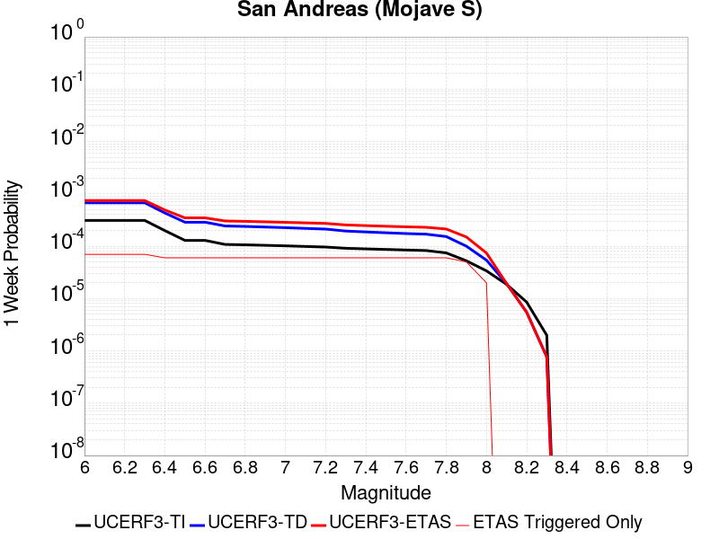 | 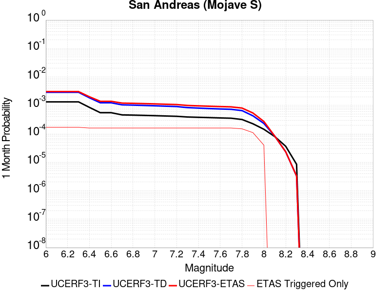 |  |  |

| Magnitude | 1 wk TI Prob | 1 wk TD Prob | 1 wk ETAS Prob | 1 wk ETAS/TD Gain | 1 wk ETAS Triggered Only | 1 mo TI Prob | 1 mo TD Prob | 1 mo ETAS Prob | 1 mo ETAS/TD Gain | 1 mo ETAS Triggered Only | 1 yr TI Prob | 1 yr TD Prob | 1 yr ETAS Prob | 1 yr ETAS/TD Gain | 1 yr ETAS Triggered Only | 10 yr TI Prob | 10 yr TD Prob | 10 yr ETAS Prob | 10 yr ETAS/TD Gain | 10 yr ETAS Triggered Only |
|-----|-----|-----|-----|-----|-----|-----|-----|-----|-----|-----|-----|-----|-----|-----|-----|-----|-----|-----|-----|-----|
| 6.0 | 3.1064058E-4 | 6.7471585E-4 | 7.4466865E-4 | 1.1036774 | 7.0E-5 | 0.0013306376 | 0.0028885633 | 0.0030580722 | 1.0586828 | 1.7E-4 | 0.016080605 | 0.03457021 | 0.03509154 | 1.0150803 | 5.4E-4 | 0.1496549 | 0.2866514 | 0.2871151 | 1.0016176 | 6.5E-4 |
| 6.1 | 3.1064058E-4 | 6.7471585E-4 | 7.4466865E-4 | 1.1036774 | 7.0E-5 | 0.0013306376 | 0.0028885633 | 0.0030580722 | 1.0586828 | 1.7E-4 | 0.016080605 | 0.03457021 | 0.03509154 | 1.0150803 | 5.4E-4 | 0.1496549 | 0.2866514 | 0.2871151 | 1.0016176 | 6.5E-4 |
| 6.2 | 3.1064058E-4 | 6.7471585E-4 | 7.4466865E-4 | 1.1036774 | 7.0E-5 | 0.0013306376 | 0.0028885633 | 0.0030580722 | 1.0586828 | 1.7E-4 | 0.016080605 | 0.03457021 | 0.03509154 | 1.0150803 | 5.4E-4 | 0.1496549 | 0.2866514 | 0.2871151 | 1.0016176 | 6.5E-4 |
| 6.3 | 3.1064058E-4 | 6.7471585E-4 | 7.4466865E-4 | 1.1036774 | 7.0E-5 | 0.0013306376 | 0.0028885633 | 0.0030580722 | 1.0586828 | 1.7E-4 | 0.016080605 | 0.03457021 | 0.03509154 | 1.0150803 | 5.4E-4 | 0.1496549 | 0.2866514 | 0.2871151 | 1.0016176 | 6.5E-4 |
| 6.4 | 1.9872203E-4 | 4.31896E-4 | 4.918701E-4 | 1.1388624 | 6.0E-5 | 8.5138786E-4 | 0.0018496981 | 0.0020094023 | 1.0863405 | 1.6E-4 | 0.010316478 | 0.02229367 | 0.022782523 | 1.0219278 | 5.0E-4 | 0.098504856 | 0.19705607 | 0.19753784 | 1.0024449 | 6.0E-4 |
| 6.5 | 1.291105E-4 | 2.8762486E-4 | 3.4760762E-4 | 1.2085451 | 6.0E-5 | 5.5321335E-4 | 0.0012320984 | 0.0013919014 | 1.1296997 | 1.6E-4 | 0.006714592 | 0.014898448 | 0.015390999 | 1.0330606 | 5.0E-4 | 0.065152965 | 0.138118 | 0.13863513 | 1.0037441 | 6.0E-4 |
| 6.6 | 1.291105E-4 | 2.8762486E-4 | 3.4760762E-4 | 1.2085451 | 6.0E-5 | 5.5321335E-4 | 0.0012320984 | 0.0013919014 | 1.1296997 | 1.6E-4 | 0.006714592 | 0.014898448 | 0.015390999 | 1.0330606 | 5.0E-4 | 0.065152965 | 0.138118 | 0.13863513 | 1.0037441 | 6.0E-4 |
| 6.7 | 1.08001186E-4 | 2.4343564E-4 | 3.0342102E-4 | 1.2464117 | 6.0E-5 | 4.6278012E-4 | 0.0010428791 | 0.0012027122 | 1.1532614 | 1.6E-4 | 0.0056198016 | 0.012623432 | 0.013117121 | 1.0391089 | 5.0E-4 | 0.054797906 | 0.119228184 | 0.11975665 | 1.0044323 | 6.0E-4 |
| 6.8 | 1.0624356E-4 | 2.3861213E-4 | 2.9859782E-4 | 1.2513942 | 6.0E-5 | 4.5525006E-4 | 0.0010222232 | 0.0011820596 | 1.1563616 | 1.6E-4 | 0.0055285925 | 0.012374822 | 0.012868634 | 1.0399046 | 5.0E-4 | 0.053930566 | 0.117172524 | 0.117702216 | 1.0045207 | 6.0E-4 |
| 6.9 | 1.0393785E-4 | 2.3231508E-4 | 2.9230115E-4 | 1.25821 | 6.0E-5 | 4.4537184E-4 | 9.952566E-4 | 0.0011550974 | 1.1606026 | 1.6E-4 | 0.0054089287 | 0.012050176 | 0.01254415 | 1.0409932 | 5.0E-4 | 0.05279156 | 0.11446828 | 0.11499959 | 1.0046417 | 6.0E-4 |
| 7.0 | 1.0155622E-4 | 2.2601044E-4 | 2.8599688E-4 | 1.2654145 | 6.0E-5 | 4.3516833E-4 | 9.68257E-4 | 0.0011281021 | 1.1650854 | 1.6E-4 | 0.005285311 | 0.011725035 | 0.012219172 | 1.0421438 | 5.0E-4 | 0.05161361 | 0.11172433 | 0.1122573 | 1.0047704 | 6.0E-4 |
| 7.1 | 9.885595E-5 | 2.188942E-4 | 2.7888105E-4 | 1.274045 | 6.0E-5 | 4.2359953E-4 | 9.3778106E-4 | 0.0010976311 | 1.1704556 | 1.6E-4 | 0.0051451353 | 0.011357912 | 0.011852233 | 1.0435221 | 5.0E-4 | 0.05027629 | 0.108605 | 0.10913984 | 1.0049247 | 6.0E-4 |
| 7.2 | 9.6411415E-5 | 2.1252372E-4 | 2.7251095E-4 | 1.2822615 | 6.0E-5 | 4.1312634E-4 | 9.104983E-4 | 0.0010703526 | 1.175568 | 1.6E-4 | 0.005018219 | 0.011029154 | 0.01152364 | 1.0448344 | 5.0E-4 | 0.049064007 | 0.10579592 | 0.106332436 | 1.0050713 | 6.0E-4 |
| 7.3 | 9.1180635E-5 | 1.9480525E-4 | 2.5479356E-4 | 1.3079399 | 6.0E-5 | 3.907156E-4 | 8.3461264E-4 | 9.94479E-4 | 1.1915457 | 1.6E-4 | 0.004746591 | 0.010114178 | 0.010599222 | 1.0479568 | 4.9E-4 | 0.046464786 | 0.09798997 | 0.09852216 | 1.005431 | 5.9E-4 |
| 7.4 | 8.887388E-5 | 1.8729005E-4 | 2.472788E-4 | 1.3202987 | 6.0E-5 | 3.8083247E-4 | 8.024248E-4 | 9.6229644E-4 | 1.1992357 | 1.6E-4 | 0.0046267817 | 0.0097258575 | 0.0102110915 | 1.0498911 | 4.9E-4 | 0.045316286 | 0.0946256 | 0.09515977 | 1.0056452 | 5.9E-4 |
| 7.5 | 8.6750515E-5 | 1.8060463E-4 | 2.405938E-4 | 1.3321574 | 6.0E-5 | 3.7173493E-4 | 7.7379035E-4 | 9.3366654E-4 | 1.2066144 | 1.6E-4 | 0.004516484 | 0.009380288 | 0.009865692 | 1.0517472 | 4.9E-4 | 0.04425787 | 0.09158909 | 0.09212506 | 1.0058519 | 5.9E-4 |
| 7.6 | 8.453092E-5 | 1.7447997E-4 | 2.344695E-4 | 1.343819 | 6.0E-5 | 3.6222505E-4 | 7.4755703E-4 | 9.074374E-4 | 1.2138705 | 1.6E-4 | 0.0044011753 | 0.0090636 | 0.009549159 | 1.0535724 | 4.9E-4 | 0.04315024 | 0.08874676 | 0.0892844 | 1.0060581 | 5.9E-4 |
| 7.7 | 8.259102E-5 | 1.6970029E-4 | 2.2969011E-4 | 1.3535045 | 6.0E-5 | 3.539135E-4 | 7.270843E-4 | 8.8696793E-4 | 1.219897 | 1.6E-4 | 0.004300386 | 0.008816389 | 0.009292157 | 1.053964 | 4.8E-4 | 0.042181134 | 0.08649703 | 0.087026864 | 1.0061255 | 5.8E-4 |
| 7.8 | 7.444844E-5 | 1.5291499E-4 | 2.1290581E-4 | 1.3923149 | 6.0E-5 | 3.1902574E-4 | 6.5518543E-4 | 8.0508715E-4 | 1.2287928 | 1.5E-4 | 0.0038772223 | 0.007947756 | 0.008354498 | 1.0511769 | 4.1E-4 | 0.03810269 | 0.078325555 | 0.078786395 | 1.0058836 | 5.0E-4 |
| 7.9 | 5.2586525E-5 | 1.0011774E-4 | 1.5011273E-4 | 1.499362 | 5.0E-5 | 2.2535135E-4 | 4.2900548E-4 | 5.389583E-4 | 1.256297 | 1.1E-4 | 0.0027402006 | 0.005210644 | 0.005489185 | 1.0534562 | 2.8E-4 | 0.027066574 | 0.052224807 | 0.052537575 | 1.0059888 | 3.3E-4 |
| 8.0 | 3.379877E-5 | 5.4103475E-5 | 7.410239E-5 | 1.369642 | 2.0E-5 | 1.4484383E-4 | 2.3185145E-4 | 2.7184217E-4 | 1.1724843 | 4.0E-5 | 0.0017620471 | 0.002819139 | 0.0028989136 | 1.0282974 | 8.0E-5 | 0.017481409 | 0.028849052 | 0.028946167 | 1.0033664 | 1.0E-4 |
| 8.1 | 1.8668277E-5 | 1.9321345E-5 | 1.9321345E-5 | 1.0 | 0.0 | 8.000444E-5 | 8.280314E-5 | 8.280314E-5 | 1.0 | 0.0 | 9.736188E-4 | 0.0010076626 | 0.0010176526 | 1.0099139 | 1.0E-5 | 0.009693642 | 0.010805132 | 0.010815023 | 1.0009155 | 1.0E-5 |
| 8.2 | 8.541571E-6 | 5.4646152E-6 | 5.4646152E-6 | 1.0 | 0.0 | 3.660622E-5 | 2.341957E-5 | 2.341957E-5 | 1.0 | 0.0 | 4.455896E-4 | 2.8509603E-4 | 2.8509603E-4 | 1.0 | 0.0 | 0.0044469717 | 0.0032429425 | 0.0032429425 | 1.0 | 0.0 |
| 8.3 | 1.983087E-6 | 7.6647797E-7 | 7.6647797E-7 | 1.0 | 0.0 | 8.498917E-6 | 3.2849016E-6 | 3.2849016E-6 | 1.0 | 0.0 | 1.034694E-4 | 3.999296E-5 | 3.999296E-5 | 1.0 | 0.0 | 0.0010342124 | 4.7228087E-4 | 4.7228087E-4 | 1.0 | 0.0 |

## San Andreas (San Bernardino N)
*[(top)](#table-of-contents)*

| 1 Week | 1 Month | 1 Year | 10 Year |
|-----|-----|-----|-----|
| 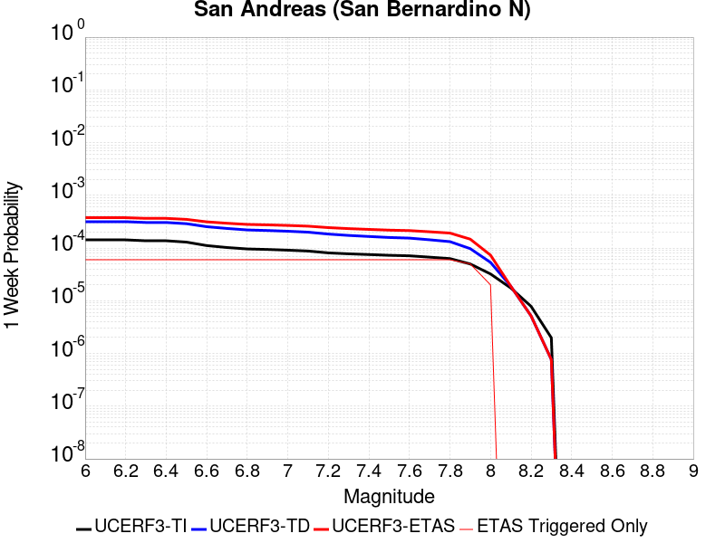 |  |  |  |

| Magnitude | 1 wk TI Prob | 1 wk TD Prob | 1 wk ETAS Prob | 1 wk ETAS/TD Gain | 1 wk ETAS Triggered Only | 1 mo TI Prob | 1 mo TD Prob | 1 mo ETAS Prob | 1 mo ETAS/TD Gain | 1 mo ETAS Triggered Only | 1 yr TI Prob | 1 yr TD Prob | 1 yr ETAS Prob | 1 yr ETAS/TD Gain | 1 yr ETAS Triggered Only | 10 yr TI Prob | 10 yr TD Prob | 10 yr ETAS Prob | 10 yr ETAS/TD Gain | 10 yr ETAS Triggered Only |
|-----|-----|-----|-----|-----|-----|-----|-----|-----|-----|-----|-----|-----|-----|-----|-----|-----|-----|-----|-----|-----|
| 6.0 | 1.4273766E-4 | 3.1614845E-4 | 3.761295E-4 | 1.1897242 | 6.0E-5 | 6.115894E-4 | 0.0013542244 | 0.0014940348 | 1.1032403 | 1.4E-4 | 0.0074207084 | 0.016364535 | 0.016738318 | 1.022841 | 3.8E-4 | 0.07177748 | 0.15036654 | 0.15074888 | 1.0025427 | 4.5E-4 |
| 6.1 | 1.4273766E-4 | 3.1614845E-4 | 3.761295E-4 | 1.1897242 | 6.0E-5 | 6.115894E-4 | 0.0013542244 | 0.0014940348 | 1.1032403 | 1.4E-4 | 0.0074207084 | 0.016364535 | 0.016738318 | 1.022841 | 3.8E-4 | 0.07177748 | 0.15036654 | 0.15074888 | 1.0025427 | 4.5E-4 |
| 6.2 | 1.4273766E-4 | 3.1614845E-4 | 3.761295E-4 | 1.1897242 | 6.0E-5 | 6.115894E-4 | 0.0013542244 | 0.0014940348 | 1.1032403 | 1.4E-4 | 0.0074207084 | 0.016364535 | 0.016738318 | 1.022841 | 3.8E-4 | 0.07177748 | 0.15036654 | 0.15074888 | 1.0025427 | 4.5E-4 |
| 6.3 | 1.3730655E-4 | 3.051962E-4 | 3.6517793E-4 | 1.1965349 | 6.0E-5 | 5.883239E-4 | 0.0013073338 | 0.0014471508 | 1.1069481 | 1.4E-4 | 0.0071393442 | 0.015802028 | 0.01616618 | 1.0230447 | 3.7E-4 | 0.06914291 | 0.14567827 | 0.14605416 | 1.0025804 | 4.4E-4 |
| 6.4 | 1.3730655E-4 | 3.051962E-4 | 3.6517793E-4 | 1.1965349 | 6.0E-5 | 5.883239E-4 | 0.0013073338 | 0.0014471508 | 1.1069481 | 1.4E-4 | 0.0071393442 | 0.015802028 | 0.01616618 | 1.0230447 | 3.7E-4 | 0.06914291 | 0.14567827 | 0.14605416 | 1.0025804 | 4.4E-4 |
| 6.5 | 1.2942807E-4 | 2.893405E-4 | 3.4932315E-4 | 1.2073082 | 6.0E-5 | 5.545738E-4 | 0.0012394466 | 0.0013692854 | 1.1047555 | 1.3E-4 | 0.0067310524 | 0.014987098 | 0.015341702 | 1.0236607 | 3.6E-4 | 0.06530788 | 0.13881195 | 0.13918227 | 1.0026677 | 4.3E-4 |
| 6.6 | 1.1125901E-4 | 2.537283E-4 | 3.137131E-4 | 1.2364134 | 6.0E-5 | 4.767372E-4 | 0.0010869562 | 0.0012168149 | 1.11947 | 1.3E-4 | 0.005788839 | 0.013154025 | 0.013509289 | 1.027008 | 3.6E-4 | 0.056403454 | 0.123056285 | 0.123433374 | 1.0030644 | 4.3E-4 |
| 6.7 | 1.02209575E-4 | 2.3507705E-4 | 2.9506296E-4 | 1.2551755 | 6.0E-5 | 4.3796748E-4 | 0.0010070855 | 0.0011369545 | 1.1289554 | 1.3E-4 | 0.0053192247 | 0.012192756 | 0.012538489 | 1.0283556 | 3.5E-4 | 0.051936906 | 0.11485627 | 0.115228035 | 1.0032368 | 4.2E-4 |
| 6.8 | 9.610582E-5 | 2.2033554E-4 | 2.8032233E-4 | 1.272252 | 6.0E-5 | 4.1181705E-4 | 9.4395416E-4 | 0.0010738315 | 1.1375885 | 1.3E-4 | 0.0050023515 | 0.011432346 | 0.011778344 | 1.0302649 | 3.5E-4 | 0.048912346 | 0.10822741 | 0.10860196 | 1.0034608 | 4.2E-4 |
| 6.9 | 9.3877505E-5 | 2.1489074E-4 | 2.7487785E-4 | 1.2791517 | 6.0E-5 | 4.0227012E-4 | 9.2063594E-4 | 0.0010505163 | 1.1410767 | 1.3E-4 | 0.0048866454 | 0.011151383 | 0.01149748 | 1.0310363 | 3.5E-4 | 0.04780577 | 0.105814084 | 0.106189646 | 1.0035492 | 4.2E-4 |
| 7.0 | 9.1019785E-5 | 2.0815943E-4 | 2.6814695E-4 | 1.2881806 | 6.0E-5 | 3.900265E-4 | 8.9180743E-4 | 0.0010216915 | 1.1456413 | 1.3E-4 | 0.0047382377 | 0.010803926 | 0.011150145 | 1.0320456 | 3.5E-4 | 0.046384744 | 0.10278599 | 0.103162825 | 1.0036662 | 4.2E-4 |
| 7.1 | 8.771155E-5 | 1.9990467E-4 | 2.5989267E-4 | 1.300083 | 6.0E-5 | 3.758525E-4 | 8.564535E-4 | 9.863422E-4 | 1.1516588 | 1.3E-4 | 0.0045664064 | 0.010377665 | 0.010724033 | 1.0333762 | 3.5E-4 | 0.044737056 | 0.099094115 | 0.09947249 | 1.0038184 | 4.2E-4 |
| 7.2 | 8.0830236E-5 | 1.8396029E-4 | 2.4394925E-4 | 1.3260974 | 6.0E-5 | 3.4636928E-4 | 7.8816316E-4 | 9.180607E-4 | 1.1648104 | 1.3E-4 | 0.0042088944 | 0.009553772 | 0.009900428 | 1.0362847 | 3.5E-4 | 0.041300658 | 0.09182046 | 0.092201896 | 1.0041541 | 4.2E-4 |
| 7.3 | 7.7668235E-5 | 1.7339372E-4 | 2.3338333E-4 | 1.3459733 | 6.0E-5 | 3.328214E-4 | 7.4290443E-4 | 8.7280787E-4 | 1.1748588 | 1.3E-4 | 0.0040445733 | 0.009007431 | 0.009344367 | 1.0374066 | 3.4E-4 | 0.03971748 | 0.0870959 | 0.08747019 | 1.0042975 | 4.1E-4 |
| 7.4 | 7.520177E-5 | 1.6559374E-4 | 2.255838E-4 | 1.3622725 | 6.0E-5 | 3.2225347E-4 | 7.0949446E-4 | 8.3940226E-4 | 1.183099 | 1.3E-4 | 0.0039163795 | 0.008603949 | 0.008941024 | 1.0391767 | 3.4E-4 | 0.038480744 | 0.083552666 | 0.08392841 | 1.004497 | 4.1E-4 |
| 7.5 | 7.274697E-5 | 1.5846924E-4 | 2.1845973E-4 | 1.3785623 | 6.0E-5 | 3.1173544E-4 | 6.789772E-4 | 8.088889E-4 | 1.1913345 | 1.3E-4 | 0.003788775 | 0.008235271 | 0.008572471 | 1.0409459 | 3.4E-4 | 0.03724827 | 0.08026917 | 0.08064626 | 1.0046978 | 4.1E-4 |
| 7.6 | 7.1185845E-5 | 1.541672E-4 | 2.1415795E-4 | 1.3891279 | 6.0E-5 | 3.0504653E-4 | 6.605493E-4 | 7.9046347E-4 | 1.1966759 | 1.3E-4 | 0.0037076178 | 0.008012585 | 0.008349861 | 1.0420933 | 3.4E-4 | 0.036463667 | 0.078258425 | 0.07863634 | 1.004829 | 4.1E-4 |
| 7.7 | 6.709961E-5 | 1.4325391E-4 | 2.0324532E-4 | 1.4187768 | 6.0E-5 | 2.8753807E-4 | 6.1380095E-4 | 7.4372115E-4 | 1.211665 | 1.3E-4 | 0.003495157 | 0.007447459 | 0.007775001 | 1.0439804 | 3.3E-4 | 0.034406938 | 0.07308612 | 0.07345688 | 1.005073 | 4.0E-4 |
| 7.8 | 6.300812E-5 | 1.3209098E-4 | 1.9208305E-4 | 1.4541724 | 6.0E-5 | 2.7000686E-4 | 5.6598143E-4 | 6.9590786E-4 | 1.2295595 | 1.3E-4 | 0.0032823787 | 0.006869081 | 0.0071968143 | 1.0477114 | 3.3E-4 | 0.032343175 | 0.0677427 | 0.0681156 | 1.0055047 | 4.0E-4 |
| 7.9 | 4.983037E-5 | 9.7286385E-5 | 1.4728152E-4 | 1.5138966 | 5.0E-5 | 2.1354125E-4 | 4.1687503E-4 | 5.2682916E-4 | 1.2637581 | 1.1E-4 | 0.0025967648 | 0.005063652 | 0.0053422344 | 1.055016 | 2.8E-4 | 0.025666296 | 0.050672647 | 0.050985925 | 1.0061824 | 3.3E-4 |
| 8.0 | 3.2211527E-5 | 5.3333257E-5 | 7.3332194E-5 | 1.3749806 | 2.0E-5 | 1.380421E-4 | 2.2855109E-4 | 2.6854195E-4 | 1.1749755 | 4.0E-5 | 0.0016793669 | 0.0027790607 | 0.0028588383 | 1.0287067 | 8.0E-5 | 0.016667323 | 0.028375156 | 0.02847232 | 1.0034242 | 1.0E-4 |
| 8.1 | 1.743376E-5 | 1.8835979E-5 | 1.8835979E-5 | 1.0 | 0.0 | 7.471398E-5 | 8.0723126E-5 | 8.0723126E-5 | 1.0 | 0.0 | 9.0926304E-4 | 9.823616E-4 | 9.923518E-4 | 1.0101695 | 1.0E-5 | 0.009055517 | 0.010490086 | 0.01049998 | 1.0009433 | 1.0E-5 |
| 8.2 | 7.831616E-6 | 5.158648E-6 | 5.158648E-6 | 1.0 | 0.0 | 3.3563636E-5 | 2.2108305E-5 | 2.2108305E-5 | 1.0 | 0.0 | 4.0856065E-4 | 2.6913546E-4 | 2.6913546E-4 | 1.0 | 0.0 | 0.004078103 | 0.003043787 | 0.003043787 | 1.0 | 0.0 |
| 8.3 | 1.983087E-6 | 7.6647797E-7 | 7.6647797E-7 | 1.0 | 0.0 | 8.498917E-6 | 3.2849016E-6 | 3.2849016E-6 | 1.0 | 0.0 | 1.034694E-4 | 3.999296E-5 | 3.999296E-5 | 1.0 | 0.0 | 0.0010342124 | 4.7228087E-4 | 4.7228087E-4 | 1.0 | 0.0 |

## So Sierra Nevada
*[(top)](#table-of-contents)*

| 1 Week | 1 Month | 1 Year | 10 Year |
|-----|-----|-----|-----|
| 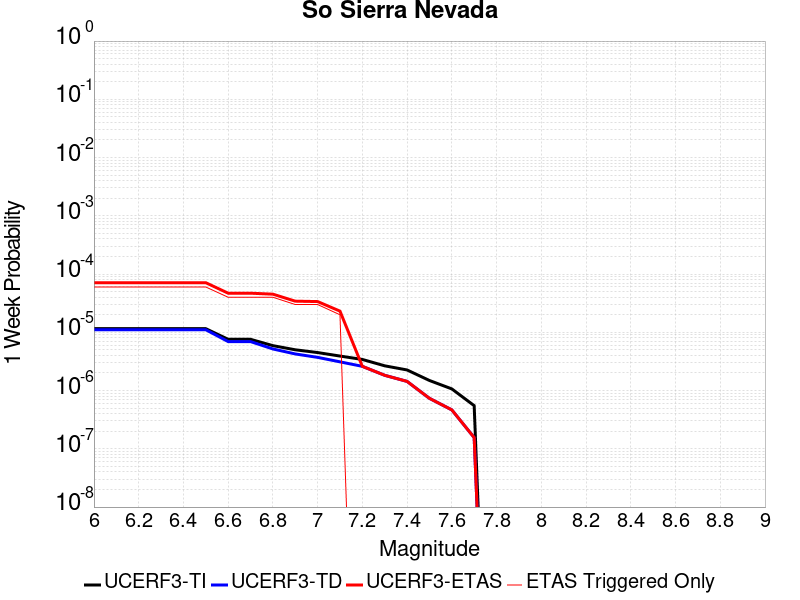 | 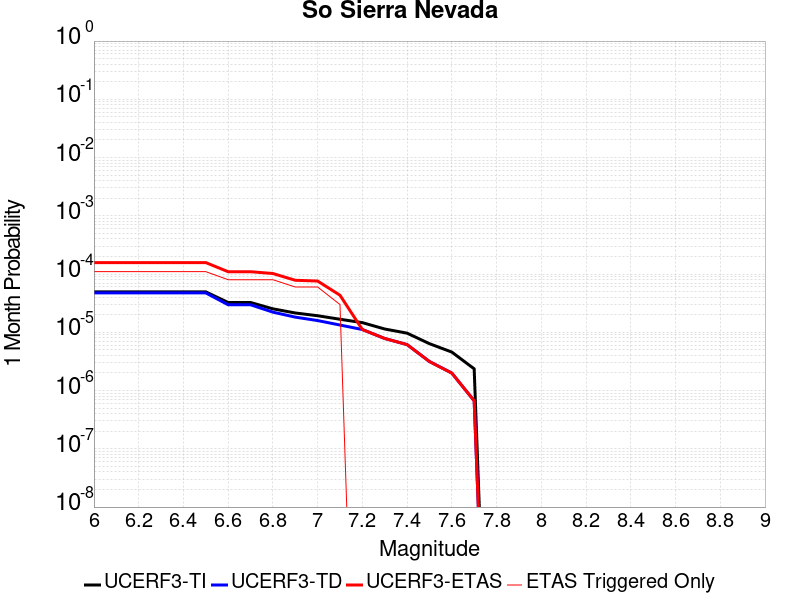 |  | 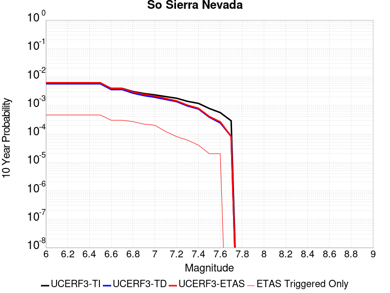 |

| Magnitude | 1 wk TI Prob | 1 wk TD Prob | 1 wk ETAS Prob | 1 wk ETAS/TD Gain | 1 wk ETAS Triggered Only | 1 mo TI Prob | 1 mo TD Prob | 1 mo ETAS Prob | 1 mo ETAS/TD Gain | 1 mo ETAS Triggered Only | 1 yr TI Prob | 1 yr TD Prob | 1 yr ETAS Prob | 1 yr ETAS/TD Gain | 1 yr ETAS Triggered Only | 10 yr TI Prob | 10 yr TD Prob | 10 yr ETAS Prob | 10 yr ETAS/TD Gain | 10 yr ETAS Triggered Only |
|-----|-----|-----|-----|-----|-----|-----|-----|-----|-----|-----|-----|-----|-----|-----|-----|-----|-----|-----|-----|-----|
| 6.0 | 1.15488665E-5 | 1.1079688E-5 | 7.107903E-5 | 6.415255 | 6.0E-5 | 4.9494203E-5 | 4.7483583E-5 | 1.5747837E-4 | 3.3164802 | 1.1E-4 | 6.024253E-4 | 5.7797204E-4 | 9.577524E-4 | 1.6570913 | 3.8E-4 | 0.006007948 | 0.0057659578 | 0.006223305 | 1.0793186 | 4.6E-4 |
| 6.1 | 1.15488665E-5 | 1.1079688E-5 | 7.107903E-5 | 6.415255 | 6.0E-5 | 4.9494203E-5 | 4.7483583E-5 | 1.5747837E-4 | 3.3164802 | 1.1E-4 | 6.024253E-4 | 5.7797204E-4 | 9.577524E-4 | 1.6570913 | 3.8E-4 | 0.006007948 | 0.0057659578 | 0.006223305 | 1.0793186 | 4.6E-4 |
| 6.2 | 1.15488665E-5 | 1.1079688E-5 | 7.107903E-5 | 6.415255 | 6.0E-5 | 4.9494203E-5 | 4.7483583E-5 | 1.5747837E-4 | 3.3164802 | 1.1E-4 | 6.024253E-4 | 5.7797204E-4 | 9.577524E-4 | 1.6570913 | 3.8E-4 | 0.006007948 | 0.0057659578 | 0.006223305 | 1.0793186 | 4.6E-4 |
| 6.3 | 1.15488665E-5 | 1.1079688E-5 | 7.107903E-5 | 6.415255 | 6.0E-5 | 4.9494203E-5 | 4.7483583E-5 | 1.5747837E-4 | 3.3164802 | 1.1E-4 | 6.024253E-4 | 5.7797204E-4 | 9.577524E-4 | 1.6570913 | 3.8E-4 | 0.006007948 | 0.0057659578 | 0.006223305 | 1.0793186 | 4.6E-4 |
| 6.4 | 1.15488665E-5 | 1.1079688E-5 | 7.107903E-5 | 6.415255 | 6.0E-5 | 4.9494203E-5 | 4.7483583E-5 | 1.5747837E-4 | 3.3164802 | 1.1E-4 | 6.024253E-4 | 5.7797204E-4 | 9.577524E-4 | 1.6570913 | 3.8E-4 | 0.006007948 | 0.0057659578 | 0.006223305 | 1.0793186 | 4.6E-4 |
| 6.5 | 1.15488665E-5 | 1.1079688E-5 | 7.107903E-5 | 6.415255 | 6.0E-5 | 4.9494203E-5 | 4.7483583E-5 | 1.5747837E-4 | 3.3164802 | 1.1E-4 | 6.024253E-4 | 5.7797204E-4 | 9.577524E-4 | 1.6570913 | 3.8E-4 | 0.006007948 | 0.0057659578 | 0.006223305 | 1.0793186 | 4.6E-4 |
| 6.6 | 7.587044E-6 | 6.935655E-6 | 4.6935376E-5 | 6.767259 | 4.0E-5 | 3.2515498E-5 | 2.9723915E-5 | 1.09721535E-4 | 3.6913555 | 8.0E-5 | 3.9580427E-4 | 3.6183148E-4 | 6.017446E-4 | 1.6630522 | 2.4E-4 | 0.003951 | 0.0036127153 | 0.0039116316 | 1.0827401 | 3.0E-4 |
| 6.7 | 7.587044E-6 | 6.935655E-6 | 4.6935376E-5 | 6.767259 | 4.0E-5 | 3.2515498E-5 | 2.9723915E-5 | 1.09721535E-4 | 3.6913555 | 8.0E-5 | 3.9580427E-4 | 3.6183148E-4 | 6.017446E-4 | 1.6630522 | 2.4E-4 | 0.003951 | 0.0036127153 | 0.0039116316 | 1.0827401 | 3.0E-4 |
| 6.8 | 5.9026956E-6 | 5.179403E-6 | 4.5179197E-5 | 8.722857 | 4.0E-5 | 2.5297022E-5 | 2.2197259E-5 | 1.0219548E-4 | 4.6039686 | 8.0E-5 | 3.0794772E-4 | 2.702193E-4 | 4.9015984E-4 | 1.8139336 | 2.2E-4 | 0.0030752132 | 0.0026990233 | 0.0029682945 | 1.0997661 | 2.7E-4 |
| 6.9 | 5.0118915E-6 | 4.2524307E-6 | 3.42523E-5 | 8.054759 | 3.0E-5 | 2.1479358E-5 | 1.8224579E-5 | 7.8223486E-5 | 4.292197 | 6.0E-5 | 2.614798E-4 | 2.2186238E-4 | 4.0182244E-4 | 1.8111337 | 1.8E-4 | 0.0026117235 | 0.0022164814 | 0.0024359939 | 1.0990365 | 2.2E-4 |
| 7.0 | 4.4924795E-6 | 3.7139203E-6 | 3.3713808E-5 | 9.077688 | 3.0E-5 | 1.925334E-5 | 1.5916707E-5 | 7.5915756E-5 | 4.7695637 | 6.0E-5 | 2.3438422E-4 | 1.9376932E-4 | 3.5373832E-4 | 1.8255641 | 1.6E-4 | 0.0023413717 | 0.0019360665 | 0.0021356794 | 1.1031022 | 2.0E-4 |
| 7.1 | 3.9118436E-6 | 3.111977E-6 | 2.3111916E-5 | 7.4267626 | 2.0E-5 | 1.6764936E-5 | 1.33369795E-5 | 4.333658E-5 | 3.2493548 | 3.0E-5 | 2.0409399E-4 | 1.623662E-4 | 2.4235321E-4 | 1.4926333 | 8.0E-5 | 0.0020390663 | 0.0016225318 | 0.001742337 | 1.0738385 | 1.2E-4 |
| 7.2 | 3.4200818E-6 | 2.6054513E-6 | 2.6054513E-6 | 1.0 | 0.0 | 1.4657411E-5 | 1.1166175E-5 | 1.1166175E-5 | 1.0 | 0.0 | 1.7843937E-4 | 1.359402E-4 | 1.7593477E-4 | 1.294207 | 4.0E-5 | 0.0017829615 | 0.0013586201 | 0.0014385114 | 1.0588033 | 8.0E-5 |
| 7.3 | 2.6593618E-6 | 1.8284135E-6 | 1.8284135E-6 | 1.0 | 0.0 | 1.13972155E-5 | 7.836036E-6 | 7.836036E-6 | 1.0 | 0.0 | 1.3875226E-4 | 9.539985E-5 | 1.25397E-4 | 1.3144358 | 3.0E-5 | 0.0013866565 | 9.53618E-4 | 0.0010135607 | 1.0628582 | 6.0E-5 |
| 7.4 | 2.2577992E-6 | 1.4364293E-6 | 1.4364293E-6 | 1.0 | 0.0 | 9.676246E-6 | 6.1561127E-6 | 6.1561127E-6 | 1.0 | 0.0 | 1.1780193E-4 | 7.4948344E-5 | 9.4946845E-5 | 1.2668304 | 2.0E-5 | 0.001177395 | 7.4925576E-4 | 7.892258E-4 | 1.0533463 | 4.0E-5 |
| 7.5 | 1.489319E-6 | 7.35383E-7 | 7.35383E-7 | 1.0 | 0.0 | 6.3827797E-6 | 3.1516379E-6 | 3.1516379E-6 | 1.0 | 0.0 | 7.770758E-5 | 3.837052E-5 | 5.836975E-5 | 1.5212135 | 2.0E-5 | 7.7680405E-4 | 3.836394E-4 | 4.036317E-4 | 1.0521123 | 2.0E-5 |
| 7.6 | 1.0680322E-6 | 4.6595343E-7 | 4.6595343E-7 | 1.0 | 0.0 | 4.577273E-6 | 1.9969418E-6 | 1.9969418E-6 | 1.0 | 0.0 | 5.5726876E-5 | 2.4312498E-5 | 4.431201E-5 | 1.8226022 | 2.0E-5 | 5.5712904E-4 | 2.4309864E-4 | 2.6309377E-4 | 1.0822511 | 2.0E-5 |
| 7.7 | 5.509146E-7 | 1.5579108E-7 | 1.5579108E-7 | 1.0 | 0.0 | 2.3610605E-6 | 6.676759E-7 | 6.676759E-7 | 1.0 | 0.0 | 2.8745531E-5 | 8.128925E-6 | 8.128925E-6 | 1.0 | 0.0 | 2.8741814E-4 | 8.1286395E-5 | 8.1286395E-5 | 1.0 | 0.0 |

## Goldstone Lake
*[(top)](#table-of-contents)*

| 1 Week | 1 Month | 1 Year | 10 Year |
|-----|-----|-----|-----|
| 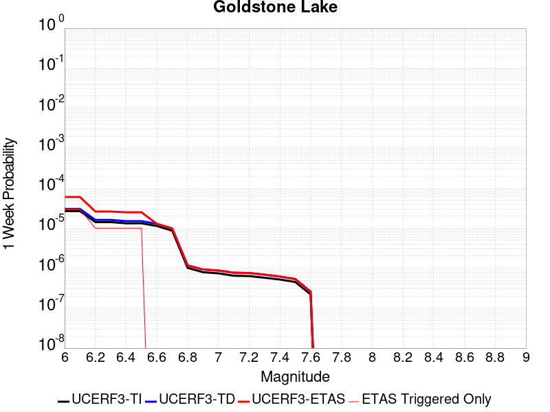 |  | 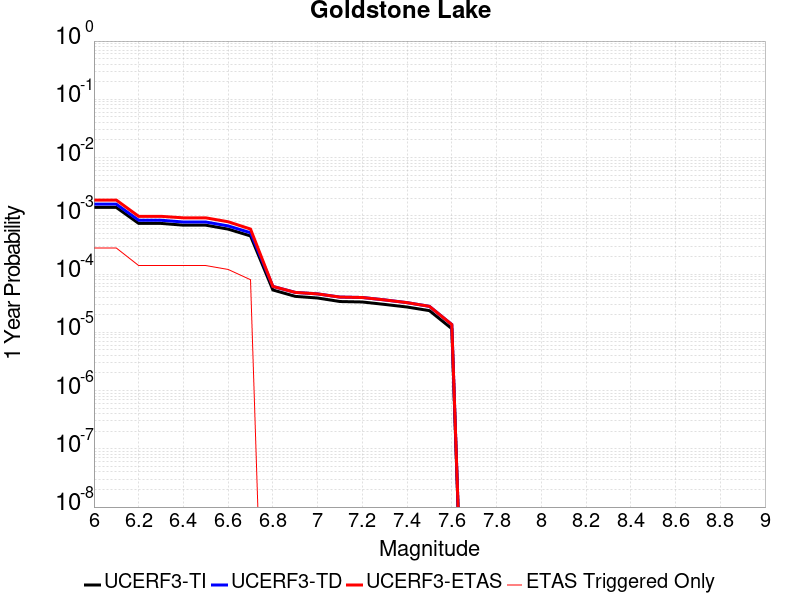 |  |

| Magnitude | 1 wk TI Prob | 1 wk TD Prob | 1 wk ETAS Prob | 1 wk ETAS/TD Gain | 1 wk ETAS Triggered Only | 1 mo TI Prob | 1 mo TD Prob | 1 mo ETAS Prob | 1 mo ETAS/TD Gain | 1 mo ETAS Triggered Only | 1 yr TI Prob | 1 yr TD Prob | 1 yr ETAS Prob | 1 yr ETAS/TD Gain | 1 yr ETAS Triggered Only | 10 yr TI Prob | 10 yr TD Prob | 10 yr ETAS Prob | 10 yr ETAS/TD Gain | 10 yr ETAS Triggered Only |
|-----|-----|-----|-----|-----|-----|-----|-----|-----|-----|-----|-----|-----|-----|-----|-----|-----|-----|-----|-----|-----|
| 6.0 | 2.671352E-5 | 3.0376643E-5 | 6.0375733E-5 | 1.9875709 | 3.0E-5 | 1.1448149E-4 | 1.3018023E-4 | 2.401659E-4 | 1.8448725 | 1.1E-4 | 0.001392921 | 0.0015839882 | 0.0018635447 | 1.176489 | 2.8E-4 | 0.013842222 | 0.01574648 | 0.016090969 | 1.0218772 | 3.5E-4 |
| 6.1 | 2.671352E-5 | 3.0376643E-5 | 6.0375733E-5 | 1.9875709 | 3.0E-5 | 1.1448149E-4 | 1.3018023E-4 | 2.401659E-4 | 1.8448725 | 1.1E-4 | 0.001392921 | 0.0015839882 | 0.0018635447 | 1.176489 | 2.8E-4 | 0.013842222 | 0.01574648 | 0.016090969 | 1.0218772 | 3.5E-4 |
| 6.2 | 1.4197047E-5 | 1.6096526E-5 | 2.6096366E-5 | 1.621242 | 1.0E-5 | 6.0843064E-5 | 6.898385E-5 | 1.2897971E-4 | 1.8697089 | 6.0E-5 | 7.4051257E-4 | 8.396533E-4 | 9.795357E-4 | 1.1665955 | 1.4E-4 | 0.007380498 | 0.008374506 | 0.008562914 | 1.0224979 | 1.9E-4 |
| 6.3 | 1.4197047E-5 | 1.6096526E-5 | 2.6096366E-5 | 1.621242 | 1.0E-5 | 6.0843064E-5 | 6.898385E-5 | 1.2897971E-4 | 1.8697089 | 6.0E-5 | 7.4051257E-4 | 8.396533E-4 | 9.795357E-4 | 1.1665955 | 1.4E-4 | 0.007380498 | 0.008374506 | 0.008562914 | 1.0224979 | 1.9E-4 |
| 6.4 | 1.3238931E-5 | 1.5008722E-5 | 2.5008572E-5 | 1.6662693 | 1.0E-5 | 5.6737044E-5 | 6.432206E-5 | 1.243182E-4 | 1.9327459 | 6.0E-5 | 6.9055456E-4 | 7.8293774E-4 | 9.228281E-4 | 1.1786737 | 1.4E-4 | 0.006884126 | 0.0078114197 | 0.007999936 | 1.0241333 | 1.9E-4 |
| 6.5 | 1.3238931E-5 | 1.5008722E-5 | 2.5008572E-5 | 1.6662693 | 1.0E-5 | 5.6737044E-5 | 6.432206E-5 | 1.243182E-4 | 1.9327459 | 6.0E-5 | 6.9055456E-4 | 7.8293774E-4 | 9.228281E-4 | 1.1786737 | 1.4E-4 | 0.006884126 | 0.0078114197 | 0.007999936 | 1.0241333 | 1.9E-4 |
| 6.6 | 1.1328278E-5 | 1.2855392E-5 | 1.2855392E-5 | 1.0 | 0.0 | 4.8548856E-5 | 5.509391E-5 | 9.509171E-5 | 1.725993 | 4.0E-5 | 5.90922E-4 | 6.706576E-4 | 7.9057715E-4 | 1.1788088 | 1.2E-4 | 0.0058935313 | 0.006695726 | 0.006864588 | 1.0252193 | 1.7E-4 |
| 6.7 | 8.651175E-6 | 9.824737E-6 | 9.824737E-6 | 1.0 | 0.0 | 3.707594E-5 | 4.210585E-5 | 7.210459E-5 | 1.71246 | 3.0E-5 | 4.5130608E-4 | 5.126087E-4 | 5.9256767E-4 | 1.1559845 | 8.0E-5 | 0.0045039062 | 0.005123141 | 0.0052425265 | 1.0233032 | 1.2E-4 |
| 6.8 | 1.0215377E-6 | 1.1754901E-6 | 1.1754901E-6 | 1.0 | 0.0 | 4.378012E-6 | 5.0378057E-6 | 5.0378057E-6 | 1.0 | 0.0 | 5.3300988E-5 | 6.1333674E-5 | 6.1333674E-5 | 1.0 | 0.0 | 5.3288206E-4 | 6.131787E-4 | 6.131787E-4 | 1.0 | 0.0 |
| 6.9 | 7.9360774E-7 | 9.2835677E-7 | 9.2835677E-7 | 1.0 | 0.0 | 3.4011714E-6 | 3.978666E-6 | 3.978666E-6 | 1.0 | 0.0 | 4.1408475E-5 | 4.8439255E-5 | 4.8439255E-5 | 1.0 | 0.0 | 4.140076E-4 | 4.8429397E-4 | 4.8429397E-4 | 1.0 | 0.0 |
| 7.0 | 7.4382757E-7 | 8.747494E-7 | 8.747494E-7 | 1.0 | 0.0 | 3.1878285E-6 | 3.748921E-6 | 3.748921E-6 | 1.0 | 0.0 | 3.8811122E-5 | 4.5642224E-5 | 4.5642224E-5 | 1.0 | 0.0 | 3.8804344E-4 | 4.5633517E-4 | 4.5633517E-4 | 1.0 | 0.0 |
| 7.1 | 6.4709513E-7 | 7.711456E-7 | 7.711456E-7 | 1.0 | 0.0 | 2.773262E-6 | 3.3049057E-6 | 3.3049057E-6 | 1.0 | 0.0 | 3.376394E-5 | 4.0236544E-5 | 4.0236544E-5 | 1.0 | 0.0 | 3.375881E-4 | 4.0229855E-4 | 4.0229855E-4 | 1.0 | 0.0 |
| 7.2 | 6.356704E-7 | 7.588514E-7 | 7.588514E-7 | 1.0 | 0.0 | 2.7242988E-6 | 3.2522166E-6 | 3.2522166E-6 | 1.0 | 0.0 | 3.3167835E-5 | 3.9595077E-5 | 3.9595077E-5 | 1.0 | 0.0 | 3.3162883E-4 | 3.9588616E-4 | 3.9588616E-4 | 1.0 | 0.0 |
| 7.3 | 5.7695723E-7 | 6.896703E-7 | 6.896703E-7 | 1.0 | 0.0 | 2.4726714E-6 | 2.9557268E-6 | 2.9557268E-6 | 1.0 | 0.0 | 3.0104358E-5 | 3.598544E-5 | 3.598544E-5 | 1.0 | 0.0 | 3.0100282E-4 | 3.5980184E-4 | 3.5980184E-4 | 1.0 | 0.0 |
| 7.4 | 5.209647E-7 | 6.1936277E-7 | 6.1936277E-7 | 1.0 | 0.0 | 2.232704E-6 | 2.6544094E-6 | 2.6544094E-6 | 1.0 | 0.0 | 2.718283E-5 | 3.231701E-5 | 3.231701E-5 | 1.0 | 0.0 | 2.7179506E-4 | 3.2312868E-4 | 3.2312868E-4 | 1.0 | 0.0 |
| 7.5 | 4.512955E-7 | 5.3489794E-7 | 5.3489794E-7 | 1.0 | 0.0 | 1.934122E-6 | 2.292418E-6 | 2.292418E-6 | 1.0 | 0.0 | 2.3547682E-5 | 2.7909884E-5 | 2.7909884E-5 | 1.0 | 0.0 | 2.3545188E-4 | 2.790691E-4 | 2.790691E-4 | 1.0 | 0.0 |
| 7.6 | 2.21172E-7 | 2.6040198E-7 | 2.6040198E-7 | 1.0 | 0.0 | 9.478797E-7 | 1.1160082E-6 | 1.1160082E-6 | 1.0 | 0.0 | 1.1540374E-5 | 1.3587343E-5 | 1.3587343E-5 | 1.0 | 0.0 | 1.1539775E-4 | 1.3586794E-4 | 1.3586794E-4 | 1.0 | 0.0 |

## McLean Lake
*[(top)](#table-of-contents)*

| 1 Week | 1 Month | 1 Year | 10 Year |
|-----|-----|-----|-----|
|  |  |  | 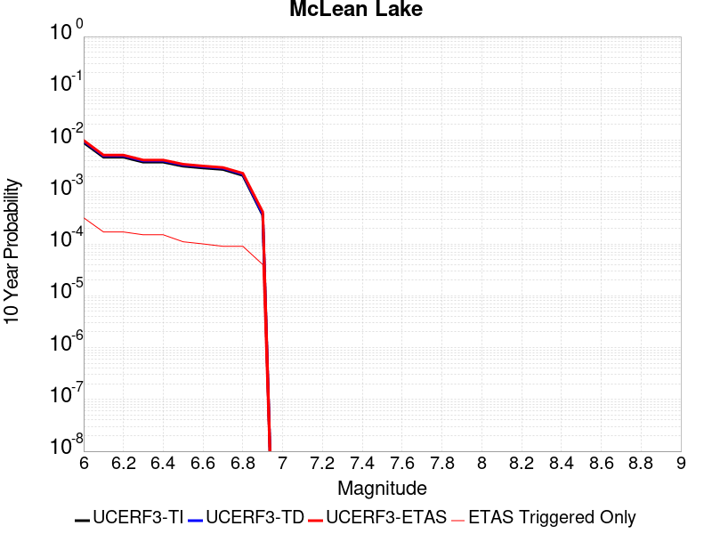 |

| Magnitude | 1 wk TI Prob | 1 wk TD Prob | 1 wk ETAS Prob | 1 wk ETAS/TD Gain | 1 wk ETAS Triggered Only | 1 mo TI Prob | 1 mo TD Prob | 1 mo ETAS Prob | 1 mo ETAS/TD Gain | 1 mo ETAS Triggered Only | 1 yr TI Prob | 1 yr TD Prob | 1 yr ETAS Prob | 1 yr ETAS/TD Gain | 1 yr ETAS Triggered Only | 10 yr TI Prob | 10 yr TD Prob | 10 yr ETAS Prob | 10 yr ETAS/TD Gain | 10 yr ETAS Triggered Only |
|-----|-----|-----|-----|-----|-----|-----|-----|-----|-----|-----|-----|-----|-----|-----|-----|-----|-----|-----|-----|-----|
| 6.0 | 1.7360222E-5 | 1.8501789E-5 | 8.850049E-5 | 4.783348 | 7.0E-5 | 7.439883E-5 | 7.929125E-5 | 1.9928173E-4 | 2.513288 | 1.2E-4 | 9.0542925E-4 | 9.64992E-4 | 0.0011947701 | 1.238114 | 2.3E-4 | 0.009017491 | 0.009612858 | 0.009929782 | 1.0329688 | 3.2E-4 |
| 6.1 | 9.062689E-6 | 9.592268E-6 | 4.9591883E-5 | 5.1699853 | 4.0E-5 | 3.8839516E-5 | 4.110912E-5 | 1.11106245E-4 | 2.7027152 | 7.0E-5 | 4.727685E-4 | 5.003975E-4 | 6.2033744E-4 | 1.2396894 | 1.2E-4 | 0.0047176396 | 0.0049935905 | 0.0051627415 | 1.0338737 | 1.7E-4 |
| 6.2 | 9.062689E-6 | 9.592268E-6 | 4.9591883E-5 | 5.1699853 | 4.0E-5 | 3.8839516E-5 | 4.110912E-5 | 1.11106245E-4 | 2.7027152 | 7.0E-5 | 4.727685E-4 | 5.003975E-4 | 6.2033744E-4 | 1.2396894 | 1.2E-4 | 0.0047176396 | 0.0049935905 | 0.0051627415 | 1.0338737 | 1.7E-4 |
| 6.3 | 7.2575485E-6 | 7.667767E-6 | 3.7667538E-5 | 4.912452 | 3.0E-5 | 3.110341E-5 | 3.2861484E-5 | 9.285951E-5 | 2.8257856 | 6.0E-5 | 3.786182E-4 | 4.0002225E-4 | 4.9998227E-4 | 1.249886 | 1.0E-4 | 0.0037797375 | 0.003993727 | 0.0041431277 | 1.037409 | 1.5E-4 |
| 6.4 | 7.2575485E-6 | 7.667767E-6 | 3.7667538E-5 | 4.912452 | 3.0E-5 | 3.110341E-5 | 3.2861484E-5 | 9.285951E-5 | 2.8257856 | 6.0E-5 | 3.786182E-4 | 4.0002225E-4 | 4.9998227E-4 | 1.249886 | 1.0E-4 | 0.0037797375 | 0.003993727 | 0.0041431277 | 1.037409 | 1.5E-4 |
| 6.5 | 6.06582E-6 | 6.4039245E-6 | 3.6403733E-5 | 5.6845975 | 3.0E-5 | 2.5996113E-5 | 2.7445138E-5 | 6.744404E-5 | 2.457413 | 4.0E-5 | 3.164567E-4 | 3.340998E-4 | 4.140731E-4 | 1.2393694 | 8.0E-5 | 0.0031600643 | 0.0033366138 | 0.0034462467 | 1.0328575 | 1.1E-4 |
| 6.6 | 5.598744E-6 | 5.910306E-6 | 2.5910187E-5 | 4.3838997 | 2.0E-5 | 2.3994397E-5 | 2.5329673E-5 | 5.5328914E-5 | 2.1843517 | 3.0E-5 | 2.9209262E-4 | 3.083515E-4 | 3.7832992E-4 | 1.2269436 | 7.0E-5 | 0.0029170897 | 0.0030798658 | 0.0031795579 | 1.0323689 | 1.0E-4 |
| 6.7 | 5.246996E-6 | 5.539203E-6 | 2.5539091E-5 | 4.6106076 | 2.0E-5 | 2.2486933E-5 | 2.3739261E-5 | 5.373855E-5 | 2.2636993 | 3.0E-5 | 2.73744E-4 | 2.8899353E-4 | 3.4897617E-4 | 1.2075571 | 6.0E-5 | 0.0027340704 | 0.002886801 | 0.0029765412 | 1.0310863 | 9.0E-5 |
| 6.8 | 4.02324E-6 | 4.246936E-6 | 2.424685E-5 | 5.7092576 | 2.0E-5 | 1.7242342E-5 | 1.820106E-5 | 4.8200513E-5 | 2.6482255 | 3.0E-5 | 2.099053E-4 | 2.2158133E-4 | 2.8156803E-4 | 1.270721 | 6.0E-5 | 0.0020970714 | 0.0022141882 | 0.002303989 | 1.0405569 | 9.0E-5 |
| 6.9 | 6.835972E-7 | 7.1399705E-7 | 2.0713982E-5 | 29.011301 | 2.0E-5 | 2.9296991E-6 | 3.0599856E-6 | 2.3059923E-5 | 7.535959 | 2.0E-5 | 3.56685E-5 | 3.7255006E-5 | 6.725389E-5 | 1.805231 | 3.0E-5 | 3.5662777E-4 | 3.7251884E-4 | 4.1250396E-4 | 1.1073371 | 4.0E-5 |

## Lenwood-Lockhart-Old Woman Springs
*[(top)](#table-of-contents)*

| 1 Week | 1 Month | 1 Year | 10 Year |
|-----|-----|-----|-----|
| 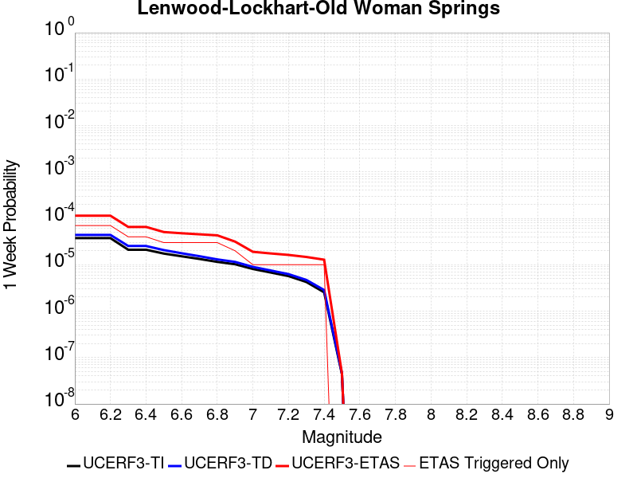 |  | 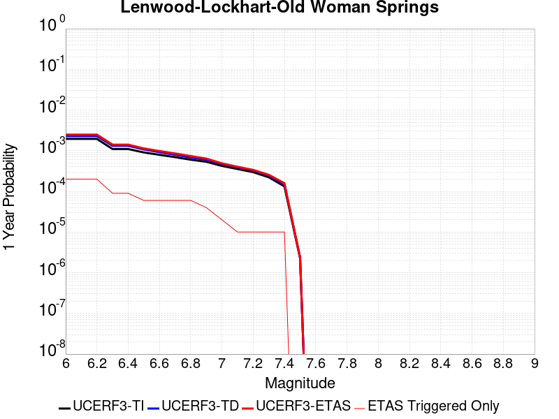 | 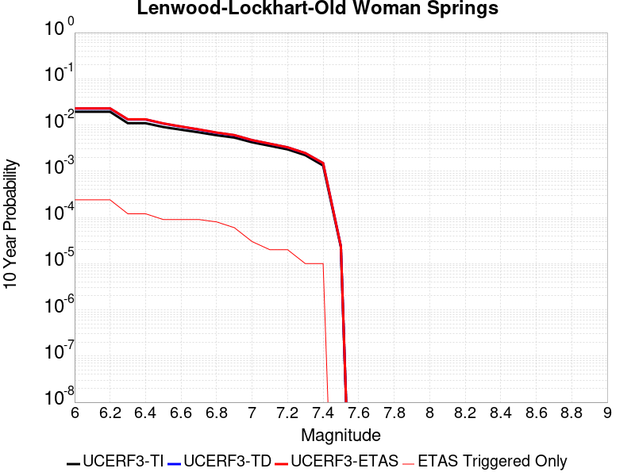 |

| Magnitude | 1 wk TI Prob | 1 wk TD Prob | 1 wk ETAS Prob | 1 wk ETAS/TD Gain | 1 wk ETAS Triggered Only | 1 mo TI Prob | 1 mo TD Prob | 1 mo ETAS Prob | 1 mo ETAS/TD Gain | 1 mo ETAS Triggered Only | 1 yr TI Prob | 1 yr TD Prob | 1 yr ETAS Prob | 1 yr ETAS/TD Gain | 1 yr ETAS Triggered Only | 10 yr TI Prob | 10 yr TD Prob | 10 yr ETAS Prob | 10 yr ETAS/TD Gain | 10 yr ETAS Triggered Only |
|-----|-----|-----|-----|-----|-----|-----|-----|-----|-----|-----|-----|-----|-----|-----|-----|-----|-----|-----|-----|-----|
| 6.0 | 3.744542E-5 | 4.3963868E-5 | 1.1396079E-4 | 2.5921466 | 7.0E-5 | 1.604705E-4 | 1.8840394E-4 | 2.78387E-4 | 1.477607 | 9.0E-5 | 0.0019519776 | 0.002291577 | 0.0024911186 | 1.0870762 | 2.0E-4 | 0.019349206 | 0.022697475 | 0.022932028 | 1.0103339 | 2.4E-4 |
| 6.1 | 3.744542E-5 | 4.3963868E-5 | 1.1396079E-4 | 2.5921466 | 7.0E-5 | 1.604705E-4 | 1.8840394E-4 | 2.78387E-4 | 1.477607 | 9.0E-5 | 0.0019519776 | 0.002291577 | 0.0024911186 | 1.0870762 | 2.0E-4 | 0.019349206 | 0.022697475 | 0.022932028 | 1.0103339 | 2.4E-4 |
| 6.2 | 3.744542E-5 | 4.3963868E-5 | 1.1396079E-4 | 2.5921466 | 7.0E-5 | 1.604705E-4 | 1.8840394E-4 | 2.78387E-4 | 1.477607 | 9.0E-5 | 0.0019519776 | 0.002291577 | 0.0024911186 | 1.0870762 | 2.0E-4 | 0.019349206 | 0.022697475 | 0.022932028 | 1.0103339 | 2.4E-4 |
| 6.3 | 2.1079984E-5 | 2.5354482E-5 | 6.5353466E-5 | 2.5775902 | 4.0E-5 | 9.0339665E-5 | 1.0865765E-4 | 1.5865223E-4 | 1.4601109 | 5.0E-5 | 0.0010993304 | 0.0013221242 | 0.0014120052 | 1.0679823 | 9.0E-5 | 0.010939079 | 0.013144798 | 0.013263221 | 1.0090091 | 1.2E-4 |
| 6.4 | 2.1079984E-5 | 2.5354482E-5 | 6.5353466E-5 | 2.5775902 | 4.0E-5 | 9.0339665E-5 | 1.0865765E-4 | 1.5865223E-4 | 1.4601109 | 5.0E-5 | 0.0010993304 | 0.0013221242 | 0.0014120052 | 1.0679823 | 9.0E-5 | 0.010939079 | 0.013144798 | 0.013263221 | 1.0090091 | 1.2E-4 |
| 6.5 | 1.7397282E-5 | 2.0663358E-5 | 5.0662737E-5 | 2.4518154 | 3.0E-5 | 7.455765E-5 | 8.855431E-5 | 1.1855165E-4 | 1.3387451 | 3.0E-5 | 9.073613E-4 | 0.0010776272 | 0.0011375626 | 1.0556179 | 6.0E-5 | 0.009036654 | 0.010725311 | 0.010814345 | 1.0083014 | 9.0E-5 |
| 6.6 | 1.52050325E-5 | 1.7680148E-5 | 4.7679616E-5 | 2.6967883 | 3.0E-5 | 6.51628E-5 | 7.57699E-5 | 1.05767635E-4 | 1.3959056 | 3.0E-5 | 7.9306826E-4 | 9.2211604E-4 | 9.820607E-4 | 1.0650077 | 6.0E-5 | 0.007902439 | 0.009183761 | 0.009272935 | 1.00971 | 9.0E-5 |
| 6.7 | 1.332523E-5 | 1.5264432E-5 | 4.5263976E-5 | 2.9653232 | 3.0E-5 | 5.7106878E-5 | 6.5417385E-5 | 9.5415424E-5 | 1.4585637 | 3.0E-5 | 6.950544E-4 | 7.961715E-4 | 8.5612375E-4 | 1.0753007 | 6.0E-5 | 0.006928845 | 0.0079338215 | 0.008023107 | 1.0112538 | 9.0E-5 |
| 6.8 | 1.1525329E-5 | 1.3031408E-5 | 4.3031017E-5 | 3.3021004 | 3.0E-5 | 4.9393333E-5 | 5.584772E-5 | 8.584604E-5 | 1.537145 | 3.0E-5 | 6.011979E-4 | 6.797381E-4 | 7.396973E-4 | 1.0882093 | 6.0E-5 | 0.00599574 | 0.0067770416 | 0.0068564992 | 1.0117246 | 8.0E-5 |
| 6.9 | 1.0253909E-5 | 1.15148705E-5 | 3.151464E-5 | 2.7368643 | 2.0E-5 | 4.3944583E-5 | 4.9348535E-5 | 6.9347545E-5 | 1.4052606 | 2.0E-5 | 5.3489394E-4 | 6.006564E-4 | 6.4063235E-4 | 1.0665538 | 4.0E-5 | 0.0053360825 | 0.0059907082 | 0.006050349 | 1.0099555 | 6.0E-5 |
| 7.0 | 8.104563E-6 | 8.9914565E-6 | 1.8991366E-5 | 2.1121569 | 1.0E-5 | 3.4733377E-5 | 3.8534257E-5 | 4.853387E-5 | 1.2594993 | 1.0E-5 | 4.2279682E-4 | 4.69056E-4 | 4.890466E-4 | 1.0426189 | 2.0E-5 | 0.0042199334 | 0.004680908 | 0.0047107674 | 1.006379 | 3.0E-5 |
| 7.1 | 6.7986157E-6 | 7.5159987E-6 | 1.7515924E-5 | 2.330485 | 1.0E-5 | 2.91366E-5 | 3.221104E-5 | 4.2210715E-5 | 1.3104426 | 1.0E-5 | 3.5468035E-4 | 3.9210095E-4 | 4.0209704E-4 | 1.0254936 | 1.0E-5 | 0.003541148 | 0.003914308 | 0.0039342293 | 1.0050894 | 2.0E-5 |
| 7.2 | 5.6893327E-6 | 6.2801455E-6 | 1.6280082E-5 | 2.5923097 | 1.0E-5 | 2.4382627E-5 | 2.6914644E-5 | 3.6914375E-5 | 1.371535 | 1.0E-5 | 2.9681803E-4 | 3.276385E-4 | 3.3763523E-4 | 1.0305115 | 1.0E-5 | 0.002964219 | 0.0032717532 | 0.0032916877 | 1.0060929 | 2.0E-5 |
| 7.3 | 4.253348E-6 | 4.707082E-6 | 1.4707035E-5 | 3.1244483 | 1.0E-5 | 1.8228506E-5 | 2.0173064E-5 | 3.0172861E-5 | 1.4957005 | 1.0E-5 | 2.2190946E-4 | 2.455812E-4 | 2.5557875E-4 | 1.0407097 | 1.0E-5 | 0.00221688 | 0.0024532792 | 0.0024632546 | 1.0040662 | 1.0E-5 |
| 7.4 | 2.5448119E-6 | 2.8520615E-6 | 1.2852033E-5 | 4.5062256 | 1.0E-5 | 1.0906291E-5 | 1.2223072E-5 | 2.222295E-5 | 1.8181149 | 1.0E-5 | 1.3277601E-4 | 1.488074E-4 | 1.5880591E-4 | 1.067191 | 1.0E-5 | 0.001326967 | 0.0014872397 | 0.0014972249 | 1.0067139 | 1.0E-5 |
| 7.5 | 4.3706837E-8 | 4.5629356E-8 | 4.5629356E-8 | 1.0 | 0.0 | 1.8731501E-7 | 1.9555438E-7 | 1.9555438E-7 | 1.0 | 0.0 | 2.2805577E-6 | 2.3808725E-6 | 2.3808725E-6 | 1.0 | 0.0 | 2.2805343E-5 | 2.3808525E-5 | 2.3808525E-5 | 1.0 | 0.0 |

## Death Valley (So)
*[(top)](#table-of-contents)*

| 1 Week | 1 Month | 1 Year | 10 Year |
|-----|-----|-----|-----|
| 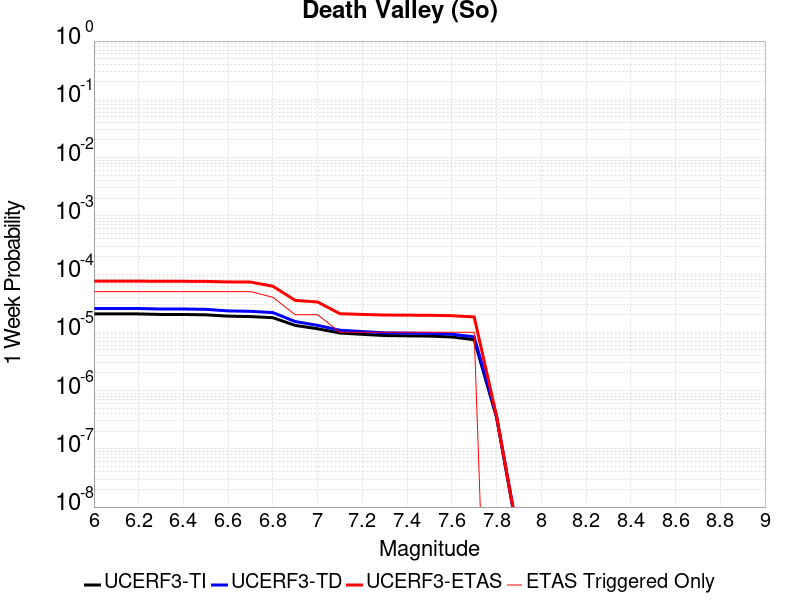 |  | 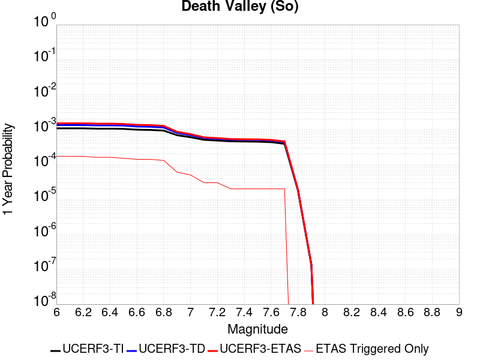 |  |

| Magnitude | 1 wk TI Prob | 1 wk TD Prob | 1 wk ETAS Prob | 1 wk ETAS/TD Gain | 1 wk ETAS Triggered Only | 1 mo TI Prob | 1 mo TD Prob | 1 mo ETAS Prob | 1 mo ETAS/TD Gain | 1 mo ETAS Triggered Only | 1 yr TI Prob | 1 yr TD Prob | 1 yr ETAS Prob | 1 yr ETAS/TD Gain | 1 yr ETAS Triggered Only | 10 yr TI Prob | 10 yr TD Prob | 10 yr ETAS Prob | 10 yr ETAS/TD Gain | 10 yr ETAS Triggered Only |
|-----|-----|-----|-----|-----|-----|-----|-----|-----|-----|-----|-----|-----|-----|-----|-----|-----|-----|-----|-----|-----|
| 6.0 | 2.0684236E-5 | 2.5618914E-5 | 7.561763E-5 | 2.951633 | 5.0E-5 | 8.864371E-5 | 1.09790824E-4 | 1.8978203E-4 | 1.7285783 | 8.0E-5 | 0.0010787029 | 0.0013359005 | 0.0015056734 | 1.127085 | 1.7E-4 | 0.010734817 | 0.01328137 | 0.013498448 | 1.0163445 | 2.2E-4 |
| 6.1 | 2.0684236E-5 | 2.5618914E-5 | 7.561763E-5 | 2.951633 | 5.0E-5 | 8.864371E-5 | 1.09790824E-4 | 1.8978203E-4 | 1.7285783 | 8.0E-5 | 0.0010787029 | 0.0013359005 | 0.0015056734 | 1.127085 | 1.7E-4 | 0.010734817 | 0.01328137 | 0.013498448 | 1.0163445 | 2.2E-4 |
| 6.2 | 2.0684236E-5 | 2.5618914E-5 | 7.561763E-5 | 2.951633 | 5.0E-5 | 8.864371E-5 | 1.09790824E-4 | 1.8978203E-4 | 1.7285783 | 8.0E-5 | 0.0010787029 | 0.0013359005 | 0.0015056734 | 1.127085 | 1.7E-4 | 0.010734817 | 0.01328137 | 0.013498448 | 1.0163445 | 2.2E-4 |
| 6.3 | 2.0240292E-5 | 2.511899E-5 | 7.5117736E-5 | 2.990476 | 5.0E-5 | 8.6741224E-5 | 1.0764847E-4 | 1.8763986E-4 | 1.7430797 | 8.0E-5 | 0.0010555626 | 0.0013098489 | 0.0014696392 | 1.1219915 | 1.6E-4 | 0.010505628 | 0.013023925 | 0.01323119 | 1.0159142 | 2.1E-4 |
| 6.4 | 2.0240292E-5 | 2.511899E-5 | 7.5117736E-5 | 2.990476 | 5.0E-5 | 8.6741224E-5 | 1.0764847E-4 | 1.8763986E-4 | 1.7430797 | 8.0E-5 | 0.0010555626 | 0.0013098489 | 0.0014696392 | 1.1219915 | 1.6E-4 | 0.010505628 | 0.013023925 | 0.01323119 | 1.0159142 | 2.1E-4 |
| 6.5 | 1.9962767E-5 | 2.4808238E-5 | 7.4807E-5 | 3.0154095 | 5.0E-5 | 8.55519E-5 | 1.0631679E-4 | 1.8630827E-4 | 1.7523882 | 8.0E-5 | 0.0010410968 | 0.0012936549 | 0.0014434609 | 1.1158005 | 1.5E-4 | 0.010362327 | 0.012863869 | 0.013061296 | 1.0153475 | 2.0E-4 |
| 6.6 | 1.8937297E-5 | 2.331202E-5 | 7.331085E-5 | 3.144766 | 5.0E-5 | 8.115732E-5 | 9.9904915E-5 | 1.7989693E-4 | 1.8006814 | 8.0E-5 | 9.876423E-4 | 0.0012156782 | 0.001355508 | 1.1150221 | 1.4E-4 | 0.009832645 | 0.012092765 | 0.012280468 | 1.0155219 | 1.9E-4 |
| 6.7 | 1.8621096E-5 | 2.2912649E-5 | 7.2911505E-5 | 3.1821506 | 5.0E-5 | 7.980225E-5 | 9.819346E-5 | 1.781856E-4 | 1.8146383 | 8.0E-5 | 9.711593E-4 | 0.0011948642 | 0.0013346969 | 1.1170281 | 1.4E-4 | 0.009669261 | 0.011886865 | 0.0120746065 | 1.015794 | 1.9E-4 |
| 6.8 | 1.7830353E-5 | 2.1806614E-5 | 6.1805746E-5 | 2.8342657 | 4.0E-5 | 7.641356E-5 | 9.345365E-5 | 1.6344711E-4 | 1.7489644 | 7.0E-5 | 9.29938E-4 | 0.0011372183 | 0.0012670705 | 1.114184 | 1.3E-4 | 0.009260561 | 0.011316919 | 0.011494882 | 1.0157254 | 1.8E-4 |
| 6.9 | 1.3135183E-5 | 1.5304342E-5 | 3.5304034E-5 | 2.3067987 | 2.0E-5 | 5.6292425E-5 | 6.558842E-5 | 9.558645E-5 | 1.4573678 | 3.0E-5 | 6.8514474E-4 | 7.9825294E-4 | 8.58205E-4 | 1.0751041 | 6.0E-5 | 0.006830362 | 0.007954868 | 0.008044152 | 1.0112238 | 9.0E-5 |
| 7.0 | 1.1507512E-5 | 1.315447E-5 | 3.3154207E-5 | 2.5203757 | 2.0E-5 | 4.9316975E-5 | 5.6375116E-5 | 7.637399E-5 | 1.3547465 | 2.0E-5 | 6.002687E-4 | 6.861567E-4 | 7.3612237E-4 | 1.0728197 | 5.0E-5 | 0.0059864987 | 0.0068410533 | 0.006910574 | 1.0101624 | 7.0E-5 |
| 7.1 | 9.715903E-6 | 1.086547E-5 | 2.0865362E-5 | 1.9203367 | 1.0E-5 | 4.1638916E-5 | 4.6565492E-5 | 5.656503E-5 | 1.2147413 | 1.0E-5 | 5.068359E-4 | 5.667917E-4 | 5.967747E-4 | 1.0528995 | 3.0E-5 | 0.0050568148 | 0.0056537534 | 0.0056935274 | 1.0070349 | 4.0E-5 |
| 7.2 | 9.233269E-6 | 1.0286476E-5 | 2.0286374E-5 | 1.9721402 | 1.0E-5 | 3.9570554E-5 | 4.4084176E-5 | 5.4083735E-5 | 1.2268288 | 1.0E-5 | 4.81665E-4 | 5.365969E-4 | 5.665808E-4 | 1.0558779 | 3.0E-5 | 0.0048062233 | 0.005353444 | 0.0053932294 | 1.0074319 | 4.0E-5 |
| 7.3 | 8.8041315E-6 | 9.808313E-6 | 1.9808214E-5 | 2.0195334 | 1.0E-5 | 3.7731446E-5 | 4.2034975E-5 | 5.2034553E-5 | 1.2378871 | 1.0E-5 | 4.592835E-4 | 5.1165983E-4 | 5.316496E-4 | 1.0390685 | 2.0E-5 | 0.0045833546 | 0.0051052445 | 0.0051350915 | 1.0058463 | 3.0E-5 |
| 7.4 | 8.708749E-6 | 9.707323E-6 | 1.9707226E-5 | 2.0301402 | 1.0E-5 | 3.7322676E-5 | 4.1602176E-5 | 5.1601757E-5 | 1.240362 | 1.0E-5 | 4.5430884E-4 | 5.06393E-4 | 5.263828E-4 | 1.039475 | 2.0E-5 | 0.004533812 | 0.0050528166 | 0.005082665 | 1.0059073 | 3.0E-5 |
| 7.5 | 8.612678E-6 | 9.604964E-6 | 1.9604868E-5 | 2.0411181 | 1.0E-5 | 3.6910955E-5 | 4.116351E-5 | 5.1163097E-5 | 1.2429236 | 1.0E-5 | 4.492982E-4 | 5.010547E-4 | 5.2104465E-4 | 1.0398958 | 2.0E-5 | 0.004483909 | 0.0049996753 | 0.005029525 | 1.0059704 | 3.0E-5 |
| 7.6 | 8.319024E-6 | 9.28406E-6 | 1.9283967E-5 | 2.077105 | 1.0E-5 | 3.5652476E-5 | 3.9788243E-5 | 4.9787846E-5 | 1.2513205 | 1.0E-5 | 4.3398244E-4 | 4.8431839E-4 | 5.0430873E-4 | 1.0412751 | 2.0E-5 | 0.0043313587 | 0.004833053 | 0.004862908 | 1.0061773 | 3.0E-5 |
| 7.7 | 7.4718328E-6 | 8.3453E-6 | 1.8345216E-5 | 2.1982694 | 1.0E-5 | 3.2021748E-5 | 3.57651E-5 | 4.5764744E-5 | 1.2795922 | 1.0E-5 | 3.8979502E-4 | 4.3535716E-4 | 4.5534846E-4 | 1.0459193 | 2.0E-5 | 0.00389112 | 0.004345448 | 0.0043653613 | 1.0045825 | 2.0E-5 |
| 7.8 | 3.4586725E-7 | 3.648288E-7 | 3.648288E-7 | 1.0 | 0.0 | 1.4822873E-6 | 1.5635511E-6 | 1.5635511E-6 | 1.0 | 0.0 | 1.80467E-5 | 1.9036073E-5 | 1.9036073E-5 | 1.0 | 0.0 | 1.8045233E-4 | 1.9034486E-4 | 1.9034486E-4 | 1.0 | 0.0 |
| 7.9 | 2.5591178E-9 | 2.6696871E-9 | 2.6696871E-9 | 1.0 | 0.0 | 1.0967647E-8 | 1.1441516E-8 | 1.1441516E-8 | 1.0 | 0.0 | 1.335311E-7 | 1.3930045E-7 | 1.3930045E-7 | 1.0 | 0.0 | 1.3353102E-6 | 1.3930046E-6 | 1.3930046E-6 | 1.0 | 0.0 |

## Coyote Canyon
*[(top)](#table-of-contents)*

| 1 Week | 1 Month | 1 Year | 10 Year |
|-----|-----|-----|-----|
| 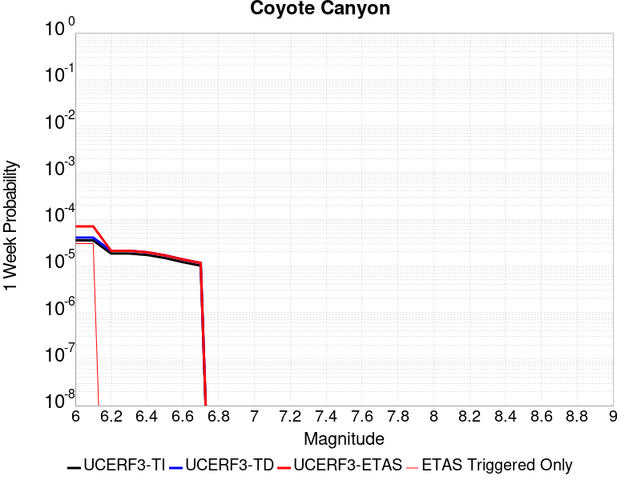 |  |  |  |

| Magnitude | 1 wk TI Prob | 1 wk TD Prob | 1 wk ETAS Prob | 1 wk ETAS/TD Gain | 1 wk ETAS Triggered Only | 1 mo TI Prob | 1 mo TD Prob | 1 mo ETAS Prob | 1 mo ETAS/TD Gain | 1 mo ETAS Triggered Only | 1 yr TI Prob | 1 yr TD Prob | 1 yr ETAS Prob | 1 yr ETAS/TD Gain | 1 yr ETAS Triggered Only | 10 yr TI Prob | 10 yr TD Prob | 10 yr ETAS Prob | 10 yr ETAS/TD Gain | 10 yr ETAS Triggered Only |
|-----|-----|-----|-----|-----|-----|-----|-----|-----|-----|-----|-----|-----|-----|-----|-----|-----|-----|-----|-----|-----|
| 6.0 | 3.5090034E-5 | 4.036512E-5 | 7.036391E-5 | 1.7431859 | 3.0E-5 | 1.503772E-4 | 1.7298336E-4 | 2.629678E-4 | 1.5201913 | 9.0E-5 | 0.0018293047 | 0.0021042954 | 0.0022539797 | 1.0711328 | 1.5E-4 | 0.018143194 | 0.020869616 | 0.021026278 | 1.0075066 | 1.6E-4 |
| 6.1 | 3.5090034E-5 | 4.036512E-5 | 7.036391E-5 | 1.7431859 | 3.0E-5 | 1.503772E-4 | 1.7298336E-4 | 2.629678E-4 | 1.5201913 | 9.0E-5 | 0.0018293047 | 0.0021042954 | 0.0022539797 | 1.0711328 | 1.5E-4 | 0.018143194 | 0.020869616 | 0.021026278 | 1.0075066 | 1.6E-4 |
| 6.2 | 1.841879E-5 | 2.1060194E-5 | 2.1060194E-5 | 1.0 | 0.0 | 7.8935285E-5 | 9.0255424E-5 | 1.2025272E-4 | 1.33236 | 3.0E-5 | 9.606133E-4 | 0.0010984079 | 0.001138364 | 1.0363764 | 4.0E-5 | 0.0095647145 | 0.010939875 | 0.010989328 | 1.0045204 | 5.0E-5 |
| 6.3 | 1.841879E-5 | 2.1060194E-5 | 2.1060194E-5 | 1.0 | 0.0 | 7.8935285E-5 | 9.0255424E-5 | 1.2025272E-4 | 1.33236 | 3.0E-5 | 9.606133E-4 | 0.0010984079 | 0.001138364 | 1.0363764 | 4.0E-5 | 0.0095647145 | 0.010939875 | 0.010989328 | 1.0045204 | 5.0E-5 |
| 6.4 | 1.712201E-5 | 1.9565581E-5 | 1.9565581E-5 | 1.0 | 0.0 | 7.337798E-5 | 8.385037E-5 | 1.1384785E-4 | 1.3577502 | 3.0E-5 | 8.930107E-4 | 0.0010205007 | 0.0010604599 | 1.0391564 | 4.0E-5 | 0.008894307 | 0.0101680625 | 0.010217554 | 1.0048673 | 5.0E-5 |
| 6.5 | 1.4744935E-5 | 1.6837288E-5 | 1.6837288E-5 | 1.0 | 0.0 | 6.3191044E-5 | 7.215834E-5 | 1.0215618E-4 | 1.4157224 | 3.0E-5 | 7.6907943E-4 | 8.782672E-4 | 9.0824085E-4 | 1.0341282 | 3.0E-5 | 0.007664232 | 0.008757159 | 0.008796808 | 1.0045277 | 4.0E-5 |
| 6.6 | 1.2017839E-5 | 1.3724348E-5 | 1.3724348E-5 | 1.0 | 0.0 | 5.150401E-5 | 5.8817805E-5 | 6.8817215E-5 | 1.1700065 | 1.0E-5 | 6.268809E-4 | 7.159601E-4 | 7.259529E-4 | 1.0139573 | 1.0E-5 | 0.0062511545 | 0.0071452283 | 0.007165085 | 1.0027791 | 2.0E-5 |
| 6.7 | 1.00956095E-5 | 1.1533734E-5 | 1.1533734E-5 | 1.0 | 0.0 | 4.326618E-5 | 4.9429844E-5 | 5.942935E-5 | 1.202297 | 1.0E-5 | 5.266384E-4 | 6.0172915E-4 | 6.1172317E-4 | 1.0166087 | 1.0E-5 | 0.005253921 | 0.006009526 | 0.0060294056 | 1.003308 | 2.0E-5 |

## San Andreas (San Bernardino S)
*[(top)](#table-of-contents)*

| 1 Week | 1 Month | 1 Year | 10 Year |
|-----|-----|-----|-----|
| 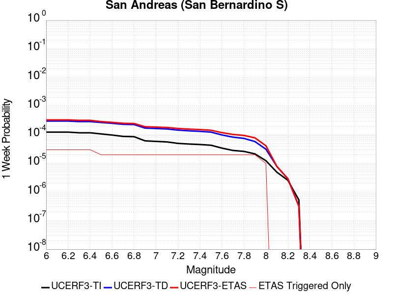 | 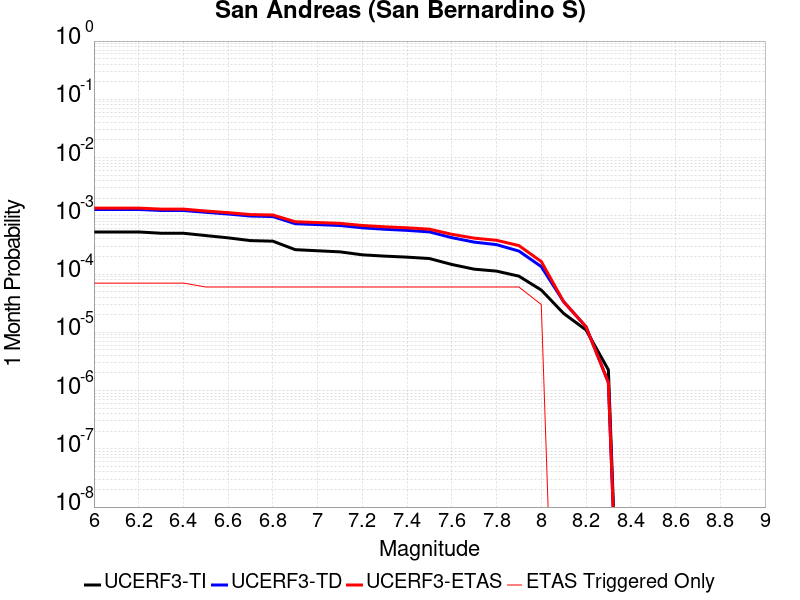 | 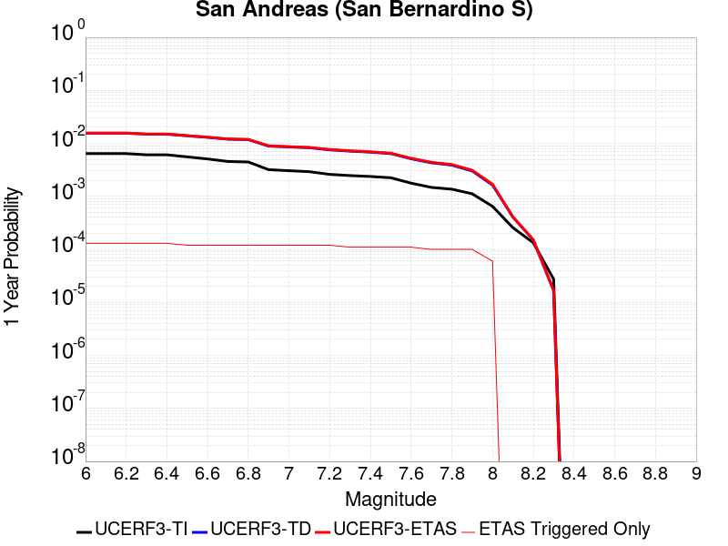 | 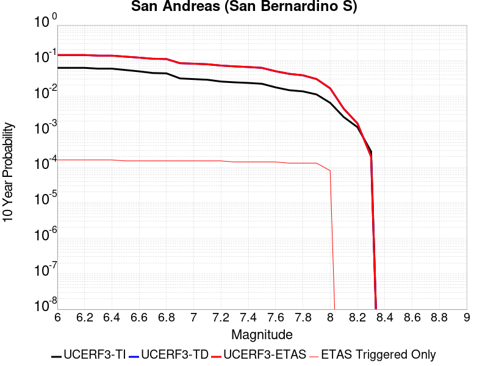 |

| Magnitude | 1 wk TI Prob | 1 wk TD Prob | 1 wk ETAS Prob | 1 wk ETAS/TD Gain | 1 wk ETAS Triggered Only | 1 mo TI Prob | 1 mo TD Prob | 1 mo ETAS Prob | 1 mo ETAS/TD Gain | 1 mo ETAS Triggered Only | 1 yr TI Prob | 1 yr TD Prob | 1 yr ETAS Prob | 1 yr ETAS/TD Gain | 1 yr ETAS Triggered Only | 10 yr TI Prob | 10 yr TD Prob | 10 yr ETAS Prob | 10 yr ETAS/TD Gain | 10 yr ETAS Triggered Only |
|-----|-----|-----|-----|-----|-----|-----|-----|-----|-----|-----|-----|-----|-----|-----|-----|-----|-----|-----|-----|-----|
| 6.0 | 1.2336002E-4 | 3.000988E-4 | 3.300898E-4 | 1.0999371 | 3.0E-5 | 5.2857865E-4 | 0.0012855299 | 0.0013554399 | 1.0543822 | 7.0E-5 | 0.006416472 | 0.015543964 | 0.015671942 | 1.0082334 | 1.3E-4 | 0.06234337 | 0.14291926 | 0.1430564 | 1.0009595 | 1.6E-4 |
| 6.1 | 1.2336002E-4 | 3.000988E-4 | 3.300898E-4 | 1.0999371 | 3.0E-5 | 5.2857865E-4 | 0.0012855299 | 0.0013554399 | 1.0543822 | 7.0E-5 | 0.006416472 | 0.015543964 | 0.015671942 | 1.0082334 | 1.3E-4 | 0.06234337 | 0.14291926 | 0.1430564 | 1.0009595 | 1.6E-4 |
| 6.2 | 1.2336002E-4 | 3.000988E-4 | 3.300898E-4 | 1.0999371 | 3.0E-5 | 5.2857865E-4 | 0.0012855299 | 0.0013554399 | 1.0543822 | 7.0E-5 | 0.006416472 | 0.015543964 | 0.015671942 | 1.0082334 | 1.3E-4 | 0.06234337 | 0.14291926 | 0.1430564 | 1.0009595 | 1.6E-4 |
| 6.3 | 1.1712257E-4 | 2.879813E-4 | 3.1797268E-4 | 1.1041434 | 3.0E-5 | 5.018573E-4 | 0.0012336475 | 0.0013035611 | 1.0566723 | 7.0E-5 | 0.006093008 | 0.0149210645 | 0.015049125 | 1.0085825 | 1.3E-4 | 0.059286322 | 0.13763407 | 0.13777204 | 1.0010026 | 1.6E-4 |
| 6.4 | 1.1712257E-4 | 2.879813E-4 | 3.1797268E-4 | 1.1041434 | 3.0E-5 | 5.018573E-4 | 0.0012336475 | 0.0013035611 | 1.0566723 | 7.0E-5 | 0.006093008 | 0.0149210645 | 0.015049125 | 1.0085825 | 1.3E-4 | 0.059286322 | 0.13763407 | 0.13777204 | 1.0010026 | 1.6E-4 |
| 6.5 | 1.0689076E-4 | 2.6810818E-4 | 2.8810283E-4 | 1.0745767 | 2.0E-5 | 4.5802278E-4 | 0.0011485539 | 0.001208485 | 1.0521796 | 6.0E-5 | 0.0055621783 | 0.013898602 | 0.014016934 | 1.0085139 | 1.2E-4 | 0.05425003 | 0.12891594 | 0.1290466 | 1.0010135 | 1.5E-4 |
| 6.6 | 9.7648895E-5 | 2.5055694E-4 | 2.7055194E-4 | 1.0798022 | 2.0E-5 | 4.1842813E-4 | 0.0010733972 | 0.0011333327 | 1.0558373 | 6.0E-5 | 0.005082469 | 0.012994667 | 0.0131131075 | 1.0091145 | 1.2E-4 | 0.049677886 | 0.12101118 | 0.12114303 | 1.0010896 | 1.5E-4 |
| 6.7 | 8.757013E-5 | 2.3126253E-4 | 2.512579E-4 | 1.0864618 | 2.0E-5 | 3.7524657E-4 | 9.90771E-4 | 0.0010507115 | 1.060499 | 6.0E-5 | 0.00455906 | 0.012000005 | 0.012118564 | 1.00988 | 1.2E-4 | 0.04466656 | 0.11236583 | 0.11249898 | 1.0011849 | 1.5E-4 |
| 6.8 | 8.562978E-5 | 2.268613E-4 | 2.4685677E-4 | 1.0881395 | 2.0E-5 | 3.6693315E-4 | 9.719227E-4 | 0.0010318644 | 1.0616733 | 6.0E-5 | 0.004458263 | 0.011773022 | 0.011891609 | 1.0100728 | 1.2E-4 | 0.043698758 | 0.11037151 | 0.110504955 | 1.001209 | 1.5E-4 |
| 6.9 | 6.124075E-5 | 1.7070957E-4 | 1.9070615E-4 | 1.117138 | 2.0E-5 | 2.6243398E-4 | 7.3140813E-4 | 7.913643E-4 | 1.0819736 | 6.0E-5 | 0.0031904527 | 0.008868743 | 0.008987678 | 1.0134107 | 1.2E-4 | 0.031450346 | 0.08419216 | 0.08432953 | 1.0016316 | 1.5E-4 |
| 7.0 | 5.8598747E-5 | 1.6499894E-4 | 1.8499565E-4 | 1.1211929 | 2.0E-5 | 2.5111332E-4 | 7.069475E-4 | 7.669051E-4 | 1.0848119 | 6.0E-5 | 0.0030530186 | 0.008573314 | 0.008692285 | 1.0138769 | 1.2E-4 | 0.03011414 | 0.08151563 | 0.0816534 | 1.0016901 | 1.5E-4 |
| 7.1 | 5.613814E-5 | 1.5918406E-4 | 1.7918088E-4 | 1.1256207 | 2.0E-5 | 2.4056983E-4 | 6.8203977E-4 | 7.4199884E-4 | 1.0879114 | 6.0E-5 | 0.0029250039 | 0.008272399 | 0.008391406 | 1.014386 | 1.2E-4 | 0.028868021 | 0.07881265 | 0.07895083 | 1.0017532 | 1.5E-4 |
| 7.2 | 4.991222E-5 | 1.452485E-4 | 1.652456E-4 | 1.137675 | 2.0E-5 | 2.1389198E-4 | 6.223455E-4 | 6.823081E-4 | 1.0963495 | 6.0E-5 | 0.002601025 | 0.007550835 | 0.007669929 | 1.0157722 | 1.2E-4 | 0.025707912 | 0.07226236 | 0.07240152 | 1.0019258 | 1.5E-4 |
| 7.3 | 4.7410045E-5 | 1.3718859E-4 | 1.5718584E-4 | 1.1457647 | 2.0E-5 | 2.0317009E-4 | 5.8781897E-4 | 6.477837E-4 | 1.1020123 | 6.0E-5 | 0.0024707897 | 0.007133297 | 0.0072425124 | 1.0153106 | 1.1E-4 | 0.024434982 | 0.068555124 | 0.068685524 | 1.0019021 | 1.4E-4 |
| 7.4 | 4.5556746E-5 | 1.312667E-4 | 1.5126407E-4 | 1.1523416 | 2.0E-5 | 1.952286E-4 | 5.624506E-4 | 6.2241685E-4 | 1.106616 | 6.0E-5 | 0.002374317 | 0.006826414 | 0.006935663 | 1.0160038 | 1.1E-4 | 0.023491086 | 0.0658083 | 0.06593909 | 1.0019873 | 1.4E-4 |
| 7.5 | 4.3084514E-5 | 1.2361899E-4 | 1.436165E-4 | 1.1617675 | 2.0E-5 | 1.8463485E-4 | 5.296884E-4 | 5.896566E-4 | 1.1132141 | 6.0E-5 | 0.0022456115 | 0.006429958 | 0.006539251 | 1.0169975 | 1.1E-4 | 0.022230545 | 0.062208522 | 0.062339813 | 1.0021105 | 1.4E-4 |
| 7.6 | 3.408608E-5 | 9.8397344E-5 | 1.1839538E-4 | 1.2032375 | 2.0E-5 | 1.4607502E-4 | 4.2163485E-4 | 4.8160958E-4 | 1.1422433 | 6.0E-5 | 0.0017770125 | 0.0051213475 | 0.005230784 | 1.0213687 | 1.1E-4 | 0.017628696 | 0.050038666 | 0.05017166 | 1.0026579 | 1.4E-4 |
| 7.7 | 2.8315713E-5 | 8.252603E-5 | 1.0252438E-4 | 1.2423278 | 2.0E-5 | 1.2134742E-4 | 3.5363509E-4 | 4.1361386E-4 | 1.1696064 | 6.0E-5 | 0.0014764034 | 0.004297016 | 0.0043965867 | 1.023172 | 1.0E-4 | 0.01466633 | 0.042289194 | 0.042413697 | 1.0029441 | 1.3E-4 |
| 7.8 | 2.6222975E-5 | 7.466726E-5 | 9.466577E-5 | 1.267835 | 2.0E-5 | 1.1237934E-4 | 3.1996332E-4 | 3.7994413E-4 | 1.1874615 | 6.0E-5 | 0.0013673597 | 0.0038886012 | 0.0039882124 | 1.0256162 | 1.0E-4 | 0.013589768 | 0.03845329 | 0.038578287 | 1.0032507 | 1.3E-4 |
| 7.9 | 2.1469694E-5 | 5.7908495E-5 | 7.790734E-5 | 1.3453525 | 2.0E-5 | 9.200973E-5 | 2.4815567E-4 | 3.081408E-4 | 1.2417237 | 6.0E-5 | 0.0011196428 | 0.0030171126 | 0.0031168107 | 1.0330442 | 1.0E-4 | 0.011140184 | 0.030165782 | 0.030291859 | 1.0041795 | 1.3E-4 |
| 8.0 | 1.2420249E-5 | 3.1335217E-5 | 4.1334904E-5 | 1.3191197 | 1.0E-5 | 5.322855E-5 | 1.3428688E-4 | 1.6428286E-4 | 1.2233723 | 3.0E-5 | 6.478649E-4 | 0.0016337177 | 0.0016936196 | 1.036666 | 6.0E-5 | 0.0064597935 | 0.01652998 | 0.016608657 | 1.0047597 | 8.0E-5 |
| 8.1 | 4.9197724E-6 | 7.827452E-6 | 7.827452E-6 | 1.0 | 0.0 | 2.1084568E-5 | 3.354579E-5 | 3.354579E-5 | 1.0 | 0.0 | 2.566744E-4 | 4.0834362E-4 | 4.0834362E-4 | 1.0 | 0.0 | 0.002563781 | 0.004386937 | 0.004386937 | 1.0 | 0.0 |
| 8.2 | 2.5634774E-6 | 2.9088305E-6 | 2.9088305E-6 | 1.0 | 0.0 | 1.0986286E-5 | 1.24663575E-5 | 1.24663575E-5 | 1.0 | 0.0 | 1.3374983E-4 | 1.5176737E-4 | 1.5176737E-4 | 1.0 | 0.0 | 0.0013366934 | 0.0017061312 | 0.0017061312 | 1.0 | 0.0 |
| 8.3 | 5.2850464E-7 | 3.2110069E-7 | 3.2110069E-7 | 1.0 | 0.0 | 2.2650179E-6 | 1.3761452E-6 | 1.3761452E-6 | 1.0 | 0.0 | 2.7576245E-5 | 1.6754451E-5 | 1.6754451E-5 | 1.0 | 0.0 | 2.7572823E-4 | 1.9885681E-4 | 1.9885681E-4 | 1.0 | 0.0 |

## Towne Pass
*[(top)](#table-of-contents)*

| 1 Week | 1 Month | 1 Year | 10 Year |
|-----|-----|-----|-----|
|  |  |  |  |

| Magnitude | 1 wk TI Prob | 1 wk TD Prob | 1 wk ETAS Prob | 1 wk ETAS/TD Gain | 1 wk ETAS Triggered Only | 1 mo TI Prob | 1 mo TD Prob | 1 mo ETAS Prob | 1 mo ETAS/TD Gain | 1 mo ETAS Triggered Only | 1 yr TI Prob | 1 yr TD Prob | 1 yr ETAS Prob | 1 yr ETAS/TD Gain | 1 yr ETAS Triggered Only | 10 yr TI Prob | 10 yr TD Prob | 10 yr ETAS Prob | 10 yr ETAS/TD Gain | 10 yr ETAS Triggered Only |
|-----|-----|-----|-----|-----|-----|-----|-----|-----|-----|-----|-----|-----|-----|-----|-----|-----|-----|-----|-----|-----|
| 6.0 | 3.849728E-6 | 3.8945495E-6 | 4.3894393E-5 | 11.270723 | 4.0E-5 | 1.649873E-5 | 1.6690845E-5 | 7.6689845E-5 | 4.594725 | 6.0E-5 | 2.0085352E-4 | 2.0319647E-4 | 3.2317208E-4 | 1.5904415 | 1.2E-4 | 0.0020067208 | 0.0020305358 | 0.0021802313 | 1.0737221 | 1.5E-4 |
| 6.1 | 3.849728E-6 | 3.8945495E-6 | 4.3894393E-5 | 11.270723 | 4.0E-5 | 1.649873E-5 | 1.6690845E-5 | 7.6689845E-5 | 4.594725 | 6.0E-5 | 2.0085352E-4 | 2.0319647E-4 | 3.2317208E-4 | 1.5904415 | 1.2E-4 | 0.0020067208 | 0.0020305358 | 0.0021802313 | 1.0737221 | 1.5E-4 |
| 6.2 | 3.849728E-6 | 3.8945495E-6 | 4.3894393E-5 | 11.270723 | 4.0E-5 | 1.649873E-5 | 1.6690845E-5 | 7.6689845E-5 | 4.594725 | 6.0E-5 | 2.0085352E-4 | 2.0319647E-4 | 3.2317208E-4 | 1.5904415 | 1.2E-4 | 0.0020067208 | 0.0020305358 | 0.0021802313 | 1.0737221 | 1.5E-4 |
| 6.3 | 3.849728E-6 | 3.8945495E-6 | 4.3894393E-5 | 11.270723 | 4.0E-5 | 1.649873E-5 | 1.6690845E-5 | 7.6689845E-5 | 4.594725 | 6.0E-5 | 2.0085352E-4 | 2.0319647E-4 | 3.2317208E-4 | 1.5904415 | 1.2E-4 | 0.0020067208 | 0.0020305358 | 0.0021802313 | 1.0737221 | 1.5E-4 |
| 6.4 | 3.849728E-6 | 3.8945495E-6 | 4.3894393E-5 | 11.270723 | 4.0E-5 | 1.649873E-5 | 1.6690845E-5 | 7.6689845E-5 | 4.594725 | 6.0E-5 | 2.0085352E-4 | 2.0319647E-4 | 3.2317208E-4 | 1.5904415 | 1.2E-4 | 0.0020067208 | 0.0020305358 | 0.0021802313 | 1.0737221 | 1.5E-4 |
| 6.5 | 1.1953545E-6 | 1.2030554E-6 | 2.1203032E-5 | 17.62432 | 2.0E-5 | 5.1229376E-6 | 5.1559423E-6 | 2.515584E-5 | 4.8789997 | 2.0E-5 | 6.236998E-5 | 6.2771906E-5 | 1.02769394E-4 | 1.6371877 | 4.0E-5 | 6.235248E-4 | 6.275535E-4 | 6.6752837E-4 | 1.0636996 | 4.0E-5 |
| 6.6 | 1.1953545E-6 | 1.2030554E-6 | 2.1203032E-5 | 17.62432 | 2.0E-5 | 5.1229376E-6 | 5.1559423E-6 | 2.515584E-5 | 4.8789997 | 2.0E-5 | 6.236998E-5 | 6.2771906E-5 | 1.02769394E-4 | 1.6371877 | 4.0E-5 | 6.235248E-4 | 6.275535E-4 | 6.6752837E-4 | 1.0636996 | 4.0E-5 |
| 6.7 | 8.375951E-7 | 8.4106983E-7 | 2.0841053E-5 | 24.779219 | 2.0E-5 | 3.5896885E-6 | 3.6045803E-6 | 2.3604509E-5 | 6.548476 | 2.0E-5 | 4.370358E-5 | 4.388494E-5 | 8.3883184E-5 | 1.9114344 | 4.0E-5 | 4.3694986E-4 | 4.3876845E-4 | 4.787509E-4 | 1.0911243 | 4.0E-5 |
| 6.8 | 6.38041E-7 | 6.392181E-7 | 1.0639212E-5 | 16.644102 | 1.0E-5 | 2.7344586E-6 | 2.7395035E-6 | 1.2739476E-5 | 4.650286 | 1.0E-5 | 3.3291526E-5 | 3.3352986E-5 | 6.335198E-5 | 1.8994397 | 3.0E-5 | 3.3286537E-4 | 3.334836E-4 | 3.634736E-4 | 1.0899295 | 3.0E-5 |
| 6.9 | 5.3460053E-7 | 5.345356E-7 | 1.0534531E-5 | 19.707817 | 1.0E-5 | 2.2911431E-6 | 2.290865E-6 | 1.2290842E-5 | 5.3651533 | 1.0E-5 | 2.789431E-5 | 2.789096E-5 | 4.78904E-5 | 1.7170582 | 2.0E-5 | 2.789081E-4 | 2.788779E-4 | 2.9887233E-4 | 1.0716959 | 2.0E-5 |
| 7.0 | 3.557783E-7 | 3.5324425E-7 | 1.0353241E-5 | 29.309015 | 1.0E-5 | 1.5247632E-6 | 1.513903E-6 | 1.1513888E-5 | 7.6054325 | 1.0E-5 | 1.8563835E-5 | 1.8431623E-5 | 3.8431255E-5 | 2.0850716 | 2.0E-5 | 1.8562283E-4 | 1.8430178E-4 | 2.0429809E-4 | 1.1084976 | 2.0E-5 |
| 7.1 | 3.037942E-7 | 3.00024E-7 | 1.0300021E-5 | 34.330658 | 1.0E-5 | 1.3019744E-6 | 1.2858166E-6 | 1.1285803E-5 | 8.777149 | 1.0E-5 | 1.5851423E-5 | 1.5654712E-5 | 3.5654397E-5 | 2.2775507 | 2.0E-5 | 1.5850292E-4 | 1.5653683E-4 | 1.7653371E-4 | 1.1277455 | 2.0E-5 |
| 7.2 | 2.0808248E-7 | 2.0217831E-7 | 1.0202176E-5 | 50.46128 | 1.0E-5 | 8.917818E-7 | 8.664782E-7 | 1.086647E-5 | 12.540961 | 1.0E-5 | 1.0857389E-5 | 1.0549326E-5 | 3.0549116E-5 | 2.8958356 | 2.0E-5 | 1.0856859E-4 | 1.0548872E-4 | 1.2548661E-4 | 1.1895738 | 2.0E-5 |
| 7.3 | 1.1162073E-7 | 1.0636953E-7 | 1.0636953E-7 | 1.0 | 0.0 | 4.7837443E-7 | 4.5586933E-7 | 4.5586933E-7 | 1.0 | 0.0 | 5.8241935E-6 | 5.550197E-6 | 1.5550142E-5 | 2.8017278 | 1.0E-5 | 5.8240406E-5 | 5.5500783E-5 | 6.550023E-5 | 1.1801677 | 1.0E-5 |

## Nelson Lake
*[(top)](#table-of-contents)*

| 1 Week | 1 Month | 1 Year | 10 Year |
|-----|-----|-----|-----|
| 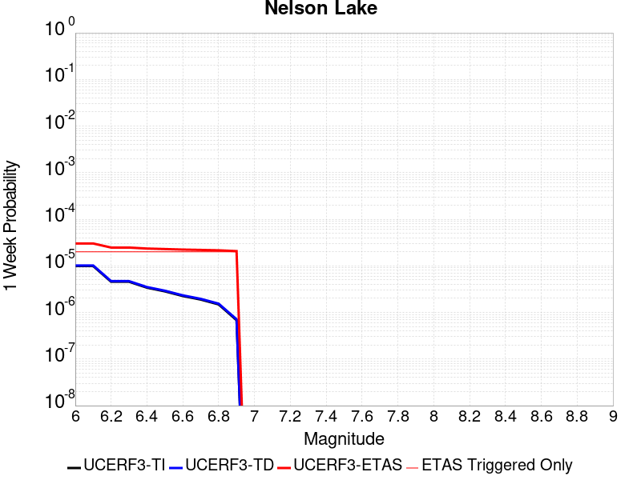 |  | 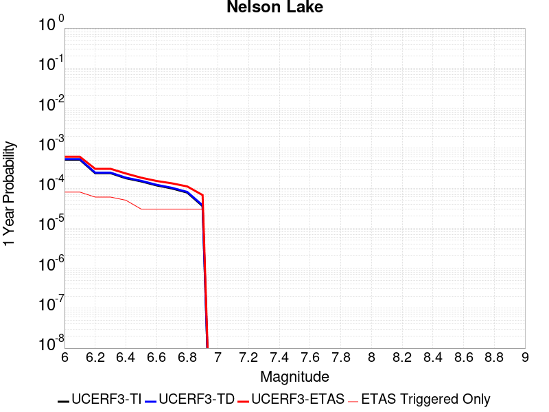 | 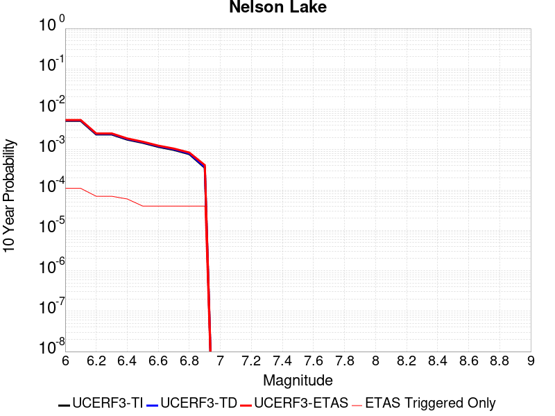 |

| Magnitude | 1 wk TI Prob | 1 wk TD Prob | 1 wk ETAS Prob | 1 wk ETAS/TD Gain | 1 wk ETAS Triggered Only | 1 mo TI Prob | 1 mo TD Prob | 1 mo ETAS Prob | 1 mo ETAS/TD Gain | 1 mo ETAS Triggered Only | 1 yr TI Prob | 1 yr TD Prob | 1 yr ETAS Prob | 1 yr ETAS/TD Gain | 1 yr ETAS Triggered Only | 10 yr TI Prob | 10 yr TD Prob | 10 yr ETAS Prob | 10 yr ETAS/TD Gain | 10 yr ETAS Triggered Only |
|-----|-----|-----|-----|-----|-----|-----|-----|-----|-----|-----|-----|-----|-----|-----|-----|-----|-----|-----|-----|-----|
| 6.0 | 9.913453E-6 | 1.0192293E-5 | 3.019209E-5 | 2.962247 | 2.0E-5 | 4.2485535E-5 | 4.3680586E-5 | 8.367884E-5 | 1.9156986 | 4.0E-5 | 5.1713863E-4 | 5.316917E-4 | 6.116491E-4 | 1.1503831 | 8.0E-5 | 0.0051593683 | 0.0053052236 | 0.00541464 | 1.0206243 | 1.1E-4 |
| 6.1 | 9.913453E-6 | 1.0192293E-5 | 3.019209E-5 | 2.962247 | 2.0E-5 | 4.2485535E-5 | 4.3680586E-5 | 8.367884E-5 | 1.9156986 | 4.0E-5 | 5.1713863E-4 | 5.316917E-4 | 6.116491E-4 | 1.1503831 | 8.0E-5 | 0.0051593683 | 0.0053052236 | 0.00541464 | 1.0206243 | 1.1E-4 |
| 6.2 | 4.5596407E-6 | 4.696332E-6 | 2.4696237E-5 | 5.258623 | 2.0E-5 | 1.954117E-5 | 2.0126989E-5 | 5.0126386E-5 | 2.490506 | 3.0E-5 | 2.3788778E-4 | 2.450198E-4 | 3.050051E-4 | 1.2448182 | 6.0E-5 | 0.0023763329 | 0.0024476226 | 0.0025174513 | 1.0285292 | 7.0E-5 |
| 6.3 | 4.5596407E-6 | 4.696332E-6 | 2.4696237E-5 | 5.258623 | 2.0E-5 | 1.954117E-5 | 2.0126989E-5 | 5.0126386E-5 | 2.490506 | 3.0E-5 | 2.3788778E-4 | 2.450198E-4 | 3.050051E-4 | 1.2448182 | 6.0E-5 | 0.0023763329 | 0.0024476226 | 0.0025174513 | 1.0285292 | 7.0E-5 |
| 6.4 | 3.4025713E-6 | 3.509912E-6 | 2.3509841E-5 | 6.6981287 | 2.0E-5 | 1.4582367E-5 | 1.50423975E-5 | 3.5042096E-5 | 2.3295553 | 2.0E-5 | 1.7752586E-4 | 1.8312664E-4 | 2.3311749E-4 | 1.2729851 | 5.0E-5 | 0.001773841 | 0.0018298404 | 0.0018897306 | 1.0327297 | 6.0E-5 |
| 6.5 | 2.8352947E-6 | 2.9278688E-6 | 2.292781E-5 | 7.8308873 | 2.0E-5 | 1.2151207E-5 | 1.2547953E-5 | 3.25477E-5 | 2.5938654 | 2.0E-5 | 1.479309E-4 | 1.5276136E-4 | 1.8275679E-4 | 1.1963547 | 3.0E-5 | 0.0014783246 | 0.0015266375 | 0.0015665764 | 1.0261614 | 4.0E-5 |
| 6.6 | 2.251518E-6 | 2.3290781E-6 | 2.2329032E-5 | 9.587069 | 2.0E-5 | 9.649328E-6 | 9.981729E-6 | 2.998153E-5 | 3.003641 | 2.0E-5 | 1.1747423E-4 | 1.2152141E-4 | 1.5151776E-4 | 1.2468401 | 3.0E-5 | 0.0011741214 | 0.0012146112 | 0.0012545626 | 1.0328923 | 4.0E-5 |
| 6.7 | 1.8911853E-6 | 1.9591491E-6 | 2.195911E-5 | 11.208494 | 2.0E-5 | 8.105055E-6 | 8.39633E-6 | 2.8396162E-5 | 3.3819733 | 2.0E-5 | 9.867457E-5 | 1.022211E-4 | 1.3221803E-4 | 1.2934514 | 3.0E-5 | 9.863076E-4 | 0.0010217984 | 0.0010617574 | 1.0391067 | 4.0E-5 |
| 6.8 | 1.4874814E-6 | 1.5438383E-6 | 2.1543807E-5 | 13.954705 | 2.0E-5 | 6.374905E-6 | 6.6164357E-6 | 2.6616304E-5 | 4.0227556 | 2.0E-5 | 7.76117E-5 | 8.055265E-5 | 1.1055023E-4 | 1.3723972 | 3.0E-5 | 7.75846E-4 | 8.052856E-4 | 8.452534E-4 | 1.0496318 | 4.0E-5 |
| 6.9 | 6.835972E-7 | 7.1399705E-7 | 2.0713982E-5 | 29.011301 | 2.0E-5 | 2.9296991E-6 | 3.0599856E-6 | 2.3059923E-5 | 7.535959 | 2.0E-5 | 3.56685E-5 | 3.7255006E-5 | 6.725389E-5 | 1.805231 | 3.0E-5 | 3.5662777E-4 | 3.7251884E-4 | 4.1250396E-4 | 1.1073371 | 4.0E-5 |

## San Jacinto (San Bernardino)
*[(top)](#table-of-contents)*

| 1 Week | 1 Month | 1 Year | 10 Year |
|-----|-----|-----|-----|
| 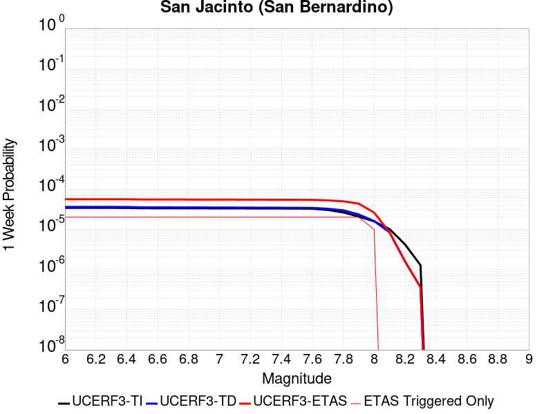 |  |  | 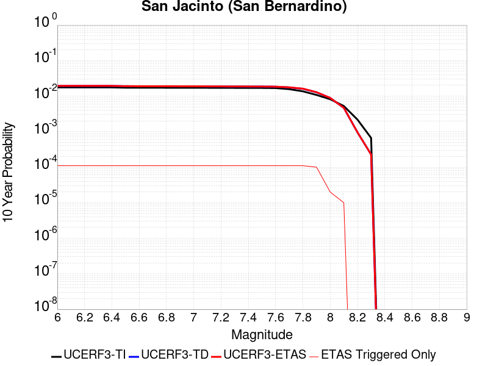 |

| Magnitude | 1 wk TI Prob | 1 wk TD Prob | 1 wk ETAS Prob | 1 wk ETAS/TD Gain | 1 wk ETAS Triggered Only | 1 mo TI Prob | 1 mo TD Prob | 1 mo ETAS Prob | 1 mo ETAS/TD Gain | 1 mo ETAS Triggered Only | 1 yr TI Prob | 1 yr TD Prob | 1 yr ETAS Prob | 1 yr ETAS/TD Gain | 1 yr ETAS Triggered Only | 10 yr TI Prob | 10 yr TD Prob | 10 yr ETAS Prob | 10 yr ETAS/TD Gain | 10 yr ETAS Triggered Only |
|-----|-----|-----|-----|-----|-----|-----|-----|-----|-----|-----|-----|-----|-----|-----|-----|-----|-----|-----|-----|-----|
| 6.0 | 3.409352E-5 | 3.6001682E-5 | 5.600096E-5 | 1.5555096 | 2.0E-5 | 1.461069E-4 | 1.542838E-4 | 1.8427917E-4 | 1.1944169 | 3.0E-5 | 0.0017774 | 0.0018767886 | 0.0019766008 | 1.0531825 | 1.0E-4 | 0.01763251 | 0.01935761 | 0.01946548 | 1.0055726 | 1.1E-4 |
| 6.1 | 3.409352E-5 | 3.6001682E-5 | 5.600096E-5 | 1.5555096 | 2.0E-5 | 1.461069E-4 | 1.542838E-4 | 1.8427917E-4 | 1.1944169 | 3.0E-5 | 0.0017774 | 0.0018767886 | 0.0019766008 | 1.0531825 | 1.0E-4 | 0.01763251 | 0.01935761 | 0.01946548 | 1.0055726 | 1.1E-4 |
| 6.2 | 3.409352E-5 | 3.6001682E-5 | 5.600096E-5 | 1.5555096 | 2.0E-5 | 1.461069E-4 | 1.542838E-4 | 1.8427917E-4 | 1.1944169 | 3.0E-5 | 0.0017774 | 0.0018767886 | 0.0019766008 | 1.0531825 | 1.0E-4 | 0.01763251 | 0.01935761 | 0.01946548 | 1.0055726 | 1.1E-4 |
| 6.3 | 3.409352E-5 | 3.6001682E-5 | 5.600096E-5 | 1.5555096 | 2.0E-5 | 1.461069E-4 | 1.542838E-4 | 1.8427917E-4 | 1.1944169 | 3.0E-5 | 0.0017774 | 0.0018767886 | 0.0019766008 | 1.0531825 | 1.0E-4 | 0.01763251 | 0.01935761 | 0.01946548 | 1.0055726 | 1.1E-4 |
| 6.4 | 3.400795E-5 | 3.5894343E-5 | 5.5893623E-5 | 1.5571709 | 2.0E-5 | 1.4574021E-4 | 1.5382383E-4 | 1.8381923E-4 | 1.1949983 | 3.0E-5 | 0.0017729428 | 0.0018711982 | 0.001971011 | 1.0533417 | 1.0E-4 | 0.017588645 | 0.01930269 | 0.019410567 | 1.0055887 | 1.1E-4 |
| 6.5 | 3.341482E-5 | 3.515495E-5 | 5.5154247E-5 | 1.56889 | 2.0E-5 | 1.4319851E-4 | 1.5065537E-4 | 1.8065085E-4 | 1.1991 | 3.0E-5 | 0.0017420477 | 0.0018326874 | 0.0019325041 | 1.0544647 | 1.0E-4 | 0.017284546 | 0.018924221 | 0.019032141 | 1.0057026 | 1.1E-4 |
| 6.6 | 3.3364955E-5 | 3.5092165E-5 | 5.5091463E-5 | 1.5699078 | 2.0E-5 | 1.4298483E-4 | 1.5038633E-4 | 1.8038182E-4 | 1.1994562 | 3.0E-5 | 0.0017394501 | 0.0018294173 | 0.0019292344 | 1.0545622 | 1.0E-4 | 0.017258976 | 0.018892085 | 0.019000009 | 1.0057125 | 1.1E-4 |
| 6.7 | 3.335922E-5 | 3.508194E-5 | 5.5081236E-5 | 1.570074 | 2.0E-5 | 1.4296026E-4 | 1.503425E-4 | 1.80338E-4 | 1.1995144 | 3.0E-5 | 0.0017391514 | 0.0018288847 | 0.0019287018 | 1.0545782 | 1.0E-4 | 0.017256035 | 0.018886877 | 0.018994799 | 1.0057142 | 1.1E-4 |
| 6.8 | 3.327683E-5 | 3.4976E-5 | 5.49753E-5 | 1.5718007 | 2.0E-5 | 1.4260718E-4 | 1.4988854E-4 | 1.7988404E-4 | 1.2001188 | 3.0E-5 | 0.0017348597 | 0.0018233669 | 0.0019231845 | 1.0547436 | 1.0E-4 | 0.017213784 | 0.018832648 | 0.018940575 | 1.0057309 | 1.1E-4 |
| 6.9 | 3.3235785E-5 | 3.491695E-5 | 5.4916254E-5 | 1.5727677 | 2.0E-5 | 1.4243131E-4 | 1.496355E-4 | 1.7963101E-4 | 1.2004572 | 3.0E-5 | 0.0017327217 | 0.0018202913 | 0.0019201093 | 1.0548363 | 1.0E-4 | 0.017192734 | 0.018802516 | 0.018910447 | 1.0057403 | 1.1E-4 |
| 7.0 | 3.3197095E-5 | 3.485688E-5 | 5.485618E-5 | 1.5737549 | 2.0E-5 | 1.422655E-4 | 1.4937807E-4 | 1.7937359E-4 | 1.2008027 | 3.0E-5 | 0.0017307063 | 0.0018171624 | 0.0019169806 | 1.0549308 | 1.0E-4 | 0.017172894 | 0.01877189 | 0.018879825 | 1.0057498 | 1.1E-4 |
| 7.1 | 3.3129716E-5 | 3.473708E-5 | 5.4736385E-5 | 1.5757337 | 2.0E-5 | 1.4197677E-4 | 1.4886471E-4 | 1.7886025E-4 | 1.2014953 | 3.0E-5 | 0.0017271966 | 0.0018109226 | 0.0019107416 | 1.0551205 | 1.0E-4 | 0.017138338 | 0.01871097 | 0.018818913 | 1.0057689 | 1.1E-4 |
| 7.2 | 3.3034008E-5 | 3.4604524E-5 | 5.460383E-5 | 1.5779392 | 2.0E-5 | 1.4156665E-4 | 1.4829668E-4 | 1.7829222E-4 | 1.2022672 | 3.0E-5 | 0.0017222111 | 0.0018040182 | 0.0019038378 | 1.0553318 | 1.0E-4 | 0.017089253 | 0.018643353 | 0.0187513 | 1.0057902 | 1.1E-4 |
| 7.3 | 3.2956614E-5 | 3.447227E-5 | 5.4471577E-5 | 1.5801566 | 2.0E-5 | 1.4123498E-4 | 1.4772992E-4 | 1.777255E-4 | 1.2030432 | 3.0E-5 | 0.0017181796 | 0.0017971295 | 0.0018969498 | 1.0555443 | 1.0E-4 | 0.017049557 | 0.018576099 | 0.018684056 | 1.0058116 | 1.1E-4 |
| 7.4 | 3.2915937E-5 | 3.4393954E-5 | 5.4393266E-5 | 1.5814775 | 2.0E-5 | 1.4106068E-4 | 1.4739433E-4 | 1.7738991E-4 | 1.2035056 | 3.0E-5 | 0.0017160608 | 0.0017930503 | 0.0018928711 | 1.0556709 | 1.0E-4 | 0.017028693 | 0.01853637 | 0.018644331 | 1.0058243 | 1.1E-4 |
| 7.5 | 3.281791E-5 | 3.4258854E-5 | 5.4258166E-5 | 1.5837708 | 2.0E-5 | 1.406406E-4 | 1.468154E-4 | 1.76811E-4 | 1.2043083 | 3.0E-5 | 0.0017109542 | 0.0017860134 | 0.0018858348 | 1.0558907 | 1.0E-4 | 0.016978411 | 0.01846725 | 0.018575218 | 1.0058465 | 1.1E-4 |
| 7.6 | 3.2521442E-5 | 3.3983775E-5 | 5.3983094E-5 | 1.5884961 | 2.0E-5 | 1.3937015E-4 | 1.4563663E-4 | 1.7563226E-4 | 1.2059622 | 3.0E-5 | 0.0016955109 | 0.0017716853 | 0.0018715081 | 1.0563434 | 1.0E-4 | 0.016826328 | 0.018324887 | 0.01843287 | 1.0058928 | 1.1E-4 |
| 7.7 | 3.0287873E-5 | 3.2467702E-5 | 5.2467054E-5 | 1.6159768 | 2.0E-5 | 1.297987E-4 | 1.3913988E-4 | 1.6913572E-4 | 1.2155803 | 3.0E-5 | 0.0015791537 | 0.001692713 | 0.0017925437 | 1.0589768 | 1.0E-4 | 0.01567979 | 0.017535618 | 0.017643688 | 1.006163 | 1.1E-4 |
| 7.8 | 2.6316151E-5 | 2.9678076E-5 | 4.9677485E-5 | 1.6738781 | 2.0E-5 | 1.1277862E-4 | 1.2718556E-4 | 1.5718174E-4 | 1.2358458 | 3.0E-5 | 0.0013722149 | 0.0015473852 | 0.0016472306 | 1.0645251 | 1.0E-4 | 0.013637724 | 0.016076857 | 0.016185088 | 1.0067321 | 1.1E-4 |
| 7.9 | 2.0761147E-5 | 2.343051E-5 | 4.3430042E-5 | 1.8535678 | 2.0E-5 | 8.897331E-5 | 1.0041261E-4 | 1.304096E-4 | 1.2987373 | 3.0E-5 | 0.0010827117 | 0.0012218388 | 0.0013217166 | 1.0817438 | 1.0E-4 | 0.010774517 | 0.012799647 | 0.012898367 | 1.0077127 | 1.0E-4 |
| 8.0 | 1.5738568E-5 | 1.604239E-5 | 2.604223E-5 | 1.6233386 | 1.0E-5 | 6.744926E-5 | 6.875129E-5 | 7.87506E-5 | 1.1454418 | 1.0E-5 | 8.2088535E-4 | 8.3672616E-4 | 8.5670943E-4 | 1.0238826 | 2.0E-5 | 0.008178596 | 0.008870586 | 0.008890409 | 1.0022347 | 2.0E-5 |
| 8.1 | 1.0105832E-5 | 8.335246E-6 | 8.335246E-6 | 1.0 | 0.0 | 4.3309992E-5 | 3.5721994E-5 | 3.5721994E-5 | 1.0 | 0.0 | 5.2717153E-4 | 4.34829E-4 | 4.4482466E-4 | 1.0229876 | 1.0E-5 | 0.005259227 | 0.0046798005 | 0.004689754 | 1.0021268 | 1.0E-5 |
| 8.2 | 4.189207E-6 | 1.5793896E-6 | 1.5793896E-6 | 1.0 | 0.0 | 1.7953622E-5 | 6.768795E-6 | 6.768795E-6 | 1.0 | 0.0 | 2.1856341E-4 | 8.2406994E-5 | 8.2406994E-5 | 1.0 | 0.0 | 0.0021834858 | 9.571454E-4 | 9.571454E-4 | 1.0 | 0.0 |
| 8.3 | 1.2758221E-6 | 3.6171858E-7 | 3.6171858E-7 | 1.0 | 0.0 | 5.4677976E-6 | 1.5502216E-6 | 1.5502216E-6 | 1.0 | 0.0 | 6.65684E-5 | 1.8873789E-5 | 1.8873789E-5 | 1.0 | 0.0 | 6.6548464E-4 | 2.2764095E-4 | 2.2764095E-4 | 1.0 | 0.0 |

## Garlic Springs
*[(top)](#table-of-contents)*

| 1 Week | 1 Month | 1 Year | 10 Year |
|-----|-----|-----|-----|
| 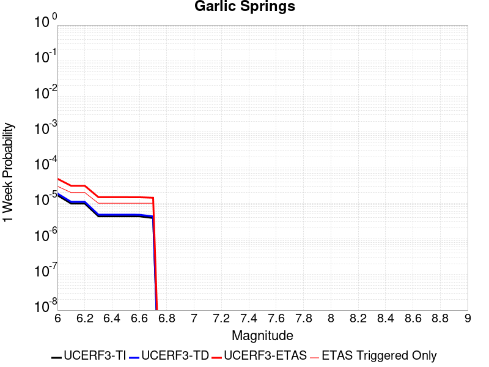 |  | 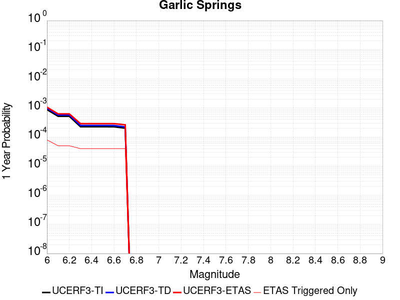 |  |

| Magnitude | 1 wk TI Prob | 1 wk TD Prob | 1 wk ETAS Prob | 1 wk ETAS/TD Gain | 1 wk ETAS Triggered Only | 1 mo TI Prob | 1 mo TD Prob | 1 mo ETAS Prob | 1 mo ETAS/TD Gain | 1 mo ETAS Triggered Only | 1 yr TI Prob | 1 yr TD Prob | 1 yr ETAS Prob | 1 yr ETAS/TD Gain | 1 yr ETAS Triggered Only | 10 yr TI Prob | 10 yr TD Prob | 10 yr ETAS Prob | 10 yr ETAS/TD Gain | 10 yr ETAS Triggered Only |
|-----|-----|-----|-----|-----|-----|-----|-----|-----|-----|-----|-----|-----|-----|-----|-----|-----|-----|-----|-----|-----|
| 6.0 | 1.6760017E-5 | 1.8777133E-5 | 4.877657E-5 | 2.5976582 | 3.0E-5 | 7.182667E-5 | 8.0471604E-5 | 1.4046677E-4 | 1.7455447 | 6.0E-5 | 8.7413884E-4 | 9.794187E-4 | 0.0010593404 | 1.0816011 | 8.0E-5 | 0.008707083 | 0.009762568 | 0.009861592 | 1.0101432 | 1.0E-4 |
| 6.1 | 9.852767E-6 | 1.0973753E-5 | 3.0973533E-5 | 2.8225107 | 2.0E-5 | 4.222546E-5 | 4.702992E-5 | 7.702851E-5 | 1.6378617 | 3.0E-5 | 5.139737E-4 | 5.7250983E-4 | 6.2248117E-4 | 1.0872848 | 5.0E-5 | 0.005127866 | 0.0057173073 | 0.005767022 | 1.0086954 | 5.0E-5 |
| 6.2 | 9.852767E-6 | 1.0973753E-5 | 3.0973533E-5 | 2.8225107 | 2.0E-5 | 4.222546E-5 | 4.702992E-5 | 7.702851E-5 | 1.6378617 | 3.0E-5 | 5.139737E-4 | 5.7250983E-4 | 6.2248117E-4 | 1.0872848 | 5.0E-5 | 0.005127866 | 0.0057173073 | 0.005767022 | 1.0086954 | 5.0E-5 |
| 6.3 | 4.3167724E-6 | 4.7780964E-6 | 1.4778048E-5 | 3.0928738 | 1.0E-5 | 1.8500323E-5 | 2.0477524E-5 | 4.0477116E-5 | 1.9766605 | 2.0E-5 | 2.2521814E-4 | 2.4930836E-4 | 2.892984E-4 | 1.1604038 | 4.0E-5 | 0.0022499003 | 0.0024925452 | 0.0025324456 | 1.0160079 | 4.0E-5 |
| 6.4 | 4.3167724E-6 | 4.7780964E-6 | 1.4778048E-5 | 3.0928738 | 1.0E-5 | 1.8500323E-5 | 2.0477524E-5 | 4.0477116E-5 | 1.9766605 | 2.0E-5 | 2.2521814E-4 | 2.4930836E-4 | 2.892984E-4 | 1.1604038 | 4.0E-5 | 0.0022499003 | 0.0024925452 | 0.0025324456 | 1.0160079 | 4.0E-5 |
| 6.5 | 4.3167724E-6 | 4.7780964E-6 | 1.4778048E-5 | 3.0928738 | 1.0E-5 | 1.8500323E-5 | 2.0477524E-5 | 4.0477116E-5 | 1.9766605 | 2.0E-5 | 2.2521814E-4 | 2.4930836E-4 | 2.892984E-4 | 1.1604038 | 4.0E-5 | 0.0022499003 | 0.0024925452 | 0.0025324456 | 1.0160079 | 4.0E-5 |
| 6.6 | 4.301311E-6 | 4.7609647E-6 | 1.4760917E-5 | 3.1004047 | 1.0E-5 | 1.8434059E-5 | 2.0404104E-5 | 4.0403695E-5 | 1.980175 | 2.0E-5 | 2.2441156E-4 | 2.4841467E-4 | 2.8840473E-4 | 1.160981 | 4.0E-5 | 0.0022418506 | 0.0024836282 | 0.0025235289 | 1.0160655 | 4.0E-5 |
| 6.7 | 3.8599724E-6 | 4.2711204E-6 | 1.4271078E-5 | 3.3412962 | 1.0E-5 | 1.6542634E-5 | 1.8304801E-5 | 3.8304435E-5 | 2.0925896 | 2.0E-5 | 2.0138794E-4 | 2.2286095E-4 | 2.6285203E-4 | 1.1794441 | 4.0E-5 | 0.0020120554 | 0.0022286095 | 0.0022685204 | 1.0179085 | 4.0E-5 |

## Paradise
*[(top)](#table-of-contents)*

| 1 Week | 1 Month | 1 Year | 10 Year |
|-----|-----|-----|-----|
| 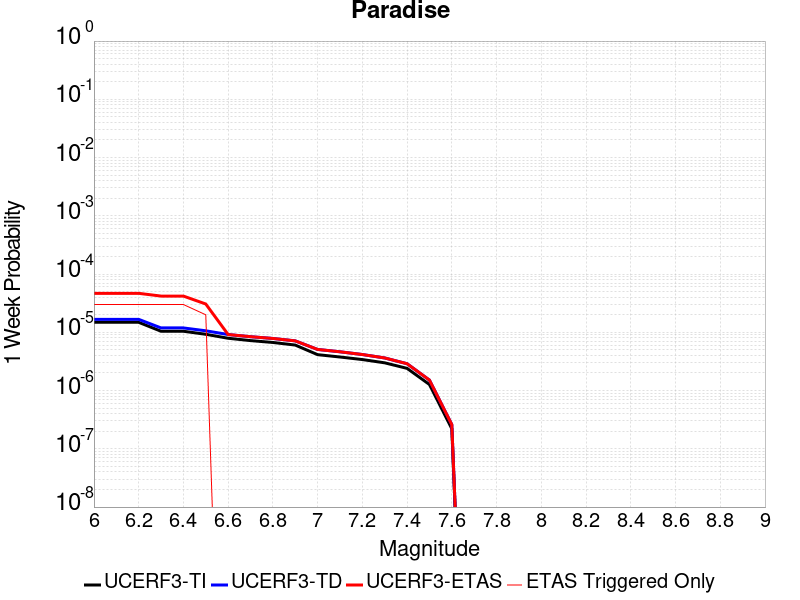 | 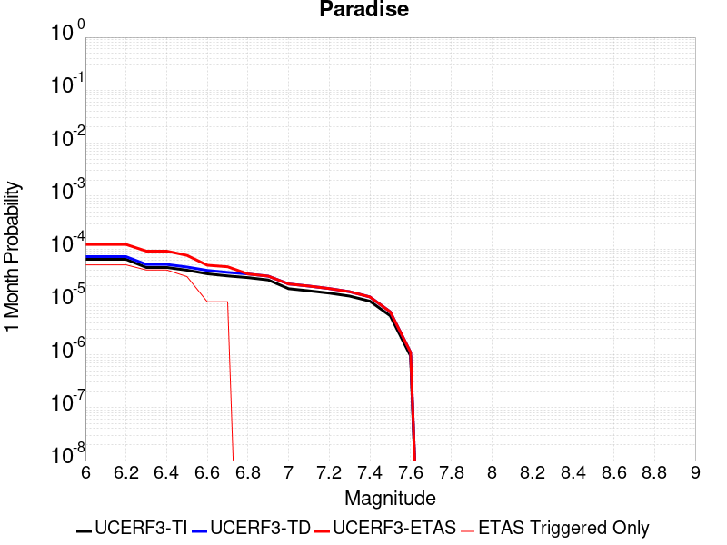 | 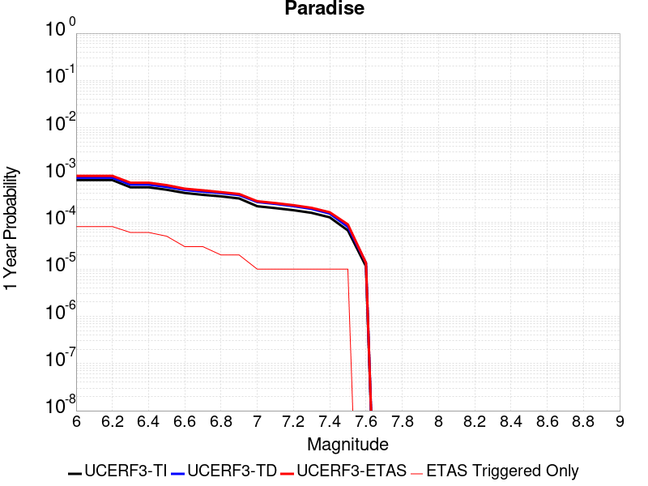 |  |

| Magnitude | 1 wk TI Prob | 1 wk TD Prob | 1 wk ETAS Prob | 1 wk ETAS/TD Gain | 1 wk ETAS Triggered Only | 1 mo TI Prob | 1 mo TD Prob | 1 mo ETAS Prob | 1 mo ETAS/TD Gain | 1 mo ETAS Triggered Only | 1 yr TI Prob | 1 yr TD Prob | 1 yr ETAS Prob | 1 yr ETAS/TD Gain | 1 yr ETAS Triggered Only | 10 yr TI Prob | 10 yr TD Prob | 10 yr ETAS Prob | 10 yr ETAS/TD Gain | 10 yr ETAS Triggered Only |
|-----|-----|-----|-----|-----|-----|-----|-----|-----|-----|-----|-----|-----|-----|-----|-----|-----|-----|-----|-----|-----|
| 6.0 | 1.4851273E-5 | 1.6694923E-5 | 4.6694422E-5 | 2.7969234 | 3.0E-5 | 6.364676E-5 | 7.1547845E-5 | 1.2154427E-4 | 1.698783 | 5.0E-5 | 7.7462377E-4 | 8.707705E-4 | 9.5070084E-4 | 1.0917927 | 8.0E-5 | 0.0077192914 | 0.008675965 | 0.008775097 | 1.0114261 | 1.0E-4 |
| 6.1 | 1.4851273E-5 | 1.6694923E-5 | 4.6694422E-5 | 2.7969234 | 3.0E-5 | 6.364676E-5 | 7.1547845E-5 | 1.2154427E-4 | 1.698783 | 5.0E-5 | 7.7462377E-4 | 8.707705E-4 | 9.5070084E-4 | 1.0917927 | 8.0E-5 | 0.0077192914 | 0.008675965 | 0.008775097 | 1.0114261 | 1.0E-4 |
| 6.2 | 1.4851273E-5 | 1.6694923E-5 | 4.6694422E-5 | 2.7969234 | 3.0E-5 | 6.364676E-5 | 7.1547845E-5 | 1.2154427E-4 | 1.698783 | 5.0E-5 | 7.7462377E-4 | 8.707705E-4 | 9.5070084E-4 | 1.0917927 | 8.0E-5 | 0.0077192914 | 0.008675965 | 0.008775097 | 1.0114261 | 1.0E-4 |
| 6.3 | 1.0426831E-5 | 1.1888797E-5 | 4.188844E-5 | 3.5233538 | 3.0E-5 | 4.4685654E-5 | 5.095103E-5 | 9.094899E-5 | 1.7850276 | 4.0E-5 | 5.43912E-4 | 6.2015816E-4 | 6.8012095E-4 | 1.0966895 | 6.0E-5 | 0.0054258266 | 0.0061848834 | 0.0062445127 | 1.009641 | 6.0E-5 |
| 6.4 | 1.0426831E-5 | 1.1888797E-5 | 4.188844E-5 | 3.5233538 | 3.0E-5 | 4.4685654E-5 | 5.095103E-5 | 9.094899E-5 | 1.7850276 | 4.0E-5 | 5.43912E-4 | 6.2015816E-4 | 6.8012095E-4 | 1.0966895 | 6.0E-5 | 0.0054258266 | 0.0061848834 | 0.0062445127 | 1.009641 | 6.0E-5 |
| 6.5 | 9.25027E-6 | 1.0620124E-5 | 3.061991E-5 | 2.883197 | 2.0E-5 | 3.964341E-5 | 4.551405E-5 | 7.551268E-5 | 1.6591071 | 3.0E-5 | 4.8255164E-4 | 5.539976E-4 | 6.039699E-4 | 1.090203 | 5.0E-5 | 0.0048150513 | 0.0055266647 | 0.005576388 | 1.0089971 | 5.0E-5 |
| 6.6 | 7.904275E-6 | 9.159673E-6 | 9.159673E-6 | 1.0 | 0.0 | 3.3875025E-5 | 3.925517E-5 | 4.925478E-5 | 1.2547336 | 1.0E-5 | 4.1235037E-4 | 4.7783085E-4 | 5.078165E-4 | 1.0627537 | 3.0E-5 | 0.0041158604 | 0.004768431 | 0.004798288 | 1.0062613 | 3.0E-5 |
| 6.7 | 7.2061953E-6 | 8.407388E-6 | 8.407388E-6 | 1.0 | 0.0 | 3.088333E-5 | 3.6031186E-5 | 4.6030826E-5 | 1.2775273 | 1.0E-5 | 3.7593965E-4 | 4.3859507E-4 | 4.6858191E-4 | 1.0683702 | 3.0E-5 | 0.003753043 | 0.0043776636 | 0.0044075325 | 1.006823 | 3.0E-5 |
| 6.8 | 6.6948724E-6 | 7.842299E-6 | 7.842299E-6 | 1.0 | 0.0 | 2.8691995E-5 | 3.360944E-5 | 3.360944E-5 | 1.0 | 0.0 | 3.4926904E-4 | 4.0912168E-4 | 4.291135E-4 | 1.0488652 | 2.0E-5 | 0.003487206 | 0.0040840427 | 0.004103961 | 1.0048771 | 2.0E-5 |
| 6.9 | 6.0421025E-6 | 7.130747E-6 | 7.130747E-6 | 1.0 | 0.0 | 2.5894467E-5 | 3.0560004E-5 | 3.0560004E-5 | 1.0 | 0.0 | 3.1521954E-4 | 3.7200793E-4 | 3.9200048E-4 | 1.0537423 | 2.0E-5 | 0.0031477278 | 0.0037141903 | 0.003734116 | 1.0053648 | 2.0E-5 |
| 7.0 | 4.134091E-6 | 5.080416E-6 | 5.080416E-6 | 1.0 | 0.0 | 1.7717413E-5 | 2.1773038E-5 | 2.1773038E-5 | 1.0 | 0.0 | 2.1568815E-4 | 2.6505603E-4 | 2.7505337E-4 | 1.0377178 | 1.0E-5 | 0.0021547892 | 0.0026475522 | 0.0026575255 | 1.0037671 | 1.0E-5 |
| 7.1 | 3.7674888E-6 | 4.6319656E-6 | 4.6319656E-6 | 1.0 | 0.0 | 1.6146281E-5 | 1.9851139E-5 | 1.9851139E-5 | 1.0 | 0.0 | 1.9656324E-4 | 2.4166232E-4 | 2.5165992E-4 | 1.04137 | 1.0E-5 | 0.0019638946 | 0.002414146 | 0.0024241218 | 1.0041323 | 1.0E-5 |
| 7.2 | 3.4065345E-6 | 4.156807E-6 | 4.156807E-6 | 1.0 | 0.0 | 1.4599351E-5 | 1.7814775E-5 | 1.7814775E-5 | 1.0 | 0.0 | 1.777326E-4 | 2.1687479E-4 | 2.2687262E-4 | 1.0460995 | 1.0E-5 | 0.0017759053 | 0.0021667795 | 0.002176758 | 1.0046052 | 1.0E-5 |
| 7.3 | 2.9934936E-6 | 3.6293877E-6 | 3.6293877E-6 | 1.0 | 0.0 | 1.2829195E-5 | 1.5554435E-5 | 1.5554435E-5 | 1.0 | 0.0 | 1.5618425E-4 | 1.8936026E-4 | 1.9935836E-4 | 1.0527993 | 1.0E-5 | 0.0015607453 | 0.0018921344 | 0.0019021154 | 1.005275 | 1.0E-5 |
| 7.4 | 2.4049796E-6 | 2.8890327E-6 | 2.8890327E-6 | 1.0 | 0.0 | 1.0307015E-5 | 1.2381518E-5 | 1.2381518E-5 | 1.0 | 0.0 | 1.2548068E-4 | 1.5073598E-4 | 1.6073449E-4 | 1.0663311 | 1.0E-5 | 0.0012540985 | 0.001506479 | 0.0015164639 | 1.006628 | 1.0E-5 |
| 7.5 | 1.2710091E-6 | 1.513489E-6 | 1.513489E-6 | 1.0 | 0.0 | 5.44717E-6 | 6.486372E-6 | 6.486372E-6 | 1.0 | 0.0 | 6.631728E-5 | 7.896997E-5 | 8.896918E-5 | 1.1266204 | 1.0E-5 | 6.6297496E-4 | 7.895417E-4 | 7.995338E-4 | 1.0126556 | 1.0E-5 |
| 7.6 | 2.21172E-7 | 2.6040198E-7 | 2.6040198E-7 | 1.0 | 0.0 | 9.478797E-7 | 1.1160082E-6 | 1.1160082E-6 | 1.0 | 0.0 | 1.1540374E-5 | 1.3587343E-5 | 1.3587343E-5 | 1.0 | 0.0 | 1.1539775E-4 | 1.3586794E-4 | 1.3586794E-4 | 1.0 | 0.0 |

## Death Valley (Black Mtns Frontal)
*[(top)](#table-of-contents)*

| 1 Week | 1 Month | 1 Year | 10 Year |
|-----|-----|-----|-----|
| 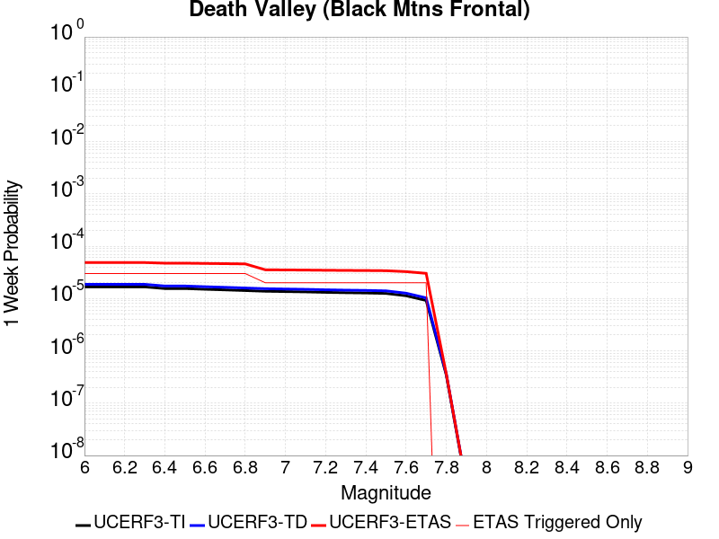 |  | 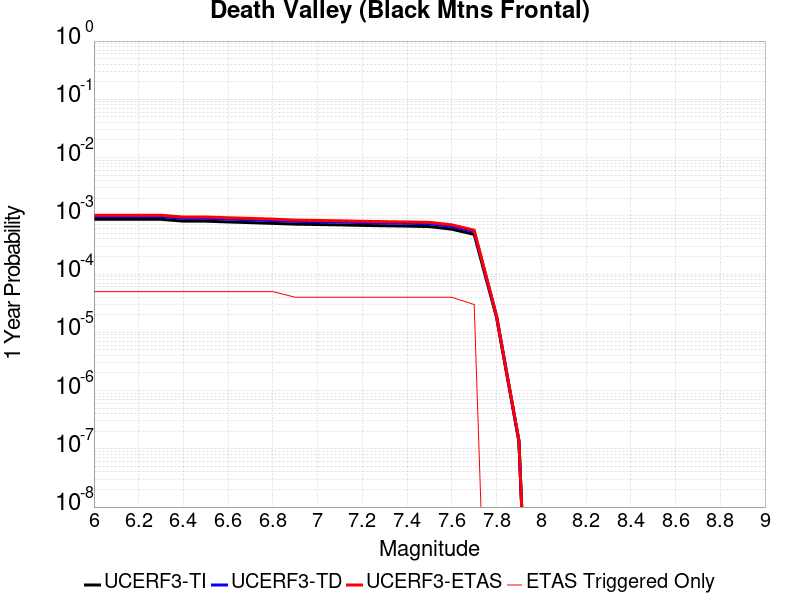 |  |

| Magnitude | 1 wk TI Prob | 1 wk TD Prob | 1 wk ETAS Prob | 1 wk ETAS/TD Gain | 1 wk ETAS Triggered Only | 1 mo TI Prob | 1 mo TD Prob | 1 mo ETAS Prob | 1 mo ETAS/TD Gain | 1 mo ETAS Triggered Only | 1 yr TI Prob | 1 yr TD Prob | 1 yr ETAS Prob | 1 yr ETAS/TD Gain | 1 yr ETAS Triggered Only | 10 yr TI Prob | 10 yr TD Prob | 10 yr ETAS Prob | 10 yr ETAS/TD Gain | 10 yr ETAS Triggered Only |
|-----|-----|-----|-----|-----|-----|-----|-----|-----|-----|-----|-----|-----|-----|-----|-----|-----|-----|-----|-----|-----|
| 6.0 | 1.6707214E-5 | 1.867056E-5 | 4.867E-5 | 2.6067777 | 3.0E-5 | 7.160038E-5 | 8.001427E-5 | 1.10011875E-4 | 1.3749031 | 3.0E-5 | 8.71386E-4 | 9.7374606E-4 | 0.0010236973 | 1.0512981 | 5.0E-5 | 0.00867977 | 0.009695647 | 0.009784775 | 1.0091925 | 9.0E-5 |
| 6.1 | 1.6707214E-5 | 1.867056E-5 | 4.867E-5 | 2.6067777 | 3.0E-5 | 7.160038E-5 | 8.001427E-5 | 1.10011875E-4 | 1.3749031 | 3.0E-5 | 8.71386E-4 | 9.7374606E-4 | 0.0010236973 | 1.0512981 | 5.0E-5 | 0.00867977 | 0.009695647 | 0.009784775 | 1.0091925 | 9.0E-5 |
| 6.2 | 1.6707214E-5 | 1.867056E-5 | 4.867E-5 | 2.6067777 | 3.0E-5 | 7.160038E-5 | 8.001427E-5 | 1.10011875E-4 | 1.3749031 | 3.0E-5 | 8.71386E-4 | 9.7374606E-4 | 0.0010236973 | 1.0512981 | 5.0E-5 | 0.00867977 | 0.009695647 | 0.009784775 | 1.0091925 | 9.0E-5 |
| 6.3 | 1.6707214E-5 | 1.867056E-5 | 4.867E-5 | 2.6067777 | 3.0E-5 | 7.160038E-5 | 8.001427E-5 | 1.10011875E-4 | 1.3749031 | 3.0E-5 | 8.71386E-4 | 9.7374606E-4 | 0.0010236973 | 1.0512981 | 5.0E-5 | 0.00867977 | 0.009695647 | 0.009784775 | 1.0091925 | 9.0E-5 |
| 6.4 | 1.5515609E-5 | 1.7338483E-5 | 4.7337962E-5 | 2.730225 | 3.0E-5 | 6.649377E-5 | 7.430571E-5 | 1.0430348E-4 | 1.4037075 | 3.0E-5 | 8.0926094E-4 | 9.0430264E-4 | 9.542574E-4 | 1.0552412 | 5.0E-5 | 0.008063202 | 0.009006913 | 0.009086193 | 1.008802 | 8.0E-5 |
| 6.5 | 1.5515609E-5 | 1.7338483E-5 | 4.7337962E-5 | 2.730225 | 3.0E-5 | 6.649377E-5 | 7.430571E-5 | 1.0430348E-4 | 1.4037075 | 3.0E-5 | 8.0926094E-4 | 9.0430264E-4 | 9.542574E-4 | 1.0552412 | 5.0E-5 | 0.008063202 | 0.009006913 | 0.009086193 | 1.008802 | 8.0E-5 |
| 6.6 | 1.5041828E-5 | 1.6809407E-5 | 4.6808902E-5 | 2.784685 | 3.0E-5 | 6.4463384E-5 | 7.203836E-5 | 1.020362E-4 | 1.4164147 | 3.0E-5 | 7.8455906E-4 | 8.7672E-4 | 9.266762E-4 | 1.0569807 | 5.0E-5 | 0.00781795 | 0.008733268 | 0.00881257 | 1.0090804 | 8.0E-5 |
| 6.7 | 1.4634985E-5 | 1.6356273E-5 | 4.635578E-5 | 2.8341289 | 3.0E-5 | 6.271985E-5 | 7.009646E-5 | 1.0009435E-4 | 1.4279517 | 3.0E-5 | 7.6334673E-4 | 8.53096E-4 | 9.030533E-4 | 1.05856 | 5.0E-5 | 0.007607299 | 0.008498848 | 0.008578168 | 1.009333 | 8.0E-5 |
| 6.8 | 1.4209158E-5 | 1.5882297E-5 | 4.588182E-5 | 2.8888657 | 3.0E-5 | 6.089497E-5 | 6.806524E-5 | 9.8063196E-5 | 1.4407237 | 3.0E-5 | 7.4114406E-4 | 8.2838483E-4 | 8.783434E-4 | 1.0603085 | 5.0E-5 | 0.007386771 | 0.008253585 | 0.008323007 | 1.0084112 | 7.0E-5 |
| 6.9 | 1.3780098E-5 | 1.5404834E-5 | 3.5404526E-5 | 2.2982738 | 2.0E-5 | 5.9056227E-5 | 6.601908E-5 | 8.601776E-5 | 1.3029227 | 2.0E-5 | 7.1877235E-4 | 8.0349133E-4 | 8.434592E-4 | 1.0497427 | 4.0E-5 | 0.0071645193 | 0.008006458 | 0.008065977 | 1.0074339 | 6.0E-5 |
| 7.0 | 1.3585064E-5 | 1.5188394E-5 | 3.518809E-5 | 2.3167748 | 2.0E-5 | 5.8220405E-5 | 6.5091524E-5 | 8.509022E-5 | 1.3072397 | 2.0E-5 | 7.086029E-4 | 7.922066E-4 | 8.321749E-4 | 1.0504519 | 4.0E-5 | 0.007063476 | 0.007894417 | 0.007953944 | 1.0075403 | 6.0E-5 |
| 7.1 | 1.3398601E-5 | 1.4981575E-5 | 3.4981276E-5 | 2.334953 | 2.0E-5 | 5.742131E-5 | 6.4205204E-5 | 8.4203915E-5 | 1.3114812 | 2.0E-5 | 6.9888023E-4 | 7.814234E-4 | 8.2139217E-4 | 1.0511487 | 4.0E-5 | 0.0069668638 | 0.007787346 | 0.007846879 | 1.0076448 | 6.0E-5 |
| 7.2 | 1.3126312E-5 | 1.4679792E-5 | 3.46795E-5 | 2.3623972 | 2.0E-5 | 5.6254412E-5 | 6.291191E-5 | 8.291065E-5 | 1.3178848 | 2.0E-5 | 6.846822E-4 | 7.656887E-4 | 8.056581E-4 | 1.0522006 | 4.0E-5 | 0.006825765 | 0.00763109 | 0.007690632 | 1.0078026 | 6.0E-5 |
| 7.3 | 1.2922429E-5 | 1.4454016E-5 | 3.4453726E-5 | 2.3836784 | 2.0E-5 | 5.5380664E-5 | 6.1944345E-5 | 8.19431E-5 | 1.3228505 | 2.0E-5 | 6.74051E-4 | 7.5391686E-4 | 7.9388666E-4 | 1.0530163 | 4.0E-5 | 0.006720101 | 0.0075141727 | 0.0075637973 | 1.0066041 | 5.0E-5 |
| 7.4 | 1.2768878E-5 | 1.4283997E-5 | 3.4283712E-5 | 2.4001484 | 2.0E-5 | 5.4722615E-5 | 6.1215724E-5 | 8.12145E-5 | 1.3266934 | 2.0E-5 | 6.660441E-4 | 7.45052E-4 | 7.850222E-4 | 1.0536475 | 4.0E-5 | 0.0066405144 | 0.0074261203 | 0.007475749 | 1.006683 | 5.0E-5 |
| 7.5 | 1.2521929E-5 | 1.40122365E-5 | 3.4011955E-5 | 2.4273038 | 2.0E-5 | 5.366431E-5 | 6.0051094E-5 | 8.004989E-5 | 1.3330297 | 2.0E-5 | 6.531671E-4 | 7.308822E-4 | 7.7085296E-4 | 1.0546883 | 4.0E-5 | 0.006512506 | 0.0072853607 | 0.0073349965 | 1.006813 | 5.0E-5 |
| 7.6 | 1.1301089E-5 | 1.2648349E-5 | 3.2648095E-5 | 2.581214 | 2.0E-5 | 4.8432343E-5 | 5.4206117E-5 | 7.420503E-5 | 1.368942 | 2.0E-5 | 5.895042E-4 | 6.597649E-4 | 6.997385E-4 | 1.0605876 | 4.0E-5 | 0.0058794282 | 0.0065786145 | 0.006628285 | 1.0075504 | 5.0E-5 |
| 7.7 | 9.189108E-6 | 1.0283521E-5 | 3.0283316E-5 | 2.944839 | 2.0E-5 | 3.93813E-5 | 4.407152E-5 | 6.4070635E-5 | 1.4537878 | 2.0E-5 | 4.7936183E-4 | 5.3644367E-4 | 5.664276E-4 | 1.0558939 | 3.0E-5 | 0.004783291 | 0.0053519984 | 0.005381838 | 1.0055754 | 3.0E-5 |
| 7.8 | 3.4586725E-7 | 3.648288E-7 | 3.648288E-7 | 1.0 | 0.0 | 1.4822873E-6 | 1.5635511E-6 | 1.5635511E-6 | 1.0 | 0.0 | 1.80467E-5 | 1.9036073E-5 | 1.9036073E-5 | 1.0 | 0.0 | 1.8045233E-4 | 1.9034486E-4 | 1.9034486E-4 | 1.0 | 0.0 |
| 7.9 | 2.5591178E-9 | 2.6696871E-9 | 2.6696871E-9 | 1.0 | 0.0 | 1.0967647E-8 | 1.1441516E-8 | 1.1441516E-8 | 1.0 | 0.0 | 1.335311E-7 | 1.3930045E-7 | 1.3930045E-7 | 1.0 | 0.0 | 1.3353102E-6 | 1.3930046E-6 | 1.3930046E-6 | 1.0 | 0.0 |

## San Andreas (Parkfield)
*[(top)](#table-of-contents)*

| 1 Week | 1 Month | 1 Year | 10 Year |
|-----|-----|-----|-----|
|  | 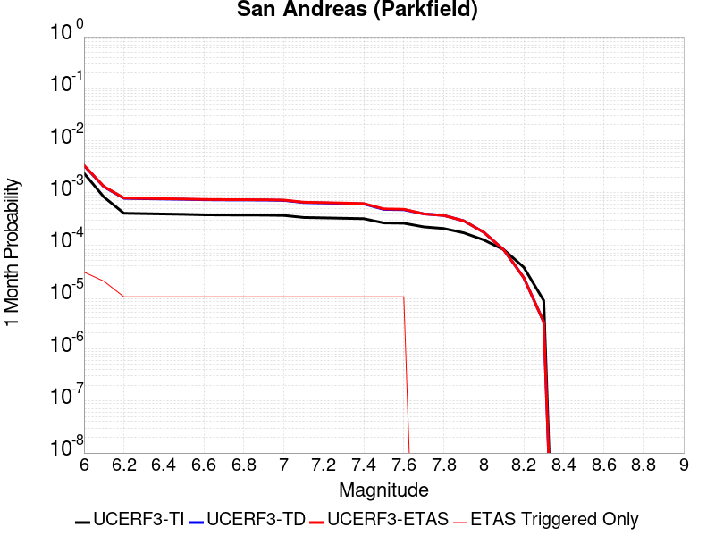 |  |  |

| Magnitude | 1 wk TI Prob | 1 wk TD Prob | 1 wk ETAS Prob | 1 wk ETAS/TD Gain | 1 wk ETAS Triggered Only | 1 mo TI Prob | 1 mo TD Prob | 1 mo ETAS Prob | 1 mo ETAS/TD Gain | 1 mo ETAS Triggered Only | 1 yr TI Prob | 1 yr TD Prob | 1 yr ETAS Prob | 1 yr ETAS/TD Gain | 1 yr ETAS Triggered Only | 10 yr TI Prob | 10 yr TD Prob | 10 yr ETAS Prob | 10 yr ETAS/TD Gain | 10 yr ETAS Triggered Only |
|-----|-----|-----|-----|-----|-----|-----|-----|-----|-----|-----|-----|-----|-----|-----|-----|-----|-----|-----|-----|-----|
| 6.0 | 5.556969E-4 | 7.787764E-4 | 7.887686E-4 | 1.0128306 | 1.0E-5 | 0.0023793848 | 0.0033338934 | 0.0033637933 | 1.0089685 | 3.0E-5 | 0.028586963 | 0.04027906 | 0.040346242 | 1.0016679 | 7.0E-5 | 0.25176284 | 0.3373374 | 0.33739704 | 1.0001768 | 9.0E-5 |
| 6.1 | 1.925858E-4 | 3.0300187E-4 | 3.1299883E-4 | 1.0329931 | 1.0E-5 | 8.2510663E-4 | 0.0012980271 | 0.0013180012 | 1.015388 | 2.0E-5 | 0.0099994885 | 0.01578479 | 0.01582416 | 1.0024941 | 4.0E-5 | 0.095613256 | 0.14981315 | 0.14985566 | 1.0002837 | 5.0E-5 |
| 6.2 | 9.4306815E-5 | 1.8251229E-4 | 1.8251229E-4 | 1.0 | 0.0 | 4.0410945E-4 | 7.8196224E-4 | 7.9195446E-4 | 1.0127783 | 1.0E-5 | 0.0049089384 | 0.009479025 | 0.009498836 | 1.00209 | 2.0E-5 | 0.048019063 | 0.09188695 | 0.09190511 | 1.0001976 | 2.0E-5 |
| 6.3 | 9.283051E-5 | 1.7947727E-4 | 1.7947727E-4 | 1.0 | 0.0 | 3.9778434E-4 | 7.689627E-4 | 7.7895506E-4 | 1.0129945 | 1.0E-5 | 0.0048322747 | 0.0093221245 | 0.0093419375 | 1.0021254 | 2.0E-5 | 0.047285385 | 0.09053988 | 0.090558074 | 1.0002009 | 2.0E-5 |
| 6.4 | 9.138826E-5 | 1.7709887E-4 | 1.7709887E-4 | 1.0 | 0.0 | 3.916052E-4 | 7.5877557E-4 | 7.68768E-4 | 1.0131692 | 1.0E-5 | 0.0047573745 | 0.009199142 | 0.009218958 | 1.0021541 | 2.0E-5 | 0.046568092 | 0.08944346 | 0.08946167 | 1.0002036 | 2.0E-5 |
| 6.5 | 9.000255E-5 | 1.7467843E-4 | 1.7467843E-4 | 1.0 | 0.0 | 3.8566816E-4 | 7.484082E-4 | 7.584007E-4 | 1.0133517 | 1.0E-5 | 0.0046854047 | 0.009074002 | 0.00909382 | 1.0021842 | 2.0E-5 | 0.045878403 | 0.08833238 | 0.08835061 | 1.0002065 | 2.0E-5 |
| 6.6 | 8.8109264E-5 | 1.7148908E-4 | 1.7148908E-4 | 1.0 | 0.0 | 3.7755648E-4 | 7.347474E-4 | 7.4474E-4 | 1.0136001 | 1.0E-5 | 0.0045870654 | 0.008909067 | 0.008928889 | 1.0022249 | 2.0E-5 | 0.04493529 | 0.08686431 | 0.08688257 | 1.0002103 | 2.0E-5 |
| 6.7 | 8.738073E-5 | 1.7015962E-4 | 1.7015962E-4 | 1.0 | 0.0 | 3.7443507E-4 | 7.290529E-4 | 7.3904556E-4 | 1.0137064 | 1.0E-5 | 0.0045492216 | 0.008840349 | 0.008860172 | 1.0022423 | 2.0E-5 | 0.04457213 | 0.08626531 | 0.08628359 | 1.0002118 | 2.0E-5 |
| 6.8 | 8.710195E-5 | 1.6961442E-4 | 1.6961442E-4 | 1.0 | 0.0 | 3.7324068E-4 | 7.267176E-4 | 7.367103E-4 | 1.0137506 | 1.0E-5 | 0.0045347405 | 0.008812156 | 0.008831979 | 1.0022496 | 2.0E-5 | 0.04443313 | 0.086012915 | 0.0860312 | 1.0002126 | 2.0E-5 |
| 6.9 | 8.6801556E-5 | 1.6902383E-4 | 1.6902383E-4 | 1.0 | 0.0 | 3.7195362E-4 | 7.241879E-4 | 7.341806E-4 | 1.0137986 | 1.0E-5 | 0.0045191357 | 0.0087816045 | 0.0088014295 | 1.0022575 | 2.0E-5 | 0.044283327 | 0.08573886 | 0.085757144 | 1.0002133 | 2.0E-5 |
| 7.0 | 8.5571606E-5 | 1.6655146E-4 | 1.6655146E-4 | 1.0 | 0.0 | 3.6668387E-4 | 7.1359787E-4 | 7.235907E-4 | 1.0140035 | 1.0E-5 | 0.004455241 | 0.008653701 | 0.008673528 | 1.0022912 | 2.0E-5 | 0.043669727 | 0.08458771 | 0.084606014 | 1.0002165 | 2.0E-5 |
| 7.1 | 7.82589E-5 | 1.513576E-4 | 1.513576E-4 | 1.0 | 0.0 | 3.3535215E-4 | 6.485149E-4 | 6.585084E-4 | 1.0154098 | 1.0E-5 | 0.0040752706 | 0.007867255 | 0.007887097 | 1.0025222 | 2.0E-5 | 0.040013418 | 0.07750286 | 0.07752131 | 1.0002381 | 2.0E-5 |
| 7.2 | 7.690929E-5 | 1.4872964E-4 | 1.4872964E-4 | 1.0 | 0.0 | 3.2956956E-4 | 6.3725776E-4 | 6.4725144E-4 | 1.0156822 | 1.0E-5 | 0.004005129 | 0.0077311797 | 0.007751025 | 1.0025669 | 2.0E-5 | 0.0393371 | 0.07627582 | 0.07629429 | 1.0002422 | 2.0E-5 |
| 7.3 | 7.5543794E-5 | 1.4569426E-4 | 1.4569426E-4 | 1.0 | 0.0 | 3.2371894E-4 | 6.242553E-4 | 6.34249E-4 | 1.0160091 | 1.0E-5 | 0.003934157 | 0.0075739846 | 0.0075938334 | 1.0026206 | 2.0E-5 | 0.038652334 | 0.07484126 | 0.07485976 | 1.0002472 | 2.0E-5 |
| 7.4 | 7.4214564E-5 | 1.4270298E-4 | 1.4270298E-4 | 1.0 | 0.0 | 3.1802364E-4 | 6.1144156E-4 | 6.2143547E-4 | 1.0163448 | 1.0E-5 | 0.003865065 | 0.00741905 | 0.007438902 | 1.0026758 | 2.0E-5 | 0.03798529 | 0.07341491 | 0.07343344 | 1.0002524 | 2.0E-5 |
| 7.5 | 6.149578E-5 | 1.1197151E-4 | 1.1197151E-4 | 1.0 | 0.0 | 2.6352672E-4 | 4.7978974E-4 | 4.897849E-4 | 1.0208324 | 1.0E-5 | 0.0032037178 | 0.0058258264 | 0.0058457097 | 1.003413 | 2.0E-5 | 0.03157923 | 0.058584794 | 0.058603622 | 1.0003214 | 2.0E-5 |
| 7.6 | 6.0643448E-5 | 1.10257475E-4 | 1.10257475E-4 | 1.0 | 0.0 | 2.598746E-4 | 4.7244655E-4 | 4.8244183E-4 | 1.0211564 | 1.0E-5 | 0.0031593828 | 0.0057368972 | 0.005756783 | 1.0034662 | 2.0E-5 | 0.031148417 | 0.0577456 | 0.057764445 | 1.0003264 | 2.0E-5 |
| 7.7 | 5.1652263E-5 | 9.180402E-5 | 9.180402E-5 | 1.0 | 0.0 | 2.2134806E-4 | 3.933865E-4 | 3.933865E-4 | 1.0 | 0.0 | 0.002691582 | 0.0047789724 | 0.0047789724 | 1.0 | 0.0 | 0.026592141 | 0.048558682 | 0.048558682 | 1.0 | 0.0 |
| 7.8 | 4.8090482E-5 | 8.564889E-5 | 8.564889E-5 | 1.0 | 0.0 | 2.060858E-4 | 3.6701505E-4 | 3.6701505E-4 | 1.0 | 0.0 | 0.0025062072 | 0.0044592614 | 0.0044592614 | 1.0 | 0.0 | 0.024781305 | 0.04532328 | 0.04532328 | 1.0 | 0.0 |
| 7.9 | 3.970278E-5 | 6.754373E-5 | 6.754373E-5 | 1.0 | 0.0 | 1.7014367E-4 | 2.8944103E-4 | 2.8944103E-4 | 1.0 | 0.0 | 0.002069531 | 0.003518254 | 0.003518254 | 1.0 | 0.0 | 0.020503636 | 0.03590036 | 0.03590036 | 1.0 | 0.0 |
| 8.0 | 2.8982335E-5 | 4.072156E-5 | 4.072156E-5 | 1.0 | 0.0 | 1.2420409E-4 | 1.745093E-4 | 1.745093E-4 | 1.0 | 0.0 | 0.0015111357 | 0.0021225815 | 0.0021225815 | 1.0 | 0.0 | 0.015009012 | 0.022022424 | 0.022022424 | 1.0 | 0.0 |
| 8.1 | 1.8836186E-5 | 1.8692857E-5 | 1.8692857E-5 | 1.0 | 0.0 | 8.0724014E-5 | 8.0109785E-5 | 8.0109785E-5 | 1.0 | 0.0 | 9.823717E-4 | 9.7490085E-4 | 9.7490085E-4 | 1.0 | 0.0 | 0.009780403 | 0.010494427 | 0.010494427 | 1.0 | 0.0 |
| 8.2 | 8.643924E-6 | 5.478665E-6 | 5.478665E-6 | 1.0 | 0.0 | 3.704486E-5 | 2.3479783E-5 | 2.3479783E-5 | 1.0 | 0.0 | 4.5092785E-4 | 2.8582895E-4 | 2.8582895E-4 | 1.0 | 0.0 | 0.0045001395 | 0.0032508469 | 0.0032508469 | 1.0 | 0.0 |
| 8.3 | 1.983087E-6 | 7.6647797E-7 | 7.6647797E-7 | 1.0 | 0.0 | 8.498917E-6 | 3.2849016E-6 | 3.2849016E-6 | 1.0 | 0.0 | 1.034694E-4 | 3.999296E-5 | 3.999296E-5 | 1.0 | 0.0 | 0.0010342124 | 4.7228087E-4 | 4.7228087E-4 | 1.0 | 0.0 |

## Coyote Lake
*[(top)](#table-of-contents)*

| 1 Week | 1 Month | 1 Year | 10 Year |
|-----|-----|-----|-----|
|  | 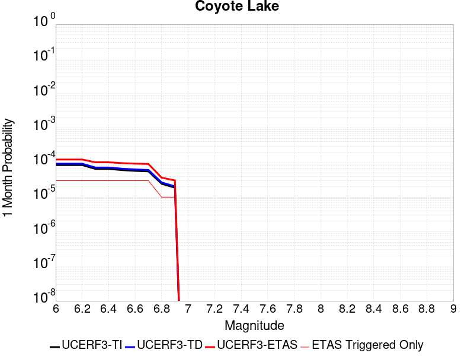 |  | 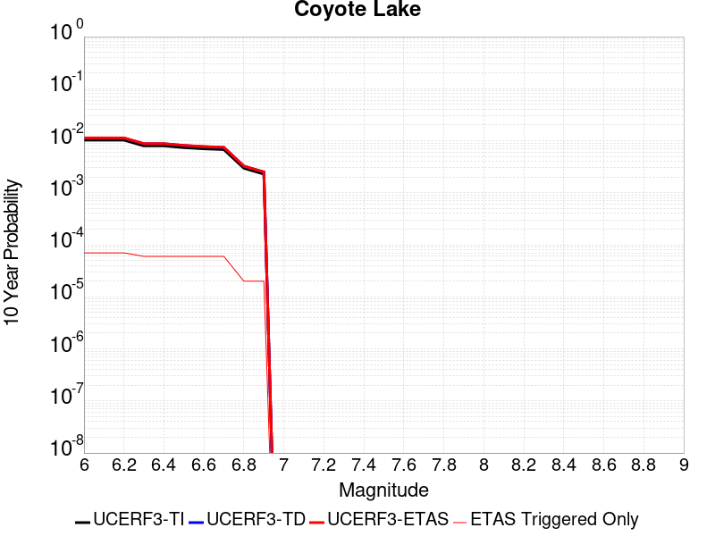 |

| Magnitude | 1 wk TI Prob | 1 wk TD Prob | 1 wk ETAS Prob | 1 wk ETAS/TD Gain | 1 wk ETAS Triggered Only | 1 mo TI Prob | 1 mo TD Prob | 1 mo ETAS Prob | 1 mo ETAS/TD Gain | 1 mo ETAS Triggered Only | 1 yr TI Prob | 1 yr TD Prob | 1 yr ETAS Prob | 1 yr ETAS/TD Gain | 1 yr ETAS Triggered Only | 10 yr TI Prob | 10 yr TD Prob | 10 yr ETAS Prob | 10 yr ETAS/TD Gain | 10 yr ETAS Triggered Only |
|-----|-----|-----|-----|-----|-----|-----|-----|-----|-----|-----|-----|-----|-----|-----|-----|-----|-----|-----|-----|-----|
| 6.0 | 1.980352E-5 | 2.1707021E-5 | 3.1706804E-5 | 1.4606705 | 1.0E-5 | 8.486947E-5 | 9.302718E-5 | 1.230244E-4 | 1.3224564 | 3.0E-5 | 0.0010327959 | 0.0011320895 | 0.0012020102 | 1.0617626 | 7.0E-5 | 0.010280091 | 0.011270401 | 0.011339612 | 1.006141 | 7.0E-5 |
| 6.1 | 1.980352E-5 | 2.1707021E-5 | 3.1706804E-5 | 1.4606705 | 1.0E-5 | 8.486947E-5 | 9.302718E-5 | 1.230244E-4 | 1.3224564 | 3.0E-5 | 0.0010327959 | 0.0011320895 | 0.0012020102 | 1.0617626 | 7.0E-5 | 0.010280091 | 0.011270401 | 0.011339612 | 1.006141 | 7.0E-5 |
| 6.2 | 1.980352E-5 | 2.1707021E-5 | 3.1706804E-5 | 1.4606705 | 1.0E-5 | 8.486947E-5 | 9.302718E-5 | 1.230244E-4 | 1.3224564 | 3.0E-5 | 0.0010327959 | 0.0011320895 | 0.0012020102 | 1.0617626 | 7.0E-5 | 0.010280091 | 0.011270401 | 0.011339612 | 1.006141 | 7.0E-5 |
| 6.3 | 1.5344787E-5 | 1.6820884E-5 | 2.6820715E-5 | 1.5944891 | 1.0E-5 | 6.576172E-5 | 7.208785E-5 | 1.02085694E-4 | 1.4161289 | 3.0E-5 | 8.003548E-4 | 8.7737746E-4 | 9.373248E-4 | 1.0683256 | 6.0E-5 | 0.007974784 | 0.00874518 | 0.008804656 | 1.0068009 | 6.0E-5 |
| 6.4 | 1.5344787E-5 | 1.6820884E-5 | 2.6820715E-5 | 1.5944891 | 1.0E-5 | 6.576172E-5 | 7.208785E-5 | 1.02085694E-4 | 1.4161289 | 3.0E-5 | 8.003548E-4 | 8.7737746E-4 | 9.373248E-4 | 1.0683256 | 6.0E-5 | 0.007974784 | 0.00874518 | 0.008804656 | 1.0068009 | 6.0E-5 |
| 6.5 | 1.4189697E-5 | 1.5558186E-5 | 2.555803E-5 | 1.6427385 | 1.0E-5 | 6.081157E-5 | 6.667658E-5 | 9.667457E-5 | 1.4499031 | 3.0E-5 | 7.401293E-4 | 8.1154524E-4 | 8.7149657E-4 | 1.073873 | 6.0E-5 | 0.0073766913 | 0.008091759 | 0.008151273 | 1.007355 | 6.0E-5 |
| 6.6 | 1.3469301E-5 | 1.47717665E-5 | 2.477162E-5 | 1.6769571 | 1.0E-5 | 5.7724297E-5 | 6.3306376E-5 | 9.330447E-5 | 1.473856 | 3.0E-5 | 7.025667E-4 | 7.7054254E-4 | 8.304963E-4 | 1.0778072 | 6.0E-5 | 0.0070034964 | 0.0076846126 | 0.0077441516 | 1.0077478 | 6.0E-5 |
| 6.7 | 1.3027966E-5 | 1.4281927E-5 | 2.4281784E-5 | 1.7001756 | 1.0E-5 | 5.5832945E-5 | 6.120716E-5 | 9.120532E-5 | 1.4901087 | 3.0E-5 | 6.7955407E-4 | 7.450021E-4 | 8.0495747E-4 | 1.0804766 | 6.0E-5 | 0.006774798 | 0.007430923 | 0.0074904775 | 1.0080143 | 6.0E-5 |
| 6.8 | 5.695434E-6 | 6.2244944E-6 | 6.2244944E-6 | 1.0 | 0.0 | 2.4408775E-5 | 2.6676302E-5 | 3.6676036E-5 | 1.3748546 | 1.0E-5 | 2.971363E-4 | 3.2476554E-4 | 3.4475906E-4 | 1.0615629 | 2.0E-5 | 0.0029673933 | 0.0032458503 | 0.0032657855 | 1.0061417 | 2.0E-5 |
| 6.9 | 4.385688E-6 | 4.7931144E-6 | 4.7931144E-6 | 1.0 | 0.0 | 1.879567E-5 | 2.0541918E-5 | 3.0541712E-5 | 1.4867995 | 1.0E-5 | 2.2881327E-4 | 2.5009786E-4 | 2.7009286E-4 | 1.0799487 | 2.0E-5 | 0.002285778 | 0.0025009785 | 0.0025209286 | 1.0079769 | 2.0E-5 |

## Helendale-So Lockhart
*[(top)](#table-of-contents)*

| 1 Week | 1 Month | 1 Year | 10 Year |
|-----|-----|-----|-----|
| 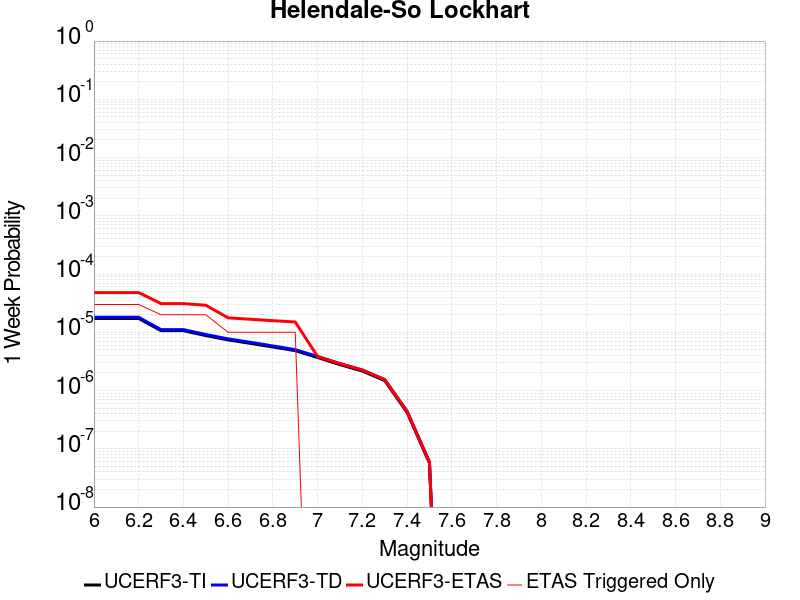 |  |  |  |

| Magnitude | 1 wk TI Prob | 1 wk TD Prob | 1 wk ETAS Prob | 1 wk ETAS/TD Gain | 1 wk ETAS Triggered Only | 1 mo TI Prob | 1 mo TD Prob | 1 mo ETAS Prob | 1 mo ETAS/TD Gain | 1 mo ETAS Triggered Only | 1 yr TI Prob | 1 yr TD Prob | 1 yr ETAS Prob | 1 yr ETAS/TD Gain | 1 yr ETAS Triggered Only | 10 yr TI Prob | 10 yr TD Prob | 10 yr ETAS Prob | 10 yr ETAS/TD Gain | 10 yr ETAS Triggered Only |
|-----|-----|-----|-----|-----|-----|-----|-----|-----|-----|-----|-----|-----|-----|-----|-----|-----|-----|-----|-----|-----|
| 6.0 | 1.7296055E-5 | 1.8103841E-5 | 4.81033E-5 | 2.6570768 | 3.0E-5 | 7.412385E-5 | 7.7585704E-5 | 1.2758182E-4 | 1.6443987 | 5.0E-5 | 9.0208417E-4 | 9.442173E-4 | 0.0010141513 | 1.0740654 | 7.0E-5 | 0.008984311 | 0.009404174 | 0.009483422 | 1.0084269 | 8.0E-5 |
| 6.1 | 1.7296055E-5 | 1.8103841E-5 | 4.81033E-5 | 2.6570768 | 3.0E-5 | 7.412385E-5 | 7.7585704E-5 | 1.2758182E-4 | 1.6443987 | 5.0E-5 | 9.0208417E-4 | 9.442173E-4 | 0.0010141513 | 1.0740654 | 7.0E-5 | 0.008984311 | 0.009404174 | 0.009483422 | 1.0084269 | 8.0E-5 |
| 6.2 | 1.7296055E-5 | 1.8103841E-5 | 4.81033E-5 | 2.6570768 | 3.0E-5 | 7.412385E-5 | 7.7585704E-5 | 1.2758182E-4 | 1.6443987 | 5.0E-5 | 9.0208417E-4 | 9.442173E-4 | 0.0010141513 | 1.0740654 | 7.0E-5 | 0.008984311 | 0.009404174 | 0.009483422 | 1.0084269 | 8.0E-5 |
| 6.3 | 1.0669118E-5 | 1.1135489E-5 | 3.1135267E-5 | 2.7960393 | 2.0E-5 | 4.5723988E-5 | 4.7722668E-5 | 6.772171E-5 | 1.4190681 | 2.0E-5 | 5.5654737E-4 | 5.8087136E-4 | 6.0085976E-4 | 1.0344111 | 2.0E-5 | 0.0055515557 | 0.005793827 | 0.005823653 | 1.0051479 | 3.0E-5 |
| 6.4 | 1.0669118E-5 | 1.1135489E-5 | 3.1135267E-5 | 2.7960393 | 2.0E-5 | 4.5723988E-5 | 4.7722668E-5 | 6.772171E-5 | 1.4190681 | 2.0E-5 | 5.5654737E-4 | 5.8087136E-4 | 6.0085976E-4 | 1.0344111 | 2.0E-5 | 0.0055515557 | 0.005793827 | 0.005823653 | 1.0051479 | 3.0E-5 |
| 6.5 | 8.790038E-6 | 9.1702495E-6 | 2.9170065E-5 | 3.1809456 | 2.0E-5 | 3.767105E-5 | 3.9300485E-5 | 5.92997E-5 | 1.5088795 | 2.0E-5 | 4.585485E-4 | 4.7837992E-4 | 4.983703E-4 | 1.0417877 | 2.0E-5 | 0.0045760344 | 0.0047736657 | 0.0048035225 | 1.0062544 | 3.0E-5 |
| 6.6 | 7.396949E-6 | 7.715581E-6 | 1.7715503E-5 | 2.2960687 | 1.0E-5 | 3.1700827E-5 | 3.3066364E-5 | 4.3066033E-5 | 1.3024122 | 1.0E-5 | 3.858892E-4 | 4.025096E-4 | 4.125056E-4 | 1.0248342 | 1.0E-5 | 0.003852198 | 0.004017913 | 0.0040378324 | 1.0049577 | 2.0E-5 |
| 6.7 | 6.4600285E-6 | 6.7380697E-6 | 1.6738002E-5 | 2.4840946 | 1.0E-5 | 2.7685543E-5 | 2.8877126E-5 | 3.887684E-5 | 1.3462849 | 1.0E-5 | 3.3701936E-4 | 3.5152308E-4 | 3.6151955E-4 | 1.0284376 | 1.0E-5 | 0.0033650869 | 0.003509752 | 0.0035296818 | 1.0056784 | 2.0E-5 |
| 6.8 | 5.600104E-6 | 5.836042E-6 | 1.5835984E-5 | 2.71348 | 1.0E-5 | 2.4000226E-5 | 2.5011372E-5 | 3.5011122E-5 | 1.3998082 | 1.0E-5 | 2.9216358E-4 | 3.044715E-4 | 3.1446846E-4 | 1.0328338 | 1.0E-5 | 0.0029177975 | 0.003040605 | 0.0030605441 | 1.0065576 | 2.0E-5 |
| 6.9 | 4.839122E-6 | 5.039537E-6 | 1.5039486E-5 | 2.9842992 | 1.0E-5 | 2.0738931E-5 | 2.159784E-5 | 3.1597625E-5 | 1.4629992 | 1.0E-5 | 2.5246723E-4 | 2.6292243E-4 | 2.729198E-4 | 1.0380241 | 1.0E-5 | 0.002521806 | 0.002626161 | 0.0026461086 | 1.0075957 | 2.0E-5 |
| 7.0 | 3.6937633E-6 | 3.845229E-6 | 3.845229E-6 | 1.0 | 0.0 | 1.5830317E-5 | 1.6479451E-5 | 1.6479451E-5 | 1.0 | 0.0 | 1.9271708E-4 | 2.0061915E-4 | 2.0061915E-4 | 1.0 | 0.0 | 0.0019255003 | 0.0020044118 | 0.0020143918 | 1.004979 | 1.0E-5 |
| 7.1 | 2.7858857E-6 | 2.8978693E-6 | 2.8978693E-6 | 1.0 | 0.0 | 1.1939455E-5 | 1.2419382E-5 | 1.2419382E-5 | 1.0 | 0.0 | 1.4535317E-4 | 1.511957E-4 | 1.511957E-4 | 1.0 | 0.0 | 0.0014525814 | 0.0015109498 | 0.0015209347 | 1.0066084 | 1.0E-5 |
| 7.2 | 2.1672065E-6 | 2.2540248E-6 | 2.2540248E-6 | 1.0 | 0.0 | 9.2879945E-6 | 9.660072E-6 | 9.660072E-6 | 1.0 | 0.0 | 1.1307546E-4 | 1.176052E-4 | 1.176052E-4 | 1.0 | 0.0 | 0.0011301794 | 0.0011754478 | 0.0011854362 | 1.0084974 | 1.0E-5 |
| 7.3 | 1.4823496E-6 | 1.5422185E-6 | 1.5422185E-6 | 1.0 | 0.0 | 6.3529114E-6 | 6.6094917E-6 | 6.6094917E-6 | 1.0 | 0.0 | 7.734395E-5 | 8.046775E-5 | 8.046775E-5 | 1.0 | 0.0 | 7.731704E-4 | 8.044012E-4 | 8.044012E-4 | 1.0 | 0.0 |
| 7.4 | 4.2321457E-7 | 4.4109012E-7 | 4.4109012E-7 | 1.0 | 0.0 | 1.8137755E-6 | 1.8903852E-6 | 1.8903852E-6 | 1.0 | 0.0 | 2.2082493E-5 | 2.3015242E-5 | 2.3015242E-5 | 1.0 | 0.0 | 2.2080299E-4 | 2.3013311E-4 | 2.3013311E-4 | 1.0 | 0.0 |
| 7.5 | 5.6942316E-8 | 5.941599E-8 | 5.941599E-8 | 1.0 | 0.0 | 2.440385E-7 | 2.5463993E-7 | 2.5463993E-7 | 1.0 | 0.0 | 2.9711643E-6 | 3.1002376E-6 | 3.1002376E-6 | 1.0 | 0.0 | 2.9711247E-5 | 3.1002022E-5 | 3.1002022E-5 | 1.0 | 0.0 |

## Bicycle Lake
*[(top)](#table-of-contents)*

| 1 Week | 1 Month | 1 Year | 10 Year |
|-----|-----|-----|-----|
|  |  | 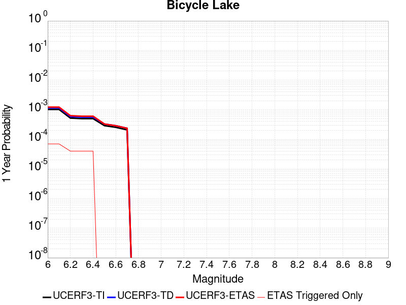 | 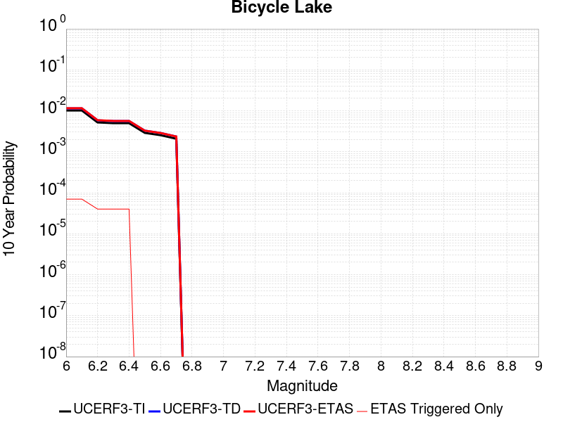 |

| Magnitude | 1 wk TI Prob | 1 wk TD Prob | 1 wk ETAS Prob | 1 wk ETAS/TD Gain | 1 wk ETAS Triggered Only | 1 mo TI Prob | 1 mo TD Prob | 1 mo ETAS Prob | 1 mo ETAS/TD Gain | 1 mo ETAS Triggered Only | 1 yr TI Prob | 1 yr TD Prob | 1 yr ETAS Prob | 1 yr ETAS/TD Gain | 1 yr ETAS Triggered Only | 10 yr TI Prob | 10 yr TD Prob | 10 yr ETAS Prob | 10 yr ETAS/TD Gain | 10 yr ETAS Triggered Only |
|-----|-----|-----|-----|-----|-----|-----|-----|-----|-----|-----|-----|-----|-----|-----|-----|-----|-----|-----|-----|-----|
| 6.0 | 1.9621975E-5 | 2.2097447E-5 | 4.2097006E-5 | 1.9050618 | 2.0E-5 | 8.4091465E-5 | 9.470067E-5 | 1.2469784E-4 | 1.3167576 | 3.0E-5 | 0.0010233327 | 0.0011525059 | 0.0012224251 | 1.0606673 | 7.0E-5 | 0.01018633 | 0.011478599 | 0.011547796 | 1.0060283 | 7.0E-5 |
| 6.1 | 1.9621975E-5 | 2.2097447E-5 | 4.2097006E-5 | 1.9050618 | 2.0E-5 | 8.4091465E-5 | 9.470067E-5 | 1.2469784E-4 | 1.3167576 | 3.0E-5 | 0.0010233327 | 0.0011525059 | 0.0012224251 | 1.0606673 | 7.0E-5 | 0.01018633 | 0.011478599 | 0.011547796 | 1.0060283 | 7.0E-5 |
| 6.2 | 9.9971285E-6 | 1.1255827E-5 | 2.1255715E-5 | 1.8884187 | 1.0E-5 | 4.2844134E-5 | 4.8238664E-5 | 5.823818E-5 | 1.2072926 | 1.0E-5 | 5.2150246E-4 | 5.8719947E-4 | 6.2717596E-4 | 1.06808 | 4.0E-5 | 0.0052028033 | 0.0058615846 | 0.0059013497 | 1.0067841 | 4.0E-5 |
| 6.3 | 9.589428E-6 | 1.0798527E-5 | 2.079842E-5 | 1.9260422 | 1.0E-5 | 4.10969E-5 | 4.627887E-5 | 5.6278408E-5 | 1.2160714 | 1.0E-5 | 5.002399E-4 | 5.633515E-4 | 6.033289E-4 | 1.0709636 | 4.0E-5 | 0.0049911533 | 0.0056243236 | 0.0056640985 | 1.007072 | 4.0E-5 |
| 6.4 | 9.589428E-6 | 1.0798527E-5 | 2.079842E-5 | 1.9260422 | 1.0E-5 | 4.10969E-5 | 4.627887E-5 | 5.6278408E-5 | 1.2160714 | 1.0E-5 | 5.002399E-4 | 5.633515E-4 | 6.033289E-4 | 1.0709636 | 4.0E-5 | 0.0049911533 | 0.0056243236 | 0.0056640985 | 1.007072 | 4.0E-5 |
| 6.5 | 5.557707E-6 | 6.2857107E-6 | 6.2857107E-6 | 1.0 | 0.0 | 2.3818526E-5 | 2.6938633E-5 | 2.6938633E-5 | 1.0 | 0.0 | 2.8995197E-4 | 3.2795538E-4 | 3.2795538E-4 | 1.0 | 0.0 | 0.0028957394 | 0.0032773504 | 0.0032773504 | 1.0 | 0.0 |
| 6.6 | 4.8742945E-6 | 5.5133855E-6 | 5.5133855E-6 | 1.0 | 0.0 | 2.0889667E-5 | 2.3628729E-5 | 2.3628729E-5 | 1.0 | 0.0 | 2.54302E-4 | 2.87668E-4 | 2.87668E-4 | 1.0 | 0.0 | 0.002540112 | 0.0028755253 | 0.0028755253 | 1.0 | 0.0 |
| 6.7 | 3.991108E-6 | 4.515989E-6 | 4.515989E-6 | 1.0 | 0.0 | 1.7104636E-5 | 1.9354238E-5 | 1.9354238E-5 | 1.0 | 0.0 | 2.0822904E-4 | 2.3563785E-4 | 2.3563785E-4 | 1.0 | 0.0 | 0.0020803404 | 0.0023563786 | 0.0023563786 | 1.0 | 0.0 |

## San Andreas (San Gorgonio Pass-Garnet HIll)
*[(top)](#table-of-contents)*

| 1 Week | 1 Month | 1 Year | 10 Year |
|-----|-----|-----|-----|
|  |  |  | 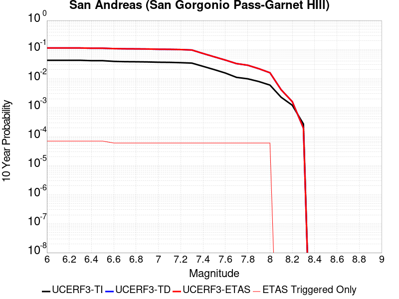 |

| Magnitude | 1 wk TI Prob | 1 wk TD Prob | 1 wk ETAS Prob | 1 wk ETAS/TD Gain | 1 wk ETAS Triggered Only | 1 mo TI Prob | 1 mo TD Prob | 1 mo ETAS Prob | 1 mo ETAS/TD Gain | 1 mo ETAS Triggered Only | 1 yr TI Prob | 1 yr TD Prob | 1 yr ETAS Prob | 1 yr ETAS/TD Gain | 1 yr ETAS Triggered Only | 10 yr TI Prob | 10 yr TD Prob | 10 yr ETAS Prob | 10 yr ETAS/TD Gain | 10 yr ETAS Triggered Only |
|-----|-----|-----|-----|-----|-----|-----|-----|-----|-----|-----|-----|-----|-----|-----|-----|-----|-----|-----|-----|-----|
| 6.0 | 8.31567E-5 | 2.338839E-4 | 2.4388156E-4 | 1.0427463 | 1.0E-5 | 3.5633717E-4 | 0.0010019708 | 0.0010219509 | 1.0199406 | 2.0E-5 | 0.004329778 | 0.01213065 | 0.012180043 | 1.0040718 | 5.0E-5 | 0.042463828 | 0.11259771 | 0.11265983 | 1.0005517 | 7.0E-5 |
| 6.1 | 8.31567E-5 | 2.338839E-4 | 2.4388156E-4 | 1.0427463 | 1.0E-5 | 3.5633717E-4 | 0.0010019708 | 0.0010219509 | 1.0199406 | 2.0E-5 | 0.004329778 | 0.01213065 | 0.012180043 | 1.0040718 | 5.0E-5 | 0.042463828 | 0.11259771 | 0.11265983 | 1.0005517 | 7.0E-5 |
| 6.2 | 8.31567E-5 | 2.338839E-4 | 2.4388156E-4 | 1.0427463 | 1.0E-5 | 3.5633717E-4 | 0.0010019708 | 0.0010219509 | 1.0199406 | 2.0E-5 | 0.004329778 | 0.01213065 | 0.012180043 | 1.0040718 | 5.0E-5 | 0.042463828 | 0.11259771 | 0.11265983 | 1.0005517 | 7.0E-5 |
| 6.3 | 8.31567E-5 | 2.338839E-4 | 2.4388156E-4 | 1.0427463 | 1.0E-5 | 3.5633717E-4 | 0.0010019708 | 0.0010219509 | 1.0199406 | 2.0E-5 | 0.004329778 | 0.01213065 | 0.012180043 | 1.0040718 | 5.0E-5 | 0.042463828 | 0.11259771 | 0.11265983 | 1.0005517 | 7.0E-5 |
| 6.4 | 8.059055E-5 | 2.2945837E-4 | 2.3945607E-4 | 1.0435709 | 1.0E-5 | 3.4534236E-4 | 9.830239E-4 | 0.0010030043 | 1.0203254 | 2.0E-5 | 0.0041964394 | 0.011902837 | 0.011952242 | 1.0041506 | 5.0E-5 | 0.041180745 | 0.11057874 | 0.110641 | 1.000563 | 7.0E-5 |
| 6.5 | 8.059055E-5 | 2.2945837E-4 | 2.3945607E-4 | 1.0435709 | 1.0E-5 | 3.4534236E-4 | 9.830239E-4 | 0.0010030043 | 1.0203254 | 2.0E-5 | 0.0041964394 | 0.011902837 | 0.011952242 | 1.0041506 | 5.0E-5 | 0.041180745 | 0.11057874 | 0.110641 | 1.000563 | 7.0E-5 |
| 6.6 | 7.619237E-5 | 2.2190346E-4 | 2.3190124E-4 | 1.0450547 | 1.0E-5 | 3.2649786E-4 | 9.5067057E-4 | 9.706515E-4 | 1.0210178 | 2.0E-5 | 0.0039678677 | 0.011513535 | 0.011553074 | 1.0034342 | 4.0E-5 | 0.03897764 | 0.107115194 | 0.107168764 | 1.0005002 | 6.0E-5 |
| 6.7 | 7.440636E-5 | 2.1866155E-4 | 2.2865935E-4 | 1.0457227 | 1.0E-5 | 3.188454E-4 | 9.367866E-4 | 9.567678E-4 | 1.0213295 | 2.0E-5 | 0.0038750346 | 0.011346267 | 0.011385812 | 1.0034854 | 4.0E-5 | 0.038081564 | 0.105623715 | 0.10567738 | 1.0005081 | 6.0E-5 |
| 6.8 | 7.3735864E-5 | 2.1713313E-4 | 2.2713096E-4 | 1.0460447 | 1.0E-5 | 3.1597257E-4 | 9.3024096E-4 | 9.5022237E-4 | 1.0214798 | 2.0E-5 | 0.0038401815 | 0.011267403 | 0.011306952 | 1.0035101 | 4.0E-5 | 0.03774495 | 0.10492511 | 0.104978815 | 1.0005119 | 6.0E-5 |
| 6.9 | 7.27575E-5 | 2.1482276E-4 | 2.2482061E-4 | 1.04654 | 1.0E-5 | 3.117806E-4 | 9.203464E-4 | 9.40328E-4 | 1.021711 | 2.0E-5 | 0.003789323 | 0.011148175 | 0.011187729 | 1.003548 | 4.0E-5 | 0.037253562 | 0.103873 | 0.10392677 | 1.0005176 | 6.0E-5 |
| 7.0 | 7.102591E-5 | 2.10663E-4 | 2.2066089E-4 | 1.0474591 | 1.0E-5 | 3.0436125E-4 | 9.0253126E-4 | 9.225132E-4 | 1.0221399 | 2.0E-5 | 0.003699303 | 0.010933471 | 0.0109730335 | 1.0036185 | 4.0E-5 | 0.03638325 | 0.10197552 | 0.102029406 | 1.0005283 | 6.0E-5 |
| 7.1 | 7.028513E-5 | 2.0901936E-4 | 2.1901727E-4 | 1.0478325 | 1.0E-5 | 3.0118722E-4 | 8.95492E-4 | 9.15474E-4 | 1.0223141 | 2.0E-5 | 0.0036607897 | 0.010848625 | 0.010888191 | 1.0036471 | 4.0E-5 | 0.036010686 | 0.10121833 | 0.101272255 | 1.0005327 | 6.0E-5 |
| 7.2 | 6.8498244E-5 | 2.0509785E-4 | 2.150958E-4 | 1.0487472 | 1.0E-5 | 2.9353087E-4 | 8.786969E-4 | 8.986793E-4 | 1.022741 | 2.0E-5 | 0.003567883 | 0.010646159 | 0.010685733 | 1.0037172 | 4.0E-5 | 0.035111405 | 0.09941009 | 0.09946412 | 1.0005436 | 6.0E-5 |
| 7.3 | 6.622592E-5 | 1.9737013E-4 | 2.0736815E-4 | 1.0506562 | 1.0E-5 | 2.8379448E-4 | 8.455999E-4 | 8.65583E-4 | 1.0236318 | 2.0E-5 | 0.0034497243 | 0.010247062 | 0.010286652 | 1.0038636 | 4.0E-5 | 0.033966612 | 0.09590662 | 0.09596087 | 1.0005656 | 6.0E-5 |
| 7.4 | 5.1050705E-5 | 1.4693316E-4 | 1.569317E-4 | 1.0680481 | 1.0E-5 | 2.1877038E-4 | 6.295625E-4 | 6.495499E-4 | 1.031748 | 2.0E-5 | 0.002660276 | 0.0076381783 | 0.0076778727 | 1.0051968 | 4.0E-5 | 0.02628654 | 0.07287833 | 0.072933964 | 1.0007633 | 6.0E-5 |
| 7.5 | 3.9302922E-5 | 1.1133535E-4 | 1.2133423E-4 | 1.0898087 | 1.0E-5 | 1.6843023E-4 | 4.7706455E-4 | 4.97055E-4 | 1.041903 | 2.0E-5 | 0.0020487092 | 0.0057928623 | 0.00583263 | 1.006865 | 4.0E-5 | 0.020299247 | 0.056023482 | 0.05608012 | 1.001011 | 6.0E-5 |
| 7.6 | 2.9851626E-5 | 8.498211E-5 | 9.498126E-5 | 1.1176618 | 1.0E-5 | 1.2792926E-4 | 3.6415833E-4 | 3.8415103E-4 | 1.0549011 | 2.0E-5 | 0.0015564259 | 0.00442464 | 0.004464463 | 1.0090003 | 4.0E-5 | 0.0154556995 | 0.043206394 | 0.0432638 | 1.0013287 | 6.0E-5 |
| 7.7 | 2.1135214E-5 | 6.355745E-5 | 7.355681E-5 | 1.157328 | 1.0E-5 | 9.0576345E-5 | 2.7236066E-4 | 2.923552E-4 | 1.0734121 | 2.0E-5 | 0.0011022091 | 0.0033109542 | 0.0033508218 | 1.0120411 | 4.0E-5 | 0.010967582 | 0.03259442 | 0.032652464 | 1.0017807 | 6.0E-5 |
| 7.8 | 1.883379E-5 | 5.5666103E-5 | 6.566555E-5 | 1.1796325 | 1.0E-5 | 8.0713755E-5 | 2.3854722E-4 | 2.5854245E-4 | 1.0838208 | 2.0E-5 | 9.822468E-4 | 0.0029004475 | 0.0029403314 | 1.013751 | 4.0E-5 | 0.0097791655 | 0.02870594 | 0.028764218 | 1.0020301 | 6.0E-5 |
| 7.9 | 1.5156185E-5 | 4.167907E-5 | 5.1678657E-5 | 1.2399186 | 1.0E-5 | 6.495346E-5 | 1.7861238E-4 | 1.986088E-4 | 1.1119543 | 2.0E-5 | 7.9052144E-4 | 0.0021724382 | 0.0022123514 | 1.0183725 | 4.0E-5 | 0.007877152 | 0.021768799 | 0.021827493 | 1.0026963 | 6.0E-5 |
| 8.0 | 1.1405907E-5 | 2.9989498E-5 | 3.9989198E-5 | 1.3334401 | 1.0E-5 | 4.8881542E-5 | 1.2852009E-4 | 1.4851752E-4 | 1.1555977 | 2.0E-5 | 5.9497025E-4 | 0.00156361 | 0.0016035475 | 1.0255418 | 4.0E-5 | 0.005933798 | 0.015779829 | 0.015838882 | 1.0037423 | 6.0E-5 |
| 8.1 | 4.3511436E-6 | 7.3739657E-6 | 7.3739657E-6 | 1.0 | 0.0 | 1.8647626E-5 | 3.160233E-5 | 3.160233E-5 | 1.0 | 0.0 | 2.2701119E-4 | 3.8469053E-4 | 3.8469053E-4 | 1.0 | 0.0 | 0.0022677942 | 0.0041186865 | 0.0041186865 | 1.0 | 0.0 |
| 8.2 | 2.3042528E-6 | 2.7349201E-6 | 2.7349201E-6 | 1.0 | 0.0 | 9.875332E-6 | 1.1721034E-5 | 1.1721034E-5 | 1.0 | 0.0 | 1.2022553E-4 | 1.4269429E-4 | 1.4269429E-4 | 1.0 | 0.0 | 0.0012016051 | 0.0015990431 | 0.0015990431 | 1.0 | 0.0 |
| 8.3 | 5.202968E-7 | 3.1619535E-7 | 3.1619535E-7 | 1.0 | 0.0 | 2.2298414E-6 | 1.3551223E-6 | 1.3551223E-6 | 1.0 | 0.0 | 2.714798E-5 | 1.6498503E-5 | 1.6498503E-5 | 1.0 | 0.0 | 2.7144665E-4 | 1.9577713E-4 | 1.9577713E-4 | 1.0 | 0.0 |

## Death Valley (No)
*[(top)](#table-of-contents)*

| 1 Week | 1 Month | 1 Year | 10 Year |
|-----|-----|-----|-----|
|  | 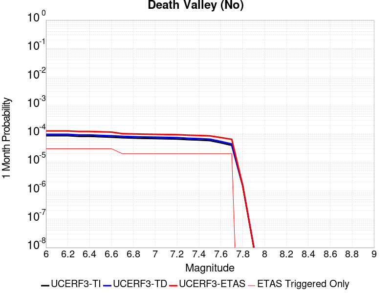 |  |  |

| Magnitude | 1 wk TI Prob | 1 wk TD Prob | 1 wk ETAS Prob | 1 wk ETAS/TD Gain | 1 wk ETAS Triggered Only | 1 mo TI Prob | 1 mo TD Prob | 1 mo ETAS Prob | 1 mo ETAS/TD Gain | 1 mo ETAS Triggered Only | 1 yr TI Prob | 1 yr TD Prob | 1 yr ETAS Prob | 1 yr ETAS/TD Gain | 1 yr ETAS Triggered Only | 10 yr TI Prob | 10 yr TD Prob | 10 yr ETAS Prob | 10 yr ETAS/TD Gain | 10 yr ETAS Triggered Only |
|-----|-----|-----|-----|-----|-----|-----|-----|-----|-----|-----|-----|-----|-----|-----|-----|-----|-----|-----|-----|-----|
| 6.0 | 2.0074807E-5 | 2.2500446E-5 | 4.2499996E-5 | 1.8888513 | 2.0E-5 | 8.603206E-5 | 9.642696E-5 | 1.2642407E-4 | 1.3110863 | 3.0E-5 | 0.001046937 | 0.0011733733 | 0.0012233147 | 1.0425621 | 5.0E-5 | 0.010420183 | 0.011672693 | 0.011741877 | 1.0059268 | 7.0E-5 |
| 6.1 | 2.0074807E-5 | 2.2500446E-5 | 4.2499996E-5 | 1.8888513 | 2.0E-5 | 8.603206E-5 | 9.642696E-5 | 1.2642407E-4 | 1.3110863 | 3.0E-5 | 0.001046937 | 0.0011733733 | 0.0012233147 | 1.0425621 | 5.0E-5 | 0.010420183 | 0.011672693 | 0.011741877 | 1.0059268 | 7.0E-5 |
| 6.2 | 2.0074807E-5 | 2.2500446E-5 | 4.2499996E-5 | 1.8888513 | 2.0E-5 | 8.603206E-5 | 9.642696E-5 | 1.2642407E-4 | 1.3110863 | 3.0E-5 | 0.001046937 | 0.0011733733 | 0.0012233147 | 1.0425621 | 5.0E-5 | 0.010420183 | 0.011672693 | 0.011741877 | 1.0059268 | 7.0E-5 |
| 6.3 | 1.9050609E-5 | 2.1337288E-5 | 4.133686E-5 | 1.9373062 | 2.0E-5 | 8.164292E-5 | 9.144236E-5 | 1.2143961E-4 | 1.3280455 | 3.0E-5 | 9.935491E-4 | 0.0011127489 | 0.0011626933 | 1.0448837 | 5.0E-5 | 0.009891188 | 0.011072595 | 0.01114182 | 1.0062519 | 7.0E-5 |
| 6.4 | 1.9050609E-5 | 2.1337288E-5 | 4.133686E-5 | 1.9373062 | 2.0E-5 | 8.164292E-5 | 9.144236E-5 | 1.2143961E-4 | 1.3280455 | 3.0E-5 | 9.935491E-4 | 0.0011127489 | 0.0011626933 | 1.0448837 | 5.0E-5 | 0.009891188 | 0.011072595 | 0.01114182 | 1.0062519 | 7.0E-5 |
| 6.5 | 1.8367004E-5 | 2.0561336E-5 | 4.0560924E-5 | 1.9726795 | 2.0E-5 | 7.8713354E-5 | 8.811707E-5 | 1.18114425E-4 | 1.3404262 | 3.0E-5 | 9.5791375E-4 | 0.0010723039 | 0.0011222502 | 1.0465785 | 5.0E-5 | 0.009537951 | 0.010672085 | 0.010741337 | 1.0064892 | 7.0E-5 |
| 6.6 | 1.779439E-5 | 1.9911244E-5 | 3.9910847E-5 | 2.0044377 | 2.0E-5 | 7.625944E-5 | 8.533114E-5 | 1.15328585E-4 | 1.3515415 | 3.0E-5 | 9.280632E-4 | 0.0010384179 | 0.001088366 | 1.0481001 | 5.0E-5 | 0.009241969 | 0.010336416 | 0.010405692 | 1.0067022 | 7.0E-5 |
| 6.7 | 1.7025437E-5 | 1.9043726E-5 | 3.9043345E-5 | 2.0501947 | 2.0E-5 | 7.296412E-5 | 8.161345E-5 | 1.0161182E-4 | 1.2450377 | 2.0E-5 | 8.87976E-4 | 9.93197E-4 | 0.0010331572 | 1.040234 | 4.0E-5 | 0.008844362 | 0.009888301 | 0.009947708 | 1.0060078 | 6.0E-5 |
| 6.8 | 1.6545107E-5 | 1.851284E-5 | 3.851247E-5 | 2.0803113 | 2.0E-5 | 7.090568E-5 | 7.933836E-5 | 9.933677E-5 | 1.2520648 | 2.0E-5 | 8.629347E-4 | 9.655226E-4 | 0.0010054839 | 1.0413884 | 4.0E-5 | 0.008595915 | 0.009613981 | 0.009673404 | 1.0061809 | 6.0E-5 |
| 6.9 | 1.615478E-5 | 1.8087881E-5 | 3.808752E-5 | 2.1056926 | 2.0E-5 | 6.9232934E-5 | 7.751722E-5 | 9.751567E-5 | 1.2579871 | 2.0E-5 | 8.4258494E-4 | 9.433697E-4 | 9.833319E-4 | 1.0423611 | 4.0E-5 | 0.008393973 | 0.009394345 | 0.009453781 | 1.0063268 | 6.0E-5 |
| 7.0 | 1.5894311E-5 | 1.7805834E-5 | 3.780548E-5 | 2.1232073 | 2.0E-5 | 6.81167E-5 | 7.6308526E-5 | 9.6307E-5 | 1.2620739 | 2.0E-5 | 8.2900526E-4 | 9.286663E-4 | 9.686292E-4 | 1.0430325 | 4.0E-5 | 0.008259195 | 0.009248544 | 0.00930799 | 1.0064275 | 6.0E-5 |
| 7.1 | 1.5602263E-5 | 1.7483784E-5 | 3.7483434E-5 | 2.143897 | 2.0E-5 | 6.6865134E-5 | 7.4928386E-5 | 9.492689E-5 | 1.2669015 | 2.0E-5 | 8.137789E-4 | 9.118773E-4 | 9.518409E-4 | 1.0438255 | 4.0E-5 | 0.008108052 | 0.009082039 | 0.009141494 | 1.0065465 | 6.0E-5 |
| 7.2 | 1.5323829E-5 | 1.7170905E-5 | 3.717056E-5 | 2.164741 | 2.0E-5 | 6.56719E-5 | 7.358755E-5 | 9.358608E-5 | 1.2717651 | 2.0E-5 | 7.99262E-4 | 8.9556625E-4 | 9.3553046E-4 | 1.0446244 | 4.0E-5 | 0.007963934 | 0.008920249 | 0.008979714 | 1.0066663 | 6.0E-5 |
| 7.3 | 1.4556212E-5 | 1.6302716E-5 | 3.630239E-5 | 2.2267694 | 2.0E-5 | 6.238227E-5 | 6.986695E-5 | 8.986555E-5 | 1.2862384 | 2.0E-5 | 7.592395E-4 | 8.503039E-4 | 8.902699E-4 | 1.047002 | 4.0E-5 | 0.0075665074 | 0.008471149 | 0.008520725 | 1.0058523 | 5.0E-5 |
| 7.4 | 1.411725E-5 | 1.5808211E-5 | 3.5807894E-5 | 2.2651453 | 2.0E-5 | 6.0501097E-5 | 6.774775E-5 | 8.77464E-5 | 1.2951927 | 2.0E-5 | 7.363519E-4 | 8.245226E-4 | 8.644896E-4 | 1.0484729 | 4.0E-5 | 0.0073391674 | 0.008215268 | 0.008264858 | 1.0060363 | 5.0E-5 |
| 7.5 | 1.3503312E-5 | 1.5126531E-5 | 3.5126228E-5 | 2.3221602 | 2.0E-5 | 5.7870053E-5 | 6.482641E-5 | 8.4825115E-5 | 1.3084962 | 2.0E-5 | 7.043401E-4 | 7.8898156E-4 | 8.2895E-4 | 1.0506582 | 4.0E-5 | 0.007021119 | 0.007862429 | 0.007912036 | 1.0063094 | 5.0E-5 |
| 7.6 | 1.1279839E-5 | 1.2626528E-5 | 3.2626274E-5 | 2.5839467 | 2.0E-5 | 4.834127E-5 | 5.4112596E-5 | 7.4111515E-5 | 1.3695797 | 2.0E-5 | 5.88396E-4 | 6.58627E-4 | 6.9860066E-4 | 1.0606924 | 4.0E-5 | 0.005868405 | 0.0065673026 | 0.0066169742 | 1.0075635 | 5.0E-5 |
| 7.7 | 9.189108E-6 | 1.0283521E-5 | 3.0283316E-5 | 2.944839 | 2.0E-5 | 3.93813E-5 | 4.407152E-5 | 6.4070635E-5 | 1.4537878 | 2.0E-5 | 4.7936183E-4 | 5.3644367E-4 | 5.664276E-4 | 1.0558939 | 3.0E-5 | 0.004783291 | 0.0053519984 | 0.005381838 | 1.0055754 | 3.0E-5 |
| 7.8 | 3.4586725E-7 | 3.648288E-7 | 3.648288E-7 | 1.0 | 0.0 | 1.4822873E-6 | 1.5635511E-6 | 1.5635511E-6 | 1.0 | 0.0 | 1.80467E-5 | 1.9036073E-5 | 1.9036073E-5 | 1.0 | 0.0 | 1.8045233E-4 | 1.9034486E-4 | 1.9034486E-4 | 1.0 | 0.0 |
| 7.9 | 2.5591178E-9 | 2.6696871E-9 | 2.6696871E-9 | 1.0 | 0.0 | 1.0967647E-8 | 1.1441516E-8 | 1.1441516E-8 | 1.0 | 0.0 | 1.335311E-7 | 1.3930045E-7 | 1.3930045E-7 | 1.0 | 0.0 | 1.3353102E-6 | 1.3930046E-6 | 1.3930046E-6 | 1.0 | 0.0 |

## San Jacinto (San Jacinto Valley) rev
*[(top)](#table-of-contents)*

| 1 Week | 1 Month | 1 Year | 10 Year |
|-----|-----|-----|-----|
|  |  | 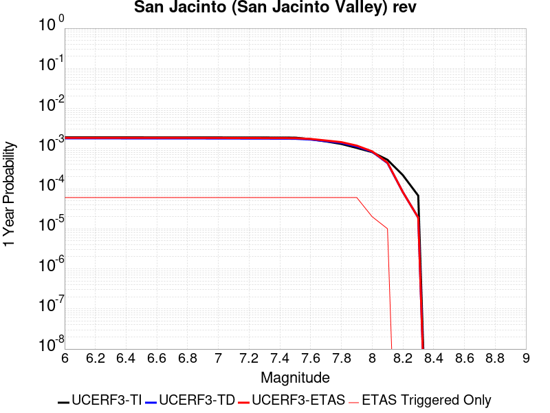 | 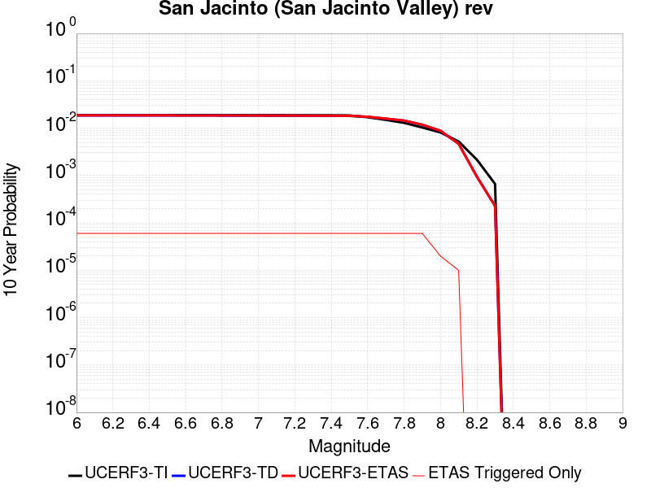 |

| Magnitude | 1 wk TI Prob | 1 wk TD Prob | 1 wk ETAS Prob | 1 wk ETAS/TD Gain | 1 wk ETAS Triggered Only | 1 mo TI Prob | 1 mo TD Prob | 1 mo ETAS Prob | 1 mo ETAS/TD Gain | 1 mo ETAS Triggered Only | 1 yr TI Prob | 1 yr TD Prob | 1 yr ETAS Prob | 1 yr ETAS/TD Gain | 1 yr ETAS Triggered Only | 10 yr TI Prob | 10 yr TD Prob | 10 yr ETAS Prob | 10 yr ETAS/TD Gain | 10 yr ETAS Triggered Only |
|-----|-----|-----|-----|-----|-----|-----|-----|-----|-----|-----|-----|-----|-----|-----|-----|-----|-----|-----|-----|-----|
| 6.0 | 3.652694E-5 | 3.441575E-5 | 4.4415407E-5 | 1.2905546 | 1.0E-5 | 1.5653463E-4 | 1.4748774E-4 | 1.5748625E-4 | 1.0677923 | 1.0E-5 | 0.0019041431 | 0.0017941861 | 0.0018540784 | 1.0333813 | 6.0E-5 | 0.018879099 | 0.01853357 | 0.018592458 | 1.0031774 | 6.0E-5 |
| 6.1 | 3.652694E-5 | 3.441575E-5 | 4.4415407E-5 | 1.2905546 | 1.0E-5 | 1.5653463E-4 | 1.4748774E-4 | 1.5748625E-4 | 1.0677923 | 1.0E-5 | 0.0019041431 | 0.0017941861 | 0.0018540784 | 1.0333813 | 6.0E-5 | 0.018879099 | 0.01853357 | 0.018592458 | 1.0031774 | 6.0E-5 |
| 6.2 | 3.652694E-5 | 3.441575E-5 | 4.4415407E-5 | 1.2905546 | 1.0E-5 | 1.5653463E-4 | 1.4748774E-4 | 1.5748625E-4 | 1.0677923 | 1.0E-5 | 0.0019041431 | 0.0017941861 | 0.0018540784 | 1.0333813 | 6.0E-5 | 0.018879099 | 0.01853357 | 0.018592458 | 1.0031774 | 6.0E-5 |
| 6.3 | 3.652694E-5 | 3.441575E-5 | 4.4415407E-5 | 1.2905546 | 1.0E-5 | 1.5653463E-4 | 1.4748774E-4 | 1.5748625E-4 | 1.0677923 | 1.0E-5 | 0.0019041431 | 0.0017941861 | 0.0018540784 | 1.0333813 | 6.0E-5 | 0.018879099 | 0.01853357 | 0.018592458 | 1.0031774 | 6.0E-5 |
| 6.4 | 3.646941E-5 | 3.4337318E-5 | 4.4336975E-5 | 1.2912183 | 1.0E-5 | 1.5628811E-4 | 1.4715164E-4 | 1.5715018E-4 | 1.0679471 | 1.0E-5 | 0.0019011468 | 0.0017901013 | 0.001849994 | 1.0334576 | 6.0E-5 | 0.018849645 | 0.01849345 | 0.018552339 | 1.0031844 | 6.0E-5 |
| 6.5 | 3.646941E-5 | 3.4337318E-5 | 4.4336975E-5 | 1.2912183 | 1.0E-5 | 1.5628811E-4 | 1.4715164E-4 | 1.5715018E-4 | 1.0679471 | 1.0E-5 | 0.0019011468 | 0.0017901013 | 0.001849994 | 1.0334576 | 6.0E-5 | 0.018849645 | 0.01849345 | 0.018552339 | 1.0031844 | 6.0E-5 |
| 6.6 | 3.6442503E-5 | 3.4300705E-5 | 4.4300363E-5 | 1.2915292 | 1.0E-5 | 1.561728E-4 | 1.4699475E-4 | 1.5699328E-4 | 1.0680196 | 1.0E-5 | 0.0018997455 | 0.0017881944 | 0.0018480871 | 1.0334934 | 6.0E-5 | 0.018835869 | 0.018474717 | 0.018533608 | 1.0031877 | 6.0E-5 |
| 6.7 | 3.6432113E-5 | 3.428628E-5 | 4.4285935E-5 | 1.2916518 | 1.0E-5 | 1.5612828E-4 | 1.4693293E-4 | 1.5693146E-4 | 1.0680482 | 1.0E-5 | 0.0018992044 | 0.0017874431 | 0.0018473358 | 1.0335075 | 6.0E-5 | 0.018830549 | 0.01846734 | 0.018526232 | 1.003189 | 6.0E-5 |
| 6.8 | 3.6409598E-5 | 3.4255332E-5 | 4.425499E-5 | 1.2919153 | 1.0E-5 | 1.560318E-4 | 1.4680032E-4 | 1.5679885E-4 | 1.0681098 | 1.0E-5 | 0.0018980318 | 0.0017858313 | 0.0018457241 | 1.0335377 | 6.0E-5 | 0.018819023 | 0.018451495 | 0.018510386 | 1.0031918 | 6.0E-5 |
| 6.9 | 3.638078E-5 | 3.4215755E-5 | 4.4215412E-5 | 1.292253 | 1.0E-5 | 1.5590832E-4 | 1.4663071E-4 | 1.5662925E-4 | 1.0681885 | 1.0E-5 | 0.0018965311 | 0.0017837697 | 0.0018436627 | 1.0335766 | 6.0E-5 | 0.018804269 | 0.018431228 | 0.01849012 | 1.0031953 | 6.0E-5 |
| 7.0 | 3.6294874E-5 | 3.4097768E-5 | 4.4097425E-5 | 1.2932644 | 1.0E-5 | 1.5554018E-4 | 1.4612512E-4 | 1.5612366E-4 | 1.0684245 | 1.0E-5 | 0.0018920569 | 0.0017776241 | 0.0018375175 | 1.033693 | 6.0E-5 | 0.018760284 | 0.018370807 | 0.018429704 | 1.003206 | 6.0E-5 |
| 7.1 | 3.6260717E-5 | 3.4054046E-5 | 4.4053708E-5 | 1.2936409 | 1.0E-5 | 1.5539382E-4 | 1.4593777E-4 | 1.5593632E-4 | 1.0685123 | 1.0E-5 | 0.001890278 | 0.0017753469 | 0.0018352405 | 1.0337362 | 6.0E-5 | 0.018742796 | 0.018348401 | 0.0184073 | 1.0032101 | 6.0E-5 |
| 7.2 | 3.6210204E-5 | 3.3988264E-5 | 4.3987926E-5 | 1.2942092 | 1.0E-5 | 1.5517735E-4 | 1.4565587E-4 | 1.5565442E-4 | 1.068645 | 1.0E-5 | 0.001887647 | 0.0017719205 | 0.0018318142 | 1.0338016 | 6.0E-5 | 0.01871693 | 0.018314669 | 0.01837357 | 1.003216 | 6.0E-5 |
| 7.3 | 3.6119454E-5 | 3.3876542E-5 | 4.3876204E-5 | 1.2951795 | 1.0E-5 | 1.5478847E-4 | 1.4517711E-4 | 1.5517566E-4 | 1.0688714 | 1.0E-5 | 0.0018829206 | 0.0017661011 | 0.001825995 | 1.0339131 | 6.0E-5 | 0.018670462 | 0.01825722 | 0.018316124 | 1.0032264 | 6.0E-5 |
| 7.4 | 3.607848E-5 | 3.382404E-5 | 4.38237E-5 | 1.2956377 | 1.0E-5 | 1.5461289E-4 | 1.4495212E-4 | 1.5495067E-4 | 1.0689783 | 1.0E-5 | 0.0018807866 | 0.0017633662 | 0.0018232604 | 1.0339658 | 6.0E-5 | 0.018649481 | 0.018230215 | 0.01828912 | 1.0032313 | 6.0E-5 |
| 7.5 | 3.5856774E-5 | 3.363379E-5 | 4.3633456E-5 | 1.29731 | 1.0E-5 | 1.5366284E-4 | 1.4413687E-4 | 1.5413543E-4 | 1.0693685 | 1.0E-5 | 0.0018692396 | 0.0017534565 | 0.0018133513 | 1.0341581 | 6.0E-5 | 0.018535944 | 0.018131303 | 0.018190214 | 1.0032492 | 6.0E-5 |
| 7.6 | 3.286655E-5 | 3.2156633E-5 | 4.2156313E-5 | 1.3109678 | 1.0E-5 | 1.4084904E-4 | 1.3780687E-4 | 1.478055E-4 | 1.0725553 | 1.0E-5 | 0.001713488 | 0.0016765095 | 0.0017364089 | 1.0357287 | 6.0E-5 | 0.017003361 | 0.01735091 | 0.017409869 | 1.0033981 | 6.0E-5 |
| 7.7 | 2.8882527E-5 | 2.9249288E-5 | 3.9248996E-5 | 1.3418787 | 1.0E-5 | 1.237764E-4 | 1.2534807E-4 | 1.3534683E-4 | 1.0797678 | 1.0E-5 | 0.0015059357 | 0.0015250455 | 0.001584954 | 1.039283 | 6.0E-5 | 0.014957713 | 0.015837153 | 0.015896203 | 1.0037285 | 6.0E-5 |
| 7.8 | 2.4950225E-5 | 2.6539781E-5 | 3.6539517E-5 | 1.3767829 | 1.0E-5 | 1.0692515E-4 | 1.1373697E-4 | 1.2373582E-4 | 1.0879122 | 1.0E-5 | 0.0013010362 | 0.0013838689 | 0.0014437858 | 1.0432967 | 6.0E-5 | 0.012934455 | 0.014418158 | 0.014477292 | 1.0041014 | 6.0E-5 |
| 7.9 | 1.9881603E-5 | 2.1518656E-5 | 3.151844E-5 | 1.4647031 | 1.0E-5 | 8.520408E-5 | 9.2219554E-5 | 1.02218626E-4 | 1.1084269 | 1.0E-5 | 0.001036866 | 0.0011221955 | 0.0011821282 | 1.0534066 | 6.0E-5 | 0.010320415 | 0.011782875 | 0.011842169 | 1.0050322 | 6.0E-5 |
| 8.0 | 1.563292E-5 | 1.5946089E-5 | 2.594593E-5 | 1.627103 | 1.0E-5 | 6.6996516E-5 | 6.8338595E-5 | 7.8337915E-5 | 1.1463202 | 1.0E-5 | 8.153773E-4 | 8.3170546E-4 | 8.5168885E-4 | 1.024027 | 2.0E-5 | 0.00812392 | 0.00881513 | 0.008834953 | 1.0022489 | 2.0E-5 |
| 8.1 | 1.0045313E-5 | 8.306527E-6 | 8.306527E-6 | 1.0 | 0.0 | 4.305063E-5 | 3.5598918E-5 | 3.5598918E-5 | 1.0 | 0.0 | 5.2401534E-4 | 4.3333112E-4 | 4.433268E-4 | 1.023067 | 1.0E-5 | 0.0052278144 | 0.0046616676 | 0.0046716207 | 1.0021352 | 1.0E-5 |
| 8.2 | 4.1554413E-6 | 1.5665041E-6 | 1.5665041E-6 | 1.0 | 0.0 | 1.7808914E-5 | 6.713572E-6 | 6.713572E-6 | 1.0 | 0.0 | 2.1680194E-4 | 8.17347E-5 | 8.17347E-5 | 1.0 | 0.0 | 0.0021659054 | 9.488419E-4 | 9.488419E-4 | 1.0 | 0.0 |
| 8.3 | 1.2758221E-6 | 3.6171858E-7 | 3.6171858E-7 | 1.0 | 0.0 | 5.4677976E-6 | 1.5502216E-6 | 1.5502216E-6 | 1.0 | 0.0 | 6.65684E-5 | 1.8873789E-5 | 1.8873789E-5 | 1.0 | 0.0 | 6.6548464E-4 | 2.2764095E-4 | 2.2764095E-4 | 1.0 | 0.0 |

## San Andreas (Big Bend)
*[(top)](#table-of-contents)*

| 1 Week | 1 Month | 1 Year | 10 Year |
|-----|-----|-----|-----|
| 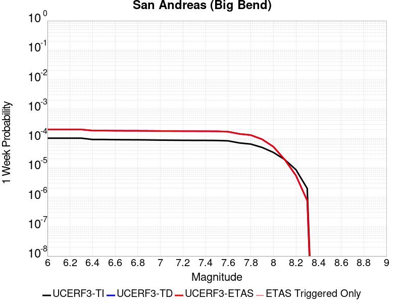 | 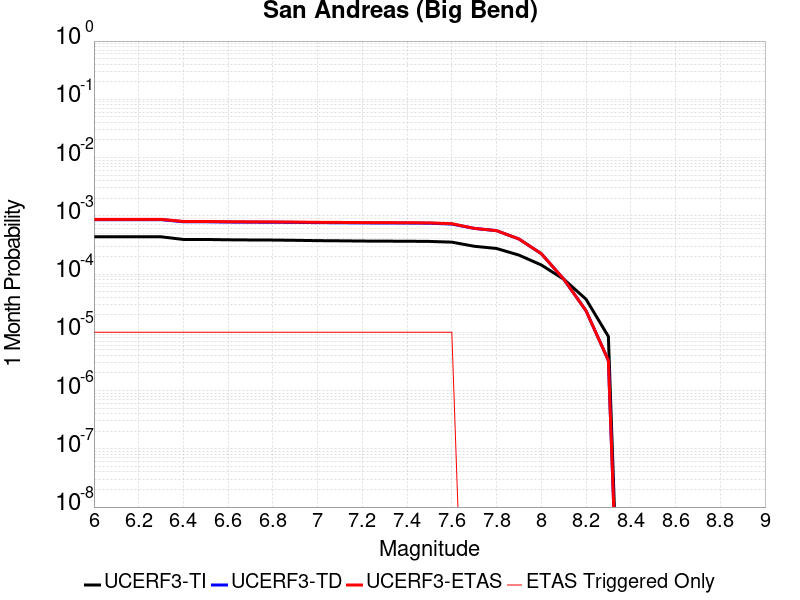 | 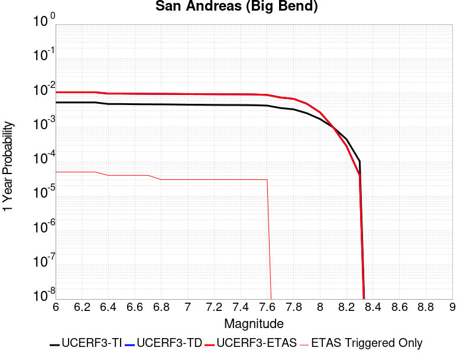 |  |

| Magnitude | 1 wk TI Prob | 1 wk TD Prob | 1 wk ETAS Prob | 1 wk ETAS/TD Gain | 1 wk ETAS Triggered Only | 1 mo TI Prob | 1 mo TD Prob | 1 mo ETAS Prob | 1 mo ETAS/TD Gain | 1 mo ETAS Triggered Only | 1 yr TI Prob | 1 yr TD Prob | 1 yr ETAS Prob | 1 yr ETAS/TD Gain | 1 yr ETAS Triggered Only | 10 yr TI Prob | 10 yr TD Prob | 10 yr ETAS Prob | 10 yr ETAS/TD Gain | 10 yr ETAS Triggered Only |
|-----|-----|-----|-----|-----|-----|-----|-----|-----|-----|-----|-----|-----|-----|-----|-----|-----|-----|-----|-----|-----|
| 6.0 | 1.0179969E-4 | 2.0081972E-4 | 2.0081972E-4 | 1.0 | 0.0 | 4.362114E-4 | 8.603731E-4 | 8.703645E-4 | 1.0116129 | 1.0E-5 | 0.0052979486 | 0.010425015 | 0.010474494 | 1.0047462 | 5.0E-5 | 0.051734097 | 0.101484396 | 0.10152932 | 1.0004427 | 5.0E-5 |
| 6.1 | 1.0179969E-4 | 2.0081972E-4 | 2.0081972E-4 | 1.0 | 0.0 | 4.362114E-4 | 8.603731E-4 | 8.703645E-4 | 1.0116129 | 1.0E-5 | 0.0052979486 | 0.010425015 | 0.010474494 | 1.0047462 | 5.0E-5 | 0.051734097 | 0.101484396 | 0.10152932 | 1.0004427 | 5.0E-5 |
| 6.2 | 1.0179969E-4 | 2.0081972E-4 | 2.0081972E-4 | 1.0 | 0.0 | 4.362114E-4 | 8.603731E-4 | 8.703645E-4 | 1.0116129 | 1.0E-5 | 0.0052979486 | 0.010425015 | 0.010474494 | 1.0047462 | 5.0E-5 | 0.051734097 | 0.101484396 | 0.10152932 | 1.0004427 | 5.0E-5 |
| 6.3 | 1.0179969E-4 | 2.0081972E-4 | 2.0081972E-4 | 1.0 | 0.0 | 4.362114E-4 | 8.603731E-4 | 8.703645E-4 | 1.0116129 | 1.0E-5 | 0.0052979486 | 0.010425015 | 0.010474494 | 1.0047462 | 5.0E-5 | 0.051734097 | 0.101484396 | 0.10152932 | 1.0004427 | 5.0E-5 |
| 6.4 | 9.1639464E-5 | 1.8438944E-4 | 1.8438944E-4 | 1.0 | 0.0 | 3.9268145E-4 | 7.9000136E-4 | 7.9999346E-4 | 1.0126482 | 1.0E-5 | 0.0047704205 | 0.009575968 | 0.009615584 | 1.0041372 | 4.0E-5 | 0.046693064 | 0.09381712 | 0.09385337 | 1.0003864 | 4.0E-5 |
| 6.5 | 9.1639464E-5 | 1.8438944E-4 | 1.8438944E-4 | 1.0 | 0.0 | 3.9268145E-4 | 7.9000136E-4 | 7.9999346E-4 | 1.0126482 | 1.0E-5 | 0.0047704205 | 0.009575968 | 0.009615584 | 1.0041372 | 4.0E-5 | 0.046693064 | 0.09381712 | 0.09385337 | 1.0003864 | 4.0E-5 |
| 6.6 | 9.042622E-5 | 1.8245954E-4 | 1.8245954E-4 | 1.0 | 0.0 | 3.8748336E-4 | 7.817353E-4 | 7.917275E-4 | 1.0127821 | 1.0E-5 | 0.0047074095 | 0.009476205 | 0.009515827 | 1.0041811 | 4.0E-5 | 0.046089325 | 0.09291417 | 0.09295045 | 1.0003905 | 4.0E-5 |
| 6.7 | 8.9836685E-5 | 1.8160277E-4 | 1.8160277E-4 | 1.0 | 0.0 | 3.8495753E-4 | 7.7806565E-4 | 7.8805786E-4 | 1.0128424 | 1.0E-5 | 0.00467679 | 0.0094319135 | 0.009471537 | 1.0042009 | 4.0E-5 | 0.045795817 | 0.0925084 | 0.0925447 | 1.0003924 | 4.0E-5 |
| 6.8 | 8.9471854E-5 | 1.8107046E-4 | 1.8107046E-4 | 1.0 | 0.0 | 3.8339442E-4 | 7.7578565E-4 | 7.857779E-4 | 1.0128802 | 1.0E-5 | 0.004657841 | 0.009404396 | 0.009434113 | 1.00316 | 3.0E-5 | 0.04561414 | 0.092256 | 0.092283234 | 1.0002952 | 3.0E-5 |
| 6.9 | 8.858234E-5 | 1.7989E-4 | 1.7989E-4 | 1.0 | 0.0 | 3.7958333E-4 | 7.7072956E-4 | 7.8072184E-4 | 1.0129647 | 1.0E-5 | 0.004611638 | 0.009343366 | 0.0093730865 | 1.0031809 | 3.0E-5 | 0.04517103 | 0.0916962 | 0.09172345 | 1.0002972 | 3.0E-5 |
| 7.0 | 8.7433385E-5 | 1.7827768E-4 | 1.7827768E-4 | 1.0 | 0.0 | 3.746607E-4 | 7.638237E-4 | 7.738161E-4 | 1.013082 | 1.0E-5 | 0.004551957 | 0.009260005 | 0.009289728 | 1.0032097 | 3.0E-5 | 0.044598386 | 0.09093105 | 0.09095833 | 1.0002999 | 3.0E-5 |
| 7.1 | 8.684964E-5 | 1.7739709E-4 | 1.7739709E-4 | 1.0 | 0.0 | 3.7215967E-4 | 7.6005195E-4 | 7.7004434E-4 | 1.013147 | 1.0E-5 | 0.0045216335 | 0.009214473 | 0.009244197 | 1.0032258 | 3.0E-5 | 0.04430731 | 0.09051253 | 0.09053981 | 1.0003015 | 3.0E-5 |
| 7.2 | 8.606521E-5 | 1.7630306E-4 | 1.7630306E-4 | 1.0 | 0.0 | 3.6879873E-4 | 7.553659E-4 | 7.6535833E-4 | 1.0132287 | 1.0E-5 | 0.0044808835 | 0.009157902 | 0.009187628 | 1.0032458 | 3.0E-5 | 0.043916024 | 0.08999327 | 0.09002057 | 1.0003034 | 3.0E-5 |
| 7.3 | 8.568266E-5 | 1.7572299E-4 | 1.7572299E-4 | 1.0 | 0.0 | 3.6715972E-4 | 7.528814E-4 | 7.6287385E-4 | 1.0132723 | 1.0E-5 | 0.0044610105 | 0.0091279065 | 0.009157633 | 1.0032567 | 3.0E-5 | 0.043725148 | 0.08971421 | 0.08974151 | 1.0003043 | 3.0E-5 |
| 7.4 | 8.5432206E-5 | 1.7534874E-4 | 1.7534874E-4 | 1.0 | 0.0 | 3.6608664E-4 | 7.5127836E-4 | 7.612709E-4 | 1.0133007 | 1.0E-5 | 0.004447999 | 0.009108554 | 0.0091382805 | 1.0032636 | 3.0E-5 | 0.043600157 | 0.08953439 | 0.0895617 | 1.000305 | 3.0E-5 |
| 7.5 | 8.4791965E-5 | 1.7404204E-4 | 1.7404204E-4 | 1.0 | 0.0 | 3.633435E-4 | 7.456814E-4 | 7.55674E-4 | 1.0134006 | 1.0E-5 | 0.0044147377 | 0.009040978 | 0.009070707 | 1.0032883 | 3.0E-5 | 0.043280575 | 0.088910125 | 0.088937454 | 1.0003074 | 3.0E-5 |
| 7.6 | 8.241105E-5 | 1.6849465E-4 | 1.6849465E-4 | 1.0 | 0.0 | 3.531424E-4 | 7.219202E-4 | 7.31913E-4 | 1.013842 | 1.0E-5 | 0.0042910352 | 0.008754046 | 0.008783783 | 1.003397 | 3.0E-5 | 0.042091176 | 0.08628652 | 0.08631394 | 1.0003177 | 3.0E-5 |
| 7.7 | 7.00432E-5 | 1.4212567E-4 | 1.4212567E-4 | 1.0 | 0.0 | 3.001506E-4 | 6.089679E-4 | 6.089679E-4 | 1.0 | 0.0 | 0.0036482112 | 0.0073890192 | 0.0073890192 | 1.0 | 0.0 | 0.035888977 | 0.073552616 | 0.073552616 | 1.0 | 0.0 |
| 7.8 | 6.415362E-5 | 1.2976197E-4 | 1.2976197E-4 | 1.0 | 0.0 | 2.749151E-4 | 5.5600423E-4 | 5.5600423E-4 | 1.0 | 0.0 | 0.0033419547 | 0.0067483704 | 0.0067483704 | 1.0 | 0.0 | 0.03292141 | 0.06728497 | 0.06728497 | 1.0 | 0.0 |
| 7.9 | 4.939911E-5 | 9.346299E-5 | 9.346299E-5 | 1.0 | 0.0 | 2.116933E-4 | 4.004942E-4 | 4.004942E-4 | 1.0 | 0.0 | 0.0025743195 | 0.0048651244 | 0.0048651244 | 1.0 | 0.0 | 0.025447013 | 0.048938233 | 0.048938233 | 1.0 | 0.0 |
| 8.0 | 3.344983E-5 | 5.2255753E-5 | 5.2255753E-5 | 1.0 | 0.0 | 1.4334853E-4 | 2.2393401E-4 | 2.2393401E-4 | 1.0 | 0.0 | 0.0017438711 | 0.0027229895 | 0.0027229895 | 1.0 | 0.0 | 0.017302496 | 0.02793611 | 0.02793611 | 1.0 | 0.0 |
| 8.1 | 1.9104898E-5 | 1.9185067E-5 | 1.9185067E-5 | 1.0 | 0.0 | 8.1875565E-5 | 8.221913E-5 | 8.221913E-5 | 1.0 | 0.0 | 9.963791E-4 | 0.0010005588 | 0.0010005588 | 1.0 | 0.0 | 0.009919235 | 0.010756051 | 0.010756051 | 1.0 | 0.0 |
| 8.2 | 8.643924E-6 | 5.478665E-6 | 5.478665E-6 | 1.0 | 0.0 | 3.704486E-5 | 2.3479783E-5 | 2.3479783E-5 | 1.0 | 0.0 | 4.5092785E-4 | 2.8582895E-4 | 2.8582895E-4 | 1.0 | 0.0 | 0.0045001395 | 0.0032508469 | 0.0032508469 | 1.0 | 0.0 |
| 8.3 | 1.983087E-6 | 7.6647797E-7 | 7.6647797E-7 | 1.0 | 0.0 | 8.498917E-6 | 3.2849016E-6 | 3.2849016E-6 | 1.0 | 0.0 | 1.034694E-4 | 3.999296E-5 | 3.999296E-5 | 1.0 | 0.0 | 0.0010342124 | 4.7228087E-4 | 4.7228087E-4 | 1.0 | 0.0 |

## San Andreas (Coachella) rev
*[(top)](#table-of-contents)*

| 1 Week | 1 Month | 1 Year | 10 Year |
|-----|-----|-----|-----|
|  |  | 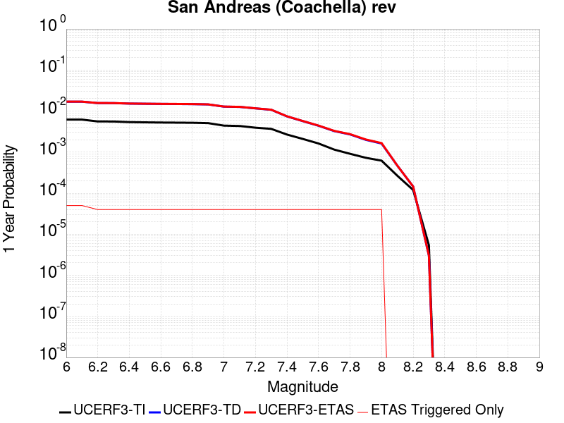 | 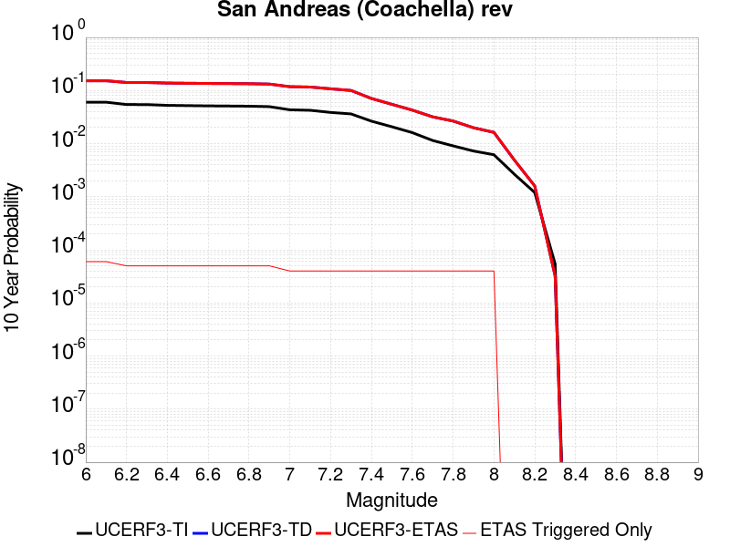 |

| Magnitude | 1 wk TI Prob | 1 wk TD Prob | 1 wk ETAS Prob | 1 wk ETAS/TD Gain | 1 wk ETAS Triggered Only | 1 mo TI Prob | 1 mo TD Prob | 1 mo ETAS Prob | 1 mo ETAS/TD Gain | 1 mo ETAS Triggered Only | 1 yr TI Prob | 1 yr TD Prob | 1 yr ETAS Prob | 1 yr ETAS/TD Gain | 1 yr ETAS Triggered Only | 10 yr TI Prob | 10 yr TD Prob | 10 yr ETAS Prob | 10 yr ETAS/TD Gain | 10 yr ETAS Triggered Only |
|-----|-----|-----|-----|-----|-----|-----|-----|-----|-----|-----|-----|-----|-----|-----|-----|-----|-----|-----|-----|-----|
| 6.0 | 1.1925945E-4 | 3.2735174E-4 | 3.3734847E-4 | 1.0305382 | 1.0E-5 | 5.110118E-4 | 0.0014021865 | 0.0014221584 | 1.0142435 | 2.0E-5 | 0.0062038354 | 0.016939327 | 0.01698848 | 1.0029017 | 5.0E-5 | 0.060334753 | 0.15269604 | 0.15274689 | 1.000333 | 6.0E-5 |
| 6.1 | 1.1925945E-4 | 3.2735174E-4 | 3.3734847E-4 | 1.0305382 | 1.0E-5 | 5.110118E-4 | 0.0014021865 | 0.0014221584 | 1.0142435 | 2.0E-5 | 0.0062038354 | 0.016939327 | 0.01698848 | 1.0029017 | 5.0E-5 | 0.060334753 | 0.15269604 | 0.15274689 | 1.000333 | 6.0E-5 |
| 6.2 | 1.07432395E-4 | 3.023596E-4 | 3.1235657E-4 | 1.0330632 | 1.0E-5 | 4.603433E-4 | 0.0012951873 | 0.0013151615 | 1.0154217 | 2.0E-5 | 0.005590286 | 0.01565599 | 0.015695363 | 1.002515 | 4.0E-5 | 0.05451731 | 0.14184935 | 0.14189225 | 1.0003024 | 5.0E-5 |
| 6.3 | 1.0718766E-4 | 3.0181266E-4 | 3.1180962E-4 | 1.0331231 | 1.0E-5 | 4.592948E-4 | 0.0012928456 | 0.0013128198 | 1.0154498 | 2.0E-5 | 0.005577586 | 0.015627889 | 0.015667263 | 1.0025195 | 4.0E-5 | 0.054396555 | 0.14161763 | 0.14166054 | 1.000303 | 5.0E-5 |
| 6.4 | 1.0355944E-4 | 2.9389336E-4 | 3.0389044E-4 | 1.0340159 | 1.0E-5 | 4.4375064E-4 | 0.001258939 | 0.0012789138 | 1.0158664 | 2.0E-5 | 0.0053892885 | 0.015220915 | 0.015260306 | 1.0025879 | 4.0E-5 | 0.052604496 | 0.13817544 | 0.13821852 | 1.0003119 | 5.0E-5 |
| 6.5 | 1.0227914E-4 | 2.9108766E-4 | 3.0108477E-4 | 1.034344 | 1.0E-5 | 4.382655E-4 | 0.0012469261 | 0.0012669011 | 1.0160195 | 2.0E-5 | 0.0053228354 | 0.015076692 | 0.015116089 | 1.0026131 | 4.0E-5 | 0.051971316 | 0.13695958 | 0.13700274 | 1.0003151 | 5.0E-5 |
| 6.6 | 1.0116757E-4 | 2.8874516E-4 | 2.9874226E-4 | 1.0346227 | 1.0E-5 | 4.3350324E-4 | 0.0012368963 | 0.0012568715 | 1.0161495 | 2.0E-5 | 0.0052651367 | 0.014956261 | 0.0149956625 | 1.0026344 | 4.0E-5 | 0.051421247 | 0.1359371 | 0.13598031 | 1.0003178 | 5.0E-5 |
| 6.7 | 1.0050676E-4 | 2.8733077E-4 | 2.973279E-4 | 1.0347931 | 1.0E-5 | 4.3067214E-4 | 0.0012308403 | 0.0012508158 | 1.016229 | 2.0E-5 | 0.005230834 | 0.01488354 | 0.014922945 | 1.0026475 | 4.0E-5 | 0.051094085 | 0.13532192 | 0.13536516 | 1.0003195 | 5.0E-5 |
| 6.8 | 9.976819E-5 | 2.8536728E-4 | 2.953644E-4 | 1.0350325 | 1.0E-5 | 4.2750788E-4 | 0.0012224333 | 0.0012424089 | 1.0163409 | 2.0E-5 | 0.0051924936 | 0.014782578 | 0.014821987 | 1.0026659 | 4.0E-5 | 0.050728295 | 0.13447334 | 0.13451661 | 1.0003219 | 5.0E-5 |
| 6.9 | 9.77719E-5 | 2.8033604E-4 | 2.9033324E-4 | 1.0356615 | 1.0E-5 | 4.1895514E-4 | 0.0012008909 | 0.0012208669 | 1.0166343 | 2.0E-5 | 0.0050888555 | 0.014523826 | 0.014563245 | 1.002714 | 4.0E-5 | 0.049738888 | 0.13230172 | 0.13234511 | 1.000328 | 5.0E-5 |
| 7.0 | 8.500761E-5 | 2.476793E-4 | 2.5767682E-4 | 1.0403647 | 1.0E-5 | 3.6426744E-4 | 0.0010610541 | 0.0010810329 | 1.0188292 | 2.0E-5 | 0.0044259406 | 0.01284259 | 0.012882077 | 1.0030746 | 4.0E-5 | 0.04338823 | 0.118151076 | 0.118186355 | 1.0002985 | 4.0E-5 |
| 7.1 | 8.319876E-5 | 2.4370618E-4 | 2.5370374E-4 | 1.041023 | 1.0E-5 | 3.5651738E-4 | 0.0010440402 | 0.0010640193 | 1.0191363 | 2.0E-5 | 0.004331963 | 0.0126378685 | 0.012677363 | 1.0031251 | 4.0E-5 | 0.042484846 | 0.11637106 | 0.1164064 | 1.0003037 | 4.0E-5 |
| 7.2 | 7.563917E-5 | 2.2418915E-4 | 2.3418691E-4 | 1.0445952 | 1.0E-5 | 3.2412758E-4 | 9.604599E-4 | 9.804406E-4 | 1.0208033 | 2.0E-5 | 0.0039391145 | 0.011631592 | 0.011671127 | 1.0033989 | 4.0E-5 | 0.03870018 | 0.107777216 | 0.107812904 | 1.0003312 | 4.0E-5 |
| 7.3 | 7.082985E-5 | 2.0734889E-4 | 2.1734682E-4 | 1.0482179 | 1.0E-5 | 3.0352117E-4 | 8.8833837E-4 | 9.083206E-4 | 1.022494 | 2.0E-5 | 0.0036891096 | 0.01076251 | 0.01080208 | 1.0036767 | 4.0E-5 | 0.03628465 | 0.10029867 | 0.10033466 | 1.0003588 | 4.0E-5 |
| 7.4 | 5.146215E-5 | 1.4277869E-4 | 1.5277727E-4 | 1.0700284 | 1.0E-5 | 2.2053342E-4 | 6.1176607E-4 | 6.317538E-4 | 1.0326723 | 2.0E-5 | 0.0026816884 | 0.007423004 | 0.0074627073 | 1.0053487 | 4.0E-5 | 0.02649557 | 0.07086286 | 0.07090002 | 1.0005245 | 4.0E-5 |
| 7.5 | 4.0285166E-5 | 1.09450986E-4 | 1.1944989E-4 | 1.0913551 | 1.0E-5 | 1.7263928E-4 | 4.6899164E-4 | 4.8898224E-4 | 1.0426247 | 2.0E-5 | 0.002099857 | 0.0056950934 | 0.0057348656 | 1.0069836 | 4.0E-5 | 0.020801254 | 0.055024315 | 0.055062115 | 1.000687 | 4.0E-5 |
| 7.6 | 3.1168736E-5 | 8.441976E-5 | 9.441891E-5 | 1.1184456 | 1.0E-5 | 1.3357346E-4 | 3.617489E-4 | 3.8174167E-4 | 1.055267 | 2.0E-5 | 0.0016250437 | 0.0043954253 | 0.0044352496 | 1.0090604 | 4.0E-5 | 0.016132116 | 0.042821974 | 0.042860262 | 1.0008941 | 4.0E-5 |
| 7.7 | 2.2100989E-5 | 6.241421E-5 | 7.241359E-5 | 1.1602099 | 1.0E-5 | 9.4715084E-5 | 2.674621E-4 | 2.8745676E-4 | 1.074757 | 2.0E-5 | 0.001152546 | 0.003251495 | 0.0032913652 | 1.012262 | 4.0E-5 | 0.011465867 | 0.031911246 | 0.03194997 | 1.0012134 | 4.0E-5 |
| 7.8 | 1.7484861E-5 | 5.181932E-5 | 6.18188E-5 | 1.1929682 | 1.0E-5 | 7.493296E-5 | 2.220639E-4 | 2.4205947E-4 | 1.0900441 | 2.0E-5 | 9.1192697E-4 | 0.002700279 | 0.0027401708 | 1.0147732 | 4.0E-5 | 0.009081938 | 0.026649911 | 0.026688844 | 1.0014609 | 4.0E-5 |
| 7.9 | 1.3967285E-5 | 3.8241284E-5 | 4.82409E-5 | 1.2614875 | 1.0E-5 | 5.985842E-5 | 1.6388092E-4 | 1.8387765E-4 | 1.1220199 | 2.0E-5 | 7.2853256E-4 | 0.0019934257 | 0.0020333459 | 1.020026 | 4.0E-5 | 0.0072614877 | 0.019917965 | 0.019957168 | 1.0019683 | 4.0E-5 |
| 8.0 | 1.1887396E-5 | 3.1081006E-5 | 4.1080697E-5 | 1.3217299 | 1.0E-5 | 5.094499E-5 | 1.3319752E-4 | 1.5319485E-4 | 1.1501329 | 2.0E-5 | 6.200787E-4 | 0.0016204745 | 0.0016604096 | 1.0246441 | 4.0E-5 | 0.006183513 | 0.016286531 | 0.01632588 | 1.002416 | 4.0E-5 |
| 8.1 | 5.100864E-6 | 8.979058E-6 | 8.979058E-6 | 1.0 | 0.0 | 2.1860664E-5 | 3.8481114E-5 | 3.8481114E-5 | 1.0 | 0.0 | 2.6612106E-4 | 4.6840697E-4 | 4.6840697E-4 | 1.0 | 0.0 | 0.002658026 | 0.0049204906 | 0.0049204906 | 1.0 | 0.0 |
| 8.2 | 2.3004484E-6 | 2.7884673E-6 | 2.7884673E-6 | 1.0 | 0.0 | 9.859027E-6 | 1.195052E-5 | 1.195052E-5 | 1.0 | 0.0 | 1.2002704E-4 | 1.454879E-4 | 1.454879E-4 | 1.0 | 0.0 | 0.0011996223 | 0.0015984424 | 0.0015984424 | 1.0 | 0.0 |
| 8.3 | 1.0424446E-7 | 5.820319E-8 | 5.820319E-8 | 1.0 | 0.0 | 4.4676187E-7 | 2.4944222E-7 | 2.4944222E-7 | 1.0 | 0.0 | 5.439312E-6 | 3.0369551E-6 | 3.0369551E-6 | 1.0 | 0.0 | 5.4391792E-5 | 3.1931086E-5 | 3.1931086E-5 | 1.0 | 0.0 |

## Cady
*[(top)](#table-of-contents)*

| 1 Week | 1 Month | 1 Year | 10 Year |
|-----|-----|-----|-----|
|  |  | 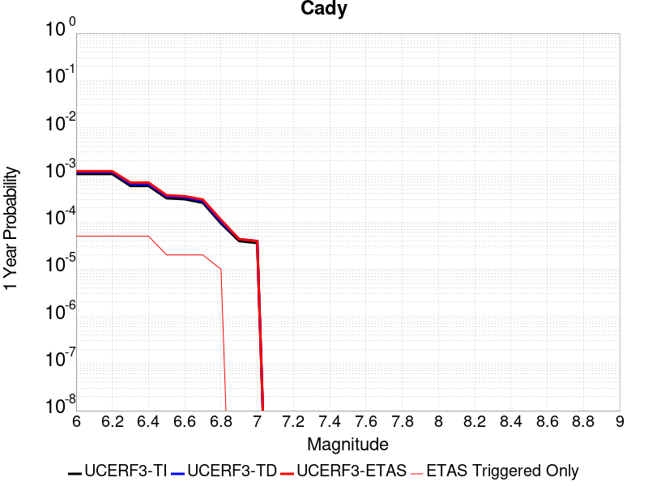 |  |

| Magnitude | 1 wk TI Prob | 1 wk TD Prob | 1 wk ETAS Prob | 1 wk ETAS/TD Gain | 1 wk ETAS Triggered Only | 1 mo TI Prob | 1 mo TD Prob | 1 mo ETAS Prob | 1 mo ETAS/TD Gain | 1 mo ETAS Triggered Only | 1 yr TI Prob | 1 yr TD Prob | 1 yr ETAS Prob | 1 yr ETAS/TD Gain | 1 yr ETAS Triggered Only | 10 yr TI Prob | 10 yr TD Prob | 10 yr ETAS Prob | 10 yr ETAS/TD Gain | 10 yr ETAS Triggered Only |
|-----|-----|-----|-----|-----|-----|-----|-----|-----|-----|-----|-----|-----|-----|-----|-----|-----|-----|-----|-----|-----|
| 6.0 | 1.9892565E-5 | 2.1859016E-5 | 2.1859016E-5 | 1.0 | 0.0 | 8.525106E-5 | 9.3678645E-5 | 9.3678645E-5 | 1.0 | 0.0 | 0.0010374374 | 0.0011400316 | 0.0011899746 | 1.0438085 | 5.0E-5 | 0.010326075 | 0.011350849 | 0.011400281 | 1.004355 | 5.0E-5 |
| 6.1 | 1.9892565E-5 | 2.1859016E-5 | 2.1859016E-5 | 1.0 | 0.0 | 8.525106E-5 | 9.3678645E-5 | 9.3678645E-5 | 1.0 | 0.0 | 0.0010374374 | 0.0011400316 | 0.0011899746 | 1.0438085 | 5.0E-5 | 0.010326075 | 0.011350849 | 0.011400281 | 1.004355 | 5.0E-5 |
| 6.2 | 1.9892565E-5 | 2.1859016E-5 | 2.1859016E-5 | 1.0 | 0.0 | 8.525106E-5 | 9.3678645E-5 | 9.3678645E-5 | 1.0 | 0.0 | 0.0010374374 | 0.0011400316 | 0.0011899746 | 1.0438085 | 5.0E-5 | 0.010326075 | 0.011350849 | 0.011400281 | 1.004355 | 5.0E-5 |
| 6.3 | 1.1117327E-5 | 1.2176738E-5 | 1.2176738E-5 | 1.0 | 0.0 | 4.764482E-5 | 5.218515E-5 | 5.218515E-5 | 1.0 | 0.0 | 5.7992124E-4 | 6.3520053E-4 | 6.851688E-4 | 1.0786653 | 5.0E-5 | 0.0057841022 | 0.0063369554 | 0.0063866386 | 1.0078403 | 5.0E-5 |
| 6.4 | 1.1117327E-5 | 1.2176738E-5 | 1.2176738E-5 | 1.0 | 0.0 | 4.764482E-5 | 5.218515E-5 | 5.218515E-5 | 1.0 | 0.0 | 5.7992124E-4 | 6.3520053E-4 | 6.851688E-4 | 1.0786653 | 5.0E-5 | 0.0057841022 | 0.0063369554 | 0.0063866386 | 1.0078403 | 5.0E-5 |
| 6.5 | 6.103093E-6 | 6.672103E-6 | 6.672103E-6 | 1.0 | 0.0 | 2.615585E-5 | 2.8594486E-5 | 2.8594486E-5 | 1.0 | 0.0 | 3.1840094E-4 | 3.4809482E-4 | 3.6808784E-4 | 1.0574356 | 2.0E-5 | 0.0031794512 | 0.0034767296 | 0.0034966602 | 1.0057325 | 2.0E-5 |
| 6.6 | 5.817237E-6 | 6.365738E-6 | 6.365738E-6 | 1.0 | 0.0 | 2.4930776E-5 | 2.728152E-5 | 2.728152E-5 | 1.0 | 0.0 | 3.034899E-4 | 3.3211432E-4 | 3.521077E-4 | 1.0602002 | 2.0E-5 | 0.0030307577 | 0.003317402 | 0.0033373358 | 1.0060089 | 2.0E-5 |
| 6.7 | 4.8846314E-6 | 5.3406343E-6 | 5.3406343E-6 | 1.0 | 0.0 | 2.0933967E-5 | 2.2888298E-5 | 2.2888298E-5 | 1.0 | 0.0 | 2.5484123E-4 | 2.7864118E-4 | 2.986356E-4 | 1.071757 | 2.0E-5 | 0.0025454918 | 0.0027840736 | 0.0028040179 | 1.0071638 | 2.0E-5 |
| 6.8 | 1.7788773E-6 | 1.9399313E-6 | 1.9399313E-6 | 1.0 | 0.0 | 7.6237375E-6 | 8.313974E-6 | 8.313974E-6 | 1.0 | 0.0 | 9.281505E-5 | 1.01219506E-4 | 1.1121849E-4 | 1.0987852 | 1.0E-5 | 9.2776294E-4 | 0.0010118886 | 0.0010218786 | 1.0098726 | 1.0E-5 |
| 6.9 | 7.5455404E-7 | 8.297202E-7 | 8.297202E-7 | 1.0 | 0.0 | 3.233799E-6 | 3.5559406E-6 | 3.5559406E-6 | 1.0 | 0.0 | 3.937079E-5 | 4.3293054E-5 | 4.3293054E-5 | 1.0 | 0.0 | 3.9363815E-4 | 4.3287914E-4 | 4.3287914E-4 | 1.0 | 0.0 |
| 7.0 | 6.8578805E-7 | 7.541916E-7 | 7.541916E-7 | 1.0 | 0.0 | 2.9390883E-6 | 3.2322475E-6 | 3.2322475E-6 | 1.0 | 0.0 | 3.578281E-5 | 3.9352235E-5 | 3.9352235E-5 | 1.0 | 0.0 | 3.577705E-4 | 3.9348513E-4 | 3.9348513E-4 | 1.0 | 0.0 |

## San Andreas (North Branch Mill Creek)
*[(top)](#table-of-contents)*

| 1 Week | 1 Month | 1 Year | 10 Year |
|-----|-----|-----|-----|
|  |  |  |  |

| Magnitude | 1 wk TI Prob | 1 wk TD Prob | 1 wk ETAS Prob | 1 wk ETAS/TD Gain | 1 wk ETAS Triggered Only | 1 mo TI Prob | 1 mo TD Prob | 1 mo ETAS Prob | 1 mo ETAS/TD Gain | 1 mo ETAS Triggered Only | 1 yr TI Prob | 1 yr TD Prob | 1 yr ETAS Prob | 1 yr ETAS/TD Gain | 1 yr ETAS Triggered Only | 10 yr TI Prob | 10 yr TD Prob | 10 yr ETAS Prob | 10 yr ETAS/TD Gain | 10 yr ETAS Triggered Only |
|-----|-----|-----|-----|-----|-----|-----|-----|-----|-----|-----|-----|-----|-----|-----|-----|-----|-----|-----|-----|-----|
| 6.0 | 1.3461156E-5 | 2.350783E-5 | 3.3507593E-5 | 1.4253802 | 1.0E-5 | 5.7689394E-5 | 1.0074397E-4 | 1.1074296E-4 | 1.0992515 | 1.0E-5 | 7.02142E-4 | 0.001225871 | 0.0012558342 | 1.0244424 | 3.0E-5 | 0.0069992766 | 0.012232522 | 0.0122819105 | 1.0040375 | 5.0E-5 |
| 6.1 | 1.3461156E-5 | 2.350783E-5 | 3.3507593E-5 | 1.4253802 | 1.0E-5 | 5.7689394E-5 | 1.0074397E-4 | 1.1074296E-4 | 1.0992515 | 1.0E-5 | 7.02142E-4 | 0.001225871 | 0.0012558342 | 1.0244424 | 3.0E-5 | 0.0069992766 | 0.012232522 | 0.0122819105 | 1.0040375 | 5.0E-5 |
| 6.2 | 1.3461156E-5 | 2.350783E-5 | 3.3507593E-5 | 1.4253802 | 1.0E-5 | 5.7689394E-5 | 1.0074397E-4 | 1.1074296E-4 | 1.0992515 | 1.0E-5 | 7.02142E-4 | 0.001225871 | 0.0012558342 | 1.0244424 | 3.0E-5 | 0.0069992766 | 0.012232522 | 0.0122819105 | 1.0040375 | 5.0E-5 |
| 6.3 | 1.3461156E-5 | 2.350783E-5 | 3.3507593E-5 | 1.4253802 | 1.0E-5 | 5.7689394E-5 | 1.0074397E-4 | 1.1074296E-4 | 1.0992515 | 1.0E-5 | 7.02142E-4 | 0.001225871 | 0.0012558342 | 1.0244424 | 3.0E-5 | 0.0069992766 | 0.012232522 | 0.0122819105 | 1.0040375 | 5.0E-5 |
| 6.4 | 1.3461156E-5 | 2.350783E-5 | 3.3507593E-5 | 1.4253802 | 1.0E-5 | 5.7689394E-5 | 1.0074397E-4 | 1.1074296E-4 | 1.0992515 | 1.0E-5 | 7.02142E-4 | 0.001225871 | 0.0012558342 | 1.0244424 | 3.0E-5 | 0.0069992766 | 0.012232522 | 0.0122819105 | 1.0040375 | 5.0E-5 |
| 6.5 | 1.3450706E-5 | 2.349679E-5 | 3.3496555E-5 | 1.42558 | 1.0E-5 | 5.764461E-5 | 1.00696656E-4 | 1.1069565E-4 | 1.0992981 | 1.0E-5 | 7.0159714E-4 | 0.0012252956 | 0.0012552589 | 1.0244539 | 3.0E-5 | 0.006993862 | 0.012226831 | 0.01227622 | 1.0040394 | 5.0E-5 |
| 6.6 | 1.3074523E-5 | 2.3111072E-5 | 3.311084E-5 | 1.4326831 | 1.0E-5 | 5.6032466E-5 | 9.9043704E-5 | 1.0904272E-4 | 1.1009555 | 1.0E-5 | 6.8198174E-4 | 0.0012051932 | 0.0012351571 | 1.0248623 | 3.0E-5 | 0.006798926 | 0.012027997 | 0.012077395 | 1.004107 | 5.0E-5 |
| 6.7 | 1.3050216E-5 | 2.3086368E-5 | 3.3086137E-5 | 1.433146 | 1.0E-5 | 5.59283E-5 | 9.893784E-5 | 1.0893685E-4 | 1.1010636 | 1.0E-5 | 6.8071426E-4 | 0.0012039058 | 0.0012338697 | 1.0248889 | 3.0E-5 | 0.0067863287 | 0.012015262 | 0.012064661 | 1.0041114 | 5.0E-5 |
| 6.8 | 1.29049395E-5 | 2.2934775E-5 | 3.2934546E-5 | 1.436009 | 1.0E-5 | 5.530571E-5 | 9.8288205E-5 | 1.08287226E-4 | 1.1017317 | 1.0E-5 | 6.73139E-4 | 0.0011960051 | 0.0012259693 | 1.0250535 | 3.0E-5 | 0.0067110364 | 0.011937105 | 0.011986509 | 1.0041386 | 5.0E-5 |
| 6.9 | 1.2867369E-5 | 2.2894177E-5 | 3.289395E-5 | 1.4367822 | 1.0E-5 | 5.51447E-5 | 9.811423E-5 | 1.0811325E-4 | 1.101912 | 1.0E-5 | 6.711799E-4 | 0.0011938893 | 0.0012238536 | 1.025098 | 3.0E-5 | 0.006691564 | 0.011916174 | 0.011965578 | 1.004146 | 5.0E-5 |
| 7.0 | 1.2495996E-5 | 2.2294238E-5 | 3.2294014E-5 | 1.4485364 | 1.0E-5 | 5.3553173E-5 | 9.5543255E-5 | 1.055423E-4 | 1.1046547 | 1.0E-5 | 6.518148E-4 | 0.0011626212 | 0.0011925864 | 1.0257738 | 3.0E-5 | 0.0064990623 | 0.011606771 | 0.01165619 | 1.0042578 | 5.0E-5 |
| 7.1 | 1.2452067E-5 | 2.2239308E-5 | 3.2239088E-5 | 1.4496442 | 1.0E-5 | 5.3364907E-5 | 9.5307856E-5 | 1.05306906E-4 | 1.1049131 | 1.0E-5 | 6.4952404E-4 | 0.0011597583 | 0.0011897235 | 1.0258374 | 3.0E-5 | 0.0064762887 | 0.01157844 | 0.011627861 | 1.0042684 | 5.0E-5 |
| 7.2 | 1.2002777E-5 | 2.1617801E-5 | 3.1617587E-5 | 1.4625717 | 1.0E-5 | 5.143946E-5 | 9.264445E-5 | 1.0264352E-4 | 1.1079296 | 1.0E-5 | 6.2609545E-4 | 0.0011273652 | 0.0011573313 | 1.0265807 | 3.0E-5 | 0.006243344 | 0.01125784 | 0.011307278 | 1.0043913 | 5.0E-5 |
| 7.3 | 1.1923425E-5 | 2.1487636E-5 | 3.148742E-5 | 1.4653739 | 1.0E-5 | 5.109939E-5 | 9.208664E-5 | 1.0208571E-4 | 1.1085835 | 1.0E-5 | 6.219575E-4 | 0.0011205808 | 0.0011505472 | 1.0267419 | 3.0E-5 | 0.0062021962 | 0.011190712 | 0.011240153 | 1.004418 | 5.0E-5 |
| 7.4 | 1.16105175E-5 | 2.0861535E-5 | 3.0861327E-5 | 1.4793411 | 1.0E-5 | 4.975841E-5 | 8.9403526E-5 | 9.9402634E-5 | 1.1118424 | 1.0E-5 | 6.0564023E-4 | 0.0010879469 | 0.0011179143 | 1.0275449 | 3.0E-5 | 0.006039923 | 0.010868174 | 0.010917631 | 1.0045506 | 5.0E-5 |
| 7.5 | 1.1037265E-5 | 1.9561343E-5 | 2.9561148E-5 | 1.5112023 | 1.0E-5 | 4.7301706E-5 | 8.383165E-5 | 9.383081E-5 | 1.1192766 | 1.0E-5 | 5.757461E-4 | 0.0010201746 | 0.001050144 | 1.0293767 | 3.0E-5 | 0.005742567 | 0.010198631 | 0.010248121 | 1.0048527 | 5.0E-5 |
| 7.6 | 1.0720915E-5 | 1.9003148E-5 | 2.9002957E-5 | 1.5262187 | 1.0E-5 | 4.5945973E-5 | 8.143953E-5 | 9.143871E-5 | 1.1227804 | 1.0E-5 | 5.592486E-4 | 9.910774E-4 | 0.0010210477 | 1.03024 | 3.0E-5 | 0.005578433 | 0.009910301 | 0.009959806 | 1.0049952 | 5.0E-5 |
| 7.7 | 9.276279E-6 | 1.6448577E-5 | 2.6448412E-5 | 1.6079453 | 1.0E-5 | 3.9754876E-5 | 7.0492E-5 | 8.04913E-5 | 1.1418501 | 1.0E-5 | 4.839081E-4 | 8.579039E-4 | 8.878782E-4 | 1.0349389 | 3.0E-5 | 0.0048285574 | 0.008589426 | 0.008638997 | 1.0057712 | 5.0E-5 |
| 7.8 | 5.8346777E-6 | 1.1160578E-5 | 2.1160466E-5 | 1.896001 | 1.0E-5 | 2.5005522E-5 | 4.783017E-5 | 5.782969E-5 | 1.209063 | 1.0E-5 | 3.043997E-4 | 5.8217684E-4 | 6.121594E-4 | 1.0515007 | 3.0E-5 | 0.0030398308 | 0.0058496357 | 0.0058993436 | 1.0084976 | 5.0E-5 |
| 7.9 | 4.690204E-6 | 8.513636E-6 | 1.851355E-5 | 2.1745763 | 1.0E-5 | 2.0100719E-5 | 3.64865E-5 | 4.6486137E-5 | 1.274064 | 1.0E-5 | 2.4469878E-4 | 4.4413272E-4 | 4.7411938E-4 | 1.0675174 | 3.0E-5 | 0.002444295 | 0.004473071 | 0.0045228475 | 1.011128 | 5.0E-5 |
| 8.0 | 2.9570454E-6 | 4.8496286E-6 | 4.8496286E-6 | 1.0 | 0.0 | 1.267299E-5 | 2.0783957E-5 | 2.0783957E-5 | 1.0 | 0.0 | 1.5428272E-4 | 2.530153E-4 | 2.530153E-4 | 1.0 | 0.0 | 0.0015417566 | 0.0025509798 | 0.0025509798 | 1.0 | 0.0 |
| 8.1 | 1.6376824E-6 | 2.1982057E-6 | 2.1982057E-6 | 1.0 | 0.0 | 7.01862E-6 | 9.420847E-6 | 9.420847E-6 | 1.0 | 0.0 | 8.544835E-5 | 1.146928E-4 | 1.146928E-4 | 1.0 | 0.0 | 8.54155E-4 | 0.0011613306 | 0.0011613306 | 1.0 | 0.0 |
| 8.2 | 6.9631557E-7 | 4.5391383E-7 | 4.5391383E-7 | 1.0 | 0.0 | 2.984206E-6 | 1.9453435E-6 | 1.9453435E-6 | 1.0 | 0.0 | 3.63321E-5 | 2.36843E-5 | 2.36843E-5 | 1.0 | 0.0 | 3.6326164E-4 | 2.4532314E-4 | 2.4532314E-4 | 1.0 | 0.0 |
| 8.3 | 1.7876137E-7 | 8.3658875E-8 | 8.3658875E-8 | 1.0 | 0.0 | 7.661199E-7 | 3.58538E-7 | 3.58538E-7 | 1.0 | 0.0 | 9.32747E-6 | 4.3651917E-6 | 4.3651917E-6 | 1.0 | 0.0 | 9.3270784E-5 | 4.5847937E-5 | 4.5847937E-5 | 1.0 | 0.0 |

## San Jacinto (Lytle Creek connector)
*[(top)](#table-of-contents)*

| 1 Week | 1 Month | 1 Year | 10 Year |
|-----|-----|-----|-----|
| 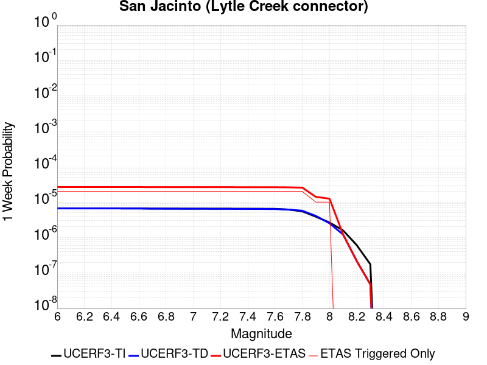 |  |  |  |

| Magnitude | 1 wk TI Prob | 1 wk TD Prob | 1 wk ETAS Prob | 1 wk ETAS/TD Gain | 1 wk ETAS Triggered Only | 1 mo TI Prob | 1 mo TD Prob | 1 mo ETAS Prob | 1 mo ETAS/TD Gain | 1 mo ETAS Triggered Only | 1 yr TI Prob | 1 yr TD Prob | 1 yr ETAS Prob | 1 yr ETAS/TD Gain | 1 yr ETAS Triggered Only | 10 yr TI Prob | 10 yr TD Prob | 10 yr ETAS Prob | 10 yr ETAS/TD Gain | 10 yr ETAS Triggered Only |
|-----|-----|-----|-----|-----|-----|-----|-----|-----|-----|-----|-----|-----|-----|-----|-----|-----|-----|-----|-----|-----|
| 6.0 | 6.693995E-6 | 6.6628318E-6 | 2.66627E-5 | 4.0017066 | 2.0E-5 | 2.8688235E-5 | 2.8554681E-5 | 4.855411E-5 | 1.7003906 | 2.0E-5 | 3.492233E-4 | 3.4759787E-4 | 3.975805E-4 | 1.1437944 | 5.0E-5 | 0.00348675 | 0.0035508901 | 0.0036007126 | 1.0140309 | 5.0E-5 |
| 6.1 | 6.693995E-6 | 6.6628318E-6 | 2.66627E-5 | 4.0017066 | 2.0E-5 | 2.8688235E-5 | 2.8554681E-5 | 4.855411E-5 | 1.7003906 | 2.0E-5 | 3.492233E-4 | 3.4759787E-4 | 3.975805E-4 | 1.1437944 | 5.0E-5 | 0.00348675 | 0.0035508901 | 0.0036007126 | 1.0140309 | 5.0E-5 |
| 6.2 | 6.693995E-6 | 6.6628318E-6 | 2.66627E-5 | 4.0017066 | 2.0E-5 | 2.8688235E-5 | 2.8554681E-5 | 4.855411E-5 | 1.7003906 | 2.0E-5 | 3.492233E-4 | 3.4759787E-4 | 3.975805E-4 | 1.1437944 | 5.0E-5 | 0.00348675 | 0.0035508901 | 0.0036007126 | 1.0140309 | 5.0E-5 |
| 6.3 | 6.693995E-6 | 6.6628318E-6 | 2.66627E-5 | 4.0017066 | 2.0E-5 | 2.8688235E-5 | 2.8554681E-5 | 4.855411E-5 | 1.7003906 | 2.0E-5 | 3.492233E-4 | 3.4759787E-4 | 3.975805E-4 | 1.1437944 | 5.0E-5 | 0.00348675 | 0.0035508901 | 0.0036007126 | 1.0140309 | 5.0E-5 |
| 6.4 | 6.693995E-6 | 6.6628318E-6 | 2.66627E-5 | 4.0017066 | 2.0E-5 | 2.8688235E-5 | 2.8554681E-5 | 4.855411E-5 | 1.7003906 | 2.0E-5 | 3.492233E-4 | 3.4759787E-4 | 3.975805E-4 | 1.1437944 | 5.0E-5 | 0.00348675 | 0.0035508901 | 0.0036007126 | 1.0140309 | 5.0E-5 |
| 6.5 | 6.6561875E-6 | 6.6230496E-6 | 2.6622916E-5 | 4.019737 | 2.0E-5 | 2.8526205E-5 | 2.838419E-5 | 4.8383623E-5 | 1.7045976 | 2.0E-5 | 3.472512E-4 | 3.455228E-4 | 3.955055E-4 | 1.1446582 | 5.0E-5 | 0.0034670907 | 0.0035302055 | 0.0035800291 | 1.0141134 | 5.0E-5 |
| 6.6 | 6.6561875E-6 | 6.6230496E-6 | 2.6622916E-5 | 4.019737 | 2.0E-5 | 2.8526205E-5 | 2.838419E-5 | 4.8383623E-5 | 1.7045976 | 2.0E-5 | 3.472512E-4 | 3.455228E-4 | 3.955055E-4 | 1.1446582 | 5.0E-5 | 0.0034670907 | 0.0035302055 | 0.0035800291 | 1.0141134 | 5.0E-5 |
| 6.7 | 6.5802237E-6 | 6.5422255E-6 | 2.6542095E-5 | 4.0570436 | 2.0E-5 | 2.8200653E-5 | 2.803781E-5 | 4.8037247E-5 | 1.7133025 | 2.0E-5 | 3.4328885E-4 | 3.4130694E-4 | 3.9128985E-4 | 1.1464458 | 5.0E-5 | 0.0034275902 | 0.0034881798 | 0.0035380053 | 1.0142841 | 5.0E-5 |
| 6.8 | 6.575632E-6 | 6.5367153E-6 | 2.6536585E-5 | 4.059621 | 2.0E-5 | 2.8180975E-5 | 2.8014192E-5 | 4.8013633E-5 | 1.7139038 | 2.0E-5 | 3.4304935E-4 | 3.410195E-4 | 3.9100245E-4 | 1.1465691 | 5.0E-5 | 0.0034252026 | 0.0034853143 | 0.00353514 | 1.0142959 | 5.0E-5 |
| 6.9 | 6.570433E-6 | 6.5281088E-6 | 2.6527978E-5 | 4.0636544 | 2.0E-5 | 2.8158694E-5 | 2.7977308E-5 | 4.797675E-5 | 1.7148451 | 2.0E-5 | 3.4277816E-4 | 3.4057058E-4 | 3.9055356E-4 | 1.1467625 | 5.0E-5 | 0.0034224992 | 0.0034808393 | 0.0035306653 | 1.0143143 | 5.0E-5 |
| 7.0 | 6.5643826E-6 | 6.5182294E-6 | 2.6518099E-5 | 4.068298 | 2.0E-5 | 2.8132765E-5 | 2.793497E-5 | 4.793441E-5 | 1.7159286 | 2.0E-5 | 3.424626E-4 | 3.4005524E-4 | 3.9003824E-4 | 1.1469849 | 5.0E-5 | 0.0034193532 | 0.0034757021 | 0.0035255284 | 1.0143356 | 5.0E-5 |
| 7.1 | 6.557402E-6 | 6.5069403E-6 | 2.650681E-5 | 4.0736213 | 2.0E-5 | 2.8102848E-5 | 2.788659E-5 | 4.788603E-5 | 1.7171706 | 2.0E-5 | 3.4209844E-4 | 3.394664E-4 | 3.8944944E-4 | 1.1472399 | 5.0E-5 | 0.0034157229 | 0.0034698334 | 0.0035196599 | 1.01436 | 5.0E-5 |
| 7.2 | 6.546394E-6 | 6.488906E-6 | 2.6488777E-5 | 4.082164 | 2.0E-5 | 2.8055672E-5 | 2.7809301E-5 | 4.7808746E-5 | 1.7191639 | 2.0E-5 | 3.4152428E-4 | 3.3852572E-4 | 3.8850878E-4 | 1.1476493 | 5.0E-5 | 0.0034099987 | 0.0034604599 | 0.0035102868 | 1.0143989 | 5.0E-5 |
| 7.3 | 6.5364216E-6 | 6.469689E-6 | 2.6469559E-5 | 4.0913186 | 2.0E-5 | 2.8012933E-5 | 2.7726945E-5 | 4.772639E-5 | 1.7213 | 2.0E-5 | 3.4100408E-4 | 3.3752335E-4 | 3.8750647E-4 | 1.1480879 | 5.0E-5 | 0.003404813 | 0.003450482 | 0.0035003095 | 1.0144408 | 5.0E-5 |
| 7.4 | 6.5269523E-6 | 6.450774E-6 | 2.6450645E-5 | 4.1003833 | 2.0E-5 | 2.7972354E-5 | 2.7645881E-5 | 4.7645328E-5 | 1.723415 | 2.0E-5 | 3.4051016E-4 | 3.365367E-4 | 3.8651985E-4 | 1.1485223 | 5.0E-5 | 0.0033998888 | 0.0034406635 | 0.0034904915 | 1.0144821 | 5.0E-5 |
| 7.5 | 6.5111835E-6 | 6.4270453E-6 | 2.6426917E-5 | 4.1118298 | 2.0E-5 | 2.7904773E-5 | 2.7544189E-5 | 4.754364E-5 | 1.7260859 | 2.0E-5 | 3.3968766E-4 | 3.3529897E-4 | 3.852822E-4 | 1.1490706 | 5.0E-5 | 0.0033916887 | 0.0034283353 | 0.0034781639 | 1.0145344 | 5.0E-5 |
| 7.6 | 6.4768806E-6 | 6.3861507E-6 | 2.6386022E-5 | 4.1317573 | 2.0E-5 | 2.7757764E-5 | 2.736893E-5 | 4.7368383E-5 | 1.7307357 | 2.0E-5 | 3.3789838E-4 | 3.3316584E-4 | 3.831492E-4 | 1.1500254 | 5.0E-5 | 0.0033738504 | 0.0034070655 | 0.0034568952 | 1.0146254 | 5.0E-5 |
| 7.7 | 6.1655364E-6 | 6.1786222E-6 | 2.6178499E-5 | 4.2369475 | 2.0E-5 | 2.642346E-5 | 2.6479542E-5 | 4.647901E-5 | 1.7552801 | 2.0E-5 | 3.2165812E-4 | 3.2234078E-4 | 3.7232466E-4 | 1.1550653 | 5.0E-5 | 0.0032119295 | 0.0032986694 | 0.0033485044 | 1.0151076 | 5.0E-5 |
| 7.8 | 5.5043524E-6 | 5.739622E-6 | 2.5739508E-5 | 4.48453 | 2.0E-5 | 2.3589868E-5 | 2.4598148E-5 | 4.4597655E-5 | 1.8130493 | 2.0E-5 | 2.871688E-4 | 2.9944137E-4 | 3.4942638E-4 | 1.1669276 | 5.0E-5 | 0.0028679797 | 0.003068756 | 0.0031186028 | 1.0162432 | 5.0E-5 |
| 7.9 | 3.889249E-6 | 4.0787854E-6 | 1.4078745E-5 | 3.4517002 | 1.0E-5 | 1.6668104E-5 | 1.7480392E-5 | 2.7480217E-5 | 1.5720595 | 1.0E-5 | 2.0291525E-4 | 2.1280303E-4 | 2.4279665E-4 | 1.1409454 | 3.0E-5 | 0.0020273007 | 0.0021955092 | 0.0022254433 | 1.0136342 | 3.0E-5 |
| 8.0 | 2.668535E-6 | 2.5328056E-6 | 1.2532781E-5 | 4.948181 | 1.0E-5 | 1.1436528E-5 | 1.0854836E-5 | 2.0854728E-5 | 1.9212384 | 1.0E-5 | 1.3923083E-4 | 1.3214964E-4 | 1.52147E-4 | 1.1513236 | 2.0E-5 | 0.0013914363 | 0.0013765903 | 0.0013965629 | 1.0145086 | 2.0E-5 |
| 8.1 | 1.5911459E-6 | 1.2193005E-6 | 1.2193005E-6 | 1.0 | 0.0 | 6.8191785E-6 | 5.225563E-6 | 5.225563E-6 | 1.0 | 0.0 | 8.3020335E-5 | 6.3619394E-5 | 7.3618765E-5 | 1.1571747 | 1.0E-5 | 8.298933E-4 | 6.697524E-4 | 6.797457E-4 | 1.014921 | 1.0E-5 |
| 8.2 | 6.1294963E-7 | 2.1825215E-7 | 2.1825215E-7 | 1.0 | 0.0 | 2.6269242E-6 | 9.35366E-7 | 9.35366E-7 | 1.0 | 0.0 | 3.1982334E-5 | 1.1388021E-5 | 1.1388021E-5 | 1.0 | 0.0 | 3.1977732E-4 | 1.279216E-4 | 1.279216E-4 | 1.0 | 0.0 |
| 8.3 | 1.762871E-7 | 4.757476E-8 | 4.757476E-8 | 1.0 | 0.0 | 7.5551594E-7 | 2.038918E-7 | 2.038918E-7 | 1.0 | 0.0 | 9.1983675E-6 | 2.4823798E-6 | 2.4823798E-6 | 1.0 | 0.0 | 9.197987E-5 | 2.8703373E-5 | 2.8703373E-5 | 1.0 | 0.0 |

## White Wolf (Extension)
*[(top)](#table-of-contents)*

| 1 Week | 1 Month | 1 Year | 10 Year |
|-----|-----|-----|-----|
| 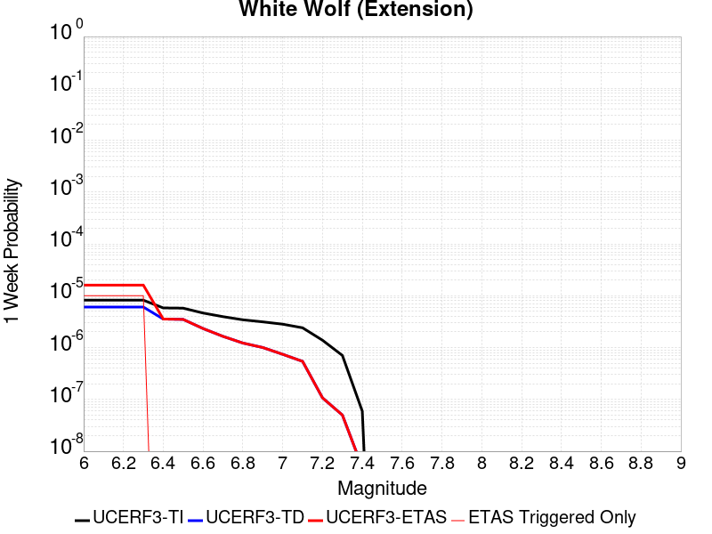 | 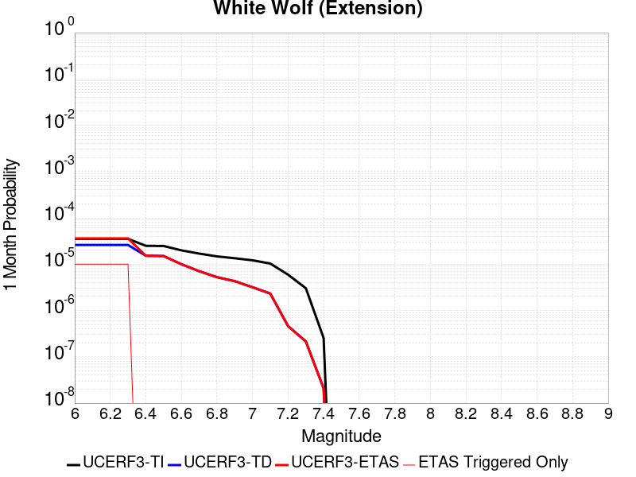 | 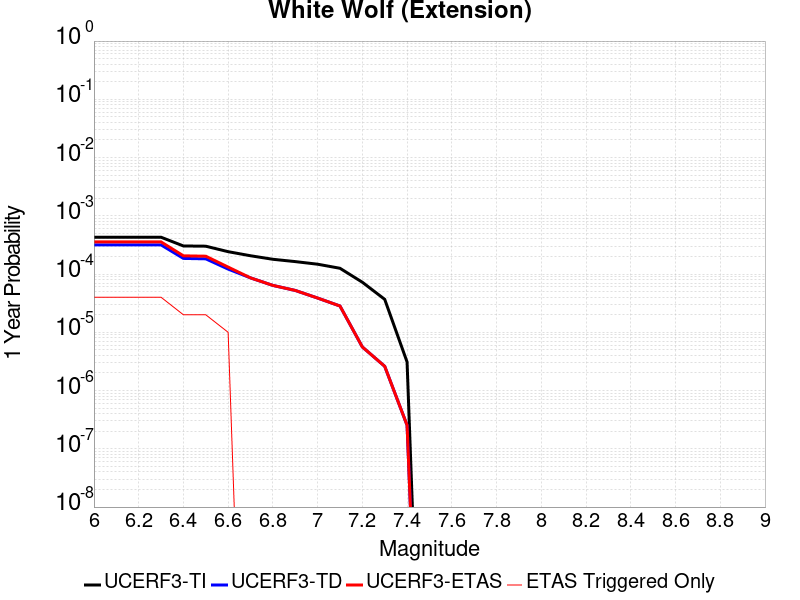 |  |

| Magnitude | 1 wk TI Prob | 1 wk TD Prob | 1 wk ETAS Prob | 1 wk ETAS/TD Gain | 1 wk ETAS Triggered Only | 1 mo TI Prob | 1 mo TD Prob | 1 mo ETAS Prob | 1 mo ETAS/TD Gain | 1 mo ETAS Triggered Only | 1 yr TI Prob | 1 yr TD Prob | 1 yr ETAS Prob | 1 yr ETAS/TD Gain | 1 yr ETAS Triggered Only | 10 yr TI Prob | 10 yr TD Prob | 10 yr ETAS Prob | 10 yr ETAS/TD Gain | 10 yr ETAS Triggered Only |
|-----|-----|-----|-----|-----|-----|-----|-----|-----|-----|-----|-----|-----|-----|-----|-----|-----|-----|-----|-----|-----|
| 6.0 | 8.222555E-6 | 6.0666557E-6 | 1.6066595E-5 | 2.6483445 | 1.0E-5 | 3.5239045E-5 | 2.5999732E-5 | 3.599947E-5 | 1.3846093 | 1.0E-5 | 4.289509E-4 | 3.165074E-4 | 3.564947E-4 | 1.1263393 | 4.0E-5 | 0.0042812387 | 0.0031612178 | 0.0032110598 | 1.0157667 | 5.0E-5 |
| 6.1 | 8.222555E-6 | 6.0666557E-6 | 1.6066595E-5 | 2.6483445 | 1.0E-5 | 3.5239045E-5 | 2.5999732E-5 | 3.599947E-5 | 1.3846093 | 1.0E-5 | 4.289509E-4 | 3.165074E-4 | 3.564947E-4 | 1.1263393 | 4.0E-5 | 0.0042812387 | 0.0031612178 | 0.0032110598 | 1.0157667 | 5.0E-5 |
| 6.2 | 8.222555E-6 | 6.0666557E-6 | 1.6066595E-5 | 2.6483445 | 1.0E-5 | 3.5239045E-5 | 2.5999732E-5 | 3.599947E-5 | 1.3846093 | 1.0E-5 | 4.289509E-4 | 3.165074E-4 | 3.564947E-4 | 1.1263393 | 4.0E-5 | 0.0042812387 | 0.0031612178 | 0.0032110598 | 1.0157667 | 5.0E-5 |
| 6.3 | 8.222555E-6 | 6.0666557E-6 | 1.6066595E-5 | 2.6483445 | 1.0E-5 | 3.5239045E-5 | 2.5999732E-5 | 3.599947E-5 | 1.3846093 | 1.0E-5 | 4.289509E-4 | 3.165074E-4 | 3.564947E-4 | 1.1263393 | 4.0E-5 | 0.0042812387 | 0.0031612178 | 0.0032110598 | 1.0157667 | 5.0E-5 |
| 6.4 | 5.821773E-6 | 3.5571516E-6 | 3.5571516E-6 | 1.0 | 0.0 | 2.4950215E-5 | 1.5244852E-5 | 1.5244852E-5 | 1.0 | 0.0 | 3.0372653E-4 | 1.8559136E-4 | 2.0558765E-4 | 1.1077436 | 2.0E-5 | 0.0030331176 | 0.0018544721 | 0.0018844164 | 1.0161471 | 3.0E-5 |
| 6.5 | 5.766023E-6 | 3.4990853E-6 | 3.4990853E-6 | 1.0 | 0.0 | 2.4711293E-5 | 1.4996E-5 | 1.4996E-5 | 1.0 | 0.0 | 3.0081844E-4 | 1.825621E-4 | 2.0255845E-4 | 1.1095318 | 2.0E-5 | 0.0030041158 | 0.0018242294 | 0.0018541747 | 1.0164154 | 3.0E-5 |
| 6.6 | 4.643576E-6 | 2.3325927E-6 | 2.3325927E-6 | 1.0 | 0.0 | 1.9900888E-5 | 9.99679E-6 | 9.99679E-6 | 1.0 | 0.0 | 2.4226638E-4 | 1.2170455E-4 | 1.3170333E-4 | 1.0821562 | 1.0E-5 | 0.0024200242 | 0.0012164214 | 0.0012363971 | 1.0164217 | 2.0E-5 |
| 6.7 | 3.9529173E-6 | 1.6483134E-6 | 1.6483134E-6 | 1.0 | 0.0 | 1.6940963E-5 | 7.0641822E-6 | 7.0641822E-6 | 1.0 | 0.0 | 2.0623671E-4 | 8.6003216E-5 | 8.6003216E-5 | 1.0 | 0.0 | 0.002060454 | 8.5971784E-4 | 8.6970924E-4 | 1.0116217 | 1.0E-5 |
| 6.8 | 3.4377522E-6 | 1.2244896E-6 | 1.2244896E-6 | 1.0 | 0.0 | 1.473314E-5 | 5.247802E-6 | 5.247802E-6 | 1.0 | 0.0 | 1.7936122E-4 | 6.389021E-5 | 6.389021E-5 | 1.0 | 0.0 | 0.0017921652 | 6.3872756E-4 | 6.487212E-4 | 1.0156461 | 1.0E-5 |
| 6.9 | 3.1367306E-6 | 1.0033432E-6 | 1.0033432E-6 | 1.0 | 0.0 | 1.3443062E-5 | 4.300036E-6 | 4.300036E-6 | 1.0 | 0.0 | 1.63657E-4 | 5.2351756E-5 | 5.2351756E-5 | 1.0 | 0.0 | 0.0016353652 | 5.234019E-4 | 5.333966E-4 | 1.0190958 | 1.0E-5 |
| 7.0 | 2.8298145E-6 | 7.4283355E-7 | 7.4283355E-7 | 1.0 | 0.0 | 1.2127721E-5 | 3.1835689E-6 | 3.1835689E-6 | 1.0 | 0.0 | 1.47645E-4 | 3.875931E-5 | 3.875931E-5 | 1.0 | 0.0 | 0.0014754693 | 3.875305E-4 | 3.9752663E-4 | 1.0257944 | 1.0E-5 |
| 7.1 | 2.4091064E-6 | 5.422472E-7 | 5.422472E-7 | 1.0 | 0.0 | 1.03247E-5 | 2.323915E-6 | 2.323915E-6 | 1.0 | 0.0 | 1.2569598E-4 | 2.8293338E-5 | 2.8293338E-5 | 1.0 | 0.0 | 0.001256249 | 2.829014E-4 | 2.9289856E-4 | 1.035338 | 1.0E-5 |
| 7.2 | 1.3875518E-6 | 1.074062E-7 | 1.074062E-7 | 1.0 | 0.0 | 5.9466374E-6 | 4.603122E-7 | 4.603122E-7 | 1.0 | 0.0 | 7.23979E-5 | 5.604288E-6 | 5.604288E-6 | 1.0 | 0.0 | 7.2374323E-4 | 5.604158E-5 | 6.604102E-5 | 1.1784289 | 1.0E-5 |
| 7.3 | 7.056077E-7 | 5.0005806E-8 | 5.0005806E-8 | 1.0 | 0.0 | 3.0240296E-6 | 2.1431059E-7 | 2.1431059E-7 | 1.0 | 0.0 | 3.681694E-5 | 2.6092287E-6 | 2.6092287E-6 | 1.0 | 0.0 | 3.681084E-4 | 2.6092028E-5 | 2.6092028E-5 | 1.0 | 0.0 |
| 7.4 | 5.9334678E-8 | 4.8638475E-9 | 4.8638475E-9 | 1.0 | 0.0 | 2.5429145E-7 | 2.084506E-8 | 2.084506E-8 | 1.0 | 0.0 | 3.095994E-6 | 2.5378858E-7 | 2.5378858E-7 | 1.0 | 0.0 | 3.095951E-5 | 2.5378843E-6 | 2.5378843E-6 | 1.0 | 0.0 |

## Sierra Nevada  (No Extension)
*[(top)](#table-of-contents)*

| 1 Week | 1 Month | 1 Year | 10 Year |
|-----|-----|-----|-----|
|  |  |  |  |

| Magnitude | 1 wk TI Prob | 1 wk TD Prob | 1 wk ETAS Prob | 1 wk ETAS/TD Gain | 1 wk ETAS Triggered Only | 1 mo TI Prob | 1 mo TD Prob | 1 mo ETAS Prob | 1 mo ETAS/TD Gain | 1 mo ETAS Triggered Only | 1 yr TI Prob | 1 yr TD Prob | 1 yr ETAS Prob | 1 yr ETAS/TD Gain | 1 yr ETAS Triggered Only | 10 yr TI Prob | 10 yr TD Prob | 10 yr ETAS Prob | 10 yr ETAS/TD Gain | 10 yr ETAS Triggered Only |
|-----|-----|-----|-----|-----|-----|-----|-----|-----|-----|-----|-----|-----|-----|-----|-----|-----|-----|-----|-----|-----|
| 6.0 | 7.7690465E-6 | 6.9763464E-6 | 6.9763464E-6 | 1.0 | 0.0 | 3.329549E-5 | 2.9898487E-5 | 2.9898487E-5 | 1.0 | 0.0 | 4.0529718E-4 | 3.6398912E-4 | 3.8398185E-4 | 1.0549268 | 2.0E-5 | 0.004045588 | 0.0036374456 | 0.0036872637 | 1.013696 | 5.0E-5 |
| 6.1 | 7.7690465E-6 | 6.9763464E-6 | 6.9763464E-6 | 1.0 | 0.0 | 3.329549E-5 | 2.9898487E-5 | 2.9898487E-5 | 1.0 | 0.0 | 4.0529718E-4 | 3.6398912E-4 | 3.8398185E-4 | 1.0549268 | 2.0E-5 | 0.004045588 | 0.0036374456 | 0.0036872637 | 1.013696 | 5.0E-5 |
| 6.2 | 7.7690465E-6 | 6.9763464E-6 | 6.9763464E-6 | 1.0 | 0.0 | 3.329549E-5 | 2.9898487E-5 | 2.9898487E-5 | 1.0 | 0.0 | 4.0529718E-4 | 3.6398912E-4 | 3.8398185E-4 | 1.0549268 | 2.0E-5 | 0.004045588 | 0.0036374456 | 0.0036872637 | 1.013696 | 5.0E-5 |
| 6.3 | 7.7690465E-6 | 6.9763464E-6 | 6.9763464E-6 | 1.0 | 0.0 | 3.329549E-5 | 2.9898487E-5 | 2.9898487E-5 | 1.0 | 0.0 | 4.0529718E-4 | 3.6398912E-4 | 3.8398185E-4 | 1.0549268 | 2.0E-5 | 0.004045588 | 0.0036374456 | 0.0036872637 | 1.013696 | 5.0E-5 |
| 6.4 | 7.7690465E-6 | 6.9763464E-6 | 6.9763464E-6 | 1.0 | 0.0 | 3.329549E-5 | 2.9898487E-5 | 2.9898487E-5 | 1.0 | 0.0 | 4.0529718E-4 | 3.6398912E-4 | 3.8398185E-4 | 1.0549268 | 2.0E-5 | 0.004045588 | 0.0036374456 | 0.0036872637 | 1.013696 | 5.0E-5 |
| 6.5 | 7.7690465E-6 | 6.9763464E-6 | 6.9763464E-6 | 1.0 | 0.0 | 3.329549E-5 | 2.9898487E-5 | 2.9898487E-5 | 1.0 | 0.0 | 4.0529718E-4 | 3.6398912E-4 | 3.8398185E-4 | 1.0549268 | 2.0E-5 | 0.004045588 | 0.0036374456 | 0.0036872637 | 1.013696 | 5.0E-5 |
| 6.6 | 2.653E-6 | 1.6148447E-6 | 1.6148447E-6 | 1.0 | 0.0 | 1.136995E-5 | 6.9207445E-6 | 6.9207445E-6 | 1.0 | 0.0 | 1.3842035E-4 | 8.425684E-5 | 1.0425516E-4 | 1.2373494 | 2.0E-5 | 0.0013833415 | 8.422524E-4 | 8.7222713E-4 | 1.0355887 | 3.0E-5 |
| 6.7 | 2.5902466E-6 | 1.5501779E-6 | 1.5501779E-6 | 1.0 | 0.0 | 1.11010095E-5 | 6.643603E-6 | 6.643603E-6 | 1.0 | 0.0 | 1.351464E-4 | 8.088289E-5 | 1.00881276E-4 | 1.247251 | 2.0E-5 | 0.0013506424 | 8.0853753E-4 | 8.3851325E-4 | 1.037074 | 3.0E-5 |
| 6.8 | 2.5853892E-6 | 1.5469781E-6 | 1.5469781E-6 | 1.0 | 0.0 | 1.1080193E-5 | 6.6298894E-6 | 6.6298894E-6 | 1.0 | 0.0 | 1.34893E-4 | 8.0715945E-5 | 1.0071433E-4 | 1.2477626 | 2.0E-5 | 0.0013481114 | 8.0686924E-4 | 8.36845E-4 | 1.0371507 | 3.0E-5 |
| 6.9 | 2.458257E-6 | 1.4220519E-6 | 1.4220519E-6 | 1.0 | 0.0 | 1.0535345E-5 | 6.094494E-6 | 6.094494E-6 | 1.0 | 0.0 | 1.2826028E-4 | 7.419796E-5 | 9.4196475E-5 | 1.2695292 | 2.0E-5 | 0.0012818627 | 7.417338E-4 | 7.717115E-4 | 1.0404158 | 3.0E-5 |
| 7.0 | 2.4341468E-6 | 1.3990157E-6 | 1.3990157E-6 | 1.0 | 0.0 | 1.0432016E-5 | 5.995768E-6 | 5.995768E-6 | 1.0 | 0.0 | 1.270024E-4 | 7.2996045E-5 | 9.299459E-5 | 1.2739674 | 2.0E-5 | 0.0012692984 | 7.297226E-4 | 7.597007E-4 | 1.0410815 | 3.0E-5 |
| 7.1 | 2.3652476E-6 | 1.3339652E-6 | 1.3339652E-6 | 1.0 | 0.0 | 1.0136736E-5 | 5.716981E-6 | 5.716981E-6 | 1.0 | 0.0 | 1.2340778E-4 | 6.9602036E-5 | 8.9600646E-5 | 1.2873279 | 2.0E-5 | 0.0012333926 | 6.958041E-4 | 7.2578323E-4 | 1.0430856 | 3.0E-5 |
| 7.2 | 2.272158E-6 | 1.2502717E-6 | 1.2502717E-6 | 1.0 | 0.0 | 9.737784E-6 | 5.358296E-6 | 5.358296E-6 | 1.0 | 0.0 | 1.1855107E-4 | 6.523532E-5 | 8.5234016E-5 | 1.3065624 | 2.0E-5 | 0.0011848784 | 6.521632E-4 | 6.821436E-4 | 1.0459708 | 3.0E-5 |
| 7.3 | 2.1382127E-6 | 1.1419595E-6 | 1.1419595E-6 | 1.0 | 0.0 | 9.163737E-6 | 4.8941033E-6 | 4.8941033E-6 | 1.0 | 0.0 | 1.1156279E-4 | 5.9584087E-5 | 7.95829E-5 | 1.3356401 | 2.0E-5 | 0.001115068 | 5.956823E-4 | 6.256644E-4 | 1.0503324 | 3.0E-5 |
| 7.4 | 1.9048055E-6 | 9.57513E-7 | 9.57513E-7 | 1.0 | 0.0 | 8.163426E-6 | 4.1036205E-6 | 4.1036205E-6 | 1.0 | 0.0 | 9.9385186E-5 | 4.996044E-5 | 6.995944E-5 | 1.4002967 | 2.0E-5 | 9.934074E-4 | 4.9949274E-4 | 5.294778E-4 | 1.0600309 | 3.0E-5 |
| 7.5 | 1.5373403E-6 | 7.559938E-7 | 7.559938E-7 | 1.0 | 0.0 | 6.5885843E-6 | 3.2399694E-6 | 3.2399694E-6 | 1.0 | 0.0 | 8.021306E-5 | 3.944592E-5 | 5.944513E-5 | 1.5070033 | 2.0E-5 | 8.0184115E-4 | 3.9438964E-4 | 4.1438176E-4 | 1.0506912 | 2.0E-5 |
| 7.6 | 1.0680322E-6 | 4.6595343E-7 | 4.6595343E-7 | 1.0 | 0.0 | 4.577273E-6 | 1.9969418E-6 | 1.9969418E-6 | 1.0 | 0.0 | 5.5726876E-5 | 2.4312498E-5 | 4.431201E-5 | 1.8226022 | 2.0E-5 | 5.5712904E-4 | 2.4309864E-4 | 2.6309377E-4 | 1.0822511 | 2.0E-5 |
| 7.7 | 5.509146E-7 | 1.5579108E-7 | 1.5579108E-7 | 1.0 | 0.0 | 2.3610605E-6 | 6.676759E-7 | 6.676759E-7 | 1.0 | 0.0 | 2.8745531E-5 | 8.128925E-6 | 8.128925E-6 | 1.0 | 0.0 | 2.8741814E-4 | 8.1286395E-5 | 8.1286395E-5 | 1.0 | 0.0 |

## San Jacinto (Stepovers Combined)
*[(top)](#table-of-contents)*

| 1 Week | 1 Month | 1 Year | 10 Year |
|-----|-----|-----|-----|
|  |  | 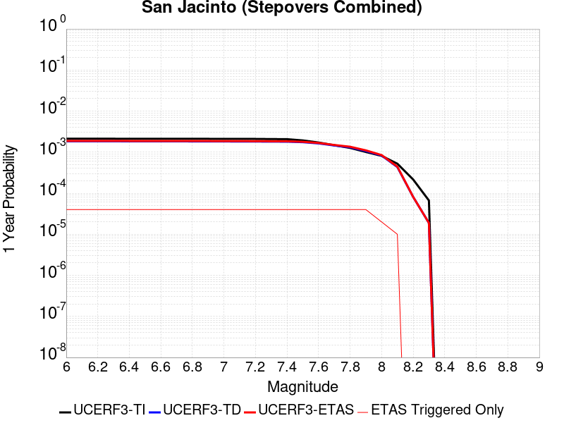 | 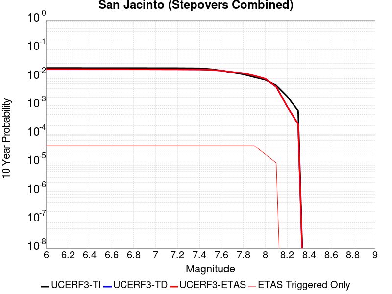 |

| Magnitude | 1 wk TI Prob | 1 wk TD Prob | 1 wk ETAS Prob | 1 wk ETAS/TD Gain | 1 wk ETAS Triggered Only | 1 mo TI Prob | 1 mo TD Prob | 1 mo ETAS Prob | 1 mo ETAS/TD Gain | 1 mo ETAS Triggered Only | 1 yr TI Prob | 1 yr TD Prob | 1 yr ETAS Prob | 1 yr ETAS/TD Gain | 1 yr ETAS Triggered Only | 10 yr TI Prob | 10 yr TD Prob | 10 yr ETAS Prob | 10 yr ETAS/TD Gain | 10 yr ETAS Triggered Only |
|-----|-----|-----|-----|-----|-----|-----|-----|-----|-----|-----|-----|-----|-----|-----|-----|-----|-----|-----|-----|-----|
| 6.0 | 4.0667746E-5 | 3.5285528E-5 | 4.5285175E-5 | 1.2833923 | 1.0E-5 | 1.742787E-4 | 1.5121493E-4 | 1.6121342E-4 | 1.066121 | 1.0E-5 | 0.0021197782 | 0.0018394884 | 0.0018794148 | 1.0217052 | 4.0E-5 | 0.020996714 | 0.018993655 | 0.019032896 | 1.002066 | 4.0E-5 |
| 6.1 | 4.0667746E-5 | 3.5285528E-5 | 4.5285175E-5 | 1.2833923 | 1.0E-5 | 1.742787E-4 | 1.5121493E-4 | 1.6121342E-4 | 1.066121 | 1.0E-5 | 0.0021197782 | 0.0018394884 | 0.0018794148 | 1.0217052 | 4.0E-5 | 0.020996714 | 0.018993655 | 0.019032896 | 1.002066 | 4.0E-5 |
| 6.2 | 4.0667746E-5 | 3.5285528E-5 | 4.5285175E-5 | 1.2833923 | 1.0E-5 | 1.742787E-4 | 1.5121493E-4 | 1.6121342E-4 | 1.066121 | 1.0E-5 | 0.0021197782 | 0.0018394884 | 0.0018794148 | 1.0217052 | 4.0E-5 | 0.020996714 | 0.018993655 | 0.019032896 | 1.002066 | 4.0E-5 |
| 6.3 | 4.0667746E-5 | 3.5285528E-5 | 4.5285175E-5 | 1.2833923 | 1.0E-5 | 1.742787E-4 | 1.5121493E-4 | 1.6121342E-4 | 1.066121 | 1.0E-5 | 0.0021197782 | 0.0018394884 | 0.0018794148 | 1.0217052 | 4.0E-5 | 0.020996714 | 0.018993655 | 0.019032896 | 1.002066 | 4.0E-5 |
| 6.4 | 4.0577226E-5 | 3.515743E-5 | 4.515708E-5 | 1.2844249 | 1.0E-5 | 1.738908E-4 | 1.5066602E-4 | 1.6066451E-4 | 1.066362 | 1.0E-5 | 0.0021150648 | 0.0018328178 | 0.0018727445 | 1.0217843 | 4.0E-5 | 0.020950472 | 0.018928219 | 0.018967463 | 1.0020733 | 4.0E-5 |
| 6.5 | 4.0577226E-5 | 3.515743E-5 | 4.515708E-5 | 1.2844249 | 1.0E-5 | 1.738908E-4 | 1.5066602E-4 | 1.6066451E-4 | 1.066362 | 1.0E-5 | 0.0021150648 | 0.0018328178 | 0.0018727445 | 1.0217843 | 4.0E-5 | 0.020950472 | 0.018928219 | 0.018967463 | 1.0020733 | 4.0E-5 |
| 6.6 | 4.053861E-5 | 3.510277E-5 | 4.510242E-5 | 1.2848678 | 1.0E-5 | 1.7372532E-4 | 1.5043179E-4 | 1.6043028E-4 | 1.0664653 | 1.0E-5 | 0.0021130538 | 0.0018299713 | 0.0018698982 | 1.0218183 | 4.0E-5 | 0.020930743 | 0.018900296 | 0.01893954 | 1.0020764 | 4.0E-5 |
| 6.7 | 4.0516545E-5 | 3.5071844E-5 | 4.5071494E-5 | 1.285119 | 1.0E-5 | 1.7363077E-4 | 1.5029925E-4 | 1.6029776E-4 | 1.0665239 | 1.0E-5 | 0.002111905 | 0.0018283607 | 0.0018682876 | 1.0218375 | 4.0E-5 | 0.020919468 | 0.018884491 | 0.018923735 | 1.0020782 | 4.0E-5 |
| 6.8 | 4.049434E-5 | 3.5043406E-5 | 4.5043053E-5 | 1.2853504 | 1.0E-5 | 1.7353562E-4 | 1.501774E-4 | 1.6017588E-4 | 1.0665779 | 1.0E-5 | 0.0021107488 | 0.0018268795 | 0.0018668064 | 1.0218552 | 4.0E-5 | 0.020908125 | 0.018869905 | 0.018909149 | 1.0020797 | 4.0E-5 |
| 6.9 | 4.046386E-5 | 3.5005964E-5 | 4.500561E-5 | 1.2856556 | 1.0E-5 | 1.73405E-4 | 1.5001695E-4 | 1.6001544E-4 | 1.0666491 | 1.0E-5 | 0.0021091616 | 0.0018249294 | 0.0018648563 | 1.0218786 | 4.0E-5 | 0.020892553 | 0.018850677 | 0.018889923 | 1.002082 | 4.0E-5 |
| 7.0 | 4.036382E-5 | 3.4886525E-5 | 4.4886176E-5 | 1.2866336 | 1.0E-5 | 1.7297632E-4 | 1.4950513E-4 | 1.5950363E-4 | 1.0668774 | 1.0E-5 | 0.0021039525 | 0.0018187086 | 0.0018586358 | 1.0219536 | 4.0E-5 | 0.02084144 | 0.018789288 | 0.018828537 | 1.0020889 | 4.0E-5 |
| 7.1 | 4.0343282E-5 | 3.486499E-5 | 4.486464E-5 | 1.2868106 | 1.0E-5 | 1.7288832E-4 | 1.4941284E-4 | 1.5941134E-4 | 1.0669186 | 1.0E-5 | 0.002102883 | 0.0018175867 | 0.001857514 | 1.0219672 | 4.0E-5 | 0.020830948 | 0.018778158 | 0.018817408 | 1.0020901 | 4.0E-5 |
| 7.2 | 4.0257353E-5 | 3.476948E-5 | 4.4769135E-5 | 1.2875985 | 1.0E-5 | 1.725201E-4 | 1.4900356E-4 | 1.5900208E-4 | 1.0671024 | 1.0E-5 | 0.0020984085 | 0.0018126123 | 0.0018525397 | 1.0220276 | 4.0E-5 | 0.020787042 | 0.018728893 | 0.018768143 | 1.0020957 | 4.0E-5 |
| 7.3 | 3.9940667E-5 | 3.459712E-5 | 4.4596774E-5 | 1.2890314 | 1.0E-5 | 1.7116306E-4 | 1.4826495E-4 | 1.5826347E-4 | 1.0674368 | 1.0E-5 | 0.0020819185 | 0.0018036346 | 0.0018435625 | 1.0221374 | 4.0E-5 | 0.020625217 | 0.018637514 | 0.018676767 | 1.0021062 | 4.0E-5 |
| 7.4 | 3.9721202E-5 | 3.44825E-5 | 4.4482153E-5 | 1.2899922 | 1.0E-5 | 1.7022261E-4 | 1.4777378E-4 | 1.577723E-4 | 1.067661 | 1.0E-5 | 0.0020704903 | 0.0017976643 | 0.0018375925 | 1.0222111 | 4.0E-5 | 0.020513052 | 0.018576635 | 0.018615892 | 1.0021132 | 4.0E-5 |
| 7.5 | 3.7036873E-5 | 3.354985E-5 | 4.3549517E-5 | 1.2980539 | 1.0E-5 | 1.5871979E-4 | 1.4377717E-4 | 1.5377573E-4 | 1.069542 | 1.0E-5 | 0.0019307006 | 0.0017490846 | 0.0017890146 | 1.022829 | 4.0E-5 | 0.019140124 | 0.018078115 | 0.01811739 | 1.0021726 | 4.0E-5 |
| 7.6 | 3.2940967E-5 | 3.1330474E-5 | 4.133016E-5 | 1.3191681 | 1.0E-5 | 1.4116794E-4 | 1.3426656E-4 | 1.4426523E-4 | 1.0744687 | 1.0E-5 | 0.0017173645 | 0.001633472 | 0.0016734067 | 1.0244477 | 4.0E-5 | 0.01704153 | 0.01691088 | 0.016950205 | 1.0023253 | 4.0E-5 |
| 7.7 | 2.8236149E-5 | 2.7896147E-5 | 3.789587E-5 | 1.3584625 | 1.0E-5 | 1.2100645E-4 | 1.1954944E-4 | 1.2954825E-4 | 1.0836374 | 1.0E-5 | 0.0014722579 | 0.0014545437 | 0.0014944855 | 1.02746 | 4.0E-5 | 0.014625421 | 0.015121453 | 0.015160848 | 1.0026052 | 4.0E-5 |
| 7.8 | 2.4329287E-5 | 2.5219388E-5 | 3.5219135E-5 | 1.3965104 | 1.0E-5 | 1.042642E-4 | 1.0807862E-4 | 1.18077536E-4 | 1.0925152 | 1.0E-5 | 0.0012686774 | 0.0013150638 | 0.0013550111 | 1.0303768 | 4.0E-5 | 0.012614589 | 0.013718468 | 0.013757919 | 1.0028758 | 4.0E-5 |
| 7.9 | 1.9370926E-5 | 2.0432055E-5 | 3.043185E-5 | 1.4894171 | 1.0E-5 | 8.301561E-5 | 8.7563014E-5 | 9.756214E-5 | 1.1141934 | 1.0E-5 | 0.0010102465 | 0.001065559 | 0.0011055165 | 1.037499 | 4.0E-5 | 0.0100566605 | 0.011205053 | 0.011244604 | 1.0035298 | 4.0E-5 |
| 8.0 | 1.5583017E-5 | 1.5895175E-5 | 2.5895015E-5 | 1.6291118 | 1.0E-5 | 6.6782646E-5 | 6.8120404E-5 | 7.811972E-5 | 1.146789 | 1.0E-5 | 8.127754E-4 | 8.29051E-4 | 8.490344E-4 | 1.024104 | 2.0E-5 | 0.008098091 | 0.008786416 | 0.00880624 | 1.0022563 | 2.0E-5 |
| 8.1 | 1.0024873E-5 | 8.297121E-6 | 8.297121E-6 | 1.0 | 0.0 | 4.2963035E-5 | 3.5558605E-5 | 3.5558605E-5 | 1.0 | 0.0 | 5.229494E-4 | 4.3284055E-4 | 4.4283623E-4 | 1.0230932 | 1.0E-5 | 0.0052172043 | 0.00465596 | 0.004665913 | 1.0021378 | 1.0E-5 |
| 8.2 | 4.142796E-6 | 1.5619446E-6 | 1.5619446E-6 | 1.0 | 0.0 | 1.775472E-5 | 6.6940315E-6 | 6.6940315E-6 | 1.0 | 0.0 | 2.1614227E-4 | 8.1496815E-5 | 8.1496815E-5 | 1.0 | 0.0 | 0.0021593217 | 9.4601413E-4 | 9.4601413E-4 | 1.0 | 0.0 |
| 8.3 | 1.2750878E-6 | 3.6143226E-7 | 3.6143226E-7 | 1.0 | 0.0 | 5.4646503E-6 | 1.5489944E-6 | 1.5489944E-6 | 1.0 | 0.0 | 6.653009E-5 | 1.8858847E-5 | 1.8858847E-5 | 1.0 | 0.0 | 6.6510175E-4 | 2.2747046E-4 | 2.2747046E-4 | 1.0 | 0.0 |

## Red Pass
*[(top)](#table-of-contents)*

| 1 Week | 1 Month | 1 Year | 10 Year |
|-----|-----|-----|-----|
|  |  | 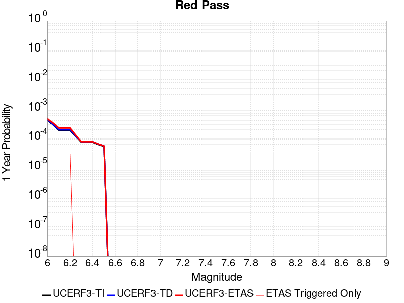 | 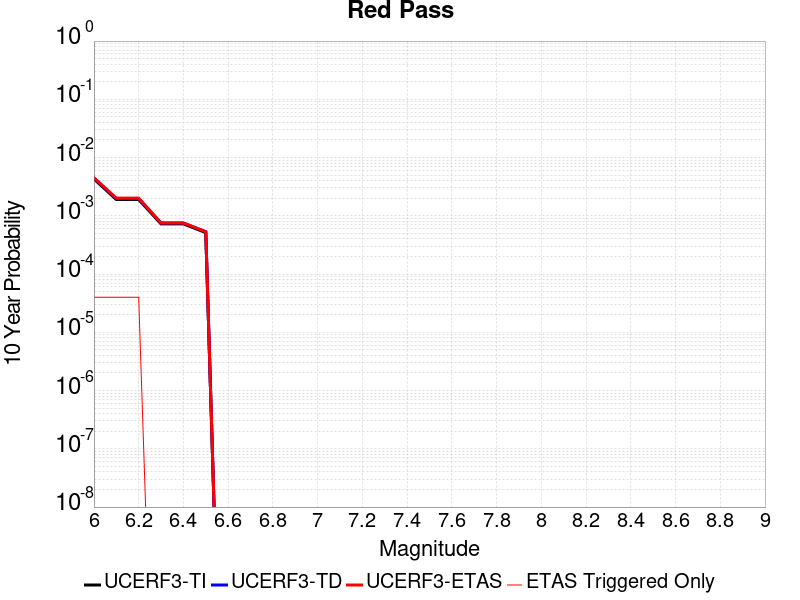 |

| Magnitude | 1 wk TI Prob | 1 wk TD Prob | 1 wk ETAS Prob | 1 wk ETAS/TD Gain | 1 wk ETAS Triggered Only | 1 mo TI Prob | 1 mo TD Prob | 1 mo ETAS Prob | 1 mo ETAS/TD Gain | 1 mo ETAS Triggered Only | 1 yr TI Prob | 1 yr TD Prob | 1 yr ETAS Prob | 1 yr ETAS/TD Gain | 1 yr ETAS Triggered Only | 10 yr TI Prob | 10 yr TD Prob | 10 yr ETAS Prob | 10 yr ETAS/TD Gain | 10 yr ETAS Triggered Only |
|-----|-----|-----|-----|-----|-----|-----|-----|-----|-----|-----|-----|-----|-----|-----|-----|-----|-----|-----|-----|-----|
| 6.0 | 8.258278E-6 | 8.551305E-6 | 8.551305E-6 | 1.0 | 0.0 | 3.539214E-5 | 3.6648038E-5 | 4.664767E-5 | 1.2728559 | 1.0E-5 | 4.308141E-4 | 4.4611638E-4 | 4.7610298E-4 | 1.067217 | 3.0E-5 | 0.0042997985 | 0.004453966 | 0.0044937874 | 1.0089408 | 4.0E-5 |
| 6.1 | 3.649988E-6 | 3.7753332E-6 | 3.7753332E-6 | 1.0 | 0.0 | 1.5642712E-5 | 1.6179927E-5 | 2.6179765E-5 | 1.6180398 | 1.0E-5 | 1.9043336E-4 | 1.9697756E-4 | 2.2697165E-4 | 1.1522716 | 3.0E-5 | 0.0019027026 | 0.001968497 | 0.0020084183 | 1.0202801 | 4.0E-5 |
| 6.2 | 3.649988E-6 | 3.7753332E-6 | 3.7753332E-6 | 1.0 | 0.0 | 1.5642712E-5 | 1.6179927E-5 | 2.6179765E-5 | 1.6180398 | 1.0E-5 | 1.9043336E-4 | 1.9697756E-4 | 2.2697165E-4 | 1.1522716 | 3.0E-5 | 0.0019027026 | 0.001968497 | 0.0020084183 | 1.0202801 | 4.0E-5 |
| 6.3 | 1.3924937E-6 | 1.4411233E-6 | 1.4411233E-6 | 1.0 | 0.0 | 5.9678164E-6 | 6.176236E-6 | 6.176236E-6 | 1.0 | 0.0 | 7.265574E-5 | 7.51945E-5 | 7.51945E-5 | 1.0 | 0.0 | 7.263199E-4 | 7.518293E-4 | 7.518293E-4 | 1.0 | 0.0 |
| 6.4 | 1.3924937E-6 | 1.4411233E-6 | 1.4411233E-6 | 1.0 | 0.0 | 5.9678164E-6 | 6.176236E-6 | 6.176236E-6 | 1.0 | 0.0 | 7.265574E-5 | 7.51945E-5 | 7.51945E-5 | 1.0 | 0.0 | 7.263199E-4 | 7.518293E-4 | 7.518293E-4 | 1.0 | 0.0 |
| 6.5 | 9.876812E-7 | 1.022196E-6 | 1.022196E-6 | 1.0 | 0.0 | 4.2329125E-6 | 4.38084E-6 | 4.38084E-6 | 1.0 | 0.0 | 5.153449E-5 | 5.3336724E-5 | 5.3336724E-5 | 1.0 | 0.0 | 5.1522546E-4 | 5.333672E-4 | 5.333672E-4 | 1.0 | 0.0 |

## Mission Creek
*[(top)](#table-of-contents)*

| 1 Week | 1 Month | 1 Year | 10 Year |
|-----|-----|-----|-----|
|  | 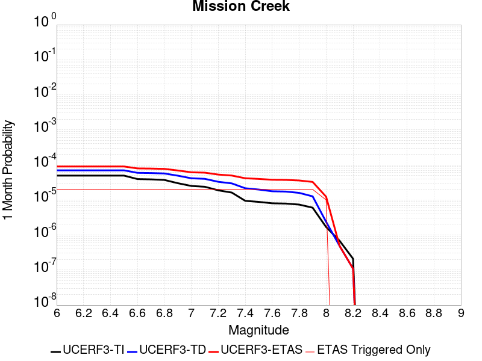 |  |  |

| Magnitude | 1 wk TI Prob | 1 wk TD Prob | 1 wk ETAS Prob | 1 wk ETAS/TD Gain | 1 wk ETAS Triggered Only | 1 mo TI Prob | 1 mo TD Prob | 1 mo ETAS Prob | 1 mo ETAS/TD Gain | 1 mo ETAS Triggered Only | 1 yr TI Prob | 1 yr TD Prob | 1 yr ETAS Prob | 1 yr ETAS/TD Gain | 1 yr ETAS Triggered Only | 10 yr TI Prob | 10 yr TD Prob | 10 yr ETAS Prob | 10 yr ETAS/TD Gain | 10 yr ETAS Triggered Only |
|-----|-----|-----|-----|-----|-----|-----|-----|-----|-----|-----|-----|-----|-----|-----|-----|-----|-----|-----|-----|-----|
| 6.0 | 1.1549387E-5 | 1.6325142E-5 | 1.6325142E-5 | 1.0 | 0.0 | 4.9496433E-5 | 6.9963105E-5 | 8.99617E-5 | 1.2858449 | 2.0E-5 | 6.0245243E-4 | 8.514829E-4 | 8.914489E-4 | 1.0469369 | 4.0E-5 | 0.006008218 | 0.008511699 | 0.008551358 | 1.0046594 | 4.0E-5 |
| 6.1 | 1.1549387E-5 | 1.6325142E-5 | 1.6325142E-5 | 1.0 | 0.0 | 4.9496433E-5 | 6.9963105E-5 | 8.99617E-5 | 1.2858449 | 2.0E-5 | 6.0245243E-4 | 8.514829E-4 | 8.914489E-4 | 1.0469369 | 4.0E-5 | 0.006008218 | 0.008511699 | 0.008551358 | 1.0046594 | 4.0E-5 |
| 6.2 | 1.1549387E-5 | 1.6325142E-5 | 1.6325142E-5 | 1.0 | 0.0 | 4.9496433E-5 | 6.9963105E-5 | 8.99617E-5 | 1.2858449 | 2.0E-5 | 6.0245243E-4 | 8.514829E-4 | 8.914489E-4 | 1.0469369 | 4.0E-5 | 0.006008218 | 0.008511699 | 0.008551358 | 1.0046594 | 4.0E-5 |
| 6.3 | 1.1549387E-5 | 1.6325142E-5 | 1.6325142E-5 | 1.0 | 0.0 | 4.9496433E-5 | 6.9963105E-5 | 8.99617E-5 | 1.2858449 | 2.0E-5 | 6.0245243E-4 | 8.514829E-4 | 8.914489E-4 | 1.0469369 | 4.0E-5 | 0.006008218 | 0.008511699 | 0.008551358 | 1.0046594 | 4.0E-5 |
| 6.4 | 1.1549387E-5 | 1.6325142E-5 | 1.6325142E-5 | 1.0 | 0.0 | 4.9496433E-5 | 6.9963105E-5 | 8.99617E-5 | 1.2858449 | 2.0E-5 | 6.0245243E-4 | 8.514829E-4 | 8.914489E-4 | 1.0469369 | 4.0E-5 | 0.006008218 | 0.008511699 | 0.008551358 | 1.0046594 | 4.0E-5 |
| 6.5 | 1.1549387E-5 | 1.6325142E-5 | 1.6325142E-5 | 1.0 | 0.0 | 4.9496433E-5 | 6.9963105E-5 | 8.99617E-5 | 1.2858449 | 2.0E-5 | 6.0245243E-4 | 8.514829E-4 | 8.914489E-4 | 1.0469369 | 4.0E-5 | 0.006008218 | 0.008511699 | 0.008551358 | 1.0046594 | 4.0E-5 |
| 6.6 | 9.202681E-6 | 1.3848401E-5 | 1.3848401E-5 | 1.0 | 0.0 | 3.9439463E-5 | 5.934899E-5 | 7.93478E-5 | 1.3369697 | 2.0E-5 | 4.800697E-4 | 7.2234345E-4 | 7.6231454E-4 | 1.0553353 | 4.0E-5 | 0.004790339 | 0.0072288746 | 0.0072685857 | 1.0054934 | 4.0E-5 |
| 6.7 | 9.019164E-6 | 1.3654068E-5 | 1.3654068E-5 | 1.0 | 0.0 | 3.8652986E-5 | 5.8516176E-5 | 7.8515004E-5 | 1.3417659 | 2.0E-5 | 4.7049852E-4 | 7.1221055E-4 | 7.521821E-4 | 1.0561231 | 4.0E-5 | 0.004695036 | 0.0071281986 | 0.0071679135 | 1.0055715 | 4.0E-5 |
| 6.8 | 8.673558E-6 | 1.3276174E-5 | 1.3276174E-5 | 1.0 | 0.0 | 3.717186E-5 | 5.68967E-5 | 7.689556E-5 | 1.3514942 | 2.0E-5 | 4.524734E-4 | 6.92506E-4 | 7.324783E-4 | 1.0577213 | 4.0E-5 | 0.0045155324 | 0.0069323843 | 0.006972107 | 1.00573 | 4.0E-5 |
| 6.9 | 7.002255E-6 | 1.1480386E-5 | 1.1480386E-5 | 1.0 | 0.0 | 3.000932E-5 | 4.9200764E-5 | 6.919978E-5 | 1.4064778 | 2.0E-5 | 3.653022E-4 | 5.988615E-4 | 6.388376E-4 | 1.0667534 | 4.0E-5 | 0.0036470229 | 0.0060011996 | 0.0060409596 | 1.0066253 | 4.0E-5 |
| 7.0 | 5.84644E-6 | 9.677556E-6 | 9.677556E-6 | 1.0 | 0.0 | 2.5055931E-5 | 4.1474606E-5 | 6.147377E-5 | 1.4822028 | 2.0E-5 | 3.0501327E-4 | 5.0484086E-4 | 5.448207E-4 | 1.0791929 | 4.0E-5 | 0.0030459496 | 0.0050654565 | 0.005105254 | 1.0078566 | 4.0E-5 |
| 7.1 | 5.54703E-6 | 9.332022E-6 | 9.332022E-6 | 1.0 | 0.0 | 2.377277E-5 | 3.9993793E-5 | 5.999299E-5 | 1.5000576 | 2.0E-5 | 2.8939504E-4 | 4.868201E-4 | 5.2680064E-4 | 1.0821259 | 4.0E-5 | 0.0028901845 | 0.004886046 | 0.0049258503 | 1.0081465 | 4.0E-5 |
| 7.2 | 4.384709E-6 | 7.683992E-6 | 7.683992E-6 | 1.0 | 0.0 | 1.8791474E-5 | 3.2931002E-5 | 5.2930343E-5 | 1.6073104 | 2.0E-5 | 2.2876218E-4 | 4.0086484E-4 | 4.408488E-4 | 1.0997442 | 4.0E-5 | 0.0022852682 | 0.0040298863 | 0.004069725 | 1.0098858 | 4.0E-5 |
| 7.3 | 3.7888456E-6 | 6.917821E-6 | 6.917821E-6 | 1.0 | 0.0 | 1.623781E-5 | 2.9647486E-5 | 4.9646893E-5 | 1.6745734 | 2.0E-5 | 1.9767738E-4 | 3.609017E-4 | 4.0088728E-4 | 1.1107935 | 4.0E-5 | 0.0019750162 | 0.0036316153 | 0.00367147 | 1.0109744 | 4.0E-5 |
| 7.4 | 2.1982462E-6 | 5.026073E-6 | 5.026073E-6 | 1.0 | 0.0 | 9.421021E-6 | 2.1540136E-5 | 4.1539704E-5 | 1.9284792 | 2.0E-5 | 1.1469489E-4 | 2.6221978E-4 | 3.022093E-4 | 1.1525038 | 4.0E-5 | 0.0011463572 | 0.0026473494 | 0.0026872435 | 1.0150695 | 4.0E-5 |
| 7.5 | 2.051923E-6 | 4.617237E-6 | 4.617237E-6 | 1.0 | 0.0 | 8.793926E-6 | 1.978801E-5 | 3.9787614E-5 | 2.010693 | 2.0E-5 | 1.0706078E-4 | 2.4089254E-4 | 2.808829E-4 | 1.1660092 | 4.0E-5 | 0.0010700922 | 0.0024350125 | 0.002474915 | 1.016387 | 4.0E-5 |
| 7.6 | 1.8733427E-6 | 4.125508E-6 | 4.125508E-6 | 1.0 | 0.0 | 8.028587E-6 | 1.768063E-5 | 3.7680275E-5 | 2.1311615 | 2.0E-5 | 9.774366E-5 | 2.1524049E-4 | 2.552319E-4 | 1.1857986 | 4.0E-5 | 9.770069E-4 | 0.002179529 | 0.0022194418 | 1.0183126 | 4.0E-5 |
| 7.7 | 1.8411953E-6 | 4.0451673E-6 | 4.0451673E-6 | 1.0 | 0.0 | 7.890813E-6 | 1.7336315E-5 | 3.733597E-5 | 2.1536276 | 2.0E-5 | 9.606641E-5 | 2.1104928E-4 | 2.5104085E-4 | 1.1894892 | 4.0E-5 | 9.6024893E-4 | 0.0021378102 | 0.0021777248 | 1.0186707 | 4.0E-5 |
| 7.8 | 1.7194251E-6 | 3.7123866E-6 | 3.7123866E-6 | 1.0 | 0.0 | 7.368944E-6 | 1.5910133E-5 | 3.5909812E-5 | 2.2570405 | 2.0E-5 | 8.97132E-5 | 1.9368871E-4 | 2.3368097E-4 | 1.2064769 | 4.0E-5 | 8.967699E-4 | 0.0019636988 | 0.0020036201 | 1.0203297 | 4.0E-5 |
| 7.9 | 1.4035052E-6 | 2.9516495E-6 | 2.9516495E-6 | 1.0 | 0.0 | 6.0150082E-6 | 1.2649865E-5 | 3.2649612E-5 | 2.5810244 | 2.0E-5 | 7.3230265E-5 | 1.5400129E-4 | 1.9399513E-4 | 1.259698 | 4.0E-5 | 7.3206134E-4 | 0.0015642311 | 0.0016041686 | 1.0255316 | 4.0E-5 |
| 8.0 | 3.9318823E-7 | 5.531722E-7 | 5.531722E-7 | 1.0 | 0.0 | 1.6850913E-6 | 2.370736E-6 | 1.2370712E-5 | 5.2180896 | 1.0E-5 | 2.0515794E-5 | 2.8863333E-5 | 4.8862756E-5 | 1.6929007 | 2.0E-5 | 2.0513899E-4 | 2.9927568E-4 | 3.192697E-4 | 1.066808 | 2.0E-5 |
| 8.1 | 1.596793E-7 | 1.13891964E-7 | 1.13891964E-7 | 1.0 | 0.0 | 6.8433974E-7 | 4.881083E-7 | 4.881083E-7 | 1.0 | 0.0 | 8.331805E-6 | 5.942703E-6 | 5.942703E-6 | 1.0 | 0.0 | 8.331492E-5 | 6.555237E-5 | 6.555237E-5 | 1.0 | 0.0 |
| 8.2 | 4.9003038E-8 | 2.5465459E-8 | 2.5465459E-8 | 1.0 | 0.0 | 2.10013E-7 | 1.0913767E-7 | 1.0913767E-7 | 1.0 | 0.0 | 2.5569052E-6 | 1.3287504E-6 | 1.3287504E-6 | 1.0 | 0.0 | 2.556876E-5 | 1.49686575E-5 | 1.49686575E-5 | 1.0 | 0.0 |

## Death Valley (Fish Lake Valley)
*[(top)](#table-of-contents)*

| 1 Week | 1 Month | 1 Year | 10 Year |
|-----|-----|-----|-----|
|  | 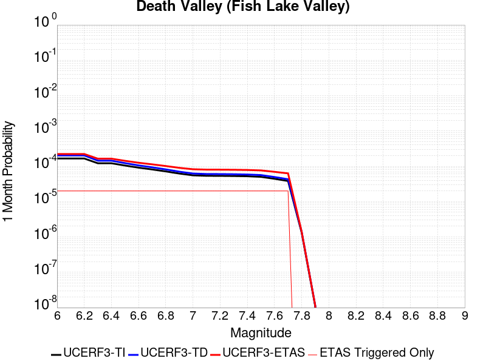 | 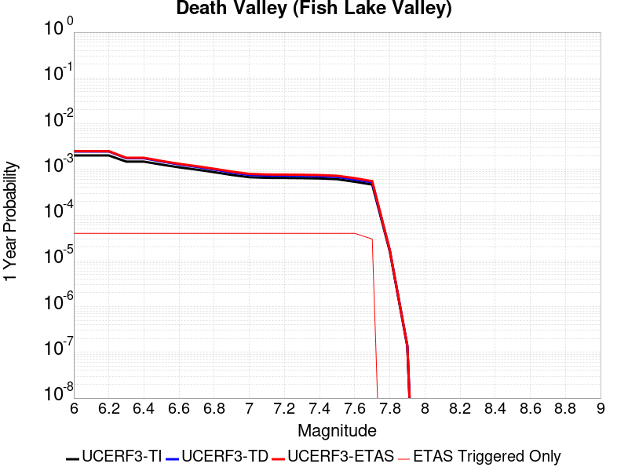 |  |

| Magnitude | 1 wk TI Prob | 1 wk TD Prob | 1 wk ETAS Prob | 1 wk ETAS/TD Gain | 1 wk ETAS Triggered Only | 1 mo TI Prob | 1 mo TD Prob | 1 mo ETAS Prob | 1 mo ETAS/TD Gain | 1 mo ETAS Triggered Only | 1 yr TI Prob | 1 yr TD Prob | 1 yr ETAS Prob | 1 yr ETAS/TD Gain | 1 yr ETAS Triggered Only | 10 yr TI Prob | 10 yr TD Prob | 10 yr ETAS Prob | 10 yr ETAS/TD Gain | 10 yr ETAS Triggered Only |
|-----|-----|-----|-----|-----|-----|-----|-----|-----|-----|-----|-----|-----|-----|-----|-----|-----|-----|-----|-----|-----|
| 6.0 | 3.872328E-5 | 4.7267124E-5 | 6.726618E-5 | 1.423107 | 2.0E-5 | 1.6594635E-4 | 2.0255933E-4 | 2.2255527E-4 | 1.0987165 | 2.0E-5 | 0.0020185246 | 0.002463633 | 0.0025035345 | 1.0161961 | 4.0E-5 | 0.02000288 | 0.024389042 | 0.024428066 | 1.0016 | 4.0E-5 |
| 6.1 | 3.872328E-5 | 4.7267124E-5 | 6.726618E-5 | 1.423107 | 2.0E-5 | 1.6594635E-4 | 2.0255933E-4 | 2.2255527E-4 | 1.0987165 | 2.0E-5 | 0.0020185246 | 0.002463633 | 0.0025035345 | 1.0161961 | 4.0E-5 | 0.02000288 | 0.024389042 | 0.024428066 | 1.0016 | 4.0E-5 |
| 6.2 | 3.872328E-5 | 4.7267124E-5 | 6.726618E-5 | 1.423107 | 2.0E-5 | 1.6594635E-4 | 2.0255933E-4 | 2.2255527E-4 | 1.0987165 | 2.0E-5 | 0.0020185246 | 0.002463633 | 0.0025035345 | 1.0161961 | 4.0E-5 | 0.02000288 | 0.024389042 | 0.024428066 | 1.0016 | 4.0E-5 |
| 6.3 | 2.8356371E-5 | 3.361063E-5 | 5.360996E-5 | 1.5950298 | 2.0E-5 | 1.2152165E-4 | 1.4403803E-4 | 1.6403515E-4 | 1.1388322 | 2.0E-5 | 0.0014785219 | 0.0017523223 | 0.0017922522 | 1.0227869 | 4.0E-5 | 0.014687235 | 0.017392244 | 0.017431548 | 1.0022599 | 4.0E-5 |
| 6.4 | 2.8356371E-5 | 3.361063E-5 | 5.360996E-5 | 1.5950298 | 2.0E-5 | 1.2152165E-4 | 1.4403803E-4 | 1.6403515E-4 | 1.1388322 | 2.0E-5 | 0.0014785219 | 0.0017523223 | 0.0017922522 | 1.0227869 | 4.0E-5 | 0.014687235 | 0.017392244 | 0.017431548 | 1.0022599 | 4.0E-5 |
| 6.5 | 2.4448687E-5 | 2.8608241E-5 | 4.8607668E-5 | 1.6990793 | 2.0E-5 | 1.0477588E-4 | 1.2260124E-4 | 1.4259879E-4 | 1.1631105 | 2.0E-5 | 0.0012748998 | 0.0014916958 | 0.0015316361 | 1.0267751 | 4.0E-5 | 0.012676105 | 0.014821727 | 0.014861134 | 1.0026587 | 4.0E-5 |
| 6.6 | 2.1298161E-5 | 2.4660607E-5 | 4.466011E-5 | 1.8109901 | 2.0E-5 | 9.127464E-5 | 1.05684194E-4 | 1.2568208E-4 | 1.189223 | 2.0E-5 | 0.0011107022 | 0.0012859785 | 0.001325927 | 1.0310647 | 4.0E-5 | 0.011051672 | 0.0127888 | 0.012828288 | 1.0030878 | 4.0E-5 |
| 6.7 | 1.8959729E-5 | 2.178146E-5 | 4.1781026E-5 | 1.918192 | 2.0E-5 | 8.125345E-5 | 9.334592E-5 | 1.1334405E-4 | 1.2142369 | 2.0E-5 | 9.888117E-4 | 0.0011359196 | 0.0011758741 | 1.0351738 | 4.0E-5 | 0.009844234 | 0.011303795 | 0.011343342 | 1.0034987 | 4.0E-5 |
| 6.8 | 1.6691629E-5 | 1.9018706E-5 | 3.9018327E-5 | 2.0515761 | 2.0E-5 | 7.153359E-5 | 8.150629E-5 | 1.0150466E-4 | 1.2453598 | 2.0E-5 | 8.7057345E-4 | 9.919042E-4 | 0.0010318644 | 1.0402864 | 4.0E-5 | 0.008671708 | 0.009876527 | 0.009916131 | 1.00401 | 4.0E-5 |
| 6.9 | 1.450505E-5 | 1.6389824E-5 | 3.6389494E-5 | 2.2202494 | 2.0E-5 | 6.216302E-5 | 7.024026E-5 | 9.023886E-5 | 1.284717 | 2.0E-5 | 7.5657194E-4 | 8.548484E-4 | 8.948142E-4 | 1.046752 | 4.0E-5 | 0.007540013 | 0.008516532 | 0.008556192 | 1.0046568 | 4.0E-5 |
| 7.0 | 1.2940855E-5 | 1.453821E-5 | 3.453792E-5 | 2.3756652 | 2.0E-5 | 5.545963E-5 | 6.230516E-5 | 8.2303915E-5 | 1.3209807 | 2.0E-5 | 6.750118E-4 | 7.583071E-4 | 7.982768E-4 | 1.0527091 | 4.0E-5 | 0.006729651 | 0.0075578135 | 0.007597511 | 1.0052525 | 4.0E-5 |
| 7.1 | 1.2544658E-5 | 1.4078437E-5 | 3.4078155E-5 | 2.4205923 | 2.0E-5 | 5.3761712E-5 | 6.033479E-5 | 8.0333586E-5 | 1.3314637 | 2.0E-5 | 6.5435225E-4 | 7.343341E-4 | 7.7430473E-4 | 1.0544311 | 4.0E-5 | 0.006524288 | 0.0073196692 | 0.0073593766 | 1.0054247 | 4.0E-5 |
| 7.2 | 1.2489416E-5 | 1.4015902E-5 | 3.4015622E-5 | 2.4269307 | 2.0E-5 | 5.3524967E-5 | 6.00668E-5 | 8.00656E-5 | 1.3329426 | 2.0E-5 | 6.514716E-4 | 7.310735E-4 | 7.710443E-4 | 1.054674 | 4.0E-5 | 0.006495651 | 0.007287278 | 0.007326986 | 1.005449 | 4.0E-5 |
| 7.3 | 1.2368307E-5 | 1.3880038E-5 | 3.387976E-5 | 2.4408982 | 2.0E-5 | 5.3005948E-5 | 5.948455E-5 | 7.948336E-5 | 1.3362018 | 2.0E-5 | 6.451563E-4 | 7.239894E-4 | 7.639604E-4 | 1.0552094 | 4.0E-5 | 0.0064328653 | 0.0072168987 | 0.00725661 | 1.0055026 | 4.0E-5 |
| 7.4 | 1.2161707E-5 | 1.3648089E-5 | 3.3647815E-5 | 2.4653866 | 2.0E-5 | 5.212056E-5 | 5.8490532E-5 | 7.8489364E-5 | 1.3419157 | 2.0E-5 | 6.3438306E-4 | 7.118952E-4 | 7.5186667E-4 | 1.056148 | 4.0E-5 | 0.006325751 | 0.0070967353 | 0.0071364515 | 1.0055964 | 4.0E-5 |
| 7.5 | 1.1707948E-5 | 1.314573E-5 | 3.3145465E-5 | 2.5213866 | 2.0E-5 | 5.0175953E-5 | 5.6337656E-5 | 7.633653E-5 | 1.3549824 | 2.0E-5 | 6.10721E-4 | 6.857007E-4 | 7.256733E-4 | 1.0582945 | 4.0E-5 | 0.0060904534 | 0.0068364325 | 0.006876159 | 1.005811 | 4.0E-5 |
| 7.6 | 1.0319538E-5 | 1.157981E-5 | 3.1579577E-5 | 2.727124 | 2.0E-5 | 4.4225842E-5 | 4.9626844E-5 | 6.962585E-5 | 1.4029877 | 2.0E-5 | 5.383166E-4 | 6.040445E-4 | 6.440203E-4 | 1.0661803 | 4.0E-5 | 0.0053701443 | 0.0060245576 | 0.0060643167 | 1.0065995 | 4.0E-5 |
| 7.7 | 8.937764E-6 | 1.0022941E-5 | 3.002274E-5 | 2.9954023 | 2.0E-5 | 3.830414E-5 | 4.295478E-5 | 6.295392E-5 | 1.465586 | 2.0E-5 | 4.6625308E-4 | 5.2285404E-4 | 5.528383E-4 | 1.0573474 | 3.0E-5 | 0.0046527605 | 0.005216748 | 0.0052465918 | 1.0057207 | 3.0E-5 |
| 7.8 | 3.108007E-7 | 3.2846788E-7 | 3.2846788E-7 | 1.0 | 0.0 | 1.3320023E-6 | 1.4077187E-6 | 1.4077187E-6 | 1.0 | 0.0 | 1.6217007E-5 | 1.7138846E-5 | 1.7138846E-5 | 1.0 | 0.0 | 1.6215823E-4 | 1.713756E-4 | 1.713756E-4 | 1.0 | 0.0 |
| 7.9 | 2.5591178E-9 | 2.6696871E-9 | 2.6696871E-9 | 1.0 | 0.0 | 1.0967647E-8 | 1.1441516E-8 | 1.1441516E-8 | 1.0 | 0.0 | 1.335311E-7 | 1.3930045E-7 | 1.3930045E-7 | 1.0 | 0.0 | 1.3353102E-6 | 1.3930046E-6 | 1.3930046E-6 | 1.0 | 0.0 |

## Scodie Lineament
*[(top)](#table-of-contents)*

| 1 Week | 1 Month | 1 Year | 10 Year |
|-----|-----|-----|-----|
|  |  | 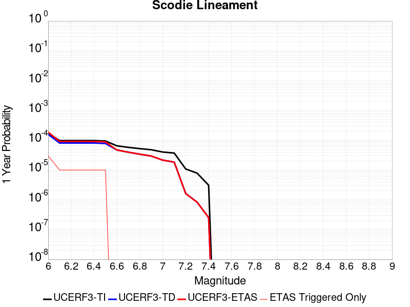 | 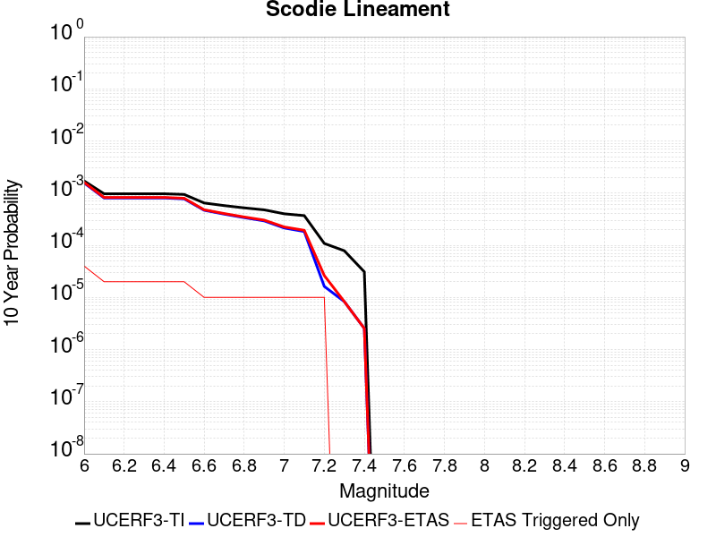 |

| Magnitude | 1 wk TI Prob | 1 wk TD Prob | 1 wk ETAS Prob | 1 wk ETAS/TD Gain | 1 wk ETAS Triggered Only | 1 mo TI Prob | 1 mo TD Prob | 1 mo ETAS Prob | 1 mo ETAS/TD Gain | 1 mo ETAS Triggered Only | 1 yr TI Prob | 1 yr TD Prob | 1 yr ETAS Prob | 1 yr ETAS/TD Gain | 1 yr ETAS Triggered Only | 10 yr TI Prob | 10 yr TD Prob | 10 yr ETAS Prob | 10 yr ETAS/TD Gain | 10 yr ETAS Triggered Only |
|-----|-----|-----|-----|-----|-----|-----|-----|-----|-----|-----|-----|-----|-----|-----|-----|-----|-----|-----|-----|-----|
| 6.0 | 3.2919327E-6 | 3.0133451E-6 | 3.0133451E-6 | 1.0 | 0.0 | 1.4108206E-5 | 1.2914291E-5 | 1.2914291E-5 | 1.0 | 0.0 | 1.7175387E-4 | 1.5722332E-4 | 1.872186E-4 | 1.1907814 | 3.0E-5 | 0.0017162118 | 0.0015714325 | 0.0016113695 | 1.0254145 | 4.0E-5 |
| 6.1 | 1.8663811E-6 | 1.5490476E-6 | 1.5490476E-6 | 1.0 | 0.0 | 7.998751E-6 | 6.6387615E-6 | 6.6387615E-6 | 1.0 | 0.0 | 9.738045E-5 | 8.082442E-5 | 9.082361E-5 | 1.123715 | 1.0E-5 | 9.7337784E-4 | 8.0799905E-4 | 8.279829E-4 | 1.0247325 | 2.0E-5 |
| 6.2 | 1.8663811E-6 | 1.5490476E-6 | 1.5490476E-6 | 1.0 | 0.0 | 7.998751E-6 | 6.6387615E-6 | 6.6387615E-6 | 1.0 | 0.0 | 9.738045E-5 | 8.082442E-5 | 9.082361E-5 | 1.123715 | 1.0E-5 | 9.7337784E-4 | 8.0799905E-4 | 8.279829E-4 | 1.0247325 | 2.0E-5 |
| 6.3 | 1.8663811E-6 | 1.5490476E-6 | 1.5490476E-6 | 1.0 | 0.0 | 7.998751E-6 | 6.6387615E-6 | 6.6387615E-6 | 1.0 | 0.0 | 9.738045E-5 | 8.082442E-5 | 9.082361E-5 | 1.123715 | 1.0E-5 | 9.7337784E-4 | 8.0799905E-4 | 8.279829E-4 | 1.0247325 | 2.0E-5 |
| 6.4 | 1.8663811E-6 | 1.5490476E-6 | 1.5490476E-6 | 1.0 | 0.0 | 7.998751E-6 | 6.6387615E-6 | 6.6387615E-6 | 1.0 | 0.0 | 9.738045E-5 | 8.082442E-5 | 9.082361E-5 | 1.123715 | 1.0E-5 | 9.7337784E-4 | 8.0799905E-4 | 8.279829E-4 | 1.0247325 | 2.0E-5 |
| 6.5 | 1.8106311E-6 | 1.4909813E-6 | 1.4909813E-6 | 1.0 | 0.0 | 7.759824E-6 | 6.389907E-6 | 6.389907E-6 | 1.0 | 0.0 | 9.447177E-5 | 7.779484E-5 | 8.7794055E-5 | 1.1285332 | 1.0E-5 | 9.4431615E-4 | 7.777247E-4 | 7.9770916E-4 | 1.025696 | 2.0E-5 |
| 6.6 | 1.2414679E-6 | 8.997501E-7 | 8.997501E-7 | 1.0 | 0.0 | 5.320566E-6 | 3.8560665E-6 | 3.8560665E-6 | 1.0 | 0.0 | 6.477596E-5 | 4.6946687E-5 | 4.6946687E-5 | 1.0 | 0.0 | 6.475708E-4 | 4.6937633E-4 | 4.7937167E-4 | 1.0212948 | 1.0E-5 |
| 6.7 | 1.1062215E-6 | 7.594247E-7 | 7.594247E-7 | 1.0 | 0.0 | 4.7409408E-6 | 3.2546736E-6 | 3.2546736E-6 | 1.0 | 0.0 | 5.7719422E-5 | 3.9625003E-5 | 3.9625003E-5 | 1.0 | 0.0 | 5.770443E-4 | 3.9618637E-4 | 4.061824E-4 | 1.0252306 | 1.0E-5 |
| 6.8 | 1.0006736E-6 | 6.5003275E-7 | 6.5003275E-7 | 1.0 | 0.0 | 4.288594E-6 | 2.785852E-6 | 2.785852E-6 | 1.0 | 0.0 | 5.221238E-5 | 3.3917284E-5 | 3.3917284E-5 | 1.0 | 0.0 | 5.220012E-4 | 3.3912715E-4 | 3.4912373E-4 | 1.0294775 | 1.0E-5 |
| 6.9 | 9.167364E-7 | 5.6315514E-7 | 5.6315514E-7 | 1.0 | 0.0 | 3.9288643E-6 | 2.4135202E-6 | 2.4135202E-6 | 1.0 | 0.0 | 4.7832873E-5 | 2.938427E-5 | 2.938427E-5 | 1.0 | 0.0 | 4.782258E-4 | 2.938095E-4 | 3.038066E-4 | 1.0340257 | 1.0E-5 |
| 7.0 | 7.6987664E-7 | 4.113303E-7 | 4.113303E-7 | 1.0 | 0.0 | 3.2994672E-6 | 1.7628431E-6 | 1.7628431E-6 | 1.0 | 0.0 | 4.0170275E-5 | 2.1462443E-5 | 2.1462443E-5 | 1.0 | 0.0 | 4.0163012E-4 | 2.1460756E-4 | 2.2460542E-4 | 1.0465866 | 1.0E-5 |
| 7.1 | 7.1038727E-7 | 3.521066E-7 | 3.521066E-7 | 1.0 | 0.0 | 3.0445133E-6 | 1.5090276E-6 | 1.5090276E-6 | 1.0 | 0.0 | 3.706632E-5 | 1.8372291E-5 | 1.8372291E-5 | 1.0 | 0.0 | 3.7060137E-4 | 1.8371122E-4 | 1.9370939E-4 | 1.0544232 | 1.0E-5 |
| 7.2 | 2.0799602E-7 | 3.1178946E-8 | 3.1178946E-8 | 1.0 | 0.0 | 8.914113E-7 | 1.3362404E-7 | 1.3362404E-7 | 1.0 | 0.0 | 1.0852878E-5 | 1.6268716E-6 | 1.6268716E-6 | 1.0 | 0.0 | 1.08523476E-4 | 1.6268605E-5 | 2.626844E-5 | 1.6146709 | 1.0E-5 |
| 7.3 | 1.5048182E-7 | 1.5939344E-8 | 1.5939344E-8 | 1.0 | 0.0 | 6.449219E-7 | 6.831147E-8 | 6.831147E-8 | 1.0 | 0.0 | 7.851896E-6 | 8.316919E-7 | 8.316919E-7 | 1.0 | 0.0 | 7.851618E-5 | 8.316891E-6 | 8.316891E-6 | 1.0 | 0.0 |
| 7.4 | 5.9334678E-8 | 4.8638475E-9 | 4.8638475E-9 | 1.0 | 0.0 | 2.5429145E-7 | 2.084506E-8 | 2.084506E-8 | 1.0 | 0.0 | 3.095994E-6 | 2.5378858E-7 | 2.5378858E-7 | 1.0 | 0.0 | 3.095951E-5 | 2.5378843E-6 | 2.5378843E-6 | 1.0 | 0.0 |

## Lake Isabella (Seismicity)
*[(top)](#table-of-contents)*

| 1 Week | 1 Month | 1 Year | 10 Year |
|-----|-----|-----|-----|
| 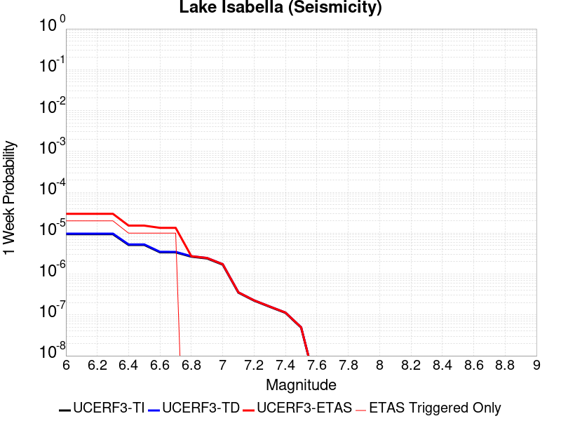 |  | 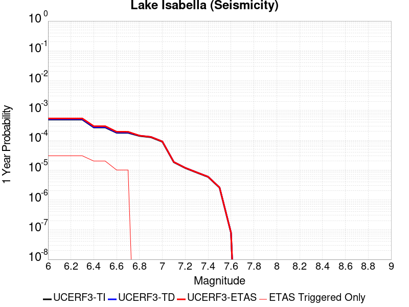 |  |

| Magnitude | 1 wk TI Prob | 1 wk TD Prob | 1 wk ETAS Prob | 1 wk ETAS/TD Gain | 1 wk ETAS Triggered Only | 1 mo TI Prob | 1 mo TD Prob | 1 mo ETAS Prob | 1 mo ETAS/TD Gain | 1 mo ETAS Triggered Only | 1 yr TI Prob | 1 yr TD Prob | 1 yr ETAS Prob | 1 yr ETAS/TD Gain | 1 yr ETAS Triggered Only | 10 yr TI Prob | 10 yr TD Prob | 10 yr ETAS Prob | 10 yr ETAS/TD Gain | 10 yr ETAS Triggered Only |
|-----|-----|-----|-----|-----|-----|-----|-----|-----|-----|-----|-----|-----|-----|-----|-----|-----|-----|-----|-----|-----|
| 6.0 | 9.431637E-6 | 9.741694E-6 | 2.9741499E-5 | 3.053011 | 2.0E-5 | 4.0420677E-5 | 4.1749525E-5 | 6.174869E-5 | 1.4790274 | 2.0E-5 | 4.920106E-4 | 5.0819496E-4 | 5.381797E-4 | 1.0590025 | 3.0E-5 | 0.004909227 | 0.005071621 | 0.005111418 | 1.0078471 | 4.0E-5 |
| 6.1 | 9.431637E-6 | 9.741694E-6 | 2.9741499E-5 | 3.053011 | 2.0E-5 | 4.0420677E-5 | 4.1749525E-5 | 6.174869E-5 | 1.4790274 | 2.0E-5 | 4.920106E-4 | 5.0819496E-4 | 5.381797E-4 | 1.0590025 | 3.0E-5 | 0.004909227 | 0.005071621 | 0.005111418 | 1.0078471 | 4.0E-5 |
| 6.2 | 9.431637E-6 | 9.741694E-6 | 2.9741499E-5 | 3.053011 | 2.0E-5 | 4.0420677E-5 | 4.1749525E-5 | 6.174869E-5 | 1.4790274 | 2.0E-5 | 4.920106E-4 | 5.0819496E-4 | 5.381797E-4 | 1.0590025 | 3.0E-5 | 0.004909227 | 0.005071621 | 0.005111418 | 1.0078471 | 4.0E-5 |
| 6.3 | 9.431637E-6 | 9.741694E-6 | 2.9741499E-5 | 3.053011 | 2.0E-5 | 4.0420677E-5 | 4.1749525E-5 | 6.174869E-5 | 1.4790274 | 2.0E-5 | 4.920106E-4 | 5.0819496E-4 | 5.381797E-4 | 1.0590025 | 3.0E-5 | 0.004909227 | 0.005071621 | 0.005111418 | 1.0078471 | 4.0E-5 |
| 6.4 | 5.144063E-6 | 5.3000977E-6 | 1.5300044E-5 | 2.8867478 | 1.0E-5 | 2.2045799E-5 | 2.2714525E-5 | 3.27143E-5 | 1.4402369 | 1.0E-5 | 2.6837454E-4 | 2.765177E-4 | 2.9651218E-4 | 1.0723081 | 2.0E-5 | 0.0026805066 | 0.002762077 | 0.0027820216 | 1.007221 | 2.0E-5 |
| 6.5 | 5.144063E-6 | 5.3000977E-6 | 1.5300044E-5 | 2.8867478 | 1.0E-5 | 2.2045799E-5 | 2.2714525E-5 | 3.27143E-5 | 1.4402369 | 1.0E-5 | 2.6837454E-4 | 2.765177E-4 | 2.9651218E-4 | 1.0723081 | 2.0E-5 | 0.0026805066 | 0.002762077 | 0.0027820216 | 1.007221 | 2.0E-5 |
| 6.6 | 3.4009804E-6 | 3.4987995E-6 | 1.3498765E-5 | 3.8581133 | 1.0E-5 | 1.4575549E-5 | 1.4994778E-5 | 2.4994628E-5 | 1.6668888 | 1.0E-5 | 1.7744285E-4 | 1.8254772E-4 | 1.9254591E-4 | 1.0547702 | 1.0E-5 | 0.0017730123 | 0.0018241355 | 0.0018341173 | 1.0054721 | 1.0E-5 |
| 6.7 | 3.3880428E-6 | 3.4856662E-6 | 1.3485631E-5 | 3.8688822 | 1.0E-5 | 1.4520103E-5 | 1.4938492E-5 | 2.4938343E-5 | 1.6694016 | 1.0E-5 | 1.767679E-4 | 1.8186258E-4 | 1.9186074E-4 | 1.0549766 | 1.0E-5 | 0.0017662736 | 0.0018172951 | 0.001827277 | 1.0054927 | 1.0E-5 |
| 6.8 | 2.6582E-6 | 2.7337105E-6 | 2.7337105E-6 | 1.0 | 0.0 | 1.1392236E-5 | 1.1715857E-5 | 1.1715857E-5 | 1.0 | 0.0 | 1.3869164E-4 | 1.4263256E-4 | 1.4263256E-4 | 1.0 | 0.0 | 0.0013860512 | 0.0014255423 | 0.0014255423 | 1.0 | 0.0 |
| 6.9 | 2.406011E-6 | 2.474338E-6 | 2.474338E-6 | 1.0 | 0.0 | 1.0311434E-5 | 1.0604271E-5 | 1.0604271E-5 | 1.0 | 0.0 | 1.2553448E-4 | 1.2910066E-4 | 1.2910066E-4 | 1.0 | 0.0 | 0.0012546359 | 0.0012903863 | 0.0012903863 | 1.0 | 0.0 |
| 7.0 | 1.6953097E-6 | 1.7429437E-6 | 1.7429437E-6 | 1.0 | 0.0 | 7.265593E-6 | 7.469743E-6 | 7.469743E-6 | 1.0 | 0.0 | 8.8455E-5 | 9.094137E-5 | 9.094137E-5 | 1.0 | 0.0 | 8.84198E-4 | 9.0914435E-4 | 9.0914435E-4 | 1.0 | 0.0 |
| 7.1 | 3.5013824E-7 | 3.571492E-7 | 3.571492E-7 | 1.0 | 0.0 | 1.5005916E-6 | 1.5306384E-6 | 1.5306384E-6 | 1.0 | 0.0 | 1.826955E-5 | 1.8635366E-5 | 1.8635366E-5 | 1.0 | 0.0 | 1.8268047E-4 | 1.863383E-4 | 1.863383E-4 | 1.0 | 0.0 |
| 7.2 | 2.2321095E-7 | 2.2750632E-7 | 2.2750632E-7 | 1.0 | 0.0 | 9.56618E-7 | 9.750268E-7 | 9.750268E-7 | 1.0 | 0.0 | 1.1646762E-5 | 1.1870887E-5 | 1.1870887E-5 | 1.0 | 0.0 | 1.1646151E-4 | 1.1870263E-4 | 1.1870263E-4 | 1.0 | 0.0 |
| 7.3 | 1.5760406E-7 | 1.6060963E-7 | 1.6060963E-7 | 1.0 | 0.0 | 6.7544585E-7 | 6.883268E-7 | 6.883268E-7 | 1.0 | 0.0 | 8.223522E-6 | 8.380347E-6 | 8.380347E-6 | 1.0 | 0.0 | 8.2232174E-5 | 8.3800376E-5 | 8.3800376E-5 | 1.0 | 0.0 |
| 7.4 | 1.1216497E-7 | 1.1431735E-7 | 1.1431735E-7 | 1.0 | 0.0 | 4.8070694E-7 | 4.8993144E-7 | 4.8993144E-7 | 1.0 | 0.0 | 5.852591E-6 | 5.964899E-6 | 5.964899E-6 | 1.0 | 0.0 | 5.8524372E-5 | 5.9647435E-5 | 5.9647435E-5 | 1.0 | 0.0 |
| 7.5 | 4.885185E-8 | 4.9787864E-8 | 4.9787864E-8 | 1.0 | 0.0 | 2.0936506E-7 | 2.1337654E-7 | 2.1337654E-7 | 1.0 | 0.0 | 2.5490165E-6 | 2.5978566E-6 | 2.5978566E-6 | 1.0 | 0.0 | 2.5489873E-5 | 2.597828E-5 | 2.597828E-5 | 1.0 | 0.0 |
| 7.6 | 1.504641E-9 | 1.5317939E-9 | 1.5317939E-9 | 1.0 | 0.0 | 6.4484613E-9 | 6.5648313E-9 | 6.5648313E-9 | 1.0 | 0.0 | 7.851001E-8 | 7.992682E-8 | 7.992682E-8 | 1.0 | 0.0 | 7.8509987E-7 | 7.992682E-7 | 7.992682E-7 | 1.0 | 0.0 |

## Calico-Hidalgo
*[(top)](#table-of-contents)*

| 1 Week | 1 Month | 1 Year | 10 Year |
|-----|-----|-----|-----|
|  | 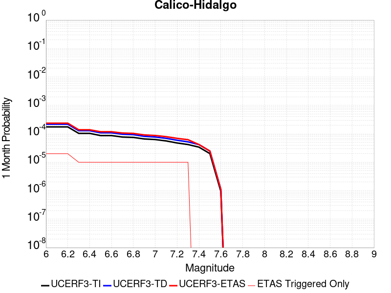 | 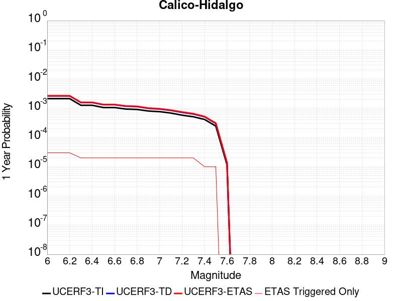 | 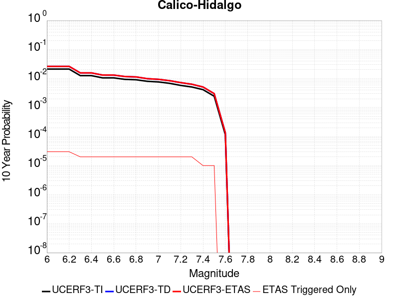 |

| Magnitude | 1 wk TI Prob | 1 wk TD Prob | 1 wk ETAS Prob | 1 wk ETAS/TD Gain | 1 wk ETAS Triggered Only | 1 mo TI Prob | 1 mo TD Prob | 1 mo ETAS Prob | 1 mo ETAS/TD Gain | 1 mo ETAS Triggered Only | 1 yr TI Prob | 1 yr TD Prob | 1 yr ETAS Prob | 1 yr ETAS/TD Gain | 1 yr ETAS Triggered Only | 10 yr TI Prob | 10 yr TD Prob | 10 yr ETAS Prob | 10 yr ETAS/TD Gain | 10 yr ETAS Triggered Only |
|-----|-----|-----|-----|-----|-----|-----|-----|-----|-----|-----|-----|-----|-----|-----|-----|-----|-----|-----|-----|-----|
| 6.0 | 4.0906612E-5 | 5.0705254E-5 | 6.0704744E-5 | 1.1972083 | 1.0E-5 | 1.7530227E-4 | 2.172924E-4 | 2.3728806E-4 | 1.0920218 | 2.0E-5 | 0.0021322158 | 0.0026427244 | 0.0026726453 | 1.0113219 | 3.0E-5 | 0.02111873 | 0.026153268 | 0.026182484 | 1.0011171 | 3.0E-5 |
| 6.1 | 4.0906612E-5 | 5.0705254E-5 | 6.0704744E-5 | 1.1972083 | 1.0E-5 | 1.7530227E-4 | 2.172924E-4 | 2.3728806E-4 | 1.0920218 | 2.0E-5 | 0.0021322158 | 0.0026427244 | 0.0026726453 | 1.0113219 | 3.0E-5 | 0.02111873 | 0.026153268 | 0.026182484 | 1.0011171 | 3.0E-5 |
| 6.2 | 4.0906612E-5 | 5.0705254E-5 | 6.0704744E-5 | 1.1972083 | 1.0E-5 | 1.7530227E-4 | 2.172924E-4 | 2.3728806E-4 | 1.0920218 | 2.0E-5 | 0.0021322158 | 0.0026427244 | 0.0026726453 | 1.0113219 | 3.0E-5 | 0.02111873 | 0.026153268 | 0.026182484 | 1.0011171 | 3.0E-5 |
| 6.3 | 2.4242801E-5 | 3.0091267E-5 | 3.0091267E-5 | 1.0 | 0.0 | 1.0389358E-4 | 1.2895638E-4 | 1.389551E-4 | 1.0775356 | 1.0E-5 | 0.0012641704 | 0.0015689468 | 0.0015889154 | 1.0127274 | 2.0E-5 | 0.01257003 | 0.015582383 | 0.015602071 | 1.0012635 | 2.0E-5 |
| 6.4 | 2.4242801E-5 | 3.0091267E-5 | 3.0091267E-5 | 1.0 | 0.0 | 1.0389358E-4 | 1.2895638E-4 | 1.389551E-4 | 1.0775356 | 1.0E-5 | 0.0012641704 | 0.0015689468 | 0.0015889154 | 1.0127274 | 2.0E-5 | 0.01257003 | 0.015582383 | 0.015602071 | 1.0012635 | 2.0E-5 |
| 6.5 | 2.0286952E-5 | 2.531624E-5 | 2.531624E-5 | 1.0 | 0.0 | 8.694118E-5 | 1.08493754E-4 | 1.18492666E-4 | 1.0921612 | 1.0E-5 | 0.0010579949 | 0.0013201282 | 0.0013401017 | 1.01513 | 2.0E-5 | 0.010529719 | 0.013124796 | 0.013144533 | 1.0015038 | 2.0E-5 |
| 6.6 | 2.0269223E-5 | 2.529719E-5 | 2.529719E-5 | 1.0 | 0.0 | 8.6865206E-5 | 1.0841212E-4 | 1.1841103E-4 | 1.0922306 | 1.0E-5 | 0.0010570707 | 0.0013191354 | 0.001339109 | 1.0151415 | 2.0E-5 | 0.010520565 | 0.013114986 | 0.0131347235 | 1.001505 | 2.0E-5 |
| 6.7 | 1.799852E-5 | 2.2541075E-5 | 2.2541075E-5 | 1.0 | 0.0 | 7.713423E-5 | 9.6601114E-5 | 1.0660015E-4 | 1.1035085 | 1.0E-5 | 9.3870464E-4 | 0.0011754986 | 0.0011954751 | 1.016994 | 2.0E-5 | 0.009347493 | 0.011694419 | 0.011714185 | 1.0016903 | 2.0E-5 |
| 6.8 | 1.7458793E-5 | 2.1842718E-5 | 2.1842718E-5 | 1.0 | 0.0 | 7.4821255E-5 | 9.360837E-5 | 1.0360743E-4 | 1.1068181 | 1.0E-5 | 9.10568E-4 | 0.0011391005 | 0.0011590777 | 1.0175377 | 2.0E-5 | 0.009068459 | 0.011334201 | 0.011353975 | 1.0017446 | 2.0E-5 |
| 6.9 | 1.542884E-5 | 1.9026409E-5 | 1.9026409E-5 | 1.0 | 0.0 | 6.612192E-5 | 8.153928E-5 | 9.153846E-5 | 1.1226302 | 1.0E-5 | 8.04737E-4 | 9.923017E-4 | 0.0010122819 | 1.0201352 | 2.0E-5 | 0.008018291 | 0.009880107 | 0.009899909 | 1.0020043 | 2.0E-5 |
| 7.0 | 1.468253E-5 | 1.8031209E-5 | 1.8031209E-5 | 1.0 | 0.0 | 6.292361E-5 | 7.7274395E-5 | 8.727362E-5 | 1.129399 | 1.0E-5 | 7.658257E-4 | 9.404227E-4 | 9.604039E-4 | 1.021247 | 2.0E-5 | 0.0076319184 | 0.009365797 | 0.009385609 | 1.0021155 | 2.0E-5 |
| 7.1 | 1.3139281E-5 | 1.620149E-5 | 1.620149E-5 | 1.0 | 0.0 | 5.6309986E-5 | 6.9433176E-5 | 7.943248E-5 | 1.1440134 | 1.0E-5 | 6.853584E-4 | 8.450336E-4 | 8.650167E-4 | 1.0236477 | 2.0E-5 | 0.0068324856 | 0.008419501 | 0.008439333 | 1.0023555 | 2.0E-5 |
| 7.2 | 1.1127404E-5 | 1.3867119E-5 | 1.3867119E-5 | 1.0 | 0.0 | 4.7688E-5 | 5.9429218E-5 | 6.942862E-5 | 1.1682574 | 1.0E-5 | 5.8044674E-4 | 7.233214E-4 | 7.4330694E-4 | 1.0276302 | 2.0E-5 | 0.0057893298 | 0.007210779 | 0.007230635 | 1.0027536 | 2.0E-5 |
| 7.3 | 9.808154E-6 | 1.2176658E-5 | 1.2176658E-5 | 1.0 | 0.0 | 4.2034266E-5 | 5.2184692E-5 | 6.2184175E-5 | 1.191617 | 1.0E-5 | 5.11647E-4 | 6.3517416E-4 | 6.5516145E-4 | 1.0314674 | 2.0E-5 | 0.0051047057 | 0.006334663 | 0.006354536 | 1.0031372 | 2.0E-5 |
| 7.4 | 7.942452E-6 | 9.792409E-6 | 9.792409E-6 | 1.0 | 0.0 | 3.4038632E-5 | 4.1966847E-5 | 4.1966847E-5 | 1.0 | 0.0 | 4.1434157E-4 | 5.10836E-4 | 5.208309E-4 | 1.0195657 | 1.0E-5 | 0.0041356985 | 0.005097559 | 0.005107508 | 1.0019517 | 1.0E-5 |
| 7.5 | 4.7121216E-6 | 5.7729853E-6 | 5.7729853E-6 | 1.0 | 0.0 | 2.019465E-5 | 2.4741174E-5 | 2.4741174E-5 | 1.0 | 0.0 | 2.4584212E-4 | 3.011898E-4 | 3.111868E-4 | 1.0331917 | 1.0E-5 | 0.0024557032 | 0.0030085684 | 0.0030185385 | 1.0033139 | 1.0E-5 |
| 7.6 | 2.21172E-7 | 2.6040198E-7 | 2.6040198E-7 | 1.0 | 0.0 | 9.478797E-7 | 1.1160082E-6 | 1.1160082E-6 | 1.0 | 0.0 | 1.1540374E-5 | 1.3587343E-5 | 1.3587343E-5 | 1.0 | 0.0 | 1.1539775E-4 | 1.3586794E-4 | 1.3586794E-4 | 1.0 | 0.0 |

## Kern Canyon (North Kern) 2011
*[(top)](#table-of-contents)*

| 1 Week | 1 Month | 1 Year | 10 Year |
|-----|-----|-----|-----|
|  |  |  |  |

| Magnitude | 1 wk TI Prob | 1 wk TD Prob | 1 wk ETAS Prob | 1 wk ETAS/TD Gain | 1 wk ETAS Triggered Only | 1 mo TI Prob | 1 mo TD Prob | 1 mo ETAS Prob | 1 mo ETAS/TD Gain | 1 mo ETAS Triggered Only | 1 yr TI Prob | 1 yr TD Prob | 1 yr ETAS Prob | 1 yr ETAS/TD Gain | 1 yr ETAS Triggered Only | 10 yr TI Prob | 10 yr TD Prob | 10 yr ETAS Prob | 10 yr ETAS/TD Gain | 10 yr ETAS Triggered Only |
|-----|-----|-----|-----|-----|-----|-----|-----|-----|-----|-----|-----|-----|-----|-----|-----|-----|-----|-----|-----|-----|
| 6.0 | 6.6264497E-6 | 6.7573515E-6 | 6.7573515E-6 | 1.0 | 0.0 | 2.8398761E-5 | 2.8959801E-5 | 2.8959801E-5 | 1.0 | 0.0 | 3.4570007E-4 | 3.5253656E-4 | 3.725295E-4 | 1.0567117 | 2.0E-5 | 0.0034516277 | 0.0035205614 | 0.003550456 | 1.0084914 | 3.0E-5 |
| 6.1 | 6.6264497E-6 | 6.7573515E-6 | 6.7573515E-6 | 1.0 | 0.0 | 2.8398761E-5 | 2.8959801E-5 | 2.8959801E-5 | 1.0 | 0.0 | 3.4570007E-4 | 3.5253656E-4 | 3.725295E-4 | 1.0567117 | 2.0E-5 | 0.0034516277 | 0.0035205614 | 0.003550456 | 1.0084914 | 3.0E-5 |
| 6.2 | 6.6264497E-6 | 6.7573515E-6 | 6.7573515E-6 | 1.0 | 0.0 | 2.8398761E-5 | 2.8959801E-5 | 2.8959801E-5 | 1.0 | 0.0 | 3.4570007E-4 | 3.5253656E-4 | 3.725295E-4 | 1.0567117 | 2.0E-5 | 0.0034516277 | 0.0035205614 | 0.003550456 | 1.0084914 | 3.0E-5 |
| 6.3 | 6.6264497E-6 | 6.7573515E-6 | 6.7573515E-6 | 1.0 | 0.0 | 2.8398761E-5 | 2.8959801E-5 | 2.8959801E-5 | 1.0 | 0.0 | 3.4570007E-4 | 3.5253656E-4 | 3.725295E-4 | 1.0567117 | 2.0E-5 | 0.0034516277 | 0.0035205614 | 0.003550456 | 1.0084914 | 3.0E-5 |
| 6.4 | 6.6264497E-6 | 6.7573515E-6 | 6.7573515E-6 | 1.0 | 0.0 | 2.8398761E-5 | 2.8959801E-5 | 2.8959801E-5 | 1.0 | 0.0 | 3.4570007E-4 | 3.5253656E-4 | 3.725295E-4 | 1.0567117 | 2.0E-5 | 0.0034516277 | 0.0035205614 | 0.003550456 | 1.0084914 | 3.0E-5 |
| 6.5 | 3.2162225E-6 | 3.2571006E-6 | 3.2571006E-6 | 1.0 | 0.0 | 1.3783738E-5 | 1.3958933E-5 | 1.3958933E-5 | 1.0 | 0.0 | 1.6780409E-4 | 1.6993756E-4 | 1.6993756E-4 | 1.0 | 0.0 | 0.0016767744 | 0.0016981558 | 0.0016981558 | 1.0 | 0.0 |
| 6.6 | 3.2162225E-6 | 3.2571006E-6 | 3.2571006E-6 | 1.0 | 0.0 | 1.3783738E-5 | 1.3958933E-5 | 1.3958933E-5 | 1.0 | 0.0 | 1.6780409E-4 | 1.6993756E-4 | 1.6993756E-4 | 1.0 | 0.0 | 0.0016767744 | 0.0016981558 | 0.0016981558 | 1.0 | 0.0 |
| 6.7 | 2.1908265E-6 | 2.207128E-6 | 2.207128E-6 | 1.0 | 0.0 | 9.389223E-6 | 9.459087E-6 | 9.459087E-6 | 1.0 | 0.0 | 1.1430779E-4 | 1.15158495E-4 | 1.15158495E-4 | 1.0 | 0.0 | 0.0011424901 | 0.0011510076 | 0.0011510076 | 1.0 | 0.0 |
| 6.8 | 1.7303895E-6 | 1.7365575E-6 | 1.7365575E-6 | 1.0 | 0.0 | 7.415934E-6 | 7.4423683E-6 | 7.4423683E-6 | 1.0 | 0.0 | 9.028525E-5 | 9.0607165E-5 | 9.0607165E-5 | 1.0 | 0.0 | 9.024858E-4 | 9.0571196E-4 | 9.0571196E-4 | 1.0 | 0.0 |
| 6.9 | 1.3700314E-6 | 1.3688658E-6 | 1.3688658E-6 | 1.0 | 0.0 | 5.87155E-6 | 5.8665546E-6 | 5.8665546E-6 | 1.0 | 0.0 | 7.148377E-5 | 7.142301E-5 | 7.142301E-5 | 1.0 | 0.0 | 7.146078E-4 | 7.140051E-4 | 7.140051E-4 | 1.0 | 0.0 |
| 7.0 | 1.1467797E-6 | 1.1413834E-6 | 1.1413834E-6 | 1.0 | 0.0 | 4.9147607E-6 | 4.8916345E-6 | 4.8916345E-6 | 1.0 | 0.0 | 5.983557E-5 | 5.955405E-5 | 5.955405E-5 | 1.0 | 0.0 | 5.981946E-4 | 5.9538404E-4 | 5.9538404E-4 | 1.0 | 0.0 |
| 7.1 | 9.3952065E-7 | 9.3027154E-7 | 9.3027154E-7 | 1.0 | 0.0 | 4.026511E-6 | 3.986872E-6 | 3.986872E-6 | 1.0 | 0.0 | 4.9021666E-5 | 4.8539103E-5 | 4.8539103E-5 | 1.0 | 0.0 | 4.901085E-4 | 4.852868E-4 | 4.852868E-4 | 1.0 | 0.0 |
| 7.2 | 6.858055E-7 | 6.719319E-7 | 6.719319E-7 | 1.0 | 0.0 | 2.939163E-6 | 2.879705E-6 | 2.879705E-6 | 1.0 | 0.0 | 3.5783723E-5 | 3.5059853E-5 | 3.5059853E-5 | 1.0 | 0.0 | 3.5777962E-4 | 3.505441E-4 | 3.505441E-4 | 1.0 | 0.0 |
| 7.3 | 5.1101983E-7 | 4.939314E-7 | 4.939314E-7 | 1.0 | 0.0 | 2.1900833E-6 | 2.116847E-6 | 2.116847E-6 | 1.0 | 0.0 | 2.6663936E-5 | 2.5772315E-5 | 2.5772315E-5 | 1.0 | 0.0 | 2.6660739E-4 | 2.5769373E-4 | 2.5769373E-4 | 1.0 | 0.0 |
| 7.4 | 3.4999414E-7 | 3.2996007E-7 | 3.2996007E-7 | 1.0 | 0.0 | 1.499974E-6 | 1.4141139E-6 | 1.4141139E-6 | 1.0 | 0.0 | 1.8262032E-5 | 1.7216704E-5 | 1.7216704E-5 | 1.0 | 0.0 | 1.826053E-4 | 1.7215393E-4 | 1.7215393E-4 | 1.0 | 0.0 |
| 7.5 | 1.7021522E-7 | 1.4750101E-7 | 1.4750101E-7 | 1.0 | 0.0 | 7.2949354E-7 | 6.321471E-7 | 6.321471E-7 | 1.0 | 0.0 | 8.881548E-6 | 7.696364E-6 | 7.696364E-6 | 1.0 | 0.0 | 8.8811925E-5 | 7.696106E-5 | 7.696106E-5 | 1.0 | 0.0 |
| 7.6 | 2.572245E-8 | 1.7352718E-8 | 1.7352718E-8 | 1.0 | 0.0 | 1.10239064E-7 | 7.436879E-8 | 7.436879E-8 | 1.0 | 0.0 | 1.3421597E-6 | 9.054397E-7 | 9.054397E-7 | 1.0 | 0.0 | 1.3421517E-5 | 9.054365E-6 | 9.054365E-6 | 1.0 | 0.0 |

## San Andreas (Carrizo) rev
*[(top)](#table-of-contents)*

| 1 Week | 1 Month | 1 Year | 10 Year |
|-----|-----|-----|-----|
|  | 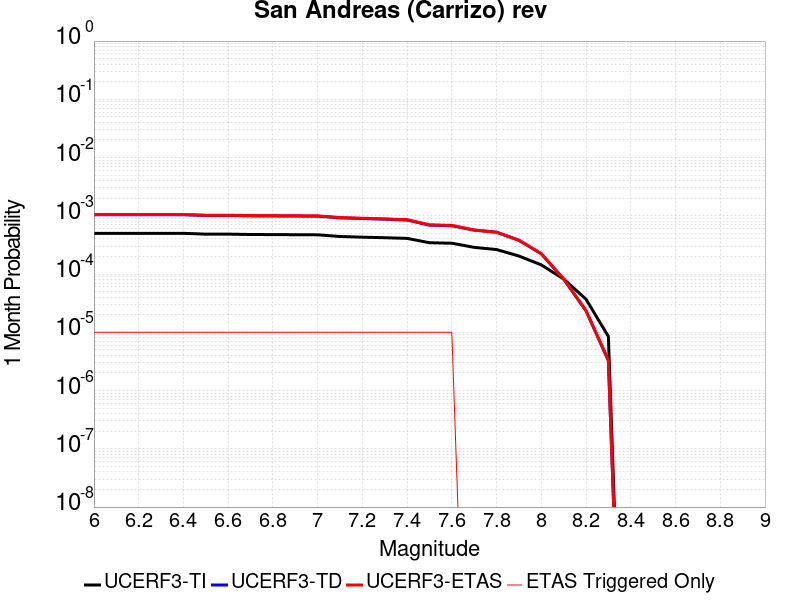 |  | 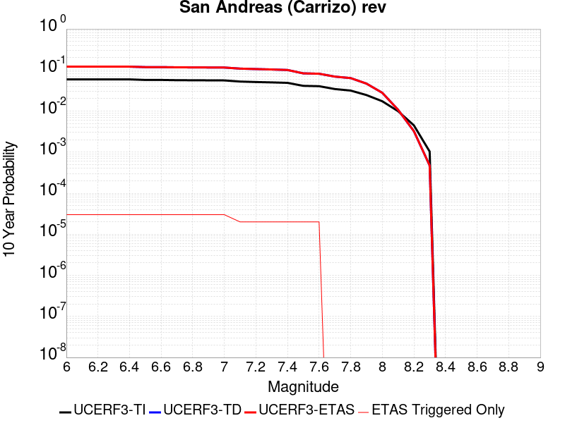 |

| Magnitude | 1 wk TI Prob | 1 wk TD Prob | 1 wk ETAS Prob | 1 wk ETAS/TD Gain | 1 wk ETAS Triggered Only | 1 mo TI Prob | 1 mo TD Prob | 1 mo ETAS Prob | 1 mo ETAS/TD Gain | 1 mo ETAS Triggered Only | 1 yr TI Prob | 1 yr TD Prob | 1 yr ETAS Prob | 1 yr ETAS/TD Gain | 1 yr ETAS Triggered Only | 10 yr TI Prob | 10 yr TD Prob | 10 yr ETAS Prob | 10 yr ETAS/TD Gain | 10 yr ETAS Triggered Only |
|-----|-----|-----|-----|-----|-----|-----|-----|-----|-----|-----|-----|-----|-----|-----|-----|-----|-----|-----|-----|-----|
| 6.0 | 1.1674632E-4 | 2.4333803E-4 | 2.4333803E-4 | 1.0 | 0.0 | 5.002454E-4 | 0.0010424621 | 0.0010524517 | 1.0095826 | 1.0E-5 | 0.006073493 | 0.012618599 | 0.012648221 | 1.0023475 | 3.0E-5 | 0.0591016 | 0.12066075 | 0.12068713 | 1.0002186 | 3.0E-5 |
| 6.1 | 1.1674632E-4 | 2.4333803E-4 | 2.4333803E-4 | 1.0 | 0.0 | 5.002454E-4 | 0.0010424621 | 0.0010524517 | 1.0095826 | 1.0E-5 | 0.006073493 | 0.012618599 | 0.012648221 | 1.0023475 | 3.0E-5 | 0.0591016 | 0.12066075 | 0.12068713 | 1.0002186 | 3.0E-5 |
| 6.2 | 1.1674632E-4 | 2.4333803E-4 | 2.4333803E-4 | 1.0 | 0.0 | 5.002454E-4 | 0.0010424621 | 0.0010524517 | 1.0095826 | 1.0E-5 | 0.006073493 | 0.012618599 | 0.012648221 | 1.0023475 | 3.0E-5 | 0.0591016 | 0.12066075 | 0.12068713 | 1.0002186 | 3.0E-5 |
| 6.3 | 1.1674632E-4 | 2.4333803E-4 | 2.4333803E-4 | 1.0 | 0.0 | 5.002454E-4 | 0.0010424621 | 0.0010524517 | 1.0095826 | 1.0E-5 | 0.006073493 | 0.012618599 | 0.012648221 | 1.0023475 | 3.0E-5 | 0.0591016 | 0.12066075 | 0.12068713 | 1.0002186 | 3.0E-5 |
| 6.4 | 1.1674632E-4 | 2.4333803E-4 | 2.4333803E-4 | 1.0 | 0.0 | 5.002454E-4 | 0.0010424621 | 0.0010524517 | 1.0095826 | 1.0E-5 | 0.006073493 | 0.012618599 | 0.012648221 | 1.0023475 | 3.0E-5 | 0.0591016 | 0.12066075 | 0.12068713 | 1.0002186 | 3.0E-5 |
| 6.5 | 1.13136164E-4 | 2.3653745E-4 | 2.3653745E-4 | 1.0 | 0.0 | 4.847792E-4 | 0.0010133396 | 0.0010233296 | 1.0098584 | 1.0E-5 | 0.0058862255 | 0.012268067 | 0.012297699 | 1.0024154 | 3.0E-5 | 0.057327334 | 0.11763024 | 0.117656715 | 1.0002251 | 3.0E-5 |
| 6.6 | 1.13136164E-4 | 2.3653745E-4 | 2.3653745E-4 | 1.0 | 0.0 | 4.847792E-4 | 0.0010133396 | 0.0010233296 | 1.0098584 | 1.0E-5 | 0.0058862255 | 0.012268067 | 0.012297699 | 1.0024154 | 3.0E-5 | 0.057327334 | 0.11763024 | 0.117656715 | 1.0002251 | 3.0E-5 |
| 6.7 | 1.1149675E-4 | 2.334492E-4 | 2.334492E-4 | 1.0 | 0.0 | 4.777557E-4 | 0.0010001145 | 0.0010101044 | 1.0099889 | 1.0E-5 | 0.0058011734 | 0.012108848 | 0.012138486 | 1.0024475 | 3.0E-5 | 0.05652051 | 0.11625791 | 0.11628443 | 1.000228 | 3.0E-5 |
| 6.8 | 1.1103589E-4 | 2.324707E-4 | 2.324707E-4 | 1.0 | 0.0 | 4.7578133E-4 | 9.959241E-4 | 0.0010059141 | 1.010031 | 1.0E-5 | 0.005777263 | 0.012058397 | 0.012088035 | 1.0024579 | 3.0E-5 | 0.056293584 | 0.11581856 | 0.115845084 | 1.000229 | 3.0E-5 |
| 6.9 | 1.1053259E-4 | 2.3139441E-4 | 2.3139441E-4 | 1.0 | 0.0 | 4.7362508E-4 | 9.91315E-4 | 0.0010013051 | 1.0100776 | 1.0E-5 | 0.0057511497 | 0.0120029 | 0.0120325405 | 1.0024694 | 3.0E-5 | 0.05604569 | 0.115334466 | 0.115361005 | 1.0002301 | 3.0E-5 |
| 7.0 | 1.1005377E-4 | 2.304026E-4 | 2.304026E-4 | 1.0 | 0.0 | 4.7157376E-4 | 9.870676E-4 | 9.970577E-4 | 1.010121 | 1.0E-5 | 0.0057263062 | 0.011951757 | 0.011981398 | 1.0024801 | 3.0E-5 | 0.055809796 | 0.1148876 | 0.11491416 | 1.0002311 | 3.0E-5 |
| 7.1 | 1.0308142E-4 | 2.154949E-4 | 2.154949E-4 | 1.0 | 0.0 | 4.417027E-4 | 9.2322374E-4 | 9.332145E-4 | 1.0108216 | 1.0E-5 | 0.0053644776 | 0.011182634 | 0.01120241 | 1.0017685 | 2.0E-5 | 0.052368138 | 0.10815858 | 0.10817642 | 1.0001649 | 2.0E-5 |
| 7.2 | 1.0027479E-4 | 2.0957364E-4 | 2.0957364E-4 | 1.0 | 0.0 | 4.296783E-4 | 8.978646E-4 | 9.0785563E-4 | 1.0111276 | 1.0E-5 | 0.0052187922 | 0.010877009 | 0.010896791 | 1.0018188 | 2.0E-5 | 0.050979212 | 0.10545821 | 0.105476096 | 1.0001696 | 2.0E-5 |
| 7.3 | 9.816942E-5 | 2.0432367E-4 | 2.0432367E-4 | 1.0 | 0.0 | 4.2065824E-4 | 8.7538E-4 | 8.853713E-4 | 1.0114136 | 1.0E-5 | 0.005109493 | 0.0106059555 | 0.010625743 | 1.0018657 | 2.0E-5 | 0.049935985 | 0.10304579 | 0.10306373 | 1.000174 | 2.0E-5 |
| 7.4 | 9.5634205E-5 | 1.980169E-4 | 1.980169E-4 | 1.0 | 0.0 | 4.0979648E-4 | 8.4836874E-4 | 8.5836026E-4 | 1.0117773 | 1.0E-5 | 0.0049778637 | 0.010280236 | 0.01030003 | 1.0019255 | 2.0E-5 | 0.048678253 | 0.100126535 | 0.100144535 | 1.0001798 | 2.0E-5 |
| 7.5 | 8.052417E-5 | 1.612143E-4 | 1.612143E-4 | 1.0 | 0.0 | 3.4505792E-4 | 6.9073564E-4 | 7.0072873E-4 | 1.0144674 | 1.0E-5 | 0.0041929903 | 0.00837736 | 0.008397193 | 1.0023674 | 2.0E-5 | 0.04114753 | 0.08285146 | 0.082869805 | 1.0002214 | 2.0E-5 |
| 7.6 | 7.897024E-5 | 1.5774513E-4 | 1.5774513E-4 | 1.0 | 0.0 | 3.384E-4 | 6.758756E-4 | 6.8586884E-4 | 1.0147856 | 1.0E-5 | 0.0041122385 | 0.008197814 | 0.0082176505 | 1.0024197 | 2.0E-5 | 0.040369697 | 0.08119292 | 0.0812113 | 1.0002264 | 2.0E-5 |
| 7.7 | 6.707427E-5 | 1.3283793E-4 | 1.3283793E-4 | 1.0 | 0.0 | 2.8742946E-4 | 5.691813E-4 | 5.691813E-4 | 1.0 | 0.0 | 0.003493839 | 0.0069077956 | 0.0069077956 | 1.0 | 0.0 | 0.034394164 | 0.069081694 | 0.069081694 | 1.0 | 0.0 |
| 7.8 | 6.147705E-5 | 1.2204444E-4 | 1.2204444E-4 | 1.0 | 0.0 | 2.6344648E-4 | 5.229428E-4 | 5.229428E-4 | 1.0 | 0.0 | 0.0032027436 | 0.0063482667 | 0.0063482667 | 1.0 | 0.0 | 0.031569764 | 0.06354592 | 0.06354592 | 1.0 | 0.0 |
| 7.9 | 4.7636717E-5 | 8.8847315E-5 | 8.8847315E-5 | 1.0 | 0.0 | 2.0414138E-4 | 3.8071864E-4 | 3.8071864E-4 | 1.0 | 0.0 | 0.0024825884 | 0.0046254057 | 0.0046254057 | 1.0 | 0.0 | 0.024550365 | 0.046651114 | 0.046651114 | 1.0 | 0.0 |
| 8.0 | 3.3554235E-5 | 5.216579E-5 | 5.216579E-5 | 1.0 | 0.0 | 1.4379594E-4 | 2.2354853E-4 | 2.2354853E-4 | 1.0 | 0.0 | 0.0017493097 | 0.002718308 | 0.002718308 | 1.0 | 0.0 | 0.017356034 | 0.027894866 | 0.027894866 | 1.0 | 0.0 |
| 8.1 | 1.9175432E-5 | 1.9196985E-5 | 1.9196985E-5 | 1.0 | 0.0 | 8.217783E-5 | 8.22702E-5 | 8.22702E-5 | 1.0 | 0.0 | 0.0010000558 | 0.00100118 | 0.00100118 | 1.0 | 0.0 | 0.009955673 | 0.010764282 | 0.010764282 | 1.0 | 0.0 |
| 8.2 | 8.643924E-6 | 5.478665E-6 | 5.478665E-6 | 1.0 | 0.0 | 3.704486E-5 | 2.3479783E-5 | 2.3479783E-5 | 1.0 | 0.0 | 4.5092785E-4 | 2.8582895E-4 | 2.8582895E-4 | 1.0 | 0.0 | 0.0045001395 | 0.0032508469 | 0.0032508469 | 1.0 | 0.0 |
| 8.3 | 1.983087E-6 | 7.6647797E-7 | 7.6647797E-7 | 1.0 | 0.0 | 8.498917E-6 | 3.2849016E-6 | 3.2849016E-6 | 1.0 | 0.0 | 1.034694E-4 | 3.999296E-5 | 3.999296E-5 | 1.0 | 0.0 | 0.0010342124 | 4.7228087E-4 | 4.7228087E-4 | 1.0 | 0.0 |

## Ludlow
*[(top)](#table-of-contents)*

| 1 Week | 1 Month | 1 Year | 10 Year |
|-----|-----|-----|-----|
|  | 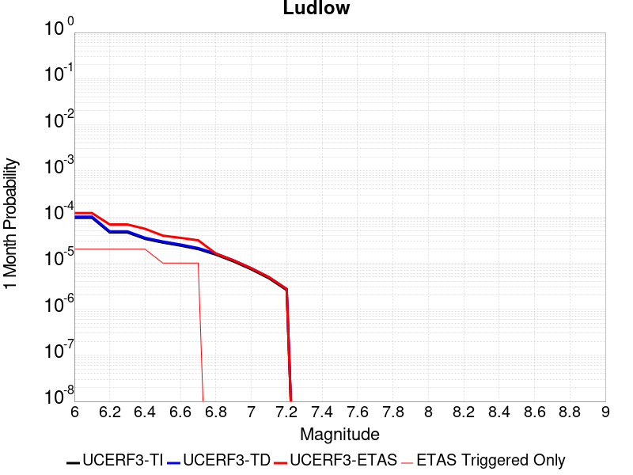 | 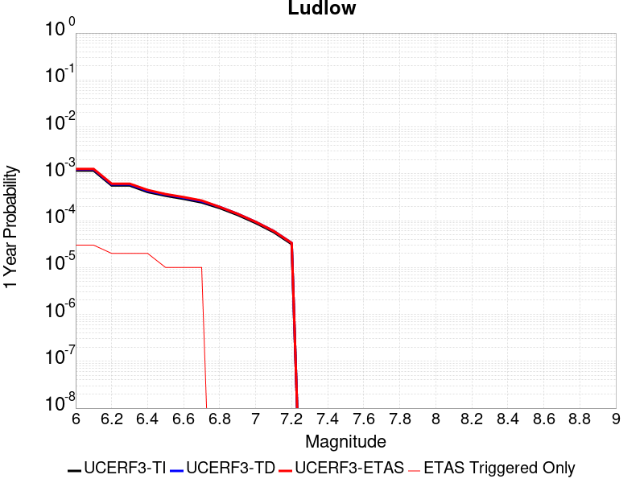 |  |

| Magnitude | 1 wk TI Prob | 1 wk TD Prob | 1 wk ETAS Prob | 1 wk ETAS/TD Gain | 1 wk ETAS Triggered Only | 1 mo TI Prob | 1 mo TD Prob | 1 mo ETAS Prob | 1 mo ETAS/TD Gain | 1 mo ETAS Triggered Only | 1 yr TI Prob | 1 yr TD Prob | 1 yr ETAS Prob | 1 yr ETAS/TD Gain | 1 yr ETAS Triggered Only | 10 yr TI Prob | 10 yr TD Prob | 10 yr ETAS Prob | 10 yr ETAS/TD Gain | 10 yr ETAS Triggered Only |
|-----|-----|-----|-----|-----|-----|-----|-----|-----|-----|-----|-----|-----|-----|-----|-----|-----|-----|-----|-----|-----|
| 6.0 | 2.2407607E-5 | 2.3657429E-5 | 4.3656957E-5 | 1.8453804 | 2.0E-5 | 9.602906E-5 | 1.0138529E-4 | 1.2138326E-4 | 1.1972473 | 2.0E-5 | 0.0011685267 | 0.001233711 | 0.001263674 | 1.0242869 | 3.0E-5 | 0.011624013 | 0.012273132 | 0.012302764 | 1.0024143 | 3.0E-5 |
| 6.1 | 2.2407607E-5 | 2.3657429E-5 | 4.3656957E-5 | 1.8453804 | 2.0E-5 | 9.602906E-5 | 1.0138529E-4 | 1.2138326E-4 | 1.1972473 | 2.0E-5 | 0.0011685267 | 0.001233711 | 0.001263674 | 1.0242869 | 3.0E-5 | 0.011624013 | 0.012273132 | 0.012302764 | 1.0024143 | 3.0E-5 |
| 6.2 | 1.0781252E-5 | 1.1365745E-5 | 3.136552E-5 | 2.7596533 | 2.0E-5 | 4.620455E-5 | 4.870945E-5 | 6.8708476E-5 | 1.4105779 | 2.0E-5 | 5.623952E-4 | 5.9288024E-4 | 6.1286835E-4 | 1.0337136 | 2.0E-5 | 0.00560974 | 0.005913404 | 0.005933285 | 1.0033622 | 2.0E-5 |
| 6.3 | 1.0781252E-5 | 1.1365745E-5 | 3.136552E-5 | 2.7596533 | 2.0E-5 | 4.620455E-5 | 4.870945E-5 | 6.8708476E-5 | 1.4105779 | 2.0E-5 | 5.623952E-4 | 5.9288024E-4 | 6.1286835E-4 | 1.0337136 | 2.0E-5 | 0.00560974 | 0.005913404 | 0.005933285 | 1.0033622 | 2.0E-5 |
| 6.4 | 7.814439E-6 | 8.237788E-6 | 2.8237624E-5 | 3.4278162 | 2.0E-5 | 3.3490025E-5 | 3.5304336E-5 | 5.530363E-5 | 1.5664827 | 2.0E-5 | 4.0766477E-4 | 4.2974693E-4 | 4.4973832E-4 | 1.046519 | 2.0E-5 | 0.0040691774 | 0.0042893053 | 0.0043092193 | 1.0046427 | 2.0E-5 |
| 6.5 | 6.4986366E-6 | 6.850969E-6 | 1.68509E-5 | 2.4596376 | 1.0E-5 | 2.7851002E-5 | 2.936097E-5 | 3.9360675E-5 | 1.3405782 | 1.0E-5 | 3.390332E-4 | 3.574121E-4 | 3.6740853E-4 | 1.0279689 | 1.0E-5 | 0.003385164 | 0.0035684688 | 0.0035784333 | 1.0027924 | 1.0E-5 |
| 6.6 | 5.582177E-6 | 5.8860483E-6 | 1.588599E-5 | 2.6989229 | 1.0E-5 | 2.3923398E-5 | 2.522568E-5 | 3.522543E-5 | 1.3964114 | 1.0E-5 | 2.9122844E-4 | 3.070801E-4 | 3.17077E-4 | 1.0325547 | 1.0E-5 | 0.0029084706 | 0.003066631 | 0.0030766004 | 1.003251 | 1.0E-5 |
| 6.7 | 4.6858763E-6 | 4.940463E-6 | 1.4940413E-5 | 3.024092 | 1.0E-5 | 2.0082172E-5 | 2.1173244E-5 | 3.1173033E-5 | 1.4722842 | 1.0E-5 | 2.4447302E-4 | 2.577543E-4 | 2.6775172E-4 | 1.0387866 | 1.0E-5 | 0.0024420423 | 0.0025746098 | 0.002584584 | 1.0038741 | 1.0E-5 |
| 6.8 | 3.5584908E-6 | 3.7520454E-6 | 3.7520454E-6 | 1.0 | 0.0 | 1.5250586E-5 | 1.6080097E-5 | 1.6080097E-5 | 1.0 | 0.0 | 1.8566006E-4 | 1.9575801E-4 | 1.9575801E-4 | 1.0 | 0.0 | 0.0018550502 | 0.0019558968 | 0.0019558968 | 1.0 | 0.0 |
| 6.9 | 2.532834E-6 | 2.6710227E-6 | 2.6710227E-6 | 1.0 | 0.0 | 1.0854958E-5 | 1.1447192E-5 | 1.1447192E-5 | 1.0 | 0.0 | 1.3215111E-4 | 1.3936093E-4 | 1.3936093E-4 | 1.0 | 0.0 | 0.0013207254 | 0.0013927629 | 0.0013927629 | 1.0 | 0.0 |
| 7.0 | 1.7083285E-6 | 1.801957E-6 | 1.801957E-6 | 1.0 | 0.0 | 7.3213873E-6 | 7.7226505E-6 | 7.7226505E-6 | 1.0 | 0.0 | 8.913424E-5 | 9.4019386E-5 | 9.4019386E-5 | 1.0 | 0.0 | 8.9098496E-4 | 9.3981257E-4 | 9.3981257E-4 | 1.0 | 0.0 |
| 7.1 | 1.0905424E-6 | 1.1497702E-6 | 1.1497702E-6 | 1.0 | 0.0 | 4.6737446E-6 | 4.927578E-6 | 4.927578E-6 | 1.0 | 0.0 | 5.6901354E-5 | 5.999171E-5 | 5.999171E-5 | 1.0 | 0.0 | 5.6886784E-4 | 5.997649E-4 | 5.997649E-4 | 1.0 | 0.0 |
| 7.2 | 6.06668E-7 | 6.387322E-7 | 6.387322E-7 | 1.0 | 0.0 | 2.600003E-6 | 2.7374213E-6 | 2.7374213E-6 | 1.0 | 0.0 | 3.1654577E-5 | 3.3327666E-5 | 3.3327666E-5 | 1.0 | 0.0 | 3.1650066E-4 | 3.332335E-4 | 3.332335E-4 | 1.0 | 0.0 |

## White Wolf
*[(top)](#table-of-contents)*

| 1 Week | 1 Month | 1 Year | 10 Year |
|-----|-----|-----|-----|
|  |  |  | 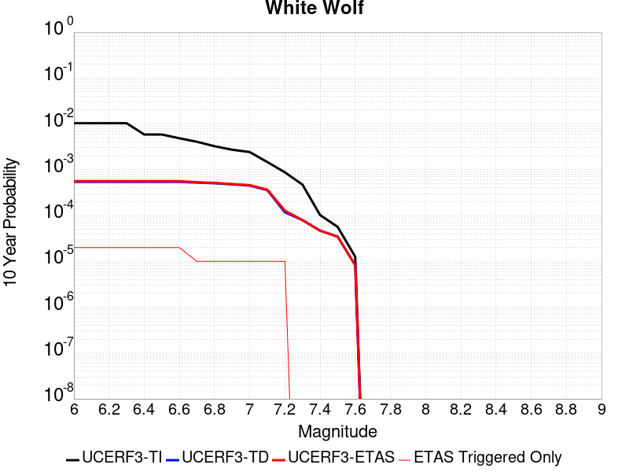 |

| Magnitude | 1 wk TI Prob | 1 wk TD Prob | 1 wk ETAS Prob | 1 wk ETAS/TD Gain | 1 wk ETAS Triggered Only | 1 mo TI Prob | 1 mo TD Prob | 1 mo ETAS Prob | 1 mo ETAS/TD Gain | 1 mo ETAS Triggered Only | 1 yr TI Prob | 1 yr TD Prob | 1 yr ETAS Prob | 1 yr ETAS/TD Gain | 1 yr ETAS Triggered Only | 10 yr TI Prob | 10 yr TD Prob | 10 yr ETAS Prob | 10 yr ETAS/TD Gain | 10 yr ETAS Triggered Only |
|-----|-----|-----|-----|-----|-----|-----|-----|-----|-----|-----|-----|-----|-----|-----|-----|-----|-----|-----|-----|-----|
| 6.0 | 2.0037822E-5 | 1.0468736E-6 | 1.0468736E-6 | 1.0 | 0.0 | 8.587355E-5 | 4.4865938E-6 | 4.4865938E-6 | 1.0 | 0.0 | 0.001045009 | 5.462296E-5 | 6.4622414E-5 | 1.1830631 | 1.0E-5 | 0.010401085 | 5.4610043E-4 | 5.660895E-4 | 1.0366033 | 2.0E-5 |
| 6.1 | 2.0037822E-5 | 1.0468736E-6 | 1.0468736E-6 | 1.0 | 0.0 | 8.587355E-5 | 4.4865938E-6 | 4.4865938E-6 | 1.0 | 0.0 | 0.001045009 | 5.462296E-5 | 6.4622414E-5 | 1.1830631 | 1.0E-5 | 0.010401085 | 5.4610043E-4 | 5.660895E-4 | 1.0366033 | 2.0E-5 |
| 6.2 | 2.0037822E-5 | 1.0468736E-6 | 1.0468736E-6 | 1.0 | 0.0 | 8.587355E-5 | 4.4865938E-6 | 4.4865938E-6 | 1.0 | 0.0 | 0.001045009 | 5.462296E-5 | 6.4622414E-5 | 1.1830631 | 1.0E-5 | 0.010401085 | 5.4610043E-4 | 5.660895E-4 | 1.0366033 | 2.0E-5 |
| 6.3 | 2.0037822E-5 | 1.0468736E-6 | 1.0468736E-6 | 1.0 | 0.0 | 8.587355E-5 | 4.4865938E-6 | 4.4865938E-6 | 1.0 | 0.0 | 0.001045009 | 5.462296E-5 | 6.4622414E-5 | 1.1830631 | 1.0E-5 | 0.010401085 | 5.4610043E-4 | 5.660895E-4 | 1.0366033 | 2.0E-5 |
| 6.4 | 1.132487E-5 | 1.0468736E-6 | 1.0468736E-6 | 1.0 | 0.0 | 4.8534253E-5 | 4.4865938E-6 | 4.4865938E-6 | 1.0 | 0.0 | 5.907443E-4 | 5.462296E-5 | 6.4622414E-5 | 1.1830631 | 1.0E-5 | 0.005891764 | 5.4610043E-4 | 5.660895E-4 | 1.0366033 | 2.0E-5 |
| 6.5 | 1.132487E-5 | 1.0468736E-6 | 1.0468736E-6 | 1.0 | 0.0 | 4.8534253E-5 | 4.4865938E-6 | 4.4865938E-6 | 1.0 | 0.0 | 5.907443E-4 | 5.462296E-5 | 6.4622414E-5 | 1.1830631 | 1.0E-5 | 0.005891764 | 5.4610043E-4 | 5.660895E-4 | 1.0366033 | 2.0E-5 |
| 6.6 | 9.347473E-6 | 1.0468736E-6 | 1.0468736E-6 | 1.0 | 0.0 | 4.0059982E-5 | 4.4865938E-6 | 4.4865938E-6 | 1.0 | 0.0 | 4.8762115E-4 | 5.462296E-5 | 6.4622414E-5 | 1.1830631 | 1.0E-5 | 0.0048655253 | 5.4610043E-4 | 5.660895E-4 | 1.0366033 | 2.0E-5 |
| 6.7 | 7.842647E-6 | 1.0047925E-6 | 1.0047925E-6 | 1.0 | 0.0 | 3.361091E-5 | 4.3062464E-6 | 4.3062464E-6 | 1.0 | 0.0 | 4.0913603E-4 | 5.242734E-5 | 5.242734E-5 | 1.0 | 0.0 | 0.004083836 | 5.241547E-4 | 5.341494E-4 | 1.0190684 | 1.0E-5 |
| 6.8 | 6.26597E-6 | 9.73443E-7 | 9.73443E-7 | 1.0 | 0.0 | 2.685388E-5 | 4.171892E-6 | 4.171892E-6 | 1.0 | 0.0 | 3.2689696E-4 | 5.0791652E-5 | 5.0791652E-5 | 1.0 | 0.0 | 0.003264165 | 5.078053E-4 | 5.178003E-4 | 1.0196825 | 1.0E-5 |
| 6.9 | 5.258436E-6 | 9.1828633E-7 | 9.1828633E-7 | 1.0 | 0.0 | 2.2535958E-5 | 3.9355073E-6 | 3.9355073E-6 | 1.0 | 0.0 | 2.7434074E-4 | 4.7913796E-5 | 4.7913796E-5 | 1.0 | 0.0 | 0.0027400232 | 4.7903945E-4 | 4.8903463E-4 | 1.0208651 | 1.0E-5 |
| 7.0 | 4.675028E-6 | 8.6608276E-7 | 8.6608276E-7 | 1.0 | 0.0 | 2.003568E-5 | 3.7117782E-6 | 3.7117782E-6 | 1.0 | 0.0 | 2.4390711E-4 | 4.519001E-5 | 4.519001E-5 | 1.0 | 0.0 | 0.0024363957 | 4.5181293E-4 | 4.618084E-4 | 1.0221231 | 1.0E-5 |
| 7.1 | 2.8270078E-6 | 6.873876E-7 | 6.873876E-7 | 1.0 | 0.0 | 1.2115692E-5 | 2.9459438E-6 | 2.9459438E-6 | 1.0 | 0.0 | 1.4749856E-4 | 3.5866316E-5 | 3.5866316E-5 | 1.0 | 0.0 | 0.001474007 | 3.586094E-4 | 3.686058E-4 | 1.0278755 | 1.0E-5 |
| 7.2 | 1.6881406E-6 | 2.2703898E-7 | 2.2703898E-7 | 1.0 | 0.0 | 7.2348685E-6 | 9.730238E-7 | 9.730238E-7 | 1.0 | 0.0 | 8.808096E-5 | 1.1846502E-5 | 1.1846502E-5 | 1.0 | 0.0 | 8.8046055E-4 | 1.1845886E-4 | 1.2845769E-4 | 1.0844074 | 1.0E-5 |
| 7.3 | 9.086107E-7 | 1.5264881E-7 | 1.5264881E-7 | 1.0 | 0.0 | 3.8940398E-6 | 6.5420903E-7 | 6.5420903E-7 | 1.0 | 0.0 | 4.7408903E-5 | 7.964967E-6 | 7.964967E-6 | 1.0 | 0.0 | 4.739879E-4 | 7.9646896E-5 | 7.9646896E-5 | 1.0 | 0.0 |
| 7.4 | 1.9717383E-7 | 9.003459E-8 | 9.003459E-8 | 1.0 | 0.0 | 8.450304E-7 | 3.8586248E-7 | 3.8586248E-7 | 1.0 | 0.0 | 1.0288197E-5 | 4.6978657E-6 | 4.6978657E-6 | 1.0 | 0.0 | 1.028772E-4 | 4.6977697E-5 | 4.6977697E-5 | 1.0 | 0.0 |
| 7.5 | 1.086975E-7 | 6.659703E-8 | 6.659703E-8 | 1.0 | 0.0 | 4.6584634E-7 | 2.8541584E-7 | 2.8541584E-7 | 1.0 | 0.0 | 5.6716644E-6 | 3.4749323E-6 | 3.4749323E-6 | 1.0 | 0.0 | 5.6715195E-5 | 3.4748802E-5 | 3.4748802E-5 | 1.0 | 0.0 |
| 7.6 | 2.4217808E-8 | 1.5820925E-8 | 1.5820925E-8 | 1.0 | 0.0 | 1.03790605E-7 | 6.780396E-8 | 6.780396E-8 | 1.0 | 0.0 | 1.2636499E-6 | 8.255129E-7 | 8.255129E-7 | 1.0 | 0.0 | 1.2636427E-5 | 8.255104E-6 | 8.255104E-6 | 1.0 | 0.0 |

## Baker
*[(top)](#table-of-contents)*

| 1 Week | 1 Month | 1 Year | 10 Year |
|-----|-----|-----|-----|
|  |  |  |  |

| Magnitude | 1 wk TI Prob | 1 wk TD Prob | 1 wk ETAS Prob | 1 wk ETAS/TD Gain | 1 wk ETAS Triggered Only | 1 mo TI Prob | 1 mo TD Prob | 1 mo ETAS Prob | 1 mo ETAS/TD Gain | 1 mo ETAS Triggered Only | 1 yr TI Prob | 1 yr TD Prob | 1 yr ETAS Prob | 1 yr ETAS/TD Gain | 1 yr ETAS Triggered Only | 10 yr TI Prob | 10 yr TD Prob | 10 yr ETAS Prob | 10 yr ETAS/TD Gain | 10 yr ETAS Triggered Only |
|-----|-----|-----|-----|-----|-----|-----|-----|-----|-----|-----|-----|-----|-----|-----|-----|-----|-----|-----|-----|-----|
| 6.0 | 5.695525E-6 | 5.834856E-6 | 5.834856E-6 | 1.0 | 0.0 | 2.4409164E-5 | 2.500631E-5 | 2.500631E-5 | 1.0 | 0.0 | 2.9714106E-4 | 3.044133E-4 | 3.244072E-4 | 1.0656801 | 2.0E-5 | 0.0029674405 | 0.0030403587 | 0.0030602978 | 1.0065582 | 2.0E-5 |
| 6.1 | 5.695525E-6 | 5.834856E-6 | 5.834856E-6 | 1.0 | 0.0 | 2.4409164E-5 | 2.500631E-5 | 2.500631E-5 | 1.0 | 0.0 | 2.9714106E-4 | 3.044133E-4 | 3.244072E-4 | 1.0656801 | 2.0E-5 | 0.0029674405 | 0.0030403587 | 0.0030602978 | 1.0065582 | 2.0E-5 |
| 6.2 | 5.695525E-6 | 5.834856E-6 | 5.834856E-6 | 1.0 | 0.0 | 2.4409164E-5 | 2.500631E-5 | 2.500631E-5 | 1.0 | 0.0 | 2.9714106E-4 | 3.044133E-4 | 3.244072E-4 | 1.0656801 | 2.0E-5 | 0.0029674405 | 0.0030403587 | 0.0030602978 | 1.0065582 | 2.0E-5 |
| 6.3 | 3.2995713E-6 | 3.3836786E-6 | 3.3836786E-6 | 1.0 | 0.0 | 1.4140943E-5 | 1.4501402E-5 | 1.4501402E-5 | 1.0 | 0.0 | 1.7215237E-4 | 1.7654074E-4 | 1.8653898E-4 | 1.0566342 | 1.0E-5 | 0.0017201907 | 0.0017640521 | 0.0017740343 | 1.0056587 | 1.0E-5 |
| 6.4 | 3.2995713E-6 | 3.3836786E-6 | 3.3836786E-6 | 1.0 | 0.0 | 1.4140943E-5 | 1.4501402E-5 | 1.4501402E-5 | 1.0 | 0.0 | 1.7215237E-4 | 1.7654074E-4 | 1.8653898E-4 | 1.0566342 | 1.0E-5 | 0.0017201907 | 0.0017640521 | 0.0017740343 | 1.0056587 | 1.0E-5 |
| 6.5 | 2.782202E-6 | 2.8558507E-6 | 2.8558507E-6 | 1.0 | 0.0 | 1.1923668E-5 | 1.2239304E-5 | 1.2239304E-5 | 1.0 | 0.0 | 1.4516099E-4 | 1.4900367E-4 | 1.5900217E-4 | 1.0671024 | 1.0E-5 | 0.001450662 | 0.0014890704 | 0.0014990554 | 1.0067056 | 1.0E-5 |
| 6.6 | 2.3163404E-6 | 2.380929E-6 | 2.380929E-6 | 1.0 | 0.0 | 9.927136E-6 | 1.0203942E-5 | 1.0203942E-5 | 1.0 | 0.0 | 1.20856166E-4 | 1.2422612E-4 | 1.3422487E-4 | 1.0804883 | 1.0E-5 | 0.0012079047 | 0.001241587 | 0.0012515745 | 1.0080442 | 1.0E-5 |
| 6.7 | 2.037056E-6 | 2.0965088E-6 | 2.0965088E-6 | 1.0 | 0.0 | 8.7302105E-6 | 8.985007E-6 | 8.985007E-6 | 1.0 | 0.0 | 1.0628513E-4 | 1.0938713E-4 | 1.1938604E-4 | 1.0914084 | 1.0E-5 | 0.0010623431 | 0.0010933491 | 0.0011033381 | 1.0091362 | 1.0E-5 |
| 6.8 | 1.8356744E-6 | 1.8915364E-6 | 1.8915364E-6 | 1.0 | 0.0 | 7.867153E-6 | 8.10656E-6 | 8.10656E-6 | 1.0 | 0.0 | 9.577837E-5 | 9.869304E-5 | 1.0869205E-4 | 1.1013143 | 1.0E-5 | 9.57371E-4 | 9.865061E-4 | 9.964962E-4 | 1.0101268 | 1.0E-5 |
| 6.9 | 1.6310546E-6 | 1.6832144E-6 | 1.6832144E-6 | 1.0 | 0.0 | 6.9902153E-6 | 7.213757E-6 | 7.213757E-6 | 1.0 | 0.0 | 8.510255E-5 | 8.782406E-5 | 8.782406E-5 | 1.0 | 0.0 | 8.5069967E-4 | 8.779048E-4 | 8.779048E-4 | 1.0 | 0.0 |
| 7.0 | 1.2058036E-6 | 1.2508729E-6 | 1.2508729E-6 | 1.0 | 0.0 | 5.1677193E-6 | 5.3608724E-6 | 5.3608724E-6 | 1.0 | 0.0 | 6.291517E-5 | 6.526669E-5 | 6.526669E-5 | 1.0 | 0.0 | 6.289736E-4 | 6.5247755E-4 | 6.5247755E-4 | 1.0 | 0.0 |
| 7.1 | 1.052382E-6 | 1.0951668E-6 | 1.0951668E-6 | 1.0 | 0.0 | 4.5102006E-6 | 4.693564E-6 | 4.693564E-6 | 1.0 | 0.0 | 5.491031E-5 | 5.7142646E-5 | 5.7142646E-5 | 1.0 | 0.0 | 5.4896745E-4 | 5.712804E-4 | 5.712804E-4 | 1.0 | 0.0 |
| 7.2 | 1.0067454E-6 | 1.0487769E-6 | 1.0487769E-6 | 1.0 | 0.0 | 4.3146156E-6 | 4.4947506E-6 | 4.4947506E-6 | 1.0 | 0.0 | 5.252918E-5 | 5.4722223E-5 | 5.4722223E-5 | 1.0 | 0.0 | 5.251676E-4 | 5.4708833E-4 | 5.4708833E-4 | 1.0 | 0.0 |
| 7.3 | 9.3596316E-7 | 9.76778E-7 | 9.76778E-7 | 1.0 | 0.0 | 4.0112645E-6 | 4.186185E-6 | 4.186185E-6 | 1.0 | 0.0 | 4.8836053E-5 | 5.0965617E-5 | 5.0965617E-5 | 1.0 | 0.0 | 4.8825322E-4 | 5.095401E-4 | 5.095401E-4 | 1.0 | 0.0 |
| 7.4 | 8.8117395E-7 | 9.2077187E-7 | 9.2077187E-7 | 1.0 | 0.0 | 3.7764542E-6 | 3.9461593E-6 | 3.9461593E-6 | 1.0 | 0.0 | 4.5977362E-5 | 4.8043436E-5 | 4.8043436E-5 | 1.0 | 0.0 | 4.596785E-4 | 4.8033125E-4 | 4.8033125E-4 | 1.0 | 0.0 |
| 7.5 | 8.292386E-7 | 8.674649E-7 | 8.674649E-7 | 1.0 | 0.0 | 3.5538749E-6 | 3.7177015E-6 | 3.7177015E-6 | 1.0 | 0.0 | 4.326757E-5 | 4.5262084E-5 | 4.5262084E-5 | 1.0 | 0.0 | 4.3259145E-4 | 4.5252938E-4 | 4.5252938E-4 | 1.0 | 0.0 |
| 7.6 | 7.553842E-7 | 7.9145207E-7 | 7.9145207E-7 | 1.0 | 0.0 | 3.2373566E-6 | 3.3919332E-6 | 3.3919332E-6 | 1.0 | 0.0 | 3.9414106E-5 | 4.129601E-5 | 4.129601E-5 | 1.0 | 0.0 | 3.9407116E-4 | 4.1288408E-4 | 4.1288408E-4 | 1.0 | 0.0 |
| 7.7 | 6.5285366E-7 | 6.852842E-7 | 6.852842E-7 | 1.0 | 0.0 | 2.797941E-6 | 2.9369291E-6 | 2.9369291E-6 | 1.0 | 0.0 | 3.40644E-5 | 3.5756533E-5 | 3.5756533E-5 | 1.0 | 0.0 | 3.405918E-4 | 3.5750846E-4 | 3.5750846E-4 | 1.0 | 0.0 |
| 7.8 | 3.4586725E-7 | 3.648288E-7 | 3.648288E-7 | 1.0 | 0.0 | 1.4822873E-6 | 1.5635511E-6 | 1.5635511E-6 | 1.0 | 0.0 | 1.80467E-5 | 1.9036073E-5 | 1.9036073E-5 | 1.0 | 0.0 | 1.8045233E-4 | 1.9034486E-4 | 1.9034486E-4 | 1.0 | 0.0 |
| 7.9 | 2.5591178E-9 | 2.6696871E-9 | 2.6696871E-9 | 1.0 | 0.0 | 1.0967647E-8 | 1.1441516E-8 | 1.1441516E-8 | 1.0 | 0.0 | 1.335311E-7 | 1.3930045E-7 | 1.3930045E-7 | 1.0 | 0.0 | 1.3353102E-6 | 1.3930046E-6 | 1.3930046E-6 | 1.0 | 0.0 |

## Cleghorn Pass
*[(top)](#table-of-contents)*

| 1 Week | 1 Month | 1 Year | 10 Year |
|-----|-----|-----|-----|
|  |  |  |  |

| Magnitude | 1 wk TI Prob | 1 wk TD Prob | 1 wk ETAS Prob | 1 wk ETAS/TD Gain | 1 wk ETAS Triggered Only | 1 mo TI Prob | 1 mo TD Prob | 1 mo ETAS Prob | 1 mo ETAS/TD Gain | 1 mo ETAS Triggered Only | 1 yr TI Prob | 1 yr TD Prob | 1 yr ETAS Prob | 1 yr ETAS/TD Gain | 1 yr ETAS Triggered Only | 10 yr TI Prob | 10 yr TD Prob | 10 yr ETAS Prob | 10 yr ETAS/TD Gain | 10 yr ETAS Triggered Only |
|-----|-----|-----|-----|-----|-----|-----|-----|-----|-----|-----|-----|-----|-----|-----|-----|-----|-----|-----|-----|-----|
| 6.0 | 1.0522846E-5 | 1.1040714E-5 | 2.1040603E-5 | 1.9057286 | 1.0E-5 | 4.509713E-5 | 4.7316782E-5 | 5.731631E-5 | 1.2113315 | 1.0E-5 | 5.4891926E-4 | 5.759822E-4 | 5.9597066E-4 | 1.0347033 | 2.0E-5 | 0.0054756533 | 0.005750059 | 0.0057699443 | 1.0034583 | 2.0E-5 |
| 6.1 | 1.0522846E-5 | 1.1040714E-5 | 2.1040603E-5 | 1.9057286 | 1.0E-5 | 4.509713E-5 | 4.7316782E-5 | 5.731631E-5 | 1.2113315 | 1.0E-5 | 5.4891926E-4 | 5.759822E-4 | 5.9597066E-4 | 1.0347033 | 2.0E-5 | 0.0054756533 | 0.005750059 | 0.0057699443 | 1.0034583 | 2.0E-5 |
| 6.2 | 2.1045846E-6 | 2.2082168E-6 | 1.2208195E-5 | 5.5285306 | 1.0E-5 | 9.019617E-6 | 9.463776E-6 | 1.9463681E-5 | 2.0566506 | 1.0E-5 | 1.098083E-4 | 1.1521958E-4 | 1.3521727E-4 | 1.1735616 | 2.0E-5 | 0.0010975406 | 0.0011520098 | 0.0011719867 | 1.017341 | 2.0E-5 |
| 6.3 | 2.1045846E-6 | 2.2082168E-6 | 1.2208195E-5 | 5.5285306 | 1.0E-5 | 9.019617E-6 | 9.463776E-6 | 1.9463681E-5 | 2.0566506 | 1.0E-5 | 1.098083E-4 | 1.1521958E-4 | 1.3521727E-4 | 1.1735616 | 2.0E-5 | 0.0010975406 | 0.0011520098 | 0.0011719867 | 1.017341 | 2.0E-5 |
| 6.4 | 1.7259927E-6 | 1.8108889E-6 | 1.8108889E-6 | 1.0 | 0.0 | 7.3970905E-6 | 7.760952E-6 | 7.760952E-6 | 1.0 | 0.0 | 9.005586E-5 | 9.4489595E-5 | 1.0448865E-4 | 1.1058217 | 1.0E-5 | 9.001937E-4 | 9.4489596E-4 | 9.548865E-4 | 1.0105731 | 1.0E-5 |

## San Jacinto (Borrego)
*[(top)](#table-of-contents)*

| 1 Week | 1 Month | 1 Year | 10 Year |
|-----|-----|-----|-----|
| 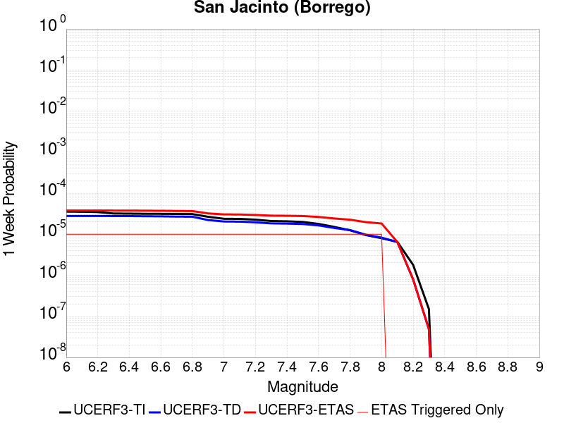 |  |  |  |

| Magnitude | 1 wk TI Prob | 1 wk TD Prob | 1 wk ETAS Prob | 1 wk ETAS/TD Gain | 1 wk ETAS Triggered Only | 1 mo TI Prob | 1 mo TD Prob | 1 mo ETAS Prob | 1 mo ETAS/TD Gain | 1 mo ETAS Triggered Only | 1 yr TI Prob | 1 yr TD Prob | 1 yr ETAS Prob | 1 yr ETAS/TD Gain | 1 yr ETAS Triggered Only | 10 yr TI Prob | 10 yr TD Prob | 10 yr ETAS Prob | 10 yr ETAS/TD Gain | 10 yr ETAS Triggered Only |
|-----|-----|-----|-----|-----|-----|-----|-----|-----|-----|-----|-----|-----|-----|-----|-----|-----|-----|-----|-----|-----|
| 6.0 | 3.543992E-5 | 2.7933444E-5 | 3.7933165E-5 | 1.3579838 | 1.0E-5 | 1.5187653E-4 | 1.1970933E-4 | 1.2970813E-4 | 1.0835257 | 1.0E-5 | 0.0018475284 | 0.001456499 | 0.0014764698 | 1.0137116 | 2.0E-5 | 0.018322436 | 0.014871439 | 0.014891142 | 1.0013249 | 2.0E-5 |
| 6.1 | 3.542281E-5 | 2.7933444E-5 | 3.7933165E-5 | 1.3579838 | 1.0E-5 | 1.5180321E-4 | 1.1970933E-4 | 1.2970813E-4 | 1.0835257 | 1.0E-5 | 0.0018466372 | 0.001456499 | 0.0014764698 | 1.0137116 | 2.0E-5 | 0.018313672 | 0.014871439 | 0.014891142 | 1.0013249 | 2.0E-5 |
| 6.2 | 3.4688688E-5 | 2.7933444E-5 | 3.7933165E-5 | 1.3579838 | 1.0E-5 | 1.4865733E-4 | 1.1970933E-4 | 1.2970813E-4 | 1.0835257 | 1.0E-5 | 0.0018084005 | 0.001456499 | 0.0014764698 | 1.0137116 | 2.0E-5 | 0.017937548 | 0.014871439 | 0.014891142 | 1.0013249 | 2.0E-5 |
| 6.3 | 3.2087122E-5 | 2.7778793E-5 | 3.7778515E-5 | 1.3599769 | 1.0E-5 | 1.3750899E-4 | 1.1904661E-4 | 1.2904541E-4 | 1.0839907 | 1.0E-5 | 0.0016728862 | 0.0014484411 | 0.001468412 | 1.013788 | 2.0E-5 | 0.016603488 | 0.014792597 | 0.014812301 | 1.001332 | 2.0E-5 |
| 6.4 | 3.1828724E-5 | 2.774577E-5 | 3.7745493E-5 | 1.3604053 | 1.0E-5 | 1.364017E-4 | 1.1890509E-4 | 1.289039E-4 | 1.0840907 | 1.0E-5 | 0.0016594254 | 0.0014467203 | 0.0014666914 | 1.0138043 | 2.0E-5 | 0.016470885 | 0.01477579 | 0.014795494 | 1.0013336 | 2.0E-5 |
| 6.5 | 3.1563577E-5 | 2.7485452E-5 | 3.7485177E-5 | 1.3638189 | 1.0E-5 | 1.3526545E-4 | 1.1778954E-4 | 1.2778837E-4 | 1.0848871 | 1.0E-5 | 0.0016456128 | 0.0014331564 | 0.0014531278 | 1.0139352 | 2.0E-5 | 0.0163348 | 0.014643186 | 0.0146628935 | 1.0013459 | 2.0E-5 |
| 6.6 | 3.1467625E-5 | 2.7329666E-5 | 3.7329395E-5 | 1.3658928 | 1.0E-5 | 1.3485427E-4 | 1.17121956E-4 | 1.2712079E-4 | 1.0853711 | 1.0E-5 | 0.0016406142 | 0.0014250393 | 0.0014450108 | 1.0140147 | 2.0E-5 | 0.016285548 | 0.014563348 | 0.014583057 | 1.0013533 | 2.0E-5 |
| 6.7 | 3.1223695E-5 | 2.6947682E-5 | 3.694741E-5 | 1.3710794 | 1.0E-5 | 1.3380898E-4 | 1.1548502E-4 | 1.2548387E-4 | 1.0865813 | 1.0E-5 | 0.0016279068 | 0.0014051354 | 0.0014251072 | 1.0142136 | 2.0E-5 | 0.01616033 | 0.01436762 | 0.014387334 | 1.001372 | 2.0E-5 |
| 6.8 | 3.1015585E-5 | 2.6768674E-5 | 3.6768404E-5 | 1.373561 | 1.0E-5 | 1.3291716E-4 | 1.1471791E-4 | 1.2471677E-4 | 1.0871603 | 1.0E-5 | 0.001617065 | 0.0013958078 | 0.0014157798 | 1.0143086 | 2.0E-5 | 0.016053487 | 0.014274874 | 0.014294588 | 1.001381 | 2.0E-5 |
| 6.9 | 2.6641965E-5 | 2.2190488E-5 | 3.2190266E-5 | 1.4506335 | 1.0E-5 | 1.1417485E-4 | 9.509865E-5 | 1.050977E-4 | 1.105144 | 1.0E-5 | 0.0013891924 | 0.001157215 | 0.0011771919 | 1.0172628 | 2.0E-5 | 0.0138054015 | 0.011885386 | 0.011905149 | 1.0016627 | 2.0E-5 |
| 7.0 | 2.3854353E-5 | 2.0485062E-5 | 3.0484856E-5 | 1.4881506 | 1.0E-5 | 1.02228936E-4 | 8.7790184E-5 | 9.778931E-5 | 1.1138979 | 1.0E-5 | 0.0012439266 | 0.001068324 | 0.0010883026 | 1.018701 | 2.0E-5 | 0.012369866 | 0.010985749 | 0.011005528 | 1.0018005 | 2.0E-5 |
| 7.1 | 2.3672901E-5 | 2.0321548E-5 | 3.0321344E-5 | 1.4920785 | 1.0E-5 | 1.0145135E-4 | 8.708945E-5 | 9.708858E-5 | 1.1148145 | 1.0E-5 | 0.0012344702 | 0.0010598009 | 0.0010797797 | 1.0188515 | 2.0E-5 | 0.0122763505 | 0.01090098 | 0.010920762 | 1.0018147 | 2.0E-5 |
| 7.2 | 2.2717244E-5 | 1.9548863E-5 | 2.9548666E-5 | 1.5115287 | 1.0E-5 | 9.735599E-5 | 8.377816E-5 | 9.377732E-5 | 1.1193528 | 1.0E-5 | 0.0011846646 | 0.0010195242 | 0.0010395037 | 1.019597 | 2.0E-5 | 0.01178369 | 0.010498457 | 0.010518246 | 1.001885 | 2.0E-5 |
| 7.3 | 2.1016205E-5 | 1.8390432E-5 | 2.8390248E-5 | 1.543751 | 1.0E-5 | 9.006634E-5 | 7.881377E-5 | 8.881299E-5 | 1.1268713 | 1.0E-5 | 0.001096006 | 9.5913734E-4 | 9.791182E-4 | 1.0208321 | 2.0E-5 | 0.010906163 | 0.009894083 | 0.009913885 | 1.0020014 | 2.0E-5 |
| 7.4 | 2.0683625E-5 | 1.819294E-5 | 2.8192759E-5 | 1.5496538 | 1.0E-5 | 8.86411E-5 | 7.796742E-5 | 8.796665E-5 | 1.1282487 | 1.0E-5 | 0.001078671 | 9.4884203E-4 | 9.688231E-4 | 1.0210583 | 2.0E-5 | 0.010734501 | 0.009790815 | 0.00981062 | 1.0020227 | 2.0E-5 |
| 7.5 | 1.9993966E-5 | 1.7787928E-5 | 2.778775E-5 | 1.562169 | 1.0E-5 | 8.568561E-5 | 7.6231765E-5 | 8.6231E-5 | 1.131169 | 1.0E-5 | 0.001042723 | 9.2772854E-4 | 9.4770995E-4 | 1.021538 | 2.0E-5 | 0.010378438 | 0.009577702 | 0.009597511 | 1.0020682 | 2.0E-5 |
| 7.6 | 1.788966E-5 | 1.6441034E-5 | 2.644087E-5 | 1.6082243 | 1.0E-5 | 7.666772E-5 | 7.045968E-5 | 8.045897E-5 | 1.1419151 | 1.0E-5 | 9.3302975E-4 | 8.575107E-4 | 8.774936E-4 | 1.0233033 | 2.0E-5 | 0.00929122 | 0.00886951 | 0.008889332 | 1.0022349 | 2.0E-5 |
| 7.7 | 1.5125781E-5 | 1.4242966E-5 | 2.4242825E-5 | 1.702091 | 1.0E-5 | 6.4823165E-5 | 6.1039864E-5 | 7.103925E-5 | 1.1638174 | 1.0E-5 | 7.889362E-4 | 7.4290775E-4 | 7.628929E-4 | 1.0269012 | 2.0E-5 | 0.007861412 | 0.007717176 | 0.007737022 | 1.0025716 | 2.0E-5 |
| 7.8 | 1.250089E-5 | 1.2635926E-5 | 2.26358E-5 | 1.7913843 | 1.0E-5 | 5.3574146E-5 | 5.415285E-5 | 6.415231E-5 | 1.1846524 | 1.0E-5 | 6.5207E-4 | 6.591121E-4 | 6.7909894E-4 | 1.0303239 | 2.0E-5 | 0.006501599 | 0.0068706553 | 0.006890518 | 1.002891 | 2.0E-5 |
| 7.9 | 9.561E-6 | 9.759346E-6 | 1.9759247E-5 | 2.024649 | 1.0E-5 | 4.0975072E-5 | 4.1825097E-5 | 5.182468E-5 | 1.2390809 | 1.0E-5 | 4.987573E-4 | 5.0910213E-4 | 5.29092E-4 | 1.0392648 | 2.0E-5 | 0.0049763937 | 0.005354963 | 0.0053748554 | 1.0037148 | 2.0E-5 |
| 8.0 | 8.01699E-6 | 8.297771E-6 | 1.8297687E-5 | 2.205133 | 1.0E-5 | 3.4358076E-5 | 3.5561392E-5 | 4.556104E-5 | 1.2811939 | 1.0E-5 | 4.1822926E-4 | 4.3287448E-4 | 4.5286582E-4 | 1.0461828 | 2.0E-5 | 0.0041744304 | 0.004575734 | 0.0045956424 | 1.0043509 | 2.0E-5 |
| 8.1 | 6.541947E-6 | 6.465709E-6 | 6.465709E-6 | 1.0 | 0.0 | 2.8036617E-5 | 2.7709888E-5 | 2.7709888E-5 | 1.0 | 0.0 | 3.4129233E-4 | 3.3731616E-4 | 3.473128E-4 | 1.0296358 | 1.0E-5 | 0.0034076865 | 0.0035825386 | 0.0035925028 | 1.0027813 | 1.0E-5 |
| 8.2 | 1.7968189E-6 | 7.9757825E-7 | 7.9757825E-7 | 1.0 | 0.0 | 7.70063E-6 | 3.4181883E-6 | 3.4181883E-6 | 1.0 | 0.0 | 9.3751136E-5 | 4.161567E-5 | 4.161567E-5 | 1.0 | 0.0 | 9.371159E-4 | 4.7149012E-4 | 4.7149012E-4 | 1.0 | 0.0 |
| 8.3 | 1.5167889E-7 | 4.9005383E-8 | 4.9005383E-8 | 1.0 | 0.0 | 6.500522E-7 | 2.1002305E-7 | 2.1002305E-7 | 1.0 | 0.0 | 7.9143565E-6 | 2.557028E-6 | 2.557028E-6 | 1.0 | 0.0 | 7.914075E-5 | 2.9710194E-5 | 2.9710194E-5 | 1.0 | 0.0 |

## Owens Valley
*[(top)](#table-of-contents)*

| 1 Week | 1 Month | 1 Year | 10 Year |
|-----|-----|-----|-----|
|  |  |  | 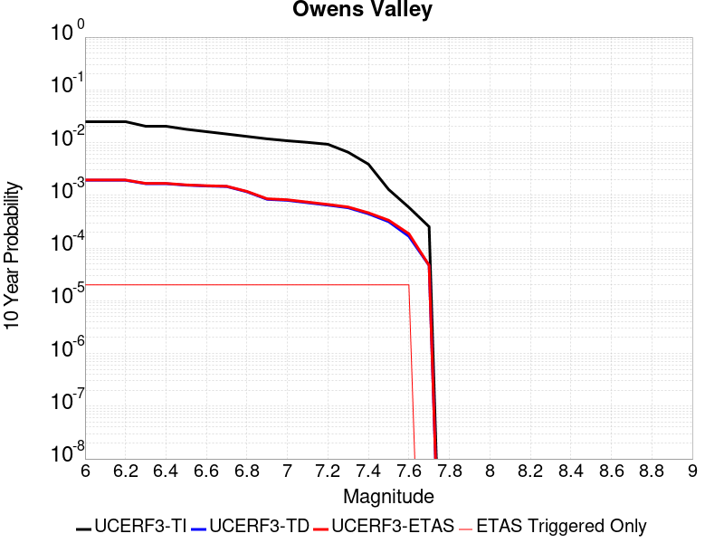 |

| Magnitude | 1 wk TI Prob | 1 wk TD Prob | 1 wk ETAS Prob | 1 wk ETAS/TD Gain | 1 wk ETAS Triggered Only | 1 mo TI Prob | 1 mo TD Prob | 1 mo ETAS Prob | 1 mo ETAS/TD Gain | 1 mo ETAS Triggered Only | 1 yr TI Prob | 1 yr TD Prob | 1 yr ETAS Prob | 1 yr ETAS/TD Gain | 1 yr ETAS Triggered Only | 10 yr TI Prob | 10 yr TD Prob | 10 yr ETAS Prob | 10 yr ETAS/TD Gain | 10 yr ETAS Triggered Only |
|-----|-----|-----|-----|-----|-----|-----|-----|-----|-----|-----|-----|-----|-----|-----|-----|-----|-----|-----|-----|-----|
| 6.0 | 4.83821E-5 | 3.621193E-6 | 3.621193E-6 | 1.0 | 0.0 | 2.0733538E-4 | 1.5519312E-5 | 1.5519312E-5 | 1.0 | 0.0 | 0.002521386 | 1.8893222E-4 | 2.0892844E-4 | 1.1058381 | 2.0E-5 | 0.024929691 | 0.001929822 | 0.0019497834 | 1.0103437 | 2.0E-5 |
| 6.1 | 4.83821E-5 | 3.621193E-6 | 3.621193E-6 | 1.0 | 0.0 | 2.0733538E-4 | 1.5519312E-5 | 1.5519312E-5 | 1.0 | 0.0 | 0.002521386 | 1.8893222E-4 | 2.0892844E-4 | 1.1058381 | 2.0E-5 | 0.024929691 | 0.001929822 | 0.0019497834 | 1.0103437 | 2.0E-5 |
| 6.2 | 4.83821E-5 | 3.621193E-6 | 3.621193E-6 | 1.0 | 0.0 | 2.0733538E-4 | 1.5519312E-5 | 1.5519312E-5 | 1.0 | 0.0 | 0.002521386 | 1.8893222E-4 | 2.0892844E-4 | 1.1058381 | 2.0E-5 | 0.024929691 | 0.001929822 | 0.0019497834 | 1.0103437 | 2.0E-5 |
| 6.3 | 3.953008E-5 | 3.153231E-6 | 3.153231E-6 | 1.0 | 0.0 | 1.6940363E-4 | 1.3513782E-5 | 1.3513782E-5 | 1.0 | 0.0 | 0.002060538 | 1.645186E-4 | 1.8451532E-4 | 1.1215467 | 2.0E-5 | 0.020415364 | 0.0016622683 | 0.001682235 | 1.0120118 | 2.0E-5 |
| 6.4 | 3.953008E-5 | 3.153231E-6 | 3.153231E-6 | 1.0 | 0.0 | 1.6940363E-4 | 1.3513782E-5 | 1.3513782E-5 | 1.0 | 0.0 | 0.002060538 | 1.645186E-4 | 1.8451532E-4 | 1.1215467 | 2.0E-5 | 0.020415364 | 0.0016622683 | 0.001682235 | 1.0120118 | 2.0E-5 |
| 6.5 | 3.457342E-5 | 2.970874E-6 | 2.970874E-6 | 1.0 | 0.0 | 1.4816338E-4 | 1.2732259E-5 | 1.2732259E-5 | 1.0 | 0.0 | 0.0018023965 | 1.5500492E-4 | 1.7500183E-4 | 1.1290082 | 2.0E-5 | 0.017878477 | 0.0015564174 | 0.0015763863 | 1.01283 | 2.0E-5 |
| 6.6 | 3.1127765E-5 | 2.8738657E-6 | 2.8738657E-6 | 1.0 | 0.0 | 1.3339789E-4 | 1.2316514E-5 | 1.2316514E-5 | 1.0 | 0.0 | 0.0016229092 | 1.4994392E-4 | 1.6994092E-4 | 1.1333632 | 2.0E-5 | 0.016111081 | 0.001501446 | 0.001521416 | 1.0133005 | 2.0E-5 |
| 6.7 | 2.806885E-5 | 2.8102859E-6 | 2.8102859E-6 | 1.0 | 0.0 | 1.2028952E-4 | 1.204403E-5 | 1.204403E-5 | 1.0 | 0.0 | 0.001463541 | 1.4662689E-4 | 1.6662396E-4 | 1.1363807 | 2.0E-5 | 0.014539397 | 0.0014657174 | 0.0014856881 | 1.0136251 | 2.0E-5 |
| 6.8 | 2.524524E-5 | 2.2352563E-6 | 2.2352563E-6 | 1.0 | 0.0 | 1.0818939E-4 | 9.579636E-6 | 9.579636E-6 | 1.0 | 0.0 | 0.0013164099 | 1.1662613E-4 | 1.366238E-4 | 1.1714681 | 2.0E-5 | 0.01308639 | 0.0011659319 | 0.0011859086 | 1.0171337 | 2.0E-5 |
| 6.9 | 2.2704568E-5 | 1.6080646E-6 | 1.6080646E-6 | 1.0 | 0.0 | 9.730166E-5 | 6.8916875E-6 | 6.8916875E-6 | 1.0 | 0.0 | 0.0011840039 | 8.390308E-5 | 1.0390141E-4 | 1.2383503 | 2.0E-5 | 0.011777153 | 8.3894585E-4 | 8.5892907E-4 | 1.0238194 | 2.0E-5 |
| 7.0 | 2.0871712E-5 | 1.5394511E-6 | 1.5394511E-6 | 1.0 | 0.0 | 8.944713E-5 | 6.597631E-6 | 6.597631E-6 | 1.0 | 0.0 | 0.0010884746 | 8.032321E-5 | 1.0032161E-4 | 1.248974 | 2.0E-5 | 0.010831586 | 8.0313E-4 | 8.231139E-4 | 1.0248826 | 2.0E-5 |
| 7.1 | 1.944928E-5 | 1.3863316E-6 | 1.3863316E-6 | 1.0 | 0.0 | 8.335139E-5 | 5.941408E-6 | 5.941408E-6 | 1.0 | 0.0 | 0.0010143308 | 7.233425E-5 | 9.2332804E-5 | 1.2764742 | 2.0E-5 | 0.010097133 | 7.232817E-4 | 7.4326724E-4 | 1.0276318 | 2.0E-5 |
| 7.2 | 1.7876306E-5 | 1.2488347E-6 | 1.2488347E-6 | 1.0 | 0.0 | 7.6610486E-5 | 5.352138E-6 | 5.352138E-6 | 1.0 | 0.0 | 9.3233347E-4 | 6.516034E-5 | 8.515904E-5 | 1.3069152 | 2.0E-5 | 0.009284316 | 6.5157266E-4 | 6.715596E-4 | 1.0306749 | 2.0E-5 |
| 7.3 | 1.2618672E-5 | 1.1114453E-6 | 1.1114453E-6 | 1.0 | 0.0 | 5.40789E-5 | 4.763328E-6 | 4.763328E-6 | 1.0 | 0.0 | 6.582117E-4 | 5.7991983E-5 | 7.799082E-5 | 1.3448553 | 2.0E-5 | 0.0065626553 | 5.7992374E-4 | 5.999122E-4 | 1.0344673 | 2.0E-5 |
| 7.4 | 7.4874442E-6 | 8.548014E-7 | 8.548014E-7 | 1.0 | 0.0 | 3.208865E-5 | 3.6634294E-6 | 3.6634294E-6 | 1.0 | 0.0 | 3.906093E-4 | 4.4601344E-5 | 6.4600456E-5 | 1.4483969 | 2.0E-5 | 0.003899234 | 4.4603736E-4 | 4.6602843E-4 | 1.0448192 | 2.0E-5 |
| 7.5 | 2.4734156E-6 | 6.0683584E-7 | 6.0683584E-7 | 1.0 | 0.0 | 1.060031E-5 | 2.6007224E-6 | 2.6007224E-6 | 1.0 | 0.0 | 1.2905113E-4 | 3.1663338E-5 | 5.1662704E-5 | 1.6316253 | 2.0E-5 | 0.0012897621 | 3.165886E-4 | 3.3658225E-4 | 1.0631535 | 2.0E-5 |
| 7.6 | 1.1328841E-6 | 3.1963748E-7 | 3.1963748E-7 | 1.0 | 0.0 | 4.8552088E-6 | 1.3698742E-6 | 1.3698742E-6 | 1.0 | 0.0 | 5.9110564E-5 | 1.6678092E-5 | 3.667776E-5 | 2.199158 | 2.0E-5 | 5.9094845E-4 | 1.667686E-4 | 1.8676526E-4 | 1.1199067 | 2.0E-5 |
| 7.7 | 4.8613185E-7 | 8.9632934E-8 | 8.9632934E-8 | 1.0 | 0.0 | 2.0834207E-6 | 3.8414112E-7 | 3.8414112E-7 | 1.0 | 0.0 | 2.536535E-5 | 4.6769087E-6 | 4.6769087E-6 | 1.0 | 0.0 | 2.5362454E-4 | 4.676817E-5 | 4.676817E-5 | 1.0 | 0.0 |

## San Jacinto (Coyote Creek)
*[(top)](#table-of-contents)*

| 1 Week | 1 Month | 1 Year | 10 Year |
|-----|-----|-----|-----|
|  | 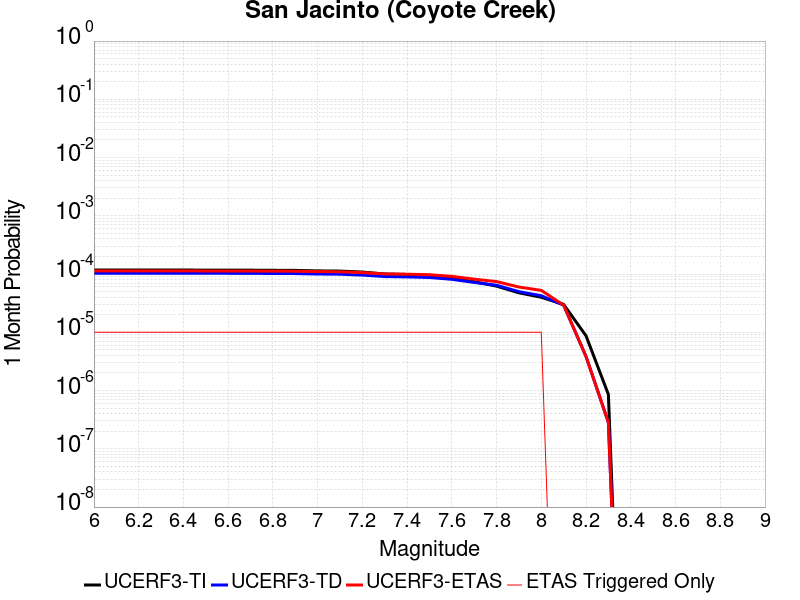 |  | 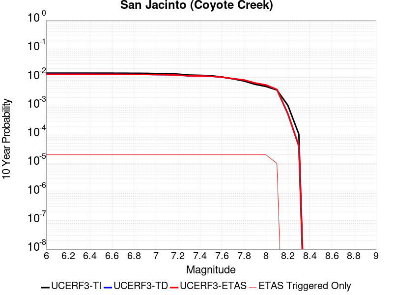 |

| Magnitude | 1 wk TI Prob | 1 wk TD Prob | 1 wk ETAS Prob | 1 wk ETAS/TD Gain | 1 wk ETAS Triggered Only | 1 mo TI Prob | 1 mo TD Prob | 1 mo ETAS Prob | 1 mo ETAS/TD Gain | 1 mo ETAS Triggered Only | 1 yr TI Prob | 1 yr TD Prob | 1 yr ETAS Prob | 1 yr ETAS/TD Gain | 1 yr ETAS Triggered Only | 10 yr TI Prob | 10 yr TD Prob | 10 yr ETAS Prob | 10 yr ETAS/TD Gain | 10 yr ETAS Triggered Only |
|-----|-----|-----|-----|-----|-----|-----|-----|-----|-----|-----|-----|-----|-----|-----|-----|-----|-----|-----|-----|-----|
| 6.0 | 2.7374346E-5 | 2.4152421E-5 | 3.415218E-5 | 1.4140272 | 1.0E-5 | 1.1731335E-4 | 1.0350628E-4 | 1.13505244E-4 | 1.0966024 | 1.0E-5 | 0.0014273542 | 0.001259463 | 0.0012794379 | 1.0158598 | 2.0E-5 | 0.01418221 | 0.012931943 | 0.012951684 | 1.0015266 | 2.0E-5 |
| 6.1 | 2.7374346E-5 | 2.4152421E-5 | 3.415218E-5 | 1.4140272 | 1.0E-5 | 1.1731335E-4 | 1.0350628E-4 | 1.13505244E-4 | 1.0966024 | 1.0E-5 | 0.0014273542 | 0.001259463 | 0.0012794379 | 1.0158598 | 2.0E-5 | 0.01418221 | 0.012931943 | 0.012951684 | 1.0015266 | 2.0E-5 |
| 6.2 | 2.7374346E-5 | 2.4152421E-5 | 3.415218E-5 | 1.4140272 | 1.0E-5 | 1.1731335E-4 | 1.0350628E-4 | 1.13505244E-4 | 1.0966024 | 1.0E-5 | 0.0014273542 | 0.001259463 | 0.0012794379 | 1.0158598 | 2.0E-5 | 0.01418221 | 0.012931943 | 0.012951684 | 1.0015266 | 2.0E-5 |
| 6.3 | 2.7374346E-5 | 2.4152421E-5 | 3.415218E-5 | 1.4140272 | 1.0E-5 | 1.1731335E-4 | 1.0350628E-4 | 1.13505244E-4 | 1.0966024 | 1.0E-5 | 0.0014273542 | 0.001259463 | 0.0012794379 | 1.0158598 | 2.0E-5 | 0.01418221 | 0.012931943 | 0.012951684 | 1.0015266 | 2.0E-5 |
| 6.4 | 2.7374346E-5 | 2.4152421E-5 | 3.415218E-5 | 1.4140272 | 1.0E-5 | 1.1731335E-4 | 1.0350628E-4 | 1.13505244E-4 | 1.0966024 | 1.0E-5 | 0.0014273542 | 0.001259463 | 0.0012794379 | 1.0158598 | 2.0E-5 | 0.01418221 | 0.012931943 | 0.012951684 | 1.0015266 | 2.0E-5 |
| 6.5 | 2.7282445E-5 | 2.4038494E-5 | 3.4038254E-5 | 1.4159894 | 1.0E-5 | 1.16919524E-4 | 1.03018065E-4 | 1.13017035E-4 | 1.0970603 | 1.0E-5 | 0.0014225657 | 0.001253526 | 0.0012735008 | 1.015935 | 2.0E-5 | 0.014134934 | 0.012873269 | 0.012893011 | 1.0015336 | 2.0E-5 |
| 6.6 | 2.7282445E-5 | 2.4038494E-5 | 3.4038254E-5 | 1.4159894 | 1.0E-5 | 1.16919524E-4 | 1.03018065E-4 | 1.13017035E-4 | 1.0970603 | 1.0E-5 | 0.0014225657 | 0.001253526 | 0.0012735008 | 1.015935 | 2.0E-5 | 0.014134934 | 0.012873269 | 0.012893011 | 1.0015336 | 2.0E-5 |
| 6.7 | 2.7216198E-5 | 2.3963614E-5 | 3.3963373E-5 | 1.4172894 | 1.0E-5 | 1.1663563E-4 | 1.0269717E-4 | 1.1269614E-4 | 1.0973637 | 1.0E-5 | 0.0014191137 | 0.0012496236 | 0.0012695986 | 1.0159848 | 2.0E-5 | 0.014100855 | 0.012834677 | 0.01285442 | 1.0015383 | 2.0E-5 |
| 6.8 | 2.7078617E-5 | 2.3880828E-5 | 3.3880588E-5 | 1.418736 | 1.0E-5 | 1.1604605E-4 | 1.02342405E-4 | 1.1234138E-4 | 1.0977012 | 1.0E-5 | 0.001411945 | 0.0012453091 | 0.0012652843 | 1.0160403 | 2.0E-5 | 0.014030075 | 0.012791819 | 0.012811564 | 1.0015435 | 2.0E-5 |
| 6.9 | 2.6982952E-5 | 2.3800336E-5 | 3.3800097E-5 | 1.4201522 | 1.0E-5 | 1.15636096E-4 | 1.01997466E-4 | 1.1199645E-4 | 1.0980316 | 1.0E-5 | 0.0014069602 | 0.0012411143 | 0.0012610896 | 1.0160946 | 2.0E-5 | 0.013980856 | 0.012750106 | 0.012769851 | 1.0015486 | 2.0E-5 |
| 7.0 | 2.6449972E-5 | 2.3377343E-5 | 3.337711E-5 | 1.4277546 | 1.0E-5 | 1.1335209E-4 | 1.00184785E-4 | 1.1018378E-4 | 1.0998056 | 1.0E-5 | 0.001379188 | 0.0012190698 | 0.0012390454 | 1.0163859 | 2.0E-5 | 0.0137065975 | 0.012531462 | 0.012551212 | 1.001576 | 2.0E-5 |
| 7.1 | 2.6257849E-5 | 2.3203378E-5 | 3.3203145E-5 | 1.4309617 | 1.0E-5 | 1.1252879E-4 | 9.943927E-5 | 1.09438275E-4 | 1.1005539 | 1.0E-5 | 0.0013691769 | 0.0012100033 | 0.0012299791 | 1.0165089 | 2.0E-5 | 0.013607717 | 0.012441383 | 0.012461134 | 1.0015875 | 2.0E-5 |
| 7.2 | 2.5270041E-5 | 2.2398073E-5 | 3.239785E-5 | 1.446457 | 1.0E-5 | 1.0829568E-4 | 9.598822E-5 | 1.0598727E-4 | 1.1041695 | 1.0E-5 | 0.0013177024 | 0.0011680324 | 0.001188009 | 1.0171028 | 2.0E-5 | 0.013099162 | 0.012022524 | 0.012042284 | 1.0016435 | 2.0E-5 |
| 7.3 | 2.339701E-5 | 2.1129852E-5 | 3.112964E-5 | 1.4732541 | 1.0E-5 | 1.0026905E-4 | 9.0553374E-5 | 1.0055247E-4 | 1.1104221 | 1.0E-5 | 0.001220092 | 0.0011019319 | 0.0011219098 | 1.01813 | 2.0E-5 | 0.012134149 | 0.011361412 | 0.011381185 | 1.0017403 | 2.0E-5 |
| 7.4 | 2.296333E-5 | 2.0860187E-5 | 3.0859977E-5 | 1.4793721 | 1.0E-5 | 9.841056E-5 | 8.939775E-5 | 9.939685E-5 | 1.1118497 | 1.0E-5 | 0.0011974899 | 0.0010878762 | 0.0011078544 | 1.0183644 | 2.0E-5 | 0.011910575 | 0.011220528 | 0.0112403035 | 1.0017624 | 2.0E-5 |
| 7.5 | 2.2188895E-5 | 2.0383068E-5 | 3.0382864E-5 | 1.4905933 | 1.0E-5 | 9.50918E-5 | 8.735309E-5 | 9.735222E-5 | 1.1144679 | 1.0E-5 | 0.0011571277 | 0.001063007 | 0.0010829858 | 1.0187945 | 2.0E-5 | 0.011511209 | 0.010970126 | 0.010989906 | 1.0018032 | 2.0E-5 |
| 7.6 | 2.0013189E-5 | 1.8969224E-5 | 2.8969034E-5 | 1.5271597 | 1.0E-5 | 8.5767984E-5 | 8.129415E-5 | 9.129333E-5 | 1.123 | 1.0E-5 | 0.001043725 | 9.893086E-4 | 0.0010092888 | 1.0201961 | 2.0E-5 | 0.010388365 | 0.010228057 | 0.010247853 | 1.0019354 | 2.0E-5 |
| 7.7 | 1.7230794E-5 | 1.6750411E-5 | 2.6750244E-5 | 1.5969902 | 1.0E-5 | 7.384417E-5 | 7.178551E-5 | 8.178479E-5 | 1.1392939 | 1.0E-5 | 8.986819E-4 | 8.7363896E-4 | 8.936215E-4 | 1.0228728 | 2.0E-5 | 0.008950562 | 0.009066527 | 0.009086345 | 1.002186 | 2.0E-5 |
| 7.8 | 1.4478809E-5 | 1.4997487E-5 | 2.4997336E-5 | 1.6667684 | 1.0E-5 | 6.205057E-5 | 6.4273365E-5 | 7.427272E-5 | 1.1555754 | 1.0E-5 | 7.552038E-4 | 7.8224787E-4 | 8.0223224E-4 | 1.0255474 | 2.0E-5 | 0.0075264242 | 0.008144863 | 0.0081647 | 1.0024356 | 2.0E-5 |
| 7.9 | 1.1114467E-5 | 1.1650795E-5 | 2.1650678E-5 | 1.8583006 | 1.0E-5 | 4.7632562E-5 | 4.9931026E-5 | 5.9930528E-5 | 1.2002662 | 1.0E-5 | 5.797721E-4 | 6.0774124E-4 | 6.277291E-4 | 1.0328888 | 2.0E-5 | 0.0057826187 | 0.00638346 | 0.006403332 | 1.0031132 | 2.0E-5 |
| 8.0 | 9.327402E-6 | 9.904316E-6 | 1.9904217E-5 | 2.0096507 | 1.0E-5 | 3.9973966E-5 | 4.2446383E-5 | 5.2445957E-5 | 1.2355814 | 1.0E-5 | 4.8657437E-4 | 5.1666267E-4 | 5.3665234E-4 | 1.03869 | 2.0E-5 | 0.0048551033 | 0.005452786 | 0.0054726773 | 1.0036478 | 2.0E-5 |
| 8.1 | 7.0235833E-6 | 6.831197E-6 | 6.831197E-6 | 1.0 | 0.0 | 3.0100724E-5 | 2.9276232E-5 | 2.9276232E-5 | 1.0 | 0.0 | 3.664147E-4 | 3.5638033E-4 | 3.6637677E-4 | 1.02805 | 1.0E-5 | 0.003658111 | 0.0037895683 | 0.0037995304 | 1.0026288 | 1.0E-5 |
| 8.2 | 2.0358202E-6 | 8.9996047E-7 | 8.9996047E-7 | 1.0 | 0.0 | 8.724915E-6 | 3.856968E-6 | 3.856968E-6 | 1.0 | 0.0 | 1.06220665E-4 | 4.6957593E-5 | 4.6957593E-5 | 1.0 | 0.0 | 0.001061699 | 5.3285924E-4 | 5.3285924E-4 | 1.0 | 0.0 |
| 8.3 | 2.0051264E-7 | 6.621079E-8 | 6.621079E-8 | 1.0 | 0.0 | 8.5933965E-7 | 2.837605E-7 | 2.837605E-7 | 1.0 | 0.0 | 1.046241E-5 | 3.454779E-6 | 3.454779E-6 | 1.0 | 0.0 | 1.0461917E-4 | 4.016238E-5 | 4.016238E-5 | 1.0 | 0.0 |

## San Andreas (Cholame) rev
*[(top)](#table-of-contents)*

| 1 Week | 1 Month | 1 Year | 10 Year |
|-----|-----|-----|-----|
| 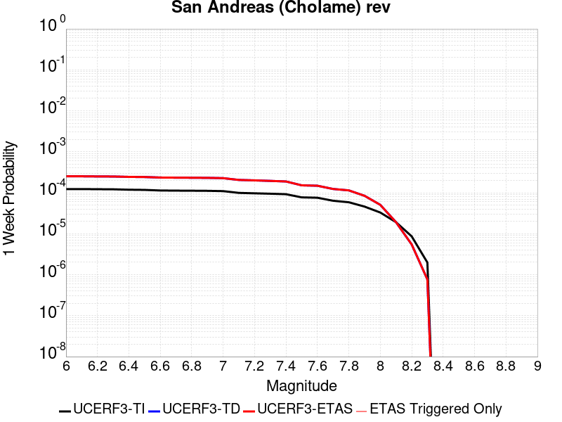 |  | 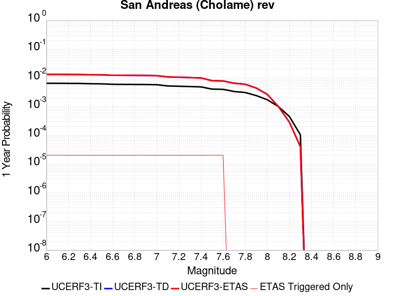 |  |

| Magnitude | 1 wk TI Prob | 1 wk TD Prob | 1 wk ETAS Prob | 1 wk ETAS/TD Gain | 1 wk ETAS Triggered Only | 1 mo TI Prob | 1 mo TD Prob | 1 mo ETAS Prob | 1 mo ETAS/TD Gain | 1 mo ETAS Triggered Only | 1 yr TI Prob | 1 yr TD Prob | 1 yr ETAS Prob | 1 yr ETAS/TD Gain | 1 yr ETAS Triggered Only | 10 yr TI Prob | 10 yr TD Prob | 10 yr ETAS Prob | 10 yr ETAS/TD Gain | 10 yr ETAS Triggered Only |
|-----|-----|-----|-----|-----|-----|-----|-----|-----|-----|-----|-----|-----|-----|-----|-----|-----|-----|-----|-----|-----|
| 6.0 | 1.2302514E-4 | 2.5215113E-4 | 2.5215113E-4 | 1.0 | 0.0 | 5.27144E-4 | 0.0010802018 | 0.001090191 | 1.0092475 | 1.0E-5 | 0.0063991086 | 0.013072659 | 0.013092398 | 1.0015099 | 2.0E-5 | 0.06217949 | 0.12442699 | 0.1244445 | 1.0001408 | 2.0E-5 |
| 6.1 | 1.2302514E-4 | 2.5215113E-4 | 2.5215113E-4 | 1.0 | 0.0 | 5.27144E-4 | 0.0010802018 | 0.001090191 | 1.0092475 | 1.0E-5 | 0.0063991086 | 0.013072659 | 0.013092398 | 1.0015099 | 2.0E-5 | 0.06217949 | 0.12442699 | 0.1244445 | 1.0001408 | 2.0E-5 |
| 6.2 | 1.2203569E-4 | 2.5031884E-4 | 2.5031884E-4 | 1.0 | 0.0 | 5.2290526E-4 | 0.0010723557 | 0.0010823449 | 1.0093153 | 1.0E-5 | 0.006347804 | 0.012978274 | 0.012998015 | 1.001521 | 2.0E-5 | 0.061695136 | 0.12361445 | 0.12363198 | 1.0001417 | 2.0E-5 |
| 6.3 | 1.2142645E-4 | 2.4917856E-4 | 2.4917856E-4 | 1.0 | 0.0 | 5.202953E-4 | 0.0010674726 | 0.001077462 | 1.0093579 | 1.0E-5 | 0.006316212 | 0.01291953 | 0.0129392715 | 1.001528 | 2.0E-5 | 0.06139677 | 0.1231077 | 0.12312523 | 1.0001425 | 2.0E-5 |
| 6.4 | 1.1865206E-4 | 2.4423326E-4 | 2.4423326E-4 | 1.0 | 0.0 | 5.0840975E-4 | 0.0010462956 | 0.0010562852 | 1.0095475 | 1.0E-5 | 0.006172335 | 0.012664723 | 0.01268447 | 1.0015591 | 2.0E-5 | 0.060036868 | 0.12090532 | 0.1209229 | 1.0001454 | 2.0E-5 |
| 6.5 | 1.17443946E-4 | 2.4216558E-4 | 2.4216558E-4 | 1.0 | 0.0 | 5.032341E-4 | 0.0010374413 | 0.0010474309 | 1.0096291 | 1.0E-5 | 0.006109677 | 0.012558166 | 0.012577915 | 1.0015726 | 2.0E-5 | 0.059444077 | 0.11998259 | 0.1200002 | 1.0001467 | 2.0E-5 |
| 6.6 | 1.13579066E-4 | 2.3525437E-4 | 2.3525437E-4 | 1.0 | 0.0 | 4.866766E-4 | 0.0010078449 | 0.0010178349 | 1.0099121 | 1.0E-5 | 0.0059092017 | 0.012201919 | 0.012221675 | 1.0016191 | 2.0E-5 | 0.057545185 | 0.11690384 | 0.1169215 | 1.000151 | 2.0E-5 |
| 6.7 | 1.1271412E-4 | 2.3369725E-4 | 2.3369725E-4 | 1.0 | 0.0 | 4.829711E-4 | 0.0010011768 | 0.0010111667 | 1.0099783 | 1.0E-5 | 0.005864331 | 0.01212164 | 0.012141398 | 1.00163 | 2.0E-5 | 0.057119697 | 0.11620769 | 0.11622536 | 1.0001521 | 2.0E-5 |
| 6.8 | 1.1217975E-4 | 2.325812E-4 | 2.325812E-4 | 1.0 | 0.0 | 4.8068175E-4 | 9.963973E-4 | 0.0010063873 | 1.0100262 | 1.0E-5 | 0.005836608 | 0.0120640965 | 0.012083855 | 1.0016378 | 2.0E-5 | 0.056856725 | 0.11570667 | 0.115724355 | 1.0001528 | 2.0E-5 |
| 6.9 | 1.1146753E-4 | 2.3106842E-4 | 2.3106842E-4 | 1.0 | 0.0 | 4.7763053E-4 | 9.89919E-4 | 9.99909E-4 | 1.0100918 | 1.0E-5 | 0.0057996577 | 0.011986093 | 0.0120058535 | 1.0016485 | 2.0E-5 | 0.056506127 | 0.11502693 | 0.11504463 | 1.0001539 | 2.0E-5 |
| 7.0 | 1.0965793E-4 | 2.2730078E-4 | 2.2730078E-4 | 1.0 | 0.0 | 4.698779E-4 | 9.737841E-4 | 9.837743E-4 | 1.0102593 | 1.0E-5 | 0.005705768 | 0.011791794 | 0.011811558 | 1.0016761 | 2.0E-5 | 0.055614736 | 0.1133308 | 0.11334853 | 1.0001565 | 2.0E-5 |
| 7.1 | 9.927982E-5 | 2.0548643E-4 | 2.0548643E-4 | 1.0 | 0.0 | 4.2541555E-4 | 8.8035996E-4 | 8.9035113E-4 | 1.011349 | 1.0E-5 | 0.0051671406 | 0.010666 | 0.010685787 | 1.0018551 | 2.0E-5 | 0.05048634 | 0.10343333 | 0.10345126 | 1.0001733 | 2.0E-5 |
| 7.2 | 9.696786E-5 | 2.005288E-4 | 2.005288E-4 | 1.0 | 0.0 | 4.1551032E-4 | 8.591271E-4 | 8.691185E-4 | 1.0116297 | 1.0E-5 | 0.00504711 | 0.010409988 | 0.01042978 | 1.0019013 | 2.0E-5 | 0.04934009 | 0.10116881 | 0.10118679 | 1.0001777 | 2.0E-5 |
| 7.3 | 9.4727984E-5 | 1.9481927E-4 | 1.9481927E-4 | 1.0 | 0.0 | 4.0591392E-4 | 8.346735E-4 | 8.4466516E-4 | 1.0119708 | 1.0E-5 | 0.0049308087 | 0.010115068 | 0.010134866 | 1.0019573 | 2.0E-5 | 0.048228268 | 0.09854372 | 0.09856174 | 1.000183 | 2.0E-5 |
| 7.4 | 9.220358E-5 | 1.8852325E-4 | 1.8852325E-4 | 1.0 | 0.0 | 3.9509835E-4 | 8.077075E-4 | 8.176994E-4 | 1.0123707 | 1.0E-5 | 0.004799717 | 0.009789746 | 0.00980955 | 1.002023 | 2.0E-5 | 0.046973653 | 0.095616065 | 0.095634155 | 1.0001892 | 2.0E-5 |
| 7.5 | 7.71631E-5 | 1.5186344E-4 | 1.5186344E-4 | 1.0 | 0.0 | 3.306571E-4 | 6.5068115E-4 | 6.6067465E-4 | 1.0153586 | 1.0E-5 | 0.0040183207 | 0.007893339 | 0.007913181 | 1.0025138 | 2.0E-5 | 0.03946433 | 0.07832433 | 0.07834277 | 1.0002353 | 2.0E-5 |
| 7.6 | 7.5634416E-5 | 1.484566E-4 | 1.484566E-4 | 1.0 | 0.0 | 3.241072E-4 | 6.360876E-4 | 6.4608123E-4 | 1.0157111 | 1.0E-5 | 0.0039388672 | 0.007716934 | 0.0077367797 | 1.0025717 | 2.0E-5 | 0.038697794 | 0.07668804 | 0.07670651 | 1.0002408 | 2.0E-5 |
| 7.7 | 6.3783E-5 | 1.2365977E-4 | 1.2365977E-4 | 1.0 | 0.0 | 2.7332708E-4 | 5.298629E-4 | 5.298629E-4 | 1.0 | 0.0 | 0.0033226798 | 0.006432025 | 0.006432025 | 1.0 | 0.0 | 0.032734364 | 0.06457185 | 0.06457185 | 1.0 | 0.0 |
| 7.8 | 5.863422E-5 | 1.1422686E-4 | 1.1422686E-4 | 1.0 | 0.0 | 2.512653E-4 | 4.8945186E-4 | 4.8945186E-4 | 1.0 | 0.0 | 0.003054864 | 0.0059428154 | 0.0059428154 | 1.0 | 0.0 | 0.030132094 | 0.05968955 | 0.05968955 | 1.0 | 0.0 |
| 7.9 | 4.595283E-5 | 8.431093E-5 | 8.431093E-5 | 1.0 | 0.0 | 1.9692584E-4 | 3.6128255E-4 | 3.6128255E-4 | 1.0 | 0.0 | 0.0023949358 | 0.0043897503 | 0.0043897503 | 1.0 | 0.0 | 0.023692891 | 0.044384085 | 0.044384085 | 1.0 | 0.0 |
| 8.0 | 3.2950178E-5 | 5.08012E-5 | 5.08012E-5 | 1.0 | 0.0 | 1.412074E-4 | 2.1770128E-4 | 2.1770128E-4 | 1.0 | 0.0 | 0.0017178444 | 0.002647293 | 0.002647293 | 1.0 | 0.0 | 0.017046256 | 0.02719375 | 0.02719375 | 1.0 | 0.0 |
| 8.1 | 1.9177472E-5 | 1.9197154E-5 | 1.9197154E-5 | 1.0 | 0.0 | 8.218658E-5 | 8.2270926E-5 | 8.2270926E-5 | 1.0 | 0.0 | 0.0010001622 | 0.0010011889 | 0.0010011889 | 1.0 | 0.0 | 0.009956728 | 0.010764398 | 0.010764398 | 1.0 | 0.0 |
| 8.2 | 8.643924E-6 | 5.478665E-6 | 5.478665E-6 | 1.0 | 0.0 | 3.704486E-5 | 2.3479783E-5 | 2.3479783E-5 | 1.0 | 0.0 | 4.5092785E-4 | 2.8582895E-4 | 2.8582895E-4 | 1.0 | 0.0 | 0.0045001395 | 0.0032508469 | 0.0032508469 | 1.0 | 0.0 |
| 8.3 | 1.983087E-6 | 7.6647797E-7 | 7.6647797E-7 | 1.0 | 0.0 | 8.498917E-6 | 3.2849016E-6 | 3.2849016E-6 | 1.0 | 0.0 | 1.034694E-4 | 3.999296E-5 | 3.999296E-5 | 1.0 | 0.0 | 0.0010342124 | 4.7228087E-4 | 4.7228087E-4 | 1.0 | 0.0 |

## San Andreas (Creeping Section) 2011 CFM
*[(top)](#table-of-contents)*

| 1 Week | 1 Month | 1 Year | 10 Year |
|-----|-----|-----|-----|
|  | 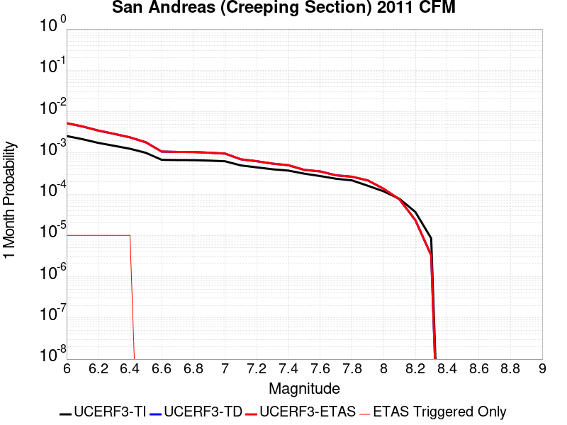 |  |  |

| Magnitude | 1 wk TI Prob | 1 wk TD Prob | 1 wk ETAS Prob | 1 wk ETAS/TD Gain | 1 wk ETAS Triggered Only | 1 mo TI Prob | 1 mo TD Prob | 1 mo ETAS Prob | 1 mo ETAS/TD Gain | 1 mo ETAS Triggered Only | 1 yr TI Prob | 1 yr TD Prob | 1 yr ETAS Prob | 1 yr ETAS/TD Gain | 1 yr ETAS Triggered Only | 10 yr TI Prob | 10 yr TD Prob | 10 yr ETAS Prob | 10 yr ETAS/TD Gain | 10 yr ETAS Triggered Only |
|-----|-----|-----|-----|-----|-----|-----|-----|-----|-----|-----|-----|-----|-----|-----|-----|-----|-----|-----|-----|-----|
| 6.0 | 5.986481E-4 | 0.001227701 | 0.001227701 | 1.0 | 0.0 | 0.0025631124 | 0.005246098 | 0.0052560456 | 1.0018961 | 1.0E-5 | 0.030762846 | 0.061211813 | 0.0612212 | 1.0001534 | 1.0E-5 | 0.26835477 | 0.42596716 | 0.42597863 | 1.000027 | 2.0E-5 |
| 6.1 | 5.015945E-4 | 0.0010218859 | 0.0010218859 | 1.0 | 0.0 | 0.00214792 | 0.0043683136 | 0.00437827 | 1.0022792 | 1.0E-5 | 0.025839351 | 0.051254056 | 0.05126354 | 1.0001851 | 1.0E-5 | 0.23032776 | 0.3728875 | 0.37289375 | 1.0000168 | 1.0E-5 |
| 6.2 | 4.073338E-4 | 8.1082666E-4 | 8.1082666E-4 | 1.0 | 0.0 | 0.0017445484 | 0.003467598 | 0.0034775634 | 1.0028739 | 1.0E-5 | 0.021034058 | 0.040938858 | 0.04094845 | 1.0002342 | 1.0E-5 | 0.19150782 | 0.31306726 | 0.3130741 | 1.0000219 | 1.0E-5 |
| 6.3 | 3.464099E-4 | 6.740175E-4 | 6.740175E-4 | 1.0 | 0.0 | 0.0014837692 | 0.0028834257 | 0.002893397 | 1.0034581 | 1.0E-5 | 0.017915873 | 0.034195323 | 0.03420498 | 1.0002824 | 1.0E-5 | 0.16538359 | 0.27135244 | 0.2713597 | 1.0000268 | 1.0E-5 |
| 6.4 | 2.935057E-4 | 5.545179E-4 | 5.545179E-4 | 1.0 | 0.0 | 0.0012572751 | 0.002372998 | 0.0023829744 | 1.004204 | 1.0E-5 | 0.015200248 | 0.028270293 | 0.028280009 | 1.0003437 | 1.0E-5 | 0.14201577 | 0.23302312 | 0.2330308 | 1.0000329 | 1.0E-5 |
| 6.5 | 2.3409708E-4 | 4.2102532E-4 | 4.2102532E-4 | 1.0 | 0.0 | 0.0010028875 | 0.0018024362 | 0.0018024362 | 1.0 | 0.0 | 0.012141965 | 0.021593295 | 0.021593295 | 1.0 | 0.0 | 0.11499573 | 0.18686365 | 0.18686365 | 1.0 | 0.0 |
| 6.6 | 1.5842178E-4 | 2.5080625E-4 | 2.5080625E-4 | 1.0 | 0.0 | 6.7877385E-4 | 0.0010744325 | 0.0010744325 | 1.0 | 0.0 | 0.0082328 | 0.013001433 | 0.013001433 | 1.0 | 0.0 | 0.07934396 | 0.12318965 | 0.12318965 | 1.0 | 0.0 |
| 6.7 | 1.5616413E-4 | 2.4617155E-4 | 2.4617155E-4 | 1.0 | 0.0 | 6.691031E-4 | 0.0010545887 | 0.0010545887 | 1.0 | 0.0 | 0.0081159435 | 0.012763296 | 0.012763296 | 1.0 | 0.0 | 0.0782586 | 0.121216856 | 0.121216856 | 1.0 | 0.0 |
| 6.8 | 1.5538467E-4 | 2.4440986E-4 | 2.4440986E-4 | 1.0 | 0.0 | 6.6576427E-4 | 0.0010470453 | 0.0010470453 | 1.0 | 0.0 | 0.008075596 | 0.012672617 | 0.012672617 | 1.0 | 0.0 | 0.07788358 | 0.12044768 | 0.12044768 | 1.0 | 0.0 |
| 6.9 | 1.5153569E-4 | 2.3550174E-4 | 2.3550174E-4 | 1.0 | 0.0 | 6.49277E-4 | 0.0010089047 | 0.0010089047 | 1.0 | 0.0 | 0.007876333 | 0.012214754 | 0.012214754 | 1.0 | 0.0 | 0.07602952 | 0.1165177 | 0.1165177 | 1.0 | 0.0 |
| 7.0 | 1.4588932E-4 | 2.2407302E-4 | 2.2407302E-4 | 1.0 | 0.0 | 6.250901E-4 | 9.599615E-4 | 9.599615E-4 | 1.0 | 0.0 | 0.0075839474 | 0.011625397 | 0.011625397 | 1.0 | 0.0 | 0.073302895 | 0.1113634 | 0.1113634 | 1.0 | 0.0 |
| 7.1 | 1.1565079E-4 | 1.6291256E-4 | 1.6291256E-4 | 1.0 | 0.0 | 4.955521E-4 | 6.980107E-4 | 6.980107E-4 | 1.0 | 0.0 | 0.006016669 | 0.008465368 | 0.008465368 | 1.0 | 0.0 | 0.058563538 | 0.083707 | 0.083707 | 1.0 | 0.0 |
| 7.2 | 1.0393792E-4 | 1.4624851E-4 | 1.4624851E-4 | 1.0 | 0.0 | 4.4537216E-4 | 6.2662957E-4 | 6.2662957E-4 | 1.0 | 0.0 | 0.005408933 | 0.007602697 | 0.007602697 | 1.0 | 0.0 | 0.052791595 | 0.0756556 | 0.0756556 | 1.0 | 0.0 |
| 7.3 | 9.332884E-5 | 1.2788622E-4 | 1.2788622E-4 | 1.0 | 0.0 | 3.999194E-4 | 5.479693E-4 | 5.479693E-4 | 1.0 | 0.0 | 0.0048581534 | 0.006651253 | 0.006651253 | 1.0 | 0.0 | 0.047533102 | 0.06651429 | 0.06651429 | 1.0 | 0.0 |
| 7.4 | 8.670252E-5 | 1.1709979E-4 | 1.1709979E-4 | 1.0 | 0.0 | 3.715293E-4 | 5.0176034E-4 | 5.0176034E-4 | 1.0 | 0.0 | 0.004513991 | 0.0060919416 | 0.0060919416 | 1.0 | 0.0 | 0.044233937 | 0.0611787 | 0.0611787 | 1.0 | 0.0 |
| 7.5 | 7.3036405E-5 | 9.011361E-5 | 9.011361E-5 | 1.0 | 0.0 | 3.129756E-4 | 3.861441E-4 | 3.861441E-4 | 1.0 | 0.0 | 0.0038038217 | 0.0046911915 | 0.0046911915 | 1.0 | 0.0 | 0.03739367 | 0.047902368 | 0.047902368 | 1.0 | 0.0 |
| 7.6 | 6.3935775E-5 | 8.285012E-5 | 8.285012E-5 | 1.0 | 0.0 | 2.7398168E-4 | 3.5502372E-4 | 3.5502372E-4 | 1.0 | 0.0 | 0.0033306254 | 0.0043138657 | 0.0043138657 | 1.0 | 0.0 | 0.032811474 | 0.044012927 | 0.044012927 | 1.0 | 0.0 |
| 7.7 | 5.5050095E-5 | 6.6658926E-5 | 6.6658926E-5 | 1.0 | 0.0 | 2.3590765E-4 | 2.8564985E-4 | 2.8564985E-4 | 1.0 | 0.0 | 0.0028683927 | 0.0034722448 | 0.0034722448 | 1.0 | 0.0 | 0.0283165 | 0.03581521 | 0.03581521 | 1.0 | 0.0 |
| 7.8 | 5.027131E-5 | 6.166573E-5 | 6.166573E-5 | 1.0 | 0.0 | 2.1543067E-4 | 2.6425492E-4 | 2.6425492E-4 | 1.0 | 0.0 | 0.0026197135 | 0.0032125604 | 0.0032125604 | 1.0 | 0.0 | 0.025890453 | 0.03314427 | 0.03314427 | 1.0 | 0.0 |
| 7.9 | 3.7271806E-5 | 5.0254795E-5 | 5.0254795E-5 | 1.0 | 0.0 | 1.5972654E-4 | 2.1535992E-4 | 2.1535992E-4 | 1.0 | 0.0 | 0.0019429359 | 0.0026188563 | 0.0026188563 | 1.0 | 0.0 | 0.019260362 | 0.027081393 | 0.027081393 | 1.0 | 0.0 |
| 8.0 | 2.7310243E-5 | 3.1447296E-5 | 3.1447296E-5 | 1.0 | 0.0 | 1.17038646E-4 | 1.3476716E-4 | 1.3476716E-4 | 1.0 | 0.0 | 0.0014240141 | 0.0016395561 | 0.0016395561 | 1.0 | 0.0 | 0.014149235 | 0.017223299 | 0.017223299 | 1.0 | 0.0 |
| 8.1 | 1.7940547E-5 | 1.7411876E-5 | 1.7411876E-5 | 1.0 | 0.0 | 7.688579E-5 | 7.46202E-5 | 7.46202E-5 | 1.0 | 0.0 | 9.3568244E-4 | 9.0812275E-4 | 9.0812275E-4 | 1.0 | 0.0 | 0.009317525 | 0.009804959 | 0.009804959 | 1.0 | 0.0 |
| 8.2 | 8.643924E-6 | 5.478665E-6 | 5.478665E-6 | 1.0 | 0.0 | 3.704486E-5 | 2.3479783E-5 | 2.3479783E-5 | 1.0 | 0.0 | 4.5092785E-4 | 2.8582895E-4 | 2.8582895E-4 | 1.0 | 0.0 | 0.0045001395 | 0.0032508469 | 0.0032508469 | 1.0 | 0.0 |
| 8.3 | 1.983087E-6 | 7.6647797E-7 | 7.6647797E-7 | 1.0 | 0.0 | 8.498917E-6 | 3.2849016E-6 | 3.2849016E-6 | 1.0 | 0.0 | 1.034694E-4 | 3.999296E-5 | 3.999296E-5 | 1.0 | 0.0 | 0.0010342124 | 4.7228087E-4 | 4.7228087E-4 | 1.0 | 0.0 |

## Tin Mountain
*[(top)](#table-of-contents)*

| 1 Week | 1 Month | 1 Year | 10 Year |
|-----|-----|-----|-----|
|  |  |  |  |

| Magnitude | 1 wk TI Prob | 1 wk TD Prob | 1 wk ETAS Prob | 1 wk ETAS/TD Gain | 1 wk ETAS Triggered Only | 1 mo TI Prob | 1 mo TD Prob | 1 mo ETAS Prob | 1 mo ETAS/TD Gain | 1 mo ETAS Triggered Only | 1 yr TI Prob | 1 yr TD Prob | 1 yr ETAS Prob | 1 yr ETAS/TD Gain | 1 yr ETAS Triggered Only | 10 yr TI Prob | 10 yr TD Prob | 10 yr ETAS Prob | 10 yr ETAS/TD Gain | 10 yr ETAS Triggered Only |
|-----|-----|-----|-----|-----|-----|-----|-----|-----|-----|-----|-----|-----|-----|-----|-----|-----|-----|-----|-----|-----|
| 6.0 | 4.083776E-6 | 4.18155E-6 | 4.18155E-6 | 1.0 | 0.0 | 1.750178E-5 | 1.7920827E-5 | 1.7920827E-5 | 1.0 | 0.0 | 2.1306332E-4 | 2.1816794E-4 | 2.3816357E-4 | 1.0916525 | 2.0E-5 | 0.0021285915 | 0.0021799032 | 0.0021998596 | 1.0091547 | 2.0E-5 |
| 6.1 | 4.083776E-6 | 4.18155E-6 | 4.18155E-6 | 1.0 | 0.0 | 1.750178E-5 | 1.7920827E-5 | 1.7920827E-5 | 1.0 | 0.0 | 2.1306332E-4 | 2.1816794E-4 | 2.3816357E-4 | 1.0916525 | 2.0E-5 | 0.0021285915 | 0.0021799032 | 0.0021998596 | 1.0091547 | 2.0E-5 |
| 6.2 | 4.083776E-6 | 4.18155E-6 | 4.18155E-6 | 1.0 | 0.0 | 1.750178E-5 | 1.7920827E-5 | 1.7920827E-5 | 1.0 | 0.0 | 2.1306332E-4 | 2.1816794E-4 | 2.3816357E-4 | 1.0916525 | 2.0E-5 | 0.0021285915 | 0.0021799032 | 0.0021998596 | 1.0091547 | 2.0E-5 |
| 6.3 | 4.083776E-6 | 4.18155E-6 | 4.18155E-6 | 1.0 | 0.0 | 1.750178E-5 | 1.7920827E-5 | 1.7920827E-5 | 1.0 | 0.0 | 2.1306332E-4 | 2.1816794E-4 | 2.3816357E-4 | 1.0916525 | 2.0E-5 | 0.0021285915 | 0.0021799032 | 0.0021998596 | 1.0091547 | 2.0E-5 |
| 6.4 | 4.083776E-6 | 4.18155E-6 | 4.18155E-6 | 1.0 | 0.0 | 1.750178E-5 | 1.7920827E-5 | 1.7920827E-5 | 1.0 | 0.0 | 2.1306332E-4 | 2.1816794E-4 | 2.3816357E-4 | 1.0916525 | 2.0E-5 | 0.0021285915 | 0.0021799032 | 0.0021998596 | 1.0091547 | 2.0E-5 |
| 6.5 | 2.3143427E-6 | 2.3731652E-6 | 2.3731652E-6 | 1.0 | 0.0 | 9.9185745E-6 | 1.0170673E-5 | 1.0170673E-5 | 1.0 | 0.0 | 1.2075195E-4 | 1.2382168E-4 | 1.3382045E-4 | 1.0807513 | 1.0E-5 | 0.0012068636 | 0.0012376028 | 0.0012475904 | 1.0080701 | 1.0E-5 |
| 6.6 | 2.3143427E-6 | 2.3731652E-6 | 2.3731652E-6 | 1.0 | 0.0 | 9.9185745E-6 | 1.0170673E-5 | 1.0170673E-5 | 1.0 | 0.0 | 1.2075195E-4 | 1.2382168E-4 | 1.3382045E-4 | 1.0807513 | 1.0E-5 | 0.0012068636 | 0.0012376028 | 0.0012475904 | 1.0080701 | 1.0E-5 |
| 6.7 | 1.7029532E-6 | 1.7497979E-6 | 1.7497979E-6 | 1.0 | 0.0 | 7.2983503E-6 | 7.4991153E-6 | 7.4991153E-6 | 1.0 | 0.0 | 8.885379E-5 | 9.129844E-5 | 1.01297526E-4 | 1.1095209 | 1.0E-5 | 8.881827E-4 | 9.1266196E-4 | 9.2265283E-4 | 1.010947 | 1.0E-5 |
| 6.8 | 1.2914646E-6 | 1.3299432E-6 | 1.3299432E-6 | 1.0 | 0.0 | 5.534837E-6 | 5.6997465E-6 | 5.6997465E-6 | 1.0 | 0.0 | 6.738455E-5 | 6.939264E-5 | 7.939195E-5 | 1.1440974 | 1.0E-5 | 6.736412E-4 | 6.937531E-4 | 7.0374616E-4 | 1.0144043 | 1.0E-5 |
| 6.9 | 5.8708974E-7 | 6.117028E-7 | 6.117028E-7 | 1.0 | 0.0 | 2.5160964E-6 | 2.621581E-6 | 2.621581E-6 | 1.0 | 0.0 | 3.0633044E-5 | 3.1917323E-5 | 3.1917323E-5 | 1.0 | 0.0 | 3.0628822E-4 | 3.191315E-4 | 3.191315E-4 | 1.0 | 0.0 |
| 7.0 | 4.6248786E-7 | 4.832044E-7 | 4.832044E-7 | 1.0 | 0.0 | 1.9820893E-6 | 2.0708746E-6 | 2.0708746E-6 | 1.0 | 0.0 | 2.413167E-5 | 2.5212645E-5 | 2.5212645E-5 | 1.0 | 0.0 | 2.412905E-4 | 2.5210154E-4 | 2.5210154E-4 | 1.0 | 0.0 |
| 7.1 | 3.804606E-7 | 3.9871725E-7 | 3.9871725E-7 | 1.0 | 0.0 | 1.6305444E-6 | 1.7087873E-6 | 1.7087873E-6 | 1.0 | 0.0 | 1.9851697E-5 | 2.080432E-5 | 2.080432E-5 | 1.0 | 0.0 | 1.9849923E-4 | 2.080271E-4 | 2.080271E-4 | 1.0 | 0.0 |
| 7.2 | 3.5864858E-7 | 3.7617107E-7 | 3.7617107E-7 | 1.0 | 0.0 | 1.5370645E-6 | 1.6121609E-6 | 1.6121609E-6 | 1.0 | 0.0 | 1.87136E-5 | 1.9627916E-5 | 1.9627916E-5 | 1.0 | 0.0 | 1.8712023E-4 | 1.9626514E-4 | 1.9626514E-4 | 1.0 | 0.0 |
| 7.3 | 3.342063E-7 | 3.50637E-7 | 3.50637E-7 | 1.0 | 0.0 | 1.4323119E-6 | 1.5027293E-6 | 1.5027293E-6 | 1.0 | 0.0 | 1.7438259E-5 | 1.829561E-5 | 1.829561E-5 | 1.0 | 0.0 | 1.743689E-4 | 1.8294434E-4 | 1.8294434E-4 | 1.0 | 0.0 |
| 7.4 | 2.971242E-7 | 3.116602E-7 | 3.116602E-7 | 1.0 | 0.0 | 1.2733886E-6 | 1.3356861E-6 | 1.3356861E-6 | 1.0 | 0.0 | 1.5503398E-5 | 1.626189E-5 | 1.626189E-5 | 1.0 | 0.0 | 1.5502315E-4 | 1.6261027E-4 | 1.6261027E-4 | 1.0 | 0.0 |
| 7.5 | 1.4326713E-7 | 1.501262E-7 | 1.501262E-7 | 1.0 | 0.0 | 6.140018E-7 | 6.43398E-7 | 6.43398E-7 | 1.0 | 0.0 | 7.4754466E-6 | 7.833371E-6 | 7.833371E-6 | 1.0 | 0.0 | 7.475195E-5 | 7.83337E-5 | 7.83337E-5 | 1.0 | 0.0 |

## San Jacinto (Anza) rev
*[(top)](#table-of-contents)*

| 1 Week | 1 Month | 1 Year | 10 Year |
|-----|-----|-----|-----|
|  |  | 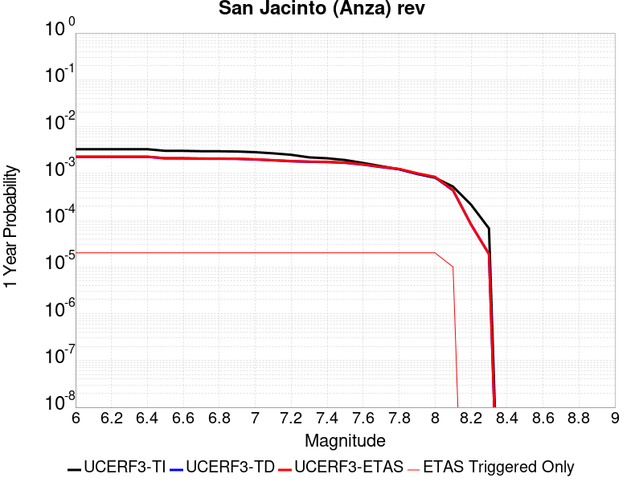 | 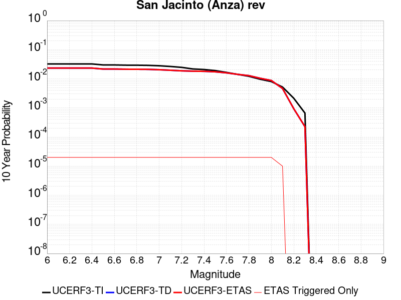 |

| Magnitude | 1 wk TI Prob | 1 wk TD Prob | 1 wk ETAS Prob | 1 wk ETAS/TD Gain | 1 wk ETAS Triggered Only | 1 mo TI Prob | 1 mo TD Prob | 1 mo ETAS Prob | 1 mo ETAS/TD Gain | 1 mo ETAS Triggered Only | 1 yr TI Prob | 1 yr TD Prob | 1 yr ETAS Prob | 1 yr ETAS/TD Gain | 1 yr ETAS Triggered Only | 10 yr TI Prob | 10 yr TD Prob | 10 yr ETAS Prob | 10 yr ETAS/TD Gain | 10 yr ETAS Triggered Only |
|-----|-----|-----|-----|-----|-----|-----|-----|-----|-----|-----|-----|-----|-----|-----|-----|-----|-----|-----|-----|-----|
| 6.0 | 6.3015636E-5 | 4.3312386E-5 | 5.3311953E-5 | 1.2308708 | 1.0E-5 | 2.7003905E-4 | 1.8561137E-4 | 1.9560951E-4 | 1.053866 | 1.0E-5 | 0.0032827691 | 0.0022574882 | 0.002277443 | 1.0088394 | 2.0E-5 | 0.032346968 | 0.023307782 | 0.023327315 | 1.000838 | 2.0E-5 |
| 6.1 | 6.3015636E-5 | 4.3312386E-5 | 5.3311953E-5 | 1.2308708 | 1.0E-5 | 2.7003905E-4 | 1.8561137E-4 | 1.9560951E-4 | 1.053866 | 1.0E-5 | 0.0032827691 | 0.0022574882 | 0.002277443 | 1.0088394 | 2.0E-5 | 0.032346968 | 0.023307782 | 0.023327315 | 1.000838 | 2.0E-5 |
| 6.2 | 6.3015636E-5 | 4.3312386E-5 | 5.3311953E-5 | 1.2308708 | 1.0E-5 | 2.7003905E-4 | 1.8561137E-4 | 1.9560951E-4 | 1.053866 | 1.0E-5 | 0.0032827691 | 0.0022574882 | 0.002277443 | 1.0088394 | 2.0E-5 | 0.032346968 | 0.023307782 | 0.023327315 | 1.000838 | 2.0E-5 |
| 6.3 | 6.3015636E-5 | 4.3312386E-5 | 5.3311953E-5 | 1.2308708 | 1.0E-5 | 2.7003905E-4 | 1.8561137E-4 | 1.9560951E-4 | 1.053866 | 1.0E-5 | 0.0032827691 | 0.0022574882 | 0.002277443 | 1.0088394 | 2.0E-5 | 0.032346968 | 0.023307782 | 0.023327315 | 1.000838 | 2.0E-5 |
| 6.4 | 6.3015636E-5 | 4.3312386E-5 | 5.3311953E-5 | 1.2308708 | 1.0E-5 | 2.7003905E-4 | 1.8561137E-4 | 1.9560951E-4 | 1.053866 | 1.0E-5 | 0.0032827691 | 0.0022574882 | 0.002277443 | 1.0088394 | 2.0E-5 | 0.032346968 | 0.023307782 | 0.023327315 | 1.000838 | 2.0E-5 |
| 6.5 | 5.811017E-5 | 4.009432E-5 | 5.009392E-5 | 1.2494019 | 1.0E-5 | 2.4901982E-4 | 1.7182152E-4 | 1.818198E-4 | 1.0581899 | 1.0E-5 | 0.0030276014 | 0.0020899256 | 0.0021098838 | 1.0095497 | 2.0E-5 | 0.02986684 | 0.021605028 | 0.021624597 | 1.0009058 | 2.0E-5 |
| 6.6 | 5.811017E-5 | 4.009432E-5 | 5.009392E-5 | 1.2494019 | 1.0E-5 | 2.4901982E-4 | 1.7182152E-4 | 1.818198E-4 | 1.0581899 | 1.0E-5 | 0.0030276014 | 0.0020899256 | 0.0021098838 | 1.0095497 | 2.0E-5 | 0.02986684 | 0.021605028 | 0.021624597 | 1.0009058 | 2.0E-5 |
| 6.7 | 5.712442E-5 | 3.951705E-5 | 4.9516653E-5 | 1.2530453 | 1.0E-5 | 2.4479596E-4 | 1.6934783E-4 | 1.7934613E-4 | 1.0590401 | 1.0E-5 | 0.0029763177 | 0.0020598655 | 0.0020798242 | 1.0096893 | 2.0E-5 | 0.029367693 | 0.021297079 | 0.021316653 | 1.0009191 | 2.0E-5 |
| 6.8 | 5.6967532E-5 | 3.9373335E-5 | 4.9372942E-5 | 1.253969 | 1.0E-5 | 2.4412372E-4 | 1.6873197E-4 | 1.7873029E-4 | 1.0592556 | 1.0E-5 | 0.0029681553 | 0.0020523819 | 0.0020723408 | 1.0097247 | 2.0E-5 | 0.029288229 | 0.02122268 | 0.021242257 | 1.0009224 | 2.0E-5 |
| 6.9 | 5.6211324E-5 | 3.9078248E-5 | 4.907786E-5 | 1.2558868 | 1.0E-5 | 2.4088343E-4 | 1.6746749E-4 | 1.7746582E-4 | 1.0597031 | 1.0E-5 | 0.0029288116 | 0.0020370155 | 0.0020569747 | 1.0097983 | 2.0E-5 | 0.028905109 | 0.021060992 | 0.021080572 | 1.0009296 | 2.0E-5 |
| 7.0 | 5.4383527E-5 | 3.793897E-5 | 4.7938593E-5 | 1.2635713 | 1.0E-5 | 2.3305144E-4 | 1.6258548E-4 | 1.7258387E-4 | 1.0614961 | 1.0E-5 | 0.0028337094 | 0.001977686 | 0.0019976464 | 1.0100929 | 2.0E-5 | 0.027978465 | 0.020454587 | 0.020474177 | 1.0009577 | 2.0E-5 |
| 7.1 | 5.1393665E-5 | 3.6401827E-5 | 4.6401463E-5 | 1.2747015 | 1.0E-5 | 2.2023996E-4 | 1.5599852E-4 | 1.6599697E-4 | 1.0640931 | 1.0E-5 | 0.0026781242 | 0.0018976318 | 0.0019175939 | 1.0105195 | 2.0E-5 | 0.026460782 | 0.019625481 | 0.01964509 | 1.0009991 | 2.0E-5 |
| 7.2 | 4.785222E-5 | 3.4752728E-5 | 4.475238E-5 | 1.2877371 | 1.0E-5 | 2.0506482E-4 | 1.4893178E-4 | 1.589303E-4 | 1.0671349 | 1.0E-5 | 0.0024938055 | 0.0018117399 | 0.0018317037 | 1.0110191 | 2.0E-5 | 0.024660049 | 0.018735653 | 0.018755278 | 1.0010475 | 2.0E-5 |
| 7.3 | 4.2143256E-5 | 3.384821E-5 | 4.384787E-5 | 1.2954266 | 1.0E-5 | 1.8060145E-4 | 1.4505572E-4 | 1.5505427E-4 | 1.0689291 | 1.0E-5 | 0.002196605 | 0.0017646261 | 0.0017845909 | 1.0113138 | 2.0E-5 | 0.02175019 | 0.018243507 | 0.018263143 | 1.0010762 | 2.0E-5 |
| 7.4 | 4.0264713E-5 | 3.348636E-5 | 4.3486027E-5 | 1.298619 | 1.0E-5 | 1.7255165E-4 | 1.4350511E-4 | 1.5350367E-4 | 1.0696739 | 1.0E-5 | 0.002098792 | 0.0017457779 | 0.001765743 | 1.0114362 | 2.0E-5 | 0.020790804 | 0.018048115 | 0.018067755 | 1.0010881 | 2.0E-5 |
| 7.5 | 3.694492E-5 | 3.2200267E-5 | 4.2199943E-5 | 1.3105464 | 1.0E-5 | 1.5832575E-4 | 1.3799386E-4 | 1.4799248E-4 | 1.072457 | 1.0E-5 | 0.0019259118 | 0.0016787836 | 0.0016987501 | 1.0118934 | 2.0E-5 | 0.01909306 | 0.017364455 | 0.017384108 | 1.0011318 | 2.0E-5 |
| 7.6 | 3.200565E-5 | 2.9515684E-5 | 3.9515387E-5 | 1.3387929 | 1.0E-5 | 1.3715986E-4 | 1.2648967E-4 | 1.3648841E-4 | 1.0790478 | 1.0E-5 | 0.001668642 | 0.001538926 | 0.0015588952 | 1.012976 | 2.0E-5 | 0.01656168 | 0.015952358 | 0.015972039 | 1.0012337 | 2.0E-5 |
| 7.7 | 2.731642E-5 | 2.6104135E-5 | 3.6103873E-5 | 1.3830711 | 1.0E-5 | 1.1706512E-4 | 1.11870075E-4 | 1.2186896E-4 | 1.0893794 | 1.0E-5 | 0.001424336 | 0.0013611682 | 0.0013811409 | 1.0146732 | 2.0E-5 | 0.014152412 | 0.014172893 | 0.014192609 | 1.0013912 | 2.0E-5 |
| 7.8 | 2.3466424E-5 | 2.3515782E-5 | 3.351555E-5 | 1.4252363 | 1.0E-5 | 1.0056651E-4 | 1.0077804E-4 | 1.1077703E-4 | 1.099218 | 1.0E-5 | 0.0012237094 | 0.0012262828 | 0.0012462583 | 1.0162895 | 2.0E-5 | 0.012169928 | 0.012814545 | 0.012834289 | 1.0015408 | 2.0E-5 |
| 7.9 | 1.8611925E-5 | 1.8917919E-5 | 2.891773E-5 | 1.5285894 | 1.0E-5 | 7.9762955E-5 | 8.107428E-5 | 9.107347E-5 | 1.1233337 | 1.0E-5 | 9.7068126E-4 | 9.86633E-4 | 0.0010066134 | 1.0202509 | 2.0E-5 | 0.0096645225 | 0.010399014 | 0.010418806 | 1.0019033 | 2.0E-5 |
| 8.0 | 1.5460775E-5 | 1.5749598E-5 | 2.5749441E-5 | 1.6349268 | 1.0E-5 | 6.6258784E-5 | 6.7496534E-5 | 7.749586E-5 | 1.1481458 | 1.0E-5 | 8.0640207E-4 | 8.2146114E-4 | 8.414447E-4 | 1.0243268 | 2.0E-5 | 0.008034821 | 0.008707448 | 0.008727274 | 1.0022769 | 2.0E-5 |
| 8.1 | 9.983884E-6 | 8.274653E-6 | 8.274653E-6 | 1.0 | 0.0 | 4.2787375E-5 | 3.546232E-5 | 3.546232E-5 | 1.0 | 0.0 | 5.2081177E-4 | 4.316687E-4 | 4.416644E-4 | 1.0231559 | 1.0E-5 | 0.0051959283 | 0.0046425606 | 0.004652514 | 1.002144 | 1.0E-5 |
| 8.2 | 4.1226E-6 | 1.5539142E-6 | 1.5539142E-6 | 1.0 | 0.0 | 1.7668166E-5 | 6.6596153E-6 | 6.6596153E-6 | 1.0 | 0.0 | 2.1508869E-4 | 8.107783E-5 | 8.107783E-5 | 1.0 | 0.0 | 0.0021488064 | 9.410467E-4 | 9.410467E-4 | 1.0 | 0.0 |
| 8.3 | 1.2750878E-6 | 3.6143226E-7 | 3.6143226E-7 | 1.0 | 0.0 | 5.4646503E-6 | 1.5489944E-6 | 1.5489944E-6 | 1.0 | 0.0 | 6.653009E-5 | 1.8858847E-5 | 1.8858847E-5 | 1.0 | 0.0 | 6.6510175E-4 | 2.2747046E-4 | 2.2747046E-4 | 1.0 | 0.0 |

## Elsinore (Glen Ivy) rev
*[(top)](#table-of-contents)*

| 1 Week | 1 Month | 1 Year | 10 Year |
|-----|-----|-----|-----|
|  |  |  |  |

| Magnitude | 1 wk TI Prob | 1 wk TD Prob | 1 wk ETAS Prob | 1 wk ETAS/TD Gain | 1 wk ETAS Triggered Only | 1 mo TI Prob | 1 mo TD Prob | 1 mo ETAS Prob | 1 mo ETAS/TD Gain | 1 mo ETAS Triggered Only | 1 yr TI Prob | 1 yr TD Prob | 1 yr ETAS Prob | 1 yr ETAS/TD Gain | 1 yr ETAS Triggered Only | 10 yr TI Prob | 10 yr TD Prob | 10 yr ETAS Prob | 10 yr ETAS/TD Gain | 10 yr ETAS Triggered Only |
|-----|-----|-----|-----|-----|-----|-----|-----|-----|-----|-----|-----|-----|-----|-----|-----|-----|-----|-----|-----|-----|
| 6.0 | 1.6204086E-4 | 2.9373635E-4 | 2.9373635E-4 | 1.0 | 0.0 | 6.94276E-4 | 0.0012584174 | 0.0012584174 | 1.0 | 0.0 | 0.008420097 | 0.01523484 | 0.015244688 | 1.0006464 | 1.0E-5 | 0.081081145 | 0.13962553 | 0.13963415 | 1.0000616 | 1.0E-5 |
| 6.1 | 1.6204086E-4 | 2.9373635E-4 | 2.9373635E-4 | 1.0 | 0.0 | 6.94276E-4 | 0.0012584174 | 0.0012584174 | 1.0 | 0.0 | 0.008420097 | 0.01523484 | 0.015244688 | 1.0006464 | 1.0E-5 | 0.081081145 | 0.13962553 | 0.13963415 | 1.0000616 | 1.0E-5 |
| 6.2 | 1.6204086E-4 | 2.9373635E-4 | 2.9373635E-4 | 1.0 | 0.0 | 6.94276E-4 | 0.0012584174 | 0.0012584174 | 1.0 | 0.0 | 0.008420097 | 0.01523484 | 0.015244688 | 1.0006464 | 1.0E-5 | 0.081081145 | 0.13962553 | 0.13963415 | 1.0000616 | 1.0E-5 |
| 6.3 | 1.0111737E-4 | 1.7703637E-4 | 1.7703637E-4 | 1.0 | 0.0 | 4.332882E-4 | 7.586233E-4 | 7.586233E-4 | 1.0 | 0.0 | 0.005262531 | 0.009217811 | 0.009227719 | 1.0010749 | 1.0E-5 | 0.0513964 | 0.08707389 | 0.08708302 | 1.0001049 | 1.0E-5 |
| 6.4 | 1.0111737E-4 | 1.7703637E-4 | 1.7703637E-4 | 1.0 | 0.0 | 4.332882E-4 | 7.586233E-4 | 7.586233E-4 | 1.0 | 0.0 | 0.005262531 | 0.009217811 | 0.009227719 | 1.0010749 | 1.0E-5 | 0.0513964 | 0.08707389 | 0.08708302 | 1.0001049 | 1.0E-5 |
| 6.5 | 3.6624708E-5 | 4.6393732E-5 | 4.6393732E-5 | 1.0 | 0.0 | 1.569536E-4 | 1.9881714E-4 | 1.9881714E-4 | 1.0 | 0.0 | 0.001909235 | 0.0024182722 | 0.0024182722 | 1.0 | 0.0 | 0.01892915 | 0.023697015 | 0.023697015 | 1.0 | 0.0 |
| 6.6 | 2.5051324E-5 | 2.6148944E-5 | 2.6148944E-5 | 1.0 | 0.0 | 1.073584E-4 | 1.1206234E-4 | 1.1206234E-4 | 1.0 | 0.0 | 0.0013063047 | 0.0013635496 | 0.0013635496 | 1.0 | 0.0 | 0.012986525 | 0.013565712 | 0.013565712 | 1.0 | 0.0 |
| 6.7 | 2.2189772E-5 | 2.2073793E-5 | 2.2073793E-5 | 1.0 | 0.0 | 9.509556E-5 | 9.459874E-5 | 9.459874E-5 | 1.0 | 0.0 | 0.0011571734 | 0.0011511676 | 0.0011511676 | 1.0 | 0.0 | 0.011511663 | 0.011466403 | 0.011466403 | 1.0 | 0.0 |
| 6.8 | 1.6654378E-5 | 1.4438363E-5 | 1.4438363E-5 | 1.0 | 0.0 | 7.137396E-5 | 6.187726E-5 | 6.187726E-5 | 1.0 | 0.0 | 8.686314E-4 | 7.5310044E-4 | 7.5310044E-4 | 1.0 | 0.0 | 0.008652439 | 0.0075102663 | 0.0075102663 | 1.0 | 0.0 |
| 6.9 | 1.5042909E-5 | 1.2332568E-5 | 1.2332568E-5 | 1.0 | 0.0 | 6.446802E-5 | 5.285281E-5 | 5.285281E-5 | 1.0 | 0.0 | 7.8461546E-4 | 6.432961E-4 | 6.432961E-4 | 1.0 | 0.0 | 0.007818509 | 0.0064180964 | 0.0064180964 | 1.0 | 0.0 |
| 7.0 | 1.4361385E-5 | 1.1451833E-5 | 1.1451833E-5 | 1.0 | 0.0 | 6.154734E-5 | 4.907838E-5 | 4.907838E-5 | 1.0 | 0.0 | 7.490812E-4 | 5.973684E-4 | 5.973684E-4 | 1.0 | 0.0 | 0.007465612 | 0.0059608603 | 0.0059608603 | 1.0 | 0.0 |
| 7.1 | 1.3265571E-5 | 1.0245265E-5 | 1.0245265E-5 | 1.0 | 0.0 | 5.6851208E-5 | 4.3907552E-5 | 4.3907552E-5 | 1.0 | 0.0 | 6.919436E-4 | 5.3444586E-4 | 5.3444586E-4 | 1.0 | 0.0 | 0.006897931 | 0.005334682 | 0.005334682 | 1.0 | 0.0 |
| 7.2 | 1.1596403E-5 | 8.505279E-6 | 8.505279E-6 | 1.0 | 0.0 | 4.9697923E-5 | 3.6450696E-5 | 3.6450696E-5 | 1.0 | 0.0 | 6.049042E-4 | 4.4369852E-4 | 4.4369852E-4 | 1.0 | 0.0 | 0.006032603 | 0.004429451 | 0.004429451 | 1.0 | 0.0 |
| 7.3 | 1.0150827E-5 | 7.238911E-6 | 7.238911E-6 | 1.0 | 0.0 | 4.3502816E-5 | 3.1023545E-5 | 3.1023545E-5 | 1.0 | 0.0 | 5.2951806E-4 | 3.7764764E-4 | 3.7764764E-4 | 1.0 | 0.0 | 0.005282581 | 0.003770453 | 0.003770453 | 1.0 | 0.0 |
| 7.4 | 9.080705E-6 | 6.352632E-6 | 6.352632E-6 | 1.0 | 0.0 | 3.8916725E-5 | 2.7225291E-5 | 2.7225291E-5 | 1.0 | 0.0 | 4.7370812E-4 | 3.3141885E-4 | 3.3141885E-4 | 1.0 | 0.0 | 0.004726996 | 0.0033093947 | 0.0033093947 | 1.0 | 0.0 |
| 7.5 | 7.671649E-6 | 5.2257096E-6 | 5.2257096E-6 | 1.0 | 0.0 | 3.287808E-5 | 2.2395712E-5 | 2.2395712E-5 | 1.0 | 0.0 | 4.0021708E-4 | 2.7263493E-4 | 2.7263493E-4 | 1.0 | 0.0 | 0.0039949706 | 0.0027231297 | 0.0027231297 | 1.0 | 0.0 |
| 7.6 | 6.990086E-6 | 4.6875944E-6 | 4.6875944E-6 | 1.0 | 0.0 | 2.9957167E-5 | 2.0089543E-5 | 2.0089543E-5 | 1.0 | 0.0 | 3.6466747E-4 | 2.445639E-4 | 2.445639E-4 | 1.0 | 0.0 | 0.0036406964 | 0.0024430638 | 0.0024430638 | 1.0 | 0.0 |
| 7.7 | 4.163505E-6 | 2.3295045E-6 | 2.3295045E-6 | 1.0 | 0.0 | 1.7843471E-5 | 9.983556E-6 | 9.983556E-6 | 1.0 | 0.0 | 2.172226E-4 | 1.2154376E-4 | 1.2154376E-4 | 1.0 | 0.0 | 0.0021701038 | 0.0012148459 | 0.0012148459 | 1.0 | 0.0 |
| 7.8 | 2.2692414E-7 | 9.384624E-8 | 9.384624E-8 | 1.0 | 0.0 | 9.725317E-7 | 4.021981E-7 | 4.021981E-7 | 1.0 | 0.0 | 1.1840509E-5 | 4.8967545E-6 | 4.8967545E-6 | 1.0 | 0.0 | 1.1839878E-4 | 4.8966795E-5 | 4.8966795E-5 | 1.0 | 0.0 |
| 7.9 | 6.676829E-9 | 3.4397993E-9 | 3.4397993E-9 | 1.0 | 0.0 | 2.861498E-8 | 1.4741998E-8 | 1.4741998E-8 | 1.0 | 0.0 | 3.4838732E-7 | 1.794838E-7 | 1.794838E-7 | 1.0 | 0.0 | 3.4838679E-6 | 1.7948367E-6 | 1.7948367E-6 | 1.0 | 0.0 |

## Deep Springs
*[(top)](#table-of-contents)*

| 1 Week | 1 Month | 1 Year | 10 Year |
|-----|-----|-----|-----|
|  |  | 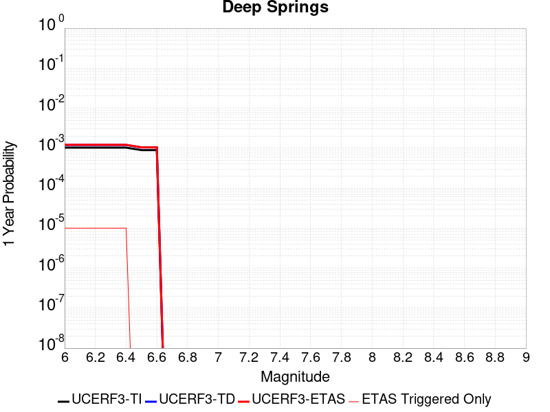 |  |

| Magnitude | 1 wk TI Prob | 1 wk TD Prob | 1 wk ETAS Prob | 1 wk ETAS/TD Gain | 1 wk ETAS Triggered Only | 1 mo TI Prob | 1 mo TD Prob | 1 mo ETAS Prob | 1 mo ETAS/TD Gain | 1 mo ETAS Triggered Only | 1 yr TI Prob | 1 yr TD Prob | 1 yr ETAS Prob | 1 yr ETAS/TD Gain | 1 yr ETAS Triggered Only | 10 yr TI Prob | 10 yr TD Prob | 10 yr ETAS Prob | 10 yr ETAS/TD Gain | 10 yr ETAS Triggered Only |
|-----|-----|-----|-----|-----|-----|-----|-----|-----|-----|-----|-----|-----|-----|-----|-----|-----|-----|-----|-----|-----|
| 6.0 | 1.9810619E-5 | 2.311303E-5 | 2.311303E-5 | 1.0 | 0.0 | 8.489989E-5 | 9.9054945E-5 | 9.9054945E-5 | 1.0 | 0.0 | 0.001033166 | 0.0012058344 | 0.0012158224 | 1.008283 | 1.0E-5 | 0.010283757 | 0.012042696 | 0.012052575 | 1.0008204 | 1.0E-5 |
| 6.1 | 1.9810619E-5 | 2.311303E-5 | 2.311303E-5 | 1.0 | 0.0 | 8.489989E-5 | 9.9054945E-5 | 9.9054945E-5 | 1.0 | 0.0 | 0.001033166 | 0.0012058344 | 0.0012158224 | 1.008283 | 1.0E-5 | 0.010283757 | 0.012042696 | 0.012052575 | 1.0008204 | 1.0E-5 |
| 6.2 | 1.9810619E-5 | 2.311303E-5 | 2.311303E-5 | 1.0 | 0.0 | 8.489989E-5 | 9.9054945E-5 | 9.9054945E-5 | 1.0 | 0.0 | 0.001033166 | 0.0012058344 | 0.0012158224 | 1.008283 | 1.0E-5 | 0.010283757 | 0.012042696 | 0.012052575 | 1.0008204 | 1.0E-5 |
| 6.3 | 1.9810619E-5 | 2.311303E-5 | 2.311303E-5 | 1.0 | 0.0 | 8.489989E-5 | 9.9054945E-5 | 9.9054945E-5 | 1.0 | 0.0 | 0.001033166 | 0.0012058344 | 0.0012158224 | 1.008283 | 1.0E-5 | 0.010283757 | 0.012042696 | 0.012052575 | 1.0008204 | 1.0E-5 |
| 6.4 | 1.9810619E-5 | 2.311303E-5 | 2.311303E-5 | 1.0 | 0.0 | 8.489989E-5 | 9.9054945E-5 | 9.9054945E-5 | 1.0 | 0.0 | 0.001033166 | 0.0012058344 | 0.0012158224 | 1.008283 | 1.0E-5 | 0.010283757 | 0.012042696 | 0.012052575 | 1.0008204 | 1.0E-5 |
| 6.5 | 1.7190405E-5 | 2.0051E-5 | 2.0051E-5 | 1.0 | 0.0 | 7.367108E-5 | 8.593286E-5 | 8.593286E-5 | 1.0 | 0.0 | 8.9657627E-4 | 0.0010462323 | 0.0010462323 | 1.0 | 0.0 | 0.008929676 | 0.010462292 | 0.010462292 | 1.0 | 0.0 |
| 6.6 | 1.7190405E-5 | 2.0051E-5 | 2.0051E-5 | 1.0 | 0.0 | 7.367108E-5 | 8.593286E-5 | 8.593286E-5 | 1.0 | 0.0 | 8.9657627E-4 | 0.0010462323 | 0.0010462323 | 1.0 | 0.0 | 0.008929676 | 0.010462292 | 0.010462292 | 1.0 | 0.0 |

## Rose Canyon
*[(top)](#table-of-contents)*

| 1 Week | 1 Month | 1 Year | 10 Year |
|-----|-----|-----|-----|
|  |  |  | 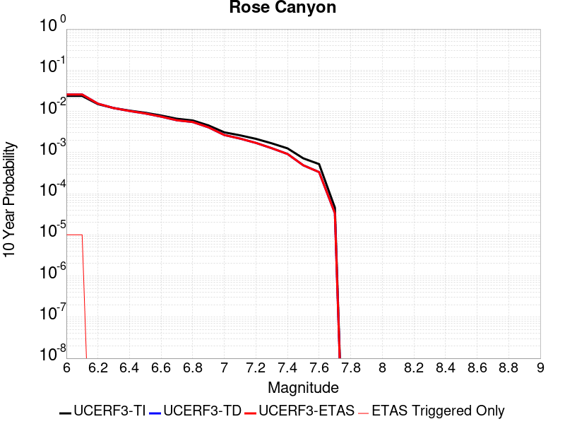 |

| Magnitude | 1 wk TI Prob | 1 wk TD Prob | 1 wk ETAS Prob | 1 wk ETAS/TD Gain | 1 wk ETAS Triggered Only | 1 mo TI Prob | 1 mo TD Prob | 1 mo ETAS Prob | 1 mo ETAS/TD Gain | 1 mo ETAS Triggered Only | 1 yr TI Prob | 1 yr TD Prob | 1 yr ETAS Prob | 1 yr ETAS/TD Gain | 1 yr ETAS Triggered Only | 10 yr TI Prob | 10 yr TD Prob | 10 yr ETAS Prob | 10 yr ETAS/TD Gain | 10 yr ETAS Triggered Only |
|-----|-----|-----|-----|-----|-----|-----|-----|-----|-----|-----|-----|-----|-----|-----|-----|-----|-----|-----|-----|-----|
| 6.0 | 4.5923203E-5 | 4.9717553E-5 | 4.9717553E-5 | 1.0 | 0.0 | 1.9679888E-4 | 2.1305913E-4 | 2.1305913E-4 | 1.0 | 0.0 | 0.0023933933 | 0.0025910994 | 0.0025910994 | 1.0 | 0.0 | 0.023677798 | 0.025618313 | 0.025628058 | 1.0003804 | 1.0E-5 |
| 6.1 | 4.5923203E-5 | 4.9717553E-5 | 4.9717553E-5 | 1.0 | 0.0 | 1.9679888E-4 | 2.1305913E-4 | 2.1305913E-4 | 1.0 | 0.0 | 0.0023933933 | 0.0025910994 | 0.0025910994 | 1.0 | 0.0 | 0.023677798 | 0.025618313 | 0.025628058 | 1.0003804 | 1.0E-5 |
| 6.2 | 2.8844734E-5 | 2.9670837E-5 | 2.9670837E-5 | 1.0 | 0.0 | 1.2361443E-4 | 1.2715468E-4 | 1.2715468E-4 | 1.0 | 0.0 | 0.0015039665 | 0.0015470362 | 0.0015470362 | 1.0 | 0.0 | 0.0149382865 | 0.015357477 | 0.015357477 | 1.0 | 0.0 |
| 6.3 | 2.3171577E-5 | 2.3163399E-5 | 2.3163399E-5 | 1.0 | 0.0 | 9.9302975E-5 | 9.9268E-5 | 9.9268E-5 | 1.0 | 0.0 | 0.0012083431 | 0.0012079312 | 0.0012079312 | 1.0 | 0.0 | 0.012017938 | 0.012004637 | 0.012004637 | 1.0 | 0.0 |
| 6.4 | 2.0066604E-5 | 1.966902E-5 | 1.966902E-5 | 1.0 | 0.0 | 8.599689E-5 | 8.429313E-5 | 8.429313E-5 | 1.0 | 0.0 | 0.0010465092 | 0.0010257957 | 0.0010257957 | 1.0 | 0.0 | 0.010415946 | 0.010203916 | 0.010203916 | 1.0 | 0.0 |
| 6.5 | 1.776989E-5 | 1.7115479E-5 | 1.7115479E-5 | 1.0 | 0.0 | 7.615444E-5 | 7.3350035E-5 | 7.3350035E-5 | 1.0 | 0.0 | 9.267859E-4 | 8.926777E-4 | 8.926777E-4 | 1.0 | 0.0 | 0.009229303 | 0.008879829 | 0.008879829 | 1.0 | 0.0 |
| 6.6 | 1.5227364E-5 | 1.4340938E-5 | 1.4340938E-5 | 1.0 | 0.0 | 6.52585E-5 | 6.1459745E-5 | 6.1459745E-5 | 1.0 | 0.0 | 7.942326E-4 | 7.480207E-4 | 7.480207E-4 | 1.0 | 0.0 | 0.007914 | 0.00744577 | 0.00744577 | 1.0 | 0.0 |
| 6.7 | 1.2703898E-5 | 1.167434E-5 | 1.167434E-5 | 1.0 | 0.0 | 5.4444143E-5 | 5.0031955E-5 | 5.0031955E-5 | 1.0 | 0.0 | 6.626558E-4 | 6.0897303E-4 | 6.0897303E-4 | 1.0 | 0.0 | 0.006606833 | 0.00606576 | 0.00606576 | 1.0 | 0.0 |
| 6.8 | 1.1554917E-5 | 1.0610447E-5 | 1.0610447E-5 | 1.0 | 0.0 | 4.9520135E-5 | 4.5472574E-5 | 4.5472574E-5 | 1.0 | 0.0 | 6.0274085E-4 | 5.53492E-4 | 5.53492E-4 | 1.0 | 0.0 | 0.0060110865 | 0.005507283 | 0.005507283 | 1.0 | 0.0 |
| 6.9 | 8.732078E-6 | 7.882343E-6 | 7.882343E-6 | 1.0 | 0.0 | 3.7422655E-5 | 3.378105E-5 | 3.378105E-5 | 1.0 | 0.0 | 4.5552556E-4 | 4.112096E-4 | 4.112096E-4 | 1.0 | 0.0 | 0.0045459294 | 0.004089545 | 0.004089545 | 1.0 | 0.0 |
| 7.0 | 5.9337494E-6 | 5.1074826E-6 | 5.1074826E-6 | 1.0 | 0.0 | 2.5430107E-5 | 2.1889029E-5 | 2.1889029E-5 | 1.0 | 0.0 | 3.0956755E-4 | 2.6646646E-4 | 2.6646646E-4 | 1.0 | 0.0 | 0.0030913667 | 0.0026614852 | 0.0026614852 | 1.0 | 0.0 |
| 7.1 | 5.013409E-6 | 4.177376E-6 | 4.177376E-6 | 1.0 | 0.0 | 2.1485863E-5 | 1.7902918E-5 | 1.7902918E-5 | 1.0 | 0.0 | 2.6155898E-4 | 2.1794632E-4 | 2.1794632E-4 | 1.0 | 0.0 | 0.0026125133 | 0.0021773374 | 0.0021773374 | 1.0 | 0.0 |
| 7.2 | 4.120763E-6 | 3.2821204E-6 | 3.2821204E-6 | 1.0 | 0.0 | 1.7660293E-5 | 1.4066155E-5 | 1.4066155E-5 | 1.0 | 0.0 | 2.1499286E-4 | 1.7124206E-4 | 1.7124206E-4 | 1.0 | 0.0 | 0.0021478499 | 0.0017111107 | 0.0017111107 | 1.0 | 0.0 |
| 7.3 | 3.2081239E-6 | 2.440515E-6 | 2.440515E-6 | 1.0 | 0.0 | 1.374903E-5 | 1.0459307E-5 | 1.0459307E-5 | 1.0 | 0.0 | 1.6738157E-4 | 1.273347E-4 | 1.273347E-4 | 1.0 | 0.0 | 0.0016725556 | 0.0012726244 | 0.0012726244 | 1.0 | 0.0 |
| 7.4 | 2.4194755E-6 | 1.7680458E-6 | 1.7680458E-6 | 1.0 | 0.0 | 1.0369139E-5 | 7.5773173E-6 | 7.5773173E-6 | 1.0 | 0.0 | 1.2623696E-4 | 9.224998E-5 | 9.224998E-5 | 1.0 | 0.0 | 0.0012616527 | 9.221223E-4 | 9.221223E-4 | 1.0 | 0.0 |
| 7.5 | 1.3842889E-6 | 9.378391E-7 | 9.378391E-7 | 1.0 | 0.0 | 5.9326535E-6 | 4.0193045E-6 | 4.0193045E-6 | 1.0 | 0.0 | 7.222766E-5 | 4.893397E-5 | 4.893397E-5 | 1.0 | 0.0 | 7.220419E-4 | 4.8923545E-4 | 4.8923545E-4 | 1.0 | 0.0 |
| 7.6 | 1.0021575E-6 | 6.4114187E-7 | 6.4114187E-7 | 1.0 | 0.0 | 4.2949537E-6 | 2.7477479E-6 | 2.7477479E-6 | 1.0 | 0.0 | 5.2289808E-5 | 3.345334E-5 | 3.345334E-5 | 1.0 | 0.0 | 5.2277505E-4 | 3.3448517E-4 | 3.3448517E-4 | 1.0 | 0.0 |
| 7.7 | 8.7620116E-8 | 6.449342E-8 | 6.449342E-8 | 1.0 | 0.0 | 3.7551473E-7 | 2.7640036E-7 | 2.7640036E-7 | 1.0 | 0.0 | 4.5718825E-6 | 3.3651693E-6 | 3.3651693E-6 | 1.0 | 0.0 | 4.5717883E-5 | 3.3651213E-5 | 3.3651213E-5 | 1.0 | 0.0 |

## Cucamonga
*[(top)](#table-of-contents)*

| 1 Week | 1 Month | 1 Year | 10 Year |
|-----|-----|-----|-----|
|  |  |  |  |

| Magnitude | 1 wk TI Prob | 1 wk TD Prob | 1 wk ETAS Prob | 1 wk ETAS/TD Gain | 1 wk ETAS Triggered Only | 1 mo TI Prob | 1 mo TD Prob | 1 mo ETAS Prob | 1 mo ETAS/TD Gain | 1 mo ETAS Triggered Only | 1 yr TI Prob | 1 yr TD Prob | 1 yr ETAS Prob | 1 yr ETAS/TD Gain | 1 yr ETAS Triggered Only | 10 yr TI Prob | 10 yr TD Prob | 10 yr ETAS Prob | 10 yr ETAS/TD Gain | 10 yr ETAS Triggered Only |
|-----|-----|-----|-----|-----|-----|-----|-----|-----|-----|-----|-----|-----|-----|-----|-----|-----|-----|-----|-----|-----|
| 6.0 | 1.1848348E-5 | 1.1737856E-5 | 1.1737856E-5 | 1.0 | 0.0 | 5.0777642E-5 | 5.030414E-5 | 5.030414E-5 | 1.0 | 0.0 | 6.180424E-4 | 6.1228353E-4 | 6.222774E-4 | 1.0163223 | 1.0E-5 | 0.0061632637 | 0.006107083 | 0.006117022 | 1.0016274 | 1.0E-5 |
| 6.1 | 1.1848348E-5 | 1.1737856E-5 | 1.1737856E-5 | 1.0 | 0.0 | 5.0777642E-5 | 5.030414E-5 | 5.030414E-5 | 1.0 | 0.0 | 6.180424E-4 | 6.1228353E-4 | 6.222774E-4 | 1.0163223 | 1.0E-5 | 0.0061632637 | 0.006107083 | 0.006117022 | 1.0016274 | 1.0E-5 |
| 6.2 | 1.1848348E-5 | 1.1737856E-5 | 1.1737856E-5 | 1.0 | 0.0 | 5.0777642E-5 | 5.030414E-5 | 5.030414E-5 | 1.0 | 0.0 | 6.180424E-4 | 6.1228353E-4 | 6.222774E-4 | 1.0163223 | 1.0E-5 | 0.0061632637 | 0.006107083 | 0.006117022 | 1.0016274 | 1.0E-5 |
| 6.3 | 1.1848348E-5 | 1.1737856E-5 | 1.1737856E-5 | 1.0 | 0.0 | 5.0777642E-5 | 5.030414E-5 | 5.030414E-5 | 1.0 | 0.0 | 6.180424E-4 | 6.1228353E-4 | 6.222774E-4 | 1.0163223 | 1.0E-5 | 0.0061632637 | 0.006107083 | 0.006117022 | 1.0016274 | 1.0E-5 |
| 6.4 | 1.1848348E-5 | 1.1737856E-5 | 1.1737856E-5 | 1.0 | 0.0 | 5.0777642E-5 | 5.030414E-5 | 5.030414E-5 | 1.0 | 0.0 | 6.180424E-4 | 6.1228353E-4 | 6.222774E-4 | 1.0163223 | 1.0E-5 | 0.0061632637 | 0.006107083 | 0.006117022 | 1.0016274 | 1.0E-5 |
| 6.5 | 1.16988695E-5 | 1.1576885E-5 | 1.1576885E-5 | 1.0 | 0.0 | 5.013705E-5 | 4.9614293E-5 | 4.9614293E-5 | 1.0 | 0.0 | 6.102476E-4 | 6.038893E-4 | 6.1388325E-4 | 1.0165493 | 1.0E-5 | 0.006085745 | 0.0060235965 | 0.0060335365 | 1.0016501 | 1.0E-5 |
| 6.6 | 1.16988695E-5 | 1.1576885E-5 | 1.1576885E-5 | 1.0 | 0.0 | 5.013705E-5 | 4.9614293E-5 | 4.9614293E-5 | 1.0 | 0.0 | 6.102476E-4 | 6.038893E-4 | 6.1388325E-4 | 1.0165493 | 1.0E-5 | 0.006085745 | 0.0060235965 | 0.0060335365 | 1.0016501 | 1.0E-5 |
| 6.7 | 1.1397107E-5 | 1.1115768E-5 | 1.1115768E-5 | 1.0 | 0.0 | 4.884383E-5 | 4.763815E-5 | 4.763815E-5 | 1.0 | 0.0 | 5.9451134E-4 | 5.798426E-4 | 5.798426E-4 | 1.0 | 0.0 | 0.005929234 | 0.00578439 | 0.00578439 | 1.0 | 0.0 |
| 6.8 | 1.058387E-5 | 9.785688E-6 | 9.785688E-6 | 1.0 | 0.0 | 4.5358654E-5 | 4.1937994E-5 | 4.1937994E-5 | 1.0 | 0.0 | 5.521017E-4 | 5.104766E-4 | 5.104766E-4 | 1.0 | 0.0 | 0.00550732 | 0.005093991 | 0.005093991 | 1.0 | 0.0 |
| 6.9 | 9.690046E-6 | 8.580108E-6 | 8.580108E-6 | 1.0 | 0.0 | 4.1528107E-5 | 3.677138E-5 | 3.677138E-5 | 1.0 | 0.0 | 5.054874E-4 | 4.4759997E-4 | 4.4759997E-4 | 1.0 | 0.0 | 0.005043391 | 0.004467863 | 0.004467863 | 1.0 | 0.0 |
| 7.0 | 9.381461E-6 | 8.187711E-6 | 8.187711E-6 | 1.0 | 0.0 | 4.020564E-5 | 3.508972E-5 | 3.508972E-5 | 1.0 | 0.0 | 4.893937E-4 | 4.2713396E-4 | 4.2713396E-4 | 1.0 | 0.0 | 0.0048831734 | 0.0042640073 | 0.0042640073 | 1.0 | 0.0 |
| 7.1 | 8.946492E-6 | 7.782485E-6 | 7.782485E-6 | 1.0 | 0.0 | 3.8341543E-5 | 3.3353084E-5 | 3.3353084E-5 | 1.0 | 0.0 | 4.667083E-4 | 4.0599846E-4 | 4.0599846E-4 | 1.0 | 0.0 | 0.0046572937 | 0.004053448 | 0.004053448 | 1.0 | 0.0 |
| 7.2 | 8.251016E-6 | 6.975837E-6 | 6.975837E-6 | 1.0 | 0.0 | 3.5361016E-5 | 2.9896102E-5 | 2.9896102E-5 | 1.0 | 0.0 | 4.3043532E-4 | 3.639245E-4 | 3.639245E-4 | 1.0 | 0.0 | 0.0042960253 | 0.0036341618 | 0.0036341618 | 1.0 | 0.0 |
| 7.3 | 7.717881E-6 | 6.4868927E-6 | 6.4868927E-6 | 1.0 | 0.0 | 3.3076216E-5 | 2.7800674E-5 | 2.7800674E-5 | 1.0 | 0.0 | 4.026285E-4 | 3.3842085E-4 | 3.3842085E-4 | 1.0 | 0.0 | 0.004018998 | 0.0033799394 | 0.0033799394 | 1.0 | 0.0 |
| 7.4 | 7.275623E-6 | 6.0325183E-6 | 6.0325183E-6 | 1.0 | 0.0 | 3.118087E-5 | 2.5853395E-5 | 2.5853395E-5 | 1.0 | 0.0 | 3.7956095E-4 | 3.1471983E-4 | 3.1471983E-4 | 1.0 | 0.0 | 0.0037891332 | 0.0031436244 | 0.0031436244 | 1.0 | 0.0 |
| 7.5 | 6.5109502E-6 | 5.101057E-6 | 5.101057E-6 | 1.0 | 0.0 | 2.7903774E-5 | 2.186149E-5 | 2.186149E-5 | 1.0 | 0.0 | 3.3967546E-4 | 2.6613128E-4 | 2.6613128E-4 | 1.0 | 0.0 | 0.0033915674 | 0.0026589984 | 0.0026589984 | 1.0 | 0.0 |
| 7.6 | 5.4495326E-6 | 3.908965E-6 | 3.908965E-6 | 1.0 | 0.0 | 2.335493E-5 | 1.67526E-5 | 1.67526E-5 | 1.0 | 0.0 | 2.8430918E-4 | 2.0394388E-4 | 2.0394388E-4 | 1.0 | 0.0 | 0.0028394572 | 0.0020384341 | 0.0020384341 | 1.0 | 0.0 |
| 7.7 | 4.7997164E-6 | 3.2006137E-6 | 3.2006137E-6 | 1.0 | 0.0 | 2.057005E-5 | 1.3716844E-5 | 1.3716844E-5 | 1.0 | 0.0 | 2.504116E-4 | 1.669898E-4 | 1.669898E-4 | 1.0 | 0.0 | 0.002501296 | 0.0016695231 | 0.0016695231 | 1.0 | 0.0 |
| 7.8 | 3.3941733E-6 | 2.0644063E-6 | 2.0644063E-6 | 1.0 | 0.0 | 1.4546376E-5 | 8.847426E-6 | 8.847426E-6 | 1.0 | 0.0 | 1.7708774E-4 | 1.07712105E-4 | 1.07712105E-4 | 1.0 | 0.0 | 0.0017694668 | 0.0010766896 | 0.0010766896 | 1.0 | 0.0 |
| 7.9 | 9.750552E-7 | 5.15656E-7 | 5.15656E-7 | 1.0 | 0.0 | 4.178801E-6 | 2.2099523E-6 | 2.2099523E-6 | 1.0 | 0.0 | 5.0875715E-5 | 2.6905842E-5 | 2.6905842E-5 | 1.0 | 0.0 | 5.086407E-4 | 2.6902626E-4 | 2.6902626E-4 | 1.0 | 0.0 |
| 8.0 | 1.133857E-7 | 6.053729E-8 | 6.053729E-8 | 1.0 | 0.0 | 4.8593864E-7 | 2.594455E-7 | 2.594455E-7 | 1.0 | 0.0 | 5.9162867E-6 | 3.1587447E-6 | 3.1587447E-6 | 1.0 | 0.0 | 5.916129E-5 | 3.1587013E-5 | 3.1587013E-5 | 1.0 | 0.0 |

## Manix-Afton Hills
*[(top)](#table-of-contents)*

| 1 Week | 1 Month | 1 Year | 10 Year |
|-----|-----|-----|-----|
|  |  |  |  |

| Magnitude | 1 wk TI Prob | 1 wk TD Prob | 1 wk ETAS Prob | 1 wk ETAS/TD Gain | 1 wk ETAS Triggered Only | 1 mo TI Prob | 1 mo TD Prob | 1 mo ETAS Prob | 1 mo ETAS/TD Gain | 1 mo ETAS Triggered Only | 1 yr TI Prob | 1 yr TD Prob | 1 yr ETAS Prob | 1 yr ETAS/TD Gain | 1 yr ETAS Triggered Only | 10 yr TI Prob | 10 yr TD Prob | 10 yr ETAS Prob | 10 yr ETAS/TD Gain | 10 yr ETAS Triggered Only |
|-----|-----|-----|-----|-----|-----|-----|-----|-----|-----|-----|-----|-----|-----|-----|-----|-----|-----|-----|-----|-----|
| 6.0 | 1.3783202E-5 | 1.4711221E-5 | 1.4711221E-5 | 1.0 | 0.0 | 5.906953E-5 | 6.304667E-5 | 6.304667E-5 | 1.0 | 0.0 | 7.189342E-4 | 7.673403E-4 | 7.7733264E-4 | 1.0130221 | 1.0E-5 | 0.0071661277 | 0.007648664 | 0.007658588 | 1.0012975 | 1.0E-5 |
| 6.1 | 1.3783202E-5 | 1.4711221E-5 | 1.4711221E-5 | 1.0 | 0.0 | 5.906953E-5 | 6.304667E-5 | 6.304667E-5 | 1.0 | 0.0 | 7.189342E-4 | 7.673403E-4 | 7.7733264E-4 | 1.0130221 | 1.0E-5 | 0.0071661277 | 0.007648664 | 0.007658588 | 1.0012975 | 1.0E-5 |
| 6.2 | 1.3783202E-5 | 1.4711221E-5 | 1.4711221E-5 | 1.0 | 0.0 | 5.906953E-5 | 6.304667E-5 | 6.304667E-5 | 1.0 | 0.0 | 7.189342E-4 | 7.673403E-4 | 7.7733264E-4 | 1.0130221 | 1.0E-5 | 0.0071661277 | 0.007648664 | 0.007658588 | 1.0012975 | 1.0E-5 |
| 6.3 | 1.10494875E-5 | 1.1793241E-5 | 1.1793241E-5 | 1.0 | 0.0 | 4.7354086E-5 | 5.054154E-5 | 5.054154E-5 | 1.0 | 0.0 | 5.763835E-4 | 6.151799E-4 | 6.2517374E-4 | 1.0162454 | 1.0E-5 | 0.005748908 | 0.00613581 | 0.006145749 | 1.0016198 | 1.0E-5 |
| 6.4 | 1.10494875E-5 | 1.1793241E-5 | 1.1793241E-5 | 1.0 | 0.0 | 4.7354086E-5 | 5.054154E-5 | 5.054154E-5 | 1.0 | 0.0 | 5.763835E-4 | 6.151799E-4 | 6.2517374E-4 | 1.0162454 | 1.0E-5 | 0.005748908 | 0.00613581 | 0.006145749 | 1.0016198 | 1.0E-5 |
| 6.5 | 9.788949E-6 | 1.0454414E-5 | 1.0454414E-5 | 1.0 | 0.0 | 4.1951964E-5 | 4.4803914E-5 | 4.4803914E-5 | 1.0 | 0.0 | 5.1064545E-4 | 5.4536044E-4 | 5.55355E-4 | 1.0183265 | 1.0E-5 | 0.0050947363 | 0.005441148 | 0.0054510934 | 1.0018278 | 1.0E-5 |
| 6.6 | 8.810006E-6 | 9.413714E-6 | 9.413714E-6 | 1.0 | 0.0 | 3.775662E-5 | 4.0343915E-5 | 4.0343915E-5 | 1.0 | 0.0 | 4.5958988E-4 | 4.9108535E-4 | 5.010804E-4 | 1.0203531 | 1.0E-5 | 0.0045864056 | 0.004900884 | 0.0049108346 | 1.0020305 | 1.0E-5 |
| 6.7 | 8.80128E-6 | 9.404193E-6 | 9.404193E-6 | 1.0 | 0.0 | 3.7719226E-5 | 4.0303115E-5 | 4.0303115E-5 | 1.0 | 0.0 | 4.591348E-4 | 4.9058883E-4 | 5.005839E-4 | 1.0203737 | 1.0E-5 | 0.004581874 | 0.0048959404 | 0.0049058916 | 1.0020325 | 1.0E-5 |
| 6.8 | 6.8994877E-6 | 7.3801443E-6 | 7.3801443E-6 | 1.0 | 0.0 | 2.9568899E-5 | 3.1628853E-5 | 3.1628853E-5 | 1.0 | 0.0 | 3.5994186E-4 | 3.850214E-4 | 3.9501756E-4 | 1.0259626 | 1.0E-5 | 0.003593594 | 0.0038443485 | 0.00385431 | 1.0025913 | 1.0E-5 |
| 6.9 | 4.9328037E-6 | 5.2710093E-6 | 5.2710093E-6 | 1.0 | 0.0 | 2.1140417E-5 | 2.258988E-5 | 2.258988E-5 | 1.0 | 0.0 | 2.5735417E-4 | 2.7500323E-4 | 2.7500323E-4 | 1.0 | 0.0 | 0.0025705635 | 0.0027472344 | 0.0027472344 | 1.0 | 0.0 |
| 7.0 | 3.347973E-6 | 3.5900646E-6 | 3.5900646E-6 | 1.0 | 0.0 | 1.4348378E-5 | 1.5385924E-5 | 1.5385924E-5 | 1.0 | 0.0 | 1.746775E-4 | 1.8731161E-4 | 1.8731161E-4 | 1.0 | 0.0 | 0.0017454025 | 0.00187194 | 0.00187194 | 1.0 | 0.0 |
| 7.1 | 1.2073567E-6 | 1.2934943E-6 | 1.2934943E-6 | 1.0 | 0.0 | 5.1743755E-6 | 5.5435444E-6 | 5.5435444E-6 | 1.0 | 0.0 | 6.29962E-5 | 6.74922E-5 | 6.74922E-5 | 1.0 | 0.0 | 6.297835E-4 | 6.7487714E-4 | 6.7487714E-4 | 1.0 | 0.0 |

## San Diego Trough north alt1
*[(top)](#table-of-contents)*

| 1 Week | 1 Month | 1 Year | 10 Year |
|-----|-----|-----|-----|
|  |  |  | 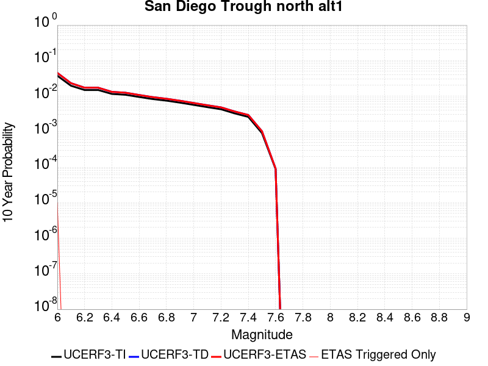 |

| Magnitude | 1 wk TI Prob | 1 wk TD Prob | 1 wk ETAS Prob | 1 wk ETAS/TD Gain | 1 wk ETAS Triggered Only | 1 mo TI Prob | 1 mo TD Prob | 1 mo ETAS Prob | 1 mo ETAS/TD Gain | 1 mo ETAS Triggered Only | 1 yr TI Prob | 1 yr TD Prob | 1 yr ETAS Prob | 1 yr ETAS/TD Gain | 1 yr ETAS Triggered Only | 10 yr TI Prob | 10 yr TD Prob | 10 yr ETAS Prob | 10 yr ETAS/TD Gain | 10 yr ETAS Triggered Only |
|-----|-----|-----|-----|-----|-----|-----|-----|-----|-----|-----|-----|-----|-----|-----|-----|-----|-----|-----|-----|-----|
| 6.0 | 7.329252E-5 | 8.821515E-5 | 8.821515E-5 | 1.0 | 0.0 | 3.14073E-4 | 3.780138E-4 | 3.780138E-4 | 1.0 | 0.0 | 0.0038171355 | 0.004593173 | 0.004603127 | 1.0021671 | 1.0E-5 | 0.03752231 | 0.04504633 | 0.045055877 | 1.000212 | 1.0E-5 |
| 6.1 | 3.7940346E-5 | 4.4886026E-5 | 4.4886026E-5 | 1.0 | 0.0 | 1.6259136E-4 | 1.9235504E-4 | 1.9235504E-4 | 1.0 | 0.0 | 0.0019777524 | 0.0023394884 | 0.0023394884 | 1.0 | 0.0 | 0.019602431 | 0.023157293 | 0.023157293 | 1.0 | 0.0 |
| 6.2 | 2.8645263E-5 | 3.3297452E-5 | 3.3297452E-5 | 1.0 | 0.0 | 1.2275964E-4 | 1.4269572E-4 | 1.4269572E-4 | 1.0 | 0.0 | 0.0014935739 | 0.0017359584 | 0.0017359584 | 1.0 | 0.0 | 0.0148357535 | 0.017226638 | 0.017226638 | 1.0 | 0.0 |
| 6.3 | 2.8645263E-5 | 3.3297452E-5 | 3.3297452E-5 | 1.0 | 0.0 | 1.2275964E-4 | 1.4269572E-4 | 1.4269572E-4 | 1.0 | 0.0 | 0.0014935739 | 0.0017359584 | 0.0017359584 | 1.0 | 0.0 | 0.0148357535 | 0.017226638 | 0.017226638 | 1.0 | 0.0 |
| 6.4 | 2.2204576E-5 | 2.5448819E-5 | 2.5448819E-5 | 1.0 | 0.0 | 9.5159E-5 | 1.0906186E-4 | 1.0906186E-4 | 1.0 | 0.0 | 0.001157945 | 0.0013270287 | 0.0013270287 | 1.0 | 0.0 | 0.011519298 | 0.013192215 | 0.013192215 | 1.0 | 0.0 |
| 6.5 | 2.1004838E-5 | 2.402516E-5 | 2.402516E-5 | 1.0 | 0.0 | 9.0017624E-5 | 1.02960956E-4 | 1.02960956E-4 | 1.0 | 0.0 | 0.0010954136 | 0.0012528376 | 0.0012528376 | 1.0 | 0.0 | 0.010900296 | 0.01245883 | 0.01245883 | 1.0 | 0.0 |
| 6.6 | 1.820557E-5 | 2.070517E-5 | 2.070517E-5 | 1.0 | 0.0 | 7.802154E-5 | 8.873346E-5 | 8.873346E-5 | 1.0 | 0.0 | 9.4949827E-4 | 0.0010797998 | 0.0010797998 | 1.0 | 0.0 | 0.009454516 | 0.0107462015 | 0.0107462015 | 1.0 | 0.0 |
| 6.7 | 1.5884485E-5 | 1.7983964E-5 | 1.7983964E-5 | 1.0 | 0.0 | 6.807459E-5 | 7.707187E-5 | 7.707187E-5 | 1.0 | 0.0 | 8.284929E-4 | 9.379488E-4 | 9.379488E-4 | 1.0 | 0.0 | 0.008254109 | 0.009340268 | 0.009340268 | 1.0 | 0.0 |
| 6.8 | 1.4331171E-5 | 1.6201348E-5 | 1.6201348E-5 | 1.0 | 0.0 | 6.141786E-5 | 6.9432506E-5 | 6.9432506E-5 | 1.0 | 0.0 | 7.4750587E-4 | 8.4501493E-4 | 8.4501493E-4 | 1.0 | 0.0 | 0.0074499645 | 0.008418285 | 0.008418285 | 1.0 | 0.0 |
| 6.9 | 1.2574203E-5 | 1.4206081E-5 | 1.4206081E-5 | 1.0 | 0.0 | 5.3888325E-5 | 6.088179E-5 | 6.088179E-5 | 1.0 | 0.0 | 6.558929E-4 | 7.4098515E-4 | 7.4098515E-4 | 1.0 | 0.0 | 0.0065396037 | 0.0073853307 | 0.0073853307 | 1.0 | 0.0 |
| 7.0 | 1.0883844E-5 | 1.22894735E-5 | 1.22894735E-5 | 1.0 | 0.0 | 4.664421E-5 | 5.2668114E-5 | 5.2668114E-5 | 1.0 | 0.0 | 5.677453E-4 | 6.410466E-4 | 6.410466E-4 | 1.0 | 0.0 | 0.00566297 | 0.0063921027 | 0.0063921027 | 1.0 | 0.0 |
| 7.1 | 9.393088E-6 | 1.0607203E-5 | 1.0607203E-5 | 1.0 | 0.0 | 4.025547E-5 | 4.5458655E-5 | 4.5458655E-5 | 1.0 | 0.0 | 4.900001E-4 | 5.5331935E-4 | 5.5331935E-4 | 1.0 | 0.0 | 0.0048892107 | 0.005519513 | 0.005519513 | 1.0 | 0.0 |
| 7.2 | 8.190791E-6 | 9.258787E-6 | 9.258787E-6 | 1.0 | 0.0 | 3.510292E-5 | 3.9679915E-5 | 3.9679915E-5 | 1.0 | 0.0 | 4.2729423E-4 | 4.8299658E-4 | 4.8299658E-4 | 1.0 | 0.0 | 0.0042647356 | 0.004819548 | 0.004819548 | 1.0 | 0.0 |
| 7.3 | 6.268162E-6 | 7.08984E-6 | 7.08984E-6 | 1.0 | 0.0 | 2.6863276E-5 | 3.0384675E-5 | 3.0384675E-5 | 1.0 | 0.0 | 3.2701128E-4 | 3.6987104E-4 | 3.6987104E-4 | 1.0 | 0.0 | 0.003265305 | 0.0036926004 | 0.0036926004 | 1.0 | 0.0 |
| 7.4 | 4.985186E-6 | 5.6427807E-6 | 5.6427807E-6 | 1.0 | 0.0 | 2.1364907E-5 | 2.4183124E-5 | 2.4183124E-5 | 1.0 | 0.0 | 2.600867E-4 | 2.9439016E-4 | 2.9439016E-4 | 1.0 | 0.0 | 0.002597825 | 0.002940043 | 0.002940043 | 1.0 | 0.0 |
| 7.5 | 1.7489613E-6 | 1.9697113E-6 | 1.9697113E-6 | 1.0 | 0.0 | 7.495527E-6 | 8.441594E-6 | 8.441594E-6 | 1.0 | 0.0 | 9.125422E-5 | 1.0277178E-4 | 1.0277178E-4 | 1.0 | 0.0 | 9.1216754E-4 | 0.0010272645 | 0.0010272645 | 1.0 | 0.0 |
| 7.6 | 1.6988751E-7 | 1.7533898E-7 | 1.7533898E-7 | 1.0 | 0.0 | 7.2808916E-7 | 7.5145255E-7 | 7.5145255E-7 | 1.0 | 0.0 | 8.864449E-6 | 9.148898E-6 | 9.148898E-6 | 1.0 | 0.0 | 8.8640954E-5 | 9.148542E-5 | 9.148542E-5 | 1.0 | 0.0 |

## Point Reyes 2011 CFM
*[(top)](#table-of-contents)*

| 1 Week | 1 Month | 1 Year | 10 Year |
|-----|-----|-----|-----|
| 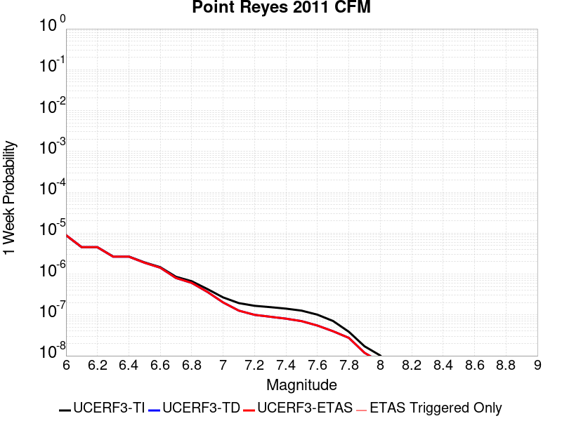 | 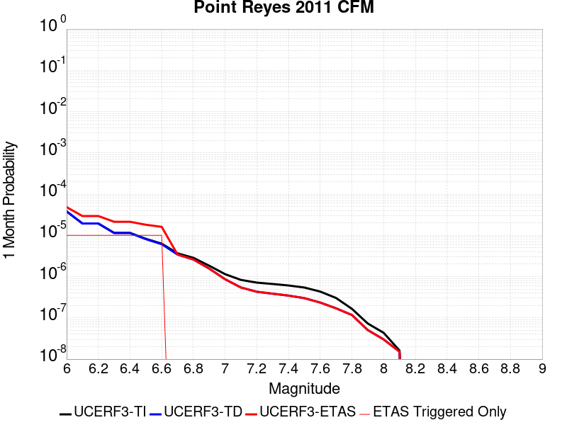 | 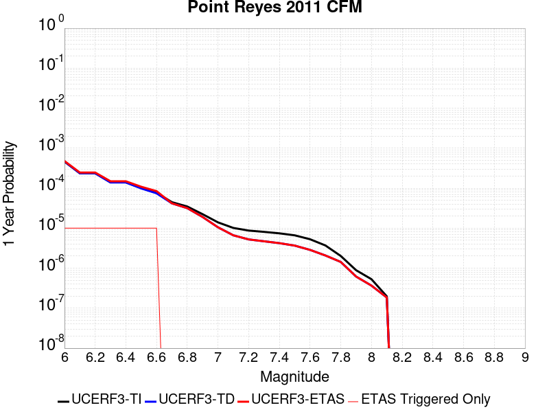 | 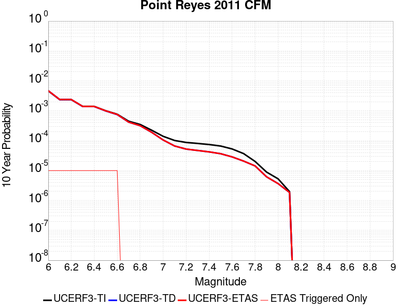 |

| Magnitude | 1 wk TI Prob | 1 wk TD Prob | 1 wk ETAS Prob | 1 wk ETAS/TD Gain | 1 wk ETAS Triggered Only | 1 mo TI Prob | 1 mo TD Prob | 1 mo ETAS Prob | 1 mo ETAS/TD Gain | 1 mo ETAS Triggered Only | 1 yr TI Prob | 1 yr TD Prob | 1 yr ETAS Prob | 1 yr ETAS/TD Gain | 1 yr ETAS Triggered Only | 10 yr TI Prob | 10 yr TD Prob | 10 yr ETAS Prob | 10 yr ETAS/TD Gain | 10 yr ETAS Triggered Only |
|-----|-----|-----|-----|-----|-----|-----|-----|-----|-----|-----|-----|-----|-----|-----|-----|-----|-----|-----|-----|-----|
| 6.0 | 8.8644965E-6 | 8.9671985E-6 | 8.9671985E-6 | 1.0 | 0.0 | 3.7990147E-5 | 3.843032E-5 | 4.8429938E-5 | 1.2602012 | 1.0E-5 | 4.624319E-4 | 4.67795E-4 | 4.777903E-4 | 1.0213668 | 1.0E-5 | 0.0046147075 | 0.0046687312 | 0.0046786848 | 1.0021319 | 1.0E-5 |
| 6.1 | 4.526405E-6 | 4.5392417E-6 | 4.5392417E-6 | 1.0 | 0.0 | 1.9398734E-5 | 1.9453753E-5 | 2.945356E-5 | 1.5140296 | 1.0E-5 | 2.36154E-4 | 2.3682477E-4 | 2.468224E-4 | 1.0422153 | 1.0E-5 | 0.002359032 | 0.00236583 | 0.0023758062 | 1.0042168 | 1.0E-5 |
| 6.2 | 4.526405E-6 | 4.5392417E-6 | 4.5392417E-6 | 1.0 | 0.0 | 1.9398734E-5 | 1.9453753E-5 | 2.945356E-5 | 1.5140296 | 1.0E-5 | 2.36154E-4 | 2.3682477E-4 | 2.468224E-4 | 1.0422153 | 1.0E-5 | 0.002359032 | 0.00236583 | 0.0023758062 | 1.0042168 | 1.0E-5 |
| 6.3 | 2.6842322E-6 | 2.6606945E-6 | 2.6606945E-6 | 1.0 | 0.0 | 1.1503801E-5 | 1.1402927E-5 | 2.1402813E-5 | 1.8769578 | 1.0E-5 | 1.4004979E-4 | 1.38822E-4 | 1.488206E-4 | 1.0720247 | 1.0E-5 | 0.0013996155 | 0.0013873745 | 0.0013973606 | 1.0071979 | 1.0E-5 |
| 6.4 | 2.6842322E-6 | 2.6606945E-6 | 2.6606945E-6 | 1.0 | 0.0 | 1.1503801E-5 | 1.1402927E-5 | 2.1402813E-5 | 1.8769578 | 1.0E-5 | 1.4004979E-4 | 1.38822E-4 | 1.488206E-4 | 1.0720247 | 1.0E-5 | 0.0013996155 | 0.0013873745 | 0.0013973606 | 1.0071979 | 1.0E-5 |
| 6.5 | 1.9281833E-6 | 1.8906428E-6 | 1.8906428E-6 | 1.0 | 0.0 | 8.263617E-6 | 8.10273E-6 | 1.810265E-5 | 2.2341418 | 1.0E-5 | 1.0060489E-4 | 9.864636E-5 | 1.0864537E-4 | 1.1013622 | 1.0E-5 | 0.0010055936 | 9.860365E-4 | 9.960267E-4 | 1.0101316 | 1.0E-5 |
| 6.6 | 1.4726726E-6 | 1.4269731E-6 | 1.4269731E-6 | 1.0 | 0.0 | 6.3114385E-6 | 6.115585E-6 | 1.6115524E-5 | 2.6351566 | 1.0E-5 | 7.683905E-5 | 7.445475E-5 | 8.4454005E-5 | 1.1342998 | 1.0E-5 | 7.6812494E-4 | 7.4430514E-4 | 7.542977E-4 | 1.0134254 | 1.0E-5 |
| 6.7 | 8.572307E-7 | 8.0073517E-7 | 8.0073517E-7 | 1.0 | 0.0 | 3.6738406E-6 | 3.4317177E-6 | 3.4317177E-6 | 1.0 | 0.0 | 4.472809E-5 | 4.178038E-5 | 4.178038E-5 | 1.0 | 0.0 | 4.471909E-4 | 4.1772908E-4 | 4.1772908E-4 | 1.0 | 0.0 |
| 6.8 | 6.6745434E-7 | 6.077435E-7 | 6.077435E-7 | 1.0 | 0.0 | 2.8605155E-6 | 2.6046125E-6 | 2.6046125E-6 | 1.0 | 0.0 | 3.482622E-5 | 3.1710704E-5 | 3.1710704E-5 | 1.0 | 0.0 | 3.4820763E-4 | 3.1706505E-4 | 3.1706505E-4 | 1.0 | 0.0 |
| 6.9 | 4.291521E-7 | 3.6537236E-7 | 3.6537236E-7 | 1.0 | 0.0 | 1.839222E-6 | 1.5658807E-6 | 1.5658807E-6 | 1.0 | 0.0 | 2.2392298E-5 | 1.9064433E-5 | 1.9064433E-5 | 1.0 | 0.0 | 2.2390042E-4 | 1.9063058E-4 | 1.9063058E-4 | 1.0 | 0.0 |
| 7.0 | 2.6812808E-7 | 2.0188676E-7 | 2.0188676E-7 | 1.0 | 0.0 | 1.1491198E-6 | 8.652287E-7 | 8.652287E-7 | 1.0 | 0.0 | 1.3990444E-5 | 1.0534109E-5 | 1.0534109E-5 | 1.0 | 0.0 | 1.3989564E-4 | 1.0533839E-4 | 1.0533839E-4 | 1.0 | 0.0 |
| 7.1 | 1.9451231E-7 | 1.2726741E-7 | 1.2726741E-7 | 1.0 | 0.0 | 8.336239E-7 | 5.4543165E-7 | 5.4543165E-7 | 1.0 | 0.0 | 1.0149324E-5 | 6.64061E-6 | 6.64061E-6 | 1.0 | 0.0 | 1.014886E-4 | 6.640634E-5 | 6.640634E-5 | 1.0 | 0.0 |
| 7.2 | 1.6715143E-7 | 1.00440445E-7 | 1.00440445E-7 | 1.0 | 0.0 | 7.1636305E-7 | 4.3045898E-7 | 4.3045898E-7 | 1.0 | 0.0 | 8.721685E-6 | 5.2408254E-6 | 5.2408254E-6 | 1.0 | 0.0 | 8.721343E-5 | 5.240924E-5 | 5.240924E-5 | 1.0 | 0.0 |
| 7.3 | 1.5503173E-7 | 9.014282E-8 | 9.014282E-8 | 1.0 | 0.0 | 6.644215E-7 | 3.863263E-7 | 3.863263E-7 | 1.0 | 0.0 | 8.089301E-6 | 4.7035123E-6 | 4.7035123E-6 | 1.0 | 0.0 | 8.089007E-5 | 4.703635E-5 | 4.703635E-5 | 1.0 | 0.0 |
| 7.4 | 1.4251614E-7 | 8.09877E-8 | 8.09877E-8 | 1.0 | 0.0 | 6.1078333E-7 | 3.4709007E-7 | 3.4709007E-7 | 1.0 | 0.0 | 7.4362615E-6 | 4.225813E-6 | 4.225813E-6 | 1.0 | 0.0 | 7.436013E-5 | 4.2259548E-5 | 4.2259548E-5 | 1.0 | 0.0 |
| 7.5 | 1.2710186E-7 | 7.030747E-8 | 7.030747E-8 | 1.0 | 0.0 | 5.447221E-7 | 3.013177E-7 | 3.013177E-7 | 1.0 | 0.0 | 6.6319717E-6 | 3.6685367E-6 | 3.6685367E-6 | 1.0 | 0.0 | 6.6317734E-5 | 3.6686983E-5 | 3.6686983E-5 | 1.0 | 0.0 |
| 7.6 | 1.0144708E-7 | 5.4962506E-8 | 5.4962506E-8 | 1.0 | 0.0 | 4.347731E-7 | 2.3555357E-7 | 2.3555357E-7 | 1.0 | 0.0 | 5.2933497E-6 | 2.8678608E-6 | 2.8678608E-6 | 1.0 | 0.0 | 5.293224E-5 | 2.8680459E-5 | 2.8680459E-5 | 1.0 | 0.0 |
| 7.7 | 7.090527E-8 | 3.983186E-8 | 3.983186E-8 | 1.0 | 0.0 | 3.038797E-7 | 1.7070796E-7 | 1.7070796E-7 | 1.0 | 0.0 | 3.699729E-6 | 2.0783675E-6 | 2.0783675E-6 | 1.0 | 0.0 | 3.6996673E-5 | 2.0785701E-5 | 2.0785701E-5 | 1.0 | 0.0 |
| 7.8 | 3.8712045E-8 | 2.7447635E-8 | 2.7447635E-8 | 1.0 | 0.0 | 1.6590876E-7 | 1.1763272E-7 | 1.1763272E-7 | 1.0 | 0.0 | 2.0199373E-6 | 1.4321774E-6 | 1.4321774E-6 | 1.0 | 0.0 | 2.0199188E-5 | 1.4323902E-5 | 1.4323902E-5 | 1.0 | 0.0 |
| 7.9 | 1.7068782E-8 | 1.1839267E-8 | 1.1839267E-8 | 1.0 | 0.0 | 7.315192E-8 | 5.0739715E-8 | 5.0739715E-8 | 1.0 | 0.0 | 8.906242E-7 | 6.1775586E-7 | 6.1775586E-7 | 1.0 | 0.0 | 8.906207E-6 | 6.1797623E-6 | 6.1797623E-6 | 1.0 | 0.0 |
| 8.0 | 1.0172592E-8 | 7.0329933E-9 | 7.0329933E-9 | 1.0 | 0.0 | 4.359682E-8 | 3.01414E-8 | 3.01414E-8 | 1.0 | 0.0 | 5.3079117E-7 | 3.6697148E-7 | 3.6697148E-7 | 1.0 | 0.0 | 5.307899E-6 | 3.6719296E-6 | 3.6719296E-6 | 1.0 | 0.0 |
| 8.1 | 3.7861243E-9 | 3.5478485E-9 | 3.5478485E-9 | 1.0 | 0.0 | 1.6226247E-8 | 1.5205064E-8 | 1.5205064E-8 | 1.0 | 0.0 | 1.9755454E-7 | 1.8512165E-7 | 1.8512165E-7 | 1.0 | 0.0 | 1.9755437E-6 | 1.8530355E-6 | 1.8530355E-6 | 1.0 | 0.0 |

## Ventura-Pitas Point
*[(top)](#table-of-contents)*

| 1 Week | 1 Month | 1 Year | 10 Year |
|-----|-----|-----|-----|
|  |  |  |  |

| Magnitude | 1 wk TI Prob | 1 wk TD Prob | 1 wk ETAS Prob | 1 wk ETAS/TD Gain | 1 wk ETAS Triggered Only | 1 mo TI Prob | 1 mo TD Prob | 1 mo ETAS Prob | 1 mo ETAS/TD Gain | 1 mo ETAS Triggered Only | 1 yr TI Prob | 1 yr TD Prob | 1 yr ETAS Prob | 1 yr ETAS/TD Gain | 1 yr ETAS Triggered Only | 10 yr TI Prob | 10 yr TD Prob | 10 yr ETAS Prob | 10 yr ETAS/TD Gain | 10 yr ETAS Triggered Only |
|-----|-----|-----|-----|-----|-----|-----|-----|-----|-----|-----|-----|-----|-----|-----|-----|-----|-----|-----|-----|-----|
| 6.0 | 3.3179622E-5 | 3.37358E-5 | 3.37358E-5 | 1.0 | 0.0 | 1.4219063E-4 | 1.4457543E-4 | 1.4457543E-4 | 1.0 | 0.0 | 0.0017297962 | 0.0017590416 | 0.0017590416 | 1.0 | 0.0 | 0.017163932 | 0.01747688 | 0.017486706 | 1.0005622 | 1.0E-5 |
| 6.1 | 3.3179622E-5 | 3.37358E-5 | 3.37358E-5 | 1.0 | 0.0 | 1.4219063E-4 | 1.4457543E-4 | 1.4457543E-4 | 1.0 | 0.0 | 0.0017297962 | 0.0017590416 | 0.0017590416 | 1.0 | 0.0 | 0.017163932 | 0.01747688 | 0.017486706 | 1.0005622 | 1.0E-5 |
| 6.2 | 3.3179622E-5 | 3.37358E-5 | 3.37358E-5 | 1.0 | 0.0 | 1.4219063E-4 | 1.4457543E-4 | 1.4457543E-4 | 1.0 | 0.0 | 0.0017297962 | 0.0017590416 | 0.0017590416 | 1.0 | 0.0 | 0.017163932 | 0.01747688 | 0.017486706 | 1.0005622 | 1.0E-5 |
| 6.3 | 3.3179622E-5 | 3.37358E-5 | 3.37358E-5 | 1.0 | 0.0 | 1.4219063E-4 | 1.4457543E-4 | 1.4457543E-4 | 1.0 | 0.0 | 0.0017297962 | 0.0017590416 | 0.0017590416 | 1.0 | 0.0 | 0.017163932 | 0.01747688 | 0.017486706 | 1.0005622 | 1.0E-5 |
| 6.4 | 1.8754668E-5 | 1.7019853E-5 | 1.7019853E-5 | 1.0 | 0.0 | 8.037467E-5 | 7.294031E-5 | 7.294031E-5 | 1.0 | 0.0 | 9.781223E-4 | 8.877096E-4 | 8.877096E-4 | 1.0 | 0.0 | 0.009738282 | 0.008844146 | 0.008844146 | 1.0 | 0.0 |
| 6.5 | 1.8754668E-5 | 1.7019853E-5 | 1.7019853E-5 | 1.0 | 0.0 | 8.037467E-5 | 7.294031E-5 | 7.294031E-5 | 1.0 | 0.0 | 9.781223E-4 | 8.877096E-4 | 8.877096E-4 | 1.0 | 0.0 | 0.009738282 | 0.008844146 | 0.008844146 | 1.0 | 0.0 |
| 6.6 | 1.4361558E-5 | 1.2122441E-5 | 1.2122441E-5 | 1.0 | 0.0 | 6.154808E-5 | 5.19523E-5 | 5.19523E-5 | 1.0 | 0.0 | 7.490902E-4 | 6.32338E-4 | 6.32338E-4 | 1.0 | 0.0 | 0.0074657016 | 0.0063058166 | 0.0063058166 | 1.0 | 0.0 |
| 6.7 | 1.4361558E-5 | 1.2122441E-5 | 1.2122441E-5 | 1.0 | 0.0 | 6.154808E-5 | 5.19523E-5 | 5.19523E-5 | 1.0 | 0.0 | 7.490902E-4 | 6.32338E-4 | 6.32338E-4 | 1.0 | 0.0 | 0.0074657016 | 0.0063058166 | 0.0063058166 | 1.0 | 0.0 |
| 6.8 | 1.3663846E-5 | 1.1344573E-5 | 1.1344573E-5 | 1.0 | 0.0 | 5.8558027E-5 | 4.8618702E-5 | 4.8618702E-5 | 1.0 | 0.0 | 7.127108E-4 | 5.917739E-4 | 5.917739E-4 | 1.0 | 0.0 | 0.007104293 | 0.0059023695 | 0.0059023695 | 1.0 | 0.0 |
| 6.9 | 1.3644157E-5 | 1.1322673E-5 | 1.1322673E-5 | 1.0 | 0.0 | 5.8473648E-5 | 4.852485E-5 | 4.852485E-5 | 1.0 | 0.0 | 7.116841E-4 | 5.9063185E-4 | 5.9063185E-4 | 1.0 | 0.0 | 0.007094092 | 0.0058910097 | 0.0058910097 | 1.0 | 0.0 |
| 7.0 | 1.3568845E-5 | 1.12422385E-5 | 1.12422385E-5 | 1.0 | 0.0 | 5.8150898E-5 | 4.8180143E-5 | 4.8180143E-5 | 1.0 | 0.0 | 7.077572E-4 | 5.864373E-4 | 5.864373E-4 | 1.0 | 0.0 | 0.007055073 | 0.0058492855 | 0.0058492855 | 1.0 | 0.0 |
| 7.1 | 1.306572E-5 | 1.072068E-5 | 1.072068E-5 | 1.0 | 0.0 | 5.599474E-5 | 4.5944973E-5 | 4.5944973E-5 | 1.0 | 0.0 | 6.815227E-4 | 5.5923837E-4 | 5.5923837E-4 | 1.0 | 0.0 | 0.0067943637 | 0.005578688 | 0.005578688 | 1.0 | 0.0 |
| 7.2 | 1.232604E-5 | 9.9952695E-6 | 9.9952695E-6 | 1.0 | 0.0 | 5.2824813E-5 | 4.2836175E-5 | 4.2836175E-5 | 1.0 | 0.0 | 6.429523E-4 | 5.214074E-4 | 5.214074E-4 | 1.0 | 0.0 | 0.0064109527 | 0.0052022054 | 0.0052022054 | 1.0 | 0.0 |
| 7.3 | 1.0917261E-5 | 8.843945E-6 | 8.843945E-6 | 1.0 | 0.0 | 4.678742E-5 | 3.790208E-5 | 3.790208E-5 | 1.0 | 0.0 | 5.69488E-4 | 4.6136163E-4 | 4.6136163E-4 | 1.0 | 0.0 | 0.0056803077 | 0.0046043773 | 0.0046043773 | 1.0 | 0.0 |
| 7.4 | 1.039959E-5 | 8.423664E-6 | 8.423664E-6 | 1.0 | 0.0 | 4.456891E-5 | 3.6100926E-5 | 3.6100926E-5 | 1.0 | 0.0 | 5.424914E-4 | 4.3944168E-4 | 4.3944168E-4 | 1.0 | 0.0 | 0.0054116896 | 0.004386062 | 0.004386062 | 1.0 | 0.0 |
| 7.5 | 9.015877E-6 | 7.297624E-6 | 7.297624E-6 | 1.0 | 0.0 | 3.86389E-5 | 3.1275165E-5 | 3.1275165E-5 | 1.0 | 0.0 | 4.7032707E-4 | 3.8071E-4 | 3.8071E-4 | 1.0 | 0.0 | 0.004693329 | 0.0038008976 | 0.0038008976 | 1.0 | 0.0 |
| 7.6 | 4.900162E-6 | 3.874157E-6 | 3.874157E-6 | 1.0 | 0.0 | 2.1000526E-5 | 1.6603424E-5 | 1.6603424E-5 | 1.0 | 0.0 | 2.556514E-4 | 2.0212808E-4 | 2.0212808E-4 | 1.0 | 0.0 | 0.0025535747 | 0.002019456 | 0.002019456 | 1.0 | 0.0 |
| 7.7 | 3.8850626E-6 | 3.1267878E-6 | 3.1267878E-6 | 1.0 | 0.0 | 1.6650163E-5 | 1.3400451E-5 | 1.3400451E-5 | 1.0 | 0.0 | 2.0269687E-4 | 1.6313836E-4 | 1.6313836E-4 | 1.0 | 0.0 | 0.002025121 | 0.0016301954 | 0.0016301954 | 1.0 | 0.0 |
| 7.8 | 2.4654719E-6 | 2.0299206E-6 | 2.0299206E-6 | 1.0 | 0.0 | 1.0566265E-5 | 8.6996315E-6 | 8.6996315E-6 | 1.0 | 0.0 | 1.2863669E-4 | 1.05912906E-4 | 1.05912906E-4 | 1.0 | 0.0 | 0.0012856225 | 0.001058629 | 0.001058629 | 1.0 | 0.0 |
| 7.9 | 4.095894E-7 | 3.2765396E-7 | 3.2765396E-7 | 1.0 | 0.0 | 1.7553821E-6 | 1.4042306E-6 | 1.4042306E-6 | 1.0 | 0.0 | 2.1371567E-5 | 1.7096376E-5 | 1.7096376E-5 | 1.0 | 0.0 | 2.1369511E-4 | 1.7095092E-4 | 1.7095092E-4 | 1.0 | 0.0 |
| 8.0 | 7.791402E-9 | 5.6836416E-9 | 5.6836416E-9 | 1.0 | 0.0 | 3.3391725E-8 | 2.4358464E-8 | 2.4358464E-8 | 1.0 | 0.0 | 4.0654416E-7 | 2.9656428E-7 | 2.9656428E-7 | 1.0 | 0.0 | 4.065434E-6 | 2.9656408E-6 | 2.9656408E-6 | 1.0 | 0.0 |

## Santa Ynez (West)
*[(top)](#table-of-contents)*

| 1 Week | 1 Month | 1 Year | 10 Year |
|-----|-----|-----|-----|
| 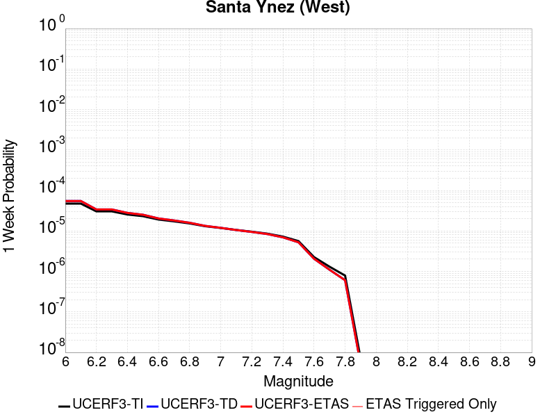 | 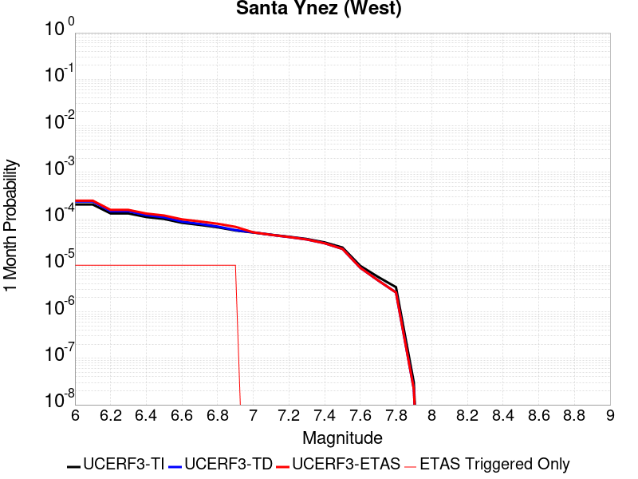 |  |  |

| Magnitude | 1 wk TI Prob | 1 wk TD Prob | 1 wk ETAS Prob | 1 wk ETAS/TD Gain | 1 wk ETAS Triggered Only | 1 mo TI Prob | 1 mo TD Prob | 1 mo ETAS Prob | 1 mo ETAS/TD Gain | 1 mo ETAS Triggered Only | 1 yr TI Prob | 1 yr TD Prob | 1 yr ETAS Prob | 1 yr ETAS/TD Gain | 1 yr ETAS Triggered Only | 10 yr TI Prob | 10 yr TD Prob | 10 yr ETAS Prob | 10 yr ETAS/TD Gain | 10 yr ETAS Triggered Only |
|-----|-----|-----|-----|-----|-----|-----|-----|-----|-----|-----|-----|-----|-----|-----|-----|-----|-----|-----|-----|-----|
| 6.0 | 4.7352758E-5 | 5.49722E-5 | 5.49722E-5 | 1.0 | 0.0 | 2.0292461E-4 | 2.3557546E-4 | 2.4557312E-4 | 1.0424392 | 1.0E-5 | 0.0024678076 | 0.0028646276 | 0.002874599 | 1.0034809 | 1.0E-5 | 0.024405818 | 0.028305134 | 0.02831485 | 1.0003433 | 1.0E-5 |
| 6.1 | 4.7352758E-5 | 5.49722E-5 | 5.49722E-5 | 1.0 | 0.0 | 2.0292461E-4 | 2.3557546E-4 | 2.4557312E-4 | 1.0424392 | 1.0E-5 | 0.0024678076 | 0.0028646276 | 0.002874599 | 1.0034809 | 1.0E-5 | 0.024405818 | 0.028305134 | 0.02831485 | 1.0003433 | 1.0E-5 |
| 6.2 | 3.0415853E-5 | 3.392567E-5 | 3.392567E-5 | 1.0 | 0.0 | 1.3034715E-4 | 1.4538778E-4 | 1.5538633E-4 | 1.0687716 | 1.0E-5 | 0.0015858212 | 0.0017686938 | 0.001778676 | 1.0056438 | 1.0E-5 | 0.015745522 | 0.01755012 | 0.017559944 | 1.0005598 | 1.0E-5 |
| 6.3 | 3.0415853E-5 | 3.392567E-5 | 3.392567E-5 | 1.0 | 0.0 | 1.3034715E-4 | 1.4538778E-4 | 1.5538633E-4 | 1.0687716 | 1.0E-5 | 0.0015858212 | 0.0017686938 | 0.001778676 | 1.0056438 | 1.0E-5 | 0.015745522 | 0.01755012 | 0.017559944 | 1.0005598 | 1.0E-5 |
| 6.4 | 2.5452082E-5 | 2.7912814E-5 | 2.7912814E-5 | 1.0 | 0.0 | 1.09075794E-4 | 1.1962098E-4 | 1.2961977E-4 | 1.0835874 | 1.0E-5 | 0.0013271887 | 0.0014554313 | 0.0014654169 | 1.0068609 | 1.0E-5 | 0.013192902 | 0.014461164 | 0.01447102 | 1.0006815 | 1.0E-5 |
| 6.5 | 2.3143784E-5 | 2.5128551E-5 | 2.5128551E-5 | 1.0 | 0.0 | 9.9183875E-5 | 1.0768943E-4 | 1.1768835E-4 | 1.0928496 | 1.0E-5 | 0.0012068948 | 0.0013103448 | 0.0013203317 | 1.0076215 | 1.0E-5 | 0.012003611 | 0.013027853 | 0.0130377235 | 1.0007576 | 1.0E-5 |
| 6.6 | 1.9118515E-5 | 2.0354546E-5 | 2.0354546E-5 | 1.0 | 0.0 | 8.193392E-5 | 8.7230896E-5 | 9.723002E-5 | 1.1146283 | 1.0E-5 | 9.97089E-4 | 0.0010615266 | 0.001071516 | 1.0094104 | 1.0E-5 | 0.00992627 | 0.010565472 | 0.010575366 | 1.0009365 | 1.0E-5 |
| 6.7 | 1.722807E-5 | 1.8146504E-5 | 1.8146504E-5 | 1.0 | 0.0 | 7.3832496E-5 | 7.776845E-5 | 8.7767665E-5 | 1.1285769 | 1.0E-5 | 8.985399E-4 | 9.464251E-4 | 9.5641566E-4 | 1.0105561 | 1.0E-5 | 0.008949154 | 0.0094245905 | 0.009434497 | 1.0010511 | 1.0E-5 |
| 6.8 | 1.5317364E-5 | 1.5926595E-5 | 1.5926595E-5 | 1.0 | 0.0 | 6.56442E-5 | 6.825507E-5 | 7.825439E-5 | 1.1464993 | 1.0E-5 | 7.98925E-4 | 8.3069294E-4 | 8.4068463E-4 | 1.0120281 | 1.0E-5 | 0.007960589 | 0.008276366 | 0.008286283 | 1.0011983 | 1.0E-5 |
| 6.9 | 1.3071226E-5 | 1.3329679E-5 | 1.3329679E-5 | 1.0 | 0.0 | 5.6018336E-5 | 5.7125955E-5 | 6.712539E-5 | 1.1750418 | 1.0E-5 | 6.8180985E-4 | 6.952888E-4 | 7.0528185E-4 | 1.0143725 | 1.0E-5 | 0.0067972173 | 0.0069313953 | 0.006941326 | 1.0014327 | 1.0E-5 |
| 7.0 | 1.1836986E-5 | 1.19328115E-5 | 1.19328115E-5 | 1.0 | 0.0 | 5.0728955E-5 | 5.113963E-5 | 5.113963E-5 | 1.0 | 0.0 | 6.1745E-4 | 6.224488E-4 | 6.224488E-4 | 1.0 | 0.0 | 0.006157372 | 0.006207247 | 0.006207247 | 1.0 | 0.0 |
| 7.1 | 1.0597169E-5 | 1.0542209E-5 | 1.0542209E-5 | 1.0 | 0.0 | 4.541565E-5 | 4.5180117E-5 | 4.5180117E-5 | 1.0 | 0.0 | 5.5279525E-4 | 5.499302E-4 | 5.499302E-4 | 1.0 | 0.0 | 0.0055142213 | 0.005485825 | 0.005485825 | 1.0 | 0.0 |
| 7.2 | 9.59113E-6 | 9.4591405E-6 | 9.4591405E-6 | 1.0 | 0.0 | 4.11042E-5 | 4.0538547E-5 | 4.0538547E-5 | 1.0 | 0.0 | 5.0032866E-4 | 4.9344613E-4 | 4.9344613E-4 | 1.0 | 0.0 | 0.004992037 | 0.0049236235 | 0.0049236235 | 1.0 | 0.0 |
| 7.3 | 8.586084E-6 | 8.3795685E-6 | 8.3795685E-6 | 1.0 | 0.0 | 3.679698E-5 | 3.5911948E-5 | 3.5911948E-5 | 1.0 | 0.0 | 4.4791115E-4 | 4.371413E-4 | 4.371413E-4 | 1.0 | 0.0 | 0.004470094 | 0.0043629254 | 0.0043629254 | 1.0 | 0.0 |
| 7.4 | 7.2622997E-6 | 6.9515127E-6 | 6.9515127E-6 | 1.0 | 0.0 | 3.112377E-5 | 2.9791861E-5 | 2.9791861E-5 | 1.0 | 0.0 | 3.78866E-4 | 3.6265652E-4 | 3.6265652E-4 | 1.0 | 0.0 | 0.0037822074 | 0.0036207472 | 0.0036207472 | 1.0 | 0.0 |
| 7.5 | 5.627296E-6 | 5.251543E-6 | 5.251543E-6 | 1.0 | 0.0 | 2.411676E-5 | 2.2506423E-5 | 2.2506423E-5 | 1.0 | 0.0 | 2.9358198E-4 | 2.7398195E-4 | 2.7398195E-4 | 1.0 | 0.0 | 0.0029319443 | 0.0027365137 | 0.0027365137 | 1.0 | 0.0 |
| 7.6 | 2.265244E-6 | 2.0608816E-6 | 2.0608816E-6 | 1.0 | 0.0 | 9.708152E-6 | 8.8323195E-6 | 8.8323195E-6 | 1.0 | 0.0 | 1.18190335E-4 | 1.0752828E-4 | 1.0752828E-4 | 1.0 | 0.0 | 0.001181275 | 0.001074771 | 0.001074771 | 1.0 | 0.0 |
| 7.7 | 1.3099874E-6 | 1.1016346E-6 | 1.1016346E-6 | 1.0 | 0.0 | 5.61422E-6 | 4.7212825E-6 | 4.7212825E-6 | 1.0 | 0.0 | 6.8350986E-5 | 5.748012E-5 | 5.748012E-5 | 1.0 | 0.0 | 6.832996E-4 | 5.7465496E-4 | 5.7465496E-4 | 1.0 | 0.0 |
| 7.8 | 7.903951E-7 | 6.0711466E-7 | 6.0711466E-7 | 1.0 | 0.0 | 3.3874032E-6 | 2.6019175E-6 | 2.6019175E-6 | 1.0 | 0.0 | 4.1240855E-5 | 3.1677897E-5 | 3.1677897E-5 | 1.0 | 0.0 | 4.12332E-4 | 3.1673515E-4 | 3.1673515E-4 | 1.0 | 0.0 |
| 7.9 | 7.0753297E-9 | 5.0900932E-9 | 5.0900932E-9 | 1.0 | 0.0 | 3.032284E-8 | 2.1814685E-8 | 2.1814685E-8 | 1.0 | 0.0 | 3.6918053E-7 | 2.6559377E-7 | 2.6559377E-7 | 1.0 | 0.0 | 3.691799E-6 | 2.6559355E-6 | 2.6559355E-6 | 1.0 | 0.0 |

## Camp Rock 2011
*[(top)](#table-of-contents)*

| 1 Week | 1 Month | 1 Year | 10 Year |
|-----|-----|-----|-----|
|  |  | 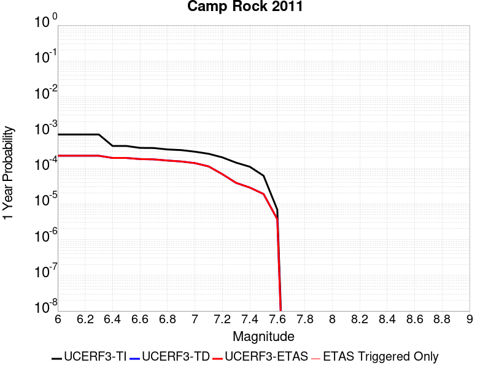 |  |

| Magnitude | 1 wk TI Prob | 1 wk TD Prob | 1 wk ETAS Prob | 1 wk ETAS/TD Gain | 1 wk ETAS Triggered Only | 1 mo TI Prob | 1 mo TD Prob | 1 mo ETAS Prob | 1 mo ETAS/TD Gain | 1 mo ETAS Triggered Only | 1 yr TI Prob | 1 yr TD Prob | 1 yr ETAS Prob | 1 yr ETAS/TD Gain | 1 yr ETAS Triggered Only | 10 yr TI Prob | 10 yr TD Prob | 10 yr ETAS Prob | 10 yr ETAS/TD Gain | 10 yr ETAS Triggered Only |
|-----|-----|-----|-----|-----|-----|-----|-----|-----|-----|-----|-----|-----|-----|-----|-----|-----|-----|-----|-----|-----|
| 6.0 | 1.6710783E-5 | 4.2500346E-6 | 4.2500346E-6 | 1.0 | 0.0 | 7.161568E-5 | 1.821431E-5 | 1.821431E-5 | 1.0 | 0.0 | 8.7157206E-4 | 2.2173718E-4 | 2.2173718E-4 | 1.0 | 0.0 | 0.008681616 | 0.0022152122 | 0.0022251902 | 1.0045042 | 1.0E-5 |
| 6.1 | 1.6710783E-5 | 4.2500346E-6 | 4.2500346E-6 | 1.0 | 0.0 | 7.161568E-5 | 1.821431E-5 | 1.821431E-5 | 1.0 | 0.0 | 8.7157206E-4 | 2.2173718E-4 | 2.2173718E-4 | 1.0 | 0.0 | 0.008681616 | 0.0022152122 | 0.0022251902 | 1.0045042 | 1.0E-5 |
| 6.2 | 1.6710783E-5 | 4.2500346E-6 | 4.2500346E-6 | 1.0 | 0.0 | 7.161568E-5 | 1.821431E-5 | 1.821431E-5 | 1.0 | 0.0 | 8.7157206E-4 | 2.2173718E-4 | 2.2173718E-4 | 1.0 | 0.0 | 0.008681616 | 0.0022152122 | 0.0022251902 | 1.0045042 | 1.0E-5 |
| 6.3 | 1.6710783E-5 | 4.2500346E-6 | 4.2500346E-6 | 1.0 | 0.0 | 7.161568E-5 | 1.821431E-5 | 1.821431E-5 | 1.0 | 0.0 | 8.7157206E-4 | 2.2173718E-4 | 2.2173718E-4 | 1.0 | 0.0 | 0.008681616 | 0.0022152122 | 0.0022251902 | 1.0045042 | 1.0E-5 |
| 6.4 | 7.982846E-6 | 3.682069E-6 | 3.682069E-6 | 1.0 | 0.0 | 3.421175E-5 | 1.5780202E-5 | 1.5780202E-5 | 1.0 | 0.0 | 4.1644843E-4 | 1.9210737E-4 | 1.9210737E-4 | 1.0 | 0.0 | 0.0041566887 | 0.0019194479 | 0.0019294287 | 1.0051998 | 1.0E-5 |
| 6.5 | 7.982846E-6 | 3.682069E-6 | 3.682069E-6 | 1.0 | 0.0 | 3.421175E-5 | 1.5780202E-5 | 1.5780202E-5 | 1.0 | 0.0 | 4.1644843E-4 | 1.9210737E-4 | 1.9210737E-4 | 1.0 | 0.0 | 0.0041566887 | 0.0019194479 | 0.0019294287 | 1.0051998 | 1.0E-5 |
| 6.6 | 7.048869E-6 | 3.4243315E-6 | 3.4243315E-6 | 1.0 | 0.0 | 3.0209088E-5 | 1.4675626E-5 | 1.4675626E-5 | 1.0 | 0.0 | 3.677336E-4 | 1.786614E-4 | 1.786614E-4 | 1.0 | 0.0 | 0.0036712566 | 0.0017852094 | 0.0017951916 | 1.0055916 | 1.0E-5 |
| 6.7 | 6.987307E-6 | 3.3623085E-6 | 3.3623085E-6 | 1.0 | 0.0 | 2.9945259E-5 | 1.4409816E-5 | 1.4409816E-5 | 1.0 | 0.0 | 3.6452254E-4 | 1.754257E-4 | 1.754257E-4 | 1.0 | 0.0 | 0.0036392517 | 0.0017529033 | 0.0017628858 | 1.0056949 | 1.0E-5 |
| 6.8 | 6.3737602E-6 | 3.1178974E-6 | 3.1178974E-6 | 1.0 | 0.0 | 2.731583E-5 | 1.3362351E-5 | 1.3362351E-5 | 1.0 | 0.0 | 3.3251947E-4 | 1.6267477E-4 | 1.6267477E-4 | 1.0 | 0.0 | 0.0033202237 | 0.0016255855 | 0.0016355693 | 1.0061417 | 1.0E-5 |
| 6.9 | 6.112211E-6 | 2.9331072E-6 | 2.9331072E-6 | 1.0 | 0.0 | 2.6194928E-5 | 1.2570401E-5 | 1.2570401E-5 | 1.0 | 0.0 | 3.1887658E-4 | 1.5303415E-4 | 1.5303415E-4 | 1.0 | 0.0 | 0.003184194 | 0.0015293155 | 0.0015393002 | 1.0065289 | 1.0E-5 |
| 7.0 | 5.5140117E-6 | 2.6419382E-6 | 2.6419382E-6 | 1.0 | 0.0 | 2.3631264E-5 | 1.1322544E-5 | 1.1322544E-5 | 1.0 | 0.0 | 2.8767265E-4 | 1.3784351E-4 | 1.3784351E-4 | 1.0 | 0.0 | 0.0028730053 | 0.0013776054 | 0.0013875916 | 1.007249 | 1.0E-5 |
| 7.1 | 4.8151105E-6 | 2.1342858E-6 | 2.1342858E-6 | 1.0 | 0.0 | 2.0636026E-5 | 9.146908E-6 | 9.146908E-6 | 1.0 | 0.0 | 2.5121463E-4 | 1.1135814E-4 | 1.1135814E-4 | 1.0 | 0.0 | 0.0025093083 | 0.0011130453 | 0.0011130453 | 1.0 | 0.0 |
| 7.2 | 3.818335E-6 | 1.2937558E-6 | 1.2937558E-6 | 1.0 | 0.0 | 1.6364189E-5 | 5.5446562E-6 | 5.5446562E-6 | 1.0 | 0.0 | 1.9921579E-4 | 6.750418E-5 | 6.750418E-5 | 1.0 | 0.0 | 0.0019903728 | 6.74845E-4 | 6.74845E-4 | 1.0 | 0.0 |
| 7.3 | 2.7166698E-6 | 7.3832456E-7 | 7.3832456E-7 | 1.0 | 0.0 | 1.1642818E-5 | 3.1642444E-6 | 3.1642444E-6 | 1.0 | 0.0 | 1.4174209E-4 | 3.8524013E-5 | 3.8524013E-5 | 1.0 | 0.0 | 0.0014165172 | 3.8517537E-4 | 3.8517537E-4 | 1.0 | 0.0 |
| 7.4 | 2.0893426E-6 | 5.4615964E-7 | 5.4615964E-7 | 1.0 | 0.0 | 8.954295E-6 | 2.340682E-6 | 2.340682E-6 | 1.0 | 0.0 | 1.0901308E-4 | 2.8497436E-5 | 2.8497436E-5 | 1.0 | 0.0 | 0.0010895962 | 2.8493837E-4 | 2.8493837E-4 | 1.0 | 0.0 |
| 7.5 | 1.1681728E-6 | 3.6029326E-7 | 3.6029326E-7 | 1.0 | 0.0 | 5.0064455E-6 | 1.544113E-6 | 1.544113E-6 | 1.0 | 0.0 | 6.0951766E-5 | 1.879942E-5 | 1.879942E-5 | 1.0 | 0.0 | 6.093505E-4 | 1.8797876E-4 | 1.8797876E-4 | 1.0 | 0.0 |
| 7.6 | 1.3154387E-7 | 7.119745E-8 | 7.119745E-8 | 1.0 | 0.0 | 5.6375933E-7 | 3.051319E-7 | 3.051319E-7 | 1.0 | 0.0 | 6.863748E-6 | 3.7149762E-6 | 3.7149762E-6 | 1.0 | 0.0 | 6.863536E-5 | 3.7149297E-5 | 3.7149297E-5 | 1.0 | 0.0 |

## San Luis Range 2011 CFM
*[(top)](#table-of-contents)*

| 1 Week | 1 Month | 1 Year | 10 Year |
|-----|-----|-----|-----|
|  |  |  |  |

| Magnitude | 1 wk TI Prob | 1 wk TD Prob | 1 wk ETAS Prob | 1 wk ETAS/TD Gain | 1 wk ETAS Triggered Only | 1 mo TI Prob | 1 mo TD Prob | 1 mo ETAS Prob | 1 mo ETAS/TD Gain | 1 mo ETAS Triggered Only | 1 yr TI Prob | 1 yr TD Prob | 1 yr ETAS Prob | 1 yr ETAS/TD Gain | 1 yr ETAS Triggered Only | 10 yr TI Prob | 10 yr TD Prob | 10 yr ETAS Prob | 10 yr ETAS/TD Gain | 10 yr ETAS Triggered Only |
|-----|-----|-----|-----|-----|-----|-----|-----|-----|-----|-----|-----|-----|-----|-----|-----|-----|-----|-----|-----|-----|
| 6.0 | 8.8368415E-6 | 8.965478E-6 | 8.965478E-6 | 1.0 | 0.0 | 3.787163E-5 | 3.8422957E-5 | 3.8422957E-5 | 1.0 | 0.0 | 4.609895E-4 | 4.6770697E-4 | 4.777023E-4 | 1.0213709 | 1.0E-5 | 0.0046003438 | 0.004668009 | 0.004677962 | 1.0021323 | 1.0E-5 |
| 6.1 | 8.8368415E-6 | 8.965478E-6 | 8.965478E-6 | 1.0 | 0.0 | 3.787163E-5 | 3.8422957E-5 | 3.8422957E-5 | 1.0 | 0.0 | 4.609895E-4 | 4.6770697E-4 | 4.777023E-4 | 1.0213709 | 1.0E-5 | 0.0046003438 | 0.004668009 | 0.004677962 | 1.0021323 | 1.0E-5 |
| 6.2 | 8.8368415E-6 | 8.965478E-6 | 8.965478E-6 | 1.0 | 0.0 | 3.787163E-5 | 3.8422957E-5 | 3.8422957E-5 | 1.0 | 0.0 | 4.609895E-4 | 4.6770697E-4 | 4.777023E-4 | 1.0213709 | 1.0E-5 | 0.0046003438 | 0.004668009 | 0.004677962 | 1.0021323 | 1.0E-5 |
| 6.3 | 8.8368415E-6 | 8.965478E-6 | 8.965478E-6 | 1.0 | 0.0 | 3.787163E-5 | 3.8422957E-5 | 3.8422957E-5 | 1.0 | 0.0 | 4.609895E-4 | 4.6770697E-4 | 4.777023E-4 | 1.0213709 | 1.0E-5 | 0.0046003438 | 0.004668009 | 0.004677962 | 1.0021323 | 1.0E-5 |
| 6.4 | 3.9094193E-6 | 3.941214E-6 | 3.941214E-6 | 1.0 | 0.0 | 1.6754546E-5 | 1.689081E-5 | 1.689081E-5 | 1.0 | 0.0 | 2.039675E-4 | 2.0562648E-4 | 2.0562648E-4 | 1.0 | 0.0 | 0.0020378039 | 0.002054391 | 0.002054391 | 1.0 | 0.0 |
| 6.5 | 3.9094193E-6 | 3.941214E-6 | 3.941214E-6 | 1.0 | 0.0 | 1.6754546E-5 | 1.689081E-5 | 1.689081E-5 | 1.0 | 0.0 | 2.039675E-4 | 2.0562648E-4 | 2.0562648E-4 | 1.0 | 0.0 | 0.0020378039 | 0.002054391 | 0.002054391 | 1.0 | 0.0 |
| 6.6 | 3.0587726E-6 | 3.0753974E-6 | 3.0753974E-6 | 1.0 | 0.0 | 1.3108959E-5 | 1.3180209E-5 | 1.3180209E-5 | 1.0 | 0.0 | 1.595899E-4 | 1.6045735E-4 | 1.6045735E-4 | 1.0 | 0.0 | 0.0015947534 | 0.0016034269 | 0.0016034269 | 1.0 | 0.0 |
| 6.7 | 2.6160574E-6 | 2.6251355E-6 | 2.6251355E-6 | 1.0 | 0.0 | 1.1211626E-5 | 1.1250533E-5 | 1.1250533E-5 | 1.0 | 0.0 | 1.3649299E-4 | 1.3696669E-4 | 1.3696669E-4 | 1.0 | 0.0 | 0.0013640919 | 0.0013688289 | 0.0013688289 | 1.0 | 0.0 |
| 6.8 | 2.5110312E-6 | 2.5181482E-6 | 2.5181482E-6 | 1.0 | 0.0 | 1.0761518E-5 | 1.079202E-5 | 1.079202E-5 | 1.0 | 0.0 | 1.310136E-4 | 1.3138496E-4 | 1.3138496E-4 | 1.0 | 0.0 | 0.0013093639 | 0.0013130788 | 0.0013130788 | 1.0 | 0.0 |
| 6.9 | 1.8564405E-6 | 1.8524935E-6 | 1.8524935E-6 | 1.0 | 0.0 | 7.95615E-6 | 7.939234E-6 | 7.939234E-6 | 1.0 | 0.0 | 9.686181E-5 | 9.66559E-5 | 9.66559E-5 | 1.0 | 0.0 | 9.68196E-4 | 9.6614065E-4 | 9.6614065E-4 | 1.0 | 0.0 |
| 7.0 | 1.546127E-6 | 1.5369595E-6 | 1.5369595E-6 | 1.0 | 0.0 | 6.626242E-6 | 6.586953E-6 | 6.586953E-6 | 1.0 | 0.0 | 8.06715E-5 | 8.0193204E-5 | 8.0193204E-5 | 1.0 | 0.0 | 8.0642226E-4 | 8.016434E-4 | 8.016434E-4 | 1.0 | 0.0 |
| 7.1 | 1.3368208E-6 | 1.3235378E-6 | 1.3235378E-6 | 1.0 | 0.0 | 5.7292195E-6 | 5.672293E-6 | 5.672293E-6 | 1.0 | 0.0 | 6.975101E-5 | 6.905798E-5 | 6.905798E-5 | 1.0 | 0.0 | 6.972912E-4 | 6.903657E-4 | 6.903657E-4 | 1.0 | 0.0 |
| 7.2 | 1.0623363E-6 | 1.0454412E-6 | 1.0454412E-6 | 1.0 | 0.0 | 4.5528623E-6 | 4.4804547E-6 | 4.4804547E-6 | 1.0 | 0.0 | 5.5429686E-5 | 5.4548174E-5 | 5.4548174E-5 | 1.0 | 0.0 | 5.5415864E-4 | 5.453481E-4 | 5.453481E-4 | 1.0 | 0.0 |
| 7.3 | 7.831679E-7 | 7.7274274E-7 | 7.7274274E-7 | 1.0 | 0.0 | 3.3564295E-6 | 3.3117506E-6 | 3.3117506E-6 | 1.0 | 0.0 | 4.086376E-5 | 4.0319817E-5 | 4.0319817E-5 | 1.0 | 0.0 | 4.0856248E-4 | 4.0312516E-4 | 4.0312516E-4 | 1.0 | 0.0 |
| 7.4 | 5.9558846E-7 | 5.9106696E-7 | 5.9106696E-7 | 1.0 | 0.0 | 2.5525194E-6 | 2.5331417E-6 | 2.5331417E-6 | 1.0 | 0.0 | 3.107648E-5 | 3.0840565E-5 | 3.0840565E-5 | 1.0 | 0.0 | 3.1072134E-4 | 3.083629E-4 | 3.083629E-4 | 1.0 | 0.0 |
| 7.5 | 4.1616502E-7 | 4.1196597E-7 | 4.1196597E-7 | 1.0 | 0.0 | 1.7835631E-6 | 1.7655673E-6 | 1.7655673E-6 | 1.0 | 0.0 | 2.1714664E-5 | 2.1495569E-5 | 2.1495569E-5 | 1.0 | 0.0 | 2.1712543E-4 | 2.1493496E-4 | 2.1493496E-4 | 1.0 | 0.0 |
| 7.6 | 2.3816014E-7 | 2.3376762E-7 | 2.3376762E-7 | 1.0 | 0.0 | 1.0206859E-6 | 1.0018608E-6 | 1.0018608E-6 | 1.0 | 0.0 | 1.242678E-5 | 1.2197587E-5 | 1.2197587E-5 | 1.0 | 0.0 | 1.2426086E-4 | 1.219692E-4 | 1.219692E-4 | 1.0 | 0.0 |
| 7.7 | 9.918777E-8 | 9.386922E-8 | 9.386922E-8 | 1.0 | 0.0 | 4.2509038E-7 | 4.0229656E-7 | 4.0229656E-7 | 1.0 | 0.0 | 5.1754632E-6 | 4.8979496E-6 | 4.8979496E-6 | 1.0 | 0.0 | 5.1753424E-5 | 4.897842E-5 | 4.897842E-5 | 1.0 | 0.0 |
| 7.8 | 3.4982556E-8 | 2.9687648E-8 | 2.9687648E-8 | 1.0 | 0.0 | 1.4992524E-7 | 1.2723277E-7 | 1.2723277E-7 | 1.0 | 0.0 | 1.8253382E-6 | 1.5490579E-6 | 1.5490579E-6 | 1.0 | 0.0 | 1.8253233E-5 | 1.5490472E-5 | 1.5490472E-5 | 1.0 | 0.0 |
| 7.9 | 1.6624908E-8 | 1.147785E-8 | 1.147785E-8 | 1.0 | 0.0 | 7.12496E-8 | 4.9190785E-8 | 4.9190785E-8 | 1.0 | 0.0 | 8.6746354E-7 | 5.9889766E-7 | 5.9889766E-7 | 1.0 | 0.0 | 8.674601E-6 | 5.9889603E-6 | 5.9889603E-6 | 1.0 | 0.0 |
| 8.0 | 6.3352315E-9 | 3.0891683E-9 | 3.0891683E-9 | 1.0 | 0.0 | 2.715099E-8 | 1.3239292E-8 | 1.3239292E-8 | 1.0 | 0.0 | 3.3056327E-7 | 1.6118838E-7 | 1.6118838E-7 | 1.0 | 0.0 | 3.3056278E-6 | 1.6118827E-6 | 1.6118827E-6 | 1.0 | 0.0 |

## San Gabriel (Extension)
*[(top)](#table-of-contents)*

| 1 Week | 1 Month | 1 Year | 10 Year |
|-----|-----|-----|-----|
| 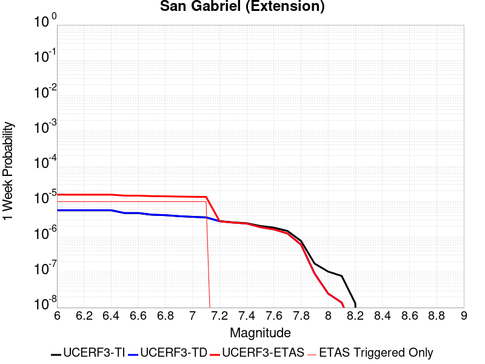 |  | 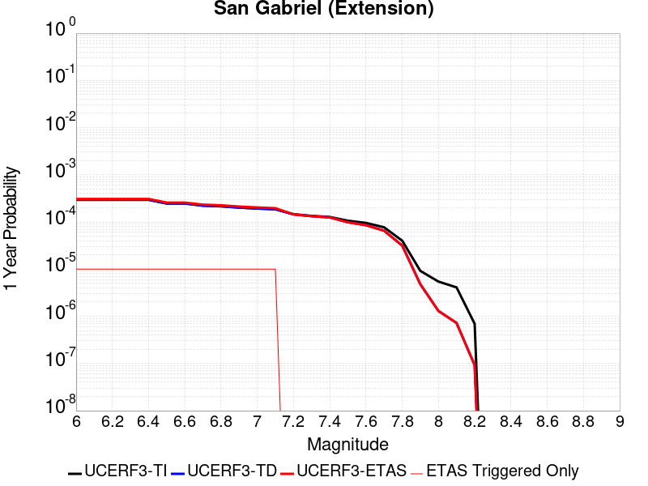 |  |

| Magnitude | 1 wk TI Prob | 1 wk TD Prob | 1 wk ETAS Prob | 1 wk ETAS/TD Gain | 1 wk ETAS Triggered Only | 1 mo TI Prob | 1 mo TD Prob | 1 mo ETAS Prob | 1 mo ETAS/TD Gain | 1 mo ETAS Triggered Only | 1 yr TI Prob | 1 yr TD Prob | 1 yr ETAS Prob | 1 yr ETAS/TD Gain | 1 yr ETAS Triggered Only | 10 yr TI Prob | 10 yr TD Prob | 10 yr ETAS Prob | 10 yr ETAS/TD Gain | 10 yr ETAS Triggered Only |
|-----|-----|-----|-----|-----|-----|-----|-----|-----|-----|-----|-----|-----|-----|-----|-----|-----|-----|-----|-----|-----|
| 6.0 | 5.6486106E-6 | 5.7171515E-6 | 1.5717094E-5 | 2.7491128 | 1.0E-5 | 2.4208108E-5 | 2.4501855E-5 | 3.450161E-5 | 1.4081224 | 1.0E-5 | 2.9469383E-4 | 2.9827052E-4 | 3.082675E-4 | 1.0335166 | 1.0E-5 | 0.0029430336 | 0.0029788336 | 0.002988804 | 1.003347 | 1.0E-5 |
| 6.1 | 5.6486106E-6 | 5.7171515E-6 | 1.5717094E-5 | 2.7491128 | 1.0E-5 | 2.4208108E-5 | 2.4501855E-5 | 3.450161E-5 | 1.4081224 | 1.0E-5 | 2.9469383E-4 | 2.9827052E-4 | 3.082675E-4 | 1.0335166 | 1.0E-5 | 0.0029430336 | 0.0029788336 | 0.002988804 | 1.003347 | 1.0E-5 |
| 6.2 | 5.6486106E-6 | 5.7171515E-6 | 1.5717094E-5 | 2.7491128 | 1.0E-5 | 2.4208108E-5 | 2.4501855E-5 | 3.450161E-5 | 1.4081224 | 1.0E-5 | 2.9469383E-4 | 2.9827052E-4 | 3.082675E-4 | 1.0335166 | 1.0E-5 | 0.0029430336 | 0.0029788336 | 0.002988804 | 1.003347 | 1.0E-5 |
| 6.3 | 5.6486106E-6 | 5.7171515E-6 | 1.5717094E-5 | 2.7491128 | 1.0E-5 | 2.4208108E-5 | 2.4501855E-5 | 3.450161E-5 | 1.4081224 | 1.0E-5 | 2.9469383E-4 | 2.9827052E-4 | 3.082675E-4 | 1.0335166 | 1.0E-5 | 0.0029430336 | 0.0029788336 | 0.002988804 | 1.003347 | 1.0E-5 |
| 6.4 | 5.6486106E-6 | 5.7171515E-6 | 1.5717094E-5 | 2.7491128 | 1.0E-5 | 2.4208108E-5 | 2.4501855E-5 | 3.450161E-5 | 1.4081224 | 1.0E-5 | 2.9469383E-4 | 2.9827052E-4 | 3.082675E-4 | 1.0335166 | 1.0E-5 | 0.0029430336 | 0.0029788336 | 0.002988804 | 1.003347 | 1.0E-5 |
| 6.5 | 4.7134554E-6 | 4.754572E-6 | 1.4754524E-5 | 3.1032288 | 1.0E-5 | 2.0200367E-5 | 2.0376581E-5 | 3.0376377E-5 | 1.4907495 | 1.0E-5 | 2.459117E-4 | 2.4805748E-4 | 2.58055E-4 | 1.0403032 | 1.0E-5 | 0.0024563975 | 0.0024778957 | 0.0024878709 | 1.0040257 | 1.0E-5 |
| 6.6 | 4.7134554E-6 | 4.754572E-6 | 1.4754524E-5 | 3.1032288 | 1.0E-5 | 2.0200367E-5 | 2.0376581E-5 | 3.0376377E-5 | 1.4907495 | 1.0E-5 | 2.459117E-4 | 2.4805748E-4 | 2.58055E-4 | 1.0403032 | 1.0E-5 | 0.0024563975 | 0.0024778957 | 0.0024878709 | 1.0040257 | 1.0E-5 |
| 6.7 | 4.2468837E-6 | 4.2743873E-6 | 1.4274345E-5 | 3.3395066 | 1.0E-5 | 1.8200803E-5 | 1.8318677E-5 | 2.8318495E-5 | 1.5458809 | 1.0E-5 | 2.2157225E-4 | 2.230078E-4 | 2.3300557E-4 | 1.0448315 | 1.0E-5 | 0.0022135144 | 0.0022279175 | 0.0022378953 | 1.0044785 | 1.0E-5 |
| 6.8 | 4.1180615E-6 | 4.141776E-6 | 1.4141735E-5 | 3.414413 | 1.0E-5 | 1.7648716E-5 | 1.7750353E-5 | 2.7750175E-5 | 1.5633591 | 1.0E-5 | 2.1485193E-4 | 2.1608983E-4 | 2.2608766E-4 | 1.046267 | 1.0E-5 | 0.0021464431 | 0.0021588737 | 0.0021688521 | 1.0046221 | 1.0E-5 |
| 6.9 | 3.863861E-6 | 3.8800904E-6 | 1.38800515E-5 | 3.5772495 | 1.0E-5 | 1.65593E-5 | 1.6628857E-5 | 2.6628692E-5 | 1.6013542 | 1.0E-5 | 2.0159081E-4 | 2.0243821E-4 | 2.1243619E-4 | 1.0493878 | 1.0E-5 | 0.0020140803 | 0.002022611 | 0.0020325908 | 1.0049341 | 1.0E-5 |
| 7.0 | 3.6947372E-6 | 3.705989E-6 | 1.3705952E-5 | 3.698325 | 1.0E-5 | 1.5834492E-5 | 1.5882717E-5 | 2.5882558E-5 | 1.6296052 | 1.0E-5 | 1.9276788E-4 | 1.9335559E-4 | 2.0335366E-4 | 1.0517082 | 1.0E-5 | 0.0019260074 | 0.0019319453 | 0.0019419261 | 1.0051662 | 1.0E-5 |
| 7.1 | 3.5686835E-6 | 3.5732085E-6 | 1.35731725E-5 | 3.7985952 | 1.0E-5 | 1.5294268E-5 | 1.5313664E-5 | 2.5313511E-5 | 1.6530015 | 1.0E-5 | 1.861918E-4 | 1.8642857E-4 | 1.9642671E-4 | 1.0536299 | 1.0E-5 | 0.0018603588 | 0.001862793 | 0.0018727743 | 1.0053583 | 1.0E-5 |
| 7.2 | 2.8023446E-6 | 2.7770957E-6 | 2.7770957E-6 | 1.0 | 0.0 | 1.2009994E-5 | 1.1901785E-5 | 1.1901785E-5 | 1.0 | 0.0 | 1.4621185E-4 | 1.448947E-4 | 1.448947E-4 | 1.0 | 0.0 | 0.001461157 | 0.0014480185 | 0.0014480185 | 1.0 | 0.0 |
| 7.3 | 2.5843012E-6 | 2.546268E-6 | 2.546268E-6 | 1.0 | 0.0 | 1.1075529E-5 | 1.0912532E-5 | 1.0912532E-5 | 1.0 | 0.0 | 1.3483623E-4 | 1.3285207E-4 | 1.3285207E-4 | 1.0 | 0.0 | 0.0013475444 | 0.0013277415 | 0.0013277415 | 1.0 | 0.0 |
| 7.4 | 2.4464468E-6 | 2.3969635E-6 | 2.3969635E-6 | 1.0 | 0.0 | 1.04847295E-5 | 1.0272661E-5 | 1.0272661E-5 | 1.0 | 0.0 | 1.276441E-4 | 1.2506256E-4 | 1.2506256E-4 | 1.0 | 0.0 | 0.0012757082 | 0.0012499366 | 0.0012499366 | 1.0 | 0.0 |
| 7.5 | 2.0420266E-6 | 1.891297E-6 | 1.891297E-6 | 1.0 | 0.0 | 8.751514E-6 | 8.105533E-6 | 8.105533E-6 | 1.0 | 0.0 | 1.0654447E-4 | 9.868044E-5 | 9.868044E-5 | 1.0 | 0.0 | 0.001064934 | 9.863748E-4 | 9.863748E-4 | 1.0 | 0.0 |
| 7.6 | 1.8326596E-6 | 1.6400626E-6 | 1.6400626E-6 | 1.0 | 0.0 | 7.854232E-6 | 7.028821E-6 | 7.028821E-6 | 1.0 | 0.0 | 9.562107E-5 | 8.557256E-5 | 8.557256E-5 | 1.0 | 0.0 | 9.5579936E-4 | 8.5540337E-4 | 8.5540337E-4 | 1.0 | 0.0 |
| 7.7 | 1.4786998E-6 | 1.2525887E-6 | 1.2525887E-6 | 1.0 | 0.0 | 6.3372695E-6 | 5.368226E-6 | 5.368226E-6 | 1.0 | 0.0 | 7.715353E-5 | 6.535621E-5 | 6.535621E-5 | 1.0 | 0.0 | 7.7126746E-4 | 6.5337884E-4 | 6.5337884E-4 | 1.0 | 0.0 |
| 7.8 | 7.6975533E-7 | 6.071072E-7 | 6.071072E-7 | 1.0 | 0.0 | 3.2989474E-6 | 2.6018854E-6 | 2.6018854E-6 | 1.0 | 0.0 | 4.0163945E-5 | 3.1677497E-5 | 3.1677497E-5 | 1.0 | 0.0 | 4.0156685E-4 | 3.1673696E-4 | 3.1673696E-4 | 1.0 | 0.0 |
| 7.9 | 1.7645915E-7 | 9.217281E-8 | 9.217281E-8 | 1.0 | 0.0 | 7.562533E-7 | 3.950263E-7 | 3.950263E-7 | 1.0 | 0.0 | 9.207345E-6 | 4.8094344E-6 | 4.8094344E-6 | 1.0 | 0.0 | 9.206964E-5 | 4.8098358E-5 | 4.8098358E-5 | 1.0 | 0.0 |
| 8.0 | 1.0463461E-7 | 2.4959572E-8 | 2.4959572E-8 | 1.0 | 0.0 | 4.4843398E-7 | 1.0696959E-7 | 1.0696959E-7 | 1.0 | 0.0 | 5.45967E-6 | 1.302354E-6 | 1.302354E-6 | 1.0 | 0.0 | 5.459536E-5 | 1.3028511E-5 | 1.3028511E-5 | 1.0 | 0.0 |
| 8.1 | 7.875717E-8 | 1.3871283E-8 | 1.3871283E-8 | 1.0 | 0.0 | 3.3753068E-7 | 5.9448354E-8 | 5.9448354E-8 | 1.0 | 0.0 | 4.109428E-6 | 7.2378344E-7 | 7.2378344E-7 | 1.0 | 0.0 | 4.109352E-5 | 7.2428584E-6 | 7.2428584E-6 | 1.0 | 0.0 |
| 8.2 | 1.33163E-8 | 1.7741913E-9 | 1.7741913E-9 | 1.0 | 0.0 | 5.7069855E-8 | 7.603677E-9 | 7.603677E-9 | 1.0 | 0.0 | 6.9482525E-7 | 9.257475E-8 | 9.257475E-8 | 1.0 | 0.0 | 6.9482307E-6 | 9.27746E-7 | 9.27746E-7 | 1.0 | 0.0 |

## Channel Islands Thrust
*[(top)](#table-of-contents)*

| 1 Week | 1 Month | 1 Year | 10 Year |
|-----|-----|-----|-----|
|  | 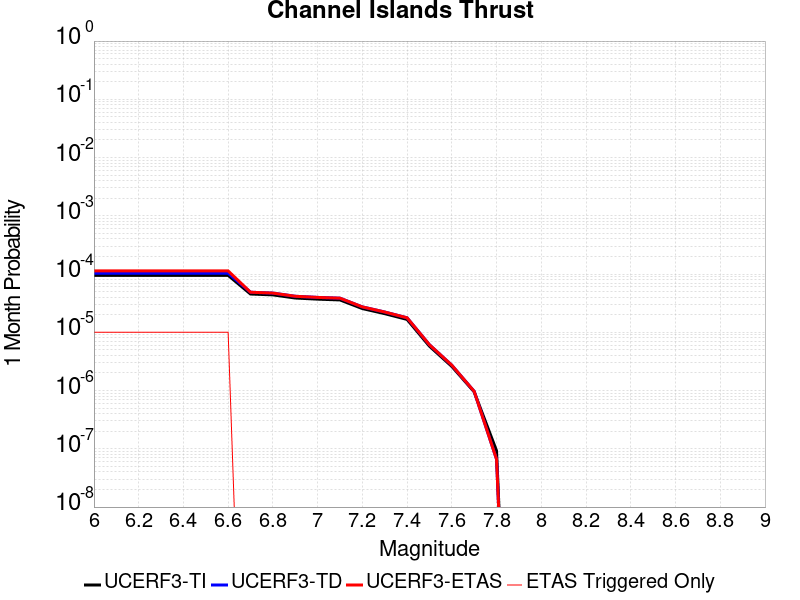 |  |  |

| Magnitude | 1 wk TI Prob | 1 wk TD Prob | 1 wk ETAS Prob | 1 wk ETAS/TD Gain | 1 wk ETAS Triggered Only | 1 mo TI Prob | 1 mo TD Prob | 1 mo ETAS Prob | 1 mo ETAS/TD Gain | 1 mo ETAS Triggered Only | 1 yr TI Prob | 1 yr TD Prob | 1 yr ETAS Prob | 1 yr ETAS/TD Gain | 1 yr ETAS Triggered Only | 10 yr TI Prob | 10 yr TD Prob | 10 yr ETAS Prob | 10 yr ETAS/TD Gain | 10 yr ETAS Triggered Only |
|-----|-----|-----|-----|-----|-----|-----|-----|-----|-----|-----|-----|-----|-----|-----|-----|-----|-----|-----|-----|-----|
| 6.0 | 2.2156251E-5 | 2.4092304E-5 | 3.4092063E-5 | 1.4150603 | 1.0E-5 | 9.495191E-5 | 1.03249244E-4 | 1.13248214E-4 | 1.096843 | 1.0E-5 | 0.0011554264 | 0.0012564411 | 0.0012664286 | 1.007949 | 1.0E-5 | 0.011494373 | 0.012503966 | 0.012513841 | 1.0007898 | 1.0E-5 |
| 6.1 | 2.2156251E-5 | 2.4092304E-5 | 3.4092063E-5 | 1.4150603 | 1.0E-5 | 9.495191E-5 | 1.03249244E-4 | 1.13248214E-4 | 1.096843 | 1.0E-5 | 0.0011554264 | 0.0012564411 | 0.0012664286 | 1.007949 | 1.0E-5 | 0.011494373 | 0.012503966 | 0.012513841 | 1.0007898 | 1.0E-5 |
| 6.2 | 2.2156251E-5 | 2.4092304E-5 | 3.4092063E-5 | 1.4150603 | 1.0E-5 | 9.495191E-5 | 1.03249244E-4 | 1.13248214E-4 | 1.096843 | 1.0E-5 | 0.0011554264 | 0.0012564411 | 0.0012664286 | 1.007949 | 1.0E-5 | 0.011494373 | 0.012503966 | 0.012513841 | 1.0007898 | 1.0E-5 |
| 6.3 | 2.2156251E-5 | 2.4092304E-5 | 3.4092063E-5 | 1.4150603 | 1.0E-5 | 9.495191E-5 | 1.03249244E-4 | 1.13248214E-4 | 1.096843 | 1.0E-5 | 0.0011554264 | 0.0012564411 | 0.0012664286 | 1.007949 | 1.0E-5 | 0.011494373 | 0.012503966 | 0.012513841 | 1.0007898 | 1.0E-5 |
| 6.4 | 2.2156251E-5 | 2.4092304E-5 | 3.4092063E-5 | 1.4150603 | 1.0E-5 | 9.495191E-5 | 1.03249244E-4 | 1.13248214E-4 | 1.096843 | 1.0E-5 | 0.0011554264 | 0.0012564411 | 0.0012664286 | 1.007949 | 1.0E-5 | 0.011494373 | 0.012503966 | 0.012513841 | 1.0007898 | 1.0E-5 |
| 6.5 | 2.2156251E-5 | 2.4092304E-5 | 3.4092063E-5 | 1.4150603 | 1.0E-5 | 9.495191E-5 | 1.03249244E-4 | 1.13248214E-4 | 1.096843 | 1.0E-5 | 0.0011554264 | 0.0012564411 | 0.0012664286 | 1.007949 | 1.0E-5 | 0.011494373 | 0.012503966 | 0.012513841 | 1.0007898 | 1.0E-5 |
| 6.6 | 2.2156251E-5 | 2.4092304E-5 | 3.4092063E-5 | 1.4150603 | 1.0E-5 | 9.495191E-5 | 1.03249244E-4 | 1.13248214E-4 | 1.096843 | 1.0E-5 | 0.0011554264 | 0.0012564411 | 0.0012664286 | 1.007949 | 1.0E-5 | 0.011494373 | 0.012503966 | 0.012513841 | 1.0007898 | 1.0E-5 |
| 6.7 | 1.0601296E-5 | 1.1379656E-5 | 1.1379656E-5 | 1.0 | 0.0 | 4.5433335E-5 | 4.876907E-5 | 4.876907E-5 | 1.0 | 0.0 | 5.5301044E-4 | 5.9360656E-4 | 5.9360656E-4 | 1.0 | 0.0 | 0.005516363 | 0.0059207114 | 0.0059207114 | 1.0 | 0.0 |
| 6.8 | 1.0246747E-5 | 1.0996777E-5 | 1.0996777E-5 | 1.0 | 0.0 | 4.391389E-5 | 4.7128222E-5 | 4.7128222E-5 | 1.0 | 0.0 | 5.345204E-4 | 5.736398E-4 | 5.736398E-4 | 1.0 | 0.0 | 0.0053323656 | 0.005722081 | 0.005722081 | 1.0 | 0.0 |
| 6.9 | 9.049551E-6 | 9.699738E-6 | 9.699738E-6 | 1.0 | 0.0 | 3.878322E-5 | 4.1569667E-5 | 4.1569667E-5 | 1.0 | 0.0 | 4.7208337E-4 | 5.059973E-4 | 5.059973E-4 | 1.0 | 0.0 | 0.0047108172 | 0.005048869 | 0.005048869 | 1.0 | 0.0 |
| 7.0 | 8.6542195E-6 | 9.274693E-6 | 9.274693E-6 | 1.0 | 0.0 | 3.7088983E-5 | 3.97481E-5 | 3.97481E-5 | 1.0 | 0.0 | 4.5146482E-4 | 4.8382976E-4 | 4.8382976E-4 | 1.0 | 0.0 | 0.004505487 | 0.0048281755 | 0.0048281755 | 1.0 | 0.0 |
| 7.1 | 8.391028E-6 | 8.993012E-6 | 8.993012E-6 | 1.0 | 0.0 | 3.5961057E-5 | 3.8540933E-5 | 3.8540933E-5 | 1.0 | 0.0 | 4.3773788E-4 | 4.691389E-4 | 4.691389E-4 | 1.0 | 0.0 | 0.004368766 | 0.0046818955 | 0.0046818955 | 1.0 | 0.0 |
| 7.2 | 5.965188E-6 | 6.3717544E-6 | 6.3717544E-6 | 1.0 | 0.0 | 2.556484E-5 | 2.7307236E-5 | 2.7307236E-5 | 1.0 | 0.0 | 3.1120746E-4 | 3.3241542E-4 | 3.3241542E-4 | 1.0 | 0.0 | 0.00310772 | 0.00331924 | 0.00331924 | 1.0 | 0.0 |
| 7.3 | 4.877518E-6 | 5.2060545E-6 | 5.2060545E-6 | 1.0 | 0.0 | 2.0903482E-5 | 2.2311473E-5 | 2.2311473E-5 | 1.0 | 0.0 | 2.5447016E-4 | 2.716088E-4 | 2.716088E-4 | 1.0 | 0.0 | 0.0025417898 | 0.0027128146 | 0.0027128146 | 1.0 | 0.0 |
| 7.4 | 3.8829853E-6 | 4.1419007E-6 | 4.1419007E-6 | 1.0 | 0.0 | 1.664126E-5 | 1.7750885E-5 | 1.7750885E-5 | 1.0 | 0.0 | 2.0258849E-4 | 2.1609601E-4 | 2.1609601E-4 | 1.0 | 0.0 | 0.002024039 | 0.0021589005 | 0.0021589005 | 1.0 | 0.0 |
| 7.5 | 1.3489616E-6 | 1.4278028E-6 | 1.4278028E-6 | 1.0 | 0.0 | 5.7812517E-6 | 6.119141E-6 | 6.119141E-6 | 1.0 | 0.0 | 7.038446E-5 | 7.449803E-5 | 7.449803E-5 | 1.0 | 0.0 | 7.036218E-4 | 7.4473454E-4 | 7.4473454E-4 | 1.0 | 0.0 |
| 7.6 | 6.058192E-7 | 6.353833E-7 | 6.353833E-7 | 1.0 | 0.0 | 2.5963652E-6 | 2.7230685E-6 | 2.7230685E-6 | 1.0 | 0.0 | 3.161029E-5 | 3.315287E-5 | 3.315287E-5 | 1.0 | 0.0 | 3.1605794E-4 | 3.3148087E-4 | 3.3148087E-4 | 1.0 | 0.0 |
| 7.7 | 2.2170494E-7 | 2.2608089E-7 | 2.2608089E-7 | 1.0 | 0.0 | 9.5016367E-7 | 9.689178E-7 | 9.689178E-7 | 1.0 | 0.0 | 1.1568181E-5 | 1.1796522E-5 | 1.1796522E-5 | 1.0 | 0.0 | 1.1567579E-4 | 1.17960066E-4 | 1.17960066E-4 | 1.0 | 0.0 |
| 7.8 | 2.1613102E-8 | 1.5466844E-8 | 1.5466844E-8 | 1.0 | 0.0 | 9.262757E-8 | 6.6286475E-8 | 6.6286475E-8 | 1.0 | 0.0 | 1.1277401E-6 | 8.070376E-7 | 8.070376E-7 | 1.0 | 0.0 | 1.1277344E-5 | 8.070355E-6 | 8.070355E-6 | 1.0 | 0.0 |

## White Mountains
*[(top)](#table-of-contents)*

| 1 Week | 1 Month | 1 Year | 10 Year |
|-----|-----|-----|-----|
|  | 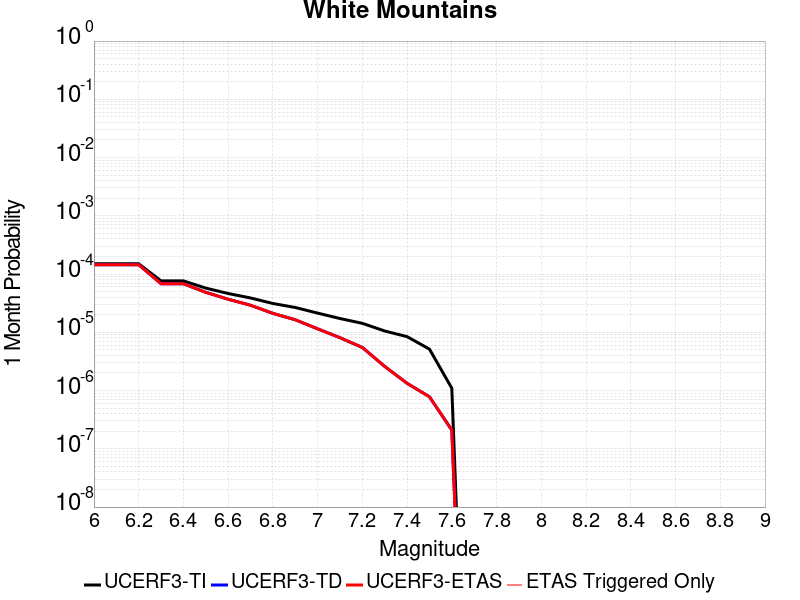 |  | 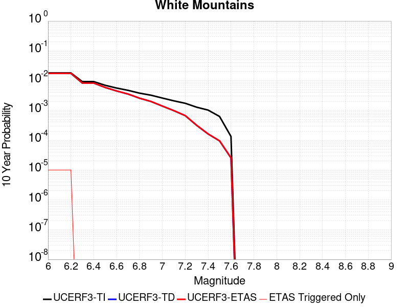 |

| Magnitude | 1 wk TI Prob | 1 wk TD Prob | 1 wk ETAS Prob | 1 wk ETAS/TD Gain | 1 wk ETAS Triggered Only | 1 mo TI Prob | 1 mo TD Prob | 1 mo ETAS Prob | 1 mo ETAS/TD Gain | 1 mo ETAS Triggered Only | 1 yr TI Prob | 1 yr TD Prob | 1 yr ETAS Prob | 1 yr ETAS/TD Gain | 1 yr ETAS Triggered Only | 10 yr TI Prob | 10 yr TD Prob | 10 yr ETAS Prob | 10 yr ETAS/TD Gain | 10 yr ETAS Triggered Only |
|-----|-----|-----|-----|-----|-----|-----|-----|-----|-----|-----|-----|-----|-----|-----|-----|-----|-----|-----|-----|-----|
| 6.0 | 3.503579E-5 | 3.3784498E-5 | 3.3784498E-5 | 1.0 | 0.0 | 1.5014476E-4 | 1.4478335E-4 | 1.4478335E-4 | 1.0 | 0.0 | 0.0018264796 | 0.0017614327 | 0.0017714152 | 1.0056672 | 1.0E-5 | 0.018115403 | 0.017487047 | 0.017496873 | 1.0005618 | 1.0E-5 |
| 6.1 | 3.503579E-5 | 3.3784498E-5 | 3.3784498E-5 | 1.0 | 0.0 | 1.5014476E-4 | 1.4478335E-4 | 1.4478335E-4 | 1.0 | 0.0 | 0.0018264796 | 0.0017614327 | 0.0017714152 | 1.0056672 | 1.0E-5 | 0.018115403 | 0.017487047 | 0.017496873 | 1.0005618 | 1.0E-5 |
| 6.2 | 3.503579E-5 | 3.3784498E-5 | 3.3784498E-5 | 1.0 | 0.0 | 1.5014476E-4 | 1.4478335E-4 | 1.4478335E-4 | 1.0 | 0.0 | 0.0018264796 | 0.0017614327 | 0.0017714152 | 1.0056672 | 1.0E-5 | 0.018115403 | 0.017487047 | 0.017496873 | 1.0005618 | 1.0E-5 |
| 6.3 | 1.7818425E-5 | 1.591632E-5 | 1.591632E-5 | 1.0 | 0.0 | 7.636245E-5 | 6.821109E-5 | 6.821109E-5 | 1.0 | 0.0 | 9.293162E-4 | 8.301679E-4 | 8.301679E-4 | 1.0 | 0.0 | 0.009254395 | 0.008272125 | 0.008272125 | 1.0 | 0.0 |
| 6.4 | 1.7818425E-5 | 1.591632E-5 | 1.591632E-5 | 1.0 | 0.0 | 7.636245E-5 | 6.821109E-5 | 6.821109E-5 | 1.0 | 0.0 | 9.293162E-4 | 8.301679E-4 | 8.301679E-4 | 1.0 | 0.0 | 0.009254395 | 0.008272125 | 0.008272125 | 1.0 | 0.0 |
| 6.5 | 1.3397557E-5 | 1.1336486E-5 | 1.1336486E-5 | 1.0 | 0.0 | 5.741684E-5 | 4.8584072E-5 | 4.8584072E-5 | 1.0 | 0.0 | 6.988258E-4 | 5.9135753E-4 | 5.9135753E-4 | 1.0 | 0.0 | 0.006966323 | 0.0058985446 | 0.0058985446 | 1.0 | 0.0 |
| 6.6 | 1.0818695E-5 | 8.625519E-6 | 8.625519E-6 | 1.0 | 0.0 | 4.6365014E-5 | 3.696601E-5 | 3.696601E-5 | 1.0 | 0.0 | 5.6434784E-4 | 4.4997258E-4 | 4.4997258E-4 | 1.0 | 0.0 | 0.005629168 | 0.004491051 | 0.004491051 | 1.0 | 0.0 |
| 6.7 | 9.067908E-6 | 6.802544E-6 | 6.802544E-6 | 1.0 | 0.0 | 3.8861883E-5 | 2.915345E-5 | 2.915345E-5 | 1.0 | 0.0 | 4.7304068E-4 | 3.5488865E-4 | 3.5488865E-4 | 1.0 | 0.0 | 0.00472035 | 0.0035435364 | 0.0035435364 | 1.0 | 0.0 |
| 6.8 | 7.295947E-6 | 4.9364785E-6 | 4.9364785E-6 | 1.0 | 0.0 | 3.126797E-5 | 2.1156171E-5 | 2.1156171E-5 | 1.0 | 0.0 | 3.8062103E-4 | 2.5754707E-4 | 2.5754707E-4 | 1.0 | 0.0 | 0.0037996976 | 0.0025725989 | 0.0025725989 | 1.0 | 0.0 |
| 6.9 | 6.2243444E-6 | 3.8322955E-6 | 3.8322955E-6 | 1.0 | 0.0 | 2.6675489E-5 | 1.6424025E-5 | 1.6424025E-5 | 1.0 | 0.0 | 3.2472567E-4 | 1.9994467E-4 | 1.9994467E-4 | 1.0 | 0.0 | 0.0032425157 | 0.0019977004 | 0.0019977004 | 1.0 | 0.0 |
| 7.0 | 4.9878413E-6 | 2.6796004E-6 | 2.6796004E-6 | 1.0 | 0.0 | 2.1376287E-5 | 1.1483952E-5 | 1.1483952E-5 | 1.0 | 0.0 | 2.602252E-4 | 1.3980841E-4 | 1.3980841E-4 | 1.0 | 0.0 | 0.002599207 | 0.0013972308 | 0.0013972308 | 1.0 | 0.0 |
| 7.1 | 4.0252844E-6 | 1.885737E-6 | 1.885737E-6 | 1.0 | 0.0 | 1.7251105E-5 | 8.081706E-6 | 8.081706E-6 | 1.0 | 0.0 | 2.1001195E-4 | 9.8390454E-5 | 9.8390454E-5 | 1.0 | 0.0 | 0.0020981359 | 9.834818E-4 | 9.834818E-4 | 1.0 | 0.0 |
| 7.2 | 3.3284066E-6 | 1.2819264E-6 | 1.2819264E-6 | 1.0 | 0.0 | 1.4264522E-5 | 5.493959E-6 | 5.493959E-6 | 1.0 | 0.0 | 1.736567E-4 | 6.6887005E-5 | 6.6887005E-5 | 1.0 | 0.0 | 0.0017352107 | 6.686788E-4 | 6.686788E-4 | 1.0 | 0.0 |
| 7.3 | 2.458226E-6 | 6.0570005E-7 | 6.0570005E-7 | 1.0 | 0.0 | 1.0535211E-5 | 2.595855E-6 | 2.595855E-6 | 1.0 | 0.0 | 1.2825865E-4 | 3.1604115E-5 | 3.1604115E-5 | 1.0 | 0.0 | 0.0012818464 | 3.1599996E-4 | 3.1599996E-4 | 1.0 | 0.0 |
| 7.4 | 1.965953E-6 | 3.1087455E-7 | 3.1087455E-7 | 1.0 | 0.0 | 8.425486E-6 | 1.3323188E-6 | 1.3323188E-6 | 1.0 | 0.0 | 1.0257547E-4 | 1.6220862E-5 | 1.6220862E-5 | 1.0 | 0.0 | 0.0010252813 | 1.6219691E-4 | 1.6219691E-4 | 1.0 | 0.0 |
| 7.5 | 1.2014192E-6 | 1.8242919E-7 | 1.8242919E-7 | 1.0 | 0.0 | 5.148929E-6 | 7.8183916E-7 | 7.8183916E-7 | 1.0 | 0.0 | 6.2686406E-5 | 9.518851E-6 | 9.518851E-6 | 1.0 | 0.0 | 6.266873E-4 | 9.5184514E-5 | 9.5184514E-5 | 1.0 | 0.0 |
| 7.6 | 2.5612175E-7 | 4.8943498E-8 | 4.8943498E-8 | 1.0 | 0.0 | 1.0976642E-6 | 2.0975783E-7 | 2.0975783E-7 | 1.0 | 0.0 | 1.3363979E-5 | 2.553799E-6 | 2.553799E-6 | 1.0 | 0.0 | 1.3363175E-4 | 2.5537733E-5 | 2.5537733E-5 | 1.0 | 0.0 |

## Morales (East)
*[(top)](#table-of-contents)*

| 1 Week | 1 Month | 1 Year | 10 Year |
|-----|-----|-----|-----|
| 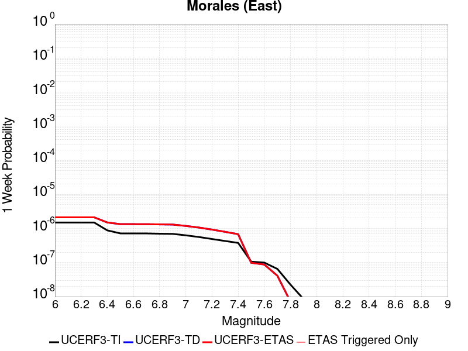 |  | 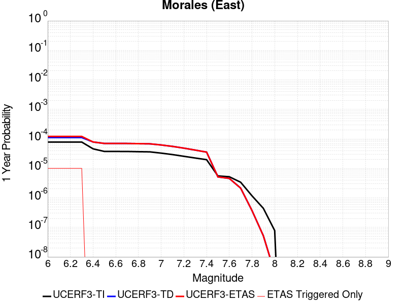 |  |

| Magnitude | 1 wk TI Prob | 1 wk TD Prob | 1 wk ETAS Prob | 1 wk ETAS/TD Gain | 1 wk ETAS Triggered Only | 1 mo TI Prob | 1 mo TD Prob | 1 mo ETAS Prob | 1 mo ETAS/TD Gain | 1 mo ETAS Triggered Only | 1 yr TI Prob | 1 yr TD Prob | 1 yr ETAS Prob | 1 yr ETAS/TD Gain | 1 yr ETAS Triggered Only | 10 yr TI Prob | 10 yr TD Prob | 10 yr ETAS Prob | 10 yr ETAS/TD Gain | 10 yr ETAS Triggered Only |
|-----|-----|-----|-----|-----|-----|-----|-----|-----|-----|-----|-----|-----|-----|-----|-----|-----|-----|-----|-----|-----|
| 6.0 | 1.4942771E-6 | 2.1238789E-6 | 2.1238789E-6 | 1.0 | 0.0 | 6.404029E-6 | 9.102309E-6 | 9.102309E-6 | 1.0 | 0.0 | 7.7966266E-5 | 1.1081557E-4 | 1.2081446E-4 | 1.09023 | 1.0E-5 | 7.793892E-4 | 0.0011076628 | 0.0011176518 | 1.0090181 | 1.0E-5 |
| 6.1 | 1.4942771E-6 | 2.1238789E-6 | 2.1238789E-6 | 1.0 | 0.0 | 6.404029E-6 | 9.102309E-6 | 9.102309E-6 | 1.0 | 0.0 | 7.7966266E-5 | 1.1081557E-4 | 1.2081446E-4 | 1.09023 | 1.0E-5 | 7.793892E-4 | 0.0011076628 | 0.0011176518 | 1.0090181 | 1.0E-5 |
| 6.2 | 1.4942771E-6 | 2.1238789E-6 | 2.1238789E-6 | 1.0 | 0.0 | 6.404029E-6 | 9.102309E-6 | 9.102309E-6 | 1.0 | 0.0 | 7.7966266E-5 | 1.1081557E-4 | 1.2081446E-4 | 1.09023 | 1.0E-5 | 7.793892E-4 | 0.0011076628 | 0.0011176518 | 1.0090181 | 1.0E-5 |
| 6.3 | 1.4942771E-6 | 2.1238789E-6 | 2.1238789E-6 | 1.0 | 0.0 | 6.404029E-6 | 9.102309E-6 | 9.102309E-6 | 1.0 | 0.0 | 7.7966266E-5 | 1.1081557E-4 | 1.2081446E-4 | 1.09023 | 1.0E-5 | 7.793892E-4 | 0.0011076628 | 0.0011176518 | 1.0090181 | 1.0E-5 |
| 6.4 | 8.798845E-7 | 1.5026721E-6 | 1.5026721E-6 | 1.0 | 0.0 | 3.7709283E-6 | 6.440008E-6 | 6.440008E-6 | 1.0 | 0.0 | 4.5910085E-5 | 7.840439E-5 | 7.840439E-5 | 1.0 | 0.0 | 4.59006E-4 | 7.837807E-4 | 7.837807E-4 | 1.0 | 0.0 |
| 6.5 | 7.1751725E-7 | 1.3388217E-6 | 1.3388217E-6 | 1.0 | 0.0 | 3.0750705E-6 | 5.737795E-6 | 5.737795E-6 | 1.0 | 0.0 | 3.7438338E-5 | 6.9855494E-5 | 6.9855494E-5 | 1.0 | 0.0 | 3.743203E-4 | 6.983455E-4 | 6.983455E-4 | 1.0 | 0.0 |
| 6.6 | 7.1751725E-7 | 1.3388217E-6 | 1.3388217E-6 | 1.0 | 0.0 | 3.0750705E-6 | 5.737795E-6 | 5.737795E-6 | 1.0 | 0.0 | 3.7438338E-5 | 6.9855494E-5 | 6.9855494E-5 | 1.0 | 0.0 | 3.743203E-4 | 6.983455E-4 | 6.983455E-4 | 1.0 | 0.0 |
| 6.7 | 7.159057E-7 | 1.3362875E-6 | 1.3362875E-6 | 1.0 | 0.0 | 3.0681638E-6 | 5.7269344E-6 | 5.7269344E-6 | 1.0 | 0.0 | 3.7354253E-5 | 6.972327E-5 | 6.972327E-5 | 1.0 | 0.0 | 3.7347974E-4 | 6.970241E-4 | 6.970241E-4 | 1.0 | 0.0 |
| 6.8 | 7.032203E-7 | 1.3178403E-6 | 1.3178403E-6 | 1.0 | 0.0 | 3.0137978E-6 | 5.6478757E-6 | 5.6478757E-6 | 1.0 | 0.0 | 3.669237E-5 | 6.876079E-5 | 6.876079E-5 | 1.0 | 0.0 | 3.6686313E-4 | 6.874053E-4 | 6.874053E-4 | 1.0 | 0.0 |
| 6.9 | 6.941549E-7 | 1.3028997E-6 | 1.3028997E-6 | 1.0 | 0.0 | 2.974946E-6 | 5.5838445E-6 | 5.5838445E-6 | 1.0 | 0.0 | 3.6219368E-5 | 6.7981266E-5 | 6.7981266E-5 | 1.0 | 0.0 | 3.6213463E-4 | 6.796148E-4 | 6.796148E-4 | 1.0 | 0.0 |
| 7.0 | 6.2932247E-7 | 1.1881159E-6 | 1.1881159E-6 | 1.0 | 0.0 | 2.6970936E-6 | 5.0919157E-6 | 5.0919157E-6 | 1.0 | 0.0 | 3.283662E-5 | 6.1992374E-5 | 6.1992374E-5 | 1.0 | 0.0 | 3.283177E-4 | 6.1975967E-4 | 6.1975967E-4 | 1.0 | 0.0 |
| 7.1 | 5.6200963E-7 | 1.0643936E-6 | 1.0643936E-6 | 1.0 | 0.0 | 2.4086105E-6 | 4.5616794E-6 | 4.5616794E-6 | 1.0 | 0.0 | 2.9324437E-5 | 5.5537075E-5 | 5.5537075E-5 | 1.0 | 0.0 | 2.9320567E-4 | 5.552392E-4 | 5.552392E-4 | 1.0 | 0.0 |
| 7.2 | 4.91044E-7 | 9.2890525E-7 | 9.2890525E-7 | 1.0 | 0.0 | 2.1044725E-6 | 3.9810166E-6 | 3.9810166E-6 | 1.0 | 0.0 | 2.5621652E-5 | 4.846784E-5 | 4.846784E-5 | 1.0 | 0.0 | 2.56187E-4 | 4.8457898E-4 | 4.8457898E-4 | 1.0 | 0.0 |
| 7.3 | 4.2978448E-7 | 7.9769484E-7 | 7.9769484E-7 | 1.0 | 0.0 | 1.8419321E-6 | 3.4186878E-6 | 3.4186878E-6 | 1.0 | 0.0 | 2.2425293E-5 | 4.1621763E-5 | 4.1621763E-5 | 1.0 | 0.0 | 2.242303E-4 | 4.1614528E-4 | 4.1614528E-4 | 1.0 | 0.0 |
| 7.4 | 3.774317E-7 | 6.809395E-7 | 6.809395E-7 | 1.0 | 0.0 | 1.6175634E-6 | 2.9183088E-6 | 2.9183088E-6 | 1.0 | 0.0 | 1.9693656E-5 | 3.5529858E-5 | 3.5529858E-5 | 1.0 | 0.0 | 1.969191E-4 | 3.552471E-4 | 3.552471E-4 | 1.0 | 0.0 |
| 7.5 | 1.0603232E-7 | 9.8451956E-8 | 9.8451956E-8 | 1.0 | 0.0 | 4.5442414E-7 | 4.2193687E-7 | 4.2193687E-7 | 1.0 | 0.0 | 5.5326E-6 | 5.13707E-6 | 5.13707E-6 | 1.0 | 0.0 | 5.532462E-5 | 5.1372073E-5 | 5.1372073E-5 | 1.0 | 0.0 |
| 7.6 | 9.960384E-8 | 8.759167E-8 | 8.759167E-8 | 1.0 | 0.0 | 4.2687353E-7 | 3.753928E-7 | 3.753928E-7 | 1.0 | 0.0 | 5.197173E-6 | 4.5703982E-6 | 4.5703982E-6 | 1.0 | 0.0 | 5.1970514E-5 | 4.5705605E-5 | 4.5705605E-5 | 1.0 | 0.0 |
| 7.7 | 6.499468E-8 | 4.1059014E-8 | 4.1059014E-8 | 1.0 | 0.0 | 2.785486E-7 | 1.7596719E-7 | 1.7596719E-7 | 1.0 | 0.0 | 3.3913238E-6 | 2.1423984E-6 | 2.1423984E-6 | 1.0 | 0.0 | 3.3912722E-5 | 2.1426333E-5 | 2.1426333E-5 | 1.0 | 0.0 |
| 7.8 | 2.2517119E-8 | 7.1341337E-9 | 7.1341337E-9 | 1.0 | 0.0 | 9.6501935E-8 | 3.0574856E-8 | 3.0574856E-8 | 1.0 | 0.0 | 1.1749105E-6 | 3.7224882E-7 | 3.7224882E-7 | 1.0 | 0.0 | 1.1749043E-5 | 3.7250138E-6 | 3.7250138E-6 | 1.0 | 0.0 |
| 7.9 | 8.493023E-9 | 9.973958E-10 | 9.973958E-10 | 1.0 | 0.0 | 3.639867E-8 | 4.274551E-9 | 4.274551E-9 | 1.0 | 0.0 | 4.4315374E-7 | 5.2042658E-8 | 5.2042658E-8 | 1.0 | 0.0 | 4.4315284E-6 | 5.22542E-7 | 5.22542E-7 | 1.0 | 0.0 |
| 8.0 | 1.4971842E-9 | 5.546652E-11 | 5.546652E-11 | 1.0 | 0.0 | 6.4165038E-9 | 2.3771385E-10 | 2.3771385E-10 | 1.0 | 0.0 | 7.812093E-8 | 2.8941671E-9 | 2.8941671E-9 | 1.0 | 0.0 | 7.81209E-7 | 3.0198034E-8 | 3.0198034E-8 | 1.0 | 0.0 |

## Dry Mountain
*[(top)](#table-of-contents)*

| 1 Week | 1 Month | 1 Year | 10 Year |
|-----|-----|-----|-----|
|  |  |  |  |

| Magnitude | 1 wk TI Prob | 1 wk TD Prob | 1 wk ETAS Prob | 1 wk ETAS/TD Gain | 1 wk ETAS Triggered Only | 1 mo TI Prob | 1 mo TD Prob | 1 mo ETAS Prob | 1 mo ETAS/TD Gain | 1 mo ETAS Triggered Only | 1 yr TI Prob | 1 yr TD Prob | 1 yr ETAS Prob | 1 yr ETAS/TD Gain | 1 yr ETAS Triggered Only | 10 yr TI Prob | 10 yr TD Prob | 10 yr ETAS Prob | 10 yr ETAS/TD Gain | 10 yr ETAS Triggered Only |
|-----|-----|-----|-----|-----|-----|-----|-----|-----|-----|-----|-----|-----|-----|-----|-----|-----|-----|-----|-----|-----|
| 6.0 | 6.222801E-6 | 6.439411E-6 | 6.439411E-6 | 1.0 | 0.0 | 2.6668875E-5 | 2.7597274E-5 | 2.7597274E-5 | 1.0 | 0.0 | 3.2464517E-4 | 3.359609E-4 | 3.359609E-4 | 1.0 | 0.0 | 0.0032417132 | 0.0033560924 | 0.0033660587 | 1.0029696 | 1.0E-5 |
| 6.1 | 6.222801E-6 | 6.439411E-6 | 6.439411E-6 | 1.0 | 0.0 | 2.6668875E-5 | 2.7597274E-5 | 2.7597274E-5 | 1.0 | 0.0 | 3.2464517E-4 | 3.359609E-4 | 3.359609E-4 | 1.0 | 0.0 | 0.0032417132 | 0.0033560924 | 0.0033660587 | 1.0029696 | 1.0E-5 |
| 6.2 | 6.222801E-6 | 6.439411E-6 | 6.439411E-6 | 1.0 | 0.0 | 2.6668875E-5 | 2.7597274E-5 | 2.7597274E-5 | 1.0 | 0.0 | 3.2464517E-4 | 3.359609E-4 | 3.359609E-4 | 1.0 | 0.0 | 0.0032417132 | 0.0033560924 | 0.0033660587 | 1.0029696 | 1.0E-5 |
| 6.3 | 6.222801E-6 | 6.439411E-6 | 6.439411E-6 | 1.0 | 0.0 | 2.6668875E-5 | 2.7597274E-5 | 2.7597274E-5 | 1.0 | 0.0 | 3.2464517E-4 | 3.359609E-4 | 3.359609E-4 | 1.0 | 0.0 | 0.0032417132 | 0.0033560924 | 0.0033660587 | 1.0029696 | 1.0E-5 |
| 6.4 | 6.222801E-6 | 6.439411E-6 | 6.439411E-6 | 1.0 | 0.0 | 2.6668875E-5 | 2.7597274E-5 | 2.7597274E-5 | 1.0 | 0.0 | 3.2464517E-4 | 3.359609E-4 | 3.359609E-4 | 1.0 | 0.0 | 0.0032417132 | 0.0033560924 | 0.0033660587 | 1.0029696 | 1.0E-5 |
| 6.5 | 2.8528623E-6 | 2.952182E-6 | 2.952182E-6 | 1.0 | 0.0 | 1.22264955E-5 | 1.2652196E-5 | 1.2652196E-5 | 1.0 | 0.0 | 1.4884741E-4 | 1.5403831E-4 | 1.5403831E-4 | 1.0 | 0.0 | 0.0014874774 | 0.0015401688 | 0.0015401688 | 1.0 | 0.0 |
| 6.6 | 2.8528623E-6 | 2.952182E-6 | 2.952182E-6 | 1.0 | 0.0 | 1.22264955E-5 | 1.2652196E-5 | 1.2652196E-5 | 1.0 | 0.0 | 1.4884741E-4 | 1.5403831E-4 | 1.5403831E-4 | 1.0 | 0.0 | 0.0014874774 | 0.0015401688 | 0.0015401688 | 1.0 | 0.0 |
| 6.7 | 2.541E-6 | 2.62937E-6 | 2.62937E-6 | 1.0 | 0.0 | 1.0889954E-5 | 1.12687285E-5 | 1.12687285E-5 | 1.0 | 0.0 | 1.3257713E-4 | 1.3719677E-4 | 1.3719677E-4 | 1.0 | 0.0 | 0.0013249806 | 0.0013719677 | 0.0013719677 | 1.0 | 0.0 |

## Palos Verdes
*[(top)](#table-of-contents)*

| 1 Week | 1 Month | 1 Year | 10 Year |
|-----|-----|-----|-----|
|  | 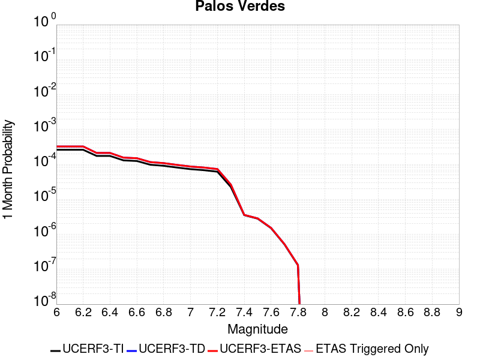 | 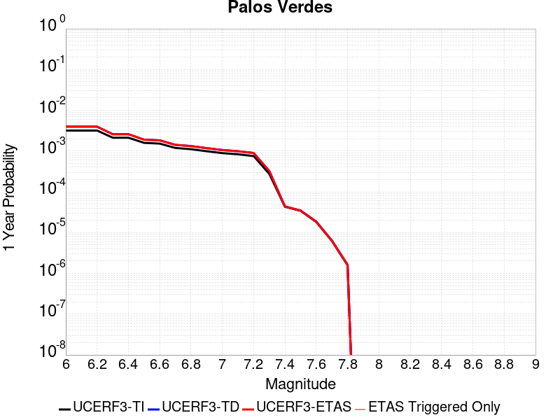 | 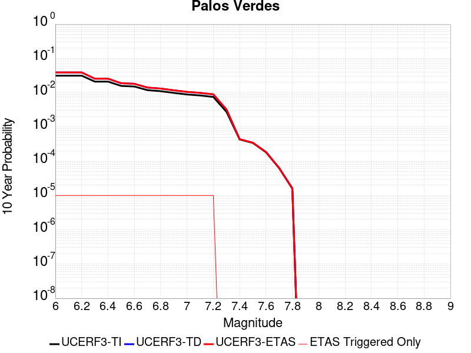 |

| Magnitude | 1 wk TI Prob | 1 wk TD Prob | 1 wk ETAS Prob | 1 wk ETAS/TD Gain | 1 wk ETAS Triggered Only | 1 mo TI Prob | 1 mo TD Prob | 1 mo ETAS Prob | 1 mo ETAS/TD Gain | 1 mo ETAS Triggered Only | 1 yr TI Prob | 1 yr TD Prob | 1 yr ETAS Prob | 1 yr ETAS/TD Gain | 1 yr ETAS Triggered Only | 10 yr TI Prob | 10 yr TD Prob | 10 yr ETAS Prob | 10 yr ETAS/TD Gain | 10 yr ETAS Triggered Only |
|-----|-----|-----|-----|-----|-----|-----|-----|-----|-----|-----|-----|-----|-----|-----|-----|-----|-----|-----|-----|-----|
| 6.0 | 6.126063E-5 | 7.622823E-5 | 7.622823E-5 | 1.0 | 0.0 | 2.6251914E-4 | 3.2665484E-4 | 3.2665484E-4 | 1.0 | 0.0 | 0.0031914865 | 0.0039703017 | 0.0039703017 | 1.0 | 0.0 | 0.031460393 | 0.03905032 | 0.039059926 | 1.000246 | 1.0E-5 |
| 6.1 | 6.126063E-5 | 7.622823E-5 | 7.622823E-5 | 1.0 | 0.0 | 2.6251914E-4 | 3.2665484E-4 | 3.2665484E-4 | 1.0 | 0.0 | 0.0031914865 | 0.0039703017 | 0.0039703017 | 1.0 | 0.0 | 0.031460393 | 0.03905032 | 0.039059926 | 1.000246 | 1.0E-5 |
| 6.2 | 6.126063E-5 | 7.622823E-5 | 7.622823E-5 | 1.0 | 0.0 | 2.6251914E-4 | 3.2665484E-4 | 3.2665484E-4 | 1.0 | 0.0 | 0.0031914865 | 0.0039703017 | 0.0039703017 | 1.0 | 0.0 | 0.031460393 | 0.03905032 | 0.039059926 | 1.000246 | 1.0E-5 |
| 6.3 | 4.0838047E-5 | 4.9750462E-5 | 4.9750462E-5 | 1.0 | 0.0 | 1.7500846E-4 | 2.1320012E-4 | 2.1320012E-4 | 1.0 | 0.0 | 0.0021286458 | 0.0025928293 | 0.0025928293 | 1.0 | 0.0 | 0.021083709 | 0.02564748 | 0.025657224 | 1.0003799 | 1.0E-5 |
| 6.4 | 4.0838047E-5 | 4.9750462E-5 | 4.9750462E-5 | 1.0 | 0.0 | 1.7500846E-4 | 2.1320012E-4 | 2.1320012E-4 | 1.0 | 0.0 | 0.0021286458 | 0.0025928293 | 0.0025928293 | 1.0 | 0.0 | 0.021083709 | 0.02564748 | 0.025657224 | 1.0003799 | 1.0E-5 |
| 6.5 | 3.0512005E-5 | 3.6562564E-5 | 3.6562564E-5 | 1.0 | 0.0 | 1.3075917E-4 | 1.5668797E-4 | 1.5668797E-4 | 1.0 | 0.0 | 0.0015908304 | 0.0019061224 | 0.0019061224 | 1.0 | 0.0 | 0.015794903 | 0.018909669 | 0.01891948 | 1.0005188 | 1.0E-5 |
| 6.6 | 2.9255087E-5 | 3.515534E-5 | 3.515534E-5 | 1.0 | 0.0 | 1.2537291E-4 | 1.506577E-4 | 1.506577E-4 | 1.0 | 0.0 | 0.0015253464 | 0.0018328275 | 0.0018328275 | 1.0 | 0.0 | 0.015149189 | 0.018188728 | 0.018198546 | 1.0005398 | 1.0E-5 |
| 6.7 | 2.287198E-5 | 2.7248976E-5 | 2.7248976E-5 | 1.0 | 0.0 | 9.801909E-5 | 1.1677662E-4 | 1.1677662E-4 | 1.0 | 0.0 | 0.001192729 | 0.0014209197 | 0.0014209197 | 1.0 | 0.0 | 0.011863477 | 0.014127577 | 0.014137436 | 1.0006979 | 1.0E-5 |
| 6.8 | 2.1325764E-5 | 2.5432533E-5 | 2.5432533E-5 | 1.0 | 0.0 | 9.139293E-5 | 1.0899252E-4 | 1.0899252E-4 | 1.0 | 0.0 | 0.001112141 | 0.0013262664 | 0.0013262664 | 1.0 | 0.0 | 0.011065915 | 0.013192549 | 0.013202417 | 1.000748 | 1.0E-5 |
| 6.9 | 1.9009392E-5 | 2.2614122E-5 | 2.2614122E-5 | 1.0 | 0.0 | 8.1466285E-5 | 9.6914555E-5 | 9.6914555E-5 | 1.0 | 0.0 | 9.914007E-4 | 0.0011793834 | 0.0011793834 | 1.0 | 0.0 | 0.009869894 | 0.011739929 | 0.0117498115 | 1.0008417 | 1.0E-5 |
| 7.0 | 1.7098473E-5 | 2.0319867E-5 | 2.0319867E-5 | 1.0 | 0.0 | 7.3277115E-5 | 8.708272E-5 | 8.708272E-5 | 1.0 | 0.0 | 8.917837E-4 | 0.0010598017 | 0.0010598017 | 1.0 | 0.0 | 0.008882134 | 0.010555912 | 0.010565806 | 1.0009373 | 1.0E-5 |
| 7.1 | 1.5982785E-5 | 1.8995239E-5 | 1.8995239E-5 | 1.0 | 0.0 | 6.849585E-5 | 8.1406106E-5 | 8.1406106E-5 | 1.0 | 0.0 | 8.336179E-4 | 9.907534E-4 | 9.907534E-4 | 1.0 | 0.0 | 0.008304977 | 0.009871728 | 0.009881629 | 1.001003 | 1.0E-5 |
| 7.2 | 1.4468002E-5 | 1.719767E-5 | 1.719767E-5 | 1.0 | 0.0 | 6.200425E-5 | 7.370269E-5 | 7.370269E-5 | 1.0 | 0.0 | 7.546402E-4 | 8.970449E-4 | 8.970449E-4 | 1.0 | 0.0 | 0.007520827 | 0.008942509 | 0.008952419 | 1.0011083 | 1.0E-5 |
| 7.3 | 5.288233E-6 | 6.2038207E-6 | 6.2038207E-6 | 1.0 | 0.0 | 2.2663658E-5 | 2.658773E-5 | 2.658773E-5 | 1.0 | 0.0 | 2.7589512E-4 | 3.2369242E-4 | 3.2369242E-4 | 1.0 | 0.0 | 0.0027555283 | 0.0032356323 | 0.0032356323 | 1.0 | 0.0 |
| 7.4 | 8.279556E-7 | 8.408364E-7 | 8.408364E-7 | 1.0 | 0.0 | 3.5483763E-6 | 3.60358E-6 | 3.60358E-6 | 1.0 | 0.0 | 4.3200624E-5 | 4.3872777E-5 | 4.3872777E-5 | 1.0 | 0.0 | 4.3192226E-4 | 4.3864836E-4 | 4.3864836E-4 | 1.0 | 0.0 |
| 7.5 | 6.559831E-7 | 6.667243E-7 | 6.667243E-7 | 1.0 | 0.0 | 2.8113532E-6 | 2.8573872E-6 | 2.8573872E-6 | 1.0 | 0.0 | 3.4227687E-5 | 3.47882E-5 | 3.47882E-5 | 1.0 | 0.0 | 3.4222414E-4 | 3.478342E-4 | 3.478342E-4 | 1.0 | 0.0 |
| 7.6 | 3.5018968E-7 | 3.562011E-7 | 3.562011E-7 | 1.0 | 0.0 | 1.500812E-6 | 1.5265755E-6 | 1.5265755E-6 | 1.0 | 0.0 | 1.8272232E-5 | 1.8585944E-5 | 1.8585944E-5 | 1.0 | 0.0 | 1.8270731E-4 | 1.858485E-4 | 1.858485E-4 | 1.0 | 0.0 |
| 7.7 | 1.1986104E-7 | 1.2198406E-7 | 1.2198406E-7 | 1.0 | 0.0 | 5.1369005E-7 | 5.227887E-7 | 5.227887E-7 | 1.0 | 0.0 | 6.2541585E-6 | 6.364934E-6 | 6.364934E-6 | 1.0 | 0.0 | 6.2539824E-5 | 6.364756E-5 | 6.364756E-5 | 1.0 | 0.0 |
| 7.8 | 3.0445005E-8 | 3.1027664E-8 | 3.1027664E-8 | 1.0 | 0.0 | 1.3047858E-7 | 1.3297569E-7 | 1.3297569E-7 | 1.0 | 0.0 | 1.5885756E-6 | 1.6189781E-6 | 1.6189781E-6 | 1.0 | 0.0 | 1.5885644E-5 | 1.6189684E-5 | 1.6189684E-5 | 1.0 | 0.0 |

## Reliz 2011 CFM
*[(top)](#table-of-contents)*

| 1 Week | 1 Month | 1 Year | 10 Year |
|-----|-----|-----|-----|
|  |  |  |  |

| Magnitude | 1 wk TI Prob | 1 wk TD Prob | 1 wk ETAS Prob | 1 wk ETAS/TD Gain | 1 wk ETAS Triggered Only | 1 mo TI Prob | 1 mo TD Prob | 1 mo ETAS Prob | 1 mo ETAS/TD Gain | 1 mo ETAS Triggered Only | 1 yr TI Prob | 1 yr TD Prob | 1 yr ETAS Prob | 1 yr ETAS/TD Gain | 1 yr ETAS Triggered Only | 10 yr TI Prob | 10 yr TD Prob | 10 yr ETAS Prob | 10 yr ETAS/TD Gain | 10 yr ETAS Triggered Only |
|-----|-----|-----|-----|-----|-----|-----|-----|-----|-----|-----|-----|-----|-----|-----|-----|-----|-----|-----|-----|-----|
| 6.0 | 1.6002472E-5 | 1.6282886E-5 | 1.6282886E-5 | 1.0 | 0.0 | 6.8580215E-5 | 6.978204E-5 | 6.978204E-5 | 1.0 | 0.0 | 8.3464425E-4 | 8.49285E-4 | 8.49285E-4 | 1.0 | 0.0 | 0.008315164 | 0.008462588 | 0.008472503 | 1.0011717 | 1.0E-5 |
| 6.1 | 1.6002472E-5 | 1.6282886E-5 | 1.6282886E-5 | 1.0 | 0.0 | 6.8580215E-5 | 6.978204E-5 | 6.978204E-5 | 1.0 | 0.0 | 8.3464425E-4 | 8.49285E-4 | 8.49285E-4 | 1.0 | 0.0 | 0.008315164 | 0.008462588 | 0.008472503 | 1.0011717 | 1.0E-5 |
| 6.2 | 1.6002472E-5 | 1.6282886E-5 | 1.6282886E-5 | 1.0 | 0.0 | 6.8580215E-5 | 6.978204E-5 | 6.978204E-5 | 1.0 | 0.0 | 8.3464425E-4 | 8.49285E-4 | 8.49285E-4 | 1.0 | 0.0 | 0.008315164 | 0.008462588 | 0.008472503 | 1.0011717 | 1.0E-5 |
| 6.3 | 7.792404E-6 | 7.8038465E-6 | 7.8038465E-6 | 1.0 | 0.0 | 3.339559E-5 | 3.3444634E-5 | 3.3444634E-5 | 1.0 | 0.0 | 4.0651546E-4 | 4.071131E-4 | 4.071131E-4 | 1.0 | 0.0 | 0.0040577264 | 0.004063948 | 0.004073907 | 1.0024507 | 1.0E-5 |
| 6.4 | 7.792404E-6 | 7.8038465E-6 | 7.8038465E-6 | 1.0 | 0.0 | 3.339559E-5 | 3.3444634E-5 | 3.3444634E-5 | 1.0 | 0.0 | 4.0651546E-4 | 4.071131E-4 | 4.071131E-4 | 1.0 | 0.0 | 0.0040577264 | 0.004063948 | 0.004073907 | 1.0024507 | 1.0E-5 |
| 6.5 | 5.9659374E-6 | 5.9287763E-6 | 5.9287763E-6 | 1.0 | 0.0 | 2.5568053E-5 | 2.5408795E-5 | 2.5408795E-5 | 1.0 | 0.0 | 3.1124658E-4 | 3.0930838E-4 | 3.0930838E-4 | 1.0 | 0.0 | 0.00310811 | 0.0030889949 | 0.003098964 | 1.0032274 | 1.0E-5 |
| 6.6 | 5.2350692E-6 | 5.1790216E-6 | 5.1790216E-6 | 1.0 | 0.0 | 2.2435817E-5 | 2.2195618E-5 | 2.2195618E-5 | 1.0 | 0.0 | 2.7312184E-4 | 2.701983E-4 | 2.701983E-4 | 1.0 | 0.0 | 0.002727864 | 0.002698906 | 0.002698906 | 1.0 | 0.0 |
| 6.7 | 4.580206E-6 | 4.5061533E-6 | 4.5061533E-6 | 1.0 | 0.0 | 1.9629308E-5 | 1.9311943E-5 | 1.9311943E-5 | 1.0 | 0.0 | 2.389606E-4 | 2.3509761E-4 | 2.3509761E-4 | 1.0 | 0.0 | 0.002387038 | 0.0023486894 | 0.0023486894 | 1.0 | 0.0 |
| 6.8 | 4.0765017E-6 | 3.9882693E-6 | 3.9882693E-6 | 1.0 | 0.0 | 1.7470604E-5 | 1.709247E-5 | 1.709247E-5 | 1.0 | 0.0 | 2.1268385E-4 | 2.08081E-4 | 2.08081E-4 | 1.0 | 0.0 | 0.002124804 | 0.002079058 | 0.002079058 | 1.0 | 0.0 |
| 6.9 | 3.5752896E-6 | 3.4725467E-6 | 3.4725467E-6 | 1.0 | 0.0 | 1.532258E-5 | 1.4882258E-5 | 1.4882258E-5 | 1.0 | 0.0 | 1.8653645E-4 | 1.8117645E-4 | 1.8117645E-4 | 1.0 | 0.0 | 0.0018637994 | 0.0018104821 | 0.0018104821 | 1.0 | 0.0 |
| 7.0 | 3.0259848E-6 | 2.9079688E-6 | 2.9079688E-6 | 1.0 | 0.0 | 1.2968442E-5 | 1.2462664E-5 | 1.2462664E-5 | 1.0 | 0.0 | 1.5787935E-4 | 1.5172239E-4 | 1.5172239E-4 | 1.0 | 0.0 | 0.0015776722 | 0.0015163814 | 0.0015163814 | 1.0 | 0.0 |
| 7.1 | 2.5861116E-6 | 2.4551923E-6 | 2.4551923E-6 | 1.0 | 0.0 | 1.1083288E-5 | 1.0522211E-5 | 1.0522211E-5 | 1.0 | 0.0 | 1.3493067E-4 | 1.281004E-4 | 1.281004E-4 | 1.0 | 0.0 | 0.0013484878 | 0.0012804584 | 0.0012804584 | 1.0 | 0.0 |
| 7.2 | 2.1482588E-6 | 2.00326E-6 | 2.00326E-6 | 1.0 | 0.0 | 9.20679E-6 | 8.585373E-6 | 8.585373E-6 | 1.0 | 0.0 | 1.12086906E-4 | 1.04521896E-4 | 1.04521896E-4 | 1.0 | 0.0 | 0.0011203039 | 0.00104492 | 0.00104492 | 1.0 | 0.0 |
| 7.3 | 1.7194744E-6 | 1.5611456E-6 | 1.5611456E-6 | 1.0 | 0.0 | 7.3691554E-6 | 6.690607E-6 | 6.690607E-6 | 1.0 | 0.0 | 8.971577E-5 | 8.1455095E-5 | 8.1455095E-5 | 1.0 | 0.0 | 8.967956E-4 | 8.144446E-4 | 8.144446E-4 | 1.0 | 0.0 |
| 7.4 | 1.2755178E-6 | 1.1056493E-6 | 1.1056493E-6 | 1.0 | 0.0 | 5.4664933E-6 | 4.7384883E-6 | 4.7384883E-6 | 1.0 | 0.0 | 6.655252E-5 | 5.768957E-5 | 5.768957E-5 | 1.0 | 0.0 | 6.6532596E-4 | 5.7693804E-4 | 5.7693804E-4 | 1.0 | 0.0 |
| 7.5 | 8.8463224E-7 | 7.058199E-7 | 7.058199E-7 | 1.0 | 0.0 | 3.7912755E-6 | 3.024939E-6 | 3.024939E-6 | 1.0 | 0.0 | 4.6157802E-5 | 3.682801E-5 | 3.682801E-5 | 1.0 | 0.0 | 4.6148215E-4 | 3.684111E-4 | 3.684111E-4 | 1.0 | 0.0 |
| 7.6 | 5.291355E-7 | 3.5009091E-7 | 3.5009091E-7 | 1.0 | 0.0 | 2.2677216E-6 | 1.5003886E-6 | 1.5003886E-6 | 1.0 | 0.0 | 2.760916E-5 | 1.826708E-5 | 1.826708E-5 | 1.0 | 0.0 | 2.760573E-4 | 1.8284774E-4 | 1.8284774E-4 | 1.0 | 0.0 |
| 7.7 | 2.9663357E-7 | 1.3511887E-7 | 1.3511887E-7 | 1.0 | 0.0 | 1.2712861E-6 | 5.7908073E-7 | 5.7908073E-7 | 1.0 | 0.0 | 1.5477797E-5 | 7.050285E-6 | 7.050285E-6 | 1.0 | 0.0 | 1.547672E-4 | 7.068567E-5 | 7.068567E-5 | 1.0 | 0.0 |
| 7.8 | 1.2509386E-7 | 2.7160407E-8 | 2.7160407E-8 | 1.0 | 0.0 | 5.3611643E-7 | 1.16401736E-7 | 1.16401736E-7 | 1.0 | 0.0 | 6.527198E-6 | 1.4171902E-6 | 1.4171902E-6 | 1.0 | 0.0 | 6.527006E-5 | 1.4328973E-5 | 1.4328973E-5 | 1.0 | 0.0 |
| 7.9 | 6.213493E-8 | 1.14839676E-8 | 1.14839676E-8 | 1.0 | 0.0 | 2.6629255E-7 | 4.9217E-8 | 4.9217E-8 | 1.0 | 0.0 | 3.242107E-6 | 5.9921683E-7 | 5.9921683E-7 | 1.0 | 0.0 | 3.2420594E-5 | 6.1243118E-6 | 6.1243118E-6 | 1.0 | 0.0 |
| 8.0 | 5.92383E-9 | 1.6782599E-9 | 1.6782599E-9 | 1.0 | 0.0 | 2.5387841E-8 | 7.1925417E-9 | 7.1925417E-9 | 1.0 | 0.0 | 3.0909692E-7 | 8.756919E-8 | 8.756919E-8 | 1.0 | 0.0 | 3.090965E-6 | 9.00749E-7 | 9.00749E-7 | 1.0 | 0.0 |

## Lost Hills
*[(top)](#table-of-contents)*

| 1 Week | 1 Month | 1 Year | 10 Year |
|-----|-----|-----|-----|
|  |  |  |  |

| Magnitude | 1 wk TI Prob | 1 wk TD Prob | 1 wk ETAS Prob | 1 wk ETAS/TD Gain | 1 wk ETAS Triggered Only | 1 mo TI Prob | 1 mo TD Prob | 1 mo ETAS Prob | 1 mo ETAS/TD Gain | 1 mo ETAS Triggered Only | 1 yr TI Prob | 1 yr TD Prob | 1 yr ETAS Prob | 1 yr ETAS/TD Gain | 1 yr ETAS Triggered Only | 10 yr TI Prob | 10 yr TD Prob | 10 yr ETAS Prob | 10 yr ETAS/TD Gain | 10 yr ETAS Triggered Only |
|-----|-----|-----|-----|-----|-----|-----|-----|-----|-----|-----|-----|-----|-----|-----|-----|-----|-----|-----|-----|-----|
| 6.0 | 2.233523E-5 | 2.5106996E-5 | 3.5106743E-5 | 1.3982854 | 1.0E-5 | 9.571891E-5 | 1.0759792E-4 | 1.1759684E-4 | 1.0929286 | 1.0E-5 | 0.0011647546 | 0.0013093855 | 0.0013193724 | 1.0076271 | 1.0E-5 | 0.011586686 | 0.013033304 | 0.013043174 | 1.0007572 | 1.0E-5 |
| 6.1 | 2.233523E-5 | 2.5106996E-5 | 3.5106743E-5 | 1.3982854 | 1.0E-5 | 9.571891E-5 | 1.0759792E-4 | 1.1759684E-4 | 1.0929286 | 1.0E-5 | 0.0011647546 | 0.0013093855 | 0.0013193724 | 1.0076271 | 1.0E-5 | 0.011586686 | 0.013033304 | 0.013043174 | 1.0007572 | 1.0E-5 |
| 6.2 | 2.233523E-5 | 2.5106996E-5 | 3.5106743E-5 | 1.3982854 | 1.0E-5 | 9.571891E-5 | 1.0759792E-4 | 1.1759684E-4 | 1.0929286 | 1.0E-5 | 0.0011647546 | 0.0013093855 | 0.0013193724 | 1.0076271 | 1.0E-5 | 0.011586686 | 0.013033304 | 0.013043174 | 1.0007572 | 1.0E-5 |
| 6.3 | 2.233523E-5 | 2.5106996E-5 | 3.5106743E-5 | 1.3982854 | 1.0E-5 | 9.571891E-5 | 1.0759792E-4 | 1.1759684E-4 | 1.0929286 | 1.0E-5 | 0.0011647546 | 0.0013093855 | 0.0013193724 | 1.0076271 | 1.0E-5 | 0.011586686 | 0.013033304 | 0.013043174 | 1.0007572 | 1.0E-5 |
| 6.4 | 1.2288092E-5 | 1.37813295E-5 | 2.3781191E-5 | 1.7256094 | 1.0E-5 | 5.2662188E-5 | 5.9062033E-5 | 6.906144E-5 | 1.1693035 | 1.0E-5 | 6.409735E-4 | 7.189368E-4 | 7.289296E-4 | 1.0138994 | 1.0E-5 | 0.006391279 | 0.007175316 | 0.0071852445 | 1.0013837 | 1.0E-5 |
| 6.5 | 1.2288092E-5 | 1.37813295E-5 | 2.3781191E-5 | 1.7256094 | 1.0E-5 | 5.2662188E-5 | 5.9062033E-5 | 6.906144E-5 | 1.1693035 | 1.0E-5 | 6.409735E-4 | 7.189368E-4 | 7.289296E-4 | 1.0138994 | 1.0E-5 | 0.006391279 | 0.007175316 | 0.0071852445 | 1.0013837 | 1.0E-5 |
| 6.6 | 8.58281E-6 | 9.633926E-6 | 1.963383E-5 | 2.0379884 | 1.0E-5 | 3.6782953E-5 | 4.1288073E-5 | 5.1287658E-5 | 1.2421907 | 1.0E-5 | 4.4774043E-4 | 5.026495E-4 | 5.1264453E-4 | 1.0198846 | 1.0E-5 | 0.0044683935 | 0.0050232867 | 0.0050332365 | 1.0019808 | 1.0E-5 |
| 6.7 | 7.205685E-6 | 8.088433E-6 | 1.8088353E-5 | 2.2363234 | 1.0E-5 | 3.088114E-5 | 3.4664714E-5 | 4.4664368E-5 | 1.2884678 | 1.0E-5 | 3.7591302E-4 | 4.2204288E-4 | 4.3203865E-4 | 1.0236843 | 1.0E-5 | 0.0037527776 | 0.004220429 | 0.0042303866 | 1.0023594 | 1.0E-5 |

## Cleghorn Lake
*[(top)](#table-of-contents)*

| 1 Week | 1 Month | 1 Year | 10 Year |
|-----|-----|-----|-----|
|  |  |  |  |

| Magnitude | 1 wk TI Prob | 1 wk TD Prob | 1 wk ETAS Prob | 1 wk ETAS/TD Gain | 1 wk ETAS Triggered Only | 1 mo TI Prob | 1 mo TD Prob | 1 mo ETAS Prob | 1 mo ETAS/TD Gain | 1 mo ETAS Triggered Only | 1 yr TI Prob | 1 yr TD Prob | 1 yr ETAS Prob | 1 yr ETAS/TD Gain | 1 yr ETAS Triggered Only | 10 yr TI Prob | 10 yr TD Prob | 10 yr ETAS Prob | 10 yr ETAS/TD Gain | 10 yr ETAS Triggered Only |
|-----|-----|-----|-----|-----|-----|-----|-----|-----|-----|-----|-----|-----|-----|-----|-----|-----|-----|-----|-----|-----|
| 6.0 | 1.5467183E-5 | 1.6794396E-5 | 1.6794396E-5 | 1.0 | 0.0 | 6.6286244E-5 | 7.1974304E-5 | 7.1974304E-5 | 1.0 | 0.0 | 8.067362E-4 | 8.7598973E-4 | 8.8598096E-4 | 1.0114057 | 1.0E-5 | 0.008038137 | 0.008730795 | 0.008740707 | 1.0011353 | 1.0E-5 |
| 6.1 | 1.5467183E-5 | 1.6794396E-5 | 1.6794396E-5 | 1.0 | 0.0 | 6.6286244E-5 | 7.1974304E-5 | 7.1974304E-5 | 1.0 | 0.0 | 8.067362E-4 | 8.7598973E-4 | 8.8598096E-4 | 1.0114057 | 1.0E-5 | 0.008038137 | 0.008730795 | 0.008740707 | 1.0011353 | 1.0E-5 |
| 6.2 | 1.2624631E-5 | 1.3681697E-5 | 1.3681697E-5 | 1.0 | 0.0 | 5.410444E-5 | 5.86348E-5 | 5.86348E-5 | 1.0 | 0.0 | 6.585225E-4 | 7.1369356E-4 | 7.236864E-4 | 1.0140016 | 1.0E-5 | 0.0065657445 | 0.007118811 | 0.0071287397 | 1.0013947 | 1.0E-5 |
| 6.3 | 1.2624631E-5 | 1.3681697E-5 | 1.3681697E-5 | 1.0 | 0.0 | 5.410444E-5 | 5.86348E-5 | 5.86348E-5 | 1.0 | 0.0 | 6.585225E-4 | 7.1369356E-4 | 7.236864E-4 | 1.0140016 | 1.0E-5 | 0.0065657445 | 0.007118811 | 0.0071287397 | 1.0013947 | 1.0E-5 |
| 6.4 | 9.417684E-6 | 1.0170226E-5 | 1.0170226E-5 | 1.0 | 0.0 | 4.036088E-5 | 4.3586184E-5 | 4.3586184E-5 | 1.0 | 0.0 | 4.912829E-4 | 5.305737E-4 | 5.405684E-4 | 1.0188376 | 1.0E-5 | 0.004901982 | 0.0052971053 | 0.0053070523 | 1.0018778 | 1.0E-5 |
| 6.5 | 9.368219E-6 | 1.0117652E-5 | 1.0117652E-5 | 1.0 | 0.0 | 4.014889E-5 | 4.3360877E-5 | 4.3360877E-5 | 1.0 | 0.0 | 4.8870314E-4 | 5.278319E-4 | 5.378266E-4 | 1.0189354 | 1.0E-5 | 0.004876298 | 0.0052698175 | 0.005279765 | 1.0018876 | 1.0E-5 |
| 6.6 | 7.803798E-6 | 8.441923E-6 | 8.441923E-6 | 1.0 | 0.0 | 3.3444423E-5 | 3.6179394E-5 | 3.6179394E-5 | 1.0 | 0.0 | 4.0710976E-4 | 4.40435E-4 | 4.504306E-4 | 1.0226948 | 1.0E-5 | 0.0040636472 | 0.004399538 | 0.0044094943 | 1.002263 | 1.0E-5 |
| 6.7 | 2.3108669E-6 | 2.4438523E-6 | 2.4438523E-6 | 1.0 | 0.0 | 9.903678E-6 | 1.0473612E-5 | 1.0473612E-5 | 1.0 | 0.0 | 1.205706E-4 | 1.2750895E-4 | 1.2750895E-4 | 1.0 | 0.0 | 0.001205052 | 0.0012743765 | 0.0012743765 | 1.0 | 0.0 |
| 6.8 | 2.0882828E-6 | 2.2062986E-6 | 2.2062986E-6 | 1.0 | 0.0 | 8.949753E-6 | 9.455533E-6 | 9.455533E-6 | 1.0 | 0.0 | 1.08957785E-4 | 1.15115196E-4 | 1.15115196E-4 | 1.0 | 0.0 | 0.0010890438 | 0.0011505726 | 0.0011505726 | 1.0 | 0.0 |
| 6.9 | 1.876935E-6 | 1.9810657E-6 | 1.9810657E-6 | 1.0 | 0.0 | 8.043982E-6 | 8.490254E-6 | 8.490254E-6 | 1.0 | 0.0 | 9.7931086E-5 | 1.033641E-4 | 1.033641E-4 | 1.0 | 0.0 | 9.788794E-4 | 0.0010331762 | 0.0010331762 | 1.0 | 0.0 |
| 7.0 | 1.5357559E-6 | 1.6202926E-6 | 1.6202926E-6 | 1.0 | 0.0 | 6.5817944E-6 | 6.944093E-6 | 6.944093E-6 | 1.0 | 0.0 | 8.01304E-5 | 8.454118E-5 | 8.454118E-5 | 1.0 | 0.0 | 8.010151E-4 | 8.4510265E-4 | 8.4510265E-4 | 1.0 | 0.0 |
| 7.1 | 1.0905424E-6 | 1.1497702E-6 | 1.1497702E-6 | 1.0 | 0.0 | 4.6737446E-6 | 4.927578E-6 | 4.927578E-6 | 1.0 | 0.0 | 5.6901354E-5 | 5.999171E-5 | 5.999171E-5 | 1.0 | 0.0 | 5.6886784E-4 | 5.997649E-4 | 5.997649E-4 | 1.0 | 0.0 |
| 7.2 | 6.06668E-7 | 6.387322E-7 | 6.387322E-7 | 1.0 | 0.0 | 2.600003E-6 | 2.7374213E-6 | 2.7374213E-6 | 1.0 | 0.0 | 3.1654577E-5 | 3.3327666E-5 | 3.3327666E-5 | 1.0 | 0.0 | 3.1650066E-4 | 3.332335E-4 | 3.332335E-4 | 1.0 | 0.0 |

## San Clemente
*[(top)](#table-of-contents)*

| 1 Week | 1 Month | 1 Year | 10 Year |
|-----|-----|-----|-----|
|  |  |  | 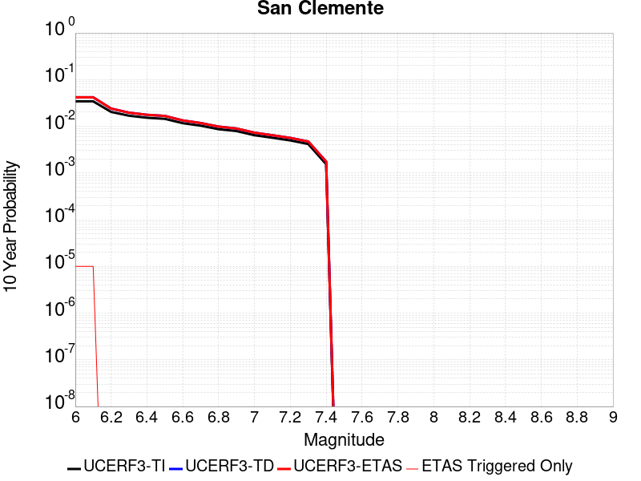 |

| Magnitude | 1 wk TI Prob | 1 wk TD Prob | 1 wk ETAS Prob | 1 wk ETAS/TD Gain | 1 wk ETAS Triggered Only | 1 mo TI Prob | 1 mo TD Prob | 1 mo ETAS Prob | 1 mo ETAS/TD Gain | 1 mo ETAS Triggered Only | 1 yr TI Prob | 1 yr TD Prob | 1 yr ETAS Prob | 1 yr ETAS/TD Gain | 1 yr ETAS Triggered Only | 10 yr TI Prob | 10 yr TD Prob | 10 yr ETAS Prob | 10 yr ETAS/TD Gain | 10 yr ETAS Triggered Only |
|-----|-----|-----|-----|-----|-----|-----|-----|-----|-----|-----|-----|-----|-----|-----|-----|-----|-----|-----|-----|-----|
| 6.0 | 6.681379E-5 | 8.164081E-5 | 8.164081E-5 | 1.0 | 0.0 | 2.8631336E-4 | 3.4984472E-4 | 3.4984472E-4 | 1.0 | 0.0 | 0.003480294 | 0.004251534 | 0.004261492 | 1.0023421 | 1.0E-5 | 0.03426291 | 0.041757226 | 0.04176681 | 1.0002295 | 1.0E-5 |
| 6.1 | 6.681379E-5 | 8.164081E-5 | 8.164081E-5 | 1.0 | 0.0 | 2.8631336E-4 | 3.4984472E-4 | 3.4984472E-4 | 1.0 | 0.0 | 0.003480294 | 0.004251534 | 0.004261492 | 1.0023421 | 1.0E-5 | 0.03426291 | 0.041757226 | 0.04176681 | 1.0002295 | 1.0E-5 |
| 6.2 | 3.9400576E-5 | 4.645349E-5 | 4.645349E-5 | 1.0 | 0.0 | 1.6884868E-4 | 1.9907155E-4 | 1.9907155E-4 | 1.0 | 0.0 | 0.0020537945 | 0.0024210564 | 0.0024210564 | 1.0 | 0.0 | 0.020349167 | 0.02395347 | 0.02395347 | 1.0 | 0.0 |
| 6.3 | 3.2590255E-5 | 3.792995E-5 | 3.792995E-5 | 1.0 | 0.0 | 1.3966505E-4 | 1.6254697E-4 | 1.6254697E-4 | 1.0 | 0.0 | 0.0016990956 | 0.0019772432 | 0.0019772432 | 1.0 | 0.0 | 0.01686163 | 0.019600306 | 0.019600306 | 1.0 | 0.0 |
| 6.4 | 2.9454652E-5 | 3.409848E-5 | 3.409848E-5 | 1.0 | 0.0 | 1.2622811E-4 | 1.4612831E-4 | 1.4612831E-4 | 1.0 | 0.0 | 0.0015357438 | 0.0017776866 | 0.0017776866 | 1.0 | 0.0 | 0.015251739 | 0.017637838 | 0.017637838 | 1.0 | 0.0 |
| 6.5 | 2.790836E-5 | 3.2248132E-5 | 3.2248132E-5 | 1.0 | 0.0 | 1.1960178E-4 | 1.381991E-4 | 1.381991E-4 | 1.0 | 0.0 | 0.001455179 | 0.001681301 | 0.001681301 | 1.0 | 0.0 | 0.014456868 | 0.016688827 | 0.016688827 | 1.0 | 0.0 |
| 6.6 | 2.2492153E-5 | 2.57632E-5 | 2.57632E-5 | 1.0 | 0.0 | 9.639138E-5 | 1.1040912E-4 | 1.1040912E-4 | 1.0 | 0.0 | 0.0011729331 | 0.0013434169 | 0.0013434169 | 1.0 | 0.0 | 0.011667615 | 0.013354673 | 0.013354673 | 1.0 | 0.0 |
| 6.7 | 1.9862755E-5 | 2.2666847E-5 | 2.2666847E-5 | 1.0 | 0.0 | 8.512331E-5 | 9.714008E-5 | 9.714008E-5 | 1.0 | 0.0 | 0.0010358836 | 0.0011820501 | 0.0011820501 | 1.0 | 0.0 | 0.010310682 | 0.01175892 | 0.01175892 | 1.0 | 0.0 |
| 6.8 | 1.6697575E-5 | 1.8978053E-5 | 1.8978053E-5 | 1.0 | 0.0 | 7.155907E-5 | 8.133203E-5 | 8.133203E-5 | 1.0 | 0.0 | 8.7088346E-4 | 9.89777E-4 | 9.89777E-4 | 1.0 | 0.0 | 0.008674784 | 0.009854714 | 0.009854714 | 1.0 | 0.0 |
| 6.9 | 1.5218415E-5 | 1.726971E-5 | 1.726971E-5 | 1.0 | 0.0 | 6.522015E-5 | 7.401099E-5 | 7.401099E-5 | 1.0 | 0.0 | 7.93766E-4 | 9.0072013E-4 | 9.0072013E-4 | 1.0 | 0.0 | 0.007909367 | 0.00897164 | 0.00897164 | 1.0 | 0.0 |
| 7.0 | 1.2392958E-5 | 1.4033262E-5 | 1.4033262E-5 | 1.0 | 0.0 | 5.3111595E-5 | 6.0141207E-5 | 6.0141207E-5 | 1.0 | 0.0 | 6.4644177E-4 | 7.319808E-4 | 7.319808E-4 | 1.0 | 0.0 | 0.0064456454 | 0.0072964844 | 0.0072964844 | 1.0 | 0.0 |
| 7.1 | 1.0934128E-5 | 1.2375354E-5 | 1.2375354E-5 | 1.0 | 0.0 | 4.6859706E-5 | 5.3036194E-5 | 5.3036194E-5 | 1.0 | 0.0 | 5.7036756E-4 | 6.455317E-4 | 6.455317E-4 | 1.0 | 0.0 | 0.0056890585 | 0.006437312 | 0.006437312 | 1.0 | 0.0 |
| 7.2 | 9.5798805E-6 | 1.0845125E-5 | 1.0845125E-5 | 1.0 | 0.0 | 4.1055984E-5 | 4.647832E-5 | 4.647832E-5 | 1.0 | 0.0 | 4.9974193E-4 | 5.657338E-4 | 5.657338E-4 | 1.0 | 0.0 | 0.0049861963 | 0.00564366 | 0.00564366 | 1.0 | 0.0 |
| 7.3 | 8.0167365E-6 | 9.084078E-6 | 9.084078E-6 | 1.0 | 0.0 | 3.4356988E-5 | 3.8931223E-5 | 3.8931223E-5 | 1.0 | 0.0 | 4.1821605E-4 | 4.738916E-4 | 4.738916E-4 | 1.0 | 0.0 | 0.0041742986 | 0.004729513 | 0.004729513 | 1.0 | 0.0 |
| 7.4 | 2.9581017E-6 | 3.36244E-6 | 3.36244E-6 | 1.0 | 0.0 | 1.2677518E-5 | 1.4410407E-5 | 1.4410407E-5 | 1.0 | 0.0 | 1.5433785E-4 | 1.7543763E-4 | 1.7543763E-4 | 1.0 | 0.0 | 0.001542307 | 0.0017534863 | 0.0017534863 | 1.0 | 0.0 |

## Pinto Mtn
*[(top)](#table-of-contents)*

| 1 Week | 1 Month | 1 Year | 10 Year |
|-----|-----|-----|-----|
|  | 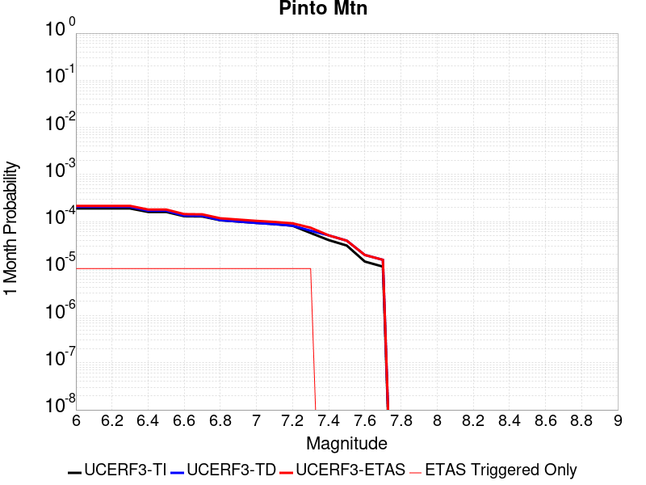 | 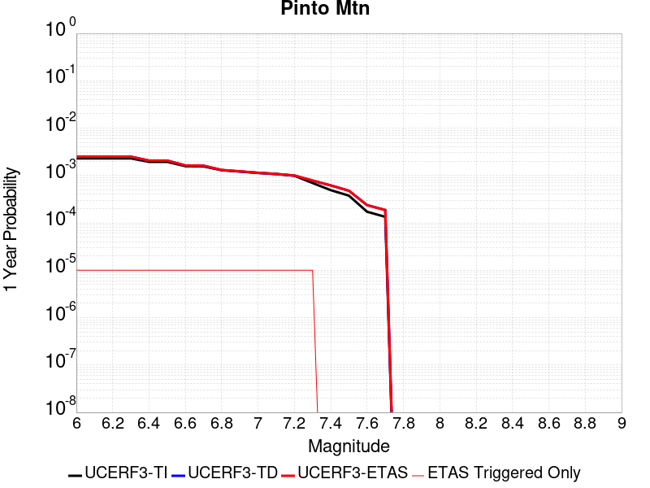 |  |

| Magnitude | 1 wk TI Prob | 1 wk TD Prob | 1 wk ETAS Prob | 1 wk ETAS/TD Gain | 1 wk ETAS Triggered Only | 1 mo TI Prob | 1 mo TD Prob | 1 mo ETAS Prob | 1 mo ETAS/TD Gain | 1 mo ETAS Triggered Only | 1 yr TI Prob | 1 yr TD Prob | 1 yr ETAS Prob | 1 yr ETAS/TD Gain | 1 yr ETAS Triggered Only | 10 yr TI Prob | 10 yr TD Prob | 10 yr ETAS Prob | 10 yr ETAS/TD Gain | 10 yr ETAS Triggered Only |
|-----|-----|-----|-----|-----|-----|-----|-----|-----|-----|-----|-----|-----|-----|-----|-----|-----|-----|-----|-----|-----|
| 6.0 | 4.4194956E-5 | 4.7855512E-5 | 4.7855512E-5 | 1.0 | 0.0 | 1.893932E-4 | 2.0507984E-4 | 2.1507777E-4 | 1.0487515 | 1.0E-5 | 0.0023034236 | 0.0024941512 | 0.0025041264 | 1.0039994 | 1.0E-5 | 0.022796938 | 0.024679113 | 0.024688866 | 1.0003952 | 1.0E-5 |
| 6.1 | 4.4194956E-5 | 4.7855512E-5 | 4.7855512E-5 | 1.0 | 0.0 | 1.893932E-4 | 2.0507984E-4 | 2.1507777E-4 | 1.0487515 | 1.0E-5 | 0.0023034236 | 0.0024941512 | 0.0025041264 | 1.0039994 | 1.0E-5 | 0.022796938 | 0.024679113 | 0.024688866 | 1.0003952 | 1.0E-5 |
| 6.2 | 4.4194956E-5 | 4.7855512E-5 | 4.7855512E-5 | 1.0 | 0.0 | 1.893932E-4 | 2.0507984E-4 | 2.1507777E-4 | 1.0487515 | 1.0E-5 | 0.0023034236 | 0.0024941512 | 0.0025041264 | 1.0039994 | 1.0E-5 | 0.022796938 | 0.024679113 | 0.024688866 | 1.0003952 | 1.0E-5 |
| 6.3 | 4.4194956E-5 | 4.7855512E-5 | 4.7855512E-5 | 1.0 | 0.0 | 1.893932E-4 | 2.0507984E-4 | 2.1507777E-4 | 1.0487515 | 1.0E-5 | 0.0023034236 | 0.0024941512 | 0.0025041264 | 1.0039994 | 1.0E-5 | 0.022796938 | 0.024679113 | 0.024688866 | 1.0003952 | 1.0E-5 |
| 6.4 | 3.729929E-5 | 3.960486E-5 | 3.960486E-5 | 1.0 | 0.0 | 1.5984432E-4 | 1.697246E-4 | 1.797229E-4 | 1.0589089 | 1.0E-5 | 0.0019443673 | 0.002064532 | 0.0020745113 | 1.0048337 | 1.0E-5 | 0.019274427 | 0.02046355 | 0.020473344 | 1.0004786 | 1.0E-5 |
| 6.5 | 3.729929E-5 | 3.960486E-5 | 3.960486E-5 | 1.0 | 0.0 | 1.5984432E-4 | 1.697246E-4 | 1.797229E-4 | 1.0589089 | 1.0E-5 | 0.0019443673 | 0.002064532 | 0.0020745113 | 1.0048337 | 1.0E-5 | 0.019274427 | 0.02046355 | 0.020473344 | 1.0004786 | 1.0E-5 |
| 6.6 | 3.0204548E-5 | 3.1206768E-5 | 3.1206768E-5 | 1.0 | 0.0 | 1.2944164E-4 | 1.3373663E-4 | 1.4373529E-4 | 1.0747638 | 1.0E-5 | 0.0015748127 | 0.001627062 | 0.0016370458 | 1.0061361 | 1.0E-5 | 0.015636992 | 0.016155364 | 0.016165202 | 1.000609 | 1.0E-5 |
| 6.7 | 2.9857754E-5 | 3.0816143E-5 | 3.0816143E-5 | 1.0 | 0.0 | 1.2795553E-4 | 1.320627E-4 | 1.4206138E-4 | 1.0757116 | 1.0E-5 | 0.0015567453 | 0.0016067121 | 0.001616696 | 1.0062139 | 1.0E-5 | 0.015458848 | 0.0159548 | 0.01596464 | 1.0006168 | 1.0E-5 |
| 6.8 | 2.4819734E-5 | 2.5010708E-5 | 2.5010708E-5 | 1.0 | 0.0 | 1.0636595E-4 | 1.0718447E-4 | 1.17183394E-4 | 1.0932871 | 1.0E-5 | 0.0012942362 | 0.0013042113 | 0.0013141982 | 1.0076575 | 1.0E-5 | 0.012867244 | 0.0129679395 | 0.012977811 | 1.0007612 | 1.0E-5 |
| 6.9 | 2.331124E-5 | 2.3338964E-5 | 2.3338964E-5 | 1.0 | 0.0 | 9.990149E-5 | 1.0002041E-4 | 1.10019406E-4 | 1.0999696 | 1.0E-5 | 0.001215622 | 0.0012170885 | 0.0012270764 | 1.0082064 | 1.0E-5 | 0.012089936 | 0.012106422 | 0.012116301 | 1.000816 | 1.0E-5 |
| 7.0 | 2.1818534E-5 | 2.176207E-5 | 2.176207E-5 | 1.0 | 0.0 | 9.3504656E-5 | 9.3262795E-5 | 1.0326186E-4 | 1.1072139 | 1.0E-5 | 0.0011378246 | 0.0011349028 | 0.0011448915 | 1.0088013 | 1.0E-5 | 0.011320163 | 0.011293174 | 0.011303061 | 1.0008755 | 1.0E-5 |
| 7.1 | 2.066081E-5 | 2.0541695E-5 | 2.0541695E-5 | 1.0 | 0.0 | 8.854332E-5 | 8.8032975E-5 | 9.803209E-5 | 1.1135838 | 1.0E-5 | 0.0010774818 | 0.001071294 | 0.0010812833 | 1.0093246 | 1.0E-5 | 0.010722724 | 0.010663347 | 0.010673241 | 1.0009278 | 1.0E-5 |
| 7.2 | 1.8990233E-5 | 1.905496E-5 | 1.905496E-5 | 1.0 | 0.0 | 8.138417E-5 | 8.166167E-5 | 9.1660855E-5 | 1.1224464 | 1.0E-5 | 9.904018E-4 | 9.937966E-4 | 0.0010037867 | 1.0100524 | 1.0E-5 | 0.009859995 | 0.009895524 | 0.009905425 | 1.0010005 | 1.0E-5 |
| 7.3 | 1.3335872E-5 | 1.4907597E-5 | 1.4907597E-5 | 1.0 | 0.0 | 5.7152483E-5 | 6.388821E-5 | 7.388757E-5 | 1.1565135 | 1.0E-5 | 6.956093E-4 | 7.7757414E-4 | 7.8756636E-4 | 1.0128505 | 1.0E-5 | 0.006934359 | 0.007749834 | 0.0077597564 | 1.0012803 | 1.0E-5 |
| 7.4 | 9.414066E-6 | 1.1861796E-5 | 1.1861796E-5 | 1.0 | 0.0 | 4.0345374E-5 | 5.0835333E-5 | 5.0835333E-5 | 1.0 | 0.0 | 4.910942E-4 | 6.1875384E-4 | 6.1875384E-4 | 1.0 | 0.0 | 0.0049001034 | 0.006171259 | 0.006171259 | 1.0 | 0.0 |
| 7.5 | 7.2101157E-6 | 9.15899E-6 | 9.15899E-6 | 1.0 | 0.0 | 3.090013E-5 | 3.925227E-5 | 3.925227E-5 | 1.0 | 0.0 | 3.7614413E-4 | 4.777994E-4 | 4.777994E-4 | 1.0 | 0.0 | 0.0037550807 | 0.004768497 | 0.004768497 | 1.0 | 0.0 |
| 7.6 | 3.296375E-6 | 4.546278E-6 | 4.546278E-6 | 1.0 | 0.0 | 1.4127245E-5 | 1.948391E-5 | 1.948391E-5 | 1.0 | 0.0 | 1.7198564E-4 | 2.3719217E-4 | 2.3719217E-4 | 1.0 | 0.0 | 0.0017185259 | 0.0023695275 | 0.0023695275 | 1.0 | 0.0 |
| 7.7 | 2.5741092E-6 | 3.5851394E-6 | 3.5851394E-6 | 1.0 | 0.0 | 1.103185E-5 | 1.53648E-5 | 1.53648E-5 | 1.0 | 0.0 | 1.3430449E-4 | 1.870517E-4 | 1.870517E-4 | 1.0 | 0.0 | 0.0013422335 | 0.0018690726 | 0.0018690726 | 1.0 | 0.0 |

## Pittville 2011 CFM
*[(top)](#table-of-contents)*

| 1 Week | 1 Month | 1 Year | 10 Year |
|-----|-----|-----|-----|
|  |  |  |  |

| Magnitude | 1 wk TI Prob | 1 wk TD Prob | 1 wk ETAS Prob | 1 wk ETAS/TD Gain | 1 wk ETAS Triggered Only | 1 mo TI Prob | 1 mo TD Prob | 1 mo ETAS Prob | 1 mo ETAS/TD Gain | 1 mo ETAS Triggered Only | 1 yr TI Prob | 1 yr TD Prob | 1 yr ETAS Prob | 1 yr ETAS/TD Gain | 1 yr ETAS Triggered Only | 10 yr TI Prob | 10 yr TD Prob | 10 yr ETAS Prob | 10 yr ETAS/TD Gain | 10 yr ETAS Triggered Only |
|-----|-----|-----|-----|-----|-----|-----|-----|-----|-----|-----|-----|-----|-----|-----|-----|-----|-----|-----|-----|-----|
| 6.0 | 2.5031832E-5 | 2.705726E-5 | 2.705726E-5 | 1.0 | 0.0 | 1.0727487E-4 | 1.1595508E-4 | 1.1595508E-4 | 1.0 | 0.0 | 0.001305289 | 0.0014109362 | 0.0014109362 | 1.0 | 0.0 | 0.012976485 | 0.014029565 | 0.014039425 | 1.0007027 | 1.0E-5 |
| 6.1 | 1.2540113E-5 | 1.3513205E-5 | 1.3513205E-5 | 1.0 | 0.0 | 5.3742235E-5 | 5.7912577E-5 | 5.7912577E-5 | 1.0 | 0.0 | 6.541153E-4 | 7.0488005E-4 | 7.0488005E-4 | 1.0 | 0.0 | 0.0065219323 | 0.0070286766 | 0.007038606 | 1.0014127 | 1.0E-5 |
| 6.2 | 6.603218E-6 | 7.107261E-6 | 7.107261E-6 | 1.0 | 0.0 | 2.8299199E-5 | 3.045937E-5 | 3.045937E-5 | 1.0 | 0.0 | 3.4448825E-4 | 3.7078623E-4 | 3.7078623E-4 | 1.0 | 0.0 | 0.0034395473 | 0.0037023167 | 0.0037023167 | 1.0 | 0.0 |
| 6.3 | 6.603218E-6 | 7.107261E-6 | 7.107261E-6 | 1.0 | 0.0 | 2.8299199E-5 | 3.045937E-5 | 3.045937E-5 | 1.0 | 0.0 | 3.4448825E-4 | 3.7078623E-4 | 3.7078623E-4 | 1.0 | 0.0 | 0.0034395473 | 0.0037023167 | 0.0037023167 | 1.0 | 0.0 |
| 6.4 | 3.9389015E-6 | 4.239218E-6 | 4.239218E-6 | 1.0 | 0.0 | 1.6880897E-5 | 1.8167968E-5 | 1.8167968E-5 | 1.0 | 0.0 | 2.0550552E-4 | 2.2117565E-4 | 2.2117565E-4 | 1.0 | 0.0 | 0.0020531558 | 0.0022098604 | 0.0022098604 | 1.0 | 0.0 |
| 6.5 | 2.4533072E-6 | 2.6412954E-6 | 2.6412954E-6 | 1.0 | 0.0 | 1.0514132E-5 | 1.1319799E-5 | 1.1319799E-5 | 1.0 | 0.0 | 1.2800204E-4 | 1.3781177E-4 | 1.3781177E-4 | 1.0 | 0.0 | 0.0012792832 | 0.0013774533 | 0.0013774533 | 1.0 | 0.0 |
| 6.6 | 1.3482367E-6 | 1.453008E-6 | 1.453008E-6 | 1.0 | 0.0 | 5.778144E-6 | 6.227169E-6 | 6.227169E-6 | 1.0 | 0.0 | 7.0346636E-5 | 7.581428E-5 | 7.581428E-5 | 1.0 | 0.0 | 7.032437E-4 | 7.5799524E-4 | 7.5799524E-4 | 1.0 | 0.0 |

## Hayward (No) 2011 CFM
*[(top)](#table-of-contents)*

| 1 Week | 1 Month | 1 Year | 10 Year |
|-----|-----|-----|-----|
|  |  | 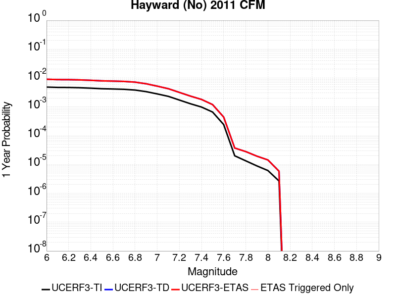 |  |

| Magnitude | 1 wk TI Prob | 1 wk TD Prob | 1 wk ETAS Prob | 1 wk ETAS/TD Gain | 1 wk ETAS Triggered Only | 1 mo TI Prob | 1 mo TD Prob | 1 mo ETAS Prob | 1 mo ETAS/TD Gain | 1 mo ETAS Triggered Only | 1 yr TI Prob | 1 yr TD Prob | 1 yr ETAS Prob | 1 yr ETAS/TD Gain | 1 yr ETAS Triggered Only | 10 yr TI Prob | 10 yr TD Prob | 10 yr ETAS Prob | 10 yr ETAS/TD Gain | 10 yr ETAS Triggered Only |
|-----|-----|-----|-----|-----|-----|-----|-----|-----|-----|-----|-----|-----|-----|-----|-----|-----|-----|-----|-----|-----|
| 6.0 | 9.3068506E-5 | 1.7397928E-4 | 1.7397928E-4 | 1.0 | 0.0 | 3.9880406E-4 | 7.454108E-4 | 7.454108E-4 | 1.0 | 0.0 | 0.0048446343 | 0.009037494 | 0.009037494 | 1.0 | 0.0 | 0.047403704 | 0.086402565 | 0.0864117 | 1.0001057 | 1.0E-5 |
| 6.1 | 9.055486E-5 | 1.6949074E-4 | 1.6949074E-4 | 1.0 | 0.0 | 3.880345E-4 | 7.2618667E-4 | 7.2618667E-4 | 1.0 | 0.0 | 0.0047140904 | 0.008805556 | 0.008805556 | 1.0 | 0.0 | 0.046153355 | 0.08430039 | 0.08430955 | 1.0001086 | 1.0E-5 |
| 6.2 | 9.006742E-5 | 1.686967E-4 | 1.686967E-4 | 1.0 | 0.0 | 3.859461E-4 | 7.2278595E-4 | 7.2278595E-4 | 1.0 | 0.0 | 0.0046887742 | 0.008764519 | 0.008764519 | 1.0 | 0.0 | 0.0459107 | 0.083924614 | 0.08393377 | 1.0001092 | 1.0E-5 |
| 6.3 | 8.8336754E-5 | 1.654921E-4 | 1.654921E-4 | 1.0 | 0.0 | 3.7853114E-4 | 7.090599E-4 | 7.090599E-4 | 1.0 | 0.0 | 0.004598882 | 0.00859879 | 0.00859879 | 1.0 | 0.0 | 0.04504866 | 0.08241665 | 0.08242583 | 1.0001113 | 1.0E-5 |
| 6.4 | 8.526157E-5 | 1.597622E-4 | 1.597622E-4 | 1.0 | 0.0 | 3.6535555E-4 | 6.8451616E-4 | 6.8451616E-4 | 1.0 | 0.0 | 0.0044391346 | 0.008302296 | 0.008302296 | 1.0 | 0.0 | 0.043514993 | 0.07969951 | 0.07970871 | 1.0001155 | 1.0E-5 |
| 6.5 | 8.152396E-5 | 1.5308615E-4 | 1.5308615E-4 | 1.0 | 0.0 | 3.493416E-4 | 6.559192E-4 | 6.559192E-4 | 1.0 | 0.0 | 0.0042449418 | 0.007956725 | 0.007956725 | 1.0 | 0.0 | 0.04164765 | 0.076519914 | 0.07652915 | 1.0001206 | 1.0E-5 |
| 6.6 | 7.987405E-5 | 1.5012817E-4 | 1.5012817E-4 | 1.0 | 0.0 | 3.4227243E-4 | 6.4324844E-4 | 6.4324844E-4 | 1.0 | 0.0 | 0.0041592065 | 0.0078035854 | 0.0078035854 | 1.0 | 0.0 | 0.04082218 | 0.07511259 | 0.075121835 | 1.0001231 | 1.0E-5 |
| 6.7 | 7.777665E-5 | 1.4652064E-4 | 1.4652064E-4 | 1.0 | 0.0 | 3.332859E-4 | 6.277952E-4 | 6.277952E-4 | 1.0 | 0.0 | 0.004050208 | 0.007616774 | 0.007616774 | 1.0 | 0.0 | 0.039771806 | 0.07338915 | 0.07339842 | 1.0001262 | 1.0E-5 |
| 6.8 | 7.3284005E-5 | 1.3802624E-4 | 1.3802624E-4 | 1.0 | 0.0 | 3.140365E-4 | 5.9140753E-4 | 5.9140753E-4 | 1.0 | 0.0 | 0.0038166929 | 0.007176752 | 0.007176752 | 1.0 | 0.0 | 0.037518036 | 0.069302484 | 0.06931179 | 1.0001343 | 1.0E-5 |
| 6.9 | 6.458263E-5 | 1.2133129E-4 | 1.2133129E-4 | 1.0 | 0.0 | 2.7675333E-4 | 5.198881E-4 | 5.198881E-4 | 1.0 | 0.0 | 0.0033642664 | 0.0063113687 | 0.0063113687 | 1.0 | 0.0 | 0.033137884 | 0.06123086 | 0.06123086 | 1.0 | 0.0 |
| 7.0 | 5.3853604E-5 | 1.0026534E-4 | 1.0026534E-4 | 1.0 | 0.0 | 2.3078074E-4 | 4.2963814E-4 | 4.2963814E-4 | 1.0 | 0.0 | 0.0028061352 | 0.005218363 | 0.005218363 | 1.0 | 0.0 | 0.027709642 | 0.050963037 | 0.050963037 | 1.0 | 0.0 |
| 7.1 | 4.4308683E-5 | 8.171937E-5 | 8.171937E-5 | 1.0 | 0.0 | 1.8988053E-4 | 3.5017906E-4 | 3.5017906E-4 | 1.0 | 0.0 | 0.0023093442 | 0.004255137 | 0.004255137 | 1.0 | 0.0 | 0.022854926 | 0.041829627 | 0.041829627 | 1.0 | 0.0 |
| 7.2 | 3.295973E-5 | 6.0782906E-5 | 6.0782906E-5 | 1.0 | 0.0 | 1.4124835E-4 | 2.604723E-4 | 2.604723E-4 | 1.0 | 0.0 | 0.0017183421 | 0.0031666614 | 0.0031666614 | 1.0 | 0.0 | 0.017051157 | 0.031374134 | 0.031374134 | 1.0 | 0.0 |
| 7.3 | 2.452256E-5 | 4.51901E-5 | 4.51901E-5 | 1.0 | 0.0 | 1.05092455E-4 | 1.9365756E-4 | 1.9365756E-4 | 1.0 | 0.0 | 0.0012787496 | 0.002355245 | 0.002355245 | 1.0 | 0.0 | 0.0127141625 | 0.023445245 | 0.023445245 | 1.0 | 0.0 |
| 7.4 | 1.8829967E-5 | 3.4610835E-5 | 3.4610835E-5 | 1.0 | 0.0 | 8.069736E-5 | 1.4832379E-4 | 1.4832379E-4 | 1.0 | 0.0 | 9.820475E-4 | 0.0018043561 | 0.0018043561 | 1.0 | 0.0 | 0.009777189 | 0.018022932 | 0.018022932 | 1.0 | 0.0 |
| 7.5 | 1.26374125E-5 | 2.2925326E-5 | 2.2925326E-5 | 1.0 | 0.0 | 5.4159216E-5 | 9.824773E-5 | 9.824773E-5 | 1.0 | 0.0 | 6.5918895E-4 | 0.0011955155 | 0.0011955155 | 1.0 | 0.0 | 0.00657237 | 0.011989905 | 0.011989905 | 1.0 | 0.0 |
| 7.6 | 4.666429E-6 | 8.480926E-6 | 8.480926E-6 | 1.0 | 0.0 | 1.9998828E-5 | 3.6346326E-5 | 3.6346326E-5 | 1.0 | 0.0 | 2.4345852E-4 | 4.424279E-4 | 4.424279E-4 | 1.0 | 0.0 | 0.0024319198 | 0.0044588465 | 0.0044588465 | 1.0 | 0.0 |
| 7.7 | 3.8399318E-7 | 7.13742E-7 | 7.13742E-7 | 1.0 | 0.0 | 1.6456839E-6 | 3.0588906E-6 | 3.0588906E-6 | 1.0 | 0.0 | 2.003602E-5 | 3.7241356E-5 | 3.7241356E-5 | 1.0 | 0.0 | 2.0034213E-4 | 3.863124E-4 | 3.863124E-4 | 1.0 | 0.0 |
| 7.8 | 2.5637698E-7 | 5.3692474E-7 | 5.3692474E-7 | 1.0 | 0.0 | 1.098758E-6 | 2.301104E-6 | 2.301104E-6 | 1.0 | 0.0 | 1.3377297E-5 | 2.8015582E-5 | 2.8015582E-5 | 1.0 | 0.0 | 1.3376492E-4 | 2.9259408E-4 | 2.9259408E-4 | 1.0 | 0.0 |
| 7.9 | 1.7141245E-7 | 3.7311867E-7 | 3.7311867E-7 | 1.0 | 0.0 | 7.3462456E-7 | 1.5990789E-6 | 1.5990789E-6 | 1.0 | 0.0 | 8.944017E-6 | 1.9468613E-5 | 1.9468613E-5 | 1.0 | 0.0 | 8.943657E-5 | 2.0255927E-4 | 2.0255927E-4 | 1.0 | 0.0 |
| 8.0 | 1.1808895E-7 | 2.7525246E-7 | 2.7525246E-7 | 1.0 | 0.0 | 5.060954E-7 | 1.1796528E-6 | 1.1796528E-6 | 1.0 | 0.0 | 6.161694E-6 | 1.4362179E-5 | 1.4362179E-5 | 1.0 | 0.0 | 6.161523E-5 | 1.482392E-4 | 1.482392E-4 | 1.0 | 0.0 |
| 8.1 | 5.138535E-8 | 1.1236262E-7 | 1.1236262E-7 | 1.0 | 0.0 | 2.2022292E-7 | 4.8155397E-7 | 4.8155397E-7 | 1.0 | 0.0 | 2.6812106E-6 | 5.8629043E-6 | 5.8629043E-6 | 1.0 | 0.0 | 2.6811784E-5 | 6.018857E-5 | 6.018857E-5 | 1.0 | 0.0 |

## Breckenridge 2011
*[(top)](#table-of-contents)*

| 1 Week | 1 Month | 1 Year | 10 Year |
|-----|-----|-----|-----|
| 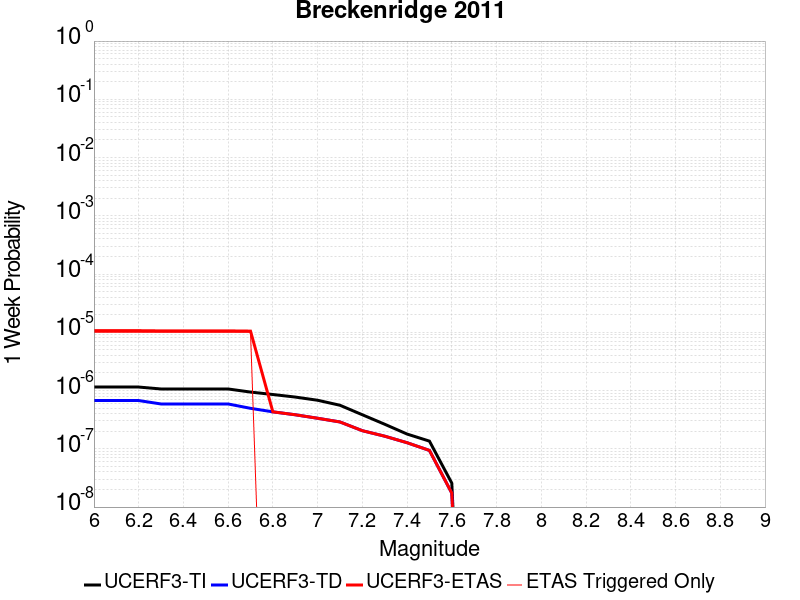 |  |  |  |

| Magnitude | 1 wk TI Prob | 1 wk TD Prob | 1 wk ETAS Prob | 1 wk ETAS/TD Gain | 1 wk ETAS Triggered Only | 1 mo TI Prob | 1 mo TD Prob | 1 mo ETAS Prob | 1 mo ETAS/TD Gain | 1 mo ETAS Triggered Only | 1 yr TI Prob | 1 yr TD Prob | 1 yr ETAS Prob | 1 yr ETAS/TD Gain | 1 yr ETAS Triggered Only | 10 yr TI Prob | 10 yr TD Prob | 10 yr ETAS Prob | 10 yr ETAS/TD Gain | 10 yr ETAS Triggered Only |
|-----|-----|-----|-----|-----|-----|-----|-----|-----|-----|-----|-----|-----|-----|-----|-----|-----|-----|-----|-----|-----|
| 6.0 | 1.1490393E-6 | 6.738047E-7 | 1.0673798E-5 | 15.841085 | 1.0E-5 | 4.924445E-6 | 2.8877314E-6 | 1.2887703E-5 | 4.462916 | 1.0E-5 | 5.995347E-5 | 3.5157584E-5 | 4.5157234E-5 | 1.2844236 | 1.0E-5 | 5.9937296E-4 | 3.515223E-4 | 3.6151876E-4 | 1.0284377 | 1.0E-5 |
| 6.1 | 1.1490393E-6 | 6.738047E-7 | 1.0673798E-5 | 15.841085 | 1.0E-5 | 4.924445E-6 | 2.8877314E-6 | 1.2887703E-5 | 4.462916 | 1.0E-5 | 5.995347E-5 | 3.5157584E-5 | 4.5157234E-5 | 1.2844236 | 1.0E-5 | 5.9937296E-4 | 3.515223E-4 | 3.6151876E-4 | 1.0284377 | 1.0E-5 |
| 6.2 | 1.1490393E-6 | 6.738047E-7 | 1.0673798E-5 | 15.841085 | 1.0E-5 | 4.924445E-6 | 2.8877314E-6 | 1.2887703E-5 | 4.462916 | 1.0E-5 | 5.995347E-5 | 3.5157584E-5 | 4.5157234E-5 | 1.2844236 | 1.0E-5 | 5.9937296E-4 | 3.515223E-4 | 3.6151876E-4 | 1.0284377 | 1.0E-5 |
| 6.3 | 1.064617E-6 | 5.886444E-7 | 1.0588638E-5 | 17.988174 | 1.0E-5 | 4.5626366E-6 | 2.5227594E-6 | 1.2522734E-5 | 4.9639034 | 1.0E-5 | 5.5548684E-5 | 3.0714174E-5 | 4.071387E-5 | 1.3255726 | 1.0E-5 | 5.55348E-4 | 3.0710048E-4 | 3.1709738E-4 | 1.0325526 | 1.0E-5 |
| 6.4 | 1.064617E-6 | 5.886444E-7 | 1.0588638E-5 | 17.988174 | 1.0E-5 | 4.5626366E-6 | 2.5227594E-6 | 1.2522734E-5 | 4.9639034 | 1.0E-5 | 5.5548684E-5 | 3.0714174E-5 | 4.071387E-5 | 1.3255726 | 1.0E-5 | 5.55348E-4 | 3.0710048E-4 | 3.1709738E-4 | 1.0325526 | 1.0E-5 |
| 6.5 | 1.064617E-6 | 5.886444E-7 | 1.0588638E-5 | 17.988174 | 1.0E-5 | 4.5626366E-6 | 2.5227594E-6 | 1.2522734E-5 | 4.9639034 | 1.0E-5 | 5.5548684E-5 | 3.0714174E-5 | 4.071387E-5 | 1.3255726 | 1.0E-5 | 5.55348E-4 | 3.0710048E-4 | 3.1709738E-4 | 1.0325526 | 1.0E-5 |
| 6.6 | 1.064617E-6 | 5.886444E-7 | 1.0588638E-5 | 17.988174 | 1.0E-5 | 4.5626366E-6 | 2.5227594E-6 | 1.2522734E-5 | 4.9639034 | 1.0E-5 | 5.5548684E-5 | 3.0714174E-5 | 4.071387E-5 | 1.3255726 | 1.0E-5 | 5.55348E-4 | 3.0710048E-4 | 3.1709738E-4 | 1.0325526 | 1.0E-5 |
| 6.7 | 9.4219524E-7 | 4.95405E-7 | 1.04954E-5 | 21.185495 | 1.0E-5 | 4.037973E-6 | 2.1231626E-6 | 1.21231415E-5 | 5.7099447 | 1.0E-5 | 4.916122E-5 | 2.5849204E-5 | 3.5848945E-5 | 1.386849 | 1.0E-5 | 4.9150345E-4 | 2.5846262E-4 | 2.6846005E-4 | 1.0386803 | 1.0E-5 |
| 6.8 | 8.556422E-7 | 4.3119502E-7 | 4.3119502E-7 | 1.0 | 0.0 | 3.667033E-6 | 1.8479774E-6 | 1.8479774E-6 | 1.0 | 0.0 | 4.464521E-5 | 2.2498896E-5 | 2.2498896E-5 | 1.0 | 0.0 | 4.4636242E-4 | 2.2496658E-4 | 2.2496658E-4 | 1.0 | 0.0 |
| 6.9 | 7.7357794E-7 | 3.8420123E-7 | 3.8420123E-7 | 1.0 | 0.0 | 3.3153299E-6 | 1.6465757E-6 | 1.6465757E-6 | 1.0 | 0.0 | 4.0363393E-5 | 2.0046878E-5 | 2.0046878E-5 | 1.0 | 0.0 | 4.035606E-4 | 2.00451E-4 | 2.00451E-4 | 1.0 | 0.0 |
| 7.0 | 6.8172454E-7 | 3.347125E-7 | 3.347125E-7 | 1.0 | 0.0 | 2.9216735E-6 | 1.4344813E-6 | 1.4344813E-6 | 1.0 | 0.0 | 3.5570793E-5 | 1.7464672E-5 | 1.7464672E-5 | 1.0 | 0.0 | 3.55651E-4 | 1.7463323E-4 | 1.7463323E-4 | 1.0 | 0.0 |
| 7.1 | 5.5936397E-7 | 2.8909557E-7 | 2.8909557E-7 | 1.0 | 0.0 | 2.397272E-6 | 1.2389804E-6 | 1.2389804E-6 | 1.0 | 0.0 | 2.9186394E-5 | 1.5084484E-5 | 1.5084484E-5 | 1.0 | 0.0 | 2.9182562E-4 | 1.5083478E-4 | 1.5083478E-4 | 1.0 | 0.0 |
| 7.2 | 3.8420822E-7 | 2.0468316E-7 | 2.0468316E-7 | 1.0 | 0.0 | 1.6466057E-6 | 8.7721327E-7 | 8.7721327E-7 | 1.0 | 0.0 | 2.004724E-5 | 1.068002E-5 | 1.068002E-5 | 1.0 | 0.0 | 2.004543E-4 | 1.0679515E-4 | 1.0679515E-4 | 1.0 | 0.0 |
| 7.3 | 2.6405158E-7 | 1.6473192E-7 | 1.6473192E-7 | 1.0 | 0.0 | 1.1316491E-6 | 7.059937E-7 | 7.059937E-7 | 1.0 | 0.0 | 1.37777415E-5 | 8.595441E-6 | 8.595441E-6 | 1.0 | 0.0 | 1.3776887E-4 | 8.595115E-5 | 8.595115E-5 | 1.0 | 0.0 |
| 7.4 | 1.792114E-7 | 1.2725322E-7 | 1.2725322E-7 | 1.0 | 0.0 | 7.6804866E-7 | 5.453708E-7 | 5.453708E-7 | 1.0 | 0.0 | 9.3509525E-6 | 6.6398698E-6 | 6.6398698E-6 | 1.0 | 0.0 | 9.350559E-5 | 6.639676E-5 | 6.639676E-5 | 1.0 | 0.0 |
| 7.5 | 1.3548703E-7 | 9.385393E-8 | 9.385393E-8 | 1.0 | 0.0 | 5.8065854E-7 | 4.0223108E-7 | 4.0223108E-7 | 1.0 | 0.0 | 7.0694946E-6 | 4.897153E-6 | 4.897153E-6 | 1.0 | 0.0 | 7.0692695E-5 | 4.8970483E-5 | 4.8970483E-5 | 1.0 | 0.0 |
| 7.6 | 2.572245E-8 | 1.7352718E-8 | 1.7352718E-8 | 1.0 | 0.0 | 1.10239064E-7 | 7.436879E-8 | 7.436879E-8 | 1.0 | 0.0 | 1.3421597E-6 | 9.054397E-7 | 9.054397E-7 | 1.0 | 0.0 | 1.3421517E-5 | 9.054365E-6 | 9.054365E-6 | 1.0 | 0.0 |

## Hunting Creek - Berryessa 2011 CFM
*[(top)](#table-of-contents)*

| 1 Week | 1 Month | 1 Year | 10 Year |
|-----|-----|-----|-----|
|  |  |  | 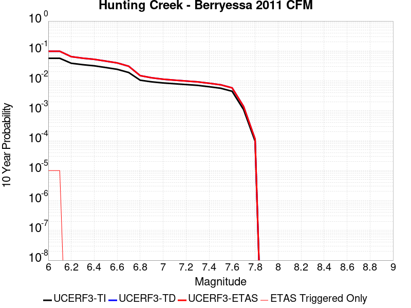 |

| Magnitude | 1 wk TI Prob | 1 wk TD Prob | 1 wk ETAS Prob | 1 wk ETAS/TD Gain | 1 wk ETAS Triggered Only | 1 mo TI Prob | 1 mo TD Prob | 1 mo ETAS Prob | 1 mo ETAS/TD Gain | 1 mo ETAS Triggered Only | 1 yr TI Prob | 1 yr TD Prob | 1 yr ETAS Prob | 1 yr ETAS/TD Gain | 1 yr ETAS Triggered Only | 10 yr TI Prob | 10 yr TD Prob | 10 yr ETAS Prob | 10 yr ETAS/TD Gain | 10 yr ETAS Triggered Only |
|-----|-----|-----|-----|-----|-----|-----|-----|-----|-----|-----|-----|-----|-----|-----|-----|-----|-----|-----|-----|-----|
| 6.0 | 1.1270982E-4 | 2.003E-4 | 2.003E-4 | 1.0 | 0.0 | 4.8295266E-4 | 8.580158E-4 | 8.680072E-4 | 1.0116448 | 1.0E-5 | 0.0058641075 | 0.010386613 | 0.010396509 | 1.0009527 | 1.0E-5 | 0.057117578 | 0.098045476 | 0.0980545 | 1.000092 | 1.0E-5 |
| 6.1 | 1.1239393E-4 | 1.9978137E-4 | 1.9978137E-4 | 1.0 | 0.0 | 4.8159933E-4 | 8.5579476E-4 | 8.657862E-4 | 1.011675 | 1.0E-5 | 0.0058477195 | 0.010359855 | 0.0103697525 | 1.0009552 | 1.0E-5 | 0.056962132 | 0.09780394 | 0.09781296 | 1.0000923 | 1.0E-5 |
| 6.2 | 7.596265E-5 | 1.2934073E-4 | 1.2934073E-4 | 1.0 | 0.0 | 3.2551357E-4 | 5.5417913E-4 | 5.5417913E-4 | 1.0 | 0.0 | 0.0039559277 | 0.0067216344 | 0.0067216344 | 1.0 | 0.0 | 0.038862433 | 0.06459614 | 0.06459614 | 1.0 | 0.0 |
| 6.3 | 6.78794E-5 | 1.14485956E-4 | 1.14485956E-4 | 1.0 | 0.0 | 2.9087928E-4 | 4.9054454E-4 | 4.9054454E-4 | 1.0 | 0.0 | 0.003535705 | 0.0059528984 | 0.0059528984 | 1.0 | 0.0 | 0.034799766 | 0.05746977 | 0.05746977 | 1.0 | 0.0 |
| 6.4 | 6.2165134E-5 | 1.0435045E-4 | 1.0435045E-4 | 1.0 | 0.0 | 2.6639478E-4 | 4.4712838E-4 | 4.4712838E-4 | 1.0 | 0.0 | 0.0032385332 | 0.0054276367 | 0.0054276367 | 1.0 | 0.0 | 0.03191742 | 0.052554645 | 0.052554645 | 1.0 | 0.0 |
| 6.5 | 5.4368087E-5 | 9.0704736E-5 | 9.0704736E-5 | 1.0 | 0.0 | 2.3298527E-4 | 3.8866926E-4 | 3.8866926E-4 | 1.0 | 0.0 | 0.0028329059 | 0.0047198907 | 0.0047198907 | 1.0 | 0.0 | 0.027970633 | 0.04588404 | 0.04588404 | 1.0 | 0.0 |
| 6.6 | 4.729947E-5 | 7.8472214E-5 | 7.8472214E-5 | 1.0 | 0.0 | 2.0269625E-4 | 3.362585E-4 | 3.362585E-4 | 1.0 | 0.0 | 0.002465034 | 0.004084906 | 0.004084906 | 1.0 | 0.0 | 0.02437869 | 0.039855294 | 0.039855294 | 1.0 | 0.0 |
| 6.7 | 3.6875328E-5 | 6.044355E-5 | 6.044355E-5 | 1.0 | 0.0 | 1.5802756E-4 | 2.5902048E-4 | 2.5902048E-4 | 1.0 | 0.0 | 0.0019222875 | 0.003148399 | 0.003148399 | 1.0 | 0.0 | 0.019057442 | 0.030895488 | 0.030895488 | 1.0 | 0.0 |
| 6.8 | 2.0292036E-5 | 2.8977376E-5 | 2.8977376E-5 | 1.0 | 0.0 | 8.6962966E-5 | 1.2418274E-4 | 1.2418274E-4 | 1.0 | 0.0 | 0.0010582599 | 0.0015108638 | 0.0015108638 | 1.0 | 0.0 | 0.010532344 | 0.014979384 | 0.014979384 | 1.0 | 0.0 |
| 6.9 | 1.7871042E-5 | 2.4473193E-5 | 2.4473193E-5 | 1.0 | 0.0 | 7.658793E-5 | 1.04880906E-4 | 1.04880906E-4 | 1.0 | 0.0 | 9.320591E-4 | 0.0012761768 | 0.0012761768 | 1.0 | 0.0 | 0.009281595 | 0.012680746 | 0.012680746 | 1.0 | 0.0 |
| 7.0 | 1.6415532E-5 | 2.1907066E-5 | 2.1907066E-5 | 1.0 | 0.0 | 7.035038E-5 | 9.388406E-5 | 9.388406E-5 | 1.0 | 0.0 | 8.561793E-4 | 0.0011424406 | 0.0011424406 | 1.0 | 0.0 | 0.008528882 | 0.01136518 | 0.01136518 | 1.0 | 0.0 |
| 7.1 | 1.5409885E-5 | 2.0347048E-5 | 2.0347048E-5 | 1.0 | 0.0 | 6.6040695E-5 | 8.719874E-5 | 8.719874E-5 | 1.0 | 0.0 | 8.0374884E-4 | 0.0010611303 | 0.0010611303 | 1.0 | 0.0 | 0.00800848 | 0.010561098 | 0.010561098 | 1.0 | 0.0 |
| 7.2 | 1.4497423E-5 | 1.905562E-5 | 1.905562E-5 | 1.0 | 0.0 | 6.213033E-5 | 8.166441E-5 | 8.166441E-5 | 1.0 | 0.0 | 7.5617427E-4 | 9.938137E-4 | 9.938137E-4 | 1.0 | 0.0 | 0.0075360634 | 0.009894406 | 0.009894406 | 1.0 | 0.0 |
| 7.3 | 1.3615175E-5 | 1.7826764E-5 | 1.7826764E-5 | 1.0 | 0.0 | 5.8349444E-5 | 7.6398195E-5 | 7.6398195E-5 | 1.0 | 0.0 | 7.101729E-4 | 9.29754E-4 | 9.29754E-4 | 1.0 | 0.0 | 0.0070790765 | 0.009259279 | 0.009259279 | 1.0 | 0.0 |
| 7.4 | 1.2252825E-5 | 1.6026825E-5 | 1.6026825E-5 | 1.0 | 0.0 | 5.251105E-5 | 6.8684596E-5 | 6.8684596E-5 | 1.0 | 0.0 | 6.391345E-4 | 8.3591696E-4 | 8.3591696E-4 | 1.0 | 0.0 | 0.0063729943 | 0.008328301 | 0.008328301 | 1.0 | 0.0 |
| 7.5 | 1.0913301E-5 | 1.4241617E-5 | 1.4241617E-5 | 1.0 | 0.0 | 4.6770452E-5 | 6.1034087E-5 | 6.1034087E-5 | 1.0 | 0.0 | 5.6928146E-4 | 7.4283936E-4 | 7.4283936E-4 | 1.0 | 0.0 | 0.0056782532 | 0.0074040988 | 0.0074040988 | 1.0 | 0.0 |
| 7.6 | 8.623192E-6 | 1.1235044E-5 | 1.1235044E-5 | 1.0 | 0.0 | 3.6956015E-5 | 4.8149315E-5 | 4.8149315E-5 | 1.0 | 0.0 | 4.4984656E-4 | 5.860628E-4 | 5.860628E-4 | 1.0 | 0.0 | 0.00448937 | 0.005845606 | 0.005845606 | 1.0 | 0.0 |
| 7.7 | 2.0993634E-6 | 2.662692E-6 | 2.662692E-6 | 1.0 | 0.0 | 8.997241E-6 | 1.1411487E-5 | 1.1411487E-5 | 1.0 | 0.0 | 1.09535904E-4 | 1.3892607E-4 | 1.3892607E-4 | 1.0 | 0.0 | 0.0010948193 | 0.0013884421 | 0.0013884421 | 1.0 | 0.0 |
| 7.8 | 1.8428308E-7 | 2.1675E-7 | 2.1675E-7 | 1.0 | 0.0 | 7.897844E-7 | 9.289282E-7 | 9.289282E-7 | 1.0 | 0.0 | 9.615583E-6 | 1.1309647E-5 | 1.1309647E-5 | 1.0 | 0.0 | 9.615166E-5 | 1.13083915E-4 | 1.13083915E-4 | 1.0 | 0.0 |

## San Pedro Basin
*[(top)](#table-of-contents)*

| 1 Week | 1 Month | 1 Year | 10 Year |
|-----|-----|-----|-----|
|  |  |  |  |

| Magnitude | 1 wk TI Prob | 1 wk TD Prob | 1 wk ETAS Prob | 1 wk ETAS/TD Gain | 1 wk ETAS Triggered Only | 1 mo TI Prob | 1 mo TD Prob | 1 mo ETAS Prob | 1 mo ETAS/TD Gain | 1 mo ETAS Triggered Only | 1 yr TI Prob | 1 yr TD Prob | 1 yr ETAS Prob | 1 yr ETAS/TD Gain | 1 yr ETAS Triggered Only | 10 yr TI Prob | 10 yr TD Prob | 10 yr ETAS Prob | 10 yr ETAS/TD Gain | 10 yr ETAS Triggered Only |
|-----|-----|-----|-----|-----|-----|-----|-----|-----|-----|-----|-----|-----|-----|-----|-----|-----|-----|-----|-----|-----|
| 6.0 | 5.3449043E-5 | 6.3371765E-5 | 6.3371765E-5 | 1.0 | 0.0 | 2.2904722E-4 | 2.7156848E-4 | 2.7156848E-4 | 1.0 | 0.0 | 0.0027850836 | 0.0033019334 | 0.0033119004 | 1.0030185 | 1.0E-5 | 0.027504366 | 0.03259028 | 0.032599956 | 1.0002968 | 1.0E-5 |
| 6.1 | 5.3449043E-5 | 6.3371765E-5 | 6.3371765E-5 | 1.0 | 0.0 | 2.2904722E-4 | 2.7156848E-4 | 2.7156848E-4 | 1.0 | 0.0 | 0.0027850836 | 0.0033019334 | 0.0033119004 | 1.0030185 | 1.0E-5 | 0.027504366 | 0.03259028 | 0.032599956 | 1.0002968 | 1.0E-5 |
| 6.2 | 2.3189454E-5 | 2.6643364E-5 | 2.6643364E-5 | 1.0 | 0.0 | 9.9379584E-5 | 1.1418111E-4 | 1.1418111E-4 | 1.0 | 0.0 | 0.0012092749 | 0.0013893156 | 0.0013893156 | 1.0 | 0.0 | 0.012027155 | 0.013811166 | 0.013811166 | 1.0 | 0.0 |
| 6.3 | 2.3189454E-5 | 2.6643364E-5 | 2.6643364E-5 | 1.0 | 0.0 | 9.9379584E-5 | 1.1418111E-4 | 1.1418111E-4 | 1.0 | 0.0 | 0.0012092749 | 0.0013893156 | 0.0013893156 | 1.0 | 0.0 | 0.012027155 | 0.013811166 | 0.013811166 | 1.0 | 0.0 |
| 6.4 | 1.966056E-5 | 2.2463855E-5 | 2.2463855E-5 | 1.0 | 0.0 | 8.425682E-5 | 9.627034E-5 | 9.627034E-5 | 1.0 | 0.0 | 0.001025344 | 0.0011715014 | 0.0011715014 | 1.0 | 0.0 | 0.010206259 | 0.011657343 | 0.011657343 | 1.0 | 0.0 |
| 6.5 | 1.7342953E-5 | 1.9745525E-5 | 1.9745525E-5 | 1.0 | 0.0 | 7.4324824E-5 | 8.462114E-5 | 8.462114E-5 | 1.0 | 0.0 | 9.04529E-4 | 0.0010298124 | 0.0010298124 | 1.0 | 0.0 | 0.009008561 | 0.010254125 | 0.010254125 | 1.0 | 0.0 |
| 6.6 | 1.439804E-5 | 1.6323016E-5 | 1.6323016E-5 | 1.0 | 0.0 | 6.170443E-5 | 6.995408E-5 | 6.995408E-5 | 1.0 | 0.0 | 7.509924E-4 | 8.513903E-4 | 8.513903E-4 | 1.0 | 0.0 | 0.0074845953 | 0.008484487 | 0.008484487 | 1.0 | 0.0 |
| 6.7 | 1.2634884E-5 | 1.4285555E-5 | 1.4285555E-5 | 1.0 | 0.0 | 5.414838E-5 | 6.122254E-5 | 6.122254E-5 | 1.0 | 0.0 | 6.590571E-4 | 7.4516E-4 | 7.4516E-4 | 1.0 | 0.0 | 0.006571059 | 0.0074296347 | 0.0074296347 | 1.0 | 0.0 |
| 6.8 | 1.146091E-5 | 1.2933422E-5 | 1.2933422E-5 | 1.0 | 0.0 | 4.911726E-5 | 5.5427943E-5 | 5.5427943E-5 | 1.0 | 0.0 | 5.9783855E-4 | 6.74656E-4 | 6.74656E-4 | 1.0 | 0.0 | 0.0059623276 | 0.006729019 | 0.006729019 | 1.0 | 0.0 |
| 6.9 | 9.109035E-6 | 1.023519E-5 | 1.023519E-5 | 1.0 | 0.0 | 3.9038136E-5 | 4.386452E-5 | 4.386452E-5 | 1.0 | 0.0 | 4.7518566E-4 | 5.339476E-4 | 5.339476E-4 | 1.0 | 0.0 | 0.0047417083 | 0.005329401 | 0.005329401 | 1.0 | 0.0 |
| 7.0 | 5.9351028E-6 | 6.584069E-6 | 6.584069E-6 | 1.0 | 0.0 | 2.5435906E-5 | 2.8217266E-5 | 2.8217266E-5 | 1.0 | 0.0 | 3.0963816E-4 | 3.4351466E-4 | 3.4351466E-4 | 1.0 | 0.0 | 0.0030920706 | 0.0034321537 | 0.0034321537 | 1.0 | 0.0 |
| 7.1 | 2.1557585E-6 | 2.2096617E-6 | 2.2096617E-6 | 1.0 | 0.0 | 9.238933E-6 | 9.469944E-6 | 9.469944E-6 | 1.0 | 0.0 | 1.1247819E-4 | 1.1529063E-4 | 1.1529063E-4 | 1.0 | 0.0 | 0.0011242128 | 0.0011523236 | 0.0011523236 | 1.0 | 0.0 |
| 7.2 | 2.1251979E-6 | 2.1780077E-6 | 2.1780077E-6 | 1.0 | 0.0 | 9.107958E-6 | 9.334286E-6 | 9.334286E-6 | 1.0 | 0.0 | 1.1088375E-4 | 1.13639166E-4 | 1.13639166E-4 | 1.0 | 0.0 | 0.0011082845 | 0.0011358259 | 0.0011358259 | 1.0 | 0.0 |
| 7.3 | 1.7145798E-6 | 1.7442975E-6 | 1.7442975E-6 | 1.0 | 0.0 | 7.3481783E-6 | 7.47554E-6 | 7.47554E-6 | 1.0 | 0.0 | 8.94604E-5 | 9.101099E-5 | 9.101099E-5 | 1.0 | 0.0 | 8.9424395E-4 | 9.097463E-4 | 9.097463E-4 | 1.0 | 0.0 |
| 7.4 | 1.4467993E-6 | 1.4641951E-6 | 1.4641951E-6 | 1.0 | 0.0 | 6.200554E-6 | 6.2751074E-6 | 6.2751074E-6 | 1.0 | 0.0 | 7.548913E-5 | 7.639683E-5 | 7.639683E-5 | 1.0 | 0.0 | 7.546349E-4 | 7.637129E-4 | 7.637129E-4 | 1.0 | 0.0 |
| 7.5 | 1.2803735E-6 | 1.293157E-6 | 1.293157E-6 | 1.0 | 0.0 | 5.487303E-6 | 5.54209E-6 | 5.54209E-6 | 1.0 | 0.0 | 6.680587E-5 | 6.747293E-5 | 6.747293E-5 | 1.0 | 0.0 | 6.678579E-4 | 6.745315E-4 | 6.745315E-4 | 1.0 | 0.0 |
| 7.6 | 6.755009E-7 | 6.769505E-7 | 6.769505E-7 | 1.0 | 0.0 | 2.8950008E-6 | 2.9012133E-6 | 2.9012133E-6 | 1.0 | 0.0 | 3.5246063E-5 | 3.532176E-5 | 3.532176E-5 | 1.0 | 0.0 | 3.5240475E-4 | 3.5316718E-4 | 3.5316718E-4 | 1.0 | 0.0 |
| 7.7 | 6.211885E-8 | 4.5700038E-8 | 4.5700038E-8 | 1.0 | 0.0 | 2.6622362E-7 | 1.9585728E-7 | 1.9585728E-7 | 1.0 | 0.0 | 3.2412677E-6 | 2.38456E-6 | 2.38456E-6 | 1.0 | 0.0 | 3.2412205E-5 | 2.3845365E-5 | 2.3845365E-5 | 1.0 | 0.0 |
| 7.8 | 2.6580573E-9 | 1.5138489E-9 | 1.5138489E-9 | 1.0 | 0.0 | 1.1391674E-8 | 6.487924E-9 | 6.487924E-9 | 1.0 | 0.0 | 1.3869362E-7 | 7.8990475E-8 | 7.8990475E-8 | 1.0 | 0.0 | 1.3869354E-6 | 7.8990473E-7 | 7.8990473E-7 | 1.0 | 0.0 |

## Rinconada 2011 CFM
*[(top)](#table-of-contents)*

| 1 Week | 1 Month | 1 Year | 10 Year |
|-----|-----|-----|-----|
|  |  |  |  |

| Magnitude | 1 wk TI Prob | 1 wk TD Prob | 1 wk ETAS Prob | 1 wk ETAS/TD Gain | 1 wk ETAS Triggered Only | 1 mo TI Prob | 1 mo TD Prob | 1 mo ETAS Prob | 1 mo ETAS/TD Gain | 1 mo ETAS Triggered Only | 1 yr TI Prob | 1 yr TD Prob | 1 yr ETAS Prob | 1 yr ETAS/TD Gain | 1 yr ETAS Triggered Only | 10 yr TI Prob | 10 yr TD Prob | 10 yr ETAS Prob | 10 yr ETAS/TD Gain | 10 yr ETAS Triggered Only |
|-----|-----|-----|-----|-----|-----|-----|-----|-----|-----|-----|-----|-----|-----|-----|-----|-----|-----|-----|-----|-----|
| 6.0 | 1.5752368E-5 | 1.6274787E-5 | 1.6274787E-5 | 1.0 | 0.0 | 6.75084E-5 | 6.974724E-5 | 6.974724E-5 | 1.0 | 0.0 | 8.2160486E-4 | 8.48845E-4 | 8.48845E-4 | 1.0 | 0.0 | 0.008185739 | 0.008456407 | 0.008466323 | 1.0011725 | 1.0E-5 |
| 6.1 | 1.0966133E-5 | 1.1323078E-5 | 1.1323078E-5 | 1.0 | 0.0 | 4.6996865E-5 | 4.852658E-5 | 4.852658E-5 | 1.0 | 0.0 | 5.720366E-4 | 5.906517E-4 | 5.906517E-4 | 1.0 | 0.0 | 0.0057056635 | 0.0058909147 | 0.0058909147 | 1.0 | 0.0 |
| 6.2 | 1.0966133E-5 | 1.1323078E-5 | 1.1323078E-5 | 1.0 | 0.0 | 4.6996865E-5 | 4.852658E-5 | 4.852658E-5 | 1.0 | 0.0 | 5.720366E-4 | 5.906517E-4 | 5.906517E-4 | 1.0 | 0.0 | 0.0057056635 | 0.0058909147 | 0.0058909147 | 1.0 | 0.0 |
| 6.3 | 8.926149E-6 | 9.212811E-6 | 9.212811E-6 | 1.0 | 0.0 | 3.8254362E-5 | 3.9482882E-5 | 3.9482882E-5 | 1.0 | 0.0 | 4.6564735E-4 | 4.805984E-4 | 4.805984E-4 | 1.0 | 0.0 | 0.0046467283 | 0.004795635 | 0.004795635 | 1.0 | 0.0 |
| 6.4 | 7.676955E-6 | 7.920225E-6 | 7.920225E-6 | 1.0 | 0.0 | 3.290082E-5 | 3.394338E-5 | 3.394338E-5 | 1.0 | 0.0 | 4.0049385E-4 | 4.1318245E-4 | 4.1318245E-4 | 1.0 | 0.0 | 0.0039977287 | 0.004124169 | 0.004124169 | 1.0 | 0.0 |
| 6.5 | 6.1671026E-6 | 6.358982E-6 | 6.358982E-6 | 1.0 | 0.0 | 2.6430173E-5 | 2.7252494E-5 | 2.7252494E-5 | 1.0 | 0.0 | 3.2173982E-4 | 3.3174868E-4 | 3.3174868E-4 | 1.0 | 0.0 | 0.003212744 | 0.0033125465 | 0.0033125465 | 1.0 | 0.0 |
| 6.6 | 5.553456E-6 | 5.7248367E-6 | 5.7248367E-6 | 1.0 | 0.0 | 2.3800309E-5 | 2.4534784E-5 | 2.4534784E-5 | 1.0 | 0.0 | 2.897302E-4 | 2.9867011E-4 | 2.9867011E-4 | 1.0 | 0.0 | 0.0028935277 | 0.0029826956 | 0.0029826956 | 1.0 | 0.0 |
| 6.7 | 4.787857E-6 | 4.93333E-6 | 4.93333E-6 | 1.0 | 0.0 | 2.0519226E-5 | 2.1142672E-5 | 2.1142672E-5 | 1.0 | 0.0 | 2.4979294E-4 | 2.5738167E-4 | 2.5738167E-4 | 1.0 | 0.0 | 0.0024951235 | 0.0025708415 | 0.0025708415 | 1.0 | 0.0 |
| 6.8 | 3.9955166E-6 | 4.1134927E-6 | 4.1134927E-6 | 1.0 | 0.0 | 1.7123532E-5 | 1.7629136E-5 | 1.7629136E-5 | 1.0 | 0.0 | 2.0845905E-4 | 2.1461361E-4 | 2.1461361E-4 | 1.0 | 0.0 | 0.002082636 | 0.0021440673 | 0.0021440673 | 1.0 | 0.0 |
| 6.9 | 3.4250072E-6 | 3.5224602E-6 | 3.5224602E-6 | 1.0 | 0.0 | 1.46785205E-5 | 1.50961705E-5 | 1.50961705E-5 | 1.0 | 0.0 | 1.7869633E-4 | 1.837804E-4 | 1.837804E-4 | 1.0 | 0.0 | 0.001785527 | 0.0018362866 | 0.0018362866 | 1.0 | 0.0 |
| 7.0 | 2.7712713E-6 | 2.846711E-6 | 2.846711E-6 | 1.0 | 0.0 | 1.1876823E-5 | 1.2200132E-5 | 1.2200132E-5 | 1.0 | 0.0 | 1.4459073E-4 | 1.485265E-4 | 1.485265E-4 | 1.0 | 0.0 | 0.0014449668 | 0.0014842738 | 0.0014842738 | 1.0 | 0.0 |
| 7.1 | 2.227358E-6 | 2.285707E-6 | 2.285707E-6 | 1.0 | 0.0 | 9.545785E-6 | 9.79585E-6 | 9.79585E-6 | 1.0 | 0.0 | 1.16213734E-4 | 1.1925796E-4 | 1.1925796E-4 | 1.0 | 0.0 | 0.0011615298 | 0.0011919406 | 0.0011919406 | 1.0 | 0.0 |
| 7.2 | 1.581796E-6 | 1.620907E-6 | 1.620907E-6 | 1.0 | 0.0 | 6.779108E-6 | 6.946726E-6 | 6.946726E-6 | 1.0 | 0.0 | 8.253252E-5 | 8.457311E-5 | 8.457311E-5 | 1.0 | 0.0 | 8.250187E-4 | 8.454098E-4 | 8.454098E-4 | 1.0 | 0.0 |
| 7.3 | 1.0306567E-6 | 1.0546515E-6 | 1.0546515E-6 | 1.0 | 0.0 | 4.4170924E-6 | 4.519927E-6 | 4.519927E-6 | 1.0 | 0.0 | 5.3776774E-5 | 5.5028726E-5 | 5.5028726E-5 | 1.0 | 0.0 | 5.376376E-4 | 5.501513E-4 | 5.501513E-4 | 1.0 | 0.0 |
| 7.4 | 6.535541E-7 | 6.6827675E-7 | 6.6827675E-7 | 1.0 | 0.0 | 2.800943E-6 | 2.8640402E-6 | 2.8640402E-6 | 1.0 | 0.0 | 3.4100947E-5 | 3.4869132E-5 | 3.4869132E-5 | 1.0 | 0.0 | 3.4095717E-4 | 3.4863673E-4 | 3.4863673E-4 | 1.0 | 0.0 |
| 7.5 | 3.2656962E-7 | 3.3316834E-7 | 3.3316834E-7 | 1.0 | 0.0 | 1.3995833E-6 | 1.4278635E-6 | 1.4278635E-6 | 1.0 | 0.0 | 1.7039794E-5 | 1.73841E-5 | 1.73841E-5 | 1.0 | 0.0 | 1.7038487E-4 | 1.7382744E-4 | 1.7382744E-4 | 1.0 | 0.0 |
| 7.6 | 9.754343E-8 | 9.821057E-8 | 9.821057E-8 | 1.0 | 0.0 | 4.180432E-7 | 4.2090235E-7 | 4.2090235E-7 | 1.0 | 0.0 | 5.089664E-6 | 5.1244742E-6 | 5.1244742E-6 | 1.0 | 0.0 | 5.0895473E-5 | 5.124357E-5 | 5.124357E-5 | 1.0 | 0.0 |
| 7.7 | 6.0001453E-9 | 5.84914E-9 | 5.84914E-9 | 1.0 | 0.0 | 2.5714908E-8 | 2.5067743E-8 | 2.5067743E-8 | 1.0 | 0.0 | 3.1307894E-7 | 3.0519973E-7 | 3.0519973E-7 | 1.0 | 0.0 | 3.1307852E-6 | 3.0519934E-6 | 3.0519934E-6 | 1.0 | 0.0 |
| 7.8 | 7.400003E-11 | 7.4654505E-11 | 7.4654505E-11 | 1.0 | 0.0 | 3.171432E-10 | 3.1994807E-10 | 3.1994807E-10 | 1.0 | 0.0 | 3.861218E-9 | 3.8953676E-9 | 3.8953676E-9 | 1.0 | 0.0 | 3.861218E-8 | 3.8953676E-8 | 3.8953676E-8 | 1.0 | 0.0 |

## Blue Cut
*[(top)](#table-of-contents)*

| 1 Week | 1 Month | 1 Year | 10 Year |
|-----|-----|-----|-----|
| 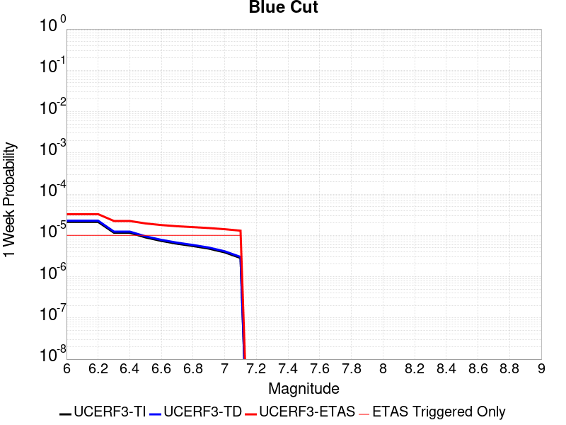 |  |  | 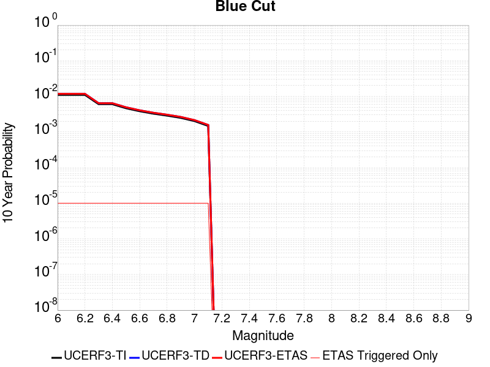 |

| Magnitude | 1 wk TI Prob | 1 wk TD Prob | 1 wk ETAS Prob | 1 wk ETAS/TD Gain | 1 wk ETAS Triggered Only | 1 mo TI Prob | 1 mo TD Prob | 1 mo ETAS Prob | 1 mo ETAS/TD Gain | 1 mo ETAS Triggered Only | 1 yr TI Prob | 1 yr TD Prob | 1 yr ETAS Prob | 1 yr ETAS/TD Gain | 1 yr ETAS Triggered Only | 10 yr TI Prob | 10 yr TD Prob | 10 yr ETAS Prob | 10 yr ETAS/TD Gain | 10 yr ETAS Triggered Only |
|-----|-----|-----|-----|-----|-----|-----|-----|-----|-----|-----|-----|-----|-----|-----|-----|-----|-----|-----|-----|-----|
| 6.0 | 2.1227985E-5 | 2.2719787E-5 | 3.271956E-5 | 1.440135 | 1.0E-5 | 9.097391E-5 | 9.736721E-5 | 1.07366235E-4 | 1.102694 | 1.0E-5 | 0.0011070445 | 0.0011848592 | 0.0011948473 | 1.0084298 | 1.0E-5 | 0.011015458 | 0.011791261 | 0.011801143 | 1.000838 | 1.0E-5 |
| 6.1 | 2.1227985E-5 | 2.2719787E-5 | 3.271956E-5 | 1.440135 | 1.0E-5 | 9.097391E-5 | 9.736721E-5 | 1.07366235E-4 | 1.102694 | 1.0E-5 | 0.0011070445 | 0.0011848592 | 0.0011948473 | 1.0084298 | 1.0E-5 | 0.011015458 | 0.011791261 | 0.011801143 | 1.000838 | 1.0E-5 |
| 6.2 | 2.1227985E-5 | 2.2719787E-5 | 3.271956E-5 | 1.440135 | 1.0E-5 | 9.097391E-5 | 9.736721E-5 | 1.07366235E-4 | 1.102694 | 1.0E-5 | 0.0011070445 | 0.0011848592 | 0.0011948473 | 1.0084298 | 1.0E-5 | 0.011015458 | 0.011791261 | 0.011801143 | 1.000838 | 1.0E-5 |
| 6.3 | 1.1613981E-5 | 1.23536465E-5 | 2.2353523E-5 | 1.8094676 | 1.0E-5 | 4.9773254E-5 | 5.2943193E-5 | 6.2942665E-5 | 1.1888717 | 1.0E-5 | 6.0582085E-4 | 6.444052E-4 | 6.5439875E-4 | 1.0155082 | 1.0E-5 | 0.0060417196 | 0.0064266133 | 0.006436549 | 1.001546 | 1.0E-5 |
| 6.4 | 1.1613981E-5 | 1.23536465E-5 | 2.2353523E-5 | 1.8094676 | 1.0E-5 | 4.9773254E-5 | 5.2943193E-5 | 6.2942665E-5 | 1.1888717 | 1.0E-5 | 6.0582085E-4 | 6.444052E-4 | 6.5439875E-4 | 1.0155082 | 1.0E-5 | 0.0060417196 | 0.0064266133 | 0.006436549 | 1.001546 | 1.0E-5 |
| 6.5 | 8.931326E-6 | 9.481677E-6 | 1.9481582E-5 | 2.0546558 | 1.0E-5 | 3.8276554E-5 | 4.063518E-5 | 5.063477E-5 | 1.2460822 | 1.0E-5 | 4.6591737E-4 | 4.9463013E-4 | 5.046252E-4 | 1.0202072 | 1.0E-5 | 0.0046494175 | 0.0049362015 | 0.004946152 | 1.0020158 | 1.0E-5 |
| 6.6 | 7.345353E-6 | 7.790341E-6 | 1.7790264E-5 | 2.2836308 | 1.0E-5 | 3.1479703E-5 | 3.3386797E-5 | 4.3386462E-5 | 1.2995096 | 1.0E-5 | 3.83198E-4 | 4.0641645E-4 | 4.164124E-4 | 1.0245953 | 1.0E-5 | 0.0038253788 | 0.0040575233 | 0.004067483 | 1.0024545 | 1.0E-5 |
| 6.7 | 6.2775666E-6 | 6.655202E-6 | 1.6655136E-5 | 2.502574 | 1.0E-5 | 2.690358E-5 | 2.8522025E-5 | 3.852174E-5 | 1.3505962 | 1.0E-5 | 3.2750185E-4 | 3.4720785E-4 | 3.5720438E-4 | 1.0287912 | 1.0E-5 | 0.0032701963 | 0.0034673947 | 0.0034773601 | 1.002874 | 1.0E-5 |
| 6.8 | 5.5234095E-6 | 5.8551577E-6 | 1.58551E-5 | 2.707886 | 1.0E-5 | 2.367154E-5 | 2.5093334E-5 | 3.5093082E-5 | 1.3985022 | 1.0E-5 | 2.8816288E-4 | 3.0547578E-4 | 3.1547272E-4 | 1.0327258 | 1.0E-5 | 0.002877895 | 0.003051275 | 0.0030612443 | 1.0032673 | 1.0E-5 |
| 6.9 | 4.7780054E-6 | 5.0654608E-6 | 1.50654105E-5 | 2.974144 | 1.0E-5 | 2.0477004E-5 | 2.1708976E-5 | 3.170876E-5 | 1.460629 | 1.0E-5 | 2.4927902E-4 | 2.6428179E-4 | 2.7427915E-4 | 1.0378284 | 1.0E-5 | 0.0024899957 | 0.0026403673 | 0.0026503408 | 1.0037774 | 1.0E-5 |
| 7.0 | 3.883171E-6 | 4.1185203E-6 | 1.4118479E-5 | 3.4280465 | 1.0E-5 | 1.6642054E-5 | 1.765072E-5 | 2.7650543E-5 | 1.5665392 | 1.0E-5 | 2.0259817E-4 | 2.1488321E-4 | 2.2488106E-4 | 1.0465269 | 1.0E-5 | 0.0020241356 | 0.00214743 | 0.0021574085 | 1.0046468 | 1.0E-5 |
| 7.1 | 2.8358215E-6 | 3.0097403E-6 | 1.30097105E-5 | 4.3225355 | 1.0E-5 | 1.2153464E-5 | 1.289886E-5 | 2.2898732E-5 | 1.7752522 | 1.0E-5 | 1.4795837E-4 | 1.5703888E-4 | 1.6703732E-4 | 1.0636685 | 1.0E-5 | 0.001478599 | 0.0015699244 | 0.0015799087 | 1.0063597 | 1.0E-5 |

## Hayward (So) 2011 CFM
*[(top)](#table-of-contents)*

| 1 Week | 1 Month | 1 Year | 10 Year |
|-----|-----|-----|-----|
|  |  | 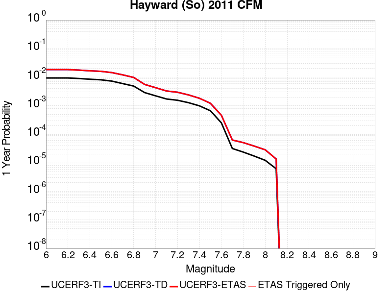 | 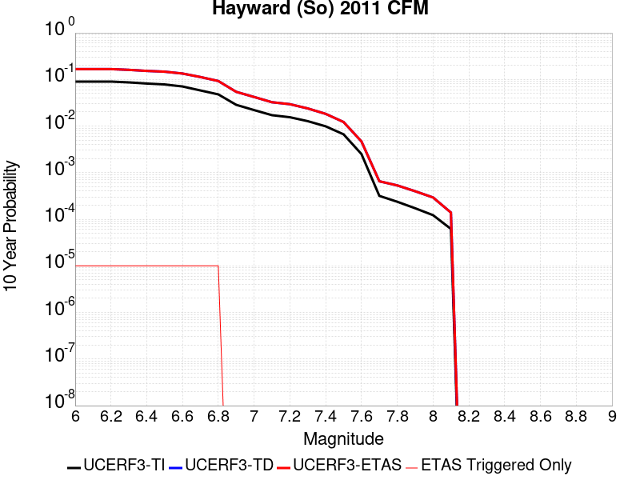 |

| Magnitude | 1 wk TI Prob | 1 wk TD Prob | 1 wk ETAS Prob | 1 wk ETAS/TD Gain | 1 wk ETAS Triggered Only | 1 mo TI Prob | 1 mo TD Prob | 1 mo ETAS Prob | 1 mo ETAS/TD Gain | 1 mo ETAS Triggered Only | 1 yr TI Prob | 1 yr TD Prob | 1 yr ETAS Prob | 1 yr ETAS/TD Gain | 1 yr ETAS Triggered Only | 10 yr TI Prob | 10 yr TD Prob | 10 yr ETAS Prob | 10 yr ETAS/TD Gain | 10 yr ETAS Triggered Only |
|-----|-----|-----|-----|-----|-----|-----|-----|-----|-----|-----|-----|-----|-----|-----|-----|-----|-----|-----|-----|-----|
| 6.0 | 1.8091932E-4 | 3.5710505E-4 | 3.5710505E-4 | 1.0 | 0.0 | 7.751381E-4 | 0.0015295624 | 0.0015295624 | 1.0 | 0.0 | 0.00939654 | 0.018465819 | 0.018465819 | 1.0 | 0.0 | 0.090090066 | 0.16673753 | 0.16674586 | 1.00005 | 1.0E-5 |
| 6.1 | 1.8091932E-4 | 3.5710505E-4 | 3.5710505E-4 | 1.0 | 0.0 | 7.751381E-4 | 0.0015295624 | 0.0015295624 | 1.0 | 0.0 | 0.00939654 | 0.018465819 | 0.018465819 | 1.0 | 0.0 | 0.090090066 | 0.16673753 | 0.16674586 | 1.00005 | 1.0E-5 |
| 6.2 | 1.8091932E-4 | 3.5710505E-4 | 3.5710505E-4 | 1.0 | 0.0 | 7.751381E-4 | 0.0015295624 | 0.0015295624 | 1.0 | 0.0 | 0.00939654 | 0.018465819 | 0.018465819 | 1.0 | 0.0 | 0.090090066 | 0.16673753 | 0.16674586 | 1.00005 | 1.0E-5 |
| 6.3 | 1.7322872E-4 | 3.426729E-4 | 3.426729E-4 | 1.0 | 0.0 | 7.4219756E-4 | 0.0014677811 | 0.0014677811 | 1.0 | 0.0 | 0.0089988755 | 0.017726082 | 0.017726082 | 1.0 | 0.0 | 0.08643075 | 0.16068551 | 0.16069391 | 1.0000522 | 1.0E-5 |
| 6.4 | 1.6334097E-4 | 3.2348928E-4 | 3.2348928E-4 | 1.0 | 0.0 | 6.998449E-4 | 0.0013856548 | 0.0013856548 | 1.0 | 0.0 | 0.008487372 | 0.016741859 | 0.016741859 | 1.0 | 0.0 | 0.081704415 | 0.1525672 | 0.15257567 | 1.0000556 | 1.0E-5 |
| 6.5 | 1.5600289E-4 | 3.102356E-4 | 3.102356E-4 | 1.0 | 0.0 | 6.684125E-4 | 0.001328912 | 0.001328912 | 1.0 | 0.0 | 0.008107598 | 0.016061366 | 0.016061366 | 1.0 | 0.0 | 0.078181036 | 0.14684398 | 0.14685251 | 1.000058 | 1.0E-5 |
| 6.6 | 1.4046066E-4 | 2.8037324E-4 | 2.8037324E-4 | 1.0 | 0.0 | 6.018354E-4 | 0.001201053 | 0.001201053 | 1.0 | 0.0 | 0.0073027555 | 0.014526278 | 0.014526278 | 1.0 | 0.0 | 0.07067384 | 0.1339279 | 0.13393655 | 1.0000646 | 1.0E-5 |
| 6.7 | 1.14696966E-4 | 2.3275505E-4 | 2.3275505E-4 | 1.0 | 0.0 | 4.914658E-4 | 9.971453E-4 | 9.971453E-4 | 1.0 | 0.0 | 0.0059671924 | 0.01207373 | 0.01207373 | 1.0 | 0.0 | 0.058094822 | 0.11274096 | 0.11274984 | 1.0000787 | 1.0E-5 |
| 6.8 | 9.3874296E-5 | 1.886479E-4 | 1.886479E-4 | 1.0 | 0.0 | 4.0225635E-4 | 8.0824416E-4 | 8.0824416E-4 | 1.0 | 0.0 | 0.0048864787 | 0.009796709 | 0.009796709 | 1.0 | 0.0 | 0.047804173 | 0.0925935 | 0.09260257 | 1.000098 | 1.0E-5 |
| 6.9 | 5.551852E-5 | 1.0731538E-4 | 1.0731538E-4 | 1.0 | 0.0 | 2.3791482E-4 | 4.5984262E-4 | 4.5984262E-4 | 1.0 | 0.0 | 0.0028927654 | 0.0055843308 | 0.0055843308 | 1.0 | 0.0 | 0.028553981 | 0.05424729 | 0.05424729 | 1.0 | 0.0 |
| 7.0 | 4.2662363E-5 | 8.2480685E-5 | 8.2480685E-5 | 1.0 | 0.0 | 1.8282588E-4 | 3.5344114E-4 | 3.5344114E-4 | 1.0 | 0.0 | 0.0022236328 | 0.004294729 | 0.004294729 | 1.0 | 0.0 | 0.022015138 | 0.042071674 | 0.042071674 | 1.0 | 0.0 |
| 7.1 | 3.305886E-5 | 6.303226E-5 | 6.303226E-5 | 1.0 | 0.0 | 1.4167312E-4 | 2.701104E-4 | 2.701104E-4 | 1.0 | 0.0 | 0.0017235056 | 0.0032836539 | 0.0032836539 | 1.0 | 0.0 | 0.017101998 | 0.03245839 | 0.03245839 | 1.0 | 0.0 |
| 7.2 | 2.9856887E-5 | 5.7026133E-5 | 5.7026133E-5 | 1.0 | 0.0 | 1.2795182E-4 | 2.443749E-4 | 2.443749E-4 | 1.0 | 0.0 | 0.0015567001 | 0.002971222 | 0.002971222 | 1.0 | 0.0 | 0.015458403 | 0.029458838 | 0.029458838 | 1.0 | 0.0 |
| 7.3 | 2.4559737E-5 | 4.6001245E-5 | 4.6001245E-5 | 1.0 | 0.0 | 1.0525176E-4 | 1.9713337E-4 | 1.9713337E-4 | 1.0 | 0.0 | 0.0012806869 | 0.00239747 | 0.00239747 | 1.0 | 0.0 | 0.012733313 | 0.02386188 | 0.02386188 | 1.0 | 0.0 |
| 7.4 | 1.9002231E-5 | 3.505791E-5 | 3.505791E-5 | 1.0 | 0.0 | 8.143559E-5 | 1.5023959E-4 | 1.5023959E-4 | 1.0 | 0.0 | 9.910273E-4 | 0.0018276422 | 0.0018276422 | 1.0 | 0.0 | 0.009866194 | 0.018261842 | 0.018261842 | 1.0 | 0.0 |
| 7.5 | 1.2783333E-5 | 2.3334587E-5 | 2.3334587E-5 | 1.0 | 0.0 | 5.4784563E-5 | 1.00001576E-4 | 1.00001576E-4 | 1.0 | 0.0 | 6.667979E-4 | 0.0012168449 | 0.0012168449 | 1.0 | 0.0 | 0.006648007 | 0.012210775 | 0.012210775 | 1.0 | 0.0 |
| 7.6 | 4.8149627E-6 | 8.889608E-6 | 8.889608E-6 | 1.0 | 0.0 | 2.063539E-5 | 3.809777E-5 | 3.809777E-5 | 1.0 | 0.0 | 2.5120692E-4 | 4.6374285E-4 | 4.6374285E-4 | 1.0 | 0.0 | 0.0025092314 | 0.004681107 | 0.004681107 | 1.0 | 0.0 |
| 7.7 | 6.0838227E-7 | 1.2063123E-6 | 1.2063123E-6 | 1.0 | 0.0 | 2.6073499E-6 | 5.1699E-6 | 5.1699E-6 | 1.0 | 0.0 | 3.174402E-5 | 6.294171E-5 | 6.294171E-5 | 1.0 | 0.0 | 3.1739488E-4 | 6.5322954E-4 | 6.5322954E-4 | 1.0 | 0.0 |
| 7.8 | 4.5542808E-7 | 9.797777E-7 | 9.797777E-7 | 1.0 | 0.0 | 1.9518332E-6 | 4.1990406E-6 | 4.1990406E-6 | 1.0 | 0.0 | 2.376331E-5 | 5.1122122E-5 | 5.1122122E-5 | 1.0 | 0.0 | 2.3760769E-4 | 5.3240365E-4 | 5.3240365E-4 | 1.0 | 0.0 |
| 7.9 | 3.3016747E-7 | 7.3905267E-7 | 7.3905267E-7 | 1.0 | 0.0 | 1.4150027E-6 | 3.1673646E-6 | 3.1673646E-6 | 1.0 | 0.0 | 1.7227521E-5 | 3.8561986E-5 | 3.8561986E-5 | 1.0 | 0.0 | 1.7226185E-4 | 3.9950482E-4 | 3.9950482E-4 | 1.0 | 0.0 |
| 8.0 | 2.347038E-7 | 5.4744874E-7 | 5.4744874E-7 | 1.0 | 0.0 | 1.0058731E-6 | 2.3462067E-6 | 2.3462067E-6 | 1.0 | 0.0 | 1.2246436E-5 | 2.8564695E-5 | 2.8564695E-5 | 1.0 | 0.0 | 1.2245761E-4 | 2.936959E-4 | 2.936959E-4 | 1.0 | 0.0 |
| 8.1 | 1.18822804E-7 | 2.60728E-7 | 2.60728E-7 | 1.0 | 0.0 | 5.092405E-7 | 1.1174052E-6 | 1.1174052E-6 | 1.0 | 0.0 | 6.1999854E-6 | 1.3604324E-5 | 1.3604324E-5 | 1.0 | 0.0 | 6.199812E-5 | 1.3924051E-4 | 1.3924051E-4 | 1.0 | 0.0 |

